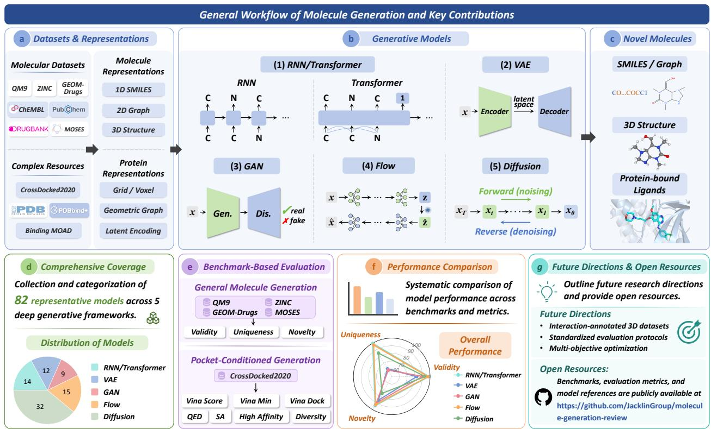
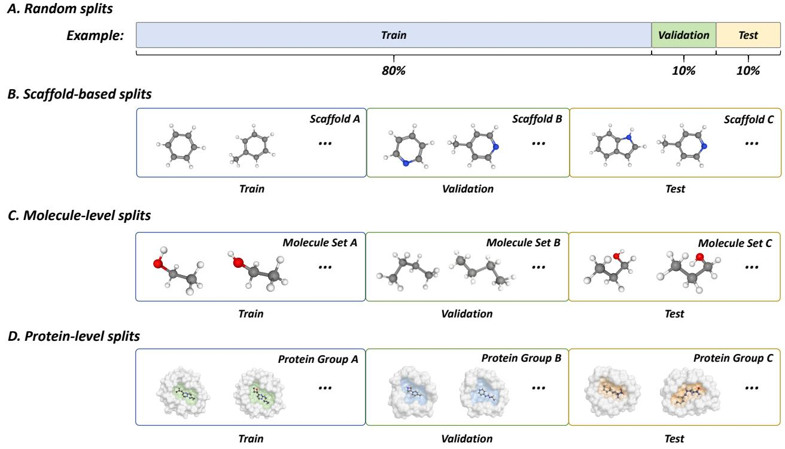
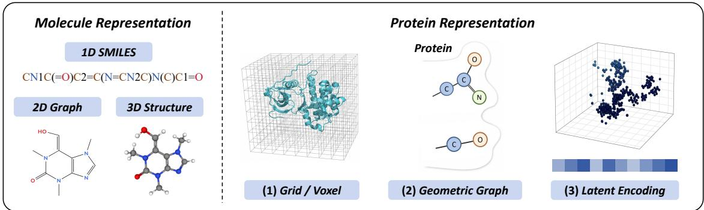
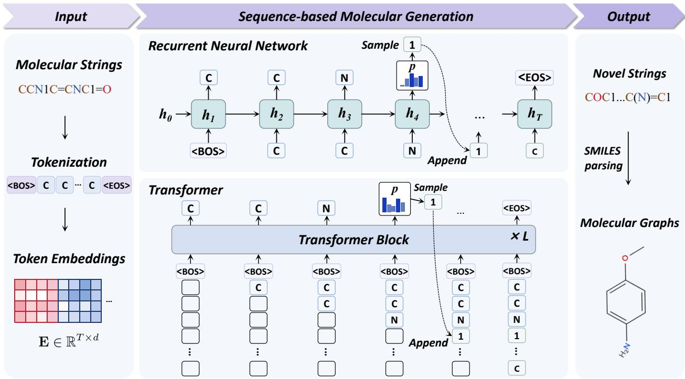
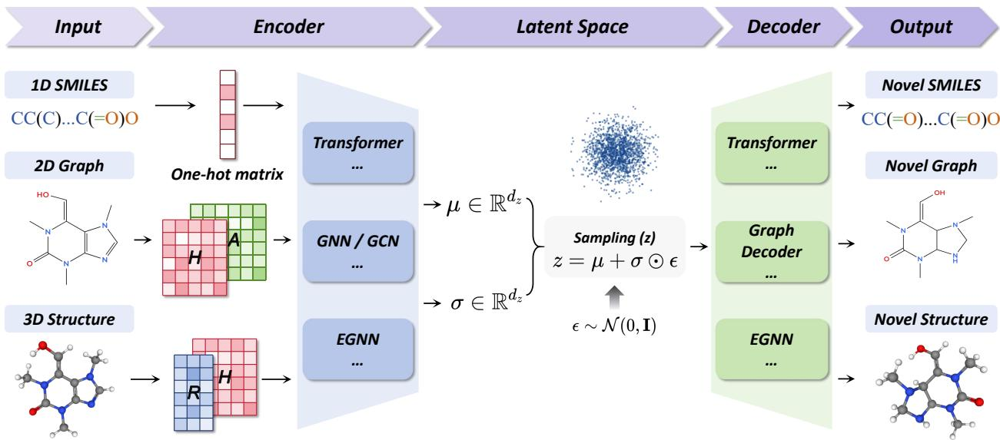
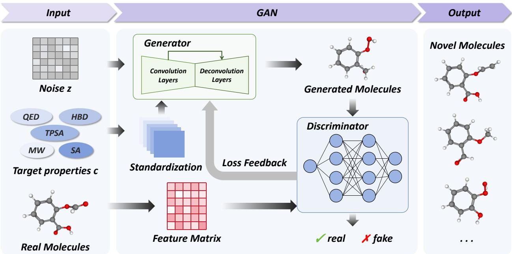
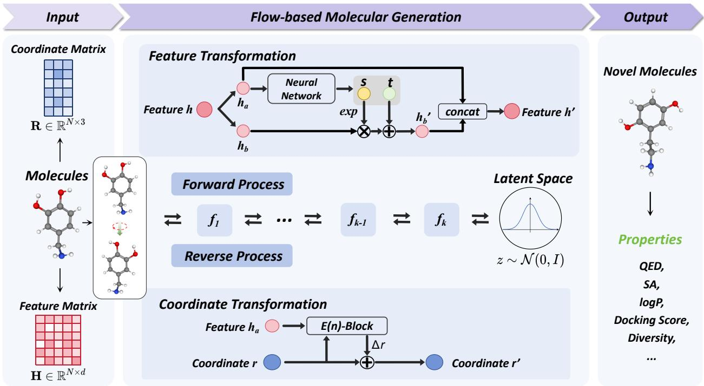
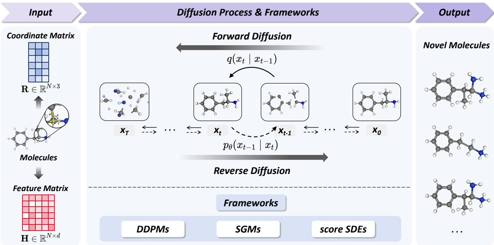

# A Systematic Evaluation of Molecule Generation Models for De Novo Drug Design: From Benchmarks to Practical Insights

Xinrui Xu1, Xueer Wang1, Dan Luo\*2, Sisi Yuan\*3, and Xuan Lin\*1

1School of Computer Science, Xiangtan University, Xiangtan 411105, China 2College of Computer Science and Electronic Engineering, Hunan University, Changsha 410082, China

3School of Chinese Medicine, Hong Kong Baptist University, 15 Baptist University Road, Kowloon Tong 999077, Kowloon, Hong Kong SAR, China

\*Email: dluo.ac@gmail.com; sisiyuan@hkbu.edu.hk; jack\_lin@xtu.edu.cn

## Abstract

Molecule generation has emerged as a powerful computational tool for de novo drug design, enabling the exploration of chemical space beyond the limits of conventional virtual screening. The field has progressed rapidly, driven by advances in molecular representations, generative architectures, and target-aware modeling strategies. However, existing reviews typically address specific model families or application scenarios in isolation, rather than ofering an integrated perspective on how these com ponents collectively form a coherent generation workflow. In this review, we present a comprehensive evaluation of molecule generation models for de novo drug design, covering 82 methods across five deep generative frameworks, including recurrent neural network (RNN)- and Transformer-based models, variational autoencoders (VAEs), generative adversarial networks (GANs), flow-based models, and difusion models. We first summarize widely used benchmarks and molecular representations, and then examine the methodological principles underlying both general and pocket-conditioned generation. A centra contribution of this work is a systematic synthesis and comparative analysis of reported performance across commonly used benchmarks and evaluation metrics. We also summarize representative experi mentally validated case studies. Looking ahead, we discuss future directions in standardized 3D data, interaction-aware generation, receptor flexibility, and multi-objective molecular design, with the aim of improving the reliability and experimental relevance of molecule generation. All collected benchmark resources, evaluation metrics, and model references are provided in a publicly accessible repository at https://github.com/JacklinGroup/molecule-generation-review.

## Keywords

molecule generation, deep generative models, de novo drug design, molecular representation

## 1 Introduction

The central challenge of drug discovery lies in identifying novel bioactive molecules within the vast chemical space, which is estimated to contain up to $1 0 ^ { 6 0 }$ molecules [1]. Traditional virtual screening strategies rely heavily on predefined compound libraries and high-throughput computational screening, which can be time- and resource-intensive and restrict molecular exploration to available compounds and their close analogues. These limitations have motivated the development of de novo drug design, which aims to construct novel molecules from scratch rather than select candidates from existing libraries. Molecule generation has therefore become a central computational step in de novo drug design, enabling models to more efectively learn molecular distributions and propose chemically valid and diverse structures for subsequent evaluation, screening, and candidate prioritization.

  
Figure 1. Overview of the molecule generation workflow and key contributions of this review. (a) Molecular and protein structure data are curated from public databases and encoded into suitable representations, including 1D SMILES sequences, 2D molecular graphs, and 3D geometric structures for molecules, as well as grid- or voxel-based, graph-based, and latent encodings for proteins. (b) These representations are then fed into five major classes of generative models which learn the data distribution through distinct mechanisms (e.g., autoregressive sequence modeling, latent-space sampling, adversarial training, invertible transformations, or iterative denoising). (c) The trained models generate three types of molecular outputs: SMILESor graph-based molecules, 3D molecular structures, and protein-bound ligands. (d) This review collects and categorizes 82 representative molecule generation models across five major deep generative frameworks. (e) Benchmark-based evaluations are organized for both general molecule generation and pocket-conditioned generation tasks using widely adopted datasets and metrics. (f) Model performance is systematically compared across benchmarks and evaluation metrics. (g) Future research directions are outlined, and benchmarks, evaluation metrics, and model references are made publicly available through an open repository.

Molecule generation can be organized as a workflow. As shown in Figure 1, the workflow begins with chemical and structural datasets [2], from which molecular data and target-related structural information are collected and curated. Molecules can be represented as sequences, molecular graphs, or structures, whereas protein environments can be encoded using grids or voxels, geometric graphs, latent embeddings, and other structural representations [3]. These representations are subsequently processed by major deep generative frameworks, including recurrent neural network (RNN)/Transformer-based, variational autoencoder (VAE)-based, generative adversarial network (GAN)-based, flow-based, and difusion-based models, to learn molecular distributions and generate novel candidate molecules, with pocket-conditioned variants further incorporating protein-pocket information to guide target-specific generation. The generated molecules are then evaluated in terms of chemical validity, novelty, drug-likeness, synthesizability, and, where applicable, target relevance, thereby providing a pool of screenable and computationally tractable candidates for subsequent analysis and prioritization. Existing reviews have summarized molecule generation from specific perspectives, including 3D generation, difusion models, and graph-based generative models [4], [5], [6], [7]. For example, 3D deep generative models have been reviewed mainly from the perspectives of 3D molecular representations, generation strategies, and associated challenges [8], while geometric deep learning for structure-based drug design has been surveyed with emphasis on molecular property prediction, ligand binding-site prediction, pose prediction, and structure-based drug design [9]. However, most existing reviews organize the field around individual model families or specific application scenarios, providing limited integration across the overall molecule generation workflow. In particular, relatively few studies connect model taxonomy with benchmark frameworks, protocol-aware performance interpretation, and evidence from practical drug design applications. In contrast, this review integrates these aspects to provide a systematic evaluation of molecule generation models from methodological foundations to benchmark performance and practical implications.

To address this gap, this review is organized around three successive questions: what molecular information generative models learn and how it is represented, how generative frameworks and pocket-conditioned strategies construct novel molecules, and how reported performance and practical utility should be evaluated and interpreted across benchmarks. Accordingly, Section 2 summarizes representative benchmark datasets and evaluation frameworks, while Section 3 reviews molecular and protein-pocket representations. Section 4 introduces RNN/Transformer-based, VAE-based, GAN-based, flow-based, and difusion-based frameworks, followed by their training objectives and pocket-conditioned extensions. Section 5 presents a comparative performance analysis by first defining commonly used evaluation metrics and then examining reported results on QM9, ZINC, GEOM-Drugs, MOSES, and CrossDocked2020. Section 6 discusses current limitations and future directions. To summarize, the main contributions of this work are as follows:

(i) Model taxonomy. We provide a systematic taxonomy covering 82 representative molecule generation models across five generative frameworks, ofering a structured entry point for researchers navigating this rapidly expanding field.

(ii) Benchmark-based performance synthesis. We systematically compile and compare literature-reported results across commonly used benchmarks and evaluation metrics. For pocket-conditioned generation, we further summarize the docking evaluation protocols used across representative models to facilitate careful interpretation of reported docking performance.

(iii) From in silico to in vitro: a curated collection of experimentally validated case studies. While most reviews focus exclusively on computational metrics, we bridge the gap between virtual design and experimental practice by compiling eight representative case studies in which computationally generated molecules have been synthesized and experimentally tested (Table 5). These cases span diverse targets and diseases, and we analyze them along three axes: (a) the generative strategy employed; (b) the approach and level of experimental validation; and (c) lessons learned that can be drawn regarding the translation of computationally generated molecules into experimentally validated candidates. This analysis provides a practical perspective on the extent to which current molecular generative methods have progressed beyond computational benchmarking toward experimental evaluation.

(iv) Abundant resources. We have compiled an organized collection of resources related to the reviewed models, including links to benchmark datasets, original papers, and available code repositories. These resources can be accessed at https://github.com/JacklinGroup/molecule-generation-review, which will be continuously updated.

(v) Future directions. We discuss the limitations of existing studies and suggest future directions toward more reliable and decision-oriented molecule generation.

## 2 Benchmarking and Evaluation of Molecule Generation

Benchmarking molecular generative models requires both representative datasets and evaluation protocols that capture diferent aspects of model performance. This section reviews commonly used benchmark datasets and evaluation frameworks for molecule generation, optimization, 3D structural quality, and structure-based generation.

Table 1. Summary of Representative Data Resources and Benchmarks for Molecule Generation. Data were collected in May 2026.
<table><tr><td>Dataset</td><td>Version</td><td>Entries</td><td>Latest Update</td><td>Link</td></tr><tr><td>QM9 [10]</td><td></td><td>133,885</td><td>2014</td><td>link</td></tr><tr><td>ZINC-22 [11]</td><td>v22</td><td>54,900,000,000</td><td>2024</td><td>link</td></tr><tr><td>GEOM-Drugs [12]</td><td></td><td>304,466</td><td>2022</td><td>link</td></tr><tr><td>ChEMBL [13], [14]</td><td>v37</td><td>2,921,148</td><td>2026</td><td>link</td></tr><tr><td>PubChem [15]</td><td></td><td>123,000,000</td><td>2026</td><td>link</td></tr><tr><td>DrugBank [16]</td><td>v6.0</td><td>19,872</td><td>2026</td><td>link</td></tr><tr><td>MOSES [17]</td><td></td><td>1,936,962</td><td>2020</td><td>link</td></tr><tr><td>CrossDocked2020 [18]</td><td>v1.3</td><td>22,500,000</td><td>2024</td><td>link</td></tr><tr><td>RCSB PDB [19]</td><td></td><td>254,978</td><td>2026</td><td>link</td></tr><tr><td>PDBbind [20]</td><td>v2020.R1</td><td>29,001</td><td>2020</td><td>link</td></tr><tr><td>Binding MOAD [21]</td><td></td><td>41,409</td><td>2023</td><td>link</td></tr></table>

## 2.1 Benchmark Datasets

Datasets provide the empirical basis for training, validating, and comparing molecule generation models. As summarized in Table 1, existing resources cover diferent levels of molecular information, ranging from ligand only molecular corpora and quantum-chemical datasets to conformer ensembles, protein–ligand complexes, structural biology repositories, and drug-centered databases. These datasets determine what molecular, geometric, biological, and pharmacological information can be learned, and they also influence the choice of generation tasks, evaluation metrics, and generalization settings in molecule generation.

QM9. QM9 is a quantum-chemical dataset of approximately 134,000 small neutral organic molecules containing C, H, N, O, and F, with SMILES strings, density-functional-theory-optimized equilibrium geometries, and computed geometric, energetic, electronic, and thermodynamic properties [10]. It is widely used for molecular property prediction and as a benchmark for two- and three-dimensional molecule generation, including the evaluation of the chemical validity and geometric quality of generated small molecules.

ZINC-22. ZINC-22 is a free, multi-billion-scale database of commercially available compounds, searchable in two-dimensional form, with a large subset prepared in biologically relevant, ready-to-dock three-dimensional formats [11]. ZINC-derived subsets are widely used for virtual screening, ligand-centric molecule generation, molecular optimization, and exploration of drug-like chemical space.

GEOM-Drugs. GEOM-Drugs contains drug-like molecules represented by molecular graphs and ensembles of three-dimensional conformers annotated with energies and statistical weights [12]. It is mainly used for conformer generation, ensemble-aware property prediction, three-dimensional molecule generation, geometry modeling, and conformational diversity analysis.

ChEMBL. ChEMBL is a manually curated bioactivity database that links molecular structures, biological targets, assay records, and quantitative activity measurements [13], [14]. It is widely used for bioactivity prediction, quantitative structure–activity relationship modeling, target–ligand modeling, and bioactivityguided molecule generation and optimization.

PubChem. PubChem is a large, integrated public chemical database containing standardized compound structures, deposited substances, identifiers, physicochemical annotations, literature and patent information, and bioassay data [15]. It is commonly used for large-scale molecular pretraining and representation learning, property and bioactivity prediction, chemical similarity and substructure searches, and the construction of molecular datasets at scale.

DrugBank. DrugBank is a drug-centered knowledgebase integrating molecular structures, approved and investigational drugs, biological targets, mechanisms of action, pharmacological annotations, and drug interaction information [16]. It is mainly used for drug repurposing, drug–target and drug–drug interaction prediction, pharmacological and mechanism-of-action modeling, and reference-based analysis of approved and clinically investigated compounds

MOSES. MOSES is a SMILES-based molecule generation benchmark derived from the ZINC Clean Leads collection and designed to standardize the training and evaluation of generative models using unified datasets and metrics [17]. It is mainly used in practice for ligand-centric distribution learning, validity, novelty, and diversity evaluation, distribution-similarity assessment, and evaluation of the ability to generate scafolds absent from the training set.

CrossDocked2020. CrossDocked2020 is a structure-based machine-learning dataset containing protein structures and approximately 22.5 million docked ligand poses generated across structurally related binding sites [18]. In pocket-conditioned molecule generation, studies commonly use filtered subsets that retain highquality docked poses and separate training and test pockets according to protein-similarity criteria. These subsets support pocket-conditioned generation, docking-based evaluation, and assessment of generalization to unseen or dissimilar binding pockets.

RCSB PDB. RCSB PDB provides access to experimentally determined three-dimensional structures of proteins, nucleic acids, and other biological macromolecules and their complexes, together with atomic coordinates and associated structural and experimental metadata [19]. It is commonly used to obtain protein structures, ligand-bound complexes, binding pockets, and structural templates for protein-conditioned generation, molecular docking, and structure-based modeling.

PDBbind. PDBbind collects three-dimensional biomolecular complex structures from the PDB and links them to experimentally measured binding-afinity data [20]. It is widely used for binding-afinity prediction, scoring-function development, docking and pose scoring, and protein–ligand interaction modeling.

Binding MOAD. Binding MOAD is a curated database of protein–ligand complex structures with biologically relevant ligands and experimentally measured binding afinities when available, and is now maintained as a final archived resource [21]. It has been used as a source of curated complexes for molecular docking, protein–ligand recognition, binding-site analysis, afinity modeling, and the training or evaluation of structure-based molecule generation methods.

Dataset splitting protocols. Common dataset splitting strategies used in molecule generation are illustrated in Figure 2. Specifically, (a) random splits, such as an 80:10:10 division into training, validation, and test sets, are widely used for model training and evaluation [2]. (b) Scafold-based splits separate molecules according to their molecular scafolds and are commonly used to assess generalization to unseen chemotypes [17]. (c) Molecule-level splits assign diferent molecules to separate subsets and are particularly suitable for conformer and 3D datasets, ensuring that all conformers of the same molecule remain in the same subset [22]. (d) Protein-level splits separate protein–ligand complexes according to proteins, typically using protein clustering or sequence identity, to reduce information leakage and evaluate generalization to unseen proteins or protein families [23]. Overall, random splits mainly assess performance on molecules similar to the training data, whereas scafold- and protein-level splits provide stricter assessments of molecular and biological generalization.

## 2.2 Evaluation Benchmarks

Beyond benchmark datasets, several evaluation benchmarks have been developed to provide standardized procedures for assessing molecular generative models. They define task-specific evaluation settings and metrics, facilitating more consistent and reproducible comparisons across diferent methods.

GuacaMol. GuacaMol is an open-source Python package for benchmarking models in de novo drug design [24]. It comprises five distribution-learning benchmarks and 20 goal-directed benchmarks, with six and five baseline methods evaluated, respectively. For distribution-learning evaluation, a generative model is trained on a standardized subset of ChEMBL and then generates a specified number of molecules for evaluation by GuacaMol. The generated molecules are assessed for validity, uniqueness, and novelty, while Kullback–Leibler (KL) divergence and Fréchet ChemNet Distance (FCD) compare the generated distributions with training distributions. GuacaMol also provides goal-directed benchmarks, in which the model is given a predefined scoring function to generate molecules that maximize the corresponding objective. The code is available at https://github.com/BenevolentAI/guacamol.

Practical Molecular Optimization (PMO). PMO is an open-source benchmark designed to facilitate the transparent and reproducible evaluation of algorithmic advances in molecular optimization [25]. It provides 25 molecular design algorithms across 23 tasks, with a special emphasis on sample eficiency. To reduce dataset bias, PMO uses ZINC for pretraining and initialization where applicable. For each of its 23 single-objective optimization tasks, an algorithm iteratively proposes molecules, which are evaluated by a task-specific oracle. The resulting scores guide subsequent proposals, forming a repeated generation– evaluation–optimization process. Performance is summarized by the area under the curve (AUC) of the Top-10 molecules, abbreviated as AUC Top-10. The curve plots the average score of the top-10 molecules found so far against the cumulative number of oracle calls. Thus, methods that reach high objective scores earlier within the oracle budget achieve larger AUC values, reflecting greater sample eficiency. The complete codebase is publicly available at https://github.com/wenhao-gao/mol\_opt.

  
Figure 2. Representative dataset splitting strategies used in molecule generation, including (a) random splits, (b) scafold-based splits, (c) molecule-level splits, and (d) protein-level splits.

PoseBusters. PoseBusters is a test suite for assessing the chemical and physical validity of protein– ligand poses [26]. Generated poses are subjected to checks of chemical consistency, intramolecular geometry, and intermolecular interactions. A pose that passes all applicable checks is classified as PB-valid, and diferent methods can be compared by the proportion of PB-valid poses they produce. In the original study, seven docking methods were evaluated on the Astex Diverse set (85 complexes) and the more challenging PoseBusters Benchmark set (308 unseen complexes). The code is available at https://github.com/maabu u/posebusters.

PoseCheck. PoseCheck is a package for assessing the quality of generated protein–ligand complexes from 3D target-conditioned generative models [27]. For each generated protein–ligand pose, it evaluates steric clashes, ligand strain energy, and protein–ligand interaction fingerprints. The ligand is then redocked, and changes in pose and interactions are examined to determine whether redocking substantially corrects the original generated pose. In the original study, seven generative models were evaluated on 100 test protein pockets from CrossDocked2020, with 100 molecules generated per target. The code is available at https://github.com/cch1999/posecheck.

GenBench3D. GenBench3D is a benchmark designed for evaluating deep learning models that generate 3D molecules [28]. It integrates molecular graph metrics, molecular conformation metrics, pocket-based metrics, and binding afinity metrics. Its central metric, Validity3D, assesses whether generated conformations exhibit plausible bond lengths and valence angles based on reference distributions from the Cambridge Structural Database (CSD), while also checking intramolecular steric clashes and puckered aromatic rings. The framework also evaluates conformation diversity and novelty, protein–ligand clashes, and binding afinity using Vina, Glide, and GOLD PLP. In the original study, GenBench3D was used to benchmark six structure-based 3D molecular generative models. All the code to benchmark models is available at https://github.com/bbaillif/genbench3d.

  
Figure 3. Overview of molecular and protein-pocket representations for molecule generation.

## 3 Representation

Molecular representation is the foundation of molecule generation [29]. It determines how chemical structures are encoded for learning, what information is preserved or discarded, and whether generated candidates remain syntactically valid and chemically meaningful [30]. Representation choices directly shape a model’s ability to capture validity constraints, topological patterns, stereochemistry, and conformational behavior [31], [32], [33]. When protein-pocket information is incorporated, the selected representation also determines how geometric and physicochemical interaction cues are provided to the generative model [34], [35]. A schematic overview of representative molecular and protein-pocket representations used across generative modeling pipelines is shown in Figure 3.

## 3.1 Molecular Representations

Molecular representations determine how chemical structures are encoded and therefore strongly influence the learning objectives, model architectures, and chemical constraints used in molecule generation. At the one-dimensional level, molecules are represented as linear strings. SMILES encodes a molecular graph through atom symbols, bond symbols, branches, and ring-closure tokens, ofering a compact representation that is well suited to sequence models but sensitive to syntax errors and atom-ordering choices [36], [37]. Randomized SMILES alleviates atom-ordering dependence by providing multiple valid string encodings of the same molecular graph, whereas Self-Referencing Embedded Strings (SELFIES) uses semantic constraints to ensure that every SELFIES string can be decoded into a valid molecular structure, thereby substantially improving representation robustness [38]. DeepSMILES modifies the treatment of branches and rings to reduce common syntax errors, while InChI provides a standardized, layered identifier designed primarily for canonical structure representation rather than direct molecule generation [39], [40]. Beyond atom-level strings, fragment- or motif-based representations decompose molecules into chemically meaningful substructures, such as rings, functional groups, scafolds, or junction-tree nodes. These higher-level units can reduce the number of low-level generation steps and help preserve local chemical validity, making them particularly useful for scafold-aware and substructure-based generation [41], [42], [43]. Learned molecular language representations, including Mol2Vec embeddings and Transformer-based encodings, further map molecular tokens or substructures into continuous embedding spaces that capture statistical and semantic relationships across chemical corpora [32], [44].

At the two-dimensional level, molecules are represented as graphs in which atoms form nodes and chemical bonds form edges. Node features may encode element type, formal charge, hybridization, aromaticity, and stereochemistry, whereas edge features typically describe bond type, conjugation, and ring membership. Graph neural networks (GNNs) propagate and aggregate information across neighboring atoms to learn local and global molecular features [45], [46], [47], [48], [49]. Graph-based generative models can then construct molecules atom by atom, bond by bond, or through larger substructures, with connectivity and valence constraints imposed during generation or post-processing [41], [42]. Three-dimensional representations extend molecular graphs by associating atoms with Cartesian coordinates and, in some cases, pairwise distances, bond angles, torsional angles, local frames, or molecular surfaces. Because molecular properties and intermolecular interactions depend on geometry, 3D generative models commonly adopt E(3)- or SE(3)- equivariant architectures so that their outputs transform consistently under rotation and translation [50], [51], [52]. These representations support conformation-aware generation, joint topology–geometry modeling, and protein–ligand interaction modeling. Continuous spatial representations provide an alternative to discrete atom-coordinate representations. Electron-density and electrostatic-potential fields describe electronic or interaction-relevant quantities distributed in three-dimensional space, whereas voxelized atomic-density grids encode molecular composition and shape on regular spatial lattices [53], [54], [55].

## 3.2 Protein-Pocket and Interaction-Aware Representations

Protein information can be represented at multiple levels, ranging from amino acid sequences and pairwise residue relationships to explicit three-dimensional pocket structures. Sequence-derived representations encode residue identity and, when obtained from evolutionary profiles or pretrained protein language models, may also capture evolutionary and contextual information, but they only indirectly reflect the spatial and chemical environment of the binding pocket. Contact and distance maps provide coarse pairwise structural constraints but do not preserve full spatial orientation, atomic composition, or local physicochemical features. Therefore, pocket-conditioned molecule generation predominantly relies on local three-dimensional representations that characterize the geometry and chemistry surrounding the ligand-binding region. Protein pockets can be encoded through several complementary formalisms: grid- or voxel-based representations discretize atomic or physicochemical features in three-dimensional space for convolutional processing [54], [114]; geometric representations model pocket atoms or residues as point clouds or graphs processed by distanceaware GNNs or SE(3)-equivariant networks [34], [115], [116]; and latent pocket encodings compress sequencederived, structural, or pharmacophoric information into conditional vectors for eficient target-specific generation [117], [118]. Interaction-aware conditioning may further incorporate explicit protein–ligand contacts or learned protein–ligand interaction priors [35], [119], as well as pharmacophore-based constraints [120], [121], rather than relying solely on the receptor’s geometric representation. In practical workflows, protein pockets are commonly defined during preprocessing by retaining protein atoms or residues within a predefined distance from the bound or reference ligand.

## 4 Deep Generative Frameworks for Molecule Generation

Molecule generation is built upon deep generative models that learn molecular distributions from large-scale chemical data and sample novel candidate structures under chemical, structural, or property-related constraints [122], [123]. Although RNN/Transformer-based, VAE-based, GAN-based, flow-based, and difusionbased models difer in molecular representation, learning objective, and sampling mechanism, they provide reusable algorithmic foundations for autoregressive sequence modeling, latent-space sampling, distribution matching, invertible transformation, and iterative denoising. These frameworks can be applied to sequence-, graph-, and structure-based molecule generation, and can also be adapted to conditional or target-informed settings when additional structural or property information is available. This section reviews representative deep generative frameworks for molecule generation, as summarized in Table 2, discusses their major training objectives, and examines how these frameworks are extended to pocket-conditioned molecule generation.

## 4.1 RNN/Transformer-based Models

RNNs and Transformers provide autoregressive frameworks for sequence-based molecule generation by modeling molecules as ordered token sequences, most commonly SMILES strings. As illustrated in Figure 4, a molecular string is tokenized between beginning- and end-of-sequence tokens (<BOS> and <EOS>) and subsequently mapped to an embedding matrix $\mathbf { E } \in \mathbb { R } ^ { T \times d }$ , where $T$ and d denote the sequence length and embedding dimension, respectively. Given a molecular sequence $\boldsymbol { x } = ( x _ { 1 } , \dots , x _ { T } )$ , its probability distribution can be factorized autoregressively (Equation 1):

$$
p ( x ) = \prod _ { t = 1 } ^ { T } p ( x _ { t } \mid x _ { < t } ) ,\tag{1}
$$

Table 2. Summary of Representative Deep Generative Frameworks for Molecule Generation.
<table><tr><td rowspan="2">Model</td><td rowspan="2">Year</td><td colspan="3">Input</td><td rowspan="2">Code</td></tr><tr><td>1D Seq.</td><td>2D Graph</td><td>3D Struct.</td></tr><tr><td colspan="6">RNN/Transformer-based Models</td></tr><tr><td>CharRNN [56]</td><td>2018</td><td>J</td><td>x</td><td>x</td><td>https://github.com/molecularsets/moses/tree/</td></tr><tr><td>REINVENT [57], [58]</td><td>2020</td><td></td><td>x</td><td>x</td><td>master/moses/char_rnn https://github.com/MolecularAI/Reinvent</td></tr><tr><td>MolGPT [59]</td><td>2021</td><td></td><td>x</td><td>x</td><td>https://github.com/devalab/molgpt</td></tr><tr><td>GDL [60]</td><td>2022</td><td></td><td>x</td><td>x</td><td>https://doi.org/10.5281/zenodo.7074218</td></tr><tr><td>cMolGPT [61]</td><td>2023</td><td></td><td>x</td><td>x</td><td>https://github.com/VV123/cMolGPT</td></tr><tr><td>GMTransformer [62]</td><td>2023</td><td></td><td>x</td><td>x</td><td>https://github.com/usccolumbia/GMTransformer</td></tr><tr><td>FSM-DDTR [63]</td><td>2023</td><td></td><td>x</td><td>x</td><td>https://github.com/1arngroup/FSM-DDTR</td></tr><tr><td>CLM [64], [65]</td><td>2023</td><td></td><td>x</td><td>x</td><td>https://doi.org/10.5281/zenodo.7370858</td></tr><tr><td>ACEGE [66]</td><td>2024</td><td></td><td>x</td><td>x</td><td>https://github.com/acellera/acegen-open</td></tr><tr><td>TamGen [67]</td><td>2024</td><td></td><td>x</td><td>x</td><td>https://github.com/SigmaGenX/TamGen</td></tr><tr><td>FragGPT [68]</td><td>2024</td><td></td><td>x</td><td>X</td><td>https://github.com/pengbingxin/FragGPT-Inter</td></tr><tr><td>CONSMI [69]</td><td>2024</td><td></td><td>x</td><td>x</td><td>face https://github.com/WaterFlow1/CONSMI</td></tr><tr><td>SMILES-RNN [70]</td><td>2025</td><td></td><td>x</td><td>x</td><td>https://github.com/MorganCThomas/SMILES-RNN</td></tr><tr><td>TransPharmer [71]</td><td>2025</td><td></td><td>x</td><td>x</td><td>https://github.com/iipharma/transpharmer-rep</td></tr><tr><td colspan="6">VAE-based Models</td></tr><tr><td>GrammarVAE [72]</td><td>2017</td><td>V</td><td>x</td><td>x</td><td>https://github.com/mkusner/grammarVAE</td></tr><tr><td>GraphVAE [73]</td><td>2018</td><td>x</td><td>1</td><td>x</td><td></td></tr><tr><td>JT-VAE [42]</td><td>2018</td><td>x</td><td>√</td><td>x</td><td>https://github.com/wengong-jin/icml18-jtnn</td></tr><tr><td>ARAE [74]</td><td>2019</td><td>√</td><td>x</td><td>x</td><td></td></tr><tr><td>Fragment-based VAE [75]</td><td>2020</td><td>√</td><td>x</td><td>x</td><td>https://github.com/marcopodda/fragment-based</td></tr><tr><td>RNN-Attention [76]</td><td>2021</td><td>√</td><td>x</td><td>x</td><td>-dgm</td></tr><tr><td>TransVAE [76]</td><td>2021</td><td>√</td><td>x</td><td>x</td><td>https://github.com/oriondollar/TransVAE</td></tr><tr><td>Graph Transformer VAE [77]</td><td>2021</td><td>x</td><td>√</td><td>x</td><td></td></tr><tr><td>Conditional β-VAE [78]</td><td>2021</td><td>√</td><td>x</td><td>x</td><td></td></tr><tr><td>3DLinker [79]</td><td>2022</td><td>x</td><td>x</td><td>√</td><td></td></tr><tr><td>D-MolVAÈ [80]</td><td>2022</td><td>x</td><td>√</td><td>x</td><td></td></tr><tr><td>TrustMol [8i]</td><td>2025</td><td>√</td><td>x</td><td>√</td><td>https://github.com/ktirta/TrustMol</td></tr><tr><td colspan="6">GAN-based Models</td></tr><tr><td>ORGAN [82]</td><td>2017</td><td>√</td><td>X</td><td>x</td><td>https://github.com/gablg1/ORGAN</td></tr><tr><td>MolGAN [83]</td><td>2018</td><td>x</td><td>√</td><td>x</td><td>https://github.com/nicola-decao/MolGAN</td></tr><tr><td>TransORĠAN [84]</td><td>2022</td><td>√</td><td>x</td><td>x</td><td></td></tr><tr><td>EarlGAN [85]</td><td>2023</td><td>J</td><td>x</td><td>x</td><td>https://github.com/tang7777777/EarlGAN</td></tr><tr><td>SpotGAN [86]</td><td>2023</td><td></td><td>x</td><td>x</td><td>https://github.com/naruto7283/SpotGAN</td></tr><tr><td>SpotWGAN [86]</td><td>2023</td><td>√</td><td>x</td><td>x</td><td>https://github.com/naruto7283/SpotGAN</td></tr><tr><td>InstGAN [87]</td><td>2025</td><td>√</td><td>x</td><td>x</td><td>https://github.com/tang777777/InstGAN</td></tr><tr><td>TopMT-GAN [88]</td><td>2025</td><td>x</td><td>x</td><td>√</td><td>https://github.com/aeghnnsw/TopMT</td></tr><tr><td>RL-MolGAN [89]</td><td>2026</td><td>√</td><td>x</td><td>X</td><td>https://github.com/tang777777/MIR</td></tr><tr><td colspan="6">Flow-based Models</td></tr><tr><td>GraphAF [90]</td><td>2020</td><td>x</td><td>√</td><td>x</td><td>https://github.com/DeepGraphLearning/GraphAF</td></tr><tr><td>MoFlow [91]</td><td>2020</td><td>x</td><td>√</td><td>x</td><td>https://github.com/calvin-zcx/moflow</td></tr><tr><td>GraphDF [92]</td><td>2021</td><td>x</td><td>√</td><td>x</td><td>https://github.com/divelab/DIG/tree/dig-sta</td></tr><tr><td></td><td></td><td></td><td></td><td></td><td>ble/dig/ggraph/GraphDF</td></tr><tr><td>GraphCNF [93] GeoBFN [94]</td><td>2021</td><td>x</td><td>√ x</td><td>x √</td><td>https://github.com/lrjconan/GRF https://github.com/AlgoMole/GeoBFN</td></tr><tr><td>FlowMol [95]</td><td>2024 2024</td><td>x x</td><td>√</td><td>√</td><td>https://github.com/dunni3/FlowMol</td></tr><tr><td>GGFlow [96]</td><td>2024</td><td>x</td><td></td><td>x</td><td>https://github.com/Xiaoyang878/GGFlow</td></tr><tr><td>SemlaFlow [97]</td><td>2024</td><td></td><td></td><td></td><td>https://github.com/rssrwn/semla-flow</td></tr><tr><td></td><td></td><td>x</td><td>√</td><td>√</td><td></td></tr><tr><td>VNFlow [98] Megalodon-flow [99]</td><td>2025 2026</td><td>√ x</td><td>x √</td><td>x √</td><td>https://github.com/nrc-cnrc/VNFlow https://github.com/NVIDIA-Digital-Bio/megal</td></tr><tr><td colspan="6"></td></tr><tr><td>Diffusion-based Models GDSS [100]</td><td>2022</td><td>x</td><td>√</td><td>x</td><td>https://github.com/harryjo97/GDSS</td></tr><tr><td>EDM [52]</td><td>2022</td><td>x</td><td>x</td><td>√</td><td>https://github.com/ehoogeboom/e3_diffusion_f</td></tr><tr><td>DiGress [101]</td><td>2022</td><td>x</td><td>√</td><td>x</td><td>or_molecules https://github.com/cvignac/DiGress</td></tr><tr><td>D2L-OMP [102]</td><td>2023</td><td>x</td><td>√</td><td>x</td><td></td></tr><tr><td>MDM [103]</td><td>2023</td><td>x</td><td>x</td><td>√</td><td>https://github.com/tencent-ailab/MDM</td></tr><tr><td>MiDi [104]</td><td>2023</td><td>x</td><td>√</td><td>√</td><td>https://github.com/cvignac/MiDi</td></tr><tr><td>VoxMol [55]</td><td>2023</td><td>x</td><td>x</td><td>√</td><td>https://github.com/Genentech/voxmol</td></tr><tr><td>DiffLinker [105]</td><td>2024</td><td>x</td><td>x</td><td>√</td><td>https://github.com/igashov/DiffLinker</td></tr><tr><td>END [106]</td><td>2024</td><td>x</td><td>x</td><td>√</td><td>https://github.com/frcnt/equivariant-neural-diffusion</td></tr><tr><td>MUDiff [107]</td><td>2024</td><td>x</td><td>√</td><td>√</td><td>https://github.com/WillHua127/mudiff</td></tr><tr><td>Twigs [108]</td><td>2024</td><td>x</td><td>x</td><td>√</td><td>https://github.com/Aalto-QuML/Diffusion_twigs</td></tr><tr><td>3D-EDiffMG [109]</td><td>2025</td><td>x</td><td>√</td><td>√</td><td>https://github.com/ZheLi-Lab-Collaboration/3D-EDiffMG</td></tr><tr><td>ADiT [110]</td><td>2025</td><td>x</td><td>x</td><td>√</td><td>https://github.com/facebookresearch/all-atom-diffusion</td></tr><tr><td>DiffMC-Gen [111]</td><td>2025</td><td>x</td><td>√</td><td>√</td><td>-transformer</td></tr><tr><td>MDRL [112]</td><td>2025</td><td>x</td><td>x</td><td>√</td><td>https://github.com/Xinol1024/MDRL</td></tr><tr><td>TED [1i3]</td><td>2026</td><td>x</td><td>√</td><td>√</td><td>https://github.com/BaruaBee/TED</td></tr></table>

where $x _ { < t }$ denotes the preceding tokens. RNNs recurrently update hidden states from the initial state $h _ { 0 }$ to $h _ { t }$ to predict the next-token distribution $p ,$ whereas Transformers process the prefix through L stacked causal self-attention blocks, enabling direct access to preceding tokens and more efective modeling of long-range dependencies [62]. At each step, a token is sampled from p and appended to the sequence until <EOS> is generated. These architectures can further incorporate molecular properties, biological targets, fragments, or other conditions for more flexible and controllable molecule generation [61], [67], [68].

Early sequence-based molecular generators were largely built on recurrent architectures. CharRNN represents an influential early example, demonstrating that character-level RNNs can learn SMILES distributions and generate focused molecular libraries [56]. REINVENT introduced a production-ready framework that couples recurrent SMILES generation with reinforcement learning to steer sampling toward user-defined objectives [57]. With the emergence of Transformer architectures, sequence-based generation benefited from more flexible context modeling and conditioning mechanisms. MolGPT applies a Transformer decoder with masked self-attention to next-token molecule generation and supports both property- and scafoldconditioned generation [59]. Subsequent extensions further broadened the controllability of this paradigm: FSM-DDTR incorporates a feedback loop and multi-objective optimization into Transformer-based molecule generation [63], whereas TransPharmer integrates pharmacophore information into sequence generation to enable pharmacophore-constrained molecule generation [71].

## 4.2 VAE-based Models

VAEs provide a probabilistic framework for molecule generation by learning a continuous latent representation of discrete molecular structures, enabling sampling from a regularized latent space and decoding back to valid molecular instances [122], [124], [125]. As illustrated in Figure 5, molecules can be encoded as one-hot SMILES representations, 2D molecular graphs with atom-feature matrices H and adjacency matrices A, or 3D structures with coordinate matrices R, which are processed by encoders such as Transformers [126], GNNs/graph convolutional networks (GCNs) [127], [128], and E(3)-equivariant graph neural networks (EG-NNs), respectively. These representations are mapped into a latent Gaussian space parameterized by $\mu$ and $\sigma ,$ where latent variables are sampled via the reparameterization trick $z = \mu + \sigma \odot \epsilon$ with ϵ ∼ N(0, I) [78], [129]. The decoder then reconstructs or generates molecules in the corresponding representation, using sequence decoders, graph decoders, or geometric decoders, thereby enabling end-to-end optimization of reconstruction fidelity and latent regularization [76], [123], [130].

Based on this encoder–decoder formulation, VAE-based molecule generation models have explored different molecular representations and latent-space designs. Recent VAE-based studies have also explored latent-variable generation across complementary molecular representations [81]. GrammarVAE constrains SMILES generation with formal grammars, whereas GraphVAE directly decodes molecular graphs [72], [73]. Sequence- and fragment-oriented variants such as ARAE, D-MolVAE, and Fragment-based VAE improve latent-space learning by combining adversarial regularization, graph decomposition, or fragment-level gener ation [74], [75], [80]. Graph Transformer VAE combines a graph-convolutional VAE with a Transformer-based module for molecular edge prediction, while 3DLinker employs an E(3)-equivariant graph VAE to predict anchor atoms and jointly generate linker graphs and three-dimensional coordinates conditioned on input molecular fragments [77], [79].

Figure 4. RNN- and Transformer-based molecule generation pipelines with molecular sequences, where tokenized molecular strings are autoregressively modeled using recurrent hidden states or causal self-attention to generate novel molecular strings that are parsed into molecular graphs.  
  
Figure 5. VAE-based molecule generation pipelines across 1D, 2D, and 3D molecular representations, where molecules are encoded into a Gaussian latent space and decoded to generate novel structures.

  
Figure 6. GAN-based molecule generation pipelines with 3D molecular representations, where a generator produces molecules from latent noise and a discriminator distinguishes real and generated samples.

## 4.3 GAN-based Models

GANs formulate molecule generation as an adversarial learning problem between a generator G and a discriminator D [82], [131]. As illustrated in Figure 6, in a representative property-guided GAN-based pipeline, the generator maps a latent noise vector z, optionally combined with property-related information c, into candidate molecular representations, while the discriminator distinguishes generated samples from real molecules [131], [132]. Depending on the specific architecture, the generator may map random noise into molecular graphs, generate SMILES sequences, or produce scafold-conditioned molecular decorations, while desired properties may be incorporated either through explicit conditioning or reinforcement-learning rewards [86], [133], [134]. Through this adversarial optimization process, the generator is trained to approximate the molecular distribution, enabling the generation of chemically plausible structures. In structurebased 3D generation, GANs have been applied to diferent molecular representations. Wang et al. generated ligand electron-density maps conditioned on protein-pocket electron density and subsequently interpreted them as molecular structures, whereas TopMT-GAN first constructs three-dimensional molecular topologies within protein pockets and then assigns atom and bond types using a second adversarial model [88], [135].

Following this adversarial learning principle, GAN-based molecule generation models have been extended across sequence, graph, and property-oriented optimization settings. Sequence-based variants adapt adversarial learning to SMILES generation using diferent sequence architectures. TransORGAN employs a Transformer-based generator with policy-gradient training, whereas EarlGAN combines a long short-term memory (LSTM)-based generator and bidirectional LSTM discriminator within an actor–critic reinforcementlearning framework [84], [85]. Later extensions, including InstGAN and RL-MolGAN, incorporate instant and global reward signals or reinforcement-learning signals to improve property-oriented molecular optimization [87], [89]. MolGAN generates small molecular graphs using an implicit likelihood-free GAN with reinforcement learning [83].

## 4.4 Flow-based Models

Flow-based models encompass several mathematically distinct formulations, including normalizing flows, flow matching, and Bayesian flow networks. Normalizing-flow models construct an explicitly invertible mapping through a sequence of bijective transformations, enabling tractable likelihood evaluation and direct sampling [91]. Flow-matching models, exemplified by FlowMol, instead learn a continuous or discrete transport process without requiring each neural-network block to be explicitly invertible [95], whereas Bayesian flow networks, exemplified by GeoBFN, iteratively update the parameters of probability distributions over molecular variables through Bayesian inference [94]. In 3D molecular settings, a molecule is represented by an atomic feature matrix $\dot { H } \in \mathbb { R } ^ { N \times d }$ and a coordinate matrix $R \in \mathbb { R } ^ { N \times 3 }$ , where N denotes the number of atoms. As illustrated in Figure $^ { 7 , }$ a normalizing-flow model $f = f _ { k } \circ \cdots \circ f _ { 1 }$ transforms molecular representations into latent variables $z \sim \mathcal { N } ( 0 , \mathbf { I } )$ , while the inverse mapping enables generation from latent space back to molecular structures [136]. Each invertible block $f _ { i }$ typically performs feature transforma tion and coordinate transformation jointly. For feature updates, an input representation h is split and transformed via a neural network to produce scale and shift parameters $( s , t )$ , followed by element-wise exponential scaling, translation, and concatenation to obtain updated features $h ^ { \prime } .$ For geometric updates, atomic coordinates r are refined through equivariant E(n)-blocks that predict displacement $\Delta r .$ yielding transformed coordinates $r ^ { \prime }$ . The forward and reverse processes are composed of stacked transformations $f _ { 1 } , \ldots , f _ { k }$ , enabling reversible mapping between data and latent spaces $z \sim \mathcal { N } ( 0 , \mathbf { I } )$ . Within this reversible density-estimation framework, normalizing-flow models have mainly focused on molecular graph generation and geometric extensions. Autoregressive flow formulations provide a tractable route to stepwise molecular graph generation [90]. At the graph level, GraphDF uses discrete latent variables and invertible moduloshift transformations for molecular graph generation and property-oriented optimization, whereas GraphCNF constructs a permutation-invariant graph generator by mapping categorical graph variables into continuous representations [92], [93]. VNFlow further integrates a variational autoencoder with normalizing flows for molecule generation [98]. Beyond explicitly invertible normalizing flows, recent flow-matching methods such as GGFlow and Megalodon-flow further develop scalable graph and geometric transport architectures for molecule generation across 2D and 3D settings [96], [99].

  
Figure 7. Normalizing-flow-based molecule generation pipelines with 3D molecular representations, where molecular structures are mapped through a sequence of invertible transformations from data space to a Gaussian latent space and reconstructed via the inverse process.

## 4.5 Difusion-based Models

As illustrated in Figure 8, difusion models formulate generative modeling as a stochastic denoising process that transforms data $x _ { 0 }$ into noise $x _ { T } \ \sim \ { \cal N } ( 0 , { \bf I } )$ and then reverses this process to generate molecular samples [137]. Classical difusion frameworks include denoising difusion probabilistic models (DDPMs) and score-based generative models (SGMs), both of which can be unified under the continuous-time score-based stochastic diferential equation (score-SDE) framework.

  
Figure 8. Difusion-based molecule generation pipelines with 3D molecular representations, where molecules are progressively corrupted into noise through a forward difusion process and reconstructed via a learned reverse denoising process.

DDPMs define difusion as a discrete-time Markov chain with a fixed Gaussian noise schedule $\{ \beta _ { t } \}$ in the forward process and a learnable reverse transition $p _ { \theta } ( x _ { t - 1 } \mid x _ { t } )$ for iterative denoising [138]. SGMs learn a noise-conditional score function $s _ { \theta } ( x _ { t } , \sigma _ { t } ) \approx \nabla _ { x _ { t } } \log q _ { \sigma _ { t } } ( x _ { t } )$ across noise levels $\left\{ \sigma _ { t } \right\}$ , and generate samples by following the estimated score field from $\sigma _ { \mathrm { m a x } }$ to $\sigma _ { \mathrm { m i n } }$ [139]. The score-SDE framework generalizes difusion to continuous-time dynamics dx $\mathbf { \xi } = f ( x , t ) \mathrm { d } t + g ( t ) \mathrm { d } \mathbf { w }$ , where generation corresponds to solving a reverse-time SDE driven by the score function $\nabla _ { x } \log p _ { t } ( x )$ [140]. The forward and reverse dynamics of the three frameworks can be interpreted under a unified perspective of iteratively mapping molecular structures between data and Gaussian noise distributions.

Molecule generation studies have extended difusion models to chemically specific generation tasks. At the molecular graph level, GDSS and DiGress formulate difusion over atoms and bonds, enabling joint generation of molecular topology and chemical types [100], [101]. Related models adapt difusion to propertyoriented optimization and 3D molecule generation, such as D2L-OMP and MDM [102], [103]. Several models have also explored the joint modeling of molecular graphs and three-dimensional geometry [104], [111]. For structure-aware generation, DifLinker and END introduce equivariant difusion mechanisms for molecular linker design and 3D coordinate generation [105], [106]. More recent methods have explored distinct extensions of molecular difusion: Twigs employs multiple co-evolving difusion processes for conditional graph generation and molecular optimization [108]; 3D-EDifMG introduces an equivariant difusion framework for three-dimensional molecule generation [109]; ADiT develops a unified all-atom latent difusion framework for molecules and periodic materials [110]; and MDRL combines three-dimensional molecular difusion with reinforcement learning for the joint optimization of multi-target binding and molecular properties [112].

## 4.6 Methodological Trade-ofs Across Generative Paradigms

Each generative paradigm is built upon distinct architectural assumptions and generation mechanisms, which lead to diferent methodological strengths and limitations. These diferences are reflected not only in how molecular distributions are modeled, but also in sampling eficiency, representational flexibility, likelihood tractability, and the ability to accommodate complex molecular topology.

Sampling speed versus expressiveness. A central trade-of among generative paradigms lies in the balance between sampling eficiency and the flexibility of the generative process. VAEs and GANs typically generate molecules through a single decoding or forward pass, enabling fast sampling after training [83], [122]. Normalizing flows also support eficient generation through invertible mappings, although continuous-flow variants may require numerical integration [91], [95]. RNN- and Transformer-based models instead generate molecular sequences autoregressively, introducing sequential decoding costs that increase with sequence length, although Transformers allow substantially greater parallelism during training [56], [59]. In contrast, difusion models rely on iterative denoising, which further increases inference cost but allows molecular structures and coordinates to be progressively refined [52]. Thus, direct mappings favor sampling eficiency, whereas autoregressive and difusion-based generation trade additional inference cost for greater flexibility in sequential or iterative molecular construction.

Density estimation versus topological flexibility. Normalizing flows provide tractable density estimation through invertible transformations, but the requirement of bijectivity can restrict architectural flexibility and complicate changes in molecular size or topology [91]. Autoregressive RNN- and Transformerbased models also allow explicit likelihood factorization while accommodating variable-length molecular sequences through sequential token generation, although their autoregressive sampling remains inherently sequential [56], [59]. Discrete difusion models can likewise accommodate categorical atom and bond transitions without requiring invertible mappings, providing greater flexibility for variable molecular graphs, but generally rely on iterative generation rather than direct likelihood-based sampling [101]. Thus, likelihood tractability, sampling eficiency, and topological flexibility represent distinct and often competing design priorities across generative paradigms.

## 4.7 Training Objectives

The training objectives of molecular generative models can be generally formulated as the optimization of an expected objective over molecular samples M drawn from the empirical data distribution $p _ { \mathrm { d a t a } }$ . In unconditional molecule generation, deep generative models learn the empirical distribution of molecular structures from molecular samples alone.

From a unified perspective, these objectives aim to jointly regulate three aspects of molecule generation: reconstruction fidelity, distribution alignment, and structural or physical consistency. Let θ denote the trainable model parameters, and let $\lambda _ { 1 }$ and $\lambda _ { 2 }$ be non-negative weighting hyperparameters that control the relative contributions of the distribution-alignment and consistency terms, respectively. Accordingly, the overall training objective can be expressed in a generic form (Equation 2):

$$
\operatorname* { m i n } _ { \theta } \ \mathcal { L } = \mathbb { E } _ { M \sim p _ { \mathrm { d a t a } } } \big [ \mathcal { L } _ { \mathrm { r e c } } + \lambda _ { 1 } \mathcal { L } _ { \mathrm { d i s t } } + \lambda _ { 2 } \mathcal { L } _ { \mathrm { c o n s } } \big ] ,\tag{2}
$$

where $\mathcal { L } _ { \mathrm { r e c } }$ measures reconstruction fidelity, ${ \mathcal { L } } _ { \mathrm { d i s t } }$ aligns generated molecules with the molecular data dis tribution, and ${ \mathcal { L } } _ { \mathrm { c o n s } }$ encodes structural, physical, or binding-related constraints. Individual paradigms may omit or instantiate these terms diferently depending on their specific training objective. For models without explicit pocket conditioning, optimization is performed over molecular samples alone. In pocket-conditioned models, the objectives are conditioned on the protein pocket $P _ { \mathrm { { : } } }$ encouraging generated ligands to satisfy pocket compatibility and interaction constraints.

Autoregressive sequence models, including RNN- and Transformer-based models, are commonly trained by maximum likelihood, equivalently minimizing the token-level negative log-likelihood (categorical crossentropy). For a molecular sequence $\boldsymbol { x } = ( x _ { 1 } , \dots , x _ { T } )$ , the objective can be written as (Equation 3):

$$
\mathcal { L } _ { \mathrm { A R } } = - \mathbb { E } _ { x \sim p _ { \mathrm { d a t a } } } \left[ \sum _ { t = 1 } ^ { T } \log p _ { \theta } ( x _ { t } \mid x _ { < t } ) \right] ,\tag{3}
$$

where $x _ { < t }$ denotes the tokens preceding position t. This objective trains the model to predict each molecular token from its preceding context, as used in recurrent SMILES generators and Transformer-based nexttoken generation [56], [59]. For conditional sequence generation, the same formulation can be extended as pθ $\scriptstyle ( x _ { t } \mid x _ { < t } , c )$ , where c denotes a molecular property, scafold, target, or other generation condition [61].

In practice, reconstruction-based objectives are used in likelihood-based generative models. For example, variational autoencoders minimize the negative evidence lower bound (negative ELBO) (Equation 4):

$$
{ \mathcal { L } } _ { \mathrm { V A E } } = - \mathbb { E } _ { q _ { \phi } ( z | M ) } [ \log p _ { \theta } ( M | z ) ] + D _ { \mathrm { K L } } ( q _ { \phi } ( z | M ) \| p ( z ) ) ,\tag{4}
$$

which jointly enforces reconstruction fidelity and latent space regularization, as adopted in latent-variable molecule generation models [122] and graph-based molecule generation models such as JT-VAE [42].

Distribution matching objectives are commonly realized through implicit adversarial learning, where the generator is trained to match the empirical molecular distribution (Equation 5):

$$
\operatorname* { m i n } _ { G } \operatorname* { m a x } _ { D } \mathcal { V } ( D , G ) = \mathbb { E } _ { M \sim p _ { \mathrm { d a t a } } } [ \log D ( M ) ] + \mathbb { E } _ { z \sim p ( z ) } [ \log ( 1 - D ( G ( z ) ) ) ] .\tag{5}
$$

This formulation is widely used in GAN-based molecular generators such as MolGAN, where adversarial training ensures chemical realism of generated molecular graphs [83].

Flow-based models encompass mathematically distinct formulations and therefore do not share a single universal training objective. As an illustrative example, continuous normalizing-flow models minimize the negative log-likelihood of a continuous or dequantized molecular representation M (Equation 6):

$$
\mathcal { L } _ { \mathrm { N F } } = - \mathbb { E } _ { M \sim p _ { \mathrm { d a t a } } } \left[ \log p _ { Z } \big ( f _ { \theta } ( M ) \big ) + \log \left| \operatorname* { d e t } J _ { f _ { \theta } } ( M ) \right| \right] .\tag{6}
$$

Here, $p _ { Z }$ denotes the latent prior, $J _ { f _ { \theta } } ( M ) = \partial f _ { \theta } ( M ) / \partial M$ is the Jacobian matrix, and M denotes a continuous or dequantized molecular representation. This objective enables exact likelihood evaluation and reversible generation, as used in normalizing-flow models such as MoFlow [91]. Other flow-based formulations, including discrete flows, flow matching, and Bayesian flow networks, employ diferent training objectives.

Difusion-based models minimize denoising or score-matching objectives to learn the reverse process. For continuous molecular variables, a commonly used noise-prediction objective can be written as (Equation 7):

$$
\mathcal { L } _ { \mathrm { d i f f } } = \mathbb { E } _ { t , M , \epsilon } [ w ( t ) | | \epsilon - \epsilon _ { \theta } ( M _ { t } , t ) | | ^ { 2 } ] ,\tag{7}
$$

where $M _ { t }$ denotes the noisy molecular representation at time step $t ,$ ϵ is the sampled noise, and $w ( t )$ is an optional time-dependent weighting factor. This noise-prediction objective is used in EDM, where the model predicts the joint noise added to atom coordinates and atom features [52]. TargetDif instead models continuous atom coordinates with Gaussian difusion and discrete atom types with categorical difusion, combining an atom-coordinate mean squared error (MSE) loss with an atom-type KL-divergence loss [34].

## 4.8 Pocket-Conditioned Molecule Generation

Building on the generative frameworks introduced above, pocket-conditioned molecule generation extends general molecule generation by incorporating the structural and chemical context of a target protein binding pocket [34], [141], [142]. In this setting, the pocket is not merely an external label but provides spatial and chemical constraints, including shape complementarity, residue composition, steric boundaries, and chemical environments that influence protein–ligand interactions. The objective is therefore not only to generate chemically valid and drug-like molecules but also to produce candidate ligands that are compatible with a specific target binding environment during generation. In this review, we focus on pocket-conditioned generation methods that treat the input protein pocket as a fixed structural context during molecule generation. Here, pocket conditioning refers to the direct incorporation of pocket information into the molecule generation process, and is distinguished from goal-directed molecular optimization, in which molecular properties are improved through external objectives or post-training optimization strategies [143], [144].

## 4.8.1 Pocket–Ligand Conditioning Interfaces

Pocket–ligand conditioning interfaces convert a binding pocket into spatial and chemical constraints that guide atom placement, bond formation, fragment growth, or full-ligand refinement. An efective interface must align protein and ligand features within a shared three-dimensional frame, preserve spatial symmetries, and expose relevant local pocket information throughout generation.

One approach represents the binding pocket as a three-dimensional spatial field. VoxBind, for example, uses voxelized representations of protein binding sites to encode occupied and unoccupied spatial regions around the pocket [114]. Although voxel-based conditioning makes pocket shape and steric exclusion explicit, its spatial precision depends on grid resolution. More commonly, pockets and ligands are represented as geometric objects in continuous 3D space. TargetDif formulates molecule generation as an equivariant difusion process in which noisy ligand coordinates and atom features are progressively refined under pocket constraints [34]. Later studies have extended this framework by introducing additional geometric, graph, or interaction-aware constraints to improve conformational quality, molecular connectivity, and protein–ligand interaction modeling [116], [145], [146], [147].

Other methods introduce chemically structured or interaction-aware interfaces. DecompDif separates ligands into scafold and arm components and assigns diferent priors to diferent molecular parts, allowing the model to better capture localized functional groups and interaction patterns [141]. Related methods introduce chemically meaningful intermediate units or knowledge-guided signals to improve pocket-compatible molecular construction. D3FG employs functional groups as intermediate building blocks, and TAGMol incorporates target-aware molecular fragments [148], [149]. KGDif and BoKDif introduce binding-aware knowledge constraints to guide molecule generation toward chemically and structurally compatible pocket interactions [142], [150]. Similar interaction- or afinity-aware conditioning strategies are adopted in IPDif, AliDif, and DifGui [35], [151], [152].

Flow-based conditioning provides an alternative to iterative difusion. These methods learn continuous transformations from simple prior distributions to pocket-conditioned ligand distributions [153], [154]. PAFlow combines flow matching with interaction guidance and atom-number prediction to adapt ligand size and generation trajectories to pocket geometry [154].

## 4.8.2 Pocket-Conditioned Ligand Construction Strategies

Pocket-conditioned models can be organized according to how they construct and refine ligands under pocket constraints, rather than solely according to their underlying generative architectures. Direct atom-level generation methods jointly model ligand coordinates, atom types, and molecular connectivity within the binding pocket. Early equivariant difusion frameworks such as TargetDif and DifSBDD [34], [116] established this paradigm, while subsequent models such as MolCRAFT [147], SGEDif [155] and MSIDif [156], further improve denoising, geometric consistency, interaction modeling, and conformational quality. Related flow-based methods formulate this process as continuous transport toward a pocket-conditioned ligand distribution [153], [154], [157], [158].

Another strategy constructs ligands through chemically or structurally meaningful intermediate units. DecompDif separates scafold and arm generation and assigns diferent priors to distinct molecular components [141], while D3FG and TAGMol introduce functional-group- or motif-aware construction [148], [149]. TopMT-GAN adopts a topology-first strategy, first generating three-dimensional molecular topologies inside the pocket and then assigning atom and bond types through a second generative stage [88]. These approaches reduce the complexity of whole-molecule generation and better connect molecular construction with localized pocket interactions.

Many pocket-conditioned models incorporate guidance signals during sampling or generation refinement. These signals difer from post hoc evaluation metrics: they act during generation to bias the model toward more plausible and target-compatible structures. DifGui provides a representative example of guided generation, where pocket information and molecular properties jointly influence the generation process [152]. Other studies also incorporate interaction priors, target-aware constraints, docking-related signals, or sampling-leve optimization to improve pocket compatibility and molecular quality [142], [150], [154].

Beyond direct pocket-conditioned generation, protein structural information can also be incorporated through structure-based scoring or optimization loops, or through joint structural modeling. For example, molecular docking can be integrated into generative optimization as a scoring or reward component, thereby providing structure-based feedback to guide molecular optimization [159]. Unlike direct pocket conditioning, docking typically provides an external scoring or reward signal rather than directly conditioning the molecular construction process. This distinction is further illustrated by a recent benchmark comparing a REINVENTbased workflow, in which external docking scores were incorporated into reinforcement-learning-based optimization, with direct pocket-conditioned 3D generative models under a common evaluation framework [160].

In parallel, co-folding and related joint modeling strategies can also be incorporated into molecule generation workflows to jointly model protein–ligand complex structures and provide structure-based information for molecule generation [161], [162].

## 5 Comparative Performance Analysis

A central question in molecule generation is how to reliably assess the chemical quality, structural plausibility, and target relevance of generated molecules. Accordingly, this section first summarizes commonly used evaluation metrics and then compares representative general and pocket-conditioned models across widely used benchmarks and commonly reported evaluation settings.

## 5.1 Evaluation Metrics

Evaluation of molecule generation should consider multiple distinct and complementary levels [160], [163]. Intrinsic chemical quality evaluates whether generated molecules are chemically meaningful as standalone structures. Geometric and conformational fidelity evaluates whether generated three-dimensional structures are physically plausible, whereas target-specific binding metrics assess pocket fit and protein–ligand interaction quality in pocket-conditioned settings.

## 5.1.1 Intrinsic Chemical Quality

Intrinsic chemical quality checks whether generated molecules are chemically plausible on their own before any target-specific evaluation. These scores are computed with toolkits such as RDKit, are inexpensive and reproducible, and are independent of downstream docking or afinity evaluation.

Validity is usually reported as the percentage of generated molecules that can be successfully parsed and satisfy basic chemical rules. Novelty measures the fraction of generated molecules absent from a reference or training set. Uniqueness measures the fraction of non-duplicated molecules within the generated sample. Diversity is commonly quantified by pairwise molecular dissimilarity, internal diversity, or scafold diversity, reflecting whether generated molecules cover varied chemical structures rather than repeated analogues. Drug-likeness is commonly estimated by quantitative estimate of drug-likeness (QED), which integrates multiple physicochemical descriptors such as molecular weight, logP, hydrogen-bond donors and acceptors, topological polar surface area, rotatable bonds, aromatic rings, and structural alerts [164]. Synthesizability is often assessed by the synthetic accessibility (SA) score, which combines fragment contributions and molecular complexity penalties to estimate how dificult a molecule is to synthesize [165], [166]. The original SA score is usually reported on a 1–10 scale, where lower values indicate easier synthesis, whereas some molecule-generation benchmarks report a normalized SA score in the range of 0–1, where higher values indicate better synthetic accessibility.

## 5.1.2 Geometric and Conformational Fidelity

Geometric and conformational fidelity assesses whether generated molecules adopt chemically plausible 3D arrangements, including pocket-conditioned poses or ensembles that sample accessible conformational states. Unlike graph-centric validity, reference-based conformational fidelity metrics assess spatial agreement between generated and reference structures. Root-mean-square deviation (RMSD)-based metrics usually require optimal rigid-body alignment, commonly using the Kabsch algorithm. Reported numbers are sensitive to hydrogen treatment, stereochemistry, symmetry matching, and whether structures are compared as generated or energy-relaxed under a consistent protocol, so cross-study comparisons require identical evaluation settings.

RMSD measures the average spatial deviation between matched atoms of a generated structure and a reference structure after optimal rigid-body alignment [167], [168]:

$$
\mathrm { R M S D } ( X , Y ) = \operatorname* { m i n } _ { Q , \mathbf { t } } { \sqrt { { \frac { 1 } { N } } \sum _ { i = 1 } ^ { N } \left\| Q \mathbf { x } _ { i } + \mathbf { t } - \mathbf { y } _ { i } \right\| _ { 2 } ^ { 2 } } } ,\tag{8}
$$

where X and Y denote the generated and reference atomic coordinates, N is the number of matched atoms, and Q and t are the optimal rotation and translation. Lower RMSD indicates that the generated pose or conformer is closer to the reference structure.

Coverage (COV) and matching (MAT) are commonly used to compare generated and reference conformer sets [169]. COV measures the fraction of reference conformers that can be matched by at least one generated conformer within an RMSD threshold δ (Equation 9):

$$
\mathrm { C O V - R } ( \mathcal { R } , \mathcal { G } ) = \frac { 1 } { | \mathcal { R } | } \left| \left\{ r \in \mathcal { R } \ | \ \operatorname* { m i n } _ { g \in \mathcal { G } } \mathrm { R M S D } ( r , g ) < \delta \right\} \right| .\tag{9}
$$

A higher COV indicates broader coverage of the reference conformational space.

MAT measures the average minimum root-mean-square deviation from each reference conformer to the closest generated conformer (Equation 10) [169]:

$$
\mathrm { M A T - R } ( \mathcal { R } , \mathcal { G } ) = \frac { 1 } { | \mathcal { R } | } \sum _ { r \in \mathcal { R } } \operatorname* { m i n } _ { g \in \mathcal { G } } \mathrm { R M S D } ( r , g ) .\tag{10}
$$

A lower MAT indicates better conformer-level matching accuracy. Here, R and $\mathcal { G }$ denote the reference and generated conformer sets, respectively.

## 5.1.3 Target-Specific Binding Performance

In pocket-conditioned settings, target-specific binding metrics are used to assess whether generated ligands fit the binding site and form plausible protein–ligand interactions [170]. Docking-based scores, including Vina Score, Vina Min, and Vina Dock, provide fast empirical assessments of binding quality by evaluating ligand poses within a receptor model. Vina Score usually refers to the score of the generated pose, Vina Min refers to the score after local energy minimization, and Vina Dock refers to the score after redocking the ligand into the pocket with AutoDock Vina. Lower, more negative docking scores are generally interpreted as better predicted binding afinity, but these values are sensitive to ligand preparation, receptor preparation, docking box definition, pose sampling, and scoring protocols. High afinity is commonly defined as the proportion of generated molecules whose predicted binding scores satisfy a predefined afinity criterion, such as outperforming a reference ligand or passing a docking-score threshold. Higher values indicate that a larger fraction of generated candidates are predicted to bind favorably to the target pocket.

## 5.2 Performance Comparison

QM9 represents a relatively simple small-molecule space, ZINC covers a more complex drug-like chemical space, and GEOM-Drugs extends the comparison to three-dimensional conformational and geometric generation. Together, these benchmarks provide a progressive evaluation setting from basic small-molecule generation to drug-like and 3D molecule generation, while providing a common set of metrics for cross-model comparison. We therefore summarize the performance of representative deep generative models on QM9, ZINC, GEOM-Drugs and MOSES in Table 3. The table is organized by dataset and reports commonly used generation metrics, including validity, uniqueness, and novelty, together with the model category. Since these values are collected from the original model publications and subsequent benchmarking or comparative studies, diferences in preprocessing, dataset splits, and evaluation protocols may exist across papers. Therefore, this table is intended as a benchmark-level overview of basic generation capability rather than a direct ranking. When these basic generation metrics approach their upper bounds, small diferences should be interpreted cautiously, as they may provide limited evidence of meaningful performance diferences [171].

On QM9 and ZINC, many flow-based and difusion-based models report high validity, while several VAEand GAN-based models also achieve competitive results, indicating that generative frameworks are capable of producing chemically valid molecules. For example, D-MolVAE, MoFlow, and other representative models report 100% validity on QM9, while several models on ZINC achieve validity and novelty values close to or at 100%. Similar high values are observed for uniqueness on MOSES. These metrics therefore remain useful for characterizing basic generation capability, but their ability to distinguish among well-performing models decreases as performance approaches the upper bound. Accordingly, small numerical diferences among near-saturated results should be interpreted cautiously rather than as evidence of practically meaningful superiority [171]. In contrast, larger deviations, such as the relatively low uniqueness of MolGAN and JT-VAE on ZINC, the lower uniqueness and novelty of DifLinker on ZINC, and the reduced validity of EDM and MiDi on GEOM-Drugs, provide clearer evidence of diferences in basic generation performance.

Table 3. Summary of Performance of Molecule Generation Models on Benchmark Datasets. Validity, uniqueness, and novelty are reported as mean percentages. “–” indicates that the corresponding metric was not reported in the original study.
<table><tr><td>Model</td><td>Year</td><td>Validity (%)↑</td><td>Uniqueness (%)↑</td><td>Novelty (%)↑</td><td>Category</td></tr><tr><td>Dataset 1: QM9</td><td></td><td></td><td></td><td></td><td></td></tr><tr><td>GrammarVAE [72]</td><td>2017</td><td>60.20</td><td>9.30</td><td>80.90</td><td>VAE-based</td></tr><tr><td>ARAE [74]</td><td>2019</td><td>86.20</td><td>93.50</td><td>37.10</td><td>VAE-based</td></tr><tr><td>Graph Transformer VAE [77]</td><td>2021</td><td>74.60</td><td>22.50</td><td>93.90</td><td>VAE-based</td></tr><tr><td>D-MolVAE [80]</td><td>2022</td><td>100.00</td><td>97.80</td><td>97.36</td><td>VAE-based</td></tr><tr><td>TrustMol [81]</td><td>2025</td><td></td><td>88.00</td><td>87.70</td><td>VAE-based</td></tr><tr><td>MolGAN [83]</td><td>2018</td><td>98.10</td><td>10.40</td><td>94.20</td><td>GAN-based</td></tr><tr><td>EarlGAN [85]</td><td>2023</td><td>94.07</td><td>86.24</td><td>70.04</td><td>GAN-based</td></tr><tr><td>RL-MolGAN [89]</td><td>2025</td><td>84.80</td><td>89.30</td><td>99.60</td><td>GAN-based</td></tr><tr><td>MoFlow [91]</td><td>2020</td><td>100.00</td><td>99.20</td><td>98.03</td><td>Flow-based</td></tr><tr><td>GraphAF [90]</td><td>2020</td><td>100.00</td><td>94.51</td><td>88.83</td><td>Flow-based</td></tr><tr><td>GraphDF [92]</td><td>2021</td><td>100.00</td><td>97.62</td><td>98.10</td><td>Flow-based</td></tr><tr><td>GeoBFN [94]</td><td>2024</td><td>95.31</td><td>97.53</td><td>66.40</td><td>Flow-based</td></tr><tr><td>GGFlow [96]</td><td>2024</td><td>100.00</td><td></td><td></td><td>Flow-based</td></tr><tr><td>SemlaFlow [97]</td><td>2024</td><td>99.40</td><td>95.40</td><td>一</td><td>Flow-based</td></tr><tr><td>Megalodon-flow [99]</td><td>2026</td><td>97.60</td><td></td><td>一</td><td>Flow-based</td></tr><tr><td>EDM [52]</td><td>2022</td><td>91.90</td><td>90.50</td><td>59.90</td><td>Diffusion-based</td></tr><tr><td>GDSS [100]</td><td>2022</td><td>100.00</td><td>97.82</td><td></td><td>Diffusion-based</td></tr><tr><td>DiGress [101]</td><td>2022</td><td>99.00</td><td>96.20</td><td></td><td>Diffusion-based</td></tr><tr><td>MDM [103]</td><td>2023</td><td>98.60</td><td>94.60</td><td>90.00</td><td>Diffusion-based</td></tr><tr><td>MiDi [104]]</td><td>2023</td><td>97.90</td><td>97.60</td><td>67.50</td><td>Diffusion-based</td></tr><tr><td>VoxMol [55]</td><td>2023</td><td>98.70</td><td></td><td></td><td>Diffusion-based</td></tr><tr><td>END [106]</td><td>2024</td><td>94.80</td><td></td><td></td><td>Diffusion-based</td></tr><tr><td>D2L-OMP [102]</td><td>2024</td><td>100.00</td><td>99.80</td><td></td><td>Diffusion-based</td></tr><tr><td>MUDiff [107]</td><td>2024</td><td>98.90</td><td>99.30</td><td></td><td>Diffusion-based</td></tr><tr><td>3D-EDiffMG [109]</td><td>2025</td><td>99.30</td><td>90.00</td><td>98.60</td><td>Diffusion-based</td></tr><tr><td>ADiT [110]</td><td>2025</td><td>97.43</td><td>96.92</td><td></td><td>Diffusion-based</td></tr><tr><td>TED (2D) [113]</td><td>2026</td><td>98.00</td><td></td><td></td><td>Diffusion-based</td></tr><tr><td>Dataset 2: ZINC</td><td></td><td></td><td></td><td></td><td></td></tr><tr><td>GrammarVAE [72]</td><td>2017</td><td>76.36</td><td>99.55</td><td>100.00</td><td>VAE-based</td></tr><tr><td>JT-VAE [42]</td><td>2018</td><td>100.00</td><td>13.94</td><td>99.43</td><td>VAE-based</td></tr><tr><td>ARAE [74]</td><td>2019</td><td>90.30</td><td>100.00</td><td>100.00</td><td>VAE-based</td></tr><tr><td>D-MolVAE [80]</td><td>2022</td><td>100.00</td><td>99.88</td><td>99.99</td><td>VAE-based</td></tr><tr><td>MolGAN [83]</td><td>2018</td><td>95.30</td><td>4.30</td><td>100.00</td><td>GAN-based</td></tr><tr><td>EarlGAN [85]</td><td>2023</td><td>96.14</td><td>99.06</td><td>99.74</td><td>GAN-based</td></tr><tr><td>SpotGAN [86]</td><td>2023</td><td>93.26</td><td>92.78</td><td>92.75</td><td>GAN-based</td></tr><tr><td>RL-MolGAN [89]</td><td>2025</td><td>93.30</td><td>92.80</td><td>92.80</td><td>GAN-based</td></tr><tr><td>GraphAF [90]</td><td>2020</td><td>100.00</td><td>99.10</td><td>100.00</td><td>Flow-based</td></tr><tr><td>MoFlow [91]</td><td>2020</td><td>100.00</td><td>99.99</td><td>100.00</td><td>Flow-based</td></tr><tr><td>GraphDF [92]</td><td>2021</td><td>100.00</td><td>99.16</td><td>100.00</td><td>Flow-based</td></tr><tr><td>GGFlow [96]</td><td>2024</td><td>100.00</td><td></td><td></td><td>Flow-based</td></tr><tr><td>GDSS [100]</td><td>2022</td><td>100.00</td><td>99.64</td><td>100.00</td><td>Diffusion-based</td></tr><tr><td>D2L-OMP [102]</td><td>2023</td><td>100.00</td><td>99.80</td><td>100.00</td><td>Diffusion-based</td></tr><tr><td>DiffLinker [105]</td><td>2024</td><td>93.80</td><td>24.00</td><td>30.30</td><td>Diffusion-based</td></tr><tr><td>Dataset 3: GEOM-Drugs</td><td></td><td></td><td></td><td></td><td></td></tr><tr><td>GeoBFN [94] SemlaFlow [97]</td><td>2024</td><td>92.08</td><td></td><td></td><td>Flow-based</td></tr><tr><td>Megalodon-flow [99]</td><td>2024 2026</td><td>93.90</td><td>100.00</td><td>99.60</td><td>Flow-based</td></tr><tr><td>EDM [52]</td><td>2022</td><td>94.40</td><td></td><td></td><td>Flow-based</td></tr><tr><td></td><td></td><td>68.60</td><td>68.60</td><td>68.60</td><td>Diffusion-based</td></tr><tr><td>MDM [103]</td><td>2023</td><td>99.50</td><td>99.00</td><td>99.00</td><td>Diffusion-based</td></tr><tr><td>MiDi [104]</td><td>2023</td><td>77.80</td><td>100.00</td><td>100.00</td><td>Diffusion-based</td></tr><tr><td>VoxMol [55]</td><td>2023</td><td>93.40</td><td>99.10</td><td></td><td>Diffusion-based</td></tr><tr><td>DiffLinker [105]</td><td>2024</td><td>93.50</td><td>36.70</td><td>70.70</td><td>Diffusion-based</td></tr><tr><td>END [106]</td><td>2024</td><td>89.20</td><td></td><td></td><td>Diffusion-based</td></tr><tr><td>ADiT [110]</td><td>2025</td><td>95.30</td><td>100.00</td><td></td><td>Diffusion-based</td></tr><tr><td>TED (2D) [113]</td><td>2026</td><td>91.60</td><td></td><td></td><td>Diffusion-based</td></tr><tr><td colspan="6">Dataset 4: MOSES</td></tr><tr><td>CharRNN [56]</td><td>2018</td><td>97.50</td><td>99.90</td><td>84.20</td><td>RNN-based</td></tr><tr><td>REINVENT (Prior) [57]</td><td>2020</td><td>98.60</td><td>100.00</td><td>78.30</td><td>RNN-based</td></tr><tr><td>MolGPT [59]</td><td>2021</td><td>99.40</td><td>100.00</td><td>79.70</td><td>Transformer-based</td></tr><tr><td>cMolGPT [61]</td><td>2023</td><td>98.80</td><td>99.90</td><td></td><td>Transformer-based</td></tr><tr><td>GMTransformer [62]</td><td>2023</td><td>85.87</td><td>99.98</td><td>95.31</td><td>Transformer-based</td></tr><tr><td>FSM-DDTR [63]</td><td>2023</td><td>91.15</td><td>99.92</td><td>97.38</td><td>Transformer-based</td></tr><tr><td>FragGPT [68]</td><td>2024</td><td>98.30</td><td>99.90</td><td>99.40</td><td>Transformer-based</td></tr><tr><td>CONSMI [69]</td><td>2024</td><td>99.10</td><td>100.00</td><td>83.40</td><td>Transformer-based</td></tr></table>

CrossDocked2020 provides large-scale protein–ligand complex data that jointly capture binding-pocket structures and three-dimensional ligand poses, making it suitable for evaluating pocket-constrained generation and binding-related performance. As one of the most widely used benchmarks for structure-based molecule generation, it also provides broad model coverage and a set of commonly reported target-specific metrics for benchmark-level comparison. For pocket-conditioned molecule generation, we selected 21 representative models that were evaluated on CrossDocked2020 and reported a common set of metrics suitable for comparison. Among them, 5 models are flow-based and 16 are difusion-based. Although pocket-conditioned VAE- and GAN-based models have also been proposed, they were not included in Table 4 because their reported evaluations on CrossDocked2020 did not provide benchmark results that could be incorporated into the quantitative comparison presented here. We summarize the performance of representative pocketconditioned molecule generation models on CrossDocked2020 in Table 4. Normalized SA scores were calculated from the synthetic accessibility scores proposed by Ertl and Schufenhauer [165] using the normalization scheme Scor $\mathrm { \Pi } _ { S A } ^ { \mathrm { n o r m } } = ( 1 0 - S c o r e _ { S A } ) / 9$ . All values are rounded to two decimal places. “–” indicates not reported. The reported values were compiled from original model publications and subsequent comparative studies. Compared with the general metrics in Table 3, pocket-conditioned evaluation places greater emphasis on target-specific binding and drug-like properties, such as Vina Score, Vina Min, QED, and normalized SA. Although these models are commonly evaluated on CrossDocked2020, their reported results may still be afected by diferences in data filtering, pocket definition, docking protocols, generated sample size, and post-processing strategies.

The results suggest that recent pocket-conditioned models have improved binding-related performance while maintaining favorable drug-like properties. Among the compiled results, PAFlow reports the lowest Vina Score, Vina Min, and Vina Dock values (-8.31, -8.79, and -9.46, respectively), as well as the highest High Afinity ratio (80.80%). VoxBind achieves the highest QED score (0.57) and the highest normalized SA score (0.70), indicating favorable drug-likeness and synthetic accessibility, respectively. PocketFlow achieves the highest diversity score (0.87). Collectively, these results highlight the inherent trade-ofs among binding afinity, drug-likeness, synthetic accessibility, and molecular diversity in current pocket-conditioned generation models, where improvements in one aspect do not necessarily translate into simultaneous gains across all evaluation dimensions.

Notably, docking metrics are influenced by multiple aspects of the evaluation protocol, including receptor preparation, search-box definition, and exhaustiveness [172], [173]. As summarized in Table 4, five types of docking protocols were used. Type 1 used AutoDock Vina [173], with receptors prepared using PDB2PQR and AutoDockTools, a search box defined by extending the generated-ligand bounding box by 5 Å in each dimension, and an exhaustiveness of 16. Type 2 followed the same protocol as Type 1 but used an exhaustiveness of 32. Type 3 used QuickVina2 [174], with receptors preprocessed using PyMOL and AutoDockTools, a fixed $2 0 \times 2 0 \times 2 0$ Å box centered at the generated molecule, and an exhaustiveness of 16. Type 4 used AutoDock Vina [173], but other docking settings were not reported. Type 5 used Glide [175], with inner and outer boxes of $1 3 \times 1 3 \times 1 9 \mathrm { ~ \AA ~ }$ and $2 7 \times 2 7 \times 3 3 \mathrm { ~ \AA ~ }$ , respectively, defined around the ligand. Receptor preparation was not reported. Most of the compiled models followed Type 1, whereas DecompDif and BoKDif used Type 2, SGEDif used Type 3, and FlowSBDD used Type 4. These diferences can afect the docking values: receptor preparation alters the chemical representation of the binding site and may shift Vina Score, Vina Min, and Vina Dock values, and consequently afect the derived High Afinity ratio. Search-box definition determines the conformational space explored during docking, while higher exhaustiveness increases the search efort and may increase the likelihood of identifying lower-energy docked poses, thereby potentially leading to more favorable Vina Dock values. Therefore, protocol-dependent variations should be taken into account when interpreting absolute docking values, particularly small diferences between models.

Table 4. Summary of Performance of Pocket-Conditioned Molecule Generation Models on CrossDocked2020.
<table><tr><td>Model</td><td>Type</td><td>Vina Score ↓</td><td>Vina Min ↓</td><td>Vina Dock ↓</td><td>QED ↑</td><td>SA ↑</td><td>High Affinity ↑</td><td>Diversity ↑</td></tr><tr><td>TargetDiff [34]</td><td></td><td>-5.47</td><td>-6.64</td><td>-7.80</td><td>0.48</td><td>0.58</td><td>58.10%</td><td>0.72</td></tr><tr><td>D3FG [148]</td><td></td><td></td><td>-2.59</td><td>-6.78</td><td>0.49</td><td>0.66</td><td></td><td></td></tr><tr><td>DecompDiff [141]</td><td></td><td>-5.67</td><td>-7.04</td><td>-8.39</td><td>0.45</td><td>0.61</td><td>64.40%</td><td>0.68</td></tr><tr><td>IPDiff [35]</td><td></td><td>-6.42</td><td>-7.45</td><td>-8.57</td><td>0.52</td><td>0.61</td><td>69.50%</td><td>0.74</td></tr><tr><td>TAGMol [149]</td><td></td><td>-7.02</td><td>-7.95</td><td>-8.59</td><td>0.55</td><td>0.56</td><td>69.80%</td><td>0.69</td></tr><tr><td>AliDiff [151]</td><td></td><td>-7.07</td><td>-8.09</td><td>-8.90</td><td>0.50</td><td>0.57</td><td>73.40%</td><td>0.73</td></tr><tr><td>BindDM [146]</td><td></td><td>-5.92</td><td>-7.29</td><td>-8.41</td><td>0.51</td><td>0.58</td><td>64.80%</td><td>0.75</td></tr><tr><td>DiffSBDD [116]</td><td></td><td></td><td>-2.15</td><td>-5.53</td><td>0.49</td><td>0.34</td><td></td><td></td></tr><tr><td>VoxBind [114]</td><td></td><td>-6.94</td><td>-7.54</td><td>-8.30</td><td>0.57</td><td>0.70</td><td>71.30%</td><td>0.73</td></tr><tr><td>PMDM [145]</td><td></td><td>-4.87</td><td>-6.17</td><td>-7.28</td><td>0.51</td><td>0.61</td><td></td><td></td></tr><tr><td>KGDiff [142]</td><td></td><td>-8.04</td><td>-8.78</td><td>-9.43</td><td>0.51</td><td>0.54</td><td>79.20%</td><td></td></tr><tr><td>FlowSBDD [153]</td><td>1 4</td><td>-3.62</td><td>-6.72</td><td>-8.50</td><td>0.47</td><td>0.51</td><td>63.40%</td><td>0.75</td></tr><tr><td>MolCRAFT [147]</td><td>1</td><td>-6.59</td><td>-7.27</td><td>-7.92</td><td>0.50</td><td>0.69</td><td>59.10%</td><td>0.73</td></tr><tr><td>PocketFlow [157]</td><td>5 1</td><td></td><td></td><td></td><td>0.51</td><td></td><td></td><td>0.87</td></tr><tr><td>IRDiff [176]</td><td></td><td>-6.03</td><td>-7.27</td><td>-8.42</td><td>0.53</td><td>0.59</td><td>67.40%</td><td>0.72</td></tr><tr><td>DiffGui [152]</td><td>1</td><td>-5.90</td><td>-6.89</td><td>-7.90</td><td>0.50</td><td>0.65</td><td></td><td></td></tr><tr><td>SGEDiff [155]</td><td>3</td><td>-5.64</td><td></td><td>-7.40</td><td></td><td></td><td>57.94%</td><td></td></tr><tr><td>MSIDiff [156]</td><td>1</td><td>-6.36</td><td>-7.47</td><td>-8.55</td><td>0.52</td><td>0.54</td><td>68.60%</td><td>0.71</td></tr><tr><td>BoKDiff [150]</td><td>2</td><td>-5.92</td><td>-7.50</td><td>-8.58</td><td>0.48</td><td>0.60</td><td></td><td></td></tr><tr><td>PAFlow [154]</td><td>1</td><td>-8.31</td><td>-8.79</td><td>-9.46</td><td>0.49</td><td>0.57</td><td>80.80%</td><td>0.71</td></tr><tr><td>MolFORM [158]</td><td>1</td><td>-5.42</td><td>-6.42</td><td>-7.50</td><td>0.48</td><td>0.60</td><td></td><td>0.78</td></tr></table>

## 5.3 Practical Implications

In practical applications, benchmark improvements should be interpreted together with synthetic accessibility, sampling cost, receptor assumptions, protocol reproducibility, and realistic experimental constraints. More favorable docking scores do not necessarily imply experimentally viable candidates, particularly when receptor preparation, docking settings, and post-processing difer across studies. Moreover, excessive reliance on empirical scoring functions such as AutoDock Vina may yield favorable docking scores for poses with unrealistic geometries or severe steric clashes, thereby creating a disconnect between better docking metrics and actual physical or biological plausibility [177]. Benchmark results are therefore most informative when used to identify task-specific strengths and limitations rather than to establish a universal model ranking.

Beyond benchmark-level comparisons, we curated eight representative case studies to examine how molecular generative models have been applied in experimentally oriented drug-design workflows, as summarized in Table 5. The cases were selected because they provide compound-level experimental evidence and cover diferent molecular design strategies, biological targets, and levels of experimental validation [145], [152], [157]. Three REINVENT studies investigated distinct targets spanning a receptor implicated in neurodegenerative disease and two cancer-immunotherapy targets from kinase and E3 ubiquitin ligase families [58], [178], [179]. GDL further provides an extensively validated case targeting RIPK1 [60], whereas DifLinker represents a retrospective example in which the model recovered a previously reported IMPDH inhibitor [105]. For each case, the SMILES representation and two-dimensional molecular structure are provided to identify the selected compound. The corresponding Target PDB ID records the experimentally determined protein structure associated with the target in the original study. Experimental validation is categorized as in vitro, X-ray analysis, or in vivo. The in vitro category includes biochemical assays that directly measure inhibition of purified proteins or enzymes, biophysical assays that assess how strongly a compound binds to its target, cell-based assays that evaluate functional efects in cultured cells, and receptor-binding assays that quantify ligand afinity for a receptor. X-ray crystallography provides direct structural evidence by determining protein–ligand complex structures from difraction data [180]. The in vivo category refers to evaluation in animal models, such as pharmacokinetic, tolerability, or eficacy studies. Target-specific metrics quantify experimentally measured activity or binding. For example, $\mathrm { I C } _ { 5 0 }$ is estimated from concentration–response data as the concentration producing 50% inhibition [181].

mary of Representative Case Studies of Molecular Gene
<table><tr><td>Model</td><td>Model Type</td><td>SMILES</td><td>Molecular Structure</td><td>Target PDB ID</td><td>In vitro</td><td>X-ray</td><td>In vivo</td><td>Novelty Status</td><td>Metrics</td></tr><tr><td>PocketFlow [157]</td><td>Flow</td><td>OC(=O)c1c( Cl)cccc1Oc2c cc(F)cc2</td><td>OH</td><td>4R3I</td><td>V</td><td>X L</td><td></td><td>Novel molecule</td><td>IC50 = 32.6 ± 2.72 µM ∆Tm = 1.08 °C KD = 108 µM</td></tr><tr><td>DiffLinker [105]</td><td>Diffusion</td><td>C[C@H](Oc1c cc(cc1)c2cn( C)cn2)C(=O) Nc3[nH]c(cn3 )c4ccc(Br)cc4</td><td></td><td>5OU2</td><td>X</td><td>X</td><td>X</td><td>Reported molecule (PMID: 29547284)</td><td></td></tr><tr><td>DiffGui [152]</td><td>Diffusion</td><td>O=C1NCC2( CCCCC2)n2c 1cc1cnc(Nc3c nc4[nH]ccc4c 3)nc12</td><td></td><td>6G77</td><td>V</td><td>X</td><td>X</td><td>Novel molecule</td><td>IC50 ≈ 111.1 nM</td></tr><tr><td>PMDM [145]</td><td>Diffusion</td><td>CC(C)NC(= O)O[C@@H]1 CCC(C2=CC (NC3=NC(C O)=CN=C3) =NN2)C1</td><td></td><td>8H6T</td><td>V</td><td>X</td><td>X</td><td>Novel molecule</td><td>IC50 = 0.253 nM</td></tr><tr><td>REINVENT [58]</td><td>RNN</td><td>NC1=NC(C2 =NC=CC(C) =C2)=CC(C 3=C(OC)C= CC=C3)=N1</td><td></td><td>4EIY</td><td>V</td><td>X</td><td>X</td><td>Novel molecule</td><td>IC50 &gt; 30 µM Ki = 525 nM</td></tr><tr><td>REINVENT [178]</td><td>RNN</td><td>n41c(nc(c1C) -c3c2ncn(c2c nc3)C)c(cc(c4 )-c5ccc(cc5)N 6CCOCC6)C (=O)N</td><td></td><td></td><td>V</td><td>V</td><td>X</td><td>Novel molecule</td><td>IC50 = 33.3 nM</td></tr><tr><td>REINVENT [179]</td><td>RNN</td><td>O=C(C1=NC (C2CC2)=N (C)=C1)NC 3=CC=CC([ C@]4(C)CCN C(O4)=0)= C3</td><td></td><td>9FQI</td><td></td><td>V</td><td>X</td><td>Novel molecule</td><td>IC50 = 4,800 nM</td></tr><tr><td>GDL [60]</td><td>RNN</td><td>CC(C)C(=0) NCi=NN=C 2C=C(C3=C C=C4C(=C3 )C(C(=O)NC (C)C3=CC= CĆ=C3)=CN</td><td></td><td>4ITH</td><td></td><td>V</td><td>V</td><td>Novel molecule</td><td>IC50 = 35.0 ± 4.8 nM (33P); 5.9 ± 2.5 nM (ADP-Glo)</td></tr></table>

Experimental validation of generative molecular design has progressed beyond computational scoring, but remains largely at the early preclinical stage. Seven of the eight cases include prospective in vitro evaluation, and four also underwent X-ray structural characterization [60], [157], [178], [179]. Among these cases, GDL provides the most extensive validation pipeline. The generated RIPK1 inhibitor RI-962 was first synthesized and tested in in vitro biochemical assays, followed by X-ray structural analysis and further validation in cellular necroptosis models. It was then evaluated in vivo for pharmacokinetics and tolerability, and subsequently tested for therapeutic eficacy in mouse models of inflammatory diseases [60]. In contrast, the remaining cases largely stop at biochemical, biophysical, cellular, or structural validation. Thus, although generative models have produced experimentally active and structurally validated molecules, progression to in vivo eficacy remains uncommon, and none of the cases summarized here has been reported to enter human clinical evaluation. Further medicinal-chemistry optimization, pharmacokinetic and safety assessment, and preclinical development are still needed before such molecules can advance toward clinical candidates.

## 6 Future Directions

Looking ahead, progress in molecule generation will depend not only on model architecture but also on data quality, task definition, and methodological consistency. Future datasets should move beyond static single pocket snapshots to better represent receptor conformational heterogeneity [182], while incorporating curated protein–ligand complexes with binding-related annotations [21]. Standardized benchmarks should also adopt consistent data splits and binding-relevant evaluation protocols to improve generalization and cross-study comparability [18]. Richer three-dimensional corpora integrating crystal structures, computed conformers, and field-based descriptors such as electron density may strengthen the connection between ligand geometry and binding context [12], [53], [135]. Methodologically, future pipelines should align representation, generation, docking, scoring, and filtering under shared geometric assumptions, while incorporating pharmacophore, shape, electrostatic, and interaction-aware constraints [35], [54], [183]. Another direction is modeling receptor flexibility. Treating the receptor as fixed simplifies pocket-conditioned generation but limits modeling of ligand-induced conformational changes, including induced-fit efects. Extending this direction may enable realistic modeling of receptor adaptation during generation. At the same time, pocket-conditioned generation is likely to expand from single-pocket design to selective polypharmacology, related pocket families, and multi-objective lead optimization, requiring models to balance binding compatibility, drug-likeness, and synthetic accessibility across targets [184], [185]. Achieving this goal will require geometry-consistent datasets, interaction-aware modeling, integrated generation pipelines, and task-aware evaluation that more efectively connect binding-relevant three-dimensional structures with experimentally actionable molecules.

## 7 Conclusions

In this review, we provided a systematic evaluation of molecule generation models for de novo drug design. We summarized representative data resources and molecular and protein-pocket representations, organized RNN/Transformer-based, VAE-based, GAN-based, flow-based, and difusion-based models according to their generation mechanisms, and reviewed their major training objectives and pocket-conditioned extensions. We further synthesized and comparatively analyzed literature-reported benchmark results using intrinsic chemical, geometric, conformational, and target-specific metrics. The comparison shows that model performance varies across representations, datasets, task settings, and evaluation protocols, and that improvements in one metric do not necessarily translate into consistent gains across other aspects of molecular quality. Reliable assessment therefore requires jointly considering chemical validity, structural plausibility, target relevance, and evaluation consistency.

Despite this progress, studies still face heterogeneous benchmark settings, simplified receptor and interaction modeling, and insuficient comparability across reported results. Future work should emphasize standardized benchmark construction, consistent data-splitting and reporting protocols, receptor-flexible and interaction-aware generation, synthesis- and property-aware constraints, interpretable modeling, and reproducible cross-dataset evaluation. Addressing these challenges will improve cross-study comparability and support the development of generative models that produce chemically plausible, structurally reliable, and target-relevant molecules. More broadly, closer integration of molecule generation with medicinal chemistry, synthesis, and experimental validation will be important for translating methodological advances into practical drug-design applications.

## Data and Software Availability

The data supporting the findings of this Review were collected from the publications and publicly available resources cited in the manuscript. No dedicated software was developed for this Review. The compiled benchmark resources, evaluation metrics, model references, and available code repositories are accessible at https://github.com/JacklinGroup/molecule-generation-review.

## Acknowledgements

The work is supported in part by the National Natural Science Foundation of China (Grant No. 62573372) and the Hunan Provincial Key Research and Development Program Project (Grant No. 2025JK2003).

## References

[1] J.-L. Reymond, “The chemical space project,” Accounts of chemical research, vol. 48, no. 3, pp. 722– 730, 2015.

[2] Z. Wu, B. Ramsundar, E. N. Feinberg, J. Gomes, C. Geniesse, A. S. Pappu, K. Leswing, and V. Pande, “MoleculeNet: A Benchmark for Molecular Machine Learning,” Chemical Science, vol. 9, no. 2, pp. 513–530, 2018.

[3] K. Yang, K. Swanson, W. Jin, C. Coley, P. Eiden, H. Gao, A. Guzman-Perez, T. Hopper, B. Kelley, M. Mathea, et al., “Analyzing Learned Molecular Representations for Property Prediction,” Journal of Chemical Information and Modeling, vol. 59, no. 8, pp. 3370–3388, 2019.

[4] C. Pang, J. Qiao, X. Zeng, Q. Zou, and L. Wei, “Deep generative models in de novo drug molecule generation,” Journal of Chemical Information and Modeling, vol. 64, no. 7, pp. 2174–2194, 2023.

[5] T. Sousa, J. Correia, V. Pereira, and M. Rocha, “Generative deep learning for targeted compound design,” Journal of Chemical Information and Modeling, vol. 61, no. 11, pp. 5343–5361, 2021.

[6] A. Alakhdar, B. Poczos, and N. Washburn, “Difusion models in de novo drug design,” Journal of Chemical Information and Modeling, vol. 64, no. 19, pp. 7238–7256, 2024.

[7] O. Zhang, H. Lin, X. Zhang, X. Wang, Z. Wu, Q. Ye, W. Zhao, J. Wang, K. Ying, Y. Kang, et al., “Graph Neural Networks in Modern AI-Aided Drug Discovery,” Chemical Reviews, vol. 125, pp. 10 001–10 103, 2025.

[8] W. Xie, F. Wang, Y. Li, L. Lai, and J. Pei, “Advances and challenges in de novo drug design using three-dimensional deep generative models,” Journal of Chemical Information and Modeling, vol. 62, no. 10, pp. 2269–2279, 2022.

[9] C. Isert, K. Atz, and G. Schneider, “Structure-Based Drug Design with Geometric Deep Learning,” Current Opinion in Structural Biology, vol. 79, p. 102 548, 2023.

[10] R. Ramakrishnan, P. O. Dral, M. Rupp, and O. A. Von Lilienfeld, “Quantum chemistry structures and properties of 134 kilo molecules,” Scientific data, vol. 1, no. 1, pp. 1–7, 2014.

[11] B. I. Tingle, K. G. Tang, M. Castanon, J. J. Gutierrez, M. Khurelbaatar, C. Dandarchuluun, Y. S. Moroz, and J. J. Irwin, “Zinc-22- a free multi-billion-scale database of tangible compounds for ligand discovery,” Journal of Chemical Information and Modeling, vol. 63, no. 4, pp. 1166–1176, 2023.

[12] S. Axelrod and R. Gomez-Bombarelli, “Geom, energy-annotated molecular conformations for property prediction and molecular generation,” Scientific data, vol. 9, no. 1, p. 185, 2022.

[13] B. Zdrazil, E. Felix, F. Hunter, E. J. Manners, J. Blackshaw, S. Corbett, M. De Veij, H. Ioannidis, D. M. Lopez, J. F. Mosquera, et al., “The chembl database in 2023: A drug discovery platform spanning multiple bioactivity data types and time periods,” Nucleic Acids Research, vol. 52, no. D1, pp. D1180–D1192, 2024.

[14] M. Davies, M. Nowotka, G. Papadatos, N. Dedman, A. Gaulton, F. Atkinson, L. Bellis, and J. P. Overington, “Chembl web services: Streamlining access to drug discovery data and utilities,” Nucleic Acids Research, vol. 43, no. W1, W612–W620, 2015.

[15] S. Kim, J. Chen, T. Cheng, A. Gindulyte, J. He, S. He, Q. Li, B. A. Shoemaker, P. A. Thiessen, B. Yu, et al., “Pubchem 2025 update,” Nucleic Acids Research, vol. 53, no. D1, pp. D1516–D1525, 2025.

[16] C. Knox, M. Wilson, C. M. Klinger, M. Franklin, E. Oler, A. Wilson, A. Pon, J. Cox, N. E. Chin, S. A. Strawbridge, et al., “Drugbank 6.0: The drugbank knowledgebase for 2024,” Nucleic Acids Research, vol. 52, no. D1, pp. D1265–D1275, 2024.

[17] D. Polykovskiy, A. Zhebrak, B. Sanchez-Lengeling, S. Golovanov, O. Tatanov, S. Belyaev, R. Kurbanov, A. Artamonov, V. Aladinskiy, M. Veselov, et al., “Molecular sets (moses): A benchmarking platform for molecular generation models,” Frontiers in pharmacology, vol. 11, p. 565 644, 2020.

[18] P. G. Francoeur, T. Masuda, J. Sunseri, A. Jia, R. B. Iovanisci, I. Snyder, and D. R. Koes, “Threedimensional convolutional neural networks and a cross-docked data set for structure-based drug design,” Journal of Chemical Information and Modeling, vol. 60, no. 9, pp. 4200–4215, 2020.

[19] S. K. Burley, R. Bhatt, C. Bhikadiya, C. Bi, A. Biester, P. Biswas, S. Bittrich, S. Blaumann, R. Brown, H. Chao, et al., “Updated Resources for Exploring Experimentally-Determined PDB Structures and Computed Structure Models at the RCSB Protein Data Bank,” Nucleic Acids Research, vol. 53, no. D1, pp. D564–D574, 2025.

[20] Z. Liu, M. Su, L. Han, J. Liu, Q. Yang, Y. Li, and R. Wang, “Forging the basis for developing protein–ligand interaction scoring functions,” Accounts of chemical research, vol. 50, no. 2, pp. 302– 309, 2017.

[21] S. Wagle, R. D. Smith, A. J. Dominic III, D. DasGupta, S. K. Tripathi, and H. A. Carlson, “Sunsetting binding moad with its last data update and the addition of 3d-ligand polypharmacology tools,” Scientific Reports, vol. 13, no. 1, p. 3008, 2023.

[22] O. Ganea, L. Pattanaik, C. Coley, R. Barzilay, K. F. Jensen, W. H. Green, and T. Jaakkola, Geomol: Torsional geometric generation of molecular 3d conformer ensembles, in Advances in Neural Information Processing Systems, vol. 34, Curran Associates, Inc., 2021, pp. 13 757–13 769.

[23] S. Luo, J. Guan, J. Ma, and J. Peng, A 3d generative model for structure-based drug design, in Advances in Neural Information Processing Systems, vol. 34, 2021, pp. 6229–6239.

[24] N. Brown, M. Fiscato, M. H. Segler, and A. C. Vaucher, “Guacamol: Benchmarking models for de novo molecular design,” Journal of Chemical Information and Modeling, vol. 59, no. 3, pp. 1096–1108, 2019.

[25] W. Gao, T. Fu, J. Sun, and C. Coley, Sample eficiency matters: A benchmark for practical molecular optimization, in Advances in neural information processing systems, vol. 35, 2022, pp. 21 342–21 357.

[26] M. Buttenschoen, G. M. Morris, and C. M. Deane, “Posebusters: Ai-based docking methods fail to generate physically valid poses or generalise to novel sequences,” Chemical Science, vol. 15, no. 9, pp. 3130–3139, 2024.

[27] C. Harris, K. Didi, A. R. Jamasb, C. K. Joshi, S. V. Mathis, P. Lio, and T. Blundell, “Benchmarking generated poses: How rational is structure-based drug design with generative models?” arXiv preprint arXiv:2308.07413, 2023.

[28] B. Baillif, J. Cole, P. McCabe, and A. Bender, “Benchmarking structure-based three-dimensional molecular generative models using genbench3d: Ligand conformation quality matters,” arXiv preprint arXiv:2407.04424, 2024.

[29] D. C. Elton, Z. Boukouvalas, M. D. Fuge, and P. W. Chung, “Deep learning for molecular design-a review of the state of the art,” Molecular Systems Design & Engineering, vol. 4, no. 4, pp. 828–849, 2019.

[30] Y. Xu, K. Lin, S. Wang, L. Wang, C. Cai, C. Song, L. Lai, and J. Pei, “Deep learning for molecular generation,” Future medicinal chemistry, vol. 11, no. 6, pp. 567–597, 2019.

[31] M. Krenn, F. Häse, A. Nigam, P. Friederich, and A. Aspuru-Guzik, “Self-referencing embedded strings (selfies): A 100% robust molecular string representation,” Machine Learning: Science and Technology, vol. 1, no. 4, p. 045 024, 2020.

[32] S. Jaeger, S. Fulle, and S. Turk, “Mol2vec: Unsupervised machine learning approach with chemical intuition,” Journal of Chemical Information and Modeling, vol. 58, no. 1, pp. 27–35, 2018.

[33] M. Sumita, S. Ishida, K. Yoshizoe, R. Tamura, K. Terayama, and K. Tsuda, “Molecular design with artificial intelligence: Progress and perspectives for small molecules,” Chemical Reviews, vol. 126, no. 5, pp. 3007–3054, 2026.

[34] J. Guan, W. W. Qian, X. Peng, Y. Su, J. Peng, and J. Ma, “TargetDif: 3D Equivariant Difusion for Target-Aware Molecule Generation and Afinity Prediction,” arXiv preprint arXiv:2303.03543, 2023.

[35] Z. Huang, L. Yang, X. Zhou, Z. Zhang, W. Zhang, X. Zheng, J. Chen, Y. Wang, B. Cui, and W. Yang, Protein-ligand interaction prior for binding-aware 3D molecule difusion models, in The Twelfth International Conference on Learning Representations, 2024.

[36] D. Weininger, “Smiles, a chemical language and information system. 1. introduction to methodology and encoding rules,” Journal of chemical information and computer sciences, vol. 28, no. 1, pp. 31–36, 1988.

[37] E. J. Bjerrum, “SMILES enumeration as data augmentation for neural network modeling of molecules,” arXiv preprint arXiv:1703.07076, 2017.

[38] M. Krenn, Q. Ai, S. Barthel, N. Carson, A. Frei, N. C. Frey, P. Friederich, T. Gaudin, A. A. Gayle, K. M. Jablonka, et al., “SELFIES and the future of molecular string representations,” Patterns, vol. 3, no. 10, p. 100 588, 2022.

[39] N. O’Boyle and A. Dalke, “Deepsmiles: An adaptation of smiles for use in machine-learning of chemical structures,” ChemRxiv, 2018.

[40] S. Heller, A. McNaught, S. Stein, D. Tchekhovskoi, and I. Pletnev, “Inchi-the worldwide chemical structure identifier standard,” Journal of cheminformatics, vol. 5, no. 1, p. 7, 2013.

[41] W. Jin, R. Barzilay, and T. Jaakkola, Hierarchical generation of molecular graphs using structural motifs, in International conference on machine learning, PMLR, 2020, pp. 4839–4848.

[42] W. Jin, R. Barzilay, and T. Jaakkola, Junction tree variational autoencoder for molecular graph generation, in International Conference on Machine Learning, PMLR, vol. 80, 2018, pp. 2323–2332.

[43] L. David, A. Thakkar, R. Mercado, and O. Engkvist, “Molecular representations in ai-driven drug discovery: A review and practical guide,” Journal of cheminformatics, vol. 12, no. 1, p. 56, 2020.

[44] S. Chithrananda, G. Grand, and B. Ramsundar, “Chemberta: Large-scale self-supervised pretraining for molecular property prediction,” arXiv preprint arXiv:2010.09885, 2020.

[45] J. Gilmer, S. S. Schoenholz, P. F. Riley, O. Vinyals, and G. E. Dahl, Neural message passing for quantum chemistry, in International Conference on Machine Learning, Pmlr, vol. 70, 2017, pp. 1263– 1272.

[46] T. N. Kipf and M. Welling, “Semi-supervised classification with graph convolutional networks,” arXiv preprint arXiv:1609.02907, 2016.

[47] P. Veličković, G. Cucurull, A. Casanova, A. Romero, P. Lio, and Y. Bengio, “Graph attention networks,” arXiv preprint arXiv:1710.10903, 2017.

[48] J. Zhou, G. Cui, S. Hu, Z. Zhang, C. Yang, Z. Liu, L. Wang, C. Li, and M. Sun, “Graph neural networks: a review of methods and applications,” AI Open, vol. 1, pp. 57–81, 2020.

[49] G. Corso, H. Stark, S. Jegelka, T. Jaakkola, and R. Barzilay, “Graph neural networks,” Nature Reviews Methods Primers, vol. 4, no. 1, p. 17, 2024.

[50] V. G. Satorras, E. Hoogeboom, and M. Welling, E(n) equivariant graph neural networks, in International Conference on Machine Learning, PMLR, vol. 139, 2021, pp. 9323–9332.

[51] M. M. Bronstein, J. Bruna, T. Cohen, and P. Veličković, “Geometric deep learning: Grids, groups, graphs, geodesics, and gauges,” arXiv preprint arXiv:2104.13478, 2021.

[52] E. Hoogeboom, V. G. Satorras, C. Vignac, and M. Welling, Equivariant difusion for molecule generation in 3D, in International Conference on Machine Learning, PMLR, vol. 162, 2022, pp. 8867– 8887.

[53] H. Xiang, K. Li, M. Liu, Z. Cheng, B. Yao, W. Du, J. Xia, L. Zeng, X. Jin, et al., EDBench: large-scale electron density data for molecular modeling, in Advances in Neural Information Processing Systems, vol. 38, 2025.

[54] M. Ragoza, T. Masuda, and D. R. Koes, “Generating 3d molecules conditional on receptor binding sites with deep generative models,” Chemical Science, vol. 13, no. 9, pp. 2701–2713, 2022.

[55] P. O. O Pinheiro, J. Rackers, J. Kleinhenz, M. Maser, O. Mahmood, A. Watkins, S. Ra, V. Sresht, and S. Saremi, 3D molecule generation by denoising voxel grids, in Advances in Neural Information Processing Systems, vol. 36, 2023, pp. 69 077–69 097.

[56] M. H. Segler, T. Kogej, C. Tyrchan, and M. P. Waller, “Generating focused molecule libraries for drug discovery with recurrent neural networks,” ACS central science, vol. 4, no. 1, pp. 120–131, 2018.

[57] T. Blaschke, J. Arús-Pous, H. Chen, C. Margreitter, C. Tyrchan, O. Engkvist, K. Papadopoulos, and A. Patronov, “Reinvent 2.0: An ai tool for de novo drug design,” Journal of Chemical Information and Modeling, vol. 60, no. 12, pp. 5918–5922, 2020.

[58] M. Persico, A. Micoli, V. Salmaso, A. Cianciulli, S. Moro, G. Spalluto, M. Buccioni, G. Marucci, R. Volpini, A. Pozzan, et al., “Applying deep-learning-driven de novo design to hit identification: A case study on a2a adenosine receptor antagonists,” Journal of Medicinal Chemistry, vol. 69, no. 13, pp. 15 403–15 422, 2026.

[59] V. Bagal, R. Aggarwal, P. Vinod, and U. D. Priyakumar, “Molgpt: Molecular generation using a transformer-decoder model,” Journal of Chemical Information and Modeling, vol. 62, no. 9, pp. 2064– 2076, 2021.

[60] Y. Li, L. Zhang, Y. Wang, J. Zou, R. Yang, X. Luo, C. Wu, W. Yang, C. Tian, H. Xu, et al., “Generative deep learning enables the discovery of a potent and selective ripk1 inhibitor,” Nature Communications, vol. 13, no. 1, p. 6891, 2022.

[61] Y. Wang, H. Zhao, S. Sciabola, and W. Wang, “Cmolgpt: A conditional generative pre-trained transformer for target-specific de novo molecular generation,” Molecules, vol. 28, no. 11, p. 4430, 2023.

[62] L. Wei, N. Fu, Y. Song, Q. Wang, and J. Hu, “Probabilistic generative transformer language models for generative design of molecules,” Journal of Cheminformatics, vol. 15, no. 1, p. 88, 2023.

[63] N. R. Monteiro, T. O. Pereira, A. C. D. Machado, J. L. Oliveira, M. Abbasi, and J. P. Arrais, “Fsm-ddtr: End-to-end feedback strategy for multi-objective de novo drug design using transformers,” Computers in Biology and Medicine, vol. 164, p. 107 285, 2023.

[64] M. Moret, I. Pachon Angona, L. Cotos, S. Yan, K. Atz, C. Brunner, M. Baumgartner, F. Grisoni, and G. Schneider, “Leveraging molecular structure and bioactivity with chemical language models for de novo drug design,” Nature Communications, vol. 14, no. 1, p. 114, 2023.

[65] R. I. Horne, M. H. Murtada, D. Huo, Z. F. Brotzakis, R. C. Gregory, A. Possenti, S. Chia, and M. Vendruscolo, “Exploration and exploitation approaches based on generative machine learning to identify potent small molecule inhibitors of α-synuclein secondary nucleation,” Journal of chemical theory and computation, vol. 19, no. 14, p. 4701, 2023.

[66] A. Bou, M. Thomas, S. Dittert, C. Navarro, M. Majewski, Y. Wang, S. Patel, G. Tresadern, M. Ahmad, V. Moens, et al., “Acegen: Reinforcement learning of generative chemical agents for drug discovery,” Journal of Chemical Information and Modeling, vol. 64, no. 15, p. 5900, 2024.

[67] K. Wu, Y. Xia, P. Deng, R. Liu, Y. Zhang, H. Guo, Y. Cui, Q. Pei, L. Wu, S. Xie, et al., “ Tamgen: Drug design with target-aware molecule generation through a chemical language model,” Nature Communications, vol. 15, no. 1, p. 9360, 2024.

[68] J. Yue, B. Peng, Y. Chen, J. Jin, X. Zhao, C. Shen, X. Ji, C.-Y. Hsieh, J. Song, T. Hou, et al., “Unlocking comprehensive molecular design across all scenarios with large language model and unordered chemical language,” Chemical Science, vol. 15, no. 34, pp. 13 727–13 740, 2024.

[69] Y. Qian, M. Shi, and Q. Zhang, “Consmi: Contrastive learning in the simplified molecular input line entry system helps generate better molecules,” Molecules, vol. 29, no. 2, p. 495, 2024.

[70] M. Thomas, P. G. Matricon, R. J. Gillespie, M. Napiórkowska, H. Neale, J. S. Mason, J. Brown, K. Harwood, C. Fieldhouse, N. A. Swain, et al., “Identification of nanomolar adenosine a2a receptor ligands using reinforcement learning and structure-based drug design,” Nature Communications, vol. 16, no. 1, p. 5485, 2025.

[71] W. Xie, J. Zhang, Q. Xie, C. Gong, Y. Ren, J. Xie, Q. Sun, Y. Xu, L. Lai, and J. Pei, “Accelerating discovery of bioactive ligands with pharmacophore-informed generative models,” Nature Communications, vol. 16, no. 1, p. 2391, 2025.

[72] M. J. Kusner, B. Paige, and J. M. Hernández-Lobato, Grammar Variational Autoencoder, in Proceedings of the 34th International Conference on Machine Learning, vol. 70, Aug. 2017, pp. 1945– 1954.

[73] M. Simonovsky and N. Komodakis, GraphVAE: Towards Generation of Small Graphs Using Variational Autoencoders, in Artificial Neural Networks and Machine Learning – ICANN 2018, ser. Lecture Notes in Computer Science, vol. 11139, 2018, pp. 412–422.

[74] S. H. Hong, S. Ryu, J. Lim, and W. Y. Kim, “Molecular generative model based on an adversarially regularized autoencoder,” Journal of Chemical Information and Modeling, vol. 60, no. 1, pp. 29–36, 2019.

[75] M. Podda, D. Bacciu, and A. Micheli, A Deep Generative Model for Fragment-Based Molecule Generation, in Proceedings of the Twenty Third International Conference on Artificial Intelligence and Statistics, ser. Proceedings of Machine Learning Research, vol. 108, 2020, pp. 2240–2250.

[76] O. Dollar, N. Joshi, D. A. Beck, and J. Pfaendtner, “Attention-based generative models for de novo molecular design,” Chemical Science, vol. 12, no. 24, pp. 8362–8372, 2021.

[77] J. Mitton, H. M. Senn, K. Wynne, and R. Murray-Smith, “A Graph VAE and Graph Transformer Approach to Generating Molecular Graphs,” arXiv preprint arXiv:2104.04345, 2021.

[78] M. Fil, M. Mesinovic, M. Morris, and J. Wildberger, “beta-VAE reproducibility: challenges and extensions,” arXiv preprint arXiv:2112.14278, 2021.

[79] Y. Huang, X. Peng, J. Ma, and M. Zhang, 3DLinker: An E(3) Equivariant Variational Autoencoder for Molecular Linker Design, in Proceedings of the 39th International Conference on Machine Learning, ser. Proceedings of Machine Learning Research, vol. 162, 2022, pp. 9280–9294.

[80] Y. Du et al., “Small Molecule Generation via Disentangled Representation Learning,” Bioinformatics, vol. 38, no. 12, pp. 3200–3208, 2022.

[81] K. T. Wijaya, N. Ansari, H.-P. Seidel, and V. Babaei, “Trustworthy inverse molecular design via alignment with molecular dynamics,” Advanced Science, vol. 12, no. 27, p. 2 416 356, 2025.

[82] G. L. Guimaraes, B. Sanchez-Lengeling, C. Outeiral, P. L. C. Farias, and A. Aspuru-Guzik, “Objectivereinforced generative adversarial networks (organ) for sequence generation models,” arXiv preprint arXiv:1705.10843, 2017.

[83] N. De Cao and T. Kipf, “MolGAN: an implicit generative model for small molecular graphs,” arXiv preprint arXiv:1805.11973, 2018. doi: 10.48550/arXiv.1805.11973

[84] C. Li, C. Yamanaka, K. Kaitoh, and Y. Yamanishi, Transformer-Based Objective-Reinforced Generative Adversarial Network to Generate Desired Molecules, in Proceedings of the Thirty-First International Joint Conference on Artificial Intelligence, 2022, pp. 3884–3890. doi: 10.24963/ijcai.2022/ 539

[85] H. Tang, C. Li, S. Jiang, H. Yu, S. Kamei, Y. Yamanishi, and Y. Morimoto, “Earlgan: An enhanced actor–critic reinforcement learning agent-driven gan for de novo drug design,” Pattern Recognition Letters, vol. 175, pp. 45–51, 2023.

[86] C. Li and Y. Yamanishi, Spotgan: A reverse-transformer gan generates scafold-constrained molecules with property optimization, in Joint European Conference on Machine Learning and Knowledge Discovery in Databases, Springer, 2023, pp. 323–338.

[87] H. Tang, C. Li, S. Kamei, Y. Yamanishi, and Y. Morimoto, Instgan: Instant actor-critic-driven gan for de novo molecule generation and property optimization, in Proceedings of the Thirty-Fourth International Joint Conference on Artificial Intelligence, 2025, pp. 6236–6244.

[88] S. Wang, T. Lin, T. Peng, E. Xing, S. Chen, L. B. Kara, and X. Cheng, “Topmt-gan: A 3d topologydriven generative model for eficient and diverse structure-based ligand design,” Chemical Science, vol. 16, no. 6, pp. 2796–2809, 2025.

[89] C. Li, H. Tang, Y. Zhu, and Y. Yamanishi, “A reinforcement learning-driven transformer gan for molecular generation,” Machine Intelligence Research, pp. 1–22, 2026

[90] C. Shi, M. Xu, Z. Zhu, W. Zhang, M. Zhang, and J. Tang, “Graphaf: A flow-based autoregressive model for molecular graph generation,” arXiv preprint arXiv:2001.09382, 2020.

[91] C. Zang and F. Wang, Moflow: An invertible flow model for generating molecular graphs, in Proceedings of the 26th ACM SIGKDD international conference on knowledge discovery & data mining, 2020, pp. 617–626.

[92] Y. Luo, K. Yan, and S. Ji, GraphDF: A Discrete Flow Model for Molecular Graph Generation, in Proceedings of the 38th International Conference on Machine Learning, ser. Proceedings of Machine Learning Research, vol. 139, 2021.

[93] P. Lippe, E. G. Nielsen, and M. Welling, “Categorical Normalizing Flows via Continuous Transformations,” arXiv preprint arXiv:2006.09790, 2021.

[94] Y. Song, J. Gong, Y. Qu, H. Zhou, M. Zheng, J. Liu, and W.-Y. Ma, “Unified generative modeling of 3d molecules via bayesian flow networks,” arXiv preprint arXiv:2403.15441, 2024.

[95] I. Dunn and D. R. Koes, “Mixed continuous and categorical flow matching for 3d de novo molecule generation,” ArXiv, arXiv–2404, 2024.

[96] X. Hou, T. Zhu, M. Ren, D. Bu, X. Gao, C. Zhang, and S. Sun, “GGFlow: Generated Graph Flow for Molecular Graph Generation,” arXiv preprint arXiv:2411.05676, 2024.

[97] R. Irwin, A. Tibo, J. P. Janet, and S. Olsson, “SemlaFlow: eficient 3D molecular generation with latent attention and equivariant flow matching,” arXiv preprint arXiv:2406.07266, 2024.

[98] J. Hostaš, M. S. Ghaemi, H. Hu, J. Lin, A. Hu, and H. K. Ooi, “Vnflow: Integration of variational autoencoders and normalizing flows for novel molecular design,” Journal of Cheminformatics, vol. 17, no. 1, pp. 1–17, 2025.

[99] D. Reidenbach, F. Nikitin, O. Isayev, and S. G. Paliwal, “Applications of Modular Co-Design for De Novo 3D Molecule Generation,” Digital Discovery, vol. 5, p. 754, 2026.

[100] J. Jo, S. Lee, and S. J. Hwang, Score-Based Generative Modeling of Graphs via the System of Stochastic Diferential Equations, in Proceedings of the 39th International Conference on Machine Learning, ser. Proceedings of Machine Learning Research, vol. 162, 2022, pp. 10 362–10 383.

[101] C. Vignac, I. Krawczuk, A. Siraudin, B. Wang, V. Cevher, and P. Frossard, “Digress: Discrete denoising difusion for graph generation,” arXiv preprint arXiv:2209.14734, 2022.

[102] S. Guo, J. Guan, and S. Zhou, “Difusing on two levels and optimizing for multiple properties: A novel approach to generating molecules with desirable properties,” IEEE/ACM transactions on computational biology and bioinformatics, vol. 21, no. 6, pp. 2050–2063, 2024.

[103] L. Huang, H. Zhang, T. Xu, and K.-C. Wong, MDM: Molecular Difusion Model for 3D Molecule Generation, in Proceedings of the AAAI Conference on Artificial Intelligence, vol. 37, 2023, pp. 5105– 5112.

[104] C. Vignac, N. Osman, L. Toni, and P. Frossard, MiDi: mixed graph and 3D denoising difusion for molecule generation, in Joint European Conference on Machine Learning and Knowledge Discovery in Databases, Springer, vol. 14170, 2023, pp. 560–576.

[105] I. Igashov, H. Stärk, C. Vignac, A. Schneuing, V. G. Satorras, P. Frossard, M. Welling, M. Bronstein, and B. Correia, “Equivariant 3d-conditional difusion model for molecular linker design,” Nature Machine Intelligence, vol. 6, no. 4, pp. 417–427, 2024.

[106] F. Cornet, G. Bartosh, M. N. Schmidt, and C. A. Naesseth, Equivariant neural difusion for molecule generation, in Advances in Neural Information Processing Systems, vol. 37, 2024, pp. 49 429–49 460.

[107] C. Hua, S. Luan, M. Xu, Z. Ying, J. Fu, S. Ermon, and D. Precup, MUDif: unified difusion for complete molecule generation, in Learning on Graphs Conference, PMLR, vol. 231, 2024, pp. 33–1.

[108] G. Mercatali, Y. Verma, A. Freitas, and V. Garg, Difusion twigs with loop guidance for conditional graph generation, in Advances in Neural Information Processing Systems, vol. 37, 2024, pp. 137 741– 137 767.

[109] C. Xu, R. Liu, Y. Yao, W. Huang, Z. Li, and H.-B. Luo, “3d-edifmg: 3d equivariant difusion-driven molecular generation to accelerate drug discovery,” Journal of Pharmaceutical Analysis, vol. 15, no. 6, p. 101 257, 2025.

[110] C. K. Joshi, X. Fu, Y.-L. Liao, V. Gharakhanyan, B. K. Miller, A. Sriram, and Z. W. Ulissi, “All-Atom Difusion Transformers: Unified Generative Modelling of Molecules and Materials,” arXiv preprint arXiv:2503.03965, 2025.

[111] Y. Yang, S. Gu, B. Liu, X. Gong, R. Lu, J. Qiu, X. Yao, and H. Liu, “DifMC-Gen: A Dual Denoising Difusion Model for Multi-Conditional Molecular Generation,” Advanced Science, vol. 12, no. 22, p. 2 417 726, 2025.

[112] Y. Yuan, X. Pan, X. Li, R. Zhang, and W. Su, “A 3d generation framework using difusion model and reinforcement learning to generate multi-target compounds with desired properties,” Journal of Cheminformatics, vol. 17, no. 1, p. 93, 2025.

[113] Y. Lu, J. Zhang, Q. Zhang, C. Zhang, and J. Zhang, “Bridging 2d topology and 3d geometry via transformer-enhanced difusion for drug molecule generation,” Biomedical Signal Processing and Control, vol. 113, p. 109 101, 2026.

[114] P. O. Pinheiro, A. Jamasb, O. Mahmood, V. Sresht, and S. Saremi, “VoxBind: Structure-Based Drug Design by Denoising Voxel Grids,” arXiv preprint arXiv:2405.03961, 2024.

[115] H. Lin, Y. Huang, O. Zhang, S. Ma, M. Liu, X. Li, L. Wu, J. Wang, T. Hou, and S. Z. Li, “Difbp: Generative difusion of 3d molecules for target protein binding,” Chemical Science, vol. 16, no. 3, pp. 1417–1431, 2025.

[116] A. Schneuing, C. Harris, Y. Du, K. Didi, A. Jamasb, I. Igashov, W. Du, C. Gomes, T. L. Blundell, P. Lio, et al., “Structure-based drug design with equivariant difusion models,” Nature Computational Science, vol. 4, no. 12, pp. 899–909, 2024.

[117] N. N. Islam and T. R. Caulfield, “Conditioned generative modeling of molecular glues: a realistic AI approach for synthesizable drug-like molecules,” Biomolecules, vol. 15, no. 6, p. 849, 2025.

[118] T. Shen, S. Seo, G. Lee, M. Pandey, J. R. Smith, A. Cherkasov, W. Y. Kim, and M. Ester, “TacoGFN: Target-conditioned GFlownet for structure-based drug design,” Transactions on Machine Learning Research, 2024.

[119] S.-g. Kang, J. K. Weber, J. A. Morrone, L. Zhang, T. Huynh, and W. D. Cornell, “In-pocket 3d graphs enhance ligand–target compatibility in generative small-molecule creation: A dopamine d2 receptor model system,” The Journal of Physical Chemistry B, vol. 130, no. 11, pp. 2965–2973, 2026.

[120] H. Zhu, R. Zhou, D. Cao, J. Tang, and M. Li, “A pharmacophore-guided deep learning approach for bioactive molecular generation,” Nature Communications, vol. 14, no. 1, p. 6234, 2023.

[121] W. Feng, L. Wang, Z. Lin, Y. Zhu, H. Wang, J. Dong, R. Bai, H. Wang, J. Zhou, W. Peng, et al., “Generation of 3d molecules in pockets via a language model,” Nature Machine Intelligence, vol. 6, no. 1, pp. 62–73, 2024.

[122] J. Lim, S. Ryu, J. W. Kim, and W. Y. Kim, “Molecular Generative Model Based on Conditional Variational Autoencoder for de Novo Molecular Design,” Journal of Cheminformatics, vol. 10, no. 1, p. 31, 2018.

[123] B. Sattarov, I. I. Baskin, D. Horvath, G. Marcou, E. J. Bjerrum, and A. Varnek, “De Novo Molecular Design by Combining Deep Autoencoder Recurrent Neural Networks with Generative Topographic Mapping,” Journal of Chemical Information and Modeling, vol. 59, no. 3, pp. 1182–1196, 2019.

[124] S. Samanta, S. O’Hagan, N. Swainston, T. J. Roberts, and D. B. Kell, “Vae-sim: A novel molecular similarity measure based on a variational autoencoder,” Molecules, vol. 25, no. 15, p. 3446, 2020.

[125] C. Yan, S. Wang, J. Yang, T. Xu, and J. Huang, Re-balancing variational autoencoder loss for molecule sequence generation, in Proceedings of the 11th ACM international conference on bioinformatics, computational biology and health informatics, 2020, pp. 1–7.

[126] Y. Yoshikai, T. Mizuno, S. Nemoto, and H. Kusuhara, “A novel molecule generative model of VAE combined with transformer for unseen structure generation,” arXiv preprint arXiv:2402.11950, 2024.

[127] V. Kondratyev, M. Dryzhakov, T. Gimadiev, and D. Slutskiy, “Generative model based on junction tree variational autoencoder for homo value prediction and molecular optimization,” Journal of Cheminformatics, vol. 15, no. 1, p. 11, 2023.

[128] C. Ma and X. Zhang, Gf-vae: A flow-based variational autoencoder for molecule generation, in Proceedings of the 30th ACM international conference on information & knowledge management, 2021, pp. 1181–1190.

[129] Y. Xu, Y. Luo, B. Li, W. Jiang, J. Zhang, J. Wei, H. Bai, Z. Wang, J. Ge, R. Lin, et al., “ Exploring optimized organic fluorophore search through experimental data-driven adaptive β-vae,” Jacs Au, vol. 5, no. 7, pp. 3082–3091, 2025.

[130] J. Zhou, A. Mroz, and K. E. Jelfs, “Deep generative design of porous organic cages via a variational autoencoder,” Digital Discovery, vol. 2, no. 6, pp. 1925–1936, 2023.

[131] I. J. Goodfellow, J. Pouget-Abadie, M. Mirza, B. Xu, D. Warde-Farley, S. Ozair, A. Courville, and Y. Bengio, Generative adversarial nets, in Advances in Neural Information Processing Systems, vol. 27, 2014, pp. 2672–2680.

[132] M. Mirza and S. Osindero, “Conditional generative adversarial nets,” arXiv preprint arXiv:1411.1784, 2014.

[133] B. Macedo, I. Ribeiro Vaz, and T. Taveira Gomes, “Medgan: Optimized generative adversarial network with graph convolutional networks for novel molecule design,” Scientific Reports, vol. 14, no. 1, p. 1212, 2024.

[134] C. Li and Y. Yamanishi, TenGAN: pure transformer encoders make an eficient discrete GAN for de novo molecular generation, in International Conference on Artificial Intelligence and Statistics, PMLR, vol. 238, 2024, pp. 361–369.

[135] L. Wang, R. Bai, X. Shi, W. Zhang, Y. Cui, X. Wang, C. Wang, H. Chang, Y. Zhang, J. Zhou, et al., “A pocket-based 3d molecule generative model fueled by experimental electron density,” Scientific Reports, vol. 12, no. 1, p. 15 100, 2022.

[136] V. Garcia Satorras, E. Hoogeboom, F. Fuchs, I. Posner, and M. Welling, E(n) equivariant normalizing flows, in Advances in Neural Information Processing Systems, vol. 34, 2021, pp. 4181–4192.

[137] J. Sohl-Dickstein, E. Weiss, N. Maheswaranathan, and S. Ganguli, Deep unsupervised learning using nonequilibrium thermodynamics, in International Conference on Machine Learning, pmlr, vol. 37, 2015, pp. 2256–2265.

[138] J. Ho, A. Jain, and P. Abbeel, Denoising difusion probabilistic models, in Advances in Neural Information Processing Systems, vol. 33, 2020, pp. 6840–6851.

[139] Y. Song and S. Ermon, Generative modeling by estimating gradients of the data distribution, in Advances in Neural Information Processing Systems, vol. 32, Curran Associates, Inc., 2019, pp. 11 895– 11 907.

[140] Y. Song, J. Sohl-Dickstein, D. P. Kingma, A. Kumar, S. Ermon, and B. Poole, “Score-based generative modeling through stochastic diferential equations,” arXiv preprint arXiv:2011.13456, 2020.

[141] J. Guan, X. Zhou, Y. Yang, Y. Bao, J. Peng, J. Ma, Q. Liu, L. Wang, and Q. Gu, “DecompDif: Difusion Models with Decomposed Priors for Structure-Based Drug Design,” arXiv preprint arXiv:2403.07902, 2024.

[142] H. Qian, W. Huang, S. Tu, and L. Xu, “Kgdif: Towards explainable target-aware molecule generation with knowledge guidance,” Briefings in Bioinformatics, vol. 25, no. 1, bbad435, 2024.

[143] R. Winter, F. Montanari, A. Stefen, H. Briem, F. Noé, and D.-A. Clevert, “Eficient multi-objective molecular optimization in a continuous latent space,” Chemical Science, vol. 10, no. 34, pp. 8016–8024, 2019.

[144] K. Gao, D. D. Nguyen, M. Tu, and G.-W. Wei, “Generative network complex for the automated generation of drug-like molecules,” Journal of Chemical Information and Modeling, vol. 60, no. 12, pp. 5682–5698, 2020.

[145] L. Huang, H. Zhang, T. Xu, and K.-C. Wong, “PMDM: A Dual Difusion Model Enables 3D Molecule Generation and Lead Optimization Based on Target Pockets,” Nature Communications, vol. 15, p. 2657, 2024.

[146] Z. Huang, L. Yang, Z. Zhang, X. Zhou, Y. Bao, X. Zheng, Y. Yang, Y. Wang, and W. Yang, BindDM: Binding-Adaptive Difusion Models for Structure-Based Drug Design, in Proceedings of the AAAI Conference on Artificial Intelligence, vol. 38, 2024, pp. 12 621–12 629.

[147] Y. Qu, K. Qiu, Y. Song, J. Gong, J. Han, M. Zheng, H. Zhou, and W.-Y. Ma, “MolCRAFT: Structure-Based Drug Design in Continuous Parameter Space,” arXiv preprint arXiv:2404.12141, 2024.

[148] H. Lin, Y. Huang, O. Zhang, L. Wu, S. Li, Z. Chen, and S. Z. Li, “D3FG: Functional-Group-Based Difusion for Pocket-Specific Molecule Generation and Elaboration,” arXiv preprint arXiv:2306.13769, 2023.

[149] V. Dorna, D. Subhalingam, K. Kolluru, S. Tuli, M. Singh, S. Singal, N. M. A. Krishnan, and S. Ranu, “TAGMol: Target-Aware Gradient-Guided Molecule Generation,” arXiv preprint arXiv:2406.01650, 2024.

[150] A. K. Yalabadi, M. Yazdani-Jahromi, and O. O. Garibay, “BoKDif: Best-of-K Difusion Alignment for Target-Specific 3D Molecule Generation,” Bioinformatics Advances, vol. 5, no. 1, vbaf137, 2025.

[151] S. Gu, M. Xu, A. Powers, W. Nie, T. Gefner, K. Kreis, J. Leskovec, A. Vahdat, and S. Ermon, “ALiDif: Aligning Target-Aware Molecule Difusion Models with Exact Energy Optimization,” arXiv preprint arXiv:2407.01648, 2024.

[152] Q. Hu, C. Sun, H. He, J. Xu, D. Liu, W. Zhang, S. Shi, K. Zhang, and H. Li, “DifGui: Target-Aware 3D Molecular Generation Based on Guided Equivariant Difusion,” Nature Communications, vol. 16, p. 7928, 2025.

[153] D. Zhang, C. Gong, and Q. Liu, “FlowSBDD: Rectified Flow for Structure-Based Drug Design,” arXiv preprint arXiv:2412.01174, 2024.

[154] J. Zhou, H. Qian, S. Tu, and L. Xu, “PAFlow: Prior-Guided Flow Matching for Target-Aware Molecule Design with Learnable Atom Number,” arXiv preprint arXiv:2509.01486, 2025.

[155] C. Gong, J. Fang, Y. Tang, G. Liu, Y. Tang, and W. Li, “SGEDif: A Subgraph-Enriched Difusion Model for Structure-Based 3D Molecular Generation,” Journal of Cheminformatics, vol. 17, p. 175, 2025.

[156] Y. Zhang, J. Ma, Z. Zhang, Z. Dong, and S. Wang, “MSIDif: Multi-Stage Interaction-Aware Difusion Model for Protein-Specific 3D Molecule Generation,” Expert Systems with Applications, vol. 298, p. 129 820, 2025.

[157] Y. Jiang, G. Zhang, J. You, H. Zhang, R. Yao, H. Xie, L. Zhang, Z. Xia, M. Dai, Y. Wu, et al., “PocketFlow: A Data-and-Knowledge-Driven Structure-Based Molecular Generative Model,” Nature Machine Intelligence, vol. 6, pp. 326–337, 2024.

[158] D. Zhang and Z. Zhang, “Molform: Preference-aligned multimodal flow matching for structure-based drug design,” arXiv preprint arXiv:2507.05503, 2025.

[159] J. Guo, J. P. Janet, M. R. Bauer, E. Nittinger, K. A. Giblin, K. Papadopoulos, A. Voronov, A. Patronov, O. Engkvist, and C. Margreitter, “Dockstream: A docking wrapper to enhance de novo molecular design,” Journal of cheminformatics, vol. 13, no. 1, p. 89, 2021.

[160] H. Liu, Y. Qin, Z. Niu, M. Xu, J. Wu, X. Xiao, J. Lei, T. Ran, and H. Chen, “How good are current pocket-based 3d generative models?: The benchmark set and evaluation of protein pocketbased 3d molecular generative models,” Journal ofChemical Information and Modeling, vol. 64, no. 24, pp. 9260–9275, 2024.

[161] R. Krishna, J. Wang, W. Ahern, P. Sturmfels, P. Venkatesh, I. Kalvet, G. R. Lee, F. S. Morey-Burrows, I. Anishchenko, I. R. Humphreys, et al., “Generalized biomolecular modeling and design with rosettafold all-atom,” Science, vol. 384, no. 6693, eadl2528, 2024.

[162] J. Abramson, J. Adler, J. Dunger, R. Evans, T. Green, A. Pritzel, O. Ronneberger, L. Willmore, A. J. Ballard, J. Bambrick, et al., “Accurate structure prediction of biomolecular interactions with alphafold 3,” Nature, vol. 630, no. 8016, pp. 493–500, 2024.

[163] D. Nie, H. Zhao, O. Zhang, G. Weng, H. Zhang, J. Jin, H. Lin, Y. Huang, L. Liu, D. Li, et al., “Durian: A Comprehensive Benchmark for Structure-Based 3D Molecular Generation,” Journal of Chemical Information and Modeling, vol. 65, no. 1, pp. 173–186, 2025.

[164] G. R. Bickerton, G. V. Paolini, J. Besnard, S. Muresan, and A. L. Hopkins, “Quantifying the chemical beauty of drugs,” Nature Chemistry, vol. 4, no. 2, pp. 90–98, 2012.

[165] P. Ertl and A. Schufenhauer, “Estimation of synthetic accessibility score of drug-like molecules based on molecular complexity and fragment contributions,” Journal of cheminformatics, vol. 1, no. 1, p. 8, 2009.

[166] G. Skoraczyński, M. Kitlas, B. Miasojedow, and A. Gambin, “Critical assessment of synthetic accessibility scores in computer-assisted synthesis planning,” Journal of Cheminformatics, vol. 15, no. 1, p. 6, 2023.

[167] W. Kabsch, “A solution for the best rotation to relate two sets of vectors,” Foundations of Crystallography, vol. 32, no. 5, pp. 922–923, 1976.

[168] J. L. Velázquez-Libera, F. Durán-Verdugo, A. Valdés-Jiménez, G. Núñez-Vivanco, and J. Caballero, “LigRMSD: a web server for automatic structure matching and RMSD calculations among identical and similar compounds in protein-ligand docking,” Bioinformatics, vol. 36, no. 9, pp. 2912–2914, May 2020.

[169] M. Xu, L. Yu, Y. Song, C. Shi, S. Ermon, and J. Tang, “Geodif: A geometric difusion model for molecular conformation generation,” arXiv preprint arXiv:2203.02923, 2022.

[170] M. Thomas, R. T. Smith, N. M. O’Boyle, C. de Graaf, and A. Bender, “Comparison of structure-and ligand-based scoring functions for deep generative models: A gpcr case study,” Journal of cheminformatics, vol. 13, no. 1, p. 39, 2021.

[171] J. R. Ash, C. Wognum, R. Rodríguez-Pérez, M. Aldeghi, A. C. Cheng, D.-A. Clevert, O. Engkvist, C. Fang, D. J. Price, J. M. Hughes-Oliver, et al., “Practically significant method comparison protocols for machine learning in small molecule drug discovery,” Journal of Chemical Information and Modeling, vol. 65, no. 18, pp. 9398–9411, 2025.

[172] S. Forli, R. Huey, M. E. Pique, M. F. Sanner, D. S. Goodsell, and A. J. Olson, “Computational protein–ligand docking and virtual drug screening with the autodock suite,” Nature protocols, vol. 11, no. 5, pp. 905–919, 2016.

[173] J. Eberhardt, D. Santos-Martins, A. F. Tillack, and S. Forli, “Autodock vina 1.2.0: New docking methods, expanded force field, and python bindings,” Journal of Chemical Information and Modeling, vol. 61, no. 8, p. 3891, 2021.

[174] A. Alhossary, S. D. Handoko, Y. Mu, and C.-K. Kwoh, “Fast, accurate, and reliable molecular docking with quickvina 2,” Bioinformatics, vol. 31, no. 13, pp. 2214–2216, 2015.

[175] R. A. Friesner, J. L. Banks, R. B. Murphy, T. A. Halgren, J. J. Klicic, D. T. Mainz, M. P. Repasky, E. H. Knoll, M. Shelley, J. K. Perry, et al., “Glide: A new approach for rapid, accurate docking and scoring. 1. method and assessment of docking accuracy,” Journal of Medicinal Chemistry, vol. 47, no. 7, pp. 1739–1749, 2004.

[176] Z. Huang, L. Yang, X. Zhou, C. Qin, Y. Yu, X. Zheng, Z. Zhou, W. Zhang, Y. Wang, and W. Yang, Interaction-based retrieval-augmented difusion models for protein-specific 3d molecule generation, in Proceedings of the 41st International Conference on Machine Learning, vol. 235, 2024, pp. 20 348– 20 364.

[177] J. A. Weller and R. Rohs, “Structure-based drug design with a deep hierarchical generative model,” Journal of Chemical Information and Modeling, vol. 64, no. 16, p. 6450, 2024.

[178] K. A. Giblin, K. Song, H. Chen, W. Chen, Z. Dong, R. A. Escobar, T. P. Grebe, N. P. Grimster, A. W. Hird, S. J. Hughes, et al., “Generative ai-assisted discovery of hpk1 inhibitors,” Journal of Medicinal Chemistry, vol. 69, no. 15, pp. 18 723–18 738, 2026.

[179] T. R. Quinn, K. A. Giblin, C. Thomson, J. A. Boerth, G. Bommakanti, E. Braybrooke, C. Chan, A. J. Chinn, E. Code, C. Cui, et al., “Accelerated discovery of carbamate cbl-b inhibitors using generative ai models and structure-based drug design,” Journal of Medicinal Chemistry, vol. 67, no. 16, pp. 14 210– 14 233, 2024.

[180] L. Maveyraud and L. Mourey, “Protein x-ray crystallography and drug discovery,” Molecules, vol. 25, no. 5, p. 1030, 2020.

[181] J. Sebaugh, “Guidelines for accurate ec50/ic50 estimation,” Pharmaceutical statistics, vol. 10, no. 2, pp. 128–134, 2011.

[182] S. A. Wankowicz, S. H. de Oliveira, D. W. Hogan, H. van den Bedem, and J. S. Fraser, “Ligand binding remodels protein side-chain conformational heterogeneity,” eLife, vol. 11, e74114, 2022.

[183] Z. Chen, B. Peng, T. Zhai, D. Adu-Ampratwum, and X. Ning, “Generating 3d small binding molecules using shape-conditioned difusion models with guidance,” Nature Machine Intelligence, vol. 7, no. 5, pp. 758–770, 2025.

[184] E. L. Flynn, R. Shah, I. Dunn, R. Aggarwal, and D. R. Koes, “Pharmacoforge: Pharmacophore generation with difusion models,” Frontiers in Bioinformatics, vol. 5, p. 1 628 800, 2025.

[185] J. Lee, W. Zhung, J. Seo, and W. Y. Kim, “Bind: Bond and interaction-generating difusion model for multi-objective structure-based drug design,” Advanced Science, vol. 12, no. 35, e02702, 2025.