# Are You Learning Biological Signal or Shortcuts? Auditing and Mitigating Bias in Protein-Protein Interaction Datasets

Judith Bernett judith.bernett@fau.de   
Department Artificial Intelligence in Biomedical Engineering   
Friedrich-Alexander-Universität Erlangen-Nürnberg   
Anton Spannagl anton.spannagl@tum.de   
TUM School of Life Sciences   
Technical University of Munich   
Joel Ås joelkarl.as@ieo.it   
Department of Experimental Oncology   
IEO European Institute of Oncology IRCCS

Markus List TUM School of Life Sciences Technical University of Munich

markus.list@tum.de

David B. Blumenthal Department Artificial Intelligence in Biomedical Engineering Friedrich-Alexander-Universität Erlangen-Nürnberg

david.b.blumenthal@fau.de

## Abstract

Protein-protein interaction (PPI) databases do not faithfully reflect biological realities. In stead, they are influenced by study and technical biases that distort certain protein and interaction attributes. Machine learning models can exploit these as learning shortcuts if the negative dataset is not constructed with care. So far, the shortcuts introduced during PPI dataset construction have only been examined in isolation. Here, we systematically characterize both reported and, to our knowledge, previously unreported biases in PPI datasets that lead machine learning models to learn shortcuts instead of biological signal. We analyze HIPPIE, IntAct, and STRING, dedicated PPI databases, as well as two datasets derived from 3D-structural information in the Protein Data Bank (PDB). We show that random data splitting introduces strong topological shortcuts. When train-test protein overlap is removed, the resulting datasets still retain usable shortcuts stemming from self-interactions, taxonomic identity, and functional relatedness, whose prevalence interestingly depends on the data source. We further show that sampling negatives from a set of high-confidence non-interactors, an intuitively appealing choice, can amplify the shortcut stemming from functional relatedness. To detect and mitigate these biases, we provide an open Nextflow pipeline that combines similarity-aware, data-loss-minimizing dataset splitting with bias minimizing negative sampling, both formulated as integer linear programs. Its key concept of quantifying biases to minimize them through optimization-based negative sampling can, in principle, be extended to any machine learning problem where the pool of negative candidates is much larger than the positives and is thus of interest also beyond PPI prediction.

## 1 Introduction

Deep machine learning models have a well-documented tendency to learn the “path of least resistance”, a phenomenon that has spawned an entire field dedicated to studying shortcut learning and its mitigation (Geirhos et al., 2020). This has uncovered a series of reported generalization failures that revealed what models were actually paying attention to. Cows were misclassified when displayed on a beach rather than on grass (Beery et al., 2018). An object detection model struggled with an elephant randomly inserted into a picture of a man sitting in a room, either missing it entirely or misclassifying it as a chair, depending on its placement (Rosenfeld et al., 2018). An X-ray pneumonia detector failed to generalize to images from a new hospital because it had learned to rely on the hospital token in the image and the pneumonia prevalence in that hospital, rather than the lung itself (Zech et al., 2018). Amazon’s HR screening tool was found to systematically favor male candidates (Dastin, 2022). Such cases are cautionary tales for anyone tempted to take strong modeling results at face value, summarized in Geirhos et al. (2020)’s adapted maxim “Never attribute to high-level abilities that which can be adequately explained by shortcut learning”1. Whether and how efectively a model exploits a shortcut ultimately depends on four components that, together, determine what the model can learn: the model architecture, the training data, the loss function, and the optimization strategy (Geirhos et al., 2020). Before any of these can be adjusted, one must first identify which biases are present in the dataset, a task that is inherently domain-specific and far from trivial.

The issue is pressing in deep learning models for biomedical applications. While we want to be able to harness the full potential of deep learning for healthcare applications, it becomes all the more important to understand what a model is learning, which (latent) features it relies on most, for which subgroups it performs well, and whether it has, indeed, acquired a high-level ability. It is also a domain that is not as easily understood from the human perspective as, e. g., object detection or text translation, where a human can more easily verify whether the model performed the task adequately.

In this article, we look at the case of sequence-based protein-protein interaction (PPI) prediction, i. e., the task to predict if two proteins bind to each other based on representations of their amino acid sequences. Predicting PPIs is a key task in computational biomedicine, used to understand the functions of understudied proteins, study disease mechanisms, or identify potential drug targets (Soleymani et al., 2022). The PPI databases, however, contain data from hypothesis-driven experiments, leading to study biases (e. g., the overstudy of human disease-related proteins) as well as technical biases (e. g., due to low abundance) (Schaefer et al., 2015). The negative dataset is usually constructed via random sampling. If the sampling approach is not chosen carefully to mirror certain properties of the positive dataset, unwanted distributional diferences can emerge that machine learning models can exploit as shortcuts rather than learning causal biochemical properties, such as matching binding sites. Previously reportedly properties used as shortcuts included subcellular location (Ben-Hur & Noble, 2006), sequence similarity (Hamp & Rost, 2015; Bernett et al., 2024), topology (Park & Marcotte, 2012; Bernett et al., 2024; Chatterjee et al., 2023; Zhou et al., 2025), taxonomy (Hallee et al., 2026), and database curation and study bias (Szymborski & Emad, 2022; Makrodimitris et al., 2020). Each of these has, however, been studied in isolation, and typically on a single dataset from a single data source. Consequently, it remains unclear which shortcuts dominate, how strongly they interact, whether mitigating one aggravates another, and whether shortcuts difer across PPI databases.

We address this gap with the following contributions: First, we quantify whether certain attributes (selfinteractions, taxonomy, topology, sequence similarity, embedding similarity, GO category overlap (Gene Ontology Consortium, 2026)) can be used as a shortcut in commonly used PPI data sources, employing the G-AUDIT bias detection framework (Drenkow et al., 2026). The framework measures whether a given attribute is highly detectable from the input data and whether it has mutual information with the output label. Second, we improve Bernett et al. (2024)’s previously proposed similarity- and leakage-reducing approach by formulating similarity-aware PPI dataset splitting as an integer linear program (ILP) that additionally minimizes data loss while giving a user control over the resulting split sizes. Third, we also formulate bias-minimizing negative sampling as an ILP. Here, we sample pairs of non-interacting proteins such that the distributions of the shortcut attributes identified in step 1 (self-interaction count, per-protein degree, taxon-pair distribution, and mean GO-BP overlap) are similar in the sets of sampled negatives and input positives, i. e., the annotated PPIs. We show that datasets derived from 3D protein complex structures curated in the Protein Data Bank (PDB) (Berman et al., 2000) store a fundamentally diferent population of interactions than the databases containing data from dedicated interaction-detection assays, limiting their direct use to augment PPI datasets with structural information. Further, we show that sampling negatives from a set of high-confidence non-interactors can amplify existing distributional shifts. All analyses are implemented in an open Nextflow pipeline that the community can apply to their own datasets.

## 2 Results

## 2.1 Study overview

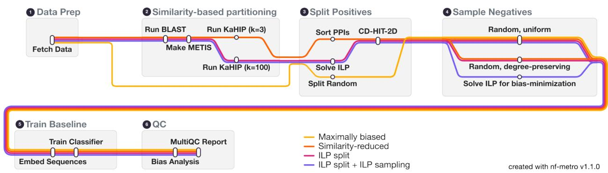  
Figure 1: Metro map of the major steps implemented in our Nextflow PPI splitting pipeline for the five configurations outlined in Table 1. If sequence, species, and GO information should be fetched from UniProt, the only required input is a PPI CSV file containing pairs of UniProt IDs. If not, or if they have been prefetched, they can additionally be provided to the pipeline. For the ILP split + ILP sampling from HCN configuration (sampling from a pool of high-confidence human negatives), a candidate network is required as additional input. Generated with seqeralabs/nf-metro.

All analyses were run with our PPI splitting Nextflow pipeline (Figure 1). Given a CSV file with PPIs, it fetches sequences, taxonomy, and GO annotations from UniProt (UniProt Consortium, 2025), performs similarity-based splitting of the positives into train/validation/test, samples corresponding negatives (if requested, in a bias-reducing manner), trains a baseline classifier, and quantifies the remaining biases in the resulting dataset. Detailed descriptions of all components are provided in Section 4.2 in Methods.

The baseline classifier is a Random Forest classifier trained on mean-pooled, concatenated embeddings produced by ESM-2-650M, a widely used BERT-style protein language model trained on huge volumes of amino acid sequences (Lin et al., 2023). It was shown that replacing simpler protein representations with ESM-2 embeddings already improves PPI classifier performance, independent of model architecture (Reim et al., 2025). For a protein with length n, ESM-2-650 produces an n × 1280-dimensional embedding. Mean-pooling over n preserves global sequence properties such as taxonomy, structural class, enzymatic function, and localization (Elnaggar et al., 2022), but discards the residue-level information that is crucial to detect binding sites and binding-site compatibility. Therefore, the baseline classifier is expected to perform at chance level on an unbiased dataset. Hence, if the baseline is able to successfully separate positives from negatives, its performance is almost certainly driven by a shortcut rather than by a learned representation of matching binding sites. In addition to ESM-2, we ran all analyses with embeddings produced by ProtT5 (Elnaggar et al., 2022), another popular protein language model. Overall, results are similar, as detailed in Appendix B: The utility of the embedding similarity attribute is comparable, the Ridge regressor detects the biases slightly better from the ESM-2 embeddings, and the baseline results are slightly better for ProtT5.

We evaluate the five configurations listed in Table 1, which combine three strategies for splitting the positives with three strategies for sampling the negatives. The splits difer in how strictly they suppress sequence similarity between training and test data and in how much data they discard in doing so. The samplers difer in which statistical properties of the positive set they reproduce in the negative set. The last configuration replaces the pool from which negatives are drawn: instead of sampling from all protein pairs not annotated as interacting, it samples from a precomputed set of high-confidence human non-interactors (Ås, 2026), and is therefore only applicable to the human datasets with canonical UniProt sequences.

Table 1: The five configurations evaluated in this study. Positives are either split randomly, assigned using a similarity-based partitioning of the input proteome (KaHIP, k = 3), or assigned by minimizing data loss (KaHIP, $k = 1 0 0 + \mathrm { I L P } )$ . Negatives can be sampled uniformly at random, by preserving positive node degrees, or by minimizing biases using an ILP. The initial candidates for the negatives are either the complement of the input PPI graph or a pre-computed set of high-confidence negatives (HCN).
<table><tr><td>Configuration</td><td>Split of positives</td><td>Negative sampling</td><td>Negative pool</td></tr><tr><td>Maximally biased</td><td>Random 80/10/10</td><td>Uniform</td><td>Complement</td></tr><tr><td>Similarity-reduced</td><td>KaHIP, k = 3</td><td>Degree-preserving</td><td>Complement</td></tr><tr><td>ILP split</td><td>KaHIP, k = 100 + ILP</td><td>Degree-preserving</td><td>Complement</td></tr><tr><td>ILP split + ILP sampling</td><td>KaHIP, k = 100 + ILP</td><td>ILP</td><td>Complement</td></tr><tr><td>ILP split + ILP sampling from HCN</td><td>KaHIP,  $k = 1 0 0 + \mathrm { I L P }$ </td><td>ILP</td><td>High-confidence negatives</td></tr></table>

Each configuration is evaluated on two test sets: a balanced test set and a realistic test set. The balanced test set is sampled using the same strategy as the training and validation sets and contains as many negative samples as positive samples. For the realistic test set, we always sample negatives uniformly and include ten times as many negatives as positives, reflecting that two arbitrary proteins are far more likely not to interact than to interact. Comparing the results on the two test sets separates the question of whether a model has learned anything from the question of whether it remains useful under a realistic class balance. Precision, F1, MCC, and AUPRC are always worse on the realistic test set than on the balanced one, as these metrics are sensitive to class imbalance: a tenfold increase in negatives will turn the same false-positive rate into many more false positives.

We ran all of these analyses on nine datasets, spanning experimentally curated interactions (HIPPIE, IntAct), score-channel subsets of STRING, and two structural datasets derived from the PDB (PINDER, PDB-Dimers). Table 2 summarizes their sizes and characteristics, detailed dataset descriptions are provided in Section 4.1 in Methods.

## 2.2 Performance under the maximally biased setting

As shown in Figure 2B and Supplementary Table A1, a simple Random Forest baseline can achieve nearperfect performance in the maximally biased setting, exploiting diferent shortcuts depending on the dataset. To identify which ones, we employ the G-AUDIT (Drenkow et al., 2026) bias analysis (Figure 2A), in which the strongest shortcut candidates are attributes that are both highly detectable from the input and highly informative about the label. Embedding similarity is highly detectable by construction, since the embeddings are the input to the detector, so for this attribute, we are only interested in the mutual information, i. e., in whether the embedding implicitly encodes important properties of interaction. This does not seem to be the case.

Topology is the attribute with the strongest detectability across all datasets and, for most of them, also the highest utility. For a pair of proteins, topology is defined as their average degree ratio, where a protein’s degree ratio is its positive degree in the training set divided by its total training degree (Chatterjee et al., 2023). As Figure 2C shows, positive and negative pairs difer strongly in degree for IntAct, HIPPIE, STRING: human/physical, and STRING-experimental, making them trivially separable by degree alone. These are also the datasets where topology retains high utility across all splits except the realistic test set, which likely drives the baseline’s strong performance on them. The shortcut is only available in the maximally biased setting, because in all other configurations, there is no train-test protein overlap, so it cannot be computed. These results illustrate the danger of train-test overlap: it allows the model to ignore the input entirely and still perform well based on protein identity alone (Park & Marcotte, 2012; Bernett et al., 2024; Chatterjee et al., 2023; Zhou et al., 2025).

A  
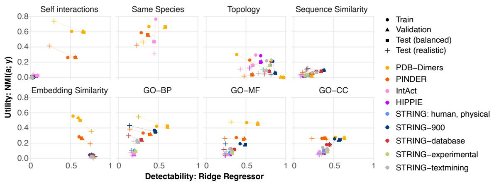

B  
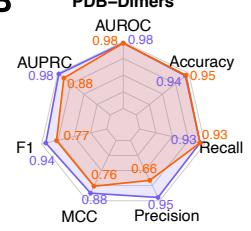

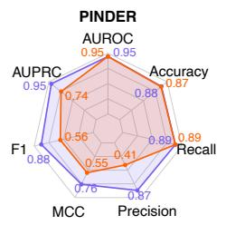

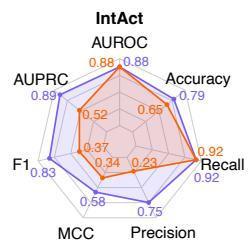

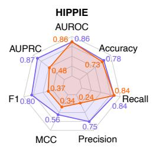

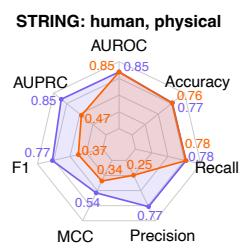

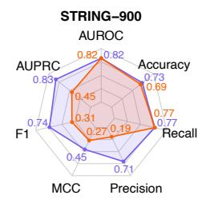

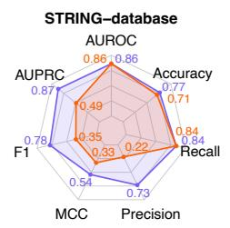

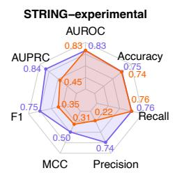

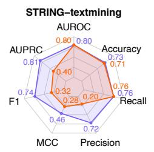

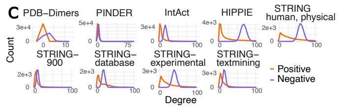

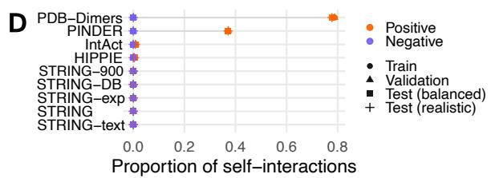  
F

E  
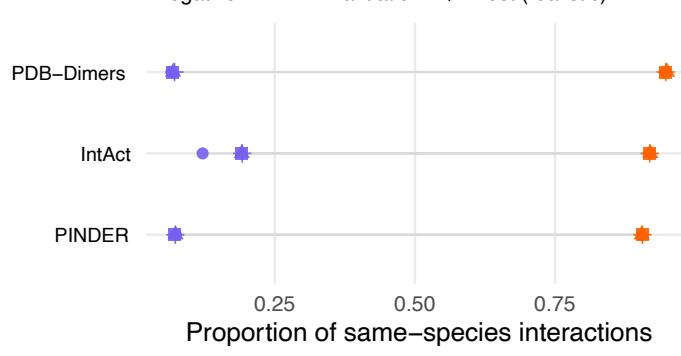

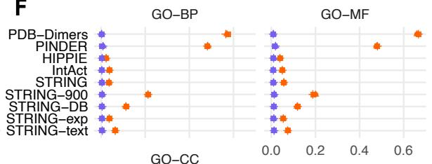

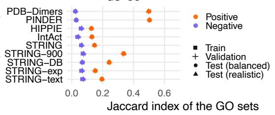  
Figure 2: Overview of the maximally biased setting. (caption continued on next page)

Figure 2: A Bias analysis per attribute a. The higher the utility (NMI between a and the label y) and detectability (Spearman ρ between a and $\begin{array} { r } { \pmb { a } _ { p r e d } , } \end{array}$ predicted by a Ridge regressor from the input), the higher the shortcut potential for a. B Performance of the baseline. The realistic test set has 10 times as many negatives as positives. C Degree distribution of each protein in the positive (orange) vs. the negative (purple) train set. Degrees cropped at 100 for readability. D Ratio of self-interactions/all interactions. E Ratio of same-species interactions/all interactions. F Mean Jaccard indices of the GO terms annotated for the interaction candidates. (continued)

For the two structural datasets, PDB-Dimers and PINDER, the self-interaction shortcut dominates. Figure 2D shows that 80% of all positive interactions in PDB-Dimers are self-interactions, and roughly 40% in PINDER. Because negatives are sampled at random and therefore rarely pair a protein with itself, whether two input proteins are identical becomes both highly detectable and highly predictive of the label (hence, the strong baseline performance in Figure 2B). The shortcut also contaminates three of the other attributes: a self-pair is, by construction, same-species, has an embedding cosine similarity of 1, and has a GO Jaccard index of 1. Sequence similarity is unafected, because we exclude self-interactions for its computation to be able to separate the similarity signal from the identity signal. Self-interactions are a real shortcut rather than an attribute we want to learn because in reality, many proteins never bind copies of themselves, and most interactions occur between diferent proteins. Apart from that, the distributional diferences between the PDB and other databases pose a real issue for using the PDB to augment PPI datasets with structural information. The PDB apparently annotates a very diferent population of interactions, weighted heavily toward homo(di)mers rather than hetero(di)mers. This is unfortunate, since with AlphaFoldDB (Varad et al., 2024) providing structures for individual proteins and the PDB providing structures for complexes, structure-informed PPI prediction should be within reach.

Sequence similarity, in contrast, turns out to be a weaker shortcut than prior work would suggest (Hamp & Rost, 2015; Bernett et al., 2024). Supplementary Figure A1 shows the distribution of the percentage of identical residues between two positive versus two negative pairs. The negatives have a strong peak at zero across all datasets, as expected. Among the positives, similar pairs are rare in IntAct and HIPPIE, somewhat more common in STRING: human/physical and STRING-experimental, and most frequent in the three other STRING subsets, which is where the attribute also reaches its highest shortcut potential in Panel A. A reason could be that the STRING-database and STRING-textmining subsets might contain more paralogs. Gene duplication produces sequence-similar proteins that also tend to share pathway and complex membership (Pereira-Leal et al., 2007). STRING’s use of homology transfer between organisms and the name-based nature of text mining might amplify this further (Szklarczyk et al., 2025). While the utility of sequence similarity stays low throughout, suppressing it between splits nevertheless remains necessary, because isoforms, modified, or mutated sequences, paralogs, or closely related homologs should not be placed in diferent splits if we want to assess whether our model has learned biological mechanisms of binding. This matters most for the structural datasets, where the same protein occurs in many slightly diferent variants.

The taxonomy bias previously described by Hallee et al. (2026) is relevant for the three multi-species datasets IntAct, PDB-Dimers, and PINDER (Figure 2A, E). About 90% of their annotated PPIs occur within the same species, whereas fewer than 20% of the randomly sampled negative pairs do, resulting in a high measured utility. Figure 2A further shows that species can be inferred reasonably well from the embeddings (highly detectable). Inter-species PPIs are, however, biologically possible (e. g., host-virus interactions), and we would ideally want our model to detect whether two proteins bind based on their sequence or structure, independent of taxonomy. The taxonomy attribute is therefore an unwanted shortcut that must be corrected for, as failing to do so distorts the resulting performance estimates (see the IntAct results in Panel B).

Finally, the GO category overlap is especially predictive of STRING-900, STRING-database, and STRINGtextmining, and is also suficiently detectable from the embeddings to be exploitable. Figure 2F shows that PPIs in these three subsets are more functionally related than those in the purely experimental sources (HIPPIE, IntAct, and STRING-experimental) and in STRING: human/physical. This observation makes sense since the STRING database channel uses pathway and complex annotations (which are functionally related by design) and the textmining channel identifies protein co-mentions in the literature, which are also more likely to reflect shared biological function or pathway membership (Szklarczyk et al., 2025). Since STRING-900 aggregates all evidence channels, it inherits the functional enrichment from these two. This is an important pitfall to keep in mind: intuitively, a user might select only the most confident STRING interactions to train their model, expecting higher-quality labels to yield more trustworthy results. Instead, this subset is easier to predict than a purely experimental dataset because of the functional similarity shortcut, inflating reported performance without reflecting a model’s true ability to detect genuine physical interactions.

## 2.3 Similarity-reduced versus ILP-based splitting

The similarity-reduced split previously proposed by Bernett et al. (2024) has two practical drawbacks: It ofers no control over the sizes of the resulting training, validation, and test sets, and, because it partitions the entire proteome before assigning PPIs to splits, a large number of interactions are discarded because their endpoints are part of diferent blocks. We therefore formulate splitting as an ILP that minimizes the data loss while enforcing specified train/validation/test fractions. Figure 3A shows how the ILP-based split fulfills the specified $8 0 / 1 0 / 1 0$ split while retaining substantially more interactions for training. For PDB-Dimers and PINDER specifically, overall data loss always remains low due to the self-interactions. Because a self-interaction has both endpoints in the same cluster, it can never be split apart.

Figure 3B shows that both the similarity-reducing and ILP-based approaches successfully reduce sequence similarity between the training and test sets. The similarity-reducing approach produces more dissimilar splits than the ILP approach because at k = 3, KaFFPa directly minimizes the edge cut among the three groups, which later form the splits. With k = 100, similarity is minimized between 100 clusters, and the ILP then regroups them into three splits according to data loss alone, so a test cluster can still be rather similar to a train cluster. To limit this, we apply CD-HIT-2D to remove any validation or test PPI whose interactors have more than 40% identity to a training sequence, indicated by the dotted line (see Supplementary Figure A2 for the proportion of discarded PPIs).

Figure 3C and Supplementary Table A1 shows the efect on the Random Forest baseline. The goal is to obtain chance-level performance, i. e., an AUPRC of 0.5 on the balanced set and roughly 0.09 on the realistic test set. HIPPIE, STRING-experimental, and STRING-textmining come closest, falling from 0.81 to 0.87 balanced AUPRC in the maximally biased setting to between 0.54 and 0.59 in both settings. The AUPRCs of IntAct, STRING: human/physical, STRING-database, and STRING-900 remain slightly inflated at 0.60- 0.71 (before, 0.83-0.89). The performance on the structural datasets PDB-Dimers and PINDER remains high (0.95-0.99) due to the self-interaction shortcut, which cannot be removed by the splitting strategy. The splitting strategy also cannot remove the taxonomy shortcut in IntAct, and the GO overlap shortcut in STRING-900 and STRING-database. All three come from distributional diferences between the positives and the negatives, so addressing them requires intervening on the negatives.

## 2.4 Controlled bias-reduction through the ILP-based negative sampling

To further mitigate the biases we identified through the G-AUDIT analyses (degree shortcut, GO overlap shortcut, self-interaction shortcut, and taxonomy shortcut), we developed a bias-minimizing ILP-based negative sampler that jointly minimizes the underlying distributional diferences between sampled negatives and positives (ILP split + ILP sampling configuration). The ILP proves optimality for every dataset and split, so any residual bias stems from properties of the negative pool. Overall, this configuration yields the least-biased datasets. Compared to the ILP split configuration, most attributes now carry less mutual information (Figure 4A). Figure 4B shows the composition of the remaining objective value, which sums up the bias terms for self-interactions, taxonomy, degree, and mean GO-BP Jaccard overlap. PDB-Dimers and PINDER reach much higher residual objectives than the other datasets.

Importantly, the terms are not independent. For the structural datasets PDB-Dimer and PINDER, the self-interaction deviation is the largest remaining bias term that cannot be minimized further, because a negative self-interaction can only be sampled for a protein without a positive one. Both datasets, however, contain positive self-interactions for the majority of the covered proteins, making it impossible for the ILPbased negative sampler to match the numbers of positive and negative self-interactions. The problem is made worse by the split, since self-interactions are never discarded, which raises their share in the smaller splits. In PDB-Dimers, they make up more than 90% of validation and test interactions; in PINDER, this imbalance is only that severe in the test set (88%), which is correspondingly where its self-interaction bias is the highest. The failure to satisfy the self-interaction term propagates to the GO-BP term since any negative sampled for a protein with only self-interactions will contribute a lower Jaccard index to the negative mean.

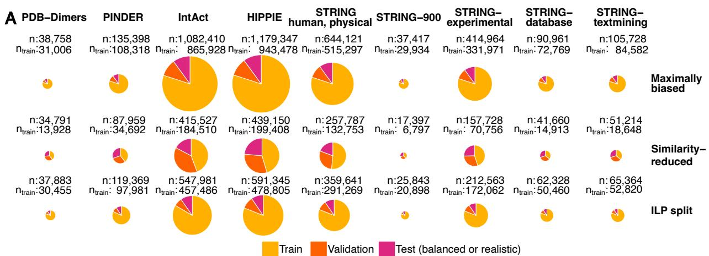

B  
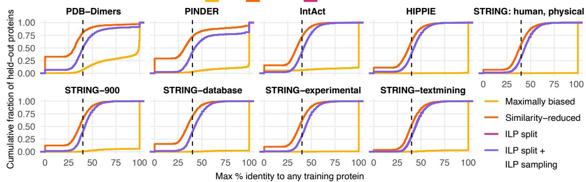  
C

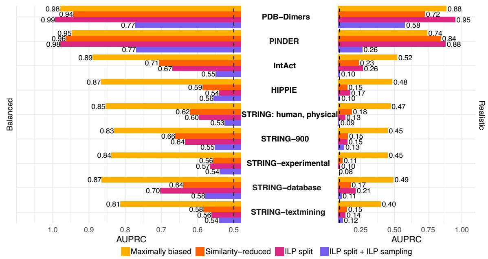  
Figure 3: Comparison of the similarity-reduced and the ILP-based settings. A Resulting dataset sizes for the positives only. B Maximum percentage identity (BLAST output) of proteins in the test set to proteins in the respective training set. The dotted line indicates 40% identity, the threshold for CD-HIT-2D. C Performance of the Random Forest classifier. The dotted line indicate the chance performance (0.5 and 1/11).

A  
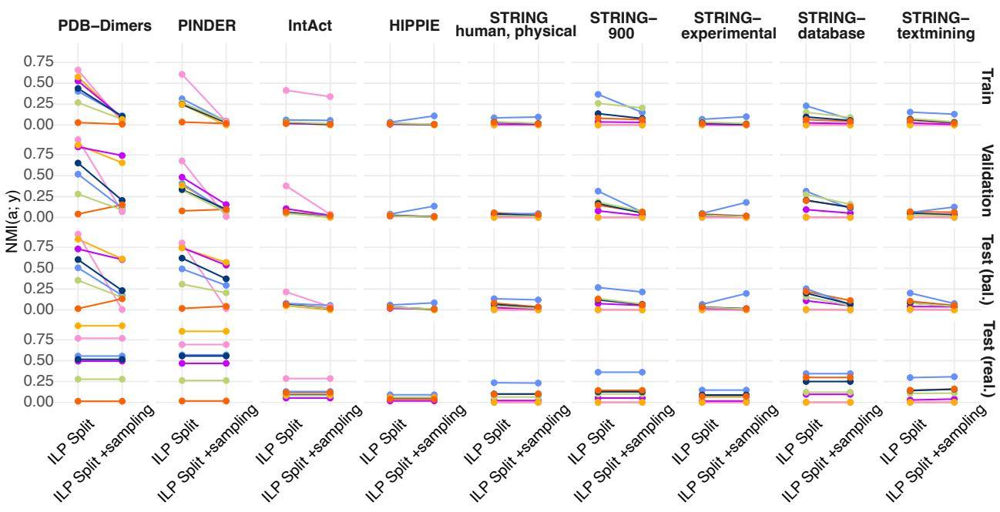

B  
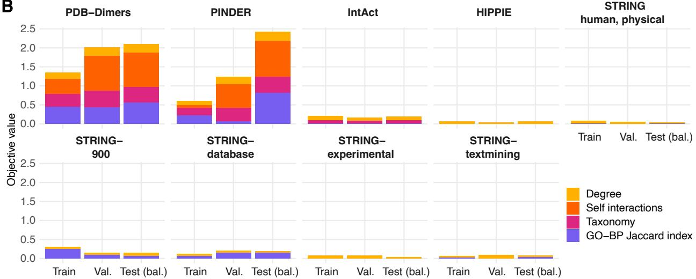  
Figure 4: Influence of ILP-based negative sampling. A Decrease in normalized mutual information from the ILP-based split (+degree-preserving random sampling) to the ILP-based split + ILP-based sampling. B Composition of the remaining objective value of the ILP-based negative sampling. The same species term was only included for PDB-Dimers, PINDER, and IntAct.

For the taxonomy term, which matches the number of interactions per taxon pair, the residual in PDB-Dimers and PINDER is driven mainly by human-human interactions. Human proteins account for roughly a quarter of all proteins in both datasets, so negatives are disproportionately likely to be drawn from human proteins (up to 3.7 times more negative human-human interactions). The remaining bias is distributed across rare taxon combinations, which the logarithmic weighting penalizes more heavily. In IntAct, human-human pairs account for the vast majority of positives, so a small relative mismatch (around 1.25–1.27 times the target) leads to a nontrivial absolute contribution.

For STRING-900 and STRING-database, GO-BP overlap is the largest remaining bias term. Figure 4A shows that the mutual information between the GO categories and the label is reduced but not eliminated, most likely because functionally similar pairs are more likely to already be annotated as interacting in STRING-database, leaving few functionally related candidates available as negatives. For HIPPIE, STRING: human/physical, STRING-experimental, and STRING-textmining, all four terms are reduced to near zero, though their bias was low to begin with.

Returning to the baseline results in Figure 3C and Supplementary Table A1, ILP-based sampling yields the lowest performance on every dataset except HIPPIE’s balanced test set, where it is marginally higher than the ILP split alone (0.56 against 0.54). For all datasets except PDB-Dimers and PINDER, balanced AUPRC now falls between 0.53 and 0.58, and realistic AUPRC between 0.08 and 0.13. Looking at the complementary performance metrics (Supplementary Table A1), the reason is that the baseline can no longer distinguish between positives and negatives and defaults to predicting positive.

## 2.5 The influence of high-confidence negatives

All configurations so far draw negatives from the complement of the PPI graph, which conflates untested pairs with genuine non-interactors. We assess the consequences of sampling negatives from a precomputed set of high-confidence human negatives (HCN) by constructing them from IntAct pairs of human proteins that were tested together at least 3 times but were never reported to interact (Ås, 2026). Figure 5A shows that performance on the balanced test set increases substantially for all STRING datasets, from 0.53-0.58 to 0.62-0.66. This is unlikely the result of higher-quality negatives improving the baseline’s ability to learn interaction features, since performance on the realistic dataset remains at chance level. Instead, it points to a distributional diference between the HCN and the positives that cannot be sampled away by choosing a suitable subset.

The bias terms of the residual objective value (Figure 5B) support this interpretation, as the residual objective term increases across all datasets. The degree term rises for most of them, consistent with the HCN set spanning only 13 557 unique proteins (Table 2), which is too few to satisfy the degree constraint for many proteins. The self-interaction term is negligible throughout, as expected.

The most substantial issue is in the GO-BP term, which appears for HIPPIE, STRING: human/physical, and STRING-experimental, where it was previously near zero, and worsens for the remaining subsets. This makes biological sense, since protein pairs confirmed not to interact are less likely to share biological processes, making it infeasible to sample the GO-BP bias away. Indeed, only around 5% of the 25 million HCN pairs have a GO-BP Jaccard index greater than 0, and for only 1.5% is it greater than 0.1. HIPPIE is not afected because its positives are not strongly functionally enriched to begin with. When drawing negatives from a high-confidence set, one should therefore consider which distributional shifts this introduces and whether they are desirable.

## 3 Discussion

We show that the splitting strategy and the negative sampling approach substantially afect which shortcuts a PPI prediction model can exploit, and that the magnitude of these shortcuts varies across databases. A Random Forest baseline trained on protein embeddings can reach near-perfect performance under a naive random split. While removing the train-test protein overlap and minimizing inter-split sequence similarity are efective countermeasures, several datasets retain strong shortcuts because of distributional diferences between the positive and negative sets: for the PDB-derived datasets, the high number of self-interactions is the largest issue. For multi-species datasets, intra-taxon pairs are less likely to be sampled, but taxonomy can be inferred well from embeddings. Finally, the STRING subsets that use database annotations and text mining annotate pairs that are more functionally enriched than expected by chance, which can also be detected suficiently well from the embeddings. We jointly align these distributions using an ILP-based negative sampler. It decreases the baseline to chance level across all datasets except PDB-Dimers and PIN-DER, where the self-interaction bias cannot be minimized any further, since most proteins in these datasets have positive self-interactions and a negative self-interaction can only be drawn for a protein that does no already have a positive one. For STRING-900 and STRING-database, a residual functional-relatedness bias remains because too few functionally related negatives are available to match the positives. For all datasets, the baseline’s recall is greater than 0.8, while its precision is at chance level in the ILP split + ILP sampling configuration (Supplementary Table A1), meaning that it defaults to predicting positive. This is the expected outcome, since a low-complexity model like our Random Forest baseline without a mechanism to represent an interface should not be able to separate the classes.

A  
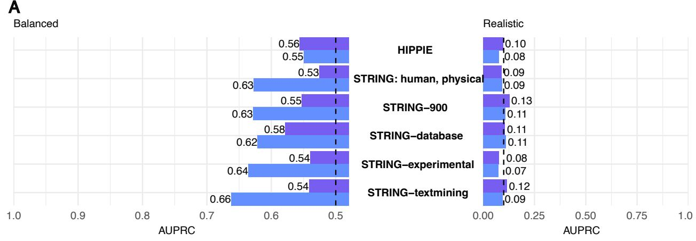

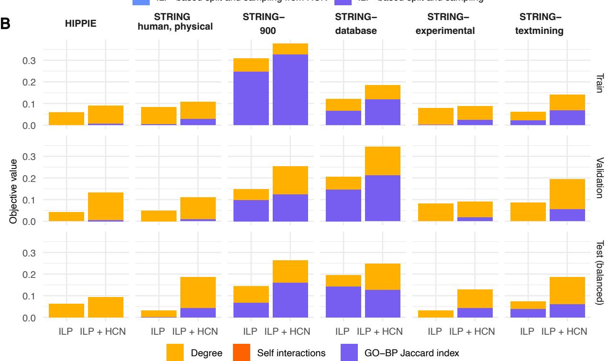  
Figure 5: Influence of using a pre-defined set of high-confidence negatives for sampling with the ILP. A Random Forest classifier baseline results. B Composition of the remaining objective values of the ILP-based negative sampling runs.

Our results have practical implications for anyone building or evaluating a PPI prediction model. First, reported performance figures are only interpretable together with the splitting and sampling strategy that produced them. A high AUPRC on a randomly split, uniformly sampled dataset says little about generalization to unseen proteins. Second, the choice of the PPI database matters independently of the modeling approach. The PDB-derived datasets encode a fundamentally diferent population of interactions, weighted heavily toward homo(di)mers, which limits their use for augmenting PPI datasets with structural information. This imbalance present in the PDB may afect complex structure prediction as well: While Han et al. (2026) reported high-confidence AlphaFold-Multimer (Evans et al., 2021) predictions for roughly 7% of 23M predicted homodimers, only 0.7% of 7.6M predicted heterodimers were high-confidence. Furthermore, these high-confidence heterodimers were enriched for homodimer-like properties such as similar chain length and high inter-chain sequence identity. Third, drawing negatives from a high-confidence pool, while intuitively appealing, can introduce or worsen distributional shifts, particularly for the STRING datasets, since high-confidence negatives tend not to be functionally related. For HIPPIE, which does not sufer from this distributional bias, baseline results stayed approximately the same. It is, therefore, possible that a mode with the capabilities to grasp the biochemical mechanisms of interactions can benefit from the less noisy signal of the high-confidence negatives.

Our analyses have several technical limitations: First, the pipeline only supports the ESM-2 and ProtT5 embedding models. Diferent embedding models may encode taxonomy, degree, or functional information to varying extents, which can shift detectability and potentially reorder which shortcuts dominate for a given dataset. Second, our attribute set is not exhaustive, and additional biases, such as protein length or experimental detection method, may be present; however, more terms can be added to the bias analysis and the sampler. Third, we quantify detectability using a Ridge regressor. Replacing it with a GPU-based estimator would reduce the runtime and memory consumption (see Appendix C), while providing a tighter lower bound on detectability than a simple linear model. Fourth, the sampling ILP is solved over a stratified candidate pool of four times the positive count rather than over all admissible negatives, because solving the ILP over the full pool is computationally prohibitive. The returned solution is optimal for the sampled pool, but a better-matched negative set may exist. Fifth, the high-confidence negatives were derived only from human IntAct pairs. The same construction could, in principle, be extended across all of IntAct, bu it does not apply to the PDB-based datasets, whose entries often contain modified rather than canonica sequences, so we cannot assume that a modified sequence behaves like its canonical counterpart with respect to interactions. Sixth, even our most rigorous mitigation strategy, ILP-based sampling, leaves residual bias in PDB-Dimers and PINDER, driven by their high proportion of self-interactions. Addressing this fully would likely require complementary strategies such as positive downsampling or loss reweighting, which we did not evaluate empirically.

It is also important to note that the functional relatedness (GO overlap) bias attribute we identified via the G-AUDIT analysis is not only a confounder: proteins in the same pathway, cellular component, or complex genuinely do interact more often, so matching the GO overlap of the negatives to that of the positives removes real signal along with the artifact. Nonetheless, functional relatedness is also a confounder because it holds at the level of pathways and complexes rather than individual pairs, so it cannot distinguish which members of a complex actually bind, which is precisely what a PPI model should predict. For this work, we therefore decided to treat GO overlap as a bias attribute and include it in the objective of our ILP-based negative sampler.

We release the splitting and bias analysis pipeline as an open tool so that the community can apply the same bias-aware procedures to their own data. It can be adapted to other pair-input prediction tasks, such as domain-domain, protein-ligand, or gene-gene interactions, by substituting the similarity definition and the bias terms. Moreover, specific bias terms can be switched of for negative sampling, e. g., users who decide to treat GO overlap as signal can simply set the weight of the corresponding component from the ILP objective of the negative sampler to zero.

An important scope restriction is that this work is not a benchmarking paper: Our focus is to systematically identify biases in PPI datasets and to provide a pipeline that produces maximally de-biased data splits for machine learning model training and evaluation. Natural follow-up question are how state-of-the-art deep learning-based PPI prediction models perform on these de-biased data splits and if they significantly outperform the Random Forest baseline utilized here. We leave such questions to future work.

Another avenue for future work is to apply our concept of first quantifying existing shortcuts with the G-AUDIT bias detection framework and then minimizing them through optimization-based negative sampling for problems other than PPI prediction. For instance, we anticipate that it could be valuable in scenarios such as rare disease diagnosis from biomedical imaging data where there is much more data for healthy than diseased individuals and where model generalizability may be compromised by shortcuts due to data provenance or patient demographics. As long as the pool of negative candidates is suficiently large, the approach can be extended to any binary classification problem.

## 4 Methods

## 4.1 Datasets

We selected datasets that vary along three axes relevant to shortcut formation: species scope, type of evidence, and detection modality (Table 2). HIPPIE (Alanis-Lobato et al., 2017) and IntAct (Del Toro et al., 2022) store interactions from dedicated experiments, the former human-only and the latter multi-species. STRING (Szklarczyk et al., 2025), in contrast, also includes non-experimentally detected interactions, and we analyze three of its channels separately to isolate their efects. PINDER (Kovtun et al., 2024) and PDB-Dimers are derived from resolved PDB (Berman et al., 2000) complexes rather than from interaction assays.

HIPPIE was downloaded from https://hippie-db.net/download/ (HIPPIE-current.txt.gz), and IntAct from https://www.ebi.ac.uk/intact/download/ftp as intact.zip. Most of IntAct’s stored interactions are between human proteins (618 796/1 082 410), followed by S. cerevisiae (104 961), D. melanogaster (82 382), Z.mays (50 969), and A.thaliana (41 475). IntAct also contains cross-species interactions, such as M. musculus–H. sapiens (26 586), R. norvegicus–H. sapiens (5435), or SARS-CoV-2–H. sapiens (4272).

The STRING database is chosen because it also contains interactions that were not experimentally measured. STRING scores each evidence channel separately and sums the scores into a combined score. A pair receives a score in the experiments channel if it is annotated in an experimental database like IntAct, in the database channel if it appears in pathway or complex databases like Reactome (Ragueneau et al., 2026), and in the textmining channel if the two proteins are co-mentioned in the literature, either through simple co-occurrence or through NLP analysis. STRING also distinguishes between physical and functional interactions, with functional interactions requiring only shared complex or pathway membership rather than direct contact, thereby substantially increasing the number of annotated pairs. Out of $\binom { 1 9 3 1 1 } { 2 }$ = 186 447 705 possi ble pairwise interactions, STRING stores 6 737 427, i. e., approximately every $2 7 ^ { t h }$ possible pair is annotated as interacting. Because each of these aspects may produce a diferent bias, we analyze the physical human network (9606.protein.physical.links.full.v12.0.onlyAB.txt) together with four of its subsets, selected by combined score and by evidence channel (Table 2). STRING IDs are mapped to UniProt accessions using the STRING ID mapping file (9606.protein.aliases.v12.0.txt), the UniProt secondary-to primary accession mapping file (https://ftp.uniprot.org/pub/databases/uniprot/current\_release/ knowledgebase/complete/docs/sec\_ac.txt), and the UniProt API for resolving ambiguous mappings.

We additionally investigate two structure-inferred datasets, both derived from the PDB, to examine potential diferences between interaction-detection and structure-resolution databases. The first of these datasets, PINDER, was originally created to benchmark docking algorithms. It defines an interaction as any pair of chains within a biological assembly whose backbone atoms come within 10 Å of one another, and it considers all PDB complexes, including those with more than two interacting proteins. We downloaded the index.parquet file from gs://pinder/2024-02/ and apply four filters. First, since we retrieve taxonomy and GO annotations from UniProt, we remove interactions with an undefined UniProt ID, which are typically small molecules (from 2 319 564 to 2 097 729 interactions). Second, the same pair of UniProt IDs can be annotated repeatedly within one complex, because chains with identical sequences may interact at severa binding sites. 3MB8, for instance, is a homo 6-mer forming a ring-like structure, resulting in 12 annotated Q2HXR2-Q2HXR2 interactions in the PINDER dataset. Since chains sharing a UniProt ID can nonetheless difer in sequence, as in 1H5R, where chain B of P37744 carries two point mutations compared to chains A, C, and D, we deduplicate on PDB ID, UniProt IDs, and chain IDs rather than on UniProt IDs alone (2 097 729 → 834 747). Third, we treat interactions as undirected and drop B–A when A–B is also present. Fourth, we fetch the chain sequences from the RCSB FASTA API to deduplicate on sequence (often chains have identical sequences, e. g., chains A, C, and D in 1H5R). This leaves only 135 398 unique interactions with sequence, taxonomy, and GO annotations, most of them between human (28 322), yeast (10 263), and E. coli (5183) proteins. 37% are self-interactions. PINDER is distributed with a predefined split that minimizes interface similarity between training, validation, and test sets. Since our aim is to characterize the dataset rather than to benchmark docking, we pool it and apply our own splitting procedure, keeping the procedure harmonized across all datasets.

We further construct a stricter structure-derived dataset, PDB-Dimers, containing biological assemblies with exactly two protein-chain instances. We do so to reduce the possibility that an observed interaction depends on additional protein chains in a higher-order complex, rather than representing an interaction that can occur between the two proteins in isolation. We query the PDB for structures satisfying the following criteria: rcsb\_entry\_info.selected\_polymer\_entity\_types: Protein (only), rcsb\_assembly\_info.polymer\_entity\_instance\_count: 2, and rcsb\_struct\_symmetry.kind: Global Symmetry. This yields 97 344 candidate assemblies. These criteria restrict the polymeric components of each assembly to exactly two protein chains, while allowing non-polymeric components such as ligands, cofactors, and ions. We retain such components because they do not constitute additional polymeric participants and because excluding every assembly containing a non-polymeric component would substantially reduce the available data (from 97 344 to 22 520 structures). We then apply three sequence-based quality filters, excluding assemblies in which either chain is longer than 1250 residues (leaving 96 766 structures), shorter than 50 residues (leaving 84 504 structures), or contains more than 15% unresolved residues (leaving 84 464 structures). Finally, sequence-identical interaction pairs are removed, and interactions B-A are dropped when A-B is present, where A and B denote protein chains (leaving 38 758 structures).

Both structural datasets use the sequences annotated in the PDB rather than canonical UniProt sequences. Many PDB entries contain only part of the canonical sequence, either due to modifications or because the complex was made synthetically and only the peptide of interest was produced. The structural datasets, therefore, contain considerably more unique sequences than the others (Table 2), and the same underlying protein recurs in many slightly diferent forms, which is why suppressing sequence similarity between splits matters for them even though its measured utility as a shortcut is low (see Results Section).

For ILP-based negative sampling, we additionally use a pool of high-confidence human negatives (Ås, 2026) derived from the IntAct database (Del Toro et al., 2022). The key idea here is that two proteins are treated as a high-confidence negative pair if they are repeatedly not reported to interact, even though the same experiment reports each of them interacting with other proteins, demonstrating that an interaction between them would have been detected had it occurred. The original network contains 99 755 235 negatives. From that, we selected negative candidates that have never been observed and have been tested at least three times.

## 4.2 The PPI splitting and bias analysis pipeline

To ensure a fair comparison between datasets by using the same splitting procedure and to provide the community with a tool for splitting their own PPI datasets in a bias-aware way, we implemented a dedicated PPI splitting and bias analysis pipeline. The pipeline is implemented in Nextflow (version 26.04). Its steps and the paths taken by the individual configurations are shown in Figure 1. The only input required for the pipeline is a CSV file of PPIs given as UniProt accessions (required columns: protein1, protein2). The pipeline uses these identifiers to query the UniProt API for the amino acid sequences, the taxonomy, and the GO annotations (Ashburner et al., 2000; Gene Ontology Consortium, 2026) (biological process: BP, molecular function: MF, cellular component: CC). The fetching step can also query UniParc for retired annotations and retrieve isoform-specific sequences. The pipeline then ofers three strategies for splitting the positives (Section 4.2.1) and three for sampling the negatives (Section 4.2.2), which can be combined freely. It then trains and evaluates a Random Forest baseline classifier with ESM-2 or ProtT5 embeddings on the obtained data split (Section 4.2.3), carries out a bias analysis via the G-AUDIT framework (Section 4.2.4), and generates an interactive report (Section 4.2.5). The pipeline returns the resulting training, validation, and test sets with their sampled negatives, the bias metrics computed for each split, the baseline classifier’s performance, and an interactive report.

Table 2: Datasets employed in this study.
<table><tr><td>Dataset Name</td><td>Version (down- loaded)</td><td>Unique PPIs</td><td>Unique sequences</td><td>Key Characteristics</td></tr><tr><td>HIPPIE (Alanis- Lobato et al., 2017)</td><td>v3.0 (15.07.2026)</td><td>1 179 347</td><td>29 080</td><td>Human, experimentally detected PPIs. Provides confidence scores based on the amount and qual- ity of the experimental evidence. Aggregated from various databases.</td></tr><tr><td>IntAct (Del Toro et al., 2022)</td><td>Jan 2026 (10.01.2026)</td><td>1 082410</td><td>120 021</td><td>Multi-species, experimentally detected PPIs. Provides detailed information on the PPIs.</td></tr><tr><td>STRING: physical, human (Szklar-</td><td>v12.0 (16.07.2026)</td><td>644121</td><td>17348</td><td>Human PPIs scored via different channels. Evi- dence for physical proximity does not only come from experiments but also from pathway and complex databases, literature text mining, and</td></tr><tr><td>czyk et al., 2025) STRING- 900</td><td>see above</td><td>37417</td><td>8032</td><td>homology transfer. High-confidence PPIs subsetted from STRING: physical, human to only contain PPIs with a com-</td></tr><tr><td>STRING- experimental</td><td>see above</td><td>414964</td><td>16 624</td><td>bined score ≥ 900. Subsetted from STRING: physical, human to only contain PPIs with score &gt; 0 in the</td></tr><tr><td>STRING- database</td><td>see above</td><td>90 961</td><td>8744</td><td>experiments channel. Subsetted from STRING: physical, human to only contain PPIs with score &gt; 0 in the database</td></tr><tr><td>STRING- textmining</td><td>see above</td><td>105 728</td><td>12852</td><td>channel. Subsetted from STRING: physical, human to only contain PPIs with score &gt; 0 in the textmining channel.</td></tr><tr><td>PINDER (Kovtun et al., 2024)</td><td>2024-02 (21.07.2026)</td><td>135 398</td><td>91 902</td><td>Structural, multi-species dataset derived from PDB complexes. A PPI is recorded if the back- bone atoms of two protein chains are closer to- gether than 10 Å. Customized, deduplicated ver-</td></tr><tr><td>PDB- Dimers (Berman et al.,</td><td>15.08.2026</td><td>38 758</td><td>44706</td><td>sion. Structural, multi-species dataset, explicitly de- rived from PDB dimers instead of complexes with more than two protein units, reducing the like- lihood that an observed interaction depends on</td></tr><tr><td>2000) High- confidence negatives (Ås, 2026)</td><td>10.07.2026</td><td>25 059 736</td><td>13 557</td><td>additional polymers. Human protein pairs derived from IntAct that have been observed not to interact at least three times, despite it being possible.</td></tr></table>

## 4.2.1 Splitting of the positives

Random split. The first strategy is a naive random split, in which PPIs are assigned to training, validation, and test sets at specified fractions without any further constraint. This approach has repeatedly been shown to produce overly optimistic results because models can memorize proteins seen during training rather

∀ s

than extract binding-relevant features from their sequences (Park & Marcotte, 2012; Hamp & Rost, 2015; Szymborski & Emad, 2022; Bernett et al., 2024). We include it not as a viable option but as an upper bound on the performance a baseline can reach when every shortcut is available, against which the mitigations are measured, and it lets us quantify which biases drive that inflation.

KaHIP split. The remaining two strategies are designed to minimize sequence similarity between splits, as suggested by Hamp & Rost (2015) and Bernett et al. (2024). To calculate sequence similarities, a custom BLAST (Altschul et al., 1990) database is created with makeblastdb (version 2.16.0), using only the sequences from the proteins occurring in the input CSV. Then, blastp is used for an all-against-all query (max\_hsps 1) to weight a similarity graph. Because raw bit scores grow with sequence length, we define a length-normalized bit score as

$$
b i t s c o r e _ { n o r m } ( p , q ) = \frac { b i t s c o r e ( p , q ) } { m i n ( l e n g t h ( p ) , l e n g t h ( q ) ) }
$$

which we use in all KaHIP runs. The graph is written in METIS format (Karypis & Kumar, 1997), as this is the required input format for the KaHIP (Sanders & Schulz, 2013) graph partitioning tool (version 3.25).

For the first similarity-reducing implementation, we follow the gold-standard split approach proposed by Bernett et al. (2024). For this, we run KaHIP KaFFPa (Karlsruhe Fast Flow Partitioner, solves a Max-Flow Min-Cut problem) with $k = 3$ to partition the proteome into three parts. Hence, sequence similarity (edge weights) is minimized among the three resulting blocks. We then sort the input PPIs into their splits, retaining a PPI $( p , q )$ only if both p and q are part of the same block $\left( I N T R A _ { 0 } , I N T R A _ { 1 } , I N T R A _ { 2 } \right)$ . The largest resulting block is defined as the training dataset, the second-largest as the validation, and the smallest as the test dataset.

ILP split. Because the KaHIP split discards many inter-block interactions and leaves the user no control over the resulting split sizes, we implement an adaptation of DataSAIL (Joeres et al., 2025) that formulates the assignment as an ILP. We first run KaHIP with $k = 1 0 0$ , so that the ILP assigns entire similarity clusters to splits rather than individual PPIs, which strongly reduces the problem size. The underlying assumption is that proteins in diferent clusters are dissimilar, so that assigning whole clusters keeps similar proteins on the same side of the split. However, because KaFFPa minimizes the cut between the 100 clusters and the ILP subsequently regroups them into three splits based solely on data loss, two rather similar clusters may still end up in diferent splits. We compensate for this with a redundancy-removal step (see below). As in the KaHIP split, a PPI is retained only if the clusters of both its endpoints are assigned to the same split, and discarded otherwise. The ILP chooses the cluster-to-split assignment that minimizes this data loss, subject to each split receiving approximately its target share of the retained data (notation in Table 3)

The constants $k _ { i i }$ and $k _ { i j }$ are computed once, up front, from the PPI CSV and the KaHIP cluster assignment, counting only PPIs in which both endpoints have a sequence and a cluster assignment. A PPI whose endpoints fall in the same cluster $( k _ { i i } )$ is never at risk of being discarded. Note that the target fractions $f _ { s }$ refer to shares of retained PPIs, not of proteins. $z _ { s , ( i , j ) }$ is an auxiliary variable linearizing the product $x _ { s , i } \cdot x _ { s , j }$ . It is introduced only for cluster pairs that actually have cross-cluster PPIs at stake (P). The following problem formulation is used to minimize the data loss:

$$
\operatorname* { m i n } _ { x , z } \quad \sum _ { ( i , j ) \in \mathbb { P } } k _ { i j } \cdot \operatorname* { m a x } _ { s } \left( x _ { s , i } - x _ { s , j } \right)
$$

$$
{ \mathrm { s . t . ~ } } \ \sum _ { s = 1 } ^ { S } x _ { s , c } = 1 \qquad \forall c \in \left[ 0 , 2 \right] \times \left[ 0 , 2 \right] .\tag{C1}
$$

$$
\begin{array} { r } { z _ { s , ( i , j ) } \leq x _ { s , i } , \quad z _ { s , ( i , j ) } \leq x _ { s , j } , \quad z _ { s , ( i , j ) } \geq x _ { s , i } + x _ { s , j } - 1 \qquad \forall s , ( i , j ) \in \mathbb { P } } \end{array}\tag{C2}
$$

$$
( 1 - \varepsilon ) f _ { s } T ( { \pmb x } , { \pmb z } ) \ \leq \ \sum _ { i } k _ { i i } x _ { s , i } + \ \sum _ { ( i , j ) \in \mathbb { P } } k _ { i j } z _ { s , ( i , j ) }\tag{C3}
$$

$$
x _ { s , c } \in \{ 0 , 1 \} , \quad z _ { s , ( i , j ) } \in \{ 0 , 1 \}
$$

Table 3: Notation used for ILP-based splitting.
<table><tr><td>Symbol</td><td>Meaning</td></tr><tr><td colspan="2">Input</td></tr><tr><td> $\mathrm { P P I s }$ </td><td>The input PPIs</td></tr><tr><td> $\mathbb { C }$ </td><td>Set of n KaHIP clusters (default: n = 100)</td></tr><tr><td colspan="2">Specified, fixed parameters</td></tr><tr><td> $S$ </td><td>Number of splits,  $S = 3$  (train, val, test)</td></tr><tr><td> $f _ { s }$ </td><td>Target fraction of split  $s , \textstyle \sum _ { s = 1 } ^ { S } f _ { s } = 1$ </td></tr><tr><td> $\varepsilon$ </td><td>Allowed fractional deviation from  $f _ { s } ,$  default 0.05</td></tr><tr><td colspan="2">Pre-computed from input</td></tr><tr><td> $k _ { i i }$ </td><td>Number of PPIs with both endpoints in cluster i</td></tr><tr><td> $k _ { i j } , i < j$ </td><td>Number of PPIs with one endpoint in cluster  $i ,$  the other in cluster  $j$ </td></tr><tr><td> $\mathbb { P }$ </td><td> $\{ ( i , j ) : i < j , \ k _ { i j } > 0 \}$  , the cluster pairs with at least one cross-cluster PPI</td></tr><tr><td colspan="2">Decision variables</td></tr><tr><td> $x _ { s , c } \in \{ 0 , 1 \}$ </td><td>Cluster c is assigned to split  $s , s = 1 , \ldots , S , c = 1 , \ldots , n$ </td></tr><tr><td> $z _ { s , ( i , j ) } \in \{ 0 , 1 \}$ </td><td>Clusters  $i , j$  are both assigned to split  $s , s = 1 , \ldots , S , \ ( i , j ) \in \mathbb { P }$ </td></tr></table>

For each $( i , j ) \in \mathbb { P } ,$ , the corresponding summand of the objective function equals $k _ { i j }$ if the clusters i and $j$ are assigned to diferent clusters and 0 otherwise. The constraint (C1) assigns every cluster to exactly one split. (C2) linearizes $x _ { s , i } \cdot x _ { s , j } $ , the indicator for “the PPIs between cluster i and cluster $j$ are retained because both clusters landed in split $s ^ { \mathfrak { N } } .$ (C3) requires each split to receive at least a $( 1 - \varepsilon )$ fraction of its target share $f _ { s }$ of the retained PPIs, where

$$
T ( \pmb { x } , z ) = \underbrace { \sum _ { i = 1 } ^ { n } k _ { i i } } _ { \mathrm { a l w a y s ~ r e t a i n e d } } + \ \sum _ { ( i , j ) \in \mathbb { P } } k _ { i j } \sum _ { s = 1 } ^ { S } z _ { s , ( i , j ) }
$$

is the total number of PPIs retained under the assignment $( { \pmb x } , z )$ . The problem is built and solved via CVXPY (version 1.9.2). A time limit for the solver can be set. If the solver reaches the time limit before proving optimality, it returns a feasible but possibly suboptimal cluster assignment. For our experiments, the time limit was set to 2 hours, and the GUROBI solver (version 13.0.2, academic license) was used.

Redundancy removal after similarity-based splits. Since KaFFPa partitions heuristically, and since the ILP regroups clusters without regard to inter-cluster similarity, neither similarity-based strategy fully separates the splits by sequence identity. We therefore run CD-HIT-2D (Li & Godzik, 2006) (40% identity, word size 2) after splitting, for both strategies, and remove a PPI from the validation or test set if either of its interactors shares $\geq 4 0 \%$ sequence identity with a training sequence.

## 4.2.2 Sampling of the negatives

Uniformly random sampling. The simplest sampler draws two proteins uniformly at random from those occurring in the positive set of the respective split. A candidate pair is retained if it does not occur among the positives. Negative self-interactions are allowed (though unlikely). We use this sampler in two places. First, together with the random split, it produces the maximally biased setting, in which positives and negatives difer systematically in degree, since a protein’s positive degree carries no influence on how often it is drawn as a negative. Second, it generates the realistic test set in every other configuration, in which we sample ten times as many negatives as positives to reflect that two arbitrary proteins are far more likely not to interact than to interact. We choose uniform sampling because true negatives are not expected to follow any specific distribution.

Degree-preserving sampling. To prevent a model from separating positives from negatives by degree alone (Chatterjee et al., 2023), negatives can instead be drawn from a pool in which each protein appears as often as it does in the positive set. Each protein then receives, in expectation, as many negative as positive annotations.

ILP-based negative sampling. Topology is not the only shortcut that an uninformed negative sampling strategy can introduce. The pipeline, therefore, also ofers a bias-aware negative sampler that selects negatives by solving an ILP that explicitly matches several statistical properties of the negative set to those of the positive set. While the ILP can be adapted to include additional or diferent bias terms, we focus on up to four sources of potential bias in this study: (i) whether the two sets contain a similar number of self-interactions, (ii) whether each protein has a similar degree in both sets, (iii) whether the number of interactions between each (possibly identical) pair of taxa is similar across the two sets, and (iv) whether interacting proteins have a higher mean GO biological-process Jaccard index than non-interacting proteins.

Candidates are drawn from all protein pairs not present in the positive set, optionally restricted to a usersupplied candidate network such as the high-confidence negatives. Because the ILP scales quadratically with the number of candidates, we subsample the pool to a size four times that of the positive network. Uniform subsampling would frequently render the problem infeasible, since pairs relevant to a given bias term are rare among all possible pairs and can be missed by chance. We therefore construct the pool by stratified sampling. If the self-interaction term is active, every protein without a positive self-interaction has its self-pair included unconditionally. The remaining budget is allocated proportionally across same-species and cross-species strata, using the same-species fraction of the positive set as the target ratio. Within each stratum, pairs with a nonzero GO-BP Jaccard index are drawn preferentially, as they would otherwise rarely appear. If a stratum’s population falls short of its quota, the shortfall is filled from the unrestricted pool. Throughout, proteins are drawn in proportion to their positive degree rather than uniformly, so that lowdegree proteins are not allotted candidates they cannot use while high-degree proteins receive enough to fil their larger budgets.

Using the notation introduced in Table 4, we phrase the negative sampling problem as the following ILP:

$$
\operatorname* { m i n } _ { \substack { x , u , v , \tau , \zeta } } \quad \lambda _ { \mathrm { s e l f } } \frac { 1 } { U _ { \mathrm { s e l f } } } \tau \ + \ \lambda _ { \mathrm { d e g } } \sum _ { p } \frac { 1 } { U _ { \mathrm { d e g } } } c _ { p } u _ { p } \ + \ \lambda _ { \mathrm { t a x } } \sum _ { t \leq t ^ { \prime } } \frac { 1 } { U _ { \mathrm { t a x } } } \gamma _ { t , t ^ { \prime } } v _ { t , t ^ { \prime } } \ + \ \lambda _ { \mathrm { j a c } } \frac { 1 } { U _ { \mathrm { j a c } } } \gamma _ { t , t ^ { \prime } } \ \gamma _ { t , t ^ { \prime } } \ \gamma _ { t , t } \ \geq \ \alpha ,
$$

$$
\mathrm { s . t . } \sum _ { c \in \mathbb { C } } x _ { c } = n _ { \mathrm { n e g } }\tag{C1}
$$

$$
\sum _ { c \ni p } x _ { c } \ \leq \ \left( 1 + \xi \right) d _ { p } ^ { + }
$$

$$
\forall p\tag{C2}
$$

$$
\begin{array} { r } { \tau \geq s ^ { - } ( { \pmb x } ) - s ^ { + } , \qquad \tau \geq s ^ { + } - s ^ { - } ( { \pmb x } ) } \end{array}\tag{C3}
$$

$$
u _ { p } \geq d _ { p } ^ { - } ( { \pmb x } ) - d _ { p } ^ { + } , \qquad u _ { p } \geq d _ { p } ^ { + } - d _ { p } ^ { - } ( { \pmb x } )
$$

$$
\forall p\tag{C4}
$$

$$
v _ { t , t ^ { \prime } } \geq m _ { t , t ^ { \prime } } ^ { - } ( \pmb { x } ) - m _ { t , t ^ { \prime } } ^ { + } , \qquad v _ { t , t ^ { \prime } } \geq m _ { t , t ^ { \prime } } ^ { + } - m _ { t , t ^ { \prime } } ^ { - } ( \pmb { x } )
$$

$$
\forall t \leq t ^ { \prime }\tag{C5}
$$

$$
\zeta \geq \frac { 1 } { n _ { \mathrm { n e g } } } \sum _ { c } J _ { c } x _ { c } - \bar { J } ^ { + } , \qquad \zeta \geq \bar { J } ^ { + } - \frac { 1 } { n _ { \mathrm { n e g } } } \sum _ { c } J _ { c } x _ { c }\tag{C6}
$$

$$
x _ { c } \in \{ 0 , 1 \} , \qquad u _ { p } , v _ { t , t ^ { \prime } } , \tau , \zeta \geq 0
$$

The constants $U _ { \mathrm { s e l f } } , U _ { \mathrm { d e g } } , U _ { \mathrm { t a x } }$ , and $U _ { \mathrm { j a c } }$ rescale each bias term into [0, 1] by dividing through the worst-case deviation of the corresponding variable. Because the terms share candidate pairs, no two can attain their worst case simultaneously, so these constants are upper bounds on the achievable deviation. The weights $\lambda _ { \mathrm { d e g } } , \lambda _ { \mathrm { t a x } } , \lambda _ { \mathrm { s e l f } } , \lambda _ { \mathrm { j a c } } \geq 0$ control which terms are active and how strongly they contribute. The dynamic weights $c _ { p }$ and $\gamma _ { t , t ^ { \prime } }$ down-weight high-degree proteins and common taxon pairs, so that a mismatch on a rarely observed protein or taxon pair is penalized more heavily than the same absolute mismatch on a frequent one.

The constraints serve the following purposes: (C1) fixes the number of selected negatives to $n _ { \mathrm { n e g } } .$ . (C2) caps each protein $p \mathrm { { s } }$ negative degree at $( 1 + \xi )$ times its positive degree $d _ { p } ^ { + }$ . This hard cap is necessary because (C4) only penalizes the aggregate deviation across all proteins. On its own, it cannot prevent a small number of proteins from absorbing the entire positive/negative degree-mass mismatch. (C3) linearizes $\tau = | s ^ { - } ( \pmb { x } ) - s ^ { + } |$ , matching the number of self-interactions in the negative set to the number in the positive set, without constraining which specific self-pairs are chosen. Since $\tau$ is minimized in the objective and bounded below by both $s ^ { - } ( { \pmb x } ) - s ^ { + }$ and $s ^ { + } - s ^ { - } ( x )$ , the solver drives τ to exactly this absolute deviation at the optimum. (C4) linearizes the per-protein degree deviation $u _ { p } = | d _ { p } ^ { - } ( { \pmb x } ) - d _ { p } ^ { + } |$ . (C5) linearizes the deviation $v _ { t , t ^ { \prime } } = | m _ { t , t ^ { \prime } } ^ { - } ( \pmb { x } ) - m _ { t , t ^ { \prime } } ^ { + } |$ for each unordered taxon pair $( t , t ^ { \prime } )$ , matching the global distribution of interactions across species pairs independent of which specific proteins are involved. (C6) linearizes $\begin{array} { r } { \zeta = \left| \frac { 1 } { n _ { \mathrm { n e g } } } \sum _ { e } J _ { e } x _ { e } - \bar { J } ^ { + } \right| } \end{array}$ , matching the mean GO-BP Jaccard index of the selected negatives to that of the positives. Unlike (C3)–(C5), which match counts within discrete groups, (C6) matches a continuous statistic averaged over the entire candidate pool.

Table 4: Notation used for ILP-based negative sampling.
<table><tr><td>Symbol</td><td>Meaning</td></tr><tr><td colspan="2">Input</td></tr><tr><td> $\mathbb { C }$ </td><td>Candidate pool of non-interacting protein pairs,  $| \mathbb { C } | = n$ </td></tr><tr><td colspan="2">Specified, fixed parameters</td></tr><tr><td> $\lambda _ { \mathrm { s e l f } } , \lambda _ { \mathrm { d e g } } , \lambda _ { \mathrm { t a x } } , \lambda _ { \mathrm { j a c } }$   $\xi$ </td><td>Weights on the individual bias terms Degree-cap slack, default 5</td></tr><tr><td colspan="2">Pre-computed from input Target number of negatives</td></tr><tr><td> $n _ { \mathrm { n e g } }$   $\mathbb { C } _ { \mathrm { { s e l f } } } \subset \mathbb { C }$   $s ^ { + }$   $d _ { p } ^ { + }$   $\boldsymbol { m } _ { t , t ^ { \prime } } ^ { + }$   ${ { \bar { J } } ^ { + } }$   $c _ { p }$ </td><td> $= n _ { \mathrm { p o s } }$  Subset of negative self-interaction candidates Total number of self-interactions in the positive set Degree of protein p in the positive set (a self-interaction contributes 1, not 2) Number of PPIs between taxa t and  $t ^ { \prime } , t \leq t ^ { \prime }$  in the positive set Mean GO-BP Jaccard index among the positives Dynamic weight reflecting that a low-degree mismatch is worse than a high-degree mismatch.  $c _ { p } = 1 / \log ( 1 + d _ { p } ^ { + } )$ </td></tr><tr><td> $\gamma _ { t , t ^ { \prime } }$   $U _ { \mathrm { s e l f } }$ </td><td> $c _ { p } . \ \gamma _ { t , t ^ { \prime } } = \left\{ \begin{array} { l l } { 1 / \log ( 1 + m _ { t , t ^ { \prime } } ^ { + } ) } & { m _ { t , t ^ { \prime } } ^ { + } > 0 } \\ { 1 / \log 2 } & { m _ { t , t ^ { \prime } } ^ { + } = 0 } \end{array} \right.$  Dynamic weight for taxon pairs, analogous to Worst-case value of  $\left( s ^ { + } , \ | \{ ( p _ { 1 } , p _ { 2 } ) \in \mathbb { C } \ : \ p _ { 1 } = p _ { 2 } \} | - s ^ { + } \right)$   $\tau { : }$  max</td></tr><tr><td> $U _ { \mathrm { d e g } }$ </td><td>Worst-case value of  $u _ { p } \colon$   $\begin{array} { r } { \sum _ { p } c _ { p } \cdot \operatorname* { m a x } \Bigl ( d _ { p } ^ { + } , ~ | \{ ( p _ { 1 } , p _ { 2 } ) \in \mathbb { C } ~ : ~ ( p _ { 1 } = p \vee p _ { 2 } = p ) \} | - d _ { p } ^ { + } \Bigr ) } \end{array}$ </td></tr><tr><td> $U _ { \mathrm { t a x } }$ </td><td>Worst-case value of  $v _ { t , t ^ { \prime } } .$   $\begin{array} { r } { \sum _ { t , t ^ { \prime } } \gamma _ { t , t ^ { \prime } } \cdot \operatorname* { m a x } \Big ( m _ { t , t ^ { \prime } } ^ { + } , \ | \{ ( p _ { 1 } , p _ { 2 } ) \in { \mathbb C } \ : \ ( p _ { 1 } \in t \wedge p _ { 2 } \in t ^ { \prime } ) \vee ( p _ { 1 } \in t ^ { \prime } \wedge p _ { 2 } \in t ) \} | - m _ { t , t ^ { \prime } } ^ { + } \Big ) } \end{array}$ </td></tr><tr><td> $U _ { \mathrm { j a c } }$ </td><td> $\left( { \bar { J } } ^ { + } , 1 - { \bar { J } } ^ { + } \right)$  Worst-case value of  $\zeta \colon$  max Decision variables and dependent variables</td></tr><tr><td colspan="2"> $x _ { c } \in \{ 0 , 1 \}$  Decision variable: candidate  $s ^ { - } ( x )$  Total number of negative self-interactions, Negative degree of protein</td></tr><tr><td> $d _ { p } ^ { - } ( { \pmb x } )$   $m _ { t , t ^ { \prime } } ^ { - } ( \pmb { x } )$   $J _ { c }$   $\tau , u _ { p } , v _ { t , t ^ { \prime } } , \zeta \geq 0$ </td><td colspan="2"> $\begin{array} { r } { s ^ { - } ( \pmb { x } ) = \sum _ { c \in \mathbb { C } _ { \mathrm { s e l f } } } x _ { c } } \end{array}$   $\begin{array} { r } { p , d _ { p } ^ { - } ( x ) = \sum _ { c \ni p } x _ { c } } \end{array}$  Number of negative PPIs between taxa t and  $\begin{array} { r } { t ^ { \prime } , m _ { t , t ^ { \prime } } ^ { - } ( x ) = \sum _ { c \in \mathbb { C } _ { t , t ^ { \prime } } } x _ { c } } \end{array}$  GO-BP Jaccard index of candidate  $c \mathrm { { s } }$  two proteins,  $J _ { c } \in [ 0 , 1 ]$  Auxiliary deviation variables for the self-loop, degree, taxon-pair, and Jaccard-mean terms</td></tr></table>

## 4.2.3 Training the baseline model

To assess what a simple machine learning baseline can achieve on the resulting data splits, we first compute sequence embeddings for each protein. The pipeline currently supports ESM-2-650M (Lin et al., 2023) and ProtT5 (Elnaggar et al., 2022) embeddings, with optional GPU scheduling if specified by the user. Both models return per-residue embeddings, which we average across residues to obtain fixed-length, per-protein embeddings.

Using the concatenated embeddings of the two interactors, we train a Random Forest classifier (scikit-learn v1.9.0) with 100 trees and max\_samples set to 0.2. We tune the maximum tree depth over {5, 10, 30}, selecting the value with the highest AUROC on the validation set. We then report AUROC, AUPR, F1, MCC, precision, recall, and accuracy on both test sets (balanced and realistic).

## 4.2.4 Bias analysis

The bias analysis is adopted from the G-AUDIT framework of Drenkow et al. (2026). The authors propose a way to quantify the extent to which a certain attribute a that is not part of the input data X can serve as shortcut for predicting the output label y. For this, they define two measures: the detectability of a from X and the utility of a for $\begin{array} { r } { y , \mathrm { i . e . } } \end{array}$ , how informative a is about the label. Only if it is easy to infer a from X and if a carries knowledge about y, the attribute can be considered a shortcut risk.

Whether the attribute is actually a shortcut depends on the attribute and the application case. Returning to the introductory examples, suppose we want to classify photos of cows, dolphins, and owls. Consider the attribute “number of green pixels”: it is easy to detect from X (detectability) and, if most cow photos happen to be taken in meadows, it is also predictive of y (utility). Yet this is the kind of shortcut we want to avoid, since a cow photographed on a beach would confuse the model, revealing that it never really learned “cow” in the first place. In contrast, the attribute “black-and-white patches in close proximity” would also be detectable and predictive, but since many cows genuinely do have such patches, this is a legitimate, desired signal rather than a shortcut.

In Drenkow et al. (2026), utility is measured as the mutual information $M I ( \pmb { a } ; \pmb { y } ) = H ( \pmb { y } ) - H ( \pmb { y } | \pmb { a } )$ . Since the upper bound of MI depends on the entropies of the variables involved, raw values are not comparable across attributes, so we report the normalized mutual information

$$
\mathrm { N M I } ( { \pmb a } ; { \pmb y } ) = \frac { \mathrm { M I } ( { \pmb a } ; { \pmb y } ) } { \sqrt { H ( { \pmb a } ) H ( { \pmb y } ) } } ,
$$

which is bounded in [0, 1]. We compute $M I ( { \pmb a } ; { \pmb y } )$ with scikit-learn, which directly estimates mutual information via a k-nearest neighbors method when a continuous variable is involved, rather than computing entropies first, so $H ( \pmb { y } )$ and $H ( a )$ have to be computed separately. Both can be obtained exactly for y and discrete a. For continuous a, we compute $H ( a )$ from a 10-bin histogram. Since $M I ( { \pmb a } ; { \pmb y } )$ and $H ( a )$ are thus estimated by diferent methods, their ratio is not guaranteed to stay within [0, 1], so we clip $N M I ( { \pmb a } ; { \pmb y } )$ at 1.0. The reported values are hence not normalized mutual information in the strict sense.

Drenkow et al. (2026) measure detectability by fitting a model to predict a from X. For simplicity, we use scikit-learn’s Ridge regressor $( \alpha = 1 . 0$ , stochastic average gradient solver, at most 1000 iterations) on the concatenated embeddings of the two interactors, and compute the Spearman correlation between a and its predictions. We use the same regressor for the binary attributes as for the continuous ones to keep the measure comparable across attributes. The regressor is deliberately fit and evaluated on the same data, since the question is whether the information about a is present in X at all, not whether a predictor of a generalizes. Because the regressor is linear, the reported detectability is a lower bound.

We compute detectability and utility separately for the training set, the validation set, and the balanced and realistic test sets. This lets us assess whether a shortcut is present in the training data and could therefore be learned, whether it persists into the validation set and could therefore be reinforced during model selection, and whether it persists into the test sets and could therefore inflate or bias reported test performance.

We investigate the following attributes a:

• Self-interactions: Indicator variable $\bf { 1 } _ { p _ { 1 } = p _ { 2 } }$

• Same species: Indicator variable $\mathbf { 1 } _ { \mathrm { t } _ { 1 } = \mathrm { t } _ { 2 } } .$ , where $t _ { 1 }$ and $t _ { 2 }$ are the taxa annotated for $p _ { 1 }$ and $p _ { 2 }$

• Functional relatedness measured by GO-BP: The Jaccard index of the GO-BP term sets $\mathbb { S } _ { 1 }$ and $\mathbb { S } _ { 2 }$ annotated for $p _ { 1 }$ and $p _ { 2 }$

• Functional relatedness measured by GO-MF: Analogous to GO-BP.

• Functional relatedness measured by GO-CC: Analogous to GO-BP.

• Sequence similarity: The percentage of identical residues between $p _ { 1 }$ and $p _ { 2 }$ (BLAST output), normalized to [0, 1]. Self-interactions are excluded to separate the similarity signal from the identity signal.

• Embedding similarity: The cosine similarity between the protein embeddings of $p _ { 1 }$ and $p _ { 2 }$ . Since the ridge regressor takes the concatenated embeddings as input, this attribute is by construction always highly detectable.

• Topology: The average degree ratio of the two proteins, where a protein’s degree ratio is $r ( p ) =$ $d ^ { + } ( p ) / ( d ^ { + } ( p ) + d ^ { - } ( p ) )$ (Chatterjee et al., 2023). For a pair, the attribute is the mean of the two ratios if both proteins occur in training and the ratio of the single occurring protein otherwise. Pairs in which neither protein occurs in training are excluded, though these are rare in practice, since the random split leaves almost all proteins represented in the training set. We compute this attribute only for the maximally biased setting, as all other configurations are constructed to have no train-test protein overlap, which leaves the attribute without a basis.

## 4.2.5 Report

In the end, the pipeline renders an interactive, custom MultiQC (Ewels et al., 2016) report by collecting individual reports from each pipeline step. This includes general statistics such as split sizes, the number of discarded PPIs, bias analysis plots, classifier performance, ILP residuals, and a sequence similarity heatmap between the splits as a sanity check.

## 5 Code and data availability

The code is available at https://github.com/bionetslab/ppi-splitting-pipeline. All associated data and results including precomputed dataset splits are available on figshare at https://doi.org/10.6084/ m9.figshare.33407437.

## 6 Acknowledgements

The authors would like to thank Pascal Iversen for helpful discussions and feedback. This research was enabled by the Klaus Tschira Stiftung (KTS, project 00.003.2024).

## 7 Broader impact statement

All data used here come from public biological databases (UniProt, IntAct, STRING, PDB, Gene Ontology), which contain reference sequences and annotations rather than individual-level human data, so no personally identifiable information is involved. The intended benefit is more informative benchmarks, since inflated results misdirect methodological efort and waste laboratory resources when used to prioritize experimental validation. The main risk is over-interpretation: treating a dataset as unbiased after a single mitigation, or reading a chance-level baseline as evidence that the task is unlearnable. A potential indirect risk lies in the dual-use downstream applications of a PPI prediction model (if it now were to function well enough), where it could, e. g., predict host-pathogen interactions.

## References

Gregorio Alanis-Lobato, Miguel A Andrade-Navarro, and Martin H Schaefer. HIPPIE v2.0: enhancing meaningfulness and reliability of protein-protein interaction networks. Nucleic Acids Res., 45(D1):D408– D414, 2017. doi: 10.1093/nar/gkw985.

Stephen F Altschul, Warren Gish, Webb Miller, Eugene W Myers, and David J Lipman. Basic local alignment search tool. J. Mol. Biol., 215(3):403–410, 1990. doi: 10.1016/S0022-2836(05)80360-2.

Joel Ås. Dataset for: Towards reconstruction of the human interactome from positive and negative experimental evidence. Zenodo, 2026. doi: 10.5281/zenodo.22675356.

M Ashburner, C A Ball, J A Blake, D Botstein, H Butler, J M Cherry, A P Davis, K Dolinski, S S Dwight, J T Eppig, M A Harris, D P Hill, L Issel-Tarver, A Kasarskis, S Lewis, J C Matese, J E Richardson, M Ringwald, G M Rubin, and G Sherlock. Gene Ontology: tool for the unification of biology. Nat. Genet., 25(1):25–29, 2000. doi: 10.1038/75556.

Sara Beery, Grant Van Horn, and Pietro Perona. Recognition in terra incognita. In Vittorio Ferrari, Martial Hebert, Cristian Sminchisescu, and Yair Weiss (eds.), 15th European Conference on Computer Vision (ECCV 2018), volume 11220 of Lecture Notes in Computer Science, pp. 472–489. Springer, 2018. doi: 10.1007/978-3-030-01270-0\_28.

Asa Ben-Hur and William Staford Noble. Choosing negative examples for the prediction of protein-protein interactions. BMC Bioinformatics, 7 Suppl 1(S1):S2, 2006. doi: 10.1186/1471-2105-7-S1-S2.

Helen M Berman, John Westbrook, Zukang Feng, Gary Gilliland, Talapady N Bhat, Helge Weissig, Ilya N Shindyalov, and Philip E Bourne. The Protein Data Bank. Nucleic Acids Res., 28(1):235–242, 2000. doi: 10.1093/nar/28.1.235.

Judith Bernett, David B Blumenthal, and Markus List. Cracking the black box of deep sequence-based protein-protein interaction prediction. Brief. Bioinform., 25(2):bbae076, 2024. doi: 10.1093/bib/bbae076.

Ayan Chatterjee, Robin Walters, Zohair Shafi, Omair Shafi Ahmed, Michael Sebek, Deisy Gysi, Rose Yu, Tina Eliassi-Rad, Albert-László Barabási, and Giulia Menichetti. Improving the generalizability of protein-ligand binding predictions with AI-bind. Nat. Commun., 14(1):1989, 2023. doi: 10.1038 s41467-023-37572-z.

Jefrey Dastin. Amazon scraps secret AI recruiting tool that showed bias against women. In Kirsten Martin (ed.), Ethics of Data and Analytics, pp. 296–299. Auerbach Publications, 2022. doi: 10.1201/ 9781003278290-44.

Noemi Del Toro, Anjali Shrivastava, Eliot Ragueneau, Birgit Meldal, Colin Combe, Elisabet Barrera, Livia Perfetto, Karyn How, Prashansa Ratan, Gautam Shirodkar, Odilia Lu, Bálint Mészáros, Xavier Watkins, Sangya Pundir, Luana Licata, Marta Iannuccelli, Matteo Pellegrini, Maria Jesus Martin, Simona Panni, Margaret Duesbury, Sylvain D Vallet, Juri Rappsilber, Sylvie Ricard-Blum, Gianni Cesareni, Lukasz Salwinski, Sandra Orchard, Pablo Porras, Kalpana Panneerselvam, and Henning Hermjakob. The IntAct database: eficient access to fine-grained molecular interaction data. Nucleic Acids Res., 50(D1):D648– D653, 2022. doi: 10.1093/nar/gkab1006.

Nathan Drenkow, Mitchell Pavlak, Keith Harrigian, Ayah Zirikly, Adarsh Subbaswamy, Mohammad Mehd Farhangi, Nicholas Petrick, and Mathias Unberath. Detecting dataset bias in medical AI using a generalized and modality agnostic auditing approach. NPJ Digit. Med., 2026. doi: 10.1038/s41746-026-02807-y.

Ahmed Elnaggar, Michael Heinzinger, Christian Dallago, Ghalia Rehawi, Yu Wang, Llion Jones, Tom Gibbs, Tamas Feher, Christoph Angerer, Martin Steinegger, Debsindhu Bhowmik, and Burkhard Rost. ProtTrans: Toward understanding the language of life through self-supervised learning. IEEE Trans. Pattern Anal. Mach. Intell., 44(10):7112–7127, 2022. doi: 10.1109/TPAMI.2021.3095381.

Richard Evans, Michael O’Neill, Alexander Pritzel, Natasha Antropova, Andrew Senior, Tim Green, Augustin Žídek, Russ Bates, Sam Blackwell, Jason Yim, Olaf Ronneberger, Sebastian Bodenstein, Michal Zielinski, Alex Bridgland, Anna Potapenko, Andrew Cowie, Kathryn Tunyasuvunakool, Rishub Jain, Ellen Clancy, Pushmeet Kohli, John Jumper, and Demis Hassabis. Protein complex prediction with AlphaFoldmultimer. bioRxiv, 2021. doi: 10.1101/2021.10.04.463034.

Philip Ewels, Måns Magnusson, Sverker Lundin, and Max Käller. MultiQC: summarize analysis results for multiple tools and samples in a single report. Bioinformatics, 32(19):3047–3048, 2016. doi: 10.1093/ bioinformatics/btw354.

Robert Geirhos, Jörn-Henrik Jacobsen, Claudio Michaelis, Richard Zemel, Wieland Brendel, Matthias Bethge, and Felix A Wichmann. Shortcut learning in deep neural networks. Nat. Mach. Intell., 2(11): 665–673, 2020. doi: 10.1038/s42256-020-00257-z.

Gene Ontology Consortium. The Gene Ontology knowledgebase in 2026. Nucleic Acids Res., 54(D1):D1779– D1792, 2026. doi: 10.1093/nar/gkaf1292.

Logan Hallee, Tamar Peleg, Nikolaos Rafailidis, and Jason P Gleghorn. Protein language models are accidental taxonomists. BMC Bioinformatics, 27(1), 2026. doi: 10.1186/s12859-026-06491-3.

Tobias Hamp and Burkhard Rost. More challenges for machine-learning protein interactions. Bioinformatics, 31(10):1521–1525, 2015. doi: 10.1093/bioinformatics/btu857.

Yewon Han, Maxim I Tsenkov, Niccolò A E Venanzi, Sooyoung Cha, Nilkanth Patel, Sreenath Nair, Razan Abbara, Damian Bertoni, Alejandro Chacón, Nick Dietrich, Boris Fomitchev, Yonathan Goldtzvik, Darren Hsu, Jeannie Austin, Joseph Ellaway, Kieran Didi, Gyuri Kim, Hyunbin Kim, Oleg Kovalevskiy, Dariusz Lasecki, Agata Laydon, Micha Livne, Paulyna Magaña, Maciej Majewski, Urmila Paramval, Risha Patel, Ivanna Pidruchna, Brianda Santini Lopez, Prashant Sohani, Ahsan Tanweer, Duc Tran, Kyle Tretina, Melanie Vollmar, Quan Vu, Augustin Žídek, Sameer Velankar, Martin Steinegger, Jennifer Fleming, Milot Mirdita, and Christian Dallago. AlphaFold database expands to proteome-scale quaternary structures. bioRxiv, 2026. doi: 10.64898/2026.03.27.714458.

Roman Joeres, David B Blumenthal, and Olga V Kalinina. Data splitting to avoid information leakage with DataSAIL. Nat. Commun., 16(1):3337, 2025. doi: 10.1038/s41467-025-58606-8.

George Karypis and Vipin Kumar. METIS: A software package for partitioning unstructured graphs, partitioning meshes, and computing fill-reducing orderings of sparse matrices. Technical report, University of Minnesota, 1997. URL https://hdl.handle.net/11299/215346.

Daniel Kovtun, Mehmet Akdel, Alexander Goncearenco, Guoqing Zhou, Graham Holt, David Baugher, Dejun Lin, Yusuf Adeshina, Thomas Castiglione, Xiaoyun Wang, Céline Marquet, Matt McPartlon, Tomas Gefner, Emanuele Rossi, Gabriele Corso, Hannes Stärk, Zachary Carpenter, Emine Kucukbenli, Michael Bronstein, and Luca Naef. PINDER: The protein interaction dataset and evaluation resource. bioRxiv, 2024. doi: 10.1101/2024.07.17.603980.

Weizhong Li and Adam Godzik. Cd-hit: a fast program for clustering and comparing large sets of protein or nucleotide sequences. Bioinformatics, 22(13):1658–1659, 2006. doi: 10.1093/bioinformatics/btl158.

Zeming Lin, Halil Akin, Roshan Rao, Brian Hie, Zhongkai Zhu, Wenting Lu, Nikita Smetanin, Robert Verkuil, Ori Kabeli, Yaniv Shmueli, Allan Dos Santos Costa, Maryam Fazel-Zarandi, Tom Sercu, Salvatore Candido, and Alexander Rives. Evolutionary-scale prediction of atomic-level protein structure with a language model. Science, 379(6637):1123–1130, 2023. doi: 10.1126/science.ade2574.

Stavros Makrodimitris, Marcel Reinders, and Roeland van Ham. A thorough analysis of the contribution of experimental, derived and sequence-based predicted protein-protein interactions for functional annotation of proteins. PLoS One, 15(11):e0242723, 2020. doi: 10.1371/journal.pone.0242723.

Yungki Park and Edward M Marcotte. Flaws in evaluation schemes for pair-input computational predictions. Nat. Methods, 9(12):1134–1136, 2012. doi: 10.1038/nmeth.2259.

Jose B Pereira-Leal, Emmanuel D Levy, Christel Kamp, and Sarah A Teichmann. Evolution of protein complexes by duplication of homomeric interactions. Genome Biol., 8(4):R51, 2007. doi: 10.1186/ gb-2007-8-4-r51.

Eliot Ragueneau, Chuqiao Gong, Pierre Sinquin, Cristofer Sevilla, Deidre Beavers, Alexander Grentner, Johannes Griss, Gregory F J Hogue, Nancy T Li, Lisa Matthews, Bruce May, Marija Milacic, Helia Mohammadi, Robert Petryszak, Karen Rothfels, Veronica Shamovsky, Ralf Stephan, Krishna Tiwari, Joel Weiser, Adam Wright, Marc Gillespie, Guanming Wu, Lincoln Stein, Henning Hermjakob, and Peter D’Eustachio. The Reactome Knowledgebase 2026. Nucleic Acids Res., 54(D1):D673–D681, 2026. doi: 10.1093/nar/gkaf1223.

Timo Reim, Anne Hartebrodt, David B Blumenthal, Judith Bernett, and Markus List. Deep learning models for unbiased sequence-based PPI prediction plateau at an accuracy of 0.65. Bioinformatics, 41 (Supplement\_1):i590–i598, 2025. doi: 10.1093/bioinformatics/btaf192.

Amir Rosenfeld, Richard Zemel, and John K Tsotsos. The elephant in the room. arXiv [cs.CV], 2018. doi: 10.48550/arXiv.1808.03305.

Peter Sanders and Christian Schulz. Think locally, act globally: Highly balanced graph partitioning. In Vincenzo Bonifaci, Camil Demetrescu, and Alberto Marchetti-Spaccamela (eds.), 12th International Symposium on Experimental Algorithms (SEA 2013), volume 7933 of Lecture Notes in Computer Science, pp. 164–175. Springer, 2013. doi: 10.1007/978-3-642-38527-8\_16.

Martin H Schaefer, Luis Serrano, and Miguel A Andrade-Navarro. Correcting for the study bias associated with protein-protein interaction measurements reveals diferences between protein degree distributions from diferent cancer types. Front. Genet., 6:260, 2015. doi: 10.3389/fgene.2015.00260.

Farzan Soleymani, Eric Paquet, Herna Viktor, Wojtek Michalowski, and Davide Spinello. Protein-protein interaction prediction with deep learning: A comprehensive review. Comput. Struct. Biotechnol. J., 20: 5316–5341, 2022. doi: 10.1016/j.csbj.2022.08.070.

Damian Szklarczyk, Katerina Nastou, Mikaela Koutrouli, Rebecca Kirsch, Farrokh Mehryary, Radja Hachilif, Dewei Hu, Matteo E Peluso, Qingyao Huang, Tao Fang, Nadezhda T Doncheva, Sampo Pyysalo, Peer Bork, Lars J Jensen, and Christian von Mering. The STRING database in 2025: protein networks with directionality of regulation. Nucleic Acids Res., 53(D1):D730–D737, 2025. doi: 10.1093/nar/gkae1113.

Joseph Szymborski and Amin Emad. RAPPPID: towards generalizable protein interaction prediction with AWD-LSTM twin networks. Bioinformatics, 38(16):3958–3967, 2022. doi: 10.1093/bioinformatics/ btac429.

UniProt Consortium. UniProt: The universal protein knowledgebase in 2025. Nucleic Acids Res., 53(D1): D609–D617, 2025. doi: 10.1093/nar/gkae1010.

Mihaly Varadi, Damian Bertoni, Paulyna Magana, Urmila Paramval, Ivanna Pidruchna, Malarvizhi Radhakrishnan, Maxim Tsenkov, Sreenath Nair, Milot Mirdita, Jingi Yeo, Oleg Kovalevskiy, Kathryn Tunyasuvunakool, Agata Laydon, Augustin Žídek, Hamish Tomlinson, Dhavanthi Hariharan, Josh Abrahamson, Tim Green, John Jumper, Ewan Birney, Martin Steinegger, Demis Hassabis, and Sameer Velankar. AlphaFold protein structure database in 2024: providing structure coverage for over 214 million protein sequences. Nucleic Acids Res., 52(D1):D368–D375, 2024. doi: 10.1093/nar/gkad1011.

John R Zech, Marcus A Badgeley, Manway Liu, Anthony B Costa, Joseph J Titano, and Eric Karl Oermann. Variable generalization performance of a deep learning model to detect pneumonia in chest radiographs: A cross-sectional study. PLoS Med., 15(11):e1002683, 2018. doi: 10.1371/journal.pmed.1002683.

Yuanqing Zhou, Haitao Lin, Lianghua Xie, Yufei Huang, Lirong Wu, Stan Z Li, and Wei Chen. Efectiveness and eficiency: Label-aware hierarchical subgraph learning for protein-protein interaction. J. Mol. Biol., 437(6):168737, 2025. doi: 10.1016/j.jmb.2024.168737.

## A Additional results for ESM-2 embeddings

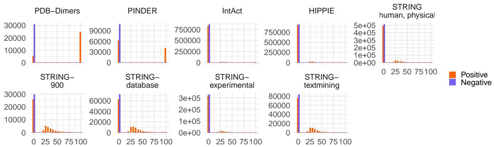  
Figure A1: Percentage of identical residues (BLAST pident output) between the interaction candidates of the training datasets.

Table A1: Performance metrics across datasets, splitting strategies, and test sets.
<table><tr><td>Dataset</td><td>Category</td><td>Test set</td><td>AUROC</td><td>AUPRC</td><td>F1</td><td>MCC</td><td>Prec.</td><td>Rec.</td><td>Acc.</td></tr><tr><td rowspan="6">PDB- Dimers</td><td rowspan="6">Maximally biased Similarity- reduced ILP split</td><td>balanced</td><td>0.98</td><td>0.98</td><td>0.94</td><td>0.88</td><td>0.95</td><td>0.93</td><td>0.94</td></tr><tr><td>realistic</td><td>0.98</td><td>0.88</td><td>0.77</td><td>0.76</td><td>0.66</td><td>0.93</td><td>0.95</td></tr><tr><td>balanced</td><td>0.94</td><td>0.94</td><td>0.86</td><td>0.75</td><td>0.92</td><td>0.81</td><td>0.87</td></tr><tr><td>realistic</td><td>0.92</td><td>0.72</td><td>0.57</td><td>0.54</td><td>0.43</td><td>0.81</td><td>0.89</td></tr><tr><td>balanced</td><td>0.99</td><td>0.99</td><td>0.97</td><td>0.95</td><td>0.98</td><td>0.97</td><td>0.97</td></tr><tr><td>realistic balanced</td><td>0.99</td><td>0.95</td><td>0.87</td><td>0.86</td><td>0.79</td><td>0.97</td><td>0.97</td></tr><tr><td rowspan="6">PINDER</td><td>ILP split + ILP sampling</td><td>realistic</td><td>0.79 0.80</td><td>0.77 0.58</td><td>0.72 0.21</td><td>0.36 0.14</td><td>0.62 0.12</td><td>0.86 0.86</td><td>0.67 0.42</td></tr><tr><td>Maximally biased</td><td>balanced</td><td>0.95</td><td>0.95</td><td>0.88</td><td>0.76</td><td>0.87</td><td>0.89</td><td>0.88</td></tr><tr><td rowspan="4">Similarity-</td><td></td><td>0.95</td><td>0.74</td><td>0.56</td><td>0.55</td><td>0.41</td><td>0.89</td><td></td></tr><tr><td>realistic balanced</td><td>0.96</td><td>0.96</td><td>0.90</td><td>0.81</td><td>0.92</td><td>0.89</td><td>0.87 0.91</td></tr><tr><td>realistic</td><td>0.96</td><td>0.84</td><td>0.68</td><td>0.66</td><td>0.55</td><td>0.89</td><td>0.92</td></tr><tr><td>balanced</td><td>0.98</td><td>0.98</td><td>0.93</td><td>0.85</td><td>0.92</td><td>0.94</td><td>0.93</td></tr><tr><td rowspan="6">IntAct</td><td>ILP split +</td><td>realistic</td><td>0.98</td><td>0.88</td><td>0.68</td><td>0.67</td><td>0.53</td><td>0.94</td><td>0.92</td></tr><tr><td></td><td>balanced</td><td>0.76</td><td>0.77</td><td>0.71</td><td>0.32</td><td>0.60</td><td>0.87</td><td>0.64</td></tr><tr><td>ILP sampling realistic</td><td></td><td>0.65</td><td>0.26</td><td>0.17</td><td>0.03</td><td>0.09</td><td>0.87</td><td>0.23</td></tr><tr><td>Maximally</td><td>balanced</td><td>0.88</td><td>0.89</td><td>0.83</td><td>0.58</td><td>0.75</td><td>0.92</td><td>0.79</td></tr><tr><td>biased</td><td>realistic</td><td>0.88</td><td>0.52</td><td>0.37</td><td>0.34</td><td>0.23</td><td>0.92</td><td>0.65</td></tr><tr><td rowspan="5">Similarity- reduced</td><td>balanced</td><td>0.72</td><td>0.71</td><td>0.64</td><td>0.30</td><td>0.66</td><td></td><td>0.63</td><td>0.65</td></tr><tr><td></td><td>realistic</td><td>0.71</td><td>0.23</td><td>0.27</td><td>0.18</td><td>0.17</td><td>0.63</td><td>0.66</td></tr><tr><td>ILP split</td><td>balanced</td><td>0.69</td><td>0.67</td><td>0.64</td><td>0.27</td><td>0.64</td><td>0.63</td><td>0.64</td></tr><tr><td>realistic</td><td></td><td>0.75</td><td>0.26</td><td>0.32</td><td>0.23</td><td>0.22</td><td>0.63</td><td>0.71</td></tr><tr><td>ILP split +</td><td>balanced</td><td>0.55</td><td>0.55</td><td>0.64</td><td>0.04</td><td>0.51</td><td>0.85</td><td>0.51</td></tr><tr><td></td><td>ILP sampling</td><td>realistic</td><td>0.45</td><td>0.10</td><td>0.19</td><td>-0.03</td><td>0.11</td><td>0.85</td><td>0.19</td></tr><tr><td rowspan="9">HIPPIE</td><td rowspan="3">Maximally biased Similarity-</td><td>balanced</td><td>0.86</td><td>0.87</td><td>0.80</td><td>0.56</td><td>0.75</td><td>0.84</td><td>0.78</td></tr><tr><td>realistic</td><td>0.86</td><td>0.48</td><td>0.37</td><td>0.34</td><td>0.24</td><td>0.84</td><td>0.73</td></tr><tr><td>balanced</td><td>0.59</td><td>0.59</td><td>0.45</td><td>0.13</td><td>0.59</td><td>0.37</td><td>0.56</td></tr><tr><td rowspan="3">reduced ILP split</td><td>realistic</td><td>0.63</td><td>0.15</td><td>0.22</td><td>0.11</td><td>0.16</td><td>0.37</td><td>0.75</td></tr><tr><td>balanced</td><td>0.55</td><td>0.54</td><td>0.46</td><td>0.07</td><td>0.54</td><td>0.40</td><td>0.53</td></tr><tr><td>realistic</td><td>0.63</td><td>0.17</td><td>0.24</td><td>0.13</td><td>0.17</td><td>0.40</td><td>0.75</td></tr><tr><td>ILP split +</td><td>balanced</td><td>0.57</td><td>0.56</td><td>0.66</td><td>0.10</td><td>0.52</td><td>0.91</td><td>0.53</td></tr><tr><td>ILP sampling</td><td>realistic</td><td>0.48</td><td>0.10</td><td>0.17</td><td>-0.01</td><td>0.10</td><td>0.91</td><td>0.17</td></tr><tr><td rowspan="8">STRING human, biased physical Similarity-</td><td rowspan="3">Maximally</td><td>balanced</td><td>0.85</td><td>0.85</td><td>0.77</td><td>0.54</td><td>0.77</td><td>0.78</td><td>0.77</td></tr><tr><td>realistic</td><td>0.85</td><td>0.47</td><td>0.37</td><td>0.34</td><td>0.25</td><td>0.78</td><td>0.76</td></tr><tr><td>balanced realistic</td><td>0.62 0.67</td><td>0.62</td><td>0.54</td><td>0.16</td><td>0.60</td><td>0.49</td><td>0.58</td></tr><tr><td rowspan="3">reduced ILP split</td><td></td><td></td><td>0.18</td><td>0.24</td><td>0.15</td><td>0.16</td><td>0.49</td><td>0.71 0.57</td></tr><tr><td>balanced</td><td>0.60 0.61</td><td>0.60</td><td>0.51</td><td>0.14</td><td>0.59 0.13</td><td>0.45</td><td></td></tr><tr><td>realistic balanced</td><td>0.52</td><td>0.13 0.53</td><td>0.20</td><td>0.09 0.00</td><td>0.50</td><td>0.45 0.97</td><td>0.67 0.50</td></tr><tr><td rowspan="2">ILP split + ILP sampling</td><td></td><td>0.48</td><td>0.09</td><td>0.66 0.16</td><td>-0.02</td><td>0.09</td><td>0.97</td><td>0.11</td></tr><tr><td>realistic</td><td></td><td></td><td></td><td></td><td></td><td></td><td></td></tr><tr><td rowspan="7">900</td><td rowspan="7">Maximally biased Similarity- reduced</td><td>balanced realistic</td><td>0.82 0.82</td><td>0.83</td><td>0.74 0.31</td><td>0.45</td><td>0.71 0.19</td><td>0.77 0.77</td><td>0.73 0.69</td></tr><tr><td>balanced</td><td>0.68</td><td>0.45 0.66</td><td>0.62</td><td>0.27 0.27</td><td>0.64</td><td>0.60</td><td>0.63</td></tr><tr><td>realistic</td><td>0.65</td><td>0.15</td><td>0.22</td><td>0.13</td><td>0.14</td><td>0.60</td><td>0.62</td></tr><tr><td>balanced</td><td>0.66</td><td>0.64</td><td>0.63</td><td>0.23</td><td>0.60</td><td>0.67</td><td>0.61</td></tr><tr><td>realistic</td><td>0.66</td><td>0.15</td><td>0.22</td><td>0.14</td><td>0.13</td><td>0.67</td><td>0.57</td></tr><tr><td>balanced</td><td>0.56</td><td>0.55</td><td>0.64</td><td></td><td>0.52</td><td>0.82</td><td>0.53</td></tr><tr><td>ILP split + ILP sampling realistic</td><td>0.60</td><td>0.13</td><td>0.18</td><td>0.08 0.07</td><td>0.10</td><td>0.82</td><td>0.33</td></tr><tr><td rowspan="8">STRING- Maximally experimental biased</td><td></td><td></td><td></td><td></td><td></td><td></td><td></td><td></td><td>0.75</td></tr><tr><td rowspan="8">Similarity-</td><td>balanced</td><td>0.83 0.83</td><td>0.84 0.45</td><td>0.75 0.35</td><td>0.50 0.31</td><td>0.74 0.22</td><td>0.76 0.76</td><td>0.74</td></tr><tr><td>realistic balanced</td><td>0.56</td><td>0.56</td><td>0.45</td><td>0.08</td><td>0.55</td><td>0.38</td><td>0.54</td></tr><tr><td>realistic</td><td>0.57</td><td>0.11</td><td>0.18</td><td>0.06</td><td>0.12</td><td>0.38</td><td>0.68</td></tr><tr><td>reduced ILP split balanced</td><td>0.58</td><td>0.57</td><td>0.47</td><td>0.11</td><td>0.57</td><td>0.39</td><td>0.55</td></tr><tr><td>realistic</td><td>0.54</td><td>0.10</td><td>0.16</td><td>0.02</td><td>0.10</td><td>0.39</td><td>0.62</td></tr><tr><td>ILP split + balanced</td><td></td><td>0.54</td><td>0.67</td><td>0.01</td><td>0.50</td><td>1.00</td><td>0.50</td></tr><tr><td>ILP sampling realistic</td><td>0.54 0.42</td><td>0.08</td><td>0.17</td><td>-0.01</td><td>0.09</td><td>1.00</td><td>0.09</td></tr><tr><td rowspan="6">STRING- database biased</td><td>Maximally balanced</td><td></td><td>0.86</td><td>0.87</td><td>0.78</td><td>0.54</td><td>0.73</td><td>0.84</td><td>0.77</td></tr><tr><td>Similarity-</td><td>realistic</td><td>0.86</td><td>0.49</td><td>0.35</td><td>0.33</td><td>0.22</td><td>0.84</td><td>0.71</td></tr><tr><td></td><td>balanced</td><td>0.65</td><td>0.64</td><td>0.54</td><td>0.21</td><td>0.64</td><td>0.47</td><td>0.60</td></tr><tr><td>reduced ILP split</td><td>realistic</td><td>0.67</td><td>0.17</td><td>0.24</td><td>0.14</td><td>0.16</td><td>0.47</td><td>0.72</td></tr><tr><td></td><td>balanced</td><td>0.73</td><td>0.70</td><td>0.59</td><td>0.31</td><td>0.70</td><td>0.51</td><td>0.65</td></tr><tr><td></td><td>realistic</td><td>0.71</td><td>0.21</td><td>0.26</td><td>0.18</td><td>0.18</td><td>0.51</td><td>0.74</td></tr><tr><td>ILP split +</td><td>balanced</td><td></td><td>0.59</td><td>0.58 0.66</td><td></td><td>0.11</td><td>0.53</td><td>0.87</td><td>0.54</td></tr><tr><td>ILP sampling</td><td>realistic</td><td>0.55</td><td></td><td>0.11 0.17</td><td>0.04</td><td></td><td>0.10</td><td>0.87</td><td>0.24</td></tr><tr><td rowspan="9">STRING- textmining</td><td>Maximally</td><td>balanced</td><td>0.80</td><td>0.81</td><td>0.74</td><td>0.46</td><td>0.72</td><td>0.76</td><td>0.73</td></tr><tr><td>biased</td><td>realistic</td><td>0.80</td><td>0.40</td><td>0.32</td><td>0.28</td><td>0.20</td><td>0.76</td><td colspan="2">0.71</td></tr><tr><td>Similarity-</td><td>balanced</td><td>0.59</td><td>0.58</td><td>0.56</td><td>0.13</td><td>0.57</td><td>0.55</td><td colspan="2">0.56</td></tr><tr><td>reduced</td><td>realistic</td><td>0.64</td><td>0.15</td><td>0.21</td><td>0.11</td><td>0.13</td><td>0.55</td><td colspan="2">0.63</td></tr><tr><td>ILP split</td><td>balanced</td><td>0.58</td><td>0.56</td><td>0.57</td><td>0.11</td><td>0.55</td><td>0.58</td><td colspan="2">0.56</td></tr><tr><td></td><td>realistic</td><td>0.63</td><td>0.14</td><td>0.21</td><td>0.11</td><td>0.13</td><td>0.58</td><td colspan="2">0.60</td></tr><tr><td>ILP split +</td><td>balanced</td><td>0.55</td><td>0.54</td><td>0.66</td><td>0.07</td><td>0.51</td><td>0.92</td><td colspan="2">0.52</td></tr><tr><td>ILP sampling</td><td>realistic</td><td>0.57</td><td>0.12</td><td>0.18</td><td>0.06</td><td>0.10</td><td>0.92</td><td colspan="2">0.22</td></tr></table>

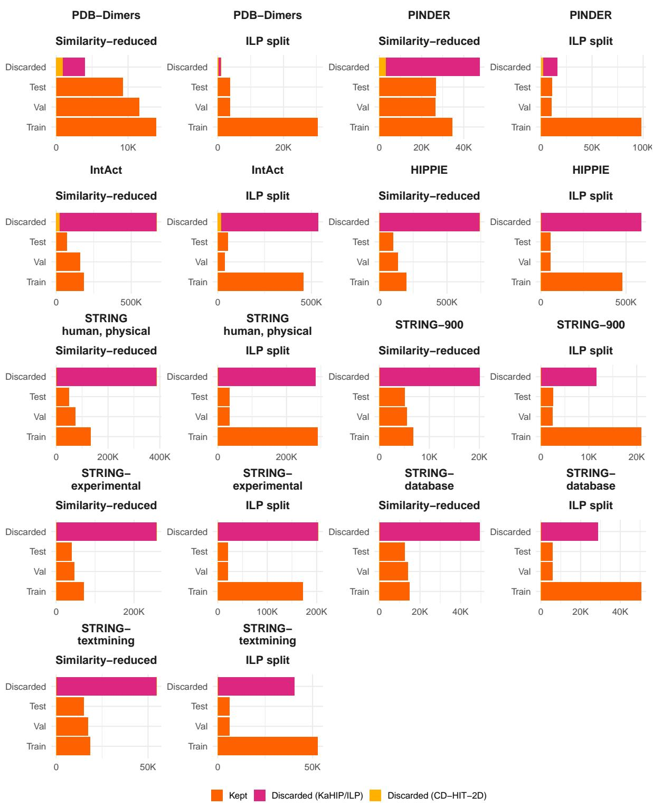  
Figure A2: Data retained for training, validation, and test by the two suggested splitting approaches vs. data discarded by them. CD-HIT-2D mostly removes leftover similar interactions in IntAct (22 380 in the similarity-reduced setting, 17 951 in the ILP split), and PINDER (3096 and 1838, respectively). For PDB-Dimers, STRING: human/physical, and HIPPIE, fewer than 1000 interactions are removed, for the others, fewer than 200.

## B Results for ProtT5 embeddings

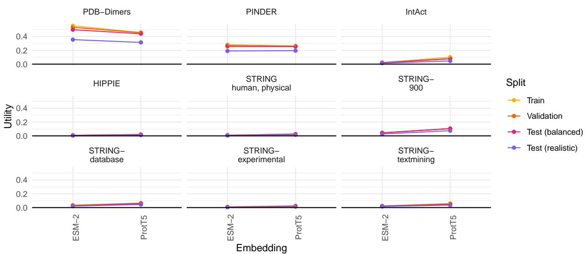  
Figure B1: Comparison of the utility of the embedding similarity attribute for ESM-2 versus ProtT5. Overall, the utility is comparable.

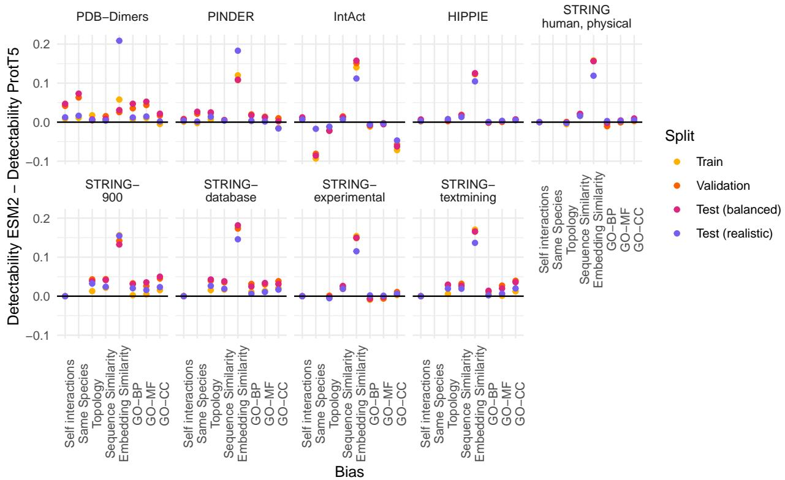  
Figure B2: Comparison of the detectability of the diferent bias attributes in the maximally biased setting. The ridge regressor is either applied from concatenated ESM-2 embeddings or concatenated ProtT5 embeddings. Overall, biases are more detectable from ESM-2.

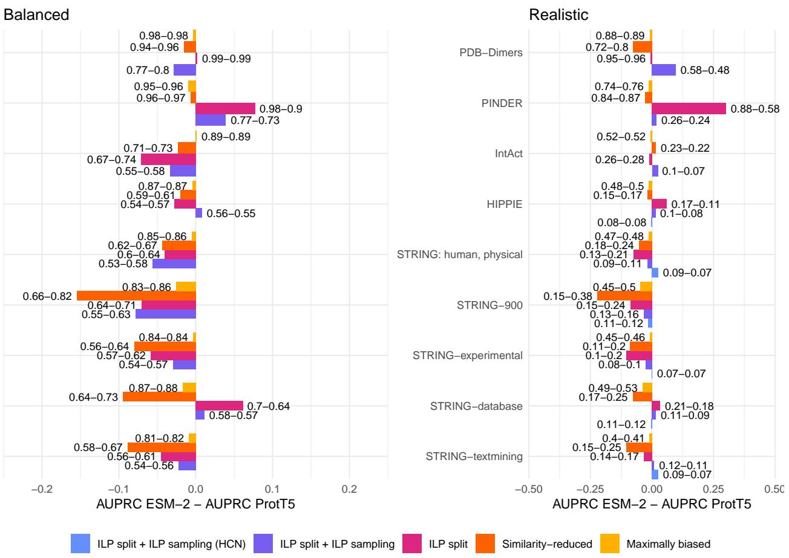  
Figure B3: Comparison of the baseline Random Forest classifier results for the ESM-2 versus the ProtT5 embeddings. Overall, ProtT5 results are better.

Table B1: Performance metrics across datasets, splitting strategies, and test sets for ProtT5 embeddings instead of ESM-2 embeddings.
<table><tr><td>Dataset</td><td>Category</td><td>Test set</td><td>AUROC</td><td>AUPRC</td><td>F1</td><td>MCC</td><td>Prec.</td><td>Rec.</td><td>Acc.</td></tr><tr><td>PDB-</td><td>Maximally</td><td>balanced</td><td>0.98</td><td>0.98</td><td>0.95</td><td>0.89</td><td>0.96</td><td>0.93</td><td>0.95</td></tr><tr><td>Dimers</td><td>biased</td><td>realistic</td><td>0.98</td><td>0.89</td><td>0.79</td><td>0.78</td><td>0.69</td><td>0.93</td><td>0.96</td></tr><tr><td></td><td>Similarity-</td><td>balanced</td><td>0.95</td><td>0.96</td><td>0.86</td><td>0.76</td><td>0.96</td><td>0.78</td><td>0.87</td></tr><tr><td></td><td>reduced</td><td>realistic</td><td>0.94</td><td>0.80</td><td>0.69</td><td>0.66</td><td>0.62</td><td>0.78</td><td>0.94</td></tr><tr><td></td><td>ILP split</td><td>balanced</td><td>0.99</td><td>0.99</td><td>0.96</td><td>0.92</td><td>0.98</td><td>0.94</td><td>0.96</td></tr><tr><td></td><td></td><td>realistic</td><td>0.99</td><td>0.96</td><td>0.87</td><td>0.86</td><td>0.81</td><td>0.94</td><td>0.97</td></tr><tr><td></td><td>ILP split +</td><td>balanced</td><td>0.81</td><td>0.80</td><td>0.75</td><td>0.46</td><td>0.67</td><td>0.85</td><td>0.72</td></tr><tr><td></td><td>ILP sampling</td><td>realistic</td><td>0.79</td><td>0.48</td><td>0.25</td><td>0.20</td><td>0.14</td><td>0.85</td><td>0.53</td></tr><tr><td>PINDER</td><td>Maximally</td><td>balanced</td><td>0.96</td><td>0.96</td><td>0.90</td><td>0.81</td><td>0.90</td><td>0.90</td><td>0.90</td></tr><tr><td></td><td>biased</td><td>realistic</td><td>0.96</td><td>0.76</td><td>0.63</td><td>0.62</td><td>0.48</td><td>0.90</td><td>0.90</td></tr><tr><td></td><td>Similarity-</td><td>balanced</td><td>0.96</td><td>0.97</td><td>0.91</td><td>0.82</td><td>0.92</td><td>0.90</td><td>0.91</td></tr><tr><td></td><td>reduced</td><td>realistic</td><td>0.96</td><td>0.87</td><td>0.66</td><td>0.65</td><td>0.52</td><td>0.90</td><td>0.92</td></tr><tr><td></td><td>ILP split</td><td>balanced</td><td>0.90</td><td>0.90</td><td>0.80</td><td>0.65</td><td>0.88</td><td>0.74</td><td>0.82</td></tr><tr><td></td><td></td><td>realistic</td><td>0.90</td><td>0.58</td><td>0.54</td><td>0.50</td><td>0.42</td><td>0.74</td><td>0.88</td></tr><tr><td></td><td>ILP split +</td><td>balanced</td><td>0.71</td><td>0.73</td><td>0.67</td><td>0.28</td><td>0.62</td><td>0.72</td><td>0.64</td></tr><tr><td></td><td>ILP sampling</td><td>realistic</td><td>0.62</td><td>0.24</td><td>0.18</td><td>0.05</td><td>0.10</td><td>0.72</td><td>0.39</td></tr><tr><td>IntAct</td><td>Maximally</td><td>balanced</td><td>0.89</td><td>0.89</td><td>0.82</td><td>0.63</td><td>0.79</td><td>0.86</td><td>0.81</td></tr><tr><td></td><td>biased</td><td>realistic</td><td>0.89</td><td>0.52</td><td>0.41</td><td>0.40</td><td>0.27</td><td>0.86</td><td>0.77</td></tr><tr><td></td><td>Similarity-</td><td>balanced</td><td>0.76</td><td>0.73</td><td>0.69</td><td>0.37</td><td>0.68</td><td>0.70</td><td>0.69</td></tr><tr><td></td><td>reduced</td><td>realistic</td><td>0.74</td><td>0.22</td><td>0.28</td><td>0.23</td><td>0.18</td><td>0.70</td><td>0.68</td></tr><tr><td></td><td>ILP split</td><td>balanced</td><td>0.76</td><td>0.74</td><td>0.67</td><td>0.36</td><td>0.69</td><td>0.66</td><td>0.68</td></tr><tr><td></td><td>ILP split +</td><td>realistic</td><td>0.78</td><td>0.28</td><td>0.31</td><td>0.25</td><td>0.20</td><td>0.66</td><td>0.74</td></tr><tr><td></td><td>ILP sampling</td><td>balanced</td><td>0.59</td><td>0.58</td><td>0.63</td><td>0.13</td><td>0.54</td><td>0.76</td><td>0.56</td></tr><tr><td>HIPPIE</td><td></td><td>realistic</td><td>0.38</td><td>0.07</td><td>0.14</td><td>-0.09</td><td>0.08</td><td>0.76</td><td>0.18</td></tr><tr><td></td><td>Maximally</td><td>balanced</td><td>0.87</td><td>0.87</td><td>0.80</td><td>0.59</td><td>0.78</td><td>0.82</td><td>0.79</td></tr><tr><td></td><td>biased</td><td>realistic</td><td>0.87</td><td>0.50</td><td>0.40</td><td>0.37</td><td>0.26</td><td>0.82</td><td>0.77</td></tr><tr><td></td><td>Similarity-</td><td>balanced</td><td>0.60</td><td>0.61</td><td>0.50</td><td>0.15</td><td>0.60</td><td>0.43</td><td>0.57</td></tr><tr><td></td><td>reduced</td><td>realistic</td><td>0.62</td><td>0.17</td><td>0.21</td><td>0.10</td><td>0.14</td><td>0.43</td><td>0.71</td></tr><tr><td></td><td>ILP split</td><td>balanced</td><td>0.57</td><td>0.57</td><td>0.44</td><td>0.10</td><td>0.57</td><td>0.36</td><td>0.55</td></tr><tr><td></td><td></td><td>realistic</td><td>0.56</td><td>0.11</td><td>0.17</td><td>0.04</td><td>0.11</td><td>0.36</td><td>0.67</td></tr><tr><td></td><td>ILP split +</td><td>balanced</td><td>0.55</td><td>0.55</td><td>0.66</td><td>0.01</td><td>0.50</td><td>0.97</td><td>0.50</td></tr><tr><td></td><td>ILP sampling</td><td>realistic</td><td>0.45</td><td>0.08</td><td>0.16</td><td>-0.02</td><td>0.09</td><td>0.97</td><td>0.11</td></tr><tr><td></td><td>ILP split +</td><td>balanced</td><td>0.61</td><td>0.60</td><td>0.66</td><td>0.09</td><td>0.51</td><td>0.94</td><td>0.52</td></tr><tr><td>STRING</td><td>sampling (HCN) realistic</td><td></td><td>0.43</td><td>0.08</td><td>0.16</td><td>-0.07</td><td>0.09</td><td>0.94</td><td>0.10</td></tr><tr><td>human, physical</td><td>Maximally</td><td>balanced</td><td>0.85</td><td>0.86</td><td>0.78</td><td>0.55</td><td>0.78</td><td>0.77</td><td>0.78</td></tr><tr><td></td><td>biased</td><td>realistic</td><td>0.85</td><td>0.48</td><td>0.39</td><td>0.36</td><td>0.26</td><td>0.77</td><td>0.78</td></tr><tr><td></td><td>Similarity-</td><td>balanced</td><td>0.66</td><td>0.67</td><td>0.57</td><td>0.22</td><td>0.63</td><td>0.51</td><td>0.61</td></tr><tr><td></td><td>reduced</td><td>realistic</td><td>0.67</td><td>0.24</td><td>0.24</td><td>0.15</td><td>0.16</td><td>0.51</td><td>0.70</td></tr><tr><td></td><td>ILP split</td><td>balanced</td><td>0.65</td><td>0.64</td><td>0.50</td><td>0.20</td><td>0.65</td><td>0.41</td><td>0.59</td></tr><tr><td></td><td></td><td>realistic</td><td>0.66</td><td>0.21</td><td>0.25 0.66</td><td>0.16 0.09</td><td>0.18 0.52</td><td>0.41 0.92</td><td>0.77 0.53</td></tr><tr><td></td><td>ILP split + ILP sampling</td><td>balanced realistic</td><td>0.58 0.52</td><td>0.58 0.11</td></tr><tr><td rowspan="9">STRING- 900</td><td rowspan="9">Maximally biased Similarity- reduced</td><td>balanced realistic</td><td>0.85</td><td>0.86 0.50</td><td>0.76 0.35</td><td>0.51 0.32</td><td>0.74 0.23</td><td>0.79 0.79</td><td>0.76 0.74</td></tr><tr><td></td><td>0.85</td><td></td><td></td><td></td><td></td><td></td><td></td></tr><tr><td>balanced</td><td>0.81</td><td>0.82</td><td>0.70</td><td>0.45</td><td>0.77</td><td>0.65</td><td>0.72</td></tr><tr><td>realistic</td><td>0.75</td><td>0.38</td><td>0.29</td><td>0.23</td><td>0.19</td><td>0.65</td><td>0.71</td></tr><tr><td>balanced</td><td>0.71</td><td>0.71</td><td>0.65</td><td>0.30</td><td>0.65</td><td>0.66</td><td>0.65</td></tr><tr><td>realistic</td><td>0.69</td><td>0.24</td><td>0.23</td><td>0.14</td><td>0.14</td><td>0.66</td><td>0.60</td></tr><tr><td>balanced</td><td>0.64</td><td>0.63</td><td>0.66</td><td>0.19</td><td>0.56</td><td>0.80</td><td>0.58</td></tr><tr><td>ILP sampling realistic</td><td>0.64</td><td>0.16</td><td>0.20</td><td>0.10</td><td>0.11</td><td>0.80</td><td>0.40</td></tr><tr><td>ILP split + balanced sampling (HCN) realistic</td><td>0.73</td><td>0.73</td><td>0.67 0.18</td><td>0.31 0.06</td><td>0.64 0.10</td><td>0.70 0.70</td><td>0.65 0.42</td></tr><tr><td rowspan="9">STRING- experimental biased Similarity-</td><td rowspan="9">Maximally</td><td></td><td>0.57</td><td>0.12 0.84</td><td>0.76</td><td>0.51</td><td>0.75</td><td>0.76</td><td>0.76</td></tr><tr><td>balanced realistic</td><td>0.83 0.83</td><td>0.46</td><td>0.36</td><td>0.32</td><td>0.24</td><td>0.76</td><td>0.75</td></tr><tr><td>balanced</td><td>0.62</td><td>0.64</td><td>0.54</td><td>0.17</td><td>0.60</td><td>0.49</td><td>0.58</td></tr><tr><td>realistic</td><td>0.61</td><td>0.20</td><td>0.20</td><td>0.09</td><td>0.13</td><td>0.49</td><td>0.65</td></tr><tr><td>balanced</td><td>0.62</td><td>0.62</td><td>0.55</td><td>0.17</td><td>0.60</td><td>0.51</td><td>0.59</td></tr><tr><td>realistic</td><td>0.64</td><td>0.20</td><td>0.23</td><td>0.13</td><td>0.15</td><td>0.51</td><td>0.69</td></tr><tr><td>balanced</td><td>0.56</td><td>0.57</td><td>0.65</td><td>0.05</td><td>0.51</td><td>0.89</td><td>0.52</td></tr><tr><td>ILP split + ILP sampling realistic</td><td>0.51</td><td>0.10</td><td>0.17</td><td>0.00</td><td>0.09</td><td>0.89</td><td>0.18</td></tr><tr><td>ILP split + balanced</td><td>0.56</td><td>0.56</td><td>0.62</td><td>0.07</td><td>0.52</td><td>0.77</td><td>0.53</td></tr><tr><td rowspan="9">STRING- Maximally</td><td rowspan="9">sampling (HCN) realistic</td><td></td><td>0.38</td><td>0.07</td><td>0.14</td><td>-0.11</td><td>0.08</td><td>0.77</td><td>0.17</td></tr><tr><td>balanced</td><td>0.88</td><td>0.88</td><td>0.80</td><td>0.59</td><td>0.76</td><td>0.85</td><td>0.79</td></tr><tr><td>realistic balanced</td><td>0.88</td><td>0.53</td><td>0.38</td><td>0.36</td><td>0.24</td><td>0.85</td><td>0.75</td></tr><tr><td>realistic</td><td>0.73</td><td>0.73</td><td>0.62</td><td>0.34</td><td>0.72</td><td>0.55</td><td>0.67</td></tr><tr><td>reduced ILP split balanced</td><td>0.72</td><td>0.25</td><td>0.28</td><td>0.20</td><td>0.19</td><td>0.55</td><td>0.75</td></tr><tr><td></td><td>0.65</td><td>0.64</td><td>0.48</td><td>0.20</td><td>0.65</td><td>0.38</td><td>0.59</td></tr><tr><td>realistic balanced</td><td>0.67</td><td>0.18</td><td>0.24</td><td>0.15</td><td>0.18</td><td>0.38</td><td>0.79</td></tr><tr><td>ILP split + realistic</td><td>0.57</td><td>0.57</td><td>0.64</td><td>0.08</td><td>0.52</td><td>0.82</td><td>0.53</td></tr><tr><td>ILP sampling</td><td>0.50</td><td>0.09</td><td>0.17</td><td>0.01</td><td>0.09</td><td>0.82</td><td>0.25</td></tr><tr><td rowspan="3">ILP split + sampling (HCN) realistic</td><td>balanced</td><td>0.66 0.57</td><td>0.65 0.12</td><td>0.66</td><td>0.21 0.05</td><td>0.58 0.10</td><td>0.76 0.76</td><td>0.60</td></tr><tr><td>Maximally</td><td></td><td></td><td>0.18</td><td></td><td></td><td></td><td></td><td>0.37</td></tr><tr><td>balanced</td><td>0.82</td><td>0.82</td><td>0.74</td><td></td><td>0.49</td><td>0.74</td><td>0.75</td><td>0.74</td></tr><tr><td rowspan="9">textmining</td><td rowspan="9">biased Similarity- reduced</td><td>realistic</td><td>0.81</td><td>0.41</td><td>0.34</td><td>0.30</td><td>0.22</td><td>0.75</td><td>0.73</td></tr><tr><td>balanced</td><td>0.69</td><td>0.67</td><td>0.64</td><td>0.27</td><td>0.63</td><td>0.64</td><td>0.63</td></tr><tr><td>realistic</td><td>0.70</td><td>0.25</td><td>0.24</td><td>0.16</td><td>0.15</td><td>0.64</td><td>0.63</td></tr><tr><td>balanced</td><td>0.61</td><td>0.61</td><td>0.56</td><td>0.16</td><td>0.59</td><td>0.54</td><td>0.58</td></tr><tr><td>realistic</td><td>0.65</td><td>0.17</td><td>0.23</td><td>0.13</td><td>0.14</td><td>0.54</td><td>0.67</td></tr><tr><td>balanced</td><td>0.56</td><td>0.56</td><td>0.60</td><td>0.07</td><td>0.52</td><td>0.70</td><td>0.53</td></tr><tr><td>ILP sampling realistic</td><td>0.54</td><td>0.11</td><td>0.17</td><td>0.03</td><td>0.10</td><td>0.70</td><td>0.38</td></tr><tr><td>balanced</td><td>0.56</td><td>0.57</td><td>0.58</td><td>0.08</td><td>0.53</td><td>0.65</td><td>0.54</td></tr><tr><td>ILP split +</td><td>0.37</td><td>0.07</td><td></td><td>-0.11</td><td>0.07</td><td>0.65</td><td>0.24</td></tr><tr><td colspan="2">sampling (HCN) realistic</td><td></td><td></td><td>0.13</td><td></td><td></td><td></td><td></td></tr></table>

## C Runtime and resource consumption

The ILP configurations are more expensive than their alternatives. Figure C1 reports wall-clock runtime and peak memory per pipeline step across the five settings (maximally biased, similarity-reduced, ILP split, ILP split + ILP sampling from the complement, and ILP split + ILP sampling from the HCN pool) applied to all datasets using ProtT5 embeddings (results of Appendix B).

Data preparation Clustering Positive split Negative sampling Baseline model Quality control  
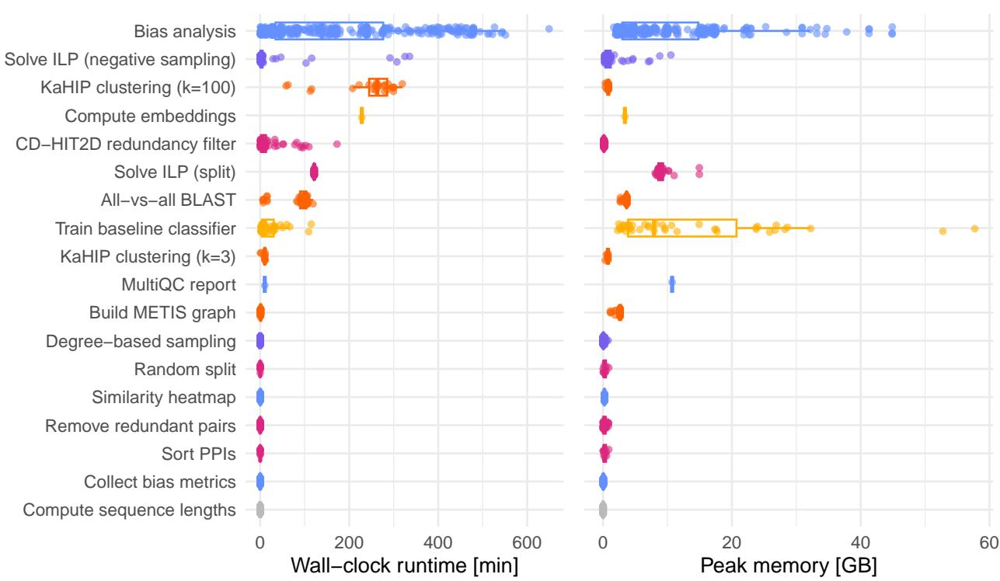  
Figure C1: Runtime and resources taken up by the individual pipeline steps for all configurations reported in Appendix B (ProtT5 embeddings).

The bias analysis, solving the ILPs, the KaHIP clustering into 100 clusters (which is only required for the ILP split), and the embedding computation have the longest runtime. The bias analysis is slow because of the Ridge regressor, which is fit once per attribute and split. Solving the ILP for the positive split always reached the 2-hour time limit, so the reported cluster assignments are feasible but not optimal. The negative-sampling ILP is fast on the small validation and test sets but takes close to 6 hours on the training set because it scales quadratically with the candidate pool. This is why we cap the pool at four times the positive count (here, about 2 million for the training set), rather than drawing from the full complement or the full HCN set. The pool is subsampled in a way that makes it possible to find a feasible solution to the ILP. Depending on the activated bias terms, negative self-interactions are added, pairs with a nonzero GO-BP Jaccard index are preferred, and taxa and positive degrees are taken into account (for more details, see Section 4.2.2). The embeddings are generated once for all 259 687 sequences combined.

Memory consumption is highest for baseline training, which holds the concatenated embeddings of all pairs in memory, followed by the bias analysis. Both are highest for HIPPIE, IntAct, and STRING, the largest datasets. All other steps stay below 15 GB. All ILPs were solved with Gurobi under an academic license. CVXPY supports open alternatives, but these are typically slower on problems of this size, so users without a commercial solver should expect longer runtimes than those reported here. All analyses ran on a heterogeneous SLURM cluster comprising Intel Xeon Gold 6148 (2.40 GHz), AMD EPYC 7351, and AMD EPYC 7713 nodes, using conda environments. Embedding generation used an NVIDIA A40 GPU. The pipeline in all 43 settings (9 datasets in four settings + sampling from the HCN for 7 datasets) completed in about 3 days and 17 hours of wall-clock time given the available concurrency.