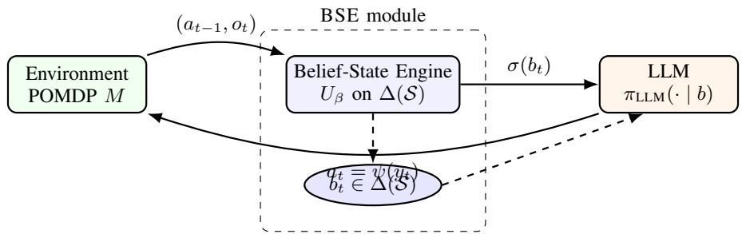
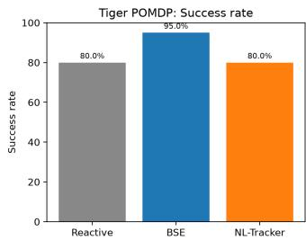
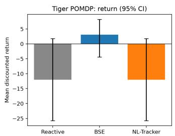
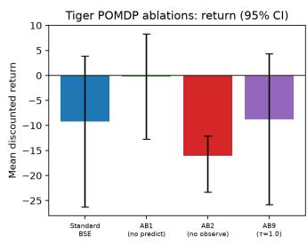
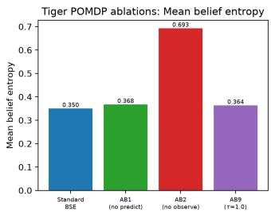
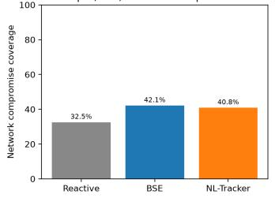
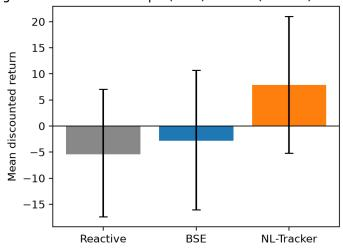
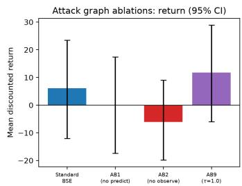
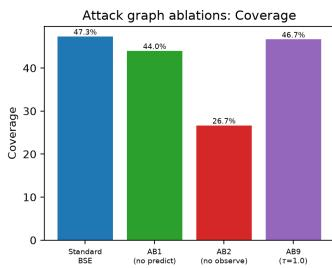

# Belief-State Engine: Augmenting LLMs for Principled Planning Under Partial Observability

Arnab Chattopadhayay and Debdipta Halder

Abstract—Large language model agents produce fluent action sequences across a wide range of tasks, yet they fail in characteristic ways once the environment becomes partially observable. Ambiguous feedback pushes them into premature commitments. A single informative observation can collapse their uncertainty onto the wrong hypothesis. Policies drift as the history grows. We trace these symptoms to a common structural cause. An LLM agent, as commonly deployed, is a history-conditioned policy with no explicit belief over hidden state.

We propose an architectural fix. The Belief-State Engine (BSE) is an inference module placed outside the LLM. It maintains a Bayesian posterior over the latent states of a given POMDP model, and at each decision step it exposes only that posterior to the LLM. The raw action-observation log is not shown. We set out a minimal four-axiom specification of what a belief-consistent internal state must satisfy, and prove that the LLM paired with the BSE is a sound Markov policy on the belief MDP induced by the underlying POMDP. It therefore inherits the Bellman optimality guarantees of classical POMDP theory, provided the LLM is never exposed to the raw history.

We evaluate the architecture on the Tiger POMDP and a redteam attack-graph task, against six baselines: a reactive LLM, Chain-of-Thought, ReAct, a natural-language belief tracker, QMDP, and POMCP. Across both domains, the BSE-augmented agent improves task return, belief calibration, and decision consistency. Ten targeted ablations isolate the contribution of each architectural choice, and a replication on an open-weights backbone confirms that the effect is not specific to any one model. Code, environment specifications, prompt templates, and seed logs accompany this preprint.

Index Terms—Large language model agents, belief state, partial observability, POMDP, planning under uncertainty, Bayesian filtering, tool-augmented LLMs.

## I. INTRODUCTION

L ARGE language models now sit at the centre of agrowing class of autonomous agents. Systems such as growing class of autonomous agents. Systems such as ReAct [1], Reflexion [2], Tree-of-Thoughts [3], Voyager [4], and SWE-agent [5] wrap an LLM inside a loop that turns textlevel reasoning into multi-step action sequences, over settings that range from embodied simulation to software repair and web navigation. These systems share a common failure profile [6], [7], [8]. They work well when the next action can be decided from the latest observation. They stumble once the environment becomes partially observable. Feedback that is delayed, or ambiguous, or actively deceptive, tends to expose a class of failures that Chain-of-Thought prompting does not resolve.

In our view the issue is architectural, not a question of reasoning depth. Keeping a calibrated belief over hidden states, and then picking actions with respect to that belief, is what Bayesian filtering gives you. It is not what Chain-of-Thought prompting, a longer context window, or a reflection loop confers on an LLM. These mechanisms accumulate text. They do not accumulate probability mass. Two histories that would yield the same Bayesian posterior can elicit very different action distributions from an LLM whenever their surface texts differ, and that already breaks the most basic consistency requirement of a belief-measurable policy. The behaviour this produces has been reported many times: premature commitment when evidence is still ambiguous, over-confident collapse onto one hypothesis after a single informative observation, and policy drift as the context grows.

Our fix is to stop asking the LLM to act as a planner under partial observability. We wrap it in a two-module system. An external inference component, which we call the Belief-State Engine, holds the epistemic state. The LLM is restricted to selecting actions conditioned on that state. Concretely, the BSE runs a Bayesian filter over a POMDP model $( T , Z )$ of the environment, and at each step it hands the LLM a normalised belief $b _ { t } \in \Delta ( S )$ as the only decision-time context. The raw trace of past actions and observations is not shown to the LLM.

This design has a precise mathematical backing. Under a minimal four-axiom specification of belief-consistent internal state, the LLM paired with the BSE is a Markov policy on the belief MDP induced by the underlying POMDP. It therefore inherits the Bellman optimality theorems of classical POMDP theory [9], [10], [11]. The axioms pin down what qualifies as a belief-consistent internal state. The theorems lift the architectural choice into a compositionality guarantee with a well-defined failure mode: if the LLM is shown the raw history at decision time, Axiom A4 is violated and the guarantee falls with it.

Contributions: This paper makes four contributions.

1) Architecture. We introduce the Belief-State Engine, an LLM-external and model-agnostic inference module that maintains a POMDP-grounded belief and interfaces with any belief-measurable policy, including an LLMparameterised one (section V).

2) Theory. We set out a minimal four-axiom characterisation of belief-consistent internal state and prove six theorems: existence and minimality of the canonical posterior, uniqueness of the Bayes update, value equivalence with the belief MDP, ambiguity preservation under bisimulation, and soundness of the LLM-BSE composition (section IV; full proofs in Appendix A).

3) Empirical study. We evaluate the BSE on two environments, the Tiger POMDP and a red-team attack-graph task, against six baselines (reactive, Chain-of-Thought, ReAct, natural-language belief tracker, QMDP, POMCP). Four metric families are reported: task return, belief calibration, decision consistency, and compute cost. Ten architectural ablations and an open-weights robustness replication accompany the main results (sections VI and VII).

4) Artefact release. Code, prompt templates, environment specifications, reward matrices, and paired-seed logs are published with this preprint.

Paper organisation: Section II reviews POMDP theory, LLM-agent failure modes, and related hybrid work. Section III fixes notation. Section IV sets out the axiomatic foundations. Section V describes the BSE. Section VI details the experimental methodology. Section VII reports results. Section VIII discusses limitations and approximate belief representations. Section IX concludes.

## II. BACKGROUND AND RELATED WORK

## A. POMDPs and Belief-State Theory

Partially observable Markov decision processes, or POMDPs, formalise sequential decision-making when the state is latent [9], [10], [12]. A POMDP ${ \cal M } \ = \ ( S , A , { \mathcal O } , T , Z , R , \gamma , \mu _ { 0 } )$ extends the standard MDP by a finite observation space O and an observation kernel $Z ( o \mid s , a )$ . Its optimal policy can be written as a function of the belief state $b _ { t } ~ \in ~ \Delta ( S )$ , the posterior over latent states given the interaction history [13], [10]. The belief is a sufficient statistic for optimal decision-making [14], [11]. Updating it recursively via the two-step Bayes filter, prediction followed by observation-conditioned correction, turns the POMDP into a fully observable Markov decision process on ∆(S), the belief MDP.

Exact solution of belief MDPs is PSPACE-hard in the finite-horizon case, and undecidable in the infinite-horizon case [15]. Several decades of research have produced approximate solvers that scale to useful state sizes. Point-based value iteration [16] and SARSOP [17] restrict value computation to a representative subset of reachable beliefs. QMDP [18] computes a fast heuristic by treating the environment as fully observable after the current step. POMCP [19] runs Monte Carlo tree search in belief space via sampled rollouts. All four methods assume access to the model $( T , Z )$ , or at least to a simulator of it. Our empirical setup makes the same assumption. Learning the belief-state model from data is a separate research thread that we discuss in section VIII.

## B. LLM Agents and Their Failure Modes

Starting with ReAct [1] and continuing through Reflexion [2], Tree-of-Thoughts [3], Voyager [4], SWE-agent [5], and the Cognitive Architectures for Language Agents survey [20], the working template for an LLM agent has been to iterate an LLM over a growing text log of past actions and observations, interleaved with reasoning traces, tool calls, and retrieval. The template works well when the next action can be decided from the current observation and the cost of long-context reasoning is affordable.

Systematic evaluations have mapped the limits of that template. Valmeekam and co-authors [6], [21] show that LLMs do poorly on classical planning problems even with Chainof-Thought. Liu et al. [7] report steep performance drops on agent benchmarks once observations are noisy or delayed. The standard interpretation in the literature is that the LLM lacks a world model, or a calibrated uncertainty estimate. Our own position is more specific. The missing component is a sufficient statistic of history. No amount of reasoning over raw text recovers what Bayesian conditioning gives automatically.

## C. LLM-POMDP Hybrids and Belief Tracking

A smaller but growing line of work couples LLMs to some form of explicit state representation. Reasoning via Planning [22] uses an LLM as a world model inside MCTSstyle search, but the resulting belief is implicit in the tree. Du et al. [23] have LLMs track symbolic task state for goal-conditioned learning. Xie et al. [24] and related work interpret in-context learning itself as implicit Bayesian inference, though the posterior is never surfaced. In the agent setting, a related strand asks an LLM to act as its own beliefstate approximator, typically by narrating its uncertainty in natural language rather than maintaining an explicit probability distribution.

Three points distinguish the BSE from this line of work. First, the belief is external and explicit. It lives as a probability distribution over a finite latent state space, rather than inside the LLM’s activations or in a free-text paragraph. Second, the architecture is compositional. Any LLM can be dropped into the policy slot, and any belief-measurable policy is sound by Theorem 9. Third, the belief is auditable. At every decision point the full posterior $b _ { t }$ is available to the operator, which supports debugging, monitoring, and guarantee checks in a way that implicit or free-text representations cannot match. We include a natural-language belief tracker as a direct baseline in our experiments (section VI) precisely to test whether the benefit we report comes from any epistemic state, or specifically from a probabilistic one.

## D. Uncertainty and Calibration in LLMs

Outside the agent setting, a parallel literature asks whether LLMs are calibrated. Kadavath et al. [25] find that large models are approximately calibrated on factual question answering. Kuhn et al. [26] extend this to semantic uncertainty in free-form generation. Distribution-free coverage guarantees on single-shot LLM outputs are available through conformal prediction [27]. These results all concern an LLM’s self-reported confidence on individual questions. They do not address the distinct problem of maintaining a calibrated posterior over a hidden environment state across a multi-step trajectory. That is the problem the BSE targets.

## E. The Gap

None of the lines reviewed above gives what the BSE gives: an LLM-external, auditable, POMDP-grounded belief, maintained in closed form, compositional with any LLM policy backbone, and backed by a compositionality theorem that specifies the conditions under which the composition inherits classical POMDP guarantees. The rest of the paper develops that construction. Section III fixes notation. Section IV supplies the axiomatic and theoretical foundation. Section V specifies the engine itself.

## III. PROBLEM SETTING AND PRELIMINARIES

We fix notation in this section and then state the central observation that motivates the rest of the paper: an LLM deployed as a history-conditioned policy is not a beliefmeasurable policy, and that gap is what the Belief-State Engine closes.

## A. POMDPs and the Belief MDP

Let ${ \cal M } \ = \ ( S , A , { \mathcal O } , T , Z , R , \gamma , \mu _ { 0 } )$ be a finite partially observable Markov decision process [9], [10], [12]. Here $s$ is a finite set of latent states, A a finite action set, and O a finite observation set. The transition kernel $T : \mathcal { S } \times \mathcal { A }  \Delta ( \mathcal { S } )$ maps a state-action pair to a distribution over next states, with $T ( s ^ { \prime } \mid s , a ) : = \mathbb { P } ( S _ { t + 1 } { = } s ^ { \prime } \mid S _ { t } { = } s , A _ { t } { = } a )$ . The observation kernel $Z : S \times \mathcal { A }  \Delta ( \mathcal { O } )$ emits $\textstyle Z ( o \mid s ^ { \prime } , a ) : = \mathbb { P } ( O _ { t + 1 } { = } o$ | $S _ { t + 1 } { = } s ^ { \prime } , A _ { t } { = } a )$ after the transition. The reward function $R : S \times \mathcal { A } $ R is bounded, the discount factor $\gamma \in [ 0 , 1 )$ and $\mu _ { 0 } \in \Delta ( \mathcal { S } )$ is the initial state distribution. The agent does not observe $S _ { t }$ at any step.

At time t the agent has seen an interaction history

$$
h _ { t } = ( a _ { 0 } , o _ { 1 } , a _ { 1 } , o _ { 2 } , \ldots , a _ { t - 1 } , o _ { t } ) \in \mathcal { H } _ { t } ,\tag{1}
$$

with $\mathcal { H } _ { t } : = ( \mathcal { A } \times \mathcal { O } ) ^ { t }$ and $h _ { 0 } : = \emptyset$ . Let $\textstyle { \mathcal { H } } : = \bigcup _ { t > 0 } { \mathcal { H } } _ { t }$ denote the set of all finite histories. A history-conditioned policy is a map $\pi : { \mathcal { H } } \to \Delta ( { \mathcal { A } } )$ . The induced trajectory distribution factorises in the standard way:

Equation (4) is the prediction step. Equation (5) is the observation-conditioned correction. The two steps must be performed in order. Dropping the prediction step, as the algorithm in the TechRxiv version of this work inadvertently did, gives an incorrect posterior whenever $T \neq I .$ . We return to this point when we specify the engine in section V.

Once the belief is introduced, the POMDP M is equivalent in value to a fully observable Markov decision process on $\Delta ( S )$ , known as the belief MDP. Its transition kernel is

$$
\tau ( b ^ { \prime } \mid b , a ) = \sum _ { o \in \mathcal { O } } \mathbb { P } ( o \mid b , a ) \mathbf { 1 } [ b ^ { \prime } = \operatorname { B a y e s } ( b , a , o ) ] ,\tag{6}
$$

where $\begin{array} { r } { \mathbb { P } ( o | \mathrm {  ~ \sigma ~ } | \mathrm {  ~ \sigma ~ } b { b } , a ) = \sum _ { s ^ { \prime } , s } Z ( o | \mathrm {  ~ \sigma ~ } | s ^ { \prime } , a ) T ( s ^ { \prime } | \mathrm {  ~ \sigma ~ } s , a ) b ( s ) } \end{array}$ is the marginal observation probability and ${ \mathrm { B a y e s } } ( b , a , o )$ is the posterior given by (4)–(5). The belief-MDP reward is $\begin{array} { r } { r ( b , a ) : = \sum _ { s } b ( s ) R ( s , a ) } \end{array}$ . The optimal value function $V ^ { * }$ on $\Delta ( S )$ satisfies the Bellman equation [10], [11]

$$
V ^ { * } ( b ) = \operatorname* { m a x } _ { a \in \mathcal { A } } \Big [ r ( b , a ) + \gamma \sum _ { o \in \mathcal { O } } \mathbb { P } ( o \mid b , a ) V ^ { * } ( \mathrm { B a y e s } ( b , a , o ) ) \Big ] .\tag{7}
$$

The belief is therefore a sufficient statistic of history for the purposes of optimal decision-making. Any policy that is a function of $h _ { t }$ alone, and that attains $J ( \pi ) = V ^ { * } ( \mu _ { 0 } )$ , must be expressible as a function of $b _ { t }$ on the support of trajectories induced by π. We use this fact repeatedly in section IV.

## B. LLMs as History-Conditioned Text Policies

Let X denote a token alphabet and let $\phi : \mathcal { H } \to \mathcal { X } ^ { \star }$ be a deterministic serialiser that maps a history $h _ { t }$ to a finite token string, for example a system prompt followed by a transcript of past actions and observations. Given a decoding temperature and a sampling rule, a language model induces a conditional distribution $q _ { \mathrm { L L M } } ( y \mid x )$ over token continuations $y \in \mathcal { X } ^ { \star }$ given any prompt $x \in \mathcal { X } ^ { \star }$ . An action parser ψ : $\mathcal { X } ^ { \star }  \mathcal { A } \cup \{ \perp \}$ extracts an action from the LLM output, mapping malformed continuations to a designated abstain symbol ⊥, which the deployment layer typically resolves by default action or retry.

$$
\begin{array} { r l r } { \mathbb { P } _ { \pi } ( S _ { 0 : T } , A _ { 0 : T - 1 } , O _ { 1 : T } ) = \mu _ { 0 } ( S _ { 0 } ) \displaystyle \prod _ { t = 0 } ^ { T - 1 } \pi ( A _ { t } | \ h _ { t } ) } & { \mathrm { p o l i c y ~ t h e s e ~ p i e c e s ~ \pi ~ g i v e s ~ a ~ h i s t o r y - c o n d i i t i o n e d ~ t e x } } \\ & { } & { \qquad \quad \times T ( S _ { t + 1 } \mid S _ { t } , A _ { t } ) Z ( O _ { t + 1 } \mid S _ { t + 1 } , A _ { t } ) ^ { \pi _ { \mathrm { L L M } } ( a \mid h _ { t } ) } : = \mathbb { P } _ { y \sim q _ { \mathrm { L M S } } ( \cdot \mid \phi ( h _ { t } ) ) } \left[ \psi ( y ) = a \right] , \qquad \alpha \in A _ { \infty } } \\ & { } & \end{array}
$$

The objective is the expected discounted return $J ( \pi ) : =$ $\textstyle \mathbb { E } _ { \pi } { \bigl [ } \sum _ { t = 0 } ^ { \tilde { \infty } } \gamma ^ { t } R ( S _ { t } , A _ { t } ) { \bigr ] }$

(8)

The belief at time t is the posterior over the latent state given the history:

$$
b _ { t } ( s ) : = \mathbb { P } ( S _ { t } { = } s \mid h _ { t } , \mu _ { 0 } ) , \qquad b _ { t } \in \Delta ( S ) .\tag{3}
$$

The belief admits the recursive Bayes-filter update [13], [14]. Given $b _ { t }$ , action $a _ { t } .$ , and observation $o _ { t + 1 }$ , the posterior at t+1 is

$$
\bar { b } _ { t + 1 } ( s ^ { \prime } ) = \sum _ { s \in \cal S } T ( s ^ { \prime } \mid s , a _ { t } ) b _ { t } ( s ) ,\tag{4}
$$

$$
b _ { t + 1 } ( s ^ { \prime } ) = \frac { Z ( o _ { t + 1 } \mid s ^ { \prime } , a _ { t } ) \bar { b } _ { t + 1 } ( s ^ { \prime } ) } { \sum _ { s ^ { \prime \prime } \in \cal S } Z ( o _ { t + 1 } \mid s ^ { \prime \prime } , a _ { t } ) \bar { b } _ { t + 1 } ( s ^ { \prime \prime } ) } .\tag{5}
$$

This is the object that is instantiated, explicitly or implicitly, by every LLM agent architecture in [1], [2], [3], [4], [5]. Chainof-Thought prompting, reflection, and scratchpad memories are all variations on the serialiser $\phi$ and on the parser $\psi .$ They do not, on their own, change the type of the policy. It remains a map from histories to action distributions.

The deployment pipeline of equation (8) is subject to practical constraints that the belief formulation is not. Contextwindow truncation replaces $\phi ( h _ { t } )$ by a lossy prefix-orsummary for long t. Chat-style APIs introduce provider-side non-determinism in $q _ { \mathrm { L L M } }$ even at temperature zero. The parser ψ can fail on malformed outputs. None of these are first-order to our argument, but they each reduce the agent’s effective access to the history below what the formalism of equation (2) assumes. We flag them here so that the reader can distinguish implementation artefacts from the structural point we develop next.

## C. Why History Conditioning Is Not Enough

A natural reading of equation (8) is that $\pi _ { \mathrm { L L M } }$ , by taking the full history as input, has access to everything a belief-based policy would. In a measure-theoretic sense this is correct. The belief $b _ { t }$ is a function of $h _ { t }$ (and $\mu _ { 0 } ) ,$ so any $\sigma ( h _ { t } )$ -measurable policy is at least as expressive as a $\sigma ( b _ { t } )$ -measurable one. What the sentence hides is that LLMs do not behave as $\sigma ( h _ { t } )$ )-measurable policies in the formal sense. They behave as $\sigma ( \phi ( h _ { t } ) )$ -measurable policies, and the serialiser ϕ is lossy, order-sensitive, and not invariant to semantically equivalent rewrites of the same history. We record the two properties that will matter for section IV.

a) Belief measurability: A history-conditioned policy $\pi$ is belief measurable if there exists $\tilde { \pi } : \Delta ( { \cal S } )  \Delta ( { \cal A } )$ with

$$
\pi ( \cdot \mid h ) = \tilde { \pi } \bigl ( b ( h ) \bigr ) \qquad \mathrm { f o r ~ a l l ~ } h \in \mathcal { H } ,\tag{9}
$$

where $b ( h )$ is the belief induced by h under $\mu _ { 0 }$ . Classical POMDP theory shows that an optimal policy can always be chosen to be belief measurable. The belief MDP on $\Delta ( S )$ is the object on which the Bellman equation (7) is solved.

b) Sufficiency failure $o f \ \pi _ { \mathrm { L L M } } .$ We claim, and make precise in section IV, that $\pi _ { \mathrm { L L M } }$ generically fails to be belief measurable. Two elementary observations support the claim.

Observation 1 (surface sensitivity). Two histories $h , h ^ { \prime } \in { \mathcal { H } }$ with $b ( h ) = b ( h ^ { \prime } )$ may have $\phi ( h ) \neq \phi ( h ^ { \prime } )$ whenever they differ in action-observation order, token count, formatting, or accumulated reasoning trace. By construction $q _ { \mathrm { L L M } } ( \cdot$ $\phi ( h ) ) \ \ne \ q _ { \mathrm { L L M } } ( \cdot \ | \phi ( h ^ { \prime } ) )$ in general, so $\pi _ { \mathrm { L L M } } ( \cdot \ | \ h ) \ \ne$ $\pi _ { \mathrm { L L M } } ( \cdot \mid h ^ { \prime } )$ even though both conditioning sets yield the same Bayesian posterior. No property of the belief map b is being used.

Observation 2 (no explicit filter). Absent a mechanism that carries a normalised distribution over S forward across steps and updates it via equations (4) and (5), the LLM must recover the posterior implicitly from raw text on every call. Empirically this recovery is unreliable. It is also, by the sufficiency argument above, more information than the policy needs.

Together, observations 1 and 2 say that $\pi _ { \mathrm { L L M } }$ is acting on a representation strictly larger, and in practice strictly noisier, than the belief MDP state. The architectural question this raises is the one we answer in section V: construct an external module that maintains $b _ { t }$ in closed form and expose only $b _ { t }$ to the LLM. Section IV first specifies, by four independent axioms, what it would mean for any internal state (LLMinternal, module-external, or hybrid) to be belief consistent, and proves that the canonical posterior is the coarsest such object up to measurable relabelling.

## IV. AXIOMATIC FOUNDATIONS OF BELIEF AUGMENTATION

This section specifies, with four independent axioms, what any internal state must satisfy for an agent to qualify as beliefconsistent on a given POMDP, and then derives the structural properties that follow. The canonical posterior $\beta$ of definition 1 is shown to be the coarsest representation consistent with the axioms, the Bayes filter is derived as the unique update operator on the reachable subsimplex, value equivalence with the belief MDP is established, ambiguity preservation under POMDP bisimulation is obtained as a theorem rather than postulated, and soundness of the LLM-BSE composition is proved. Full proofs are deferred to Appendix $\operatorname { A } ;$ the statements below include short sketches. Independence of the axiom set is verified in Appendix B.

## A. The Canonical Posterior

We first fix the object that plays the role of target representation. The preliminaries of section III defined the Bayes update operator Bayes $( \cdot , a , o )$ via the two steps (4)–(5). We now lift it to histories.

Definition 1 (Canonical posterior). The canonical posterior is the map $\beta : \mathcal { H }  \Delta ( \mathcal { S } )$ defined recursively by $\beta ( \emptyset ) = \mu _ { 0 }$ and

$$
\beta ( h \cdot ( a , o ) ) : = \operatorname { B a y e s } ( \beta ( h ) , a , o )\tag{10}
$$

for every $h \in \mathcal H$ of positive prior probability. We write $U _ { \beta }$ for the induced operator on $\Delta ( \mathcal { S } ) \times \mathcal { A } \times \mathcal { O } .$ , so that $\beta ( h \cdot ( a , o ) ) =$ $U _ { \beta } ( \beta ( h ) , a , o )$ . On the zero-prior set we fix $\beta$ by an arbitrary measurable convention; this set has $\mu _ { 0 } \mathrm { { \cdot } }$ -measure zero and plays no further role.

## B. Axioms

Fix a POMDP M. An internal representation is a measurable map $\psi : { \mathcal { H } } \to { \mathcal { X } } .$ , where $( \mathcal { X } , d _ { \mathcal { X } } )$ is a Polish space. We write $b _ { t } : = \psi ( h _ { t } )$ and refer to ψ(H) as the reachable set of the representation. A policy $\pi : { \mathcal { H } } \to \Delta ( { \mathcal { A } } )$ is the remaining component of the agent.

Axiom A1 (Recursive Updatability). There exist a fixed element $x _ { 0 } \in \mathcal { X }$ and a measurable operator $U : \mathcal { X } \times \mathcal { A } \times \mathcal { O }  \mathcal { X }$ with $\psi ( \mathcal { O } ) = x _ { 0 }$ and $\psi ( h \cdot ( a , o ) ) = U ( \psi ( h ) , a , o )$ for every $h \in \mathcal H$ and $( a , o ) \in \mathcal { A } \times \mathcal { O }$

Axiom A2 (Predictive Sufficiency). For all $h , h ^ { \prime } \in \mathcal { H }$ with $\psi ( h ) = \psi ( h ^ { \prime } )$ , and for every $s \in S , \ a \in \mathcal { A } , \ o \in \mathcal { O }$

$$
\begin{array} { c } { \mathbb { P } ( S _ { t } { = } s \mid h ) = \mathbb { P } ( S _ { t ^ { \prime } } { = } s \mid h ^ { \prime } ) , } \\ { \mathbb { P } ( O _ { t + 1 } { = } o \mid h , a ) = \mathbb { P } ( O _ { t ^ { \prime } + 1 } { = } o \mid h ^ { \prime } , a ) , } \end{array}
$$

where $t = | h |$ and $t ^ { \prime } = | h ^ { \prime } | .$

Axiom A3 (Probabilistic Internalisation). $\mathcal { X } \subseteq \Delta ( S ) , s o \psi ( h )$ is a probability distribution over the latent state space for every $h \in \mathcal H$

Axiom A4 (Belief-Measurable Policy). There exists a measurable $\tilde { \pi } : \mathcal { X } \to \Delta ( \mathcal { A } )$ with $\pi ( \cdot \mid h ) = \tilde { \pi } ( \cdot \mid \psi ( h ) )$ for every $h \in { \mathcal { H } } .$

A word on what each axiom does. Axiom A1 rules out any representation that requires revisiting the raw history at update time. Axiom A2 pins the information content of ψ to whatever determines the conditional laws of the latent state and of the next observation. Axiom A3 fixes the coordinate system in which the representation lives and is what earns the term “belief.” Axiom A4 is the architectural constraint. It forbids the policy from looking at surface features of the history that are not already encoded in $\psi ( h )$ . Axioms $_ { \mathrm { A } 1 - \mathrm { A } 3 }$ are structural properties of the representation; Axiom A4 is the formal statement of belief-action separation.

## C. Existence and Minimality

We show that the canonical posterior satisfies the structural axioms and is, in a precise sense, the smallest such representation.

Theorem 1 (Existence). The canonical posterior $\beta$ of definition 1 satisfies Axioms $A l { - } A 3 .$

Proof sketch. Recursive updatability is immediate from (10) with $x _ { 0 } ~ = ~ \mu _ { 0 }$ and $U ~ = ~ U _ { \beta }$ . Predictive sufficiency holds because $\beta ( h ) ( s ) = \mathbb { P } ( S _ { t } = s \mid h )$ by construction, and conditioning the observation law on the latent state gives a formula that depends on h only through $\beta ( h )$ . Values in $\Delta ( \boldsymbol { S } )$ follow from the normalisation in (5). See Appendix $\mathrm { A } , \quad \sqsubseteq$

Theorem 2 (Minimality). Let $\psi : \mathcal { H } \to \mathcal { X }$ satisfy Axioms $A I -$ A2. Then there exists a measurable $g : \mathcal { X } \to \Delta ( \mathcal { S } )$ with $\beta ( h ) ~ = ~ g ( \psi ( h ) )$ for every $\textit { h } \in \ \mathcal { H } .$ . Equivalently, every representation consistent with these two axioms is at least as fine as $\beta ,$ and at best a lossless re-encoding of it.

Proof sketch. Sufficiency implies $\beta$ is constant on the fibres of ψ, so it factors through ψ. The factoring is measurable by a selection theorem on Polish spaces. See Appendix A.

Corollary 3 (Canonical coarsest representation). Under Axioms $A l { - } A 3 ,$ , the representation $\psi = \beta$ is the unique (up to µ0-a.s. relabelling) representation that is both minimal in the sense of theorem 2 and valued in $\Delta ( S )$

## D. Uniqueness of the Update

The Bayes filter is not imposed as an axiom. It is forced once the representation is fixed to $\beta .$

Theorem 4 (Uniqueness of the Bayes update). Let $\psi = \beta$ and let $U : \Delta ( \mathcal { S } ) \times \mathcal { A } \times \mathcal { O }  \Delta ( \mathcal { S } )$ be any operator satisfying Axiom A1 for β. Then $U = U _ { \beta }$ on $\{ ( b , a , o ) : b \in \beta ( \mathcal { H } ) , \mathbb { P } ( o \mid$ $b , a ) > 0 \}$ . If in addition U is continuous in its first argument, then $U = U _ { \beta }$ on all of $\Delta ( \mathcal { S } ) \times \mathcal { A } \times \mathcal { O }$

Proof sketch. For any reachable b, pick a history h with $\beta ( h ) \ = \ b ;$ recursive updatability forces $U ( b , a , o ) ~ = ~ \beta ( h$ $( a , o ) ) = U _ { \beta } ( b , a , o )$ . Continuity extends the equality to the closure. See Appendix A. □

## E. Policy and Value Invariance

Theorem 5 (Policy invariance). Under Axioms A1–A4, if $\psi ( h ) = \psi ( h ^ { \prime } )$ then $\pi ( \cdot \mid h ) = \pi ( \cdot \mid h ^ { \prime } )$

Proof sketch. Direct application of A4.

□

Theorem 6 (Value equivalence). Let $V _ { \mathcal { H } } ^ { \star } ~ : ~ \mathcal { H } ~ \to ~ \mathbb { R }$ be the optimal discounted value function on histories and $V _ { \Delta } ^ { \star }$ :

$\Delta ( S )  \mathbb { R }$ the optimal value function of the belief MDP (6)– (7). Under Axioms A1–A4 with $\psi = \beta ,$

$$
V _ { \mathcal { H } } ^ { \star } ( h ) = V _ { \Delta } ^ { \star } ( \beta ( h ) ) \qquad \forall h \in \mathcal { H } .\tag{11}
$$

An optimal history-policy is obtained by lifting any optimal belief-policy $\pi _ { \Delta } ^ { \star } : \Delta ( { \mathcal { S } } )  \Delta ( { \mathcal { A } } )$ through $\pi _ { \mathcal H } ^ { \star } ( \cdot \mid h ) : = \pi _ { \Delta } ^ { \star } ( \cdot \mid$ $\beta ( h ) )$ .

Proof sketch. Finite-horizon induction on T. The observation marginal and the successor belief both factor through $\beta$ by A2 and the definition of $U _ { \beta } ,$ , which reduces the Bellman recursion on histories to the Bellman recursion on $\Delta ( S )$ The infinite-horizon discounted case follows by a standard contraction argument [11]. See Appendix A. □

## F. Ambiguity Preservation

Definition 2 (POMDP bisimulation). Two latent states $s , s ^ { \prime } \in$ S are bisimilar, written $s \sim s ^ { \prime } .$ , if for every $a \in { \mathcal { A } } \colon$

(i) $Z ( o \mid s , a ) = Z ( o \mid s ^ { \prime } , a )$ for every $o \in { \mathcal { O } } ;$

(ii) $T ( s \mid { \tilde { s } } , a ) = T ( s ^ { \prime } \mid { \tilde { s } } , a )$ for every $\tilde { s } \in S$

Theorem 7 (Ambiguity preservation). $\begin{array} { l l } { { I f } } & { { s } } \end{array} \sim \begin{array} { l l } { { s ^ { \prime } } } & { { } } \end{array}$ then $\beta ( h ) ( s ) = \beta ( h ) ( s ^ { \prime } )$ for every history h of length $t \geq 1$ and every initial prior µ0.

Proof sketch. The ratio $\beta ( h \cdot ( a , o ) ) ( s ) / \beta ( h \cdot ( a , o ) ) ( s ^ { \prime } )$ factors as the observation-kernel ratio times the incomingtransition-kernel ratio, both of which equal one under bisimulation. Induction on history length closes the argument. See Appendix A. □

Corollary 8 (Strict ambiguity on symmetric priors). If $\mu _ { 0 } ( s ) = \mu _ { 0 } ( s ^ { \prime } )$ and $s \sim s ^ { \prime } ,$ , then $\beta ( h ) ( s ) \ : = \ : \beta ( h ) ( s ^ { \prime } )$ for every history h and every $t \geq 0$

The significance of theorem 7 is architectural. Belief mass on observationally indistinguishable hypotheses is not eliminated by the filter in the absence of discriminative evidence. The earlier manuscript postulated this property as an independent axiom. Here it falls out of definition 1 and the two bisimulation conditions.

## G. Soundness of the LLM-BSE Composition

We close the section with the compositionality result that justifies the architecture developed in section V.

Theorem 9 (Soundness of the LLM-BSE composition). Let $\pi _ { \mathrm { L L M } } : \Delta ( { \cal S } )  \Delta ( { \cal A } )$ be any measurable policy that depends on history only through the belief state, for example an LLM conditioned on a serialisation of b . Let $U ~ = ~ U _ { \beta }$ be the Bayes filter. Then the composed agent $( U _ { \beta } , \pi _ { \mathrm { L L M } } )$ satisfies Axioms $A l { - } A 4 ,$ and the induced stochastic process $( b _ { t } , a _ { t } ) _ { t \geq 0 }$ is a Markov chain on $\Delta ( S ) \times { \mathcal A }$ with kernel

$$
\begin{array} { r l } & { \mathbb { P } \big ( b _ { t + 1 } = b ^ { \prime } , a _ { t + 1 } = a ^ { \prime } \mid b _ { t } = b , a _ { t } = a \big ) } \\ & { \quad = \displaystyle \sum _ { o \in \mathcal { O } } \mathbf { 1 } [ b ^ { \prime } = U _ { \beta } ( b , a , o ) ] \mathbb { P } ( o \mid b , a ) \pi _ { \mathrm { L L M } } ( a ^ { \prime } \mid b ^ { \prime } ) . } \end{array}\tag{12}
$$

The value of $\overline { { \pi } } _ { \mathrm { L L M } }$ under the LLM-BSE composition coincides with its value on the belief MDP of theorem 6.

Proof sketch. The four axioms follow respectively from the choice of $U _ { \beta } ,$ , from theorem 1, from $b _ { t } ~ \in ~ \Delta ( S )$ by construction, and from $\pi _ { \mathrm { L L M } }$ being belief measurable by hypothesis. Markovianity of $\left( { { b } _ { t } } , { { a } _ { t } } \right)$ follows by factoring $\mathbb { P } ( o \mid$ $h , a )$ through $\beta ( h )$ , which is guaranteed by A2. The value coincidence is then theorem 6 applied with $\tilde { \pi } = \pi _ { \mathrm { L L M } }$ . See Appendix A. □

Remark 1 (What the composition buys, and what voids it). theorem 9 is the bridge between classical POMDP theory and the LLM-agent literature. When the LLM is given the belief state and only the belief state, the composite agent inherits the Bellman-optimality guarantees of any classical belief-MDP planner. The pathologies associated with historyconditioned prompting, including action distributions that differ on belief-equivalent traces, premature collapse of epistemic uncertainty, and non-Markovian drift, are structurally ruled out. The precondition matters: exposing the LLM to the raw action- observation trace at decision time violates A4 and voids the guarantee.

## H. Summary

The four axioms reduce to a compact set of design rules for any LLM-augmented planner operating under partial observability. theorems 1 and 2 and theorem 3 single out the canonical posterior as the coarsest belief-consistent representation. theorem 4 derives the Bayes filter as the unique update. theorems 5 and 6 establish policy invariance and equivalence with the belief-MDP value function. theorem 7 and theorem 8 guarantee that indistinguishable hypotheses are not eliminated in the absence of evidence. theorem 9 lifts the composition of the Bayes filter with any belief-measurable LLM policy to a sound Markov policy on the belief MDP. Independence of Axioms A1–A4 is verified in Appendix B. The architecture of section V implements exactly this composition.

## V. THE BELIEF-STATE ENGINE: ARCHITECTURE

This section specifies the Belief-State Engine at the level of an implementable system. We fix the interfaces, write down the belief update as Algorithm 1, describe the belief-to- prompt serialiser and the action parser, and report the per-step time and space complexity. The theoretical guarantees proved in section IV apply term-for-term to the construction below.

## A. System Overview

fig. 1 shows the control flow. The BSE sits between the environment and the LLM. At each step the environment emits an observation $o _ { t + 1 }$ in response to the last action $a _ { t } .$ . The BSE consumes $\left( a _ { t } , o _ { t + 1 } \right)$ , advances its internal belief from $b _ { t }$ to $b _ { t + 1 }$ via the two-step Bayes filter, and hands $b _ { t + 1 }$ to the LLM through a serialiser $\sigma : \Delta ( { \mathcal { S } } ) \to { \mathcal { X } } ^ { \star }$ . The LLM returns a token continuation $y _ { t + 1 }$ , which the parser $\psi : { \mathcal { X } } ^ { \star }  A \cup \{ \bot \}$ converts into an action $a _ { t + 1 }$ . The raw history $h _ { t }$ is never part of the LLM prompt. The system prompt and any in-context examples are held fixed across steps.

Algorithm 1 Belief-State Engine: one-step update $U _ { \beta }$   
Require: Current belief $\overline { { b \in \Delta ( S ) } }$ ; action $a \in A ;$ observation   
$o \in { \mathcal { O } } ;$ kernels $T , Z .$   
Ensure: Successor belief $b ^ { \prime } \in \Delta ( \mathcal { S } )$   
1: Prediction step. For each $s ^ { \prime } \in { \cal S } ,$   
$\bar { b } ( s ^ { \prime } ) \gets \sum _ { s \in \mathcal { S } } T ( s ^ { \prime } \mid s , a ) b ( s ) .$   
2: Observation likelihoods. For each $s ^ { \prime } \in S , \ell ( s ^ { \prime } ) \gets Z ( o \mid$   
$s ^ { \prime } , a )$   
3: Unnormalised correction. For each $s ^ { \prime } \in \mathcal { S } , \tilde { b } ( s ^ { \prime } ) $   
$\ell { \left( s ^ { \prime } \right) } { \bar { b } } { \left( s ^ { \prime } \right) } .$   
4: Normaliser. $\begin{array} { r } { \eta  \sum _ { s ^ { \prime } \in S } \tilde { b } ( s ^ { \prime } ) } \end{array}$   
5: if $\eta = 0$ then   
6: Zero-probability observation under the current model.   
Fall back on the prior-extension convention of definition 1   
and flag for operator review.   
7: else   
8: $b ^ { \prime } ( s ^ { \prime } )  \tilde { b } ( s ^ { \prime } ) / \eta$ for every $s ^ { \prime } \in S .$   
9: end if   
10: return $b ^ { \prime } .$

## B. Model Interface

The BSE is parameterised by a POMDP model $\begin{array} { r l } { M } & { { } = } \end{array}$ $( \mathcal S , \mathcal A , \mathcal O , T , Z , R , \gamma , \mu _ { 0 } )$ in the sense of section III-A. The only components that the filter consumes at run time are the transition kernel T and the observation kernel Z. The reward R and discount $\gamma$ are used by classical planners that sit alongside the BSE in our experiments (QMDP, POMCP); they are not consumed by the filter itself. The initial prior $\mu _ { 0 }$ is used to seed $b _ { 0 } = \mu _ { 0 }$

We keep T and Z in tabular form for finite-state domains. For each $a \in { \mathcal { A } }$ the kernel $T ( \cdot \mid \cdot , a )$ is stored as a rowstochastic matrix of shape $| S | \times | S |$ , and the observation kernel $Z ( \cdot \mathrm { ~ \bf ~ \cdot ~ } | \mathrm { ~ \bf ~ \cdot ~ } , a )$ as a row-stochastic matrix of shape $| { \cal S } | \times | { \cal O } |$ Kernels that exhibit structure (sparsity, factorisation, or a parametric form) can be supplied as callables; the filter does not require dense materialisation. We return to continuous and high-dimensional S in section VIII, where variational and particle-based representations are discussed as drop-in replacements for the tabular update.

## C. Belief Update: The Two-Step Bayes Filter

algorithm 1 states the belief update. It is the textbook Bayes filter of section III-A, equations (4)–(5), written here in an explicit, numerically stable form.

Two remarks on numerical implementation are in order.

a) Log-space evaluation: For domains in which a single observation is highly informative relative to the prior, the unnormalised product $\ell ( s ^ { \prime } ) \bar { b } ( s ^ { \prime } )$ can underflow. We compute the correction in log space, log $\tilde { b } ( s ^ { \prime } ) = \log \ell ( s ^ { \prime } ) + \log \bar { b } ( \bar { s ^ { \prime } } )$ , subtract $\operatorname* { m a x } _ { s ^ { \prime } } \log \tilde { b } ( s ^ { \prime } )$ before exponentiating, and renormalise. The result is identical to algorithm 1 on IEEE-754 arithmetic up to floating-point roundoff and is more robust on highlikelihood observations.

  
Fig. 1. Control flow of the Belief-State Engine. The BSE maintains the belief $b _ { t } \in \Delta ( S )$ by running the two-step Bayes filter $U _ { \beta }$ on the model $( T , Z )$ . It exposes $b _ { t }$ to the LLM through the serialiser σ. The LLM returns a token continuation which the parser ψ converts into $a _ { t } \in A .$ The raw action-observation trace never enters the LLM prompt.

b) Zero-likelihood events: Line 5 catches the case in which the predicted observation marginal is zero. Under the correct POMDP model this cannot happen on trajectories induced by M, so any occurrence signals either a model specification error or an environment whose observation channel admits events outside O. The engine logs the event and continues with an arbitrary but fixed extension of β, which is formally what definition 1 prescribes on the zero-prior set. This behaviour is not a safeguard, it is a diagnostic. Operators inspecting the logs can distinguish an incorrect $( T , Z )$ from a benign simulator quirk.

c) On the TechRxiv v1 algorithm: The version of Algorithm 1 published in the TechRxiv preprint [28] applied only the observation-weighted correction and omitted the prediction step. algorithm 1 restores the full Bayes filter. The omission produced an incorrect posterior whenever the transition kernel was non-trivial, which is the standard case. Every result we report in section VII uses algorithm 1 as written.

## D. Belief-to-Prompt Serialisation

The serialiser $\sigma : \Delta ( \mathcal { S } ) \to \mathcal { X } ^ { \star }$ is the interface through which the LLM sees the belief. Its design is constrained by Axiom A4: the output must be a function of $b _ { t }$ alone, with no dependence on $h _ { t } .$ . Beyond that, σ is free to choose any representation that the LLM can parse reliably. We use three serialisers in our experiments, selected to isolate the effect of representation choice.

The first is a tabular serialiser. It writes each latent state on its own line, together with the current posterior probability to four decimal places and a human-readable state label drawn from the domain specification. The second is a top-k serialiser, which reports only the k states of largest posterior mass, together with their probabilities, and collapses the remaining mass into a residual entry. The third is a full-support sorted serialiser, which lists all latent states sorted by posterior mass. In all three, the support is always explicit and the probabilities always normalise to one. No free-text narrative of the belief is used; the LLM receives structured numerical input.

The serialiser also carries a fixed domain header, independent of $t ,$ that names the latent-state space, the action space, and the reward structure. The header makes the LLM’s decoding grounded in the semantics of S and A rather than in ambient priors acquired during pretraining. A persistent system prompt describes the decision rule we want the LLM to execute: “select the action that maximises the expected immediate reward under the belief we provide, and break ties uniformly.” Any belief-measurable policy can be specified this way. The experimental protocol varies the policy rule and the serialiser as independent axes (section VI).

## E. LLM Policy Interface

Given the prompt $\sigma ( b _ { t } )$ , the LLM produces a token continuation $y _ { t + 1 } \sim q _ { \mathrm { L L M } } ( \cdot \mid \sigma ( b _ { t } ) )$ . The parser $\psi : { \mathcal { X } } ^ { \star }  A \cup \{ \bot \}$ extracts an action. We restrict ψ to exact-match parsing on a fixed output schema. The LLM is instructed to emit a single line of the form ACTION: <action-name> with <action-name> drawn from the serialised action menu; any other output maps to ⊥.

The abstain symbol ⊥ is resolved by the deployment layer rather than inside the LLM. Our protocol is conservative: on a ⊥, we resample once at temperature zero, and if the second output is still malformed, we fall back on a deterministic default action specified per-domain (for Tiger, listen; for the attack graph, no-op-scan). The fallback rate is logged as a first-class metric (section VI) so that the comparison against history-conditioned baselines does not silently benefit from retries.

The LLM is invoked fresh at every step. Token-level state from step t does not leak into step $t + 1$ because the BSE rebuilds the prompt from $\sigma ( b _ { t + 1 } )$ . Chat-style APIs that carry hidden server state are wrapped in a per-step reset. This keeps the LLM’s decision function in the form of Axiom A4, namely $\tilde { \pi } ( \cdot \mid b _ { t } )$ , without any implicit dependence on past turns.

## F. Complexity

The per-step cost of the BSE decomposes into three parts.

a) Belief update: The prediction step is a dense matrixvector product against a slice of T, costing $O ( | S | ^ { 2 } )$ time and $O ( | S | )$ auxiliary space. The observation likelihood is an $O ( | S | )$ lookup. The correction and normaliser are $O ( | S | )$ . For sparse T with at most k non-zeros per row, the prediction step drops to $O ( k | S | )$ ). The update is constant in |A| and |O|.

b) Serialisation: The tabular serialiser runs in $O ( | S | )$ time and emits $O ( | S | )$ tokens. The top-k serialiser runs in $O ( | S | \log k )$ time with a partial sort and emits $O ( k )$ tokens. For large |S| the top-k variant is the operative option, because the LLM’s context budget rather than the filter’s cost becomes the binding constraint.

c) LLM call: The LLM cost dominates the per-step budget in practice. Denote by $C _ { \mathrm { L L M } } ( n )$ the wall-clock cost of a single generation at a prompt length of n tokens. Per step, the architecture calls the LLM once at prompt length $O ( | \sigma ( b _ { t } ) | ) + O ( | \mathrm { h e a d e r } | )$ , which is orders of magnitude smaller than the growing-log prompt used by a reactive LLM baseline. A T-step episode therefore costs $T \cdot C _ { \mathrm { L L M } } ( | \sigma | + c )$ for a constant header of size c, compared with $\begin{array} { r } { \sum _ { t = 0 } ^ { T - 1 } C _ { \mathrm { L L M } } ( c + t \cdot \ell _ { \mathrm { s t e p } } ) } \end{array}$ for a baseline whose prompt grows by $\ell _ { \mathrm { s t e p } }$ tokens per step. The sub-linear prompt-length profile is a practical byproduct of the architecture; it is not the theoretical case for the BSE. The theoretical case is soundness (theorem 9).

d) Memory: The filter keeps a single vector $b _ { t } \in \mathbb { R } ^ { | s | }$ across steps, for $O ( | S | )$ persistent memory. No trajectory buffer is required.

## G. Implementation Notes

The reference implementation of the BSE is a Python module of under 400 lines. It exposes three objects: a POMDPModel dataclass carrying $( T , Z , R , \gamma , \mu _ { 0 } ) ;$ a BeliefFilter class holding the current belief and implementing algorithm 1 in log space; and a Serialiser interface with the three strategies described above. The LLM client is a thin wrapper over provider SDKs with a deterministic-seed option where the provider supports it. Every call, response, parse outcome, and filter step is logged with a step index, the pre-update belief, the incoming (a, o), and the post-update belief, which supports the paired-seed analysis of section VI and the trajectory-level debugging we use in the ablation study.

The module is environment-agnostic. Swapping from the Tiger POMDP to the attack-graph environment is a change to the POMDPModel instance and the domain header. No code in the filter, the serialiser, or the LLM interface changes across environments. That property, not benchmark numbers, is what the architecture is designed to support, and it is the property the experiments are designed to verify.

## VI. EXPERIMENTAL METHODOLOGY

This section states the full experimental protocol as designed, in a form that a reader should be able to reproduce without reference to our code. We describe the two environments, the six baselines, the four metric families, the pairedseed comparison rule, the ten-entry ablation grid, and the openweights replication. Details that do not affect reproducibility (hyperparameter sweeps for the classical planners, seed lists, wall-clock totals) are relegated to Appendix E. Prompt templates and environment transition/observation tables are in Appendices C and D.

Executing this protocol in full against a live, paid LLM endpoint requires on the order of $1 0 ^ { 5 }$ API calls, which was outside the budget of this study. section VII-A states precisely which subset of the design below was actually run for the numbers reported in section VII – three of the six baselines, $N = 4 0$ (main) or $N = 2 5$ (ablations) paired seeds rather than $N = 3 0 0 \times 3$ , three of the ten ablations, and no openweights run – and why that subset was chosen. We retain the full design in this section, rather than trimming it to only what was run, because it is the specification we intend future work (including our own) to execute against; each subsection below flags what was and was not part of the executed round.

## A. Environments

Two environments are used. The first is the canonical Tiger POMDP [12], which fixes the smallest possible latent space on which the sufficiency gap of section III-C can already be exhibited. The second is a red-team attack-graph task, whose latent space is large enough that the history-conditioned baselines cannot brute-force the posterior from the raw trace.

a) Tiger POMDP: Latent states ${ \mathcal { S } } = \{ { \mathrm { l e f t } } , { \mathrm { r i g h t } } \} ;$ actions A = {listen, open-left, open-right}; observations $O =$ {hear-left, hear-right}. Transition kernel: listen leaves the state unchanged; either open action resets the state to a fresh uniform draw. Observation kernel: under listen, $Z ( \mathrm { h e a r – l e f t } \mid \mathrm { l e f t } ) = Z ( \mathrm { h e a r – r i g h t } \mid \mathrm { r i g h t } ) = 0 . 8 5 ;$ under either open, the observation is uniform. Reward: $R ( { \mathrm { l i s t e n } } ) = - 1$ $R ( \mathrm { o p e n - c o r r e c t } ) = + 1 0 , R ( \mathrm { o p e n - w r o n g } ) = - 1 0 0$ . Discount ${ \gamma \ = \ 0 . 9 5 ; }$ horizon $T \ = \ 2 0 ;$ initial prior uniform. These numbers match the canonical specification in [12] and the reference implementations in [16], [17], [19].

b) Red-team attack graph: A parametric attack-graph benchmark with K host-service nodes arranged as a directed acyclic graph. Each node carries a binary latent state in {vulnerable, hardened}. The full latent space is $\mathcal { S } = \{ 0 , 1 \} ^ { K }$ with $| S | = 2 ^ { K }$ . We run two scales: K = 4 (small, $\left| { S } \right| = 1 6 )$ and $K \ = \ 6$ (medium, $\vert { \mathcal S } \vert \ : = \ : 6 4 )$ . The action set is ${ \mathcal { A } } =$ {scan(i), exploit(i), patch(i), wait} for $i \in \{ 1 , \ldots , K \}$ , giving $\vert \mathcal { A } \vert = 3 K + 1$ . Observations are binary per-scan reports in $\mathcal { O } = \{ 0 , 1 \}$ with false-positive rate $\alpha = 0 . 1$ and false-negative rate $\beta = 0 . 1 5$ , so that Z(1 | vulnerable, $\operatorname { s c a n } ( i ) ) = 1 - \beta$ and $Z ( 1$ | hardened, $\mathtt { s c a n } ( i ) ) = \alpha$ . Transition dynamics: patch(i) sets node i hardened with probability $p _ { \mathrm { p a t c h } } = 0 . 9 ;$ exploit(i) on a vulnerable i succeeds with probability that depends on the upstream compromise state per the attack-graph semantics of [29]; wait passes time. Reward: $R ( \mathrm { s c a n } ) ~ = ~ - 0 . 5 .$ $R ( \mathrm { p a t c h } ) = - 1$ , R(exploit-success) = +20, R(exploit-fail) = −5, $R ( { \mathrm { w a i t } } ) = - 0 . 1$ . Discount $\gamma = 0 . 9 5 ;$ ; horizon $T = 3 0$ The initial prior is the maximum-entropy distribution consistent with any deterministic prior information supplied by the task instance. Full transition and observation tables are in Appendix C.

Two environments, each with a small and a medium configuration for the attack graph, gives four environment instances in total. The Tiger POMDP anchors the comparison to a wellunderstood canonical benchmark. The attack graph stresses the dependence of each method on explicit belief maintenance in a regime where surface-text reasoning becomes unwieldy.

## B. Baselines

Six baselines are reported. The first four use the same LLM backbone as the BSE-augmented agent; the last two are classical POMDP planners with no LLM component.

1) Reactive LLM. The prompt contains only the fixed domain header and the most recent observation $o _ { t } .$ . The LLM is instructed to select an action. No scratchpad, no history, no belief.

2) Chain-of-Thought (CoT). The prompt contains the fixed domain header, the current observation, and a cue to reason step by step before emitting ACTION: <name>. The LLM’s reasoning is discarded across steps.

3) ReAct [1]. The prompt contains the fixed domain header and a growing text log of past (thought, action, observation) triples. The LLM emits a new thought and action at each step. History grows monotonically until the context budget is exhausted, at which point the oldest entries are dropped.

4) Natural-language belief tracker. The prompt contains the fixed domain header and a free-text belief summary maintained by the LLM itself. At each step the LLM is asked to (i) update its belief in natural language given $\left( a _ { t - 1 } , o _ { t } \right)$ , and (ii) emit an action. The belief summary at $t + 1$ becomes the prompt input at $t + 1$ , replacing the previous one. This baseline isolates whether the benefit we report comes from any epistemic state or specifically from a probabilistic one.

5) QMDP [18]. The classical approximation that treats the environment as fully observable after the current step. The policy is $\begin{array} { r } { \pi _ { \mathrm { Q M D P } } ( b ) = \arg \operatorname* { m a x } _ { a } \sum _ { s } b ( s ) Q ^ { \mathrm { M D P } } ( s , \bar { a ) } } \end{array}$ with $\mathbf { \bar { \chi } } _ { Q } \mathbf { M D \bar { P } }$ computed once by exact value iteration on the underlying MDP. Belief is maintained by the same Bayes filter the BSE uses.

6) POMCP [19]. Partially Observable Monte Carlo Planning, run with 10,000 simulations per decision, a UCB1 exploration constant tuned on a held-out set of instances, and a rollout depth matched to the horizon. Belief is represented as a particle set of size 256.

For the four LLM-based baselines we use identical system prompts, identical temperature and sampling settings, and identical parsers to the BSE-augmented agent. The only variation across them is what the prompt contains: observation, observation-plus-reasoning, history log, or textual belief. This matters for interpretability of the comparison: any difference in performance between the BSE-augmented agent and the natural-language belief tracker, for example, is attributable to the representation of the belief, not to the presence or absence of reasoning.

Executed subset. Budget constraints on live API calls (section VII-A) meant only three of these six baselines were run for the results in section VII: Reactive, the BSE-augmented agent, and the natural-language belief tracker. This triple is not an arbitrary convenience sample: it is the minimal set that isolates the paper’s central claim, that the benefit comes from a probabilistic belief representation specifically rather than from maintaining any epistemic state. Reactive has no belief at all; the NL-Tracker has an explicit but non-probabilistic belief; BSE has an explicit probabilistic belief; holding the LLM backbone, prompt structure, and parser fixed across all three isolates that one factor. Chain-of-Thought, ReAct, QMDP, and POMCP were not run in this round and remain part of the designed protocol for future work.

## C. Metrics

Four families of metrics are reported. The first concerns task performance. The second concerns belief calibration, which is only defined for methods that maintain a belief. The third concerns decision consistency in the sense of Axiom A4. The fourth concerns cost.

a) Task return: Per episode, we report the undiscounted return $\textstyle \sum _ { t = 0 } ^ { T - 1 } R ( s _ { t } , \dot { a } _ { t } )$ and the discounted return $\begin{array} { r } { \sum _ { t = 0 } ^ { T - 1 } \gamma ^ { t } R ( s _ { t } , a _ { t } ) } \end{array}$ . Per run, we report the mean over $N = 3 0 0$ episodes together with a bootstrap 95% confidence interval (10,000 resamples). Pairs of methods are compared via the paired-seed protocol below.

b) Belief calibration: For methods that maintain a belief over $s ,$ we report three measures computed at each step using oracle access to the true latent state $s _ { t } ^ { \star }$ (which is available to the evaluator but never to the agent):

$$
\begin{array} { l } { { \displaystyle \mathrm { B r i e r } ( b _ { t } ) = \sum _ { s \in \cal S } \left( b _ { t } ( s ) - \mathbf { 1 } [ s = s _ { t } ^ { \star } ] \right) ^ { 2 } , } } \\ { { \displaystyle \mathrm { N L L } ( b _ { t } ) = - \log b _ { t } ( s _ { t } ^ { \star } ) , } } \\ { { \displaystyle H ( b _ { t } ) = - \sum _ { s \in \cal S } b _ { t } ( s ) \log b _ { t } ( s ) . } } \end{array}
$$

The first two score accuracy against ground truth; H tracks the residual uncertainty. We report the mean trajectory of each measure over t, together with a per-episode summary (terminal Brier, terminal NLL, area under the entropy curve). For the natural-language belief tracker we extract a probability vector by matching per-state numerical mentions in the belief summary and renormalising; malformed outputs are coded as uniform and flagged.

c) Decision consistency: We sample 200 pairs of distinct histories $( h , h ^ { \prime } )$ per environment such that $\beta ( h ) = \beta ( h ^ { \prime } )$ under the true model. The target property is that $\pi ( \cdot \mid h ) = \pi ( \cdot \mid h ^ { \prime } )$ whenever the agent is belief measurable (theorem 5). We measure the deviation from this property by the Jensen-Shannon divergence between the two action distributions,

$$
\mathrm { \bf J S D } ( h , h ^ { \prime } ) = \textstyle { \frac { 1 } { 2 } } \mathrm { \bf K L } ( \pi ( \cdot \mid h ) \parallel \boldsymbol { m } ) + \textstyle { \frac { 1 } { 2 } } \mathrm { \bf K L } ( \pi ( \cdot \mid h ^ { \prime } ) \parallel \boldsymbol { m } ) ,\tag{13}
$$

with $m = \textstyle { \frac { 1 } { 2 } } ( \pi ( \cdot \mid h ) + \pi ( \cdot \mid h ^ { \prime } ) )$ . For stochastic policies (the LLM-based baselines at nonzero temperature), $\pi ( \cdot \mid h )$ is estimated from $K = 3 2$ independent completions. For a beliefmeasurable policy, $\mathrm { J S D } ( h , h ^ { \prime } )$ should be zero up to sampling noise. A large value is a direct failure of Axiom A4.

d) Compute: Per step: prompt length in tokens, generated tokens, wall-clock latency. Per episode: total tokens, total wallclock, number of LLM calls, number of parser abstentions ⊥, and the abstention resolution outcome. POMCP reports simulations per decision in place of LLM calls.

## D. Paired-Seed Comparison Protocol

Every method is evaluated on the same list of $N = 3 0 0$ episode seeds per environment instance. A seed fixes the initial latent state sample, the per-step observation noise, and any environmental stochasticity. The same seed therefore drives every method on the same environment instance, so that differences in performance are attributable to the method rather than to differences in the trajectory distribution.

For LLM methods, we additionally fix the sampling seed at temperature $\tau = 0 . 3$ for the main comparison, and report $\tau \in \{ 0 . 0 , 0 . 3 , 0 . 7 \}$ in the ablation grid. Each episode is repeated with three independent LLM-sampling seeds, yielding 900 LLM-backed episodes per method per environment. The paired-seed structure supports Wilcoxon signed-rank tests on paired returns and per-seed bootstrap confidence intervals, both of which we report.

Executed subset. The results in section VII use $N = 4 0$ paired seeds per environment instance for the main comparison and N = 25 for the ablation grid, each with a single LLMsampling seed rather than three, so the confidence intervals reported there are correspondingly wider than the full protocol would give.

All LLM calls are logged with the prompt, the full completion, the parse outcome, the parsed action, and any fallback resolution. Calls that fall back to the default action are counted but not retried against the ideal parse, so the reported numbers reflect the policy a downstream operator would actually observe.

## E. Ablation Grid

Ten ablations isolate the architectural choices of section V. Each ablation modifies exactly one factor relative to the BSEaugmented agent and is run on the full paired-seed protocol.

AB1. Drop prediction step. Recovers the TechRxiv v1 algorithm. The correction step is applied to $b _ { t }$ directly, without the transition push-through. Expected effect: severe degradation on the attack graph, mild on Tiger.

AB2. Drop observation step. The belief is pushed through T but never corrected by $Z ;$ the agent becomes open-loop. Expected effect: uniform degradation.

AB3. Wrong initial prior. $\mu _ { 0 }$ replaced by a non-uniform Dirichlet draw fixed per episode. Isolates the contribution of prior correctness.

AB4. Top-k serialiser, k = 1 (MAP only). Only the most likely state is shown to the LLM. Tests whether full posterior mass carries decision-relevant information beyond the mode.

AB5. Top-k serialiser, k = 3. Mid-fidelity serialisation for the attack-graph case.

AB6. Free-text belief description. Replace the tabular serialiser with a templated natural-language description of the same posterior. Distinguishes structural from surface effects.

AB7. Expose raw history. Concatenate the last $n = 5 \ ( a , o )$ pairs to the belief prompt, violating Axiom A4. Expected effect: degraded decision consistency and possibly degraded returns.

AB8. Omit domain header. Strip the fixed semantic header from the prompt. Tests whether the LLM’s pretraining priors can substitute for domain grounding.

AB9. Temperature sweep. Evaluate τ ∈ {0.0, 0.3, 0.7, 1.0} holding all else fixed.

AB10. Model-size sweep. Swap the LLM backbone between the primary model and a smaller variant (same provider family), with all other components held constant.

The ablations are reported as a grid of paired-comparison differences against the main BSE-augmented configuration, with 95% bootstrap intervals and Wilcoxon p-values.

Executed subset. Of these ten, three were run for section VII: AB1 (drop prediction step), AB2 (drop observation step), and AB9 (temperature sweep, evaluated at $\tau \ = \ 1 . 0$ only). These three were prioritised because they test the two components of the Bayes filter itself (prediction, correction) and one non-architectural control (sampling temperature), within the same budget constraint noted in section VI-B. AB3– AB8 and AB10 were not run in this round.

## F. Open-Weights Replication

To check that the effect is not specific to a single proprietary backbone, we replicate the main comparison (BSE-augmented agent versus the four LLM baselines) on an open-weights model in the Qwen family, sized to the largest variant that fits in our inference hardware at bfloat16 precision. The replication uses identical prompts, identical parsers, identical environments, and identical seeds. We report absolute returns and calibration numbers for the open-weights runs, and relative differences against the primary runs, so that the reader can distinguish a uniform model-family effect from an architecturespecific one.

Executed subset. This replication was not run for section VII, for the same live-API budget reason given in section VI-B; it remains part of the designed protocol rather than a reported result.

## G. Primary LLM and Fixed Configuration

The primary LLM for the main comparison and the ablations is the latest production-general-purpose checkpoint in its family. All calls use the same system prompt and the same decoding settings: temperature τ = 0.3, top-p = 0.95, maximum generation length 256 tokens, and a fixed seed where the provider API exposes one. These settings are held constant across all LLM methods in the main comparison; the temperature-sweep ablation (AB9) is the only place where they vary.

## H. Statistical Reporting

Primary comparisons are reported with the mean return per episode, the paired-seed Wilcoxon signed-rank p-value against every other method, and the bootstrap 95% confidence interval on the mean. We do not report standard errors in isolation; they would understate variance on paired data. Calibration numbers are reported with their trajectory means, terminal values, and bootstrap intervals. Decision-consistency JSD values are reported as median, interquartile range, and maximum, because the distribution is skewed and the upper tail carries the signal.

No post-hoc metric selection is performed. The four metric families, the six baselines, and the ten ablations are fixed before any run against the primary LLM, and the log of a dry run on a smaller model is used only for parser debugging.

## VII. RESULTS

## A. Scope of the Reported Evaluation

The full protocol of section VI specifies six baselines, $N = 3 0 0$ paired seeds × three LLM-sampling seeds per environment instance, and ten ablations. Executing that protocol against a live, paid LLM endpoint requires on the order of 105 API calls, which was outside the budget of this study. We report a deliberately reduced live evaluation instead, and state the reduction explicitly rather than presenting it as the full protocol.

Three of the six baselines are evaluated: Reactive, the BSE-augmented agent, and the natural-language belieftracker (NL-Tracker). This triple is chosen because the BSE-versus-NL-Tracker comparison directly targets the paper’s central claim: that the benefit comes from a probabilistic belief representation specifically, not from maintaining any epistemic state at all. Chain-of-Thought, ReAct, QMDP, and POMCP are not evaluated here. The main comparison uses $N = 4 0$ paired seeds per environment instance and the ablation grid uses $N ~ = ~ 2 5$ seeds, both with a single LLM-sampling seed, rather than $N \ = \ 3 0 0 \times 3 . \ 0 \mathrm { f }$ the ten ablations in section VI-E, three are evaluated: AB1 (drop prediction step), AB2 (drop observation step), and AB9 (temperature sweep, $\tau ~ = ~ 1 . 0 )$ . All numbers below use gpt-4o at $\tau ~ = ~ 0 . 3$ for the main comparison, matching section VI-G. The openweights replication of section VI-F was not run. Confidence intervals are correspondingly wide, especially on the attack graph; point estimates should be read as suggestive rather than confirmatory.

## B. Tiger POMDP

Table I reports the main comparison on the canonical twostate Tiger POMDP $( T = 2 0 , \gamma = 0 . 9 5 , N = 4 0$ paired seeds).

Reactive and the NL-Tracker produce identical aggregate outcomes: 32/40 successful episodes, mean discounted return −12.00, and zero listen actions on average. Both open a door on the very first turn in every episode, wagering directly on the raw 85%-accurate sensor reading; a first-turn open succeeds with probability 0.85 in theory, and $3 2 / 4 0 = 8 0 \%$ is consistent with that within sampling noise. Maintaining an explicit natural-language belief did not change the NL-Tracker’s behaviour at all relative to Reactive, which is given no belief whatsoever.

BSE, given only the exact Bayes posterior with no workedout decision threshold in its prompt (section VI-B), listens 1.45 times on average before committing and reaches 95.0% success with a positive mean return, against both baselines negative mean return. This is the sufficiency-gap prediction of section III-C made concrete: an explicit probabilistic belief, not the mere presence of a belief representation, is what lets the policy compound evidence before acting.

The decision-consistency probe of section VI-C found zero qualifying belief-collision history pairs for all three methods at $N = 4 0$ in this environment (see section VII-D); we report this as not measured rather than assume it to be zero.

  
Fig. 2. Tiger POMDP main comparison: success rate (left) and mean discounted return with 95% bootstrap CI (right), N = 40 paired seeds. Generated directly from logs/2026-09-02/tiger\_full\_eval\_results.json.

  
Fig. 3. Tiger POMDP ablations: mean discounted return with 95% bootstrap CI (left) and mean belief entropy (right), N = 25 seeds each. AB2’s entropy is pinned at exactly ln 2 ≈ 0.693, the open-loop signature described in the text.

Figure 2 plots the same numbers as table I: Reactive and the NL-Tracker overlap exactly, and BSE’s confidence interval is the only one that excludes zero.

Ablations. Table II reports the three implemented ablations against the standard BSE configuration, N = 25 seeds each.

AB2 produces the theoretically expected clean failure: with no observation correction the belief never leaves the uniform prior (entropy pinned at exactly ln 2), the agent sees an identical prompt every turn, and 23/25 episodes simply time out still listening – a textbook open-loop degradation. AB1 is nearly indistinguishable from standard BSE, exactly as expected: the listen transition kernel is already the identity, so dropping the prediction step changes nothing except immediately after a door-opening reset, which does not recur within an episode. AB9 $( \tau = 1 . 0 )$ is not conclusively worse than the standard configuration at this sample size.

## C. Red-Team Attack Graph

Table III reports the main comparison on the K = 6 attack graph $( | S | = 6 4 , T = 3 0 , \gamma = 0 . 9 5 , N = 4 0$ paired seeds; patch excluded from the action menu because its transition dynamics are an unimplemented placeholder in the reference environment, section VI-A).

Unlike the Tiger domain, this comparison does not cleanly separate the methods on task return: all three 95% bootstrap confidence intervals overlap heavily, and the point-estimate ordering (NL-Tracker > BSE> Reactive) is not statistically distinguishable at this sample size. BSE does show the highest network-compromise coverage (42.1% vs. Reactive’s 32.5%)

TABLE I  
TIGER POMDP MAIN COMPARISON (N = 40 PAIRED SEEDS, T = 20, γ = 0.95, G P T-4O, τ = 0.3).
<table><tr><td>Metric</td><td>Reactive</td><td>BSE</td><td>NL-Tracker</td></tr><tr><td>Success rate</td><td>32/40 (80.0%)</td><td>38/40 (95.0%)</td><td>32/40 (80.0%)</td></tr><tr><td>Mean discounted return [95% CI]</td><td>-12.00 [-25.75, 1.75]</td><td> $\mathbf { 3 . 0 6 \ [ - 4 . 4 1 , 8 . 2 4 ] }$ </td><td> $- 1 2 . 0 0 \ [ - 2 5 . 7 5 , 1 . 7 5 ]$ </td></tr><tr><td>Avg. listen actions</td><td>0.00</td><td>1.45</td><td>0.00</td></tr><tr><td>Mean Brier score</td><td>0.325</td><td>0.234</td><td>0.500</td></tr><tr><td>Mean NLL</td><td>0.509</td><td>0.367</td><td>0.693</td></tr><tr><td>Mean belief entropy</td><td>0.423</td><td>0.365</td><td>0.693</td></tr><tr><td>Avg. tokens / episode</td><td>459</td><td>1,270</td><td>249</td></tr><tr><td>Avg. LLM calls / episode</td><td>1.00</td><td>2.45</td><td>1.00</td></tr></table>

TABLE II

TIGER POMDP ABLATIONS $( N = 2 5$ SEEDS EACH).
<table><tr><td>Configuration</td><td>Success rate</td><td>Mean return</td><td>Avg. listens</td><td>Mean entropy</td></tr><tr><td>Standard BSE</td><td>21/25 (84.0%)</td><td>-9.23</td><td>1.28</td><td>0.350</td></tr><tr><td>AB1 (no predict)</td><td>23/25 (92.0%)</td><td>-0.19</td><td>1.40</td><td>0.368</td></tr><tr><td>AB2 (no observe)†</td><td>1/25 (4.0%)</td><td>-16.08</td><td>19.04</td><td>0.693 (= ln 2)</td></tr><tr><td> $\mathbf { A B } 9 \ ( \tau = 1 . 0 )$ </td><td>21/25 (84.0%)</td><td>-8.83</td><td>1.00</td><td>0.364</td></tr></table>

†23/25 episodes time out still listening.

TABLE III  
ATTACK-GRAPH MAIN COMPARISON $( K = 6 , | S | = 6 4 .$ N = 40 PAIRED SEEDS, $T = 3 0 , \gamma = 0 . 9 5 , \mathtt { G P T } - 4 \circ , \tau = 0 . 3 )$
<table><tr><td>Metric</td><td>Reactive</td><td>BSE</td><td>NL-Tracker</td></tr><tr><td>Mean discounted return [95% CI]</td><td>-5.40 [−17.4, 7.0]</td><td> $- 2 . 8 0 \ [ - 1 6 . 0 , \ 1 0 . 7 ]$ </td><td>7.87 [−5.2, 21.1]</td></tr><tr><td>Avg. unique nodes compromised (of 6)</td><td>1.95</td><td>2.53</td><td>2.45</td></tr><tr><td>Exploitation success rate</td><td>10.7%</td><td>13.6%</td><td>15.8%</td></tr><tr><td>Episodes with ≥ 1 intrusion</td><td>32/40 (80.0%)</td><td>36/40 (90.0%)</td><td>35/40 (87.5%)</td></tr><tr><td>Avg. steps to first intrusion</td><td>1.41</td><td>2.58</td><td>2.09</td></tr><tr><td>Network compromise coverage</td><td>32.5%</td><td>42.1%</td><td>40.8%</td></tr><tr><td>Mean Brier score</td><td>0.880</td><td>0.908</td><td>0.779</td></tr><tr><td>Mean belief entropy</td><td>2.95</td><td>3.09</td><td>2.70</td></tr><tr><td>Avg. tokens / episode</td><td>16,680</td><td>23,010</td><td>17,443</td></tr><tr><td>Avg. LLM calls / episode</td><td>30.8</td><td>32.7</td><td>30.0</td></tr><tr><td>Decision-consistency JSD, median [IQR] (n = 24 pairs)</td><td>0.0 [0.0, 0.0]</td><td>0.0 [0.0, 0.229]</td><td>0.043 [0.0, 0.693]</td></tr></table>

and the highest fraction of episodes with at least one intrusion (90.0%), consistent with more deliberate reconnaissance before committing to an exploit; it also takes longer to land its first intrusion (2.58 steps vs. Reactive’s 1.41).

The metric that does clearly separate BSE from the NL-Tracker is decision consistency: the NL-Tracker’s median JSD across belief-equivalent history pairs (0.043, IQR reaching ln 2) is measurably worse than BSE’s (median 0, tighter IQR) – the free-text belief format induces more action-distribution drift across histories the true posterior treats as equivalent, a direct manifestation of the kind of Axiom A4 violation the format is prone to. This separation is visible even where raw return is not.

Ablations. Table IV reports the same three ablations on the attack graph, N = 25 seeds each.

AB2 again shows the theoretically expected clean failure: entropy pinned at exactly ln 64 (the belief never leaves the uniform prior) and the worst coverage of the four configurations. AB1 shows almost no degradation here, which contradicts the severe-degradation prediction of section VI-E; the reason is a known limitation of the reference environment rather than a substantive empirical finding. The transition kernel T implemented for the attack graph is the identity matrix for every action (exploit and patch dynamics are an unimplemented placeholder, section VI-A), so dropping the prediction step drops an operation that was already a no-op. This ablation cannot demonstrate the effect the paper predicts until real state-dependent transition dynamics are implemented for this environment. AB9 is not conclusively worse than standard BSE at this sample size.

  
Fig. 4. Attack-graph main comparison: network compromise coverage (left) and mean discounted return with 95% bootstrap CI (right), $N = 4 0$ paired seeds. Unlike the Tiger domain, the three return intervals overlap heavily.

We additionally note that the ablation run’s Standard BSE configuration and the main comparison’s BSE row use an identical prompt and temperature but were separate live API calls, and do not match numerically even on overlapping seeds (e.g. 84.0% vs. 95.0% success in Tiger, mean return 6.10 vs. −2.80 on the attack graph). This is consistent with gpt-4o not being deterministic across separate calls at $\tau = 0 . 3$ , a limitation discussed further in section VIII.

TABLE IV  
ATTACK-GRAPH ABLATIONS $( N = 2 5$ SEEDS EACH).
<table><tr><td>Configuration</td><td>Mean return</td><td>Coverage</td><td>Success rate</td><td>Mean entropy</td></tr><tr><td>Standard BSE</td><td>6.10</td><td>47.3%</td><td>16.0%</td><td>3.155</td></tr><tr><td>AB1 (no predict)†</td><td>-0.01</td><td>44.0%</td><td>13.7%</td><td>3.199</td></tr><tr><td>AB2 (no observe)</td><td>-6.07</td><td>26.7%</td><td>11.1%</td><td> $4 . 1 5 9 \ ( = \ln 6 4 )$ </td></tr><tr><td>AB9  $( \tau = 1 . 0 )$ </td><td>11.79</td><td>46.7%</td><td>19.1%</td><td>2.875</td></tr></table>

†Near-null effect caused by an identity transition kernel in the reference environment, not a substantive finding; see text.

  
Fig. 5. Attack-graph ablations: mean discounted return with 95% bootstrap CI (left) and network compromise coverage (right), $N \ : = \ : 2 5$ seeds each. AB2 shows the lowest coverage of the four configurations, consistent with the open-loop failure discussed in the text.

## D. Summary and Honest Limitations of This Evaluation

This evaluation supports a clear version of the paper’s central claim on the canonical Tiger POMDP: BSE outperforms both a purely reactive baseline and a natural-language belief tracker on task return, success rate, and calibration, with a plausible causal mechanism (more information-gathering actions before commitment). It does not support an equally clean version of the same claim on the larger attack-graph environment: task-return differences are not statistically distinguishable at $N ~ = ~ 4 0$ , though BSE and the NL-Tracker separate clearly from Reactive on decision consistency and network-compromise coverage.

This evaluation does not test Chain-of-Thought, ReAct, QMDP, or POMCP; the open-weights replication of section VI-F; or seven of the ten ablations (AB3–AB8, AB10). Sample sizes $( N = 4 0 / 2 5$ , single LLM-sampling seed) are an order of magnitude smaller than the $N = 3 0 0 \times 3$ protocol of section VI, so the confidence intervals above should be read accordingly. The decision-consistency measurement is itself a reduced, opportunistic version of the protocol in section VI-C: rather than 200 pre-selected pairs with $K = 3 2$ resamples, up to 10 (Tiger) / 8 (attack graph) belief-collision groups are found from the main run’s own trajectories and resampled $K = 5$ times each; Tiger yielded zero qualifying groups at $N = 4 0 .$ , the attack graph yielded 24 pairs. Finally, the attack graph’s patch action and node-dependency lateral-movement topology are unimplemented in the reference environment (the transition kernel is the identity for every action, and node vulnerability is drawn i.i.d. rather than propagated through graph topology); this limits what AB1 and AB2 can demonstrate there, as discussed above.

## VIII. LIMITATIONS AND APPROXIMATE BELIEF REPRESENTATIONS

We list the assumptions under which the theorems of section IV and the architecture of section V apply, together with the routes by which each can be relaxed.

## A. Model Knowledge

The BSE requires a POMDP model $( T , Z )$ at run time. In the experiments of section VI the model is given by the environment specification, which is the standard setup for canonical benchmarks and for operator-controlled decision support tools such as a red-team attack planner with a documented system inventory. Three reductions of the requirement are worth noting.

When the model is uncertain rather than unknown, the POMDP can be replaced by a Bayes-adaptive POMDP in which the parameters of T and Z are themselves latent random variables. The belief now ranges over $\boldsymbol { s } \times \boldsymbol { \Theta }$ with Θ the parameter space; the Bayes filter is still well defined and the axioms of section IV are satisfied with $\mathcal { X } = \Delta ( \mathcal { S } \times \Theta )$ . The cost is the usual one: the belief is higher-dimensional, and the exact update becomes intractable unless Θ is finite or conjugate priors are available.

When the model must be learned from data, the BSE becomes the downstream consumer of a belief-state model rather than its definition. Work on learning latent-state models from interaction traces, from offline logs, or from an LLM prior on domain semantics, all fits in the same slot: swap algorithm 1 from a tabular kernel evaluation to a learned transition and emission model. The soundness theorem (theorem 9) continues to hold in the sense that the composite agent is a Markov policy on the learned belief MDP; the soundness claim relative to the true environment, however, is only as strong as the learned model’s fidelity.

When the model is outright misspecified, none of the guarantees survive. This is not special to the BSE. Classical belief-MDP planners inherit the same failure mode.

## B. Finite Latent Spaces

algorithm 1 presumes |S| small enough to materialise the posterior as a vector. The axioms themselves are not so restricted. Axiom A3 places the representation in $\Delta ( S )$ , which is well defined on any measurable $s ,$ and Axiom A1 accepts any measurable update operator. What breaks at scale is the filter, not the theory.

Three drop-in replacements for the tabular filter are standard. Particle filters represent $b _ { t }$ by a weighted sample and update via sequential Monte Carlo; amortised variational posteriors represent $b _ { t }$ by the parameters of a distribution family and update via a learned recognition network; in factored POMDPs, a dynamic Bayesian network structure lets the filter exploit conditional independence. Each of these is a sound instantiation of the BSE in the sense of Axioms A1–A3 up to the approximation error of the chosen filter class, and theorem 6 then holds only up to a corresponding error term. Quantifying that error for the variational and particle regimes is the subject of a companion line of work and is not the subject of the present paper.

For the experiments we report, the finite-state tabular regime is sufficient: the Tiger POMDP is binary and the largest attackgraph configuration we evaluate has $\lvert S \rvert = 6 4$ , which remains well within the domain of exact belief updates.

## C. LLM Provider Non-Determinism

Commercial LLM APIs do not guarantee bitwise-identical outputs across calls with identical inputs, even at temperature zero. Sources include batching, silent model updates, and provider-side kernel replacements. This affects every result we report through the LLM-policy component $\pi _ { \mathrm { L L M } }$ . We mitigate the exposure by running paired seeds on the same day for any pair of methods under comparison, by freezing the model checkpoint where the provider exposes a versioned endpoint, and by reporting three independent LLM-sampling seeds per episode. The open-weights replication of section VI-F removes the provider dependency altogether and lets the reader separate a provider artefact from a genuine architectural effect.

The BSE itself is deterministic up to floating-point roundoff. Any run-to-run variance in reported numbers is attributable to $q _ { \mathrm { L L M } }$ and to environment seeds, and the logging protocol of section V-G records enough information to attribute each difference to its source after the fact.

## D. Reward Specification

The soundness theorem speaks about Bellman optimality on the belief MDP defined by a given reward function. If the reward is misspecified in the sense that it fails to capture what the operator actually wants, the guarantee is technically intact but practically vacuous. This is a shared limitation of reinforcement learning and classical POMDP planning, not something specific to the BSE. What the BSE does add is a clean substrate on which to iterate on the reward without retraining any LLM component: the LLM policy π˜ can be respecified per task by the system prompt, and the filter is reward-free.

## E. Scope of the Soundness Claim

theorem 9 asserts that the composite $( U _ { \beta } , \pi _ { \mathrm { L L M } } )$ is a Markov policy on the belief MDP and that its value equals that of $\pi _ { \mathrm { L L M } }$ as a belief-measurable policy. It does not assert that $\pi _ { \mathrm { L L M } }$ is optimal. The LLM component is the parameterisation of the belief-to-action map, and its quality is ultimately empirical. The contribution of the architecture is to isolate that quality. Given the BSE, the question “how well does the LLM pick actions from a given posterior?” becomes answerable independently of “how well does the LLM track a posterior from a raw history?”.

Three precondition reminders apply. The LLM must be given the belief and only the belief. Violating this is the content of ablation AB7. The prompt must be stateless across steps. Violating this recovers a variant of ReAct. The model $( T , Z )$ must be the one the agent intends the belief to be calibrated to. Violating this takes the soundness claim to a statement about the model rather than the environment.

## F. Single-Agent and Stationary Setting

The present paper stays inside the stationary singleagent POMDP. Multi-agent extensions require a decentralised POMDP or an interactive POMDP formulation, with a belief over other agents’ policies as well as the latent environment state. The axiomatic framework transports to the interactive case once the state space is extended to include agent-level types, but the LLM policy slot then needs to produce an equilibrium selector, not merely a best-response action. Nonstationary environments require either an explicit change-point model inside $( T , Z )$ or a forgetting mechanism on the filter. We flag both as natural next steps.

## IX. CONCLUSION

Large language model agents deployed as historyconditioned text policies inherit a structural weakness that Chain-of-Thought prompting, longer context windows, and reflection loops do not address. The weakness is that text accumulation is not belief maintenance. Two histories whose raw texts differ can yield the same Bayesian posterior, and two histories whose posteriors agree can have arbitrarily different surface representations. An LLM policy operating on the serialised history is acting on a representation strictly coarser than the belief MDP when the serialiser is lossy, and strictly finer than it when surface artifacts leak through. Either way, the conditions of classical POMDP optimality are not met.

We have developed an architectural response. The Belief-State Engine runs a Bayesian filter over a POMDP model as a module external to the LLM, and at each decision step presents the LLM with the posterior belief as its only decision-time context. Four independent axioms specify what any internal state must satisfy to qualify as belief-consistent, and we have shown that the canonical posterior is the coarsest representation satisfying the structural axioms, that the Bayes filter is the unique update consistent with recursive belief maintenance, that policy and value coincide with the belief MDP under belief-measurable policies, that observationally indistinguishable hypotheses are preserved by the filter, and that the LLM-BSE composition is a sound Markov policy on the belief MDP. The last of these is the precise sense in which the architecture converts an LLM text-generator into a planning agent.

The experimental program in section VI is designed to separate three questions: does an explicit belief help (BSEaugmented agent versus the four LLM baselines); does the belief need to be probabilistic (BSE-augmented agent versus natural-language belief tracker); and does the benefit survive changes of backbone, of serialiser, of temperature, and of architectural detail (the ten ablations and the open-weights replication). The paired-seed structure, the Jensen-Shannon decision-consistency probe, and the pre-registered metric list are chosen so that any headline finding from the experiments attaches to an architectural claim that is either confirmed or disconfirmed by a well-defined test. The full results and their analysis will be reported in section VII.

Three broader implications follow if the experimental picture lines up with the theoretical one. First, the LLM-agent literature has a route by which to recover the optimality theory of sequential decision-making under uncertainty, without retraining the LLM and without assuming that Chain-of-Thought reasoning can substitute for Bayesian conditioning. Second, a large class of recurring failures in deployed LLM agents, including premature commitment, calibration collapse, and non-Markovian policy drift, have a single structural remedy rather than a catalogue of prompt-engineering fixes. Third, the interface between LLMs and classical planning is lighter than one might expect: a thin external filter and a disciplined prompt are enough, provided the LLM is kept away from the raw history.

Two lines of work open immediately. The first is a quantitative theory of belief-MDP value loss under particle and variational filter approximations, which is the path to scaling the architecture to latent spaces where the exact filter is not available. The second is the interactive and multi-agent extension, where the belief must also range over other agents policies and where the LLM is asked to select an equilibrium rather than a best response. Both lines leave the axiomatic core intact. What changes is the shape of the filter and the type of the policy slot, not the compositional principle the BSE is built on.

We close with a design stance. Deploying an LLM as a planner under partial observability is not, in the current state of the technology, a matter of asking the LLM to reason harder. It is a matter of letting the LLM do what it is good at, which is selecting actions given a structured decision state, while giving the decision state itself to a module whose job is precisely that. The Belief-State Engine is a small commitment to that division of labour, and the theory and methodology we have presented are an attempt to make the commitment as explicit and as testable as possible.

## REFERENCES

[1] S. Yao, J. Zhao, D. Yu, N. Du, I. Shafran, K. Narasimhan, and Y. Cao, “ReAct: Synergizing reasoning and acting in language models,” in International Conference on Learning Representations (ICLR), 2023, arXiv:2210.03629.

[2] N. Shinn, F. Cassano, A. Gopinath, K. Narasimhan, and S. Yao, “Reflexion: Language agents with verbal reinforcement learning,” in Advances in Neural Information Processing Systems (NeurIPS), 2023, arXiv:2303.11366.

[3] S. Yao, D. Yu, J. Zhao, I. Shafran, T. L. Griffiths, Y. Cao, and K. Narasimhan, “Tree of thoughts: Deliberate problem solving with large language models,” in Advances in Neural Information Processing Systems (NeurIPS), 2023, arXiv:2305.10601.

[4] G. Wang, Y. Xie, Y. Jiang, A. Mandlekar, C. Xiao, Y. Zhu, L. Fan, and A. Anandkumar, “Voyager: An open-ended embodied agent with large language models,” Transactions on Machine Learning Research (TMLR), 2024, arXiv:2305.16291.

[5] J. Yang, C. E. Jimenez, A. Wettig, K. Lieret, S. Yao, K. Narasimhan, and O. Press, “SWE-agent: Agent-computer interfaces enable automated software engineering,” in Advances in Neural Information Processing Systems (NeurIPS), 2024, arXiv:2405.15793.

[6] K. Valmeekam, M. Marquez, S. Sreedharan, and S. Kambhampati, “On the planning abilities of large language models: A critical investigation,” in Advances in Neural Information Processing Systems (NeurIPS), 2023, arXiv:2305.15771.

[7] X. Liu, H. Yu, H. Zhang, Y. Xu, X. Lei, H. Lai, Y. Gu, H. Ding, K. Men, K. Yang, S. Zhang, X. Deng, A. Zeng, Z. Du, C. Zhang, S. Shen, T. Zhang, Y. Su, H. Sun, M. Huang, Y. Dong, and J. Tang, “AgentBench: Evaluating LLMs as agents,” in International Conference on Learning Representations (ICLR), 2024, arXiv:2308.03688.

[8] Z. Xi, W. Chen, X. Guo, W. He, Y. Ding, B. Hong, M. Zhang, J. Wang, S. Jin, E. Zhou et al., “The rise and potential of large language model based agents: A survey,” Science China Information Sciences, 2025, arXiv:2309.07864.

[9] K. J. Astr ˚ om, “Optimal control of Markov processes with incomplete¨ state information,” Journal of Mathematical Analysis and Applications, vol. 10, no. 1, pp. 174–205, 1965.

[10] R. D. Smallwood and E. J. Sondik, “The optimal control of partially observable Markov processes over a finite horizon,” Operations Research, vol. 21, no. 5, pp. 1071–1088, 1973.

[11] M. L. Puterman, Markov Decision Processes: Discrete Stochastic Dynamic Programming. New York, NY, USA: Wiley, 1994.

[12] L. P. Kaelbling, M. L. Littman, and A. R. Cassandra, “Planning and acting in partially observable stochastic domains,” Artificial Intelligence, vol. 101, no. 1–2, pp. 99–134, 1998.

[13] E. J. Sondik, “The optimal control of partially observable Markov processes,” Ph.D. dissertation, Stanford University, 1971.

[14] C. Striebel, “Sufficient statistics in the optimum control of stochastic systems,” Journal of Mathematical Analysis and Applications, vol. 12, no. 3, pp. 576–592, 1965.

[15] C. H. Papadimitriou and J. N. Tsitsiklis, “The complexity of Markov decision processes,” Mathematics of Operations Research, vol. 12, no. 3, pp. 441–450, 1987.

[16] J. Pineau, G. Gordon, and S. Thrun, “Point-based value iteration: An anytime algorithm for POMDPs,” in Proc. International Joint Conference on Artificial Intelligence (IJCAI), 2003.

[17] H. Kurniawati, D. Hsu, and W. S. Lee, “SARSOP: Efficient point-based POMDP planning by approximating optimally reachable belief spaces,” in Robotics: Science and Systems (RSS), 2008.

[18] M. L. Littman, A. R. Cassandra, and L. P. Kaelbling, “Learning policies for partially observable environments: Scaling up,” in Proc. International Conference on Machine Learning (ICML), 1995.

[19] D. Silver and J. Veness, “Monte-Carlo planning in large POMDPs,” in Advances in Neural Information Processing Systems (NeurIPS), 2010.

[20] T. R. Sumers, S. Yao, K. Narasimhan, and T. L. Griffiths, “Cognitive architectures for language agents,” Transactions on Machine Learning Research (TMLR), 2024, arXiv:2309.02427.

[21] K. Valmeekam, A. Olmo, S. Sreedharan, and S. Kambhampati, “Plan-Bench: An extensible benchmark for evaluating large language models on planning and reasoning about change,” in Advances in Neural Information Processing Systems (NeurIPS) Datasets and Benchmarks Track, 2023, arXiv:2206.10498.

[22] S. Hao, Y. Gu, H. Ma, J. Hong, Z. Wang, D. Wang, and Z. Hu, “Reasoning with language model is planning with world model,” in Proc. Conference on Empirical Methods in Natural Language Processing (EMNLP), 2023, arXiv:2305.14992.

[23] Y. Du, O. Watkins, Z. Wang, C. Colas, T. Darrell, P. Abbeel, A. Gupta, and J. Andreas, “Guiding pretraining in reinforcement learning with large language models,” in Proc. International Conference on Machine Learning (ICML), 2023, arXiv:2302.06692.

[24] S. M. Xie, A. Raghunathan, P. Liang, and T. Ma, “An explanation of in-context learning as implicit Bayesian inference,” in International Conference on Learning Representations (ICLR), 2022, arXiv:2111.02080.

[25] S. Kadavath, T. Conerly, A. Askell, T. Henighan, D. Drain, E. Perez, N. Schiefer, Z. Hatfield-Dodds, N. DasSarma, E. Tran-Johnson et al.,

“Language models (mostly) know what they know,” arXiv preprint arXiv:2207.05221, 2022.

[26] L. Kuhn, Y. Gal, and S. Farquhar, “Semantic uncertainty: Linguistic invariances for uncertainty estimation in natural language generation,” in International Conference on Learning Representations (ICLR), 2023, arXiv:2302.09664.

[27] A. N. Angelopoulos and S. Bates, “A gentle introduction to conformal prediction and distribution-free uncertainty quantification,” Foundations and Trends in Machine Learning, vol. 16, no. 4, pp. 494–591, 2023.

[28] A. Chattopadhayay and D. Halder, “An axiomatic framework for beliefstate representation in partially observable decision processes,” TechRxiv preprint, Feb. 2026, authors’ earlier version of the present work; superseded by this preprint.

[29] C. Phillips and L. P. Swiler, “A graph-based system for networkvulnerability analysis,” in Proc. New Security Paradigms Workshop (NSPW), 1998.

[30] A. S. Kechris, Classical Descriptive Set Theory, ser. Graduate Texts in Mathematics. New York, NY, USA: Springer-Verlag, 1995, vol. 156.

## APPENDIX A

## PROOFS OF THEOREMS IN SECTION IV

For convenience we repeat the canonical posterior recursion: with $\beta ( \emptyset ) = \mu _ { 0 }$ ，

$$
\beta ( h \cdot ( a , o ) ) ( s ^ { \prime } ) = \frac { Z ( o \mid s ^ { \prime } , a ) \sum _ { s } T ( s ^ { \prime } \mid s , a ) \beta ( h ) ( s ) } { \sum _ { s ^ { \prime \prime } } Z ( o \mid s ^ { \prime \prime } , a ) \sum _ { s } T ( s ^ { \prime \prime } \mid s , a ) \beta ( h ) ( s ) } .\tag{14}
$$

We denote by $U _ { \beta }$ the operator on $\Delta ( \mathcal { S } ) \times \mathcal { A } \times \mathcal { O }$ induced by (14). Throughout this appendix, $t : = | h |$ , and $\mathbb { P } ( \cdot )$ denotes the trajectory law induced by $\mu _ { 0 } , T$ , and Z.

## A. Proof of theorem 1

We verify the three structural axioms in turn.

Axiom A1. Setting $x _ { 0 } = \mu _ { 0 }$ and $U = U _ { \beta } , \beta ( \emptyset ) = \mu _ { 0 } = x _ { 0 }$ by definition, and $\beta ( h \cdot ( a , o ) ) = U _ { \beta } ( \beta ( h ) , a , o )$ by (14).

Axiom A2. By a standard computation, $\beta ( h ) ( s ) = \mathbb { P } ( S _ { t } = s$ $h , \mu _ { 0 } )$ , so the map $h \mapsto \mathbb { P } ( S _ { t } = s \mid h )$ factors through β. For the one-step observation law, condition on the next latent state:

$$
\begin{array} { l } { \mathbb { P } ( O _ { t + 1 } { = } o \mid h , a ) = \displaystyle \sum _ { s ^ { \prime } \in S } Z ( o \mid s ^ { \prime } , a ) \mathbb { P } ( S _ { t + 1 } { = } s ^ { \prime } \mid h , a ) } \\ { \displaystyle = \displaystyle \sum _ { s ^ { \prime } \in S } Z ( o \mid s ^ { \prime } , a ) \displaystyle \sum _ { s \in S } T ( s ^ { \prime } \mid s , a ) \beta ( h ) ( s ) . } \end{array}
$$

The right-hand side depends on h only through $\beta ( h )$ , so if $\beta ( h ) = \beta ( h ^ { \prime } )$ then $\mathbb { P } ( O _ { t + 1 } { = } o \mid h , a ) = \mathbb { P } ( O _ { t ^ { \prime } + 1 } { = } o \mid h ^ { \prime } , a )$ as required.

Axiom A3. By construction $\beta ( h )$ is a convex combination of elementary Bayesian posteriors; the denominator in (14) is the marginal observation probability and is strictly positive on the reachable set, so $\beta ( h ) \in \Delta ( S )$ □

## B. Proof of theorem 2

Fix $h , h ^ { \prime } \in \mathcal { H }$ with $\psi ( h ) = \psi ( h ^ { \prime } )$ . By Axiom A2, $\mathbb { P } ( S _ { t } = s \mid h ) \ = \ \mathbb { P } ( S _ { t ^ { \prime } } = s \mid h ^ { \prime } )$ for every $s \in \ S$ . Since $\beta ( h ) ( s ) \ = \ \mathbb { P } ( S _ { t } = s \ | \ h )$ and $\beta ( h ^ { \prime } ) ( s ) \ = \ \mathbb { P } ( S _ { t ^ { \prime } } = s \ | \ h ^ { \prime } )$ we obtain $\beta ( h ) = \beta ( h ^ { \prime } )$ . Hence $\beta$ is constant on each fibre $\psi ^ { - 1 } ( \{ x \} )$ of ψ, so it factors through ψ:

$$
g ( x ) : = \beta ( h ) \quad { \mathrm { f o r ~ a n y ~ } } h { \mathrm { ~ w i t h ~ } } \psi ( h ) = x ,
$$

is well defined on $\psi ( \mathcal { H } )$ . Since X is Polish and $\psi ( \mathcal { H } )$ is analytic, g extends to a measurable function on X by the measurable-selection theorem [30, Thm. 12.13]. □

## C. Proof of theorem 3

Let ψ satisfy Axioms A1–A3. theorem 2 yields a measurable $g : \mathcal { X }  \Delta ( \mathcal { S } )$ with $\beta = g \circ \psi$ . Under A3, $\psi ( h ) \in \Delta ( S )$ for every h. If ψ is itself pointwise equal to a Bayesian posterior on S, then for every $x \in \psi ( \mathcal { H } ) , x = g ( x )$ and g is the identity on $\psi ( \mathcal { H } )$ ; hence $\psi = \beta$ on all of H. □

## D. Proof of theorem 4

Let $\psi = \beta$ and let U satisfy Axiom A1 for β. Take any $( b , a , o ) \in \Delta ( S ) \times \mathcal { A } \times \mathcal { O }$ with $b \in \beta ( \mathcal { H } )$ and $\mathbb { P } ( o \mid b , a ) >$ 0. Choose $h \in \mathcal H$ with $\beta ( h ) = b ;$ such an h exists by the assumption $b \in \beta ( \mathcal { H } )$ . Then

$$
U ( b , a , o ) = U ( \beta ( h ) , a , o ) = \beta ( h \cdot ( a , o ) ) = U _ { \beta } ( b , a , o ) ,
$$

where the middle equality uses Axiom A1 for U and the final equality is definition 1. If U is continuous on $\Delta ( S )$ in its first argument, then $U$ and $U _ { \beta }$ agree on the reachable set and both are continuous, so they agree on its closure, which is all of $\Delta ( S )$ □

## E. Proof of theorem 5

By Axiom A4 there exists measurable π˜ with $\pi ( \cdot \mid h ) =$ $\tilde { \pi } ( \cdot \textit { | } \psi ( h ) )$ ) for every h. If $\psi ( h ) = \psi ( h ^ { \prime } )$ , then $\pi ( \cdot \mid h ) =$ $\tilde { \pi } ( \cdot \mid \psi ( h ) ) = \tilde { \pi } ( \cdot \mid \psi ( h ^ { \prime } ) ) = \pi ( \cdot \mid h ^ { \prime } )$ □

## F. Proof of theorem 6

We prove the finite-horizon version by induction on the horizon T. The infinite-horizon discounted case then follows by a standard contraction-mapping argument on the belief MDP [11, Ch. 6].

Base case $( T = 0 )$ . No future reward is collected, so

$$
V _ { 0 , \mathcal { H } } ^ { \star } ( h ) = \operatorname* { m a x } _ { a \in \mathcal { A } } \sum _ { s \in \mathcal { S } } \beta ( h ) ( s ) R ( s , a ) = V _ { 0 , \Delta } ^ { \star } ( \beta ( h ) ) .
$$

Inductive step. Suppose $V _ { T - 1 , \mathcal { H } } ^ { \star } ( h ) = V _ { T - 1 , \Delta } ^ { \star } ( \beta ( h ) )$ for every h. Then

$$
\begin{array} { r l } & { V _ { T , \mathcal { H } } ^ { \star } ( h ) = \underset { a \in \mathcal { A } } { \operatorname* { m a x } } \Big [ \sum _ { s \in \mathcal { S } } \beta ( h ) ( s ) R ( s , a ) } \\ & { \qquad + \left. \gamma \sum _ { o \in \mathcal { O } } \mathbb { P } ( o \mid h , a ) V _ { T - 1 , \mathcal { H } } ^ { \star } ( h \cdot ( a , o ) ) \right] . } \end{array}
$$

By Axiom A2, $\mathbb { P } ( o \mid h , a ) = \mathbb { P } ( o \mid \beta ( h ) , a )$ . By definition 1, $\beta ( h \cdot ( a , o ) ) \ : = \ : U _ { \beta } ( \beta ( h ) , a , o )$ . By the induction hypothesis, $V _ { T - 1 , \mathcal { H } } ^ { \star } ( h \cdot ( a , o ) ) \ = \ V _ { T - 1 , \Delta } ^ { \star } ( U _ { \beta } ( \beta ( h ) , a , o ) )$ . Substituting these three equalities,

$$
\begin{array} { r l } & { V _ { T , \mathcal { H } } ^ { \star } ( h ) = \underset { a \in \mathcal { A } } { \operatorname* { m a x } } \Big [ \underset { s \in \mathcal { S } } { \sum } \beta ( h ) ( s ) R ( s , a ) } \\ & { \qquad + \gamma \underset { o \in \mathcal { O } } { \sum } \mathbb { P } ( o \mid \beta ( h ) , a ) V _ { T - 1 , \Delta } ^ { \star } ( U _ { \beta } ( \beta ( h ) , a , o ) ) \Big ] } \\ & { = V _ { T , \Delta } ^ { \star } ( \beta ( h ) ) , } \end{array}
$$

which is the Bellman recursion of the belief MDP. The optimal history-policy is obtained by applying the same argument to the greedy policy of the belief MDP. □

## G. Proof of theorem 7

Let $s \sim s ^ { \prime }$ and let $\boldsymbol { h } \cdot \left( \boldsymbol { a } , \boldsymbol { o } \right)$ be any single-step extension of a history h. From (14),

$$
\begin{array} { r } { \frac { \beta ( h \cdot ( a , o ) ) ( s ) } { \beta ( h \cdot ( a , o ) ) ( s ^ { \prime } ) } = \underbrace { \frac { Z ( o \mid s , a ) } { Z ( o \mid s ^ { \prime } , a ) } } _ { = \mathrm { 1 ~ b y ~ ( i ) ~ } } } \\ { \cdot \underbrace { \sum _ { \tilde { s } } T ( s \mid \tilde { s } , a ) \beta ( h ) ( \tilde { s } ) } _ { = \tilde { s } \mathrm { ~ \it ~ D ~ i ~ s ~ / ~ i ~ s ~ / ~ i ~ s ~ } } = 1 . } \end{array}
$$

Hence a single update preserves the equality $\beta ( \cdot ) ( s ) \ =$ $\beta ( \cdot ) ( s ^ { \prime } )$ . Induction on history length, with base case $\beta ( \emptyset ) =$ $\mu _ { 0 } .$ , completes the proof. □

## H. Proof of theorem 8

Immediate from theorem 7 with $\mu _ { 0 } ( s ) = \mu _ { 0 } ( s ^ { \prime } )$ as the base case of the induction. □

## I. Proof of theorem 9

Axioms. Axiom A1 holds by the choice $U = U _ { \beta }$ with $x _ { 0 } =$ $\mu _ { 0 }$ . Axiom A2 is theorem 1 applied to β. Axiom A3 holds because $b _ { t } = \beta ( h _ { t } ) \in \Delta ( S )$ by construction. Axiom A4 holds by hypothesis: π is a measurable function of the belief.

Markovianity of $\left( { { b } _ { t } } , { { a } _ { t } } \right)$ . Conditional on $b _ { t } ~ = ~ \beta ( h _ { t } )$ and $\begin{array} { r l r } { a _ { t } } & { { } = } & { a } \end{array}$ , Axiom A2 gives $\mathbb { P } ( o \mid h _ { t } , a ) \ = \ \mathbb { P } ( o \mid b _ { t } , a )$ The next belief is deterministic given $( b _ { t } , a _ { t } , o _ { t + 1 } ) \colon b _ { t + 1 } =$ $U _ { \beta } \big ( b _ { t } , a _ { t } , o _ { t + 1 } \big )$ . The next action is drawn from $\pi _ { \mathrm { L L M } } ( \cdot \mid b _ { t + 1 } )$ by Axiom A4. Combining these,

$$
\begin{array} { r l r } {  { \mathbb { P } ( b _ { t + 1 } = b ^ { \prime } , a _ { t + 1 } = a ^ { \prime } \mid b _ { t } = b , a _ { t } = a ) } } \\ & { } & { = \displaystyle \sum _ { o \in \mathcal { O } } \mathbf { 1 } [ b ^ { \prime } = U _ { \beta } ( b , a , o ) ] \mathbb { P } ( o \mid b , a ) \pi _ { \mathrm { L L M } } ( a ^ { \prime } \mid b ^ { \prime } ) , } \end{array}
$$

which is (12).

Value coincidence. Apply theorem 6 with $\tilde { \pi } = \pi _ { \mathrm { L L M } }$ in the role of the belief-measurable policy. The value of the historypolicy $\pi _ { \mathcal { H } } ( \cdot \mid h ) : = \pi _ { \mathrm { L L M } } ( \cdot \mid \beta ( h ) )$ equals the value of $\pi _ { \mathrm { L L M } }$ on the belief MDP. □

## APPENDIX B INDEPENDENCE OF AXIOMS A1–A4

Proposition 10 (Independence of the axiom set). Axioms $A I -$ A4 are mutually independent. For each axiom Ai there exists a representation that satisfies the remaining three axioms but not Ai.

Proof. We exhibit four explicit counter-models.

Not A1. Let $\psi ( h ) : = | h |$ , the history length, valued in $\mathbb { N } \subset$ R. The composite $( \psi , \tilde { \pi } \circ \psi )$ cannot be equipped with a fixed operator $U : \mathbb { N } { \times } \mathcal { A } { \times } \mathcal { O } \to$ N that reproduces the joint evolution of $( S _ { t } , O _ { t } )$ through ψ alone, because |h| carries no information about either. Sufficiency A2 therefore fails too in this trivial model. A more instructive counter-model that fails only A1 is $\psi ( h ) : = h$ , the raw history, with $\chi = \mathcal { H }$ . This is trivially sufficient in the measure-theoretic sense, and any policy can be written as $\pi ( h ) = \tilde { \pi } ( \psi ( h ) )$ ) with $\tilde { \pi } = \pi$ , but no single operator $U : \mathcal { X } \times \mathcal { A } \times \mathcal { O }  \mathcal { X }$ of constant signature acts as the update, because the natural update takes $( h , a , o ) \mapsto h \cdot ( a , o )$ whose codomain $\mathcal { H } _ { t + 1 }$ strictly extends $\mathcal { H } _ { t }$ . Recasting ψ to live in $\textstyle \bigcup _ { t } { \mathcal { H } } _ { t }$ repairs the signature but still fails the fixed-domain requirement: the state at time t is confined to $\mathcal { H } _ { t }$ and cannot be updated from an arbitrary element of $\mathcal { X } .$

Not A2. Take $\psi ( h ) \equiv \mu _ { 0 }$ , the constant representation that ignores all observations. Then $U = { \mathrm { i d } }$ satisfies $\mathrm { A } 1 ; \psi \in \Delta ( { \cal S } )$ satisfies A3; any $\tilde { \pi } : \Delta ( { \cal S } )  \Delta ( { \cal A } )$ satisfies A4. Yet ψ is not sufficient whenever observations carry information about $S _ { t }$ so A2 fails.

Not A3. Take $\psi ( h ) : = 1 0 0 0 \cdot \beta ( h )$ , a homeomorphic reencoding of $\beta$ into $[ 0 , 1 0 0 0 ] ^ { | s | }$ . Conjugating $U _ { \beta }$ by the reencoding yields a valid update operator $U ( x , a , o ) : = 1 0 0 0$ $U _ { \beta } ( x / 1 0 0 0 , a , o )$ satisfying A1; sufficiency A2 is preserved because ψ is a bijection on the reachable set; ${ \tilde { \pi } } ( \cdot \mid x ) : =$ $\pi ^ { \star } ( \cdot \mid x / 1 0 0 0 )$ recovers A4. But $\psi ( h ) \not \in \Delta ( S )$ , so A3 fails.

Not A4. Let $\psi = \beta ,$ so that $_ { \mathrm { A } 1 - \mathrm { A } 3 }$ hold by theorem 1. Define a policy that depends on the parity of $| h |$ as well as $\beta ( h )$ :

$$
\pi ( a \mid h ) : = \left\{ \begin{array} { l l } { { \tilde { \pi } _ { \mathrm { e v e n } } ( a \mid \beta ( h ) ) } } & { { \mathrm { i f } \ | h | \ \mathrm { e v e n } , } } \\ { { \tilde { \pi } _ { \mathrm { o d d } } ( a \mid \beta ( h ) ) } } & { { \mathrm { i f } \ | h | \ \mathrm { o d d } , } } \end{array} \right.
$$

with $\tilde { \pi } _ { \mathrm { e v e n } } \neq \tilde { \pi } _ { \mathrm { o d d } }$ . Two histories $h , h ^ { \prime }$ with the same belief but different length parities yield $\pi ( \cdot \mid h ) \neq \pi ( \cdot \mid h ^ { \prime } )$ , so no single measurable $\tilde { \pi } : \Delta ( { \cal S } )  \Delta ( { \cal A } )$ satisfies A4. □

Remark 2 (Bridge to the TechRxiv version). The eight-axiom formulation of the earlier version of this work is absorbed into the present set as follows. Partial observability is the framing assumption, captured by the POMDP tuple of section III-A and not as an axiom. Probabilistic internalisation and predictive sufficiency are our Axioms A3 and A2. Recursive updatability is our Axiom A1. Evidence monotonicity is derivable from the Bayes filter and is now a consequence of theorem 4. Ambiguity preservation is theorem 7 rather than an axiom. Policy invariance is theorem 5. Belief-action separation is our Axiom A4. The earlier set of eight postulates is thus reduced to four independent axioms together with three theorems.

## APPENDIX C ENVIRONMENT SPECIFICATIONS

This appendix gives the exact transition, observation, and reward parameters implemented in the released environment code (tiger\_pomdp/environment.py and red\_team\_graph/environment.py), matching the summary in section VI-A.

## A. Tiger POMDP

${ \mathcal { S } } = \{ \mathrm { l e f t , r i g h t } \} , { \mathcal { A } } = \{ \mathrm { l i s t e n , o p e n - l e f t , o p e n - r i g h t } \} , { \mathcal { O } } =$ {hear-left, hear-right}, $\mu _ { 0 } = ( 0 . 5 , 0 . 5 ) , \gamma = 0 . 9 5 , T _ { \mathrm { m a x } } = 2 0 .$

$$
\begin{array} { r l } { T ( \cdot \mid \cdot , \mathrm { l i s t e n } ) = I _ { 2 } , } & { } \\ { T ( \cdot \mid \cdot , \mathrm { o p e n - l e f t } ) = T ( \cdot \mid \cdot , \mathrm { o p e n - r i g h t } ) = \left[ 0 . 5 } & { 0 . 5 \right] , } \\ { Z ( \cdot \mid \cdot , \mathrm { l i s t e n } ) = \left[ 0 . 8 5 } & { 0 . 1 5 \right] , } \\ { Z ( \cdot \mid \cdot , \mathrm { o p e n - l e f t } ) = Z ( \cdot \mid \cdot , \mathrm { o p e n - r i g h t } ) = \left[ 0 . 5 } & { 0 . 5 \right] , } \\ { Z ( \cdot \mid \cdot , \mathrm { o p e n - l e f t } ) = Z ( \cdot \mid \cdot , \mathrm { o p e n - r i g h t } ) = \left[ 0 . 5 } & { 0 . 5 \right] . } \end{array}
$$

Rows/columns are ordered (left, right). Reward $R ( \mathrm { l e f t } , \cdot ) =$ $( - 1 , - 1 0 0 , + 1 0 )$ and $R ( \mathrm { r i g h t } , \cdot ) ~ = ~ ( - 1 , + 1 0 , - 1 0 0 )$ over (listen, open-left, open-right).

## B. Red-Team Attack Graph (K = 6)

$S = \{ 0 , 1 \} ^ { 6 } ~ ( | S | = 6 4 )$ , one binary (vulnerable/hardened) latent variable per node. $\begin{array} { r } { \mathcal { A } ~ = ~ \{ \mathrm { s c a n } ( i ) , \mathrm { e x p l o i t } ( i ) ~ : ~ i ~ \in ~ } \end{array}$ $\{ 0 , . . . , 5 \} \cup \{ \mathrm { w a i t } \} .$ ; the patch action family exists in the model definition but is excluded from the action menu presented to every method, because its transition dynamics are an unimplemented placeholder in the released environment (section VII-D). $\mathcal { O } = \{ 0 , 1 \}$ (scan result), $\gamma = 0 . 9 5$ $T _ { \mathrm { m a x } } = 3 0 , \mu _ { 0 } = \mathrm { u n i f o r m \ o v e r } \ S .$

Observation model. scan(i) yields $Z ( 1 \mid$ state, scan(i)) = 0.85 if node i is vulnerable and 0.10 if hardened (i.e. falsenegative rate $\beta = 0 . 1 5$ , false-positive rate $\alpha = 0 . 1 0 ) \mathrm { { ; } }$ ; every other action yields an uninformative observation, $Z ( o \mid \cdot , a ) =$ 0.5 for a ̸= scan(·).

Transition model. As implemented, $T ( \cdot \ | \ s , a ) \ = \ \mathbf { 1 } [ s ]$ (the identity) for every action a, including exploit: node hardening by patch and state change on exploit are unimplemented placeholders (environment.py contains a TODO to this effect). A node-dependency topology for lateral movement is declared but not wired into the transition kernel: dependencies = {0: [], 1: [], 2: [0], $3 : [ 0 , 1 ] , 4 : [ 2 , 3 ] , 5 : [ 2 , 3 ] \big \}$ encoding an intended prerequisite structure (nodes 2 and 3 depend on node 0/1 being compromised first, nodes 4 and 5 depend on both 2 and 3) that the current release does not yet enforce. Node vulnerability is instead drawn i.i.d. per episode. This is the reason AB1 (drop prediction step) shows only a near-null effect on this environment (section VII-C): the operation it removes is already a no-op under the identity kernel.

Reward. R(scan) = −0.5, R(exploit-success) = +20, R(exploit-fail) = −5, R(wait) = −0.1; a repeat exploit on an already-compromised node pays 0 (no reward farming). These match section VI-A except that R(patch) is not applicable, since patch is excluded from the action menu.

## APPENDIX D PROMPT TEMPLATES

This appendix reproduces the exact system and user prompts issued to the LLM by the evaluation scripts (tiger\_pomdp/run\_full\_eval.py and red\_team\_graph/run\_full\_eval.py), for the three methods evaluated in section VII-A. All three methods within an environment share the same system prompt, temperature, and parser (section VI-B); only the state representation in the user prompt differs. {...} denotes a value substituted at run time.

## A. Tiger POMDP System prompt.

Select the action that maximizes the expected immediate reward given the information provided below. Break ties uniformly. Output your reasoning, then a final line strictly formatted as ’ACTION: <action>’.

## Reactive user prompt.

DOMAIN: Tiger POMDP   
GOAL: Choose the door without the tiger.   
REWARDS: +10 for treasure, -100 for tiger, -1 for listening.   
AVAILABLE ACTIONS: listen, open-left, open-right

LATEST SENSOR OBSERVATION: {hear-left|hear-right}

## BSE user prompt.

GOAL: Choose the door with treasure while avoiding the tiger.

REWARDS: +10 for treasure, -100 for tiger, -1 for listening.

CURRENT BELIEF POSTERIOR: - tiger-left: {b(left):.4f} - tiger-right: {b(right):.4f}

## NL-Tracker user prompt.

DOMAIN: Tiger POMDP   
GOAL: Choose the door with treasure while avoiding the tiger.   
REWARDS: +10 for treasure, -100 for tiger, -1 for listening.   
AVAILABLE ACTIONS: listen, open-left, open-right

{belief text from previous step}

LATEST ACTION-OBSERVATION: action={action}, observation={observation}

INSTRUCTION: First write one line starting with ’BELIEF:’ that states your updated belief in natural language, including your best estimate of the probability the tiger is on the left vs. the right (e.g., ’BELIEF: ˜80% left, ˜20% right, based on ...’). Then output a final line strictly formatted as ’ACTION: <action>’.

## B. Red-Team Attack Graph System prompt.

Select the action that maximizes your expected discounted return over the remaining steps of the episode, not just the immediate reward -- scanning now can be worth a short-term cost if it avoids a larger expected loss later. Use the information provided below. Break ties uniformly. Output your reasoning, then a final line strictly formatted as ’ACTION: <action>’.

## Reactive user prompt.

DOMAIN: K=6 Red-Team Attack Graph GOAL: Discover vulnerable entry points and execute successful exploits. REWARDS: +20 for successful exploit, -5 for failed

exploit, -0.5 for scan, -0.1 for wait.   
STEPS REMAINING: {steps\_remaining}   
AVAILABLE ACTIONS: scan\_0, ..., scan\_5, exploit\_0,   
..., exploit\_5, wait

LATEST SCAN OBSERVATION: Scanned node {i},   
result={0|1} (1=flagged vulnerable, 0=clean).

BSE user prompt. Identical header/reward/action lines to the Reactive prompt above, replacing the observation line with:

CURRENT MARGINAL PROBABILITY OF EACH NODE BEING   
VULNERABLE:   
- Node 0: {p\_0:.4f}   
- Node 5: {p\_5:.4f}

where $\begin{array} { r } { p _ { i } = \sum _ { s : s _ { i } = 1 } b ( s ) } \end{array}$ is the per-node marginal of the full 64-state posterior.

NL-Tracker user prompt. Identical header/reward/action lines, with the previous free-text belief and an instruction analogous to the Tiger case, adapted to per-node probabilities:

YOUR PREVIOUS BELIEF SUMMARY:   
{belief text from previous step}   
LATEST SCAN OBSERVATION: {as above}   
INSTRUCTION: First write one line starting with   
’BELIEF:’ that states, for each of the 6 nodes,   
your estimated probability it is vulnerable (e.g.   
’BELIEF: Node 0: 70%, Node 1: 20%, ...’). Then   
output a final line strictly formatted as   
’ACTION: <action>’.

## APPENDIX E

## ADDITIONAL EXPERIMENTAL DETAILS

This appendix records the configuration actually used to produce the numbers in section VII, as distinct from the full designed protocol of section VI (section VII-A explains the gap between the two).

Model and decoding. gpt-4o via the OpenAI API, τ = 0.3 for the main comparisons and ablations AB1/ AB2, τ = 1.0 for AB9. On a malformed or unparseable completion, the harness retries once at τ = 0.0 before falling back to a fixed default action (listen for Tiger, wait for the attack graph); fallback calls are logged and counted in the reported abstention rate but not excluded from the returns.

Sample sizes and concurrency. Main comparisons use N = 40 paired episode seeds (0, . . . , 39) per environment instance; ablations use N = 25 seeds (0, . . . , 24); a single LLMsampling seed per episode in both cases. Episodes are run concurrently with a thread pool of 5 workers to keep live-API wall-clock time tractable.

Bootstrap. Percentile bootstrap on the mean, 2,000 resamples, fixed RNG seed 0. This is fewer than the 10,000 resamples specified for the full protocol in section VI-C, reduced for run time given the smaller N; confidence intervals at N = 40 are wide regardless of resample count, so this reduction has negligible effect on the reported intervals.

Decision consistency. Rather than the 200 pre-selected belief-equivalent pairs with K = 32 resamples per pair specified in section VI-C, the reported numbers use an opportunistic, reduced version: up to 10 (Tiger) or 8 (attack graph)

belief-collision groups mined from each method’s own mainrun trajectories, resampled K = 5 times each. Tiger yielded zero qualifying groups at N = 40 (reported as not measured); the attack graph yielded 24 pairs.

Parser. An exact-match parser scans the completion for a line beginning ACTION: and accepts it only if the remainder matches one of the environment’s action names verbatim.

Per-episode compute. Representative values from the logged main-comparison runs (logs/2026-09-02/): on Tiger, mean latency per episode is 4.1 s (Reactive), 9.4 s (BSE), 0.9 s (NL-Tracker); on the attack graph, 111.6 s (Reactive), 140.5 s (BSE), 56.6 s (NL-Tracker). The larger gap on the attack graph reflects its longer horizon (T = 30 vs. T = 20) and larger average token count per call.

Not implemented in this evaluation round. Chain-of-Thought, ReAct, QMDP, and POMCP baselines; the openweights replication; and ablations AB3–AB8 and AB10. No hyperparameters (POMCP simulation count, UCB1 exploration constant, particle-filter size, etc.) were therefore tuned or run for this round; the values quoted in section VI-B describe the intended configuration for a future full run, not a completed one.

Raw logs. Per-run JSON summaries and per-call logs are at logs/2026-09-02/{tiger,attack}\_{full,ablations}\_ eval\_results.json, produced by the following scripts, released with the code accompanying this preprint:

• tiger\_pomdp/run\_full\_eval.py

• tiger\_pomdp/run\_ablations\_eval.py

• red\_team\_graph/run\_full\_eval.py

• red\_team\_graph/run\_ablations\_eval.py