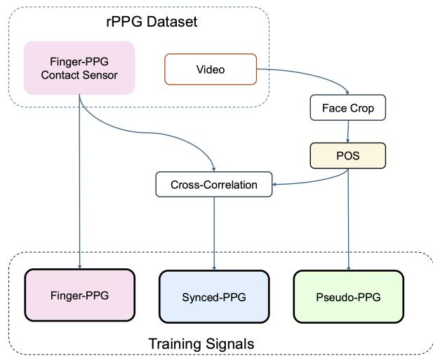
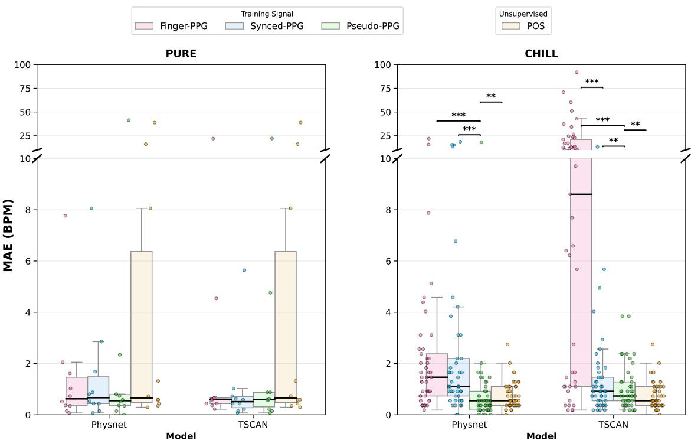
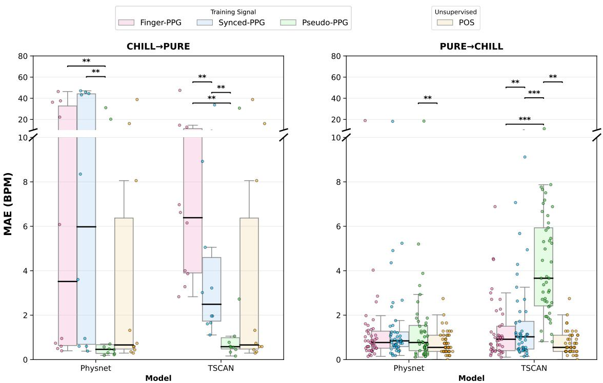
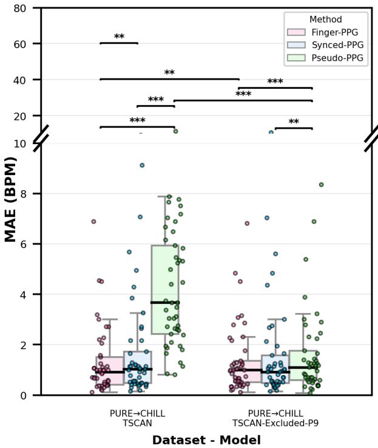

# Beyond Contact Sensors: Deep learning with Pseudo-Labeling for remote Photoplethysmography

Bhargav Acharya, Barbara Hammer, Hanna Drimalla Center for Cognitive Interaction Technology (CITEC), Bielefeld University {bacharya, bhammer, drimalla}@techfak.uni-bielefeld.de

## Abstract

Heart rate is a critical biomarker of health, and remote photoplethysmography (rPPG) enables its contactless estimationfrom video datafor telemedicine applications. Recent advancements in deep learning based rPPG methods achieve state-of-the-art results, outperforming classical signal-processing methods in complex scenarios. However, deep learning methods depend on datasets with precise synchronization between videos and ground truth signals collected via contact sensors, whereas signal-processingbased methods do not. To address this dependence on labeled datasets, which are labor-intensive to collect, we investigate under which circumstances pseudo-labels extracted using unsupervised signal-processing methods can replace contact sensors labels for training deep learning methods. Our systematic evaluations found that for datasets with imperfect synchronization, the pseudo-label approach outperforms supervised training on contact sensors. For datasets with good synchronization, results are mixed: within-dataset evaluation shows no significant difference between training methods, while cross-dataset evaluation favors supervised training. However, removing a single outlier participant significantly improves the pseudolabel approach’s cross-dataset performance, highlighting the importance of label quality. These results demonstrate that signal-processing methods can generate valid training signals for deep learning models, reducing dependency on labor-intensive dataset collection while maintaining competitive performance.

## 1. Introduction

Remote photoplethysmography (rPPG) is a non-invasive technique that measures subtle blood volume changes from videos of the face, enabling estimation of vital physiological parameters like heart rate and respiration [28]. The non-invasive nature and lack of dedicated hardware requirements make rPPG highly relevant for telehealth and remote monitoring applications.

rPPG methods can be broadly classified into two categories: signal-processing-based (sometimes called conventional) and supervised deep learning based methods [28]. Signal-processing approaches rely on predetermined physiological models and handcrafted features to extract signals from videos and are inherently unsupervised. In contrast, deep learning methods learn to predict physiological signals directly from data, often outperforming signal-processing techniques and achieving state-of-the-art results on public datasets [28]. However, the supervised nature of deep learning based methods requires large annotated datasets consisting of videos with synchronized photoplethysmography (PPG) ground truth from contact devices, making data collection labor-intensive and costly.

Existing datasets are limited and typically represent idealistic scenarios with minimal movement, good lighting, and limited heart rate ranges [8, 28]. This leads to deep learning models that overfit to training data and show significant performance degradation in real-world applications [1, 4]. Furthermore, majority of datasets use fingermounted contact devices to collect PPG ground truth data for supervised training. However, PPG signals from different body sites exhibit distinct morphological characteristics and temporal phase [19]. This leads to a mismatch between the signal that is being extracted from the videos and the ground truth signal-provided for supervised training. In this regard, recent work by [2] showed that training the deep learning methods on contact sensors placed at the face leads to better performing deep learning models. An additional source of mismatch stems from synchronization quality during dataset collection. Videos and contact sensors are recorded using independent devices, requiring dedicated hardware or software to achieve precise alignment. To the best of our knowledge, only the PURE dataset [22] employs external hardware to achieve near-perfect synchronization whereas other datasets use software-based synchronizations. This lack of perfect synchronization, combined with the physiological mismatch between finger-based ground truth and face-extracted signals, have prevented deep learning methods from reaching their full potential on existing public datasets.

To bridge this domain gap, new datasets with facemounted contact sensors would be needed to eliminate the site mismatch. However, collecting such datasets is laborintensive, and face-mounted sensors obscure facial features and limit realistic video recording.

Addressing these limitations requires alternate training strategies that reduce the dependence on datasets with finger contact sensors without sacrificing model performance. To this end, we evaluate the feasibility of using pseudolabels which can be automatically extracted using signalprocessing-based rPPG methods, specifically POS [25], for training deep learning models in a weakly supervised manner, thereby presenting an opportunity to replace contact sensor labels.

Our contributions are as follows, we systematically compare deep learning based rPPG methods trained on three different signals: contact-based ground truth (Finger-PPG), signal-processing-based pseudo-labels extracted from videos (Pseudo-PPG), and temporally aligned ground truth (Synced-PPG). We perform within-dataset and cross-dataset experiments to evaluate whether training signal choice significantly affects model performance.

## 2. Related Work

## 2.1. rPPG Methods

rPPG has received significant attention in recent years, progressing from signal-processing approaches to deep learning methods. Early rPPG research focused on signalprocessing methods that extract physiological signals without supervised learning. GREEN [23] showed that the green channel best captures pulse signals through hemoglobin absorption. Subsequent methods employed blind source separation techniques to decompose RGB signals into independent components [18, 20]. Other methods, including POS [25] and CHROM [5], used skin reflectance properties to extract rPPG signals.

Supervised deep learning methods now dominate rPPG research and have consistently achieved state-of-the-art performance on publicly available datasets [16]. DeepPhys [3], TS-CAN [14], and Physnet [29] have become established benchmarks against which new architectures are evaluated, demonstrating that end-to-end learning can outperform traditional signal-processing approaches. Recent transformer-based methods like PhysFormer [30], Efficient-Phys [15], RhythmFormer [33], and PhysMamba [17] further improved accuracy through advanced temporal modeling.

Despite these advances, all supervised methods require synchronized contact PPG sensors during training, creating a scalability bottleneck. While signal-processing-based methods are computationally efficient and require no training, they typically exhibit higher error rates than supervised deep learning approaches in complex scenarios [16].

## 2.2. Training Signal

Most deep learning methods use finger-based contact PPG sensors as training labels [28]. While PPG signals are known to differ across body sites due to pulse transit time (PTT) and morphological variations [13], the impact on deep learning performance remained unclear until recently. [2] demonstrated that training with forehead-mounted contact PPG reduces mean squared error between predicted and ground truth waveforms by up to 40% compared to finger PPG, attributing this improvement to reduced domain gap when input (facial videos) and labels (facial PPG) originate from the same region.

## 2.3. Weakly Supervised Learning

Weakly supervised learning addresses the challenge of obtaining high-quality labels by training models with cheaper, noisier supervision. Lee [11] first introduced pseudolabeling for deep neural networks, where model predictions on unlabeled data serve as surrogate training labels. This technique has now been applied across various computer vision tasks [9].

In rPPG research, training has predominantly required synchronized contact sensors for ground truth. Recent work has begun reducing this dependency through contrastive learning frameworks [7]. Li and Yin [12] extended this by incorporating pseudo-labels from the 2SR algorithm [24] within their contrastive pipeline, using losses from both predicted signals and pseudo-labels to guide self-supervised learning. Similarly, [27] explored use of pseudo-labels in a self-supervised setting by training a deep learning mode for one epoch on labeled data, then using this model to generate pseudo-labels for unlabeled data to expand the training set.

Althoug these prior studies incorporated pseudo-labels, their use as the sole training signal has not yet been systematically evaluated. Our work contributes in this direction in two key aspects. First, we systematically investigate whether signal-processing algorithms can directly generate pseudo-labels for training deep learning methods, without requiring an initial labelled dataset. Second, we train the models using pseudo-labels with mean squared error loss, eliminating the need for contrastive learning frameworks or specialized loss functions. This provides a direct assessment of whether signal-processing based training labels can serve as a viable alternative to contact sensor labels.

## 2.4. Pseudo-PPG

To the best of our knowledge, only two prior works have used POS [25], a signal-processing based method, for generating training labels [16, 31]. Zhan et al. [31] investigated whether physiological delays caused by PTT critically affect deep learning training. They used POS-extracted signals as training labels instead of finger PPG to eliminate temporal misalignment, demonstrating through synthetic phase shift experiments that alignment between training labels and input videos is critical for effective training. rPPG-Toolbox [16] also uses POS-generated signals as a practical workaround when high-quality synchronized labels are unavailable. However, these works either use pseudo-labels for signal alignment or as a fallback strategy when synchronized data is unavailable, rather than systematically evaluating whether POS-extracted signals can replace contact sensor ground truth as primary training signals for deep learning methods.

Our work directly investigates whether POS-extracted signals can be treated as primary training labels. If models trained on Pseudo-PPG achieve comparable performance to those trained on contact PPG, the dependence on synchronized finger sensors is reduced, lowering dataset acquisition costs and deployment barriers.

## 3. Methods

This section describes the deep learning architectures used for rPPG estimation, the training signals employed, and the complete rPPG processing pipeline.

## 3.1. Deep Learning Methods

We evaluate two benchmark deep learning based rPPG methods: TS-CAN [14] and Physnet [29]. These wellestablished architectures use CNN-based designs rather than large transformer models, enabling us to isolate training signal effects from architectural innovations.

TS-CAN uses a dual-branch architecture with temporal shift modules for temporal modeling and 2D convolutions for spatial feature extraction, combined through an attention mechanism.

The temporal shift branch receives diff-normalized input computed from adjacent frames:

$$
c _ { \mathrm { d i f f } } ( t ) = \frac { c ( t + 1 ) - c ( t ) } { c ( t + 1 ) + c ( t ) }\tag{1}
$$

where $c ( t )$ denotes the video frame at time t. The appearance branch receives standardized input:

$$
c _ { \mathrm { s t d } } ( t ) = \frac { c ( t ) - \mu } { \sigma }\tag{2}
$$

where $\mu$ and $\sigma$ are the mean and standard deviation computed across each video chunk.

Physnet employs a 3D convolutional encoder-decoder architecture to jointly process spatial and temporal dimensions. Input frames are diff-normalized using the same procedure as the TS-CAN temporal branch as described in Equation 1.

## 3.2. Training Signals

To evaluate whether signal-processing based pseudo-signals can replace contact-based ground truth, we train models using three different signals: Finger-PPG, Pseudo-PPG, and Synced-PPG. Both Pseudo-PPG and Synced-PPG build up on initial work by [31]. Each signal is described below and the visually depicted in 1

Finger-PPG is the ground truth signal collected simultaneously with video recording using a contact finger sensor. This represents the standard training signal for deep learning-based rPPG methods.

Pseudo-PPG is extracted directly from face videos using the signal-processing-based method POS [25]. Face detection and cropping are performed as preprocessing steps, followed by POS signal extraction from the cropped regions. The extracted signal is bandpass filtered (cutoff frequency: 0.7-3.0 Hz) using a second-order Butterworth filter. Finally, the Hilbert transform is applied to extract the signal envelope.

Synced-PPG is derived by temporally aligning Finger-PPG to Pseudo-PPG. We compute the cross-correlation between the two signals and shift Finger-PPG to maximize alignment. This preserves the morphological characteristics of Finger-PPG while compensating for delays caused by the data collection setup and pulse transit time (PTT) between face and finger measurement sites.

## 3.3. Processing Pipeline

The rPPG estimation pipeline consists of four stages. First, faces are detected and extracted from input videos using YOLO5Face [21], following the rPPG-Toolbox implementation [16]. Second, the deep learning models (subsection 3.1) are trained to predict rPPG signals using the training signals described in subsection 3.2. Third, predicted signals are bandpass filtered (cutoff frequency: 0.75-3.0 Hz, corresponding to 45-180 BPM). Finally, heart rate is estimated by identifying the peak frequency in the power spectral density computed using Welch’s method [26].

## 4. Experiments

This section outlines the experimental protocols, datasets, implementation details, and evaluation metrics used to compare the performance of different training signals. We conduct two main evaluations: within-dataset cross-validation and cross-dataset generalization. Both are described below.

  
Figure 1. Generating the training signals from rPPG dataset recordings. Finger-PPG is taken directly from the contact sensor as the gold-standard reference. Pseudo-PPG is extracted from facial video via face cropping and the POS [25]. Synced-PPG is obtained by temporally aligning the finger-PPG signal to the POSderived facial signal via cross-correlation.

## 4.1. Datasets

We conducted experiments on CHILL [1] and PURE [22] datasets, chosen because they provide complementary challenges. PURE includes substantial head movements under stable illumination, while CHILL features varying illumination and physiological states (resting and elevated heart rate) with stationary participants. This diversity provides a comprehensive evaluation across different rPPG challenges. Additionally, PURE uses hardware synchronization while CHILL uses software synchronization, introducing different synchronization error characteristics.

The CHILL dataset [1] consists of 45 participants (28 females, 17 males). Data from each participant was collected across 2 lighting settings and 2 heart rate conditions (resting and elevated), resulting in 4 videos per participant. Videos were recorded using a DSLR camera at 25 FPS, and ground truth signals were captured using contact sensors at 1000 Hz.

The PURE dataset [22] consists of 10 participants (2 females, 8 males). Each participant was recorded in 6 different scenarios involving varying motion and head movements. Videos were recorded at 30 FPS with frame-level timestamps, and finger PPG ground truth was captured using a contact sensor at 1000 Hz. External hardware ensured synchronization between video and PPG signals.

## 4.2. Evaluation Protocol

## 4.2.1. Within-Dataset Evaluation

We perform 10-fold participant-level cross-validation on both datasets. Each fold reserves 10% of participants for testing and 90% for training. The training set is further split 90%/10% into train and validation subsets, ensuring no participant overlap between sets. The validation set is used for early stopping and selecting the best-performing model for test-set evaluation.

## 4.2.2. Cross-Dataset Evaluation

Cross-dataset experiments use the entire source dataset for training (with internal 90%/10% train-validation split) and the complete target dataset for testing. Multiple random seeds are employed for train-validation splits to assess stability. Similar to within-dataset evaluation, the validation set is used for early stopping and model selection.

## 4.2.3. Evaluation Metric

We compute MAE between predicted and ground truth heart rates:

$$
\mathrm { M A E } = \frac { 1 } { N } \sum _ { i = 1 } ^ { N } | H R _ { \mathrm { p r e d } } ^ { ( i ) } - H R _ { \mathrm { g t } } ^ { ( i ) } |\tag{3}
$$

where N is the number of videos, H $R _ { \mathrm { p r e d } }$ is the heart rate estimated from the predicted signal from the deep learning models, and $H R _ { \mathrm { g t } }$ is the ground truth heart rate estimated from the contact device.

## 4.2.4. Statistical Testing

Statistical analyses of heart rate estimation errors were performed using the Wilcoxon signed-rank test, a nonparametric method suitable for paired data. To compare the influence of training signals on the performance, MAEs were calculated per participant on the entire dataset. Our null hypothesis $( H _ { 0 } )$ was that the error distributions would not differ across training signals. The alternative hypothesis $( H _ { a } )$ was that there would be difference across training signals.

## 4.3. Implementation Details

We implement two deep learning based methods using PyTorch Lightning [6], adapted from rPPG-Toolbox [16]. Code for reproducing the experiments is available at [anonymized for review]. Facial regions were detected using YOLO5Face [21] with dynamic per-frame detection. After which, their respective preprocessing procedures described in subsection 3.1 were applied. The preprocessed videos were then chunked and rescaled. Physnet processes 128-frame chunks at 64×64 resolution, while TS-CAN processes 160-frame chunks at 36×36 resolution with a frame depth of 10. We train all models for 30 epochs with batch size 64 using the SALSA optimizer [10], which eliminates the need for manual learning rate tuning and ensures fair comparison across training signals. All other hyperparameters used default values from the original implementations. Mean squared error (MSE) of the waveform was used as the loss function for both models across all three training signals.

  
Figure 2. Distribution of Errors (MAE) of the within-dataset evaluations (subsubsection 4.2.1) for all rPPG methods. Each point overlaid on the box plots represents the MAE for an individual participant for the corresponding training signal. Statistical significance between two conditions was assessed using the Wilcoxon signed-rank test. See Table 1 for corresponding test statistics. We further repor the baseline signal-processing-based method POS for comparison

Table 1. Wilcoxon Signed-Rank Test results for within-dataset comparisons, grouped by model and datasets used for training. For each comparison, the median error for each condition is reported along with the median of the paired differences (∆ Median), test statistic (W) P-value, and effect size (r). For the visualization see Figure 2 . $^ { * } p < 0 . 0 5 , ^ { * * } p < 0 . 0 1 , ^ { * * * } p < 0 . 0 0 1$
<table><tr><td>Dataset</td><td>Model</td><td>Comparison</td><td>n</td><td>Mdn1</td><td>Mdn2</td><td>∆</td><td>W</td><td>r</td><td>p</td></tr><tr><td rowspan="7">PURE</td><td rowspan="4">Physnet</td><td>Pseudo-PPG vs. Finger-PPG</td><td>10</td><td>0.55</td><td>0.62</td><td>0.00</td><td>10.0</td><td>-.56</td><td>1.000</td></tr><tr><td>Pseudo-PPG vs. Synced-PPG</td><td>10</td><td>0.55</td><td>0.67</td><td>-0.07</td><td>16.0</td><td>-.37</td><td>.279</td></tr><tr><td>Finger-PPG vs. Synced-PPG</td><td>10</td><td>0.62</td><td>0.67</td><td>-0.07</td><td>7.5</td><td>-.64</td><td>.172</td></tr><tr><td>Pseudo-PPG vs. POS</td><td>10</td><td>0.55</td><td>0.66</td><td>-0.15</td><td>15.0</td><td>-.40</td><td>.410</td></tr><tr><td rowspan="4">TS-CAN</td><td>Pseudo-PPG vs. Finger-PPG</td><td>10</td><td>0.60</td><td>0.60</td><td>0.07</td><td>15.0</td><td>-.40</td><td>.766</td></tr><tr><td>Pseudo-PPG vs. Synced-PPG</td><td>10</td><td>0.60</td><td>0.51</td><td>0.07</td><td>5.0</td><td>-.73</td><td>.281</td></tr><tr><td>Finger-PPG vs. Synced-PPG</td><td>10</td><td>0.60</td><td>0.51</td><td>0.04</td><td>8.0</td><td>-.63</td><td>.359</td></tr><tr><td>Pseudo-PPG vs. POS</td><td>10</td><td>0.60</td><td>0.66</td><td>0.04</td><td>26.5</td><td>-.03</td><td>.939</td></tr><tr><td rowspan="6">CHILL</td><td rowspan="4">Physnet</td><td>Pseudo-PPG vs. Finger-PPG</td><td>45</td><td>0.55</td><td>1.46</td><td>-0.73</td><td>84.5</td><td>-.73</td><td>&lt;.001***</td></tr><tr><td>Pseudo-PPG vs. Synced-PPG</td><td>45</td><td>0.55</td><td>1.10</td><td>-0.55</td><td>17.0</td><td>-.84</td><td>&lt;.001***</td></tr><tr><td>Finger-PPG vs. Synced-PPG</td><td>45</td><td>1.46</td><td>1.10</td><td>0.00</td><td>399.0</td><td>-.20</td><td>.683</td></tr><tr><td>Pseudo-PPG vs. POS</td><td>45</td><td>0.55</td><td>0.55</td><td>-0.18</td><td>148.0</td><td>-.62</td><td>.008**</td></tr><tr><td rowspan="4">TS-CAN</td><td>Pseudo-PPG vs. Finger-PPG</td><td>45</td><td>0.73</td><td>8.61</td><td>-7.14</td><td>46.5</td><td>-.79</td><td>&lt;.001***</td></tr><tr><td>Pseudo-PPG vs. Synced-PPG</td><td>45</td><td>0.73</td><td>0.92</td><td>-0.18</td><td>91.5</td><td>-.72</td><td>.003**</td></tr><tr><td>Finger-PPG vs. Synced-PPG</td><td>45</td><td>8.61</td><td>0.92</td><td>7.14</td><td>52.5</td><td>-.78</td><td>&lt;.001***</td></tr><tr><td>Pseudo-PPG vs. POS</td><td>45</td><td>0.73</td><td>0.55</td><td>0.18</td><td>188.0</td><td>-.55</td><td>.003**</td></tr></table>

  
Figure 3. Distribution of Errors (MAE) of the cross-dataset evaluations (subsubsection 4.2.2) for all rPPG methods. Each point overlaid on the box plots represents the MAE for an individual participant for the corresponding training signal. Statistical significance between two conditions was assessed using the Wilcoxon signed-rank test. See Table 2 for the corresponding test statistics.

Table 2. Wilcoxon Signed-Rank Test results for cross-dataset comparisons, grouped by model and datasets used for training and testing. For each comparison, the median error for each condition is reported along with the median of the paired differences (∆ Median), test statistic (W), p-value, and effect size (r). For the visualization see Figure 3. $^ { * } p < 0 . 0 5 , ^ { * * } p < 0 . 0 1 , ^ { * * * } p < 0 . 0 0 1$
<table><tr><td>Train→Test</td><td>Model</td><td>Comparison</td><td>n</td><td>Mdn1</td><td>Mdn2</td><td>∆</td><td>W</td><td>r</td><td>p</td></tr><tr><td rowspan="7">CHILL→PURE</td><td rowspan="4">Physnet</td><td>Pseudo-PPG vs. Finger-PPG</td><td>10</td><td>0.46</td><td>3.52</td><td>-3.10</td><td>2.0</td><td>-0.82</td><td>.006**</td></tr><tr><td>Pseudo-PPG vs. Synced-PPG</td><td>10</td><td>0.46</td><td>5.98</td><td>-5.56</td><td>1.0</td><td>-0.85</td><td>.004**</td></tr><tr><td>Finger-PPG vs. Synced-PPG</td><td>10</td><td>3.52</td><td>5.98</td><td>-0.44</td><td>6.0</td><td>-0.69</td><td>.055</td></tr><tr><td>Pseudo-PPG vs. POS</td><td>10</td><td>0.46</td><td>0.66</td><td>-0.25</td><td>13.0</td><td>-0.47</td><td>.148</td></tr><tr><td>Pseudo-PPG vs. Finger-PPG</td><td></td><td></td><td></td><td></td><td></td><td></td><td></td></tr><tr><td rowspan="4">TS-CAN</td><td></td><td>10</td><td>0.58</td><td>6.39</td><td>-6.08</td><td>0.0</td><td>-0.89</td><td>.002**</td></tr><tr><td>Pseudo-PPG vs. Synced-PPG</td><td>10</td><td>0.58</td><td>2.49</td><td>-2.12</td><td>0.0</td><td>-0.89</td><td>.002**</td></tr><tr><td>Finger-PPG vs. Synced-PPG</td><td>10</td><td>6.39</td><td>2.49</td><td>3.68</td><td>0.0</td><td>-0.89</td><td>.002**</td></tr><tr><td>Pseudo-PPG vs. POS</td><td>10</td><td>0.58</td><td>0.66</td><td>0.10</td><td>26.0</td><td>-0.05</td><td>.900</td></tr><tr><td rowspan="6">PURE→CHILL</td><td rowspan="4">Physnet</td><td>Pseudo-PPG vs. Finger-PPG</td><td>45</td><td>0.77</td><td>0.77</td><td>-0.07</td><td>425.0</td><td>-0.16</td><td>.414</td></tr><tr><td>Pseudo-PPG vs. Synced-PPG</td><td>45</td><td>0.77</td><td>0.84</td><td>-0.07</td><td>365.5</td><td>-0.26</td><td>.194</td></tr><tr><td>Finger-PPG vs. Synced-PPG</td><td>45</td><td>0.77</td><td>0.84</td><td></td><td>399.0</td><td>-0.20</td><td>.511</td></tr><tr><td>Pseudo-PPG vs. POS</td><td>45</td><td></td><td>0.55</td><td>0.04 0.22</td><td></td><td>-0.41</td><td>.006**</td></tr><tr><td></td><td></td><td>0.77</td><td></td><td></td><td>273.5</td><td></td><td></td></tr><tr><td rowspan="4">TS-CAN</td><td>Pseudo-PPG vs. Finger-PPG</td><td>45</td><td>3.66</td><td>0.92</td><td>2.38</td><td>2.0</td><td>-0.87</td><td>&lt;.001***</td></tr><tr><td>Pseudo-PPG vs. Synced-PPG</td><td>45</td><td>3.66</td><td>1.03</td><td>2.56</td><td>57.5</td><td>-0.77</td><td>&lt;.001***</td></tr><tr><td>Finger-PPG vs. Synced-PPG</td><td>45</td><td>0.92</td><td>1.03</td><td>-0.04</td><td>140.5</td><td>-0.63</td><td>.002**</td></tr><tr><td>Pseudo-PPG vs. POS</td><td>45</td><td>3.66</td><td>0.55</td><td>3.19</td><td>0.0</td><td>-0.87</td><td>&lt;.001***</td></tr></table>

## 5. Results

In this section we present the results of both the withindataset evaluation (see subsubsection 4.2.1) and crossdataset evaluations (see subsubsection 4.2.2).

## 5.0.1. Within-Dataset Results

We first present the within-dataset (subsubsection 4.2.1) results. We applied Wilcoxon signed-rank test to compare the performance between training signals (subsection 3.2) for Physnet and TS-CAN. Quantitative results are presented in Table 1 and visualized in Figure 2. On the CHILL dataset, training on Pseudo-PPG outperformed training on Finger-PPG for both Physnet and TS-CAN. Similarly, training on Pseudo-PPG also outperformed Synced-PPG for Physnet and TS-CAN. Training on Synced-PPG significantly outperformed Finger-PPG for TS-CAN, but not Physnet. We further compared the difference between the performance of deep learning methods trained on Pseudo-PPG with signal-processing based method POS. Both Physnet and TS-CAN had lower performance compared to POS. On the PURE dataset, training signal choice (Finger-PPG, Synced-PPG, Pseudo-PPG) did not significantly affect performance for either architecture. Similarly, Pseudo-PPG and POS showed no significant performance differences for either Physnet or TS-CAN.

## 5.0.2. Cross-Dataset Results

We now present cross-dataset subsubsection 4.2.2 results. We applied Wilcoxon signed-rank test to compare the performance between training signals for Physnet and TS-CAN. Quantitative results are presented in Table 2 and visualized in Figure 3.

When trained on CHILL and tested on PURE, training on Pseudo-PPG significantly outperformed training on Finger-PPG and Pseudo-PPG for both deep learning methods. Training on Synced-PPG significantly outperformed Finger-PPG for TS-CAN, but not for for Physnet. Additionally, there was no significant difference between training on Pseudo-PPG and the POS.

When training on PURE and testing on CHILL, the model performance varied based on the deep learning method. For Physnet, training signal choice did not significantly affect performance. However, for TS-CAN training on Pseudo-PPG significantly underperformed compared to Finger-PPG and Synced-PPG. Training on Pseudo-PPG significantly underperformed POS for both the Physnet and TS-CAN.

## 6. Sensitivity Analysis

To assess TS-CAN sensitivity to training label quality, a sensitivity analysis was performed on cross-dataset evaluation. Participant 9 from PURE exhibited substantially higher POS estimation error than other participants, producing noisy Pseudo-PPG labels. Both models were retrained on PURE with this participant excluded, then tested on CHILL to determine whether removing low-quality labels improves generalization. Wilcoxon signed-rank test was applied to compare the performance before and after participant exclusion, and to compare performance across training signals. The results are reported in Table 3 and visualized in Figure 4.

Comparing the pairwise performance of before and after exclusion, we see that excluding participant 9 from the PURE dataset significantly reduced the MAE for TS-CAN trained on Pseudo-PPG, but significantly increased MAE for TS-CAN trained on Finger-PPG. Training on Synced-PPG showed no significant difference in performance. Comparing the performance of training on Pseudo-PPG and Finger-PPG after exclusion, we see that training on Pseudo-PPG is significantly worse compared to training on Finger-PPG.

  
Figure 4. Participant-level MAE for TS-CAN sensitivity analysis (section 6) comparing three training signals (Finger-PPG, Synced-PPG, Pseudo-PPG) on the full PURE dataset and with participant 9 removed.

Table 3. Sensitivity analysis for cross-dataset evaluation (PURE→CHILL, n=45). Full represents training on the complete dataset. -P9 represents leaving out participant 9 from the training set. For each comparison, the median error under each condition is reported along with the median of the paired differences (∆ Median), test statistic (W), p-value, and effect size (r). For the visualization see Figure 4. $^ { * } p < 0 . 0 5 , ^ { * * } p < 0 . 0 1 , ^ { * * * } p < 0 . 0 0 1$
<table><tr><td>Config</td><td>Comparison</td><td> $\mathbf { M } \mathbf { d n } _ { 1 }$ </td><td> $\mathbf { M } \mathbf { d n } _ { 2 }$ </td><td>∆</td><td> $W$ </td><td>r</td><td>p</td></tr><tr><td rowspan="3">-P9</td><td>Pseudo vs. Finger</td><td>1.10</td><td>0.99</td><td>0.11</td><td>16.5</td><td>-0.84</td><td> $< . 0 0 1 ^ { * * * }$ </td></tr><tr><td>Pseudo vs. Synced</td><td>1.10</td><td>0.92</td><td>0.15</td><td>218.5</td><td>-0.50</td><td>.002**</td></tr><tr><td>Finger vs. Synced</td><td>0.99</td><td>0.92</td><td>0.00</td><td>375.5</td><td>-0.24</td><td>.838</td></tr><tr><td rowspan="3">Full vs. -P9</td><td>Pseudo-PPG</td><td>3.66</td><td>1.10</td><td>2.31</td><td>15.0</td><td>-0.85</td><td>&lt;.001***</td></tr><tr><td>Finger-PPG</td><td>0.92</td><td>0.99</td><td>-0.04</td><td>160.5</td><td>-0.60</td><td>.004**</td></tr><tr><td>Synced-PPG</td><td>1.03</td><td>0.92</td><td>0.00</td><td>155.5</td><td>-0.61</td><td>.065</td></tr></table>

## 7. Discussion

In this work, we systematically evaluated whether signalprocessing-based rPPG can serve as training signals for deep learning methods, replacing contact-based ground truth. Our results demonstrate that Pseudo-PPG can substitute Finger-PPG under certain conditions. We now examine these findings in detail to highlight important nuances.

Our experiments show that when datasets have imperfect synchronization between video and contact sensors, Pseudo-PPG provides superior training signals compared to poorly synchronized Finger-PPG. This finding aligns with [16], who achieved strong generalization by training on POS-extracted labels (Pseudo-PPG) for the BP4D+ dataset [32], which lacks accurate ground truth signals.

[2] showed that signal morphology and temporal alignment from face-mounted sensors enable better-performing models. Our experiments reveal similar morphological effects. On CHILL, Synced-PPG significantly outperforms Finger-PPG, indicating that temporal alignment is crucial. However, Pseudo-PPG outperforms Synced-PPG because its morphology more closely matches the signal extracted from videos. This demonstrates the influence of both morphology and alignment of the training signal has on the performance of the deep learning methods.

However, results from well-synchronized dataset reveal important nuances. On the one hand, within-dataset experiments show that training signal choice does not significantly affect performance, suggesting Pseudo-PPG as a viable alternative to Finger-PPG without the burden of collecting synchronized datasets. On the other hand, cross-dataset experiments show TS-CAN fails to generalize when trained on Pseudo-PPG. Our sensitivity analysis demonstrates this stems directly from noisy Pseudo-PPG labels. Removing a single participant with poor POS quality from the training set significantly improves generalization to a level. In other words, the quality of the Pseudo-PPG directly influences model generalization.

Admittedly, assessing Pseudo-PPG label quality in the current framework still requires ground truth, limiting scalability. However, developing methods to systematically assess POS signal quality without ground truth would enable automatic training sample selection. Further scaling rPPG methods to real-world deployments.

## 8. Conclusion

We systematically evaluated whether signal processing extracted pseudo-labels can replace contact sensor ground truth for training deep learning-based rPPG methods. Our findings demonstrate that when well-synchronized ground truth is unavailable, pseudo-labels provides superior training signals for models. Notably, high-quality pseudolabels can even match well-synchronized finger-PPG performance. This work establishes that signal-processing based methods can generate valid training labels for deep learning models, enabling large-scale rPPG development without dependence on labor-intensive synchronized data collection.

## References

[1] Bhargav Acharya, William Saakyan, Barbara Hammer, and Hanna Drimalla. The reliability of remote photoplethysmography under low illumination and elevated heart rates. npj Digital Medicine, 8(1):744, 2025. 1, 4

[2] Bjorn Braun, Daniel McDuff, and Christian Holz. How Sub-¨ optimal is Training rPPG Models with Videos and Targets from Different Body Sites?, 2024. 1, 2, 8

[3] Weixuan Chen and Daniel McDuff. DeepPhys: Video-Based Physiological Measurement Using Convolutional Attention Networks, 2018. 2

[4] Ananyananda Dasari, Sakthi Kumar Arul Prakash, Laszl´ o A.´ Jeni, and Conrad S. Tucker. Evaluation of biases in remote photoplethysmography methods. npj Digital Medicine, 4(1): 91, 2021. 1

[5] Gerard de Haan and Vincent Jeanne. Robust Pulse Rate From Chrominance-Based rPPG. IEEE Transactions on Biomedi cal Engineering, 60(10):2878–2886, 2013. 2

[6] William Falcon, Jirka Borovec, Adrian Walchli, Nic Eggert,¨ Justus Schock, Jeremy Jordan, Nicki Skafte, Ir1dXD, Vadim

Bereznyuk, Ethan Harris, Tullie Murrell, Peter Yu, Sebastian Præsius, Travis Addair, Jacob Zhong, Dmitry Lipin, So Uchida, Shreyas Bapat, Hendrik Schroter, Boris Dayma,¨ Alexey Karnachev, Akshay Kulkarni, Shunta Komatsu, Martin.B, Jean-Baptiste SCHIRATTI, Hadrien Mary, Donal Byrne, Cristobal Eyzaguirre, cinjon, and Anton Bakhtin. PyTorchLightning/pytorch-lightning: 0.7.6 release. Zenodo, 2020. 4

[7] John Gideon and Simon Stent. The Way to my Heart is through Contrastive Learning: Remote Photoplethysmography from Unlabelled Video, 2021. 2

[8] Guillaume Heusch, Andre Anjos, and S´ ebastien Marcel. A´ Reproducible Study on Remote Heart Rate Measurement, 2017. 1

[9] Patrick Kage, Jay C. Rothenberger, Pavlos Andreadis, and Dimitrios I. Diochnos. A Review of Pseudo-Labeling for Computer Vision, 2025. 2

[10] Philip Kenneweg, Tristan Kenneweg, Fabian Fumagalli, and Barbara Hammer. No learning rates needed: Introducing SALSA – Stable Armijo Line Search Adaptation, 2024. 4

[11] Dong-Hyun Lee. Pseudo-Label : The Simple and Efficient Semi-Supervised Learning Method for Deep Neural Networks. ICML 2013 Workshop : Challenges in Representation Learning (WREPL), 2013. 2

[12] Zhihua Li and Lijun Yin. Contactless Pulse Estimation Leveraging Pseudo Labels and Self-Supervision. In 2023 IEEE/CVF International Conference on Computer Vision (ICCV), pages 20531–20540, 2023. 2

[13] Peter Lindholm, S. Lesley Blogg, and Mikael Gennser. Pulse oximetry to detect hypoxemia during apnea: Comparison of finger and ear probes. Aviation, Space, and Environmental Medicine, 78(8):770–773, 2007. 2

[14] Xin Liu, Shwetak Patel, and Daniel McDuff. Multi-task temporal shift attention networks for on-device contactless vitals measurement. In Proceedings ofthe 34th International Conference on Neural Information Processing Systems, pages 19400–19411, Red Hook, NY, USA, 2020. Curran Associates Inc. 2, 3

[15] Xin Liu, Brian L. Hill, Ziheng Jiang, Shwetak Patel, and Daniel McDuff. EfficientPhys: Enabling Simple, Fast and Accurate Camera-Based Vitals Measurement, 2022. 2

[16] Xin Liu, Girish Narayanswamy, Akshay Paruchuri, Xiaoyu Zhang, Jiankai Tang, Yuzhe Zhang, Roni Sengupta, Shwetak Patel, Yuntao Wang, and Daniel McDuff. rPPG-Toolbox: Deep Remote PPG Toolbox. Advances in Neural Information Processing Systems, 36:68485–68510, 2023. 2, 3, 4, 8

[17] Chaoqi Luo, Yiping Xie, and Zitong Yu. PhysMamba: Efficient Remote Physiological Measurement with SlowFast Temporal Difference Mamba, 2024. 2

[18] Magdalena Madej, Jacek Ruminski, Tomasz Kocejko, and Jedrzej Nowak. Measuring Pulse Rate with a Webcam - a Non-contact Method for Evaluating Cardiac Activity. 2011. 2

[19] Lu Niu, Jeremy Speth, Nathan Vance, Benjamin Sporrer, Adam Czajka, and Patrick Flynn. Full-Body Cardiovascular Sensing with Remote Photoplethysmography, 2023. 1

[20] Ming-Zher Poh, Daniel McDuff, and Rosalind Picard. Advancements in Noncontact, Multiparameter Physiological

Measurements Using a Webcam. IEEE transactions on biomedical engineering, 58:7–11, 2010. 2

[21] Delong Qi, Weijun Tan, Qi Yao, and Jingfeng Liu. YOLO5Face: Why Reinventing a Face Detector, 2022. 3, 4

[22] Ronny Stricker, Steffen Muller, and Horst-Michael Gross.¨ Non-contact video-based pulse rate measurement on a mobile service robot. In The 23rd IEEE International Symposium on Robot and Human Interactive Communication, pages 1056–1062, 2014. 1, 4

[23] Wim Verkruysse, Lars O Svaasand, and J Stuart Nelson. Remote plethysmographic imaging using ambient light. Optics express, 16(26):21434–21445, 2008. 2

[24] Wenjin Wang, Sander Stuijk, and Gerard de Haan. A Novel Algorithm for Remote Photoplethysmography: Spatial Subspace Rotation. IEEE Transactions on Biomedical Engineering, 63(9):1974–1984, 2016. 2

[25] Wenjin Wang, Albertus C. den Brinker, Sander Stuijk, and Gerard de Haan. Algorithmic Principles of Remote PPG. IEEE Transactions on Biomedical Engineering, 64(7):1479– 1491, 2017. 2, 3, 4

[26] P. Welch. The use of fast Fourier transform for the estimation of power spectra: A method based on time averaging over short, modified periodograms. IEEE Transactions on Audio and Electroacoustics, 15(2):70–73, 1967. 3

[27] Bingjie Wu, Zitong Yu, Yiping Xie, Wei Liu, Chaoqi Luo, Yong Liu, and Rick Siow Mong Goh. Semi-rPPG: Semi-Supervised Remote Physiological Measurement With Curriculum Pseudo-Labeling. IEEE Transactions on Instrumentation and Measurement, 74:1–11, 2025. 2

[28] Hanguang Xiao, Tianqi Liu, Yisha Sun, Yulin Li, Shiyi Zhao, and Alberto Avolio. Remote photoplethysmography for heart rate measurement: A review. Biomedical Signal Processing and Control, 88:105608, 2024. 1, 2

[29] Zitong Yu, Xiaobai Li, and Guoying Zhao. Remote Pho toplethysmograph Signal Measurement from Facial Videos Using Spatio-Temporal Networks. In British Machine Vision Conference, 2019. 2, 3

[30] Zitong Yu, Yuming Shen, Jingang Shi, Hengshuang Zhao, Philip Torr, and Guoying Zhao. PhysFormer: Facial Videobased Physiological Measurement with Temporal Difference Transformer, 2022. 2

[31] Qi Zhan, Wenjin Wang, and Gerard de Haan. Analysis of CNN-based remote-PPG to understand limitations and sensitivities. Biomedical Optics Express, 11(3):1268–1283, 2020. 3

[32] Zheng Zhang, Jeffrey M. Girard, Yue Wu, Xing Zhang, Peng Liu, Umur Ciftci, Shaun Canavan, Michael Reale, Andrew Horowitz, Huiyuan Yang, Jeffrey F. Cohn, Qiang Ji, and Lijun Yin. Multimodal Spontaneous Emotion Corpus for Human Behavior Analysis. In 2016 IEEE Conference on Computer Vision and Pattern Recognition (CVPR), pages 3438– 3446, 2016. 8

[33] Bochao Zou, Zizheng Guo, Jiansheng Chen, Junbao Zhuo, Weiran Huang, and Huimin Ma. RhythmFormer: Extracting Patterned rPPG Signals based on Periodic Sparse Attention, 2025. 2