# DYNAMICAL NON-COMPENSATORY MULTIDIMENSIONALIRT MODEL USING VARIATIONAL APPROXIMATION

Hiroshi Tamano

the graduate university for advanced studies, sokendai

Daichi Mochihashi

the institute of statistical mathematics

# DYNAMICAL NON-COMPENSATORY MULTIDIMENSIONAL IRT MODEL USING VARIATIONAL APPROXIMATION

## Abstract

Multidimensional item response theory (MIRT) is a statistical test theory that precisely estimates multiple latent skills of learners from the responses in a test. Both compensatory and non-compensatory models have been proposed for MIRT: the former assumes that each skill can complement other skills, whereas the latter assumes they cannot. This non-compensatory assumption is convincing in many tests that measure multiple skills; therefore, applying non-compensatory models to such data is crucial for achieving unbiased and accurate estimation. In contrast to tests, latent skills will change over time in daily learning. To monitor the growth of skills, dynamical extensions of MIRT models have been investigated. However, most of them assumed compensatory models, and a model that can reproduce continuous latent states of skills under the non-compensatory assumption has not been proposed thus far. To enable accurate skill tracing under the non-compensatory assumption, we propose a dynamical extension of non-compensatory MIRT models by combining a linear dynamical system and a non-compensatory model. This results in a complicated posterior of skills, which we approximate with a Gaussian distribution by minimizing the Kullback–Leibler divergence between the approximated posterior and the true posterior. The learning

algorithm for the model parameters is derived through Monte Carlo Expectation Maximization. Simulation studies verify that the proposed method is able to reproduce latent skills accurately, whereas the dynamical compensatory model sufers from significant underestimation errors. Furthermore, experiments on an actual dataset demonstrate that our dynamical non-compensatory model can infer practical skill tracing and clarify diferences in skill tracing between non-compensatory and compensatory models.

Key words: item response theory, knowledge tracing, Kalman filter, linear dynamical systems, variational approximation.

## 1. Introduction

Multidimensional item response theory (MIRT; Sympson 1978; Reckase 1985; Ackerman 1996; Reckase 2009) is a multidimensional extension of item response theory (IRT; Rasch 1960; Lord 1980; Embretson and Reise 2013), a statistical test theory that accurately estimates latent skills of learners from binary responses avoiding the biases of test designers. MIRT models can deal with a question associated with multiple skills and are divided into compensatory models (Bogan and Yen 1983; Reckase 1985; Reckase 2009) and non-compensatory models (Sympson 1978; Whitely 1980; Embretson 1984; Embretson and Yang 2013), according to the relationship between the skills. Compensatory models assume that each skill can complement other skills, and learners can thereby answer questions correctly when the sum of the skills exceeds a threshold. In contrast, non-compensatory models assume that each skill cannot complement other skills; thus, each skill must independently exceed a threshold for learners to be able to answer questions correctly. Figures 1 (a) and (b) show the item response surfaces for the compensatory and non-compensatory models, respectively. In this example, the probability of correctly answering a question is high for compensatory models when either skill level is high. In contrast, the probability is high for non-compensatory models only when both skill levels are high.

The assumption of non-compensatory MIRT models is convincing in many tests associated with multiple skills. For example, understanding or solving an equation such as $1 / 5 x + 3 / 1 0 = 2 x$ requires both skills of fraction and equation; learners who only have either one cannot solve this equation. As can be seen from this example, tagging a problem with multiple skills under “and” conditions corresponds to the non-compensatory assumption, meaning that all the attached skills must be mastered to solve the problem. (On the other hand, “or” conditions correspond to the compensatory assumption.) Open datasets (Feng et al. 2009; Stamper et al. 2010) provide sequential logs of item responses answered by learners wherein problems are tagged with multiple skills. In these datasets, many problems are tagged under “and” conditions. Because tagging skills correctly is a dificult and time-consuming task, there are studies to estimate the assignment of skills from data (Oka and Okada 2021), and one can utilize cloud sourcing as well (e.g., Amazon Mechanical Turk).

Although this non-compensatory assumption fits many situations, it has not been frequently employed thus far. A key reason for this is that achieving accurate estimations of item response parameters is more dificult in such models. Bolt (2013) employed Markov chain Monte Carlo (MCMC) to estimate a model proposed by Whitely (1980) and found that non-compensatory models require many samples and the estimation is less precise than that of compensatory models even under such conditions. Wang and Nydick (2015) compared MCMC and Metropolis– Hastings Robbins–Monro (MH-RM) and revealed that MCMC is better able to estimate model parameters across a variety of conditions than MH-RM. More importantly, compensatory and non-compensatory models were reported to yield quite similar results regarding skill estimation (Spray et al. 1990; DeMars 2016). DeMars (2016) applied both models to the synthetic item responses generated via non-compensatory models and found that the diference in the estimation errors was quite small. Furthermore, the diference vanished when the correlation between the skills increased.

However, a recent study revealed that compensatory models significantly underestimate skills (Buchholz and Hartig 2018), highlighting the importance of using a correct model when the

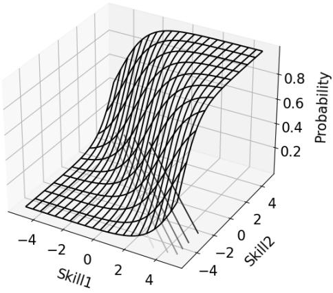  
(a)

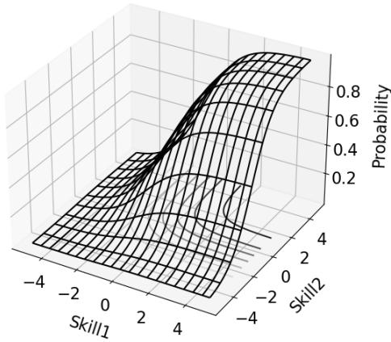  
(b)  
Figure 1: Comparison of item response surfaces between a compensatory model and a noncompensatory model. (a) represents the compensatory model and (b) represents the noncompensatory model. The probability is high when either skill is high in (a), whereas it is high when both skills are high in (b).  
non-compensatory assumption holds on data. They generated item response data via a non-compensatory model, assuming a uniform distribution of skills. Subsequently, they fitted a compensatory model to the data and investigated the diference between the estimated and actual skills. Their finding was that the compensatory model largely underestimated high skills for a specific subgroup of examinees whose actual level for one skill is high and that for the other is low. Such a subgroup of examinees can be significantly disadvantaged when a compensatory model is incorrectly assumed.  
In contrast to tests, latent skills change over time in daily learning; thus, dynamical models have been studied to trace the growth of skills. They are known as knowledge tracing (Corbett and

Anderson 1994; Piech et al. 2015), which assumes that the skill changes even after a question has been answered. Therefore, the responses collected in learning drills, where feedback is available after answering each question, are examples of appropriate target data. Knowledge tracing models tend to place greater importance on accurately predicting next responses than estimating the true latent skills. These prediction models are used in adaptive learning systems to recommend questions that learners should try next. Owning to the recent successes of deep learning, many deep neural network models have been proposed and sophisticated the network structure to fit the complicated human skill-growth (Piech et al. 2015; Zhang et al. 2017; Pu et al. 2020). Since the interpretability of those neural models is low, recent studies (Yeung 2019; Su et al. 2021) integrated IRT/MIRT and deep neural models to achieve high accuracy and interpretability.

However, most of the dynamical models employ compensatory models; a model that can reproduce continuous latent states of skills under the non-compensatory assumption has not been proposed thus far. Applying the dynamical extensions of compensatory MIRT models to situations wherein the non-compensatory assumption holds is expected to result in significant underestimation of skills, according to the results in the non-dynamical situation (Buchholz and Hartig 2018). Non-compensatory models are also employed in cognitive diagnostic models (Leighton and Gierl 2007; Templin and Henson 2010), which are the statistical models to diagnose skills in an educational test. Their dynamical extensions have been developed (Li et al. 2016; Wang et al. 2018; Zhan et al. 2019); however, their latent skills are binary, i.e., mastery or non-mastery. Chen et al. (2018) employed a non-compensatory model in a deep neural network; however, they did not evaluate the accuracy of latent skills because their main concern was in the accuracy of predicting next responses. The dynamical model that can reproduce the latent skills under the non-compensatory assumption is crucial for accurately tracing skills.

To enable accurate and real-time skill tracing in situations wherein the non-compensatory assumption holds, we propose the dynamical extension of non-compensatory MIRT models. Our proposed model is a combination of a linear dynamical system and a non-compensatory model. This results in a complicated posterior of the latent skills; therefore, we approximate it with a Gaussian distribution by minimizing the Kullback–Leibler (KL) divergence between the approximated posterior and the true posterior. The estimation method for the model parameters is derived through the Monte Carlo Expectation Maximization (EM) algorithm (Wei and Tanner 1990). Simulation studies verify that the proposed method is able to reproduce latent skills accurately, whereas the dynamical compensatory model sufers from significant underestimation errors. Furthermore, experiments on an actual dataset demonstrate that our dynamical non-compensatory model can infer practical skill tracing as shown in Figure 2 and clarify diferences in skill tracing between non-compensatory and compensatory models.

The remainder of this paper is organized as follows. Section 2 briefly reviews the compensatory and non-compensatory MIRT models and the linear dynamical system, followed by our proposed dynamical non-compensatory MIRT model. Section 3 describes the inference of the posterior of latent skills and the model parameters. Section 4 evaluates the accuracy of the skill estimation on simulation data as well as the model parameters. The accuracy of predicting responses on simulation data is evaluated in Section 5. The Gaussian approximation of the posterior is evaluated in Section 6. Section 7 shows experimental results on actual data. Finally, we discuss the advantages of the proposed model in Section 8 along with possible future extensions.

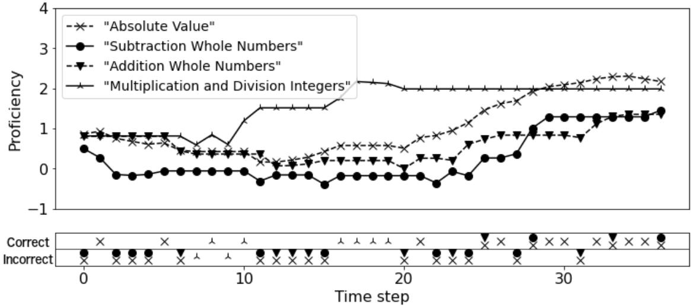  
Figure 2: Visualization of skill tracing for a learner obtained by the proposed dynamical noncompensatory MIRT model on the ASSISTments 2009-2010 dataset. Bottom panel shows responses to the questions, where successes and failures correspond to the upward and downward positions of markers, and the required skill for each question is denoted as the marker type.

## 2. Model

Our proposed model is based on MIRT and linear dynamical systems (LDS; Kalman 1960; Ghahramani and Hinton 1996; Bishop 2006). We briefly describe MIRT and LDS before introducing the dynamical non-compensatory MIRT model.

## 2.1. Multidimensional Item Response Theory

MIRT is a multi-skill extension of IRT that was used to estimate the proficiency of examinees and the dificulty of questions. MIRT measures proficiency and dificulty for multiple skills from an examination result; it is typically expressed as binary matrix Y whose $( i , j )$ -th entry $y _ { i , j } \in \{ 0 , 1 \}$ represents the correct or incorrect answer to question i of examinee j. The questions in the examination are assumed to require multiple skills.

MIRT involves compensatory models and non-compensatory models. Compensatory models assume that each skill can complement other skills. In the compensatory model, the probability that examinee j can answer question i correctly is defined as

$$
p ( y _ { i , j } = 1 | z _ { j } , a _ { i } , b _ { i } ) = \frac { 1 } { 1 + \exp ( - ( \sum _ { k = 1 } ^ { K } a _ { i , k } z _ { j , k } - b _ { i } ) ) } ,\tag{1}
$$

where $z _ { j }$ is a K-dimensional proficiency vector for skills of examinee j, K is the number of skills, k is the skill index, ${ \bf { a } } _ { i }$ is a K-dimensional vector of the discrimination parameters of question i, and $b _ { i }$ represents the dificulty parameter of question i. This is called the two-parameter logistic model by the discrimination and dificulty parameters. The proficiency is summed up; thus, each skill could complement other skills. Figure 1 (a) shows a two-dimensional example of Eq. (1). In contrast, non-compensatory models assume that individual skills cannot complement other skills.

In the non-compensatory model, the probability that examinee $j$ can answer question i correctly is defined as

$$
p ( \boldsymbol { y } _ { i , j } = 1 | \boldsymbol { z } _ { j } , \boldsymbol { a } _ { i } , \boldsymbol { b } _ { i } ) = \prod _ { k = 1 } ^ { K } \frac { 1 } { 1 + \exp ( - \boldsymbol { a } _ { i , k } ( \boldsymbol { z } _ { j , k } - \boldsymbol { b } _ { i , k } ) ) } ,\tag{2}
$$

where dificulty $b _ { i }$ for question i is now a K-dimensional vector whose element denotes the dificulty for each skill. Here, the proficiency is multiplied; thus, individual skills cannot complement other skills. Figure 1 (b) shows a two-dimensional example of Eq. (2). Our model employs the non-compensatory model to handle situations where one skill cannot complement the other skills.

## 2.2. Linear Dynamical System

LDS has been employed to infer changes of latent states from observations with noise. The generative model for LDS is defined by the initial state probability, state transition probability, and emission probability, which are given below.

$$
\left\{ \begin{array} { l l } { \begin{array} { r l } \end{array} } & { { } \begin{array} { r l } { \begin{array} { r l } { p ( z ^ { ( 1 ) } ) = \mathcal { N } ( z ^ { ( 1 ) } | \pmb { \mu _ { 0 } } , P _ { 0 } ) , } \end{array} } \end{array} } \end{array} \right.\tag{3}
$$

$$
p ( z ^ { ( t ) } | z ^ { ( t - 1 ) } ) = N ( z ^ { ( t ) } | D z ^ { ( t - 1 ) } , \Gamma ) ,\tag{4}
$$

$$
\begin{array} { r } { p ( \pmb { y } ^ { ( t ) } | \pmb { z } ^ { ( t ) } ) = \mathcal { N } ( \pmb { y } ^ { ( t ) } | C \pmb { z } ^ { ( t ) } , \Sigma ) , } \end{array}\tag{5}
$$

where $z ^ { ( t ) }$ and $\mathbf { \boldsymbol { y } } ^ { ( t ) }$ denote the latent state and observed data at time step $t ,$ respectively, and $\pmb { \theta } = \{ D , \Gamma , C , \Sigma , \mu _ { 0 } , P _ { 0 } \}$ is the set of model parameters. The graphical model of LDS is shown in Figure 3 (a). The initial state z(1) is generated by a Gaussian distribution $z ^ { ( 1 ) }$ $\mathcal { N } ( z ^ { ( 1 ) } | \mu _ { 0 } , P _ { 0 } )$ where $\pmb { \mu _ { 0 } }$ denotes mean and $P _ { 0 }$ denotes covariance. The state transition is linear transformation D with Gaussian noise of zero mean and covariance Γ. Sample $\mathbf { \boldsymbol { y } } ^ { ( t ) }$ is observed after linear transformation

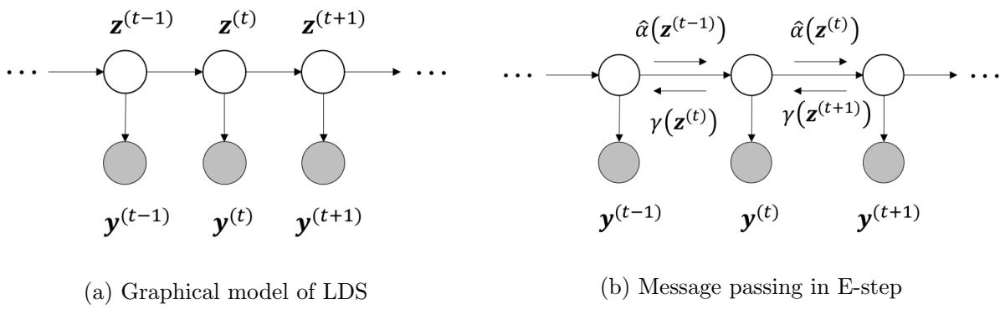  
Figure 3: Overview of the message passing process. (a) is a graphical representation of LDS. The transition of the latent states only depends on the previous state and each state emits observable data; the latent and observable variables are represented as white and gray circles, respectively. (b) shows the forward $\hat { \alpha }$ message passing and the backward $\gamma$ message passing to calculate the posterior of the state variable $z ^ { ( t ) }$

C has been applied to the current state, $\boldsymbol { z } ^ { ( t ) }$ , with Gaussian noise of zero mean and covariance Σ. The posterior of the latent states and model parameters can be estimated by a Kalman smoother and an EM algorithm, respectively.

## 2.3. Dynamical Non-compensatory MIRT

Our proposed model is a dynamical extension of non-compensatory MIRT. It can be considered as a combination of an MIRT model and LDS. We describe the target data and the generative model below.

Our target dataset $\{ ( i _ { j } ^ { ( t ) } , y _ { j } ^ { ( t ) } ) \} _ { j = 1 , \dots , N , \ t = 1 , \dots , T _ { j } }$ is a sequence of the log of the answers to the questions by diferent learners over time. N and $T _ { j }$ denote the number of learners and the number of logs for learner $j ,$ respectively. $i _ { j } ^ { ( t ) } \in \{ 1 , . . . , M \}$ denotes the index of the question answered by learner $j \in \{ 1 , . . . , N \}$ at time step $t \in \{ 1 , . . . , T _ { j } \}$ , also denoted by $i ( j , t )$ ; we abbreviate it to i when it is clear from the context. M denotes the number of questions. $y _ { j } ^ { ( t ) } \in \{ 0 , 1 \}$ represents whether learner $j$ answered question $i ( j , t )$ correctly or not at time step t. The diference between our proposed model and the ordinary LDS is that observation $y _ { j } ^ { ( t ) }$ is binary associated with the index of the question answered, and each learner has a diferent sequence of questions.

The generative model of the dynamical non-compensatory MIRT is defined in a manner similar to that of LDS, except that the emission probability here is a non-compensatory item response model.

$$
\left\{ \begin{array} { c } { p ( z _ { j } ^ { ( 1 ) } ) = N ( z _ { j } ^ { ( 1 ) } | \mu _ { 0 } , P _ { 0 } ) , } \\ { p ( z _ { j } ^ { ( t ) } | z _ { j } ^ { ( t - 1 ) } ) = N \left( { z _ { j } ^ { ( t ) } } \Bigg | D _ { i ( j , t - 1 ) } z _ { j } ^ { ( t - 1 ) } + \left[ \begin{array} { c } { \vdots } \\ { \beta _ { k } ^ { \top } x _ { j , k } ^ { ( t ) } } \end{array} \right] , \Gamma _ { j } ^ { ( t ) } \right) , } \\ { p ( y _ { j } ^ { ( t ) } | z _ { j } ^ { ( t ) } ) = \mathrm { B e r n o u l l i } \left( \left[ \begin{array} { c } { \vdots } \\ { \chi _ { j , k - 1 } ^ { ( t ) } } \end{array} \right] \displaystyle \prod _ { i \in \mathcal { Q } _ { i , k } = 1 } \sigma \left( a _ { i , k } ( z _ { j , k } ^ { ( t ) } - b _ { i , k } ) \right) \right) . } \end{array} \right.\tag{6}
$$

(7)

(8)

$z _ { j } ^ { ( t ) }$ denotes the latent skill state of learner $j$ at time step $t . ~ z _ { j } ^ { ( t ) }$ is a K dimensional vector and $z _ { j , k } ^ { ( t ) }$ denotes the proficiency of the k-th skill. Initially, the state of the learner is drawn from the Gaussian with mean $\pmb { \mu } _ { 0 }$ and covariance $P _ { 0 }$ in $\operatorname { E q } .$ (6). It then transits by a linear transformatio by $D _ { i }$ and $\beta _ { k } ^ { \top } \pmb { x } _ { j , k } ^ { ( t ) }$ with Gaussian noise of zero mean and covariance $\Gamma _ { j } ^ { ( t ) }$ in $\mathrm { E q . } ~ ( 7 ) ; D _ { i }$ is a diagonal matrix and k-th diagonal element $d _ { i , k }$ is fixed to one when skill k is not required for question i. $\boldsymbol { x } _ { j , k } ^ { ( t ) } \in \mathbb { R } ^ { F _ { k } }$ is an $F _ { k }$ dimensional covariate variable. This is assumed to be given as extra data. Covariance $\Gamma _ { j } ^ { ( t ) }$ is also diagonal, and $( \Gamma _ { j } ^ { ( t ) } ) _ { k , k } = \gamma _ { k }$ if question $i ( j , t - 1 ) \ \mathrm { o r } \ i ( j , t )$ requires skill $k ;$ otherwise, $( \Gamma _ { j } ^ { ( t ) } ) _ { k , k } = 0$ . The response of a learner to question i is drawn from th

Bernoulli distribution in Eq. (8); $a _ { i , k }$ and $b _ { i , k }$ denote item discrimination and item dificulty, respectively, and Bernoulli $( y | p )$ denotes the Bernoulli distribution of random variable y with head probability $p . ~ \sigma ( x ) = 1 / ( 1 + \exp ( - x ) )$ is a sigmoid function. $Q _ { i , k } \in \{ 0 , 1 \}$ denotes the question-skill mapping whether question i requires skill k and it is called the Q-matrix (Tatsuoka 1983). We assume the $\mathrm { Q } \mathrm { - }$ -matrix is given in advance. In our model, the parameters of the initial state probability, the state transition probability, and the emission probability are listed as follows.

$$
\pmb { \theta } ^ { i n i t } = \{ \mu _ { 0 } , P _ { 0 } \} ,\tag{9}
$$

$$
\theta ^ { t r a n s } = \{ d _ { i , k } | i \in \{ 1 , . . . , M \} , k \in \{ 1 , . . . , K \} , Q _ { i , k } = 1 \} \cup \{ \gamma _ { k } , \beta _ { k } | k \in \{ 1 , . . . , K \} \} ,\tag{10}
$$

$$
\pmb { \theta } ^ { e m i t } = \{ a _ { i , k } , b _ { i , k } | i \in \{ 1 , . . . , M \} , k \in \{ 1 , . . . , K \} , Q _ { i , k } = 1 \} .\tag{11}
$$

The covariate variable, $\boldsymbol { x } _ { j , k } ^ { ( t ) }$ , can be designed to fit state transitions. The bias term of the linear transformation for each question is an example of this. Let $F _ { k }$ be the number of questions requiring skill k, and let $\boldsymbol { x } _ { j , k } ^ { ( t ) }$ be a binary vector, where each element of the vector corresponds to each question requiring skill k. When learner j answers question i requiring skill k at time step $t - 1$ , let a corresponding element of $\boldsymbol { x } _ { j , k } ^ { ( t ) }$ for question i be one and let the other elements be zero. The linear transformation in $\operatorname { E q } .$ . (7) can be simplified to $D _ { i ( j , t - 1 ) } z _ { j } ^ { ( t - 1 ) } + \beta _ { i ( j , t - 1 ) } ^ { \prime }$ , where $\beta _ { i } ^ { \prime }$ is a K dimensional vector and the elements corresponding to the non-required skills to question i are zero. Another example involves including a forgetting factor in the covariates, as given by $2 ^ { - { \frac { \Delta } { h } } }$ where $\Delta$ is the elapsed time since the last practice of the skill and h is half the time of memory. Various covariate variables can be considered (e.g., time passed since a learner studied a skill and the number of practicing questions requiring a skill).

When we fix the discrimination parameters $a _ { i , k }$ to one, our model is considered as the combination of the LDS and the multicomponent latent trait model (Whitely 1980). On the other hand, our model with discrimination parameters is considered as the combination of the LDS and 2-parameter logistic model (Sympson 1978). Section 4 includes the simulation studies in both settings, and the former combination (i.e., fixing $a _ { i , k }$ to one) turns out to be suficient to infer the skills in most cases.

## 3. Inference

We derive methods for estimating the posterior of the skill state and the model parameters based on the LDS methods: forward-backward algorithm and EM algorithm, respectively (Kalman 1960; Dempster 1977; Ghahramani and Hinton 1996; Bishop 2006). In the forward-backward algorithm, an ˆα message is passed forward and a γ message is passed backward as shown in Figure 3 (b). The $\hat { \alpha }$ message is the posterior of the latent state, which can be exactly calculated as a Gaussian from a Gaussian likelihood and a Gaussian prior in LDS. However, the ˆα message in our model cannot be exactly calculated due to the non-conjugacy between the likelihood of non-compensatory item response function in Eq. (8) and a Gaussian prior. To address this problem, we propose to approximate the ˆα message as a Gaussian distribution. Once it is approximated, the $\gamma$ message can be calculated using the same method as LDS. The estimation method for the model parameters can be derived through the EM algorithm. In the following sections, we introduce the Gaussian approximation of the ˆα message, followed by the EM algorithm to estimate the posterior and the model parameters using the Gaussian approximation.

## 3.1. Gaussian Approximation of αˆ Message

We derive a Gaussian approximation of the $\hat { \alpha }$ message, which is employed in the next section for estimating the posterior of the skill state. In our model, the ˆα message is proportional to the product of the likelihood of a non-compensatory item response function and a Gaussian prior. Given likelihood $p ( y | z )$ and prior $p ( z )$ defined as

$$
\left\{ \begin{array} { l l } { \displaystyle p ( \boldsymbol { y } | \boldsymbol { z } ) = \mathrm { B e r n o u l l i } \left( \boldsymbol { y } \bigg | \prod _ { k } \sigma \left( a _ { k } \left( \boldsymbol { z } _ { k } - \boldsymbol { b } _ { k } \right) \right) \right) , } \\ { \quad } \\ { \displaystyle n ( \boldsymbol { z } ) = \Lambda ^ { \prime } ( \boldsymbol { z } | m \mathrm { ~ } G ) } \end{array} \right.\tag{12}
$$

$$
\begin{array} { r l } { \big ( } & { { } p ( z ) = \mathcal { N } ( z | m , G ) , } \end{array}\tag{13}
$$

here we consider the problem of finding the approximated posterior $q ( z ) = \mathcal { N } ( z | \mu , V )$ minimizing the KL-divergence between $q ( z )$ and $p ( z | y )$

The KL-divergence is calculated as

$$
\mathrm { K L } \left( q ( z ) | | p ( z | y ) \right) = \mathrm { K L } \left( q ( z ) | | p ( z ) \right) - \int q ( z ) \ln p ( y | z ) d z + \mathrm { c o n s t } ,\tag{14}
$$

where the constant term is with respect to $q ( z )$ . The first term on the right-hand side of Eq. (14) is the KL-divergence between the approximated posterior and the prior, which can be calculated analytically as follows.

$$
\mathrm { K L } \left( q ( \boldsymbol { z } ) | | p ( \boldsymbol { z } ) \right) = \frac { 1 } { 2 } \left\{ \ln \frac { | G | } { | V | } + t r ( G ^ { - 1 } V ) + ( \pmb { m } - \pmb { \mu } ) ^ { \top } G ^ { - 1 } ( \pmb { m } - \pmb { \mu } ) \right\} .\tag{15}
$$

The second term is the expectation of the log likelihood with respect to the approximated posterior, which cannot be obtained analytically. Here, we employ a reparameterization trick (Kingma and Welling 2013) to approximate the second term.

$$
\int q ( \boldsymbol { z } ) \ln p ( \boldsymbol { y } | \boldsymbol { z } ) d \boldsymbol { z } \approx \frac { 1 } { S } \sum _ { s = 1 } ^ { S } \ln p ( \boldsymbol { y } | \boldsymbol { z } _ { s } ) ,\tag{16}
$$

where sample $z _ { s }$ from the approximated posterior is defined as

$$
z _ { s } = \mu + L \epsilon _ { s } , \quad \epsilon _ { s } \sim \mathcal { N } ( \mathbf { 0 } , I ) .
$$

Matrix L is the Cholesky decomposition of covariance matrix V and a lower triangular matrix $( \mathrm { i . e . , } V = L L ^ { \top } )$ . The KL-divergence is calculated with the parameters of the approximated posterior, µ and $L ;$ thus, we can derive the gradients as follows.

$$
\frac { \partial \mathrm { K L } } { \partial \pmb { \mu } } = G ^ { - 1 } ( \pmb { \mu } - \pmb { m } ) - \frac { 1 } { S } \sum _ { s = 1 } ^ { S } W _ { : , s } ,\tag{17}
$$

$$
\frac { \partial \mathrm { K L } } { \partial L } = - { ( L ^ { - 1 } ) ^ { \top } } + G ^ { - 1 } L - \frac { 1 } { S } W E ,\tag{18}
$$

where $W$ and E are the matrices whose elements are defined as

$$
W _ { k , s } = ( 2 y - 1 ) a _ { k } ( 1 - \sigma ( a _ { k } ( z _ { s , k } - b _ { k } ) ) ) \frac { \prod _ { k } \sigma \left( a _ { k } ( z _ { s , k } - b _ { k } ) \right) } { p ( y | z _ { s } ) } ,
$$

$$
E _ { s , k } = \epsilon _ { s , k } ,
$$

respectively, and $W _ { : , s }$ represents the s-th column vector of W. Now that we have obtained the gradients of the KL-divergence, we can apply gradient-based optimization to find the optimal µ and L. (We employed gradient descent with armijo line search in our implementation.)

## 3.2. E-step

Given the parameters of the model and observation ${ \pmb y } _ { j } ^ { ( 1 : T _ { j } ) }$ , which denotes $\{ y _ { j } ^ { ( 1 ) } , . . . , y _ { j } ^ { ( T _ { j } ) } \}$ , the E-step infers the posterior of the skill state $p ( z _ { j } ^ { ( t ) } | \boldsymbol { y } _ { j } ^ { ( 1 : T _ { j } ) } )$ . We derive the E-step based on the forward-backward algorithm employed in the LDS. By calculating forward messages and backward messages for all the skill states of the time series, we obtain the posterior of the skill state.

## 3.2.1. Forward Message Passing

In this section, we derive the forward ˆα message, which is the posterior $p ( \boldsymbol { z } _ { j } ^ { ( t ) } | \boldsymbol { y } _ { j } ^ { ( 1 : t ) } )$ , based on the LDS method and the Gaussian approximation derived in Section 3.1.

The ˆα message is defined by the following recursive formula.

$$
\hat { \alpha } ( z _ { j } ^ { ( t ) } ) \propto p ( y _ { j } ^ { ( t ) } | z _ { j } ^ { ( t ) } ) \int p ( z _ { j } ^ { ( t ) } | z _ { j } ^ { ( t - 1 ) } ) \hat { \alpha } ( z _ { j } ^ { ( t - 1 ) } ) d z _ { j } ^ { ( t - 1 ) } .\tag{19}
$$

We can obtain the $\hat { \alpha }$ messages for all the state variables by calculating this recursive definition from time step 1 to time step $T _ { j }$ , which is called forward message passing as shown in Figure 3 (b). Eq. (19) can be re-written as

$$
\hat { \alpha } ( z _ { j } ^ { ( t ) } ) \propto p ( y _ { j } ^ { ( t ) } | z _ { j } ^ { ( t ) } ) p ( z _ { j } ^ { ( t ) } | y _ { j } ^ { ( 1 ) } , \dots , y _ { j } ^ { ( t - 1 ) } )\tag{20}
$$

by calculating the integral. We approximate the $\hat { \alpha }$ message as a Gaussian; thus let $\hat { \alpha } ( z _ { j } ^ { ( t ) } )$ be $\mathcal { N } ( z _ { j } ^ { ( t ) } | \mu _ { j } ^ { ( t ) } , V _ { j } ^ { ( t ) } )$ . The inside of integral in Eq. (19), which is the product of two Gaussians, is calculated as the following Gaussian

$$
p ( \boldsymbol { z } _ { j } ^ { ( t ) } | \boldsymbol { y } _ { j } ^ { ( 1 ) } , \dots , \boldsymbol { y } _ { j } ^ { ( t - 1 ) } ) = \mathcal { N } ( \boldsymbol { z } _ { j } ^ { ( t ) } | \boldsymbol { m } _ { j } ^ { ( t ) } , G _ { j } ^ { ( t ) } ) ,\tag{21}
$$

where $m _ { j } ^ { ( t ) }$ and $G _ { j } ^ { ( t ) }$ is defined as

$$
m _ { j } ^ { ( t ) } = D _ { i ( j , t - 1 ) } \mu _ { j } ^ { ( t - 1 ) } + \left[ \begin{array} { c } { { \vdots } } \\ { { \beta _ { k } ^ { T } { \pmb x } _ { j , k } ^ { ( t ) } } } \\ { { \vdots } } \end{array} \right] , \quad G _ { j } ^ { ( t ) } = D _ { i ( j , t - 1 ) } V _ { j } ^ { ( t - 1 ) } D _ { i ( j , t - 1 ) } ^ { \top } + \Gamma _ { j } ^ { ( t ) } .
$$

We separate state variable $z _ { j } ^ { ( t ) }$ into two state variables: $z _ { a }$ and $z _ { b }$ , where $z _ { a }$ corresponds to the skills required by question $i ( j , t )$ and $z _ { b }$ to the other skills. We omit index $j , t$ to avoid complexity

here. Furthermore, the mean and covariance are separated accordingly as

$$
z _ { j } ^ { ( t ) } = \left[ { \ z } _ { a } \right] { } _ { , } { \mathbf { \boldsymbol { m } } _ { j } ^ { ( t ) } } = \left[ \begin{array} { l } { { \boldsymbol { \mu } } _ { a } } \\ { { \boldsymbol { \mathbf { \mu } } } _ { m _ { b } } } \\ { { \ l } } \end{array} \right] { } , { \boldsymbol { G } } _ { j } ^ { ( t ) } = \left[ \begin{array} { l l } { { \boldsymbol { G } } _ { a , a } } & { { \boldsymbol { G } } _ { a , b } } \\ { { \boldsymbol { G } } _ { b , a } } & { { \boldsymbol { G } } _ { b , b } } \end{array} \right] .
$$

Eq. (20) can be re-written as

$$
\hat { \alpha } ( z _ { j } ^ { ( t ) } ) \propto p ( y _ { j } ^ { ( t ) } | z _ { a } ) p ( z _ { a } ) p ( z _ { b } | z _ { a } ) ,\tag{22}
$$

where $p ( z _ { a } )$ and $p ( z _ { b } | z _ { a } )$ are defined as

$$
p ( z _ { a } ) = \mathcal { N } ( z _ { a } | \boldsymbol { m } _ { a } , G _ { a , a } ) ,\tag{23}
$$

$$
p ( z _ { b } | z _ { a } ) = \mathcal { N } ( z _ { b } | m _ { b } + G _ { b , a } G _ { a , a } ^ { - 1 } ( z _ { a } - m _ { a } ) , G _ { b , b } - G _ { b , a } G _ { a , a } ^ { - 1 } G _ { a , b } ) .\tag{24}
$$

We apply our Gaussian approximation in Section 3.1 to $p ( y _ { j } ^ { ( t ) } | z _ { a } ) p ( z _ { a } )$ and obtain the approximation of $p ( \boldsymbol { z } _ { a } | \boldsymbol { y } _ { j } ^ { ( t ) } )$ as $\mathcal { N } ( z _ { a } | m _ { a } ^ { \prime } , G _ { a a } ^ { \prime } )$ . Now that $p ( z _ { a } | y _ { j } ^ { ( t ) } ) p ( z _ { b } | z _ { a } )$ is the product of two Gaussians, we finally obtain $\hat { \alpha } ( z _ { j } ^ { ( t ) } ) = \mathcal { N } ( z _ { j } ^ { ( t ) } | \pmb { \mu } _ { j } ^ { ( t ) } , V _ { j } ^ { ( t ) } )$ , where $\mu _ { j } ^ { ( t ) }$ and $V _ { j } ^ { ( t ) }$ are defined as

$$
\pmb { \mu } _ { j } ^ { ( t ) } = \left[ \begin{array} { c } { { \pmb { m } _ { a } ^ { \prime } } } \\ { { \pmb { m } _ { b } + { \cal G } _ { b , a } { \cal G } _ { a , a } ^ { - 1 } ( { \pmb { m } _ { a } ^ { \prime } } - { \pmb { m } } _ { a } ) } } \end{array} \right] ,\tag{25}
$$

$$
V _ { j } ^ { ( t ) } = \left[ \begin{array} { c c } { { G _ { a , a } ^ { \prime } } } & { { G _ { a , a } ^ { \prime } G _ { a , a } ^ { - 1 } G _ { a , b } } } \\ { { } } & { { } } \\ { { G _ { b , a } G _ { a , a } ^ { - 1 } G _ { a , a } ^ { \prime } } } & { { G _ { b , b } + G _ { b , a } ( G _ { a , a } ^ { - 1 } G _ { a , a } ^ { \prime } G _ { a , a } ^ { - 1 } - G _ { a , a } ^ { - 1 } ) G _ { a , b } } } \end{array} \right] .\tag{26}
$$

## 3.2.2. Backward Message Passing

The backward $\gamma$ message is the posterior $p ( z _ { j } ^ { ( t ) } | \boldsymbol { y } _ { j } ^ { ( 1 : T _ { j } ) } )$ and its expectation is the skill estimation in the condition that the sequence of item responses for learner $j$ is given. Since the $\hat { \alpha }$ message is obtained as the Gaussian distribution, the $\gamma$ message is exactly the same as the result

of the LDS. We omit the derivation (Bishop 2006) and describe the obtained $\gamma$ message as $\gamma ( \pmb { z } _ { j } ^ { ( t ) } ) = \mathcal { N } ( \pmb { z } _ { j } ^ { ( t ) } | \hat { \pmb { \mu } } _ { j } ^ { ( t ) } , \hat { V } _ { j } ^ { ( t ) } )$ , where $\hat { \pmb { \mu } } _ { j } ^ { ( t ) }$ and $\hat { V } _ { j } ^ { ( t ) }$ are defined as

$$
\pmb { \hat { \mu } } _ { j } ^ { ( t ) } = \pmb { \mu } _ { j } ^ { ( t ) } + J _ { j } ^ { ( t ) } \left( \hat { \pmb { \mu } } _ { j } ^ { ( t + 1 ) } - D _ { i ( j , t ) } \pmb { \mu } _ { j } ^ { ( t ) } - \left[ \begin{array} { c } { { \vdots } } \\ { { } } \\ { { \pmb { \beta } } _ { k } ^ { \top } \pmb { x } _ { j , k } ^ { ( t + 1 ) } } \\ { { } } \\ { { \vdots } } \end{array} \right] \right) ,\tag{27}
$$

$$
\begin{array} { r } { \hat { V } _ { j } ^ { ( t ) } = V _ { j } ^ { ( t ) } + J _ { j } ^ { ( t ) } ( \hat { V } _ { j } ^ { ( t + 1 ) } - P _ { j } ^ { ( t ) } ) { J _ { j } ^ { ( t ) } } ^ { \top } . } \end{array}\tag{28}
$$

$P _ { j } ^ { ( t ) }$ and $J _ { j } ^ { ( t ) }$ are also defined as

$$
P _ { j } ^ { ( t ) } = D _ { i ( j , t ) } V _ { j } ^ { ( t ) } D _ { i ( j , t ) } ^ { \top } + \Gamma _ { j } ^ { ( t + 1 ) } ,\tag{29}
$$

$$
J _ { j } ^ { ( t ) } = V _ { j } ^ { ( t ) } D _ { i ( j , t ) } ^ { \top } P _ { j } ^ { ( t ) ^ { - 1 } } .\tag{30}
$$

The $\gamma$ message is passed backward as shown in Figure 3 (b) to obtain the posteriors for all the time steps.

## 3.3. M-step

For the M-step, the expected complete data log-likelihood is maximized with respect to the model parameters. To avoid overfitting, we introduce the priors to each model parameter. The maximization can be divided into three parts: the parameters of the initial state, state transition, and emission. For simplicity, E[·] in this section denotes the expectation with respect to $z _ { j } ^ { ( 1 : T _ { j } ) }$ given ${ \pmb y } _ { j } ^ { ( 1 : T _ { j } ) }$

## 3.3.1. Initial State

The parameters of the initial state probability are $\pmb { \mu } _ { 0 }$ and $P _ { 0 }$ . We assume a Gaussian-Wishart distribution as a prior on these parameters. The objective function with respect to $\pmb { \mu } _ { 0 }$ and $P _ { 0 }$ is

$$
Q _ { \mathrm { i n i t } } ( \mu _ { 0 } , P _ { 0 } ) = \sum _ { j = 1 } ^ { N } \mathbb { E } \left[ \ln p ( z _ { j } ^ { ( 1 ) } | \mu _ { 0 } , P _ { 0 } ) \right] + \ln \mathcal { N } ( \mu _ { 0 } | \mathbf { 0 } , \tau P _ { 0 } ) + \ln \mathcal { W } ( P _ { 0 } ^ { - 1 } | W , \nu ) ,\tag{31}
$$

where $\mathscr { W } ( P _ { 0 } ^ { - 1 } | W , \nu )$ denotes the Wishart distribution. Setting its derivative to zero gives us the following update rules:

$$
\mu _ { 0 } = \frac { 1 } { ( N + \frac { 1 } { \tau } ) } \sum _ { j = 1 } ^ { N } \hat { \mu } _ { j } ^ { ( 1 ) } ,\tag{32}
$$

$$
P _ { 0 } = \frac { 1 } { N + \nu - K } \Bigg \{ \sum _ { j = 1 } ^ { N } \Big \{ \hat { \mu _ { j } } ^ { ( 1 ) } \hat { \mu _ { j } } ^ { ( 1 ) \top } + \hat { V } _ { j } ^ { ( 1 ) } \Big \} + W ^ { - 1 } - \big ( N + \frac { 1 } { \tau } \big ) \mu _ { 0 } \mu _ { 0 } ^ { \top } \Bigg \} .\tag{33}
$$

## 3.3.2. State Transition

The parameters with respect to the state transition are listed in $\pmb { \theta } ^ { t r a n s } \ ( \mathrm { E q . \ ( 1 0 ) } )$ . We assumed Gaussian-gamma distributions on these parameters. The objective function with respect to these parameters is

$$
\begin{array} { l } { { \displaystyle Q _ { \mathrm { t r a n s } } ( \pmb { \theta } ^ { t r a n s } ) = \sum _ { j = 1 } ^ { N } \sum _ { t = 2 } ^ { T _ { j } } \mathbb { E } \left[ \ln p ( z _ { j } ^ { ( t ) } | z _ { j } ^ { ( t - 1 ) } , \pmb { \theta } ^ { t r a n s } ) \right] + \sum _ { k = 1 } ^ { K } \sum _ { i : Q _ { i , k } = 1 } \ln \mathcal { N } ( d _ { i , k } | \mu _ { d } , \sigma _ { d } ^ { 2 } \gamma _ { k } ) } \ ~ } \\ { { \displaystyle ~ + \sum _ { k = 1 } ^ { K } \ln \mathcal { N } ( \beta _ { k } | \mathbf { 0 } , \sigma _ { \beta } ^ { 2 } \gamma _ { k } \mathbf { I } ) + \sum _ { k = 1 } ^ { K } \ln \mathrm { G a m } ( \gamma _ { k } ^ { - 1 } | \phi , \psi ) } , } \end{array}\tag{34}
$$

where Gam $( \gamma _ { k } ^ { - 1 } | \phi , \psi )$ denotes the gamma distribution. The probability of state transition is a Gaussian with diagonal covariance; therefore, the term inside the expectation above can be

re-written as

$$
\begin{array} { r l } & { \displaystyle \ln p ( z _ { j } ^ { ( t ) } | z _ { j } ^ { ( t - 1 ) } , \theta ^ { t r a n s } ) = \sum _ { k : \ : q q _ { j , t , k } = 1 \ast } \left\{ - \frac { 1 } { 2 } \ln \gamma _ { k } - \frac { 1 } { 2 \gamma _ { k } } \left( z _ { j , k } ^ { ( t ) } - d _ { i ( j , t - 1 ) , k } z _ { j , k } ^ { ( t - 1 ) } - \beta _ { k } ^ { \top } x _ { j , k } ^ { ( t ) } \right) ^ { 2 } \right\} } \\ & { \quad \quad \quad + \sum _ { \substack { k : \ : q q _ { j , t , k } = 0 1 } } \left\{ - \frac { 1 } { 2 } \ln \gamma _ { k } - \frac { 1 } { 2 \gamma _ { k } } \left( z _ { j , k } ^ { ( t ) } - z _ { j , k } ^ { ( t - 1 ) } - \beta _ { k } ^ { \top } x _ { j , k } ^ { ( t ) } \right) ^ { 2 } \right\} + \mathrm { c o n s t } , } \end{array}\tag{35}
$$

where $q q _ { j , t , k }$ denotes the pair of values $Q _ { i ( j , t - 1 ) , k }$ and $Q _ { i ( j , t ) , k } ~ ( \mathrm { i . e . , 0 0 , 0 1 , 1 0 }$ , and 11). $q q _ { j , t , k } = 1$ ∗ represents 10 and 11. The maximization of Eq. (34) can be seen as an independent optimization for each $\pmb { \theta } _ { k } ^ { t r a n s }$ , where $\pmb { \theta } _ { k } ^ { t r a n s }$ is defined as

$$
\pmb { \theta } _ { k } ^ { t r a n s } = \{ d _ { i , k } | i \in \{ 1 , . . . , M \} , Q _ { i , k } = 1 \} \cup \{ \gamma _ { k } , \beta _ { k } \} .
$$

We focus on the optimization with respect to $\theta _ { k } ^ { t r a n s }$

$$
\begin{array} { l } { { \displaystyle Q _ { \mathrm { t r a n s } , k } ( \theta _ { k } ^ { t r a n s } ) = - \frac { \ln \gamma _ { k } } { 2 } \sum _ { j , t ; \ t , \ q _ { j , t , k } \neq 0 } 1 } } \\ { ~ - \frac { 1 } { 2 \gamma _ { k } } \sum _ { j , t ; \ t , \ b = j _ { \ k } = 1 } \mathbb { E } \left[ \left( z _ { j , k } ^ { ( t ) } - d _ { i ( j , t - 1 ) , k } z _ { j , k } ^ { ( t - 1 ) } - \beta _ { k } ^ { \top } x _ { j , k } ^ { ( t ) } \right) ^ { 2 } \right] }  \\ { ~ - \frac { 1 } { 2 \gamma _ { k } } \sum _ { j , t ; \ q _ { j , t , k } = 0 } \mathbb { E } \left[ \left( z _ { j , k } ^ { ( t ) } - z _ { j , k } ^ { ( t - 1 ) } - \beta _ { k } ^ { \top } x _ { j , k } ^ { ( t ) } \right) ^ { 2 } \right] } \\ { ~ - \frac { 1 } { 2 \gamma _ { k } \sigma _ { d _ { \perp } , i _ { \beta } , i _ { \beta } - 1 } ^ { 2 } } | | d _ { i , k } - \mu _ { d } | | ^ { 2 } - \frac { 1 } { 2 \gamma _ { k } \sigma _ { \beta } ^ { 2 } } | | \beta _ { k } | | ^ { 2 } - ( \phi - 1 ) \ln \gamma _ { k } - \frac { \psi } { \gamma _ { k } } . } \end{array}\tag{36}
$$

We first maximize $Q _ { \mathrm { t r a n s } , k } ( \pmb { \theta } _ { k } ^ { t r a n s } )$ with respect to the parameters, except for $\gamma _ { k }$ . Considering the parameters except $\gamma _ { k }$ yields the following objective function to be minimized.

$$
\begin{array} { r l } & { \quad \displaystyle \sum _ { j , t \colon \boldsymbol { q } q _ { j , t , k } = 1 \ast } \mathbb { E } \left[ \left( z _ { j , k } ^ { ( t ) } - d _ { i ( j , t - 1 ) , k } z _ { j , k } ^ { ( t - 1 ) } - \beta _ { k } ^ { \top } x _ { j , k } ^ { ( t ) } \right) ^ { 2 } \right] } \\ & { \quad + \displaystyle \sum _ { j , t \colon \boldsymbol { q } q _ { j , t , k } = 0 1 } \mathbb { E } \left[ \left( z _ { j , k } ^ { ( t ) } - z _ { j , k } ^ { ( t - 1 ) } - \beta _ { k } ^ { \top } x _ { j , k } ^ { ( t ) } \right) ^ { 2 } \right] + \frac { 1 } { \sigma _ { d } ^ { 2 } } \displaystyle \sum _ { i : Q _ { i , k } = 1 } \vert \vert d _ { i , k } - \mu _ { d } \vert \vert ^ { 2 } + \frac { 1 } { \sigma _ { \beta } ^ { 2 } } \vert \vert \beta _ { k } \vert \vert ^ { 2 } . } \end{array}\tag{37}
$$

Eq. (37) is of the quadratic form; thus, we can re-write it as

$$
( 3 7 ) = v ^ { \top } \left( L _ { d , \beta } ^ { k } + \sum _ { \substack { j , t \colon q q _ { j , t , k } = 1 * } } E _ { j , t } ^ { k , 1 * } + \sum _ { \substack { j , t \colon q q _ { j , t , k } = 0 1 } } E _ { j , t } ^ { k , 0 1 } \right) v \quad ( : = v ^ { \top } R ^ { k } v )\tag{38}
$$

where $v , E _ { j , t } ^ { k , 1 * } , E _ { j , t } ^ { k , 0 1 }$ , and $L _ { d , \beta } ^ { k }$ are defined as

(39)

$$
\begin{array} { r l } { \epsilon _ { \perp } ^ { - } = } & { - 1 - \epsilon _ { \perp } ^ { - } \epsilon _ { \perp \perp \perp } ^ { - } \epsilon _ { \perp \perp } ^ { - } \epsilon _ { \perp \perp } ^ { - } \epsilon _ { \perp \perp } ^ { - } \epsilon _ { \perp \perp \perp } ^ { - } \epsilon _ { \perp \perp } ^ { - } } \\ { \epsilon _ { \perp \perp \perp } ^ { - } = } & { - 2 \epsilon _ { \perp \perp \perp } ^ { 2 } \epsilon _ { \perp \perp } ^ { - } \epsilon _ { \perp \perp \perp } ^ { - } \epsilon _ { \perp \perp } ^ { - } \epsilon _ { \perp \perp \perp } ^ { - } } \\ { \epsilon _ { \perp \perp \perp } ^ { - } = } & { \frac { 1 } { \epsilon _ { \perp \perp \perp } ^ { 2 } \epsilon _ { \perp \perp } ^ { 2 } } \epsilon _ { \perp \perp } ^ { - } \epsilon _ { \perp \perp \perp } ^ { - } \epsilon _ { \perp \perp \perp } ^ { - } } \\ { \epsilon _ { \perp \perp \perp } ^ { - } = } & { \frac { 1 } { \epsilon _ { \perp \perp \perp } ^ { 2 } \epsilon _ { \perp \perp } ^ { 2 } } \epsilon _ { \perp \perp } ^ { - } \epsilon _ { \perp \perp \perp } ^ { - } \epsilon _ { \perp \perp \perp } ^ { - } } \\ { - \epsilon _ { \perp \perp \perp } ^ { - } \epsilon _ { \perp \perp \perp } ^ { - } \epsilon _ { \perp \perp } ^ { - } \epsilon _ { \perp \perp \perp } ^ { - } \epsilon _ { \perp \perp } ^ { - } \epsilon _ { \perp \perp \perp } ^ { - } } \\ { \epsilon _ { \perp \perp \perp } ^ { - } = } & { \frac { 1 } { \epsilon _ { \perp \perp \perp } ^ { 2 } \epsilon _ { \perp \perp } ^ { 2 } } \epsilon _ { \perp \perp } ^ { - } \epsilon _ { \perp \perp \perp } ^ { - } \epsilon _ { \perp \perp } ^ { - } } \\ { \epsilon _ { \perp \perp } ^ { - } = } &  \frac { 1 }  \epsilon _ { \perp \perp } ^ { 2 } \epsilon _ { \perp \perp } \end{array}\tag{40}
$$

(41)

(42)

Here, we let $i _ { k } ( \cdot )$ be a function that takes the index of each question and returns the index among questions requiring skill $k ;$ for example, $\begin{array} { r } { i _ { k } ( 1 0 ) = \sum _ { i = 1 } ^ { 1 0 } Q _ { i , k } } \end{array}$ if the tenth question requires skill k. Furthermore, $i _ { k } ^ { - 1 } ( \cdot )$ denotes its inverse function. Element $\mathbb { E } [ ( z _ { j , k } ^ { ( t - 1 ) } ) ^ { 2 } ]$ in $E _ { j , t } ^ { k , 1 * }$ is located in the $1 + i _ { k } ( i ( j , t - 1 ) )$ )-th row and column. The unspecified elements of $E _ { j , t } ^ { k , 1 * }$ and $E _ { j , t } ^ { k , 0 1 }$ are zero, and these expectations can be calculated using the following equations.

$$
\begin{array} { r } { \mathbb { E } \left[ z _ { j , k } ^ { ( t ) } z _ { j , k } ^ { ( t - 1 ) } \right] = ( J _ { j } ^ { ( t - 1 ) } \hat { V } _ { j } ^ { ( t ) } ) _ { k , k } + \hat { \mu } _ { j , k } ^ { ( t - 1 ) } \hat { \mu } _ { j , k } ^ { ( t ) } , \mathbb { E } \left[ ( z _ { j , k } ^ { ( t ) } ) ^ { 2 } \right] = ( \hat { V } _ { j } ) _ { k , k } + ( \hat { \mu } _ { j , k } ^ { ( t ) } ) ^ { 2 } . } \end{array}
$$

$\textstyle \frac { 1 } { \sigma _ { d } ^ { 2 } } \operatorname { I }$ in $L _ { d , \beta } ^ { k }$ has $M _ { k }$ rows and columns, where $\begin{array} { r } { M _ { k } ( = \sum _ { i } Q _ { i , k } ) } \end{array}$ denotes the number of questions requiring skill $k ,$ and $\textstyle { \frac { 1 } { \sigma _ { \beta } ^ { 2 } } } \operatorname { I }$ has $F _ { k }$ rows and columns. The sizes of $E _ { j , t } ^ { k , 1 * }$ and $E _ { j , t } ^ { k , 0 1 }$ are the same as that of $L _ { d , \beta } ^ { k }$

Note that matrix $R ^ { k }$ is positive definite. We write $R ^ { k }$ as

$$
R ^ { k } = \left[ \begin{array} { l l } { R _ { 1 , 1 } } & { R _ { 1 , 2 } } \\ { \phantom { \frac { 1 } { 2 } } R _ { 2 , 1 } } & { R _ { 2 , 2 } } \end{array} \right] ,
$$

where $R _ { 1 , 1 }$ is a one-by-one matrix. Completing the square with respect to $d _ { i , k }$ and $\beta _ { k }$ gives us the optimized parameters

$$
\begin{array} { r } { \left[ d _ { i _ { k } ^ { - 1 } ( 1 ) , k } \quad \dots \quad d _ { i _ { k } ^ { - 1 } ( M _ { k } ) , k } \quad \beta _ { k } ^ { \top } \right] ^ { \top } = - ( R _ { 2 , 2 } ) ^ { - 1 } R _ { 2 , 1 } . } \end{array}\tag{43}
$$

Also, its minimized value is $R _ { 1 , 1 } - R _ { 1 , 2 } R _ { 2 , 2 } ^ { - 1 } R _ { 2 , 1 }$

Next, we maximize Eq. (36) with respect to $\gamma _ { k }$ . Substituting the minimized value into Eq. (36) yields the following objective to be maximized.

$$
Q _ { \mathrm { t r a n s } , k } ( \gamma _ { k } ) = - \frac { \ln \gamma _ { k } } { 2 } T _ { k , - 0 0 } - \frac { 1 } { 2 \gamma _ { k } } ( R _ { 1 , 1 } - R _ { 1 , 2 } R _ { 2 , 2 } ^ { - 1 } R _ { 2 , 1 } ) - ( \phi - 1 ) \ln \gamma _ { k } - \frac { \psi } { \gamma _ { k } } .\tag{44}
$$

Here, we defined $\begin{array} { r } { T _ { k , - 0 0 } : = \sum _ { j , t : \ q q _ { j , t , k } \neq 0 0 } 1 } \end{array}$ . Taking the derivative with respect to $\gamma _ { k }$ and setting it to zero optimizes $\gamma _ { k }$ , as shown below.

$$
\gamma _ { k } = \frac { ( R _ { 1 , 1 } - R _ { 1 , 2 } R _ { 2 , 2 } ^ { - 1 } R _ { 2 , 1 } ) + 2 \psi } { T _ { k ,  0 0 } + 2 \phi - 2 } .\tag{45}
$$

## 3.3.3. State Transition with a Joint Prior on Slope and Bias

The previous section introduced the optimization method for state transition parameters and assumed the independent prior distributions on the slope parameter $d _ { i , k }$ and the bias parameter $\beta _ { k }$ of the linear transformation. This section introduces an extension for a joint prior distribution on these parameters in the case where linear transformation for each skill has a question-specific bias term. In actual data, the method in the previous section may estimate the parameters which lead to an unexpectedly high or low skill. Setting an appropriate joint prior distribution avoids such unexpected cases and controls skills within a reasonable range. This section focuses on the optimization with the joint prior distribution. Details of how the joint prior is determined are discussed in Section 7.2.

The linear transformation with a question specific bias term is obtained as discussed in Section 2.3. Let us define the covariate variable $\boldsymbol { x } _ { j , k } ^ { ( t ) }$ as a binary vector with $M _ { k }$ elements, i.e., number of questions requiring skill k. The $i _ { k } ( i ( j , t ) ,$ )-th element is set to one and the other elements are set to zero. The linear transformation is now represented as

$$
z _ { j , k } ^ { ( t + 1 ) } = d _ { i ( j , t ) , k } z _ { j , k } ^ { ( t ) } + \beta _ { k , i _ { k } ( i ( j , t ) ) } .\tag{46}
$$

This equation implies that the skill of a learner asymptotically approaches $\beta _ { k , i _ { k } ( i ( j , t ) ) } / ( 1 - d _ { i ( j , t ) , k } )$ by answering this question many times (applying the linear transformation many times) when $0 < d _ { i ( j , t ) , k } < 1$ . The asymptotic value of skill should be within a reasonable range. By introducing a joint prior on $d _ { i , k }$ and $\beta _ { k , i _ { k } ( i ) }$ , we are able to apply a prior knowledge of the asymptotic value to the skill inference. Here, we consider a multivariate Gaussian prior

$\mathcal { N } ( [ \mu _ { d } , \mu _ { \beta } ] ^ { \top } , \gamma _ { k } \Lambda _ { d , \beta } ^ { - 1 } )$ on $d _ { i , k }$ and $\beta _ { k , i _ { k } ( i ) }$ where the precision matrix $\Lambda _ { d , \beta }$ is given by

$$
\Lambda _ { d , \beta } = \left[ \begin{array} { c c } { { } } & { { } } \\ { { \lambda _ { d } } } & { { \lambda _ { d , \beta } } } \\ { { } } & { { } } \\ { { \lambda _ { d , \beta } } } & { { \lambda _ { \beta } } } \end{array} \right] .\tag{47}
$$

The prior terms of $d _ { i , k }$ and $\beta _ { k }$ in the objective function in Eq. (34) is rewritten as

$$
\sum _ { k = 1 } ^ { K } \sum _ { i : Q _ { i } , k = 1 } \boldsymbol { N } ( [ d _ { i , k } , \beta _ { k , i _ { k } ( i ) } ] ^ { \top }  [ \mu _ { d } , \mu _ { \beta } ] ^ { \top } , \gamma _ { k } \Lambda _ { d , \beta } ^ { - 1 } ) .
$$

To optimize the objective function with the joint prior, only Eq. (42) is required to modify as

$$
\begin{array} { r }  L _ { d , S } ^ { k } = [ \begin{array} { c c c c } { \lambda _ { 1 , 1 } ^ { k } } & { \lambda _ { 1 , 2 } ^ { k } } & { \vdots } & { 1 } \\ { - \lambda _ { 1 , 1 } ^ { k } } & { \lambda _ { 2 , 1 } ^ { k } } & { \lambda _ { 1 , 3 } ^ { k } } & { \lambda _ { 1 , 3 } ^ { k } } & { \lambda _ { 1 , 3 } ^ { k } } \\ { \lambda _ { 1 , 2 } ^ { k } } & { - \lambda _ { 1 , 1 } ^ { k } } & { - \lambda _ { 1 , 2 } ^ { k } } & { \lambda _ { 1 , 3 } ^ { k } } & { - \lambda _ { 1 , 3 } ^ { k } } \\ { - \lambda _ { 1 , 1 } ^ { k } } & { - \lambda _ { 1 , 1 } ^ { k } } & { - \lambda _ { 1 , 1 } ^ { k } } & { - \lambda _ { 1 , 1 } ^ { k } } & { - \lambda _ { 1 , 2 } ^ { k } } \\ { - \lambda _ { 1 , 2 } ^ { k } } & { - \lambda _ { 1 , 2 } ^ { k } } & { - \lambda _ { 1 , 3 } ^ { k } } & { - \lambda _ { 1 , 2 } ^ { k } } & { - \lambda _ { 1 , 3 } ^ { k } } \\ { \vdots } & { \vdots } & { \ddots } & { \vdots } \\ { - \lambda _ { 1 , 1 } ^ { k } } & { - \lambda _ { 1 , 1 } ^ { k } } & { - \lambda _ { 1 , 1 } ^ { k } } & { \vdots } & { \ddots } \\ { - \lambda _ { 1 , 2 } ^ { k } } & { - \lambda _ { 1 , 1 } ^ { k } } & { - \lambda _ { 1 , 2 } ^ { k } } & { - \lambda _ { 1 , 3 } ^ { k } } & { - \lambda _ { 1 , 2 } ^ { k } } \\ { \lambda _ { 1 , 3 } ^ { k } } & { \vdots } & { \vdots } & { \ddots } \\ { - \lambda _ { 1 , 3 } ^ { k } } & { - \lambda _ { 1 , 3 } ^ { k } } & { \vdots } & { \vdots } \\  \lambda _  1 , \end{array} \end{array}\tag{48}
$$

where $\lambda _ { 1 , 1 } ^ { k } , \lambda _ { 1 , d } .$ , and $\lambda _ { 1 , \beta }$ are defined as

$$
( \ \lambda _ { 1 , 1 } ^ { k } = M _ { k } ( \lambda _ { d } \mu _ { d } ^ { 2 } + 2 \lambda _ { d , \beta } \mu _ { d } \mu _ { \beta } + \lambda _ { \beta } \mu _ { \beta } ^ { 2 } )\tag{49}
$$

$$
\lambda _ { 1 , d } = - \lambda _ { d } \mu _ { d } - \lambda _ { d , \beta } \mu _ { \beta }\tag{50}
$$

$$
\mid \lambda _ { 1 , \beta } = - \lambda _ { d , \beta } \mu _ { d } - \lambda _ { \beta } \mu _ { \beta } .\tag{51}
$$

The unspecified elements in $L _ { d , \beta } ^ { k }$ are zero.

## 3.3.4. Emission

The parameters with respect to the emission are listed in $\pmb { \theta } ^ { e m i t } \ ( \mathrm { E q . ~ } ( 1 1 ) )$ . We assume log normal and Gaussian distributions as priors on $a _ { i , k }$ and $b _ { i , k }$ , respectively. The objective function with respect to these parameters is

$$
\begin{array} { r l } {  { Q _ { \mathrm { e m i t } } ( \pmb { \theta } ^ { e m i t } ) = \sum _ { j = 1 } ^ { N } \sum _ { t = 1 } ^ { T _ { j } } \mathbb { E } [ \ln p ( y _ { j } ^ { ( t ) } \middle | z _ { j } ^ { ( t ) } , \pmb { \theta } ^ { e m i t } ) ] } \quad } & { } \\ & { + \sum _ { i , k : \ Q _ { i , k } = 1 } \{ \ln \log \mathrm { N } ( a _ { i , k } | \mu _ { a } , \sigma _ { a } ^ { 2 } ) + \ln \mathcal { N } ( b _ { i , k } | 0 , \sigma _ { b } ^ { 2 } ) \} , } \end{array}\tag{52}
$$

where log $\mathrm { N } ( a _ { i , k } | \mu _ { a } , \sigma _ { a } ^ { 2 } )$ denotes the log normal distribution. The expectation above can be approximated by sampling as

$$
\mathbb { E } \left[ \ln p \left( y _ { j } ^ { ( t ) } \middle | z _ { j } ^ { ( t ) } , \pmb { \theta } ^ { e m i t } \right) \right] \approx \frac { 1 } { H } \sum _ { h = 1 } ^ { H } \ln p \left( y _ { j } ^ { ( t ) } \middle | z _ { j , h } ^ { ( t ) } , \pmb { \theta } ^ { e m i t } \right) ,\tag{53}
$$

where $z _ { j , h } ^ { ( t ) }$ denotes a sample from the $\gamma$ message and $h \in \{ 1 , . . . , H \}$ is the index of the sample. We derive the derivatives of Eq. (52) with respect to $a _ { i , k }$ and $b _ { i , k }$ as

$$
\begin{array} { l } { \displaystyle \frac { \partial Q _ { e m i t } } { \partial a _ { i , k } } \approx \frac { 1 } { H } \sum _ { j , t \colon i ( j , t ) = i } \sum _ { h = 1 } ^ { H } ( 2 y _ { j } ^ { ( t ) } - 1 ) \frac { p ( y _ { j } ^ { ( t ) } = 1 | z _ { j , h } ^ { ( t ) } ) } { p ( y _ { j } ^ { ( t ) } | z _ { j , h } ^ { ( t ) } ) } } \\ { \displaystyle \left. 1 - \sigma \left( a _ { i , k } ( z _ { j , h , k } ^ { ( t ) } - b _ { i , k } ) \right) \right. ( z _ { j , h , k } ^ { ( t ) } - b _ { i , k } ) - \frac { 1 } { a _ { i , k } } \left. 1 + \frac { 1 } { \sigma _ { a } ^ { 2 } } ( \ln a _ { i , k } - \mu _ { a } ) \right. , } \end{array}\tag{54}
$$

$$
\begin{array} { c } { \displaystyle \frac { \partial Q _ { e m i t } } { \partial b _ { i , k } } \approx \frac { 1 } { H } \displaystyle \sum _ { j , t : ~ i ( j , t ) = i } \sum _ { h = 1 } ^ { H } ( 2 y _ { j } ^ { ( t ) } - 1 ) \frac { p ( y _ { j } ^ { ( t ) } = 1 | z _ { j , h } ^ { ( t ) } ) } { p ( y _ { j } ^ { ( t ) } | z _ { j , h } ^ { ( t ) } ) } } \\ { \displaystyle \left. 1 - \sigma \left( a _ { i , k } ( z _ { j , h , k } ^ { ( t ) } - b _ { i , k } ) \right) \right. ( - a _ { i , k } ) - b _ { i , k } / \sigma _ { b } ^ { 2 } . } \end{array}\tag{55}
$$

The gradient-based optimization can be used to obtain the optimal values for $a _ { i , k }$ and $b _ { i , k }$

## 3.4. Smoothing Extension in E-step

Herein, we introduce a smoothing technique as an extension of the E-step. Since the observation $y _ { j } ^ { ( t ) }$ is zero or one, and its ability to specify the skill state $z _ { j } ^ { ( t ) }$ is smaller than that of the LDS. We attempt to extract information to specify the skill states as much as possible from the observations. When we consider a certain time step t, observations near the time step t, e.g., $y _ { j } ^ { ( t - 1 ) }$ and $y _ { j } ^ { ( t + 1 ) }$ , can be useful for inferring the skill state $z _ { j } ^ { ( t ) }$ . Therefore, we extend the likelihood $p ( y _ { j } ^ { ( t ) } | z _ { a } )$ in Eq. (22) to the weighted products of the likelihood functions within a time window. The example of the width $\pm 1$ is

$$
p ( y _ { j } ^ { ( t - 1 ) } | z _ { a } ) ^ { w _ { - 1 } } p ( y _ { j } ^ { ( t ) } | z _ { a } ) ^ { w _ { 0 } } p ( y _ { j } ^ { ( t + 1 ) } | z _ { a } ) ^ { w _ { + 1 } } ,\tag{56}
$$

where $w _ { - 1 } , w _ { 0 }$ , and $w _ { + 1 }$ denote the weights for each likelihood, respectively, and $z _ { a }$ is now a vector whose skills are required by the questions i(j, t − 1), i(j, t), and $i ( j , t + 1 )$ . The Gaussian approximation of the $\hat { \alpha }$ message can be derived in the same way as described in Section 3.1 by replacing the likelihood in $\operatorname { E q }$ . (16) with the new one. In the following evaluations, we experiment the efect of smoothing with ±1 width.

## 4. Evaluation of Skill Inference

We demonstrate the accuracy of skill and parameter estimation on six types of simulation data. The data were generated from our generative model. We compare the accuracy of the skill estimation among three models: our proposed dynamical non-compensatory MIRT model, a dynamical compensatory MIRT model, and a non-compensatory MIRT model.

## 4.1. Simulation Design

We generated six types of simulation data via our generative model; these six types include three aspects: whether the number of latent skills is 2 or 100, whether the discrimination parameters in the generative model are fixed to one or randomly-generated, and whether the skills in initial state correlate or not. Subsequently, the latent skills were estimated on each type of data using the dynamical non-compensatory MIRT (dnMIRT) model, a dynamical compensatory MIRT (dcMIRT) model, and a non-compensatory MIRT (nMIRT) model. The dnMIRT model is the proposed model. The dcMIRT model is the compensatory counterpart of the proposed model, which is obtained by replacing the non-compensatory model in Eq. (2) with the compensatory model in Eq. (1). The parameter inference for dcMIRT can also be derived in the same manner. The nMIRT model is the two-parameter product model in Eq. (2), and we employed the mirt package in R (Chalmers 2012) for this evaluation. This is not a dynamical model; thus, first, we estimated the parameters for item discrimination and dificulty using all item responses. Subsequently, we estimated the latent skills for each time step using the item responses that were within the sliding window. Window sizes of five and ten were used in the following experiments.

## 4.2. Generation of Data

Here, we describe the generation of six types of simulation data: (A)-(F). The six types corresponding to our model with diferent settings, and five datasets for each data type were generated with diferent random seeds. (A) was from a model whose latent state of skills was two-dimensional, the item discrimination parameters were fixed to one, and the initial state $z _ { j } ^ { ( 1 ) }$ was drawn from $\mathcal { N } ( \mathbf { 0 } , I )$ . (B) was from a model whose latent state of skills was two-dimensional, the item discrimination parameters were randomly generated from logN $( 0 , 0 . 2 5 ^ { 2 } )$ , and the initial state $z _ { j } ^ { ( 1 ) }$ was drawn from $\mathcal { N } ( \mathbf { 0 } , I )$ . The generated discrimination parameters (in a random seed) ranged from 0.59 to 1.85 and the mean was 1.05. (C) was from a model whose latent state of skills was hundred-dimensional, the item discrimination parameters were fixed to one, and the initial state $\boldsymbol { z } _ { j } ^ { ( 1 ) }$ was drawn from $\mathcal { N } ( \mathbf { 0 } , I )$ . (D) is from a model whose latent state of skills was hundred-dimensional, the item discrimination parameters were randomly generated from $\mathrm { l o g N ( 0 , 0 . 2 5 ^ { 2 } ) }$ , and the initial state $z _ { j } ^ { ( 1 ) }$ was drawn from $\mathcal { N } ( \mathbf { 0 } , I )$ . The generated discrimination parameters (in a random seed) ranged from 0.38 to 2.32 and the mean was 1.04. (E) is from a model whose latent state of skills was hundred-dimensional, the item discrimination parameters were randomly generated from $\mathrm { l o g N } ( 0 . 4 , 0 . 2 ^ { 2 } )$ , and the initial state $\boldsymbol { z } _ { j } ^ { ( 1 ) }$ was drawn from $\mathcal { N } ( \mathbf { 0 } , I )$ The generated discrimination parameters (in a random seed) ranged from 0.71 to 2.69 and the mean was 1.53. (F) is from a model whose latent state of skills was hundred-dimensional, the item discrimination parameters were randomly generated from logN $( 0 , 0 . 2 5 ^ { 2 } )$ , and the initial state $z _ { j } ^ { ( 1 ) }$ was drawn from $\mathcal { N } ( \mathbf { 0 } , \Sigma ^ { F } )$ , where the diagonal elements in $\Sigma ^ { F }$ is 1.0 and otherwise 0.2. The generated discrimination parameters (in a random seed) ranged from 0.46 to 2.10 and the mean was 1.04. Table 1 shows the basic information of 2-skill (A and B) and 100-skill (C, D, E, and F) data types.

Other options for the model were common among the six data types. The parameters $b _ { i , k }$ and $d _ { i , k }$ were drawn from the following distributions: $b _ { i , k } \sim \mathcal { N } ( 0 , 1 )$ and $d _ { i , k } \sim \mathrm { U } ( 0 . 6 , 0 . 8 )$ , where U represents the uniform distribution. The variance of the Gaussian noise in skill transition $\gamma _ { k }$ was fixed to $0 . 1 ^ { 2 }$ . We defined the covariate variable $\boldsymbol { \mathsf { e } } _ { j , k } ^ { ( t ) }$ as the bias term of the linear

transformation for each question introduced in Section 2.3. Therefore, the state transition for skill k when answering question i in time step t was given by a linear transformation: $d _ { i , k } z _ { j , k } ^ { ( t ) } + \beta _ { i , k } ^ { \prime }$ with Gaussian noise. The parameter $\beta _ { i , k } ^ { \prime }$ was determined deterministically from the parameters $a _ { i , k } , b _ { i , k }$ and $d _ { i , k }$ . We assumed that learners could reach a particular skill level after mastering a question; that skill level was assumed that the learners could correctly answer the question with a 0.9 probability. Since $d _ { i , k }$ was positive and less than one, the level of skill k converged to $\beta _ { i , k } ^ { \prime } / ( 1 - d _ { i , k } )$ after applying that linear transformation to a skill state infinitely many times. This value was set to the level of skill that learners could answer question i with a 0.9 probability: i.e., $\sigma ^ { - 1 } ( 0 . 9 ) / a _ { i , k } + b _ { i , k }$ . Solving for $\beta _ { i , k } ^ { \prime }$ yields the following equation.

$$
\beta _ { i , k } ^ { \prime } = ( 1 - { d _ { i , k } } ) \left\{ \frac { \sigma ^ { - 1 } ( 0 . 9 ) } { a _ { i , k } } + b _ { i , k } \right\} .\tag{57}
$$

The Q-matrix was created diferently for the 2-skill and 100-skill datasets. The Q-matrix of the 2-skill datasets indicated that ten questions required skill 1, and another ten questions required skill 2; the rest of the 25 questions required both skills. For the Q-matrix of the 100-skill datasets, we introduced 20 skill categories and each category included five skills (100 skills in total). Fifty questions were created for each skill category (1,000 questions in total). The skill requirement for a question in a skill category was determined as follows: first, we drew the number of skills the question required from the multinomial distribution: {(1, 0.5), (2, 0.3), (3, 0.15), (4, 0.03), (5, 0.02)}, where each pair denotes the number of skills and its probability. Second, we randomly chose the selected number of skills from the skill set in the corresponding category. The question sequence for a learner in the 2-skill datasets was determined by randomly choosing 20 questions from 45 questions. The following rule determined the sequence of questions for a learner in the 100-skill datasets. First, we randomly chose two skill categories for the learner. Subsequently, 100 questions from the two categories were randomly sampled with replacement to reflect that a learner may study the same question multiple times.

Table 1: Basic information of the datasets.
<table><tr><td></td><td>Learner</td><td>Question</td><td>Skill</td><td>Time step</td></tr><tr><td>2-skill</td><td>1,000</td><td>45</td><td>2</td><td>20</td></tr><tr><td>100-skill</td><td>3,000</td><td>1,000</td><td>100</td><td>100</td></tr></table>

## 4.3. Inference Settings

Here, we describe some of the settings used to perform inference. We fixed the model parameters $\mu _ { 0 } = 0$ and $P _ { 0 } = I$ . The average of $b _ { i , k }$ over i was then set to zero by subtracting the mean after each M-step in the dcMIRT and dnMIRT models. These were for identifiability. $\gamma _ { k }$ was fixed to $0 . 2 ^ { 2 }$ or estimated with hyperparameters $( \phi , \psi ) = ( 1 0 , 1 )$ . When we inferred skills with $\gamma _ { k }$ estimated, it tended to overfit to data. Therefore, we used the additional validation datasets, which were generated in the same way as the training datasets; the number of users in validation datasets was 20% of training datasets. We predicted the next response by conducting sequential binary classification on the validation datasets and stopped EM iterations when the prediction accuracy became the best. (We used the average precision for incorrect answers as the accuracy metric.) We did not combine the smoothing extension and the estimation of $\gamma _ { k }$ because preliminary experiments did not perform well. The hyperparameters were set as follows: $\sigma _ { b } = 1 . 0$ $\sigma _ { d } = 1 . 0$ , and $\sigma _ { \beta } = 1 . 0$ . Multiple values of the hyperparameter $\sigma _ { a }$ were used to find an optimal value. The smoothing extension in the E-step required width and weight. We used the ±1 width window with the weights $w _ { - 1 } = 0 . 2 5$ 2 $w _ { 0 } = 1 . 0$ , and $w _ { + 1 } = 0 . 2 5$ . The Gaussian distribution $\mathcal { N } ( \mathbf { 0 } , I )$ was set to the prior of skill states in the nMIRT model.

## 4.4. Results

We show the estimation results for the six data types. The estimation error was evaluated with the mean average error (MAE) and Pearson’s correlation (Corr). With regards to the errors of skills, we calculated them both at all the time steps and at the last time step. Owning to the fact that we used five datasets for each type, the following results are the average of those five datasets.

Table 2 presents the results of data set A: 2-skill, $a _ { i , k } = 1$ , and no skill correlation. With regards to the skills, we can see that three settings in dnMIRT resulted in much smaller MAEs than the other models. When we compare the results of dnMIRT with $\gamma _ { k }$ fixed and with it estimated, the MAE was slightly better when fixing it because near optimal $\gamma _ { k }$ was used. When we compare the results of dnMIRT with and without smoothing, dnMIRT with smoothing yielded a smaller MAE, highlighting the efectiveness of the smoothing extension. This trend is also observed in all types of data except E. The MAEs of nMIRT are significantly inferior to those of dnMIRT; this is because of the large estimation error of the dificulty parameters. nMIRT does not model the change of latent skills; thus, the parameter estimation using the whole time-series data introduces significant errors. The MAE of dcMIRT is the worst among the three models even though its correlation is high. The underestimation of skills can be observed in the scatter plot below. With regards to the parameters, the item dificulty $b _ { i , k }$ and the bias of the linear transition of skill $\beta _ { i , k } ^ { \prime }$ had small MAEs and high correlations. The slope of linear transition $d _ { i , k }$ had a small MAE; however, the correlation was low. This implied that the estimated values were present in the same area as the actual values i.e., from 0.6 to 0.8, but there was no linearity. The variance of noise in skill transition $\gamma _ { k }$ tended to be overestimated.

Figure 4 shows the scatter plots of the true skill and the estimated skill for each method in data set A. We can confirm that the three results of dnMIRT have small MAEs and high correlations; the result of dcMIRT has a large MAE and a high correlation, and the two results of nMIRT have large MAEs and low correlations. Figure 4 (d) clearly shows the underestimation of dcMIRT. We also compare the contours $( p = 0 . 5 )$ of the item response surfaces obtained from dcMIRT and those of the true model in Figure 5. The contours obtained from dcMIRT are always below those of the true models in the three questions and this trend is observed for most of the questions. We believe that this fitting trend causes the significant underestimation of skills in dcMIRT.

Table 3 presents the results of data set B: 2-skill, $a _ { i , k } \sim \mathrm { l o g N } ( 0 , 0 . 2 5 ^ { 2 } )$ , and no skill correlation. The second type of data was drawn from the model with item discrimination parameters. We estimated those with two prior settings $\sigma _ { a } = \{ 0 . 2 5 , 0 . 1 \}$ , and also fixed the discrimination parameters to one instead of estimating them. The same trends as Table 2 can be observed; the best MAE was obtained from dnMIRT (dnMIRT with smoothing is better than without smoothing); dcMIRT had large MAEs and high correlations. Item discrimination parameters were added to be estimated, thus, the errors of the skills and parameters were larger than those in the case without discrimination parameters. With regard to the results of dnMIRT in diferent settings, case $a _ { i , k } = 1$ with smoothing yielded the best MAE. dnMIRT with $\gamma _ { k }$ estimated resulted in better MAE than fixed $\gamma _ { k }$ . The result of $\sigma _ { a } = 0 . 2 5$ without smoothing, which is the same setting as the generative model, was the worst among the dnMIRT results. Owing to the fact that the lower variance in the prior of discrimination parameters provided better skill estimation, it can be deduced that the overestimation of the discrimination parameters raised the estimation error.

Table 4 presents the results of data set C: 100-skill, $a _ { i , k } = 1$ , and no skill correlation. We could not obtain the results of nMIRT in this setting because the implementation of nMIRT required significant memory for the 100-skill estimation. The same trends in the results of data set A can also be observed here. As a new trend, the gap of correlation in skill inference between dnMIRT and dcMIRT became large. Because the number of skills and parameters to be estimated increased significantly, the estimation errors increased compared to the results of data set A.

Table 5 presents the results of data set D: 100-skill, $a _ { i , k } \sim \mathrm { l o g N } ( 0 , 0 . 2 5 ^ { 2 } )$ , and no skill correlation. dnMIRT with $\sigma _ { a } = 0 . 1$ and smoothing provides the best MAE for the skill of the last time step, whereas dnMIRT with $a _ { i , k } = 1$ and smoothing provides the best MAE for the skill of the all time steps. The gap of correlation in skill inference between dnMIRT and dcMIRT is large. Since the discrimination parameters were added to be estimated, the estimation errors increased compared to the results of data set C.

Table 6 presents the results of data set E: 100-skill, $a _ { i , k } \sim \mathrm { l o g N } ( 0 . 4 , 0 . 2 ^ { 2 } )$ , and no skill correlation. dnMIRT with $\mu _ { a } = 0 , \sigma _ { a } = 0 . 2 5$ provides the best MAE of skill inference. In this data set, smoothing did not contribute to reducing the MAE of skill inference. dnMIRT with $\gamma _ { k }$ estimated had worse MAE in skill inference; however, the correlation was high. The gap of

correlation in skill inference between dnMIRT and dcMIRT is large. Data set E has a larger scale of discrimination parameters than data set D. In comparison with the results of data set D, the MAE of skill inference became better, whereas the correlation became worse. The MAE of discrimination parameters became worse and the correlation became worse.

Table 7 presents the results of data set F: 100-skill, $a _ { i , k } \sim \mathrm { l o g N } ( 0 , 0 . 2 5 ^ { 2 } )$ , and skill correlation is 0.2. dnMIRT with $a _ { i , k } = 1$ and $\gamma _ { k }$ estimated provides the best MAE of skill inference. The gap of correlation in skill inference between dnMIRT and dcMIRT is large. It became even larger than the gap in the results of data set D.

The standard deviations for Tables 2 to 7 are shown in Tables 11 to 16 in Appendix. Almost all the standard deviations are small, showing the results are stable. Only MAEs of skill inference in data set B (2-skill) have relatively large standard deviations; however, correlations of skill inference have small standard deviations.

Figures 6 (a) and (b) show the changes in MAEs over time for the results of the data set A and B, respectively. We only show the results of dnMIRT. It can be seen that the MAEs decrease over time and saturate at approximately ten-time steps. When we compare the results with smoothing and without smoothing, it can be seen that dnMIRT without smoothing has a lower error at the beginning of the time steps while dnMIRT with smoothing has a lower error at the end. This trend can also be seen in the 100-skill data sets C and D.

Figures 6 (c) and (d) show the changes in MAEs over time for the results of data sets C and D, respectively. The MAEs decrease over time, similar to the 2-skill datasets, and saturate at approximately fifty-time steps. A learner studies ten diferent skills for the 100-skill datasets; therefore, approximately five logs of answering questions per skill are required to obtain stable

skill estimates. This is the same as the 2-skill data sets A and B.

## 5. Evaluation of Prediction

We evaluate the prediction performance of the dynamical non-compensatory MIRT (dnMIRT) model and the dynamical compensatory MIRT (dcMIRT) model on the simulation data described in Section 4.2. Because the data set consists of sequences of correct (y=1) or incorrect (y=0) answers for learners, this is a sequential binary classification problem.

We used data sets D and F and employed a 5-fold cross-validation to measure prediction performance; therefore, 80% of learners’ logs were used for training and 20% were used for testing. In the 20% test data, the forward message was used to predict whether a learner can correctly answer a question or not, one by one. We excluded the first log for each learner from the evaluation in the same way as Piech et al. (2015). The evaluation metrics we used are AUC, average precision for correct answers, and average precision for incorrect answers. The hyperparameter settings were the same as Section 4.3. We tried three cases of hyperparameters of the discrimination parameters: $\sigma _ { a } = \{ 0 . 1 , 0 . 2 5 \}$ and $a _ { i , k } = 1$ (fixed to one). γk was only fixed to 0.22.

Table 8 shows the prediction accuracy of dnMIRT and dcMIRT for data sets D and F. In both data sets, we can see that dnMIRT is better than dcMIRT in three metrics. The gap in average precision for incorrect answers between dnMIRT and dcMIRT is larger than the one for correct answers, meaning that dnMIRT is much better at predicting incorrect answers. Informing users questions that the users are estimated to answer the questions incorrectly is more common; therefore, prediction models with high average precision for incorrect answers are useful. When

abbreviated as “sm.” . Estimateγkis abbreviated  
acy of skill inference for data set A: 2-skill,ai,k= 1, and no s
<table><tr><td colspan="2"></td><td colspan="2">Skills (MAE)</td><td colspan="4">Parameters (MAE)</td><td colspan="2">Skills (Corr)</td><td colspan="3">Parameters (Corr)</td></tr><tr><td>Model</td><td>Settings</td><td>All</td><td>Last</td><td>bi,k</td><td>di,k</td><td>βi,k</td><td>Yk</td><td>All</td><td>Last</td><td>bi,k</td><td>di,k</td><td>βi,k</td></tr><tr><td>dnMIRT</td><td></td><td>0.348</td><td>0.289</td><td>0.312</td><td>0.080</td><td>0.176</td><td>0.030</td><td>0.864</td><td>0.797</td><td>0.922</td><td>0.264</td><td>0.832</td></tr><tr><td></td><td>est. γk</td><td>0.363</td><td>0.298</td><td>0.325</td><td>0.084</td><td>0.164</td><td>0.211</td><td>0.842</td><td>0.727</td><td>0.913</td><td>0.304</td><td>0.837</td></tr><tr><td></td><td>sm.</td><td>0.339</td><td>0.258</td><td>0.319</td><td>0.095</td><td>0.201</td><td>0.030</td><td>0.854</td><td>0.788</td><td>0.916</td><td>0.268</td><td>0.791</td></tr><tr><td>dcMIRT</td><td></td><td>1.187</td><td>1.429</td><td>-</td><td>1</td><td></td><td>一</td><td>0.811</td><td>0.765</td><td>–</td><td></td><td></td></tr><tr><td>nMIRT</td><td>window=5</td><td>1.148</td><td>1.364</td><td>0.964</td><td></td><td></td><td></td><td>0.382</td><td>0.147</td><td>0.513</td><td></td><td></td></tr><tr><td></td><td>window=10</td><td>0.892</td><td>0.998</td><td>0.964</td><td></td><td></td><td></td><td>0.334</td><td>0.118</td><td>0.513</td><td></td><td></td></tr></table>

y of skill inference for data set B: 2-skill,ai,k∼logN(0,0.252), and no
<table><tr><td></td><td></td><td colspan="2">Skills (MAE)</td><td colspan="5">Parameters (MAE)</td><td colspan="2">Skills (Corr)</td><td colspan="5">Parameters (Corr)</td></tr><tr><td>Model</td><td>Settings</td><td>All</td><td>Last</td><td>ai,k</td><td>bi,k</td><td>di,k</td><td>βi,k</td><td>γk</td><td></td><td>All</td><td>Last</td><td>ai,k</td><td>bi,k</td><td>di,k</td><td>βi,k</td></tr><tr><td>dnMIRT</td><td>σa = 0.25</td><td>0.531</td><td>0.551</td><td>0.225</td><td>0.371</td><td>0.074</td><td>0.221</td><td>0.030</td><td>0.878</td><td>0.835</td><td></td><td>0.572</td><td>0.884</td><td>0.301</td><td>0.855</td></tr><tr><td></td><td>σa = 0.1</td><td>0.428</td><td>0.393</td><td>0.190</td><td>0.395</td><td>0.075</td><td>0.211</td><td>0.030</td><td></td><td>0.876</td><td>0.819</td><td>0.589</td><td>0.861</td><td>0.288</td><td>0.846</td></tr><tr><td></td><td>ai,k = 1</td><td>0.404</td><td>0.358</td><td>0.209</td><td>0.429</td><td>0.076</td><td>0.209</td><td>0.030</td><td></td><td>0.872</td><td>0.803</td><td>-</td><td>0.841</td><td>0.284</td><td>0.840</td></tr><tr><td></td><td>ai,k = 1, est. γk</td><td>0.392</td><td>0.335</td><td>0.209</td><td>0.441</td><td>0.083</td><td>0.185</td><td>0.230</td><td></td><td>0.850</td><td>0.735</td><td>-</td><td>0.838</td><td>0.319</td><td>0.845</td></tr><tr><td></td><td>σa = 0.25, sm.</td><td>0.525</td><td>0.504</td><td>0.279</td><td>0.385</td><td>0.084</td><td>0.259</td><td>0.030</td><td></td><td>0.850</td><td>0.769</td><td>0.506</td><td>0.867</td><td>0.293</td><td>0.817</td></tr><tr><td></td><td>σa = 0.1, sm.</td><td>0.409</td><td>0.336</td><td>0.191</td><td>0.409</td><td>0.091</td><td>0.239</td><td>0.030</td><td></td><td>0.858</td><td>0.781</td><td>0.546</td><td>0.854</td><td>0.288</td><td>0.812</td></tr><tr><td></td><td>ai,k = 1, sm.</td><td>0.390</td><td>0.316</td><td>0.209</td><td>0.450</td><td>0.093</td><td>0.234</td><td>0.030</td><td>0.855</td><td></td><td>0.765</td><td>一</td><td>0.830</td><td>0.285</td><td>0.803</td></tr><tr><td>dcMIRT</td><td>σa = 0.25</td><td>1.364</td><td>1.644</td><td></td><td></td><td></td><td></td><td></td><td>0.817</td><td></td><td>0.813</td><td></td><td></td><td></td><td></td></tr><tr><td></td><td>σa = 0.1</td><td>1.315</td><td>1.580</td><td></td><td></td><td></td><td></td><td></td><td>0.825</td><td></td><td>0.805</td><td></td><td></td><td></td><td></td></tr><tr><td></td><td>ai,k = 1</td><td>1.307</td><td>1.569</td><td></td><td></td><td></td><td></td><td></td><td>0.824 一</td><td></td><td>0.797</td><td>-</td><td></td><td></td><td></td></tr><tr><td>nMIRT</td><td>window=5</td><td>1.331</td><td>1.598</td><td>0.296</td><td>1.112</td><td></td><td></td><td></td><td>0.387 一</td><td></td><td>0.134</td><td>0.015</td><td>0.503</td><td></td><td></td></tr><tr><td></td><td>window=10</td><td>1.041</td><td>1.189</td><td>0.296</td><td>1.112</td><td></td><td></td><td></td><td>0.341</td><td></td><td>0.110</td><td>0.015</td><td>0.503</td><td></td><td></td></tr></table>

cy of skill inference for data set C: 100-skill,ai,k= 1, and no s

abbreviated as “sm.” . Estimateγkis abbreviated

of skill inference for data set D: 100-skill,ai,k∼logN(0,0.252), and n
<table><tr><td></td><td></td><td colspan="2">Skills (MAE)</td><td colspan="4">Parameters (MAE)</td><td colspan="2">Skills (Corr)</td><td colspan="2"></td><td colspan="4">Parameters (Corr)</td></tr><tr><td>Model</td><td>Settings</td><td>All</td><td>Last</td><td>ai,k</td><td>bi,k</td><td>di,k</td><td>βi,k</td><td></td><td>γk</td><td>All</td><td>Last</td><td>ai,k</td><td>bi,k</td><td>di,k</td><td>βi,k</td></tr><tr><td>dnMIRT</td><td>σa = 0.25</td><td>0.496</td><td>0.486</td><td>0.194</td><td>0.459</td><td>0.080</td><td>0.233</td><td>0.030</td><td>0.797</td><td></td><td>0.559</td><td>0.461</td><td>0.791</td><td>0.178</td><td>0.734</td></tr><tr><td></td><td>σa = 0.1</td><td>0.450</td><td>0.418</td><td>0.192</td><td>0.473</td><td>0.080</td><td>0.229</td><td>0.030</td><td></td><td>0.814</td><td>0.622</td><td>0.473</td><td>0.779</td><td>0.170</td><td>0.734</td></tr><tr><td></td><td>ai,k = 1</td><td>0.442</td><td>0.408</td><td>0.204</td><td>0.488</td><td>0.081</td><td>0.229</td><td>0.030</td><td></td><td>0.810</td><td>0.609</td><td>-</td><td>0.767</td><td>0.167</td><td>0.728</td></tr><tr><td></td><td>ai,k = 1, est. γk</td><td>0.443</td><td>0.400</td><td>0.204</td><td>0.495</td><td>0.090</td><td>0.198</td><td>0.233</td><td></td><td>0.794</td><td>0.614</td><td>-</td><td>0.771</td><td>0.212</td><td>0.745</td></tr><tr><td></td><td>σa = 0.25, sm.</td><td>0.504</td><td>0.466</td><td>0.229</td><td>0.475</td><td>0.095</td><td>0.260</td><td>0.030</td><td></td><td>0.775</td><td>0.544</td><td>0.401</td><td>0.773</td><td>0.206</td><td>0.703</td></tr><tr><td></td><td>σa = 0.1, sm.</td><td>0.443</td><td>0.385</td><td>0.193</td><td>0.483</td><td>0.100</td><td>0.250</td><td>0.030</td><td></td><td>0.799</td><td>0.613</td><td>0.433</td><td>0.770</td><td>0.196</td><td>0.711</td></tr><tr><td></td><td>ai,k = 1, sm.</td><td>0.440</td><td>0.387</td><td>0.204</td><td>0.505</td><td>0.101</td><td>0.247</td><td>0.030</td><td></td><td>0.794</td><td>0.598</td><td>-</td><td>0.756</td><td>0.190</td><td>0.703</td></tr><tr><td>dcMIRT</td><td>σa = 0.25</td><td>1.432</td><td>1.704</td><td></td><td></td><td></td><td></td><td></td><td></td><td>0.606</td><td>0.451</td><td></td><td></td><td></td><td></td></tr><tr><td></td><td>σa = 0.1</td><td>1.435</td><td>1.708</td><td></td><td></td><td></td><td></td><td></td><td></td><td>0.603</td><td>0.447</td><td></td><td></td><td></td><td></td></tr><tr><td></td><td>ai,k = 1</td><td>1.439</td><td>1.714</td><td></td><td></td><td></td><td></td><td></td><td>0.604</td><td></td><td>0.448</td><td></td><td></td><td></td><td></td></tr></table>

abbreviated as “sm.” . Estimateγkis abbreviated

abbreviated as “sm.” . Estimateγkis abbreviated  
of skill inference for data set E: 100-skill, ai,k∼logN(0.4, 0.2), and n
<table><tr><td></td><td></td><td colspan="2">Skills (MAE)</td><td colspan="4">Parameters (MAE)</td><td colspan="2">Skills (Corr)</td><td colspan="2"></td><td colspan="3">Parameters (Corr)</td></tr><tr><td>Model</td><td>Settings</td><td>All</td><td>Last</td><td>ai,k</td><td>bi,k</td><td>di,k</td><td>βi,k</td><td>γk</td><td>All</td><td>Last</td><td>ai,k</td><td>bi,k</td><td>di,k</td><td>βi,k</td></tr><tr><td>dnMIRT</td><td>µa = 0.4, σa = 0.2</td><td>0.438</td><td>0.449</td><td>0.253</td><td>0.394</td><td>0.121</td><td>0.165</td><td>0.030</td><td>0.749</td><td>0.635</td><td>0.342</td><td>0.855</td><td>0.154</td><td>0.831</td></tr><tr><td></td><td>µa = 0, σa = 0.1</td><td>0.385</td><td>0.359</td><td>0.493</td><td>0.441</td><td>0.089</td><td>0.177</td><td>0.030</td><td>0.756</td><td>0.635</td><td>0.323</td><td>0.835</td><td>0.104</td><td>0.823</td></tr><tr><td></td><td>µa = 0, σa = 0.25</td><td>0.379</td><td>0.353</td><td>0.358</td><td>0.401</td><td>0.090</td><td>0.172</td><td>0.030</td><td>0.742</td><td>0.596</td><td>0.323</td><td>0.848</td><td>0.124</td><td>0.825</td></tr><tr><td></td><td>ai,k = 1</td><td>0.402</td><td>0.386</td><td>0.526</td><td>0.464</td><td>0.090</td><td>0.180</td><td>0.030</td><td>0.749</td><td>0.620</td><td>-</td><td>0.829</td><td>0.099</td><td>0.819</td></tr><tr><td></td><td>ai,k = 1, est. γk</td><td>0.642</td><td>0.685</td><td>0.526</td><td>0.514</td><td>0.097</td><td>0.221</td><td>0.242</td><td>0.750</td><td>0.670</td><td>-</td><td>0.837</td><td>0.237</td><td>0.818</td></tr><tr><td></td><td>µa = 0.4, σa = 0.2, sm.</td><td>0.417</td><td>0.391</td><td>0.312</td><td>0.404</td><td>0.082</td><td>0.175</td><td>0.030</td><td>0.736</td><td>0.623</td><td>0.273</td><td>0.842</td><td>0.218</td><td>0.807</td></tr><tr><td></td><td>µa = 0, σa = 0.1, sm.</td><td>0.427</td><td>0.434</td><td>0.485</td><td>0.448</td><td>0.101</td><td>0.166</td><td>0.030</td><td>0.757</td><td>0.656</td><td>0.300</td><td>0.843</td><td>0.153</td><td>0.809</td></tr><tr><td></td><td>µa = 0, σa = 0.25, sm.</td><td>0.397</td><td>0.371</td><td>0.338</td><td>0.411</td><td>0.089</td><td>0.169</td><td>0.030</td><td>0.734</td><td>0.596</td><td>0.287</td><td>0.847</td><td>0.186</td><td>0.800</td></tr><tr><td>dcMIRT</td><td>ai,k = 1, sm.</td><td>0.454</td><td>0.482</td><td>0.526</td><td>0.475</td><td>0.105</td><td>0.168</td><td>0.030</td><td>0.753</td><td>0.648</td><td>-</td><td>0.837</td><td>0.145</td><td>0.804</td></tr><tr><td></td><td>µa = 0.4, σa = 0.2</td><td>1.093</td><td>1.279</td><td>-</td><td></td><td></td><td></td><td></td><td>0.555</td><td>0.497</td><td></td><td></td><td></td><td></td></tr><tr><td></td><td>µa = 0, σa = 0.1</td><td>1.053</td><td>1.232</td><td></td><td></td><td></td><td></td><td>-</td><td>0.525</td><td>0.471</td><td></td><td></td><td></td><td></td></tr><tr><td></td><td>µa = 0, σa = 0.25</td><td>1.047</td><td>1.224</td><td></td><td></td><td></td><td></td><td>一</td><td>0.536</td><td>0.482</td><td></td><td></td><td></td><td></td></tr></table>

abbreviated as “sm.” . Estimateγkis abbreviated  
of skill inference for data set F: 100-skill,ai,k∼logN(0,0.25), and skill
<table><tr><td></td><td></td><td colspan="3">Skills (MAE)</td><td colspan="4">Parameters (MAE)</td><td colspan="3">Skills (Corr)</td><td colspan="4">Parameters (Corr)</td></tr><tr><td>Model</td><td>Settings</td><td>All</td><td>Last</td><td>ai,k</td><td>bi,k</td><td>di,k</td><td>βi,k</td><td></td><td>γk</td><td>All</td><td>Last</td><td>ai,k</td><td>bi,k</td><td>di,k</td><td>βi,k</td></tr><tr><td>dnMIRT</td><td>σa = 0.25</td><td>0.559</td><td>0.583</td><td>0.210</td><td>0.462</td><td>0.076</td><td>0.251</td><td>0.030</td><td>0.806</td><td>0.582</td><td></td><td>0.434</td><td>0.799</td><td>0.105</td><td>0.765</td></tr><tr><td></td><td>σa = 0.1</td><td>0.494</td><td>0.482</td><td>0.189</td><td>0.473</td><td>0.077</td><td></td><td>0.251</td><td>0.030</td><td>0.819</td><td>0.627</td><td>0.444</td><td>0.785</td><td>0.096</td><td>0.761</td></tr><tr><td></td><td>ai,k = 1</td><td>0.478</td><td>0.458</td><td>0.200</td><td>0.485</td><td>0.078</td><td>0.251</td><td></td><td>0.030</td><td>0.814</td><td>0.609</td><td>-</td><td>0.775</td><td>0.093</td><td>0.755</td></tr><tr><td></td><td>ai,k = 1, est. γk</td><td>0.440</td><td>0.401</td><td>0.200</td><td>0.493</td><td>0.085</td><td>0.197</td><td>0.216</td><td></td><td>0.795</td><td>0.597</td><td>-</td><td>0.775</td><td>0.217</td><td>0.753</td></tr><tr><td></td><td>σa = 0.25, sm.</td><td>0.531</td><td>0.511</td><td>0.251</td><td>0.474</td><td>0.085</td><td>0.268</td><td>0.030</td><td></td><td>0.788</td><td>0.575</td><td>0.371 </td><td>0.782</td><td>0.150</td><td>0.737</td></tr><tr><td></td><td>σa = 0.1, sm.</td><td>0.455</td><td>0.400</td><td>0.190</td><td>0.476</td><td>0.093</td><td>0.261</td><td>0.030</td><td></td><td>0.808</td><td>0.633</td><td>0.405</td><td>0.781</td><td>0.134</td><td>0.741</td></tr><tr><td></td><td>ai,k = 1, sm.</td><td>0.444</td><td>0.389</td><td>0.200</td><td>0.494</td><td>0.096</td><td>0.259</td><td>0.030</td><td></td><td>0.803</td><td>0.617</td><td>-</td><td>0.769</td><td>0.129</td><td>0.734</td></tr><tr><td>dcMIRT</td><td>σa = 0.25</td><td>1.540</td><td>1.861</td><td></td><td></td><td></td><td></td><td></td><td></td><td>0.558</td><td>0.418</td><td></td><td></td><td></td><td></td></tr><tr><td></td><td>σa = 0.1</td><td>1.539</td><td>1.862</td><td></td><td></td><td></td><td></td><td></td><td>0.549</td><td></td><td>0.406</td><td>一</td><td></td><td></td><td></td></tr><tr><td></td><td>ai,k = 1</td><td>1.540</td><td>1.864</td><td></td><td></td><td></td><td></td><td></td><td>0.550</td><td></td><td>0.407</td><td></td><td></td><td></td><td></td></tr></table>

  
(a) dnMIRT

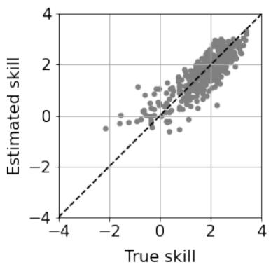

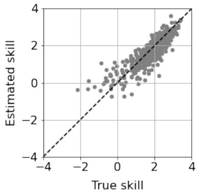  
(c) dnMIRT (smoothing)

(b) dnMIRT (estimate γk)  
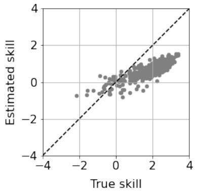  
(d) dcMIRT

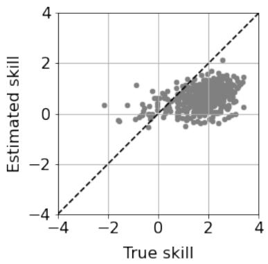

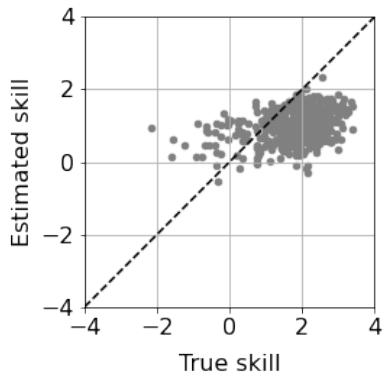  
(e) nMIRT (window=5)  
(f) nMIRT (window=10)  
Figure 4: Scatter plots of the true skill and the estimated skill in the 2-skill data set A. (a) - (c) show that dnMIRT can reproduce the true skill adequately. (d) shows that dcMIRT tends to underestimate the skills, however correlation is high. (e) and (f) show that nMIRT sufers from high MAEs and low correlations.

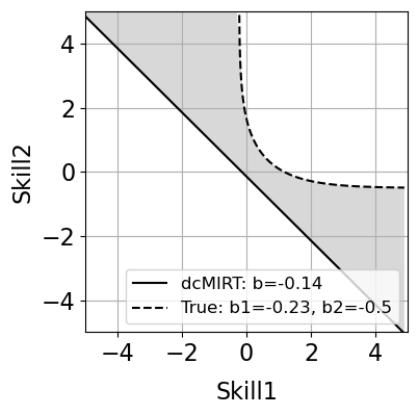  
(a)

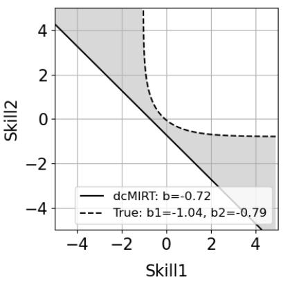  
(b)

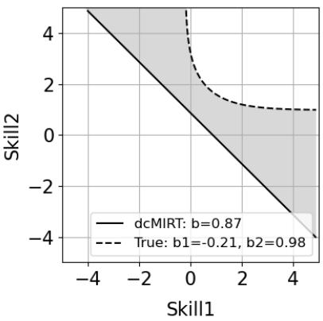  
(c)  
Figure 5: Comparisons of contours $( p = 0 . 5 )$ of item response surfaces obtained from dcMIRT and the true model on data set A: 2-skill and $a _ { i , k } = 1$ . The contour of dcMIRT is always below the true model. This causes the significant underestimation of skills in dcMIRT.

we look at the efect of the hyperparameters, we can see that the prediction performance is not sensitive to the settings of the discrimination parameters. The diference between data sets D and F is whether skills in initial states correlate or not. The performance gap between dnMIRT and dcMIRT in data set F is a little smaller than the gap in data set D.

## 6. Evaluation of αˆ Message Approximation

In this section, we evaluate the Gaussian approximation of the ˆα message introduced in Section 3.1. First, we visually confirm that our approximated posterior adequately approximates the true posterior by showcasing two-dimensional simulation results. Second, the approximation errors are quantitatively compared between our method and the Laplace approximation varying the number of dimensions in the latent state. Third, the relationship between the approximation error and the number of samples used in the approximation is investigated to clarify the suficient sample size.

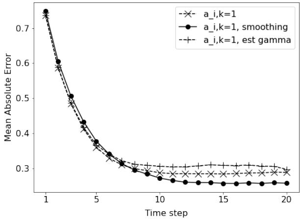  
(a) Data set A: 2-skill, $a _ { i , k } = 1$

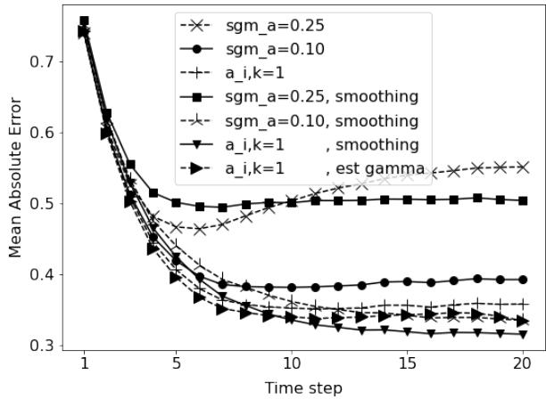  
(b) Data set B: 2-skill and $a _ { i , k } \sim \mathrm { l o g N } ( 0 , 0 . 2 5 ^ { 2 } )$

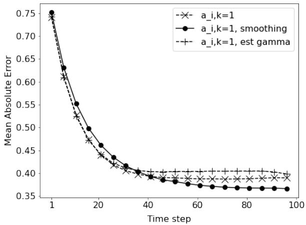  
(c) Data set C: 100-skill, $a _ { i , k } = 1$

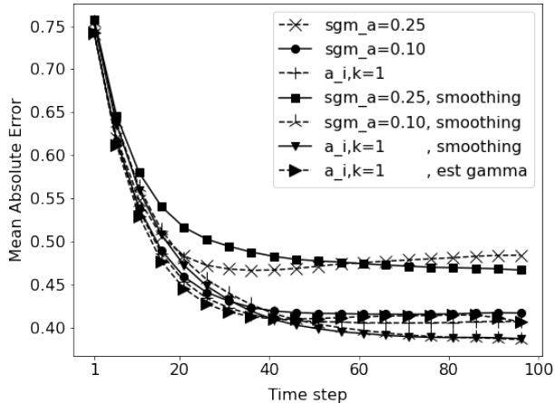  
(d) Data set D: 2-skill, $a _ { i , k } \sim \mathrm { l o g N } ( 0 , 0 . 2 5 ^ { 2 } )$  
Figure 6: Changes in the skill estimation errors over time. The errors decrease over time and saturate at approximately ten-time steps in the 2-skill data sets A and B, whereas fifty-time steps in the 100-skill data sets C and D.

Table 8: Accuracy of prediction on the data set D (100-skill, $a _ { i , k }$ ∼ logN(0, 0.25), and no skill correlation) and F (100-skill, $a _ { i , k } \sim \mathrm { l o g N } ( 0 , 0 . 2 5 )$ , and skill correlation is 0.2). dnMIRT is better than dcMIRT in both data sets.
<table><tr><td>Data</td><td>Method</td><td>Settings</td><td>AUC</td><td>Average Precision  $\scriptstyle ( \mathrm { y } = 1 )$ </td><td>Average Precision (y=0)</td></tr><tr><td>D</td><td>dnMIRT</td><td> $a = 1$ </td><td>0.791</td><td>0.892</td><td>0.631</td></tr><tr><td rowspan="5"></td><td></td><td> $\sigma _ { a } = 0 . 1$ </td><td>0.791</td><td>0.892</td><td>0.631</td></tr><tr><td></td><td> $\sigma _ { a } = 0 . 2 5$ </td><td>0.792</td><td>0.893</td><td>0.632</td></tr><tr><td>dcMIRT</td><td> $a = 1$ </td><td>0.765</td><td>0.878</td><td>0.586</td></tr><tr><td></td><td> $\sigma _ { a } = 0 . 1$ </td><td>0.766</td><td>0.878</td><td>0.587</td></tr><tr><td></td><td> $\sigma _ { a } = 0 . 2 5$ </td><td>0.769</td><td>0.880</td><td>0.592</td></tr><tr><td>F</td><td>dnMIRT</td><td> $a = 1$ </td><td>0.789</td><td>0.895</td><td>0.616</td></tr><tr><td rowspan="5"></td><td></td><td> $\sigma _ { a } = 0 . 1$ </td><td>0.789</td><td>0.895</td><td>0.617</td></tr><tr><td></td><td> $\sigma _ { a } = 0 . 2 5$ </td><td>0.790</td><td>0.895</td><td>0.617</td></tr><tr><td> $\mathrm { d c M I R T }$ </td><td> $a = 1$ </td><td>0.764</td><td>0.881</td><td>0.573</td></tr><tr><td></td><td> $\sigma _ { a } = 0 . 1$ </td><td>0.765</td><td>0.882</td><td>0.574</td></tr><tr><td></td><td> $\sigma _ { a } = 0 . 2 5$ </td><td>0.768</td><td>0.884</td><td>0.579</td></tr></table>

## 6.1. Visual Evaluation of Approximated Posterior

To confirm that the proposed Gaussian approximation adequately approximates the true posterior ( ˆα-message), we visualize some simulation results in two dimensions and compare the proposed method with the Laplace approximation (MacKay 2003; Bishop 2006).

Figure 7 shows three cases $\mathrm { ( a ) - ( c ) }$ for correct answers: i.e., $y = 1$ in $\operatorname { E q . }$ (12). Given the Gaussian priors $p ( z )$ (dashed line) and the non-compensatory likelihood functions $p ( y = 1 | z )$ (solid line) in the left column, we display the approximated posteriors of the proposed method (solid line) and the true posteriors (dashed line) in the middle column. For comparison, we also display the posteriors obtained from the Laplace approximation (solid line), and true posteriors (dashed line) in the right column. We can see that the proposed method adequately approximates the true posteriors in case $\mathrm { ( a ) - ( c ) }$ from the middle column. In contrast, the Laplace approximation underestimates the variance in x-axis and overestimates the variance in y-axis in case (a), and extends to the lower left in case (b). Owning to the fact that the Laplace approximation only considers the maximum point of the true posterior and the Hessian matrix, the error tends to be large as it extends far from the maximum point.

Figure 8 shows three cases (d)-(f) for incorrect answers, i.e., $y = 0$ . The true posteriors for the cases of incorrect answers tend to be more complex than in the cases of correct answers. In case (d), the proposed method covers the two peaks of the true posterior, whereas the Laplace approximation only covers one of the peaks. In cases (e) and (f), the proposed method covers the true posterior correctly; however, the Laplace approximation overestimates the variance.

## 6.2. Quantitative Evaluation of Approximated Posterior

Here, we quantitatively compare the approximation errors of our method and the Laplace approximation varying the number of dimensions in the latent state. We randomly generated 1,000 likelihood functions $p ( y | z )$ and the priors $p ( z )$ for each number of dimensions (one to five). The discrimination parameters of the likelihood functions were drawn from the uniform distribution U(0.5, 2.0), and the dificulty parameters were fixed to zero. The mean parameters of the priors were drawn from the uniform distribution $\mathrm { U } ( - 1 , 1 )$ , and the covariance parameters were generated by the formula $P D P ^ { T }$ , where P is the randomly generated orthonormal matrix and D is the diagonal matrix whose diagonal elements are drawn from the uniform distribution U(0, 10). The proposed approximation method and the Laplace approximation were applied to the abovementioned likelihood functions and priors, and the approximation error was subsequently computed by the KL-divergence between the approximated posterior and the true posterior. Then, the average of the KL-divergence for each number of dimensions was computed.

Figure 9 shows the results for a correct answer $y = 1$ and an incorrect answer $y = 0$ . We observe that the KL-divergence of the proposed method is always smaller than that of the Laplace approximation for both cases. Furthermore, it can be observed that the KL-divergence increases as the number of dimensions increases for the former case, whereas it decreases for the latter case. The shape of the posterior for an incorrect answer can be considered to be a hyper-sphere (Gaussian prior) from which a rounded-shaped hyper-cube (non-compensatory likelihood) is subtracted. By observing the true posterior in Figure 8, we can see that the low

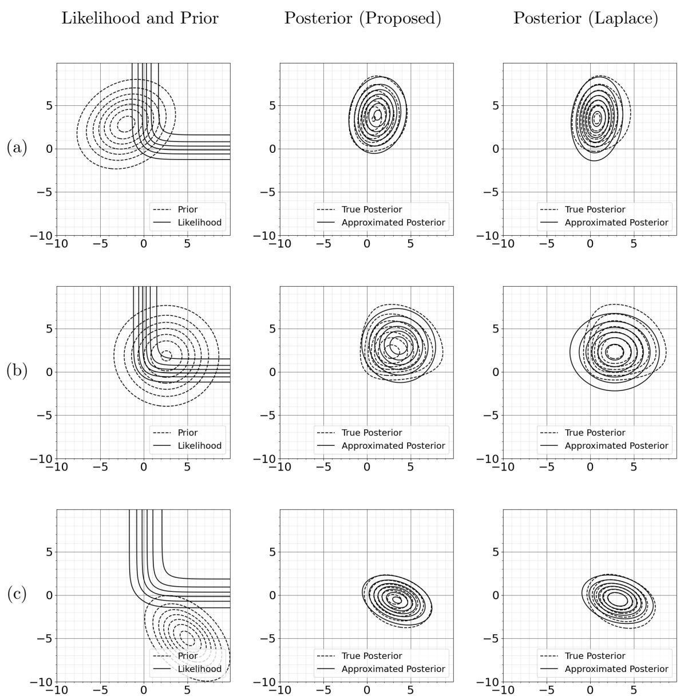  
Figure 7: Comparison between the true posterior and approximated posterior for correct answers $y = 1$ . The posterior of the proposed method approximates the true posterior more adequately than the Laplace approximation.

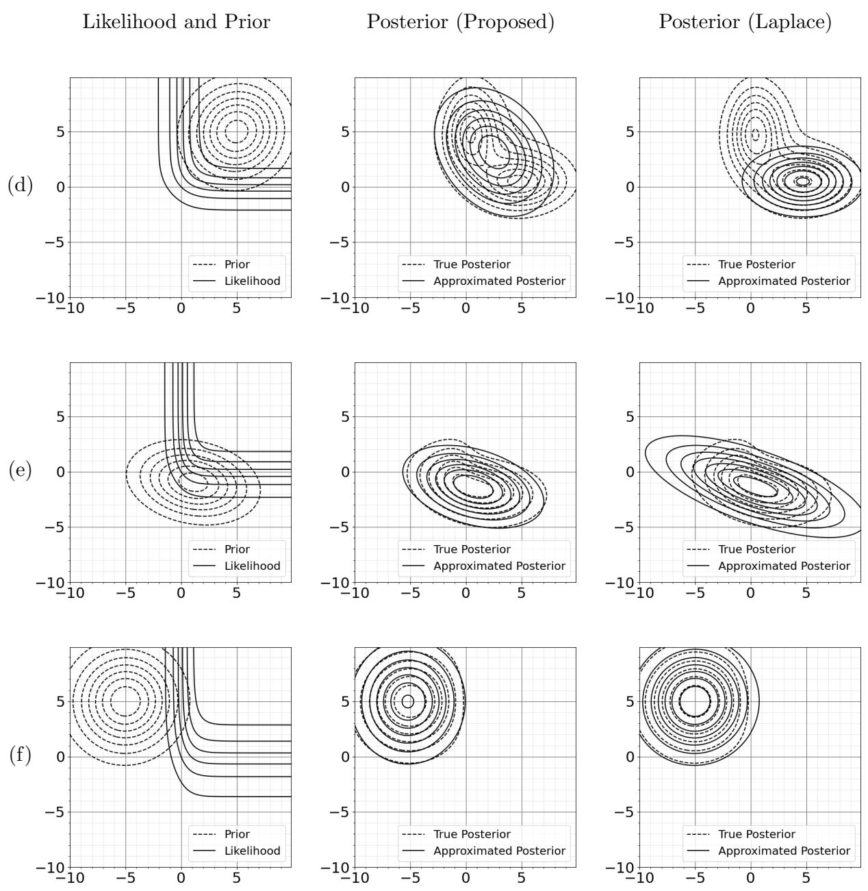  
Figure 8: Comparison between the true posterior and approximated posterior for incorrect answers $y = 0 .$ . True posteriors are more complicated than the cases of correct answers. The posterior of the proposed method approximates the true posterior adequately for the three cases.

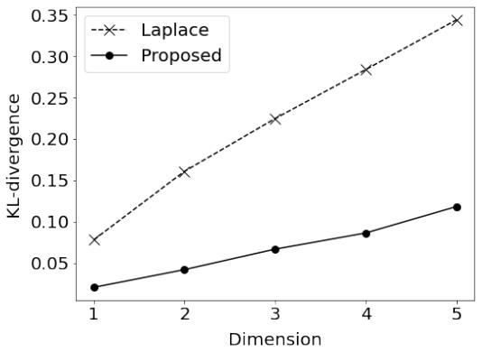  
(a) Correct answer case: $y = 1$

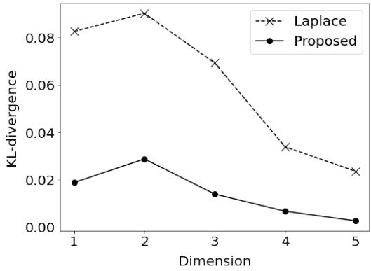  
(b) Incorrect answer case: $y = 0$  
Figure 9: Comparison of the approximation errors between the proposed method and the Laplace approximation. The proposed method shows smaller errors than the Laplace method for both cases. The error increases when the number of dimensions increases for the case of correct answers, whereas it decreases for the case of incorrect answers.  
probability area of the likelihood is subtracted from the Gaussian prior. As the number of dimensions increases, the part where the hyper-cube intersects the hyper-sphere decreases; therefore, the approximation error decreases.

## 6.3. Relationship between Approximation Error and Sample Size

Here, we investigate the relationship between the approximation error and the number of samples used in the reparameterization trick, namely $S$ in $\operatorname { E q } .$ . (16). We randomly generated 1,000 likelihood functions $p ( y | z )$ and the priors $p ( z )$ for each dimension (one to five) with the same procedure used in Section 6.2. The proposed method was applied to these likelihood functions and priors by changing the number of samples, and the approximation error was

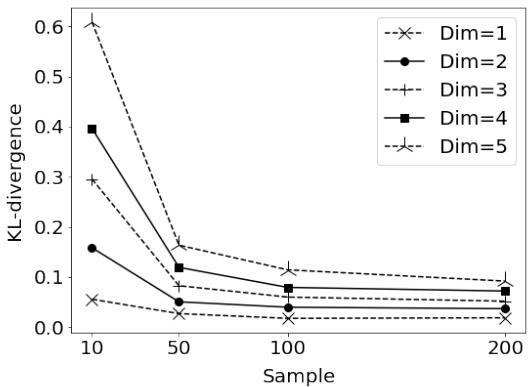  
(a) Correct answer case: $y = 1$

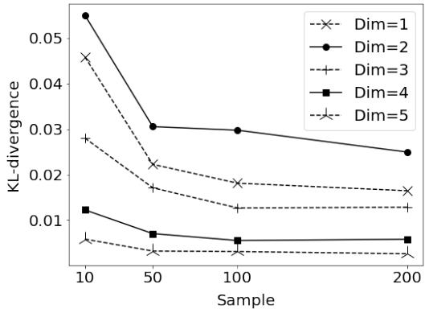  
(b) Incorrect answer case: $y = 0$  
Figure 10: Relationship between the number of samples and the approximation error. The error decreases as the number of samples increases, and it saturates at approximately 100 samples in both cases.

subsequently computed by employing the KL-divergence between the approximated posterior and the true posterior. Then, the average of the KL-divergence for each number of samples and dimensions was computed.

Figure 10 shows the results for the cases of a correct answer and an incorrect answer. We observe that the KL-divergence decreases as the number of samples increases for each case. The decrease of the KL-divergence saturates at approximately 100 samples. Based on these results, we used 50 samples in the simulations of skill inference in Section 4 by considering the trade-of between the approximation error and the computation cost.

## 7. Application to Real Data

In this section, we demonstrate how our model is used in actual data by using the ASSISTments 2009-2010 data (Feng et al. 2009). First, we show the prediction accuracy of whether a user is able to solve the next problem or not, which can be used in personalized recommendations of the next problem a user should solve. Second, we visualize skill tracing, i.e., how user’s skills change over time, which benefits users to understand their skill growth.

## 7.1. Data

The ASSISTments 2009-2010 skill builder data are the logs where learners solved math problems on the web-based learning system. The logs consist of sequences of correct or incorrect answers with order id, user id, and question id. In the system, learners must answer three questions correctly in a row to complete the assignment. If a learner uses the tutoring (“Hint” or “Break this Problem Into Steps”), the question will be marked incorrect. Learners will know immediately if they answered the question correctly. Therefore, they are the records of the learning process which are essentially diferent from logs of tests. One or multiple skill tags are attached to a question manually. The data consist of 4,217 learners, 26,688 questions, and 123 skills. Table 10 in Appendix shows the first 30 skill tags. Because a question is able to have scafolding questions, we filtered out the logs for scafolding questions leaving the logs for main questions. We also filtered out the logs for questions answered by less than ten learners. The processed data comprised 224,905 records, 4,106 learners, 8,112 questions, and 106 skills. The maximum number of learning records for a learner was 786.

## 7.2. Joint Prior on Slope and Bias

We set a joint prior on the slope and bias parameters to infer skills within a reasonable range, which was introduced in Section 3.3.3. Without this joint prior, both non-compensatory and compensatory models over-fitted to the real data, and unexpectedly large or small values of skill, which are impossible to measure by item dificulty parameters distributed by $\mathcal { N } ( 0 , 1 )$ , were inferred. Here, we introduce the heuristics we used in real data analysis to determine the joint distribution.

First, we considered the reasonable range of the asymptotic value of skill. Let us assume that the prior distribution of the dificulty parameter is $\mathcal { N } ( 0 , 1 )$ . In this case, questions whose dificulty is larger than three are rare and skill values larger than three are not almost measurable. We considered the reasonable range of the asymptotic value to be from one to two approximately. Figure 11 (a) shows two lines whose asymptotic skills are two and one, respectively. When the slope parameter and the bias parameter are in the gray area, the asymptotic skill takes a value ranging from one to two. Second, we designed a Gaussian distribution which approximately covers the gray area. We drew samples from $\mathcal { N } ( ( \beta _ { \mathrm { m a x } } + \beta _ { \mathrm { m i n } } ) / 2 , ( ( \beta _ { \mathrm { m a x } } - \beta _ { \mathrm { m i n } } ) / 2 ) ^ { 2 } )$ for the slope parameters (0.7, 0.8, 0.9), where $\beta _ { \mathrm { m a x } }$ and $\beta _ { \mathrm { m i n } }$ denote the value of bias parameter whose asymptotic skills are two and one, respectively. (Figure 11 (b)) Then, we obtained the Gaussian distribution as shown in Figure 11 (c) by calculating the mean and the covariance matrix from

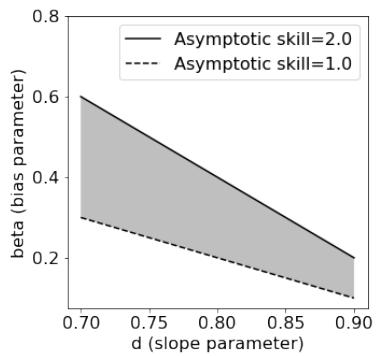  
(a)

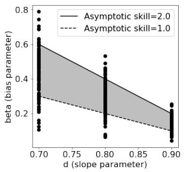  
(b)

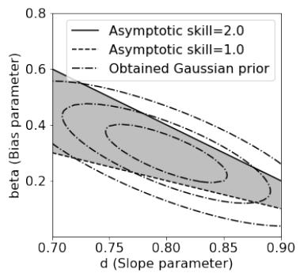  
(c)  
Figure 11: (a)-(c) show the heuristics that obtain the Gaussian prior on the slope and bias parameters. The gray area in (a) represents values of slope and bias whose asymptotic skill is within the range of one and two. (b) shows the samples used to obtain the Gaussian distribution which covers the gray area. (c) represents the obtained Gaussian prior distribution on the slope and bias parameters.

those samples. The obtained mean and covariance matrix were

$$
\begin{array} { r l } { \left[ \mu _ { d } , \mu _ { \beta } \right] ^ { \top } = \left[ 0 . 8 , 0 . 2 9 7 \right] ^ { \top } } & { { } } \\ { \Lambda _ { d , \beta } ^ { - 1 } = \left[ \begin{array} { l l } { 6 . 6 8 \times 1 0 ^ { - 3 } } & { - 9 . 9 1 \times 1 0 ^ { - 3 } } \\ { - 9 . 9 1 \times 1 0 ^ { - 3 } } & { 2 . 5 6 \times 1 0 ^ { - 2 } } \end{array} \right] . } \end{array}\tag{58}
$$

(59)

We set this Gaussian distribution to the joint prior of the slope and bias parameters in the following experiments.

## 7.3. Performance of Prediction

We conducted experiments for predicting whether a learner can answer the next question correctly or not, comparing the dynamical compensatory MIRT (dcMIRT) model, the dynamical non-compensatory MIRT (dnMIRT) model, and dnMIRT with the smoothing extension. Because the target variable can either be correct or incorrect, this is considered as a sequential binary classification task. An accurate predictive model can be used in personalized recommendation of the next question that should be attempted by the learner.

We employed five-fold cross-validation and calculated AUC (Area Under the Curve), average precision for predicting correct answers (y = 1), and average precision for predicting incorrect answers $( y = 0 )$ as performance metrics. A record in the first-time step for each learner was excluded from the calculation of the metrics. The hyperparameters $\mu _ { a }$ and $\sigma _ { b }$ were set as $\mu _ { a } = 0$ and $\sigma _ { b } = 1 . 0$ . The hyperparameters $[ \mu _ { d } , \mu _ { \beta } ] ^ { \top }$ and $\Lambda _ { d , \beta }$ were set as Eq. (58) and $\operatorname { E q } .$ . (59), respectively. The rest of hyperparameters were selected by choosing the best AUC model in the following grid: $\sigma _ { a } = \{ 0 . 1 , 1 . 0 \}$ , (ϕ, ψ) = {(100, 100), (1000, 1000)}, and $( \nu - K , \tau ) = \{ ( 1 0 0 , 0 . 0 1 ) , ( 1 0 0 0 , 0 . 0 0 1 ) \}$ . All the three models, dcMIRT, dnMIRT, and dnMIRT with smoothing, employ the forward message to predict whether the next response is correct or not one by one. However, the smoothing extension leads to the target leakage. Therefore, we applied the smoothing extension in the training phase and did not apply smoothing in the prediction phase for dnMIRT with smoothing.

Table 9 shows the prediction accuracy for each model. We can see that dnMIRT is slightly better than dcMIRT in the three metrics. The Wilcoxon signed-rank test verified that there is a diference in three metrics between dnMIRT and dcMIRT at a confidence level of 5%. (This means that there is a diference; however, the gap is small.) In the comparison between dnMIRT and dnMIRT with smoothing, we could confirm diferences in AUC and average precision for incorrect answers by the Wilcoxon signed-rank test. The best result for each model was obtained in the same hyperparameter settings: $\sigma _ { a } = 0 . 1 , ( \phi , \psi ) = ( 1 0 0 , 1 0 0 )$ , and $( \nu - K , \tau ) = ( 1 0 0 , 0 . 0 1 )$

Table 9: Comparison of prediction accuracy among dcMIRT, dnMIRT, and dnMIRT with smoothing. The asterisk denotes significance by the Wilcoxon signed-rank test at a confidence level of 5%. dnMIRT is shown to be significantly better than dcMIRT. (Smoothing is abbreviated as “sm.”.)
<table><tr><td>Method</td><td>AUC</td><td>Average precision  $\scriptstyle ( \mathrm { y } = 1 )$ </td><td>Average Precision  $\scriptstyle ( \mathrm { y = 0 } )$ </td></tr><tr><td rowspan="2">dcMIRT</td><td rowspan="2">0.760</td><td></td><td></td></tr><tr><td>0.838</td><td>0.635</td></tr><tr><td rowspan="2">dnMIRT</td><td rowspan="2">0.762</td><td>*</td><td>* *</td></tr><tr><td>0.842 *</td><td>0.637 1 *</td></tr><tr><td>dnMIRT sm.</td><td>0.763</td><td>0.843</td><td>0.640</td></tr></table>

## 7.4. Skill Tracing

This section showcases the visualization of skill tracing from the two models of dnMIRT and dcMIRT obtained in the experiments of Section 7.3. By comparing the results of dnMIRT and dcMIRT, we clarify the diference in skill tracing between dnMIRT and dcMIRT. The visualization of skill tracing benefits learners because they can see their current skill immediately after they solve a problem. That quick feedback enables learners to arrange their study plans efectively.

We show the skill tracing of four learners (referred to as A, B, C, and D below) in ASSISTments 2009-2010. For learners A-C, we show short periods of skill tracing and compare dnMIRT and dcMIRT. For learner D, a long period of skill tracing is shown. In the following, it is shown that the direction that a skill state changes depends on the current state in dnMIRT, however, it does not in dcMIRT.

Figures 12 (a) left and (b) left show the visualization of skill tracing for learner A from 424-time steps to 427-time steps which was obtained by dnMIRT and dcMIRT, respectively. The bottom panels in (a) left and (b) left show responses to the questions, where successes and failures correspond to the upward and downward positions of markers, and the required skill for each question is denoted as the marker type. Learner A correctly answered a question requiring “Probability of Two Distinct Events” skill at 424-time steps and then incorrectly answered a question requiring both “Box and Whisker” and “Range” skills at 425-time steps. In dnMIRT, it can be seen that the “Range” skill does not change so much from 424-time steps to 425-time steps, whereas the ”Box and Whisker” skill decreased. In contrast, both skills decreased in dcMIRT. Figures 12 (a) right and (b) right show the skill states of learner A at 424 and 425-time steps with the item response surface of the question at 425-time steps (dashed line) obtained by dnMIRT and dcMIRT, respectively. Figure 12 (a) right additionally shows the dificulty of the question at 425-time steps with the dotted line. dnMIRT estimated that the “Box and Whisker” skill of learner A is much weaker than the “Range” skill according to the relationship between the skill state and dificulty of the question in Figure 12 (a) right. dnMIRT explained the incorrect answer at 425-time steps by decreasing the “Box and Whisker” skill much more than the “Range” skill. It implies that the “Box and Whisker” skill was inferred as the cause of the incorrect answer by dnMIRT. Meanwhile, dcMIRT explained the incorrect answer at 425-time steps by decreasing both skills. Approximately, the skills are inferred along the way of the normal vector of the contour in both dnMIRT and dcMIRT. Since the contour is not linear in dnMIRT, the direction that a skill state changes depends on the current skill state.

Figures 13 (a) left and (b) left show the visualization of skill tracing for learner B from

36-time steps to 39-time steps which was obtained by dnMIRT and dcMIRT, respectively. Learner B correctly answered a question requiring “Calculations with Similar Figures” skill at 36-time steps and then incorrectly answered a question requiring both “Rotations” and “Translations” skills at 37-time steps. In dnMIRT and dcMIRT, it can be seen that both “Rotations” and “Translations” skills decrease from 36-time steps to 37-time steps. Figures 13 (a) right and (b) right show the skill states of learner B at 36 and 37-time steps with the same procedure as the Figures 12 (a) right and (b) right. dnMIRT estimated that the both “Rotations” and “Translations” skills of learner B were weak according to the relationship between the skill state and dificulty of the question in Figure 13 (a) right. dnMIRT explained the incorrect answer at 37-time steps by decreasing both skills. It implies that both skills were inferred as the cause of the incorrect answer by dnMIRT. dcMIRT also explained the incorrect answer at 37-time steps by decreasing both skills.

Figures 14 (a) left and (b) left show the visualization of skill tracing for learner C from 102-time steps to 105-time steps which was obtained by dnMIRT and dcMIRT, respectively. Learner C incorrectly answered a question requiring both “Unit Conversion Within a System” and “Addition and Subtraction Positive Decimals” skills at 102-time steps and then correctly answered a question requiring both “Unit Conversion Within a System” and “Addition and Subtraction Positive Decimals” skills at 37-time steps. In dnMIRT, it can be seen that the “Addition and Subtraction Positive Decimals” skill does not change so much from 102-time steps to 103-time steps, whereas the “Unit Conversion Within a System” skill increased. In contrast, both skills increased in dcMIRT. Figures 14 (a) right and (b) right show the skill states of learner C at 102 and 103-time steps with the same procedure as the above. dnMIRT estimated that the “Unit Conversion Within a System” skill of learner C was much weaker than the “Addition and Subtraction” skill according to the relationship between the skill state and dificulty of the question in Figure 14 (a) right. dnMIRT explained the correct answer at 103-time steps by increasing the “Unit Conversion Within a System” skill much more than the “Addition and Subtraction Positive Decimals” skill. It implies that the skill increase of “Unit Conversion Within a System” was inferred as the cause of the correct answer by dnMIRT. Meanwhile, dcMIRT explained the correct answer at 103-time steps by increasing both skills.

Figure 2 presents a longer period of skill tracing than the previous three learners. Learner D studied problems of the “Absolute Value”, “Subtraction Whole Numbers”, “Addition Whole Numbers”, and “Multiplication and Division Integers” skills. We can see that the “Multiplication and Division Integers” skill grew first and the other three skills grew later. The “Absolute Value”, “Subtraction Whole Numbers”, and “Addition Whole Numbers” skills were more dificult for learner D to acquire than the “Multiplication and Division Integers” skill.

## 8. Discussion

We proposed a dynamical non-compensatory MIRT model to provide accurate and real-time skill tracing. The proposed model combined an LDS and a non-compensatory MIRT model, resulting in a complicated posterior. We approximated the posterior as a Gaussian distribution by minimizing the KL-divergence between the approximated posterior and the true posterior. The estimation method for the model parameters was derived through Monte Carlo EM.

Our simulation studies evaluated (a) inferring latent skills, (b) predicting the next response, and (c) approximating the ˆα message. In (a), we verified that the proposed method reproduced the true latent skills for the 2-skill and 100-skill simulation data, and the dynamical compensatory model sufered from significant underestimation errors. Also, it turned out that the proposed model with fixed discrimination parameters $( \mathrm { i . e . , } a _ { i , k } = 1 )$ was suficient to infer the skills in most cases. In (b), it was shown that the proposed model performs better than its compensatory counterpart in predicting the next response. Finally, in (c), we demonstrated that the proposed Gaussian approximation was better than the Laplace approximation at approximating the true posterior through visualizations and quantitative approximation error analyses.

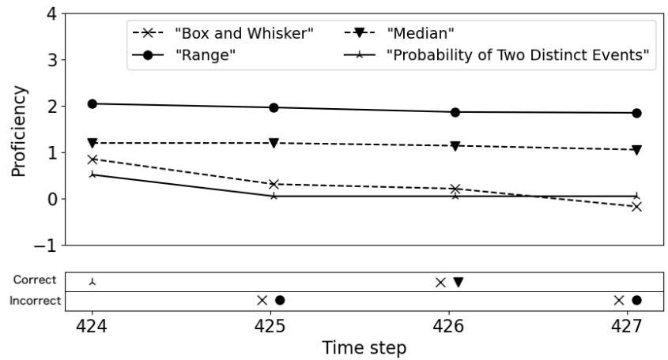

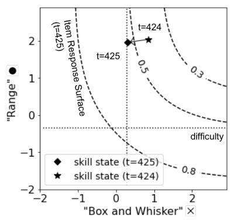  
(a) Skill tracing in dnMIRT

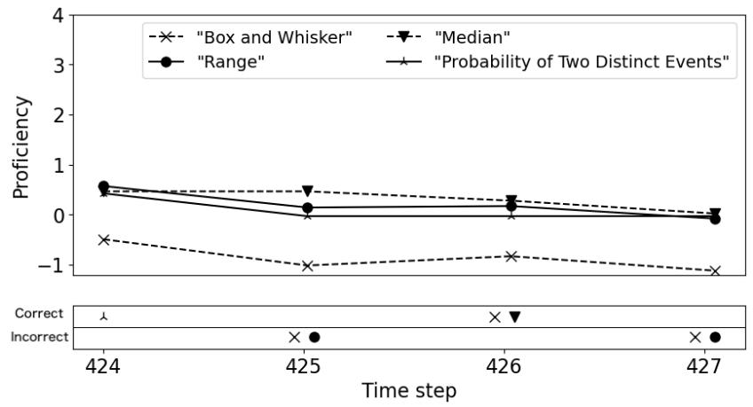

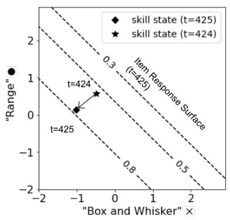  
(b) Skill tracing in dcMIRT  
Figure 12: The visualization of skill tracing in dnMIRT and dcMIRT for learner A. From 424-time steps to 425-time steps, the “Range” skill does not change so much, whereas the “Box and Whisker” skill decreased in dnMIRT. In contrast, both skills decreased in dcMIRT.

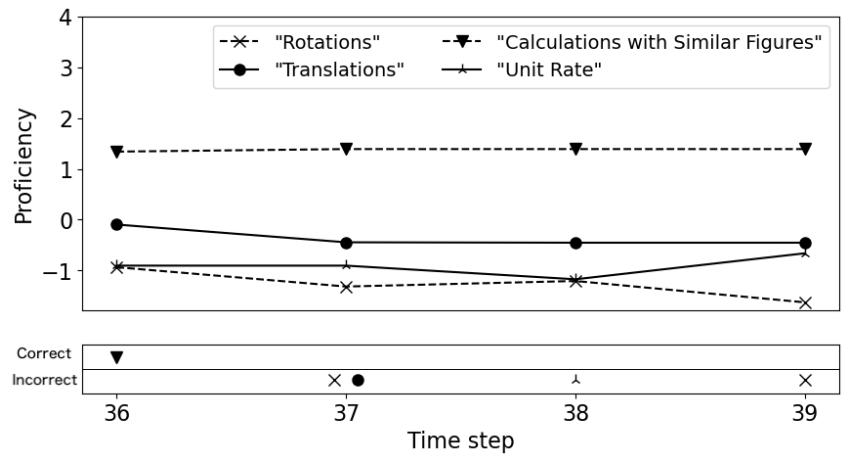

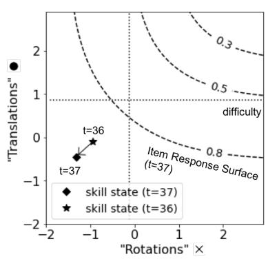  
(a) Skill tracing in dnMIRT

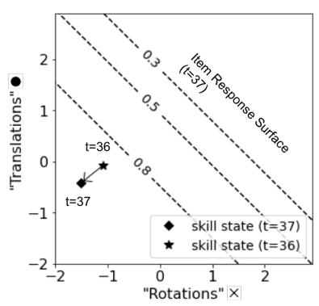  
(b) Skill tracing in dcMIRT  
Figure 13: The visualization of skill tracing in dnMIRT and dcMIRT for learner B. From 36- time steps to 37-time steps, both “Rotations” and “Translations” skills decrease in dnMIRT and dcMIRT.

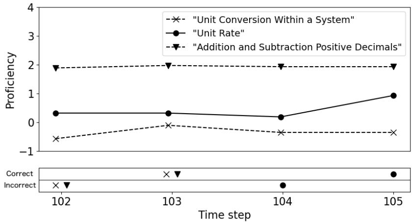

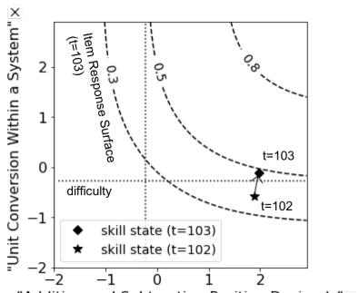

(a) Skill tracing in dnMIRT  
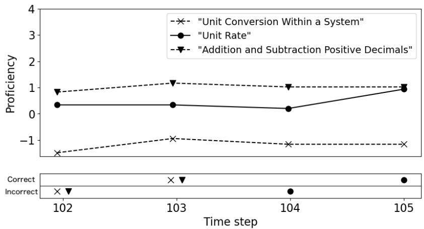

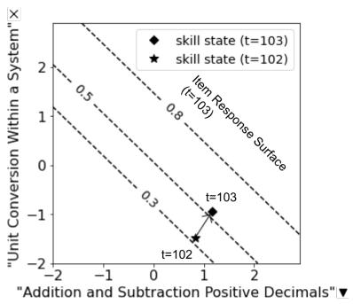  
(b) Skill tracing in dcMIRT  
Figure 14: The visualization of skill tracing in dnMIRT and dcMIRT for learner C. From 102-time steps to 103-time steps, the “Addition and Subtraction Positive Decimals” skill does not change so much, whereas the “Unit Conversion Within a System” skill increased in dnMIRT. In contrast, both skills increased in dcMIRT.

Experiments on actual data presented the supposed use case of the proposed model. The results demonstrated that the dynamical non-compensatory MIRT model could infer practical skill tracing, as shown in Figure 2. We also clarified diferences in skill tracing between non-compensatory and compensatory models, where the non-compensatory model considered which skill is the cause of success or failure. In predicting the responses, we showed that the proposed model was slightly better than its compensatory version.

To understand our model better, it is important to discuss how it difers from the closest model, SPARFA-Trace (Lan et al. 2014). SPAFA-Trace is a combination of an LDS and a compensatory MIRT model; therefore, the main diference is the type of MIRT model, meaning that the target data are diferent. The authors approximated the posterior in the Gaussian distribution through the expectation propagation method (EP; Minka 2001) because their compensatory model employed the probit function and yielded analytical solutions using the EP method. This is the case only for their compensatory model; non-compensatory models do not provide analytical solutions by employing the EP method. In contrast, we employed the objective function which is the same as variational Bayes (VB; Bishop 2006). Our approximation method is more general and can be applied to both compensatory and non-compensatory models. SPARFA-Trace is the method used for exploratory analysis; it can infer Q-matrix, whereas our model is used for confirmatory analysis that assumes that Q-matrix is given. Its extension to exploratory analysis remains as future work.

As shown in the results of the comparison between compensatory and non-compensatory models in non-dynamical settings (Buchholz and Hartig 2018), the dynamical compensatory MIRT model caused significant underestimation errors. Figure 4 (d) clearly shows that the underestimation of the skills and the fitting trend, shown in Figure 5, causes the underestimation. When the dimensions of latent skills increased to 100 skills, the correlation for the dynamical compensatory model dropped significantly, as compared to the dynamical non-compensatory model. The reason is that higher dimensions increase the gap between the two models. This result stresses the importance of applying the dynamical non-compensatory MIRT model to the data of time-series and non-compensatory type.

One of our purposes was real-time skill tracing. We mainly implemented the inference algorithm in Python, which runs in parallel to fully utilize many cores. Only the Gaussian approximation of ˆα message was implemented in C++. Training our model with one hyperparameter setting on 100-skill data took about one to two days by using a machine with 36 cores. However, inferring skills based on the trained model is fast. Before tracing skills on the fly, we need to train the model on available data to obtain the parameters of the model. Once we train the model, we are ready to trace the skills of students. Every time we get one response data from a student, we execute forward message passing for one time step to infer the current skills of that student. It took 0.0052 sec for 100-skill data. Therefore, we think that real-time skill tracing

is actually possible.

Although we approximated the posterior as a Gaussian distribution, another approximation can be employed using sampling, such as the sequential Monte Carlo (Kitagawa 1993). The advantage of our approach is its scalability of the dimensions in the latent skill state. Our method worked for higher dimensions, even when the number of dimensions for the latent state was 100. Despite the accuracy advantage of sampling approaches (they can express any shape of the posterior), they can only function in low-dimensional cases. Further comparisons with sampling approaches will be beneficial to identify the border number of dimensions; which approaches should be employed by considering accuracy, speed, and cost.

Another dynamical extension of MIRT is longitudinal IRT (Andrade and Tavares 2005; Bollen and Curran 2006; Duncan et al. 2006; Paek et al. 2016; Wang and Nydic 2020). This has been employed to analyze multiple test results and infer the changes in latent skills among those tests. Longitudinal IRT typically handles a short series of the latent skill states, and multiple item responses are available for a particular skill state. In contrast, knowledge tracing typically handles long-series, and a single item response is available for a particular skill state. We formulated the dynamical extension of the non-compensatory model in the knowledge tracing setting. However, our proposed model can be easily re-formulated into the longitudinal IRT setting by accepting multiple item responses from each time step in the graphical model (Figure 3 (a)). A few modifications to the inference algorithm are needed; Eq. (16), Eq. (54), and Eq. (55) should be modified to accept multiple likelihood functions.

When users apply our proposed model to their data, some options exist for hyperparameters and whether to use the smoothing extension. Here, we summarize a recommended setting for the first trial. First, the discrimination parameters should be fixed to one. According to the simulation studies, fixing them to one gave good results in most cases. Another benefit is that users do not need to tune the prior on the discrimination parameters. Second, the joint prior on slope and bias should be used. Without the joint prior, the model may over-fit data and infer unexpectedly high or low skill values. Users can use the same values as Eq. (58) and Eq. (59). Last, the smoothing extension should not be used. It will need additional eforts to tune the weight parameters. We recommend that users try the simplest setting first and move to the detailed settings if it is needed.

We now summarize other limitations and possible avenues for future research. First, the skill transitions were modeled by the linear transformations, and many extensions can be considered in the transition model. When we consider the linear transformation $z ^ { ( t + 1 ) } = d \cdot z ^ { ( t ) } + \beta$ with $0 < d < 1$ , the skill asymptotically approaches $\beta / ( 1 - d )$ by applying the linear transformation infinitely many times. This means that the skill of a learner, with respect to a question, approaches a particular goal value as they practice the question. This may seem natural; however, the linear transformation behaves unnaturally when a learner with skill higher than $\beta / ( 1 - d )$ correctly answers the question. The linear transformation unexpectedly decreases the skill of the learner such that the skill is one step closer to the goal value. This means that the skill decreases when a high-skill learner solves an easy problem. One apparent solution to this is the piece-wise linear model, i.e., adding a rule $z ^ { ( t + 1 ) } = z ^ { ( t ) }$ when $z ^ { ( t ) } > \beta / ( 1 - d )$ . Furthermore, more flexible models such as the Gaussian process can be used to express skill transitions (Wang et al. 2005; Cully and Demiris 2019).

Second, we showed that the prediction accuracy of the dynamical non-compensatory MIRT model is slightly better than its compensatory version by one actual data. Comparisons on various actual data sets are required to see whether the dynamical non-compensatory MIRT model generally performs better than its compensatory version. We also employed heuristics to set a joint prior distribution on the slope and bias parameters of skill transition. Without the joint prior, both non-compensatory and compensatory models over-fitted to the data and the test accuracy kept decreasing after some iterations. Also, unexpectedly a large or small value of skill, which is impossible to be measure by item dificulty parameters distributed by $\mathcal { N } ( 0 , 1 )$ , was observed in both models. We manually tried some heuristics and chose the best performing one, however, we expect further studies will improve the skill transition model which can be used without setting the joint prior.

Third, we did not combine the smoothing extension and the estimation of $\gamma _ { k }$ because preliminary experiments did not perform well. This is a current limitation; however, we consider that further exploration of weight parameters is needed to confirm if this combination does not truly work or not.

## Appendix

Table 10: The first 30 skill tags in ASSISTments2009-2010 skill builder.
<table><tr><td>Skill: 1-15</td><td>Skill: 16-30</td></tr><tr><td>Box and Whisker</td><td>Interior Angles Figures with More than 3 Sides</td></tr><tr><td>Circle Graph</td><td>Interior Angles Triangle</td></tr><tr><td>Histogram as Table or Graph</td><td>Congruence</td></tr><tr><td>Number Line</td><td>Complementary and Supplementary Angles</td></tr><tr><td>Scatter Plot</td><td>Angles on Parallel Lines Cut by a Transversal</td></tr><tr><td>Stem and Leaf Plot</td><td>Pythagorean Theorem</td></tr><tr><td>Table</td><td>Nets of 3D Figures</td></tr><tr><td>Venn Diagram</td><td>Unit Conversion Within a System</td></tr><tr><td>Mean</td><td>Effect of Changing Dimensions of a Shape Prpor...</td></tr><tr><td>Median</td><td>Area Circle</td></tr><tr><td>Mode</td><td>Circumference</td></tr><tr><td>Range</td><td>Perimeter of a Polygon</td></tr><tr><td>Counting Methods</td><td>Reading a Ruler or Scale</td></tr><tr><td>Probability of Two Distinct Events Calculations with Similar Figures</td><td></td></tr><tr><td>Probability of a Single Event</td><td>Conversion of Fraction Decimals Percents</td></tr></table>

deviations in the accuracy of skill inference for data set A: 2-skill,ai,k= 1, and
<table><tr><td></td><td></td><td colspan="2">Skills (MAE)</td><td colspan="4">Parameters (MAE)</td><td colspan="2">Skills (Corr)</td><td colspan="3">Parameters (Corr)</td></tr><tr><td>Model</td><td>Settings</td><td>All</td><td>Last</td><td>bi,k</td><td>di,k</td><td>βi,k</td><td>Yk</td><td>All</td><td>Last</td><td>bi,k</td><td>di,k</td><td>βi,k</td></tr><tr><td>dnMIRT</td><td></td><td>0.016</td><td>0.027</td><td>0.058</td><td>0.008</td><td>0.017</td><td>0.000</td><td>0.019</td><td>0.042</td><td>0.017</td><td>0.095</td><td>0.017</td></tr><tr><td></td><td>est. γk</td><td>0.049</td><td>0.063</td><td>0.066</td><td>0.004</td><td>0.020</td><td>0.040</td><td>0.015</td><td>0.037</td><td>0.020</td><td>0.149</td><td>0.014</td></tr><tr><td></td><td>sm.</td><td>0.025</td><td>0.050</td><td>0.072</td><td>0.012</td><td>0.020</td><td>0.000</td><td>0.018</td><td>0.039</td><td>0.019</td><td>0.096</td><td>0.037</td></tr><tr><td>dcMIRT</td><td></td><td>0.115</td><td>0.148</td><td>–</td><td></td><td></td><td>一</td><td>0.015</td><td>0.044</td><td>=</td><td></td><td></td></tr><tr><td>nMIRT</td><td>window=5</td><td>0.094</td><td>0.128</td><td>0.071</td><td></td><td></td><td></td><td>0.022</td><td>0.047</td><td>0.122</td><td></td><td></td></tr><tr><td></td><td>window=10</td><td>0.083</td><td>0.115</td><td>0.071</td><td></td><td></td><td></td><td>0.026</td><td>0.044</td><td>0.122</td><td></td><td></td></tr></table>

abbreviated as “sm.” . Estimateγkis abbreviated

deviations in the accuracy of skill inference for data set B: 2-skill,ai,k∼logN(0,
<table><tr><td></td><td></td><td colspan="2">Skills (MAE)</td><td colspan="5">Parameters (MAE)</td><td colspan="2">Skills (Corr)</td><td colspan="5">Parameters (Corr)</td></tr><tr><td>Model</td><td>Settings</td><td>All</td><td>Last</td><td>ai,k</td><td>bi,k</td><td>di,k</td><td>βi,k</td><td>γk</td><td></td><td>All</td><td>Last</td><td>ai,k</td><td>bi,k</td><td>di,k</td><td>βi,k</td></tr><tr><td>dnMIRT</td><td>σa = 0.25</td><td>0.152</td><td>0.207</td><td>0.030</td><td>0.044</td><td>0.003</td><td>0.041</td><td>0.000</td><td>0.015</td><td>0.048</td><td></td><td>0.109</td><td>0.034</td><td>0.154</td><td>0.034</td></tr><tr><td></td><td>σa = 0.1</td><td>0.102</td><td>0.131</td><td>0.014</td><td>0.049</td><td>0.003</td><td>0.035</td><td>0.000</td><td></td><td>0.017</td><td>0.051</td><td>0.096</td><td>0.040</td><td>0.161</td><td>0.037</td></tr><tr><td></td><td>ai,k = 1</td><td>0.083</td><td>0.103</td><td>0.017</td><td>0.055</td><td>0.004</td><td>0.032</td><td>0.000</td><td>0.018</td><td></td><td>0.053</td><td>-</td><td>0.048</td><td>0.162</td><td>0.039</td></tr><tr><td></td><td>ai,k = 1, est. γk</td><td>0.039</td><td>0.050</td><td>0.017</td><td>0.047</td><td>0.015</td><td>0.030</td><td>0.060</td><td></td><td>0.020</td><td>0.074</td><td>-</td><td>0.053</td><td>0.139</td><td>0.039</td></tr><tr><td></td><td>σa = 0.25, sm.</td><td>0.136</td><td>0.173</td><td>0.033</td><td>0.054</td><td>0.007</td><td>0.048</td><td>0.000</td><td>0.023</td><td></td><td>0.088</td><td>0.145</td><td>0.041</td><td>0.084</td><td>0.039</td></tr><tr><td></td><td>σa = 0.1, sm.</td><td>0.079</td><td>0.082</td><td>0.013</td><td>0.060</td><td>0.007</td><td>0.040</td><td>0.000</td><td></td><td>0.020</td><td>0.069</td><td>0.108</td><td>0.052</td><td>0.116</td><td>0.046</td></tr><tr><td></td><td>ai,k = 1, sm.</td><td>0.056</td><td>0.052</td><td>0.017</td><td>0.073</td><td>0.006</td><td>0.037</td><td>0.000</td><td>0.021</td><td></td><td>0.068</td><td>、</td><td>0.064</td><td>0.124</td><td>0.050</td></tr><tr><td>dcMIRT</td><td>σa = 0.25</td><td>0.129</td><td>0.153</td><td></td><td></td><td></td><td></td><td></td><td>0.017 一</td><td></td><td>0.044</td><td></td><td></td><td></td><td></td></tr><tr><td></td><td>σa = 0.1</td><td>0.124</td><td>0.144</td><td></td><td></td><td></td><td></td><td></td><td>0.017</td><td></td><td>0.035</td><td></td><td></td><td></td><td></td></tr><tr><td></td><td>ai,k = 1</td><td>0.123</td><td>0.143</td><td></td><td></td><td></td><td></td><td></td><td>0.017</td><td></td><td>0.028</td><td>–</td><td></td><td></td><td></td></tr><tr><td>nMIRT</td><td>window=5</td><td>0.129</td><td>0.158</td><td>0.024</td><td>0.039</td><td></td><td></td><td></td><td>0.030</td><td></td><td>0.056</td><td>0.073</td><td>0.104</td><td></td><td></td></tr><tr><td></td><td>window=10</td><td>0.117</td><td>0.149</td><td>0.024</td><td>0.039</td><td></td><td></td><td></td><td>0.027</td><td></td><td>0.040</td><td>0.073</td><td>0.104</td><td></td><td></td></tr></table>

abbreviated as “sm.” . Estimateγkis abbreviated

deviations in the accuracy of skill inference for data set C: 100-skill,ai,k= 1, and

abbreviated as “sm.” . Estimateγkis abbreviated

abbreviated as “sm.” . Estimateγkis abbreviate  
eviations in the accuracy of skill inference for data set D: 100-skill,ai,k∼logN(0
<table><tr><td></td><td></td><td colspan="2">Skills (MAE)</td><td colspan="4">Parameters (MAE)</td><td colspan="2">Skills (Corr)</td><td colspan="5">Parameters (Corr)</td></tr><tr><td>Model</td><td>Settings</td><td>All</td><td>Last</td><td>ai,k</td><td>bi,k</td><td>di,k</td><td>βi,k</td><td>γk</td><td>All</td><td>Last</td><td>ai,k</td><td>bi,k</td><td>di,k</td><td>βi,k</td></tr><tr><td>dnMIRT</td><td>σa = 0.25</td><td>0.015</td><td>0.018</td><td>0.003</td><td>0.008</td><td>0.001</td><td>0.006</td><td>0.000</td><td>0.010</td><td>0.023</td><td>0.019</td><td>0.009</td><td>0.022</td><td>0.006</td></tr><tr><td></td><td>σa = 0.1</td><td>0.010</td><td>0.011</td><td>0.002</td><td>0.011</td><td>0.000</td><td>0.006</td><td>0.000</td><td>0.006</td><td>0.019</td><td>0.018</td><td>0.011</td><td>0.019</td><td>0.007</td></tr><tr><td></td><td>ai,k = 1</td><td>0.010</td><td>0.010</td><td>0.003</td><td>0.011</td><td>0.000</td><td>0.006</td><td>0.000</td><td>0.006</td><td>0.018</td><td>-</td><td>0.012</td><td>0.020</td><td>0.008</td></tr><tr><td></td><td>ai,k = 1, est. γk</td><td>0.016</td><td>0.020</td><td>0.003</td><td>0.015</td><td>0.006</td><td>0.006</td><td>0.021</td><td>0.006</td><td>0.009</td><td>-</td><td>0.014</td><td>0.016</td><td>0.010</td></tr><tr><td></td><td>σa = 0.25, sm.</td><td>0.018</td><td>0.019</td><td>0.002</td><td>0.008</td><td>0.001</td><td>0.007</td><td>0.000</td><td>0.012</td><td>0.029</td><td>0.014 </td><td>0.011 </td><td>0.015</td><td>0.010</td></tr><tr><td></td><td>σa = 0.1, sm.</td><td>0.012</td><td>0.012</td><td>0.003</td><td>0.012</td><td>0.001</td><td>0.007</td><td>0.000</td><td>0.007</td><td>0.020</td><td>0.017 </td><td>0.013</td><td>0.015</td><td>0.010</td></tr><tr><td></td><td>ai,k = 1, sm.</td><td>0.010</td><td>0.007</td><td>0.003</td><td>0.011</td><td>0.001</td><td>0.007</td><td>0.000</td><td>0.005</td><td>0.015</td><td></td><td>0.014</td><td>0.012</td><td>0.010</td></tr><tr><td>dcMIRT</td><td>σa = 0.25</td><td>0.027</td><td>0.030</td><td></td><td></td><td></td><td></td><td>-</td><td>0.015</td><td>0.026</td><td></td><td></td><td></td><td></td></tr><tr><td></td><td>σa = 0.1</td><td>0.027</td><td>0.030</td><td>一</td><td></td><td></td><td></td><td>-</td><td>0.022</td><td>0.032</td><td>一</td><td></td><td></td><td></td></tr><tr><td></td><td>ai,k = 1</td><td>0.028</td><td>0.031</td><td></td><td></td><td></td><td></td><td></td><td>0.021</td><td>0.031</td><td></td><td></td><td></td><td></td></tr></table>

abbreviated as “sm.” . Estimateγkis abbreviated  
deviations in the accuracy of skill inference for data set E: 100-skill,ai,k∼logN(0
<table><tr><td></td><td></td><td colspan="2">Skills (MAE)</td><td colspan="4">Parameters (MAE)</td><td colspan="3">Skills (Corr)</td><td colspan="4">Parameters (Corr)</td></tr><tr><td>Model</td><td>Settings</td><td>All</td><td>Last</td><td>ai,k</td><td>bi,k</td><td>di,k</td><td>βi,k</td><td>γk</td><td>All</td><td>Last</td><td>ai,k</td><td>bi,k</td><td>di,k</td><td>βi,k</td></tr><tr><td>dnMIRT</td><td>µa = 0.4, σa = 0.2</td><td>0.013</td><td>0.022</td><td>0.006</td><td>0.010</td><td>0.003</td><td>0.004</td><td>0.000</td><td>0.005</td><td>0.013</td><td>0.018</td><td>0.008</td><td>0.033</td><td>0.005</td></tr><tr><td></td><td>µa = 0, σa = 0.1</td><td>0.006</td><td>0.008</td><td>0.005</td><td>0.008</td><td>0.001</td><td>0.004</td><td>0.000</td><td>0.005</td><td>0.021</td><td>0.019</td><td>0.012</td><td>0.035</td><td>0.005</td></tr><tr><td></td><td>µa = 0, σa = 0.25</td><td>0.003</td><td>0.008</td><td>0.005</td><td>0.008</td><td>0.001</td><td>0.004</td><td>0.000</td><td>0.005</td><td>0.018</td><td>0.020</td><td>0.010</td><td>0.037</td><td>0.005</td></tr><tr><td></td><td>ai,k = 1</td><td>0.009</td><td>0.011</td><td>0.005</td><td>0.008</td><td>0.001</td><td>0.004</td><td>0.000</td><td>0.006</td><td>0.023</td><td>-</td><td>0.012</td><td>0.035</td><td>0.004</td></tr><tr><td></td><td>ai,k = 1, est. γk</td><td>0.010</td><td>0.012</td><td>0.005</td><td>0.012</td><td>0.005</td><td>0.012</td><td>0.015</td><td>0.005</td><td>0.012</td><td></td><td>0.010</td><td>0.032</td><td>0.006</td></tr><tr><td></td><td>µa = 0.4, σa = 0.2, sm.</td><td>0.013</td><td>0.021</td><td>0.005</td><td>0.007</td><td>0.001</td><td>0.003</td><td>0.000</td><td>0.008</td><td>0.021</td><td>0.021</td><td>0.006</td><td>0.020</td><td>0.005</td></tr><tr><td></td><td>µa = 0, σa = 0.1, sm.</td><td>0.009</td><td>0.015</td><td>0.005</td><td>0.006</td><td>0.001</td><td>0.003</td><td>0.000</td><td>0.005</td><td>0.020</td><td>0.020</td><td>0.009</td><td>0.031</td><td>0.004</td></tr><tr><td></td><td>µa = 0, σa = 0.25, sm.</td><td>0.006</td><td>0.008</td><td>0.007</td><td>0.004</td><td>0.002</td><td>0.004</td><td>0.000</td><td>0.008</td><td>0.024</td><td>0.019</td><td>0.008</td><td>0.028</td><td>0.004</td></tr><tr><td></td><td>ai,k = 1, sm.</td><td>0.012</td><td>0.019</td><td>0.005</td><td>0.009</td><td>0.001</td><td>0.004</td><td>0.000</td><td>0.006</td><td>0.022</td><td></td><td>0.010</td><td>0.032</td><td>0.004</td></tr><tr><td>dcMIRT</td><td>µa = 0.4, σa = 0.2</td><td>0.037</td><td>0.040</td><td></td><td></td><td></td><td>一</td><td>一</td><td>0.015</td><td>0.018</td><td></td><td></td><td></td><td></td></tr><tr><td></td><td>µa = 0, σa = 0.1</td><td>0.047</td><td>0.053</td><td></td><td></td><td></td><td></td><td>、</td><td>0.015</td><td>0.019</td><td></td><td></td><td></td><td></td></tr><tr><td></td><td>µa = 0, σa = 0.25</td><td>0.045</td><td>0.050</td><td></td><td></td><td></td><td></td><td></td><td>0.016</td><td>0.019</td><td></td><td></td><td></td><td></td></tr></table>

abbreviated as “sm.” . Estimateγkis abbreviate  
deviations in the accuracy of skill inference for data set F: 100-skill,ai,k∼log
<table><tr><td></td><td></td><td colspan="3">Skills (MAE)</td><td colspan="4">Parameters (MAE)</td><td colspan="3">Skills (Corr)</td><td colspan="4">Parameters (Corr)</td></tr><tr><td>Model</td><td>Settings</td><td>All</td><td>Last</td><td>ai,k</td><td>bi,k</td><td>di,k</td><td>βi,k</td><td>γk</td><td></td><td>All</td><td>Last</td><td>ai,k</td><td>bi,k</td><td>di,k</td><td>βi,k</td></tr><tr><td>dnMIRT</td><td>σa = 0.25</td><td>0.015</td><td>0.022</td><td>0.005</td><td>0.011</td><td>0.001</td><td>0.005</td><td>0.000</td><td>0.010</td><td></td><td>0.034</td><td>0.009</td><td>0.014</td><td>0.023</td><td>0.012</td></tr><tr><td></td><td>σa = 0.1</td><td>0.013</td><td>0.018</td><td>0.003</td><td>0.012</td><td>0.001</td><td>0.005</td><td></td><td>0.000</td><td>0.006</td><td>0.025</td><td>0.011 </td><td>0.013</td><td>0.023</td><td>0.011</td></tr><tr><td></td><td>ai,k = 1</td><td>0.013</td><td>0.018</td><td>0.002</td><td>0.012</td><td>0.001</td><td>0.005 </td><td>0.000</td><td></td><td>0.007</td><td>0.027</td><td>-</td><td>0.013</td><td>0.023</td><td>0.012</td></tr><tr><td></td><td>ai,k = 1, est. γk</td><td>0.014</td><td>0.015</td><td>0.002</td><td>0.014</td><td>0.007</td><td>0.006</td><td>0.030</td><td></td><td>0.005</td><td>0.015</td><td>-</td><td>0.013</td><td>0.025</td><td>0.015</td></tr><tr><td></td><td>σa = 0.25, sm.</td><td>0.017</td><td>0.024</td><td>0.005</td><td>0.010</td><td>0.001 </td><td>0.005</td><td>0.000</td><td></td><td>0.012 </td><td>0.039</td><td>0.002</td><td>0.015</td><td>0.022</td><td>0.013</td></tr><tr><td></td><td>σa = 0.1, sm.</td><td>0.013</td><td>0.017</td><td>0.003</td><td>0.010</td><td>0.001</td><td>0.005</td><td>0.000</td><td></td><td>0.007 </td><td>0.026</td><td>0.007</td><td>0.014</td><td>0.023</td><td>0.012</td></tr><tr><td></td><td>ai,k = 1, sm.</td><td>0.012</td><td>0.015</td><td>0.002</td><td>0.010</td><td>0.001</td><td>0.005</td><td>0.000</td><td></td><td>0.008</td><td>0.029</td><td></td><td>0.014</td><td>0.024</td><td>0.012</td></tr><tr><td>dcMIRT</td><td>σa = 0.25</td><td>0.020</td><td>0.023</td><td></td><td></td><td></td><td></td><td>-</td><td>-</td><td>0.012</td><td>0.025</td><td></td><td></td><td></td><td></td></tr><tr><td></td><td>σa = 0.1</td><td>0.022</td><td>0.026</td><td></td><td></td><td></td><td></td><td></td><td>0.011 –</td><td></td><td>0.026</td><td>1</td><td></td><td></td><td></td></tr><tr><td></td><td>ai,k = 1</td><td>0.022</td><td>0.027</td><td></td><td></td><td></td><td></td><td></td><td>0.010 -</td><td></td><td>0.025</td><td></td><td></td><td></td><td></td></tr></table>

## References

Ackerman, T. (1996). Graphical representation of multidimensional item response theory analyses. Applied psychological measurement, 20 (4), 311-329.

Andrade, D. F., & Tavares, H. R. (2005). Item response theory for longitudinal data: population parameter estimation. Journal of multivariate analysis, 95 (1), 1-22.

Bishop, M. (2006). Pattern recognition and machine learning. Pattern Recognition.

Bogan, E. D., & Yen, W. M. (1983). Detecting Multidimensionality and Examining Its Efects on Vertical Equating with the Three-Parameter Logistic Model.

Bollen, K. A., & Curran, P. J. (2006). Latent curve models: A structural equation perspective (Vol. 467). John Wiley & Sons.

Bolt, D. M., & Lall, V. F. (2003). Estimation of compensatory and noncompensatory multidimensional item response models using Markov chain Monte Carlo. Applied Psychological Measurement, 27(6), 395-414.

Buchholz, J., & Hartig, J. (2018). The impact of ignoring the partially compensatory relation between ability dimensions on norm-referenced test scores. Psychological Test and Assessment Modeling, 60 (3), 369-385.

Chalmers, R. P. (2012). mirt: A multidimensional item response theory package for the R environment. Journal of statistical Software, 48 (6), 1-29.

Chen, P., Lu, Y., Zheng, V. W., & Pian, Y. (2018, November). Prerequisite-driven deep knowledge tracing. In 2018 IEEE International Conference on Data Mining (ICDM) (pp. 39-48). IEEE.

Corbett, A. T., & Anderson, J. R. (1994). Knowledge tracing: Modeling the acquisition of procedural knowledge. User modeling and user-adapted interaction, 4 (4), 253-278.

Cully, A., & Demiris, Y. (2019). Online knowledge level tracking with data-driven student models and collaborative filtering. IEEE Transactions on Knowledge and Data Engineering, 32 (10), 2000-2013.

DeMars, C. E. (2016). Partially compensatory multidimensional item response theory models: Two alternate model forms. Educational and Psychological Measurement, 76 (2), 231-257.

Dempster, A. P., Laird, N. M., & Rubin, D. B. (1977). Maximum likelihood from incomplete data via the EM algorithm. Journal of Royal Statistical Society, 39 (1), 1-22.

Duncan, T. E., Duncan, S. C., & Strycker, L. A. (2013). An introduction to latent variable growth curve modeling: Concepts, issues, and application. Routledge.

Embretson, S. (1984). A general latent trait model for response processes. Psychometrika, 49(2), 175-186.

Embretson, S. E., & Reise, S. P. (2013). Item Response Theory. Psychology Press.

Embretson, S. E., & Yang, X. (2013). A multicomponent latent trait model for diagnosis. Psychometrika, 78 (1), 14-36.

Feng, M., Hefernan, N.T., & Koedinger, K.R. (2009). Addressing the assessment challenge in an Intelligent Tutoring System that tutors as it assesses. The Journal of User Modeling and User-Adapted Interaction, 19, 243-266

Ghahramani, Z., & Hinton, G. E. (1996). Parameter estimation for linear dynamical systems.

Huang, H. Y. (2013). Measuring latent growth under the multilevel higher-order item response theory model. In Annual Meeting of National Council on Measurement in Education, San Francisco, the USA.

Kalman, R. E. (1960). A new approach to linear filtering and prediction problems.

Kingma, D. P., & Welling, M. (2013). Auto-encoding variational bayes. arXiv preprint arXiv:1312.6114.

Kitagawa, G. (1993, January). A Monte Carlo filtering and smoothing method for non-Gaussian nonlinear state space models. In Proceedings of the 2nd US-Japan joint seminar on statistical time series analysis (pp. 110-131).

Lan, A. S., Studer, C., & Baraniuk, R. G. (2014, August). Time-varying learning and content analytics via sparse factor analysis. In Proceedings of the 20th ACM SIGKDD international conference on Knowledge discovery and data mining (pp. 452-461).

Leighton, J., & Gierl, M. (Eds.). (2007). Cognitive diagnostic assessment for education: Theory and applications. Cambridge University Press.

Li, F., Cohen, A., Bottge, B., & Templin, J. (2016). A latent transition analysis model for assessing change in cognitive skills. Educational and psychological measurement, 76 (2), 181-204.

Lord, F. M. (1980). Applications of Item Response Theory to Practical Testing Problems. Routledge.

MacKay, D. J., & Mac Kay, D. J. (2003). Information theory, inference and learning algorithms. Cambridge university press.

Minka, T. P. (2001, August). Expectation propagation for approximate Bayesian inference. In Proceedings of the Seventeenth conference on Uncertainty in artificial intelligence (pp. 362-369).

Oka, M., & Okada, K. (2021). Scalable Estimation Algorithm for the DINA Q-matrix Combining Stochastic Optimization and Variational Inference. arXiv preprint arXiv:2105.09495.

Paek, I., Li, Z., & Park, H. J. (2016). Specifying ability growth models using a multidimensional item response model for repeated measures categorical ordinal item response data. Multivariate behavioral research, 51 (4), 569-580.

Piech, C., Bassen, J., Huang, J., Ganguli, S., Sahami, M., Guibas, L., & Sohl-Dickstein, J. (2015, December). Deep knowledge tracing. In Proceedings of the 28th International Conference on Neural Information Processing Systems-Volume 1 (pp. 505-513).

Pu, S., Yudelson, M., Ou, L., & Huang, Y. (2020, July). Deep Knowledge Tracing with Transformers. In International Conference on Artificial Intelligence in Education (pp. 252-256). Springer, Cham.

Rasch, G. (1960). Studies in mathematical psychology: I. Probabilistic models for some intelligence and attainment tests.

Reckase, M. D. (1985). The dificulty of test items that measure more than one ability. Applied psychological measurement, 9(4), 401-412.

Reckase, M. D. (2009). Multidimensional item response theory models. In Multidimensional item response theory (pp. 79-112). Springer, New York, NY.

Spray, J. A., Davey, T. C., Reckase, M. D., Ackerman, T. A., & Carlson, J. E. (1990). Comparison of two logistic multidimensional item response theory models. AMERICAN COLL TESTING PROGRAM IOWA CITY IA.

Stamper, J., Niculescu-Mizil, A., Ritter, S., Gordon, G.J., & Koedinger, K.R. (2010). Algebra I 2008-2009. Challenge data set from KDD Cup 2010 Educational Data Mining Challenge. Find it at http://pslcdatashop.web.cmu.edu/KDDCup/downloads.jsp

Su, Y., Cheng, Z., Luo, P., Wu, J., Zhang, L., Liu, Q., & Wang, S. (2021). Time-and-Concept Enhanced Deep Multidimensional Item Response Theory for interpretable Knowledge Tracing. Knowledge-Based Systems, 218, 106819.

Sympson, J. B. (1978). A model for testing with multidimensional items. In Proceedings of the 1977 computerized adaptive testing conference (No. 00014).

Tatsuoka, K. K. (1983). Rule space: An approach for dealing with misconceptions based on item response theory. Journal of educational measurement, 345-354.

Templin, J., & Henson, R. A. (2010). Diagnostic measurement: Theory, methods, and applications. Guilford Press.

Wang, C., & Nydick, S. W. (2015). Comparing two algorithms for calibrating the restricted non-compensatory multidimensional IRT model. Applied Psychological Measurement, 39 (2), 119-134.

Wang, C., & Nydick, S. W. (2020). On longitudinal item response theory models: A didactic. Journal of Educational and Behavioral Statistics, 45 (3), 339-368.

Wang, J. M., Fleet, D. J., & Hertzmann, A. (2005, December). Gaussian process dynamical models. In NIPS (Vol. 18, p. 3).

Wang, S., Yang, Y., Culpepper, S. A., & Douglas, J. A. (2018). Tracking skill acquisition with cognitive diagnosis models: a higher-order, hidden markov model with covariates. Journal of Educational and Behavioral Statistics, 43 (1), 57-87.

Wei, G. C., & Tanner, M. A. (1990). A Monte Carlo implementation of the EM algorithm and the poor man’s data augmentation algorithms. Journal of the American statistical Association, 85 (411), 699-704.

Whitely, S. E. (1980). Multicomponent latent trait models for ability tests. Psychometrika, 45 (4), 479-494.

Yeung, C. K. (2019). Deep-IRT: Make deep learning based knowledge tracing explainable using item response theory. arXiv preprint arXiv:1904.11738.

Zhang, J., Shi, X., King, I., & Yeung, D. Y. (2017, April). Dynamic key-value memory networks for knowledge tracing. In Proceedings of the 26th international conference on World Wide Web (pp. 765-774).

Zhan, P., Jiao, H., Liao, D., & Li, F. (2019). A longitudinal higher-order diagnostic classification model. Journal of Educational and Behavioral Statistics, 44 (3), 251-281.