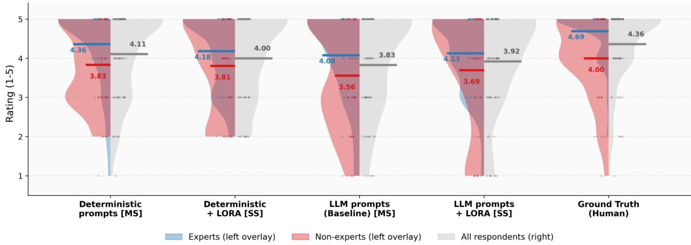

# Deterministic Prompting for Speaker-Stable Low-Resource Greek TTS

Georgios Syllas ID 1, Efthymios Georgiou\* ID 2, Kosmas Kritsis ID 1, Alexandros Potamianos ID 3

1Institute for Language and Speech Processing, Athena R.C., Greece

2Department of Digital Medicine, University of Bern, Switzerland

3School of Electrical and Computer Engineering, National Technical University of Athens, Greece

georgios.syllas@athenarc.gr, efthymios.georgiou@unibe.ch, kosmas.kritsis@athenarc.gr, potam@central.ntua.gr

## Abstract

Modern TTS systems approach human quality for high-resource languages but degrade when clean speech data is scarce. Modern Greek exemplifies this, lacking the curated corpora behind state-of-the-art synthesis. We propose a data curation recipe that transforms audiobook recordings into TTS-ready data via WhisperX alignment and filtering. Then we fine-tune Parler-TTS (880M), a prompt-based multilingual model whose pretraining encodes phonetic priors transferable to Greek. During development, we find that LLM-generated style prompts introduce speaker drift at inference. Replacing them with deterministic prompts resolves this, and a speaker-specific LoRA stage trained on 3.5 h of single-speaker data anchors identity while updating ∼5% of parameters. Our system achieves WER 10.7% (2.9 above the ASR floor), MOS-I 4.00 (vs. 4.36 human speech), and near-human speaker consistency (MOS-C 4.24 vs. 4.30), showing that robust single-speaker Greek TTS is achievable with limited curated data.

Index Terms: low-resource TTS, Greek, multilingual pretraining, prompt conditioning, LoRA

## 1. Introduction

Neural text-to-speech (TTS) has progressed to near-human naturalness in settings where large, clean, and stylistically consistent corpora are available, typically as long singlespeaker recordings segmented into well-behaved clips. However, the same architectures degrade rapidly when training data are scarce or noisy, often harming prosody, intelligibility, and speaker consistency. This high-resource/low-resource gap is especially pronounced for Modern Greek, where public datasets either provide limited clean single-speaker coverage (e.g., CSS10 [1]) or larger but heterogeneous multi-speaker collections with transcription and acoustic noise (e.g., Common Voice [2]).

Greek presents challenges beyond data volume. Its rich inflectional morphology and lexical stress system require reliable prosody modeling, while available corpora exhibit speaker and channel variability, inconsistent segmentation, and imperfect transcriptions. In large community datasets such as Common Voice, many speakers contribute only a few minutes each, and fine-tuning on such fragmented supervision drifts toward a diffuse, speaker-averaged voice rather than a stable identity. To address this, our first contribution is a data curation recipe that bridges the gap between “raw audio” and “model-ready training examples”. The pipeline aligns long-form recordings to text (WhisperX [3]), segments them into TTS-suitable clips, and filters aggressively for alignment confidence, duration, and acoustic consistency, transforming both community recordings and audiobooks into standardized examples usable for adaptation. We additionally curate two novel audiobook-derived single-speaker Greek datasets to compensate for the lack of clean, long-duration single-speaker material.

Neural TTS has evolved from spectrogram-based sequenceto-sequence models [4, 5, 6, 7], through non-autoregressive [8, 9], flow-based [10], end-to-end [11], and diffusion-based architectures [12], to codec language models that reframe synthesis as discrete token prediction over neural audio codes [13, 14, 15], supported by vocoders and neural codecs such as HiFi-GAN [16] and DAC [17]. Among these, prompt-conditioned codec models are particularly attractive for low-resource adaptation, as natural-language descriptions provide explicit style control while multilingual pretraining encodes transferable phonetic priors.

We adopt Parler-TTS [14, 15], an 880M-parameter promptconditioned multilingual model, because its multilingual pretraining can transfer phonetic and prosodic priors to lowresource languages, especially phonetically close ones [18, 19, 20]. Parler-TTS is trained on multiple Indo-European languages, including Spanish, which is phonologically and prosodically similar to Greek [21, 22]. We first fully fine-tune the model on our curated Greek data to adapt its multilingual priors to the target language. However, since high-quality singlespeaker data remain limited to a few hours, fully updating hundreds of millions of parameters for speaker specialization risks overfitting. We therefore add a second stage using Low-Rank Adaptation (LoRA) [23], training only on single-speaker data with far fewer trainable parameters [24].

In early experiments, we find that LLM-generated style prompts, intended to increase linguistic variety and expressiveness, cause a severe speaker consistency failure: the synthesized voice drifts noticeably across utterances, even when conditioning on the same speaker. Replacing stochastic LLM prompts with deterministic, human-designed style prompts resolves this instability. Combined with the speaker-specific LoRA stage trained on 3.5 h of curated single-speaker Greek, this produces stable identity and high intelligibility.

In summary, we contribute (i) a reusable data curation pipeline that converts raw Greek audio into problem-ready TTS clips, (ii) a two-stage adaptation recipe (full fine-tuning followed by speaker-specific LoRA) that highlights the failure mode of LLM-generated prompts and the benefit of deterministic prompting, and (iii) evidence that stable single-speaker identity can be anchored with only 3.5 h of speaker-specific data atop the adapted model.

Table 1: Greek data resources. Durations are approximate after filtering. †After community validation; further TTS-specific cleaning yields ∼15.5 h used in training. Audiobook-2 is excludedfrom thefinal system.
<table><tr><td>Dataset</td><td>Hours Spk.</td><td></td><td>Notes</td></tr><tr><td>CSS10 [1]</td><td>4.0</td><td>1</td><td>Clean, female</td></tr><tr><td>Common Voice [2]</td><td>15.5†</td><td>174</td><td>Filtered</td></tr><tr><td>Audiobook-1</td><td>3.5</td><td>1</td><td>Verified, male</td></tr><tr><td>Audiobook-2</td><td>7.5</td><td>1</td><td>Auto-filtered</td></tr></table>

## 2. Data Curation Pipeline

Public corpora and cleaning: We use two public Greek corpora. CSS10 [1] provides ∼4 h of clean single-speaker female audiobook speech. Mozilla Common Voice (Greek) [2] contains ∼32 h across 412 speakers. Common Voice is filtered using community validation signals and manual inspection to remove clips with clipping, background music, and transcription mismatches, yielding ∼17.5 h of higher-quality multi-speaker speech from 174 retained speakers. After TTS-specific preprocessing for Parler-TTS (format standardization and duration trimming), we use ∼15.5 h for training.

Audiobook-derived single-speaker data: To obtain higherquality single-speaker Greek speech, we build two audiobookderived corpora from publicly available recordings via a semiautomated pipeline: (1) source selection prioritizing clear, lownoise single-speaker material; (2) forced alignment and utterance segmentation via WhisperX [3] with GPU acceleration; and (3) quality filtering via transcription confidence, SNR scoring, and, for the first corpus, manual review and correction of ASR errors. We constrain segment durations to approximately 1.5–10 s to avoid overly short utterances (which can harm prosody learning).

One corpus is manually verified (∼3.5 h, male speaker) and reserved for speaker-specific LoRA adaptation. A larger automatically filtered corpus (∼7.5 h, male speaker) was excluded from the final pipeline: residual ASR errors propagated into training and increased hallucinated syllables, underscoring that transcription accuracy outweighs raw volume in low-resource TTS. Table 1 summarizes all resources.

The source recordings were obtained from privately licensed sources and cannot be redistributed. Data-preparation templates are available: https://github.com/gsyllas/ greek-stable-tts/tree/main/scripts/data to enable reproduction for researchers with access to original recordings.

We explored voice-conversion augmentation with Seed-VC [25] to convert Common Voice samples to the CSS10 speaker timbre, but conversion artifacts degraded quality and did not improve performance, so we omit this path from evaluation.

## 3. Models and Adaptation

## 3.1. VITS baseline

As a low-resource baseline, we fine-tune a pretrained Greek VITS checkpoint [11] on combinations of CSS10, filtered Common Voice and voice-converted data in various configurations with different data mixtures and training durations. All configurations exhibit monotonic prosody, timbre inconsistency, and audible artifacts, with quality insufficient for formal evaluation, motivating our shift to a multilingual foundation model.

## 3.2. Parler-TTS

Parler-TTS [14, 15] frames speech synthesis as autoregressive generation of discrete audio tokens, jointly conditioned on a transcript and a natural-language style description. A frozen Flan-T5 encoder [26] processes the style description via cross-attention layers. A Transformer decoder autoregressively predicts residual vector quantization (RVQ) codebook tokens across nine codebook levels using a delay-pattern interleaving scheme [27]. A DAC decoder [17] reconstructs the final waveform.

We selected the multilingual Parler-TTS checkpoint [28] because it was pretrained on a diverse language set that includes Spanish, which we treat as a favorable cross-lingual transfer prior for Greek (not a guarantee). Its prompt-conditioned design enables explicit style control via text descriptions, and its modular structure (frozen text encoder, trainable decoder, frozen audio codec) is well suited to parameter-efficient adaptation.

Full fine-tuning proceeds in two stages: first on Common Voice alone (∼15.5 h) to verify viability, then extended training on the full pool (∼23.0 h: Common Voice + CSS10 + audiobook-1 data). Extended training improves prosody and naturalness but introduces occasional hallucinated syllables and introduces timbre drift across utterances, which we mitigate with deterministic prompts and a speaker-specific LoRA stage. Deterministic prompt engineering: The standard Parler-TTS pipeline generates style descriptions via an LLM from automatically extracted acoustic attributes (speaking rate, pitch statistics, SNR, and C50 reverberation). This introduces stochastic wording variation across training samples and at inference time, destabilizing both optimization and generation. We replace LLM-generated descriptions with deterministic prompts by discretizing each scalar attribute into fixed bins (five quantile bins over the training set) and concatenating the corresponding labels in a fixed order (e.g., “male, slightly low pitch, moderate speed, very clear, very close-sounding”). At inference time, we use a single canonical deterministic prompt (median-bin labels) for all utterances. This removes prompt-induced variance and reduces hallucinated or repeated syllables, though speaker identity drift persists without further adaptation.

Speaker stabilization with LoRA: A critical failure mode emerges after full fine-tuning on the multi-speaker pool. With many speakers having little per-speaker data, the decoder cannot converge to any individual voice. Instead it learns a diffuse, speaker-averaged representation that produces generationto-generation and utterance-to-utterance timbre drift, audible even when transcription accuracy is reasonable. This speaker inconsistency (timbre drift across utterances), rather than lack of total data, motivates the LoRA stage.

LoRA [23] directly targets this failure mode. By injecting trainable low-rank projection matrices into the Transformer decoder’s attention layers, updating only ∼25 M parameters (∼5% of the 500 M-parameter decoder), we anchor the model to a single stable speaker identity without catastrophically forgetting the multilingual phonetic knowledge acquired during pretraining. A full re-fine-tuning of the decoder to a single speaker would risk overwriting those priors. The low-rank constraint acts as an implicit regularizer that preserves them while specializing the voice.

Implementation details: Both stages use the AdamW optimizer with a learning rate of $1 \times 1 0 ^ { - \hat { 4 } }$ . Full fine-tuning trains the entire 500 M-parameter decoder for 50 epochs on the full multi-speaker pool. LoRA then trains for 2 additional epochs on the 3.5 h single-speaker corpus. Table 2 summarizes the resource comparison. LoRA adapters are applied to all attention projection matrices with rank $r { = } 1 6 ,$ scaling factor α=32, and dropout 0.05. The best checkpoint is selected by lowest validation loss on a held-out 10% split (created within each training stage).

Table 2: Compute comparison: full fine-tuning vs. LoRA adaptation.
<table><tr><td></td><td>Full FT</td><td>LoRA</td></tr><tr><td>Trainable params 500 M (100%)</td><td></td><td>25 M (5%)</td></tr><tr><td>GPU</td><td>A100 40 GB</td><td>T4 16 GB</td></tr><tr><td>Epochs</td><td>50</td><td>2</td></tr><tr><td>Wall time</td><td>~20h</td><td>~2h</td></tr></table>

Evaluation uses held-out sets: the 50-utterance WER/CER set is drawn from the Common Voice test partition, and the 20- utterance MCD/SIM-S set is held out from the audiobook corpus. At inference, we use greedy decoding.

## 4. Evaluation

## 4.1. Objective metrics

Intelligibility is measured via ASR-based word error rate (WER) and character error rate (CER) using WhisperX v3 transcriptions on normalized text (lowercased, punctuation removed) on a 50-utterance held-out Common Voice test set. We additionally compute mel-cepstral distortion (MCD) and speaker similarity (SIM-S; cosine similarity of ECAPA-TDNN [29] embeddings extracted via SpeechBrain [30]) on 20 utterances from the manually verified single-speaker audiobook corpus.

## 4.2. Listening study

A listening study with 29 native Greek speakers (14 non-expert, 15 expert; self-reported AI/ML familiarity; headphones required in a quiet environment) rates samples on 5-point Likert scales for naturalness (MOS-N) and intelligibility (MOS-I). For MOS-N/MOS-I, each participant evaluated 15 clips total (3 per system across 5 systems, including ground-truth recordings), presented in fully randomized order through a custom web interface. We report MOS-N/MOS-I over respondents who completed all ratings for this task $( n \ : = \ : 2 5 )$ . No responses were excluded post hoc. Participation was voluntary with informed consent; no formal IRB approval was required under our institutional guidelines for non-clinical perceptual studies. We use separate, clearly defined tasks for each metric to avoid conflating naturalness with perceived quality [31]. Vocal consistency (MOS-C) is assessed in a separate comparison task by presenting two utterances from the same source and asking participants to rate their vocal similarity. This task includes two TTS systems (Det. + LoRA and LLM + LoRA) and a human reference condition formed by pairs of recordings from the manually verified single-speaker audiobook corpus. We report results over respondents who completed all comparisons (n = 27).

## 5. Results

## 5.1. Objective intelligibility and speaker similarity

Table 3 reports results for all Parler-TTS configurations. Without LoRA, LLM-prompted descriptions achieve lower WER than deterministic descriptions (15.2% vs. 18.8%); however, once LoRA is applied, the deterministic configuration substantially outperforms LLM prompts (WER 10.7% vs. 21.1%). This synergy arises because LoRA’s speaker specialization benefits from the reduced conditioning variance of deterministic prompts: the model receives a consistent, predictable style signal that aligns with the stable speaker identity locked in by LoRA. The best configuration (Det. + LoRA) achieves WER = 10.7%, only 2.9 pp above the ASR floor on human audio (7.8%). However, the absolute speaker-similarity scores remain modest $( \mathrm { S I M - S } \approx 0 . 6 0 )$ and MCD does not improve for the best intelligibility configuration, indicating that target-speaker matching and fine-grained spectral fidelity remain limited in this low-resource setting. For this reason, our subjective speaker evaluation focuses on intra-model voice consistency (MOS-C), i.e., whether each system maintains a stable voice across utterances, rather than strict similarity to a fixed reference speaker.

Table 3: Objective metrics. Setup abbreviations: $M S = m u l t i -$ speakerfullfine-tuning; SS = multi-speakerfullfine-tuningfollowed by single-speaker adaptation. MCD and SIM-S are computed only for LoRA configurations. Bold marks the best value per column (lower is better for WER/CER/MCD, higher for SIM-S).
<table><tr><td>System</td><td>Spk.</td><td>WER↓</td><td>CER↓</td><td>MCD↓ SIM-S↑</td><td></td></tr><tr><td>Ground Truth</td><td>Ref.</td><td>7.8%</td><td>2.3%</td><td>一</td><td>一</td></tr><tr><td>Parler-TTS (LLM)</td><td>MS</td><td>15.2%</td><td>6.2%</td><td>一</td><td>一</td></tr><tr><td>Parler-TTS (Det.)</td><td>MS</td><td>18.8%</td><td>8.0%</td><td></td><td></td></tr><tr><td> $\mathrm { L L M + L o R A }$ </td><td>SS</td><td>21.1%</td><td>7.6%</td><td>8.37</td><td>0.60</td></tr><tr><td> $\mathrm { D e t . + L o R A }$ </td><td>SS</td><td>10.7%</td><td>3.7%</td><td>8.98</td><td>0.61</td></tr></table>

Manual inspection of high-WER utterances reveals three recurring failure modes: lexical-stress errors, where the model shifts stress to the wrong syllable in polysyllabic words, producing phonetically plausible but semantically incorrect output, hallucinated syllables, i.e. inserted or repeated sub-word units that inflate WER while CER remains low; and punctuation– prosody mismatch, where sentence-final intonation does not align with the punctuation mark (e.g. declarative contour on a question). LoRA adaptation sharply reduces the last two, while the first persists at a low rate across all configurations.

## 5.2. Subjective quality and consistency

As seen in Table 4, deterministic prompts without LoRA achieve the highest naturalness and intelligibility MOS among synthetic systems (MOS-N = 3.76, MOS-I = 4.11), while Table 3 shows that the objective WER/CER benefit emerges after LoRA adaptation. The synthetic systems also achieve slightly higher mean naturalness than the sampled ground-truth clips (MOS-N = 3.47 for ground truth), which are drawn from Common Voice recordings with variable microphone quality and ambient noise. The Parler-TTS backbone, pretrained on tens of thousands of hours of high-quality studio audio, produces cleaner waveforms. We attribute this gap to recording conditions rather than genuine superiority over human speech. The Det. + LoRA configuration yields near-human speaker consistency (MOS-C = 4.24 vs. 4.30 for a human speaker, a small absolute difference) while maintaining competitive naturalness and intelligibility. In contrast, LLM + LoRA scores substantially lower on MOS-C (3.56), supporting the conclusion that deterministic prompting is important for stable speaker identity after speaker-specific adaptation. To interpret these trends under an ordinal repeated-measures design, we compute per-listener mean scores per system and apply Friedman tests with pairwise Wilcoxon signed-rank post-hoc tests using Holm correction. For naturalness, we find no evidence of differences across systems $( \chi ^ { 2 } = 3 . 8 3 , p = 0 . 4 3 )$ , so apparent mean gaps should be treated as inconclusive. For intelligibility, the omnibus test is significant $( \chi ^ { 2 } = 1 0 . 2 6 , p = 0 . 0 3 6 )$ , indicating that at least one system differs. The only Holm-significant pairwise result is that the LLM baseline is rated lower than human recordings $( p _ { \mathrm { a d j } } ~ = ~ 0 . 0 2 5 )$ with a large effect size $( r ~ = ~ - 0 . 7 3 5 $ ; rankbiserial correlation). The remaining synthetic systems are not significantly different from human recordings after Holm correction, which is consistent with (but does not prove) humanlevel intelligibility; with $n \ = \ 2 5$ and conservative familywise error control, small differences may go undetected. For voice consistency (MOS-C), the omnibus test is not significant $( \chi ^ { 2 } ~ = ~ 3 . 3 0 , p ~ = ~ 0 . 1 9 )$ , but both comparisons against $\mathrm { L L M + L o R A }$ are marginal after correction $( p _ { \mathrm { a d j } } = 0 . 0 7 6 )$ , suggesting that LLM + LoRA yields less stable speaker identity than Det. + LoRA in this low-resource setting. Exploratory subgroup analysis: as a secondary descriptive analysis, we split listeners by self-reported AI/ML/TTS familiarity into nonexperts $( n = 1 2 )$ and experts $( n = 1 3 )$ . Experts assign higher intelligibility scores and exhibit an omnibus difference across systems for intelligibility (Friedman $\chi ^ { 2 } = 1 0 . 7 6 , p = 0 . 0 2 9 )$ whereas non-experts do not $( \chi ^ { 2 } = 2 . 1 2 , p = 0 . 7 1 3 )$ . Within the expert subgroup, the LLM baseline vs. human comparison is marginal after Holm correction $( p _ { \mathrm { a d j } } = 0 . 0 6 6 , r = - 0 . 8 8 5 )$ Fig. 1 visualizes intelligibility distributions by subgroup for all five systems, highlighting that experts use the upper end of the scale differently from non-experts across the full comparison set. Given the small subgroup sizes and multiple comparisons, we treat these findings as descriptive only [31].

  
Figure 1: Intelligibility (MOS-I) distributions with expert/non-expert overlays for all five systems. The Deterministic and LLM (Baseline) systems use multi-speakerfine-tuning only, + LoRA systems add single-speaker adaptation, Ground Truth is reference audio.

## 6. Discussion

Multilingual pretraining provided cross-lingual phonetic priors that make Greek adaptation feasible under limited data, where a Greek-only baseline did not reach sufficient quality for formal evaluation. Deterministic prompts reduced conditioning variance and yielded the highest mean MOS among synthetic systems, especially when paired with LoRA. Speakerspecific LoRA counteracted speaker averaging and yielded high intra-system voice consistency $( \mathrm { M O S - C } = 4 . 2 4 )$ , with trends favoring Det. + LoRA over LLM + LoRA $( p _ { \mathrm { a d j } } ~ = ~ 0 . 0 7 6 )$ Our experiments are limited to Modern Greek and one male LoRA speaker in a reading style, so multilingual replication and broader speaker/style coverage are future work. We also leave a causal decomposition of LLM-induced drift, wording variation, semantic mismatch, training-distribution mismatch, and prompt-generation quality, to future work. Most synthetic-vssynthetic differences are not significant after Holm correction, and non-significant differences from human recordings should not be interpreted as equivalence without an explicit non- inferiority margin. ASR-based WER may also misestimate perceptual error rates for morphologically complex Greek.

Table 4: Subjective scores $( m e a n \pm s t d ) .$ Speaker labels: MS = multi-speaker model; $S S = s i n g l e$ -speaker adapted. MOS-C uses paired samples from the same system. Bold marks best synthetic score per column.
<table><tr><td>System</td><td>Spk.</td><td>MOS-N</td><td>MOS-I</td><td>MOS-C</td></tr><tr><td>Ground truth</td><td>Ref.</td><td> $3 . 4 7 \pm 1 . 2 6$ </td><td> $4 . 3 6 \pm 0 . 9 4$ </td><td> $\mathbf { 4 . 3 0 \pm 0 . 7 9 }$ </td></tr><tr><td>Parler-TTS (Det.)</td><td>MS</td><td> ${ \bf 3 . 7 6 \pm 1 . 1 4 }$ </td><td> ${ \bf 4 . 1 1 \pm 1 . 0 7 }$ </td><td>一</td></tr><tr><td>Parler-TTS (LLM)</td><td>MS</td><td> $3 . 4 9 \pm 1 . 1 8$ </td><td> $3 . 8 3 \pm 1 . 2 9$ </td><td>一</td></tr><tr><td> $\mathrm { L L M + L o R A }$ </td><td>SS</td><td> $3 . 6 0 \pm 1 . 2 4$ </td><td> $3 . 9 2 \pm 1 . 2 7$ </td><td> $3 . 5 6 \pm 1 . 1 9$ </td></tr><tr><td> $\mathrm { D e t . + L o R A }$ </td><td>SS</td><td> $3 . 6 8 \pm 0 . 9 0$ </td><td> $4 . 0 0 \pm 1 . 0 9$ </td><td> $4 . 2 4 \pm 0 . 7 8$ </td></tr></table>

In summary, multilingual transfer, deterministic prompt conditioning, and speaker-specific LoRA provided a practical recipe for Greek TTS under severe data and compute constraints. The best configuration approaches the ASR floor on human recordings (WER = 10.7% vs. 7.8%) and achieves near-human intra-system speaker consistency $( \mathrm { M O S - C } = 4 . 2 4 $ vs. 4.30) despite limited data and compute. High-quality singlespeaker TTS carries inherent misuse risks, including voice impersonation and deepfake generation. Our models are released strictly for research purposes; we encourage the community to pair such systems with speaker-consent verification and synthetic-speech watermarking. Code, model weights, and data-processing scripts are released at: https://gsyllas. github.io/greek-stable-tts/

## 7. Acknowledgments

This work received partial funding from the European High-Performance Computing Joint Undertaking (JU) under Grant Agreement No. 101234269 for the Pharos AI Factory project, as well as from the Greek Ministry of Digital Governance and Artificial Intelligence. We gratefully acknowledge the EuroHPC Joint Undertaking for awarding this project access to the EuroHPC supercomputer LEONARDO, hosted by CINECA (Italy) and the LEONARDO consortium through a EuroHPC Development Access call (Project No. EUHPC-D29-081).

## 8. Generative AI Use Disclosure

The authors used a large language model to assist with language editing. All technical content and experimental results are based on the authors’ work.

## 9. References

[1] K. Park and T. Mulc, “CSS10: A Collection of Single Speaker Speech Datasets for 10 Languages,” in Interspeech 2019, 2019, pp. 1566–1570.

[2] Mozilla Foundation, “Mozilla Common Voice Dataset,” https:// commonvoice.mozilla.org/en/datasets, 2023.

[3] M. Bain, J. Huh, T. Han, and A. Zisserman, “WhisperX: Time-Accurate Speech Transcription of Long-Form Audio,” in Proc. Interspeech, 2023, pp. 2468–2472.

[4] Y. Wang, R. J. Skerry-Ryan, D. Stanton, Y. Wu, R. J. Weiss, and N. Jaitly, “Tacotron: Towards End-to-End Speech Synthesis,” in Proc. Interspeech, 2017, pp. 4006–4010.

[5] J. Shen, R. Pang, R. J. Weiss, M. Schuster, N. Jaitly, Z. Yang, Z. Chen, Y. Zhang, Y. Wang, R. Skerrv-Ryan et al., “Natural tts synthesis by conditioning wavenet on mel spectrogram predictions,” in 2018 IEEE international conference on acoustics, speech and signal processing (ICASSP). IEEE, 2018, pp. 4779– 4783.

[6] E. Georgiou, K. Kritsis, G. Paraskevopoulos, A. Katsamanis, V. Katsouros, and A. Potamianos, “Regotron: Regularizing the tacotron2 architecture via monotonic alignment loss,” in 2022 IEEE Spoken Language Technology Workshop (SLT). IEEE, 2023, pp. 977–983.

[7] N. Li, S. Liu, Y. Liu, S. Zhao, and M. Liu, “Neural speech synthesis with transformer network,” in Proceedings of the AAAI conference on artificial intelligence, vol. 33, no. 01, 2019, pp. 6706– 6713.

[8] Y. Ren, Y. Ruan, X. Tan, T. Qin, S. Zhao, Z. Zhao, and T.-Y. Liu, “FastSpeech: Fast, Robust and Controllable Text to Speech,” in Proc. Neural Information Processing Systems (NeurIPS), vol. 32, 2019.

[9] Y. Ren, C. Hu, X. Tan, T. Qin, S. Zhao, Z. Zhao, and T.-Y. Liu, “Fastspeech 2: Fast and high-quality end-to-end text to speech,” arXiv preprint arXiv:2006.04558, 2020.

[10] J. Kim, S. Kim, J. Kong, and S. Yoon, “Glow-TTS: A Generative Flow for Text-to-Speech via Monotonic Alignment Search,” in Proc. Neural Information Processing Systems (NeurIPS), vol. 33, 2020, pp. 8067–8077.

[11] J. Kim, J. Kong, and J. Son, “Conditional variational autoencoder with adversarial learning for end-to-end text-tospeech,” in Proceedings of the 38th International Conference on Machine Learning, ser. Proceedings of Machine Learning Research, M. Meila and T. Zhang, Eds., vol. 139. PMLR, 18–24 Jul 2021, pp. 5530–5540. [Online]. Available: https: //proceedings.mlr.press/v139/kim21f.html

[12] V. Popov, I. Vovk, V. Gogoryan, T. Sadekova, and M. Kudinov, “Grad-tts: A diffusion probabilistic model for text-to-speech,” in International conference on machine learning. PMLR, 2021, pp. 8599–8608.

[13] S. Chen, C. Wang, Y. Wu, Z. Zhang, L. Zhou, S. Liu, Z. Chen, Y. Liu, H. Wang, J. Li, L. He, S. Zhao, and F. Wei, “Neural codec language models are zero-shot text to speech synthesizers,” IEEE Transactions on Audio, Speech and Language Processing, vol. 33, pp. 705–718, 2025.

[14] Hugging Face Speech Team, “Parler-TTS: Controllable Textto-Speech with Natural Language Prompts,” https://github.com/ huggingface/parler-tts, 2024, gitHub repository. Accessed: 2025- 10-06.

[15] D. Lyth and S. King, “Natural Language Guidance of High-Fidelity Text-to-Speech with Synthetic Annotations,” arXiv preprint arXiv:2402.01912, 2024.

[16] J. Kong, J. Kim, and J. Bae, “HiFi-GAN: Generative Adversarial Networks for Efficient and High Fidelity Speech Synthesis,” in Proc. Neural Information Processing Systems (NeurIPS), vol. 33, 2020, pp. 17 022–17 033.

[17] R. Kumar, P. Seetharaman, A. Luebs, I. Kumar, and K. Kumar, “High-Fidelity Audio Compression with Improved RVQGAN,” in Proc. Neural Information Processing Systems (NeurIPS), vol. 36, 2023.

[18] T. Saeki, S. Maiti, X. Li, S. Watanabe, S. Takamichi, and H. Saruwatari, “Text-inductive graphone-based language adaptation for low-resource speech synthesis,” IEEE/ACM Transactions on Audio, Speech, and Language Processing, vol. 32, pp. 1829– 1844, 2024.

[19] A. Amalas, M. Ghogho, M. Chetouani, and R. O. H. Thami, “A multilingual training strategy for low resource text to speech,” arXiv preprint arXiv:2409.01217, 2024.

[20] C. Gong, E. Cooper, X. Wang, C. Qiang, M. Geng, D. Wells, L. Wang, J. Dang, M. Tessier, A. Pine, K. Richmond, and J. Yamagishi, “An Initial Investigation of Language Adaptation for TTS Systems under Low-resource Scenarios,” in Proc. Interspeech, 2024, pp. 1027–1031.

[21] R. Dauer, “Stress-timing and syllable-timing reanalyzed\*\*a preliminary version of this paper was read at the annual meeting of the linguistic society of america, san antonio, texas, december 28–30, 1980. the experimental work for this study was carried out at the phonetics laboratory, edinburgh university.” Journal of Phonetics, vol. 11, no. 1, pp. 51– 62, 1983. [Online]. Available: https://www.sciencedirect.com/ science/article/pii/S0095447019307764

[22] A. Arvaniti, “Greek phoneticsthe state of the art,” Journal of Greek Linguistics, vol. 8, no. 1, pp. 97–208, 2007. [Online]. Available: https://www.sciencedirect.com/science/article/ pii/S1566584407000049

[23] E. J. Hu, Y. Shen, P. Wallis, Z. Allen-Zhu, Y. Li, S. Wang, L. Wang, and W. Chen, “LoRA: Low-Rank Adaptation of Large Language Models,” in Proc. International Conference on Learning Representations (ICLR), 2022.

[24] Y. Li, A. Mehrish, B. Chew, B. Cheng, and S. Poria, “Leveraging Parameter-Efficient Transfer Learning for Multi-Lingual Text-to-Speech Adaptation,” arXiv preprint arXiv:2406.17257, 2024.

[25] S. Liu, “Zero-shot Voice Conversion with Diffusion Transformers,” 2024. [Online]. Available: https://arxiv.org/abs/2411.09943

[26] H. W. Chung, L. Hou, S. Longpre, B. Zoph, Y. Tay, W. Fedus, E. Li, X. Wang, M. Dehghani, S. Brahma, A. Webson, S. S. Gu, Z. Dai, M. Suzgun, X. Chen, A. Chowdhery, D. Valter, S. Narang, G. Mishra, A. Yu, V. Zhao, Y. Huang, A. Dai, H. Yu, S. Petrov, E. H. Chi, J. Dean, J. Devlin, A. Roberts, D. Zhou, Q. V. Le, and J. Wei, “Scaling Instruction-Finetuned Language Models,” Journal of Machine Learning Research, vol. 25, no. 70, pp. 1–53, 2024.

[27] J. Copet, F. Kreuk, I. Gat, T. Remez, D. Kant, G. Synnaeve, Y. Adi, and A. Defossez, “Simple and Controllable Music Genera-´ tion,” in Proc. Neural Information Processing Systems (NeurIPS), vol. 36, 2023.

[28] Parler-TTS Team, “Parler-TTS Mini Multilingual v1.1,” https: //huggingface.co/parler-tts/parler-tts-mini-multilingual-v1.1, 2024, accessed: 2025-09-29.

[29] B. Desplanques, J. Thienpondt, and K. Demuynck, “ECAPA-TDNN: Emphasized Channel Attention, Propagation and Aggregation in TDNN Based Speaker Verification,” in Proc. Interspeech, 2020, pp. 3830–3834.

[30] M. Ravanelli, T. Parcollet, P. Plantinga, A. Rouhe, S. Cornell, L. Lugosch, C. Subakan, N. Dawalatabad, A. Heba, J. Zhong, J.-C. Chou, S.-L. Yeh, S.-W. Fu, C.-F. Liao, E. Rastorgueva, F. Grondin, W. Aris, H. Na, Y. Gao, R. D. Mori, and Y. Bengio, “Speechbrain: A general-purpose speech toolkit,” 2021. [Online]. Available: https://arxiv.org/abs/2106.04624

[31] C.-H. Chiang, W.-P. Huang, and H.-y. Lee, “Why We Should Report the Details in Subjective Evaluation of TTS More Rigorously,” in Proc. Interspeech, 2023.