# Development and Validation of a Physics-Guided Machine Learning Extrapolation Framework Using a Classical Transient Difusion Benchmark

Ashutosh Yadava, Alok Dubeya, Prodyut Ranjan Chakrabortya and Harshal Deepak Akolekarb,∗

aDepartment of Mechanical Engineering, Indian Institute of Technology Jodhpur, Jodhpur 342030, India

bDepartment of Aerospace Engineering, Indian Institute of Technology Jodhpur, Jodhpur 342030, India

## A R T I C L E I N F O

Keywords:   
Extrapolation validation   
Physics-guided machine learning   
Analytical benchmark   
Engineering surrogate modelling   
Bidirectional LSTM   
Physics-informed neural networks

## A BS T RA C T

Machine learning models employed in engineering applications are typically trained using data confined to a limited operating range; however, reliable predictions are often required beyond this domain. Consequently, the primary challenge lies not in interpolation but in extrapolation. Rigorous validation of extrapolation performance on real engineering systems is often hindered by the scarcity of data outside the training range. To address this limitation, a novel extrapolation framework is integrated with established machine learning architectures to enable accurate and physically consistent predictions beyond the training domain. To establish the proposed extrapolation framework, the performance of two physics-guided machine learning architectures, namely a Bidirectional Long Short-Term Memory (BiLSTM) network and a Physics-Informed Neural Network (PINN), is systematically evaluated. To validate the proposed extrapolation framework, a classical one-dimensional transient difusion problem is adopted as a benchmark owing to the availability of an exact analytical solution. The analytical solution provides unlimited, reliable data across the entire spatio-temporal domain, enabling rigorous quantitative validation of extrapolated predictions. The benchmark is particularly challenging because the solution evolves from an initial singularity through a strongly nonlinear transient regime before approaching a steady-state linear profile. When training data are confined to an intermediate portion of this evolution, backward extrapolation toward the singularity becomes especially demanding. To improve predictive reliability in this regime, physics-guided coordinate transformations, boundary-aware learning strategies, and stability-enhancing temporal marching are incorporated into the learning framework. Extrapolation performance is evaluated using a train–predict–validate–extend strategy, wherein validated predictions are recursively incorporated into the training set to progressively extend the prediction horizon. The results demonstrate accurate and physically consistent predictions beyond the training domain, indicating the potential of the proposed framework for a wide range of engineering applications characterized by limited data availability.

## 1. Introduction

Machine learning (ML) has become an increasingly important tool for modeling complex engineering systems using data derived from experiments, numerical simulations, and operational measurements. However, training datasets are often confined to a limited range of operating conditions due to practical constraints on data generation. In contrast, engineering design and decision-making frequently require predictions beyond the available data range, where additional experiments or high-fidelity simulations may be prohibitively expensive or infeasible. Consequently, the primary challenge in engineering machine learning is not interpolation within the training domain, but reliable extrapolation beyond it. Yet, extrapolation presents a fundamental dilemma: how can the credibility of a prediction be established when the reference data needed for validation are inherently scarce or unavailable outside the training domain?

Overcoming this limitation represents one of the most important unresolved challenges in data-driven engineering.

Rigorous assessment of ML-assisted extrapolative prediction requires a benchmark problem with three essential characteristics. First, an analytical or otherwise exact reference solution must be available throughout the entire spatiotemporal domain, including regions well beyond the training window, so that unlimited reference data can be generated at any desired spatio-temporal location. Second, extrapolated predictions must be quantitatively validated through direct comparison with the reference solution in the extrapolation region. Third, the benchmark must exhibit strongly nonlinear behavior, ensuring that successful extrapolation cannot be attributed merely to fitting a smooth function. A benchmark lacking these characteristics provides little evidence of true extrapolative capability.

A one-dimensional (1-D) transient heat-conduction problem with Dirichlet boundary conditions satisfies all the aforementioned requirements and, therefore, serves as an ideal benchmark problem. First, it admits an analytical series solution over the entire spatio-temporal domain. Furthermore, the non-dimensionalization of the problem in terms of the non-dimensional time (Fourier number) $F _ { o } \in \langle 0 , \infty \rangle$ non-dimensional spatial coordinate $x ^ { * } \in \langle 0 , 1 \rangle$ , and nondimensional temperature $\theta ~ \in ~ \langle 0 , 1 \rangle$ renders the solution applicable to the entire class of such problems, irrespective of the specific values of thermal difusivity, characteristic length scale, time duration, and the prescribed initial and boundary conditions. Consequently, the analytical solution represents a generalized solution for this class of onedimensional transient heat-conduction problems.

<table><tr><td colspan="5">Roman symbols</td></tr><tr><td> $A$  Amplitude factor</td><td colspan="4"></td></tr><tr><td> $A _ { n }$ </td><td colspan="4">Modal amplitude</td></tr><tr><td> $C _ { n }$ </td><td colspan="4">Fourier coefficient</td></tr><tr><td> $F o$ </td><td colspan="4">Fourier number</td></tr><tr><td> $g ( x ^ { * } )$ </td><td colspan="4">Steady-state component (hard-BC ansatz)</td></tr><tr><td> $h ( x ^ { * } )$ </td><td colspan="4">Blending function (hard-BC ansatz)</td></tr><tr><td> $K$ </td><td colspan="4">Sliding-window width</td></tr><tr><td> $L$ </td><td colspan="4">Rod length</td></tr><tr><td> $\mathcal { N }$ </td><td colspan="4">Network output (hard-BC ansatz)</td></tr><tr><td> $n$ </td><td colspan="4">Mode index</td></tr><tr><td></td><td colspan="4">Effective mode count</td></tr><tr><td> $n _ { \mathrm { e f f } }$ </td><td colspan="4">Number of Fourier-number samples</td></tr><tr><td> $N _ { F o }$ </td><td colspan="4">Number of initial-condition points</td></tr><tr><td> $N _ { _ { I C } }$ </td><td colspan="4">Number of PDE collocation points</td></tr><tr><td> $N _ { r }$ </td><td colspan="4"></td></tr><tr><td> $N _ { x }$ </td><td colspan="4">Number of spatial grid points PDE residual</td></tr><tr><td> $_ { \mathcal { R } }$ </td><td colspan="4">Root-Fourier coordinate</td></tr><tr><td> $s$ </td><td colspan="4"></td></tr><tr><td> $t$   $T$ </td><td colspan="4"></td></tr><tr><td> $T _ { i }$ </td><td colspan="4"></td></tr><tr><td>Initial temperature Left-boundary temperature</td><td colspan="4"></td></tr><tr><td> $T _ { L }$ </td><td colspan="4">Right-boundary temperature</td></tr><tr><td> $T _ { R }$ </td><td colspan="4"></td></tr><tr><td> $w ( x ^ { * } )$  Boundary weight function</td><td colspan="4"></td></tr><tr><td> $x$  Spatial coordinate Dimensionless coordinate</td><td colspan="4"></td></tr><tr><td> $x ^ { * }$ </td><td colspan="4"></td></tr><tr><td>Subscripts and superscripts</td><td colspan="4">n Mode index</td></tr><tr><td>BW Boundary-weighted (loss)</td><td colspan="4">PDE</td></tr><tr><td>data Data-fidelity (loss) Effective quantity</td><td>R</td><td colspan="4">Governing-equation (residual/loss)</td></tr><tr><td> $\mathsf { e f f }$ </td><td></td><td colspan="4">Right boundary</td></tr><tr><td> $i$ </td><td>Initial condition</td><td colspan="4">Dimensionless quantity</td></tr><tr><td> $I C$ </td><td>Initial-condition (loss)</td><td colspan="4">Steady-state value</td></tr><tr><td> $k$ </td><td>Time-step index</td><td colspan="4">Predicted quantity</td></tr><tr><td> $L$  Left boundary</td><td></td><td colspan="4"></td></tr></table>

Second, the availability of the analytical solution over the complete spatio-temporal domain $( F _ { o } \in \langle 0 , \infty \rangle , x ^ { * } \in$ ⟨0, 1⟩) enables rigorous validation of ML-derived interpolated as well as extrapolated solutions at any point within the domain. This comprehensive coverage provides a robust framework for assessing the predictive capability and generalization performance of machine-learning models.

Third, the solution undergoes a highly nonlinear transient evolution, beginning with singularities at the boundaries at $F _ { o } = 0$ and gradually approaching the steady-state linear solution of the form $\theta ( x ^ { * } ) ~ = ~ \theta ( x ^ { * } ~ = ~ 0 ) \pm { x ^ { * } }$ as $F _ { o } \to \infty$ . This continuous transition from a strongly nonlinear transient regime to a linear steady-state solution makes this class of problems particularly suitable for evaluating the capability of ML models to capture complex nonlinear behavior. As expected, the degree of nonlinearity is highest in the vicinity of $F _ { o } \ \to \ 0$ and progressively diminishes with increasing Fourier number, eventually vanishing as the solution approaches the steady state.

Although the primary objective of the present work is to develop and assess an ML-based extrapolation strategy with broad applicability to diverse classes of data-driven problems, the benchmark problem considered herein is itself of considerable practical significance. Accurate prediction of the transient temperature distribution within a solid is fundamental to numerous engineering applications. For example, in multi-core processors, transient thermal analysis enables the prediction of localized hot-spots before they compromise device reliability or performance [1, 2]. In metal additive manufacturing, it facilitates precise control of melt-pool thermal history, which directly influences microstructural evolution and part quality [3, 4]. Likewise, in aerospace structures, transient heat-conduction analysis plays a critical role in evaluating and certifying structural integrity under severe aerodynamic heating conditions [5]. Consequently, the selected benchmark not only provides a rigorous framework for evaluating ML-based extrapolation techniques but also represents a problem of substantial engineering relevance.

Although physics-based numerical methods, such as the finite-element and finite-diference methods, are capable of accurately predicting transient thermal fields, their computational cost often renders them unsuitable for applications requiring real-time control, inverse parameter estimation, uncertainty quantification, or large-scale design optimization [6, 7]. This computational bottleneck has motivated the increasing adoption of machine-learning surrogates that can approximate the underlying physics with orders-of-magnitude faster inference times [5, 8]. However, the practical utility of such surrogates extends well beyond interpolation, as many engineering applications inevitably require predictions in previously unexplored regions of the parameter or temporal domain. Consequently, the computational advantages ofered by ML models are meaningful only if their extrapolated predictions remain accurate and physically reliable. Establishing such confidence through rigorous validation, therefore, constitutes the central motivation of the present work.

What makes the heat-conduction testbed particularly demanding is its behavior at small Fourier numbers, where the temperature field evolves rapidly and forward and backward extrapolation become fundamentally asymmetric. Forward prediction is relatively well-behaved because thermal diffusion progressively smooths the temperature field, causing small prediction errors to decay over time. Backward prediction is considerably more challenging because it requires reconstructing an earlier, sharper temperature field from a later, more difused state. This efectively reverses the smoothing process and amplifies small errors, making the backward heat equation a classical ill-posed problem [9, 10]. Consequently, accurate extrapolation in both temporal directions provides a stringent test of a surrogate’s ability to capture the underlying difusion dynamics rather than merely interpolate or memorize the training data. This makes the benchmark particularly valuable for assessing whether a surrogate has learned the governing physics and can reliably generalize beyond the conditions encountered during training.

Long short-term memory (LSTM) networks [11] and their bidirectional extension, BiLSTM [12], constitute natural candidates for data-driven temporal extrapolation because of their ability to capture long-range temporal dependencies in sequential data. These architectures have demonstrated remarkable success in learning the temporal evolution of temperature and flow fields, thereby providing computationally eficient surrogate models for applications including electronic cooling [13], fluid dynamics [14], turbulence modeling [15], and structural dynamics [16]. Furthermore, Graves et al. [17] showed that incorporating temporal information from both forward and backward directions significantly enhances predictive accuracy in sequencelearning tasks, thereby motivating the use of BiLSTM architectures for complex transient phenomena.

Despite these successes, existing studies almost exclusively develop and evaluate their models within the same finite temporal domain used for training. Consequently, the reported predictive performance primarily reflects interpolation or short-horizon forecasting rather than true extrapolation. More importantly, these investigations do not examine whether the learned models can recursively propagate predictions into regions where the underlying physical behavior undergoes qualitative changes, nor do they validate such predictions against analytical or otherwise exact solutions far beyond the training window. Addressing this critical gap constitutes the central objective of the present work, which systematically investigates the extrapolation capability of LSTM-based models under rigorously verifiable conditions.

Physics-informed neural networks (PINNs) [8, 18] represent a second promising framework for data-driven extrapolation, adopting a fundamentally diferent learning paradigm from conventional neural networks. Rather than relying exclusively on labeled data, PINNs incorporates the governing partial diferential equations and associated initial and boundary conditions directly into the training objective, thereby enforcing physical consistency throughout the learning process. This formulation enables PINNs to achieve accurate predictions even in regions where labeled data are sparse or unavailable, as demonstrated by Cai et al. [19] for both forward and inverse heat-transfer problems involving complex geometries, with subsequent extensions to transient and coupled multi-physics systems [20, 21]. Nevertheless, subsequent studies have shown that training PINNs can be challenging when the components of the composite loss function are poorly balanced, leading to slow convergence or suboptimal solutions [22]. To alleviate these issues, several strategies have been proposed, including curriculum-based expansion of the training domain [20, 23] and adaptive loss-weighting techniques [24, 25]. Despite these advances, existing studies have largely focused on improving training eficiency and solution accuracy within the prescribed computational domain. The capability of PINNs to extrapolate beyond the training domain has received comparatively little attention. In particular, a systematic evaluation of extrapolated PINNs predictions against an analytical or otherwise exact reference solution remains absent from the literature. Addressing this gap constitutes one of the principal objectives of the present work.

As an initial assessment, a Bi-LSTM and a PINN [18] are trained using the transient one-dimensional heat-conduction benchmark with Dirichlet boundary conditions, where the training dataset comprises solutions corresponding to a prescribed range of Fourier numbers. The objective is not to demonstrate their ability to reproduce the thermal field within the training domain, since both architectures achieve satisfactory in-domain accuracy, but rather to investigate whether they learn the underlying physical dynamics sufficiently well to enable reliable extrapolation beyond the training data. This distinction becomes particularly evident during extrapolation. For both models, the most challenging scenario corresponds to backward extrapolation in the temporal domain, where prediction errors increase substantially. The degradation in performance is especially pronounced in the vicinity of $F _ { o } \to 0 .$ , where the transient difusion process is characterized by strong nonlinear behavior and increased stifness, such that small variations in the Fourier number $( F _ { o } )$ produce disproportionately large changes in the temperature field. These observations demonstrate that high predictive accuracy within the training domain does not necessarily translate into reliable physical extrapolation [26]. Although conventional sequence-learning and physics-informed architectures can reproduce the governing behavior in regions covered by the training data, they fail to consistently capture the underlying dynamics needed for robust prediction in previously unseen regimes [27, 28]. This limitation highlights a fundamental challenge for existing ML architectures when the primary objective extends beyond interpolation to physics-consistent extrapolation outside the training domain.

A closer examination suggests that these shortcomings originate from a mismatch between the mathematical representations adopted by the learning algorithms and the in trinsic structure of the underlying physics. In a conventional recurrent neural network, the Fourier number $( F _ { o } )$ is treated as an ordinary linear input variable, whereas the characteristic thermal penetration depth evolves proportionally to $\sqrt { F _ { o } }$ [29, 30], as derived in Section 2. This inconsistency becomes particularly significant during the early stages of difusion, where the rapidly developing thermal boundary layer causes small prediction errors to accumulate and propagate through successive recurrent evaluations [31]. PINNs encounter a diferent, yet fundamentally related, limitation. Because the boundary conditions are imposed indirectly through the loss function rather than being satisfied exactl by construction, even small boundary residuals can propagate into the solution interior through the governing partial diferential equation (PDE) [18]. Furthermore, the presence of the $F _ { o } ^ { - 3 / 2 }$ gradient singularity renders the early-time regime particularly challenging for gradient-based optimization, often leading to poor convergence and degraded predictive accuracy [25, 32]. These observations indicate that the principal limitation is not the expressive capacity of the neural networks themselves, but rather the incompatibility between their mathematical representations and the governing physical structure of the problem. Consequently, no firstprinciple justification exists for expecting conventional formulations to naturally overcome these deficiencies [26]. The central question addressed in the present work is therefore whether physically motivated modifications to the BiLSTM and PINN frameworks can better align the learning process with the underlying difusion physics, thereby enabling accurate, physics-consistent extrapolation across the entire computational domain when validated against the exact analytical solution.

Establishing the reliability of ML-based extrapolation requires more than the demonstration of a single successful prediction; rather, it demands a systematic, rigorous, and verifiable validation methodology, which constitutes one of the principal contributions of the present work. The availability of an exact analytical solution over the entire Fourier number domain $( F _ { o } )$ provides a unique opportunity to develop such a framework. To this end, a finite interval of $F _ { o }$ is selected and partitioned into three contiguous subdomains. The central subdomain is designated as the available-data region and serves as the initial training dataset, whereas the two adjacent subdomains are reserved exclusively for extrapolation training and validation. Beginning from the bound ary of the available-data region, the ML model predicts the solution at the immediately adjacent Fourier number located within the extrapolation training domain. This prediction is then compared with the corresponding analytical solution, and an iterative error-minimization procedure is employed to systematically adjust the extrapolation parameters, including the data-fitting coeficients, data density, correction factors, and related quantities, until the prediction converges to the desired level of accuracy. Once validated, the extrapolated value replaces the corresponding analytical value in the available-data region and is subsequently used as an input for predicting the next point in the extrapolation sequence. Repeating this procedure progressively advances the extrap olation front while maintaining an exact analytical verification at every prediction step. In addition to producing accu rate extrapolated solutions, this sequential framework also reveals the evolution of the extrapolation parameters, such as the data-fitting coeficients, data density, and correction factors, throughout the extrapolation process. These evolving parameter trends constitute a physics-guided extrapolation strategy that can subsequently be transferred beyond the training domain. In practical applications, where analytical solutions or measured data outside the training region are unavailable or sparse, the extrapolation procedure becomes fully deterministic, relying exclusively on the parameterevolution patterns established during the validated training phase.

Overall, the present work proposes two complementary physics-guided, ML-based extrapolation frameworks whose applicability extends well beyond the one-dimensional transient heat-conduction benchmark considered herein. Although the benchmark problem serves as a rigorous and analytically verifiable testbed for the development and validation of the proposed methodologies, the underlying principles are suficiently general to be explored for a broad range of data-driven problems in science and engineering. The BiLSTM-based framework is particularly attractive for applications where only limited prior physical knowledge is available, as it relies primarily on learning the temporal evolution directly from the data while incorporating minimal physics-guided modifications. In contrast, the PINN-based framework leverages the availability of governing equations and associated physical constraints to produce more accurate, physically consistent extrapolative predictions. In particular, its strong performance in backward extrapolation is consistent with PINNs’ inherent ability to address inverse problems, such as reconstructing unknown initial conditions from subsequent observations. Together, these two frameworks provide complementary extrapolation strategies, enabling practitioners to select the most appropriate approach according to the availability of prior physical knowledge and the characteristics of the problem under consideration. The remainder of this paper presents the formulation, implementation, and validation of these two extrapolation frameworks and demonstrates their performance relative to exact analytical solutions over the entire computational domain.

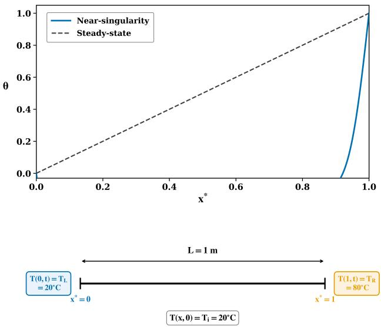  
Figure 1: Physical configuration of the analytical benchmark: a step change in boundary temperature whose closed-form solution supplies exact, unlimited ground truth for certifying extrapolated predictions at every Fourier number.

## 2. Methodology

## 2.1. Governing Equations

To provide a benchmark for developing and validating machine-learning extrapolation strategies, a one-dimensional transient difusion problem is adopted as a controlled testbed — selected not as the primary engineering problem this paper sets out to solve, but because its closed-form analytical solution makes every extrapolated prediction checkable against an exact answer. Figure 1 illustrates the configuration. A rod of length $L \ = \ 1$ m with uniform thermal difusivity $\alpha ~ = ~ 1 \times 1 0 ^ { - 5 } \mathrm { m } ^ { 2 } \mathrm { s } ^ { - 1 }$ is initially at a uniform temperature of $T _ { i } ~ = ~ 2 0 ^ { \circ } \mathrm { C } . \mathrm { A t } ~ t ~ = ~ 0$ , the right boundary is suddenly raised to $T _ { R } = 8 0 ^ { \circ } \mathrm { C }$ while the left boundary is held at $T _ { L } = 2 0 ^ { \circ } \mathrm { C }$ . The problem admits an exact analytical solution at every instant, which means that any prediction the model makes can be verified precisely, regardless of how far that prediction lies from the training window.

The governing equation is [33]

$$
\frac { \partial T } { \partial t } = \alpha \frac { \partial ^ { 2 } T } { \partial x ^ { 2 } } , \quad 0 < x < L , t > 0 ,\tag{1}
$$

with boundary conditions $T ( 0 , t ) = T _ { L } , T ( L , t ) = T _ { R }$ for $t > 0 .$ , and initial condition $T ( x , 0 ) = T _ { i } { \mathrm { ~ f o r ~ } } 0 \leq x < L$ . At $t = 0$ the field is uniform and entirely discontinuous with the right-wall value, producing a sharply nonlinear initial state that the benchmark must later require a model to extrapolate toward.

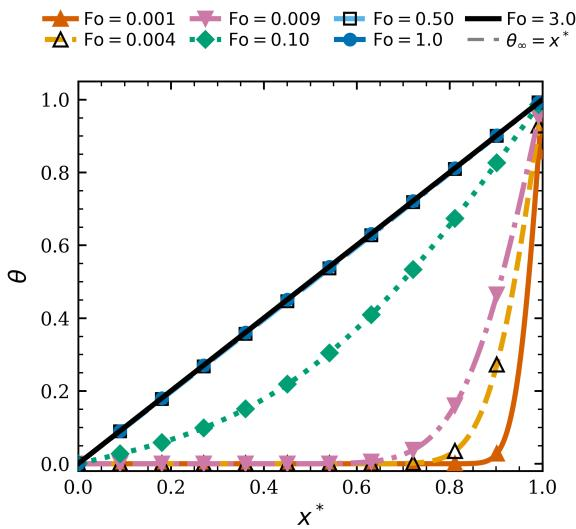  
Figure 2: Analytical solution of the transient difusion benchmark at representative Fourier numbers.

Introducing the dimensionless coordinate $x ^ { * } ~ = ~ x / L$ dimensionless temperature $\theta ~ = ~ ( T ~ - ~ T _ { L } ) / ( T _ { R } ~ - ~ T _ { L } ) .$ and Fourier number $F o \ = \ \alpha t / L ^ { 2 }$ , Eq. (1) reduces to the parameter-free form [33]

$$
\frac { \partial \theta } { \partial F o } = \frac { \partial ^ { 2 } \theta } { \partial { x ^ { * } } ^ { 2 } } , \quad 0 < x ^ { * } < 1 , F o > 0 ,\tag{2}
$$

with $\theta ( 0 , F o ) = 0 , \theta ( 1 , F o ) = 1$ , and $\theta ( x ^ { * } , 0 ) = 0$ . Because $F o$ is the sole governing parameter, extrapolation reliability certified against this dimensionless solution is transferable to any physical system sharing the same $F o ,$ regardless of the specific difusivity, length, or boundary temperatures.

## 2.2. Analytical Solution

The exact analytical solution is [29, 33]:

$$
\begin{array} { c } { { \displaystyle \theta ( x ^ { * } , F o ) = x ^ { * } + \sum _ { n = 1 } ^ { N _ { \mathrm { t e r m s } } } C _ { n } \sin ( n \pi x ^ { * } ) e ^ { - n ^ { 2 } \pi ^ { 2 } F o } , } } \\ { { C _ { n } = \displaystyle \frac { 2 } { n \pi } \bigl [ ( - 1 ) ^ { n } - 1 \bigr ] , } } \end{array}\tag{3}
$$

where $N _ { \mathrm { t e r m s } } = 1 0 0 0$ and $F o \ge 1 0 ^ { - 4 }$ . This closed form is exact at every $F o$ and can be evaluated at any spatial location with no experimental or computational cost, supplying unlimited ground-truth data for both training and validation. It is this property—exact and freely available reference values everywhere—that makes the difusion problem suitable as a validation benchmark rather than merely a convenient worked example. Each term in Eq. (3) decays according to [33]

$$
A _ { n } ( F o ) = e ^ { - n ^ { 2 } \pi ^ { 2 } F o } ,\tag{4}
$$

so higher-order modes (� large) decay much faster than loworder ones as $F o$ increases; equivalently, at small �� a

correspondingly larger number of modes remain significant. The early-time asymptotic solution of the difusion equation shows that the temporal rate of change scales as [33]

$$
\left| \frac { \partial \theta } { \partial F o } \right| \propto F o ^ { - 3 / 2 } ,\tag{5}
$$

so the solution changes increasingly rapidly as $F o \to 0 .$

Figure 2 shows the solution evolution across this range. Because the modal amplitudes in Eq. (3) decay as $e ^ { - n ^ { 2 } \pi ^ { 2 } F o }$ (Eq. (4)), higher-order Fourier modes remain significant at small $F o ,$ producing steep profiles with rapid spatial and temporal variation. As $F o \ \to \ 0 .$ , the rate of temporal variation becomes singular according to Eq. (5). With increasing $F o ,$ the higher-order modes progressively decay, and the solution relaxes smoothly toward the linear steady state profile $\theta _ { \infty } = x ^ { * }$ . This evolution provides distinct extrapolation regimes, ranging from the rapidly varying earlytime solution to the smooth, low-mode-content regime at larger �� [29, 33]. The dashed line, $\theta = x ^ { * }$ , represents the steady state.

## 2.3. Extrapolation Validation Strategy

Machine-learning models deployed in engineering practice are typically trained over a limited operating range, while data outside that range are rarely available for validation. This makes it dificult to establish whether a model can be trusted beyond the conditions on which it was trained. The one-dimensional transient difusion problem is adopted here to overcome this limitation. Its closed-form solution (Eq. (3)) provides exact reference values at every Fourier number and spatial location, allowing extrapolated predictions to be assessed against known ground truth rather than through visual comparison or against another surrogate model.

The model is deliberately trained only over the intermediate range $F o \in \left[ 0 . 0 0 1 , , 0 . 0 0 9 \right]$ and evaluated outside this window in both directions. Forward extrapolation moves toward a slowly varying, low-mode-content regime, whereas backward extrapolation toward $F o \to 0$ requires recovery of increasingly fine spatial and temporal structure. The latter therefore provides a more demanding test of extrapolation capability.

The exact analytical solution enables a sequential train– predict–validate–extend strategy in which extrapolation is verified at every step before advancing further. Specifically, the procedure consists of five stages:

1. Training: The model is trained exclusively on data within the prescribed Fourier-number window, $F o \in$ [0.001, 0.009].

2. Prediction: The trained model predicts the solution at the next Fourier number outside the training range.

3. Validation: The predicted solution is compared against the exact analytical solution, providing a direct pointwise measure of extrapolation error.

4. History update: Once the prediction satisfies the prescribed validation criterion, it is incorporated into the model’s working history as the next available point.

5. Extension: The prediction horizon is advanced by one, further step, and the predict–validate–update cycle is repeated until the desired extrapolation range is reached.

This sequential procedure emulates extrapolative deployment while retaining exact ground-truth verification at every stage. It therefore provides a controlled and fully quantifiable framework for assessing how reliably the Physicsguided BiLSTM and PINN models extrapolate as they move progressively farther from their training domain.

## 2.4. Analytical Dataset & Training

The analytical solution (3) is evaluated over the entire heating process, from the initial temperature jump to the near-steady-state condition, covering $F o \in \left[ 0 . 0 0 0 5 , , 4 . 0 \right]$ The spatial domain is discretized using $N _ { x } ~ = ~ 4 0 1$ points along the rod, corresponding to $\Delta x ^ { * } = 0 . 0 0 2 5$ . This complete dataset provides exact reference solutions for evaluating model predictions both within and outside the training range.

The Fourier-number sampling is non-uniform to account for the diferent rates of solution evolution. At small $F o ,$ the solution exhibits rapid temporal variation and steep gradients near the rod ends, requiring finer sampling. As the solution progressively smooths toward steady state, the sampling interval is increased. The resulting $\Delta F o$ values are 0.0005, 0.01, 0.02, and 0.1 over successive regions of the Fourier-number domain, concentrating data where the solution changes most rapidly.

For model development, only a narrow subset of this dataset, $F o \in [ 0 . 0 0 1 , , 0 . 0 0 9 ]$ , is used. This window encompasses a strongly transient regime in which several Fourier modes remain active while avoiding the most singular earlytime behaviour. Within this window, the solution is uniformly resampled with $\Delta F o \ = \ 1 0 ^ { - 4 }$ , yielding $N _ { F o } = 8 1 $ Fourier-number values and a total of $8 1 \times 4 0 1 = 3 2 { , } 4 8 1$ spatio-temporal data points. These are split into training and validation sets using an $8 5 \% / 1 5 \%$ ratio with fixed random seeds.

Model performance is assessed at two levels. First, interpolation is tested at $F o = 0 . 0 0 2$ and $F o = 0 . 0 0 7$ , which lie within the training window and provide a basic consistency check. The primary assessment then considers extrapolation beyond the training domain. The first extrapolation points are $F o \mathrm { ~ = ~ } 0 . 0 0 0 9$ and $F o \mathrm { ~ = ~ } 0 . 0 0 9 1$ , immediately outside the lower and upper training boundaries, respectively. The prediction horizon is subsequently extended step by step in both directions. At each step, the prediction is compared against the exact analytical solution and, once validated, incorporated into the working history before advancing to the next Fourier number. This sequential procedure enables extrapolation accuracy to be evaluated as the model moves progressively farther from its training domain.

$R ^ { 2 }$ scores were used as the scoring metric. Model performance was evaluated on the held-out test set using the mean absolute error (MAE), root mean square error (RMSE), and

$R ^ { 2 }$ score, which are defined as:

$$
\mathrm { { M A E } } = \frac { 1 } { n } \sum _ { i = 1 } ^ { n } \left| y _ { i } - \hat { y } _ { i } \right| , \ R ^ { 2 } = 1 - \frac { \sum _ { i = 1 } ^ { n } \left( y _ { i } - \hat { y } _ { i } \right) ^ { 2 } } { \sum _ { i = 1 } ^ { n } \left( y _ { i } - \bar { y } \right) ^ { 2 } } ,\tag{6}
$$

where $y _ { i }$ is the true value, $\hat { y } _ { i }$ is the predicted value, ̄� is the mean of the true values, and n is the total number of samples.

## 2.5. Temporal Marching Procedure

A model is not required to predict a distant Fourier number in a single step. Instead, both models reach their target through a sequence of incremental predictions, where each new prediction is generated using the model’s updated working history. In this benchmark, each intermediate prediction can additionally be checked against the exact analytical solution before proceeding to the next step.

Starting from the last known point at the boundary of the training range, the model predicts the temperature field at the next Fourier number. The predicted field is then incorporated into the working history as though it were a known observation, and the updated history is used to generate the subsequent prediction. This process is repeated until the target Fourier number is reached. For example, forward extrapolation proceeds as $F o \ = \ 0 . 0 0 9 1 \  \ 0 . 0 0 9 5 $ $0 . 0 1 0 ~  ~ 0 . 0 1 1 ~  ~ 0 . 0 1 2$ , while backward extrapolation follows $F o = 0 . 0 0 0 9 \to 0 . 0 0 0 8 5 \to 0 . 0 0 0 8 0 \to 0 . 0 0 0 7 5 .$ The same sequential procedure is applied to the additional early-time targets discussed in Section 5.

This setup reflects how an extrapolative model would operate in practice: beyond the training domain, each prediction depends on the model’s previously generated outputs rather than on newly supplied ground-truth data. The analytical solution is used here only to evaluate each step and quantify error accumulation. Thus, the benchmark provides a controlled means of assessing how prediction reliability deteriorates as the model progressively moves beyond its training domain.

## 3. Demonstration I: Physics-Guided Sequential Extrapolation Framework Using BiLSTM

This section uses a sequential-learning architecture as the first of two demonstrations of the validation framework set out in Section 2. The question is whether a sequential architecture can be modified using physical insight to extrapolate reliably beyond the training domain, not whether a BiL-STM can solve heat conduction inside its training window; Section 5 shows that even the standard model manages that comfortably. Section 2 established three facts relevant here: time behaves like ${ \sqrt { F o } } .$ not like $F o ;$ the steepest gradients and richest mix of Fourier modes sit near the boundaries; and stepping backward to smaller �� works against the natural smoothing efect of difusion rather than with it. A Bi-LSTM accounts for none of this: it reads �� as an ordinary number, treats every spatial point alike, and feeds its own output back in at each step with no check on how errors might grow. The Physics-guided BiLSTM below addresses these three extrapolation barriers directly, one targeted correction for each, so that its extrapolated predictions can pass the validation test of Section 2.3.

These corrections are derived from the benchmark physics itself, not introduced empirically. The rapid early-time variation near $F o  0$ established in Section 2 motivates the Root-Fourier transformation, which realigns the network’s notion of time with the true difusion timescale rather than the linear $F o$ the standard model reads. The strong gradients concentrated at the domain boundaries motivate the boundary-aware, boundary-weighted loss, which directs the network’s attention to the region where errors matter most. The asymmetry between backward and forward extrapolation established in Section 2 motivates the stabilityenhancing relaxation marching, which bounds error growth specifically in the harder backward direction. Each modification therefore exists to correct a known consequence of the benchmark physics, not as an arbitrary architectural choice.

## 3.1. Bi-LSTM

At each time step �, the LSTM cell updates its hidden state $\mathbf { h } _ { k }$ and cell state $\mathbf { c } _ { k }$ through four gating operations [11]:

$$
\begin{array} { r l } & { \mathbf { f } _ { k } = \sigma \big ( W _ { f } [ \mathbf { x } _ { k } ; \mathbf { h } _ { k - 1 } ] + b _ { f } \big ) , } \\ & { \mathbf { i } _ { k } = \sigma \big ( W _ { i } [ \mathbf { x } _ { k } ; \mathbf { h } _ { k - 1 } ] + b _ { i } \big ) , } \\ & { \tilde { \mathbf { c } } _ { k } = \operatorname { t a n h } \big ( W _ { c } [ \mathbf { x } _ { k } ; \mathbf { h } _ { k - 1 } ] + b _ { c } \big ) , } \\ & { \mathbf { o } _ { k } = \sigma \big ( W _ { o } [ \mathbf { x } _ { k } ; \mathbf { h } _ { k - 1 } ] + b _ { o } \big ) . } \end{array}\tag{7}
$$

In the BiLSTM, two independent LSTM chains process the input sequence in opposite temporal directions, and their hidden states are concatenated at each step [12, 17].

## 3.2. Limitations of the Bi-LSTM in the Early-Time Regime

The gates above take �� as a plain input, but the benchmark solution evolves on a $\sqrt { F o }$ timescale: near $F o \to 0 ,$ equal steps in � � correspond to very unequal amounts of physical change, so a model reading �� on a straight line already carries a distorted sense of time exactly where it can least aford to.

A second problem follows from where the hardest part of the solution sits: the boundary near $x ^ { * } \to 1$ has the steepest gradients and the most rapidly varying profile when � � is small. A Bi-LSTM has no built-in reason to pay extra attention there, since its loss treats every spatial point alike.

The third problem appears once prediction moves outside the training window. Reaching a target below the training range means marching backward step by step (Section 2.5), and, as Section 2 showed, this direction works against difusion’s natural smoothing rather than with it. A Bi-LSTM has no way to stop a small error at one step from growing into the next, a real concern given that diferent spatial modes are amplified unequally during backward marching. These three barriers, the wrong notion of time, no extra care at the boundary, and no control over error growth during backward marching, follow directly from the physics in Section 2.

## 3.3. Physics-guided BiLSTM Architecture

The changes below are targeted corrections for the three barriers above, not a general accuracy improvement: the goal is a better match between architecture and physics, not added complexity. Three stacked bidirectional LSTM layers process input sequences $( x ^ { * } , s , \theta )$ over a sliding window of width $K \ = \ 8 .$ , with a four-layer fully connected decoder reconstructing the full spatial temperature profile (Figure 3). All models are implemented in PyTorch and trained on an NVIDIA Tesla T4 GPU with the Adam optimiser, initial learning rate $1 0 ^ { - 3 }$ , batch size 16, early stopping with patience 100, and a ReduceLROnPlateau scheduler (reduction factor 0.5, patience 30). The total parameter count is 422,801.

## 3.3.1. Root-Fourier Transformation

The first barrier is the mismatch between the model’s plain �� input and the real physical clock: thermal penetration depth grows with ${ \sqrt { F o } } ,$ not $F o$ itself [29, 30], so equal steps in � � stop meaning equal physical change exactly as $F o  0$ . The correction aligns the learning coordinate with the true difusion timescale. The Root-Fourier coordinate $s \equiv { \sqrt { F o } }$ straightens out the penetration-depth relationship and softens the temporal singularity from $F o ^ { - 3 / 2 }$ to the milder $F o ^ { - 1 / 2 }$ . In �-coordinates, the training range is $s \in$ [0.001, 0.009] (in $\sqrt { F o }$ , and the marching step from $F o =$ 0.001 to $F o \mathrm { ~ = ~ } 0 . 0 0 0 9$ corresponds to $\Delta s \approx 0 . 0 0 1 6 .$ , only 5% of this range. The model’s extrapolation input therefore changes smoothly in step with the underlying physics, rather than squeezing a large physical change into a tiny numerical step.

## 3.3.2. Boundary-Weighted Loss

The second barrier is that nothing tells the model the boundary matters more. The spatial curvature of the �th Fourier eigenfunction sin(���∗) is largest near the domain boundaries, and these high-curvature near-boundary modes are amplified most strongly during sequential marching. A loss weighing every point equally under-values exactly the region Section 2 flagged as hardest. The boundary-weighted loss [24, 25] corrects this:

$$
\mathcal { L } _ { B W } = \frac { 1 } { N _ { x } N _ { F o } } \sum _ { j = 1 } ^ { N _ { x } } \sum _ { k = 1 } ^ { N _ { F o } } w ( x _ { j } ^ { * } ) \left[ \hat { \theta } ( x _ { j } ^ { * } , F o _ { k } ) - \theta ( x _ { j } ^ { * } , F o _ { k } ) \right] ^ { 2 } ,\tag{8}
$$

with spatially adaptive weight

$$
\begin{array} { c } { { w ( x ^ { * } ) = 1 + A \left[ e ^ { - { x ^ { * } } ^ { 2 } / ( 2 \sigma _ { w } ^ { 2 } ) } + e ^ { - ( 1 - x ^ { * } ) ^ { 2 } / ( 2 \sigma _ { w } ^ { 2 } ) } \right] , } } \\ { { A = 5 , \quad \sigma _ { w } = 0 . 1 . } } \end{array}\tag{9}
$$

This gives $w ( 0 ) ~ = ~ w ( 1 ) ~ = ~ 6 . 0$ at the boundaries and $w ( 0 . 5 ) \approx 1 . 0$ at the midpoint, penalising boundary errors six times more heavily than interior errors and steering the network toward learning the hardest part of the physics, precisely where extrapolation fidelity would otherwise be lost first.

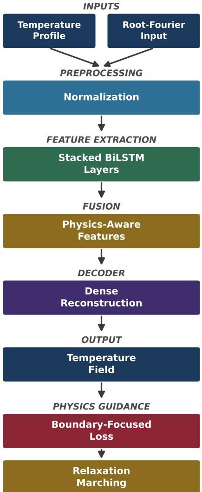  
Figure 3: Physics-guided BiLSTM framework, the first of two independent demonstrations of the extrapolation-validation methodology: a Root-Fourier input $\left( s \ = \ { \sqrt { F o } } \right)$ realigns the network’s time coordinate with the difusion timescale, a boundary-weighted loss targets the highest-curvature region, and relaxation marching bounds error growth during sequential extrapolation.

## 3.3.3. Relaxation Marching

The third barrier appears once the model steps outside its training window. In sequential marching (Section 2.5), each new prediction is fed back in to make the next, so any error made at one step becomes part of the input to the next. This is riskier backward, where difusion no longer damps such errors and can amplify them: each Fourier mode decays by a factor $e ^ { - n ^ { 2 } \pi ^ { 2 } F o }$ moving forward in $F o ,$ so moving backward inverts this factor and grows the mode instead, with higherorder modes amplified most. Relaxation marching controls this error accumulation by blending each new prediction partway with the previous state rather than accepting it outright, applying an under-relaxation update at each substep [34]:

Relaxation marching convergence parameters for backward and forward temporal directions.
<table><tr><td>Direction</td><td>ω</td><td>λ</td><td>ρ</td><td> $N$ </td><td> $\rho ^ { N }$ </td></tr><tr><td>Backward (Fo decreasing)</td><td>0.30</td><td>1.001</td><td>1.0003</td><td>6</td><td>1.0018</td></tr><tr><td>Forward (Fo increasing)</td><td>0.70</td><td>0.999</td><td>0.9993</td><td>4</td><td>0.9972</td></tr></table>

�: under-relaxation factor; �: raw modal error growth; $\rho =$ $1 + \omega ( \lambda - 1 )$ : relaxed factor; $N \colon$ sub-steps.

$$
\theta ^ { ( k + 1 ) } ( x ^ { * } ) = \theta ^ { ( k ) } ( x ^ { * } ) + \omega \big [ \hat { \theta } ^ { ( k + 1 ) } ( x ^ { * } ) - \theta ^ { ( k ) } ( x ^ { * } ) \big ] \ ,\tag{10}
$$

where $\omega ~ \in ~ ( 0 , 1 ]$ is the under-relaxation factor, and the relaxed convergence factor is

$$
\rho = 1 + \omega ( \lambda - 1 ) .\tag{11}
$$

With � = 1.001 and $\omega = 0 . 3$

$$
\rho _ { \mathrm { e a r l y } } = 0 . 7 + 0 . 3 \times 1 . 0 0 1 = 1 . 0 0 0 3 .\tag{12}
$$

Over six sub-steps, cumulative error growth is $\rho _ { \mathrm { e a r l y } } ^ { 6 } ~ \approx$ 1.0018, a small, known number rather than an open-ended one, keeping errors small and predictable even when marching backward, where difusion ofers no such guarantee on its own. Convergence parameters for both directions are summarised in Table 1.

## 3.4. Role of the Physics-guided BiLSTM Framework in Extrapolation Validation

The Physics-guided BiLSTM here is one implementation of the validation framework set out in Section 2.3, not the contribution that framework exists to support. The framework itself, restricting the training domain, marching sequentially beyond it, and checking every step against exact ground truth, stays unchanged regardless of which architecture is plugged into it; what BiLSTM contributes is a concrete demonstration that a sequential, data-driven architecture can be corrected, using only physical insight into the governing equation, until its extrapolated predictions reliably pass that validation test. The next section repeats this same assessment with a second architecture built on entirely diferent principles.

## 4. Demonstration II: Modified PINN Extrapolation Framework

The BiLSTM tested one route to extrapolation reliability: marching through labelled data step by step, with validation against the analytical solution at every step. The purpose of introducing a PINN is not to provide an alternative heatconduction solver, but to test whether a fundamentally diferent learning paradigm can also achieve reliable extrapolation under the same validation framework. Instead of relying only on data, it builds the governing equation directly into the loss function, so the model can be pushed toward a correct answer even at points with no labelled data [18], including points beyond $F o = 0 . 0 0 9$ . This is appealing here, since it ofers physically sensible answers exactly where a purely datadriven model would have nothing nearby to march from. Before this advantage can be used reliably, two extrapolation barriers that follow directly from the physics in Section 2 need to be addressed first.

The same benchmark characteristics that motivated the BiLSTM corrections create a distinct dificulty for a PINN. Early-time behaviour near $F o \to 0$ is highly nonlinear, and the solution changes increasingly rapidly as � � decreases, which is precisely what makes the residual term in the PINN’s loss function increasingly dificult to optimise as the prediction target approaches the near-singular regime: gradients that ought to guide training instead grow without bound. Hard-enforced boundary conditions face a related problem, since approximate enforcement leaves room for boundary error to leak into the interior exactly where the solution is least forgiving. The physics-guided coordinate transformation and hard boundary constraints introduced below exist specifically to remove these two dificulties at their source, rather than to compensate for them empirically during training.

## 4.1. PINN and Limitations

A PINN predicts $\hat { \theta } ( x ^ { * } , F o )$ by minimising a composite loss [18, 35], built around the PDE residual

$$
\mathcal { R } ( x ^ { * } , F o ) = \frac { \partial \hat { \theta } } { \partial F o } - \frac { \partial ^ { 2 } \hat { \theta } } { \partial x ^ { * 2 } } .\tag{13}
$$

This residual lets the network train without labelled answers everywhere: wherever it can be computed, the network is nudged toward a physically valid solution, whether or not the true value of � is known there.

Two features of the physics make this harder near $F o $ 0. As shown in Section 2, the gradient singularity means $\partial \theta / \partial F o$ scales as $F o ^ { - 3 / 2 }$ , so the residual becomes far harder to compute and minimise reliably in this limit, and one fixed learning rate cannot work well both there and in the rest of the domain [18, 22]. The second issue is that a PINN only encourages $\theta ( 0 , F o ) = 0$ and �(1, ��) = 1 through a soft penalty, so some boundary error always remains; since the boundary carries the largest curvature and gradients, this error spreads into the interior through the difusion operator itself [25, 35]. Both problems point to the same conclusion: the time coordinate the PDE is written in, and how the boundary conditions are enforced, both need to change before a PINN can be trusted in the near-singular early-time regime.

## 4.2. Network Architecture and Training Configuration

The PINN comprises six fully connected hidden layers with 60 neurons each and tanh activations (18,541 total parameters), illustrated in Figure 4. Training runs over 20,000 epochs with a piecewise-constant learning rate schedule;

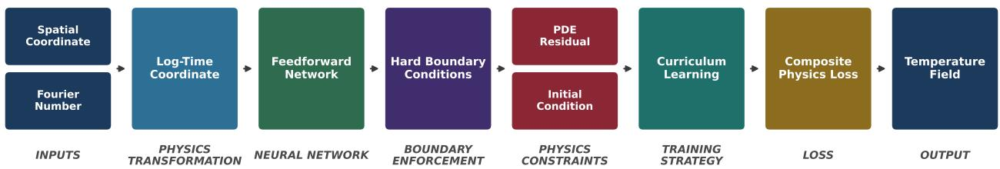  
Figure 4: Modified PINN framework, the second and independent demonstration of the extrapolation-validation methodology: a log-time coordinate removes the $F o ^ { - 3 / 2 }$ residual singularity, hard boundary-condition enforcement eliminates near-wall error leakage, and curriculum Fourier-number expansion stages training toward the most demanding extrapolation targets.

reductions at epochs 12,000 and 16,000 allow fine-tuning in the late stages.

## 4.3. Modified PINN Corrections

The two barriers above need two separate corrections. The gradient singularity is addressed first, by changing the time coordinate so the stifness disappears at the source. The boundary-error barrier is addressed second, by changing the architecture so the boundary conditions hold exactly, freeing the optimiser to spend all its efort on learning the PDE itself.

## 4.3.1. Log-Time Transformation

The trouble near $F o \to 0$ is that the residual gradient the optimiser must minimise grows without limit $\mathrm { a s } \sim F o ^ { - 3 / 2 }$ so no single fixed learning rate can work well both in the bulk of the domain and near the initial condition. The correction chooses a time coordinate where this blow-up is tamed. The log-time coordinate

$$
\tau = \log ( F o + \varepsilon ) , \qquad \varepsilon = 1 0 ^ { - 5 } ,\tag{14}
$$

does exactly that. Since $d \tau / d F o \approx 1 / F o$ , the chain rule gives

$$
\frac { \partial \theta } { \partial F o } = \frac { 1 } { F o + \varepsilon } \frac { \partial \theta } { \partial \tau } ,\tag{15}
$$

and substituting into Eq. (2) yields

$$
\frac { \partial \theta } { \partial \tau } = \left( F o + \varepsilon \right) \frac { \partial ^ { 2 } \theta } { \partial x ^ { * 2 } } .\tag{16}
$$

The prefactor $( F o \mathrm { ~ + ~ } \varepsilon ) \mathrm { ~  ~ } 0$ as $F o \ \to \ 0$ analytically cancels the singularity: the residual gradient now scales as $\left( F o + \varepsilon \right) F o ^ { - 3 / \bar { 2 } } \approx F \bar { o } ^ { - 1 / 2 }$ , one full power of $F o$ milder than the original $F o ^ { - 3 / 2 }$ . As $F o$ drops from 0.01 to 0.0001, the untransformed gradient grows by six orders of magnitude, while the transformed one grows by only two. This leaves the loss landscape near $F o \to 0$ far better conditioned [22], letting the network converge close to the initial condition and extrapolate into it, where the untransformed version struggles most.

## 4.3.2. Hard Boundary Condition Enforcement

The second barrier is at the boundaries themselves. Because the boundary layer carries the steepest gradients and richest mix of modes (Section 2), any error left there by a soft penalty leaks into the interior through difusion, contaminating the extrapolated predictions this paper sets out to validate. The correction makes it impossible for the boundary conditions to be wrong in the first place, through a simple architectural split,

$$
\theta ( x ^ { * } , \tau ) = g ( x ^ { * } ) + h ( x ^ { * } ) \mathcal { N } ( x ^ { * } , \tau ) ,\tag{17}
$$

where $g ( x ^ { * } ) = x ^ { * }$ and $h ( x ^ { * } ) = x ^ { * } ( 1 - x ^ { * } )$ , giving

$$
T ( x , F o ) = T _ { L } + x ^ { * } ( T _ { R } - T _ { L } ) + x ^ { * } ( 1 - x ^ { * } ) \mathcal { N } ( x ^ { * } , \tau ) .\tag{18}
$$

This enforces $T ( 0 ) ~ = ~ T _ { L }$ and $T ( 1 ) \ = \ T _ { R }$ exactly for any network output ${ \mathcal { N } } .$ , without relying on the optimiser to drive a penalty term toward zero. In a standard soft-penalty setup [18, 35], training efort always goes toward shrinking the boundary error, and whatever remains still leaks inward through the PDE coupling [22, 25]. The hard-BC ansatz removes that cost entirely, freeing the optimiser to focus on the PDE and initial-condition terms, which matters most where the $F o ^ { - 3 / 2 }$ singularity is worst.

## 4.3.3. Composite Loss Function

$$
\begin{array} { r } { \mathcal { L } = \lambda _ { \mathrm { d a t a } } \mathcal { L } _ { \mathrm { d a t a } } + \lambda _ { \mathrm { P D E } } \mathcal { L } _ { \mathrm { P D E } } + \lambda _ { \mathrm { I C } } \mathcal { L } _ { \mathrm { I C } } , } \end{array}\tag{19}
$$

with weights $\lambda _ { \mathrm { d a t a } } = 0 . 2 , \lambda _ { \mathrm { P D E } } = 3 0$ , and $\lambda _ { \mathrm { I C } } = 5 0$ . The PDE residual loss is

$$
\mathcal { L } _ { \mathrm { P D E } } = \frac { 1 } { N _ { r } } \sum _ { j = 1 } ^ { N _ { r } } \left[ \frac { \partial T _ { \theta } } { \partial \tau _ { j } } - ( F o _ { j } + \varepsilon ) \frac { \partial ^ { 2 } T _ { \theta } } { \partial x _ { j } ^ { * 2 } } \right] ^ { 2 }\tag{20}
$$

evaluated over $N _ { r } \ = \ 8 { , } 0 0 0$ collocation points per epoch, including the region $F o \mathrm { ~ < ~ } 0 . 0 0 1$ . The initial condition loss $\scriptstyle { \mathcal { L } } _ { \mathrm { I C } }$ is evaluated over $N _ { \mathrm { I C } } = 4 { , } 0 0 0$ points at $F o \approx 0$

## 4.4. Role of the PINN Framework in Extrapolation Validation

The Modified PINN serves as a second, independent validation vehicle for the same framework demonstrated with the BiLSTM in Section 3: the methodology of Section 2.3 did not change to accommodate a diferent learning paradigm. Where the BiLSTM learns sequentially from labelled data, the PINN learns by constraining itself to the governing equation where no labelled data exist, yet the same train-then-validate procedure applies unchanged to both. That the framework produces a reliably extrapolating model under two architectures built on opposite principles is itself evidence that the validation methodology is modelindependent, which is what makes it transferable to engineering problems where neither a BiLSTM nor a PINN may be the right tool, but the same train-extrapolate-validate logic still applies.

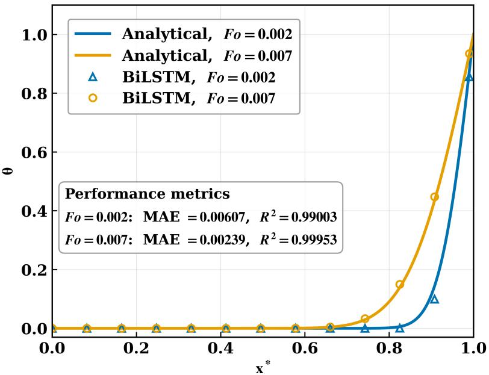  
Figure 5: Interpolation within the training range $F o \in [ 0 . 0 0 1 , 0 . 0 0 9 ]$ for the Physics-guided BiLSTM at (a) $F o \mathrm { ~ = ~ } 0 . 0 0 2$ and (b) $F o = 0 . 0 0 7$

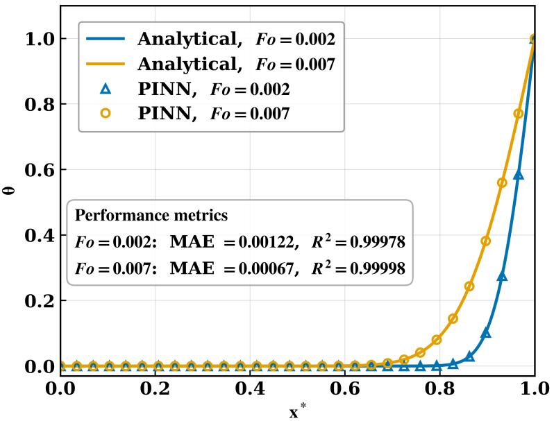  
Figure 6: Interpolation within the training range � � ∈ [0.001, 0.009] for the Modified PINN at (a) $F o = 0 . 0 0 2$ and (b) $F o = 0 . 0 0 7$

## 5. Results and Discussions

This section presents the findings of the validation methodology described in Section 2.3, with particular emphasis on the extrapolation reliability of the two frameworks. In-domain accuracy is established first, followed by an assessment of extrapolation performance across lowerand upper-regime Fourier numbers, with each prediction evaluated directly against the analytical ground truth. The frameworks are then compared in terms of their extrapolation behavior and engineering relevance. Throughout, the results are interpreted primarily as evidence of extrapolation robustness, rather than as findings specific to the heatconduction testbed.

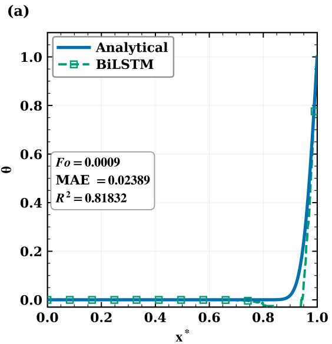

(b)  
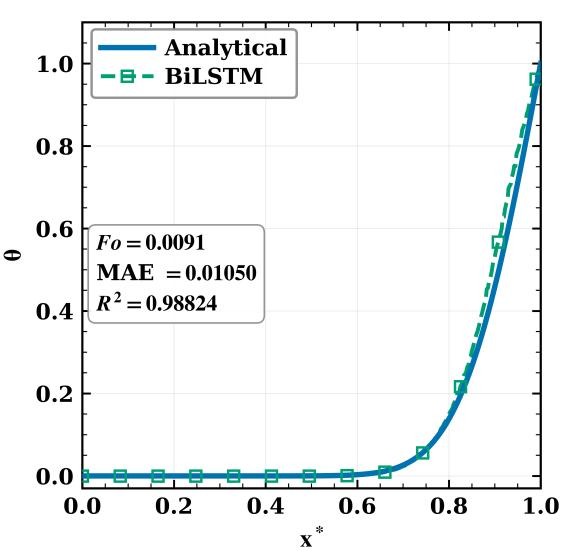  
Figure 7: Extrapolation from the training range $F o \in [ 0 . 0 0 1 , 0 . 0 0 9 ]$ using the Bi-LSTM to (a) $F o = 0 . 0 0 0 9$ and (b) $F o = 0 . 0 0 9 1$ validated against the analytical solution.

Table 2  
Modified PINN modifications and their physical rationale.
<table><tr><td>Modification</td><td>Limitation addressed</td><td>Expected benefit</td><td></td></tr><tr><td>Log-time transform</td><td> $F o ^ { - 3 / 2 }$  larity</td><td>residual singu- Reduces singularity order to improves</td><td> ${ \check { F } } o ^ { - 1 / 2 } ;$  gradient</td></tr><tr><td>Hard BC</td><td>Soft-penalty bound- Exact Dirichlet sat- ary bias</td><td>uniformity</td><td>isfaction; full opti- misation budget for</td></tr><tr><td>Curriculum learning Training</td><td>near  $F o \to 0$ </td><td>PDE/IC instability Progressive collocation expansion; abrupt residual jumps</td><td>avoids</td></tr></table>

## 5.1. Interpolation

Before evaluating extrapolation capability, both surrogate frameworks must be confirmed to reproduce the governing difusion physics within the training window $F o \in$ [0.001, 0.009]. Interpolation at two representative Fourier numbers, $F o \ = \ 0 . 0 0 2$ and $F o \ = \ 0 . 0 0 7$ , serves this purpose, spanning the range from the spectrally richer lower boundary, where more Fourier modes remain active, to the smoother upper boundary, where high-frequency content has largely decayed. A model that cannot reproduce the analytical solution inside its own training window has little chance of extrapolating reliably outside it, so this is a necessary checkpoint, not the main result, that clears the way for the extrapolation tests that follow.

## 5.1.1. BiLSTM Interpolation

Figure 5 reports the Physics-guided BiLSTM at both targets: $R ^ { 2 } ~ = ~ 0 . 9 9 0 0 3$ with $\mathrm { M A E } = \ 0 . 0 0 6 0 7$ at $F o \_ =$ $0 . 0 0 2$ , tightening to $R ^ { 2 } = 0 . 9 9 9 5 3$ with $\mathbf { M A E } = 0 . 0 0 2 3 9$ at $F o = 0 . 0 0 7$ . The improvement from the lower to the upper target matches the physical picture built up earlier: $F o \ =$ 0.002 still carries a meaningful share of higher-order Fourier content near the heated boundary, whereas $F o \mathrm { ~ = ~ } 0 . 0 0 7$ is dominated by the smoother fundamental harmonic, an easier shape to reproduce. This confirms baseline fidelity before any extrapolation claim is made, and previews the same lower-versus-upper asymmetry that governs extrapolation reliability later in this section.

## 5.1.2. PINN Interpolation

Figure 6 shows the corresponding PINN result: $R ^ { 2 } \ =$ 0.99978 with $\mathbf { M A E } = \mathbf { \mathrm { 0 . 0 0 1 } 2 2 }$ at $F o \ = \ 0 . 0 0 2$ , rising to $R ^ { 2 } \ = \ 0 . 9 9 9 9 8$ with $\mathrm { M A E } = \ 0 . 0 0 0 6 7$ at $F o \ = \ 0 . 0 0 7$ Both values are tighter than the BiLSTM’s fits at the same two Fourier numbers, consistent with the PINN’s boundary conditions being enforced exactly rather than learned approximately, leaving less room for the kind of near-wall error a purely data-driven recurrent model can accumulate. Both frameworks thus establish the in-domain fidelity needed before their extrapolation reliability can be tested outside the training window.

## 5.2. Extrapolation: BiLSTM

The next question this paper is built to answer: once each framework predicts outside the training window altogether, do those predictions hold up against the exact analytical ground truth, or fail silently with no way for an engineer to know? Two opposite cases are tested: a step backward to $F o \ = \ 0 . 0 0 0 9$ , just below the lower training boundary, and a step forward to $F o \ = \ 0 . 0 0 9 1$ , just above the upper boundary. The two directions are not expected to behave alike, since backward extrapolation works against difusion’s natural smoothing, while forward extrapolation is helped by it.

## 5.2.1. Bi-LSTM Extrapolation

Figure 7 reports the Bi-LSTM, trained without the physics-guided modifications, at both targets: only $R ^ { 2 } \ =$ 0.81832 with $\mathrm { M A E } = \ 0 . 0 2 3 8 9$ at $F o \ = \ 0 . 0 0 0 9$ , versus a noticeably better $R ^ { 2 } \ = \ 0 . 9 8 8 2 4$ with $\mathbf { M A E } = \mathbf { \xi } 0 . 0 1 0 5 0$ at $F o \ = \ 0 . 0 0 9 1$ . This gap is the clearest evidence in this study that backward extrapolation is the harder direction: the same untouched architecture fits far worse stepping backward than stepping forward by a comparable distance. Checked against the analytical ground truth, this is exactly the silent failure the validation methodology of Section 2.3 is designed to catch: a model adequate by training-window standards whose extrapolation reliability degrades sharply in one direction.

(a)  
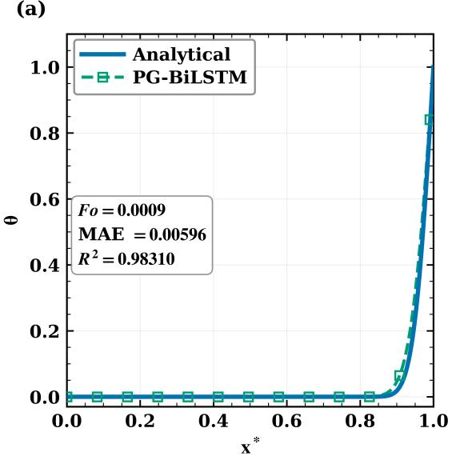

(b)  
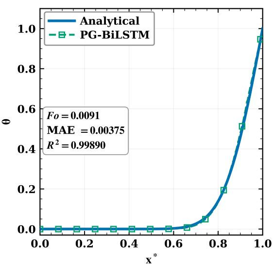  
Figure 8: Extrapolation from the training range $F o \in [ 0 . 0 0 1 , 0 . 0 0 9 ]$ using the Physics-guided BiLSTM to (a) $F o = 0 . 0 0 0 9$ and (b) $F o = 0 . 0 0 9 1$ , validated against the analytical solution.

(a)  
(b)  
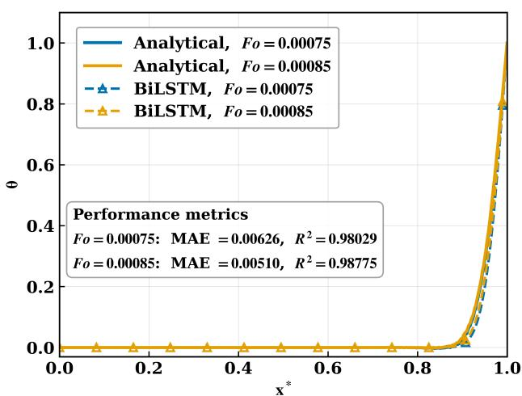

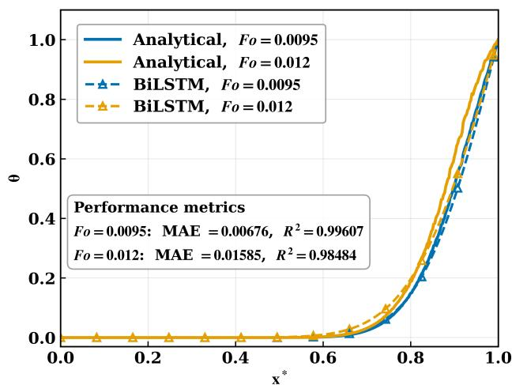  
Figure 9: Backward extrapolation from the training range $F o \ \in \ [ 0 . 0 0 1 , 0 . 0 0 9 ]$ using the Physics-guided BiLSTM to (a) $F o \mathrm { ~ = ~ } 0 . 0 0 0 7 5$ and (b) $F o \mathrm { ~ = ~ } 0 . 0 0 0 8 5$ , validated against the analytical solution.  
Figure 10: Forward extrapolation from the training range $F o \ \in \ [ 0 . 0 0 1 , 0 . 0 0 9 ]$ using the Physics-guided BiLSTM to (a) $F o \mathrm { ~ = ~ } 0 . 0 0 9 5$ and (b) $F o = 0 . 0 1 2$ , validated against the analytical solution.

## 5.2.2. PG-BiLSTM Extrapolation at Target Fourier Numbers

Figure 8 shows the same two targets after the three physics-guided modifications: $R ^ { 2 }$ rises to 0.98310 with $\mathbf { M A E } = 0 . 0 0 5 9 6$ at $F o = 0 . 0 0 0 9$ , a clear improvement over the standard baseline’s 0.81832, and reaches 0.99890 with $\mathbf { M A E } = 0 . 0 0 3 7 5$ at $F o = 0 . 0 0 9 1$ . The two values are now much closer together than for the standard model, showing that the modifications close most of the gap between the easier forward direction and the harder backward direction rather than helping only one side. This is the result that matters most for validation: both extrapolated predictions now pass the same exact-ground-truth check that the standard model failed at the harder target.

## 5.2.3. BiLSTM Extrapolation Across Fourier Numbers

A single pair of points is not enough to show the model behaves sensibly as the prediction target moves further from the training window, so the next two studies extend the test across a range of Fourier numbers on each side, applying the same progressively extending validation procedure from Section 2.3.

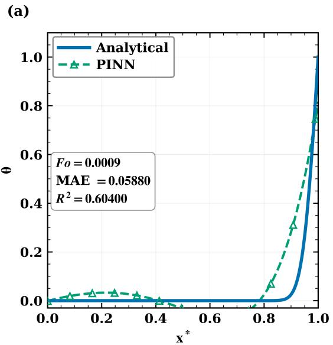

(b)  
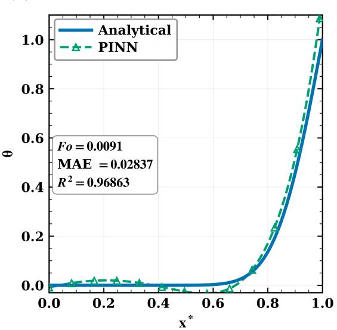  
Figure 11: Extrapolation from the training range $F o \in [ 0 . 0 0 1 , 0 . 0 0 9 ]$ using the PINN to (a) $F o = 0 . 0 0 0 9$ and (b) $F o = 0 . 0 0 9 1$ validated against the analytical solution.

Lower-regime robustness. Figure 9 reports the Physicsguided BiLSTM across the lower-regime targets: $\begin{array} { r l } { R ^ { 2 } } & { { } = } \end{array}$ 0.98029 with $\mathrm { M A E } = 0 . 0 0 6 2 6$ at $F o = 0 . 0 0 0 7 5$ , and $R ^ { 2 } =$ 0.98775 with $\mathbf { M A E } = 0 . 0 0 5 1 0$ at $F o = 0 . 0 0 0 8 5$ . The closer target fits slightly better than the more distant one, matching the expectation that accuracy should soften gradually rather than collapse suddenly as the target moves further from the training window, a sign of stable error propagation through the marching procedure rather than runaway accumulation.

Upper-regime robustness. Figure 10 reports the same model across the upper-regime targets: $R ^ { 2 } = 0 . 9 9 6 0 7$ with $\mathbf { M A E } = 0 . 0 0 6 7 6$ at $F o = 0 . 0 0 9 5$ , and $R ^ { 2 } = 0 . 9 8 4 8 4$ with $\mathbf { M A E } = 0 . 0 1 5 8 5$ at $F o = 0 . 0 1 2$ . Both values remain high, and the accuracy at the furthest forward target is still comparable to the lower-regime accuracy in Figure 9, consistent with forward extrapolation being the gentler direction for this model. Together, the two sweeps show extrapolation reliability holding up across a meaningful range on both sides of the training window, rather than accuracy true only at the two specific points reported earlier.

## 5.3. Extrapolation: PINN

The PINN is tested through the same lower-target and upper-target extrapolation pair, followed by the same two robustness sweeps, so its behaviour can be compared directly against the BiLSTM results just presented.

## 5.3.1. PINN Extrapolation

Figure 11 reports the PINN, trained without log-time transformation, hard boundary enforcement, or curriculum learning, at both targets: only $R ^ { 2 } ~ = ~ 0 . 6 0 4 0 0$ with MAE $\mathit { \Theta } = \ 0 . 0 5 8 8 0$ at $F o ~ = ~ 0 . 0 0 0 9$ , improving substantially to $R ^ { 2 } ~ = ~ 0 . 9 6 8 6 3$ with $\mathbf { M A E } = \mathbf { \ell } _ { 0 . 0 2 8 3 7 }$ at $F o ~ = ~ 0 . 0 0 9 1$

This contrast is the largest seen anywhere in this study: the unmodified PINN is by far the weakest of all four baselineand-corrected combinations at the lower target, setting up the clearest case for the three Modified PINN modifications introduced earlier. Against the analytical ground truth, an $R ^ { 2 }$ of 0.60400 is an extrapolation failure by any reasonable standard, one a real deployment without an exact reference solution would have no way of detecting.

## 5.3.2. PINN Extrapolation at Target Fourier Numbers

Figure 12 shows the same two targets after the physicsguided modifications: $R ^ { 2 } = 0 . 9 9 9 7 3$ with $\mathbf { M A E } = 0 . 0 0 0 9 9$ at $F o = 0 . 0 0 0 9$ , and $R ^ { 2 } = 0 . 9 9 9 9 5$ with $\mathbf { M A E } = 0 . 0 0 1 0 6$ at $F o = 0 . 0 0 9 1$ . The lower-target improvement is the most dramatic single result in this section: $R ^ { 2 }$ moves from 0.60400 for the PINN to 0.99973 once the log-time transformation and hard boundary enforcement are applied, and the two targets now sit almost on top of each other in accuracy, in sharp contrast to the PINN’s large asymmetry. This is the clearest demonstration in the paper that an extrapolation failure detected by validation against ground truth can be traced to a specific architectural cause and removed by a correspondingly specific fix, rather than by simply scaling the model up.

## 5.3.3. PINN Extrapolation Across Fourier Numbers 5.3.3. PINN Extrapolation Across Fourier Numbers

Lower-regime robustness. Figure 13 reports the Modified PINN across the lower-regime targets: $R ^ { \bar { 2 } } = 0 . 9 5 9 1 7$ with $\mathrm { M A E } = \ 0 . 0 0 7 1 7$ at $F o \ = \ 0 . 0 0 0 7 5$ , and $R ^ { 2 } ~ = ~ 0 . 9 9 9 0 3$ with $\mathrm { { M A E } = 0 . 0 0 1 5 9 }$ at $F o \ = \ 0 . 0 0 0 8 5$ . As with the BiLSTM lower robustness study, the target closer to the training boundary fits better, pointing again to a gradual rather than abrupt loss of accuracy deeper into the earlytime regime. Because the PINN extrapolates directly rather than marching through its own prior outputs, this softening reflects the underlying dificulty of the target itself rather than accumulated step-by-step error, a useful contrast with the BiLSTM’s error-propagation behaviour.

(a)  
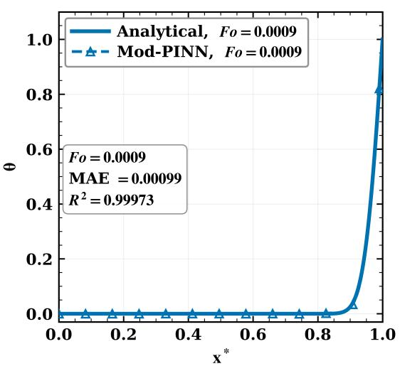

(b)  
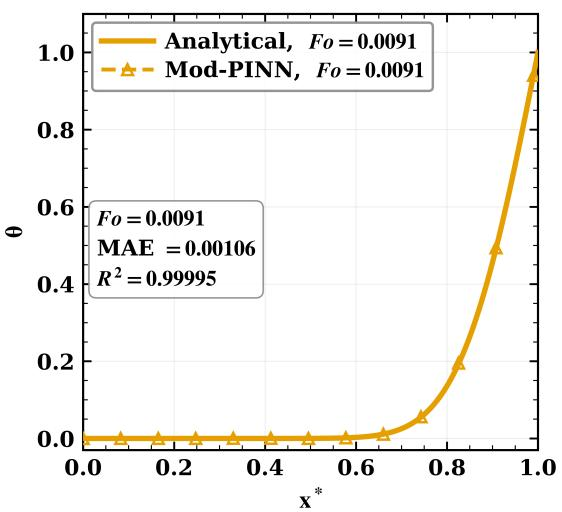  
Figure 12: Extrapolation from the training range $F o \ \in \ [ 0 . 0 0 1 , 0 . 0 0 9 ]$ using the Modified PINN to (a) $F o \ = \ 0 . 0 0 0 9$ and (b) $F o = 0 . 0 0 9 1$ , validated against the analytical solution.

(a)  
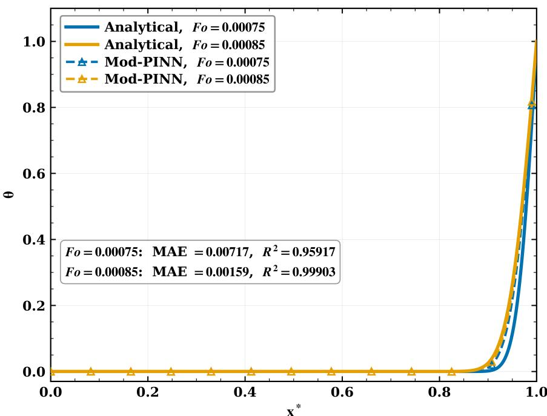  
Figure 13: Backward extrapolation from the training range $F o \in [ 0 . 0 0 1 , 0 . 0 0 9 ]$ using the Modified PINN to (a) $F o = 0 . 0 0 0 7 5$ and (b) $F o = 0 . 0 0 0 8 5$ , validated against the analytical solution.

Upper-regime robustness. Figure 14 reports the Modified PINN across eight later-time targets spanning $F o \in$ [0.00910, 0.01200]. Together with the lower-regime sweep in Figure 13 and the target-level results in Figure 12, this shows the PINN validated against ground truth across the full range of Fourier numbers considered in this work, on both sides of the training window, the breadth of evidence the validation methodology of Section 2.3 was designed to produce.

## 5.4. Extrapolation Error Growth

The physics-guided BiLSTM ofers greater engineering utility than the PINN because it does not require the governing diferential equations, which may not always be available. It is therefore important to assess how rapidly extrapolation errors grow. The lower- and upper-regime sweeps just presented establish that the Physics-guided BiLSTM remains accurate at several individual targets on each side of the training window, but a handful of discrete points still says little about how that accuracy actually evolves as the prediction horizon is pushed continuously further away. Tracking the model’s accuracy as the target Fourier number is advanced, one validated step at a time, progressively farther from the training interval $F o \ \in \ [ 0 . 0 0 1 , 0 . 0 0 9 ]$ in either direction provides a more demanding and informative test. This is the approach adopted in Figures 15 and 16.

(b)  
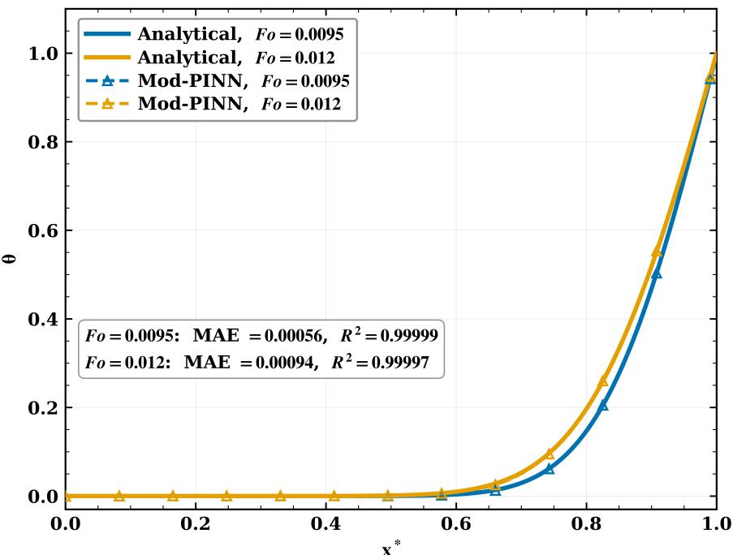  
Figure 14: Forward extrapolation from the training range � � ∈ [0.001, 0.009] using the Modified PINN across eight targets spanning $F o = 0 . 0 0 9 1 \mathrm { - } 0 . 0 1 2 0$ , validated against the analytical solution.

This continuous view allows the asymmetry anticipated in the Introduction (Section 1) to be tested against quantitative evidence. Forward extrapolation was expected to be gentler because difusion smooths the temperature field and tends to damp small prediction errors. Backward extrapolation was expected to be more challenging because it must reverse this smoothing and reconstruct sharp structures already erased by difusion. This is a textbook ill-posed reconstruction problem [9, 10], in which small uncertainties in the later state can produce large uncertainties in the earlier one.

In the forward direction, Figure 15 pushes the target from $F o \mathrm { ~ = ~ } 0 . 0 0 9$ to $F o = 0 . 0 1 1 1 0$ , roughly 23% further past the training boundary, and the fit barely moves: $R ^ { 2 } =$ 0.9984 at panel (a), eases only to $R ^ { 2 } = 0 . 9 9 0 5$ at panel (d), with the predicted curve remaining almost indistinguishable from the analytical one at every step. This is exactly what Section 2 predicts: as $F o$ grows, every Fourier mode in the true solution decays as $e ^ { - n ^ { 2 } \pi ^ { 2 } F o }$ , so the physics itself is becoming simpler at the same time the model is being asked to march further into it. A small mistake at one step therefore has little complicated structure left to feed on at the next, and error grows slowly and stays predictable.

Figure 16 tells a comparable story for backward extrapolation. As �� shrinks from 0.001 down to 0.00080 (which is 20% beyond the training lower boundary) $R ^ { 2 }$ falls from 0.9929 to 0.9870, a slightly larger than the forward case. The gap between the predicted and analytical curves near the heated boundary increases as one moves to about 40% $( \mathrm { F o } = 0 . 0 0 0 6 )$ outside the training domain. The $R ^ { 2 }$ score is still quite good with a value of 0.9639. Here, the model must reconstruct a sharper temperature profile from a smoother one. The smoothing caused by difusion, which makes forward extrapolation easier, must now be reversed. Information that difusion has erased must be inferred by the model rather than recovered directly from the data. The relaxation-marching scheme limits error growth by preventing errors from accumulating at every step. However, it cannot make the reconstruction itself easier; it only prevents the errors from growing rapidly as the target approaches the initial singularity at $F o \to 0 .$

Taken together, the two sweeps show that extrapolation error grows diferently on either side of the training window, reflecting the difusion physics rather than a peculiarity of the network. Forward predictions remain reliable for longer because difusion smooths the temperature field, while backward predictions lose accuracy more quickly because the model must reconstruct sharper, more nonlinear, and increasingly boundary-dominated profiles. This confirms the asymmetry anticipated in the Introduction and identifies backward extrapolation as the more demanding test of model reliability. The sequential validation strategy of Section ??, which checks every step against the exact analytical solution, makes this diference measurable rather than assumed

## 5.5. Direct Framework Comparison

Both models pass the extrapolation-validation test of Section 2.3, but by diferent mechanisms, which matters for which engineering deployment each transfers to. The

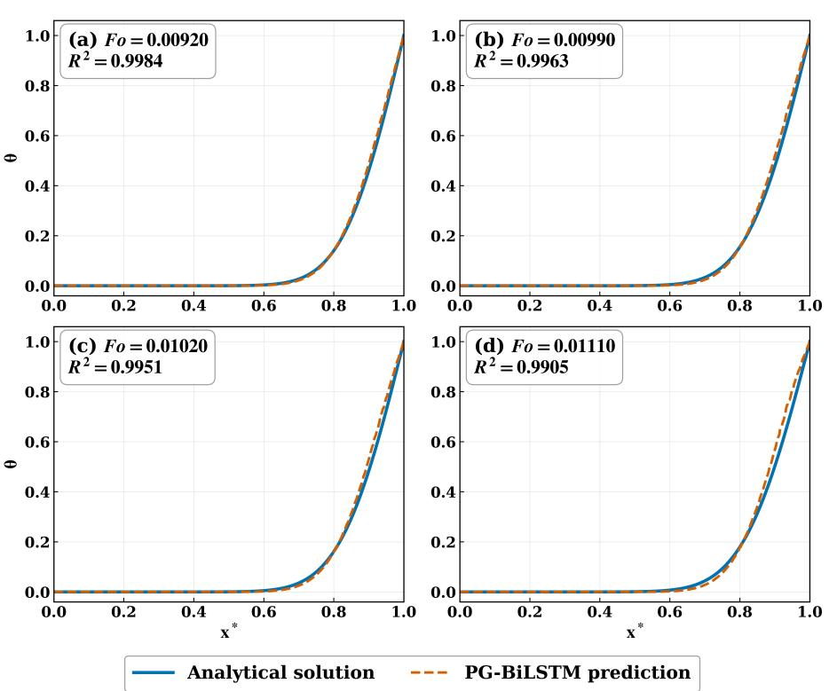  
Figure 15: Physics-guided BiLSTM predictions at four increasingly distant forward targets, (a) $F o = 0 . 0 0 9 2 0 ,$ (b) $F o = 0 . 0 0 9 9 0$ (c) $F o = 0 . 0 1 0 2 0$ , and (d) $F o = 0 . 0 1 1 1 0$ each checked against the exact analytical solution.

Backward extrapolation (Fo < 0.001)  
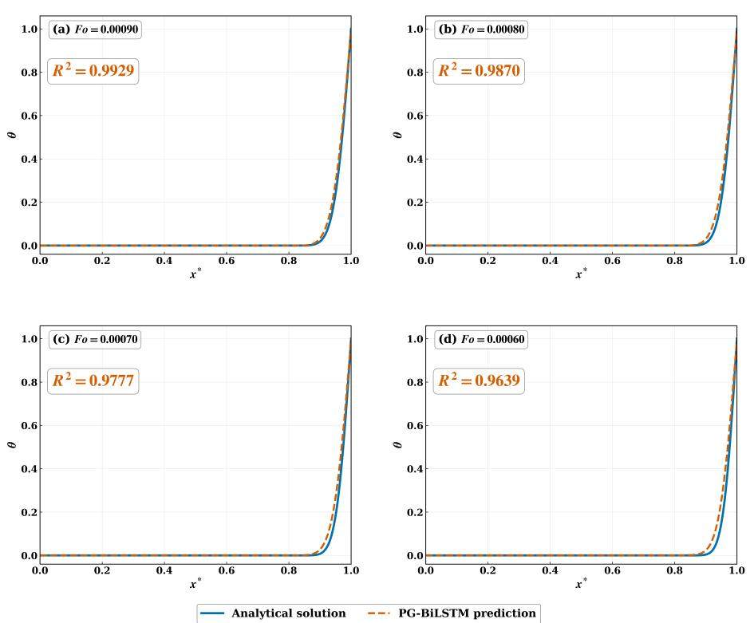  
Figure 16: Physics-guided BiLSTM predictions at four increasingly distant backward targets, (a) $F o = 0 . 0 0 0 9 0 ,$ (b) $F o = 0 . 0 0 0 8 0 _ { \cdot }$ (c) $F o = 0 . 0 0 0 7 0 ,$ , and (d) $F o = 0 . 0 0 0 6 0$ , each checked against the exact analytical solution.

Table 3  
Side-by-side comparison of PG-BiLSTM and Modified PINN.
<table><tr><td>Feature</td><td>PG-BiLSTM</td><td>Modified PINN</td></tr><tr><td>Learning mechanism</td><td>Data-driven, sequential</td><td>PDE residual min- imisation</td></tr><tr><td>Boundary conditions</td><td>Learned (boundary- weighted loss)</td><td>Enforced exactly by design</td></tr><tr><td>Extrapolation method</td><td>Step-by-step march- ing</td><td>Direct prediction anywhere</td></tr><tr><td>Main strength</td><td>Early-time, data-rich regions</td><td>Later-time, data- scarce regions</td></tr><tr><td>Main challenge</td><td>Error accumulation over steps</td><td>Early-time sharp</td></tr><tr><td>Training time</td><td>≈ 45 min</td><td>gradients ≈ 120 min</td></tr><tr><td>Parameters</td><td>422,801</td><td>18,541</td></tr><tr><td>MAE at  $F o = 0 . 0 0 0 9$ </td><td>0.00596</td><td>0.00099</td></tr><tr><td>MAE at  $F o = 0 . 0 0 9 1$ </td><td>0.00375</td><td>0.00106</td></tr></table>

PG-BiLSTM steps forward one Fourier number at a time, feeding each prediction back as input for the next step and checking it against ground truth at every step, making it reliable for early-time marching where labelled data already exist nearby. The Modified PINN instead satisfies the heat equation at collocation points spread across the domain, predicting at any Fourier number directly without requiring labelled data at the target, making it the better choice when the target lies in the later-time region or measured data are scarce.

Despite having far more parameters (422,801 versus 18,541), the BiLSTM trains roughly 2.7× faster (45 min versus 120 min on the same GPU), since its training steps require only a forward pass while the PINN must compute PDE residual gradients at every step. The choice of framework reduces to two questions: how far is the target Fourier number from the training range, and does labelled data exist near it? If yes to both, the BiLSTM’s validated step-bystep marching is the more direct route; if not, the PINN’s ability to extrapolate without nearby labelled data is the more transferable choice.

## 5.6. Engineering Applications

The engineering relevance of these frameworks lies in their ability to predict temperature fields beyond the range covered by available data. In thermal engineering, this is valuable when direct measurements are unavailable or when operating conditions extend beyond those represented in the training set. The following examples therefore illustrate how the frameworks can support prediction in data-limited thermal systems.

The PG-BiLSTM suits inverse heat conduction, where an earlier temperature history must be reconstructed from later measurements, and short-horizon thermal control, such as predicting hotspots in electronics cooling before new sensor data arrive. Both rely on the same step-by-step marching, validated the same way against ground truth, shown in Figures 9 and 10.

The Modified PINN suits settings with sparse or no instrumentation, such as melt-pool regions in additive manufacturing or structures under transient aerodynamic or fire loading. Since it satisfies the governing equation even without labelled data (Figure 14), it can still give a physically reasonable estimate where the PG-BiLSTM would have no nearby data to march from. In each setting, the underlying need is identical to the one this paper is built around: a way to trust a prediction made outside the range of available data, which is exactly what the validation methodology developed here is intended to provide.

Taken together, these results show that both the Physicsguided BiLSTM and the Modified PINN achieve accurate, physically consistent extrapolation outside the training domain, with every prediction validated directly against the analytical ground truth rather than judged by eye. That two architectures built on entirely diferent principles, one sequential and data-driven, the other residual-based and largely data-free, both pass the same validation test once corrected by the same physical reasoning indicates that the successful extrapolation demonstrated here is attributable to the proposed validation framework itself, not to any one network architecture. This is the central claim the abstract makes, and it is what these results support.

## 6. Conclusions

This study was not an exercise in predicting transient heat conduction; the heat-conduction problem served as a controlled testbed because it ofers exact ground truth everywhere, unlimited data, and physics nonlinear enough to make the test meaningful. This study established a rigorous methodology for developing and validating machinelearning models that must extrapolate beyond their training data, a situation that is unavoidable in engineering practice and ordinarily impossible to check. By training each model on a deliberately narrow Fourier-number window and validating every extrapolated prediction against the analytical solution before extending the prediction horizon, this work shows that extrapolation reliability can be certified quantitatively rather than assumed.

Within that methodology, both candidate frameworks needed correction before their extrapolated predictions could be trusted, and the specific corrections required reveal why extrapolation fails. A standard recurrent network struggles because it treats Fourier number as an ordinary linear input, weighs all spatial locations equally, and has no safeguard against errors growing during backward marching. The Physics-guided BiLSTM addresses these issues directly: a Root-Fourier coordinate aligns the network’s notion of time with the true difusion timescale, a boundary-weighted loss emphasises the region where gradients and active modes concentrate, and relaxation marching bounds error growth. Validated against the analytical solution at every step, the corrected model extrapolates accurately well outside its training range, particularly backward, where errors would otherwise accumulate fastest.

A PINN failed validation for a diferent reason: the $F o ^ { - 3 / 2 }$ singularity makes the PDE residual dificult to optimise near the initial condition, and soft boundary enforcement lets wall errors leak into the interior. A logtime transformation removes the singularity before training begins, and hard boundary-condition enforcement satisfies the boundary values exactly, freeing the optimiser to focus on the physics. Once corrected, the PINN’s extrapolated predictions pass the same ground-truth check throughout the tested range, particularly toward later times where labelled data are scarce.

The key finding is that the real contribution is not a larger or more complex network, nor a successful heatconduction predictor in itself, but a validated demonstration that extrapolation reliability can be engineered and checked rather than hoped for. Each architectural correction traces back to a specific feature of the governing equation and addresses a specific weakness exposed by the validation procedure, showing that extrapolation reliability depends less on model size than on whether the model’s structure reflects the underlying physics, a relationship that can be confirmed quantitatively whenever an analytically solvable benchmark is available.

The broader contribution is a transferable framework rather than a single result on one problem, applicable wherever experiments or simulations are expensive, available data are limited, extrapolation beyond that data is unavoidable, and no ground truth exists to check the result, conditions that describe much of practical engineering. The methodology calls for proving a model’s extrapolation behaviour on a controlled, analytically or numerically verifiable benchmark first, using the same sequential trainpredict-validate-extend procedure demonstrated here, before trusting that model where no such verification is possible, with transient heat difusion serving only as the testbed that made this validation possible rather than as the object of study in its own right.

Future work could extend the same validation methodology, train on a limited window, check against exact ground truth, and progressively extend the prediction horizon, to multidimensional heat conduction, nonlinear thermal systems with temperature-dependent properties, and other transient physical systems with their own analytically or numerically certifiable benchmarks. The harder and more important extension is toward engineering systems where no such exact ground truth exists, using the confidence built here, on a benchmark deliberately made more nonlinear and more strictly validated than most practical datasets, to motivate applying the same physics-guided philosophy where it cannot be checked exactly.

## CRediT Authorship Contribution Statement

Ashutosh Yadav: Methodology, Investigation, Validation, Data curation, Formal analysis, Software, Writing – original draft, Writing – review & editing, Visualization. Alok Dubey: Methodology, Writing – review & editing. Prodyut

Ranjan Chakraborty: Conceptualization, Resources, Writing – review & editing, Supervision, Project administration. Harshal Deepak Akolekar: Conceptualization, Software, Formal Analysis, Resources Writing – review & editing, Supervision.

## Declaration of Competing Interest

The authors declare no known competing financial interests or personal relationships that could have appeared to influence the work reported in this paper.

## Declaration of Generative AI and AI-Assisted Technologies

The authors declare that generative AI and AI-assisted technologies were used to improve the grammar and readability of this manuscript. All scientific content remains the responsibility of the authors.

## Acknowledgements

The authors thank the Indian Institute of Technology Jodhpur for providing computational resources, including access to an NVIDIA Tesla T4 GPU through the Google Colab Pro environment. A.Y. acknowledges support through the IIT Jodhpur M.Tech programme in Mechanical Engineering.

## Data Availability

The analytical benchmark data are reproducible from the Fourier series solutions in Section 2 and are available from the corresponding author upon reasonable request.

## References

[1] J. Lu and S. X.-D. Tan, Thermal map dataset for commercial multi/many core CPU/GPU/TPU, in Proc. 2024 ACM/IEEE Int. Symp. Mach. Learn. CAD (MLCAD ’24), ACM, New York, 2024, 7 pp. https://doi.org/10.1145/3670474.3685963

[2] S. A. Niederer, M. S. Sacks, M. Girolami and K. Willcox, Scaling digital twins from the artisanal to the industrial, Nat. Comput. Sci. 1 (2021) 313–320. https://doi.org/10.1038/s43588-021-00072-5

[3] W. Yan, S. Lin, O. L. Kafka, Y. Lian, C. Yu, Z. Liu, J. Yan, S. Wolf, H. Wu, E. Ndip-Agbor, M. Mozafar, K. Ehmann, J. Cao, G. J. Wagner and W. K. Liu, Data-driven multi-scale multiphysics models to derive process–structure–property relationships for additive manufacturing, Comput. Mech. 61 (2018) 521–541. https://doi.org/10.1007/s00466-018-1539-z

[4] V. Oommen, K. Shukla, S. Goswami, R. Dingreville and G. E. Karniadakis, Learning two-phase microstructure evolution using neural operators and autoencoder architectures, npj Comput. Mater. 8 (2022) 190. https://doi.org/10.1038/s41524-022-00876-7

[5] J. Willard, X. Jia, S. Xu, M. Steinbach and V. Kumar, Integrating scientific knowledge with machine learning for engineering and environmental systems, ACM Comput. Surv. 55 (4) (2022) 66. https://doi.org/10.1145/3514228

[6] M. G. Kapteyn, J. V. R. Pretorius and K. E. Willcox, A probabilistic graphical model foundation for enabling predictive digital twins at scale, Nat. Comput. Sci. 1 (2021) 337–347. https://doi.org/10.1038/s43588-021-00069-0

[7] D. Ebbs-Picken, C. M. Romero, C. M. Da Silva and C. H. Amon, Deep encoder–decoder hierarchical convolutional neural networks for conjugate heat transfer surrogate modeling, Appl. Energy 372 (2024) 123723. https://doi.org/10.1016/j.apenergy.2024.123723

[8] G. E. Karniadakis, I. G. Kevrekidis, L. Lu, P. Perdikaris, S. Wang and L. Yang, Physics-informed machine learning, Nat. Rev. Phys. 3 (2021) 422–440. https://doi.org/10.1038/s42254-021-00314-5

[9] J. Hadamard, Sur les problèmes aux dérivées partielles et leur signification physique, Bull. Univ. Princeton 13 (1902) 49–52. https://babel.hathitrust.org/cgi/pt?id=chi.095582186&view=1up&seq=6

[10] J. V. Beck, B. Blackwell and C. R. St. Clair, Inverse Heat Conduction: Ill-Posed Problems, Wiley-Interscience, New York, 1985.

[11] S. Hochreiter and J. Schmidhuber, Long short-term memory, Neural Comput. 9 (8) (1997) 1735–1780. https://doi.org/10.1162/neco.1997.9.8.1735

[12] M. Schuster and K. K. Paliwal, Bidirectional recurrent neural networks, IEEE Trans. Signal Process. 45 (11) (1997) 2673–2681. https://doi.org/10.1109/78.650093

[13] L. Xiang, F. Wang, Y. Zha, Y. Hu, B. Zhang, X. Yang, R. Hu and X. Luo, Reduced-order-driven recurrent neural network for ultra-fast thermal field simulation in high-heat-flux electronic systems, Int. J. Heat Mass Transfer 251 (2025) 127351. https://doi.org/10.1016/j.ijheatmasstransfer.2025.127351

[14] P. R. Vlachas, W. Byeon, Z. Y. Wan, T. P. Sapsis and P. Koumoutsakos, Data-driven forecasting of high-dimensional chaotic systems with long short-term memory networks, Proc. R. Soc. A 474 (2018) 20170844. https://doi.org/10.1098/rspa.2017.0844

[15] P. A. Srinivasan, L. Guastoni, H. Azizpour, P. Schlatter and R. Vinuesa, Predictions of turbulent shear flows using deep neural networks, Phys. Rev. Fluids 4 (2019) 054603. https://doi.org/10.1103/PhysRevFluids.4.054603

[16] R. Zhang, Y. Liu and H. Sun, Physics-informed multi-LSTM networks for metamodeling of nonlinear structures, Comput. Methods Appl. Mech. Eng. 369 (2020) 113226. https://doi.org/10.1016/j.cma.2020.113226

[17] A. Graves, A.-R. Mohamed and G. Hinton, Speech recognition with deep recurrent neural networks, in Proc. IEEE ICASSP 2013, IEEE, 2013, pp. 6645–6649. https://doi.org/10.1109/ICASSP.2013.6638947

[18] M. Raissi, P. Perdikaris and G. E. Karniadakis, Physicsinformed neural networks: a deep learning framework for solving forward and inverse problems involving nonlinear partial differential equations, J. Comput. Phys. 378 (2019) 686–707. https://doi.org/10.1016/j.jcp.2018.10.045

[19] S. Cai, Z. Wang, S. Wang, P. Perdikaris and G. E. Karniadakis, Physics-informed neural networks for heat transfer problems, ASME J. Heat Transfer 143 (2021) 060801. https://doi.org/10.1115/1.4050542

[20] R. Mattey and S. Ghosh, A novel sequential method to train physics-informed neural networks for Allen–Cahn and Cahn–Hilliard equations, Comput. Methods Appl. Mech. Eng. 390 (2022) 114474. https://doi.org/10.1016/j.cma.2021.114474

[21] N. Zobeiry and K. D. Humfeld, A physics-informed machine learning approach for solving heat transfer equation in advanced manufacturing and engineering applications, Eng. Appl. Artif. Intell. 101 (2021) 104232. https://doi.org/10.1016/j.engappai.2021.104232

[22] S. Wang, Y. Teng and P. Perdikaris, Understanding and mitigating gradient flow pathologies in physics-informed neural networks, SIAM J. Sci. Comput. 43 (5) (2021) A3055–A3081. https://doi.org/10.1137/20M1318043

[23] Y. Bengio, J. Louradour, R. Collobert and J. Weston, Curriculum learning, in Proc. 26th Int. Conf. Mach. Learn. (ICML), ACM, New York, 2009, pp. 41–48. https://doi.org/10.1145/1553374.1553380

[24] C. L. Wight and J. Zhao, Solving Allen–Cahn and Cahn– Hilliard equations using the adaptive physics-informed neural networks, Commun. Comput. Phys. 29 (3) (2021) 930–954. https://doi.org/10.4208/cicp.OA-2020-0086

[25] L. D. McClenny and U. M. Braga-Neto, Self-adaptive physicsinformed neural networks, J. Comput. Phys. 474 (2023) 111722. https://doi.org/10.1016/j.jcp.2022.111722

[26] K. Xu, M. Zhang, J. Li, S. S. Du, K. Kawarabayashi and S. Jegelka, How neural networks extrapolate: from feedforward to graph neural networks, in Proc. 9th Int. Conf. Learn. Represent. (ICLR), 2021. https://openreview.net/forum?id=UH-cmocLJC

[27] P. Bhatt, Y. Kumar and A. Soulaïmani, Deep convolutional architectures for extrapolative forecasts in time-dependent flow problems, Adv. Model. Simul. Eng. Sci. 10 (2023) 17. https://doi.org/10.1186/s40323-023-00254-y

[28] J. Kim, K. Lee, D. Lee, S. Y. Jhin and N. Park, DPM: a novel training method for physics-informed neural networks in extrapolation, Proc. AAAI Conf. Artif. Intell. 35 (9) (2021) 8146–8154. https://doi.org/10.1609/aaai.v35i9.16992

[29] H. S. Carslaw and J. C. Jaeger, Conduction of Heat in Solids, 2nd ed., Oxford University Press, Oxford, 1959. https://global.oup.com/academic/product/conduction-of-heat-insolids-9780198533689

[30] F. P. Incropera, D. P. DeWitt, T. L. Bergman and A. S. Lavine, Fundamentals of Heat and Mass Transfer, 6th ed., Wiley, New York, 2007. https://bcs.wiley.com/hebcs/Books?action=index&bcsId=3116&itemId=0471457280

[31] J. Brandstetter, D. E. Worrall and M. Welling, Message passing neural PDE solvers, in Proc. 10th Int. Conf. Learn. Represent. (ICLR), 2022. https://arxiv.org/abs/2202.03376

[32] A. S. Krishnapriyan, A. Gholami, S. Zhe, R. M. Kirby and M. W. Mahoney, Characterizing possible failure modes in physics-informed neural networks, Adv. Neural Inf. Process. Syst. 34 (2021) 26548– 26560.

[33] M. N. Özişik, Heat Conduction, 2nd ed., Wiley-Interscience, New York, 1993.

[34] S. V. Patankar, Numerical Heat Transfer and Fluid Flow, Hemisphere, Washington D.C., 1980.

[35] I. E. Lagaris, A. Likas and D. I. Fotiadis, Artificial neural networks for solving ordinary and partial diferential equations, IEEE Trans. Neural Netw. 9 (5) (1998) 987–1000. https://doi.org/10.1109/72.712178