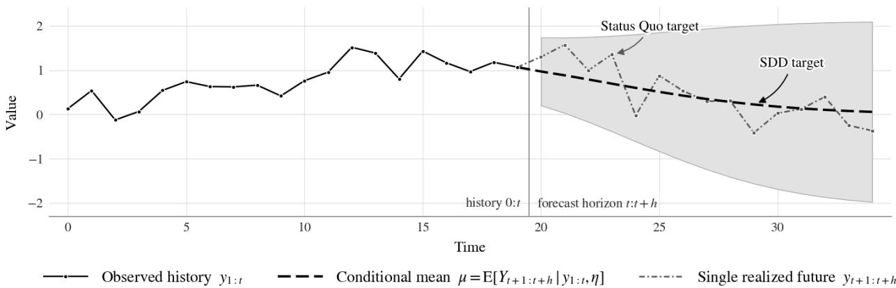
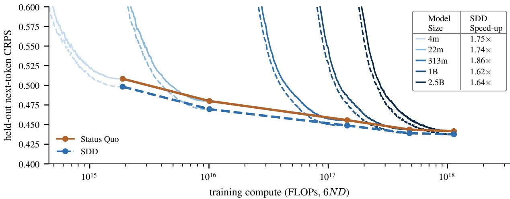
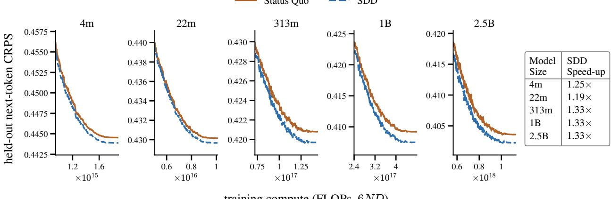

# Distillation of Synthetic Data for Time Series Foundation Models

Niloy Biswas1, Noureddine El Karoui1

1Meta AI

Time series foundation models (TSFMs) are increasingly pre-trained on synthetically generated time series trajectories, where the data generating process is known. Current pre-training recipes are based on loss objectives which compare TSFM outputs to realized future values of each trajectory. We instead propose loss objectives which compare TSFM outputs to the conditional forecast distribution of each trajectory, a procedure we call synthetic data distillation (SDD). SDD corresponds to a Rao-Blackwellization of the training objective, in that it leaves the expectation of stochastic gradients unchanged while provably reducing the covariance of the stochastic gradient under the Loewner partial ordering. We empirically validate SDD on a TSFM model family of sizes from 4M to 2.5B parameters, and observe faster convergence of validation loss at every model size: on Gaussian Process data, SDD attains or improves upon the Status Quo loss whilst requiring 10% − 40% less training iterations.

Date: September 10, 2026

Correspondence: niloy@meta.com

∞Meta

## 1 Synthetic data for Time Series Foundation Models pre-training

Time series foundation models (TSFMs) are large neural networks pre-trained on a diverse corpus of time series data across diferent domains to perform time series forecasting. TSFMs process numeric historical time series values as context [13, 16], similar to how text tokens are processed as context by Large Language Models. They then predict future time series values on time series data unseen in the training process. TSFMs enable zero-shot forecasting and are an active research area [5, 2, 14, 9].

Compared to text, publicly available real-world time series are scarce. This has catalyzed eforts to develop synthetic data generation techniques for TSFM pre-training [6, 1, 5, 18, 11], and synthetic datasets are now a core component of state-of-the-art TSFMs [6, 11, 2, 5, 10, 14, 9].

Our Contributions. We introduce synthetic data distillation (SDD), which is motivated by the literature on dataset distillation [17]. SDD condenses data from infinitely many synthetic time series trajectories into a single loss calculation without generating the trajectories. SDD accelerates the pre-training of TSFMs by reducing the variance of the stochastic gradients during training. Section 2 introduces SDD and Section 3 highlights its empirical benefits. Our work participates in the wider efort to pre-train structured data foundation models using synthetic data [12, 6, 9, 11, 8].

## 2 Distillation of Synthetic Data for Time Series Foundation Models

## 2.1 Status Quo uses a single realized trajectory as the target during pre-training

Let $f _ { \theta }$ denote a TSFM with weights θ. Current pre-training is based on loss functions of the form

$$
\frac { 1 } { B } \sum _ { b = 1 } ^ { B } \ell \big ( f _ { \theta } ( y _ { 0 : t } ^ { ( b ) } ) , y _ { t + 1 : t + h } ^ { ( b ) } \big )\tag{1}
$$

where ℓ is the loss function, B is the batch size, h is the forecast horizon, $y _ { 0 : t } ^ { ( b ) }$ and $y _ { t + 1 : t + h } ^ { ( b ) }$ are the historical and future time series values of the $b ^ { t h }$ sample respectively. Common loss functions ℓ include mean squared

error (MSE), pinball (a.k.a. quantile) loss and cross-entropy loss when TSFMs output point forecasts, quantile forecasts, and a categorical distribution of bins respectively.

## 2.2 Synthetic Data Distillation uses the exact conditional distribution of future trajectories

This section develops Synthetic Data Distillation (SDD). Consider a single time series trajectory $( y _ { t } ) _ { t \geq 0 }$ as in (1), where we drop the batch index notation for clarity. This trajectory is generated from some data-generating process $\pi _ { \alpha }$ with hyperparameters α. For real-world data, $\pi _ { \alpha }$ is unknown; for synthetic data, $\pi _ { \alpha }$ is from some pre-specified prior distribution [12] and known at generation time. For example, $\pi _ { \alpha }$ might correspond to a Gaussian process and α its mean and kernel functions.

In status quo pre-training, the loss function (1) uses the realized future values $y _ { t + 1 : t + h }$ as the ground truth during training, where $y _ { t + 1 : t + h }$ is a single realized trajectory from the conditional distribution of $\pi _ { \alpha }$ given observed history $y _ { 0 : t }$ . For a large class of synthetically generated time series, this conditional distribution is known and analytically tractable. SDD proposes to make full use of this conditional distribution, instead of just utilizing a single realized trajectory $y _ { t + 1 : t + h }$ of future values.

A stylized example. Figure 1 compares Status Quo and SDD on a stylized example of a point forecast TSFM. Status Quo loss is equal to MSE of the TSFM forecast $f _ { \theta } ( \boldsymbol { y } _ { 0 : t } )$ with a single realized future trajectory yt+1:t+h as the ground truth. SDD loss is equal (up to a constant that does not depend on $\theta ,$ see Table 1) to MSE with the conditional mean of future trajectories $\mathbb { E } _ { \pi _ { \alpha } } [ Y _ { t + 1 : t + h } | y _ { 0 : t } ]$ as the ground truth. This conditional mean is known exactly for a large class of synthetic data generators. SDD distills the entire conditional distribution of future trajectory into a single loss calculation, and reduces the variance of the loss function compared to the Status Quo ground truth which is based on just a single realization of future values. It is numerically equivalent to generating infinitely many $y _ { t + 1 : t + h }$ given $y _ { 0 : t }$ and calculating mean of $\ell \big ( f _ { \theta } ( y _ { 0 : t } ) , y _ { t + 1 : t + h } \big )$ . As the integration can be done in closed form, none of the samples actually need to be generated.

  
Figure 1 Comparison of Status Quo and SDD on a single trajectory for training a point forecast TSFM with MSE loss. Status Quo calculates MSE with realized future trajectory $y _ { t + 1 : t + h }$ as the ground truth. SDD calculates (up to an additive constant independent of θ) MSE with the conditional mean of future trajectory $\mathbb { E } _ { \pi _ { \alpha } } [ Y _ { t + 1 : t + h } | y _ { 0 : t } ]$ as the ground truth.

## 2.3 General methodology and implementation considerations

We now develop SDD in greater generality for any loss function. Consider forecast error loss of a single time series trajectory $( y _ { t } ) _ { t \geq 0 }$ as in (1). Note that

$$
\mathbb { E } _ { \pi _ { \alpha } } \left[ \ell \big ( f _ { \theta } ( y _ { 0 : t } ) , y _ { t + 1 : t + h } \big ) \right] = \mathbb { E } _ { \pi _ { \alpha } } \left[ \mathbb { E } _ { \pi _ { \alpha } } \left[ \ell \big ( f _ { \theta } ( y _ { 0 : t } ) , y _ { t + 1 : t + h } \big ) \middle | y _ { 0 : t } \right] \right] .\tag{2}
$$

For many common synthetic data generating processes and many loss functions, the distilled loss

$$
\ell _ { d i s t i l l } ^ { ( \pi _ { \alpha } , h ) } ( \theta , y _ { 0 : t } ) : = \mathbb { E } _ { \pi _ { \alpha } } \left[ \ell \big ( f _ { \theta } ( y _ { 0 : t } ) , y _ { t + 1 : t + h } \big ) \middle | y _ { 0 : t } \right]\tag{3}
$$

<table><tr><td>Loss l</td><td>Realized form</td><td>Distilled form  $\ell _ { d i s t i l l }$ </td></tr><tr><td>Squared error</td><td> $( \hat { y } _ { t + i } - Y _ { t + i } ) ^ { 2 }$ </td><td> $( \hat { y } _ { t + i } - \mu ) ^ { 2 } + s ^ { 2 }$ </td></tr><tr><td>Absolute error</td><td> $\lvert \hat { y } _ { t + i } - Y _ { t + i } \rvert$ </td><td> $s \big [ 2 m ( z ) + z \big ( 2 F _ { 0 } ( z ) - 1 \big ) \big ]$ </td></tr><tr><td>Pinball at level τ</td><td> $\left( Y _ { t + i } - { \hat { y } } _ { t + i } \right) \left( \tau - \mathbf { 1 } \{ Y _ { t + i } < { \hat { y } } _ { t + i } \} \right)$ </td><td> $s \bigl [ m ( z ) + z \bigl ( F _ { 0 } ( z ) - \tau \bigr ) \bigr ]$ </td></tr><tr><td>Cross-entropy over bins</td><td> $- \log \hat { p } ( \mathrm { b i n } ( Y _ { t + i } ) )$ </td><td> $\begin{array} { r } { - \sum _ { k } \mathbb { P } ( Y _ { t + i } \in \mathrm { b i n } _ { k } ) \ \log \hat { p } _ { k } } \end{array}$ </td></tr></table>

Table 1 $\hat { y } _ { t + i }$ is the TSFM prediction; $Y _ { t + i }$ is the random variable of the trajectory at time $t + i ; \mu = \mathbb { E } _ { \pi _ { \alpha } } [ Y _ { t + i } | y _ { 0 : t } ]$ is the conditional mean of $Y _ { t + i }$ given y0:t; $s > 0$ is the conditional standard deviation; and $z = ( \hat { y } _ { t + i } - \mu ) / s$ . The standardized variable $Z = ( Y _ { t + i } - \mu ) / s$ has density $f _ { 0 }$ and CDF $F _ { 0 } ,$ , and upper partial mean $\begin{array} { r } { m ( z ) = \int _ { z } ^ { \infty } u f _ { 0 } ( u ) } \end{array}$ du. $\hat { p } _ { k }$ is predicted probability of bin partitions.

is analytically tractable. Synthetic Data Distillation proposes to replace ℓ with $\ell _ { d i s t i l l }$ in (1). By (2), $\ell _ { d i s t i l l }$ has the same expectation as ℓ with the sampling noise of the realized future integrated out. Table 1 contains expressions for the distilled loss $\ell _ { d i s t i l l }$ for some common loss functions.

Tractability. SDD requires the knowledge of the quantities such as mean, variance and CDF of conditional distribution of the multi-step future $Y _ { t + 1 : t + h }$ given the history $y _ { 0 : t }$ . Note that the losses of Table 1 are sums of per-time-point terms, so only the marginal conditional law of each $Y _ { t + i }$ is needed, not the joint law across the horizon. A large class of synthetic time series generators are tractable in this sense, including: (i) Gaussian Processes (GPs); (ii) Linear Gaussian State Space Models (e.g. ARIMA, Dynamic Linear Models); (iii) Linear and Log-Linear Stochastic Diferential Equations (e.g. Ornstein–Uhlenbeck processes and Geometric Brownian Motion), and (iv) all independent non-identically distributed (i.n.i.d.) time series $( y _ { t } ) _ { t \geq 0 }$ of the form $y _ { t } : = g ( t , \epsilon _ { t } )$ , where $g$ is a known deterministic function and the $\epsilon _ { t }$ are independent noise. Appendix B.1 gives the distilled loss for each of these families and each loss of Table 1. Two examples of intractable synthetic data generators are structural causal models with non-linear activations [18] and nonlinear State Space Models. Note that GPs and i.n.i.d. time series (e.g. with change-points, sawtooths or spikes-based deterministic functions and additive noise) already capture most of the current synthetic data generators used in TSFM pre-training [11, 9]. Appendix B.2 reviews and classifies all existing synthetic generators.

For intractable synthetic data generators, it is possible to calculate Monte-Carlo estimates of $\ell _ { d i s t i l l }$ by sampling many trajectories of $Y _ { t + 1 : t + h }$ given history $y _ { 0 : t }$ for each t. This provides a balance between Status Quo (just a single trajectory and higher variance) and SDD (numerically equivalent to infinite trajectories and lower variance, but requires tractability). When some of the pre-training data is intractable (e.g. real-world data), we can also fallback to the status quo loss just for the intractable time series. This means SDD remains useful whenever some portion of the pre-training corpus are from tractable synthetic data generators.

Implementation considerations for eficient pre-training. Teacher-forcing [5] or contiguous patch masking (CPM) [10, 2, 9] are commonly used for TSFM pre-training. For time series of length T, the SDD teacherforcing loss is given by $\begin{array} { r } { \frac { 1 } { T - h - s + 1 } \sum _ { t = s } ^ { T - h } \ell _ { d i s t i l l } ^ { ( \pi _ { \alpha } , h ) } \left( \theta , y _ { 0 : t } \right) } \end{array}$ for some minimum history threshold $s \geq 0 ;$ the SDD CPM loss is given by $\begin{array} { r } { \frac { 1 } { M } \sum _ { i = 1 } ^ { M } \ell _ { d i s t i l l } ^ { ( \pi _ { \alpha } , h _ { i } ) } \big ( \theta , y _ { 0 : s _ { i } } \big ) } \end{array}$ , where $( s _ { i } + 1 , s _ { i } + h _ { i } ) _ { i = 1 } ^ { M }$ are the randomly sampled masked periods. To implement SDD eficiently, we can calculate the conditional distribution quantities in an autoregressive manner when generating the synthetic data. For example, when generating and saving $y _ { 1 : t }$ , we can also save the quantities such as mean, variance of $Y _ { t + 1 : T }$ given $y _ { 0 : t }$ . Then after the pre-training data is cached, SDD and Status Quo cost the same per training iteration.

## 2.4 Variance Reduction Guarantees

Denote $L ( \theta ) = \ell \big ( f _ { \theta } ( y _ { 0 : t } ) , y _ { t + 1 : t + h } \big )$ and $L _ { d i s t i l l } ( \theta ) = \ell _ { d i s t i l l } ^ { ( \pi _ { \alpha } , h ) } \bigl ( \theta , y _ { 0 : t } \bigr )$ for the status quo and distilled loss respectively. Proposition 1 establishes a Rao–Blackwellization result [15, 4] for SDD.

Proposition 1 (Rao–Blackwellization). Suppose L(θ) is diferentiable in θ with $\mathbb { E } _ { \pi _ { \alpha } } \| \nabla _ { \theta } L ( \theta ) \| ^ { 2 } < \infty$ , and that diferentiation and conditional expectation may be interchanged, so that $\nabla _ { \theta } L _ { d i s t i l l } ( \theta ) = \mathbb { E } _ { \pi _ { \alpha } } [ \nabla _ { \theta } L ( \theta ) \mid y _ { 0 : t } ]$

Then $\mathbb { E } _ { \pi _ { \alpha } } [ \nabla _ { \theta } L _ { d i s t i l l } ( \theta ) ] = \mathbb { E } _ { \pi _ { \alpha } } [ \nabla _ { \theta } L ( \theta ) ]$ , and, in the Loewner partial ordering on positive semi-definite matrices,

$$
\begin{array} { r } { \mathrm { C o v } _ { \pi _ { \alpha } } \big [ \nabla _ { \theta } L _ { d i s t i l l } ( \theta ) \big ] = \mathrm { C o v } _ { \pi _ { \alpha } } \big [ \nabla _ { \theta } L ( \theta ) \big ] - \mathbb { E } _ { \pi _ { \alpha } } \big [ \mathrm { C o v } _ { \pi _ { \alpha } } ( \nabla _ { \theta } L ( \theta ) \mid y _ { 0 : t } ) \big ] \preceq \mathrm { C o v } _ { \pi _ { \alpha } } \big [ \nabla _ { \theta } L ( \theta ) \big ] . } \end{array}\tag{4}
$$

Proof. By tower property $\begin{array} { r } { \mathbb { E } _ { \pi _ { \alpha } } [ \nabla _ { \theta } L _ { d i s t i l l } ( \theta ) ] = \mathbb { E } _ { \pi _ { \alpha } } [ \mathbb { E } _ { \pi _ { \alpha } } [ \nabla _ { \theta } L ( \theta ) \ | \ y _ { 0 : t } ] ] = \mathbb { E } _ { \pi _ { \alpha } } [ \nabla _ { \theta } L ( \theta ) ] } \end{array}$ , and (4) is the law of total covariance applied to $\nabla _ { \boldsymbol { \theta } } L ( \boldsymbol { \theta } )$ given $y _ { 0 : t } .$ , since $\mathbb { E } _ { \pi _ { \alpha } } [ \nabla _ { \theta } L ( \theta ) \mid y _ { 0 : t } ] = \nabla _ { \theta } L _ { d i s t i l l } ( \theta )$ . The subtracted term is an expectation of covariance matrices and hence positive semi-definite $[ 3 ]$ □

Proposition 1 shows that SDD produces unbiased and lower variance gradients for back-propagation during TSFM pre-training. This in turn yields faster convergence, as next highlighted in Section 3.

## 3 Numerical Experiments

We pre-train the five Toto-2 architectures [9], spanning 4M to 2.5B parameters, from random initialization on trajectories from univariate Gaussian processes of length $T = 5 1 2$ . In this setting, the conditional forecast distributions are Gaussian and the distilled losses of Table 1 are analytically tractable. Every model carries a quantile head over the nine deciles and is pre-trained with contiguous patch masking under pinball loss: the Status Quo arm scores the realized future values while the SDD arm scores the distilled pinball loss of Table 1. We train for 300,000 steps at batch $B = 1 6$ in a single-pass regime, such that no trajectory is revisited during training, and calculate the next patch (corresponding to the next $P = 3 2$ time-points) Continuous Ranked Probability Score (CRPS) on held-out time series to track the validation loss of Status Quo and SDD.

Figure 2 plots that validation loss against cumulative training compute, estimated as 6ND for N parameters and D patch tokens, so that a model’s own trajectory and the envelope across model sizes can be read on one axis. Here a patch is the TSFM’s token: each of the $T / P = 1 6$ patches of a series is one sequence position, so D advances by $B \cdot T / P = 2 5 6$ per optimizer step. The conditional distribution moments needed for SDD are cached beforehand when the synthetic data is generated, so during training SDD and Status Quo steps cost the same (Section 2.3). Figure 2 shows that SDD attains the same validation loss as Status Quo while spending 38-46% fewer FLOPs, a convergence speed-up of 1.6× to 1.85× depending on model size. It also shows that SDD consistently attains lower validation loss than Status Quo given the same training compute. Appendix C details the data generation and training run configurations, and Appendix D reports additional experiments under teacher forcing and with varying observation noise, batch size and sequence length.

  
Figure 2 Held-out next-token CRPS of Status Quo and SDD against training compute FLOPs, for the five Toto-2 architectures [9] trained from random initialization. Each colored line is one model’s compute curve, solid for Status Quo and dashed for SDD. The two heavy marked lines join the end points across sizes. SDD speed-up is 300,000 divided by the number of iterations required by SDD to attain the 300,000th step Status Quo loss. E.g. for the 1B model SDD attained the Status Quo loss in 185,000 training steps, giving $\begin{array} { r l } { \mathrm { ~ a ~ } \frac { 3 0 0 , 0 0 0 } { 1 8 5 , 0 0 0 } \overset { - } { \approx } 1 . 6 2 \times } & { { } } \end{array}$ speed up or equivalently a compute saving of 38%.

## 4 Discussion and Future Work

We have introduced Synthetic Data Distillation as a way to accelerate the pre-training of time series foundation models with synthetic data. SDD motivates future work on: (i) numerical experiments for a wider range of synthetic data generators, (ii) whether that compute saving persists at the scale and data mixtures of production TSFM pre-training runs, where synthetic data is only part of the corpus, (iii) applications of SDD beyond TSFM to Tabular Foundation models [7, 8].

## References

[1] Abdul Fatir Ansari, Lorenzo Stella, Caner Turkmen, Xiyuan Zhang, Pedro Mercado, Huibin Shen, Oleksandr Shchur, Syama Sundar Rangapuram, Sebastian Pineda Arango, Shubham Kapoor, Jasper Zschiegner, Danielle C. Maddix, Hao Wang, Michael W. Mahoney, Kari Torkkola, Andrew Gordon Wilson, Michael Bohlke-Schneider, and Yuyang Wang. Chronos: Learning the language of time series. Transactions on Machine Learning Research (TMLR), 2024.

[2] Abdul Fatir Ansari, Oleksandr Shchur, Jaris Küken, Andreas Auer, Boran Han, Pedro Mercado, Syama Sundar Rangapuram, Huibin Shen, Lorenzo Stella, Xiyuan Zhang, Mononito Goswami, Shubham Kapoor, Danielle C. Maddix, Pablo Guerron, Tony Hu, Junming Yin, Nick Erickson, Prateek Mutalik Desai, Hao Wang, Huzefa Rangwala, George Karypis, Yuyang Wang, and Michael Bohlke-Schneider. Chronos-2: From univariate to universal forecasting. arXiv preprint arXiv:2510.15821, 2025.

[3] Rajendra Bhatia. Matrix Analysis, volume 169 of Graduate Texts in Mathematics. Springer, New York, 1997. ISBN 978-0-387-94846-1.

[4] David Blackwell. Conditional expectation and unbiased sequential estimation. The Annals of Mathematical Statistics, 18(1):105–110, 1947.

[5] Abhimanyu Das, Weihao Kong, Rajat Sen, and Yichen Zhou. A decoder-only foundation model for time-series forecasting. In International Conference on Machine Learning (ICML), 2024.

[6] Samuel Dooley, Gurnoor Singh Khurana, Chirag Mohapatra, Siddartha Naidu, and Colin White. ForecastPFN: Synthetically-trained zero-shot forecasting. In Advances in Neural Information Processing Systems (NeurIPS), 2023.

[7] Noah Hollmann, Samuel Müller, Katharina Eggensperger, and Frank Hutter. TabPFN: A transformer that solves small tabular classification problems in a second. In International Conference on Learning Representations (ICLR), 2023.

[8] Noah Hollmann, Samuel Müller, Lennart Purucker, Arjun Krishnakumar, Max Körfer, Shi Bin Hoo, Robin Tibor Schirrmeister, and Frank Hutter. Accurate predictions on small data with a tabular foundation model. Nature, 637:319–326, 2025. doi: 10.1038/s41586-024-08328-6.

[9] Emaad Khwaja, Chris Lettieri, Gerald Woo, Eden Belouadah, Marc Cenac, Guillaume Jarry, Enguerrand Paquin, Xunyi Zhao, Viktoriya Zhukov, Othmane Abou-Amal, Chenghao Liu, Ameet Talwalkar, and David Asker. Toto 2.0: Time series forecasting enters the scaling era. arXiv preprint arXiv:2605.20119, 2026.

[10] Chenghao Liu, Taha Aksu, Juncheng Liu, Xu Liu, Hanshu Yan, Quang Pham, Silvio Savarese, Doyen Sahoo, Caiming Xiong, and Junnan Li. Moirai 2.0: When less is more for time series forecasting. arXiv preprint arXiv:2511.11698, 2025.

[11] Vladyslav Moroshan, Julien Siems, Arber Zela, Timur Carstensen, and Frank Hutter. TempoPFN: Synthetic pre-training of linear RNNs for zero-shot time series forecasting. arXiv preprint arXiv:2510.25502, 2025.

[12] Samuel Müller, Noah Hollmann, Sebastian Pineda Arango, Josif Grabocka, and Frank Hutter. Transformers can do Bayesian inference. In International Conference on Learning Representations (ICLR), 2022.

[13] Yuqi Nie, Nam H. Nguyen, Phanwadee Sinthong, and Jayant Kalagnanam. A time series is worth 64 words: Long-term forecasting with transformers. In International Conference on Learning Representations (ICLR), 2023.

[14] Patrick Podest, Marco Pichler, Elias Bürger, Levente Zólyomi, Bernhard Voggenberger, Wilhelm Berghammer, Daniel Klotz, Sebastian Böck, Günter Klambauer, and Sepp Hochreiter. TiRex-2: Generalizing TiRex to multivariate data and streaming. arXiv preprint arXiv:2607.01204, 2026.

[15] C. Radhakrishna Rao. Information and the accuracy attainable in the estimation of statistical parameters. Bulletin of the Calcutta Mathematical Society, 37:81–91, 1945.

[16] Ashish Vaswani, Noam Shazeer, Niki Parmar, Jakob Uszkoreit, Llion Jones, Aidan N. Gomez, Lukasz Kaiser, and Illia Polosukhin. Attention is all you need. In Advances in Neural Information Processing Systems (NeurIPS), 2017.

[17] Tongzhou Wang, Jun-Yan Zhu, Antonio Torralba, and Alexei A. Efros. Dataset distillation. arXiv preprint arXiv:1811.10959, 2018.

[18] Shifeng Xie, Vasilii Feofanov, Ambroise Odonnat, Lei Zan, Marius Alonso, Jianfeng Zhang, Themis Palpanas, Lujia Pan, Keli Zhang, and Ievgen Redko. Cauker: Classification time series foundation models can be pretrained on synthetic data. In International Conference on Learning Representations (ICLR), 2026. arXiv preprint arXiv:2508.02879.

## Appendix

## A Distilled Losses

This appendix derives each row of Table 1.

Fix a history $y _ { 0 : t }$ and a horizon index $i \in \{ 1 , \ldots , h \}$ . All expectations are under the generator $\pi _ { \alpha }$ and conditional on $y _ { 0 : t } ;$ we assume $\mathbb { E } [ Y _ { t + i } ^ { 2 } ] < \infty ,$ so that every quantity below exists. Write $\mu$ and $s > 0$ for the conditional mean and standard deviation of $Y _ { t + i } ,$ and set

$$
z = { \frac { { \hat { y } } _ { t + i } - \mu } { s } } , \qquad Z = { \frac { Y _ { t + i } - \mu } { s } } ,
$$

so that Z has mean 0 and variance 1. Let $f _ { 0 }$ and $F _ { 0 }$ be its density and CDF and let $\begin{array} { r } { m ( z ) = \int _ { z } ^ { \infty } u f _ { 0 } ( u ) } \end{array}$ du be its upper partial mean; since $\mathbb { E } [ Z ] = 0$ we also have $\begin{array} { r } { \int _ { - \infty } ^ { z } u f _ { 0 } ( u ) d u = - m ( z ) } \end{array}$ . The generator is Gaussian in all of our experiments, in which case $f _ { 0 } = \phi$ and $F _ { 0 } \overset { \cdot } { = } \Phi$ are the standard normal density and CDF and $m ( z ) = \phi ( z )$

Every loss in Table 1 is a sum over the horizon indices $i = 1 , \ldots , h$ of the scalar term shown, up to a factor $1 / h$ when ℓ is a mean rather than a sum. Conditional expectation is linear, so the distilled loss (3) aggregates the $\ell _ { d i s t i l l }$ below in exactly the same way, and only the marginal conditional law of each $Y _ { t + i }$ is ever required.

Squared error. Expanding around $\mu , \mathbb { E } [ ( \hat { y } _ { t + i } - Y _ { t + i } ) ^ { 2 } ] = ( \hat { y } _ { t + i } - \mu ) ^ { 2 } - 2 ( \hat { y } _ { t + i } - \mu ) \mathbb { E } [ Y _ { t + i } - \mu ] + \mathbb { E } [ ( Y _ { t + i } - \mu ) ^ { 2 } ]$ The middle term is zero and the last is $s ^ { 2 }$ , which does not depend on θ. The distilled loss is squared error against the conditional mean, up to an additive constant.

Absolute error. $\vert \hat { y } _ { t + i } - Y _ { t + i } \vert = s \vert z - Z \vert$ . Splitting the integral at $z ,$

$$
\mathbb { E } \left| z - Z \right| = \int _ { - \infty } ^ { z } ( z - u ) f _ { 0 } ( u ) d u + \int _ { z } ^ { \infty } ( u - z ) f _ { 0 } ( u ) d u = 2 m ( z ) + z \big ( 2 F _ { 0 } ( z ) - 1 \big ) ,
$$

$$
\begin{array} { r } { \mathrm { s o } \ \ell _ { d i s t i l l } = s \left[ 2 m ( z ) + z \big ( 2 F _ { 0 } ( z ) - 1 \big ) \right] . } \end{array}
$$

Pinball at level $\tau .$ . The pinball loss is $\big ( Y _ { t + i } - \hat { y } _ { t + i } \big ) ( \tau - \mathbf { 1 } \{ Y _ { t + i } < \hat { y } _ { t + i } \} ) = s ( Z - z ) ( \tau - \mathbf { 1 } \{ Z < z \} )$ . Using $\mathbb { E } [ Z - z ] = - z$ and ${ \mathbb E } [ ( Z - z ) \mathbf { 1 } \{ Z < z \} ] = - m ( z ) - z F _ { 0 } ( z )$ , the expectation is $\ell _ { d i s t i l l } = s [ m ( z ) + z ( F _ { 0 } ( z ) - \tau ) ]$ Its derivative in $\hat { y } _ { t + i }$ is $F _ { 0 } ( z ) - \tau$ , since $m ^ { \prime } ( z ) = - z f _ { 0 } ( z )$ cancels the $z f _ { 0 } ( z )$ term and $d z / d \hat { y } _ { t + i } = 1 / s$ . The second derivative is $f _ { 0 } ( z ) / s \ge 0$ , so $\ell _ { d i s t i l l }$ is convex and, whenever $F _ { 0 }$ is strictly increasing, is minimized at $\hat { y } _ { t + i } = \mu + s F _ { 0 } ^ { - 1 } ( \tau )$ , the conditional τ-quantile of $Y _ { t + i }$ given $y _ { 0 : t }$ . Training against $\ell _ { d i s t i l l }$ therefore targets the same quantiles as training against the realized pinball loss.

Cross-entropy over bins. Since $\begin{array} { r } { - \log \hat { p } ( \mathrm { b i n } ( Y _ { t + i } ) ) = - \sum _ { k } \mathbf { 1 } \{ Y _ { t + i } \in \mathrm { b i n } _ { k } \} } \end{array}$ log $\hat { p } _ { k }$ , linearity of expectation gives $\begin{array} { r } { \ell _ { d i s t i l l } = - \sum _ { k } \mathbb { P } ( Y _ { t + i } \in \mathrm { b i n } _ { k } ) \log \hat { p } _ { k } } \end{array}$ . The distilled loss is the cross-entropy of the predicted bin distribution against the exact conditional bin distribution, in place of the one-hot bin of a single realized draw.

## B Tractable Distilling Losses

Section 2.3 names four families of synthetic generator whose conditional forecast law is closed-form. This appendix writes out the distilled loss (3) for every one of those families and every loss of Table 1.

## B.1 Closed Forms by Generator Family

The grid factorizes, which is what makes it small enough to tabulate. Fix a horizon index $i \in \{ 1 , \ldots , h \}$ and write, all conditional on $y _ { 0 : t }$ and under $\pi _ { \alpha }$

$$
\begin{array} { r } { \mu _ { i } = \mathbb { E } \big [ Y _ { t + i } \big ] , \quad s _ { i } ^ { 2 } = \mathrm { V a r } \big ( Y _ { t + i } \big ) , \quad F _ { i } ( x ) = \mathbb { P } \big ( Y _ { t + i } \leq x \big ) , \quad U _ { i } ( x ) = \mathbb { E } \big [ ( Y _ { t + i } - x ) ^ { + } \big ] , } \end{array}\tag{5}
$$

where $( a ) ^ { + } = \operatorname* { m a x } ( a , 0 )$ and $U _ { i }$ is the upper partial expectation. The generator enters the distilled loss only through the four functionals (5), and the loss only through how it combines them.

Proposition 2 (Distilled losses in terms of $( \mu , s , F , U ) )$ . Fix $i ,$ drop it from the notation, and write $\hat { y } = \hat { y } _ { t + i }$ Suppose $\mathbb { E } [ Y ^ { 2 } \mid y _ { 0 : t } ] < \infty$ . Then the distilled terms of Table 1 are

$$
s q u a r e d \ e r r o r ; \ell _ { d i s t i l l } ( \hat { y } ) = ( \hat { y } - \mu ) ^ { 2 } + s ^ { 2 } ,\tag{6}
$$

$$
a b s o l u t e ~ e r r o r : \quad \ell _ { d i s t i l l } ( \hat { y } ) = ( \hat { y } - \mu ) + 2 U ( \hat { y } ) ,\tag{7}
$$

$$
p i n b a l l ~ a t ~ l e v e l ~ \tau : ~ \ell _ { d i s t i l l } ( \hat { y } ) = U ( \hat { y } ) + ( 1 - \tau ) ( \hat { y } - \mu ) ,\tag{8}
$$

$$
c r o s s - e n t r o p y \ o v e r \ b i n s : \quad \ell _ { d i s t i l l } ( \hat { p } ) = - \sum _ { k = 1 } ^ { K } \left( F ( e _ { k } ) - F ( e _ { k - 1 } ) \right) \log \hat { p } _ { k } ,\tag{9}
$$

where $- \infty = e _ { 0 } < e _ { 1 } < \dots < e _ { K } = + \infty$ are the bin edges, so that $\mathrm { b i n } _ { k } = ( e _ { k - 1 } , e _ { k } ]$

Proof. Equation (6) is Appendix A. For (7), put $a = { \hat { y } } - Y$ and use $| a | = a + 2 ( - a ) ^ { + }$ , so $\mathbb { E } | \hat { y } - Y | =$ $( \hat { y } - \mu ) { + } 2 \mathbb { E } [ ( Y - \hat { y } ) ^ { + } ]$ . For (8), the pinball loss is $\tau ( Y - \hat { y } ) ^ { + } + ( 1 - \tau ) ( \hat { y } - Y ) ^ { + }$ , and $( \hat { y } - Y ) ^ { + } = ( Y - \hat { y } ) ^ { + } - ( Y - \hat { y } )$ so its expectation is $U ( \hat { y } ) - ( 1 - \tau ) ( \mu - \hat { y } )$ ). Equation (9) is linearity of expectation applied to the indicator of each bin. □

Proposition 2 is equivalent to Table 1: writing $U ( \hat { y } ) = s \big [ m ( z ) - z \big ( 1 - F _ { 0 } ( z ) \big ) \big ]$ with $z = ( \hat { y } - \mu ) / s$ recovers the standardized forms there. Two consequences are worth noting. Only $\mu$ enters (6) up to the θ-free constant $s ^ { 2 } .$ , so the distilled squared error needs only the conditional mean to train. And $\ell _ { d i s t i l l }$ in (8) has derivative $F ( \hat { y } ) - \tau$ in yˆ, so it is minimized at the exact conditional τ-quantile whatever the conditional law is: distillation does not change what the quantile head is asked to learn.

Table 2 completes the picture. Panel (a) gives $( \mu _ { i } , s _ { i } ^ { 2 } , F _ { i } , U _ { i } )$ for each of the four tractable families; panel (b) evaluates (6)–(9) for each conditional law that arises. To read of any one of the sixteen distilled losses, take the family’s row in (a) and the loss’s row in (b) under the matching law.

The lognormal column of Table 2(b) follows from $\mathbb { P } ( Y > x ) = \Phi ( - d )$ and E[Y1 $\{ Y > x \} ] = \mu \Phi ( b - d )$ the standard partial moment of a lognormal, so that $U ( x ) = \mu \Phi ( b - d ) - x \Phi ( - d )$ . Substituting this into Proposition 2 gives the remaining three entries. The same two ingredients - a CDF and an upper partial expectation - are all that a new generator family has to supply in order to join the table.

## B.2 Which Published Synthetic Data Generators are Tractable

Appendix B.1 assumes the conditional law is available. Table 3 records which of the synthetic generators used in recent TSFM pre-training supply it, and which row of Table $2 ( \mathrm { a } )$ each one instantiates given its drawn hyperparameters $\alpha ;$ for those rows the distilled losses can be read straight of Table $2 ( \mathrm { b } )$

Two rows need a word. The regime-switching Ornstein–Uhlenbeck generator is closed-form only once the regime path is recorded at generation time, as Section 2.3 describes for the conditional moments; conditioning on that path in addition to $y _ { 0 : t }$ leaves Proposition 1 intact, by the same tower-property argument. And for the last three rows, where no closed form is available, the fallbacks of Section 2.3 apply: a Monte Carlo estimate of $\ell _ { d i s t i l l }$ , or the status quo loss.

Table 2 Exact distilled losses for the tractable generator families of Section 2.3. (a) the conditional forecast law of $Y _ { t + i }$ given y0:t, summarized by the four functionals $( 5 ) ; \delta _ { i }$ is the elapsed time from t to $t + i .$ (b) the distilled loss $\ell _ { d i s t i l l }$ of Proposition 2 for each law that arises in (a), with ϕ and Φ the standard normal density and CDF. Every family in (a) is Gaussian except the log-linear SDE, which is lognormal, and the general i.n.i.d. case, which is whatever the noise law makes it.  
(a) Conditional forecast law $Y _ { t + i } \mid$ y0:t
<table><tr><td>Family</td><td></td><td>Generator</td><td>Conditional moments and distribution</td></tr><tr><td>Linear sian state space (ARIMA, DLM)</td><td>Gaus-  $\mathcal { N } ( 0 , Q _ { u } ) ;$   $\mathcal { N } ( 0 , R _ { u } )$ </td><td> $x _ { u + 1 } = A _ { u } x _ { u } + b _ { u } + w _ { u } , \ w _ { u } \ \sim$   $y _ { u } ~ = ~ c _ { u } ^ { \top } x _ { u } ~ + ~ d _ { u } ~ + ~ v _ { u } , ~ v _ { u } ~ \sim$ </td><td>Gaussian  $\mu _ { i } = c _ { t + i } ^ { \top } m _ { i } + d _ { t + i } , \quad s _ { i } ^ { 2 } = c _ { t + i } ^ { \top } P _ { i } c _ { t + i } + R _ { t + i } ,$   $\mathrm { w i t h ~ } m _ { i } = A _ { t + i - 1 } m _ { i - 1 } + b _ { t + i - 1 } \mathrm { ~ a n d }$   $P _ { i } = A _ { t + i - 1 } P _ { i - 1 } A _ { t + i - 1 } ^ { \top } + Q _ { t + i - 1 } \mathrm { { \ r u n } }$ </td></tr><tr><td>Gaussian process (KernelSynth, GP)</td><td></td><td> $y _ { u } = g ( u ) + f ( u ) + v _ { u } ,$   $f \sim \mathcal { G P } ( 0 , k ) , v _ { u } \sim \mathcal { N } ( 0 , \sigma ^ { 2 } )$ </td><td>Gaussian  $\mu _ { i } = g ( t + i ) + \kappa _ { i } ^ { \top } K ^ { - 1 } \big ( y _ { 0 : t } - g _ { 0 : t } \big ) ,$   $s _ { i } ^ { 2 } = k ( t { + } i , t { + } i ) - \kappa _ { i } ^ { \top } K ^ { - 1 } \kappa _ { i } + \sigma ^ { 2 } ,$  with  $K = k ( 0 ; t , 0 ; t ) \dot { + } \sigma ^ { 2 } I$ </td></tr><tr><td>Linear (Ornstein- Uhlenbeck)</td><td>SDE</td><td> $d Y _ { u } = \kappa \left( \eta - Y _ { u } \right) d u + \sigma d W _ { u }$ </td><td>Gaussian  $\mu _ { i } = \eta + ( y _ { t } - \eta ) e ^ { - \kappa \delta _ { i } } ,$ </td></tr><tr><td>Log-linear SDE (ge- ometric Brownian motion)</td><td></td><td> $d Y _ { u } = \nu Y _ { u } d u + \sigma Y _ { u } d W _ { u }$ </td><td>Lognormal log  $Y _ { t + i } \sim \mathcal { N } ( a _ { i } , b _ { i } ^ { 2 } )$  with  $a _ { i } = \log y _ { t } + ( \nu - { \textstyle { \frac { 1 } { 2 } } } \sigma ^ { 2 } ) \delta _ { i }$  and  $b _ { i } ^ { 2 } = \sigma ^ { 2 } \delta _ { i } ;$ </td></tr><tr><td>i.n.i.d.  $y _ { u } = g ( u , \epsilon _ { u } )$  (ForecastPFN, Saw- independent tooth, Step, Spikes)</td><td>g known and deterministic,</td><td> $( \epsilon _ { u } ) _ { u }$  noise law</td><td> $\mu _ { i } = e ^ { a _ { i } + b _ { i } ^ { 2 } / 2 } ,$   $s _ { i } ^ { 2 } = \mu _ { i } ^ { 2 } \left( e ^ { b _ { i } ^ { 2 } } - 1 \right)$   $Y _ { t + i }$  is independent of  $y _ { 0 : t } ,$  so Fi is the marginal law  $\operatorname { o f } g ( t + i , \epsilon _ { t + i } )$  and  $\begin{array} { r } { U _ { i } ( \dot { x } ) = \int _ { x } ^ { \infty } \big ( 1 - F _ { i } ( u ) \big ) } \end{array}$  du. Gaussian when  $g ( u , \epsilon ) = m _ { u } + \sigma _ { u } \epsilon$  with  $\epsilon \sim \mathcal { N } ( 0 , 1 )$ </td></tr></table>

<table><tr><td colspan="4">(b) Distilled loss  $\ell _ { d i s t i l l }$  at horizon index ¿, by conditional law</td></tr><tr><td>Loss l</td><td>Gaussian  ${ \mathcal { N } } ( \mu , s ^ { 2 } )$   $z = ( \hat { y } - \mu ) / s$ </td><td>Lognormal  $( a , b ^ { 2 } )$   $d = ( \log \hat { y } - a ) / b$ </td><td> $\mathrm { G e n e r a l } , \mathrm { v i a } \ ( 5 )$ </td></tr><tr><td>Squared error</td><td> $( \hat { y } - \mu ) ^ { 2 } + s ^ { 2 }$ </td><td> $( \hat { y } - \mu ) ^ { 2 } + \mu ^ { 2 } \left( e ^ { b ^ { 2 } } - 1 \right)$ </td><td> $( \hat { y } - \mu ) ^ { 2 } + s ^ { 2 }$ </td></tr><tr><td>Absolute error</td><td> $s \bigl [ 2 \phi ( z ) + z \bigl ( 2 \Phi ( z ) - 1 \bigr ) \bigr ]$ </td><td> $\displaystyle \left( { \hat { y } } - \mu \right) + 2 \left[ \mu \Phi ( b - d ) - { \hat { y } } \Phi ( - d ) \right]$ </td><td> $( \hat { y } - \mu ) + 2 U ( \hat { y } )$ </td></tr><tr><td>Pinball at level T</td><td> $s \left[ \phi ( z ) + z \bigl ( \Phi ( z ) - \tau \bigr ) \right]$ </td><td> $\mu \Phi ( b - d ) - \hat { y } \Phi ( - d ) + ( 1 - \tau ) ( \hat { y } - \mu )$ </td><td> $U ( \hat { y } ) + ( 1 - \tau ) ( \hat { y } - \mu )$ </td></tr><tr><td>Cross-entropy over bins</td><td> $\begin{array} { r } { - \sum _ { k } \left[ \Phi ( z _ { k } ) - \Phi ( z _ { k - 1 } ) \right] \log \hat { p } _ { k } } \end{array}$   $z _ { k } = ( e _ { k } - \mu ) / s$ </td><td> $\begin{array} { r } { - \sum _ { k } \left[ \Phi ( d _ { k } ) - \Phi ( d _ { k - 1 } ) \right] \log \hat { p } _ { k } , } \end{array}$   $d _ { k } = ( \log e _ { k } - a ) / b$ </td><td> $- \textstyle \sum _ { k } \left[ F ( e _ { k } ) \right.$   $F ( e _ { k - 1 } ) \big ] \log \hat { p } _ { k }$ </td></tr></table>

Table 3 Synthetic generators used to pre-train ${ \mathrm { T S F M s } } ,$ and where each lands in Table $2 ( \mathrm { a } )$ . The first three rows are closed-form; the last three are not. Rows one to five are the TempoPFN generators [11], which subsume KernelSynth [1] and ForecastPFN [6]; the last row is from Chronos [1].
<table><tr><td>Generators</td><td>Family in Table 2(a)</td></tr><tr><td>KernelSynth, Gaussian Process</td><td>Gaussian process</td></tr><tr><td>regime-switching Ornstein-Uhlenbeck</td><td>linear  ${ \mathrm { S D E } } ,$  given the recorded regime path</td></tr><tr><td>ForecastPFN, Sawtooth, SineWave, Spikes, StepFunction, Anomaly</td><td>i.n.i.d.  $y _ { u } = g ( u , \epsilon _ { u } )$ </td></tr><tr><td>CauKer, at non-root channels</td><td>none: nonlinear map of  ${ \mathrm { G P s } } ,$  sampling required</td></tr><tr><td>audio-inspired (four generators)</td><td>none: procedural simulation, sampling required</td></tr><tr><td>TSMixup</td><td>none: real-data augmentation, law unavailable</td></tr></table>

## C Experimental Details

Generator. Every series is a single Gaussian process draw on the integer grid $u = 0 , 1 , \ldots , T - 1$ . Series are produced in generation chunks of 128: one kernel κ is drawn uniformly from ten choices per chunk and shared by the whole chunk, while the kernel hyperparameters $\alpha ,$ the mean function $g ( u ) = a u + c$ and the noise realization are drawn per series. The per-series marginal over kernels is therefore uniform, but 128 consecutive series share a kernel, and the corpus is read in generation order rather than shufled, so a batch of $B \leq 1 2 8$ carries a single kernel type and only the $B = 2 5 6$ and $B = 1 0 2 4$ levels of the batch sweep mix kernels within a batch. Elsewhere kernels vary across steps, not within a step. Writing $K _ { \kappa \alpha } = \big ( k _ { \kappa \alpha } ( u , v ) \big ) _ { u , v < T }$ for the kernel matrix and $\begin{array} { r } { g = \left( g ( u ) \right) _ { u < T } , } \end{array}$ the generating distribution is exactly

$$
y _ { 0 : T - 1 } \mid ( \kappa , \alpha , a , c ) \sim \mathcal { N } \big ( g , \ K _ { \kappa \alpha } + \tilde { \sigma } ^ { 2 } I _ { T } \big ) , \qquad \tilde { \sigma } ^ { 2 } = \sigma ^ { 2 } + 1 0 ^ { - 4 } ,\tag{10}
$$

realized as $y = g + L \xi$ with $L L ^ { \top } = K _ { \kappa \alpha } + \tilde { \sigma } ^ { 2 } I _ { T }$ and $\xi \sim \mathcal { N } ( 0 , I _ { T } )$ . Here $\sigma$ is the observation-noise standard deviation and $1 0 ^ { - 4 }$ is a Cholesky jitter; both are folded into the covariance rather than added afterwards, so (10) is the law the distilled losses condition on. Channels share the kernel and, in the runs reported here, are drawn independently.

The ten kernels are RBF, Matérn-1/2 (equivalently Ornstein–Uhlenbeck), Matérn-3/2, Matérn- $s / 2 ,$ periodic (exponentiated sine squared), rational quadratic, locally periodic (RBF times periodic), linear (dot product), degree-two polynomial, and a three-component spectral mixture. Their hyperparameters are drawn per series, all uniform: lengthscale $U ( 5 , 5 0 )$ ; output scale $U ( 0 . 5 , 2 )$ ; period $U ( 8 , 6 4 )$ ; rational-quadratic shape $U ( 0 . 5 , 4 )$ periodic lengthscale $U ( 0 . 5 , 2 )$ ; polynomial ofset $U ( 0 , 2 )$ ; spectral-mixture weights $U ( 0 . 1 , 1 )$ , frequencies $U ( 0 . 0 0 5 , 0 . 2 )$ and scales $U ( 0 . 0 0 1 , 0 . 0 2 )$ . The mean is linear with probability 0.5, with slope $a \sim U ( - 0 . 0 2 , 0 . 0 2 )$ and constant $( a = 0 )$ otherwise; the intercept is $c \sim U ( - 1 , 1 )$ in both cases.

Distilled losses used. Equation (10) is row two of Table $2 ( \mathrm { a } )$ , so the conditional law of the future given the history is Gaussian and available in closed form. Split the index set at t into the context $c = 0 { : } t$ and the horizon $q = t { + } 1 { : } t { + } h$ , and abbreviate $\widetilde { K } _ { c c } = K _ { c c } + \widetilde { \sigma } ^ { 2 } I$ . Then

$$
Y _ { q } \mid y _ { 0 : t } \sim { \mathcal { N } } ( \mu , \Sigma ) , \quad \mu = g _ { q } + K _ { q c } \widetilde { K } _ { c c } ^ { - 1 } \big ( y _ { 0 : t } - g _ { c } \big ) , \quad \Sigma = K _ { q q } + \tilde { \sigma } ^ { 2 } I - K _ { q c } \widetilde { K } _ { c c } ^ { - 1 } K _ { c q } ,\tag{11}
$$

and we write $\mu _ { i }$ and $s _ { i } ^ { 2 } = \Sigma _ { i i }$ for the marginals of $( 1 1 ) , i = 1 , \ldots , h$ . Only these marginals are needed. Substituting them into the Gaussian column of Table 2(b) gives the distilled objective for each of the two head types. Every result we report uses the quantile head; the point head is shown because the method applies unchanged to both:

$$
\mathrm { p o i n t ~ h e a d : } \quad \ell _ { d i s t i l l } = \frac { 1 } { h } \sum _ { i = 1 } ^ { h } \Big [ \big ( \hat { y } _ { t + i } - \mu _ { i } \big ) ^ { 2 } + s _ { i } ^ { 2 } \Big ] ,\tag{12}
$$

$$
\mathrm { q u a n t i l e ~ h e a d : } \quad \ell _ { d i s t i l l } = \frac { 1 } { h K } \sum _ { i = 1 } ^ { h } \sum _ { k = 1 } ^ { K } s _ { i } \Big [ \phi \big ( z _ { i k } \big ) + z _ { i k } \big ( \Phi \big ( z _ { i k } \big ) - \tau _ { k } \big ) \Big ] , \quad z _ { i k } = \frac { \hat { y } _ { t + i , \tau _ { k } } - \mu _ { i } } { s _ { i } } ,\tag{13}
$$

with $\tau _ { 1 } , \ldots , \tau _ { K }$ the $K = 9$ deciles. The Status Quo arms replace (12) and (13) by the realized squared error and the realized pinball loss against $y _ { t + 1 : t + h }$ . The $s _ { i } ^ { 2 }$ term in (12) does not depend on θ and so does not enter the gradient; we keep it because it removes the leading level diference between the two arms’ logged losses, making the distilled loss an unbiased estimate of the same quantity as the Status Quo loss. A smaller weighting artifact survives it, which we describe next.

Under teacher forcing the same formulae apply at $h = 1$ with t running along the series. There the conditioning is available for free from the draw: with L the lower-triangular Cholesky factor of $K _ { \kappa \alpha } + \tilde { \sigma } ^ { 2 } I , \mu = y _ { t } - L _ { t t } \xi _ { t }$ and $s = L _ { t t }$ , so no per-step solve is needed.

Within a head, the two arms are scored by identical code. The quantile arms are scored in the model’s normalized space; the point arms are de-normalized and then re-normalized by a second, detached per-series mean and standard deviation. Held-out metrics are therefore comparable across arms. The logged training objectives of the CPM pair are not exactly comparable even after the $s _ { i } ^ { 2 }$ correction above, because the per-series weight they divide by is a standard deviation measured over the full series, including the masked span: it is inflated by the span’s own realized excursion and so correlates with the Status Quo arm’s squared residual while leaving the distilled arm’s constant variance term untouched. The residual level diference is small, but it is not zero, which is why every cross-arm number we report is a held-out metric rather than a training objective.

Model. Every result in this paper uses Toto-2 [9], a next-patch predictor at patch length $P = 3 2 \cdot$ : the patch at index k predicts patch $k + 1$ , so the objectives (12)–(13) and the held-out metrics below apply without modification.

The five architectures are rebuilt verbatim from the published configurations, at 4.1M, 21.9M, 312.7M, 1041.0M and 2454.3M parameters, and trained from random initialization rather than from released weights, so that both arms of a comparison start from the same untrained model. Each interleaves causal time attention over patches with variate attention across channels, and is unit-scaled, its parameters initialized at unit magnitude with the scaling carried in the forward pass. The point-estimate arm reads the median knot of the model’s own output; the quantile arm reads the nine deciles directly.

When a contiguous patch mask is applied, the masked entries are hidden from the model’s scaler, so the values to be predicted cannot leak into the normalization statistics, and the resulting location and scale bypass the trunk. The quantile arm’s deciles are emitted, and scored, in that normalized space. This is what makes the objective comparison well posed: the two arms of a run difer only in the target their loss is taken against, and are evaluated by identical held-out metric code.

Training. AdamW, weight decay $1 0 ^ { - 4 }$ , gradient-norm clipping at 1.0, in bf16 mixed precision, in every run, at a learning rate of $1 0 ^ { - 5 }$ , warmed up linearly over the first 1,000 steps and then decayed by a cosine schedule to the end of training. Full Toto-2 pre-training [9] used a unit-scaled optimizer that multiplies the learning rate per parameter by $1 / { \sqrt { \mathrm { f a n } - \mathrm { i n } } } ,$ , a factor of 16 at 4M rising to 45 at 2.5B, so its published rates are $O ( 1 0 ^ { - 2 } )$ and are not comparable with a plain AdamW rate. We train under plain AdamW, which applies the same relative update per step at every width, at a rate that is stable across all five sizes. Both arms of every comparison share the optimizer exactly, so the choice sets the level of the curves in Figure 2 but not the gap between them. Contiguous patch masking (CPM) masks one contiguous span of patches and scores the loss on the masked entries; the span start and length are resampled at every step. The length is uniform on $\{ 1 , \dots , \operatorname* { m i n } ( 1 6 , \lfloor 0 . 4 N \rfloor , N - 1 ) \}$ } and the start is uniform over the positions that leave a prefix of at least one unmasked patch, so at $T = 5 1 2$ and P = 32, i.e. N = 16 patches, the span is one to six patches long and never begins at patch 0. One span is drawn per optimizer step and shared by every series and every channel in the batch. Teacher forcing instead scores every next-patch prediction along the series.

Regimes. Every run uses one channel $( C = 1 )$ and series length $T = 5 1 2$ unless a sweep varies it, and there are two studies.

The Toto-2 streaming study backs Section 3 and Appendix D.1. It runs 300,000 optimizer steps at $B = 1 6$ and $\sigma = 0 . 2 5$ , drawn in order from a corpus of 6,000,000 series, so the 4,800,000 trajectories it consumes are each used once and none is revisited. All five Toto-2 sizes are trained under both objectives at ten paired seeds, with an evaluation every 50 steps; the contiguous-patch-masking arms are those of Section 3 and the teacher-forcing arms those of Appendix D.1. Cumulative training compute is estimated as $6 N D$ with N the measured parameter count and D the patch tokens consumed, $B \cdot C \cdot T / P = 2 5 6$ per step; the attention term is dropped, being well under a percent at a 16-patch sequence.

The factor sweeps of Appendix D.2 are a separate, shorter study on the same generator and the Toto-2 313m architecture, so their levels are comparable with one another but not with Section 3. The noise and sequencelength sweeps run 100,000 steps at $B = 2 5 6$ , over $\sigma \in \{ 0 . 1 , 0 . 2 5 , 0 . 5 , 1 , 5 , 1 0 \}$ and $T \in \{ 1 2 8 , 2 5 6 , 5 1 2 , 1 0 2 4 \}$ respectively, everything else held at the centre $( \sigma = 0 . 2 5 , T = 5 1 2 )$ , which the two share as a single run.

The batch sweep, $B \in \left\{ 6 4 , 1 2 8 , 2 5 6 , 5 1 2 \right\}$ , runs 50,000 steps at every level, so all four share one schedule and only $B ,$ and the 50,000 · B series it implies, vary. Fixing the data instead — one pass over a common corpus, so a level runs $1 / B$ as many steps — would confound batch size with update count, which Appendix D.2 quantifies. Every level of every sweep draws from a 26,000,000-series corpus and consumes at most 25.6M of ${ \mathrm { i t } } ,$ so no trajectory is revisited. The learning rate is held at $1 0 ^ { - 5 }$ and not scaled with $B ;$ both arms of a level share it, so each reported speed-up is a like-for-like comparison.

The two masking schemes share a model family, a metric, a budget and a seed set, so Section 3 and Appendix D.1 may be read against each other. The factor sweeps may not: they run to a third of the budget, and the batch sweep to a sixth, so their numbers should be read within that study.

Metrics. Held-out throughout means a validation set drawn fresh from the same generator, using generator seeds disjoint from those that produced the training data, rather than a held-out split of the training corpus. Next-token CRPS is the headline metric: $2 / K$ times the sum of the pinball losses over the K = 9 deciles, in the model’s normalized space, evaluated on the one-patch-ahead prediction of a single unmasked teacher-forcing pass, in which the model sees the whole series and every output position is scored against the patch that follows it. It is the only metric reported in this paper, and it is scored identically for the contiguous-patch-masking and teacher-forcing arms, neither of which is evaluated under its own training-time masking. Section 3 calls the next-token CRPS the validation loss; we write $g a p$ for the paired diference between arms, SDD minus Status Quo, at a given step, so a negative gap favors SDD. Every metric here is scored by identical code for both arms, so a cross-arm diference is a quality comparison.

Seeding. Ten seeds per configuration in the streaming study, three in the factor sweeps. A seed enters an average only if both of its arms completed the full step budget, a partially trained arm’s final value being a mid-training loss. Within a seed the two arms share an initialization and a data order, so the comparison is paired; the gap is computed per seed and then averaged. The seed sets only the global PyTorch generator, so what varies across seeds is the initialization and the CPM span draws; the training corpus is a fixed cache and is read in the same order by every seed. The error bars therefore carry no data-sampling variability and understate the spread that retraining on a freshly drawn corpus would show.

## D Additional Results

The two studies below reuse the setups of Appendix C: the Toto-2 streaming study under teacher forcing rather than contiguous patch masking, and the factor sweeps. Appendix D.1 reports the gap as defined in Appendix C, so a negative number favors SDD; Appendix D.2 reports speed-ups instead.

## D.1 Teacher Forcing, Streaming

The setting is exactly that of Section 3 – the same five Toto-2 architectures, the same quantile head over the nine deciles, the same 300,000 streaming steps at $B = 1 6$ and $\sigma = 0 . 2 5$ , and the same ten paired seeds – with the training objective scored under teacher forcing at every next-patch position rather than on a contiguous masked span. The metric is the same held-out next-token CRPS, so the numbers below are directly comparable with those of Section 3.

Figure 3 does not repeat the layout of Figure 2, because at this efect size that layout cannot show the result. Drawn on one shared axis, the five sizes span a range of CRPS a hundred times the distance between the two arms, and the pairs are separated by less than the width of the lines drawing them: the two frontiers coincide and the figure reads as a null result. Splitting the sizes into their own panels is what makes the comparison visible, since each panel can then be cropped to one model’s own converged band.

SDD still wins every one of the fifty paired seeds, but the efect is an order of magnitude smaller: the converged gap runs from −0.11% to −0.41%, against −0.90% to −2.16% under contiguous patch masking, and the speed-up is 1.19× to 1.33× rather than $1 . 6 \times \mathrm { ~ t o ~ } 1 . 8 5 \times$ . The ordering is what the variance-reduction account of Section 2.4 predicts. Teacher forcing scores every position of the series at each step, so a single gradient already averages the sampling noise of the realized future over all T time points; contiguous patch masking scores only the masked span, at one to six patches of sixteen, so its per-step gradient is built from far fewer target draws and carries correspondingly more of the noise SDD removes. Where gradients are already well averaged, there is less variance left to take out – the same mechanism the batch-size panel of Appendix D.2 exhibits along a diferent axis.

Teacher forcing also reaches a lower absolute CRPS than masking at every size, which is expected: the unmasked next-token metric matches its training objective, while the masked-span arms are scored out of the regime they train in.

  
training compute (FLOPs, 6ND)

<table><tr><td>Model Size</td><td>SDD Speed-up</td></tr><tr><td>4m 22m</td><td>1.25× 1.19×</td></tr><tr><td>313m</td><td>1.33×</td></tr><tr><td>1B</td><td>1.33×</td></tr><tr><td>2.5B</td><td>1.33×</td></tr></table>

Figure 3 Teacher forcing rather than contiguous patch masking, one panel per architecture: held-out next-token CRPS against cumulative training compute, means over ten paired seeds. Colour carries the training objective here, not the model size, which is the panel title. Each panel is drawn on its own compute and CRPS scale and covers the second half of training, the range over which both arms have converged; the panels are therefore not comparable with one another, and neither their vertical scales nor their compute axes are shared. The table at the right gives each size’s speed-up, defined as in Figure 2. The gap SDD opens early is partly closed by Status Quo by the end of training, which is why the curves converge towards the right of every panel and why the converged gaps below are smaller than the separation visible mid-panel.

## D.2 Factor Sweeps

Section 3 varies the model size and holds everything else fixed. Table 4 varies each of the other three factors in turn, on the Toto-2 313m quantile head, and reports each level as an SDD speed-up: the compute Status Quo spends to reach its final held-out next-token CRPS, over the compute SDD needs to reach the same value. A speed-up of 1.3× means SDD arrives at Status Quo’s converged accuracy on three quarters of the budget. We report the speed-up rather than the converged gap because it is what a practitioner spends: near convergence the loss curve is flat, so a gap of a few tenths of a percent is still worth tens of percent of the compute.

The noise and sequence-length columns share an operating point — B = 256 for 100,000 steps at $\sigma = 0 . 2 5 \mathrm { ~ - ~ }$ and meet at a common level, $\sigma = 0 . 2 5$ and $T = 5 1 2 .$ , which is one run and appears in both at 1.32×. The batch column holds the step count at 50,000 instead, so that only B and the data it implies vary, and is read down its own levels. Three paired seeds per level.

Observation noise costs SDD little: 1.32× at $\sigma \leq 0 . 2 5$ , easing to 1.22–1.23× from $\sigma = 1$ and then flat out to σ = 10. The decline is real but small over two decades. Observation noise is irreducible for both arms, so raising it inflates the CRPS each can attain faster than the diference between them; but it also flattens both curves, so the shrinking accuracy gap still buys a similar share of the compute.

Sequence length works the other way, rising monotonically with context: 1.26× at T = 128 to 1.34× at 1024. Longer contexts make the conditional distribution sharper and its moments more informative, so the distilled target carries more signal per step.

Batch size falls monotonically, 1.26× at B = 64 to $1 . 1 3 \times \mathrm { a t ~ 5 1 2 }$ , and is the factor the theory speaks to most directly. SDD removes the per-sample sampling noise of the realized future, but averaging over a batch already suppresses that noise by roughly B, so the larger the batch the less there is left to remove. The variance reduction is worth most where gradients are noisiest.

Holding the step count fixed here rather than the data is deliberate. Under equal data — one pass over a common corpus, so a level runs $1 / B$ as many steps — the same efect looks like a collapse rather than a decay, from −3.5% at B = 64 to −0.01% at B = 1024. Most of that is update count, not batch size: B = 256 takes a quarter of the steps B = 64 does. Fixing the steps isolates the batch efect, and what survives is the milder decline above.

observation noise ¾
<table><tr><td colspan="2">observation noise σ</td></tr><tr><td>6</td><td>speed-up</td></tr><tr><td>0.1</td><td>1.32×</td></tr><tr><td>0.25</td><td>1.32×</td></tr><tr><td>0.5</td><td>1.29×</td></tr><tr><td>1</td><td>1.22×</td></tr><tr><td>5</td><td>1.23×</td></tr><tr><td>10</td><td>1.23×</td></tr></table>

<table><tr><td colspan="2">batch size B</td></tr><tr><td>B</td><td>speed-up</td></tr><tr><td>64</td><td>1.26×</td></tr><tr><td>128</td><td>1.21×</td></tr><tr><td>256</td><td>1.17×</td></tr><tr><td>512</td><td>1.13×</td></tr></table>

<table><tr><td colspan="2">sequence length T</td></tr><tr><td>T</td><td>speed-up</td></tr><tr><td>128</td><td>1.26×</td></tr><tr><td>256</td><td>1.27×</td></tr><tr><td>512</td><td>1.32×</td></tr><tr><td>1024</td><td>1.34×</td></tr></table>

Table 4 Toto-2 313m quantile head: the SDD speed-up at each level of three swept factors, defined as in Figure 2 — the compute Status Quo spends to reach its converged held-out next-token CRPS, over the compute SDD needs to reach the same value. Higher favors SDD. The noise and sequence-length columns run B = 256 for 100,000 steps at σ = 0.25 and meet at $\sigma = 0 . 2 5 , T = 5 1 2 ;$ ; the batch column runs 50,000 steps per level so that only the batch varies. Each column is read down its own levels. Every level consumes 25.6M of a 26M-series corpus, so no trajectory is revisited.