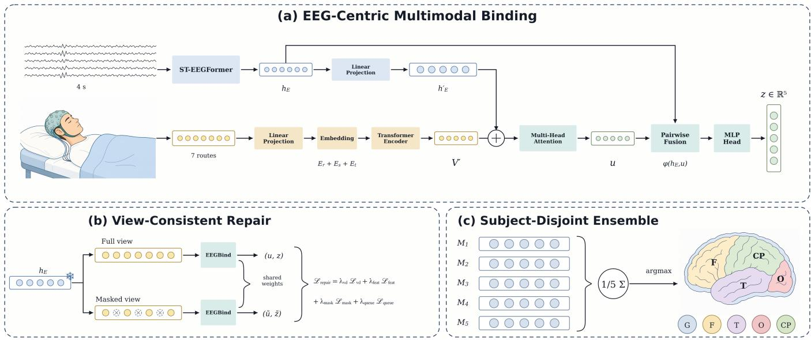
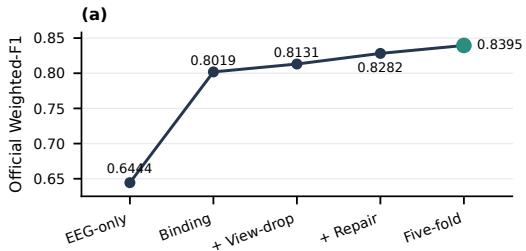
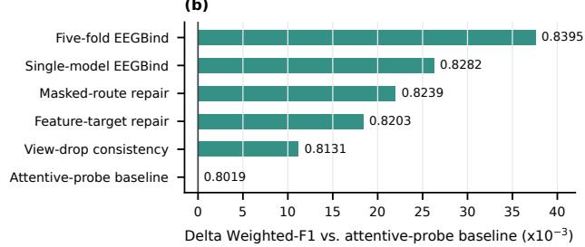
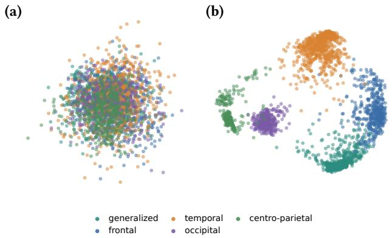
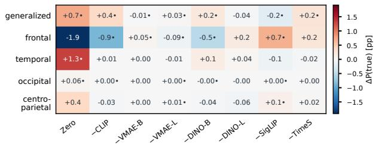
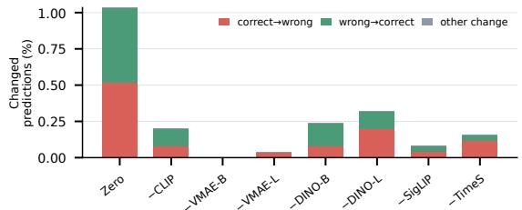
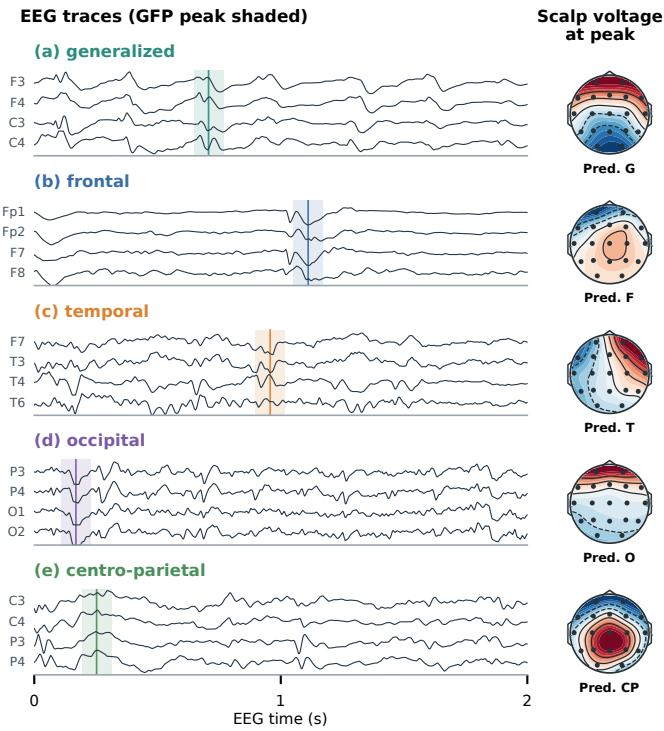

# EEGBind: Detecting Source-Level Interictal Epileptiform Discharges via EEG-Centric Multimodal Binding

Muchen Li   
Artificial Intelligence Thrust   
The Hong Kong University of Science   
and Technology (Guangzhou)   
Guangzhou, Guangdong, China   
mli893@connect.hkust-gz.edu.cn   
Anglin Liu   
Artificial Intelligence Thrust   
The Hong Kong University of Science   
and Technology (Guangzhou)   
Guangzhou, Guangdong, China   
aliu104@connect.hkust-gz.edu.cn

Ruijian Xu Ringgee Smart Technologies Co., Ltd. Fuzhou, Fujian, China xuruijian@ringgee.com

Xuetian Gao Ringgee Smart Technologies Co., Ltd. Fuzhou, Fujian, China gaoxuetian@ringgee.com

Jintai Chen∗   
Artificial Intelligence Thrust   
The Hong Kong University of Science   
and Technology (Guangzhou)   
Guangzhou, Guangdong, China   
jintaichen@hkust-gz.edu.cn

## Abstract

Source-level analysis of interictal epileptiform discharges (IEDs) is relevant to presurgical evaluation and treatment planning because it helps characterize where epileptiform activity is likely to arise. Beyond detecting whether an IED is present, this setting requires assigning IED-positive activity to clinically meaningful brain-region categories. This setting is challenging because source-region evidence in short electroencephalography (EEG) windows can be subtle, partial, and afected by subject variability, class imbalance, and imperfect multimodal context. We present EEGBind, an EEGcentric multimodal binding framework for five-class source-level IED classification. EEGBind treats EEG as the primary modality and binds synchronized video-context features around an EEGcentric representation. Instead of relying on early or overly strong multimodal fusion, which may perturb the source-sensitive EEG representation, EEGBind uses video context as auxiliary evidence for robust classification. A view-consistent repair stage is further used to improve hidden-set robustness while preserving the learned source-class boundary. On the NeuroMM 2026 Grand Challenge Track 3 NMM-Source-IED benchmark, EEGBind achieves 0.8395 on weighted-F1 and outperforms strong competitors. These results support EEG-centric multimodal binding as a practical strategy for source-level IED classification. The open-source code is available at https://github.com/HKUSTGZ-ML4Health-Lab/NeuroMM2026\_ IED\_Detection.

## CCS Concepts

• Computing methodologies → Neural networks; • Applied computing → Health informatics.

Keywords interictal epileptiform discharge, source-level IED classification, multimodal fusion, EEG-centric binding, multimodal learning

ACM Reference Format: Muchen Li, Anglin Liu, Xuetian Gao, Ruijian Xu, and Jintai Chen. 2026. EEGBind: Detecting Source-Level Interictal Epileptiform Discharges via EEG-Centric Multimodal Binding. In Proceedings ofthe 34th ACM International Conference on Multimedia (MM ’26), November 10–14, 2026, Rio de Janeiro, Brazil. ACM, New York, NY, USA, 7 pages. https://doi.org/10.1145/ 3767308.3837697

## 1 Introduction

Interictal epileptiform discharges (IEDs) provide clinically useful evidence for supporting epilepsy diagnosis, classification, and localization [15]. In clinical review, detecting whether an epileptiform event is present is only one part of the analysis. It is also important to characterize where epileptiform activity is likely to arise, because source-level evidence can support presurgical evaluation, treatment planning, and the interpretation of focal or generalized epileptiform patterns. Automated source-level IED analysis is therefore a meaningful extension of binary IED detection: the system must assign an IED-positive candidate to a clinically meaningful sourceregion category rather than only decide whether the candidate is epileptiform.

This source-level setting is technically challenging. Regional evidence in short electroencephalography (EEG) windows can be subtle, partial, and distributed across channels. Similar transient morphologies may appear with diferent spatial expression across subjects, recording conditions, and source regions [11]. As a result, direct EEG-only source classification may produce a useful representation but still struggle to separate generalized, frontal, temporal, occipital, and centro-parietal categories. The dificulty is diferent from score-based IED detection: the model must preserve source-discriminative structure among already IED-positive candidates, not only rank candidate windows by the likelihood of containing an IED.

We study this problem on the NMM-Source-IED benchmark. Defined in Track 3 of the NeuroMM 2026 Grand Challenge [14], this patient-disjoint multimodal benchmark provides IED-positive candidate windows with synchronized EEG and video context and requires each candidate to be assigned to one of five source-region classes. Performance is measured by weighted-F1 on patients unseen during training. This standardized setting isolates a sourcelevel decision that is often hidden inside broader EEG interpretation pipelines and enables controlled study of whether multimodal context improves source-level classification without turning the problem into unconstrained video–EEG fusion.

Synchronized video context can reduce candidate-level ambiguity, but it also creates a modality-role mismatch. Visual context can describe patient motion, posture, recording state, or other candidate-level conditions that are not fully captured by EEG alone [10, 16, 19]. However, the source-region label remains primarily tied to electrophysiological morphology. Therefore, video should provide bounded candidate context rather than act as an independent source classifier. This difers from generic multimodal fusion, and is closer to a modality-centric binding problem: one modality organizes the representation while auxiliary modalities contribute contextual evidence. Language-centered multimodal binding follows a related principle by using language to organize multiple auxiliary modalities [21]; for NMM-Source-IED, EEG is the appropriate organizing modality because the target label is source-level electrophysiological activity.

Motivated by these observations, we present EEGBind, an EEGcentric multimodal binding framework for source-level IED classification. At its core, the binding mechanism uses ST-EEGFormer as the EEG backbone and binds synchronized video-context routes around an EEG-derived source representation. A CE-free viewconsistent repair stage further improves robustness under unstable candidate context. On the benchmark’s oficial hidden-test evaluation, EEGBind achieves a weighted-F1 of 0.8395 and ranks first among all participating methods.

Our contributions are summarized as follows:

• We propose EEGBind for EEG-centric multimodal binding in source-level IED classification. Its binding mechanism uses EEG as the source anchor and synchronized video routes as bounded context, addressing the modality-role mismatch between electrophysiological and visual evidence.

• We introduce a CE-free view-consistent candidate repair strategy that refines multimodal representations under route-dropped and masked video contexts without further moving the learned source-class boundary. This reliability-oriented repair improves robustness to unstable candidate context while preserving sourcediscriminative structure.

• We conduct systematic benchmark evaluation and controlled studies showing that the gain of EEGBind comes from meaningful video-context binding rather than additional model capacity. The final subject-disjoint five-fold ensemble achieves a weighted-F1 of 0.8395 and ranks first on the oficial NMM-Source-IED evaluation.

## 2 Related Work

## 2.1 IED Analysis and Source-Level Classification

Automatic IED analysis has traditionally focused on detecting epileptiform events in EEG recordings, a modality central to clinical epilepsy evaluation [15]. Earlier approaches used morphologysensitive signal processing, template matching, wavelet features, and other hand-designed descriptors to capture sharp epileptiform transients [8, 17]. Modern EEG foundation models provide stronger transferable representations and adaptation across acquisition setups for downstream EEG tasks [3, 4, 7, 18]. Recent work has also explored cross-representation modeling for EEG. EEG-VL converts EEG signals into visual representations, extracts features with a pretrained image encoder, and conditions a language model for seizure detection [9]. Unlike EEG–video methods, its visual features are derived from EEG itself rather than from synchronized patient video. The NeuroMM source-classification setting extends this detection-oriented view [11, 14]: the system must distinguish source-related IED categories rather than simply separate IED from non-IED windows, making the problem more sensitive to subject variation, class imbalance, and local morphology ambiguity.

## 2.2 Multimodal Fusion and EEG-Centric Binding

Clinical EEG interpretation can benefit from contextual evidence beyond the EEG waveform. Auxiliary physiological signals and visual observations may reveal patient movement, posture, muscle activation, and recording artifacts [16, 19]. vEpiNet combines EEG representations with video-derived motion and pose cues for binary IED detection and has been evaluated in a prospective clinical setting [10]. EEGVFusion further integrates self-supervised EEG pretraining, spatiotemporal video encoding, optimal-transport alignment, and bidirectional cross-attention for seizure detection [12]. Although these EEG–video approaches have shown promising results in binary event detection, their application to the more fine-grained problem of source-level IED classification remains underexplored. Video primarily captures externally observable information, such as patient posture and movement, which can help identify motionrelated artifacts and distinguish epileptic events from non-IED activity. However, such observations are only indirectly related to the neurophysiological morphology that determines the IED source, while unrelated movements may introduce misleading context. Addressing this gap therefore requires a multimodal design that can exploit useful video context without overriding source-sensitive EEG representations. EEGBind follows this principle by placing EEG at the center of source-level classification and incorporating video features as auxiliary contextual evidence.

## 2.3 Robust Multimodal Learning

Robust multimodal learning addresses incomplete inputs in several ways. MARIA applies mask-aware attention only to available clinical inputs, without explicit imputation [2]; TRML infers virtual representations for missing modalities and aligns their semantic spaces [20]; PhysioOmni separates invariant and modality-specific representations and uses masked pretraining and resilient finetuning for arbitrary missing modalities [6].

Representation consistency ofers a complementary approach. Joint-embedding objectives align perturbed views without reconstructing input details [1], while momentum encoders and feature queues provide stable contrastive targets [5]. These methods do not directly address the asymmetric setting in which a consistently available primary modality is accompanied by incomplete or unstable auxiliary routes.

## 3 Methodology

## 3.1 Problem Formulation

Figure 1 summarizes the overall EEGBind pipeline. We formulate Track 3 [14] as five-class source-region classification over oficial IED-positive candidate windows. EEGBind follows an EEG-centric multimodal binding design: the EEG window provides the primary source representation, while synchronized video-context features are used as auxiliary evidence around that representation.

Let � index an oficial candidate window. For Track 3, the system predicts one of five source-region labels corresponding to the NMM-Source-IED categories. Each candidate contains an EEG window $x _ { i } ^ { \mathrm { E } }$ and synchronized video-context features $\{ x _ { i , b } ^ { \mathrm { V } } \} _ { b = 1 } ^ { B }$ . The model produces logits $z _ { i } \in \mathbb { R } ^ { 5 }$ and predicts IED source level $\hat { y } _ { i } \in \{ 1 , 2 , 3 , 4 , 5 \}$ where $\hat { y } _ { i }$ denotes the index � that yields the maximum value for $z _ { i , k }$

## 3.2 EEG-Centric Multimodal Binding

The EEG stream provides the primary representation for source classification. Given an EEG window $\overset { \cdot } { x _ { i } ^ { \mathrm { E } } } .$ , the encoder produces an EEG feature, while video-context features from multiple synchronized routes are projected into a shared hidden space:

$$
h _ { i } ^ { \mathrm { E } } = f _ { \theta } ( x _ { i } ^ { \mathrm { E } } ) , \qquad h _ { i , b } ^ { \mathrm { V } } = \phi _ { b } ( x _ { i , b } ^ { \mathrm { V } } ) , b = 1 , \ldots , B .\tag{1}
$$

An attentive probe combines the EEG representation and videocontext tokens to produce a candidate representation $u _ { i }$ and source logits �� :

$$
u _ { i } = A _ { \psi } \left( h _ { i } ^ { \mathrm { E } } , \{ h _ { i , b } ^ { \mathrm { V } } \} _ { b = 1 } ^ { B } \right) , \qquad z _ { i } = g _ { \omega } ( u _ { i } ) .\tag{2}
$$

The binding module is EEG-centric: video-context tokens provide auxiliary evidence around the EEG representation, but the source prediction is produced from the bound candidate representation rather than from an independent visual classifier.

## 3.3 CE-Free View-Consistent Repair

After multimodal binding, we apply a short representation repair stage. The first-stage model has already learned a supervised sourceclassification boundary, so the repair stage disables supervised cross-entropy and other boundary-moving objectives. It instead encourages stable latent and logit behavior under missing or perturbed video-context routes.

During repair, the cached EEG representation, EEG-to-binding projection, and five-class source classifier remain fixed, while the video-context projections and attentive fusion modules are updated. A full-context forward pass with route dropout disabled provides detached logit and feature targets, and an EMA copy of the model provides keys for the queue-based objective. The perturbed branch applies independent Bernoulli dropout to the seven video routes with probability 0.15 while retaining at least three routes.

For masked-route prediction, one or two routes are masked while at least five remain visible. All available routes are used at inference. This configuration introduces no additional label-supervised update to the classifier during repair.

Let �� and �� denote the full-view latent representation and logits, and let �˜� and $\tilde { z } _ { i }$ denote the corresponding outputs under a routedropped or route-masked view. The repair loss is

$$
\mathcal { L } _ { \mathrm { r e p a i r } } = \lambda _ { \mathrm { v d } } \mathcal { L } _ { \mathrm { v d } } + \lambda _ { \mathrm { f e a t } } \mathcal { L } _ { \mathrm { f e a t } } + \lambda _ { \mathrm { m a s k } } \mathcal { L } _ { \mathrm { m a s k } } + \lambda _ { \mathrm { q u e u e } } \mathcal { L } _ { \mathrm { q u e u e } } .\tag{3}
$$

The view-drop consistency term aligns full-view and dropped-view predictions using Kullback–Leibler (KL) divergence:

$$
\mathcal { L } _ { \mathrm { v d } } = D _ { \mathrm { K L } } \left( \operatorname { s o f t m a x } ( z _ { i } / T ) \parallel \operatorname { s o f t m a x } ( \tilde { z } _ { i } / T ) \right) ,\tag{4}
$$

where $T$ is a temperature used for soft prediction consistency.

The feature-target consistency term [1] aligns the dropped-view latent with a stopped-gradient full-view target:

$$
\begin{array} { r l } & { \mathcal { L } _ { \mathrm { f e a t } } = 1 - \cos \left( \tilde { u } _ { i } , \mathrm { s g } ( u _ { i } ) \right) , } \\ & { \mathcal { L } _ { \mathrm { m a s k } } = 1 - \cos \left( u _ { i } ^ { \mathrm { m a s k } } , \mathrm { s g } ( u _ { i } ) \right) . } \end{array}\tag{5}
$$

The masked-route term applies the same cosine objective when video-context routes are masked.

The queue-based contrastive term [5] uses a route-dropped student query $q _ { i } ,$ an exponential moving average (EMA) full-view teacher key $k _ { i } ^ { + }$ , and a queue of previous keys $\boldsymbol { Q } \mathrm { : }$

$$
\begin{array} { r l } & { \ell _ { i } ^ { + } = \exp ( { q _ { i } ^ { \top } k _ { i } ^ { + } } / { \tau } ) , \qquad \ell _ { i } ( k ) = \exp ( { q _ { i } ^ { \top } k } / { \tau } ) , } \\ & { \mathcal { L } _ { \mathtt { q u e u e } } = - \log \frac { \ell _ { i } ^ { + } } { \ell _ { i } ^ { + } + \sum _ { k \in Q } \ell _ { i } ( k ) } . } \end{array}\tag{6}
$$

The queue-based contrastive objective is used as a weak latentstructure term rather than as the main driver ofsource-classification learning.

## 3.4 Subject-Disjoint Fold Ensemble

For the oficial evaluation, EEGBind uses subject-disjoint five-fold training. For each fold �, we train the same model and repair it with the CE-free objective, producing logits $z _ { i } ^ { ( m ) }$ for each candidate. We convert these logits to log probabilities and average them with equal weights:

$$
\begin{array} { c l } { \displaystyle \bar { \ell } _ { i , k } = \frac { 1 } { M } \sum _ { m = 1 } ^ { M } \log \mathrm { s o f t m a x } ( z _ { i } ^ { ( m ) } ) _ { k } , } \\ { \displaystyle \hat { y } _ { i } = \arg \operatorname* { m a x } _ { k } \bar { \ell } _ { i , k } . } \end{array}\tag{7}
$$

where $M = 5 .$ . Using subject-disjoint folds reduces sensitivity to a particular subject split while keeping all ensemble members tied to the same EEG-centric binding design.

## 4 Experiments

## 4.1 Dataset and Evaluation Metric

We evaluate on NMM-Source-IED, Track 3 of the NeuroMM 2026 Grand Challenge [14]. The benchmark provides oficial IED-positive candidate windows with multimodal neuro-signal context. The system predicts one of five source-region classes for every candidate: generalized, frontal, temporal, occipital, and centro-parietal.

  
Figure 1: Overview of EEGBind for source-level IED classification: EEG-centric multimodal binding, cross-entropy-free (CE-free) view-consistent repair, and subject-disjoint five-fold ensembling.

The primary metric is weighted-F1:

$$
\mathrm { w e i g h t e d - F 1 } = \sum _ { k = 1 } ^ { 5 } \frac { n _ { k } } { \sum _ { j } n _ { j } } F 1 _ { k } ,\tag{8}
$$

where $F 1 _ { k }$ is the F1 score ofclass � and $n _ { k }$ is the number ofevaluated examples in that class.

## 4.2 Oficial Evaluation Analysis

Table 1 summarizes the EEG-only baseline and evaluated EEGBind variants, ending with the five-fold ensemble. The EEG-only ST-EEGFormer baseline obtains 0.6444 on weighted-F1, indicating a substantial hidden-set gap for direct EEG-only source classification. The single-model repair sequence improves from the attentiveprobe baseline to the single-model repaired EEGBind, reaching 0.8282 on weighted-F1. The five-fold EEGBind ensemble applies the same repair recipe in a subject-disjoint setup and reaches 0.8395 on weighted-F1. Figure 2 visualizes the same oficial score progression, from the EEG-only baseline to the final EEGBind ensemble.

We additionally performed two post-evaluation controls to separate useful video-context binding from model-capacity efects. First, we trained a matched-capacity attentive-probe model with the same seven video routes and binding architecture, but with all video features replaced by zeros during both training and prediction. This dummy-video control obtains 0.7448 on weighted-F1, well below the corresponding attentive-probe baseline. Second, we kept the final five-fold EEGBind ensemble fixed and zeroed the video routes only at candidate inference time. This counterfactual obtains 0.7460 on weighted-F1. These controls indicate that the gain of EEGBind is not explained by adding parameters alone and that the trained model uses video-context routes in a measurable way, while the source decision remains organized around EEG. The last two rows of Table 1 summarize these post-evaluation controls.

Table 1: Oficial Track 3 Weighted-F1 results for EEGBind variants and post-evaluation video-context controls.
<table><tr><td>System or control</td><td>Weighted-F1</td></tr><tr><td>EEG-only ST-EEGFormer baseline</td><td>0.6444</td></tr><tr><td>Attentive-probe baseline</td><td>0.8019</td></tr><tr><td>View-drop attentive-probe baseline</td><td>0.8131</td></tr><tr><td>Feature-target repair variant</td><td>0.8203</td></tr><tr><td>Masked-route repair variant</td><td>0.8239</td></tr><tr><td>Single-model repaired EEGBind</td><td>0.8282</td></tr><tr><td>Five-fold EEGBind ensemble</td><td>0.8395</td></tr><tr><td>Post-evaluation video-context controls Matched-capacity dummy-video attentive</td><td>0.7448</td></tr><tr><td>probe Five-fold EEGBind, zero-video inference</td><td>0.7460</td></tr></table>

## 4.3 Implementation Details

Table 2 summarizes the configuration used by the five-fold EEGBind ensemble. EEGBind uses ST-EEGFormer-large [18] as the EEG backbone, seven synchronized video-context routes from the oficial feature release [13], and an attentive probe for EEG-centric binding. The EEG backbone is first initialized from our Task 1 fine-tuned ST-EEGFormer checkpoint and then fine-tuned on Track 3 source labels before multimodal binding. The repair stage is initialized from the binding model and runs for one epoch with cross-entropy and binding losses disabled.

We further inspect the learned class geometry on the subjectdisjoint out-of-fold validation predictions. Figure 3 compares a two-dimensional principal component analysis (PCA) projection of the ST-EEGFormer EEG anchor features with the corresponding

(b)  
  
Figure 2: Oficial Track 3 weighted-F1 progression for the EEG-only baseline, EEGBind variants, and the final ensemble; Table 1 reports the exact values.

Table 2: Main implementation settings for EEGBind.
<table><tr><td>Component</td><td>Setting</td></tr><tr><td>EEG backbone</td><td>ST-EEGFormer-large initialized from a Task 1 fine-tuned checkpoint</td></tr><tr><td>Track 3 EEG fine-tuning Optimizer / precision</td><td>10 epochs,  $\mathrm { L R } 5 \times 1 0 ^ { - 4 }$  , batch size 16 AdamW, weight decay 10−4, class weights,</td></tr><tr><td>Video feature source</td><td>fp16 AMP released seven-video feature cache</td></tr><tr><td>Binding module</td><td>2-layer, 8-head attentive probe with to-</td></tr><tr><td>Binding training</td><td>ken/route dropout 8 epochs,  $\mathrm { L R } \stackrel { - } { 3 } \times 1 0 ^ { - 4 } ,$  batch size 256</td></tr><tr><td>Repair stage</td><td>1 epoch,  $\mathrm { L R } 2 \times 1 0 ^ { - 5 } \mathrm { , }$  batch size 256</td></tr><tr><td>Repair perturbations</td><td>Bernoulli route dropout,  $\begin{array} { r } { p = 0 . 1 5 , } \end{array}$  at least 3 routes retained; 1–2 masked routes, at</td></tr><tr><td>Repair objectives</td><td>least 5 retained view-drop consistency, feature-target con- sistency, masked-route prediction, weak</td></tr><tr><td>Repair loss weights Test-time ensemble</td><td>queue contrast 0.25, 0.02, 0.005, and 0.0005, respectively subject-disjoint five-fold log-probability</td></tr></table>

EEGBind output space. The EEG anchor features remain substantially overlapped across source classes, whereas the EEGBind output space forms more separated class regions. This projection is computed from subject-disjoint out-of-fold validation predictions; Table 1 reports the oficial hidden-set weighted-F1.

Because EEGBind uses video as auxiliary context rather than as a direct source classifier, we quantify its sensitivity to missing video information on all 2,514 positive examples from the subject-disjoint out-of-fold validation sets. Figure 4 compares the full view with a zero-video view and seven leave-one-route-out views. Zeroing all routes changes 1.03% of the predictions, with equal proportions changing from correct to incorrect and from incorrect to correct (0.52% each). In contrast, removing any single route retains 99.68– 100% prediction agreement with the full view. The classwise confidence shifts further show that video context can afect individual decisions, while the high single-route agreement indicates that no individual video encoder dominates the source-level prediction.

  
Figure 3: Out-of-fold representation map comparing the ST-EEGFormer feature space with the EEGBind output space on subject-disjoint validation folds.

(a) Change in true-class probability under video perturbations  

(b) Decision transitions relative to the full view  
  
Figure 4: Out-of-fold video-perturbation analysis over 2,514 examples from 52 subjects. (a) Mean classwise change in trueclass probability after zeroing all video features or removing one route; dots denote subject-clustered 95% bootstrap confidence intervals excluding zero. (b) Prediction transitions relative to the full view.

Figure 5 complements the population-level perturbation analysis with representative EEG spatial cases. For each source class, we select the correctly classified out-of-fold example closest to its class centroid in the normalized EEG embedding space. The shaded interval and vertical line mark the maximum smoothed global-field-power peak, and the adjacent scalp map shows the common-average-referenced voltage at that same instant. The maps are normalized within each case to emphasize spatial field structure. They visualize sensor-space field structure rather than inverse source estimates.

  
Figure 5: Representative out-of-fold EEG spatial cases for the five source types. Each row shows region-relevant EEG traces and the scalp voltage topography at the marked globalfield-power peak. Cases are selected by proximity to their class EEG-embedding centroid among correctly classified examples. Topographies use a common-average reference and are normalized per case; blue and red denote negative and positive voltage, respectively.

## 4.4 Repair Analysis

The repair variants in Table 1 provide oficial-evaluation evidence for the CE-free repair design. Adding feature-target consistency improves the view-drop attentive-probe baseline from 0.8131 to 0.8203. Adding masked-route latent prediction further reaches 0.8239, and adding the weak queue-based contrastive term reaches 0.8282. These results support the repair stage as a lightweight robustness step around the learned binding representation.

The five-fold ensemble applies the same EEG-centric binding and repair pipeline to each subject-disjoint fold and averages their predictions. It improves over the repaired single model without changing the source-classification objective.

## 5 Discussion

EEGBind assigns distinct roles to EEG and video. In Track 3, the source labels are defined by EEG source-region categories [14], whereas synchronized video mainly provides contextual evidence about the recording condition and patient state. EEGBind therefore does not treat video features as direct evidence for epileptogenic source. Instead, video-context routes are bound around the EEGcentric representation to support source-level classification, while the short repair stage improves consistency across route perturbations without introducing another supervised update to the learned source-class boundary.

The post-evaluation controls examine two properties of the video pathway. Dummy-video training isolates the contribution of attentive-probe capacity, whereas zero-video inference measures the dependence of a trained model on its video routes under the challenge protocol.

Track 3 difers from the binary NeuroMM tasks by shifting the objective from detecting or ranking IED candidates to discriminating among five source regions. Its errors therefore include confusions between anatomically diferent source categories in addition to missed or spurious IED decisions. The EEGBind pipeline accordingly keeps EEG as the primary modality and uses multimodal context as auxiliary evidence rather than as an unconstrained fusion signal.

Overall, the oficial evaluation results support the EEGBind pipeline: EEG-centric multimodal binding, lightweight CE-free repair, and subject-disjoint ensembling. Future work should build stronger subject-heldout validation for source labels and study bounded ways to use multimodal context without disrupting sourcesensitive EEG decisions.

## 6 Conclusion

We presented EEGBind, an EEG-centric multimodal binding framework for Track 3 NMM-Source-IED, where the key challenge is to use synchronized video context without perturbing the EEG representation that carries the source-region evidence. Its binding mechanism treats EEG as the source anchor and binds video as bounded candidate context, while CE-free view-consistent repair improves robustness under route perturbations. In the oficial evaluation, Multimodal binding improves the EEG-only baseline from 0.6444 to 0.8019, repair further raises the single-model score to 0.8282, and the subject-disjoint five-fold ensemble reaches 0.8395 on weighted-F1. Post-evaluation controls with dummy-video training and zero-video inference drop to 0.7448 and 0.7460, indicating that the gain is not explained by model capacity alone but by meaningful video-context binding. These results support this design as a practical strategy for source-level IED classification.

## Acknowledgments

This work is partially supported by the Guangdong Basic and Applied Basic Research Foundation (2026A1515011793), the Youth S&T Talent Support Programme of Guangdong Provincial Association for Science and Technology (SKXRC2025467), and the Research Travel Grant of the Base of Red Bird MPhil (RBM) at The Hong Kong University of Science and Technology (Guangzhou). We would like to thank our RBM Project Supervisor Ning LI for the academic support.

Figure 1 includes AI-generated illustrative elements created with GPT Image 2. They were used only for visual illustration; all scientific claims, methods, results, plots, and reported values were produced by the authors.

## References

[1] Mahmoud Assran, Quentin Duval, Ishan Misra, Piotr Bojanowski, Pascal Vincent, Michael Rabbat, Yann LeCun, and Nicolas Ballas. 2023. Self-Supervised Learning from Images with a Joint-Embedding Predictive Architecture. In Proceedings ofthe IEEE/CVF Conference on Computer Vision and Pattern Recognition. IEEE, Piscataway, NJ, USA, 15619–15629.

[2] Camillo Maria Caruso, Paolo Soda, and Valerio Guarrasi. 2025. MARIA: A Multi modal Transformer Model for Incomplete Healthcare Data. Computers in Biology and Medicine 196 (2025), 110843. doi:10.1016/j.compbiomed.2025.110843

[3] Yuqi Chen, Kan Ren, Kaitao Song, Yansen Wang, Yifan Wang, Dongsheng Li, and Lili Qiu. 2024. EEGFormer: Towards Transferable and Interpretable Large-Scale EEG Foundation Model. arXiv:2401.10278 https://arxiv.org/abs/2401.10278

[4] Yassine El Ouahidi, Jonathan Lys, Philipp Thölke, Nicolas Farrugia, Bastien Pas deloup, Vincent Gripon, Karim Jerbi, and Giulia Lioi. 2025. REVE: A Foundation Model for EEG—Adapting to Any Setup with Large-Scale Pretraining on 25,000 Subjects. Advances in Neural Information Processing Systems 38 (2025), 22541– 22577.

[5] Kaiming He, Haoqi Fan, Yuxin Wu, Saining Xie, and Ross Girshick. 2020. Momen tum Contrast for Unsupervised Visual Representation Learning. In Proceedings ofthe IEEE/CVF Conference on Computer Vision and Pattern Recognition. IEEE, Piscataway, NJ, USA, 9729–9738.

[6] Wei-Bang Jiang, Xi Fu, Yi Ding, and Cuntai Guan. 2025. Towards Robust Multimodal Physiological Foundation Models: Handling Arbitrary Missing Modalities. arXiv:2504.19596 doi:10.48550/arXiv.2504.19596

[7] Wei-Bang Jiang, Li-Ming Zhao, and Bao-Liang Lu. 2024. LaBraM: Large Brain Model for Learning Generic Representations with Tremendous EEG Data in BCI. arXiv:2405.18765 https://arxiv.org/abs/2405.18765

[8] Miroslaw Latka, Ziemowit Was, Andrzej Kozik, and Bruce J. West. 2003. Wavelet Analysis of Epileptic Spikes. arXiv:physics/0301065 https://arxiv.org/abs/physics/ 0301065

[9] Zi Liang, Peng Hu, Lian Li, Zebang Cheng, Yisu Dong, Haibo He, Qiang Lu, and Nan Lin. 2025. EEG-VL: Integrating Visual Features with Large Language Models for Automated Seizure Detection. In 2025 IEEE International Conference on Bioinformatics and Biomedicine (BIBM). IEEE, Los Alamitos, CA, USA, 4620–4627. doi:10.1109/BIBM66473.2025.11356689

[10] N. Lin, W. Gao, L. Li, J. Chen, Z. Liang, G. Yuan, H. Sun, Q. Liu, J. Chen, L. Jin, Y. Huang, X. Zhou, S. Zhang, P. Hu, C. Dai, H. He, Y. Dong, L. Cui, and Q. Lu. 2024. vEpiNet: A Multimodal Interictal Epileptiform Discharge Detection Method Based on Video and Electroencephalogram Data. Neural Networks 175 (2024), 106319. doi:10.1016/j.neunet.2024.106319

[11] Nan Lin, Mengxuan Zheng, Lian Li, Peng Hu, Weifang Gao, Heyang Sun, Chang Xu, Gonglin Yuan, Zi Liang, Yisu Dong, Haibo He, Liying Cui, and Qiang Lu. 2025. An EEG Dataset for Interictal Epileptiform Discharge with Spatial Distribution Information. Scientific Data 12 (2025), 229. doi:10.1038/s41597-025-04572-1

[12] Tong Lu, Ke Xu, Zimo Zhang, Zitong Zhao, Danwei Weng, Ruiyu Wang, Miao Liu, Zizuo Zhang, Jingyi Yao, Yixuan Zhao, Wenchao Zhang, Min Wang, Guoming Luan, Minmin Luo, and Zhifeng Yue. 2026. A Multimodal Pre-trained Network for Integrated EEG-Video Seizure Detection. arXiv:2604.26379 doi:10.48550/arXiv. 2604.26379

[13] NeuroMM Organization. 2026. NeuroMM-2026 Baseline Repository. https: //github.com/NeuroMM-Org/NeuroMM-2026\_Baseline. Accessed 2026-06-21.

[14] NeuroMM Organization. 2026. NeuroMM 2026 Multimodal Seizure Detection Challenge. https://2026.neuromm.org/challenge.html. Accessed 2026-06-21.

[15] Soheyl Noachtar and Jan Rémi. 2009. The Role of EEG in Epilepsy: A Critical Review. Epilepsy & Behavior 15, 1 (2009), 22–33. doi:10.1016/j.yebeh.2009.02.035

[16] Wei Yan Peh, Yuanyuan Yao, and Justin Dauwels. 2022. Transformer Convolutional Neural Networks for Automated Artifact Detection in Scalp EEG. arXiv:2208.02405 [eess.SP] doi:10.48550/arXiv.2208.02405

[17] Andre Rosado and Agostinho C. Rosa. 2016. Automatic Detection of Epileptiform Discharges in the EEG. arXiv:1605.06708 https://arxiv.org/abs/1605.06708

[18] Liuyin Yang, Qiang Sun, Ang Li, and Marc M. Van Hulle. 2026. Are EEG Foundation Models Worth It? Comparative Evaluation with Traditional Decoders in Diverse BCI Tasks. International Conference on Learning Representations. https://openreview.net/forum?id=5Xwm8e6vbh

[19] Jingwei Zhang, Lauren Swinnen, Christos Chatzichristos, Victoria Broux, Renee Proost, Katrien Jansen, Benno Mahler, Nicolas Zabler, Nino Epitashvilli, Matthias Dümpelmann, Andreas Schulze-Bonhage, Elisabeth Schriewer, Ummahan Ermis, Stefan Wolking, Florian Linke, Yvonne Weber, Mkael Symmonds, Arjune Sen, Andrea Biondi, Mark P. Richardson, Abuhaiba Sulaiman I, Ana Isabel Silva, Francisco Sales, Gergely Vértès, Wim Van Paesschen, and Maarten De Vos. 2024. Multi modal Wearable EEG, EMG and Accelerometry Measurements Improve the Ac curacy of Tonic-Clonic Seizure Detection In-Hospital. arXiv:2403.13066 [eess.SP] doi:10.48550/arXiv.2403.13066

[20] Xianbing Zhao, Soujanya Poria, Xuejiao Li, Yixin Chen, and Buzhou Tang. 2024. Toward Robust Multimodal Learning Using Multimodal Foundational Models. arXiv:2401.13697 doi:10.48550/arXiv.2401.13697

[21] Bin Zhu, Bin Lin, Munan Ning, Yang Yan, Jiaxi Cui, HongFa Wang, Yatian Pang, Wenhao Jiang, Junwu Zhang, Zongwei Li, Wancai Zhang, Zhifeng Li, Wei Liu, and Li Yuan. 2023. LanguageBind: Extending Video-Language Pretraining to N-Modality by Language-Based Semantic Alignment. arXiv:2310.01852 https: //arxiv.org/abs/2310.01852