# Evaluating Model Retraining under Drift: Paired Comparisons of Cumulative Subgroup Disparity

Aaron Ceross

Birmingham Law School, University of Birmingham

a.w.k.ceross@bham.ac.uk

September 9, 2026

## Abstract

Choosing when to retrain a deployed classifier requires assessing subgroup error rates across the sequence of models used, including periods between updates. We compare complete scheduled, loss-triggered, and subgroup-gap-triggered policies with retaining the initial model on the same observations and delayed labels. For true-positive and false-positive rates separately, the outcome is the paired diference in absolute subgroup gaps summed over deployment windows. Population evaluation in simulation, action records, and alternative schedules assess how measurement and retraining behaviour afect these comparisons. In a follow-up sample of 400 new trajectories per condition across two simulated drift regimes, all three policies had lower mean cumulative disparity, equivalent to reductions of 0.04– 0.88 percentage points in the average gap per window. Evaluating the unchanged models against the known generating distributions preserved all mean directions, but finite-window and population comparisons agreed on whether updating increased, reduced or left cumulative disparity unchanged in 69–92% of trajectories. Under subgroup-specific drift, smaller true-positive-rate gaps accompanied lower sensitivity in both groups. In an exploratory American Community Survey replay, person weighting reversed all three race–false-positiverate mean comparisons without changing predictions or actions; all three weighted intervals included zero. Policy comparisons require group-specific rates, action distributions, and an explicit evaluation population alongside mean disparity. These analyses are nonconfirmatory. Shared replay requires policy-independent observations and complete labels after the specified delay.

## 1 Introduction

Predictive models deployed over time encounter changes in the populations they serve and in the relationships between predictors and outcomes. Such distributional changes can reduce the usefulness of a model fitted to historical data [Gama et al., 2014]. Scheduled retraining and updates triggered by monitored performance provide ways to respond, with diferent consequences for predictive performance and the resources devoted to maintenance [Mahadevan and Mathioudakis, 2024, Regol et al., 2025]. Each rule determines when recent observations enter a new model and which predictions are issued as deployment continues. When error rates difer across social groups, the sequence of models used between updates determines the disparities experienced throughout deployment.

Temporal changes in clinical prediction illustrate the importance of this evaluation. In a longitudinal study of surgical prediction, Davis et al. [2025] found that surveillance-based updating intended to preserve population-level performance could reduce, increase, or leave fairness gaps unchanged. Bilionis et al. [2026] compared retraining strategies with a retained model in paediatric diabetes prediction, assessing subgroup disparities alongside predictive performance, stability, and arbitrariness. Maintenance decisions therefore depend on subgroup error rates across the prediction sequence generated by each rule. The model fitted immediately after a refit is one part of that sequence; the time spent using earlier models also contributes to its cumulative outcome.

Selecting a maintenance policy requires a comparison between specified alternatives under the conditions in which they will operate. A rule that rarely acts may produce a small average diference from freezing because most trajectories retain the initial model. Two rules with similar average refit counts may act on diferent trajectories or distribute their actions diferently over time. Even with identical observations, estimated disparity depends on the subgroup outcome counts available in each window and the population represented by those observations. These features afect how a reported reduction in cumulative disparity informs the choice of an update policy.

We compare complete retraining policies on shared observations and delayed labels, summing absolute true-positive-rate (TPR) and false-positive-rate (FPR) gaps across deployment windows. The learner, prediction threshold, and rolling refit operation remain fixed. Population evaluation of the fitted models tests whether the mean and trajectory-level directions survive more precise measurement. Action records distinguish diferences arising when policies act from the zero contrasts produced by inaction; count distributions and alternative schedules assess the comparability of the retraining performed. Reweighting the same predictions tests the dependence of observed-data policy orderings on the evaluation population.

The simulation estimates lower mean cumulative disparity under scheduled and monitored retraining in both evaluated drift regimes. Population integration preserves those mean directions while changing many individual trajectory signs, indicating greater measurement stability for the average comparison than for the identification of individual trajectories with increased disparity. Smaller TPR gaps under subgroup-specific drift also accompany lower sensitivity in both groups. Under combined drift, the loss trigger uses fewer refits but produces greater disparity than scheduled retraining. Separate calibration of monitoring streams also leaves the combined gap policy more likely to act than the loss policy without drift. In the Census replay, person weighting reverses all three race-FPR mean comparisons with predictions and actions held fixed. Choosing a deployment policy additionally requires an application-specific objective and acceptance criteria.

The controlled evidence concerns two specified drift environments, a common logistic learner, and a ten-window horizon. The exploratory Census evaluation uses repeated population samples to examine the evaluation target. All reported analyses are non-confirmatory. Shared replay assumes that policies change neither future observations nor label availability, including complete labels after the specified delay. When deployment decisions alter those processes, policy-dependent trajectories require an identification design that represents the resulting feedback [Liu et al., 2018, Ensign et al., 2018, D’Amour et al., 2020].

## 2 Related work

Longitudinal evaluations must distinguish changes in the fitted model from changes in the observations used to assess it. Longitudinal fairness studies evaluate subgroup outcomes over time, sequential decision methods select updates under resource constraints, and monitoring and auditing methods assess properties of the resulting predictions. Evaluating a maintenance policy requires its action rule and its subgroup outcome measure to be specified together.

## 2.1 Temporal fairness and model maintenance

Distribution shift can afect fairness through changes in covariates, labels, group composition, and their dependence. Shao et al. [2024] organise fairness-aware methods around these diferent shift assumptions. Deho et al. [2025] evaluate fairness-aware and baseline learners across historical and shifted samples, finding that fairness outcomes depend on the algorithm, metric, and data condition. Their design includes later observations for timestamped datasets and constructed perturbations for Adult and COMPAS. Evaluating a trained model across these conditions identifies sensitivity to the evaluation distribution.

Longitudinal maintenance studies additionally compare sequences of fitted models. Davis et al. [2025] compare clinical prediction with and without surveillance-based updating over time, assessing racial and sex disparities in discrimination, calibration, and accuracy. Bilionis et al. [2026] compare cumulative, last-batch, and subset retraining with no retraining, using prospective batches and a fixed holdout for complementary assessments of fairness and stability. Longitudinal comparisons establish that retraining strategy and evaluation design afect subgroup outcomes. A favourable cumulative contrast nevertheless leaves several questions unresolved: whether its direction survives population measurement, whether a small diference reflects infrequent action, and whether the policy ordering depends on the evaluation population. We examine these questions while holding the fitted prediction sequences fixed where the comparison permits.

## 2.2 Retraining decisions and resource constraints

The cost of acting is central to the choice of a retraining schedule. CARA balances retraining cost with the cost of retaining a stale model [Mahadevan and Mathioudakis, 2024]. Regol et al. [2025] formulate the decision using performance over a horizon and retraining cost, then forecast model performance with uncertainty to guide updates. Their bounded performance metric permits objectives beyond accuracy. RCCDA allocates updates using past loss under an explicit resource budget [Piaseczny et al., 2025]. Yang and Mathioudakis [2027] jointly formulate retraining time and data amount as a cost-aware dynamic programming problem, with ofline optimisation and derived online policies. The concurrent study by Dasari [2026] compares periodic and reactive retraining with no retraining under drift, budget, and latency constraints.

These formulations make the choice to retain or replace a model an explicit sequential decision. Subgroup-resolved evaluation adds the distribution of error rates to the assessment of that decision. In the paired procedure, random refitting calibrated to a monitored policy’s expected action count provides a reference for its cumulative disparity. The realised count distribution and probability of any action remain part of the comparison. A hindsight benchmark with a policy-specific count limit further quantifies the advantage available through alternative schedules, conditional on the realised trajectory and measured objective.

## 2.3 Fairness monitoring, adaptation, and auditing

Runtime fairness monitors specify what can be inferred from a stream of observations. Henzinger et al. [2023] develop statistical monitoring under explicit dynamic assumptions. Baumeister et al. [2025] express fairness properties over temporal streams in RTLola and evaluate the resulting monitors on synthetic data and COMPAS. Such specifications determine the event histories, group quantities, and temporal conditions associated with an alarm. Connecting an alarm to retraining additionally requires a response rule, a choice of labelled training observations, and a rule for resetting the monitor.

Fairness-aware stream learners address changing data through the adaptation process itself. FAHT modifies tree construction, and FABBOO combines online learning with fairness and class-imbalance handling [Zhang and Ntoutsi, 2019, Iosifidis and Ntoutsi, 2020]. Fair Sampling over Stream integrates rebalancing with streaming classification [Wang et al., 2023]; FAC-Fed adapts learning in a federated setting [Badar et al., 2023]. Evaluating a fixed logistic refit operation under diferent triggers makes the resulting comparison conditional on that common learning procedure.

Auditing after model changes raises a related statistical question. Ajarra and Basu [2026] study estimation of an audited property and classes of updates that preserve it, including statistical parity. Their construction uses a strategic model class and independent audit samples. A maintenance policy instead specifies a sequence of decisions whose cumulative outcome depends on the evolving environment and the labels available at each boundary. A paired comparison can evaluate that complete rule against retaining the initial model. Its cumulative disparity can still be sensitive to finite-window rate estimation, the probability of acting, and the population represented by the evaluation weights.

## 3 Paired evaluation of update policies

A trajectory $\mathcal { E } _ { s }$ contains populations, features, and outcomes in windows $t = 0 , \ldots , T - 1$ , plus a separate initial training window. All policies start from the same fitted model.

## 3.1 Update policies and the frozen counterfactual

The frozen counterfactual retains that initial model throughout the shared trajectory. An update policy specifies the monitored statistic, alarm rule, refitting action, training-window membership, reset rule, and label lag. The evaluated policies are:

• Frozen: retain the initial classifier.

• Cadence: refit every three evaluation windows.

• Loss trigger: refit after an upward aggregate-log-loss cumulative sum (CUSUM) alarm.

• Gap trigger: refit after a two-sided change in either signed TPR or FPR gap.

Cadence denotes scheduled retraining; loss trigger and gap trigger abbreviate aggregate-losstriggered and subgroup-gap-change-triggered retraining. A random refitting rule and a hindsight schedule search provide reference comparisons. The learner, prediction threshold, label access, and rolling refit operation are shared. Common random numbers couple the environmental draws across policies [Glasserman, 2004]. We assume that the choice of policy changes neither future observations nor label availability. Complete delayed labels are part of this assumption; selective observation requires additional modelling of the label process.

## 3.2 Cumulative subgroup disparity

Diferences in group-specific TPR and FPR describe error-rate parity [Hardt et al., 2016, Barocas et al., 2023]. For rate $\psi \in \{ \mathrm { T P R } , \mathrm { F P R } \}$ , let $\widehat { g } _ { t } ^ { \psi } ( \pi , \mathcal { E } _ { s } )$ be the comparison group’s estimated rate minus the reference group’s estimated rate. The simulation compares group 1 with group 0; Census comparisons are female minus male and Black minus White. Define

$$
H ^ { \psi } ( \pi \mid { \mathcal { E } } _ { s } ) = \sum _ { t = 0 } ^ { T - 1 } | { \widehat { g } } _ { t } ^ { \psi } ( \pi , { \mathcal { E } } _ { s } ) | ,\tag{1}
$$

$$
\Delta H ^ { \psi } ( \pi \mid { \mathcal E } _ { s } ) = H ^ { \psi } ( \pi \mid { \mathcal E } _ { s } ) - H ^ { \psi } ( \mathrm { f r o z e n } \mid { \mathcal E } _ { s } ) .\tag{2}
$$

Positive diferences indicate greater cumulative disparity under updating. The ten windows receive equal weight. Thus $1 0 0 \Delta H / T$ is the change in average absolute gap, in percentage points (pp) per evaluation window. This sum measures disparity across equally weighted windows, rather than the number of errors or people afected. For a fixed horizon, it gives the same policy ordering as the average absolute gap. We report the frozen baseline’s absolute level alongside the diference: freezing is a reference policy, not a standard of acceptable fairness.

The primary policy summary is the mean paired diference across independent simulation trajectories. We also report the trajectory distribution, positive share $\operatorname* { P r } ( \Delta H > 0 )$ , and exceedance shares $\operatorname* { P r } ( 1 0 0 \Delta H / T > \varepsilon )$ for illustrative thresholds $\varepsilon \in \{ 0 , 0 . 1 , 0 . 2 5 , 0 . 5 , 1 \}$ pp. These are descriptive sensitivities, not application-specific harm margins. The supplementary relative reduction is $1 0 0 ( 1 - \overline { { \mathrm { D R } } } )$ , where DR is the mean trajectory-level ratio $H ( \pi ) / H ( \mathrm { f r o z e n } )$ among nonzero baseline denominators; it is not the ratio of means.

The implementation checks $0 \leq H \leq T , - T \leq \Delta H \leq T$ , equality across policies in the initial evaluation window, and $\Delta H = 0$ whenever no refit occurs. A smaller absolute gap does not order the underlying group outcomes. We therefore accompany it with both groups’ TPR and FPR, overall predictive performance, and refit actions.

## 3.3 Measurement validation by population integration

Equation (1) uses finite-window rates. Taking an absolute value introduces sampling bias, and pairing does not ensure that policy-specific biases cancel. Increasing the number of trajectories improves precision for this empirical quantity; it does not turn it into population disparity.

For the follow-up, we reconstruct the fitted models at every archived refit time and require their empirical outcomes and trajectory fingerprints to reproduce the archive. We then calculate population TPR and FPR with the models and schedules unchanged. If $f _ { \pi , t } ( \boldsymbol { X } )$ is the binary prediction and $p _ { t } ( X , a )$ the simulator’s known outcome probability, the population rates are

$$
\widetilde { \mathrm { T P R } } _ { \pi , t , a } = \frac { \mathbb { E } [ f _ { \pi , t } ( X ) p _ { t } ( X , a ) \mid A = a ] } { \mathbb { E } [ p _ { t } ( X , a ) \mid A = a ] } , \qquad \widetilde { \mathrm { F P R } } _ { \pi , t , a } = \frac { \mathbb { E } [ f _ { \pi , t } ( X ) ( 1 - p _ { t } ( X , a ) ) \mid A = a ] } { \mathbb { E } [ 1 - p _ { t } ( X , a ) \mid A = a ] } .\tag{3}
$$

Gaussian features and linear model scores permit one-dimensional numerical integration by conditioning on the outcome logit. This uses neither realised evaluation labels nor new data for training, monitoring, or schedule choice. We tighten integration tolerances on every rate and cross-check selected models using independent scrambled Sobol probes. Population cumulative disparity sums the absolute integrated gaps. Appendix B gives the calculation and convergence checks.

## 4 Experimental design

Each initial and evaluation window contains 5,000 observations, with group membership independently Bernoulli(0.2). Ten Gaussian features have unit variance, correlation 0.3 within two five-coordinate blocks, and zero correlation across blocks. Group 1 has a fixed feature-mean shift. Initial training uses a separate no-drift window at $t = - 1$ ; evaluation covers ten windows.

## 4.1 Data generation and model fitting

The fitted learner is $L _ { 2 }$ logistic regression with $C = 1$ and threshold 0.5, receiving X only, without group membership or group-feature interactions. Simulation features are not standardised.

The conditional logit is

$$
\alpha + X _ { t } ^ { \top } \beta + \gamma A + \eta A ( X _ { t } ^ { \top } \beta ) + d ( t , X _ { t } , A ) .\tag{4}
$$

Baseline calibration targets prevalence 0.45 and signed TPR gap −0.05, with tolerances 0.02 and 0.01. Both conditions passed the recorded 50-seed checks; the fitted parameters remain fixed. Under subgroup-specific concept drift, $d = - 0 . 0 5 t A ( X _ { t } ^ { \top } \beta )$ for $t \geq 0$ , with covariates unchanged. Under combined drift, this term is accompanied by shared and group-specific feature shifts and a shared coeficient shift. Appendix A gives the full numerical vectors, covariance, equations, calibration values, fitting settings, and threshold table, generated from executable constants and archived inputs.

The calibrated interaction is $\eta = - 1 . 3 7 5$ in both conditions, with $\gamma = 0$ . Group 1’s coeficient on $X _ { t } ^ { \top } \beta$ is consequently $- 0 . 3 7 5$ initially and −0.825 at window 9. The drift strengthens a signal that is reversed at baseline. The learner omits the generative interaction, so the policy comparison is conditional on this particular model misspecification and drift mechanism.

## 4.2 Monitoring and retraining protocol

A CUSUM monitor accumulates deviations from a reference across windows and triggers when the accumulated value exceeds a threshold. The loss CUSUM is upward; the two gap CUSUMs are two-sided about their signed initial values. With $\kappa = 0$ , an upward accumulator follows $C ^ { + } = \mathrm { m a x } ( 0 , C ^ { + } + x - \mu _ { 0 } )$ and a downward accumulator $C ^ { - } = \mathrm { m a x } ( 0 , C ^ { - } + \mu _ { 0 } - x )$ . A strict crossing above h triggers one refit. The thresholds are 0.010544760827764 for log loss, 0.174903665595022 for TPR gap, and 0.151599413160540 for FPR gap. Each component was separately calibrated to 0.5 first-alarm incidence over ten frozen-model no-drift windows and 300 seeds. This does not calibrate the OR-combined gap policy to that incidence.

With a one-window label lag, monitoring and refitting follow this temporal order:

1. Fit the common initial classifier on window −1 and predict window 0 without refitting.

2. At boundary $t \geq 1$ , release labels for window $t - 1$ . Use the predictions actually issued in that window to compute each policy’s new monitoring statistics. At $t = 1$ , the frozen window-0 statistics also establish $\mu _ { 0 } ;$ the monitors have no earlier action opportunity.

3. Consume each newly available metric once, update all relevant CUSUMs, and evaluate strict new crossings. Multiple gap crossings produce one refit.

4. If a refit is selected, fit on labelled evaluation windows max $( 0 , t - 3 ) , \ldots , t - 1$ . Exclude the initial training window. Early refits use the available one or two windows without padding.

5. After a triggered refit, reset the accumulators and crossing states; the gap policy resets both streams. Keep the original reference levels fixed. Predict window t and store those predictions for its eventual monitoring update.

Previously issued predictions are never replaced by rescoring with the new model. Cadence acts at $t = 3 , 6 , 9$ . Labelled window 9 becomes available too late to cause an action within the evaluated horizon. Original models share deterministic fitting settings; equal refit times therefore select equal training rows and fitted models.

## 4.3 Statistical analysis

The initial analysis (Run A) tested greater expected disparity under the monitored policies. After inspecting it, the opposite direction was fixed before generating the follow-up sample (Run B) from a separate seed namespace. Each sample contains 400 trajectories per drift condition; cadence is a descriptive comparator. Random-reference and hindsight analyses each use separate 400-trajectory samples. Action matching uses 200 selection and 400 validation trajectories.

The current reanalysis uses a centred studentised bootstrap [Hall and Wilson, 1991]. For $u _ { s } = \Delta H _ { s }$ in the adverse direction, or $u _ { s } = - \Delta H _ { s }$ in the reduction direction, calculate

$$
t _ { \mathrm { o b s } } = \frac { \bar { u } } { s _ { u } / \sqrt { S } } , \qquad t _ { b } ^ { * } = \frac { \bar { u } _ { b } ^ { * } - \bar { u } } { s _ { b } ^ { * } / \sqrt { S } } , \qquad p _ { \mathrm { M C } } = \frac { 1 + \sum _ { b = 1 } ^ { B } \mathbf { 1 } \{ t _ { b } ^ { * } \geq t _ { \mathrm { o b s } } \} } { B + 1 } ,\tag{5}
$$

with $B = 1 0 , 0 0 0$ . The centred statistic approximates the null distribution; studentisation accounts for the estimated scale. The plus-one convention avoids zero Monte Carlo estimates but does not make an approximate bootstrap test exact. A Holm adjustment [Holm, 1979] uses full-precision values separately within each eight-comparison run family (two monitors, two conditions, two rates). Cadence and the new diagnostic contrasts do not enter these families. Appendix C records exceedance counts, seeds, degenerate-resample handling, a paired-t sensitivity, and the original procedure’s numerical validation evidence.

Mean intervals are nominal 95% bias-corrected and accelerated (BCa) intervals [Efron, 1987]. Simulation positive-share intervals use Wilson’s method [Wilson, 1927]. Direct cadence contrasts and horizon prefixes use paired trajectory diferences with nominal intervals. The original sample-size design target $\Delta H = 0 . 0 2 0$ was not an adopted practical-significance margin.

## 4.4 Analysis provenance

The initial design and inputs were deposited before simulation. A repair to the run-record code changed a file covered by the deposit, so the reported execution did not satisfy its fixedsource requirement. The follow-up hypothesis was chosen after inspecting the initial results and evaluated using new simulator draws. The statistical reanalysis and measurement checks were retrospective, and the Census replay was developed using the panel reported here. All analyses are therefore reported as non-confirmatory. Appendix J documents the chronology and code changes. The accompanying package includes the scientific specification.

## 5 Retraining efects on subgroup disparity

The initial sample gave eight negative mean estimates, and none of the adjusted tests rejected the null for the adverse-direction hypothesis. Its outcome table and trajectories appear in Appendix D. In the follow-up sample, all twelve policy–condition–rate mean diferences were negative. The centred studentised reanalysis supports all eight monitored-policy reductions at Holm level 0.05, with adjusted p-value estimates ranging from 0.00080 to 0.01340, calculated using Equation (5).

Table 1: Follow-up comparisons with freezing in cumulative and average-gap units.
<table><tr><td>Policy ∆H ∆ gap (pp)g 95% interval (pp) &gt; 0 (%) &gt; 0.5 pp (%)</td></tr><tr><td>Subgroup-specific concept drift: TPR; frozen average gap 7.76 pp</td></tr><tr><td>Cadence -0.0055 -0.055 [-0.110, 0.000] 43.8</td></tr><tr><td>Loss trigger -0.0043 -0.043 [-0.081, -0.006] 35.2 8.2</td></tr><tr><td>Gap trigger -0.0053 -0.053 [-0.087, -0.018] 40.0 6.2</td></tr><tr><td>Subgroup-specific concept drift: FPR; frozen average gap 34.92 pp</td></tr><tr><td>Cadence -0.0105 -0.105 [-0.181, -0.028] 44.5 21.2</td></tr><tr><td>Loss trigger -0.0077 -0.077 [-0.133, -0.019] 31.2 12.8</td></tr><tr><td>Gap trigger -0.0124 -0.124 [-0.174, -0.075] 34.8 9.5</td></tr><tr><td>Combined drift: TPR; frozen average gap 13.41 pp</td></tr><tr><td>Cadence -0.0424 -0.424 [-0.514, -0.327] 31.0 16.2</td></tr><tr><td>Loss trigger -0.0187 -0.187 [-0.259, -0.119] 25.8 12.5</td></tr><tr><td>Gap trigger -0.0511 -0.511 [-0.589, -0.431] 24.5 9.5</td></tr><tr><td>Combined drift: FPR; frozen average gap 28.49 pp</td></tr><tr><td>Cadence -0.0696 -0.696 [-0.823, -0.576] 26.5 18.8</td></tr><tr><td>Loss trigger -0.0339 -0.339 [-0.434, -0.250] 23.2 13.2</td></tr><tr><td>Gap trigger -0.0881 -0.881 [-0.984, -0.775] 20.5 11.2</td></tr></table>

400 paired trajectories per condition. The intervals describe the mean; the final columns describe individual trajectories. The 0.5 pp threshold is illustrative. All analyses are non-confirmatory.

The mean reductions in Table 1 are approximately 0.04–0.88 pp per evaluation window. The absolute frozen FPR gap under subgroup-specific drift averages 34.92 pp, so its reduction is small compared with the remaining disparity. Across the twelve comparisons, mean relative reductions range from 0.2% to 3.5%, a descriptive mean of trajectory ratios with no undefined denominator in these data.

Temporal and between-trajectory variation Figure 1 shows that the endpoint can conceal early positive diferences. Averaging over the first five windows gives mean contrasts ranging from −0.009 to +0.087 pp; the ten-window means are all negative. Prefixes at five, eight, and ten windows use the same trajectories and refits, so they assess the chosen evaluation horizon rather than a diferent deployed policy (Appendix F).

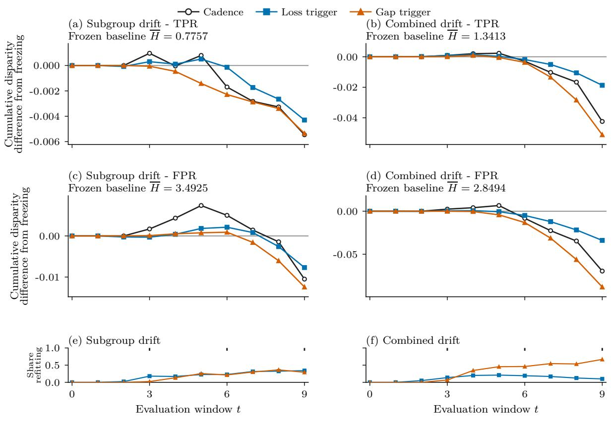  
Figure 1: Cumulative disparity contrasts and refit incidence in the follow-up sample. Each line sums mean absolute-gap diferences from freezing through window $t ;$ its endpoint equals the corresponding mean $\Delta H$ in Table 1. The lower strips show refit incidence; cadence ticks mark scheduled refits at $t = 3 , 6 , 9$ . These are descriptive paths, not estimates of the contribution of individual refits. Panels use diferent disparity scales.

Although the mean decreases, 20–45% of finite-window trajectory contrasts are positive (Figure 2). The share exceeding 0.5 pp per window is lower, 6.25–21.25%; the diference shows how much the binary positive share depends on counting arbitrarily small changes. These illustrative thresholds do not establish acceptable deterioration in an application.

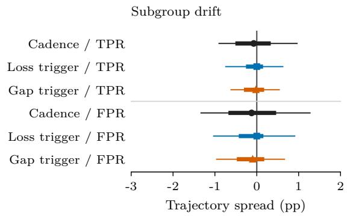

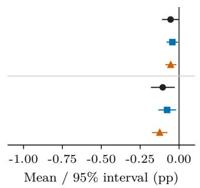

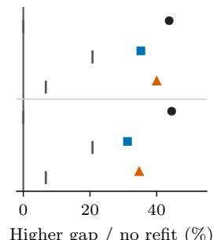  
Higher gap / no refit (%)

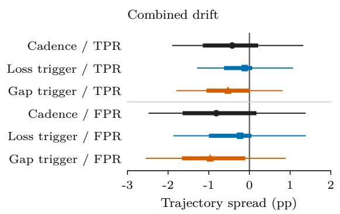

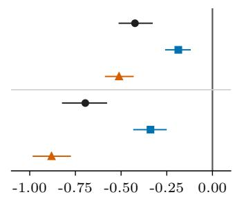  
Mean / 95% interval (pp)

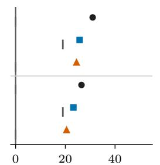  
Higher gap / no refit (%)  
Figure 2: Trajectory distributions, mean estimates, and action incidence. Left: central 90%, middle 50%, and median of 400 follow-up diferences, expressed as pp per window. Centre: mean and nominal 95% BCa interval on a narrower scale. Right: coloured policy markers show the positive share; grey ticks show the no-refit share. All three policies are included.

Population estimates of disparity Population integration preserves all twelve negative mean directions, with reductions of 0.052–0.887 pp per window. Observed-minus-population mean diferences are at most 0.032 pp in absolute magnitude. However, trajectory-sign agreement is only 69.25–92.25%. For the gap trigger’s TPR comparison under subgroup-specific drift, agreement is 69.25%, and the population share exceeding 0.5 pp is 2.25%, versus 6.25% using finite windows. Thus the mean reduction survives a high-precision measurement check, while individual positive diferences are less stable. Table 5 reports every comparison; numerical integration error is negligible at the reported scale.

Group-specific predictive performance Under subgroup-specific concept drift, retraining reduces both TPRs and FPRs (Table 2). For the gap trigger, changes are about −0.87 and −0.82 pp in the two TPRs, and −0.69 and −0.81 pp in the FPRs. The smaller TPR gap accompanies reduced sensitivity and increased specificity. Without specifying the consequences of false positives and false negatives, the combination of lower sensitivity and higher specificity does not establish a welfare improvement. Under combined drift, both groups’ TPRs and aggregate accuracy increase; FPR changes difer between groups.

Table 2: Frozen predictive rates and changes under retraining.
<table><tr><td>Level or change</td><td> $\mathrm { T P R _ { 0 } }$ </td><td> $\mathrm { T P R _ { 1 } }$ </td><td> $\mathrm { F P R _ { 0 } }$ </td><td> $\mathrm { F P R _ { 1 } }$  Accuracy</td></tr><tr><td colspan="5">Subgroup-specific concept drift</td></tr><tr><td>Frozen level (%)</td><td></td><td></td><td>44.460 36.760 19.468 54.393</td><td>59.610</td></tr><tr><td>Cadence change (pp)</td><td>-1.208</td><td>-1.158</td><td>-1.000 -1.105</td><td>0.032</td></tr><tr><td>Loss trigger change (pp)</td><td>-0.794</td><td>-0.752</td><td>-0.647 -0.723</td><td>0.017</td></tr><tr><td>Gap trigger change (pp)</td><td>-0.874</td><td>-0.821</td><td>-0.686 -0.810</td><td>0.010</td></tr><tr><td colspan="5">Combined drift</td></tr><tr><td>Frozen level (%)</td><td>45.719</td><td>32.322</td><td>20.411 48.904</td><td>59.720</td></tr><tr><td>Cadence change (pp)</td><td>1.895</td><td>2.319</td><td>0.091 -0.605</td><td>0.941</td></tr><tr><td>Loss trigger change (pp)</td><td>1.163</td><td>1.350</td><td>-0.013 -0.352</td><td>0.598</td></tr><tr><td>Gap trigger change (pp)</td><td>2.035</td><td>2.546</td><td>0.261 -0.619</td><td>0.943</td></tr></table>

Frozen rows give absolute rates in percent; policy rows give changes from those levels in percentage points. Each averages equally across ten windows and 400 trajectories. Lower FPR is higher specificity; lower TPR is lower sensitivity.

Comparisons with scheduled retraining Direct paired cadence contrasts are close to zero under subgroup-specific drift, with all four nominal intervals spanning zero. The loss and gap triggers use about 1.19 and 1.42 fewer refits than cadence, respectively. Under combined drift, the loss trigger uses about 1.8 fewer refits but has 0.237 pp greater TPR disparity and 0.357 pp greater FPR disparity than cadence. The gap trigger uses 0.075 more refits on average and has 0.087 and 0.185 pp lower disparities. These diferences compare complete policies with diferent refit counts; they do not isolate the efect of the monitored statistic (Table 19).

Policy behaviour without drift We retain each condition’s calibrated baseline, environmental random draws, learner, thresholds, and training rules, setting only drift to zero. Across the two baseline calibrations, the loss trigger refits on 40.0–42.75% of trajectories and the gap trigger on 67.75–70.25%. Thus separate component calibration does not describe the combined policy’s action incidence. Mean TPR contrasts are small and their nominal intervals include zero. Mean FPR disparity instead increases by 0.067–0.312 pp per window across the six policy– baseline combinations (Table 17). Larger rolling training samples therefore do not by themselves account for the FPR reductions under drift. This control does not isolate sample size from the remaining efects of rolling refitting.

## 6 Action patterns and schedule comparisons

Let $K _ { \pi }$ be the refit count and $D _ { \pi } = \Delta H _ { \pi }$ . Since no refit implies $D _ { \pi } = 0$ ，

$$
\begin{array} { r } { \mathbb { E } [ D _ { \pi } ] = \operatorname* { P r } ( K _ { \pi } > 0 ) \mathbb { E } [ D _ { \pi } \mid K _ { \pi } > 0 ] , } \end{array}\tag{6}
$$

$$
\mathrm { P r } ( D _ { \pi } > \varepsilon ) = \mathrm { P r } ( K _ { \pi } > 0 ) \mathrm { P r } ( D _ { \pi } > \varepsilon \mid K _ { \pi } > 0 ) , \qquad \varepsilon \ge 0 .\tag{7}
$$

## 6.1 Action incidence and conditional disparity

A low unconditional adverse share can therefore partly reflect inaction. In the Census sex-TPR comparison, the loss trigger has positive diferences in five of 35 states but acts in only eight. Its positive share is 14.3% unconditionally and 62.5% among acting states. This conditional description explains the policy summary; it is not a causal comparison of action efects, because diferent policies select diferent trajectories. Appendix E gives simulation and Census decompositions.

## 6.2 Alarm direction and reference persistence

The gap policy detects changes in a signed disparity, including movements towards zero. In combined drift, 98.6% of its FPR-stream alarm records occur with a smaller absolute FPR gap than the initial reference, and 64.4% show improvement relative to the immediately preceding observation. By contrast, only 0.1% of TPR-stream alarms under combined drift occur with a smaller absolute gap than the initial reference. A reset clears accumulated evidence while retaining the original reference; an improved but persistently displaced FPR stream can therefore trigger again. Such an alarm is consistent with the two-sided change definition; it does not, by itself, indicate a malfunction or a false alarm.

We retain the alarming stream, direction, signed and absolute gaps, change from both the initial and preceding levels, and the next-alarm delay. For each refit, the pre-refit and post-refit models are also evaluated on the same subsequent window, separating their prediction change from the change of evaluation sample (Appendix G). A comparison between monitoring policies also compares their alarm definitions, calibration, and propensity to act. It cannot attribute the outcome diference to subgroup information alone.

## 6.3 Action-count matching

A random reference refits independently at each of nine eligible boundaries with probability equal to the loss-triggered policy’s mean refit count on a separate 400-trajectory calibration sample, divided by nine. The loss-trigger-minus-random disparity contrast uses 400 diferent paired trajectories. Its four means are negative, with the largest contrast under combined-drift FPR: −0.0114 cumulative units, nominal interval [−0.0208, −0.0018]. The other estimates are smaller and their intervals span zero (Table 23). The intervals condition on the calibrated random probability; they do not include uncertainty from repeating its estimation.

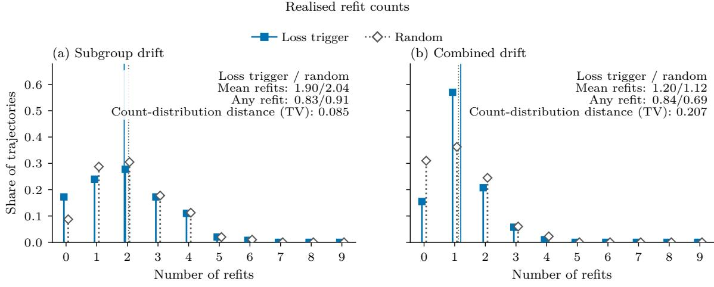  
Figure 3: Refit-count distributions under the loss trigger and calibrated random policy. Symbols show the proportion of trajectories at each realised count in the random-reference evaluation sample; vertical reference lines mark mean counts. Annotations report mean counts, probabilities of any refit and total-variation distance.

Under subgroup-specific drift, mean counts are 1.8975 for the loss trigger and 2.0400 for random refitting; under combined drift they are 1.1975 and 1.1225. Despite similar means, any-refit probabilities difer by up to 15.5 pp and the largest total-variation distance is 0.207. The resulting disparity contrast therefore combines diferences in timing, realised counts, and the probability of acting.

A separate matching exercise anchors the gap thresholds and selects one of 17 loss thresholds on 200 subgroup-drift trajectories using a count-only lexicographic rule. The selected approximation is then assessed on 400 separate trajectories. Its mean-count diference is 0.0575 and its 90% interval [−0.065, 0.175] fits within the chosen ±0.25 bounds. Its total-variation distance is 0.290 against a 0.20 bound, and its any-refit diference is 0.145 against a 0.10 bound. The selected threshold fails these same two criteria on both the selection and validation samples. The planned disparity comparison was withheld. The full ranking rule and rationale for the approximation margins are in Appendix $\operatorname { A } ;$ the candidate grid and validation results are supplementary.

## 6.4 Refit timing and count in the hindsight benchmark

The hindsight benchmark searches all subsets of nine eligible refit boundaries, at most $2 ^ { 9 } = 5 1 2$ schedules. Every refit uses the same learner and labelled rolling window. For each policy trajectory with k refits and disparity measure, define

$$
V _ { = k } = \operatorname* { m i n } _ { | a | = k } H ( a ) , \quad \quad V _ { \leq k } = \operatorname* { m i n } _ { | a | \leq k } H ( a ) .\tag{8}
$$

The policy’s own schedule is included, so

$$
H ( \pi ) - V _ { \le k } = \underbrace { H ( \pi ) - V _ { = k } } _ { \mathrm { s a m e - c o u n t ~ r e s c h e d u l i n g } } + \underbrace { V _ { = k } - V _ { \le k } } _ { \mathrm { a d d i t i o n a l ~ b e n e f i t ~ o f ~ f e w e r ~ r e f i t s } } .\tag{9}
$$

Including the evaluated schedule makes both terms nonnegative for the realised empirical objective. Their magnitudes quantify the advantage of alternative timing and the additional contribution of reducing the count. Population evaluation of the selected schedules assesses how these empirical advantages depend on finite-window measurement.

Table 3: Sources of the hindsight advantage and its population re-evaluation.
<table><tr><td>Comparison Same count Fewer allowed Strict fewer (%)</td></tr><tr><td>difference &lt; 0 (%) Subgroup-specific concept drift</td></tr><tr><td>Loss trigger / TPR 0.0414 0.0044 29.0 0.0186</td></tr><tr><td>Gap trigger / TPR 0.0491 0.0025 20.2 0.0219 20.5</td></tr><tr><td>Loss trigger / FPR 0.0490 0.0029 22.0 0.0376 7.5</td></tr><tr><td>Gap trigger / FPR 0.0563 0.0025 19.0 0.0434 10.8</td></tr><tr><td>Combined drift</td></tr><tr><td>Loss trigger / TPR 0.0628 0.0024 13.0 0.0400 13.0 Gap trigger / TPR 0.0585 0.0091 38.0 0.0317 19.8</td></tr><tr><td>Loss trigger / FPR 0.0779 0.0008 6.2 0.0616 5.0</td></tr><tr><td>Gap trigger / FPR 0.0751 0.0050 29.2 0.0515 13.0</td></tr></table>

First two columns are mean cumulative disparity units and sum to the original policy–oracle gap. Strict improvement uses $1 0 ^ { - 9 } + 1 0 ^ { - 9 } \operatorname* { m a x } ( | \bar { H } ( \pi ) | , | V _ { \leq k } | )$ . Every selected schedule with fewer refits strictly improves the empirical objective. Population diference is the mean population-evaluated cumulative disparity under the policy minus that under its empirically selected oracle schedule. The last column gives the share of trajectories with a negative diference; negative values are retained.

Most mean hindsight advantage comes from rescheduling at the same count (Table 3). The additional mean contribution from allowing fewer refits ranges from 0.00077 to 0.00906 cumulative units. A strictly positive contribution occurs in 6.25–38.0% of trajectories, depending on the comparison. Every selected schedule with fewer refits also strictly improved the empirical objective; none was selected solely by the tie-breaking rule. The complete best objective at each exact count is retained; objective ties are resolved by fewer actions and then lexicographic action times.

The search optimises finite-window gaps on the data used to report its original objective. Evaluating its selected schedules using population integration reduces every mean policy–oracle disparity diference. On population evaluation, the policy–oracle disparity diference is negative in 5.0–20.5% of trajectories: the empirically selected hindsight schedule then has greater disparity than the monitored policy. The schedule selected using finite-window gaps can exploit measurement variation and need not improve population disparity on each trajectory. Perfect foresight and policy-specific count constraints limit this reference to the schedules available in each realised trajectory.

## 7 Evaluation-population sensitivity in Census data

The observed-data comparison uses American Community Survey 1-Year person files for 2013– 2019 and 2021–2024, adapting the ACSEmployment benchmark [Ding et al., 2021]. Among records aged 17–89 with positive person weight, the label is civilian employed and at work (ESR = 1) versus other employment-status responses. Predictors include age, schooling, marital and harmonised relationship status, disability, parents’ employment, citizenship, migration, military service, ancestry, nativity, and hearing, vision, and cognitive dificulty. Neither protected attribute is a predictor. The sex models retain other races; the race models are fitted on White and Black respondents only.

Each state is one trajectory: 2013 supplies training and the remaining ten survey waves supply evaluation. These are repeated population samples, not follow-up of the same individuals. Equal weighting of observed waves also difers from equal weighting of elapsed calendar time because 2020 is absent. Windows are capped at 25,000 shared sampled records after the age/weight filter and before restricting to the binary comparison. Eligibility requires at least 500 records and 100 per subgroup in every window. There are 35 evaluation states and 15 calibration states for sex; the race comparison has 29 evaluation and 12 calibration states.

Feature representation and monitoring calibration The original learner standardises numeric feature codes using 2013 statistics. Nominal predictors are scalar codes, which impose arbitrary linear orderings. The complete per-feature transformation, missing-value rule, and relationship harmonisation are supplied in Appendix A. A categorical-indicator sensitivity keeps archived action schedules fixed, making its results conditional on those schedules.

Census thresholds are calibrated on separate states using action counts to target three mean refits, with stream scales pooled from frozen-model deviations. This is separate from simulation threshold calibration. The gap trigger reaches the target approximately; the tested loss-trigger thresholds do not. It averages 0.43 refits for sex and 0.31 for race, compared with 3.71 and 4.34 for the gap trigger. Supplementary calibration tables provide the scales, reference value, and candidate grid. The replay is exploratory despite this final calibration split.

Record and person weighting The unweighted calculation counts retained records equally within each state-window. Person weighting instead gives records their ACS person weights when calculating each group’s rate. Both summaries then weight states equally; neither is a pooled national estimate. The weighting comparison retains the fitted models, predictions, monitoring history, and refit actions.

With record weighting, all policies increase mean sex-TPR disparity and decrease mean sex-FPR disparity. For race, the cadence and gap policies decrease both mean disparities. Person weighting reverses each race-FPR mean comparison: cadence changes from −0.05585 to +0.03741 cumulative units, loss-trigger from −0.01040 to +0.00516, and gap-trigger from −0.06091 to +0.04688 (Figure 4; Table 4). These are reversals of mean point estimates: all three weighted intervals include zero. The sex-cadence TPR mean also changes sign.

Person weighting changes the signs of all three mean contrasts

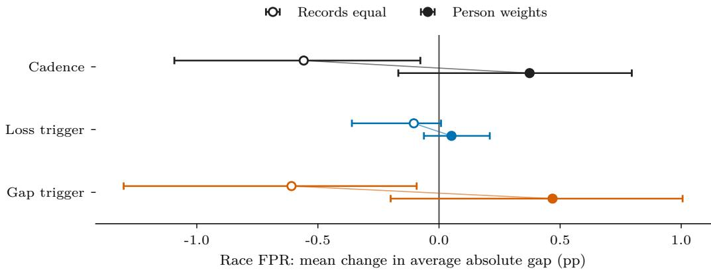  
Figure 4: Person weighting changes the signs of all three mean contrasts. Open markers count records equally; filled markers use person weights. Both use the same predictions and equal state weights. Bars show descriptive 95% BCa intervals under exchangeable-state resampling; they do not account for interstate dependence. All three person-weighted intervals include zero. Leave-one-state-out ranges are in Appendix I.

Table 4: Census sensitivity to evaluation weights. Equal-record means count each retained record equally within state-windows. The second set of means evaluates the same predictions using ACS person weights, PWGTP. Model fitting, monitoring, and refit actions are unchanged. Both summaries give each evaluation state equal weight: 35 states for sex and 29 for the White–Black race comparison. Negative ∆H denotes lower cumulative disparity than freezing. Four mean signs change, including all three race FPR comparisons. Tables 30 and 31 retain the full descriptive interval and positive-share summaries.
<table><tr><td>Policy</td><td>Measure</td><td>mean ∆H</td><td>Equal-record Person-weighted evaluation mean ∆H</td><td>Mean refits</td></tr><tr><td>Sex (n = 35)</td><td></td><td></td><td></td><td></td></tr><tr><td>Cadence</td><td>TPR</td><td>0.0086</td><td>-0.0025</td><td>3.00</td></tr><tr><td rowspan="2">Loss trigger</td><td>FPR</td><td>-0.0518</td><td>-0.0391</td><td></td></tr><tr><td>TPR</td><td>0.0036</td><td>0.0026</td><td>0.43</td></tr><tr><td rowspan="2">Gap trigger</td><td>FPR</td><td>-0.0123</td><td>-0.0060</td><td></td></tr><tr><td>TPR</td><td>0.0117</td><td>0.0024</td><td>3.71</td></tr><tr><td></td><td>FPR</td><td>-0.0517</td><td>-0.0366</td><td></td></tr><tr><td>Race (n = 29)</td><td></td><td></td><td></td><td></td></tr><tr><td>Cadence</td><td>TPR</td><td>-0.0719</td><td>-0.0461</td><td>3.00</td></tr><tr><td rowspan="2">Loss trigger</td><td>FPR</td><td>-0.0559</td><td>0.0374</td><td></td></tr><tr><td>: TPR</td><td>-0.0018</td><td>-0.0048</td><td>0.31</td></tr><tr><td rowspan="2">Gap trigger</td><td>FPR</td><td>-0.0104</td><td>0.0052</td><td></td></tr><tr><td>TPR</td><td>-0.0747</td><td>-0.0507</td><td>4.34</td></tr><tr><td></td><td>FPR</td><td>-0.0609</td><td>0.0469</td><td></td></tr></table>

State and window contributions to weighting sensitivity Window-level decomposition preserves each signed and absolute group gap, contribution to ∆H, and subgroup/outcome weight concentration. For race-FPR, person weighting moves the state contrast upward in 26 of 29 states for cadence and 24 of 29 for the gap trigger. All three mean reversals survive removing any single state. The loss-trigger weighting shift is more concentrated: three states contribute 95.0% of its total absolute state shifts, consistent with its low action incidence.

Among group-negative cells used for race FPR, median efective sample size is 58.6% of the record count for White respondents and 54.5% for Black respondents, with minima of 44.0% and 31.9%. These diagnostics quantify weight concentration; they are not survey-design variance estimates. The categorical-indicator sensitivity retains all three race-FPR mean reversals at the original schedules, with weighted cumulative contrasts 0.0526, 0.0123, and 0.0504 for cadence, loss-trigger, and gap-trigger respectively. The reversal therefore persists under indicator encoding at the retained schedules; evaluating the corresponding monitoring policy would also require recalibration.

The states share national shocks and survey procedures. BCa intervals describe resampling states as exchangeable units; Wilson ranges for positive-state shares use a binomial reference. Neither accounts for interstate dependence or establishes a population efect. The result concerns which evaluation population a comparison describes. The full state distribution and weighting contributions appear in the supplement, together with the cap sensitivity and its provenance limitations.

## 8 Discussion

Under combined drift, the loss-triggered policy used about 1.8 fewer refits than scheduled retraining, but its average TPR and FPR gaps were respectively 0.237 and 0.357 percentage points greater. Choosing between these policies therefore requires a judgement about the consequences of those disparities and the value of avoiding refits. A comparison with freezing alone does not expose that choice. The reported counts measure actions; their economic and operational costs were not measured.

## 8.1 Implications for maintenance decisions

The gap monitor’s FPR alarms often occur while absolute disparity has improved relative to its fixed reference. A departure from that signed reference is suficient to accumulate evidence, and resetting an accumulator leaves the reference unchanged. Repeated alarms can therefore be consistent with a persistently improved gap. The prevalence of these alarms reflects the evaluated rule’s two-sided change definition and persistent reference. The no-drift control also gives the combined gap policy a substantially higher action incidence than the loss policy. Diferences in cumulative outcomes therefore cannot be attributed to subgroup information alone without controlling the alarm definition, complete-policy calibration, and propensity to act.

When a policy retains the initial model on most trajectories, its unconditional disparity contrast reflects the prevalence of those zero diferences. Reporting the probability of any refit and the conditional outcome distribution makes that contribution visible. The selected loss threshold approximately matched the gap policy’s mean count but failed the limits for countdistribution distance and the probability of any refit.

Freezing can itself produce substantial disparity. Its absolute group-specific rates and the magnitude of a policy contrast therefore matter alongside statistical uncertainty. A reduction of a few hundredths of a percentage point may have little bearing on a maintenance decision, depending on the consequences of the errors and the costs of retraining. Meaningful deterioration margins require application-specific justification, separately from the illustrative exceedance thresholds used in this evaluation. Comparisons with scheduled retraining additionally assess the value of a monitored rule relative to a simple available schedule. Lifecycle monitoring and change-management frameworks provide a setting for documenting these choices and their supporting evidence [National Institute of Standards and Technology, 2023].

## 8.2 Measurement and evaluation population

High-precision population evaluation preserves the mean directions but changes many trajectory signs and reduces the apparent hindsight advantage. Pairing holds the environmental observations fixed while leaving policy-specific finite-window measurement error in the estimated gap. Increasing the number of paired trajectories sharpens inference about that empirical outcome. Population integration addresses a diferent uncertainty by evaluating the existing models and schedules against the known generating distribution. The diference between these assessments matters especially when efects are small or schedules have been selected to minimise noisy empirical gaps.

Population integration is available here because the generating distribution is known. In an observed-data replay, the directly reusable components are the paired policy comparison, groupspecific rates, action records, schedule comparisons, and sensitivity to evaluation weights. Their interpretation remains subject to uncertainty in the estimated subgroup rates.

The Census weighting analysis holds predictions and actions fixed while changing the contribution of observed records to subgroup rates. Its mean reversals consequently concern the target population represented by the comparison. Choosing weights is part of defining that target and should precede the interpretation of a policy ordering. The component rates also remain essential: under subgroup-specific drift, smaller TPR gaps accompany lower sensitivity in both groups. A disparity reduction describes convergence of group rates; assessing its desirability requires the consequences of false positives and false negatives as well as the distribution of those errors.

## 8.3 Limitations and future work

The controlled evidence concerns two progressive regimes at one magnitude, one binary group balance, one learner, and a ten-window horizon, plus matched no-drift controls. The group signal is reversed at baseline, and the learner is misspecified for that interaction. The prefix checks address the evaluated portion of each trajectory; later, recurrent, or reversing drift requires an explicit continuation model. Population integration conditions on the realised training samples and policy decisions, whose variation remains part of the comparison. Generalisation to other generators requires further evaluation. BCa coverage and the studentised test’s finite-sample error are not established across all such environments.

The Census evidence uses one benchmark task, dependent finite state units, capped windows, and an exploratory development history. Reweighting evaluates existing predictions rather than a fully survey-weighted fitting and monitoring policy. The indicator sensitivity changes representation at fixed schedules, leaving the transport of monitoring thresholds unassessed. Shared replay also requires policy-independent observations and complete delayed labels. Feedback and selective label observation need an identification design that represents those processes. The disparity measures and hindsight references do not by themselves establish welfare improvement or legal suficiency.

Further evaluation should jointly calibrate the monitored policies and compare their subgroup outcomes prospectively across a justified range of drift conditions, group balances, and horizons.

## 9 Conclusion

Scheduled and monitored retraining produced lower mean cumulative subgroup disparity than freezing in the two simulated drift regimes. Population evaluation preserved those mean directions while changing many trajectory signs and reducing the apparent advantage of schedules selected using finite-window gaps. Under subgroup-specific drift, smaller TPR gaps accompanied lower sensitivity in both groups. Lower mean disparity therefore did not establish either a stable trajectory-level benefit or improved predictive outcomes for each group.

The complete policies also difered in how often they acted, and the loss trigger traded fewer refits for greater disparity than cadence under combined drift. In the exploratory Census replay, person weighting reversed all three race-FPR mean contrasts with predictions and actions unchanged; all three weighted intervals included zero. These non-confirmatory comparisons depend on their stated drift conditions and on shared observations with complete delayed labels. A lower cumulative gap is insuficient grounds for choosing a maintenance policy without the group-specific rates, the actions producing the comparison, and the population those rates represent.

## Reproducibility

The accompanying reproducibility package, version 2026.09.08-r2, binds executable source, environment specifications, scientific configurations, outcomes, actions, reconstruction checks, and display builders by file hashes. The supplement documents analysis provenance and historical verification limits. The public reproduction release is available at model-retraining-underdrift, v1.0.0.

## A Data generation and policy specification

All coordinates below are zero-indexed. Independently for each record and window, draw A ∼ Bernoulli(0.2) and $Z \sim N _ { ^ { 1 0 } } ( 0 , \Sigma )$ , independently of A.

Data-generating process The group-mean shift is $m = ( 0 . 3 5 , - 0 . 2 , 0 . 1 5 , 0 . 1 , 0 , 0 , 0 , 0 , 0 , 0 ) ^ { \top }$ The coeficient vector is

$$
\beta = ( 0 . 5 5 , - 0 . 4 , 0 . 3 5 , 0 . 2 5 , - 0 . 2 , 0 . 1 8 , - 0 . 1 2 , 0 . 0 8 , 0 . 0 5 , - 0 . 0 4 ) ^ { \top } .
$$

The covariance has diagonal entries one, of-diagonal entries 0.3 within coordinates 0–4 or 5–9, and zero between these blocks. There is no serial dependence or policy feedback in these draws. Let $d _ { t } = 0 . 0 5 \operatorname* { m a x } ( 0 , t )$ for evaluation windows and zero in the initial training window. Under subgroup-specific concept drift, $X = Z + A m$ and

$$
\begin{array} { r } { \log \mathrm { i t } p _ { t } ( X , A ) = \alpha + X ^ { \top } \beta + \gamma A + ( \eta - d _ { t } ) A ( X ^ { \top } \beta ) . } \end{array}
$$

Under combined drift, writing $e _ { j }$ for coordinate vector $j$

$$
X = Z + A m + d _ { t } ( e _ { 0 } + e _ { 1 } ) - A d _ { t } ( e _ { 2 } + e _ { 3 } ) ,
$$

$$
\mathrm { l o g i t } p _ { t } ( X , A ) = \alpha + X ^ { \top } \beta + \gamma A + ( \eta - d _ { t } ) A ( X ^ { \top } \beta ) + d _ { t } X _ { 4 } .
$$

Draw $U \sim \mathrm { U n i f o r m } ( 0 , 1 )$ independently and set $Y = \mathbf { 1 } \{ U < p _ { t } ( X , A ) \}$ . All policies share the realised A, Z, U arrays.

<table><tr><td>Condition</td><td>α</td><td>γ</td><td>η</td></tr><tr><td>Subgroup-specific concept drift</td><td>-0.190322804310950</td><td>0</td><td>-1.375</td></tr><tr><td>Combined drift</td><td>-0.196348902391059</td><td>0</td><td>-1.375</td></tr></table>

The baseline calibration adjusts the intercept and group-feature interaction; the group logit ofset is zero. Consequently the group-1 multiplier of $X ^ { \top } \beta$ is −0.375 at baseline and −0.825 at $t = 9$ , strengthening the reversed baseline signal.

Model fitting and preprocessing The fitted learner receives only the ten X coordinates: neither A nor $A \times X$ interactions. The generative interaction is therefore omitted from the fitted model. Simulation features are not standardised. All policy fits use scikit-learn logistic regression, $L _ { 2 }$ penalty, $C = 1$ , solver lbfgs, fitted intercept, tolerance $1 0 ^ { - 4 }$ , maximum 500 iterations, random state 0, and threshold 0.5; environment calibration uses a maximum of 1,000 iterations. The archives record Python 3.12.14, NumPy 2.4.4, pandas 2.3.3, scikit-learn 1.8.0, and $\mathrm { P y A }$ rrow 24.0.0. Deterministic lbfgs fits on identical windows reproduce identical models; no warm start is used. Estimator exceptions abort execution. The original runner permits convergence warnings, so completion alone does not establish convergence. Reconstruction checks additionally fail on a convergence warning.

Monitoring thresholds and calibration Numerical thresholds below come directly from the registry rows for $N = 5 0 0 0$ , group-1 probability 0.2, moderate regime, and reset-on-alarm. All use $\kappa = 0$
<table><tr><td>Stream</td><td>Direction</td><td> $h$ </td></tr><tr><td>FPR gap</td><td>two sided</td><td>0.151599413160540</td></tr><tr><td>Log loss</td><td>upward</td><td>0.010544760827764</td></tr><tr><td>TPR gap</td><td>two sided</td><td>0.174903665595022</td></tr></table>

Each component threshold is the median maximum CUSUM over 300 no-drift trajectories and ten frozen-model evaluation windows, targeting and attaining 0.5 first-alarm incidence on that calibration sample. The 0.5 target defines the component calibration operating point. Completepolicy refit incidence also depends on combining streams, refitting the model, and receiving only windows 0–8 in time to act within the ten-window lifecycle. The no-drift control evaluates those complete rules. Each stream is centred on its own initial frozen-model value. New strict crossings $( C > h )$ trigger one refit per boundary, even if multiple components alarm. A refit resets accumulators and crossing state on both gap streams, including the non-alarming stream; the reference levels remain fixed. No statistic is consumed twice.

Rate estimation and missing outcomes TPR uses each group’s observed positives and FPR its observed negatives. Without the relevant subgroup outcome, a rate is undefined; the monitor skips that stream update and the historical cumulative calculation sums available finite gaps. Every reported simulation and Census evaluation window has finite rates, verified on reconstruction, so no term is omitted here. An evaluation with missing rates requires an explicit rule for their treatment; omission and zero disparity have diferent meanings.

Calibration of action-count comparators Random refits are independent Bernoulli trials at nine eligible boundaries, with probability equal to a separate 400-trajectory loss-trigger policy’s mean count divided by nine. Outcome intervals condition on that fitted probability. The loss-versus-gap matching search holds the gap thresholds fixed and ranks 17 loss thresholds lexicographically by: smallest absolute mean-count diference; largest probability-mass overlap; smallest any-refit probability diference; largest minimum common-support mass; largest threshold; then smallest candidate index. Selection uses 200 trajectories, validation 400 diferent trajectories. The mean tolerance 0.10 refit, 90% interval margin 0.25 refit, total-variation limit 0.20, any-refit diference limit 0.10, and common-support mass minimum 0.95 are design choices for approximate comparability. They limit diferent aspects of action mismatch and must all pass; their values have no application-specific equivalence interpretation. The selected approximation fails the count-distribution and any-refit criteria on both selection and validation samples.

Census feature transformations In the original pipeline every predictor is a numeric scalar. Each missing or not-applicable value is coded -1, and every column is centred and scaled using only that state’s 2013 mean and population standard deviation (a zero standard deviation is replaced by one). The transformation is frozen across later waves. Numeric coding imposes an arbitrary linear ordering on nominal categories. The categorical sensitivity encodes all predictors except age as indicators, learning categories only in 2013 and ignoring unseen categories; age retains its 2013 standardisation. Archived action schedules remain fixed, making the representation comparison conditional on those schedules. The sensitivity leaves monitor calibration unchanged.

<table><tr><td>Predictor</td><td colspan="3">Original input before standardisation</td></tr><tr><td>AGEP</td><td colspan="4">Age in years</td></tr><tr><td>SCHL</td><td colspan="4">ACS numeric response code</td></tr><tr><td>MAR</td><td colspan="4">ACS numeric response code</td></tr><tr><td>relationship_harmonised</td><td colspan="4">Harmonised code below</td></tr><tr><td>DIS</td><td colspan="4">ACS numeric response code</td></tr><tr><td>ESP</td><td colspan="4">ACS numeric response code</td></tr><tr><td>CIT</td><td colspan="4">ACS numeric response code</td></tr><tr><td>MIG</td><td colspan="4">ACS numeric response code</td></tr><tr><td>MIL</td><td colspan="4">ACS numeric response code</td></tr><tr><td>ANC</td><td colspan="4">ACS numeric response code</td></tr><tr><td>NATIVITY</td><td colspan="4">ACS numeric response code</td></tr><tr><td>DEAR</td><td colspan="4">ACS numeric response code</td></tr><tr><td>DEYE</td><td colspan="4">ACS numeric response code</td></tr><tr><td>DREM</td><td colspan="4">ACS numeric response code</td></tr><tr><td>Relationship</td><td></td><td>RELP</td><td></td><td></td></tr><tr><td></td><td>Input code</td><td></td><td></td><td>RELSHIPP</td></tr><tr><td>reference person</td><td></td><td>0</td><td>0</td><td>20</td></tr><tr><td>spouse</td><td>1</td><td></td><td>1</td><td>21,23</td></tr><tr><td>unmarried partner</td><td></td><td>2</td><td>13</td><td>22,24</td></tr><tr><td>child</td><td></td><td>3</td><td>2,3,4</td><td>25,26,27</td></tr><tr><td>foster child</td><td></td><td>4</td><td>14</td><td>35</td></tr><tr><td>grandchild</td><td></td><td>5</td><td>7</td><td>30</td></tr><tr><td>sibling</td><td></td><td>6</td><td>5</td><td>28</td></tr><tr><td>parent or inlaw</td><td></td><td>7</td><td>6,8</td><td>29,31</td></tr><tr><td>other relative</td><td></td><td>8</td><td>9,10</td><td>32,33</td></tr><tr><td>roommate housemate</td><td></td><td>9</td><td>12</td><td>34</td></tr><tr><td>other nonrelative</td><td></td><td>10</td><td>11,15</td><td>36</td></tr><tr><td>group quarters</td><td></td><td>11</td><td>16,17</td><td>37,38</td></tr></table>

The sex models include all retained race groups. The White–Black models are fitted after excluding other race codes, producing a separate model on a diferent fitted population. Neither sex nor race enters either learner. The per-wave cap is sampled after the age/weight filter and before the binary-group restriction, at seed 20260901 + 100 state + t (use t = −1 for 2013).

## B Population integration and numerical validation

Population evaluation uses every follow-up trajectory at its archived refit times. A refit model depends only on its labelled rolling window, so it can be reconstructed once for each distinct fit boundary and reused across schedules. The initial and evaluation-window fingerprints must match the archive, and recomputed empirical TPR/FPR gaps must agree within 10−9. All 800 trajectories pass; the maximum observed gap discrepancy is zero. Reconstruction fails if the solver raises a convergence warning.

For each group and window, the outcome logit $L = \alpha + X ^ { \top } b$ and classifier score $F =$ $a + X ^ { \top }$ c are jointly normal. Write their means as mL, mF, standard deviations as $s _ { L } , s _ { F }$ , and $q = \mathrm { C o v } ( F , L ) / s _ { L }$ . Conditional on $Z = ( L - m _ { L } ) / s _ { L } = z$ , the score has mean $m _ { F } + q z$ and variance $s _ { F } ^ { 2 } - q ^ { 2 }$ . Thus

$$
\mathbb { E } [ { \bf 1 } \{ F \ge 0 \} \sigma ( L ) ] = \int \sigma ( m _ { L } + s _ { L } z ) \Phi \left( \frac { m _ { F } + q z } { \sqrt { s _ { F } ^ { 2 } - q ^ { 2 } } } \right) \phi ( z ) d z .
$$

The denominator for TPR is $\begin{array} { r } { \int \sigma ( m _ { L } + s _ { L } z ) \phi ( z ) \ : d z } \end{array}$ . The positive-prediction probability is $\Phi ( m _ { F } / s _ { F } )$ ; subtracting the joint positive-outcome probability gives the FPR numerator. A zero conditional variance is handled as a threshold indicator. Integration over [−12, 12] omits less than $4 \times 1 0$ −33 normal probability and splits at the conditional decision boundary when it lies in that range.

The calculation tightens absolute and relative integration tolerances from 10−8 to 10−11 for every rate and fails if they difer by more than $1 0 ^ { - 7 }$ . Retained numerical-error and tolerancediference records are in population\_verification.csv. Independently scrambled Sobol probes use $2 ^ { 1 8 } = 2 6 2$ ,144 Gaussian feature draws per group, four scrambles, windows 0 and 9, and the gap policy on the first archived trajectory of each condition. They use conditional outcome probabilities instead of sampled binary labels. Across these checks, the largest absolute diference between the mean probe rate and integration is 0.000407; the largest standard error across the four scramble estimates is 0.000252. The probe check is a separate numerical crosscheck, not a recalibration of the policy.

The population calculation conditions on the original training samples, models, alarms, and refit schedules. Empirical and population outcomes describe the same prediction sequence at diferent measurement levels. Replacing the noisy monitoring streams with population gaps would define a diferent policy and requires a separate evaluation.

Table 5: Finite-window measurement versus population integration on unchanged follow-up schedules.
<table><tr><td>Policy</td><td>Observed (pp) Population 1 (pp) Difference (pp) Sign agree (%) Pop. &gt; 0 (%)</td></tr><tr><td>Subgroup-specific concept drift: TPR</td></tr><tr><td>Cadence -0.055 -0.068 0.013 75.5 40.8 30.5</td></tr><tr><td>Loss trigger -0.043 -0.052 0.009 78.8</td></tr><tr><td>Gap trigger -0.053 -0.063 0.009 69.2 33.8</td></tr><tr><td>Subgroup-specific concept drift: FPR</td></tr><tr><td>Cadence -0.105 -0.109 0.004 86.8 41.2</td></tr><tr><td>Loss trigger -0.077 -0.109 0.032 88.5 27.3</td></tr><tr><td>Gap trigger -0.124 -0.128 0.004 86.2 33.0</td></tr><tr><td>Combined drift: TPR</td></tr><tr><td>Cadence -0.424 -0.423 -0.001 86.5 29.5</td></tr><tr><td>Loss trigger -0.187 -0.216 0.029 88.5 24.2</td></tr><tr><td>-0.511 -0.525 0.014 21.2</td></tr><tr><td>Gap trigger 86.8 Combined drift: FPR</td></tr><tr><td>Cadence -0.696 -0.712 0.016 91.0 26.0</td></tr><tr><td>Loss trigger -0.339 -0.356 0.017 92.0 22.2</td></tr><tr><td>Gap trigger -0.881 -0.887 0.006 92.2 17.2</td></tr></table>

Diference is observed minus population mean. Integration changes only evaluation. Sign agreement includes exact zeros for trajectories without refits. Full threshold exceedances are in the accompanying CSV.

Table 6: Illustrative deterioration thresholds: finite-window versus population shares.
<table><tr><td>Policy</td><td>&gt; 0 pp &gt; 0.1 pp</td><td>&gt; 0.25 pp</td><td>&gt; 0.5 pp &gt; 1 pp</td></tr><tr><td colspan="4">Subgroup-specific concept drift: TPR</td></tr><tr><td rowspan="4">Cadence</td><td>43.8 / 40.8 36.5 / 33.0 28.0 /</td><td>22.0 15.0 / </td><td>9.04.0 / 1.2</td></tr><tr><td>Loss trigger 35.2 / 30.5 25.5 /</td><td>20.2 16.0 11.0</td><td>8.2 4.8 30.5 / 0.2</td></tr><tr><td>Gap trigger 40.0 / 33.8 28.2 / 20.5</td><td>16.0 9.8</td><td>6.2 / 2.2 0.8 / 0.0</td></tr><tr><td>Subgroup-specific concept drift: FPR</td><td>21.2 / 19.2 8.2 / 7.2</td><td></td></tr><tr><td colspan="4">Cadence 44.5 / 41.2 37.0 / 35.5 31.5 / 27.0 Loss trigger 31.2 / 27.3 26.0</td></tr><tr><td></td><td>21.5 18.5 / 16.2</td><td></td><td>12.8 / 10.04.0 / 2.5</td></tr><tr><td>Gap trigger 34.8 / 33.0 26.2 / 23.0 20.0 / 17.2 Combined drift: TPR</td><td></td><td></td><td>9.5 / 7.5 1.2 / 0.8</td></tr><tr><td>Cadence 31.0 / 29.5 27.3 / 26.2 23.0 / 21.5</td><td></td><td>16.2 / 13.0 8.0 / 4.8</td><td></td></tr><tr><td>Loss trigger 25.8 / 24.2 22.0 /</td><td>/20.2 17.5 / 15.5</td><td>12.5</td><td>9.05.2 / 4.5</td></tr><tr><td>Gap trigger 24.5 / 21.2 21.5 / 17.2 16.5</td><td></td><td>/11.0 9.5</td><td>5.03.8 / 1.8</td></tr><tr><td>Combined drift: FPR</td><td></td><td></td><td></td></tr><tr><td>Cadence 26.5 / 26.0 25.5 / 23.5 23.8</td><td></td><td>/ 21.5 18.8 / 15.2</td><td>9.0 / 9.0</td></tr><tr><td>Loss trigger 23.2 / 2</td><td>22.2 21.2 / 18.8 18.0</td><td>16.0 13.2 / 12.2</td><td>8.0 / 6.5</td></tr><tr><td></td><td></td><td></td><td></td></tr><tr><td>Gap trigger 20.5 / 17.2 19.8 / 15.5 16.5</td><td></td><td>/ 12.5</td><td>11.2 / 8.2 4.2 / 2.8</td></tr></table>

Each entry is observed / population percentage of trajectories above the stated change in average gap. Thresholds are illustrative and were not used to select policies or hypotheses.

## C Directional inference and statistical validation

The historical test counted ordinary bootstrap means on the opposite side of zero from the selected alternative, producing a percentile-tail calculation. The retrospective reanalysis centres and studentises the bootstrap statistic as specified in the main paper. It retains the original test directions and family membership while applying the revised testing procedure to the archived paired diferences.

Each test uses 10,000 resamples. Inclusive ties count as exceedances. A zero-variance resample has statistic zero when its centred numerator is zero, and signed infinity otherwise; it is not discarded. A degenerate observed sample is reported as untestable with $p = 1$ and a flag. None of the reported cells is degenerate. Resampling seeds are separately derived from the dated namespace non\_confirmatory.independent\_review.2026-09-06.v1 and the run, condition, policy, and rate keys, using the first eight SHA-256 bytes modulo $2 ^ { 6 3 } - 1$ . The exact seeds, tail counts, full-precision estimates, and conditional Monte Carlo intervals are retained in studentised\_tests.csv.

The minimum raw estimate is $1 / 1 0 0 0 1 = 0 . 0 0 0 0 9 9 9 9 \ldots$ . With five zero-count tests in the follow-up family, their Holm-adjusted estimates are $8 / 1 0 0 0 1 = 0 . 0 0 0 7 9 9 9 2 . . . .$ Zero observed bootstrap tail events do not establish a bound below $1 / 1 0 0 0 0$ . Their two-sided 95% binomial Monte Carlo interval has upper endpoint approximately 0.000369. That interval describes uncertainty in the bootstrap tail calculation conditional on the observed sample; it does not make the bootstrap an exact hypothesis test. The paired-t calculation is a sensitivity using the same paired diferences.

Table 7: Centred studentised-bootstrap tests for Run A.
<table><tr><td>Comparison</td><td>r</td><td>PMC Holm  $p$ </td><td>Paired</td><td> $t \ p$  Reject</td></tr><tr><td>Subgroup-specific concept drift</td><td colspan="4"></td></tr><tr><td>Loss trigger / TPR</td><td></td><td>9398 0.93981 1.00000</td><td></td><td>0.94055 No</td></tr><tr><td>Gap trigger / TPR</td><td></td><td>9566 0.95660 1.00000</td><td>0.95867</td><td>No</td></tr><tr><td>Loss trigger / FPR 10000 1.00000 1.00000</td><td></td><td></td><td>1.00000</td><td>No</td></tr><tr><td>Gap trigger / FPR 10000 1.00000 1.00000</td><td></td><td></td><td>1.00000</td><td>No</td></tr><tr><td colspan="4">Combined drift</td></tr><tr><td>Loss trigger / TPR</td><td></td><td>9999 0.99990 1.00000</td><td>0.99991</td><td>No</td></tr><tr><td>Gap trigger / TPR 10000 1.00000 1.00000</td><td></td><td></td><td>1.00000</td><td>No</td></tr><tr><td>Loss trigger / FPR 10000 1.00000 1.00000</td><td></td><td></td><td>1.00000</td><td>No</td></tr><tr><td>Gap trigger / FPR 10000 1.00000 1.00000</td><td></td><td></td><td>1.00000</td><td>No</td></tr></table>

B = 10,000; inclusive centred upper tail, with direction +1 for A and -1 for B. $p _ { \mathrm { M C } } = ( r + 1 ) / ( B + 1 )$ , then one eight-test Holm adjustment. Displayed zeros in the parametric sensitivity mean rounding, not exact zero. Seeds, Monte Carlo intervals, and full precision are retained in studentised\_tests.csv.

The historical Monte Carlo table reports the original procedure and exact revisions evaluated, using resampled development residuals. The complete null and partial-null constructions are retained alongside their source manifests. These checks informed the original replication count; they are not validation of the current studentised bootstrap or its behaviour under arbitrary distributions. No BCa coverage study was performed. The original power target of 0.020 cumulative units must not be reinterpreted as an application harm margin.

Table 8: Centred studentised-bootstrap tests for Run B.
<table><tr><td>Comparison</td><td>r pMC</td><td></td><td>Holm p Paired t p Reject</td><td></td></tr><tr><td colspan="5">Subgroup-specific concept drift</td></tr><tr><td colspan="5">Loss trigger / TPR 133 0.01340 0.01340 0.01276</td></tr><tr><td colspan="5"></td></tr><tr><td colspan="2">Gap trigger / TPR</td><td>21 0.002200.00660</td><td>0.00169</td><td>Yes</td></tr><tr><td colspan="2">Loss trigger / FPR</td><td>48 0.00490 0.00980</td><td>0.00429</td><td>Yes</td></tr><tr><td colspan="2">Gap trigger / FPR</td><td>0 0.00010 0.00080</td><td>0.00000</td><td>Yes</td></tr><tr><td colspan="5">Combined drift</td></tr><tr><td colspan="2">Loss trigger / TPR</td><td>0 0.00010 0.00080</td><td></td><td>0.00000 Yes</td></tr><tr><td colspan="2">Gap trigger / TPR</td><td>0 0.00010 0.00080</td><td>0.00000</td><td>Yes</td></tr><tr><td colspan="2">Loss trigger / FPR</td><td>0 0.00010 0.00080</td><td>0.00000</td><td>Yes</td></tr><tr><td colspan="2">Gap trigger / FPR</td><td>0 0.00010 0.00080</td><td>0.00000</td><td>Yes</td></tr></table>

B = 10,000; inclusive centred upper tail, with direction +1 for A and -1 for B. $p _ { \mathrm { M C } } = ( r + 1 ) / ( B + 1 )$ , then one eight-test Holm adjustment. Displayed zeros in the parametric sensitivity mean rounding, not exact zero. Seeds, Monte Carlo intervals, and full precision are retained in studentised\_tests.csv.

Table 9: Retained pre-design Monte Carlo evidence for the original percentile-tail/Holm procedure.
<table><tr><td>Construction</td><td>Outer runs</td><td>FWER</td><td>95% MC interval Power</td><td></td></tr><tr><td>All eight null</td><td>5,000</td><td>0.0430</td><td>[0.0377, 0.0490]</td><td></td></tr><tr><td>Subgroup:P4:TPR alone non-null</td><td>10,000</td><td>0.0444</td><td>[0.0405, 0.0486] 1.0000</td><td></td></tr><tr><td>Subgroup:P4:FPR alone non-null</td><td>10,000</td><td>0.0447</td><td>[0.0408, 0.0489]</td><td>1.0000</td></tr><tr><td>Subgroup:P6:TPR alone non-null</td><td>10,000</td><td>0.0446</td><td>[0.0407, 0.0488]</td><td>1.0000</td></tr><tr><td>Subgroup:P6:FPR alone non-null</td><td>10,000</td><td>0.0428</td><td>[0.0390, 0.0469]</td><td>1.0000</td></tr><tr><td>Combined:P4:TPR alone non-null</td><td>10,000</td><td>0.0448</td><td>[0.0409, 0.0490]</td><td>0.9999</td></tr><tr><td>Combined:P4:FPR alone non-null</td><td>10,000</td><td>0.0428</td><td>[0.0390, 0.0469]</td><td>0.9892</td></tr><tr><td>Combined:P6:TPR alone non-null</td><td>10,000</td><td>0.0434</td><td>[0.0396, 0.0476] 0.9984</td><td></td></tr><tr><td>Combined:P6:FPR alone non-null</td><td>10,000</td><td>0.0430</td><td>[0.0392, 0.0472] 0.9496</td><td></td></tr></table>

S = 400, B = 10,000. Centre the four-dimensional empirical residual vectors within each block; resample rows jointly within blocks and independently across blocks. Under each partial null, add 0.020 to one component only. Global-null code revision 5247e246; partial-null/power revision 2e253518. These historical checks evaluate the original percentile-tail procedure; they leave the studentised test and BCa coverage unassessed. FWER intervals describe Monte Carlo error, not a universal bound.

## D Initial-sample estimates and policy outcomes

The initial sample (Run A) tested higher expected disparity under monitored retraining. None of its eight adjusted tests rejected. The point estimates, relative ratios, and nominal intervals describe that sample; the centred studentised tests appear in Section C. The trajectory ratio is defined in every reported case. The follow-up sample (Run B) is analysed in Section 5.

Table 10: Initial-sample estimates (Run A). Baselines are direct trajectory means, and mean relative disparity reduction is $1 0 0 \lceil 1 -$ $\mathrm { n e a n } _ { s } \{ H _ { s } ( \pi ) / H _ { s } ( P _ { 0 } ) \} ]$ . AP is the trajectory share with $\Delta H > 0$
<table><tr><td>Policy</td><td>∆H</td><td>95% BCa</td><td>mean relative disparity reduction (%)</td><td></td><td>AP</td><td>Wilson</td></tr><tr><td colspan="7">B4 subgroup-concept, TPR gap: H(P0) = 0.7727</td></tr><tr><td>Cadence *</td><td></td><td>-0.0042 [-0.0093, 0.0012]</td><td></td><td>0.1</td><td></td><td>0.468 [0.419, 0.516]</td></tr><tr><td>Loss trigger —0.0032</td><td></td><td>2 [-0.0073, 0.0008]</td><td></td><td>0.1</td><td></td><td>0.403 [0.356, 0.451]</td></tr><tr><td></td><td></td><td>Gap trigger -0.0034 [−0.0071, 0.0004]</td><td></td><td>0.2</td><td></td><td>0.405 [0.358, 0.454]</td></tr><tr><td colspan="7">B4 subgroup-concept,  $\mathrm { F P R ~ g a p } \colon \overline { { H } } ( P _ { 0 } ) = 3 . 5 0 8 3$ </td></tr><tr><td>Cadence 米</td><td></td><td>-0.0165 [-0.0238, -0.0086]</td><td></td><td>0.4</td><td></td><td>0.388 [0.341, 0.436]</td></tr><tr><td></td><td></td><td>Loss trigger -0.0177 [-0.0230, -0.0122]</td><td></td><td>0.5</td><td></td><td>0.250 [0.210, 0.295]</td></tr><tr><td></td><td></td><td>Gap trigger -0.0171 [-0.0220, -0.0120]</td><td></td><td>0.5</td><td></td><td>0.290 [0.248, 0.336]</td></tr><tr><td colspan="7">B5 combined drift, TPR gap: H(P0) = 1.3208</td></tr><tr><td>Cadence 兴</td><td></td><td>-0.0307 [-0.0400, -0.0216]</td><td>1.8</td><td></td><td>0.390 [0.343, 0.439]</td><td></td></tr><tr><td></td><td></td><td>Loss trigger -0.0144 [−0.0221, -0.0071]</td><td></td><td>0.8</td><td></td><td>0.323 [0.279, 0.370]</td></tr><tr><td></td><td></td><td>Gap trigger -0.0445 [−0.0526, -0.0370]</td><td></td><td>3.0</td><td></td><td>0.282 [0.241, 0.329]</td></tr><tr><td colspan="7">B5 combined drift, FPR gap: H(P0) = 2.8532</td></tr><tr><td>Cadence*</td><td></td><td>-0.0812 [-0.0929, -0.0688]</td><td>2.6</td><td></td><td></td><td>0.242 [0.203, 0.287]</td></tr><tr><td></td><td></td><td>Loss trigger -0.0432 [-0.0528, -0.0338]</td><td></td><td>1.4</td><td></td><td>0.247 [0.208, 0.292]</td></tr><tr><td></td><td></td><td>Gap trigger -0.0912 [−0.1015, -0.0808]</td><td></td><td>3.0</td><td></td><td>0.228 [0.189, 0.271]</td></tr></table>

Cadence is a descriptive comparator outside the directional testing family. BCa and Wilson intervals are nominal 95%. Current centred studentised tests appear in Table 7.

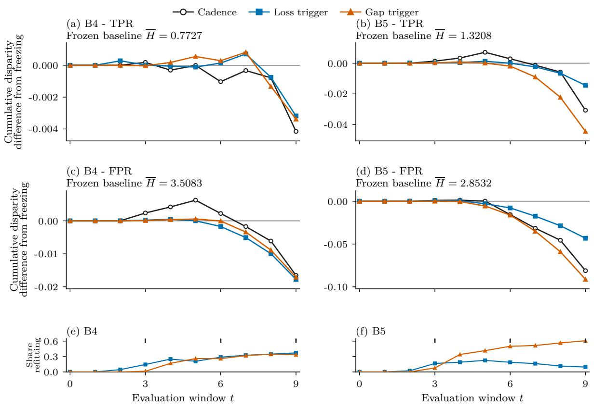  
Figure 5: Cumulative disparity contrasts in the initial sample (Run A). The same cumulative calculation used for the follow-up main figure, on the initial sample. Cadence ticks mark scheduled refits at t = 3, 6, 9. Archive labels B4 and B5 refer to subgroup-specific and combined drift.

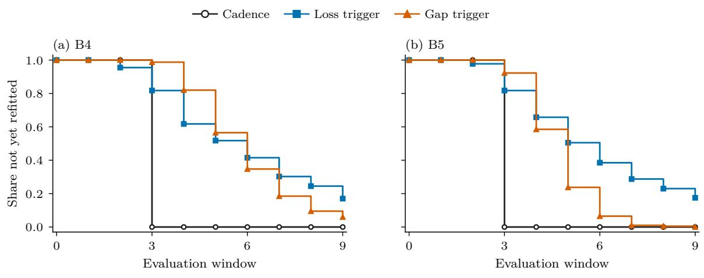  
Figure 6: First-refit timing in the initial sample. Curves show the proportion not yet refitted through each boundary. Cadence first acts at window 3. The endpoint includes paths on which the policy never acts.

Table 11: First-refit timing and refit-count distributions in the initial sample (Run A). Panel (a) gives the proportion of 400 trajectories with no refit through each window. Panel (b) gives trajectory counts by total refit count and the corresponding mean. Each count row sums to 400.  
(a) Proportion with no rolling refit through window t
<table><tr><td>Policy</td><td> $t = 0 \ t = 1 \ t = 2 \ t = 3 \ t = 4 \ t = 5 \ t = 6 \ t = 7 \ t = 8 \ t = 9$ </td></tr><tr><td colspan="3">B4 subgroup-concept</td></tr><tr><td> $P _ { 2 }$  cadence</td><td>1.000 1.000 1.000 0.000 0.000 0.000 0.000 0.000 0.000 0.000</td><td></td><td></td></tr><tr><td> $P _ { 4 }$ </td><td>loss trigger 1.000 1.000 0.955 0.818 0.618 0.517 0.415 0.302 0.245 0.170</td><td></td><td></td></tr><tr><td> $P _ { 6 }$ </td><td>gap trigger 1.000 1.000 1.000 0.988 0.820 0.565 0.347 0.185 0.095 0.060</td><td></td><td></td></tr><tr><td colspan="4">B5 combined drift</td></tr><tr><td> $P _ { 2 }$  cadence</td><td>1.000 1.000 1.000 0.000 0.000 0.000 0.000 0.000 0.000 0.000</td><td></td><td></td></tr><tr><td> $P _ { 4 }$ </td><td>loss trigger 1.000 1.000 0.978 0.818 0.657 0.505 0.385 0.287 0.230 0.175</td><td></td><td></td></tr><tr><td> $P _ { 6 }$ </td><td>gap trigger 1.000 1.000 1.000 0.922 0.585 0.237 0.065 0.010 0.005 0.000</td><td></td><td></td></tr></table>

(b) Exact trajectory counts by total rolling-refit count k
<table><tr><td>Policy n</td><td colspan="16"> $k = 0 \ k = 1 \ k = 2 \ k = 3 \ k = 4 \ k = 5 \ k = 6 \ k = 7 \ k = 8 \ k = 9$  mean</td></tr><tr><td colspan="11">B4 subgroup-concept</td></tr><tr><td> $P _ { 2 }$  cadence</td><td>400</td><td>0</td><td>0</td><td>0</td><td>400</td><td>0</td><td>0</td><td>0</td><td>0</td><td>0</td><td></td><td>0 3.000</td></tr><tr><td> $P _ { 4 }$  loss trigger 400</td><td></td><td>68</td><td>111</td><td>88</td><td>64</td><td>44</td><td>18</td><td>5</td><td>0</td><td>2</td><td></td><td>01.978</td></tr><tr><td> $P _ { 6 }$  gap trigger 400</td><td></td><td>24</td><td>137</td><td>176</td><td>62</td><td>1</td><td>0</td><td>0</td><td>0</td><td>0</td><td></td><td>0 1.698</td></tr><tr><td>B5 combined drift</td><td></td><td></td><td></td><td></td><td></td><td></td><td></td><td></td><td></td><td></td><td></td><td></td></tr><tr><td> $P _ { 2 }$  cadence</td><td>400</td><td>0</td><td>0</td><td>0</td><td>400</td><td>0</td><td>0</td><td>0</td><td>0</td><td>0</td><td></td><td>0 3.000</td></tr><tr><td> $P _ { 4 }$  loss trigger 400</td><td></td><td>70</td><td>232</td><td>67</td><td>26</td><td>4</td><td>1</td><td>0</td><td>0</td><td>0</td><td></td><td>0 1.163</td></tr><tr><td></td><td></td><td></td><td>11</td><td></td><td>191</td><td>81</td><td>15</td><td>4</td><td>1</td><td>0</td><td>0</td><td></td></tr><tr><td> $P _ { 6 }$  gap trigger 400</td><td></td><td>0</td><td></td><td>97</td><td></td><td></td><td></td><td></td><td></td><td></td><td></td><td>3.020</td></tr></table>

The count support covers all nine eligible windows, including unobserved counts with frequency zero.

Table 12: Refit and alarm summaries for Run A. Each monitored-policy row summarises 400 trajectories. The first-alarm window is averaged only over trajectories with an alarm; the final column counts monitored trajectories with no alarm by the end of evaluation. Alarm summaries do not apply to frozen or scheduled retraining.
<table><tr><td>Policy</td><td>Mean refits</td><td>Share with an alarm</td><td>Mean first- alarm window</td><td>Trajectories without an alarm</td></tr><tr><td colspan="5">B4 subgroup-concept</td></tr><tr><td> $P _ { 0 }$  frozen</td><td>0.000</td><td></td><td></td><td></td></tr><tr><td> $P _ { 2 }$  cadence</td><td>3.000</td><td></td><td></td><td></td></tr><tr><td> $P _ { 4 }$  loss trigger</td><td>1.978</td><td>0.830</td><td>5.229</td><td>68</td></tr><tr><td> $P _ { 6 }$  gap trigger</td><td>1.698</td><td>0.940</td><td>5.809</td><td>24</td></tr><tr><td colspan="5">B5 combined drift</td></tr><tr><td> $P _ { 0 }$  frozen</td><td>0.000</td><td></td><td></td><td></td></tr><tr><td> $P _ { 2 }$  cadence</td><td>3.000</td><td></td><td></td><td></td></tr><tr><td> $P _ { 4 }$  loss trigger</td><td>1.163</td><td>0.825</td><td>5.194</td><td>70</td></tr><tr><td> $P _ { 6 }$  gap trigger</td><td>3.020</td><td>1.000</td><td>4.825</td><td>0</td></tr></table>

Table 13: Refit and alarm summaries for Run B. Each monitored-policy row summarises 400 trajectories. The first-alarm window is averaged only over trajectories with an alarm; the final column counts monitored trajectories with no alarm by the end of evaluation. Alarm summaries do not apply to frozen or scheduled retraining.
<table><tr><td>Policy</td><td>Mean refits</td><td>Share with an alarm</td><td>Mean first- alarm window</td><td>Trajectories without an alarm</td></tr><tr><td colspan="5">B4 subgroup-concept</td></tr><tr><td> $P _ { 0 }$  frozen</td><td>0.000</td><td></td><td></td><td></td></tr><tr><td> $P _ { 2 }$  cadence</td><td>3.000</td><td></td><td></td><td></td></tr><tr><td> $P _ { 4 }$  loss trigger</td><td>1.808</td><td>0.792</td><td>5.205</td><td>83</td></tr><tr><td> $P _ { 6 }$  gap trigger</td><td>1.580</td><td>0.932</td><td>6.046</td><td>27</td></tr><tr><td colspan="5">B5 combined drift</td></tr><tr><td> $P _ { 0 }$  frozen</td><td>0.000</td><td></td><td></td><td></td></tr><tr><td> $P _ { 2 }$  cadence</td><td>3.000</td><td></td><td></td><td></td></tr><tr><td> $P _ { 4 }$  loss trigger</td><td>1.185</td><td>0.810</td><td>5.327</td><td>76</td></tr><tr><td> $P _ { 6 }$  gap trigger</td><td>3.075</td><td>1.000</td><td>4.790</td><td>0</td></tr></table>

Table 14: Predictive-performance changes in the follow-up sample (Run B). Entries are mean policy-minus-frozen changes over 400 trajectories and ten equally weighted windows per comparison. Groups 0 and 1 are the reference and comparison groups. Under B4, all policies lower both groups’ mean TPR while lowering cumulative absolute TPR disparity. These descriptive results are outside the directional testing families.
<table><tr><td>Block</td><td>Policy</td><td>∆ log loss</td><td>∆ acc.</td><td>∆ bal. acc.</td><td> $\Delta$  TPR0</td><td> $\Delta \mathrm { \ T P R _ { 1 } }$ </td><td>∆FPR0</td><td>∆ FPR1</td></tr><tr><td>B4 subgroup-concept</td><td> $P _ { 2 }$  cadence</td><td>-0.0007</td><td>0.0003</td><td>-0.0009</td><td>-0.0121</td><td>-0.0116</td><td>-0.0100</td><td>-0.0111</td></tr><tr><td>B4 subgroup-concept</td><td> $P _ { 4 }$  loss trigger</td><td>-0.0004</td><td>0.0002</td><td>-0.0006</td><td>-0.0079</td><td>-0.0075</td><td>-0.0065</td><td>-0.0072</td></tr><tr><td>B4 subgroup-concept</td><td> $P _ { 6 }$  gap trigger</td><td>-0.0004</td><td>0.0001</td><td>-0.0008</td><td>-0.0087</td><td>-0.0082</td><td>-0.0069</td><td>-0.0081</td></tr><tr><td>B5 combined drift</td><td> $P _ { 2 }$  cadence</td><td>-0.0060</td><td>0.0094</td><td>0.0102</td><td>0.0190</td><td>0.0232</td><td>0.0009</td><td>-0.0060</td></tr><tr><td>B5 combined drift</td><td> $P _ { 4 }$  loss trigger</td><td>-0.0038</td><td>0.0060</td><td>0.0064</td><td>0.0116</td><td>0.0135</td><td>-0.0001</td><td>-0.0035</td></tr><tr><td>B5 combined drift</td><td> $P _ { 6 }$  gap trigger</td><td>-0.0060</td><td>0.0094</td><td>0.0103</td><td>0.0204</td><td>0.0255</td><td>0.0026</td><td>-0.0062</td></tr></table>

Balanced accuracy is the mean of sensitivity and specificity.

## E Action incidence, no-drift controls, and cadence comparisons

The simulation and Census decompositions use the action records to identify inaction. They do not infer inaction from a zero disparity contrast, since refitting can also produce a zero contrast. Every trajectory without a refit is checked for equality with freezing. Conditional means and adverse shares describe the sets selected by each policy; those sets difer, preventing a causal comparison of conditional outcomes across policies.

The no-drift controls remove drift from the environmental draws of their respective followup conditions, retaining their two slightly diferent calibrated intercepts. Each control shares the initial sample and calibration of its corresponding drift analysis. The action records and full count distributions are included in the reproducibility package. The direct cadence analysis also includes paired changes in log loss, accuracy, balanced accuracy, and both groups’ TPR and FPR in cadence\_performance.csv.

Table 15: Action incidence and conditional disparity in the follow-up sample.
<table><tr><td>Policy</td><td>Acts (%) Mean if acts (pp) &gt; 0 if acts (%) &gt; 0.5 pp if acts (%)</td></tr><tr><td>Subgroup-specific concept drift: TPR</td><td>15.0</td></tr><tr><td>Cadence 100.0</td><td>-0.055 43.8</td></tr><tr><td>Loss trigger 79.2</td><td>-0.054 44.5</td></tr><tr><td>Gap trigger 93.2</td><td>-0.057 42.9 6.7</td></tr><tr><td>Subgroup-specific concept drift: FPR</td><td></td></tr><tr><td>Cadence 100.0</td><td>-0.105 44.5 21.2</td></tr><tr><td>Loss trigger 79.2</td><td>-0.097 39.4 16.1</td></tr><tr><td>Gap trigger 93.2</td><td>-0.133 37.3 10.2</td></tr><tr><td>Combined drift: TPR</td><td></td></tr><tr><td>Cadence 100.0</td><td>-0.424 31.0 16.2</td></tr><tr><td>Loss trigger 81.0</td><td>-0.231 31.8 15.4</td></tr><tr><td>Gap trigger 100.0</td><td>-0.511 24.5 9.5</td></tr><tr><td>Combined drift: FPR</td><td></td></tr><tr><td>Cadence 100.0</td><td>-0.696 26.5 18.8</td></tr><tr><td>Loss trigger 81.0</td><td>-0.419 28.7 16.4</td></tr><tr><td>Gap trigger 100.0</td><td>-0.881 20.5 11.2</td></tr></table>

Conditional descriptions do not compare causally equivalent sets of trajectories: policies select diferent paths on which to act.

Table 16: Finite-state action-incidence decomposition of the unweighted Census comparison.
<table><tr><td>Policy</td><td>Acts (%)  $> 0$  (%) &gt; 0 if acts (%) Mean if acts (pp)</td></tr><tr><td>Sex: TPR</td><td>0.086</td></tr><tr><td>Cadence</td><td>100.0 65.7 65.7</td></tr><tr><td>Loss trigger 22.9</td><td>14.3 62.5 0.157</td></tr><tr><td>Gap trigger 91.4</td><td>54.3 59.4 0.128</td></tr><tr><td>Sex: FPR</td><td></td></tr><tr><td>Cadence 100.0 2.9</td><td>2.9 -0.518</td></tr><tr><td>Loss trigger 22.9 2.9</td><td>12.5 -0.539</td></tr><tr><td>Gap trigger 91.4 8.6</td><td>9.4 -0.566</td></tr><tr><td>Race: TPR</td><td></td></tr><tr><td>Cadence 100.0 10.3</td><td>10.3 -0.719</td></tr><tr><td>Loss trigger 20.7</td><td>50.0 -0.089</td></tr><tr><td>10.3 Gap trigger 93.1 10.3</td><td>11.1 -0.802</td></tr><tr><td>Race: FPR</td><td></td></tr><tr><td>Cadence 100.0 31.0</td><td>31.0 -0.559</td></tr><tr><td>Loss trigger 20.7 6.9</td><td>33.3 -0.503 29.6 -0.654</td></tr><tr><td>Gap trigger 93.1 27.6</td><td></td></tr></table>

The unconditional policy comparison and conditional descriptions use diferent denominators. Conditional cross-policy diferences have no causal interpretation.

Table 17: Complete-policy no-drift control with the original calibrated baseline parameters.
<table><tr><td>Policy Acts (%) Mean refits ∆ gap (pp) 95% interval (pp)</td></tr><tr><td>Subgroup-specific concept baseline: TPR</td></tr><tr><td>Cadence 100.0 3.00 -0.024 [-0.071, 0.023]</td></tr><tr><td>Loss trigger 40.0 0.69 -0.003 [-0.024, 0.019]</td></tr><tr><td>Gap trigger 70.2 0.94 -0.019 [-0.045, 0.007]</td></tr><tr><td>Subgroup-specific concept baseline: FPR</td></tr><tr><td>Cadence 100.0 3.00 0.290 [0.216, 0.364]</td></tr><tr><td>Loss trigger 40.0 0.69 0.067 [0.030, 0.110]</td></tr><tr><td>Gap trigger 70.2 0.94 0.127 [0.088, 0.171]</td></tr><tr><td>Combined baseline: TPR</td></tr><tr><td>Cadence 100.0 3.00 -0.037 [-0.082, 0.010]</td></tr><tr><td>Loss trigger 42.8 0.82 -0.004 [-0.028, 0.019]</td></tr><tr><td>Gap trigger 67.8 0.89 -0.025 [-0.053, 0.003]</td></tr><tr><td>Combined baseline: FPR</td></tr><tr><td>Cadence 100.0 3.00 0.312 [0.235, 0.389]</td></tr><tr><td>Loss trigger 42.8 0.82 0.117 [0.077, 0.160]</td></tr><tr><td>Gap trigger 67.8 0.89 0.107 [0.065, 0.150]</td></tr></table>

Each baseline uses the same 400 environmental draws as its drifting counterpart, replacing only the drift process. Thresholds and initial/training-window sizes are retained. The control is nonconfirmatory.

Table 18: Complete no-drift policy refitcount distributions.
<table><tr><td>Policy 0</td><td>1 2</td><td></td><td>3</td><td>4 ≥5</td></tr><tr><td>Subgroup-specific concept drift baseline Cadence 0.0</td><td>0.0 0.0</td><td>100.0</td><td>0.0</td><td>0.0</td></tr><tr><td>Loss trigger 60.0</td><td>22.0</td><td>9.2</td><td>7.0 1.5</td><td>0.2</td></tr><tr><td>Gap trigger 29.8 49.2</td><td></td><td>19.2</td><td>1.2 0.5</td><td>0.0</td></tr><tr><td>Combined drift baseline</td><td></td><td></td><td></td><td></td></tr><tr><td>Cadence</td><td>0.0</td><td></td><td></td><td></td></tr><tr><td>Loss trigger 57.2</td><td>0.0 21.2 11.8</td><td>0.0</td><td>100.0 0.0 4.8 3.0</td><td>0.0 2.0</td></tr></table>

Percentage of 400 trajectories at each count, for each retained baseline calibration. Frozen never refits.

Table 19: Direct paired comparisons of monitored retraining with cadence (follow-up).
<table><tr><td>Comparison ∆ gap (pp) 95% interval (pp) ∆ refits</td></tr><tr><td>Subgroup-specific concept drift</td></tr><tr><td>Loss trigger / TPR 0.012 [-0.029, 0.050] -1.19</td></tr><tr><td>Gap trigger / TPR 0.001 [-0.038, 0.038] -1.42</td></tr><tr><td>Loss trigger / FPR 0.028 [-0.017, 0.075] -1.19</td></tr><tr><td>Gap trigger / FPR -0.019 [-0.066, 0.027] -1.42</td></tr><tr><td>Combined drift</td></tr><tr><td>Loss trigger / TPR 0.237 [0.174, 0.301] -1.81</td></tr><tr><td>Gap trigger / TPR -0.087 [-0.127, -0.049] 0.07</td></tr><tr><td>Loss trigger / FPR 0.357 [0.275, 0.439] -1.81</td></tr><tr><td>Gap trigger / FPR -0.185 [-0.227, -0.143] 0.07</td></tr></table>

Positive values favour cadence on the disparity outcome. These exploratory contrasts use the paired diferences directly and are outside the original testing families.

## F Evaluation-horizon sensitivity

Each prefix retains the observations and policy actions from the original follow-up trajectory through its last included window. There is no retraining of the policies for a diferent horizon and no extension beyond window 9. Cumulative and per-window contrasts therefore answer two diferent scaling questions using the same prefix. Nominal paired intervals for every prefix are retained in horizon\_prefixes.csv.

Table 20: Evaluation-horizon prefixes on unchanged follow-up trajectories.
<table><tr><td>Policy 5: ∆H 5: pp</td><td>8: ∆H</td><td>8: pp</td><td></td><td>10: ∆H 10: pp</td></tr><tr><td colspan="5">Subgroup-specific concept drift: TPR</td></tr><tr><td>Cadence</td><td>-0.0000 -0.001 -0.0028 -0.035</td><td></td><td></td><td>-0.0055 </td><td>-0.055</td></tr><tr><td>Loss trigger</td><td>0.0001</td><td>0.002-0.0017-0.022</td><td></td><td>-0.0043</td><td>-0.043</td></tr><tr><td>Gap trigger -0.0005 -0.009 -0.0029 -0.036</td><td></td><td></td><td></td><td>-0.0053</td><td>-0.053</td></tr><tr><td>Subgroup-specific concept drift: FPR</td><td></td><td></td><td></td><td></td><td></td></tr><tr><td>Cadence</td><td>0.0043</td><td>0.087</td><td>0.0014 0.018</td><td>-0.0105</td><td>-0.105</td></tr><tr><td>Loss trigger</td><td>0.0004</td><td>0.008 0.0008</td><td>0.010</td><td>-0.0077</td><td>-0.077</td></tr><tr><td>Gap trigger</td><td>0.0005</td><td>0.010-0.0016-0.020</td><td></td><td></td><td>-0.0124 -0.124</td></tr><tr><td>Combined drift: TPR</td><td></td><td></td><td></td><td></td><td></td></tr><tr><td colspan="6"></td></tr><tr><td>Cadence</td><td>0.0020</td><td>0.040-0.0103-0.128</td><td></td><td></td><td>-0.0424-0.424</td></tr><tr><td>Loss trigger</td><td>0.0013</td><td>0.027 -0.0051 -0.063</td><td></td><td>-0.0187</td><td>-0.187</td></tr><tr><td>Gap trigger</td><td>0.0009</td><td></td><td>0.019-0.0133-0.167</td><td>-0.0511</td><td>-0.511</td></tr><tr><td colspan="6">Combined drift: FPR</td></tr><tr><td>Cadence</td><td>0.0041</td><td></td><td>0.081-0.0226-0.283</td><td>-0.0696</td><td>-0.696</td></tr><tr><td>Loss trigger</td><td>0.0006</td><td></td><td>0.012 -0.0121 -0.151</td><td>-0.0339</td><td>-0.339</td></tr><tr><td>Gap trigger -0.0003 -0.006 -0.0313 -0.391</td><td></td><td></td><td></td><td>-0.0881</td><td>-0.881</td></tr></table>

The first 5, 8, or 10 windows are retained, including window 0. Each average-gap contrast divides its cumulative contrast by its own horizon. Paired nominal intervals are retained in horizon\_prefixes.csv.

## G Alarm behaviour and action-count matching

The alarm archive retains each consumed signed stream value, accumulator state, direction, reference value, and decision boundary.

## G.1 Alarm direction and recurrence under a fixed reference

We classify active-stream changes relative both to the original reference and to the preceding observation. Those are diferent comparisons: CUSUM evidence accumulates relative to the fixed reference, while a new observation can improve relative to the immediately preceding value.

alarm\_records.csv retains individual stream records, including signed and absolute gaps and the next observed alarm delay. A missing next delay means right censoring at the lifecycle end. The illustrative 0.1 pp refit-change diagnostic scores the old and new fitted models on the same next evaluation sample. It is computed after replay and cannot influence the decisions. It measures prediction change conditional on that realised refit, not a causal efect of a trigger isolated from the policy loop.

Table 21: Alarm reference comparisons and prediction changes after refitting.
<table><tr><td></td><td>Stream Alarms Below initial (%) Below prior (%) Next delay Refit change (%)</td><td></td><td></td></tr><tr><td>Subgroup-specific concept drift 431 2.3</td><td></td><td></td><td></td></tr><tr><td>TPR</td><td></td><td>32.5</td><td>3.0</td></tr><tr><td>FPR</td><td></td><td>37.6</td><td>3.0</td></tr><tr><td>Combined drift</td><td>4.9</td><td></td><td></td></tr><tr><td>TPR</td><td>1118</td><td>23.3</td><td>2.0</td></tr><tr><td>FPR</td><td></td><td>64.4</td><td>2.0</td></tr></table>

Below initial/prior means smaller absolute gap than that reference, among alarming stream records. Delay is the median number of boundaries until another policy alarm among uncensored records. Refit change is the percentage of all gap-policy refits changing this stream by more than 0.1 pp when pre/post models score the same new evaluation window; it is an illustrative threshold, not an action-efect estimate.

Table 22: Gap-trigger refits classified by active-stream changes from the preceding observation.
<table><tr><td colspan="3">Refits Worse TPR (%) Worse FPR (%) Worse both (%) Improving (%) Mixed/flat (%)</td></tr><tr><td>Subgroup-specific concept drift</td></tr><tr><td>632 39.6 19.8</td><td>4.1 32.1 4.4</td></tr><tr><td>Combined drift</td><td></td></tr><tr><td>1230 50.3</td><td>6.8 24.5 15.6</td></tr></table>

Each refit appears once. Classification uses only the streams newly alarming at that boundary. Worsening refers to increased absolute disparity since the prior observation, not the CUSUM reference; multiple alarms can lead to one action. Mixed includes active streams moving in opposing absolute-gap directions.

## G.2 Calibration of the random refitting policy

The random policy uses a refit probability estimated from a separate calibration sample. Its binomial count distribution can therefore be compared with the monitored policy’s empirical counts before interpreting their paired disparity diference. Expected-count matching leaves the probability of any action and the distribution of realised counts unconstrained.

Outcome bootstrap intervals condition on the calibrated probability. Uncertainty from repeating the entire calibration-and-evaluation process would require repeating both stages.

Table 23: Loss-trigger versus random refitting on 400 paired evaluation trajectories. The final column is the descriptive ratio $\overline { { \Delta H _ { R } } } / \overline { { \Delta H } } _ { P _ { 4 } }$ : the fraction of $P _ { 4 } \mathrm { ^ { 3 } s }$ estimated disparity reduction over $P _ { 0 }$ reproduced by the random policy. It has no interval.
<table><tr><td>Block</td><td>Measure</td><td> $\overline { { D } } _ { 4 , R }$ </td><td>95% BCa</td><td> $\overline { { \Delta H } } _ { P _ { 4 } }$ </td><td> $\overline { { \Delta H } } _ { R }$ </td><td>descriptive ratio</td></tr><tr><td>B4 subgroup-concept TPR gap -0.0009</td><td></td><td></td><td>[-0.0050, 0.0031]</td><td>-0.0034</td><td>-0.0025</td><td>0.724</td></tr><tr><td>B4 subgroup-concept FPR gap -0.0052</td><td></td><td></td><td>[-0.0114, 0.0011]</td><td>-0.0141</td><td>-0.0089</td><td>0.630</td></tr><tr><td>B5 combined drift</td><td>TPR gap −0.0075</td><td></td><td>[-0.0156, 0.0007]</td><td>-0.0119</td><td>-0.0044</td><td>0.372</td></tr><tr><td>B5 combined drift</td><td></td><td></td><td>FPR gap -0.0114 [−0.0208, -0.0018]</td><td>-0.0426</td><td>-0.0313</td><td>0.734</td></tr></table>

Table 24: Random-reference calibration target and realised refit counts. The loss-trigger policy’s expected count is estimated from 400 separate calibration trajectories. The random policy refits at each of nine eligible windows with probability $p _ { \mathrm { r e f i t } }$ . The final three columns report mean counts and their diference on the evaluation sample.
<table><tr><td>Block</td><td> $\hat { \lambda } _ { P _ { 4 } }$ </td><td>prefit</td><td> $P _ { 4 }$  mean refits</td><td>R mean refits</td><td>Mean refits:  $R - P _ { 4 }$ </td></tr><tr><td>B4 subgroup-concept</td><td>2.0450</td><td>0.2272</td><td>1.8975</td><td>2.0400</td><td>0.1425</td></tr><tr><td>B5 combined drift</td><td>1.1775</td><td>0.1308</td><td>1.1975</td><td>1.1225</td><td>-0.0750</td></tr></table>

R implied Binomial(9, $p _ { \mathrm { r e f i t } } )$ $\sqsubset \sqsubset P _ { 4 }$ empirical calibration counts  
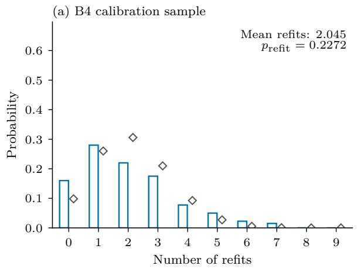

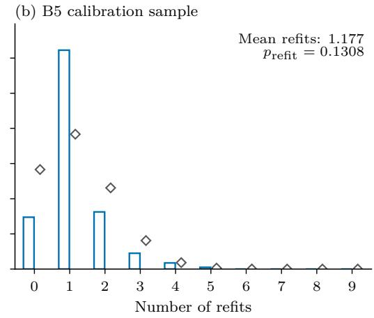  
Figure 7: Calibration counts and the implied random-refit distribution. Empirical calibration counts and the binomial count distribution implied by the fitted random probability. The reference markers are analytical probabilities, not another trajectory sample.

Table 25: Count distributions used in random-reference calibration. The loss-trigger column is empirical, based on 400 calibration trajectories. The random-reference column is the binomial distribution implied by the stored $p _ { \mathrm { r e f i t } }$ . Displayed probabilities are rounded; the table is calculated from the stored parameter.
<table><tr><td>Refit count</td><td> $P _ { 4 }$  calibration count</td><td> $P _ { 4 }$  empirical share</td><td>matched R binomial share</td></tr><tr><td>B4 subgroup-concept:</td><td></td><td> $\overline { { k } } _ { P _ { 4 } } ^ { \mathrm { c a l } } = 2 . 0 4 5 0 , p _ { \mathrm { r e f i t } } = 0 . 2 2 7 2$ </td><td></td></tr><tr><td>0</td><td>64</td><td>0.1600</td><td>0.098286</td></tr><tr><td>1</td><td>112</td><td>0.2800</td><td>0.260094</td></tr><tr><td>2</td><td>88</td><td>0.2200</td><td>0.305905</td></tr><tr><td>3</td><td>70</td><td>0.1750</td><td>0.209874</td></tr><tr><td>4</td><td>31</td><td>0.0775</td><td>0.092565</td></tr><tr><td>5</td><td>20</td><td>0.0500</td><td>0.027217</td></tr><tr><td>6</td><td>9</td><td>0.0225</td><td>0.005335</td></tr><tr><td>7</td><td>6</td><td>0.0150</td><td>0.000672</td></tr><tr><td>8</td><td>0</td><td>0.0000</td><td>0.000049</td></tr><tr><td>9</td><td>0</td><td>0.0000</td><td>0.000002</td></tr><tr><td colspan="4">B5 combined drift:  $\overline { { k } } _ { P _ { 4 } } ^ { \mathrm { c a l } } = 1 . 1 7 7 5 , p _ { \mathrm { r e f t } } = 0 . 1 3 0 8$ </td></tr><tr><td>0</td><td>59</td><td>0.1475</td><td>0.283092</td></tr><tr><td>1</td><td>249</td><td>0.6225</td><td>0.383518</td></tr><tr><td>2</td><td>65</td><td>0.1625</td><td>0.230920</td></tr><tr><td>3</td><td>18</td><td>0.0450</td><td>0.081106</td></tr><tr><td>4</td><td>7</td><td>0.0175</td><td>0.018313</td></tr><tr><td>5</td><td>2</td><td>0.0050</td><td>0.002757</td></tr><tr><td>6</td><td>0</td><td>0.0000</td><td>0.000277</td></tr><tr><td>7</td><td>0</td><td>0.0000</td><td>0.000018</td></tr><tr><td>8</td><td>0</td><td>0.0000</td><td>0.000001</td></tr><tr><td>9</td><td>0</td><td>0.0000</td><td>0.000000</td></tr></table>

Table 26: Action incidence and count-distribution diferences in the random-reference comparison. The first five columns describe whether each policy refits at least once on a trajectory. TV is total-variation distance between the realised count distributions. The final column is the proportion of paired trajectories on which the policies perform the same number of refits. Matching expected counts leaves these quantities unconstrained.
<table><tr><td>Block</td><td> $P _ { 4 }$  refits</td><td>R refits</td><td>Both refit</td><td>Only  $P _ { 4 }$  refits</td><td>Only R refits</td><td>TV distance</td><td>Same refit count</td></tr><tr><td>B4 subgroup-concept</td><td>0.828</td><td>0.912</td><td>0.757</td><td>0.070</td><td>0.155</td><td>0.085</td><td>0.203</td></tr><tr><td>B5 combined drift</td><td>0.845</td><td>0.690</td><td>0.573</td><td>0.273</td><td>0.117</td><td>0.207</td><td>0.305</td></tr></table>

## G.3 Threshold selection and matching validation

Threshold selection ranks candidate loss-trigger policies using their action counts relative to the fixed gap-trigger policy. A separate sample evaluates the selected approximation against all five matching criteria. The candidate grid and validation results identify which aspects of the action distributions remain mismatched.

The criterion labels MQ1–MQ5 denote mean-count diference, its paired interval, count-distribution distance, any-refit probability diference, and mass on common count support. The exact ranking rule and bounds are specified in Section A. The selected approximation failed the required criteria, and the planned matched disparity comparison was withheld.

Table 27: Threshold candidates on the 200-trajectory selection sample. Panel (a) reports mean counts and probabilities of any refit. Panel (b) reports count-distribution distance, overlap, and support diagnostics. The selected threshold is marked. The paired interval criterion is evaluated only on the separate validation sample and appears in Table 28.  
(a) Counts and probability of any refit
<table><tr><td>Candidate</td><td>h</td><td> $\bar { n } _ { P _ { 4 } }$ </td><td> $\bar { n } _ { P _ { 6 } }$  MQ1 |∆|</td><td></td><td> $\mathrm { P r } ( P _ { 4 } > 0 )$ </td><td> $\mathrm { P r } ( P _ { 6 } > 0 )$ </td><td>MQ4 |∆| Selected</td><td></td></tr><tr><td>1</td><td>0.0025464.610 1.625</td><td></td><td></td><td>2.985</td><td>0.975</td><td>0.935</td><td>0.040</td><td></td></tr><tr><td>2</td><td>0.003041 4.345 1.625</td><td></td><td></td><td>2.720</td><td>0.970</td><td>0.935</td><td>0.035</td><td></td></tr><tr><td>3</td><td>0.003632</td><td>4.070 1.625</td><td></td><td>2.445</td><td>0.965</td><td>0.935</td><td>0.030</td><td></td></tr><tr><td>4</td><td>0.004338 3.805 1.625</td><td></td><td></td><td>2.180</td><td>0.945</td><td>0.935</td><td>0.010</td><td></td></tr><tr><td>5</td><td>0.005182 3.4201.625</td><td></td><td></td><td>1.795</td><td>0.925</td><td>0.935</td><td>0.010</td><td></td></tr><tr><td>6</td><td>0.006189 3.045 1.625</td><td></td><td></td><td>1.420</td><td>0.920</td><td>0.935</td><td>0.015</td><td></td></tr><tr><td>7</td><td>0.007392 2.6801.625</td><td></td><td></td><td>1.055</td><td>0.885</td><td>0.935</td><td>0.050</td><td></td></tr><tr><td>8</td><td>0.008829</td><td>92.325 1.625</td><td></td><td>0.700</td><td>0.870</td><td>0.935</td><td>0.065</td><td></td></tr><tr><td>9</td><td>0.010545 1.935 1.625</td><td></td><td></td><td>0.310</td><td>0.835</td><td>0.935</td><td>0.100</td><td></td></tr><tr><td>10</td><td>0.012654 1.6201.625</td><td></td><td></td><td>0.005</td><td>0.795</td><td>0.935</td><td>0.140</td><td>√</td></tr><tr><td>11</td><td>0.015184 1.4301.625</td><td></td><td></td><td>0.195</td><td>0.795</td><td>0.935</td><td>0.140</td><td></td></tr><tr><td>12</td><td>0.018221 1.205 1.625</td><td></td><td></td><td>0.420</td><td>0.760</td><td>0.935</td><td>0.175</td><td></td></tr><tr><td>13</td><td>0.021865 0.9801.625</td><td></td><td></td><td>0.645</td><td>0.700</td><td>0.935</td><td>0.235</td><td></td></tr><tr><td>14</td><td>0.0262380.7451.625</td><td></td><td></td><td>0.880</td><td>0.575</td><td>0.935</td><td>0.360</td><td></td></tr><tr><td>15</td><td>0.031485</td><td>0.5851.625</td><td></td><td>1.040</td><td>0.485</td><td>0.935</td><td>0.450</td><td></td></tr><tr><td>16</td><td>0.037781 0.4251.625</td><td></td><td></td><td>1.200</td><td>0.395</td><td>0.935</td><td>0.540</td><td></td></tr><tr><td>17</td><td>0.045337 0.2901.625</td><td></td><td></td><td>1.335</td><td>0.285</td><td>0.935</td><td>0.650</td><td></td></tr></table>

(b) Count-distribution overlap and support
<table><tr><td colspan="11">Candidate h MQ3 TV 1 − TV MQ5  $P _ { 4 }$  MQ5  $P _ { 6 }$  exact count within one</td></tr><tr><td>1</td><td>0.002546</td><td>0.675</td><td>0.325</td><td>0.475</td><td></td><td>1.000</td><td>0.085</td><td>0.260</td></tr><tr><td>2</td><td>0.003041</td><td>0.645</td><td>0.355</td><td>0.515</td><td>1.000</td><td></td><td>0.110</td><td>0.295</td></tr><tr><td>3</td><td>0.003632</td><td>0.610</td><td>0.390</td><td>0.580</td><td>1.000</td><td></td><td>0.095</td><td>0.335</td></tr><tr><td>4</td><td>0.004338</td><td>0.575</td><td>0.425</td><td>0.650</td><td>1.000</td><td></td><td>0.115</td><td>0.375</td></tr><tr><td>5</td><td>0.005182</td><td>0.500</td><td>0.500</td><td>0.700</td><td>1.000</td><td></td><td>0.130</td><td>0.445</td></tr><tr><td>6</td><td>0.006189</td><td>0.440</td><td>0.560</td><td>0.790</td><td>1.000</td><td></td><td>0.165</td><td>0.510</td></tr><tr><td>7</td><td>0.007392</td><td>0.425</td><td>0.575</td><td>0.855</td><td>1.000</td><td></td><td>0.190</td><td>0.545</td></tr><tr><td>8</td><td>0.008829</td><td>0.340</td><td>0.660</td><td>0.890</td><td>1.000</td><td></td><td>0.205</td><td>0.615</td></tr><tr><td>9</td><td>0.010545</td><td>0.290</td><td>0.710</td><td>0.940</td><td>1.000</td><td></td><td>0.205</td><td>0.655</td></tr><tr><td>10</td><td>0.012654</td><td>0.245</td><td>0.755</td><td>0.980</td><td>1.000</td><td></td><td>0.270</td><td>0.680</td></tr><tr><td>11</td><td>0.015184</td><td>0.225</td><td>0.775</td><td>0.995</td><td></td><td>1.000</td><td>0.265</td><td>0.715</td></tr><tr><td>12</td><td>0.018221</td><td>0.255</td><td>0.745</td><td>1.000</td><td>1.000</td><td></td><td>0.290</td><td>0.745</td></tr><tr><td>13</td><td>0.021865</td><td>0.345</td><td>0.655</td><td>1.000</td><td></td><td>0.995</td><td>0.255</td><td>0.760</td></tr><tr><td>14</td><td>0.026238</td><td>0.410</td><td>0.590</td><td>1.000</td><td></td><td>0.995</td><td>0.230</td><td>0.705</td></tr><tr><td>15</td><td>0.031485</td><td>0.470</td><td>0.530</td><td>1.000</td><td></td><td>0.995</td><td>0.245</td><td>0.660</td></tr><tr><td>16</td><td>0.037781</td><td>0.540</td><td>0.460</td><td>1.000</td><td></td><td>0.880</td><td>0.190</td><td>0.625</td></tr><tr><td>17</td><td>0.045337</td><td>0.650</td><td>0.350</td><td>1.000</td><td></td><td>0.880</td><td>0.130</td><td>0.570</td></tr></table>

Candidate numbering follows increasing threshold, not the selection rank. The check mark identifies the selected threshold. All displayed candidate metrics are selection-stage descriptions; Table 28 reports the selected candidate’s disjoint validation-stage MQ1–MQ5 assessment.

Table 28: Validation of the selected threshold on 400 disjoint B4 trajectories. The meancount, paired-interval, and common-support criteria pass. The count-distribution and any-refit criteria fail, so the planned disparity comparison was not run.
<table><tr><td>Criterion</td><td>Pre-specified bound</td><td>Observed</td><td>Outcome</td></tr><tr><td>Mean refit-count difference</td><td> $| \overline { { n } } _ { P _ { 4 } } - \overline { { n } } _ { P _ { 6 } } | \leq 0 . 1 0$ </td><td>0.0575</td><td>Pass</td></tr><tr><td>Paired mean-count interval</td><td>90% interval [-0.25, 0.25]</td><td>[-0.065, 0.175]</td><td>Pass</td></tr><tr><td>Count-distribution distance</td><td> $T V \le 0 . 2 0$ </td><td>TV 二 0.290; over- lap=0.710</td><td>Fail</td></tr><tr><td>Difference in probability of any refit</td><td> $| \Delta \mathrm { P r } ( \mathrm { a n y ~ r e f i t } ) | \leq 0 . 1 0$ </td><td>0.145</td><td>Fail</td></tr><tr><td>Mass on common count sup- support mass ≥ 0.95 each 0.988 / 1.000 port</td><td></td><td></td><td>Pass</td></tr></table>

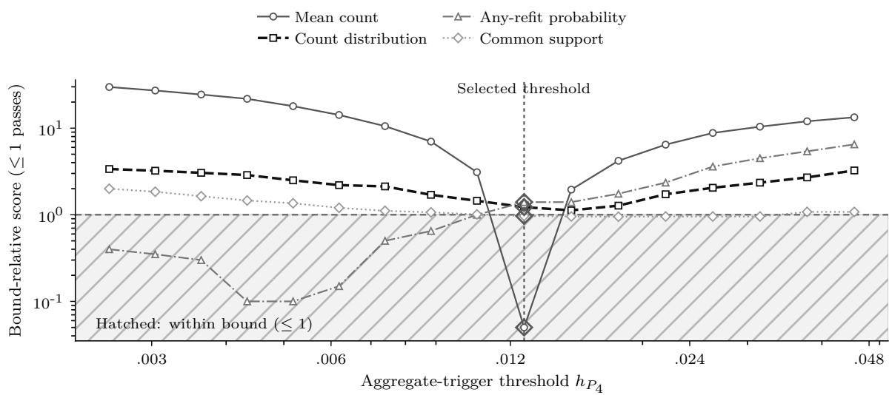  
Figure 8: Selection and validation of the action-count match. Scores at or below one satisfy their bounds. Every candidate exceeds the count-distribution bound on selection. The selected approximation is then assessed on the separate validation sample.

## H Hindsight optimisation at fixed refit counts

Each reconstructed trajectory evaluates the best objective at every exact count, including zero, by exhaustive subset enumeration. A cached fit-time/window loss matrix reproduces the same operation as replaying each schedule because the rolling fit does not depend on earlier fitted models. The evaluated policy’s schedule is checked against its archived objective. The minimising at-most-count schedule, objective, and tie-breaking must also reproduce the archive. All 3,200 policy–rate–trajectory comparisons pass within $1 0 ^ { - 9 }$ absolute and relative tolerances.

The file oracle\_exact\_count\_records.json contains every exact-count optimum and its schedule, the same-count and fewer-action components, the strict-improvement tolerance, and population evaluation of the originally selected schedule. The objective search is not repeated on population rates. The population-evaluated policy–oracle disparity diference may be negative and is never clipped. The descriptive ratios below express the share of the mean frozen-to-oracle disparity reduction attained by each policy and the remaining share.

Table 29: Descriptive share of the frozen-to-oracle disparity reduction attained on 400 trajectories per comparison. Captured share is $[ \overline { { H } } ( P _ { 0 } ) - \overline { { H } } ( \pi ) ] / [ \overline { { H } } ( P _ { 0 } ) - \overline { { H } } ( O ) ]$ ; the adjacent column gives its complement. These post-hoc ratios of means have no interval. The policy–oracle gap G retains its nominal 95% BCa interval. Each oracle has perfect foresight and a policy-specific realised-count cap.
<table><tr><td>Policy</td><td>H(π)</td><td>H(O)</td><td>Captured Complement share (%)</td><td>(%)</td><td>Mean G [95% BCa]</td></tr><tr><td colspan="6">B4 subgroup-concept, TPR gap: H(P0) = 0.7676</td></tr><tr><td> $P _ { 4 }$  loss trigger 0.7628 0.7170</td><td></td><td>9.6</td><td>90.4</td><td></td><td>0.0458 [0.0420, 0.0498]</td></tr><tr><td> $P _ { 6 }$  gap trigger 0.7590 0.7074</td><td></td><td>14.4</td><td>85.6</td><td></td><td>0.0515 [0.0475, 0.0560]</td></tr><tr><td colspan="6">B4 subgroup-concept, FPR gap: H(P0) = 3.5140</td></tr><tr><td> $P _ { 4 }$  loss trigger 3.49493.4430</td><td></td><td>27.0</td><td>73.0</td><td></td><td>0.0518 [0.0469, 0.0576]</td></tr><tr><td> $P _ { 6 }$  gap trigger 3.4929 3.4342</td><td></td><td>26.4</td><td>73.6</td><td></td><td>0.0587 [0.0537, 0.0644]</td></tr><tr><td colspan="6">B5 combined drift, TPR gap: H(P0) = 1.3293</td></tr><tr><td> $P _ { 4 }$  loss trigger 1.3177 1.2525</td><td></td><td>15.0</td><td>85.0</td><td></td><td>0.0653 [0.0595, 0.0711]</td></tr><tr><td> $P _ { 6 }$  gap trigger 1.2844 1.2169</td><td></td><td>39.9</td><td>60.1</td><td></td><td>0.0675 [0.0634, 0.0720]</td></tr><tr><td colspan="6">B5 combined drift, FPR gap:  $\overline { { H } } ( P _ { 0 } ) = 2 . 8 5 5 2$ </td></tr><tr><td> $P _ { 4 }$  loss trigger 2.8082 2.7295</td><td></td><td>37.4</td><td>62.6</td><td></td><td>0.0787 [0.0710, 0.0873]</td></tr><tr><td> $P _ { 6 }$  gap trigger 2.7565 2.6764</td><td></td><td>55.2</td><td>44.8</td><td></td><td>0.0801 [0.0741, 0.0867]</td></tr></table>

## I Census evaluation and sensitivity analyses

Reconstruction reproduces the archived aggregate disparity contrasts and action counts for all 64 combinations of attribute and state, under both evaluation weightings. Each evaluation window’s fingerprint is retained. The historical execution did not archive invocation metadata or individual predictions, limiting verification against its original outputs.

census\_group\_window\_rates.csv contains weighted and unweighted group-specific TPR/FPR, group/outcome record counts, efective sample size $( \sum w ) ^ { 2 } / \sum w ^ { 2 }$ , maximum individual weight share, and the weight share of the largest one percent of records. census\_win dow\_contributions.csv records signed and absolute-gap comparisons and each wave’s contribution to cumulative disparity. State contrasts, indicator sensitivity, and leave-one-state-out means are retained separately. Efective sample size quantifies unequal weights; it does not account for the ACS complex survey design.

Table 30: Unweighted within-state Census comparisons with freezing. Each policy is evaluated on 35 sex-comparison states or 29 White–Black racecomparison states, with ten evaluation windows per state. Negative $\Delta H$ denotes lower cumulative absolute disparity. BCa intervals describe variation under exchangeable-state resampling. Wilson intervals are binomial-reference summaries for the proportion of states with positive $\Delta H$ . Neither treatment accounts for dependence between states, and neither is used for a populationlevel test. Mean refit counts are shared across the TPR and FPR summaries.
<table><tr><td>Policy</td><td>TPR ∆H [BCa]</td><td>TPR AP [Wilson]</td><td>FPR ∆H [BCa]</td><td>FPR AP [Wilson] Mean refits</td><td></td></tr><tr><td colspan="6">Sex (n = 35); H(P0): TPR=0.3273, FPR=1.0689</td></tr><tr><td> $P _ { 2 }$  cadence</td><td>0.0086 [0.0001, 0.0180]</td><td>0.657 [0.492, 0.792]</td><td>-0.0518 [-0.0695, -0.0392]</td><td>0.029 [0.005, 0.145]</td><td>3.00</td></tr><tr><td> $P _ { 4 }$  loss trigger</td><td>0.0036 [0.0002, 0.0105]</td><td>0.143 [0.063, 0.294]</td><td>-0.0123 [-0.0404, -0.0025]</td><td>0.029 [0.005, 0.145]</td><td>0.43</td></tr><tr><td> $P _ { 6 }$ </td><td>0.0117 gap trigger [0.0040, 0.0222]</td><td>0.543 [0.382, 0.695]</td><td>-0.0517 [-0.0691, -0.0374]</td><td>0.086 [0.030, 0.224]</td><td>3.71</td></tr><tr><td></td><td></td><td>Race (n = 29); H(P0): TPR=0.6640, FPR=0.6874</td><td></td><td></td><td></td></tr><tr><td></td><td>-0.0719 [-0.1006, -0.0513]</td><td>0.103 [0.036, 0.264]</td><td>-0.0559 [-0.1093, -0.0077]</td><td>0.310 [0.173, 0.492]</td><td>3.00</td></tr><tr><td> $P _ { 2 }$  cadence</td><td>-0.0018</td><td>0.103</td><td>-0.0104 [-0.0360, 0.0008]</td><td>0.069 [0.019, 0.220]</td><td></td></tr><tr><td> $P _ { 4 }$ </td><td>loss trigger [−0.0095, 0.0019] -0.0747</td><td>[0.036, 0.264] 0.103</td><td>-0.0609</td><td>0.276</td><td>0.31</td></tr><tr><td> $P _ { 6 }$ </td><td>gap trigger [−0.1100, −0.0508]</td><td>[0.036, 0.264]</td><td>[-0.1302, -0.0092]</td><td>[0.147, 0.457]</td><td>4.34</td></tr></table>

Table 31: Person-weighted evaluation of the fixed Census predictions. Within each statewindow, ACS person weights replace equal record weights when computing subgroup rates. The fitted models, monitoring, refit actions, and equal weighting of states in the final summary are unchanged. This is evaluation-weight sensitivity, not a weighted retraining replay. The final column records whether the weighted and unweighted mean diferences have the same sign.
<table><tr><td>Attribute Policy</td><td></td><td>Measure</td><td>Unweighted mean ∆H</td><td>Weighted- evaluation mean ∆H</td><td>Weighted-evaluation 95%BCa</td><td>Weighted- evaluation positive share</td><td>Same sign</td></tr><tr><td>Sex</td><td> $P _ { 2 }$  cadence</td><td>TPR gap</td><td>0.0086</td><td>-0.0025</td><td>[-0.0119, 0.0082]</td><td>0.429</td><td>no</td></tr><tr><td>Sex</td><td> $P _ { 2 }$  cadence</td><td>FPR gap</td><td>-0.0518</td><td>-0.0391</td><td>[-0.0515, -0.0277]</td><td>0.086</td><td>yes</td></tr><tr><td>Sex</td><td> $P _ { 4 }$  loss trigger</td><td>TPR gap</td><td>0.0036</td><td>0.0026</td><td>[-0.0005, 0.0111]</td><td>0.114</td><td>yes</td></tr><tr><td>Sex</td><td> $P _ { 4 }$  loss trigger</td><td>FPR gap</td><td>-0.0123</td><td>-0.0060</td><td>[-0.0291, 0.0013]</td><td>0.057</td><td>yes</td></tr><tr><td>Sex</td><td> $P _ { 6 }$  gap trigger</td><td>TPR gap</td><td>0.0117</td><td>0.0024</td><td>[-0.0064, 0.0135]</td><td>0.429</td><td>yes</td></tr><tr><td>Sex</td><td> $P _ { 6 }$  gap trigger</td><td>FPR gap</td><td>-0.0517</td><td>-0.0366</td><td>[−0.0489, -0.0240]</td><td>0.114</td><td>yes</td></tr><tr><td>Race</td><td> $P _ { 2 }$  cadence</td><td>TPR gap</td><td>-0.0719</td><td>-0.0461</td><td>[-0.0699, -0.0286]</td><td>0.172</td><td>yes</td></tr><tr><td>Race</td><td> $P _ { 2 }$  cadence</td><td>FPR gap</td><td>-0.0559</td><td>0.0374</td><td>[-0.0168, 0.0796]</td><td>0.655</td><td>no</td></tr><tr><td>Race</td><td> $P _ { 4 }$  loss trigger</td><td>TPR gap</td><td>-0.0018</td><td>-0.0048</td><td>[−0.0177, -0.0003]</td><td>0.069</td><td>yes</td></tr><tr><td>Race</td><td> $P _ { 4 }$  loss trigger</td><td>FPR gap</td><td>-0.0104</td><td>0.0052</td><td>[−0.0062, 0.0210]</td><td>0.138</td><td>no</td></tr><tr><td>Race</td><td> $P _ { 6 }$  gap trigger</td><td>TPR gap</td><td>-0.0747</td><td>-0.0507</td><td>[-0.0845, -0.0291]</td><td>0.241</td><td>yes</td></tr><tr><td>Race</td><td> $P _ { 6 }$  gap trigger</td><td>FPR gap</td><td>-0.0609</td><td>0.0469</td><td>[-0.0200, 0.1006]</td><td>0.552</td><td>no</td></tr></table>

The weighted race-FPR leave-one-state-out cumulative means range from 0.0273 to 0.0531 for cadence, 0.0014 to 0.0085 for the loss trigger, and 0.0326 to 0.0667 for the gap trigger. These ranges describe sensitivity to omitting one state, rather than statistical uncertainty. Every omission retains each mean sign reversal; the exchangeable-state BCa intervals in Table 31 nevertheless all include zero.

Within-state disparity diferences under unweighted evaluation  
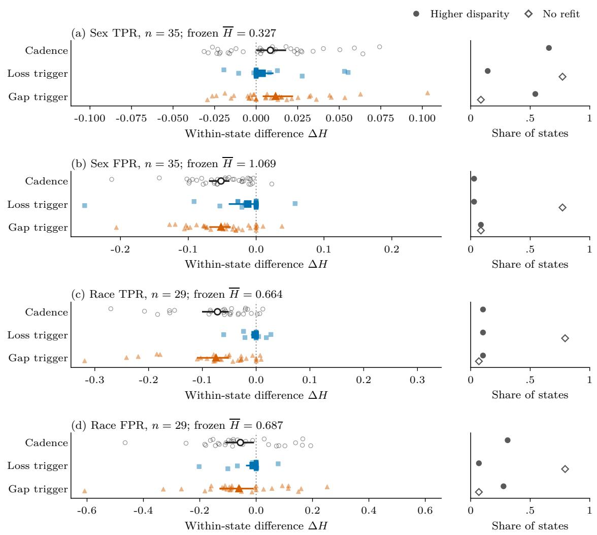  
Figure 9: Distributions of unweighted state-level disparity contrasts. Small symbols represent states; large symbols represent means. The intervals do not model dependence between states.

## I.1 Monitoring calibration and action targets

Across every tested reference value, the loss-triggered policy remained below the three-refit calibration target. Tables 32 and 33 report the selected parameters and maximum attained counts.

Table 32: Selected Census monitoring parameters and refit counts. Reference values and thresholds are expressed in calibration-stream scale units. Grid maximum is the largest mean refit count attained at the selected reference value across the tested thresholds. Calibration and evaluation means refer to their separate state sets. Boundary threshold indicates selection at an endpoint of the 16-value grid. The target is three mean refits.
<table><tr><td>Attribute Policy</td><td></td><td>Reference κ</td><td>Threshold h</td><td>Grid maximum</td><td>Calibration Evaluation mean</td><td>mean</td><td>Any-refit share</td><td>Boundary threshold</td></tr><tr><td>Sex</td><td> $P _ { 4 }$  loss trigger</td><td>0.50</td><td>0.100</td><td>1.00</td><td>1.00</td><td>0.43</td><td>0.23</td><td>yes</td></tr><tr><td>Sex</td><td> $P _ { 6 }$  gap trigger</td><td>0.50</td><td>0.934</td><td>6.07</td><td>3.00</td><td>3.71</td><td>0.91</td><td>no</td></tr><tr><td>Race</td><td> $P _ { 4 }$  loss trigger</td><td>0.50</td><td>0.100</td><td>0.42</td><td>0.42</td><td>0.31</td><td>0.21</td><td>yes</td></tr><tr><td>Race</td><td> $P _ { 6 }$  gap trigger</td><td>0.50</td><td>0.934</td><td>5.58</td><td>3.42</td><td>4.34</td><td>0.93</td><td>no</td></tr></table>

Table 33: Maximum calibration-state mean refit counts across the tested reference values. For each reference value, the table reports the largest mean count attained by any threshold on the grid. The reference values used in parameter selection are distinguished from additional diagnostic settings. The scan changes no reported policy selection.
<table><tr><td colspan="3"></td><td rowspan="2">Aggregate-trigger Subgroup-trigger maximum</td><td rowspan="2">Used in parameter selection</td></tr><tr><td>Attribute</td><td>Reference value</td><td>maximum</td></tr><tr><td>Sex</td><td>0.50</td><td>1.00</td><td>6.07</td><td>yes</td></tr><tr><td>Sex</td><td>0.25</td><td>1.07</td><td>7.67</td><td>no</td></tr><tr><td>Sex</td><td>0.10</td><td>1.33</td><td>7.87</td><td>no</td></tr><tr><td>Sex</td><td>0.00</td><td>1.40</td><td>7.93</td><td>no</td></tr><tr><td>Race</td><td>0.50</td><td>0.42</td><td>5.58</td><td>yes</td></tr><tr><td>Race</td><td>0.25</td><td>0.58</td><td>7.17</td><td>no</td></tr><tr><td>Race</td><td>0.10</td><td>0.58</td><td>7.75 8.00</td><td>no</td></tr><tr><td>Race</td><td>0.00</td><td>0.75</td><td></td><td>no</td></tr></table>

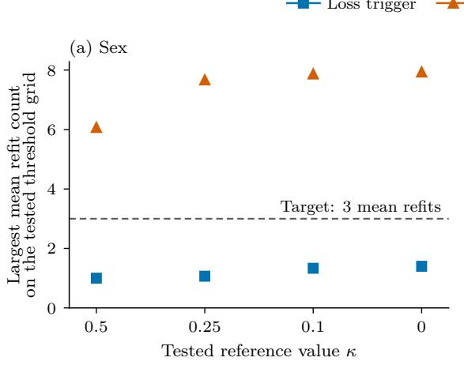

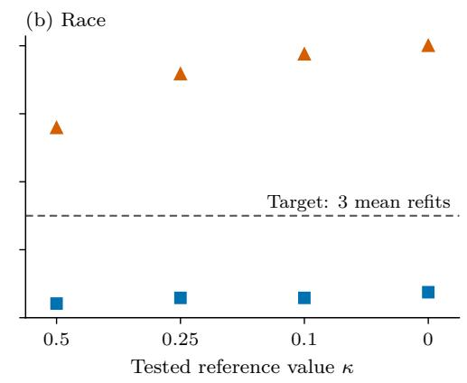  
Figure 10: Attainable mean refit counts across calibration settings. The loss-trigger policy remains below three mean calibration actions across the tested reference-value and threshold grids.

## I.2 Sample-cap sensitivity and provenance

The archived cap audit rebuilds trajectories with 10,000, 25,000, or uncapped records per statewindow. The smallest cap excludes Utah from the race evaluation set, so its comparison uses the common 35 sex and 28 race states. The complete 25,000-row archive reproduces the main state-level contrasts; common-set race means difer because Utah is excluded. The historical audit lacks complete invocation metadata and source-binding records, limiting attribution of its diferences to cap size. Its estimates remain descriptive comparisons of the archived outputs.

## J Reproducibility and analysis provenance

Table 34: Sensitivity to the maximum records per state-window. Means use the same 35 sex-comparison states and 28 racecomparison states at caps of 10,000 and 25,000 and without a cap. The race set excludes Utah, which is absent from the 10,000-row audit, from the main 29-state set. The audit source recomputes sampling, preprocessing, fitting, monitoring, refits, and predictions at each cap while retaining the main calibration settings. The full 25,000-row archive reproduces the main within-state results; the race mean here uses the restricted common set. Section I.2 explains Utah’s exclusion and the audit’s historical seed-provenance limitation.
<table><tr><td>Attribute</td><td>Policy</td><td>Functional</td><td>cap 10000</td><td>cap 25000</td><td>no cap</td></tr><tr><td>Sex</td><td>P2 cadence</td><td>TPR gap</td><td>0.0036</td><td>0.0086</td><td>0.0115</td></tr><tr><td>Sex</td><td>P2 cadence</td><td>FPR gap</td><td>-0.0603</td><td>-0.0518</td><td>-0.0559</td></tr><tr><td>Sex</td><td> $P _ { 4 }$  loss trigger</td><td>TPR gap</td><td>0.0025</td><td>0.0036</td><td>0.0032</td></tr><tr><td>Sex</td><td> $P _ { 4 }$  loss trigger</td><td>FPR gap</td><td>-0.0166</td><td>-0.0123</td><td>-0.0118</td></tr><tr><td>Sex</td><td> $P _ { 6 }$  gap trigger</td><td>TPR gap</td><td>0.0065</td><td>0.0117</td><td>0.0140</td></tr><tr><td>Sex</td><td>P6 gap trigger</td><td>FPR gap</td><td>-0.0636</td><td>-0.0517</td><td>-0.0515</td></tr><tr><td>Race</td><td>P2 cadence</td><td>TPR gap</td><td>-0.0780</td><td>-0.0648</td><td>-0.0679</td></tr><tr><td>Race</td><td>P2 cadence</td><td>FPR gap</td><td>-0.0697</td><td>-0.0637</td><td>-0.0649</td></tr><tr><td>Race</td><td>P4 loss trigger</td><td>TPR gap</td><td>-0.0008</td><td>-0.0019</td><td>-0.0040</td></tr><tr><td>Race</td><td>P4 loss trigger</td><td>FPR gap</td><td>-0.0129</td><td>-0.0108</td><td>-0.0079</td></tr><tr><td>Race</td><td>P6 gap trigger</td><td>TPR gap</td><td>-0.0854</td><td>-0.0660</td><td>-0.0616</td></tr><tr><td>Race</td><td>P6 gap trigger</td><td>FPR gap</td><td>-0.0860</td><td>-0.0672</td><td>-0.0617</td></tr></table>

Package version 2026.09.08-r2 retains source and environment specifications, calibrated scientific inputs, trajectory-level outcomes and actions, diagnostic records, and table/figure builders. File hashes bind the supplied source and outputs independently of the authoring repository’s commit history. The public reproduction release is available at model-retraining-under-drift, v1.0.0.

Reproducibility package Current comparison records check simulation fingerprints and empirical window gaps, actual and oracle schedule objectives, and weighted and unweighted Census state contrasts and action counts. Small validation-run commands and complete reproduction commands are included in the package’s README. The accompanying specification supplies the scientific parameters.

Source-binding deviation in the initial analysis The deposited initial design covered 75 source files. The runner passed its complete initial authority check, then repeated an underspecified provenance check after computing trajectories and estimands. That second check failed while constructing the run record. The repair reused the initial provenance object, changing a source-bound file; it therefore could not inherit the deposit’s execution authority. The deposit preceded Run A; the opposite hypothesis and distinct environmental namespace preceded Run B. These facts preserve chronology without treating the repaired run as registered execution.

Historical verification records Repository history records repeated deterministic runs, but the corresponding repeat-output directories and machine-readable comparison manifests are not retained. The current reconstruction manifest establishes present comparisons only. It is not evidence validating an old invocation. Historical development, calibration, and protocol records are kept separately from the non-confirmatory analyses added during manuscript revision.

Archive identifiers Policies P0, P2, P4, and P6 denote frozen, cadence, loss-trigger, and gap-trigger rules. Drift keys SUBGROUP\_CONCEPT (B4) and EMBEDDED (B5) denote subgroupspecific and combined drift. E1, E2, E3, E7, and E11 identify frozen comparisons, random reference, matching, hindsight, and Census replay. Stored TTE and RCSR denote loss-triggerminus-random disparity and empirical at-most-count hindsight gap. These are archive lookup keys, not registration claims.

## References

Ayoub Ajarra and Debabrota Basu. Auditing fairness under model updates: Fundamental complexity and property-preserving updates. arXiv preprint arXiv:2601.05909, 2026. doi: 10.48550/arXiv.2601.05909. URL https://arxiv.org/html/2601.05909v1. Version 1, 9 January 2026.

Maryam Badar, Wolfgang Nejdl, and Marco Fisichella. FAC-Fed: Federated adaptation for fairness and concept drift aware stream classification. Machine Learning, 112:2761–2786, 2023. doi: 10.1007/s10994-023-06360-7.

Solon Barocas, Moritz Hardt, and Arvind Narayanan. Fairness and Machine Learning: Limitations and Opportunities. MIT Press, 2023.

Jan Baumeister, Bernd Finkbeiner, Frederik Scheerer, Julian Siber, and Tobias Wagenpfeil. Stream-based monitoring of algorithmic fairness. In Tools and Algorithms for the Construction and Analysis ofSystems (TACAS), volume 15696 of Lecture Notes in Computer Science, pages 60–81. Springer, 2025. doi: 10.1007/978-3-031-90643-5\_4.

Ioannis Bilionis, Ricardo C. Berrios, Luis Fernandez-Luque, and Carlos Castillo. An empirical evaluation of the risks of artificial intelligence model updates using clinical data: Stability, arbitrariness, and fairness. arXiv preprint arXiv:2604.23954, 2026. URL https://arxiv.or g/html/2604.23954v2. Version 2, 4 August 2026.

Alexander D’Amour, Hansa Srinivasan, James Atwood, Pallavi Baljekar, D. Sculley, and Yoni Halpern. Fairness is not static: Deeper understanding of long term fairness via simulation studies. In Conference on Fairness, Accountability, and Transparency (FAT\*), 2020.

Sawan Dasari. When to retrain: An empirical study of retraining policies for streaming ML under concept drift, budget, and latency constraints. arXiv preprint arXiv:2608.19488, 2026. doi: 10.48550/arXiv.2608.19488.

Sharon E. Davis, Chad Dorn, Daniel J. Park, and Michael E. Matheny. Emerging algorithmic bias: Fairness drift as the next dimension of model maintenance and sustainability. Journal of the American Medical Informatics Association, 32(5):845–854, 2025. doi: 10.1093/jamia/ ocaf039.

Oscar Blessed Deho, Michael Bewong, Selasi Kwashie, Jiuyong Li, Jixue Liu, Lin Liu, and Srecko Joksimovic. Is it still fair? a comparative evaluation of fairness algorithms through the lens of covariate drift. Machine Learning, 114, 2025. doi: 10.1007/s10994-024-06698-6.

Frances Ding, Moritz Hardt, John Miller, and Ludwig Schmidt. Retiring adult: New datasets for fair machine learning. In Advances in Neural Information Processing Systems (NeurIPS), 2021.

Bradley Efron. Better bootstrap confidence intervals. Journal of the American Statistical Association, 82(397):171–185, 1987.

Danielle Ensign, Sorelle A. Friedler, Scott Neville, Carlos Scheidegger, and Suresh Venkatasubramanian. Runaway feedback loops in predictive policing. In Conference on Fairness, Accountability, and Transparency (FAT\*), 2018.

João Gama, Indr˙e Žliobait˙e, Albert Bifet, Mykola Pechenizkiy, and Abdelhamid Bouchachia. A survey on concept drift adaptation. ACM Computing Surveys, 46(4):44:1–44:37, 2014. doi: 10.1145/2523813.

Paul Glasserman. Monte Carlo Methods in Financial Engineering, volume 53 of Stochastic Modelling and Applied Probability. Springer, New York, 2004. doi: 10.1007/978-0-387-21617 -1.

Peter Hall and Susan R. Wilson. Two guidelines for bootstrap hypothesis testing. Biometrics, 47(2):757–762, 1991. doi: 10.2307/2532163.

Moritz Hardt, Eric Price, and Nathan Srebro. Equality of opportunity in supervised learning. In Advances in Neural Information Processing Systems (NeurIPS), volume 29, 2016.

Thomas A. Henzinger, Mahyar Karimi, Konstantin Kuefner, and Kaushik Mallik. Runtime monitoring of dynamic fairness properties. In Proceedings of the 2023 ACM Conference on Fairness, Accountability, and Transparency. Association for Computing Machinery, 2023. doi: 10.1145/3593013.3594028. URL https://arxiv.org/html/2305.04699v1.

Sture Holm. A simple sequentially rejective multiple test procedure. Scandinavian Journal of Statistics, 6(2):65–70, 1979.

Vasileios Iosifidis and Eirini Ntoutsi. FABBOO: Online fairness-aware learning under class imbalance. In Discovery Science, volume 12323 of Lecture Notes in Computer Science, pages 159–174. Springer, 2020. doi: 10.1007/978-3-030-61527-7\_11.

Lydia T. Liu, Sarah Dean, Esther Rolf, Max Simchowitz, and Moritz Hardt. Delayed impact of fair machine learning. In International Conference on Machine Learning (ICML), 2018.

Ananth Mahadevan and Michael Mathioudakis. Cost-aware retraining for machine learning. Knowledge-Based Systems, 293:111610, 2024. doi: 10.1016/j.knosys.2024.111610.

National Institute of Standards and Technology. Artificial Intelligence Risk Management Framework (AI RMF 1.0). Technical Report NIST AI 100-1, U.S. Department of Commerce, 2023.

Adam Piaseczny, Md Kamran Chowdhury Shisher, Shiqiang Wang, and Christopher G. Brinton. RCCDA: Adaptive model updates in the presence of concept drift under a constrained resource budget. In Advances in Neural Information Processing Systems, volume 38, 2025. doi: 10.5 2202/085713-5183.

Florence Regol, Leo Schwinn, Kyle Sprague, Mark Coates, and Thomas Markovich. When to retrain a machine learning model. In Proceedings of the 42nd International Conference on Machine Learning, volume 267 of Proceedings of Machine Learning Research, pages 51369– 51404. PMLR, 2025. URL https://proceedings.mlr.press/v267/regol25a.html.

Minglai Shao, Dong Li, Chen Zhao, Xintao Wu, Yujie Lin, and Qin Tian. Supervised algorithmic fairness in distribution shifts: A survey. In Proceedings of the Thirty-Third International Joint Conference on Artificial Intelligence (IJCAI), pages 8225–8233, 2024. doi: 10.24963/ijcai.2 024/909.

Zichong Wang, Nripsuta Saxena, Tongjia Yu, Sneha Karki, Tyler Zetty, Israat Haque, Shan Zhou, Dukka Kc, Ian Stockwell, Albert Bifet, and Wenbin Zhang. Preventing discriminatory decision-making in evolving data streams. In Proceedings of the 2023 ACM Conference on Fairness, Accountability, and Transparency. Association for Computing Machinery, 2023. doi: 10.1145/3593013.3593984.

Edwin B. Wilson. Probable inference, the law of succession, and statistical inference. Journal of the American Statistical Association, 22(158):209–212, 1927.

Jun Yang and Michael Mathioudakis. Automated retraining for cost-optimal ML. In Machine Learning and Knowledge Discovery in Databases. Research Track (ECML PKDD 2026), volume 16941 of Lecture Notes in Computer Science, pages 231–249. Springer, 2027. doi: 10.1007/978-3-032-37654-1\_14. First published online 25 August 2026.

Wenbin Zhang and Eirini Ntoutsi. FAHT: An adaptive fairness-aware decision tree classifier. In Proceedings of the Twenty-Eighth International Joint Conference on Artificial Intelligence, pages 1480–1486, 2019. doi: 10.24963/ijcai.2019/205.