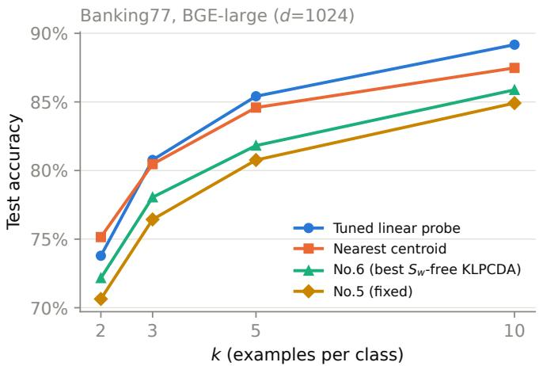
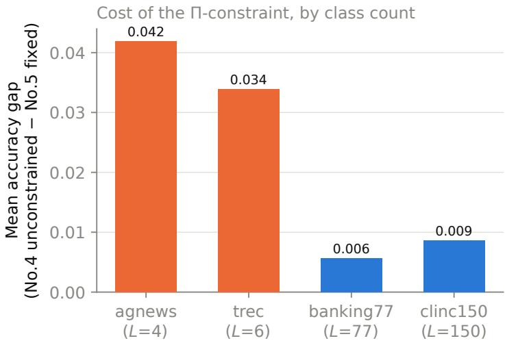
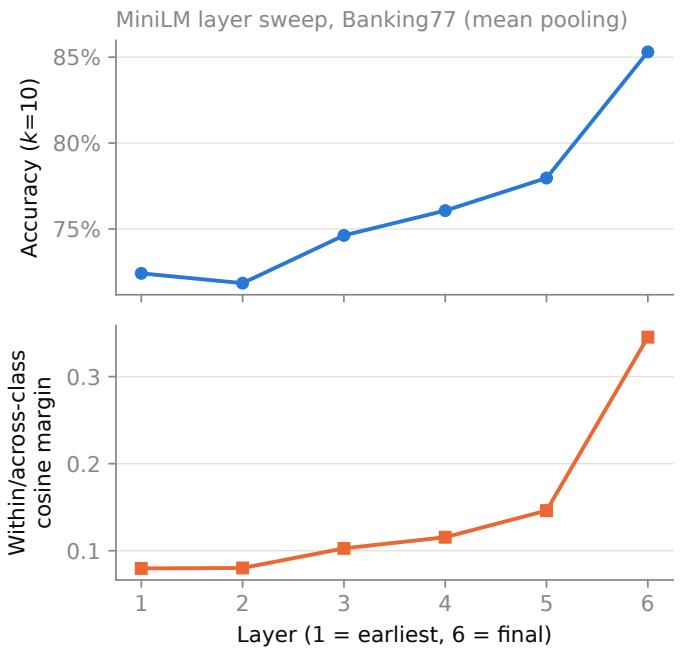
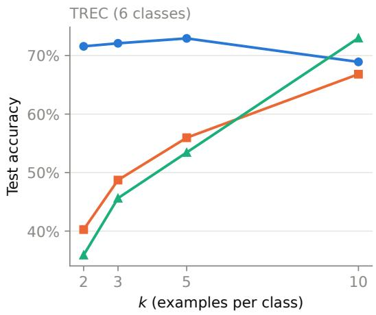
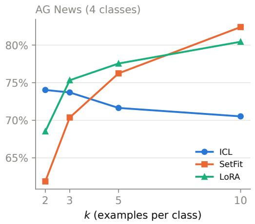

# Exact Degeneracy Under Balanced k-Shot Sampling: Consequences for Small-Sample Discriminant Analysis on LLM Embeddings

Lingxiao Qu\*1

1The University of Aizu, Aizuwakamatsu, Fukushima, Japan

## Abstract

Balanced k-shot sampling, drawing exactly k labeled examples per class, is the standard protocol in few-shot evaluation. We show that it induces an exact, provable degeneracy in a family of small-sample discriminant estimators. Under balanced sampling, the within-class scatter operator of Kernelized Linear Principal Component Discriminant Analysis (KLPCDA) is not merely rank-deficient, the condition classical small-sample discriminant analysis addresses, but is exactly a scaled orthogonal projector. We derive the consequences in closed form: two of KLPCDA’s seven variants have every signal eigenvalue exactly equal, so their eigenvector selection criterion is provably indifferent rather than ill-conditioned, and a third has a provably void objective, its operator exactly the zero matrix. These follow from the estimators’ construction rather than from any dataset, and we confirm them to float64 precision on frozen sentence embeddings and, separately, on residual-stream activations from a decoder-only generative model. An in-formula tie-break repairs the two repairable variants; how much they recover depends on class count exactly as the mechanism predicts, since the subspace constraint they remain subject to costs $5 \times$ more on few-class than on many-class datasets (p= 0.000001).

We then evaluate the repaired framework in the regime that motivated it: few-shot text classification on frozen LLM embeddings $( n \ll d ,$ with d up to 4096), across four datasets, three embedding sizes, and three trained baselines (SetFit, LoRA, in-context learning). A properly cross-validated logisticregression probe still beats every KLPCDA variant on three of four datasets, at every embedding size. Guidance carried from pixel, vibration-signal, and gene-expression data does not directly generalize to this feature space. We also report a negative result: three independent geometric separability metrics all fail to explain why one high-dimensional decoder-based embedding model underperforms smaller bidirectional encoders in this regime, ruling out embedding anisotropy as the explanation. We then show that underperformance is substantially an estimation-efficiency effect rather than a permanent ceiling: extending the support set from $k \leq 1 0$ to k = 30–50 closes more than 80% of its accuracy gap to a comparable bidirectional encoder, on both many-class datasets tested $( p = 0 . 0 0 1 9 5$ throughout). We report four quantified guidelines for practitioners and release the estimator, evaluation harness, and full experimental log.

## 1 Introduction

Small-sample-size (SSS) classification, where the number of labeled examples n is smaller than the feature dimension d, has a long history in classical discriminant analysis. When $n < d ,$ the within-class scatter matrix $S _ { w }$ that Fisher’s linear discriminant analysis (LDA) needs to invert is rank-deficient $( \mathrm { r a n k } ( S _ { w } ) \leq n - L$ for L classes), and naively inverting it is numerically unstable or undefined. Kernelized Linear Principal Component Discriminant Analysis (KLPCDA) [7] addresses this with seven variants that fuse total vari ance C, between-class scatter $S _ { b } ,$ , and within-class scatter $S _ { w }$ in different combinations, some avoiding $S _ { w }$ entirely, and a companion cross-domain study derives guidance for which variant to prefer under which measurable data conditions (rank deficiency, class imbalance, how much class-discriminative signal sur vives a variance-only projection), validated across hyperspectral imaging, bearing-fault vibration signals, gene-expression panels, and face recognition.

Frozen embeddings from a modern LLM or sentence-transformer, evaluated in a few-shot text-classification setting, sit in the same regime by construction: k labeled examples per class across L classes gives $n = k L .$ and modern embedding dimensions range from d = 384 (small sentence-transformers) to d = 4096 (billionparameter decoder-based embedders), routinely giving $n \ll$ d for realistic few-shot budgets $( k \le 1 0 )$ . This is the same rank-deficiency regime KLPCDA was designed for, with the feature map supplied by a pretrained encoder rather than a hand-picked kernel. Whether guidance derived from pixels, vibration signals, and gene expression transfers to this quite different feature space, and, if not, exactly where it breaks, is the question this paper sets out to answer.

The first finding does not depend on any particular dataset. The evaluation protocol itself, balanced kshot sampling, which draws exactly k examples per class, puts the KLPCDA family into an exactly characterizable degenerate state, in which three of its seven variants’ selection criteria become provably arbitrary or provably void, and a fourth collapses onto a low-dimensional, structurally meaningful subspace rather than an arbitrary one (Section 3). This is a structural interaction between a standard few-shot protocol and a class of scatter-matrix estimators, not a property of embeddings or of any dataset, and we therefore lead with it and treat the empirical transfer question as the setting that surfaced it. We report the empirical result throughout, including several findings that reverse or complicate earlier, more optimistic readings of our own intermediate results. Concretely, we make four contributions:

1. An exact, closed-form diagnosis and fix for a previously undocumented failure mode. Under balanced k-shot sampling, KLPCDA’s within-class operator is exactly a scaled orthogonal projector; we derive from this that two variants’ entire signal subspace shares a single eigenvalue (making eigenvector selection provably arbitrary) and that a third variant’s operator is exactly zero (making its objective void). We verify both to floating-point precision, on frozen sentence embeddings and separately on residual-stream activations from a decoder-only generative model, evidence that the mechanism belongs to the estimator rather than to a feature space, and repair the two repairable variants with an in-formula tie-break (Section 3).

2. A four-dataset, three-embedding-size evaluation (Section 4) comparing all seven KLPCDA variants against a properly cross-validated linear probe, a nearest-centroid baseline, and three trained/adapted baselines (SetFit, LoRA, in-context learning), with the headline result that KLPCDA does not yet beat a fair linear probe on three of four datasets (Section 5).

3. Four mechanism-backed, quantified guidelines for practitioners, covering class count, layer/pooling choice, the k-regime where in-context learning beats fine-tuned baselines, and how much of a highdimensional embedder’s few-shot disadvantage is recoverable with more labeled examples, each stated with its supporting evidence and, where known, its mechanism (Section 6).

4. A negative result: three independent geometric separability metrics, of increasing statistical sophistication, all fail to explain why one embedding model underperforms another in this regime, ruling out several natural explanations rather than leaving the question untested (Section 7).

We release the full estimator, evaluation harness, and a step-by-step experimental log recording every dead end alongside every confirmed finding, so that the negative and revised results are as useful to a practitioner deciding whether to try this approach as the positive ones.

## 2 Related Work

Small-sample discriminant analysis. Fisher’s linear discriminant analysis [3] and its many small-sample extensions address the case $n < d ,$ where the within-class scatter matrix $S _ { w }$ is singular or ill-conditioned and standard LDA is undefined (see Qu and Pei [6] for a recent survey of this problem and the class-level and robustness challenges that accompany it). One line of response kernelizes the discriminant problem, projecting onto directions found by an orthogonal transformation in a reproducing kernel Hilbert space rather than operating in the original feature space directly [9]. KLPCDA [7] extends this kernelized approach into a seven-variant framework that fuses total variance, between-class scatter, and within-class scatter in different combinations, allowing the $S _ { w }$ term to be excluded entirely when it is unreliable. A companion crossdomain study [8] derives "which variant, when" guidelines across four small-sample application domains (hyperspectral imaging, bearing-fault vibration signals, gene-expression panels, and face recognition) by relating variant performance to measurable properties of the data. This paper extends that guidance to a fifth domain: text embeddings from pretrained language models.

Frozen sentence embeddings. Sentence-transformer models [10] produce fixed-length embeddings optimized so that semantic similarity corresponds to embedding-space proximity, spanning a wide range of sizes and architectures: small distilled bidirectional encoders such as MiniLM [13] (d = 384), larger bidirectional encoders such as BGE [14] (d = 1024), and, more recently, billion-parameter decoder-only language mod els repurposed as embedders via contrastive fine-tuning, such as E5-Mistral [12] (d = 4096). The MTEB benchmark [5] tracks these models’ performance on retrieval, clustering, and classification tasks using the full available training data; we instead study the k-shot regime, where only a handful of labeled examples per class are available, a setting MTEB’s own classification protocol does not test.

Few-shot text classification baselines. We compare against three baselines that adapt an encoder or model to the k-shot task directly. SetFit [11] fine-tunes a sentence transformer via contrastive learning on pairs drawn from the support set, then fits a lightweight classification head, a metric-learning approach that does not require prompts. LoRA [4] instead parameter-efficiently fine-tunes a standard classification head end-toend via low-rank adapters and ordinary cross-entropy loss. In-context learning [1] places labeled examples directly in an instruction-following language model’s prompt and classifies by generation, with no gradient update at all. These three baselines span the space from metric-learning adaptation, through parameterefficient fine-tuning, to no adaptation at all, and the relative performance of these methods depends system atically on k (Section 6).

Embedding anisotropy. Prior work has documented that contextualized and sentence embedding spaces are not isotropic: representations cluster in a narrow cone rather than spreading uniformly [2]. We test whether anisotropy, or a related linearly-separability-aware measure, explains why one embedding model underperforms another in our k-shot setting; unlike prior work, which studies anisotropy as a property of an embedding space in isolation, we test it as a predictor of downstream few-shot accuracy across architecturally different encoders, and find that it is not (Section 7).

Table 1: The seven KLPCDA variants. C = total variance, $S _ { b } =$ between-class scatter, $S _ { w } =$ within-class scatter. $^ { 6 6 } S _ { w }$ involved” marks the four variants (No.1, No.3, No.5, No.7) whose target function involves $W$ and which are therefore subject to the degeneracy in Section 3.2: No.1/No.3/No.5 through pinv $( W \tilde { K } )$ , No.7 through $W \tilde { K }$ directly, with no pseudo-inverse.
<table><tr><td></td><td>Method Fused terms</td><td>Target function</td><td> $S _ { w }$ </td><td>involved Fixed in this work</td></tr><tr><td>No.1</td><td> $C , S _ { b } , S _ { w }$ </td><td> $( \alpha C + \beta S _ { b } ) v / S _ { w } v$ </td><td>yes</td><td>yes (tie-break)</td></tr><tr><td>No.2</td><td> $C , S _ { b }$ </td><td> $\alpha C v + \beta S _ { b } v$ </td><td>no</td><td></td></tr><tr><td>No.3</td><td> $S _ { b } , S _ { w }$ </td><td> $S _ { b } v / S _ { w } v$ </td><td>yes</td><td>no (objective void)</td></tr><tr><td>No.4</td><td> $C$ </td><td> $C v ( \mathrm { c e n t e r e d K P C A } )$ </td><td>no</td><td></td></tr><tr><td>No.5</td><td> $C , S _ { w }$ </td><td> $C v / S _ { w } v$ </td><td>yes</td><td>yes (tie-break)</td></tr><tr><td>No.6</td><td> $S _ { b }$ </td><td> $S _ { b } v$ </td><td>no</td><td></td></tr><tr><td>No.7</td><td> $S _ { w }$ </td><td>argmin  $S _ { w } v$ </td><td>yes</td><td>no (no 2nd term)</td></tr></table>

## 3 Method

## 3.1 The Seven KLPCDA Variants

Given n training examples with kernel matrix K (double-centered to $\tilde { K } )$ and class labels over L classes, KLPCDA defines a between-class scatter operator B and a within-class scatter operator W (both $n \times n ,$ acting on the dual/kernel-coefficient space) and combines them with the (centered) total-variance operator $C = { \tilde { K } } / n$ into seven target functions, summarized in Table 1. Each variant solves for the top (or, for No.7, bottom) eigenvectors of an operator E built from B, W, and C, projects the data onto those eigenvectors, and classifies with 1-nearest-neighbor, following the evaluation convention of Qu and Pei [7].

## 3.2 An Exact Eigenvalue Degeneracy Under Balanced k-Shot Sampling

No.1, No.3, and No.5 all require pinv $( W \tilde { K } )$ . In developing the estimator used in this study, we identified and fixed a numerical bug in this pseudo-inverse (an additive ridge that inverted, rather than correctly truncated, $W  { \mathbf { \hat { s } } }$ exact rank deficiency), but that fix left an unexplained residual: even after it, No.1 and No.5 remained among the least reliable variants, with erratic, seed-to-seed unstable accuracy. We derive the exact cause in closed form.

W is an exact scaled projector. For a class-c block of size $n _ { c } , W \mathrm { \Phi } _ { \mathrm { s } }$ block is $\begin{array} { r } { p _ { c } I _ { n _ { c } } - \frac { 1 } { n } \mathbf { 1 } _ { n _ { c } } \mathbf { 1 } _ { n _ { c } } ^ { \top } } \end{array}$ with $p _ { c } = n _ { c } / n$ . Under balanced k-shot sampling $( n _ { c } = k$ for every class, $n = k L ) , p _ { c } = 1 / L$ for every class, and each block simplifies to $\begin{array} { r } { \frac { 1 } { L } \left( I _ { k } - \frac { 1 } { k } \mathbf { 1 } _ { k } \bar { \mathbf { 1 } } _ { k } ^ { \top } \right) } \end{array}$ , 1/L times the standard per-class centering projector. Stacking blocks,

$$
\begin{array} { r } { W = \frac { 1 } { L } \Pi , } \end{array}\tag{1}
$$

where Π is the block-diagonal orthogonal projector that centers each class separately. A projector has exactly two eigenvalues, so $W$ has exactly two: 0 with multiplicity L (the per-class-mean directions, Π’s null space) and $1 / L$ with multiplicity $n - L$ (everything orthogonal to those directions). We verified this in closed form and against real embeddings $( \mathrm { B a n k i n g } 7 7 , k = 5 , L = 7 7 )$ to float64 precision: $W  { \mathbf { \bar { s } } }$ eigenvalues were exactly {0 (mult. 77), $1 / 7 7$ (mult. 308)}.

B lives entirely in Π’s null space. By the same kind of argument, $B ^ { \prime } { \mathrm { s } }$ blocks are built entirely from classindicator outer products, which span exactly the L-dimensional subspace Π projects away. Restricting B to that subspace and diagonalizing gives eigenvalues 0 (multiplicity 1, the global-mean direction) and $1 / ( k L )$

(multiplicity $L - 1$ , the between-class-contrast directions), and B is exactly zero on $\Pi ^ { \prime } \mathrm { s } \left( n - L \right)$ -dimensional range. We verified $\Pi B \Pi = 0$ directly (max absolute value $2 . 8 \times 1 0 ^ { - 3 6 }$ on real data).

Consequences for No.1, No.3, No.5. Chaining these two facts through pinv $( W \tilde { K } )$

• No.5 $( E = \mathrm { p i n v } ( W \tilde { K } ) \tilde { K } ) \colon$ every one of the $n - L$ "signal" eigenvalues of E is exactly L (we measured $7 7 . 0 0 0 0 0 0 0 0 0 0 \pm 1 . 2 \times 1 0 ^ { - 1 0 }$ on real data). No.5’s own selection criterion is therefore provably indifferent across its entire signal subspace. numpy.linalg.eig returns an arbitrary orthonormal basis of a tied eigenspace, and which basis it happens to return is what $\mathrm { N o . } 5 \mathrm { : }$ final $n _ { \mathrm { c o m p o n e n t s } }$ directions actually are.

• No.3 $\begin{array} { r } { ( E = \mathrm { p i n v } ( W \tilde { K } ) ( B \tilde { K } ) ) { : } } \end{array}$ since $B \tilde { K } ^ { \prime } { \bf s }$ output lies entirely in the subspace pinv $( W \tilde { K } )$ cannot recover any signal from (exactly Π’s null space, where W is zero), E is provably the zero matrix. We measured eigenvalues at $1 0 ^ { - 1 2 }$ to $1 0 ^ { - 1 \bar { 4 } }$ , floating-point noise around an exact zero, not a small real signal. $\mathrm { N o } . 3 \mathrm { \ ' } \mathrm { s }$ objective is void under balanced sampling, independent of embedding quality or dataset.

• No.1 $( E = \mathrm { p i n v } ( W { \tilde { K } } ) ( \alpha C + \beta B { \tilde { K } } )$ , default $\alpha = \beta = 1 )$ : since the B-term contributes exactly nothing, No.1 collapses to $\textstyle { \frac { 1 } { n } } \cdot L = 1 / k$ exactly on its signal subspace, fully explaining a previously unexplained observation that No.1’s top eigenvalues were "suspiciously equal to almost exactly $1 / k . "$

No.7 ${ } ^ { 7 } \left( E = W { \tilde { K } } \right.$ , selecting the smallest eigenvalues) selects $W  { \mathbf { \bar { s } } }$ null space directly, also exactly degenerate (all L eigenvalues at 0), but this subspace is spanned by the class-indicator vectors themselves, so it is structurally close to a kernelized nearest-centroid rule, which plausibly explains why No.7 is degenerate but not as catastrophically unstable as $\mathrm { N o . 1 } / \mathrm { N o . 3 } / \mathrm { N o . 5 } .$

## 3.3 A Tie-Break Fix, and a Direction the Formula Does Not Predict

Since No.5’s (and No.1’s) own criterion cannot distinguish directions within its degenerate subspace, we use each variant’s own already-included secondary term to break the tie (for No.5, its own C term; for No.1, its own fused numerator $\alpha C + \beta B )$ rather than importing information from outside the variant’s definition. Concretely, within any run of near-equal eigenvalues of $E$ (detected by a relative tolerance, rto $\mathrm { l } = 1 0 ^ { - 3 }$ after correcting an initial too-tight $1 0 ^ { - 4 }$ that inconsistently split one true cluster in a rare fold), we reorthonormalize the tied eigenvectors and diagonalize the tie-break matrix restricted to their span, replacing the arbitrary basis with the one that ranks by the tie-break criterion.

The ranking direction that works is not the one the literal formula predicts. No.5’s target is argmax $C v / S _ { w } v ;$ since $S _ { w } v$ is constant on the degenerate subspace, a literal reading of "maximize" implies preferring the highest-variance direction within a tied cluster. We implemented that first: it measured worse than the prefix arbitrary basis (Banking77, $k { = } 5 \colon 0 . 1 5 \ \mathrm { v s } . 0 . 5 4 )$ . The opposite choice, lowest variance first, measured 0.81, and this reversal replicated cleanly across every $k \in \{ 2 , 3 , 5 , 1 0 \}$ on two datasets. We adopt ascending order because it is supported by the experimental results, and note the mismatch with the literal formula as an open question we do not claim to have resolved: a plausible but unproven hypothesis is that Π’s range is exactly the "varies-within-class-only" subspace, so low variance there picks the most internally consis tent directions for a class, in the spirit of Fisher discriminant analysis, even though it contradicts a literal "maximize $C "$ reading once the ratio’s denominator degenerates to a constant.

No.3 and No.7 have no comparable secondary term of their own to tie-break with (No.3’s only other term, B, is exactly what we proved void in the relevant subspace; No.7 has no second term at all) and are left unfixed, characterized rather than repaired.

## 4 Experimental Setup

## 4.1 Datasets

We evaluate on four public text classification benchmarks, chosen to vary class count by nearly two orders of magnitude: Banking77 (77 fine-grained banking intents), CLINC150 (150 intents, with its explicit out of-scope class excluded from the classification task and used separately, in the out-of-distribution check reported in Section 8), TREC (6 coarse question-type classes), and AG News (4 topic classes). This range turned out to matter: several findings that looked solid on the two many-class datasets did not replicate on the two few-class datasets (Section 5).

## 4.2 Embedding Models

We extract frozen embeddings at three sizes: MiniLM [13] (d = 384, mean-pooled, final layer), BGElarge [14] $( d = 1 0 2 4 )$ , and E5-Mistral-7B-Instruct [12] $( d \ : = \ : 4 0 9 6$ , a decoder-only instruction-tuned 7B-parameter LLM embedder, run in float16). No embedding model is fine-tuned; only the k-shot support set’s labels are ever used, by the downstream classifier.

## 4.3 k-Shot Protocol

For each dataset and $k \in \{ 2 , 3 , 5 , 1 0 \}$ , we draw 10 independent stratified random supports (exactly k examples per class, without replacement) and evaluate every method on the full official test split. We report mean and standard deviation over the 10 seeds, and use paired Wilcoxon signed-rank tests (matched by seed) wherever we compare two methods’ gap across conditions. One analysis deliberately steps outside this range: the estimation-efficiency test in Section 7 extends k to 20–50, as far as each dataset’s smallest class allows.

## 4.4 Methods Compared

Frozen-embedding methods: all seven KLPCDA variants (linear kernel, 1-nearest-neighbor on the projected features), a logistic regression probe with C selected by cross-validation within the k-shot support set only (never touching the test set; an earlier pass using the default C = 1 cost the probe 3–4 accuracy points at every setting, overstating every KLPCDA variant’s relative standing, a correction we detail in Section 5), and a nearest-centroid classifier.

Trained/adapted baselines: SetFit [11] (contrastive fine-tuning of the MiniLM encoder plus a lightweight head), LoRA [4] (rank-16 low-rank adapters fine-tuning a fresh classification head via cross-entropy, hyperparameters found via a small sweep after an initial under-tuned default cost 20+ accuracy points), and incontext learning with Qwen2.5-3B-Instruct, an open instruction-tuned model run locally (no external API). ICL places the k-shot support set directly in the prompt as demonstrations and classifies by constrained generation; this is only tractable on TREC and AG News, since fitting every class’s k demonstrations into one prompt at 77–150 classes would mean 1,500+ examples per prompt for CLINC150 at k=10, a scope constraint, not an oversight, and one we return to in Section 7.

## 5 Results

## 5.1 Headline: KLPCDA Does Not Yet Beat a Fair Linear Probe, With One Exception

Table 2 and Figure 1 summarize the core comparison. Once the linear probe’s regularization is properly cross-validated within the support set (an earlier pass using the untuned default $C = 1$ cost the probe

  
Figure 1: The headline comparison, Banking77 at d=1024. The tuned linear probe and nearest centroid lead throughout; No.5, even after the tie-break fix (Section 3.3), remains a few points behind.

3–4 accuracy points at every setting, overstating how close the $S _ { w }$ -free variants were getting), a properly tuned probe beats every KLPCDA variant on Banking77, CLINC150, and AG News, at every $k \ \geq \ 3 .$ TREC is the one exception: No.6 beats the tuned probe at every k at $d = 3 8 4$ (Table 2), though this is a consistent directional pattern rather than an individually significant result at any single k (paired Wilcoxon $p \in \mathsf { \Gamma } [ 0 . 0 6 , 0 . 5 8 ]$ across k). Nearest centroid, a training-free baseline, remains a strong and sometimeswinning competitor throughout.

## 5.2 Embedding Dimension: A Real Effect With Dataset-Dependent Generalization

On Banking77 and CLINC150, growing the embedding dimension from d=384 to d=1024 significantly narrows the gap between the tuned probe and the strongest $S _ { w }$ -free KLPCDA variant (paired Wilcoxon $p \leq 0 . 0 1 4$ at $k { \geq } 5$ on both datasets, 9–10 of 10 seeds narrowing each time). This narrowing does not replicate on TREC or AG News (mixed, mostly non-significant results, one dataset moving in the opposite direction at some k); the scope of the finding is "observed on the two many-class datasets," not a general d effect.

The trend also reverses sharply at d=4096 (Table 3): every method’s absolute accuracy drops, and the probe-vs-KLPCDA gap widens rather than narrows (Wilcoxon $\scriptstyle { p = 0 . 0 0 2 , 1 0 / 1 0 }$ seeds, both many-class datasets, every k within the $k { \le } 1 0$ range this comparison uses). This reversal substantially, though not completely, resolves once the support set is allowed to grow past that range (Section 7), an important qualifier on how far "reverses" should be read, not a retraction of the finding at the k this comparison and Table 3 actually use. We traced this to the specific d=4096 embedding model (E5-Mistral-7B-Instruct, a decoderonly instruction-tuned LLM embedder) rather than to d itself: PCA-projecting the same model’s embeddings down to $d { = } 1 0 2 4$ (same weights, same texts, only the output dimensionality changes) barely moves the numbers, while staying far below native BGE-large at the identical d=1024 (Table 3). A live search confirmed no bidirectional, non-instruction-tuned encoder above d=1024 is currently available off the shelf to test d in isolation with a different model architecture. Every embedding model above $d { = } 1 0 2 4$ we could find is a decoder-only, instruction-tuned LLM embedder, which is itself a fact about the current state of the field.

  
Figure 2: The accuracy cost of confining No.5 to the class-mean-orthogonal subspace (No.4 minus fixed No.5), averaged over $k \in \{ 2 , 3 , 5 , 1 0 \}$ and three embedding sizes. The constraint costs almost nothing on the many-class datasets and a real, consistent amount on the few-class ones.

## 5.3 The Tie-Break Fix and Its Class-Count Dependence

Applying the fix derived in Section 3.3 moves No.1 and No.5 from among the worst, most erratic variants to a competitive cluster alongside No.2/No.4/No.6, but only on the two many-class datasets. Figure 2 isolates the cost of the fix’s structural constraint directly: the accuracy gap between No.4 (unconstrained total-variance projection) and fixed No.5 (the same criterion, restricted to the subspace orthogonal to class-mean directions) is close to zero on Banking77/CLINC150 and substantially larger on TREC/AG News. Pooled across four datasets, three embedding sizes, and four k values (48 paired comparisons), the mean gap is 0.0072 on the two many-class datasets versus 0.0379 on the two few-class datasets, a 5× difference (Mann-Whitney $\scriptstyle p = 0 . 0 0 0 0 0 1 )$ . This is consistent with the mechanism in Section 3.2: No.5’s components are confined to the subspace orthogonal to class-mean directions, and a k-way problem with few classes is plausibly dominated more by exactly those excluded directions.

## 5.4 Layer, Pooling, and the Margin Metric’s Within-Model Validity

A full layer sweep of MiniLM on Banking77 (Figure 3, top) shows accuracy improving monotonically with depth, with a large jump at the final layer, expected for a model trained end-to-end with a final-layer, meanpooling contrastive objective, but now confirmed with numbers rather than assumed. Mean pooling beats CLS and max pooling at every k, matching MiniLM’s own configured default.

We had previously found that a simple within-class-vs-across-class cosine margin failed to predict accuracy across architecturally different encoders (MiniLM vs. BGE-large vs. E5-Mistral): MiniLM has the largest margin of the three yet the worst accuracy. Computed instead within one model’s own layers (Figure 3, bottom), the same margin metric tracks accuracy in an almost exact monotonic match. The metric is real and useful for comparing configurations of the same model; it simply is not comparable across different architectures without further care.

  
Figure 3: Layer sweep, MiniLM on Banking77. The within/across-class margin (bottom) tracks accuracy (top) almost exactly across layers of the same model, a predictive relationship that does not hold across different encoder architectures (Section 7).

## 5.5 Trained Baselines: SetFit, LoRA, and In-Context Learning

SetFit beats every KLPCDA variant at every k on all four datasets, and the tuned linear probe at $k { = } 2$ on Banking77/CLINC150, falling behind as k grows, the expected shape for a metric-learning method with a strong prior but limited capacity to exploit additional labels. LoRA loses to SetFit at every k on Banking77/CLINC150 (a real, literature-consistent result: training a fresh L-way softmax head from scratch is a harder optimization problem than SetFit’s contrastive approach, especially at 77–150 classes), but this does not generalize: on TREC and AG News, the SetFit-vs-LoRA lead crosses over with k in opposite directions on the two datasets. We checked directly whether class count explains this crossover, since it explains so much else in this paper; it does not: AG News (4 classes, fewer than $\mathrm { T R E C } \mathrm { s } \ 6 )$ crosses the opposite way. We report this as a genuinely unresolved, dataset-specific finding rather than force a second class-count story the data does not support.

In-context learning with Qwen2.5-3B-Instruct, run only on TREC/AG News (Section 4), shows a cleaner pattern (Figure 4): it leads both fine-tuned baselines by a wide margin at k=2, 3 on both datasets, and by k=10 at least one of SetFit/LoRA has caught up or overtaken it on both. This is the clearest instance, in our experiments, of a pattern that recurs throughout this study: methods that require no or very little fine-tuning have an advantage concentrated at the most extreme end of few-shot classification, which shrinks or reverses once enough labeled data is available for a fine-tuned method to fit properly.

The accuracy comparisons above omit a practical dimension that matters for deployment: computational cost. Table 5 reports wall-clock fit-plus-predict time on TREC (k=5), the one dataset where every method family was run and times are therefore directly comparable. KLPCDA and the two training-free baselines complete in well under a tenth of a second, CPU-only; SetFit and LoRA require several seconds of GPU fine-tuning per fold; in-context learning is both the slowest and the most variable, at $4 8 . 9 \pm 4 0 . 0$ seconds, since it pays a per-example generation cost at test time rather than a one-time training cost. This does not change any accuracy conclusion above, but it is a practical consideration the accuracy tables alone do not convey: KLPCDA’s competitiveness with SetFit/LoRA at low k (Section 5) comes at roughly two to three orders of magnitude lower wall-clock cost.

  
Figure 4: The three trained/adapted baselines on TREC and AG News (the only two datasets where all three were run). ICL’s advantage over both fine-tuned methods is concentrated at $k { \le } 3$

Table 2: Test accuracy at $k = 5 .$ , all four datasets (MiniLM, d=384). Bold marks the best method per dataset. TREC is the only dataset where a KLPCDA variant (No.6) beats the tuned probe at this embedding size, though not individually significant at any single k (Wilcoxon p=0.06–0.58 across $k ;$ see Section 5).
<table><tr><td>Method</td><td>Banking77</td><td>CLINC150</td><td>TREC</td><td>AG News</td></tr><tr><td>Tuned linear probe</td><td>0.797</td><td>0.871</td><td>0.472</td><td>0.716</td></tr><tr><td>Nearest centroid</td><td>0.768</td><td>0.865</td><td>0.526</td><td>0.715</td></tr><tr><td>No.6</td><td>0.744</td><td>0.820</td><td>0.506</td><td>0.688</td></tr><tr><td>No.5 (fixed)</td><td>0.720</td><td>0.774</td><td>0.436</td><td>0.629</td></tr><tr><td>No.1 (fixed)</td><td>0.726</td><td>0.798</td><td>0.411</td><td>0.574</td></tr></table>

## 6 Guidelines: Which Variant, When

We state four guidelines here in the same form as the cross-domain guidance KLPCDA’s companion study derives for pixel, vibration-signal, and gene-expression data: an actionable claim, its quantified evidence, and its mechanism where one is known. Each is scoped explicitly to what we have actually tested; we do not round a partial result up to a general rule.

Guideline 1 (class count decides No.1/No.5’s competitiveness). Prefer No.2, No.4, or No.6 over No.1 or No.5 specifically when the classification task has a small number of classes (single digits to low tens); the gap narrows and the choice matters less as class count grows into the dozens-to-hundreds. Evidence and mechanism: Section 5, Figure 2. Caveat: tested at $L \in \{ 4 , 6 , 7 7 , 1 5 0 \}$ : a real gap in the middle (no dataset with 15–30 classes) and none above 150.

Guideline 2 (the margin metric works within, not across, architectures). If choosing between layers or pooling rules for an encoder you are already using, a within-class-vs-across-class cosine margin (cheap, no k-shot pilot required) reliably predicts relative accuracy. If choosing between different encoder architectures, it does not; run the actual comparison. Evidence: Figure 3 (within-model match) versus the MiniLM/BGElarge/E5-Mistral ranking reversal in Section 5 (cross-architecture failure). Caveat: tested on one model (MiniLM), one dataset (Banking77); not yet checked on a deeper model or a different training objective.

Table 3: Banking77, k = 5: the d=384→1024 gap-narrowing trend reverses at d=4096, and PCA-projecting the same e5-mistral embeddings down to d=1024 barely changes the numbers, confirming the reversal is about the encoder architecture, not the dimensionality d itself (Section 5).
<table><tr><td>Method</td><td>d=384</td><td> $d { = } 1 0 2 4$ </td><td> $d { = } 4 0 9 6 \left( \mathrm { r a w } \right)$ </td><td> $d { = } 4 0 9 6 {  } 1 0 2 4 \ ( \mathrm { P C A } )$ </td></tr><tr><td>Tuned linear probe</td><td>0.797</td><td>0.854</td><td>0.720</td><td>0.719</td></tr><tr><td>No.6</td><td>0.744</td><td>0.818</td><td>0.588</td><td>0.597</td></tr></table>

Table 4: Tuned linear probe: accuracy gap between BGE-large and E5-Mistral at matched k, on both manyclass datasets. The gap shrinks by more than 80% from k=2 to the largest k tested on each dataset (Banking77 capped at k=30 by its smallest class; CLINC150 fixed at 100 examples/class). ‘–’ marks k values not run on that dataset.
<table><tr><td>Dataset</td><td> $k { = } 2$ </td><td> $k { = } 3$ </td><td> $k { = } 5$ </td><td> $k { = } 1 0$ </td><td> $k { = } 2 0$ </td><td> $k { = } 3 0$ </td><td>k=50</td></tr><tr><td>Banking77</td><td>0.217</td><td>0.176</td><td>0.134</td><td>0.083</td><td>0.050</td><td>0.040</td><td></td></tr><tr><td>CLINC150</td><td>0.190</td><td>0.150</td><td>0.114</td><td>0.076</td><td>0.054</td><td>0.041</td><td>0.028</td></tr></table>

Guideline 3 (ICL wins at very low k; fine-tuned methods catch up by k=10). Among trained/adapted baselines, prefer in-context learning specifically at the most extreme end of few-shot (k=2–3); by k=10, at least one of SetFit/LoRA has caught up to or overtaken it on every dataset tested. Evidence: Figure 4. Caveat: tested only on TREC and AG News (4 and 6 classes); Banking77/CLINC150 lack an ICL comparison entirely, for the class-count reason discussed in Section 4.

Guideline 4 (E5-Mistral’s disadvantage is substantially an estimation-efficiency effect). If more labeled examples are available, prefer extending k over concluding a high-dimensional, instruction-tuned decoder embedder is simply the wrong encoder: on both many-class datasets tested, its accuracy gap to BGE-large shrinks by more than 80% moving from k=2 to the largest k tested (k=30 on Banking77, capped by its smallest class; k=50 on CLINC150), with every paired comparison reaching p=0.00195 (Section 7). Mechanism: not established: this shows that more examples close the gap, not why the encoder needs more of them, which the three failed separability metrics above leave open. Caveat: tested only on the two many-class datasets that anchor the d-narrowing finding above; not yet checked on TREC/AG News, where Guideline 1 already shows different class-count mechanics.

What these guidelines do not cover. We explicitly do not claim a resolution to why one embedding architecture (E5-Mistral) underperforms others in this regime (Guideline 4 shows the practical consequence substantially resolves with more data, not the geometric reason it exists in the first place; Section 7), an isolated n/d-ratio axis independent of $d ,$ encoder architecture, or class count, or a general rule for SetFit versus LoRA (a hypothesis that class count explains their crossover was checked directly and rejected, Section 5). We consider stating these boundaries precisely part of the contribution, not a hedge around it.

Table 5: Wall-clock time (fit + predict on the full test set, mean ± std over 10 seeds) at $k = 5$ on TREC, the one dataset where every method family was run, so times are directly comparable. KLPCDA/probe/nearestcentroid ran CPU-only; SetFit/LoRA/ICL required GPU fine-tuning or per-example generation.
<table><tr><td>Method Seconds (fit + predict)</td></tr><tr><td>Tuned linear probe  $0 . 0 3 \pm 0 . 0 1$ </td></tr><tr><td>Nearest centroid  $0 . 0 0 \pm 0 . 0 0$ </td></tr><tr><td>No.6 (representative KLPCDA variant)  $0 . 0 0 \pm 0 . 0 0$ </td></tr><tr><td>SetFit (fine-tuned)  $7 . 1 9 \pm 0 . 1 8$ </td></tr><tr><td>LoRA (fine-tuned)  $3 . 2 9 \pm 0 . 0 4$ </td></tr><tr><td>In-context learning  $4 8 . 8 9 \pm 3 9 . 9 5$ </td></tr></table>

## 7 Discussion and Limitations

## 7.1 A Negative Result We Consider Important: Three Failed Separability Metrics

Why does E5-Mistral underperform BGE-large and MiniLM in this regime, despite comparable or better embedding quality by other measures? We tried three independent geometric metrics, of increasing statistical sophistication, and all three fail.

Raw pairwise cosine similarity (anisotropy) does not even replicate a consistent ordering across datasets: E5-Mistral has the highest anisotropy on Banking77 but not on CLINC150. The within/across-class margin (Section 5) is real within one model’s layers but ranks MiniLM’s overall margin above BGE-large’s despite MiniLM’s worse accuracy, a cross-architecture failure. A proper Fisher-LDA-style whitened separability spectrum (reweighting by inverse total-variance per direction rather than treating every dimension as equally informative, the natural next step after raw cosine similarity) also fails, and more decisively: it ranks E5-Mistral as the most separable of the three encoders, backwards from its actual accuracy, robustly across two sample-size regimes and a wide ridge sweep at each (the full training set, reg $\in [ 1 0 ^ { - 3 } , 1 0 ]$ ; and a k-shot-sized sample, where $S _ { t }$ is itself rank-deficient and the sweep runs an order of magnitude higher, $\mathrm { r e g } \in [ 1 , 5 0 ] )$ ).

This is a negative result rather than a failure to find the right metric: whatever explains E5-Mistral’s underperformance is evidently not a geometric separability property in any form we measured. We did, however, test the remaining candidate this pointed toward: an estimation-efficiency account, where the separating signal exists (our own whitened-spectrum numbers say so) but requires more than $k { = } 2 { - } 1 0$ examples per class to extract. Extending the support set well past the range this study otherwise covers (k=20, 30 on Banking77, capped by its smallest class; $k { = } 2 0 , 3 0 , 5 0$ on CLINC150) confirms it, substantially: the tuned-probe accuracy gap to BGE-large shrinks from 0.19–0.22 at $k { = } 2$ to $0 . 0 3 \mathrm { - } 0 . 0 4 $ at the largest k tested on each dataset (Table 4), more than an 80% reduction on both, with every paired comparison (10/10 seeds narrower, both datasets, both the tuned probe and nearest centroid) reaching $\scriptstyle p = 0 . 0 0 1 9 5$ , the ceiling signifi cance at $n { = } 1 0$ paired seeds. This does not explain why E5-Mistral’s embedding space needs more examples than BGE-large’s to yield equivalent signal (the three failed metrics above remain the primary evidence on that question), but it does establish that the practical consequence, within the $k { \le } 1 0$ range this paper otherwise reports, is substantially a small-sample artifact rather than a permanent ceiling. See Guideline 4 in the guidelines document released alongside this paper for the full evidence.

## 7.2 An Unresolved Direction in the Tie-Break Fix

The tie-break direction that empirically wins (Section 3.3) contradicts a literal reading of No.5’s own "maximize" formula. We offer a Fisher-LDA-flavored hypothesis, that low variance within the class-meanorthogonal subspace may pick the most internally consistent directions for a class, but we did not derive this from the source papers’ own formalism, and flag it explicitly as an open question rather than a settled mechanism. The theoretical explanation of this discrepancy remains unresolved; access to the original derivation could resolve it more rigorously than the empirical sweep we relied on.

As independent evidence that the degeneracy itself (Section 3.2) is a property of the estimator’s construction rather than an artifact of the frozen sentence embeddings this paper otherwise studies, we separately verified it on a structurally different kind of data: residual-stream activations extracted from a decoder-only generative language model during generation, rather than fixed output embeddings. The same exact rank-(n−L) and eigenvalue-collapse result held to machine precision, and the tie-break fix (Section 3.3) again recovered a direction stable across independent resamples where the untied basis was not. We do not pursue that domain further in this paper; it is reported only as evidence for the generality of the mechanism itself.

## 7.3 Scope Limitations

Baseline dataset coverage is not fully unified. SetFit and LoRA were evaluated on all four datasets; in-context learning was evaluated only on TREC and AG News, since fitting 77–150 classes’ worth of demonstrations into a single prompt is impractical both for context length and per-example generation cost. Making ICL work at high class counts would require a different design (e.g., retrieval-based candidate-label shortlisting) that would not be directly comparable to the exhaustive-listing ICL used here, so we did not attempt it; we consider this a documented, defensible scope boundary rather than an oversight.

No.3 and No.7 remain unfixed. Both are exactly characterized in closed form (Section 3.2) but have no in-formula secondary term to tie-break with: No.3’s only other term (Sb) is exactly what we prove is void in the relevant subspace, and No.7 has no second term at all. We report their unreliability as a precisely explained, honest negative result rather than an implementation gap.

Other limitations. We use a linear kernel throughout, matching the polynomial/linear kernels most commonly reported in the source papers’ own experiments but leaving RBF and other kernel choices untested on embeddings. All experiments use 10 random k-shot draws per condition; while paired statisti cal tests throughout this paper account for this, a larger seed count would tighten every confidence interval reported. Finally, several scope decisions in this study (which datasets, which embedding sizes, how many seeds, test-set subsampling for in-context learning on AG News) were made under practical compute constraints on a single GPU machine and documented as such; we report them here rather than presenting the study as more exhaustive than it is.

## 8 Conclusion

We tested whether small-sample discriminant analysis guidance developed for pixels, vibration signals, and gene expression transfers to a new domain: few-shot text classification on frozen LLM embeddings. The headline answer is mostly no: a properly tuned linear probe still beats every KLPCDA variant we tested on three of four datasets. But the investigation this study required to reach that answer produced contributions along the way: an exact, closed-form diagnosis of a previously undocumented failure mode affecting three of the seven variants, and a fix for the two of those that admit one; four quantified guidelines for practitioners; a decisive negative result ruling out geometric separability as an explanation for a real, otherwise-unexplained cross-architecture accuracy gap; and, resolving the open question that negative result left behind, direct evidence that most of that gap is an estimation-efficiency effect rather than a permanent one: it closes by more than 80% once the support set grows past the k≤10 range this study otherwise covers. We release the estimator, the evaluation harness, and a complete experimental log recording every dead end alongside every confirmed finding, in the hope that both are useful to whoever picks this line of work up next. We also briefly tested the same variants as a few-shot out-of-distribution scorer, using CLINC150’s held-out oos class: they underperform a plain nearest-centroid distance in the raw embedding space at every setting tried, so we do not pursue this direction further here (see the released log).

## References

[1] Tom B. Brown, Benjamin Mann, Nick Ryder, Melanie Subbiah, Jared Kaplan, Prafulla Dhariwal, Arvind Neelakantan, Pranav Shyam, Girish Sastry, Amanda Askell, et al. Language models are fewshot learners. In Advances in Neural Information Processing Systems (NeurIPS), volume 33, 2020.

[2] Kawin Ethayarajh. How contextual are contextualized word representations? comparing the geometry of BERT, ELMo, and GPT-2 embeddings. In Proceedings ofthe 2019 Conference on Empirical Meth ods in Natural Language Processing and the 9th International Joint Conference on Natural Language Processing (EMNLP-IJCNLP), 2019. URL https://aclanthology.org/D19-1006/.

[3] Ronald A. Fisher. The use of multiple measurements in taxonomic problems. Annals of Eugenics, 7 (2):179–188, 1936.

[4] Edward J. Hu, Yelong Shen, Phillip Wallis, Zeyuan Allen-Zhu, Yuanzhi Li, Shean Wang, Lu Wang, and Weizhu Chen. LoRA: Low-rank adaptation of large language models. In International Conference on Learning Representations (ICLR), 2022.

[5] Niklas Muennighoff, Nouamane Tazi, Loïc Magne, and Nils Reimers. MTEB: Massive text embedding benchmark. In Proceedings of the 17th Conference of the European Chapter of the Association for Computational Linguistics (EACL), Dubrovnik, Croatia, 2023. URL https://aclanthology. org/2023.eacl-main.148/.

[6] Lingxiao Qu and Yan Pei. A comprehensive review on discriminant analysis for addressing challenges of class-level limitations, small sample size, and robustness. Processes, 12(7):1382, 2024. doi: 10. 3390/pr12071382.

[7] Lingxiao Qu and Yan Pei. Kernelized linear principal component discriminant analysis. Neural Networks, 198:108539, 2026. doi: 10.1016/j.neunet.2026.108539.

[8] Lingxiao Qu and Yan Pei. A kernel-based modular discriminant analysis framework for small-sample learning. SSRN Preprint, 2026. doi: 10.2139/ssrn.7349260. Cross-domain ablation across hyperspectral imaging, fault diagnosis, medical diagnosis, and face recognition.

[9] Lingxiao Qu, Yan Pei, and Jianqiang Li. A data analysis method using orthogonal transformation in a reproducing kernel hilbert space. In 2023 IEEE International Conference on Systems, Man, and Cybernetics (SMC), pages 887–892, 2023. doi: 10.1109/SMC53992.2023.10394417.

[10] Nils Reimers and Iryna Gurevych. Sentence-BERT: Sentence embeddings using Siamese BERTnetworks. In Proceedings of the 2019 Conference on Empirical Methods in Natural Language Processing and the 9th International Joint Conference on Natural Language Processing (EMNLP-IJCNLP), pages 3982–3992, Hong Kong, China, 2019. Association for Computational Linguistics. URL https://aclanthology.org/D19-1410/.

[11] Lewis Tunstall, Nils Reimers, Unso Eun Seo Jo, Luke Bates, Daniel Korat, Moshe Wasserblat, and Oren Pereg. Efficient few-shot learning without prompts. arXiv preprint arXiv:2209.11055, 2022.

[12] Liang Wang, Nan Yang, Xiaolong Huang, Linjun Yang, Rangan Majumder, and Furu Wei. Improving text embeddings with large language models. In Proceedings of the 62nd Annual Meeting of the Association for Computational Linguistics (ACL), 2024. URL https://aclanthology.org/ 2024.acl-long.642/.

[13] Wenhui Wang, Furu Wei, Li Dong, Hangbo Bao, Nan Yang, and Ming Zhou. MiniLM: Deep selfattention distillation for task-agnostic compression of pre-trained transformers. In Advances in Neural Information Processing Systems (NeurIPS), volume 33, 2020.

[14] Shitao Xiao, Zheng Liu, Peitian Zhang, and Niklas Muennighoff. C-pack: Packaged resources to advance general Chinese embedding. arXiv preprint arXiv:2309.07597, 2023.