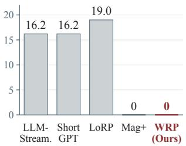
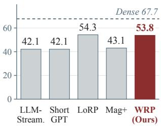
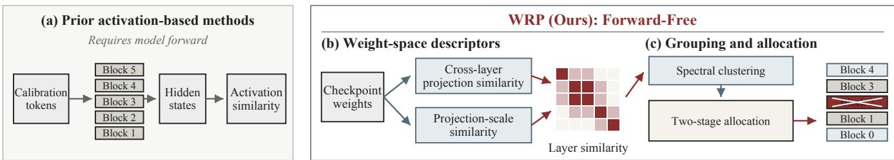
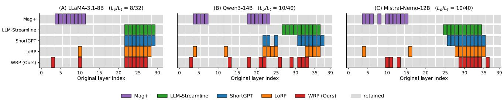
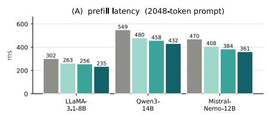
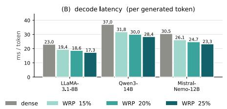
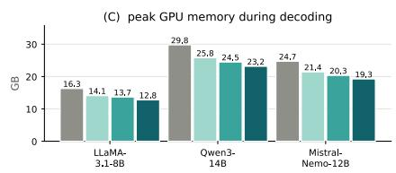

# FORWARD-FREE LLM DEPTH PRUNING VIA WEIGHT REDUNDANCY

Vincent-Daniel Yun1,†∗, Woosang Lim2,†

1University of Southern California, United States 2Seoul National University, Republic of Korea

## ABSTRACT

Depth pruning reduces large language model (LLM) inference cost by removing complete Transformer blocks. Activation-based methods collect hidden states through forward passes on calibration data, while existing forward-free methods score each Transformer block separately without measuring similarity between blocks. We propose Weight-Redundancy Pruning (WRP), a forward-free depth-pruning method that estimates inter-layer redundancy from checkpoint weights to select blocks without calibration data or model forward passes. WRP compares attention output and MLP down-projection weights across layers and combines their pairwise similarities with relative projection-scale information. The resulting all-pairs similarity matrix guides layer grouping and block selection. Across multiple pruning settings, model families, and downstream tasks, WRP consistently outperforms existing forward-free magnitude pruning and approaches the performance of activation-based methods.

Index Terms— large language models, depth pruning, forward-free compression, weight redundancy, structured pruning

## 1. INTRODUCTION

As large language models (LLMs) continue to improve, their increasing size also raises the memory and computation required for inference. In practice, pretrained model families are typically released at only a limited set of fixed model sizes, which may not match the resource budget of a user’s hardware. Depth pruning provides a flexible alternative by removing complete Transformer blocks from an existing checkpoint, allowing the model size to be adjusted to the available memory and computation budget while retaining standard dense operators [1, 2].

However, many depth-pruning methods require running forward passes through the original model to select layers for removal. Activation-based methods use these passes to collect hidden states on calibration data. ShortGPT compares block input-output states [2], LLM-Streamline compares boundary activations [3], and LoRP computes all-pairs activation similarities [4]. For large models, running calibration forward passes and storing activations can exceed the available GPU memory before any blocks are removed. Thus, a GPU with enough memory to run the pruned model may still be unable to support the pruning process on the original model.

Forward-free pruning avoids this requirement by selecting layers directly from the checkpoint without calibration forward passes. Existing forward-free criteria, such as Mag and Mag+ in Shortened LLaMA, rely on weight magnitudes and score each block independently [1]. However, magnitude reflects the scale of an individual block rather than redundancy between layers. This limitation distinguishes magnitude-based criteria from activation-based methods that explicitly measure inter-layer similarity.

(a) Selector GPU (GB)  

(b) 9-task accuracy (%)  
  
Fig. 1. Selection GPU memory and nine-task accuracy on LLaMA-3.1-8B at 25% depth pruning. Forward-free WRP retains accuracy close to LoRP without calibration forward passes.

Therefore, we propose Weight-Redundancy Pruning (WRP), a forward-free method that estimates inter-layer redundancy by comparing checkpoint weights across layers. We propose Weight-Redundancy Pruning (WRP), a forward-free method that estimates pairwise layer relations directly from checkpoint weights. WRP combines similarity between attention output and MLP down-projection weights with projection-scale information to form an all-pairs similarity matrix for global layer selection without calibration data, model forward passes, gradients, or internal-channel

  
Fig. 2. Forward-free WRP and an activation-based comparison. (a) The activation path is shown for comparison and is not part of WRP. (b)–(c) WRP constructs pairwise weight similarity and selects blocks globally without calibration data or mode forward passes. Matrix entries and removed blocks are schematic.

matching (Fig. 2).

Across six pruning settings on three model families and nine tasks, WRP substantially outperforms forward-free magnitude pruning while remaining close to activation-based methods without post-pruning recovery. These results show that checkpoint weights alone provide useful inter-layer redundancy signals for effective depth pruning.

## 2. RELATED WORK

Pruning reduces model cost by removing parameters or larger structural components. Unstructured pruning removes individual weights, where magnitude-based criteria are among the most widely used approaches due to their simplicity and efficiency [5, 6, 7]. Structured pruning instead removes larger model components [8, 9]. For block-level LLM depth pruning, Shortened LLaMA’s Mag+ selects complete Transformer blocks directly from checkpoint weights without calibration forward passes [1], but scores each block independently.

Activation-based depth-pruning methods use calibration forward passes to estimate layer redundancy. Short-GPT compares block input-output states [2], while LLM-Streamline compares boundary activations [3]. LoRP constructs global pairwise activation similarities for layer clustering and redundancy-based allocation [4]. These methods capture relations between layers but require model execution and calibration data. WRP instead estimates pairwise interlayer redundancy directly from checkpoint weights without calibration forward passes.

## 3. FORWARD-FREE WEIGHT REDUNDANCY

Preliminaries. Consider a pretrained LLM with L Transformer blocks indexed by $\ell \in \{ 0 , \ldots , L - 1 \}$ . Let P denote the number of blocks to remove and D the removal set, with $| { \mathcal { D } } | = P$ . Let $W _ { \ell } ^ { a }$ denote the weight matrix of projection a in block ℓ. For $\bar { a } \in \{ o , \mathrm { d o w n } \} , W _ { \ell } ^ { a } \in \mathbb { R } ^ { d \times m _ { a } }$ , where d is the shared hidden-state dimension and $m _ { a }$ is the input dimension of projection a. We center these matrices across output channels using $\begin{array} { r } { H _ { d } = I _ { d } - \frac { 1 } { d } \mathbf { 1 } \mathbf { 1 } ^ { \top } } \end{array}$ , the centering step in the definition of linear CKA [10]. WRP constructs a pairwise layer-similarity matrix $S \in \mathbb { R } ^ { L \times L }$ to determine K layer clusters and select D. We set $\epsilon = 1 0 ^ { - 1 2 }$

## 3.1. Weight-Space Block Descriptors

Cross-layer projection similarity. A Transformer block updates the hidden state through its attention output and MLP down projections, $h _ { \ell + 1 } = h _ { \ell } + W _ { \ell } ^ { o } ( \cdot ) + W _ { \ell } ^ { \mathrm { d o w n } } ( \cdot )$ . Since pruning removes these contributions, we compute crosslayer similarity from $W _ { \ell } ^ { o }$ and $W _ { \ell } ^ { \mathrm { d o w n } }$ , which share the same hidden-state output space across layers. Other projections map into layer-specific internal spaces and depend on the input distribution, so we use only their scale information in $S ^ { \mathrm { s c a l e } }$ . For $a \in \{ o , \mathrm { d o w n } \}$ , we define

$$
\widetilde { W } _ { \ell } ^ { a } = H _ { d } W _ { \ell } ^ { a } , \quad G _ { \ell } ^ { a } = \widetilde { W } _ { \ell } ^ { a } ( \widetilde { W } _ { \ell } ^ { a } ) ^ { \top }\tag{1}
$$

We compare the resulting output-space inner-product matrices using linear CKA [10]:

$$
s _ { i j } ^ { a } = \frac { \langle G _ { i } ^ { a } , G _ { j } ^ { a } \rangle _ { F } } { \| G _ { i } ^ { a } \| _ { F } \| G _ { j } ^ { a } \| _ { F } + \epsilon } , \quad S _ { i j } ^ { \mathrm { p r o j } } = \frac { s _ { i j } ^ { o } + s _ { i j } ^ { \mathrm { d o w n } } } { 2 }\tag{2}
$$

The Gram construction is invariant to permutations of intermediate dimensions since $( W \Pi ) ( W \bar { \Pi } ) ^ { \top } = W W ^ { \top }$ , and CKA additionally normalizes differences in scale.

Projection-scale similarity. To capture relative attention and MLP scales, we represent each block using the Frobenius norms of its seven projections $a \in \{ q , k , v , o , \mathrm { g a t e } , \mathrm { u p } , \mathrm { d o w n } \}$

$$
f _ { \ell } = ( \| W _ { \ell } ^ { a } \| _ { F } ) _ { a } , \quad \widetilde { f } _ { \ell } = f _ { \ell } - \frac { 1 } { L } \sum _ { m = 0 } ^ { L - 1 } f _ { m }\tag{3}
$$

Centering removes the model-wide average scale. We then define

$$
S _ { i j } ^ { \mathrm { s c a l e } } = \frac { \widetilde { f } _ { i } ^ { \top } \widetilde { f } _ { j } } { \| \widetilde { f } _ { i } \| _ { 2 } \| \widetilde { f } _ { j } \| _ { 2 } + \epsilon } , ~ S _ { i j } = \frac { 1 } { 2 } ( S _ { i j } ^ { \mathrm { p r o j } } + S _ { i j } ^ { \mathrm { s c a l e } } ) , ~ S _ { i i } = 1
$$

The resulting matrix $S$ captures pairwise layer relations using both projection similarity and relative scale information.

<table><tr><td>Model</td><td> $L _ { p } / L _ { t }$ </td><td>Method</td><td>Forward</td><td>ARC-E</td><td>ARC-C</td><td>HellaS</td><td>WinoG</td><td>BoolQ</td><td>OBQA</td><td>RTE</td><td>COPA</td><td>RACE</td><td>Avg.↑</td></tr><tr><td rowspan="12">LL--8B</td><td>0/32</td><td>Dense</td><td>0</td><td>81.14</td><td>53.50</td><td>78.89</td><td>73.56</td><td>82.08</td><td>44.80</td><td>69.31</td><td>87.00</td><td>39.14</td><td>67.71</td></tr><tr><td>6/32</td><td>LLM-Streamline</td><td>0</td><td>64.56</td><td>44.71</td><td>67.50</td><td>68.19</td><td>70.06</td><td>40.20</td><td>58.12</td><td>81.00</td><td>36.27</td><td>58.96</td></tr><tr><td>6/32</td><td>ShortGPT</td><td>0</td><td>62.33</td><td>43.77</td><td>68.22</td><td>68.51</td><td>71.99</td><td>37.40</td><td>66.43</td><td>79.00</td><td>35.02</td><td>59.19</td></tr><tr><td>6/32</td><td>LoRP</td><td>0</td><td>69.49</td><td>42.75</td><td>67.56</td><td>68.90</td><td>66.12</td><td>37.00</td><td>66.06</td><td>86.00</td><td>37.42</td><td>60.14</td></tr><tr><td>6/32</td><td>Mag+</td><td>X</td><td>51.68</td><td>27.99</td><td>45.96</td><td>51.62</td><td>51.44</td><td>32.60</td><td>57.04</td><td>69.00</td><td>27.75</td><td>46.12</td></tr><tr><td>6/32</td><td>WRP (Ours)</td><td>X</td><td>67.89</td><td>45.31</td><td>66.89</td><td>67.56</td><td>67.34</td><td>38.20</td><td>59.57</td><td>83.00</td><td>36.08</td><td>59.09</td></tr><tr><td>8/32</td><td>LLM-Streamline</td><td>0</td><td>41.54</td><td>31.83</td><td>30.89</td><td>54.22</td><td>37.61</td><td>29.00</td><td>64.62</td><td>64.00</td><td>25.26</td><td>42.11</td></tr><tr><td>8/32</td><td>ShortGPT</td><td>0</td><td>41.54</td><td>31.83</td><td>30.89</td><td>54.22</td><td>37.61</td><td>29.00</td><td>64.62</td><td>64.00</td><td>25.26</td><td>42.11</td></tr><tr><td>8/32</td><td>LoRP</td><td>0</td><td>59.01</td><td>40.19</td><td>58.68</td><td>63.14</td><td>69.94</td><td>34.20</td><td>55.60</td><td>76.00</td><td>32.25</td><td>54.33</td></tr><tr><td>8/32</td><td>Mag+</td><td>X</td><td>48.53</td><td>25.77</td><td>41.74</td><td>54.22</td><td>44.53</td><td>29.60</td><td>47.65</td><td>70.00</td><td>26.22</td><td>43.14</td></tr><tr><td>8/32</td><td>WRP (Ours)</td><td>X</td><td>59.55</td><td>39.59</td><td>60.65</td><td>62.75</td><td>65.57</td><td>35.80</td><td>53.07</td><td>73.00</td><td>34.45</td><td>53.82</td></tr><tr><td rowspan="11">Ow--14B</td><td>0/40</td><td>Dense</td><td>0</td><td>82.79</td><td>60.24</td><td>78.81</td><td>73.17</td><td>89.33</td><td>46.20</td><td>77.62</td><td>90.00</td><td>43.25</td><td>71.27</td></tr><tr><td>8/40</td><td>LLM-Streamline</td><td>0</td><td>67.42</td><td>40.27</td><td>62.02</td><td>58.33</td><td>70.00</td><td>40.80</td><td>62.82</td><td>71.00</td><td>33.97</td><td>56.29</td></tr><tr><td>8/40</td><td>ShortGPT</td><td>0</td><td>64.90</td><td>41.81</td><td>57.07</td><td>62.27</td><td>80.46</td><td>35.20</td><td>64.98</td><td>70.00</td><td>40.29</td><td>57.44</td></tr><tr><td>8/40</td><td>LoRP</td><td>0</td><td>68.56</td><td>45.90</td><td>62.35</td><td>65.51</td><td>75.81</td><td>34.20</td><td>62.82</td><td>75.00</td><td>37.32</td><td>58.61</td></tr><tr><td>8/40</td><td>Mag+</td><td>X</td><td>39.98</td><td>27.56</td><td>47.59</td><td>50.12</td><td>61.59</td><td>26.00</td><td>58.12</td><td>60.00</td><td>33.97</td><td>44.99</td></tr><tr><td>8/40</td><td>WRP (Ours)</td><td>X</td><td>68.98</td><td>43.00</td><td>63.81</td><td>63.69</td><td>65.05</td><td>38.00</td><td>70.40</td><td>80.00</td><td>38.47</td><td>59.04</td></tr><tr><td>10/40</td><td>LLM-Streamline</td><td>0</td><td>37.88</td><td>32.17</td><td>41.75</td><td>52.33</td><td>67.98</td><td>31.00</td><td>55.23</td><td>55.00</td><td>30.14</td><td>44.83</td></tr><tr><td>10/40</td><td>ShortGPT</td><td>0</td><td>59.34</td><td>37.29</td><td>50.70</td><td>57.70</td><td>67.09</td><td>31.60</td><td>52.71</td><td>60.00</td><td>37.70</td><td>50.46</td></tr><tr><td>10/40</td><td>LoRP</td><td>0</td><td>66.33</td><td>41.89</td><td>58.40</td><td>62.75</td><td>71.44</td><td>34.00</td><td>75.45</td><td>71.00</td><td>37.03</td><td>57.59</td></tr><tr><td>10/40</td><td>Mag+</td><td>X</td><td>30.72</td><td>23.21</td><td>29.55</td><td>51.30</td><td>55.54</td><td>26.20</td><td>48.38</td><td>60.00</td><td>24.50</td><td>38.82</td></tr><tr><td>10/40 0/40</td><td>WRP (Ours)</td><td>X</td><td>61.83</td><td>38.40</td><td>57.64</td><td>62.43</td><td>66.61</td><td>34.20</td><td>69.31</td><td>78.00</td><td>35.31</td><td>55.97</td></tr><tr><td></td><td>Dense</td><td>0</td><td>81.65</td><td>57.94</td><td>82.79</td><td>73.40</td><td>85.32</td><td>47.20</td><td>64.98</td><td>91.00</td><td>41.91</td><td>69.58</td></tr><tr><td rowspan="11">MIis----12B</td><td>8/40</td><td>LLM-Streamline</td><td>0</td><td>65.87</td><td>43.69</td><td>70.78</td><td>72.45</td><td>66.48</td><td>36.80</td><td>53.43</td><td>84.00</td><td></td><td>59.07</td></tr><tr><td>8/40</td><td>ShortGPT</td><td>0</td><td>67.26</td><td>45.22</td><td>71.28</td><td>72.38</td><td>65.78</td><td>38.00</td><td>59.93</td><td>86.00</td><td>38.09 39.33</td><td>60.57</td></tr><tr><td>8/40</td><td>LoRP</td><td>0</td><td>65.70</td><td>43.09</td><td>71.24</td><td>68.82</td><td>67.52</td><td>38.40</td><td>57.40</td><td>88.00</td><td>37.99</td><td>59.80</td></tr><tr><td>8/40</td><td>Mag+</td><td>X</td><td>41.79</td><td>24.74</td><td>41.19</td><td>52.80</td><td>54.40</td><td>29.40</td><td>53.43</td><td>71.00</td><td>23.83</td><td>43.62</td></tr><tr><td>8/40</td><td>WRP (Ours)</td><td>X</td><td>68.35</td><td>44.28</td><td>69.87</td><td>69.14</td><td>64.10</td><td>38.00</td><td>61.37</td><td>86.00</td><td>38.09</td><td>59.91</td></tr><tr><td></td><td>LLM-Streamline</td><td></td><td></td><td></td><td></td><td></td><td></td><td></td><td></td><td></td><td></td><td></td></tr><tr><td>10/40</td><td>ShortGPT</td><td>0</td><td>61.32 63.30</td><td>41.38 44.20</td><td>63.84 58.72</td><td>71.43 63.06</td><td>66.67 67.22</td><td>35.20</td><td>58.48</td><td>78.00</td><td>38.66</td><td>57.22</td></tr><tr><td>10/40 10/40</td><td>LoRP</td><td>0 0</td><td>61.49</td><td>40.27</td><td>64.43</td><td>64.40</td><td>66.54</td><td>35.40 37.40</td><td>63.54 63.90</td><td>79.00 80.00</td><td>34.83 35.41</td><td>56.59 57.09</td></tr><tr><td>10/40</td><td>Mag+</td><td>X</td><td>39.86</td><td>24.91</td><td>33.69</td></table>

Table 1. Accuracy (%) on all nine tasks after one-shot, recovery-free depth pruning. Forward marks calibration forward passes; bold marks the best pruned average per setting. $L _ { p } / L _ { t }$ denotes the number of pruned blocks over the total number of blocks.

## 3.2. Weight-Only Clustering and Allocation

Following LoRP [4], we cluster layers before allocating removals. We use $K \in \{ 2 , 4 \}$ as coarse and fine clustering candidates and choose between them directly from S. Set $A = ( S + 1 ) / 2$ , with unit diagonal, and construct

$$
\mathcal { L } = I - \Delta ^ { - 1 / 2 } A \Delta ^ { - 1 / 2 } , \quad \Delta = \mathrm { d i a g } ( A { \bf 1 } )\tag{4}
$$

Let $0 = \lambda _ { 1 } \leq \lambda _ { 2 } \leq \cdot \cdot \cdot \leq \lambda _ { L }$ be the ascending eigenvalues of L and define $d _ { j } = \lambda _ { j + 1 } - \lambda _ { j }$ for $j \in \{ 2 , 3 \}$ . Here, $d _ { 2 }$ measures the strength of a coarse two-cluster structure, while $d _ { 3 }$ captures evidence for additional structure beyond it. To reduce depth-proximity effects, we construct $S _ { 0 }$ by replacing each $S _ { i j }$ with the mean similarity at the same depth distance $| i - j | ,$ , while keeping a unit diagonal. Applying the same construction to $S _ { 0 }$ gives reference gaps $n _ { 2 }$ and $n _ { 3 }$ . Let $e _ { j } =$ max $( d _ { j } - n _ { j } , 0 )$ . When $e _ { 2 } + e _ { 3 } > 0 .$ , we compute

$$
\rho = \displaystyle \frac { e _ { 2 } } { e _ { 2 } + e _ { 3 } } , \quad K = \left\{ { 2 , \quad \rho \geq \frac { 1 } { 2 } } \right.\tag{5}
$$

When $e _ { 2 } + e _ { 3 } = 0$ , we set $\rho = 1$ and use $K = 2$ . Thus, when the coarse two-cluster structure dominates, we use $K = 2$ Otherwise, we use the finer $K = 4$ candidate. This selection requires only S and no calibration data or forward passes.

Spectral clustering of A produces K clusters $\mathcal { C } _ { k }$ using the normalized-Laplacian embedding and k-means with a fixed seed. Clusters are ordered by the depth of their shallowest block. We adopt $\mathrm { L o R P s }$ two-stage allocation rule [4]. For each block, we measure its average similarity to the other blocks in the same cluster. We also measure the average pairwise similarity among the blocks that remain in each cluster:

$$
r ( \ell ; \mathcal { C } _ { k } ) = \frac { \sum _ { m \in \mathcal { C } _ { k } \setminus \{ \ell \} } S _ { \ell m } } { | \mathcal { C } _ { k } | - 1 } , \quad \bar { r } ( \mathcal { R } _ { k } ) = \frac { 2 \sum _ { i < j , i , j \in \mathcal { R } _ { k } } S _ { i j } } { | \mathcal { R } _ { k } | ( | \mathcal { R } _ { k } | - 1 ) }
$$

Fig. 3. Layer-removal patterns at 25% depth reduction: 8/32 blocks for LLaMA and 10/40 for Qwen and Mistral. Colored cells mark removed blocks; gray cells are retained. WRP selects blocks using checkpoint weights alone.  

  
Fig. 4. Inference cost of dense and WRP-pruned models. Percentages denote depth-removal budgets; panels show prefill latency, per-token decode latency, and peak allocated GPU memory.

We protect the first and last blocks from pruning. In Stage 1, we remove the most redundant eligible block from each cluster until every cluster is represented or the pruning budget is reached. In Stage 2, we repeatedly choose the cluster with the highest remaining redundancy and remove its next most redundant eligible block. Clusters with fewer than two remaining blocks receive $\bar { r } ~ = ~ - \infty$ , and ties are resolved toward the lower cluster index. The process stops when $| { \mathcal { D } } | = P .$ The selected blocks are removed without modifying the remaining parameters. The entire procedure requires no model execution or calibration forward passes.

## 4. EXPERIMENTAL RESULTS

## 4.1. Experimental Settings

We evaluate LLaMA-3.1-8B (32 blocks) [11], Qwen3-14B (40) [12], and Mistral-Nemo-12B (40) [13], with pruning budgets of 6 and 8 blocks for LLaMA, and 8 and 10 blocks for Qwen3 and Mistral-Nemo. We report zero-shot accuracy on nine benchmarks using LM Evaluation Harness: ARC-Easy, ARC-Challenge [14], HellaSwag [15], WinoGrande [16], BoolQ [17], OpenbookQA [18], RTE [19], COPA [20], and RACE [21]. Equation (5) gives $( \rho , K ) \ = \ ( 0 . 7 7 8 , 2 )$ , (0.084, 4), and (1.000, 2), respectively. All methods are recovery-free. We compare against activation-based LLM-Streamline, ShortGPT, and LoRP, and forward-free Mag+. Mag+ follows the official Shortened LLaMA setting [1], protecting the first four and last two blocks, while WRP protects only the first and last.

## 4.2. Main Results

At matched budgets, WRP outperforms Mag+ across all six settings by 10.68–17.15 points, with an average gain of 14.38 points (Table 1). WRP averages 57.41 compared with 57.93 for LoRP and achieves the best pruned average on Qwen3- 14B at 8/40. These results show that pairwise weight relations enable strong forward-free layer selection while remaining close to activation-based methods. Figure 3 shows the resulting non-contiguous removal patterns across depth.

## 4.3. Inference Cost

We measure inference cost on a single NVIDIA RTX 6000 Ada Generation GPU using FP16 and batch size 1. At 25% pruning, WRP reduces prefill latency by 21–23%, decode latency by 23–25%, and peak GPU memory by 21–22% (Fig. 4). These gains come directly from reducing model depth and require no custom kernels or runtime changes.

## 5. CONCLUSION

WRP enables forward-free depth pruning by estimating interlayer redundancy directly from checkpoint weights. Across six pruning settings, it consistently outperforms magnitudebased pruning while remaining close to activation-based methods. These results show that checkpoint weights alone provide useful signals for effective depth pruning.

## 6. REFERENCES

[1] Bo-Kyeong Kim, Geonmin Kim, Tae-Ho Kim, Thibault Castells, Shinkook Choi, Junho Shin, and Hyoung-Kyu Song, “Shortened llama: Depth pruning for large language models with comparison of retraining methods,” arXiv preprint arXiv:2402.02834, 2024.

[2] Xin Men, Mingyu Xu, Qingyu Zhang, Qianhao Yuan, Bingning Wang, Hongyu Lin, Yaojie Lu, Xianpei Han, and Weipeng Chen, “ShortGPT: Layers in large language models are more redundant than you expect,” in Findings of the Association for Computational Linguistics: ACL 2025, 2025, pp. 20192–20204.

[3] Xiaodong Chen, Yuxuan Hu, Jing Zhang, Yanling Wang, Cuiping Li, and Hong Chen, “Streamlining redundant layers to compress large language models,” in The Thirteenth International Conference on Learning Representations, 2025.

[4] Vincent-Daniel Yun, Youngrae Kim, Woosang Lim, Youngjin Heo, Minkyu Kim, and Sunwoo Lee, “Locality-aware redundancy pruning for llm depth compression,” arXiv preprint arXiv:2605.27786, 2026.

[5] Elias Frantar and Dan Alistarh, “SparseGPT: Massive language models can be accurately pruned in one-shot,” arXiv preprint arXiv:2301.00774, 2023.

[6] Mingjie Sun, Zhuang Liu, Anna Bair, and J Zico Kolter, “A simple and effective pruning approach for large language models,” in The Twelfth International Conference on Learning Representations, 2024.

[7] Juyoung Yun, “Robust neural pruning with gradient sampling optimization for residual neural networks,” in 2024 International Joint Conference on Neural Networks (IJCNN), 2024, pp. 1–10.

[8] Xinyin Ma, Gongfan Fang, and Xinchao Wang, “Llmpruner: On the structural pruning of large language models,” in Advances in Neural Information Processing Systems, 2023.

[9] Saleh Ashkboos, Maximilian L. Croci, Marcelo Gennari do Nascimento, Torsten Hoefler, and James Hensman, “SliceGPT: Compress large language models by deleting rows and columns,” in The Twelfth International Conference on Learning Representations, 2024.

[10] Simon Kornblith, Mohammad Norouzi, Honglak Lee, and Geoffrey Hinton, “Similarity of neural network representations revisited,” 2019.

[11] Aaron Grattafiori et al., “The llama 3 herd of models,” 2024.

[12] An Yang et al., “Qwen3 technical report,” 2025.

[13] Mistral AI Team, “Mistral NeMo,” https:// mistral.ai/news/mistral-nemo/, 2024, Accessed: 2026-09-07.

[14] Peter Clark, Isaac Cowhey, Oren Etzioni, Tushar Khot, Ashish Sabharwal, Carissa Schoenick, and Oyvind Tafjord, “Think you have solved question answering? Try ARC, the AI2 reasoning challenge,” arXiv preprint arXiv:1803.05457, 2018.

[15] Rowan Zellers, Ari Holtzman, Yonatan Bisk, Ali Farhadi, and Yejin Choi, “Hellaswag: Can a machine really finish your sentence?,” in Proceedings ofthe 57th Annual Meeting of the Association for Computational Linguistics, 2019.

[16] Keisuke Sakaguchi, Ronan Le Bras, Chandra Bhagavatula, and Yejin Choi, “Winogrande: An adversarial winograd schema challenge at scale,” arXiv preprint arXiv:1907.10641, 2019.

[17] Christopher Clark, Kenton Lee, Ming-Wei Chang, Tom Kwiatkowski, Michael Collins, and Kristina Toutanova, “BoolQ: Exploring the surprising difficulty of natural yes/no questions,” in Proceedings of the 2019 Conference of the North American Chapter of the Association for Computational Linguistics: Human Language Technologies, Volume 1 (Long and Short Papers), 2019, pp. 2924–2936.

[18] Todor Mihaylov, Peter Clark, Tushar Khot, and Ashish Sabharwal, “Can a suit of armor conduct electricity? a new dataset for open book question answering,” in Proceedings of the 2018 Conference on Empirical Methods in Natural Language Processing, 2018, pp. 2381–2391.

[19] Ido Dagan, Oren Glickman, and Bernardo Magnini, “The PASCAL recognising textual entailment challenge,” in Machine Learning Challenges Workshop. Springer, 2005, pp. 177–190.

[20] Melissa Roemmele, Cosmin Adrian Bejan, and Andrew S. Gordon, “Choice of plausible alternatives: An evaluation of commonsense causal reasoning,” in AAAI Spring Symposium: Logical Formalizations of Commonsense Reasoning, 2011.

[21] Guokun Lai, Qizhe Xie, Hanxiao Liu, Yiming Yang, and Eduard Hovy, “RACE: Large-scale ReAding comprehension dataset from examinations,” in Proceedings of the 2017 Conference on Empirical Methods in Natural Language Processing, 2017, pp. 785–794.