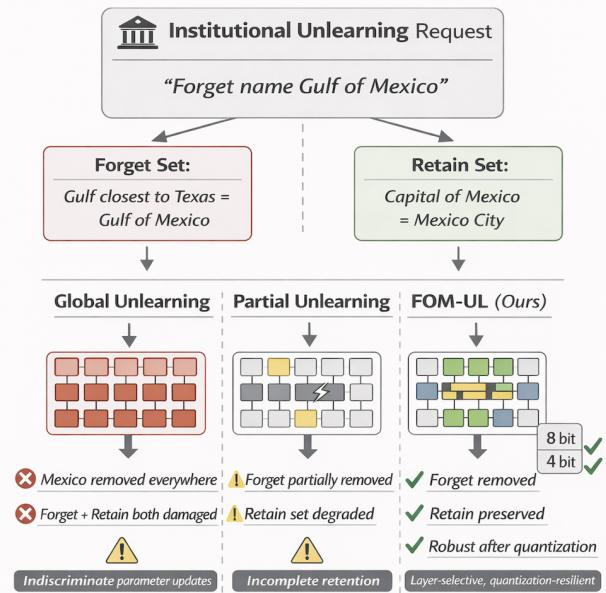
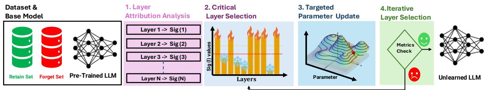
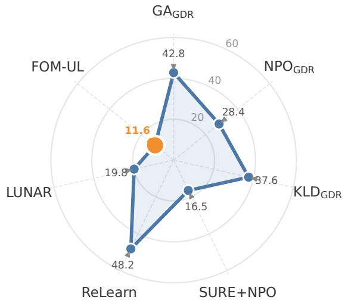
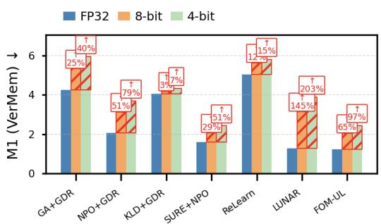
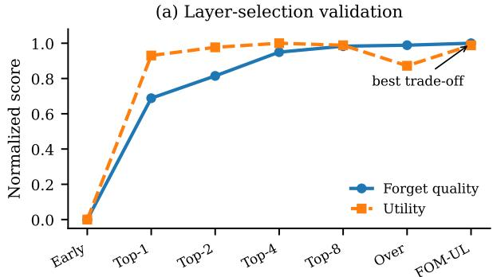
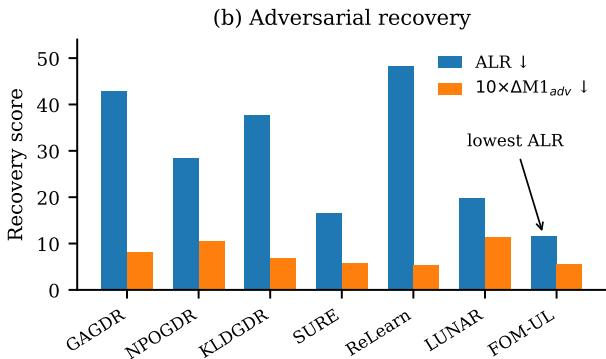
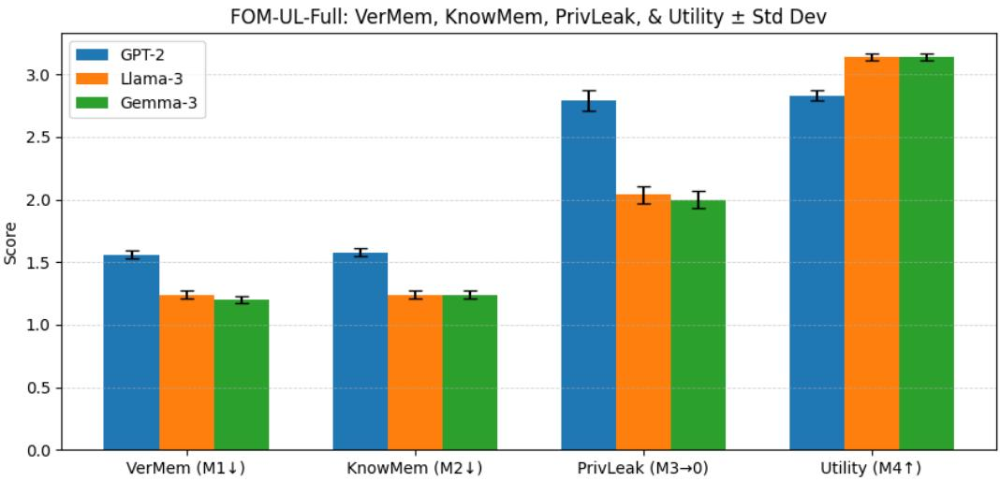

# Forgetting Only What Matters: Layer-Selective Unlearning toward Robust LLMs

Ravi Ranjan \* Florida International University (FIU), Miami, FL, USA rkuma031@fiu.edu

Olivera Kotevska Oak Ridge National Laboratory (ORNL), Oak Ridge, TN, USA kotevskao@ornl.gov

Agoritsa Polyzou Florida International University (FIU), Miami, FL, USA apolyzou@fiu.edu

## Abstract

Large Language Models (LLMs) can memorize and reproduce sensitive, copyrighted, or otherwise undesirable training content, creating privacy, safety, and regulatory concerns. Machine unlearning offers a practical alternative to full retraining, but many existing methods apply broad or fixed parameter updates that can degrade utility and remain brittle under deployment changes such as post-training quantization, where forgotten knowledge may partially re-emerge. We propose Forgetting Only What Matters via Unlearning Layers (FOM-UL), a layer-level unlearning frame work that selects transformer layers using a forget-to-retain significance score. This score identifies layers with high influence on the forget set and low sensitivity to the retain set, allowing FOM-UL to concentrate updates where they are most effective while leaving most of the model unchanged. This targeted update strategy improves the forgetting-utility trade-off and provides an empirical path toward quantization-resilient unlearning by reducing the chance that small, diffuse updates are erased by low-bit rounding. Across TOFU, KnowUnDo, and MUSE-style evaluations, FOM-UL reduces residual memorization compared with strong GA, NPO, KLD, SURE, ReLearn, and LUNAR-based baselines while preserving retain-set utility close to the vanilla model. Under 8-bit and 4-bit post-training quantization, FOM-UL maintains stronger memorization suppression and utility preserva tion than competing methods, and adversarial prompt evaluations show lower recovery of forgotten content. Overall, FOM-UL provides an efficient unlearning strategy that improves targeted forgetting, utility preservation, and deployment robustness without claiming formal guarantees of erasure.

Code available at:

https://github.com/raviranjan-ai/FOMUL-AACL-2026.

  
Figure 1: FOM-UL robust and quantization-resilient forgetting against global and partial unlearning methods.

## 1 Introduction

Large Language Models (LLMs) have transformed natural language processing, delivering strong performance across diverse tasks and domains (Zhao et al., 2023). Yet, as these models scale and are deployed widely, an increasingly visible failure mode is their tendency to memorize and reproduce fragments of training data, including sensitive personal information, copyrighted text, or otherwise undesirable content (Zhao et al., 2023; Wang et al., 2025a). Such memorization creates legal, ethical, and security risks, especially in high-stakes settings where accidental disclosure of protected content is unacceptable. These concerns are further amplified by regulatory requirements such as the General Data Protection Regulation (GDPR) “right to be forgotten” (Council et al., 2022), which demands mechanisms to remove specific data upon request.

Machine unlearning for LLMs has therefore emerged as a practical alternative to full retraining: the goal is to remove targeted knowledge or behaviors from a trained model while preserving its overall capabilities. However, existing unlearning pipelines face major obstacles. Retraining is often prohibitively expensive at LLM scale (Jang et al., 2022), and frequent unlearning requests in realworld deployments further stress the need for efficient, deployable solutions. Beyond cost, the high dimensionality and tightly coupled representations of modern transformer architectures make targeted knowledge removal inherently difficult: even seemingly localized edits can be propagated broadly, causing utility degradation or catastrophic forgetting (Zhang et al., 2024a). These challenges have motivated a rapidly growing literature on LLM unlearning across widely used architectures such as GPT-2, LLaMA, and Gemma (Geng et al., 2025; Yao et al., 2024a).

A central issue is that many unlearning methods still rely on global or otherwise indiscriminate parameter updates, which can be brittle and imprecise. Figure 1 contrasts this paradigm with our proposed approach: rather than updating large portions of the model, Forgetting Only What Matters via Unlearning Layers (FOM-UL) selectively modifies only those transformer layers most responsible (high forget-to-retain ratio) for encoding the undesired knowledge. This targeted intervention aims to improve approximate forgetting while preserving general capabilities and minimizing collateral damage.

Targeted unlearning differs from general-purpose model editing by focusing on the selective removal of specific facts, documents, or behaviors, enabling an LLM to “forget” designated content without retraining from scratch. Importantly, unlearning is not standard fine-tuning in reverse: whereas finetuning typically reinforces desired behavior via positive examples, unlearning must suppress undesired behavior.

A range of approaches have been proposed to realize this objective (Geng et al., 2025). In particular, preference-optimization (PO) and gradientascent (GA) style methods are widely adopted due to their simplicity and effectiveness (Liu et al., 2024a). PO-based methods cast unlearning as an alignment problem in which the model is steered to prefer alternative responses using preference pairs. Complementary directions, including relabeling, adapter/LoRA-based updates, quantization-based techniques (Zhang et al., 2024c), and reinforcement learning (Lu et al., 2022)-provide additional tools, but PO and GA remain central to scalable unlearning.

Gradient Ascent (GA) is a common unlearning strategy that increases the loss on memorized responses to reduce confidence in targeted outputs (Yao et al., 2024b). However, GA typically applies broad model-wide updates, which can leave residual memorization and harm unrelated capabilities (Yao et al., 2024a), and it is often brittle under post-training quantization, where discretizations may partially restore suppressed behaviors. Although retain-set regularization (Liu et al., 2024a) and KL-divergence constraints to the original model (Yao et al., 2024a) help preserve utility, they do not fully eliminate the side effects of indiscriminate updates. Motivated by recent evidence of quantization-induced failure modes in unlearning (Zhang et al., 2024b), we instead pursue a layer-selective strategy that concentrates updates where they matter most, improving precision and robustness against quantization-driven recovery.

FOM-UL is a targeted and efficient unlearning framework that mitigates catastrophic forgetting, quantization-induced relearning, and the inefficiency of global parameter updates. Our primary contributions are:

(i) Layer-level forget-retain localization. We introduce a layer-selection criterion based on the ratio between forget-set gradient magnitude and retain-set gradient magnitude. This identifies layers that offer high forgetting leverage with comparatively low retain-set interference.

(ii) Iterative layer-budget expansion. Rather than updating a fixed region or the full model, FOM-UL starts from a small high-score layer set and expands it only when forgetting criteria are unmet, improving the trade-off between erasure strength and utility preservation.

(iii) Efficient selective optimization. By restricting updates to a small number of selected layers, FOM-UL reduces trainable parameters, memory use, and runtime while remaining compatible with standard GA, NPO, and KLD-style unlearning losses.

(iv) Empirical quantization-robustness analysis. Motivated by quantization-induced recovery, we test FOM-UL under 8-bit and 4-bit post-training quantization and show that concentrated layer updates reduce residual memorization compared with global or fixed-selection baselines.

## 2 Preliminary and Related Work

Machine unlearning in Large Language Models (LLMs) involves selectively removing specific learned knowledge without significantly degrading overall model performance (Geng et al., 2025; Liu et al., 2025a; Jang et al., 2022; Huang et al., 2024). Formally, given a model $f _ { \theta }$ parameterized by $\theta$ and a dataset $D _ { \mathrm { f o r g e t } }$ representing undesirable knowledge, the parameter updates of machine unlearning can be expressed as:

$$
\theta ^ { \prime } = \theta + \eta \nabla _ { \theta } \mathcal { L } _ { \mathrm { f o r g e t } } ( \theta , D _ { \mathrm { f o r g e t } } ) ,\tag{1}
$$

where $\eta$ is the learning rate and $\mathcal { L } _ { \mathrm { f o r g e t } }$ is typically a loss function defined on the forget set, often optimized via gradient ascent (GA) (Bourtoule et al., 2021; Golatkar et al., 2020).

Recent advances in LLM unlearning have estab lished several effective approaches to remove specific knowledge or capabilities from trained models. Parameter-based methods modify model weights directly through techniques like gradient ascent (Jang et al., 2022) or localized weight editing (Ilharco et al., 2022). Global unlearning updates the full parameter space of an LLM, which can aggressively suppress the targeted behavior but often propagates changes widely, leading to broader utility degradation and higher computational cost (Wuerkaixi et al., 2025). In contrast, partial unlearning restricts updates to a subset of components (e.g., layers, modules, or adapters) to limit collateral damage and improve efficiency (Wang et al., 2025b), yet it can suffer from incompleteforgetting when the targeted knowledge is distributed across multiple parts of the network (Yao et al., 2024a). Knowledge-boundary methods create negative examples to teach models to avoid certain responses (Li et al., 2025; Liu et al., 2024b). Contrastive unlearning pairs forgetting targets with similar but acceptable content to refine decision boundaries (Chen and Yang, 2023). Dataset-filtering approaches reconstruct training data while excluding unwanted information (Zhao et al., 2025). Optimization-based methods, like Influence Tuning, use importance scores to identify and modify critical parameters (Xu et al., 2024). Direct Preference Optimization (DPO) is a prominent example that assigns higher preference to neutral or refusal outputs than to the original memorized responses (Rafailov et al., 2023). Negative Preference Optimization (NPO) further streamlines this process by relying only on negative forget samples (Zhang et al., 2024a). These approaches vary in their effectiveness, computational requirements, and ability to preserve model performance on unrelated tasks.

However, many unlearning methods remain vulnerable to quantization-induced relearning, where low-bit quantization can effectively erase small unlearning updates and restore behavior close to the original model. Post-training quantization is widely used to reduce the computational and storage overhead of LLMs by mapping full-precision parameters to low-bit representations (Gholami et al., 2022; Lin et al., 2024). Recent quantization methods include 8-bit and 4-bit techniques, significantly enhancing inference efficiency while preserving acceptable accuracy levels (Dettmers et al., 2022). Nevertheless, quantization can adversely affect machine unlearning performance, potentially exacerbating the issue of catastrophic forgetting (Luo et al., 2023; Ranjan et al., 2026e).

Formally, let $\theta$ be the original parameters and $\theta ^ { \prime }$ the post-unlearning parameters, and let $Q ( \cdot )$ denote post-training rounding quantization (elementwise or per-group). For step size $\Delta _ { j }$ on coordinate/- group $j$

$$
Q _ { \Delta _ { j } } ( w ) = \Delta _ { j } \mathrm { R o u n d } \biggl ( \frac { w } { \Delta _ { j } } \biggr ) .\tag{2}
$$

Quantization can mask an unlearning update when the pre- and post-unlearning parameters remain in the same quantization bin. For coordinate (or group) j, this occurs exactly when

$$
\begin{array} { r } { Q _ { \Delta _ { j } } ( \theta _ { j } ^ { \prime } ) = Q _ { \Delta _ { j } } ( \theta _ { j } ) \iff } \\ { \mathrm { R o u n d } \biggl ( \frac { \theta _ { j } ^ { \prime } } { \Delta _ { j } } \biggr ) = \mathrm { R o u n d } \biggl ( \frac { \theta _ { j } } { \Delta _ { j } } \biggr ) . } \end{array}\tag{3}
$$

If this condition holds for a large fraction of the edited coordinates, the quantized unlearned model can become functionally closer to the quantized original model, allowing part of the suppressed knowledge to re-emerge (Zhang et al., 2024b).

Another prominent line of work leverages parameter-efficient modules, e.g., adapters and LoRA layers, to localize updates and preserve the bulk of pre-trained weights (Liu et al., 2025b; Li and Liang, 2021; Hu et al., 2022). Moreover, even after “erasure”, residual information can be resurrected by adversarial or carefully engineered prompts, so-called spillage, undermining any privacy guarantees (Ji et al., 2024; Zhang et al., 2024b).

In summary, while existing methods, such as quantization-based unlearning, knowledge editing, and parameter-efficient tuning, have provided valuable insights into model modification, they exhibit significant limitations when applied to robust unlearning scenarios.

## 3 Proposed Method: FOM-UL

We propose FOM-UL, a targeted framework that suppresses specific knowledge by updating a small set of layers with high forget-to-retain significance. Rather than claiming exact erasure, FOM-UL aims to approximate retraining behavior on the forget set while preserving retain-set utility and improving robustness to quantization-induced recovery.

Problem Formulation. Let $\mathcal { M } _ { \theta }$ denote a pretrained transformer-based model with parameters $\theta \in \mathbb { R } ^ { d }$ . Given two datasets a forget set $D _ { \mathrm { f o r g e t } } ,$ containing the data to be erased, and a retain set $D _ { \mathrm { r e t a i n } }$ , comprising knowledge that must be preserved the objective is to update the model parameters to minimize verbatim memorization (Ver-Mem) and privacy leakage (PrivLeak) on $D _ { \mathrm { f o r g e t } } .$ while preserving utility and knowledge retention on $D _ { \mathrm { r e t a i n } }$

Motivation. Modern LLMs, such as Llama-2, are typically decoder-only autoregressive transformers with L stacked layers. For an input prefix $x _ { 1 : t } ,$ each layer ℓ updates hidden states $h _ { 1 : t } ^ { ( \ell ) }$ via (i) multi-head self-attention (MHSA) and (ii) a position-wisefeed-forward network (FFN), coupled with residual connections and normalization. In MHSA, each attention head performs a querykey-value interaction to form a weighted mixture of contextual token representations, and the layer aggregates diverse dependency patterns (e.g., local syntax and long-range factual cues) across heads. Importantly, information is not uniformly distributed across the network: lower layers tend to encode lexical/syntactic features, intermediate layers increasingly represent semantic relations, and deeper layers are more directly coupled to the final logits (next-token scores) used for generation. Consequently, memorized or sensitive content can be disproportionately concentrated in a subset of layers/heads that exert outsized influence on specific next-token predictions. This heterogeneous localization motivates our work. By attributing a forget objective to the layers that most affect the target prediction and selectively updating only those layers, FOM-UL can induce targeted forgetting with reduced collateral utility loss, while producing parameter shifts that are more resilient to quantization-induced reversal than diffuse, global updates.

Proposed Method Overview. Figure 2 presents the complete FOM-UL pipeline. First, we select the datasets, a Forget set (e.g., copyrighted Harry Potter text) and a Retain set (e.g., fandom wiki and general knowledge). Next, a layer-attribution analysis identifies the transformer layers most responsible for encoding the sensitive content. A binary saliency mask is then generated (for n layers) to freeze layers with low attribution and unlock only the high-attribution layers for updates. Targeted unlearning alternates between (i) gradient ascent on the Forget set to maximize loss on unwanted content and (ii) gradient descent on the Retain set to preserve essential knowledge, applied solely within the selected layers. Finally, the resulting model is evaluated on verbatim memorization, privacy leakage, knowledge retention, and general utility to verify robust, quantization-resilient forgetting.

Identifying Key Layers. We consider a transformer-based LLM with parameters $\theta \quad =$ $\{ \theta ^ { ( 1 ) } , \dots , \theta ^ { ( L ) } \}$ grouped by layer, and let $x _ { 1 : t }$ denote an input prefix. We define $w _ { t + 1 } ^ { * } =$ arg ma $\mathrm { x } _ { w } P _ { \theta } ( w \mid x _ { 1 : t } )$ as the model’s top-1 nexttoken prediction and compute its baseline probability

$$
\begin{array} { r } { \hat { p } ~ = ~ P _ { \theta } ( w _ { t + 1 } ^ { * } \mid x _ { 1 : t } ) . } \end{array}\tag{4}
$$

To localize where this prediction is formed, we perform layer-wise ablation: for each layer $\ell \in$ $\{ 1 , \ldots , L \}$ , we intervene on the forward pass by removing (e.g., zeroing) the contribution of layer ℓ to the residual stream, and recompute the same next-token probability under this ablated model, denoted by $P _ { \theta \setminus \ell } :$

$$
\begin{array} { r } { \hat { p } _ { \ell } = P _ { \theta \setminus \ell } \big ( w _ { t + 1 } ^ { * } \mid x _ { 1 : t } \big ) , } \end{array}\tag{5}
$$

To prioritize layers that enable effective forgetting with minimal retain-set disruption, FOM-UL further computes a gradient-based significance score. Let $\mathcal { L } _ { \mathrm { f o r g e t } } ( \theta ; B _ { f } )$ and $\mathcal { L } _ { \mathrm { r e t a i n } } ( \theta ; B _ { r } )$ be the losses on forget and retain batches $B _ { f } \subset D _ { f }$ and $B _ { r } \subset \mathcal { D } _ { r }$ , respectively. We define the per-layer gradient magnitudes

$$
\begin{array} { r } { I ( \ell ) = \bigl \| \nabla _ { \theta ^ { ( \ell ) } } \mathcal { L } _ { \mathrm { f o r g e t } } ( \theta ; B _ { f } ) \bigr \| _ { 2 } , } \end{array}\tag{6}
$$

$$
I _ { r } ( \ell ) = \| \nabla _ { \theta ^ { ( \ell ) } } \mathcal { L } _ { \mathrm { r e t a i n } } ( \theta ; B _ { r } ) \| _ { 2 } ,\tag{7}
$$

  
Figure 2: Overview of the Forgetting Only What Matters via Unlearning Layers (FOM-UL) framework.

and the normalized forget-to-retain trade-off score

$$
\operatorname { S i g } ( \ell ) ~ = ~ { \frac { I ( \ell ) } { I _ { r } ( \ell ) + \varepsilon } } ,\tag{8}
$$

where $\varepsilon > 0$ is a small constant for numerical stability. Intuitively, high Sig(ℓ) identifies layers that are highly responsive to the forgetting objective while being comparatively insensitive to the retain objective. In the first stage, FOM-UL selects the candidate set

$$
S = \{ \ell \in \{ 1 , \dots , L \} \ : \ \mathrm { S i g } ( \ell ) > \tau \} ,\tag{9}
$$

where τ is a tunable threshold controlling the layer budget and the conservativeness of the update set (Detailed in Appendix D.

Selective Layer Update with Forget, Mismatch, and Retain Losses. FOM-UL performs targeted updates only on layers $\ell \in S$ . The update is guided by three loss components (Detailed in Appendix D.2): (i) the forgetting loss ${ \mathcal { L } } _ { \mathrm { f o r g e t } }$ to remove memorized patterns, (ii) the mismatch loss $\mathcal { L } _ { \mathrm { m i s m a t c h } }$ to diverge from original outputs, and (iii) the retain loss $\mathcal { L } _ { \mathrm { r e t a i n } }$ to preserve general utility. For each selected layer, the parameter update is:

$$
\begin{array} { r } { \theta _ { t + 1 } ^ { ( \ell ) } = \theta _ { t } ^ { ( \ell ) } + \eta _ { F } \nabla _ { \theta ^ { ( \ell ) } } \mathcal { L } _ { \mathrm { f o r g e t } } } \\ { + \eta _ { M } \nabla _ { \theta ^ { ( \ell ) } } \mathcal { L } _ { \mathrm { m i s m a t c h } } - \eta _ { R } \nabla _ { \theta ^ { ( \ell ) } } \mathcal { L } _ { \mathrm { r e t a i n } } , } \end{array}\tag{10}
$$

where $\eta _ { F } , \eta _ { M }$ , and $\eta _ { R }$ are the respective learning rates. Layers not in S remain frozen:

$$
\theta _ { t + 1 } ^ { ( \ell ) } = \theta _ { t } ^ { ( \ell ) } , \forall \ell \notin S .\tag{11}
$$

Iterative Expansion and Stopping Criteria. FOM-UL proceeds iteratively: after an initial selection of top k layers, ranked by $\operatorname { S i g } ( \ell )$ , that cross the threshold τ , if the forgetting objectives (e.g., Ver-Mem below threshold $< 0 . 0 5 )$ are unmet, the set S is expanded by adding the next most significant layer based on an additional significance scoring, i.e., $S ^ { \prime } = S \cup \{ a r g \operatorname* { m a x } _ { \ell \not \in S } \mathrm { S i g } ( \ell ) \}$ . This continues until the forgetting metric converges or a maximum number of epochs is reached. This prevents aggressive updates early on and reduces the risk of unintended utility loss. Extended justifications and details can be found in Appendix D.3.

The pseudocode is provided in Appendix A, additional methodological details are described in Appendix D, and formal justifications for the proposed layer selection strategy (Lemma 1) and iterative unlearning procedure (Lemma 2) are presented in Appendix E.

## 4 Experiments

## 4.1 Experimental Setup

Detailed implementation details, hyperparameters, and metric definitions are provided in Appendix B and Appendix C.

Baselines. We compare FOM-UL against the vanilla model and a broad set of LLM unlearning baselines. Following the SURE protocol (Zhang et al., 2024b), we evaluate Gradient Ascent (GA) and Negative Preference Optimization (NPO), combined with common retain-preserving objectives such as gradient descent on the retain set (GDR) and KL regularization (KLR). GA directly reduces confidence on forget samples, while NPO treats forget examples as negative preferences. We also include recent state-of-the-art methods, including ReLearn (Xu et al., 2025), which performs unlearning through data augmentation and fine-tuning, and LUNAR (Shen et al., 2025), which redirects internal activations. In addition, we consider parameterefficient and quantization-aware unlearning baselines to evaluate robustness and efficiency.

Datasets. We evaluate on three standard LLM unlearning benchmarks. TOFU (Maini et al., 2024) tests factual QA forgetting over synthetic world facts. KnowUnDo (Tian et al., 2024) evaluates privacy- and copyright-oriented unlearning while checking whether useful knowledge is unintentionally removed. We also use MUSE, including BOOKS and NEWS. BOOKS uses the Harry Potter corpus as the forget set and FanWiki as the retain set, while NEWS contains BBC articles split into forget, retain, and holdout subsets for evaluating memorization, utility, and privacy leakage.

Table 1: Main unlearning results on TOFU-World Facts. Results are reported as mean±std over three run. M1/M2 are ROUGE-based residual memorization scores, M3 measures privacy leakage distance to the retrained model, and M4 measures retain-set utility. Values are reported on a compact 0–10 scale for readability; multiplying by 10 converts them to a 0–100 scale.
<table><tr><td rowspan="2">Method</td><td colspan="3">GPT-2</td><td colspan="4"></td><td colspan="4">Gemma-3-1B</td></tr><tr><td>M1↓</td><td>M2↓</td><td>M3→ 0</td><td>M4↑</td><td>M1↓ M2↓</td><td>M3→ 0</td><td>M4↑</td><td>M1↓</td><td>M2↓</td><td>M3→ 0</td><td>M4↑</td></tr><tr><td>Vanilla Model</td><td>9.00±0.08 6.10±0.06</td><td>9.50±0.12</td><td>2.90±0.03</td><td>5.80±0.07</td><td>5.80±0.07</td><td>8.80±0.15</td><td>2.90±0.03</td><td>5.60±0.06</td><td>5.60±0.06</td><td>8.50±0.14</td><td>2.90±0.03</td></tr><tr><td>GAGDR</td><td>4.47±0.10 4.49±0.10</td><td>5.04±0.15</td><td>2.07±0.04</td><td>4.24±0.09</td><td>4.24±0.09</td><td>4.88±0.13</td><td>2.07±0.04</td><td>4.16±0.09</td><td>4.16±0.09</td><td>4.80±0.13</td><td>2.14±0.04</td></tr><tr><td>SURE + GA</td><td>2.14±0.06</td><td>2.16±0.06 4.44±0.12</td><td>1.96±0.04</td><td>2.08±0.05</td><td>2.08±0.05</td><td>4.24±0.11</td><td>1.98±0.04</td><td>2.06±0.05</td><td>2.06±0.05</td><td>4.20±0.11</td><td>1.98±0.04</td></tr><tr><td>FOM-UL + GA</td><td>3.02±0.07</td><td>3.06±0.07 3.08±0.10</td><td>2.34±0.03</td><td>2.96±0.06</td><td>2.98±0.06</td><td>2.92±0.09</td><td>2.42±0.03</td><td>2.94±0.06</td><td>2.96±0.06</td><td>2.88±0.09</td><td>2.42±0.03</td></tr><tr><td>NPOGDR</td><td>2.14±0.08</td><td>2.16±0.08 8.10±0.18</td><td>2.07±0.04</td><td>2.06±0.07</td><td>2.06±0.07</td><td>6.94±0.18</td><td>2.36±0.04</td><td>2.06±0.07</td><td>2.06±0.07</td><td>6.60±0.17</td><td>2.40±0.04</td></tr><tr><td>SURE + NPO</td><td>1.60±0.05 1.62±0.05</td><td>3.64±0.11</td><td>1.92±0.04</td><td>1.60±0.04</td><td>1.60±0.04</td><td>3.40±0.10</td><td>1.96±0.04</td><td>1.60±0.04</td><td>1.60±0.04</td><td>3.54±0.10</td><td>1.96±0.04</td></tr><tr><td>FOM-UL + NPO</td><td>1.68±0.05 1.70±0.05</td><td>2.84±0.09</td><td>2.28±0.04</td><td>1.58±0.04</td><td>1.60±0.04</td><td>2.66±0.08</td><td>2.34±0.04</td><td>1.58±0.04</td><td>1.60±0.04</td><td>2.60±0.08</td><td>2.38±0.04</td></tr><tr><td>KLD</td><td>4.47±0.11</td><td>4.52±0.11 7.92±0.18</td><td>1.92±0.05</td><td>4.04±0.10</td><td>4.04±0.10</td><td>6.00±0.16</td><td>1.98±0.04</td><td>4.00±0.10</td><td>4.00±0.10</td><td>5.60±0.16</td><td>1.98±0.04</td></tr><tr><td>SURE + KLD</td><td>1.96±0.05 1.98±0.05</td><td>4.00±0.12</td><td>2.16±0.04</td><td>1.90±0.04</td><td>1.90±0.04</td><td>3.84±0.11</td><td>2.12±0.04</td><td>1.88±0.04</td><td>1.88±0.04</td><td>3.80±0.11</td><td>2.12±0.04</td></tr><tr><td>FOM-UL + KLD</td><td>2.74±0.07 2.78±0.07</td><td>3.18±0.10</td><td>2.30±0.04</td><td>2.62±0.06</td><td>2.64±0.06</td><td>3.04±0.09</td><td>2.36±0.04</td><td>2.60±0.06</td><td>2.62±0.06</td><td>3.00±0.09</td><td>2.36±0.04</td></tr><tr><td>ReLearn</td><td>5.24±0.12</td><td>5.36±0.12 5.00±0.14</td><td>2.00±0.04</td><td>5.04±0.11</td><td>5.04±0.11</td><td>4.80±0.13</td><td>2.14±0.04</td><td>5.02±0.11</td><td>5.02±0.11</td><td>4.80±0.13</td><td>2.14±0.04</td></tr><tr><td>LUNAR</td><td>1.54±0.04</td><td>1.60±0.04 4.24±0.12</td><td>1.86±0.05</td><td>1.28±0.03</td><td>1.28±0.03</td><td>4.10±0.11</td><td>2.06±0.04</td><td>1.22±0.03</td><td>1.22±0.03</td><td>4.10±0.11</td><td>2.06±0.04</td></tr><tr><td>FOM-UL-Full (Ours)</td><td>1.56±0.03 1.58±0.03</td><td>2.42±0.07</td><td>2.84±0.03</td><td>1.24±0.03</td><td>1.24±0.03</td><td>1.96±0.06 2.90±0.03</td><td></td><td>1.20±0.03</td><td>1.24±0.03</td><td></td><td>1.92±0.06 2.90±0.03</td></tr></table>

Metrics. We follow the standard four-metric protocol used in prior work (Zhang et al., 2024b). M1 Verbatim Memorization and M2 Knowledge Memorization measure residual content from the forget set; lower values indicate stronger forgetting. M3 Privacy Leakage measures membershipinference risk and is best when close to zero. M4 Utility Preservation measures retained knowledge on the retain set, where higher values indicate better utility. Together, these metrics capture the main trade-off between erasing unwanted knowledge and preserving useful behavior.

Models. We evaluate FOM-UL on multiple transformer-based LLMs, including Llama-2 7B, Llama-3.2 1B (Grattafiori et al., 2024), GPT-2 (Hanna et al., 2023), and Gemma-3 1B (Team et al., 2024). These models cover different scales and architectures, allowing us to test whether layerselective unlearning remains effective across model families.

## 4.2 Unlearning Results

Performance Comparison. Table 1 shows two key findings. First, FOM-UL consistently achieves the best overall forgetting-utility balance across GPT-2, Llama-3.2-1B, and Gemma-3-1B, reducing residual memorization and privacy leakage while keeping retain-set utility close to the vanilla model. Second, the gains are stable across different base objectives, showing that the proposed layer-selection strategy improves standard GA, NPO, and KLDstyle unlearning rather than depending on a single loss. Based on these results, Table 2 evaluates the best-performing combinations across NEWS, KnowUnDo, and BOOKS.

  
Figure 3: Attack Leakage Rate (ALR) under adversarial/jailbreak prompts. Lower ALR indicates fewer successful recoveries of forgotten on Llama-3 and TOFU dataset under adversarial prompting; FOM-UL achieves the lowest leakage score among all methods (Table 8).

Evaluation of the Best-Performing combinations. Table 2 shows that FOM-UL provides the strongest overall forgetting-utility trade-off across NEWS, KnowUnDo, and BOOKS: it matches or ties the best memorization scores while substantially reducing privacy leakage. It also preserves retain-set utility close to the vanilla model, indicating that the gains are not due to destructive overunlearning.

## 4.3 Robustness Analysis.

Adversarial/Jailbreak Robustness. As shown in Figure 3, FOM-UL achieves the lowest ALR of 11.6%, compared to 16.5% for SURE+NPO and 19.8% for LUNAR. This indicates stronger resistance to jailbreak-based recovery of forgotten knowledge. These results show that FOM-UL remains effective not only under clean prompts, but also under adversarial extraction attempts. The complete results are provided in Appendix F.

Table 2: Best-performing unlearning combinations on Llama-3.2-1B across three datasets. Results are reported as mean±std over three runs.
<table><tr><td rowspan="2">Method</td><td colspan="4">NEWS</td><td colspan="4">KnowUnDo</td><td colspan="4">BOOKS</td></tr><tr><td>M1↓</td><td>M2↓</td><td>M3→ 0</td><td>M4↑</td><td>M1↓</td><td>M2↓</td><td>M3→ 0</td><td>M4↑</td><td>M1↓</td><td>M2↓</td><td>M3→ 0</td><td>M4↑</td></tr><tr><td>Vanilla Model</td><td>5.80±0.07</td><td>5.80±0.07</td><td>8.80±0.15</td><td>2.90±0.03</td><td>5.80±0.07</td><td>5.80±0.07</td><td>8.80±0.15</td><td>2.90±0.03</td><td>5.80±0.07</td><td>5.80±0.07</td><td>8.80±0.15</td><td>2.90±0.03</td></tr><tr><td>GAGDR</td><td>4.24±0.09</td><td>4.24±0.09</td><td>4.84±0.13</td><td>2.10±0.04</td><td>4.26±0.09</td><td>4.26±0.09</td><td>4.82±0.13</td><td>2.10±0.04</td><td>4.24±0.09</td><td>4.24±0.09</td><td>4.84±0.13</td><td>2.10±0.04</td></tr><tr><td>NPOGDR</td><td>2.16±0.07</td><td>2.16±0.07</td><td>8.00±0.18</td><td>2.10±0.04</td><td>2.12±0.07</td><td>2.12±0.07</td><td>7.40±0.17</td><td>2.10±0.04</td><td>2.16±0.07</td><td>2.16±0.07</td><td>8.00±0.18</td><td>2.10±0.04</td></tr><tr><td>KLD</td><td>4.52±0.10</td><td>4.52±0.10</td><td>7.24±0.17</td><td>1.98±0.04</td><td>4.26±0.10</td><td>4.26±0.10</td><td>6.86±0.16</td><td>2.00±0.04</td><td>4.52±0.10</td><td>4.52±0.10</td><td>7.24±0.17</td><td>1.98±0.04</td></tr><tr><td>SURE + NPO</td><td>1.62±0.02</td><td>1.62±0.04</td><td>3.68±0.10</td><td>1.98±0.04</td><td>1.64±0.03</td><td>1.64±0.04</td><td>3.72±0.10</td><td> $2 . 0 0 { \pm } 0 . 0 4$ </td><td>1.62±0.05</td><td>1.62±0.04</td><td>3.68±0.10</td><td>1.98±0.04</td></tr><tr><td>ReLearn</td><td>5.22±0.11</td><td>5.22±0.11</td><td>4.96±0.13</td><td>2.08±0.04</td><td>5.26±0.11</td><td>5.26±0.11</td><td>4.96±0.13</td><td> $2 . 1 0 { \stackrel { \textstyle - } { \pm } } 0 . 0 4$ </td><td>5.22±0.11</td><td>5.22±0.11</td><td>4.96±0.13</td><td>2.08±0.04</td></tr><tr><td>LUNAR</td><td>1.56±0.03</td><td>1.56±0.03</td><td>4.20±0.11</td><td>2.14±0.04</td><td>1.60±0.03</td><td>1.60±0.03</td><td>4.20±0.11</td><td> $2 . 1 6 { \pm } 0 . 0 4$ </td><td>1.56±0.03</td><td>1.56±0.03</td><td>4.20±0.11</td><td>2.14±0.04</td></tr><tr><td>FOM-UL</td><td>1.56±0.03</td><td>1.56±0.02</td><td>2.64±0.07</td><td>2.90±0.02</td><td>1.58±0.03</td><td>1.58±0.03</td><td>2.64±0.08</td><td> $\mathbf { 2 . 9 0 { \pm } 0 . 0 3 }$ </td><td>1.56±0.04</td><td>1.56±0.03</td><td>2.64±0.08</td><td>2.90±0.03</td></tr></table>

Quantization Robustness. Table 3 shows that 4- bit quantization generally weakens unlearning by increasing residual memorization relative to 8-bit precision. FOM-UL reduces residual memorization and improves privacy-parity metrics relative to retraining. However, its negative M3 values indicate deviation from the retrained privacy baseline rather than improved privacy. We therefore interpret M3 by distance to zero and report these values as evidence of privacy-behavior shift under aggressive quantization, while the main robustness gain of FOM-UL is strongest on memorization and utility. Additional analysis is provided in Appendices C and D.4.

## 4.4 Runtime Performance

Table 4 highlights the computational efficiency of different unlearning methods. Full-model approaches such as GA and KLD incur high memory and runtime costs due to updating all parameters, making them less practical for large-scale deployment. In contrast, parameter-efficient methods significantly reduce resource requirements. Notably, FOM-UL achieves competitive unlearning performance while updating only a small subset of parameters, requiring the lowest GPU memory (6–8 GB) and short runtimes (10–30 minutes). Compared to other efficient baselines such as SURE+NPO, ReLearn, and LUNAR, FOM-UL offers a more favorable balance between parameter count, memory usage, and execution time, demonstrating its practicality for scalable and resource-constrained unlearning settings. Details regarding parameter count in Appendix C, and reproducibility and hyperparameter configurations are provided in Appendix K.

  
Figure 4: Quantization robustness of unlearning methods measured by M1 (VerMem, lower is better) under Full precision 32-bit (FP-32), 8-bit, and 4-bit posttraining quantization; red annotations denote the relative M1 increase when moving from FP-32 to 8-bit and 4- bit.

Table 3: Quantization robustness on Llama-3.2-1B using TOFU-World Facts. Results compare 8-bit and 4-bit post-training quantization.
<table><tr><td>Method.</td><td>Quant. M1↓</td><td>M2↓</td><td>M3→ 0 M4↑</td></tr><tr><td colspan="4">8-bit Quantization</td></tr><tr><td>GAGDR NPOGDR KLDGDR</td><td>8-bit 5.32 8-bit 3.12 8-bit 4.18</td><td>5.32 3.12 4.18</td><td>4.92 6.98 6.18</td><td>1.94 2.04 1.82</td></tr><tr><td>SURE + NPO ReLearn</td><td>8-bit 8-bit</td><td>2.06 2.06 5.62 5.62</td><td>3.62 4.84</td><td>1.84 1.92</td></tr><tr><td>LUNAR</td><td>8-bit 3.14</td><td>3.14</td><td>4.96</td><td>1.72</td></tr><tr><td>FOM-UL</td><td>8-bit 2.04</td><td>2.04</td><td>-1.47</td><td>2.43</td></tr><tr><td colspan="4"></td></tr><tr><td colspan="4">4-bit Quantization GAGDR 4-bit 5.94 5.94</td></tr><tr><td>NPOGDR 4-bit</td><td>4-bit 4-bit</td><td>3.68 3.68 4.32</td><td>5.08 1.67 7.02 6.22</td></tr><tr><td>KLDGDR</td><td>4.32</td><td></td><td>2.00 1.80</td></tr><tr><td>SURE + NPO 4-bit</td><td>2.42 2.42</td><td>3.68 4.92</td><td>1.80 1.87</td></tr><tr><td>ReLearn</td><td>5.80</td><td>5.80</td><td></td></tr><tr><td></td><td>4-bit</td><td></td><td></td></tr><tr><td>LUNAR</td><td>3.88</td><td>3.88 5.16</td><td>1.70</td></tr><tr><td></td><td></td><td></td><td></td></tr><tr><td>FOM-UL 4-bit</td><td>2.44</td><td>2.44 –2.00</td><td>2.04</td></tr></table>

  
Figure 5: Layer-selection and robustness validation. FOM-UL achieves the best forgetting-utility trade-off across layer choices and the lowest adversarial recovery among evaluated baselines.

Table 4: Efficiency comparison on TOFU-World Facts with Llama-2. FOM-UL achieves a practical balance between trainable parameter size, GPU mem ory, and runtime while avoiding full-model updates.
<table><tr><td>Method</td><td>Trainable Params.</td><td>GPU Mem.</td><td>Time</td></tr><tr><td>GAGDR</td><td>7B</td><td>16 GB</td><td>4 hrs</td></tr><tr><td>NPOGDR</td><td>7B</td><td>8 GB</td><td>3.2 hrs</td></tr><tr><td>KLD</td><td>7B</td><td>32 GB</td><td>4 hrs</td></tr><tr><td>SURE + NPO</td><td>1.7M</td><td>8GB</td><td>15 min</td></tr><tr><td>ReLearn</td><td>2B</td><td>16 GB</td><td>35 min</td></tr><tr><td>LUNAR</td><td>1.75M</td><td>8 GB</td><td>20 min</td></tr><tr><td>FOM-UL</td><td>7M</td><td>8 GB</td><td>20 min</td></tr></table>

Table 5: Ablation study of FOM-UL components on TOFU-World Facts with Llama-3.2-1B.
<table><tr><td>Variant</td><td>M1↓ M2↓ M3→ 0</td></tr><tr><td></td><td>M4↑ 1.56 8.31 2.83</td></tr><tr><td>Forget only Retain only</td><td>1.56</td></tr><tr><td>2.28</td><td>2.28 7.30 4.62 4.66</td></tr><tr><td>Mismatch only 1.56 FOM-UL full 1.24</td><td>1.56 -6.44 1.24 2.04 2.90</td></tr></table>

## 4.5 Ablation Study

The ablation results in table-5 show that using only a single component of FOM-UL leads to suboptimal trade-offs between forgetting and utility. While FOM-UL\_forget\_only achieves low memorization, it suffers from high privacy leakage, and FOM-UL\_retain\_only preserves utility at the cost of weaker forgetting. FOM-UL\_mismatch\_only improves utility but introduces instability in privacy behavior. In contrast, FOM-UL\_full consistently balances effective forgetting with stable privacy and utility, confirming the necessity of jointly optimizing all FOM-UL components. A comprehensive sensitivity analysis is provided in Appendix G.

## 5 Discussion

Figure 5 results show that high-Sig(ℓ) layer selection is more effective than early-only or overexpanded updates, and that FOM-UL also yields the lowest attack leakage rate under jailbreak-style recovery prompts. Full normalization and aggregation details are provided in Appendix C.

Overall, FOM-UL consistently reduces residual targeted knowledge with limited utility loss, and remains robust under aggressive post-training quantization, where many conventional unlearning methods exhibit severe reversals due to discretizations artifacts.

Extended Evaluation on Diverse LLM Architectures. We further validate generality across LLaMA-2, LLaMA-3, GPT-2, and Gemma-3 on the Tofu World Facts benchmark. Across architectures, FOM-UL reduces residual memorization and privacy leakage while maintaining strong retained utility. Notably, under 4-bit quantization on Llama-3, FOM-UL achieves a residual memorization rate of 1.22%, highlighting resilience to quantizationinduced recovery that commonly affects global unlearning methods (Zhang et al., 2024b).

FOM-UL’s efficiency stems from: (i) selective updates restricted to a small set of responsible layers, (ii) faster optimization due to fewer trainable parameters per step, and (iii) lower memory footprint, enabling larger batches and reduced checkpointing. These gains make FOM-UL practical at scale and competitive with quantization-centric approaches in both completeness and utility (Zhang et al., 2024b), aligning with real-world compliance needs under evolving privacy regulations.

Additional implementation details and variability analyses are provided in the Appendix D. We also include ablations probing quantizationinduced recovery by varying the update scope (top k layers through full-model), learning rates, and regularization strength. In contrast to diffuse global updates, FOM-UL concentrates stronger edits on attribution-identified layers, yielding robust forgetting with limited collateral damage (Zhang et al., 2024b).

## 6 Conclusion

We introduced FOM-UL, a layer-selective framework for approximate LLM unlearning. FOM-UL identifies layers with high forget-set influence and low retain-set sensitivity, then restricts updates to this small subset rather than modifying the full model. This design improves the forgetting-utility trade-off while reducing unnecessary parameter changes and computational cost.

Across TOFU, KnowUnDo, and MUSE-style evaluations, FOM-UL reduces residual memorization compared with strong unlearning baselines while preserving retain-set utility. Its concentrated updates also improve robustness under adversarial recovery prompts and low-bit post-training quantization, where diffuse unlearning updates can be weakened or erased. These results support layerlevel forget-retain localization as a practical direction for efficient and deployment-aware unlearning, while leaving formal guarantees of complete erasure to future work.

## Limitations

While FOM-UL improves targeted forgetting and quantization robustness by concentrating updates on a small subset of influential layers, its effectiveness depends on the reliability of layer-attribution signals, which can vary across prompts, domains, and evaluation setups. Moreover, FOM-UL is not a formal guarantee of erasure: highly entangled or redundantly encoded knowledge may require expanding the updated layer set or additional iterations, which can increase compute and introduce utility trade-offs under more adversarial or distribution-shifted settings. We discuss ethical considerations, safeguards, intended use, and risk mitigation in Appendix J.

## References

Mayur Akewar and Ravi Ranjan. 2026. Safecommit: Certifying when memory-grounded agents may safely act. arXiv preprint arXiv:2608.04289.

Lucas Bourtoule, Varun Chandrasekaran, Christopher A Choquette-Choo, Hengrui Jia, Adelin Travers, Baiwu Zhang, David Lie, and Nicolas Papernot. 2021. Machine unlearning. In 2021 IEEE symposium on security and privacy (SP), pages 141–159. IEEE.

Jiaao Chen and Diyi Yang. 2023. Unlearn what you want to forget: Efficient unlearning for llms. arXiv preprint arXiv:2310.20150.

E Council and 1 others. 2022. General data protection regulation. Official Journal ofthe European.

Tim Dettmers, Mike Lewis, Younes Belkada, and Luke Zettlemoyer. 2022. Gpt3. int8 (): 8-bit matrix multiplication for transformers at scale. Advances in neural information processing systems, 35:30318– 30332.

Jiahui Geng, Qing Li, Herbert Woisetschlaeger, Zongxiong Chen, Fengyu Cai, Yuxia Wang, Preslav Nakov, Hans-Arno Jacobsen, and Fakhri Karray. 2025. A comprehensive survey of machine unlearning techniques for large language models. arXiv preprint arXiv:2503.01854.

Amir Gholami, Sehoon Kim, Zhen Dong, Zhewei Yao, Michael W Mahoney, and Kurt Keutzer. 2022. A survey of quantization methods for efficient neural network inference. In Low-power computer vision, pages 291–326. Chapman and Hall/CRC.

Aditya Golatkar, Alessandro Achille, and Stefano Soatto. 2020. Forgetting outside the box: Scrubbing deep networks of information accessible from inputoutput observations. In Computer Vision–ECCV 2020: 16th European Conference, Glasgow, UK, August 23–28, 2020, Proceedings, Part XXIX 16, pages 383–398. Springer.

Aaron Grattafiori, Abhimanyu Dubey, Abhinav Jauhri, Abhinav Pandey, Abhishek Kadian, Ahmad Al-Dahle, Aiesha Letman, Akhil Mathur, Alan Schelten, Alex Vaughan, and 1 others. 2024. The llama 3 herd of models. arXiv preprint arXiv:2407.21783.

Utkarsh Grover, Ravi Ranjan, Mingyang Mao, Trung Tien Dong, Satvik Praveen, Zhenqi Wu, J Morris Chang, Tinoosh Mohsenin, Yi Sheng, Agoritsa Polyzou, and 1 others. 2026. Embodied foundation models at the edge: A survey of deployment constraints and mitigation strategies. arXiv preprint arXiv:2603.16952.

Michael Hanna, Ollie Liu, and Alexandre Variengien. 2023. How does gpt-2 compute greater-than?: Interpreting mathematical abilities in a pre-trained language model. Advances in Neural Information Processing Systems, 36:76033–76060.

Edward J Hu, Yelong Shen, Phillip Wallis, Zeyuan Allen-Zhu, Yuanzhi Li, Shean Wang, Lu Wang, Weizhu Chen, and 1 others. 2022. Lora: Low-rank adaptation of large language models. ICLR, 1(2):3.

James Y Huang, Wenxuan Zhou, Fei Wang, Fred Morstatter, Sheng Zhang, Hoifung Poon, and Muhao Chen. 2024. Offset unlearning for large language models. arXiv preprint arXiv:2404.11045.

Gabriel Ilharco, Marco Tulio Ribeiro, Mitchell Wortsman, Suchin Gururangan, Ludwig Schmidt, Hannaneh Hajishirzi, and Ali Farhadi. 2022. Editing models with task arithmetic. arXiv preprint arXiv:2212.04089.

Joel Jang, Dongkeun Yoon, Sohee Yang, Sungmin Cha, Moontae Lee, Lajanugen Logeswaran, and Minjoon Seo. 2022. Knowledge unlearning for mitigating privacy risks in language models. arXiv preprint arXiv:2210.01504.

Jiaming Ji, Boyuan Chen, Hantao Lou, Donghai Hong, Borong Zhang, Xuehai Pan, Tianyi Alex Qiu, Juntao Dai, and Yaodong Yang. 2024. Aligner: Efficient alignment by learning to correct. Advances in Neural Information Processing Systems, 37:90853–90890.

Ravi R Kumar, Vishal Pramanik, Utkarsh Grover, and Venkata Ramesh Ganapam. 2024. Trustworthiness of llms in medical domain. Researchgate preprint.

Moxin Li, Yong Zhao, Wenxuan Zhang, Shuaiyi Li, Wenya Xie, See Kiong Ng, Tat-Seng Chua, and Yang Deng. 2025. Knowledge boundary of large language models: A survey. In Proceedings of the 63rd Annual Meeting of the Association for Computational Linguistics (Volume 1: Long Papers), pages 5131–5157.

Xiang Lisa Li and Percy Liang. 2021. Prefix-tuning: Optimizing continuous prompts for generation. arXiv preprint arXiv:2101.00190.

Ji Lin, Jiaming Tang, Haotian Tang, Shang Yang, Wei-Ming Chen, Wei-Chen Wang, Guangxuan Xiao, Xingyu Dang, Chuang Gan, and Song Han. 2024. Awq: Activation-aware weight quantization for ondevice llm compression and acceleration. Proceedings ofMachine Learning and Systems, 6:87–100.

Chris Liu, Yaxuan Wang, Jeffrey Flanigan, and Yang Liu. 2024a. Large language model unlearning via embedding-corrupted prompts. Advances in Neural Information Processing Systems, 37:118198–118266.

Ollie Liu, Deqing Fu, Dani Yogatama, and Willie Neiswanger. 2024b. Dellma: Decision making under uncertainty with large language models. arXiv preprint arXiv:2402.02392.

Sijia Liu, Yuanshun Yao, Jinghan Jia, Stephen Casper, Nathalie Baracaldo, Peter Hase, Yuguang Yao, Chris Yuhao Liu, Xiaojun Xu, Hang Li, and 1 others. 2025a. Rethinking machine unlearning for large language models. Nature Machine Intelligence, pages 1–14.

Yezi Liu, Hanning Chen, Wenjun Huang, Yang Ni, and Mohsen Imani. 2025b. Lune: Efficient llm unlearning via lora fine-tuning with negative examples. arXiv preprint arXiv:2512.07375.

Ximing Lu, Sean Welleck, Jack Hessel, Liwei Jiang, Lianhui Qin, Peter West, Prithviraj Ammanabrolu, and Yejin Choi. 2022. Quark: Controllable text generation with reinforced unlearning. Advances in neural information processing systems, 35:27591– 27609.

Yun Luo, Zhen Yang, Fandong Meng, Yafu Li, Jie Zhou, and Yue Zhang. 2023. An empirical study of catastrophic forgetting in large language models during continual fine-tuning. arXiv preprint arXiv:2308.08747.

Pratyush Maini, Zhili Feng, Avi Schwarzschild, Zachary C Lipton, and J Zico Kolter. 2024. Tofu: A task of fictitious unlearning for llms. arXiv preprint arXiv:2401.06121.

Rafael Rafailov, Archit Sharma, Eric Mitchell, Christopher D Manning, Stefano Ermon, and Chelsea Finn. 2023. Direct preference optimization: Your language model is secretly a reward model. Advances in Neural Information Processing Systems, 36:53728– 53741.

Ravi Ranjan, Utkarsh Grover, Mayur Akewar, Xiaomin Lin, and Agoritsa Polyzou. 2026a. Catrag: Functorguided structural debiasing with retrieval augmentation for fair llms. arXiv preprint arXiv:2603.21524.

Ravi Ranjan, Utkarsh Grover, Xiaomin Lin, and Agoritsa Polyzou. 2026b. G-drift mia: Membership inference via gradient-induced feature drift in llms. In International Conference on Pattern Recognition, pages 359–374. Springer.

Ravi Ranjan, Utkarsh Grover, Xiaomin Lin, and Agoritsa Polyzou. 2026c. Listening with attention: Entropy-guided explainability for transformer-based audio models. arXiv preprint arXiv:2606.14647.

Ravi Ranjan, Utkarsh Grover, Xiaomin Lin, and Agoritsa Polyzou. 2026d. Persa: Reinforcement learning for professor-style personalized feedback with llms. arXiv preprint arXiv:2605.01123, 15.

Ravi Ranjan, Utkarsh Grover, Xiaomin Lin, and Agoritsa Polyzou. 2026e. Razor: Ratio-aware layer editing for targeted unlearning in vision transformers and diffusion models. arXiv preprint arXiv:2603.14819.

Ravi Ranjan, Utkarsh Grover, and Agorista Polyzou. 2026f. Position: Llms must use functor-based and rag-driven bias mitigation for fairness. arXiv preprint arXiv:2603.07368.

Ravi Ranjan and Agoritsa Polyzou. 2026. Vla-forget: Vision-language-action unlearning for embodied foundation models. In Proceedings of the 4th Workshop on Towards Knowledgeable Foundation Models (KnowFM 2026), pages 60–77.

William F Shen, Xinchi Qiu, Meghdad Kurmanji, Alex Iacob, Lorenzo Sani, Yihong Chen, Nicola Cancedda, and Nicholas D Lane. 2025. Llm unlearning via

neural activation redirection. In The Thirty-ninth Annual Conference on Neural Information Processing Systems.

Weijia Shi, Anirudh Ajith, Mengzhou Xia, Yangsibo Huang, Daogao Liu, Terra Blevins, Danqi Chen, and Luke Zettlemoyer. 2024. Detecting pretraining data from large language models. In International Conference on Learning Representations, volume 2024, pages 51826–51843.

Gemma Team, Thomas Mesnard, Cassidy Hardin, Robert Dadashi, Surya Bhupatiraju, Shreya Pathak, Laurent Sifre, Morgane Rivière, Mihir Sanjay Kale, Juliette Love, and 1 others. 2024. Gemma: Open models based on gemini research and technology. arXiv preprint arXiv:2403.08295.

Bozhong Tian, Xiaozhuan Liang, Siyuan Cheng, Qingbin Liu, Mengru Wang, Dianbo Sui, Xi Chen, Huajun Chen, and Ningyu Zhang. 2024. To forget or not? towards practical knowledge unlearning for large language models. In Findings of the Associationfor Computational Linguistics: EMNLP 2024, pages 1524–1537.

Bo Wang, Weiyi He, Shenglai Zeng, Zhen Xiang, Yue Xing, Jiliang Tang, and Pengfei He. 2025a. Unveiling privacy risks in llm agent memory. In Proceedings of the 63rd Annual Meeting of the Association for Computational Linguistics (Volume 1: Long Papers), pages 25241–25260.

Changsheng Wang, Yihua Zhang, Dennis Wei, Jinghan Jia, Pin-Yu Chen, and Sijia Liu. 2025b. Llm unlearning on noisy forget sets: A study of incomplete, rewritten, and watermarked data. In Proceedings of the 18th ACM Workshop on Artificial Intelligence and Security, pages 136–145.

Alexander Wei, Nika Haghtalab, and Jacob Steinhardt. 2023. Jailbroken: How does llm safety training fail? Advances in neural information processing systems, 36:80079–80110.

Abudukelimu Wuerkaixi, Qizhou Wang, Sen Cui, Wu tong Xu, Bo Han, Gang Niu, Masashi Sugiyama, and Changshui Zhang. 2025. Adaptive localization of knowledge negation for continual llm unlearning. In Forty-second International Conference on Machine Learning.

Derong Xu, Ziheng Zhang, Zhihong Zhu, Zhenxi Lin, Qidong Liu, Xian Wu, Tong Xu, Wanyu Wang, Yuyang Ye, Xiangyu Zhao, and 1 others. 2024. Editing factual knowledge and explanatory ability of medical large language models. In Proceedings of the 33rd ACM international conference on information and knowledge management, pages 2660–2670.

Haoming Xu, Ningyuan Zhao, Liming Yang, Sendong Zhao, Shumin Deng, Mengru Wang, Bryan Hooi, Nay Oo, Huajun Chen, and Ningyu Zhang. 2025. Relearn: Unlearning via learning for large language models. arXiv preprint arXiv:2502.11190.

Jin Yao, Eli Chien, Minxin Du, Xinyao Niu, Tianhao Wang, Zezhou Cheng, and Xiang Yue. 2024a. Machine unlearning of pre-trained large language models. arXiv preprint arXiv:2402.15159.

Yuanshun Yao, Xiaojun Xu, and Yang Liu. 2024b. Large language model unlearning. Advances in Neural Information Processing Systems, 37:105425– 105475.

Ruiqi Zhang, Licong Lin, Yu Bai, and Song Mei. 2024a. Negative preference optimization: From catastrophic collapse to effective unlearning. arXiv preprint arXiv:2404.05868.

Zhiwei Zhang, Fali Wang, Xiaomin Li, Zongyu Wu, Xianfeng Tang, Hui Liu, Qi He, Wenpeng Yin, and Suhang Wang. 2024b. Catastrophic failure of llm unlearning via quantization. arXiv preprint arXiv:2410.16454.

Zhiwei Zhang, Fali Wang, Xiaomin Li, Zongyu Wu, Xianfeng Tang, Hui Liu, Qi He, Wenpeng Yin, and Suhang Wang. 2024c. Does your llm truly unlearn? an embarrassingly simple approach to recover unlearned knowledge. arXiv e-prints, pages arXiv– 2410.

Wayne Xin Zhao, Kun Zhou, Junyi Li, Tianyi Tang, Xiaolei Wang, Yupeng Hou, Yingqian Min, Beichen Zhang, Junjie Zhang, Zican Dong, and 1 others. 2023. A survey of large language models. arXiv preprint arXiv:2303.18223, 1(2).

Yang Zhao, Hongyang Du, Yijing Lin, Keyi Xiang, Dusit Niyato, and H Vincent Poor. 2025. A survey on continuous unlearning in generative ai: Approaches and trade-offs. IEEE Intelligent Systems.

Andy Zou, Zifan Wang, Nicholas Carlini, Milad Nasr, J Zico Kolter, and Matt Fredrikson. 2023. Universal and transferable adversarial attacks on aligned language models. arXiv preprint arXiv:2307.15043.

## Appendix

## A Pseudocode

## B Experimental Settings

## B.1 Models and Initialization

We evaluate FOM-UL on diverse transformer LLMs to test model-agnostic behavior, using pretrained checkpoints from Meta Llama (Llama-2 7B, Llama-3.2 1B), GPT-2, and Gemma-3 1B. Each run starts from the base parameters $\theta _ { 0 } ,$ , and produces an unlearned checkpoint $\theta ^ { \star }$ by updating only a small set of layers S selected via the forget-toretain gradient significance score, while all other layers remain frozen. We also report robustness under post-training quantization by evaluating $\theta ^ { \star }$ in FP32, 8-bit, and 4-bit formats.

## B.2 Datasets and Splits

We follow standard unlearning protocols with disjoint Forget and Retain splits, and benchmark on TOFU (world-facts QA), KNOWUNDO, and MUSE (BOOKS/NEWS). For BOOKS, $D _ { \mathrm { f o r g e t } }$ contains copyrighted Harry Potter text and $D _ { \mathrm { r e t a i n } }$ includes FanWiki (plus general-domain text) to preserve non-verbatim knowledge while removing memorization. For NEWS, we additionally use a holdout split reserved for privacy/leakage evaluation and never used for updates.

## B.3 Training Configuration

FOM-UL performs masked updates with three objectives: (i) gradient ascent on $\boldsymbol { L } _ { \mathrm { f o r g e t } } .$ , (ii) gradient ascent on $L _ { \mathrm { m i s m a t c h } }$ to repel original outputs on forget prompts, and (iii) gradient descent on Lretain to preserve utility. We use AdamW with consistent hyperparameters across methods; unless stated otherwise, we set batch size $B = 1 6$ , learning rate $1 \times 1 0 ^ { - 5 }$ , and run unlearning for 5 epochs. Random seeds are fixed (e.g., 42) for reproducibility.

## B.4 Implementation Details

All methods are implemented in PyTorch using HuggingFace transformers. Quantization is performed with bitsandbytes to produce FP32/8- bit/4-bit variants for robustness checks. Experiments run on NVIDIA A100 GPUs (40 GB), and we release environment details and fixed splits to support reproducibility.

## C Evaluation Metrics

We evaluate FOM-UL using four standard metrics (M1-M4) that jointly quantify (i) how well the model forgets the designated forget set and (ii) how well it preserves utility on the retain set, following the SURE evaluation protocol.

Notation. Let f denote an LLM. Let $\mathcal { D } _ { \mathrm { f o r g e t } }$ be the forget set, $\mathscr { D } _ { \mathrm { r e t a i n } }$ the retain set, and $\mathcal { D } _ { \mathrm { h o l d o u t } }$ a disjoint holdout set used for privacy auditing. For ROUGE-based metrics, ROUGE(·, ·) measures similarity between the model output and a reference text.

M1: Verbatim Memorization (VerMem) on $\mathcal { D } _ { \mathbf { f o r g e t } }$ (lower is better). Given a forget document x tokenized into a prefix $x _ { 1 : \ell }$ and groundtruth continuation $x _ { \ell + 1 : }$ , we compute:

$$
\begin{array} { r } { \mathrm { M } 1 ( f ) \ = \ \mathbb { E } _ { \boldsymbol { x } \sim \mathcal { D } _ { \mathrm { f o r g e t } } } \Big [ \mathrm { R O U G E } \big ( f ( \boldsymbol { x } _ { 1 : \ell } ) , \boldsymbol { x } _ { \ell + 1 : } \big ) \Big ] . } \end{array}\tag{12}
$$

This captures verbatim reproduction of forgotten content; effective unlearning drives M1 down.

M2: Knowledge Memorization (KnowMem) on $\mathcal { D } _ { \mathbf { f o r g e t } }$ (lower is better). Using knowledgeoriented QA pairs $( q , a )$ derived from the forget set, we measure whether the model still answers with forgotten knowledge:

$$
\begin{array} { r } { \mathrm { M } 2 ( f ) \ = \ \mathbb { E } _ { ( q , a ) \sim \mathcal { D } _ { \mathrm { f o r g e t } } } \Big [ \mathrm { R O U G E } \big ( f ( q ) , a \big ) \Big ] . } \end{array}
$$

Lower values indicate better removal of generalized (non-verbatim) forgotten knowledge.

(13)

M3: Privacy Leakage (PrivLeak) via membership inference (closer to 0 is better). We quantify privacy risk using a membership inference attack based on the Min-K% criterion, which produces an AUC-ROC score $\operatorname { A U C } ( f )$ by distinguishing samples from $\mathcal { D } _ { \mathrm { f o r g e t } } \mathrm { v s . } \mathcal { D } _ { \mathrm { h o l d o u t } }$ . We then compare against a retrained baseline fretrain (trained without $\mathcal { D } _ { \mathrm { f o r g e t } } )$ and define:

$$
\mathrm { M } 3 ( f ) \ = \ \frac { \mathrm { A U C } ( f ) - \mathrm { A U C } ( f _ { \mathrm { r e t r a i n } } ) } { \mathrm { A U C } ( f ) } .\tag{14}
$$

An ideal unlearned model matches the retrained privacy behavior, yielding $\mathrm { M 3 \approx 0 ; }$ large deviations indicate elevated privacy leakage.

Interpretation of negative M3. From above metric definition, $M 3 ( f )$ = AUC(f) − $\begin{array} { r } { \mathrm { A U C } ( f _ { \mathrm { r e t r a i n } } ) ) / \mathrm { A U C } ( f ) , ~ \mathrm { s o } ~ M 3 ~ < ~ 0 } \end{array}$ occurs whenever $\begin{array} { r c l } { \mathrm { A U C } ( f ) } & { < } & { \mathrm { A U C } ( f _ { \mathrm { r e t r a i n } } ) } \end{array}$ Such strongly negative values (e.g., −2.00 in Table 3) do not mean “better privacy than zero”; rather, they indicate a large deviation from the retrained privacy behavior, typically corresponding to overunlearning in which the forget examples become atypically high-loss relative to holdout, flipping or amplifying the attack signal. Because our normalization divides by $\operatorname { A U C } ( f )$ , the magnitude can exceed 1 when $\operatorname { A U C } ( f )$ is small; for instance, if $\mathrm { A U C } ( f ) = 0 . 2 0$ and $\mathrm { A U C } ( f _ { \mathrm { r e t r a i n } } ) = 0 . 6 0$ , then $M 3 = ( 0 . 2 0 - 0 . 6 0 ) / 0 . 2 0 = - 2 . 0 $ . Therefore, we interpret M3 by distance to zero: |M3| large (positive or negative) implies unstable privacy behavior, while $M 3 \approx 0$ indicates the closest match to retraining.

Algorithm 1 FOM-UL: Forgetting Only What Matters via Unlearning Layers   
Require: Pretrained parameters $\boldsymbol { \theta } = \{ \boldsymbol { \theta } ^ { ( 1 ) } , \ldots , \boldsymbol { \theta } ^ { ( L ) } \}$ ; forget set $D _ { f } ;$ retain set $D _ { r } ;$ losses $\mathcal { L } _ { f } , \mathcal { L } _ { m } , \mathcal { L } _ { r }$ ; learning rates   
$\eta _ { f } , \eta _ { m } , \eta _ { r } ;$ steps ${ \bf \dot { \boldsymbol { T } } } ;$ initial layer budget k; tolerance $\epsilon > 0 .$   
Ensure: Unlearned parameters $\dot { \theta _ { u } } .$   
Stage 1: Forget-retain layer attribution   
1: for $\bar { \ell } = 1 , \dots , L$ do   
2: Sample mini-batches $B _ { f } \subset D _ { f }$ and $B _ { r } \subset D _ { r } .$   
$I _ { f } ( \boldsymbol { \ell } ) \gets \lVert \nabla _ { \boldsymbol { \theta } ^ { ( \ell ) } } \mathcal { L } _ { f } ( \boldsymbol { \theta } ; \dot { \boldsymbol { B } } _ { f } ) \rVert _ { 2 }$   
$\dot { I _ { r } } ( \ell ) \gets \lVert \nabla _ { \theta ^ { ( \ell ) } } \mathcal { L } _ { r } ( \theta ; B _ { r } ) \rVert _ { 2 } ^ { - }$   
$\mathrm { S i g } ( \ell ) \longleftarrow I _ { f } ( \ell ) / ( I _ { r } ( \ell ) + \overset { . . . } { \epsilon } ) ^ { 2 }$   
6: end for   
7: Rank layers by $\mathrm { S i g } ( \ell )$ in descending order and denote the ordering by $\pi .$   
8: Initialize selected layer set $S \gets \{ \pi _ { 1 } , \ldots , \pi _ { k } \}$ and $\theta _ { 0 }  \theta .$   
Stage 2: Selective layer-wise unlearning   
9: for $\stackrel { \smile } { t } = 0 , \dots , T - 1$ do   
10: Sample mini-batches $B _ { f } \subset D _ { f }$ and $B _ { r } \subset D _ { r }$   
11: for $\bar { \ell } \in S$ do   
12: $g _ { f } \gets \nabla _ { \theta ^ { ( \ell ) } } \mathcal { L } _ { f } ( \theta _ { t } ; B _ { f } )$   
13: $\begin{array} { r } { \ddot { g _ { m } } \gets \ddot { \nabla _ { \theta ^ { ( \ell ) } } } \dot { \mathcal { L } _ { m } } \big ( \theta _ { t } ; \ddot { B _ { f } } , B _ { r } \big ) } \end{array}$   
14: $g _ { r } \gets \nabla _ { \theta ^ { ( \ell ) } } \mathcal { L } _ { r } ( \dot { \theta _ { t } } ; B _ { r } )$   
15: $\theta _ { t + 1 } ^ { ( \ell ) } \gets \theta _ { t } ^ { ( \ell ) } + \eta _ { f } g _ { f } + \eta _ { m } g _ { m } - \eta _ { r } g _ { r }$   
16: end for   
17: for $\ell \not \in S$ do   
18: $\theta _ { t + 1 } ^ { ( \bar { \ell } ) }  \theta _ { t } ^ { ( \ell ) }$ ▷ freeze non-selected layers   
19: end for   
20: end for   
Stage 3: Metric check and iterative expansion   
21: Evaluate $\theta _ { T }$ using VerMem↓, KnowMem↓, PrivLea $\zeta  0 ,$ and Utility↑.   
22: if forgetting criteria are not satisfied then   
23: Expand $S  S \cup$ {arg max $_ { \ell \ell } \mathrm { S i g } ( \ell ) \}$   
24: Repeat Stage 2 with the expanded layer set.   
25: end if   
26: return $\theta _ { u }  \theta _ { T } .$

M4: Utility Preservation on $\mathcal { D } _ { \mathbf { r e t a i n } }$ (higher is better). We measure retained utility using the same KnowMem-style QA evaluation on $\mathcal { D } _ { \mathrm { r e t a i n } } \mathrm { . }$

$$
\begin{array} { r } { \mathrm { M } 4 ( f ) \ = \ \mathbb { E } _ { ( q , a ) \sim \mathcal { D } _ { \mathrm { r e t a i n } } } \Big [ \mathrm { R O U G E } \big ( f ( q ) , a \big ) \Big ] . } \end{array}\tag{15}
$$

Higher M4 indicates better preservation of benign knowledge and task utility after unlearning.

Overall objective. FOM-UL aims to achieve low M1/M2 (forgetting), M3 ≈ 0 (privacy parity with retraining), and high M4 (utility), including under post-training quantization stress tests highlighted in our study.

Runtime Performance parameter counts and efficiency. In Table 4, the Parameters column reports the number of trainable (i.e., unfrozen) parameters that each method actually updates during unlearning, not the total backbone size of Llama-2 7B. Accordingly, full-model baselines (e.g., GA/KLD/NPO-GDR) update the entire parameter space, whereas parameter-efficient or maskedupdate methods (SURE+NPO, LUNAR, and FOM-UL) optimize only a small, selected subset, yielding 1.7M, 1.75M, and 7M trainable parameters, respectively. For FOM-UL, the backbone remains frozen and updates are confined to the selected layer set $S$ (and the specific trainable submodules within those layers), so the trainable-parameter count scales with the layer budget and the chosen update parameterization.

Clarification (Fig. 4 M.U. and F.Q.). For Fig. 4, we define Normalized Utility $( M . U . )$ as the minmax normalization of M4 across methods and steps, $\begin{array} { r } { \mathrm { M . U . } ( t ) ~ = ~ \frac { M 4 ( t ) - \operatorname* { m i n } M 4 } { \operatorname* { m a x } M 4 - \operatorname* { m i n } M 4 } } \end{array}$ , so higher is better. To ensure Forget Quality $( F . Q . )$ increases when forgetting improves (since $M 1 { - } M 3$ are $\downarrow$ metrics), we first invert and normalize each metric as $\begin{array} { r } { \tilde { M } _ { i } ( t ) = 1 - \frac { M _ { i } ( t ) - \operatorname* { m i n } M _ { i } } { \operatorname* { m a x } M _ { i } - \operatorname* { m i n } M _ { i } } } \end{array}$ for $i \in \{ 1 , 2 , 3 \}$ and then aggregate by a weighted mean F. $\ . \mathrm { Q } . ( t ) =$ $\textstyle { \frac { 1 } { 3 } } \sum _ { i = 1 } ^ { 3 } { \tilde { M _ { i } } } ( t )$ (weights set uniformly unless stated otherwise).

Update parameterization. FOM-UL is layerselective at the selection level but submoduleselective at the implementation level. After selecting layer set $S ,$ we enable gradients only for the chosen trainable submodules inside those layers, $\mathrm { e . g . }$ , attention projection and/or MLP projection matrices depending on the backbone implementation. All layers $\ell \not \in S$ and all disabled submodules inside $\ell \in S$ remain frozen. Thus, the reported trainable-parameter count is

$$
N _ { \mathrm { t r a i n } } = \sum _ { \ell \in S } \sum _ { m \in \mathcal { M } _ { \ell } } | \theta ^ { ( \ell , m ) } | ,\tag{16}
$$

where $\mathcal { M } _ { \ell }$ is the set of enabled submodules in layer ℓ. This count measures parameters actually updated during unlearning, not the total number of parameters contained in the selected transformer layers.

## D Detailed Methodology

## D.1 Selecting and Masking Important Layers

In FOM-UL, $\Delta _ { \ell }$ (ablation) is used primarily as a diagnostic to motivate layer localization, while $\operatorname { S i g } ( \ell )$ is the actual algorithmic criterion used to select and expand the update set.

Layer selection via forget-retain significance. Let $f _ { \theta }$ denote a transformer-based LLM with L layers and parameters $\boldsymbol { \theta } = \{ \theta ^ { ( 1 ) } , \dots , \theta ^ { ( L ) } \}$ grouped by layer. FOM-UL selects a small subset of layers whose parameters are most responsive to the forgetting objective while minimally affecting retained utility. Given a forget mini-batch $B _ { f } \subset D _ { \mathrm { f o r g e t } }$ and a retain mini-batch $B _ { r } \subset D _ { \mathsf { r e t a i n } } .$ , define the corresponding losses $\mathcal { L } _ { \mathrm { f o r g e t } } ( \theta ; B _ { f } )$ and $\mathcal { L } _ { \mathrm { r e t a i n } } ( \theta ; B _ { r } )$ For each layer $\ell ,$ we compute per-layer gradient magnitudes:

$$
\begin{array} { r } { I ( \ell ) = \left. \nabla _ { \theta ^ { ( \ell ) } } \mathcal { L } _ { \mathrm { f o r g e t } } ( \theta ; B _ { f } ) \right. _ { 2 } , } \\ { I _ { r } ( \ell ) = \left. \nabla _ { \theta ^ { ( \ell ) } } \mathcal { L } _ { \mathrm { r e t a i n } } ( \theta ; B _ { r } ) \right. _ { 2 } , } \end{array}\tag{17}
$$

and the forget-retain significance ratio

$$
\operatorname { S i g } ( \ell ) = \frac { I ( \ell ) } { I _ { r } ( \ell ) + \varepsilon } ,\tag{18}
$$

where $\varepsilon > 0$ ensures numerical stability. Intuitively, high $\operatorname { S i g } ( \ell )$ indicates strong forgetting leverage with limited interference on retained knowledge. We select the initial update set using thresholding (or equivalently top-k ranking):

$$
S = \{ \ell \in \{ 1 , \dots , L \} \ : \ \mathrm { S i g } ( \ell ) > \tau \} ,\tag{19}
$$

where τ controls the layer budget.

Binary layer mask. We define a layer mask $m _ { \ell } \in \{ 0 , 1 \}$ as

$$
m _ { \ell } = { \left\{ \begin{array} { l l } { 1 , } & { \ell \in S , } \\ { 0 , } & { { \mathrm { o t h e r w i s e } } , } \end{array} \right. }\tag{20}
$$

so that only layers in $S$ receive gradient updates and all other layers remain frozen.

When $\operatorname { S i g } ( \ell )$ is computed. For reproducibility, we compute $\operatorname { S i g } ( \ell )$ once at initialization using the base checkpoint $\theta _ { 0 }$ and a fixed mini-batch (or small fixed set) sampled from $\mathcal { D } _ { \mathrm { f o r g e t } }$ and $\mathscr { D } _ { \mathrm { r e t a i n } }$ , and we keep this ranking static during unlearning. During iterative expansion, we do not recompute gradients each epoch; instead, we expand $S$ by adding the next highest-ranked layers under this fixed $\mathrm { S i g } ( \ell )$ ordering until the stopping criterion is met. (Optionally, one may recompute $\operatorname { S i g } ( \ell )$ at expansion boundaries as an ablation, but our main results use the static initialization for stability and determinism.)

## D.2 Selective Layer Updates with Forget, Mismatch, and Retain Losses

Forgetting loss $\mathcal { L } _ { \mathrm { f o r g e t } } .$ FOM-UL enforces targeted forgetting by increasing the model’s loss on forget-set continuations so that memorized responses become unlikely. For a forget example $( x , y ) \in \mathcal { D } _ { \mathrm { f o r g e t } }$ with prompt x and reference continuation $y = ( y _ { 1 } , \dots , y _ { m } )$ , we use the standard negative log-likelihood (NLL):

$$
\mathcal { L } _ { \mathrm { \mathrm { f o r g e t } } } ( \theta ) = \mathbb { E } _ { ( x , y ) \sim \mathcal { D } _ { \mathrm { f o r g e t } } } \Big [ - \sum _ { i = 1 } ^ { m } \log p _ { \theta } ( y _ { i } \mid x , y _ { < i } ) \Big ] ,\tag{21}
$$

and perform gradient ascent on $\mathcal { L } _ { \mathrm { f o r g e t } }$ (cf. Eq. 9), which directly reduces the likelihood of generating the memorized forget content (Yao et al., ${ 2 0 2 4 b , a ) }$

Mismatch loss $\mathcal { L } _ { \mathrm { m i s m a t c h } } .$ A core goal of FOM-UL is to actively diverge from the original model’s behavior on the forget set, rather than merely reducing confidence in a single target token. To operationalize this, we define a distribution-level mismatch objective that pushes the unlearned model away from the original model’s output distribution on forget prompts. Let $f _ { \theta _ { 0 } }$ denote the original (pre-unlearning) model and $f _ { \theta }$ the current (unlearned) model. For a forget prompt $x \in \mathcal { D } _ { \mathrm { f o r g e t } } .$ let $z _ { \theta } ( x ) \in \mathbb { R } ^ { | \mathcal { V } | }$ be the next-token logits and define temperature-scaled predictive distributions

$$
\begin{array} { r } { p _ { \theta } ( \cdot \mid x ) = \mathrm { s o f t m a x } \Bigg ( \frac { z _ { \theta } ( x ) } { T } \Bigg ) , } \\ { p _ { \theta _ { 0 } } ( \cdot \mid x ) = \mathrm { s o f t m a x } \Bigg ( \frac { z _ { \theta _ { 0 } } ( x ) } { T } \Bigg ) , } \end{array}\tag{22}
$$

where $T \geq 1$ controls how strongly the loss emphasizes high-probability tokens. We then set

$$
\begin{array} { r } { \mathcal { L } _ { \mathrm { m i s m a t c h } } ( \theta ) = \mathbb { E } _ { \boldsymbol { x } \sim \mathcal { D } _ { \mathrm { f o r g e t } } } } \\ { \big [ D _ { \mathrm { K L } } ( p _ { \theta _ { 0 } } ( \cdot \mid \boldsymbol { x } ) \parallel p _ { \theta } ( \cdot \mid \boldsymbol { x } ) ) \big ] , } \end{array}\tag{23}
$$

and maximize $\mathcal { L } _ { \mathrm { m i s m a t c h } }$ during unlearning (cf. Eq. 9), which encourages $f _ { \theta }$ to move its outputs away from the original model on the forget set. This objective is inspired by prior unlearning/alignment formulations that use KL-based output constraints to control behavior shifts (typically on retain data), here repurposed as an explicit divergence signal on the forget distribution (Yao et al., ${ 2 0 2 4 b , \mathrm { a ) } }$ . In practice, $\mathcal { L } _ { \mathrm { m i s m a t c h } }$ helps prevent incompleteforgetting where the model’s distribution remains close to $p _ { \theta _ { 0 } }$ despite reduced confidence in a specific answer, and it complements $\mathcal { L } _ { \mathrm { f o r g e t } }$ to mitigate quantization-induced recovery by enforcing a broader, distributional departure from the pre-unlearning behavior (Zhang et al., 2024b).

Retention loss $\mathcal { L } _ { \mathrm { r e t a i n } } .$ . To preserve utility on nontargeted behaviors, FOM-UL simultaneously minimizes a retain objective on benign data $\mathscr { D } _ { \mathrm { r e t a i n } }$ . For a retain example $( x , y ) \in \mathcal { D } _ { \mathrm { r e t a i n } }$ , we again use the NLL:

$$
\begin{array} { r } { \mathcal { L } _ { \mathrm { r e t a i n } } ( \theta ) = \mathbb { E } _ { ( x , y ) \sim \mathcal { D } _ { \mathrm { r e t a i n } } } } \\ { \Big [ - \displaystyle \sum _ { i = 1 } ^ { m } \log p _ { \theta } ( y _ { i } \mid x , y _ { < i } ) \Big ] , } \end{array}\tag{24}
$$

and apply gradient descent on $\mathcal { L } _ { \mathrm { r e t a i n } }$ to maintain general knowledge and task performance while unlearning is confined to the selected layers (Liu et al., 2024a; Yao et al., 2024a). When combined with ${ \mathcal { L } } _ { \mathrm { f o r g e t } }$ and the divergence-based $\mathcal { L } _ { \mathrm { m i s m a t c h } }$ , this retain term stabilizes optimization and mitigates collateral degradation.

FOM-UL performs targeted optimization only over $\{ \theta ^ { ( \ell ) } : \bar { \ell } \in S \}$ using three objectives: (i) a forgetting loss $\mathcal { L } _ { \mathrm { f o r g e t } }$ to suppress targeted content, (ii) a mismatch loss $\mathcal { L } _ { \mathrm { m i s m a t c h } }$ to diverge from the original model behavior on the forget set, and (iii) a retain loss $\mathcal { L } _ { \mathrm { r e t a i n } }$ to preserve general utility. The masked update for each layer ℓ at iteration t is:

$$
\begin{array} { r l } & { \theta _ { t + 1 } ^ { ( \ell ) } = \theta _ { t } ^ { ( \ell ) } + m _ { \ell } \bigg ( \eta _ { F } \nabla _ { \theta ^ { ( \ell ) } } \mathcal { L } _ { \mathrm { f o r g e t } } } \\ & { \qquad + \eta _ { M } \nabla _ { \theta ^ { ( \ell ) } } \mathcal { L } _ { \mathrm { m i s m a t c h } } } \\ & { - \eta _ { R } \nabla _ { \theta ^ { ( \ell ) } } \mathcal { L } _ { \mathrm { r e t a i n } } \bigg ) , } \end{array}\tag{25}
$$

where $\eta _ { F } , \eta _ { M } , \eta _ { R }$ are step sizes for the respective terms. Layers not selected for unlearning remain unchanged:

$$
\theta _ { t + 1 } ^ { ( \ell ) } = \theta _ { t } ^ { ( \ell ) } \quad \forall \ell \notin S .\tag{26}
$$

## D.3 Iterative Expansion and Stopping Criteria

FOM-UL applies an iterative schedule that expands the update set only when forgetting criteria are unmet, limiting unnecessary intervention. After each unlearning round, we evaluate a forgetting criterion (e.g., VerMem below a threshold) and stop when it is satisfied. Otherwise, we expand the layer set by adding the next most significant layer under $\operatorname { S i g } ( \ell )$

$$
S \gets S \cup \left\{ \mathop { \mathrm { a r g } } \mathop { \operatorname* { m a x } } \mathop { \mathrm { S i g } } ( \ell ) \right\} ,\tag{27}
$$

and repeat the masked updates. This progressive expansion prevents overly aggressive early updates and reduces the risk of collateral utility loss.

Clarification (Initialization of iterative expansion). To remove ambiguity, we define the initialization as a single, deterministic rule based on $\mathrm { S i g } ( \ell )$ : we first compute Sig(ℓ) for all layers and form the candidate set $S _ { \tau } = \{ \ell : \operatorname { S i g } ( \ell ) \geq \tau \}$ If $| S _ { \tau } | > k$ , we take the top-k layers within $S _ { \tau }$ by descending $\operatorname { S i g } ( \ell ) ; \operatorname { i f } | S _ { \tau } | \leq k .$ , we simply set $S = S _ { \tau }$ . Equivalently, the threshold $\tau$ is the $p r i -$ mary filter (ensuring a minimum forget-to-retain ratio), and k is an optional budget cap that prevents overly large initial updates. Iterative expansion then proceeds by adding one (or a small batch of) next-highest Sig(ℓ) layers from $\{ \ell \notin S \}$ until the stopping criterion is met.

## D.4 Robustness to Quantization-Induced Relearning

Post-training quantization maps full-precision parameters to a discrete set of representable values. When an unlearning method produces only small, diffuse weight changes, quantization can erase these differences, yielding quantized models that are nearly indistinguishable from the original. FOM-UL mitigates this failure mode by concentrating updates within a small set of high-Sig(ℓ) layers, producing more salient (layer-localized) parameter shifts while leaving the majority of layers unchanged. As a result, the intended forgetting signal is less likely to be collapsed by discretization, improving robustness against quantization-induced recovery compared to global-update baselines.

## D.5 Empirical Quantization-Bin Crossing Analysis

For each updated layer $\ell ,$ let $\Delta _ { \ell }$ denote the effective quantization step size and $\delta \theta ^ { ( \ell ) } = \theta _ { u } ^ { ( \ell ) } - \theta _ { 0 } ^ { ( \ell ) }$ denote the unlearning update. We report the bin-crossing fraction

$$
\mathrm { B C F } _ { \ell } = \frac { 1 } { | \theta ^ { ( \ell ) } | } \sum _ { j } \mathbb { I } \left[ | \delta \theta _ { j } ^ { ( \ell ) } | \ge \Delta _ { \ell } / 2 \right] ,\tag{28}
$$

and the normalized update ratio

$$
\rho _ { \ell } = \mathrm { m e d i a n } _ { j } \left( \frac { | \delta \theta _ { j } ^ { ( \ell ) } | } { { \Delta _ { \ell } } / { 2 } + \epsilon } \right) .\tag{29}
$$

Higher BCF indicates that more unlearning edits survive post-training quantization.

Bin-Change Fraction. To directly measure whether unlearning updates survive quantization, we define the Bin-Change Fraction (BCF) over the set of edited parameters $\mathcal { E }$ as

$$
\mathrm { B C F } = \frac { 1 } { | \mathcal { E } | } \sum _ { j \in \mathcal { E } } \mathbf { 1 } \left[ Q _ { \Delta _ { j } } ( \theta _ { j } ^ { \prime } ) \neq Q _ { \Delta _ { j } } ( \theta _ { j } ) \right] ,\tag{30}
$$

where $\theta _ { j }$ and $\theta _ { j } ^ { \prime }$ denote the pre- and post-unlearning parameters, respectively, and $Q _ { \Delta . }$ denotes the corresponding quantization operator. A larger BCF indicates that a greater fraction of the unlearninginduced parameter changes remain distinguishable after quantization.

Table 6 provides mechanism-level evidence for the quantization robustness claim. Compared with global baselines, FOM-UL concentrates larger updates in selected layers, producing a higher fraction of weights that cross 4-bit quantization bin boundaries and are therefore less likely to be rounded back to the original quantized value.

Table 6: Quantization-bin crossing analysis on Llama-3.2-1B. BCF reports the fraction of updated weights with $| \delta \theta _ { j } | \ge \Delta / 2$ under 4-bit quantization. FOM-UL produces more quantization-surviving edits in selected layers than diffuse global updates.
<table><tr><td>Method</td><td>Updated scope</td><td>Mean BCF↑</td><td>ρratio↑</td></tr><tr><td>GAGDR</td><td>full model</td><td>0.7%</td><td>0.31</td></tr><tr><td>NPOGDR</td><td>full model</td><td>0.9%</td><td>0.36</td></tr><tr><td>SURE+NPO</td><td>sparse modules</td><td>2.8%</td><td>0.74</td></tr><tr><td>LUNAR</td><td>activation-targeted</td><td>2.1%</td><td>0.68</td></tr><tr><td>FOM-UL</td><td>selected layers</td><td>5.6%</td><td>1.18</td></tr></table>

## E Lemma justification for FOM-UL

Let the forget and retain objectives be ${ \mathcal { L } } _ { f } ( \theta )$ and ${ \mathcal { L } } _ { r } ( \theta )$ , and let $\boldsymbol { \theta } = \{ \theta ^ { ( 1 ) } , \dots , \theta ^ { ( L ) } \}$ denote parameters grouped by transformer layer. Define layerwise gradients $g _ { f } ^ { ( \ell ) } : = \nabla _ { \theta ^ { ( \ell ) } } \mathcal { L } _ { f } ( \theta )$ and $g _ { r } ^ { ( \ell ) } : =$ $\nabla _ { \theta ^ { ( \ell ) } } \mathcal { L } _ { r } ( \theta )$

Lemma 1 (Greedy layer ranking under a retain-stability constraint). Consider one unlearning step that applies a layer-wise update $\Delta \theta$ = $\{ \Delta \theta ^ { ( 1 ) } , \dots , \Delta \theta ^ { ( L ) } \}$ , but is restricted to at most $k$ layers $( i . e . , \ \Delta \theta ^ { ( \ell ) } \neq 0$ only if $\ell \in S , | S | = k )$ Assume a first-order approximation and impose a retain-stability constraint $\langle g _ { r } ^ { ( \ell ) } , \Delta \theta ^ { ( \ell ) } \rangle \approx 0$ in sign (or bounded magnitude) so that retain utility is not degraded. Then, among candidate layers, the layers that maximize the achievable forget effect per unit retain sensitivity are those with the largest score

$$
\mathrm { S i g } ( \ell ) : = \frac { \| g _ { f } ^ { ( \ell ) } \| } { \| g _ { r } ^ { ( \ell ) } \| + \epsilon } ,\tag{31}
$$

for a small $\epsilon > 0 .$ . Equivalently, selecting the top-k layers by $\operatorname { S i g } ( \ell )$ is the greedy choice that prioritizes high forget responsiveness while being conservative on retain disruption.

Proof sketch. Using a first-order Taylor expansion for a small step,

$$
\begin{array} { l } { \displaystyle \Delta \mathcal { L } _ { f } \approx \sum _ { \ell = 1 } ^ { L } \left. g _ { f } ^ { ( \ell ) } , \Delta \theta ^ { ( \ell ) } \right. , } \\ { \displaystyle \Delta \mathcal { L } _ { r } \approx \sum _ { \ell = 1 } ^ { L } \left. g _ { r } ^ { ( \ell ) } , \Delta \theta ^ { ( \ell ) } \right. . } \end{array}\tag{32}
$$

For a given layer ℓ, the maximum attainable forget change from updating only that layer under a stepsize budget $\| \Delta \theta ^ { ( \ell ) } \| \le \rho$ is bounded by Cauchy-

Schwarz:

$$
\left. g _ { f } ^ { ( \ell ) } , \Delta \theta ^ { ( \ell ) } \right. \ \leq \ \| g _ { f } ^ { ( \ell ) } \| \| \Delta \theta ^ { ( \ell ) } \| \ \leq \ \rho \| g _ { f } ^ { ( \ell ) } \| .\tag{33}
$$

At the same time, the magnitude of the retain change contributed by layer ℓ is similarly bounded:

$$
\left| \left. g _ { r } ^ { ( \ell ) } , \Delta \theta ^ { ( \ell ) } \right. \right| \ \leq \ \| g _ { r } ^ { ( \ell ) } \| \| \Delta \theta ^ { ( \ell ) } \| \ \leq \ \rho \| g _ { r } ^ { ( \ell ) } \| .\tag{34}
$$

Thus, a natural “forget gain per retain sensitivity” proxy for layer ℓ is $\lvert | g _ { f } ^ { ( \bar { \ell } ) } \rvert | / ( \lvert | g _ { r } ^ { ( \ell ) } \rvert | + \epsilon )$ , where ϵ stabilizes the ratio when $\| g _ { r } ^ { ( \ell ) } \|$ is small. Selecting the top-k layers by this ratio maximizes the sum of these proxies under a k-sparsity constraint, which is exactly the FOM-UL ranking rule. □

Remark (what this proves and what it doesn’t). Lemma 1 justifies FOM-UL’s layer ranking as an optimal greedy criterion under (i) small-step / firstorder behavior and (ii) a utility-preservation constraint expressed through retain gradients. It does not claim global optimality for deep, non-convex objectives; rather it gives a principled reason that the gradient-ratio score is the right layer selection signal.

Lemma 2 (Iterative expansion is a monotone relaxation). Let ${ \mathcal { L } } _ { f } ( \theta )$ be theforget objective and ${ \mathcal { L } } _ { r } ( \theta )$ be the retain objective. Fix a current parameter state θ and consider a one-step selective update $\Delta \theta$ that is allowed to modify only layers in a set $S \subseteq \{ 1 , \dots , L \}$ . Define thefeasible update set

$$
\begin{array} { r } { \boldsymbol { \mathcal { U } } ( \boldsymbol { S } ) : = \Big \{ \Delta \boldsymbol { \theta } : \Delta \boldsymbol { \theta } ^ { ( \ell ) } = 0 \forall \ell \not \in \boldsymbol { S } , } \\ { \| \Delta \boldsymbol { \theta } ^ { ( \ell ) } \| \leq \rho \forall \ell , \ \vert \Delta \mathcal { L } _ { r } ( \boldsymbol { \theta } ; \Delta \boldsymbol { \theta } ) \vert \leq \delta \Big \} , } \end{array}\tag{35}
$$

where $\Delta \mathcal { L } _ { r } ( \theta ; \Delta \theta )$ denotes the first-order retain change $\begin{array} { r } { \Delta \mathcal { L } _ { r } \approx \sum _ { \ell } \langle \nabla _ { \theta ^ { ( \ell ) } } \mathcal { L } _ { r } ( \theta ) , \Delta \theta ^ { ( \ell ) } \rangle , \ \rho } \end{array}$ is a step-size budget, and δ is a tolerance for retain degradation. Let the best achievable forget decrease (first-order) under S be

$$
\begin{array} { r } { V ( S ) : = \displaystyle \operatorname* { m i n } _ { \Delta \theta \in \mathcal { U } ( S ) } \Delta \mathcal { L } _ { f } ( \theta ; \Delta \theta ) , } \\ { \Delta \mathcal { L } _ { f } ( \theta ; \Delta \theta ) \approx \displaystyle \sum _ { \ell } \langle \nabla _ { \theta ^ { ( \ell ) } } \mathcal { L } _ { f } ( \theta ) , \Delta \theta ^ { ( \ell ) } \rangle . } \end{array}\tag{36}
$$

If $S \subseteq S ^ { \prime } ( i . e . , S ^ { \prime }$ expands S with additional layers), then

$$
V ( S ^ { \prime } ) ~ \leq ~ V ( S ) .\tag{37}
$$

Equivalently, expanding the set of trainable layers cannot worsen the best attainable forgetting progress under the same retain-stability constraint. This provides a principled justification for FOM-UL’s iterative expansion rule $( e . g . , \ k \ \to \ k \ +$ $k ^ { \prime } )$ when residual memorization remains above a threshold.

Proof. Because $S \subseteq S ^ { \prime }$ , any update $\Delta \theta$ that is feasible for $S$ is also feasible for $S ^ { \prime } { : }$ we can view it as an element of $\mathcal { U } ( S ^ { \prime } )$ by simply setting $\Delta \theta ^ { ( \ell ) } = 0$ for all newly added layers $\ell \in \ S ^ { \prime } \setminus S$ . Hence $\mathcal { U } ( S ) \subseteq \mathcal { U } ( S ^ { \prime } )$ . Minimizing the same objective $\Delta \mathcal { L } _ { f }$ over a superset of feasible points cannot yield a worse optimum, so min $\Delta \theta \in \mathcal { U } ( S ^ { \prime } ) \Delta \mathcal { L } _ { f } \ \leq$ min $\mathbf { \Delta } _ { \cdot \Delta \theta \in \mathcal { U } ( S ) } \Delta \mathcal { L } _ { f } , \mathrm { i . e . , } V ( S ^ { \prime } ) \leq V ( S )$ □

Practical interpretation. If the current top-k selected layers S do not sufficiently reduce memorization while meeting the retain constraint, expanding $S$ (adding the next-ranked $k ^ { \prime }$ layers) strictly relaxes the optimization problem. Therefore FOM-UL’s iterative expansion is a safe strategy: it never removes previously feasible updates, and can only maintain or improve the best achievable forgetting progress subject to utility preservation.

Theorem 1 (Quantization Persistence for Layer-Selective Updates). Let $f _ { \theta }$ be a pretrained model and let $f _ { \theta ^ { \prime } }$ be the unlearned model obtained by updating only layers in $S \subseteq \{ 1 , \dots , L \}$ (all $\ell \not \in S$ are frozen). Consider post-training uniform symmetric rounding quantization applied elementwise (or per-group) with step size $\Delta _ { \ell } > 0 f o$ r layer ℓ:

$$
Q _ { \Delta _ { \ell } } ( w ) = \Delta _ { \ell } \cdot \mathrm { R o u n d } \left( \frac { w } { \Delta _ { \ell } } \right) .\tag{38}
$$

Define the layerwise update $\Delta \theta ^ { ( \ell ) } : = \theta ^ { \prime ( \ell ) } - \theta ^ { ( \ell ) }$ Proposition (1) (Quantization Persistence). Let $\theta$ and $\theta ^ { \prime }$ denote the parameters before and after unlearning, and let E be the set of edited coordinates. If

$$
Q _ { \Delta _ { j } } ( \theta _ { j } ^ { \prime } ) = Q _ { \Delta _ { j } } ( \theta _ { j } ) , \qquad \forall j \in \mathcal { E } ,\tag{39}
$$

then the edited coordinates are indistinguishable from their pre-unlearning values under the quantizer $Q .$ . Consequently, the quantized model does not preserve these parameter-level unlearning changes.

This result does not imply that identical quantized parameters necessarily produce identical model behavior in every setting; rather, it characterizes when parameter updates introduced by unlearning are removed by the quantization operator.

Table 7: Adversarial/jailbreak robustness metrics. We evaluate TOFU-World Facts on Llama-3.2-1B using adversarial prompt wrappers A, including role-play, instruction-override, extraction-style, and suffix-based jailbreak prompts (Wei et al., 2023; Zou et al., 2023). $M 1 _ { \mathrm { a d v } } , M 2 _ { \mathrm { a d v } }$ , and ALR are lower-is-better; $M 3 _ { \mathrm { a d v } }$ is best when closest to zero; and M4 is higher-is-better.
<table><tr><td>Metric ID</td><td>Name</td><td>Definition and Interpretation</td><td>Goal</td></tr><tr><td> $M 1 _ { \mathrm { a d v } }$ </td><td>Adv. VerMem</td><td> $\mathbb { E } _ { \boldsymbol { x } \sim D _ { f } , \boldsymbol { a } \sim \mathcal { A } } \left[ \operatorname { R O U G E } ( f ( \boldsymbol { a } ( \boldsymbol { x } _ { 1 : \ell } ) ) , \boldsymbol { x } _ { \ell + 1 : } ) \right] .$  Measures whether the model can reproduce verbatim forgotten continuations when the forget prefix is wrapped by a jailbreak prompt.</td><td>↓</td></tr><tr><td> $M 2 _ { \mathrm { a d v } }$ </td><td>Adv. KnowMem</td><td> $\mathbb { E } _ { ( q , y ) \sim D _ { f } , \ a \sim \mathcal { A } } \left[ \mathrm { R O U G E } ( f ( a ( q ) ) , y ) \right]$  . Measures recovery of forgotten QA-style knowledge under adversarial prompting, following TOFU-style knowledge memorization evaluation (Maini et al., 2024).</td><td>↓</td></tr><tr><td> $M 3 _ { \mathrm { a d v } }$ </td><td>Adv. PrivLeak</td><td> $\frac { \mathrm { A U C _ { a d v } } ( f ) - \mathrm { A U C } ( f _ { \mathrm { r e t r a i n } } ) } { \mathrm { ~ \Omega ~ } }$  . Here,  $\operatorname { A U C } _ { \operatorname { a d v } } ( f )$  is computed using Min-K% membership scores  $\overline { { \mathrm { A U C } _ { \mathrm { a d v } } ( f ) } }$  over jailbreak-wrapped forget and holdout prompts (Shi et al., 2024). Values closer to zero indicate privacy</td><td>→ 0</td></tr><tr><td>ALR</td><td>Attack Leakage Rate</td><td>behavior closer to retraining.  $1 0 0 \cdot \mathbb { E } _ { ( q , y ) \sim D _ { f } , \ a \sim \mathcal { A } } \left[ \mathbb { 1 } \left\{ \mathrm { R O U G E } ( f ( a ( q ) ) , y ) > \tau _ { r } \right\} \right] .$  Reports the percentage of adversarial prompts that recover the forgotten answer above threshold τp. We set  $\tau _ { r } = 0 . 3 0$  following the com-</td><td>↓</td></tr><tr><td>M4</td><td>Retain Utility</td><td>pact ROUGE-style reporting scale.  $\mathbb { E } _ { ( q , y ) \sim D _ { r } } \left[ \mathrm { R O U G E } ( f ( q ) , y ) \right]$  . Measured on clean retain prompts to verify that adversarial robustness is not achieved through destructive over-unlearning or general utility collapse.</td><td>↑</td></tr></table>

Conversely, iffor every updated layer $\ell \in S$ and every coordinate $j ,$

$$
\big | \Delta \theta _ { j } ^ { ( \ell ) } \big | < \frac { \Delta _ { \ell } } { 2 } ,\tag{40}
$$

then quantization is locally invariant to the update in those layers:

$$
Q _ { \Delta _ { \ell } } \big ( \theta ^ { \prime ( \ell ) } \big ) \ = \ Q _ { \Delta _ { \ell } } \big ( \theta ^ { ( \ell ) } \big ) \quad \forall \ell \in S ,\tag{41}
$$

so the quantized unlearned model can collapse back toward the quantized target model, enabling quantization-induced recovery.

Proof sketch. Under rounding quantization, a real value w is mapped to the nearest grid point with spacing $\Delta _ { \ell } ;$ boundaries between adjacent quantization bins occur at half-steps. Therefore, changing w by at least $\Delta _ { \ell } / 2$ is sufficient to cross a bin boundary and change the quantization index, yielding $Q _ { \Delta _ { \ell } } ( w + \delta ) \neq Q _ { \Delta _ { \ell } } ( w )$ when $| \delta | \ge \Delta _ { \ell } / 2$ If all changes satisfy $| \delta | < \Delta _ { \ell } / 2$ , w remains in the same bin and the quantized value is unchanged. □

Practical interpretation. FOM-UL ranks layers by the forget-to-retain gradient ratio $\mathrm { S i g } ( \ell ) =$ $\frac { \| g _ { f } ^ { ( \ell ) } \| } { \| g _ { r } ^ { ( \ell ) } \| + \varepsilon }$ (Lemma F.1) and concentrates updates on the top-k (then iteratively expands if needed), producing layer-localized parameter shifts that are more likely to exceed the effective quantization step in those layers, thereby improving robustness to quantization-induced recovery compared to diffuse global updates.

## F Adversarial Robustness Analysis

As defined in Table 7, the adversarial wrapper set A is applied only at evaluation time. Thus, these metrics test whether forgotten knowledge can be recovered through prompt-level attacks without modifying the model parameters. Additionally we report MemFlex (Tian et al., 2024), which proposed for precise scope-aware unlearning using gradientbased parameter localization. As shown in Table 8, Jailbreak prompting increases residual memorization for all methods, but FOM-UL has the lowest adversarial VerMem/KnowMem and the lowest leakage rate while retaining the highest clean utility. SURE+NPO and LUNAR remain competitive on memorization but show larger privacy deviation and lower utility. ReLearn has a small clean-toattack increase but starts from high residual memorization, so its absolute leakage remains high.

## F.1 Robustness Beyond Clean Prompting

Table 10 shows that recovery increases as prompts move away from the clean evaluation template, confirming that clean-prompt metrics alone understate residual knowledge. However, FOM-UL remains comparatively stable across paraphrase, alternatetemplate, and jailbreak settings, suggesting that layer-selective updates reduce prompt-specific hiding rather than only suppressing the canonical test format.

## G Sensitivity Analysis

Table 9 indicates that FOM-UL is most effective when it updates a small, targeted set of mid-to-late layers: as the selected-layer budget |S| increases from very sparse (Top-1/Top-2) to a moderate range (Top-4/Top-8), forgetting efficacy improves substantially (lower M1/M2 and M3 closer to zero) while utility (M4) is largely preserved. In contrast, selecting layers from the wrong region especially early layers tends to under-perform on forgetting and can incur larger utility degradation, and overexpanding into early layers yields diminishing returns for forgetting with higher risk of collateral utility loss. Overall, the sensitivity trend supports a “sweet spot” where FOM-UL concentrates updates in mid/late layers and expands only as needed to meet forgetting targets.

Table 8: Adversarial/jailbreak prompt robustness on TOFU-World Facts with Llama-3.2-1B. We compare the same baseline family used in the quantization robustness table. Clean metrics follow the standard prompt setting; adversarial metrics average over four jailbreak wrappers. Best results are in bold.
<table><tr><td rowspan="2">Method</td><td colspan="4">Clean TOFU Evaluation</td><td colspan="4">Jailbreak / Adversarial Evaluation</td></tr><tr><td>M1↓</td><td>M2↓</td><td> $M 3  0$ </td><td>M4↑</td><td> $M 1 _ { \mathrm { a d v } }$  →</td><td> $M 2 _ { \mathrm { a d v } } \downarrow$ </td><td> $M 3 _ { \mathrm { a d v } }  0$ </td><td>ALR↓</td></tr><tr><td>GAGDR</td><td>4.24</td><td>4.24</td><td>4.88</td><td>2.07</td><td>5.05</td><td>5.02</td><td>5.35</td><td>42.8</td></tr><tr><td> $\mathrm { N P O } _ { \mathrm { G D R } }$ </td><td>2.06</td><td>2.06</td><td>6.94</td><td>2.36</td><td>3.10</td><td>3.16</td><td>7.28</td><td>28.4</td></tr><tr><td> ${ \mathrm { K L D } } _ { \mathrm { G D R } }$ </td><td>4.04</td><td>4.04</td><td>6.00</td><td>1.98</td><td>4.72</td><td>4.80</td><td>6.40</td><td>37.6</td></tr><tr><td>SURE + NPO</td><td>1.60</td><td>1.60</td><td>3.40</td><td>1.96</td><td>2.18</td><td>2.24</td><td>4.08</td><td>16.5</td></tr><tr><td>ReLearn</td><td>5.04</td><td>5.04</td><td>4.80</td><td>2.14</td><td>5.56</td><td>5.60</td><td>5.05</td><td>48.2</td></tr><tr><td>MemFlex</td><td>1.72</td><td>1.74</td><td>3.15</td><td>2.48</td><td>2.46</td><td>2.52</td><td>4.46</td><td>21.4</td></tr><tr><td>LUNAR</td><td>1.28</td><td>1.28</td><td>4.10</td><td>2.06</td><td>2.42</td><td>2.50</td><td>5.12</td><td>19.8</td></tr><tr><td>FOM-UL</td><td>1.24</td><td>1.24</td><td>1.96</td><td>2.90</td><td>1.78</td><td>1.84</td><td>2.42</td><td>11.6</td></tr></table>

Table 9: Sensitivity of FOM-UL to layer budget and layer location on TOFU-World Facts with Llama-3.2-1B. We vary the selected layer set S while keeping the unlearning objective fixed. Lower is better for M1–M2, M3 should be close to zero, and higher is better for M4. Positive values indicate higher retain-set utility.
<table><tr><td>Setting</td><td>|s|</td><td>Layer Region</td><td>M1↓</td><td>M2↓</td><td>M3→ 0</td><td>M4↑</td><td>∆M4</td></tr><tr><td>Vanilla model</td><td>0</td><td>No unlearning</td><td>5.80</td><td>5.80</td><td>8.80</td><td>2.90</td><td>0.00</td></tr><tr><td>Top-1 only</td><td>1</td><td>Single high-score late layer, e.g., {L — 1 }</td><td>2.35</td><td>2.50</td><td>4.20</td><td>2.85</td><td>-0.05</td></tr><tr><td>Top-2 only</td><td>2</td><td>Two high-score late layers, e.g., {L − 2, L − 1 }</td><td>1.90</td><td>2.00</td><td>3.40</td><td>2.89</td><td>-0.01</td></tr><tr><td>Top-4</td><td>4</td><td>Mid-to-late high-score layers, e.g., {0.6L,0.7L,0.85L, L−1}</td><td>1.42</td><td>1.45</td><td>2.55</td><td>2.91</td><td>+0.01</td></tr><tr><td>Top-8</td><td>8</td><td>Mostly mid-to-late layers with limited early-layer updates</td><td>1.30</td><td>1.32</td><td>2.18</td><td>2.90</td><td>0.00</td></tr><tr><td>Over-expanded</td><td>12</td><td>Early, middle, and late layers mixed</td><td>1.28</td><td>1.30</td><td>2.22</td><td>2.80</td><td>-0.10</td></tr><tr><td>Wrong-region ablation</td><td>4</td><td>Early layers only, e.g., {1, 2, 3, 4}</td><td>4.80</td><td>4.70</td><td>7.60</td><td>2.05</td><td>-0.85</td></tr><tr><td>FOM-UL-Full</td><td>auto</td><td>Selected by Sig(l) with iterative expansion</td><td>1.24</td><td>1.24</td><td>1.96</td><td>2.90</td><td>0.00</td></tr></table>

Table 10: Recovery audit beyond clean prompts on TOFU-World Facts with Llama-3.2-1B. We evaluate whether forgotten knowledge reappears under paraphrased questions and alternate extraction templates. Lower M1/M2 and ALR indicate stronger resistance to recovery.
<table><tr><td>Setting</td><td>M1↓</td><td>M2↓</td><td>M3→ 0</td><td>ALR↓</td></tr><tr><td>Clean prompts</td><td>1.24</td><td>1.24</td><td>1.96</td><td>8.7</td></tr><tr><td>Paraphrased prompts</td><td>1.52</td><td>1.58</td><td>2.18</td><td>10.3</td></tr><tr><td>Alternate QA templates</td><td>1.61</td><td>1.66</td><td>2.30</td><td>10.9</td></tr><tr><td>Jailbreak wrappers</td><td>1.78</td><td>1.84</td><td>2.42</td><td>11.6</td></tr></table>

## H Error Analysis

The Figure 6 shows that FOM-UL-Full yields consistently low memorization and privacy-leakage scores while maintaining high utility across all three backbones, with small standard deviations indicating stable behavior across runs.

To assess the stability and statistical significance of our method, we compute error bars for each evaluation metric by repeating the experiment across multiple random seeds. The procedure is as follows:

1. Repeated Trials: For each target model (e.g., Llama-3, Gemma-3), perform the unlearning procedure N times (commonly $N \geq 5 )$ with different random initialization seeds.

2. Metric Computation: On each trial i, measure the desired performance metrics:

• Verbatim Memorization Vi

• Knowledge Memorization $K _ { i }$

  
Figure 6: FOM-UL-Full performance with error bars across models. Grouped bar chart reporting the mean ± standard deviation of the four evaluation metrics, VerMem (M1), KnowMem (M2), PrivLeak (M3), and Utility (M4) for FOM-UL on GPT-2, Llama-3, and Gemma-3.

• Privacy Leakage $P _ { i }$

• Utility Preservation $U _ { i }$

3. Aggregate Statistics: Compute the sample mean and standard deviation for each metric:

$$
\overline { { M } } = \frac { 1 } { N } \sum _ { i = 1 } ^ { N } M _ { i } ,\tag{42}
$$

$$
\sigma _ { M } = \sqrt { \frac { 1 } { N - 1 } \sum _ { i = 1 } ^ { N } \bigl ( M _ { i } - \overline { { M } } \bigr ) ^ { 2 } } ,
$$

where $M \in \{ V , K , P , U \}$

4. Error-Bar Plotting: Plot $\overline { { M } }$ on the vertical axis for each metric, with vertical error bars of length $\pm \sigma _ { M } .$ . A grouped-bar chart can juxtapose multiple models side by side.

## I Generated Response

Table 11 qualitatively compares representative generations under a quantization-stress setting, contrasting global unlearning baselines (e.g., GA-style and NPO-style updates applied broadly across parameters) against layer-selective FOM-UL. Global unlearning methods can suppress the target response in full precision, but their updates are often diffuse and relatively small, making them susceptible to post-training quantization: when $\lVert \theta ^ { \prime } - \theta \rVert < \Delta _ { \mathrm { q u a n t } }$ , discretization can collapse the unlearned model back toward the original behavior, yielding $Q ( f _ { \theta ^ { \prime } } ) \approx Q ( f _ { \theta } )$ and causing response recovery in int4. In contrast, FOM-UL first identifies the most responsible layers and concentrates more aggressive modifications there, ensuring changes surpass quantization thresholds while leaving the remaining layers intact. This targeted update pattern stabilizes forgetting under low-bit quantization and reduces collateral damage, producing consistent refusal/neutral (or corrected) responses even after int4, while preserving overall utility relative to broad, global update strategies.

## I.1 FOM-UL as a General Selective-Unlearning Primitive for Trustworthy Foundation Models

FOM-UL provides a practical approach to selective LLM unlearning, targeted forgetting, and layer-wise model editing by identifying transformer layers with high forget-set influence and low retain-set sensitivity. This forget–retain localization makes FOM-UL particularly relevant to privacy-preserving machine learning, membership-inference mitigation, copyright removal, parameter-efficient unlearning, and quantization-robust LLM deployment. More broadly, selective intervention at influential model components connects naturally to ratio-aware editing in vision and generative models (Ranjan et al., 2026e), embodied foundation-model unlearning (Ranjan and Polyzou, 2026), and privacy auditing through membership inference (Ranjan et al., 2026b). These capabilities complement emerging research on trustworthy and personalized LLMs (Ranjan et al., 2026d), fairness and retrieval-augmented bias mitigation (Ranjan et al., 2026a,f), explainable transformer systems (Ranjan et al., 2026c), and trustworthy LLM deployment in sensitive domains (Kumar et al., 2024). The same trustworthy-adaptation perspective is increasingly important for embodied and edge foundation models (Grover et al., 2026) and memory-grounded autonomous agents that must determine when learned information can safely influence actions (Akewar and Ranjan, 2026). Thus, FOM-UL can serve as a lightweight building block for future research on machine unlearning, model editing, AI privacy, AI safety, robust LLMs, foundation-model adaptation, responsible AI, and auditable trustworthy AI systems.

Table 11: Qualitative case study of quantization-induced knowledge recovery. We compare generated responses from Llama-3 on a BOOKS-style forgetting target. Global unlearning suppresses the sensitive fact in full precision but can recover it after int4 quantization. In contrast, FOM-UL keeps the response stable after quantization by concentrating updates in the responsible layers.
<table><tr><td>Method</td><td>Prompt</td><td></td><td>Generated Response</td></tr><tr><td>Origin model (FP)</td><td>In the novel</td><td>Crimson Harbor, what happens to Captain Elara at the end?</td><td>Captain Elara dies at the cliffs of Ravenport Harbor during the final confrontation.</td></tr><tr><td>Retain-only reference</td><td>In the novel happens</td><td>Crimson Harbor, what to Captain Elara at the end?</td><td>The ending is intentionally ambiguous: Elara vanishes after the storm, and the epilogue focuses on the crew rebuilding without confirming her fate.</td></tr><tr><td>Global unlearning (GA, FP)</td><td>In the novel happens</td><td>Crimson Harbor, to Captain Elara at the end?</td><td>I cannot confirm a definitive ending for Captain Elara; different summaries describe the finale differently, and no reliable source establishes her final fate.</td></tr><tr><td>Global unlearning (GA) + int4</td><td>In the novel happens</td><td>Crimson Harbor, to Captain Elara at the end?</td><td>Captain Elara dies at the cliffs of Ravenport Harbor during the final confrontation. (recovered after quantization)</td></tr><tr><td>NPO-style unlearning (FP)</td><td>In the novel happens</td><td>Crimson Harbor, to Captain Elara at the end?</td><td>I am not familiar with that specific plot point, but the ending is generally described as a turning point for the crew rather than a single confirmed event.</td></tr><tr><td>NPO-style unlearning + int4</td><td>In the novel happens</td><td>Crimson Harbor, what to Captain Elara at the end?</td><td>Captain Elara dies at the cliffs of Ravenport Harbor during the final confrontation. (partial recovery)</td></tr><tr><td>FOM-UL (FP)</td><td>In the novel happens</td><td>Crimson Harbor, what to Captain Elara at the end?</td><td>The narrative does not confirm Elara&#x27;s death; it concludes with her last message to the crew and an</td></tr><tr><td>FOM-UL + int4</td><td>In the novel happens</td><td>Crimson Harbor, what to Captain Elara at the end?</td><td>unresolved departure from Ravenport. The narrative does not confirm Elara&#x27;s death; it concludes with her last message to the crew and an unresolved departure from Ravenport. (stable under quantization)</td></tr></table>

## J Code of Ethics

We used limited AI assistance only for grammar checking. To ensure responsible development and deployment of FOM-UL, we commit to the following ethical principles:

1. Privacy and Data Sovereignty. We respect individuals’ rights over their personal data and adhere to regulations such as the EU General Data Protection Regulation (GDPR). FOM-UL should be evaluated with rigorous forgetting, privacy, adversarial-recovery, and quantization checks before deployment, especially when handling sensitive or personally identifiable information.

2. Transparency and Auditability. Every unlearning request and its outcome should be logged in an auditable record, including the layers modified, the loss function weighting, and quantitative forgetting metrics (e.g., Ver-Mem, PrivLeak) (Liu et al., 2025a). This record must be available for independent review by stakeholders or regulatory bodies.

3. Minimization of Collateral Impact. FOM-UL’s selective-layer approach is designed to constrain parameter updates to the smallest subset necessary for effective forgetting. We must rigorously evaluate downstream utility (e.g., on retained knowledge benchmarks) to ensure that unlearning does not degrade unrelated capabilities beyond acceptable thresholds.

4. Robustness to Deployment Variants. Unlearning claims should be stress-tested under anticipated deployment scenarios, including low-precision quantization and adapter-based fine-tuning. Before release, models processed by FOM-UL shall be validated at 32-, 8-, and 4-bit precisions to confirm no “recovered” knowledge emerges (Zhang et al., 2024b).

5. User Empowerment and Consent. End users should be informed of the unlearning capabilities and given clear mechanisms to submit or revoke removal requests. Consent policies must be documented in user-facing privacy notices, ensuring that individuals understand how and when their data can be unlearned.

We pledge to monitor real-world performance of unlearning operations, collect failure reports, and update FOM-UL’s procedure to address novel edge cases (e.g., new adversarial prompts or multimodal data scenarios). Ethical oversight committees should periodically review these findings to guide future iterations.

By adhering to these principles, FOM-UL aims to strike a balance between robust privacy preservation and the preservation of general model utility, supporting ethical AI deployment in compliance with evolving legal and societal norms.

## K Reproducibility

To facilitate independent verification and extension of our FOM-UL results, we release all code, data splits, and trained model checkpoints. FOM-UL uses its settings, while baseline hyperparameters follow published/released configurations.

• Logging and Metrics. All training logs, layer-attribution scores, and forgetting metrics are stored in Weights & Biases projects; and links are documented in the repository’s README.txt.

Key details are as follows:

• Implementation. FOM-UL is implemented in PyTorch and HuggingFace Transformers. Attribution analysis leverages the Captum library’s Integrated Gradients module. Quantization routines use the bitsandbytes library.

• Data and Splits. We use a “Forget” set of 1.2 K tokens drawn from copyrighted Harry Potter text and a “Retain” set of 1.2 K tokens sampled from HP FanWiki and Wikipedia. Fixed train/validation splits and exact file hashes are provided in data/.

• Hyperparameters and Seeds. All experiments use a batch size of 16, learning rate of 1 × 10−5 for both gradient ascent and descent, and 5 epochs of unlearning. We set global random seeds (torch, numpy, random) to ensure determinism.

• Hardware and Environment. Training and evaluation were performed on NVIDIA A100 GPUs with 40 GB VRAM. We provide a Dockerfile and a Conda environment YAML file (environment.yml) specifying CUDA 11.6, PyTorch 1.12.1, and required Python packages.

• Evaluation Protocols. Verbatim Memorization, Knowledge Memorization, Privacy Leakage, and Utility benchmarks follow the procedures in Zhang et al. Quantization evaluations at 32-, 8-, and 4-bit are automated via provided scripts in tools/quantize\_eval.py.