# Hierarchical and Permutation-Invariant Feature Transformation Learning via Policy-Guided Embedding Search

Rui Liu   
University of Kansas   
Lawrence, United States   
rayliu@ku.edu   
Sankha Narayan Guria   
University of Kansas   
Lawrence, United States   
sankha@ku.edu   
Tao Zhe   
University of Kansas   
Lawrence, United States   
taozhe@ku.edu   
Yanjie Fu   
Arizona State University   
Tempe, United States   
yanjie.fu@asu.edu

Xiao Luo University of Wisconsin–Madison Madison, United States xiao.luo@wisc.edu

Yanyong Huang† Southwest University of Finance and Economics Chengdu, China huangyy@swufe.edu.cn

Wei Fan University of Auckland Auckland, New Zealand wei.fan@auckland.ac.nz

Dongjie Wang†   
Northeast Normal University Jilin, China   
wangdongjie100@nenu.edu.cn

## Abstract

Feature transformation improves predictive performance on tabular data by constructing informative abstractions from raw features. Recent generative approaches encode transformation knowledge into continuous embedding spaces for eficient exploration of candidate strategies, but face three key limitations: 1) overlooking hierarchical relationships between low-level features, operations, and high-level abstractions; 2) enforcing order-sensitive embeddings on inherently permutation-invariant transformation sequences, introducing systematic bias; and 3) relying on gradient-based search ill-suited to non-convex transformation spaces. We propose a framework with two complementary components. First, a permutation-invariant hierarchical module captures interactions across features, operations, and abstraction levels, with a self-attention pooling mechanism that maps semantically equivalent structures to consistent embeddings aligned with downstream performance. Second, a policy-guided multi-objective reinforcement learning strategy initializes search from empirically strong seeds and jointly optimizes predictive accuracy and transformation eficiency. Extensive experiments on diverse tabular benchmarks demonstrate the efectiveness and robustness of our framework against strong baselines. Our code and data are publicly available 1.

## CCS Concepts

• Computing methodologies → Learning latent representations; Reinforcement learning.

KEYWORDS   
Automated Feature Transformation, Hierarchical Representation   
Learning, Reinforcement Learning ACM Reference Format:   
Rui Liu, Tao Zhe, Yanyong Huang†, Sankha Narayan Guria, Xiao Luo, Wei Fan, Yanjie Fu, and Dongjie Wang†. 2026. Hierarchical and Permutation-Invariant Feature Transformation Learning via Policy-Guided Embedding Search. In Proceedings ofthe 35th ACM International Conference on Information and Knowledge Management (CIKM ’26), November 07–11, 2026, Rome, Italy. ACM, New York, NY, USA, 10 pages. https://doi.org/10.1145/3799682. 3840882

Feature transformation aims to improve tabular feature spaces by mathematically deriving more predictive representations from original features. Although deep learning has recently achieved remarkable success, it struggles to deliver strong performance on tabular data due to heterogeneous feature types, varying feature scales, and the presence of missing values or outliers. Furthermore, the black-box nature of deep learning models limits their interpretability, hindering their application in further data analysis and critical decision-making systems. Thus, automated feature transformation, which aims to generate distinguishable and informative features to enhance predictive performance, has emerged as a significant research direction in tabular data analysis.

## 1 Introduction

Existing methods for automated feature transformation can be categorized into three main groups: 1) Expansion-reduction approaches [10, 12, 17], which first enlarge the original feature space using mathematical transformations and subsequently reduce dimensionality through feature selection; 2) Evolution-evaluation approaches [16, 28, 31], which utilize Evolutionary Algorithms (EA) or Reinforcement Learning (RL) to iteratively generate and evaluate transformation candidates based on model performance feedback; 3) Auto ML-based approaches [3, 39], which formulate feature transformation as a search problem, employing automated machine learning techniques to identify optimal transformations. Despite achieving considerable success, these methods still face challenges in efectively modeling intricate patterns inherent in feature transformation knowledge.

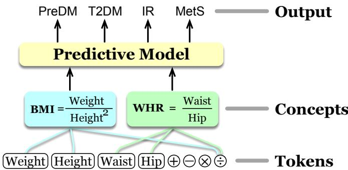  
Figure 1: Example of hierarchical relationships between generated feature abstractions (concepts) and original features. BMI and WHR are derived from original features.

Inspired by the success of generative AI, recent advances formulate automated feature transformation as a token generation task [22, 23, 32, 34, 35]. They compress feature transformation knowledge into a continuous embedding space and subsequently explore this space via gradient-based methods to identify superior feature transformation sequences. However, there are three primary limitations: 1) Neglecting hierarchical relationships between original features, mathematical operations, and generated feature abstractions. For example, as illustrated in Figure 1, Body Mass Index (BMI) and Waist-to-Hip Ratio (WHR) are high-level feature abstractions (i.e., concepts) derived from original features through mathematical transformations, which can significantly contribute to predicting clinical outcomes such as Pre-Diabetes (PreDM), Type 2 Diabetes (T2DM), Insulin Resistance (IR), and Metabolic Syndrome (MetS). Neglecting explicit modeling of these hierarchical relationships results in incomplete feature representations, limiting the capture of meaningful interactions and reducing the discriminative power of the embedding space. 2) Ignoring the order invariance of the generated feature abstractions with respect to the predictive performance of the associated fea- ture space. Prior studies treat the entire feature transformation process as a sequential model to capture transformation knowledge. However, this formulation introduces unnecessary permutation bias among generated concepts into the embedding space, hindering efective exploration and limiting the identification of the globally optimal feature transformation embedding. 3) Relying on gradient-based search methods that strongly assume convexity of the learned embedding space. Existing methods typically assume convexity in the learned embedding space, rely ing on gradient-based search methods to identify globally optimal solutions. However, due to complex interactions among features and mathematical operations, it is challenging to guarantee the convexity of the embedding space. This misalignment between the convexity assumption and the practical characteristics of the embedding space increases the risk of being trapped in local optima, resulting in suboptimal feature transformation sequences.

Our Contribution: A Hierarchical Modeling and Policy- Guided Feature Transformation Pers ective. To address these limitations, we propose PHER, a novel feature transformation framework that integrates permutation-invariant hierarchical modeling and multi-objective policy-guided search. Specifically, given a large volume of feature transformation records, where each record consists of a transformation sequence and the associated model performance, we first design a hierarchical modeling module. This module preserves transformation knowledge at both low-level feature interactions and high-level feature abstractions (i.e. concepts) into a continuous embedding space. To ensure permutation invariance, we develop a self-attention pooling mechanism that symmetrically computes attention scores across various generated concepts. This structure guarantees that any permutation of generated concepts yields identical embeddings, resulting in a global continuous embedding space that unbiasedly preserves feature transformation knowledge. Subsequently, we employ a policy-guided multi-objective search strategy to explore the global embedding space and identify the optimal feature transformation sequence. In detail, we first select the top-K feature transformation sequences based on model performance as search seeds. Then, we convert these seeds into embeddings, which serve as initial positions for exploration within the learned global embedding space. Next, we treat seed embeddings as states and implement a reinforcement learning agent to explore the embedding space, guided by maximizing downstream task performance and minimizing the length of transformation sequences. The exploratory nature of reinforcement learning enables efective navigation of the embedding space, reducing the risk of becoming trapped in local optima, even when the embedding space lacks convexity. Finally, we conduct extensive experiments on 19 real-world datasets to evaluate the eficiency, resilience, and traceability of PHER. The experimental results show the superior performance of PHER over the state-of-the-art feature transformation methods.

## 2 Problem Statement

We aim to develop an automated feature transformation framework from a generative intelligence perspective, integrating permutationinvariant hierarchical modeling and a policy-guided multi-objective search strategy. Formally, given a dataset $D = \{ X , y \}$ , where � denotes features and � represents the corresponding labels, along with a mathematical operation set O (e.g., addition, subtraction, multiplication). We first gather � feature transformation records, denoted by $\{ ( \Gamma _ { \mathrm { i } } , v _ { i } ) \} _ { i = 1 } ^ { n }$ based on the dataset �, where each record consists of a transformation sequence $\Gamma _ { \mathrm { i } }$ and the associated downstream predictive performance $v _ { i } .$ We then train a token-level encoder $\phi _ { t o k }$ and decoder $\psi _ { t o k }$ to encode interactions between original features and mathematical operations into token embeddings E, optimized through a token-level reconstruction loss. These token embeddings are grouped and averaged through an aggregation layer to form concept embeddings G. A concept-level permutation-invariant encoder $\phi _ { c o n }$ is then employed to eliminate order sensitivity among concepts, resulting in a global, unbiased embedding space G. A corresponding concept-level decoder $\psi _ { c o n }$ is simultaneously trained to capture patterns from generated concepts. After that, we employ a policy-guided strategy to explore G, aiming to identify the optimal global embedding $\mathbf { \bar { G } } _ { o p t } ^ { ' }$ . This embedding can be decoded by the concept-level decoder $\psi _ { c o n }$ and token-level decoder $\psi _ { t o k }$ to reconstruct the optimal feature transformation sequence $\Gamma ^ { * }$ , thus generating a feature space that maximizes downstream task performance M. Formally, the optimization goal is formulated as:

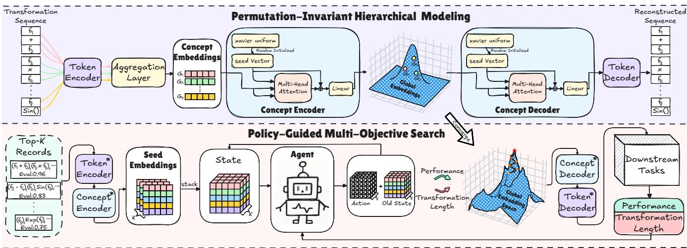  
Figure 2: An overview of our framework. PHER com rises two main com onents: 1) Permutation-Invariant Hierarchical Modeling, which unbiasedly preserves feature transformation knowledge at both the feature-operation token level and the generated-concept level within a global embedding space; 2) Policy-Guided Multi-objective Search, which efectively explores the learned embedding space to identify optimal feature transformation sequences.

$$
\begin{array} { r } { \boldsymbol { \Gamma } ^ { * } = \psi _ { t o k } ( \psi _ { c o n } ( \mathbf { G } _ { o p t } ^ { ' } ) ) = \operatorname * { a r g m a x } _ { \boldsymbol { \mathbf { G } } ^ { \prime } \in \mathbb { G } } \boldsymbol { M } ( \boldsymbol { X } [ \psi _ { t o k } ( \psi _ { c o n } ( \boldsymbol { \mathbf { G } } ^ { \prime } ) ) ] ) . } \end{array}\tag{1}
$$

## 3 Methodology

## 3.1 Framework Overview

Figure 2 illustrates the overall structure of PHER, comprising two primary components: 1) Permutation-Invariant Hierarchical Modeling and 2) Policy-Guided Multi-Objective Search. Specifically, given a large collection of feature transformation records, each record consists ofone feature transformation sequence and the correspond ing model performance. We first develop a token-level encoder to embed original features and mathematical operations, capturing token-level transformation patterns. Next, we aggregate token em beddings into concept embeddings according to the correspondence between original features, operations, and generated concepts. We then apply a concept-level encoder with a self-attention pooling mechanism to eliminate order sensitivity, obtaining permutationinvariant global embeddings. To efectively train the encoders, we introduce a concept-level decoder and a token-level decoder to reconstruct concept embeddings and original feature-operation tokens, respectively. After obtaining the global embedding space, we employ a policy-guided multi-objective search strategy to explore this embedding space, guided by maximizing downstream task performance and minimizing the length of feature transformation sequences. The identified optimal embedding is then decoded into its corresponding feature transformation sequence using the trained decoder. Finally, this reconstructed sequence is applied to the original feature space, resulting in an optimized feature space with improved predictive performance.

## 3.2 Hierarchical Feature Transformation Knowledge Modeling

Why Hierarchical Knowledge Modeling Matters. Feature transformation inherently involves intricate hierarchical relationships among original features, mathematical operations, and higherlevel generated concepts. However, existing generative intelligencebased approaches typically treat the entire feature transformation sequence as an indistinguishable whole, neglecting these hierarchical distinctions. This oversimplification leads to inadequate modeling of transformation knowledge, reducing the discriminative power of the continuous embedding space, and ultimately resulting in suboptimal feature spaces. To address these limitations, we develop a hierarchical modeling module in our framework, which can explicitly capture both token-level relationships (individual featureoperation interactions) and concept-level relationships (aggregated higher-level concepts) within the learned embedding space.

Reinforcement Transformation-Accuracy Training Data Col- lection. To learn an efective embedding space of feature transformation, we collect � transformation records using an RL-based method [31], denoted by $\{ ( \Gamma _ { \mathrm { i } } , v _ { i } ) \} _ { i = 1 } ^ { n }$ , where $\Gamma _ { \mathrm { i } }$ is a feature transformation sequence $( \mathbf { e . g . , } l o g ( f _ { 1 } ) , - f _ { 3 } , \ldots )$ and $v _ { i }$ is the corresponding model performance. In this method, two agents select candidate features while a third agent selects the transformation operation at each iteration, jointly optimized by maximizing downstream task performance. For more details, please refer to the referenced paper.

Token-Level Feature Transformation Embedding. After col lecting feature transformation sequence-accuracy pairs $\{ ( \Gamma _ { \bf i } , v _ { i } ) \} _ { i = 1 } ^ { n } ,$ we train the token-level encoder and decoder to capture token-level transformation patterns from feature-operation token sequences. Encoder $\phi _ { t o k } \colon$ The token encoder aims to learn a mapping function $\phi _ { t o k }$ that converts the input transformation sequence $\mathbf { \Psi } _ { \Gamma } \doteq \mathbb { R } ^ { 1 \times N }$ to token embeddings E, denoted by $\mathbf { E } = \phi _ { t o k } ( \Gamma ) \mathbf { \bar { \Psi } } \in \mathbb { R } ^ { N \times d _ { t o k } }$ , where � is the length of the input transformation sequence Γ and $d _ { t o k }$ is the hidden size of token embedding. In PHER, we adopt two Transformer encoder layers [29] as the token encoder. Decoder $\psi _ { t o k } .$ : The token decoder is designed to reconstruct the transformation sequence Γ from the learned token embedding $\mathbf { E } ,$ which can be denoted by $\Gamma = \psi _ { t o k } ( \mathbf { E } )$ . In PHER, we adopt two Transformer decoder layers [29] as the token decoder. Why Ensuring Permutation Invariance in Concept-Level Em beddings Matters. While token-level encoders capture low-level feature–operation interactions, they fail to model high-level trans formation patterns. In practice, a set of generated transformation concepts is semantically invariant to the ordering of its concepts. However, existing methods encode these concepts in an order sensitive manner, introducing permutation bias that fragments equivalent transformations across multiple embeddings. This redun dancy distorts the embedding space and inflates the search space, leading to ineficient exploration. We thus propose a permutation invariant concept encoder–decoder that maps equivalent concepts to canonical embeddings, enabling faithful representation learning and eficient exploration of the learned embedding space. Encoder $\phi _ { c o n } \mathrm { : }$ The concept encoder aims to encode the concepts into global embeddings. To ensure permutation invariance, we adopt a self-attention pooling mechanism [20] in $\phi _ { c o n }$ . This struc ture is inherently permutation-invariant with respect to the or dering of concepts, ensuring that the same concept set yields an identical global embedding regardless of its order. Specifically, each transformation sequence is represented in postfix form, and each concept is constructed by sequentially composing feature and op eration tokens according to this representation. For simple trans formations, we obtain the concept embedding by averaging the embeddings of the involved tokens. For nested transformations, this aggregation is applied recursively following the postfix order. For example, log(log(� )) is represented as (� , log, log) and encoded as Mean(Mean $( \mathbf { E } _ { f _ { 7 } } , \mathbf { E } _ { \mathrm { l o g } } ) , \mathbf { E } _ { \mathrm { l o g } } )$ Thus, token embeddings E are aggregated into concept embeddings G according to the compositional structure of the generated transformations. Then, we initialize a set of � learnable seed vectors $\boldsymbol { S } \in \mathbb { R } ^ { k \times d }$ ���� using Xavier uniform initialization, where � is the number ofseed vectors and $d _ { s e e d }$ is the hid den size of each seed vector. These learnable seed vectors serve as queries in the multi-head attention module, attending over the con cept embeddings G which serve as keys and values to extract high level semantic concept representations. The output is then com bined with the original seed vectors through a residual connection, followed by a linear layer. This yields the global embedding, denoted by: $\mathbf { G } ^ { \prime } = \dot { \phi } _ { c o n } ( \mathbf { G } ) = \operatorname { L i n e a r } ( S + \operatorname { M u l t i h e a d } ( S , \mathbf { G } , \mathbf { G } ) ) \in \bar { \mathbb { R } } ^ { k \times d _ { g l o b a l } }$ where $d _ { g l o b a l }$ represents the hidden size of global embedding. Decoder $\psi _ { c o n } \mathrm { : }$ The concept decoder $\psi _ { c o n }$ aims to reconstruct con cept embedding G from the global embedding G′, denoted by $\mathbf { G } = \psi _ { c o n } ( \mathbf { G } ^ { \prime } )$ . In PHER, we adopt the same architecture for the concept decoder as used in the concept encoder, ensuring symmetric abstraction and reconstruction.

Algorithm 1: Training and Search Procedure of PHER   
Input: Transformation records $\{ ( \Gamma _ { i } , v _ { i } ) \} _ { i = 1 } ^ { n } {       } _ { : }$ , top-� seeds,   
search epochs �   
Output: Optimal transformation sequence Γ∗   
// Stage 1: Token-Level Training   
1 for each epoch do   
2 $\mathbf { E }  \phi _ { t o k } ( \Gamma ) , \hat { \Gamma }  \psi _ { t o k } ( \mathbf { E } ) ;$   
3 Update $\phi _ { t o k } , \psi _ { t o k }$ by minimizing $\mathcal { L } _ { t o k } ;$   
4 end   
// Stage 2: Concept-Level Training   
5 Freeze $\phi _ { t o k } ;$   
6 for each epoch do   
7 $\mathbf { E }  \phi _ { t o k } ( \Gamma ) , \mathbf { G }  \mathrm { A g g r e g a t e } ( \mathbf { E } ) ;$   
8 $\mathbf { G } ^ { \prime } \gets \phi _ { c o n } ( \mathbf { G } ) , \hat { \mathbf { G } } \gets \psi _ { c o n } ( \mathbf { G } ^ { \prime } ) ;$   
9 Update ����,���� by minimizing L���;   
10 end   
// Stage 3: Token-Concept Alignment   
11 Freeze $\phi _ { c o n } ^ { * } , \psi _ { c o n } ^ { * } ;$   
12 for each epoch do   
13 $\hat { \Gamma } \gets \psi _ { t o k } ( \psi _ { c o n } ^ { * } ( \phi _ { c o n } ^ { * } ( \mathrm { A g g r e g a t e } ( \phi _ { t o k } ( \Gamma ) ) ) ) ) ;$   
14 Update ����,���� by minimizing $\mathcal { L } _ { a l i g n } ;$   
15 end   
// Stage 4: Policy-Guided Search   
16 Select top-� records by performance as search seeds;   
17 Initialize PPO agent A with actor-critic architecture;   
18 for $t = 1$ to � do   
19 for each seed $( \Gamma , v )$ do   
20 $\mathbf { G } ^ { \prime }  \phi _ { c o n } ^ { * } ( \mathrm { A g g r e g a t e } ( \phi _ { t o k } ^ { * } ( \Gamma ) ) ) ;$   
21 $\mathbf { G } _ { + } ^ { \prime } \gets \mathcal { A } ( \mathbf { G } ^ { \prime } ) ;$   
22 $\Gamma ^ { + }  \psi _ { t o k } ^ { * } ( \psi _ { c o n } ^ { * } ( \mathbf G _ { + } ^ { \prime } ) ) ;$   
23 Compute reward R based on $\scriptstyle { \mathcal { M } } ( X [ \Gamma ^ { + } ] )$ and $\lVert \Gamma ^ { + } \rVert ;$   
24 end   
25 Update A by maximizing $\mathcal { L } _ { a c t o r }$ and minimizing $\mathcal { L } _ { c r i t i c } ;$   
26 end   
27 $\Gamma ^ { * }  \mathrm { a r g }$ maxΓ+ $\scriptstyle { \mathcal { M } } ( X [ \Gamma ^ { + } ] )$ ;   
28 return $\Gamma ^ { * } ;$

Hierarchical Optimization Procedure: To efectively train the hierarchical encoder-decoder models, we design a three-stage training strategy. Each stage progressively captures feature transformation knowledge, from token-level to concept-level.

Stage 1: Token-Level Training. In the first stage, we train the token encoder $\phi _ { t o k }$ and decoder $\psi _ { t o k }$ to reconstruct the input transformation sequence Γ. Specifically, given a sequence Γ, the token encoder first produces token embedding $\mathbf { E } = \phi _ { t o k } ( \Gamma )$ . The token decoder then reconstructs the original feature transformation sequence from the token embedding $\hat { \Gamma } = \psi _ { t o k } ( { \bf E } )$ . We optimize the token-level model by minimizing the negative log-likelihood loss:

$$
\mathcal { L } _ { t o k } = - \log P _ { \psi _ { t o k } } ( \Gamma \mid \mathbf { E } ) .\tag{2}
$$

Stage 2: Concept-Level Training. After training the token-level model, we freeze its parameters and train the concept encoder $\phi _ { c o n }$ and decoder $\psi _ { c o n }$ to learn high-level permutation-invariant global embeddings. Specifically, given a feature transformation sequence $\Gamma ,$ we first utilize the well-trained token encoder to obtain token embedding E. Then, we input E into the aggregation layer to generate the concept embedding G based on the relationships between concept and its afiliated feature indices and mathematical operations. Thereafter, G is input into $\phi _ { c o n }$ to obtain the global embedding $\mathbf { G } ^ { \prime } = \phi _ { c o n } ( \mathbf { G } )$ . Finally, the global embedding $\mathbf { G } ^ { \prime }$ is decoded back to concept embedding $\hat { \mathbf { G } } = \psi _ { c o n } ( \mathbf { G } ^ { \prime } )$ . We optimize the concept-level model by minimizing the Mean Squared Error (MSE) between the reconstructed $\hat { \mathbf { G } }$ and original concept embedding G, denoted by:

$$
\mathcal { L } _ { c o n } = \mathrm { M S E } ( \mathbf { G } , \hat { \mathbf { G } } ) = \mathrm { M S E } ( \mathbf { G } , \psi _ { c o n } ( \phi _ { c o n } ( \mathbf { G } ) ) ) .\tag{3}
$$

Stage 3: Token-Concept Alignment. In this stage, we freeze the concept-level model and tune the token encoder and decoder to improve the accuracy of end-to-end token reconstruction. Given a transformation sequence $\Gamma ,$ we obtain the token embedding $\mathbf { E } =$ $\phi _ { t o k } ( \Gamma )$ . Then, the aggregation layer maps E to concept embeddings G, which are further processed by the well-trained concept encoder $\phi _ { c o n } ^ { * }$ and concept decoder $\psi _ { c o n } ^ { * }$ before being decoded by the token decoder. We optimize the following loss during the alignment stage: $\mathcal { L } _ { a l i g n } = - \log P _ { \psi _ { t o k } } ( \Gamma \mid \psi _ { \mathrm { c o n } } ^ { * } ( \phi _ { \mathrm { c o n } } ^ { * } ( \phi _ { t o k } ( \Gamma ) ) ) )$ . Here, the aggregation layer is omitted for brevity. This stage aligns token embeddings with the fixed concept-level abstractions, improving the coherence and semantic quality of the reconstructed transformation sequence. The complete training and search procedure of PHER is summarized in Algorithm 1.

## 3.3 Policy-guided Multi-objective Search

Why selecting search seeds matters. Once the global embedding space has converged, we employ a policy-guided multi-objective search strategy in the learned global embedding space to identify the optimal global embedding that achieves maximum downstream task performance and minimum transformation length. Inspired by the significance of initialization for deep neural networks, good starting points are crucial for accelerating the search process and enhancing its performance. Thus, we rank all collected records by model performance and select the top-K as search seeds.

Policy-guided multi-objective search. Existing methods assume the learned embedding space is convex, relying on gradient-ascent search strategy to identify the global optimal embedding. However, due to the complex interactions between features and mathematical operations, the embedding space is highly non-convex in practice, increasing the risk of becoming trapped in local optima and resulting in suboptimal feature transformation sequences. Thus, to perform efective exploration and search process without strong convexity assumptions, we employ Proximal Policy Optimization (PPO) [27] method, which is a widely used policy gradient algorithm for multi-objective optimization. PPO stabilizes policy updates by clipping and trust region mechanisms, efectively balancing exploration and exploitation in high-dimensional and non-convex embedding spaces. In PHER, the PPO agent learns to explore the continuous global embedding space by selecting promising global embeddings based on the downstream task performance and transformation sequence length. Specifically, given a global embedding ${ \bf G } ^ { \prime } ,$ , the PPO agent A aims to manipulate it to generate the optimal global embedding $\mathbf { G } _ { o p t } ^ { ' }$ , denoted by: $\mathcal { A } ( \mathbf { G } ^ { ' } ) = \mathbf { G } _ { o p t } ^ { ' }$

Reward $\mathcal { R } \colon$ To balance the performance and the total length of the transformed sequence, we propose a weighted reward function, denoted by: $\mathcal { R } = \lambda ( \mathcal { M } ( X [ \Gamma ^ { + } ] ) - \mathcal { M } ( X [ \Gamma ] ) ) + ( 1 - \lambda ) N [ \Gamma ^ { + } ]$ , where $\mathcal { M }$ denotes the downstream ML task, Γ represents the original transformation sequence, $\Gamma ^ { + }$ refers to the searched transformation sequence, $N [ \Gamma ^ { + } ]$ is a normalized length penalty of $\Gamma ^ { + }$ , and � is the trade-of hyperparameter to balance the performance improvement and the total length of the transformed sequence.

Solving the Optimization Problem. We adopt a multi-objective optimization strategy to train the PPO agent. Specifically, the policy is updated by maximizing a clipped surrogate objective, which approximates the cumulative discounted reward obtained throughout the iterative search process, while constraining the step size of each update. To enable the PPO agent to identify more informative embeddings with higher model performance and fewer transformation operations, we adopt an actor-critic model architecture. We optimize the critic by minimizing the diference between the observed cumulative discounted rewards and their predictions, denoted by: $\begin{array} { r } { \mathcal { L } _ { c r i t i c } = \frac { 1 } { T } \sum _ { t = 1 } ^ { T } ( V ( \pmb { s } _ { t } ) - G _ { t } ) ^ { 2 } } \end{array}$ , where $T$ is the trajectory length, $\mathbf { s } _ { t }$ is the state at time step $t , V ( \mathbf { s } _ { t } )$ is the predicted value from the critic, $G _ { t }$ is the cumulative discounted return, and $\gamma \in \ [ 0 , 1 ]$ is the discounted factor. The actor is optimized by maximizing a clipped surrogate objective while constraining the step size of each policy update, denoted by: $\mathcal { L } _ { a c t o r } =$ $\hat { \mathbb { E } } _ { t } \left[ \operatorname* { m i n } ( r _ { t } ( \theta ) \hat { A } _ { t } , \operatorname { c l i p } ( r _ { t } ( \theta ) , 1 - \epsilon , 1 + \epsilon ) \hat { A } _ { t } ) \right]$ , where � is the clipping ratio hyperparameter, $r _ { t } ( \theta )$ is the probability ratio, and $\hat { A } _ { t }$ is the estimated advantage. Once the actor network converges, the learned policy $\pi ^ { * }$ guides the global embedding $\mathbf { G } ^ { ' }$ within the global embedding space $\mathbb { G }$ toward regions that yield higher downstream task performance with fewer transformation operations. Then, we reconstruct the transformation sequence $\Gamma ^ { + }$ from the enhanced global embedding ${ \bf G } _ { + } ^ { ' }$ using the well-trained concept decoder and token decoder. Next, we obtain enhanced feature spaces using the enhanced transformation sequences $[ \Gamma _ { 1 } ^ { + } , \Gamma _ { 2 } ^ { + } , . . . , \Gamma _ { K } ^ { + } ]$ and input them into the downstream ML task to evaluate their performance. Finally, the feature transformation sequence achieving the highest performance is selected as the optimal sequence, denoted as $\Gamma ^ { * }$

## 4 Experiments

## 4.1 Datasets and Evaluation Metrics

We evaluate PHER on 19 publicly accessible datasets from UCI [25], LibSVM [5], Kaggle [11], and OpenML [24], including 14 classification tasks and 5 regression tasks. We adopt Random Forest as the unified downstream model and evaluate its performance via five-fold cross-validation on the training partition. All experiments follow a hold-out evaluation protocol, where each dataset is randomly divided into 80% for training and 20% for testing, and are independently repeated five times with diferent random seeds, with results reported as the mean and standard deviation. For regression tasks, we report 1-Relative Absolute Error (1-RAE), 1-Mean Absolute Error (1-MAE), 1-Mean Squared Error (1-MSE), and 1- Root Mean Squared Error (1-RMSE). For classification tasks, we use F1-score, Precision, Recall, and ROC/AUC.

Table 1: Overall performance comparison. In this table, the best and second-best results are highlighted in red and blue respectively. (The higher the value is, the better the model performance is.)
<table><tr><td>Dataset</td><td>C/R</td><td>Original</td><td>RDG</td><td>ERG</td><td>LDA</td><td>AFAT</td><td>NFS</td><td>TTG</td><td>GRFG</td><td>DIFER</td><td>MOAT</td><td>PHER</td></tr><tr><td>Higgs Boson</td><td>C</td><td>0.696</td><td> $0 . 7 0 0 ^ { \pm 0 . 0 0 1 }$ </td><td> $0 . 7 0 4 ^ { \pm 0 . 0 0 3 }$ </td><td> $0 . 5 1 1 ^ { \pm 0 . 0 1 1 }$ </td><td> $0 . 6 9 5 ^ { \pm 0 . 0 0 1 }$ </td><td> $0 . 6 9 7 ^ { \pm 0 . 0 0 2 }$ </td><td> $0 . 6 9 9 ^ { \pm 0 . 0 0 3 }$ </td><td> $0 . 7 0 1 ^ { \pm 0 . 0 0 2 }$ </td><td> $0 . 6 6 9 ^ { \pm 0 . 0 0 1 }$ </td><td> $0 . 6 9 9 ^ { \pm 0 . 0 0 2 }$ </td><td> $0 . 7 0 6 ^ { \pm 0 . 0 0 2 }$ </td></tr><tr><td>Amazon Employee</td><td>C</td><td>0.930</td><td> $0 . 9 3 1 ^ { \pm 0 . 0 0 1 }$ </td><td> $0 . 9 3 5 ^ { \pm 0 . 0 0 1 }$ </td><td> $0 . 9 1 4 ^ { \pm 0 . 0 0 2 }$ </td><td> $0 . 9 3 3 ^ { \pm 0 . 0 0 2 }$ </td><td> $0 . 9 3 2 ^ { \pm 0 . 0 0 1 }$ </td><td> $0 . 9 3 0 ^ { \pm 0 . 0 0 1 }$ </td><td> $0 . 9 3 2 ^ { \pm 0 . 0 0 1 }$ </td><td> $0 . 9 2 9 ^ { \pm 0 . 0 0 1 }$ </td><td> $0 . 9 3 3 ^ { \pm 0 . 0 0 2 }$ </td><td> $0 . 9 3 6 ^ { \pm 0 . 0 0 2 }$ </td></tr><tr><td>PimaIndian</td><td>C</td><td>0.776</td><td> $0 . 7 6 0 ^ { \pm 0 . 0 0 7 }$ </td><td> $0 . 7 6 2 ^ { \pm 0 . 0 0 4 }$ </td><td> $0 . 7 2 9 ^ { \pm 0 . 0 6 1 }$ </td><td> $0 . 7 6 0 ^ { \pm 0 . 0 1 1 }$ </td><td> $0 . 7 5 9 ^ { \pm 0 . 0 1 4 }$ </td><td> $0 . 7 5 0 ^ { \pm 0 . 0 1 9 }$ </td><td> $0 . 7 5 4 ^ { \pm 0 . 0 1 1 }$ </td><td> $0 . 7 6 0 ^ { \pm 0 . 0 1 3 }$ </td><td> $0 . 8 0 7 ^ { \pm 0 . 0 1 1 }$ </td><td> $0 . 8 2 8 ^ { \pm 0 . 0 0 3 }$ </td></tr><tr><td>SpectF</td><td>C</td><td>0.760</td><td> $0 . 7 6 0 ^ { \pm 0 . 0 0 1 }$ </td><td> $0 . 7 5 9 ^ { \pm 0 . 0 1 8 }$ </td><td> $0 . 6 6 5 ^ { \pm 0 . 1 1 9 }$ </td><td> $0 . 7 8 2 ^ { \pm 0 . 0 7 9 }$ </td><td> $0 . 7 6 0 ^ { \pm 0 . 0 0 1 }$ </td><td> $0 . 7 7 5 ^ { \pm 0 . 0 1 4 }$ </td><td> $0 . 8 1 8 ^ { \pm 0 . 0 0 1 }$ </td><td> $0 . 7 6 6 ^ { \pm 0 . 0 0 2 }$ </td><td> $0 . 9 1 2 ^ { \pm 0 . 0 1 4 }$ </td><td> $0 . 9 2 9 ^ { \pm 0 . 0 0 3 }$ </td></tr><tr><td>SVMGuide3</td><td>C</td><td>0.778</td><td> $0 . 7 9 1 ^ { \pm 0 . 0 0 8 }$ </td><td> $0 . 8 1 7 ^ { \pm 0 . 0 1 5 }$ </td><td> $0 . 6 3 5 ^ { \pm 0 . 0 4 9 }$ </td><td> $0 . 7 8 9 ^ { \pm 0 . 0 0 9 }$ </td><td> $0 . 7 8 6 ^ { \pm 0 . 0 0 4 }$ </td><td> $0 . 7 9 1 ^ { \pm 0 . 0 1 4 }$ </td><td> $0 . 8 1 2 ^ { \pm 0 . 0 2 5 }$ </td><td> $0 . 7 7 3 ^ { \pm 0 . 0 2 1 }$ </td><td> $0 . 8 4 5 ^ { \pm 0 . 0 0 1 }$ </td><td> $0 . 8 4 8 ^ { \pm 0 . 0 0 3 }$ </td></tr><tr><td>German Credit</td><td>C</td><td>0.649</td><td> $0 . 6 6 7 ^ { \pm 0 . 0 0 8 }$ </td><td> $0 . 6 8 4 ^ { \pm 0 . 0 1 1 }$ </td><td> $0 . 5 9 7 ^ { \pm 0 . 0 5 8 }$ </td><td> $0 . 6 4 0 ^ { \pm 0 . 0 3 2 }$ </td><td> $0 . 6 6 3 ^ { \pm 0 . 0 1 7 }$ </td><td> $0 . 6 6 3 ^ { \pm 0 . 0 1 9 }$ </td><td> $0 . 6 8 3 ^ { \pm 0 . 0 1 3 }$ </td><td> $0 . 6 5 6 ^ { \pm 0 . 0 1 8 }$ </td><td> $0 . 7 2 9 ^ { \pm 0 . 0 0 1 }$ </td><td> $0 . 7 3 6 ^ { \pm 0 . 0 0 7 }$ </td></tr><tr><td>Credit Default</td><td>C</td><td>0.802</td><td> $0 . 8 0 5 ^ { \pm 0 . 0 0 1 }$ </td><td> $0 . 8 0 4 ^ { \pm 0 . 0 0 2 }$ </td><td> $0 . 7 4 3 ^ { \pm 0 . 0 0 9 }$ </td><td> $0 . 8 0 4 ^ { \pm 0 . 0 0 1 }$ </td><td> $0 . 8 0 3 ^ { \pm 0 . 0 0 2 }$ </td><td> $0 . 8 0 3 ^ { \pm 0 . 0 0 2 }$ </td><td> $0 . 8 0 6 ^ { \pm 0 . 0 0 3 }$ </td><td> $0 . 7 9 6 ^ { \pm 0 . 0 0 5 }$ </td><td> $0 . 8 0 8 ^ { \pm 0 . 0 0 1 }$ </td><td> $0 . 8 1 0 ^ { \pm 0 . 0 0 1 }$ </td></tr><tr><td>Messidor_features</td><td>C</td><td>0.633</td><td> $0 . 6 8 5 ^ { \pm 0 . 0 5 3 }$ </td><td> $0 . 6 6 5 ^ { \pm 0 . 0 2 5 }$ </td><td> $0 . 4 6 3 ^ { \pm 0 . 0 8 4 }$ </td><td> $0 . 6 5 6 ^ { \pm 0 . 0 0 5 }$ </td><td> $0 . 6 5 7 ^ { \pm 0 . 0 1 1 }$ </td><td> $0 . 6 6 2 ^ { \pm 0 . 0 1 9 }$ </td><td> $0 . 6 9 2 ^ { \pm 0 . 0 3 3 }$ </td><td> $0 . 6 6 0 ^ { \pm 0 . 0 0 7 }$ </td><td> $0 . 6 9 4 ^ { \pm 0 . 0 0 5 }$ </td><td> $0 . 7 4 4 ^ { \pm 0 . 0 0 3 }$ </td></tr><tr><td>Wine Quality Red</td><td>C</td><td>0.456</td><td> $0 . 5 1 4 ^ { \pm 0 . 0 1 6 }$ </td><td> $0 . 4 9 4 ^ { \pm 0 . 0 0 5 }$ </td><td> $0 . 4 0 1 ^ { \pm 0 . 0 6 1 }$ </td><td> $0 . 4 8 0 ^ { \pm 0 . 0 4 2 }$ </td><td> $0 . 4 6 7 ^ { \pm 0 . 0 2 1 }$ </td><td> $0 . 4 6 4 ^ { \pm 0 . 0 1 0 }$ </td><td> $0 . 4 7 0 ^ { \pm 0 . 0 0 9 }$ </td><td> $0 . 4 7 6 ^ { \pm 0 . 0 1 8 }$ </td><td> $0 . 5 5 9 ^ { \pm 0 . 0 0 2 }$ </td><td> $0 . 5 6 2 ^ { \pm 0 . 0 0 3 }$ </td></tr><tr><td>Wine Quality White</td><td>C</td><td>0.536</td><td> $0 . 5 2 4 ^ { \pm 0 . 0 0 1 }$ </td><td> $0 . 5 2 4 ^ { \pm 0 . 0 0 1 }$ </td><td> $0 . 4 3 7 ^ { \pm 0 . 0 1 5 }$ </td><td> $0 . 5 1 6 ^ { \pm 0 . 0 3 2 }$ </td><td> $0 . 5 3 3 ^ { \pm 0 . 0 1 0 }$ </td><td> $0 . 5 2 9 ^ { \pm 0 . 0 0 2 }$ </td><td> $0 . 5 3 4 ^ { \pm 0 . 0 1 9 }$ </td><td> $0 . 5 0 7 ^ { \pm 0 . 0 2 5 }$ </td><td> $0 . 5 3 6 ^ { \pm 0 . 0 1 0 }$ </td><td> $0 . 5 5 3 ^ { \pm 0 . 0 0 2 }$ </td></tr><tr><td>SpamBase</td><td>C</td><td>0.927</td><td> $0 . 9 2 4 ^ { \pm 0 . 0 0 1 }$ </td><td> $0 . 9 2 0 ^ { \pm 0 . 0 0 1 }$ </td><td> $0 . 8 8 5 ^ { \pm 0 . 0 3 0 }$ </td><td> $0 . 9 1 7 ^ { \pm 0 . 0 0 1 }$ </td><td> $0 . 9 2 2 ^ { \pm 0 . 0 0 3 }$ </td><td> $0 . 9 2 2 ^ { \pm 0 . 0 0 3 }$ </td><td> $0 . 9 2 2 ^ { \pm 0 . 0 0 5 }$ </td><td> $0 . 9 1 2 ^ { \pm 0 . 0 1 6 }$ </td><td> $0 . 9 3 2 ^ { \pm 0 . 0 0 1 }$ </td><td> $0 . 9 3 6 ^ { \pm 0 . 0 0 2 }$ </td></tr><tr><td>AP-omentum-ovary</td><td>C</td><td>0.845</td><td> $0 . 8 4 5 ^ { \pm 0 . 0 0 1 }$ </td><td> $0 . 8 1 4 ^ { \pm 0 . 0 0 1 }$ </td><td> $0 . 7 1 0 ^ { \pm 0 . 1 3 4 }$ </td><td> $0 . 8 4 5 ^ { \pm 0 . 1 2 5 }$ </td><td> $0 . 8 4 5 ^ { \pm 0 . 0 0 1 }$ </td><td> $0 . 8 4 5 ^ { \pm 0 . 0 0 1 }$ </td><td> $0 . 8 4 9 ^ { \pm 0 . 0 0 1 }$ </td><td> $0 . 8 3 3 ^ { \pm 0 . 0 3 1 }$ </td><td> $0 . 8 4 5 ^ { \pm 0 . 0 0 2 }$ </td><td> $0 . 8 8 3 ^ { \pm 0 . 0 0 1 }$ </td></tr><tr><td>Lymphography</td><td>C</td><td>0.141</td><td> $0 . 1 0 8 ^ { \pm 0 . 0 0 1 }$ </td><td> $0 . 1 2 9 ^ { \pm 0 . 0 0 9 }$ </td><td> $0 . 1 4 4 ^ { \pm 0 . 1 3 2 }$ </td><td> $0 . 1 5 0 ^ { \pm 0 . 1 3 3 }$ </td><td> $0 . 1 7 0 ^ { \pm 0 . 0 3 5 }$ </td><td> $0 . 1 7 4 ^ { \pm 0 . 0 4 0 }$ </td><td> $0 . 1 8 2 ^ { \pm 0 . 0 1 3 }$ </td><td> $0 . 1 5 0 ^ { \pm 0 . 1 1 6 }$ </td><td> $0 . 2 6 7 ^ { \pm 0 . 0 3 5 }$ </td><td> $\mathbf { 0 . 4 1 0 ^ { \pm 0 . 1 0 5 } }$ </td></tr><tr><td>MNIST fashion</td><td>C</td><td>0.712</td><td> $0 . 7 1 4 ^ { \pm 0 . 0 0 1 }$ </td><td> $0 . 7 1 6 ^ { \pm 0 . 0 0 1 }$ </td><td> $0 . 5 1 0 ^ { \pm 0 . 0 2 0 }$ </td><td> $0 . 6 9 9 ^ { \pm 0 . 0 2 2 }$ </td><td> $0 . 7 1 0 ^ { \pm 0 . 0 0 2 }$ </td><td> $0 . 7 1 1 ^ { \pm 0 . 0 0 4 }$ </td><td> $0 . 7 2 8 ^ { \pm 0 . 0 0 1 }$ </td><td> $0 . 7 1 7 ^ { \pm 0 . 0 0 2 }$ </td><td> $0 . 7 2 9 ^ { \pm 0 . 0 0 1 }$ </td><td> $0 . 7 3 5 ^ { \pm 0 . 0 0 1 }$ </td></tr><tr><td>Housing Boston</td><td>R</td><td>0.415</td><td> $0 . 4 2 0 ^ { \pm 0 . 0 3 1 }$ </td><td> $0 . 4 1 8 ^ { \pm 0 . 0 0 1 }$ </td><td> $0 . 0 2 1 ^ { \pm 0 . 0 0 2 }$ </td><td> $0 . 4 2 3 ^ { \pm 0 . 0 0 5 }$ </td><td> $0 . 4 2 4 ^ { \pm 0 . 0 0 2 }$ </td><td> $0 . 4 2 1 ^ { \pm 0 . 0 1 1 }$ </td><td> $0 . 4 0 4 ^ { \pm 0 . 0 0 7 }$ </td><td> $0 . 3 8 1 ^ { \pm 0 . 0 1 7 }$ </td><td> $0 . 4 6 5 ^ { \pm 0 . 0 0 6 }$ </td><td> $0 . 5 3 8 ^ { \pm 0 . 0 0 5 }$ </td></tr><tr><td>Airfoil</td><td>R</td><td>0.519</td><td> $0 . 5 2 0 ^ { \pm 0 . 0 0 1 }$ </td><td> $0 . 5 1 9 ^ { \pm 0 . 0 0 1 }$ </td><td> $0 . 2 0 7 ^ { \pm 0 . 0 6 5 }$ </td><td> $0 . 5 0 9 ^ { \pm 0 . 0 0 1 }$ </td><td> $0 . 5 1 9 ^ { \pm 0 . 0 0 2 }$ </td><td> $0 . 5 2 1 ^ { \pm 0 . 0 0 1 }$ </td><td> $0 . 5 2 1 ^ { \pm 0 . 0 0 3 }$ </td><td> $0 . 5 5 8 ^ { \pm 0 . 0 0 2 }$ </td><td> $0 . 6 2 7 ^ { \pm 0 . 0 1 1 }$ </td><td> $0 . 6 4 5 ^ { \pm 0 . 0 0 1 }$ </td></tr><tr><td>Openml_589</td><td>R</td><td>0.510</td><td> $0 . 5 4 8 ^ { \pm 0 . 0 3 2 }$ </td><td> $0 . 6 1 0 ^ { \pm 0 . 0 0 1 }$ </td><td> $0 . 0 3 4 ^ { \pm 0 . 0 7 9 }$ </td><td> $0 . 5 0 9 ^ { \pm 0 . 0 0 2 }$ </td><td> $0 . 5 0 6 ^ { \pm 0 . 0 0 4 }$ </td><td> $0 . 5 0 2 ^ { \pm 0 . 0 0 2 }$ </td><td> $0 . 6 2 7 ^ { \pm 0 . 0 0 6 }$ </td><td> $0 . 4 6 3 ^ { \pm 0 . 0 0 5 }$ </td><td> $0 . 6 5 6 ^ { \pm 0 . 0 0 1 }$ </td><td> $0 . 6 6 0 ^ { \pm 0 . 0 0 6 }$ </td></tr><tr><td>Openml_618</td><td>R</td><td>0.469</td><td> $0 . 4 4 4 ^ { \pm 0 . 0 2 6 }$ </td><td> $0 . 5 4 3 ^ { \pm 0 . 0 3 9 }$ </td><td> $0 . 0 3 0 ^ { \pm 0 . 0 7 6 }$ </td><td> $0 . 4 7 3 ^ { \pm 0 . 0 0 2 }$ </td><td> $0 . 4 7 1 ^ { \pm 0 . 0 0 4 }$ </td><td> $0 . 4 7 2 ^ { \pm 0 . 0 0 1 }$ </td><td> $0 . 5 6 2 ^ { \pm 0 . 1 0 1 }$ </td><td> $0 . 4 0 8 ^ { \pm 0 . 0 3 6 }$ </td><td> $0 . 6 9 2 ^ { \pm 0 . 0 0 2 }$ </td><td> $0 . 6 9 3 ^ { \pm 0 . 0 0 1 }$ </td></tr><tr><td>Openml_620</td><td>R</td><td>0.510</td><td> $0 . 4 9 4 ^ { \pm 0 . 0 1 9 }$ </td><td> $0 . 5 4 1 ^ { \pm 0 . 0 0 8 }$ </td><td> $0 . 0 2 6 ^ { \pm 0 . 0 1 3 }$ </td><td> $0 . 5 2 0 ^ { \pm 0 . 0 0 1 }$ </td><td> $0 . 5 0 9 ^ { \pm 0 . 0 0 5 }$ </td><td> $0 . 5 1 3 ^ { \pm 0 . 0 0 4 }$ </td><td> $0 . 5 6 8 ^ { \pm 0 . 0 1 3 }$ </td><td> $0 . 4 4 2 ^ { \pm 0 . 0 0 4 }$ </td><td> $0 . 6 4 3 ^ { \pm 0 . 0 0 3 }$ </td><td> $0 . 6 5 2 ^ { \pm 0 . 0 0 3 }$ </td></tr></table>

\* We evaluated classification (C) and regression (R) tasks in terms of F1-Score and 1-RAE, respectively.  
\* The standard deviation is computed based on the results of 5 independent runs.

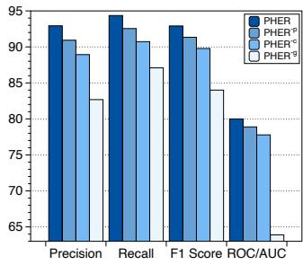

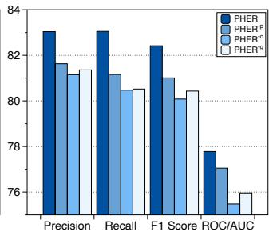  
(a) Spectf  
(b) PimaIndian

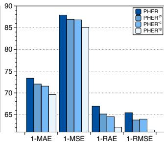  
(c) Openml\_589

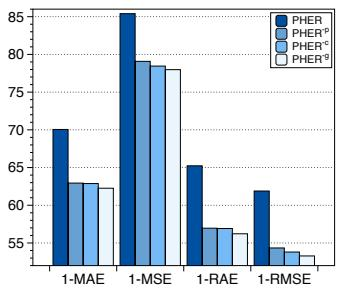  
Figure 3: The influence of hierarchical modeling (PHER−�), permutation invariance (PHER−�), and policy-guided search (PHER−�) in PHER.  
(d) Openml\_620

## 4.2 Baseline Models

We compare our method with nine widely-used feature transformation methods: (1) RDG generates new feature-operation-feature transformation records by randomly selecting candidate features and operations. (2) ERG first applies operations to each feature to expand the feature space and then selects informative features as new features. (3) LDA [2] is a generative probabilistic model that reduces dimensionality by learning latent topic representations. (4) AFAT [10] iteratively applies transformations and performs multi step feature selection to identify informative ones. (5) NFS [3] uses a recurrent neural network-based controller trained with reinforcement learning to sequentially model and optimize the transformation process for each feature. (6) TTG [16] formulates feature transformation as a graph exploration problem and employs reinforcement learning to discover optimal transformation paths within the graph. (7) GRFG [31] employs three reinforced agents with a feature grouping strategy to perform feature generation in a cascaded manner. (8) DIFER [39] encodes randomly generated transformation sequences into a continuous embedding space and employs greedy gradient-based search to identify the best transformed features. (9) MOAT [32] embeds RL-collected transformation sequences into continuous embeddings using postfix expression and conducts gradientascent search with the beam search strategy. Besides, we developed three variants of PHER to evaluate the impact of each technical component: (i) $\mathbf { P H E R } ^ { - c }$ removes the concept encoder and decoder. (ii) $\mathbf { P H E R } ^ { - p }$ replaces the permutation-invariant concept encoder and decoder with permutation-sensitive self-attention layers. (iii) $\mathbf { P H E R } ^ { - g }$ replaces the RL search with Genetic Algorithm (GA).

## 4.3 Performance Evaluation

4.3.1 Overall Performance. Table 1 reports the performance comparison between PHER and baseline models across 19 datasets, using F1-score for classification tasks and 1-RAE for regression tasks. All experimental results are obtained by independently running five times with diferent random seeds, showing that PHER outperforms the other baseline models on all datasets. There are three potential reasons for this observation: 1) The hierarchical modeling architecture captures both low-level and high-level relationships between features, encoding diverse feature transformation knowledge and building a more informative global embedding space; 2) The permutation-invariant concept encoder-decoder framework eliminates order sensitivity among concepts, constructing a global unbiased embedding space; 3) The policy-based RL agent efectively explores the global embedding space and identifies superior feature transformation embeddings, navigating the non-convex space more robustly than gradient-based methods and converging to higherquality embedding regions. Thus, this experiment demonstrates the efectiveness of our proposed framework in transforming feature spaces across various types of tasks.

Hierarchical and Permutation-Invariant Feature Transformation Learning via Policy-Guided Embedding Search  
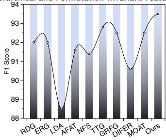  
(a) RandomForest

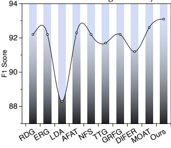  
(b) XGBoost

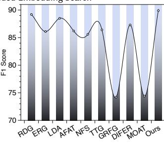  
(c) KNN

CIKM ’26, November 07–11, 2026, Rome, Italy  
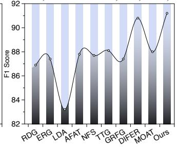  
(d) Decision Tree

Figure 4: Robustness check of PHER with distinct ML models on SpamBase in terms of F1-score.  
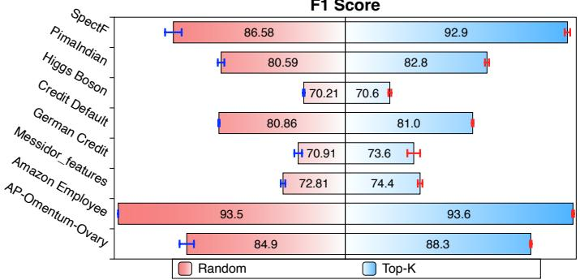  
Figure 5: The influence of search seeds.

4.3.2 Ablation Study. We design three model variants of PHER to study the contribution of each component: 1) PHER−� removes the concept encoder-decoder model; 2) PHER−� replaces the concept en coder and decoder with permutation-sensitive self-attention layers; 3) PHER−� replaces the policy-guided search with Genetic Algo rithm (GA). We select two classification tasks (SpectF, PimaIndian) and two regression tasks (Openml\_589, Openml\_620), evaluating each from four perspectives (F1-score, Precision, Recall, ROC/AUC for classification; 1-RAE, 1-MAE, 1-MSE, 1-RMSE for regression). As shown in Figure 3, PHER consistently outperforms all variants, confirming that: 1) the hierarchical modeling module captures both low-level feature relationships and high-level concepts, preserving more informative feature transformation knowledge within the global embedding space; 2) the permutation-invariant mechanism removes permutation noise among generated concepts in the embedding space, facilitating more efective exploration by the RL agent. 3) the RL agent conducts efective exploration in the embedding space, eliminating the reliance on convexity assumptions and reducing the likelihood of convergence to local optima. Thus, this experiment shows the significance of each component in PHER.

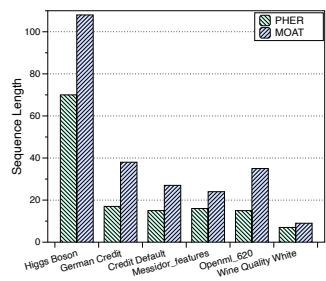  
(a) Sequence Length

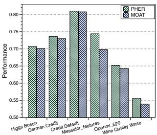  
(b) Performance  
Figure 6: Model scalability comparison between our method and the SOTA model MOAT.

4.3.3 Robustness Check. We evaluate PHER using various downstream ML models, including Random Forest (RF), XGBoost (XGB), K-Nearest Neighborhood (KNN), and Decision Tree (DT), to assess the robustness of PHER. Figure 4 shows the comparison results on SpamBase in terms of the F1-score. We observed that PHER consistently outperforms all baseline methods across diferent downstream ML models. A potential reason for this observation is that the RL-based data collector explores diverse feature transformation records guided by validation performance rather than any specific classifier. These records further enable the hierarchical model to encode task-relevant knowledge and characteristics into the global embedding space. Finally, the policy-guided agent leverages these records to efectively search the learned global embedding space, enabling the identification of high-quality feature transformation sequences that generalize well across diferent downstream classifiers. Thus, this experiment evaluates the robustness of PHER.

4.3.4 Search Seeds. To observe the impacts of search seeds on the RL-based search process, we replace the top K historical feature transformation records with K random records. We conduct this experiment on eight randomly chosen datasets and report the average F1-score over five independent runs. As shown in Figure 5, search initialized with high-quality seeds consistently outperforms search with random initialization. A potential reason for this observation is that the RL agent can leverage informative seeds to anchor the search within promising regions of the embedding space, efectively narrowing the search scope and accelerating convergence. In contrast, random starting points increase the risk of being trapped in local optima, resulting in an unstable search process and suboptimal feature transformation sequences. Thus, this experiment demonstrates the significance of the search seeds in our framework.

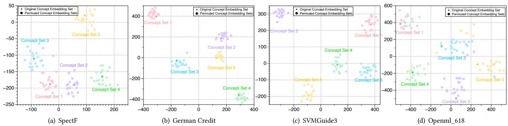  
Figure 7: Visualization of global embeddings obtained from original and permuted concept embeddings.

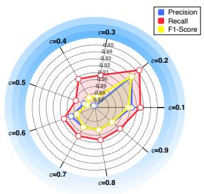  
(a) Clipping Trade-of

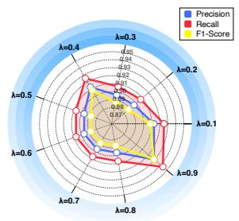  
(b) Reward Trade-of

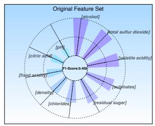  
(a) Original Feature Space

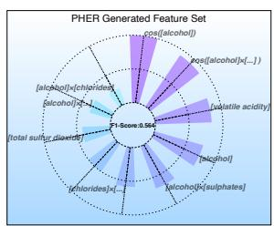  
(b) PHER Generated Feature Space  
Figure 8: Hyperparameter sensitivity.  
Figure 9: Comparison of traceability on the original feature set and selected feature subset.

4.3.5 Model Scalability. To analyze model scalability, we compare the length of feature transformation sequences and downstream task performance of PHER and the SOTA model MOAT. From Figure 6 (a), we observe that PHER produces significantly shorter feature transformation sequences, showing its ability to discover compact and efective feature transformation sequences. From Figure 6 (b), we find that PHER consistently outperforms MOAT across all datasets. These observations suggest that the RL agent in PHER efectively optimizes the learned embeddings by jointly maximizing task performance and minimizing transfor mation sequence length. Thus, this experiment demonstrates that PHER consistently achieves strong performance and compactness across diverse datasets, highlighting the scalability of PHER.

4.3.6 Permutation Sensitivity. We conduct this experiment to study the permutation sensitivity of learned global embeddings by visualizing embeddings derived from original and permuted concept sets on four datasets. For each dataset, we randomly choose five samples as representatives and further permute the concept embedding of each sample 20 times. Specifically, for each example, we first obtain its concept embedding set and create multiple permuted variants by randomly shufling the order of the concept embeddings. Both the original and permuted concept embedding sets are then passed through the trained concept encoder to obtain their global embeddings. Thereafter, we visualize these embeddings using t-SNE. Figure 7 shows the visualization results, where each color represents the global embedding of one concept embedding set together with the embeddings derived from its permuted variants. We find that the global embeddings derived from permuted concept orders consistently cluster around the original embedding. This is because the self-attention pooling in $\phi _ { c o n }$ computes a weighted aggregation over all concept embeddings, where the attention weights depend solely on the content similarity between fixed learnable seed queries and concept embeddings rather than their positions. Since weighted summation is a commutative operation, reordering the input concepts yields an identical global embedding, thereby eliminating permutation noise. Therefore, this experiment confirms that our proposed hierarchical encoder-decoder efectively eliminates permutation bias, which is consistent with the theoretical property of the self-attention pooling mechanism.

4.3.7 Hyperparameter Sensitivity Analysis. We assess the hyperparameter sensitivity of PHER on the SpectF dataset by varying the clipping ratio � and the reward trade-of � from 0.1 to 0.9, where � stabilizes training by controlling the magnitude of policy updates and � balances task performance against transformation sequence length. Figure 8 demonstrates the overall experimental results in terms of Precision, Recall and F1-Score. We found that PHER achieves optimal performance when � = 0.2 and � = 0.9. This aligns with prior PPO studies, where � = 0.2 is a setting widely adopted in standard reinforcement learning benchmarks [27]. Furthermore, we found that the model performance remains relatively stable across a broad range of �, with slight improvements as � approaches 0.9. Therefore, this experiment demonstrates the sensitivity of our framework to hyperparameter settings and provides practical guidance on hyperparameter configuration.

4.3.8 Traceability Case Study. We conduct this experiment to evaluate the traceability of PHER. We rank the top 10 most significant features for prediction in both the original feature set and PHER generated feature set of the Wine Quality Red dataset. Figure 9 visualizes the experiment results, where a larger bar indicates higher feature importance. We observed that approximately 70% of the crucial features in the new feature set are generated by PHER. The newly generated feature space enhances the downstream ML performance by 23.7%. There are two potential reasons for this observation: 1) the hierarchical modeling module in PHER efectively captures the inherent hierarchical relationships from low-level features and op erations to high-level concepts. 2) the policy-guided multi-objective search strategy efectively explores the learned global embedding space and identifies the superior feature transformation sequence, overcoming the non-convex challenge and converging to the global optimal embedding point. Furthermore, we found that ‘[alcohol] is the most important feature in the original set. This aligns with domain knowledge, as alcohol is known to be one of the most influential factors in determining red wine quality. PHER not only identifies this essential feature but also generates a variety of composited features based on ‘[alcohol]’, which further enhance the predictive performance. This observation demonstrates that PHER is capable of identifying the importance of individual features while also deriving new informative representations that align with do main semantics and enhance downstream performance. Such new informative features empower domain experts to trace the origins of transformed features and derive novel analytical rules for assessing red wine quality. Thus, this case study shows the traceability and interpretability of PHER.

## 5 Related Works

Automated Feature Transformation (AFT) aims to enhance the tabular feature space by systematically applying mathematical operations to original features, thereby improving feature expressiveness and downstream predictive performance [4, 18]. Existing methods can be broadly categorized into three main classes. 1) expansion-reduction based approaches [10, 12, 15, 17, 19] first expand the feature space by enumerating candidate features through predefined mathematical transformations, and subsequently reduce dimensionality via feature selection or pruning strategies. While efective for capturing simple feature interactions, these methods rely on shallow compositions and heuristic selection criteria, making it dificult to represent complex, multi-step feature transformations, which often leads to suboptimal performance in practice. 2) evolution-evaluation approaches [14, 16, 28, 31, 36, 38] integrate feature generation and selection into a closed-loop optimization framework. By leveraging evolutionary algorithms or reinforcement learning (RL), these methods iteratively explore transformation operators and retain features that improve validation performance. Despite their flexibility, such approaches typically sufer from high computational cost and unstable optimization behavior, largely due to discrete decision-making and the combinatorial nature of the transformation space. 3) Auto ML-based approaches [1, 6–9, 13, 21, 26, 30, 33, 37] formulate AFT as part of a broader AutoML pipeline, jointly searching for feature transformation strategies and model configurations. A representative example is [32], which embeds RL-collected feature transformation sequences into a continuous representation using postfix expressions and applies gradient-ascent beam search to identify informative transformation embeddings. However, such methods are limited by: 1) overlooking intricate hierarchical relationships inherent in feature transformation knowledge; 2) encoding feature transformation sequences as order-sensitive; 3) relying on the convexity assumption of the embedding space. To address these drawbacks, PHER combines permutation-invariant hierarchical modeling and multiobjective policy-guided search. The permutation-invariant hierarchical modeling module captures both token-level and concept-level feature transformation knowledge and mitigates order sensitivity among concepts, creating an unbiased global embedding space. The multi-objective policy-guided search efectively explores the learned embedding space, identifying better feature transformation sequences without relying on any convexity assumptions.

## 6 Conclusion Remarks

In this paper, we propose a hierarchical feature transformation framework PHER that integrates permutation-invariant hierarchical modeling and multi-objective policy-guided search. In detail, we first develop a permutation-invariant hierarchical modeling module, including token-level and concept-level encoder-decoder models, to preserve feature transformation knowledge at both the feature– operation token level and the generated concept level into a global embedding space. Within this module, we develop a self-attention pooling mechanism that symmetrically computes attention scores across all generated concepts to ensure permutation invariance. Then, we employ a multi-objective search strategy to explore the learned embedding space, overcoming the reliance on convexity assumptions and mitigating the risk of being trapped in local optima. Finally, extensive experiments demonstrate several key insights: 1) the hierarchical modeling structure significantly captures meaningful hierarchical interactions, enhancing the expressivity of the learned embedding space. 2) the permutation-invariant module efectively mitigates order sensitivity, stabilizing the embedding space learning and search processes. 3) the policy-guided RL search enables efective exploration, mitigating the risk of convergence to local optima and improving search robustness. These findings highlight the importance of permutation-invariant hierarchical modeling and robust exploration strategies for advancing automated feature transformation. For future research, a promising direction is to improve the computational eficiency and scalability of PHER, possibly by integrating a lightweight concept modeling framework or refining the RL-based search strategy in the embedding space.

## GenAI Usage Disclosure

Generative AI tools were used only for language polishing, grammar refinement, and auxiliary code assistance, including code editing and debugging suggestions. All research ideas, experimental designs, code, data processing, analyses, and final manuscript content were created, verified, and approved by the authors.

## References

[1] Maroua Bahri, Flavia Salutari, Andrian Putina, and Mauro Sozio. 2022. Automl: state of the art with a focus on anomaly detection, challenges, and research directions. International Journal ofData Science and Analytics 14, 2 (2022), 113– 126.

[2] David M Blei, Andrew Y Ng, and Michael I Jordan. 2003. Latent dirichlet allocation. the Journal of machine Learning research 3 (2003), 993–1022.

[3] Xiangning Chen, Qingwei Lin, Chuan Luo, Xudong Li, Hongyu Zhang, Yong Xu, Yingnong Dang, Kaixin Sui, Xu Zhang, Bo Qiao, et al. 2019. Neural feature search: A neural architecture for automated feature engineering. In 2019 IEEE International Conference on Data Mining (ICDM). IEEE, 71–80.

[4] Yi-Wei Chen, Qingquan Song, and Xia Hu. 2021. Techniques for automated machine learning. ACM SIGKDD Explorations Newsletter 22, 2 (2021), 35–50.

[5] Lin Chih-Jen. 2022. LibSVM Dataset Download. [EB/OL]. https://www.csie.ntu. edu.tw/\~cjlin/libsvmtools/datasets/.

[6] Ofer Dor and Yoram Reich. 2012. Strengthening learning algorithms by feature discovery. Information Sciences 189, 176–190.

[7] Ofer Egozi, Evgeniy Gabrilovich, and Shaul Markovitch. 2008. Concept-Based Feature Generation and Selection for Information Retrieval.. In AAAI, Vol. 8. 1132–1137.

[8] Thomas Elsken, Jan Hendrik Metzen, and Frank Hutter. 2019. Neural architecture search: A survey. The Journal ofMachine Learning Research 20, 1 (2019), 1997– 2017.

[9] Xin He, Kaiyong Zhao, and Xiaowen Chu. 2021. AutoML: A survey of the state of-the-art. Knowledge-Based Systems 212 (2021), 106622.

[10] Franziska Horn, Robert Pack, and Michael Rieger. 2019. The autofeat python library for automated feature engineering and selection. arXiv preprint arXiv:1901.07329 (2019).

[11] Jeremy Howard. 2022. Kaggle Dataset Download. [EB/OL]. https://www.kaggle. com/datasets.

[12] James Max Kanter and Kalyan Veeramachaneni. 2015. Deep feature synthesis: Towards automating data science endeavors. In 2015 IEEE international conference on data science and advanced analytics (DSAA). IEEE, 1–10.

[13] Shubhra Kanti Karmaker, Md Mahadi Hassan, Micah J Smith, Lei Xu, Chengxiang Zhai, and Kalyan Veeramachaneni. 2021. Automl to date and beyond: Challenges and opportunities. ACM Computing Surveys (CSUR) 54, 8 (2021), 1–36.

[14] Gilad Katz, Eui Chul Richard Shin, and Dawn Song. 2016. Explorekit: Automatic feature generation and selection. (2016), 979–984.

[15] Udayan Khurana, Fatemeh Nargesian, Horst Samulowitz, Elias Khalil, and Deepak Turaga. 2016. Automating feature engineering. Transformation 10, 10 (2016), 10.

[16] Udayan Khurana, Horst Samulowitz, and Deepak Turaga. 2018. Feature engineering for predictive modeling using reinforcement learning. In Proceedings of the AAAI Conference on Artificial Intelligence, Vol. 32.

[17] Udayan Khurana, Deepak Turaga, Horst Samulowitz, and Srinivasan Parthasrathy. 2016. Cognito: Automated feature engineering for supervised learning. In 2016 IEEE 16th International Conference on Data Mining Workshops (ICDMW). IEEE, 1304–1307.

[18] Andrew Kusiak. 2001. Feature transformation methods in data mining. IEEE Transactions on Electronics packaging manufacturing 24, 3 (2001), 214–221.

[19] Hoang Thanh Lam, Johann-Michael Thiebaut, Mathieu Sinn, Bei Chen, Tiep Mai, and Oznur Alkan. 2017. One button machine for automating feature engineering in relational databases. arXiv preprint arXiv:1706.00327 (2017).

[20] Juho Lee, Yoonho Lee, Jungtaek Kim, Adam Kosiorek, Seungjin Choi, and Yee Whye Teh. 2019. Set Transformer: A Framework for Attention-based Permutation-Invariant Neural Networks. In Proceedings of the 36th International Conference on Machine Learning (Proceedings ofMachine Learning Research, Vol. 97), Kamalika Chaudhuri and Ruslan Salakhutdinov (Eds.). PMLR, 3744–3753.

https://proceedings.mlr.press/v97/lee19d.htm

[21] Yaliang Li, Zhen Wang, Yuexiang Xie, Bolin Ding, Kai Zeng, and Ce Zhang. 2021. Automl: From methodology to application. In Proceedings ofthe 30th ACM International Conference on Information & Knowledge Management. 4853–4856.

[22] Rui Liu, Rui Xie, Zijun Yao, Yanjie Fu, and Dongjie Wang. 2025. Continuous Optimization for Feature Selection with Permutation-Invariant Embedding and Policy-Guided Search. In Proceedings ofthe 31st ACM SIGKDD Conference on Knowledge Discovery and Data Mining V.2 (Toronto ON, Canada) (KDD ’25). Association for Computing Machinery, New York, NY, USA, 1857–1866. doi:10. 1145/3711896.3736891

[23] Rui Liu, Tao Zhe, Yanjie Fu, Feng Xia, Ted Senator, and Dongjie Wang. 2026. Permutation-Invariant Representation Learning for Robust and Privacy-Preserving Feature Selection. arXiv:2510.05535 [cs.LG] https://arxiv.org/abs/ 2510.05535

[24] Public. 2022. Openml Dataset Download. [EB/OL]. https://www.openml.org.

[25] Public. 2022. UCI Dataset Download. [EB/OL]. https://archive.ics.uci.edu/.

[26] Kezhou Ren, Yifan Zeng, Yuanfu Zhong, Biao Sheng, and Yingchao Zhang. 2023. MAFSIDS: a reinforcement learning-based intrusion detection model for multi agent feature selection networks. Journal ofBig Data 10, 1 (2023), 137.

[27] John Schulman, Filip Wolski, Prafulla Dhariwal, Alec Radford, and Oleg Klimov. 2017. Proximal Policy Optimization Algorithms. arXiv:1707.06347 [cs.LG] https: //arxiv.org/abs/1707.06347

[28] Binh Tran, Bing Xue, and Mengjie Zhang. 2016. Genetic programming for feature construction and selection in classification on high-dimensional data. Memetic Computing 8, 1 (2016), 3–15.

[29] Ashish Vaswani, Noam Shazeer, Niki Parmar, Jakob Uszkoreit, Llion Jones, Aidan N. Gomez, Łukasz Kaiser, and Illia Polosukhin. 2017. Attention is all you need. In Proceedings ofthe 31st International Conference on Neural Information Processing Systems (Long Beach, California, USA) (NIPS’17). Curran Associates Inc., Red Hook, NY, USA, 6000–6010.

[30] Dakuo Wang, Josh Andres, Justin D Weisz, Erick Oduor, and Casey Dugan. 2021. Autods: Towards human-centered automation of data science. In Proceedings of the 2021 CHI Conference on Human Factors in Computing Systems. 1–12.

[31] Dongjie Wang, Yanjie Fu, Kunpeng Liu, Xiaolin Li, and Yan Solihin. 2022. Group-Wise Reinforcement Feature Generation for Optimal and Explainable Representation Space Reconstruction. In Proceedings ofthe 28th ACM SIGKDD Conference on Knowledge Discovery and Data Mining (Washington DC, USA) (KDD ’22). Association for Computing Machinery, New York, NY, USA, 1826–1834.

[32] Dongjie Wang, Meng Xiao, Min Wu, Yuanchun Zhou, and Yanjie Fu. 2023. Reinforcement-enhanced autoregressive feature transformation: Gradientsteered search in continuous space for postfix expressions. Advances in Neural Information Processing Systems 36 (2023).

[33] Marcel Wever, Alexander Tornede, Felix Mohr, and Eyke Hüllermeier. 2021. AutoML for multi-label classification: Overview and empirical evaluation. IEEE transactions on pattern analysis and machine intelligence 43, 9 (2021), 3037–3054.

[34] Wangyang Ying, Dongjie Wang, Haifeng Chen, and Yanjie Fu. 2024. Feature selection as deep sequential generative learning. ACM Transactions on Knowledge Discovery from Data 18, 9 (2024), 1–21.

[35] Wangyang Ying, Dongjie Wang, Xuanming Hu, Yuanchun Zhou, Charu C Aggarwal, and Yanjie Fu. 2024. Unsupervised generative feature transformation via graph contrastive pre-training and multi-objective fine-tuning. In Proceedings of the 30th ACM SIGKDD Conference on Knowledge Discovery and Data Mining. 3966–3976.

[36] Yao Zhang, Yun Xiong, Yiheng Sun, Caihua Shan, Tian Lu, Hui Song, and Yangyong Zhu. 2022. RuDi: Explaining Behavior Sequence Models by Automatic Statistics Generation and Rule Distillation. (2022), 2651–2660.

[37] Ziwei Zhang, Xin Wang, and Wenwu Zhu. 2021. Automated machine learning on graphs: A survey. arXiv preprint arXiv:2103.00742 (2021).

[38] Guanghui Zhu, Shen Jiang, Xu Guo, Chunfeng Yuan, and Yihua Huang. 2022. Evolutionary Automated Feature Engineering. In PRICAI2022: Trends in Artificial Intelligence: 19th Pacific Rim International Conference on Artificial Intelligence, PRICAI 2022, Shanghai, China, November 10–13, 2022, Proceedings, Part I. Springer, 574–586.

[39] Guanghui Zhu, Zhuoer Xu, Chunfeng Yuan, and Yihua Huang. 2022. DIFER: diferentiable automated feature engineering. In International Conference on Automated Machine Learning. PMLR, 17–1.