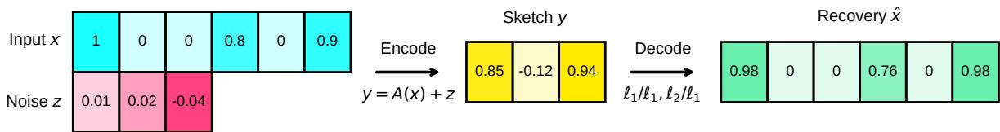
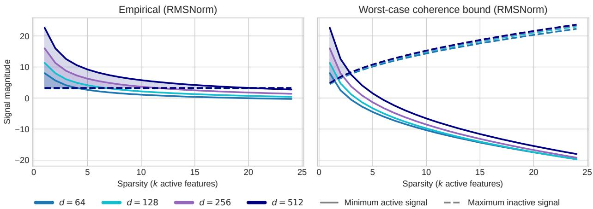
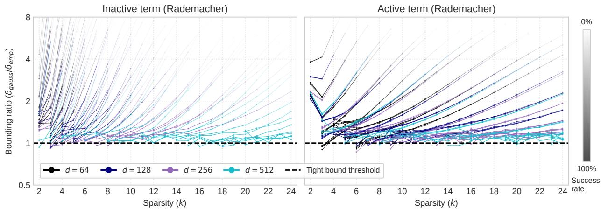
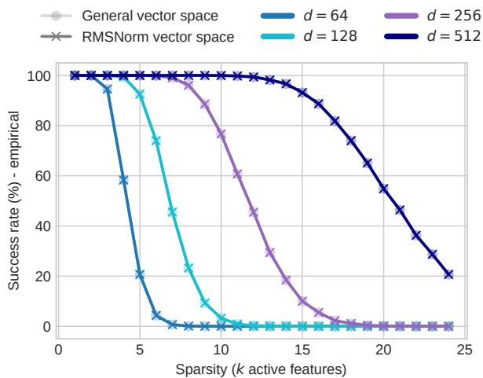
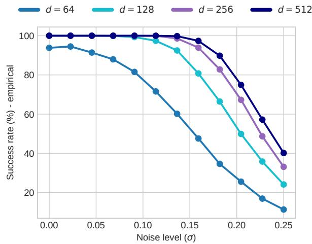
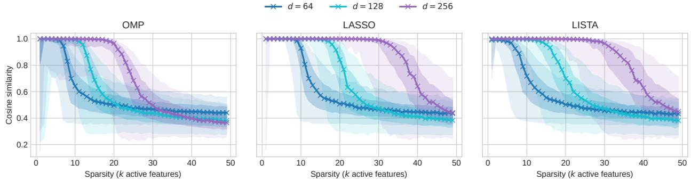
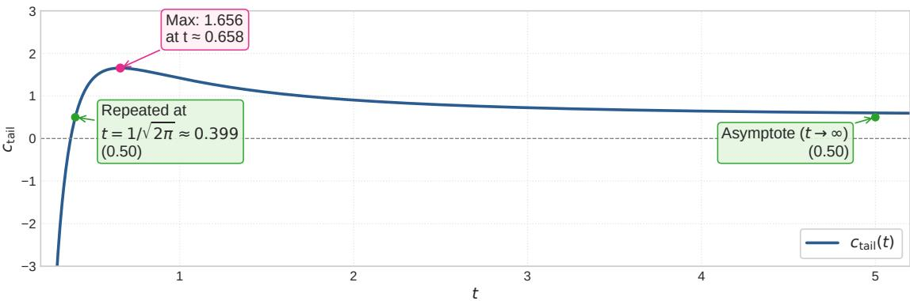
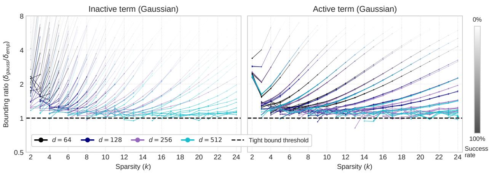
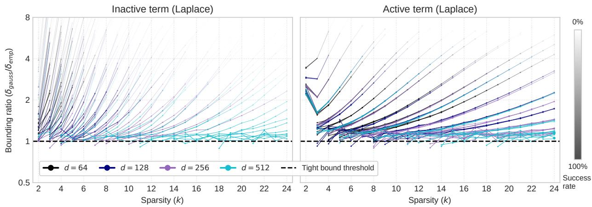

# High-probability guarantees for linear accessibility in feature superposition

Enrico Vompa

envomp@taltech.ee

Applied Artificial Intelligence Group

Tallinn University of Technology, Estonia

## Abstract

Neural networks can leverage feature superposition to encode more concepts than dimensions, but cross-feature interference constrains the linear accessibility of simultaneously active features. By framing linear accessibility as a compressed sensing problem, we derive highprobability bounds for fixed supports under subgaussian noise, proving the suficient dimension scales linearly (d = O (k log m)) rather than prior worst-case quadratic limits. We then validate these bounds across system parameters through Gaussian-tail approximations. These results quantify the geometric constraints of the linear representation hypothesis, providing a framework for evaluating sparse autoencoders, compositional generalization, and neural interpretability.

## 1 Introduction

Stochastic separation theorems show that in high dimensions, any given point in a random set can be separated from the others by a hyperplane with high probability, even if the number of points in the set grows exponentially with the dimension (Sidorov & Zolotykh, 2020). Though traditionally applied to single features, these concentration principles extend to multiple simultaneous features. As formalized by compressed sensing, where a vast number of features (m) can be encoded into a smaller dimensional space (d) assuming a sparse subset of support size k is active, neural networks leverage feature superposition to represent more features than dimensions (Elhage et al., 2022).

This manifests as the model mapping related concepts closer together and pushing unrelated ones apart, either driven by the training objective or emerging naturally. In reality, frequent co-occurrence of features such as “Christmas” and “December” results in them having high similarity, which produces constructive interference and helps when decoding such features (Prieto et al., 2026). However, being overly reliant on such constructive interference works against true compositional reasoning, where the model must occasionally decode arbitrary combinations of “Christmas in July”.

Under a linear decoding scenario, we apply the subgaussian Hoefding inequality to derive high-probability bounds for arbitrary supports, showing that feature superposition scales linearly with active features, improving the prior worst-case quadratic limits (Garg et al., 2026). Additionally, we employ Gaussian-tail approximations to estimate failure rates in order to demonstrate that the theory applies in practice.

Even though LLM spaces are globally not uniform (Ethayarajh, 2019), concept subspaces are (Cai et al., 2021), and can be efectively approximated by Gaussian distributions (Zhao et al., 2025). It is this very local uniformity that gives rise to representational geometry (linear representation hypothesis) in vision encoders (Radford et al., 2021) and LLMs (Park et al., 2025; 2024), which encode features into composite structures (e.g., categorical, hierarchical, spatial, relational, etc).

Our contributions are as follows:

\- We derive high-probability decoding guarantees for fixed supports in a noisy environment, showing that the required dimension scales as $d = O _ { \varepsilon } ( k \log m )$ for fixed error and failure tolerances when the noise satisfies $\sigma = O _ { \varepsilon } ( 1 / \sqrt { \log m } )$

\- We interpret these results in the context of feature superposition.

## 2 Theory: compressed sensing framework

We model the problem in a compressed sensing framework, where a high-dimensional sparse vector is mapped to a lower-dimensional measurement space.

## 2.1 Linear versus nonlinear encoding

Definition 1 (Linear encoding with independent noise). Let $x \in [ - 1 , 1 ] ^ { m }$ be a k-sparse input signal, let $A = [ a _ { 1 } , \ldots , a _ { m } ] \in \mathbb { R } ^ { d \times m }$ be a dictionary of unit $\ell _ { 2 } { - } n o r m$ feature embeddings $( \Vert a _ { i } \Vert _ { 2 } = 1 )$ , and let $z \in \mathbb { R } ^ { d }$ denote an independent observation noise vector. The linear encoding maps the input and noise to a compressed d-dimensional sketch y via:

$$
y = A x + z = \sum _ { j \in S } x _ { j } a _ { j } + z
$$

where $S \subseteq [ m ]$ represents the active feature support of size $| S | \le k$

Under this formulation, the encoded representation y is simply a weighted sum of the active feature embeddings.

An alternative to this framework is encoding nonlinear representations. Linearly encoded representations possess a wider margin of error during decoding, operating as a probabilistic structure. Geometrically, decoding a linear sketch is akin to measuring the cosine similarity between nearly orthogonal feature directions; slight measurement errors yield proportionally small perturbations in the recovered state. In contrast, nonlinear encoding strategies, such as storing the k largest coeficients alongside their indices, can achieve a high compression of $d = O ( k )$ (Ba et al., 2010). However, slight errors during decoding of such structures (e.g., a corrupted index mapping) can completely break the structure, resulting in disparate representations rather than proportional deviations. Such a discontinuous, non-diferentiable representation space renders gradient-based optimization intractable.

## 2.2 History of nonlinear decoding

Classical compressed sensing demonstrates that a k-sparse vector in $\mathbb { R } ^ { m }$ can be embedded into approximately $d = O ( k \log ( m / k ) )$ ) measurements, assuming a known measurement matrix (Candes & Tao, 2005). Here, recovery can be achieved in polynomial time using nonlinear decoding algorithms such as basis pursuit $( \ell _ { 1 } -$ minimization) (Candès et al., 2006), which extends to noisy environments, provided the noise z is bounded by $| | z | | _ { \ell _ { 2 } } \le \varepsilon$ (Candès, 2008). Assuming the measurement matrix satisfies the restricted isometry property with a constant $\delta _ { 2 k } < \sqrt { 2 } - 1$ , this recovery is guaranteed to be stable in both the $\ell _ { 1 } / \ell _ { 1 }$ and $\ell _ { 2 } / \ell _ { 1 }$ regimes (Candès, 2008), with a matching lower bound in these regimes (Ba et al., 2010).

  
Figure 1: Compressed sensing encoding and decoding pipeline.

## 2.3 Linear decoding

Linear decoding requires features to be linearly accessible, meaning they are recovered by a fixed linear decoder. As opposed to relatively clean recovery as in nonlinear decoding, linear decoding may produce cross-feature interference on both inactive and active coordinates (Stevinson et al., 2025). Depending on its sign, this interference can create spurious inactive estimates or distort active estimates. Decoding can therefore be framed as the existence of a threshold which separates active features from inactive ones.

Definition 2 (Linear decoding). Given a compressed sketch $\boldsymbol { y } \in \mathbb { R } ^ { d }$ and a dictionary $A \in \mathbb { R } ^ { d \times m }$ , linear decoding is defined by the single-step matched-filter projection:

$$
\widehat { \boldsymbol { x } } = \boldsymbol { A } ^ { \intercal } \boldsymbol { y }
$$

such that the estimated coeficient for any feature $i \in [ m ]$ is recovered via the inner product $\widehat { x } _ { i } = \langle a _ { i } , y \rangle$

The geometric limits of linear decoding are invariant to the magnitude of the compressed state y. By the bilinearity of the inner product, scaling the compressed state by a factor $\alpha > 0$ scales the entire decoding projection equally $\langle a _ { i } , \alpha y \rangle = \alpha \langle a _ { i } , y \rangle$ . Because the compressed state is a linear combination of active features $\left( y = \sum x _ { j } a _ { j } \right)$ , this scaling magnifies both the target signal and the interference by the same factor. Figure 2 visualizes the recovery bounds in the empirical high-probability and worst-case scenarios, where a separation threshold could reside.

  
Figure 2: Signal magnitudes and recovery bounds in an RMSNorm (Zhang & Sennrich, 2019) vector space.

## 2.4 The worst-case scenario of linear decoding

Requiring the linear decoder to satisfy $\| A ^ { \top } A x - x \| _ { \infty } < \varepsilon$ uniformly for every k-sparse vector $x \in [ - 1 , 1 ] ^ { m }$ yields an upper bound $d = O _ { \varepsilon } ( k ^ { 2 } \log m )$ ; a nearly matching lower bound of $\begin{array} { r } { d = \Omega _ { \varepsilon } \bigg ( \frac { k ^ { 2 } } { \log k } \log \frac { m } { k } \bigg ) } \end{array}$ applies even when allowing any arbitrary linear decoder $B ^ { \top }$ (Garg et al., 2026). This $k ^ { 2 }$ scaling is a geometric limitation representing how efectively low-rank projections can suppress cross-feature interference uniformly over all combinatorially many k-sparse inputs.

## 2.5 The empirical high-probability linear decoding scenario

By analyzing the joint probability space of the dictionary, signal, and noise, we can bound the total crossfeature interference and noise. We partition the error tolerance ε, allocating a fraction $\alpha \in ( 0 , 1 )$ to noise and $( 1 - \alpha )$ to interference. A subgaussian tail bound controls both the interference $I _ { i }$ and the projected noise. Because subgaussian tails decay exponentially fast, applying a union bound across all features guarantees with high probability that both components remain bounded within allocated budget.

To bound the maximum interference, we partition the sum of individual tail probabilities into two:

$$
\begin{array} { r l } & { \mathbb { P } _ { A , x } \left( \underset { i \in \mathcal { T } } { \operatorname* { m a x } } \left| I _ { i } \right| \geq ( 1 - \alpha ) \varepsilon \right) } \\ & { \quad \leq \underbrace { 2 ( m - | S | ) \exp \left( - \frac { d ( 1 - \alpha ) ^ { 2 } \varepsilon ^ { 2 } } { 2 | S | } \right) } _ { \mathrm { i n a c t i v e } } + \underbrace { \mathbb { I } _ { | S | \geq 2 } \cdot 2 | S | \exp \left( - \frac { d ( 1 - \alpha ) ^ { 2 } \varepsilon ^ { 2 } } { 2 ( | S | - 1 ) } \right) } _ { \mathrm { a c t i v e } } } \\ & { \quad \leq 2 m \exp \left( - \frac { d ( 1 - \alpha ) ^ { 2 } \varepsilon ^ { 2 } } { 2 | S | } \right) \leq \delta _ { \mathrm { i n t } } } \end{array}\tag{1}
$$

The inactive term bounds the interference on inactive coordinates, where the interference is generated by all |S| active features, whose erroneous inclusion would produce false positives. The active term bounds the interference on active coordinates, where the interference is generated by the remaining $| S | - 1$ active features, whose erroneous exclusion would produce false negatives. The union bound includes both terms, so the resulting condition controls the interference failures relevant to both error types.

Lemma 1 (Interference constraint). Let $d , m , k \in \mathbb { N } _ { > 0 }$ with $1 \leq | S | \leq k \leq m$ for an arbitrarily chosen index set $S \subseteq [ m ]$ . Suppose the dictionary columns $A = [ a _ { 1 } , \dotsc , a _ { m } ]$ are mean-zero and sampled independently and uniformly from the unit sphere $\bar { S } ^ { d - 1 }$ , and the active signal coeficients $( x _ { j } ) _ { j \in S }$ are drawn from a joint distribution $P _ { x } \in \mathcal { P } _ { S }$ satisfying $| x _ { j } | \le 1$ independently of A (with $x _ { j } = 0 ~ f o r ~ j \notin S )$ . For any error threshold $\varepsilon > 0$ , fraction α $\in ( 0 , 1 )$ , and failure probability $\delta _ { i n t } \in ( 0 , 1 )$ , if the dimension d satisfies:

$$
d \geq \frac { 2 | S | } { ( 1 - \alpha ) ^ { 2 } \varepsilon ^ { 2 } } \ln \left( \frac { 2 m } { \delta _ { i n t } } \right)
$$

then the maximum cross-feature interference is bounded by $( 1 - \alpha ) \varepsilon$ with probability at least $1 - \delta _ { i n t }$

For fixed α and $\delta _ { \mathrm { i n t } }$ independent of m, k, ε, substituting $| S | \le k$ yields the dimension scaling $d _ { \mathrm { r e q } } = O _ { \varepsilon } ( k \log m )$ mirroring the subset-incoherence and subgaussian concentration results from hyperdimensional computing theory (Thomas et al., 2021).

Lemma 2 (Noise constraint). Let the dictionary A and signal x satisfy the conditions of Lemma 1. Suppose the observation noise $\boldsymbol { z } = ( z _ { 1 } , \ldots , z _ { d } )$ is drawn from a product distribution $P _ { z } \in { \mathcal { Z } } _ { \sigma }$ independent of $( A , x )$ with independent, mean-zero coordinates satisfying the subgaussian norm bound $\| z _ { n } \| _ { \psi _ { 2 } } \leq \sigma ~ f o r ~ \sigma > 0$ . For any fraction $\alpha \in ( 0 , 1 )$ , error tolerance $\varepsilon > 0$ , and noise failure budget $\delta _ { n o i s e } \in ( 0 , 1 )$ , if the subgaussian scale satisfies:

$$
\sigma \leq \frac { \sqrt { c } \alpha \varepsilon } { \sqrt { \ln ( 2 m / \delta _ { n o i s e } ) } }
$$

then projected noise is bounded by αε with probability at least $1 - \delta _ { n o i s e }$ , where $c > 0$ is an absolute constant.

For fixed α and $\delta _ { \mathrm { n o i s e } } ,$ this bounds the maximum certified noise scales as $\sigma _ { \mathrm { m a x } } = O _ { \varepsilon } ( 1 / \sqrt { \log m } )$

Theorem 1 (Fixed-support decoding guarantee). Let $\varepsilon > 0$ and $\alpha \in ( 0 , 1 )$ , and let the failure budget be partitioned into ${ \delta _ { i n t } } , { \delta _ { n o i s e } } \in ( 0 , 1 )$ such that $\delta _ { i n t } + \delta _ { n o i s e } = \Delta < 1$ . If the dimension d and noise scale σ satisfy Lemma 1 and Lemma 2, respectively, then:

$$
\forall S \subseteq [ m ] \ w i t h \ 1 \leq | S | \leq k , \qquad \operatorname* { s u p } _ { P _ { x } \in { \mathcal { P } } _ { S } } \operatorname* { s u p } _ { P _ { z } \in { \mathcal { Z } } _ { \sigma } } \mathbb { P } _ { A , x , z } \left( \| { \widehat { x } } - x \| _ { \infty } \geq \varepsilon \right) \leq \Delta
$$

Meaning, for any arbitrary fixed support S across all valid distributions, the maximum estimation error exceeds ε with a joint failure probability of at most $\Delta$

Corollary 1 (High-probability support recovery). Given the $\ell _ { \infty }$ error bound $\| { \widehat { x } } - x \| _ { \infty } \leq \varepsilon$ from Theorem 1 and a known minimum active coeficient $x _ { \mathrm { m i n } } ~ \le ~ \operatorname* { m i n } _ { j \in S } | x _ { j } |$ , support recovery via the thresholding rule $\widehat { S } = \{ i : | \widehat { x } _ { i } | > \tau \}$ is guaranteed if there exists a threshold τ satisfying:

$$
\begin{array} { r } { \varepsilon _ { i n a c t i v e } < x _ { \operatorname* { m i n } } - \varepsilon _ { a c t i v e } \implies \underbrace { \varepsilon _ { i n a c t i v e } } _ { \operatorname* { m a x } _ { i \notin { \cal S } } | \widehat { x } _ { i } | } < \tau < \underbrace { x _ { \operatorname* { m i n } } - \varepsilon _ { a c t i v e } } _ { \operatorname* { m i n } _ { j \in { \cal S } } | \widehat { x } _ { j } | } } \end{array}
$$

This proof is not a uniform guarantee over all combinatorially many supports. Full proof is in Appendix A.

## 3 Numerical tests: evaluating theory

In our numerical tests (unless specified otherwise), all dictionary columns are drawn from Gaussian distribution and L2-normalized to unit length. For each sample, k active features are selected uniformly at random with coeficients set to 1, yielding noiseless observations.

As the Hoefding inequality provides a conservative bound for any dictionary uniformly distributed on the unit sphere $S ^ { d - \bar { 1 } }$ , we can obtain a more precise estimate for the failure probability $\delta _ { \mathrm { g a u s s } }$ by modeling the interference terms independently (Equation 1) and computing their Gaussian approximation (Appendix A.3). Because this formulation bounds the tail-matching factor from below by a constant (0.5), the Gaussian approximation occasionally falls below the Hoefding bound but never exceeds it. This approximation efectively captures the scaling dynamics of the system parameters. In configurations where the number of features is small relative to the dimension size, it yields a high probability of successful decoding; and instead when dimension size is relatively smaller, the probability decreases accordingly.

With minimum active coeficient $x _ { \mathrm { m i n } } = 1$ , the empirical maximum deviations are computed as max $_ { \cdot i \in S } \left| 1 . 0 - { \widehat x } _ { i } \right|$ and $\operatorname* { m a x } _ { i \notin S } | \widehat { x } _ { i } |$ for active and inactive terms, respectively, from which we derive the empirical failure rate $\delta _ { \mathrm { e m p } }$ . As δ approaches zero, the term $\ln ( 2 m / \delta )$ grows indefinitely. To prevent finite-sample Monte Carlo noise from distorting the failure-rate ratio $\delta _ { \mathrm { g a u s s } } / \delta _ { \mathrm { e m p } } ,$ we restrict our evaluation to regimes with at least 100 empirical failures. Because the empirical failure count $N _ { \mathrm { f a i l } }$ for rare events approximates a Poisson distribution, its relative statistical error (coeficient of variation) is defined by the ratio of the standard deviation to the mean, $\sigma / \mu \approx \sqrt { N _ { \mathrm { f a i l } } } / N _ { \mathrm { f a i l } } = 1 / \sqrt { N _ { \mathrm { f a i l } } }$ (Rubinstein & Kroese, 2016). By requiring $N _ { \mathrm { f a i l } } \ge 1 0 0$ , the estimated coeficient of variation of the empirical denominator is at most $1 / \sqrt { 1 0 0 } = 1 0 \%$ , reducing the influence of sampling noise on the failure-rate ratio. Meaning, 40, 000 trials enables evaluating high-probability decoding regimes down to a minimum failure rate of 0.25% (a 99.75% success rate).

As recovery success approaches $1 0 0 \%$ the $\delta _ { \mathrm { e m p } }$ converges to $\delta _ { \mathrm { g a u s s } } \left( \mathrm { F i g u r e 3 } \right)$ , demonstrating that the Gaussian approximation closely estimates the required dimension for high-probability decoding, providing empirical support that Hoefding inequality governs the guarantee for high-probability (low failure-probability) linear accessibility. Similar results for Gaussian and Laplace1 distributions are shown in Appendix C.

  
Figure 3: Tightness of Gaussian approximation for high-probability decoding on Rademacher distribution. 40, 000 trials were run for every combination of sparsity $k \in [ 2 , 2 4 ]$ ], dictionary size $m \in \{ 5 1 2 , 1 0 2 4 , 2 0 4 8$ , 4096} and dimension d ∈ {64, 128, 256, 512}, evaluated against various error thresholds $\varepsilon \in \{ 0 . 1 , 0 . 2 , \ldots , 0 . 9 \}$ . When $k = 2$ and active coeficients have equal magnitude, a projection $\left. a _ { i } , a _ { j } \right.$ equally contributes to the failures of target i and $j ,$ so the union bound counts the same underlying event twice (negligible for larger k).

## 3.1 Support recovery

Figures 4 and 5 evaluate success by the existence of a valid separating threshold (Corollary 1).

In general vector space, where active features are simply summed together, the magnitude of the superposed state grows unbounded as the number of simultaneous features (k) increases. Subsequently, applying RMSNorm constrains the superposed state vector to a fixed magnitude of ${ \sqrt { d } } .$

Despite this diference in magnitudes, relative signalto-interference ratios are identical as normalization scales the target signal and the background geometric interference by the same factor.

Our proofs partition the error tolerance ε into noise budget (αε) and interference budget ((1 − α)ε).

In practice, success simply requires that the sum of interference and noise remains below the tolerance ε. Because we model interference and additive noise as independent variables, Bienaymé’s identity dictates that the variance of their sum equals the sum of their individual variances (we derive the variance proxy for interference in Equation 14). Meaning, the system exhibits budget borrowing, where high interference can consume the total tolerance ε, leaving no room for noise, and vice versa.

Figure 4: Recovery of general and RMSNorm vector spaces across dimensions and sparsities.  

## 3.2 Representation learning

Figure 5: Recovery from noisy environment.

In unsupervised dictionary learning, the optimization must simultaneously discover the feature directions and identify the unknown k-sparse activation support (Figure 6). OMP (orthogonal matching pursuit) greedily orthogonalizes the projection of linearly most accessible feature. LASSO (least absolute shrinkage and selection operator) runs a convex optimization using $\ell _ { 1 }$ penalty simultaneously over all features, which is dependent on linear accessibility as its starting point. LISTA (learned iterative shrinkage-thresholding algorithm) mimics the behavior of LASSO through parameters, making it also dependent on linear accessibility.

  
Figure 6: Dictionary learning using OMP, LASSO and LISTA. Figures present the median, 5th, 25th, 75th, and 95th percentiles of the matched cosine similarities against ground truth directions. Active feature coeficients are drawn from a normal distribution. Full methodology in Section B.1.

Taken together, interference (which governs linear accessibility) bounds the success of both linear and nonlinear decoding regimes. Though, decoding strategies respond diferently to coeficient distributions.

## 4 Discussion

Given that monotonic activation functions (e.g., ReLU) do not increase the capacity of linear accessibility (Garg et al., 2026), this could explain why sparse autoencoders (SAEs), which rely on a single-step linear projection and ReLU, fail at compositional generalization within a compressed sensing framework when trained on LLM activations (Barin-Pacela et al., 2026). Because Transformers can provably implement LISTA-type iterative nonlinear decoding algorithms (Liu et al., 2025), they have the capacity to operate in a nonlinear decoding regime. Meaning, LLMs can represent features in denser superposition that remain inaccessible to the linear decoding regime of SAEs.

## 4.1 Unknown nonlinear transform

A parallel line of work, known as World Models, has emerged which force nonlinear observations into a linear transform of the world’s latent structure (Klindt et al., 2026). This is best understood through structural features, which are compositional properties that require nonlinearity to be recovered (Vompa & Tammet, 2026). Rather than assuming representations are inherently nonlinear, we hypothesize it is more akin to an unsolved problem where the base features are represented linearly, while higher-order properties are derived via iterative bottom-up perception or top-down reasoning (Vompa et al., 2026). Here, new information is linearly added into the residual stream, though, the basis system may change (Vompa & Tammet, 2026).

## 4.2 Limitations

The connection between linear accessibility and LLM mechanics remains speculative, relying on external empirical evidence. By the central limit theorem (Lindeberg, 1922), the mean-zero, variance-normalized interference asymptotically converges to a normal distribution as |S| grows; coupled with normalization (typically RMSNorm), it becomes bounded and subsequently subgaussian when representations are mean-zero. Though, LLM representations are not necessarily mean-zero. Consequently, our high-probability concentration proofs can apply to LLM representational geometries provided their assumptions hold. We describe the conditions where linear accessibility is possible, the extent LLMs utilize this remains unknown.

## 5 Conclusion

We characterize the high-probability guarantees of linear accessibility in feature superposition, showing that decoding requires d = O(k log m) dimensions. These results clarify the geometric limits of the linear representation hypothesis and suggest how learned superposition can support compositional reasoning.

## References

Khanh Do Ba, Piotr Indyk, Eric Price, and David P. Woodruf. Lower bounds for sparse recovery. In SODA, 2010. URL https://arxiv.org/abs/1106.0365.

Vitória Barin-Pacela, Shruti Joshi, Isabela Camacho, Simon Lacoste-Julien, and David Klindt. Stop probing, start coding: Why linear probes and sparse autoencoders fail at compositional generalisation. In 2nd Workshop on Compositional Learning: Safety, Interpretability, and Agents, 2026. URL https: //openreview.net/forum?id=3NN3ehMKxW.

Xingyu Cai, Jiaji Huang, Yuchen Bian, and Kenneth Church. Isotropy in the contextual embedding space: Clusters and manifolds. In International Conference on Learning Representations, 2021. URL https://openreview.net/forum?id=xYGNO86OWDH.

Emmanuel Candes and Terence Tao. Decoding by linear programming. In IEEE Transactions on Information Theory, 2005. URL https://arxiv.org/abs/math/0502327.

Emmanuel J. Candès. The restricted isometry property and its implications for compressed sensing. Comptes Rendus Mathematique, 346(9):589–592, 2008. ISSN 1631-073X. doi: https://doi.org/10.1016/j.crma.2008. 03.014. URL https://www.sciencedirect.com/science/article/pii/S1631073X08000964.

Emmanuel J. Candès, Justin K. Romberg, and Terence Tao. Stable signal recovery from incomplete and inaccurate measurements. Communications on Pure and Applied Mathematics, 59(8):1207–1223, 2006. doi: https://doi.org/10.1002/cpa.20124. URL https://onlinelibrary.wiley.com/doi/abs/10.1002/ cpa.20124.

Nelson Elhage, Tristan Hume, Catherine Olsson, Nicholas Schiefer, Tom Henighan, Shauna Kravec, Zac Hatfield-Dodds, Robert Lasenby, Dawn Drain, Carol Chen, Roger Grosse, Sam McCandlish, Jared Kaplan, Dario Amodei, Martin Wattenberg, and Christopher Olah. Toy models of superposition. Transformer Circuits Thread, 2022. URL https://transformer-circuits.pub/2022/toy\_model/index.html.

Kawin Ethayarajh. How contextual are contextualized word representations? Comparing the geometry of BERT, ELMo, and GPT-2 embeddings. In EMNLP-IJCNLP, 2019. URL https://aclanthology.org/ D19-1006/.

Nikhil Garg, Jon Kleinberg, and Kenny Peng. How many features can a language model store under the linear representation hypothesis? In COLT, 2026. URL https://arxiv.org/abs/2602.11246.

David Klindt, Yann LeCun, and Randall Balestriero. When does lejepa learn a world model?, 2026. URL https://arxiv.org/abs/2605.26379.

J. W. Lindeberg. Eine neue herleitung des exponentialgesetzes in der wahrscheinlichkeitsrechnung. Mathematische Zeitschrift, 15:211–225, 1922. URL http://eudml.org/doc/167717.

Renpu Liu, Ruida Zhou, Cong Shen, and Jing Yang. On the learn-to-optimize capabilities of transformers in in-context sparse recovery. In ICLR, 2025. URL https://openreview.net/forum?id=NHhjczmJjo.

Kiho Park, Yo Joong Choe, and Victor Veitch. The linear representation hypothesis and the geometry of large language models. In ICML, 2024. URL https://arxiv.org/abs/2311.03658.

Kiho Park, Yo Joong Choe, Yibo Jiang, and Victor Veitch. The geometry of categorical and hierarchical concepts in large language models. In ICLR, 2025. URL https://openreview.net/forum?id=bVTM2QKYuA.

Lucas Prieto, Edward Stevinson, Melih Barsbey, Tolga Birdal, and Pedro A. M. Mediano. From data statistics to feature geometry: How correlations shape superposition. In The Fourteenth International Conference on Learning Representations, 2026. URL https://openreview.net/forum?id=7akSRQS5Xh.

Alec Radford, Jong Wook Kim, Chris Hallacy, Aditya Ramesh, Gabriel Goh, Sandhini Agarwal, Girish Sastry, Amanda Askell, Pamela Mishkin, Jack Clark, Gretchen Krueger, and Ilya Sutskever. Learning transferable visual models from natural language supervision. ICML, 2021.

Reuven Y. Rubinstein and Dirk P. Kroese. Simulation and the Monte Carlo Method. 2016. doi: 10.1002/ 9781118631980. URL https://app.dimensions.ai/details/publication/pub.1106805670.

Sergey Sidorov and Nikolai Zolotykh. Linear and fisher separability of random points in the d-dimensional spherical layer and inside the d-dimensional cube. IJCNN, 2020.

Edward Stevinson, Lucas Prieto, Melih Barsbey, and Tolga Birdal. Adversarial attacks leverage interference between features in superposition. In Mechanistic Interpretability Workshop at NeurIPS 2025, 2025. URL https://openreview.net/forum?id=LqI52GG2Ss.

Anthony Thomas, Sanjoy Dasgupta, and Tajana Rosing. A theoretical perspective on hyperdimensional computing. Journal of Artificial Intelligence Research, 72, October 2021. URL http://dx.doi.org/10. 1613/jair.1.12664.

Roman Vershynin. High-Dimensional Probability: An Introduction with Applications in Data Science. Cambridge Series in Statistical and Probabilistic Mathematics. Cambridge University Press, Cambridge, 2 edition, 2026.

C. Vignat and S. Bhatnagar. An extension of wick’s theorem. Statistics and Probability Letters, 2008. URL https://www.sciencedirect.com/science/article/pii/S0167715208001405.

Enrico Vompa and Tanel Tammet. The scaling properties of implicit deductive reasoning in transformers, 2026. URL https://arxiv.org/abs/2605.04330.

Enrico Vompa, Tanel Tammet, and Mohit Vaishnav. Beyond the linear separability ceiling: Aligning representations in VLMs. Transactions on Machine Learning Research, 2026. URL https://openreview. net/forum?id=3uX4p80bN0.

Biao Zhang and Rico Sennrich. Root mean square layer normalization. 2019. URL https://arxiv.org/ abs/1910.07467.

Haiyan Zhao, Heng Zhao, Bo Shen, Ali Payani, Fan Yang, and Mengnan Du. Beyond single concept vector: Modeling concept subspace in llms with gaussian distribution. ICLR, 2025. URL https://arxiv.org/ abs/2410.00153.

## A Suficient high-probability bound for linear decoding

Grounded in the linear representation hypothesis, the dictionary $A = [ a _ { 1 } , \ldots , a _ { m } ] \in \mathbb { R } ^ { d \times m }$ encodes semantic features as normalized latent directions $( \| a _ { i } \| _ { 2 } = 1 )$ . The observed state is a sparse linear superposition of these vectors $y = A x + z$ , where z is additive observation noise. We analyze the linear decoder:

$$
\widehat { \boldsymbol { x } } = \boldsymbol { A } ^ { \intercal } \boldsymbol { y }\tag{2}
$$

Let $d , m , k \in \mathbb { N } _ { > 0 }$ with $1 \leq k \leq m$ , where d is the ambient dimension (number of observations), m the total feature count, and k the maximum sparsity. Fix an arbitrary deterministic index set $S \subseteq [ m ]$ with sparsity $1 \leq | S | \leq k$ . We make the following assumptions throughout:

\- Dictionary columns $a _ { 1 } , \ldots , a _ { m }$ are mean-zero, and sampled independently and uniformly from the unit sphere $S ^ { d - 1 }$

\- The active signal coeficients $( x _ { j } ) _ { j \in S }$ are drawn from any joint distribution $P _ { x } \in \mathcal { P } _ { S }$ , where $\mathcal { P } _ { S }$ denotes the broad class of all valid bounded coeficient distributions $( | x _ { j } | \leq 1 )$ that are independent of A. We set $x _ { j } = 0 { \mathrm { ~ f o r ~ } } j \notin S$

\- Observation noise $\boldsymbol { z } = ( z _ { 1 } , \ldots , z _ { d } )$ is drawn from a distribution $P _ { z } \in { \mathcal { Z } } _ { \sigma }$ , where ${ \mathcal { Z } } _ { \sigma }$ denotes the class of product noise distributions independent of $( A , x )$ with independent, mean-zero coordinates satisfying the subgaussian norm bound $\| z _ { n } \| _ { \psi _ { 2 } } \leq \sigma$ , where $\sigma > 0$

Our analysis of this decoding draws largely upon the high-dimensional probability techniques detailed in Vershynin (2026), from which the theorems utilized below are sourced. We fixed a support $S$ to avoid the uniform-support combinatorial penalty, with inactive coordinates set to zero $( x _ { j } = 0$ for $j \not \in S )$ . For any target coordinate $i \in [ m ]$ , the number of interfering active features is denoted by $s _ { i } : = | S \setminus \{ i \}$ |. Because $S$ is fixed, $s _ { i }$ is a fixed quantity bounded by $s _ { i } = | S | - 1$ when $i \in S$ , and $s _ { i } = | S |$ when $i \not \in S$ . In either case, $s _ { i } \leq | S | \leq k$

## A.1 Error decomposition

Let $\varepsilon > 0$ denote the maximum acceptable global decoding error. To analyze this error for a target coordinate i, we expand the observation model $\begin{array} { r } { y = \sum _ { j \in S } x _ { j } a _ { j } + z } \end{array}$ and subtract the true signal $x _ { i }$ from the decoder estimate $\widehat { x } _ { i } = \langle a _ { i } , y \rangle$ ⟩:

$$
\begin{array} { r l } { \widehat { x } _ { i } - x _ { i } = \langle a _ { i } , y \rangle - x _ { i } } & { } \\ { = \left. a _ { i } , \displaystyle \sum _ { j \in S } x _ { j } a _ { j } + z \right. - x _ { i } } & { } \\ { = x _ { i } \langle a _ { i } , a _ { i } \rangle + \displaystyle \sum _ { j \in S \backslash \{ i \} } x _ { j } \langle a _ { i } , a _ { j } \rangle + \langle a _ { i } , z \rangle - x _ { i } } & { } \\ { = x _ { i } \big ( \langle a _ { i } , a _ { i } \rangle - 1 \big ) + \displaystyle \sum _ { j \in S \backslash \{ i \} } x _ { j } \langle a _ { i } , a _ { j } \rangle + \displaystyle \sum _ { N _ { i } } \underbrace { \langle a _ { i } , z \rangle } _ { J _ { i } } } & { } \end{array}\tag{3}
$$

Because the dictionary vectors are normalized $( \| a _ { i } \| _ { 2 } = 1 )$ , the self-term vanishes $( x _ { i } ( 1 - 1 ) = 0 )$ , isolating the decoding error to the cross-feature interference $I _ { i }$ and the projected noise $N _ { i } \colon$

$$
\widehat { x } _ { i } - x _ { i } = I _ { i } + N _ { i }\tag{4}
$$

We define ${ \mathcal { T } } : = \{ i : s _ { i } \geq 1 \}$ as the subset of coordinates that face cross-talk (worst-case having a cardinality of m); for $i \notin \mathcal { I } ,$ the interference is zero $( s _ { i } = 0$ and $I _ { i } = 0 )$ . To separate the two contributions to the total error, we partition the global tolerance $\varepsilon .$ We allocate a fraction $\alpha \in ( 0 , 1 )$ to the noise, and $( 1 - \alpha )$ to the interference. By the triangle inequality, if the total error exceeds $\varepsilon ,$ at least one component must necessarily exceed its allocated budget. This bounds the total failure event within the union of individual failures:

$$
\{ | I _ { i } + N _ { i } | \ge \varepsilon \} \subseteq \{ | I _ { i } | \geq ( 1 - \alpha ) \varepsilon \} \cup \{ | N _ { i } | \geq \alpha \varepsilon \}\tag{5}
$$

Applying the union bound to these sets yields the decoupled probability bound:

$$
\mathbb { P } ( | I _ { i } + N _ { i } | \ge \varepsilon ) \le \mathbb { P } ( | I _ { i } | \ge ( 1 - \alpha ) \varepsilon ) + \mathbb { P } ( | N _ { i } | \ge \alpha \varepsilon )\tag{6}
$$

## A.2 Interference concentration

We evaluate the interference concentration in the joint probability space of the dictionary and the signal. For any fixed target coordinate $i \in \mathcal { T }$ and any distribution $P _ { x } \in \mathcal { P } _ { S }$ , with S fixed, we condition on the signal x and the target vector $a _ { i }$ realizations. Recall $\begin{array} { r } { I _ { i } = \sum _ { j \in S \backslash \{ i \} } x _ { j } U _ { j } } \end{array}$ , where $U _ { j } = \langle a _ { i } , a _ { j } \rangle$ . Since $a _ { j } \sim \operatorname { U n i f } ( S ^ { d - 1 } )$ and $a _ { i }$ is a fixed unit vector, evaluating all moments allows us to bound the exponential moment.

To do so, we count the ways to partition $2 r$ factors into disjoint pairs. Through the sphere version of Wick’s theorem (Vignat & Bhatnagar, 2008), this count gives the even moments of $U _ { j } .$ , which we then bound and substitute into the exponential series to bound its exponential moment. For each integer $r \geq 1$ $\begin{array} { r } { U _ { j } ^ { 2 r } = \prod _ { k = 1 } ^ { 2 r } \langle a _ { i } , a _ { j } \rangle } \end{array}$ . Let $I _ { 2 r } = \{ 1 , \ldots , 2 r \}$ and let $\Pi _ { 2 r }$ be the set of partitions of $I _ { 2 r }$ into r disjoint pairs. For a pairing $\sigma \in \Pi _ { 2 r }$ , write $\sigma ( k )$ for the partner of $k ,$ , and let $I _ { 2 r } / \sigma$ contain one representative from each pair. Then:

$$
\mathbb { E } _ { A } [ U _ { j } ^ { 2 r } \mid a _ { i } ] = { \frac { \Gamma ( d / 2 ) } { 2 ^ { r } \Gamma ( r + d / 2 ) } } \underbrace { \sum _ { \sigma \in \Pi _ { 2 r } } \prod _ { k \in I _ { 2 r } / \sigma } \langle a _ { i } , a _ { i } \rangle } _ { | \Pi _ { 2 r } | \mathrm { ~ t e r m s ~ } r \mathrm { ~ f a c t o r s ~ } , \mathrm { ~ a l l ~ } 1 } = { \frac { 1 \cdot 3 \cdot \cdot ( 2 r - 1 ) } { d ( d + 2 ) \cdot \cdot \cdot ( d + 2 r - 2 ) } } \leq { \frac { ( 2 r ) ! } { 2 ^ { r } r ! d ^ { r } } }\tag{7}
$$

Here Γ is the Gamma function, satisfying $\Gamma ( z + 1 ) = z \Gamma ( z )$ , and $\left| \prod _ { 2 r } \right|$ denotes the number of pairings. Each pairing contributes 1 because $\langle a _ { i } , a _ { i } \rangle = \| a _ { i } \| _ { 2 } ^ { 2 } = 1$ . The final equality uses $\left| \Pi _ { 2 r } \right| = 1 \cdot 3 \cdot \cdot \cdot ( 2 r - 1 )$ and the Gamma recurrence to obtain the denominator $d ( d + 2 ) \cdot \cdot \cdot ( d + 2 r - 2 )$ . The inequality follows by bounding this denominator below by $d ^ { r }$ and using $1 \cdot 3 \cdot \cdot \cdot ( 2 r - 1 ) = ( 2 r ) ! / ( 2 ^ { r } r ! )$

To control the probability of large interference via the exponential moment method, we first bound $\mathbb { E } _ { A } [ e ^ { \lambda U _ { j } } \mid a _ { i } ]$ Since $| U _ { j } | \le 1$ , we can expand the exponential and average its series term by term. The odd moments vanish by symmetry, and the even-moment bound above yields for every $\lambda \in \mathbb { R }$ (we will choose the exact value later):

$$
\mathbb { E } _ { A } [ e ^ { \lambda U _ { j } } \ | \ a _ { i } ] = 1 + \frac { \lambda ^ { 2 } } { 2 ! } \mathbb { E } _ { A } [ U _ { j } ^ { 2 } \ | \ a _ { i } ] + \frac { \lambda ^ { 4 } } { 4 ! } \mathbb { E } _ { A } [ U _ { j } ^ { 4 } \ | \ a _ { i } ] + \frac { \lambda ^ { 6 } } { 6 ! } \mathbb { E } _ { A } [ U _ { j } ^ { 6 } \ | \ a _ { i } ] + \cdot \cdot \cdot\tag{8}
$$

$$
= 1 + \sum _ { r = 1 } ^ { \infty } \frac { \lambda ^ { 2 r } } { ( 2 r ) ! } \mathbb { E } _ { A } [ U _ { j } ^ { 2 r } \mid a _ { i } ]\tag{9}
$$

$$
\leq 1 + \sum _ { r = 1 } ^ { \infty } { \frac { \lambda ^ { 2 r } } { ( 2 r ) ! } } { \frac { ( 2 r ) ! } { 2 ^ { r } r ! d ^ { r } } }\tag{10}
$$

$$
= 1 + \sum _ { r = 1 } ^ { \infty } { \frac { 1 } { r ! } } \left( { \frac { \lambda ^ { 2 } } { 2 d } } \right) ^ { r } = \exp \left( { \frac { \lambda ^ { 2 } } { 2 d } } \right)\tag{11}
$$

Conditional on $x , a _ { i } ,$ the interference $I _ { i }$ is symmetric about zero, so its two tails have equal probability. For $t > 0$ and $\lambda > 0 .$ we apply Markov’s inequality (Proposition 1.6.2) to $e ^ { \lambda I _ { i } }$ and multiply by two. Conditional independence factors the expectation into a product, and the exponential-moment bound with parameter $\lambda x _ { j }$ bounds each factor. Thus:

$$
\begin{array} { r l r } & { } &  \mathbb { P } _ { A } \displaystyle ( | I _ { i } | \geq t  { | \ x , a _ { i } ) = 2 \mathbb { P } _ { A } ( I _ { i } \geq t  { | \ x , a _ { i } ) = 2 \mathbb { P } _ { A } ( e ^ { \lambda I _ { i } } \geq e ^ { \lambda t }  { | \ x , a _ { i } ) } } } \\ & { } &  \qquad \leq 2 \frac { \mathbb { E } _ { A } \left[ e ^ { \lambda I _ { i } }  { | \ x , a _ { i }  } } { e ^\right] { \lambda t } } = 2 e ^ { - \lambda t } \displaystyle \prod _ { j \in S \backslash \{ i \} } \mathbb { E } _ { A } [ e ^ { \lambda x _ { j } U _ { j } }  { | \ x , a _ { i } \} } \end{array}\tag{12}
$$

Substituting Equation 11, with parameter $\lambda x _ { j }$ , into Equation 12 yields:

$$
\begin{array} { r l r } {  { \mathbb { P } _ { A } ( | I _ { i } | \geq t \mid x , a _ { i } ) \leq 2 e ^ { - \lambda t } \prod _ { j \in S \backslash \{ i \} } \exp ( \frac { ( \lambda x _ { j } ) ^ { 2 } } { 2 d } ) } } \\ & { } & \\ & { } & { = 2 e ^ { - \lambda t } \exp ( \sum _ { j \in S \backslash \{ i \} } \frac { \lambda ^ { 2 } x _ { j } ^ { 2 } } { 2 d } ) } \\ & { } & \\ & { } & { = 2 \exp ( - \lambda t + \frac { \lambda ^ { 2 } } { 2 d } \sum _ { j \in S \backslash \{ i \} } x _ { j } ^ { 2 } ) . } \end{array}\tag{13}
$$

Using $| x _ { j } | \le 1$ and $\begin{array} { r } { \sum _ { j \in S \backslash \{ i \} } x _ { j } ^ { 2 } \leq s _ { i } . } \end{array}$ , we obtain the variance proxy:

$$
{ \frac { 1 } { d } } \sum _ { j \in S \setminus \{ i \} } x _ { j } ^ { 2 } \leq { \frac { s _ { i } } { d } }\tag{14}
$$

For $s _ { i } > 0$ , choosing $\lambda = d t / s _ { i }$ minimizes the quadratic exponent $- \lambda t + \lambda ^ { 2 } s _ { i } / ( 2 d )$

Thus, substituting Equation 14 into Equation 13 and choosing $\lambda = d t / s _ { i }$ , we obtain:

$$
\mathbb { P } _ { A } \left( | I _ { i } | \geq t \mid x , a _ { i } \right) \leq 2 \exp \left( - \frac { d t ^ { 2 } } { s _ { i } } + \frac { d t ^ { 2 } } { 2 s _ { i } } \right) = 2 \exp \left( - \frac { d t ^ { 2 } } { 2 s _ { i } } \right)\tag{15}
$$

We did this instead of applying the subgaussian Hoefding inequality (Theorem 2.7.3) to avoid an unspecified absolute constant by proving it is 0.5. Furthermore, Theorem 2.2.1 assumes Rademacher variables, so we couldn’t use it directly, but the steps in this proof follow the same exponential moment method.

Because the right hand side of this bound is deterministic and independent of the specific realizations of x and $a _ { i } .$ taking the expectation over $x \sim P _ { x }$ and $a _ { i } \sim \operatorname { U n i f } ( S ^ { d - 1 } )$ preserves the bound in the joint $( A , x )$ probability space:

$$
\mathbb { P } _ { A , x } \left( \left| I _ { i } \right| \geq t \right) \leq 2 \exp \left( - \frac { d t ^ { 2 } } { 2 s _ { i } } \right)\tag{16}
$$

Intuitively, if the failure probability satisfies this bound for every individual realization of the signal and target vector, the expected failure probability across all random signals and vectors preserves this exact same bound. As such, to bound the worst-case cross-talk across all valid coordinates $i \in \mathcal { T }$ , we seek the probability that the maximum interference exceeds our allocated threshold $t = ( 1 - \alpha ) \varepsilon$ . Applying the union bound over I transforms the maximum into a sum of individual tail probabilities:

$$
\mathbb { P } _ { A , x } \left( \operatorname* { m a x } _ { i \in \mathcal { T } } | I _ { i } | \geq ( 1 - \alpha ) \varepsilon \right) \leq \sum _ { i \in \mathcal { T } } \mathbb { P } _ { A , x } \left( | I _ { i } | \geq ( 1 - \alpha ) \varepsilon \right)\tag{17}
$$

Where ma $\boldsymbol { \mathfrak { z } } _ { i \in \mathcal { O } } \left| I _ { i } \right| = 0$ . We evaluate this sum by partitioning $\mathcal { T }$ into inactive coordinates $( i \notin S$ , where $s _ { i } = | S | )$ and active coordinates $( i \in S$ , where $s _ { i } = | S | - 1 )$ . This splits the sum into two components, yielding the joint interference constraint with failure probability at most $\delta _ { \mathrm { i n t } }$ :

$$
\begin{array} { r l } & { \mathbb { P } _ { A , x } \left( \underset { i \in \mathcal { T } } { \operatorname* { m a x } } \left| I _ { i } \right| \geq ( 1 - \alpha ) \varepsilon \right) } \\ & { \quad \leq \underbrace { 2 ( m - | S | ) \exp \left( - \frac { d ( 1 - \alpha ) ^ { 2 } \varepsilon ^ { 2 } } { 2 | S | } \right) } _ { \mathrm { i n a c t i v e } } + \underbrace { \mathbb { I } _ { | S | \geq 2 } \cdot 2 | S | \exp \left( - \frac { d ( 1 - \alpha ) ^ { 2 } \varepsilon ^ { 2 } } { 2 ( | S | - 1 ) } \right) } _ { \mathrm { a c t i v e } } } \\ & { \quad \leq 2 m \exp \left( - \frac { d ( 1 - \alpha ) ^ { 2 } \varepsilon ^ { 2 } } { 2 | S | } \right) \leq \delta _ { \mathrm { i n t } } } \end{array}\tag{18}
$$

The inactive term controls the interference budget on inactive coordinates, where the interference is generated by all $s _ { i } = | S |$ active features, whose erroneous inclusion would produce false positives. The active term controls the interference budget on active coordinates, where the interference is generated by the remaining $s _ { i } = | S | - 1$ active features, whose erroneous exclusion would produce false negatives. Here, the term vanishes when $| S | = 1$ . The union bound includes both terms, so the resulting condition controls the interference failures relevant to both error types. Inverting the rightmost inequality for d $_ \mathrm { y }$ ields the Lemma 1.

## A.3 Gaussian approximation of $\delta _ { \mathbf { { i n t } } }$

Recall that interference $\begin{array} { r } { I _ { i } = \sum _ { j \in S \backslash \{ i \} } x _ { j } U _ { j } } \end{array}$ , where $U _ { j } = \langle a _ { i } , a _ { j } \rangle$ , is a linear combination of 1D projections. Since noise is absent, we simplify $( 1 - \alpha ) \varepsilon = \varepsilon$ . By the projective central limit theorem (Theorem 3.3.9), 1D marginals of vectors uniformly distributed on the unit sphere converge to a normal distribution. Because $| x _ { j } | \le 1$ , summing the independent projection variances of $1 / d$ across the $s _ { i }$ active interfering features results in a worst-case total interference variance of $\sigma ^ { 2 } = s _ { i } / d$ . Standardizing $I _ { i } / \sigma \approx \mathcal { N } ( 0 , 1 )$ and defining the normalized threshold $t = \varepsilon / \sigma = \varepsilon \sqrt { d / s _ { i } }$ , we apply the Gaussian tail bound (Proposition 2.1.2) to approximate the two-sided failure probability:

$$
\begin{array} { r l } & { \mathbb { P } ( | I _ { i } | \geq \varepsilon ) = \mathbb { P } ( | I _ { i } / \sigma | \geq t ) \approx 2 \left( \displaystyle \frac { 1 } { t \sqrt { 2 \pi } } \right) e ^ { - t ^ { 2 } / 2 } } \\ & { \qquad = 2 \left( \displaystyle \frac { \sqrt { s _ { i } } } { \varepsilon \sqrt { 2 \pi d } } \right) \exp \left( - \displaystyle \frac { d \varepsilon ^ { 2 } } { 2 s _ { i } } \right) } \end{array}\tag{19}
$$

For comparison, we define a tail-matching factor by matching the Gaussian approximation to the form of the Hoefding envelope (Equation 16). By allocating the entire error budget to the interference term, the threshold for the Hoefding envelope becomes $t = \varepsilon$ . Subsequently isolating a tail-matching factor $\mathcal { C } _ { \mathrm { t a i l } }$ yields:

$$
\begin{array} { r l } & { 2 \exp { \left( - c _ { \mathrm { t a i l } } \frac { d \varepsilon ^ { 2 } } { s _ { i } } \right) } = 2 \left( \frac { \sqrt { s _ { i } } } { \varepsilon \sqrt { 2 \pi d } } \right) \exp { \left( - \frac { d \varepsilon ^ { 2 } } { 2 s _ { i } } \right) } } \\ & { ~ - c _ { \mathrm { t a i l } } \frac { d \varepsilon ^ { 2 } } { s _ { i } } = \ln { \left( \frac { \sqrt { s _ { i } } } { \varepsilon \sqrt { 2 \pi d } } \right) } - \frac { d \varepsilon ^ { 2 } } { 2 s _ { i } } } \\ & { ~ c _ { \mathrm { t a i l } } = 0 . 5 - \frac { s _ { i } } { d \varepsilon ^ { 2 } } \ln { \left( \frac { \sqrt { s _ { i } } } { \varepsilon \sqrt { 2 \pi d } } \right) } } \end{array}\tag{20}
$$

To understand how an absolute constant can bound the tail-matching factor from below, let’s substitute $\varepsilon \sqrt { d / s _ { i } } = t$ back, yielding:

$$
c _ { \mathrm { t a i l } } = 0 . 5 - { \frac { 1 } { t ^ { 2 } } } \ln \left( { \frac { 1 } { t { \sqrt { 2 \pi } } } } \right)\tag{21}
$$

  
Figure A.1: $c _ { \mathrm { t a i l } } ( t )$ is bounded from below by 0.5 for $t = \varepsilon { \sqrt { d / s _ { i } } } \geq 1 / { \sqrt { 2 \pi } } .$

To compute the Gaussian approximation for $\delta _ { \mathrm { i n t } }$ , we plug $c _ { \mathrm { t a i l } }$ back into the Hoefding envelope, and apply the union bound $M \in \{ ( m - | S | ) , | S | \}$ over the exponent:

$$
\delta _ { \mathrm { g a u s s } } = 2 M \exp \left( - \operatorname* { m a x } \left( 0 . 5 , 0 . 5 - \frac { s _ { i } } { d \varepsilon ^ { 2 } } \ln \left( \frac { \sqrt { s _ { i } } } { \varepsilon \sqrt { 2 \pi d } } \right) \right) \frac { d \varepsilon ^ { 2 } } { s _ { i } } \right)\tag{22}
$$

This approximation captures the scaling dynamics of the system parameters. The floor of 0.5 within the exponent ensures that the numerical estimate does not exceed the baseline Hoefding bound. The $c _ { \mathrm { t a i l } }$ term is then utilized to occasionally get a better numerical estimate, yielding more accurate numerical results in regimes where the Gaussian tail decays faster than the worst-case Hoefding envelope. In configurations where the number of features is small relative to the dimension size, the exponential decay yields a high probability of successful decoding; and instead when dimension size is relatively smaller, the probability decreases accordingly.

## A.4 Noise concentration

Conditional on A, because the projected noise $\begin{array} { r } { N _ { i } = \langle a _ { i } , z \rangle = \sum _ { n = 1 } ^ { d } a _ { i , n } z _ { n } } \end{array}$ is a sum of independent, mean-zero subgaussian variables, we can apply the subgaussian Hoefding inequality (Theorem 2.7.3), where $c > 0$ is a constant:

$$
\mathbb { P } _ { z } \left( | N _ { i } | \ge t \mid A \right) \le 2 \exp \left( - \frac { c t ^ { 2 } } { \sum _ { n = 1 } ^ { d } \| a _ { i , n } z _ { n } \| _ { \psi _ { 2 } } ^ { 2 } } \right)\tag{23}
$$

By the definition of our noise class ${ \mathcal { Z } } _ { \sigma }$ , the subgaussian norm of each coordinate is $\| z _ { n } \| _ { \psi _ { 2 } } \leq \sigma$ . When factoring out $a _ { i , n }$ and using the fact that $a _ { i }$ is a unit vector $( \| a _ { i } \| _ { 2 } = 1 )$ , we get:

$$
\sum _ { n = 1 } ^ { d } \| a _ { i , n } z _ { n } \| _ { \psi _ { 2 } } ^ { 2 } \leq \sigma ^ { 2 } \sum _ { n = 1 } ^ { d } a _ { i , n } ^ { 2 } = \sigma ^ { 2 }\tag{24}
$$

Substituting Equation 24 into Equation 23 with our allocated error threshold $t = \alpha \varepsilon$ , we obtain:

$$
\mathbb { P } _ { z } \left( | N _ { i } | \ge \alpha \varepsilon \mid A \right) \le 2 \exp \left( - \frac { c \alpha ^ { 2 } \varepsilon ^ { 2 } } { \sigma ^ { 2 } } \right)\tag{25}
$$

Applying a union bound over all m coordinates, analogous to Equation 17, yields the conditional noise constraint:

$$
\mathbb { P } _ { z } ( \operatorname* { m a x } _ { i \in [ m ] } | N _ { i } | \ge \alpha \varepsilon \bigg | A ) \le \sum _ { i = 1 } ^ { m } \mathbb { P } _ { z } ( | N _ { i } | \ge \alpha \varepsilon | A ) \le 2 m \exp ( - \frac { c \alpha ^ { 2 } \varepsilon ^ { 2 } } { \sigma ^ { 2 } } ) \le \delta _ { \mathrm { n o i s e } }\tag{26}
$$

Since this conditional bound holds uniformly for every realization of A, it also holds under the joint distribution of $( A , z )$ , with failure probability at most $\delta _ { \mathrm { n o i s e } }$ . Inverting the rightmost inequality for σ yields the Lemma 2.

## B Extended methodology

## B.1 Dictionary learning

To measure dictionary learning across varying dimensions $( d \in \{ 6 4 , 1 2 8 , 2 5 6 \} )$ and sparsities $( k \in [ 1 , 5 0 ) )$ ) for a dictionary of size $m = 1 0 2 4$ , we employ stochastic alternating minimization using batches of $N = 5 0$ , 000 samples generated via $Y = D _ { \mathrm { t r u e } } X$ per iteration. Sparse codes are estimated using OMP (constrained to k non-zeros), LASSO (optimized using 50 iterations of FISTA with Nesterov acceleration and spectral norm-derived step sizes), and LISTA (unrolled for 10 iterations using analytical weight matrices derived from the current dictionary). The dictionary is then updated from accumulated suficient statistics $X X ^ { T }$ and $Y X ^ { T }$ using ridge-regularized Method of Optimal Directions (MOD) with a penalty of $1 0 ^ { - 4 }$ ; degenerate atoms $( \lVert d _ { i } \rVert _ { 2 } < 1 0 ^ { - 8 } )$ are dynamically reinitialized from random batch samples. Recovery is evaluated up to sign and permutation ambiguities by applying the Hungarian matching algorithm to the cost matrix $- | D _ { \mathrm { t r u e } } ^ { \bar { T } } D _ { \mathrm { p r e d } } |$

## C Gaussian approximation on other distributions

(a) Gaussian distribution  
  
(b) Laplace distribution  
Figure A.2: Tightness of Gaussian approximation for high-probability decoding on other distributions. 40, 000 trials were run for every combination of sparsity $k \in [ 2 , 2 4 ]$ , dictionary size m ∈ {512, 1024, 2048, 4096} and dimension $d \in \{ 6 4 , 1 2 8 , 2 5 6 , 5 1 2 \}$ , evaluated against various error thresholds $\varepsilon \in \{ 0 . 1 , 0 . 2 , \ldots , 0 . 9 \}$