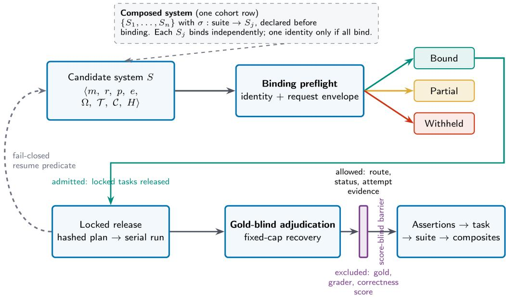
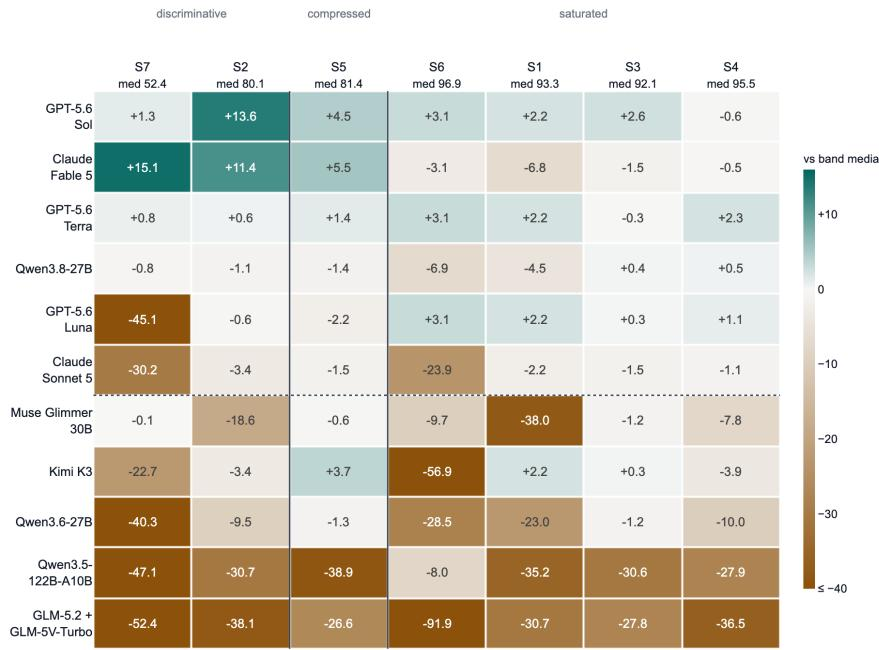
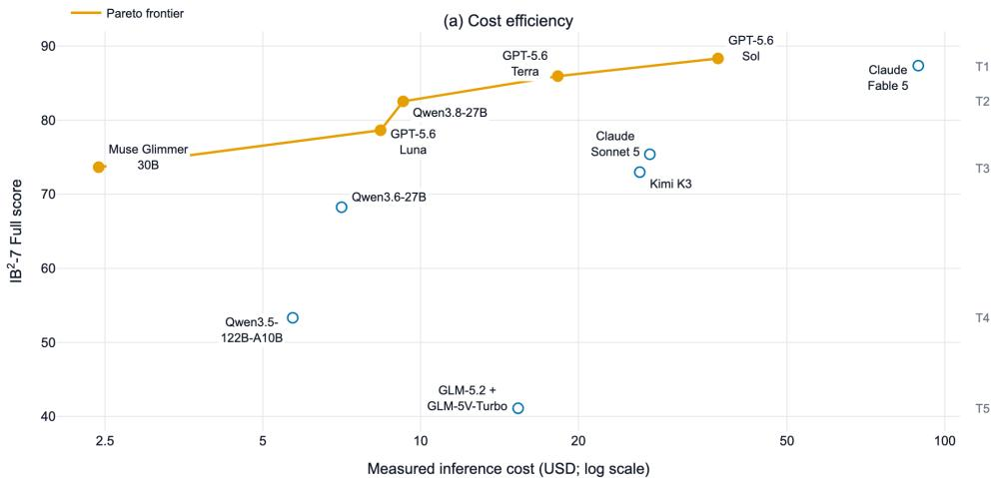
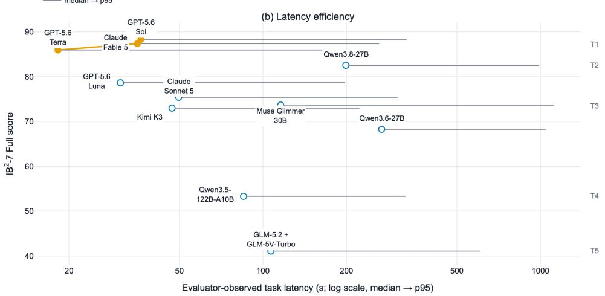
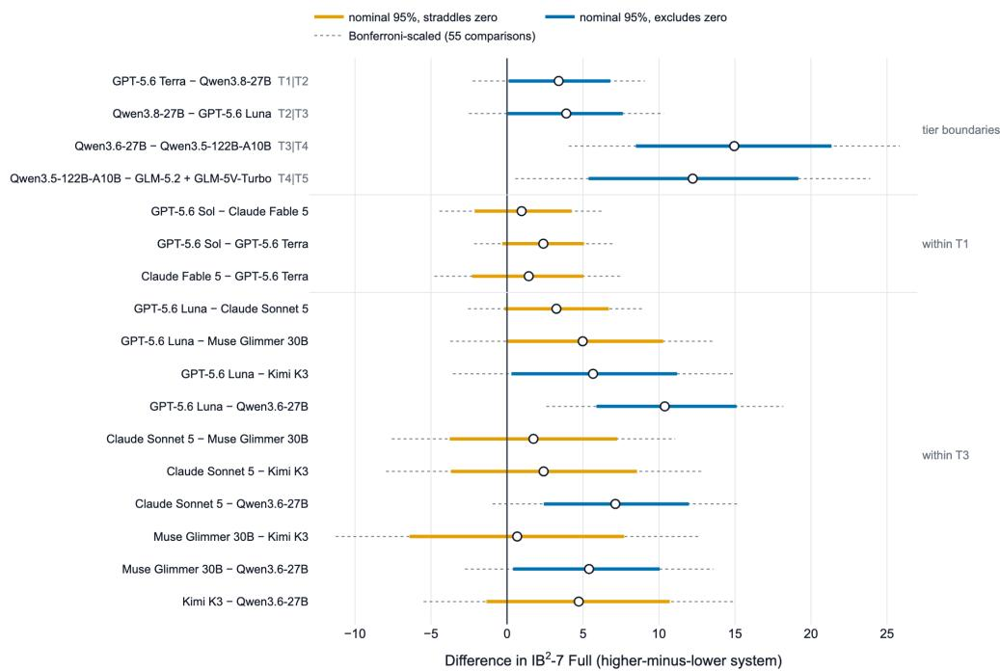

# IB<sup>2</sup>: A Protocol for Measuring Enterprise AI Systems by Serving Route, Not Model Identifier

Blake Stenstrom<sup>∗</sup> Charangan Vasantharajan Brian Sathianathan Iterate.ai {blake, charangan, brian}@iterate.ai

## Abstract

Enterprises deploy systems, not checkpoints. Usable capability depends jointly on weights, serving route, precision, output contract, and harness, yet all 18 audited benchmarks score advertised model identifiers. We treat this as measurement error and give a protocol that makes it reportable. It has three parts. A gold-blind capability-binding preflight verifies that a route can execute the evaluation contract before any task reaches it; a reliability-inclusive first-pass scoring rule keeps failure in the score while keeping unsupported capability out; and adjudication is structurally score-blind. We call the protocol IB<sup>2</sup> and release its algorithms, classification tables, request contract, and manifest schemas. Its reference instantiation, 128 locked tasks and 987 assertions over document, spreadsheet, chart, tool and database work, stays sealed: the procedure is the artifact, not the corpus. Across eleven systems, four results. Capability availability is measurable: two complete single-route runs on identical weights later failed distinct predicates of the finalized binding gate, while a third passed that gate before a fresh run. The advertised identifier exposed neither limit. Discrimination is not uniform: four of seven suites saturate under a six-system band, with the spread almost entirely from governed database work and multi-tab joins, so we report interval-backed resolution groups, not ranks; two of the nominal five-label output’s four cuts fail multiplicity adjustment. Serving-arm choice moved one declared revision and precision from 77.38 to 82.54, paired interval [0.11, 10.60], though the arms differ in access mode, harness generation, and the serving tool-call parser, and harness generation is a property of our evaluator, not any endpoint. Excluding failed responses from denominators changes the point ordering, so reliability inclusion changes a conclusion, not its wording.

## 1 Introduction

## 1.1 The evaluation gap: checkpoints versus deployed systems

Every capability benchmark in our audit reports scores against model identifiers. Enterprises buy served endpoints. The gap between those two objects is not a rounding error. A served route imposes its own completion ceiling, image limit, tool-call parser, guided-decoding backend and numerical precision, and each of these can change what a set of weights is observably able to do. A benchmark that never checks the route cannot tell a model that failed from a route that refused, and therefore cannot report which of the two its number describes. We claim that, and only that. We do not claim that any published benchmark has in fact misattributed a route limit to a model: we found no documented instance, and establishing one would require per-route records that leaderboards do not retain. The defect we address is an unreportable quantity, not a catalogue of errors.

The problem is sharpest where enterprise work lives. Short question answering exercises little of the serving envelope. A single task in the bank below may require thirteen images in one request, selection from a twenty-five-tool catalog, tool-result continuation across turns, a strict JSON output contract, and a completion longer than 32,768 tokens, and routes serving the same advertised model revision diverge on every one of those axes. The envelope in Table 2 is a design choice of ours rather than a measured workload population, and we hold no evidence that it is the modal enterprise request, so we scope every route finding in this paper to this contract. What that scoping does not weaken is the structural point: whatever contract a benchmark adopts, whether a route can execute it is a property of the route.

## 1.2 A motivating failure

The retained lineage is sequential rather than a three-route prospective preflight. DeepInfra FP8 (R11, 2026-07-24) and CoreWeave FP8 (R12, 2026-07-26) each ran all 128 locked tasks once and scored 26.12 and 62.25, respectively. A later gold-blind capability audit found that DeepInfra rejected the unchanged thirteen-image contract at its four-image route limit, and that CoreWeave— despite advertising a 262,144-token completion maximum—stopped at exactly 32,768 tokens with finish\_reason=length. The complete ten-predicate gate, including that long-output predicate, was first attested on 2026-08-13, after R12. A third FP8 route, called Provider P here, then passed the full gate before its fresh 128-task replacement run. Its identity stays in a signed private receipt and is withheld because the provider’s terms prohibit benchmarking (Section 11).

Same weights and same requested contract, but three separate whole runs: no response was spliced across routes. The first two routes could execute enough of the locked bank to produce reliabilityinclusive scores, but could not meet the full finalized envelope. Those two findings are retrospective relative to R11/R12; only Provider P was bound prospectively under the complete gate. A harness that evaluates by model identifier has no place to preserve either distinction. The claim is that route choice, capability limits, and chronology must be part of the reported object.

## 1.3 Research questions and contributions

RQ1 (validity) Does route-level capability binding change the measured capability profile and tier assignment of a system, relative to evaluating against an advertised model identifier? RQ2 (reliability) How far does a reliability-inclusive first-pass score diverge from an accuracy-only score, and does that divergence change any tier assignment? RQ3 (discriminative power) Does the saturation criterion identify which suites have stopped separating frontier systems, and what does it report here? RQ1 and RQ2 are answered in Section 7, RQ3 in Section 6.2, partly against our own interest.

The contribution is four-part. C1 states the measured object: Definition 1 binds weights, route, precision, reasoning effort, envelope, tool implementation, output contract and harness into one tuple, and every score here is a score of that tuple. C2 specifies four algorithms with the tables they dispatch on: capability-binding preflight (Algorithm 1), gold-blind adjudication and recovery, fail-closed comparability and resume, and suite-stratified task-set bootstrap. These were implementation practice; here they are the contribution. We report two places where the specification is ahead of what we ran, because for a protocol that gap is itself a result. C3 reports a route-availability outcome no model-identifier benchmark can express, discloses whether each binding decision was prospective or retrospective, and recomputes the cohort under each convention the protocol rejects. C4 is the instrument and cohort: a 128-task, 987-assertion enterprise bank and an eleven-system evaluation. It is documented through released methodology, executable reference code, schemas, synthetic conformance fixtures, and aggregate results derived from retained signed evidence rather than through a public corpus.

## 1.4 What the name refers to, and what this does not claim

$\mathrm { I B } ^ { 2 }$ expands to Iterate Business Intelligence Benchmark, which is where the squared form comes from: the four initials are IB written twice. One name does two jobs. $\mathrm { I B } ^ { 2 }$ is the protocol, contribution C1–C3, and it is what is released. Its reference instantiation is the seven suites, 128 locked tasks and 987 assertions of Section 5, which is C4 and whose corpus is sealed. Every score carries a profile name, $\mathrm { I B } ^ { 2 } – 7$ Full or $\mathrm { I B } ^ { 2 }$ -6 Core, and a profile is always a property of the instantiation. That line has a cost we pay in Table 7: the Qwen3.6-27B row’s route is withheld, so by our own definition that row is under-identified. We retain it rather than silently improve the cohort by dropping its weakest complete run, mark it, and say plainly that it is the one row not reproducible in principle by a third party.

$\mathrm { I B } ^ { 2 }$ measures a model plus a fixed harness on synthetic enterprise artifacts through a pinned route. It does not measure a production deployment: there is no retrieval index over a live store, no human in the loop, no multi-user state, and the tool layer is a controlled sandbox. We do not claim run-to-run variance estimates, since each configuration is run once against a locked bank. We do not claim a human baseline, and therefore claim no procurement-grade interpretation for any score. And we do not claim that spreadsheet reasoning, document question answering, chart understanding, tool calling or text-to-SQL is individually novel; all five have established benchmarks.

## 2 Related work and positioning

Single-capability antecedents. Every $\mathrm { I B } ^ { 2 }$ suite has one, and none of them binds the serving route before scoring or reports capability availability as an outcome. Spreadsheet reasoning has Spreadsheet Bench and its end-to-end successor [19, 42]; document understanding has DocVQA, MMLongBench-Doc and M3DocRAG [22, 18, 5]; charts and rendered tables have ChartQA, ChartQAPro and TableVQA-Bench [20, 21, 12]; tool use has ToolLLM and BFCL [30, 28]; text-to-SQL has Spider 2.0 and BIRD [15, 16]. These works establish the tasks, and we claim novelty for none of them.

Enterprise and agentic evaluation. The closest work is OfficeQA Pro, which evaluates grounded reasoning over an archival collection of U.S. Treasury documents combining narrative text with numeric tables [26]. It is the direct comparator for our selectable-text document suite and the strongest counter-evidence to any claim that our bank is hard: it places frontier systems in a far lower band than we do on nominally the same capability. The difference is instructive rather than embarrassing. Its evidence is a collection in which the controlling facts must first be located; ours is a bounded thirty-page packet in which they are guaranteed present. Section 8.2 treats that as evidence about which construct each instrument measures. τ-bench and $\tau ^ { 2 } .$ -bench evaluate conversational agents under dual control, and their $\mathrm { p a s s } ^ { k }$ is prior art for reliability-inclusive scoring that we adopt rather than claim [37, 4]. CRMArena-Pro covers business scenarios with multi-table dependencies and overlaps our tool and database suites [9]. GDPval grades economically valuable work across 44 occupations, and differs from $\mathrm { I B } ^ { 2 }$ in one direction: it grades open-ended deliverables by expert human judgement rather than by deterministic assertions against a typed contract [29]. Finch, MBABench and SpreadsheetBench 2 are the direct 2025–26 comparators for S1 and S2 [7, 38, 42].

Reporting discipline. Reporting cost and latency beside accuracy so that trade-offs stay visible is the design philosophy of HELM, which we adopt wholesale for Table 14 [17]. Hua et al. [8] propose a four-field schema for represented activity, tested setting, required work product and evaluated result; we adopt it as the primary form of Table 3. Best practices for rigorous agentic benchmark construction have been consolidated into a checklist, against which we claim conformance item by item in Appendix F [43]. Private-curator evaluation carries documented risks, including unfalsifiability by the reader [3]. Section 11 engages that risk directly instead of treating privacy as a settled operational choice. Construct validity in language-model evaluation has recently been given quantitative treatment [11], which bears on Section 8.2.

Where route binding comes from. Binding the serving stack before publishing a number is not new. It is the organizing principle of MLPerf Inference, which applies to ML inference submissions the standard systems-testing notion of a system under test that Definition 1 uses [34]. MLPerf enforces the binding structurally through its closed and open divisions. A closed-division submission fixes the model, the preprocessing and the quality target, and reports the result against the disclosed hardware, engine, precision and batching configuration rather than against a model name. Systems benchmarking settled this a decade before capability benchmarking met it. What MLPerf does not do is let the served configuration change the measured capability and then report that change as an outcome, because that is not the question it asks. That is the transfer we claim, and it is narrow on purpose: the discipline is standard in systems benchmarking and is not represented by any capability benchmark in our 18-work audit, where the convention is still to score an advertised model identifier. We adopt two adjacent literatures rather than arguing with them. Backend and harness choice alone shift measured accuracy for identical weights [27], which is why H is a component of Definition 1 rather than infrastructure; and quantization effects concentrate in multi-step arithmetic and exact numeric output [13], which is the task profile of our spreadsheet and database suites. We name vLLM and SGLang as experimental variables rather than as infrastructure [14, 41].

Table 1: Positioning against prior benchmarks. • present, ◦ partial, – absent. The first five columns describe what is evaluated, the last five how. Route bound: the serving route is verified against the evaluation contract before scoring. Reliab. in score: first-pass failures remain in the primary metric. Cost/lat.: measured inference cost and latency reported alongside accuracy (◦ if only one is reported). <sup>∗</sup>MLPerf binds the full serving stack, but for throughput and latency at a fixed accuracy target rather than for measured capability; see Section 2. Cell values for prior work are audited against each cited primary paper; the dated row-by-row evidence ledger is released as paper/data/positioning\_audit.csv.
<table><tr><td>Evaluation</td><td></td><td></td><td></td><td></td><td>Docs Sheets Charts Tools Gov. DB</td><td>Corpus public</td><td>Route bound</td><td>Reliab. in score</td><td>Cost/ lat.</td><td>Human baseline</td></tr><tr><td>GPQA [35]</td><td></td><td></td><td></td><td></td><td></td><td></td><td></td><td></td><td></td><td></td></tr><tr><td>FinanceBench [10]</td><td></td><td></td><td></td><td></td><td></td><td></td><td></td><td></td><td></td><td></td></tr><tr><td>SpreadsheetBench [19]</td><td></td><td></td><td></td><td></td><td></td><td></td><td></td><td></td><td></td><td></td></tr><tr><td>SpreadsheetBench 2 [42]</td><td></td><td></td><td></td><td>0</td><td></td><td></td><td></td><td></td><td></td><td></td></tr><tr><td>DocVQA [22]</td><td></td><td></td><td></td><td></td><td></td><td></td><td></td><td></td><td></td><td></td></tr><tr><td>MMLongBench-Doc [18]</td><td></td><td></td><td>O</td><td></td><td></td><td></td><td></td><td></td><td></td><td></td></tr><tr><td>TableVQA [12]</td><td>1</td><td></td><td></td><td></td><td></td><td></td><td></td><td></td><td></td><td></td></tr><tr><td>ChartQAPro [21]</td><td></td><td></td><td></td><td></td><td></td><td></td><td></td><td></td><td></td><td></td></tr><tr><td>ToolLLM [30]</td><td></td><td></td><td></td><td></td><td></td><td></td><td></td><td></td><td></td><td></td></tr><tr><td>BFCL [28]</td><td></td><td></td><td></td><td></td><td></td><td></td><td></td><td>O</td><td></td><td></td></tr><tr><td>τ2-bench [4]</td><td></td><td></td><td></td><td></td><td></td><td></td><td></td><td></td><td></td><td></td></tr><tr><td>CRMArena-Pro [9]</td><td></td><td></td><td></td><td></td><td></td><td></td><td></td><td>O</td><td>O</td><td></td></tr><tr><td>Spider 2.0 [15]</td><td>O</td><td></td><td></td><td>O</td><td></td><td></td><td></td><td></td><td>O</td><td></td></tr><tr><td>BIRD [16]</td><td></td><td></td><td></td><td></td><td></td><td></td><td></td><td></td><td></td><td></td></tr><tr><td>OfficeQA Pro [26]</td><td></td><td>O</td><td>o</td><td></td><td></td><td></td><td></td><td></td><td></td><td></td></tr><tr><td>GDPval [29]</td><td></td><td></td><td>o</td><td>O</td><td></td><td>O</td><td></td><td></td><td></td><td></td></tr><tr><td>HELM [17]</td><td>O</td><td></td><td></td><td></td><td></td><td></td><td>水</td><td>O</td><td></td><td></td></tr><tr><td>MLPerf Inference [34]</td><td></td><td></td><td></td><td></td><td></td><td></td><td></td><td></td><td>O</td><td></td></tr><tr><td>IB2 (this work)</td><td></td><td></td><td></td><td></td><td></td><td></td><td></td><td></td><td></td><td></td></tr></table>

Positioning. Table 1 places $\mathrm { I B } ^ { 2 }$ against eighteen prior works on ten dimensions. The first five columns describe what is evaluated and, for our row, characterize the reference instantiation of Section $5 ;$ the last five describe how and characterize the protocol of Section 4. That distinction matters when reading the release column: we withhold the corpus and publish the procedure. $\mathrm { I B } ^ { 2 }$ is not alone in any of the first five, nor in most of the last five: $\cdot ^ { 2 }$ -bench keeps first-pass failure in its primary metric, HELM reports cost and latency beside accuracy, and MLPerf Inference binds the full serving stack before a number is published. Within this audit, Route bound is the only column in which it stands alone among capability benchmarks, and we invite correction on that point specifically. The table carries no column for score-blind adjudication. One absent marker would have to cover two different things: a benchmark that permits score-visible recovery, and a benchmark that specifies no adjudication step at all. That makes the column uninformative. The property itself is real and is stated in Section 4.3: of the eighteen comparators we audited, none specifies that recovery decisions are taken without visibility of correctness, and the row-by-row evidence is released as paper/data/positioning\_audit.csv. Two columns are where $\dot { \mathrm { I B } } ^ { 2 }$ is weakest. The corpus is not public, a cost we account for in Section 11, and there is no human baseline, which limits the business interpretation of any absolute score.

## 3 Problem formulation

## 3.1 The system under test

Definition 1 (System under test). A system under test is the tuple $S = \langle m , \ r , \ p , \ e , \ \Omega , \ T , \ \mathcal C , \ H \rangle$ where m is the model identity including any pinned upstream revision, r the serving route including provider and disabled fallbacks, p the served numerical precision, e the reasoning-effort setting, Ω the observed context, completion, image and tool-call envelope, $\tau$ the tool implementation, C the output contract enforced on the wire, and H the evaluation harness contract. A composed system is a finite set ofsuch tuples with a routingfunction σ mapping each suite to exactly one ofthem, declared before binding; every component binds independently and the composed system is reported under one identity only if all of them bind.

Table 2: The evaluation contract. A route is admitted only if it executes every row. SQL limits are bytes where stated, not character counts.
<table><tr><td>Dimension</td><td>Requirement</td><td>Enforcement</td></tr><tr><td>Images per request</td><td>13, byte-identical</td><td>rejected by 4-image routes; probe 4</td></tr><tr><td>Tool catalog</td><td>25 tools at binding</td><td>selection verified live; probe 5</td></tr><tr><td>Tool calls per task</td><td>≤ 12, one per turn</td><td>evaluator-owned; provider parallelism can- not bypass</td></tr><tr><td>Turn structure</td><td>final-answer turn required</td><td>evaluator state machine</td></tr><tr><td>Completion budget</td><td>65,536requested; &gt;32,768 observed</td><td>finish_reason=length fails the probe</td></tr><tr><td>Output</td><td>strict JSON schema on the wire</td><td>revalidated against the evaluator contract</td></tr><tr><td>SQL bounds</td><td>65,536-byte SQL; 100 pro- jected columns; 200 rows; 16,384-byte cells; 262,144-</td><td>governed read-only executor</td></tr><tr><td>Telemetry Retention</td><td>byte response; 120 s usage, cost, reasoning replay</td><td>missing usage places cost on hold</td></tr><tr><td></td><td>zero-data-retention eligible; collection denied</td><td>route ineligible otherwise</td></tr><tr><td>Concurrency</td><td>1, serial task issue</td><td>harness</td></tr></table>

The GLM entry routes text and tool suites to GLM-5.2 and visual suites to GLM-5V-Turbo, which the single-tuple form cannot express. Two consequences are load-bearing for the rest of the paper.

Property 1 (Non-substitutability). Two systems differing only in r are distinct systems under test. A scorefor one does not transfer to the other, and their results may not be combined into a single row.

Property 2 (Asymmetric availability). For closed-weight models no configuration exists in which r, p and Ω are jointly under the evaluator’s control. A model-only score is therefore not epistemically available for such systems, and cross-frontier comparison between open- and closed-weight systems is possible only at the level of S.

Property 2 is the strongest available justification for system-level evaluation and is why we offer no model-only leaderboard: there is no model-only number to offer for half the cohort, and for the other half such a number would be a reference serving configuration reported under a model’s name. Section 6 states the sense in which H is identified for runs that predate the current harness contract.

## 3.2 The evaluation contract

Table 2 states the request envelope every system must satisfy. It fixes Ω and C, two of the eight components of the system under test, so a system is not identified until both are pinned. The contract is also the object Algorithm 1 tests, the object Section 7 varies, and the reason two routes in Section 1.2 later failed the finalized gate. An evaluation that does not publish its contract cannot report contract executability as a result. The particular values below are ours and are scoped accordingly (Section 1.4); the requirement that some contract be published and tested is the protocol’s.

## 3.3 Estimand, population, and what a score licenses

The estimand is the performance of one fully specified system S on the locked bank B. It is tempting to declare B the population outright and to decline p-values on the ground that a population has no sampling distribution. That is not consistent with what Algorithm 4 does. The algorithm constructs a resampling distribution over B, and Section 6.1 uses that distribution, subject to the auditability bounds in Section 4.6, to license ordinal claims. We state the frame the machinery actually assumes rather than the one that sounds more conservative.

Two estimands are in play and they are not the same object. The reported score is a census, the equal-suite mean of S’s task scores over all of B with no sampling error, which is why every number in Table 7 is printed without a standard error. The interval is a sensitivity analysis against a different question: would this ordering hold on a comparably constructed bank? Answering that requires treating the n tasks of suite k as exchangeable draws from the suite-specific generative process of Section 5: the scenario families, the distractor and decoy controls, and the admission gate that produced them. Under that frame B is one realization of the process, the resampling distribution is over alternative realizations, and “excludes zero” means the difference is not an artifact of which tasks the process happened to emit. It is not a claim about run-to-run variance, and not a claim about a population of enterprise tasks in the world; the generative process is ours, and Section 1.4 says what that does not license.

Three consequences follow. We do not report p-values: a sampling distribution does exist, but the estimand is per-system, and 55 marginal p-values over a multiplicity structure we do not control would mislead more than the tier presentation does. We do not estimate run-to-run variance, because n=1 per configuration and the resampling unit is the task, not the run. And a score licenses an ordinal claim only where the relevant paired interval excludes zero; where it does not, we report a shared resolution group.

## 3.4 Work representation

A suite name such as “charts” does not say what work is represented, under what conditions, or what counts as done. Table 3 therefore states every suite in the four-field schema of Hua et al. [8]. Its S3 and S4 rows are what let a reader judge the construct question raised in Section 8.2.

## 4 Evaluation protocol

Figure 1 maps the protocol: binding, locked release under a hashed plan, gold-blind adjudication of every non-OK response, and the score-blind barrier the whole protocol rests on.

## 4.1 Harness neutrality and run-plan hashing

Every system receives the same public task semantics, evidence bytes, task order, tool budgets, and SQL boundary. Provider-native envelopes differ only where an API requires a different wrapper, and the residual syntactic difference is retained in the system manifest rather than claimed away. For each task, the run plan hashes the public task, the rendered request, the system configuration, the corpus manifest, and the material harness contract.

Conformance tests establish semantic and evidence equivalence, not that vendors allocate the same hidden computation or run identical safety, OCR or serving stacks. Those differences are properties IB<sup>2</sup> measures, not confounds it removes.

## 4.2 Binding: an advertised identifier is not a capability

An advertised model identifier or context window does not prove that a served route can execute the evaluation contract. Algorithm 1 states the gate: ten predicates, each carrying a class and a lane set, returning one of BOUND, PARTIALCOVERAGE or WITHHELD together with the class of the failure. A route-level incompatibility observed at binding is never converted into a model score of zero, and successful tasks from an incompatible provider are never spliced into a nominally single-route result. Binding-time and run-time failures differ. Nothing has been measured at binding, so there is nothing a zero could describe. A route that truncates a locked task after admission has produced a real failure of the system a customer would deploy, and Algorithm 2 scores it. Neither ever attributes the outcome to the weights. This is the normative procedure; the reference lineage did not apply its complete predicate set prospectively to R11 or R12. The dated attestation in paper/data/binding\_predicate\_freeze.csv places the first complete-set receipt at 2026-08- 13 23:53:56 UTC, after R12 and before the Provider P run. We therefore treat R11/R12 as complete calibration runs later audited against the finalized gate, not as preflight rejections.

Two properties of the gate are findings rather than description. First, availability is two statistics, not one: predicates 1–7 ask whether the route can do the work and 8–10 whether it will disclose what it did, so a third party running this protocol should report capability availability and governance availability separately. Both failures in this cohort are capability-class, so nothing here turns on it.

Table 3: Suite composition, stated in the four-field work-representation schema of Hua et al. [8]. Per-suite assertion counts and the realized difficulty distribution are in Appendix B.8.
<table><tr><td></td><td>tivity</td><td>Represented ac- Tested setting</td><td>Required product</td><td></td><td>work Evaluated result</td><td>Tasks</td></tr><tr><td></td><td>sheet</td><td>nessquestion workbook; from one work- sheet record with source row numbers</td><td></td><td></td><td>S1 Answer a busi- Synthetic single-tab Typed answer with Value correctness under ordered cited source ranges tolerance; citation of the controlling range</td><td>10</td></tr><tr><td></td><td>ures worksheets</td><td>across stale caches, effective join provenance dates, duplicate rows</td><td></td><td></td><td>S2 Reconcile fig- Multi-tab workbook; Typed answer with Join correctness; tempo- ral rule application; du- plicate resolution</td><td>22</td></tr><tr><td></td><td>packet</td><td>S3 Extract and rec- 30-page selectable-text Typed from a document dence, decoy tables</td><td>citations</td><td>answer Value</td><td>correctness; oncile evidence PDF; non-adjacent evi- with page-level whether the cited page is the controlling one</td><td>22</td></tr><tr><td></td><td>image</td><td>exists only as an 180 DPI; merged head- cell references ers, footnotes; no ex-</td><td></td><td></td><td>S4 Read a table that Image-only pages at Typed answer with Transcription fidelity; correctness of the down- stream calculation</td><td>22</td></tr><tr><td></td><td>organizational ule, or risk paths matrix</td><td>S5 Interpret a chart, Rendered figures; dual Typed answer nam- Read-off axes, structure, sched- schedules, architecture ment relied on</td><td>critical-chain ing the visual ele- structural</td><td></td><td>over the relation</td><td>accuracy; 22 inference depicted</td></tr><tr><td></td><td>S6 Execute</td><td></td><td>a Stateful sandbox; per- Ordered tool calls Selection, order, ar- bounded enter- task tool subset, one and a final typed guments, side-effect prise workflow call per turn, ≤ 12 calls answer</td><td></td><td>safety, audit trail, final answer</td><td></td></tr><tr><td></td><td>spanning database</td><td>a column</td><td>S7 Answer a gov- Read-only SQL over SQL queries and a Schema-discovery relation; swer and certified term dictio-</td><td></td><td>erned question 107 rows and a 1,000- typed business an- credit; query correct- ness; final business answer</td><td>12</td></tr></table>

Second, the PARTIALCOVERAGE branch is unreachable in v0.13.2. It fires only when the failing predicates touch S4 and nothing else, but no predicate in Table 4 has that lane: the only vision predicate is probe 4, whose lane is {S4, S5}, and S5 is in Core. The cohort confirms it. DeepInfra FP8 failed exactly probe 4, thirteen images against a four-image route limit, and was dispositioned WITHHELD rather than PARTIALCOVERAGE: the correct outcome under the lane mapping, and the wrong one under the intent Section 5.1 states. Making the branch reachable needs a predicate whose lane is S4 alone. Probe 4 tests whether a route accepts an image, which is a different question from whether it can read one.

## 4.3 Adjudication: recovery decisions that cannot see correctness

Every non-OK response enters an adjudication ledger before recovery eligibility is decided. What distinguishes this from a policy of merely ignoring scores is structural: the implementation projects each result onto an explicit allowlist, so the object the recovery selector reads is a type from which score, grader output and gold reference are absent rather than unread. The projection does retain status, which is itself a classification of the response, so the adjudicator has necessarily parsed what came back and knows a response was malformed, empty or envelope-violating. What it cannot reach is any gold reference, any grader output and any score. That is the invariant that matters for p-hacking: correctness is what a biased selector would need in order to retry selectively, and correctness is exactly what is unreachable. A contract-valid but incorrect answer is therefore ineligible for every recovery branch, and no reachable field distinguishes it from a correct one. Algorithm 2 and its decision table, Table 5, are in Appendix A.

Table 4: The ten binding predicates, in evaluation order, with the class and lane set Algorithm 1 dispatches on. They are implemented by one catalog/configuration gate and five provider turns; a single turn may satisfy several predicates. Every provider turn must also return the pinned model and upstream route. Class separates predicates that test whether the route can do the work from predicates that test whether it will disclose what it did; Algorithm 1 returns the class so that the two never appear as one availability statistic. Lane is the suite set whose executability the predicate gates, and is the mapping the PARTIALCOVERAGE branch reads. A hard request error fails closed for predicates sharing a lane with the raising predicate and marks lane-disjoint downstream predicates UNOBSERVED, which is not BOUND-eligible either.
<table><tr><td>#</td><td>Probe</td><td>Class</td><td>Lane</td><td>Pass predicate</td></tr><tr><td></td><td>Route and parameter identity</td><td>capability</td><td>all</td><td>exactly one catalog endpoint matches the pinned route/provider; returned model/provider match it; fallbacks are</td></tr><tr><td>2</td><td>Context and requested capability cap</td><td></td><td>all</td><td>disabled; required parameters are advertised catalog context equals the pinned value and the ordinary request carries the frozen</td></tr><tr><td></td><td>3 Structured output</td><td>capability</td><td>all</td><td>completion ceiling ordinary turn carries strict JSON schema, returns the required envelope, and ends with</td></tr><tr><td></td><td>4 Image envelope</td><td>capability</td><td>S4, S5</td><td>stop 13 images are present on the wire with byte hashes unchanged; the vision response is contract-valid and ends with stop</td></tr><tr><td></td><td>5 Tool catalog and selection</td><td>capability</td><td>S6</td><td>exactly 25 tools are declared; the model emits exactly one call to the designated synthetic tool with the designated</td></tr><tr><td></td><td>6 Tool-result continuation</td><td>capability</td><td>S6, S7</td><td>arguments the second turn receives the tool result, replays provider reasoning exactly, returns the required final JSON, and ends with</td></tr><tr><td></td><td>7 Completion ceiling</td><td>capability</td><td>all</td><td>stop the frozen-cap long turn returns at least 32,769 provider-reported completion tokens and ends with stop, not length</td></tr><tr><td></td><td>8 Reasoning telemetry</td><td>governance all</td><td></td><td>at least one provider turn contains non-empty reasoning or a positive reasoning-token count; the tool turn satisfies</td></tr><tr><td></td><td>9 Usage and cost telemetry</td><td>governance all</td><td></td><td>exact replay every provider turn is usage-bearing SSE with integer prompt/completion counts, at least one stream event, and numeric</td></tr><tr><td></td><td>10 Retention controls</td><td>governance all</td><td></td><td>per-response cost the bound routing configuration requires ZDR and sets data collection to deny</td></tr><tr><td colspan="7">Named as missing; not in the v0.13.2 gate, both freeze requirements (Section 8.4) Strict-JSON adherence capability all the final assistant message parses as a bare</td></tr><tr><td></td><td>under reasoning</td><td></td><td></td><td>schema-conformant object, no prose or fence, on a turn that also emits a non-empty reasoning trace (Section 6.5)</td></tr><tr><td></td><td>OCR capability, distinct from image acceptance</td><td>capability</td><td>S4</td><td>an image-only table is transcribed to the declared cell schema, on a route that has already passed probe 4</td></tr></table>

  
Figure 1: The $\mathrm { I B } ^ { 2 }$ protocol. Binding has three explicit dispositions before a locked task is released. Adjudication receives only the allowlisted projection; gold, grader output, and correctness scores remain outside the recovery selector. The dashed edge is the fail-closed resume predicate.

## 4.4 Comparability: a run may only be extended by an identical run

A run may be extended only by work that would have produced the same run. Algorithm 3 canonicalizes the run plan, which enumerates the task set, the rendered requests, the system configuration, the corpus manifest and the material harness contract; hashes it; and admits an append only when that hash equals the one persisted at the run’s checkpoint. Any difference forces a new run rather than a partial merge, including a difference the evaluator believes immaterial, because the predicate is equality of the hash and not a judgement about what mattered. There is no per-task substitution: a single re-run task cannot be spliced into a completed run. That is what licenses the claim in Section 6.6 that every published row is one complete signed run under one route.

## 4.5 Scoring

Task score T<sub>i</sub> is the predeclared-weight mean of its assertion credits, scaled to 100. Suite score $S _ { k }$ is the arithmetic mean of its locked task scores, and the composite is the equal-weight mean over suites, which stops the 22-task suites dominating the smaller S1 and S7. The primary measure is the first-pass, reliability-inclusive, equal-suite $\mathrm { I B } ^ { 2 } { - } \breve { 7 }$ Full score.

Reliability inclusion is the part that matters. Every attempted result is passed once to the same deterministic assertion grader. A failure with no parseable response earns zero because all declared assertions fail; a parseable but contract-invalid response earns credit for the work products it actually supplies, and its causal class adds no points and subtracts none. The only fixed value is the mechanically implied zero for an absent response, never a class-dependent penalty. An unsupported task is not attempted and is never converted to a zero. Appendix A gives the formulas, the weight-authoring rule per suite, and the token-efficiency diagnostic.

Algorithm 1 Provider-capability binding preflight. Executed before any locked task is released to a   
candidate route. The receipt is content-addressed and asserts that no benchmark task, gold answer, or   
score was loaded or consulted. Each predicate carries a class and a lane set, both published in Table 4,   
and the disposition returns the class of the failure (Section 4.2).   
Require: candidate route r, model identity m, evaluation contract $\overline { { \mathcal { K } = \langle \mathcal { C } , \mathcal { T } , \Omega ^ { * } \rangle } }$   
Ensure: disposition $d \in$ {BOUND, WITHHELD, PARTIALCOVERAGE}, failure class $\begin{array} { r l } { f } & { { } \in } \end{array}$   
{NONE, CAPABILITY, GOVERNANCE, MIXED}, and a content-addressed receipt ρ   
1: $\dot { \boldsymbol { P } } \gets$ the ordered predicate set of Table 4; each $\pi \in \textit { P }$ carries a class cl $\mathfrak { s } ( \pi ) \ \in$   
{CAPABILITY, GOVERNANCE} and a lane set lane $( \pi ) \subseteq \{ \mathbf { S } 1 , \dotsc , \mathbf { S } 7 \}$   
2: $\grave { \Pi } \gets \emptyset ; \pi _ { * } \gets \perp$ ▷ π : the predicate that raised, if any   
3: for all predicate $\pi \in P$ in table order do   
4: if $\pi _ { * } \neq \perp$ then ▷ no further provider turn is issued after an exception   
5: t ← FAIL if lane(π) ∩ lane $( \pi _ { * } ) \neq \varnothing$ else UNOBSERVED   
6: $\Pi  \Pi \cup \{ ( \pi , t , \overset { . } { \bot } ) \}$ ; continue   
7: end if   
8: evaluate π from route metadata, fixed routing controls, or the ordered synthetic cases ORDI   
NARY, VISION, TOOLSTART, TOOLCONTINUE, and LONGOUTPUT   
9: Π ← Π ∪ {(π, PASS/FAIL, observed envelope)}   
10: if the request raised before a provider envelope was available then   
11: record the exception; overwrite $\pi ^ { \prime } \boldsymbol { \mathrm { s } }$ status with FAIL; $\pi _ { * }  \pi$   
12: end if   
13: end for   
14: $F \gets \{ \pi : \mathrm { F A I L } \}$ $U  \{ \pi$ : UNOBSERVED}; $L \gets \bigcup _ { \pi \in F }$ lane(π)   
15: if $F = \emptyset$ and $U = \emptyset$ then   
16: d ← BOUND; f ← NONE ▷ route admitted; Ω recorded as observed, not as advertised   
17: else if $L = \{ { \bf S 4 } \}$ and $U = \emptyset$ then   
18: d ← PARTIALCOVERAGE; f ← CAPABILITY ▷ the lane is reported as uncovered; it is not   
scored zero   
19: else   
20: d ← WITHHELD ▷ no locked task is released to r   
21: f ← CAPABILITY if every $\pi \in F \cup U$ is CAPABILITY; GOVERNANCE if every $\pi \in F \cup U$   
is GOVERNANCE; MIXED otherwise ▷ an unobserved predicate carries its class, so a route that   
was never asked a governance question is not a clean capability failure   
22: end if   
23: $\tau  \langle \mathrm { m } , \mathrm { r } , \mathcal { K } ,$ Π, d, f, configuration and source hashes, no-benchmark assertions⟩   
24: ρ.receipt\_sha256 ← SHA256(JCS(u)) ▷ UTF-8 JSON, sorted keys, compact separators;   
hash field omitted   
25: return $( d , f , \rho )$

## 4.6 Sensitivity: what a score difference survives

Algorithm 4 resamples tasks within suites, 20,000 draws per pair under a pair-specific seed, and computes each interval once per unordered pair in canonical order. Two cautions belong with the widths. Equal-suite weighting means a suite’s resampling noise enters in inverse proportion to its task count, so widths are driven disproportionately by the smallest suites, S1 and S7. And a percentile bootstrap of a bounded mean has known coverage error in small strata, which is exactly the regime the two thinnest cuts sit in. We therefore recomputed both with the bias-corrected and accelerated variant over retained per-task scores. The T1|T2 cut survives, [0.11, 6.80] becoming [0.32, 7.04]; the T2|T3 cut does not, [0.05, 7.62] becoming [−0.12, 7.45] and crossing zero. An independent auditability limit is larger than both thin lower bounds. R17 retained an aggregate count of two successful Stage 0 reissues but not their task or suite identities. Under equal-suite weighting, their placement-conditioned maximum leverage is 1.30 points if both were in a 22-task suite and 2.86 points if both were in the 10-task suite; with no attribution, 2.86 is the conservative cohort-level bound. The source values and arithmetic are released as paper/data/stage0\_sensitivity.csv. Because the other ten adapters did not retain zero-inclusive Stage 0 counts, the relative bias is unknown. We therefore do not interpret either 0.11 or 0.05 as evidence for a distinct top cut, irrespective of bootstrap variant. The regime is worth naming: under equal-suite weighting S1 contributes roughly 2.2× the variance

Algorithm 2 Gold-blind adjudication and recovery. $\pi _ { \mathrm { a l l o w } }$ is a typed projection, not a filter applied   
at read time. Stage 0 is the request-level retry that runs inside the harness before a result record   
exists. It is a named step here because whether a transport fault enters a primary score depends on it.   
CLASSIFY is the decision table of Table 5, evaluated in table order with first match winning. Stage 0 (harness, before a result record exists). A request that fails in transport is reissued byte-identically at most $c _ { \mathrm { r e q } } = 3$ times (four total request attempts, as fixed by max\_attempts=4 in every signed run plan). If a reissue returns a provider envelope, that envelope is the result and no failure is recorded: the task never enters the taxonomy of Table 9 and the primary score is unaffected. If the cap is exhausted, a result record with status ̸= OK is written and Stage 1 begins. Stage 0 is gold-blind by construction: it runs before any scoring path is reachable.

Require: raw result record x with status ̸= OK   
Ensure: δ ∈ {SCORE, RECOVER, RETRY, COVERAGE, HOLD}   
1: $\hat { x }  \pi _ { \mathrm { a l l o w } } ( x )$ , where the typed projection $\pi _ { \mathrm { a l l o w } }$ retains only   
⟨run id, task id, suite, status, coverage state, public hashes, redacted error, sanitized envelope   
summary⟩   
2: invariant: xˆ contains no gold reference, no grader output, and no score; status is a response   
classification and carries no correctness information   
3: c ← CLASSIFY(ˆx) ▷ Table 5; total by its terminal row   
4: M ← {model terminal, output budget, tool loop, refusal, invalid tool, route capability}   
5: T ← {transport, incomplete SSE, provider envelope}   
6: J ← {invalid JSON, envelope violation, empty final, incomplete model response}   
7: H ← {permanent provider, evaluator risk, unclassified}   
8: if c = UNSUPPORTEDCAPABILITY then   
9: δ ← COVERAGE ▷ declared unsupported work is never converted to zero   
10: else if $c \in M$ then   
11: δ ← SCORE ▷ measured system behaviour; never retried   
12: else if $c \in T$ then   
13: δ ← RECOVER; reissue the exact request until the first provider response or the cap $c _ { \mathrm { a d j } } = 4$   
recovery attempts, as fixed in the signed recovery registry   
14: the first-pass failure remains in the primary score; any recovered value is reported separately   
as transport-corrected and never replaces it   
15: else if $c \in J$ then   
16: δ ← RETRY; exactly one exact-request retry   
17: the first-pass failure remains in the primary score; the retry outcome is retained as qualitative   
reliability evidence only and enters no score   
18: else if $c \in H$ then   
19: δ ← HOLD ▷ repair/reseal or gold-blind manual review; no task substitution   
20: else   
21: δ ← HOLD ▷ fail closed: an unmodelled class is never silently scored   
22: end if   
23: assert a contract-valid but incorrect answer is never eligible for any branch above   
24: return δ

per task that S2 does, it is one of the four suites Section 8.2 reports as saturated, and it carries four systems tied at exactly 95.50, so its resampled mean is both small-n and strongly non-normal. The realized parameters and bounds are released as paper/data/bca\_t1\_t2\_terra\_qwen38.json and paper/data/bca\_t2\_t3\_qwen38\_luna.json.

## 5 The reference instantiation and how it was run

## 5.1 Suites and profiles

Seven suites hold 128 locked tasks and 987 deterministic assertions over enterprise document, spreadsheet, chart, tool and governed-database work. The suites are single-tab and multi-tab spreadsheet reasoning (S1, S2), selectable-text and image-only document analysis (S3, S4), chart and diagram interpretation (S5), tool calling in a stateful evaluator-owned sandbox (S6), and governed database

Table 5: CLASSIFY, the decision table of Algorithm 2. Evaluated top to bottom; first match wins. Envelope is the sanitized provider-envelope summary carried in ${ \hat { x } } ; \mathbf { \cdots } { \hat { - } } ^ { , }$ means the row does not test it. Status codes are the five the result schema admits, abbreviated: ERR error, TMO timeout, INV invalid\_output, UNS unsupported. Coverage codes are ATT supported\_attempted and UNS unsupported. No column of this table is derivable from a gold answer, a grader output, or a score, which is the property Section 4.3 claims. A result with coverage state not\_run never reaches this table: it was not attempted, so there is nothing to adjudicate.
<table><tr><td>#</td><td>Status</td><td></td><td>Coverage Envelope predicate</td><td>Causal class</td><td>δ</td></tr><tr><td>1</td><td>UNS</td><td>UNS</td><td></td><td>unsupported capability</td><td>COVERAGE</td></tr><tr><td>2</td><td>ERR</td><td>ATT</td><td>permanent account, authorization or billing rejection</td><td>permanent provider</td><td>HOLD</td></tr><tr><td>3</td><td>ERR</td><td>ATT</td><td>evaluator-flagged parameter incompatibility</td><td>evaluator risk</td><td>HOLD</td></tr><tr><td>4</td><td>ERR</td><td>ATT</td><td>provider states a modality, tool or context limit of the route</td><td>route capability</td><td>SCORE</td></tr><tr><td>5</td><td>ERR</td><td>ATT</td><td>terminal refusal or safety stop</td><td>refusal</td><td>SCORE</td></tr><tr><td>6</td><td>INV</td><td>ATT</td><td>tool call names a tool outside the declared catalog, or arguments do not</td><td>invalid tool</td><td>SCORE</td></tr><tr><td></td><td>7 any</td><td>ATT</td><td>parse evaluator tool budget reached with no final-answer turn</td><td>tool loop</td><td>SCORE</td></tr><tr><td>8</td><td>any</td><td>ATT</td><td>finish_reason=length at the frozen completion cap</td><td>output budget</td><td>SCORE</td></tr><tr><td>9</td><td>ERR</td><td>ATT</td><td>envelope carries a terminal model stop model terminal with no content and no error object</td><td></td><td>SCORE</td></tr><tr><td>10</td><td>ERR, TMO</td><td>ATT</td><td>no provider envelope was received</td><td>transport</td><td>RECOVER</td></tr><tr><td>11</td><td>ERR, TMO</td><td>ATT</td><td>stream opened but no terminal event arrived</td><td>incomplete SSE</td><td>RECOVER</td></tr><tr><td>12</td><td>ERR</td><td>ATT</td><td>envelope present and carries a provider-side error object</td><td>provider envelope</td><td>RECOVER</td></tr><tr><td>13</td><td>INV</td><td>ATT</td><td>final message does not parse as JSON</td><td>invalid JSON</td><td>RETRY</td></tr><tr><td>14</td><td>INV</td><td>ATT</td><td>parses as JSON but fails the declared schema</td><td>envelope violation</td><td>RETRY</td></tr><tr><td>15</td><td>INV</td><td>ATT</td><td>final message is empty</td><td>empty final</td><td>RETRY</td></tr><tr><td></td><td>16 INV</td><td>ATT</td><td>terminal event present but no final-answer turn was produced</td><td>incomplete model response</td><td>RETRY</td></tr><tr><td></td><td>17 any</td><td>any</td><td>otherwise</td><td>unclassified</td><td>HOLD</td></tr></table>

Algorithm 3 Fail-closed comparability. An append is admitted only when the candidate canonical run-plan hash exactly equals the persisted checkpoint.

Require: existing run R with immutable checkpoint $C _ { R } { \mathrm { : } }$ , candidate work W   
1: J(W) ← the run-plan object enumerated in Appendix E   
2: κ(W) ← SHA256(JCS(J(W))) ▷ UTF-8 JSON, sorted keys, compact separators, no ASCII   
coercion   
3: recompute and verify $\kappa ( R )$ from $C _ { R \cdot \tt p 1 }$ an   
4: $\mathbf { i f } \kappa ( \dot { W } ) = C _ { R } ,$ .run\_plan\_sha256 = κ(R) then   
5: verify every retained task/request hash and reject duplicates or task identifiers outside   
J(W).task\_ids   
6: admit W into R   
7: else   
8: reject; W must begin a new run ▷ no partial merge, no per-task substitution   
9: end if

work against a ten-million-row SQLite instance with a field dictionary of certified columns hidden among decoys (S7). Two profiles are exposed: $\mathrm { I B } ^ { 2 } – 6$ Core covers all but S4 for 106 tasks, and $\mathrm { I B } ^ { 2 } – 7$ Full adds S4 for 128. S4 is separable because OCR is often supplied by a component outside the model; S5 is not, because chart interpretation is a capability of the system rather than of a preprocessing component. Treating them together would make S5 simultaneously a Core requirement and a droppable lane. Every task is authored with a typed output contract, citation requirements, deterministic gold assertions with numeric tolerances and a privacy classification. Task and gold files stay physically separate, so gold cannot enter a provider-visible request. Approximately 30% of each suite is held as a challenge reserve for saturation detection. Appendix B gives suite-by-suite construction, the task model and the contamination controls.

```latex
Algorithm 4 Paired suite-stratified task-set bootstrap for a score difference. Used only to describe
sensitivity to the selected task set, never as a confidence interval for stochastic run-to-run variance.
Require: per-task scores $T _ { i } ^ { A } , T _ { i } ^ { B }$ for systems A, B over identical task keys; suites $k = 1 \ldots K$ with
sizes ${ \bar { n _ { k } } } ; B _ { \mathrm { i t e r } } = 2 0 , 0 0 { \bar { 0 } } ; { \mathrm { s e e d } } = { \mathrm { u i n t } } 3 2 ( { \mathrm { S H A } } 2 5 6 ( m _ { A } | | \ | | m _ { B } ) _ { 1 : 8 } )$
Ensure: interval for $\Delta = \mathrm { I B } ^ { 2 } \ – 7 ( A ) - \mathrm { I B } ^ { 2 } \ – 7 ( B )$
1: for $b = 1$ to $B _ { \mathrm { i t e r } }$ do
2: for $k = 1$ to K do
3: draw $n _ { k }$ task keys from suite k with replacement, preserving $n _ { k }$
4: the same keys are used for A and B ▷ pairing
5: $S _ { k } ^ { A ( b ) } , S _ { k } ^ { B ( b ) }$ ← means over the resampled keys
6: end for
7: $\begin{array} { r } { \underline { { \Delta } } ^ { ( b ) }  \frac { 1 } { K } \sum _ { k } S _ { k } ^ { A ( b ) } - \frac { 1 } { K } \sum _ { k } S _ { k } ^ { B ( b ) } } \end{array}$
8: end for
9: return the 95% percentile interval $[ Q _ { 0 . 0 2 5 } ( \{ \Delta ^ { ( b ) } \} ) , Q _ { 0 . 9 7 5 } ( \{ \Delta ^ { ( b ) } \} ) ]$
The pair-specific seed uses the first eight hexadecimal digits of SHA-256, which makes the draw depend
on the order the two identifiers are supplied in. An interval is therefore computed exactly once per
unordered pair, in canonical order (the two model identifiers sorted lexicographically), and negated with
its bounds swapped when displayed in the other direction. Table $7 \mathrm { { s } }$ leader interval [−2.13, 4.26] is the
negation of the stored [−4.26, 2.13] under canonical seed 224349676; it was not recomputed under a
second seed. The signed report records the realized canonical seed for every pair.
```

Definition 2 (Suite classification). Let the reference band B be the six systems with the highest $I B ^ { 2 } – 7$ Full scores, and let $b _ { ( 1 ) } \leq \dots \leq b _ { ( 6 ) }$ be their scores on the suite. Define the median $\tilde { b } = ( b _ { ( 3 ) } + b _ { ( 4 ) } ) / 2$ , the count $n _ { 9 0 } = | \{ b \in B : b \geq 9 0 \} |$ , and the trimmed range $\rho = b _ { ( 5 ) } - b _ { ( 2 ) }$ . A suite is

• saturated $i f { \tilde { b } } \geq 9 0$ and $n _ { 9 0 } \geq 4 ;$

• otherwise discriminative $i f \rho \geq 1 0 ;$

• otherwise compressed below ceiling: it separates nothing in the band and is not solved by it either.

## 5.2 Difficulty, admission, and the anti-ceiling policy

Difficulty must come from the work. Every task must be answerable from the supplied evidence and permitted tools; ambiguous wording, illegible inputs and adversarial grading are not valid sources of it. The realized difficulty labels do not survive contact with the results. With 93.8% of tasks labelled Expert or Frontier while four of seven suites are saturated, and with the labels effectively constant within a suite, they are non-predictive of measured difficulty. Nothing in this paper’s results rests on them, so we treat the taxonomy as an unvalidated construct in v0.13.2 and make blind difficulty piloting a freeze requirement (Section 8.4) rather than defend the labels here. Appendix B gives the target profile, the admission gate, the anti-ceiling policy and the band-size sensitivity of Definition 2.

## 5.3 Cohort and execution

Table 6 lists the eleven evaluated systems. The cohort is purposive rather than exhaustive: three GPT-5.6 endpoints at xhigh, two Anthropic operating points, three Qwen models spanning a sparse and two dense configurations, Kimi K3, Muse Glimmer 30B, and the composed GLM system of Section 3.1. This is the cohort frozen before execution; every open-weight system uses exactly one serving route, per Property 1.

Tasks are issued serially at concurrency one. Latency is evaluator-observed per task and includes provider queueing and evaluator-owned work, so it is not model-only inference latency. Cost is a measured run diagnostic rather than a reconciled invoice. Sampling parameters were frozen no later than 2026-07-23 05:50:04 UTC, which is also when the first retained complete-candidate run began, so the evidence bounds the freeze by the first launch rather than attesting it independently; a dated freeze attestation is a freeze requirement. Several determinants of behaviour are not observable on a hosted route at all, including inference engine and version, guided-decoding backend, KV-cache policy and hardware generation, and every one of them is known to move accuracy for identical weights. That is why the protocol binds and records what is observable and defers attribution rather than inferring it. Appendix B gives the cohort rationale, the observability split and the cost accounting in full.

Table 6: Evaluated systems. Column headers carry the tuple symbols of Definition 1. T, C and H are identical for every row by construction, and Ω is the contract of Table 2 as observed in binding rather than as advertised. GPT-5.6 Sol, GPT-5.6 Terra, and GPT-5.6 Luna are distinct pinned model identifiers, printed in the first column rather than treated as settings of one identifier. The GLM row is a composed system in the sense of Definition 1, with σ mapping S4 and S5 to GLM-5V-Turbo and every other suite to GLM-5.2.
<table><tr><td>Model m</td><td>Effort e</td><td>Precision p</td><td>Route r</td><td></td><td>Vision path</td></tr><tr><td>GPT-5.6 Sol</td><td>xhigh</td><td>provider</td><td>OpenAI store=false</td><td>Responses,</td><td>native</td></tr><tr><td>GPT-5.6 Terra</td><td>xhigh</td><td>provider</td><td>OpenAI store=false</td><td>Responses,</td><td>native</td></tr><tr><td>GPT-5.6 Luna</td><td>xhigh</td><td>provider</td><td>OpenAI store=false</td><td>Responses,</td><td>native</td></tr><tr><td>Claude Fable 5</td><td>high</td><td>provider</td><td>Anthropic Messages</td><td></td><td>native</td></tr><tr><td>Claude Sonnet 5</td><td>high</td><td>provider</td><td>Anthropic Messages</td><td></td><td>native</td></tr><tr><td>Qwen3.5-122B-A10B</td><td>high</td><td>BF16</td><td>OpenRouter → Novita, no fall- back</td><td></td><td>native</td></tr><tr><td>Qwen3.6-27B</td><td>high</td><td>FP8</td><td>OpenRouter → Provider P, no fallback</td><td></td><td>native</td></tr><tr><td>Qwen3.8-27B</td><td>xhigh</td><td>BF16</td><td>OpenRouter → AkashML, no fallback</td><td></td><td>native</td></tr><tr><td>Kimi K3</td><td>max</td><td>MXFP4</td><td>OpenRouter → Modal, no fall- back</td><td></td><td>native</td></tr><tr><td>GLM-5.2</td><td>xhigh</td><td>FP8</td><td>OpenRouter → Z.AI, no fall- back</td><td></td><td>routed to</td></tr><tr><td>+ GLM-5V-Turbo</td><td>high</td><td>FP8</td><td>OpenRouter → Z.AI, no fall- back</td><td></td><td>GLM-5V</td></tr><tr><td>Muse Glimmer 30B</td><td>xhigh</td><td>BF16</td><td>direct DeepInfra</td><td></td><td>native</td></tr></table>

## 6 Results

All results were generated after every run completed, the gold-blind adjudication ledger cleared its publication holds, and the fail-closed comparability audit passed for all eleven systems. Some completed runs originated under the immediately preceding harness contract; for those, a signed equivalence bridge attests agreement on the enumerated surface of provider-visible task bytes, tool implementations, route configuration, budgets and scoring semantics, and H is identified up to that equivalence rather than byte-identity.

## 6.1 Composite results: nominal tiers and evidentiary groups

Table 7 gives the primary scores. We report resolution groups rather than ranks. The leader-minusrunner-up difference is 0.97 displayed points against a task-set sensitivity interval of [−2.13, 4.26], which straddles zero, and the same holds at positions seven and eight. We computed all 55 pairwise intervals and formed tiers greedily from the point-estimate order: a candidate begins a new tier only when its interval excludes zero against every member of the current tier. The five labels printed in the table are the mechanical output of that nominal rule and are retained as a protocol diagnostic, not as five inferentially distinct strata.

Table 7: Primary results, ordered by IB<sup>2</sup>-7 Full. Valid is the number of the 128 tasks that returned a scoreable response; it is distinct from coverage in Table 14, which is the number of capability lanes a system supports and is complete for every system in this cohort. Gap is the magnitude of the difference to the row above; every gap is stated as higher-minus-lower so that no sign convention is needed. All 55 pairwise comparisons use Algorithm 4. The four boundary intervals, top to bottom, are [0.11, 6.80], [0.05, 7.62], [8.48, 21.35] and [5.37, 19.17]; Section 6.1 reads them and states the multiplicity and BCa sensitivity. The displayed nominal groups retain the preregistered percentile rule only as a reproducible diagnostic; the paper’s evidentiary interpretation merges T1–T3, also because R17’s unattributable Stage 0 exposure has 1.30–2.86 points of placement-conditioned maximum leverage. Within-group separation counts make “group” concrete: 0 of 3 within-T1 pairs exclude zero, and 4 of 10 within-T3 pairs do (GPT-5.6 Luna–Kimi K3, GPT-5.6 Luna–Qwen3.6-27B, Claude Sonnet 5–Qwen3.6-27B, Muse Glimmer 30B–Qwen3.6-27B). The complete matrix and realized pair seeds are released as paper/data/pairwise\_intervals.csv.
<table><tr><td>Nominal</td><td>System</td><td>IB²-7 Full</td><td>IB2-6 Core</td><td>Valid</td><td>Gap to row above</td></tr><tr><td rowspan="3">T1</td><td>GPT-5.6 Sol</td><td>88.34</td><td>87.25</td><td>127/128</td><td>一</td></tr><tr><td>Claude Fable 5</td><td>87.37</td><td>86.11</td><td>128/128</td><td>0.97</td></tr><tr><td>GPT-5.6 Terra</td><td>85.95</td><td>83.98</td><td>127/128</td><td>1.42</td></tr><tr><td>T2</td><td>Qwen3.8-27B</td><td>82.54</td><td>80.30</td><td>126/128</td><td>3.41</td></tr><tr><td rowspan="5">T3</td><td>GPT-5.6 Luna</td><td>78.65</td><td>75.66</td><td>117/128</td><td>3.89</td></tr><tr><td>Claude Sonnet 5</td><td>75.40</td><td>72.23</td><td>126/128</td><td>3.25</td></tr><tr><td>Muse Glimmer 30B</td><td>73.66</td><td>71.33</td><td>122/128</td><td>1.74</td></tr><tr><td>Kimi K3</td><td>72.99</td><td>69.90</td><td>108/128</td><td>0.67</td></tr><tr><td>Qwen3.6-27B‡</td><td>68.27</td><td>65.39</td><td>101/128</td><td>4.72</td></tr><tr><td>T4</td><td>Qwen3.5-122B-A10B</td><td>53.32</td><td>50.95</td><td>102/128</td><td>14.94</td></tr><tr><td>T5†</td><td>GLM-5.2 + GLM-5V-Turbo</td><td>41.10</td><td>38.11</td><td>86/128</td><td>12.22</td></tr></table>

Transport recovery under Algorithm 2 changed the score for two systems: Muse Glimmer 73.66→74.88 and Kimi K3 72.99→76.93. GLM’s single transport failure did not change its score, which remains 41.10. No other primary score in this table is transport-corrected, Qwen3.8-27B’s 82.54 included; see Section 6.3. Corrected scores are reported separately and never replace the primary score. <sup>†</sup> GLM’s S6 and S7 scores are measured final-answer contract failures of this served route and are scored as such; they are not attributed to the raw GLM weights. See Section 6.4. Every composite in this table reproduces to 0.01 from the suite scores of Table 8. Gap is a difference of the displayed two-decimal values; the full-precision ledger gives the leading pair as 0.96 and GLM’s IB<sup>2</sup>-6 Core as 38.11, and that ledger, not the displayed values, is the authoritative rounding path. Qwen3.6-27B’s composite is 68.265866 and is therefore printed as 68.27 here; the released aggregate extracts under paper/data/ carry the two-decimal truncation 68.26 for that row, so a reader comparing the two will find a 0.01 discrepancy that resolves in favour of this table.

<sup>‡</sup> Qwen3.6-27B’s route is withheld (Provider P, Section 11), so this row is under-identified under Definition 1, which makes the route a component of the system under test, and it is not reproducible in principle by a reader. See Section 1.4.

That construction makes 55 simultaneous decisions at a nominal 95% level with no multiplicity adjustment, and we report it at that level rather than an adjusted one. Forty-six of the 55 intervals exclude zero. The two thinnest in the whole matrix are exactly the two cuts splitting the top nine: the T1|T2 cut, GPT-5.6 Terra minus Qwen3.8-27B at [0.11, 6.80], a margin of 1.6% of the interval width, and the T2|T3 cut, Qwen3.8-27B minus GPT-5.6 Luna at [0.05, 7.62], a margin of 0.7%. The second does not survive the BCa recomputation of Section 4.6. Neither survives any multiplicity adjustment; Bonferroni at 55 comparisons requires roughly a 99.9% interval. The greedy rule then merges T1, T2 and T3 into one group spanning 88.34 to 68.27. The two lower boundaries are not close calls, clearing zero by 66% and 39% of their widths. The Stage 0 bound in Section 4.6 independently makes both top cuts uninterpretable. Accordingly, the primary evidentiary reading is that the cohort separates into {top nine}, Qwen3.5-122B-A10B, and GLM-5.2 + GLM-5V-Turbo, and that the three-way split inside the top nine is diagnostic only. In particular, we do not claim Qwen3.8-27B as an evidentially distinct T2 group.

Table 8: Suite-level scores. Systems are ordered by $\mathrm { I B } ^ { 2 } – 7$ Full. The three right-hand columns are the saturation evidence and are computed over the top six systems only, {GPT-5.6 Sol, Claude Fable 5, GPT-5.6 Terra, Qwen3.8-27B, GPT-5.6 Luna, Claude Sonnet $5 \} ,$ , so weak-system collapse cannot inflate them. Compact column headers are used only to fit the table; they map, in order, to the official system names in Table 6. The untrimmed range is not reported because over six points one system sets it: S6’s is 27.0 against a trimmed 10.0, the difference being Claude Sonnet 5 alone. Med. is the band median, $n _ { 9 0 }$ the number of band systems scoring at least 90, and $\rho$ the trimmed range $b _ { ( 5 ) } - b _ { ( 2 ) } ;$ Definition 2 classifies from these three. Rows are grouped by class and ordered by $\rho$ within each group. Derived values shown here are rounded from the full-precision aggregate ledger; derived composites are not recomputed from already-rounded table cells.
<table><tr><td></td><td colspan="4">top six</td><td colspan="4">top six only</td></tr><tr><td>Suite</td><td>Sol Fable</td><td>Terra Q3.8</td><td>Luna Son.5</td><td>Muse Kimi Q3.6 Q3.5</td><td>GLM Med.</td><td>n90</td><td> $\rho$ </td><td>Class</td></tr><tr><td>S7 governed DB</td><td>53.66 67.47</td><td>53.16 51.59</td><td>7.29 22.22</td><td>52.26 29.66</td><td>12.10 5.29 0.00</td><td>52.4</td><td></td><td>0 31.4 discriminative</td></tr><tr><td>S2 multi-tab</td><td>93.75 91.48</td><td>80.68 78.98</td><td>79.55 76.70</td><td>61.51 76.70 70.60</td><td>49.43 42.05</td><td>80.1</td><td>2 12.5</td><td>discriminative</td></tr><tr><td>S5 charts</td><td>85.91 86.82</td><td>82.73 80.00</td><td>79.20 79.89</td><td>80.80 85.11 80.11</td><td>42.50 54.77</td><td>81.4</td><td>0 6.0</td><td>compressedª</td></tr><tr><td>S6 tools</td><td>100.00 93.76</td><td>100.00 90.00</td><td>100.00 72.96</td><td>87.22 40.00 68.33</td><td>88.89 5.00</td><td>96.9</td><td>5 10.0</td><td>saturatedb</td></tr><tr><td>S1 single-tab</td><td>95.50 86.50</td><td>95.50 88.75</td><td>95.50 91.00</td><td>55.25 95.50 70.30</td><td>58.05 62.55</td><td>93.3</td><td>4 6.8</td><td>saturatedc</td></tr><tr><td>S3 select. PDF</td><td>94.66 90.64</td><td>91.82 92.46</td><td>92.39 90.64</td><td>90.95 92.42 90.91</td><td>61.52 64.32</td><td>92.1</td><td>6 1.8</td><td>saturated</td></tr><tr><td>S4 image OCR</td><td>94.89 94.94</td><td>97.73 96.02</td><td>96.59 94.37</td><td>87.65 91.53</td><td>85.50 67.53 59.01</td><td>95.5</td><td>6 1.7</td><td>saturated</td></tr></table>

<sup>a</sup> S5 falls through both tests of Definition 2: no band system reaches 90, and $\rho = 6 . 0 .$ . It is the one suite currently buying the bank neither discrimination nor a demonstration of capability.  
<sup>b</sup> Five of six band systems at or above 90, three at exactly 100.00. S6’s untrimmed range is 27.0 agains $\rho = 1 0 .$ .0; the difference is Claude Sonnet 5 alone.  
<sup>c</sup> Four systems tied at exactly 95.50 on a 10-task suite, three of them in the top six. One task is worth 10 points on S1, so the two printed decimals are an artifact of the composite arithmetic, not a claim of resolution.

## 6.2 Where discrimination actually lives

Table 8 is the paper’s most consequential table and it answers RQ3. Definition 2 reports four of seven suites saturated: S6 (median 96.9, $n _ { 9 0 } = 5 )$ , S4 (95.5, 6), S1 (93.3, 4) and S3 (92.1, 6). Two discriminate, S7 $( \rho = 3 1 . 4 )$ and S2 $( \rho = 1 2 . 5 )$ . One, S5, is compressed below ceiling: no band system reaches 90 and ρ is only 6.0. That third case is worth naming separately, because a single spread statistic hides it. A suite that neither separates frontier systems nor has been solved by them is not evidence of a hard construct and not evidence of a saturated one; it is a suite whose assertions are probably not measuring what its difficulty labels claim.

Two consequences follow, both against our own interest. S4, the image-only OCR lane that was the most expensive suite in the bank to build, is the least discriminative suite it contains. And the two discriminating suites carry the composite: the headline range from 41.10 to 88.34 is produced by governed database work, by multi-tab joins, and by weaker systems failing S6 outright, not by the multimodal document design that motivates four of the seven suites. The lower end carries a qualifier: GLM’s 41.10 is the score of a route whose S6 and S7 failures are strict-JSON contract failures under our published contract, so the range is contract-dependent at its bottom in a way it is not at its top (Section 6.4).

## 6.3 Reliability and failure evidence

Table 9 gives the failure taxonomy as a system × class matrix, 138 first-pass failures in total. Three columns carry most of the interpretation. Tool-loop exhaustion is a planning failure against a fixed call budget and is concentrated in GPT-5.6 Luna, which accounts for eleven of the 33. The three contract classes are integration failures and are concentrated in Kimi K3, Qwen3.6-27B and the composed GLM system. Budget exhaustion is model behaviour and is concentrated in that same GLM system. An operator reading only the composite would see none of this.

Eleven objectively classified transport failures received exact-request recovery, and 82 malformed responses received the single permitted supplemental retry as qualitative evidence: 41 invalid JSONcontract responses, 23 envelope violations and 18 empty finals. In every case the first-pass failure stays in the primary score and any value recovered afterwards is reported separately.

  
Figure 2: Suite profiles as deviationfrom the top-six band median, which is the quantity Definition 2 classifies on and the one Table 8 cannot show at a glance; each column header carries its band median, so any cell’s raw score is the header plus the printed deviation. Systems are ordered by IB<sup>2</sup>-7 Full and columns follow Table 8’s ordering rule exactly. Vertical rules separate the discriminative suites (S7/S2), the compressed-below-ceiling suite (S5), and the four saturated suites; the dotted horizontal rule marks the bottom of the six-system band the medians are computed over. The four right-hand columns are near-white across the band, which is what “nearly uniform at the frontier” means, while S7 and S6 carry deviations of tens of points for systems that are otherwise close. Colour saturates at ±40 so that one cell does not set the scale for all 77; six cells exceed it, and every cell prints its own exact deviation regardless.

One asymmetry is on the record rather than smoothed over. Stage 0, the request-level reissue that runs inside the harness before a result record exists, leaves no task-level mark when it succeeds within its cap. The R17 adapter retained only a run-level count of two successful reissues; the failed pre-envelope attempts, task identifiers and suite identifiers were not persisted, so exact attribution is not recoverable. R17’s recorded transport failure count is therefore zero, but it is not comparable to the other ten systems’ counts: their historical adapters did not persist zero-inclusive Stage 0 counters at all. Qwen3.8-27B’s published 82.54 is not transport-corrected, while Muse Glimmer’s three exhausted transport faults and Kimi K3’s seven remain in their primary scores.

The two R17 reissues have 1.30–2.86 points of placement-conditioned maximum leverage and a fully conservative zero-first-attempt lower envelope of 79.68, as detailed in Section 4.6. This is larger than the 0.11 and 0.05 lower bounds defining the nominal top cuts, so those cuts are not treated as evidentiary. Applying the separate Stage 1 transport recovery uniformly to the systems for which it exists moves Kimi K3 from eighth to sixth by point score, ahead of Claude Sonnet 5 and Muse Glimmer 30B. We report that reordering as a supplemental reliability diagnostic but decline to replace the primary cohort ordering with it: successful Stage 0 exposure cannot be corrected uniformly across systems. Frozen-v1 requires a zero-inclusive request-attempt count on every result record.

## 6.4 The GLM tool lanes are route-level diagnostics

GLM-5.2 + GLM-5V-Turbo recorded 5.00 on S6 and 0.00 on S7. We audited every provider envelope without consulting gold answers or task scores. All 24 responses classified as JSON-contract failures carry a parser or format signature rather than a reasoning one: 23 are a syntactically valid JSON object wrapped in prose, and one contains malformed embedded JSON. Within S6, 17 of 18 tasks have the first signature and one returns raw contract-valid JSON. Within S7, two have it, nine exhaust the preregistered thirteen-turn budget while continuing to call tools, and one stream ends in an objective transport interruption. The dated audit is released as paper/data/glm\_forensic\_review.csv.

Table 9: Failure taxonomy as a system × class matrix. A column is a failure class, a row a system’s reliability signature. Retry eligibility follows Algorithm 2: transport failures are recovered and reported separately, the three contract classes receive one supplemental retry, and budget exhaustion and tool-loop exhaustion are scored as model behaviour and never retried. The matrix omits Stage 0 counts because ten historical adapters did not persist them; R17’s aggregate count of two and its non-attributability are recorded in paper/data/run\_dispositions.csv (Section 6.3).
<table><tr><td></td><td>Transp.</td><td colspan="3">contract classes (retried once)</td><td colspan="2">scored, never retried</td><td></td></tr><tr><td>System</td><td>failure</td><td>JSON</td><td>envelope</td><td>empty</td><td>tool loop</td><td>budget</td><td>Total</td></tr><tr><td>GPT-5.6 Sol</td><td>0</td><td>0</td><td>0</td><td>0</td><td>1</td><td>0</td><td>1</td></tr><tr><td>Claude Fable 5</td><td>0</td><td>0</td><td>0</td><td>0</td><td>0</td><td>0</td><td>0</td></tr><tr><td>GPT-5.6 Terra</td><td>0</td><td>0</td><td>0</td><td>0</td><td>1</td><td>0</td><td>1</td></tr><tr><td>Qwen3.8-27B</td><td>0</td><td>0</td><td>0</td><td>0</td><td>0</td><td>2</td><td>2</td></tr><tr><td>GPT-5.6 Luna</td><td>0</td><td>0</td><td>0</td><td>0</td><td>11</td><td>0</td><td>11</td></tr><tr><td>Claude Sonnet 5</td><td>0</td><td>0</td><td>0</td><td>0</td><td>2</td><td>0</td><td>2</td></tr><tr><td>Muse Glimmer 30B</td><td>3</td><td>2</td><td>0</td><td>0</td><td>0</td><td>1</td><td>6</td></tr><tr><td>Kimi K3</td><td>7</td><td>13</td><td>0</td><td>0</td><td>0</td><td>0</td><td>20</td></tr><tr><td>Qwen3.6-27B</td><td>0</td><td>0</td><td>16</td><td>10</td><td>0</td><td>1</td><td>27</td></tr><tr><td>Qwen3.5-122B-A10B</td><td>0</td><td>2</td><td>7</td><td>8</td><td>9</td><td>0</td><td>26</td></tr><tr><td>GLM-5.2 + GLM-5V-Turbo</td><td>1</td><td>24</td><td>0</td><td>0</td><td>9</td><td>8</td><td>42</td></tr><tr><td>Total</td><td>11</td><td>41</td><td>23</td><td>18</td><td>33</td><td>12</td><td>138</td></tr></table>

Those observations separate three phenomena the aggregate would conflate. The 24 strict-JSON failures are measured final-answer contract failures of this served system; the nine loop exhaustions are agent behaviour under a fixed budget; the interrupted stream is provider transport. None is reclassified as a wrong substantive answer, and all stay in the score.

A third reading of the 23 prose-wrapped responses is available and we do not think it can be dismissed: that the strictness is the evaluator’s rather than the route’s. A production integration built around a lenient extractor would recover most of them, and on that reading part of GLM’s 41.10 is an artifact of where we set the parser rather than a property of the served system. Our contract (Table 2) requires a bare schema-conformant final message and was published before any run, so applying it is not posthoc; but the choice of a strict contract over a lenient one is ours. We did not run the counterfactual, because rescoring the 23 under a permissive extractor would mean re-entering the sealed scoring path after seeing scores, which Section 4.3 forbids. So we neither report a leniently-extracted score nor claim one would be low. Under this contract the responses are failures, and a reader whose own integration is more permissive should read GLM’s S6 and S7 as a lower bound (Section 8.3).

## 6.5 The binding gate has a named gap, and it is a finding about Algorithm 1

Only an admission that later fails tests what a BOUND disposition is worth, and GLM is the one such case this cohort contains. The gate missed. This route passed all ten predicates of Table 4 and then failed strict-JSON adherence in production, so the gate is incomplete rather than merely unlucky. Probe 3 verifies that an ordinary turn returns a schema-conformant envelope. It does not verify that the final message body parses as bare JSON after the model has emitted extended reasoning. The missing predicate is named at the foot of Table 4. We did not run it here and do not report it as though we had.

Read with the unreachable coverage branch of Section 4.2, the two gaps point the same way. A gate is only as good as the predicates it contains, and this one has none that isolates the single separable lane and none that tests structured output under the condition production actually imposes. Both are cheap to add and neither was added in time for this cohort. That is the most transferable lesson here for anyone implementing Algorithm 1: enumerate the predicate-to-lane mapping first, then check that every disposition the algorithm can return is reachable from it.

## 6.6 Cost, latency, efficiency, and run disposition

Among systems with complete cost telemetry, Muse Glimmer 30B recorded the lowest full-run inference cost at \$2.43 and GPT-5.6 Terra the lowest median task latency at 18.3 seconds. Token efficiency, in fully-correct-task equivalents per million completion tokens, ranges from 171.81 to 22.46. The measured score-cost Pareto frontier contains Muse Glimmer 30B, GPT-5.6 Luna, Qwen3.8-27B, GPT-5.6 Terra and GPT-5.6 Sol; the score-latency frontier contains GPT-5.6 Terra, Claude Fable 5 and GPT-5.6 Sol. Reasoning share of completion tokens ranges from 53.5% to 96.9% and is not separately reported by Muse Glimmer 30B; because providers tokenize and account for hidden reasoning differently, that measure qualifies the ranking rather than producing a second one. Both frontiers describe these endpoints in this run under this locked task mix. They are not universal efficiency claims, and they establish no economic value, analyst replacement or procurement threshold. Of the retained runs, every published row is a complete signed run under one route, and no result is spliced from more than one. Appendix C gives the operating-characteristics table, the efficiency frontiers and the full run-disposition ledger.

## 7 Does the protocol change any conclusion?

Each subsection recomputes the cohort under a convention the protocol rejects. None requires new inference: all are recomputations over retained per-assertion results, or, in Ablation A’s first half, a reconciliation of two complete retired route runs with later gold-blind binding receipts.

## 7.1 Ablation A: route binding versus evaluate-by-model-identifier (RQ1)

RQ1 has two halves and the cohort answers them with different strength.

Executability. R11 and R12 were complete 128-task calibration runs, not routes rejected before locked release. They scored 26.12 on DeepInfra FP8 and 62.25 on CoreWeave FP8. The later finalized binding gate found DeepInfra failed predicate 4 and CoreWeave failed predicate 7; Provider P then passed the full gate prospectively and scored 68.27 in a fresh whole-route run. The complete predicate set postdates R12, so the first two capability findings are retrospective and cannot support a claim of preregistered route exclusion. Table 16 carries all three scores and the chronology.

The score deltas to Provider P, +42.14 and +6.01, are descriptive paired route contrasts over identical locked task identifiers and weights. Each route was run once and no run-to-run variance interval exists, so we use neither delta for an inferential tier claim. What survives is a reporting result: a model-identifier benchmark cannot express that the first two complete scores came from routes later shown unable to satisfy the finalized envelope. A route that cannot serve thirteen images is not a bad route, only one that cannot serve this contract.

Profile and nominal tier diagnostic. Qwen3.8-27B scored 77.38 on the fair-v5 RunPod arm and 82.54 on the fair-v6 AkashML arm over identical task keys and weights, 5.16 equal-suite points apart, with a 95% paired task-set interval of [0.11, 10.60] under canonical pair seed 4046266586. Neither arm is transport-corrected. We report that as an endpoint effect rather than a route effect. Table 17 states the tuple difference component by component. The arms differ in access mode, harness generation and the serving tool-call parser as well as in r, so the 5.16 points are a joint effect of that column. Section 8.1 names the study that would separate them.

Substituting the RunPod arm and recomputing all pairwise intervals keeps the arm in nominal T2: its intervals against GPT-5.6 Luna, Claude Sonnet 5, Muse Glimmer 30B and Kimi K3 all straddle zero, and it stays separated from every T1 system. What moves is the diagnostic ladder around it. In the published cohort Qwen3.8-27B is the sole occupant of nominal T2 and Luna heads T3; under substitution the arm falls below Luna, T2 and T3 merge into one six-member group spanning 78.65 to 68.27, and the nominal five-tier ladder becomes a four-tier one. Endpoint choice does not move this arm across a boundary, then, but the boundary it would have crossed is not robust to the substitution in the first place.

That is the third independent reason this paper gives to distrust the T1–T3 split. Section 6.1 shows that neither top cut survives multiplicity adjustment across 55 comparisons; Section 4.6 shows the T2|T3 cut crossing zero under BCa; and the substitution here dissolves the same cut a third way. The two boundaries below are untouched by all three. The substituted ladder and all ten directed intervals against the arm are released as paper/data/route\_arm\_tiers.csv and paper/data/route\_arm\_tiers\_pairs.csv.

## 7.2 Ablation B: reliability-inclusive versus accuracy-only (RQ2)

The ordering changes materially: GPT-5.6 Luna becomes the point leader, while Kimi K3 and Qwen3.6-27B move above systems with much higher first-pass reliability. This is the answer to RQ2. Conditional accuracy describes correctness after integration failure has been removed; it is not a substitute for a deployment score.

## 7.3 Coverage reporting versus zero-fill

The other three recompute over observations the cohort produced. There are none here: every evaluated system has complete lane coverage and the PARTIALCOVERAGE branch never fired. Constructing the case by hand, zero-filling two unsupported lanes for one system prints 57.40 and would place it tenth, but that number fabricates two measured failures from two unmeasured lanes; the difference from “withheld” is categorical, not 57.40 points. The argument is sound and the rule is worth having. What it is not is evidence. The coverage machinery has no empirical support anywhere in this paper: not its disposition in Algorithm 1, not its state in the result schema, not its column in Table 14. Four ablations are reported here and only three of them rest on observations.

## 7.4 Ablation D: equal-suite versus task-weighted

Task weighting raises every score because the larger suites are generally easier, but it changes no point-estimate position. Equal-suite weighting thus affects scale, not the cohort ordering, in this version.

## 8 Discussion

## 8.1 The study needed for run-to-run and engine attribution

A controlled attribution study remains future work rather than a condition of the protocol claim, and it is the study that would turn Ablation A’s endpoint contrast into a route claim. Its preregistered design holds the Qwen3.8-27B checkpoint fixed across five cells: pinned vLLM BF16, SGLang BF16, vLLM FP8, hosted AkashML BF16, and the retained self-hosted RunPod endpoint. It reports score, contract-valid response rate, contract executability and GPU-hours over $\mathbf { I B } ^ { 2 } .$ -6 Core or a fixed stratified 64-task sample. Three of the cells require new inference and were not run here. We therefore make no run-to-run variance, engine, quantization, batching or hardware attribution claim, and omit the proposed plot rather than draw interval-free points. The five cells are chosen to resolve exactly the right-hand column of Table 11, and until the study runs every endpoint effect in this paper is a joint effect of that column.

## 8.2 Saturation, and what the bank still separates (RQ3)

Definition 2 does identify which suites have stopped separating frontier systems, and for this instantiation it reports that four of seven are saturated. That is the RQ3 answer, and Section 6.2 states what it costs us. The anti-ceiling policy is separately tripped on the same four: three systems scored exactly 100.00 on S6, four tied at 95.50 on S1, and the top-six band on S4 spans 94.37 to 97.73. The maintainer completed the required saturation review on 2026-08-31, confirmed all four triggers, and retained the preregistered scores and equal-suite weights for v0.13.2, because reweighting a suite after seeing results would invalidate the frozen comparison; no post-hoc task, assertion or weight change was made. The signed record is released as paper/data/saturation\_review.csv.

The reserve that would confirm this against unseen items was consumed for this cohort (Section 11), so the four-of-seven result is a self-diagnosis of the instrument by the instrument: reproducible from the released suite scores, and not confirmable against items the calibration never saw. Three of the four suites hold their classification at every band size we checked and the anti-ceiling policy trips independently on all four, which is why we do not think it wrong. It is the reason Section 8.4 makes an unconsumed reserve a freeze requirement.

The contrast with OfficeQA Pro sharpens what the finding means. That benchmark reports frontier systems far lower on enterprise document reasoning over real collections [26] while our S3 leaders sit above 90. Both instruments cannot be measuring the same construct, and the burden falls on the one reporting higher scores. The likely explanation is that our packets are synthetic, thirty pages rather than tens of thousands, and constructed so that the controlling evidence is always present. We therefore read S3 and S4 as measuring extraction fidelity under distractors rather than open-collection document reasoning, and the “tested setting” column of Table 3 says so per suite.

One implication cuts against our own corpus contribution. Section 2 finds $\mathrm { I B } ^ { 2 }$ to be the only routebound capability benchmark in our 18-work audit. This section reports that the instrument doing that binding has two suites carrying its composite. Together those say that the contribution which is unique here is procedural, and that the procedure is not specific to our corpus: route binding, gold-blind adjudication, fail-closed resume and the saturation criterion could be applied to any bank with a published request contract. C4, the 128-task instrument, is substantially depreciated by our own analysis of it. The natural next deliverable is therefore not a bigger private bank but this protocol applied to somebody else’s public corpus. That would answer the private-corpus objection of Section 11 on its own terms rather than by scoping it, remove the instrument-fitting row of Table 10 because the instrument would no longer be ours, and test whether the saturation criterion transfers.

## 8.3 What the failure taxonomy says about deployment readiness

The failure classes have different operational meanings. Tool-loop exhaustion indicates a system that plans poorly against a fixed call budget, and it degrades gracefully in production because the budget is a deployer’s choice. Contract-validity failures are different: they break the machine-readable interface an enterprise integration depends on. How far downstream tolerance repairs them depends on the signature. A response that cannot be parsed at all is unrecoverable by any consumer. A syntactically valid object wrapped in prose, which is 23 of GLM’s 24, is recoverable by a lenient extractor. That is a failure of this contract rather than of every possible one. We report both under one class because the contract is fixed and published, and flag the distinction because it changes what an operator should conclude.

## 8.4 Path to frozen-v1

v0.13.2 is a candidate calibration, not a certification release. Frozen-v1 requires the controlled remote evaluator, independent two-person gold review, the ambiguity challenge, signed artifacts, corpus governance and the prespecified release gate. The analysis above adds five more. The four saturated suites must be strengthened or their equal contribution reconsidered, and S5 must be reviewed for construct validity rather than difficulty. The strict-JSON adherence probe of Section 6.5 must join the binding gate, blind difficulty piloting must precede any admission or anti-ceiling decision, and the consumed challenge reserve must be reconstituted. Three further requirements are specification or instrumentation rather than new inference. The OCR-capability predicate must join the gate so the coverage branch becomes reachable, availability must be reported split by predicate class, and every result record must carry a zero-inclusive Stage 0 request-attempt count. The present ten-predicate set now has a dated content-addressed attestation, but it postdates R12; frozen-v1 requires its successor to be attested before the first locked launch. Two items the analysis raised are already closed and are not freeze requirements: the paired intervals resolving the RunPod arm’s tier placement (Section 7.1) and the BCa recomputation of the two thinnest cuts (Section 4.6). Both were recomputations over retained per-task scores rather than new inference.

## 9 Conclusion

The serving route is part of the system. A benchmark that scores an advertised model identifier measures an object nobody deploys. The consequence we defend is a reporting one: without route binding, capability availability is not a quantity the result can express, so a number cannot separate a model that failed from a route that refused. We do not claim to have caught any published benchmark misattributing one to the other.

The protocol we specify binds the route before scoring, keeps failure in the score while keeping unsupported capability out of it, and makes recovery decisions structurally score-blind. Two of its parts are specified more completely than we ran them. The coverage disposition has no reachable predicate in this version. And the one route that could test what a BOUND disposition is worth passed all ten predicates, then failed strict-JSON conformance in production.

Applied to eleven deployed systems, the clearest result is one no model-identifier benchmark can produce. Two complete calibration runs on routes serving one set of weights later failed distinct predicates of the finalized gate, and neither limit was visible from the advertised identifier. The first surviving signed complete-set attestation postdates those runs, and a passing receipt predates the fresh Provider P replacement; this chronology limits the result to descriptive route evidence rather than preregistered exclusion. A score-level contrast is also visible: 82.54 against 77.38 under the same declared upstream revision, precision, and task keys, a +5.16-point difference with 95% paired interval [0.11, 10.60]. We report that as an endpoint effect rather than a route effect, because the arms also differ in access mode, in harness generation, and in the serving tool-call parser, and because harness generation is a property of our evaluator rather than of any endpoint.

The instrument’s own results constrain what else it can claim. Four of seven suites are saturated under a six-system band, three of seven at band five or seven, and a fifth separates nothing while remaining unsolved. So we report where systems fail instead of asserting an unsaturated benchmark, and we report resolution groups instead of ranks. Removing reliability failures from denominators changes the point ordering, which is why reliability-inclusive scoring is a substantive choice rather than a wording one. For closed-weight models a model-only score is not available at all. System-leve measurement is the common ground on which open and closed systems can be compared.

## 10 Limitations

Table 10 states each threat with the direction it biases results, an estimated magnitude, the mitigation in place, and the residual risk. Section 1.4 stated the scope before the results; the table states what each boundary is expected to cost. Four entries carry more of that cost than the rest.

Vendor conflict of interest. This one cannot be mitigated by design. All authors are employed by the party that built the instrument, controlled scenario design and gold authoring, and holds the reserve-consumption control. No Iterate system appears in the cohort, but that is not a remedy for instrument-fitting bias: the bank was built against Iterate systems, and the eleven third-party systems are its only held-out set. An absent row does not address it.

Suite saturation. Four of seven suites are saturated under Definition 2, with band medians from 92.1 to 96.9, so the composite resolves the frontier less finely than a seven-suite instrument implies. S1’s classification flips at band size five or seven, which is why Section 8.2 does not read the count itself as the finding. It compounds with reserve consumption: the held-out split that could confirm the classification against unseen items no longer exists in v0.13.2.

Single-run rank instability. Each configuration was run once, so run-to-run variance is unidentified and every ordinal claim rests on task-set resampling alone. The leader pair’s interval is 6.4 points wide against a 0.97-point difference. Reporting resolution groups rather than ranks is the response, and it is a partial one.

The evaluation envelope. Thirteen images, twenty-five tools and a completion above 32,768 tokens are a design choice of ours rather than a measured workload population, and they scope every route finding here. That two of three routes could not execute the contract is a fact about this contract; a different envelope would admit a different set of routes. The first surviving signed attestation of the complete ten-predicate set postdates the R11/R12 calibration runs and predates the Provider P replacement, so only the latter was demonstrably prospectively bound.

## 11 Ethics, conflicts of interest, and responsible release

Four of the disclosures below are load-bearing rather than procedural: the conflict of interest, the consumed reserve, the gold-integrity attestation, and the unfalsifiability of a private corpus.

Affiliation and commercial interest. All authors are employed by Iterate.ai, which sells enterprise AI systems. This paper evaluates and ranks eleven third-party systems, several of which are sold by competitors.

No Iterate system was evaluated. None of the eleven systems in Table 6 is an Iterate product or contains an Iterate component. The benchmark was built as an internal release gate and no internal result appears in this paper.

Funding and inference cost. Iterate.ai funded the study and paid the full measured inference cost of \$245.99 in Table 14. No model vendor, serving provider, or aggregator supplied research credits, discounted access, free inference, or early access for this study.

Vendor notification and right of reply. No evaluated vendor was consulted about the protocol, notified before the runs or manuscript, or given a pre-publication right of reply. Consequently, no vendor response was incorporated.

Reserve consumption. We consumed the reserve for this cohort. The retained configurations cover all seven suites, set challenge\_reserve\_acknowledged to true, and record the literal acknowledgment consume-private-reserve. The first retained complete-candidate run began consuming the all-suite bank at 2026-07-23 05:50:04 UTC. The accountable operator role, attested by the authors, was the IB<sup>2</sup> Benchmark Maintainer. The control was held by an Iterate employee.

Gold integrity. A gold answer or scoring rule is never changed after observing a vendor response. The IB<sup>2</sup> Benchmark Maintainer is accountable for gold integrity. The attestation mechanism is the versioned corpus manifest and its SHA-256 lock: make lock-verify must pass before evaluation, and a material corpus or gold change requires a version bump, a resealed manifest, and a recorded change review. Published run plans bind the corpus-manifest digest, so an unrecorded change breaks comparison.

Private evaluation and its risks. A private corpus is unfalsifiable by the reader, and the risks of evaluation by private data curators are documented [3]. We do not regard our governance machinery as a sufficient answer to that argument. The split of Section 1.4 changes the scope of the objection rather than its force: the protocol is published and can be contested, re-implemented, or applied to a corpus we never see, whereas the reference instantiation and the eleven-system cohort reported here inherit the objection in full. A reader who rejects our numbers on this ground can still adopt, or refute, the procedure that produced them. We regard three disclosures as the minimum: worked synthetic conformance items covering every suite (Appendix D), the realized assertion and difficulty distributions (Appendix B.8), and the run-disposition ledger (Table 15). Precedent for credible private evaluation exists in SEAL and the ARC Prize [36, 6], and both disclose more than the present artifact does.

Data availability. The methodology, schemas, runner interfaces, synthetic worked items, runplan manifest field list, verification tooling, and the dated audit ledgers and derived tables behind every table in this paper will be released at https://github.com/IterateAI/IBIB. The release is a deny-by-default export produced by make verify; each exported file is content-addressed in MANIFEST.sha256. The public release date is defined as the UTC creation timestamp of the reviewed release tag. Code and verification tooling are licensed under Apache-2.0; the manuscript, tables, and figures are licensed under CC BY 4.0. The private corpus, task bank, gold assertions, and non-public run evidence are expressly excluded from both grants and remain behind a controlled evaluator.

Permission to publish named comparative results. This paper names eleven commercial systems, routes several of them through an aggregator, and publishes a table in which some of them score below 50. Several provider agreements restrict benchmarking of their services. On 2026-08-31 and 2026-09-07 the authors reviewed the public terms for OpenAI, Anthropic, OpenRouter, every pinned upstream provider, and both named direct infrastructure routes. The dated provider-by-provider record and URLs are released as paper/data/terms\_audit.csv. We identified no explicit prohibition on publishing aggregate comparative research for the named routes other than Provider P, whose public

terms expressly prohibit benchmarking the platform or services. We therefore withhold that upstream identity, publish no raw output, make no claim about its provider-level performance, and require written permission before naming it. Model and service identifiers elsewhere are factual experimental labels and do not imply vendor participation, endorsement, or a commercial relationship. Private order forms may supersede public terms; this record is a responsible-release control, not legal advice.

AI-assisted writing. OpenAI Codex and ChatGPT assisted with code review, evidence extraction, manuscript editing, consistency checks, and figure generation. The human authors selected the claims, reviewed the source evidence, verified the reported numbers and citations, and accept responsibility for the paper. No AI system is listed as an author.

Human subjects. No human subjects were involved in the present study.

Table 10: Threats to validity, ordered by our estimate of severity. Direction is the expected effect on reported scores. Magnitudes are stated as an order of magnitude with the basis named; where a threat is not quantifiable from the retained data we say so rather than printing a number.
<table><tr><td rowspan=1 colspan=21>Threat            Direction     Magnitude            Mitigation in place       Residual risk</td></tr><tr><td rowspan=22 colspan=21>Vendor conflict ofupward  fornot quantifiable: all No Iterate system evalu- Instrument-fittinginterest           framing       authors are Iterate em- ated; gold frozen beforebias: the bank wasployees and control responses; Section 11    built against Iteratescenario design, gold,                           systems and theand reportingaddress it; reserve-control is operator-Suite saturation compresses   4 of 7 suites by Def. 2; Anti-ceiling policy; re- Four suites retained(S1, S3, S4, S6)  top           band medians 92.1– serve split; dated review96.9; S1 flips at band                           until pre-v1 re-size 5 or 7Reserve consump- unknown sign removes the held-out Disclosed in Section 11; The 4-of-7 findingtion × saturation                  split for all 7 suitesSingle-run rank unbiased,     leader-pair task-set in- Tiers from all 55 pairedinstability         high varianceterval width 6.4 pts; task-set intervalsrun variance unidenti-fiedStage 0audit unknown rela- R17 two-reissue lever- Aggregate count dis- Ten systems lacktive sign      age 1.30–2.86 pts; closed; nominal T1–T3</td></tr><tr><td rowspan=1 colspan=4></td><td rowspan=1 colspan=1>eleven third-party</td></tr><tr><td rowspan=1 colspan=2></td><td rowspan=2 colspan=6></td><td rowspan=2 colspan=1></td></tr><tr><td rowspan=1 colspan=2></td></tr><tr><td rowspan=1 colspan=1>absent row does no</td></tr><tr><td rowspan=1 colspan=1>address it; reserve</td></tr><tr><td rowspan=1 colspan=1>consumption</td></tr><tr><td rowspan=1 colspan=3></td><td rowspan=1 colspan=1>control is operator</td></tr><tr><td rowspan=5 colspan=8>二</td><td rowspan=1 colspan=3></td><td rowspan=1 colspan=1>held</td></tr><tr><td rowspan=1 colspan=1>Four suites retained</td></tr><tr><td rowspan=1 colspan=1>for comparabilit</td></tr><tr><td rowspan=1 colspan=1>until pre-v1 re</td></tr><tr><td rowspan=1 colspan=1>Phe o  indin</td></tr><tr><td rowspan=1 colspan=6>three band sizes</td><td rowspan=1 colspan=2></td><td rowspan=1 colspan=1>firmedagains</td></tr><tr><td rowspan=1 colspan=5></td><td rowspan=1 colspan=4></td><td rowspan=1 colspan=1></td><td rowspan=1 colspan=1>unseen items ir</td></tr><tr><td rowspan=2 colspan=1></td></tr><tr><td rowspan=1 colspan=5></td><td rowspan=1 colspan=4></td><td rowspan=1 colspan=1>v0.13.2; uncon</td></tr><tr><td rowspan=1 colspan=5></td><td rowspan=1 colspan=2></td><td rowspan=1 colspan=1>sumed reserve is :</td></tr><tr><td rowspan=1 colspan=8></td><td rowspan=1 colspan=1>freeze requirement</td></tr><tr><td rowspan=2 colspan=8></td><td rowspan=2 colspan=1></td></tr><tr><td rowspan=1 colspan=2></td></tr><tr><td rowspan=1 colspan=3>asymmetry</td><td rowspan=1 colspan=6>age 1.30–2.86 pts;</td><td rowspan=2 colspan=8>clsed nominal T1-T3</td><td rowspan=1 colspan=1>zero-inclusive</td></tr><tr><td rowspan=3 colspan=6>Serving-route de- either direc-</td><td rowspan=3 colspan=6>absentexecutability: 2 of</td><td rowspan=1 colspan=6>task/suite attribution</td><td rowspan=1 colspan=3>cuts demoted</td></tr><tr><td rowspan=1 colspan=6></td><td rowspan=1 colspan=3></td><td rowspan=1 colspan=2></td><td rowspan=1 colspan=1>correction</td></tr><tr><td rowspan=1 colspan=5>3 Route pinningand</td><td></td><td></td><td></td><td rowspan=1 colspan=1>One run per route</td></tr><tr><td rowspan=1 colspan=3>pendence</td><td rowspan=1 colspan=3>tion</td><td rowspan=1 colspan=3>route</td><td rowspan=1 colspan=4>routes; score: +5.16 c</td><td rowspan=1 colspan=7>hronology disclosed;</td><td rowspan=2 colspan=1></td></tr><tr><td rowspan=1 colspan=3></td><td rowspan=1 colspan=1></td><td rowspan=2 colspan=5>upward   on</td><td rowspan=2 colspan=4>[0.11, 10.60]</td><td rowspan=1 colspan=6>final route preflighte</td><td rowspan=1 colspan=2>final route preflighted</td></tr><tr><td rowspan=1 colspan=3>Synthetic corpus</td><td></td><td rowspan=1 colspan=6>large; S3 leaders ></td><td rowspan=1 colspan=8>Distractors, decoys, non-</td><td rowspan=1 colspan=1>Does not captur</td></tr><tr><td rowspan=4 colspan=3>Private corpus</td><td rowspan=4 colspan=3>S3/S4unfalsifiable</td><td rowspan=1 colspan=3>90 a8</td><td rowspan=2 colspan=1></td><td rowspan=1 colspan=3>90 against a far lower a</td><td rowspan=1 colspan=7>djacent evidence</td><td rowspan=1 colspan=1></td></tr><tr><td rowspan=3 colspan=6>band on OfficeQA Pron/a</td><td rowspan=2 colspan=7></td><td></td><td rowspan=2 colspan=1>pathology</td></tr><tr><td rowspan=2 colspan=8>Retained signed run bun-</td></tr><tr><td rowspan=1 colspan=1>Item-level inspec-</td></tr><tr><td rowspan=2 colspan=3>Tool sandbox ab-</td><td rowspan=1 colspan=3>by reader</td><td rowspan=1 colspan=6></td><td rowspan=2 colspan=8>dles; synthetic worked tiitems (App. D)</td><td rowspan=3 colspan=1>on unavailableproduction tools</td></tr><tr><td rowspan=2 colspan=3>straction</td><td rowspan=2 colspan=3>upward on S6</td><td rowspan=2 colspan=6>dian 96.9</td></tr><tr><td rowspan=1 colspan=8>log, stateful execution</td></tr><tr><td rowspan=1 colspan=3>Equal-suite</td><td rowspan=1 colspan=3>shifts small</td><td rowspan=1 colspan=6>see Sec. 7.4</td><td rowspan=1 colspan=8>Task-weighted diagnos-</td><td rowspan=1 colspan=1>Design choice, not</td></tr><tr><td rowspan=1 colspan=3>weighting</td><td rowspan=1 colspan=3>suites up</td><td rowspan=1 colspan=6></td><td rowspan=1 colspan=8>tics retained</td><td></td></tr><tr><td></td><td></td><td rowspan=2 colspan=2></td><td></td><td></td><td></td><td></td><td></td><td></td><td></td><td></td><td></td><td></td><td></td><td></td><td></td><td></td><td></td><td></td><td></td></tr><tr><td></td><td></td><td></td><td></td><td></td><td></td><td></td><td></td><td></td><td></td><td></td><td></td><td></td><td></td><td></td><td></td><td></td><td></td><td rowspan=2 colspan=1>derived, Not total cost of</td></tr><tr><td rowspan=7 colspan=6>Cost scopeNo human base- no anchorlineEvaluation enve- scopes   alllope              route findings</td><td rowspan=1 colspan=3></td><td rowspan=1 colspan=2>downward</td><td rowspan=1 colspan=5>excludes infra</td><td rowspan=1 colspan=5>Ledger-observable usage</td></tr><tr><td rowspan=2 colspan=3>no anchor</td><td rowspan=2 colspan=6></td><td rowspan=1 colspan=6>run-accounting snapshot</td><td></td><td></td><td rowspan=1 colspan=1>ownership</td></tr><tr><td rowspan=1 colspan=2>no anch</td><td rowspan=1 colspan=2>nchor</td><td rowspan=1 colspan=5>None</td><td></td><td></td><td rowspan=1 colspan=1></td><td rowspan=1 colspan=1>Absolute  scores</td></tr><tr><td rowspan=1 colspan=6></td><td rowspan=1 colspan=6></td><td></td><td></td><td rowspan=1 colspan=1>lack business mean-</td></tr><tr><td rowspan=2 colspan=8>tract published in full</td><td rowspan=2 colspan=1>ingRoute findings holdunder this contract</td></tr><tr><td rowspan=2 colspan=6>/ &gt;32,768 tokens, not (Table 2)</td></tr><tr><td rowspan=3 colspan=21>onlynot quantifiable: no Twelve scenario families Reflects one firm&#x27;sscope                            workload trace                               scenario designmulti-firm survey; 12families were selectedby one firm</td></tr><tr><td rowspan=1 colspan=3>kload trace or</td></tr><tr><td rowspan=1 colspan=2>rm survey; 12</td></tr></table>

## References

[1] Anthropic. Claude fable 5 and claude mythos 5. Product and system release, 2026. URL https://www.anthropic.com/news/claude-fable-5-mythos-5.

[2] Anthropic. Introducing claude sonnet 5. Product and system release, 2026. URL https: //www.anthropic.com/news/claude-sonnet-5.

[3] Hritik Bansal and Pratyush Maini. Peeking behind closed doors: Risks of LLM evaluation by private data curators. arXiv preprint arXiv:2503.04756, 2025. URL https://arxiv.org/ abs/2503.04756.

[4] Victor Barres, Honghua Dong, Soham Ray, Xujie Si, and Karthik Narasimhan. τ<sup>2</sup>-bench: Evaluating conversational agents in a dual-control environment. arXiv preprint arXiv:2506.07982, 2025. URL https://arxiv.org/abs/2506.07982.

[5] Jaemin Cho, Debanjan Mahata, Ozan Irsoy, Yujie He, and Mohit Bansal. M3DocRAG: Multimodal retrieval is what you need for multi-page multi-document understanding. arXiv preprint arXiv:2411.04952, 2024. URL https://arxiv.org/abs/2411.04952.

[6] François Chollet, Mike Knoop, Gregory Kamradt, and Bryan Landers. ARC prize 2024: Technical report. arXiv preprint arXiv:2412.04604, 2024. URL https://arxiv.org/abs/ 2412.04604.

[7] Haoyu Dong, Pengkun Zhang, Yan Gao, Xuanyu Dong, Yilin Cheng, Mingzhe Lu, Zikun Zhu, Adina Yakefu, and Shuxin Zheng. Finch: Benchmarking finance & accounting across spreadsheet-centric enterprise workflows. arXiv preprint arXiv:2512.13168, 2025. URL https://arxiv.org/abs/2512.13168.

[8] Yining Hua, Hongbin Na, Cyrus Ayubcha, and Levi Lian. Designing benchmarks for knowledge work. arXiv preprint arXiv:2605.23262, 2026. URL https://arxiv.org/abs/2605.23262.

[9] Kung-Hsiang Huang, Akshara Prabhakar, Onkar Thorat, Divyansh Agarwal, Prafulla Kumar Choubey, Yixin Mao, Silvio Savarese, Caiming Xiong, and Chien-Sheng Wu. CRMArena-Pro: Holistic assessment of LLM agents across diverse business scenarios and interactions. arXiv preprint arXiv:2505.18878, 2025. URL https://arxiv.org/abs/2505.18878.

[10] Pranab Islam, Anand Kannappan, Douwe Kiela, Rebecca Qian, Nicolas Scherrer, and Bertie Vidgen. FinanceBench: A new benchmark for financial question answering. arXiv preprint arXiv:2311.11944, 2023. URL https://arxiv.org/abs/2311.11944.

[11] Ryan Othniel Kearns. Quantifying construct validity in large language model evaluations. arXiv preprint arXiv:2602.15532, 2026. URL https://arxiv.org/abs/2602.15532.

[12] Yoonsik Kim, Moonbin Yim, and Ka Yeon Song. TableVQA-Bench: A visual question answering benchmark on multiple table domains. arXiv preprint arXiv:2404.19205, 2024. URL https://arxiv.org/abs/2404.19205.

[13] Eldar Kurtic, Alexandre Marques, Shubhra Pandit, Mark Kurtz, and Dan Alistarh. “Give Me BF16 or Give Me Death”? accuracy-performance trade-offs in LLM quantization. In Proceedings of the 63rd Annual Meeting of the Association for Computational Linguistics (ACL), 2025. URL https://arxiv.org/abs/2411.02355.

[14] Woosuk Kwon, Zhuohan Li, Siyuan Zhuang, Ying Sheng, Lianmin Zheng, Cody Hao Yu, Joseph E. Gonzalez, Hao Zhang, and Ion Stoica. Efficient memory management for large language model serving with PagedAttention. In Proceedings of the 29th Symposium on Operating Systems Principles (SOSP), 2023. URL https://arxiv.org/abs/2309.06180.

[15] Fangyu Lei, Jixuan Chen, Yuxiao Ye, Ruisheng Cao, Dongchan Shin, Hongjin Su, Zhaoqing Suo, Hongcheng Gao, Wenjing Hu, Pengcheng Yin, Victor Zhong, Caiming Xiong, Ruoxi Sun, Qian Liu, Sida Wang, and Tao Yu. Spider 2.0: Evaluating language models on real-world enterprise text-to-SQL workflows. In International Conference on Learning Representations (ICLR), 2025. URL https://arxiv.org/abs/2411.07763. Oral.

[16] Jinyang Li, Binyuan Hui, Ge Qu, Jiaxi Yang, Binhua Li, Bowen Li, Bailin Wang, Bowen Qin, Rongyu Cao, Ruiying Geng, Nan Huo, Xuanhe Zhou, Chenhao Ma, Guoliang Li, Kevin C. C. Chang, Fei Huang, Reynold Cheng, and Yongbin Li. Can LLM already serve as a database interface? a BIg bench for large-scale database grounded text-to-SQLs. In Advances in Neural Information Processing Systems (NeurIPS), 2023. URL https://arxiv.org/abs/2305. 03111.

[17] Percy Liang, Rishi Bommasani, Tony Lee, Dimitris Tsipras, Dilara Soylu, Michihiro Yasunaga, Yian Zhang, Deepak Narayanan, Yuhuai Wu, Ananya Kumar, et al. Holistic evaluation of language models. Transactions on Machine Learning Research (TMLR), 2023. URL https: //arxiv.org/abs/2211.09110.

[18] Yubo Ma, Yuhang Zang, Liangyu Chen, Meiqi Chen, Yizhu Jiao, Xinze Li, Xinyuan Lu, Ziyu Liu, Yan Ma, Xiaoyi Dong, Pan Zhang, Liangming Pan, Yu-Gang Jiang, Jiaqi Wang, Yixin Cao, and Aixin Sun. MMLongBench-Doc: Benchmarking long-context document understanding with visualizations. In Advances in Neural Information Processing Systems (NeurIPS), Datasets and Benchmarks Track, 2024. URL https://arxiv.org/abs/2407.01523. Spotlight.

[19] Zeyao Ma, Bohan Zhang, Jing Zhang, Jifan Yu, Xiaokang Zhang, Xiaohan Zhang, Sijia Luo, Xi Wang, and Jie Tang. SpreadsheetBench: Towards challenging real world spreadsheet manipulation. In Advances in Neural Information Processing Systems (NeurIPS), Datasets and Benchmarks Track, 2024. URL https://arxiv.org/abs/2406.14991. Spotlight.

[20] Ahmed Masry, Do Xuan Long, Jia Qing Tan, Shafiq Joty, and Enamul Hoque. ChartQA: A benchmark for question answering about charts with visual and logical reasoning. arXiv preprint arXiv:2203.10244, 2022. URL https://arxiv.org/abs/2203.10244.

[21] Ahmed Masry, Mohammed Saidul Islam, Mahir Ahmed, Aayush Bajaj, Firoz Kabir, Aaryaman Kartha, Md Tahmid Rahman Laskar, Mizanur Rahman, Shadikur Rahman, Mehrad Shahmohammadi, Megh Thakkar, Md Rizwan Parvez, Enamul Hoque, and Shafiq Joty. ChartQAPro: A more diverse and challenging benchmark for chart question answering. arXiv preprint arXiv:2504.05506, 2025. URL https://arxiv.org/abs/2504.05506.

[22] Minesh Mathew, Dimosthenis Karatzas, and C. V. Jawahar. DocVQA: A dataset for VQA on document images. In Proceedings of the IEEE/CVF Winter Conference on Applications of Computer Vision (WACV), pages 2200–2209, 2021. URL https://arxiv.org/abs/2007. 00398.

[23] Meta Superintelligence Labs. Muse Glimmer 30B model card. Hugging Face model card; pinned revision a4e59da5, 2026. URL https://huggingface.co/meta-models/ Muse-Glimmer-30B.

[24] Moonshot AI. Kimi K3: Open frontier intelligence. arXiv preprint arXiv:2607.24653, 2026. URL https://arxiv.org/abs/2607.24653.

[25] OpenAI. GPT-5.6: Frontier intelligence that scales with your ambition. Product and technical release, 2026. URL https://openai.com/index/gpt-5-6/.

[26] Krista Opsahl-Ong, Arnav Singhvi, Jasmine Collins, Ivan Zhou, Cindy Wang, Ashutosh Baheti, Owen Oertell, Jacob Portes, Sam Havens, Erich Elsen, Michael Bendersky, Matei Zaharia, and Xing Chen. OfficeQA Pro: An enterprise benchmark for end-to-end grounded reasoning. arXiv preprint arXiv:2603.08655, 2026. URL https://arxiv.org/abs/2603.08655.

[27] David Pape, Jonathan Evertz, and Lea Schönherr. The silent hyperparameter: Quantifying the impact of inference backends on LLM reproducibility. arXiv preprint arXiv:2605.19537, 2026. URL https://arxiv.org/abs/2605.19537.

[28] Shishir G. Patil, Huanzhi Mao, Fanjia Yan, Charlie Ji, Vishnu Suresh, Ion Stoica, and Joseph E. Gonzalez. The Berkeley function calling leaderboard (BFCL): From tool use to agentic evaluation of large language models. In Proceedings ofthe 42nd International Conference on Machine Learning (ICML), volume 267 of Proceedings of Machine Learning Research, pages 48371–48392, 2025. URL https://proceedings.mlr.press/v267/patil25a.html.

[29] Tejal Patwardhan et al. GDPval: Evaluating AI model performance on real-world economically valuable tasks. arXiv preprint arXiv:2510.04374, 2025. URL https://arxiv.org/abs/ 2510.04374.

[30] Yujia Qin, Shihao Liang, Yining Ye, Kunlun Zhu, Lan Yan, Yaxi Lu, Yankai Lin, Xin Cong, Xiangru Tang, Bill Qian, Sihan Zhao, Lauren Hong, Runchu Tian, Ruobing Xie, Jie Zhou, Mark Gerstein, Dahai Li, Zhiyuan Liu, and Maosong Sun. ToolLLM: Facilitating large language models to master 16000+ real-world APIs. arXiv preprint arXiv:2307.16789, 2023. URL https://arxiv.org/abs/2307.16789.

[31] Qwen Team. Qwen3.5: Towards native multimodal agents. Model card and technical release, 2026. URL https://huggingface.co/Qwen/Qwen3.5-122B-A10B.

[32] Qwen Team. Qwen3.6-27B: Flagship-level coding in a 27b dense model. Model card and technical release; pinned revision 6a9e13bd, 2026. URL https://huggingface.co/Qwen/ Qwen3.6-27B.

[33] Qwen Team. Qwen3.8-27B: Model card. Model card and technical release, 2026. URL https://huggingface.co/Qwen/Qwen3.8-27B.

[34] Vijay Janapa Reddi, Christine Cheng, David Kanter, Peter Mattson, Guenther Schmuelling, Carole-Jean Wu, Brian Anderson, Maximilien Breughe, Mark Charlebois, William Chou, Ramesh Chukka, Cody Coleman, Sam Davis, Pan Deng, Greg Diamos, Jared Duke, Dave Fick, J. Scott Gardner, Itay Hubara, Sachin Idgunji, Thomas B. Jablin, Jeff Jiao, Tom St. John, Pankaj Kanwar, David Lee, Jeffery Liao, Anton Lokhmotov, Francisco Massa, Peng Meng, Paulius Micikevicius, Colin Osborne, Gennady Pekhimenko, Arun Tejusve Raghunath Rajan, Dilip Sequeira, Ashish Sirasao, Fei Sun, Hanlin Tang, Michael Thomson, Frank Wei, Ephrem Wu, Lingjie Xu, Koichi Yamada, Bing Yu, George Yuan, Aaron Zhong, Peizhao Zhang, and Yuchen Zhou. MLPerf inference benchmark. In Proceedings ofthe 47th Annual International Symposium on Computer Architecture (ISCA), pages 446–459, 2020. doi: 10.1109/ISCA45697. 2020.00045.

[35] David Rein, Betty Li Hou, Asa Cooper Stickland, Jackson Petty, Richard Yuanzhe Pang, Julien Dirani, Julian Michael, and Samuel R. Bowman. GPQA: A graduate-level google-proof Q&A benchmark. arXiv preprint arXiv:2311.12022, 2023. URL https://arxiv.org/abs/2311. 12022.

[36] Scale AI. SEAL leaderboards: Expert-driven private evaluations. Leaderboard and methodology page, 2024. URL https://scale.com/leaderboard.

[37] Shunyu Yao, Noah Shinn, Pedram Razavi, and Karthik Narasimhan. τ -bench: A benchmark for tool-agent-user interaction in real-world domains. arXiv preprint arXiv:2406.12045, 2024. URL https://arxiv.org/abs/2406.12045.

[38] Thomson Yen, Julian Poeltl, Harshith Srinivas Gear, Yilin Meng, Joshua Fan, Adam Shen, Yili Liu, Ali Bauyrzhan, Patrick Shea, Siri Du, Haoyang Liu, Daniel Guetta, and Hongseok Namkoong. MBABench: Evaluating LLM agents on end-to-end spreadsheet tasks in finance. arXiv preprint arXiv:2605.22664, 2026. URL https://arxiv.org/abs/2605.22664.

[39] Z.AI. GLM-5.2: Release notes. Product and technical release, 2026. URL https://z.ai/.

[40] Z.AI. GLM-5V-Turbo: Vision model release notes. Product and technical release, 2026. URL https://z.ai/.

[41] Lianmin Zheng, Liangsheng Yin, Zhiqiang Xie, Chuyue Sun, Jeff Huang, Cody Hao Yu, Shiyi Cao, Christos Kozyrakis, Ion Stoica, Joseph E. Gonzalez, Clark Barrett, and Ying Sheng. SGLang: Efficient execution of structured language model programs. In Advances in Neural Information Processing Systems (NeurIPS), 2024. URL https://arxiv.org/abs/2312. 07104.

[42] Jian Zhu, Yuzheng Zhang, Zeyao Ma, Bohan Zhang, Armin Schoepf, Daniel Woloch, Peter Yiliu Wang, Guangyu Robert Yang, Samuel Jacob, Siddharth Nagisetty, Abhiram Chundru, Jean

Lin, Spencer Mateega, and Jing Zhang. SpreadsheetBench 2: Evaluating agents on end-toend business spreadsheet workflows. arXiv preprint arXiv:2606.29955, 2026. URL https: //arxiv.org/abs/2606.29955.

[43] Yuxuan Zhu, Tengjun Jin, Yada Pruksachatkun, Andy Zhang, Shu Liu, Sasha Cui, Sayash Kapoor, Shayne Longpre, Kevin Meng, Rebecca Weiss, Fazl Barez, Rahul Gupta, Jwala Dhamala, Jacob Merizian, Mario Giulianelli, Harry Coppock, Cozmin Ududec, Jasjeet Sekhon, Jacob Steinhardt, Antony Kellermann, Sarah Schwettmann, Matei Zaharia, Ion Stoica, Percy Liang, and Daniel Kang. Establishing best practices for building rigorous agentic benchmarks. arXiv preprint arXiv:2507.02825, 2025. URL https://arxiv.org/abs/2507.02825.

## A Protocol algorithms and their dispatch tables

The classification step. The result schema admits exactly five statuses (ok, error, timeout, invalid\_output, and unsupported) and three coverage states (supported\_attempted, unsupported, and not\_run). Algorithm 2 is exhaustive over the causal classes derived from those values and the sanitized provider envelope.

Table 5 is CLASSIFY. Naming the classes and calling them a grouping of the ledger’s exhaustive causal subclasses says what they mean but not how an independent group would assign one, and CLASSIFY is the crux of the gold-blindness claim: it is the single step between a raw failure and a scoring consequence. The table is evaluated in order and the first matching row wins, so the tie-break is the row order and nothing else. Its inputs are exactly the projection xˆ: status, coverage state, and a sanitized provider-envelope summary. The summary is derived from the raw response before any grader runs. The implementation constructs a new dictionary with exactly the allowlisted fields before classification; it does not pass a view of the scored record, so gold-derived fields are unreachable by type and construction. The terminal row makes the table total: any xˆ that matches nothing above it is unclassified, which routes to HOLD, so no unmodelled failure is ever silently scored.

## A.1 Scoring

Let assertion credit $a _ { i j } \in [ 0 , 1 ]$ be the deterministic credit earned by task i on assertion $j$ with predeclared weight $w _ { i j }$ . The task score is

$$
T _ { i } = 1 0 0 \cdot \frac { \sum _ { j } w _ { i j } a _ { i j } } { \sum _ { j } w _ { i j } } .\tag{1}
$$

For suite $k , S _ { k }$ is the arithmetic mean of its locked task scores. $\mathrm { I B } ^ { 2 } – 7$ Full is $\textstyle { \frac { 1 } { 7 } } \sum _ { k = 1 } ^ { 7 } S _ { k }$ and $\mathrm { I B } ^ { 2 } – 6$ Core is the equal-weight mean over S1, S2, S3, S5, S6, and S7. Equal-suite weighting prevents the 22-task suites from dominating the smaller S1 and S7. Task-weighted means are retained as diagnostics and are reported against the equal-suite ranking in Section 7.4.

The primary measure is the first-pass, reliability-inclusive, equal-suite $\mathrm { I B } ^ { 2 } – 7$ Full score. The v0.13.2 implementation has no causal-class score constants and no run-plan scoring block. Every attempted result is passed once to the same deterministic assertion grader. A transport, timeout, runtime, empty-final, or other failure with no parseable response earns zero because all declared assertions fail. A parseable but contract-invalid response can earn non-zero assertion credit for the work products it actually supplies; its causal class does not add or subtract points. Tool-budget and tool-loop outcomes are treated the same way: the retained final work product, if any, is graded, and an absent final work product earns zero. Thus the only fixed value is the mechanically implied zero for an absent response, not a class-dependent penalty. The signed plan binds the scorer version, task and gold hashes, and assertion inventory. An unsupported task is not attempted and is never converted to a zero. A complete-profile composite requires every task in every required suite to have been attempted.

The assertion weights $w _ { i j }$ are likewise predeclared, and predeclaration is a timing property rather than a procedure, so we state the procedure. Weights are assigned when a task is authored, and they sum to 100 points. They come from the “required work product” and “evaluated result” fields of that task’s row in Table 3 (Section 3.4), and they are fixed before any system response for that task exists. For S1, source evidence receives 10 points and the remaining 90 are divided equally among the declared scalar answer fields. For the core S2–S5 templates, source evidence receives 25 and the remaining 75 are divided equally; the four frontier-extension families in each of S3–S5 use a 20/80 split instead. No scalar field, including a controlling numeric value, receives a hidden bonus: fields within a template have equal weight. S6 fixes the required work-product vector at 40 points for tool trace, 20 for final state, and 10 each for outcome, action count, recovery behaviour, and evidence. S7 assigns 42 points equally across its twelve scalar fields (3.5 each), 22 to the exception ledger, 16 to the period bridge, 10 to source evidence, and 10 to SQL-trace policy. These rules generate every allocation in the locked assertion inventory, and they are checkable against the realized assertion counts of Table 12: they predict exactly the six assertions per task that S6 carries and the sixteen that S7 carries. They are not the allocations shown in Appendix D. Those fixtures are synthetic cases authored after the runs to exercise the scoring predicates. They carry three to five assertions where the sealed tasks carry five to sixteen. Their point splits are chosen to make a specific predicate legible rather than to instantiate the authoring rule. The rule above is what a third party reimplementing the protocol should apply; the appendix shows how the scorer behaves once weights, whatever their provenance, are fixed.

Token efficiency is a diagnostic and is not folded into the headline. For a complete run, let C be the sum of provider-reported completion tokens across all task turns and let $\begin{array} { r } { \dot { Q } = \sum _ { i } T _ { i } / 1 0 0 } \end{array}$ be the task-weighted number of fully-correct-task equivalents. We report $1 0 ^ { 6 } Q / C$ . Failed attempts contribute zero to the numerator while their tokens remain in the denominator.

## B Instrument and cohort detail

## B.1 Cohort

Table 6 lists the eleven evaluated systems. The cohort is purposive rather than exhaustive. Three GPT-5.6 endpoints measure one provider family at its published xhigh setting across three operating tiers [25]. Claude Fable 5 and Claude Sonnet 5 give two current Anthropic operating points through the direct Messages API [1, 2]. Qwen3.5-122B-A10B provides a commercially served sparse comparison [31]; Qwen3.6-27B a smaller dense one [32]; Qwen3.8-27B the current dense flagship [33]. Kimi K3 adds a distinct multimodal tool-capable architecture [24], and Muse Glimmer 30B an always-on local-agent-class open-weight comparison [23]. The GLM entry composes GLM-5.2 for text and tool suites with GLM-5V-Turbo for visual suites under one preregistered identity [39, 40].

This is the cohort frozen before execution. We use each evaluated system’s official published display name; a later release is not substituted for a scored row without a fresh bound 128-task run.

Every open-weight system in the primary cohort uses exactly one serving route, per Property 1. OpenRouter routes must be zero-data-retention eligible and must deny data collection, and the returned model and upstream provider values are retained for every response.

## B.2 What is observable and what is not

Table 6 records m, e, p and r because those are recoverable from a hosted route. Several determinants of behaviour are not. Table 11 separates them, and the right-hand column is the argument for why a reference-deployment axis must eventually exist alongside the served-route axis (Section 7). Every entry on the right is known to move benchmark accuracy for identical weights [27, 13], which is why we name them rather than treat them as infrastructure.

## B.3 Execution, cost, and latency accounting

Tasks are issued serially at concurrency one. Latency is evaluator-observed per task and includes provider queueing, evaluator-owned PDF and SQL work, and multi-turn tool use; it is not isolated model-only inference latency. Cost is a measured run diagnostic rather than a reconciled invoice. Provider-hosted systems use ledger-observable returned usage; OpenRouter cost is the sum of provider-reported per-response cost; OpenAI cost applies a timestamped official price snapshot to provider-reported usage, including cache writes at the published 1.25× input rate, cached reads, output tokens, and the published long-context multiplier; the snapshot revision, its digest, and the per-family rate table are in Appendix E.1. Missing or internally inconsistent usage places the cost analysis on hold, and an unsuccessful attempt returning no usage record causes the observed sum to be labelled a lower bound and the system to be excluded from cost-Pareto membership.

The sampling parameter set was frozen before the first cohort request and is printed in Appendix E. The retained manifests do not record the exact freeze event; they prove that it occurred no later than 2026-07-23 05:50:04 UTC. That instant is also when the first retained complete-candidate run began (Section 11), so the evidence establishes only that the parameters were frozen by the time the first task was sent. It is a bound derived from the first run, not an independent preregistration receipt, and we do not present it as one; a dated freeze attestation separate from the first launch is a freeze requirement (Section 8.4). Every row requested 65,536 output tokens, and no route exposed a reproducible sampling seed. Provider-default controls are reported as unexposed rather than reverse-engineered.

## B.4 Contamination control and the challenge reserve

The corpus, gold assertions, and reserve split remain private. To make privacy compatible with auditability, the candidate lock inventories every task, gold record, artifact, evaluator module, schema, and taxonomy file by SHA-256 and size. The evaluator may be resealed only when the locked corpus content is byte-for-byte unchanged, and the new manifest must record both its predecessor hash and the reason for resealing.

Approximately 30% of each suite forms a challenge reserve whose purpose is saturation detection, not iterative prompt tuning. A complete candidate calibration may consume the reserve only after an operator gives explicit acknowledgment. Because that operator is employed by the party publishing the benchmark, we report reserve consumption status for this cohort in Section 11 rather than leaving the control undisclosed.

## B.5 Suite construction

S1 uses synthetic single-tab workbooks with explicit business rules, distractor controls, and auditable source ranges. S2 adds multi-tab joins, temporal controls, pivot-table behavior, stale caches, and duplicate reconciliation. S3 packets contain thirty pages of selectable-text tables and require evidence from non-adjacent pages. S4 is image-only, so extracted PDF text is never supplied. S5 combines charts, organizational structures, architecture paths, critical-chain schedules, and risk matrices. For native vision adapters, S4 and S5 render to deterministic JPEG pages at 180 DPI, and neutrality tests verify that providers receive byte-identical content in the same pixel order.

S6 draws on an evaluator-side registry of more than one hundred enterprise tools, and exposes only the bounded relevant subset per task. This avoids two artificial extremes: a global tool set small enough to make selection trivial, and a hundred-tool prompt dominated by irrelevant options. The system selects a tool and its arguments; the evaluator executes the call inside a stateful sandbox. Scoring covers selection, order, arguments, unnecessary calls, recovery, the final answer, side-effect safety, and the audit trail. One call is admitted per turn, no task exceeds twelve calls, and every task requires a final-answer turn. Provider parallelism cannot bypass this evaluator-owned budget.

S7 uses a physical SQLite database with exactly ten million fact rows and a populated 1,000-column relation. The database is never placed in model context. The system receives a compact relation catalog and access to a governed, read-only SQL tool. A field dictionary maps business terms to certified physical columns hidden among decoys and superseded names; raw schema metadata and unrestricted PRAGMA access are blocked. Schema-discovery credit is awarded only when a successful query returns the certified relation, business term, and physical column together. SQL is bounded by text length, projection width, result rows, cell size, response size, and execution time.

## B.6 Task model

Every task is defined by an immutable task identifier, benchmark version, suite, scenario family, and difficulty label; capability tags and permitted failure labels; one or more hashed inputs; a providervisible prompt with business rules; a typed output contract; citation requirements; deterministic gold assertions with numeric tolerances; and a privacy classification. Task files and gold files are physically separate, so gold data cannot enter a provider-visible request.

The v0.13.2 bank spans sales, accounts payable, inventory, customer success, claims, procurement, workforce, logistics, compliance, market intelligence, operational troubleshooting, and forensic accounting.

## B.7 Difficulty, admission, and the anti-ceiling policy

The bank targets a mixed difficulty profile of approximately 20% Anchor, 40% Hard, 30% Expert, and 10% Frontier-breaker. Labels remain provisional until blind pilot evidence supports them, and the realized distribution is reported in Appendix B.8 rather than assumed from the target. That distribution is worse than mis-targeted, and we state the stronger finding rather than only the weaker one. The realized labels are effectively constant within a suite. S2, S3, S4 and S5 carry byte-identical 18/4 Expert/Frontier splits, so they carry no within-suite information at all, and those four suites span the entire measured range of the bank, from discriminative (S2, ρ = 12.5) to saturated (S3 and

Table 11: Observability of the system tuple on a hosted route.
<table><tr><td>Observable and recorded</td><td>Structurally unobservable on hosted routes</td></tr><tr><td>Model identity and pinned revision; upstream provider; served precision where disclosed; to- TensorRT-LLM); guided-decoding backend ken usage; finish reason; per-response cost; ob- (xgrammar, outlines, lm-format-enforcer); tool- served completion, image, and tool envelopes; call parser and chat template version; KV-cache data-retention posture</td><td>Inference engine and version (vLLM, SGLang, dtype, prefix caching, chunked prefill, speculative decoding; hardware generation</td></tr></table>

S4, $\rho = 1 . 8$ and 1.7). With 93.8% of tasks labelled Expert or Frontier while four of seven suites are saturated, the labels are not merely mis-distributed relative to the target; they are non-predictive of measured difficulty. Nothing in this paper’s results rests on them, but the admission gate and the anti-ceiling policy below both reference difficulty, so we treat the taxonomy as an unvalidated construct in v0.13.2 and make blind difficulty piloting a freeze requirement in Section 8.4 rather than defending the labels here.

Difficulty must come from the work. Every task must be answerable from the supplied evidence and permitted tools. Ambiguous wording, illegible inputs, undisclosed conventions, and adversarial grading are not valid sources of difficulty. Candidate admission requires task and gold consistency, reference conformance, artifact integrity, schema validation, and deterministic regrading. Frozen-v1 admission adds independent two-person gold review and an ambiguity challenge; local automated tests cannot substitute for those human attestations.

The anti-ceiling policy does not cap a score. A correct answer receives full credit even in the nineties. Instead, a repeated later-suite mean above 95 triggers a saturation review, and a repeated mean above 97.5 prevents that suite from being frozen. Any revision must introduce new or stronger authentic enterprise constructs in a new benchmark version. A gold answer or scoring rule is never changed after observing a vendor response.

The trigger above is a governance rule about a single mean. For reporting we need something that survives one aberrant system in a six-system band, because neither the arithmetic mean nor the range over six points does. We therefore fix one operational definition and use it everywhere in this paper.

Three properties of this definition are deliberate. It is checked in order, so a suite at ceiling is never called discriminative because one system collapsed on it. Every quantity is a selection from the sorted band rather than an interpolation, so no quantile convention is involved: on this cohort the interquartile range of S6 is 9.1 or 14.3 depending on the convention chosen, and that choice alone would decide whether the bank has two separating suites or three. And the trimmed range discards one system at each end, which is the smallest robustness that answers the objection the untrimmed range invites.

The band size is the one free parameter here, and it is fixed at six rather than derived, so we report what the classification does at neighbouring sizes. Holding the ≥ 90 count at the same two-thirds proportion of the band (⌈2n/3⌉), the classification of five of the seven suites is invariant across band sizes five, six and seven: S3, S4 and S6 are saturated at every size, S2 is discriminative at every size, and S5 is compressed below ceiling at every size. Two move. S1 is saturated at six $( n _ { 9 0 } = 4$ of 6) and compressed below ceiling at five and seven (3 of 5, 4 of 7); it is never discriminative at any size. S7 is discriminative at six and seven and compressed at five, where the trimmed range over a five-system band collapses to 2.1. So the “four of seven saturated” headline is a six-band statement and would read “three of seven” at five or seven, with S1 the only suite in question; the claim that the bank has stopped separating on S3, S4 and S6, and that S5 separates nothing, holds at every band size we checked. This sensitivity is also the reason we do not read the count itself as the finding.

The classification is against our own interest in both directions. The untrimmed range would let us report S6 as discriminative on the strength of a single system, and a mean-based ceiling test would let us report S6 and S1 as unsaturated. We report four saturated suites. Section 8.2 reports the status of the policy and of Definition 2 against the present cohort, including the suites where both are tripped.

## B.8 Assertion schema and realized distributions

Each gold record contains a task identifier, benchmark version, maximum points, a digest of the gold answer, and a list of typed assertions. Every assertion has an identifier, type and positive point value. The realized types are: exact (279), numeric (508), citation\_contains (10), citation\_match (118), table (24), tool\_trace (18), tool\_recovery (18), and sql\_trace\_policy (12). Points are weights: an assertion’s awarded points are divided by the task’s max\_points, then multiplied by 100. Exact assertions compare case-folded whitespace-normalized values. Numeric and numeric table cells use math.isclose with the assertion’s predeclared absolute and relative tolerances (default zero). Partial credit is available only when explicitly enabled: set/SQL/table assertions use the matched-item or matched-cell ratio, and tool traces use the fraction of required ordered calls matched.

Every task requires citations and has exactly one citation assertion. citation\_contains requires an artifact and sheet match plus coverage of each required A1 range. citation\_match requires every declared locator to be contained, key for key, in at least one returned citation; unlisted citation keys do not affect the match.

Table 12: Realized assertion counts. Medians are assertions per task. The total is the sealed-bank aggregate; no expected value or task content is disclosed.
<table><tr><td>Suite</td><td>Tasks</td><td>Assertions</td><td>Min</td><td>Median</td><td>Max</td></tr><tr><td>S1</td><td>10</td><td>51</td><td>5</td><td>5</td><td>6</td></tr><tr><td>S2</td><td>22</td><td>162</td><td>7</td><td>7</td><td>9</td></tr><tr><td>S3</td><td>22</td><td>154</td><td>7</td><td>7</td><td>7</td></tr><tr><td>S4</td><td>22</td><td>158</td><td>7</td><td>7</td><td>8</td></tr><tr><td>S5</td><td>22</td><td>162</td><td>7</td><td>7</td><td>9</td></tr><tr><td>S6</td><td>18</td><td>108</td><td>6</td><td>6</td><td>6</td></tr><tr><td>S7</td><td>12</td><td>192</td><td>16</td><td>16</td><td>16</td></tr><tr><td>Total</td><td>128</td><td>987</td><td>一</td><td>一</td><td>一</td></tr></table>

Table 13: Realized task difficulty labels. These do not match the planned 20/40/30/10 Anchor/Hard/Expert/Frontier-breaker mix: the sealed records use Intermediate and Advanced in S1, no Anchor or Hard label appears, and S6/S7 are single-band. We report the mismatch rather than map labels post hoc. The informational finding is stronger than the distributional one: outside S1 every suite is single- or two-valued, S2–S5 carry byte-identical 18/4 splits despite spanning the full measured range of the bank, and the labels are therefore suite-constant and non-predictive of measured difficulty. No result in this paper is derived from them; Section 8.4 makes blind difficulty piloting a freeze requirement.
<table><tr><td>Suite</td><td>Intermediate</td><td>Advanced</td><td>Expert</td><td>Frontier</td><td>Total</td></tr><tr><td>S1</td><td>2</td><td>6</td><td>2</td><td>0</td><td>10</td></tr><tr><td>S2</td><td>0</td><td>0</td><td>18</td><td>4</td><td>22</td></tr><tr><td>S3</td><td>0</td><td>0</td><td>18</td><td>4</td><td>22</td></tr><tr><td>S4</td><td>0</td><td>0</td><td>18</td><td>4</td><td>22</td></tr><tr><td>S5</td><td>0</td><td>0</td><td>18</td><td>4</td><td>22</td></tr><tr><td>S6</td><td>0</td><td>0</td><td>18</td><td>0</td><td>18</td></tr><tr><td>S7</td><td>0</td><td>0</td><td>0</td><td>12</td><td>12</td></tr><tr><td>Total</td><td>2</td><td>6</td><td>92</td><td>28</td><td>128</td></tr><tr><td>Percent</td><td>1.56</td><td>4.69</td><td>71.88</td><td>21.88</td><td>100.00</td></tr></table>

## C Operating characteristics, run disposition, ablations and intervals

## C.1 Run disposition

The publication lineage contains seventeen full-cohort launches or partial cohort launches, of which eleven are published, four are superseded by fresh whole-route runs, and two redundant launches were stopped before completion. No response was spliced across those full-run replacements. The complete ledger, including full run identifiers, UTC timestamps, gold-blind reasons, observed scores, the four replacement deltas, and the available Stage 0 audit status, is released as paper/data/run\_dispositions.csv. Synthetic binding probes, diagnostic subsuite studies, and task-level fixed-cap recovery attempts are not independent cohort launches; they remain enumerated in the signed preflight receipts and recovery registry.

Table 14: Operating characteristics. Coverage here means capability-lane support: every system was admitted on all seven lanes by Algorithm 1, so no lane is withheld and no coverage column is shown. Lane admission is a binding-time property and is distinct from the production contract failures recorded for GLM in Section 6.4. This is a different quantity from the Valid column of Table 7, which counts tasks that returned a scoreable response. $\bar { Q / C }$ is fully-correct-task equivalents per million completion tokens; tokens spent on failed attempts remain in the denominator.
<table><tr><td>System</td><td>Cost (USD)</td><td>Med. lat. (s)</td><td>p95 lat. (s)</td><td>Tok./task</td><td> $1 0 ^ { 6 } Q / C$ </td><td>Reas. share (%)</td></tr><tr><td>GPT-5.6 Sol</td><td>36.93</td><td>36.3</td><td>330.0</td><td>5,239</td><td>171.81</td><td>84.7</td></tr><tr><td>Claude Fable 5</td><td>89.02</td><td>35.3</td><td>262.5</td><td>5,567</td><td>159.53</td><td>77.9</td></tr><tr><td>GPT-5.6 Terra</td><td>18.27</td><td>18.3</td><td>240.3</td><td>5,123</td><td>170.16</td><td>86.8</td></tr><tr><td>Qwen3.8-27B</td><td>9.26</td><td>199.0</td><td>990.1</td><td>17,193</td><td>48.94</td><td>57.6</td></tr><tr><td>GPT-5.6 Luna</td><td>8.39</td><td>30.7</td><td>197.2</td><td>6,968</td><td>117.64</td><td>95.3</td></tr><tr><td>Claude Sonnet 5</td><td>27.38</td><td>49.7</td><td>306.7</td><td>11,372</td><td>68.74</td><td>90.1</td></tr><tr><td>Muse Glimmer 30B</td><td>2.43</td><td>115.9</td><td>1119.2</td><td>10,159</td><td>75.43</td><td>n/r</td></tr><tr><td>Kimi K3</td><td>26.19</td><td>47.0</td><td>222.8</td><td>9,173</td><td>82.08</td><td>67.2</td></tr><tr><td>Qwen3.6-27B</td><td>7.07</td><td>267.8</td><td>1046.4</td><td>14,938</td><td>48.51</td><td>53.5</td></tr><tr><td>Qwen3.5-122B-A10B</td><td>5.70</td><td>85.2</td><td>326.7</td><td>10,947</td><td>50.71</td><td>96.2</td></tr><tr><td>GLM-5.2 + GLM-5V-Turbo</td><td>15.35</td><td>106.8</td><td>607.0</td><td>19,334</td><td>22.46</td><td>96.9</td></tr><tr><td colspan="5">Cohort 245.99</td><td></td><td></td></tr></table>

n/r: reasoning tokens not separately reported by the provider. The unrounded aggregate ledger sums to \$245.9914; the displayed cohort total is therefore \$245.99.

Table 15: Complete disposition denominator for the v0.13.2 publication lineage. The row keys resolve to full run identifiers in paper/data/run\_dispositions.csv. Deltas are replacement minus superseded score and are descriptive because each route was run once.
<table><tr><td>Rows</td><td>System</td><td>Disposition</td><td>Gold-blind basis</td><td>∆</td></tr><tr><td>R01- R03,R05</td><td>GPT-5.6 Sol, GPT-5.6 Terra, published Qwen3.5-122B-A10B, GPT-5.6</td><td></td><td>complete signed runs</td><td></td></tr><tr><td>R04→R14</td><td>Luna Kimi K3</td><td>superseded</td><td>unstable response path; fresh +47.93 route</td><td></td></tr><tr><td>R06-R07</td><td>GPT-5.6 Sol, Qwen3.5-122B- excluded partial redundant launches; no score A10B</td><td></td><td>consulted</td><td></td></tr><tr><td>R08-R10</td><td>Claude Fable 5, Claude Sonnet 5, publishedª GLM-5.2 + GLM-5V-Turbo</td><td></td><td>complete signed runs</td><td></td></tr><tr><td>R11→R13</td><td>Qwen3.6-27B</td><td>superseded</td><td>complete run; later image- +42.14</td><td></td></tr><tr><td>R12→R13</td><td>Qwen3.6-27B</td><td>superseded</td><td>limit audit complete run; later long- +6.01</td><td></td></tr><tr><td>R15</td><td>Muse Glimmer 30B</td><td>published</td><td>output audit complete signed run</td><td></td></tr><tr><td>R16→R17 Qwen3.8-27B</td><td></td><td>superseded</td><td>preregistered economics cor- +5.16 rection</td><td></td></tr></table>

<sup>a</sup> The GLM run is published as a served-route diagnostic whose S6 and S7 scores are qualified as measured contract failures of the served route. They are not a PARTIALCOVERAGE disposition: that branch of Algorithm 1 never fired for this route, nor, per Section 4.2, for any route in this cohort. No lane was withheld, and both suites are scored and included in the composite (Section 6.4). R11 and R12 are separate complete 128-task runs of the same weights on two routes; both were superseded, so each has its own descriptive delta to R13. The finalized gate postdates both, as attested in paper/data/binding\_predicate\_freeze.csv; no response was spliced.





Figure 3: Score against measured inference cost (top) and evaluator-observed task latency (bottom). Filled points and orange lines mark the empirical Pareto frontiers, computed on cost and on median latency respectively. Grey horizontal bands are the nominal tier diagnostics of Table 7, labelled at the right: the connected frontier is a cost or latency ordering and is not the score ordering, which Section 6.1 declines to report at n=1, and the bands are there so the two are not confused. In the lower panel each system carries a whisker from its median to its p95, because a median-only latency axis flatters the two systems whose p95 is near 1,000 seconds. Both axes are log-scaled. All eleven cost ledgers are complete and none is a lower bound.

## C.2 Ablation tables

## C.3 Pairwise interval detail

## D Synthetic scoring-conformance fixtures, one per suite

The private task bank and gold remain sealed. To make the scoring procedure inspectable without leaking bank content, this appendix supplies seven complete synthetic conformance fixtures, one per suite. They were authored after the reported runs, contain no private task text or artifact values, and use synthetic responses rather than evaluated-system outputs. They test whether an implementation of the public protocol scores a transparent case as specified; they do not validate the difficulty, representativeness, or item quality of the private bank. In each fixture the excerpt shown below is the complete synthetic input relevant to the prompt. Their point allocations are likewise illustrative: they are chosen to make one predicate legible per fixture and are not instances of the suite-family weighting rule of Section 4.5, which governs the sealed bank and is stated there in full.

Table 16: Route-lineage ablation for identical Qwen3.6-27B weights. R11 and R12 were complete locked calibration runs; their capability limits were classified only after the finalized gate was attested. Provider P passed that gate before its fresh replacement run. Scores are descriptive single-run contrasts, not inferential route effects.
<table><tr><td>Route</td><td>Locked run timing</td><td>Finalized-gate outcome</td><td>Locked score</td></tr><tr><td>DeepInfra FP8</td><td>R11; before gate freeze</td><td>predicate 4: 13 images rejected; limit 4</td><td>26.12</td></tr><tr><td>CoreWeave FP8</td><td>R12; before gate freeze</td><td>predicate 7: length at 32,768</td><td>62.25</td></tr><tr><td>Provider P FP8</td><td>R13; after gate freeze</td><td>pass; 52,454 tokens, stop</td><td>68.27</td></tr></table>

Table 17: Component-by-component difference between the two Qwen3.8-27B arms of Ablation A, in the tuple of Definition 1. Property 1 makes any differing component sufficient to distinguish two systems, so the table is what licenses, or withholds, an attribution of the 5.16 points to r alone. The envelope, tool and output-contract rows are resolved from the two signed run plans.
<table><tr><td>Component</td><td>R16 (77.38)</td><td>R17 (82.54)</td><td>Same?</td></tr><tr><td>m model identity</td><td>Qwen3.8-27B</td><td>Qwen3.8-27B</td><td>yes</td></tr><tr><td>p precision</td><td>BF16</td><td>BF16</td><td>yes</td></tr><tr><td>e reasoning effort</td><td>xhigh</td><td>xhigh</td><td>yes</td></tr><tr><td>r serving route</td><td>direct RunPod</td><td>OpenRouter → AkashML</td><td>no</td></tr><tr><td>H harness generation</td><td>fair-v5</td><td>fair-v6</td><td>no†</td></tr><tr><td>Ω envelope</td><td>(262,144, 65,536, 13, 12)</td><td>same</td><td>yes</td></tr><tr><td>T tool implementation C output contract</td><td>vLLM qwen3_coder parser</td><td>AkashML Qwen parser</td><td>no</td></tr><tr><td></td><td>strict JSON / evaluator validation</td><td>same</td><td>yes§</td></tr><tr><td>Task keys and weights</td><td>identical</td><td></td><td>yes</td></tr><tr><td>Transport correction</td><td>none</td><td>none</td><td>yes</td></tr></table>

<sup>†</sup>Equivalent on the enumerated surface of Section 6’s bridge, not byte-identical.  
<sup>‡</sup>The evaluator tool catalog, SQL tool and schema-discovery contract hashes are identical, but the serving parser differs, so T is not byte-identical.  
<sup>§</sup>The canonical response-contract, structured-output and tool-validation fields are byte-identical.

Table 18: Reliability-inclusive primary score versus conditional accuracy over contract-valid responses. Conditional accuracy equal-averages the seven within-suite valid-response means. GLM is withheld because S7 has no valid response; averaging six suites would change the profile. Positions are point- estimate diagnostics, not new evidence tiers.
<table><tr><td>System</td><td>First pass</td><td>Accuracy only</td><td>∆</td><td>Accuracy-only position</td></tr><tr><td>GPT-5.6 Sol</td><td>88.34</td><td>89.03</td><td>+0.69</td><td>2</td></tr><tr><td>Claude Fable 5</td><td>87.37</td><td>87.37</td><td>+0.00</td><td>3</td></tr><tr><td>GPT-5.6 Terra</td><td>85.95</td><td>86.64</td><td>+0.69</td><td>5</td></tr><tr><td>Qwen3.8-27B</td><td>82.54</td><td>83.67</td><td>+1.13</td><td>6</td></tr><tr><td>GPT-5.6 Luna</td><td>78.65</td><td>90.10</td><td>+11.45</td><td>1</td></tr><tr><td>Claude Sonnet 5</td><td>75.40</td><td>76.03</td><td>+0.63</td><td>9</td></tr><tr><td>Muse Glimmer 30B</td><td>73.66</td><td>77.70</td><td>+4.04</td><td>8</td></tr><tr><td>Kimi K3</td><td>72.99</td><td>86.72</td><td>+13.73</td><td>4</td></tr><tr><td>Qwen3.6-27B</td><td>68.27</td><td>79.12</td><td>+10.86</td><td>7</td></tr><tr><td>Qwen3.5-122B-A10B</td><td>53.32</td><td>68.04</td><td>+14.72</td><td>10</td></tr><tr><td>GLM-5.2 + GLM-5V-Turbo</td><td>41.10</td><td>withheld</td><td></td><td>一</td></tr></table>

Three fixtures pass cleanly and four fail, so that partial credit, the numeric tolerance predicate, sign handling, tool-trace ordering, and citation provenance are each exercised rather than merely described. A fixture that always scores 100 demonstrates only that the scorer can add. The realized totals are S1 100, S2 100, S3 55, S4 100, S5 65, S6 45, and S7 85.

Table 19: Equal-suite primary composite and task-weighted diagnostic. The point- estimate ordering is unchanged for all eleven systems.
<table><tr><td>System</td><td>Equal suite</td><td>Task weighted</td></tr><tr><td>GPT-5.6 Sol</td><td>88.34</td><td>90.01</td></tr><tr><td>Claude Fable 5</td><td>87.37</td><td>88.81</td></tr><tr><td>GPT-5.6 Terra</td><td>85.95</td><td>87.17</td></tr><tr><td>Qwen3.8-27B</td><td>82.54</td><td>84.15</td></tr><tr><td>GPT-5.6 Luna</td><td>78.65</td><td>81.97</td></tr><tr><td>Claude Sonnet 5</td><td>75.40</td><td>78.17</td></tr><tr><td>Muse Glimmer 30B</td><td>73.66</td><td>76.64</td></tr><tr><td>Kimi K3</td><td>72.99</td><td>75.30</td></tr><tr><td>Qwen3.6-27B</td><td>68.27</td><td>72.46</td></tr><tr><td> $\mathbf { Q } \mathbf { w e n } 3 . 5 – 1 2 2 \mathbf { B } – \mathbf { A } 1 0 \mathbf { B }$ </td><td>53.32</td><td>55.51</td></tr><tr><td> $\mathrm { G L M { - } 5 . 2 + G L M { - } 5 V { - } T u r b o }$ </td><td>41.10</td><td>43.43</td></tr></table>

  
Figure 4: The intervals the nominal tier construction rests on: the four tier-boundary cuts, all three within-T1 pairs, and all ten within-T3 pairs, each stated as higher-minus-lower so no sign convention is needed. Solid bars are the released 95% percentile intervals of Algorithm 4, blue where they exclude zero and orange where they straddle it; the open marker is the observed difference. The dotted bar is a Bonferroni-scaled band at $\alpha / 5 5 .$ . It is a normal-approximation rescaling of the released interval, not a recomputed adjusted percentile interval, because the 20,000 retained draws are held in the sealed run evidence rather than in pairwise\_intervals.csv; it is a display of the multiplicity argument in Section 6.1, not a second inferential claim. Both top cuts lose zero exclusion under it while both lower cuts keep it, which is the T1–T3 merge that paragraph describes.

## S1: single-tab spreadsheet reasoning.

Prompt. “Using the Orders sheet, include only Q4 rows with status Shipped or Returned. Revenue is units × price $\times ( 1 - d i s c o u n t ) ;$ Returned rows are negative. Return net revenue, the highest-net-revenue region, that region’s amount, and a sheet-range citation.”

Artifact. Orders!A1:F5: headings {date,region,status,units,price,discount}; rows {2026-10-04,West,Shipped,4,100,.10}, {2026-10-09,East,Returned,1,200,0}, {2026-11- 01,West,Shipped,2,80,0}, and {2026-12-03,East,Pending,9,50,0}.

Contract. {net\_revenue:number, top\_region:string, top\_region\_net:number, citations:array}. Gold. A1 numeric 320.00, 40 points, absolute tolerance .01; A2 exact “West”, 20; A3 numeric 520.00, 30, tolerance .01; A4 citation contains Orders!A1:F5, 10. Synthetic response. 320.00; West; 520.00; Orders!A1:F5. Score. A1 40/40, A2 20/20, A3 30/30, A4 10/10; total 100/100.

## S2: multi-tab spreadsheet join.

Prompt. “Join Sales to Products on product\_id. For channel Direct, return recognized margin P quantity × (unit\_price − unit\_cost) and the product with the largest contribution. Cite both ranges.” Artifacts. Sales!A1:D4 has {S1,P1,Direct,3}, {S2,P2,Partner,8}, {S3,P2,Direct,2} under {sale\_id,product\_id,channel,quantity}. Products!A1:C3 has {P1,50,20}, {P2,80,55} under {product\_id,unit\_price,unit\_cost}. Contract. {margin:number, top\_product:string, citations:array}. Gold. A1 numeric 140, 50 points, tolerance .01; A2 exact P1, 30; A3 citations contain both displayed ranges, 20. Synthetic response. 140; P1; both ranges. Score. 50/50, 30/30, 20/20; total 100/100.

## S3: selectable-table PDF analysis.

Prompt. “The packet contains draft and certified tables. From the latest certified table, report total remediation spend and the largest control category. Cite page and table.” Artifact. Page 2, “Draft A”, lists Access 4.0 and Change 5.0 million. Page 6, “Certified C—issued 2026-03-01”, lists Access 4.4, Change 5.1, and Resilience 2.9 million. Contract. {total\_million:number, largest\_category:string,citations:array}. Gold. A1 numeric 12.4, 45 points, tolerance .01; A2 exact Change, 25; A3 citation matches page 6 and table C, 30. Synthetic response. 12.45; Change; page 6, Table C. Score. A1 0/45: |12.45 − 12.4| = .05 exceeds the .01 absolute tolerance, and the numeric predicate is binary, so a near miss earns nothing; A2 25/25, A3 30/30; total 55/100. The response read the correct table and selected the correct category, and still scores below half, because the reported figure is the deliverable.

## S4: image-table OCR.

Prompt. “Read the scanned invoice table. Parentheses denote credits. Return the invoice total and the line with the largest absolute amount; cite the image bounding box.” Artifact. Synthetic image invoice.png, table box [40, 80, 920, 610]: Hosting 1,250.00; Support 375.50; Credit (125.00). Contract. {total:number, largest\_line:string,citations:array}. Gold. A1 numeric 1500.50, 50 points, tolerance .01; A2 exact Hosting, 25; A3 image citation overlaps the declared table box by at least .8 IoU, 25. Synthetic response. 1500.50; Hosting; invoice.png [40,80,920,610]. Score. 50/50, 25/25, 25/25; total 100/100.

## S5: chart and structured-diagram interpretation.

Prompt. “From the variance chart, return the region with the largest absolute plan variance, its signed percentage-point value, and whether it is above or below plan. Cite the chart.” Artifact. Synthetic horizontal bars: North +7, South −4, East −12, West +5 percentage points; chart title “Q2 Plan Variance”. Contract. {region:string,variance\_pp:number,direction:enum,citations:array}. Gold. A1 exact East, 30; A2 numeric −12, 35, tolerance 0; A3 exact below, 20; A4 chart citation contains the title, 15. Synthetic response. East; 12; below; Q2 Plan Variance. Score. A1 30/30; A2 0/35: the gold is −12 at tolerance 0 and the response reports the magnitude without the sign; A3 20/20; A4 15/15; total 65/100. A3 and A2 disagree in the response itself, since “below” and +12 cannot both hold. The scorer does not reconcile them: each assertion is evaluated independently against gold, so an internally inconsistent answer collects credit for the clause that happens to be right.

## S6: tool calling and workflow execution.

Prompt. “For account A17, open a Priority-2 case only if its open incident is older than the 24-hour SLA. Return the account, incident age, and case id.” Tools.

crm\_get\_account(account\_id) returns {open\_incident:I9,age\_hours:31} for A17; crm\_open\_case(account\_id,incident\_id,priority) returns C44. Contract. {account\_id:string,age\_hours:number, case\_id:string}. Gold. A1 ordered tool trace get(A17)→open(A17,I9,P2), 55 points; A2 exact A17, 10; A3 numeric 31, 10, tolerance 0; A4 exact C44, 15; A5 no unnecessary tool, 10. Synthetic response. The model calls crm\_open\_case(A17,I9,P2) first and crm\_get\_account(A17) second, then returns {A17,31,C44}. Score. A1 0/55: the trace is open→get, not the required get→open; A2 10/10, A3 10/10, A4 15/15, A5 10/10; total 45/100. A5 still passes: no unnecessary tool was called, and parsimony is scored independently of ordering. This is the failure the suite exists to catch. The final JSON is correct in every field. An evaluation that graded only the answer would score this 100. It would miss that the system opened a case before establishing that the SLA had been breached.

## S7: governed database plus document intelligence.

Prompt. “Use the certified dictionary, not the legacy snapshot, to find the current net-amount field. Sum it for 2026 Q2 and count rows above the policy exception threshold. Return the query id and policy citation.” Artifacts. Dictionary rows say net\_amount\_v2=superseded and net\_amount\_v3=certified. The synthetic table has Q2 values 120, 95, and 90 in net\_amount\_v3. Policy page 4 defines exception as amount > 100. Query Q-17 returns sum 305 and count 1. Contract. {total:number,exception\_count:integer, query\_id:string,citations:array}. Gold. A1 SQL trace discovers the dictionary and uses only net\_amount\_v3, 35 points; A2 numeric 305, 25, tolerance .01; A3 exact integer 1, 15; A4 exact Q-17, 10; A5 citation matches policy page 4, 15. Synthetic response. 305; 1; Q-17; page 3, with the certified-field query trace. Score. A1 35/35: the trace discovers the dictionary and reads only net\_amount\_v3; A2 25/25, A3 15/15, A4 10/10; A5 0/15: the exception threshold is defined on policy page 4 and the response cites page 3; total 85/100. Every computed value is correct and the governed query is clean; the response loses only the provenance for the rule it applied, which is the part an auditor would need.

## E Run-plan manifest, hashing, and price accounting

Table 20: Frozen sampling parameters. “def.” means the provider default was used and not exposed as a controllable value; it is not an inferred numeric setting. Frequency penalty is def. and seed is unsupported or unexposed for every row. Every row requested 65,536 output tokens. Kimi K3 uses top-p = 1.0 on agentic S6/S7 turns and 0.95 otherwise.

<table><tr><td>System</td><td>Effort</td><td>Temp.</td><td>top-p</td><td>top-k</td><td>Presence</td><td>Repetition</td></tr><tr><td>GPT-5.6 Sol</td><td>xhigh</td><td>def.</td><td>def.</td><td>def.</td><td>def.</td><td>def.</td></tr><tr><td>GPT-5.6 Terra</td><td>xhigh</td><td>def.</td><td>def.</td><td>def.</td><td>def.</td><td>def.</td></tr><tr><td>GPT-5.6 Luna</td><td>xhigh</td><td>def.</td><td>def.</td><td>def.</td><td>def.</td><td>def.</td></tr><tr><td>Claude Fable 5</td><td>high</td><td>def.</td><td>def.</td><td>def.</td><td>def.</td><td>def.</td></tr><tr><td>Claude Sonnet 5</td><td>high</td><td>def.</td><td>def.</td><td>def.</td><td>def.</td><td>def.</td></tr><tr><td>Qwen3.5-122B-A10B</td><td>high</td><td>def.</td><td>def.</td><td>def.</td><td>def.</td><td>def.</td></tr><tr><td>Qwen3.6-27B</td><td>high</td><td>1.0</td><td>.95</td><td>20</td><td>0.0</td><td>1.0</td></tr><tr><td>Qwen3.8-27B</td><td>xhigh</td><td>1.0</td><td>.95</td><td>20</td><td>0.0</td><td>1.0</td></tr><tr><td>Kimi K3</td><td>max</td><td>1.0</td><td>.95ª</td><td>def.</td><td>def.</td><td>def.</td></tr><tr><td>GLM-5.2</td><td>xhigh</td><td>def.</td><td>def.</td><td>def.</td><td>def.</td><td>def.</td></tr><tr><td>GLM-5V-Turbo</td><td>high</td><td>def.</td><td>def.</td><td>def.</td><td>def.</td><td>def.</td></tr><tr><td>Muse Glimmer 30B</td><td>xhigh</td><td>1.0</td><td>.95</td><td>64</td><td>def.</td><td>def.</td></tr></table>

The immutable checkpoint has schema ibib-run-plan-v1. Its plan object contains, field for field: run\_id, benchmark\_version, scorer\_version, profile, eligibility, corpus\_manifest\_path, corpus\_manifest\_sha256, tasks\_path, tasks\_file\_sha256, gold\_path, gold\_file\_sha256, task\_count, task\_ids, task\_set\_sha256, task\_order\_sha256, public\_task\_sha256\_by\_id, public\_request\_sha256\_by\_id, public\_request\_hash\_scope, unsupported\_suites, system, adapter, settings, and harness\_contract. Secrets in the adapter are replaced with the literal <redacted> before hashing.

Let CANON be JSON serialization with UTF-8 encoding, keys sorted, separators , and : with no added whitespace, and ensure\_ascii=false. Then

$$
\mathrm { r u n \mathrm { \_ p l a n \mathrm { \_ s h a 2 5 6 } = S H A 2 5 6 ( C A N O N ( p l a n ) ) . } }
$$

The checkpoint’s schema\_version and created\_at wrap this object; creation time is deliberately outside the plan hash. Task-set hashes apply the same construction to sorted task identifiers, task-order hashes to the ordered list, and each public-task hash to {hash\_scope,task}. Each public-request hash is computed by the adapter over the provider-visible task plus the resolved harness contract. Algorithm 3’s κ is the single run\_plan\_sha256; equality therefore binds every field above rather than an independently maintained subset.

## E.1 Run-accounting snapshot and cost accounting

The signed report binds accounting snapshot revision 7, assembled at 2026-08-22T05:27:47.683705+00:00, with SHA-256 81f4259109d3147b3743f6b9decc5b28a66f4237e89acd9cd0328c2d3d33880e. The assembly timestamp is not a claim that every listed rate was current on that date: the snapshot preserves the historical rates used to account for the retained runs, while routes with provider-returned cost use that envelope. Table 21 reports USD per million tokens for families priced from token partitions. The remaining families use provider-reported per-response cost and therefore have no paper-invented token rate.

Table 21: Frozen run-accounting snapshot. CW5/CW1 are five-minute and one-hour cache write rates. “Envelope” means exact provider-returned per-response cost.
<table><tr><td>Family/model</td><td>Input</td><td>Cached input</td><td>CW5</td><td>CW1</td><td>Output</td><td>Basis</td></tr><tr><td>GPT-5.6 Sol</td><td>5.00</td><td>0.50</td><td>6.25</td><td>1</td><td>30.00</td><td>token partitions</td></tr><tr><td>GPT-5.6 Terra</td><td>2.50</td><td>0.25</td><td>3.125</td><td>一</td><td>15.00</td><td>token partitions</td></tr><tr><td>GPT-5.6 Luna</td><td>1.00</td><td>0.10</td><td>1.25</td><td></td><td>6.00</td><td>token partitions</td></tr><tr><td>Claude Fable 5</td><td>10.00</td><td>1.00</td><td>12.50</td><td>20.00</td><td>50.00</td><td>Messages usage</td></tr><tr><td>Claude Sonnet 5</td><td>2.00</td><td>0.20</td><td>2.50</td><td>4.00</td><td>10.00</td><td>Messages usage</td></tr><tr><td>OpenRouter routes</td><td>一</td><td>一</td><td>一</td><td>一</td><td>一</td><td>usage. cost envelope</td></tr><tr><td>Muse Glimmer 30B / DeepInfra</td><td>一</td><td>一</td><td>1</td><td>一</td><td>一</td><td>usage.estimated_cost envelope</td></tr></table>

For GPT-5.6, uncached input, cached reads, cache writes and output are billed as separate partitions; cache writes use 1.25× uncached input. If a request exceeds 272,000 input tokens, the entire request uses 2× input and 1.5× output rates. For Claude, input, five-minute cache creation, one-hour cache creation, cache reads and output are separate partitions; the cache-write multipliers are 1.25× and 2×. For every OpenRouter response, including each tool turn, the ledger sums usage.cost and retains cost\_details and the exact upstream provider. For every direct DeepInfra response it sums usage.estimated\_cost. Missing or inconsistent provider cost telemetry holds the affected cost analysis; no fallback estimate is publication-eligible.

## F Agentic-benchmark best-practice conformance

Table 22 applies the Agentic Benchmark Checklist (ABC) [43] item by item. “Partial” means the mechanism exists but the release evidence is incomplete; “N/A” means ABC ties the item to an outcome or grader type that $\mathrm { I B } ^ { 2 }$ does not use. This is a conformance disclosure, not a claim that ABC certification exists.

Table 22: Item-level ABC conformance. T: task validity; O: outcome validity; R: reporting.
<table><tr><td>Item</td><td>Status</td><td>Evidence or reason</td></tr><tr><td>T.1</td><td>Partial</td><td>Tool catalogs and evaluator code are content-addressed, but the public artifact does not yet enumerate every package/runtime version.</td></tr><tr><td>T.2</td><td>Partial</td><td>Binding verifies live API accessibility before release; transient outages still occurred and remain measured.</td></tr><tr><td>T.3</td><td>Yes</td><td>Algorithms 1–3 fail closed, retain errors, cap recovery and prohibit silent substitution.</td></tr><tr><td>T.4</td><td>Yes</td><td>S6 replays each task in an evaluator-owned deterministic sandbox; task state is keyed to the task and reconstructed for each run.</td></tr><tr><td>T.5</td><td>Yes</td><td>Provider-visible tasks and requests are separately hashed; gold, graders and scores are excluded from provider and adjudication projections.</td></tr><tr><td>T.6</td><td>Partial</td><td>Corpus, harness and run plan are immutable; hosted provider internals are not frozen and are therefore part of the named system under test.</td></tr><tr><td>T.7</td><td>Partial</td><td>Automated reference conformance and deterministic regrading pass, but independent two-person gold review remains a frozen-v1 requirement.</td></tr><tr><td>T.8</td><td>Yes</td><td>Every admitted task passes reference conformance and task/gold consis- tency before sealing.</td></tr><tr><td>T.9</td><td>Yes</td><td>The ineligible reference adapter is the automated oracle and covers all</td></tr><tr><td>T.10</td><td>Partial</td><td>seven suites. Schema, lock, trace and no-gold-leak tests target shortcut paths; no</td></tr><tr><td> $\mathrm { O . a - }$ </td><td>N/A</td><td>independent adversarial implementation audit has been completed. Fourteen items  $( \mathrm { O . a . 1 } \mathrm { - } 2 , \mathrm { O . b . 1 } \mathrm { - } 3 , \mathrm { O . c . 1 } \mathrm { - } 2 , \mathrm { O . d . 1 } \mathrm { - } 2 , \mathrm { O . e . l } \mathrm { - } 3 , \mathrm { O . f . 1 } \mathrm { - }$  2) are scoped by ABC to grader types  $\mathrm { I B } ^ { 2 }$  does not use: whole-string</td></tr><tr><td>O.f</td><td></td><td>and substring response graders, LLM-as-judge, and unit- or fuzz-tested generated code.  $\scriptstyle { \dot { \mathrm { I B } } } ^ { 2 }$  grades typed deterministic assertions and governed tool traces by deterministic replay, so none of the fourteen has a  $\mathrm { I B } ^ { 2 }$ </td></tr><tr><td>0.g.1</td><td>Yes</td><td>referent. S6 gold specifies the permitted successful terminal state and required ordered calls for each sealed workflow.</td></tr><tr><td>0.g.2</td><td>Partial</td><td>Trace policy checks required calls, arguments, order and side effects; the state space has not been independently audited for every irrelevant field.</td></tr><tr><td>0.g.3</td><td>Yes</td><td>Multi-step state, recovery and audit requirements prevent a trivial terminal-state mutation from earning full credit.</td></tr><tr><td>O.h.1</td><td>Yes</td><td>Every task carries a typed output contract; the provider wire contract and deterministic parser are published.</td></tr><tr><td>O.h.2</td><td>Yes</td><td>Multi-field assertions, citations and execution traces make random full- credit success negligible.</td></tr><tr><td>0.I.1</td><td>Partial</td><td>Weighted assertions and trace policies limit reward hacking, but no independent adversarial reward audit has been performed.</td></tr><tr><td>R.1</td><td>Partial</td><td>Protocol, schemas, aggregates and verification tooling are public; the sealed corpus and gold remain private.</td></tr><tr><td>R.2</td><td>Partial</td><td>Provider-neutral interfaces and analysis code are public, but the con- trolled private evaluator is not yet deployed for third-party use.</td></tr><tr><td>R.3</td><td>Yes</td><td>The scored bank is private and content-addressed; providers receive only the current task request.</td></tr><tr><td>R.4</td><td>Yes</td><td>Versioning, reserve and anti-ceiling policies exist; the 2026-08-31 review records trigger evidence and pre-v1 replacement decisions.</td></tr><tr><td>R.5</td><td>Yes</td><td>Table 3 states represented activity, setting, work product and evaluated result; Section 8.2 limits construct claims.</td></tr><tr><td>R.6</td><td>Yes</td><td>Definition 1 defines the evaluated object as the complete served system, including route and harness.</td></tr><tr><td>R.7</td><td>Yes</td><td>Locks, binding, score-blind adjudication, exact resume and complete- cohort resealing are explicit flaw controls.</td></tr><tr><td>R.8</td><td>Yes</td><td>Section 10 and the ethics section discuss private-data, saturation, route, weighting and conflict limitations.</td></tr><tr><td>R.9</td><td>Partial</td><td>Four protocol ablations quantify major choices; gold-label noise and run-to-run variance are not estimated.</td></tr><tr><td>R.10</td><td>Yes</td><td>All 55 pairwise comparisons and the route delta use predeclared 20,000- replicate paired task-set sensitivity intervals.</td></tr><tr><td>R.11</td><td>Yes</td><td>Coverage, first-pass, transport-corrected and conditional-accuracy layers are separated, with explicit withholding rules.</td></tr><tr><td>R.12</td><td>No</td><td>No human or other non-AI baseline was run; procurement-grade inter-</td></tr><tr><td>R.13</td><td>No</td><td>pretation is explicitly withheld. No do-nothing or random trivial agent was run.</td></tr></table>

The explicit non-conformances are R.12–R.13. Material partials are T.7, T.10/O.I.1, R.2, and R.9; Table 22 records the submission-relevant limitations rather than converting them to passes.