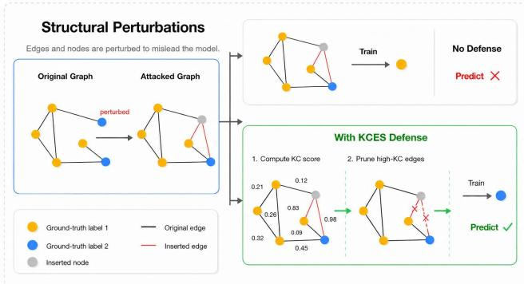
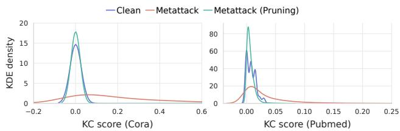
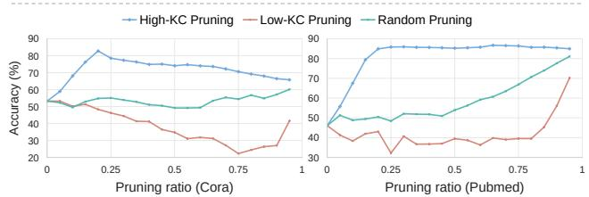
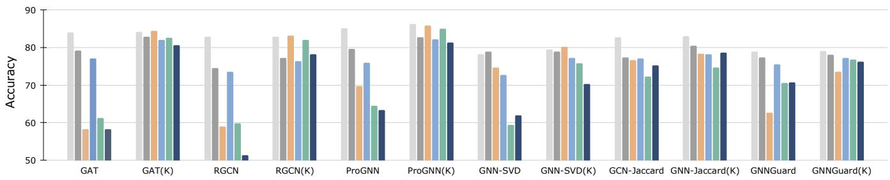

# Kernel-Complexity Edge Sanitization for Training-Free Defense against Structural Graph Atacks

Yaning Jia yaning.jia.gr@dartmouth.edu   
Department of Computer Science Dartmouth College   
Hanover, New Hampshire, USA   
Chiyu Ma   
chiyu.ma.gr@dartmouth.edu   
Department of Computer Science   
Dartmouth College   
Hanover, New Hampshire, USA Shenyang Deng   
shenyang.deng.gr@dartmouth.edu   
Department of Computer Science Dartmouth College   
Hanover, New Hampshire, USA Wenxuan Xu   
wenxuan.xu.gr@dartmouth.edu   
Department of Computer Science Dartmouth College   
Hanover, New Hampshire, USA Yaoqing Yang yaoqing.yang@dartmouth.edu   
Department of Computer Science Dartmouth College   
Hanover, New Hampshire, USA Soroush Vosoughi✉   
soroush.vosoughi@dartmouth.edu   
Department of Computer Science Dartmouth College   
Hanover, New Hampshire, USA

## Abstract

Graph Neural Networks (GNNs) have achieved remarkable success across diverse applications, yet they remain highly vulnerable to adversarial attacks that maliciously perturb graph structure. Ex- isting defenses often lack rigorous theoretical grounding, rely on attack-specific heuristics, or require costly retraining procedures such as adversarial training. To address these limitations, we pro-pose Kernel-Complexity Edge Sanitization (KCES), a training-free and model-agnostic framework for defending against structural attacks. KCES is built upon Graph Kernel Complexity (GKC), a principled metric derived from the graph Gram matrix that appears in a generalization upper bound on the GNN test error. From this bound, we define an edge-specific KC score that quantifies each edge’s structural influence via its induced change in GKC. KCES then identifies and prunes high-KC edges, which are empirically enriched with adversarial perturbations under structural attacks, to mitigate their harmful impact. Computationally eficient and scal able, KCES operates as a lightweight preprocessing step without retraining and can be seamlessly integrated with existing defenses. Extensive experiments demonstrate that KCES consistently outperforms representative robust baselines across diverse attack settings and scales efectively to large graphs. Supported by theoretical anal- ysis and extensive empirical validation, KCES provides a principled and eficient framework for securing GNNs. Our code is available at https://github.com/karpning/KCScore.

## CCS Concepts

• Information systems → Data mining; • Theory of compu tation → Theory and algorithms for application domains; • Computing methodologies → Artificial intelligence.

Graph Neural Networks, Graph Adversarial Defense, Kernel Com-plexity

ACM Reference Format:   
YaningJia, Shenyang Deng, Yaoqing Yang, Chiyu Ma, Wenxuan Xu, and Soroush Vosoughi. 2026. Kernel-Complexity Edge Sanitization for Training-Free De- fense against Structural Graph Attacks. In Proceedings of the 35th ACM International Conference on Information and Knowledge Management (CIKM ’26), November 07–11, 2026, Rome, Italy. ACM, New York, NY, USA, 12 pages. https://doi.org/10.1145/3799682.3841029

## 1 Introduction

Graph Neural Networks (GNNs) have achieved remarkable success in modeling graph-structured data across diverse domains, includ- ing social analysis [36, 18], recommendation [53, 19], and drug discovery [17, 51]. Despite their efectiveness, GNNs are highly vul-nerable to structural perturbations: even the addition or removal of a few edges can drastically degrade performance. Such attacks exploit the message-passing mechanism by injecting spurious connections or disrupting informative neighborhoods, thereby corrupting the aggregated information. Early studies, including Nettack and Metattack [57, 50], first revealed this weakness, and subsequent topology-only attacks further amplified the threat [7, 16, 49, 45]. As these attacks require no feature manipulation and operate under limited perturbation budgets, purely structural attacks represent a realistic and severe threat surface for deployed GNN systems.

To mitigate structural vulnerabilities, a variety of defense strate-gies have been proposed. Graph purification methods, such as GNN-Jaccard [47], GNN-SVD [14], and NoiseGNN [13], aim to remove suspicious edges to restore a cleaner topology. Adversarial training approaches, including RGCN [56], improve robustness by training on perturbed graphs. Architecture- or reconstruction-based defenses, such as ProGNN [24], AirGNN [30], and GPR-GAE [28], incorporate adaptive graph learning or joint structure refinement into the model design. Beyond these approaches, recent work has also explored theoretically grounded stability mechanisms based on Lipschitz analysis and regularization to control GNN output sensitivity under perturbations and biased inputs [23, 22, 21]. Despite promising empirical performance, existing defenses exhibit several limitations. Many defenses are motivated by local struc- tural heuristics, such as feature similarity, low-rank smoothness, or learned edge weights, but their pruning criteria are not explicitly tied to a eneralization objective. This makes it dificult to inter-pret why a removed edge should improve the expected behavior of downstream GNNs. Optimization-based methods often introduce substantial computational overhead, limiting their applicability to large-scale graphs, while training-based defenses can become spe- cialized to particular perturbation patterns such as Nettack [57]. These limitations highlight the need for a theoretically grounded, training-free approach that is both robust and scalable across di- verse architectures.

  
Figure 1: Defense Framework against Structural Perturbations with KCES. Adversarial attacks tend to increase the KC scores of perturbed edges; KCES enhances robustness by pruning edges with high KC scores.

Motivated by these limitations and inspired by advances in dataindependent generalization [4, 34], we propose Kernel-Complexity Edge Sanitization (KCES), a principled, training-free, and model-agnostic framework for defending against structural perturbations. KCES introduces Graph Kernel Complexity (GKC) (Section 2.3), a graph-induced complexity metric that appears in the test error bound of GNNs. Building on this formulation, we define the KC score (Section 4.2) ofan edge as the change in GKC induced by its re-moval. This score measures the magnitude of an edge’s influence on the GKC term in the generalization bound, yielding a generalization guided pruning signal beyond local similarity or reconstruction heuristics. Since KC scores depend only on the graph-feature pair and pseudo-labels, KCES requires no retraining or architectural modification and can be integrated with diverse GNN architectures. As illustrated in Figure 1 and validated experimentally (Section 5.2), structural attacks enrich harmful perturbations in the high-KC re- gion; by selectively pruning these high-KC edges, KCES improves GNN robustness in a scalable and training-free manner. Our contri butions are summarized as follows:

• A generalization-theoretic framework for structural defense. We introduce Graph Kernel Complexity (GKC), a graphinduced complexity measure that appears in a GNN generalization bound, and derive the KC score as a generalization-guided measure of each edge’s structural influence.

• A training-free edge sanitization mechanism. We propose Kernel-Complexity Edge Sanitization (KCES), a preprocessing strategy that removes high-KC edges empirically enriched with harmful perturbations under structural attacks, without adver- sarial training or iterative graph optimization.

• Plug-and-play and scalable design. KCES functions as a modelagnostic preprocessing module that can be seamlessly integrated with diverse GNN architectures and existing defense pipelines. Since KC scores depend only on the graph-feature pair and pseudolabels, KCES requires no retraining or architectural modification and remains eficient on large-scale graphs.

• Comprehensive empirical validation. Extensive experiments across multiple attacks and graph scales show that KCES consistently improves structural robustness over representative robust baselines.

## 2 Preliminaries

We denote $\mathbb { R } ^ { d }$ as the �-dimensional Euclidean space. The norm $\| \cdot \| _ { p }$ represents the vector �-norm and its induced operator norm for matrices, while $\| \cdot \| _ { F }$ denotes the Frobenius norm. The notation $\| \cdot \| _ { V _ { L } , p }$ refers to the �-operator norm restricted to a subspace $V _ { L } \subset \mathbb { R } ^ { d }$ . The shorthand $[ n ] = \{ 1 , 2 , \dots , n \}$ denotes the index set. For a distribution $\mathcal { D } , \mathbb { E } _ { X \sim \mathcal { D } } { [ \cdot ] }$ denotes expectation with respect to �. We represent a graph as $G = ( X , { \tilde { A } } , { \tilde { D } } , \mathbf { y } )$ , where $\boldsymbol { \chi } \in \mathbb { R } ^ { N \times \hat { \boldsymbol { F } } }$ is the node feature matrix, $\tilde { A } \in \mathbb { R } ^ { N \times N }$ is the adjacency matrix with self- loops, $\begin{array} { r } { \tilde { D } _ { i i } = \sum _ { j } \tilde { A } _ { i j } } \end{array}$ is the degree matrix, and $\mathbf { y } \in \mathcal { Y } ^ { N }$ denotes the label vector. The aggregated feature matrix is $Z = \tilde { D } ^ { - 1 / 2 } \tilde { A } \tilde { D } ^ { - 1 / 2 } X$ and its row-normalized version is denoted by $\tilde { X }$ in the Gram matrix. The training subgraph is denoted by $G _ { \mathrm { t r a i n } } .$ . The first-layer weight matrix is $\bar { W } \in \mathbb { R } ^ { \bar { F } \times m }$ with columns $\dot { W } _ { r } \in \mathbb { R } ^ { F }$ , and the second-layer weight vector is a $\in \mathbb { R } ^ { m }$ . For a matrix $K \in \mathbb { R } ^ { N \times N } , K _ { i j }$ denotes its (�, �)-th entry. A Gaussian distribution with mean $\mu$ and covariance Σ is written as $N ( \mu , \Sigma )$ .

## 2.1 Theoretical Setup for GNNs

We analyze a GNN as a kernel model on an undirected graph with � nodes. The adjacency matrix $\tilde { A } \in \{ 0 , 1 \} ^ { N \times N }$ is fixed, symmetric, and includes self-loops $( \tilde { A } _ { i i } = 1 )$ , with degree matrix $\begin{array} { r } { \tilde { D } _ { i i } = \sum _ { j } \tilde { A } _ { i j } } \end{array}$ The data distribution D� over $\mathbb { R } ^ { N \times F } \times \mathbb { R } ^ { N }$ generates node features and labels $G = ( X , { \tilde { A } } , { \tilde { D } } , \mathbf { y } )$ , where each feature-label pair $( X _ { i } , y _ { i } )$ ∈ $\mathbb { R } ^ { F } \times \mathbb { F }$ is drawn independently for analytical tractability. A subset of nodes and labels, denoted by $G _ { \mathrm { t r a i n } } ,$ is used for training. Let $Z = \tilde { D } ^ { - \frac { 1 } { 2 } } \tilde { A } \tilde { D } ^ { - \frac { 1 } { 2 } } ;$ � denote the aggregated feature matrix, and let $\tilde { X }$ denote its row-normalized version. The forward propagation for node � is

$$
f _ { \mathrm { G N N } } ( X _ { i } , \tilde { A } , \tilde { D } ) = \frac { 1 } { \sqrt { m } } \sum _ { r = 1 } ^ { m } a _ { r } \sigma \Bigl ( { \cal W } _ { r } ^ { \top } { \tilde { X } } _ { i } \Bigr ) .\tag{1}
$$

Here, � is the number of hidden units; $W \in \mathbb { R } ^ { F \times m }$ is the first-layer weight matrix with columns $W _ { r } \in \mathbb { R } ^ { F } ; \mathbf { a } = ( a _ { 1 } , \ldots , a _ { m } ) ^ { \intercal } \in \mathbb { R } ^ { m }$ is the second-layer weight vector; and $\sigma ( \cdot )$ denotes the activation function (e.g., ReLU).

For the GNN $f _ { \mathrm { G N N } } ( X _ { i } , \tilde { A } , \tilde { D } )$ , we define the training error (empirical risk) on $G _ { \mathrm { t r a i n } }$ as:

$$
L ( W ) = \frac { 1 } { 2 } \sum _ { i = 1 } ^ { N } \left( y _ { i } - f _ { \mathrm { G N N } } ( X _ { i } , \tilde { A } , \tilde { D } ) \right) ^ { 2 } ,\tag{2}
$$

Here, $X _ { i }$ and $y _ { i }$ are sampled from the training subset $G _ { \mathrm { t r a i n } }$ . The corresponding test error (expected risk) is defined as the expectation of the empirical risk over the data distribution $\mathcal { D } _ { G }$

$$
L _ { { \mathcal { D } } _ { G } } ( W ) = \mathbb { E } _ { ( X , \mathbf { y } ) \sim { \mathcal { D } } _ { G } } \left[ L ( W ) \right] .\tag{3}
$$

## 2.2 Graph Kernel Gram Matrix

We introduce the Graph Kernel Gram Matrix (hereafter, the Gram matrix), which characterizes pairwise node interactions induced by graph structure and node features. This construction builds upon classical kernel methods [48, 4, 42, 12], where Gram matrices serve as a central tool for relating model complexity to generalization performance. In our GNN setting, the graph aggregation operation is incorporated directly into the kernel. Specifically, for a graph $G = ( X , { \tilde { A } } , { \tilde { D } } , \mathbf { y } )$ , let $Z = \tilde { D } ^ { - \frac { 1 } { 2 } } \tilde { A } \tilde { D } ^ { - \frac { 1 } { 2 } } X \in \mathbb { R } ^ { N \times F }$ denote the aggregated feature matrix, and define the row-normalized features $\tilde { X } _ { i } = Z _ { i } / \lVert Z _ { i } \rVert _ { 2 }$ before kernel computation so that $\| \tilde { X } _ { i } \| _ { 2 } = 1$ for each node �. We then define the Gram matrix $H ^ { \infty } = [ H _ { i j } ^ { \infty } ] _ { i , j = 1 } ^ { N } \in \mathbb { R } ^ { N \times N }$ where each entry $H _ { i j } ^ { \infty }$ is given by:

$$
H _ { i j } ^ { \infty } = \frac { \tilde { X } _ { i } ^ { \top } \tilde { X } _ { j } \left( \pi - \operatorname { a r c c o s } \left( \tilde { X } _ { i } ^ { \top } \tilde { X } _ { j } \right) \right) } { 2 \pi } .\tag{4}
$$

Here, $\tilde { X } _ { i } \in \mathbb { R } ^ { 1 \times F }$ and $\tilde { X } _ { j } \in \mathbb { R } ^ { 1 \times F }$ denote the �-th and �-th rows of ${ \tilde { X } } ,$ , respectively. The resulting matrix $H ^ { \infty }$ induces a kernel feature space over graph nodes, which serves as the foundation for defining the Graph Kernel Complexity in the next section.

## 2.3 Graph Kernel Complexity

Based on the above Gram matrix, we define the Graph Kernel Complexity (GKC) to characterize the test error bound of GNNs, reflecting their generalization capacity. Formally, given the Gram matrix $\bar { H } ^ { \infty } \in \mathbb { R } ^ { \bar { N } \times N }$ and a bounded label vector $\mathbf { j } \in \mathbb { R } ^ { N }$ , the GKC is defined as

$$
\operatorname { G K C } ( H ^ { \infty } , \mathbf { y } ) = \frac { 2 \mathbf { y } ^ { \top } ( H ^ { \infty } ) ^ { - 1 } \mathbf { y } } { N } .\tag{5}
$$

In the theoretical analysis, y denotes the ground-truth label vector. In KCES, we replace y with the pseudo-label vector yˆ, obtained by mapping unsupervised clustering assignments to bounded numeri-cal codes.

## 3 GKC-based Generalization Analysis

This section employs the Gram matrix and GKC to establish gener-alization bounds for the GNN defined in Section 2.1. Theorems for training and test errors are presented informally for clarity, with formal statements and proofs in the Appendix B.

First, Theorem 3.1 characterizes the training error dynamics as follows:

Theorem 3.1 (Training error dynamics). Under Assumption B.1, after � gradient descent updates with step size �, the training error satisfies

$$
L ( W _ { t } ) = \left\| ( I - \eta H ^ { \infty } ) ^ { t } \mathbf { y } \right\| _ { 2 } ^ { 2 } + \varepsilon ,\tag{6}
$$

where $H ^ { \infty }$ denotes the Gram matrix, � is the hidden layer width, and $\varepsilon = \tilde { O } ( m ^ { - 1 / 2 } )$ represents an error term dependent on � and �. The formula shows that the training error decays exponentially with the number of gradient steps, with the rate of decay governed by the Gram matrix $H ^ { \infty }$ . This behavior underlies the generalization bound stated in Theorem 3.2. A formal version of the result is provided in Appendix B.5 (Theorem B.4).

Building on the training error analysis, Theorem 3.2 establishes a generalization bound in terms of GKC.

Theorem 3.2 (Test error bound). Under Assumption B.1, for suficiently large hidden layer width � and iteration count �, the following holds with probability at least 1 − �:

$$
L _ { \mathcal { D } _ { G } } ( W _ { t } ) \ \leq \ \sqrt { \mathrm { G K C } ( H ^ { \infty } , \mathbf { y } ) } \ + \ O \left( \sqrt { \frac { \log \frac { N } { \lambda _ { 0 } \delta } } { N } } \right) ,\tag{7}
$$

Here, $\mathrm { G K C } ( H ^ { \infty } , \mathbf { y } )$ denotes the theoretical Graph Kernel Complex- ity computed with the ground-truth label vector y (Section 2.3), $\delta \in ( 0 , 1 )$ is the confidence level, � is the number of nodes, and �0 is a lower bound on $\lambda _ { \operatorname* { m i n } } ( H ^ { \infty } )$ under Assumption B.1 (Appendix B.2). The generalization bound on the GNN test error is primarily influenced by the data-dependent GKC term. A smaller GKC leads to a tighter bound, indicating improved generalization under standard GNN training regimes. The formal statement and proof are presented in Appendix B.6 (Theorem B.5).

## 4 Kernel-Complexity Edge Sanitization for Structural Robustness

Motivated by the connection between GKC and GNN test error, we propose Kernel-Complexity Edge Sanitization (KCES), a training-free and model-agnostic framework that evaluates the structural influence of graph edges and prunes high-KC edges em- pirically enriched with harmful perturbations under structural at- tacks. This framework comprises three key components: (i) Pseudo-Label Generation, (ii) Edge KC Score Estimation, and (iii) Kernel-Complexity Edge Sanitization.

## 4.1 Pseudo-Label Generation

To preserve the training-free and unsupervised nature of KCES, the label vector required by the GKC metric (Eq. 5) is generated via K-Means [31], applied to the row-normalized aggregated node representations:

$$
\hat { \mathbf { y } } = \mathrm { K } { \cdot } \mathrm { M e a n s } \big ( \tilde { X } , k \big ) .\tag{8}
$$

Here, � is set to the number of classes, and $\tilde { X }$ denotes the row- normalized aggregated features defined in Section 2.2. The clus- tering assignments are mapped to bounded numerical codes be- fore computing GKC. Rather than approximating ground-truth semantics, these pseudo-labels are intended to capture structural smoothness over the kernel-induced geometry, enabling KCES to identify edges that violate local smoothness, such as adversarial inter-community connections.

## 4.2 Edge KC Score Estimation

With pseudo-labels providing the basis for GKC computation, we quantify the structural contribution of each edge via the KC score. For an edge $e _ { i j }$ connecting nodes � and �, we define

$$
K C ( i , j ) = \left| \operatorname { G K C } ( H ^ { \infty } , \hat { \mathbf { y } } ) - \operatorname { G K C } \Big ( H _ { - ( i , j ) } ^ { \infty } , \hat { \mathbf { y } } \Big ) \right| ,\tag{9}
$$

where $H ^ { \infty }$ is the Gram matrix of the original graph, $H _ { - ( i , j ) } ^ { \infty }$ is the Gram matrix of the modified graph $G _ { - ( i , j ) }$ obtained by removing edge $\begin{array} { r } { e _ { i j } , } \end{array}$ , and yˆ denotes the bounded pseudo-label vector generated in Section 4.1. The KC score, $K C ( i , j ) ,$ , quantifies the magnitude of the change in pseudo-label-based GKC caused by removing edge $e _ { i j } .$ . Since it is defined as an absolute diference, KC is direction-agnostic: a large value indicates strong structural influence on the graph-induced kernel complexity.

Corollary 4.1 (Edge-specific test error bound). Let $G _ { - ( i , j ) }$ be the graph obtained by deleting edge $e _ { i j }$ , and let $W _ { t }$ denote the GNN parameters after � gradient descent updates on the modified graph. Under the assumptions of Theorem 3.2, and for suficiently large hidden width � and iteration count �, the following holds with probability at least 1 − �:

$$
L _ { { \mathcal { D } } _ { G _ { - ( i , j ) } } } \left( W _ { t } \right) \le \sqrt { \mathrm { G K C } ( H ^ { \infty } , \mathbf { y } ) } + \sqrt { K C ( i , j ) } + \epsilon _ { N } ,\tag{10}
$$

where $\epsilon _ { N } = O \left( \sqrt { \frac { \log ( N / \lambda _ { 0 } \delta ) } { N } } \right)$ . Here, � denotes the number of nodes, $\lambda _ { 0 }$ is a lower bound on $\lambda _ { \operatorname* { m i n } } ( H ^ { \infty } )$ (Assumption B.1), $K C ( i , j )$ denotes the edge KC score computed with the ground-truth label vector y in this theoretical bound, and $\mathcal { D } _ { G _ { - ( i , j ) } }$ is the data distribution induced by removing edge $e _ { i j }$ from graphs sampled from $\mathcal { D } _ { G }$ . The detailed proof is provided in Appendix B.7.

Interpretation. Corollary 4.1 connects the KC score of an edge $e _ { i j }$ to the expected test error of the modified graph $G _ { - ( i , j ) }$ , thereby quantifying its structural influence. Edges with large KC values have strong influence on graph-induced kernel complexity. While KC itself does not encode the signed direction of this influence, structural attacks tend to introduce high-influence edges that dis- rupt local smoothness. This behavior is empirically examined in Section 5.2. Although the corollary uses the ground-truth-label ver- sion of $K C ( i , j )$ , practical KCES computes the pseudo-label-based score in $\operatorname { E q . 9 }$ as a surrogate ranking signal. We do not require semantic equivalence; instead, pseudo-labels capture structural partitions of the graph. Since adversarial perturbations primarily violate structural smoothness, pseudo-label-based KC scores can provide a practical ranking signal for edge pruning.

## 4.3 Kernel-Complexity Edge Sanitization

Building on estimated KC scores, KCES sanitizes attacked graphs by removing high-influence edges. Although KC scores are direction agnostic, structural attacks tend to introduce high-KC perturbations that disrupt local smoothness, as empirically validated in Section 5.2. The specific KCES procedure is described in Algorithm 1.

Applicability ofKCES.. Although our theoretical framework is derived from the analysis of a specific GNN hypothesis space, the resulting KCES framework is broadly applicable across diverse GNN architectures. This versatility stems from its core metric, GKC, which is fundamentally model-agnostic in its computation. This principle is best understood through an analogy with the data co- variance matrix; while formally linked to linear models, properties of the covariance matrix like its trace and rank [5] serve as universal tools for diagnosing data complexity even in deep learning models [37]. Similarly, GKC functions as a specialized diagnostic tool for the graph learning domain. By embedding the graph aggregation mechanism directly into its kernel, GKC provides a diagnostic measure of graph-induced kernel geometry, rather than a purely topological quantity, while remaining independent of any specific GNN parameters. This allows KCES to function as a versa- tile, plug-and-play defense module capable of enhancing the struc- tural robustness of a wide variety of GNNs, not just those with simple convolutional structures. Our experiments in Section 5.3 empirically confirm the broad applicability of KCES, demonstrating strong robustness across diverse GNN architectures such as GAT, RGCN, AirGNN, and ProGNN.

Algorithm 1 KCES: Kernel-Complexity Edge Sanitization   
Input: Graph $G = ( V , E ) ;$ row-normalized features ${ \tilde { X } } ;$ pruning   
ratio $\alpha \in [ 0 , 1 ]$   
Output: Sanitized graph $G ^ { \prime } = \left( V , E ^ { \prime } \right)$   
1: $\hat { \mathbf { y } } \gets \mathrm { K M e a n s } \big ( \tilde { X } , k \big )$ // Pseudo labels   
2: $H ^ { \infty } \gets \mathrm { G K G M } ( \tilde { X } )$ // Kernel Gram matrix   
3: $\mathrm { G K C _ { 0 } } \gets \mathrm { C o m p u t e G K C } ( H ^ { \infty } , \hat { \mathbf { y } } )$ // Baseline complexity   
4: for each edge $e _ { i j } \in E$ do   
5: $G _ { - ( i , j ) }  G \backslash \{ e _ { i j } \}$ // Remove edge   
6: $H _ { - ( i , j ) } ^ { \infty } \gets \mathrm { G K G M } ( G _ { - ( i , j ) } , \tilde { X } )$ // Recompute kernel   
7: $\mathrm { K C } [ e _ { i j } ] \gets \big | \mathrm { G K C } _ { 0 } - \mathrm { C o m p u t e G K C } ( H _ { - ( i , j ) } ^ { \infty } , \hat { \mathbf { y } } ) \big |$ // Compute KC   
8: end for   
9: $( e _ { ( 1 ) } , e _ { ( 2 ) } , \ldots , e _ { ( | E | ) } ) \gets \mathrm { S o r t } ( \mathrm { K C } ,$ descending) // Sort edges by KC   
10: $k \gets \lceil \alpha \vert E \vert \rceil$ // Pruning size   
11: $E ^ { \prime } \gets E \setminus \{ e _ { ( 1 ) } , . . . , e _ { ( k ) } \}$ // Remove top-� edges   
12: Return $G ^ { \prime } = \left( V , E ^ { \prime } \right)$

Computational Complexity ofKCES.. In the worst case, KCES recomputes the graph kernel Gram matrix and its inverse for each candidate edge, leading to time complexity $O ( R E ( N ^ { 2 } F + M ^ { 2 } F + M ^ { 3 } ) )$ and space complexity $O ( N ^ { 2 } + N F + M ^ { 2 } )$ , where $N , E , F , M ,$ , and � de- note the number of nodes, edges, feature dimension, sampled node budget up to a constant class factor, and Monte Carlo repetitions, respectively. This worst-case bound is pessimistic. In practice, KCES uses sparse graph operations, local ℎ-hop subgraphs of size $L \ll N ,$ and incremental inverse u dates, reducing the ractical time and space complexities to $O \big ( R ( E F + E ( L ^ { 2 } F + L ^ { 2 } ) ) \big )$  and $O ( E + N F + L ^ { 2 } )$ respectively. Edge-wise KC score computations are independent and can be parallelized across GPUs or CPUs to further reduce wall-clock time. When � is fixed or reduced by preprocessing, the practical time complexity simplifies to $O \left( R ( E F + E L ^ { 2 } ) \right)$ . As KCES is applied as a one-time preprocessing step, its cost is amortized over subsequent training. The empirical evaluation is reported in Table 3, with detailed complexity analysis provided in the supplementary material (Section 3).

## 5 Experiments

This section evaluates KCES from four aspects: the mechanism of KC scores under structural attacks, robustness against repre- sentative baselines, scalability and computational eficiency, and sensitivity to pseudo-label generation.

## 5.1 Overall Setup

Datasets. We evaluate the robustness and scalability of KCES on benchmark datasets spanning diferent graph scales: (1) Smallscale graphs: Cora [39], Citeseer [39], and Polblogs [1]; (2) Mediumscale graphs: Pubmed [52]; (3) Large-scale graphs: Flickr [29]; and (4) Massive-scale graphs: Ogbn-Arxiv [20]. Detailed dataset statistics, train/validation/test splits, and a detailed complexity anal-ysis of KCES are provided in the supplementary material available at https://github.com/karpning/KCScore/blob/main/supplementar y\_material.pdf.

Structural Attack Strategies. To rigorously assess the structural robustness conferred by KCES, we evaluate against a suite of adversarial attacks that maliciously perturb the graph topology prior to model training. We employ representative methods spanning three categories: (i) Non-targeted attacks, which aim to degrade overall model performance by modifying the global graph structure, including Metattack [58], MINMAX [49], and DICE [46]; (ii) Tar geted attacks, which focus on misleading predictions for specific victim nodes, adopting the widely-used Nettack [57]; and (iii) Random attacks, which simulate structural noise via random edge injections and deletions. Furthermore, for the massive-scale evaluation on Ogbn-Arxiv, we explicitly employ PRBCD [16], a scalable projected gradient-based attack to evaluate robustness on largescale graphs (e.g., Ogbn-Arxiv), where traditional attacks become computationally prohibitive.

Defense Baselines. We compare KCES with a diverse set of baselines grouped into four categories. (i) Vanilla GNNs: Graph Convolutional Networks (GCN) [25] and Graph Attention Networks (GAT) [43], which serve as standard architectures to quantify performance degradation under attacks. (ii) Robust-by-design models: Robust GCN (RGCN) [56], AirGNN (AirG) [30], NoiseGNN (NoiseG) [13], and GNNGuard (G-Guard) [54], which incorporate defense mechanisms directly into the model architecture. (iii) Graph purification methods: GNN-Jaccard (G-Jac) [47] and GNN-SVD (G-SVD) [14], which pre-process the graph structure to mitigate adversarial perturbations. (iv) Graph optimization-based defenses: ProGNN (Pro-G) [24] and GPR-GAE (GPR) [28], which jointly refine or reconstruct the graph structure during the model training process.

Supplementary Material. We provide a supplementary PDF to support reproducibility and completeness. It includes dataset statistics and splits (Section 2), detailed KCES complexity analysis (Section 3), and extended experimental analyses (Section 4). In particular, Section 4.2 reports additional structural-attack results under PRBCD and LRBCD [16]; Section 4.4 provides feature-perturbation evaluations that clarify the scope of KCES; Section 4.5 reports runtime and memory analyses for KC score computation across graph scales; and Section 4.6 studies pruning-ratio ablations. The supplementary PDF is available at https://github.com/karpning/KCScore/ blob/main/supplementary\_material.pdf.

## 5.2 Mechanism of KC Scores under Structural Graph Attacks

This section examines whether KC scores capture harmful structural perturbations, as suggested by Corollary 4.1. Since KC scores measure the magnitude of an edge’s influence on GKC rather than the signed direction of this influence, high-KC edges are not neces-sarily harmful in clean graphs. However, under structural attacks, adversarial perturbations tend to create high-influence edges that disrupt kernel-label alignment. We therefore study whether struc- tural attacks shift KC scores toward larger values and whether removing high-KC edges restores robustness. We conduct two complementary studies on Cora and Pubmed: first, we compare KC-score distributions on clean graphs, Metattack-perturbed graphs, and graphs after high-KC edge pruning; second, we evaluate whether KC scores provide an efective pruning signal by comparing High-KC Pruning, Low-KC Pruning, and Random Pruning on attacked graphs. The first removes edges with the largest KC scores, the second removes edges with the smallest KC scores, and the third serves as a baseline. We vary the pruning ratio from 0.00 to 0.95 in increments of 0.05. Results on clean graphs are provided in the supplementary material (Section 4.7).

  
(a) KC Score Distributions under Metattack

  
(b) Pruning Strategies under Metattack  
Figure 2: Mechanism of KC scores under structural attacks. (a) KC-score distributions on clean, Metatack-perturbed, and KCES-pruned graphs. (b) Test accuracy under diferent pruning strategies on Metatack-perturbed graphs.

Figure 2(a) shows that Metattack shifts KC scores toward larger values, creating a heavier high-KC tail. After high-KC pruning, the distribution moves closer to that of the clean graph, suggesting that harmful perturbations are enriched in the high-KC region under attack. This supports the link between KC scores and generalization degradation in Corollary 4.1. Figure 2(b) further shows that High-KC Pruning consistently improves or preserves accuracy, whereas Low-KC Pruning substantially degrades performance and Random Pruning lies in between. Overall, the pruning efectiveness follows High-KC > Random > Low-KC, indicating that high-KC pruning efectively mitigates harmful structural perturbations in attacked graphs.

Table 1: Defense performance (Accuracy ± Std) under structural attacks. Non-targeted and random attacks use a perturbation budget of 25%, allowing modifications to up to 25% of edges. Netack targets nodes with degree greater than 10 and perturbs their incident edges. Bold indicates the best performance, and “–” denotes inapplicable settings.
<table><tr><td rowspan="2">Dataset</td><td rowspan="2">Attack</td><td rowspan="2">GCN</td><td rowspan="2">GAT</td><td rowspan="2">RGCN</td><td rowspan="2">Pro-G</td><td rowspan="2">G-SVD</td><td rowspan="2">G-Jac</td><td rowspan="2">G-Guard</td><td rowspan="2">AirG</td><td rowspan="2">NoiseG</td><td rowspan="2">GPR</td><td rowspan="2">KCES (Ours)</td></tr><tr><td></td></tr><tr><td rowspan="6">Polblogs (small)</td><td>Clean Random</td><td>95.71 ± 0.79 81.29 ± 0.61</td><td>95.40 ± 0.41</td><td>95.29 ± 0.52</td><td>95.60 ± 0.46</td><td>94.68 ± 0.88</td><td></td><td></td><td></td><td>95.90 ± 0.98 83.82 ± 0.88</td><td>94.74 ± 0.40 88.45 ± 0.63</td><td>96.01 ± 0.18 89.46 ± 0.77</td></tr><tr><td></td><td>92.59 ± 0.73</td><td>85.01 ± 0.02</td><td>82.23 ± 0.76</td><td>86.50 ± 0.12 95.20 ± 0.59</td><td>88.34 ± 0.83 95.37 ± 0.57</td><td></td><td></td><td></td><td>94.33 ± 0.25</td><td>92.96 ± 0.06</td><td>96.48 ± 0.82</td></tr><tr><td>Nettack</td><td>71.47 ± 0.98</td><td>85.79 ± 0.23 77.10 ± 0.87</td><td>93.15 ± 0.70 71.16 ± 0.36</td><td>74.74 ± 0.18</td><td>76.48 ± 0.73</td><td></td><td></td><td></td><td>73.78 ± 0.35</td><td>76.48 ± 0.39</td><td>93.04 ± 0.06</td></tr><tr><td>DICE</td><td></td><td></td><td></td><td></td><td></td><td></td><td></td><td></td><td></td><td></td><td></td></tr><tr><td>MINMAX Metattack</td><td>70.14 ± 0.54</td><td>68.04± 0.89</td><td>82.10 ± 0.42</td><td>60.73 ± 0.37</td><td>62.47 ± 0.72</td><td></td><td></td><td></td><td>62.99 ± 0.70</td><td>59.71 ± 0.87</td><td>94.17 ± 0.47</td></tr><tr><td></td><td>63.09 ± 0.12</td><td>63.60 ± 0.20</td><td>62.67 ± 0.13</td><td>65.23 ± 0.24</td><td>81.28 ± 0.58</td><td>1</td><td></td><td></td><td>62.58 ± 0.91</td><td>61.61 ± 0.31</td><td>82.72 ± 0.32</td></tr><tr><td rowspan="6">Cora (small)</td><td>Clean Random</td><td>83.65 ± 0.57</td><td>83.90 ± 0.15</td><td>82.89 ± 0.99</td><td>85.16 ± 0.77</td><td>78.16 ± 0.07</td><td>82.69 ± 0.74</td><td>78.87 ± 0.77</td><td>80.14 ± 0.84</td><td>82.39 ± 0.42</td><td>84.46 ± 0.28</td><td>84.04 ± 0.42</td></tr><tr><td>Nettack</td><td>77.57 ± 0.38 57.83 ± 0.78</td><td>79.23 ± 0.75</td><td>74.55 ± 0.13</td><td>79.58 ± 0.32</td><td>78.87 ± 0.36</td><td>77.36 ± 0.93</td><td>77.11 ± 0.57</td><td>65.83 ± 0.18</td><td>75.50 ± 0.51</td><td>79.03 ± 0.14</td><td>79.67 ± 0.69</td></tr><tr><td></td><td></td><td>58.23 ± 0.08</td><td>59.04 ± 0.51</td><td>69.67 ± 0.68</td><td>74.70 ± 1.21</td><td>76.69 ± 0.64</td><td>62.65 ± 0.03</td><td>67.47 ± 0.72</td><td>60.42 ± 0.04</td><td>58.01 ± 0.75</td><td>82.24 ± 0.43</td></tr><tr><td>DICE MINMAX</td><td>76.16 ± 0.69 60.66 ± 0.23</td><td>77.06 ± 0.31</td><td>73.59 ± 0.91</td><td>75.95 ± 0.40</td><td>72.68 ± 0.72</td><td>77.11 ± 0.22</td><td>75.50 ± 0.26</td><td>72.24 ± 0.73</td><td>73.59 ± 0.23</td><td>77.76 ± 0.19</td><td>82.59 ± 0.09</td></tr><tr><td>Metattack</td><td>53.12 ± 0.83</td><td>61.26 ± 0.73 58.35 ± 0.22</td><td>59.80 ± 0.75 51.35 ± 0.72</td><td>64.73 ± 0.23</td><td>59.45 ± 0.10 61.92 ± 0.28</td><td>72.23 ± 0.69 75.28 ± 0.19</td><td>70.57 ± 0.95</td><td>64.73 ± 0.86</td><td>61.82 ± 0.93</td><td>62.42 ± 0.55</td><td>78.42 ± 0.47</td></tr><tr><td></td><td></td><td></td><td></td><td>63.37 ± 0.16</td><td></td><td></td><td>70.77 ± 0.97</td><td>63.83 ± 0.92</td><td>55.18 ± 0.79</td><td>56.24 ± 0.53</td><td>82.99 ± 0.08</td></tr><tr><td rowspan="6">Citeseer (small) Pubmed</td><td>Clean Random</td><td>72.51 ± 0.61</td><td>72.69 ± 0.55</td><td>71.97 ± 0.60</td><td>71.74 ± 0.59</td><td>69.60 ± 0.56</td><td>72.98 ± 0.06</td><td>71.03 ± 0.19</td><td>72.23 ± 0.39</td><td>71.33 ± 0.58</td><td>72.16 ± 0.46</td><td>73.02 ± 0.93</td></tr><tr><td>Nettack</td><td>70.38 ± 0.83</td><td>69.31 ± 0.95</td><td>67.06 ± 0.26</td><td>72.36 ± 0.19</td><td>67.59 ± 0.15</td><td>71.21 ± 0.03</td><td>72.73 ± 0.60</td><td>65.28 ± 0.70</td><td>69.43 ± 0.97</td><td>68.96 ± 0.01</td><td>72.81 ± 0.62</td></tr><tr><td></td><td>52.38 ± 0.94</td><td>59.19 ± 0.46</td><td>49.21 ± 0.97</td><td>72.23 ± 1.04</td><td>74.60 ± 0.51</td><td>72.14 ± 0.69</td><td>72.95 ± 0.58</td><td>77.78 ± 0.77</td><td>63.49 ± 0.71</td><td>50.03 ± 0.62</td><td>76.14 ± 0.60</td></tr><tr><td>DICE</td><td>67.71 ± 0.72</td><td>66.60 ± 0.43</td><td>66.17 ± 0.85</td><td>72.15 ± 0.61</td><td>67.35 ± 0.03</td><td>71.14 ± 0.19</td><td>69.01 ± 0.34</td><td>67.20 ± 0.48</td><td>67.24 ± 0.93</td><td>67.54 ± 0.89</td><td>72.45± 0.84</td></tr><tr><td>MINMAX Metattack</td><td>66.29 ± 0.45</td><td>67.54 ± 0.43</td><td>61.02 ± 0.44</td><td>69.90 ± 0.80</td><td>64.57 ± 0.86</td><td>71.20 ± 0.02</td><td>68.60 ± 0.86</td><td>66.28 ± 0.32</td><td>70.08 ± 0.22</td><td>68.48 ± 0.49</td><td>72.80 ± 0.36</td></tr><tr><td></td><td>57.64 ± 0.59</td><td>61.20 ± 0.66</td><td>56.81 ± 0.75</td><td>66.33 ± 0.46</td><td>66.29 ± 0.39</td><td>70.14 ± 0.53</td><td>64.75 ± 0.60</td><td>65.23 ± 0.34</td><td>59.94 ± 0.94</td><td>59.48 ± 0.43</td><td>71.86 ± 0.87</td></tr><tr><td rowspan="6">(medium)</td><td>Clean</td><td>85.72 ± 0.05</td><td>84.89 ± 0.84</td><td>84.72 ± 0.06</td><td>85.19 ± 0.43</td><td>84.53 ± 0.86</td><td>86.19 ± 0.97</td><td>84.49 ± 0.79</td><td>84.85 ± 0.40</td><td>85.11 ± 0.45</td><td>85.07 ± 0.88</td><td>86.17 ± 0.52</td></tr><tr><td>Random</td><td>84.11 ± 0.28</td><td>81.02 ± 0.72</td><td>83.75 ± 0.10</td><td>84.28 ± 0.41</td><td>82.61 ± 0.63</td><td>84.27 ± 0.64</td><td>83.87 ± 0.03</td><td>83.09 ± 0.69</td><td>83.50 ± 0.52</td><td>83.02 ± 0.59</td><td>85.83 ± 0.82</td></tr><tr><td>Nettack</td><td>66.67 ± 0.36</td><td>76.73 ± 0.88</td><td>72.58 ± 0.09</td><td>72.60 ± 0.14</td><td>80.10 ± 0.45</td><td>85.48 ± 0.12</td><td>83.33 ± 0.65</td><td>85.48 ± 0.96</td><td>65.44 ± 0.64</td><td>67.37 ± 0.30</td><td>86.24 ± 0.09</td></tr><tr><td>DICE</td><td>81.68 ± 0.46</td><td>76.93 ± 0.19</td><td>81.44 ± 0.56</td><td>80.73 ± 0.30</td><td>80.39 ± 0.12</td><td>82.93 ± 0.70</td><td>82.28 ± 0.70</td><td>83.09 ± 0.27</td><td>81.42 ± 0.08</td><td>78.86 ± 0.16</td><td>85.74 ± 0.39</td></tr><tr><td>MINMAX</td><td>55.67 ± 0.46</td><td>60.01 ± 0.97</td><td>54.64 ± 0.24</td><td>69.29 ± 0.37</td><td>80.50 ± 0.06</td><td>84.51 ± 0.83</td><td>81.69 ± 0.57</td><td>84.02 ± 0.13</td><td>57.51 ± 0.81</td><td>56.32 ± 0.68</td><td>85.64 ± 0.97</td></tr><tr><td>Metattack</td><td>46.08 ± 0.39</td><td>49.72 ± 0.37</td><td>45.99 ± 0.92</td><td>72.08 ± 0.51</td><td>82.75 ± 0.25</td><td>84.22 ± 0.39</td><td>83.37 ± 0.89</td><td>84.83 ± 0.20</td><td>47.17 ± 0.29</td><td>48.32 ± 0.66</td><td>86.45 ± 0.45</td></tr><tr><td rowspan="6">Flickr (large)</td><td>Clean</td><td>56.24 ± 0.81</td><td>47.83 ± 0.25</td><td>39.62 ± 0.73</td><td>54.68 ± 0.68</td><td>60.46 ± 0.55</td><td>74.04 ± 0.38</td><td>74.31 ± 0.74</td><td>75.56 ± 0.10</td><td>60.91 ± 0.74</td><td>62.62 ± 0.15</td><td>76.25 ± 0.93</td></tr><tr><td>Random</td><td>62.82 ± 0.62</td><td>60.80 ± 0.42</td><td>62.44 ± 0.16</td><td>65.43 ± 0.90</td><td>76.54 ± 0.41</td><td>74.83 ± 0.96</td><td>74.85 ± 0.55</td><td>76.02 ± 0.44</td><td>69.13 ± 0.21</td><td>50.03 ± 0.50</td><td>76.74 ± 0.65</td></tr><tr><td>Nettack</td><td>38.82 ± 0.55</td><td>43.12 ± 0.39</td><td>59.87 ± 0.36</td><td>70.31 ± 0.74</td><td>58.70 ± 0.45</td><td>72.58 ± 0.48</td><td>74.51 ± 0.33</td><td>75.63 ± 0.03</td><td>49.67 ± 0.80</td><td>39.82 ± 0.95</td><td>73.47 ± 0.97</td></tr><tr><td>DICE</td><td>51.71 ± 0.32</td><td>48.11 ± 0.11</td><td>47.34 ± 0.39</td><td>71.23 ± 0.17</td><td>73.38 ± 0.93</td><td>73.35 ± 0.02</td><td>73.59 ± 0.24</td><td>73.08 ± 0.83</td><td>51.52 ± 0.57</td><td>52.09 ± 0.90</td><td>73.69 ± 0.67</td></tr><tr><td>MINMAX</td><td>14.57 ± 0.97</td><td>11.71 ± 0.26</td><td>27.13 ± 0.02</td><td>19.68 ± 0.58</td><td>39.17 ± 0.78</td><td>74.82 ± 0.33</td><td>75.04 ± 0.08</td><td>75.45 ± 0.65</td><td>28.27 ± 0.12</td><td>9.80 ± 0.67</td><td>76.86 ± 0.90</td></tr><tr><td>Metattack</td><td>36.93 ± 0.86</td><td>37.29 ± 0.06</td><td>31.72 ± 0.21</td><td>65.05 ± 0.82</td><td>59.08 ± 0.36</td><td>74.85 ± 0.95</td><td>75.05 ± 0.75</td><td>75.90 ± 0.05</td><td>49.67 ± 0.38</td><td>30.92 ± 0.07</td><td>76.63 ± 0.82</td></tr></table>

## 5.3 Defense against structural attacks

We evaluate KCES against various defenses following the protocol in Section 5.1. Unless otherwise specified, KCES is applied to a GCN backbone, with the pruning ratio � tuned via grid search over [0.1, 0.9] on the validation set, and the best-performing configuration is reported. Detailed attack configurations are summarized in Table 1. All results are reported as percentages, and “–” indicates that a method is not applicable under the corresponding attack setting.

Table 1 shows that KCES consistently outperforms all baselines, achieving state-of-the-art performance under most adversarial set tings. Notably, under structural attacks, KCES often restores performance close to—or even exceeding—that on the clean graph, indicating that its edge sanitization efectively counteracts adversarial perturbations without compromising predictive accuracy. A particularly striking result appears on Flickr, where KCES attains higher accuracy than on the original clean topology. This observation suggests that large-scale real-world graphs may contain noisy or redundant edges, consistent with prior findings [9, 10]. By identifying and pruning such detrimental connections, KCES efectively serves as a structural regularizer, simultaneously improving adversarial robustness and clean generalization.

## 5.4 Scalability and Eficiency Analysis

While Section 4.3 provides a theoretical complexity analysis, it is crucial to verify the practical scalability of KCES on massivescale graphs. In this section, we conduct a rigorous evaluation to demonstrate that KCES is computationally eficient and not limited to small benchmarks. For the scalability test on the massive Ogbn-Arxiv dataset (over 1M edges), we employ PRBCD [16], a scalable gradient-based attack, with a perturbation budget (���) of 0.10, as traditional methods (e.g., Metattack) are computationally infeasible at this scale.

To ensure a comprehensive comparison, we evaluate KCES from two aspects: (1) Robustness at Scale: We report defense performance on Ogbn-Arxiv under PRBCD in Table 2. (2) Computational Overhead: We profile time and memory usage on the medium-scale Pubmed dataset under Metattack (��� = 0.10) (Table 3). For a fair comparison across methods that operate at diferent stages, we report the total wall-clock time as the sum of method- specific graph preprocessing time and 200 training epochs. Thus, for preprocessing-based methods such as G-SVD, G-Jac, GPR, and KCES, the reported time includes their preprocessing overhead before training, whereas methods without an explicit preprocessing stage have zero additional preprocessing cost. This unified mea-surement reflects the practical cost of using each defense pipeline. We use Pubmed for this profiling because it allows us to include heavy optimization-based baselines such as ProGNN, which may encounter Out-Of-Memory (OOM) failures on larger graphs. For completeness, the standalone optimized KC-score preprocessing time of KCES across diferent graph scales is reported in the sup- plementary material (Section 4.5).

Table 2: Performance (%) on Ogbn-Arxiv under clean setting and PRBCD attack.
<table><tr><td>Metric</td><td>GCN</td><td>GAT</td><td>RGCN</td><td>Pro-G</td><td>G-SVD</td><td>G-Jac</td><td>G-Guard</td><td>AirG</td><td>NoiseG</td><td>GPR</td><td>KCES</td></tr><tr><td>Clean</td><td>67.51</td><td>66.54</td><td>68.05</td><td>00M</td><td>58.62</td><td>67.42</td><td>66.45</td><td>66.96</td><td>68.92</td><td>68.16</td><td>69.32</td></tr><tr><td>PRBCD</td><td>40.66</td><td>42.53</td><td>47.27</td><td>OOM</td><td>53.94</td><td>38.76</td><td>45.24</td><td>40.96</td><td>37.24</td><td>42.13</td><td>58.62</td></tr></table>

Table 3: Time and space complexity comparison on Pubmed under Metatack. Total runtime is measured over 200 training epochs.
<table><tr><td>Metric</td><td>GCN</td><td>GAT</td><td>RGCN</td><td>Pro-G</td><td>G-SVD</td><td>G-Jac</td><td>G-Gd</td><td>AirG</td><td>NoiseG</td><td>GPR</td><td>KCES</td></tr><tr><td>Space (MB)</td><td>1,484</td><td>5,645</td><td>8,950</td><td>17,518</td><td>6,266</td><td>1,490</td><td>9,689</td><td>3,304</td><td>1,728</td><td>3,456</td><td>1,539</td></tr><tr><td>Time (s)</td><td>2.30</td><td>6.51</td><td>9.56</td><td>7,340.23</td><td>6.55</td><td>3.46</td><td>415.23</td><td>2.44</td><td>2.68</td><td>24.56</td><td>6.40</td></tr></table>

The results provide strong evidence of KCES’s scalability and eficiency. On Ogbn-Arxiv (Table 2), optimization-based defenses such as ProGNN fail to execute due to memory constraints (OOM), whereas KCES scales successfully and achieves state-of-the-art robustness (58.62%), outperforming scalable heuristics such as GNN-SVD and GNN-Jaccard. As shown in Table 3, KCES incurs only minimal computational overhead and remains memory-eficient, in sharp contrast to iterative optimization methods that require orders of magnitude more time and memory (e.g., ProGNN takes over 7,000s). These results demonstrate that KCES enables large-scale structural defense without the heavy computational burden typical of optimization-based approaches.

## 5.5 Sensitivity Analysis of Pseudo-Label Generation

We study the sensitivity of KCES to pseudo-label generation by varying both the number of clusters and the clustering algorithm. Experiments are conducted on Cora and Citeseer under Metattack with a perturbation budget of 0.25. The cluster number � ranges from 2 to 30. In addition, fixing $K = 6 ,$ we compare three clustering methods: Spectral Clustering [44], Gaussian Mixture Models (GMM) [6], and K-Means [31].

Table 4: Impact of the number of clusters � on KCES.
<table><tr><td>Dataset</td><td>2</td><td>5</td><td>10</td><td>15</td><td>20</td><td>30</td></tr><tr><td>Cora</td><td>80.31</td><td>81.25</td><td>80.92</td><td>80.25</td><td>80.51</td><td>79.86</td></tr><tr><td>Citeseer</td><td>71.50</td><td>71.20</td><td>71.03</td><td>70.84</td><td>71.29</td><td>70.97</td></tr></table>

Results in Table 4 show that KCES is largely insensitive to the cluster number �, exhibiting stable performance across a wide range of values. This suggests that KCES relies on detecting structural inconsistencies rather than recovering exact semantics. Theoretically, adversarial edges typically bridge communities and thus span cluster boundaries regardless of granularity (whether � = 2 or $K = 3 0 )$ . Consequently, while absolute KC scores may shift with yˆ, the relative ranking of structurally detrimental edges remains stable. This stability justifies using pseudo-labels yˆ as a proxy for y. Furthermore, the robustness across algorithms in Table 5 confirms that KCES exploits fundamental structural discrep- ancy signals—specifically the violation of local smoothness—rather than artifacts of specific clustering configurations.

Table 5: Impact of diferent clustering algorithms on KCES.
<table><tr><td>Dataset</td><td>Attack</td><td>Spectral</td><td>GMM</td><td>K-Means</td></tr><tr><td>Cora</td><td>52.30</td><td>80.03</td><td>80.51</td><td>80.11</td></tr><tr><td>Citeseer</td><td>56.59</td><td>71.03</td><td>72.20</td><td>72.79</td></tr></table>

## 5.6 Plug-and-Play Compatibility

KCES can also be used as a preprocessing module for existing defenses. To evaluate this plug-and-play property, we apply KCES before representative methods, including GAT, RGCN, ProGNN, GNN-SVD, GCN-Jaccard, and GNNGuard. We denote the KCESenhanced variant by “(K)”.

Figure 3 shows that KCES consistently improves or maintains the performance of existing defenses across clean and attacked graphs. The improvements are especially clear under stronger structural attacks such as Nettack, MINMAX, and Metattack, indicating that KCES efectively removes harmful edges before downstream de- fense models are trained. These results confirm that KCES is com- plementary to existing robust GNN methods rather than merely a standalone defense. Full results are provided in the supplementary material.

## 6 Related Works

Robustness to Structural Attacks in GNNs. Adversarial attacks aim to degrade model performance through subtle input pertur- bations [40, 32, 35, 27, 33]. On graphs, structural attacks directly modify the topology [57, 49, 46, 3], posing a severe threat to message-passing GNNs. Existing defenses mainly fall into three categories. Graph purification methods denoise the input structure, including GNN-Jaccard [47], which filters edges by feature similarity, GNN-SVD [14], which applies low-rank approximation, and GPR-GAE [28], which uses a self-supervised graph auto-encoder. Robust architecture methods improve model resilience through structural or propagation design, such as ProGNN [24], AirGNN [30], and NoiseGNN [13]. Graph adversarial training, exemplified by RGCN [56], trains models on perturbed graphs. However, many defenses rely on heuristic assumptions, generalize poorly to unseen attacks, or require costly retraining and optimization. These limita tions motivate a principled, efective, and training-free defense.

Clean Random Nettack DICE MINMAX Metattack (Cora)  
  
Figure 3: Plug-and-play compatibility of KCES on Cora. “(K)” denotes applying KCES before the corresponding defense. KCES generally improves robustness under structural attacks while preserving clean accuracy.

Gram Matrix Applications. Gram matrices are widely used to analyze neural networks from both model and optimization per- spectives. They help study how architectures learn target func- tions [38], characterize invariance properties in MLPs [42], and explain training dynamics in over-parameterized or two-layer networks [2, 4]. Recent training-free data valuation methods further use Gram matrices to measure the influence of individual data points in Euclidean domains [34]. However, such ideas remain underexplored for GNN robustness. Inspired by these advances [4, 34], we extend Gram-matrix-based reasoning to graph-structured data by deriving a kernel representation from graph aggregation, leading to KCES, a training-free and model-agnostic defense against structural perturbations.

Kernel-view GNN Theory. GNN generalization has been studied through classical capacity measures such as Rademacher complex- ity [15], as well as kernel-based perspectives. The Graph Neural Tangent Kernel (GNTK) shows that infinite-width GNNs converge to architecture-specific kernels, with subsequent work further de- veloping this view [11, 8, 26, 55, 41]. These approaches are largely model-centric: their kernels describe the behavior of specific GNN architectures rather than providing a direct data-centric measure of graph complexity. In contrast, we introduce Graph Kernel Com-plexity (GKC), a computable metric obtained by embedding graph aggregation into the kernel definition. GKC is computed from the graph-feature pair and pseudo-labels, is independent of specific GNN parameters, and appears in the test error bound in Theorem 3.2. This data-centric view enables KCES to improve structural robustness through training-free edge sanitization. A detailed com-parison with prior kernel methods is provided in the supplementary material (Section 1).

## 7 Conclusion

In this work, we presented Kernel-Complexity Edge Sanitization (KCES), a training-free and model-agnostic framework that im-proves the structural robustness of GNNs by connecting graphinduced kernel complexity with generalization and performing targeted edge sanitization via generalization-guided KC scores. As a lightweight preprocessing module requiring no retraining, KCES is computationally eficient, scalable to large graphs, compatible with diverse GNN architectures, and empirically achieves consistent robustness gains while largely preserving clean accuracy. More broadly, our results suggest that graph robustness can benefit from complexity-aware preprocessing, where structural modifications are guided by their influence on graph-induced kernel geometry rather than only by local similarity or reconstruction heuristics. This perspective opens a promising direction for designing robust graph learning systems that combine theoretical generalization signals with practical, scalable graph sanitization.

Limitations. KCES is designed for structural perturbations and is therefore not a direct defense against node- or feature-level attacks; consistent with this scope, feature-perturbation experiments in the supplementary material (Section 4.4) show only limited gains. Since KCES relies on pseudo-labels induced by aggregated node features, its benefits may be less pronounced on heterophilous graphs where local aggregation is less aligned with class-homophilic smoothness (Section 4.9 of the supplementary material), and as a pruning-based method, it may discard useful information under highly structured perturbations. Future work could extend KCES toward feature- aware or edge-reweighting variants to better handle non-structural attacks and highly structured perturbation patterns.

## Ethics and Privacy Statement

This work uses only publicly available benchmark datasets and models and does not involve human subjects, private information, or sensitive user data. We do not identify direct privacy or ethical concerns associated with the experiments.

## A Experimental Setup

We implement attack and defense baselines using the DeepRobust library [24]. Unless otherwise specified, all models are trained for 200 epochs with ReLU activation and Adam optimizer, using a learning rate of 0.01 and weight decay of $1 \times { 1 0 } ^ { - 5 }$ . Dataset-specific hyperparameters are summarized in Table 6. All experiments are conducted on a dedicated server with eight NVIDIA RTX A6000 GPUs, each with 48GB memory.

Table 6: Hyperparameters used in our experiments.
<table><tr><td></td><td>Polblogs</td><td>Cora</td><td>Citeseer</td><td>Pubmed</td><td>Flickr</td></tr><tr><td># Layers</td><td>2</td><td>2</td><td>2</td><td>2</td><td>2</td></tr><tr><td>Hidden Dim.</td><td>[16,2]</td><td>[16,7]</td><td>[16, 6]</td><td>[32, 3]</td><td>[16,9]</td></tr><tr><td>Dropout</td><td>0.05</td><td>0.05</td><td>0.05</td><td>0.05</td><td>0.05</td></tr></table>

## B Theoretical Analysis of the Graph Kernel Model

This section provides the formal justification for the graph kernel complexity bound used in the main paper. Our analysis follows the two-layer ReLU kernel generalization framework of [4], but instantiates it on graph-aggregated node features. We first state the graph-kernel setup and assumptions, then recall the reference kernel results, and finally derive our training, test, and edge-specific bounds.

## B.1 Graph Kernel Setup

Consider an undirected graph $G = ( X , { \tilde { A } } , { \tilde { D } } , \mathbf { y } )$ with � nodes, node feature matrix $X \in \mathbb { R } ^ { \bar { N } \times F }$ , adjacency matrix $\tilde { A } \in \{ 0 , 1 \} ^ { N \times N }$ in-cluding self-loops, and degree matrix $\begin{array} { r } { \tilde { D } _ { i i } = \sum _ { j } \tilde { A } _ { i j } } \end{array}$ . We define the normalized graph aggregation operator and the aggregated node features as

$$
T = \tilde { D } ^ { - { \frac { 1 } { 2 } } } \tilde { A } \tilde { D } ^ { - { \frac { 1 } { 2 } } } , \qquad \tilde { X } = T X .\tag{11}
$$

We analyze the following two-layer graph kernel model:

$$
f _ { \mathrm { G N N } } ( X _ { i } , \tilde { A } , \tilde { D } ) = \frac { 1 } { \sqrt { m } } \sum _ { r = 1 } ^ { m } a _ { r } \sigma \Bigl ( \boldsymbol { W } _ { r } ^ { \top } \tilde { \boldsymbol { X } } _ { i } \Bigr ) ,\tag{12}
$$

where � is the number of hidden units, $W _ { r } \in \mathbb { R } ^ { F }$ is the first-layer weight of the �-th neuron, $a _ { r } \in \{ - 1 , 1 \}$ is the fixed second-layer coeficient, and �(·) is the ReLU activation.

The empirical training loss is

$$
L ( W ) = \frac { 1 } { 2 } \sum _ { i = 1 } ^ { N } \left( y _ { i } - f _ { \mathrm { G N N } } ( X _ { i } , \tilde { A } , \tilde { D } ) \right) ^ { 2 } ,\tag{13}
$$

and the expected test loss is

$$
L _ { \mathcal { D } _ { G } } ( W ) = \mathbb { E } _ { G \sim \mathcal { D } _ { G } } [ L ( W ) ] .\tag{14}
$$

The infinite-width graph kernel Gram matrix is defined as

$$
H _ { i j } ^ { \infty } = \mathbb { E } _ { w \sim { N } ( 0 , I ) } \left[ \tilde { X } _ { i } ^ { \top } \tilde { X } _ { j } \mathbb { I } \{ w ^ { \top } \tilde { X } _ { i } \geq 0 , w ^ { \top } \tilde { X } _ { j } \geq 0 \} \right] .\tag{15}
$$

When $\| \tilde { X } _ { i } \| _ { 2 } = 1$ , this admits the closed form

$$
H _ { i j } ^ { \infty } = \frac { \tilde { X } _ { i } ^ { \top } \tilde { X } _ { j } \left( \pi - \operatorname { a r c c o s } ( \tilde { X } _ { i } ^ { \top } \tilde { X } _ { j } ) \right) } { 2 \pi } .\tag{16}
$$

The Graph Kernel Complexity (GKC) is defined as

$$
\operatorname { G K C } ( H ^ { \infty } , \mathbf { y } ) = \frac { 2 \mathbf { y } ^ { \top } ( H ^ { \infty } ) ^ { - 1 } \mathbf { y } } { N } .\tag{17}
$$

## B.2 Assumptions

Assumption B.1. The following conditions hold throughout the analysis.

(1) Normalized aggregated features. For every node $i \in [ N ]$ $\| \tilde { X } _ { i } \| _ { 2 } = 1$

(2) Bounded labels. For every node $i \in [ N ] , | y _ { i } | \leq 1$

(3) Non-degenerate graph kernel. With probability at least $1 - \delta _ { : }$ the graph kernel Gram matrix satisfies

$$
\lambda _ { \operatorname* { m i n } } ( H ^ { \infty } ) \geq \lambda _ { 0 } > 0 .\tag{18}
$$

(4) Edge-robust non-degeneracy. For every candidate edge $e _ { i j }$ considered by KCES, let $G _ { - ( i , j ) }$ be the graph obtained by remov- ing $e _ { i j }$ , and let $H _ { - ( i , j ) } ^ { \infty }$ be the corresponding graph kernel Gram matrix. With probability at least $1 - \delta _ { \mathrm { { ; } } }$

$$
\lambda _ { \operatorname* { m i n } } ( H _ { - ( i , j ) } ^ { \infty } ) \geq \lambda _ { 0 } > 0 .\tag{19}
$$

(5) Initialization. The first-layer weights are initialized as $W _ { r } ( 0 ) \sim$ ${ \cal N } ( 0 , \kappa ^ { 2 } I )$ , where $0 < \kappa \leq 1$ . The second-layer coeficients are initialized as $a _ { r } \sim \mathrm { U n i f } ( \{ - 1 , 1 \} )$ ) and kept fixed.

(6) Gradient descent. Only the first-layer weights are optimized, using

$$
W _ { t + 1 } = W _ { t } - \eta \nabla _ { W } L ( W _ { t } ) .\tag{20}
$$

Remark on non-degeneracy. The non-degeneracy conditions above are the graph-kernel counterparts of the positive-definiteness as- sumption required by standard ReLU kernel generalization bounds. They ensure that both the original graph and the edge-deleted graphs considered by KCES induce well-conditioned kernel matrices. This is the only graph-specific condition needed to instantiate the reference kernel results on graph-aggregated features.

## B.3 Reference Kernel Results

We recall the two kernel results from [4] that our analysis relies on. Consider a two-layer ReLU network trained on inputs $\{ z _ { i } \} _ { i = 1 } ^ { n }$ , labels s, and infinite-width kernel matrix $H ^ { \mathrm { r e f } }$ . If the inputs are normal- ized, labels are bounded, and $\lambda _ { \operatorname* { m i n } } ( H ^ { \mathrm { r e f } } ) \geq \lambda _ { 0 } ^ { \mathrm { r e f } } > \overline { { 0 } }$ , then gradient descent satisfies the following training and test error guarantees.

Lemma B.2 (Reference training dynamics). Under the reference assumptions of [4], let

$$
\kappa = O \left( \frac { \epsilon \delta } { \sqrt { n } } \right) , \qquad m = \Omega \left( \frac { n ^ { 7 } } { ( \lambda _ { 0 } ^ { \mathrm { r e f } } ) ^ { 4 } \kappa ^ { 2 } \delta ^ { 4 } \epsilon ^ { 2 } } \right) , \qquad \eta = O \left( \frac { \lambda _ { 0 } ^ { \mathrm { r e f } } } { n ^ { 2 } } \right) .
$$

Then, with probability at least $1 - \delta ,$ for all $t \geq 0 _ { ; }$

$$
L ^ { \mathrm { r e f } } ( W _ { t } ) = \sqrt { \sum _ { \ell = 1 } ^ { n } ( 1 - \eta \lambda _ { \ell } ) ^ { 2 t } ( { \mathbf { v } _ { \ell } ^ { \top } } { \mathbf { s } } ) ^ { 2 } } \pm \epsilon ,\tag{21}
$$

where $\lambda _ { \ell }$ and $\mathbf { v } _ { \ell }$ are the eigenvalues and eigenvectors of $H ^ { \mathrm { r e f } }$

Lemma B.3 (Reference test error bound). Under the reference assumptions of [4], let

$$
\kappa = O \left( \frac { \lambda _ { 0 } ^ { \mathrm { r e f } } \delta } { n } \right) , \qquad m \ge \kappa ^ { - 2 } \cdot \mathrm { p o l y } \left( n , ( \lambda _ { 0 } ^ { \mathrm { r e f } } ) ^ { - 1 } , \delta ^ { - 1 } \right) .
$$

For

$$
t \geq \Omega \left( \frac { 1 } { \eta \lambda _ { 0 } ^ { \mathrm { r e f } } } \log \frac { n } { \delta } \right) ,
$$

the trained model satisfies, with probability at least $1 - \delta _ { : }$

$$
L _ { \mathcal { D } } ^ { \mathrm { r e f } } ( W _ { t } ) \leq \sqrt { \frac { 2 s ^ { \top } ( H ^ { \mathrm { r e f } } ) ^ { - 1 } s } { n } } + O \left( \sqrt { \frac { \log \frac { n } { \lambda _ { 0 } ^ { \mathrm { r e f } } \delta } } { n } } \right) .\tag{22}
$$

## B.4 Instantiation on Graph-Aggregated Features

The graph kernel model in $\operatorname { E q . }$ (12) is a two-layer ReLU model ap plied to the graph-aggregated inputs $\{ \tilde { X } _ { i } \} _ { i = 1 } ^ { N }$ . Therefore, the refer ence kernel results can be instantiated through the correspondence

$$
n \gets N , \qquad z _ { i } \gets \tilde { X } _ { i } , \qquad \mathbf { s } \gets \mathbf { y } , \qquad H ^ { \mathrm { r e f } } \gets H ^ { \infty } , \qquad \lambda _ { 0 } ^ { \mathrm { r e f } } \gets \lambda _ { 0 } .\tag{23}
$$

Under Assumption B.1, the normalized-input, bounded-label, positive-definiteness, initialization, fixed-second-layer, and gradi-ent descent conditions required by the reference theory are all sat- isfied. Thus, Lemmas B.2 and B.3 directly yield the graph-specific training and test error bounds below.

## B.5 Proof of the Training Error Bound

Theorem B.4 (Training error dynamics). Under Assumption B.1, let

$$
\kappa = O \left( \frac { \epsilon \delta } { \sqrt { N } } \right) , \qquad m = \Omega \left( \frac { N ^ { 7 } } { \lambda _ { 0 } ^ { 4 } \kappa ^ { 2 } \delta ^ { 4 } \epsilon ^ { 2 } } \right) , \qquad \eta = O \left( \frac { \lambda _ { 0 } } { N ^ { 2 } } \right) .
$$

Then, with probability at least $1 - \delta$ over initialization, for all $t \geq 0 _ { ; }$

$$
L ( W _ { t } ) = \sqrt { \sum _ { \ell = 1 } ^ { N } ( 1 - \eta \lambda _ { \ell } ) ^ { 2 t } ( \mathbf { v } _ { \ell } ^ { \top } \mathbf { y } ) ^ { 2 } } \pm \epsilon ,\tag{24}
$$

where $\lambda _ { \ell }$ and $\mathbf { v } _ { \ell }$ are the eigenvalues and eigenvectors of $H ^ { \infty }$

Proof. Apply Lemma B.2 to the graph-aggregated inputs $\{ \tilde { X } _ { i } \} _ { i = 1 } ^ { N }$ using the correspondence in Section B.4. Assumption B.1 ensures that the required normalization, bounded-label, non-degeneracy, initialization, fixed-second-layer, and gradient descent conditions hold. Substituting $n = N , \mathbf { s } = \mathbf { y } ;$ , and $H ^ { \mathrm { { r e f } } } = H ^ { \infty }$ gives Eq. (24). □

## B.6 Proof of the Test Error Bound

Theorem B.5 (Test error bound). Fix $\delta \in ( 0 , 1 )$ . Under Assump- tion B.1, let

$$
\kappa = O \left( \frac { \lambda _ { 0 } \delta } { N } \right) , \qquad m \ge \kappa ^ { - 2 } \cdot \mathrm { p o l y } ( N , \lambda _ { 0 } ^ { - 1 } , \delta ^ { - 1 } ) .
$$

For

$$
t \geq \Omega \left( \frac { 1 } { \eta \lambda _ { 0 } } \log \frac { N } { \delta } \right) ,
$$

the GNN trained by gradient descent satisfies, with probability at least $1 - \delta _ { \mathrm { { ; } } }$

$$
L _ { \mathcal { D } _ { G } } ( W _ { t } ) \leq \sqrt { \mathrm { G K C } ( H ^ { \infty } , \mathbf { y } ) } + O \left( \sqrt { \frac { \log \frac { N } { \lambda _ { 0 } \delta } } { N } } \right) .\tag{25}
$$

Proof. Apply Lemma B.3 to the graph-aggregated inputs $\{ \tilde { X } _ { i } \} _ { i = 1 } ^ { N }$ Using the correspondence in Section B.4, we obtain

$$
L _ { \mathcal { D } _ { G } } ( W _ { t } ) \leq \sqrt { \frac { 2 \mathbf { y } ^ { \top } ( H ^ { \infty } ) ^ { - 1 } \mathbf { y } } { N } } + O \left( \sqrt { \frac { \log \frac { N } { \lambda _ { 0 } \delta } } { N } } \right) .\tag{26}
$$

By the definition of GKC in Eq. (17),

$$
\frac { 2 { \bf y } ^ { \top } ( H ^ { \infty } ) ^ { - 1 } { \bf y } } { N } = \mathrm { G K C } ( H ^ { \infty } , { \bf y } ) ,
$$

which yields Eq. (25).

□

## B.7 Proof of the Edge-Specific KC-Score Bound

For an edge $e _ { i j }$ , let $G _ { - ( i , j ) }$ denote the graph after removing $e _ { i j } ,$ and let $H _ { - ( i , j ) } ^ { \infty }$ denote the corresponding graph kernel Gram matrix. The KC score is defined as

$$
\begin{array} { r } { K C ( i , j ) = \left| \mathrm { G K C } ( H _ { - ( i , j ) } ^ { \infty } , \mathbf { y } ) - \mathrm { G K C } ( H ^ { \infty } , \mathbf { y } ) \right| . } \end{array}\tag{27}
$$

Corollary B.6 (Edge-specific test error bound). Fix $\delta \in \mathsf { \Gamma } ( 0 , 1 )$ Under Assumption B.1, let

$$
\kappa = O \left( \frac { \lambda _ { 0 } \delta } { N } \right) , \qquad m \ge \kappa ^ { - 2 } \cdot \mathrm { p o l y } ( N , \lambda _ { 0 } ^ { - 1 } , \delta ^ { - 1 } ) .
$$

For

$$
t \geq \Omega \left( \frac { 1 } { \eta \lambda _ { 0 } } \log \frac { N } { \delta } \right) ,
$$

the GNN trained on $G _ { - ( i , j ) }$ satisfies, with probability at least $1 - \delta ,$

$$
L _ { { \mathcal D } _ { G _ { - ( i , j ) } } } \left( W _ { t } \right) \le \sqrt { \mathrm { G K C } ( H ^ { \infty } , { \bf y } ) } + \sqrt { K C ( i , j ) } + O \left( \sqrt { \frac { \log \frac { N } { \lambda _ { 0 } \delta } } { N } } \right) .\tag{28}
$$

Proof. $\mathrm { B y }$ the edge-robust non-degeneracy condition in ${ \mathrm { A } s \mathrm { - } }$ sumption B.1, the edge-deleted graph $G _ { - ( i , j ) }$ satisfies

$$
\lambda _ { \operatorname* { m i n } } ( H _ { - ( i , j ) } ^ { \infty } ) \geq \lambda _ { 0 } > 0 .
$$

Therefore, Theorem B.5 applies to $G _ { - ( i , j ) }$ , giving

$$
L _ { \mathcal { D } _ { G _ { - ( i , j ) } } } ( W _ { t } ) \leq \sqrt { \mathrm { G K C } ( H _ { - ( i , j ) } ^ { \infty } , \mathbf { y } ) } + O \left( \sqrt { \frac { \log \frac { N } { \lambda _ { 0 } \delta } } { N } } \right) .\tag{29}
$$

Let

$$
a = \mathrm { G K C } ( H _ { - ( i , j ) } ^ { \infty } , { \bf y } ) , \qquad b = \mathrm { G K C } ( H ^ { \infty } , { \bf y } ) , \qquad c = K C ( i , j ) = | a - b | .
$$

Since $a \leq b + c ,$ we have

$$
{ \sqrt { a } } \leq { \sqrt { b + c } } \leq { \sqrt { b } } + { \sqrt { c } } .
$$

Substituting this inequality into Eq. (29) yields Eq. (28).

## GenAI Usage Disclosure

Generative AI tools were used for language polishing, grammar correction, and assistance with code/layout refinement. All AI- assisted text, code, and figures were reviewed, verified, and revised by the authors, who take full responsibility for the final content.

## References

[1] Lada A Adamic and Natalie Glance. 2005. The political blogosphere and the 2004 us election: divided they blog. In Proceedings ofthe 3rd international workshop on Link discovery.

[2] Zeyuan Allen-Zhu, Yuanzhi Li, and Zhao Song. 2019. A convergence theory for deep learning via over-parameterization. In International conference on machine learning.

[3] Zulfikar Alom, Tran Gia Bao Ngo, Murat Kantarcioglu, and Cuneyt Gurcan Akcora. 2025. Gottack: universal adversarial attacks on graph neural networks via graph orbits learning. In The Thirteenth International Conference on Learning Representations.

[4] Sanjeev Arora, Simon Du, Wei Hu, Zhiyuan Li, and Ruosong Wang. 2019. Fine grained analysis of optimization and generalization for overparameterized two-layer neural networks. In International conference on machine learning.

[5] Peter L Bartlett, Philip M Long, Gábor Lugosi, and Alexander Tsigler. 2020. Benign overfitting in linear regression. Proceedings of the National Academy of Sciences 117 48 30063–30070.

[6] Christopher M Bishop and Nasser M Nasrabadi. 2006. Pattern recognition and machine learning. Springer.

[7] Aleksandar Bojchevski and Stephan Günnemann. 2019. Adversarial attacks on node embeddings via graph poisoning. In International conference on machine learning.

[8] Luca Cosmo, Giorgia Minello, Alessandro Bicciato, Michael M Bronstein, Emanuele Rodolà, Luca Rossi, and Andrea Torsello. 2024. Graph kernel neural networks. IEEE transactions on neural networks and learning systems.

[9] Enyan Dai, Wei Jin, Hui Liu, and Suhang Wang. 2022. Towards robust graph neural networks for noisy graphs with sparse labels. In Proceedings of the fifteenth ACM international conference on web search and data mining.

[10] Mingze Dong and Yuval Kluger. 2023. Towards understanding and reducing graph structural noise for gnns. In International Conference on Machine Learning.

[11] Simon S Du, Kangcheng Hou, Ruslan Salakhutdinov, Barnabás Póczos, Ruosong Wang, and Keyulu Xu. 2019. Graph neural tangent kernel: fusing graph neural networks with graph kernels. In Advances in Neural Information Processing Systems (NeurIPS). Vol. 32.

[12] Simon S Du, Xiyu Zhai, Barnabas Poczos, and Aarti Singh. 2018. Gradient descent provably optimizes over-parameterized neural networks. arXiv preprint arXiv:1810.02054.

[13] Sofiane Ennadir, Yassine Abbahaddou, Johannes F Lutzeyer, Michalis Vazir-giannis, and Henrik Boström. 2024. A simple and yet fairly efective defense for ra h neural networks. In Proceedings ofthe AAAI conference on artificial intelligence.

[14] Negin Entezari, Saba A Al-Sayouri, Amirali Darvishzadeh, and Evangelos E Papalexakis. 2020. All you need is low (rank) defending against adversarial attacks on graphs. In Proceedings ofthe 13th international conference on web search and data mining.

[15] Vikash K Garg, Stefanie Jegelka, and Tommi Jaakkola. 2020. Generalization and representational limits of graph neural networks. In Proceedings ofthe 37th International Conference on Machine Learning (ICML). PMLR, 3419–3429.

[16] Simon Geisler, Tobias Schmidt, Hakan Şirin, Daniel Zügner, Aleksandar Bojchevski, and Stephan Günnemann. 2021. Robustness of graph neural networks at scale. Advances in Neural Information Processing Systems.

[17] Justin Gilmer, Samuel S Schoenholz, Patrick F Riley, Oriol Vinyals, and George E Dahl. 2017. Neural message passing for quantum chemistry. In International conference on machine learning.

[18] Aditya Grover and Jure Leskovec. 2016. Node2vec: scalable feature learning for networks. In Proceedings of the 22nd ACM SIGKDD international conference on Knowledge discovery and data mining.

[19] Xiangnan He, Kuan Deng, Xiang Wang, Yan Li, Yongdong Zhang, and Meng Wang. 2020. Lightgcn: simplifying and powering graph convolution network for recommendation. In Proceedings ofthe 43rd International ACM SIGIR conference on research and development in Information Retrieval.

[20] Weihua Hu, Matthias Fey, Marinka Zitnik, Yuxiao Dong, Hongyu Ren, Bowen Liu, Michele Catasta, and Jure Leskovec. 2020. Open graph benchmark: datasets for machine learning on graphs. Advances in neural information processing systems.

[21] Yaning Jia and Chunhui Zhang. 2023. Stabilizing gnn for fairness via lipschitz bounds. In The Second Workshop on New Frontiers in Adversarial Machine Learning.

[22] Yaning Jia, Chunhui Zhang, and Soroush Vosoughi. 2024. Aligning relational learning with lipschitz fairness. In The Twelfth International Conference on Learning Representations.

[23] Yaning Jia, Dongmian Zou, Hongfei Wang, and Hai Jin. 2023. Enhancing nodelevel adversarial defenses by lipschitz regularization of graph neural networks. In Proceedings of the 29th ACM SIGKDD Conference on Knowledge Discovery and Data Mining.

[24] Wei Jin, Yao Ma, Xiaorui Liu, Xianfeng Tang, Suhang Wang, and Jiliang Tang. 2020. Graph structure learning for robust graph neural networks. In Proceedings of the 26th ACM SIGKDD international conference on knowledge discovery & data mining.

[25] TN Kipf. 2016. Semi-supervised classification with graph convolutional networks. arXiv preprint arXiv:1609.02907.

[26] Sanjukta Krishnagopal and Luana Ruiz. 2023. Graph neural tangent kernel: convergence on large graphs. In International Conference on Machine Learning.

[27] Alexey Kurakin, Ian J Goodfellow, and Samy Bengio. 2018. Adversarial examples in the physical world. In Artificial intelligence safety and security. Chapman and Hall/CRC.

[28] Woohyun Lee and Hogun Park. 2025. Self-supervised adversarial purification for graph neural networks. In Proceedings ofthe 42nd International Conference on Machine Learning.

[29] Huan Liu, John Salerno, and Michael J Young. 2009. Social computing and behavioral modeling. Springer Science & Business Media.

[30] Xiaorui Liu, Jiayuan Ding, Wei Jin, Han Xu, Yao Ma, Zitao Liu, and Jiliang Tan . 2021. Gra h neural networks with ada tive residual. Advances in Neural Information Processing Systems

[31] James MacQueen. 1967. Some methods for classification and analysis of multivariate observations. In Proceedings ofthe Fifth Berkeley Symposium on Mathematical Statistics and Probability, Volume 1: Statistics.

[32] Aleksander Madry, Aleksandar Makelov, Ludwig Schmidt, Dimitris Tsipras, and Adrian Vladu. 2017. Towards deep learning models resistant to adversarial attacks. arXiv preprint arXiv:1706.06083.

[33] Seyed-Mohsen Moosavi-Dezfooli, Alhussein Fawzi, and Pascal Frossard. 2016. Deepfool: a simple and accurate method to fool deep neural networks. In Proceedings of the IEEE conference on computer vision and pattern recognition.

[34] Ki Nohyun, Hoyong Choi, and Hye Won Chung. 2022. Data valuation without training of a model. In The Eleventh International Conference on Learning Representations.

[35] Nicolas Papernot, Patrick McDaniel, Somesh Jha, Matt Fredrikson, Z Berkay Celik, and Ananthram Swami. 2016. The limitations of deep learning in ad versarial settings. In 2016 IEEE European symposium on security and privacy (EuroS&P).

[36] Bryan Perozzi, Rami Al-Rfou, and Steven Skiena. 2014. Deepwalk: online learning of social representations. In Proceedings ofthe 20th ACM SIGKDD international conference on Knowledge discovery and data mining, 701–710.

[37] Maithra Raghu, Justin Gilmer, Jason Yosinski, and Jascha Sohl-Dickstein. 2017. Svcca: singular vector canonical correlation analysis for deep learning dynamics and interpretability. In Advances in Neural Information Processing Systems (NeurIPS). Vol. 30.

[38] Ali Rahimi and Benjamin Recht. 2007. Random features for large-scale kernel machines. Advances in neural information processing systems, 20.

[39] Prithviraj Sen, Galileo Namata, Mustafa Bilgic, Lise Getoor, Brian Galligher, and Tina Eliassi-Rad. 2008. Collective classification in network data. AI magazine.

[40] Christian Szegedy, Wojciech Zaremba, Ilya Sutskever, Joan Bruna, Dumitru Erhan, Ian Goodfellow, and Rob Fergus. 2013. Intriguing properties of neural networks. arXiv preprint arXiv:1312.6199.

[41] Yehui Tang and Junchi Yan. 2022. Graphqntk: quantum neural tangent kernel for graph data. Advances in neural information processing systems

[42] Russell Tsuchida, Fred Roosta, and Marcus Gallagher. 2018. Invariance ofweight distributions in rectified mlps. In International Conference on Machine Learning.

[43] Petar Veličković, Guillem Cucurull, Arantxa Casanova, Adriana Romero, Pietro Lio, and Yoshua Bengio. 2018. Graph attention networks. In International Conference on Learning Representations.

[44] Ulrike von Luxburg. 2007. A tutorial on spectral clustering. Statistics and Computing.

[45] Binghui Wang, Youqi Li, and Pan Zhou. 2022. Bandits for structure perturbationbased black-box attacks to graph neural networks with theoretical guaran- tees. In Proceedings of the IEEE/CVF conference on computer vision and pattern recognition.

[46] Marcin Waniek, Tomasz P Michalak, Michael J Wooldridge, and Talal Rahwan. 2018. Hiding individuals and communities in a social network. Nature Human Behaviour.

[47] Huijun Wu, Chen Wang, Yuriy Tyshetskiy, Andrew Docherty, Kai Lu, and Liming Zhu. 2019. Adversarial examples for graph data: deep insights into attack and defense. In Proceedings ofthe 28th International Joint Conference on Artificial Intelligence.

[48] Bo Xie, Yingyu Liang, and Le Song. 2017. Diverse neural network learns true target functions. In Artificial Intelligence and Statistics.

[49] Kaidi Xu, Hongge Chen, Sijia Liu, Pin-Yu Chen, Tsui Wei Weng, Mingyi Hong, and Xue Lin. 2019. Topology attack and defense for graph neural networks: an optimization perspective. In International Joint Conference on Artificial Intelligence.

[50] Keyulu Xu, Weihua Hu, Jure Leskovec, and Stefanie Jegelka. 2018. How powerful are graph neural networks? arXiv preprint arXiv:1810.00826.

[51] Kevin Yang et al. 2019. Analyzing learned molecular representations for prop- erty prediction. Journal ofChemical Information and Modeling

[52] Zhilin Yang, William Cohen, and Ruslan Salakhudinov. 2016. Revisiting semisupervised learning with graph embeddings. In International conference on machine learning.

[53] Rex Ying, Ruining He, Kaifeng Chen, Pong Eksombatchai, William L Hamilton, and Jure Leskovec. 2018. Graph convolutional neural networks for web-scale recommender systems. In Proceedings ofthe 24th ACM SIGKDD international conference on knowledge discovery & data mining.

[54] Xiang Zhang and Marinka Zitnik. 2020. Gnnguard: defending graph neural networks against adversarial attacks. In Advances in neural information processing systems.

[55] Xianchen Zhou and Hongxia Wang. 2023. On the explainability of graph convolutional network with gcn tangent kernel. Neural Computation.

[56] Dingyuan Zhu, Ziwei Zhang, Peng Cui, and Wenwu Zhu. 2019. Robust graph convolutional networks against adversarial attacks. In Proceedings ofthe 25th ACM SIGKDD international conference on knowledge discovery & data mining.

[57] Daniel Zügner, Amir Akbarnejad, and Stephan Günnemann. 2018. Adversarial attacks on neural networks for ra h data. In Proceedings ofthe 24th ACM SIGKDD international conference on knowledge discovery & data mining.

[58] Daniel Zügner and Stephan Günnemann. 2019. Adversarial attacks on graph neural networks via meta learning. In International Conference on Learning Representations.