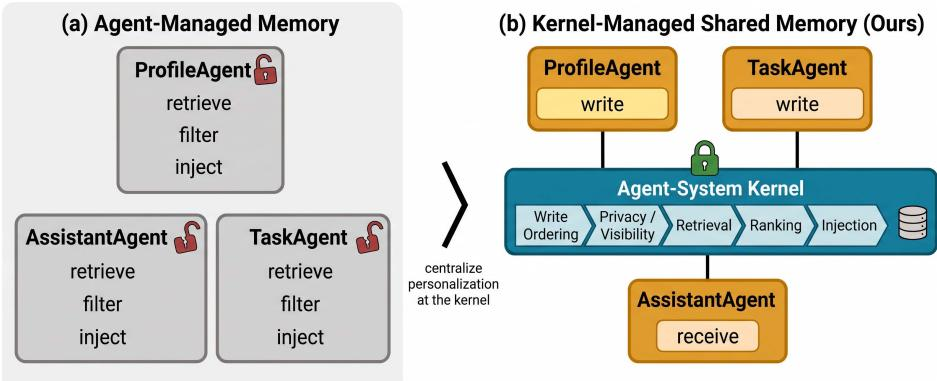
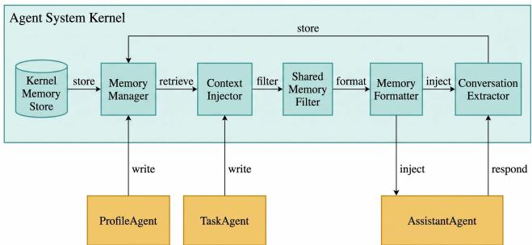
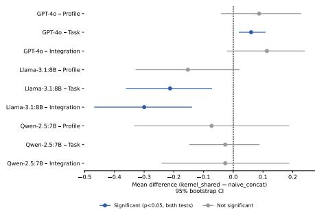

# Kernel-Managed Shared Memory for System-Wide Personalization

Ryan Lum Department of Computer Science Rutgers University Piscataway, NJ 08854 rkl49@scarletmail.rutgers.edu

Yongfeng Zhang   
Department of Computer Science Rutgers University Piscataway, NJ 08854   
yongfeng.zhang@rutgers.edu

## Abstract

AI systems become more useful when they can adapt to the people using them, but in multi-agent systems, useful context learned by one agent often remains unavailable to others. We present kernel-managed shared memory, a system-level abstraction in which specialized agents write structured, tagged memories while the agent-system kernel – not individual agents – governs retrieval, privacy enforcement, and prompt injection. We implement and evaluate this design on AIOS and compare it against three alternatives across three assistant models (GPT-4o, Llama-3.1:8B, Qwen-2.5:7B) and 1,800 total trials. Against an unmanaged external memory backend (Mem0) using identical underlying storage, kernel-managed retrieval and injection improve personalization scores by 2.4–4.0 points on a 5- point scale (e.g., 1.05 → 4.69 profile usage on GPT-4o), with every comparison significant at $\dot { p } < 1 0 ^ { - 1 8 }$ . Against standard retrieval-augmented injection, gains are similarly large and consistent across all three models. Against full, unfiltered context concatenation – a soft ceiling on available context rather than on response quality – kernel-managed injection statistically matches performance on two of three models and shows a small, model-specific deficit on the third, while using substantially shorter prompts: end-to-end latency is 15–61% lower across all three models, with corresponding reductions in per-call token usage and inference cost. These results indicate that centralizing memory management in the agent-system kernel, rather than leaving retrieval and privacy enforcement to individual agents, delivers most of the personalization benefit of unconstrained context at a fraction of its cost.

## 1 Introduction

Personalization is a key ingredient for making AI systems useful: a system that remembers a user’s preferences, current work, and past interactions produces more relevant responses over time. This is especially true in multi-agent systems, where different agents learn different parts of a user’s context – one agent may learn stable preferences, another current task context, a third may respond directly to the user – and if that information stays isolated, the system cannot behave coherently as a whole.

Figure 1 contrasts two ways of organizing this. Under agent-managed memory (Figure 1a), each agent independently retrieves, filters, and injects its own memory, duplicating logic across agents and leaving privacy enforcement to per-agent convention – a design that is easy to get wrong in exactly the way we describe in Section 3.3. We instead propose kernel-managed shared memory (Figure 1b): agents write structured, tagged memories, while a runtime layer distinct from any individual agent – the agent-system kernel – centralizes write ordering, privacy enforcement, retrieval, ranking, and injection. This makes personalization a systems capability rather than repeated application-level logic. We instantiate and evaluate this design on AIOS, an existing operating-system-style framework for LLM-based agents, though the underlying abstraction is not specific to AIOS.

  
Figure 1: Kernel-managed shared memory centralizes retrieval, privacy enforcement, and prompt injection at the agent-system kernel instead of leaving them to individual agents (left vs. right), matching full-context personalization quality at a fraction of the latency and token cost (Section 4.4).

We evaluate this approach against three alternatives – an unmanaged external memory backend, standard retrieval-augmented injection, and full unfiltered context concatenation – across three assistant models and 1,800 total trials. Kernel-managed shared memory substantially and significantly outperforms the unmanaged memory backend and standard retrieval-augmented injection on every model tested. Against full unfiltered context, a soft ceiling on available context rather than on response quality, kernel-managed injection statistically matches performance on two of three models and shows a small, model-specific deficit on the third, while using substantially shorter prompts and correspondingly lower latency and token cost. These results support the paper’s main claim: centralizing memory retrieval, privacy enforcement, and injection in the agent-system kernel delivers most of the personalization benefit of unconstrained context at a fraction of its cost, and does so more reliably than either an unmanaged memory backend or standard retrieval augmentation.

## 2 Related Work

Memory systems for LLM agents. Prior work has largely focused on extending persistence beyond the context window: MemoryBank [Zhong et al., 2024], MemGPT [Packer et al., 2023], LongMem [Wang et al., 2023], and ReadAgent [Lee et al., 2024] each place memory control inside a single agent or model wrapper. More recent systems improve memory’s structure and adaptability – Mem0 [Chhikara et al., 2025], Zep [Rasmussen et al., 2025], LangMem [LangChain Team, 2025], and A-MEM [Xu et al., 2025] – but memory remains an application-layer component in all of them; we instead treat access, filtering, formatting, and injection as kernel-managed operations shared across agents.

Multi-agent frameworks and shared state. Frameworks such as AutoGen [Wu et al., 2023], CAMEL [Li et al., 2023], MetaGPT [Hong et al., 2024], and AgentVerse [Chen et al., 2023] focus on coordination and role specialization, representing shared state through message passing or workflow-specific context, with personalization typically reconstructed per agent. We instead introduce a shared-memory abstraction letting multiple agents contribute to and consume a unified user context under system-level policy control. Recent work treats cross-agent memory sharing itself as a governance problem: Collaborative Memory [Rezazadeh et al., 2025] formalizes access control via provenance-tagged bipartite graphs, SSGM [Lam et al., 2026] proposes write-validation and read-filtering gates against drift, and Yang et al. [2026] show that cross-user leakage can arise from benign interactions alone. Our visibility rule and write-ordering barrier (Sections 3.3, 3.4) target the same failure class through a simpler mechanism – static per-item metadata and a single sequence-numbered barrier rather than bipartite permission graphs or drift-modeling gates.

Personalization and user modeling. Personalization in LLMs is commonly framed as retrieval, prompting, fine-tuning, or user modeling [Lewis et al., 2020, Salemi et al., 2024b,a, Kumar et al., 2024, Zhang et al., 2024, Liu et al., 2025, Tan and Jiang, 2023], assuming a single application or inference path; none addresses how a multi-agent system decides which facts are visible to which agent, when to retrieve them, or how to inject them – questions we treat as kernel-level infrastructure.

OS-inspired agent infrastructure. AIOS [Mei et al., 2024] separates agent applications from kernel-managed services such as scheduling and memory management; OS-Copilot [Wu et al., 2024], SWE-agent [Yang et al., 2024], and OpenHands [Wang et al., 2024] similarly emphasize runtime infrastructure over prompting alone, and MemOS [Li et al., 2025] argues memory should be schedulable. We build on this perspective but focus on a narrower gap: existing infrastructure does not make shared personalization memory the central kernel service through which agents obtain user-specific state.

## 3 Methodology and Architecture

## 3.1 Overview and System Model

We propose kernel-managed shared memory as a system-level abstraction for personalization in multi-agent LLM systems. The central design choice is to move personalization logic out of individual agents and into the agent-system kernel: agents write structured memories with standardized metadata, while the kernel manages identity resolution, write ordering, retrieval, privacy filtering, ranking, formatting, token-budget control, and prompt injection. Although our implementation is built on AIOS, the abstraction is not specific to AIOS: any multi-agent runtime with a shared memory backend and a controlled prompt-construction path can implement the same design. We refer to the system layer generically as the agent-system kernel, with AIOS as our concrete instantiation.

We consider a multi-agent system with agents $\mathcal { A } = \{ a _ { 1 } , a _ { 2 } , \ldots , a _ { n } \}$ and a memory store M. Each agent receives a query $\boldsymbol { q } = ( a _ { i } , u , x )$ , where a<sub>i</sub> is the requesting agent, u is the user identifier, and x is the input prompt. A memory item is $m = ( u , o , t , s , c )$ , where o is the owner agent, t is the memory type, s is the sharing policy, and c is the content. Memory types include profile, task\_context, and conversation; sharing policies are private or shared.

Resolving user identity. Agents do not share a consistent notion of user identity independent of the kernel, and naively using the requesting agent’s own identifier as a proxy produces crossuser contamination under concurrent trials. We instead resolve u through an explicit priority order – an identifier attached to the request, the most recently registered session identifier, a fallback registry of previously observed identifiers, and the requesting agent’s own identifier as a last resort – enforced uniformly at the kernel boundary rather than left to per-agent convention, closing a class of identity-resolution bugs encountered during development (Section 4).

The kernel transforms the original prompt into an augmented prompt $x ^ { \prime } = K ( a _ { i } , u , x )$ , where K denotes the kernel-managed personalization function.

## 3.2 Kernel-Managed Shared Memory

Kernel-Managed Shared Memory for Multi-Agent Personalization

  
Figure 2: Kernel-managed shared memory: ProfileAgent and TaskAgent write structured memories, AssistantAgent remains retrieval-free, and the kernel enforces write ordering, privacy, retrieval, formatting, and injection between them.

Figure 2 shows the proposed architecture. ProfileAgent and TaskAgent act as memory-producing agents, extracting stable user information and current task context, respectively. AssistantAgent acts as a retrieval-free consumer: it does not query the memory backend directly and does not construct its own personalization prompt; all personalization context reaches it through the kernel-managed prompt path.

The kernel implements personalization through five operations: (1) enforce write-before-read ordering for the target user (Section 3.4); (2) retrieve candidate memories, $R = { \mathrm { s e a r c h } } ( { \mathcal { M } } , u , x ) ; ( 3 )$ ) filter retrieved memories according to the system visibility rule (Section 3.3); (4) rank and truncate the filtered memories by semantic relevance and token budget; and (5) inject the selected memories, $x ^ { \prime } = { \mathrm { i n j e c t } } ( x , R _ { k } ) { \dot { - } }$ part of the system call path rather than application-specific prompt construction, unlike agent-level memory systems.

## 3.3 Memory Metadata and Visibility

Each memory item carries standardized metadata: owner\_agent, user\_id, memory\_type, and sharing\_policy. The important design choice is that owner\_agent and user\_id are independent: multiple agents may write memories about the same user, but ownership and visibility remain explicit. The kernel enforces memory visibility through the following rule:

$$
{ \mathrm { v i s i b l e } } ( m , a _ { i } ) = { \left\{ \begin{array} { l l } { { \mathrm { T r u e } } } & { { \mathrm { i f ~ } } o = a _ { i } , } \\ { { \mathrm { T r u e } } } & { { \mathrm { i f ~ } } s = \cdots { \mathrm { s h a r e d } } ^ { \prime } , } \\ { { \mathrm { F a l s e } } } & { { \mathrm { o t h e r w i s e } } . } \end{array} \right. }\tag{1}
$$

If the sharing policy is absent, malformed, or explicitly private, the memory is treated as private, making privacy a kernel invariant rather than an SDK convention or prompt-level instruction.

Privacy invariant. Unlike the write-ordering guarantee of Section 3.4, which bounds a temporal property, the visibility rule is a static property of memory metadata alone. Formally, for all memories m and agents $a _ { i } \neq a _ { j }$ with $o ( m ) = a _ { j }$ and $s ( m ) = \mathrm { p r i v a t e } ,$

$$
{ \mathrm { v i s i b l e } } ( m , a _ { i } ) = { \mathrm { F a l s e } } \quad { \mathrm { f o r ~ e v e r y ~ e x e c u t i o n ~ h i s t o r y } } .\tag{2}
$$

This is a safety property that holds unconditionally, unlike Eq. 3, which is a liveness/consistency property holding only up to a bounded timeout.

Threat model and empirical verification. Enforcing visibility once, at the kernel, means an agent cannot exfiltrate memories merely by omitting its own filtering logic, though this guarantee covers visibility (not integrity) and is conditional on correct identity resolution (full threat model in Appendix A.2). We verify Eq. 2 empirically at both configuration endpoints: fully private $( n = 4 5 0 )$ shows 0/450 exposure, and fully shared $( n = 4 5 0 )$ shows no leakage of the private-by-default conversation type among 1,798 retrieved items.

## 3.4 Cross-Agent Retrieval Pipeline and Write-Ordering Guarantee

Given a user query, the kernel resolves the target user\_id (Section 3.1), waits for any pending writes for that user to be durably confirmed (below), retrieves candidate memories, filters them by ownership and sharing policy, merges and deduplicates results, ranks by semantic relevance, formats into natural language, truncates to the token budget, and prepends the resulting memory block to the assistant prompt. This exposes a unified user context to multiple agents while preventing direct access to private agent-local memories, so cross-agent personalization is achieved without requiring AssistantAgent to implement retrieval, filtering, or prompt construction itself.

Because ProfileAgent and TaskAgent write memories asynchronously relative to AssistantAgent’s retrieval, a naive implementation is subject to a race condition: retrieval may execute before writer agents’ memories are durably indexed, silently degrading personalization with no observable error. We address this with a per-user\_id write barrier: each write is stamped with a monotonically increasing sequence number at acceptance time, scoped to the target user\_id; each retrieval snapshots the highest sequence number issued for that user and blocks until all writes up to that snapshot are confirmed drained, subject to a bounded timeout (default 5000 ms), after which it proceeds in a fail-open mode that prioritizes liveness over strict consistency (design rationale in Appendix A.7).

Formally, let $\sigma ( w )$ denote the sequence number assigned to write $w$ for user $u ,$ and let $\sigma ^ { * } ( u )$ denote the highest sequence number issued for u at the time a retrieval r begins. The barrier guarantees:

$$
r { \mathrm { ~ o b s e r v e s ~ } } \{ w : o ( w ) = u , \ \sigma ( w ) \leq \sigma ^ { * } ( u ) \} \quad { \mathrm { o r ~ t i m e o u t } } ( u ) \ { \mathrm { e l a p s e s } } .\tag{3}
$$

This gives read-after-write consistency scoped to a single user, without global locking or blocking retrievals for unrelated users. It eliminates a class of nondeterministic injection failures, but does not by itself guarantee correct scoping or formatting; we report its empirical contribution, independent of those fixes, in Appendix A.5.

## 3.5 Memory Representation, Formatting, and Agent Roles

Structured storage does not imply structured injection: in early experiments, raw JSON memory content was difficult for smaller local models to use reliably. The kernel therefore applies a formatting function $c _ { m } ^ { \prime } = \mathrm { f o r m a t } ( c _ { m } )$ , rendering profile and task memories as natural-language statements in place of raw JSON, while the structured form is preserved for retrieval and auditing (isolated as an independent ablation, Appendix A.5).

We instantiate the method with three agents: ProfileAgent extracts stable user attributes (preferences, tools, language, response style); TaskAgent extracts short-term working context (goals, blockers, next steps); and AssistantAgent generates user-facing responses from kernel-injected context, performing no retrieval of its own. The method is implemented as a kernel abstraction over LLM and memory operations, supporting configurable extraction, injection, relevance thresholds, memory budgets, write-barrier timeout, and pluggable memory providers, all inference-time only with no retraining required.

## 4 Experiments

## 4.1 Baselines

A central question is whether observed gains come from the kernel’s specific architectural choices – write ordering, identity resolution, centralized privacy enforcement, cross-agent visibility – or simply from providing any additional context. We compare against three external baselines plus the proposed method (Table 1). naive\_concat and vanilla\_rag involve no memory system-level orchestration at all, and mem0\_default involves an external memory system without kernel management, so any advantage of kernel\_shared cannot be attributed merely to the presence of injected context; comparing against mem0\_default specifically isolates kernel-level write ordering, identity resolution, and privacy enforcement, since both conditions use the same underlying provider.

Table 1: Baselines compared against the proposed method.
<table><tr><td>Method</td><td>Description</td></tr><tr><td>naive_concat</td><td>Full synthetic profile/task context concatenated into the prompt; no retrieval or filtering. An upper bound on available context, not response quality.</td></tr><tr><td>vanilla_rag</td><td>Profile/task context chunked and indexed; top-k chunks retrieved via embedding search. Standard RAG absent a dedicated memory system.</td></tr><tr><td>memO_default</td><td>Memory via Mem0, configured private-only, with no kernel orchestration, write ordering, or cross-agent sharing.</td></tr><tr><td>kernel_shared</td><td>Proposed method: ProfileAgent/TaskAgent write shared memories; kernel en- forces ordering, identity resolution, visibility, and cross-agent injection.</td></tr></table>

## 4.2 Models, Trials, Evaluation, and Configuration

We evaluate all four methods across three assistant models of varying capability – GPT-4o, Llama-3.1:8B, and Qwen-2.5:7B – to distinguish architectural effects from effects better explained by capability alone. Each trial generates a synthetic user profile, a synthetic task context, and a vague follow-up query (e.g., “What should I focus on next?”), intentionally underspecified so personalized content must come from injected memory rather than the query itself.

Each trial is scored by GPT-5.4 along three dimensions on a 1–5 scale: Profile Usage, Task Usage, and Integration (whether profile and task information are combined coherently). We use GPT-5.4, a model distinct from every assistant evaluated, as the sole judge across all twelve (model, method) conditions to avoid a self-preference effect in LLM-as-judge evaluation.

The kernel ran with auto\_extract: true, auto\_inject: true, a relevance threshold of 0.3, a maximum of 10 injected memories per call, a memory token budget of 2000, and the write barrier (Section 3.4) enabled with a 5000 ms timeout. Each of the twelve conditions was run for 150 trials (1,800 total).

## 4.3 Human Validation

To validate the automated judge, we constructed a blinded human-rated subset (30 GPT-4o trials, 24 unique items plus 6 duplicates for intra-rater consistency; design in Appendix A.1). Human and automated judge scores matched exactly on 41.7% of items and agreed within one point on 83.3% (mean absolute error 0.75), and were strongly correlated (Spearman’s $\rho = 0 . 7 2 7 , p ^ { - } = 5 . 7 \times 1 0 ^ { - 5 } )$ The human rater confirms our central GPT-4o comparison: kernel\_shared and naive\_concat are indistinguishable in human-perceived quality (4.17 vs. 4.17), both far above mem0\_default (1.00) – an independent confirmation not filtered through the automated judge. The judge does under-credit vanilla\_rag relative to the human rater (2.17 vs. 3.67), consistent with the architectural failure mode in Section 4.4 where vanilla\_rag systematically drops profile content; per-method agreement and intra-rater consistency detail are in Appendix A.1.

## 4.4 Quantitative Results

Table 2 reports mean scores with standard deviations across all twelve (model, method) conditions, 150 trials each.

Table 2: Full results across 3 models × 4 methods, 150 trials per condition, judged by GPT-5.4. Values are mean ± SD.
<table><tr><td>Model</td><td>Method</td><td>Profile</td><td>Task</td><td>Integration</td><td>Latency (s)</td></tr><tr><td>GPT-40</td><td> $\mathtt { n a i v e \_ c o n c a t }$ </td><td> $4 . 6 1 \pm 0 . 6 7$ </td><td> $4 . 9 3 \pm 0 . 2 5$ </td><td> $4 . 5 0 \pm 0 . 6 3$ </td><td>19.2</td></tr><tr><td>GPT-40</td><td> $\mathtt { k e r n e l \_ s h a r e d }$ </td><td> $4 . 6 9 \pm 0 . 5 0$ </td><td> $\smash { 4 . 9 9 \pm 0 . 0 8 }$ </td><td> $\underline { { 4 . 6 1 } } \pm 0 . 5 2$ </td><td>7.5</td></tr><tr><td>GPT-4o</td><td> $\mathtt { v a n i l 1 a \_ r a g }$ </td><td> $1 . 8 4 \pm 0 . 5 6$ </td><td> $3 . 8 4 \pm 0 . 5 4$ </td><td> $1 . 9 6 \pm 0 . 4 0$ </td><td>10.8</td></tr><tr><td>GPT-40</td><td> $\mathtt { m e m 0 \_ d e f a u i t }$ </td><td> $1 . 0 5 \pm 0 . 2 1$ </td><td> $1 . 0 3 \pm 0 . 1 6$ </td><td> $1 . 0 0 \overset { \_ } { \pm } 0 . 0 0$ </td><td>3.9</td></tr><tr><td> $_ \mathrm { L l a m a } . 3 . 1 { : } 8 \mathbf { B }$ </td><td> $\mathtt { n a i v e \_ c o n c a t }$ </td><td> $4 . 0 3 \pm 0 . 7 4$ </td><td> $4 . 5 4 \pm 0 . 5 0$ </td><td> $3 . 9 3 \pm 0 . 6 5$ </td><td>25.5</td></tr><tr><td> $_ \mathrm { L l a m a } { - } 3 . 1 { : } 8 \mathbf { B }$ </td><td> $\mathtt { k e r n e l \_ s h a r e d }$ </td><td> $3 . 8 7 \pm 0 . 8 3$ </td><td> $4 . 3 3 \pm 0 . 7 5$ </td><td> $3 . 6 3 \pm 0 . 8 0$ </td><td>21.7</td></tr><tr><td> $_ { \textrm L l a m a - 3 . 1 : 8 \mathrm { B } }$ </td><td> $\mathtt { v a n i l 1 a \_ r a g }$ </td><td> $\bar { 1 } . \bar { 9 } \bar { 1 } \bar { \pm } \bar { 0 } . \bar { 7 } \bar { 4 }$ </td><td> $3 . 7 8 \pm 0 . 6 2$ </td><td> $1 . 9 9 \pm 0 . 7 2$ </td><td>18.9</td></tr><tr><td>Llama-3.1:8B</td><td> $\mathtt { m e m 0 \_ d e f a u l t }$ </td><td> $1 . 0 7 \pm 0 . 2 5$ </td><td> $\bar { 1 } . 3 \bar { 1 } \mp 0 . \bar { 4 } 7$ </td><td> $1 . 0 4 \pm 0 . 2 0$ </td><td>10.5</td></tr><tr><td> $\mathbf { Q } \mathrm { w e n } { - } 2 . 5 { : } 7 \mathbf { B }$ </td><td> $\mathtt { n a i v e \_ c o n c a t }$ </td><td> $3 . 7 1 \pm 1 . 1 7$ </td><td> $4 . 4 3 \pm 0 . 5 4$ </td><td> $3 . 6 1 \pm 0 . 9 4$ </td><td>36.3</td></tr><tr><td> $\mathrm { \Phi _ { w e n - 2 . 5 : 7 B } }$ </td><td> $\mathtt { k e r n e l \_ s h a r e d }$ </td><td> $3 . 6 3 \pm 1 . 0 9$ </td><td> $4 . 4 0 \pm 0 . 4 9$ </td><td> $3 . 5 8 \pm 0 . 9 4$ </td><td>26.3</td></tr><tr><td> $\tilde { \mathrm { Q w e n } } { - 2 . 5 { : 7 } \mathrm { B } }$ </td><td> $\mathtt { v a n i l 1 a \_ r a g }$ </td><td>1.84 ± 0.72</td><td> $3 . 8 4 \pm 0 . 5 1$ </td><td>1.89 ± 0.56</td><td>32.8</td></tr><tr><td> $\mathrm { \Phi _ { w e n - 2 . 5 : 7 B } }$ </td><td> $\mathtt { m e m 0 \_ d e f a u l t }$ </td><td> $1 . 2 4 \overset { \_ } { \pm } 0 . 4 3$ </td><td> $\bar { 1 } . 6 0 \mp 0 . 5 1$ </td><td> $1 . { \overset { . } { 1 9 } } \overset { \_ } { \pm } \ : 0 . 3 9$ </td><td>26.9</td></tr></table>

Three patterns hold across all three models. First, vanilla\_rag profile scores stay flat regardless of model capability (1.84/1.91/1.84) while task scores are both higher and similarly flat (3.84/3.78/3.84) – an architectural failure, not a capability one: the follow-up query is closer to task content, so retrieval consistently drops profile chunks regardless of the model’s capacity to use them if present. Second, mem0\_default scores near floor throughout; since it shares kernel\_shared’s underlying provider, this isolates write-ordering and identity-resolution guarantees, not the mere presence of a memory backend, as the source of the gap. Third, kernel\_shared vs. naive\_concat is modeldependent (Welch’s t, Mann–Whitney U, bootstrap CI; full nine model×dimension comparisons and figure in Appendix A.3): it ties naive\_concat on GPT-4o Profile/Integration and all three Qwen-2.5:7B dimensions, is higher on GPT-4o Task $( p = 0 . 0 0 6 )$ , and is significantly lower on Llama-3.1:8B Task/Integration (rank-biserial 0.13–0.19, unexplained by scale). Against vanilla\_rag and mem0\_default, by contrast, the advantage is large and overwhelmingly significant everywhere (all $p < 1 0 ^ { - 1 8 }$ , rank-biserial 0.44–1.00): kernel-managed injection’s downside is capped at a small, model-specific gap against unfiltered context, while its advantage over an unmanaged backend or plain retrieval is categorical.

## 4.5 Latency Analysis

kernel\_shared achieves substantially lower end-to-end latency than naive\_concat on all three models: 7.5s vs. 19.2s on GPT-4o, 21.7s vs. 25.5s on Llama-3.1:8B, and 26.3s vs. 36.3s on Qwen-2.5:7B (15–61% reduction). The mechanism differs by model (full analysis in Appendix A.4): on Llama-3.1:8B, output length does not differ significantly between conditions $( p = 0 . 2 7 )$ yet kernel\_shared is still 15% faster, pointing to input-side savings; on GPT-4o and $\mathbf { Q } \mathrm { w e n } { - 2 . 5 { : 7 } \mathbf { B } }$ naive\_concat produces significantly longer outputs (+159 and +83 words, $p < 0 . 0 0 0 1 )$ , accounting for part of the gap. mem0\_default’s low latency simply reflects little content to inject. This latency win holds regardless of outcome on the naive\_concat quality comparison above.

## 5 Discussion and Conclusion

Kernel-managed shared memory reliably outperforms a standard RAG pipeline and an unmanaged external memory backend across all three models, at lower latency than full unfiltered context; the naive\_concat comparison is more nuanced, tying on two of three models with a Llama-3.1:8B deficit unexplained by scale, left to future work.

## Acknowledgments and Disclosure of Funding

We thank the AIOS project contributors and collaborators whose prior architecture and tooling made this extension possible.

## References

Weize Chen, Yusheng Su, Jingwei Zuo, Cheng Yang, Chenfei Yuan, Chi-Min Chan, Heyang Yu, Yaxi Lu, Yi-Hsin Hung, Chen Qian, Yujia Qin, Xin Cong, Ruobing Xie, Zhiyuan Liu, Maosong Sun, and Jie Zhou. Agentverse: Facilitating multi-agent collaboration and exploring emergent behaviors. arXiv preprint arXiv:2308.10848, 2023. URL https://arxiv.org/abs/2308.10848.

Prateek Chhikara, Dev Khant, Saket Aryan, Taranjeet Singh, and Deshraj Yadav. Mem0: Building production-ready ai agents with scalable long-term memory. arXiv preprint arXiv:2504.19413, 2025. URL https://arxiv.org/abs/2504.19413.

Sirui Hong, Mingchen Zhuge, Jonathan Chen, Xiawu Zheng, Yuheng Cheng, Jinlin Wang, Ceyao Zhang, Zili Wang, Steven Ka Shing Yau, Zijuan Lin, et al. Metagpt: Meta programming for a multi-agent collaborative framework. In International Conference on Learning Representations, 2024. URL https://arxiv.org/abs/2308.00352.

Ishita Kumar, Snigdha Viswanathan, Sushrita Yerra, Alireza Salemi, Ryan A. Rossi, Franck Dernoncourt, Hanieh Deilamsalehy, Xiang Chen, Ruiyi Zhang, Shubham Agarwal, et al. Longlamp: A benchmark for personalized long-form text generation. arXiv preprint arXiv:2407.11016, 2024. URL https://arxiv.org/abs/2407.11016.

Chingkwun Lam, Jiaxin Li, Lingfei Zhang, and Kuo Zhao. Governing evolving memory in LLM agents: Risks, mechanisms, and the stability and safety governed memory (SSGM) framework. arXiv preprint arXiv:2603.11768, 2026.

LangChain Team. Langmem: Long-term memory for agents. https://langchain-ai.github. io/langmem/, 2025. Accessed 2026-04-25.

Kuang-Huei Lee, Xinyun Chen, Hiroki Furuta, John Canny, and Ian Fischer. A human-inspired reading agent with gist memory of very long contexts. arXiv preprint arXiv:2402.09727, 2024. URL https://arxiv.org/abs/2402.09727.

Patrick Lewis, Ethan Perez, Aleksandra Piktus, Fabio Petroni, Vladimir Karpukhin, Naman Goyal, Heinrich Küttler, Mike Lewis, Wen-tau Yih, Tim Rocktäschel, Sebastian Riedel, and Douwe Kiela. Retrieval-augmented generation for knowledge-intensive nlp tasks. In Advances in Neural Information Processing Systems, volume 33, pages 9459–9474, 2020.

Guohao Li, Hasan Abed Al Kader Hammoud, Hani Itani, Dmitrii Khizbullin, and Bernard Ghanem. Camel: Communicative agents for “mind” exploration of large language model society. In Advances in Neural Information Processing Systems, 2023. URL https://arxiv.org/abs/2303.17760.

Zhiyu Li, Chenyang Xi, Chunyu Li, Ding Chen, Boyu Chen, Shichao Song, Simin Niu, Hanyu Wang, Jiawei Yang, Chen Tang, Qingchen Yu, Jihao Zhao, Yezhaohui Wang, Peng Liu, Zehao Lin, Pengyuan Wang, Jiahao Huo, Tianyi Chen, Kai Chen, Kehang Li, Zhen Tao, Huayi Lai, Hao Wu, Bo Tang, Zhengren Wang, Zhaoxin Fan, Ningyu Zhang, Linfeng Zhang, Junchi Yan, Mingchuan Yang, Tong Xu, Wei Xu, Huajun Chen, Haofen Wang, Hongkang Yang, Wentao Zhang, Zhi-Qin John Xu, Siheng Chen, and Feiyu Xiong. Memos: A memory os for ai system, 2025.

Jiahong Liu, Zexuan Qiu, Zhongyang Li, Quanyu Dai, Wenhao Yu, Jieming Zhu, Minda Hu, Menglin Yang, Tat-Seng Chua, and Irwin King. A survey of personalized large language models: Progress and future directions, 2025. URL https://arxiv.org/abs/2502.11528.

Kai Mei, Xi Zhu, Wujiang Xu, Mingyu Jin, Wenyue Hua, Zelong Li, Shuyuan Xu, Ruosong Ye, Yingqiang Ge, and Yongfeng Zhang. Aios: Llm agent operating system. arXiv preprint arXiv:2403.16971, 2024. URL https://arxiv.org/abs/2403.16971.

Charles Packer, Sarah Wooders, Kevin Lin, Vivian Fang, Shishir G. Patil, Ion Stoica, and Joseph E. Gonzalez. Memgpt: Towards llms as operating systems. arXiv preprint arXiv:2310.08560, 2023. URL https://arxiv.org/abs/2310.08560.

Preston Rasmussen, Pavlo Paliychuk, Travis Beauvais, Jack Ryan, and Daniel Chalef. Zep: A temporal knowledge graph architecture for agent memory. arXiv preprint arXiv:2501.13956, 2025. URL https://arxiv.org/abs/2501.13956.

Alireza Rezazadeh, Zichao Li, Ange Lou, Yuying Zhao, Wei Wei, and Yujia Bao. Collaborative memory: Multi-user memory sharing in llm agents with dynamic access control. arXiv preprint arXiv:2505.18279, 2025.

Alireza Salemi, Surya Kallumadi, and Hamed Zamani. Optimization methods for personalizing large language models through retrieval augmentation, 2024a. URL https://arxiv.org/abs/2404. 05970.

Alireza Salemi, Sheshera Mysore, Michael Bendersky, and Hamed Zamani. Lamp: When large language models meet personalization. In Proceedings of the 62nd Annual Meeting of the Association for Computational Linguistics, 2024b. URL https://arxiv.org/abs/2304.11406.

Zhaoxuan Tan and Meng Jiang. User modeling in the era of large language models: Current research and future directions, 2023. URL https://arxiv.org/abs/2312.11518.

Weizhi Wang, Li Dong, Hao Cheng, Xiaodong Liu, Xifeng Yan, Jianfeng Gao, and Furu Wei. Augmenting language models with long-term memory. arXiv preprint arXiv:2306.07174, 2023. URL https://arxiv.org/abs/2306.07174.

Xingyao Wang, Boxuan Li, Yufan Song, Frank F. Xu, Xiangru Tang, Mingchen Zhuge, Jiayi Pan, Yueqi Song, Bowen Li, Jaskirat Singh, et al. Openhands: An open platform for ai software developers as generalist agents. arXiv preprint arXiv:2407.16741, 2024. URL https://arxiv. org/abs/2407.16741.

Qingyun Wu, Gagan Bansal, Jieyu Zhang, Yiran Wu, Beibin Li, Erkang Zhu, Li Jiang, Xiaoyun Zhang, Shaokun Zhang, Jiale Liu, Ahmed Hassan Awadallah, Ryen W. White, Doug Burger, and Chi Wang. Autogen: Enabling next-gen llm applications via multi-agent conversation framework. arXiv preprint arXiv:2308.08155, 2023. URL https://arxiv.org/abs/2308.08155.

Zhiyong Wu, Chengcheng Han, Zichen Ding, Zhenmin Weng, Zhoumianze Liu, Shunyu Yao, Tao Yu, and Lingpeng Kong. Os-copilot: Towards generalist computer agents with self-improvement. arXiv preprint arXiv:2402.07456, 2024. URL https://arxiv.org/abs/2402.07456.

Wujiang Xu, Zujie Liang, Kai Mei, Hang Gao, Juntao Tan, and Yongfeng Zhang. A-mem: Agentic memory for llm agents. arXiv preprint arXiv:2502.12110, 2025. URL https://arxiv.org/ abs/2502.12110.

John Yang, Carlos E. Jimenez, Alexander Wettig, Kilian Lieret, Shunyu Yao, Karthik Narasimhan, and Ofir Press. Swe-agent: Agent-computer interfaces enable automated software engineering. In Advances in Neural Information Processing Systems, 2024. URL https://arxiv.org/abs/ 2405.15793.

Tiankai Yang, Jiate Li, Yi Nian, Shen Dong, Ruiyao Xu, Ryan Rossi, Kaize Ding, and Yue Zhao. No attacker needed: Unintentional cross-user contamination in shared-state llm agents, 2026. URL https://arxiv.org/abs/2604.01350.

Zhehao Zhang, Ryan A. Rossi, Branislav Kveton, Yijia Shao, Diyi Yang, Hamed Zamani, Franck Dernoncourt, Joe Barrow, Tong Yu, Sungchul Kim, et al. Personalization of large language models: A survey. arXiv preprint arXiv:2411.00027, 2024. URL https://arxiv.org/abs/ 2411.00027.

Wanjun Zhong, Lianghong Guo, Qiqi Gao, He Ye, and Yanlin Wang. Memorybank: Enhancing large language models with long-term memory. In Proceedings ofthe AAAI Conference on Artificial Intelligence, volume 38, pages 19724–19731, 2024. doi: 10.1609/aaai.v38i17.29946.

## A Technical Appendix

## A.1 Human Validation Design Detail

We sampled 30 GPT-4o trials: 6 unique items per method across all four methods (24 unique items), plus 6 duplicate items inserted at separated positions to measure intra-rater consistency. Items were presented in randomized order under opaque identifiers, with the rater blind to both condition and automated judge score. A single rater scored each item on the Integration dimension using the same 1–5 rubric given to the automated judge.

Table 3: Human rater vs. automated judge agreement, by method (GPT-4o, Integration dimension, N = 6 per method).
<table><tr><td>Method</td><td>Human mean</td><td>Judge mean</td><td>Bias (H-J)</td></tr><tr><td>memO_default</td><td>1.00</td><td>1.00</td><td>0.00</td></tr><tr><td>kernel_shared</td><td>4.17</td><td>4.50</td><td>-0.33</td></tr><tr><td>naive_concat</td><td>4.17</td><td>4.67</td><td>-0.50</td></tr><tr><td>vanilla_rag</td><td>3.67</td><td>2.17</td><td>+1.50</td></tr></table>

Intra-rater consistency on the 6 duplicate pairs was high: the rater gave the exact same score on 5 of 6 repeats, with a mean absolute difference of 0.17 across all six pairs. We note the use of a single rater precludes computing inter-rater reliability statistics such as Krippendorff’s α. Read together, the judge appears to be a trustworthy proxy for the paper’s central claim, since its one documented miscalibration under-credits a baseline rather than over-crediting the proposed method.

## A.2 Threat Model and Empirical Verification Detail

Threat model. We consider an adversary model in which one agent – compromised, buggy, or simply malicious – attempts to read memories it is not authorized to see: either another agent’s private memories for the same user, or any agent’s memories for a different user entirely. Because visibility is checked once, at the kernel, on every retrieval path (Eq. 2), such an agent cannot exfiltrate private memories simply by skipping its own filtering logic; it would need to compromise the kernel’s enforcement point directly, a materially higher bar than omitting a check in one of n independentlytrusted implementations. This protection has two concrete limits. First, the kernel enforces visibility, not integrity or provenance: a malicious ProfileAgent can still corrupt what AssistantAgent believes about a user. Second, the kernel enforces visibility given a resolved user identity; it does not independently verify that the identity presented to it is correct. If the identity-resolution fallback chain (Section 3.1) can be induced to resolve to the wrong user\_id – for instance, by an agent that races to register itself as the most recent session for a target user before the legitimate session does – the visibility rule would faithfully enforce access control for the wrong partition, a failure of identity resolution rather than of visibility enforcement, but with the same practical consequence. We have not evaluated the identity-resolution fallback chain against an adversarial agent attempting this.

Empirical verification at both configuration endpoints. We have not run a designed sweep over intermediate sharing configurations or an adversarial query campaign; both are future work. Our existing benchmark trials (Section 4) provide a zero-cost empirical check of Eq. 2 at the two endpoints of the sharing policy. At the fully-private endpoint (mem0\_default, n = 450 trials across three models, all memories written private), retrieval-eligible cross-agent exposure is 0/450. Functional exposure is 0/450 as well, with one apparent exception we verified by hand: a single trial scored 3/5 on Task Usage despite zero memories retrieved, which we trace to the automated judge crediting generic clarifying language rather than any genuinely leaked content – a judge-calibration artifact, not a privacy failure. At the fully-shared endpoint (kernel\_shared, n = 450 trials), we additionally checked whether sharing one memory type inadvertently widens exposure of another: of 1,798 total memory items retrieved across all trials, none were the private-by-default conversation type written by the ConversationExtractor (Appendix A.6), confirming that sharing\_policy scoping is enforced per memory item rather than per writer agent.

## A.3 Significance Testing Detail

Table 4 and Figure 3 report the full nine (model, dimension) kernel\_shared vs. naive\_concat comparisons underlying the discussion in Section 4.4.

## A.4 Latency Mechanism Detail

Table 5 reports output length (word count) by condition and model, alongside a Welch’s t-test on the kernel\_shared vs. naive\_concat difference and the within-condition correlation between output length and latency.

  
Figure 3: Mean difference and 95% bootstrap CI for the nine kernel\_shared vs. naive\_concat comparisons; six of nine intervals cross zero (dashed line), indicating no significant difference.

Table 4: kernel\_shared vs. naive\_concat: mean difference and significance across all three models (independent samples, $n = 1 5 0$ per condition). Bold marks $p < 0 . 0 5$ under both Welch’s t-test and Mann–Whitney U.
<table><tr><td>Model</td><td>Dimension</td><td>Mean ∆</td><td>Welch p</td><td>MWUp</td><td>Bootstrap 95% CI</td></tr><tr><td>GPT-40</td><td>Profile</td><td>+0.087</td><td>0.209</td><td>0.372</td><td> $[ - 0 . 0 4 0 , + 0 . 2 2 7 ]$ </td></tr><tr><td>GPT-40</td><td>Task</td><td>+0.060</td><td>0.006</td><td>0.006</td><td> $\left[ + 0 . 0 2 0 , + 0 . 1 0 7 \right]$ </td></tr><tr><td>GPT-40</td><td>Integration</td><td>+0.113</td><td>0.090</td><td>0.163</td><td> $\left[ - 0 . 0 2 0 , + 0 . 2 4 0 \right]$ </td></tr><tr><td>Llama-3.1:8B</td><td>Profile</td><td>-0.153</td><td>0.093</td><td>0.088</td><td>[-0.327, +0.020]</td></tr><tr><td>Llama-3.1:8B</td><td>Task</td><td>-0.213</td><td>0.004</td><td>0.026</td><td>-0.360, -0.073</td></tr><tr><td>Llama-3.1:8B</td><td>Integration</td><td>-0.300</td><td>0.0004</td><td>0.0001</td><td>[-0.467, -0.140]</td></tr><tr><td>Qwen-2.5:7B</td><td>Profile</td><td>-0.073</td><td>0.575</td><td>0.361</td><td></td></tr><tr><td>Qwen-2.5:7B</td><td>Task</td><td>-0.027</td><td>0.653</td><td>0.530</td><td>[−0.333, +0.187]</td></tr><tr><td>Qwen-2.5:7B</td><td>Integration</td><td>-0.027</td><td>0.806</td><td>0.755</td><td>[-0.147, +0.087]  $[ - 0 . 2 4 0 , + 0 . 1 8 7 ]$ </td></tr></table>

Table 5: Output length (words) by condition and model, with significance of the kernel\_shared vs. naive\_concat difference and the within-condition correlation between output length and latency.
<table><tr><td>Model</td><td>kernel_shared</td><td>naive_concat</td><td>Diff</td><td>Welch p</td><td>r(words, latency)</td></tr><tr><td>GPT-40</td><td>404.7</td><td>563.8</td><td>-159.1</td><td> $< \bf { 1 0 } ^ { - 6 }$ </td><td>0.66 / 0.59</td></tr><tr><td>Llama-3.1:8B</td><td>202.4</td><td>193.8</td><td>+8.6</td><td> $0 . 2 7 1$ </td><td>0.84/0.52</td></tr><tr><td> $\mathbf { Q } \mathrm { w e n } { - } 2 . 5 { : } 7 \mathbf { B }$ </td><td>218.7</td><td>301.8</td><td>-83.0</td><td> $< \bf { 1 0 ^ { - 4 } }$ </td><td>0.86 / 0.83</td></tr></table>

r(words, latency) reported as kernel\_shared / naive\_concat, both $p < 1 0 ^ { - 1 1 }$

Within every condition, word count and latency are strongly correlated $( r = 0 . 5 2 – 0 . 8 6 .$ , all $p <$ $1 0 ^ { - 1 1 } ) _ { ; }$ , confirming generation length is a major latency driver in general; the relevant question is whether that driver differs systematically between conditions, which it does for GPT-4o and Qwen-2.5:7B but not for Llama-3.1:8B (no significant difference, $p = 0 . 2 7 ,$ , yet kernel\_shared remains 15% faster – implicating input-side savings rather than generation length for that model). mem0\_default’s short, generic outputs follow the same pattern of low content, low latency, and are excluded from the table since they are not a meaningful comparison point. One plausible reading of the GPT-4o and Qwen-2.5:7B asymmetry is that unfiltered, unstructured context prompts the model toward longer, more exhaustive responses, while curated, kernel-formatted context elicits a more targeted one; we did not design an experiment specifically to test this explanation and note it as a plausible mechanism rather than a demonstrated one, for future work.

## A.5 Ablation Pilot Detail

Table 6 reports the full pilot ablation deltas underlying the pilot ablation study conducted during development. Raw JSON injection, evaluated with an LLM-only judge, scored worse than the private baseline on all three dimensions (row 1); natural-language formatting and an explicit systemprompt instruction each narrowed this gap without closing it (rows 2–3); only adopting the hybrid keyword+LLM judge produced a positive result (row 4). This pilot (Qwen-2.5:7B, 30 trials) predates the verification pass applied to our main results and carries no evidentiary weight toward the paper’s central claims – it is included for its qualitative documentation of the design trajectory only.

Table 6: Ablation: Phase 2 (shared) − Phase 1 (private) score deltas across successive pipeline and evaluation refinements (Qwen-2.5:7B, 30-trial pilot).

<table><tr><td>Configuration</td><td>Profile ∆</td><td>Task ∆</td><td>Integration ∆</td></tr><tr><td>Raw JSON injection, LLM-only judge</td><td>-0.73</td><td>-1.47</td><td>-0.77</td></tr><tr><td>+ Natural-language formatting</td><td>-0.10</td><td>-0.57</td><td>-0.43</td></tr><tr><td>+ Explicit system-prompt instruction</td><td>-0.10</td><td>-0.23</td><td>-0.10</td></tr><tr><td>+ HybridJudge (30 trials)</td><td>+1.37</td><td>+1.27</td><td>+0.87</td></tr></table>

## A.6 System Call Interface

Table 7 lists the kernel modules involved in personalization and their corresponding operations, in the style of the system-call catalog used by prior OS-inspired agent infrastructure (e.g., AIOS’s kernel syscall table).

Table 7: Kernel modules and their corresponding operations for shared-memory personalization.  
```csv
Module Operations
MemoryManager address_request, register_user_id, stamp_barrier
Mem0Provider add_memory, retrieve_memory, get_all, apply_sharing_filter
ContextInjector inject, resolve_user_id, merge_and_dedupe
MemoryWriteBarrier acquire, release, snapshot, wait_until_drained
MemoryFormatter format_memory
ConversationExtractor extract_async
```

Each agent-facing call (e.g., create\_memory, llm\_chat) is routed through the SDK to one or more of these module-level operations; agents never call Mem0Provider or MemoryWriteBarrier directly. This indirection is what allows the kernel to change providers, retrieval strategies, or barrier timeouts without requiring changes to agent code.

## A.7 Write Barrier Implementation

The write barrier described in Section 3.4 is implemented as a per-user\_id sequence counter with acquire and release operations, sketched below:

```python
class MemoryWriteBarrier:
def acquire(self, user_id):
# assigns and returns the next sequence number for user_id
def release(self, user_id, seq_no, success):
# marks seq_no as drained (committed or failed) for user_id;
# notifies any retrieval waiting on this or an earlier seq_no
def snapshot(self, user_id):
# returns the current high-water mark σ<sup>∗</sup>(user_id)
def wait_until_drained(self, user_id, snapshot, timeout_ms=5000):
# blocks until all writes with seq_no <= snapshot are released,
# or returns early (fail-open) after timeout_ms elapses
```

We choose a bounded wait with fail-open behavior over strict locking because a stalled write degrades personalization rather than violating correctness – the assistant can still respond with partial context – mirroring the fail-open/fail-closed asymmetry in Section 3.3 (liveness degrades gracefully; visibility never fails open). A failed write still calls release (with success=False), so a provider error never strands a waiting retrieval past the bounded timeout. This cost is scoped to a single user\_id and bounded by the number of writer agents rather than memory-store size; we have not evaluated behavior at larger memory-store sizes.

## A.8 Kernel-Managed Memory Injection

The injection pipeline performs the following steps: extract the latest user query; retrieve candidate memories using semantic search; derive the target user\_id from retrieved metadata; perform cross agent retrieval for shared memories; merge and deduplicate results; filter by relevance score; sort by relevance; format structured memory into natural language; truncate to a token budget; and inject as a system message prepended with ===== MEMORY CONTEXT =====. This design ensures personalization is applied uniformly without requiring agents to explicitly request memory.

## A.9 Cross-Agent Memory Resolution

The kernel resolves shared memory using a two-stage retrieval process: retrieve agent-scoped memories, infer user\_id, then retrieve shared memories from other agents. If no user ID is found locally, the kernel falls back to a global registry of known users, enabling cross-agent personalization even when the requesting agent has no prior memory – zero-shot personalization across agents and memory reuse without explicit coordination.

## A.10 Evaluation Pipeline and Hybrid Metric

The evaluation pipeline runs ProfileAgent, then TaskAgent, then AssistantAgent under two conditions: Phase 1 (private memory only) and Phase 2 (shared memory enabled), differing only in sharing policy. The early hybrid scoring mechanism combined deterministic keyword matching with LLM-based evaluation across Profile, Task, and Integration:

$$
{ \mathrm { s c o r e } } = { \frac { { \mathrm { k e y w o r d ~ s c o r e } } + { \mathrm { L L M ~ s c o r e } } } { 2 } } ,\tag{4}
$$

trading robustness (keyword matching) for semantic evaluation (LLM judge). Each trial in the synthetic evaluation harness logs injected memory count, cross-agent retrieval, personalization scores, and latency, aggregated into summary statistics including mean, standard deviation, and min/max values.