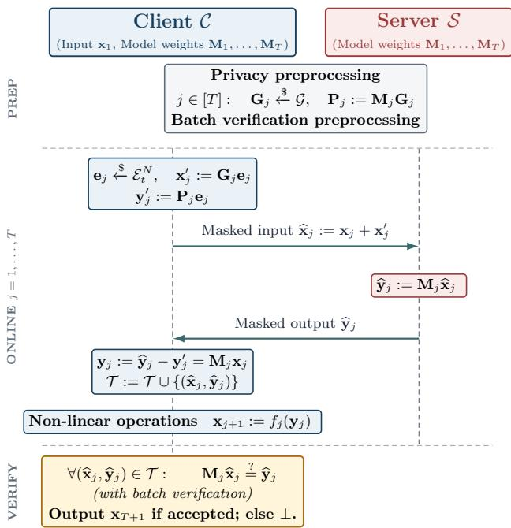
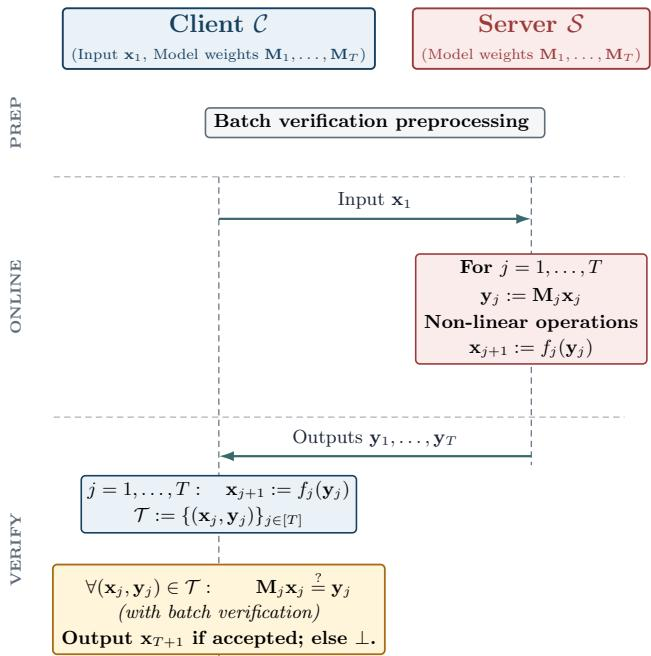
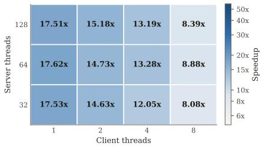
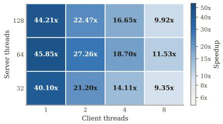

# Maverick: Private and Verifiable LLM Inference Made Practical via Matrix–Vector Multiplication Delegation

Ben Merbaum∗ Yale University

Mohammad Amin Raeisi∗ Yale University

Charalampos Papamanthou Yale University

Katerina Sotiraki Yale University

Wenhao Wang∗ Yale University, IC3

Fan Zhang Yale University, IC3

## Abstract

Open-source large language models (LLMs) are increasingly competitive with closed-source models while offering transparency and the ability to run inference without exposing user inputs to a service provider. However, running large-scale models locally requires substantial computational resources. In practice, users may still resort to a third-party provider, giving rise to privacy and correctness concerns. Existing solutions that address these problems often impose substantial server overhead or introduce additional trust assumptions.

In this paper, we present Maverick, a novel approach to private and verifiable LLM inference based on a protocol for delegating matrix–vector multiplication, a dominant operation in LLMs. At its core, Maverick provides, to our knowledge, the first information-theoretically sound verification protocol for matrix–vector multiplication delegation with transparent preprocessing, efficient (batch) verification, and virtually no server overhead. We combine this verification primitive with LPN-based pseudorandom masking to provide input privacy.

We implement our matrix–vector delegation primitive and use it to build an end-to-end prototype of Maverick, which we evaluate on Qwen3-4B by measuring throughput in tokens per second. We evaluate client configurations with 1–8 threads. With one client thread and a CPU server using up to 128 threads, Maverick achieves throughput gains over local inference of up to 17 when privacy masks are generated online, 45 when they are precomputed, and 44 when only verification is required. With four client threads, the corresponding gains are 13 , 18 , and 17 . When server computation is no longer the bottleneck, client-side microbenchmarks with simulated network delay show speedups of 12 –20 , 34 – 135 , and 38 –157 .

## 1 Introduction

Open-source models such as DeepSeek, Qwen, and Kimi are increasingly matching the performance of closed-source models [32, 56, 77]. For example, as of July 2026, Kimi K3 outperforms Claude models on frontend design tasks [33]. In addition, open-source models can be run locally, allowing users with sufficient hardware to keep their inputs private from service providers. Their publicly available weights also offer better transparency [27] and reproducibility [29], while reducing dependence on provider-controlled changes to pricing, model availability, and access policies. Despite various advantages, their substantial computational requirements make local deployment impractical or undesirable for most users (e.g., running Kimi K3 requires a cluster of high-end GPUs estimated to cost \$0.55–\$1 million to set up [35]). In practice, users resort to specialized service providers, reintroducing privacy and correctness concerns.

The problem of private and verifiable outsourcing of AI and LLM inference has been extensively studied. However, aside from recent systems based on trusted execution environments (TEEs) [5, 6, 74], existing cryptographic approaches typically incur significant overhead on the server side. For instance, proof systems [15, 36, 41, 42, 61, 62, 69, 70, 76, 85, 86, 88] and homomorphic encryption [43, 47–49, 51, 52, 59, 64, 66, 87, 92] have been used, either individually or in combination, to provide verifiability, input privacy, or both. However, generating proofs and performing fully homomorphic encryption (FHE) computations can be orders of magnitude more expensive than the original workload. Solutions based on TEEs offer practical performance, though their security guarantees may not always hold in practice [31].

In this paper, we present a lightweight protocol for private and verifiable outsourced LLM inference. Our protocol allows a computationally constrained client, such as a mobile device, to use an open-source model run by a powerful, untrusted server while hiding the client’s private input and supporting verification, all with negligible server overhead.

In particular, our technical contributions are as follows.

1) A protocol for fast verifiable matrix–vector multiplication delegation (vMVMD). To our knowledge, it is the first information-theoretically sound construction with transparent preprocessing and efficient verification runtime. 2) We combine vMVMD with pseudorandom masks using coding theory to hide client inputs without introducing server overhead, providing private and verifiable matrix–vector multiplication delegation (pvMVMD). 3) Building on pvMVMD, we present Maverick, a system for private and verifiable LLM inference.

Maverick outsources the linear operations of LLM inference to an untrusted server. Nonlinear operations [82] are inexpensive by comparison and are performed locally. We present an end-to-end prototype implementation and evaluation using the open-source model Qwen3-4B.

## 1.1 Verifiable Matrix–Vector Multiplication Delegation (vMVMD)

In a vMVMD protocol, a client with input $\mathbf { x } \in \mathbb { F } ^ { n }$ verifies that a server’s output $\mathbf { y } \in \mathbb { F } ^ { m }$ satisfies $\mathbf { y } = \mathbf { M } \mathbf { x }$ for a public matrix $\mathbf { M } \in \mathbb { F } ^ { m \times n }$ . Since the client can always compute y locally in $O ( m n )$ time, verification time must be less than $O ( m n )$ for delegation to be meaningful. One idea is to apply Freivalds’ algorithm [40]. Given matrices $\mathbf { A } , \mathbf { B } , \mathbf { C } ,$ , Freivalds algorithm checks whether $\mathbf { A } \mathbf { B } \overset { ? } { = } \mathbf { C }$ by sampling a random vector r and checking $( \mathbf { r } ^ { \top } \mathbf { A } ) \mathbf { B } \overset { ? } { = } \mathbf { r } ^ { \top } \mathbf { C }$ . However, when applied to the matrix–vector multiplication $( \mathbf { M V M } ) \mathbf { M x } \overset { ? } { = } \mathbf { y } ,$ it requires the client to compute $\mathbf { r } ^ { \top } \mathbf { M }$ , which is as expensive as computing y locally.

Our idea is to use a sparse vector in Freivalds’ algorithm. Rather than sampling a uniform challenge r, we sample a sparse vector e from $\mathbb { F } ^ { m }$ with t nonzero elements. To check $\mathbf { M } \mathbf { x } \overset { ? } { = } \mathbf { y }$ , the client computes $( \mathbf { e } ^ { \top } \mathbf { M } ) \mathbf { x }$ and $\mathbf { e } ^ { \top } \mathbf { y }$ in time $O ( t n )$ and accepts if and only if they match. When $t = O ( \kappa )$ , verification takes $O _ { \kappa } ( m + n )$ time instead of $O ( m n )$ time.

However, this strawman protocol is not sound. Consider an invalid claim Mx $\neq \mathbf { y }$ for which Mx and y differ at only one index, say $k .$ The above protocol only rejects if the $k \mathrm { - }$ th element of e happens to be nonzero, which happens with probability $t / m , \mathrm { i . e . }$ , the soundness error is at least $1 - t / m$

To reduce the soundness error, we use error-correcting codes to perform checks on encoded values. Let $\mathbf { G } \in \mathbb { F } ^ { m \times N }$ be the generator matrix of a linear code. The client samples a sparse challenge (of length $N )$ and checks $( \mathbf { e } ^ { \top } \mathbf { G } ^ { \top } \mathbf { M } ) \mathbf { \bar { x } } =$ $\mathbf { e } ^ { \top } \mathbf { G } ^ { \top } \mathbf { y } .$ . Intuitively, the encoding spreads every nonzero error vector $\mathbf { \Delta } \mathbf { \Delta } \mathbf { \Delta } \mathbf { \Delta } \mathbf { \Delta } \mathbf { \Delta } \mathbf { \Delta } \mathbf { \Delta } \mathbf { \Delta } \mathbf { \Delta } \mathbf { \Delta } \mathbf { \Delta } \mathbf { \Delta } \mathbf { \Delta } \mathbf { \Delta } \mathbf { \Delta } \mathbf { \Delta } \mathbf { \Delta } \mathbf { \Delta } \mathbf { \Delta } \mathbf { \Delta } \mathbf { \Delta } \mathbf { \Delta } \mathbf { \Delta } \mathbf { \Delta } \mathbf { \Delta } \mathbf { \Delta } \mathbf { \Delta }$ into a codeword $\mathbf { G } ^ { \top } \pmb { \Delta } \in \dot { \mathbb { F } } ^ { N }$ with enough nonzero entries that its support is likely to intersect the support of e. This requires a code with high minimum Hamming weight (equivalently, high relative distance) and also fast encoding for fast client online time, properties satisfied by, for example, RAA codes [3].

Computing $\mathbf { G } ^ { \top } \mathbf { M }$ is relatively heavy, but $\mathbf { Q } = \mathbf { G } ^ { \top } \mathbf { M }$ is independent of client inputs and thus can be prepared in a preprocessing phase. The preprocessing adds no extra trust assumption because both G and M are public and anyone can verify the correctness of Q. With Q preprocessed, verification is efficient since e is sparse and G has linear-time encoding.

To further optimize client verification time, we develop a protocol for efficiently verifying a batch of MVMs involving different matrices and vectors. For each matrix $\mathbf { M } _ { b } .$ , preprocessing produces $\mathbf Q _ { b } = \mathbf G ^ { \top } \mathbf M _ { b }$ . The same sparse challenge e can be shared across all claims in a repetition, but the client would still need to compute the expensive vectors $\mathbf { Q } _ { b } ^ { \top }$ e separately for every matrix. We instead stack the computation of $\mathbf { Q } _ { b } ^ { \top }$ e into a single MVM and delegate it to the server. We then recursively apply vMVMD to verify this computation. Crucially, its input is now the sparse vector e itself, so the second check can be evaluated efficiently by the client.

## 1.2 Private and Verifiable Matrix–Vector Multiplication Delegation (pvMVMD)

We now show how to add privacy (i.e., hiding x from the server) on top of vMVMD without introducing server overhead. A naive construction is to have the client sample a uniformly random mask $\mathbf { x } ^ { \prime }$ and send $\widehat { \mathbf { x } } = \mathbf { x } + \mathbf { x } ^ { \prime }$ to the server; upon receiving ${ \widehat { \mathbf { y } } } ,$ the client performs vMVMD to check $\mathbf { M } \widehat { \mathbf { x } } \overset { ? } { = } \widehat { \mathbf { y } }$ To remove the mask from $\widehat { \mathbf { y } } = \mathbf { M } ( \mathbf { x } + \mathbf { x } ^ { \prime } )$ , however, the client needs to compute $\mathbf { M } \mathbf { x } ^ { \prime }$ and subtract it from $\widehat { \mathbf { y } } ;$ computing $\mathbf { M } \mathbf { x } ^ { \prime }$ takes $O ( m n )$ work.

To avoid this overhead, we use another code $\mathbf { G } _ { \mathrm { x } }$ to generate pseudorandom privacy masks $\mathbf { x } ^ { \prime } = \mathbf { G } _ { \mathrm { x } } \mathbf { e } _ { \mathrm { x } }$ from sparse random vectors $\mathbf { e } _ { \mathrm { x } }$ under standard cryptographic assumptions. To distinguish this code from the one used for verification, we denote it by $\mathbf { G } _ { \mathrm { x } }$ , using the subscript x because privacy masks are added to the input x. The resulting mask can be removed efficiently as follows. Because $\mathbf { M G } _ { \mathbf { x } }$ is independent of the client’s input, it can be computed during preprocessing. With $\mathbf { P } : = \mathbf { M } \mathbf { G } _ { \mathrm { x } } \in \mathbb { F } ^ { m \times N _ { \mathrm { x } } }$ , we can write $\mathbf { M } \mathbf { x } ^ { \prime } = ( \mathbf { M } \mathbf { G } _ { \mathrm { x } } ) \mathbf { e } _ { \mathrm { x } } = \mathbf { P } \mathbf { e } _ { \mathrm { x } }$ Since $\mathbf { e } _ { \mathrm { x } }$ is sparse, computing $\mathbf { P e } _ { \mathrm { x } }$ requires combining only the columns of P corresponding to the nonzero entries of $\mathbf { e } _ { \mathbf { X } } .$ In our construction, we use a code that satisfies the above requirement under the dual-LPN assumption [20].

Overall, the client time is $O _ { \lambda , \kappa } ( m + n )$ , while the server performs the ordinary multiplication without any overhead.

## 1.3 Maverick: Private and Verifiable Outsourced LLM Inference

Maverick uses pvMVMD to outsource linear operations in LLM inference. Before nonlinear operations, the server returns the result of each linear operation to the client. The client evaluates nonlinear operations locally until it reaches the next linear operation, which it outsources to the server. In our evaluation, nonlinear operations account for less than 1% of total inference time, so this simple design outsources most of the computation. Moreover, our implementation uses pipelining so the client can use its idle time to prepare for upcoming computation, such as generating the output masks used in decryption. To leverage batch verification, the client defers verification to the end of the inference execution. We call this strategy optimistic verification.

We also implement and evaluate an optimization in which the client precomputes privacy masks. This optimization is similar to how Beaver triples are pre-generated in multiparty computation (MPC) protocols to speed up multiplications [12]. We further present a verification-only variant of Maverick for scenarios where privacy is not a concern, e.g., when user prompts do not include sensitive information.

## 1.4 Implementation and Evaluation

We implement our pvMVMD protocol and an end-to-end pro totype of Maverick. We evaluate pvMVMD on square matrices of dimension up to $n = 2 ^ { 1 4 }$ . The client time grows approximately linearly with n, while the preprocessing and native MVM grow quadratically. $\mathrm { A t } n = 2 ^ { 1 4 }$ , the client completes its online work in 9.33 ms, whereas performing the native matrix– vector multiplication locally would take 116.00 ms, yielding a 12.44 client-side speedup. We compare the pvMVMD protocol against Dumas–Zucca [34], which is specialized for verifying matrix–vector products, and against Sum-Check instantiated with BaseFold [78, 91], which represents the general proof-based approach used by recent verifiable-ML systems, including DeepProve [41]. Across the evaluated dimensions up to $n = 2 ^ { 1 2 }$ , our implementation is up to 34.8 faster than Dumas–Zucca and up to 194.8 faster than Sum-Check+BaseFold, and our reported client time additionally includes input privacy.

We then evaluate Maverick using the open-source model Qwen3-4B [77]. We study the throughput gains achieved when a client outsources inference to a powerful server, where throughput is measured in tokens per second. We configure the client with 1–8 threads to model a computationally constrained device. For the server, we consider two regimes. First, we measure the throughput gain from outsourcing inference to our CPU server using 32–128 server threads, and we exclude network latency to isolate the computational benefit of outsourcing. Second, we measure the client-side throughput limit when server computation is sufficiently fast, as could be achieved with GPU acceleration, so that the client becomes the bottleneck. We evaluate this regime using client-side microbenchmarks that treat server computation as negligible. To capture the impact of communication in realistic deployments, this experiment incorporates simulated network RTTs to evaluate client throughput.

With one client thread and up to 128 server threads, standard, boost, and verification-only modes improve throughput over local inference by 17 , 45 , and 44 , respectively. With four client threads, the corresponding improvements are 13 , 18 , and 17 .

Using the results from the first experiment, we compare Maverick against DeepProve [41], which provides verification but not input privacy. Although the model sizes, number of input tokens, and hardware differ, our verification-only mode evaluates Qwen3-4B in 531.6 ms, including inference, with 45.1 ms of verification. DeepProve’s proof generation takes 34.2 s for GPT-2 and 81.6 s for Gemma 3, excluding native inference. Its corresponding verification times are 1.35 s and 1.91 s. Both models are at least 10 smaller than Qwen3-4B.

In the second experiment, we measure steady-state client throughput under simulated network RTTs of 50 ms and 100 ms with sufficiently fast server computation. Across 1–8 client threads, standard mode improves throughput over local inference by 12 –20 , boost mode by 34 –135 , and verification-only mode by 38 –157 .

## 2 Related Work

HE- and MPC-based private-inference systems protect client inputs and, in some settings, model parameters, but replace native linear algebra with encrypted or secure computation [43, 44, 47–49, 51–53, 59, 64–66, 72, 92]. Specialized protocols exploit the structure of linear computation to reduce this overhead. EMVP [13], for instance, uses structured codes to efficiently delegate encrypted matrix–vector products while additionally hiding the stored matrix, but assumes a semi-honest server and cannot provide verifiability. Braverman and Newman [23] use trapdoored matrices for delegated linear algebra, including matrix multiplication and batched MVMs with efficiency in the amortized setting. Relatedly, Abbaszadeh et al. [1] use dual-LPN-friendly codes and transparent preprocessing to privately delegate multi-scalar multiplications. However, these works do not provide efficient verifiable delegation of a single MVM in our setting.

A large body of work verifies neural-network and LLM inference using interactive proofs and SNARKs [10, 36, 41, 42, 61, 62, 69, 70, 76]. These systems can certify substantially more of the inference computation, but require additional proof-generation work at the server. Since linear layers account for a substantial fraction of inference computation, efficient verification of matrix products is a central subproblem. A direct Freivalds-style check provides information-theoretic soundness, but the verification requires quadratic time [40]. Prior work has also combined Freivalds-style verification with coding theory to reduce its randomness complexity [14]; however, the resulting verification time remains quadratic. Slalom [80] performs quadratic verification work in a private preprocessing by computing a secret reusable Freivalds state; however, this state encounters leakage over a bounded number of queries. Further, Slalom uses fresh one-time masks to provide privacy for MVMs, but the corresponding demasking term is computed in preprocessing via an independent MVM, leaving quadratic preprocessing work per query. Slalom at the Carnival [25] reduces this per-query privacy-preprocessing cost by deriving fresh masks from reusable public structure. However, we show in Appendix E that its vector-space instantiation can leak linear information about the client’s input, violating its claimed input-privacy guarantee.

Publicly verifiable schemes such as Fiore–Gennaro [37], Dumas–Zucca [34], and general sum-check or SNARK-based approaches [78] instead require authentication or proof generation in addition to the underlying computation, introducing considerable additional server-side work beyond the target MVM. LAMP [58] also combines Freivalds-style verification with error-correcting codes, but uses them inside a commitand-prove SNARK for matrix multiplication.

Other systems that provide both privacy and verifiability include verifiable computation over encrypted data through FHE+ZKP and verifiable-FHE constructions [8, 26, 38, 39, 67, 83, 94], SNARGs specialized to matrix multiplication over encrypted data [79], plaintext-authentication approaches such as VERITAS [28], whose main encodings were subsequently cryptanalyzed in the fully homomorphic setting [30], VOLEbased proof systems [84–86, 88], DataSeal’s FHE-based redundancy checks [75], and schemes combining homomorphic matrix computation with Freivalds-style verification [60, 93]. These approaches require encrypted server computation, an auxiliary proof or authentication protocol, trusted hardware, or client-specific secret verification state. In contrast, Maverick achieves linear online client work with reusable transparent preprocessing and no secret verifier state; its base protocol requires neither trusted hardware nor heavy cryptographic machinery, and the server performs only one field MVM.

Concurrent work. We are aware of two concurrent papers, MOSAIC [90], and Gupta et al. [45], which have similarly employed matrix–vector multiplication delegation toward out sourcing LLM inference. MOSAIC provides privacy for the client input and model, but does not provide verifiability. Like Maverick, MOSAIC achieves asymptotically optimal online client time for an MVM; however, under the concrete parameterizations of the two protocols, Maverick has a substantially smaller constant, while its online client work additionally includes information-theoretic verification. Moreover, MO-SAIC relies on both LWE and LPN and introduces Gaussian noise into the delegated computation, resulting in a nonzero protocol-error probability, whereas the MVM delegation of Maverick introduces no such error. Furthermore, Gupta et al. [45] provide both privacy and verifiability, but security relies on two non-colluding servers, whereas Maverick outsources inference to only a single server. Meanwhile, their verifiability mechanism requires a trusted setup party (as opposed to our transparent preprocessing) not to collude with the server performing outsourced computation; the verification protocol requires group rather than field operations, and soundness is computational rather than information-theoretic. Nevertheless, we note that both concurrent works require substantially less client-side storage for preprocessing state, which is a key bottleneck of our approach.

## 3 Preliminaries

Notation. We use F to denote a finite field, $\mathbb { F } ^ { * } = \mathbb { F } \setminus \{ 0 \}$ and $\mathbb { F } _ { q }$ for a prime power q to denote the field with q elements. Matrices are denoted by bold uppercase letters (e.g., M) and vectors by bold lowercase letters (e.g., x). For a vector v, we write $\mathrm { w t } ( \mathbf { v } )$ to denote its Hamming weight, the number of nonzero entries of v. For a vector v of length n, we use supp(v) to denote the support, the set of indices in [n] where v is nonzero. We say that a vector v is t-sparse for a constant t if $\operatorname { w t } ( \mathbf { v } ) = t$ . We denote the set of t-sparse vectors in $\mathbb { F } ^ { n }$ by $\mathcal { E } _ { t } ^ { n }$ We denote λ as a computational security parameter and κ as a statistical parameter. negl( ) denotes a negligible function and $X \approx _ { c } Y$ denotes computational indistinguishability.

## 3.1 Freivalds’ Algorithm

Given matrices A,B,C, Freivalds’ algorithm [40] allows a verifier to efficiently check whether $\mathbf { A } \mathbf { B } \overset { ? } { = } \mathbf { C }$ without explicitly computing the matrix product AB. The verifier samples a uniformly random vector r of the appropriate dimension and checks whether $( \mathbf { r } ^ { \top } \mathbf { A } ) \mathbf { B } \overset { ? } { = } \mathbf { r } ^ { \top } \mathbf { C }$ . For square $n \times n$ matrices, this requires only matrix–vector multiplications, costing $O ( n ^ { 2 } )$ field operations, whereas explicitly computing AB costs $O ( n ^ { 3 } )$ operations using the standard algorithm. If $\mathbf { A } \mathbf { B } = \mathbf { C }$ , the check always accepts; otherwise, it accepts with probability at most $| \mathbb { F } | ^ { - \mathrm { { i } } }$

For verifying a matrix–vector multiplication $\mathbf { A b } \overset { ? } { = } \mathbf { c }$ Freivalds’ algorithm does not asymptotically improve the verifier’s work. Computing $( \mathbf { r } ^ { \top } \mathbf { A } ) \mathbf { b } \overset { ? } { = } \mathbf { r } ^ { \top } \mathbf { c }$ requires $O ( n ^ { 2 } )$ field operations, equivalent to directly computing Ab.

## 3.2 Linear Error-Correcting Codes

An error-correcting code encodes messages as fixed-length vectors, called codewords, by adding redundancy that enables error detection or correction; it is linear when its codewords form a linear subspace. Mathematically, let $n < N$ be integers and let $\mathbf { G } \in \mathbb { F } ^ { n \times N }$ have linearly independent rows. The corresponding linear code is $C = C ( \mathbf { G } ) : = \{ \mathbf { G } ^ { \top } \mathbf { v } : \mathbf { v } \in \mathbb { F } ^ { n } \} \subseteq \mathbb { F } ^ { N }$ and G is its generator matrix. The parameters n and N are the dimension and block length, respectively, and $R ( C ) = n / N$ is the rate of C. The minimum distance d of a linear code C is the minimum Hamming weight of a nonzero codeword. The relative distance of $C \mathrm { i s } \delta = d / N$

We say that a family of codes $\{ C _ { n } \} _ { n = 1 } ^ { \infty }$ over a field F is asymptotically good if both the code rate R and the relative distance δ are constant for large enough n (see, e.g. [46]). Such codes provide efficiency in our constructions as they enable maximal error detection under minimal redundancy.

## 3.3 Learning Parity with Noise

Let $\mathcal { G }$ be a distribution over code generators $\mathbf { G } \in \mathbb { F } ^ { n \times N }$ and let E be a noise distribution over sparse vectors $\mathbf { e } \in \mathbb { F } ^ { N }$ . Informally, we say the (G,E,F)-dual-LPN assumption holds for dimensions n and N if $( \mathbf { G } , \mathbf { G e } ) \approx _ { c } \left( \mathbf { G } , \mathbf { u } \right)$ where $\mathbf { G }  G , \mathbf { e } $ $\mathcal { E } ,$ , and $\mathbf { u }  \mathbb { F } ^ { n }$ . We say $\mathcal { G }$ is dual-LPN-friendly if this assumption is believed to hold for the exact noise distributions $\mathcal { E } = \mathcal { E } _ { t } ^ { N }$ for a suitable sparsity parameter t. A formal definition of the LPN assumption and a discussion of plausibly dual-LPN-friendly code families is provided in Appendix A.

## 4 Model and Security Definitions

We study cryptographic primitives for private and verifiable delegation of matrix–vector products, and their appli cations for LLM inference. The core primitives, vMVMD and pvMVMD, involve a client holding private inputs x, and an untrusted server. In both primitives, the client wishes to obtain y = M x from the server for a given public matrix M. vMVMD allows the client to verify the correctness of ${ \bf y } ,$ , and pvMVMD additionally hides x from the server.

Before defining their security guarantees, we explain what it means for these primitives to be efficient and field-agnostic. For a matrix $\mathbf { M } \in \mathbb { F } ^ { m \times n }$ and vectors $\mathbf { x } \in \mathbb { F } ^ { n }$ and $\mathbf { y } \in \mathbb { F } ^ { m }$ , computing $\mathbf { y } = \mathbf { M } \mathbf { x }$ locally takes $O ( m n )$ time. We call a protocol efficient if it runs in time $o _ { \lambda , \kappa } ( m n )$ and asymptotically timeoptimal if it runs in time $O _ { \lambda , \kappa } ( m + n )$ , matching the time required to process the input and output vectors x and $\mathbf { y } .$

We call a protocol field-agnostic if it treats $\mathbb { F }$ as a black box, allowing field elements to have arbitrary labels and accessing them only through an oracle for field operations. As in [13], we assume that the oracle provides access to addition, subtraction, multiplication, inversion, unit, zero testing, and uniform sampling of field elements.

## 4.1 Verifiable Matrix–Vector Multiplication Delegation (vMVMD)

In verifiable matrix–vector multiplication delegation (vMVMD), a client would like to efficiently verify if a server’s claim $\mathbf { y } \overset { ? } { = }$ Mx is correct. We formalize this primitive in Definition 4.1.

A vMVMD protocol consists of two algorithms: PREPROCESS, which takes the matrix M and outputs public parameters pp, and VERIFY, which uses pp to verify inputoutput pairs (x, y).

Our soundness definition guarantees information-theoretic (statistical) security. In particular, it is not only computationally hard for an adversary to find a pair $\displaystyle ( \mathbf { x } , \mathbf { y } )$ that fools VERIFY, but furthermore, there does not exist any such pair $\displaystyle ( \mathbf { x } , \mathbf { y } )$ that fools VERIFY with non-negligible probability taken over the random coins within the VERIFY algorithm.

Definition 4.1 (Verifiable Matrix–Vector Multiplication Delegation). A vMVMD protocol Π is a pair of PPT algorithms (PREPROCESS, VERIFY) defined by:

• PREPROCESS $( 1 ^ { \kappa } , { \bf M } ) $ pp. On input statistical parameter κ and matrix $\mathbf { M } \in \mathbb { F } ^ { m \times n }$ , outputs public parameters pp.

• $\mathsf { V E R I F Y } ( \mathsf { p p } , \mathbf { x } , \mathbf { y } ) \to \{ 0 , 1 \}$ . On input public parameters pp, input vector $\mathbf { x } \in \mathbb { F } ^ { n }$ , and output vector $\mathbf { y } \in \mathbb { F } ^ { m }$ , either accepts (outputs 1) or rejects (outputs 0).

The protocol should satisfy the following properties:

• Completeness: Π is complete if for all M $\in \mathbb { F } ^ { m \times n }$ and $\mathbf { x \in }$ $\mathbb { F } ^ { n } { } _ { : }$

$$
\operatorname* { P r } \left[ b = 1 \left| \begin{array} { l } { \mathsf { p p } \gets \mathsf { P R E P R O C E S S } ( \mathbb { 1 } ^ { \mathrm { \kappa } } , \mathbf { M } ) } \\ { \mathsf { y } = \mathbf { M x } } \\ { b \gets \mathsf { V E R I F Y } ( \mathsf { p p } , \mathbf { x } , \mathbf { y } ) } \end{array} \right. \right] = 1 .
$$

• Soundness: Π is sound iffor all unbounded adversaries A there exists a negligible function negl( ) such that for all $\mathbf { M } \in \mathbb { F } ^ { m \times n }$ and $\mathbf { x } \in \mathbb { F } ^ { n 1 }$

$$
\operatorname* { P r } [ \mathbf { y } \neq \mathbf { M } \mathbf { x } \wedge b = 1 | { \begin{array} { l } { \mathsf { p p } \nleftarrow \mathbf { P R E P R O C E S S } ( 1 ^ { \mathrm { K } } , \mathbf { M } ) } \\ { \mathbf { y } \nleftarrow { \bar { \mathcal { A } } } ( \mathsf { p p } , \mathbf { M } , \mathbf { x } ) } \\ { b \gets \mathbf { V E R I F Y } ( \mathsf { p p } , \mathbf { x } , \mathbf { y } ) } \end{array} } | < \mathsf { n e g l } ( \kappa ) .
$$

## 4.2 Private and Verifiable Matrix–Vector Mul tiplication Delegation (pvMVMD)

In private and verifiable matrix–vector multiplication delega tion (pvMVMD), a client would like to outsource the computation of Mx to the server without revealing x. The client encrypts x to obtain ${ \widehat { \mathbf { X } } } ,$ the server evaluates ${ \widehat { \mathbf { y } } } = \mathbf { M } { \widehat { \mathbf { x } } } .$ , and the client verifies and decrypts the result. The server may deviate from the prescribed protocol, and a public verification algorithm provides soundness for the client against such deviations. We formalize this primitive in Definition 4.2.

Definition 4.2 (Private and Verifiable Matrix–Vector Multiplication Delegation). A pvMVMD protocol Π is a tuple ofPPT algorithms (PREPROCESS,ENCRYPT,VERIFY,DECRYPT) defined by:

• PREPROCESS $( 1 ^ { \lambda } , 1 ^ { \kappa } , \mathbf { M } ) \to \mathsf { p p } .$ . On input security parameter $\lambda ,$ statistical parameter κ, and matrix $\mathbf { M } \in \mathbb { F } ^ { m \times n }$ , outputs public parameters pp.

• E $\operatorname { N C R Y P T } ( { \mathfrak { p p } } , \mathbf { x } ) \to ( { \widehat { \mathbf { x } } } , { \mathfrak { s t } } )$ . On input public parameters pp and plaintext vector $\mathbf { x } \in \mathbb { F } ^ { n }$ , outputs the ciphertext $\widehat { \mathbf { x } }$ and a private state st.

• VERIFY $( \mathsf { p p } , \widehat { \mathbf { x } } , \widehat { \mathbf { y } } ) \to \{ 0 , 1 \}$ . On input public parameters pp, ciphertext bx ${ \mathrm { ~ : ~ } } \in \mathbb { F } ^ { n }$ , and output vector $\widehat { \mathbf { y } } \in \mathbb { F } ^ { m }$ , either accepts (outputs 1) or rejects (outputs 0).

• DECRYPT $\left( \mathsf { p p } , \mathsf { s t } , \widehat { \mathbf { y } } \right) \to \mathbf { y } .$ . On input public parameters pp, private state st, and ciphertext $\widehat { \mathbf { y } } \in \mathbb { F } ^ { m } ,$ , outputs the plaintext vector y which is claimed to equal Mx.

The protocol should satisfy the following properties:

• Completeness: Π is complete if, whenever Π is executed honestly by both the client and the server, then the client outputs $\mathbf { y } = \mathbf { M } \mathbf { x }$ on input x and public matrix M. Formally, for any $\mathbf { M } \in \mathbb { F } ^ { m \times n }$ and $\mathbf { x } \in \mathbb { F } ^ { n }$

```asp
pp  PREPROCESS(1<sup>λ</sup>,1<sup>κ</sup>,M)
(bx,st)  ENCRYPT(pp,x)
Pr | y = Mx ∧ b = 1 <sup></sup> by = Mbx = 1.
<sup>b</sup> ← <sup>VERIFY(pp,</sup>b<sup>x,</sup>b<sup>y)</sup>
<sup></sup> <sup>y</sup> ← <sup>DECRYPT(pp,st,</sup>b<sup>y)</sup>
```

• Soundness: Π is sound if a computationally unbounded server A that returns a vector $\widehat { \mathbf { y } } \neq$ Mbx will be rejected by VERIFY with high probability. Formally, there exists some negligible function negl( ) such that for any $\mathbf { M } \in \mathbb { F } ^ { m \times n }$ and $\mathbf { x } \in \mathbb { F } ^ { n }$

$$
\operatorname* { P r } [ \mathbf { y } \neq \mathbf { M } \mathbf { x } \wedge b = 1 | { \begin{array} { l } { \scriptstyle \mathsf { p p }  \mathbf { P R E P R O C E S } ( 1 ^ { \lambda } , 1 ^ { \mathbf { K } } , \mathbf { M } ) } \\ { \scriptstyle ( \mathbf { \widehat { x } } , \mathbf { s t } )  \mathbf { E N C R Y P T } ( \mathbf { p } , \mathbf { x } ) } \\ { \mathbf { \widehat { y } }  \mathbf { \mathcal { A } } ( \mathbf { p p } , \mathbf { M } , \mathbf { \widehat { x } } ) } \\ { \scriptstyle b \gets \mathbf { V E R I F Y } ( \mathbf { p } \mathbf { p } , \mathbf { \widehat { x } } , \mathbf { \widehat { y } } ) } \\ { \mathbf { y }  \mathbf { D E C R Y P T } ( \mathbf { p } \mathbf { p } , \mathbf { s t } , \mathbf { \widehat { y } } ) } \end{array} } | < \mathsf { n e g l } ( \kappa ) .
$$

• Client privacy: Π is private for the client if executing Π reveals no information about x to the server. Formally, there exists a PPT simulator Sim such that for any matrix $\mathbf { M } \in \mathbb { F } ^ { m \times n }$ and $\mathbf { x } \in \mathbb { F } ^ { n }$ , thefollowing distributions are computationally indistinguishable with respect to κ and $\lambda .$

$$
\mathsf { S i m } ( 1 ^ { \lambda } , 1 ^ { \kappa } ,  { \mathbf { M } } ) \approx _ { c } \mathsf { V i e w } _ { \mathrm { S e r v e r } } ^ { \Pi } (  { \mathbf { M } } ,  { \mathbf { x } } ) ,
$$

where $\mathsf { V i e w } _ { \mathrm { S e r v e r } } ^ { \Pi } ( \mathbf { M } , \mathbf { x } ) : = ( \mathsf { p p } , \mathbf { M } , \widehat { \mathbf { x } } )$ denotes the server’s view, given by pp  PREPROCESS $( 1 ^ { \lambda } , 1 ^ { \kappa } , \mathbf { M } )$ and $( \widehat { \mathbf { x } } , { \mathsf { s t } } ) \gets$ ENCRYPT(pp,x).

Remark 4.3 (Multi-query privacy). Client privacy extends to multiple queries via a standard hybrid argument, and the multi-query distinguishing advantage for q queries is at most q times the single-query advantage.

Remark 4.4 (Composition of vMVMD with pvMVMD). We remark that any possibly unsound pvMVMD protocol can be made sound by using the VERIFY algorithm of a sound vMVMD protocol. Aformal proofappears in Appendix D.

Π<sub>vMVMD</sub>   
Input parameters:   
• Distribution G over generator matrices $\mathbf { G } \in \mathbb { F } ^ { m \times N }$ of codes   
with rate $R = \Theta ( 1 )$ , relative distance $\delta = \Theta ( 1 )$ , and linear   
encoding time.   
• Sparsity parameter $t = t ( \kappa )$ and repetition parameter $\ell =$   
ℓ(κ).   
• Block length $N = O ( m ) .$   
• Field oracle F.   
PREPROCESS $( 1 ^ { \kappa } , \mathbf { M } )  \mathsf { p p } \colon$   
• Sample G G.   
• Compute Q := G⊤M $\in \mathbb { F } ^ { N \times n }$ and output $\mathbf { p } \mathbf { p } = ( \mathbf { G } , \mathbf { Q } , t , \ell )$   
VERIFY(pp,x,y)  0,1 :   
• Compute $\mathbf { G } ^ { \top } \mathbf { y } \in \mathbb { F } ^ { N }$   
• Repeat ℓ times:   
– Sample $\mathbf { e }  \mathcal { E } _ { t } ^ { N } .$   
– Compute $\nu _ { L } : = ( \mathbf { e } ^ { \top } \mathbf { Q } ) \colon$ x and $\nu _ { R } : = \mathbf { e } ^ { \top } ( \mathbf { G } ^ { \top } \mathbf { y } )$   
– If v = v , output 0 (reject) and halt.   
• If all ℓ checks pass, output 1 (accept).

Protocol 1: Verifiable matrix–vector multiplication delegation protocol

## 4.3 Transparent preprocessing

We call the preprocessing transparent if its output contains no secret trapdoor or client-specific verification key and can be validated against the public matrix M by any party. The server or a third party may therefore generate and publish the preprocessing state once for all clients delegating the same matrix. A client that does not trust the publisher can independently validate the state at a cost comparable to preprocessing and then reuse it for all future queries involving M. Alternatively, the publisher may attach a proof of correct preprocessing to reduce this per-client validation cost.

## 5 Verifiable Matrix–Vector Multiplication Delegation (vMVMD)

In this section, we present a novel asymptotically timeoptimal vMVMD protocol using tools from coding theory. We present our construction in Section 5.1, demonstrate its security in Section 5.2, analyze its costs in Section 5.3, and extend it with a batch verification protocol in Section 5.4, tailored to the batched MVM claims arising in our LLM application.

## 5.1 Our Construction

We begin by modifying Freivalds’ algorithm to enable faster client verification of MVMs. Recall that $\mathcal { E } _ { t } ^ { m }$ denotes the set of t-sparse vectors of dimension m. Rather than sampling a Freivalds’ challenge uniformly at random, we sample a tsparse vector $\mathbf { e } \in \mathcal { E } _ { t } ^ { m }$ . Given a verification claim $\mathbf { M } \mathbf { x } \overset { ? } { = } \mathbf { y }$ , the client can compute $( \mathbf { e } ^ { \top } \mathbf { M } ) \mathbf { x }$ and $\mathbf { e } ^ { \top } \mathbf { y }$ in time $O ( t n )$ and accept if and only if they match. When $t = O ( \kappa )$ , we have a protocol that runs in $O _ { \kappa } ( m + n )$ to verify instead of $O ( m n )$ .

However, the soundness of this protocol is not ideal. Consider an invalid expression $\mathbf { M } \mathbf { x } \neq \mathbf { y } ,$ , and define the error vector $\pmb { \Delta } : = \mathbf { M } \mathbf { x } - \mathbf { y } \in \mathbb { F } ^ { m }$ . The previous protocol accepts whenever $\mathbf { e } ^ { \top } \pmb { \Delta } = 0$ . For instance, if there is exactly one nonzero entry in $\pmb { \Delta } \left( \mathrm { i . e . , w t } ( \pmb { \Delta } ) = 1 \right)$ , then the protocol rejects only if e is nonzero in the same coordinate as ∆, which occurs with probability $t / m$ . This yields a soundness error of at least $1 - t / m$

To reduce the soundness error, we use linear codes (see Section 3.2) for dimension m and a block length N with the following two properties: (1) the code has high relative distance δ when the rate $R = m / N$ is kept constant for security, and (2) the code has fast encoding time for efficiency. Intuitively, the encoding spreads every nonzero error vector ∆ into a codeword $\mathbf { G } ^ { \top } \pmb { \Delta } \in \bar { \mathbb { F } } ^ { N }$ with at least δN nonzero entries.

Let $\mathbf { G } \in \mathbb { F } ^ { m \times N }$ be the generator matrix of such a linear code. Rather than verifying the original claim directly, we verify its encoding under $\check { \mathbf { G } } ^ { \top }$ . That is, the client samples a sparse challenge $\mathbf { e } \in \mathcal { E } _ { t } ^ { N }$ and accepts if $( \mathbf { e } ^ { \top } \mathbf { G } ^ { \top } \mathbf { M } ) \mathbf { x } = \mathbf { \bar { e } } ^ { \top } \mathbf { G } ^ { \top } \mathbf { y }$

If $\pmb { \Delta } = \mathbf { M } \mathbf { x } - \mathbf { y } \neq 0$ , the minimum distance of the code guarantees that $\mathbf { \bar { G } } ^ { \dagger } \pmb { \Delta } \in \mathbb { F } ^ { N }$ has at least δN nonzero entries. Thus, the support of a uniformly random t-sparse vector e is likely to intersect the support of $\mathbf { G } ^ { \top } \pmb { \Delta }$

Computing $\mathbf { G } ^ { \top } \mathbf { M }$ for every query incurs heavy work, but we recognize that the term $\mathbf { Q } = \mathbf { G } ^ { \top } \mathbf { M }$ is independent of client input, and thus can be prepared in a preprocessing phase. Anyone can verify the correctness of Q since both G and M are public; our preprocessing phase adds no extra trust assumption. The full protocol is formally presented in Protocol 1.

Meanwhile, $( \mathbf { e } ^ { \top } \mathbf { Q } ) \mathbf { x }$ and $\mathbf { e } ^ { \top } ( \mathbf { G } ^ { \top } \mathbf { y } )$ can be computed efficiently, since $\mathbf { e } ^ { \top } \mathbf { Q }$ can be computed in time proportional to the sparsity of e and the fast encoding time of G makes computing $\mathbf { G } ^ { \dagger }$ y efficient.

## 5.2 Security

We show that Π<sub>vMVMD</sub> satisfies soundness for suitable parameters $t , \ell ,$ and δ. We first prove the following lemma.

Lemma 5.1. Let $\mathbf { Q } : = \mathbf { G } ^ { \top } \mathbf { M } \in \mathbb { F } ^ { N \times n }$ , and let e be sampled uniformlyfrom $\mathcal { E } _ { t } ^ { N }$ . Ifthe code generated by G has relative distance δ, then for any $\mathbf { x } \in \mathbb { F } ^ { n }$ and $\mathbf { y } \in \mathbb { F } ^ { m }$ such that $\mathbf { M } \mathbf { x } \neq \mathbf { y }$ we have $\begin{array} { r } { \operatorname* { P r } [ \mathbf { e } ^ { \top } ( \mathbf { \dot { G } } ^ { \top } \mathbf { y } ) ] { = ( \mathbf { e } ^ { \top } \mathbf { Q } ) \mathbf { x } } ] \dot { \leq } ( 1 - \delta ) ^ { t } + \frac { 1 } { | \mathbb { F } | - 1 } . } \end{array}$

Proof. Let $\mathbf { u } : = \mathbf { y } - \mathbf { M } \mathbf { x } \in \mathbb { F } ^ { m }$ be the nonzero error vector and $\mathbf { z } : = \mathbf { \bar { G } } ^ { \top } \mathbf { u } \in \mathbb { F } ^ { N }$ its encoding. The event $\mathbf { e } ^ { \top } ( \mathbf { G } ^ { \top } \mathbf { y } ) = ( \mathbf { e } ^ { \top } \mathbf { Q } ) \mathbf { x }$ is equivalent to $\mathbf { e } ^ { \top } \mathbf { z } = 0$ . Since G generates a code of relative distance δ, we have $\mathrm { w t } ( { \mathbf { z } } ) \geq N \&$

Let $S _ { \mathbf { e } } : = \operatorname { s u p p } ( \mathbf { e } )$ and $S _ { \mathbf { z } } : = \operatorname { s u p p } ( \mathbf { z } )$ . We bound $\mathrm { P r } | \mathbf { e } ^ { \top } \mathbf { z } =$ 0] by splitting into two cases based on whether $S _ { \mathbf { e } }$ and $S _ { \mathbf { z } }$ intersect and applying the law of total probability.

$$
\begin{array} { r l } & { \quad \mathrm { P r } [ \mathbf { e } ^ { \top } \mathbf { z } = 0 ] } \\ & { = \mathrm { P r } [ \mathbf { e } ^ { \top } \mathbf { z } = 0 | S _ { \mathbf { e } } \cap S _ { \mathbf { z } } = \emptyset ] \mathrm { P r } [ S _ { \mathbf { e } } \cap S _ { \mathbf { z } } = \emptyset ] } \\ & { + \mathrm { P r } [ \mathbf { e } ^ { \top } \mathbf { z } = 0 | S _ { \mathbf { e } } \cap S _ { \mathbf { z } } \neq \emptyset ] \mathrm { P r } [ S _ { \mathbf { e } } \cap S _ { \mathbf { z } } \neq \emptyset ] } \\ & { \leq \mathrm { P r } [ S _ { \mathbf { e } } \cap S _ { \mathbf { z } } = \emptyset ] + \mathrm { P r } [ \mathbf { e } ^ { \top } \mathbf { z } = 0 | S _ { \mathbf { e } } \cap S _ { \mathbf { z } } \neq \emptyset ] } \end{array}
$$

Term 1. By assumption, $| S _ { \mathbf { z } } | \geq N \delta$ and $| S _ { \mathbf { e } } | = t$ . Since $S _ { \mathbf { e } }$ is a uniformly random size-t subset of [N] and $S _ { \mathbf { z } }$ is fixed, then,

$$
\begin{array} { r } { \operatorname* { P r } [ S _ { \mathbf { e } } \cap S _ { \mathbf { z } } = \emptyset ] \leq \frac { { \binom { N - N \delta } { t } } } { { \binom { N } { t } } } = \prod _ { i = 0 } ^ { t - 1 } \frac { N - N \delta - i } { N - i } \leq \left( \frac { N - N \delta } { N } \right) ^ { t } = ( 1 - \delta ) ^ { t } . } \end{array}
$$

Term 2. Define the multivariate polynomial $f _ { \mathbf { z } } ( \mathbf { e } ) = \mathbf { e } ^ { \top } \mathbf { z }$ Conditioned on $S _ { \mathbf { e } } \cap S _ { \mathbf { z } } \neq \emptyset , f _ { \mathbf { z } }$ is nonzero and has total degree 1 in the variables $\{ e _ { j } \} _ { j \in S _ { \mathrm { e } } }$ . These variables are sampled uniformly at random from the set $\mathbb { F } \backslash \{ 0 \}$ . By the Schwartz-Zippel lemma, the probability that this polynomial evaluates to 0 is at most $\begin{array} { r } { \operatorname* { P r } [ f _ { \mathbf { z } } ( \mathbf { e } ) = 0 \mid S _ { \mathbf { e } } \cap S _ { \mathbf { z } } \neq \emptyset ] \leq \frac { 1 } { | \mathbb { F } | - 1 } } \end{array}$

Combining both cases yields the final probability.

The soundness bound of Lemma 5.1 can be amplified using independent repetitions. We choose t so that the two terms in the single-iteration bound are comparable, and repeat ℓ times to obtain soundness error at most $2 ^ { - \kappa }$ . We show that $\Pi _ { \mathsf { v M V M D } }$ satisfies Definition 4.1 with the following theorem.

Theorem 5.2. If the code generated by G has relative distance $\begin{array} { r } { \delta , } \end{array}$ then the protocol $\Pi _ { \mathsf { v M V M D } }$ satisfies completeness and soundness as defined in Definition $4 . I f o r \lvert \mathbb { F } \rvert \ge 4 , \ell =$ $\begin{array} { r } { \biggl \lceil \frac { \kappa } { \log _ { 2 } ( | \mathbb { F } | - 1 ) - 1 } \biggr \rceil , a n d t = \biggl \lceil \frac { \operatorname* { m a x } ( \log _ { 2 } ( | \mathbb { F } | - 1 ) , \kappa + 1 ) } { - \log _ { 2 } ( 1 - \delta ) } \biggr \rceil . } \end{array}$

Proof. Completeness is immediate. For any $\mathbf { M } \in \mathbb { F } ^ { m \times n }$ and $\mathbf { x } \in \mathbb { F } ^ { n }$ , let $\mathbf { y } = \mathbf { M } \mathbf { x }$ . Then, for every t-sparse vector $\mathbf { e } \in \mathbb { F } ^ { N }$

$$
( \mathbf { e } ^ { \top } \mathbf { Q } ) \mathbf { x } = \mathbf { e } ^ { \top } \mathbf { G } ^ { \top } \mathbf { M } \mathbf { x } = \mathbf { e } ^ { \top } \mathbf { G } ^ { \top } \mathbf { y } .
$$

For soundness, fix any unbounded adversary A, matrix $\mathbf { M } \in$ $\mathbb { F } ^ { m \times n }$ , and vector $\mathbf { x } \in \mathbb { F } ^ { n }$ . Condition on any public parameters pp output by PREPROCESS for which the code generated by G has relative distance δ, and on any output $\mathbf { y } \gets \mathcal { A } ( \mathsf { p p } , \mathbf { M } , \mathbf { x } )$ such that $\mathbf { M } \mathbf { x } \neq \mathbf { y } . \mathbf { B } \mathbf { y }$ Lemma 5.1, each iteration of VERIFY accepts with probability at most $( 1 - \delta ) ^ { t } + \frac { 1 } { | \mathbb { F } | - 1 }$ . The protocol accepts only if all ℓ iterations pass. Since the iterations sample their challenges e independently, the total acceptance probability is at most $\begin{array} { r } { \left( ( 1 - \delta ) ^ { t } + \frac { 1 } { | \mathbb { F } | - 1 } \right) ^ { \ell } } \end{array}$

We now consider the two parameter spaces.

Case 1: Suppose $\begin{array} { r } { \frac { 1 } { | \mathbb { F } | - 1 } \le \bar { 2 } ^ { - ( \kappa + 1 ) } } \end{array}$ . The choice of t gives $( 1 - \delta ) ^ { t } \leq 2 ^ { - ( \kappa + 1 ) }$ . Since $\ell = 1$ , the soundness error is at most

$$
( 1 - \delta ) ^ { t } + \frac { 1 } { | \mathbb { F } | - 1 } \le 2 ^ { - ( \kappa + 1 ) } + 2 ^ { - ( \kappa + 1 ) } = 2 ^ { - \kappa } .
$$

Case 2: Suppose $\frac { 1 } { | \mathbb { F } | - 1 } > 2 ^ { - ( \kappa + 1 ) }$ . The choice of t gives $\begin{array} { r } { ( 1 - \delta ) ^ { t } \leq \frac { 1 } { | \mathbb { F } | - 1 } } \end{array}$ . Therefore, the soundness error is at

most $\begin{array} { r } { \left( \frac { 2 } { | \mathbb { F } | - 1 } \right) ^ { \ell } = 2 ^ { - \ell ( \log _ { 2 } ( | \mathbb { F } | - 1 ) - 1 ) } } \end{array}$ . By the choice of $\ell ,$ then $\ell \big ( \log _ { 2 } ( | \mathbb { F } | - 1 ) - 1 \big ) \geq \kappa ,$ and hence $\left( \frac { 2 } { | \mathbb { F } | - 1 } \right) ^ { \ell } \leq 2 ^ { - \kappa }$

The bound holds for every public parameter pp satisfying the relative distance condition and every incorrect output chosen by A. We therefore obtain

$$
\operatorname* { P r } [ \mathbf { y } \neq \mathbf { M } \mathbf { x } \land b = 1 | \begin{array} { l } { \mathsf { p p }  \mathsf { P R E P R O C E S S } ( 1 ^ { \kappa } , \mathbf { M } ) } \\ { \mathbf { y }  \mathcal { A } ( \mathsf { p p } , \mathbf { M } , \mathbf { x } ) } \\ { b  \mathbf { V E R I F Y } ( \mathsf { p p } , \mathbf { x } , \mathbf { y } ) } \end{array}  ] \leq 2 ^ { - \kappa } .
$$

Thus, $\Pi _ { \mathsf { v M V M D } }$ satisfies Definition 4.1.

Remark 5.3 (Composing with code failure probability). $S u p \textmd { - }$ pose $\mathbf { G }  G$ is sampled from a code distribution and let $p _ { \mathrm { f a i l } } = p _ { \mathrm { f a i l } } ( \mathcal { G } , N , \delta )$ be the probability that the sampled code has relative distance smaller than δ, then the overall soundness error of Π<sub>vMVMD</sub> is at most $p _ { \mathrm { f a i l } } + 2 ^ { - \kappa } ,$ , which remains negligible when $p _ { \mathrm { f a i l } }$ is negligible. Thus, for code families where $p _ { \mathrm { f a i l } }$ can be made arbitrarily small under practical parameters, the protocol satisfies Definition 4.1.

## 5.3 Efficiency

<table><tr><td>Operation</td><td>Cost</td></tr><tr><td> $\mathbf { G } ^ { \top } \mathbf { y }$   $\begin{array} { r } { \mathbf { e } ^ { \top } ( \mathbf { G } ^ { \top } \mathbf { y } ) = \sum _ { j \in \mathrm { s u p p } ( \mathbf { e } ) } e _ { j } ( \mathbf { G } ^ { \top } \mathbf { y } ) _ { j } } \end{array}$ </td><td>O(N)</td></tr><tr><td> $\begin{array} { r } { \mathbf e ^ { \top } \mathbf Q = \sum _ { j \in \mathrm { s u p p } ( \mathbf e ) } e _ { j } \mathbf Q _ { j , * } } \end{array}$   $( \mathbf { e } ^ { \top } \mathbf { Q } ) \mathbf { x }$ </td><td>2t−1  $( 2 t - 1 ) n$ </td></tr><tr><td>l repetitions total</td><td>2n−1  $O \left( N + \ell t n \right)$ </td></tr></table>

Table 1: Cost tally for the client online phase of $\Pi _ { \mathsf { v M V M D } }$

For optimal efficiency, we instantiate $\Pi _ { \mathsf { v M V M D } }$ with a code with linear encoding time, constant rate, and constant distance. Under the parameters for ℓ and t specified in Theorem 5.2, $\ell \cdot t = O ( \kappa )$ , so $\Pi _ { \mathsf { v M V M D } }$ has asymptotic time $O _ { \kappa } ( m + n )$ . The verification cost is summarized in Table 1. The cost is asymptotically time-optimal, since reading the input x and output y takes $O ( m + n )$ time.

Preprocessing time. The preprocessing phase computes $\mathbf { Q } = \mathbf { \bar { G } } ^ { \top } \mathbf { M } \in \bar { \mathbb { F } } ^ { N \times n }$ , i.e., n encodings of the columns of M. Since the encoding time is linear with linear-encodable codes, PREPROCESS has running time $O ( m n )$ .

## 5.4 Batch Verification

In our LLM application, a single inference produces many MVM claims that must eventually be verified. The same setting arises more generally whenever a client verifies computa tions under a fixed collection of matrices. Suppose the client wishes to verify $\mathbf { M } _ { b } \mathbf { x } _ { b } \overset { ? } { = } \mathbf { y } _ { b }$ for $b \in [ B ]$ , where $\mathbf { M } _ { b } \in \mathbb { F } ^ { m \times n }$ claims with different dimensions can be grouped by shape and verified in separate batches.

Recall that preprocessing computes $\mathbf { Q } _ { b } : = \mathbf { G } ^ { \top } \mathbf { M } _ { b }$ . Within each verification repetition, the same sparse challenge e can be shared across all B claims without increasing the soundness error. However, the client must still compute $\mathbf { Q } _ { b } ^ { \top }$ e for every claim and every repetition, costing ${ \cal O } ( B \ell t n )$ field operations, which is usually the bottleneck. Our first observation is that these challenge-dependent projections can themselves be delegated to the server.

For one challenge e, define $\mathbf { u } _ { b } : = \mathbf { Q } _ { b } ^ { \top }$ e and stack all the B computations into the single relation ue = Qee where $\stackrel { \sim } { \mathbf { Q } } : =$ $\left[ \mathbf { Q } _ { 1 } \mid \mathbf { Q } _ { 2 } \mid \ldots \mid \mathbf { Q } _ { B } \right] ^ { \top }$ . We ask the server to compute ue and verify this auxiliary relation using a second code $\mathbf { G } ^ { \prime } \in \mathbb { F } ^ { B n \times N ^ { \prime } }$ Preprocessing computes $\widetilde { \bf Q } ^ { \mathrm { a u x } } : = \widetilde { \bf Q } ^ { \top } { \bf G } ^ { \prime }$ . After the server fixes its auxiliary response, the client samples a fresh $t ^ { \prime } { \cdot }$ sparse challenge $\mathbf { e ^ { \prime } } ,$ , computes $\mathbf { r } : = \mathbf { G } ^ { \prime } \mathbf { e } ^ { \prime }$ , and checks $\mathbf { e } ^ { \top } \widetilde { \mathbf { Q } } ^ { \mathrm { a u x } } \mathbf { e } ^ { \prime } \overset { ? } { = } \mathbf { r } ^ { \top } \widetilde { \mathbf { u } } .$ . The full protocol repeats this primary check ℓ times and uses $\ell ^ { \prime }$ independent secondary repetitions.

Several observations make this second verification much more efficient. Unlike the original challenge projection, this auxiliary relation can be checked directly by the client: because both e and $\mathbf { e } ^ { \prime }$ are sparse, the left-hand side accesses only $\mathbf { a } \ t \times t ^ { \prime }$ submatrix of $\widetilde { \mathbf { Q } } ^ { \mathrm { a u x } }$ , while the right-hand side is a single inner product of length $B n$ . Thus, no further delegation is needed. Moreover, the full protocol runs ℓ independent primary repetitions and $\ell ^ { \prime }$ independent secondary repetitions. Within each secondary repetition, the same challenge $\mathbf { e } ^ { \prime }$ can be used to check all ℓ auxiliary responses, since all of them are fixed before $\mathbf { e } ^ { \prime }$ is sampled. Consequently, $\mathbf { G ^ { \prime } e ^ { \prime } }$ is computed only once per secondary repetition, although the resulting scalar check is performed against each primary response.

The resulting protocol adds one challenge–response round and moves the expensive projection work from the client to the server, reducing the client’s online time from $O ( B N +$ $B \ell t n )$ naively to $O ( B N + B \ell ( n + t ) + \ell ^ { \prime } t ^ { \prime } B n + \ell \ell ^ { \prime } ( B n + t t ^ { \prime } ) )$ . We give the complete protocol in Protocol 2. In the following, we analyze this protocol.

We first prove the security of $\Pi _ { \mathrm { B a t c h - v M V M D } } .$ . The proof follows the ideas in the primary Π<sub>vMVMD</sub> analysis.

Theorem 5.4 (Security of batch verification). Suppose G and $\mathbf { G } ^ { \prime }$ generate codes ofrelative distances at least δ and $\delta ^ { \prime } ,$ , respectively. $\begin{array} { r } { L e t { \boldsymbol { \mathfrak { E } } } : = ( \dot { 1 } - \boldsymbol { \mathfrak { S } } ) ^ { t } + \frac { 1 } { | { \mathbb { F } } | - 1 } } \end{array}$ and $\begin{array} { r } { \mathfrak { E } ^ { \prime } : = ( 1 - \delta ^ { \prime } ) ^ { t ^ { \prime } } + \frac { 1 } { | \mathbb { F } | - 1 } , } \end{array}$ Then $\Pi _ { \mathsf { B a t c h - v M V M D } }$ has perfect completeness and soundness error at most

$$
\begin{array} { r } { \{ \mathbf { \boldsymbol { \mathsf { E } } ^ { \ell } + ( \mathbf { \boldsymbol { \mathsf { E } } ^ { \prime } } ) ^ { \ell ^ { \prime } } } . } \end{array}
$$

In particular, the parameters can be chosen so that the sound ness error is at most $2 ^ { - \kappa }$

Proof. Completeness follows directly from $\mathbf { u } _ { b } ^ { ( q ) } = \mathbf { Q } _ { b } ^ { \top } \mathbf { e } ^ { ( q ) }$ and $\widetilde { \mathbf { u } } ^ { ( q ) } = \widetilde { \mathbf { Q } } \mathbf { e } ^ { ( q ) }$

For soundness, first suppose every auxiliary response is correct. Fix any incorrect original claim $b ^ { \star }$ and let $\Delta _ { b ^ { \star } } : =$ $\mathbf { y } _ { b ^ { \star } } - \mathbf { M } _ { b ^ { \star } } \mathbf { x } _ { b ^ { \star } } \neq \mathbf { 0 }$ . Acceptance in primary repetition $q \ \mathrm { r e - }$ quires $( { \mathbf { e } } ^ { ( q ) } ) ^ { \top } { \mathbf { G } } ^ { \top } { \Delta _ { b ^ { \star } } } = 0$ . By Lemma 5.1, this occurs with probability at most ε per repetition, and hence with probability at most $\mathfrak { E } ^ { \ell }$ over all ℓ independent repetitions. Sharing $\mathbf { e } ^ { ( q ) }$ across the B claims introduces no factor $B ,$ since batch acceptance requires this fixed incorrect claim to accept.

Otherwise, fix any incorrect auxiliary response $q ^ { \star } \in [ \ell ]$ and define $\Gamma ^ { ( q ^ { \star } ) } : = \widetilde { \mathbf { u } } ^ { ( q ^ { \star } ) } - \widetilde { \mathbf { Q } } \mathbf { e } ^ { ( q ^ { \star } ) } \neq \mathbf { 0 } \quad$ . This vector is fixed before the secondary challenges are sampled. Acceptance in secondary repetition $j$ requires $( { \mathbf { e } ^ { \prime } } ^ { ( j ) } ) ^ { \top } { \mathbf { G } ^ { \prime } } ^ { \top } \Gamma ^ { ( q ^ { \star } ) } = 0 ,$ which again occurs with probability at most $\varepsilon ^ { \prime }$ by Lemma 5.1. Thus all $\ell ^ { \prime }$ secondary repetitions accept with probability at most $( \mathbf { \varepsilon } ^ { \prime } ) ^ { \ell ^ { \prime } }$ . Sharing each secondary challenge across the ℓ auxil iary responses introduces no factor $\ell ,$ since batch acceptance requires the fixed incorrect response $q ^ { \star }$ to accept.

Combining the two cases gives the claimed bound.

If either code is sampled from a distribution that may have relative distance below its target value, the corresponding code-distance failure probabilities are added to the above bound, as in Remark 5.3.

Client online time. The client first computes $\mathbf { z } _ { b } : = \mathbf { G } ^ { \top } \mathbf { y } _ { b }$ for all $b \in [ B ]$ , costing $O ( B N )$ using the primary linear-time encoder. The original checks then cost $O ( B \ell ( n + t ) )$ .

For each secondary repetition $j ,$ since $\mathbf { e } ^ { \prime ( j ) }$ is $t ^ { \prime } .$ -sparse, $\begin{array} { r } { \mathbf { G } ^ { \prime } \mathbf { e } ^ { \prime ( j ) } = \sum _ { k \in \mathrm { s u p p } ( \mathbf { e } ^ { \prime ( j ) } ) } e _ { k } ^ { \prime } \mathbf { G } _ { * , k } ^ { \prime } } \end{array}$ and can therefore be computed in $O ( t ^ { \prime } B n )$ field operations. Because the same secondary challenge is shared across all ℓ primary responses, this cost is incurred only $\ell ^ { \prime }$ times.

For every pair $( q , j )$ , computing $( \mathbf { e } ^ { ( q ) } ) ^ { \top } \widetilde { \mathbf { Q } } ^ { \mathrm { a u x } } \mathbf { e } ^ { \prime ^ { ( j ) } }$ costs ${ \cal { O } } ( t t ^ { \prime } )$ , while $\bar { ( } \mathbf { r } ^ { ( j ) } ) ^ { \dagger } \widetilde { \mathbf { u } } ^ { ( q ) }$ costs $O ( B n )$ . Hence the total online client time is

$$
O \big ( B N + B \ell ( n + t ) + \ell ^ { \prime } t ^ { \prime } B n + \ell \ell ^ { \prime } ( B n + t t ^ { \prime } ) \big ) .
$$

Independent verification instead pays $O ( B \ell t n )$ for computing the challenge-dependent projections $\mathbf { Q } _ { b } ^ { \top } \mathbf { e } ^ { ( q ) }$ . Thus, batch verification moves this work to the server. For constant-distance codes, $t , \ell , t ^ { \prime }$ , and $\ell ^ { \prime }$ depend only on κ, so the client time is $O _ { \kappa } ( B ( m + n ) )$

The optimization adds one challenge–response round. The server performs $O ( B \ell t n )$ additional field operations and returns Bℓn field elements.

Preprocessing and state. Batch verification additionally preprocesses $\widetilde { \mathbf { Q } } ^ { \mathrm { a u x } } : = \widetilde { \mathbf { Q } } ^ { \top } \mathbf { G } ^ { \prime } \in \mathbb { F } ^ { N \times N ^ { \prime } }$ . If applying the secondary encoder to a vector in $\mathbb { F } ^ { B n }$ costs $T _ { \mathbf { G } ^ { \prime } } ( B n , N ^ { \prime } )$ , this requires $O ( N T _ { \mathbf { G } ^ { \prime } } ( B n , N ^ { \prime } ) )$ preprocessing time and $N N ^ { \prime }$ field elements of additional state. For a constant-rate, linear-time encodable secondary code, $N ^ { \prime } = \Theta ( B n )$ , so both quantities are $O ( B m n )$

The storage can be reduced when $\mathbf { G } ^ { \prime }$ is a systematic code. If ${ \bf G } ^ { \prime } = [ I _ { B n } \ | \ { \bf P } ]$ , then $\widetilde { \bf Q } ^ { \mathrm { a u x } } = [ \widetilde { \bf Q } ^ { \top } | \widetilde { \bf Q } ^ { \top } { \bf P } ]$ . The first block is already represented by $\mathbf { Q } _ { 1 } , \ldots , \mathbf { Q } _ { B }$ , so only $\widetilde { \mathbf { Q } } ^ { \top } \mathbf { P }$ needs additional storage. This optimization reduces storage but does not inherently reduce preprocessing time, which depends on the cost of applying the secondary encoder.

The auxiliary preprocessing depends only on the fixed matrices in the batch and can therefore be reused across future batches involving the same matrices.

Π<sub>Batch-vMVMD</sub>   
Input parameters:   
• Distribution $\mathcal { G }$ over generator matrices $\mathbf { G } \in \mathbb { F } ^ { m \times N }$ of codes   
with rate $R = \Theta ( 1 )$ , relative distance $\delta = \Theta ( 1 )$ , and efficient   
encoding time.   
• Distribution $\mathcal { G } ^ { \prime }$ over generator matrices $\mathbf { G } ^ { \prime } \in \mathbb { F } ^ { B n \times N ^ { \prime } }$ of   
codes with rate $R ^ { \prime } : = \dot { B } n / N ^ { \prime }$ , relative distance $\delta ^ { \prime } .$ , and ef  
ficient encoding time.   
• Primary sparsity and repetition parameters t and $\ell .$   
• Secondary sparsity and repetition parameters $t ^ { \prime }$ and $\ell ^ { \prime } .$   
• Primary block length $N = O ( m )$ and secondary block length   
$N ^ { \prime } .$   
• Field oracle F.   
PREPROCESS $( 1 ^ { \kappa } , \{ \mathbf { M } _ { b } \} _ { b \in [ B ] } )  \mathsf { p p } \colon$   
• Sample $\mathbf { G }  G$ and $\mathbf { G } ^ { \prime }  G ^ { \prime } .$   
• For every $b \in [ B ]$ , compute $\mathbf { \bar { Q } } _ { b } : = \mathbf { G } ^ { \top } \mathbf M _ { b } \in \mathbb { F } ^ { N \times n }$   
• Form $\widetilde { \mathbf { Q } } : = ( \mathbf { Q } _ { 1 } , \hdots , \mathbf { Q } _ { B } ) ^ { \top } \in \mathbb { F } ^ { B n \times N } .$   
• Compute $\widetilde { \mathbf { Q } } ^ { \mathrm { a u x } } : = \widetilde { \mathbf { Q } } ^ { \top } \mathbf { G } ^ { \prime } \in \mathbb { F } ^ { N \times N ^ { \prime } } .$   
$\mathrm { O u t p u t } { \mathsf { p p } } : = \left( \mathbf { G } , \mathbf { G } ^ { \prime } , \{ \mathbf { Q } _ { b } \} _ { b \in [ B ] } , \widetilde { \mathbf { Q } } ^ { \mathsf { a u x } } , t , \ell , t ^ { \prime } , \ell ^ { \prime } \right) .$   
• Make the public matrices $\{ \mathbf { Q } _ { b } \} _ { b \in [ B ] }$ available to the server.   
$\mathbf { V E R I F Y } \big ( \mathsf { p p } , \{ ( \mathbf { x } _ { b } , \mathbf { y } _ { b } ) \} _ { b \in [ B ] } \big )  \{ 0 , 1 \} \colon$   
• Client: Require that all alleged outputs $\mathbf { y } _ { 1 } , \ldots , \mathbf { y } _ { B }$ are fixed   
before sampling any verification challenge.   
• Client: For every $b \in [ B ]$ , compute $\mathbf { z } _ { b } : = \mathbf { G } ^ { \top } \mathbf { y } _ { b } \in \mathbb { F } ^ { N }$   
• Client: Sample independent primary challenges   
$\mathbf { e } ^ { ( 1 ) } , \ldots , \mathbf { e } ^ { ( \ell ) } \gets \mathcal { Z } _ { t } ^ { N }$ and send $\{ \mathbf { e } ^ { ( q ) } \} _ { q \in [ \ell ] }$ to the server.   
Within each repetition $q ,$ the same challenge $\mathbf { e } ^ { ( q ) }$ is used for   
all B claims.   
• Server: For every $q \in [ \ell ]$ , compute $\widetilde { \mathbf { u } } ^ { ( q ) } : = \widetilde { \mathbf { Q } } \mathbf { e } ^ { ( q ) } \in \mathbb { F } ^ { B n }$ and   
return $\{ \widetilde { \mathbf { u } } ^ { ( q ) } \} _ { q \in \left[ \ell \right] }$ to the client.   
• Client: After all server responses are fixed, sample indepen  
dent secondary challenges $\mathbf { e } ^ { \prime ( 1 ) } , \ldots , \mathbf { e } ^ { \prime ( \ell ^ { \prime } ) } \gets \mathcal { Z } _ { t ^ { \prime } } ^ { \hat { N ^ { \prime } } }$   
• Client: For every $j \in [ \ell ^ { \prime } ]$ , compute $\mathbf { r } ^ { \left( j \right) } : = \mathbf { G } ^ { \prime } \mathbf { e } ^ { \prime \left( j \right) } \in \mathbb { F } ^ { B n }$   
• Client: For every $q ~ \in ~ [ \ell ]$ and $j \in [ \ell ^ { \prime } ] ,$ , check   
$( { \bf e } ^ { ( q ) } ) ^ { \top } \widetilde { \bf Q } ^ { { \mathrm { a u x } } } { \bf e } ^ { \prime ( j ) } \overset { ? } { = } ( { \bf r } ^ { ( j ) } ) ^ { \top } \widetilde { \bf u } ^ { ( q ) }$ . If any secondary check   
fails, output 0 (reject) and halt.   
• Client: For every $q \in [ \ell ] ,$ parse $\widetilde { \mathbf { u } } ^ { ( q ) } \quad : = \quad$   
$( ( \mathbf { u } _ { 1 } ^ { ( q ) } ) ^ { \top } , \ldots , ( \mathbf { u } _ { B } ^ { ( q ) } ) ^ { \top } ) ^ { \top }$ , where $\mathbf { u } _ { b } ^ { ( q ) } \in \mathbb { F } ^ { n }$   
• Client: For every $b \in [ B ]$ and $q \in [ \ell ] ,$ , check $( \mathbf { u } _ { b } ^ { ( q ) } ) ^ { \top } \mathbf { x } _ { b } \overset { \ ? } { = }$   
$( { \bf e } ^ { ( q ) } ) ^ { \top } { \bf z } _ { b }$ . If any original check fails, output 0 (reject) and   
halt. If all checks pass, output 1 (accept).  
Protocol 2: Batch verification for multiple matrices and vectors. The client delegates the stacked matrix-dependent challenge projection to the server and verifies the returned vector using a second coded check.

## 6 Private and Verifiable Matrix–Vector Multiplication Delegation (pvMVMD)

In this section, we present a construction for pvMVMD by combining $\Pi _ { \mathsf { v M V M D } }$ in Section 5 for verification with dual-LPN-friendly linear codes for efficient privacy. We introduce our construction in Section 6.1, analyze its security in Section 6.2, and its costs in Section 6.3.

## 6.1 Our Construction

To encrypt a vector $\mathbf { x } \in \mathbb { F } ^ { n }$ , the client masks x with a vector $\mathbf { x } ^ { \prime }$ to form the ciphertext $\widehat { \mathbf { x } } = \mathbf { x } + \mathbf { x } ^ { \prime } \in \mathbb { F } ^ { n }$ . The client sends $\widehat { \mathbf { x } }$ to the server, which returns $\widehat { \mathbf { y } } = \mathbf { M } \widehat { \mathbf { x } }$ . The client verifies the correctness of $\widehat { \mathbf { y } }$ by running a vMVMD protocol over the ciphertexts. The client decrypts $\widehat { \mathbf { y } }$ by computing $\mathbf { y } = \widehat { \mathbf { y } } - \mathbf { M } \mathbf { x } ^ { \prime } \in$ $\mathbb { F } ^ { m }$ . However, if $\mathbf { x } ^ { \prime }$ is sampled uniformly at random, the time required for the client to compute Mx′ matches the time for the client to locally compute $\mathbf { y } = \mathbf { M } \mathbf { x }$ , rendering it useless to outsource this computation. To solve the efficiency problem, we prepare x′ pseudorandomly such that $\mathbf { M } \mathbf { x } ^ { \prime }$ can be computed in time $O ( m + n )$ . We make use of coding theory to construct such pseudorandom vectors.

Our construction for privacy follows the idea of prior works [1,13,23]. We use a separate distribution of linear codes $\mathcal { G } _ { \mathrm { x } }$ for privacy, distinct from the code used by $\Pi _ { \mathsf { v M V M D } }$ in Section 5. Let $\dot { \mathbf { G } } _ { \mathrm { x } } \in \mathbb { F } ^ { n \times N _ { \mathrm { x } } }$ denote a sampled generator matrix, where $N _ { \mathrm { x } }$ is the block length of the privacy code. Under the $( \mathcal { G } _ { \mathrm { x } } , \mathcal { F } _ { t _ { \mathrm { x } } } ^ { N _ { \mathrm { x } } } , \mathbb { F } )$ -dual-LPN assumption, if $\mathbf { e } _ { \mathrm { x } } \in \mathbb { F } ^ { N _ { \mathrm { x } } }$ is $t _ { \mathrm { x } }$ -sparse then $\mathbf { x } ^ { \prime } : = \mathbf { G } _ { \mathrm { x } } \mathbf { e } _ { \mathrm { x } }$ is a pseudorandom vector. We mask x by computing $\widehat { \mathbf { x } } = \mathbf { x } + \mathbf { x } ^ { \prime }$ . By first computing $\mathbf { P } : = \mathbf { M } \mathbf { G } _ { \mathrm { x } } \in \mathbb { F } ^ { m \times N _ { \mathrm { x } } }$ in a preprocessing phase, we can remove the mask by computing $\mathbf { M } \mathbf { x } ^ { \prime } = \mathbf { M } ( \mathbf { G } _ { \mathbf { x } } \mathbf { e } _ { \mathrm { x } } ) = ( \mathbf { M } \mathbf { G } _ { \mathbf { x } } ) \mathbf { e } _ { \mathrm { x } } = \mathbf { P } \mathbf { e } _ { \mathrm { x } }$ . Since $\mathbf { e } _ { \mathrm { x } }$ is sparse, computing $\mathbf { P e } _ { \mathrm { x } }$ requires combining only the columns of P corresponding to the nonzero entries of $\mathbf { e } _ { \mathrm { x } }$

The full protocol $\Pi _ { \mathsf { p v M V M D } }$ is presented in Protocol 3.

The client privacy property can be strengthened to additionally hide a private matrix M owned by the client. While such a protocol enables greater privacy, our construction requires a private client-run preprocessing, rendering this most useful when the preprocessing can be amortized across many queries. For further details on our construction, see Appendix C.

## 6.2 Security

We now demonstrate that $\Pi _ { \mathsf { p v M V M D } }$ satisfies completeness, soundness, and client privacy according to Definition 4.2. For verification, we use the same parameters as in Section 5. For privacy, the security analysis of prior works [20] demonstrates that a good minimum distance suffices for the dual-LPN assumption against known attacks under certain conditions (see Appendix A), and they provide the following

Π<sub>pvMVMD</sub>   
Input parameters:   
• Distribution $\mathcal { G } _ { \mathrm { X } }$ over generator matrices $\mathbf { G } _ { \mathrm { X } } \in \mathbb { F } ^ { n \times N _ { \mathrm { X } } }$ of   
codes with rate $R _ { \mathrm { x } } = \Theta ( 1 )$ and relative distance $\delta _ { \mathrm { x } } = \Theta ( 1 )$   
linear encoding time, and satisfying the dual-LPN assump  
tion for error distribution $\mathcal { F } _ { t _ { \mathrm { x } } } ^ { N _ { \mathrm { x } } }$   
• Distribution $\mathcal { G } _ { \mathrm { y } }$ over generator matrices $\mathbf { G } _ { \mathrm { y } } \in \mathbb { F } ^ { m \times N _ { \mathrm { y } } }$ of   
codes with rate $\mathrm { \tilde { \cal R } _ { y } } = \Theta ( 1 )$ , relative distance $\dot { \delta _ { \mathrm { y } } } = \Theta ( 1 )$ , and   
linear encoding time.   
• Sparsity parameters $t _ { \mathrm { x } } = t _ { \mathrm { x } } ( \lambda )$ and $t _ { \mathrm { y } } = t _ { \mathrm { y } } ( \boldsymbol { \kappa } )$ and repetition   
parameter $\ell = \ell ( \kappa )$   
• Block lengths $N _ { \mathrm { x } } = O ( n )$ and $N _ { \mathrm { y } } = O ( m )$   
• Field oracle F.   
PREPROCESS $\begin{array} { r } { ( 1 ^ { \lambda } , 1 ^ { \kappa } , \mathbf { M } ) \to \mathsf { p p } \colon } \end{array}$   
• Sample $\mathbf { G } _ { \mathrm { X } }  G _ { \mathrm { X } }$ and $\begin{array} { r } { \overline { { \mathbf { G } _ { \mathrm { y } }  G _ { \mathrm { y } } } } . } \end{array}$   
• Compute $\mathbf { P } : = \mathbf { \bar { M } G } _ { \mathrm { X } } \in \mathbf { \bar { F } } ^ { m \times N _ { \mathrm { X } } } .$   
• Compute $\mathbf { Q } : = \mathbf { G } _ { \mathrm { v } } ^ { \top } \mathbf { M } \in \mathbb { F } ^ { N _ { \mathrm { y } } \times n } .$   
• Output pp = (G<sub>x</sub>, G<sub>y</sub>, P, Q,t<sub>x</sub>,t<sub>y</sub>, ℓ).   
ENCRYPT(pp,x) (bx,st):   
• Sample $\mathbf { e } _ { \mathrm { x } }  \mathcal { E } _ { t _ { \mathrm { x } } } ^ { N _ { \mathrm { x } } }$ and compute $\mathbf { x } ^ { \prime } : = \mathbf { G } _ { \mathrm { x } } \mathbf { e } _ { \mathrm { x } } \in \mathbb { F } ^ { n } .$   
• Output $\widehat { \mathbf { x } } : = \mathbf { x } + \widehat { \mathbf { x } } ^ { \prime }$ and st $\mathbf { \sigma } : = \mathbf { e } _ { \mathbf { X } } .$   
VERIFY(pp,bx,by) 0,1 :   
• Compute $\mathbf { G } _ { \mathrm { y } } ^ { \top } \widehat { \mathbf { y } } \in \mathbb { F } ^ { N _ { \mathrm { y } } }$   
• Repeat ℓ times:   
– Sample $\mathbf { e } _ { \mathrm { y } } \gets \mathcal { F } _ { t _ { \mathrm { y } } } ^ { N _ { \mathrm { y } } } .$   
– Compute $\nu _ { L } : = ( \mathbf { e } _ { \mathrm { y } } ^ { \top } \mathbf { Q } ) \widehat { \mathbf { x } }$ and $\nu _ { R } : = \mathbf { e } _ { \mathrm { y } } ^ { \top } ( \mathbf { G } _ { \mathrm { y } } ^ { \top } \widehat { \mathbf { y } } )$   
– If $\nu _ { L } \neq \nu _ { R } ,$ output 0 (reject) and halt.   
• If all ℓ checks pass, output 1 (accept).   
DECRYPT(pp,st,by) y:   
• Output y := by Pex <sup>Fm</sup>.

Protocol 3: Private and verifiable matrix–vector multiplication delegation protocol

heuristic for selecting $t _ { \mathrm { x } }$ as a function of $\lambda , N _ { \mathrm { x } }$ and $\delta _ { \mathrm { x } } .$

$$
t _ { \mathrm { x } } \geq \frac { ( \ln 2 ) ( \lambda - \log _ { 2 } ( N _ { \mathrm { x } } ) ) } { \delta _ { \mathrm { x } } } .\tag{1}
$$

We therefore choose an asymptotically good code for $\mathbf { G } _ { \mathrm { x } }$ with constant rate $R _ { \mathrm { x } } = \Theta ( 1 ) , N _ { \mathrm { x } } = n / R _ { \mathrm { x } } = O ( n )$ , and good relative distance $\delta _ { \mathrm { x } } = \Theta ( 1 )$ , guaranteeing $t _ { \mathrm { x } } = O _ { \lambda } ( 1 )$ under this heuristic. We show that $\Pi _ { \mathsf { p v M V M D } }$ satisfies Definition 4.2 in Theorem 6.1.

Theorem 6.1. Suppose that $\mathcal { G } _ { x }$ is a distribution over codes with relative distance at least $\delta _ { x }$ satisfying the $( \mathcal { G } _ { x } , \mathcal { F } _ { t _ { x } } ^ { N _ { x } } , \mathbb { F } )$ dual-LPN assumption for polynomially many independent samples, and that the code generated by $\mathbf { G } _ { y }$ has relative distance $\delta _ { \mathrm { y } }$ . Then $\Pi _ { \mathsf { p v M V M D } }$ satisfies completeness, soundness, and client privacy as defined in Definition 4.2 when instantiated with $\begin{array} { r } { | \mathbb { F } | \geq 4 , \ell = \bigg \lceil \frac { \kappa } { \log _ { 2 } ( | \mathbb { F } | - 1 ) - 1 } \bigg \rceil , t _ { y } = } \end{array}$

$$
\begin{array} { r } { \left\lceil \frac { \operatorname* { m a x } ( \log _ { 2 } ( | \mathbb { F } | - 1 ) , \kappa + 1 ) } { - \log _ { 2 } ( 1 - \delta _ { y } ) } \right\rceil . } \end{array}
$$

Proof. Completeness is immediate. For any $\mathbf { M } \in \mathbb { F } ^ { m \times n }$ and $\mathbf { x } \in \mathbb { F } ^ { n }$ , let $\mathbf { e } _ { \mathrm { x } }  \mathcal { Z } _ { t _ { \mathrm { x } } } ^ { N _ { \mathrm { x } } } , \mathbf { x } ^ { \prime } { : = } \mathbf { G } _ { \mathrm { x } } \mathbf { e } _ { \mathrm { x } }$ , and $\widehat { \mathbf { x } } : = \mathbf { x } + \mathbf { x } ^ { \prime }$ . If the server evaluates honestly, then $\widehat { \mathbf { y } } = \mathbf { M } \widehat { \mathbf { x } }$ . By completeness of the verification protocol, VERIFY accepts with probability 1. Moreover, since $\mathbf { P } = \mathbf { M } \mathbf { G } _ { \mathrm { x } } ,$ decryption gives

$$
\begin{array} { r l } & { \mathbf { y } = \widehat { \mathbf { y } } - \mathbf { P } \mathbf { e } _ { \mathrm { x } } = \mathbf { M } \widehat { \mathbf { x } } - \mathbf { M } \mathbf { G } _ { \mathrm { x } } \mathbf { e } _ { \mathrm { x } } } \\ & { \quad = \mathbf { M } ( \mathbf { x } + \mathbf { G } _ { \mathrm { x } } \mathbf { e } _ { \mathrm { x } } ) - \mathbf { M } \mathbf { G } _ { \mathrm { x } } \mathbf { e } _ { \mathrm { x } } = \mathbf { M } \mathbf { x } . } \end{array}
$$

For soundness, fix any unbounded adversary ${ \mathcal { A } } ,$ matrix $\mathbf { M } \in \mathbb { F } ^ { m \times n }$ , and input $\mathbf { x } \in \mathbb { F } ^ { n }$ . Condition on any public parameters pp output by PREPROCESS for which the code generated by $\mathbf { G } _ { \mathrm { y } }$ has relative distance $\delta _ { \mathrm { y } } ,$ and on any fresh privacy randomness $\mathbf { e } _ { \mathrm { x } }$ used to form $\widehat { \mathbf { x } } = \mathbf { x } + \mathbf { G } _ { \mathbf { x } } \mathbf { e } _ { \mathrm { x } }$ . Let $\widehat { \mathbf { y } } \gets \mathcal { A } ( \mathsf { p p } , \mathbf { M } , \widehat { \mathbf { x } } )$ be the server’s response, and suppose that verification accepts. The decrypted output satisfies $\mathbf { y } = \widehat { \mathbf { y } } - \mathbf { P } \mathbf { e } _ { \mathrm { x } }$ . Using $\mathbf { P } = \mathbf { M } \mathbf { G } _ { \mathbf { X } }$ , we have

$$
\begin{array} { r l } & { \mathbf { y } - \mathbf { M } \mathbf { x } = \widehat { \mathbf { y } } - \mathbf { M } \mathbf { G } _ { \mathrm { x } } \mathbf { e } _ { \mathrm { x } } - \mathbf { M } \mathbf { x } } \\ & { \qquad = \widehat { \mathbf { y } } - \mathbf { M } ( \mathbf { x } + \mathbf { G } _ { \mathrm { x } } \mathbf { e } _ { \mathrm { x } } ) } \\ & { \qquad = \widehat { \mathbf { y } } - \mathbf { M } \widehat { \mathbf { x } } . } \end{array}
$$

Therefore, $\operatorname { i f } \mathbf { y } \neq \mathbf { M } \mathbf { x } .$ , then $\widehat { \mathbf { y } } \neq \mathbf { M } \widehat { \mathbf { x } } .$ By Theorem 5.2, under the stated choices of $t _ { \mathrm { y } }$ and ℓ, VERIFY accepts such an incorrect response with probability at most $2 ^ { - \kappa }$ , proving soundness.

For client privacy, the simulator Sim on input $( 1 ^ { \lambda } , 1 ^ { \kappa } , \mathbf { M } )$ runs $\mathsf { p p } \gets \mathsf { P R E P R O C E S S } ( 1 ^ { \lambda } , 1 ^ { \kappa } , \mathbf { M } )$ , samples $\widetilde { \mathbf { x } }  \mathbb { F } ^ { n }$ uniformly at random, and outputs $\mathbf { \rho } ( \mathsf { p p } , \mathbf { M } , \widetilde { \mathbf { x } } )$ . By the $( \mathcal { G } _ { \mathrm { x } } , \mathcal { F } _ { t _ { \mathrm { x } } } ^ { N _ { \mathrm { x } } } , \mathbb { F } ) \mathrm { . }$ dual-LPN assumption, $\left( \mathbf { G } _ { \mathrm { x } } , \mathbf { G } _ { \mathrm { x } } \mathbf { e } _ { \mathrm { x } } \right) \approx _ { c } \left( \mathbf { G } _ { \mathrm { x } } , \mathbf { u } \right)$ , where $\mathbf { G } _ { \mathrm { X } } $ $G _ { \mathrm { x } } , \mathbf { e } _ { \mathrm { x } } \gets \mathcal { Z } _ { t _ { \mathrm { x } } } ^ { N _ { \mathrm { x } } }$ , and $\mathbf { u }  \mathbb { F } ^ { n }$ . Consequently, for any $\mathbf { x } \in \mathbb { F } ^ { n }$ $\left( \mathsf { p p } , \mathbf { M } , \mathbf { x } + \bar { \mathbf { G } } _ { \mathrm { x } } \mathbf { e } _ { \mathrm { x } } \right) \approx _ { c } \left( \mathsf { p p } , \mathbf { M } , \mathbf { x } + \mathbf { u } \right)$ . Because u is uniformly distributed over $\mathbb { F } ^ { n }$ , the vector x + u is also identically distributed to a uniform vector $\widetilde { \mathbf { x } }  \mathbb { F } ^ { n }$ . Hence,

$$
\begin{array} { r l } & { \mathsf { V i e w } _ { \mathrm { S e r v e r } } ^ { \Pi } ( \mathbf { M } , \mathbf { x } ) = ( \mathsf { p p } , \mathbf { M } , \widehat { \mathbf { x } } ) } \\ & { \qquad \approx _ { c } ( \mathsf { p p } , \mathbf { M } , \widetilde { \mathbf { x } } ) = \mathsf { S i m } ( \mathsf { l } ^ { \lambda } , \mathsf { l } ^ { \kappa } , \mathbf { M } ) . } \end{array}
$$

Remark 6.2 (Code failure probability in $\Pi _ { \mathsf { p v M V M D } } )$ . As in Remark 5.3, when the verification code $\mathbf { G } _ { y }$ is sampledfrom a distribution with failure probability $p _ { \mathrm { f a i l } }$ , the overall soundness error is at most $p _ { \mathrm { f a i l } } + 2 ^ { - \kappa } .$ . Similarly, the privacy guarantee relies on the dual- $L P N$ assumption, which requires that $\mathbf { G } _ { x }$ generates a code with sufficient minimum distance. Both failure probabilities can be made negligible for suitable code families that we considerfor instantiation.

## 6.3 Efficiency

We now analyze the online runtime of the client for $\Pi _ { \mathsf { p v M V M D } }$ under the specified parameters above.

In Table 2, we break down the runtime of each operation performed by the client in ENCRYPT and DECRYPT.

<table><tr><td>Phase</td><td>Operation</td><td>Cost</td></tr><tr><td>ENCRYPT</td><td> $\mathbf { x } ^ { \prime } : = \mathbf { G } _ { \mathrm { x } } \mathbf { e } _ { \mathrm { x } }$   $\widehat { \mathbf { x } } : = \mathbf { x } + \mathbf { x } ^ { \prime }$ </td><td> $O ( N _ { \mathrm { x } } )$  n</td></tr><tr><td>DECRYPT</td><td> $\begin{array} { r } { \mathbf { P e } _ { \mathrm { x } } = \sum _ { j \in \mathrm { s u p p } ( \mathbf { e } _ { \mathrm { x } } ) } e _ { \mathrm { x } , j } \mathbf { P } _ { * , j } } \end{array}$   $\mathbf { y } : = \widehat { \mathbf { y } } - \mathbf { P e } _ { \mathrm { x } }$ </td><td> $( 2 t _ { \mathrm { x } } - 1 ) m$  m</td></tr><tr><td>VERIFY</td><td>See Table 1</td><td> $O \left( N _ { \mathrm { y } } + \ell t _ { \mathrm { y } } n \right)$ </td></tr><tr><td>Total</td><td>一</td><td> $O \left( N _ { \mathrm { x } } + N _ { \mathrm { y } } + n \ell t _ { \mathrm { y } } + m t _ { \mathrm { x } } \right)$ </td></tr></table>

Table 2: Cost tally for the client online phase of $\Pi _ { \mathsf { p v M V M D } } .$

Since we use the VERIFY algorithm of $\Pi _ { \mathsf { v M V M D } }$ (Section 5.1), VERIFY runs in time $O _ { \kappa } ( m + n )$ . E and DECRYPT have running time $O _ { \lambda } \left( m + n \right)$ , which guarantees that the total client online time of $\Pi _ { \mathsf { p v M V M D } }$ is $O _ { \lambda , \kappa } \left( m + n \right)$

Preprocessing time. The preprocessed matrix $\mathbf { P } = \mathbf { M } \mathbf { G } _ { \mathrm { x } }$ can be computed by realizing $\mathbf { P } ^ { \top } = \mathbf { G } _ { \mathrm { x } } ^ { \top } \mathbf { M } ^ { \top }$ as m encodings of the rows of M. Similarly, $\mathbf { Q } = \mathbf { G } _ { \mathrm { v } } ^ { \top } \mathbf { M }$ M can be realized as n encodings of the columns of M. When $\mathbf { G } _ { \mathrm { x } }$ and $\mathbf { G } _ { \mathtt { y } }$ have linear encoding times, PREPROCESS has running time $O ( m n )$

## 7 Evaluations

We implement $\Pi _ { \mathsf { p v M V M D } }$ and an end-to-end prototype of Mav erick. In this section, we report on the implementation details and the evaluation results.

## 7.1 Evaluation of pvMVMD

Instantiation of codes. We implement $\Pi _ { \mathsf { p v M V M D } }$ (Protocol 3) in Rust. We use the BabyBear field $\mathbb { F } _ { q } ,$ where $q = 1 5 \cdot 2 ^ { 2 7 } + 1$ , and set the computational and statistical security parameters to $\lambda = 1 2 8$ and $\kappa = 4 0$ , respectively.

We instantiate the privacy and verification codes using the RAA code construction of Akhiani et al. [3] (also see Appendix B), with rate $\begin{array} { r } { R _ { \mathrm { x } } = R _ { \mathrm { y } } = \frac { 1 } { 8 } } \end{array}$ and target relative distance $\begin{array} { r } { \delta _ { \mathrm { x } } = \delta _ { \mathrm { y } } = \frac { 1 } { \gamma } } \end{array}$ . We use RAA codes because they are linear-time encodable, field-agnostic, asymptotically good, and plausibly dual-LPN-friendly. For further discussion on these properties for RAA codes, see Appendix B.

We choose sparsity t<sub>x</sub> according to (1): for $n ~ \in ~ \{ 2 ^ { 1 0 } , 2 ^ { 1 1 } , 2 ^ { 1 2 } , \dot { 2 } ^ { 1 3 } , 2 ^ { \ddot { 1 4 } } \}$ this gives $t _ { \mathrm { x } } ~ \in$ $\{ 1 6 0 , 1 5 9 , 1 5 \mathrm { \dot { 7 } } , 1 5 6 , 1 5 4 \}$ , respectively. We choose sparsity parameter $t _ { \mathrm { y } } = 3 1$ and number of repetitions $\ell = 2$ per Theorem 6.1.

Experimental setup. We evaluate our pvMVMD implementation on an AWS c8i.4xlarge instance with 32 GB of memory, using a single thread. Unless otherwise noted, we measure computation time and exclude network communication. For simplicity, our experiments focus on square matrices where $m = n$

<table><tr><td rowspan="2">n</td><td rowspan="2">Server</td><td colspan="3">Client</td><td rowspan="2">Client speedup</td></tr><tr><td>Total</td><td>Verification</td><td>Privacy</td></tr><tr><td> $2 ^ { 8 }$ </td><td>0.14</td><td>0.19</td><td>0.09</td><td>0.09</td><td>0.77×</td></tr><tr><td> $2 ^ { 9 }$ </td><td>0.30</td><td>0.32</td><td>0.18</td><td>0.13</td><td>0.95×</td></tr><tr><td> $2 ^ { 1 0 }$ </td><td>0.39</td><td>0.79</td><td>0.50</td><td>0.29</td><td>0.50×</td></tr><tr><td> $2 ^ { 1 1 }$ </td><td>1.59</td><td>1.55</td><td>1.09</td><td>0.46</td><td>1.02×</td></tr><tr><td> $2 ^ { 1 2 }$ </td><td>9.54</td><td>2.33</td><td>1.47</td><td>0.85</td><td>4.10×</td></tr><tr><td> $2 ^ { 1 3 }$ </td><td>34.68</td><td>4.56</td><td>2.51</td><td>2.05</td><td>7.60×</td></tr><tr><td> $2 ^ { 1 4 }$ </td><td>116.00</td><td>9.33</td><td>4.65</td><td>4.68</td><td>12.44×</td></tr></table>

Table 3: Online server and client runtime in $\Pi _ { \mathsf { p v M V M D } }$ , in milliseconds. The server runtime is the time required to perform the MVM on the masked vector. The client runtime is divided into verification-related and privacy-related. Client speedup is the server MVM time divided by the total client time.

Online Time. The online runtime refers to the runtime after preprocessing. For clients, this includes EN-CRYPT, VERIFY, and DECRYPT. Client (total) reports the total online time, broken down into Client (verification) for $\Pi _ { \mathsf { p v M V M D } }$ .VERIFY, and Client (privacy) for $\Pi _ { \mathsf { p v M V M D } }$ .ENCRYPT and $\Pi _ { \mathsf { p v M V M D } }$ .DECRYPT. For servers, the online computation is the MVM on the masked input. The results are shown in Table 3.

For small matrices, the client online time is worse than the server time (i.e., outsourcing is not worthwhile). However, the advantage becomes significant as matrix dimension grows. $\mathrm { A t } n = 2 ^ { 1 3 }$ , the total client online time is 4.56 ms, consisting of 2.51 ms for verification and 2.05 ms for privacy, while the server multiplication takes 34.68 ms. Thus, the client’s online work is approximately 7.6 smaller than the delegated mul tiplication. $\mathrm { A t } \ : n = 2 ^ { \mathrm { i } 4 }$ , this gap increases to approximately 12.4 , consistent with linear client and quadratic server costs.

Preprocessing time. Table 4 presents the preprocessing overhead. Recall that preprocessing involves computing $\mathbf { P } { : = } \mathbf { M } \mathbf { G } _ { \mathrm { x } }$ and $\mathbf { Q } : = \mathbf { G } _ { \mathrm { v } } ^ { \top }$ M where M is the public matrix and $\mathbf { G } _ { \mathrm { X } } , \mathbf { G } _ { \mathrm { y } }$ are sampled from code generator distributions. The computation overhead is essentially the same as encoding M. As expected, preprocessing grows approximately quadratically with the matrix dimension because both P and Q require processing the complete matrix. $\mathrm { A t } n = 2 ^ { 1 4 }$ , preprocessing takes approximately 135.80 s, including 46.57 s for privacy-related preprocessing and 89.23 s for verification-related preprocessing.

Comparison with related work. We compare our protocol with Dumas–Zucca [34] and Sum-Check instantiated with the BaseFold polynomial commitment scheme [78, 91], where Dumas–Zucca is a specialized protocol for verifying matrix–vector products and Sum-Check+BaseFold represents the general proof-based approach used by recent verifiable-ML systems, including DeepProve [41]. Since both schemes provide verification only, we compare their runtime with our client verification time. To make a fair comparison, we benchmark over the scalar field of BLS12-381.

<table><tr><td>n</td><td>Preprocessing (total)</td><td>Preprocessing (verification)</td><td>Preprocessing (privacy)</td></tr><tr><td> $2 ^ { 8 }$ </td><td>18.76</td><td>10.72</td><td>8.04</td></tr><tr><td> $2 ^ { 9 }$ </td><td>69.04</td><td>39.08</td><td>29.97</td></tr><tr><td> $2 ^ { 1 0 }$ </td><td>329.54</td><td>194.84</td><td>134.69</td></tr><tr><td> $2 ^ { 1 1 }$ </td><td>1,499.06</td><td>945.06</td><td>554.00</td></tr><tr><td> $2 ^ { 1 2 }$ </td><td>6,030.76</td><td>3,928.78</td><td>2,101.98</td></tr><tr><td> $2 ^ { 1 3 }$ </td><td>25,063.59</td><td>16,245.40</td><td>8,818.19</td></tr><tr><td> $2 ^ { 1 4 }$ </td><td>135,800.06</td><td>89,233.69</td><td>46,566.37</td></tr></table>

Table 4: One-time preprocessing runtime for square matrices in milliseconds.

Across the evaluated matrix dimensions, our end-to-end time is between 2.5 and $3 4 . 8 \times$ faster than Dumas– Zucca and between $6 0 . 7 \times$ and $1 9 4 . 8 \times$ faster than Sum-Check+BaseFold. At $n = 4 { , } 0 9 6$ , for example, our protocol completes in 421.943 ms, compared with 1.056 s for Dumas– Zucca and 82.196 s for Sum-Check+BaseFold. Our client verification time is also comparable to theirs. The performance numbers are detailed in Table 5.

## 7.2 Design and Evaluation of Maverick

In this section, we present the design of Maverick and the evaluation results using the open-source model Qwen3-4B.

## 7.2.1 Design of Maverick

We use the term inference execution to refer to the process of converting a sequence of input tokens into the logits for the output tokens. An inference execution involves both linear and nonlinear operations [82]. Clients in Maverick use pvMVMD to outsource the MVMs in the linear operations while computing nonlinear operations locally.

As shown in Fig. 1, we denote an inference execution as a sequence of T operations $( ( \mathbf { M } _ { 1 } , f _ { 1 } ) , \hdots , ( \mathbf { M } _ { T } , f _ { T } ) )$ ), where $\mathbf { M } _ { j }$ is the matrix for the linear operation, and $f _ { j }$ is the nonlinear function. In each step $j \in [ T ]$ , the client outsources the computation of $\mathbf { y } _ { j } = \mathbf { M } _ { j } \mathbf { x } _ { j }$ to the server, where $\mathbf { x } _ { j }$ is a private vector computed from step j 1 (with $\mathbf { X } _ { 1 }$ being the client’s initial input); then the client runs the nonlinear function locally to compute $\mathbf { x } _ { j + 1 } = f _ { j } ( \mathbf { y } _ { j } )$ , which is the input to the next step. ${ \bf X } _ { T + 1 }$ is the final output, the logits of the next token.

To leverage batch verification, we defer verification of all server response pairs $( \widehat { \mathbf { x } } _ { j } , \widehat { \mathbf { y } } _ { j } )$ to the end, a strategy we call optimistic verification. The client accepts the logits only if every check accepts; otherwise, it discards the execution.

Boost mode. Generating input masks and computing the corresponding output masks are a significant part of client overhead. Since these masks are independent of the model or the client input, they can be generated beforehand (e.g., when the client’s device is idle). This optimization is similar to how MPC protocols generate Beaver Triples ahead of time to accelerate the online phase. We call this the boost mode of Maverick. We refer to the original workflow where the client generates these masks during inference as the standard mode; we implement pipelining so the masks for step j + 1 are generated while waiting for the server to complete step j.

<table><tr><td>n</td><td>Scheme</td><td>Preprocessing</td><td>Server multiplication</td><td>Server proof</td><td>Server total</td><td>Client online</td><td>Client verification</td></tr><tr><td> $2 ^ { 7 }$ </td><td>Ours</td><td>23.16</td><td>0.39</td><td></td><td>0.39</td><td>0.88</td><td>0.23</td></tr><tr><td></td><td>Dumas-Zucca</td><td>70.24</td><td>0.35</td><td>20.82</td><td>21.17</td><td>23.14</td><td>23.14</td></tr><tr><td></td><td>Sum-Check+BaseFold</td><td>101.80</td><td>0.36</td><td>74.92</td><td>75.29</td><td>1.99</td><td>1.99</td></tr><tr><td> $2 ^ { 8 }$ </td><td>Ours</td><td>85.22</td><td>1.51</td><td></td><td>1.51</td><td>1.81</td><td>0.49</td></tr><tr><td></td><td>Dumas-Zucca</td><td>114.19</td><td>1.40</td><td>39.80</td><td>41.19</td><td>28.30</td><td>28.30</td></tr><tr><td> $2 ^ { 9 }$ </td><td>Sum-Check+BaseFold</td><td>428.44</td><td>1.47</td><td>300.14</td><td>301.61</td><td>2.48</td><td>2.48</td></tr><tr><td></td><td>Ours</td><td>316.83</td><td>6.12</td><td></td><td>6.12</td><td>3.89</td><td>1.16</td></tr><tr><td></td><td>Dumas-Zucca</td><td>195.50</td><td>5.59</td><td>75.82</td><td>81.41</td><td>35.88</td><td>35.88</td></tr><tr><td> $2 ^ { 1 0 }$ </td><td>Sum-Check+BaseFold</td><td>1,843.15</td><td>6.58</td><td>1,229.57</td><td>1,236.15</td><td>3.29</td><td>3.29</td></tr><tr><td></td><td>Ours</td><td>1,275.83</td><td>24.08</td><td></td><td>24.08</td><td>7.14</td><td>1.64</td></tr><tr><td></td><td>Dumas-Zucca</td><td>351.70</td><td>22.37</td><td>160.90</td><td>183.27</td><td>48.32</td><td>48.32</td></tr><tr><td> $2 ^ { 1 1 }$ </td><td>Sum-Check+BaseFold</td><td>8,069.29</td><td>26.80</td><td>5,051.12</td><td>5,077.93</td><td>4.14</td><td>4.14</td></tr><tr><td></td><td>Ours</td><td>5,890.08</td><td>97.23</td><td></td><td>97.23</td><td>14.74</td><td>3.20</td></tr><tr><td></td><td>Dumas-Zucca</td><td>685.06</td><td>89.44</td><td>308.67</td><td>398.11</td><td>60.67</td><td>60.67</td></tr><tr><td></td><td>Sum-Check+BaseFold</td><td>34,915.39</td><td>107.84</td><td>20,521.54</td><td>20,629.39</td><td>5.07</td><td>5.07</td></tr><tr><td> $2 ^ { 1 2 }$ </td><td>Ours</td><td>27,339.81</td><td>392.26</td><td></td><td>392.26</td><td>29.68</td><td>6.76</td></tr><tr><td></td><td>Dumas-Zucca</td><td>1,453.98</td><td>359.55</td><td>616.93</td><td>976.47</td><td>79.30</td><td>79.30</td></tr><tr><td></td><td>Sum-Check+BaseFold</td><td>150,894.69</td><td>433.04</td><td>81,756.33</td><td>82,189.37</td><td>6.39</td><td>6.39</td></tr></table>

Table 5: Comparison with verifiable matrix–vector multiplication baselines. All times are in milliseconds. Our client online time includes both privacy and verification, where client verification reports only the verification component.

  
Figure 1: Private and verifiable LLM inference using Maverick. The client locally evaluates the nonlinear operations and delegates the linear operations $\mathbf { M } _ { 1 } , \ldots , \mathbf { M } _ { T }$ to the server. The output is the logits of the next token.

Verification-only mode. Some users may not always require input privacy, for example when their prompts contain no sensitive information or when they are willing to share them with the service provider, but may still want assurance that the provider performs the inference correctly. In this case, the protocol can be simplified and, importantly, the interaction with the server can be removed. The client first sends the model input to the server. The server evaluates the complete model, including the nonlinear operations, and then sends the output vectors ${ \bf y } _ { 1 } , \ldots , { \bf y } _ { T }$ back to the client. Starting from the original input, the client replays the nonlinear operations locally to reconstruct each input $\mathbf { x } _ { j }$ and verifies $\mathbf { M } _ { j } \mathbf { x } _ { j } \overset { ? } { = } \mathbf { y } _ { j }$ together. Thus, the inference itself requires only one round of interaction and batch verification. The protocol is illustrated in Fig. 2.

Model quantization. In Maverick, all arithmetic operations are done in the BabyBear field. To get a fair baseline, we run a quantized Qwen3-4B model over the BabyBear field $\mathbb { F } _ { q }$ as follows. The model parameters are stored in FP8 format. Let $W _ { \mathsf { r e a l } }$ denote the weight matrix in FP8. We quantize it element-wise as $W _ { q } : = \mathrm { r o u n d } ( 2 ^ { s } W _ { \mathsf { r e a l } } )$ , rounding to the nearest integer. We embed the resulting signed integers into $\mathbb { F } _ { q }$ and use s = 8. After each delegated linear operation, the client demasks the result, interprets it as a centered integer, divides it by $2 ^ { 2 s }$ , and converts it to BF16 before evaluating the next nonlinear operation. The protocol performs the MVM over $\mathbb { F } _ { q } ,$ and we observe no modular overflow in our experiments. We omit these representation conversions from Fig. 1 for clarity. This quantization methodology is consistent with how related works execute models in finite fields, such as DeepProve [41] and Slalom [80].

  
Figure 2: Maverick in the verification-only mode.

## 7.2.2 Evaluation of Maverick

Experimental setup. We evaluate all three modes of Maverick using the open-source model Qwen3-4B [77]. The dimensions of the linear operations in each transformer block are shown in Table 6. Our inference execution takes an eighttoken prompt as input and outputs the logits for the next token.

The client runs on an AWS c8i.4xlarge instance, while the server runs on an AWS c8i.32xlarge instance. Our baseline is the client running the inference locally.

We organize our evaluation in two stages. First, we measure the end-to-end throughput, excluding network latency, to quantify the client speedup relative to local inference. Second, we evaluate client throughput under simulated network latency, as in practice the client is the bottleneck. For this experiment, we assume a powerful enough server, allowing us to isolate the maximum throughput sustained by the client.

<table><tr><td>Linear Operation</td><td>Input dimension</td><td>Output dimension</td></tr><tr><td>q_proj</td><td>2560</td><td>4096</td></tr><tr><td>k_proj</td><td>2560</td><td>1024</td></tr><tr><td>v_proj</td><td>2560</td><td>1024</td></tr><tr><td>o_proj</td><td>4096</td><td>2560</td></tr><tr><td>gate_proj</td><td>2560</td><td>9728</td></tr><tr><td>up_proj</td><td>2560</td><td>9728</td></tr><tr><td>down_proj</td><td>9728</td><td>2560</td></tr></table>

Table 6: Dimensions of the linear operations in each Qwen transformer block.

End-to-end throughput. We measure the speedup of Maverick relative to running the inference entirely locally on the client. Figure 3 compares standard, boost, and verificationonly modes across different client and server thread counts. Communication time is excluded.

All three modes provide substantial speedups. The benefit is largest for resource-constrained clients and decreases as more client threads become available, since local inference also benefits substantially from additional client-side parallelism and has better parallelism than our client protocol with more threads. Standard mode achieves between 8.08 and 17.62 speedup, while boost mode reaches up to 45.85 by moving privacy mask generation time outside the online time. Verification-only mode behaves similarly to boost mode for clients with few threads, reaching 44.38 .

Increasing the server thread count from 32 to 64 generally improves the speedup, while increasing it further to 128 provides no consistent benefit. This suggests that the current implementation reaches its parallelization limit near 64 server threads. We therefore fix 64 server threads and 2 client threads, and report the end-to-end throughput and time breakdown in Table 7. Our end-to-end time measures the time from when the client processes the input tokens to when the client accepts the verification and outputs the next-token logits. We note that the client and server computation may overlap.

<table><tr><td>Metric</td><td>Standard</td><td>Boost</td><td>Verification-only</td></tr><tr><td>Throughput (tokens/s)</td><td>8.35</td><td>15.46</td><td>15.05</td></tr><tr><td>End-to-end time</td><td>958.3</td><td>517.6</td><td>531.6</td></tr><tr><td>Client time</td><td>856.6</td><td>227.4</td><td>206.8</td></tr><tr><td>Client verification</td><td>45.5</td><td>46.5</td><td>45.1</td></tr><tr><td>Client nonlinear operations</td><td>50.5</td><td>53.7</td><td>30.6</td></tr><tr><td>Server computation</td><td>353.5</td><td>341.6</td><td>324.8</td></tr><tr><td>Local client inference</td><td>14110.9</td><td>14110.9</td><td>14110.9</td></tr></table>

Table 7: Online time breakdown in milliseconds for one eighttoken prompt, using 2 client threads and 64 server threads.

In standard mode, Maverick completes the inference in 958.3 ms and reaches a throughput of 8.35 tokens/s, giving a 14.7 speedup over the 0.57 tokens/s local baseline. The client remains the main bottleneck because privacy masks are generated during inference. Boost mode achieves a 27.3 speedup over local inference, and verification-only mode has similar end-to-end performance as boost mode. In both boost and verification-only modes, the server computation becomes the bottleneck rather than the client. Across all three modes, client verification takes only approximately 45 ms. In Table 8, we also provide the end-to-end results of 64 fixed server threads and varying the number of client threads.

  
(a) Standard mode.

  
(b) Boost mode.

  
(c) Verification-only mode.  
Figure 3: Client speedup of Maverick relative to local inference across different client and server thread numbers.

Communication. Standard and boost modes have identical communication. In both modes, the client sends 21.83 MB and receives 36.00 MB, for 57.83 MB in total over 182 rounds of communication. Verification-only mode sends only 81.92 kB and receives the 36.00 MB transcript, totaling 36.08 MB in a single round.

Comparison with DeepProve. DeepProve [41] is a recent proof-based system for verifiable LLM inference (though it does not protect input privacy). The authors evaluate 124Mparameter GPT-2 and 270M-parameter Gemma 3 models with 12-bit quantization at input lengths between 64 and 512. On its faster AMD Ryzen 9 7950X3D machine with 16 cores and 32 threads, its faster BaseFold instantiation at 64 input tokens requires 34.2 s to prove and 1.35 s to verify GPT-2, and 81.6 s to prove and 1.91 s to verify Gemma 3. Furthermore, DeepProve reports proof sizes between 9 and 43 MiB.

By comparison, our verification-only mode evaluates an eight-token prompt using the substantially larger Qwen3-4B model in only 531.6 ms, including the model computation, with 45.1 ms of client verification with only 36 MB of communication. Although these measurements are not apples-toapples as DeepProve’s experiments use different hardware and LLM, we note that relative to DeepProve’s 64 input token results, our end-to-end time is about 64 lower than that of GPT-2 and 153 lower than that of Gemma 3, while our verification time is about 30 and 42 lower, respectively. These gaps are particularly notable since Maverick is evaluated on the substantially larger Qwen3-4B model.

Client throughput. The end-to-end results show that the performance bottleneck depends on the execution mode. Standard mode has the client as the bottleneck, while boost and verification-only modes shift more work to the server so the bottleneck becomes the server. In a deployed service, however, the provider can increase server capacity using better hardware like GPUs, whereas the computational resources of the client are fixed. We therefore next measure the maximum throughput that one client can sustain, assuming a powerful server that responds in negligible time.

We use microbenchmarks to evaluate the standard, boost, and verification-only modes of Maverick. We measure throughput under simulated network RTTs to account for communication delays in realistic deployments. Steady-state throughput measures the aggregate number of prompt tokens processed per second. For each mode and client thread count, we use a pilot run to find the smallest number of input tokens whose client computation can cover one network RTT. Table 9 reports the corresponding number of input tokens and the sustained client throughput.

Doubling the RTT approximately doubles the number of input tokens required to hide network waiting, but changes throughput by less than 0.6%. Standard mode achieves an 11.73 –19.81 throughput improvement over local inference. Moving mask generation offline increases the boostmode improvement to 33.97 –135.33 , while verificationonly mode achieves 37.59 –156.68 . The larger speedups with fewer client threads reflect that the client in our protocol is less parallelizable than local inference.

## 7.3 TTFT of Maverick

We measure TTFT (time to first token) using one eight-token input with 2 client threads and 64 server threads. Network latency is varied between 50 ms and 100 ms RTT, while Maverick is run in standard, boost, and verification-only mode.

The timer starts when the input enters the online protocol and ends when the next-token logits are available and the verification is accepted. The corresponding local execution takes 14.11 s. We report the detailed TTFT numbers in Table 10.

Communication dominates the TTFT in the standard mode and the boost mode because both require multiple rounds of communication. Standard and boost modes are respectively 1.42 and 1.46 faster than local inference at an RTT of 50 ms. At an RTT of 100 ms, however, communication makes both modes slower than local inference.

Verification-only mode requires one round of communication. Its TTFT is 0.66 s and 0.71 s at RTTs of 50 ms and 100 ms, respectively. This is 15.0 and 26.8 faster than standard mode, and 21.4 and 19.9 faster than local execution. Thus, this mode is less latency-sensitive.

<table><tr><td>Client threads</td><td>Mode</td><td>Throughput (tokens/s)</td><td>End-to-end time (ms)</td><td>Client time (ms)</td><td>Client verification (ms)</td><td>Client nonlinear operations (ms)</td><td>Server computation (ms)</td><td>Local client inference (ms)</td></tr><tr><td rowspan="4">1</td><td>Standard</td><td>5.17</td><td>1547.7</td><td>1460.5</td><td>89.6</td><td>58.6</td><td>363.3</td><td>27278.6</td></tr><tr><td>Boost</td><td>13.45</td><td>594.9</td><td>292.4</td><td>91.8</td><td>63.2</td><td>349.7</td><td>27278.6</td></tr><tr><td>Verification-only</td><td>13.01</td><td>614.7</td><td>260.2</td><td>87.1</td><td>37.4</td><td>354.5</td><td>27278.6</td></tr><tr><td>Standard</td><td>8.35</td><td>958.3</td><td>856.6</td><td>45.5</td><td>50.5</td><td>353.5</td><td>14110.9</td></tr><tr><td rowspan="3">2</td><td>Boost</td><td>15.46</td><td>517.6</td><td>227.4</td><td>46.5</td><td>53.7</td><td>341.6</td><td>14110.9</td></tr><tr><td>Verification-only</td><td>15.05</td><td>531.6</td><td>206.8</td><td>45.1</td><td>30.6</td><td>324.8</td><td>14110.9</td></tr><tr><td>Standard</td><td>12.64</td><td>633.0</td><td>533.6</td><td>23.6</td><td>34.4</td><td>345.8</td><td>8407.0</td></tr><tr><td rowspan="3">4</td><td>Boost</td><td>17.80</td><td>449.5</td><td>173.5</td><td>23.8</td><td>42.6</td><td>347.2</td><td>8407.0</td></tr><tr><td>Verification-only</td><td>16.27</td><td>491.8</td><td>173.5</td><td>22.5</td><td>26.9</td><td>318.3</td><td>8407.0</td></tr><tr><td>Standard</td><td>14.55</td><td>550.0</td><td>433.6</td><td>17.7</td><td>22.4</td><td>345.1</td><td>4885.9</td></tr><tr><td rowspan="2">8</td><td>Boost</td><td>18.88</td><td>423.7</td><td>159.2</td><td>15.6</td><td>34.8</td><td>346.4</td><td>4885.9</td></tr><tr><td>Verification-only</td><td>17.51</td><td>456.9</td><td>142.5</td><td>12.8</td><td>17.4</td><td>314.4</td><td>4885.9</td></tr></table>

Table 8: Online computation breakdown for an eight-token prompt with 64 server threads.
<table><tr><td></td><td></td><td colspan="2">RTT = 50 ms</td><td colspan="2">RTT = 100 ms</td><td>Local</td><td></td></tr><tr><td>Mode</td><td>Client threads</td><td>Input tokens</td><td>Throughput (tokens/s)</td><td>Input tokens</td><td>Throughput (tokens/s)</td><td>throughput (tokens/s)</td><td>Speedup over local (50/100 ms)</td></tr><tr><td></td><td>1</td><td>56</td><td>5.78</td><td>112</td><td>5.81</td><td>0.29</td><td>19.71×/19.81×</td></tr><tr><td>Standard</td><td>2</td><td>96</td><td>9.82</td><td>184</td><td>9.84</td><td>0.57</td><td>17.32×/17.36×</td></tr><tr><td></td><td>4</td><td>144</td><td>15.64</td><td>288</td><td>15.66</td><td>0.95</td><td>16.44×/16.46×</td></tr><tr><td></td><td>8</td><td>176</td><td>19.20</td><td>352</td><td>19.22</td><td>1.64</td><td>11.73 ×/11.74×</td></tr><tr><td></td><td>1</td><td>368</td><td>39.49</td><td>728</td><td>39.69</td><td>0.29</td><td>134.65 × /135.33×</td></tr><tr><td>Boost</td><td>2</td><td>408</td><td>43.99</td><td>808</td><td>44.10</td><td>0.57</td><td>77.59×/77.79×</td></tr><tr><td></td><td>4</td><td>488</td><td>53.28</td><td>976</td><td>53.35</td><td>0.95</td><td>55.99×/56.06×</td></tr><tr><td></td><td>8</td><td>512</td><td>55.63</td><td>1,016</td><td>55.68</td><td>1.64</td><td>33.97×/34.00×</td></tr><tr><td></td><td>1</td><td>368</td><td>45.70</td><td>728</td><td>45.95</td><td>0.29</td><td>155.82×/156.68×</td></tr><tr><td>Verification-only</td><td>2</td><td>408</td><td>49.21</td><td>808</td><td>49.34</td><td>0.57</td><td>86.80×/87.03×</td></tr><tr><td></td><td>4</td><td>488</td><td>52.85</td><td>976</td><td>52.92</td><td>0.95</td><td>55.54×/55.61×</td></tr><tr><td></td><td>8</td><td>512</td><td>61.55</td><td>1,016</td><td>61.60</td><td>1.64</td><td>37.59×/37.62×</td></tr></table>

Table 9: Client throughput under simulated network latency.

## 8 Conclusions and Future Directions

We develop Maverick, a protocol for private and verifiable LLM inference that delegates the model’s linear operations using a new matrix–vector multiplication primitive with transparent preprocessing and efficient client verification. Our implementation on Qwen3-4B demonstrates substantial speedups. An important direction for future work is reducing the communication rounds for private inference.

## Acknowledgements

Wenhao Wang is supported in part by a research grant from IC3.

<table><tr><td>RTT</td><td>Mode</td><td>TTFT (s)</td><td>Communication wait (s)</td><td>Client work (s)</td><td>Server computation (s)</td><td>Verification (s)</td></tr><tr><td rowspan="3">50ms</td><td>Standard</td><td>9.92</td><td>9.13</td><td>0.86</td><td>0.35</td><td>0.05</td></tr><tr><td>Boost</td><td>9.65</td><td>9.13</td><td>0.23</td><td>0.34</td><td>0.05</td></tr><tr><td>Verification-only</td><td>0.66</td><td>0.05</td><td>0.21</td><td>0.40</td><td>0.05</td></tr><tr><td rowspan="3">100 ms</td><td>Standard</td><td>19.02</td><td>18.24</td><td>0.86</td><td>0.35</td><td>0.05</td></tr><tr><td>Boost</td><td>18.75</td><td>18.23</td><td>0.23</td><td>0.34</td><td>0.05</td></tr><tr><td>Verification-only</td><td>0.71</td><td>0.10</td><td>0.21</td><td>0.40</td><td>0.05</td></tr></table>

Table 10: Time to first token for one eight-token request under simulated network delay, using 2 client threads and 64 server threads.

## References

[1] Kasra Abbaszadeh, Hossein Hafezi, Jonathan Katz, and Sarah Meiklejohn. Single-server private outsourcing of zk-snarks. Cryptology ePrint Archive, 2025.

[2] Carlos Aguilar-Melchor, Olivier Blazy, Jean-Christophe Deneuville, Philippe Gaborit, and Gilles Zémor. Efficient encryption from random quasi-cyclic codes. IEEE Transactions on Information Theory, 64:3927–3943, 2016.

[3] Pariya Akhiani and Yupeng Zhang. Distance of RAA codes over large finite fields (with applications in zk-SNARKs and PCGs). Cryptology ePrint Archive, Paper 2026/524, 2026.

[4] Michael Alekhnovich. More on average case vs approximation complexity. In Proceedings ofthe 44th Annual IEEE Symposium on Foundations of Computer Science, FOCS ’03, page 298, USA, 2003. IEEE Computer Society.

[5] Sarah Allen, Pranay Anchuri, James Austgen, Maryam Bahrani, Samuel Breckenridge, Aaron Buchwald, Christian Cachin, Andrés Fábrega, Jared Fernandez, James Hsin yu Chiang, Marwa Mouallem, Roi Bar-Zur, Neil DeSilva, Ittay Eyal, Giulia Fanti, Ari Juels, Andrew Miller, Christian Sillaber, Dani Vilardell, Pramod Viswanath, Wenhao Wang, Matt Weinberg, Sen Yang, Jianzhu Yao, and Fan Zhang. Crypto x AI, AI x crypto: A survey. Technical report, Initiative for CryptoCurrencies and Contracts (IC3), June 2026. Version 1.0.

[6] Anthropic and Pattern Labs. Confidential inference systems: Design principles and security risks. White paper, Anthropic and Pattern Labs, June 2025. Version 1.0.

[7] Nicolas Aragon, Paulo Barreto, Slim Bettaieb, Loïc Bidoux, Olivier Blazy, Jean-Christophe Deneuville, Philippe Gaborit, Santosh Ghosh, Shay Gueron, Tim

Güneysu, et al. Bike: bit flipping key encapsulation, 2022.

[8] Diego F. Aranha, Anamaria Costache, Antonio Guimarães, and Eduardo Soria-Vazquez. Heliopolis: Verifiable computation over homomorphically encrypted data from interactive oracle proofs is practical. In Kai-Min Chung and Yu Sasaki, editors, Advances in Cryptology – ASIACRYPT 2024, pages 302–334, Singapore, 2025. Springer Nature Singapore.

[9] Sanjeev Arora and Rong Ge. New algorithms for learning in presence of errors. In Luca Aceto, Monika Henzinger, and Jiˇrí Sgall, editors, Automata, Languages and Programming, pages 403–415, Berlin, Heidelberg, 2011. Springer Berlin Heidelberg.

[10] David Balbás, Dario Fiore, Maria Isabel González Vasco, Damien Robissout, and Claudio Soriente. Modular sumcheck proofs with applications to machine learning and image processing. In Proceedings of the 2023 ACM SIGSAC Conference on Computer and Communications Security, CCS ’23, page 1437–1451, New York, NY, USA, 2023. Association for Computing Machinery.

[11] Louay Bazzi, Mohammad Mahdian, and Daniel A. Spielman. The minimum distance of turbo-like codes. IEEE Transactions on Information Theory, 55(1):6–15, 2009.

[12] Donald Beaver. Efficient multiparty protocols using circuit randomization. In Joan Feigenbaum, editor, Advances in Cryptology — CRYPTO ’91, pages 420–432, Berlin, Heidelberg, 1992. Springer Berlin Heidelberg.

[13] Fabrice Benhamouda, Caicai Chen, Shai Halevi, Yuval Ishai, Hugo Krawczyk, Tamer Mour, Tal Rabin, and Alon Rosen. Encrypted matrix-vector products from secret dual codes. In Proceedings of the 2025 ACM SIGSAC Conference on Computer and Communications Security, CCS ’25, page 394–408, New York, NY, USA, 2025. Association for Computing Machinery.

[14] Huck Bennett, Karthik Gajulapalli, Alexander Golovnev, and Evelyn Warton. Matrix Multiplication Verification Using Coding Theory. In Amit Kumar and Noga Ron-Zewi, editors, Approximation, Randomization, and Combinatorial Optimization. Algorithms and Techniques (APPROX/RANDOM 2024), volume 317 of Leibniz In ternational Proceedings in Informatics (LIPIcs), pages 42:1–42:13, Dagstuhl, Germany, 2024. Schloss Dagstuhl – Leibniz-Zentrum für Informatik.

[15] Wyatt Benno, Alberto Centelles, Antoine Douchet, and Khalil Gibran. Jolt atlas: Verifiable inference via lookup arguments in zero knowledge, 2026.

[16] Avrim Blum, Merrick Furst, Michael Kearns, and Richard J. Lipton. Cryptographic primitives based on hard learning problems. In Douglas R. Stinson, editor, Advances in Cryptology — CRYPTO’ 93, pages 278–291, Berlin, Heidelberg, 1994. Springer Berlin Heidelberg.

[17] Avrim Blum, Adam Kalai, and Hal Wasserman. Noisetolerant learning, the parity problem, and the statistical query model. J. ACM, 50(4):506–519, July 2003.

[18] J. L. Bordewijk. Inter-reciprocity applied to electrical networks. Applied Scientific Research B: Electrophysics, Acoustics, Optics, Mathematical Methods, 6:1–74, 1956. URL: http://cr.yp.to/bib/entries.html#1956/ bordewijk.

[19] Elette Boyle, Geoffroy Couteau, Niv Gilboa, and Yuval Ishai. Compressing vector ole. In Proceedings of the 2018 ACM SIGSAC Conference on Computer and Communications Security, CCS ’18, page 896–912, New York, NY, USA, 2018. Association for Computing Machinery.

[20] Elette Boyle, Geoffroy Couteau, Niv Gilboa, Yuval Ishai, Lisa Kohl, Nicolas Resch, and Peter Scholl. Correlated pseudorandomness from expand-accumulate codes. In Advances in Cryptology – CRYPTO 2022: 42nd Annual International Cryptology Conference, CRYPTO 2022, Santa Barbara, CA, USA, August 15–18, 2022, Proceedings, Part II, page 603–633, Berlin, Heidelberg, 2022. Springer-Verlag.

[21] Elette Boyle, Geoffroy Couteau, Niv Gilboa, Yuval Ishai, Lisa Kohl, and Peter Scholl. Efficient pseudorandom correlation generators: Silent ot extension and more. In Advances in Cryptology – CRYPTO 2019: 39th Annual International Cryptology Conference, Santa Barbara, CA, USA, August 18–22, 2019, Proceedings, Part III, page 489–518, Berlin, Heidelberg, 2019. Springer Verlag.

[22] Elette Boyle, Geoffroy Couteau, Niv Gilboa, Yuval Ishai, Lisa Kohl, and Peter Scholl. Efficient pseudorandom correlation generators from ring-lpn. In Advances in Cryptology – CRYPTO 2020: 40th Annual International Cryptology Conference, CRYPTO 2020, Santa Barbara, CA, USA, August 17–21, 2020, Proceedings, Part II, page 387–416, Berlin, Heidelberg, 2020. Springer-Verlag.

[23] Mark Braverman and Stephen Newman. Practical secure delegated linear algebra with trapdoored matrices. In Theory of Cryptography Conference, pages 97–118. Springer, 2025.

[24] Martijn Brehm, Binyi Chen, Ben Fisch, Nicolas Resch, Ron D. Rothblum, and Hadas Zeilberger. Blaze: Fast snarks from interleaved raa codes. In Advances in Cryptology – EUROCRYPT 2025: 44th Annual International Conference on the Theory and Applications of Cryptographic Techniques, Madrid, Spain, May 4–8, 2025, Proceedings, Part IV, page 123–152, Berlin, Heidelberg, 2025. Springer-Verlag.

[25] Ida Bruhns, Sebastian Berndt, Jonas Sander, and Thomas Eisenbarth. Slalom at the carnival: Privacy-preserving inference with masks from public knowledge. IACR Communications in Cryptology, 1(3), 2024.

[26] Ignacio Cascudo, Anamaria Costache, Daniele Cozzo, Dario Fiore, Antonio Guimarães, and Eduardo Soria-Vazquez. Verifiable computation for approximate homo morphic encryption schemes. In Annual International Cryptology Conference, pages 643–677. Springer, 2025.

[27] Center for Research on Foundation Models. The foundation model transparency index.

[28] Sylvain Chatel, Christian Knabenhans, Apostolos Pyrgelis, Carmela Troncoso, and Jean-Pierre Hubaux. Veritas: Plaintext encoders for practical verifiable homomorphic encryption. In Proceedings of the 2024 on ACM SIGSAC Conference on Computer and Communications Security, CCS ’24, page 2520–2534, New York, NY, USA, 2024. Association for Computing Machinery.

[29] Lingjiao Chen, Matei Zaharia, and James Zou. How is chatgpt’s behavior changing over time? arXiv preprint arXiv:2307.09009, 2023.

[30] Jung Hee Cheon and Daehyun Jang. Cryptanalysis on lightweight verifiable homomorphic encryption. In Goichiro Hanaoka and Bo-Yin Yang, editors, Advances in Cryptology – ASIACRYPT 2025, pages 366–397, Singapore, 2026. Springer Nature Singapore.

[31] Jalen Chuang, Alex Seto, Nicolas Berrios, Stephan Van Schaik, Christina Garman, and Daniel Genkin. TEE.Fail:

Breaking Trusted Execution Environments via DDR5 Memory Bus Interposition. In 2026 IEEE Symposium on Security and Privacy (SP), pages 4408–4426. IEEE Computer Society, May 2026.

[32] DeepSeek-AI. DeepSeek-V3 technical report, 2024.

[33] Design Arena. Kimi K3’s design secret may be in its thinking traces. The Intelligence Company, jul 2026.

[34] Jean-Guillaume Dumas and Vincent Zucca. Prover efficient public verification of dense or sparse/structured matrix-vector multiplication. In Josef Pieprzyk and Suriadi Suriadi, editors, Information Security and Privacy, pages 115–134, Cham, 2017. Springer International Publishing.

[35] duola15. Deploy guide & hardware requirements for Kimi-K3. Hugging Face discussion, 2026.

[36] Boyuan Feng, Lianke Qin, Zhenfei Zhang, Yufei Ding, and Shumo Chu. ZEN: An optimizing compiler for verifiable, zero-knowledge neural network inferences. Cryptology ePrint Archive, Paper 2021/087, 2021.

[37] Dario Fiore and Rosario Gennaro. Publicly verifiable delegation of large polynomials and matrix computations, with applications. In Proceedings of the 2012 ACM Conference on Computer and Communications Security, CCS ’12, page 501–512, New York, NY, USA, 2012. Association for Computing Machinery.

[38] Dario Fiore, Rosario Gennaro, and Valerio Pastro. Efficiently verifiable computation on encrypted data. In Proceedings of the 2014 ACM SIGSAC Conference on Computer and Communications Security, CCS ’14, page 844–855, New York, NY, USA, 2014. Association for Computing Machinery.

[39] Dario Fiore, Anca Nitulescu, and David Pointcheval. Boosting verifiable computation on encrypted data. In Public-Key Cryptography – PKC 2020: 23rd IACR International Conference on Practice and Theory ofPublic-Key Cryptography, Edinburgh, UK, May 4–7, 2020, Proceedings, Part II, page 124–154, Berlin, Heidelberg, 2020. Springer-Verlag.

[40] Rusins Freivalds. Probabilistic machines can use less running time. In IFIP Congress, 1977.

[41] Nicolas Gailly, Ismael Hishon-Rezaizadeh, Tianyi Liu, Nicholas Mainardi, Dimitrios Papadopoulos, Charalampos Papamanthou, Christodoulos Pappas, Shravan Srinivasan, Zack Youell, and Yupeng Zhang. DeepProve: Verifiable end-to-end large language model inference. Cryptology ePrint Archive, Paper 2026/1112, 2026.

[42] Zahra Ghodsi, Tianyu Gu, and Siddharth Garg. SafetyNets: Verifiable execution of deep neural networks on an untrusted cloud. In Advances in Neural Information Processing Systems (NeurIPS), 2017.

[43] Ran Gilad-Bachrach, Nathan Dowlin, Kim Laine, Kristin Lauter, Michael Naehrig, and John Wernsing. Cryptonets: Applying neural networks to encrypted data with high throughput and accuracy. In Maria Florina Balcan and Kilian Q. Weinberger, editors, Proceedings of The 33rd International Conference on Machine Learning, volume 48 of Proceedings of Machine Learning Research, pages 201–210, New York, New York, USA, 20–22 Jun 2016. PMLR.

[44] Kanav Gupta, Neha Jawalkar, Ananta Mukherjee, Nishanth Chandran, Divya Gupta, Ashish Panwar, and Rahul Sharma. SIGMA: Secure GPT inference with function secret sharing. Cryptology ePrint Archive, Paper 2023/1269, 2023.

[45] Kanav Gupta, Jonathan Katz, and Ian Miers. Private and verifiable outsourcing of open-weight LLM inference. Cryptology ePrint Archive, Paper 2026/1849, 2026.

[46] Venkatesan Guruswami, Atri Rudra, and Madhu Sudan. Essential coding theory, 2025.

[47] Meng Hao, Hongwei Li, Hanxiao Chen, Pengzhi Xing, Guowen Xu, and Tianwei Zhang. Iron: Private inference on transformers. In Advances in Neural Information Processing Systems (NeurIPS), volume 35, pages 15718– 15731, 2022.

[48] Jiaxing He, Kang Yang, Guofeng Tang, Zhangjie Huang, Li Lin, Changzheng Wei, Ying Yan, and Wei Wang. Rhombus: Fast homomorphic matrix-vector multiplication for secure two-party inference. In Proceedings of the 2024 on ACM SIGSAC Conference on Computer and Communications Security, CCS ’24, page 2490–2504, New York, NY, USA, 2024. Association for Computing Machinery.

[49] Zhicong Huang, Wen jie Lu, Cheng Hong, and Jiansheng Ding. Cheetah: Lean and fast secure Two-Party deep neural network inference. In 31st USENIX Security Symposium (USENIX Security 22), pages 809–826, Boston, MA, August 2022. USENIX Association.

[50] Alexandre Graell i Amat and Eirik Rosnes. On the minimum distance properties of weighted nonbinary repeat multiple-accumulate codes. In 2011 Information Theory and Applications Workshop, pages 1–5, 2011.

[51] Wen jie Lu, Zhicong Huang, Zhen Gu, Jingyu Li, Jian Liu, Cheng Hong, Kui Ren, Tao Wei, and Wenguang Chen. BumbleBee: Secure two-party inference framework for large transformers. In 32nd Annual Network

and Distributed System Security Symposium (NDSS), 2025.

[52] Chiraag Juvekar, Vinod Vaikuntanathan, and Anantha Chandrakasan. GAZELLE: A low latency framework for secure neural network inference. In 27th USENIX Security Symposium (USENIX Security), pages 1651– 1669, 2018.

[53] Andes Y. L. Kei and Sherman S. M. Chow. Shaft: Secure, handy, accurate and fast transformer inference. IACR Cryptol. ePrint Arch., 2025:2324, 2025.

[54] Majid Khabbazian. Sharp minimum-distance lower tails for RAA codes. Cryptology ePrint Archive, Paper 2026/1075, 2026.

[55] Yongsang Kim, Kyungwhoon Cheun, and Hyuntack Lim. Performance of weighted nonbinary repeataccumulate codes over gf(q) with q-ary orthogonal modulation. IEEE Transactions on Communications, 59(5):1208–1212, 2011.

[56] Kimi Team. Kimi K2: Open agentic intelligence, 2025.

[57] Jörg Kliewer, Kamil Sh. Zigangirov, Christian Koller, and Daniel J. Costello Jr. Coding theorems for repeat multiple accumulate codes. CoRR, abs/0810.3422, 2008.

[58] Kyeongtae Lee, Byeongkyu Han, Jihye Kim, and Hyunok Oh. LAMP: Linear verification of matrix multiplication via proximity testing. Cryptology ePrint Archive, Paper 2026/1571, 2026.

[59] Jian Liu, Mika Juuti, Yao Lu, and N. Asokan. Oblivious neural network predictions via minionn transformations. In Proceedings of the 2017 ACM SIGSAC Conference on Computer and Communications Security, CCS ’17, page 619–631, New York, NY, USA, 2017. Association for Computing Machinery.

[60] Jing Liu and Liang Feng Zhang. Privacy-preserving and publicly verifiable matrix multiplication. IEEE Transactions on Services Computing, 16(3):2059–2071, 2023.

[61] Tianyi Liu, Xiang Xie, and Yupeng Zhang. zkCNN: Zero knowledge proofs for convolutional neural network predictions and accuracy. In Proceedings of the 2021 ACM SIGSAC Conference on Computer and Communications Security (CCS), pages 2968–2985, 2021.

[62] Hidde Lycklama, Alexander Viand, Nikolay Avramov, Nicolas Küchler, and Anwar Hithnawi. Artemis: Efficient commit-and-prove SNARKs for zkML. In 34th USENIX Security Symposium, 2025.

[63] James Massey. Shift-register synthesis and bch decoding. IEEE transactions on Information Theory, 15(1):122–127, 1969.

[64] Pratyush Mishra, Ryan Lehmkuhl, Akshayaram Srinivasan, Wenting Zheng, and Raluca Ada Popa. Delphi: A cryptographic inference service for neural networks. In 29th USENIX Security Symposium (USENIX Security 20), pages 2505–2522. USENIX Association, August 2020.

[65] Payman Mohassel and Yupeng Zhang. SecureML: A System for Scalable Privacy-Preserving Machine Learning . In 2017 IEEE Symposium on Security and Privacy (SP), pages 19–38, Los Alamitos, CA, USA, May 2017. IEEE Computer Society.

[66] Qi Pang, Jinhao Zhu, Helen Möllering, Wenting Zheng, and Thomas Schneider. BOLT: Privacy-preserving, accurate and efficient inference for transformers. In 2024 IEEE Symposium on Security and Privacy (S&P), pages 4753–4771, 2024.

[67] Kabir Peshawaria, Zeyu Liu, Ben Fisch, and Eran Tromer. Laminate: Succinct SIMD-friendly verifiable FHE. Cryptology ePrint Archive, Paper 2025/2285, 2025.

[68] E. Prange. The use of information sets in decoding cyclic codes. IRE Transactions on Information Theory, 8(5):5–9, 1962.

[69] Wenjie Qu, Yanpei Guo, Yue Ying, and Jiaheng Zhang. VerfCNN, Optimal Complexity zkSNARK for Convolutional Neural Networks . In 2026 IEEE Symposium on Security and Privacy (SP), pages 515–532, Los Alamitos, CA, USA, May 2026. IEEE Computer Society.

[70] Wenjie Qu, Yijun Sun, Xuanming Liu, Tao Lu, Yanpei Guo, Kai Chen, and Jiaheng Zhang. zkGPT: An efficient non-interactive zero-knowledge proof framework for LLM inference. In 34th USENIX Security Symposium (USENIX Security 25), pages 2045–2063, 2025.

[71] Srinivasan Raghuraman, Peter Rindal, and Titouan Tanguy. Expand-convolute codes for pseudorandom correlation generators from lpn. In Advances in Cryptology – CRYPTO 2023: 43rd Annual International Cryptology Conference, CRYPTO 2023, Santa Barbara, CA, USA, August 20–24, 2023, Proceedings, Part IV, page 602–632, Berlin, Heidelberg, 2023. Springer-Verlag.

[72] Deevashwer Rathee, Mayank Rathee, Nishant Kumar, Nishanth Chandran, Divya Gupta, Aseem Rastogi, and Rahul Sharma. Cryptflow2: Practical 2-party secure inference. In Proceedings of the 2020 ACM SIGSAC Conference on Computer and Communications Security, CCS ’20, page 325–342, New York, NY, USA, 2020. Association for Computing Machinery.

[73] Chiara Ravazzi and Fabio Fagnani. Spectra and minimum distances of repeat multiple-accumulate codes. IEEE Trans. Inf. Theor., 55(11):4905–4924, November 2009.

[74] RedPill AI. Verify real end-to-end private AI. RedPill AI, 2026. Accessed August 3, 2026.

[75] Muhammad Husni Santriaji, Jiaqi Xue, Yancheng Zhang, Qian Lou, and Yan Solihin. DataSeal: Ensuring the Verifiability of Private Computation on Encrypted Data . In 2025 IEEE Symposium on Security and Privacy (SP), pages 2378–2394, Los Alamitos, CA, USA, May 2025. IEEE Computer Society.

[76] Haochen Sun, Jason Li, and Hongyang Zhang. zkLLM: Zero knowledge proofs for large language models. In Proceedings of the 2024 ACM SIGSAC Conference on Computer and Communications Security (CCS), pages 4405–4419, 2024.

[77] Qwen Team. Qwen3 technical report, 2025.

[78] Justin Thaler. Time-optimal interactive proofs for circuit evaluation. CoRR, abs/1304.3812, 2013.

[79] Louis Tremblay Thibault, Michael Walter, and Jiapeng Zhang. Practical SNARGs for matrix multiplications over encrypted data. Cryptology ePrint Archive, Paper 2026/027, 2026.

[80] Florian Tramer and Dan Boneh. Slalom: Fast, verifi able and private execution of neural networks in trusted hardware. In International Conference on Learning Representations, 2019.

[81] Vinod Vaikuntanathan and Or Zamir. Improving algorithmic efficiency using cryptography: Trapdoored matrices and applications. In Proceedings of the 2026 Annual ACM-SIAM Symposium on Discrete Algorithms (SODA), pages 2554–2574. SIAM, 2026.

[82] Ashish Vaswani, Noam Shazeer, Niki Parmar, Jakob Uszkoreit, Llion Jones, Aidan N Gomez, Łukasz Kaiser, and Illia Polosukhin. Attention is all you need. Advances in neural information processing systems, 30, 2017.

[83] Alexander Viand, Christian Knabenhans, and Anwar Hithnawi. Verifiable fully homomorphic encryption. arXiv:2301.07041, 2023.

[84] Chenkai Weng, Kang Yang, Jonathan Katz, and Xiao Wang. Wolverine: Fast, scalable, and communicationefficient zero-knowledge proofs for boolean and arithmetic circuits. In 2021 IEEE Symposium on Security and Privacy (S&P), pages 1074–1091, 2021.

[85] Chenkai Weng, Kang Yang, Xiang Xie, Jonathan Katz, and Xiao Wang. Mystique: Efficient conversions for zero-knowledge proofs with applications to machine learning. In 30th USENIX Security Symposium (USENIX Security), pages 501–518, 2021.

[86] Chenkai Weng, Kang Yang, Zhaomin Yang, Xiang Xie, and Xiao Wang. AntMan: Interactive zero-knowledge proofs with sublinear communication. In Proceedings of the 2022 ACM SIGSAC Conference on Computer and Communications Security (CCS), pages 2901–2914, 2022.

[87] Tianshi Xu, Wen-jie Lu, Jiangrui Yu, Yi Chen, Chenqi Lin, Runsheng Wang, and Meng Li. Breaking the layer barrier: remodeling private transformer inference with hybrid ckks and mpc. In Proceedings ofthe 34th USENIX Conference on Security Symposium, SEC ’25, USA, 2025. USENIX Association.

[88] Kang Yang, Pratik Sarkar, Chenkai Weng, and Xiao Wang. QuickSilver: Efficient and affordable zeroknowledge proofs for circuits and polynomials over any field. In Proceedings ofthe 2021 ACM SIGSAC Conference on Computer and Communications Security (CCS), pages 2986–3001, 2021.

[89] Kyeongcheol Yang. Weighted nonbinary repeataccumulate codes. IEEE Transactions on Information Theory, 50(3):527–531, 2004.

[90] James Hsin yu Chiang, Sheila Zingg, Kari Kostiainen, and Srdjan Capkun. Mosaic: Masked outsourcing of secure ai computations, 2026.

[91] Hadas Zeilberger, Binyi Chen, and Ben Fisch. Basefold: Efficient field-agnostic polynomial commitment schemes from foldable codes. In Advances in Cryptology – CRYPTO 2024: 44th Annual International Cryptology Conference, Santa Barbara, CA, USA, August 18–22, 2024, Proceedings, Part X, page 138–169, Berlin, Heidelberg, 2024. Springer-Verlag.

[92] Jiawen Zhang, Xinpeng Yang, Lipeng He, Kejia Chen, Wen jie Lu, Yinghao Wang, Xiaoyang Hou, Jian Liu, Kui Ren, and Xiaohu Yang. Secure transformer inference made non-interactive. Cryptology ePrint Archive, Paper 2024/136, 2024.

[93] Liang Zhang and Reihaneh Safavi-Naini. Protecting data privacy in publicly verifiable delegation of matrix and polynomial functions. Designs, Codes and Cryptog raphy, 88, 04 2020.

[94] Xinxuan Zhang, Ruida Wang, Zeyu Liu, Binwu Xiang, Yi Deng, Ben Fisch, and Xianhui Lu. Phalanx: An fhefriendly snark for verifiable computation on encrypted

data. In Proceedings ofthe 2025 ACM SIGSAC Conference on Computer and Communications Security, CCS ’25, page 4035–4048, New York, NY, USA, 2025. Association for Computing Machinery.

## A Learning Parity with Noise

We begin by defining the dual-LPN assumption over a field F with respect to a distribution of code generators $\mathscr { G } .$ , dimension n, block length $N > n ,$ , and noise distribution E.

Definition A.1 (Dual-LPN). The $( \mathcal { L } , \mathcal { G } , \mathbb { F } ) \ – d u a l – L P N$ assumptionfor dimensions $n = n ( \lambda )$ and $N = N ( \lambda )$ states that

$$
( \mathbf { G } , \mathbf { G e } ) \approx _ { c } \left( \mathbf { G } , \mathbf { u } \right)
$$

where $\mathbf { G }  G , \mathbf { e }  \mathcal { Z } ,$ , and $\mathbf { u }  \mathbb { F } ^ { n }$ . Here, G samples code generators $\mathbf { G } \in \mathbb { F } ^ { n \times N }$ and E samples noise vectors $\mathbf { e } \in \mathbb { F } ^ { N }$ Further, we say G is LPN-friendly if this assumption is believed to hold under standard noise distributions $\mathcal { E } .$

Observe that Ge is not a codeword, but is instead a syndrome of the dual code. As such, the search problem version of dual-LPN is also referred to as syndrome decoding [20].

Equivalence to (primal) LPN. The dual-LPN assumption is equivalent to the LPN assumption [16], which informally states that

$$
\left( \mathbf { H } , \mathbf { H } \mathbf { s } + \mathbf { e } \right) \approx _ { c } \left( \mathbf { H } , \mathbf { u } \right)
$$

where $\mathbf { H } \in \mathbb { F } ^ { N \times n ^ { \prime } }$ is a parity-check matrix for the code dual to $\mathbf { G }$ and $\mathbf { s }  \mathbb { F } ^ { n ^ { \prime } } , \mathbf { e }  \mathcal { F } .$ , and $\mathbf { \Omega } _ { \mathbf { l } }  \mathbb { F } ^ { N }$ . Equivalence holds for $n ^ { \prime } = N - n$ by solving for $\mathbf { G } \in \mathbb { F } ^ { n \times N }$ such that $\mathbf { G H } = 0$ via row-reduction. It follows that

$$
\mathbf { G } ( \mathbf { H } \mathbf { s } + \mathbf { e } ) = ( \mathbf { G } \mathbf { H } ) \mathbf { s } + \mathbf { G } \mathbf { e } = \mathbf { G } \mathbf { e }
$$

If dual-LPN holds over a distribution of generators $\mathcal { G }$ of a dual code, primal-LPN holds over the corresponding distribution of parity-check matrices H for the primal code. See, e.g., [13, 21] for further details.

Selecting a noise distribution E. For LPN-based constructions, exact noise is typically used [20], where $\mathcal { E } = \mathcal { E } _ { t } ^ { N }$ is the uniform distribution over the set of t-sparse vectors in $\mathbb { F } ^ { N }$ However, alternative distributions such as Bernoulli noise or regular noise may be considered.

Selecting code generators G. A natural question arises of which $\mathcal { G }$ are LPN-friendly. The standard LPN assumption instantiates $\mathcal { G }$ as the uniform distribution over matrices in $\mathbb { F } ^ { n \times N }$ . More recently, two separate lines of work in code-based encryption [2, 7] and pseudorandom correlation generators [19–21, 71] have sought to instantiate LPN from families of codes which enable linear or quasilinear encoding time. Such code families include quasi-cyclic, Toeplitz, LDPC [4], expand-accumulate (EA) [20], expand-convolute (EC) [71], and repeat-accumulate-accumulate (RAA) [24], and more [13, 22]. In order to test the concrete security of various possibly LPN-friendly codes, [20] introduced the following unified framework.

Security against linear tests. Suppose $\mathcal { G }$ is a distribution over code generators G such that the code does not admit an efficient decoding algorithm. For instance, Reed-Solomon codes are highly algebraic and enable fast decoding via the Berlekamp-Massey algorithm [63], which trivially breaks the LPN assumption for these codes. Non-algebraic codes typically do not admit such decoding algorithms.

The key observation of [20] is that all known attacks on LPN over such codes reduce to finding a vector $\mathbf { v } \in \mathbb { F } ^ { n }$ (or equivalently a linear functional) such that LPN samples have some non-negligible bias with respect to v. This procedure is called a linear test and is done by analyzing $\mathbf { v } ^ { \top } \mathbf { b }$ for $\mathbf { b } = \mathbf { G e } \in \mathbb { F } ^ { n }$ and e $ E$ . Linear tests encapsulate information set decoding (ISD) attacks [68], the BKW algorithm [17], Gaussian elimination, and all other existing practical distinguishing attacks [20].

Then, [20] shows that the codes which are resistant to linear tests are precisely those which have high minimum distance, as this ensures that the inner product $\mathbf { v } ^ { \top } \mathbf { b } = ( \mathbf { v } ^ { \top } \mathbf { G } ) \mathbf { e }$ has $\mathbf { v } ^ { \top } \mathbf { G }$ of large Hamming weight and sufficiently high probability of colliding with sparse e. We formally state these ideas below.

Definition A.2 (Bias of a distribution). For a nonzero vector $\mathbf { v } \in \mathbb { F } ^ { n }$ and a distribution D over $\mathbb { F } ^ { n }$ , the bias ofD with respect to v is defined as

$$
\operatorname { b i a s } _ { \mathbf { v } } ( { \mathcal { D } } ) : = \operatorname* { m a x } _ { c \in \mathbb { F } } | \operatorname* { P r } _ { \mathbf { x }  { \mathcal { D } } } [ { \mathbf { v } } ^ { \top } \mathbf { x } = c ] - { \frac { 1 } { | \mathbb { F } | } } | .
$$

The bias ofD is defined as

$$
\left. \begin{array} { c }  \displaystyle \mathrm { b i a s } ( \mathcal { D } ) = \underset { \mathbf { v } \not = 0 } { \operatorname* { m a x } } \mathrm { b i a s } _ { \mathbf { v } } ( \mathcal { D } ) . \right. \end{array}
$$

For a noise distribution $\mathcal { E } \subset \mathbb { F } ^ { N }$ and a code generator $\mathbf { G } \in$ $\mathbb { F } ^ { n \times N }$ , we let $\mathcal { L } _ { \mathbf { G } } \subset \mathbb { F } ^ { n }$ denote the distribution of Ge where $\mathbf { e }  \mathcal { E }$ , as in [1]. Then, linear testing corresponds to the search problem where a PPT adversary must output some vector $\mathbf { v } \in \mathbb { F } ^ { n }$ such that bia $\mathbf { \boldsymbol { s } } _ { \mathbf { \boldsymbol { v } } } ( \mathbf { \mathcal { Z } } _ { \mathbf { G } } ) > \mathsf { n e g l } ( \lambda )$ . As shown in [20, Lemma 2.6], if the minimum distance of the code generated by ${ \textbf { G i s } } \geq d .$ , then

$$
\begin{array} { r } { \mathrm { b i a s } ( \mathcal { L } _ { \mathbf { G } } ) = \displaystyle \operatorname* { m a x } _ { \begin{array} { c } { \mathbf { u } \in \mathbb { F } ^ { N } } \\ { \mathbf { u } \in \mathbb { F } ^ { N } } \end{array} } \mathrm { b i a s } _ { \mathbf { u } } ( \mathcal { L } ) \leq \displaystyle \operatorname* { m a x } _ { \begin{array} { c } { \mathbf { u } \in \mathbb { F } ^ { N } } \\ { \mathbf { w } ( \mathbf { u } ) \geq d } \end{array} } \mathrm { b i a s } _ { \mathbf { u } } ( \mathcal { L } ) . } \end{array}
$$

For $\mathcal { E } = \mathcal { E } _ { t } ^ { N }$ the uniform distribution over t-sparse vectors in $\mathbb { F } ^ { N }$ , the bias for any $\mathbf { u } \in \mathbb { F } ^ { N }$ with Hamming weight at least d can be bounded by

$$
\mathrm { b i a s } _ { \mathbf { u } } ( \mathcal { L } _ { t } ^ { N } ) \leq \left( 1 - \frac { t } { N } \right) ^ { d } < e ^ { - t d / N } = e ^ { - \delta t } .
$$

where $\delta = d / N$ is the relative distance of the given code [20]. Since the search problem requires finding a suitable vector

$\mathbf { u } \in \mathbb { F } ^ { N }$ , we can attain $\lambda - \log _ { 2 } N$ bits of security as in [1, 20] by setting $e ^ { - \delta t } \leq 2 ^ { - \lambda + \log _ { 2 } N }$ , or equivalently,

$$
t \geq { \frac { ( \ln 2 ) ( \lambda - \log _ { 2 } N ) } { 8 } }
$$

where $\delta$ depends on the field F and dimensions n and N. For an asymptotically good code with $\delta = \Theta ( 1 )$ ), this justifies the parameter selection of $t = O _ { \lambda } ( 1 )$

The linear-test framework does not account for when the noise distribution is highly structured and an adversary is given sufficiently many samples, which enables algebraic attacks such as Arora-Ge [9]. We ensure that noise is generated via the exact distribution $\mathcal { E } _ { t } ^ { N }$ to mitigate this risk <sup>2</sup>.

## B Repeat-Accumulate-Accumulate Codes

We instantiate the dual-LPN assumption with G being a generator for Repeat-Accumulate-Accumulate (RAA) linear codes. We provide a summary of these codes and previous work supporting the conjecture that RAA codes are LPN-friendly.

For any field F, dimension n, block length N divisible by $n ,$ and constant $r = N / n .$ , an RAA code with generator $\mathbf { G } _ { \mathrm { R A A } } \in$ $\mathbb { F } ^ { n \times N }$ is constructed via the composition

$$
\begin{array} { r } { \mathbf { G } _ { \mathrm { R A A } } = \mathbf { R } \cdot \pmb { \Pi } _ { 1 } \cdot \mathbf { V } _ { 1 } \cdot \mathbf { A } \cdot \pmb { \Pi } _ { 2 } \cdot \mathbf { V } _ { 2 } \cdot \mathbf { A } . } \end{array}
$$

Each of the component matrices is sampled and defined as follows:

• Repetition matrix $\mathbf { R } \in \mathbb { F } ^ { n \times N } ;$ : repeats each entry of the input vector r times, given by

$$
R _ { i , j } = { \left\{ \begin{array} { l l } { 1 } & { { \mathrm { i f ~ } } ( i - 1 ) r < j \leq i r } \\ { 0 } & { { \mathrm { o t h e r w i s e } } } \end{array} \right. } .
$$

• Permutation matrix $\mathbf { I I } \in \mathbb { F } ^ { N \times N } ;$ : samples and performs a uniformly random permutation $\pi : [ N ] \to [ N ]$ to the input vector, given by

$$
\Pi _ { i , j } = { \left\{ \begin{array} { l l } { 1 } & { { \mathrm { i f } } \ \pi ( j ) = i } \\ { 0 } & { { \mathrm { o t h e r w i s e } } } \end{array} \right. } .
$$

• Randomization matrix $\mathbf { V } \in \mathbb { F } ^ { N \times N }$ : samples a uniformly random nonzero vector $\mathbf { v }  ( \mathbb { F } ^ { * } ) ^ { N }$ along the diagonal of a matrix

$$
V _ { i , j } = { \left\{ \begin{array} { l l } { \nu _ { i } } & { { \mathrm { i f ~ } } i = j } \\ { 0 } & { { \mathrm { o t h e r w i s e } } } \end{array} \right. } .
$$

• Accumulation matrix $\mathbf { A } \in \mathbb { F } ^ { N \times N }$ : computes the prefixsum of the input vector by applying the upper triangular matrix

$$
\begin{array} { r } { A _ { i , j } = \left\{ \begin{array} { l l } { 1 } & { \mathrm { i f } \ i \leq j } \\ { 0 } & { \mathrm { o t h e r w i s e } } \end{array} \right. . } \end{array}
$$

Linear-time encoding. We observe that the encoding map $\mathbb { F } ^ { n } \to \mathbb { F } ^ { N }$ by $\mathbf { w } \mapsto \mathbf { G } _ { \mathrm { R A A } } ^ { \top } \mathbf { w }$ can be computed in $O ( N )$ field operations. By the transposition principle [18], the syndrome map $\mathbb { F } ^ { N } \to \mathbb { F } ^ { \bar { n } }$ by $\mathbf { v } \mapsto \mathbf { G } _ { \mathrm { R A A } } \mathbf { v }$ can similarly be computed in $O ( N )$ field operations. We show that for each component matrix of $\mathbf { G } _ { \mathrm { R A A } }$ , matrix–vector multiplication can be computed in time $O ( N )$

• Repetition matrix $\mathbf { w } \mapsto \mathbf { R } ^ { \top } \mathbf { w }$ : requires N copies of field elements—no field operations.

• Permutation matrix $\mathbf { w } \mapsto \bar { \mathbf { I I } } ^ { \top } \mathbf { w }$ : requires N copies of field elements—no field operations.

• Randomization matrix $\mathbf { w } \mapsto \mathbf { V } ^ { \top } \mathbf { w } ;$ requires N field multiplications.

• Accumulation matrix $\mathbf { w } \mapsto \mathbf { A } ^ { \top }$ w : requires N field additions to compute the prefix-sum.

Composing the above operations yields a circuit which computes encodings $\mathbf { w } \mapsto \mathbf { G } _ { \mathrm { R A A } } ^ { \top } \mathbf { w }$ in at most 4N field operations. The concrete count for syndromes $\mathbf { v } \mapsto \mathbf { G } _ { \mathrm { R A A } } \mathbf { v }$ sits similarly at 5N field operations.

LPN friendliness and asymptotic goodness. RAA codes are non-algebraic due to the accumulation and permutation matrices. As such, it is conjectured that no efficient decoding algorithm exists, and that RAA codes are LPN-friendly [1,13].

To motivate this conjecture, many previous papers have conducted analyses on the minimum distance of RAA codes, from which security against linear tests directly follows. Early analyses focused on asymptotic bounds for the minimum distance of RAA codes and limited their instantiation to binary fields [11,57,73]. Later works [50,54,55,89] showed similarly strong minimum-distance properties and asymptotic goodness for RAA codes over arbitrary prime fields.

Since asymptotic analysis is insufficient for instantiating cryptographic protocols with provable guarantees, further work has provided concrete bounds on the minimum distance of RAA codes over various parameters. Binary fields are analyzed in the Blaze SNARK [24] and proven to achieve constant relative distance, while [1] analyzes prime fields for $n \in [ 2 ^ { 4 } , 2 ^ { 1 0 } ]$ using combinatorial techniques and extrapolates to larger n. More recently, [3] gives a rigorous prime-field analysis proving a constant relative distance which is larger than in the binary case.

Failure probabilities. Crucially, when considering code generators $\mathbf { G } _ { \mathrm { R A A } }$ sampled from a distribution, guarantees of good minimum distance are probabilistic rather than exact. That is, for a specified dimension n, block length N, rate $r = N / n .$ field F, and relative distance δ, the code has a failure probability that a randomly sampled generator matrix $\mathbf { G } _ { \mathrm { R A A } }$ from this distribution will not have relative distance at least δ. We denote this failure probability by $p _ { \mathrm { f a i l } } = p _ { \mathrm { f a i l } } ( \mathcal { G } , N , \delta )$ . The focus of prior work is to demonstrate that the failure probability can be made arbitrarily small under practical parameters.

In particular, [3] and [54] jointly show that for any fixed $\mathbb { F } _ { q }$ with $q > 2 ^ { 3 1 }$ , and for $\delta = 0 . 5$ , the failure probability is $\widetilde { O } ( N ^ { 2 - r } ) ^ { 3 }$ . Thus, setting $r = N / n \geq 3$ ensures that the failure probability decreases polynomially with N. Furthermore, a framework introduced in Blaze [24] enables publicly testing the distance of an RAA code in polynomial time $O ( N ^ { w } )$ for any integer $w \in \mathbb N$ in order to reduce the failure probability to ${ \widetilde { \cal O } } { \widetilde ( N ^ { ( w + 1 ) ( 2 - r ) } } )$ [3].

## C Private Matrix Extension

$\Pi _ { \mathsf { p v M V M D } }$ can be extended to support a client who holds $\mathbf { a } p r i -$ vate matrix $\mathbf { M } \in \mathbb { F } ^ { m \times n }$ in addition to a private vector $\mathbf { x } \in \mathbb { F } ^ { n }$ and wishes to delegate Mx without revealing either operand to the compute server. In private LLM inference, this corresponds to outsourcing linear-layer computation for a proprietary model owned by the client.

We next formalize its syntax and security.

Definition C.1 (Private-Matrix pvMVMD). A privatematrix pvMVMD protocol Π is a tuple of PPT algorithms (PREPROCESS,ENCRYPT,VERIFY,DECRYPT) defined by:

• PREPROCESS $( 1 ^ { \lambda } , 1 ^ { \kappa } , \mathbf { M } )  ( \mathsf { p p } , \widehat { \mathbf { M } } , \mathsf { s t } _ { \mathbf { M } } )$ . On input security parameter λ, statistical parameter κ, and matrix $\mathbf { M } \in$ $\mathbb { F } ^ { m \times n }$ , outputs public parameters pp, masked matrix Mb , and private matrix state st<sub>M</sub>.

• ENCRYPT $( \mathsf { p p } , \mathbf { x } ) \to ( \widehat { \mathbf { x } } , \mathsf { s t } _ { \mathbf { x } } )$ . On input public parameters pp and vector $\mathbf { x } \in \mathbb { F } ^ { n }$ , outputs ciphertext bx and private vector state $\mathsf { s t } _ { \mathbf { X } } .$

$\operatorname { V E R I F Y } ( { \mathfrak { p p } } , { \widehat { \mathbf { x } } } , { \widehat { \mathbf { y } } } ) \to \{ 0 , 1 \}$ . On input public parameters pp, ciphertext $\widehat { \mathbf { x } } \in \mathbb { F } ^ { n }$ , and server output $\widehat { \mathbf { y } } \in \mathbb { F } ^ { m }$ , outputs 1 (accept) or 0 (reject).

• DECRYPT(pp,st ,st ,by) y. On inputpublic parameters pp, private states st<sub>M</sub>, $\mathsf { s t } _ { \mathbf { x } } ,$ and ciphertext $\widehat { \mathbf { y } } \in \mathbb { F } ^ { m }$ , outputs plaintext vector $\mathbf { y } \in \mathbb { F } ^ { m }$

The protocol satisfies:

• Completeness: For any $\mathbf { M } \in \mathbb { F } ^ { m \times n }$ and $\mathbf { x } \in \mathbb { F } ^ { n }$

$$
\operatorname* { P r } [ \mathbf { y } = \mathbf { M } \mathbf { x } \wedge b = 1 | \begin{array} { l } { ( \mathbf { p } \mathbf { p } , \widehat { \mathbf { M } } , \mathbf { s t } _ { \mathbf { M } } ) \gets \mathbf { P } \mathbf { R } \mathbf { E } \mathbf { P } \mathbf { R } 0 \mathbf { C } \mathbf { E } \mathbf { S } \mathbf { S } ( 1 ^ { \lambda } , 1 ^ { \kappa } , \mathbf { M } ) } \\ { ( \widehat { \mathbf { x } } , \mathbf { s t } _ { \mathbf { x } } ) \gets \mathrm { E } \mathbf { N } \mathbf { C } \mathbf { R } \mathbf { Y } \mathbf { P } ( \mathbf { p } \mathbf { p } , \mathbf { x } ) } \\ { \widehat { \mathbf { y } } = \widehat { \mathbf { M } } \widehat { \mathbf { x } } } \\ { b \gets \mathbf { V } \mathrm { E } \mathbf { R } \mathrm { I } \mathrm { F Y } \big ( \mathbf { p } \mathbf { p } , \widehat { \mathbf { x } } , \widehat { \mathbf { y } } \big ) } \\ { \mathbf { y } \gets \mathbf { D } \mathbf { E } \mathbf { C } \mathbf { R } \mathbf { Y } \mathbf { P } \mathbf { T } \big ( \mathbf { p } \mathbf { p } , \mathsf { s t } _ { \mathbf { M } } , \mathsf { s t } _ { \mathbf { x } } , \widehat { \mathbf { y } } \big ) } \end{array} | = 1 .
$$

• Soundness: There exists a negligiblefunction negl( ) such that for any $\mathbf { M } \in \mathbb { F } ^ { m \times n }$ and $\mathbf { x } \in \mathbb { F } ^ { n }$

$$
\operatorname* { P r } [ \mathbf { y } \neq \mathbf { M } \mathbf { x } \land b = 1 | \begin{array} { l } { ( \mathsf { p p } , \widehat { \mathbf { M } } , \mathbf { s t } _ { \mathbf { M } } ) \gets \mathsf { P R E P R O C E S S } ( 1 ^ { \lambda } , 1 ^ { \mathbf { \kappa } } , \mathbf { M } ) } \\ { ( \widehat { \mathbf { x } } , \mathbf { s t } _ { \mathbf { x } } ) \gets \mathrm { E N C R Y P T } ( \mathsf { p p } , \mathbf { x } ) } \\ { \widehat { \mathbf { y } } \gets \mathcal { A } ( \mathsf { p p } , \widehat { \mathbf { M } } , \widehat { \mathbf { x } } ) } \\ { b \gets \mathrm { V E R I F Y } ( \mathsf { p p } , \widehat { \mathbf { x } } , \widehat { \mathbf { y } } ) } \\ { \mathbf { y } \gets \mathrm { D E C R Y P T } ( \mathsf { p p } , \mathsf { s t } _ { \mathbf { M } } , \mathsf { s t } _ { \mathbf { x } } , \widehat { \mathbf { y } } ) } \end{array} | < \mathsf { n e g l } ( \kappa ) .
$$

• Client privacy: There exists a $P P T$ simulator Sim such that for any $\mathbf { M } \in \mathbb { F } ^ { m \times n }$ and $\mathbf { x } \in \mathbb { F } ^ { n }$

$$
\mathsf { S i m } ( 1 ^ { \lambda } , 1 ^ { \kappa } , 1 ^ { m } , 1 ^ { n } ) \approx _ { c } \mathsf { V i e w } _ { \mathrm { S e r v e r } } ^ { \Pi } ( \mathbf { M } , \mathbf { x } ) ,
$$

where $\mathsf { V i e w } _ { \mathrm { S e r v e r } } ^ { \Pi } ( \mathbf { M } , \mathbf { x } ) : = \mathsf { \Gamma } ( { \mathsf { p p } } , \widehat { \mathbf { M } } , \widehat { \mathbf { x } } )$ is generated by$( \mathsf { p p } , \widehat { \mathbf { M } } , \mathsf { s t } _ { \mathbf { M } } ) \gets \mathsf { P R E P R O C E S S } ( \mathsf { 1 } ^ { \lambda } , \mathsf { 1 } ^ { \kappa } , \mathbf { M } )$ and $\left( \widehat { \mathbf { x } } , \mathsf { s t } _ { \mathbf { x } } \right) \gets$ ENCRYPT(pp,x).

Our construction leverages the notion of a trapdoored matrix [23, 81], which is a pseudorandom matrix sampled alongside a trapdoor that enables fast MVMs by that matrix.

Definition C.2 (Trapdoored matrix [23, 81]). A trapdoored matrix scheme TDM is a pair of PPT algorithms (TDM.GEN, TDM.EVAL) with the following syntax:

• TDM. $\mathbf { G E N } \big ( 1 ^ { \lambda } , 1 ^ { m } , 1 ^ { n } \big ) \to \mathbf { \Gamma } ( \mathbf { M } ^ { \prime } , \mathbf { t d } _ { \mathbf { M } ^ { \prime } } )$ outputs a matrix $\mathbf { M } ^ { \prime } \in \mathbb { F } ^ { m \times n }$ <sup>and</sup> <sup>a</sup> <sup>trapdoor</sup> <sup>td</sup>M′ <sup>.</sup>

• TDM. $\operatorname { E V A L } ( \operatorname { t d } _ { \mathbf { M } ^ { \prime } } , \mathbf { x } )$ <sup>takes</sup> <sup>trapdoor</sup> <sup>td</sup>M′ <sup>and</sup> <sup>vector</sup> $\mathbf { x \in }$ F<sup>n</sup>, and outputs a vector in F<sup>m</sup>.

TDM satisfies thefollowing properties:

• Correctness: For every $( \mathbf { M } ^ { \prime } , \mathrm { t d } _ { \mathbf { M } ^ { \prime } } )$ output by $\mathrm { T D M . G E N } \big ( 1 ^ { \lambda } , 1 ^ { m } , 1 ^ { n } \big )$ and every $\mathbf { x } \in \mathbb { F } ^ { n }$

$$
\mathrm { T D M . E v A L } ( \mathrm { t d } _ { \mathbf { M } ^ { \prime } } , \mathbf { x } ) = \mathbf { M } ^ { \prime } \mathbf { x } .
$$

• Pseudorandomness: The distribution of M′ is computationally indistinguishable from the uniform distribution over $\mathbb { F } ^ { m \times n }$ <sup>to</sup> <sup>any</sup> <sup>PPT</sup> <sup>adversary</sup> <sup>that</sup> <sup>does</sup> <sup>not</sup> <sup>know</sup> <sup>td</sup>M′ <sup>.</sup>

Braverman and Newman [23] and Vaikuntanathan and Zamir [81] both construct TDMs using recursion, where TDM.EVAL runs in quasilinear time $T _ { \mathrm { T D M } } ( m , n ) = { \tilde { O } } ( m + n )$ Using dual-LPN-friendly linear-time codes, EMVP [13] improves the runtime to linear $T _ { \mathrm { T D M } } ( m , n ) = O ( m + n )$

In our construction, the client masks M by sampling $( \mathbf { M } ^ { \prime } , \mathrm { t d } _ { \mathbf { M } ^ { \prime } } ) \gets \mathrm { T D M . G E N }$ and uploading $\widehat { \mathbf { M } } : = \mathbf { M } + \mathbf { M } ^ { \prime }$ to the server, storing $\mathrm { \ t d _ { M ^ { \prime } } }$ locally. The preprocessing terms $\mathbf { P } : = \widehat { \mathbf { M } } \mathbf { G } _ { \mathrm { x } }$ and $\mathbf { Q } : = \mathbf { G } _ { \mathrm { v } } ^ { \top }$ Mb are generated as part of pp. For each query, the client masks x as $\widehat { \mathbf { x } } : = \mathbf { x } + \mathbf { G } _ { \mathrm { x } } \mathbf { e } _ { \mathrm { x } } ,$ and the server computes ${ \widehat { \mathbf { y } } } : = { \widehat { \mathbf { M } } } { \widehat { \mathbf { x } } } = ( \mathbf { M } + \mathbf { M } ^ { \prime } ) ( \mathbf { x } + \mathbf { x } ^ { \prime } )$ . The client checks the claim using VERIFY and decrypts $\mathbf { y } : = \widehat { \mathbf { y } } - \mathbf { P } \mathbf { e } _ { \mathrm { x } } -$ $\mathrm { T D M . E V A L } \big ( \mathrm { t d } _ { \mathbf { M } ^ { \prime } } , \mathbf { x } \big )$ . Protocol 4 presents the full protocol.

Theorem C.3. Suppose that TDM satisfies correctness and pseudorandomness, $\mathcal { G } _ { x }$ is a distribution over codes with relative distance at least $\delta _ { x }$ satisfying the $( \mathcal { F } _ { t _ { x } } ^ { N _ { x } } , \mathcal { G } _ { x } , \mathbb { F } )$ -dual-LPN assumption for polynomially many independent samples, and the code generated by $\mathbf { G } _ { y }$ has relative distance $\delta _ { y }$ Then $\Pi _ { \mathsf { p v M V M D } } ^ { \mathsf { p r i v M } }$ satisfies completeness, soundness, and client privacy as defined in Definition C.1 when instantiated with $\begin{array} { r } { | \mathbb { F } | \geq 4 , \ell = \left\lceil \frac { \kappa } { \log _ { 2 } ( | \mathbb { F } | - 1 ) - 1 } \right\rceil , a n d t _ { y } = \left\lceil \frac { \operatorname* { m a x } ( \log _ { 2 } ( | \mathbb { F } | - 1 ) , \kappa + 1 ) } { - \log _ { 2 } ( 1 - \delta _ { y } ) } \right\rceil } \end{array}$

Π<sup>privM</sup><sub>pvMVMD</sub>   
Input parameters:   
• Trapdoored matrix scheme TDM =   
(TDM.GEN, TDM.EVAL) for matrices in $\mathbb { F } ^ { m \times n } .$   
• Code distributions $\mathcal { G } _ { \mathrm { X } }$ and $\mathcal { G } _ { \mathrm { y } } ,$ , sparsity parameters $t _ { \mathrm { X } } , t _ { \mathrm { Y } } ,$ rep  
etition parameter ℓ, and block lengths $N _ { \mathrm { X } } , N _ { \mathrm { Y } }$ as in Protocol 3.   
• Field oracle F.   
PREPROCESS $( 1 ^ { \lambda } , 1 ^ { \kappa } , { \bf M } ) \to ( { \mathsf { p p } } , \widehat { \bf M } , { \mathsf { s t } } _ { \bf M } ) \colon$   
• Sample (M′,td ) TDM.GEN(1<sup>λ</sup>,1<sup>m</sup>,1<sup>n</sup>)   
• Compute $\widehat { \mathbf { M } } : = \mathbf { M } + \mathbf { M } ^ { \prime } \in \mathbb { F } ^ { m \times n } .$   
• Sample $\mathbf { G } _ { \mathrm { X } }  G _ { \mathrm { X } }$ and $\mathbf { G } _ { \mathrm { y } }  G _ { \mathrm { y } }$   
• Compute $\mathbf { P } : = \widehat { \mathbf { M } } \mathbf { G } _ { \mathrm { X } } \in \mathbb { F } ^ { m \times N _ { \mathrm { X } } } .$   
• Compute $\mathbf { Q } : = \mathbf { G } _ { \mathrm { y } } ^ { \top } \widehat { \mathbf { M } } \in \mathbb { F } ^ { N _ { \mathrm { y } } \times n } .$   
• Output $\mathsf { p } \mathsf { p } : = ( \mathbf { G } _ { \mathrm { x } } , \mathbf { G } _ { \mathrm { y } } , \mathbf { P } , \mathbf { Q } , t _ { \mathrm { x } } , t _ { \mathrm { y } } , \ell ) , \widehat { \mathbf { M } } ,$ , and $\mathsf { s t } _ { \mathbf { M } } : = \mathsf { t d } _ { \mathbf { M } ^ { \prime } }$   
ENCRYPT(pp,x)  (bx,stx):   
• Sample $\mathbf { e } _ { \mathrm { x } }  \mathcal { E } _ { t _ { \mathrm { x } } } ^ { N _ { \mathrm { x } } }$ and compute $\mathbf { x } ^ { \prime } : = \mathbf { G } _ { \mathrm { x } } \mathbf { e } _ { \mathrm { x } } \in \mathbb { F } ^ { n }$   
• Output $\widehat { \mathbf { x } } : = \mathbf { x } + \widehat { \mathbf { x } } ^ { \prime }$ and $\mathfrak { s t } _ { \mathbf { x } } : = ( \mathbf { e } _ { \mathbf { x } } , \mathbf { x } )$   
<sup>VERIFY(pp,</sup>b<sup>x,</sup>b<sup>y)</sup> → {<sup>0,1</sup>}<sup>:</sup>   
• Compute $\mathbf { G } _ { \mathrm { y } } ^ { \top } \widehat { \mathbf { y } } \in \mathbb { F } ^ { N _ { \mathrm { y } } }$   
• Repeat ℓ times:   
– Sample $\mathbf { e } _ { \mathrm { y } } \gets \mathcal { F } _ { t _ { \mathrm { y } } } ^ { N _ { \mathrm { y } } } .$   
– Compute $\nu _ { L } : = ( \mathbf { e } _ { \mathrm { y } } ^ { \top } \mathbf { Q } ) \widehat { \mathbf { x } }$ and $\nu _ { R } : = \mathbf { e } _ { \mathrm { y } } ^ { \top } ( \mathbf { G } _ { \mathrm { y } } ^ { \top } \widehat { \mathbf { y } } )$   
– If $\nu _ { L } \neq \nu _ { R } ,$ , output 0 (reject) and halt.   
• If all ℓ checks pass, output 1 (accept).   
DECRYPT(pp,stM,stx,by)  y:   
• Parse $\mathsf { s t } _ { \mathbf { M } } = \mathsf { t d } _ { \mathbf { M ^ { \prime } } }$ and $\overline { { \mathsf { s t } _ { \mathbf { X } } = \left( \mathbf { e } _ { \mathbf { X } } , \mathbf { X } \right) . } }$   
• Compute $\mathbf { y } _ { 1 } : = \mathbf { P } \mathbf { e } _ { \mathrm { x } }$ and $\mathbf { y } _ { 2 } : =$ TDM.EVAL(td<sub>M</sub> ,x).   
• Outpu $\mathbf { y } : = \widehat { \mathbf { y } } - \mathbf { y } _ { 1 } - \mathbf { y } _ { 2 } \in \mathbb { F } ^ { m } .$

Protocol 4: Protocol $\Pi _ { \mathsf { p v M V M D } } ^ { \mathsf { p r i v M } }$ for private-matrix and privatevector delegation.

Proof. For any vector ${ \widehat { \mathbf { y } } } ,$ the decrypted output is $\mathbf { y } : = \widehat { \mathbf { y } } - \mathbf { P e } _ { \mathrm { x } } - \mathrm { T D M . E v A L } ( \mathrm { t d } _ { \mathbf { M } ^ { \prime } } , \mathbf { x } )$ . Using $\mathbf { P } = \widehat { \mathbf { M } } \mathbf { G } _ { \mathrm { x } }$ TDM.EVAL $\big ( \mathrm { t d } _ { \mathbf { M } ^ { \prime } } , \mathbf { x } \big ) = \mathbf { M } ^ { \prime } \mathbf { x }$ , and $\widehat { \mathbf { M } } = \mathbf { M } + \mathbf { M } ^ { \prime }$ , we derive

$$
\begin{array} { r l } & { \mathbf { y } - \mathbf { M } \mathbf { x } = \widehat { \mathbf { y } } - \widehat { \mathbf { M } } \mathbf { G } _ { \mathbf { x } } \mathbf { e } _ { \mathrm { x } } - \mathbf { M } ^ { \prime } \mathbf { x } - \mathbf { M } \mathbf { x } } \\ & { \qquad = \widehat { \mathbf { y } } - \widehat { \mathbf { M } } \mathbf { G } _ { \mathbf { x } } \mathbf { e } _ { \mathrm { x } } - ( \mathbf { M } + \mathbf { M } ^ { \prime } ) \mathbf { x } } \\ & { \qquad = \widehat { \mathbf { y } } - \widehat { \mathbf { M } } ( \mathbf { x } + \mathbf { G } _ { \mathbf { x } } \mathbf { e } _ { \mathrm { x } } ) } \\ & { \qquad = \widehat { \mathbf { y } } - \widehat { \mathbf { M } } \widehat { \mathbf { x } } . } \end{array}
$$

Completeness. If the server honestly evaluates $\widehat { \mathbf { y } } = \widehat { \mathbf { M } } \widehat { \mathbf { x } } .$ , then the identity above yields $\mathbf { y } = \mathbf { M } \mathbf { x }$ . Further, VERIFY accepts with probability 1 by Theorem 5.2.

Soundness. If the server returns an output with $\mathbf { y } \neq \mathbf { M } \mathbf { x } .$ , the identity above implies $\widehat { \mathbf { y } } \neq \widehat { \mathbf { M } } \widehat { \mathbf { x } }$ . By Theorem 5.2, VERIFY rejects with probability at least $1 - 2 ^ { - \kappa }$ for these parameters. Client privacy. We prove client privacy via two hybrid steps. In the first hybrid, we replace the trapdoored matrix M′ with a uniformly random matrix $\mathbf { U _ { M } } \gets \mathbb { F } ^ { m \times n }$ , which is computationally indistinguishable by the pseudorandomness of TDM. After this replacement, $\widehat { \mathbf { M } } = \mathbf { M } + \mathbf { U } _ { \mathbf { M } }$ is uniformly distributed over $\mathbb { F } ^ { m \times n }$ and independent of M. In the second hybrid, we replace $\mathbf { G } _ { \mathrm { x } } \mathbf { e } _ { \mathrm { x } }$ with an independently sampled uniform vector u $\mathbf { \Lambda } _ { 1 }  \mathbb { F } ^ { n } ,$ , which is computationally indistinguishable under the $( \mathcal { F } _ { t _ { \mathrm { x } } } ^ { N _ { \mathrm { x } } } , \mathcal { G } _ { \mathrm { x } } , \mathbb { F } )$ -dual-LPN assumption. After this replacement, ${ \widehat { \mathbf { x } } } = \mathbf { x } + \mathbf { u }$ is uniformly distributed over $\mathbb { F } ^ { n }$ and independent of x. The resulting distribution is simulated by a PPT simulator $\mathsf { S i m } ( 1 ^ { \lambda } , 1 ^ { \kappa } , 1 ^ { m } , 1 ^ { n } )$ that samples uniform $\widetilde { \mathbf { M } } \gets \mathbb { F } ^ { m \times n }$ and $\widetilde { \mathbf { X } }  \mathbb { F } ^ { n }$ , computes ppf from $\begin{array} { r } { \widetilde { \mathbf { M } } , } \end{array}$ and outputs $( \widetilde { \mathsf { p p } } , \widetilde { \mathbf { M } } , \widetilde { \mathbf { x } } ) \approx _ { c } { \mathsf { V i e w } } _ { \mathrm { S e r v e r } } ^ { \Pi } ( \mathbf { M } , \mathbf { x } )$ . Computational indistinguishability follows from these two hybrids. □

Efficiency. The online client computes TDM.EVAL in some time $T _ { \mathrm { T D M } } ( m , n )$ and all other ENCRYPT, VERIFY, and DECRYPT steps in time $O _ { \lambda , \kappa } ( m + n )$ by Section 6.3. Choosing a linear evaluation time TDM $( \mathrm { e . g . }$ , in [13]) provides asymptotically optimal online time $O _ { \lambda , \kappa } ( m + n )$ . The server performs exactly one field MVM, and preprocessing requires O(mn) field operations to compute P and Q.

Drawback on preprocessing. In the public-matrix setting pvMVMD, preprocessing is transparent and can be computed once by the server and published globally for all clients. In contrast, for private-matrix delegation, each client must sample their own independent trapdoor $\operatorname { t d } _ { \mathbf { M } ^ { \prime } }$ and mask the matrix Mb privately, requiring $O ( m n )$ private preprocessing time. This construction is therefore most attractive when the preprocessing cost can be amortized across many queries.

## D Soundness Composition

We show that any private delegation protocol can be made sound by composing with a sound verifiable delegation protocol. This is the same technique we use in constructing $\Pi _ { \mathsf { p v M V M D } }$ from $\Pi _ { \mathsf { v M V M D } }$ in Protocol 3, and this demonstrates that a lightweight verification layer can be applied to a private delegation protocol.

Let $\Pi _ { \mathsf { v M V M D } }$ be a complete and sound vMVMD protocol, and let $\Pi _ { \mathsf { p v M V M D } }$ be a complete and private but possibly unsound private delegation protocol. We informally define the protocol $\Pi _ { \mathsf { p v M V M D } } ^ { \prime }$ as follows:

• PREPROCESS: run Π<sub>vMVMD</sub>.PREPROCESS and $\Pi _ { \mathsf { p v M V M D } }$ .PREPROCESS.

• ENCRYPT: run $\Pi _ { \mathsf { p v M V M D } }$ .ENCRYPT.

• VERIFY: run Π<sub>vMVMD</sub>.VERIFY.

• DECRYPT: run $\Pi _ { \mathsf { p v M V M D } } . \mathrm { D E C R Y P T } .$

Completeness and client privacy of $\Pi _ { \mathsf { p v M V M D } } ^ { \prime }$ follow from the corresponding properties of $\Pi _ { \mathsf { v M V M D } }$ and $\Pi _ { \mathsf { p v M V M D } }$

For soundness, suppose the adversary returns by such that $\mathbf { y } \neq \mathbf { M } \mathbf { x }$ , where $\mathbf { y } = \Pi _ { \mathsf { p v M V M D } } ^ { \prime } . \mathsf { D E C R Y P T } ( \mathsf { p p } , \mathsf { s t } , \widehat { \mathbf { y } } )$ . By the completeness of $\Pi _ { \mathsf { p v M V M D } }$ , if $\widehat { \mathbf { y } } = \mathbf { M } \widehat { \mathbf { x } }$ then $\mathbf { y } = \mathbf { M } \mathbf { x } ;$ taking the contrapositive, if $\mathbf { y } \neq \mathbf { M } \mathbf { x }$ , it must hold that $\widehat { \mathbf { y } } \neq \mathbf { M } \widehat { \mathbf { x } }$ . The VERIFY algorithm of $\Pi _ { \mathsf { v M V M D } }$ is applied to the claim

$$
\widehat { \mathbf { y } } \overset { ? } { = } \mathbf { M } \widehat { \mathbf { x } } .
$$

By soundness of $\Pi _ { \mathsf { v M V M D } }$ , VERIFY detects this inconsistency except with negligible probability.

## E Attack on Slalom at the Carnival

Slalom at the Carnival (S@C) by Bruhns et al. [25] proposes an addition to Slalom [80] which reduces the client online running time required to encrypt and decrypt vectors in a pvMVMD protocol. They claim to achieve client privacy; however, we show a flaw in their approach which breaks client privacy and enables a semi-honest server to uncover projections of the client’s input vectors.

S@C protocol. Fix a matrix $\mathbf { M } \in \mathbb { F } ^ { m \times n }$ and a parameter $\ell \ll$ n which is dependent on the security parameter. In the $\mathbf { S } @ \mathbf { C }$ preprocessing, the server samples ℓ vectors $\mathbf { r } _ { 1 } , \ldots , \mathbf { r } _ { \ell } \gets \mathbb { F } ^ { n }$ and computes the corresponding projections $\mathbf { u } _ { 1 } , \ldots , \mathbf { u } _ { \ell } \in \mathbb { F } ^ { m }$ where $\mathbf { u } _ { i } = \mathbf { M } \mathbf { r } _ { i }$ . These projections are sent to the client. When the client wishes to delegate an MVM for a vector x, they first sample $\mathbf { k } \gets \{ 0 , 1 \} ^ { \ell }$ , compute the masking term

$$
\mathbf { x } ^ { \prime } : = \sum _ { i = 1 } ^ { \ell } k _ { i } \mathbf { r } _ { i } \in \mathbb { F } ^ { n } ,
$$

$$
\mathbf { y } : = \widehat { \mathbf { y } } - \sum _ { i = 1 } ^ { \ell } k _ { i } \mathbf { u } _ { i } .
$$

and encrypt $\widehat { \mathbf { x } } : = \mathbf { x } + \mathbf { x } ^ { \prime }$ . This is sent to the server, which returns $\widehat { \mathbf { y } } = \mathbf { M } \widehat { \mathbf { x } }$ . The client decrypts by subtracting the projections:

The attack. The S@C protocol is efficient only when $\ell < n .$ However, in this parameter range, the server can use Gaussian elimination to solve for a projection matrix $\Pi \in \mathbb { F } ^ { ( n - \ell ) \rangle }$ n annihilating the vectors $\mathbf { r } _ { 1 } , \ldots , \mathbf { r } _ { \ell } ( \mathrm { i } . \mathrm { e } . , \pmb { \Pi } \mathbf { r } _ { i } = 0$ for each i).

For a client input ${ \widehat { \mathbf { X } } } ,$ the server applies Π and recovers

$$
\Pi { \widehat { \mathbf { x } } } = \Pi \left( { \mathbf { x } } + \sum _ { i = 1 } ^ { \ell } k _ { i } { \mathbf { r } } _ { i } \right) = \Pi { \mathbf { x } } \in \mathbb { F } ^ { n - \ell } .
$$

This enables the server to distinguish $\widehat { \mathbf { x } }$ from truly random and precludes the existence of a privacy simulator that works for all x.