# MedDeID enables locally governed clinical-text de-identification from real or synthetic training data

Authors: Stig Hellemans1,3,\*, Tom Stroobants2,3, Elyne Scheurwegs3, Pieter Meysman1, Philippe G. Jorens2,3, Kris Laukens1

## Afiliations

1. Adrem Data Lab, Department of Computer Science, University of Antwerp, Antwerp, Belgium

2. Laboratory of Experimental Medicine and Pediatrics (LEMP), University of Antwerp, Antwerp, Belgium

3. Antwerp University Hospital (UZA), Edegem, Belgium

Correspondence: stig.hellemans@uantwerpen.be

## Abstract

Clinical notes contain personally identifiable information (PII), restricting reuse for research and medical AI, especially when data cannot leave an institution. We developed MedDeID, an on-premises framework combining in-house annotation and synthetic-note generation with model training, inference, pseudonymisation and evaluation. On an independently annotated, adjudicated 300-note Dutch hospital benchmark, a hospital-trained compact transformer detected 98.9% of identifying text while redacting 0.24% of text outside annotated identifiers; a synthetic-only counterpart detected 96.1%. On 100 primary-care notes, the synthetic-trained model achieved higher recall than the hospital-trained model (90.3% versus 87.0%) and greater robustness to identifier-format perturbations. An English instantiation trained without real text detected 99.7% and 98.9% of annotated identifier characters on two external synthetic benchmarks. These results demonstrate transfer of the workflow to another language, but not clinical English performance. MedDeID provides a route to locally governed de-identification using real or synthetic training data.

## Introduction

The unstructured free text of the electronic health record — admission documentation, discharge letters, progress notes, consultation reports — is the location where clinicians record the reasoning, history and nuance that structured fields cannot capture. It is therefore among the most valuable substrates for clinical research and for developing and evaluating medical artificial intelligence 1. Moreover, it is saturated with personally identifiable information (PII). Under the EU General Data Protection Regulation, processing health data for scientific research requires a lawful basis, an applicable Article 9 condition and appropriate technical and organisational safeguards. Article 89 specifically requires safeguards for research, including data minimisation and, where the purposes can be fulfilled, pseudonymisation 2,3. In the United States, the HIPAA Privacy Rule provides Safe Harbor and Expert Determination routes for de-identification 4. De-identification is therefore a key safeguard for secondary uses of clinical free text. The task extends beyond removing obvious identifiers: both direct identifiers, such as a patient’s name, and indirect (or quasi-) identifiers, such as age, postal code or admission date, may reveal an individual’s identity and therefore fall within scope 3,5.

English-language systems have reached both benchmark maturity and production scale. The i2b2/UTHealth shared tasks established a shared vocabulary for protected health information (PHI) 6,7; neural sequence models pushed entitylevel F1 into the high nineties 8–10; and Philter, an openly released rule-based system11, was subsequently certified by external audit and scaled at the University of California, San Francisco, where it has placed more than 130 million de-identified notes from 2.75 million patients in the hands of over 600 researchers without further ethics review 12. That audit found no residual identifiers in any of the seventeen non-date HIPAA categories and estimated that fewer than 0.025% of patients remained at risk of re-identification through shifted dates 12. Philter is the reference example of what a deployable, openly available de-identification system makes possible 11.

The situation for Dutch and Flemish clinical text, and by extension for most non-English settings, is very diferent, and the deficit is not merely one of efort. De-identification is inherently language-specific: identifiers are expressed through language-dependent patterns, including local lexicons, name morphology, date and address conventions, and the shorthand style of clinical documentation, all of which limit the transferability of methods developed for other languages. The principal rule-based Dutch tool, DEDUCE, was carefully hand-built for a single institution and achieves high recall there 13, but rule systems of this kind generalise poorly: Trienes and colleagues showed that an existing Dutch rulebased method failed on new data, whereas a state-of-the-art neural architecture generalised across institutions and domains with far less configuration efort 14, and a 2025 replication study confirmed the variability of these tools across settings 15. Dutch clinical language models — MedRoBERTa.nl, pre-trained on real hospital notes, and the general-purpose RobBERT family — provide practical encoder backbones for compact Dutch de-identifiers 16–18. In parallel, a wave of work applies generative large language models to de-identification with impressive recall in favourable conditions 19–24; however, the LLM evaluated here was substantially slower than the compact local model and remained brittle to the structured formatting of real notes.

Two further gaps compound the first. Public real-data benchmarks for Dutch clinical de-identification remain unavailable, so groups evaluate on inaccessible local corpora and independent reproduction is dificult 25. Synthetic pre-training, diversity-aware data construction and teacher–student distillation are emerging as routes around the same bottleneck in English and French 26,27, but their benefit depends on training regime and evaluation domain. Existing systems also often stop at detection, ignoring what healthcare institutions need from pseudonymisation: dates must be shifted so that clinical chronology survives, and ages must be reduced to the coarsest granularity that still carries clinical meaning. Collapsing a two-month-old infant to “0 years old”, for example, destroys information a paediatrician needs and creates an avoidable trade-of between re-identification risk and clinical value.

This study addresses three challenges across languages and clinical settings: poor transfer of de-identification systems, restrictions on sharing clinical text for model development and evaluation, and loss of useful information during pseudonymisation. MedDeID responds with a locally deployable workflow that supports training on local annotations or synthetic notes, evaluation on shareable synthetic benchmarks, and clinically informed date and age pseudonymisation. To compare real-data and synthetic-only training on authentic Dutch clinical text, we trained two independent models with the same compact architecture:

one on annotated hospital notes and the other exclusively on synthetic Dutch notes, and evaluated both on held-out hospital and primary-care notes. We then reuse MedDeID to train a separate English model exclusively on synthetic English data, testing whether researchers and healthcare institutions can adapt the framework to another language rather than rebuild the entire workflow. This does not involve transfer from the Dutch models or establish performance on real English clinical text. Across both language instantiations, MedDeID uses a common schema, character ofsets, post-processing, pseudonymisation rules, and evaluation contract. Core PII recall measures the percentage of genuinely identifying characters detected, while non-PII redaction measures the clinical text removed outside annotated spans.

## Results

## Evaluation datasets and clinical benchmarks

Table 1 summarises six data resources divided into nine non-overlapping training and evaluation partitions. Clinical performance was assessed on two real Dutch benchmarks: a held-out, independently annotated and adjudicated hospital set (n=300) and a separately annotated primary-care set (n=100). The Dutch synthetic benchmark provides a shareable test of the complete workflow, whereas the three entirely synthetic English benchmarks test whether the workflow can be reproduced in another language; they do not establish performance on real English clinical text 28,29. No evaluation data were used for model training. The hospital and primary-care gold standards contained 4,269 and 4,010 PII annotations, respectively; annotation volume, density and mapped category composition across all six benchmarks are compared in Supplementary Fig. S1. Full data, annotation and evaluation procedures are reported in Methods and Supplementary Sections S1–S3.

## Performance on the Dutch hospital benchmark

We trained meddeid-dutch-uza on a separate corpus of 4,470 annotated development notes from Antwerp University Hospital (UZA). On the 300-note hospital benchmark, core PII recall was 98.9% (98.5–99.3%; Table 2). Non-PII redaction was 0.24% (0.16–0.32%). The model uses a RobBERT-2023 Dutch encoder18 with dual heads for token-level span boundaries and span labels, followed by MedDeID’s post-processing layer (Fig. 1). Annotator 1 reached 98.8% recall at 0.17% non-PII redaction and Annotator 2 98.5% at 0.36%. The model’s recall was therefore 0.1–0.4 percentage points higher, while its non-PII redaction rate lay between the two annotators. These values place the model within the range observed for the annotators on this benchmark. Because the annotators helped create the adjudicated reference standard, this comparison does not show that the model is better than, or equivalent to, physicians.

Every external comparator was substantially further back. Our upgraded Belgian DEDUCE reached 88.0% recall, the previously published Dutch deidentification model deidentify, 86.4%14, and a locally deployed large language model (Qwen3-8B) 30 84.2%. A zero-shot NER model for personally identifiable information (PII), GLiNER-PII, reached 76.6% 31, the original Dutch DEDUCE 75.9%13, and two general-purpose neural PII detectors reached 72.1% (OpenAI) and 49.1% (OpenMed). These diferences varied by identifier category and by the components within annotated identifier spans (Supplementary Table S5 and Figs S2–S3).

Higher recall did not require excessive non-PII redaction. Using the complete MedDeID pipeline, meddeid-dutch-uza redacted 0.236% of characters outside gold spans, below every other evaluated model and between the two annotators (0.174–0.359%); deidentify, for comparison, redacted 0.558% (Table 2). Of the 1,236 non-PII characters redacted by meddeid-dutch-uza, 353 came from entirely incorrect detections. The remaining 883 were extra characters at the edges of detected PII. Thus, most over-redaction reflected imprecise span boundaries rather than spurious detections (Supplementary Table S4a).

The MedDeID pipeline can also use patient and caregiver names stored in note metadata. This increased the hospital-trained model’s recall only marginally (98.8% to 98.9%) but raised Belgian DEDUCE’s recall from 78.5% to 88.0%. Because metadata availability may difer across institutions, results with and without this step are reported in Supplementary Table S4a; all main-text results use the complete MedDeID pipeline with metadata included.

## Synthetic training and cross-setting performance

We trained meddeid-dutch-synth entirely on synthetic text, without using real patient data (Table 1; Methods). On the real hospital benchmark, it reached 96.1% core PII recall — 2.8 percentage points below the hospital-trained model (2.2–3.5), but above every external comparator we tested (Table 2). For a site that cannot assemble a labelled corpus, this provides an open starting point for local deployment and fine-tuning.

We validated all systems on 100 general-practice notes from a Belgian primarycare practice, annotated and sub-annotated by one physician-researcher against the same guideline. Every system achieved lower core PII recall on the primarycare benchmark than on the hospital benchmark (Table 2). On these notes, the synthetic-trained model had higher recall than the hospital-trained model (90.3% versus 87.0%), a diference of 3.3 percentage points (1.7–5.2). The largest hospital-to-primary-care diference among the neural systems was observed for the local LLM (84.2% versus 60.8%); the original DEDUCE reached 75.9% and 57.2%, respectively.

Among the identifier spans detected by the models, the hospital-trained model assigned the correct identifier category in 98.9% of cases on hospital notes and 89.8% on primary-care notes. The corresponding values for the synthetic-trained model were 92.6% and 79.3% (Supplementary Table S6 and Fig. S4).

Thus, after detecting a span, the synthetic-trained model was less reliable than the hospital-trained model at assigning the correct identifier category in both care settings.

Non-PII redaction difered even more sharply on primary-care notes. The OpenAI neural PII detector redacted 11.46% of all characters outside gold spans and the OpenMed detector 8.25%, against 0.29% for the hospital-trained model and 1.22% for meddeid-dutch-synth (Table 2). Supplementary Fig. S10 shows how these redacted characters were distributed across the PII categories predicted by each system. Such rates indicate substantial loss of research-relevant text, a failure mode that recall-only comparisons do not capture.

On the openly released synthetic benchmark, meddeid-dutch-synth reached 99.8% core PII recall (99.5–100.0%) with 0.28% non-PII redaction (0.21–0.35%). The hospital-trained model reached 96.6% recall on this set, 2.3 points below its hospital result. The published deidentify baseline reached 76.7% core PII recall with 0.37% non-PII redaction, whereas Qwen3-8B reached 90.9% recall with 1.28% non-PII redaction. The benchmark therefore provides a public, reproducible test of the complete workflow, but its in-domain scores are neither evidence of model superiority nor estimates of performance on real clinical text.

## Performance on English synthetic benchmarks

To test whether MedDeID’s workflow was not only specific to Dutch, we instantiated it with separate British- and American-English profiles. This produced a distinct English model, trained exclusively on synthetic English text; it was not obtained by transferring the Dutch model. We evaluated it on two independently sourced external synthetic benchmarks (Table 3): the Technetium-I test split, containing 74,700 multi-section clinical notes and 1,161,437 annotations, and ASQ-PHI (Adversarial Synthetic Queries for Protected Health Information), containing 1,051 queries and 2,973 annotations28,29.

On Technetium-I, MedDeID achieved 99.730% annotation-character recall (99.725–99.735%), the highest among the seven systems. GLiNER, the next-highest comparator, achieved 97.773% (97.754–97.791%); the diference was 1.957 percentage points (1.940–1.975). MedDeID’s non-PII redaction rate was 1.606% (1.605–1.608%).

On ASQ-PHI, MedDeID achieved 98.9% annotation-character recall (98.6–99.2%), the highest among the seven evaluated systems. GLiNER, the next-highest recall comparator, achieved 96.3% (95.8–96.8%); the diference was 2.58 percentage points (2.06–3.12). Its raw non-PII redaction was 6.21% (5.99–6.43%). ASQ-PHI leaves explicit ages below 90 unannotated, so detecting such ages increases the reported non-PII redaction rate. We therefore recalculated this rate for every system after excluding the same age characters, regardless of which label a system assigned. After excluding these ages, MedDeID’s rate was 0.89% (0.75–1.03%), second to OBI RoBERTa i2b2 at 0.55% (0.45–0.66%); the other comparator estimates ranged from 1.18% to 4.29% (Supplementary Table S12).

The two benchmarks provide complementary tests: Technetium-I covers structured clinical-note formats at scale, whereas ASQ-PHI focuses on adversarial queries and hard negatives. Consistently high recall across both supports the feasibility of training a competitive English de-identifier entirely from synthetic data. Because both benchmarks are themselves synthetic, however, these results do not establish performance on authentic English clinical notes or clinical safety in an English-language health system. Nor do they test cross-language transfer, because the English model was trained separately. Confidence intervals for the external benchmarks in Table 3 and the separate held-out MedDeID English benchmark are reported in Supplementary Tables S11–S13.

## Robustness to formatting and value perturbations

To assess how sensitive the models were to identifier values and formatting, we selected 100 notes from each of the three test sets (300 notes in total). We then changed one feature at a time — the names used, name capitalisation, name format, date format, date value or age format — and measured the resulting change in recall relative to the unmodified notes (Fig. 2). Supplementary Figs S5–S9 and Tables S7b–d provide the detailed results.

Changing which names appeared did not significantly reduce recall after correction, suggesting that neither model depended strongly on the particular names in the test notes. Changes to formatting and date values had larger efects, especially for the hospital-trained model. Its largest recall loss was 19.2 points when patient-name formatting was altered on the synthetic benchmark, whereas the synthetic-trained model’s largest loss in any setting was 4.6 points under primary-care caregiver-name capitalisation (Supplementary Fig. S9 and Table S7d).

Overall, the synthetic-trained model was more stable across the three test sets: the mean positive recall loss, with improvements counted as zero, was 1.25 points, compared with 2.96 points for the hospital-trained model, and fewer perturbations produced statistically significant losses (5 versus 7; Fig. 2 and Supplementary Table S7b). This pattern appeared in each test set, although the synthetictrained model was not better under every individual perturbation. Sensitivity to date values remains practically important because date distributions vary across settings and evolve over time; a deployable de-identifier should remain reliable beyond the date range represented in its training data.

## Pseudonymisation validity and retained clinical detail

Detection is only half of what a healthcare institution needs. After the detection and post-processing stages shown in Fig. 1, MedDeID applies a separate substitution step designed to retain clinical meaning. Dates are first normalised: a model that detects the day and month of a date but misses the year leaves a residual identifier, so partially recognised dates are healed to their full extent using the regular formats in which dates appear. Exact dates belonging to one patient are then shifted by a single patient-specific ofset, preserving every interval between events while breaking the absolute timeline. Date-like expressions with a resolution coarser than one day, such as “May 2023” or “summer”, are represented as the complete interval of calendar dates compatible with the text; both interval bounds are shifted, and the output is widened only when the shifted interval crosses a boundary at the source resolution. For illustration, a +10-day shift — chosen for clarity, not as a recommended production ofset — changes “May 2023” (1–31 May) to “May/June 2023” because the shifted interval (11 May–10 June) spans two months. This avoids imputing an arbitrary day, false precision and the resulting directional bias. How the ofset is used also afects privacy. Operational safeguards and the residual re-identification risk of shifted dates are discussed below and specified in Methods.

Age and birth-date reduction is likewise age-dependent: whole years sufice for older patients, whereas progressively finer units are retained for younger children and neonates. The retained level of detail for each age group is reported in Supplementary Table S10b. This avoids discarding clinically relevant paediatric age information.

We evaluated MedDeID’s pseudonymisation layer separately from PII detection by applying it to every gold date and age/birthdate span with a fixed 371-day shift and checking whether each output satisfied the intended transformation. Gold-span transformation-layer failure rates were 0.0% (0/1,693) on synthetic text, 0.8% (14/1,798) on hospital text and 3.0% (36/1,219) in primary care. When model-predicted spans were used instead, end-to-end failure rates were 1.5%, 3.4% and 6.0%, respectively; the rates of gold spans with unredacted characters were 0.7%, 2.2% and 2.4% (Supplementary Table S10a and Fig. S11). Most gold-span transformation failures reflected unsupported or invalid source formats, identifying a remaining portability gap in the pseudonymisation layer rather than the detector.

## Inference time on GPU and CPU hardware

The practical case for a compact model is sharpest on compute. In the measured timing runs, de-identifying the 300-note hospital set took the local large language model 11,411.5 s (3 h 10 min), against 18.4 s for the hospital-trained model on the same NVIDIA T4 — a 621-fold wall-time diference (Fig. 3). More consequential for local deployment in healthcare institutions, the hospital-trained model completed the same set in 320.3 s (5.3 min) on CPU alone, roughly 36 times faster than the GPU-based LLM run, and the CPU-only Belgian DEDUCE finished in 17.9 s. The CPU result shows that smaller datasets or routine local batches can be processed without dedicated GPU infrastructure; for millions of archived notes, we recommend GPU acceleration (Fig. 3). The larger general-purpose neural PII detectors were slower than our compact transformer and achieved substantially lower recall across all three evaluation datasets.

## Deployment and local governance framework

The empirical comparisons establish two complementary starting points: the hospital-trained model defines the attainable in-domain level of performance, while the synthetic-trained model can be deployed or adapted without access to our clinical training data. MedDeID connects these routes in one reproducible framework (Fig. 4). A shared core contract keeps the taxonomy, JSONL document schema, character ofsets and post-processing consistent across syntheticdata generation, human annotation, model training, inference and evaluation. Healthcare institutions can therefore begin with the open synthetic-trained model, generate additional synthetic examples, or annotate local notes and fit a site-specific model without exporting the source text or resulting weights.

The same contract also links prediction data to a curated and sub-annotated benchmark, allowing evaluation to guide further annotation, data generation and model refinement. Users who only want to de-identify text need the local meddeid package and a compatible model. The other MedDeID components allow healthcare institutions to build, evaluate and refine their own models reproducibly. Belgian DEDUCE provides a directly usable CPU baseline and Belgian lookup foundations. Together, MedDeID and Belgian DEDUCE give healthcare institutions practical tools to deploy and adapt a de-identifier locally, without sending clinical notes or locally trained model weights outside the institution.

## Discussion

This study contributes both an empirical result and a reusable framework for acting on it. The central empirical finding is that synthetic-only training provides a reproducible route to a compact Dutch de-identifier evaluated on real hospital and primary-care text. The hospital-trained model reached the range observed for the two physician annotators on the hospital benchmark, while its non-PII redaction rate lay between theirs. On the notes from the primary-care practice, the synthetic-trained model had higher recall than the hospital-trained model (90.3% versus 87.0%; 3.3 percentage points). Both model variants exceeded the other data-driven and rule-based approaches tested and ran locally on commodity hardware. MedDeID translates these findings into a common workflow for annotation or synthetic-data generation, training, local inference and benchmarking. Because these stages share versioned interfaces, language profiles, datasets and models can be replaced without rebuilding the full workflow, supporting reuse and audit across locally governed deployments. Together, these features make Dutch clinical-text de-identification more practical for routine use across healthcare institutions, as Philter has demonstrated in English-language settings 11,12.

Our findings also temper enthusiasm for LLM-based de-identification 19–24. Large models can reach high recall in favourable conditions — the LLM-Anonymizer reported 99.24% with a 70-billion-parameter model on German letters 19 — but their size creates practical barriers. Using a cloud service requires clinical text to leave local infrastructure, whereas running the model locally demands more hardware and was far slower than the compact transformer in our tests. The locally deployed Qwen3-8B model also reached 84.2% recall on hospital notes and 60.8% on primary-care notes. Runtime will vary with the deployment setup, and more eficient software could narrow the measured speed gap. It would not, however, remove the additional hardware and governance requirements or the lower recall observed here. These constraints may be particularly important for smaller healthcare institutions.

The result that most changes how we think about this problem is that a model trained on nothing but synthetic text had higher recall on the primary-care notes than a model trained on thousands of real hospital notes. Real singleinstitution data teaches a model the conventions of that institution alongside the task; synthetic data generated with deliberate formatting diversity teaches the task with fewer of those conventions attached. The perturbation experiments locate important mechanisms: the hospital-trained model was more sensitive to name formatting and shifted date values across evaluation scopes. This supports synthetic generation as a complementary source of variation rather than simply a second-best substitute for real data 25. Recent English and French studies similarly use synthetic pre-training or diversity-aware distillation to improve robustness and local deployment 26,27; our contribution is to compare a synthetic-only and a real-data-trained model on the same adjudicated Dutch hospital benchmark and then show that their ranking reversed on authentic primary-care text. This cross-setting recall advantage did not extend to label assignment: among detected spans, the synthetic-trained model was less accurate than the hospital-trained model in both settings. The efect of these label errors on real-world utility remains uncertain and is likely to depend on the misclassified category and downstream task. Some errors may not change which text is removed, whereas errors involving dates or birth dates can alter temporal transformations during pseudonymisation and may afect subsequent data modelling. Aggregate label accuracy alone therefore cannot establish the practical safety or utility of pseudonymised outputs; this requires task-specific evaluation. We did not evaluate mixed training; future work should separately test richer synthetic data for label fidelity and mixed real–synthetic training for additional robustness.

By extending MedDeID with English-language profiles, we show that the workflow is not tied to Dutch and can be adapted to another language. The resulting English model achieved the highest annotation-character recall among seven systems on both Technetium-I and ASQ-PHI. When the same unannotated explicit ages were excluded for every system, its ASQ-PHI non-PII redaction rate was 0.89% (0.75–1.03%), second to OBI RoBERTa i2b2 at 0.55% (0.45– 0.66%). Much of MedDeID’s raw rate therefore reflected ASQ-PHI’s treatment of explicit ages, although the same taxonomy mismatch also afected several age-aware comparators. This demonstrates language portability rather than clinical validity: the model was trained and tested only on synthetic English data. Its performance on real English clinical notes, across institutions and patient populations, therefore remains unknown.

A further distinctive element of this work is its attention to clinical utility. De-identification that destroys medical signal is self-defeating, so MedDeID’s post-processing layer preserves temporal relationships through a per-patient date shift and preserves clinically meaningful age information through a transformation that is coarse for adults but graded for children, where age precision carries diagnostic weight. The sub-span annotation layer, to our knowledge not previously applied to Dutch clinical text, separates the identifying information itself from surrounding formatting and clinically relevant context, and should make future cross-method comparisons fairer 32. Core PII recall should nevertheless be interpreted as a measure of how much identifying information is detected, not as a stand-alone estimate of re-identification probability 33.

Preserving chronology does not make shifted dates anonymous. Weekday and holiday schedules can narrow candidate ofsets or reveal shifted calendars 34. In the 4,770-note hospital corpus used for model development and evaluation, 4,358 notes (91.4%) were created from Monday to Friday, illustrating the strong weekday signature available to an attacker. We therefore recommend patient- or stay-specific ofsets exceeding one year in either direction where feasible. When weekday consistency is desired, users may choose signed multiples of seven, but preserving weekdays is a utility choice rather than a privacy guarantee. Date shifting remains pseudonymisation, and dense longitudinal records may require additional safeguards 12,35.

Several constraints bound these claims. The hospital benchmark comprises 300 notes from a single hospital. The 100-note primary-care set and the 300-note Dutch synthetic benchmark were each annotated and sub-annotated by a single physician. Some identifiers may therefore have been missed, and decisions about where an identifier begins and ends may reflect that physician’s judgement. Diferences in performance between datasets may consequently reflect diferences in annotation, not only diferences between settings. The comparison with hospital annotators is descriptive and is measured against a gold standard that the annotators themselves constructed, not against independent ground truth. The core sub-annotation layer reduces the advantage conferred by our own spanboundary conventions but cannot eliminate the more fundamental dependence on our guideline and adjudication decisions.

The Dutch synthetic benchmark and all three English benchmarks contain no real patient text. They are valuable for reproducibility, failure analysis and workflow portability, but performance on these benchmarks cannot show how accurately the models will perform on authentic clinical text. The English model has not been evaluated on authentic English clinical notes.

The Qwen3-8B comparison used deliberately light prompt engineering. The other external comparators — deidentify, GLiNER-PII, the original Dutch DEDUCE, OpenAI Privacy Filter and OpenMed — were evaluated using their existing implementations without dataset-specific tuning. These choices reflect realistic deployment in healthcare institutions but may not show the best performance obtainable from these external systems. A larger frontier generative model with extensive prompting might achieve higher recall, though it would not remove the speed, cost or governance barriers. Qwen3-8B reached 84.2% recall on hospital notes and 60.8% on primary-care notes, a diference of 23.4 points.

Although 100 notes were selected from each test set, each perturbation analysis included only notes containing the relevant type of identifier (19–98 notes; Supplementary Table S7a). The results should therefore be interpreted as showing which changes tended to cause more failures, rather than as precise estimates of the size of these efects. Replacing names addresses only whether model performance changes when diferent names are used; it does not establish whether either model memorised examples from its training data.

Although the MedDeID components were used to construct and evaluate the systems in this study, the MedDeID framework has not yet been prospectively adopted and evaluated across multiple independent healthcare institutions; its portability as a complete workflow therefore remains to be established.

Accurate and locally deployable de-identification of Dutch clinical free text is achievable with compact models. The synthetic-only route ofers a reproducible starting point where real training data cannot be shared, while the hospitaltrained model defines the attainable in-domain level of performance. To maximise performance, we recommend validating and tuning both the model and postprocessing layer for the target text domain. By connecting both routes in MedDeID — an open workflow covering annotation, synthetic-data construction, training, local inference, post-processing and evaluation through a shared schema (Fig. 4) — we provide healthcare institutions with a testable pathway for constructing, validating and refining locally governed systems. The English instantiation shows that this pathway can be extended to another language; clinical validation must still be performed in every language and health system where it will be used.

## Methods

Data sources, ethics and governance. A total of 4,770 clinical notes were assembled from the free-text electronic health record of Antwerp University Hospital (UZA), a tertiary university hospital: 4,470 were assigned to model development and 300 were reserved as a held-out hospital benchmark before model training. Its composition is reported in Supplementary Table S1. A further 100 notes from a Belgian general practice were used for external validation. The Ethics Committee of Antwerp University Hospital and the University of Antwerp approved the study on 2 June 2025 (project 7654; CTMS/EDGE 004299); its chair approved an amendment covering the primary-care validation on 4 June 2026. The Ethics Committee waived the requirement for individual informed consent for this retrospective use of routinely collected clinical records. The documented legal bases were GDPR Arts. 6(1)(f) and 9(2)(j), with Art. 89 safeguards 2. UZA was the controller and the University of Antwerp the processor. Identifiable data remained in UZA’s secured Azure research environment, with restricted MFA and SSH-key access and local-only model inference. No identifiable data were exchanged with the participating general practice; only aggregated validation results were shared.

No formal sample-size calculation was performed. The hospital developmentcorpus size was pragmatic: annotation stopped after validation performance and the marginal benefit observed during iterative annotation had plateaued, rather than at a prespecified statistical target. Evaluation-cohort sizes were constrained by the availability and governance of manually reviewed clinical text and by the efort required for character-level sub-annotations. The hospital sample was selected before training to provide broad department coverage and independent dual annotation; the primary-care sample was intended as a first cross-setting validation rather than a definitive estimate of primary-care performance.

Annotation and gold-standard construction. The development and training corpus was annotated by a single physician-researcher (SH). To improve throughput and consistency, candidate spans were pre-suggested by a model trained on previously annotated data and normalised by a rule-based layer that standardised span boundaries; all suggestions were human-reviewed. The separately reserved hospital benchmark was annotated independently by two physician-researchers (SH and TS), both trained in advance on the guideline, and adjudicated into a single gold standard by sequential review and consensus resolution of disagreements. The Dutch and English synthetic benchmarks and the primary-care set were each annotated by one physician-researcher (SH) against the same guideline.

Annotation guideline and label scheme. The guideline was adapted from the NIH/NLM Scrubber annotation guidelines, the HIPAA 18-identifier scheme and the GraSCCo/GeMTeX framework for German clinical text 4,36–39, with further rules and examples developed from the clinical text encountered in this study. Span labels cover person names; addresses and locations; healthcare and other organisations; dates; ages and birth dates; professions; contact details; numeric or alphanumeric identifiers; and exceptional identifying content. Name and address labels distinguish patient, caregiver and other referents; identifier labels distinguish patients from caregivers; and organisation labels distinguish healthcare from other organisations. The full guideline is provided in Supple mentary Appendix A and in the versioned archival release described under Data availability.

Sub-annotation and core PII recall. Gold annotations were subdivided to separate identifying information from incidental material captured inside the same span. For example, in the fictitious phone number +32 (0)493 12 34 57, spaces, punctuation and the country prefix are recorded separately from the person-specific digits (underlined). Characters falling into the sub-annotation categories formatting, additional information, medical information, title and time were excluded from the core PII set, because they either identify no one on their own or carry clinical meaning. Definitions of all sub-annotation categories and their inclusion in core PII are provided in Supplementary Table S3. Let $G _ { \mathrm { c o r e } }$ be the set of all remaining gold-character positions and $R _ { s }$ the union of character positions redacted by system s. We define

$$
\mathrm { R e c a l l } _ { \mathrm { c o r e P I I } } ( s ) = \frac { \vert G _ { \mathrm { c o r e } } \cap R _ { s } \vert } { \vert G _ { \mathrm { c o r e } } \vert } .\tag{1}
$$

This label-agnostic measure gives credit whenever the relevant content is removed, irrespective of a system’s chosen span boundary or output label. Let $G _ { \mathrm { s p a n } }$ be the union of complete gold spans and D all evaluated document-character positions. The complementary utility measure is

$$
\mathrm { R e d a c t i o n R a t e } _ { \mathrm { n o n - P I I } } ( s ) = \frac { \left| { R } _ { s } \right\backslash \left. G _ { \mathrm { s p a n } } \right| } { \left| { D } \right\backslash \left. G _ { \mathrm { s p a n } } \right| } ,\tag{2}
$$

the non-PII redaction rate. It is decomposed in the Supplementary into characters belonging to false-positive spans, which do not overlap any annotated PII span, and PII boundary extensions, the excess characters redacted beyond the boundary of an overlapping annotated PII span. Characters excluded from the core PII set but lying inside a gold span contribute to neither measure; their coverage remains visible through overall recall.

Synthetic data generation. We developed the Dutch and English synthetic datasets between May and August 2026 using the same language-profile-driven workflow. Each structured case combined a clinical scenario derived from Synthea 40 with synthetic PII sampled from regional resources: the Belgian Dutch (nl-BE) profile of meddeid-language-nl, or the British and American English (en-GB and en-US) profiles of meddeid-language-en (Fig. 4). The Dutch resources originated in the lookup lists used by Belgian DEDUCE. The only diference between the two LLM-generation workflows was the authoring model: GPT-5.4 mini for Dutch and GPT-5.6 Luna for English. Both models converted compact case descriptions and designated PII fields into clinical notes and enclosed the PII in explicit markers, which we removed locally while recording exact character ofsets. Deterministic, targeted renderers supplemented the LLM-generated notes in both languages. No real patient text or PII was provided to either generator.

We prioritised de-identification challenges over narrative realism by including difficult non-PII examples, such as laboratory results, medication names, eponyms and device identifiers, and by varying the clinical-note format 25. During development, we used OpenAI Codex to inspect individual outputs and corpus-level quality reports and to refine the prompts, generators, validation rules and post-processing. Automated checks and manual review identified and corrected remaining errors in annotation boundaries and coverage. The held-out benchmarks were manually reviewed and sub-annotated against the same guideline used for the clinical benchmarks.

Model architecture and training. All three MedDeID models used the same dual-head RoBERTa architecture. One head performs three-way BIO span detection over every token; the other assigns one of 14 entity categories from the first token of each detected span. Byte-level tokens were processed in overlapping 512-token windows with 64-token overlap, and logits were averaged across overlaps before typed spans were reconstructed at character ofsets.

The two Dutch models used RobBERT-2023 18 as their encoder. We selected it after comparing RobBERT-2023 with MedRoBERTa.nl16 on the hospital development corpus. The English model used RoBERTa-base41. The resulting models were meddeid-dutch-uza, trained on annotated hospital text; meddeid-dutch-synth, trained only on synthetic Dutch text; and meddeid-english-synth, trained only on synthetic English text from the en-GB and en-US profiles.

All three runs used the same MedDeID training implementation, seed, optimiser, encoder and classification-head learning rates, weight decay, efective batch size and validation metric. Microbatching, numerical precision, warm-up and early-stopping settings were adapted to the encoder and hardware. Model selection maximised validation entity-level F1. After selecting the epoch count, we independently reinitialised each base encoder and refitted it for that fixed number of epochs on its complete development corpus: 17 epochs for each Dutch model and four for the English model. All test benchmarks were withheld during model selection and evaluated only after the final refit. Hyperparameter tuning was deliberately moderate because our efort focused on data quality; complete configurations and model-selection records for all three models are reported in Supplementary Table S8.

External English benchmark preparation. We evaluated the English model on two public synthetic benchmarks. Technetium-I contributes a held-out test split of 74,700 multi-section clinical notes and 1,161,437 PII annotations 28. We used only the published test split and mapped its seven observed test-set entity types to the MedDeID schema; its training and validation splits were not downloaded or used. ASQ-PHI contains short clinician-style search queries 29. We included all 1,051 queries, of which 219 were hard negatives. We converted all 2,973 annotations to character ofsets in the MedDeID format. Of these, 2,972 matched the source text directly, while one required apostrophe normalisation. The external benchmarks and MedDeID group identifiers diferently. We therefore measured whether the correct text was identified, regardless of the label assigned to it (label-agnostic annotation-character recall). Because ASQ-PHI does not annotate explicit ages below the HIPAA threshold, we identified these expressions in the source text using the same rules for every system, regardless of output labels. We included numeric ages in year-old or month-old phrases, yo or y shorthand, age N, compact age–sex expressions, or over/under age thresholds; overlapping matches were merged. The resulting set comprised 8,745 nongold characters in 878 queries (numeric values 5–88, including two infant ages expressed in months) and did not overlap any gold annotation. For every system, the sensitivity calculation removed redacted characters inside these expressions from the numerator, irrespective of the predicted label, while retaining the original denominator of 119,651 non-PII characters. Qualitative descriptors such as elderly and adolescents were not excluded. Full mappings, label distributions and results after excluding these ages are reported in Supplementary Section S10.

Computing environment. Hospital data preparation and CPU inference used an Azure Standard DC4as v5 virtual machine with four vCPUs. The hospital model was trained and GPU inference was run on an Azure Standard NC4as T4 v3 virtual machine with one NVIDIA T4. Both synthetic models were trained on an Apple M4 Pro GPU. Primary-care validation ran on an isolated four-vCPU Google Cloud virtual machine without a GPU. Complete model and timing configuration values are reported in Supplementary Tables S8–S9.

Post-processing and pseudonymisation. To compare the systems, we first used each one to identify PII spans. We then applied MedDeID’s post-processing to every system, optionally using known patient and caregiver names from the metadata (Fig. 1). This step joins adjacent detections, extends incomplete detections when the surrounding text follows a known format, and handles repeated information consistently within a document. For example, if a system detects the day and month of a date but misses the year, MedDeID’s post-processing adds the year to the detected span. Comparative recall and non-PII redaction were calculated from these post-processed outputs, and warm processing time included these steps. Pseudonymisation was a separate downstream transformation and was evaluated independently.

After detection, dates and ages can be replaced with less identifying values that retain clinical meaning. All dates for one patient or hospital stay are shifted by the same number of days. We refer to this number as the date shift or ofset. This changes the calendar dates but preserves the order of events and the time between them. Less precise expressions, such as a month or season, are shifted as date ranges so that the output does not imply an exact day that was not present in the source text. A separate shift should be used for each patient or hospital stay rather than applying one shift to the entire dataset. MedDeID warns users when they choose a shift of one year or less. If reversibility is required, the ofset should be held separately under appropriate access controls so that authorised users can interpret shifted dates without exposing the mapping with the released record. Ages are made less precise according to the patient’s age, while finer detail is retained for infants and young children (Table S10b).

Belgian DEDUCE. The Dutch DEDUCE tool 13 was upgraded for the Belgian context by replacing its lookup lists with Belgian Dutch and French name, place and institution lists, and by incorporating the logic corrections identified during annotation, which were first implemented in MedDeID’s post-processing layer and subsequently integrated into the rule base itself.

Comparator systems. We compared: the two human annotators; the hospitaltrained (meddeid-dutch-uza) and synthetic-trained (meddeid-dutch-synth) versions of our RoBERTa transformer; Belgian DEDUCE and the original Dutch DEDUCE13, which are rule-based; deidentify, a published Dutch de-identification model 14; a locally deployed generative large language model (Qwen3-8B) with deliberately light prompt engineering, reflecting realistic local use in a healthcare institution; a zero-shot neural NER model (GLiNER-PII) 31; and two general-purpose neural PII detectors (OpenAI Privacy Filter and OpenMed multilingual). The Qwen prompt used the annotation definitions in Supplementary Table S2 within a Dutch system prompt that described the model as a medical text-annotation assistant and required a JSON object containing a spans list. Each item had to contain the exact source substring in annotated\_text and one allowed label; overlapping or nested entities and typo correction were prohibited, and notes without PII had to return an empty list. Two fixed few-shot examples illustrated patient and other-person names, ages, dates and a healthcare organisation. The original note text was appended unchanged as the user input.

Qwen3-8B was quantised and served locally through Ollama, allowing the same evaluation interface to run without transferring clinical text to an external service. The evaluated configuration used the Ollama tag qwen3:8b, Q4\_K\_M GGUF quantisation with temperature 0.6, top-p 0.95, an 8,000-token output limit, two concurrent workers and Qwen thinking enabled. Thinking blocks were removed before JSON parsing. Returned substrings were aligned to character ofsets by exact matching, with a case- and whitespace-tolerant fallback for near-verbatim copies. The complete prompt template, label definitions, two fixed examples, and the code used to construct, parse and align the Qwen output are available in the standalone deid-battery reproducibility repository.

Inference-time evaluation. Warm end-to-end inference time was measured only on the full 300-note hospital benchmark. “Warm” means that one-time system setup and model loading had already been completed. The timing included processing all notes, writing predictions, applying the shared postprocessing and writing the final outputs; it excluded setup and the preliminary warm-up pass. Supplementary Table S9 reports the complete timing results for this evaluated deployment.

Stability analysis. We used a deterministic coverage-selection procedure to select 100 notes from each of the three test sets (300 notes in total). We perturbed these notes along six dimensions: name source (original, reshufled real names or synthetically generated names), name capitalisation, name format (full name, first name only, initials only, first name plus initials or title), date format, date value shifted into the past or future, and age format. Each analysis included only the selected notes containing the relevant type of identifier. Individual analyses therefore included 19–98 hospital notes, 23–97 synthetic notes and 28–91 primarycare notes. The number of relevant identifiers also varied; Supplementary Table S7a reports both note and identifier counts. Recall was computed as the fraction of perturbed target spans still detected with the correct category. Confidence intervals for recall and degradation were obtained from 10,000 replicates of a note-level cluster bootstrap: complete notes were resampled, with all target spans from a selected note kept together and each baseline–perturbation pair preserved. Degradation was tested by a one-sided permutation test at α = 0.05, with the note, rather than each individual identifier, treated as the independent unit. False-discovery rates were controlled separately for each model across the 27 cross-scope cells using the Benjamini–Hochberg procedure. Cells with fewer than five paired target spans or fewer than five contributing notes are excluded from all reported results.

Pseudonymisation evaluation. We evaluated pseudonymisation in two settings. First, to isolate transformation-layer performance from PII detection, the evaluator received every gold Date and Age\_Birthdate span directly. Second, to evaluate the full pipeline, it used the metadata-enabled meddeid-dutch-synth predictions for each test set. A gold target failed end to end unless one predicted span covered it completely, had the correct label and produced a protocol-valid transformation. We separately counted gold spans with unredacted characters: targets for which at least one original character was not covered by any predicted redaction. These cases are included among end-to-end failures; other end-to-end failures were fully redacted but failed because the identifier was split across predictions, assigned the wrong label or transformed incorrectly. All rates used the total number of gold Date and Age\_Birthdate spans as the denominator. Both evaluations used a fixed document creation date of 15 January 2025, a +371-day shift and birthdate-to-age replacement.

Statistics and reproducibility. Core PII recall and non-PII redaction rate are reported for every system on the three Dutch test sets. Because the external English benchmarks lack the subannotations required to calculate core PII recall, we report annotation-character recall and non-PII redaction instead. Unless stated otherwise, numbers in parentheses in the Results and Supplementary Information are 95% confidence intervals. We calculated these intervals with the percentile method from 10,000 bootstrap samples of complete documents. We used this method for every confidence interval reported.

In each bootstrap sample, complete documents were drawn with replacement. All gold annotations and system predictions from a selected document were kept together. We then calculated each rate from the total character counts across the sampled documents, rather than averaging document-level percentages. The same sampled documents were used for all systems on a benchmark, allowing paired confidence intervals for between-system diferences. Documents without PII remained in the denominator of the non-PII redaction rate. The comparison between the hospital model and the annotators was descriptive; we did not test whether their performance was equivalent.

Confidence intervals for the stability experiments were obtained by the separate paired bootstrap described above, and degradation was tested by a one-sided permutation test at α = 0.05, with Benjamini–Hochberg correction across the 27 cells separately for each model. Reporting follows TRIPOD+AI where applicable42.

Use of generative artificial intelligence. During preparation of this manuscript, the authors used OpenAI Codex for language editing, structural revision, consistency checking and audit support. No confidential patient information, patient-level clinical text or other identifiable clinical data were entered into an unapproved artificial-intelligence service. All outputs were reviewed and verified by the authors, who remain fully responsible for the manuscript’s content.

## Data availability

Materials that contain no real patient data are openly available: the Dutch and English synthetic training corpora and benchmarks, annotation guideline and worked examples can be accessed through the MedDeID collection on Hugging Face (https://huggingf ace.co/collections/stighellemans/meddeid) and are archived in versioned Zenodo records 43,44. The public Dutch resources contain 6,793 notes (6,493 training; 300 benchmark), and the English resources contain 6,700 training notes and a 300-note benchmark. Technetium-I and ASQ-PHI remain available from their original repositories 28,29. By contrast, the real-EHR materials—300 hospital benchmark notes, 4,470 hospital training notes, 100 primary-care validation notes, their annotations and the hospital-trained model weights—cannot be shared publicly or on request because of patient privacy, GDPR, ethics and institutional-governance restrictions 2.

## Code availability

MedDeID suite version 0.3.0, including meddeid version 0.4.0, is available at https://github.com/stighellemans/meddeid-suite. This release provides the software for local inference, post-processing and pseudonymisation, as well as for training, synthetic-data generation, evaluation and language profiling 45. The study-specific benchmarking and comparator orchestration code is maintained separately in deid-battery (version 0.1.0; https://github.com/stighellemans/d eid-battery) 46. The Belgian DEDUCE comparator version used in this study is retained as meddeid-study-v1.0.0 at https://github.com/stighellemans/belgi an-deduce 47. The synthetic-trained Dutch and English model weights (version 1.0.0) are available from Hugging Face at https://huggingface.co/stighellema ns/meddeid-dutch-synth and https://huggingface.co/stighellemans/meddeidenglish-synth, respectively 48,49.

## References

[1] Kory Kreimeyer, Matthew Foster, Abhishek Pandey, Nina Arya, Gwendolyn Halford, Sandra F. Jones, Richard Forshee, Mark Walderhaug, and Taxiarchis Botsis. Natural language processing systems for capturing and standardizing unstructured clinical information: A systematic review. Journal of Biomedical Informatics, 73:14–29, 2017. doi: 10.1016/j.jbi.2017.07.012.

[2] European Parliament and Council of the European Union. Regulation (EU) 2016/679 (general data protection regulation). Oficial Journal of the European Union L119, 1–88, 2016. URL https://eur-lex.europa.eu/eli/reg/ 2016/679/oj.

[3] Article 29 Data Protection Working Party. Opinion 05/2014 on anonymisation techniques. Technical Report 0829/14/EN, WP216, European Commission, 2014.

[4] Ofice for Civil Rights, U.S. Department of Health and Human Services. Guidance regarding methods for de-identification of protected health information in accordance with the HIPAA privacy rule. Technical report, U.S. Department of Health and Human Services, 2012. URL https://www.hhs.gov/hipaa/for-professionals/privacy/special-topics/deidentification/index.html. Safe Harbor and Expert Determination methods.

[5] Mehmet Kayaalp. Modes of de-identification. AMIA Annual Symposium Proceedings, 2017:1044–1053, 2018.

[6] Amber Stubbs, Christopher Kotfila, and Özlem Uzuner. Automated systems for the de-identification of longitudinal clinical narratives: Overview of 2014 i2b2/UTHealth shared task track 1. Journal of Biomedical Informatics, 58 (Suppl):S11–S19, 2015. doi: 10.1016/j.jbi.2015.06.007.

[7] Amber Stubbs and Özlem Uzuner. Annotating longitudinal clinical narratives for de-identification: The 2014 i2b2/UTHealth corpus. Journal of Biomedical Informatics, 58(Suppl):S20–S29, 2015. doi: 10.1016/j.jbi.2015.0 7.020.

[8] Franck Dernoncourt, Ji Young Lee, Özlem Uzuner, and Peter Szolovits. De-identification of patient notes with recurrent neural networks. Journal of the American Medical Informatics Association, 24(3):596–606, 2017. doi: 10.1093/jamia/ocw156.

[9] Alistair E. W. Johnson, Lucas Bulgarelli, and Tom J. Pollard. Deidentification of free-text medical records using pre-trained bidirectional transformers. In Proceedings of the ACM Conference on Health, Inference, and Learning (CHIL), pages 214–221, 2020. doi: 10.1145/3368555.3384455.

[10] Karthik Murugadoss, Ajit Rajasekharan, Bradley Malin, Vineet Agarwal, Sairam Bade, Jef R. Anderson, Jason L. Ross, William A. Faubion, John D. Halamka, Venky Soundararajan, and Sankar Ardhanari. Building a best-inclass automated de-identification tool for electronic health records through

ensemble learning. Patterns, 2(9):100255, 2021. doi: 10.1016/j.patter.2021. 100255.

[11] Beau Norgeot, Kathleen Muenzen, Thomas A. Peterson, Xuancheng Fan, Benjamin S. Glicksberg, Gundolf Schenk, Eugenia Rutenberg, Boris Oskotsky, Marina Sirota, Jinoos Yazdany, Gabriela Schmajuk, Dana Ludwig, Theodore Goldstein, and Atul J. Butte. Protected health information filter (Philter): accurately and securely de-identifying free-text clinical notes. npj Digital Medicine, 3:57, 2020. doi: 10.1038/s41746-020-0258-y.

[12] Lakshmi Radhakrishnan, Gundolf Schenk, Kathleen Muenzen, Boris Oskotsky, Habibeh Ashouri Choshali, Thomas Plunkett, Sharat Israni, and Atul J. Butte. A certified de-identification system for all clinical text documents for information extraction at scale. JAMIA Open, 6(3):ooad045, 2023. doi: 10.1093/jamiaopen/ooad045.

[13] Vincent Menger, Floor Scheepers, Linda M. van Wijk, and Marco Spruit. DEDUCE: A pattern matching method for automatic de-identification of Dutch medical text. Telematics and Informatics, 35(4):727–736, 2018. doi: 10.1016/j.tele.2017.08.002.

[14] Jan Trienes, Dolf Trieschnigg, Christin Seifert, and Djoerd Hiemstra. Comparing rule-based, feature-based and deep neural methods for deidentification of Dutch medical records. In Proceedings of the ACM WSDM Health Search and Data Mining Workshop (HSDM), 2020. URL https://arxiv.org/abs/2001.05714. arXiv:2001.05714.

[15] Tom M. Seinen, Jan A. Kors, Erik M. van Mulligen, and Peter R. Rijnbeek. Investigating de-identification methodologies in Dutch medical texts: A replication study of Deduce and Deidentify. Electronics, 14(8):1636, 2025. doi: 10.3390/electronics14081636.

[16] Stella Verkijk and Piek Vossen. MedRoBERTa.nl: A language model for Dutch electronic health records. Computational Linguistics in the Netherlands Journal, 11:141–159, 2021.

[17] Pieter Delobelle, Thomas Winters, and Bettina Berendt. RobBERT: a Dutch RoBERTa-based language model. In Findings of the Association for Computational Linguistics: EMNLP 2020, pages 3255–3265, 2020. doi: 10.18653/v1/2020.findings-emnlp.292.

[18] Pieter Delobelle, Thomas Winters, Bettina Berendt, and François Remy. RobBERT-2023: Keeping Dutch language models up-to-date at a lower cost thanks to model conversion. Computational Linguistics in the Netherlands Journal, 13:193–203, 2024.

[19] Isabella Catharina Wiest et al. Deidentifying medical documents with local, privacy-preserving large language models: The LLM-Anonymizer. NEJM AI, 2(4):AIdbp2400537, 2025. doi: 10.1056/AIdbp2400537.

[20] Bayan Altalla’ et al. Evaluating GPT models for clinical note deidentification. Scientific Reports, 15:3852, 2025. doi: 10.1038/s41598- 025-86890-3.

[21] Océane Dorémus et al. Harnessing moderate-sized language models for reliable patient data deidentification in emergency department records: Algorithm development, validation, and implementation study. JMIR AI, 4: e57828, 2025. doi: 10.2196/57828.

[22] Chih-Wei Chang et al. An LLM-based framework for zero-shot de-identifying flexible text data in protected health information enabling potential riskinformed patient safety. International Journal of Radiation Oncology, Biology, Physics, 120(2, Suppl):e518, 2024. doi: 10.1016/j.ijrobp.2024.07.1149.

[23] Sanjeet Singh et al. Generation and de-identification of Indian clinical discharge summaries using LLMs. In Proceedings of the 23rd Workshop on Biomedical Natural Language Processing (BioNLP), pages 342–362, 2024. doi: 10.18653/v1/2024.bionlp-1.26.

[24] Kiana Aghakasiri, Noopur Zambare, JoAnn Thai, Carrie Ye, Mayur Mehta, J. Ross Mitchell, and Mohamed Abdalla. Not what the doctor ordered: Surveying LLM-based de-identification and quantifying clinical information loss. In Proceedings of the 2025 Conference on Empirical Methods in Natural Language Processing (EMNLP), 2025. URL https://arxiv.org/abs/2509.144 64. arXiv:2509.14464.

[25] Claudia Alessandra Libbi, Jan Trienes, Dolf Trieschnigg, and Christin Seifert. Generating synthetic training data for supervised de-identification of electronic health records. Future Internet, 13(5):136, 2021. doi: 10.3390/ fi13050136.

[26] Anthony Yazdani, Alban Bornet, Hossein Rouhizadeh, Abiram Sandralegar, Philippe Bijlenga, and Douglas Teodoro. CONORM-DEID: Robustness evaluation of a multilingual de-identification system for clinical texts. Studies in Health Technology and Informatics, 336:929–933, 2026. doi: 10.3233/SH TI260315.

[27] Jose D. Posada, David Love, Somalee Datta, and Priya Desai. SHIELD: A diverse clinical note dataset and distilled small language models for enterprise-scale de-identification. arXiv preprint arXiv:2605.03301, 2026.

[28] TeMLM Foundation. Technetium-I: A large-scale synthetic clinical nlp dataset. Hugging Face dataset, 2026. URL https://huggingface.co/dataset s/temlm-foundation/Technetium-I.

[29] James Weatherhead, George Golovko, and Peter McCafrey. ASQ-PHI: An adversarial synthetic data benchmark for clinical de-identification and search utility. Data in Brief, 65:112586, 2026. doi: 10.1016/j.dib.2026.112586.

[30] An Yang et al. Qwen3 Technical Report. arXiv preprint arXiv:2505.09388, 2025. doi: 10.48550/arXiv.2505.09388.

[31] Urchade Zaratiana, Nadi Tomeh, Pierre Holat, and Thierry Charnois. GLiNER: Generalist model for named entity recognition using bidirectional transformer. In Proceedings of the 2024 Conference of the North American Chapter of the Association for Computational Linguistics: Human Language Technologies (Volume 1: Long Papers), pages 5364–5376, Mexico City, Mexico, 2024. Association for Computational Linguistics. URL https://aclanthology.org/2024.naacl-long.300/.

[32] Ildikó Pilán, Pierre Lison, Lilja Øvrelid, Anthi Papadopoulou, David Sánchez, and Montserrat Batet. The text anonymization benchmark (TAB): A dedicated corpus and evaluation framework for text anonymization. Computational Linguistics, 48(4):1053–1101, 2022. doi: 10.1162/coli\_a\_00458.

[33] Elizabeth Ford, Simon Pillinger, Robert Stewart, Kerina Jones, Angus Roberts, Arlene Casey, Katie Goddard, and Goran Nenadic. What is the patient re-identification risk from using de-identified clinical free text data for health research? AI and Ethics, 5(5):4441–4454, 2025. doi: 10.1007/s43681-025-00681-0.

[34] Laura Evans, Jack W. London, and Matvey B. Palchuk. The detection of date shifting in real-world data. Applied Clinical Informatics, 14(4):763–771, 2023. doi: 10.1055/a-2130-2197.

[35] Jes Alexander and Alexis Beatty. Nonspecific deidentification of date-like text in deidentified clinical notes enables reidentification of dates. Journal of the American Medical Informatics Association, 29(11):1967–1971, 2022. doi: 10.1093/jamia/ocac147.

[36] Mehmet Kayaalp, Phong Sagan, Allen C. Browne, and Clement J. McDonald. Guidelines for annotating personal identifiers in the clinical text repository of the national institutes of health. Technical report, Lister Hill National Center for Biomedical Communications, U.S. National Library of Medicine, 2016.

[37] Mehmet Kayaalp, Allen C. Browne, Phong Sagan, Tyne McGee, and Clement J. McDonald. Challenges and insights in using HIPAA privacy rule for clinical text annotation. In AMIA Annual Symposium Proceedings, pages 707–716, 2015.

[38] Christina Lohr, Franz Matthies, Jakob Faller, Luise Modersohn, Andrea Riedel, Udo Hahn, Rebekka Kiser, Martin Boeker, and Frank Meineke. Deidentifying GRASCCO: A pilot study for the de-identification of the German medical text project (GeMTeX) corpus. Studies in Health Technology and Informatics, 317:171–179, 2024. doi: 10.3233/SHTI240853.

[39] Christina Lohr, Franz Matthies, Jakob Faller, Luise Modersohn, Andrea Riedel, Udo Hahn, Rebekka Kiser, Martin Boeker, and Frank Meineke. GraSCCo\_PHI: Graz synthetic clinical text corpus with protected health information annotations. Zenodo, version v1, 2024. URL https://doi.org/ 10.5281/zenodo.11502329.

[40] Jason Walonoski, Mark Kramer, Joseph Nichols, Andre Quina, Chris Moesel, Dylan Hall, Carlton Dufett, Kudakwashe Dube, Thomas Gallagher, and Scott McLachlan. Synthea: An approach, method, and software mechanism for generating synthetic patients and the synthetic electronic health care record. Journal of the American Medical Informatics Association, 25(3): 230–238, 2018. doi: 10.1093/jamia/ocx079.

[41] Yinhan Liu, Myle Ott, Naman Goyal, Jingfei Du, Mandar Joshi, Danqi Chen, Omer Levy, Mike Lewis, Luke Zettlemoyer, and Veselin Stoyanov. RoBERTa: A robustly optimized BERT pretraining approach. arXiv preprint arXiv:1907.11692, 2019. doi: 10.48550/arXiv.1907.11692.

[42] Gary S. Collins, Karel G. M. Moons, Paula Dhiman, Richard D. Riley, Andrew L. Beam, Ben Van Calster, et al. TRIPOD+AI statement: updated guidance for reporting clinical prediction models that use regression or machine learning methods. BMJ, 385:e078378, 2024. doi: 10.1136/bmj-2023-078378.

[43] Stig Hellemans, Tom Stroobants, Elyne Scheurwegs, Pieter Meysman, Philippe Jorens, and Kris Laukens. MedDeID dutch synthetic corpus, synthetic benchmark and annotation guidelines, 2026. URL https: //doi.org/10.5281/zenodo.21992866. Dataset.

[44] Stig Hellemans, Tom Stroobants, Elyne Scheurwegs, Pieter Meysman, Philippe Jorens, and Kris Laukens. MedDeID english synthetic clinical corpus, benchmark and annotation guideline, 2026. URL https: //doi.org/10.5281/zenodo.22129255. Dataset.

[45] Stig Hellemans, Tom Stroobants, Elyne Scheurwegs, Pieter Meysman, Philippe Jorens, and Kris Laukens. MedDeID suite (version 0.3.0), 2026. URL https://github.com/stighellemans/meddeid-suite. Software.

[46] Stig Hellemans. deid-battery (version 0.1.0), 2026. URL https://github.c om/stighellemans/deid-battery. Software.

[47] Vincent Menger and Stig Hellemans. Belgian DEDUCE: MedDeID study snapshot (version meddeid-study-v1.0.0), 2026. URL https://github.com/s tighellemans/belgian-deduce. Software.

[48] Stig Hellemans, Tom Stroobants, Elyne Scheurwegs, Pieter Meysman, Philippe Jorens, and Kris Laukens. meddeid-dutch-synth (version 1.0.0), 2026. URL https://doi.org/10.57967/hf/10304. Model.

[49] Stig Hellemans, Tom Stroobants, Elyne Scheurwegs, Pieter Meysman, Philippe Jorens, and Kris Laukens. meddeid-english-synth (version 1.0.0), 2026. URL https://doi.org/10.57967/hf/10306. Model.

## Acknowledgements

S.H. is supported by the Research Foundation Flanders (FWO) under Grant No.1SA3226N. This work was supported by the Flemish Government (Flanders AI Research Program). The funders had no role in study design, data collection, analysis, interpretation or preparation of the manuscript. We thank the participating general practice and Co-Medic for enabling the primary-care validation and the UZA Data Innovation Lab for the secured research environment.

## Author contributions

S.H. conceived the study; developed the MedDeID software, models, datasets and annotation guideline; performed the primary annotation, experiments, analyses and visualisation; and drafted the manuscript. T.S. performed the second hospital-benchmark annotation, contributed to the annotation guideline and reviewed and edited the manuscript. E.S. facilitated the technical setup at the UZA Data Innovation Lab, contributed methodological input and reviewed the final manuscript. P.J. supported the ethics-approval process and enabled the study at UZA, and reviewed and edited the final manuscript. P.M. and K.L. contributed to the methodology, interpretation and supervision, and reviewed and edited the manuscript. All authors approved the final manuscript.

## Competing interests

The authors declare no financial or non-financial competing interests.

Tables and figures  
Table 1 | Dataset provenance, construction and review
<table><tr><td>Dataset</td><td>Language</td><td>Training</td><td>Benchmark</td><td>Real or synthetic</td><td>Sub- annotation layer</td><td>Injected metadata</td><td>Access</td></tr><tr><td>Dutch hospital</td><td>Dutch</td><td>4,470 notes 1 reviewer</td><td>300 notes 2 reviewers Adjudicated</td><td>Real</td><td>Yes</td><td>Patient and caregiver names</td><td>Governed</td></tr><tr><td>Dutch primary care</td><td>Dutch</td><td></td><td>100 notes 1 reviewer</td><td>Real</td><td>Yes</td><td>Patient and caregiver names</td><td>Governed</td></tr><tr><td>Dutch synthetic</td><td>Dutch</td><td>6,493 notes Unreviewed</td><td>300 notes 1 reviewer</td><td>Synthetic</td><td>Yes</td><td>Patient and caregiver names</td><td>Open*</td></tr><tr><td>English synthetic</td><td>English</td><td>6,700 notes Unreviewed</td><td>300 notes 1 reviewer</td><td>Synthetic</td><td>Yes</td><td>Patient and caregiver names</td><td>Open *</td></tr><tr><td>Technetium- I</td><td>English</td><td></td><td>74,700 notes Unreviewed</td><td>Synthetic</td><td>No</td><td>None</td><td>Open28</td></tr><tr><td>ASQ-PHI</td><td>English</td><td></td><td>1,051 queries 3 reviewers†</td><td>Synthetic</td><td>No</td><td>None</td><td>Open 29</td></tr></table>

The study links governed clinical data with openly shareable synthetic resources. The real Dutch hospital and primary-care benchmarks test performance in distinct care settings, while the Dutch and English synthetic resources make training and evaluation reproducible beyond those settings. Character-level sub-annotations and patient or caregiver metadata are available for the MedDeID benchmarks, but not for the two external English benchmarks. \*

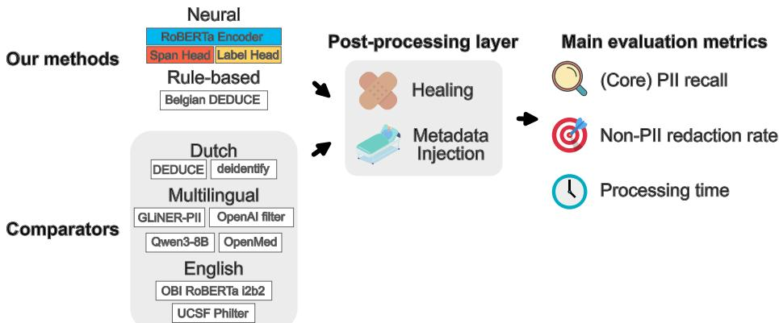  
Fig. 1 | De-identification systems, shared post-processing and evaluation metrics. Our compact neural de-identifiers combine a transformer encoder with separate heads for token-level span boundaries and span labels; the Dutch models use RobBERT-2023, whereas the separately trained English model uses RoBERTa-base. Belgian DEDUCE instead adapts the rule-based Dutch DE-DUCE system to the Belgian context. We compared these approaches with published Dutch systems (DEDUCE and deidentify), zero-shot or general-purpose multilingual detectors (GLiNER-PII, OpenAI Privacy Filter and OpenMed), a locally deployed generative model (Qwen3-8B), and English systems (OBI RoBERTa i2b2 and UCSF Philter). Although these systems detect PII in diferent ways, each produces candidate character spans that follow the same MedDeID post-processing path. Healing joins or extends detections using deterministic rules, while metadata injection adds detections for known patient and caregiver names without inserting metadata into the text. This common path allows the evaluation to answer three practical questions: how much PII is found, how much non-PII text is removed, and how quickly the notes are processed. Dutch benchmarks use core PII recall; English benchmarks use annotation-character recall because the external English datasets lack sub-annotations.

Table 2 | De-identification performance on three annotated test sets
<table><tr><td></td><td colspan="3">Core PII recall (↑ higher is better)</td><td colspan="3">Non-PII redaction rate (↓ lower is better)</td></tr><tr><td>Method</td><td>Hospital</td><td>Synth.</td><td>Primary care</td><td>Hospital</td><td>Synth.</td><td>Primary care</td></tr><tr><td>meddeid-dutch-uza (ours)</td><td>98.9</td><td>96.6</td><td>87.0</td><td>0.24</td><td>0.39</td><td>0.29</td></tr><tr><td>meddeid-dutch-synth (ours)</td><td>96.1</td><td>99.8</td><td>90.3</td><td>0.83</td><td>0.28</td><td>1.22</td></tr><tr><td>Belgian DEDUCE (ours)</td><td>88.0</td><td>70.2</td><td>74.9</td><td>0.63</td><td>1.70</td><td>0.90</td></tr><tr><td>Qwen3-8B (Yang et al.) 30</td><td>84.2</td><td>90.9</td><td>60.8</td><td>0.88</td><td>1.28</td><td>0.31</td></tr><tr><td>deidentify (Trienes et al.) 14</td><td>86.4</td><td>76.7</td><td>68.6</td><td>0.56</td><td>0.37</td><td>5.73</td></tr><tr><td>GLiNER-PII (Zaratiana et al.) 31</td><td>76.6</td><td>83.0</td><td>70.4</td><td>2.11</td><td>1.58</td><td>3.42</td></tr><tr><td>DEDUCE (Menger et al.) 13</td><td>75.9</td><td>45.9</td><td>57.2</td><td>0.50</td><td>0.58</td><td>0.54</td></tr><tr><td>OpenAI privacy filter</td><td>72.1</td><td>58.9</td><td>66.9</td><td>0.61</td><td>0.52</td><td>11.46</td></tr><tr><td>OpenMed multilingual filter</td><td>49.1</td><td>53.0</td><td>37.1</td><td>0.96</td><td>1.01</td><td>8.25</td></tr><tr><td>Annotator 1</td><td>98.8</td><td></td><td></td><td>0.17</td><td></td><td></td></tr><tr><td>Annotator 2</td><td>98.5</td><td></td><td></td><td>0.36</td><td></td><td></td></tr></table>

The hospital-trained model has the highest recall on the hospital benchmark, whereas the synthetic-trained model has the highest recall on the synthetic and primary-care benchmarks. Both models retain low non-PII redaction, so their recall is not achieved by indiscriminately removing ordinary text. Values are percentages. Bold indicates the best-performing model in each column; annotators are excluded from this comparison. Results use metadata; dashes indicate that a system was not evaluated. Corresponding 95% document-clustered bootstrap confidence intervals are reported in Supplementary Table S4d. Metadata-free results and the non-PII redaction decomposition are reported in Supplementary Tables S4a–c.

Table 3 | External synthetic English portability benchmarks
<table><tr><td></td><td colspan="2">Technetium-I</td><td colspan="2">ASQ-PHI</td></tr><tr><td>Method</td><td>Recall (↑)</td><td>Non-PII redaction (↓)</td><td>Recall (↑)</td><td>Non-PII redaction * (↓)</td></tr><tr><td>meddeid-english-synth (ours)</td><td>99.730</td><td>1.606</td><td>98.90</td><td>6.21</td></tr><tr><td>GLiNER Multilingual PII</td><td>97.773</td><td>3.616</td><td>96.32</td><td>11.52</td></tr><tr><td>OBI RoBERTa i2b2</td><td>91.595</td><td>0.868</td><td>95.45</td><td>2.01</td></tr><tr><td>OpenAI Privacy Filter</td><td>96.328</td><td>0.870</td><td>63.48</td><td>1.19</td></tr><tr><td>OpenMed Multilingual Privacy Filter</td><td>92.032</td><td>1.086</td><td>75.36</td><td>4.39</td></tr><tr><td>OpenMed SuperClinical 434M</td><td>94.828</td><td>1.723</td><td>61.67</td><td>4.85</td></tr><tr><td>UCSF Philter</td><td>88.295</td><td>0.700</td><td>70.89</td><td>1.80</td></tr></table>

The synthetic-trained MedDeID English model has the highest recall on both benchmarks. Systems with lower non-PII redaction generally miss more annotated PII. \*Raw non-PII redaction rates are shown. ASQ-PHI leaves explicit ages below 90 unannotated, so redacting these ages increases this rate. To compare the systems fairly, we recalculated the rate for every system after excluding the same age characters. MedDeID’s rate after excluding these ages was 0.89% (0.75–1.03%), second to OBI RoBERTa i2b2 at 0.55% (0.45–0.66%); the full comparison is reported in Supplementary Table S12. The comparison therefore supports portability to synthetic English data while showing why recall and benchmark taxonomy must be read together; it does not establish performance on real English clinical text. Values are percentages. Recall is label-agnostic annotation-character recall. Bold indicates the best result in each column. Corresponding 95% document-clustered bootstrap confidence intervals are reported in Supplementary Tables S11–S12. Full taxonomy-aligned sensitivity results are reported in Supplementary Section S10.

Recall loss under controlled perturbations  
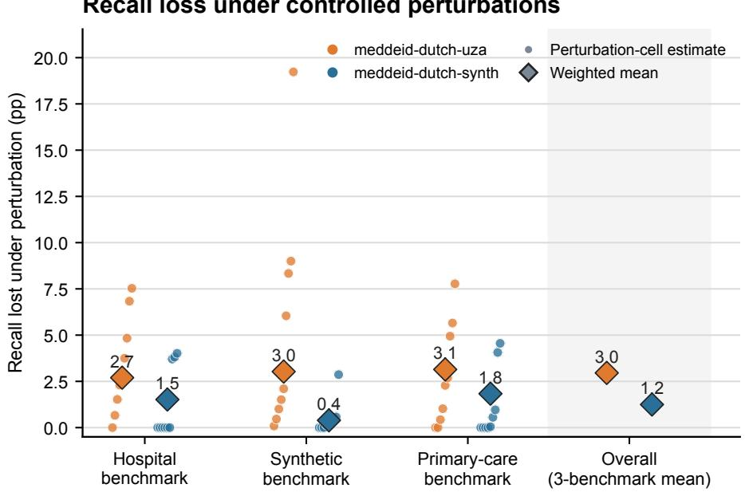  
Fig. 2 | Stability across evaluation datasets. Orange and blue circles show recall loss in each eligible perturbation cell for meddeid-dutch-uza and meddeid-dutch-synth, respectively; improvements are plotted at zero. Diamonds show the average loss. Within each benchmark, experiments containing more target spans contribute more to this average. The overall average gives equal weight to each of the three benchmarks. The synthetic-trained model has the smaller mean loss in each benchmark and overall (1.2 versus 3.0 percentage points), whereas the hospital-trained model shows both a larger average loss and the most extreme perturbation response. Thus, the aggregate advantage reflects consistently greater stability rather than a single benchmark. Lower values indicate greater stability. Cell-level efects, 95% confidence intervals and adjusted tests are reported in Supplementary Fig. S9 and Tables S7b–d.

Accuracy vs. run time — Hospital benchmark  
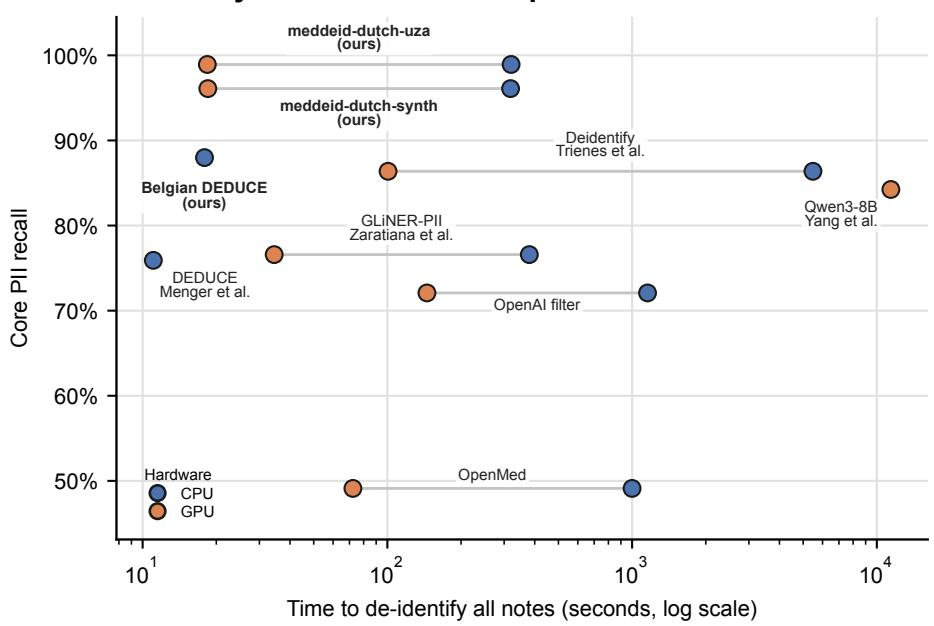  
Fig. 3 | Recall and processing time on the hospital benchmark. Core PII recall versus the time required to de-identify all 300 hospital notes; time is shown on a logarithmic scale. Blue and orange markers denote CPU and GPU runs, respectively. Measurements for the same system are connected. The compact MedDeID neural models occupy the high-recall, low-runtime region, with meddeid-dutch-uza providing the strongest combination. GPU use shortens processing for several systems, but the locally deployed Qwen3-8B remains both slower and less accurate than the compact models.

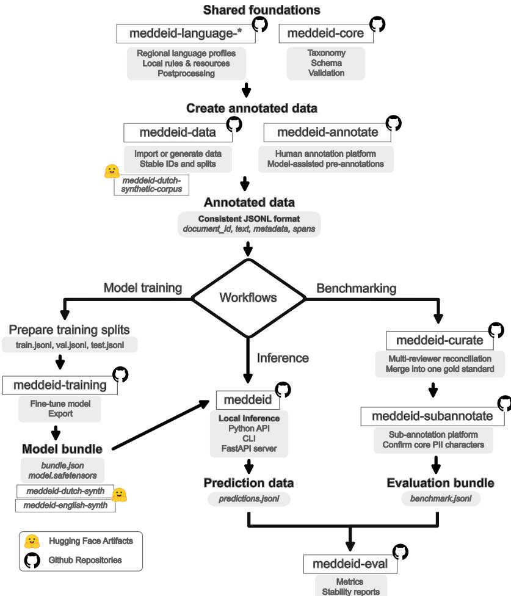  
Fig. 4 | MedDeID software and data workflow. Shared schemas and language profiles connect data import or generation, annotation, training, inference, benchmark construction and evaluation through consistent JSONL and versioned model artefacts. Annotated data can therefore support either model development or benchmark creation; trained models feed local inference, and their predictions return to the same evaluation contract. This shared foundation turns otherwise separate tools into a repeatable workflow in which language profiles, datasets or models can change without rebuilding every stage. GitHub and Hugging Face symbols indicate public code and model or data artefacts, respectively.

## Supplementary Information

MedDeID enables locally governed clinical-text de-identification from real or synthetic training data

Hellemans et al.

This Supplementary Information provides extended dataset summaries, benchmark tables, additional analyses and figures, and the complete English annotation guideline in its original styled layout. Both the Dutch- and English-language versions of the annotation guideline are available in the Zenodo archive 1,2. All study methods are reported in the main manuscript. Personally identifiable information is abbreviated as PII throughout; Antwerp University Hospital is abbreviated as UZA.

## Contents

• S1. Dataset summary — Fig. S1, Table S1

• S2. Annotation scheme — Tables S2–S3

• S3. Benchmark results — Tables S4a–d

• S4. Per-label performance — Table S5, Figs S2–S3

• S5. Label fidelity — Table S6, Fig. S4

• S6. Perturbation stability — Tables S7a–d, Figs S5–S9

• S7. Non-PII redaction — Fig. S10

• S8. Model and timing specifications — Tables S8 and S9

• S9. Pseudonymisation validation — Tables S10a–b, Fig. S11

• S10. English portability — Tables S11–S13

• Appendix A. Annotation guidelines

## S1. Dataset summary

We compared annotation volume and mapped label composition across all six evaluation datasets (Fig. S1). The clinical department or specialty composition of the hospital benchmark and development corpus is reported in Table S1. Annotation density divides the number of gold spans by all documents or queries, including the 219 ASQ-PHI hard-negative queries without annotations. The composition analysis maps the canonical labels to nine broad categories solely to support comparison across taxonomies. It is descriptive: diferences can reflect clinical setting, document type, synthetic-generation design and source-label coverage, and should not be interpreted as estimates of identifier prevalence in clinical practice.

Hospital benchmark composition. Of the 579,920 characters in the 300-note hospital benchmark, 55,379 (9.55%) fall within a gold annotation and 42,093 contribute to the core PII denominator; the remaining 524,541 characters form the denominator for the non-PII redaction rate. For comparison, the open synthetic benchmark contains 419,578 characters, including 37,443 core PII characters.

PII annotation volume and composition across evaluation datasets

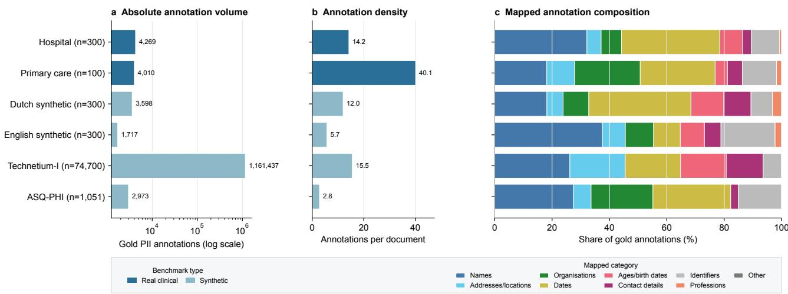  
Fig. S1 | PII annotation volume and composition across evaluation datasets. a, Absolute numbers of mapped gold PII spans on a logarithmic scale. b, Gold spans per document or query. c, Percentage composition after mapping canonical labels to nine broad categories. Although the primary-care benchmark contains 100 notes, compared with 300 in the hospital, Dutch synthetic and English synthetic benchmarks, its longer notes yield the highest annotation density (40.1 gold annotations per note). The benchmarks difer by several orders of magnitude and by identifier mix, showing why performance must be tested across datasets rather than inferred from a single benchmark. Counts refer to annotation records; overlapping source annotations are retained. In the dataset labels, n denotes the number of evaluated documents or queries.

Table S1 | Clinical specialty distribution in the hospital datasets
<table><tr><td>Clinical department or specialty</td><td>Hospital benchmark, n</td><td>Development corpus, n</td></tr><tr><td>Not available</td><td>42</td><td>357</td></tr><tr><td>Cardiology</td><td>20</td><td>318</td></tr><tr><td>Otorhinolaryngology (ear, nose and throat)</td><td>19</td><td>218</td></tr><tr><td>Paediatrics</td><td>17</td><td>210</td></tr><tr><td>Orthopaedics</td><td>17</td><td>187</td></tr><tr><td>Ophthalmology</td><td>16</td><td>118</td></tr><tr><td>Emergency admissions</td><td>15</td><td>209</td></tr><tr><td>Gastroenterology and hepatology</td><td>14</td><td>161</td></tr><tr><td>Neurology</td><td>11</td><td>122</td></tr><tr><td>Pulmonology</td><td>9</td><td>125</td></tr><tr><td>Thoracic and vascular surgery</td><td>9</td><td>109</td></tr><tr><td>Urology</td><td>9</td><td>78</td></tr><tr><td>Neurosurgery</td><td>8</td><td>77</td></tr><tr><td>Magnetic resonance imaging (MRI)</td><td>8</td><td>46</td></tr><tr><td>Oncology</td><td>7</td><td>141</td></tr><tr><td>Gynaecology</td><td>7</td><td>93</td></tr><tr><td>Haematology</td><td>6</td><td>100</td></tr><tr><td>Intensive care</td><td>5</td><td>291</td></tr><tr><td>Abdominal, paediatric and plastic surgery</td><td>5</td><td>82</td></tr><tr><td>Cardiac surgery</td><td>5</td><td>75</td></tr><tr><td>Hepatobiliary, transplant and endocrine surgery</td><td>5</td><td>57</td></tr><tr><td>Endocrinology, diabetology and metabolism</td><td>4</td><td>103</td></tr><tr><td>Physical and rehabilitation medicine</td><td>4</td><td>37</td></tr><tr><td>Dermatology</td><td>3</td><td>86</td></tr><tr><td>Immunology, allergology and rheumatology</td><td>3</td><td>56</td></tr><tr><td>Radiology</td><td>3</td><td>55</td></tr><tr><td>Gynaecological oncology</td><td>3</td><td>41</td></tr><tr><td>Nuclear medicine</td><td>3</td><td>36</td></tr><tr><td>Pain centre</td><td>3</td><td>35</td></tr><tr><td>Oral and maxillofacial surgery</td><td>3</td><td>18</td></tr><tr><td>Fertility medicine</td><td>3</td><td>12</td></tr><tr><td>General internal medicine</td><td>2</td><td>275</td></tr><tr><td>Neonatology</td><td>2</td><td>26</td></tr><tr><td>Central phlebotomy</td><td>2</td><td>22</td></tr><tr><td>Dentistry</td><td>2</td><td>6</td></tr><tr><td>Anaesthesiology</td><td>1</td><td>68</td></tr><tr><td>Nephrology outpatient clinic</td><td>1</td><td>39</td></tr><tr><td>Sleep centre</td><td>1</td><td>29</td></tr><tr><td>Obstetrics</td><td>1</td><td>20</td></tr><tr><td>Geriatrics</td><td>1</td><td>13</td></tr><tr><td>Cardiac rehabilitation</td><td>1</td><td>9</td></tr><tr><td>Psychiatry</td><td>0</td><td>240</td></tr><tr><td>Thoracic oncology</td><td>0</td><td>32</td></tr><tr><td>Medical genetics</td><td>0</td><td>14</td></tr><tr><td>Chronic dialysis centre</td><td>0</td><td>7</td></tr><tr><td>Tropical medicine</td><td>0</td><td>5</td></tr><tr><td>Multidisciplinary sports medicine centre</td><td>0</td><td>3</td></tr><tr><td>Clinical biology laboratory</td><td>0</td><td>2</td></tr><tr><td>Hearing and speech rehabilitation</td><td>0</td><td>2</td></tr><tr><td>Stomatology and maxillofacial surgery</td><td>0</td><td>2</td></tr><tr><td>Sexual Assault Care Centre</td><td>0</td><td>2</td></tr><tr><td>Medical check-up</td><td>0</td><td>1</td></tr></table>

The clinical department or specialty was available for 258 of 300 notes (86.0%) in the hospital benchmark and 4,113 of 4,470 notes (92.0%) in the hospital development corpus. The benchmark included 40 distinct mapped departments or specialties, compared with 51 in the development corpus. Counts use English translations of the source labels; missing or unmapped information is retained as “Not available”. Psychiatry and general internal medicine were deliberately enriched in the development corpus with small additional note sets. These counts therefore describe the study corpus and not the underlying distribution of hospital documentation.

## S2. Annotation scheme

The annotation scheme has two levels. A span-level label records what type of identifier was found and, where relevant, the entity to whom it refers (Table S2). A character-level sub-annotation then records the role of each part of that span (Table S3). This second layer separates the characters that carry identifying information from punctuation, titles and clinically useful context captured inside the same span.

The scheme draws on the NIH/NLM Scrubber clinical-text annotation guidelines 3,4, the HIPAA 18-identifier set 5, and the GraSCCo/GeMTeX framework6,7, adapted to the Belgian and Dutch context. The complete rulebook with worked examples is Appendix A. Use of Anonymize\_Other was deliberately minimised and treated as a signal that a span required further consideration rather than as a destination label.

The character-level sub-annotation scheme used to define the core PII denominator is illustrated below. These sub-annotations are applied within the span-level annotation labels described in Appendix A.

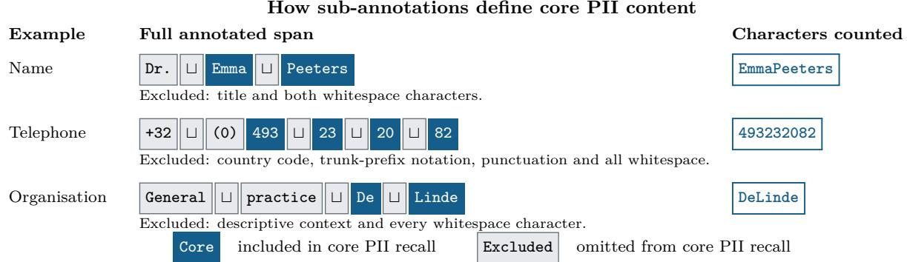

Sub-annotation schematic. The symbol ⊔ marks a literal space, which remains part of the full span but is excluded from the core PII denominator. Dark boxes are included and light boxes are excluded. The right-hand strings concatenate included characters for illustration; evaluation uses their original ofsets.

Table S2 | Annotation labels and definitions
<table><tr><td>Annotation label</td><td>Definition</td></tr><tr><td>Name:Patient</td><td>Given names, family names or initials referring to the patient whose record is being annotated.</td></tr><tr><td>Name:Caregiver</td><td>Names or initials of clinicians and other healthcare or social-care workers involved in care. A directly adjacent professional title may be included in the span.</td></tr><tr><td>Name:0ther</td><td>Names or initials of relatives, friends, other patients and external people who are not care providers.</td></tr><tr><td>Address_Location:Patient</td><td>Postal addresses and other locations officially linked to the patient, including home address and place of birth.</td></tr><tr><td>Address_Location:Caregiver</td><td>Addresses or locations linked to a caregiver or care institution when they are not part of the organisation name.</td></tr><tr><td>Address_Location:Other</td><td>Addresses and locations linked to relatives, external bodies, events, accidents or travel.</td></tr><tr><td>Organization:Healthcare</td><td>Named healthcare or social-care organisations, insurers, departments, units and institution-specific locations relevant to the patient.</td></tr><tr><td>Organization:Other</td><td>Named non-healthcare organisations such as employers, companies, schools, clubs and associations.</td></tr><tr><td>Date</td><td>Calendar dates or date fragments, including public holidays and weekdays when directly</td></tr><tr><td>Age_Birthdate</td><td>attached to a date. A date of birth or an expressed age, including the accompanying age unit.</td></tr><tr><td>Profession</td><td>Occupation, professional status, education, voluntary role or hobby of the patient or a relative; treating-caregiver specialisms are excluded.</td></tr><tr><td>Contactdetails</td><td>Communication details such as e-mail addresses, telephone or fax numbers, pagers and URLs; postal addresses are labelled as Address_Location.</td></tr><tr><td>ID:Patient</td><td>Identifiers traceable to the patient, including patient or national-register numbers, record identifiers, study identifiers and patient-specific access links.</td></tr><tr><td>ID:Caregiver</td><td>Identifiers assigned to a professional, such as a registration, licence or institutional staff number.</td></tr><tr><td>Anonymize_Other</td><td>Exceptional identifying information that materially raises re-identification risk but does not fit another label.</td></tr></table>

Concise definitions are shown here; the complete annotation rules and worked examples are provided in Appendix A.

Table S3 | Sub-annotations included in core PII recall
<table><tr><td>Sub-annotation</td><td>Parent annotation(s)</td><td>Definition</td><td>Core PII</td></tr><tr><td colspan="4">Context and span structure formatting</td></tr><tr><td></td><td>Any</td><td>Non-identifying separators and syntax, including whitespace, punctuation, brackets and telephone-formatting or country-code characters.</td><td>No</td></tr><tr><td>additional_info</td><td>Any</td><td>Non-identifying descriptive or contextual words captured within the annotation boundary.</td><td>No</td></tr><tr><td>medical info</td><td>Any</td><td>Clinical information included inside a broader annotated span but not identifying on its own.</td><td>No</td></tr><tr><td colspan="4">Person-name components</td></tr><tr><td>given</td><td>Name; Contactdetails</td><td>Given-name component of a person name or contact identifier.</td><td>Yes</td></tr><tr><td>family</td><td>Name; Contactdetails</td><td>Family-name component of a person name or contact identifier.</td><td>Yes</td></tr><tr><td>initials</td><td>Name; Contactdetails</td><td>Initials representing a person's given or family names.</td><td>Yes</td></tr><tr><td>title</td><td>Name</td><td>Honorific or professional title adjacent to a name, such as “Dr" or “Prof".</td><td>No</td></tr><tr><td colspan="4">Professional and social context</td></tr><tr><td>hobby</td><td>Profession</td><td>Recreational, educational or voluntary activity used as a personal descriptor.</td><td>Yes</td></tr><tr><td>profession</td><td>Profession</td><td>Occupation, job title, educational field or named professional</td><td>Yes</td></tr><tr><td>employment_state</td><td>Profession</td><td>role. Employment-status descriptor such as retired, unemployed or</td><td>Yes</td></tr><tr><td colspan="4">Organisation components</td></tr><tr><td>company</td><td>Organization</td><td>Named commercial company or employer.</td><td>Yes</td></tr><tr><td>institution</td><td>Organization; Contactdetails</td><td>Named (healthcare) institution, including an institution-identifying component of an e-mail address or URL.</td><td>Yes</td></tr><tr><td>hospital_location</td><td>Organization</td><td>Institution-specific campus, department, ward, unit or room/location code.</td><td>Yes</td></tr><tr><td colspan="4">Address and geographic components</td></tr><tr><td>country</td><td>Address_Location</td><td>Country component when it occurs within an annotated address or location.</td><td>Yes</td></tr><tr><td>province</td><td>Address_Location; Organization</td><td>Province or equivalent first-level administrative area.</td><td>Yes</td></tr><tr><td>region</td><td>Address_Location;</td><td>Named region or other subnational area distinct from a province.</td><td>Yes</td></tr><tr><td>municipality</td><td>Organization Address_Location;</td><td>City, town, village or municipality.</td><td>Yes</td></tr><tr><td>postal_code</td><td>Organization Address_Location</td><td>Postal or ZIP code.</td><td>Yes</td></tr><tr><td>street</td><td>Address_Location</td><td>Street or road name.</td><td>Yes</td></tr><tr><td>house_number</td><td>Address_Location</td><td>Building or house number.</td><td>Yes</td></tr><tr><td>bus_number</td><td>Address_Location</td><td>Apartment, unit or Belgian "bus" number.</td><td>Yes</td></tr><tr><td>postal_office</td><td>Address_Location</td><td>Post-office, delivery-office or locality suffix forming part of an address.</td><td>Yes</td></tr><tr><td colspan="4">Contact components</td></tr><tr><td>internal_phone</td><td>Contactdetails</td><td>Internal telephone extension or institution-only telephone</td><td>Yes</td></tr><tr><td>public_phone</td><td>Contactdetails</td><td>number. Publicly dialable telephone or mobile number.</td><td>Yes</td></tr><tr><td>fax_number</td><td>Contactdetails</td><td>Fax number.</td><td>Yes</td></tr><tr><td>Identifier components</td><td></td><td></td><td></td></tr><tr><td>public_id</td><td>ID</td><td>Externally recognised person-specific identifier, such as a national-register or provider number.</td><td>Yes</td></tr><tr><td>internal_id</td><td>ID</td><td>Locally assigned record, patient, admission, study or staff</td><td>Yes</td></tr><tr><td></td><td></td><td>identifier.</td><td></td></tr><tr><td colspan="4">Calendar, time and age components</td></tr><tr><td>day</td><td>Date; Age_Birthdate; ID</td><td>Day component in a date, birth date or identifier. Calendar-week component in a date, birth date or identifier.</td><td>Yes</td></tr><tr><td>week</td><td>Date; Age_Birthdate; ID</td><td>Month component in a date, birth date or identifier.</td><td>Yes</td></tr><tr><td>month</td><td>Date; Age_Birthdate; ID</td><td></td><td>Yes</td></tr><tr><td>year weekday</td><td>Date; Age_Birthdate; ID</td><td>Year component in a date, birth date or identifier.</td><td>Yes</td></tr><tr><td></td><td>Date; Age_Birthdate</td><td>Named weekday when included with a calendar date or date of birth.</td><td>Yes</td></tr><tr><td>time</td><td>Date; Age_Birthdate</td><td>Clock time occurring within a broader date or birth-date span.</td><td>No</td></tr><tr><td>season</td><td>Date</td><td>Named season in a season-year expression used as an imprecise</td><td>Yes</td></tr><tr><td>age_type</td><td>Age_Birthdate</td><td>calendar reference. Lexical age unit or marker, such as "years", "months" or "y".</td><td>Yes</td></tr><tr><td>Sub-annotation</td><td>Parent annotation(s)</td><td>Definition</td><td>Core PII?</td></tr><tr><td>age_year</td><td>Age_Birthdate</td><td>Age component expressed in years.</td><td>Yes</td></tr><tr><td>age_month</td><td>Age_Birthdate</td><td>Age component expressed in months.</td><td>Yes</td></tr><tr><td>age_week</td><td>Age_Birthdate</td><td>Age component expressed in weeks.</td><td>Yes</td></tr><tr><td>age_day</td><td>Age_Birthdate</td><td>Age component expressed in days.</td><td>Yes</td></tr></table>

All sub-annotation categories are included in core PII recall unless marked “No”. The five excluded categories are formatting, additional\_info, medical\_info, title and time. Parent annotations indicate where each sub-annotation was observed in this study and are not exhaustive.

## S3. Full Dutch benchmark results

Tables S4a–c report character-level performance and Table S4d reports uncertainty for the primary Dutch benchmark outcomes; all values are percentages. Tables S4a–c give point estimates for the full metric decomposition and both metadata configurations. Table S4d gives intervals for core PII recall and non-PII redaction in the metadata-enabled configuration used in the main analysis. For the hospital and primary-care benchmarks, intervals are reported for every system. The Dutch synthetic benchmark tests the complete workflow in-domain; the uncertainty analysis therefore covered the headline meddeid-dutch-synth result. The narrower English tables retain their intervals inline. Core PII recall is the percentage of identifying information hidden. Its denominator excludes the five non-identifying or clinically meaningful sub-annotation categories listed in Table S3. Overall recall instead covers all characters in the complete annotated PII spans, including those five categories. The non-PII redaction rate is the percentage of characters outside annotated PII spans that are redacted. It is decomposed into characters redacted by false-positive spans, which do not overlap any annotated PII span, and PII boundary extensions, the excess characters redacted by predicted spans that overlap an annotated PII span but extend beyond its boundary. These two components sum to the total non-PII redaction rate. Metadata-enabled rows are the deployed, main-text configurations in which patient and caregiver names from note metadata are injected into the detection layer; dashes indicate not applicable. The non-PII denominator includes every evaluated document, including hard-negative notes without gold PII.

Table S4a | Hospital benchmark (300 notes)
<table><tr><td>Method</td><td>Meta.</td><td>Core PII recall (%)</td><td>Overall recall (%)</td><td>Non-PII redaction rate (%)</td><td>False positives (%)</td><td>Boundary extensions (%)</td></tr><tr><td>meddeid-dutch-uza (ours)</td><td>no</td><td>98.8</td><td>98.4</td><td>0.226</td><td>0.067</td><td>0.159</td></tr><tr><td>meddeid-dutch-uza (ours)</td><td>yes</td><td>98.9</td><td>98.5</td><td>0.236</td><td>0.067</td><td>0.168</td></tr><tr><td>meddeid-dutch-synth (ours)</td><td>no</td><td>95.3</td><td>94.5</td><td>0.815</td><td>0.630</td><td>0.185</td></tr><tr><td>meddeid-dutch-synth (ours)</td><td>yes</td><td>96.1</td><td>95.2</td><td>0.825</td><td>0.630</td><td>0.195</td></tr><tr><td>Belgian DEDUCE (ours)</td><td>no</td><td>78.5</td><td>77.5</td><td>0.594</td><td>0.401</td><td>0.193</td></tr><tr><td>Belgian DEDUCE (ours)</td><td>yes</td><td>88.0</td><td>85.7</td><td>0.634</td><td>0.423</td><td>0.211</td></tr><tr><td>Qwen3-8B (Yang et al.)</td><td>no</td><td>81.8</td><td>81.4</td><td>0.872</td><td>0.451</td><td>0.420</td></tr><tr><td>Qwen3-8B (Yang et al.)</td><td>yes</td><td>84.2</td><td>83.6</td><td>0.877</td><td>0.451</td><td>0.426</td></tr><tr><td>deidentify (Trienes et al.)</td><td>no</td><td>82.8</td><td>74.6</td><td>0.546</td><td>0.539</td><td>0.007</td></tr><tr><td>deidentify (Trienes et al.)</td><td>yes</td><td>86.4</td><td>78.8</td><td>0.558</td><td>0.539</td><td>0.019</td></tr><tr><td>GLiNER-PII (Zaratiana et al.)</td><td>no</td><td>75.0</td><td>75.4</td><td>2.108</td><td>1.796</td><td>0.313</td></tr><tr><td>GLiNER-PII (Zaratiana et al.)</td><td>yes</td><td>76.6</td><td>76.8</td><td>2.113</td><td>1.796</td><td>0.317</td></tr><tr><td>DEDUCE (Menger et al.)</td><td>no</td><td>65.5</td><td>65.8</td><td>0.465</td><td>0.317</td><td>0.148</td></tr><tr><td>DEDUCE (Menger et al.)</td><td>yes</td><td>75.9</td><td>74.9</td><td>0.502</td><td>0.332</td><td>0.169</td></tr><tr><td>OpenAI privacy filter</td><td>no</td><td>66.2</td><td>63.3</td><td>0.607</td><td>0.527</td><td>0.080</td></tr><tr><td>OpenAI privacy filter</td><td>yes</td><td>72.1</td><td>68.5</td><td>0.611 0.946</td><td>0.527</td><td>0.084</td></tr><tr><td>OpenMed multilingual filter</td><td>no</td><td>37.6 49.1</td><td>33.5 44.1</td><td>0.955</td><td>0.927</td><td>0.019</td></tr><tr><td>OpenMed multilingual filter</td><td>yes</td><td>98.8</td><td>98.5</td><td>0.174</td><td>0.927 0.007</td><td>0.028</td></tr><tr><td>Annotator 1</td><td></td><td></td><td>98.5</td><td>0.359</td><td>0.123</td><td>0.167</td></tr><tr><td>Annotator 2</td><td></td><td>98.5</td><td></td><td></td><td></td><td>0.236</td></tr></table>

Values are percentages. Meta., metadata injection; non-PII redaction is the sum of false positives and boundary extensions. Annotator rows are descriptive.

Table S4b | Synthetic benchmark (300 notes, openly released)
<table><tr><td>Method</td><td>Meta.</td><td>Core PII recall (%)</td><td>Overall recall (%)</td><td>Non-PII redaction rate (%)</td><td>False positives (%)</td><td>Boundary extensions (%)</td></tr><tr><td>meddeid-dutch-uza (ours)</td><td>no</td><td>96.2</td><td>95.4</td><td>0.395</td><td>0.184</td><td>0.210</td></tr><tr><td>meddeid-dutch-uza (ours)</td><td>yes</td><td>96.6</td><td>95.8</td><td>0.395</td><td>0.184</td><td>0.210</td></tr><tr><td>meddeid-dutch-synth (ours)</td><td>no</td><td>99.8</td><td>99.7</td><td>0.279</td><td>0.046</td><td>0.233</td></tr><tr><td>meddeid-dutch-synth (ours)</td><td>yes</td><td>99.8</td><td>99.7</td><td>0.279</td><td>0.046</td><td>0.233</td></tr><tr><td>Belgian DEDUCE (ours)</td><td>no</td><td>65.7</td><td>65.4</td><td>0.791</td><td>0.309</td><td>0.482</td></tr><tr><td>Belgian DEDUCE (ours)</td><td>yes</td><td>70.2</td><td>69.6</td><td>1.696</td><td>1.089</td><td>0.607</td></tr><tr><td>Qwen3-8B (Yang et al.)</td><td>no</td><td>90.4</td><td>90.4</td><td>1.284</td><td>0.495</td><td>0.790</td></tr><tr><td>Qwen3-8B (Yang et al.)</td><td>yes</td><td>90.9</td><td>90.9</td><td>1.284</td><td>0.495</td><td>0.790</td></tr><tr><td>deidentify (Trienes et al.)</td><td>no</td><td>74.9</td><td>71.8</td><td>0.371</td><td>0.306</td><td>0.065</td></tr><tr><td>deidentify (Trienes et al.)</td><td>yes</td><td>76.7</td><td>74.5</td><td>0.371</td><td>0.306</td><td>0.065</td></tr><tr><td>GLiNER-PII (Zaratiana et al.)</td><td>no</td><td>82.2</td><td>81.9</td><td>1.580</td><td>1.024</td><td>0.555</td></tr><tr><td>GLiNER-PII (Zaratiana et al.)</td><td>yes</td><td>83.0</td><td>83.1</td><td>1.580</td><td>1.024</td><td>0.555</td></tr><tr><td>DEDUCE (Menger et al.)</td><td>no</td><td>35.6</td><td>36.3</td><td>0.405</td><td>0.273</td><td>0.132</td></tr><tr><td>DEDUCE (Menger et al.)</td><td>yes</td><td>45.9</td><td>46.1</td><td>0.576 0.517</td><td>0.408</td><td>0.168</td></tr><tr><td>OpenAI privacy filter</td><td>no</td><td>53.3</td><td>53.3 58.9</td><td>0.517</td><td>0.389</td><td>0.128</td></tr><tr><td>OpenAI privacy filter</td><td>yes no</td><td>58.9 48.8</td><td>46.3</td><td>1.012</td><td>0.389 0.964</td><td>0.128</td></tr><tr><td>OpenMed multilingual filter</td><td></td><td>53.0</td><td>50.6</td><td>1.012</td><td>0.964</td><td>0.048</td></tr><tr><td>OpenMed multilingual filter</td><td>yes</td><td></td><td></td><td></td><td></td><td>0.048</td></tr></table>

Values are percentages. Meta., metadata injection; non-PII redaction is the sum of false positives and boundary extensions.

Table S4c | Primary-care external validation (100 notes)
<table><tr><td>Method</td><td>Meta.</td><td>Core PII recall (%)</td><td>Overall recall (%)</td><td>Non-PII redaction rate (%)</td><td>False positives (%)</td><td>Boundary extensions (%)</td></tr><tr><td></td><td>no</td><td>86.7</td><td>84.8</td><td>0.285</td><td>0.225</td><td>0.060</td></tr><tr><td>meddeid-dutch-uza (ours) meddeid-dutch-uza (ours)</td><td>yes</td><td>87.0</td><td>85.0</td><td>0.288</td><td>0.227</td><td>0.061</td></tr><tr><td>meddeid-dutch-synth (ours)</td><td>no</td><td>89.9</td><td>87.0</td><td>1.219</td><td>1.144</td><td>0.075</td></tr><tr><td>meddeid-dutch-synth (ours)</td><td>yes</td><td>90.3</td><td>87.3</td><td>1.224</td><td>1.149</td><td>0.075</td></tr><tr><td>Belgian DEDUCE (ours)</td><td>no</td><td>73.0</td><td>69.3</td><td>0.881</td><td>0.829</td><td>0.052</td></tr><tr><td>Belgian DEDUCE (ours)</td><td>yes</td><td>74.9</td><td>71.2</td><td>0.905</td><td>0.855</td><td>0.050</td></tr><tr><td>Qwen3-8B (Yang et al.)</td><td>no</td><td>58.4</td><td>58.0</td><td>0.306</td><td>0.151</td><td>0.155</td></tr><tr><td>Qwen3-8B (Yang et al.)</td><td>yes</td><td>60.8</td><td>60.0</td><td>0.312</td><td>0.156</td><td>0.156</td></tr><tr><td>deidentify (Trienes et al.)</td><td>no</td><td>67.9</td><td>62.4</td><td>5.727</td><td>5.650</td><td>0.077</td></tr><tr><td>deidentify (Trienes et al.)</td><td>yes</td><td>68.6</td><td>62.9</td><td>5.728</td><td>5.651</td><td>0.077</td></tr><tr><td>GLiNER-PII (Zaratiana et al.)</td><td>no</td><td>70.1</td><td>69.1</td><td>3.423</td><td>3.327</td><td>0.095</td></tr><tr><td>GLiNER-PII (Zaratiana et al.)</td><td>yes</td><td>70.4</td><td>69.4</td><td>3.424</td><td>3.328</td><td>0.095</td></tr><tr><td>DEDUCE (Menger et al.)</td><td>no</td><td>54.4</td><td>52.4</td><td>0.522</td><td>0.478</td><td>0.044</td></tr><tr><td>DEDUCE (Menger et al.)</td><td>yes</td><td>57.2</td><td>54.9</td><td>0.543</td><td>0.496</td><td>0.047</td></tr><tr><td>OpenAI privacy filter</td><td>no</td><td>64.5</td><td>61.9 63.9</td><td>11.461 11.464</td><td>11.296</td><td>0.165</td></tr><tr><td>OpenAI privacy filter</td><td>yes</td><td>66.9</td><td>31.4</td><td>8.244</td><td>11.299 8.236</td><td>0.165</td></tr><tr><td>OpenMed multilingual filter</td><td>no</td><td>34.1</td><td>33.9</td><td>8.247</td><td>8.238</td><td>0.008</td></tr><tr><td>OpenMed multilingual filter</td><td>yes</td><td>37.1</td><td></td><td></td><td></td><td>0.009</td></tr></table>

Values are percentages. Meta., metadata injection; non-PII redaction is the sum of false positives and boundary extensions.

Table S4d | Confidence intervals for Dutch benchmark outcomes
<table><tr><td>Benchmark</td><td>Method</td><td>Core PII recall, % (95% CI)</td><td>Non-PII redaction, % (95% CI)</td></tr><tr><td>Hospital</td><td>meddeid-dutch-uza (ours)</td><td>98.9 (98.5–99.3)</td><td>0.24 (0.16–0.32)</td></tr><tr><td>Hospital</td><td>meddeid-dutch-synth (ours)</td><td>96.1 (95.3–96.9)</td><td>0.83 (0.64–1.03)</td></tr><tr><td>Hospital</td><td>Belgian DEDUCE (ours)</td><td>88.0 (86.6–89.4)</td><td>0.63 (0.46–0.84)</td></tr><tr><td>Hospital</td><td>Qwen3-8B (Yang et al.)</td><td>84.2 (82.0–86.4)</td><td>0.88 (0.71–1.09)</td></tr><tr><td>Hospital</td><td>deidentify (Trienes et al.)</td><td>86.4 (85.0–87.7)</td><td>0.56 (0.37–0.80)</td></tr><tr><td>Hospital</td><td>GLiNER-PII (Zaratiana et al.)</td><td>76.6 (74.8–78.4)</td><td>2.11 (1.87–2.38)</td></tr><tr><td>Hospital</td><td>DEDUCE (Menger et al.)</td><td>75.9 (74.0–77.9)</td><td>0.50 (0.34–0.70)</td></tr><tr><td>Hospital</td><td>OpenAI privacy filter</td><td>72.1 (69.5–74.6)</td><td>0.61 (0.41–0.87)</td></tr><tr><td>Hospital</td><td>OpenMed multilingual filter</td><td>49.1 (47.2–51.0)</td><td>0.96 (0.85–1.06)</td></tr><tr><td>Synthetic</td><td>meddeid-dutch-synth (ours)</td><td>99.8 (99.5–100.0)</td><td>0.28 (0.21–0.35)</td></tr><tr><td>Primary care</td><td>meddeid-dutch-uza (ours)</td><td>87.0 (83.9–90.0)</td><td>0.29 (0.23–0.38)</td></tr><tr><td>Primary care</td><td>meddeid-dutch-synth (ours)</td><td>90.3 (88.4–92.3)</td><td>1.22 (0.88–1.71)</td></tr><tr><td>Primary care</td><td>Belgian DEDUCE (ours)</td><td>74.9 (71.4–78.4)</td><td>0.90 (0.67–1.20)</td></tr><tr><td>Primary care</td><td>Qwen3-8B (Yang et al.)</td><td>60.8 (56.1–65.5)</td><td>0.31 (0.18–0.51)</td></tr><tr><td>Primary care</td><td>deidentify (Trienes et al.)</td><td>68.6 (62.6–74.1)</td><td>5.73 (2.13–9.54)</td></tr><tr><td>Primary care</td><td>GLiNER-PII (Zaratiana et al.)</td><td>70.4 (67.2–73.3)</td><td>3.42 (2.57–4.37)</td></tr><tr><td>Primary care</td><td>DEDUCE (Menger et al.)</td><td>57.2 (51.7–62.6)</td><td>0.54 (0.40–0.67)</td></tr><tr><td>Primary care</td><td>OpenAI privacy filter</td><td>66.9 (62.7–71.2)</td><td>11.46 (3.03–20.33)</td></tr><tr><td>Primary care</td><td>OpenMed multilingual filter</td><td>37.1 (34.5–39.8)</td><td>8.25 (3.64–13.22)</td></tr></table>

Values are point estimates with 95% percentile-bootstrap confidence intervals in parentheses. Complete documents were sampled with replacement in 10,000 replicates, using the same document multiplicities for every system within each analysis; rates were recalculated from summed character counts. Metadata-enabled configurations are shown. Hospital and primary-care analyses include every system; the Dutch synthetic analysis includes the headline meddeid-dutch-synth result only. The annotator comparison is descriptive.

## S4. Per-label performance

Table S5 | Core PII recall by gold label in hospital notes
<table><tr><td>Gold label</td><td>Spans</td><td>UZA</td><td>Synth.</td><td>Bel. DE- DUCE</td><td>Qwen3- 8B</td><td>OpenAI</td><td>Ann. 1</td><td>Ann. 2</td></tr><tr><td>Date</td><td>1463</td><td>99.9</td><td>99.7</td><td>87.5</td><td>77.8</td><td>82.5</td><td>99.3</td><td>98.8</td></tr><tr><td>Name:Caregiver</td><td>1023</td><td>99.4</td><td>95.3</td><td>92.9</td><td>87.0</td><td>84.7</td><td>99.2</td><td>99.4</td></tr><tr><td>Name:Patient</td><td>337</td><td>100.0</td><td>98.2</td><td>96.8</td><td>98.5</td><td>97.4</td><td>100.0</td><td>100.0</td></tr><tr><td>Age_Birthdate</td><td>335</td><td>99.4</td><td>98.6</td><td>87.3</td><td>89.8</td><td>77.7</td><td>99.1</td><td>96.7</td></tr><tr><td>ID:Patient</td><td>314</td><td>96.8</td><td>94.1</td><td>79.4</td><td>78.0</td><td>67.9</td><td>98.8</td><td>98.9</td></tr><tr><td>Organization:Healthcare</td><td>296</td><td>94.7</td><td>77.0</td><td>67.3</td><td>62.3</td><td>12.6</td><td>93.5</td><td>96.4</td></tr><tr><td>Contactdetails</td><td>132</td><td>99.8</td><td>100.0</td><td>75.6</td><td>92.8</td><td>46.4</td><td>100.0</td><td>99.7</td></tr><tr><td>Address_Location:Patient</td><td>127</td><td>100.0</td><td>99.7</td><td>94.2</td><td>89.4</td><td>36.0</td><td>100.0</td><td>100.0</td></tr><tr><td>ID:Caregiver</td><td>107</td><td>100.0</td><td>97.5</td><td>73.8</td><td>87.4</td><td>76.7</td><td>99.3</td><td>97.0</td></tr><tr><td>Address_Location:Caregiver</td><td>81</td><td>100.0</td><td>99.3</td><td>97.2</td><td>90.7</td><td>45.1</td><td>99.8</td><td>99.8</td></tr><tr><td>Profession</td><td>31</td><td>72.7</td><td>47.8</td><td>0.0</td><td>28.8</td><td>0.0</td><td>73.8</td><td>47.8</td></tr><tr><td>Name:Other</td><td>12</td><td>100.0</td><td>90.3</td><td>100.0</td><td>91.0</td><td>73.1</td><td>91.0</td><td>100.0</td></tr><tr><td>Organization:Other</td><td>7</td><td>21.4</td><td>66.1</td><td>7.1</td><td>17.9</td><td>0.0</td><td>71.4</td><td>94.6</td></tr><tr><td>Address_Location:Other</td><td>4</td><td>100.0</td><td>82.6</td><td>100.0</td><td>100.0</td><td>69.6</td><td>100.0</td><td>100.0</td></tr></table>

Values are percentages from metadata-enabled configurations. Gold span counts are shown because several categories are small and should not be over-interpreted. Abbreviations: UZA, meddeid-dutch-uza; Synth., meddeid-dutch-synth; Bel. DEDUCE, Belgian DEDUCE; Ann., annotator.

For gold-label categories containing more than 100 spans, meddeid-dutch-uza achieved recall of at least 96.0%, except for Organization:Healthcare (94.7%; 296 spans). Recall was 100.0% for patient names, caregiver identifiers, and patient and caregiver addresses. Lower recall was observed for Profession (72.7%; 31 spans) and Organization:Other (21.4%; 7 spans). These estimates are based on small numbers of spans and should be interpreted cautiously. The two annotators also difered for these small categories. For Profession, they identified 73.8% and 47.8% of the annotated text; for Organization:Other, they identified 71.4% and 94.6%.

The general-purpose OpenAI neural PII detector achieved 12.6% recall for healthcare organisations and 0.0% for professions; Belgian DEDUCE also achieved 0.0% for professions. These categories are not represented in the corresponding general-purpose or rule-based detector taxonomies.

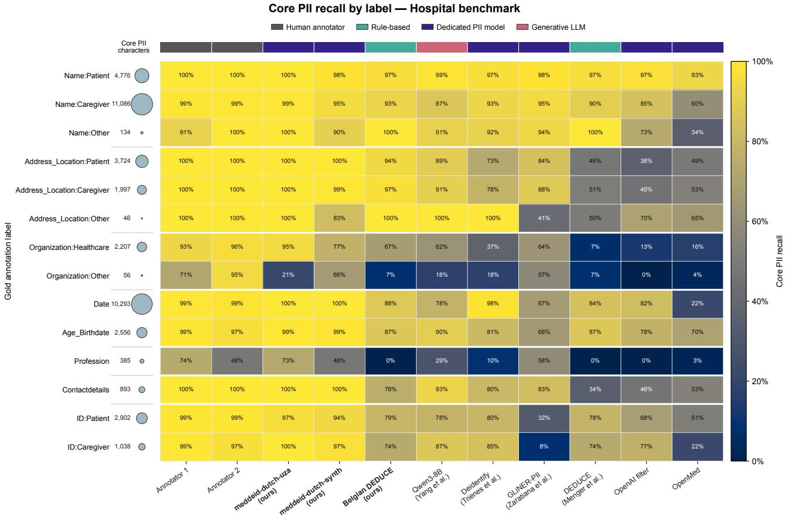  
Fig. S2 | Recall by gold label, hospital benchmark. Core PII recall for each system and gold-label category. Cell values are percentages; circle area at left represents the character-level core PII denominator, with the exact character count shown beside it. The strongest systems perform consistently on common names, dates and identifiers, but diferences widen for rarer or clinically specific categories. Overall recall therefore conceals category-specific gaps. Rows with few gold spans should be interpreted cautiously.

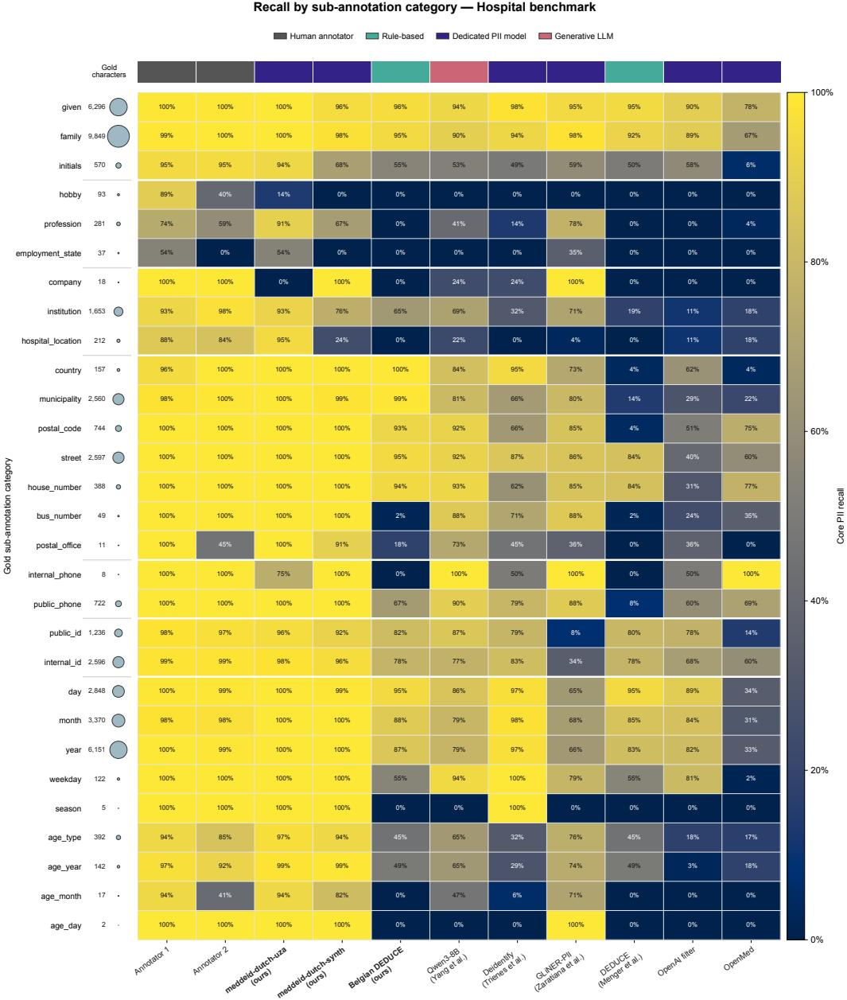  
Fig. S3 | Recall by sub-annotation category, hospital benchmark. Character recall by gold sub-annotation category. Cell values are percentages. The two leftmost columns show the physician annotators. Circle area represents the number of gold sub-annotation characters, with the exact count printed beside each category.

## S5. Span detection and label fidelity

Core PII recall measures the fraction of core identifying characters redacted, irrespective of the predicted label. To analyse span-level detection and label assignment separately, predictions and annotations were paired one-to-one when their core-PII character positions overlapped. Label fidelity is the proportion of detected spans assigned the correct identifier type and role. The confusion matrices include only detected spans; missed annotations are reflected in the span detection-recall values in Table S6. Only gold spans containing at least one core-PII character entered this analysis. Table S6 therefore includes 4,263 of the 4,269 hospital annotation records and 4,008 of the 4,010 primary-care records; the remaining six and two records, respectively, contained only sub-annotations excluded from core PII recall.

Table S6 | Span detection and label fidelity
<table><tr><td>Benchmark</td><td>Model</td><td>Detected / annotated (span detection recall)</td><td>Correct label / detected (label accuracy)</td><td>Incorrectly labelled</td></tr><tr><td>Hospital</td><td>meddeid-dutch-uza</td><td>4,188 / 4,263 (98.2%)</td><td> $4 , 1 4 3 \mathrm { ~ / ~ } 4 , 1 8 8 \mathrm { ~ ( 9 8 . 9 \% ) ~ }$ </td><td>45</td></tr><tr><td>Hospital</td><td>meddeid-dutch-synth</td><td>3,956 / 4,263 (92.8%)</td><td>3,663 / 3,956 (92.6%)</td><td>293</td></tr><tr><td>Primary care</td><td>meddeid-dutch-uza</td><td>3,102 / 4,008 (77.4%)</td><td>2,787 / 3,102 (89.8%)</td><td>315</td></tr><tr><td>Primary care</td><td> $\mathtt { m e d d e i d - d u t c h - s y n t h }$ </td><td>3,218 / 4,008 (80.3%)</td><td>2,552 / 3,218 (79.3%)</td><td>666</td></tr></table>

All values use the metadata-enabled configuration and the matching current evaluator export for each benchmark.

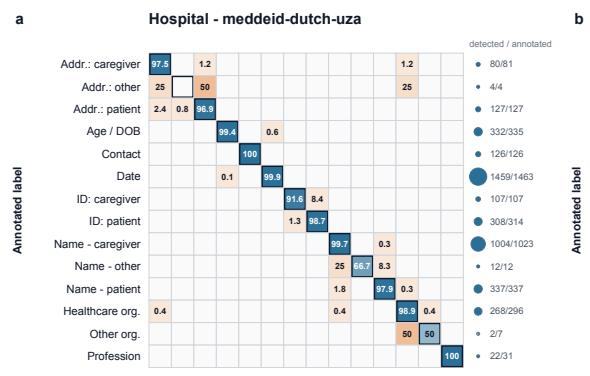

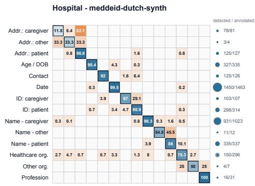

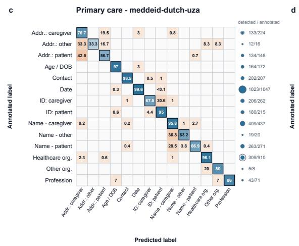

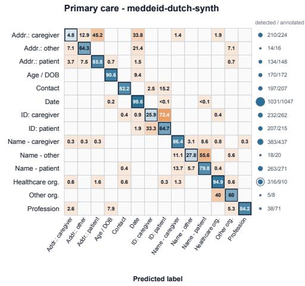  
Fig. S4 | Exact-label confusion among detected PII spans. Columns compare the hospital-trained meddeid-dutch-uza and synthetic-trained meddeid-dutch-synth. $\mathbf { a } , \mathbf { b } ,$ , Hospital benchmark; $\mathbf { c } , \mathbf { d } .$ , primary-care benchmark. Rows are reference labels and columns are predicted labels. Percentages are normalised within detected spans; blue diagonal cells indicate exact-label assignment and orange of-diagonal cells indicate misclassification. Circle area shows the number of annotated spans and blue fill the detected fraction; exact detected / annotated counts are printed alongside.

## S6. Stability under input perturbations

Coverage-selected subsets of up to 100 notes per scope were perturbed along name source, name capitalisation, name format, date format, date value and age format. Asterisks below indicate statistically significant degradation; interval construction and hypothesis testing are described in Methods.

Sign convention. Tables S7b–c report recall loss as baseline minus perturbed recall: positive values therefore indicate worse performance. Losses only and worst drop are non-negative loss magnitudes. Table S7d instead reports recall change as perturbed minus baseline recall: negative values indicate worse performance and positive values indicate an improvement.

Table S7a | Perturbation-analysis sample sizes
<table><tr><td>Test set</td><td>Notes selected for testing (n)</td><td>Baseline-perturbation span pairs per analysis (n, range)</td><td>Notes represented per analysis (n, range)</td></tr><tr><td>Hospital</td><td>100</td><td>27-519</td><td>19-98</td></tr><tr><td>Synthetic</td><td>100</td><td>30-508</td><td>23-97</td></tr><tr><td>Primary care</td><td>100</td><td>87-1127</td><td>28-91</td></tr></table>

For each test set, 100 notes were selected to cover the six perturbation dimensions. An analysis included only notes containing the relevant target identifier. Ranges give the smallest and largest sample sizes across the nine analyses listed for that test set in Table S7d. A span pair is the same identifier in the original and perturbed note.

Table S7b | Aggregate stability across test sets
<table><tr><td>Model</td><td>Baseline recall (%) Net loss (pp) Losses only (pp) Worst drop (pp) Significant cells</td><td></td><td></td><td></td><td></td></tr><tr><td>meddeid-dutch-uza (ours)</td><td>97.8</td><td>2.87</td><td>2.96</td><td>19.23</td><td>7 /  27</td></tr><tr><td>meddeid-dutch-synth (ours) 96.9</td><td></td><td>0.60</td><td>1.25</td><td>4.56</td><td>5 / 27</td></tr></table>

Each model contributes 27 cells. Positive loss denotes worse performance. Net loss is the signed, target-span-weighted mean of baseline minus perturbed recall; losses only uses the same weighting but replaces gains with zero. Metrics are calculated within each test set and then averaged equally across the three test sets. Significant cells have Benjamini–Hochberg-adjusted q < 0.05. For meddeid-dutch-synth, perturbations caused 1.25 pp of average loss, while gains in other analyses reduced the net loss to 0.60 pp.

Table S7c | Aggregate stability by test set
<table><tr><td>Scope</td><td>Model</td><td>Baseline (%)</td><td>Net loss (pp)</td><td>Worst drop (pp)</td><td>Significant cells</td></tr><tr><td>Hospital</td><td>meddeid-dutch-uza (ours)</td><td>99.1</td><td>2.66</td><td>7.53</td><td>2 /9</td></tr><tr><td>Hospital</td><td>meddeid-dutch-synth (ours)</td><td>95.2</td><td>0.45</td><td>4.02</td><td>2/9</td></tr><tr><td>Synthetic</td><td>meddeid-dutch-uza (ours)</td><td>98.2</td><td>3.03</td><td>19.23</td><td>4/9</td></tr><tr><td>Synthetic</td><td>meddeid-dutch-synth (ours)</td><td>99.9</td><td>0.32</td><td>2.86</td><td>1 /9</td></tr><tr><td></td><td>Primary care meddeid-dutch-uza (ours)</td><td>96.3</td><td>2.93</td><td>7.77</td><td>1 /9</td></tr><tr><td></td><td>Primary care meddeid-dutch-synth (ours)</td><td>95.5</td><td>1.03</td><td>4.56</td><td>2/9</td></tr></table>

Positive loss denotes worse performance. Each test set contributes nine cells per model. Significant cells have Benjamini–Hochbergadjusted q < 0.05.

Table S7d | Cell-level recall changes under perturbation
<table><tr><td></td><td></td><td></td><td></td><td></td><td>∆ recall, pp (q)</td><td>Hospital-trained model Synthetic-trained model ∆ recall, pp (q)</td></tr><tr><td>Scope</td><td>Dimension</td><td>Role</td><td></td><td>n pairs n notes</td><td></td><td></td></tr><tr><td>Hospital Hospital</td><td>age_format capitalization</td><td>age</td><td>27 164</td><td></td><td>19 -7.53 (0.126) 66 -1.52 (0.086)</td><td>-3.70 (0.982) -3.81* (0.044)</td></tr><tr><td>Hospital</td><td></td><td>caregiver</td><td>40</td><td></td><td>32 -3.75 (0.342)</td><td></td></tr><tr><td>Hospital</td><td>capitalization date_format</td><td>patient date</td><td>519</td><td></td><td>98 -0.66 (0.099)</td><td>+4.17 (1.000)</td></tr><tr><td>Hospital</td><td>date__value__shift</td><td>date</td><td>411</td><td></td><td>96 -4.83* (0.001)</td><td>+0.25 (1.000)</td></tr><tr><td>Hospital</td><td>format</td><td>caregiver</td><td>161</td><td></td><td>66 -6.83* (0.033)</td><td>-4.02* (0.001)</td></tr><tr><td>Hospital</td><td>format</td><td>patient</td><td>40</td><td></td><td>32 -2.50 (0.126)</td><td>+2.91 (1.000)</td></tr><tr><td>Hospital</td><td>name_source</td><td>caregiver</td><td>164</td><td></td><td>66 +0.40 (0.735)</td><td>+14.50 (1.000) +1.34 (1.000)</td></tr><tr><td>Hospital</td><td>name_source</td><td>patient</td><td>40</td><td></td><td>32 -2.30 (0.086)</td><td>+2.80 (1.000)</td></tr><tr><td>Synthetic</td><td>age_format</td><td>age</td><td>87</td><td></td><td>84 -1.51 (0.333)</td><td>-0.57 (0.982)</td></tr><tr><td>Scope</td><td>Dimension</td><td>Role</td><td>n pairs n notes</td><td></td><td>∆ recall, pp (q)</td><td>Hospital-trained model Synthetic-trained model ∆ recall, pp (q)</td></tr><tr><td>Synthetic</td><td>capitalization</td><td>caregiver</td><td>32</td><td></td><td>25 -8.33 (0.086)</td><td>-2.86 (0.839)</td></tr><tr><td>Synthetic</td><td>capitalization</td><td>patient</td><td>91</td><td></td><td>89 -6.04* (0.008)</td><td>-0.55 (0.982)</td></tr><tr><td>Synthetic</td><td>date_format</td><td>date</td><td>508</td><td></td><td>97 -0.46 (0.099)</td><td>-0.50* (0.001)</td></tr><tr><td>Synthetic</td><td>date_value_shift</td><td>date</td><td>357</td><td></td><td>86 -2.10* (0.001)</td><td>-0.16 (0.063)</td></tr><tr><td>Synthetic</td><td>format</td><td>caregiver</td><td>30</td><td></td><td>23 -9.00* (0.040)</td><td>+3.33 (1.000)</td></tr><tr><td>Synthetic</td><td>format</td><td>patient</td><td>91</td><td></td><td>89 -19.23* (0.001)</td><td>-0.00 (1.000)</td></tr><tr><td>Synthetic</td><td>name_source</td><td>caregiver</td><td>32</td><td></td><td>25 -1.01 (0.413)</td><td>-0.50 (0.982)</td></tr><tr><td>Synthetic</td><td>name_source</td><td>patient</td><td>91</td><td></td><td>89 -0.09 (0.550)</td><td>-0.00 (1.000)</td></tr><tr><td>Primary care</td><td>age_format</td><td>age</td><td>87</td><td></td><td>28 -4.94 (0.333)</td><td>-0.56 (0.982)</td></tr><tr><td>Primary care</td><td>capitalization</td><td>caregiver</td><td>236</td><td></td><td>53 -2.68 (0.213)</td><td>-4.56 (0.487)</td></tr><tr><td>Primary care</td><td>capitalization</td><td>patient</td><td>163</td><td></td><td>43 -1.02 (0.333)</td><td>+2.51 (1.000)</td></tr><tr><td>Primary care</td><td>date_format</td><td>date</td><td>1127</td><td></td><td>91 +0.64 (0.785)</td><td>-0.96* (0.008)</td></tr><tr><td>Primary care</td><td>date value shift</td><td>date</td><td>984</td><td></td><td>87 -7.77* (0.001)</td><td>-4.06* (0.001)</td></tr><tr><td>Primary care</td><td>format</td><td>caregiver</td><td>229</td><td></td><td>53 -5.66 (0.291)</td><td>+2.42 (1.000)</td></tr><tr><td>Primary care</td><td>format</td><td>patient</td><td>163</td><td></td><td>43 +0.03 (0.550)</td><td>+7.61 (1.000)</td></tr><tr><td>Primary care</td><td>name_source</td><td>caregiver</td><td>236</td><td></td><td>53 -0.43 (0.413)</td><td>+2.16 (1.000)</td></tr><tr><td>Primary care</td><td>name_source</td><td>patient</td><td>163</td><td></td><td>43 -2.28 (0.414)</td><td>-0.05 (0.982)</td></tr></table>

Recall change is perturbed minus baseline recall; negative values denote worse performance. Parentheses contain Benjamini–Hochbergadjusted q values; asterisks denote $q < 0 . 0 5$ . Rows containing at least one significant degradation are bold.

Substituting one set of names for another did not significantly reduce recall after multiple-testing correction. The main vulnerabilities were changes to name formatting and shifted date values, especially for the hospital-trained model. The synthetic-trained model was more stable overall, although it was not better under every individual perturbation.

a  
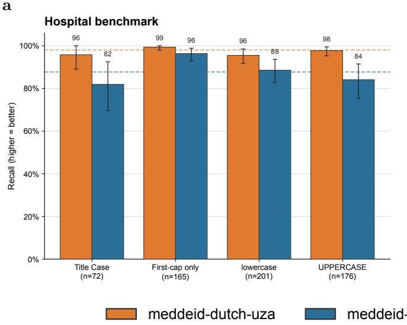

b  
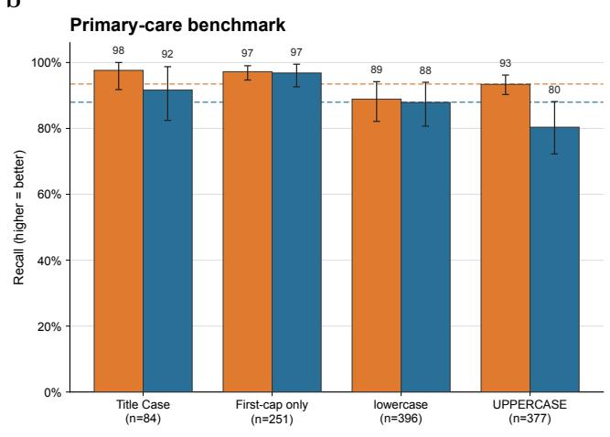  
Fig. S5 | Name recall by capitalisation. a, Hospital benchmark. b, Primary-care benchmark. Error bars show 95% note-level cluster-bootstrap confidence intervals. Higher recall indicates better performance. Descriptively, the largest reduction shown is for the synthetic-trained model with all-uppercase names in primary care; other capitalisation efects vary by model and benchmark.

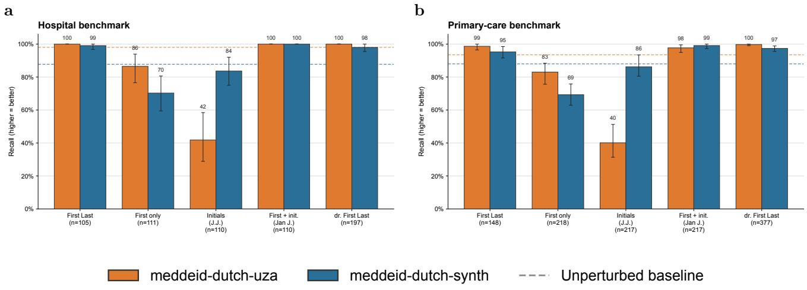

Fig. S6 | Name recall by written format. The models fail in diferent ways: initials cause the largest drop for the hospital-trained model, whereas first-name-only forms reduce recall more for the synthetic-trained model. a, Hospital benchmark. b, Primary-care benchmark. Error bars show 95% note-level cluster-bootstrap confidence intervals.  
a  
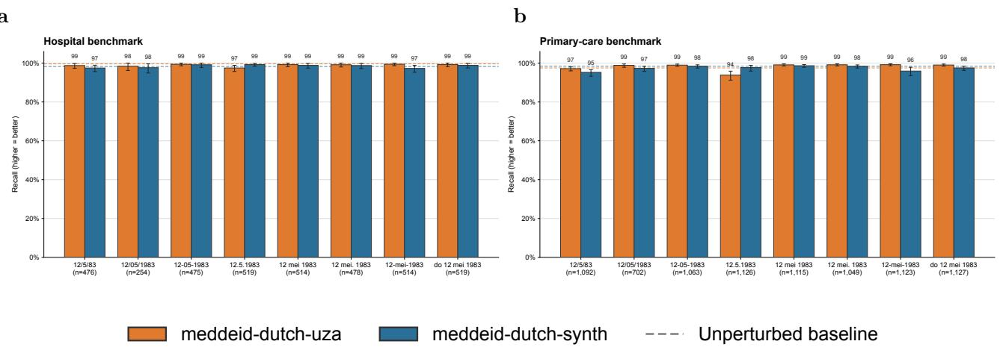  
Fig. S7 | Date recall by written format. Both models remain close to their unperturbed baselines across most written formats, so formatting alone explains little of the larger date-stability diferences. a, Hospital benchmark. b, Primary-care benchmark. Error bars show 95% note-level cluster-bootstrap confidence intervals.

a  
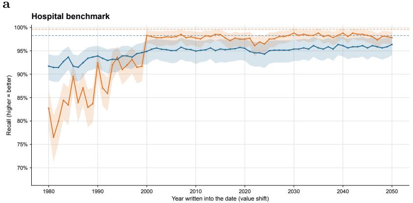

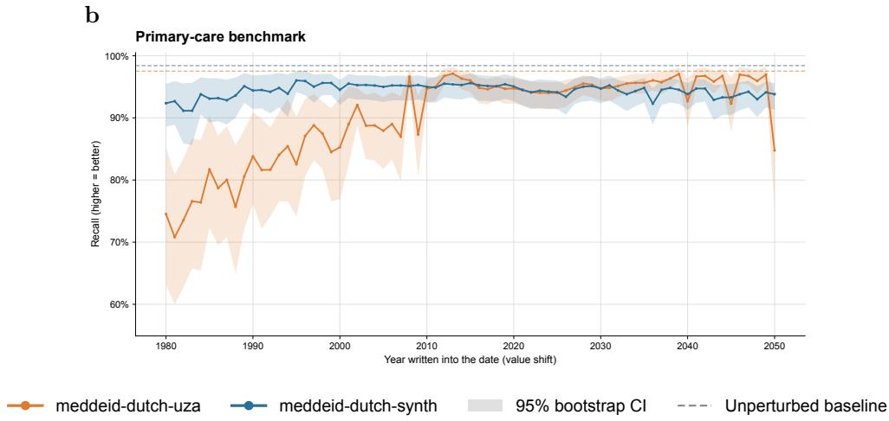  
Fig. S8 | Date recall under year shifts. Recall for the hospital-trained model falls as dates are shifted towards earlier years, while the synthetic-trained model remains comparatively stable. This identifies date value, rather than merely formatting, as a source of sensitivity. a, Hospital benchmark. b, Primary-care benchmark. Shaded bands show 95% note-level cluster-bootstrap confidence intervals.

a  
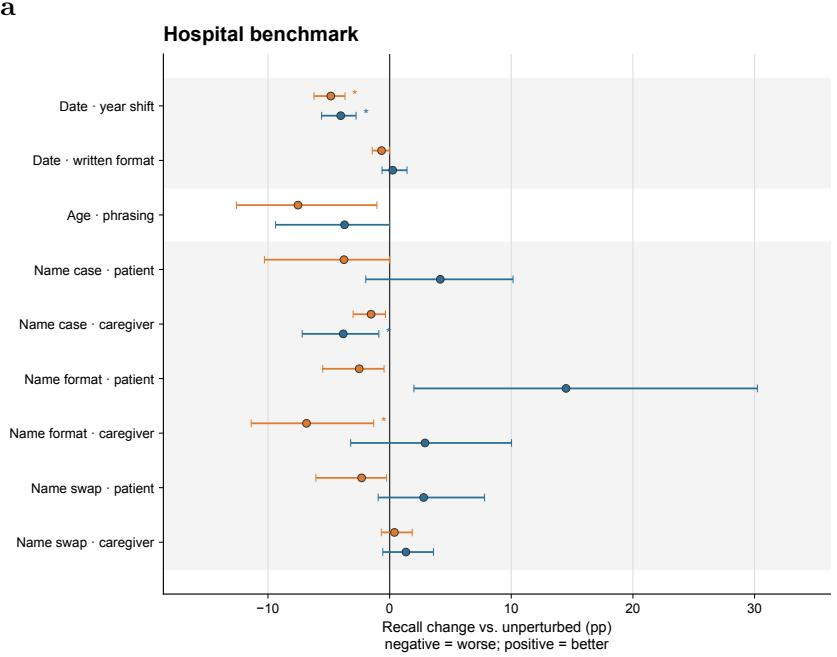

b  
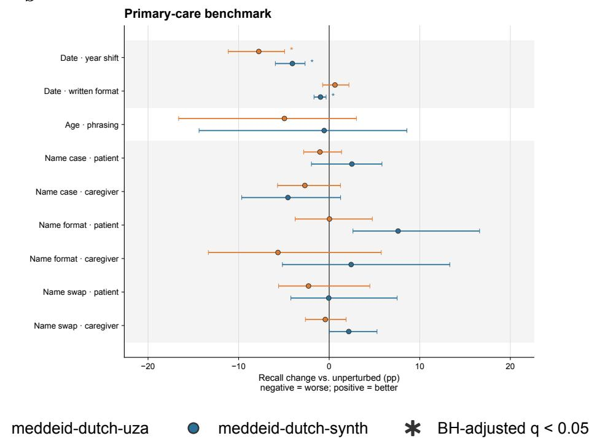  
Fig. S9 | Cell-level recall change under controlled perturbation. Year-shifted dates produce the clearest consistent degradation, particularly for the hospital-trained model; most name efects include little or no change. a, Hospital benchmark. b, Primary-care benchmark. Points and horizontal lines show mean paired changes and 95% note-level cluster-bootstrap confidence intervals. Negative values indicate worse performance. Asterisks denote Benjamini–Hochberg-adjusted $q < 0 . 0 5$ in the 27-cell cross-scope family for each model.

## Absolute non-PII redactions by predicted label

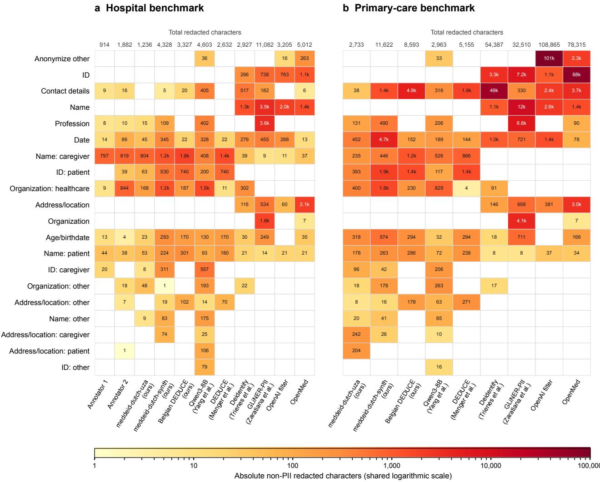  
Fig. S10 | Absolute non-PII redactions by predicted label in the hospital and primary-care benchmarks. a, Hospital benchmark, including the two human annotators. b, Primary-care benchmark; separate human-annotator outputs were unavailable. Cell colour indicates the absolute number of non-PII characters redacted on a logarithmic scale shared by both panels; compact values are printed in non-zero cells. Empty cells represent zero. Values above the columns show the exact total number of non-PII characters redacted by each system or annotator. Non-PII redaction includes both false-positive spans and extensions of predicted PII spans beyond the annotated boundaries.

On primary-care text, the OpenAI neural PII detector redacted 11.46% of non-PII characters and the OpenMed detector 8.25%, compared with 0.29% for meddeid-dutch-uza (Table S4c). Most of this excess came from falsepositive spans concentrated in a few predicted categories; boundary extensions made only a small contribution (Tables S4a–c and Fig. S10).

## S8 . Model and timing specifications

Table S8 | MedDeID training and model-selection settings
<table><tr><td>Setting</td><td>meddeid-dutch-uza</td><td>meddeid-dutch-synth</td><td>meddeid-english-synth</td></tr><tr><td colspan="4">Training data, architecture and input Training dataset 4,470 annotated real Dutch UZA hospital</td></tr><tr><td></td><td>development notes</td><td>6,493 synthetic Dutch clinical notes; no real patient text</td><td>6,700 synthetic English clinical documents (3,350 en-GB, 3,350 en-US); no real patient text</td></tr><tr><td>Language / profiles</td><td>Dutch</td><td>Dutch</td><td>English; en-GB and en-US</td></tr><tr><td>Encoder backbone</td><td>DTAI-KULeuven/robbert-2023-dutch-base8</td><td>DTAI-KULeuven/robbert-2023-dutch-base8</td><td>FacebookAI/roberta-base9</td></tr><tr><td>Prediction heads</td><td>Token-level BIO head (3 classes) and</td><td>Same</td><td>Same</td></tr><tr><td></td><td>entity-type head (14 classes)</td><td></td><td></td></tr><tr><td>Maximum sequence length Window overlap</td><td>512 tokens 64 tokens</td><td>Same Same</td><td>Same Same</td></tr><tr><td>Random seed</td><td>42</td><td>Same</td><td>Same</td></tr><tr><td>Optimisation</td><td></td><td></td><td></td></tr><tr><td>Optimiser</td><td>AdamW</td><td>Same</td><td>Same</td></tr><tr><td>Encoder learning rate</td><td> $2 \times 1 0 ^ { - 5 }$ </td><td>Same</td><td>Same</td></tr><tr><td>Classification-head learning</td><td>1 × 10−4</td><td>Same</td><td>Same</td></tr><tr><td>rate</td><td>0.01 on all trainable parameters</td><td>Same</td><td>Same</td></tr><tr><td>Weight decay Learning-rate schedule</td><td>Linear decay; warm-up ratio 0.10; restarted</td><td>Linear decay; warm-up ratio 0.10; restarted</td><td>Linear decay; warm-up ratio 0.01</td></tr><tr><td>Head-only warm-up</td><td>after head warm-up</td><td>after head warm-up 1 epoch</td><td>None</td></tr><tr><td>Gradient checkpointing</td><td>1 epoch Disabled</td><td>Same</td><td>Same</td></tr><tr><td colspan="4">Batching and runtime</td></tr><tr><td></td><td></td><td></td><td></td></tr><tr><td>Numerical precision</td><td>fp16</td><td>fp32</td><td>fp32</td></tr><tr><td>Training microbatch size</td><td>16</td><td>2</td><td>8 2</td></tr><tr><td>Gradient-accumulation steps</td><td>1</td><td>8</td><td>Same</td></tr><tr><td>Effective training batch size</td><td>16</td><td>Same 8</td><td>16</td></tr><tr><td>Evaluation batch size Data-loader workers / prefetch 4 / 4</td><td>16</td><td>0 / not applicable</td><td>0 / not applicable</td></tr><tr><td>factor</td><td>NVIDIA T4 (CUDA)</td><td>Apple M4 Pro GPU (MPS)</td><td>Apple M4 Pro GPU (MPS)</td></tr><tr><td colspan="4">Compute device</td></tr><tr><td>Epoch selection and final refit Selection training / validation 4,023 / 447</td><td></td><td>5,844 / 649</td><td>6,030  / 670</td></tr><tr><td colspan="4">documents</td></tr><tr><td>Selection metric</td><td>Validation entity-level F1</td><td>Same 50</td><td>Same</td></tr><tr><td>Maximum selection epochs</td><td>50 Patience 3; minimum improvement 0.001:</td><td>Patience 4; minimum improvement 0.001;</td><td>30</td></tr><tr><td>Early stopping</td><td>active from epoch 3</td><td>active from epoch 4</td><td>Patience 3; minimum improvement 0.001; active from epoch 3</td></tr><tr><td>Selection epochs completed</td><td>20 17</td><td>21</td><td></td></tr><tr><td>Selected epoch count Final refit corpus</td><td>All 4,470 hospital development notes</td><td>17 All 6,493 synthetic Dutch training notes</td><td>4 All 6,700 synthetic English development</td></tr><tr><td></td><td>Reinitialised from the base encoder: 17 fixed</td><td>Reinitialised from the base encoder; 17 fixed</td><td>documents Reinitialised from the base encoder; 4 fixed</td></tr><tr><td>Final refit</td><td>epochs</td><td>epochs</td><td>epochs</td></tr><tr><td>Benchmark use during</td><td>Benchmark withheld during selection and</td><td>Same</td><td>Same</td></tr><tr><td>selection</td><td>evaluated once after final refit</td><td></td><td></td></tr></table>

“ S ame ” rep eat s t he first mo del- column value . Zero dat a- loader workers made prefet ching inapplicable . S elect ed ep o ch count s det ermined final- refit durat ion ; b enchmarks were wit hheld unt il final evaluat ion .

Table S9 | Time to de-identify 300 hospital notes
<table><tr><td>System</td><td>Device</td><td>Time (s)</td><td>Throughput (notes/s)</td></tr><tr><td>meddeid-dutch-uza (ours)</td><td>CPU</td><td>320.31</td><td>0.937</td></tr><tr><td>meddeid-dutch-uza (ours)</td><td>GPU</td><td>18.38</td><td>16.322</td></tr><tr><td>meddeid-dutch-synth (ours)</td><td>CPU</td><td>318.74</td><td>0.941</td></tr><tr><td>meddeid-dutch-synth (ours)</td><td>GPU</td><td>18.47</td><td>16.243</td></tr><tr><td>Belgian DEDUCE (ours)</td><td>CPU</td><td>17.90</td><td>16.760</td></tr><tr><td>Qwen3-8B (Yang et al.)</td><td>GPU</td><td>11,411.46</td><td>0.026</td></tr><tr><td>deidentify (Trienes et al.)</td><td>GPU</td><td>100.66</td><td>2.980</td></tr><tr><td>deidentify (Trienes et al.)</td><td>CPU</td><td>5,483.29</td><td>0.055</td></tr><tr><td>GLiNER-PII (Zaratiana et al.)</td><td>CPU</td><td>380.25</td><td>0.789</td></tr><tr><td>GLiNER-PII (Zaratiana et al.)</td><td>GPU</td><td>34.48</td><td>8.700</td></tr><tr><td>DEDUCE (Menger et al.)</td><td>CPU</td><td>11.06</td><td>27.125</td></tr><tr><td>OpenAI privacy filter</td><td>CPU</td><td>1,156.35</td><td>0.259</td></tr><tr><td>OpenAI privacy filter</td><td>GPU</td><td>145.13</td><td>2.067</td></tr><tr><td>OpenMed multilingual filter</td><td>CPU</td><td>999.85</td><td>0.300</td></tr><tr><td>OpenMed multilingual filter</td><td>GPU</td><td>72.31</td><td>4.149</td></tr></table>

Warm end-to-end timings using the definition and computing environments described in Methods.

## S9. Pseudonymisation validation

The gold-span evaluation supplied every Date and Age\_Birthdate span directly to the transformation layer, indepen dently of detector recall. The predicted-span evaluation instead used the metadata-enabled meddeid-dutch-synth predictions. Both evaluations used a fixed creation date (15 January 2025), a +371-day shift and birthdate-to-age replacement.

Table S10a | Gold-span transformation and predicted-span end-to-end failures
<table><tr><td>Dataset</td><td>Target</td><td>Gold spans</td><td>failed, n (%)</td><td>Gold-transform Predicted end-to-end failed, n (%)</td><td>Gold spans with unredacted characters, n (%)</td></tr><tr><td>Synthetic</td><td>Overall</td><td>1693</td><td>0 (0.00)</td><td>25 (1.48)</td><td>12 (0.71)</td></tr><tr><td></td><td>Date</td><td>1281</td><td>0 (0.00)</td><td>22 (1.72)</td><td>9 (0.70)</td></tr><tr><td></td><td>Age/birthdate</td><td>412</td><td>0 (0.00)</td><td>3 (0.73)</td><td>3 (0.73)</td></tr><tr><td>UZA</td><td>Overall</td><td>1798</td><td>14 (0.78)</td><td>61 (3.39)</td><td>39 (2.17)</td></tr><tr><td></td><td>Date</td><td>1463</td><td>13 (0.89)</td><td>33 (2.26)</td><td>26 (1.78)</td></tr><tr><td></td><td>Age/birthdate</td><td>335</td><td>1 (0.30)</td><td>28 (8.36)</td><td>13 (3.88)</td></tr><tr><td>Primary-care</td><td>Overall</td><td>1219</td><td>36 (2.95)</td><td>73 (5.99)</td><td>29 (2.38)</td></tr><tr><td></td><td>Date</td><td>1047</td><td>23 (2.20)</td><td>45 (4.30)</td><td>23 (2.20)</td></tr><tr><td></td><td>Age/birthdate</td><td>172</td><td>13 (7.56)</td><td>28 (16.28)</td><td>6 (3.49)</td></tr></table>

All percentages use gold Date and Age\_Birthdate spans as the denominator. Gold-transform failure isolates the deterministic transformation layer by supplying the gold span directly. Predicted end-to-end failure counts a gold span unless one predicted span covers it completely, has the correct label and produces a protocol-valid transformation. Gold spans with unredacted characters are identifiers for which at least one original character remained outside the model’s predicted redactions. These cases are included among end-to-end failures. Other end-to-end failures were fully redacted but failed because the identifier was split across predictions, assigned the wrong label or transformed incorrectly. Gold-transform failures comprised 14 UZA cases and 36 primary-care cases.

Pseudonymisation failures: gold versus predicted spans  
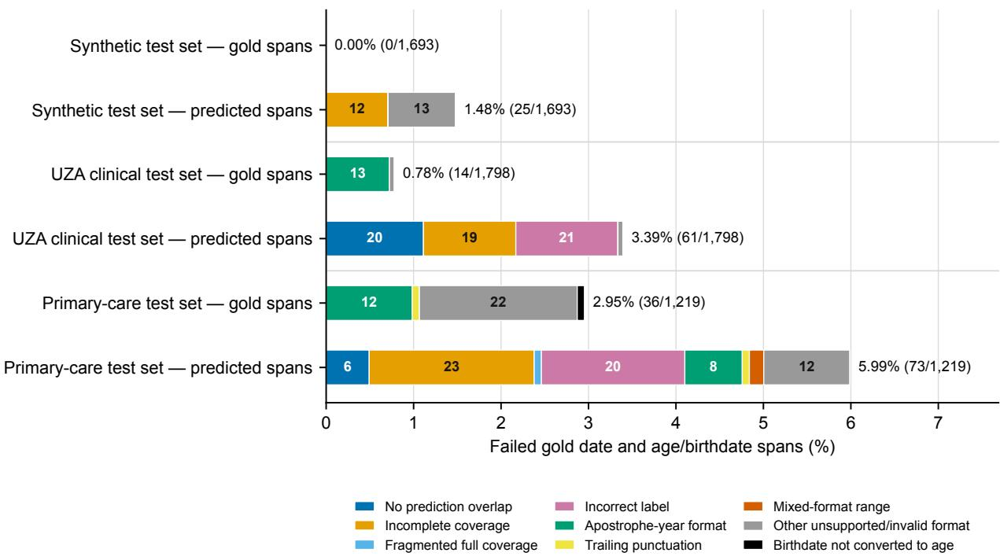  
Fig. S11 | Pseudonymisation failures with gold versus model-predicted spans. Paired rows use the same denominator of all gold Date and Age\_Birthdate spans. Gold-span rows bypass detection and isolate the deterministic transformation layer; predicted-span rows evaluate the full end-to-end pipeline. Stacked widths are failure rates, segment labels are counts and labels to the right give the total failure rate and count. A colour-blind-friendly palette encodes failure mode. The detailed format categories retain the transformation-layer failure analysis in both setups. No prediction overlap and incomplete coverage are the two modes that leave gold-span characters unredacted and occur only in the predicted-span setup. Fragmented full coverage and incorrect labels can fail end to end without leaving source characters unredacted. Gold-span failures comprised 13 apostrophe-year dates and one other invalid format in UZA; in primary care they comprised 12 apostrophe-year dates, one trailing-punctuation date, 22 other invalid formats and one birthdate that was not converted to age.

Table S10b | Age-dependent retained granularity
<table><tr><td>Age</td><td>Retained granularity</td></tr><tr><td>12 years or older</td><td>Whole years</td></tr><tr><td>2 to less than 12 years</td><td>Years and months</td></tr><tr><td>6 months to less than 2 years</td><td>Months</td></tr><tr><td>More than 90 days to less than 6 months Months and weeks</td><td></td></tr><tr><td>More than 28 through 90 days</td><td>Weeks and days</td></tr><tr><td>28 days or younger</td><td>Days</td></tr></table>

Age and birth-date values are reduced more aggressively as age increases, while finer units are retained when clinically important in early childhood. MedDeID Suite allows users to customise these groups and retained levels of detail for local clinical or governance requirements.

## S10. English synthetic benchmark results

Complete benchmark results are reported in Tables S11–S13.

Table S11 | Technetium-I benchmark results
<table><tr><td>Method</td><td>Annotation-character recall, %</td><td>Non-PII redaction, %</td></tr><tr><td>meddeid-english-synth (ours)</td><td>99.730 (99.725–99.735)</td><td>1.606 (1.605–1.608)</td></tr><tr><td>GLiNER Multilingual PII</td><td>97.773 (97.754–97.791)</td><td>3.616 (3.610–3.622)</td></tr><tr><td>OpenAI Privacy Filter</td><td>96.328 (96.307–96.348)</td><td>0.870 (0.869–0.872)</td></tr><tr><td>OpenMed SuperClinical 434M</td><td>94.828 (94.817–94.840)</td><td>1.723 (1.721–1.724)</td></tr><tr><td>OpenMed Multilingual Privacy Filter</td><td>92.032 (91.999–92.065)</td><td>1.086 (1.083–1.089)</td></tr><tr><td>OBI RoBERTa i2b2</td><td>91.595 (91.582–91.608)</td><td>0.868 (0.865–0.870)</td></tr><tr><td>UCSF Philter</td><td>88.295 (88.285–88.304)</td><td>0.700 (0.699–0.701)</td></tr></table>

Percentages include 95% document-clustered bootstrap confidence intervals. Technetium-I is template-generated with PHI in every document, so it is a reproducibility and scale test rather than clinical validation.

Table S12 | ASQ-PHI benchmark results
<table><tr><td>Method</td><td>Annotation-character recall, %</td><td>Raw non-PII redaction, %</td><td>Non-PII redaction after excluding ages, %</td></tr><tr><td>meddeid-english-synth (ours)</td><td>98.90 (98.59–99.19)</td><td>6.21 (5.99–6.43)</td><td>0.89 (0.75–1.03)</td></tr><tr><td>GLiNER Multilingual PII</td><td>96.32 (95.84–96.78)</td><td>11.52 (11.11–11.93)</td><td>4.29 (3.94–4.65)</td></tr><tr><td>OBI RoBERTa i2b2</td><td>95.45 (95.08–95.80)</td><td>2.01 (1.90–2.12)</td><td>0.55 (0.45–0.66)</td></tr><tr><td>OpenMed Multilingual Privacy Filter</td><td>75.36 (74.18–76.55)</td><td>4.39 (4.10–4.69)</td><td>3.20 (2.92–3.48)</td></tr><tr><td>UCSF Philter</td><td>70.89 (70.03–71.75)</td><td>1.80 (1.59–2.01)</td><td>1.80 (1.59–2.01)</td></tr><tr><td>OpenAI Privacy Filter</td><td>63.48 (62.12–64.80)</td><td>1.19 (1.02–1.36)</td><td>1.18 (1.01–1.35)</td></tr><tr><td>OpenMed SuperClinical 434M</td><td>61.67 (60.56–62.81)</td><td>4.85 (4.66–5.03)</td><td>3.43 (3.27–3.59)</td></tr></table>

Recall and both non-PII redaction columns are percentages with 95% document-clustered bootstrap confidence intervals in parentheses. The last column reports results after the same unannotated age expressions were excluded for every system, regardless of its predicted labels. These expressions comprised 8,745 non-gold characters across 878 queries and captured explicit numeric ages (values 5–88, including two infant ages expressed in months) written as year-old or month-old phrases, yo or y shorthand, age N, compact age–sex expressions, or over/under thresholds; overlapping matches were merged. None of these characters overlapped a gold annotation, and qualitative descriptors such as elderly and adolescents remained included. For each system, redacted characters inside these age expressions were removed from the numerator while the original denominator of 119,651 non-PII characters was retained. Numerators after exclusion, in table order were 1,064, 5,137, 661, 3,826, 2,151, 1,411 and 4,101 characters.

Table S13 | Held-out English benchmark with metadata injection
<table><tr><td>Method</td><td>Recall, % No metadata</td><td>Recall, % Patient/caregiver metadata</td><td>Non-PII redaction, % With metadata</td></tr><tr><td>meddeid-english-synth (ours)</td><td>99.96 (99.89–100.00)</td><td>99.96 (99.89–100.00)</td><td>0.009 (0.002–0.017)</td></tr><tr><td>GLiNER Multilingual PII</td><td>90.27 (88.99–91.42)</td><td>90.59 (89.33–91.75)</td><td>1.831 (1.663–2.001)</td></tr><tr><td>OBI RoBERTa i2b2</td><td>86.64 (85.59–87.70)</td><td>86.73 (85.68–87.78)</td><td>0.194 (0.154–0.237)</td></tr><tr><td>OpenMed SuperClinical 434M</td><td>75.10 (73.32–76.81)</td><td>75.12 (73.34–76.83)</td><td>0.480 (0.400–0.563)</td></tr><tr><td>UCSF Philter</td><td>70.83 (69.45–72.20)</td><td>70.94 (69.56–72.30)</td><td>0.986 (0.899–1.076)</td></tr><tr><td>OpenMed Multilingual Privacy Filter</td><td>64.26 (62.04–66.45)</td><td>69.45 (67.41–71.48)</td><td>0.347 (0.292–0.405)</td></tr><tr><td>OpenAI Privacy Filter</td><td>64.38 (61.62–67.17)</td><td>68.45 (65.89–71.01)</td><td>0.051 (0.029–0.076)</td></tr></table>

Values are percentages with 95% document-clustered bootstrap confidence intervals in parentheses. Metadata injection did not afect MedDeID recall or non-PII redaction. The largest recall gains were 5.19 percentage points for OpenMed Multilingual and 4.06 for OpenAI Privacy Filter. As an in-domain synthetic test, this 14-label benchmark does not constitute clinical validation.

## References

[1] Stig Hellemans, Tom Stroobants, Elyne Scheurwegs, Pieter Meysman, Philippe Jorens, and Kris Laukens. MedDeID dutch synthetic corpus, synthetic benchmark and annotation guidelines, 2026. URL https://doi.or g/10.5281/zenodo.21992866. Dataset.

[2] Stig Hellemans, Tom Stroobants, Elyne Scheurwegs, Pieter Meysman, Philippe Jorens, and Kris Laukens. MedDeID english synthetic clinical corpus, benchmark and annotation guideline, 2026. URL https://doi.org/ 10.5281/zenodo.22129255. Dataset.

[3] Mehmet Kayaalp, Phong Sagan, Allen C. Browne, and Clement J. McDonald. Guidelines for annotating personal identifiers in the clinical text repository of the national institutes of health. Technical report, Lister Hill National Center for Biomedical Communications, U.S. National Library of Medicine, 2016.

[4] Mehmet Kayaalp, Allen C. Browne, Phong Sagan, Tyne McGee, and Clement J. McDonald. Challenges and insights in using HIPAA privacy rule for clinical text annotation. In AMIA Annual Symposium Proceedings, pages 707–716, 2015.

[5] Ofice for Civil Rights, U.S. Department of Health and Human Services. Guidance regarding methods for de-identification of protected health information in accordance with the HIPAA privacy rule. Technical report, U.S. Department of Health and Human Services, 2012. URL https://www.hhs.gov/hipaa/forprofessionals/privacy/special-topics/de-identification/index.html. Safe Harbor and Expert Determination methods.

[6] Christina Lohr, Franz Matthies, Jakob Faller, Luise Modersohn, Andrea Riedel, Udo Hahn, Rebekka Kiser, Martin Boeker, and Frank Meineke. De-identifying GRASCCO: A pilot study for the de-identification of the German medical text project (GeMTeX) corpus. Studies in Health Technology and Informatics, 317:171–179, 2024. doi: 10.3233/SHTI240853.

[7] Christina Lohr, Franz Matthies, Jakob Faller, Luise Modersohn, Andrea Riedel, Udo Hahn, Rebekka Kiser, Martin Boeker, and Frank Meineke. GraSCCo\_PHI: Graz synthetic clinical text corpus with protected health information annotations. Zenodo, version v1, 2024. URL https://doi.org/10.5281/zenodo.11502329.

[8] Pieter Delobelle, Thomas Winters, Bettina Berendt, and François Remy. RobBERT-2023: Keeping Dutch language models up-to-date at a lower cost thanks to model conversion. Computational Linguistics in the Netherlands Journal, 13:193–203, 2024.

[9] Yinhan Liu, Myle Ott, Naman Goyal, Jingfei Du, Mandar Joshi, Danqi Chen, Omer Levy, Mike Lewis, Luke Zettlemoyer, and Veselin Stoyanov. RoBERTa: A robustly optimized BERT pretraining approach. arXiv preprint arXiv:1907.11692, 2019. doi: 10.48550/arXiv.1907.11692.

Appendix A. Annotation guidelines

Complete English annotation guideline

The following pages reproduce the guideline in its original styled layout.

## DEID annotation guidelines (EN)

## ProductionLabels\_v1

<table><tr><td colspan="2">ProductionLabels_v1</td></tr><tr><td>Name</td><td>Date</td></tr><tr><td>Patient</td><td>Age_Birthdate</td></tr><tr><td>Caregiver</td><td>Profession</td></tr><tr><td>Other</td><td>Contactdetails</td></tr><tr><td>Address_Location</td><td>ID</td></tr><tr><td>Patient</td><td>Patient</td></tr><tr><td>Caregiver</td><td>Caregiver</td></tr><tr><td>Other</td><td>Anonymize_Other</td></tr><tr><td>Organization</td><td></td></tr><tr><td>Healthcare</td><td></td></tr><tr><td>Other</td><td></td></tr></table>

## Name

This label covers all personal names and initials that refer to people. It is subdivided into Name:Patient, Name:Caregiver and Name:Other.

## Name:Patient

The patient is the person the record belongs to. First names, surnames and initials must all be annotated as Name:Patient.

 Forms of address such as Mr/Mrs must not be annotated.

 Generic terms such as patient must not be annotated.

## Examples:

1) “Jan Jansen was admited to the ICU”

2) “Veerle had chest pain”

3) “K. Aerts was seen at the cardiology clinic”

4) “Mr De Meyer received chemotherapy”

5) “The patient felt well”

6) “Pt is dizzy”

7) “The lady preferred not to be treated”

8) “Jan’s mother is worried”

## Name:Caregiver

These are the names and initials of care providers, meaning any healthcare worker who comes into contact with the patient. This includes doctors, nurses, students and allied health professionals such as physiotherapists, speech therapists, dietitians, etc., as well as social services staf. External doctors and care providers also belong here.

Professional titles such as dr./prof. or doctor are annotated together with the name when they appear immediately before or after it. If the title cannot be captured in a single annotation with the name because another word comes between them, do not annotate the title.

 Job descriptions referring to a specialty (e.g. pulmonologist) are not annotated.

 Roles such as head of department, responsible supervisor, … are not annotated.

Names of care providers that form part of a publication reference are not annotated. This choice was made because publications are publicly available, which creates a route to re-identifying a care provider or a date.

## Examples:

1) “Validated by Dr. Geraert”

2) “Head of department Prof. Dr. Iepermans”

3) “Aaron inserted the IV line”

4) “Radiologist Jan Aerschot, Doctor

5) “PI worked the night shift.” (Initials refer to care provider Peter Ijkert)

6) “Contact has already been made with Jan from Bauren Care Home” (Bauren Care Home = Organization:Healthcare)

7) “Jozef is a doctor” (The professional title doctor is not directly adjacent to the name because other words come between them → do not annotate the title)

8) “Student JK saw the patient this morning” (JK = Name:Caregiver)

9) “(Friedmans et al. 2012)” (Even though Friedmans may be a doctor, do not annotate. The date is not annotated here either, because of the increased re-identification risk.)

## Name:Other

These are names and initials of family members, friends, other patients whose record this is not, and external people who are not care providers. The only exception to this rule is in reproductive medicine, where a patient together with their partner and/or child can both be considered patients within the same record.

Examples:

1) “Sarah is the patient’s mother”

2) “Joost had an argument with a fellow patient, Ronald” (Joost = Name:Patient)

3) “Lies is coming in for a NIPT test together with her husband Jacob” (Lies = Name:Patient, Jacob = Name:Patient because this is reproductive medicine)

## Address\_Location

This label covers all descriptions of addresses, such as street names, postcodes, buildings, cities, municipalities and provinces. Post ofice district numbers and box (unit) numbers in apartment buildings also belong here. A further distinction is made between Address\_Location:Patient, Address\_Location:Caregiver and Address\_Location:Other.

Countries, continents and cross-border regions with more than 100,000 inhabitants must not be annotated, UNLESS they form part of a larger address. For the annotator’s convenience, anything smaller than a country may be annotated.

## Address\_Location:Patient

These are addresses oficially linked to the patient, for example home addresses, places of birth, etc.

## Examples:

1) “Registered address: Veltwijcklaan 77, 2180 Ekeren”

2) “The patient lives at Langestraat 128”

3) “She is of South African origin.” (Country)

4) “She is originally from the Kempen region” (because it is smaller than a country)

5) “Patient’s home address: Gravenlaan 23 box 2003, B-2900 Antwerp 4, Belgium. (Belgium is a country BUT part of a larger address; ‘4’ is the post ofice district number)

## Address\_Location:Caregiver

These are addresses of care providers, the care institution, etc.

Departments and names of care institutions that contain a place name do not belong to this label. They fall under Organization:Healthcare instead.

## Examples:

1) “Out-of-hours GP post in Bornhem

2) “The patient is taken to Middelheim General Hospital” (Middelheim General Hospital = Organization:Healthcare)

3) “Private practice: WILRIJK ” (Private practice: WILRIJK = Organization:Healthcare)

## Address\_Location:Other

These are addresses of external bodies, events (e.g. accidents, travel), friends and family.

## Examples:

1) “The accident happened at the junction of Leerstraat and Uifellaan

2) “The patient went on holiday to Morocco.” (Country)

3) “He is from the Middle East” (because this multi-country region has more than 100,000 inhabitants)

4) “His uncle has a holiday home in Nice” (because it is smaller than a country)

## Organization

A distinction is made between Organization:Healthcare and Organization:Other because it may later be decided to keep care institutions visible after all (with targeted pseudonymisation). It can be clinically relevant that the patient atended a university hospital or a burn centre, whereas other organisations such as companies, hobby clubs, etc. are of no clinical importance and only add re-identification risk.

## Organization:Healthcare

All names of care institutions relevant to the patient, such as hospitals, care homes, out-ofhours GP posts, health insurance funds, social services, etc. Annotate the full name of the

organisation. The only exception is national health authorities, because they carry as much information as a country, which is likewise not annotated.

 Department, building and room codes such as D2 or A3 are also annotated.

 Hospital route numbers are also annotated.

 Software applications specific to a hospital are also annotated.

 File names (not URLs) that refer to a care institution also fall under this label.

 Names of medical device manufacturers are not annotated.

## Examples:

1) “The patient was admited to Antwerp University Hospital (UZA).” (If an Address\_Location sits directly next to the Organization, annotate them as a single span)

2) “Consultation at UZA – Edegem”

3) “The patient was admited to UZA in Antwerp.” (If words come between the Organization and the Address\_Location, annotate them separately; Antwerp = Address\_Location:Caregiver)

4) “The MDT meeting at MOCA takes place on Wednesday” (MOCA = the hospital’s oncology centre, traceable to Antwerp University Hospital)

5) “There has been consultation with the burn centre at Middelheim.” (the generic term burn centre is preserved; only the hospital name makes it identifiable)

6) “She was referred to the Pulderbos rehabilitation centre.” (the generic term rehabilitation centre is preserved)

7) “Contact was made with the CM health insurance fund.

8) “An appointment was scheduled at Leuven University Hospital.” (the generic term university hospital is preserved)

9) “He was referred to the Merksem out-of-hours GP post.” (the generic term out-ofhours GP post is preserved)

10) “Report forwarded to the national Ministry of Health.” (not annotated, because it is a national authority)

11) “Reimbursement by the national health insurance institute” (not annotated, because it is a national authority)

12) “Vaccination status is available on the national patient portal” (not annotated, because it is a national system)

13) “He received support from the Ekeren municipal social welfare service.” (social services)

14) “The patient is on ward D2 after coming from the ICU.” (ward codes are annotated; the word ‘ward’ itself is not)

15) “The ward is located on route 11” (hospital route)

16) “Surgery in OR 4” (building code)

17) “The patient is in UZA I4:BOX5” (= Organization:Healthcare, because it is a room code)

18) “Performed by MOLIS:LABO” (software application used in particular hospitals)

19) “Originally from C2M CHS” (software application used in particular hospitals)

20) “Internal guideline Pneumonia-UZA-guideline.pdf” (this refers to the care institution)

21) “Internal guideline pneumonia-guideline.pdf” (No reference to a care institution OR a patient)

22) “A Medtronic Inceptiv™ spinal cord neurostimulation system was implanted” (do not annotate Medtronic, because it is a medical device manufacturer)

## Organization:Other

All organisations not relevant to the patient’s treatment and follow-up.

## Examples:

1) “He works at ING Bank.

2) “The patient is a member of Riviera Korfball Club.

3) “His daughter studies at Ghent University.”

4) “The patient is a member of the pensioners’ association

5) “She was in contact with her employer, BASF Antwerp

6) “He volunteers for Red Cross Flanders.” (→ no clinical relevance → Other)

7) “He sustained a skull fracture during the fire at De Zwaan pub in 2019. (De Zwaan pub = Organization:Other, 2019 = Date; ‘fire’ is generic enough)

## Date

This covers dates in both numeric and fully writen-out form: anything representing a day, month and/or year.

 Public holidays such as Christmas also count as a date.

 Seasons and clock times are not annotated.

 Weekdays (e.g. Monday) are only annotated when they appear immediately before or after a date.

Additional information such as ‘early’/‘late’ [month] is also annotated (e.g. early January).

Dates are always annotated separately, UNLESS one date carries information that is essential to the other (e.g. 23/09 – 2/10/2023 → annotate together).

By way of exception, dates are not annotated when they refer to publications, copyright statements, clinical scores or external systems, because they stand apart from the patient and the organisation AND pose a re-identification risk, since this information is publicly available.

## Examples:

1) “The operation took place on Monday 12/03/2021.” (weekday → annotate, because it sits next to a date)

2) “Consultation scheduled for 15 August 2020.

3) “He was seen on 1 January.

4) “The procedure took place at Christmas. 11

5) “Rehabilitation started in April 2019. 11

6) “Discharge took place on New Year’s Eve.

7) “He came in for a check-up on Monday.” (weekday → do not annotate, because it stands alone)

8) “She felt worse in the winter.” (season → do not annotate)

9) “Pt came to the emergency department on 1/03/22 at 11:55” (time → do not annotate)

10) “He presented in early June.” (‘early’ adds information about the time)

11) “Admited between 23/09 – 2/10” (no shared information → separate)

12) “Admited between 23/09 – 2/10/2023” (shared information in the final date → together!)

13) “Admited from 23/09 to 2/10/2023” (shared information in the final date → together!)

14) “Allergy testing during the period April–June” (a period spanning several months)

## Age\_Birthdate

This label combines date of birth (in the same formats as Date) and age.

For ages, the unit of time (year, months, -year-old) must be annotated along with the number, but additional words such as ‘… old’ must not.

 Gestational age is not treated as age.

## Examples:

1) “The patient is 23 years old.”

2) “A 65-year-old man was admited.”

3) “The baby is 6 months old.”

4) “She was born on 12/05/1998.

5) “Date of birth: 3 October 1975

6) “This concerns an 84-year-old lady.”

7) “A boy aged 14 years came to the clinic.”

8) “The patient has lived in Belgium for 12 years.” (a duration, but not an age)

9) “Term baby (39w) with Apgar 8-9-9” (gestational age ≠ age)

## Profession

The occupation or job title must only be annotated for patients or their relatives, not for the treating care providers themselves.

Education, voluntary roles, religions and hobbies also fall under this label, including a mention of a school year. Occupations and job titles of relatives must also be annotated.

 Annotate the full job title, e.g. retired firefighter.

 When an organisation is clearly named, that part falls under Organization.

## Examples:

1) “The patient works as a plumber.

2) “His father is a teacher.

3) “She is a hairdresser by profession.”

4) “The patient is a retired postman.” (the full title → ‘retired’ is part of it)

5) “He is in 2nd grade at Regenboog Primary School” (2nd grade = Profession, Regenboog Primary School = Organization:Other)

6) “She does break-dancing and art school” (break-dancing = Profession, art school = Profession)

7) “The patient is an engineer at BASF.” (engineer = Profession, BASF = Organization:Other)

8) “His brother works as a chef at De Gouden Lepel restaurant.” (chef = Profession, De Gouden Lepel restaurant = Organization:Other)

9) “The wife is a nurse.” (because she is a relative of the patient, not a care provider in the record)

10) “The patient worked as a doctor in Congo for many years.” (the patient’s occupation, but not the country)

11) “Seen by dr. Peeters in the emergency department.” (care provider in the record; dr. Peeters = Name:Caregiver)

12) “The report was drawn up by the radiologist.” (care provider, so not annotated)

13) “Discussed with the head of department.” (role of a care provider, so not annotated)

14) “The patient is the only imam of the mosque in Merksem.” (imam of the mosque = Profession, Merksem = Address\_Location:Patient)

15) “She is currently studying communication sciences at AP University College” (communication sciences = Profession, AP University College = Organization:Other)

16) “The patient is self-employed” (self-employed = Profession)

17) “He is chair of the local pigeon racing club.” (= Profession, because no organisation is clearly named)

18) “The patient is the son of the mayor of Ekeren.” (the mayor = Profession, Ekeren = Address\_Location:Other)

19) “Religion: Protestantism” (Protestantism = Profession)

## Contactdetails

These are contact details used for communication, excluding postal addresses; postal addresses fall under Address\_Location. This includes email, telephone, fax, pagers, URLs, …

 URLs containing patient-specific IDs fall under ID:Patient

## Examples:

1) “Telephone number: 03/123.45.67

2) “Email: jan.jansen@hotmail.com

3) “Fax: 03/765.43.21.

4) “Reachable on mobile: +32 477 12 34 56.

5) “Contact us via www.ziekenhuis-antwerpen.be.

6) “DECT: #4521.” (internal telephone number)

7) “Practice website: htp://www.huisarts-peeters.be

8) “The patient lives at Langestraat 128.” (Langestraat 128 = Address\_Location:Patient)

9) “Further information can be found at www.uza.be/cfs-guideline” (a URL is an indirect contact detail)

## ID

This covers all codes and identifiers that can be traced back to one unique person or to a group of people (e.g. a protocol). A distinction is made between ID:Patient and ID:Caregiver. There is currently no reason to define ID:Other as well; as long as that does not change, annotate such cases as Anonymize\_Other (see below).

Files without a reference to a care institution or a patient must not be annotated. A reference to a care institution falls under Anonymize\_Other.

## ID:Patient

All IDs specific to patients, for example patient numbers, national registry numbers, etc.

 Codes for genes or biomarkers do not fall under this label.

 Codes and links for imaging and pathology do fall under this label.

Codes for surgical materials, diagnoses and systems do not fall under this label if they cannot be traced back to a patient or an organisation.

 All study protocols are also treated as ID:Patient.

 Files that refer to patients also fall under this label.

## Examples:

1) “Patient number: 12345678.

2) “National registry number: 85.07.15-123.45.

3) “Record number: UZ-2021-998877.

4) “The patient’s internal ID is PT-00987.

5) “National social security number: 75021512345.

6) “Medical imaging can be found at: htps://beelden.zna.be/23h3H0” (include the full URL, because it identifies the hospital)

7) “OR no. H3038L93”

8) “Hospitalisation ID: 308354043

9) “Final report 304332-UZA-MDT.pdf” (this refers to the patient)

10) “Lab results can be identified by MI 3023 3920”

11) “CFDNA 32038” (CFDNA still carries clinical information = cell-free DNA)

12) “The patient is taking part in the BHEALTH study under reference K20214” (BHEALTH = ID:Patient, K20214 = ID:Patient)

13) “The ICD D633-22042 is implanted” (an ICD device code is a serial number, a unique number traceable to the patient)

## ID:Caregiver

All IDs specific to a care provider, for example a national provider registration number. This can be extended to IDs specific to a care institution.

Examples:

1) “National provider registration number: 12345678901.

2) “Healthcare professional registration number: 19001234501.

3) “Doctor ID: DR-998877.

4) “The nursing registration number is VRN-223344.

5) “The ISO 12452 standard is met, with national accreditation under MED-245” (the ISO number is not annotated, because it cannot be traced back to a care institution)

6) “The material has LOT number 23532”

## Anonymize\_Other

This can be seen as the catch-all bin for personally identifiable information about patients or care providers that does not immediately fit another label. Its main purpose is to give annotators the opportunity to flag gaps in the current ProductionLabels. Annotators are always asked to explain in a free-text field why that particular entity was annotated. Always consider whether the piece of information disproportionately increases the chance of reidentification.

## Examples:

1) “She was admited after the bus accident in Sierre.” (Sierre = Address\_Location:Patient; ‘bus accident’ is generic enough that removing ‘Sierre’ keeps the re-identification risk from increasing disproportionately)