# Meta-LinEXP3: Online-within-Online Learning for Adversarial Linear Contextual Bandits

Hao Li, Jie Xu, Zheng Xie∗

College of Science, National University of Defense Technology, Changsha 410073, China

## Abstract

Meta-learning has emerged as an efective paradigm for transferring knowledge across sequential bandit tasks. While substantial progress has been made for stochastic bandits and non-contextual adversarial bandits, meta-learning for adversarial linear contextual bandits (ALCBs) with random action sets remains largely unexplored. To address this problem, we propose Meta-LinEXP3, an online-within-online algorithm that constructs a predictable task-level prior from completed tasks to guide the inner LinEXP3 learner. For known context distributions, we develop a policy-centered estimator that achieves an intrinsic-dimension O( n) per-task regret bound. For unknown distributions, we introduce a past-only regularized moment estimator with an O(n2/3) leading regret term and explicit finite-sample error. We further establish a direct connection between prior accuracy and transfer regret, showing that increasingly accurate priors yield sublinear transfer-dependent regret across tasks. Experiments demonstrate the efectiveness of Meta-LinEXP3, including its application to structured hyperspectral tensor sampling.

Keywords: Meta-learning, adversarial linear contextual bandits, online-within-online learning, LinEXP3, tensor sampling

## 1 Introduction

Contextual bandits model sequential decision problems in which the learner observes contextdependent actions and receives feedback only for the selected action [1, 13, 15]. They are widely used for applications such as treatment selection [28], personalized recommendation [4], and online advertising [15]. In the stochastic setting, losses are generated from a stationary model; in the adversarial setting, the loss sequence may vary arbitrarily over time.

We focus on adversarial linear contextual bandits (ALCBs). Each action is represented by a context vector, and its loss is the inner product between that context and a loss vector chosen by the environment. Apart from the geometric and non-anticipation conditions stated below, we impose no stationary model on the loss sequence.

A central limitation of the single-task formulation is that many applications naturally generate a sequence of related decision problems. Recommendation systems serve diferent user cohorts, pricing policies are deployed over successive sales cycles, and clinical studies may involve multiple patient groups. Restarting an ALCB learner on every task discards information that could be useful when task horizons are short. Existing ALCB methods [16, 21] analyze one task at a time and do not address this form of cross-task transfer.

Meta-learning [30] provides a natural framework for exploiting repeated structure across tasks. In online-within-online meta-learning [7, 10, 18], an outer learner updates shared information from completed tasks, while an inner learner makes the round-by-round decisions within each task.

Contributions. Building on [11, 21, 26], we study an online-within-online ALCB problem with m tasks of n rounds under a shared context distribution. The loss vector at a round may depend on the entire preceding history, including earlier tasks; the only freshness requirement is on the current context set. Our main contributions are:

1. We introduce Meta-LinEXP3, which couples an outer task-level transfer mechanism with an inner adversarial LinEXP3 learner.

2. We propose positive-cosine retrieval weighting (PCRW) and use a uniform baseline for comparison. Both form a predictable prior from completed task summaries and keep it fixed throughout the next task.

3. For known context distributions, PC-KDE gives an intrinsic-dimension $\mathcal { O } ( \sqrt { n } )$ per-task bound. For unknown distributions, PRME gives an $\mathcal { O } ( n ^ { 2 / 3 } )$ leading term with an explicit moment estimation error. For structured sequences of oblivious tasks, the stated margin and prior-accuracy conditions imply sublinear transfer-dependent terms in the number of tasks.

4. We evaluate the method on bounded synthetic tasks, a controlled PC-KDE/PRME/LPE comparison, MovieLens recommendation, and structured KSC tensor sampling, with experiments designed to separate transfer efects from estimator behavior.

These guarantees rely on the fixed-within-task prior and on the specific estimator properties used in the analysis; a diferent inner estimator requires a separate verification of selection correction, score range, variance, and bias.

Section 2 reviews related work, Section 3 formalizes the problem, Sections 4–5 present the algorithm and regret analysis, and Section 6 reports the experiments. Section 7 concludes, and complete proofs are given in Appendix A.

## 2 Related Work

Adversarial Linear Contextual Bandits. Early computationally eficient ALCB methods, including ROBUST LinEXP3 and REAL LinEXP3, assume a known context distribution [21]; subsequent work obtained refined data-dependent guarantees [23]. When the context distribution is unknown, Liu et al. [16] achieve ${ \widetilde { \mathcal { O } } } ( d ^ { 2 } { \sqrt { n } } )$ regret without a simulator using lifted logdeterminant FTRL, while van Erven et al. [32] obtain $\tilde { \mathcal { O } } ( \operatorname* { m i n } \{ d ^ { 2 } \sqrt { n } , \sqrt { d ^ { 3 } n \log k } \} )$ through a reduction to misspecification-robust adversarial linear bandits. These single-task rates are sharper than the general $n ^ { 2 / 3 }$ rate obtained here for PRME. Our objective is diferent: PRME is based on a policy-independent streaming second moment, which makes cross-task context reuse and the dependence on the meta-prior explicit in the regret bound. Neu et al. [22] further extend adversarial contextual-bandit methods to reproducing-kernel Hilbert spaces.

Meta-Learning for Bandit Problems. Most work on meta-learning for bandits assumes stochastic rewards. Representative examples include stochastic linear-bandit meta-learning [6], meta-learned exploration–exploitation strategies [17], Meta-Thompson Sampling [12], priorupdate methods [27], transfer through shared afine subspaces [5], classification-based metalearning [19], and representation-based linear-bandit methods [3, 24, 33]. Their guarantees do not extend directly to adversarial within-task loss sequences. In the adversarial setting, Khodak et al. [11] develop online-within-online meta-algorithms for multi-armed bandits and bandit linear optimization, while Osadchiy et al. [26] exploit non-uniform optimal-action distributions across tasks. Neither analysis covers the random-action-set ALCB model considered here.

Existing adversarial online-within-online guarantees [11, 26] focus on fixed-arm multi-armed bandits or bandit linear optimization and do not cover the repeated random-action-set ALCB model formalized in Section 3.2. This setting introduces two additional dificulties: both the comparator action and the sampling design depend on the current random context set, and loss vector estimation must account for the resulting selection bias. Margin assumptions have also been used in contextual-bandit theory to weaken uniform gap conditions; for example, Kato and Ito [9] obtain intermediate best-of-both-worlds rates under a margin condition. We use a margin condition for a more specific purpose: it controls the Laplace transform of the random action gap and converts prior-prediction accuracy into transfer complexity. The cross-task analysis allows arbitrary loss sequences fixed before each task. Without predictable task structure, however, total regret can still grow linearly in the number of tasks.

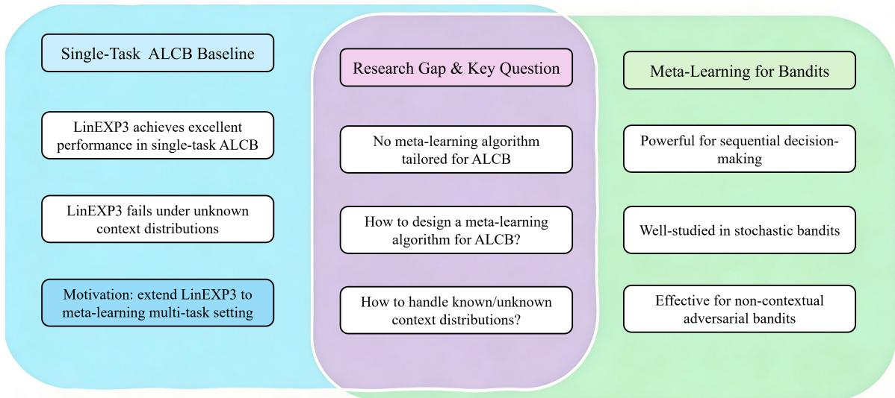  
Figure 1: Relationship between Meta-LinEXP3 and closely related bandit settings. The left column summarizes the single-task LinEXP3 starting point, the middle column gives the ALCB meta-learning problem studied here, and the right column lists related meta-bandit settings.

## 3 Preliminaries

## 3.1 Notation

For any positive integer q, let $[ q ] = \{ 1 , \dotsc , q \}$ . The global problem dimensions are the number of tasks $m \geq 1$ , rounds per task $n \geq 1$ , actions per round $k \geq 2 ,$ , and context dimension $d \geq 1 ; T = m n$ is the total number of task–round pairs. We use $s \in [ m ] , t \in [ n ]$ , and $a \in [ k ]$ for task, round, and action indices, respectively. Indices i and j refer to earlier tasks or rounds when their ranges are displayed. Bold lowercase and uppercase letters denote vectors and matrices, calligraphic letters denote sets, distributions, sigma-fields, or tensors as specified locally, and ordinary letters denote scalars unless stated otherwise. Superscript T is transpose and † is the Moore–Penrose pseudoinverse. We write $\mathbf { 0 } _ { d } , \mathbf { 1 } _ { d } , \pmb { I } _ { d } ,$ and $e _ { a }$ for the d-dimensional zero vector, the d-dimensional all-ones vector, the $d \times d$ identity matrix, and the relevant standard basis vector, with the dimension omitted only when it is fixed by context.

The notation ⟨·, ·⟩ denotes the Euclidean inner product. The symbol ∥ · ∥ is the Euclidean norm for vectors and the operator norm for matrices, ∥ · ∥F is the Frobenius norm, and $\| \pmb { x } \| _ { \pmb { A } } = \sqrt { \pmb { x } ^ { T } \pmb { A } }$ x for a positive semidefinite matrix A. For symmetric matrices, $A \succeq B$ means that $A - B$ is positive semidefinite. We use $\lambda _ { \operatorname* { m i n } } ( A ) , \operatorname { t r } ( A )$ , range(A), and rank(A) for the minimum eigenvalue, trace, column space, and rank. The operators Cov, diag, and chol denote covariance, diagonalization of a vector, and a Cholesky factor, respectively. For a set S, span(S) is its linear span, and supp(D) is the topological support of distribution D.

For a subspace $\mathcal { V } \subseteq \mathbb { R } ^ { d } , P _ { \mathcal { V } }$ is the orthogonal projector and $A | _ { \nu }$ is the restriction of A to V. For $\pmb { b } \in \mathbb { R } ^ { d }$ , set $P _ { b } = \pmb { b } \pmb { b } ^ { T } / \Vert \pmb { b } \Vert ^ { 2 }$ when $\pmb { b } \neq \mathbf { 0 } _ { d }$ and $P _ { \mathbf { 0 } _ { d } } = \mathbf { 0 } _ { d \times d }$ . We write $x _ { + } = \operatorname* { m a x } \{ x , 0 \}$ and $\mathbf { 1 } \{ E \}$ for the positive part of x and the indicator of event $E ;$ a subscripted symbol such as $\mathbf { 1 } _ { L }$ denotes the incidence vector of a finite set L in the stated ambient space. All arg min expressions use a fixed measurable tie-breaking rule.

For an event $E , E ^ { c } , \mathbb { P } ( E )$ , and E denote its complement, probability, and expectation. A subscript on E specifies the variable being integrated out. The notation $\sigma ( \cdot )$ denotes a generated sigma-field and $\mathcal { G } \vee \mathcal { H }$ its join. Finally, $\mathcal { O } ( \cdot ) , \tilde { \mathcal { O } } ( \cdot )$ , and $o ( \cdot )$ have their standard asymptotic meanings, with $\widetilde { \mathcal { O } }$ suppressing logarithmic factors.

## 3.2 Online-within-Online ALCB Problem

We consider m sequential ALCB tasks. In task $s \in [ m ]$ , the learner and an adversarial environment interact for n rounds. At round $t \in [ n ]$

1. The environment selects a loss vector $\pmb { \theta } _ { s , t } \in \mathbb { R } ^ { d }$

2. Independently of $\theta _ { s , t }$ , the environment samples k context vectors from the context distribution D to form $B _ { s , t } = \left\{ b _ { s , t , a } \right\} _ { a = 1 } ^ { k } \subset \mathbb { R } ^ { d }$ , and fully reveals $\boldsymbol { B } _ { s , t }$ to the learner.

3. Conditioned on the observed set $\boldsymbol { B } _ { s , t }$ , the learner selects an action $A _ { s , t } \in [ k ]$ , allowing randomized decision rules.

4. The learner incurs a loss corresponding to the selected action, which is given by $\ell _ { s , t , A _ { s , t } } =$ $\langle b _ { s , t , A _ { s , t } } , \theta _ { s , t } \rangle$

Here D is the common context distribution. We write $\mathbfit { b } \sim \mathcal { D }$ for a generic context and $\begin{array} { r } { B = \{ b _ { a } \} _ { a = 1 } ^ { k } \sim \mathcal { D } ^ { k } } \end{array}$ for an independent ordered context set.

We measure performance by expected pseudo-regret relative to a policy fixed independently of the realized context trajectory. Let Π be a prescribed class of measurable mappings from a context set B to an action in [k]. For $\pmb { w } \in \mathbb { R } ^ { d }$ , let $\pi _ { w } ( B )$ be the tie-broken minimizer of $\langle b _ { a } , w \rangle$ over $a \in [ k ]$ . For every fixed $\pi \in \Pi$ , define

$$
\mathrm { R e g } _ { s } ( \pi ) = \mathbb { E } \left[ \sum _ { t = 1 } ^ { n } \left. b _ { s , t , A _ { s , t } } - b _ { s , t , \pi ( B _ { s , t } ) } , \theta _ { s , t } \right. \right] , \qquad \mathrm { R e g } _ { s } = \operatorname* { s u p } _ { \pi \in \Pi } \mathrm { R e g } _ { s } ( \pi ) .\tag{1}
$$

The supremum is taken outside the expectation. This distinction prevents the comparator from being chosen after observing the realized context trajectory: an unrestricted post-hoc mapping could otherwise memorize the observed sets and behave as a dynamic oracle. We also write $\begin{array} { r } { \operatorname { R e g } _ { 1 : m } = \sum _ { s = 1 } ^ { m } \operatorname { R e g } _ { s } } \end{array}$

To state the non-anticipation condition precisely, let the pre-context history be

$$
\mathcal { H } _ { s , t } = \sigma \Big ( \mathcal { F } _ { 1 : s - 1 } , \mathcal { B } _ { s , j } , A _ { s , j } , \ell _ { s , j , A _ { s , j } } : j < t \Big ) ,\tag{2}
$$

where $\mathcal { F } _ { 1 : s - 1 }$ is generated by all observations from tasks $1 , \ldots , s - 1$ , with $\mathcal { F } _ { 1 : 0 }$ denoting the trivial sigma-field. The adversary may adapt to $\mathcal { H } _ { s , t }$ , and $\theta _ { s , t }$ is $\mathcal { H } _ { s , t }$ -measurable. Conditional on $\mathcal { H } _ { s , t } .$ the set $\boldsymbol { B } _ { s , t } \sim \mathcal { D } ^ { k }$ is fresh and independent of $\theta _ { s , t }$ . Before this set arrives, the learner fixes an $\mathcal { H } _ { s , t }$ -measurable random Markov kernel $\boldsymbol { B } \mapsto p _ { s , t } ( \cdot \mid \boldsymbol { B } )$ from $( \mathbb { R } ^ { d } ) ^ { k }$ to the probability simplex on $[ k ]$ . After the set is revealed, the information is $\mathcal { F } _ { s , t } = \mathcal { H } _ { s , t } \vee \sigma ( \mathcal { B } _ { s , t } )$ , and $A _ { s , t }$ is sampled from $p _ { s , t } ( \cdot \mid B _ { s , t } )$ . We write $\mathbb { E } _ { s , t } ^ { \mathrm { p r e } } [ \cdot ] = \mathbb { E } [ \cdot \mid \mathcal { H } _ { s , t } ]$ and $\mathbb { E } _ { s , t } [ \cdot ] = \mathbb { E } [ \cdot \mid \mathcal { F } _ { s , t } ]$ . All unbiasedness statements below are made at the pre-context conditioning time.

## 3.3 The LinEXP3 Algorithm

We use LinEXP3 [21] as the inner learner. At each round, LinEXP3 forms exponential weights from the current context set and the loss estimates accumulated so far, then mixes the resulting distribution with uniform exploration of total mass $\gamma .$ After an action is sampled and its loss is observed, the corresponding loss vector estimate is incorporated into subsequent updates.

Algorithm 1 Meta-LinEXP3   
Require: $m , n , k ;$ task-dependent $\eta _ { s } > 0 , \mu _ { s } \geq 0 .$ and $\gamma _ { s } \in ( 0 , 1 )$ ; direction ridge $\varepsilon _ { \Theta } > 0 ;$ cosine   
smoothing $\tau > 0 ;$ one estimator and its inputs from Section 4.2.   
1: Set $\pmb { h } _ { 1 } = \mathbf { 0 } _ { d }$ and $\widehat { \mathbf { e } } _ { 0 } = \widehat { \pmb { v } } _ { 0 } = \mathbf { 0 } _ { d } .$   
2: for task $s = 1 , 2 , \ldots , m$ do   
3: If $s \geq 2 ,$ compute the fixed vector $h _ { s }$ using PCRW (17) or uniform aggregation (18);   
retain $\pmb { h } _ { 1 } = \pmb { 0 } _ { d }$ . Then set   
$r _ { s } ( a \mid \mathcal { B } ) = \frac { \exp [ - \mu _ { s } \langle \pmb { b } _ { a } , \pmb { h } _ { s } \rangle ] } { \sum _ { a ^ { \prime } \in [ k ] } \exp [ - \mu _ { s } \langle \pmb { b } _ { a ^ { \prime } } , \pmb { h } _ { s } \rangle ] } .$   
4: Set $\widehat { \pmb { \theta } } _ { s , 0 } = \mathbf { 0 } _ { d } .$   
5: for round $t = 1 , 2 , \ldots , n$ do   
6: Observe $\boldsymbol { B } _ { s , t }$ and form   
$q _ { s , t } ( \boldsymbol { a } \mid \mathcal { B } _ { s , t } ) \propto r _ { s } ( \boldsymbol { a } \mid \mathcal { B } _ { s , t } ) \exp \left[ - \eta _ { s } \left. b _ { s , t , \boldsymbol { a } } , \sum _ { j = 0 } ^ { t - 1 } \widehat { \pmb { \theta } } _ { s , j } \right. \right] .$   
7: Sample $A _ { s , t }$ from $p _ { s , t } ( a \mid \mathcal { B } _ { s , t } ) = ( 1 - \gamma _ { s } ) q _ { s , t } ( a \mid \mathcal { B } _ { s , t } ) + \gamma _ { s } / k .$   
8: Observe the loss of the selected action $\ell _ { s , t , A _ { s , t } } ,$ and compute the loss estimator $\widehat { \pmb { \theta } } _ { s , t }$   
9: end for   
10: Store $\begin{array} { r } { \widehat { \Theta } _ { s } = n ^ { - 1 } \sum _ { t = 1 } ^ { n } \widehat { \pmb { \theta } } _ { s , t } } \end{array}$ and $\widehat { \pmb { v } } _ { s } = P _ { \mathcal { U } } \widehat { \Theta } _ { s } / \operatorname* { m a x } \{ | | P _ { \mathcal { U } } \widehat { \Theta } _ { s } | | , \varepsilon _ { \Theta } \}$ when U is known; other  
wise use the same formula without $\mathbf { \nabla } P u$   
11: end for

## 4 The Meta-LinEXP3 Algorithm

Meta-LinEXP3 augments the inner LinEXP3 learner with a task-level prior. Before task s, the outer learner maps completed-task summaries to a predictable vector $h _ { s }$ and keeps the induced prior fixed throughout the task. This design removes within-task prior-variation terms from the regret analysis. The analysis extends to another loss estimator only after verifying the corresponding conditions in Section 5.

For the shared context distribution, define

$$
\bar { b } = \mathbb { E } [ b ] , \qquad C = \operatorname { C o v } ( b ) , \qquad \mathcal { U } = \operatorname { s p a n } \{ b - b ^ { \prime } : b , b ^ { \prime } \in \operatorname { s u p p } ( \mathcal { D } ) \} = \operatorname { r a n g e } ( C ) .\tag{3}
$$

All feasible context diferences lie in $u ,$ so only this subspace can afect pairwise action comparisons.

## 4.1 Overall Algorithm Structure

Before task s, the learner constructs $h _ { s }$ from summaries of tasks $1 , \ldots , s - 1$ . During the task, the softmax prior induced by $h _ { s }$ is combined with the cumulative within-task loss estimate after each context set is observed. At the end of the task, the mean loss estimate and its regularized direction are stored for future transfer. Algorithm 1 gives the common outer–inner procedure; estimator-specific inputs are described in Section 4.2.

PC-KDE additionally requires D and an exact selected-moment oracle. PRME requires $L , \lambda , d , T = m n , \delta .$ , and spectral clipping as specified in Sections 4.2 and 5.3. LPE has no distributional input.

For cross-task transfer, represent task s by its mean loss vector $\begin{array} { r } { \Theta _ { s } : = n ^ { - 1 } \sum _ { t = 1 } ^ { n } \pmb { \theta } _ { s , t } } \end{array}$ . To interpret task similarity in this subsection, we consider oblivious tasks, for which $\Theta _ { s }$ is fixed before the task’s context trajectory is generated. By (3), only the projection onto U afects action diferences. In the absence of ties, the optimal fixed policy is therefore determined by the positive ray of $P _ { \mathcal { U } } \Theta _ { s } ;$ any component in $\mathcal { U } ^ { \perp }$ adds the same ofset to every action. Euclidean distance in the ambient space can consequently be misleading. If $P _ { \mathcal { U } } \Theta _ { i } = M P _ { \mathcal { U } } \Theta _ { s }$ for $M > 0$ and $\lVert P _ { \mathcal { U } } \Theta _ { s } \rVert \neq 0$ , the two tasks induce exactly the same optimal action selection policy even though their full-space distance can be arbitrarily large. For $M < 0$ , by contrast, the loss ordering is generally reversed.

We therefore measure decision-relevant similarity by the signed cosine of the projected task means,

$$
\frac { \langle P _ { \mathcal { U } } \Theta _ { i } , P _ { \mathcal { U } } \Theta _ { s } \rangle } { \| P _ { \mathcal { U } } \Theta _ { i } \| \| P _ { \mathcal { U } } \Theta _ { s } \| } ,
$$

and set the value to zero when either projection vanishes. Values near 1, near 0, and below 0 correspond to aligned, weakly related, and potentially adverse transfer, respectively. PCRW in (17) uses the positive part of the empirical cosine. PC-KDE summaries already lie in U; for other estimators, a full-space cosine should be viewed as a heuristic unless the summaries are first projected onto a decision-relevant subspace.

## 4.2 Loss Estimators

Because the learner selects an action after observing the entire context set, the selected context need not follow the marginal distribution D. Correcting this selection efect requires either inverse-propensity weighting or a design matrix induced by the current policy. ROBUST LinEXP3 uses the former [21], whereas the known-distribution construction of [16] uses policyinduced moments. Our estimator retains the centered form but centers with respect to the distribution of the selected context.

Using the context mean in (3), write the covariance as

$$
C = \mathbb { E } [ ( b - \bar { b } ) ( b - \bar { b } ) ^ { T } ] , \qquad \mathrm { r a n g e } ( C ) = \mathcal { U } ,\tag{4}
$$

where U is the decision-relevant subspace in (3). For a known context distribution and the current policy $p _ { s , t }$ , define its policy-induced selected mean and covariance before $\boldsymbol { B } _ { s , t }$ arrives:

$$
\pmb { x } _ { s , t } = \mathbb { E } _ { B \sim \mathcal { D } ^ { k } } \left[ \sum _ { a = 1 } ^ { k } p _ { s , t } ( a \mid \mathcal { B } ) \pmb { b } _ { a } \right] ,\tag{5}
$$

$$
H _ { s , t } = \mathbb { E } _ { \mathcal { B } \sim \mathcal { D } ^ { k } } \left[ \sum _ { a = 1 } ^ { k } p _ { s , t } ( a \mid \mathcal { B } ) ( \boldsymbol { b } _ { a } - \boldsymbol { x } _ { s , t } ) ( \boldsymbol { b } _ { a } - \boldsymbol { x } _ { s , t } ) ^ { T } \right] .\tag{6}
$$

Both quantities are $\mathcal { H } _ { s , \ i }$ t-measurable. We call

$$
\widehat { \pmb { \theta } } _ { s , t } ^ { \mathrm { P C } } = \pmb { H } _ { s , t } ^ { \dagger } ( \pmb { b } _ { s , t , A _ { s , t } } - \pmb { x } _ { s , t } ) \ell _ { s , t , A _ { s , t } }\tag{7}
$$

the policy-centered known-distribution estimator (PC-KDE), where † denotes the Moore–Penrose pseudoinverse. The uniform component of $p _ { s , t }$ implies that $H _ { s , t }$ is positive definite on U. Moreover,

$$
\mathbb { E } _ { s , t } ^ { \mathrm { p r e } } [ \widehat { \pmb { \theta } } _ { s , t } ^ { \mathrm { P C } } ] = P _ { \mathcal { U } } \pmb { \theta } _ { s , t } ,\tag{8}
$$

where $P _ { \mathcal { U } }$ is the orthogonal projector onto U. Hence PC-KDE is exactly unbiased when C is nonsingular. More generally, since every context diference lies in U almost surely, (8) is suficient to recover all loss diferences exactly, which is all that the regret analysis requires. The same afine-subspace formulation covers fixed-cardinality context vectors, whose centered covariance is necessarily singular in the ambient space.

PC-KDE requires exact evaluation of $( 5 ) \AA { - } ( 6 )$ under the current adaptive policy. Its computational cost therefore depends on the distribution and on the moment oracle; knowledge of D alone is not suficient to evaluate these quantities at no cost. Approximating them numerically or by Monte Carlo would introduce an additional error term that is outside the present analysis.

When D is unknown, the policy-induced expectations in ${ \mathrm { ( 5 ) } } \mathrm { - } { \mathrm { ( 6 ) } }$ are not directly available. Define the raw second moment $\begin{array} { r } { \pmb { S } = \mathbb { E } [ \pmb { b } \pmb { b } ^ { T } ] } \end{array}$ and use inverse propensities. Let

$$
N _ { s , t } = k ( n ( s - 1 ) + t - 1 )\tag{9}
$$

be the number of context vectors observed strictly before the current set. Let $<$ on task–round pairs denote lexicographic order, and define

$$
\overline { { S } } _ { s , t } = \left\{ \begin{array} { l l } { \mathbf { 0 } _ { d \times d } , } & { N _ { s , t } = 0 , } \\ { \frac { 1 } { N _ { s , t } } \displaystyle \sum _ { ( i , j , a ) : ( i , j ) < ( s , t ) } b _ { i , j , a } b _ { i , j , a } ^ { T } , } & { N _ { s , t } \geq 1 , } \end{array} \right.\tag{10}
$$

$$
\begin{array} { r } { \widehat { \pmb { S } } _ { s , t } = \overline { { \pmb { S } } } _ { s , t } + \beta _ { s , t } \pmb { I } _ { d } , } \end{array}\tag{11}
$$

$$
\begin{array} { r } { \widetilde { S } _ { s , t } = \mathrm { C l i p } _ { \lambda } ( \widehat { S } _ { s , t } ) , } \end{array}\tag{12}
$$

where $\beta _ { s , t } \geq 0$ is a pre-context measurable ridge specified in Section 5.3. Here $\lambda > 0$ is a known lower bound on $\lambda _ { \operatorname* { m i n } } ( S )$ , and $\mathrm { C l i p } _ { \lambda } ( A )$ replaces every eigenvalue of a symmetric matrix A below λ by λ while preserving its eigenvectors. This clipping is inactive on the simultaneous concentration event used in the analysis, but keeps the estimator and its range controlled on the failure event. The past-only regularized moment estimator (PRME) is

$$
\widehat { \pmb { \theta } } _ { s , t } ^ { \mathrm { P R } } = \frac { 1 } { k p _ { s , t } ( A _ { s , t } \mid \mathcal { B } _ { s , t } ) } \widetilde { \pmb { S } } _ { s , t } ^ { - 1 } { \pmb { b } } _ { s , t , A _ { s , t } } \ell _ { s , t , A _ { s , t } } .\tag{13}
$$

The factor $1 / ( k p _ { s , t } )$ removes action selection bias, while the use of strictly past contexts makes $\widehat { \boldsymbol { S } } _ { s , t }$ measurable before the current set arrives. Its exact conditional mean is

$$
\mathbb { E } _ { s , t } ^ { \mathrm { p r e } } [ \widehat { \pmb { \theta } } _ { s , t } ^ { \mathrm { P R } } ] = \widetilde { S } _ { s , t } ^ { - 1 } S \pmb { \theta } _ { s , t } .\tag{14}
$$

Thus PRME carries an explicit finite-sample regularization error; we make no claim of exact or asymptotic unbiasedness without an accompanying rate.

Computational cost of PRME. PRME maintains a single d× d streaming suficient statistic and never replays earlier context sets, requiring $\mathcal { O } ( d ^ { 2 } )$ memory. With direct inversion and spectral clipping, each update costs $\mathcal { O } ( d ^ { 3 } + k d ^ { 2 } )$ . Its general $n ^ { 2 / 3 }$ rate is weaker than the $\widetilde { \mathcal { O } } ( \sqrt { n } )$ single-task rates of [16, 32]; in return, the policy-independent moment makes cross-task context reuse and transfer complexity explicit in the bound.

For resource-constrained settings, we also consider the lightweight projection estimator (LPE):

$$
\widehat { \pmb { \theta } } _ { s , t } ^ { \mathrm { L P } } = \frac { \pmb { b } _ { s , t , A _ { s , t } } } { \Vert \pmb { b } _ { s , t , A _ { s , t } } \Vert ^ { 2 } } \ell _ { s , t , A _ { s , t } } ,\tag{15}
$$

where the estimator is set to zero for a zero context. Its per-round complexity is $\mathcal O ( d )$ and, in the noiseless linear model, it obeys the pointwise identity

$$
\widehat { \pmb { \theta } } _ { s , t } ^ { \mathrm { L P } } = { \cal P } _ { b _ { s , t , A _ { s , t } } } \pmb { \theta } _ { s , t } .\tag{16}
$$

Here $P _ { b }$ is the projector defined in Section 3.1. Thus LPE estimates only the component of the loss vector along the selected context. Appendix A gives the resulting projection-bias term and regret decomposition.

## 4.3 Task Weightings

We use positive-cosine retrieval weighting (PCRW) to downweight anti-aligned historical directions. The resulting aggregate is computed before each task and then held fixed. The regularized directions $\widehat { \mathbf { v } } _ { i }$ in Algorithm 1 satisfy $\| \widehat { \pmb { v } } _ { i } \| \leq 1$ . For $s \geq 2$ , use the most recent completed task as the predictable query and define

$$
\begin{array} { r l } & { a _ { s , i } = \langle \widehat { \pmb v } _ { i } , \widehat { \pmb v } _ { s - 1 } \rangle _ { + } , \qquad i < s , } \\ & { c _ { s , i } ^ { \mathrm { c o s } } = \displaystyle \frac { a _ { s , i } + \tau / ( s - 1 ) } { \sum _ { j = 1 } ^ { s - 1 } a _ { s , j } + \tau } , \qquad h _ { s } ^ { \mathrm { c o s } } = \sum _ { i = 1 } ^ { s - 1 } c _ { s , i } ^ { \mathrm { c o s } } \widehat { \pmb v } _ { i } . } \end{array}\tag{17}
$$

Here $\tau > 0$ is a smoothing parameter. The coeficients are nonnegative and sum to one, so $\| h _ { s } ^ { \cos } \| \leq 1$ . Anti-aligned tasks receive only the smoothing mass, zero summaries remain well defined, and the ridge $\varepsilon _ { \Theta }$ prevents division by a near-zero norm. Since ${ h _ { s } ^ { \mathrm { c o s } } }$ is fixed before task $s ,$ it contributes no within-task path variation.

A simpler alternative is uniform convex aggregation,

$$
c _ { s , i } ^ { \mathrm { u n i } } = \frac { 1 } { s - 1 } , \qquad h _ { s } ^ { \mathrm { u n i } } = \frac { 1 } { s - 1 } \sum _ { i = 1 } ^ { s - 1 } \hat { \bf { v } } _ { i } , \qquad s \geq 2 ,\tag{18}
$$

with $\pmb { h } _ { 1 } = \mathbf { 0 } _ { d }$ . It is also fixed within a task and has norm at most one.

PCRW is intended for task streams with sequentially persistent structure. When no such structure is available, setting $\pmb { h } _ { s } = \mathbf { 0 } _ { d }$ recovers the zero-prior setting and gives $\Gamma _ { s } ( \pi ) = \log k$ The transfer theorem below applies to any predictable prior that is fixed within a task, with its efect summarized by the transfer complexity. Appendix A decomposes the PCRW tracking error into retrieval dispersion, local task-direction variation, and direction-estimation error.

## 5 Theoretical Analysis

We first state the main regret guarantees and defer the changing-prior lemmas, exact bias decompositions, alternative fast-rate conditions, Gaussian calculations, LPE results, and complete proofs to Appendix A. For a fixed task s, write $\eta = \eta _ { s }$ and $\gamma = \gamma _ { s }$

## 5.1 Common Assumptions and Transfer Complexity

Define the geometric quantities

$$
L = \operatorname* { s u p } _ { b \in \mathrm { s u p p } ( \mathcal { D } ) } \| b \| , \qquad \Delta = \operatorname* { s u p } _ { b , b ^ { \prime } \in \mathrm { s u p p } ( \mathcal { D } ) } \| b - b ^ { \prime } \| .\tag{19}
$$

Assumption 5.1 (Bounded loss geometry). The context distribution has bounded support. For every s, t, $\lVert \pmb { \theta } _ { s , t } \rVert \leq R$ and $| \langle b , \pmb \theta _ { s , t } \rangle | \leq Y$ almost surely. The within-set loss range is bounded by G:

$$
\operatorname* { m a x } _ { a } \langle b _ { a } , \pmb { \theta } _ { s , t } \rangle - \operatorname* { m i n } _ { a } \langle b _ { a } , \pmb { \theta } _ { s , t } \rangle \leq G .\tag{20}
$$

The choices $Y = L R$ and $G = R \Delta \leq 2 Y$ satisfy Assumption 5.1.

Given the pre-task vector $h _ { s }$ and prior concentration parameter $\mu _ { s }$ , define the task prior by

$$
r _ { s } ( a \mid \mathcal { B } ) = \frac { \exp [ - \mu _ { s } \langle b _ { a } , h _ { s } \rangle ] } { \sum _ { a ^ { \prime } \in [ k ] } \exp [ - \mu _ { s } \langle b _ { a ^ { \prime } } , h _ { s } \rangle ] }\tag{21}
$$

Assumption 5.2 (Predictable fixed task prior). Before task s begins, the learner chooses an $\mathcal { H } _ { s , 1 }$ -measurable vector $h _ { s }$ with $\| h _ { s } \| \leq 1$ and a prior concentration parameter $\mu _ { s } \geq 0$ . The resulting task prior is held fixed throughout task s.

When the prior parameters are displayed explicitly, $r _ { \mu , h }$ denotes the softmax kernel on the right-hand side of (21) with prior concentration parameter $\mu$ and vector $h .$

Let $\begin{array} { r } { B ^ { 0 } = \{ b _ { a } ^ { 0 } \} _ { a = 1 } ^ { k } \sim \mathcal { D } ^ { k } } \end{array}$ be independent of the interaction. For a fixed comparator $\pi \in \Pi$ define the transfer complexity

$$
\Gamma _ { s } ( \pi ) = \mathbb { E } \left[ - \log r _ { s } ( \pi ( B ^ { 0 } ) \mid \mathcal { B } ^ { 0 } ) \right] .\tag{22}
$$

Fixing the prior within a task makes its path-variation charge exactly zero. The universal fallback

$$
\Gamma _ { s } ( \pi ) \leq \log k + \mu _ { s } \Delta\tag{23}
$$

holds for every unit-norm prior vector, while $\mathbf { \boldsymbol { h } } _ { s } = \mathbf { \boldsymbol { 0 } } _ { d }$ gives $\Gamma _ { s } ( \pi ) = \log k$ . For $\zeta \in ( 0 , 1 ]$ , set

$$
\psi ( \zeta ) = \frac { e ^ { \zeta } - 1 - \zeta } { \zeta ^ { 2 } } .\tag{24}
$$

## 5.2 Known Context Distribution: PC-KDE

Let C and U be defined in (4), and write

$$
d _ { \mathcal { U } } = \mathrm { r a n k } ( C ) , \qquad \lambda _ { + } = \lambda _ { \mathrm { m i n } } ( C | _ { \mathcal { U } } ) , \qquad \kappa _ { \mathcal { U } } = \frac { \Delta ^ { 2 } } { \lambda _ { + } } .\tag{25}
$$

If $d _ { \cal { U } } = 0$ , every action has the same context almost surely and regret is zero.

Theorem 5.3 (PC-KDE bound). Suppose Assumptions 5.1–5.2 hold, $d _ { \cal { U } } > 0$ , and PC-KDE in (7) is used. Then

$$
\mathbb { E } _ { s , t } ^ { \mathrm { p r e } } [ \widehat { \pmb { \theta } } _ { s , t } ^ { \mathrm { P C } } ] = P _ { \mathcal { U } } \pmb { \theta } _ { s , t } .\tag{26}
$$

For every fixed $\pi \in \Pi$ , if

$$
\eta Y \kappa u \leq \zeta \gamma ,\tag{27}
$$

then

$$
\mathrm { R e g } _ { s } ( \pi ) \leq \frac { ( 1 - \gamma ) \Gamma _ { s } ( \pi ) } { \eta } + \psi ( \zeta ) \eta d _ { \mathcal { U } } Y ^ { 2 } n + \gamma G n .\tag{28}
$$

Since all context diferences lie in $u ,$ identity (26) is suficient for the regret analysis. For the tuned bound, define

$$
A _ { \zeta } = \psi ( \zeta ) d _ { { \cal U } } Y ^ { 2 } + { \frac { Y \kappa _ { { \cal U } } G } { \zeta } } .\tag{29}
$$

Corollary 5.4 (Tuned PC-KDE bound). Suppose a deterministic $\bar { \Gamma } _ { s } > 0$ satisfies $\Gamma _ { s } ( \pi ) \leq \bar { \Gamma } _ { }$ s uniformly over the candidate tuning pairs. Choose

$$
\eta _ { s } = \sqrt { \frac { \bar { \Gamma } _ { s } } { n A _ { \zeta } } } , \qquad \gamma _ { s } = \frac { \eta _ { s } Y \kappa \mathcal { U } } { \zeta } .\tag{30}
$$

I $f \gamma _ { s } \leq 1 / 2$ , then

$$
\mathrm { R e g } _ { s } ( \pi ) \leq 2 \sqrt { n A _ { \zeta } \bar { \Gamma } _ { s } } .\tag{31}
$$

When the tuned exploration probability exceeds $1 / 2 { \mathrm { . } }$ , the untuned bound (28) or the trivial bound Gn can be used instead.

## 5.3 Unknown Context Distribution: PRME

For the raw second moment S introduced in Section 4.2, assume

$$
{ \cal S } \succeq \lambda I _ { d } , \qquad \kappa = \frac { L ^ { 2 } } { \lambda } , \qquad \chi = \mathrm { m i n } \{ k , \kappa \} .\tag{32}
$$

For $T = m n$ and $\delta \in ( 0 , 1 )$ , define

$$
\Lambda = \log { \frac { 2 d T } { \delta } } , \qquad \xi _ { N } = L ^ { 2 } \left[ { \frac { \Lambda } { 3 N } } + \sqrt { { \frac { 2 \Lambda } { N } } + { \frac { \Lambda ^ { 2 } } { 9 N ^ { 2 } } } } \right] \ ( N \geq 1 ) , \qquad \xi _ { 0 } = L ^ { 2 } .\tag{33}
$$

PRME uses $\beta _ { s , t } = \xi _ { N _ { s , t } }$ in (10).

Theorem 5.5 (Tuned PRME bound). Suppose Assumptions 5.1–5.2 and (32) hold. Let $\Gamma _ { s } ( \pi ) \leq \bar { \Gamma } _ { s }$ for a deterministic $\bar { \Gamma } _ { s } > 0$ , uniformly over candidate tuning pairs, and let $G > 0$ . Set

$$
\gamma _ { s } = \left( \frac { \psi ( 1 ) \chi d Y ^ { 2 } \bar { \Gamma } _ { s } } { G ^ { 2 } n } \right) ^ { 1 / 3 } ,
$$

$$
\eta _ { s } = \frac { \bar { \Gamma } _ { s } ^ { 2 / 3 } } { \{ \psi ( 1 ) \chi d \} ^ { 1 / 3 } Y ^ { 2 / 3 } G ^ { 1 / 3 } n ^ { 2 / 3 } } .\tag{34}
$$

$I f \gamma _ { s } \leq 1 / 2$ and

$$
\kappa ^ { 3 } \bar { \Gamma } _ { s } G \leq \psi ( 1 ) ^ { 2 } ( \chi d ) ^ { 2 } Y n ,\tag{35}
$$

then PRME satisfies

$$
\mathrm { R e g } _ { s } ( \pi ) \leq 3 \{ \psi ( 1 ) \chi d \bar { \Gamma } _ { s } Y ^ { 2 } G \} ^ { 1 / 3 } n ^ { 2 / 3 } + 4 R \sqrt { \frac { \chi } { \lambda } } \sum _ { t = 1 } ^ { n } \xi _ { N _ { s , t } } + f _ { s } ,\tag{36}
$$

where the failure-event remainder is bounded by

$$
f _ { s } \le \left[ \psi ( 1 ) \eta _ { s } \left( \frac { Y \kappa } { \gamma _ { s } } \right) ^ { 2 } + 2 L R \sqrt { \chi } ( \kappa + 1 ) \right] \frac { \delta } { m } .\tag{37}
$$

In lexicographic task–round order, the accumulated moment radius also satisfies

$$
\sum _ { u = 1 } ^ { T } \xi _ { k ( u - 1 ) } \leq L ^ { 2 } \left[ 1 + 2 \sqrt { \frac { 2 \Lambda ( T - 1 ) } { k } } + \frac { 2 \Lambda } { 3 k } \{ 1 + \log ( T - 1 ) \} \right]\tag{38}
$$

for $T \geq 2$ , while the sum equals $L ^ { 2 }$ for $T = 1$

## 5.4 Meta transfer analysis

For an oblivious task with $P _ { \mathcal { U } } \Theta _ { s } \neq \mathbf { 0 } _ { d } .$ , let

$$
v _ { s } = \frac { P _ { \mathcal { U } } \Theta _ { s } } { \parallel P _ { \mathcal { U } } \Theta _ { s } \parallel } , \qquad \pi _ { s } ( \mathcal { B } ) = \pi _ { v _ { s } } ( \mathcal { B } ) ,\tag{39}
$$

using the tie-breaking convention from Section 3.1.

For the cross-task analysis, define the augmented pre-task sigma-field

$$
\mathcal { G } _ { s } : = \mathcal { H } _ { s , 1 } \vee \sigma ( \Theta _ { s } ) .\tag{40}
$$

The learner does not observe ${ \mathcal { G } } _ { s } \mathbf { : }$ the prior $h _ { s }$ remains $\mathcal { H } _ { s , 1 }$ -measurable, and $\mathcal { G } _ { s }$ is used only for the cross-task conditional analysis. Let $B ^ { 0 } = \{ b _ { a } ^ { 0 } \} _ { a = 1 } ^ { k } \sim \mathcal { D } ^ { k }$ be a fresh ghost set independent of $\mathcal { G } _ { s }$ . Then ${ \pmb v } _ { s }$ and the prior-error event in Theorem 5.7 are $\mathcal { G } _ { s }$ -measurable, while the ghost contexts remain independent. Define the random minimum gap by

$$
\mathrm { g a p } _ { s } (  { \mathcal { B } } ^ { 0 } ) = \operatorname* { m i n } _ { a \neq \pi _ { s } (  { \mathcal { B } } ^ { 0 } ) }  { \langle b _ { a } ^ { 0 } - b _ { \pi _ { s } (  { \mathcal { B } } ^ { 0 } ) } ^ { 0 } , { \pmb v } _ { s } \rangle }\tag{41}
$$

Assumption 5.6 (Margin condition). Each task is oblivious: its entire loss sequence is fixed before the task begins. Assume $P _ { \mathcal { U } } \Theta _ { s } \neq \mathbf { 0 } _ { d } , \pi _ { s } \in \Pi$ , and $\Delta > 0$ . There exists a nondecreasing function $F : [ 0 , \infty ) \to [ 0 , 1 ]$ with

$$
\operatorname* { l i m } _ { x  0 ^ { + } } F ( x ) = 0\tag{42}
$$

such that, conditionally on the augmented pre-task information,

$$
\mathbb { P } \big ( \mathrm { g a p } _ { s } ( \mathcal { B } ^ { 0 } ) \leq x \mid \mathcal { G } _ { s } \big ) \leq F ( x ) , \qquad x > 0 .\tag{43}
$$

For $\mu > 0$ , define the margin function

$$
\Phi _ { F } ( \mu ) = \mu \int _ { 0 } ^ { \infty } e ^ { - \mu x } F ( x ) d x = \int _ { 0 } ^ { \infty } e ^ { - y } F ( y / \mu ) d y .\tag{44}
$$

Condition (42) is the only local requirement on $F ;$ it does not impose a power-law exponent or a pointwise positive gap. By dominated convergence, $\Phi _ { F } ( \mu ) \to 0$ as $\mu \to \infty$

Theorem 5.7 (Meta-LinEXP3 transfer regret). Suppose Assumptions 5.1–5.2 and Assumption 5.6 hold. Before each task $s \geq 2$ , suppose there are a deterministic prior-error radius $\varepsilon _ { s } > 0$ failure level $\delta _ { s } \in [ 0 , 1 ]$ , and prior concentration parameter $\mu _ { s } > 0$ such that

$$
\mathbb { P } ( \| h _ { s } - v _ { s } \| > \varepsilon _ { s } ) \le \delta _ { s } ,\tag{45}
$$

and set $\mu _ { 1 } = 0$ . Define

$$
B _ { 1 } = \log k , \qquad B _ { s } = ( k - 1 ) e ^ { \mu _ { s } \Delta \varepsilon _ { s } } \Phi _ { F } ( \mu _ { s } ) + \delta _ { s } ( \log k + \mu _ { s } \Delta ) , \qquad s \geq 2 .\tag{46}
$$

Then $\Gamma _ { s } ( \pi _ { s } ) \leq B _ { s }$ for every task.

If PC-KDE is used and the task-dependent choices in (30) are feasible with $\bar { \Gamma } _ { s } = B _ { s }$ , then

$$
\mathrm { R e g } _ { 1 : m } ^ { \mathrm { P C } } \leq 2 { \sqrt { n A _ { \zeta } } } \sum _ { s = 1 } ^ { m } { \sqrt { B _ { s } } } .\tag{47}
$$

If PRME is used and the conditions of Theorem 5.5 hold taskwise with $\bar { \Gamma } _ { s } = B _ { s }$ , then

$$
\mathrm { R e g } _ { 1 : m } ^ { \mathrm { P R } } \leq 3 \{ \psi ( 1 ) \chi d Y ^ { 2 } G \} ^ { 1 / 3 } n ^ { 2 / 3 } \sum _ { s = 1 } ^ { m } B _ { s } ^ { 1 / 3 }
$$

$$
+ 4 R \sqrt { \frac { \chi } { \lambda } } \sum _ { u = 1 } ^ { m n } \xi _ { k ( u - 1 ) } + \sum _ { s = 1 } ^ { m } f _ { s } .\tag{48}
$$

Moreover, if

$$
\mu _ { s } \to \infty , \qquad \operatorname* { l i m } _ { s \to \infty } \operatorname* { s u p } \mu _ { s } \varepsilon _ { s } < \infty , \qquad \delta _ { s } ( 1 + \mu _ { s } ) \to 0 ,\tag{49}
$$

then $B _ { s }  0$ . Consequently,

$$
\sum _ { s = 1 } ^ { m } \sqrt { B _ { s } } = o ( m ) , \qquad \sum _ { s = 1 } ^ { m } B _ { s } ^ { 1 / 3 } = o ( m ) .\tag{50}
$$

Corollary 5.8 (Eventual feasibility and aggregate rate). Under the conditions of Theorem 5.7, including (49), the tuned PC-KDE and PRME choices satisfy their feasibility conditions for all suficiently large s, and any finite infeasible prefix can be bounded by the trivial Gn term. The PC-KDE and PRME learning terms scale as $\sqrt { n } o ( m )$ and $n ^ { 2 / 3 } o ( m )$ , respectively, the PRME moment term is $\widetilde { \mathcal { O } } ( \sqrt { m n / k } )$ , and the aggregate PRME failure remainder is $\mathcal { O } ( \delta )$ for fixed problem constants. Thus, for fixed $n , k ,$ and the remaining problem constants, both bounds are sublinear in the number of tasks.

Condition (49) is qualitative and requires only a weak rate of prior improvement. For instance, with $\mu _ { s } = c \log ( s + 1 )$ it is enough to have $\varepsilon _ { s } = \mathcal { O } ( 1 / \log { s } )$ and $\delta _ { s } = o ( 1 / \log s )$ for $B _ { s }  0$ under any admissible F satisfying (42); no polynomial margin or polynomial tracking rate is required.

Theorem 5.7 is conditional on the prior-accuracy assumption (45); it does not prove that the PCRW or Uniform priors used in the experiments satisfy this condition. Appendix A gives a power-law specialization, and Appendix A.4 gives one suficient construction based on an exogenous descriptor, PC-KDE, and finitely many recurrent task types. This construction is distinct from the experimental PCRW/Uniform protocol and does not cover PRME or LPE.

Table 1: Core guarantees. Task-number improvements require predictable structure; unrelated tasks can still have linear total regret.
<table><tr><td>Setting</td><td>Core regret guarantee</td><td>Main qualification</td></tr><tr><td>PC-KDE, one task</td><td> $2 \sqrt { n A _ { \zeta } \bar { \Gamma } _ { s } }$ </td><td>Known D and exact policy moments</td></tr><tr><td> $\mathrm { P R M E } ,$  one task</td><td> $\mathcal { O } ( n ^ { 2 / 3 } \bar { \Gamma } _ { s } ^ { 1 / 3 } )$  plus explicit moment error</td><td>Unknown  $\mathcal { D } ;$  condition-number dependence</td></tr><tr><td>LPE, one task</td><td>Eq. (85) with an explicit projection-bias residual</td><td>No distributional input;  $\mathcal O ( d )$  update; residual can be Θ(n) without directional coverage</td></tr><tr><td>Margin condition</td><td>PC: (47); PRME: (48)</td><td>No power-law gap;  $B _ { s }  0$  is sufficient</td></tr></table>

Machine-checked verification. All theoretical results in this paper have been formalized and kernel-checked in Lean 4.31.0 with mathlib v4.31.0. The formalization contains no sorry, admit, custom axioms, or unsafe proof bypasses.

## 6 Experiments

We evaluate Meta-LinEXP3 on four settings: bounded synthetic transfer, a controlled PC-KDE/PRME/LPE comparison, MovieLens recommendation, and structured hyperspectral tensor sampling on KSC. The synthetic study uses 100 independent runs per similarity setting, the estimator comparison uses 60 runs, MovieLens uses 30 evaluation runs, and the KSC bandit curves use 60 runs. Unless noted otherwise, each curve shows the sample mean with one empirical standard deviation. Competing methods within a run share the same task/context realization and, where applicable, the same underlying random number stream.

LinEXP3 is recovered by setting the task prior to zero. PCRW uses the fixed positive-cosine retrieval weighting in (17) with $\tau = 1$ , while Uniform uses (18). The synthetic experiment also includes an infeasible oracle that forms a normalized signed-cosine combination from the true task means. We use this oracle only to indicate the amount of transfer available from ground-truth task directions; it is not an upper bound on all possible transfer procedures.

## 6.1 Synthetic Transfer Experiment

We consider $m = 2 0$ sequential tasks with $n = 3 0$ rounds per task, $k = 4 0$ actions, and context dimension $d = 5$ . For every Monte Carlo run, the context law is regenerated as a bounded elliptical distribution. Specifically, with $\pmb { R } \in \mathbb { R } ^ { d \times d }$ having i.i.d. standard Gaussian entries, we set

$$
\Sigma = 0 . 0 5 { \cal R } ^ { T } { \cal R } + 0 . 0 1 { \cal I } _ { d } , \qquad | | \bar { \boldsymbol { b } } | | = 0 . 1 , \qquad b = \bar { \boldsymbol { b } } + \sqrt { d } \operatorname { c h o l } ( \Sigma ) { \cal u } ,
$$

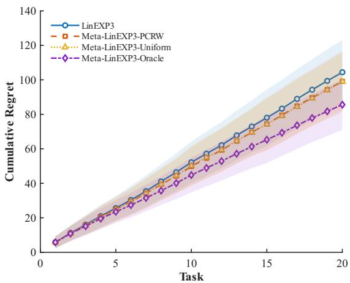  
(a) $\mathrm { C S } _ { \mathrm { m i n } } = - 1$

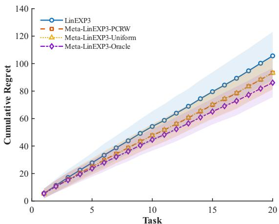  
(b) $\mathrm { C S } _ { \mathrm { m i n } } = - 0 . 5$

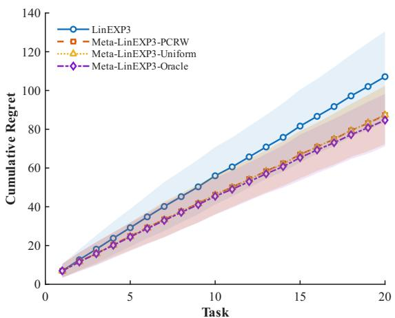  
(c) $\mathrm { C S } _ { \mathrm { m i n } } = 0 . 5$

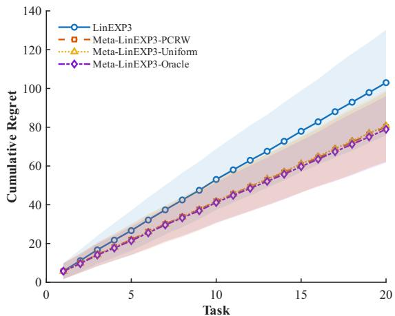  
(d) $\mathrm { C S } _ { \mathrm { m i n } } = 1$  
Figure 2: Cumulative regret on the bounded synthetic tasks using PRME. Each panel averages 100 runs; shaded regions show one standard deviation.

where u is sampled uniformly from the unit sphere. Hence contexts are bounded and have the constructed mean and covariance. The generated distribution is known and its raw second moment is positive definite, so the PRME clipping threshold can be computed exactly.

The round-wise loss vectors satisfy $\lvert | \pmb { \theta } _ { s , t } \rvert | \leq 1$ . Each task mean $\Theta _ { s } = n ^ { - 1 } \sum _ { t } \pmb { \theta } _ { s , t }$ has norm at most 0.5, while the zero-mean within-task perturbations have radius at most 0.5, so the generated $\Theta _ { s }$ is exactly the realized task mean. Task similarity is controlled by a lower bound $\mathrm { C S } _ { \mathrm { m i n } }$ on the pairwise cosine similarity of nonzero task means, with values $- 1 , - 0 . 5 , 0 . 5$ , and 1. The case $\mathrm { C S } _ { \mathrm { m i n } } = - 1$ removes the pairwise lower-bound constraint, but the generator still uses a common random reference direction; it should therefore not be interpreted as a worst-case stream of unrelated tasks.

All four algorithms use PRME. We set $\eta = \sqrt { \log ( k ) / n } = 0 . 3 5 0 7 , \gamma = \sqrt { \log ( k ) / ( m n ) } = 0 . 0 7 8 4$ and $\mu = \log ( k ) / \log ( n ) = 1 . 0 8 4 6$ , with PRME confidence parameter $\delta = 0 . 0 5$ . These fixed values are used for controlled empirical comparison and are not claimed to be theoretically optimal problem-dependent tuning.

Figure 2 shows that the transfer gain increases as the imposed task alignment becomes stronger. At the final task, the mean cumulative regret of LinEXP3 is 104.40, 105.63, 107.12, and 102.98 for $\mathrm { C S } _ { \mathrm { m i n } } = - 1 , - 0 . 5 , 0 . 5 , 1$ , respectively. The corresponding PCRW values are 99.10, 93.29, 87.27, and 80.20, which are reductions of approximately 5.1%, 11.7%, 18.5%, and 22.1%. Uniform is nearly indistinguishable from PCRW in this generator, with final means

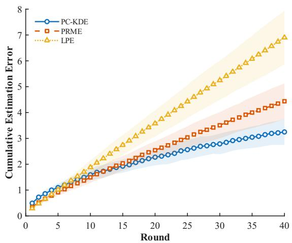  
(a) Cumulative estimation error within a task.

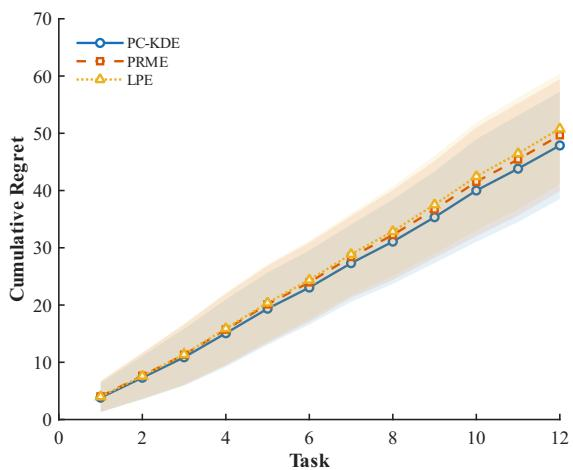  
(b) Cumulative regret across tasks.  
Figure 3: Controlled comparison of PC-KDE, PRME, and LPE on the exact finite-support context distribution. Each curve averages 60 runs and the shaded region shows one standard deviation.

99.02, 93.24, 87.54, and 80.83. The constrained task construction gives all tasks a common directional component, so a simple average is already informative. The oracle remains best in every panel, although its advantage over the practical priors narrows as alignment increases. The trend is consistent with the fixed prior becoming more informative as task directions align; this experiment does not address adaptive adversarial task sequences.

## 6.2 Loss-Estimator Comparison

We next compare PC-KDE, PRME, and LPE while holding the task generator and meta-prior mechanism fixed. The experiment uses m = 12 tasks, $n = 4 0$ rounds, $k = 3$ actions, $d = 3$ , task similarity setting $\mathrm { C S } _ { \mathrm { m i n } } = 0 . 5$ , and 60 independent runs. Contexts are drawn uniformly from the four vertices of a regular tetrahedron in $\mathbb { R } ^ { 3 }$ , scaled so that each support point has unit norm. This distribution is centered and has raw second moment $I _ { 3 } / 3$ . Because $k = 3$ , all $4 ^ { 3 } = 6 4$ ordered context tuples can be enumerated, and the policy-selected mean and covariance required by PC-KDE are computed exactly for the current adaptive policy rather than approximated by Monte Carlo integration.

All three methods use PCRW and share the same generated tasks, contexts, actionrandomization stream, and hyperparameters $\eta = 0 . 0 5 , \gamma = 0 . 4 5$ , and $\mu = \log ( 3 ) / \log ( 4 0 ) = 0 . 2 9 7 8$ These values satisfy the PC-KDE score-stability condition used in this experiment. We report two quantities. For task $s ,$ the cumulative vector estimation error through round t is

$$
E _ { s , t } = \left\| \sum _ { j = 1 } ^ { t } { \widehat { \pmb { \theta } } } _ { s , j } - \sum _ { j = 1 } ^ { t } { \pmb { \theta } } _ { s , j } \right\| ,
$$

and the plotted value averages $E _ { s , t }$ over the 12 tasks and then over runs. The second quantity is cumulative regret across tasks.

At round 40, the mean cumulative estimation errors are $3 . 2 5 \pm 0 . 5 0$ for PC-KDE, $4 . 4 4 \pm 0 . 6 9$ for PRME, and $6 . 9 0 \pm 1 . 0 3$ for LPE. The ordering is consistent with the estimator constructions: PC-KDE uses exact policy-induced moments and is unbiased on the decision-relevant subspace, PRME incurs finite-sample moment estimation and inverse-propensity error, and LPE recovers only the component along the selected context. The final cumulative regrets are much closer— $4 7 . 8 7 \pm 9 . 3 6 , 4 9 . 6 6 \pm 9 . 7 7$ , and $5 0 . 8 0 \pm 9 . 6 6 $ showing that full-vector estimation error and decision regret need not move proportionally. When exact selected moments are available, PC-KDE gives the lowest estimation error in this controlled setting. PRME removes the need to know the context distribution at a modest empirical cost here, while LPE trades vector accuracy for an $\mathcal O ( d )$ update.

## 6.3 Movie Recommendation Task

We evaluate Meta-LinEXP3 on the MovieLens 100K data [8], which contain 100,000 explicit ratings from 943 users on 1,682 movies. Movie genre indicators form $d = 1 9$ context features, users are tasks, and movies are actions. Starting from the sparse user–movie rating matrix, we construct the experiment reward matrix using the attribute-clustering completion procedure detailed in Appendix B: movies are grouped by their non-exclusive genre labels, users are assigned according to their observed genre preferences, and each missing entry is filled from the corresponding user-cluster/genre statistics whenever a valid statistic is available. Entries that remain zero are treated as unavailable and are excluded from candidate generation.

Eighty users are sampled once as a calibration pool and excluded from every reported evaluation run. The remaining users form the evaluation pool. Each of 30 runs samples $m = 2 0 0$ evaluation users without replacement; every user/task lasts $n = 4 0$ rounds, and $k = 1 0$ positiverated candidate movies are sampled in each round. Meta-LinEXP3 and LinEXP3 use LPE, with $\eta = \sqrt { \log ( 1 0 ) / 4 0 } = 0 . 2 3 9 9$ and $\gamma = \sqrt { \log ( 1 0 ) / ( 2 0 0 \cdot 4 0 ) } = 0 . 0 1 7 0$ . Because MovieLens ratings and binary genre vectors have a diferent scale from the synthetic experiment, the prior concentration parameter is calibrated only on the held-out 80 users. The tested grid is {0.6242, 1.2484, 2.4968}; averaging three calibration repetitions selects $\mu = 1 . 2 4 8 4$ , which is then frozen for all 30 evaluation runs.

We compare PCRW and Uniform against LinEXP3, Gaussian linear Thompson sampling (TS) [2, 29], and a conjugate hierarchical linear-Gaussian Meta-TS adaptation based on [12]. Let $y _ { s , t , a } ^ { \mathrm { M L } } \in [ 1 , 5 ]$ denote the positive completed rating used as reward. LinEXP3 and both Meta-LinEXP3 variants use the loss

$$
\ell _ { s , t , a } ^ { \mathrm { M L } } = - y _ { s , t , a } ^ { \mathrm { M L } } \in [ - 5 , - 1 ] ,\tag{51}
$$

with no shift or normalization; TS and Meta-TS use $y _ { s , t , a } ^ { \mathrm { M L } }$ directly. The reported metric is the actual cumulative best-candidate reward gap, $\begin{array} { r } { \sum _ { s = 1 } ^ { m } \sum _ { t = 1 } ^ { n } ( \operatorname* { m a x } _ { a \in [ k ] } y _ { s , t , a } ^ { \mathrm { M L } } - y _ { s , t , A _ { s , t } } ^ { \mathrm { M L } } ) } \end{array}$ , with no artificial afine shift. This empirical metric difers from the fixed-policy pseudo-regret analyzed in Section 5; moreover, the discrete rating data do not satisfy the noiseless linear-loss assumptions exactly.

In Figure 4, the two Meta-LinEXP3 variants attain the lowest mean final reward gaps among the methods tested. At task 200, the mean cumulative gaps are 2256.7 for LinEXP3, 2185.6 for TS, 1966.6 for Meta-TS, 1917.9 for PCRW, and 1931.8 for Uniform. Relative to LinEXP3, the mean gaps of PCRW and Uniform are lower by about 15.0% and 14.4%, respectively; they are also about 2.5% and 1.8% below the mean gap of the tested Meta-TS adaptation. These diferences are consistent with beneficial cross-user transfer, but they should not be interpreted as a general ranking of the methods: both the stochastic Gaussian model underlying TS/Meta-TS and the adversarial linear model underlying Meta-LinEXP3 are approximations to the MovieLens setting.

## 6.4 Structured Tensor Sampling for Hyperspectral Data

We further evaluate Meta-LinEXP3 on structured sampling of the Kennedy Space Center (KSC) hyperspectral cube [20]. The data tensor has size $5 1 2 \times 6 1 4 \times 1 7 6$ , and every spectral slice is treated as a task, giving $m = 1 7 6$ and context dimension $d = 1 1 2 6$ . For each slice we compute rank- $K = 1 0 \mathrm { \ S V D }$ factors. Each candidate sampling set contains 400 points, each task runs for $n = 5 0$ rounds, and each round presents $k = 2 0$ candidates drawn from a slice-specific FFW-derived proposal.

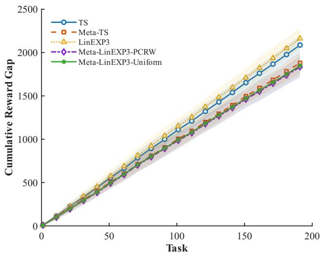  
Figure 4: Cumulative best-candidate reward gap on MovieLens. Curves average 30 evaluation runs and shaded regions show one standard deviation. The plot reports the unshifted accumulated gap.

A complete evaluation candidate bank is generated once and reused in all 60 evaluation repetitions. Each candidate is sampled without replacement and must satisfy full-rank feasibility and a reciprocal-condition-number threshold of $1 0 ^ { - 3 }$ for the two Gram matrices entering the reconstruction MSE. The within-slice learner uses the absolute-MSE LPE update with $\eta =$ $2 . 4 5 \times 1 0 ^ { - 4 }$ and $\gamma = 0 . 0 1 8 4 5$ . The KSC loss is nonlinear in the incidence context, and its raw positive MSE contains a large taskwise ofset. In a completed-task LPE summary, this absolute ofset mainly reflects selection frequency rather than relative sampling-set quality. For cross-slice transfer, we therefore use the centered relative loss summary defined below. For a completed task define

$$
z _ { s } ^ { \mathrm { m e t a } } = \frac { 1 } { n } \sum _ { t = 1 } ^ { n } \frac { ( \ell _ { s , t , A _ { s , t } } - \bar { \ell } _ { s } ) b _ { s , t , A _ { s , t } } } { L _ { \mathrm { s a m p } } } , \qquad \bar { \ell } _ { s } = \frac { 1 } { n } \sum _ { t = 1 } ^ { n } \ell _ { s , t , A _ { s , t } } .\tag{52}
$$

After subtracting the coordinate mean, we apply the same regularized direction normalization used elsewhere. A below-average selected set contributes negative cost mass to its coordinates, so overlap with historically good sampling coordinates receives more probability under the standard fixed prior $\exp ( - \mu \langle b , h _ { s } \rangle )$ . This centered relative loss summary is application specific; it is not claimed to be an unbiased estimator of the linear loss vector from the theoretical ALCB model.

To separate scale selection from the reported sufix, slices 1–24 form a chronological calibration prefix. The first 12 prefix slices initialize the retrieval history, and slices 13–24 score a fixed earlysearch summary computed from the best-observed-MSE trajectory over rounds 1:10. Calibration uses an independent candidate bank. The initial grid is

$$
\mu \in \{ 0 , 0 . 0 3 8 3 , 0 . 1 , 0 . 2 5 , 0 . 5 , 1 , 2 , 4 , 8 \} ,
$$

where $\mu = 0$ allows the procedure to reject transfer. If the PCRW optimum remains at the largest positive value, the grid is doubled until an interior optimum or saturation is observed. Twenty calibration repetitions give PCRW early-search scores 332.642 at $\mu = 8 ,$ , 331.763 at 16, and 331.810 at 32; hence the minimum occurs at $\mu = 1 6$ and the 16–32 comparison indicates saturation rather than a truncated boundary optimum. We therefore freeze $\mu = 1 6$ before the held-out evaluation. The same frozen value is used for Uniform so that PCRW versus Uniform remains a controlled aggregation-rule ablation rather than a separately tuned baseline comparison.

Reported evaluation then uses slices 25–176 with a separate candidate bank and 60 paired repetitions. PCRW, Uniform, and zero-prior LinEXP3 share the same final bank, $n , k ,$ LPE update, $\eta , \gamma _ { \colon }$ , and inverse-CDF random numbers; the zero-prior baseline difers only by setting $ { \boldsymbol { h } } _ { s } =  { \mathbf { 0 } } _ { d }$ . We also report slice-wise FFW [14] and reverse-greedy frame-potential sampling (Greedy-FP) [25]. Each baseline directly constructs one sampling set per slice. The bandit methods return sampling sets of the same size but report the best set observed over 50 sequential selections, so the final recovery MSEs compare solution quality under a common output size and objective, while the search procedures and computational costs difer.

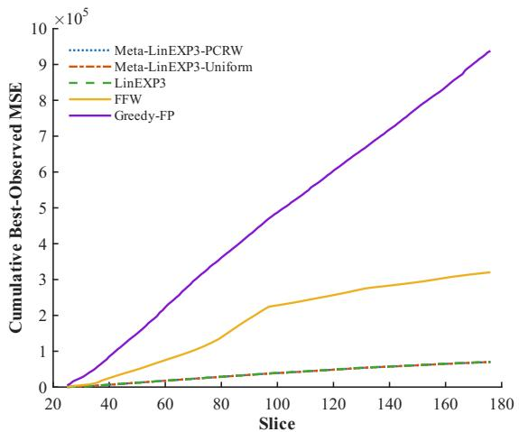  
(a) Cumulative best-observed MSE on slices $2 5 -$ 176.

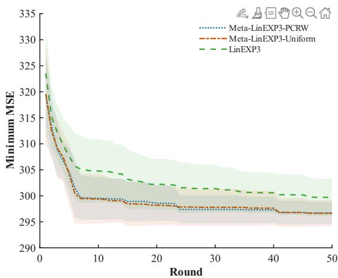  
(b) Best-observed MSE on spectral slice 176.  
Figure 5: KSC structured sampling. PCRW, Uniform, and zero-prior LinEXP3 use the same 50 round sequential protocol; their curves average 60 paired runs and shading denotes one standard deviation. FFW and Greedy-FP construct one sampling set directly for each slice.

On the reported evaluation sufix, cumulative best-observed MSE is $6 9 9 2 9 . 5 6 \pm 6 2 . 9 5$ for PCRW, $6 9 9 1 1 . 6 7 \pm 5 6 . 9 0$ for Uniform, and $7 0 7 1 5 . 1 8 \pm 7 7 . 5 7$ for zero-prior LinEXP3. These correspond to reductions of 1.111% and 1.136% relative to LinEXP3. Since the three bandit methods are paired by candidate environment and inverse-CDF random numbers, the paired diferences provide the more informative comparison: PCRW–LinEXP3 is −785.63 with 95% CI $[ - 8 0 7 . 4 5 , - 7 6 3 . 8 1 ]$ , and Uniform–LinEXP3 is −803.51 with 95% CI [−825.16, −781.86]. PCRW and Uniform are close to one another: Uniform has the slightly lower final cumulative mean, whereas PCRW has the slightly lower early-search score reported below. We therefore view the KSC result as evidence for the benefit of a fixed cross-task prior, not as evidence that PCRW uniformly outperforms Uniform. FFW and Greedy-FP finish at 320255.19 and 937907.31 over the same evaluation slices. Because all methods return sampling sets of the same size and are evaluated by the same recovery MSE, these values are directly comparable as final solution quality. However, the bandit methods report the best set observed over 50 sequential MSE-feedback selections, whereas FFW and Greedy-FP construct one set directly. Moreover, the bandit candidate bank is generated from slice-specific FFW-derived proposal weights. The comparison therefore does not represent equal search efort and cannot isolate the efects of sequential search, direct MSE feedback, proposal design, and cross-slice transfer.

Figure 5(a) uses a common linear MSE axis for the three paired sequential bandit methods and the two direct-construction baselines. The resulting scale makes PCRW, Uniform, and LinEXP3 appear nearly coincident: the bandit curves end near $7 . 0 \times 1 0 ^ { 4 }$ and difer by about $\mathrm { 8 \times 1 0 ^ { 2 } }$ , whereas FFW and Greedy-FP extend the axis to $3 . 2 0 \times 1 0 ^ { 5 }$ and $9 . 3 8 \times 1 0 ^ { 5 }$ . The ≈ 1.1% separation between transfer and the zero-prior baseline under the shared sequential protocol is therefore visually compressed, and is better quantified by the paired confidence intervals above.

The first-10-round summary provides a clearer view of the transfer efect. Averaging the fixed early-search score derived from the best-observed-MSE trajectories over all evaluation slices gives $4 7 3 . 5 0 9 \pm 0 . 4 3 4$ for PCRW, 473.568 ± 0.485 for Uniform, and $4 7 9 . 7 1 9 \pm 0 . 5 3 3$ for LinEXP3, corresponding to improvements of 1.294% and 1.282%. Thus, both transferred priors improve early sequential recovery by about 1.2–1.3% relative to zero-prior LinEXP3. On the absolute final spectral slice, slice 176, PCRW reaches mean best-observed MSE 304.65 by round 5, 299.51 by round 10, and 298.92 by round 15, versus 307.62, 304.77, and 303.17 for LinEXP3. By round 50 the means are 296.70 and 299.70, so the gap narrows as repeated within-slice search gives every method more opportunities to encounter a low-MSE candidate. The transfer diagnostics are consistent with a substantial change in the action distribution: mean prior-score/MSE correlations are positive (0.332 for PCRW and 0.494 for Uniform), mean total-variation distances from zero-prior LinEXP3 are 0.652 and 0.438, and the paired action-disagreement rates are 87.1% and 78.5%. These diagnostics confirm that the centered relative loss summary materially changes the action distribution and yields a reproducible warm-start advantage.

To assess sensitivity to the final candidate bank, we independently regenerate six additional banks and run 12 paired action-random repetitions on each, keeping the prefix-calibrated $\mu = 1 6$ fixed. Treating each bank mean as the bootstrap cluster, PCRW–LinEXP3 cumulative MSE is −772.77 with 95% bootstrap CI [−800.38, −744.04], a 1.093% improvement; Uniform–LinEXP3 is −783.48 with CI [−810.20, −752.60], a 1.108% improvement. All six banks favor both transfer variants. The corresponding first-10-round early-search improvements are 1.239% for PCRW and 1.211% for Uniform, again with all six banks favorable. The close agreement between the fixed-bank and independent-bank results indicates that the reported gain is not specific to a single favorable candidate realization.

The KSC experiment is an application-level study rather than a test of the linear theory. Under the shared sequential protocol, it isolates the fixed cross-slice prior against zero-prior LinEXP3. It does not validate the linear/common-context-distribution theorem, because the inverse-Gram MSE is nonlinear and the candidate law depends on the slice. The FFW and Greedy-FP comparison evaluates final solution quality under the same sampling-set size and recovery objective, but the search procedures and computational costs difer. Cross-slice transfer is isolated only by the paired comparison of PCRW and Uniform with zero-prior LinEXP3. The result therefore provides evidence that the Meta-LinEXP3 transfer architecture can exploit spectral-slice similarity to improve early sequential search when paired with an application-specific task representation.

## 7 Conclusion

Meta-LinEXP3 constructs a predictable prior from completed task summaries and keeps that prior fixed throughout the next ALCB task. For known context distributions, PC-KDE gives an intrinsic-dimension $\mathcal { O } ( \sqrt { n } )$ per-task guarantee; for unknown distributions, PRME gives an explicit $\mathcal { O } ( n ^ { 2 / 3 } )$ leading term together with a finite-sample moment estimation error. Under the stated margin and prior-accuracy conditions, these taskwise guarantees translate into sublinear transfer-dependent terms over structured task sequences.

The experiments support four observations. In the bounded synthetic generator, transfer gains increase with task alignment. In the exact finite-support study, PC-KDE gives the lowest cumulative vector estimation error. On MovieLens, both Meta-LinEXP3 variants have lower mean final reward gaps than the tested baselines. On KSC, the shared sequential comparison gives about a 1.1% cumulative reduction and improves early sequential recovery over the first 10 rounds by about 1.2–1.3% relative to zero-prior LinEXP3 when the nonlinear application uses the centered relative loss summary in (52). The same direction is observed on six independently regenerated candidate banks, while the within-slice advantage narrows with continued search, consistent with transfer primarily improving warm-start candidate selection. FFW and Greedy-FP are included as direct-construction references for final recovery quality, although their search procedures and computational costs difer from the sequential bandit protocol.

The main limitations are computational and structural. Exact PC-KDE requires policyinduced moments, while PRME incurs inverse-propensity variance and O(d2) memory. Improvement with the number of tasks is conditional on predictable structure that makes the prior increasingly accurate; unrelated tasks need not yield any transfer gain. In addition, MovieLens and KSC do not exactly satisfy the noiseless-linear/common-context-distribution model, and the KSC centered relative loss summary is an application-specific outer representation rather than a theoretically unbiased loss vector estimator. Extending the analysis to approximate policy moments and to nonlinear application-specific task representations remains an important direction.

## Funding

The work was supported by the Major Scientific and Technological Innovation Platform Project of Hunan Province (2024JC1003).

## Conflict of Interest

The authors declare no relevant financial or nonfinancial conflicts of interest.

## References

[1] Yasin Abbasi-Yadkori, Dávid Pál, and Csaba Szepesvári. Improved algorithms for linear stochastic bandits. In J. Shawe-Taylor, R. Zemel, P. Bartlett, F. Pereira, and K.Q. Weinberger, editors, Advances in Neural Information Processing Systems, volume 24, pages 2312–2320. Curran Associates, Inc., 2011.

[2] Shipra Agrawal and Navin Goyal. Thompson sampling for contextual bandits with linear payofs. In Sanjoy Dasgupta and David McAllester, editors, Proceedings of the 30th International Conference on Machine Learning, volume 28 of Proceedings of Machine Learning Research, pages 127–135. PMLR, 2013. URL https://proceedings.mlr.press/ v28/agrawal13.html.

[3] Javad Azizi, Thang Duong, Yasin Abbasi-Yadkori, András György, Claire Vernade, and Mohammad Ghavamzadeh. Non-stationary bandits and meta-learning with a small set of optimal arms. Reinforcement Learning Journal, 5:2461–2491, 2024. URL https://rlj.cs. umass.edu/2024/papers/Paper358.html.

[4] Alina Beygelzimer, John Langford, Lihong Li, Lev Reyzin, and Robert Schapire. Contextual bandit algorithms with supervised learning guarantees. In Proceedings of the Fourteenth International Conference on Artificial Intelligence and Statistics, volume 15 of Proceedings of Machine Learning Research, pages 19–26. PMLR, 2011. URL https://proceedings. mlr.press/v15/beygelzimer11a.html.

[5] Steven Bilaj, Sofien Dhouib, and Setareh Maghsudi. Meta learning in bandits within shared afine subspaces. In Proceedings of the 27th International Conference on Artificial Intelligence and Statistics, volume 238 of Proceedings of Machine Learning Research, pages 523–531. PMLR, 2024. URL https://proceedings.mlr.press/v238/bilaj24a.html.

[6] Leonardo Cella, Alessandro Lazaric, and Massimiliano Pontil. Meta-learning with stochastic linear bandits. In Proceedings of the 37th International Conference on Machine Learning, volume 119 of Proceedings of Machine Learning Research, pages 1360–1370. PMLR, 2020. URL https://proceedings.mlr.press/v119/cella20a.html.

[7] Giulia Denevi, Dimitris Stamos, Carlo Ciliberto, and Massimiliano Pontil. Online-withinonline meta-learning. In H. Wallach, H. Larochelle, A. Beygelzimer, F. d’Alché Buc, E. Fox, and R. Garnett, editors, Advances in Neural Information Processing Systems, volume 32, pages 13089–13099. Curran Associates, Inc., 2019.

[8] F. Maxwell Harper and Joseph A. Konstan. The MovieLens datasets: History and context. ACM Transactions on Interactive Intelligent Systems, 5(4):19:1–19:19, 2015. doi: 10.1145/ 2827872.

[9] Masahiro Kato and Shinji Ito. LC-Tsallis-INF: Generalized best-of-both-worlds linear contextual bandits. In Proceedings of The 28th International Conference on Artificial Intelligence and Statistics, volume 258 of Proceedings of Machine Learning Research, pages 3655–3663. PMLR, 2025. URL https://proceedings.mlr.press/v258/kato25a.html.

[10] Mikhail Khodak, Maria-Florina F. Balcan, and Ameet S. Talwalkar. Adaptive gradientbased meta-learning methods. In H. Wallach, H. Larochelle, A. Beygelzimer, F. d’Alché Buc, E. Fox, and R. Garnett, editors, Advances in Neural Information Processing Systems, volume 32, pages 5915–5926. Curran Associates, Inc., 2019.

[11] Misha Khodak, Ilya Osadchiy, Keegan Harris, Maria-Florina F. Balcan, Kfir Y. Levy, Ron Meir, and Steven Z. Wu. Meta-learning adversarial bandit algorithms. In A. Oh, T. Naumann, A. Globerson, K. Saenko, M. Hardt, and S. Levine, editors, Advances in Neural Information Processing Systems, volume 36, pages 35441–35471. Curran Associates, Inc., 2023. doi: 10.52202/075280-1540. URL https://proceedings.neurips.cc/paper\_files/ paper/2023/hash/6f627c706a7d9961cc1ff55f37f07f97-Abstract-Conference.html.

[12] Branislav Kveton, Mikhail Konobeev, Manzil Zaheer, Chih-Wei Hsu, Martin Mladenov, Craig Boutilier, and Csaba Szepesvári. Meta-thompson sampling. In Proceedings of the 38th International Conference on Machine Learning, volume 139 of Proceedings of Machine Learning Research, pages 5884–5893. PMLR, 2021. URL https://proceedings. mlr.press/v139/kveton21a.html.

[13] John Langford and Tong Zhang. The epoch-greedy algorithm for multi-armed bandits with side information. In J. Platt, D. Koller, Y. Singer, and S. Roweis, editors, Advances in Neural Information Processing Systems, volume 20, pages 817–824. Curran Associates, Inc., 2007.

[14] Hao Li, Dong Liang, Zixi Zhou, and Zheng Xie. Fast sampling for linear inverse problems of vectors and tensors using multilinear extensions. Signal Processing, 239:110333, 2026. ISSN 0165-1684. doi: 10.1016/j.sigpro.2025.110333.

[15] Lihong Li, Wei Chu, John Langford, and Robert E. Schapire. A contextual-bandit approach to personalized news article recommendation. In Proceedings of the 19th International Conference on World Wide Web, pages 661–670. Association for Computing Machinery, 2010. doi: 10.1145/1772690.1772758. URL https://doi.org/10.1145/1772690.1772758.

[16] Haolin Liu, Chen-Yu Wei, and Julian Zimmert. Bypassing the simulator: Nearoptimal adversarial linear contextual bandits. In A. Oh, T. Naumann, A. Globerson, K. Saenko, M. Hardt, and S. Levine, editors, Advances in Neural Information Processing Systems, volume 36, pages 52086–52131. Curran Associates, Inc., 2023. doi: 10.52202/075280-2269. URL https://proceedings.neurips.cc/paper\_files/paper/ 2023/hash/a3a661eb3308d0bb686f6a4bac521032-Abstract-Conference.html.

[17] Francis Maes, Louis Wehenkel, and Damien Ernst. Meta-learning of exploration/exploitation strategies: The multi-armed bandit case. In Agents and Artificial Intelligence: 4th International Conference, ICAART 2012, Revised Selected Papers, volume 358 of Communications in Computer and Information Science, pages 100–115. Springer, 2013. doi: 10.1007/978-3-642-36907-0\_7.

[18] Dimitri Meunier and Pierre Alquier. Meta-strategy for learning tuning parameters with guarantees. Entropy, 23(10):1257, 2021. ISSN 1099-4300. doi: 10.3390/e23101257. URL https://doi.org/10.3390/e23101257.

[19] Mirco Mutti, Jeongyeol Kwon, Shie Mannor, and Aviv Tamar. A classification view on meta learning bandits. In Proceedings of the 42nd International Conference on Machine Learning, volume 267 of Proceedings of Machine Learning Research, pages 45342–45361. PMLR, 2025. URL https://proceedings.mlr.press/v267/mutti25a.html.

[20] NASA Jet Propulsion Laboratory. Kennedy space center (KSC) AVIRIS imaging spectrometer data. AVIRIS Data Archive, 1996. URL https://aviris.jpl.nasa.gov/data/. Acquired over Kennedy Space Center, Florida, on March 23, 1996; 176 bands retained after removing water-absorption and low-SNR bands.

[21] Gergely Neu and Julia Olkhovskaya. Eficient and robust algorithms for adversarial linear contextual bandits. In Jacob Abernethy and Shivani Agarwal, editors, Proceedings of Thirty Third Conference on Learning Theory, volume 125 of Proceedings of Machine Learning Research, pages 3049–3068. PMLR, 09–12 Jul 2020.

[22] Gergely Neu, Julia Olkhovskaya, and Sattar Vakili. Adversarial contextual bandits go kernelized. In Proceedings of the 35th International Conference on Algorithmic Learning Theory, volume 237 of Proceedings of Machine Learning Research, pages 907–929. PMLR, 2024. URL https://proceedings.mlr.press/v237/neu24a.html.

[23] Julia Olkhovskaya, Jack Mayo, Tim van Erven, Gergely Neu, and Chen-Yu Wei. Firstand second-order bounds for adversarial linear contextual bandits. In A. Oh, T. Naumann, A. Globerson, K. Saenko, M. Hardt, and S. Levine, editors, Advances in Neural Information Processing Systems, volume 36, pages 61625–61644. Curran Associates, Inc., 2023. doi: 10.52202/075280-2692. URL https://papers.nips.cc/paper\_files/paper/2023/hash/ c2201e444d2b22a10ca50116a522b9a9-Abstract-Conference.html.

[24] Pedro A. Ortega, Jane X. Wang, Mark Rowland, Tim Genewein, Zeb Kurth-Nelson, Razvan Pascanu, Nicolas Heess, Joel Veness, Alex Pritzel, Pablo Sprechmann, Siddhant M. Jayakumar, Tom McGrath, Kevin Miller, Mohammad Azar, Ian Osband, Neil Rabinowitz, András György, Silvia Chiappa, Simon Osindero, Yee Whye Teh, Hado van Hasselt, Nando de Freitas, Matthew Botvinick, and Shane Legg. Meta-learning of sequential strategies, 2019. URL https://arxiv.org/abs/1905.03030.

[25] Guillermo Ortiz-Jiménez, Mario Coutino, Sundeep Prabhakar Chepuri, and Geert Leus. Sparse sampling for inverse problems with tensors. IEEE Transactions on Signal Processing, 67(12):3272–3286, 2019. doi: 10.1109/TSP.2019.2914879.

[26] Ilya Osadchiy, Kfir Y. Levy, and Ron Meir. Online meta-learning in adversarial multi-armed bandits, 2022. URL https://arxiv.org/abs/2205.15921.

[27] Amit Peleg, Naama Pearl, and Ron Meir. Metalearning linear bandits by prior update. In Proceedings of The 25th International Conference on Artificial Intelligence and Statistics, volume 151 of Proceedings of Machine Learning Research, pages 2885–2926. PMLR, 2022. URL https://proceedings.mlr.press/v151/peleg22a.html.

[28] Ambuj Tewari and Susan A. Murphy. From ads to interventions: Contextual bandits in mobile health. In James M. Rehg, Susan A. Murphy, and Santosh Kumar, editors, Mobile Health: Sensors, Analytic Methods, and Applications, pages 495–517. Springer International Publishing, Cham, 2017. ISBN 978-3-319-51394-2. doi: 10.1007/978-3-319-51394-2\_25. URL https://doi.org/10.1007/978-3-319-51394-2\_25.

[29] William R. Thompson. On the likelihood that one unknown probability exceeds another in view of the evidence of two samples. Biometrika, 25(3–4):285–294, 1933. doi: 10.1093/ biomet/25.3-4.285.

[30] Sebastian Thrun and Lorien Pratt, editors. Learning to Learn. Springer US, Boston, MA, 1998. ISBN 978-1-4615-5529-2. doi: 10.1007/978-1-4615-5529-2. URL https://doi.org/ 10.1007/978-1-4615-5529-2.

[31] Joel A. Tropp. User-friendly tail bounds for sums of random matrices. Foundations of Computational Mathematics, 12(4):389–434, 2012. doi: 10.1007/s10208-011-9099-z.

[32] Tim van Erven, Jack Mayo, Julia Olkhovskaya, and Chen-Yu Wei. An improved algorithm for adversarial linear contextual bandits via reduction. In Advances in Neural Information Processing Systems, volume 38, 2025. URL https://papers.nips.cc/paper\_files/ paper/2025/hash/c5ecef120f0543f34e36e1112fbbe4e8-Abstract-Conference.html.

[33] Jiaqi Yang, Wei Hu, Jason D. Lee, and Simon S. Du. Impact of representation learning in linear bandits. In International Conference on Learning Representations, 2021. URL https://openreview.net/forum?id=edJ\_HipawCa.

## A Proofs of the Theoretical Results

For readability, boldface is omitted locally in the derivations below when vector or matrix type is unambiguous; the symbols correspond to their boldface counterparts in the main text.

## A.1 Technical Results Deferred from the Main Text

Changing priors and the general decomposition. For a predictable sequence of strictly positive kernels $r _ { s , t } , t \in [ n + 1 ]$ , define the scalar prior-drift charge

$$
\omega _ { s , t } ( \boldsymbol { B } ) = \operatorname* { m a x } _ { a \in [ k ] } \log \frac { r _ { s , t + 1 } ( a \mid \boldsymbol { B } ) } { r _ { s , t } ( a \mid \boldsymbol { B } ) } ,\tag{53}
$$

$$
\Gamma _ { s } ^ { \mathrm { d y n } } ( \pi ) = \mathbb { E } \left[ - \log r _ { s , n + 1 } ( \pi ( \mathcal { B } ^ { 0 } ) \mid \mathcal { B } ^ { 0 } ) + \sum _ { t = 1 } ^ { n } \omega _ { s , t } ( \mathcal { B } ^ { 0 } ) \right] .\tag{54}
$$

For softmax kernels $\begin{array} { r } { r _ { s , t } ( a \mid \mathcal { B } ) \propto \exp [ - \mu _ { s } \langle b _ { a } , h _ { s , t } \rangle ] } \end{array}$ with a common prior concentration parameter $\mu _ { s }$ 2

$$
\omega _ { s , t } ( \mathcal { B } ) \leq \mu _ { s } \Delta \| h _ { s , t + 1 } - h _ { s , t } \| .\tag{55}
$$

Algorithm 1 has $\pmb { h } _ { s , t } = \pmb { h } _ { s }$ , so $\Gamma _ { s } ^ { \mathrm { d y n } } ( \pi ) = \Gamma _ { s } ( \pi )$

Lemma A.1 (Changing-prior exponential weights). Fix B and scalar scores $z _ { t , a }$ , and write $\boldsymbol { z } _ { t } = ( z _ { t , 1 } , \dots , z _ { t , k } ) ^ { T }$ . Let

$$
q _ { s , t } ( a \mid \mathcal { B } ) = \frac { r _ { s , t } ( a \mid \mathcal { B } ) \exp [ - \eta \sum _ { j < t } z _ { j , a } ] } { \sum _ { a ^ { \prime } = 1 } ^ { k } r _ { s , t } ( a ^ { \prime } \mid \mathcal { B } ) \exp [ - \eta \sum _ { j < t } z _ { j , a ^ { \prime } } ] } ,\tag{56}
$$

and set $\begin{array} { r } { \pmb { q } _ { s , t } ( \pmb { \mathcal { B } } ) = ( q _ { s , t } ( 1 \mid \pmb { \mathcal { B } } ) , \dots , q _ { s , t } ( k \mid \pmb { \mathcal { B } } ) ) ^ { T } . \ I f \mid \eta z _ { t , a } \vert \leq \zeta \leq 1 } \end{array}$ , then, for every $a ^ { \star } \in [ k ]$

$$
\sum _ { t = 1 } ^ { n } \langle q _ { s , t } - e _ { a ^ { \star } } , z _ { t } \rangle \leq \frac { - \log r _ { s , n + 1 } ( a ^ { \star } \mid \mathcal { B } ) + \sum _ { t = 1 } ^ { n } \omega _ { s , t } ( \mathcal { B } ) } { \eta } + \psi ( \zeta ) \eta \sum _ { t = 1 } ^ { n } \sum _ { a = 1 } ^ { k } q _ { s , t } ( a \mid \mathcal { B } ) z _ { t , a } ^ { 2 } .\tag{57}
$$

For a policy kernel w, set $\begin{array} { r } { m _ { w } ( B ) = \sum _ { a } w ( a \mid B ) b _ { a } } \end{array}$ , and let unif denote the uniform kernel. For an arbitrary estimator, define

$$
{ \pmb u } _ { s , t } = \mathbb { E } _ { s , t } ^ { \mathrm { p r e } } [ \widehat { \pmb \theta } _ { s , t } ] - { \pmb \theta } _ { s , t } .\tag{58}
$$

Lemma A.2 (General transfer and bias decomposition). Let $\textbf { \em a } _ { s , t }$ be $\mathcal { H } _ { s , t }$ -measurable and put $z _ { s , t , a } ( \mathcal { B } ^ { 0 } ) = \langle \pmb { b } _ { a } ^ { 0 } - \pmb { a } _ { s , t } , \widehat { \pmb { \theta } } _ { s , t } \rangle$ . Suppose $| \eta z _ { s , t , a } ( B ^ { 0 } ) | \le \zeta \le 1$ almost surely. Define

$$
\mathcal { W } _ { s , t } = \mathbb { E } \left[ \sum _ { a = 1 } ^ { k } p _ { s , t } ( a \mid \mathcal { B } ^ { 0 } ) z _ { s , t , a } ( \mathcal { B } ^ { 0 } ) ^ { 2 } \right] ,\tag{59}
$$

$$
\begin{array} { r } { \mathcal { E } _ { s , t } ( \pi ) = \mathbb { E } \left[ \left. m _ { \mathrm { u n i f } } ( \mathcal { B } ^ { 0 } ) - b _ { \pi ( \mathcal { B } ^ { 0 } ) } ^ { 0 } , \pmb { \theta } _ { s , t } \right. \right] , } \end{array}\tag{60}
$$

$$
\mathfrak { B } _ { s } ( \pi ) = - ( 1 - \gamma ) \sum _ { t = 1 } ^ { n } \mathbb { E } \Big [ \left. m _ { q _ { s , t } } ( \mathcal { B } ^ { 0 } ) - b _ { \pi ( \mathcal { B } ^ { 0 } ) } ^ { 0 } , \pmb { u } _ { s , t } \right. \Big ] .\tag{61}
$$

Then

$$
\mathrm { R e g } _ { s } ( \pi ) \leq \frac { ( 1 - \gamma ) \Gamma _ { s } ^ { \mathrm { d y n } } ( \pi ) } { \eta } + \psi ( \zeta ) \eta \sum _ { t = 1 } ^ { n } \mathcal { W } _ { s , t } + \gamma \sum _ { t = 1 } ^ { n } \mathcal { E } _ { s , t } ( \pi ) + \mathfrak { B } _ { s } ( \pi ) ,\tag{62}
$$

and $\mathcal { E } _ { s , t } ( \pi ) \leq G$

Known-distribution refinements.

Proposition A.3 (Data-dependent PC-KDE refinement). Under Theorem 5.3, define

$$
\mathcal { W } _ { s , t } ^ { \mathrm { P C } } = \mathbb { E } \Big [ \ell _ { s , t , A _ { s , t } } ^ { 2 } ( { b } _ { s , t , A _ { s , t } } - { { \alpha } } _ { s , t } ) ^ { T } H _ { s , t } ^ { \dagger } ( { b } _ { s , t , A _ { s , t } } - { { \alpha } } _ { s , t } ) \Big ] .\tag{63}
$$

Then $\mathcal { W } _ { s , t } ^ { \mathrm { P C } } \leq Y ^ { 2 } d _ { \mathcal { U } }$ and

$$
\mathrm { R e g } _ { s } ( \pi ) \leq \frac { ( 1 - \gamma ) \Gamma _ { s } ( \pi ) } { \eta } + \psi ( \zeta ) \eta \sum _ { t = 1 } ^ { n } \mathcal { W } _ { s , t } ^ { \mathrm { P C } } + \gamma \sum _ { t = 1 } ^ { n } \mathcal { E } _ { s , t } ( \pi ) .\tag{64}
$$

Theorem A.4 (Average PC-KDE regret). Suppose the conditions of Theorem 5.3 hold for every task with common (ζ, η, γ). If the comparators $\pi _ { s } ^ { \star }$ exist, then

$$
\frac { \mathrm { R e g } _ { 1 : m } } { m } \leq \frac { 1 - \gamma } { m \eta } \sum _ { s = 1 } ^ { m } \Gamma _ { s } ( \pi _ { s } ^ { \star } ) + \psi ( \zeta ) \eta d _ { U } Y ^ { 2 } n + \gamma G n .\tag{65}
$$

The same bound holds for any fixed comparator sequence. If a best comparator does not exist, an ε-optimal comparator sequence incurs at most an additional ε in the average bound for any $\varepsilon > 0$

Corollary A.5 (Bounded-distribution transfer gain). $I f \Theta _ { s }$ and $\pi _ { \Theta _ { s } } \in \Pi$ are fixed before task s, then

$$
\Gamma _ { s } ( \pi _ { \Theta _ { s } } ) \leq \mathbb { E } \left[ \log k - \mu _ { s } \mathbb { E } _ { \mathcal { B } } \Bigl [ \langle \bar { b } - b _ { \pi _ { \Theta _ { s } } ( \mathcal { B } ) } , h _ { s } \rangle \Bigr ] + \frac { \mu _ { s } ^ { 2 } \Delta ^ { 2 } \| h _ { s } \| ^ { 2 } } { 8 } \right] .\tag{66}
$$

PCRW tracking and the original fast-rate condition. For PCRW, set

$$
\begin{array} { r l r } {  { D _ { s } ^ { \mathrm { r e t } } = \displaystyle \sum _ { i = 1 } ^ { s - 1 } c _ { s , i } ^ { \mathrm { c o s } } \| \widehat { \pmb { v } } _ { i } - \widehat { \pmb { v } } _ { s - 1 } \| , } } \\ & { } & { e _ { s } = \| \widehat { \pmb { v } } _ { s } - \pmb { v } _ { s } \| , \qquad D _ { s } ^ { \mathrm { t a s k } } = \| \pmb { v } _ { s } - \pmb { v } _ { s - 1 } \| , } \\ & { } & { \delta _ { s } ^ { \mathrm { t r a c k } } = D _ { s } ^ { \mathrm { r e t } } + e _ { s - 1 } + D _ { s } ^ { \mathrm { t a s k } } . } \end{array}\tag{67}
$$

Lemma A.6 (Transfer Lipschitzness and PCRW tracking). For fixed $\mu _ { s }$ , let $\Phi _ { s } ( h )$ = $\mathbb { E } _ { B } [$ − log $r _ { \mu _ { s } , h } ( \pi _ { s } ( B ) \mid B ) ]$ ]. Then Φs is $\mu _ { s } \Delta - L i p s c h i t z$ and

$$
\| h _ { s } ^ { \mathrm { { c o s } } } - v _ { s } \| \leq \delta _ { s } ^ { \mathrm { t r a c k } } , \qquad \Gamma _ { s } ( \pi _ { s } ) \leq \Phi _ { s } ( \pmb { v } _ { s } ) + \mu _ { s } \Delta \delta _ { s } ^ { \mathrm { t r a c k } } .\tag{68}
$$

If $\mu _ { 1 } = 0$ , then

$$
\sum _ { s = 1 } ^ { m } \Gamma _ { s } ( \pi _ { s } ) \leq \log k + \sum _ { s = 2 } ^ { m } \Phi _ { s } ( { \pmb v } _ { s } ) + \Delta \sum _ { s = 2 } ^ { m } \mu _ { s } \delta _ { s } ^ { \mathrm { t r a c k } } .\tag{69}
$$

Assumption A.7 (Uniform gap and coarse tracking). There is $g > 0$ such that, almost surely $f o r$ every $s \geq 2$ , every B, and every $a \neq \pi _ { s } ( B )$

$$
\begin{array} { r } { \langle b _ { a } - b _ { \pi _ { s } ( B ) } , v _ { s } \rangle \geq g , } \end{array}\tag{70}
$$

and $\delta _ { s } ^ { \mathrm { t r a c k } } \le g / ( 2 \Delta )$

Corollary A.8 (Uniform-gap PC-KDE fast rate). Under Assumption A.7, set

$$
\mu _ { 1 } = 0 , \qquad \mu _ { s } = \frac { 4 \log ( s + 1 ) } { g } \quad ( s \geq 2 ) .\tag{71}
$$

Then

$$
\Gamma _ { 1 } ( \pi _ { 1 } ) = \log k , \qquad \Gamma _ { s } ( \pi _ { s } ) \leq \frac { k - 1 } { ( s + 1 ) ^ { 2 } } .\tag{72}
$$

Feasible taskwise PC-KDE tuning gives

$$
\mathrm { R e g } _ { 1 : m } \leq 2 \sqrt { n A _ { \zeta } } \left[ \sqrt { \log k } + \sqrt { k - 1 } \{ 1 + \log ( m + 1 ) \} \right] .\tag{73}
$$

Let $Z _ { 1 } , \dots , Z _ { k } \overset { \mathrm { i . i . d . } } { \sim } \mathcal { N } ( 0 , 1 )$ and define

$$
\nu _ { k } = \mathbb { E } [ \operatorname* { m i n } _ { a \leq k } Z _ { a } ] < 0 , \qquad \mathrm { c o s } _ { C } ( \boldsymbol { h } , \boldsymbol { \Theta } ) = \frac { h ^ { T } C \boldsymbol { \Theta } } { \sqrt { h ^ { T } C h } \sqrt { \boldsymbol { \Theta } ^ { T } C \boldsymbol { \Theta } } } .
$$

Set this cosine to zero if either denominator factor vanishes.

Corollary A.9 (Gaussian transfer calculation). Let $k \geq 2$ and $b _ { a } \overset { \mathrm { i . i . d . } } { \sim } \mathcal { N } ( \bar { b } , C )$ . For $r _ { h } ( a \mid B ) \propto$ $\exp [ - \mu \langle b _ { a } , \pmb { h } \rangle ]$

$$
\mathbb { E } [ - \log r _ { h } ( \pi _ { \Theta } ( \mathcal { B } ) \mid \mathcal { B } ) ] \le \log k + \mu \nu _ { k } \frac { h ^ { T } C \Theta } { \sqrt { \Theta ^ { T } C \Theta } } + \frac { \mu ^ { 2 } } { 2 } h ^ { T } C h ,\tag{74}
$$

$$
\leq \log k - \frac { \nu _ { k } ^ { 2 } } { 2 } [ \mathrm { c o s } _ { C } ( \pmb { h } , \pmb { \Theta } ) _ { + } ] ^ { 2 } a f t e r o p t i m i z i n g \mu \geq 0 .\tag{75}
$$

This Gaussian calculation is separate from the bounded-support theorem; combining them would require a truncation argument.

Detailed PRME and LPE results. On the simultaneous moment event,

$$
\| \overline { { S } } _ { s , t } - S \| \leq \xi _ { N _ { s , t } } , \qquad S \preceq \widehat { S } _ { s , t } \preceq S + 2 \xi _ { N _ { s , t } } { \cal I } _ { d } .\tag{76}
$$

For the current policy define

$$
\begin{array} { c l } { \displaystyle { M _ { s , t } = \mathbb { E } _ { B } \bigg [ \sum _ { a = 1 } ^ { k } p _ { s , t } ( a \mid \mathcal { B } ) { b } _ { a } { b } _ { a } ^ { T } \bigg ] , } } \\ { \displaystyle { \rho _ { s , t } ^ { \mathrm { e f f } } = \mathrm { t r } ( M _ { s , t } \cal { S } ^ { - 1 } ) \leq \chi d . } } \end{array}\tag{77}
$$

For a comparator put

$$
\pmb { d } _ { s , t } ^ { \pi } = \mathbb { E } _ { \mathcal { B } ^ { 0 } } \Big [ m _ { q _ { s , t } } ( \mathcal { B } ^ { 0 } ) - \pmb { b } _ { \pi ( \mathcal { B } ^ { 0 } ) } ^ { 0 } \Big ] .
$$

The exact PRME parameter bias is

$$
\pmb { u } _ { s , t } ^ { \mathrm { P R } } = \left( \widetilde { \pmb { S } } _ { s , t } ^ { - 1 } \pmb { S } - \pmb { I } _ { d } \right) \pmb { \theta } _ { s , t } .\tag{78}
$$

Theorem A.10 (Finite-sample PRME decomposition). Under Assumptions 5.1–5.2 and (32), if PRME is used and $\eta Y \kappa \leq \gamma$ , then

$$
\begin{array} { r l r } {  { \mathrm { R e g } _ { s } ( \pi ) \le \frac { ( 1 - \gamma ) \Gamma _ { s } ( \pi ) } { \eta } + \frac { \psi ( 1 ) \eta Y ^ { 2 } } { \gamma } \sum _ { t = 1 } ^ { n } \mathbb { E } [ \rho _ { s , t } ^ { \mathrm { e f f } } ] + \gamma G n } } \\ & { } & { \quad + 4 R \sqrt { \displaystyle \frac { \chi } { \lambda } } \sum _ { t = 1 } ^ { n } \xi _ { N _ { s , t } } + f _ { s } . } \end{array}\tag{79}
$$

Here $f _ { s }$ is the failure remainder bounded in (37).

Using $\rho _ { s , t } ^ { \mathrm { e f f } } \leq \chi d$ in Theorem A.10 gives the simpler bound

$$
\mathrm { R e g } _ { s } ( \pi ) \leq \frac { \Gamma _ { s } ( \pi ) } { \eta } + \frac { \psi ( 1 ) \eta \chi d Y ^ { 2 } n } { \gamma } + \gamma G n + 4 R \sqrt { \frac { \chi } { \lambda } } \sum _ { t = 1 } ^ { n } \xi _ { N _ { s , t } } + f _ { s } .\tag{80}
$$

On the moment event (76), the signed bias additionally satisfies

$$
\begin{array} { r } { \vert ( d _ { s , t } ^ { \pi } ) ^ { T } \pmb { u } _ { s , t } ^ { \mathrm { P R } } \vert \leq \Vert d _ { s , t } ^ { \pi } \Vert _ { S ^ { - 1 } } \sqrt { \pmb { \theta } _ { s , t } ^ { T } \pmb { E } _ { s , t } \widehat { S } _ { s , t } ^ { - 1 } \pmb { E } _ { s , t } \pmb { \theta } _ { s , t } } , \quad \pmb { E } _ { s , t } = \widehat { \pmb { S } } _ { s , t } - \pmb { S } . } \end{array}\tag{81}
$$

Corollary A.11 (Uniform-gap PRME fast rate). Under Assumption A.7, use (71) and taskwise PRME tuning with $\bar { \Gamma } _ { 1 } =$ log k and $\bar { \Gamma } _ { s } = ( k - 1 ) / ( s + 1 ) ^ { 2 }$ . Assume the taskwise exploration and stability conditions of Theorem 5.5 hold. Then

$$
\begin{array} { l } { { \mathrm { R e g } _ { 1 : m } \leq 3 \{ \psi ( 1 ) \chi d Y ^ { 2 } G \} ^ { 1 / 3 } n ^ { 2 / 3 } \left[ ( \log k ) ^ { 1 / 3 } + 3 ( k - 1 ) ^ { 1 / 3 } ( m + 1 ) ^ { 1 / 3 } \right] } } \\ { { \qquad + 4 R \sqrt { \displaystyle \frac { \chi } { \lambda } } \sum _ { u = 1 } ^ { m n } \xi _ { k ( u - 1 ) } + \sum _ { s = 1 } ^ { m } f _ { s } , } } \end{array}\tag{82}
$$

which is

$$
\widetilde { \mathcal { O } } \left( n ^ { 2 / 3 } m ^ { 1 / 3 } + \sqrt { \frac { m n } { k } } \right)\tag{83}
$$

for fixed remaining parameters.

Set $Y _ { \mathrm { L P } } = L R$ . The LPE projection identity implies

$$
\Vert \widehat { \pmb { \theta } } _ { s , t } ^ { \mathrm { L P } } - { \pmb { \theta } } _ { s , t } \Vert ^ { 2 } = \Vert \pmb { \theta } _ { s , t } \Vert ^ { 2 } - \frac { \ell _ { s , t , A _ { s , t } } ^ { 2 } } { \Vert \pmb { b } _ { s , t , A _ { s , t } } \Vert ^ { 2 } } .\tag{84}
$$

The displayed fraction is defined as zero when the selected context is zero.

Theorem A.12 (Regret and exact projection bias with LPE). If $\eta Y _ { \mathrm { L P } } \leq \zeta \leq 1$ , then

$$
\mathrm { R e g } _ { s } ( \pi ) \leq \frac { ( 1 - \gamma ) \Gamma _ { s } ( \pi ) } { \eta } + \psi ( \zeta ) \eta Y _ { \mathrm { L P } } ^ { 2 } n + \gamma G n + \mathfrak { B } _ { s } ^ { \mathrm { L P } } ( \pi ) ,\tag{85}
$$

where

$$
\mathfrak { B } _ { s } ^ { \mathrm { L P } } ( \pi ) = - ( 1 - \gamma ) \sum _ { t = 1 } ^ { n } \mathbb { E } \Big [ ( d _ { s , t } ^ { \pi } ) ^ { T } \{ \mathbb { E } _ { s , t } ^ { \mathrm { p r e } } [ P _ { b _ { s , t , A _ { s , t } } } ] - I _ { d } \} \theta _ { s , t } \Big ] .\tag{86}
$$

It satisfies

$$
| \mathfrak { B } _ { s } ^ { \mathrm { L P } } ( \pi ) | \leq ( 1 - \gamma ) \sum _ { t = 1 } ^ { n } \mathbb { E } \left[ \| d _ { s , t } ^ { \pi } \| \sqrt { \| \pmb { \theta } _ { s , t } \| ^ { 2 } - \frac { \ell _ { s , t , A _ { s , t } } ^ { 2 } } { \| \pmb { b } _ { s , t , A _ { s , t } } \| ^ { 2 } } } \right] ,\tag{87}
$$

$$
\leq \Delta ( 1 - \gamma ) \sqrt { n \mathbb { E } \Bigg [ \sum _ { t = 1 } ^ { n } \Bigg ( \| \pmb { \theta } _ { s , t } \| ^ { 2 } - \frac { \ell _ { s , t , A _ { s , t } } ^ { 2 } } { \| \pmb { b } _ { s , t , A _ { s , t } } \| ^ { 2 } } \Bigg ) \Bigg ] } .\tag{88}
$$

Corollary A.13 (Average LPE bias). For fixed comparator policies $\pi _ { 1 } , \ldots , \pi _ { m }$

$$
\frac { 1 } { m } \sum _ { s = 1 } ^ { m } | \mathfrak { B } _ { s } ^ { \mathrm { L P } } ( \pi _ { s } ) | \leq \Delta ( 1 - \gamma ) \sqrt { n ^ { 2 } R ^ { 2 } - \frac { n } { m } \mathbb { E } \left[ \sum _ { s = 1 } ^ { m } \sum _ { t = 1 } ^ { n } \frac { \ell _ { s , t , A _ { s , t } } ^ { 2 } } { \| b _ { s , t , A _ { s , t } } \| ^ { 2 } } \right] } .\tag{89}
$$

Without directional coverage, the average LPE bias bound can remain of order n.

## A.2 Filtration, Ghost Sets, and Changing Priors

Throughout the proofs we use the pre-context filtration in (2). Every policy kernel below is measurable before the fresh context set is drawn. The ghost set $B ^ { 0 } \sim \mathcal { D } ^ { k }$ is independent of the entire realized interaction and is introduced only for the analysis.

Proof of Lemma A.1. For fixed $B ,$ abbreviate $r _ { t } ( a ) = r _ { s , t } ( a \mid B )$ and let

$$
V _ { t - 1 , a } ^ { \mathrm { c u m } } = \sum _ { j < t } z _ { j , a } , \qquad W _ { t } = \sum _ { a = 1 } ^ { k } r _ { t } ( a ) e ^ { - \eta V _ { t - 1 , a } ^ { \mathrm { c u m } } } .\tag{90}
$$

Write $q _ { t , a } = q _ { s , t } ( a \mid B )$ . The policy in Algorithm 1 is $q _ { t , a } = r _ { t } ( a ) e ^ { - \eta V _ { t - 1 , a } ^ { \mathrm { c u m } } } / W _ { t }$ . Subtracting a round-dependent constant from every $z _ { t , a }$ leaves this policy unchanged.

For $| x | \leq \zeta$ , the elementary inequality

$$
e ^ { - x } \leq 1 - x + \psi ( \zeta ) x ^ { 2 }\tag{91}
$$

holds with $\psi ( \zeta )$ from (24). Hence

$$
\begin{array} { r l r } {  { \widetilde { W } _ { t + 1 } : = \sum _ { a } r _ { t } ( a ) e ^ { - \eta ( V _ { t - 1 , a } ^ { \mathrm { c u m } } + z _ { t , a } ) } = W _ { t } \sum _ { a } q _ { t , a } e ^ { - \eta z _ { t , a } } } } \\ & { } & \\ & { } & { \leq W _ { t } \exp ( - \eta \langle q _ { t } , z _ { t } \rangle + \psi ( \zeta ) \eta ^ { 2 } \sum _ { a } q _ { t , a } z _ { t , a } ^ { 2 } ) . } \end{array}\tag{92}
$$

By the definition of $\omega _ { s , t }$

$$
W _ { t + 1 } = \sum _ { a } r _ { t + 1 } ( a ) e ^ { - \eta V _ { t , a } ^ { \mathrm { c u m } } } \leq e ^ { \omega _ { s , t } ( \mathcal { B } ) } \widetilde { W } _ { t + 1 } .\tag{93}
$$

Since $W _ { 1 } = 1$ , iteration of the preceding two displays gives an upper bound on log $W _ { n + 1 }$ . On the other hand, for any $a ^ { \star }$

$$
\begin{array} { r } { W _ { n + 1 } \geq r _ { n + 1 } ( a ^ { \star } ) e ^ { - \eta \sum _ { t = 1 } ^ { n } z _ { t , a ^ { \star } } } . } \end{array}\tag{94}
$$

Combining the upper and lower bounds and dividing by η proves (57).

Proof of (55). For $r _ { h } ( a \mid \mathcal { B } ) \propto \exp [ - \mu _ { s } \langle b _ { a } , h \rangle ]$ , let $\begin{array} { r } { Z _ { t } ( \mathcal { B } ) = \sum _ { a } \exp [ - \mu _ { s } \langle b _ { a } , h _ { s , t } \rangle ] } \end{array}$ . Then

$$
\log \frac { r _ { s , t + 1 } ( a \mid \mathcal { B } ) } { r _ { s , t } ( a \mid \mathcal { B } ) } = - \mu _ { s } \langle b _ { a } , h _ { s , t + 1 } - h _ { s , t } \rangle + \log Z _ { t } - \log Z _ { t + 1 } .\tag{95}
$$

The gradient is

$$
\nabla _ { h } \log r _ { h } ( a \mid \mathcal { B } ) = - \mu _ { s } \left( b _ { a } - \sum _ { c } r _ { h } ( c \mid \mathcal { B } ) b _ { c } \right) ,\tag{96}
$$

whose norm is at most $\mu _ { s } \Delta$ . The mean-value theorem and maximization over a prove the claim. □

Proof of Lemma A.2. Fix s, t and condition on $\mathcal { H } _ { s , t }$ . For any policy kernel $w ,$ freshness of $\boldsymbol { B } _ { s , t }$ gives

$$
\mathbb { E } \Big [ \Big \langle m _ { w } ( \mathcal { B } _ { s , t } ) - b _ { \pi ( \mathcal { B } _ { s , t } ) } , \theta _ { s , t } \Big \rangle \Big | \mathcal { H } _ { s , t } \Big ] = \mathbb { E } _ { \mathcal { B } ^ { 0 } } \Big [ \Big \langle m _ { w } ( \mathcal { B } ^ { 0 } ) - b _ { \pi ( \mathcal { B } ^ { 0 } ) } ^ { 0 } , \theta _ { s , t } \Big \rangle \Big ] .\tag{97}
$$

Independence of the ghost set and the definition of $u _ { s , t }$ also imply

$$
\begin{array} { r l } & { \mathbb { E } \Big [ \Big \langle m _ { q _ { s , t } } ( \mathcal { B } ^ { 0 } ) - b _ { \pi ( \mathcal { B } ^ { 0 } ) } ^ { 0 } , \widehat { \theta } _ { s , t } \Big \rangle \Big | \mathcal { H } _ { s , t } \Big ] } \\ & { \quad = \mathbb { E } _ { \mathcal { B } ^ { 0 } } \Big [ \Big \langle m _ { q _ { s , t } } ( \mathcal { B } ^ { 0 } ) - b _ { \pi ( \mathcal { B } ^ { 0 } ) } ^ { 0 } , \theta _ { s , t } + u _ { s , t } \Big \rangle \Big ] . } \end{array}\tag{98}
$$

Decompose $p _ { s , t } = ( 1 - \gamma ) q _ { s , t } + \gamma$ unif. Equations (97)–(98), summed over t, express the true regret as the exploitation surrogate, the exact uniform exploration term (60), and the signed correction (61). Apply Lemma A.1 pathwise to $B ^ { 0 }$ with $a ^ { \star } = \pi ( B ^ { 0 } )$ . Finally,

$$
( 1 - \gamma ) q _ { s , t } ( a \mid \mathcal { B } ^ { 0 } ) \leq p _ { s , t } ( a \mid \mathcal { B } ^ { 0 } ) ,\tag{99}
$$

so the multiplied quadratic term is at most (59). Taking the joint expectation proves (62). The range bound on $\mathcal { E } _ { s , t }$ follows directly from Assumption 5.1. □

## A.3 Known-Distribution Estimator

Lemma A.14 (Afine support and selected covariance). Let $C = \mathrm { C o v } _ { \mathscr D } ( b )$ and $\mathcal { U } = \mathrm { r a n g e } ( C )$ Then $b - { \bar { b } } \in { \mathcal { U } }$ almost surely. Moreover, for the selected covariance $H _ { s , t }$ in (6),

$$
\mathrm { r a n g e } ( H _ { s , t } ) = \mathcal { U } , \qquad H _ { s , t } | _ { \mathcal { U } } \succeq \gamma C | _ { \mathcal { U } } .\tag{100}
$$

Proof. Fix $s , t$ and condition on $\mathcal { H } _ { s , t } ;$ all distributions and means in this proof are therefore conditional, pathwise quantities. For every $v \in \mathcal { U } ^ { \perp } , \mathbb { E } [ \langle v , b - \bar { b } \rangle ^ { 2 } ] = v ^ { T } C v = 0 ;$ hence the first assertion holds. Let $Q _ { s , t }$ be the marginal distribution of the context selected by ${ { q } _ { s , t } }$ . The marginal selected by $p _ { s , t }$ is $P _ { s , t } = ( 1 - \gamma ) Q _ { s , t } + \gamma D$ , and let $\boldsymbol { x } _ { s , t } ^ { q } = \mathbb { E } _ { b \sim Q _ { s , t } } [ b ]$ . The covariance-mixture identity yields

$$
\begin{array} { r l } & { H _ { s , t } = ( 1 - \gamma ) \mathrm { C o v } _ { Q _ { s , t } } ( b ) + \gamma C } \\ & { \qquad + \gamma ( 1 - \gamma ) ( x _ { s , t } ^ { q } - \bar { b } ) ( x _ { s , t } ^ { q } - \bar { b } ) ^ { T } \succeq \gamma C . } \end{array}\tag{101}
$$

All centered selected contexts lie in $u ,$ so the reverse range inclusion holds as well. This proves (100). □

Proof of Theorem 5.3. Conditioning before the current set and using noiseless linear loss,

$$
\begin{array} { r l } & { \mathbb { E } _ { s , t } ^ { \mathrm { p r e } } [ \widehat { \theta } _ { s , t } ^ { \mathrm { P C } } ] = H _ { s , t } ^ { \dagger } \mathbb { E } [ ( b _ { s , t , A _ { s , t } } - x _ { s , t } ) b _ { s , t , A _ { s , t } } ^ { T } ] \theta _ { s , t } } \\ & { \qquad = H _ { s , t } ^ { \dagger } H _ { s , t } \theta _ { s , t } = P _ { \mathcal { U } } \theta _ { s , t } . } \end{array}\tag{102}
$$

Thus the full parameter bias is $- P _ { \mathcal { U } ^ { \bot } } \theta _ { s , t }$ . Both $m _ { q _ { s , t } } ( { \cal B } ^ { 0 } )$ and $b _ { \pi ( B ^ { 0 } ) } ^ { 0 }$ belong to the same afine space ${ \bar { b } } + { \mathcal { U } } ;$ their diference belongs to U. Its inner product with the bias is therefore zero, proving exact decision-relevant unbiasedness.

The selected mean belongs to the closed convex hull of the support, so $\| b - x _ { s , t } \| \leq \Delta$ Lemma A.14 gives

$$
| \langle b _ { a } ^ { 0 } - x _ { s , t } , \widehat { \theta } _ { s , t } ^ { \mathrm { P C } } \rangle | \leq \frac { Y \Delta ^ { 2 } } { \gamma \lambda _ { + } } .\tag{103}
$$

Hence (27) implies the score condition in Lemma A.2 with center $a _ { s , t } = x _ { s , t }$

For the second moment, independence of the ghost set first gives

$$
\mathbb { E } _ { \mathcal { B } ^ { 0 } } \sum _ { a } p _ { s , t } ( a \mid \mathcal { B } ^ { 0 } ) \langle b _ { a } ^ { 0 } - x _ { s , t } , \widehat { \theta } _ { s , t } ^ { \mathrm { P C } } \rangle ^ { 2 } = ( \widehat { \theta } _ { s , t } ^ { \mathrm { P C } } ) ^ { T } H _ { s , t } \widehat { \theta } _ { s , t } ^ { \mathrm { P C } } .\tag{104}
$$

Taking expectation over the actual set and action yields exactly (63). Since $| \ell | \leq Y$

$$
\begin{array} { r l } & { \mathcal { W } _ { s , t } ^ { \mathrm { P C } } \leq Y ^ { 2 } \mathbb { E } [ ( b _ { A } - x _ { s , t } ) ^ { T } H _ { s , t } ^ { \dagger } ( b _ { A } - x _ { s , t } ) ] } \\ & { \quad \quad = Y ^ { 2 } \operatorname { t r } ( H _ { s , t } ^ { \dagger } H _ { s , t } ) = Y ^ { 2 } d _ { \mathcal { U } } . } \end{array}\tag{105}
$$

Substitution in Lemma A.2 proves both regret bounds.

Proof of Corollary 5.4. Set $\gamma = \eta Y \kappa _ { \mathcal { U } } / \zeta$ in (28), use $1 - \gamma \leq 1$ and $\Gamma _ { s } ( \pi ) \leq \bar { \Gamma } _ { s }$ , and obtain

$$
\mathrm { R e g } _ { s } ( \pi ) \leq \frac { \Gamma _ { s } } { \eta } + \eta n A _ { \zeta } .\tag{106}
$$

The choice in (30) minimizes the right-hand side. Its feasibility gives the stated result. □

Proof of Theorem A.4. Apply (28) to $\pi _ { s } ^ { \star }$ for every task, sum, and divide by $m$ . Since $\mathrm { R e g } _ { s } =$ $\mathrm { R e g } _ { s } ( \pi _ { s } ^ { \star } )$ , this gives (65). If the supremum is not attained, let $\pi _ { s , \varepsilon }$ be an ε-optimal comparator for task s. Then $\begin{array} { r } { \mathrm { R e g } _ { 1 : m } / m \leq \varepsilon + m ^ { - 1 } \sum _ { s } \mathrm { R e g } _ { s } ( \pi _ { s , \varepsilon } ) } \end{array}$ for every sequence specified in the theorem. Applying (28) to that sequence gives the asserted ε-optimal bound. Applying the same argument directly to an arbitrary fixed comparator sequence proves its stated bound. No independence among task parameters is required for this step. □

Proof of Corollary A.5. Condition on the history preceding task $s ,$ and hence on $h = h _ { s }$ , and set $\Theta = \Theta _ { \varepsilon }$ and $\mu = \mu _ { s }$ . Since the ghost set is independent of this history, Jensen’s inequality and the i.i.d. ghost arms give

$$
\mathbb { E } [ - \log r _ { h } ( \pi _ { \Theta } ( \mathcal { B } ) \mid \mathcal { B } ) ] \le \log k + \mu \mathbb { E } \langle b _ { \pi _ { \Theta } ( \mathcal { B } ) } , h \rangle + \log \mathbb { E } e ^ { - \mu \langle b , h \rangle } .\tag{107}
$$

The random variable $\left. b - { \bar { b } } , h \right.$ has range length at most $\Delta \parallel h \parallel$ . Hoefding’s lemma therefore bounds the last logarithm by $- \mu \langle \bar { b } , h \rangle + \mu ^ { 2 } \Delta ^ { 2 } \| h \| ^ { 2 } / 8$ . Taking expectation over the pre-task history proves (66); there is no drift term because the prior is fixed within the task. □

Proof of Lemma A.6. For fixed B and comparator action $a ^ { \star } = \pi _ { s } ( B )$

$$
\nabla _ { h } [ - \log r _ { \mu _ { s } , h } ( a ^ { \star } \mid \mathcal { B } ) ] = \mu _ { s } \left( b _ { a ^ { \star } } - \sum _ { a } r _ { \mu _ { s } , h } ( a \mid \mathcal { B } ) b _ { a } \right) .\tag{108}
$$

Its norm is at most $\mu _ { s } \Delta$ , so averaging over B proves the Lipschitz claim. Because the PCRW coeficients are nonnegative and sum to one,

$$
\| h _ { s } ^ { \mathrm { c o s } } - \widehat { v } _ { s - 1 } \| = \left\| \sum _ { i < s } c _ { s , i } ^ { \mathrm { c o s } } ( \widehat { v } _ { i } - \widehat { v } _ { s - 1 } ) \right\| \leq D _ { s } ^ { \mathrm { r e t } } .\tag{109}
$$

The triangle inequality then gives $\| h _ { s } ^ { \mathrm { c o s } } - v _ { s } \| \le D _ { s } ^ { \mathrm { r e t } } + e _ { s - 1 } + D _ { s } ^ { \mathrm { t a s k } }$ . Apply Lipschitzness and the fixed-prior identity (22), then sum over tasks. For $s = 1 , \mu _ { 1 } = 0$ gives the uniform action prior and complexity log k. □

Proof of Theorem 5.7. Fix $s \geq 2$ , write $\varepsilon = \varepsilon _ { s }$ and $\mu = \mu _ { s }$ , and let $E _ { s } = \{ \| h _ { s } - v _ { s } \| \le \varepsilon \}$ Condition on $\mathcal { G } _ { s }$ from (40). Since $h _ { s }$ is $\mathcal { H } _ { s , 1 }$ -measurable and $v _ { s }$ is $\mathcal { G } _ { s }$ -measurable, $E _ { s }$ is $\mathcal { G } _ { s ^ { - } }$ measurable. On $E _ { s }$ , write $B = B ^ { 0 }$ for the fresh ghost set defined in the cross-task setup and put $a ^ { \star } = \pi _ { s } ( B )$ . For every $a \neq a ^ { \star }$

$$
\begin{array} { r l } & { \langle b _ { a } - b _ { a ^ { \star } } , h _ { s } \rangle \geq \langle b _ { a } - b _ { a ^ { \star } } , v _ { s } \rangle - \| b _ { a } - b _ { a ^ { \star } } \| \| h _ { s } - v _ { s } \| } \\ & { \phantom { a a a a a a a a a a a a a a a a a a a a a a a a a a a a a a a a a a a a } \geq \mathrm { g a p } _ { s } ( \mathcal { B } ) - \Delta \varepsilon . } \end{array}\tag{110}
$$

Therefore log $( 1 + x ) \leq x$ gives

$$
\left. \begin{array} { c } { \displaystyle - \log r _ { s } ( a ^ { \star } \mid \mathcal { B } ) = \log \left[ 1 + \sum _ { a \neq a ^ { \star } } e ^ { - \mu \left. b _ { a } - b _ { a ^ { \star } } , h _ { s } \right. } \right] } \\ { \leq ( k - 1 ) e ^ { \mu \Delta \varepsilon } e ^ { - \mu \mathrm { g a p } _ { s } ( \mathcal { B } ) } . } \end{array} \right.\tag{111}
$$

Let $X = \mathrm { g a p } _ { s } ( B )$ . Since $\begin{array} { r } { \operatorname* { l i m } _ { x \to 0 ^ { + } } F ( x ) = 0 } \end{array}$ , Assumption 5.6 implies $\mathbb { P } ( X = 0 \mid { \mathcal G } _ { s } ) = 0$ Conditional integration by parts yields

$$
\begin{array} { r } { \mathbb { E } [ e ^ { - \mu X } \mid \mathcal { G } _ { s } ] = \mu \int _ { 0 } ^ { \infty } e ^ { - \mu x } \mathbb { P } ( X \leq x \mid \mathcal { G } _ { s } ) d x } \\ { \leq \mu \int _ { 0 } ^ { \infty } e ^ { - \mu x } F ( x ) d x = \Phi _ { F } ( \mu ) . } \end{array}\tag{112}
$$

Combining (111)–(112) shows that, on the $\mathcal { G } _ { s } { \mathrm { - m e a s u r a b l e } }$ event $E _ { s }$ , the conditional transfer complexity is at most $( k - 1 ) e ^ { \mu \Delta \varepsilon } \Phi _ { F } ( \mu )$ . On $E _ { s } ^ { c }$ , the universal fallback (23) is log $k + \mu \Delta$ . Taking total expectation and using $\mathbb { P } ( E _ { s } ^ { c } ) \le \delta _ { s }$ proves $\Gamma _ { s } ( \pi _ { s } ) \leq B _ { s }$ . For $s = 1 , \mu _ { 1 } = 0$ gives the uniform prior and $\Gamma _ { 1 } ( \pi _ { 1 } ) = B _ { 1 } = \log k$

Because each task is oblivious, minimizing its cumulative comparator loss is equivalent to minimizing $\left. b _ { a } , \Theta _ { s } \right.$ for each context set. Components in $\mathcal { U } ^ { \perp }$ add the same ofset to all actions, so the fixed policy $\pi _ { s }$ in (39) attains the supremum in (1). Hence $\begin{array} { r } { \operatorname { R e g } _ { 1 : m } = \sum _ { s } \operatorname { R e g } _ { s } ( \pi _ { s } ) } \end{array}$ . Applying

Corollary 5.4 task by task with $\bar { \Gamma } _ { s } = B _ { s }$ gives (47). Applying Theorem 5.5 and summing its cube-root terms gives (48); the moment terms combine because $N _ { s , t } = k \{ n ( s - 1 ) + t - 1 \}$ in lexicographic order.

It remains to prove the qualitative statement. By the change of variables in (44),

$$
\Phi _ { F } ( \mu ) = \int _ { 0 } ^ { \infty } e ^ { - y } F ( y / \mu ) d y .
$$

For each fixed $y , F ( y / \mu ) \to 0$ as $\mu \to \infty$ , and the integrand is bounded by $e ^ { - y } .$ . Dominated convergence therefore gives $\Phi _ { F } ( \mu ) \to 0$ . Under (49), the exponential factor in the first term of $B _ { s }$ is uniformly bounded for all suficiently large s, while the second term tends to zero. Thus $B _ { s }  0$ . The same holds for $\sqrt { B _ { s } }$ and $B _ { s } ^ { 1 / 3 }$ , and Cesàro summability gives (50). □

Proof of Corollary 5.8. Equations (47), (48), and (50) give the stated PC-KDE and PRME learning-term scales. The tuned PC-KDE exploration probability is proportional to $\sqrt { B _ { s } } .$ , while the tuned PRME exploration probability is proportional to $B _ { s } ^ { 1 / 3 }$ and the left-hand side of (35) is proportional to $B _ { s }$ . Hence both tuning conditions hold for all suficiently large $s ;$ a finite prefix may use the trivial Gn bound. Equation (38) gives the $\widetilde { \mathcal { O } } ( \sqrt { m n / k } )$ PRME moment-learning term. Under the tuned PRME parameters, the aggregate failure remainder is $\mathcal { O } ( \delta )$ for fixed problem constants, exactly as in the proof of Theorem 5.5. These bounds give the stated sublinear regret consequences. □

Let $\begin{array} { r } { \Gamma _ { \mathrm { E } } ( u ) = \int _ { 0 } ^ { \infty } e ^ { - x } x ^ { u - 1 } } \end{array}$ dx denote the Euler gamma function.

Corollary A.15 (Power-law specialization). If, in addition, the function F in Assumption 5.6 satisfies

$$
F ( x ) \leq C _ { g } x ^ { \alpha } , \qquad C _ { g } > 0 , \quad \alpha > 0 ,\tag{113}
$$

then

$$
\Phi _ { F } ( \mu ) \leq C _ { g } \Gamma _ { \mathrm { E } } ( \alpha + 1 ) \mu ^ { - \alpha } .\tag{114}
$$

With $\mu _ { s } = \alpha / ( \Delta \varepsilon _ { s } )$

$$
B _ { s } \leq ( k - 1 ) C _ { g } \Gamma _ { \mathrm { E } } ( \alpha + 1 ) e ^ { \alpha } \left( \frac { \Delta } { \alpha } \right) ^ { \alpha } \varepsilon _ { s } ^ { \alpha } + \delta _ { s } \left( \log k + \frac { \alpha } { \varepsilon _ { s } } \right) .\tag{115}
$$

Thus polynomial calibration rates for $\varepsilon _ { s }$ and $\delta _ { s }$ give corresponding polynomial task-number rates through Theorem 5.7.

Proof of Corollary A.15. Under (113),

$$
\Phi _ { F } ( \mu ) \leq C _ { g } \mu \int _ { 0 } ^ { \infty } e ^ { - \mu x } x ^ { \alpha } d x = C _ { g } \Gamma _ { \mathrm { { E } } } ( \alpha + 1 ) \mu ^ { - \alpha } ,\tag{116}
$$

which proves (114). Substituting $\mu _ { s } = \alpha / ( \Delta \varepsilon _ { s } )$ in (46) gives (115).

## A.4 A Concrete Recurrent-Type Suficient Condition for Prior Consistency

This subsection gives one structured suficient condition for the prior-accuracy assumption in Theorem 5.7. It is an analytical construction and is not an additional algorithmic variant used in Section 6. Before task $s ,$ suppose an exogenous descriptor $z _ { s } \in [ J ]$ is revealed. For this subsection only, augment the pre-context filtration to

$$
\mathcal { H } _ { s , t } ^ { z } = \mathcal { H } _ { s , t } \vee \sigma ( z _ { s } ) .\tag{117}
$$

The context-freshness condition of Section 3.2 is required conditional on $\mathcal { H } _ { s , t } ^ { z }$ . Because $z _ { s }$ is revealed before the task prior and every within-task decision, the arguments leading to Theorem 5.7 remain valid under this augmented filtration.

Assumption A.16 (Finite recurrent types with pre-task descriptors). There are a fixed number $J < \infty$ of unit vectors $\mathbf { { u } } _ { 1 } , \dotsc , \mathbf { { u } } _ { J } \in \mathcal { U }$ and a descriptor sequence $z _ { s } \in [ J ]$ revealed before task s. The descriptor sequence and all task loss vectors are fixed before the interaction. For every task,

$$
P _ { \mathcal { U } } \Theta _ { s } = \rho _ { s } \pmb { u } _ { z _ { s } } , \qquad \quad \rho _ { s } \geq \rho _ { \mathrm { m i n } } > 0 .\tag{118}
$$

Define the same-descriptor history count and descriptor-gated prior by

$$
N _ { s } = \sum _ { i < s } { { \bf 1 } \{ { z _ { i } = z _ { s } } \} } , \bar { g } _ { s } = \left\{ \begin{array} { l l } { \displaystyle { \frac { 1 } { N _ { s } } \sum _ { \substack { i < s : z _ { s } = 2 z _ { s } } } P _ { U } \widehat { \Theta } _ { i } } , } & { N _ { s } \geq 1 , } \\ { { \bf 0 } _ { d } , } & { N _ { s } = 0 , } \end{array} \right. \quad h _ { s } ^ { \mathrm { r e c } } = \left\{ \begin{array} { l l } { \displaystyle { \bar { g } _ { s } } / \| \bar { g } _ { s } \| , } & { \displaystyle { \bar { g } _ { s } \not = { \bf 0 } _ { d } } , } \\ { { \bf 0 } _ { d } , } & { \displaystyle { \bar { g } _ { s } = { \bf 0 } _ { d } } . } \end{array} \right.\tag{119}
$$

The raw projected summaries are averaged before normalization, so diferent positive magnitudes along the same decision direction reinforce the same recurrent type. The rule is $\mathcal { H } _ { s , . } ^ { z }$ -measurable and can be maintained with one running sum and count per descriptor.

On the r-th occurrence of any descriptor, impose the exploration floor

$$
\gamma _ { s } \geq \underline { { \gamma } } _ { r } : = \frac { \gamma _ { 0 } } { \log ( \mathrm { e } + r ) } , \qquad 0 < \gamma _ { 0 } \leq \frac { 1 } { 2 } .\tag{120}
$$

For $N \geq 1$ , set

$$
\begin{array} { l } { { \displaystyle \delta _ { N } = ( \mathrm { e } + N ) ^ { - 2 } , ~ \mu _ { N } = c _ { \mu } \log ( \mathrm { e } + N ) , ~ c _ { \mu } > 0 , } } \\ { { \displaystyle M _ { N } = R + \frac { Y \Delta } { \lambda _ { + } \gamma _ { 0 } } \log ( \mathrm { e } + N ) , } } \\ { { \displaystyle d _ { N } = M _ { N } \sqrt { \frac { 2 d _ { \mathcal { U } } \log ( 2 d _ { \mathcal { U } } / \delta _ { N } ) } { N } } , } } \\ { { \displaystyle \varepsilon _ { N } = 2 \operatorname* { m i n } \left\{ 1 , \frac { d _ { N } } { \rho _ { \operatorname* { m i n } } } \right\} , } } \end{array}\tag{121}
$$

and define

$$
B _ { N } ^ { \mathrm { r e c } } = ( k - 1 ) e ^ { \mu _ { N } \Delta \varepsilon _ { N } } \Phi _ { F } ( \mu _ { N } ) + \delta _ { N } ( \log k + \mu _ { N } \Delta ) .\tag{122}
$$

For a task with $N _ { s } = N \ge 1$ , let $( \eta _ { s } ^ { \mathrm { t u n } } , \gamma _ { s } ^ { \mathrm { t u n } } )$ be the PC-KDE tuning (30) with $\bar { \Gamma } _ { s } = B _ { N } ^ { \mathrm { r e c } }$ Whenever $\gamma _ { s } ^ { \mathrm { t u n } } \leq 1 / 2$ , use

$$
\eta _ { s } = \eta _ { s } ^ { \mathrm { t u n } } , \qquad \gamma _ { s } = \operatorname* { m a x } \{ \gamma _ { s } ^ { \mathrm { t u n } } , \underline { { \gamma } } _ { N + 1 } \} .\tag{123}
$$

First occurrences and the finite number of tuning-infeasible occurrences may use any admissible parameters satisfying the exploration floor. Let $\begin{array} { r } { N _ { j } ( m ) = \sum _ { s = 1 } ^ { m } \mathbf { 1 } \{ z _ { s } = j \} } \end{array}$

Theorem A.17 (Recurrent-type PC-KDE realization). Suppose Assumptions 5.1–5.2, Assumption 5.6, and Assumption A.16 hold under the augmented filtration (117). Use PC-KDE and the descriptor-gated prior (119), with the exploration floor (120). Then, on every task with $N _ { s } = N \ge 1 _ { ; }$

$$
\begin{array} { r } { \mathbb { P } \big ( \| \pmb { h } _ { s } ^ { \mathrm { r e c } } - \pmb { v } _ { s } \| > \varepsilon _ { N } \big ) \le \delta _ { N } , } \end{array}\tag{124}
$$

and

$$
\varepsilon _ { N } = O \left( \frac { ( \log N ) ^ { 3 / 2 } } { \sqrt { N } } \right) , \qquad \mu _ { N } \varepsilon _ { N } \to 0 , \qquad \delta _ { N } ( 1 + \mu _ { N } ) \to 0 , \qquad B _ { N } ^ { \mathrm { r e c } } \to 0 .\tag{125}
$$

There is a constant $C _ { \mathrm { i n i t } }$ independent of m such that

$$
\begin{array} { r } { \mathrm { R e g } _ { 1 : m } ^ { \mathrm { P C } } \leq C _ { \mathrm { i n i t } } + 2 \sqrt { n A _ { \zeta } } { \displaystyle \sum _ { j = 1 } ^ { J } } \displaystyle \sum _ { N = 1 } ^ { N _ { j } ( m ) - 1 } \sqrt { B _ { N } ^ { \mathrm { r e c } } } } \\ { + G n \gamma _ { 0 } \displaystyle \sum _ { j = 1 } ^ { J } \displaystyle \sum _ { r = 1 } ^ { N _ { j } ( m ) } \displaystyle \frac { 1 } { \log ( \mathrm { e } + r ) } . } \end{array}\tag{126}
$$

For fixed J, n and the remaining problem constants,

$$
\begin{array} { r } { \operatorname { R e g } _ { 1 : m } ^ { \mathrm { P C } } = o ( m ) . } \end{array}\tag{127}
$$

Thus historical PC-KDE summaries satisfy the prior-consistency premise of Theorem 5.7 in this finite recurrent-type model.

Proof. Fix a descriptor $j$ and enumerate its completed tasks in occurrence order as $i _ { j , 1 } < i _ { j , 2 } <$ $\cdot \cdot \cdot$ . Write

$$
\begin{array} { r } { \widehat { \Theta } _ { j , r } = \widehat { \Theta } _ { i _ { j , r } } , \qquad \rho _ { j , r } = \rho _ { i _ { j , r } } , \qquad D _ { j , r } = P _ { \mathcal { U } } \widehat { \Theta } _ { j , r } - \rho _ { j , r } u _ { j } . } \end{array}
$$

Because the descriptor sequence and task loss vectors are fixed before the interaction, the tower property and (26) give

$$
\mathbb { E } [ D _ { j , r } \mid \mathcal { F } _ { 1 : i _ { j , r } - 1 } , z _ { i _ { j , r } } ] = 0 .\tag{128}
$$

Hence the descriptor-selected sequence is a vector martingale-diference sequence. The selectedcovariance lower bound (100) and $\| b _ { s , t , A _ { s , t } } - x _ { s , t } \| \leq \Delta$ imply, on the r-th occurrence,

$$
\| \hat { \theta } _ { i _ { j , r } , t } ^ { \mathrm { P C } } \| \leq \frac { Y \Delta } { \gamma _ { i _ { j , r } } \lambda _ { + } } \leq \frac { Y \Delta } { \lambda _ { + } \gamma _ { 0 } } \log ( \mathrm { e } + r ) .\tag{129}
$$

Since $\| P _ { \mathcal { U } } \Theta _ { i _ { j , r } } \| \le R$ , averaging over the n rounds yields

$$
\| D _ { j , r } \| \leq R + \frac { Y \Delta } { \lambda _ { + } \gamma _ { 0 } } \log ( \mathrm { e } + r ) .\tag{130}
$$

Choose a fixed orthonormal basis of U. For the first N completed tasks of type $j ,$ , apply scalar Azuma–Hoefding to each of the $d _ { \mathcal { U } }$ coordinates of (128), use (130), and take a union bound. With probability at least $1 - \delta _ { N }$

$$
\begin{array} { r l r } {  { \| \frac { 1 } { N } \sum _ { r = 1 } ^ { N } D _ { j , r } \| \le \frac { 1 } { N } \sqrt { 2 d _ { \mathcal { U } } \log ( 2 d _ { \mathcal { U } } / \delta _ { N } ) \sum _ { r = 1 } ^ { N } M _ { r } ^ { 2 } } } } \\ & { } & { \leq M _ { N } \sqrt { \frac { 2 d _ { \mathcal { U } } \log ( 2 d _ { \mathcal { U } } / \delta _ { N } ) } { N } } = d _ { N } . } \end{array}\tag{131}
$$

Before the $( N + 1 )$ -st occurrence of descriptor $j ,$ the raw average in (119) therefore has the form

$$
\bar { g } _ { s } = \bar { \rho } _ { N } u _ { j } + \bar { D } _ { N } , \qquad \bar { \rho } _ { N } = \frac { 1 } { N } \sum _ { r = 1 } ^ { N } \rho _ { j , r } \geq \rho _ { \operatorname* { m i n } } , \qquad \bar { D } _ { N } = \frac { 1 } { N } \sum _ { r = 1 } ^ { N } D _ { j , r } , \qquad \| \bar { D } _ { N } \| \leq d _ { N } .
$$

If $d _ { N } < \rho _ { \mathrm { m i n } }$ , then $\bar { g } _ { s } \neq 0$ and

$$
\left\| \frac { \bar { g } _ { s } } { \| \bar { g } _ { s } \| } - u _ { j } \right\| \leq \frac { 2 d _ { N } } { \rho _ { \operatorname* { m i n } } } .\tag{132}
$$

If $d _ { N } \geq \rho _ { \mathrm { m i n } } ,$ the distance between two vectors in the unit ball is at most 2. This proves (124). Since $M _ { N } = \mathcal { O } ( \log N )$ and log $; ( 2 d _ { \cal U } / \delta _ { N } ) = { \mathcal O } ( \log N )$ , (121) gives $\varepsilon _ { N } = \mathcal { O } ( ( \log N ) ^ { 3 / 2 } / \sqrt { N } )$   
Hence $\mu _ { N } \varepsilon _ { N } = \mathcal { O } ( ( \log N ) ^ { 5 / 2 } / \sqrt { N } ) \to 0$ and $\delta _ { N } ( 1 + \mu _ { N } ) \to 0$ . Theorem 5.7 then gives $B _ { N } ^ { \mathrm { r e c } } \to 0$ On any task for which the tuned pair is feasible, apply (28) with $\eta _ { s } = \eta _ { s } ^ { \mathrm { t u n } }$ and the larger   
exploration value in (123). Since $\gamma _ { s } - \gamma _ { s } ^ { \mathrm { t u n } } \leq \underline { { \gamma } } _ { N + 1 } ,$

$$
\mathrm { R e g } _ { s } ( \pi _ { s } ) \leq 2 \sqrt { n A _ { \zeta } B _ { N } ^ { \mathrm { r e c } } } + G n \underline { { { \gamma } } } _ { N + 1 } .\tag{133}
$$

Because $B _ { N } ^ { \mathrm { r e c } } \ \to \ 0$ , the tuned exploration also tends to zero; therefore only finitely many occurrences of each of the fixed J descriptors can violate $\gamma _ { s } ^ { \mathrm { t u n } } \leq 1 / 2$ . Together with the first occurrence of each descriptor, these tasks contribute a constant $C _ { \mathrm { i n i t } }$ under the trivial Gn bound. Summing (133) in descriptor-occurrence order proves (126). Finally, Cesàro summability gives $\begin{array} { r } { \sum _ { N < M } \sqrt { B _ { N } ^ { \mathrm { r e c } } } = o ( M ) } \end{array}$ , and $\begin{array} { r } { \sum _ { r \le M } 1 / \log ( \mathrm { e } + r ) = o ( M ) } \end{array}$ . Summing over fixed J proves (127).

Proof of Corollary A.8. Let $a ^ { \star } = \pi _ { s } ( B )$ . For every $a \neq a ^ { \star }$ , Assumption A.7 and (68) give

$$
\begin{array} { c } { { \displaystyle \langle b _ { a } - b _ { a ^ { \star } } , h _ { s } \rangle \geq \langle b _ { a } - b _ { a ^ { \star } } , v _ { s } \rangle - \| b _ { a } - b _ { a ^ { \star } } \| \| h _ { s } - v _ { s } \| } } \\ { { \geq g - \Delta \frac { g } { 2 \Delta } = \displaystyle \frac { g } { 2 } . } } \end{array}\tag{134}
$$

Consequently,

$$
\begin{array} { r l r } {  { - \log r _ { s } ( a ^ { \star } \mid \mathcal { B } ) = \log [ 1 + \sum _ { a \neq a ^ { \star } } e ^ { - \mu _ { s } \langle b _ { a } - b _ { a ^ { \star } } , h _ { s } \rangle } ] } } \\ & { } & { \leq ( k - 1 ) e ^ { - \mu _ { s } g / 2 } = \frac { k - 1 } { ( s + 1 ) ^ { 2 } } , } \end{array}\tag{135}
$$

where the last equality uses (71). This proves (72). Apply Corollary 5.4 task by task and use $\begin{array} { r } { \sum _ { s = 2 } ^ { m } ( s + 1 ) ^ { - 1 } \leq 1 + \log ( m + 1 ) } \end{array}$ to obtain (73). □

Proof of Corollary A.9. Let $g _ { a } = \Theta ^ { T } ( b _ { a } - \bar { b } )$ . Joint Gaussian regression gives

$$
\mathbb { E } [ h ^ { T } ( b _ { a } - \bar { b } ) \mid g _ { a } ] = \frac { h ^ { T } C \Theta } { \Theta ^ { T } C \Theta } g _ { a } .\tag{136}
$$

The comparator selects the smallest $g _ { a }$ , whose expectation equals $\nu _ { k } \sqrt { \Theta ^ { T } C \Theta }$ . Thus

$$
\mathbb { E } [ h ^ { T } ( b _ { \pi _ { \Theta } ( B ) } - \bar { b } ) ] = \nu _ { k } \frac { h ^ { T } C \Theta } { \sqrt { \Theta ^ { T } C \Theta } } .\tag{137}
$$

The Gaussian log moment-generating function is log $\mathbb { E } e ^ { - \mu h ^ { T } ( b - \bar { b } ) } = \mu ^ { 2 } h ^ { T } C h / 2$ . Repeating the Jensen step from the preceding proof gives (74). Minimizing the resulting quadratic over $\mu \geq 0$ proves (75). □

## A.5 Unknown-Distribution Estimators

Lemma A.18 (Past-only matrix concentration). With $\xi _ { N }$ in (33), for every round with $N =$ $N _ { s , t } \geq 1$

$$
\mathbb { P } ( \| \overline { { S } } _ { s , t } - S \| > \xi _ { N } ) \le \frac { \delta } { T } .\tag{138}
$$

The corresponding event is $\mathcal { H } _ { { s } , t } . . m e a s u r a b l e$ .

Proof. Enumerate the N previously revealed contexts as $b _ { 1 } , \dots , b _ { N }$ and set $X _ { i } = b _ { i } b _ { i } ^ { T } - S$ . Then $\mathbb { E } X _ { i } = 0 , \| X _ { i } \| \leq L ^ { 2 }$ , and

$$
\left. \sum _ { i = 1 } ^ { N } \mathbb { E } X _ { i } ^ { 2 } \right. \leq N L ^ { 2 } \Vert S \Vert \leq N L ^ { 4 } .\tag{139}
$$

The two-sided self-adjoint matrix Bernstein inequality [31], inverted at $\Lambda = \log ( 2 d T / \delta )$ , gives the stated radius. Only contexts preceding (s, t) enter the event, proving measurability. □

Proof of Theorem A.10. First, inverse propensity weighting gives the exact pre-context mean

$$
\mathbb { E } _ { s , t } ^ { \mathrm { p r e } } [ \widehat { \theta } _ { s , t } ^ { \mathrm { P R } } ] = \frac { 1 } { k } \widetilde { S } _ { s , t } ^ { - 1 } \mathbb { E } _ { \mathcal { B } } \sum _ { a = 1 } ^ { k } b _ { a } b _ { a } ^ { T } \theta _ { s , t } = \widetilde { S } _ { s , t } ^ { - 1 } S \theta _ { s , t } ,\tag{140}
$$

which proves (78). Also, since $k p _ { s , t } ( a \mid B ) \geq \gamma$ and the safeguard ensures $\widetilde { S } _ { s , t } \succeq \lambda I$ 2

$$
| ( b _ { a } ^ { 0 } ) ^ { T } \widehat { \theta } _ { s , t } ^ { \mathrm { P R } } | \leq \frac { Y L ^ { 2 } } { \gamma \lambda } = \frac { Y \kappa } { \gamma } .\tag{141}
$$

Thus the assumed parameter condition makes Lemma $\mathrm { A . 2 }$ applicable with $\zeta = 1$ and center zero. For the conditional second moment,

$$
\begin{array} { r l } {  { \mathbb { E } _ { s , t } ^ { \mathrm { p r e } } [ \widehat { \theta } _ { s , t } ^ { \mathrm { P R } } ( \widehat { \theta } _ { s , t } ^ { \mathrm { P R } } ) ^ { T } ] \preceq \frac { Y ^ { 2 } } { k ^ { 2 } } \widetilde { S } _ { s , t } ^ { - 1 } \mathbb { E } _ { \mathcal { B } } \sum _ { a } \frac { b _ { a } b _ { a } ^ { T } } { p _ { s , t } ( a \mid \mathcal { B } ) } \widetilde { S } _ { s , t } ^ { - 1 } } } \\ & { \preceq \frac { Y ^ { 2 } } { \gamma } \widetilde { S } _ { s , t } ^ { - 1 } S \widetilde { S } _ { s , t } ^ { - 1 } . } \end{array}\tag{142}
$$

On the event in Lemma A.18, $S \preceq \widehat { S } _ { s , t } .$ , so clipping is inactive. Let $A = S ^ { 1 / 2 } \widehat { S } _ { s , t } ^ { - 1 } S ^ { 1 / 2 } \preceq I .$ . Then

$$
\widehat { S } _ { s , t } ^ { - 1 } S \widehat { S } _ { s , t } ^ { - 1 } = S ^ { - 1 / 2 } A ^ { 2 } S ^ { - 1 / 2 } \preceq S ^ { - 1 } .\tag{143}
$$

Consequently, the ghost second moment is at most

$$
\frac { Y ^ { 2 } } { \gamma } \operatorname { t r } ( M _ { s , t } S ^ { - 1 } ) = \frac { Y ^ { 2 } } { \gamma } \rho _ { s , t } ^ { \mathrm { e f f } } .\tag{144}
$$

The two Loewner bounds preceding (77) establish $\rho _ { s , t } ^ { \mathrm { e f f } } \leq \chi d .$

For the bias on the same event, put $E _ { s , t } = \widehat { S } _ { s , t } - S$ . It is positive semidefinite and no larger than $2 \xi _ { N _ { s , t } } I .$ . Since $u _ { s , t } ^ { \mathrm { P R } } = - \widehat { S } _ { s , t } ^ { - 1 } E _ { s , t } \theta _ { s , t }$ and $S \preceq \widehat { S } _ { s , t }$

$$
\| u _ { s , t } ^ { \mathrm { P R } } \| _ { S } ^ { 2 } \leq \theta _ { s , t } ^ { T } E _ { s , t } \widehat { S } _ { s , t } ^ { - 1 } E _ { s , t } \theta _ { s , t } ,\tag{145}
$$

which proves (81). Jensen’s inequality gives $\| m _ { w } \| _ { S ^ { - 1 } } \leq \sqrt { \chi }$ for either the q-selected distribution or the comparator-selected distribution, because their raw second moments are bounded by both $k S$ and $L ^ { 2 } I$ . Hence

$$
| ( d _ { s , t } ^ { \pi } ) ^ { T } u _ { s , t } ^ { \mathrm { P R } } | \leq 4 \xi _ { N _ { s , t } } R \sqrt { \frac { \chi } { \lambda } } .\tag{146}
$$

It remains to account for failure without conditioning on an event involving future rounds. Each event in Lemma A.18 is pre-context measurable. On its complement, (141) bounds the quadratic score by $( Y \kappa / \gamma ) ^ { 2 }$ . Moreover, $\| u _ { s , t } ^ { \mathrm { P R } } \| _ { S } \leq L R ( \kappa + 1 )$ and $\| d _ { s , t } ^ { \pi } \| _ { S ^ { - 1 } } \leq 2 \sqrt { \chi }$ . For a fixed task, the n individual failure probabilities sum to at most $n \delta / T = \delta / m$ , which gives (37). Apply Lemma A.2 with the exact coeficient $\psi ( 1 )$ , use $\mathcal { E } _ { s , t } \leq G$ , and combine the good- and failure-event estimates. This proves (79); (77) gives (80). □

Proof of Theorem 5.5. Ignoring the displayed bias and failure terms temporarily, minimize

$$
\frac { \bar { \Gamma } _ { s } } { \eta } + \frac { \psi ( 1 ) \eta \chi d Y ^ { 2 } n } { \gamma } + \gamma G n .\tag{147}
$$

The stationary point is exactly (34). At this point, each of the three terms equals

$$
\{ \psi ( 1 ) \chi d \bar { \Gamma } _ { s } Y ^ { 2 } G \} ^ { 1 / 3 } n ^ { 2 / 3 } ,\tag{148}
$$

which gives the leading term in (36). Condition (35) is equivalent to $\eta _ { s } Y \kappa \leq \gamma _ { s }$ for the choices in (34); the other stated condition controls the exploration mixture. Restoring the bias and failure terms proves (36). □

Proof of (38). For $u \geq 2$ , use the convenient upper bound

$$
\xi _ { k ( u - 1 ) } \leq L ^ { 2 } \left[ \sqrt { \frac { 2 \Lambda } { k ( u - 1 ) } } + \frac { 2 \Lambda } { 3 k ( u - 1 ) } \right] .\tag{149}
$$

Now apply $\begin{array} { r } { \sum _ { j = 1 } ^ { T - 1 } j ^ { - 1 / 2 } \le 2 \sqrt { T - 1 } } \end{array}$ and $\begin{array} { r } { \sum _ { j = 1 } ^ { T - 1 } j ^ { - 1 } \le 1 + \log ( T - 1 ) } \end{array}$ , and add $\xi _ { 0 } = L ^ { 2 }$

Proof of Corollary A.11. Equation (72) supplies the deterministic transfer bounds required by Theorem 5.5. Summing its leading term over tasks gives

$$
3 \{ \psi ( 1 ) \chi d Y ^ { 2 } G \} ^ { 1 / 3 } n ^ { 2 / 3 } \left[ ( \log k ) ^ { 1 / 3 } + ( k - 1 ) ^ { 1 / 3 } \sum _ { s = 2 } ^ { m } ( s + 1 ) ^ { - 2 / 3 } \right] .\tag{150}
$$

The integral bound $\begin{array} { r } { \sum _ { s = 2 } ^ { m } ( s + 1 ) ^ { - 2 / 3 } \leq 3 ( m + 1 ) ^ { 1 / 3 } } \end{array}$ gives the first line of (82). In lexicographic task–round order, $N _ { s , t } = k ( u - 1 )$ for $u = n ( s - 1 ) + t$ , so the taskwise moment-bias sums combine exactly into $\scriptstyle \sum _ { u = 1 } ^ { m n } \xi _ { k ( u - 1 ) }$ . The failure remainders add linearly. Finally apply (38); suppressing fixed problem parameters and logarithms gives (83). □

Proof of Theorem A.12 and Corollary A.13. The pointwise identity $\widehat { \theta } _ { s , t } ^ { \mathrm { L P } } = P _ { b _ { s , t , A _ { s , t } } } \theta _ { s , t }$ implies (84) by the Pythagorean theorem. It also gives $\| \widehat { \theta } _ { s , t } ^ { \mathrm { L P } } \| \leq R$ and therefore $| \langle b _ { a } ^ { 0 } , \widehat { \theta } _ { s , t } ^ { \mathrm { L P } } \rangle | \leq L R = Y _ { \mathrm { L P } }$ The ghost second moment is at most $Y _ { \mathrm { L P } } ^ { 2 }$ . Lemma A.2 then proves (85) and the exact signed expression (86).

Conditionally on $\mathcal { H } _ { s , t } .$ , Jensen’s inequality and (84) give

$$
\begin{array} { r l } & { \| u _ { s , t } ^ { \mathrm { L P } } \| \leq \mathbb { E } _ { s , t } ^ { \mathrm { p r e } } \| ( I - P _ { b _ { s , t , A _ { s , t } } } ) \theta _ { s , t } \| } \\ & { \qquad = \mathbb { E } _ { s , t } ^ { \mathrm { p r e } } \sqrt { \| \theta _ { s , t } \| ^ { 2 } - \ell _ { s , t , A _ { s , t } } ^ { 2 } / \| b _ { s , t , A _ { s , t } } \| ^ { 2 } } . } \end{array}\tag{151}
$$

Keeping $\| d _ { s , t } ^ { \pi } \|$ inside the expectation yields (87). The diameter of the convex hull of the support is $\Delta$ , so $\lvert | d _ { s , t } ^ { \prime \prime } \rvert | \leq \Delta$ . Cauchy–Schwarz over t proves (88). A second Cauchy–Schwarz/Jensen step over tasks, followed by $\lVert \theta _ { s , t } \rVert \leq R$ , proves (89). The residual is zero exactly when the loss vector lies in the selected one-dimensional span. □

## B MovieLens Data Preparation and Attribute-Clustering Completion

The MovieLens 100K data contain 943 users, 1,682 movies, 100,000 observed ratings on the integer scale 1–5, and 19 non-exclusive movie-genre indicators. We first construct the sparse rating matrix $\mathbf { Y } ^ { \mathrm { { M L } } } \in \mathbb { R } ^ { 9 4 3 \times 1 6 8 2 }$ , where $Y _ { u , i } ^ { \mathrm { M L } }$ is the observed rating of user u for movie i and unobserved entries are initialized to zero. Let $\mathbf { X } ^ { \mathrm { g e n r e } } \in \{ 0 , 1 \} ^ { 1 6 8 2 \times 1 9 }$ denote the genre-indicator matrix.

Movie clusters are defined by genre. Each of the 19 genres forms one cluster, and a movie belongs to every cluster corresponding to a nonzero entry in its genre vector. To obtain a user cluster, zeros in ${ \bf Y } ^ { \mathrm { M L } }$ are temporarily treated as missing values. For every user and genre, we compute the mean of that user’s observed ratings over movies carrying the genre. A user is assigned to the genre attaining the largest valid mean; if the user has no valid genre mean, the user is placed in a general cluster.

For every user cluster c and genre $^ { g , }$ let $\bar { y } _ { c , g } ^ { \mathrm { M L } }$ be the mean of the available observed ratings contributed by users in cluster c to movies in genre $g .$ For an unobserved entry $Y _ { u , i } ^ { \mathrm { M L } } = 0$ , let $c ( u )$ be the user’s cluster and let $\mathcal { I } ( i )$ be the set of genres of movie i. The candidate imputation values are $\{ \bar { y } _ { c ( u ) , q } ^ { \mathrm { M L } } : g \in \mathcal { I } ( i ) \}$ for which the cluster–genre mean exists. If at least one candidate is available, the missing entry is imputed by the maximum candidate; otherwise it remains zero and is treated as unavailable by the bandit experiment.

## C Supplementary Details for Section 6.4

## C.1 Background and Problem Statement

Tensor slices along one mode often share structure. In a hyperspectral image, for example, spectral bands record the same scene at diferent wavelengths and therefore retain much of the same spatial organization. Figure 6 shows several bands from the KSC data [20]. We treat each band as a task and use the similarity between bands as the source of cross-task information.

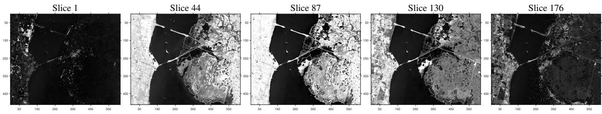  
Figure 6: Slice images of the KSC hyperspectral dataset at selected spectral bands.

We consider a third-order tensor $\mathcal { X } \in \mathbb { R } ^ { N _ { 1 } \times N _ { 2 } \times N _ { 3 } }$ , where $\mathbf { X } ^ { ( s ) } = \mathcal { X } ( : , : , s )$ is the s-th frontal slice. The slices $\{ \mathbf { X } ^ { ( s ) } \} _ { s = 1 } ^ { N _ { 3 } }$ are assumed to share structural or statistical features along the third mode. We restrict the presentation to third-order tensors; a higher-order extension would require a corresponding definition of slices, feasible samples, and losses.

Set $N = N _ { 1 } + N _ { 2 }$ and use context dimension $d = N$ . Let $\mathcal { T } = [ N ]$ index the available sensors, and let $\mathcal { L } _ { s } \subset \mathcal { T }$ be the $L _ { \mathrm { s a m p } }$ sensors selected for slice s. Its incidence vector $\mathbf { 1 } _ { \mathcal { L } _ { s } } \in \{ 0 , 1 \} ^ { N }$ satisfies $\mathbf { 1 } _ { N } ^ { T } \mathbf { 1 } _ { \mathcal { L } _ { s } } = L _ { \mathrm { s a m p } }$ . We first compute a rank-K truncated singular value decomposition (SVD):

$$
\mathbf { X } ^ { \left( s \right) } \approx \mathbf { U } _ { 1 } ^ { \left( s \right) } \mathbf { G } ^ { \left( s \right) } \left( \mathbf { U } _ { 2 } ^ { \left( s \right) } \right) ^ { T } ,
$$

where $\mathbf { U } _ { 1 } ^ { ( s ) } \in \mathbb { R } ^ { N _ { 1 } \times K } , \mathbf { U } _ { 2 } ^ { ( s ) } \in \mathbb { R } ^ { N _ { 2 } \times K }$ , and $\mathbf { G } ^ { ( s ) } \in \mathbb { R } ^ { K \times K }$

Partition $\mathcal { L } _ { s }$ into row indices for $\mathbf { U } _ { 1 } ^ { ( s ) }$ and $\mathbf { U } _ { 2 } ^ { ( s ) }$

$$
\mathcal { L } _ { s } ^ { \prime } = \left\{ x \middle | x \in \mathcal { L } _ { s } , x \leq N _ { 1 } \right\} , \quad \mathcal { L } _ { s } ^ { \prime \prime } = \left\{ x - N _ { 1 } \middle | x \in \mathcal { L } _ { s } , x > N _ { 1 } \right\} .
$$

Define

$$
\begin{array} { r l } & { \mathbf { T } _ { 1 } ^ { \left( s \right) } \left( \mathcal { L } _ { s } ^ { \prime } \right) = \left( \mathbf { U } _ { 1 } ^ { \left( s \right) } \left( \mathcal { L } _ { s } ^ { \prime } \right) \right) ^ { T } \mathbf { U } _ { 1 } ^ { \left( s \right) } \left( \mathcal { L } _ { s } ^ { \prime } \right) , } \\ & { \mathbf { T } _ { 2 } ^ { \left( s \right) } \left( \mathcal { L } _ { s } ^ { \prime \prime } \right) = \left( \mathbf { U } _ { 2 } ^ { \left( s \right) } \left( \mathcal { L } _ { s } ^ { \prime \prime } \right) \right) ^ { T } \mathbf { U } _ { 2 } ^ { \left( s \right) } \left( \mathcal { L } _ { s } ^ { \prime \prime } \right) , } \end{array}
$$

where $\mathbf { U } _ { 1 } ^ { ( s ) } \left( \mathcal { L } _ { s } ^ { \prime } \right)$ and $\mathbf { U } _ { 2 } ^ { ( s ) } \left( \mathcal { L } _ { s } ^ { \prime \prime } \right)$ denote the submatrices composed of the rows of $\mathbf { U } _ { 1 } ^ { ( s ) }$ and $\mathbf { U } _ { ? } ^ { ( s ) }$ indexed by $\mathcal { L } _ { s } ^ { \prime }$ and $\mathcal { L } _ { s } ^ { \prime \prime }$ , respectively. The inverse-based MSE below is defined only when both submatrices have full column rank $K ;$ the cardinality conditions alone do not guarantee this property.

Under additive zero-mean white Gaussian noise with unit variance, the mean squared error (MSE) for slice $\mathbf { X } ^ { ( s ) }$ and sensor set $\mathcal { L } _ { s }$ is

$$
\operatorname { M S E } \left( \mathbf { X } ^ { \left( s \right) } , \mathcal { L } _ { s } \right) = \operatorname { t r } \left( \left[ \mathbf { T } _ { 1 } ^ { \left( s \right) } \left( \mathcal { L } _ { s } ^ { \prime } \right) \right] ^ { - 1 } \right) \cdot \operatorname { t r } \left( \left[ \mathbf { T } _ { 2 } ^ { \left( s \right) } \left( \mathcal { L } _ { s } ^ { \prime \prime } \right) \right] ^ { - 1 } \right) .
$$

The sampling problem for slice s is therefore

$$
\operatorname* { m i n } _ { \mathcal { L } _ { s } \subset \overline { { L } } } \mathrm { ~ M S E } \left( \mathbf { X } ^ { ( s ) } , \mathcal { L } _ { s } \right) \quad \mathrm { s . t . ~ } | \mathcal { L } _ { s } | = L _ { \mathrm { s a m p } } , \quad \mathrm { r a n k } \Big ( \mathbf { U } _ { 1 } ^ { ( s ) } ( \mathcal { L } _ { s } ^ { \prime } ) \Big ) = \mathrm { r a n k } \Big ( \mathbf { U } _ { 2 } ^ { ( s ) } ( \mathcal { L } _ { s } ^ { \prime \prime } ) \Big ) = K .
$$

The rank constraints imply $| { \mathcal { L } } _ { s } ^ { \prime } | , | { \mathcal { L } } _ { s } ^ { \prime \prime } | \geq K$ and ensure that the two Gram matrices in the MSE are invertible.

## C.2 Algorithm Implementation

We treat the selected sensor set as the action and the inverse-Gram recovery MSE as bandit feedback. Because this MSE is nonlinear in the incidence vector, the case study uses the ALCB architecture outside the exact assumptions of the linear-loss theorem.

For every slice s, compute a rank-K truncated SVD

$$
\mathbf { X } ^ { ( s ) } \approx \mathbf { U } _ { 1 } ^ { ( s ) } \mathbf { G } ^ { ( s ) } ( \mathbf { U } _ { 2 } ^ { ( s ) } ) ^ { T } .
$$

The candidate distribution is slice specific. From the two factor matrices we compute the FFW derivative vector

$$
\pmb { d } ^ { ( s ) } = \left( d _ { 1 } ^ { ( 1 , s ) } , \ldots , d _ { N _ { 1 } } ^ { ( 1 , s ) } , d _ { 1 } ^ { ( 2 , s ) } , \ldots , d _ { N _ { 2 } } ^ { ( 2 , s ) } \right) ^ { T } ,
$$

where for $z \in \{ 1 , 2 \}$ and row y,

$$
d _ { y } ^ { ( z , s ) } = \frac { N _ { z } { \bf p } _ { y } ^ { ( z , s ) T } [ { \bf U } _ { z } ^ { ( s ) T } { \bf U } _ { z } ^ { ( s ) } ] { \bf p } _ { y } ^ { ( z , s ) } } { \Vert { \bf U } _ { z } ^ { ( s ) T } { \bf U } _ { z } ^ { ( s ) } \Vert _ { F } ^ { 2 } } ,
$$

and $\mathbf { \Delta } _ { p _ { y } ^ { ( z , s ) } }$ denotes row y of $\mathbf { U } _ { z } ^ { ( s ) }$ written as a column vector. We clip only negligible negative roundof values and normalize $\pmb { d } ^ { ( s ) }$ to a probability vector $\bar { \pmb d } ^ { ( s ) }$

For every pair $( s , t )$ , the k candidate sets $\mathcal { L } _ { s , t , a } , a \in [ k ]$ , are sampled without replacement from $\bar { \pmb d } ^ { ( s ) }$ . A candidate is accepted only if both selected factor submatrices have rank K and the reciprocal condition numbers of the corresponding Gram matrices are at least $1 0 ^ { - 3 }$ . Candidate generation is repeated until the condition is met or a fixed maximum number of attempts is reached. The entire bank of mnk candidate actions is generated once before the repeated bandit runs and is reused across all 60 repetitions. Hence repeated runs change only the action randomization, not the underlying candidate environment.

Given a selected candidate $\mathcal { L } _ { s , t , A _ { s , t } }$ , the empirical loss is

$$
\ell _ { s , t , A _ { s , t } } = \mathrm { t r } \Big ( [ \mathbf { T } _ { 1 } ^ { ( s ) } ( \mathcal { L } _ { s , t , A _ { s , t } } ^ { \prime } ) ] ^ { - 1 } \Big ) \mathrm { t r } \Big ( [ \mathbf { T } _ { 2 } ^ { ( s ) } ( \mathcal { L } _ { s , t , A _ { s , t } } ^ { \prime \prime } ) ] ^ { - 1 } \Big ) .
$$

Within each slice, Meta-LinEXP3 uses the absolute-MSE LPE update

$$
\widehat { \pmb { \theta } } _ { s , t } = \frac { \pmb { b } _ { s , t , A _ { s , t } } } { \Vert \pmb { b } _ { s , t , A _ { s , t } } \Vert ^ { 2 } } \ell _ { s , t , A _ { s , t } } ,
$$

where $\boldsymbol { b } _ { s , t , a } = \mathbf { 1 } _ { \mathcal { L } _ { s , t , a } }$ and $\| \pmb { b } _ { s , t , a } \| ^ { 2 } = L _ { \mathrm { s a m p } }$ . This update is used only by the within-task LinEXP3 scores. For the nonlinear KSC objective, the cross-task representation instead uses the centered relative loss summary in (52). Equivalently,

$$
z _ { s } ^ { \mathrm { m e t a } } = \frac { 1 } { n } \left[ \sum _ { t = 1 } ^ { n } \frac { \ell _ { s , t , A _ { s , t } } b _ { s , t , A _ { s , t } } } { L _ { \mathrm { s a m p } } } - \bar { \ell } _ { s } \sum _ { t = 1 } ^ { n } \frac { b _ { s , t , A _ { s , t } } } { L _ { \mathrm { s a m p } } } \right] .
$$

All candidates have the same cardinality, so subtracting the taskwise MSE ofset preserves relative sampling-set information while removing the frequency-like component that can dominate an uncentered absolute-loss summary. Coordinate centering and normalization are performed only after a task is complete; therefore no current-task feedback enters that task’s fixed prior.

The two comparison baselines are implemented independently for every slice. FFW uses the linearized derivative rule on row-normalized factors, with a rank-safe seed that guarantees K linearly independent rows in each mode before the remaining budget is filled. Greedy-FP uses the published reverse-greedy product-frame-potential rule: it starts from all rows, repeatedly removes the row that gives the smallest product frame potential, and retains at least $K + \alpha$ rows in each mode; we use $\alpha = 2$ . Baseline MSE is evaluated with the original (not row-normalized) SVD factors.

<table><tr><td>Algorithm 2 Meta-LinEXP3 for Structured Tensor Sampling</td></tr><tr><td>Require: KSC tensor X, rank K, budget 1=  $L _ { \mathrm { s a m p } } .$  k candidates, n rounds,  $\eta , \gamma ,$  and the prefix- calibrated µ.</td></tr><tr><td>1: Decode wrapped samples if present, apply one global positive rescaling, and compute rank-K SVD factors for every slice.</td></tr><tr><td>2: On slices 1:24, build an independent calibration candidate bank and select µ from the fixed grid using the first-10-round early-search score derived from the best-observed-MSE</td></tr><tr><td>trajectory on slices 13:24. 3: Build a separate final candidate bank for all slices and verify rank, conditioning, and</td></tr><tr><td>candidate MSE.</td></tr><tr><td>4: for each paired evaluation run do 5: for  $s = 1 , \ldots , N _ { 3 }$  do</td></tr><tr><td>6: Form the fixed PCRW or Uniform prior from completed centered relative loss summaries;  $\mathbf { \boldsymbol { h } } _ { s } = \mathbf { \boldsymbol { 0 } }$  for zero-prior LinEXP3.</td></tr><tr><td>use 7: for  $t = 1 , \ldots , n$  do</td></tr><tr><td>8: Select one candidate with the common candidate bank/random variate, observe its recovery MSE, and update the within-task score with absolute-MSE LPE.</td></tr><tr><td>9: end for</td></tr><tr><td>10: Store the best-observed MSE trajectory and the completed centered relative loss sum-</td></tr><tr><td>mary. 11: end for</td></tr><tr><td>12: end for 13: Report slices 25:176; compare PCRW and Uniform with zero-prior LinEXP3 under the same</td></tr></table>