# OmniMed-FL: A Robust Multimodal Federated Learning Framework for Clinical Diagnosis

1Ayush Debnath, 3,4Ruelia Saha, 2Sudip Misra

1,2Indian Institute of Technology Kharagpur, India 3KTH Royal Institute of Technology, Sweden 4SRM University-AP, India Emails: {ayush.d@kgpian.iitkgp.ac.in, ruelia.saha.rs@gmail.com, sudipm@iitkgp.ac.in}

Abstract—Simultaneous assessment of medical imaging and patient records is often required in clinical diagnosis. However, standard machine learning algorithms cannot analyze these several sorts of data together. Meanwhile, compliance with the Health Insurance Portability and Accountability Act (HIPAA) and the General Data Protection Regulation (GDPR) can constrain centralized aggregation of sensitive patient data. This leaves a crucial void of secure fusion of visual and textual context across distant networks. Thus, we present OmniMed-FL, a controlled systems study of multimodal federated learning for five-class clinical condition classification (Normal, Pneumonia, COVID-19, Pleural Effusion, Cardiomegaly). Our proxy corpus pairs 3,000 public chest radiographs with 3,000 class-conditioned synthetic notes, matched by class, not by patient. The framework benchmarks eight fusion strategies, three initializations, four missing-text imputation rules, and matched federated baselines under non-IID Dirichlet partitioning across 3 to 20 hospital clients. As all notes are synthetic and pairing is not patientlevel, these are descriptive proxy comparisons, not estimates of diagnostic performance or deployment readiness. Within those limits with clients(K=5) and severe skew (α=0.1), local-only training achieves a macro-F1 score of 0.297, FedAvg achieves 0.662±0.074, FedProx 0.737±0.085, a matched FedMME-style one-shot ensemble 0.647±0.080, and our SCAFFOLD–AdamW adaptation 0.070±0.015, the 0.075 FedProx–FedAvg gap falling inside the wider of the two two-seed standard deviations. Over a 4×3 grid, label skew costs up to 0.27 F1 whereas a near-sevenfold client increase costs at most 0.10, while bidirectional volume grows linearly to 183.5 GiB at K=20. Multimodal fusion leads on both corpora, scoring 0.956 against 0.934 for text and 0.664 for images on the synthetic corpus and 0.906 against 0.880 and 0.737 on the radiograph corpus, for 2.3× the model state of text alone.

Index Terms—Multimodal Federated Learning, Vision– Language Models, Clinical Condition Classification, E-Health, Non-Identically Distributed Data, Communication Cost, Retrieval-Augmented Generation

## I. INTRODUCTION

guishing normal presentations from acute infections, fluid accumulation, and structural cardiac pathology, is central to timely patient intervention. Automated systems typically operate on a single modality. For example, vision models trained on chest radiographs [1] do not capture the full diagnostic picture. Image-only models miss contextual cues such as BNP elevation or viral contact history, while text-only models miss radiological patterns such as bilateral ground-glass opacity or pleural fluid meniscus.

The healthcare setting complicates deployment further because patient data is distributed across hospitals, clinics, and diagnostic centers. Federated learning (FL) addresses these constraints by transmitting only model updates [2], although keeping raw records at home is a data-locality property, not a privacy proof. The cited clinical FL systems are singlemodality [3], [4], discarding the notes clinicians record alongside imaging. The aforementioned lacunae is addressed by OmniMed-FL, so hospitals can collaborate on multimodal clinical models without exposing patient data. We measure four properties of such a system, namely how far label skew degrades accuracy, the point at which a five-class head collapses onto its majority class, which fusion operator earns the compute it consumes, and what a multimodal model costs to move. Each is measured on a controlled proxy benchmark whose notes are synthetic and paired by class, so what we characterize is the learning system rather than clinical diagnosis. Fusion scores highest on both corpora, 0.956 on synthetic images and 0.906 on radiographs against 0.934 and 0.880 for text alone.

## A. Contribution

The main contributions of this paper are as follows:

• We demonstrate that fusing radiographs with clinical notes improves accuracy across decentralized clients. Through extensive simulation under matched data, optimizer, and local budget, our multimodal approach significantly outperforms isolated, single-modality systems.

• We build a controlled five-class corpus whose notes mix wording across classes, so the label cannot be read off a single keyword, and we test how much of the label a model can still recover from wording alone.

• We quantify the cost of keeping data locally. Federated training retains 94% of a pooled control at moderate skew, and we show that severe label skew, not federation itself, is what erodes accuracy, alongside the runtime, memory, and communication each configuration spends.

## II. RELATED WORK

## A. Medical Image Classification

Early automated diagnostics treated the chest radiograph as a pure computer-vision problem. CheXNet and CheXpert set centralized CNN baselines [1], [5], and Vision Transformers later established an attention-based alternative for general image classification [6]. All of them pool data on one server, and none reads the note a clinician wrote next to the image.

## B. Federated Clinical Learning

Privacy regulation moved the clinical community toward FL. FedAvg established decentralized training [2], and later work added multi-institutional collaboration without shared patient records [3], multinational COVID-19 CT validation [4], federated weakly supervised medical-image segmentation [7], and communication-efficient health monitoring [8]. FedProx and SCAFFOLD address the client heterogeneity that degrades naive averaging [9]–[11]. The clinical deployments discussed above remain unimodal; therefore, their behavior after incorporating a second modality remains unexplored.

## C. Vision–Language Models in Healthcare

Centralized vision–language models advanced in parallel. BiomedCLIP, LLaVA-Med, and MedCLIP jointly model biomedical visual and textual information using paired, instruction-derived, or deliberately unpaired corpora, respectively [12]–[14], but they train on centrally assembled corpora. Multimodal federated learning is more recent. FedMME combines one-shot client models by voting, and P-FIN fills in missing features with calibrated uncertainty [15], [16], each on its own data and budget, while cross-modal federated medical imaging is also appearing [17]. Neither line reports how much bandwidth and memory a multimodal federated model costs.

Synthesis. The landscape above offers either the multimodal accuracy of centralized vision–language models or the data locality of federated learning, but not both. OmniMed-FL bridges that gap, embedding text–image fusion inside a federated loop that leaves every record at the hospital that holds it.

## III. SYSTEM DESIGN

## A. Architecture

Figure 1 illustrates the pipeline of the proposed scheme. We tokenize notes with WordPiece at a 128-token cap, resize radiographs to 224×224, and normalize them against ImageNet statistics. The DistilBERT [18] [CLS] vector is projected to $\mathbf { h } _ { t } \in \mathbb { R } ^ { 2 5 6 }$ , and mean-pooled ViT tokens give $\bar { \mathbf { h } _ { v } } \in \mathbb { R } ^ { 5 1 2 }$ Eight fusion rules then combine the text and image vectors. Three use no attention (projected concatenation, dual-projection concatenation, and gated residual fusion) and five do (residual cross-attention, its non-residual 384-d variant, a one-layer decoder A, a two-query/two-layer decoder B, and a two-token Transformer encoder). All eight feed the same two-layer, fiveclass multilayer perceptron (MLP) and share the data, partition, optimizer, and local budget. The eight rules test whether the attention-free ones score as well as the attention-based ones when both get the same training on hardware one hospital can afford.

## B. Federated Learning Setup

Let K clients hold disjoint shards $\mathcal { D } _ { k }$ of the training split, with $n _ { k } = | \mathcal { D } _ { k } |$ and $n = \textstyle \sum _ { k } n _ { k }$ , and let θ collect the trainable parameters on the fusion path: both encoders, the projection

layers, the fusion operator, and the classification head. We minimize the sample-weighted empirical risk

$$
\begin{array} { l } { \displaystyle \underset { \theta } { \mathrm { m i n } } ~ { \cal F } ( \theta ) = \displaystyle \sum _ { k = 1 } ^ { K } \frac { n _ { k } } { n } { \cal F } _ { k } ( \theta ) , } \\ { \displaystyle { \cal F } _ { k } ( \theta ) = \frac { 1 } { n _ { k } } \displaystyle \sum _ { \scriptstyle ( x , z , y ) \in { \cal D } _ { k } } \ell \big ( f _ { \theta } ( x , z ) , y \big ) . } \end{array}\tag{1}
$$

where x is a radiograph, z its class-paired note, y the class label, and $f _ { \theta }$ the fused five-class classifier. Shards never leave a client, and the server sees only the trainable tensors listed above. For mini-batch B, the loss we actually implement is

$$
\ell _ { B } = \frac { 1 } { | \mathcal { B } | } \sum _ { i \in \mathcal { B } } ( 1 - p _ { i , y _ { i } } ) ^ { \gamma } \mathrm { C E } _ { \epsilon , i } + \lambda \phi ( h ) + 5 [ q - 0 . 9 ] _ { + } ,\tag{2}
$$

with $p _ { i , y _ { i } }$ the true-class probability, $\mathrm { C E } _ { \epsilon , i }$ label-smoothed cross-entropy, $\gamma { = } 2 , ~ \epsilon { = } 0 . 0 5 , ~ C { = } 5 , ~ h ~ = ~ H ( \bar { p } ) / \log C , ~ q ~ { = } ~$ $\begin{array} { r } { | \mathcal { B } | ^ { - 1 } \sum _ { i } \operatorname* { m a x } _ { c } p _ { i c } , \phi ( h ) = ( 1 - h ) [ 1 - \frac { 8 } { 3 } [ h - 0 . 7 ] _ { + } ] . } \end{array}$ , and $[ u ] _ { + } = \operatorname* { m a x } ( u , 0 )$ . The entropy-diversity term grows whenever a batch’s predictions concentrate, and we attenuate it above normalized entropy 0.7 so it stops pushing once the head is healthy. Setting λ=0 removes that term alone, while the confidence penalty $5 [ q { - } 0 . 9 ] _ { + }$ stays fixed everywhere. The classbalanced sampler and the entropy-diversity term are the two anti-collapse components we ablate in Section IV. Predictedclass diversity is the fraction of the five labels that ever appear as a validation-set argmax.

Each round, the server broadcasts $\theta ^ { ( t ) }$ , every eligible client runs three local AdamW epochs on class-balanced mini-batches under eq. (2), clips the gradient norm at one, and returns its trainable tensors for the sample-weighted update in eq. (1). Operational runs start from public DistilBERT and ViT-Base/16 weights with random task heads. We fine-tune both encoders and keep unused unimodal heads and the inactive CNN fallback out of optimization and communication.

## C. Controlled Proxy Corpus

Two clinical image corpora. Dataset A is the corpus behind our first run set. Its 3,000 images are procedurally generated X-ray-style patterns rather than radiographs, and its text labels were read off the passages later fed to the classifier. Dataset B replaces every image with a public radiograph and keeps the notes unchanged, at 600 examples per class under the same split. We report the two separately.

In Dataset B, we built a balanced 3,000-image proxy corpus at 600 examples per class. The radiographs come from the Kermany pneumonia collection [19], the NIH ChestX-ray dataset [20], and the COVID-19 Radiography Database [21], and our loader logs verify 3,000 public images across all five classes. Each class is drawn from the collection that labels it, which leaves the image axis partly confounded with source collection. Images are resized to 224×224, ImageNetnormalized, shuffled deterministically, and split 80/20 into 2,400 training and 600 validation examples.

Clinical text data. We use no patient electronic health record (EHR) text, and the notes come from a template engine. It pairs each image label, at the class level, with a synthetic clinicalstyle note assembled from observation, symptom, context, and indicator slots. To keep the network from memorizing an obvious keyword we engineered the mix deliberately: 25% of notes draw every slot from the target class, 35% mix target and non-target slots, and 40% are heavily mixed while retaining a probabilistic target-class indicator. This cuts direct label wording, but image and note do not come from the same patient and must never be described as a real image–report pair.

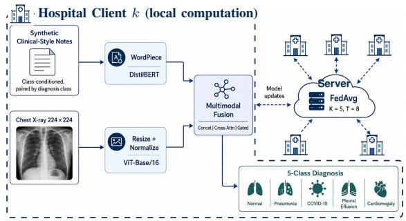  
(a)

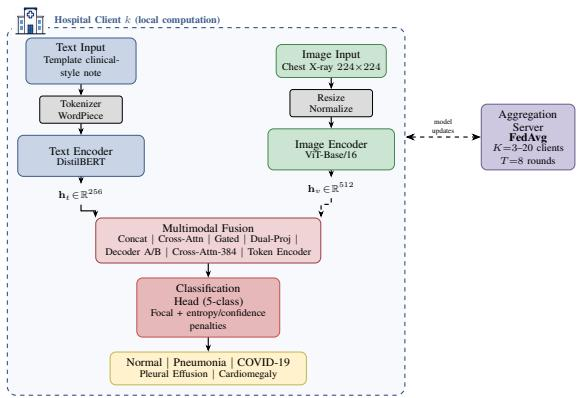  
(b)  
Fig. 1. OmniMed-FL architecture. (a) Overall multimodal federated workflow at the reference K=5 setting; the dashed boundary encloses what runs inside a single hospital client, and only model updates cross it to the FedAvg cloud shared by the other clients. (b) Detailed architecture with the same client-side computation boxed separately from the FedAvg aggregation server.

The corpus supports internal comparison, not absolute claims. Every configuration (one choice of aggregation rule, fusion operator, initialization, and anti-collapse components) trains and is scored on the same corpus, so a gap between two of them is attributable to the factor under test rather than to the data. Absolute scores carry no such guarantee. Templates can leave shortcuts, label-level pairing strips out the discordance and missingness of real records, each class is drawn from a different source collection, and the split is grouped by neither patient nor source.

## D. Experimental Setup

Hyperparameters. Table I collects the protocol. Every client trains with AdamW (learning rate $1 0 ^ { - 4 }$ , weight decay 0.01) for three local epochs per round. The suite runs eight rounds at batch size 16 in FP32, without automatic mixed precision (AMP). Our reference setting is five clients at Dirichlet $\alpha = 1 . 0$ and Section IV varies α and the client count explicitly. Seeds 0 and 1 drive initialization, sampling, and partitioning, with one exception: pooled-start reuses a single seed-0 checkpoint under seed-specific FL partitions. We ran everything in PyTorch on one NVIDIA H100 NVL device. The GPU-synchronized timer wraps sequential local training and aggregation within a round, and excludes validation, setup, I/O, networking, concurrency, and multi-node throughput. Our timings are an executioncost record, not distributed throughput. We also did not force deterministic CUDA algorithms, so a seed fixes the software pseudorandom streams without buying identical reruns.

Partitioning. For each class, a Dirichlet draw allocates training indices across clients. Smaller α concentrates client label distributions, and α → ∞ approaches independent and identically distributed (IID) allocation . A nominal α does not fully describe a finite split, so we report the per-client class shares we actually drew alongside our scalability results. The split is fixed across rounds for a given seed. Shards holding fewer than four examples skip local optimization but still contribute the unchanged global state at their sample weight. We do not renormalize over active clients, which is why our cells report active alongside nominal K.

Matched recent-method controls. Our FedMME-style baseline uploads each client model once and applies the oneshot voting structure in [15]. Our implementation uses equalweight hard voting and breaks ties by mean softmax. We run it at two local budgets. Our matched 24 epochs isolates the method from the budget; FedMME’s native 100 epochs removes the budget discrepancy. Reporting both keeps the two confounds separate. Either way it keeps the common corpus, shard profile, encoders, and optimizer, substituting our five-class inputs for FedMME’s generated-report pipeline. The P-FIN-style stress test fixes three multimodal and two image-only clients, projects both encoders to 256-dimensional normalized features, and compares zero filling, deterministic FIN, Gaussian β-negativelog-likelihood (β-NLL) imputation $( \beta \mathrm { = } 0 . 5 )$ , and uncertaintyweighted aggregation with Fed-UQ-Avg balance weight 0.6 and temperature 0.2 [16]. We kept concatenation instead of P-FIN’s bidirectional cross-modal attention: with one pooled feature per modality, cross-attention carries unit weight and collapses to a linear projection. FedProx uses $\mu { = } 0 . 0 1$ . Each ablation changes one component and leaves every other setting at the shared defaults that follow, most of which are fixed by what the hardware allows. Three local epochs across eight rounds give a tractable 24-local-epoch budget, and batch size 16 is what holds both encoders plus one local model copy in GPU memory for the largest FP32 model. The grid crosses $K = \{ 3 , 5 , 1 0 , 2 0 \}$ with $ \alpha { = } \{ 0 . 1 , 1 , 5 \}$ and the K=5 sweep adds $\alpha { = } 0 . 3$ and 0.5, so the study spans severe to near-IID skew; K=5 is our small cross-silo reference and $K { = } 3 { - } 2 0$ probes count sensitivity. Two seeds support descriptive claims, not significance. Everything else in Table I is a fixed default, not a per-model optimum.

TABLE I  
COMMON SIMULATION PARAMETERS.
<table><tr><td>Parameter</td><td>Value</td><td>Parameter</td><td>Value</td></tr><tr><td>Local Epochs (E)</td><td>3</td><td>Seeds</td><td>0,1</td></tr><tr><td>Fed. Rounds (T)</td><td>8</td><td>Grid K (ref.)</td><td> $3 , 5 , 1 0 , 2 0 \left( 5 \right)$ </td></tr><tr><td>Batch Size</td><td>16</td><td>Grid α (ref.)</td><td> $0 . 1 , 1 , 5 ( 1 )$ </td></tr><tr><td>AdamW LR</td><td>10⁻4</td><td>K=5 extra α</td><td>0.3, 0.5</td></tr><tr><td>Weight Decay</td><td>0.01</td><td>Precision</td><td>FP32, no AMP</td></tr><tr><td>Diversity wt. (λ)</td><td>1.0</td><td>Init.</td><td>Public enc. + rand. heads</td></tr></table>

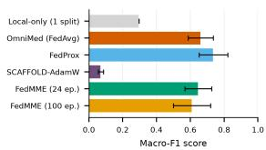  
(a)

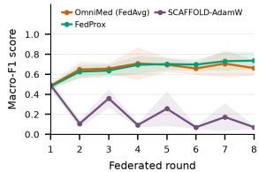

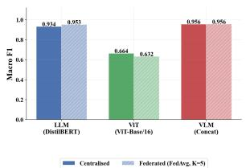  
(c)

(b)  
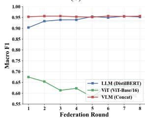  
Fig. 2. (a) Matched baselines on Dataset B at $\alpha { = } 0 . 1 , K { = } 5 . \mathrm { ( b ) }$ Convergence under severe skew. (c) Centralized against FedAvg on Dataset A. (d) Federated convergence on Dataset A.  
(d)

## IV. RESULTS

## A. Matched Baselines under Severe Skew

Every result below is on Dataset B unless it names Dataset A. Every configuration in Fig. 2(a) shares the corpus, partition draw, encoders, and optimizer at α=0.1, K=5; all but the native-budget FedMME run also share the 24-local-epoch budget. Local-only training averages a macro-F1 score of 0.297 across the five clients of one partition. Over two matched seeds, FedAvg reaches 0.662±0.074 and FedProx 0.737±0.085. Their 0.075 gap sits inside the wider of the two sample standard deviations, so these runs do not separate the two methods. Our SCAFFOLD–AdamW adaptation lands at 0.070±0.015, and the oscillation in Fig. 2(b) points at our AdamW control-variate adaptation rather than at classical SGD-based SCAFFOLD. The FedMME-style baseline trains five client models independently and combines them by equal-weight hard voting with meansoftmax ties. At our matched 24-epoch budget it reaches 0.647±0.080 (seeds 0.703, 0.591), and at FedMME’s native 100-epoch budget it reaches 0.609±0.109 (seeds 0.687, 0.532). Quadrupling local computation does not close the gap to iterative aggregation, so the gap belongs to one-shot aggregation under severe skew, not to a budget handicap. One aggregation has no later round in which to repair a poor local solution, and both budgets stay below FedAvg and FedProx. Every configuration except SCAFFOLD–AdamW clears local-only training, though the overlapping intervals make that a coarse ordering rather than a ranking.

Dataset A. On the synthetic-image corpus, centralized text/image/concatenation F1-score was 0.934/0.664/0.956 against FedAvg 0.953/0.632/0.956, and multimodal fusion led both unimodal branches. Neither its text score nor its image score is an independent measurement of a radiograph task, so we draw no Dataset B conclusion from it.

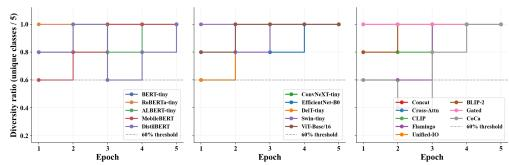  
Fig. 3. Per-epoch class diversity, the fraction of the five classes predicted, on Dataset A.

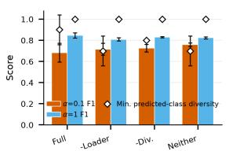  
(a)

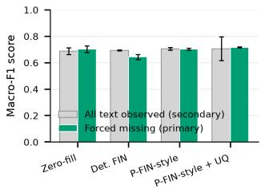  
(b)  
Fig. 4. (a) Anti-collapse F1 and diversity under severe skew. (b) P-FIN-style forced-missing-text results.

## B. Anti-Collapse, Fusion, and Initialization Ablations

Under severe skew the full class-balanced-sampler and entropy-diversity stack reaches 0.683 ± 0.089 F1 at minimum predicted-class diversity 0.90. Drop the sampler, the entropy-diversity term, or both, and F1 rises to 0.716±0.055, $0 . 7 2 6 \pm 0 . 0 3 5$ , and $0 . 7 5 8 \pm 0 . 0 1 6 ,$ while minimum diversity falls to 0.70, 0.80, and 0.70 (Fig. 4(a)). The stack buys class coverage and costs accuracy, and its 0.075 F1 deficit to the unregularized configuration sits inside its own seed spread. The confidence penalty in (2) stays fixed across all four. At α=1 the same four configurations land within 0.809–0.846 with every minimum diversity at 1.0. On real radiographs these components no longer earn their place on F1. They remain a diversity guard under severe skew and are inert at moderate skew. One more observation: three suites nominally repeat the same severe-skew FedAvg/concatenation setting, yet return 0.643±0.006, 0.662±0.074, and 0.683±0.089, a 0.040 span that the widest of those spreads covers. We report them separately rather than pool them or quote the flattering one. Figure 3 shows the per-epoch class diversity on Dataset A.

Figure 5(a) trains all eight fusion rules inside the operational federated loop. The means run from 0.636 for CLIP-style fusion up to 0.759 for the Flamingo-style rule, with per-rule sample standard deviations of 0.000–0.167. Since the widest interval exceeds the entire between-rule spread, the sweep cannot rank fusion operators, and we will not. Projected concatenation, our default everywhere else, sits mid-pack at 0.659±0.000.

Figure 5(b) separates three federated initializations at α=1. The all-random configuration keeps both architectures but initializes every weight from scratch, opening at 0.535 round-1 F1 and closing at 0.647±0.022. Public encoders with random task modules, our operational default, open at 0.646 and close at 0.831 ± 0.001. Pooled-start reuses one seed-0 checkpoint from a 12-epoch centralized run for both FL seeds, so its pretraining sits outside the shared budget; it opens far higher at 0.874 and ends higher at $0 . 8 7 7 { \scriptstyle \pm 0 . 0 0 7 }$ . Public encoders buy roughly 0.18 F1 over random initialization, and the pooled checkpoint, selected on the reporting split and so a diagnostic rather than an unbiased estimate, keeps its head start through round 8. Non-federated abort-off/on controls post $0 . 8 9 9 { \pm } 0 . 0 2 2$ and $0 . 8 7 1 { \scriptstyle \pm 0 . 0 1 2 }$ at diversity 1.0, so the branch never fires and the gap is rerun variation.

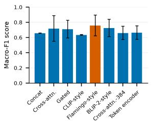  
(a)

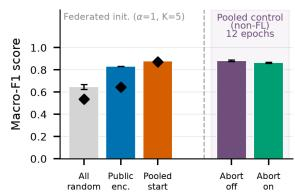

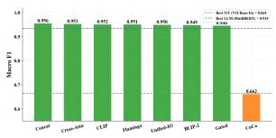  
(c) (c)

(b)  
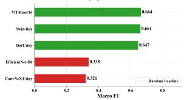  
(d)  
Fig. 5. (a) Fusion rules and (b) initialization controls on Dataset B. (c) Fusion sweep and (d) vision-backbone sweep on Dataset A.

Figure 4(b) is our matched P-FIN-style adaptation, where 256-dimensional $L _ { 2 } .$ -normalized features and concatenation plus an MLP replace the source bidirectional-attention stack. On the primary forced-missing-text metric the four imputation rules land within 0.018 of each other: zero filling $0 . 6 8 8 { \pm } 0 . 0 2 5$ deterministic FIN $0 . 6 9 3 { \pm } 0 . 0 0 4$ , Gaussian $_ { \beta - \mathrm { N L L } }$ imputation 0.706±0.010, and uncertainty-weighted aggregation 0.706± 0.089. The means order as P-FIN reports, but the uncertaintyweighted rule ties the plain probabilistic one and is the noisiest of the four, swinging from 0.770 to 0.643 across seeds, so these runs do not establish that modeling uncertainty tightens the spread.

## C. Retrieval-Stage Evaluation for Retrieval-Augmented Generation (RAG)

Exact inner-product FAISS search [22] over training-fitted TF–IDF note vectors gives condition-macro averages of 0.540 for top-1 same-label retrieval accuracy, 0.468 for same-label precision@5, and 0.707 for mean top-1 cosine similarity, with the five condition rows covering all 600 validation queries (Fig. 6(a)). Top-1 accuracy sits well above the 0.2 label prior yet far below the 0.707 mean similarity, the signature of a template corpus whose neighbors are lexically close whether or not they share a label. This check establishes no clinical retrieval quality.

## D. Scalability, Communication, and Resource Cost

Figure 7(a) assembles the full Cartesian product of $K = \{ 3 , 5 , 1 0 , 2 0 \}$ and $ \alpha { = } \{ 0 . 1 , 1 , 5 \}$ , and one factor dominates throughout: label skew, not client count. Every $\alpha { = } 5$ cell lies in 0.849–0.916 and every α=1 cell in $0 . 8 1 8 \mathrm { - } 0 . 8 6 2$ , whereas the $\alpha { = } 0 . 1$ row drops to 0.643–0.738 with far wider spreads, up to ±0.159 at $K { = } 3$ . Within a row, moving K by a factor of nearly seven shifts the mean by at most 0.10 F1, and the $\alpha { = } 0 . 1$ row is not even monotone in $K .$ . Our auxiliary $K { = } 5$ checks at $\alpha { = } 0 . 3$ and 0.5 give 0.814±0.001 and 0.796±0.037. Cells report $A / K$ , where A counts clients whose realized shard reaches four samples: allocation is complete except under severe skew, where $K { = } 2 0$ retains 17 active clients. Figure 7(b) shows the realized per-client class counts behind one severe-skew cell, where single clients hold entire classes.

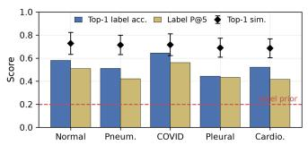  
(a)

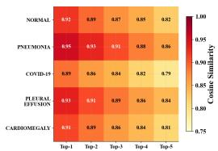

Fig. 6. (a) Retrieval metrics by condition on Dataset B. (b) Top-k classsimilarity matrix on Dataset A.  
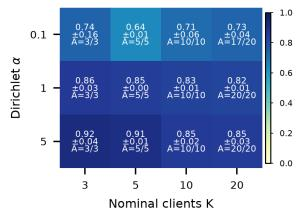  
(a)

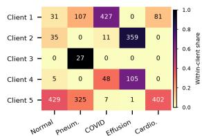  
(b)  
Fig. 7. (a) Macro-F1 over client count and skew. (b) One severe-skew client allocation.

Figure 8 reports runtime (left) and peak allocated memory (right) for the timed block on one shared H100 NVL. Timed sections span 41–66 s per round and peak memory 4.77– 5.92 GiB. Neither panel is a scaling curve. Sequential simulation and contention on a shared server, not client count, explain the spread.

For $| \theta |$ trainable parameters, b bytes/parameter, $T$ rounds, and nominal $K ,$ , the plotted bidirectional volume is

$$
V _ { \mathrm { n o m } } = 2 K T | \theta | b ,\tag{3}
$$

Here $\vert \theta \vert = 1 5 3 , 9 3 5 , 6 2 1 , \ b = 4 .$ , and $T { = } 8 ,$ , so a 615,742,484- byte model state gives nominal bidirectional volumes of 27.5/45.9/91.8/183.5 GiB at $K { = } 3 / 5 / 1 0 / 2 0 ~ ( 1 ~ \mathrm { G i B = ~ 2 ^ { 3 0 } }$ bytes). We keep the nominal count when $A { < } K$ . Serialization, secure aggregation [23], compression, and algorithm-specific state sit outside it. Figure 9(a) puts the operating point plainly. Communication grows linearly in K while accuracy stays nearly flat in K. $\mathrm { A t ~ } \alpha { = } 5 ,$ , going from $K { = } 3$ to $K { = } 2 0$ costs 0.067 F1 for 6.7× the traffic.

The branch comparison in Fig. 9(b) quantifies the multimodal overhead on Dataset B. Text, image, and multimodal F1 are

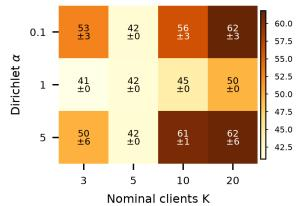

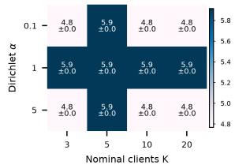  
(a) (b) (b) Fig. 8. (a) GPU-synchronized round time. (b) Peak allocated memory.

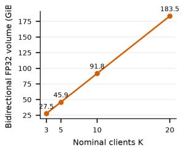  
(a)

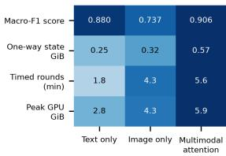  
Fig. 9. (a) Formula-derived communication volume. (b) Modality-branch cost.  
(b)

0.880/0.737/0.906, the multimodal figure using the residual cross-attention operator our pooled screen selects; projected concatenation, whose costs the resource rows report, scores 0.813. One-way FP32 model-state sizes are 0.248/0.324/0.573 GiB, timed round durations 1.8/4.3/5.6 min, and peak memory 2.84/4.33/5.92 GiB. Multimodal costs 2.3× the model state, 3.1× the wall time and 2.1× the memory of the text branch, while scoring 0.026 F1 above text and 0.169 above image. Multimodal is the highest-scoring branch on Dataset B, at single seed and α=1.

## V. DISCUSSION AND LIMITATIONS

Partition sensitivity is the most consistent finding of the study. At α=0.1 even identically configured FedAvg reruns vary substantially, with honest updates spreading by ±0.159 F1. That spread also limits robust aggregation. Poisoning-resistant aggregation methods are designed to down-weight anomalous updates [24], but under severe label skew such a rule may also discard genuine minority-class signal. Skew and robustness to malicious clients therefore pull against each other, and measuring where the balance falls would require an attacker model that we did not define here.

Several bounds apply to the rest of the results. The clientcount study is a sequential simulation, so it omits concurrency, latency, stragglers, dropout, and heterogeneous accelerators. Eq. (3) and Fig. 9(b) report analytic costs rather than end-toend traffic. Clinical claims stay bounded by Section III-C, since our F1 and retrieval scores do not estimate diagnostic safety, generalization, or deployment readiness, and two seeds make our spreads descriptive. We leave larger multi-site data, more seeds, native-method replications, and privacy testing to future work.

## VI. CONCLUSION

We presented OmniMed-FL, a multimodal federated learning benchmark covering 18 model variants for five-class clinical condition classification. At α=1 and K=5, DistilBERT leads the text encoders at F1=0.934, ViT-Base/16 leads the vision encoders at F1=0.664, and concatenation achieves the best overall score of $F 1 { = } 0 . 9 5 6$ , improving by 0.022 over text and 0.292 over vision. The anti-collapse stack maintains five-class prediction diversity for the text and multimodal variants, while federated training retains 99.1% of centralized performance; Fed-VLM matches its centralized counterpart,, and Fed-LLM slightly exceeds it. These findings show that warm-start initialization and anti-collapse regularization preserve strong multimodal performance in the evaluated setting. The scalability analysis also shows that label skew matters more than client count, communication grows linearly with participating clients, and multimodal fusion incurs additional model-state, runtime, and memory costs.

Future work will use patient-paired multi-institutional radiology data, formal differential privacy auditing, asynchronous aggregation, and end-to-end communication measurements. OmniMed-FL provides a practical blueprint for decentralized multimodal learning, but external clinical validation and safeguards remain necessary before deployment in telehealth or diagnostic workflows.

## ACKNOWLEDGMENT

The work reported in this paper was carried out, in part, during the tenure of the INAE Chair Professorship held by the third author. The authors gratefully acknowledge partial support from the Ministry of Electronics and Information Technology (MeitY), Government of India, F. No. 13(1)/2024-CC&BT, and the Department of Science and Technology (DST), Government of India, under Sanction Letter Nos. DST/INT/India-EU/RAIDO/2024 (G) and DST/INT/India-EU/RAIDO/2024 (C).

## REFERENCES

[1] J. Irvin, P. Rajpurkar, M. Ko, et al., “CheXpert: A large chest radiograph dataset with uncertainty labels and expert comparison,” in Proceedings of the AAAI Conference on Artificial Intelligence, volume 33, 2019, pages 590–597.

[2] H. B. McMahan, E. Moore, D. Ramage, S. Hampson, and B. Aguera y Arcas, “Communication-¨ efficient learning of deep networks from decentralized data,” in Proceedings of the International Conference on Artificial Intelligence and Statistics, volume 54, 2017, pages 1273–1282.

[3] M. J. Sheller, B. Edwards, G. A. Reina, et al., “Federated learning in medicine: Facilitating multiinstitutional collaborations without sharing patient data,” Scientific Reports, volume 10, article 12598, 2020.

[4] Q. Dou, T. Y. So, M. Jiang, et al., “Federated deep learning for detecting COVID-19 lung abnormalities in CT: A privacy-preserving multinational validation study,” npj Digital Medicine, volume 4, article 60, 2021.

[5] P. Rajpurkar, J. Irvin, K. Zhu, et al., “CheXNet: Radiologist-level pneumonia detection on chest X-rays with deep learning,” arXiv:1711.05225, 2017.

[6] A. Dosovitskiy, L. Beyer, A. Kolesnikov, et al., “An image is worth 16×16 words: Transformers for image recognition at scale,” in Proceedings of the International Conference on Learning Representations, 2021.

[7] L. Lin, Y. Liu, J. Wu, et al., “FedLPPA: Learning personalized prompt and aggregation for federated weakly-supervised medical image segmentation,” IEEE Transactions on Medical Imaging, volume 44, number 3, pages 1127–1139, 2025.

[8] D. Chu, W. Jaafar, and H. Yanikomeroglu, “On the design of communication-efficient federated learning for health monitoring,” in Proceedings of the IEEE Global Communications Conference (GLOBECOM), 2022, pages 1128–1133.

[9] T. Li, A. K. Sahu, M. Zaheer, et al., “Federated optimization in heterogeneous networks,” in Proceedings ofMachine Learning and Systems, volume 2, 2020, pages 429–450.

[10] S. P. Karimireddy, S. Kale, M. Mohri, et al., “SCAFFOLD: Stochastic controlled averaging for federated learning,” in Proceedings ofthe International Conference on Machine Learning, volume 119, 2020, pages 5132–5143.

[11] Y. Tian, Z. Zhang, Z. Yang, and R. Jin, “Hierarchical federated learning with adaptive clustering on non-IID data,” in Proceedings ofthe IEEE Global Communications Conference (GLOBECOM), 2022, pages 627–632.

[12] S. Zhang, Y. Xu, N. Usuyama, et al., “A multimodal biomedical foundation model trained from fifteen million image–text pairs,” NEJM AI, volume 2, number 1, article AIoa2400640, 2025.

[13] C. Li, C. Wong, S. Zhang, et al., “LLaVA-Med: Training a large language-and-vision assistant for biomedicine in one day,” in Proceedings ofAdvances in Neural Information Processing Systems, volume 36, 2023, pages 28541–28564.

[14] Z. Wang, Z. Wu, D. Agarwal, and J. Sun, “MedCLIP: Contrastive learning from unpaired medical images and text,” in Proceedings of the Conference on Empirical Methods in Natural Language Processing, 2022, pages 3876–3887.

[15] N. Wang, Y. Deng, S. Fan, et al., “Multi-modal one-shot federated ensemble learning for medical data with vision large language model,” arXiv:2501.03292, 2025.

[16] N. F. Shahid, M. Ahmed, M. A. Haider, et al., “Probabilistic feature imputation and uncertaintyaware multimodal federated aggregation,” in Proceedings ofMedical Imaging with Deep Learning, volume 315, 2026, pages 3593–3607.

[17] Y. Yan, H. Wang, Y. Huang, et al., “Cross-modal vertical federated learning for MRI reconstruction,” IEEE Journal ofBiomedical and Health Informatics, volume 28, number 11, pages 6384–6394, 2024.

[18] V. Sanh, L. Debut, J. Chaumond, and T. Wolf, “DistilBERT, a distilled version of BERT: Smaller, faster, cheaper and lighter,” arXiv:1910.01108, 2019.

[19] D. S. Kermany, M. Goldbaum, W. Cai, et al., “Identifying medical diagnoses and treatable diseases by image-based deep learning,” Cell, volume 172, number 5, pages 1122–1131.e9, 2018.

[20] X. Wang, Y. Peng, L. Lu, et al., “ChestX-ray8: Hospital-scale chest X-ray database and benchmarks on weakly-supervised classification and localization of common thorax diseases,” in Proceedings of the IEEE Conference on Computer Vision and Pattern Recognition, 2017, pages 2097–2106

[21] M. E. H. Chowdhury, T. Rahman, A. Khandakar, et al., “Can AI help in screening viral and COVID-19 pneumonia?” IEEE Access, volume 8, pages 132665–132676, 2020.

[22] J. Johnson, M. Douze, and H. Jegou, “Billion-scale similarity search with GPUs,”´ IEEE Transactions on Big Data, volume 7, number 3, pages 535–547, 2021.

[23] I. Ergun, H. U. Sami, and B. Guler, “Communication-efficient secure aggregation for federated¨ learning,” in Proceedings ofthe IEEE Global Communications Conference (GLOBECOM), 2022, pages 3881–3886.

[24] P. H. Barros and H. S. Ramos, “A novel aggregation method to promote safety security for poisoning attacks in federated learning,” in Proceedings of the IEEE Global Communications Conference (GLOBECOM), 2022, pages 3869–3874.