# Optimal Value Inference for Reinforcement Learning

Nan Lu Ethan Lee James M. Robins David Simchi-Levi Junwei Lu

## Abstract

We study ofline inference for the optimal value in reinforcement learning. Two new nuisances are derived as fixed points of a self-induced Bellman equation, in which we approximate the maximum Bellman operator by its softmax correspondence. We propose a debiased estimator through the Neyman orthogonality and establish its asymptotic normality under diverging horizons even when the behavior policy changes with time, as long as the nuisances have the statistical rates that can be achieved by many machine learning methods. We provide a concrete estimating procedure for these nuisances and show they can lead to valid inference. Synthetic experiments validate the numerical performance of our inference method, and we implement it in real-life decision-making problems, including bike repositioning and AI agentic tool use.

Keywords: Reinforcement learning, optimal value inference, model evaluation, self-induced Bellman equation, infinite horizon, softmax smoothing.

## 1 Introduction

Modern decision-making systems make decisions over increasingly long time horizons, generating interacting samples that can potentially inform future policy improvement. A language model agent, for example, interacts with users, tools, and environments through multistep sequences of observations and actions [Ma et al., 2024]. Similar sequential decision problems arise in recommendation, online experimentation, dynamic pricing, and inventory management. A recommendation platform may want to quantify the engagement attainable over the long run under an optimized policy [Ie et al., 2019, Chen et al., 2019]. A pricing platform wants to assess the revenue achievable under an optimized pricing rule [Zhao et al., 2026], while a retailer wants to understand the long-run operating cost attainable under an optimized replenishment policy [Bai et al., 2026]. Across these settings, decision-making systems generate the trajectories of observed states, actions, and rewards implementing a given policy, which may not be optimal. This raises the core inferential question we aim to address in this paper: can we infer the optimal policy value given observational trajectories of decision-making processes generated from a given policy that is not optimal? Before deploying a new policy, a decision-maker may want to know not only how one candidate policy would perform, but how much value could be achieved by optimizing future decisions. Modern agentic systems also make the temporal scale of this question increasingly important. As agents undertake increasingly long-running sequential tasks, an observed interaction trajectory may contain an extended sequence of tool calls, environment interactions, and intermediate states. The trajectory length therefore need not remain fixed as more data are collected or more complex tasks are considered. This motivates us to develop an inferential framework that allows either the observation horizon or the number of trajectories to diverge.

Statistical inference using observational reinforcement learning trajectories has been considered in two directions. Of-policy evaluation (OPE) estimates the value of a prespecified target policy using data generated by a diferent behavior policy [Li et al., 2011, Jiang and Li, 2016, Kallus and Uehara, 2020], while ofline reinforcement learning uses previously collected data to learn a policy with small suboptimality [Jin et al., 2021]. Performance guarantees for a learned policy typically characterize its loss relative to the optimum. However, neither standard of-policy evaluation nor ofline reinforcement learning directly provides valid uncertainty quantification for the unknown optimal value. Therefore, in this paper, we ask what observational trajectories can reveal about the best long-run performance attainable in the underlying environment while providing valid uncertainty quantification. This quantity is the optimal average reward. A confidence interval for the optimal value quantifies uncertainty about this optimal average reward and, together with an evaluation of the current policy, can help assess the potential for further improvement. This paper studies ofline inference for the optimal average reward J∗, the best long-run average reward attainable by a stationary Markov policy.

Inference for $J ^ { * }$ is more challenging than of-policy evaluation because optimality itself is part of the target. Exact and near ties between actions create nonsmoothness and can make the optima decision rule unstable to small perturbations and optimal value inference nonregular [Luedtke and van der Laan, 2016]. In a Markov decision process (MDP), this dificulty is compounded by recursion because action maximization enters the Bellman equation that determines continuation values and future decisions. Existing smoothing-based approaches first estimate the optimal action-value function under the Bellman optimality equation and only then introduce smoothing. Whitehouse et al. [2025] apply softmax smoothing to the resulting optimal-value functional, whereas Wei [2025] constructs a softmax policy from the estimated optimal action-value function and evaluates the induced policy using standard of-policy inference machinery [Kallus and Uehara, 2020]. Valid inference for the value of a data-dependent optimal policy estimator can indeed be obtained through suitable sample splitting procedures as long as the optimal policy estimator is close to the truth [Shi et al., 2022]. However, the assumption on the rate of the nuisance optimal policy estimator is unrealistic in practice. The main purpose of conducting optimal value inference is to assess how far the current policy is from optimality. It will be unnecessary if we already have some good enough optimal policy estimator. The statistical question of how much optimal value is achievable in the environment should therefore be separated from the algorithmic question of whether a particular training procedure has already learned a near-optimal policy. Our goal is to make this separation possible by constructing the optimal value inference method robust to optimal policy estimation.

The key idea of our proposed method is that, instead of deriving the optimal policy estimator from softmax, we directly smooth the Bellman operator itself and estimate the optimal value from a self-induced Bellman equation. Let the Bellman optimality equation be $J ^ { * } + Q ^ { * } ( s , a ) =$ $\begin{array} { r } { R ^ { * } ( s , a ) + \mathbb { E } [ \operatorname* { m a x } _ { a ^ { \prime } \in A } Q ^ { * } ( S ^ { \prime } , a ^ { \prime } ) | S = s , A = a ] } \end{array}$ , where $( S , A , S ^ { \prime } )$ is a tuple of MDP with $\mathcal { A }$ being the action space, $R ^ { * }$ is the true reward function, $Q ^ { * }$ is the optimal action-value function, and $J ^ { * }$ is the optimal value. Our self-induced Bellman equation approximates the maximum by the softmax: $J _ { \beta } + Q _ { \beta } ( s , a ) = R ^ { * } ( s , a ) + \mathbb { E } [ \mathrm { S o f t m a x } _ { \beta } [ Q _ { \beta } ( S ^ { \prime } , \cdot ) ] | S = s , A = a ]$ , where $\beta$ is a positive smoothing parameter of the softmax, and we solve $( Q _ { \beta } , J _ { \beta } )$ from the equation as the approximation of $( Q ^ { * } , J ^ { * } )$ See Section 3 for the details. Our insight is that $( Q _ { \beta } , J _ { \beta } )$ are the vital nuisances to estimate for the valid inference with double machine learning properties. We develop a Neyman-orthogonal score statistic such that the remainder error of its linear representation depends on estimation errors for $( Q _ { \beta } , J _ { \beta } )$ and an adjoint weight function, without the assumption on the optimal policy estimator rate. Moreover, we show that the proposed statistic can derive the valid inference with potentially nonstationary trajectories. In particular, we allow the behavior policy to vary over time, which is a pervasive phenomenon in modern decison-making processes like the large language model training. For N independent trajectories, each observed over H transitions, under some regular mixing conditions, our inference method can lead to ${ \sqrt { N H } } .$ -rate asymptotic normality when either N or

H diverge by utilizing the underlying martingale property of the decision-making processes. To estimate the nuisances, we propose a regularized minimax estimator for the nonlinear self-induced Bellman solution and a plug-in empirical risk minimization estimator for the adjoint weight. We establish finite-sample rates for the nuisance estimators that are suficient to ensure the valid inference of optimal value. We summarize our contributions in the paper as follows.

Double machine learning for optimal value inference. We introduce a self-induced Bellman equation and identify the nuisances as the fix points of the equation. A new Neyman-orthogonal score statistic is derived from these nuisances. We establish its asymptotic normality by only assuming the nuisances have an $o _ { p } \big ( ( N H ) ^ { - 1 / 4 } \big )$ rate without additional requirements to consistently estimate the optimal policy.

Regularized minimax estimator for nuisances. As the self-induced Bellman equation is nonlinear, estimating the nuisances as its fix points $( Q _ { \beta } , J _ { \beta } )$ is challenging. We develop a minimax estimator combining the Bellman residual with a test function and establish finite-sample error bounds that sufice for valid inference.

Inference under nonstationary behavior and diverging horizons. Our inference method allows the behavior policy in the observational time to vary over time, and the horizon length H diverges. We prove that, for N independent trajectories of length H, under regular mixing conditions, the proposed orthogonal score statistic has the NH-rate asymptotic normality when NH diverges. This makes our approach applicable to the language model training process when the model may change along the training trajectory.

## 1.1 Related Work

Policy learning and optimal value inference. A broad literature studies optimal treatment rules, empirical welfare maximization, and policy learning in contextual and finite-stage settings [Manski, 2004, Kitagawa and Tetenov, 2018, Athey and Wager, 2021, Zhou et al., 2023b]. Related work on dynamic treatment regimes develops causal methods for evaluating and optimizing sequential treatment rules from longitudinal data [Robins et al., 2000, Murphy et al., 2001, Robins, 2004, Orellana et al., 2010], including pessimistic policy learning under limited action coverage [Zhou et al., 2023a]. These approaches primarily concern contextual decisions or finite-stage treatment regimes, whereas we study the optimized long-run average reward in a Markov decision process.

Inference for optimized values becomes nonregular when treatment or action values are tied or nearly tied. Margin conditions quantify the prevalence of nearly indiferent decisions [Mammen and Tsybakov, 1999], while inference under nonunique optimal treatment rules has been studied by van der Laan and Luedtke [2015] and Luedtke and van der Laan [2016]. Related asymptotic inference results have been developed for online contextual bandits and preference-based decision problems [Chen et al., 2021a,b, Shen et al., 2024, Lu et al., 2026]. More closely related to our setting, Whitehouse et al. [2025] use softmax smoothing for maximum-type irregular functionals, primarily for static treatment rules with an extension to a two-stage dynamic regime. For Markov decision processes, Wei [2025] studies optimal value inference under policy nonuniqueness and considers a sample-split procedure that applies softmax to a Q-function estimated from the Bellman equation before fixed-policy evaluation. Writing $Q ^ { * }$ for the optimal action-value function, this post-hoc construction does not smooth the Bellman recursion that determines $Q ^ { * }$ . In contrast, we smooth the Bellman recursion itself and jointly determine the induced policy and its continuation values through a stationary policy–value fixed point.

Of-policy evaluation and reinforcement learning inference. Of-policy evaluation has developed doubly robust and semiparametric methods for contextual bandits and reinforcement learning [Dud´ık et al., 2011, Jiang and Li, 2016, Zhan et al., 2021, Liu et al., 2018, Kallus and Uehara, 2020, 2022]. In infinite-horizon MDPs, Shi et al. [2022] establish asymptotically normal value estimators for fixed and data-dependent policies using sequential sample splitting, while Shi et al. [2024] study robust and eficient of-policy inference under confounding. Related work provides finite-sample minimax analyses of ofline reinforcement learning [Uehara et al., 2021] and studies variance reduction and stability in policy evaluation [Han et al., 2026].

Our setting difers because the optimized long-run average reward is itself the inferential target and action maximization is internal to its Bellman recursion. Fixed-policy orthogonality protects the evaluation stage against first-order nuisance error conditional on the target policy, but does not by itself remove error from learning that policy through a nonsmooth optimal Bellman map. Our self-induced construction instead incorporates policy generation and policy evaluation into the same smooth fixed point before orthogonalization. We also allow time-varying behavior policies and develop inference under both fixed and diverging trajectory horizons. The resulting construction builds on the broader literature on Neyman-orthogonal scores, cross-fitting, and orthogonal statistical learning [Chernozhukov et al., 2018, Dai and Li, 2023, Foster and Syrgkanis, 2023].

Average-reward reinforcement learning. Average-reward reinforcement learning has a classical Bellman equation foundation [Mahadevan, 1996], with recent work on feasible Q-learning, nonasymptotic convergence, and span-based sample complexity [Jin et al., 2024, Chen, 2025, Zurek and Chen, 2024]. Most closely related on the inference side, Liao et al. [2022] develop doubly robust and semiparametrically eficient estimation of a fixed stationary policy’s average reward and optimize these values over a prespecified stochastic policy class. Under nonuniqueness, their optimized estimator converges to the supremum of a Gaussian process over the set of optimal policies rather than to a single Gaussian limit. We instead study the globally optimal value over stationary policies characterized by the Bellman equation. We smooth the Bellman optimization itself before orthogonalization, yielding a self-induced equation that jointly determines the softmax policy, continuation value, and average reward.

Sequential decisions in operations and model evaluation. Sequential decision problems are also central in operations and management science, including dynamic pricing and inventory control [Gallego and Van Ryzin, 1994, Chen and Gallego, 2022], inventory systems with cyclic demand [Gong and Simchi-Levi, 2024], nonstationary decision environments [Cheung et al., 2020, Mao et al., 2020], and queueing network control under long-run average objectives [Dai and Gluzman, 2022]. These works primarily focus on learning and deploying efective policies. Our work instead focuses on using observational trajectories to quantify uncertainty about the best achievable longrun performance before a newly optimized policy or agent is deployed, a question that also arises in recommendation, experimentation, language model evaluation, and agentic systems.

Paper organization. Section 2 introduces the reinforcement learning setup and notation. Section 3 defines the self-induced Bellman equation, establishes existence and uniqueness under identification, and analyzes the approximation error $J ^ { * } - J _ { \beta }$ . Section 4 develops inference theory based on the orthogonal score and establishes central limit theorems under fixed and diverging horizon regimes. Section 5 develops estimators and rate guarantees for the self-induced Bellman solution and the adjoint weight. Section 6 presents the synthetic experiments and two empirical analyses of bike repositioning and agentic tool use. Section 7 concludes the paper. Proofs are deferred to the appendix.

## 2 Problem Setup

Let S and A denote the state and action spaces. We observe N independent trajectories generated under a common initial-state law and a common trajectory law induced by the behavior policy. Let H denote the number of observed transitions. For trajectory index i and time $h = 0 , \ldots , H - 1$ , let $S _ { i , h } \in S$ and $A _ { i , h } \in { \mathcal { A } }$ denote the state and action at time $h ,$ and let $R _ { i , h + 1 }$ be the reward observed after taking $A _ { i , h }$ in state $S _ { i , h }$ . The i-th H-transition trajectory is

$$
\tau _ { i } = ( S _ { i , 0 } , A _ { i , 0 } , R _ { i , 1 } , S _ { i , 1 } , \ldots , A _ { i , H - 1 } , R _ { i , H } , S _ { i , H } ) , \qquad i = 1 , \ldots , N .
$$

We suppress the trajectory index i for a generic trajectory. The environment is a time-homogeneous Markov process, such that for every measurable set $B \subseteq \mathbb { R } \times S$

$$
\begin{array} { r } { { \mathbb { P } } ( ( R _ { h + 1 } , S _ { h + 1 } ) \in B \ | \ S _ { 0 } , A _ { 0 } , R _ { 1 } , \dots , S _ { h } , A _ { h } ) = { \mathbb { P } } ( ( R _ { h + 1 } , S _ { h + 1 } ) \in B \ | \ S _ { h } , A _ { h } ) , \qquad h = 0 , \dots , H - 1 . } \end{array}
$$

For a generic one-step transition, write $( S , A )$ for the current state–action pair and $( R , S ^ { \prime } )$ for the subsequent reward and state. Define the conditional mean reward by $R ^ { * } ( s , a ) : = \mathbb { E } [ R _ { h } \ ]$ ${ \cal S } _ { h - 1 } = s , { \cal A } _ { h - 1 } = a ]$ . The transition kernel is $P ( s ^ { \prime } \mid s , a ) : = \mathbb { P } ( S ^ { \prime } = s ^ { \prime } \mid S = s , A = a )$ . We also use the transition kernel as a linear operator from state functions to state-action functions, with $\begin{array} { r } { ( P h ) ( s , a ) : = \mathbb { E } [ h ( S ^ { \prime } ) \mid S = s , A = a ] = \sum _ { s ^ { \prime } \in S } P ( s ^ { \prime } \mid s , a ) h ( s ^ { \prime } ) } \end{array}$ , where $h : { \mathcal { S } }  \mathbb { R }$ . The Markov decision process is specified by $s , A ,$ the transition kernel $P ,$ , and the mean reward function $R ^ { * }$ We consider the finite tabular specialization, where $s$ and A are finite. For any measure ν on the common domain of $f$ and $g ,$ , write $\langle f , g \rangle _ { \nu } : = \textstyle \int$ fg dν and $\textstyle \| f \| _ { \nu , 2 } ^ { 2 } : = \int f ^ { 2 }$ dν. For $q : S \times \mathcal { A } $ R and a measure ν on ${ \mathbf { } } S ,$ , we also use the shorthand $\begin{array} { r } { \| q \| _ { \nu , 2 } ^ { 2 } : = \sum _ { s \in \mathcal { S } } \nu ( s ) \sum _ { a \in \mathcal { A } } q ( s , a ) ^ { 2 } } \end{array}$ . For finite-domain functions, write $\| f \| _ { \infty } : = \operatorname* { m a x } _ { x } | f ( x )$ |, with x ranging over the domain of $f$

Let $\mathcal { P } ( \mathcal { A } )$ denote the set of probability distributions on A. A stationary Markov policy is a map $\pi : S \to { \mathcal { P } } ( A )$ . Let Π denote the collection of all stationary Markov policies. We write $\pi ( a \mid s )$ for the probability of choosing action a at state s. The behavior policy may vary across time and is denoted by $\pi ^ { \dot { b } } = \{ \pi _ { h } ^ { b } \} _ { h = 0 } ^ { H - 1 }$ , where each $\pi _ { h } ^ { b } \in \Pi$ . Thus, $\pi ^ { b }$ is generally nonstationary, although each decision rule $\pi _ { h } ^ { b }$ is Markov. In the stationary behavior case, the decision rules $\{ \pi _ { h } ^ { b } \} _ { h = 0 } ^ { H - 1 }$ are identical across $h .$ . Let $\mathbb { E } _ { \pi }$ denote expectation under the trajectory law induced by policy π together with the Markov decision process above. By default, E denotes expectation under the same Markov decision process with behavior data law induced by $\pi ^ { b }$ . For $\pi \in \Pi$ , define the average reward from initial state s by

$$
J ^ { \pi } ( s ) : = \operatorname* { l i m } _ { T \to \infty } \mathbb { E } _ { \pi } \left[ { \frac { 1 } { T } } \sum _ { h = 1 } ^ { T } R _ { h } ~ { \Big | } ~ S _ { 0 } = s \right] .
$$

For a finite-state, time-homogeneous MDP with bounded rewards, this limit exists for every $\pi \in \Pi$ and $s \in { \mathcal { S } }$

Assumption 2.1 (Irreducibility). For every $\pi \in \Pi$ , the policy-induced transition kernel $P ^ { \pi } ( s ^ { \prime } \mid$ $\begin{array} { r } { s ) : = \sum _ { a \in \mathcal { A } } \pi ( a \mid s ) P ( s ^ { \prime } \mid s , a ) } \end{array}$ is irreducible.

This condition is the analogue of Assumption 1 in Liao et al. [2022]. Under Assumption 2.1, $J ^ { \pi } ( s )$ is independent of the initial state $s ;$ see Puterman [2014, Theorem 8.2.6]. We therefore write $J ^ { \pi }$ without ambiguity. We impose Assumption 2.1 throughout the paper. For a fixed policy $\pi \in \Pi$ consider the Ces\`aro relative action value at $( s , a )$

$$
\operatorname* { l i m } _ { T \to \infty } \frac { 1 } { T } \sum _ { t = 1 } ^ { T } \mathbb { E } _ { \boldsymbol \pi } \left[ \sum _ { k = 1 } ^ { t } \left( R _ { k } - J ^ { \boldsymbol \pi } \right) ~ \Big | ~ S _ { 0 } = s , A _ { 0 } = a \right] .
$$

Here the process follows $\pi$ from the next decision onward. The Ces\`aro form allows us to define the relative value without requiring aperiodicity; see Liao et al. [2022]. The Bellman representation of a relative value is invariant to adding a constant. We remove this ambiguity by requiring zero arithmetic mean over the finite state-action space and define the anchored space

$$
\mathcal { Q } : = \{ Q : \mathcal { S } \times \mathcal { A }  \mathbb { R } : \frac { 1 } { | \mathcal { S } | | \mathcal { A } | } \sum _ { s \in \mathcal { S } } \sum _ { a \in \mathcal { A } } Q ( s , a ) = 0 \} .
$$

For each $\pi \in \Pi$ , let $Q ^ { \pi } \in \mathcal { Q }$ be the zero-average representative of this probabilistic relative value, obtained by subtracting its arithmetic average over $\mathcal { S } \times \mathcal { A }$ . Classical theory for average rewards gives the following local recursive characterization of the same population object:

$$
J ^ { \pi } + Q ^ { \pi } ( s , a ) = R ^ { * } ( s , a ) + \sum _ { s ^ { \prime } \in \mathcal { S } } P ( s ^ { \prime } \mid s , a ) \sum _ { a ^ { \prime } \in \mathcal { A } } \pi ( a ^ { \prime } \mid s ^ { \prime } ) Q ^ { \pi } ( s ^ { \prime } , a ^ { \prime } ) , \qquad ( s , a ) \in \mathcal { S } \times \mathcal { A } .\tag{2.1}
$$

Our parameter of interest is the optimal average reward $J ^ { * } : = \operatorname* { m a x } _ { \pi \in \Pi } J ^ { \pi }$ . By Puterman [2014, Theorem 8.1.2], there exists an optimal stationary Markov policy $\pi ^ { * } \in \mathrm { \ a r g m a x } _ { \pi \in \Pi } J ^ { \pi }$ , and hence $J ^ { * } = J ^ { \pi ^ { * } }$ . Under Assumption 2.1, all optimal stationary policies share the same anchored relative action-value function. We denote this uniquely defined common function by ${ \cal Q } ^ { \ast } \in { \mathcal { Q } } .$ , so $Q ^ { \pi } = Q ^ { * }$ for every $\pi \in \Pi$ with $J ^ { \pi } = J ^ { * }$ . This agreement does not require uniqueness of the optimal policy, and the common relative action-value function satisfies the Bellman optimality equation

$$
J ^ { * } + Q ^ { * } ( { \boldsymbol s } , { \boldsymbol a } ) = R ^ { * } ( { \boldsymbol s } , { \boldsymbol a } ) + \sum _ { { \boldsymbol s } ^ { \prime } \in { \cal S } } P ( { \boldsymbol s } ^ { \prime } \mid { \boldsymbol s } , { \boldsymbol a } ) \operatorname* { m a x } _ { b \in { \cal A } } Q ^ { * } ( { \boldsymbol s } ^ { \prime } , { \boldsymbol b } ) , \qquad ( { \boldsymbol s } , { \boldsymbol a } ) \in { \mathcal { S } } \times \mathcal { A } .\tag{2.2}
$$

We show this characterization in Lemma B.1 of Appendix B.

## 3 Self-Induced Bellman Equation

We note that each $Q ^ { * } ( s , a )$ contains information about future states and rewards through continuation values generated recursively using the action maximum. A natural way to consider optimal value inference is to first estimate $Q ^ { * }$ from the Bellman equation and then apply softmax. Define the population post-hoc softened policy by

$$
\pi _ { \beta } ^ { \circ } ( a \mid s ) : = \frac { \exp ( \beta Q ^ { * } ( s , a ) ) } { \sum _ { b \in \mathcal { A } } \exp ( \beta Q ^ { * } ( s , b ) ) } , \qquad s \in \mathcal { S } , \ a \in \mathcal { A } .
$$

Given an estimator ${ \widehat { Q } } ^ { * }$ of $Q ^ { * }$ , the corresponding learned softened policy is

$$
\widehat { \pi } _ { \beta } ( a \mid s ) : = \frac { \exp ( \beta \widehat { Q } ^ { * } ( s , a ) ) } { \sum _ { b \in \mathcal { A } } \exp ( \beta \widehat { Q } ^ { * } ( s , b ) ) } , \qquad s \in \mathcal { S } , \ a \in \mathcal { A } .
$$

The learned policy can then be evaluated by ordinary of-policy evaluation for a fixed policy [Wei, 2025]. However, this post-hoc route does not resolve the recursive dificulty. Each $Q ^ { * } ( s , a )$ already summarizes future rewards, but its continuation values were generated recursively through action maximization. Applying softmax afterward changes the action probabilities used at future states without recomputing the continuation values under the softened policy. The policy itself is valid, but it leads to a separate policy evaluation problem.

The continuation value mismatch has a direct inferential consequence. Let $\widehat { J }$ denote an of-policy estimate of the value $J ^ { \widehat { \pi } _ { \beta } }$ of the learned softened policy. We have the decomposition

$$
\widehat { J } - J ^ { * } = \underbrace { \widehat { J } - J ^ { \widehat { \pi } _ { \beta } } } _ { \mathrm { p o l i c y ~ e v a l u a t i o n ~ e r r o r } } + \underbrace { J ^ { \widehat { \pi } _ { \beta } } - J ^ { { \pi } _ { \beta } ^ { \circ } } } _ { \mathrm { u p s t r e a m ~ p o l i c y ~ l e a r n i n g ~ e r r o r } } + \underbrace { J ^ { { \pi } _ { \beta } ^ { \circ } } - J ^ { * } } _ { \mathrm { p o s t - h o c ~ a p p r o x i m a t i o n ~ b i a s } } .
$$

The first term is ordinary policy evaluation error. Conditional on the learned target policy, orthogonality for fixed policy evaluation can remove the first-order sensitivity of this term to evaluation nuisances, such as the policy evaluation Q-function and weighting nuisances, but it does not automatically eliminate the second term. Controlling the upstream policy learning error generally requires additional regularity, stability, regret or value control. The map defining $Q ^ { * }$ through the Bellman optimality equation is governed by the nonsmooth Bellman equation with a maximum and can remain nonregular at nonunique optima.

We instead smooth the Bellman problem by requiring policy generation and continuation value evaluation to be determined jointly. Specifically, we seek a single action-value function whose softened policy is also the policy under which that same action-value function evaluates continuation values. To formalize this construction, for any action-value function $Q \colon S \times A  \mathbb { R }$ , define the softmax policy

$$
\pi _ { \beta , Q } ( a \mid s ) : = \frac { \exp ( \beta Q ( s , a ) ) } { \sum _ { b \in \mathcal { A } } \exp ( \beta Q ( s , b ) ) } , \qquad s \in \mathcal { S } , \ a \in \mathcal { A } ,
$$

and the associated softmax-smoothed value map

$$
V _ { \beta } ( Q ) ( s ) : = \sum _ { a \in \cal { A } } \pi _ { \beta , Q } ( a \mid s ) Q ( s , a ) , \qquad s \in \cal { S } .
$$

With these definitions, the smoothed Bellman recursion can be closed through a stationary selfconsistent fixed point. The resulting pair $( Q _ { \beta } , J _ { \beta } )$ is defined by the self-induced average-reward Bellman equation

$$
\begin{array} { r l r } & { } & { J _ { \beta } + Q _ { \beta } ( s , a ) = R ^ { * } ( s , a ) + \mathbb { E } \big [ V _ { \beta } ( Q _ { \beta } ) ( S ^ { \prime } ) ~ | ~ S = s , A = a \big ] , \qquad ( s , a ) \in S \times \mathcal { A } . } \end{array}\tag{3.1}
$$

Rather than learning a policy and then evaluating it, (3.1) smooths the optimal value problem itself. We next study the resulting pair $( Q _ { \beta } , J _ { \beta } )$ and establish its basic properties.

Definition 3.1 (Self-induced Bellman solution). A self-induced Bellman solution is any pair $( Q _ { \beta } , J _ { \beta } )$ with $Q _ { \beta } \colon S \times \mathcal { A }  \mathbb { I }$ R and $J _ { \beta } \in \mathbb { R }$ , satisfying (3.1). The corresponding policy is $\pi _ { \beta } : = \pi _ { \beta , Q _ { \beta } }$

The next lemma shows that $Q _ { \beta }$ is identifiable only up to an additive constant.

Lemma 3.2 (Shift invariance). Suppose $( Q _ { \beta } , J _ { \beta } )$ satisfies (3.1). Then, for every constant $c \in \mathbb { R }$ the pair $( Q _ { \beta } + c { \bf 1 } , J _ { \beta } )$ also satisfies (3.1), where 1 denotes the all-ones function on ${ \mathcal { S } } \times { \mathcal { A } } .$

We present the proof in Appendix C. As with the relative action-value functions for fixed policies defined in Section 2, we remove the shift invariance by seeking $Q _ { \beta }$ in the anchored space Q. Unlike the fixed policy equation (2.1), existence of a self-induced Bellman solution is not immediate because the policy depends on the unknown $Q _ { \beta }$ . The following result applies Brouwer’s fixed-point theorem.

Theorem 3.3 (Existence of a self-induced solution). Under Assumption 2.1, for every smoothing parameter $\beta > 0$ , there exists a scalar $J _ { \beta } \in \mathbb { R }$ and an anchored function $Q _ { \beta } \in \mathcal { Q }$ satisfying (3.1).

To state a condition that identifies the nonlinear fixed point, set $C _ { A } : = 1 + 2$ log |A|. A state-wise signed action aggregation operator D is called allowable if it has the form $\begin{array} { r } { ( D f ) ( s ) = \sum _ { a \in \mathcal { A } } w _ { s } ( a ) f ( s , a ) } \end{array}$ ， where, for every $\begin{array} { r } { s \in \mathcal S , \sum _ { a \in \mathcal A } w _ { s } ( a ) = 1 } \end{array}$ , and $\begin{array} { r } { \sum _ { a \in \mathcal { A } } | w _ { s } ( a ) | \le C _ { \mathcal { A } } } \end{array}$

Assumption 3.4. For every allowable state-wise signed action aggregation operator $D .$ , the implication − $\displaystyle - j \mathbf { 1 } - q + P D q = 0 , q \in \mathcal { Q } , j \in \mathbb { R }$ , implies $q = 0$ and $j = 0$

Remark 3.5. Assumption 3.4 rules out nontrivial perturbation directions in $Q$ that are invisible to the first-order variation of the Bellman residual, after the additive constant ambiguity has been removed by restricting $q \in \mathcal { Q }$ . This quotient-space identification is natural in averagereward MDPs, where relative value functions are identified only up to additive constants; see Wan et al. [2021, Theorem 1]. A stronger but more interpretable suficient condition uses onestep overlap. With $\begin{array} { r } { \| \mu - \nu \| _ { \mathrm { T V } } : = \frac { 1 } { 2 } \sum _ { s ^ { \prime } \in S } | \mu ( s ^ { \prime } ) - \nu ( s ^ { \prime } ) | } \end{array}$ , define the Dobrushin coeficient $\rho ( P ) : =$ $\begin{array} { r } { \operatorname* { s u p } _ { ( s , a ) , ( \widetilde { s } , \widetilde { a } ) } \| P ( \cdot \mid s , a ) - P ( \cdot \mid \widetilde { s } , \widetilde { a } ) \| _ { \mathrm { T V } } } \end{array}$ , Thus, $\rho ( P )$ measures the largest total variation discrepancy between one-step transition laws across state-action pairs. In particular, $C _ { \mathrm { \mathcal { A } } } \rho ( P ) < 1$ is suficient for Assumption 3.4; see Proposition C.2. The one-step overlap condition is commonly used in the average-reward MDP literature; see, for example, Chen [2025] and references therein.

Proposition 3.6 (Uniqueness of the anchored self-induced solution). Suppose Assumptions 2.1 and 3.4 hold. Then, for every $\beta > 0$ , the self-induced Bellman equation (3.1) admits a unique anchored solution $( Q _ { \beta } , J _ { \beta } ) \in \mathcal { Q } \times \mathbb { R }$

Remark 3.7. Any solution of (3.1) satisfies the ordinary Bellman equation for its induced policy. Let $( Q _ { \beta } , J _ { \beta } )$ be any solution of (3.1), and let $\pi _ { \beta }$ be its induced policy. Substituting $V _ { \beta } ( Q _ { \beta } ) ( s )$ into (3.1) gives

$$
J _ { \beta } + Q _ { \beta } ( s , a ) = R ^ { * } ( s , a ) + \sum _ { s ^ { \prime } \in \mathcal { S } } P ( s ^ { \prime } \mid s , a ) \sum _ { a ^ { \prime } \in \mathcal { A } } \pi _ { \beta } ( a ^ { \prime } \mid s ^ { \prime } ) Q _ { \beta } ( s ^ { \prime } , a ^ { \prime } ) , \qquad ( s , a ) \in \mathcal { S } \times \mathcal { A } .
$$

Thus, the self-induced equation is the ordinary Bellman equation for $\pi _ { \beta }$ . If $Q _ { \beta } \in \mathcal { Q } .$ , uniqueness of the anchored evaluation pair for a fixed policy gives $( Q _ { \beta } , J _ { \beta } ) = ( Q ^ { \pi _ { \beta } } , J ^ { \pi _ { \beta } } )$ . Hence $Q _ { \beta }$ both generates the softmax policy and evaluates its continuation values, while $J _ { \beta }$ is the policy’s ordinary long-run average reward under the original reward objective. This self-consistency removes the population-level split in the post-hoc route. The same smooth function $Q _ { \beta }$ both induces the policy $\pi _ { \beta }$ and evaluates its continuation values before orthogonalization. The induced policy remains a smooth function of $Q _ { \beta }$ , so its dependence on $Q _ { \beta }$ is handled within the same fixed-point formulation. The smoothing therefore defines an implementable policy–value pair.

We next compare the optimal pair $( Q ^ { * } , J ^ { * } )$ defined in Section 2 with the self-induced smoothed pair $( Q _ { \beta } , J _ { \beta } )$ . Define the smallest positive optimality gap by

$$
\Gamma : = \operatorname* { m i n } \left. \operatorname* { m a x } _ { b \in \mathcal { A } } Q ^ { \ast } ( s , b ) - Q ^ { \ast } ( s , a ) : Q ^ { \ast } ( s , a ) < \operatorname* { m a x } _ { b \in \mathcal { A } } Q ^ { \ast } ( s , b ) \right. ,
$$

with $\Gamma = + \infty$ if every action is optimal at every state. Otherwise, finiteness of $\boldsymbol { s }$ and $\mathcal { A }$ gives $\Gamma > 0$

Theorem 3.8. Suppose that Assumptions 2.1 and 3.4 hold, and let $( Q _ { \beta } , J _ { \beta } )$ be the anchored self induced solution of Proposition 3.6. There exists a constant $C < \infty$ , independent of $\beta _ { i }$ , such that, for every $\beta > 0$ , we have

$$
0 \leq J ^ { \ast } - J _ { \beta } \leq C e ^ { - \beta \Gamma } .
$$

If $\Gamma = + \infty$ , then $J _ { \beta } = J ^ { * }$ for every $\beta > 0$

## 4 Inference for the Optimal Value

We now construct an orthogonal score for inference on $J _ { \beta }$ that removes the first-order efect of estimating the nuisance functions. Unless stated otherwise, c and C denote positive finite constants whose values may change from line to line and do not depend on N, H, or $\beta .$ . Constants that may depend on $\beta$ carry an explicit $\beta$ subscript. Let $Z _ { t } ~ = ~ ( S _ { t } , A _ { t } , R _ { t + 1 } , S _ { t + 1 } )$ denote the one-step transition at time t. Let $\bar { P }$ denote the pooled one-step behavior law obtained by averaging over the H time points, with $\bar { \mu }$ and $\bar { \nu }$ denoting its $( S , A )$ - and $S ^ { \prime } .$ -marginals, respectively. We suppress their dependence on $H$

## 4.1 Adjoint Weights and Orthogonal Scores

We first characterize the first-order variation of the smoothed continuation value map with respect to $Q .$ . For any action-value function $Q \colon S \times A  \mathbb { R }$ , define

$$
\omega _ { \beta , Q } ( a \mid s ) : = \pi _ { \beta , Q } ( a \mid s ) \Big [ 1 + \beta ( Q ( s , a ) - V _ { \beta } ( Q ) ( s ) ) \Big ] .\tag{4.1}
$$

These weights are the coordinates of the directional derivative of $V _ { \beta }$ at $Q$ . Writing $D _ { Q } V _ { \beta } ( Q ) ( s ) [ q ]$ for this derivative in direction $q ,$ we have $\begin{array} { r } { D _ { Q } V _ { \beta } ( Q ) ( s ) [ q ] = \sum _ { a \in \mathcal { A } } \omega _ { \beta , Q } ( a \mid s ) q ( s , a ) } \end{array}$ . Since $V _ { \beta } ( Q )$ averages $Q$ under the Q-dependent policy $\pi _ { \beta , Q }$ , this derivative includes both the direct perturbation of the action values and the perturbation of the softmax probabilities induced by changing $Q .$ . In particular, for every $\begin{array} { r } { s \in \mathcal { S } , \sum _ { a \in \mathcal { A } } \omega _ { \beta , Q } ( a \mid s ) = 1 } \end{array}$ , although the individual weights need not be nonnegative. Evaluating these weights at $Q _ { \beta }$ , define the derivative aggregation operator

$$
( D _ { \beta } q ) ( s ) : = \sum _ { a \in \mathcal { A } } \omega _ { \beta , Q _ { \beta } } ( a \mid s ) q ( s , a ) .
$$

Thus, $D _ { \beta }$ is a state-wise signed action aggregation operator whose weights sum to one. The row-sum and signed-envelope bounds make $D _ { \beta }$ allowable in the sense defined in Section $3 ;$ see Lemma C.1.

Assumption 4.1. The pooled state-action and next-state marginals satisfy min $\iota _ { ( s , a ) \in { \cal S } \times { \cal A } } \bar { \mu } ( s , a ) >$ 0 and min $. s ^ { \prime } \in \cal { S } \bar { \nu } \bigl ( s ^ { \prime } \bigr ) > 0$ , uniformly over $H$

The derivative operator $D _ { \beta }$ characterizes the first-order variation of the Bellman residual with respect to $Q$ . For any square-integrable one-step function $f ,$ write $\begin{array} { r } { \mathbb { E } _ { \bar { P } } [ f ( Z ) ] : = \int f d \bar { P } = } \end{array}$ $\begin{array} { r l } { { \cal H } ^ { - 1 } \sum _ { t = 0 } ^ { H - 1 } \mathbb { E } [ f ( Z _ { t } ) ] } & { { } } \end{array}$ ]. We call a square-integrable function $\lambda _ { \beta } \colon S \times \mathcal { A } \to \mathbb { R }$ an adjoint weight asso ciated with $D _ { \beta }$ if

$$
\mathbb { E } _ { \bar { P } } [ \lambda _ { \beta } ( S , A ) ] = 1 \mathrm { ~ a n d ~ } \mathbb { E } _ { \bar { P } } \left[ \lambda _ { \beta } ( S , A ) \left( q ( S , A ) - ( D _ { \beta } q ) ( S ^ { \prime } ) \right) \right] = 0
$$

for every $q \in \mathcal { Q }$ . The second condition requires the adjoint weight to annihilate the first-order efect of perturbing $Q _ { \beta }$ in any admissible direction. Since $D _ { \beta }$ captures both the direct perturbation of $Q _ { \beta }$ inside the continuation value and the induced perturbation of the softened policy $\pi _ { \beta , Q _ { \beta } }$ , the orthogonality condition removes their combined first-order efect.

Proposition 4.2 (Existence and uniqueness of the adjoint weight). Suppose Assumptions 3.4 and 4.1 hold. Then there exists a unique adjoint weight $\lambda _ { \beta } \colon S \times \mathcal { A }  \mathbb { R }$ associated with $D _ { \beta }$

For a transition $Z = ( S , A , R , S ^ { \prime } )$ and a generic weight function $\lambda \colon S \times { \mathcal { A } } \to \mathbb { R }$ , define

$$
\varphi _ { \beta } ( Z ; J , Q , \lambda ) : = J + \lambda ( S , A ) ( R - J + V _ { \beta } ( Q ) ( S ^ { \prime } ) - Q ( S , A ) ) .
$$

When the nuisance arguments are omitted, we write $\varphi _ { \beta } ( Z ) : = \varphi _ { \beta } ( Z ; J _ { \beta } , Q _ { \beta } , \lambda _ { \beta } )$ . The adjoint weight removes first-order sensitivity to nuisance perturbations.

Proposition 4.3 (Neyman orthogonality). Suppose that Assumptions 3.4 and 4.1 hold. Then the map $( J , Q , \lambda ) \mapsto \mathbb { E } _ { \bar { P } } [ \varphi _ { \beta } ( Z ; J , Q , \lambda ) ]$ has vanishing first-order directional derivatives at $( J _ { \beta } , Q _ { \beta } , \lambda _ { \beta } )$ Specifically, for every $j \in \mathbb R$ , every $q \in \mathcal { Q }$ , and every square-integrable $\ell ,$ we have

$$
\left. \frac { d } { d t } \mathbb { E } _ { \bar { P } } [ \varphi _ { \beta } ( Z ; J _ { \beta } + t j , Q _ { \beta } , \lambda _ { \beta } ) ] \right| _ { t = 0 } = 0 ,
$$

$$
\left. \frac { d } { d t } \mathbb { E } _ { \bar { P } } [ \varphi _ { \beta } ( Z ; J _ { \beta } , Q _ { \beta } + t q , \lambda _ { \beta } ) ] \right| _ { t = 0 } = 0 ,
$$

$$
\left. \frac { d } { d t } \mathbb { E } _ { \bar { P } } [ \varphi _ { \beta } ( Z ; J _ { \beta } , Q _ { \beta } , \lambda _ { \beta } + t \ell ) ] \right| _ { t = 0 } = 0 .
$$

The adjoint cancels the first-order efect of estimating $Q _ { \beta }$ , including the induced policy variation captured by $D _ { Q } V _ { \beta } ( Q _ { \beta } ) [ q ] = D _ { \beta } q ;$ see Proposition 4.3. The nuisance remainder therefore involves only the Bellman-pair and adjoint weight estimation errors, with no separate policy-learning term.

For the cross-fitted estimator, split the N independent trajectories into a fixed number $K \geq 2$ of folds $I _ { 1 } , \ldots , I _ { K }$ , where $I _ { k }$ is the set of trajectory indices in fold k. We allow any fixed K for generality and assume $c N \leq | I _ { k } | \leq C N$ for $k = 1 , \ldots , K$ . Taking $K = 2$ is suficient for the theoretical results. Let $\mathcal { D } _ { - k } : = \{ \tau _ { i } : i \notin I _ { k } \}$ denote the training trajectories outside fold k. Let $\widehat { J } _ { - k }$ $\widehat { Q } _ { - k }$ , and $\widehat { \lambda } _ { - k }$ be the estimators trained on $\mathcal { D } _ { - k }$ . For each fold k, we take $\widehat { Q } _ { - k }$ to be the anchored representative of the estimated action-value function. For notation simplicity, we suppress the $\beta$ subscript for these nuisance estimators. With $Z _ { i , t } = ( S _ { i , t } , A _ { i , t } , R _ { i , t + 1 } , S _ { i , t + 1 } ) , t = 0 , \ldots , H - 1$ , the cross-fitted estimator is

$$
\widehat { J } _ { \beta } : = \frac { 1 } { N } \sum _ { k = 1 } ^ { K } \sum _ { i \in I _ { k } } \frac { 1 } { H } \sum _ { t = 0 } ^ { H - 1 } \varphi _ { \beta } ( Z _ { i , t } ; \widehat { J } _ { - k } , \widehat { Q } _ { - k } , \widehat { \lambda } _ { - k } ) .
$$

## 4.2 Theoretical Results on Inference

To derive the asymptotic normality of the estimator ${ \widehat { J } } _ { \beta } .$ , we first impose the following assumptions.

Assumption 4.4. There exists $C < \infty$ such that $| R | \leq C$ almost surely.

Assumption 4.5. Let $V ^ { * } ( s ) : = \operatorname* { m a x } _ { b \in \mathcal { A } } Q ^ { * } ( s , b )$ , and set $\begin{array} { r } { v _ { \operatorname* { m i n } } ^ { * } : = \operatorname* { m i n } _ { ( s , a ) \in { \mathcal { S } } \times { \mathcal { A } } } \operatorname { V a r } ( R + V ^ { * } ( S ^ { \prime } ) } \end{array}$ | $S = s , A = a )$ . Assume $v _ { \mathrm { m i n } } ^ { \ast } > 0$

This condition requires $R + V ^ { * } ( S ^ { \prime } )$ to have positive conditional variance at every state-action pair. The variation may arise from either reward noise or random state transitions, so deterministic rewards are allowed. The condition only excludes state-action pairs for which $R + V ^ { * } ( S ^ { \prime } )$ is conditionally deterministic. A similar condition is used in Shi et al. [2022].

Assumption 4.6. The nuisance estimators satisfy

$$
\operatorname* { m a x } _ { 1 \leq k \leq K } \Big ( | \widehat { J } _ { - k } - J _ { \beta } | + \| \widehat { Q } _ { - k } - Q _ { \beta } \| _ { \bar { \nu } , 2 } + \| \widehat { \lambda } _ { - k } - \lambda _ { \beta } \| _ { \bar { \mu } , 2 } \Big ) = o _ { p } ( 1 ) .
$$

To state the inference results, we introduce a shorthand for the fold-specific nuisance remainder term. For each fold $k ,$ define

$$
\begin{array} { r l } & { b _ { k } : = \beta \| \widehat { Q } _ { - k } - Q _ { \beta } \| _ { \bar { \nu } , 2 } ^ { 2 } + \| \widehat { \lambda } _ { - k } - \lambda _ { \beta } \| _ { \bar { \mu } , 2 } | \widehat { J } _ { - k } - J _ { \beta } | } \\ & { \qquad + \| \widehat { \lambda } _ { - k } - \lambda _ { \beta } \| _ { \bar { \mu } , 2 } \| \widehat { Q } _ { - k } - Q _ { \beta } \| _ { \bar { \nu } , 2 } + \beta \| \widehat { \lambda } _ { - k } - \lambda _ { \beta } \| _ { \bar { \mu } , 2 } \| \widehat { Q } _ { - k } - Q _ { \beta } \| _ { \bar { \nu } , 2 } ^ { 2 } . } \end{array}\tag{4.2}
$$

For the fixed-H central limit theorem, we impose the following nuisance estimation rate.

Assumption 4.7 (Fixed-H second-order rate). The fold-specific nuisance remainder terms satisfy $\operatorname* { m a x } _ { 1 \le k \le K } b _ { k } = o _ { p } ( N ^ { - 1 / 2 } )$

For the diverging-H regime, we impose the following assumptions to control the remainder term and the time dependence of the behavior chain.

Assumption 4.8 (Diverging-H second-order rate). The nuisance remainder terms defined in (4.2) satisfy $\begin{array} { r } { \operatorname* { m a x } _ { 1 \le k \le K } \dot { b _ { k } } = o _ { p } \bigl ( ( N H ) ^ { - 1 / 2 } \bigr ) } \end{array}$

Assumption 4.9 (Behavior-process mixing). Let $X _ { t } : = ( S _ { t } , A _ { t } )$ . For a trajectory of horizon H, define the behavior-process strong-mixing coeficient at lag m by

$$
\alpha _ { H } ^ { b } ( m ) : = \operatorname* { s u p } _ { \substack { 0 \leq t \leq H - m - 1 } } \operatorname* { s u p } _ { \substack { A \in \sigma ( X _ { 0 } , \ldots , X _ { t } ) } } | \mathbb { P } ( A \cap B ) - \mathbb { P } ( A ) \mathbb { P } ( B ) | , \qquad 1 \leq m \leq H - 1 .
$$

Assume supH $\textstyle \sum _ { m = 1 } ^ { H - 1 } \alpha _ { H } ^ { b } ( m ) < \infty$ , uniformly over the relevant horizons.

Remark 4.10. Assumption 4.9 imposes uniform summability of the mixing coeficients for the potentially nonstationary behavior process. Related mixing conditions appear in Jenish and Prucha [2009, Assumption 3], Bai et al. [2012, Assumption 6], and Shi et al. [2022, Condition $\mathrm { A 3 ( i i ) } ]$

For both regimes, define

$$
\xi _ { i , t } : = \varphi _ { \beta } ( Z _ { i , t } ) - J _ { \beta } = \lambda _ { \beta } ( S _ { i , t } , A _ { i , t } ) ( R _ { i , t + 1 } - J _ { \beta } + V _ { \beta } ( Q _ { \beta } ) ( S _ { i , t + 1 } ) - Q _ { \beta } ( S _ { i , t } , A _ { i , t } ) ) .
$$

Set $\begin{array} { r } { \sigma ^ { 2 } : = H ^ { - 1 } \sum _ { t = 0 } ^ { H - 1 } \mathbb { E } [ \xi _ { i , t } ^ { 2 } ] = \mathbb { E } _ { \bar { P } } [ \lambda _ { \beta } ( S , A ) ^ { 2 } \operatorname { V a r } ( R + V _ { \beta } ( Q _ { \beta } ) ( S ^ { \prime } ) \mid S , A ) ] } \end{array}$ . We suppress the dependence of $\sigma$ on $\beta$ and H. By the Bellman equation, $\xi _ { i , t }$ forms a martingale-diference sequence under the natural trajectory filtration; see Appendix D.4. Thus, Var $\textstyle ( H ^ { - 1 } \sum _ { t = 0 } ^ { H - 1 } \xi _ { i , t } ) = \sigma ^ { 2 } / H$ . We show in Proposition D.17 of the appendix that $\sigma ^ { 2 }$ is uniformly bounded away from zero and infinity whenever $\beta$ is suficiently large relative to $1 / v _ { \mathrm { m i n } } ^ { \ast }$ . This yields the following fixed and diverging horizon inference result.

Theorem 4.11 (Inference under fixed and diverging horizons). Suppose Assumptions 2.1, 3.4, 4.1, 4.4, 4.5 and 4.6 hold and $\beta \ge C / v _ { \mathrm { m i n } } ^ { * }$ for a suficiently large constant C. Consider either of the following regimes:

(i) H is fixed, $N \to \infty$ , and Assumption 4.7 holds.

(ii) $H \to \infty$ , and Assumptions 4.8 and 4.9 hold.

In either regime, we have

$$
{ \frac { \sqrt { N H } ( \widehat { J } _ { \beta } - J _ { \beta } ) } { \sigma } } \mathop { \longrightarrow } ^ { d } N ( 0 , 1 ) .
$$

Moreover, if $\sqrt { N H } e ^ { - \beta \Gamma } \to 0$ , then we have

$$
{ \frac { \sqrt { N H } ( \widehat { J } _ { \beta } - J ^ { * } ) } { \sigma } } \ d _ { \sharp } \ { N ( 0 , 1 ) } .
$$

The Bellman equation makes the leading score increments a martingale diference sequence, so their cross-time covariances vanish despite temporal dependence. This allows the H transitions within each trajectory to contribute first-order information. When H diverges, the resulting information accumulation yields the $\sqrt { N H }$ rate under Assumption 4.9. The mixing condition is needed to control the additional dependence arising from nuisance replacement and variance estimation; see Appendices D.3–D.4.

Remark 4.12. Let $\pi ^ { \mathrm { u n i f } }$ denote the policy that assigns equal probability to the maximizers of $Q ^ { * } ( s , \cdot )$ at each state $s .$ . Let $D _ { \pi ^ { \mathrm { u n i f } } }$ be the ordinary policy evaluation averaging operator for this policy, and let $\lambda ^ { \mathrm { u n i f } }$ be its normalized adjoint weight under the same pooled behavior law. Under Assumptions 2.1, 3.4, 4.1, and 4.4, as $\beta  \infty ,$ , we have $\pi _ { \beta }  \pi ^ { \mathrm { u n i f } }$ and $D _ { \beta } \to D _ { \pi ^ { \mathrm { u n i f } } }$ . Moreover, $\| \lambda _ { \beta } - \lambda ^ { \mathrm { u n i f } } \| _ { \bar { \mu } , 2 } \to 0$ and

$$
\left| \sigma ^ { 2 } - \mathbb { E } _ { \bar { P } } \Big [ \{ \lambda ^ { \mathrm { u n i f } } ( S , A ) \} ^ { 2 } \mathrm { V a r } \big ( R + V ^ { * } ( S ^ { \prime } ) \mid S , A \big ) \Big ] \right| \to 0 .
$$

These comparisons are uniform over the relevant horizons and use the same horizon-specific pooled behavior law. Thus, when optimal actions are tied, the inference quantities approach their ordinary policy evaluation counterparts for the uniform policy over those actions; see Propositions C.7, C.8, and D.18.

For feasible inference, we have the variance estimator in both regimes. For $i \in I _ { k }$ , define the fold-specific estimated innovation $\widehat { \xi } _ { i , t } : = \varphi _ { \beta } ( Z _ { i , t } ; \widehat { J } _ { - k } , \widehat { Q } _ { - k } , \widehat { \lambda } _ { - k } ) - \widehat { J } _ { - k }$ . Set

$$
\widehat { \sigma } : = \left( \frac { 1 } { N H } \sum _ { k = 1 } ^ { K } \sum _ { i \in I _ { k } } \sum _ { t = 0 } ^ { H - 1 } \widehat { \xi } _ { i , t } ^ { 2 } \right) ^ { 1 / 2 } .
$$

For fixed $H ,$ consistency follows by averaging the bounded trajectory-level quantities $\begin{array} { r } { H ^ { - 1 } \sum _ { t = 0 } ^ { H - 1 } \widehat { \xi } _ { i , t } ^ { 2 } } \end{array}$ across independent trajectories. When H grows, consistency follows from the quadratic variation argument under Assumption 4.9. Thus the same estimator studentizes both regimes.

Corollary 4.13. Suppose the conditions for the $J ^ { * }$ inference of Theorem 4.11 hold under the corresponding regime. Then we have

$$
\begin{array} { r l r } { \frac { \widehat { \sigma } } { \sigma } \overset { p } {  } 1 , } & { { } } & { \frac { \sqrt { N H } ( \widehat { J } _ { \beta } - J ^ { * } ) } { \widehat { \sigma } } \overset { d } {  } N ( 0 , 1 ) . } \end{array}
$$

Consequently, for $\alpha \in ( 0 , 1 )$ , let $z _ { 1 - \alpha / 2 }$ denote the $1 - \alpha / 2$ standard normal quantile. In either regime, an asymptotically valid $1 0 0 ( 1 - \alpha ) \%$ confidence interval for $J ^ { * }$ is

$$
\left[ \widehat { J } _ { \beta } - z _ { 1 - \alpha / 2 } \frac { \widehat { \sigma } } { \sqrt { N H } } , \widehat { J } _ { \beta } + z _ { 1 - \alpha / 2 } \frac { \widehat { \sigma } } { \sqrt { N H } } \right] .
$$

## 5 Nuisances Estimation

## 5.1 Estimation of the Nuisances from the Self-Induced Bellman Equation

Throughout this section, we study nuisance estimation based on independent one-step transition data. Let $Z _ { i } = ( S _ { i } , A _ { i } , R _ { i } , S _ { i } ^ { \prime } ) , i = 1 , \ldots , n$ , denote i.i.d. observations of individual transitions. A similar one-step sampling setup is used by Kallus and Uehara [2022] to derive nuisance-estimation rates. For trajectory data, such independent transition samples can be obtained by drawing one time point independently from each trajectory. Under uniform sampling over $0 , \ldots , H - 1$ , the resulting transitions are i.i.d. with common law $\bar { P } .$ . Alternatively, analogous nuisance estimation rates can be obtained directly from dependent transition sequences under suficiently fast α-mixing, as in Assumption 4.9, using the corresponding concentration bounds. For simplicity, we work with the i.i.d. transition setup throughout this section. We write E for expectation under this one-step sampling setup, let $\mathbb { P } _ { n }$ denote the empirical measure over $Z _ { 1 } , \ldots , Z _ { n }$ , and let $\bar { \mu }$ be the state-action marginal of the common one-step law. We assume that $\bar { \mu } ( s , a ) > 0$ for every $( s , a ) \in \mathcal S \times \mathcal A$ . When the common one-step law is the pooled law from Section 4, this $\bar { \mu }$ is its state-action marginal.

We first develop a minimax estimator of $( Q _ { \beta } , J _ { \beta } )$ defined in Section 3. Estimating this pair from one-step data requires converting a conditional Bellman restriction into observable unconditional moments. A single transition gives a noisy realized residual rather than the conditional Bellman residual itself. We therefore minimize a regularized minimax criterion over test functions of the realized Bellman residual. The additional dificulty is that the residual is nonlinear in $Q .$ , because the next state value map $V _ { \beta } ( Q )$ is self-induced. Here $\mathcal { Q }$ is the anchored action value space from Section 2. We show that $Q _ { \beta }$ and $J _ { \beta }$ are uniformly bounded in $\beta ;$ see Corollary C.4. We therefore choose fixed bounds $B _ { Q } , B _ { J } < \infty$ such that $\| Q _ { \beta } \| _ { \infty } \leq B _ { Q }$ and $| J _ { \beta } | \le B _ { J }$ for all relevant $\beta$ . We optimize over the resulting fixed bounded subset of ${ \mathcal { Q } } \times \mathbb { R }$ , on which the continuous empirical criterion admits an exact minimizer.

For $( Q , J ) \in \mathcal { Q } \times \mathbb { R }$ , define the conditional Bellman residual $m _ { Q , J } ( s , a ) : = \mathbb { E } [ R - J + V _ { \beta } ( Q ) ( S ^ { \prime } ) -$ $Q ( S , A ) \mid S = s , A = a ]$ . The self-induced Bellman equation is equivalent to the conditional moment restriction $m _ { Q _ { \beta } , J _ { \beta } } ( s , a ) = 0$ for $( s , a ) \in \mathcal S \times \mathcal A$ . For a fixed constant $B _ { G } > 0$ , define the uniformly bounded test-function class $\mathcal { G } : = \{ g : \mathcal { S } \times \mathcal { A }  \mathbb { R } : \| g \| _ { \infty } \leq B _ { G } \}$ . Because the state-action space is finite, $\mathcal { G }$ is a finite-dimensional, symmetric, star-shaped function class (that is, $g \in { \mathcal { G } }$ implies $- g \in { \mathcal { G } }$ , and $g \in { \mathcal { G } }$ implies $t g \in { \mathcal { G } }$ for every $t \in [ 0 , 1 ]$ ; see Wainwright [2019, Chapter 14]). For a fixed regularization tuning parameter $\rho > 0$ , the minimax estimator is any minimizer satisfying

$$
\begin{array} { r l } & { \quad ( \widehat { Q } , \widehat { J } ) \in \underset { \mathbb { Q } \in \mathcal { Q } , \ J \in \mathbb { R } } { \mathrm { a r g m i n } } \quad \widehat { L } _ { n } ( Q , J ) , } \\ & { \qquad | | { \mathcal { Q } } | | _ { \infty } \leq B _ { \mathcal { Q } } , | J | | \leq B _ { J } } \\ & { \widehat { L } _ { n } ( Q , J ) : = \underset { g \in \mathcal { G } } { \operatorname* { s u p } } \biggr \{ 2 \mathbb { P } _ { n } \big [ g ( S , A ) ( R - J + V _ { \beta } ( Q ) ( S ^ { \prime } ) - Q ( S , A ) ) \big ] - \rho \mathbb { P } _ { n } [ g ( S , A ) ^ { 2 } ] \biggr \} , } \end{array}
$$

To establish the finite-sample rate, we first obtain quantitative identification through the Bellman residual using an exact secant representation of the nonlinear residual; see Proposition E.3 in Appendix E. We combine the residual identification bound with the regularized empirical criterion to obtain a finite-sample rate.

Theorem 5.1. Suppose Assumptions 3.4 and 4.4 hold. Then there exists $C < \infty ,$ , independent of $n , \beta ,$ and $\delta ,$ such that, for any $n \geq 2$ and $\delta \in ( 0 , 1 )$ , with probability at least $1 - \delta$ , we have

$$
\| \widehat { Q } - Q _ { \beta } \| _ { \bar { \mu } , 2 } + | \widehat { J } - J _ { \beta } | \leq C \sqrt { \frac { | { \cal S } | | { \cal A } | \log n + \log ( 1 / \delta ) } { n } } ,
$$

## 5.2 Estimation of the Adjoint Weight

We continue under the one-step sampling setup of Section 5.1. Let $\lambda _ { \beta }$ denote the adjoint weight associated with $D _ { \beta }$ under this one-step law. When the law is $\bar { P } _ {  }$ , this coincides with the adjoint weight defined in Section 4. We first derive an error bound for $\widehat { \lambda } _ { \beta }$ in terms of the estimation error of a generic first-stage estimator $\widehat { Q }$ of $Q _ { \beta }$ , and then specialize the result to the Bellman estimator developed in Section 5.1. To estimate $\lambda _ { \beta }$ , we construct an empirical analogue of its adjoint moment equation. Because the inner supremum ranges over the anchored space $\mathcal { Q } ,$ the empirical quadratic term may be degenerate along poorly sampled directions. We therefore use the stabilized norm $\begin{array} { r } { \| q \| _ { \tau } ^ { 2 } : = \bar { \mathbb { P } } _ { n } [ q ( S , \bar { A } ) ^ { 2 } ] + ( n | S | | \bar { A } | ) ^ { - 1 } \sum _ { s \in S } \sum _ { a \in \mathcal { A } } q ( s , a ) ^ { 2 } } \end{array}$ , for $q \in \mathcal { Q }$ . The empirical quadratic term $\mathbb { P } _ { n } [ q ( S , A ) ^ { 2 } ]$ can vanish for a nonzero element of $\mathcal { Q } .$ . The added uniform finite-state-action term makes $\| \cdot \| _ { \tau }$ τ a norm on $\mathcal { Q }$ and keeps the empirical suprema finite on every sample path.

Recall the derivative weights $\omega _ { \beta , Q _ { \beta } }$ from (4.1). The population criterion for λ is

$$
G _ { \beta } ( \lambda ) : = \operatorname* { s u p } _ { q \in \mathcal { Q } } \left\{ 2  { \mathbb { E } } \left[ \lambda ( S , A ) \left( q ( S , A ) - \sum _ { a \in A } \omega _ { \beta , Q _ { \beta } } ( a \mid S ^ { \prime } ) q ( S ^ { \prime } , a ) \right) \right] - \| q \| _ { \tilde { \mu } , 2 } ^ { 2 } \right\} + (  { \mathbb { E } } [ \lambda ( S , A ) ] - 1 ) ^ { 2 } .
$$

In particular, $G _ { \beta } ( \lambda _ { \beta } ) = 0$ , and the criterion measures violation of the adjoint moment equation and the normalization constraint. The adjoint weight $\lambda _ { \beta }$ is uniformly bounded over $\beta$ and the relevant horizons; see Corollary F.2. Choose a suficiently large fixed constant $B _ { \Lambda }$ and define $\Lambda : = \{ \lambda : \mathcal { S } \times \mathcal { A }  \mathbb { R } : \| \lambda \| _ { \infty } \leq B _ { \Lambda } \}$ , so that $\lambda _ { \beta } \in \Lambda$ for all relevant values of $\beta$ and $H .$ This criterion is infeasible because the derivative weights evaluated at $Q _ { \beta }$ are unknown. The feasible criterion replaces them by derivative weights evaluated at the first stage estimator ${ \widehat { Q } } .$ . Define $\widehat { \omega } _ { \beta } ( a \mid s ) : = \pi _ { \beta , \widehat { Q } } ( a \mid s ) [ 1 + \beta ( \widehat { Q } ( s , a ) - V _ { \beta } ( \widehat { Q } ) ( s ) ) ]$ . Replacing $\omega _ { \beta , Q _ { \beta } }$ in the empirical criterion with ${ \widehat { \omega } } _ { \beta }$ yields the feasible criterion

$$
\widehat { G } _ { \beta } ( \lambda ) : = \operatorname* { s u p } _ { q \in \mathcal { Q } } \left\{ 2 \mathbb { P } _ { n } \left[ \lambda ( S , A ) \left( q ( S , A ) - \sum _ { a \in \mathcal { A } } \widehat { \omega } _ { \beta } ( a \mid S ^ { \prime } ) q ( S ^ { \prime } , a ) \right) \right] - \| q \| _ { \tau } ^ { 2 } \right\} + ( \mathbb { P } _ { n } \lambda - 1 ) ^ { 2 } .
$$

We estimate the adjoint weight by any exact minimizer $\widehat { \lambda } _ { \beta } \in \mathop { \mathrm { a r g } } \operatorname* { m i n } _ { \lambda \in \Lambda } \widehat { G } _ { \beta } ( \lambda )$ . The estimator obeys the following generic bound. We present the proof in Appendix F.

Theorem 5.2. Suppose Assumption 3.4 holds and let $\widehat { Q }$ be a generic first-stage estimator of $Q _ { \beta }$ satisfying $\lVert \widehat { Q } - Q _ { \beta } \rVert _ { \bar { \mu } , 2 } = O _ { P } ( r _ { Q } )$ , where $r _ { Q }  0$ . Then we have

$$
\lVert \widehat { \lambda } _ { \beta } - \lambda _ { \beta } \rVert _ { \bar { \mu } , 2 } = O _ { P } \left( \left[ \sqrt { \frac { \log n } { n } } + \beta r _ { Q } \right] ^ { 1 / 2 } \right) .
$$

The contribution from replacing $Q _ { \beta }$ by $\widehat { Q }$ is of order $\beta r _ { Q }$ , since the derivative weight map $O ( \beta )$ -Lipschitz in $Q$ on bounded sets. Combining the adjoint bound above with the Bellman estimator $\widehat { \cal Q }$ from Theorem 5.1 yields the following rate.

Corollary 5.3. Suppose the conditions of Theorems 5.1 and 5.2 hold. Then we have

$$
\lVert \widehat { \lambda } _ { \beta } - \lambda _ { \beta } \rVert _ { \bar { \mu } , 2 } = O _ { P } \left( \left[ \sqrt { \frac { \log n } { n } } + \beta \sqrt { \frac { \log n } { n } } \right] ^ { 1 / 2 } \right) .
$$

Remark 5.4. The exponential smoothing bias bound from Theorem 3.8 gives $J ^ { * } - J _ { \beta } \leq C e ^ { - \beta \Gamma }$ Thus, $\beta \gg$ log n is suficient for the smoothing bias to be $o ( n ^ { - 1 / 2 } )$ . Together with the finitestate norm equivalence implied by Assumption 4.1, Theorem 5.1 and Corollary 5.3 give nuisance rates that satisfy Assumption 4.7 whenever $\begin{array} { r } { \beta \ll \frac { \sqrt { n } } { ( \log n ) ^ { 3 / 2 } } } \end{array}$ . Consequently, the independent one-step bounds yield the suficient range

$$
\log n \ll \beta \ll \frac { \sqrt { n } } { ( \log n ) ^ { 3 / 2 } } .
$$

## 6 Numerical Results

## 6.1 Synthetic Experiments

The synthetic study uses an MDP with $\vert { \cal S } \vert = 1 0 0$ states and $| { \mathcal { A } } | = 1 0 0$ actions. Five actions share the optimum in every state, while a designated runner-up is separated from them, so the design represents the nonregular setting induced by nonunique optimal actions. Each Monte Carlo sample contains N independent trajectories observed for H transitions. We consider a stationary behavior policy mixture and linear and polynomial time-varying behavior policy mixtures with comparable average overlap. Let $J ^ { * }$ denote the optimal average reward of the population simulation MDP, let $J _ { \beta }$ denote the corresponding smoothed value, and let B denote the candidate grid of smoothing parameters. We use $\beta = 4$ , the smallest candidate whose population value is within 0.5% of the optimum. We evaluate coverage of $J ^ { * }$ , root mean squared error (RMSE), confidence interval (CI) length, and the distribution of the studentized error. Proposed estimates the self-induced Bellman pair and its corresponding adjoint weight on training folds, then evaluates held-out trajectories with the orthogonal score from Section 4. Oracle uses the same orthogonal score but substitutes the population quantities $( Q _ { \beta } , J _ { \beta } , \lambda _ { \beta } )$ , and hence the exact induced policy and continuation value. It is infeasible and serves only to isolate the finite-sample cost of nuisance estimation. The doubly robust comparator, denoted Hardmax-DR, takes the learn-then-evaluate route discussed in Sections 1 and 3. It first estimates an action-value function from the Bellman optimality equation and its deterministic greedy policy, then refits the relative action value and average reward for that fixed learned policy and applies a fixed-policy doubly robust correction on held-out trajectories. The Hardmax sequential DR comparator instead evaluates the deterministic greedy policy induced by the fitted action-value function. On each held-out trajectory, its temporal-diference correction at time t is weighted by the cumulative importance ratio between this fitted greedy policy and the behavior policy, and the weighted corrections are accumulated over time.

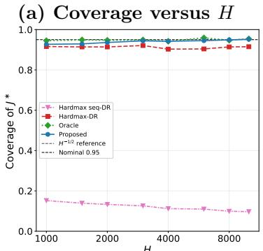

(b) RMSE versus H  
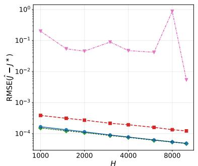

(c) CI length versus H  
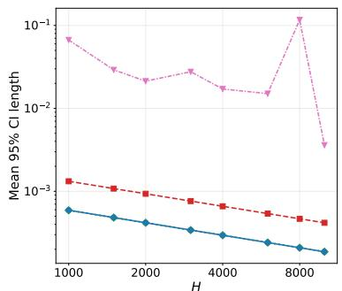

(d) Coverage versus N  
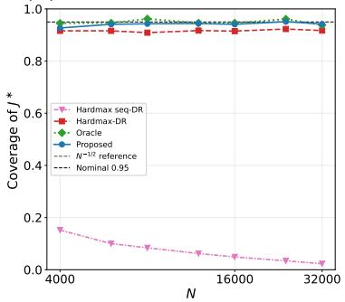

(e) RMSE versus N  
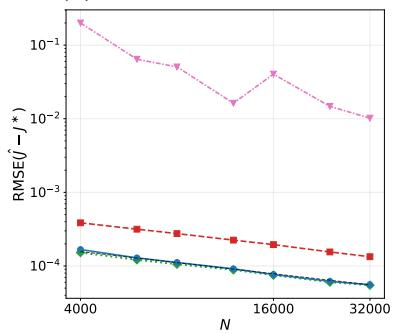

(f) CI length versus N  
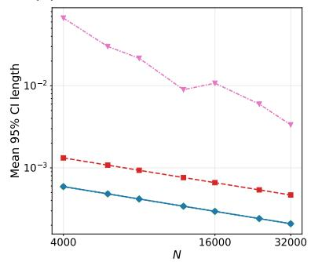  
Figure 1: Scaling in the synthetic design. The top row varies trajectory length H at $N = 4 { , } 0 0 0$ and the bottom row varies N at $H = 1 { , } 0 0 0$ . Columns show Monte Carlo coverage of $J ^ { * }$ , RMSE relative to $J ^ { * }$ , and mean 95% Wald confidence interval length.

In Figure 1, the top row varies the trajectory length H at fixed $N _ { ; }$ , while the bottom row varies N at fixed H. Proposed remains close to Oracle as either source of information increases. Its RMSE decreases approximately at the $H ^ { - 1 / 2 }$ and $N ^ { - 1 / 2 }$ reference rates, respectively, while coverage stays near the nominal level. This joint pattern supports the theory for both fixed and diverging horizons. Hardmax-DR shows persistent undercoverage, while the sequential Hardmax comparator is substantially more variable and can have errors and intervals orders of magnitude larger. Figure 2 varies H at $N = 4 { , } 0 0 0$ . Recall that $\pi _ { \mathrm { u n i f } }$ is uniform over the five tied optimal actions, and set $u _ { t } = t / ( H - 1 )$ ). The fixed, linear, and polynomial regimes use $\rho _ { t } = 0 . 5 , \ \rho _ { t } =$ $0 . 2 + 0 . 6 u _ { t }$ , and ${ \rho } _ { t } = 0 . 2 + 0 . 6 ( 3 u _ { t } ^ { 2 } - 2 u _ { t } ^ { 3 } )$ , respectively. In each regime, the behavior policy is $\pi _ { t } ^ { b } ( a \mid s ) = ( 1 - \rho _ { t } ) / \lvert A \rvert + \rho _ { t } \pi _ { \mathrm { u n i f } } ( a \mid s )$ . All three schedules have average mixture weight 0.5 and hence comparable average overlap. Proposed remains close to Oracle across all three regimes, with stable coverage and steadily decreasing RMSE and interval length as H grows. In contrast, the sequential Hardmax comparator becomes especially unstable under time-varying behavior policies, with large spikes in RMSE and interval length. At $N = 3 2 { , } 0 0 0$ and $H = 4 { , } 0 0 0$ , the studentized errors in Figure 3 are centered near zero and closely follow the standard normal benchmark under the fixed, linear, and polynomial behavior policy regimes. This provides a direct empirical check of the diverging-horizon normal approximation and the corresponding standard error calibration across stationary and time-varying behavior policies.

## 6.2 Bike Repositioning

We use the Multi-Agent Resource Optimization (MARO) bike repositioning simulator [Jiang et al., 2020] with public February 2025 Citi Bike trip records [Citi Bike NYC, 2025]. The data contain approximately 2.03 million trips, which we aggregate into hourly demand while retaining all calendar hours in the month. Stations are grouped into three zones. The abstract state is the joint inventory of the zones, with each inventory classified as low, middle, or high, giving $| S | = 2 7$ states. The five actions are no repositioning, three specified batch transfers between zones, and a state-dependent watermark rule that moves bikes from the currently fullest zone to the currently emptiest zone. The MARO simulator combines the current inventories, action, and realized demand to produce the next inventories and a reward measuring served demand net of unmet demand and repositioning cost. Here N denotes independent simulated behavior trajectories, each spanning 16 calendar days.

We estimate a reference abstract MDP from 1,000 behavior chains of 3,000 transitions each. Its optimal average reward is $J _ { \mathrm { r e f } } = 0 . 7 9 9 6$ , which we use as the benchmark in panel (a). Panel (b) reports the Ces\`aro average reward of each fitted policy evaluated on the same reference abstract MDP. Applying the corresponding beta selection rule gives ${ \widehat { \beta } } = 1 6$ Figure 4 shows that the proposed estimates are stable as N increases, with confidence intervals tightening around point estimates. At the selected ${ \widehat { \beta } } = 1 6$ , both the estimated value and the policy value on the reference abstract MDP lie close to the reference model optimum and substantially exceed those of Hardmax-DR and the behavior policy. The operational panels show that the proposed policy moves markedly fewer bikes while also leaving less demand unmet. Thus, the gain in value corresponds to more eficient repositioning rather than simply more intervention.

## 6.3 AI Agentic Tool Use

We next consider an agentic tool-use setting, where a language-model agent makes a sequence of tool choices to complete a user task. We use the released GPT-4o expert trajectories from ToolSandbox [Lu et al., 2025] that accompany Talk, Evaluate, Diagnose (TED) [Chong et al., 2026]. The data contain 37 tasks with eight trials each, yielding 296 episodes and 1,047 micro-steps. The state is the product of task domain, progress bucket, and whether a tool has already been called. The five domains are CONTACT, MESSAGING, REMINDER, SETTING, and OTHER. Progress is none, partial, or complete, and called before indicates whether a tool has already been called earlier in the episode, giving $| S | = 3 0$ possible states. An action is one of 35 named tool identities or MESSAGE, giving $| { \mathcal { A } } | = 3 6$ . A transition is one tool call or MESSAGE step, and its reward is the increment in benchmark progress, credited on the final micro-step of a round and set to zero for intra-round calls. Let $L ^ { \mathrm { m i n } }$ denote the minimum number of micro-steps required for task completion according to the benchmark milestone graph. We stratify tasks into $L ^ { \mathrm { m i n } } = 1$ and $L ^ { \mathrm { m i n } } \ge 2$ . To account for within-task dependence, tasks are the units for two-fold cross-fitting and clustered standard errors. In the empirical abstract MDP constructed from all 1,047 micro-steps, the greedy policy has Ces\`aro average reward 0.8002, and its smoothed analogue is computed on the same empirical model. These are in-sample empirical benchmarks computed from the same data used in the analysis. Applying the corresponding plug-in beta selection rule gives $\widehat { \beta } = 0 . 5$ . For the two plotted strata, the corresponding empirical reference values are 0.9825 for $L ^ { \mathrm { m i n } } = 1$ and 0.4386 for $L ^ { \mathrm { m i n } } \ge 2$

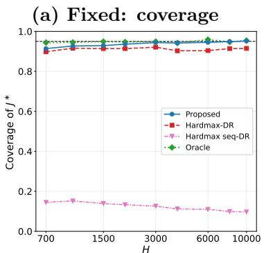

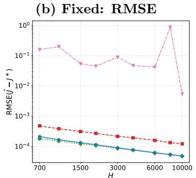

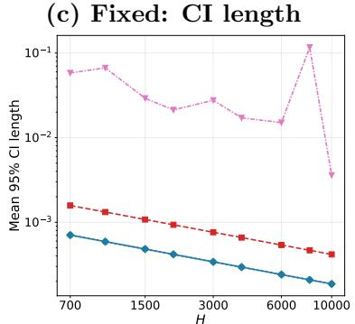

(d) Linear: coverage  
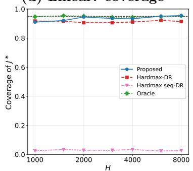

(e) Linear: RMSE  
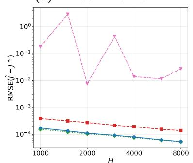

(f) Linear: CI length  
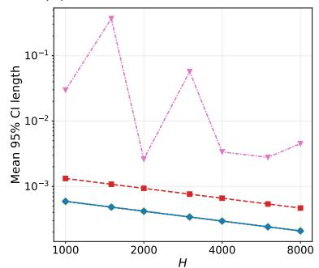

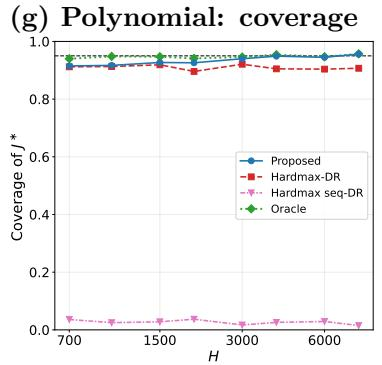

(h) Polynomial: RMSE  
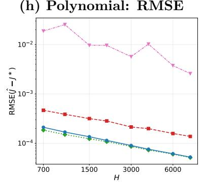

(i) Polynomial: CI length  
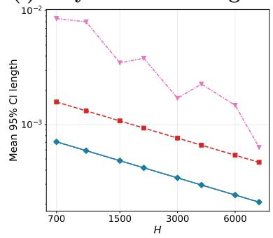  
Figure 2: Method comparisons across behavior policy regimes, with H on the horizontal axis and $N = 4 { , } 0 0 0$ . Rows correspond to the stationary mixture and the linear and polynomial time-varying mixtures, which have comparable average overlap. Columns show coverage of $J ^ { * }$ , RMSE, and mean 95% Wald confidence interval length.

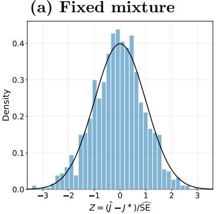

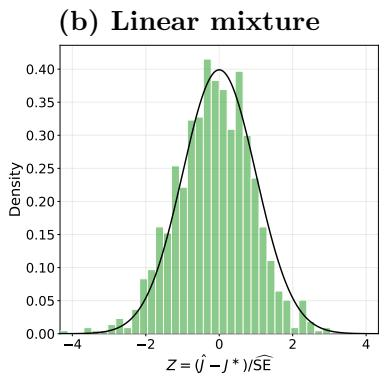

(c) Polynomial mixture  
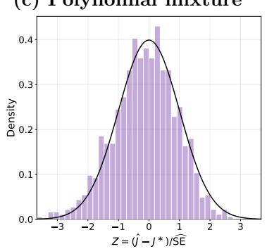  
Figure 3: Studentized error for Proposed at $N = 3 2 { , } 0 0 0$ and $H = 4 { , } 0 0 0$ . Writing SE for thec estimated standard error, the bars show the empirical density of $Z : = ( \widehat { J } _ { \beta } - J ^ { * } ) / \widehat { \mathrm { S E } }$ . The black curve is the standard normal density. Blue, green, and purple bars correspond to the fixed, linear, and polynomial behavior policy mixtures.

(a) OPE estimate  
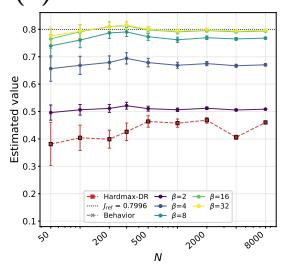

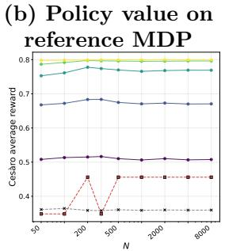

(c) Repositioning  
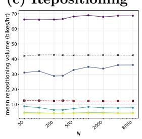

(d) Unmet demand  
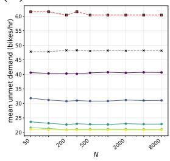  
Figure 4: MARO and Citi Bike results at a fixed trajectory length, with the number of observational trajectories N on the horizontal axis. Panel (a) reports $\mathit { \widehat { J _ { \beta } } }$ with analytic 95% Wald intervals and marks the reference value $J _ { \mathrm { r e f } } = 0$ .7996 by the black dotted line. Panel (b) reports the Ces\`aro average reward of each fitted policy evaluated on the reference abstract MDP. Panels (c) and (d) report mean bikes repositioned and mean unmet demand per hour. Purple through yellow lines denote Proposed at the displayed smoothing levels, red dashed squares denote Hardmax-DR, and gray dashed crosses denote Behavior.

For the $L ^ { \mathrm { m i n } } = 1$ tasks in Figure 5, Proposed gives value estimates that remain close to the empirical reference across task subsets and smoothing levels, while Hardmax-DR stays substantially below the benchmark. The diagnostic panels show a corresponding diference in nuisance stability. Hardmax-DR produces fitted action values that can grow by several orders of magnitude and is associated with much larger Bellman residuals, whereas the proposed fits remain comparatively well behaved. The contrast is sharper for the more dificult $L ^ { \mathrm { m i n } } \ge 2$ tasks in Figure 6. Uncertainty is naturally larger and some proposed fits exhibit larger adjoint weights, reflecting the greater dificulty of the underlying evaluation problem. Nevertheless, the proposed value estimates remain on the scale of the empirical reference and their Bellman residuals remain relatively small. Hardmax-DR, by contrast, can produce extreme value estimates together with fitted Q-functions reaching $1 0 ^ { 4 } – 1 0 ^ { 5 }$ in magnitude. These diagnostics indicate that the instability of Hardmax-DR arises already in the fitted greedy policy nuisance and becomes more severe on the harder multi-step tasks.

(a) OPE estimate  
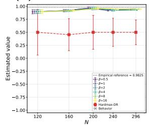

(b) Policy entropy  
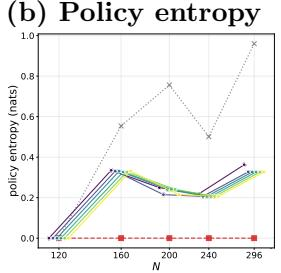

(c) Worst fitted Q  
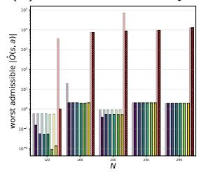

(d) Residual and  
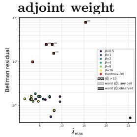  
Figure 5: ToolSandbox results for tasks with $L ^ { \mathrm { m i n } } = 1$ . The horizontal axis shows increasing task subsets, reported by their episode totals. Panel (a) reports value estimates with task-clustered 95% Wald intervals. The black dotted line is the in-sample empirical reference value 0.9825. Panel (b) shows occupancy-weighted policy entropy. Panel (c) shows the largest admissible |Qb| over all cells and over cells reached by the held-out fold. Hatching flags values above 10. Panel (d) plots Bellman residual against maximum adjoint weight. Hatching flags $| \widehat { Q } | > 1 0$ . Large markers flag estimated values with absolute value exceeding 1.

(a) OPE estimate  
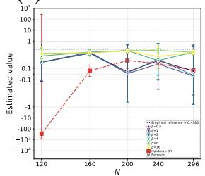

(b) Policy entropy  
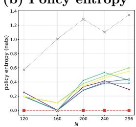

(c) Worst fitted Q  
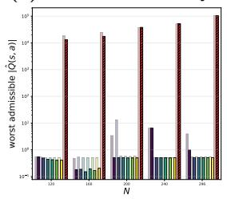

(d) Residual and adjoint weight  
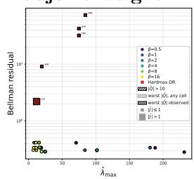  
Figure 6: ToolSandbox results for tasks with $L ^ { \mathrm { m i n } } \ge 2 .$ . The horizontal axis shows increasing task subsets, reported by their episode totals. Panel (a) reports value estimates with task-clustered 95% Wald intervals on a symmetric log scale. The black dotted line is the in-sample empirical reference value 0.4386. Panel (b) shows occupancy-weighted policy entropy. Panel (c) shows the largest admissible |Qb| over all cells and over cells reached by the held-out fold. Hatching flags values above 10. Panel (d) plots Bellman residual against maximum adjoint weight. Hatching flags $| \widehat { Q } | > 1 0$ Large markers flag estimated values with absolute value exceeding 1.

## 7 Discussion

Our results show that inference for the optimal value of a decision system can be built directly around its optimized Bellman structure. Maximization is statistically irregular when optimal actions are tied or nearly tied, and in a Markov decision process this irregularity propagates recursively through future state distributions and continuation values. We address this dificulty through a self-induced Bellman equation in which policy generation and continuation value evaluation are closed within a single smooth population fixed point. This policy–value self-consistency turns the recursively coupled optimization problem into a smooth inferential object in which perturbations of the continuation values and the induced policy can be handled jointly. The adjoint weight then yields an orthogonal score that removes the combined first-order efect, while the approximation analysis controls the remaining smoothing bias $J ^ { * } - J _ { \beta }$ . The same structure also leads to estimable Bellman and adjoint weight nuisances, for which we establish finite-sample rates suficient for the cross-fitted inference procedure. We provide a unified route to optimal value inference under both fixed and diverging horizons.

Several extensions are particularly promising. The self-induced approach could be extended to other smooth approximations of the maximum, continuous or high-dimensional state-action spaces, learned reward models, discounted objectives, and finite-horizon problems. The latter two settings would replace the Bellman equation structure for average rewards with discount-weighted or timedependent Bellman and adjoint equations. On the applied side, the framework can be useful in pricing, recommendation, and agentic systems, where domain structure such as monotonicity, onesided feedback, capacity constraints, or cyclic demand could be exploited to improve estimation. A further direction is to connect ofline optimal value inference with online deployment. Historical data can first quantify the scope for improvement, after which the policy can be updated as new operational data become available and decisions are revised in light of accumulating evidence.

## References

Susan Athey and Stefan Wager. Policy learning with observational data. Econometrica, 89(1): 133–161, 2021.

Xingyu Bai, Xin Chen, Menglong Li, and Alexander L. Stolyar. Asymptotic optimality of semiopen-loop policies in inventory models with stochastic lead times. Management Science, 2026.

Yun Bai, Peter X.-K. Song, and T. E. Raghunathan. Joint composite estimating functions in spatiotemporal models. Journal of the Royal Statistical Society: Series B (Statistical Methodology), 74(5):799–824, 2012.

Richard C. Bradley. Basic properties of strong mixing conditions. A survey and some open questions. Probability Surveys, 2:107–144, 2005.

Haoyu Chen, Wenbin Lu, and Rui Song. Statistical inference for online decision making: In a contextual bandit setting. Journal of the American Statistical Association, 116(533):240–255, 2021a.

Haoyu Chen, Wenbin Lu, and Rui Song. Statistical inference for online decision making via stochastic gradient descent. Journal of the American Statistical Association, 116(534):708–719, 2021b.

Ningyuan Chen and Guillermo Gallego. A primal-dual learning algorithm for personalized dynamic pricing with an inventory constraint. Mathematics of Operations Research, 47(4):2585–2613, 2022.

Xinshi Chen, Shuang Li, Hui Li, Shaohua Jiang, Yuan Qi, and Le Song. Generative adversarial user model for reinforcement learning based recommendation system. In Proceedings of the 36th International Conference on Machine Learning, volume 97, pages 1052–1061. PMLR, 2019.

Zaiwei Chen. Non-asymptotic guarantees for average-reward q-learning with adaptive stepsizes. Advances in Neural Information Processing Systems, 38:147194–147249, 2025.

Victor Chernozhukov, Denis Chetverikov, Mert Demirer, Esther Duflo, Christian Hansen, Whitney Newey, and James Robins. Double/debiased machine learning for treatment and structural parameters. The Econometrics Journal, 21(1):C1–C68, 2018.

Wang Chi Cheung, David Simchi-Levi, and Ruihao Zhu. Reinforcement learning for non-stationary Markov decision processes: The blessing of (more) optimism. arXiv preprint arXiv:2006.14389, 2020.

Penny Chong, Harshavardhan Abichandani, Jiyuan Shen, Atin Ghosh, Min Pyae Moe, Yifan Mai, and Daniel Dahlmeier. Talk, evaluate, diagnose: User-aware agent evaluation with automated error analysis. In The Fourteenth International Conference on Learning Representations, 2026.

Citi Bike NYC. Citi bike system data. https://citibikenyc.com/system-data, 2025. February 2025 trip history data.

J. G. Dai and Mark Gluzman. Queueing network controls via deep reinforcement learning. Stochastic Systems, 12(1):30–67, 2022.

Xiaowu Dai and Lexin Li. Orthogonalized kernel debiased machine learning for multimodal data analysis. Journal of the American Statistical Association, 118(543):1796–1810, 2023.

Miroslav Dud´ık, John Langford, and Lihong Li. Doubly robust policy evaluation and learning. In Proceedings of the 28th International Conference on Machine Learning, pages 1097–1104, 2011.

Dylan J Foster and Vasilis Syrgkanis. Orthogonal statistical learning. The Annals of Statistics, 51 (3):879–908, 2023.

Guillermo Gallego and Garrett Van Ryzin. Optimal dynamic pricing of inventories with stochastic demand over finite horizons. Management Science, 40(8):999–1020, 1994.

Xiao-Yue Gong and David Simchi-Levi. Bandits atop reinforcement learning: Tackling online inventory models with cyclic demands. Management Science, 70(9):6139–6157, 2024.

Jiale Han, Xiaowu Dai, and Yuhua Zhu. Variance reduction via resampling and experience replay. Proceedings of the AAAI Conference on Artificial Intelligence, 40(26):21558–21566, 2026.

Eugene Ie, Vihan Jain, Jing Wang, Sanmit Narvekar, Ritesh Agarwal, Rui Wu, Heng-Tze Cheng, Tushar Chandra, and Craig Boutilier. SlateQ: A tractable decomposition for reinforcement learning with recommendation sets. In Proceedings of the Twenty-Eighth International Joint Conference on Artificial Intelligence, pages 2592–2599, 2019.

Nazgul Jenish and Ingmar R. Prucha. Central limit theorems and uniform laws of large numbers for arrays of random fields. Journal of Econometrics, 150(1):86–98, 2009.

Arthur Jiang, Jia Zhang, Pingchao Yu, Lyuchun Huang, Yang Qiu, Jinyu Wang, Wenlei Shi, Kaiqi Li, Zhanyu Wang, Chengruidong Zhang, Tianyi Sun, Miaoran Chen, Kuanwei Yu, Xinran Wei, Michael Li, Ning Shang, Qiwei Meng, Shan Li, Jiang Bian, Biao Cheng, and Tie-Yan Liu. MARO: A multi-agent resource optimization platform, 2020. GitHub repository.

Nan Jiang and Lihong Li. Doubly robust of-policy value evaluation for reinforcement learning. In Proceedings of the 33rd International Conference on Machine Learning, volume 48 of Proceedings of Machine Learning Research, pages 652–661. PMLR, 2016.

Ying Jin, Zhuoran Yang, and Zhaoran Wang. Is pessimism provably eficient for ofline RL? In Proceedings of the 38th International Conference on Machine Learning, volume 139 of Proceedings of Machine Learning Research, pages 5084–5096. PMLR, 2021.

Ying Jin, Ramki Gummadi, Zhengyuan Zhou, and Jose Blanchet. Feasible Q-learning for average reward reinforcement learning. In Proceedings of The 27th International Conference on Artificial Intelligence and Statistics, volume 238 of Proceedings of Machine Learning Research, pages 1630– 1638, 2024.

Nathan Kallus and Masatoshi Uehara. Double reinforcement learning for eficient of-policy evaluation in Markov decision processes. Journal of Machine Learning Research, 21(167):1–63, 2020.

Nathan Kallus and Masatoshi Uehara. Eficiently breaking the curse of horizon in of-policy evaluation with double reinforcement learning. Operations Research, 70(6):3282–3302, 2022. doi: 10.1287/opre.2021.2249.

Toru Kitagawa and Aleksey Tetenov. Who should be treated? empirical welfare maximization methods for treatment choice. Econometrica, 86(2):591–616, 2018.

Lihong Li, Wei Chu, John Langford, and Xuanhui Wang. Unbiased ofline evaluation of contextualbandit-based news article recommendation algorithms. In Proceedings of the Fourth ACM International Conference on Web Search and Data Mining, pages 297–306. ACM, 2011.

Peng Liao, Zhengling Qi, Runzhe Wan, Predrag Klasnja, and Susan A Murphy. Batch policy learning in average reward Markov decision processes. Annals of statistics, 50(6):3364–3387, 2022.

Qiang Liu, Lihong Li, Ziyang Tang, and Dengyong Zhou. Breaking the curse of horizon: Infinitehorizon of-policy estimation. Advances in Neural Information Processing Systems, 31, 2018.

Jiarui Lu, Thomas Holleis, Yizhe Zhang, Bernhard Aumayer, Feng Nan, Haoping Bai, Shuang Ma, Shen Ma, Mengyu Li, Guoli Yin, Zirui Wang, and Ruoming Pang. ToolSandbox: A stateful, conversational, interactive evaluation benchmark for LLM tool use capabilities. In Findings of the Association for Computational Linguistics: NAACL 2025, pages 1160–1183. Association for Computational Linguistics, 2025.

Nan Lu, Ethan Lee, Ethan X. Fang, and Junwei Lu. Contextual online uncertainty-aware preference learning for human feedback. Journal of the American Statistical Association, pages 1–25, 2026.

Alexander R. Luedtke and Mark J. van der Laan. Statistical inference for the mean outcome under a possibly non-unique optimal treatment strategy. The Annals of Statistics, 44(2):713–742, 2016.

Chang Ma, Junlei Zhang, Zhihao Zhu, Cheng Yang, Yujiu Yang, Yaohui Jin, Zhenzhong Lan, Lingpeng Kong, and Junxian He. AgentBoard: An analytical evaluation board of multi-turn LLM agents. In Advances in Neural Information Processing Systems, volume 37, pages 74325– 74362, 2024.

Sridhar Mahadevan. Average reward reinforcement learning: Foundations, algorithms, and empirical results. Machine learning, 22(1):159–195, 1996.

Enno Mammen and Alexandre B. Tsybakov. Smooth discrimination analysis. The Annals of Statistics, 27(6):1808–1829, 1999.

Charles F. Manski. Statistical treatment rules for heterogeneous populations. Econometrica, 72(4): 1221–1246, 2004.

Weichao Mao, Kaiqing Zhang, Ruihao Zhu, David Simchi-Levi, and Tamer Ba¸sar. Model-free nonstationary RL: Near-optimal regret and applications in multi-agent RL and inventory control. arXiv preprint arXiv:2010.03161, 2020.

Donald L. McLeish. Dependent central limit theorems and invariance principles. The Annals of Probability, 2(4):620–628, 1974.

Susan A. Murphy, Mark J. van der Laan, James M. Robins, and Conduct Problems Prevention Research Group. Marginal mean models for dynamic regimes. Journal of the American Statistical Association, 96(456):1410–1423, 2001.

Liliana Orellana, Andrea Rotnitzky, and James M. Robins. Dynamic regime marginal structural mean models for estimation of optimal dynamic treatment regimes, part I: Main content. The International Journal of Biostatistics, 6(2):Article 8, 2010.

Martin L Puterman. Markov decision processes: discrete stochastic dynamic programming. John Wiley & Sons, 2014.

James M. Robins. Optimal structural nested models for optimal sequential decisions. In D. Y. Lin and P. J. Heagerty, editors, Proceedings of the Second Seattle Symposium in Biostatistics: Analysis of Correlated Data, volume 179 of Lecture Notes in Statistics, pages 189–326. Springer, New York, 2004.

James M. Robins, Miguel A. Hern´an, and Babette Brumback. Marginal structural models and causal inference in epidemiology. Epidemiology, 11(5):550–560, 2000.

Ye Shen, Hengrui Cai, and Rui Song. Doubly robust interval estimation for optimal policy evaluation in online learning. Journal of the American Statistical Association, 119(548):2811–2821, 2024.

Chengchun Shi, Sheng Zhang, Wenbin Lu, and Rui Song. Statistical inference of the value function for reinforcement learning in infinite-horizon settings. Journal of the Royal Statistical Society Series B: Statistical Methodology, 84(3):765–793, 2022.

Chengchun Shi, Jin Zhu, Ye Shen, Shikai Luo, Hongtu Zhu, and Rui Song. Of-policy confidence interval estimation with confounded Markov decision process. Journal of the American Statistical Association, 119(545):273–284, 2024.

Masatoshi Uehara, Masaaki Imaizumi, Nan Jiang, Nathan Kallus, Wen Sun, and Tengyang Xie. Finite sample analysis of minimax ofline reinforcement learning: Completeness, fast rates and first-order eficiency. arXiv preprint arXiv:2102.02981, 2021.

Mark J van der Laan and Alexander R Luedtke. Targeted learning of the mean outcome under an optimal dynamic treatment rule. Journal of causal inference, 3(1):61–95, 2015.

Martin J Wainwright. High-dimensional statistics: A non-asymptotic viewpoint, volume 48. Cambridge university press, 2019.

Yi Wan, Abhishek Naik, and Richard S Sutton. Learning and planning in average-reward Markov decision processes. In International Conference on Machine Learning, pages 10653–10662. PMLR, 2021.

Haoyu Wei. Semiparametric of-policy inference for optimal policy values under possible nonuniqueness. arXiv preprint arXiv:2505.13809, 2025.

Justin Whitehouse, Qizhao Chen, Morgane Austern, and Vasilis Syrgkanis. Inference on optimal policy values and other irregular functionals via softmax smoothing. arXiv preprint arXiv:2507.11780, 2025.

Ruohan Zhan, Vitor Hadad, David A. Hirshberg, and Susan Athey. Of-policy evaluation via adaptive weighting with data from contextual bandits. In Proceedings of the 27th ACM SIGKDD Conference on Knowledge Discovery and Data Mining, pages 2125–2135. ACM, 2021.

Zifeng Zhao, Feiyu Jiang, Yi Yu, and Xi Chen. High-dimensional dynamic pricing under nonstationarity: Learning and earning with change-point detection. Management Science, 2026.

Yunzhe Zhou, Zhengling Qi, Chengchun Shi, and Lexin Li. Optimizing pessimism in dynamic treatment regimes: A Bayesian learning approach. In Proceedings of the 26th International Conference on Artificial Intelligence and Statistics, volume 206 of Proceedings of Machine Learning Research, pages 6704–6721. PMLR, 2023a.

Zhengyuan Zhou, Susan Athey, and Stefan Wager. Ofline multi-action policy learning: Generalization and optimization. Operations Research, 71(1):148–183, 2023b.

Matthew Zurek and Yudong Chen. Span-based optimal sample complexity for weakly communicating and general average reward MDPs. Advances in Neural Information Processing Systems, 37:33455–33504, 2024.

Supplementary Material to “Optimal Value Inference for Reinforcement Learning”

A Notation Summary
<table><tr><td>Symbol</td><td>Meaning</td></tr><tr><td> $s , A$ </td><td>state and action spaces</td></tr><tr><td> $P , R ^ { * }$ </td><td>transition kernel and conditional mean reward</td></tr><tr><td> $\Pi , \pi ^ { b }$ </td><td>stationary Markov policies and the behavior policy</td></tr><tr><td> $\tau _ { i } , Z _ { t }$ </td><td>observed trajectory and one-step transition  $( S _ { t } , A _ { t } , R _ { t + 1 } , S _ { t + 1 } )$ </td></tr><tr><td> $J ^ { \pi }$ </td><td>long-run average reward under stationary policy  $\pi$ </td></tr><tr><td> $Q ^ { \pi }$ </td><td>zero-average fixed-policy relative action-value function</td></tr><tr><td> $J ^ { * } , Q ^ { * }$ </td><td>optimal average reward and the common anchored relative action-value func- tion of optimal stationary policies</td></tr><tr><td> $\pi _ { \beta , Q }$ </td><td>softmax policy induced by a generic action-value function</td></tr><tr><td> $V _ { \beta } ( Q )$ </td><td>softmax-smoothed value map</td></tr><tr><td> $( Q _ { \beta } , J _ { \beta } )$ </td><td>anchored self-induced Bellman solution</td></tr><tr><td> $\pi _ { \beta }$ </td><td>induced policy  $\pi _ { \beta , Q _ { \beta } }$ </td></tr><tr><td> $\Gamma$ </td><td>smallest positive optimality gap of  $Q ^ { * }$ </td></tr><tr><td> $\mathcal { Q }$ </td><td>anchored action-value space</td></tr><tr><td> $\omega _ { \beta , Q }$ </td><td>signed derivative weights of  $V _ { \beta }$  at  $Q$ </td></tr><tr><td> $D _ { \beta }$ </td><td>derivative aggregation operator at  $Q _ { \beta }$ </td></tr><tr><td> $\bar { P }$ </td><td>pooled one-step behavior law for trajectory data</td></tr><tr><td> $\bar { \mu }$   $\bar { \nu }$ </td><td>state-action marginal of the relevant one-step law</td></tr><tr><td> $\varphi _ { \beta } ( Z ; J , Q , \lambda )$ </td><td>pooled marginal of the next state for trajectory data</td></tr><tr><td></td><td>orthogonal score for  $J _ { \beta }$ </td></tr><tr><td> $\lambda _ { \beta }$ </td><td>adjoint weight in the orthogonal score</td></tr><tr><td> $\xi _ { i , t }$ </td><td>martingale score increment  $\varphi _ { \beta } ( Z _ { i , t } ) - J _ { \beta }$ </td></tr><tr><td> $b _ { k }$ </td><td>fold-specific nuisance remainder term</td></tr><tr><td> $\sigma ^ { 2 }$ </td><td>variance of the score increment</td></tr></table>

## B Proof for Section 2

Lemma B.1 (Agreement across optimal policies and Bellman characterization). Under Assumption 2.1, there exists a unique $Q ^ { \ast } \in \mathcal { Q }$ such that $Q ^ { \pi } = Q ^ { * }$ for every $\pi \in \Pi$ with $J ^ { \pi } = J ^ { * }$ . Moreover, this relative action-value function common to optimal policies satisfies the Bellman optimality equation (2.2).

Proof. Assumption 2.1 implies that every stationary policy induces a unichain. By Mahadevan [1996, Theorem 1], there exist a scalar g and a function $h \colon S \to$ R satisfying

$$
g + h ( s ) = \operatorname* { m a x } _ { a \in \mathcal { A } } \left( R ^ { * } ( s , a ) + ( P h ) ( s , a ) \right) , \qquad s \in \mathcal { S } .
$$

The same theorem shows that a stationary greedy policy attains $^ { g , }$ so the definition of $J ^ { * }$ gives $g = J ^ { * }$ Define, only for this proof, $q _ { h } ( s , a ) : = R ^ { * } ( s , a ) - J ^ { * } + ( P h ) ( s , a )$ . The optimality equation implies $h ( s ) =$ $\operatorname* { m a x } _ { a \in \mathcal { A } } q _ { h } ( s , a )$ , so $g _ { h } ( s , a ) : = h ( s ) - q _ { h } ( s , a ) \geq 0$

Fix any $\pi \in$ Π with $J ^ { \pi } = J ^ { * }$ , and let $d ^ { \pi }$ be the unique stationary distribution of $P ^ { \pi }$ . Irreducibility gives $d ^ { \pi } ( s ) > 0$ for every state. Stationarity and the stationary reward representation of $J ^ { \pi }$ yield

$$
\begin{array} { l l } { \displaystyle \sum _ { s \in \mathcal { S } } d ^ { \pi } ( s ) \sum _ { a \in \mathcal { A } } \pi ( a \mid s ) g _ { h } ( s , a ) = \displaystyle \sum _ { s \in \mathcal { S } } d ^ { \pi } ( s ) h ( s ) - \sum _ { s , a } d ^ { \pi } ( s ) \pi ( a \mid s ) R ^ { * } ( s , a ) + J ^ { * } - \sum _ { s , a } d ^ { \pi } ( s ) \pi ( a \mid s ) ( P h ) ( s , a ) } \\ { \displaystyle \qquad = J ^ { * } - J ^ { \pi } = 0 . } \end{array}
$$

Every summand on the left is nonnegative. Since $d ^ { \pi }$ has full support, $\pi ( a \mid s ) > 0$ therefore implies $g _ { h } ( s , a ) = 0$ , or equivalently $q _ { h } ( s , a ) = h ( s ) = \operatorname* { m a x } _ { b } q _ { h } ( s , b )$ . Consequently, $\textstyle \sum _ { a \in { \mathcal { A } } } \pi ( a \mid s ) q _ { h } ( s , a ) = h ( s )$ for every $s \in S$ , and the definition of $q _ { h }$ shows that $( J ^ { * } , q _ { h } )$ satisfies the fixed policy equation (2.1) for every optimal π. By the characterization for fixed policies in Section $2 , q _ { h }$ difers from each $Q ^ { \pi }$ only by an additive constant. Because every $Q ^ { \pi }$ obeys the same anchoring constraint, all optimal policies therefore have the common relative action-value function

$$
Q ^ { \ast } : = q _ { h } - \frac { 1 } { | \boldsymbol { S } | | \boldsymbol { A } | } \sum _ { s \in \mathcal { S } } \sum _ { a \in \mathcal { A } } q _ { h } ( s , a ) \in \mathcal { Q } ,
$$

which also proves uniqueness of the common anchored representative.

Finally, $h ( s ) = \operatorname* { m a x } _ { a } q _ { h } ( s , a )$ and the definition of $q _ { h }$ give $\begin{array} { r } { J ^ { * } + q _ { h } ( s , a ) = R ^ { * } ( s , a ) + \sum _ { s ^ { \prime } \in S } P ( s ^ { \prime } \mid } \end{array}$ $s , a ) \operatorname* { m a x } _ { b \in \mathcal { A } } q _ { h } ( s ^ { \prime } , b )$ . Subtracting the state-action average of $q _ { h }$ from both sides preserves this identity and yields (2.2) for $Q ^ { * }$ □

## C Proofs for Section 3

## C.1 Proof of Lemma 3.2

Proof. Define ${ \widetilde Q } : = Q _ { \beta } + c { \bf 1 }$ . The softmax normalization cancels the common shift, and the induced value shifts by the same constant.

$$
\pi _ { \beta , { \widetilde Q } } ( a \mid s ) = { \frac { \exp ( \beta ( Q _ { \beta } ( s , a ) + c ) ) } { \sum _ { b \in { \cal A } } \exp ( \beta ( Q _ { \beta } ( s , b ) + c ) ) } } = \pi _ { \beta } ( a \mid s ) .
$$

The induced value identity is

$$
V _ { \beta } ( \widetilde { Q } ) ( s ) = \sum _ { a \in \mathcal { A } } \pi _ { \beta , \widetilde { Q } } ( a \mid s ) ( Q _ { \beta } ( s , a ) + c ) = V _ { \beta } ( Q _ { \beta } ) ( s ) + c .
$$

Substituting the value-shift identity into the self-induced Bellman equation gives

$$
\begin{array} { r l } & { R ^ { * } ( s , a ) + \mathbb { E } \Big [ V _ { \beta } ( \widetilde { Q } ) ( S ^ { \prime } ) \mid S = s , A = a \Big ] = R ^ { * } ( s , a ) + \mathbb { E } [ V _ { \beta } ( Q _ { \beta } ) ( S ^ { \prime } ) + c \mid S = s , A = a ] } \\ & { \qquad = J _ { \beta } + Q _ { \beta } ( s , a ) + c = J _ { \beta } + \widetilde { Q } ( s , a ) . } \end{array}
$$

Thus $( \widetilde { Q } , J _ { \beta } )$ also satisfies (3.1).

## C.2 Proof of Theorem 3.3

Proof. Recall that Π denotes the set of stationary policies $\pi \colon S \to { \mathcal { P } } ( { \mathcal { A } } )$ . Since $s$ and A are finite, Π is a compact subset of a finite-dimensional Euclidean space. We first show that Assumption 2.1 implies the unichain condition. Fix any stationary policy $\pi \in \Pi$ . By Assumption 2.1, the transition matrix $P ^ { \pi } ( s ^ { \prime } \mid s ) =$ $\textstyle \sum _ { a \in { \mathcal { A } } } \pi ( a \mid s ) P ( s ^ { \prime } \mid s , a )$ is irreducible. An irreducible finite Markov chain has a single communicating class, which is necessarily recurrent, so there are no transient states and the chain is unichain. In particular, the average reward $J ^ { \pi }$ exists and is independent of the initial state.

Therefore each $\pi \in \Pi$ has a unique scalar $J ^ { \pi }$ , and the probabilistically defined $Q ^ { \pi }$ is the unique anchored solution in Q to (2.1). The evaluation map $\pi \mapsto Q ^ { \pi }$ is continuous on Π, because the anchored Poisson equation together with the zero-average constraint is a finite-dimensional linear system in $( Q ^ { \pi } , J ^ { \pi } )$ , Assumption 2.1 gives a unique solution for every π, its coeficient matrix depends continuously on π, and matrix inversion is continuous on the set of nonsingular matrices. Therefore, ${ \mathcal { K } } : = \{ Q ^ { \pi } : \pi \in \Pi \} \subseteq { \mathcal { Q } }$ is compact and bounded. Choose $M < \infty$ such that $\| Q ^ { \pi } \| _ { \infty } \leq M$ for all $\pi \in \Pi$ , and define $B : = \{ Q \in \mathcal { Q } : \| Q \| _ { \infty } \leq M \}$ which is nonempty, compact, and convex, together with Φ: $\mathcal { Q }  \mathcal { Q }$ given by $\Phi ( Q ) : = Q ^ { \pi _ { \beta , Q } }$

For $Q \in B$ , the softmax policy $\pi _ { \beta , Q }$ belongs to Π, so $\Phi ( Q ) = Q ^ { \pi _ { \beta , Q } } \in { \mathcal { K } } \subseteq B$ . Thus Φ maps B into itself. The softmax map $Q \mapsto \pi _ { \beta , Q }$ is continuous in finite dimension, and the evaluation map $\pi \mapsto Q ^ { \pi }$ is continuous. Hence Φ is continuous on $B$

Brouwer’s fixed-point theorem gives $Q _ { \beta } \in B$ such that $\Phi ( Q _ { \beta } ) = Q _ { \beta }$ . Recall that we define $\pi _ { \beta } : = \pi _ { \beta , Q _ { \beta } }$ Equivalently, we have $Q _ { \beta } = Q ^ { \pi _ { \beta } }$ . Define $J _ { \beta } : = J ^ { \pi _ { \beta } }$ . Since $Q _ { \beta } = Q ^ { \pi _ { \beta } }$ is the anchored evaluation of $\pi _ { \beta } .$ equation (2.1) yields

$$
\begin{array} { r l } & { J _ { \beta } + Q _ { \beta } ( s , a ) = R ^ { * } ( s , a ) + \displaystyle \sum _ { s ^ { \prime } \in S } P ( s ^ { \prime } \mid s , a ) \sum _ { a ^ { \prime } \in A } \pi _ { \beta } ( a ^ { \prime } \mid s ^ { \prime } ) Q _ { \beta } ( s ^ { \prime } , a ^ { \prime } ) } \\ & { \quad \quad \quad = R ^ { * } ( s , a ) + { \mathbb E } \left[ \displaystyle \sum _ { a ^ { \prime } \in A } \pi _ { \beta } ( a ^ { \prime } \mid S ^ { \prime } ) Q _ { \beta } ( S ^ { \prime } , a ^ { \prime } ) \ \middle \mid S = s , A = a \right] } \\ & { \quad \quad \quad = R ^ { * } ( s , a ) + { \mathbb E } [ V _ { \beta } ( Q _ { \beta } ) ( S ^ { \prime } ) \mid S = s , A = a ] . } \end{array}
$$

Therefore $( Q _ { \beta } , J _ { \beta } )$ satisfies (3.1).

## C.3 Proof of Proposition 3.6

## C.3.1 Uniform Bound on Signed Weights

Lemma C.1. There exists a constant $C _ { \mathcal { A } } < \infty$ , depending only on $| { \cal A } |$ , such that, for every $Q , s \in S ,$ and $\beta > 0$

$$
\sum _ { a \in \cal { A } } \omega _ { \beta , Q } ( a \mid s ) = 1 , \qquad \sum _ { a \in \cal { A } } \left. \omega _ { \beta , Q } ( a \mid s ) \right. \leq C _ { \cal { A } } .
$$

Proof. Fix $s \in S$ and Q. Write $q _ { a } : = Q ( s , a )$ and $p _ { a } : = \pi _ { \beta , Q } ( a \mid s ) , a \in \mathcal { A }$ . Then $\begin{array} { r } { V _ { \beta } ( Q ) ( s ) = \sum _ { b \in \mathcal { A } } p _ { b } q _ { b } } \end{array}$ and $\omega _ { \beta , Q } ( a \mid s ) = p _ { a } ( 1 + \beta ( q _ { a } - V _ { \beta } ( Q ) ( s ) ) )$ . The row-sum identity follows immediately.

$$
\sum _ { a \in \mathcal { A } } \omega _ { \beta , Q } ( a \mid s ) = \sum _ { a \in \mathcal { A } } p _ { a } + \beta \sum _ { a \in \mathcal { A } } p _ { a } \left( q _ { a } - \sum _ { b \in \mathcal { A } } p _ { b } q _ { b } \right) = 1 .
$$

It remains to prove the signed envelope. Let $z _ { a } : = \beta q _ { a }$ . Since $\begin{array} { r } { p _ { a } = e ^ { z _ { a } } / \sum _ { b \in \mathcal { A } } e ^ { z _ { b } } } \end{array}$ , there exists a constant c such that $z _ { a } = \log p _ { a } + c .$ The common additive constant cancels from the centered expression.

$$
\omega _ { \beta , Q } ( a \mid s ) = p _ { a } \left( 1 + z _ { a } - \sum _ { b \in \mathcal { A } } p _ { b } z _ { b } \right) = p _ { a } \left( 1 + \log p _ { a } - \sum _ { b \in \mathcal { A } } p _ { b } \log p _ { b } \right) .
$$

The entropy bound then controls the signed mass.

$$
\sum _ { a \in \mathcal { A } } \vert \omega _ { \beta , Q } ( a \mid s ) \vert \leq \sum _ { a \in \mathcal { A } } p _ { a } + \sum _ { a \in \mathcal { A } } p _ { a } \vert \log p _ { a } \vert + \left| \sum _ { b \in \mathcal { A } } p _ { b } \log p _ { b } \right| \sum _ { a \in \mathcal { A } } p _ { a } .
$$

Since $p _ { a } \in ( 0 , 1 ]$ , we have $| \log p _ { a } | = - \log p _ { a }$ , and the two entropy terms satisfy

$$
\sum _ { a \in { \mathcal { A } } } p _ { a } | \log p _ { a } | = - \sum _ { a \in { \mathcal { A } } } p _ { a } \log p _ { a } \leq \log | { \mathcal { A } } | .
$$

The averaged logarithm satisfies the same entropy bound,

$$
\left| \sum _ { b \in \mathcal { A } } p _ { b } \log p _ { b } \right| = - \sum _ { b \in \mathcal { A } } p _ { b } \log p _ { b } \leq \log | \mathcal { A } | .
$$

Thus $\begin{array} { r } { \sum _ { a \in \mathcal { A } } | \omega _ { \beta , Q } ( a \mid s ) | \leq 1 + 2 \log | \mathcal { A } | } \end{array}$ , and taking $C _ { \mathcal { A } } : = 1 + 2 \log \left| \mathcal { A } \right|$ proves the claim. The bound depends only on $| { \mathcal { A } } |$ , and is uniform over $Q , s ,$ and $\beta .$ □

## C.3.2 A Suficient Condition for Signed Aggregation Identification

Write $\begin{array} { r } { \operatorname { s p } ( f ) : = \operatorname* { s u p } _ { x } f ( x ) - \operatorname* { i n f } _ { x } f ( x ) } \end{array}$ for the span seminorm of a real-valued function f on a finite domain. Proposition C.2 (Dobrushin overlap implies uniform signed aggregation identification). If $C _ { \mathrm { \mathcal { A } } } \rho ( P ) < 1$ 2 then Assumption 3.4 holds.

Proof. Fix an allowable aggregation operator $D .$ . Suppose that $\displaystyle - j \mathbf { 1 } - q + P D q = 0 , ~ q ~ \in ~ \mathcal { Q } , ~ j ~ \in ~ \mathbb { R }$ Equivalently, $q = P D q - j { \bf 1 }$ . Since the span seminorm is invariant under additive constants, we have $\operatorname { s p } ( q ) =$ $\operatorname { s p } ( P D q )$

We first recall the Dobrushin contraction bound $\operatorname { s p } ( P g ) \leq \rho ( P ) \operatorname { s p } ( g )$ , valid for any state function $g .$ Indeed, for any two state-action pairs $x = ( s , a )$ and $\widetilde { \boldsymbol { x } } = ( \widetilde { \boldsymbol { s } } , \widetilde { \boldsymbol { a } } )$ , subtracting an arbitrary constant from $^ { g , }$ taking absolute values, and optimizing over the constant $\mathrm { g i }$ ves

$$
( P g ) ( x ) - ( P g ) ( \widetilde { x } ) = \sum _ { s ^ { \prime } \in { \mathcal S } } ( P ( s ^ { \prime } \mid x ) - P ( s ^ { \prime } \mid \widetilde { x } ) ) g ( s ^ { \prime } ) .
$$

Taking absolute values gives

$$
| ( P g ) ( x ) - ( P g ) ( \widetilde { x } ) | \leq \| P ( \cdot \mid x ) - P ( \cdot \mid \widetilde { x } ) \| _ { \mathrm { T V } } \operatorname { s p } ( g ) .
$$

Taking the supremum over $x , { \widetilde { x } }$ gives the stated bound.

Next we bound the span of $D q$ . For any constant $c ,$ the property that every row of $D$ sums to one gives $\begin{array} { r } { D q ( s ) - c = \sum _ { a \in \mathcal { A } } w _ { s } ( a ) ( q ( s , a ) - c ) } \end{array}$ , and therefore

$$
| D q ( s ) - c | \leq \sum _ { a \in \mathcal { A } } | w _ { s } ( a ) | | q ( s , a ) - c | \leq C _ { \mathcal { A } } \| q - c \mathbf { 1 } \| _ { \infty } .
$$

Taking the supremum over s and then optimizing over $^ { c , }$ using $\begin{array} { r } { \operatorname { s p } ( f ) = 2 \operatorname* { i n f } _ { c } \| f - c \mathbf { 1 } \| _ { \infty } } \end{array}$ , yields $\operatorname { s p } ( D q ) \leq$ $C _ { \mathcal { A } } \operatorname { s p } ( q )$

Combining the preceding displays,

$$
\operatorname { s p } ( q ) = \operatorname { s p } ( P D q ) \leq \rho ( P ) \operatorname { s p } ( D q ) \leq C _ { \mathcal { A } } \rho ( P ) \operatorname { s p } ( q ) .
$$

Since $C _ { \mathrm { \mathcal { A } } } \rho ( P ) < 1$ , we must have $\operatorname { s p } ( q ) = 0$ . Thus q is constant on ${ \mathcal { S } } \times { \mathcal { A } } .$ . Because $q \in \mathcal { Q }$ , the anchoring constraint implies $q = 0$ . Substituting $q = 0$ into $- j { \bf 1 } - q + P D q = 0$ gives $j = 0$ . Hence Assumption 3.4 holds. □

## C.3.3 Proof of Proposition 3.6

Lemma C.3. For $q = ( q _ { a } ) _ { a \in \mathcal { A } }$ , define $\begin{array} { r } { \arg _ { \beta } ( q ) : = \frac { \sum _ { a \in \mathcal { A } } q _ { a } e ^ { \beta q _ { a } } } { \sum _ { b \in \mathcal { A } } e ^ { \beta q _ { b } } } } \end{array}$ . Its derivative is

$$
\frac { \partial } { \partial q _ { a } } \mathrm { a s o } _ { \beta } ( q ) = w _ { a } ( q ) ( 1 + \beta ( q _ { a } - \mathrm { a s o } _ { \beta } ( q ) ) ) , \qquad w _ { a } ( q ) : = \frac { e ^ { \beta q _ { a } } } { \sum _ { b \in \mathcal { A } } e ^ { \beta q _ { b } } } .
$$

With $\omega _ { \beta , Q }$ defined by (4.1) with $Q _ { \beta }$ replaced by Q,

$$
D _ { Q } V _ { \beta } ( Q ) ( s ) [ h ] = \sum _ { a \in { \cal { A } } } \omega _ { \beta , Q } ( a \mid s ) h ( s , a ) ,
$$

Proof. Note that $\begin{array} { r } { \operatorname { a s o } _ { \beta } ( q ) = \sum _ { a \in \mathcal { A } } w _ { a } ( q ) q _ { a } } \end{array}$ . Since $\begin{array} { r } { \frac { \partial w _ { a } ( q ) } { \partial q _ { c } } = \beta w _ { a } ( q ) ( { \bf 1 } ( a = c ) - w _ { c } ( q ) ) } \end{array}$ , we have

$$
\begin{array} { l } { \displaystyle { \frac { \partial } { \partial q _ { c } } \mathrm { a s o } _ { \beta } ( q ) = w _ { c } ( q ) + \sum _ { a \in \mathcal { A } } q _ { a } \frac { \partial w _ { a } ( q ) } { \partial q _ { c } } } } \\ { \displaystyle { \phantom { \frac { \partial } { \partial q _ { c } } \mathrm { a s o } _ { \beta } ( q ) = w _ { c } ( q ) + \sum _ { a \in \mathcal { A } } q _ { a } \frac { \partial w _ { a } ( q ) } { \partial q _ { c } } } } } \\ { \displaystyle { \phantom { \frac { \partial } { \partial q _ { c } } \mathrm { a s o } _ { \beta } ( q ) = w _ { c } ( q ) + \sum _ { a \in \mathcal { A } } w _ { a } ( q ) q _ { a } } = w _ { c } ( q ) ( 1 + \beta ( q _ { c } - \mathrm { a s o } _ { \beta } ( q ) ) ) . } } \end{array}
$$

Substituting $q _ { a } = Q ( s , a )$ gives the displayed derivative of $V _ { \beta }$

Proof of Proposition 3.6. Existence of an anchored self-induced solution follows from Theorem 3.3. We first show that this anchored solution is unique.

Suppose that $( Q _ { \beta } ^ { ( 1 ) } , J _ { \beta } ^ { ( 1 ) } ) , ( Q _ { \beta } ^ { ( 2 ) } , J _ { \beta } ^ { ( 2 ) } )$ are two anchored solutions of the self-induced Bellman equation. Set $q : = Q _ { \beta } ^ { ( 1 ) } - Q _ { \beta } ^ { ( 2 ) }$ and $j : = \bar { J } _ { \beta } ^ { ( 1 ) } - \bar { J } _ { \beta } ^ { ( 2 ) }$ . Because both ${ Q } _ { \beta } ^ { ( 1 ) }$ and $Q _ { \beta } ^ { ( 2 ) }$ belong to $\mathcal { Q } .$ we have $q \in \mathcal { Q }$ . For $t \in [ 0 , 1 ]$ , define $Q _ { t } : = Q _ { \beta } ^ { ( 2 ) } + t q$ . For each state $s ,$ let $\begin{array} { r } { w _ { s } ( a ) : = \int _ { 0 } ^ { 1 } \omega _ { \beta , Q _ { t } } ( a \ \vert \ s ) d t , \ a \in \mathcal A } \end{array}$ , and let $D ^ { 1 2 }$ be the state-wise aggregation operator $\begin{array} { r } { ( D ^ { 1 2 } f ) ( s ) : = \sum _ { a \in \mathcal { A } } w _ { s } ( a ) f ( s , a ) } \end{array}$ . By Lemma C.3 and the fundamental theorem of calculus,

$$
V _ { \beta } ( Q _ { \beta } ^ { ( 1 ) } ) ( s ) - V _ { \beta } ( Q _ { \beta } ^ { ( 2 ) } ) ( s ) = \int _ { 0 } ^ { 1 } D _ { Q } V _ { \beta } ( Q _ { t } ) ( s ) [ q ] d t = \int _ { 0 } ^ { 1 } \sum _ { a \in A } \omega _ { \beta , Q _ { t } } ( a \mid s ) q ( s , a ) d t = ( D ^ { 1 2 } q ) ( s ) .
$$

Moreover, Lemma C.1 gives $\begin{array} { r } { \sum _ { a \in \mathcal { A } } \omega _ { \beta , Q _ { t } } ( a \mid s ) = 1 } \end{array}$ for every s and $t ,$ and $\begin{array} { r } { \sum _ { a \in \mathcal { A } } | \omega _ { \beta , Q _ { t } } ( a \mid s ) | \le C _ { \mathcal { A } } } \end{array}$ . It follows that $\textstyle \sum _ { a \in { \mathcal { A } } } w _ { s } ( a ) = 1$ , and the signed envelope is preserved under the secant average:

$$
\sum _ { a \in \mathcal { A } } \vert w _ { s } ( a ) \vert \leq \int _ { 0 } ^ { 1 } \sum _ { a \in \mathcal { A } } \vert \omega _ { \beta , Q _ { t } } ( a \mid s ) \vert d t \leq C _ { \mathcal { A } } .
$$

Hence $D ^ { 1 2 }$ is an allowable state-wise signed action aggregation operator.

Subtracting the two self-induced Bellman equations gives

$$
j { \bf 1 } + q = P \left( V _ { \beta } ( Q _ { \beta } ^ { ( 1 ) } ) - V _ { \beta } ( Q _ { \beta } ^ { ( 2 ) } ) \right) = P D ^ { 1 2 } q .
$$

Equivalently, we have $- j { \bf 1 } - q + P D ^ { 1 2 } q = 0$ . Since $q \in \mathcal { Q }$ and $D ^ { 1 2 }$ is allowable, Assumption 3.4 implies $q = 0 , j = 0$ . Thus $Q _ { \beta } ^ { ( 1 ) } = \bar { Q } _ { \beta } ^ { ( 2 ) } , \bar { J } _ { \beta } ^ { ( 1 ) } = \bar { J } _ { \beta } ^ { ( 2 ) }$ . Together with Theorem 3.3, this proves existence and uniqueness of the anchored pair $( Q _ { \beta } , J _ { \beta } )$ □

## C.4 Uniform Boundedness and Approximation

This section first establishes the approximation bound needed for Theorem 3.8. We also establish convergence results for the continuation value, induced policy, and derivative operator for subsequent use.

## C.4.1 Preliminary Bounds

Corollary C.4 (Uniform boundedness of the self-induced Bellman solution). Under Assumption 2.1, the solutions constructed in Theorem 3.3 satisfy

$$
\operatorname * { s u p } _ { \beta > 0 } \| Q _ { \beta } \| _ { \infty } < \infty , \qquad \operatorname * { s u p } _ { \beta > 0 } | J _ { \beta } | < \infty .
$$

Proof. The proof of Theorem 3.3 shows that the stationary policy class Π is compact and that the normalized fixed-policy evaluation map $\pi \mapsto Q ^ { \pi }$ is continuous. Hence $\{ Q ^ { \pi } : \pi \in \Pi \}$ is compact in the finite-dimensional tabular space and therefore bounded in sup norm. Thus there exists $C < \infty$ such that $\begin{array} { r } { \operatorname* { s u p } _ { \pi \in \Pi } \| Q ^ { \pi } \| _ { \infty } \leq C } \end{array}$ Since $Q _ { \beta } = Q ^ { \pi _ { \beta } }$ for every $\beta > 0$ , it follows that sup $_ { \beta > 0 } \| Q _ { \beta } \| _ { \infty } < \infty$

Likewise, $J _ { \beta } = J ^ { \pi _ { \beta } }$ . Since $\boldsymbol { s } \times \boldsymbol { A }$ is finite and $R ^ { * }$ is finite-valued, ma $\nu _ { s \in S , a \in \mathcal { A } } \left| R ^ { * } ( s , a ) \right| < \infty$ . Therefore $| J ^ { \pi } | \leq C$ for every stationary policy $\pi ,$ for some $C < \infty$ , and hence $\operatorname* { s u p } _ { \beta > 0 } \left| J _ { \beta } \right| < \infty$ □

Assumption 3.4 is an injectivity statement for each fixed allowable operator. The argument below needs the associated quantitative inverse, uniformly over the whole allowable family. Lemma E.2 gives such a bound in the pooled weighted norm $\| \cdot \| _ { \bar { \mu } , 2 }$ . The following supremum-norm counterpart involves no behavior law and is therefore free of the horizon.

Lemma C.5 (Uniform quantitative inverse over allowable aggregation operators). For an allowable statewise signed action aggregation operator $D _ { \mathbf { \lambda } }$ define

$$
\begin{array} { r } { \mathcal L _ { D } ( q , j ) : = - j { \bf 1 } - q + P D q , \qquad ( q , j ) \in \mathcal Q \times \mathbb R . } \end{array}
$$

Suppose Assumption 3.4 holds. Then there exists $C < \infty$ such that

$$
\| q \| _ { \infty } + | j | \leq C \| {  { \mathcal L } } _ { D } ( q , j ) \| _ { \infty } , \qquad ( q , j ) \in {  { \mathcal Q } } \times \mathbb { R } ,
$$

for every allowable $D .$ . The constant depends only on $P$ and $| { \cal A } |$ , and in particular does not depend on $D _ { : }$ $\beta , n , N$ , or H.

Proof. Parametrize the allowable family by its weight arrays,

$$
\mathcal { W } : = \left\{ w = ( w _ { s } ( a ) ) _ { s \in S , a \in A } \in \mathbb { R } ^ { S \times A } : \sum _ { a \in A } w _ { s } ( a ) = 1 \mathrm { ~ a n d ~ } \sum _ { a \in A } \left| w _ { s } ( a ) \right| \leq C _ { A } \mathrm { ~ f o r ~ e v e r y ~ } s \in S \right\} ,
$$

and write $D _ { w }$ for the operator with weights w. The set W is closed and bounded in finite dimension, hence compact. The set $\mathcal { U } : = \{ ( q , j ) \in \mathcal { Q } \times \mathbb { R } : \| q \| _ { \infty } + | j | = 1 \}$ is compact as well.

The map $( w , q , j ) \mapsto \| \mathcal { L } _ { D _ { w } } ( q , j ) \| _ { \infty }$ is continuous on $\mathcal { W } \times \mathcal { U }$ . By Assumption 3.4, $\mathcal { L } _ { D _ { w } } ( q , j ) = 0$ with $q \in \mathcal { Q }$ implies $( q , j ) = ( 0 , 0 )$ , so this continuous map is strictly positive on $\mathcal { W } \times \mathcal { U }$ . It therefore has a positive minimum $c _ { * } > 0$ . For $( q , j ) \neq ( 0 , 0 )$ , applying the bound to $( q , j ) / ( \| q \| _ { \infty } + | j | )$ and using homogeneity gives the claim with $C = c _ { * } ^ { - 1 }$ . The case $( q , j ) = ( 0 , 0 )$ is trivial. □

## C.4.2 Approximation to the Optimal Bellman Pair

Write $V ^ { * } ( s ) : = \operatorname* { m a x } _ { a \in \mathcal { A } } Q ^ { * } ( s , a )$ and $\Delta _ { a } ^ { * } ( s ) : = V ^ { * } ( s ) - Q ^ { * } ( s , a )$ . Thus $\Delta _ { a } ^ { * } ( s ) \geq 0$ , and strictly suboptimal actions have gap at least Γ.

Proposition C.6 (Approximation to the optimal Bellman pair). Suppose Assumptions 2.1 and 3.4 hold, and let $( Q _ { \beta } , J _ { \beta } )$ be the anchored self-induced solution of Proposition 3.6. Then there exists $C < \infty$ , independent of $\beta ,$ such that, for every $\beta > 0$

$$
\| Q _ { \beta } - Q ^ { * } \| _ { \infty } + | J _ { \beta } - J ^ { * } | \leq C e ^ { - \beta \Gamma } .\tag{C.1}
$$

If $\Gamma = + \infty$ , then $Q _ { \beta } = Q ^ { * }$ and $J _ { \beta } = J ^ { * }$ exactly, for every $\beta > 0$

Proof. First evaluate the smoother at $Q ^ { * }$ . Dividing the numerator and denominator of $\pi _ { \beta , Q ^ { * } } ( a \mid s )$ by $\exp ( \beta V ^ { * } ( s ) )$ gives

$$
\pi _ { \beta , Q ^ { * } } ( a \mid s ) = \frac { \exp ( - \beta \Delta _ { a } ^ { * } ( s ) ) } { \sum _ { b \in \cal { A } } \exp ( - \beta \Delta _ { b } ^ { * } ( s ) ) } .
$$

Let $\mathcal { A } ^ { \ast } ( s ) : = \{ a \in \mathcal { A } : \Delta _ { a } ^ { \ast } ( s ) = 0 \}$ . Since the actions in $\mathcal { A } ^ { \ast } ( s )$ contribute one each to the normalizing sum,

$$
V ^ { * } ( s ) - V _ { \beta } ( Q ^ { * } ) ( s ) = \frac { \sum _ { a \notin A ^ { * } ( s ) } \Delta _ { a } ^ { * } ( s ) \exp ( - \beta \Delta _ { a } ^ { * } ( s ) ) } { | A ^ { * } ( s ) | + \sum _ { b \notin A ^ { * } ( s ) } \exp ( - \beta \Delta _ { b } ^ { * } ( s ) ) } , \qquad s \in \mathcal { S } .\tag{C.2}
$$

$\mathrm { I f ~ } \Gamma = + \infty$ , the numerator is empty and $V _ { \beta } ( Q ^ { * } ) = V ^ { * }$ . Otherwise, every a $\notin { \mathcal { A } } ^ { \ast } ( s )$ satisfies $\Delta _ { a } ^ { * } ( s ) \geq \Gamma$ , the denominator is at least one, and with $B _ { \Delta } : = \operatorname* { m a x } _ { s , a } \Delta _ { a } ^ { * } ( s ) < \infty$

$$
0 \leq \| V _ { \beta } ( Q ^ { * } ) - V ^ { * } \| _ { \infty } \leq ( | A | - 1 ) B _ { \Delta } e ^ { - \beta \Gamma } .\tag{C.3}
$$

Set $q _ { \beta } : = Q _ { \beta } - Q ^ { * }$ and $j _ { \beta } : = J _ { \beta } - J ^ { * }$ . Subtracting (2.2) from (3.1) gives

$$
j _ { \boldsymbol { \beta } } + q _ { \boldsymbol { \beta } } ( s , a ) = ( P ( V _ { \boldsymbol { \beta } } ( Q _ { \boldsymbol { \beta } } ) - V ^ { * } ) ) ( s , a ) , \qquad ( s , a ) \in \boldsymbol { S } \times \mathcal { A } .
$$

For $u \in [ 0 , 1 ]$ , set $Q _ { u } : = Q ^ { * } + u q _ { \beta }$ , and let $\bar { D } _ { \beta }$ be the path-averaged derivative aggregation operator with weights $\begin{array} { r } { \bar { w } _ { s } ( a ) : = \int _ { 0 } ^ { 1 } \omega _ { \beta , Q _ { u } } ( a \mid s ) } \end{array}$ du. Lemma C.3 and the fundamental theorem of calculus give $V _ { \beta } ( Q _ { \beta } ) ~ -$ $V _ { \beta } ( Q ^ { * } ) = \bar { D } _ { \beta } q _ { \beta }$ . Lemma C.1 also gives $\begin{array} { r } { \sum _ { a } \bar { w } _ { s } ( a ) = 1 } \end{array}$ and $\begin{array} { r } { \sum _ { a } | \bar { w } _ { s } ( a ) | \leq C _ { A } . } \end{array}$ , so $\bar { D } _ { \beta }$ is allowable. Rearranging gives the exact secant equation

$$
- j _ { \beta } { \bf 1 } - q _ { \beta } + P \bar { D } _ { \beta } q _ { \beta } = P ( V ^ { * } - V _ { \beta } ( Q ^ { * } ) ) .\tag{C.4}
$$

The left-hand side is $\mathcal { L } _ { \bar { D } _ { \beta } } ( q _ { \beta } , j _ { \beta } )$ . Lemma C.5 and $\| P g \| _ { \infty } \leq \| g \| _ { \infty }$ therefore yield $\| Q _ { \beta } - Q ^ { * } \| _ { \infty } + | J _ { \beta } - J ^ { * } | \leq$ $C \| V ^ { * } - V _ { \beta } ( Q ^ { * } ) \| _ { \infty }$ . Combining this bound with (C.3) proves (C.1). If $\Gamma = + \infty$ , the right-hand side of (C.4) is zero, so the uniform inverse gives $Q _ { \beta } = Q ^ { * }$ and $J _ { \beta } = J ^ { * }$ □

Proof of Theorem 3.8. Proposition C.6 gives $| J _ { \beta } - J ^ { * } | \le C e ^ { - \beta \Gamma }$ . By Remark $3 . 7 , J _ { \beta } = J ^ { \pi _ { \beta } }$ is the average reward of the stationary policy $\pi _ { \beta } ,$ while $J ^ { * }$ is the optimal average reward over Π. Hence $J _ { \beta } \leq J ^ { * }$ , and therefore $0 \leq J ^ { \ast } - J _ { \beta } \leq C e ^ { - \beta \bar { \Gamma } }$ . I $\Gamma = + \infty$ , Proposition C.6 gives ${ \cal J } _ { \beta } = { \cal J } ^ { * }$ for every $\beta > 0$ □

## C.4.3 Convergence of the Induced Objects

Define the maximizing action set and the uniform policy over maximizing actions by

$$
\mathcal { A } ^ { * } ( s ) : = \{ a \in \mathcal { A } : \Delta _ { a } ^ { * } ( s ) = 0 \} , \qquad \pi ^ { \mathrm { u n i f } } ( a \mid s ) : = \frac { \mathbf { 1 } ( a \in \mathcal { A } ^ { * } ( s ) ) } { | \mathcal { A } ^ { * } ( s ) | } .
$$

The policy $\pi ^ { \mathrm { u n i f } }$ is supported on Bellman-optimal actions, and hence

$$
\sum _ { a \in \mathcal { A } } \pi ^ { \mathrm { u n i f } } ( a \mid s ) Q ^ { * } ( s , a ) = V ^ { * } ( s ) , \qquad s \in \mathcal { S } .\tag{C.5}
$$

Substituting (C.5) into (2.2) shows that $( Q ^ { * } , J ^ { * } )$ is the anchored policy-evaluation pair for $\pi ^ { \mathrm { u n i f } }$ , so $Q ^ { \pi ^ { \mathrm { u n i f } } } =$ $Q ^ { * }$ and $J ^ { \pi ^ { \mathrm { u n i f } } } = J ^ { * }$

Proposition C.7 (Convergence of the continuation value and induced policy). Suppose Assumptions 2.1 and 3.4 hold. Then there exists $C < \infty$ , independent of $\beta ,$ such that, for every $\beta > 0$

$$
\| V _ { \beta } ( Q _ { \beta } ) - V ^ { * } \| _ { \infty } \leq C e ^ { - \beta \Gamma } ,\tag{C.6}
$$

The corresponding policy bound is

$$
\operatorname* { m a x } _ { s \in S } \sum _ { a \in \mathcal { A } } \vert \pi _ { \beta } ( a \mid s ) - \pi ^ { \mathrm { u n i f } } ( a \mid s ) \vert \leq C ( 1 + \beta ) e ^ { - \beta \Gamma } .\tag{C.7}
$$

$\mathrm { I f ~ } \Gamma = + \infty$ , then $V _ { \beta } ( Q _ { \beta } ) = V ^ { * }$ and $\pi _ { \beta } = \pi ^ { \mathrm { u n i f } }$ exactly, for every $\beta > 0$

Proof. The value bound follows by writing $Q _ { \beta } = Q ^ { * } + q _ { \beta }$ and using (C.1):

$$
\begin{array} { r } { | V _ { \beta } ( Q _ { \beta } ) ( s ) - V ^ { * } ( s ) | \leq | V _ { \beta } ( Q _ { \beta } ) ( s ) - V _ { \beta } ( Q ^ { * } ) ( s ) | + | V _ { \beta } ( Q ^ { * } ) ( s ) - V ^ { * } ( s ) | \leq C \| q _ { \beta } \| _ { \infty } + C e ^ { - \beta \Gamma } . } \end{array}
$$

Here the Lipschitz constant for $V _ { \beta }$ is uniform by Lemma C.1, and (C.3) controls the second term.

Fix $s \in S$ , write $m : = | \mathcal { A } ^ { \ast } ( s ) | \geq 1$ , set $u _ { a } : = \beta q _ { \beta } ( s , a )$ , and put $\delta _ { \beta } : = \beta \| q _ { \beta } \| _ { \infty }$ . Then $\delta _ { \beta } \leq C \beta e ^ { - \beta \Gamma }$ , and

$$
Z _ { s } = \sum _ { b \in \mathcal { A } ^ { * } ( s ) } e ^ { u _ { b } } + \sum _ { b \notin \mathcal { A } ^ { * } ( s ) } \exp ( - \beta \Delta _ { b } ^ { * } ( s ) + u _ { b } ) , \qquad \pi _ { \beta } ( a \mid s ) = \frac { \exp ( - \beta \Delta _ { a } ^ { * } ( s ) + u _ { a } ) } { Z _ { s } } .
$$

For a $\notin { \mathcal { A } } ^ { \ast } ( s )$ , the gap bound gives

$$
\pi _ { \beta } ( a \mid s ) \leq e ^ { 2 \delta _ { \beta } } e ^ { - \beta \Gamma } .\tag{C.8}
$$

For $a \in { \mathcal { A } } ^ { * } ( s )$ , the identity $\pi _ { \beta } ( a \mid s ) - 1 / m = ( m e ^ { u _ { a } } - Z _ { s } ) / ( m Z _ { s } )$ and the bound $| e ^ { x } - e ^ { y } | \leq e ^ { \delta _ { \beta } } | x - y |$ for |x| $\vee \left. y \right. \le \delta _ { \beta }$ give

$$
\left| \pi _ { \beta } ( a \mid s ) - \frac { 1 } { m } \right| \le e ^ { 2 \delta _ { \beta } } \left( 2 \delta _ { \beta } + | A | e ^ { - \beta \Gamma } \right) .\tag{C.9}
$$

When $\Gamma < \infty , \beta e ^ { - \beta \Gamma }$ is bounded over $\beta > 0$ , so summing (C.8) and (C.9) over actions yields (C.7). Thus, when several actions maximize $Q ^ { * } ( s , \cdot )$ , the induced policy converges to the uniform distribution over those maximizing actions. If $\Gamma = + \infty$ , Proposition C.6 gives $Q _ { \beta } = Q ^ { * }$ , and $Q ^ { * } ( s , \cdot )$ is constant on ${ \mathcal { A } } ,$ so the softmax policy is exactly uniform. □

Define $\textstyle ( D _ { \pi ^ { \mathrm { u n i f } } } q ) ( s ) : = \sum _ { a \in { \mathcal { A } } } \pi ^ { \mathrm { u n i f } } ( a \mid s ) q ( s , a )$ . For state-wise aggregation operators D and $D ^ { \prime }$ with weights $w _ { s }$ and $w _ { s } ^ { \prime } .$ , write

$$
\| D - D ^ { \prime } \| : = \operatorname* { m a x } _ { s \in \cal { S } } \sum _ { a \in \cal { A } } | w _ { s } ( a ) - w _ { s } ^ { \prime } ( a ) | .
$$

Proposition C.8 (Convergence of the derivative operator). Suppose Assumptions 2.1 and 3.4 hold. Then $D _ { \pi ^ { \mathrm { u n i f } } }$ is allowable, and there exists $C < \infty$ , independent of $\beta ,$ such that

$$
\| D _ { \beta } - D _ { \pi ^ { \mathrm { u n i f } } } \| \le C ( 1 + \beta ) e ^ { - \beta \Gamma } , \qquad \beta > 0 .\tag{C.10}
$$

If $\Gamma = + \infty$ , then $D _ { \beta } = D _ { \pi }$ unif exactly, for every $\beta > 0$

Proof. The weights of $D _ { \pi ^ { \mathrm { u n i f } } }$ are nonnegative and sum to one over ${ \mathcal { A } } ,$ so their signed $\ell _ { 1 }$ norm equals one, which is at most $C _ { A }$ . Hence $D _ { \pi ^ { \mathrm { u n i f } } }$ is allowable.

By (4.1), the weights of $D _ { \beta }$ are $\omega _ { \beta , Q _ { \beta } } ( a \mid s ) = \pi _ { \beta } ( a \mid s ) ( 1 + \beta ( Q _ { \beta } ( s , a ) - V _ { \beta } ( Q _ { \beta } ) ( s ) ) )$ . For $a \in { \mathcal { A } } ^ { * } ( s )$ (C.1) and (C.6) give $\beta | Q _ { \beta } ( s , a ) - V _ { \beta } ( Q _ { \beta } ) ( s ) | \le C \beta e ^ { - \beta \mathrm { I } }$ , so the optimal-action weights satisfy

$$
| \omega _ { \beta , Q _ { \beta } } ( a \mid s ) - \pi _ { \beta } ( a \mid s ) | \leq C \beta e ^ { - \beta \Gamma } , \qquad a \in A ^ { * } ( s ) .
$$

Combining this with (C.7) gives

$$
| \omega _ { \beta , Q _ { \beta } } ( a \mid s ) - \pi ^ { \operatorname * { u n i f } } ( a \mid s ) | \leq C ( 1 + \beta ) e ^ { - \beta \Gamma } , \qquad a \in \mathcal { A } ^ { * } ( s ) .
$$

For a $\notin { \mathcal { A } } ^ { \ast } ( s )$ , Corollary C.4 gives $| Q _ { \beta } ( s , a ) - V _ { \beta } ( Q _ { \beta } ) ( s ) | \le C$ , while (C.8) gives $\pi _ { \beta } ( a \mid s ) \le C e ^ { - \beta \Gamma }$ . Hence

$$
\begin{array} { r } { | \omega _ { \beta , Q _ { \beta } } ( \boldsymbol { a } \mid \boldsymbol { s } ) | \le \pi _ { \beta } ( \boldsymbol { a } \mid \boldsymbol { s } ) ( 1 + C \beta ) \le C ( 1 + \beta ) e ^ { - \beta \Gamma } , \qquad \boldsymbol { a } \notin \mathcal { A } ^ { * } ( \boldsymbol { s } ) . } \end{array}
$$

Summing over $a \in { \mathcal { A } }$ and maximizing over s proves (C.10). If $\Gamma = + \infty .$ , then $Q _ { \beta } = Q ^ { * } , V _ { \beta } ( Q _ { \beta } ) = V ^ { * }$ , and $\pi _ { \beta } = \pi ^ { \mathrm { u n i f } }$ ; because $Q ^ { * } ( s , \cdot )$ is constant on ${ \mathcal { A } } ,$ the derivative correction vanishes and $D _ { \beta } = D _ { \pi ^ { \mathrm { u n i f } } }$ □

## D Proofs for Section 4

This section proves the inference results in Section 4. Section D.1 develops the derivative, adjoint weight, and orthogonality tools. Section D.2 establishes the common cross-fitted decomposition and controls nuisancedependent remainder terms. Section D.3 develops the additional dependence arguments used when the horizon grows, and Section D.4 establishes the martingale and quadratic variation results. Section D.5 proves Theorem 4.11 in the fixed and diverging horizon regimes, and Section D.7 proves Corollary 4.13. We write $\widehat { \eta } _ { - k } : = ( \widehat { J } _ { - k } , \widehat { Q } _ { - k } , \widehat { \lambda } _ { - k } )$ , and let $k ( i )$ denote the fold containing trajectory i. We restore the suppressed dependence on H and write $\bar { P } _ { H } , \bar { \mu } _ { H } , \bar { \nu } _ { H }$ for the pooled one-step law and its $( S , A )$ and $S ^ { \prime }$ marginals at horizon H.

## D.1 Derivative and Adjoint Weight Preliminaries

## D.1.1 Derivative Calculus and Taylor Remainder of the Smoothed Value Map

We derive a uniform second-order remainder bound for the smoothed value map $Q \mapsto V _ { \beta } ( Q )$ . These bounds are used to control the estimation error in $Q$ in the cross-fitted score.

Lemma D.1. Under Assumption 4.1, there exists a constant $C < \infty ,$ , such that, for every fold $k ,$ the remainder $R _ { \beta , - k } ( S ^ { \prime } ) : = V _ { \beta } ( \widehat { Q } _ { - k } ) ( S ^ { \prime } ) - V _ { \beta } ( Q _ { \beta } ) ( S ^ { \prime } ) - D _ { Q } V _ { \beta } ( Q _ { \beta } ) ( S ^ { \prime } ) [ \widehat { Q } _ { - k } - Q _ { \beta } ]$ satisfies

$$
\| D _ { Q } V _ { \beta } ( Q _ { \beta } ) ( S ^ { \prime } ) [ \widehat { Q } _ { - k } - Q _ { \beta } ] \| _ { \bar { P } _ { H } , 2 } \leq C \| \widehat { Q } _ { - k } - Q _ { \beta } \| _ { \bar { \nu } _ { H } , 2 } ,
$$

$$
\| R _ { \beta , - k } ( S ^ { \prime } ) \| _ { \bar { P } _ { H } , 2 } \le C \beta \| \widehat { Q } _ { - k } - Q _ { \beta } \| _ { \bar { \nu } _ { H } , 2 } ^ { 2 } ,
$$

Proof. It is enough to prove the corresponding coordinatewise calculus bounds for

$$
\displaystyle \mathrm { a s o } _ { \beta } ( q ) = \sum _ { a \in \mathcal { A } } \frac { e ^ { \beta q _ { a } } } { \sum _ { b \in \mathcal { A } } e ^ { \beta q _ { b } } } q _ { a } .
$$

Write $z = \beta q , p _ { a } = e ^ { z _ { a } } / \sum _ { b } e ^ { z _ { b } }$ , and $\begin{array} { r } { f ( z ) : = \sum _ { a \in \mathcal A } p _ { a } z _ { a } } \end{array}$ . Then aso ${ \bf \rho } _ { \beta } ( q ) = \beta ^ { - 1 } f ( \beta q )$ , so $\nabla _ { q } \mathrm { a s o } _ { \beta } ( q ) = \nabla f ( z )$ and $\nabla _ { q } ^ { 2 } \mathrm { a s o } _ { \beta } ( q ) = \beta \nabla ^ { 2 } f ( z )$ . Lemma C.3 gives $\partial _ { z _ { a } } ^ { - } f ( z ) = p _ { a } ( 1 + z _ { a } - f ( z ) )$ . Because $z _ { a } = \log p _ { a } + c$ for a

constant c, we may write $\begin{array} { r } { z _ { a } - f ( z ) = \log p _ { a } - \sum _ { b \in \mathcal A } p _ { b } \log p _ { b } } \end{array}$ . The quantities $p _ { a } | \log p _ { a } |$ and $| \sum _ { b } p _ { b }$ log pb| are uniformly bounded over the simplex. Hence $\| \nabla \tilde { f } ( z ) \| _ { 2 } \leq C$ , which gives the first derivative bound after substituting $z = \beta q$

We next bound the Hessian. Diferentiating $g _ { a } ( z ) : = \partial _ { z _ { a } } f ( z ) = p _ { a } ( 1 + z _ { a } - f ( z ) )$ with respect to $z _ { c }$ gives

$$
\partial _ { z _ { c } } g _ { a } ( z ) = p _ { a } ( { \bf 1 } ( a = c ) - p _ { c } ) ( 1 + z _ { a } - f ( z ) ) + p _ { a } ( { \bf 1 } ( a = c ) - g _ { c } ( z ) ) .
$$

The first term is uniformly bounded because $\begin{array} { r } { p _ { a } | z _ { a } - f ( z ) | \leq p _ { a } | \log p _ { a } | + p _ { a } | \sum _ { b } p _ { b } \log p _ { b } | \leq C , } \end{array}$ and the second term is uniformly bounded because $\| \nabla f ( z ) \| _ { 2 } \leq C$ . Thus $\| \nabla ^ { 2 } f ( z ) \| _ { \mathrm { o p } } \leq C .$ , and hence $\| \nabla _ { q } ^ { 2 } \mathrm { a s o } _ { \beta } ( q ) \| _ { \mathrm { o p } } \leq$ $C \beta$ . Taylor’s theorem therefore gives, for every q and increment u, $, | \mathrm { a s o } _ { \beta } ( q + u ) - \mathrm { a s o } _ { \beta } ( q ) - \hat { D } \mathrm { a s o } _ { \beta } ( q ) [ u ] | \leq$ $C \beta \| u \| _ { 2 } ^ { 2 }$

Apply these pointwise bounds with $q = Q _ { \beta } ( S ^ { \prime } , \cdot )$ and $u = \widehat { Q } _ { - k } ( S ^ { \prime } , \cdot ) - Q _ { \beta } ( S ^ { \prime } , \cdot )$ . To see explicitly what the first derivative term means, first fix a state $s ^ { \prime } \in { \cal S } .$ , and write $q _ { a } = Q _ { \beta } ( s ^ { \prime } , a )$ and $u _ { a } = \widehat { Q } _ { - k } ( s ^ { \prime } , a ) - Q _ { \beta } ( s ^ { \prime } , a )$ $a \in { \mathcal { A } }$ . Then ${ \cal V } _ { \beta } ( Q _ { \beta } ) ( s ^ { \prime } ) = \mathrm { a s o } _ { \beta } ( q )$ and ${ \cal V } _ { \beta } ( \widehat { Q } _ { - k } ) ( s ^ { \prime } ) = \mathrm { a s o } _ { \beta } ( q + u )$ . The directional derivative of $V _ { \beta }$ at $Q _ { \beta }$ evaluated at $s ^ { \prime }$ in the direction $\hat { Q } _ { - k } - Q _ { \beta }$ , is

$$
D _ { Q } V _ { \beta } ( Q _ { \beta } ) ( s ^ { \prime } ) [ \widehat { Q } _ { - k } - Q _ { \beta } ] = D \operatorname { a s o } _ { \beta } ( q ) [ u ] = \sum _ { a \in \mathcal { A } } \omega _ { \beta , Q _ { \beta } } ( a \mid s ^ { \prime } ) ( \widehat { Q } _ { - k } ( s ^ { \prime } , a ) - Q _ { \beta } ( s ^ { \prime } , a ) ) .
$$

Cauchy–Schwarz and the uniform bound on the first derivative $\| \nabla \arg { \frac { } { \rho } } ( q ) \| _ { 2 } \leq C$ give

$$
\left| D _ { Q } V _ { \beta } ( Q _ { \beta } ) ( s ^ { \prime } ) [ \widehat { Q } _ { - k } - Q _ { \beta } ] \right| \leq C \left( \sum _ { a \in A } ( \widehat { Q } _ { - k } ( s ^ { \prime } , a ) - Q _ { \beta } ( s ^ { \prime } , a ) ) ^ { 2 } \right) ^ { 1 / 2 } .
$$

Since this bound holds for every $s ^ { \prime } ,$ we may evaluate it at the random next state $S ^ { \prime } .$ . Hence

$$
\Big | D _ { Q } V _ { \beta } ( Q _ { \beta } ) ( S ^ { \prime } ) [ \widehat { Q } _ { - k } - Q _ { \beta } ] \Big | \leq C \left( \sum _ { a \in \mathcal { A } } ( \widehat { Q } _ { - k } ( S ^ { \prime } , a ) - Q _ { \beta } ( S ^ { \prime } , a ) ) ^ { 2 } \right) ^ { 1 / 2 } .
$$

Squaring both sides and taking expectation under the pooled one-step law converts the pointwise bound into the $\bar { \nu } _ { H } \mathrm { - n o r m }$

$$
\mathbb { E } _ { \boldsymbol { \bar { P } } _ { H } } \left[ \left( D _ { Q } V _ { \beta } ( Q _ { \beta } ) ( \boldsymbol { S } ^ { \prime } ) [ \boldsymbol { \widehat { Q } } _ { - k } - \boldsymbol { Q } _ { \beta } ] \right) ^ { 2 } \right] \leq C ^ { 2 } \mathbb { E } _ { \boldsymbol { \bar { P } } _ { H } } \sum _ { a \in \boldsymbol { \mathcal { A } } } ( \widehat { Q } _ { - k } ( \boldsymbol { S } ^ { \prime } , a ) - Q _ { \beta } ( \boldsymbol { S } ^ { \prime } , a ) ) ^ { 2 } .
$$

The corresponding norm is $\begin{array} { r } { \| \widehat { Q } _ { - k } - Q _ { \beta } \| _ { \bar { \nu } _ { H } , 2 } ^ { 2 } = \mathbb { E } _ { \bar { P } _ { H } } \sum _ { a \in A } ( \widehat { Q } _ { - k } ( S ^ { \prime } , a ) - Q _ { \beta } ( S ^ { \prime } , a ) ) ^ { 2 } } \end{array}$ . Taking square roots, we obtain

$$
\left\| D _ { Q } V _ { \beta } ( Q _ { \beta } ) ( S ^ { \prime } ) [ \widehat { Q } _ { - k } - Q _ { \beta } ] \right\| _ { \bar { P } _ { H } , 2 } \leq C \| \widehat { Q } _ { - k } - Q _ { \beta } \| _ { \bar { \nu } _ { H } , 2 } .
$$

This proves the first claimed inequality.

The Taylor bound therefore gives the pointwise and $L _ { 2 } ( \bar { P } _ { H } )$ inequalities

$$
| R _ { \beta , - k } ( S ^ { \prime } ) | \leq C \beta \sum _ { a \in \cal { A } } ( \widehat { Q } _ { - k } ( S ^ { \prime } , a ) - Q _ { \beta } ( S ^ { \prime } , a ) ) ^ { 2 } ,
$$

The resulting $L _ { 2 } ( \bar { P } _ { H } )$ bound is

$$
\left. R _ { \beta , - k } ( S ^ { \prime } ) \right. _ { \bar { P } _ { H } , 2 } \le C \beta \left. \sum _ { a \in \mathcal { A } } ( \widehat { Q } _ { - k } ( S ^ { \prime } , a ) - Q _ { \beta } ( S ^ { \prime } , a ) ) ^ { 2 } \right. _ { \bar { P } _ { H } , 2 } .
$$

Recall that $\bar { \nu } _ { H }$ denotes the pooled marginal law of $S ^ { \prime }$ . By the uniform pooled support condition in Assumption 4.1, the finite support gives a constant $C < \infty$ such that, for every nonnegative function $g : S \to \mathbb { R _ { + } }$ ,

$$
\| g ( S ^ { \prime } ) \| _ { \bar { P } _ { H } , 2 } = \left( \sum _ { s ^ { \prime } \in S } \bar { \nu } _ { H } ( s ^ { \prime } ) g ( s ^ { \prime } ) ^ { 2 } \right) ^ { 1 / 2 } \leq C \sum _ { s ^ { \prime } \in S } \bar { \nu } _ { H } ( s ^ { \prime } ) g ( s ^ { \prime } ) = C \mathbb { E } _ { \bar { P } _ { H } } [ g ( S ^ { \prime } ) ] .
$$

Applying this inequality with $\begin{array} { r } { g ( s ^ { \prime } ) = \sum _ { a \in \mathcal { A } } ( \widehat { Q } _ { - k } ( s ^ { \prime } , a ) - Q _ { \beta } ( s ^ { \prime } , a ) ) ^ { 2 } } \end{array}$ yields

$$
\left\| \sum _ { a \in A } ( \widehat { Q } _ { - k } ( S ^ { \prime } , a ) - Q _ { \beta } ( S ^ { \prime } , a ) ) ^ { 2 } \right\| _ { \bar { P } _ { H } , 2 } \leq C \mathbb { E } _ { \bar { P } _ { H } } \sum _ { a \in A } ( \widehat { Q } _ { - k } ( S ^ { \prime } , a ) - Q _ { \beta } ( S ^ { \prime } , a ) ) ^ { 2 } ,
$$

The expectation on the right equals $\| \widehat { Q } _ { - k } - Q _ { \beta } \| _ { \bar { \nu } _ { H } , 2 } ^ { 2 }$ by the definition of the $\bar { \nu } _ { H ^ { - } } \mathrm { n o r m }$ . Combining the preceding displays gives

$$
\| R _ { \beta , - k } ( S ^ { \prime } ) \| _ { \bar { P } _ { H } , 2 } \le C \beta \| \widehat { Q } _ { - k } - Q _ { \beta } \| _ { \bar { \nu } _ { H } , 2 } ^ { 2 } ,
$$

The constant C absorbs the finite support constants. This proves the stated remainder bound.

## D.1.2 Adjoint Weight Existence and Neyman Orthogonality

Proof of Proposition $4 . 2 .$ . Recall the Section 4 definition of $D _ { \beta } .$ , set $K _ { \beta } = P D _ { \beta }$ , and define the deterministic adjoint operator $\mathcal { A } _ { \beta } : = I - K _ { \beta }$ . Lemma C.3, applied at $Q = Q _ { \beta }$ , gives $\begin{array} { r } { \sum _ { a \in \mathcal { A } } \omega _ { \beta , Q _ { \beta } } ( a \mid s ) = 1 } \end{array}$ . The signed $\ell _ { 1 }$ envelope $\begin{array} { r } { \sum _ { a \in \mathcal { A } } | \omega _ { \beta , Q _ { \beta } } ( a \mid \dot { s } ) | \le C _ { \mathcal { A } } } \end{array}$ follows from Lemma C.1, with $Q = Q _ { \beta }$ . The row sum identity gives $D _ { \beta } \mathbf { 1 } = \mathbf { 1 }$ , hence ${ \bf \ddot { \phi } } K _ { \beta } { \bf 1 } = { \bf \dot { 1 } }$ and $\mathcal { A } _ { \beta } \mathbf { 1 } = 0$

We first show that ke ${ \mathfrak { c } } ( { \mathcal { A } } _ { \beta } ) = { \mathrm { s p a n } } \{ { \bf 1 } \}$ . Let f satisfy $\mathcal { A } _ { \beta } f = 0$ , and write $f = q + c { \bf 1 }$ , where $q \in \mathcal { Q }$ . Since $\mathcal { A } _ { \beta } \mathbf { 1 } = 0 , \mathcal { A } _ { \beta } q = 0 .$ , equivalent ${ \mathrm { l y ~ - 0 \cdot { \bf 1 } } } - q + P D _ { \beta } q = 0$ . The injectivity condition in Assumption 3.4 gives $q = 0$ . Hence $f$ is constant. The reverse inclusion follows from $\mathcal { A } _ { \beta } \mathbf { 1 } = 0$

Because the state-action space is finite, rank-nullity gives a one-dimensional left nullspace ker $( A _ { \beta } ^ { \top } )$ . We next show that some vector in this left nullspace has nonzero total mass. Suppose, toward a contradiction, that every $\rho \in \ker ( \mathcal { A } _ { \beta } ^ { \top } )$ satisfies $\rho ^ { \top } \mathbf { 1 } = 0$ . Then 1 is orthogonal to ker $( A _ { \beta } ^ { \top } )$ , so $\mathbf { 1 } \in \mathrm { R a n g e } ( \mathcal { A } _ { \beta } )$ . Hence $\boldsymbol { \mathcal { A } } _ { \beta } f = \mathbf { 1 }$ for some f. Write $f = q + c \mathbf { 1 }$ with $q \in \mathcal { Q }$ . Since $\mathcal { A } _ { \beta } \mathbf { 1 } = 0 , \mathcal { A } _ { \beta } q = \mathbf { 1 }$ , or equivalently $1 - q + P D _ { \beta } q = 0 .$ This contradicts Assumption 3.4. Hence there exists $\rho _ { \beta } \in$ ker $( A _ { \beta } ^ { \top } )$ with $\rho _ { \beta } ^ { \top } \mathbf { 1 } \neq 0$ . Rescale it so that $\rho _ { \beta } ^ { \top } \mathbf { 1 } = 1$

Define $\lambda _ { \beta } ( s , a ) : = \rho _ { \beta } ( s , a ) / \bar { \mu } _ { H } ( s , a )$ . Full support of $\bar { \mu } _ { H }$ and finite support imply that $\lambda _ { \beta }$ is squareintegrable under the pooled one-step law, and its normalization is inherited from $\rho _ { \beta } ^ { \top } \mathbf { 1 } = 1$ , since

$$
\mathbb { E } _ { \bar { P } _ { H } } [ \lambda _ { \beta } ( S , A ) ] = \sum _ { s , a } \bar { \mu } _ { H } ( s , a ) \lambda _ { \beta } ( s , a ) = \rho _ { \beta } ^ { \top } \mathbf { 1 } = 1 .
$$

For any $q \in \mathcal { Q }$

$$
\mathbb { E } _ { \tilde { P } _ { H } } \left[ \lambda _ { \beta } ( S , A ) \left( q ( S , A ) - \sum _ { a \in A } \omega _ { \beta , Q _ { \delta } } ( a \mid S ^ { \prime } ) q ( S ^ { \prime } , a ) \right) \right] = \sum _ { s , a } \rho _ { \beta } ( s , a ) ( A _ { \beta } q ) ( s , a ) = \rho _ { \beta } ^ { \top } A _ { \beta } q = 0 ,
$$

because $\rho _ { \beta } \in \ker ( \mathcal { A } _ { \beta } ^ { \top } )$ . This verifies the normalization and adjoint equation under the pooled one-step behavior law.

It remains to prove uniqueness. Let $\widetilde { \lambda } _ { \beta }$ be any other adjoint weight satisfying the same normalization and adjoint equations, and define $\widetilde { \rho } _ { \beta } ( s , a ) : = \bar { \mu } _ { H } ( s , a ) \widetilde { \lambda } _ { \beta } ( s , a )$ . The normalization gives $\widetilde { \rho } _ { \beta } ^ { \top } \mathbf { 1 } = 1$ , and the adjoint equation gives $\widetilde { \rho } _ { \beta } ^ { \top } \mathcal { A } _ { \beta } q = 0$ for every $q \in \mathcal { Q }$ . For an arbitrary $f ,$ write $f = q + c { \bf 1 }$ with $q \in \mathcal { Q }$ . Since $\mathcal { A } _ { \beta } \mathbf { 1 } = 0$ , we have $\widetilde { \rho } _ { \beta } ^ { \top } \boldsymbol { \mathcal { A } } _ { \beta } f = \widetilde { \rho } _ { \beta } ^ { \top } \boldsymbol { \mathcal { A } } _ { \beta } q = 0$ , and hence $\widetilde { \rho } _ { \beta } \in \ker ( \mathcal { A } _ { \beta } ^ { \top } )$ . The left nullspace is one-dimensional, and both ${ \widetilde \rho } _ { \beta }$ and $\rho _ { \beta }$ satisfy the normalization $\rho ^ { \top } \mathbf { 1 } = 1$ . Therefore ${ \widetilde \rho } _ { \beta } = \rho _ { \beta }$ . Since $\bar { \mu } _ { H } ( s , a ) > 0$ for every $( s , a ) , \widetilde { \lambda } _ { \beta } = \lambda _ { \beta }$ . This proves uniqueness of the adjoint weight. □

Proof of Proposition 4.3. For this proof, write $\Phi _ { \beta } ( J , Q , \lambda ) : = \mathbb { E } _ { \bar { P } _ { H } } [ \varphi _ { \beta } ( Z ; J , Q , \lambda ) ]$ . The J-directional derivative is $D _ { J } \Phi _ { \beta } ( J , Q , \lambda ) [ j ] = j - j \mathbb { E } _ { \bar { P } _ { H } } [ \lambda ( S , A ) ]$ . The Q-directional derivative is

$$
D _ { Q } \Phi _ { \beta } ( J , Q , \lambda ) [ q ] = \mathbb { E } _ { \bar { P } _ { H } } [ \lambda ( S , A ) ( D _ { Q } V _ { \beta } ( Q ) ( S ^ { \prime } ) [ q ] - q ( S , A ) ) ] ,
$$

The λ-directional derivative is

$$
D _ { \lambda } \Phi _ { \beta } ( J , Q , \lambda ) [ \ell ] = \mathbb { E } _ { \bar { P } _ { H } } [ \ell ( S , A ) ( R - J + V _ { \beta } ( Q ) ( S ^ { \prime } ) - Q ( S , A ) ) ] .
$$

At the truth, the pooled normalization in Proposition 4.2 makes the J-derivative zero, the adjoint equation makes the Q-derivative zero, and (3.1) makes the conditional expectation of the residual given $( S , A )$ zero for the λ-derivative. □

## D.2 Common Cross-Fitted Decomposition and Nuisance Bounds

## D.2.1 Cross-Fitted Decomposition

Lemma D.2. Define the three components

$$
L _ { N , H } : = \frac { 1 } { N } \sum _ { i = 1 } ^ { N } \frac { 1 } { H } \sum _ { t = 0 } ^ { H - 1 } ( \varphi _ { \beta } ( Z _ { i , t } ) - J _ { \beta } ) ,
$$

$$
B _ { N , H } : = \sum _ { k = 1 } ^ { K } \frac { \vert I _ { k } \vert } { N } \frac { 1 } { H } \sum _ { t = 0 } ^ { H - 1 } \mathbb { E } [ \varphi _ { \beta } ( Z _ { t } ; \widehat { \eta } _ { - k } ) - \varphi _ { \beta } ( Z _ { t } ) \vert \mathcal { D } _ { - k } ] , \mathrm { ~ a n d }
$$

$$
E _ { N , H } : = \sum _ { k = 1 } ^ { K } \frac { 1 } { N } \sum _ { i \in I _ { k } } \frac { 1 } { H } \sum _ { t = 0 } ^ { H - 1 } \left( \varphi _ { \beta } ( Z _ { i , t } ; \widehat { \eta } _ { - k } ) - \varphi _ { \beta } ( Z _ { i , t } ) - \mathbb { E } _ { \widehat { P } _ { H } } [ \varphi _ { \beta } ( Z ; \widehat { \eta } _ { - k } ) - \varphi _ { \beta } ( Z ) \mid \mathcal { D } _ { - k } ] \right) .
$$

Then the cross-fitted estimator satisfies

$$
\widehat { J } _ { \beta } - J _ { \beta } = L _ { N , H } + B _ { N , H } + E _ { N , H } .
$$

Proof. By the definition of the cross-fitted estimator,

$$
\widehat { J } _ { \beta } - J _ { \beta } = \frac { 1 } { N } \sum _ { k = 1 } ^ { K } \sum _ { i \in I _ { k } } \frac { 1 } { H } \sum _ { t = 0 } ^ { H - 1 } ( \varphi _ { \beta } ( { Z } _ { i , t } ; \widehat { \eta } _ { - k } ) - J _ { \beta } ) .
$$

Adding and subtracting $\varphi _ { \beta } ( Z _ { i , t } )$ separates the leading term from the nuisance perturbation.

$$
\widehat { J } _ { \beta } - J _ { \beta } = \frac { 1 } { N } \sum _ { i = 1 } ^ { N } \frac { 1 } { H } \sum _ { t = 0 } ^ { H - 1 } ( \varphi _ { \beta } ( Z _ { i , t } ) - J _ { \beta } ) + \sum _ { k = 1 } ^ { K } \frac { 1 } { N } \sum _ { i \in I _ { k } } \frac { 1 } { H } \sum _ { t = 0 } ^ { H - 1 } ( \varphi _ { \beta } ( Z _ { i , t } ; \widehat { \eta } _ { - k } ) - \varphi _ { \beta } ( Z _ { i , t } ) ) .
$$

The first term is $L _ { N , H }$ . For the second term, add and subtract the time-t foldwise conditional mean $\mathbb { E } [ \varphi _ { \beta } ( Z _ { t } ; \widehat { \eta } _ { - k } ) - \varphi _ { \beta } ( Z _ { t } ) \ | \ \mathcal { D } _ { - k } ]$ . Since this conditional mean does not depend on the evaluation trajectory index $i \in I _ { k } .$ , its contribution after averaging over i is $B _ { N , H }$ . The remaining centered term is exactly $E _ { N , H }$ . This proves the decomposition. □

## D.2.2 Score Perturbation Expansion and Population Bias

Lemma D.3 (Algebraic expansion of the score perturbation). Let $\eta _ { \beta } : = ( J _ { \beta } , Q _ { \beta } , \lambda _ { \beta } )$ . Define the foldwise score perturbation

$$
\Delta _ { \beta , - k } ( Z ) : = \varphi _ { \beta } ( Z ; \widehat { \eta } _ { - k } ) - \varphi _ { \beta } ( Z ; \eta _ { \beta } ) = \varphi _ { \beta } ( Z ; \widehat { \eta } _ { - k } ) - \varphi _ { \beta } ( Z ) .
$$

$$
\begin{array} { r } { \mathrm { L e t } \ \delta J : = { \widehat { J } } _ { - k } - J _ { \beta } , \delta Q : = { \widehat { Q } } _ { - k } - Q _ { \beta } , \delta \lambda : = { \widehat { \lambda } } _ { - k } - \lambda _ { \beta } , \mathrm { a n d } \ \delta V _ { \beta , - k } ( S ^ { \prime } ) : = V _ { \beta } ( { \widehat { Q } } _ { - k } ) ( S ^ { \prime } ) - V _ { \beta } ( Q _ { \beta } ) ( S ^ { \prime } ) . } \end{array}
$$

$$
\begin{array} { r } { \Delta _ { \beta , - k } ( Z ) = ( 1 - \lambda _ { \beta } ( S , A ) ) \delta J + \lambda _ { \beta } ( S , A ) ( \delta V _ { \beta , - k } ( S ^ { \prime } ) - \delta Q ( S , A ) ) } \\ { + \delta \lambda ( S , A ) ( R - J _ { \beta } - \delta J + V _ { \beta } ( \widehat { Q } _ { - k } ) ( S ^ { \prime } ) - \widehat { Q } _ { - k } ( S , A ) ) . } \end{array}
$$

Proof. By definition, we have

$$
\varphi _ { \beta } ( Z ; \hat { \eta } _ { - k } ) = ( J _ { \beta } + \delta J ) + ( \lambda _ { \beta } + \delta \lambda ) ( S , A ) ( R - J _ { \beta } - \delta J + V _ { \beta } ( Q _ { \beta } + \delta Q ) ( S ^ { \prime } ) - Q _ { \beta } ( S , A ) - \delta Q ( S , A ) ) .
$$

The score is

$$
\varphi _ { \beta } ( Z ) = J _ { \beta } + \lambda _ { \beta } ( S , A ) ( R - J _ { \beta } + V _ { \beta } ( Q _ { \beta } ) ( S ^ { \prime } ) - Q _ { \beta } ( S , A ) ) .
$$

The residual factor in the first line equals $R - J _ { \beta } - \delta J + V _ { \beta } ( \widehat { Q } _ { - k } ) ( S ^ { \prime } ) - \widehat { Q } _ { - k } ( S , A )$ . Subtracting the oracle score from the plug-in score gives

$$
\begin{array} { r l } & { \Delta _ { \beta , - k } ( Z ) = \delta J + \lambda _ { \beta } ( S , A ) ( - \delta J + \delta V _ { \beta , - k } ( S ^ { \prime } ) - \delta Q ( S , A ) ) } \\ & { \qquad + \delta \lambda ( S , A ) ( R - J _ { \beta } - \delta J + V _ { \beta } ( \widehat { Q } _ { - k } ) ( S ^ { \prime } ) - \widehat { Q } _ { - k } ( S , A ) ) . } \end{array}
$$

Combining the first two terms gives the displayed identity.

We then prove the population plug-in bias bound. When the argument depends on $\widehat { \eta } _ { - k }$ , the norm is interpreted conditionally on the training data $\mathcal { D } _ { - k }$

Proposition D.4. Suppose Assumptions 2.1, 3.4, 4.1, and 4.4 hold. Under Assumption 4.7, $B _ { N , H } ~ =$ $o _ { p } ( N ^ { - 1 / 2 } )$ ). If Assumption 4.8 holds instead, then $B _ { N , H } = o _ { p } ( ( N H ) ^ { - 1 / 2 } )$

Proof. Recall the score perturbation $\Delta _ { \beta , - k }$ from Lemma D.3, and define $\zeta _ { \beta } ( Z ) : = R - J _ { \beta } + V _ { \beta } ( Q _ { \beta } ) ( S ^ { \prime } ) -$ $Q _ { \beta } ( S , A )$ ). By Lemma D.3,

$$
\begin{array} { r } { \Delta _ { \beta , - k } ( Z ) = ( 1 - \lambda _ { \beta } ( S , A ) ) \delta J _ { - k } + \lambda _ { \beta } ( S , A ) ( \delta V _ { \beta , - k } ( S ^ { \prime } ) - \delta Q _ { - k } ( S , A ) ) } \\ { + \delta \lambda _ { - k } ( S , A ) ( \zeta _ { \beta } ( Z ) - \delta J _ { - k } + \delta V _ { \beta , - k } ( S ^ { \prime } ) - \delta Q _ { - k } ( S , A ) ) . } \end{array}
$$

Conditional on $\mathcal { D } _ { - k }$ , the quantities $\delta J _ { - k } , \delta Q _ { - k }$ , and $\delta \lambda _ { - k }$ are fixed. The first two cancellations come from the adjoint normalization and the Bellman equation.

$$
\mathbb { E } _ { \bar { P } _ { H } } ( ( 1 - \lambda _ { \beta } ( S , A ) ) \delta J _ { - k } \mid \mathcal { D } _ { - k } ) = \delta J _ { - k } ( 1 - \mathbb { E } _ { \bar { P } _ { H } } [ \lambda _ { \beta } ( S , A ) ] ) = 0 .
$$

The Bellman residual also has zero conditional mean, $\mathbb { E } _ { \bar { P } _ { H } } ( \zeta _ { \beta } ( Z ) \ | \ S , A ) = 0$ . The residual component multiplied by $\delta \lambda _ { - k }$ therefore has zero conditional expectation:

$$
\begin{array} { r } { \mathbb { E } _ { \bar { P } _ { H } } ( \delta \lambda _ { - k } ( S , A ) \zeta _ { \beta } ( Z ) \mid \mathcal { D } _ { - k } ) = \mathbb { E } _ { \bar { P } _ { H } } \left[ \delta \lambda _ { - k } ( S , A ) \mathbb { E } _ { \bar { P } _ { H } } ( \zeta _ { \beta } ( Z ) \mid S , A ) \mid \mathcal { D } _ { - k } \right] = 0 . } \end{array}
$$

Combining the preceding cancellations gives

$$
\begin{array} { r l } & { \mathbb { E } _ { \bar { P } _ { H } } \big ( \Delta _ { \beta , - k } ( Z ) \mid \mathcal { D } _ { - k } \big ) = \mathbb { E } _ { \bar { P } _ { H } } \big [ \lambda _ { \beta } ( S , A ) ( \delta V _ { \beta , - k } ( S ^ { \prime } ) - \delta Q _ { - k } ( S , A ) ) \mid \mathcal { D } _ { - k } \big ] } \\ & { \qquad + \mathbb { E } _ { \bar { P } _ { H } } \big [ \delta \lambda _ { - k } ( S , A ) ( - \delta J _ { - k } + \delta V _ { \beta , - k } ( S ^ { \prime } ) - \delta Q _ { - k } ( S , A ) ) \mid \mathcal { D } _ { - k } \big ] . } \end{array}
$$

Next use the Taylor decomposition $\delta V _ { \beta , - k } ( S ^ { \prime } ) = D _ { Q } V _ { \beta } ( Q _ { \beta } ) ( S ^ { \prime } ) [ \delta Q _ { - k } ] + R _ { \beta , - k } ( S ^ { \prime } )$ . By the deterministic anchoring convention in the Section 4 setup, $\widehat { Q } _ { - k } \in \mathcal { Q }$ for each fold. Since $Q _ { \beta } \in \mathcal { Q }$ , we have $\delta Q _ { - k } \in \mathcal { Q } .$ , so the adjoint identity in Proposition 4.2 applies with $q = \delta Q _ { - k }$

$$
\mathbb { E } _ { \bar { P } _ { H } } \left[ \lambda _ { \beta } ( S , A ) ( D _ { Q } V _ { \beta } ( Q _ { \beta } ) ( S ^ { \prime } ) [ \delta Q _ { - k } ] - \delta Q _ { - k } ( S , A ) ) \mid \mathcal { D } _ { - k } \right] = 0 .
$$

Only the Taylor remainder and the bilinear nuisance term remain, giving

$$
\begin{array} { r l } & { \mathbb { E } _ { \bar { P } _ { H } } \big ( \Delta _ { \beta , - k } ( Z ) \mid \mathcal { D } _ { - k } \big ) = \mathbb { E } _ { \bar { P } _ { H } } \big ( \lambda _ { \beta } ( S , A ) R _ { \beta , - k } ( S ^ { \prime } ) \mid \mathcal { D } _ { - k } \big ) } \\ & { \qquad + \mathbb { E } _ { \bar { P } _ { H } } \big [ \delta \lambda _ { - k } ( S , A ) ( - \delta J _ { - k } + \delta V _ { \beta , - k } ( S ^ { \prime } ) - \delta Q _ { - k } ( S , A ) ) \mid \mathcal { D } _ { - k } \big ] . } \end{array}
$$

We now bound the two remaining terms. Assumption 4.4 together with Corollaries C.4 and F.2, and Lemma D.1, give

$$
\begin{array} { r } { \left| \mathbb { E } _ { \bar { P } _ { H } } ( \lambda _ { \beta } ( S , A ) R _ { \beta , - k } ( S ^ { \prime } ) \mid \mathcal { D } _ { - k } ) \right| \le C \| R _ { \beta , - k } ( S ^ { \prime } ) \| _ { \bar { P } _ { H } , 2 } \le C \beta \| \delta Q _ { - k } \| _ { \bar { \nu } _ { H } , 2 } ^ { 2 } . } \end{array}
$$

For the bilinear term, Cauchy–Schwarz gives

$$
\begin{array} { r l } & { \left| \mathbb { E } _ { \bar { P } _ { H } } \left[ \delta \lambda _ { - k } ( S , A ) ( - \delta J _ { - k } + \delta V _ { \beta , - k } ( S ^ { \prime } ) - \delta Q _ { - k } ( S , A ) ) \mid \mathcal { D } _ { - k } \right] \right| } \\ & { \quad \leq \| \delta \lambda _ { - k } \| _ { \bar { P } _ { H } , 2 } \| - \delta J _ { - k } + \delta V _ { \beta , - k } ( S ^ { \prime } ) - \delta Q _ { - k } ( S , A ) \| _ { \bar { P } _ { H } , 2 } . } \end{array}
$$

Using the derivative remainder decomposition again and Lemma D.1,

$$
\begin{array} { r } { \| - \delta J _ { - k } + \delta V _ { \beta , - k } ( S ^ { \prime } ) - \delta Q _ { - k } ( S , A ) \| _ { \bar { P } _ { H } , 2 } \leq | \delta J _ { - k } | + C \| \delta Q _ { - k } \| _ { \bar { \nu } _ { H } , 2 } + C \beta \| \delta Q _ { - k } \| _ { \bar { \nu } _ { H } , 2 } ^ { 2 } . } \end{array}
$$

Combining the preceding displays yields

$$
\begin{array} { r l } & { \left| \mathbb { E } _ { \tilde { P } _ { H } } ( \Delta _ { \beta , - k } ( Z ) \mid \mathcal { D } _ { - k } ) \right| \le C \beta \| \delta Q _ { - k } \| _ { \tilde { \nu } _ { H } , 2 } ^ { 2 } + \| \delta \lambda _ { - k } \| _ { \tilde { P } _ { H } , 2 } | \delta J _ { - k } | } \\ & { \qquad + C \| \delta \lambda _ { - k } \| _ { \tilde { P } _ { H } , 2 } \| \delta Q _ { - k } \| _ { \tilde { \nu } _ { H } , 2 } + C \beta \| \delta \lambda _ { - k } \| _ { \tilde { P } _ { H } , 2 } \| \delta Q _ { - k } \| _ { \tilde { \nu } _ { H } , 2 } ^ { 2 } . } \end{array}
$$

The right-hand side is bounded by $C b _ { k }$ , so that

$$
\left| \mathbb { E } _ { \bar { P } _ { H } } ( \Delta _ { \beta , - k } ( Z ) \mid \mathcal { D } _ { - k } ) \right| \le C b _ { k } .
$$

Under Assumption 4.7, maxk $b _ { k } = o _ { p } ( N ^ { - 1 / 2 } )$ , and hence

$$
\operatorname* { m a x } _ { 1 \leq k \leq K } \left. \mathbb { E } _ { \bar { P } _ { H } } ( \Delta _ { \beta , - k } ( Z ) \mid \mathcal { D } _ { - k } ) \right. = o _ { p } ( N ^ { - 1 / 2 } ) .
$$

By Lemma D.2,

$$
B _ { N , H } = \sum _ { k = 1 } ^ { K } \frac { \vert I _ { k } \vert } { N } \mathbb { E } _ { \bar { P } _ { H } } ( \Delta _ { \beta , - k } ( Z ) \mid \mathcal { D } _ { - k } ) .
$$

The foldwise representation therefore gives

$$
| B _ { N , H } | \leq \sum _ { k = 1 } ^ { K } \frac { | I _ { k } | } { N } \left| \mathbb { E } _ { \bar { P } _ { H } } ( \Delta _ { \beta , - k } ( Z ) \mid \mathcal { D } _ { - k } ) \right| = o _ { p } ( N ^ { - 1 / 2 } ) .
$$

Hence $B _ { N , H } = o _ { p } ( N ^ { - 1 / 2 } )$

Under Assumption 4.8, max $\therefore b _ { k } = o _ { p } ( ( N H ) ^ { - 1 / 2 } )$ , so

$$
\operatorname* { m a x } _ { 1 \leq k \leq K } \left| \mathbb { E } _ { \bar { P } _ { H } } ( \Delta _ { \beta , - k } ( Z ) \mid \mathcal { D } _ { - k } ) \right| = o _ { p } ( ( N H ) ^ { - 1 / 2 } ) .
$$

Substituting this uniform rate into the same foldwise average gives

$$
| B _ { N , H } | \leq \sum _ { k = 1 } ^ { K } \frac { | I _ { k } | } { N } \left| \mathbb { E } _ { \bar { P } _ { H } } ( \Delta _ { \beta , - k } ( Z ) \mid \mathcal { D } _ { - k } ) \right| = o _ { p } ( ( N H ) ^ { - 1 / 2 } ) .
$$

Thus $B _ { N , H } = o _ { p } ( ( N H ) ^ { - 1 / 2 } )$

## D.2.3 Perturbation Bounds and Empirical Score Replacement

Define the estimator boundedness event

$$
\mathcal { E } _ { \mathrm { b d } } : = \left\{ \operatorname* { m a x } _ { 1 \leq k \leq K } \left( | \widehat { J } _ { - k } | + \| \widehat { Q } _ { - k } \| _ { \infty } + \| \widehat { \lambda } _ { - k } \| _ { \infty } \right) \leq C \right\} ,
$$

for a suficiently large fixed constant $C < \infty$

Lemma D.5 (Score perturbation bound). Suppose Assumptions 2.1, 3.4, 4.1, and 4.4 hold and ${ \mathcal E } _ { \mathrm { b d } }$ occurs. Then there exists a constant $C < \infty$ , depending only on the population envelope constants and the constant in ${ \mathcal E } _ { \mathrm { b d } }$ , such that, for every fold k,

$$
\begin{array} { r } { \| \Delta _ { \beta , - k } \| _ { \bar { P } _ { H } , 2 } \leq C ( | \delta J _ { - k } | + \| \delta Q _ { - k } \| _ { \bar { \nu } _ { H } , 2 } + \beta \| \delta Q _ { - k } \| _ { \bar { \nu } _ { H } , 2 } ^ { 2 } + \| \delta \lambda _ { - k } \| _ { \bar { P } _ { H } , 2 } ) , } \end{array}
$$

Moreover, if Assumption 4.6 also holds, then, for a suficiently large fixed $C , \mathbb { P } ( \mathcal { E } _ { \mathrm { b d } } )  1$

Proof. Lemma D.3 gives the exact expansion

$$
\begin{array} { r } { \Delta _ { \beta , - k } ( Z ) = ( 1 - \lambda _ { \beta } ( S , A ) ) \delta J _ { - k } + \lambda _ { \beta } ( S , A ) ( \delta V _ { \beta , - k } ( S ^ { \prime } ) - \delta Q _ { - k } ( S , A ) ) } \\ { + \delta \lambda _ { - k } ( S , A ) ( R - J _ { \beta } - \delta J _ { - k } + V _ { \beta } ( \widehat { Q } _ { - k } ) ( S ^ { \prime } ) - \widehat { Q } _ { - k } ( S , A ) ) . } \end{array}
$$

Taking the $L _ { 2 } ( \bar { P } _ { H } )$ norm and applying the triangle inequality gives three contributions.

The first contribution is the J-estimation term, and it is bounded by $\| ( 1 - \lambda _ { \beta } ( S , A ) ) \delta J _ { - k } \| _ { \bar { P } _ { H } , 2 } \leq$ $C | \delta J _ { - k } |$ The second contribution is the estimation term for Q. Write the perturbation of the value map as $\delta V _ { \beta , - k } ( S ^ { \prime } ) = D _ { Q } V _ { \beta } ( Q _ { \beta } ) ( S ^ { \prime } ) [ \delta Q _ { - k } ] + R _ { \beta , - k } ( S ^ { \prime } )$ . Lemma D.1 gives $\| D _ { Q } V _ { \beta } ( Q _ { \beta } ) ( S ^ { \prime } ) [ \delta Q _ { - k } ] \| _ { \bar { P } _ { H } , 2 } \leq$

$C \| \delta Q _ { - k } \| _ { \bar { \nu } _ { H } , 2 }$ . The Taylor remainder satisfies $\| R _ { \beta , - k } ( S ^ { \prime } ) \| _ { \bar { P } _ { H } , 2 } \le C \beta \| \delta Q _ { - k } \| _ { \bar { \nu } _ { H } , 2 } ^ { 2 }$ . Finiteness and the common lower bound on $\bar { \nu } _ { H }$ in Assumption 4.1 give $\| \delta Q _ { - k } ( S , \bar { A } ) \| _ { \bar { P } _ { H } , 2 } \leq C \| \delta Q _ { - k } \| _ { \bar { \nu } _ { H } , 2 }$ uniformly in $H .$ . Combining this comparison with the preceding bounds gives

$$
\begin{array} { r } { \| \delta V _ { \beta , - k } ( S ^ { \prime } ) - \delta Q _ { - k } ( S , A ) \| _ { \bar { P } _ { H } , 2 } \leq C \| \delta Q _ { - k } \| _ { \bar { \nu } _ { H } , 2 } + C \beta \| \delta Q _ { - k } \| _ { \bar { \nu } _ { H } , 2 } ^ { 2 } . } \end{array}
$$

Multiplying by the population envelope for $\lambda _ { \beta }$ gives

$$
\begin{array} { r } { \| \lambda _ { \beta } ( S , A ) ( \delta V _ { \beta , - k } ( S ^ { \prime } ) - \delta Q _ { - k } ( S , A ) ) \| _ { \bar { P } _ { H } , 2 } \leq C ( \| \delta Q _ { - k } \| _ { \bar { \nu } _ { H } , 2 } + \beta \| \delta Q _ { - k } \| _ { \bar { \nu } _ { H } , 2 } ^ { 2 } ) . } \end{array}
$$

The third contribution is the estimation term for the adjoint weight. By Assumption 4.4, Corollary $\mathrm { C . 4 } .$ , on ${ \mathcal { E } } _ { \mathrm { b d } }$ , and using $| V _ { \beta } ( Q ) ( s ) | \le \| Q \| _ { \infty }$ , we have $| R - J _ { \beta } - \delta J _ { - k } + V _ { \beta } ( \widehat { Q } _ { - k } ) ( S ^ { \prime } ) - \widehat { Q } _ { - k } ( S , A ) | \leq C$ almost surely. It follows that the adjoint-weight contribution satisfies

$$
\begin{array} { r } { \| \delta \lambda _ { - k } ( S , A ) ( R - J _ { \beta } - \delta J _ { - k } + V _ { \beta } ( \widehat { Q } _ { - k } ) ( S ^ { \prime } ) - \widehat { Q } _ { - k } ( S , A ) ) \| _ { \bar { P } _ { H } , 2 } \leq C \| \delta \lambda _ { - k } \| _ { \bar { P } _ { H } , 2 } . } \end{array}
$$

Combining these bounds proves the stated result.

It remains to establish the final assertion. The common support lower bound and the definitions of the weighted norms give $\| \widehat { Q } _ { - k } - Q _ { \beta } \| _ { \infty } \leq C \| \widehat { Q } _ { - k } - Q _ { \beta } \| _ { \bar { \nu } _ { H } , 2 }$ . Similarly, the common support lower bound gives $\| \widehat { \lambda } _ { - k } - \lambda _ { \beta } \| _ { \infty } \leq C \| \widehat { \lambda } _ { - k } - \lambda _ { \beta } \| _ { \bar { P } _ { H } , 2 }$ . The same support constants are uniform in $N , H , \beta$ by Assumption 4.1. Together with Assumptions 4.4 and 4.6, this implies

$$
\operatorname* { m a x } _ { 1 \leq k \leq K } \Big ( | \widehat { J } _ { - k } | + \| \widehat { Q } _ { - k } \| _ { \infty } + \| \widehat { \lambda } _ { - k } \| _ { \infty } \Big ) \leq C + o _ { p } ( 1 ) ,
$$

for a constant $C < \infty$ uniform in $N , H , \beta .$ . Therefore, a suficiently large fixed C satisfies $\mathbb { P } ( \mathcal { E } _ { \mathrm { b d } } )  1$ □

Lemma D.6 (Cross-fitted empirical score replacement). Suppose Assumptions 2.1, 3.4, 4.1, 4.4, and 4.6 hold. Suppose also that max1≤k≤K $\beta \| \widehat { Q } _ { - k } - Q _ { \beta } \| _ { \bar { \nu } _ { H } , 2 } ^ { 2 } = o _ { p } ( 1 )$ . The score replacement bound is

$$
\operatorname* { m a x } _ { 1 \leq k \leq K } \| \varphi _ { \beta } ( \cdot ; \widehat \eta _ { - k } ) - \varphi _ { \beta } ( \cdot ) \| _ { \bar { P } _ { H } , 2 } = o _ { p } ( 1 ) .
$$

This convergence gives

$$
\frac { 1 } { N H } \sum _ { i = 1 } ^ { N } \sum _ { t = 0 } ^ { H - 1 } \left( \varphi _ { \beta } ( Z _ { i , t } ; \widehat { \eta } _ { - k ( i ) } ) - \varphi _ { \beta } ( Z _ { i , t } ) \right) ^ { 2 } = o _ { p } ( 1 ) .
$$

Proof. Lemma D.5 gives, on ${ \mathcal { E } } _ { \mathrm { b d } }$

$$
\begin{array} { r } { \| \Delta _ { \beta , - k } \| _ { \bar { P } _ { H } , 2 } \leq C \big ( | \delta J _ { - k } | + \| \delta Q _ { - k } \| _ { \bar { \nu } _ { H } , 2 } + \beta \| \delta Q _ { - k } \| _ { \bar { \nu } _ { H } , 2 } ^ { 2 } + \| \delta \lambda _ { - k } \| _ { \bar { P } _ { H } , 2 } \big ) . } \end{array}
$$

The additional nonlinear consistency condition and Assumption 4.6 make the right-hand side $o _ { p } ( 1 )$ uniformly over k. Lemma D.5 gives $\mathbb { P } ( \mathcal { E } _ { \mathrm { b d } } )  1$ under the stated assumptions. Therefore maxk $\| \Delta _ { \beta , - k } \| _ { \bar { P } _ { H , 2 } } = o _ { p } ( 1 )$

$$
k ,
$$

$$
\Delta _ { - k }
$$

$$
\Delta _ { - k } ( Z ) : = \varphi _ { \beta } ( Z ; \widehat { \eta } _ { - k } ) - \varphi _ { \beta } ( Z )
$$

$$
I _ { k }
$$

$$
\mathcal { D } _ { - k }
$$

$$
\mathcal { D } _ { - k }
$$

$$
\mathbb { E } \Bigg [ \frac { 1 } { \vert I _ { k } \vert H } \sum _ { i \in I _ { k } } \sum _ { t = 0 } ^ { H - 1 } \Delta _ { - k } ( Z _ { i , t } ) ^ { 2 } \Bigg \vert \mathcal { D } _ { - k } \Bigg ] = \Vert \Delta _ { - k } \Vert _ { \bar { P } _ { H } , 2 } ^ { 2 } .
$$

The preceding foldwise $L _ { 2 } ( \bar { P } _ { H } )$ rate makes the right-hand side $o _ { p } ( 1 )$ uniformly over $k ,$ so conditional Markov’s inequality and fixed K give max1≤k≤K $\begin{array} { r } { \frac { 1 } { | I _ { k } | H } \sum _ { i \in I _ { k } } \sum _ { t = 0 } ^ { H - 1 } \Delta _ { - k } ( Z _ { i , t } ) ^ { 2 } = o _ { p } ( 1 ) } \end{array}$ . Taking the convex combination of these foldwise averages with weights $| I _ { k } | / N$ proves the claim. □

## D.3 Diverging-Horizon Nuisance Fluctuations

For $i \in I _ { k }$ , define the fold-specific filtration

$$
\mathcal { F } _ { i , t } ^ { ( - k ) } : = \sigma \big ( \mathcal { D } _ { - k } , Z _ { i , 0 } , \ldots , Z _ { i , t - 1 } , S _ { i , t } , A _ { i , t } \big ) .
$$

This filtration includes the training data outside fold $k ,$ so the fold-specific nuisance estimators are measurable at each evaluation step.

For the score perturbation $\Delta _ { \beta , - k }$ from Lemma D.3, define

$$
\bar { \Delta } _ { \beta , - k } ( s , a ) : = \mathbb { E } _ { \bar { P } _ { H } } [ \Delta _ { \beta , - k } ( Z ) \mid S = s , A = a , \mathcal { D } _ { - k } ] .
$$

The generic transition $Z$ is evaluated under the pooled one-step law and independently of the training sample used to construct the random integrand. Conditional on $\mathcal { D } _ { - k } ,$ this is a fixed function of $( s , a )$ . The common controlled reward and transition law makes the same conditional transition expectation valid at each evaluation time: time-varying behavior changes the distribution of $X _ { t } = ( S _ { t } , A _ { t } )$ , not the conditional law of $( R , S ^ { \prime } )$ given $S , A .$ . Thus, for $i \in I _ { k }$ ，

$$
\begin{array} { r } { \mathbb { E } [ \Delta _ { \beta , - k } ( Z _ { i , t } ) \mid \mathcal { F } _ { i , t } ^ { ( - k ) } ] = \bar { \Delta } _ { \beta , - k } ( S _ { i , t } , A _ { i , t } ) . } \end{array}
$$

For each time $t ,$ retain the time-specific centering $\mu _ { t , - k } : = \mathbb { E } [ \bar { \Delta } _ { \beta , - k } ( S _ { i , t } , A _ { i , t } ) \mid \mathcal { D } _ { - k } ] ,$

## D.3.1 Discussion of Assumption 4.9

Remark D.7. Assumption 4.9 is a property of the behavior process itself. It does not depend on $\beta$ or on the nuisance estimators. Conditional on $\mathcal { D } _ { - k }$ , the predictable drift $\bar { \Delta } _ { \beta , - k }$ is a fixed bounded function of $X _ { t } ~ = ~ ( S _ { t } , A _ { t } )$ . Lemma D.8 transfers the strong-mixing condition to the covariance bound required in Lemma D.10.

Lemma D.8 (Predictable drift covariance under strong mixing). Suppose Assumptions 4.1 and 4.9 hold. Then, uniformly over the relevant folds, horizons, and time indices $0 \leq t < u \leq H - 1$ ，

$$
\begin{array} { r } { \big | \mathrm { C o v } \left( \bar { \Delta } _ { \beta , - k } ( X _ { i , t } ) , \bar { \Delta } _ { \beta , - k } ( X _ { i , u } ) \mid \mathcal { D } _ { - k } \right) \big | \leq C \alpha _ { H } ^ { b } ( u - t ) \| \bar { \Delta } _ { \beta , - k } \| _ { \bar { P } _ { H } , 2 } ^ { 2 } . } \end{array}
$$

Proof. Condition on $\mathcal { D } _ { - k }$ . Then $\bar { \Delta } _ { \beta , - k }$ is deterministic as a function of the state-action pair. Since the held out trajectory $i \in I _ { k }$ is independent of $\mathcal { D } _ { - k } .$ , this conditioning does not alter its law or its behavior-process strong-mixing coeficients. The bounded-variable strong-mixing covariance inequality, see Bradley [2005], gives

$$
\begin{array} { r } { \left| \operatorname { C o v } \left( \bar { \Delta } _ { \beta , - k } ( X _ { i , t } ) , \bar { \Delta } _ { \beta , - k } ( X _ { i , u } ) \mid \mathcal { D } _ { - k } \right) \right| \leq C \alpha _ { H } ^ { b } ( u - t ) \| \bar { \Delta } _ { \beta , - k } \| _ { \infty } ^ { 2 } . } \end{array}
$$

By Assumption 4.1 and finite support, $\| \bar { \Delta } _ { \beta , - k } \| _ { \infty } ^ { 2 } \leq C \| \bar { \Delta } _ { \beta , - k } \| _ { \bar { P } _ { H } , 2 } ^ { 2 } .$ Combining this with the preceding display proves the covariance bound.

## D.3.2 Cross-Fitted Diverging-Horizon Empirical Fluctuation

Lemma D.9. Define the martingale component

$$
E _ { N , H } ^ { \mathrm { m a r t } } : = \sum _ { k = 1 } ^ { K } \frac { 1 } { N } \sum _ { i \in I _ { k } } \frac { 1 } { H } \sum _ { t = 0 } ^ { H - 1 } \Big [ \varphi _ { \beta } ( Z _ { i , t } ; \widehat { \eta } _ { - k } ) - \varphi _ { \beta } ( Z _ { i , t } ) - \mathbb { E } ( \varphi _ { \beta } ( Z _ { i , t } ; \widehat { \eta } _ { - k } ) - \varphi _ { \beta } ( Z _ { i , t } ) \mid \mathcal { F } _ { i , t } ^ { ( - k ) } ) \Big ] ,
$$

and the predictable component is defined by

$$
E _ { N , H } ^ { \mathrm { p r e d } } : = \sum _ { k = 1 } ^ { K } \frac { 1 } { N } \sum _ { i \in { \cal I } _ { k } } \frac { 1 } { H } \sum _ { t = 0 } ^ { H - 1 } \Big [ \mathbb { E } ( \varphi _ { \beta } ( Z _ { i , t } ; \widehat { \eta } _ { - k } ) - \varphi _ { \beta } ( Z _ { i , t } ) \mid \mathcal { F } _ { i , t } ^ { ( - k ) } ) - \mathbb { E } ( \varphi _ { \beta } ( Z _ { i , t } ; \widehat { \eta } _ { - k } ) - \varphi _ { \beta } ( Z _ { i , t } ) \mid \mathcal { D } _ { - k } ) \Big ] .
$$

Then the empirical nuisance fluctuation admits the decomposition

$$
E _ { N , H } = E _ { N , H } ^ { \mathrm { m a r t } } + E _ { N , H } ^ { \mathrm { p r e d } } .
$$

Proof. Let $\begin{array} { r } { \bar { m } _ { - k } : = H ^ { - 1 } \sum _ { t = 0 } ^ { H - 1 } \mu _ { t , - k } } \end{array}$ . By Lemma D.2,

$$
E _ { N , H } = \sum _ { k = 1 } ^ { K } \frac { 1 } { N } \sum _ { i \in I _ { k } } \frac { 1 } { H } \sum _ { t = 0 } ^ { H - 1 } \left[ \Delta _ { \beta , - k } ( Z _ { i , t } ) - \mathbb { E } _ { \bar { P } _ { H } } ( \Delta _ { \beta , - k } ( Z ) \mid \mathcal { D } _ { - k } ) \right] .
$$

Because $\Delta _ { \beta , - k }$ is fixed conditional on $\mathcal { D } _ { - k }$ , and because for each t the evaluation trajectories in fold k have the same time-specific behavior law, the pooled one-step law gives

$$
\mathbb { E } _ { \bar { P } _ { H } } ( \Delta _ { \beta , - k } ( Z ) \mid \mathcal { D } _ { - k } ) = \frac { 1 } { H } \sum _ { t = 0 } ^ { H - 1 } \mathbb { E } ( \Delta _ { \beta , - k } ( Z _ { i , t } ) \mid \mathcal { D } _ { - k } ) = \bar { m } _ { - k } .
$$

Substituting this pooled mean, and then using $\begin{array} { r } { H ^ { - 1 } \sum _ { t = 0 } ^ { H - 1 } ( \mu _ { t , - k } - \bar { m } _ { - k } ) = 0 } \end{array}$ , we obtain the two equivalent forms

$$
\begin{array} { r l } {  { E _ { N , H } = \sum _ { k = 1 } ^ { K } \frac { 1 } { N } \sum _ { i \in I _ { k } } \frac { 1 } { H } \sum _ { t = 0 } ^ { H - 1 } ( \Delta _ { \beta , - k } ( Z _ { i , t } ) - \bar { m } _ { - k } ) } } \\ & { = \sum _ { k = 1 } ^ { K } \frac { 1 } { N } \sum _ { i \in I _ { k } } \frac { 1 } { H } \sum _ { t = 0 } ^ { H - 1 } ( \Delta _ { \beta , - k } ( Z _ { i , t } ) - \mu _ { t , - k } ) . } \end{array}
$$

The predictable-drift identity above and the tower property give $\mathbb { E } [ \Delta _ { \beta , - k } ( Z _ { i , t } ) \mid \mathcal { D } _ { - k } ] = \mu _ { t , - k }$ . This centered term therefore decomposes as

$$
\Delta _ { \beta , - k } ( Z _ { i , t } ) - \mu _ { t , - k } = \Big [ \Delta _ { \beta , - k } ( Z _ { i , t } ) - \bar { \Delta } _ { \beta , - k } ( S _ { i , t } , A _ { i , t } ) \Big ] + \Big [ \bar { \Delta } _ { \beta , - k } ( S _ { i , t } , A _ { i , t } ) - \mu _ { t , - k } \Big ] .
$$

The first bracket has conditional mean zero given the current state-action pair. The second bracket is the centered predictable drift along the behavior trajectory. Averaging this decomposition yields $E _ { N , H } =$ $E _ { N , H } ^ { \mathrm { m a r t } } + E _ { N , H } ^ { \mathrm { p r e d } }$ , with $E _ { N , H } ^ { \mathrm { m a r t } }$ and $E _ { N , H } ^ { \mathrm { p r e d } }$ as stated in the lemma. □

Lemma D.10. Under Assumptions 4.1 and 4.9, for the fold-specific predictable drift $\bar { \Delta } _ { \beta , - k }$ and $0 \leq t \leq$ $H - 1$ , define its time-t conditional mean by $\mu _ { t , - k } : = \mathbb { E } \{ \bar { \Delta } _ { \beta , - k } ( X _ { i , t } ) \mid \mathcal { D } _ { - k } \}$ . Then, conditionally on $\mathcal { D } _ { - k }$ there exists a constant $C < \infty$ , uniformly over $k = 1 , \ldots , K$ , such that

$$
\mathbb { E } \left[ \left( \sum _ { t = 0 } ^ { H - 1 } \left( \bar { \Delta } _ { \beta , - k } ( X _ { i , t } ) - \mu _ { t , - k } \right) \right) ^ { 2 } \Big | \mathscr { D } _ { - k } \right] \leq C H \| \bar { \Delta } _ { \beta , - k } \| _ { \bar { P } _ { H } , 2 } ^ { 2 }
$$

Proof. Fix a fold $k ,$ and condition on $\mathcal { D } _ { - k }$ . Write $\widetilde { \Delta } _ { t , - k } : = \bar { \Delta } _ { \beta , - k } ( X _ { i , t } ) - \mu _ { t , - k }$ . By the definition of $\mu _ { t , - k }$ we have $\mathbb { E } [ \widetilde { \Delta } _ { t , - k } \ | \ { \mathcal { D } } _ { - k } ] = 0$ . Expanding the square gives

$$
\mathbb E \left[ \left\{ \sum _ { t = 0 } ^ { H - 1 } \widetilde \Delta _ { t , - k } \right\} ^ { 2 } \Big | \mathcal D _ { - k } \right] = \sum _ { t = 0 } ^ { H - 1 } \mathbb E [ \widetilde \Delta _ { t , - k } ^ { 2 } \mid \mathcal D _ { - k } ] + 2 \sum _ { 0 \le t < u \le H - 1 } \mathbb E [ \widetilde \Delta _ { t , - k } \widetilde \Delta _ { u , - k } \mid \mathcal D _ { - k } ] .
$$

The diagonal term is bounded by

$$
\sum _ { t = 0 } ^ { H - 1 } \mathbb { E } [ \widetilde { \Delta } _ { t , - k } ^ { 2 } \ | \ \mathcal { D } _ { - k } ] \leq \sum _ { t = 0 } ^ { H - 1 } \mathbb { E } [ \bar { \Delta } _ { \beta , - k } ( X _ { i , t } ) ^ { 2 } \ | \ \mathcal { D } _ { - k } ] = H \Vert \bar { \Delta } _ { \beta , - k } \Vert _ { \bar { P } _ { H } , 2 } ^ { 2 } .
$$

For the of-diagonal term, Lemma D.8 gives

$$
\begin{array} { r l } {  { 2 \sum _ { 0 \leq t < u \leq H - 1 } | \mathbb { E } [ \widetilde { \Delta } _ { t , - k } \widetilde { \Delta } _ { u , - k } \ \big \vert \ \mathcal { D } _ { - k } ] | \leq C \sum _ { m = 1 } ^ { H - 1 } ( H - m ) \alpha _ { H } ^ { b } ( m ) \| \bar { \Delta } _ { \beta , - k } \| _ { \bar { P } _ { H } , 2 } ^ { 2 } } } \\ & { \leq C H \| \bar { \Delta } _ { \beta , - k } \| _ { \bar { P } _ { H } , 2 } ^ { 2 } , } \end{array}
$$

The final inequality follows from Assumption 4.9. Combining the diagonal and of-diagonal bounds concludes the proof.

Lemma D.11. For the fold-specific predictable drift $\bar { \Delta } _ { \beta , - k }$ , under Assumptions 3.4, 4.1, 4.4, 4.6, and 4.8, we have

$$
\operatorname* { m a x } _ { 1 \le k \le K } \| \bar { \Delta } _ { \beta , - k } \| _ { \bar { P } _ { H } , 2 } = o _ { p } ( 1 ) .
$$

Proof. Conditional on ${ \mathcal { D } } _ { - k } , { \bar { \Delta } } _ { \beta , - k } ( S , A ) = \mathbb { E } [ \Delta _ { \beta , - k } ( Z ) \mid S , A , { \mathcal { D } } _ { - k } ]$ . Therefore, conditional Jensen’s inequal ity gives $\| \bar { \Delta } _ { \beta , - k } \| _ { \bar { P } _ { H } , 2 } ^ { 2 } \leq \| \Delta _ { \beta , - k } \| _ { \bar { P } _ { H } , 2 } ^ { 2 } .$ Because the first term in $b _ { k }$ is nonnegative, Assumption 4.8 gives $\begin{array} { r } { \operatorname* { m a x } _ { 1 \leq k \leq K } \beta \| \delta Q _ { - k } \| _ { \mathcal { \bar { \nu } } _ { H } , 2 } ^ { 2 } \leq \operatorname* { m a x } _ { 1 \leq k \leq K } b _ { k } = o _ { p } ( ( N H ) ^ { - 1 / 2 } ) = o _ { p } ( 1 ) } \end{array}$ . Assumption 4.6 controls the remaining terms in Lemma $\mathrm { { D . 5 } } .$ , whose final assertion gives $\mathbb { P } ( \mathcal { E } _ { \mathrm { b d } } )  1$ . Therefore max $\underline { { { \varrho } } } _ { k \le K } \| \Delta _ { \beta , - k } \| _ { \bar { P } _ { H } , 2 } = o _ { p } ( 1 )$ 2 and the Jensen bound yields max ${ \underline { { \underline { { \mathbf { \Pi } } } } } } _ { k \le K } \| \bar { \Delta } _ { \beta , - k } \| _ { \bar { P } _ { H } , 2 } = o _ { p } ( 1 )$ □

Proposition D.12. Suppose Assumptions 3.4, 4.1, 4.4, 4.6, and 4.8 hold. The martingale fluctuation satisfies

$$
E _ { N , H } ^ { \mathrm { m a r t } } = o _ { p } ( ( N H ) ^ { - 1 / 2 } ) .
$$

$\operatorname { I f } ,$ in addition, Assumption 4.9 holds, then

$$
E _ { N , H } ^ { \mathrm { p r e d } } = o _ { p } ( ( N H ) ^ { - 1 / 2 } ) , \qquad E _ { N , H } = o _ { p } ( ( N H ) ^ { - 1 / 2 } ) .
$$

Proof. Because the first term in $b _ { k }$ is nonnegative, Assumption 4.8 gives maxk $\beta \| \delta Q _ { - k } \| _ { \bar { \nu } _ { H } , 2 } ^ { 2 } \leq \operatorname* { m a x } _ { k } b _ { k } =$ $o _ { p } ( ( N H ) ^ { - 1 / 2 } ) = o _ { p } ( 1 )$ . Thus Assumptions 4.1, 4.4, 4.6, and 4.8 verify the conditions of Lemma $\mathrm { D } . 6 .$ which gives maxk $\| \Delta _ { \beta , - k } \| _ { \bar { P } _ { H , 2 } } = o _ { p } ( 1 )$

We first control the martingale part. Write $U _ { i , t , k } : = \Delta _ { \beta , - k } ( Z _ { i , t } ) - \mathbb { E } ( \Delta _ { \beta , - k } ( Z _ { i , t } ) \mid \mathcal { F } _ { i , t } ^ { ( - k ) } )$ . Conditional on $\mathcal { D } _ { - k }$ , the evaluation trajectories are independent over $i \ \in \ I _ { k }$ . Moreover, for $0 \leq t < u \leq H - 1$ $U _ { i , t , k }$ is $\mathcal { F } _ { i , u } ^ { ( - k ) }$ -measurable and $\mathbb { E } \left\lceil U _ { i , u , k } \mid \mathcal { F } _ { i , u } ^ { ( - k ) } \right\rceil = 0$ , so by iterated expectation $\mathbb { E } [ U _ { i , t , k } U _ { i , u , k } ~ \vert ~ { \mathcal { D } } _ { - k } ] = 0$ for $0 \leq t < u \leq H - 1$ . This orthogonality yields

$$
\mathbb { E } \left[ \left( \frac { 1 } { H } \sum _ { t = 0 } ^ { H - 1 } U _ { i , t , k } \right) ^ { 2 } \Big | \mathcal { D } _ { - k } \right] \leq \frac { 1 } { H ^ { 2 } } \sum _ { t = 0 } ^ { H - 1 } \mathbb { E } \left[ U _ { i , t , k } ^ { 2 } \mid \mathcal { D } _ { - k } \right] .
$$

By conditional Jensen’s inequality, ${ \mathbb E } [ U _ { i , t , k } ^ { 2 } \ | \ { \mathcal D } _ { - k } ] \le { \mathbb E } [ \Delta _ { \beta , - k } ( Z _ { i , t } ) ^ { 2 } \ | \ { \mathcal D } _ { - k } ] ,$ , so

$$
\mathbb { E } \left[ \left( \frac { 1 } { H } \sum _ { t = 0 } ^ { H - 1 } U _ { i , t , k } \right) ^ { 2 } \Big | \mathcal { D } _ { - k } \right] \leq \frac { C } { H } \| \Delta _ { \beta , - k } \| _ { \bar { P } _ { H } , 2 } ^ { 2 } .
$$

Write $\begin{array} { r } { A _ { k , N , H } ^ { \mathrm { m a r t } } : = \frac { 1 } { | I _ { k } | } \sum _ { i \in I _ { k } } \frac { 1 } { H } \sum _ { t = 0 } ^ { H - 1 } U _ { i , t , k } } \end{array}$ . Since the evaluation trajectories are independent over $i \in I _ { k }$

$$
\mathbb { E } \Big [ ( A _ { k , N , H } ^ { \mathrm { m a r t } } ) ^ { 2 } \Big | \mathcal { D } _ { - k } \Big ] \leq \frac { C } { | I _ { k } | H } \| \Delta _ { \beta , - k } \| _ { \bar { P } _ { H } , 2 } ^ { 2 } .
$$

Because $| I _ { k } | \asymp N$ and $\| \Delta _ { \beta , - k } \| _ { \bar { P } _ { H } , 2 } = o _ { p } ( 1 )$ for every fixed k, conditional Chebyshev’s inequality gives $A _ { k , N , H } ^ { \mathrm { m a r t } } = o _ { p } ( ( N H ) ^ { - 1 / 2 } )$ . Since K is fixed, a union bound yields max $1 { \le } k { \le } K | { \cal A } _ { k , N , H } ^ { \mathrm { m a r t } } | = { o } _ { p } ( ( N H ) ^ { - 1 / 2 } )$ Moreover, $\begin{array} { r } { E _ { N , H } ^ { \mathrm { m a r t } } = \sum _ { k = 1 } ^ { K } \frac { | I _ { k } | } { N } A _ { k , N , H } ^ { \mathrm { m a r t } } } \end{array}$ , and since the weights $| I _ { k } | / N$ sum to one, it follows that $E _ { N , H } ^ { \mathrm { m a r t } } =$ $o _ { p } \big ( ( N H ) ^ { - 1 / 2 } \big )$

It remains to control the predictable part. Lemma D.9 supplies the conditional mean identity

$$
\begin{array} { r } { \mathbb { E } ( \Delta _ { \beta , - k } ( Z _ { i , t } ) \mid \mathcal { F } _ { i , t } ^ { ( - k ) } ) = \bar { \Delta } _ { \beta , - k } ( S _ { i , t } , A _ { i , t } ) . } \end{array}
$$

Writing $\mu _ { t , - k } : = \operatorname { \mathbb { E } } ( { \bar { \Delta } } _ { \beta , - k } ( S _ { i , t } , A _ { i , t } ) \mid { \mathcal { D } } _ { - k } )$ , that lemma then gives

$$
E _ { N , H } ^ { \mathrm { p r e d } } = \sum _ { k = 1 } ^ { K } \frac { 1 } { N } \sum _ { i \in I _ { k } } \frac { 1 } { H } \sum _ { t = 0 } ^ { H - 1 } ( \bar { \Delta } _ { \beta , - k } ( S _ { i , t } , A _ { i , t } ) - \mu _ { t , - k } ) .
$$

Write $\begin{array} { r } { Y _ { i , k } : = \frac { 1 } { H } \sum _ { t = 0 } ^ { H - 1 } ( \bar { \Delta } _ { \beta , - k } ( S _ { i , t } , A _ { i , t } ) - \mu _ { t , - k } ) } \end{array}$ . Given $\mathcal { D } _ { - k }$ , the variables $\{ Y _ { i , k } : i \in I _ { k } \}$ are independent over $i \in I _ { k }$ and centered. Lemma D.10 gives $\mathbb { E } [ Y _ { i , k } ^ { 2 } \mid \mathcal { D } _ { - k } ] \le C \| \bar { \Delta } _ { \beta , - k } \| _ { \bar { P } _ { H } , 2 } ^ { 2 } / H$ . By Lemma D.11, $\| \bar { \Delta } _ { \beta , - k } \| _ { \bar { P } _ { H } , 2 } = o _ { p } ( 1 )$ for every fixed k. Write $\begin{array} { r } { A _ { k , N , H } ^ { \mathrm { p r e d } } : = \frac { 1 } { | I _ { k } | } \sum _ { i \in I _ { k } } Y _ { i , k } } \end{array}$ . Since the evaluation trajectories are independent over $i \in I _ { k }$

$$
\mathbb { E } \Big [ ( A _ { k , N , H } ^ { \mathrm { p r e d } } ) ^ { 2 } \Big | \mathcal { D } _ { - k } \Big ] \leq \frac { C } { | I _ { k } | H } \| \bar { \Delta } _ { \beta , - k } \| _ { \bar { P } _ { H } , 2 } ^ { 2 } .
$$

Because $| I _ { k } | \asymp N$ , conditional Chebyshev’s inequality gives $A _ { k , N , H } ^ { \mathrm { p r e d } } = o _ { p } ( ( N H ) ^ { - 1 / 2 } )$ for every fixed k. Since K is fixed, a union bound yields max1≤k≤K $| A _ { k , N , H } ^ { \mathrm { p r e d } } | = o _ { p } ( ( N H ) ^ { - 1 / 2 } )$ . Moreover, $\begin{array} { r } { E _ { N , H } ^ { \mathrm { p r e d } } = \sum _ { k = 1 } ^ { K } \frac { | I _ { k } | } { N } A _ { k , N , H } ^ { \mathrm { p r e d } } , } \end{array}$ and since the weights $| I _ { k } | / N$ sum to one, it follows that $E _ { N , H } ^ { \mathrm { p r e d } } = o _ { p } ( ( N H ) ^ { - 1 / 2 } )$ . Finally, Lemma D.9 gives $E _ { N , H } = E _ { N , H } ^ { \mathrm { m a r t } } + E _ { N , H } ^ { \mathrm { p r e d } }$ , and combining the two bounds yields $E _ { N , H } = o _ { p } ( ( N H ) ^ { - 1 / 2 } )$ □

## D.4 Oracle Score and Variance

Order the transition indices lexicographically: $( i , t ) \prec ( j , u )$ if $i < j ,$ , or if $i = j$ and $t < u$ . For a fixed trajectory i, define

$$
\mathcal { F } _ { i , - 1 } : = \sigma ( \{ Z _ { j , u } : j < i , 0 \leq u \leq H - 1 \} , S _ { i , 0 } , A _ { i , 0 } ) ,
$$

and, for $0 \leq t \leq H - 1$

$$
\mathcal { F } _ { i , t } : = \sigma ( \{ Z _ { j , u } : j < i , \ 0 \leq u \leq H - 1 \} , Z _ { i , 0 } , \ldots , Z _ { i , t } , S _ { i , t + 1 } , A _ { i , t + 1 } ) ,
$$

with the extra look-ahead action $A _ { i , H }$ omitted when $t = H - 1$ , since the terminal next state $S _ { i , H }$ is already included in $Z _ { i , H - 1 }$ . Thus $\mathcal { F } _ { i , t - 1 }$ contains the current state-action pair $( S _ { i , t } , A _ { i , t } )$ but not the completed transition $Z _ { i , t } .$ Across the boundary between trajectories, the next initial pair is included in $\mathcal { F } _ { i + 1 , - 1 }$ , and independence of trajectories preserves the same conditional transition law.

To view these fields as a standard single-index martingale array, insert a zero increment when each initial state-action pair is revealed. The ordered array first reveals $( S _ { 1 , 0 } , A _ { 1 , 0 } )$ with increment zero, then reveals transition $( 1 , 0 )$ with increment $\xi _ { 1 , 0 } ,$ continues through $\xi _ { 1 , H - 1 ; }$ , reveals $( S _ { 2 , 0 } , A _ { 2 , 0 } )$ with increment zero, and so on. The preceding field for every nonzero increment $\xi _ { i , t }$ is $\mathcal { F } _ { i , t - 1 }$ , and the current field is $\mathcal { F } _ { i , t }$ . The inserted zero increments make the boundary nesting explicit and leave unchanged the sum of the original $\xi _ { i , t } ^ { \mathrm { ~ } } \mathrm { { s } , }$ the predictable quadratic variation, the realized quadratic variation, and the conditional Lindeberg sum. The normalization remains $\sqrt { N H }$ , since there are still NH nonzero transition contributions.

Lemma D.13. With respect to the filtration just defined,

$$
\mathbb { E } [ \xi _ { i , t } ~ \vert ~ \mathcal { F } _ { i , t - 1 } ] = 0 , \qquad \xi _ { i , t } \in \mathcal { F } _ { i , t } , \qquad 1 \le i \le N , \quad 0 \le t \le H - 1 .
$$

Consequently, after adding the zero boundary increments just described, the lexicographically ordered nonzero increments form a martingale-diference array with preceding field $\mathcal { F } _ { i , t - 1 }$ and current field $\mathcal { F } _ { i , t }$

Proof. By construction, $( S _ { i , t } , A _ { i , t } )$ is $\mathcal { F } _ { i , t - 1 }$ -measurable, while the reward and next state in $Z _ { i , t }$ are not yet revealed. The Markov transition and reward laws, together with independence across trajectories at the boundary $t = - 1$ , give

$$
\mathbb { E } [ R _ { i , t + 1 } - J _ { \beta } + V _ { \beta } ( Q _ { \beta } ) ( S _ { i , t + 1 } ) - Q _ { \beta } ( S _ { i , t } , A _ { i , t } ) \ | \ { \mathcal F } _ { i , t - 1 } ] = 0
$$

by the self-induced Bellman equation (3.1). Multiplying by the $\mathcal { F } _ { i , t - 1 }$ -measurable factor $\lambda _ { \beta } ( S _ { i , t } , A _ { i , t } )$ gives $\mathbb { E } [ \xi _ { i , t } ~ | ~ \mathcal { F } _ { i , t - 1 } ] = 0$ . The measurability statement follows because $\mathcal { F } _ { i , t }$ contains the completed transition $Z _ { i , t }$ □

We next prove convergence of the realized average quadratic variation. The following two lemmas establish stabilization of the predictable quadratic variation and control the diference between the realized and predictable quadratic variations. Proposition D.16 then combines these results. The following covariance argument parallels the proof of Lemma D.10. Here, however, the required covariance decay follows from Assumption 4.9 for the bounded conditional second-moment function defined in the proof below.

Lemma D.14 (Predictable quadratic variation). Suppose Assumptions 4.4, 2.1, 3.4, 4.1, and 4.9 hold. Then we have

$$
\frac { 1 } { N H } \sum _ { i = 1 } ^ { N } \sum _ { t = 0 } ^ { H - 1 } \mathbb { E } [ \xi _ { i , t } ^ { 2 } \mid \mathcal { F } _ { i , t - 1 } ] - \sigma ^ { 2 } = O _ { p } ( ( N H ) ^ { - 1 / 2 } ) .
$$

Thus the predictable quadratic variation stabilizes at $\sigma ^ { 2 }$

Proof. Define $g _ { \beta } ( s , a ) : = \mathbb { E } [ \xi _ { i , t } ^ { 2 } \mid S _ { i , t } = s , A _ { i , t } = a ]$ . This function is time-homogeneous because the transition and reward laws, and $( J _ { \beta } , Q _ { \beta } , \lambda _ { \beta } )$ , are time-homogeneous. Assumption 4.4 together with Corollaries C.4 and F.2 gives $\| \xi _ { i , t } \| _ { \infty } \leq C$ uniformly in $i , t , N , H , \beta$ , and hence $\| g _ { \beta } \| _ { \infty } \leq C$ . Moreover, $\mathbb { E } [ \xi _ { i , t } ^ { 2 } \ | \ \mathcal { F } _ { i , t - 1 } ] =$ $g _ { \beta } ( S _ { i , t } , A _ { i , t } )$

For $t < u .$ the same bounded-variable strong-mixing covariance inequality gives

$$
\begin{array} { r } { | \mathrm { C o v } ( g _ { \beta } ( X _ { i , t } ) , g _ { \beta } ( X _ { i , u } ) ) | \le C \alpha _ { H } ^ { b } ( u - t ) \| g _ { \beta } \| _ { \infty } ^ { 2 } \le C \alpha _ { H } ^ { b } ( u - t ) . } \end{array}
$$

Combining the variance and covariance bounds gives

$$
\mathrm { V a r } \left( \frac { 1 } { H } \sum _ { t = 0 } ^ { H - 1 } g _ { \beta } ( X _ { i , t } ) \right) \leq \frac { C } { H ^ { 2 } } \left[ H + \sum _ { m = 1 } ^ { H - 1 } ( H - m ) \alpha _ { H } ^ { b } ( m ) \right] \leq \frac { C } { H } ,
$$

The final inequality follows from Assumption 4.9. Independence across trajectories then gives

$$
\operatorname { V a r } \left( \frac { 1 } { N H } \sum _ { i = 1 } ^ { N } \sum _ { t = 0 } ^ { H - 1 } g _ { \beta } ( X _ { i , t } ) \right) \leq \frac { C } { N H } .
$$

The expectation of this average is exactly $\begin{array} { r } { H ^ { - 1 } \sum _ { t = 0 } ^ { H - 1 } \mathbb { E } [ \xi _ { i , t } ^ { 2 } ] = \sigma ^ { 2 } } \end{array}$ . Chebyshev’s inequality proves the claimed $O _ { p } ( ( N H ) ^ { - 1 / 2 } )$ bound.

Lemma D.15 (Realized quadratic variation). Under Assumption 4.4 together with Assumptions 2.1, 3.4, and 4.1,

$$
\frac { 1 } { N H } \sum _ { i = 1 } ^ { N } \sum _ { t = 0 } ^ { H - 1 } \left( \xi _ { i , t } ^ { 2 } - \mathbb { E } [ \xi _ { i , t } ^ { 2 } \ | \ \mathcal { F } _ { i , t - 1 } ] \right) = O _ { p } \Big ( ( N H ) ^ { - 1 / 2 } \Big ) .
$$

Proof. Define $D _ { i , t } : = \xi _ { i , t } ^ { 2 } - \mathbb { E } [ \xi _ { i , t } ^ { 2 } \ | \ \mathcal { F } _ { i , t - 1 } ]$ . By Lemma D.13, $D _ { i , t } \in \mathcal { F } _ { i , t }$ . By construction, $\mathbb { E } [ D _ { i , t } \mid { \mathcal { F } } _ { i , t - 1 } ] = 0 .$ Thus, with zero increments inserted at trajectory boundaries as above, the lexicographically ordered $D _ { i , t } \mathrm { ' s }$ form a bounded martingale-diference array with respect to the same shifted filtration. The boundedness follows from Assumption 4.4 together with Corollaries C.4 and F.2, which gives $\begin{array} { r } { \operatorname* { s u p } _ { i , t , N , H , \beta } | \xi _ { i , t } | \ \leq \ C } \end{array}$ Martingale orthogonality then gives

$$
\mathbb { E } \left[ \left( \frac { 1 } { N H } \sum _ { i = 1 } ^ { N } \sum _ { t = 0 } ^ { H - 1 } D _ { i , t } \right) ^ { 2 } \right] \leq \frac { C } { N H } .
$$

The displayed $O _ { p } ( ( N H ) ^ { - 1 / 2 } )$ bound follows by Chebyshev’s inequality.

Proposition D.16 (Realized quadratic variation). Under Assumptions 2.1, 3.4, 4.1, 4.4, and 4.9,

$$
( N H ) ^ { - 1 } \sum _ { i = 1 } ^ { N } \sum _ { t = 0 } ^ { H - 1 } \xi _ { i , t } ^ { 2 } - \sigma ^ { 2 } \overset { p } {  } 0
$$

holds as $N H  \infty$

Proof. Decompose

$$
\frac { 1 } { N H } \sum _ { i = 1 } ^ { N } \sum _ { t = 0 } ^ { H - 1 } \xi _ { i , t } ^ { 2 } - \sigma ^ { 2 } = \frac { 1 } { N H } \sum _ { i = 1 } ^ { N } \sum _ { t = 0 } ^ { H - 1 } \left( \xi _ { i , t } ^ { 2 } - \mathbb { E } [ \xi _ { i , t } ^ { 2 } \ \lvert \mathcal { F } _ { i , t - 1 } ] \right) + \left( \frac { 1 } { N H } \sum _ { i = 1 } ^ { N } \sum _ { t = 0 } ^ { H - 1 } \mathbb { E } [ \xi _ { i , t } ^ { 2 } \ \lvert \mathcal { F } _ { i , t - 1 } ] - \sigma ^ { 2 } \right) .
$$

Lemma D.15 gives the first bracket as $o _ { p } ( 1 )$ , and Lemma D.14 gives the second bracket as $o _ { p } ( 1 )$ . Hence the realized average quadratic variation converges to $\sigma ^ { 2 }$ □

Proposition D.17 (Bounds for $\sigma ^ { 2 } )$ . Suppose Assumptions 2.1, 3.4, 4.1, 4.4, and 4.5 hold. Then there exist constants $0 < c < C < \infty$ , independent of N, H, and $\beta ,$ such that $c \leq \sigma ^ { 2 } \leq C$ whenever $\beta \geq C / v _ { \operatorname* { m i n } } ^ { * } ,$ uniformly over the relevant horizons.

Proof. Set $v _ { \beta } ( s , a ) : = \mathrm { V a r } ( R + V _ { \beta } ( Q _ { \beta } ) ( S ^ { \prime } ) \mid S = s , A = a ) , v ^ { * } ( s , a ) : = \mathrm { V a r } ( R + V ^ { * } ( S ^ { \prime } ) \mid S = s , A = a )$ . By $( \mathrm { C . 6 } ) , \| V _ { \beta } ( Q _ { \beta } ) - V ^ { * } \| _ { \infty } \leq C e ^ { - \beta \Gamma }$ . Fix $( s , a )$ , and write $X : = R + V ^ { * } ( S ^ { \prime } )$ and $Y : = V _ { \beta } ( Q _ { \beta } ) ( S ^ { \prime } ) - V ^ { * } ( S ^ { \prime } )$ conditionally on $S = s , A = a$ . Assumption 4.4, finite support, and Corollary C.4 give $| X | \leq C ,$ while $| Y | \le C e ^ { - \bar { \beta } \Gamma }$ . The identity $\operatorname { V a r } ( X + Y \mid s , a ) - \operatorname { V a r } ( X \mid s , a ) = 2 \operatorname { C o v } ( X , Y \mid s , a ) + \operatorname { V a r } ( Y \mid s , a )$ and Cauchy–Schwarz yield

$$
\| v _ { \beta } - v ^ { * } \| _ { \infty } \leq C \| V _ { \beta } ( Q _ { \beta } ) - V ^ { * } \| _ { \infty } \leq C e ^ { - \beta \Gamma } .
$$

When $\Gamma < \infty$ , the inequality $e ^ { - x } \leq x ^ { - 1 }$ for $x > 0$ gives $\| v _ { \beta } - v ^ { * } \| _ { \infty } \leq C / \beta$ , after absorbing the fixed MDP quantity $\Gamma ^ { - 1 }$ into C. When $\Gamma = + \infty , ( \mathrm { C } . 6 )$ gives $V _ { \beta } ( Q _ { \beta } ) = V ^ { * }$ , so $v _ { \beta } = v ^ { * }$ exactly. The nondegeneracy assumption therefore implies

$$
\operatorname* { m i n } _ { ( s , a ) } v _ { \beta } ( s , a ) \geq \frac { 1 } { 2 } \operatorname* { m i n } _ { ( s , a ) } v ^ { * } ( s , a ) > 0
$$

under the stated threshold on $\beta .$

By (3.1), the Bellman residual inside $\xi _ { i , t }$ has conditional mean zero given $( S _ { i , t } , A _ { i , t } )$ . Hence

$$
\sigma ^ { 2 } = \mathbb { E } _ { \bar { P } _ { H } } \left[ \lambda _ { \beta } ( S , A ) ^ { 2 } v _ { \beta } ( S , A ) \right] .
$$

The adjoint normalization gives $\mathbb { E } _ { \bar { P } _ { H } } [ \lambda _ { \beta } ( S , A ) ] = 1$ , so Jensen’s inequality yields $\mathbb { E } _ { \bar { P } _ { H } } [ \lambda _ { \beta } ( S , A ) ^ { 2 } ] \ge 1$ , and the preceding lower bound on vβ gives $\sigma ^ { 2 } \geq c .$ . For the upper bound, Assumption 4.4, Corollary C.4, and Corollary F.2 give $v _ { \beta } \leq C$ and $| \lambda _ { \beta } | \leq C$ uniformly, so the same display gives $\bar { \sigma } ^ { 2 } \leq C$ □

## D.5 Proof of the Inference Theorem

Proof of Theorem 4.11. By Lemma D.2, $\widehat { J } _ { \beta } - J _ { \beta } = L _ { N , H } + B _ { N , H } + E _ { N , H }$ . Under the fixed-H regime, Proposition D.4 gives $B _ { N , H } = o _ { p } ( N ^ { - 1 / 2 } )$ . To control $E _ { N , H }$ , write

$$
\Delta _ { \beta , - k } ( Z ) : = \varphi _ { \beta } ( Z ; \widehat { \eta } _ { - k } ) - \varphi _ { \beta } ( Z ) .
$$

By Lemma D.6 and the fixed-H rate and consistency assumptions, max $1 \le k \le K \| \Delta _ { \beta , - k } \| _ { \bar { P } _ { H } , 2 } = o _ { p } ( 1 )$ . For each fold k, define

$$
A _ { k , N } : = \frac { 1 } { | I _ { k } | } \sum _ { i \in I _ { k } } \left[ \frac { 1 } { H } \sum _ { t = 0 } ^ { H - 1 } \Delta _ { \beta , - k } ( Z _ { i , t } ) - \mathbb { E } _ { \bar { P } _ { H } } ( \Delta _ { \beta , - k } ( Z ) \mid \mathcal { D } _ { - k } ) \right] .
$$

Conditionally on $\mathcal { D } _ { - k }$ , the summands in $A _ { k , N }$ are independent and centered across $i \in I _ { k }$ . Jensen’s inequality and independence of the held-out trajectories give

$$
\begin{array} { r l } & { \mathbb { E } [ A _ { k , N } ^ { 2 } \ | \ \mathcal { D } _ { - k } ] \leq \frac { 1 } { | I _ { k } | ^ { 2 } } \displaystyle \sum _ { i \in I _ { k } } \mathbb { E } \left[ \left( \frac { 1 } { H } \displaystyle \sum _ { t = 0 } ^ { H - 1 } \Delta _ { \beta , - k } ( Z _ { i , t } ) \right) ^ { 2 } \Bigg | \mathcal { D } _ { - k } \right] } \\ & { \qquad \leq \frac { 1 } { | I _ { k } | ^ { 2 } H } \displaystyle \sum _ { i \in I _ { k } } \displaystyle \sum _ { t = 0 } ^ { H - 1 } \mathbb { E } [ \Delta _ { \beta , - k } ( Z _ { i , t } ) ^ { 2 } \ | \ \mathcal { D } _ { - k } ] = \frac { \| \Delta _ { \beta , - k } \| _ { \widetilde { P } _ { H , 2 } } ^ { 2 } } { | I _ { k } | } = o _ { p } ( N ^ { - 1 } ) . } \end{array}
$$

Chebyshev’s inequality gives $A _ { k , N } = o _ { p } ( N ^ { - 1 / 2 } )$ for each fixed k, uniformly over the fixed number of folds. The decomposition in Lemma D.2 then gives $\begin{array} { r } { E _ { N , H } = \sum _ { k = 1 } ^ { K } ( \vert I _ { k } \vert / N ) A _ { k , N } = o _ { p } ( N ^ { - 1 / 2 } ) } \end{array}$ . Since H is fixed and Proposition D.17 gives $\sigma \geq c$ eventually, these remainders are also $o _ { p } ( \sigma / \sqrt { N H } )$ . Define $\begin{array} { r } { U _ { i } : = H ^ { - 1 } \sum _ { t = 0 } ^ { H - 1 } \xi _ { i , t } } \end{array}$ only inside this proof. Lemma D.13 gives $\mathbb { E } [ U _ { i } ] = 0$ , and martingale orthogonality gives $\mathbb { E } [ \xi _ { i , t } \xi _ { i , u } ] = \mathrm { ~ 0 ~ }$ for $t \neq u$ . Hence the variance is

$$
\operatorname { V a r } ( U _ { i } ) = \frac { 1 } { H ^ { 2 } } \sum _ { t = 0 } ^ { H - 1 } \mathbb { E } [ \xi _ { i , t } ^ { 2 } ] = \frac { \sigma ^ { 2 } } { H } .
$$

Assumption 4.4 together with Corollaries C.4 and F.2 gives $| \xi _ { i , t } | \le C$ . Hence $| U _ { i } | \le C$ . The $U _ { i } { ^ { \star } \mathrm { s } }$ are independent across trajectories and uniformly bounded, so the Lindeberg triangular-array CLT gives

$$
{ \frac { \sqrt { N H } L _ { N , H } } { \sigma } } = { \frac { 1 } { \sqrt { N } } } \sum _ { i = 1 } ^ { N } { \frac { U _ { i } } { \sigma / \sqrt { H } } } \ { \stackrel { d } { \to } } \ N ( 0 , 1 ) .
$$

Slutsky’s theorem then gives the smoothed value conclusion in the fixed-H regime. C

Under the growing-H regime, Propositions D.4 and D.12 give $B _ { N , H } ~ = ~ o _ { p } ( ( N H ) ^ { - 1 / 2 } )$ and $E _ { N , H } ~ =$ $o _ { p } \big ( ( N H ) ^ { - 1 / 2 } \big )$ . Proposition D.17 again gives $\sigma \geq c .$ , so these remainders are $o _ { p } ( \sigma / \sqrt { N H } )$ . Set $X _ { i , t } : =$ $\xi _ { i , t } / ( \sqrt { N H } \sigma )$ . Lemma D.13 gives the martingale-diference property for the augmented lexicographic array with zero boundary increments. Assumption 4.4 together with Corollaries C.4 and F.2 gives $| \xi _ { i , t } | \leq C$ Combining this bound with $\sigma \geq c$ gives ma $\mathfrak { c } _ { i , t } | X _ { i , t } | \le C / \sqrt { N H } \to 0$ and $\mathbb { E } [ \operatorname* { m a x } _ { i , t } X _ { i , t } ^ { 2 } ] \leq C / ( N H ) \to 0$ The inserted zero increments do not afect these maxima or any of the following sums. Proposition D.16 gives

$$
\sum _ { i = 1 } ^ { N } \sum _ { t = 0 } ^ { H - 1 } X _ { i , t } ^ { 2 } = { \frac { ( N H ) ^ { - 1 } \sum _ { i = 1 } ^ { N } \sum _ { t = 0 } ^ { H - 1 } \xi _ { i , t } ^ { 2 } } { \sigma ^ { 2 } } } \overset { p } { \to } 1 .
$$

The division by $\sigma ^ { 2 }$ is legitimate uniformly because Proposition D.17 gives $\sigma ^ { 2 } \geq c$ eventually. McLeish’s martingale central limit theorem [McLeish, 1974, Theorem 2.3] therefore yields

$$
\frac { \sqrt { N H } L _ { N , H } } { \sigma } = \sum _ { i = 1 } ^ { N } \sum _ { t = 0 } ^ { H - 1 } X _ { i , t } \overset { d } { \to } N ( 0 , 1 ) ,
$$

and Slutsky’s theorem gives the smoothed value conclusion in the growing-H regime.

For both regimes, Theorem 3.8 gives $| J _ { \beta } - J ^ { * } | \le C e ^ { - \beta \Gamma }$ . If $\bar { { \sqrt { N H } } } e ^ { - \beta \Gamma } \stackrel { - } {  } 0$ , then $\sqrt { N H } ( J _ { \beta } - J ^ { * } ) / \sigma  0 ,$ because $\sigma \geq c .$ Another application of Slutsky’s theorem proves the optimal value conclusion. □

## D.6 Convergence to Uniform Optimal-Policy Evaluation

Proposition D.17 is the variance input for Theorem 4.11. We also use the derivative operator convergence in Proposition C.8 to connect the adjoint weight and variance to ordinary fixed-policy evaluation under the uniform policy over maximizing actions.

Proposition D.18 (Convergence of the adjoint weight and variance). Suppose Assumptions 2.1, 3.4, 4.1, and 4.4 hold. Then, for each horizon H, there is a unique $\lambda ^ { \mathrm { u n i f } } \in L _ { 2 } ( \bar { \mu } _ { H } )$ satisfying

$$
\mathbb { E } _ { \widetilde { P } _ { H } } \big [ \lambda ^ { \mathrm { u n i f } } ( S , A ) \big ] = 1 \quad \mathrm { a n d } \quad \mathbb { E } _ { \widetilde { P } _ { H } } \big [ \lambda ^ { \mathrm { u n i f } } ( S , A ) ( q ( S , A ) - ( D _ { \pi ^ { \mathrm { u n i t } } } q ) ( S ^ { \prime } ) ) \big ] = 0 , \qquad q \in Q .
$$

Define the ordinary fixed-policy-evaluation variance under $\pi ^ { \mathrm { u n i f } }$ , in the same $\sqrt { N H }$ normalization, by

$$
\sigma _ { \mathrm { P E } } ^ { 2 } : = \mathbb { E } _ { \bar { P } _ { H } } \left[ ( \lambda ^ { \operatorname { u n i f } } ( S , A ) ) ^ { 2 } \operatorname { V a r } ( R + V ^ { * } ( S ^ { \prime } ) \mid S , A ) \right] .
$$

There exists $C < \infty$ , independent of $\beta , N ,$ and H, such that, for every $\beta > 0$

$$
\| \lambda _ { \beta } - \lambda ^ { \mathrm { u n i f } } \| _ { \bar { \mu } _ { H } , 2 } \leq C ( 1 + \beta ) e ^ { - \beta \Gamma } \qquad \mathrm { a n d } \qquad \left| \sigma ^ { 2 } - \sigma _ { \mathrm { P E } } ^ { 2 } \right| \leq C ( 1 + \beta ) e ^ { - \beta \Gamma } ,
$$

uniformly over the relevant horizons. If $\Gamma = + \infty$ , then $\lambda _ { \beta } = \lambda ^ { \mathrm { u n i f } }$ and $\sigma ^ { 2 } = \sigma _ { \mathrm { P E } } ^ { 2 }$ exactly, for every $\beta > 0$

Proof. First, Proposition C.8 shows that $D _ { \pi ^ { \mathrm { u n i f } } }$ is allowable. The proof of Proposition 4.2 uses only Assumption 3.4, the full support supplied by Assumption 4.1, and allowability of the aggregation operator. Running that finite-dimensional argument with $D _ { \beta }$ replaced by $D _ { \pi ^ { \mathrm { u n i f } } }$ gives existence and uniqueness of $\lambda ^ { \mathrm { u n i f } }$ $\mathrm { A p - }$ plying Lemma F.1 with $D = D _ { \pi ^ { \mathrm { u n i f } } }$ and $r = \lambda ^ { \mathrm { u n i f } }$ gives a uniform $L _ { 2 } ( \bar { \mu } _ { H } )$ bound for $\bar { \lambda } ^ { \mathrm { u n i f } }$ . Together with Corollary F.2,

$$
\| \lambda _ { \beta } \| _ { \bar { \mu } _ { H } , 2 } + \| \lambda ^ { \mathrm { u n i f } } \| _ { \bar { \mu } _ { H } , 2 } \leq C ,\tag{D.1}
$$

with C uniform over the relevant horizons.

Next set $r : = \lambda _ { \beta } - \lambda ^ { \mathrm { u n i f } }$ . The two normalizations give $\mathbb { E } _ { \bar { P } _ { H } } [ r ( S , A ) ] = 0$ . Subtracting the two adjoint equations gives, for every $q \in \mathcal { Q }$ 2

$$
\mathbb { E } _ { \bar { P } _ { H } } \left[ r ( S , A ) \left( q ( S , A ) - ( D _ { \pi ^ { \mathrm { u n i f } } } q ) ( S ^ { \prime } ) \right) \right] = \mathbb { E } _ { \bar { P } _ { H } } \left[ \lambda _ { \beta } ( S , A ) \big ( ( D _ { \beta } - D _ { \pi ^ { \mathrm { u n i f } } } ) q \big ) ( S ^ { \prime } ) \right] .
$$

For $\| q \| _ { \bar { \mu } _ { H } , 2 } \leq 1$ , Assumption 4.1, Cauchy–Schwarz, (D.1), and Proposition C.8 bound the absolute value of the right-hand side by $C ( 1 + \beta ) e ^ { - \beta \Gamma }$ . Applying Lemma F.1 with $D = D _ { \pi ^ { \mathrm { u n i f } } }$ and this $r ,$ and using the zero normalization of $r ,$ yields $\| \lambda _ { \beta } - \lambda ^ { \mathrm { u n i f } } \| _ { \bar { \mu } _ { H } , 2 } \leq C ( 1 + \beta ) e ^ { - \beta \Gamma }$

Finally write $v _ { \beta } ( s , a ) : = \mathrm { V a r } ( R + V _ { \beta } ( Q _ { \beta } ) ( S ^ { \prime } ) \mid S = s , A = a )$ and $v ^ { * } ( s , a ) : = \mathrm { V a r } ( R + V ^ { * } ( S ^ { \prime } ) \mid S = s , A =$ $a )$ . The same variance-transfer argument used in Proposition D.17 gives

$$
\| v _ { \beta } - v ^ { * } \| _ { \infty } \leq C e ^ { - \beta \Gamma } .\tag{D.2}
$$

Using $\sigma ^ { 2 } = \mathbb { E } _ { \bar { P } _ { H } } [ \lambda _ { \beta } ( S , A ) ^ { 2 } v _ { \beta } ( S , A ) ]$ , add and subtract $\mathbb { E } _ { \bar { P } _ { H } } [ \lambda _ { \beta } ( S , A ) ^ { 2 } v ^ { * } ( S , A ) ]$ ]. Then

$$
\begin{array} { r } { \left| \sigma ^ { 2 } - \sigma _ { \mathtt { P E } } ^ { 2 } \right| \le \| v _ { \beta } - v ^ { * } \| _ { \infty } \mathbb { E } _ { \bar { P } _ { H } } [ \lambda _ { \beta } ( S , A ) ^ { 2 } ] + \| v ^ { * } \| _ { \infty } \mathbb { E } _ { \bar { P } _ { H } } \left[ | \lambda _ { \beta } - \lambda ^ { \mathrm { u n i f } } | | \lambda _ { \beta } + \lambda ^ { \mathrm { u n i f } } | \right] . } \end{array}
$$

Assumption 4.4 gives $\| v ^ { * } \| _ { \infty } \leq C$ . Cauchy–Schwarz, (D.1), the adjoint stability bound, and (D.2) give $| \sigma ^ { 2 } - \bar { \sigma _ { \mathrm { P E } } ^ { 2 } } | \le C ( \bar { 1 + \beta } ) \bar { e ^ { - \beta \bar { \Gamma } } }$

If $\Gamma = + \infty ,$ Proposition C.8 gives $D _ { \beta } = D _ { \pi ^ { \mathrm { u n i f } } }$ , and Proposition C.7, through (C.6), gives $V _ { \beta } ( Q _ { \beta } ) = V ^ { * } .$ Uniqueness of the adjoint weight gives $\lambda _ { \beta } = \lambda ^ { \mathrm { u n i f } }$ , and $v _ { \beta } = v ^ { * }$ gives $\sigma ^ { 2 } = \sigma _ { \mathrm { P E } } ^ { 2 }$ □

## D.7 Feasible Variance Estimation

For $i \in I _ { k }$ , define the foldwise estimated innovation

$$
\widehat { \xi } _ { i , t } : = \varphi _ { \beta } ( Z _ { i , t } ; \widehat { J } _ { - k } , \widehat { Q } _ { - k } , \widehat { \lambda } _ { - k } ) - \widehat { J } _ { - k } .
$$

The unified feasible scale estimator is

$$
\widehat { \sigma } : = \left( \frac { 1 } { N H } \sum _ { k = 1 } ^ { K } \sum _ { i \in I _ { k } } \sum _ { t = 0 } ^ { H - 1 } \widehat { \xi } _ { i , t } ^ { 2 } \right) ^ { 1 / 2 } .
$$

## D.7.1 Fixed-Horizon Consistency of the Unified Estimator

Lemma D.19 (Fixed-H variance consistency). Assume the fixed-H conditions of Theorem 4.11. Then

$$
{ \widehat { \sigma } } ^ { 2 } - \sigma ^ { 2 } \ { \overset { p } {  } } \ 0 .
$$

Proof. Because all terms in $b _ { k }$ are nonnegative, Assumption 4.7 implies max $\begin{array} { r } { \mathsf { 1 } \le k \le K \beta \| \widehat { Q } _ { - k } - Q _ { \beta } \| _ { \bar { \nu } _ { H } , 2 } ^ { 2 } \le \qquad } \end{array}$ max $\iota \le k \le K  b _ { k } = o _ { p } ( N ^ { - 1 / 2 } ) = o _ { p } ( 1 )$ . Hence Lemma D.6 applies under the fixed-H conditions. Since $\xi _ { i , t } =$ $\varphi _ { \beta } ( Z _ { i , t } ) - J _ { \beta }$ , for $i \in I _ { k }$ , we have

$$
\widehat { \xi } _ { i , t } - \xi _ { i , t } = ( \varphi _ { \beta } ( Z _ { i , t } ; \widehat { \eta } _ { - k } ) - \varphi _ { \beta } ( Z _ { i , t } ) ) - ( \widehat { J } _ { - k } - J _ { \beta } ) .
$$

Thus $( a - b ) ^ { 2 } \leq 2 a ^ { 2 } + 2 b ^ { 2 }$ , Lemma D.6, and Assumption 4.6 give

$$
\frac { 1 } { N H } \sum _ { k = 1 } ^ { K } \sum _ { i \in I _ { k } } \sum _ { t = 0 } ^ { H - 1 } ( \widehat { \xi } _ { i , t } - \xi _ { i , t } ) ^ { 2 } \leq \frac { 2 } { N H } \sum _ { k = 1 } ^ { K } \sum _ { i \in I _ { k } } \sum _ { t = 0 } ^ { H - 1 } \left( \varphi _ { \beta } ( Z _ { i , t } ; \widehat { \eta } _ { - k } ) - \varphi _ { \beta } ( Z _ { i , t } ) \right) ^ { 2 } + 2 \operatorname* { m a x } _ { 1 \leq k \leq K } | \widehat { J } _ { - k } - J _ { \beta } | ^ { 2 } = o _ { p } ( 1 ) .
$$

By $| a ^ { 2 } - b ^ { 2 } | \leq | a - b | ( | a - b | + 2 | b | )$ ), Cauchy–Schwarz, and the uniform bound from Assumption 4.4 and Corollaries C.4 and F.2,

$$
{ \widehat { \sigma } } ^ { 2 } - \frac { 1 } { N H } \sum _ { i = 1 } ^ { N } \sum _ { t = 0 } ^ { H - 1 } \xi _ { i , t } ^ { 2 } = o _ { p } ( 1 ) .
$$

Set $\begin{array} { r } { W _ { i , N } : = H ^ { - 1 } \sum _ { t = 0 } ^ { H - 1 } \xi _ { i , t } ^ { 2 } } \end{array}$ . For each N, the variables $\{ W _ { i , N } \} _ { i = 1 } ^ { N }$ are independent across trajectories and have common mean $\begin{array} { r } { \mathbb { E } [ W _ { i , N } ] = H ^ { - 1 } \sum _ { t = 0 } ^ { H - 1 } \mathbb { E } [ \xi _ { i , t } ^ { 2 } ] = \sigma ^ { 2 } } \end{array}$ . Although β may vary with N, this is a bounded triangular array, so $\textstyle \operatorname { V a r } ( N ^ { - 1 } \sum _ { i = 1 } ^ { N } W _ { i , N } ) \leq C / N$ . Chebyshev’s inequality gives

$$
\frac { 1 } { N } \sum _ { i = 1 } ^ { N } W _ { i , N } - \sigma ^ { 2 } = \frac { 1 } { N H } \sum _ { i = 1 } ^ { N } \sum _ { t = 0 } ^ { H - 1 } \xi _ { i , t } ^ { 2 } - \sigma ^ { 2 } = o _ { p } ( 1 ) .
$$

Combining the quadratic-variation and replacement bounds proves $\widehat { \sigma } ^ { 2 } - \sigma ^ { 2 } = o _ { p } ( 1 )$ . Proposition D.17 gives $\sigma ^ { 2 } \geq c > 0$ eventually, and therefore $\widehat { \sigma } / \sigma \to _ { p } 1$ □

## D.7.2 Diverging-Horizon Consistency of the Unified Estimator

Lemma D.20 (Growing-H variance consistency). Assume the growing-H conditions of Theorem 4.11. Then

$$
{ \widehat { \sigma } } ^ { 2 } - \sigma ^ { 2 } \ { \overset { p } {  } } \ 0 .
$$

Proof. Because all terms in $b _ { k }$ are nonnegative, Assumption 4.8 implies max $\mathrm { \bar { \cdot } 1 } \le k \le K \beta \| \widehat { Q } _ { - k } - Q _ { \beta } \| _ { \bar { \nu } _ { H } , 2 } ^ { 2 } = o _ { p } ( 1 )$ Hence Lemma D.6 applies under the growing-H conditions. Since $\xi _ { i , t } = \varphi _ { \beta } ( Z _ { i , t } ) - J _ { \beta }$ , we have

$$
\widehat { \xi } _ { i , t } - \xi _ { i , t } = ( \varphi _ { \beta } ( Z _ { i , t } ; \widehat { \eta } _ { - k } ) - \varphi _ { \beta } ( Z _ { i , t } ) ) - ( \widehat { J } _ { - k } - J _ { \beta } ) , \qquad i \in I _ { k } ,
$$

so the elementary inequality $( a - b ) ^ { 2 } \leq 2 a ^ { 2 } + 2 b ^ { 2 }$ gives

$$
\frac { 1 } { N H } \sum _ { k = 1 } ^ { K } \sum _ { i \in I _ { k } } \sum _ { t = 0 } ^ { H - 1 } ( \widehat { \xi } _ { i , t } - \xi _ { i , t } ) ^ { 2 } \leq \frac { 2 } { N H } \sum _ { k = 1 } ^ { K } \sum _ { i \in I _ { k } } \sum _ { t = 0 } ^ { H - 1 } ( \varphi _ { \beta } ( Z _ { i , t } ; \widehat { \eta } _ { - k } ) - \varphi _ { \beta } ( Z _ { i , t } ) ) ^ { 2 } + 2 \operatorname* { m a x } _ { 1 \leq k \leq K } | \widehat { J } _ { - k } - J _ { \beta } | ^ { 2 } .
$$

Lemma D.6, together with the growing-H nuisance rate conditions, makes the first term $o _ { p } ( 1 )$ , and Assumption 4.6 makes the second term $o _ { p } ( 1 )$ . The average squared replacement error therefore satisfies

$$
\frac { 1 } { N H } \sum _ { k = 1 } ^ { K } \sum _ { i \in I _ { k } } \sum _ { t = 0 } ^ { H - 1 } ( \widehat { \xi } _ { i , t } - \xi _ { i , t } ) ^ { 2 } = o _ { p } ( 1 ) .
$$

By $| a ^ { 2 } - b ^ { 2 } | \leq | a - b | ( | a - b | + 2 | b | )$ , Cauchy–Schwarz, and the uniform envelope bounds,

$$
{ \widehat { \sigma } } ^ { 2 } - \frac { 1 } { N H } \sum _ { i = 1 } ^ { N } \sum _ { t = 0 } ^ { H - 1 } \xi _ { i , t } ^ { 2 } = o _ { p } ( 1 ) .
$$

Proposition D.16 gives $\begin{array} { r } { ( N H ) ^ { - 1 } \sum _ { i = 1 } ^ { N } \sum _ { t = 0 } ^ { H - 1 } \xi _ { i , t } ^ { 2 } - \sigma ^ { 2 } = o _ { p } ( 1 ) } \end{array}$ . Combining this with the preceding display proves the claim, and the lower bound on $\sigma ^ { 2 }$ gives $\widehat { \sigma } / \sigma \to _ { p } 1$ □

## D.7.3 Proof of Corollary 4.13

Proof. In either regime, Theorem 4.11 gives

$$
{ \frac { \sqrt { N H } ( \widehat { J } _ { \beta } - J ^ { * } ) } { \sigma } } \ { \overset { d } { \to } } \ N ( 0 , 1 ) .
$$

In the fixed-H regime, Lemma D.19 gives $\widehat { \sigma } / \sigma \to _ { p } 1$ . In the growing-H regime, Lemma D.20 gives the same conclusion. Slutsky’s theorem therefore gives $\sqrt { N H } ( \widehat { J } _ { \beta } - J ^ { * } ) / \widehat { \sigma } \overset { d } { \to } N ( 0 , 1 )$ in either regime. The unified Wald interval follows by inversion of this studentized limit

## E Proofs for Section 5.1

This appendix proves the finite-sample rate in Theorem 5.1. We first represent the nonlinear conditional Bellman residual by an exact secant identity and use it to obtain a uniform lower bound for the residual. We then establish high-probability bounds for the empirical criterion. These bounds control the empirical norm in the quadratic penalty, the criterion evaluated at $( Q _ { \beta } , J _ { \beta } )$ , and empirical deviations of residual increments. Finally, we combine the residual lower bound and the empirical bounds for the estimator. For the proofs in this section, write $\delta _ { Q , J } ( Z ) : = R - J + V _ { \beta } ( Q ) ( S ^ { \prime } ) - Q ( S , A )$ and $m _ { Q , J } ( s , a ) : = \mathbb { E } [ \delta _ { Q , J } ( Z ) \mid S = s , A = a ]$

## E.1 Exact Secant Geometry and Global Residual Identification

Lemma E.1. For every $( Q , J ) \in \mathcal { Q } \times \mathbb { R }$ , set $Q _ { t } : = Q _ { \beta } + t ( Q - Q _ { \beta } ) , t \in [ 0 , 1 ]$ , and define $( D _ { \beta , Q } f ) ( s ) : =$ $\begin{array} { r } { \int _ { 0 } ^ { 1 } \sum _ { a \in \mathcal { A } } \omega _ { \beta , Q _ { t } } ( a \mid s ) f ( s , a ) d t } \end{array}$ . Then

$$
m _ { Q , J } - m _ { Q _ { \beta } , J _ { \beta } } = - ( J - J _ { \beta } ) { \bf 1 } - ( Q - Q _ { \beta } ) + P D _ { \beta , Q } ( Q - Q _ { \beta } ) .\tag{E.1}
$$

Since $m _ { Q _ { \beta } , J _ { \beta } } = 0$ , equivalently,

$$
m _ { Q , J } = - ( J - J _ { \beta } ) { \bf 1 } - ( Q - Q _ { \beta } ) + P D _ { \beta , Q } ( Q - Q _ { \beta } ) .
$$

Moreover, $D _ { \beta , Q }$ is allowable.

Proof. Fix $( Q , J ) \in \mathcal { Q } \times \mathbb { R }$ , and write $\delta Q : = Q - Q _ { \beta } , \delta J : = J - J _ { \beta }$ , and $Q _ { t } : = Q _ { \beta } + t \delta Q$ . Since $m _ { Q _ { \beta } , J _ { \beta } } = 0$

$$
( m _ { Q , J } - m _ { Q _ { \beta } , J _ { \beta } } ) ( s , a ) = - \delta J - \delta Q ( s , a ) + \sum _ { s ^ { \prime } } P ( s ^ { \prime } \mid s , a ) ( V _ { \beta } ( Q ) ( s ^ { \prime } ) - V _ { \beta } ( Q _ { \beta } ) ( s ^ { \prime } ) ) .
$$

By the fundamental theorem of calculus and Lemma C.3, $\begin{array} { r } { V _ { \beta } ( Q ) ( s ) - V _ { \beta } ( Q _ { \beta } ) ( s ) = \int _ { 0 } ^ { 1 } D _ { Q } V _ { \beta } ( Q _ { t } ) [ \delta Q ] ( s ) d t . } \end{array}$ The derivative expands as $\begin{array} { r } { D _ { Q } V _ { \beta } ( Q _ { t } ) [ \delta Q ] ( s ) = \sum _ { a \in \mathcal { A } } \omega _ { \beta , Q _ { t } } ( a \mid s ) \delta Q ( s , a ) } \end{array}$ . Substitution yields (E.1).

It remains to verify that $D _ { \beta , Q }$ is allowable. By Lemma C.1, for every $s , t , Q$ , and $\beta ,$

$$
\sum _ { a \in \mathcal { A } } \omega _ { \beta , Q _ { t } } ( a \mid s ) = 1 , \qquad \sum _ { a \in \mathcal { A } } \left. \omega _ { \beta , Q _ { t } } ( a \mid s ) \right. \leq C _ { \mathcal { A } } .
$$

The path averaged weights therefore satisfy

$$
\sum _ { a \in A } \int _ { 0 } ^ { 1 } \omega _ { \beta , Q _ { t } } ( a \mid s ) d t = \int _ { 0 } ^ { 1 } \sum _ { a \in A } \omega _ { \beta , Q _ { t } } ( a \mid s ) d t = 1 .
$$

The signed-envelope bound is

$$
\sum _ { a \in \mathcal { A } } \left. \int _ { 0 } ^ { 1 } \omega _ { \beta , Q _ { t } } ( a \mid s ) d t \right. \leq \int _ { 0 } ^ { 1 } \sum _ { a \in \mathcal { A } } \left. \omega _ { \beta , Q _ { t } } ( a \mid s ) \right. d t \leq C _ { \mathcal { A } } .
$$

Thus $D _ { \beta , Q }$ is allowable.

The residual identity involves the operator $D _ { \beta , Q }$ , which is obtained by averaging the derivative of $V _ { \beta }$ along the segment from $Q _ { \beta }$ to $Q$ . It is therefore not enough to control only the derivative operator evaluated at $Q _ { \beta }$ . Lemma E.2 below applies because the row sum and signed envelope bounds imply that every such operator $D _ { \beta , Q }$ belongs to the allowable family.

Lemma E.2 (Uniform quantitative identification over allowable aggregation operators). Suppose Assumption 3.4 holds. Then there exists $c > 0$ such that, for every allowable aggregation operator $D _ { ; }$

$$
\| - j \mathbf { 1 } - q + P D q \| _ { \bar { \mu } , 2 } \geq c ( \| q \| _ { \bar { \mu } , 2 } + | j | ) , \qquad q \in \mathcal { Q } , \quad j \in \mathbb { R } .
$$

The constant c is independent of n and $\beta .$

Proof. For each fixed allowable operator $D _ { \mathbf { \lambda } }$ Assumption 3.4 implies that the finite dimensional map $( q , j ) \longmapsto$ $- j { \bf 1 } - q + P D q$ is injective. The point here is to obtain a lower bound that holds uniformly over the ful compact family of allowable operators.

We prove the quantitative lower bound by contradiction. Suppose no such $c > 0$ exists. Then there exist allowable $D _ { \ell }$ and $( q _ { \ell } , j _ { \ell } ) \in \mathcal { Q } \times \mathbb { R }$ such that

$$
\| q _ { \ell } \| _ { \bar { \mu } , 2 } + | j _ { \ell } | = 1 , \qquad \| - j _ { \ell } { \bf 1 } - q _ { \ell } + P D _ { \ell } q _ { \ell } \| _ { \bar { \mu } , 2 } \to 0 .
$$

The class of allowable operators is compact in its finite dimensional weight parametrization because its row sum and signed envelope constraints define a closed and bounded set. The set $\{ ( q , j ) \in \mathcal { Q } \times \mathbb { R } : \lVert q \rVert _ { \bar { \mu } , 2 } + | j | =$ 1} is also compact. Passing to a subsequence, we may assume that $D _ { \ell } \to D _ { \infty }$ and $( q _ { \ell } , j _ { \ell } ) \to ( q _ { \infty } , j _ { \infty } )$ , where $D _ { \infty }$ is allowable. By continuity, $\| q _ { \infty } \| _ { \bar { \mu } , 2 } + | j _ { \infty } | = 1$ , and

$$
\| - j _ { \infty } { \bf 1 } - q _ { \infty } + { \cal P } { \cal D } _ { \infty } q _ { \infty } \| _ { \bar { \mu } , 2 } = 0 .
$$

Since $\bar { \mu }$ has full support on the finite state-action space, a vanishing ¯µ-weighted $L _ { 2 }$ norm implies the coordinatewise identity $- j _ { \infty } { \bf 1 } - q _ { \infty } + { \cal P } { \cal D } _ { \infty } q _ { \infty } = 0$ . By the injectivity implied by Assumption 3.4, we must have $q _ { \infty } = 0$ and $j _ { \infty } = 0$ , contradicting $\| q _ { \infty } \| _ { \bar { \mu } , 2 } + | j _ { \infty } | = 1$ . Hence the quantitative lower bound holds with a constant independent of n and $\beta .$ □

Proposition E.3 (Quantitative identification through the Bellman residual). Suppose Assumption 3.4 holds. Then there exists a constant $c > 0 .$ , independent of n and $\beta ,$ such that, for every $( Q , J ) \in \mathcal { Q } \times \mathbb { R }$

$$
\| m _ { Q , J } \| _ { \bar { \mu } , 2 } \geq c ( \| Q - Q _ { \beta } \| _ { \bar { \mu } , 2 } + | J - J _ { \beta } | ) .
$$

Proof. Fix $( Q , J ) \in \mathcal { Q } \times \mathbb { R }$ , and write $\delta Q : = Q - Q _ { \beta }$ and $\delta J : = J - J _ { \beta }$ . Because both $Q$ and $Q _ { \beta }$ belong to $\mathcal { Q } ,$ we have $\delta Q \in \mathcal { Q }$ . Lemma E.1 gives $m _ { Q , J } - m _ { Q _ { \beta } , J _ { \beta } } = - \delta J \mathbf { 1 } - \delta Q + P D _ { \beta , Q } \delta Q$ , and $D _ { \beta , Q }$ is allowable. Applying Lemma E.2 with $( q , j , D ) = ( \delta Q , \delta J , D _ { \beta , Q } )$ yields the displayed bound. Since $m _ { Q _ { \beta } , J _ { \beta } } = 0$ , this proves the claim. □

## E.2 Bounds for the Empirical Rate Argument

For a measurable one step function $f ,$ write $\| f \| _ { 2 } : = ( \mathbb { E } [ f ( Z ) ^ { 2 } ] ) ^ { 1 / 2 }$

Lemma E.4. There exists a constant $C < \infty$ , independent of n and $\beta ,$ , such that, for every $( Q , J ) \in \mathcal { Q } \times$ R,

$$
\begin{array} { r } { \| \delta _ { Q , J } - \delta _ { Q _ { \beta } , J _ { \beta } } \| _ { 2 } \leq C ( \| Q - Q _ { \beta } \| _ { \bar { \mu } , 2 } + | J - J _ { \beta } | ) . } \end{array}
$$

Moreover, $| \delta _ { Q , J } ( Z ) - \delta _ { Q _ { \beta } , J _ { \beta } } ( Z ) | \leq C ( \| Q - Q _ { \beta } \| _ { \bar { \mu } , 2 } + | J - J _ { \beta } | )$ almost surely.

Proof. Fix $( Q , J ) \in \mathcal { Q } \times \mathbb { R }$ , and write $G : = Q - Q _ { \beta }$ and $\Delta _ { J } : = J - J _ { \beta }$ . By the definition of the one step residual,

$$
\delta _ { Q , J } ( Z ) - \delta _ { Q _ { \beta } , J _ { \beta } } ( Z ) = - \Delta _ { J } + ( V _ { \beta } ( Q ) ( S ^ { \prime } ) - V _ { \beta } ( Q _ { \beta } ) ( S ^ { \prime } ) ) - G ( S , A ) .
$$

By the fundamental theorem of calculus, as used in the proof of Lemma E.1, and by the signed envelope bound $\begin{array} { r } { \sum _ { a \in \mathcal { A } } | \omega _ { \beta , Q _ { t } } ( a \mid s ) | \le C _ { \mathcal { A } } } \end{array}$ , uniform over $s , \ t \ \in \ [ 0 , 1 ] ,$ Q, and $\beta ,$ we have for every $s \in S .$ , with $Q _ { t } : = Q _ { \beta } + \dot { t } ( Q - Q _ { \beta } )$

$$
V _ { \beta } ( Q ) ( s ) - V _ { \beta } ( Q _ { \beta } ) ( s ) = \int _ { 0 } ^ { 1 } \sum _ { a \in \cal A } \omega _ { \beta , Q _ { t } } ( a \mid s ) G ( s , a ) d t .
$$

Taking absolute values gives

$$
| V _ { \beta } ( Q ) ( s ) - V _ { \beta } ( Q _ { \beta } ) ( s ) | \leq \int _ { 0 } ^ { 1 } \sum _ { a \in \mathcal { A } } | \omega _ { \beta , Q _ { t } } ( a \mid s ) | | G ( s , a ) | d t \leq C _ { \mathcal { A } } \operatorname* { m a x } _ { a \in \mathcal { A } } | G ( s , a ) | .
$$

By the full-support condition on $\bar { \mu }$ from Section 5.1 and finite support, $\| G \| _ { \infty } \leq C \| G \| _ { \bar { \mu } , 2 }$ . Consequently $\| V _ { \beta } ( Q ) ( S ^ { \prime } ) - V _ { \beta } ( Q _ { \beta } ) ( S ^ { \prime } ) \| _ { 2 } \le C \| Q - Q _ { \beta } \| _ { \bar { \mu } , 2 }$ , and the same direct bound holds almost surely. Moreover, $\| G ( S , A ) \| _ { 2 } = \ \| G \| _ { \bar { \mu } , 2 }$ and $| G ( S , A ) | \leq C \| G \| _ { \bar { \mu } , 2 }$ almost surely. Combining the preceding bounds by the triangle inequality, and then absorbing constants into a single $C < \infty$ , gives $\lVert \delta _ { Q , J } - \delta _ { Q _ { \beta } , J _ { \beta } } \rVert _ { 2 } \leq C ( \lVert Q -$ $Q _ { \beta } \| _ { \bar { \mu } , 2 } + | J - J _ { \beta } | )$

The almost-sure envelope follows from the same decomposition and the finite-support bound on $\| G \| _ { \infty } .$

We then present the empirical bounds. The three bounds below play diferent roles in the fast rate proof. The first controls the empirical quadratic test function penalty. The second controls the regularized criterion at $( Q _ { \beta } , J _ { \beta } )$ . The third transfers the population moment generated by a residual aligned test function to its empirical counterpart.

Lemma E.5 (Empirical norm and process bounds). Use the independent one-step setup of Section 5.1 and the bounded tabular test function class G introduced there. Suppose Assumption 4.4 holds, and recall that Section 5.1 assumes that the fixed one-step state-action marginal $\bar { \mu }$ has full support. Let

$$
\eta _ { n } : = C \sqrt { \frac { | S | | A | \log ( e n ) + \log ( 1 / \delta ) } { n } } ,
$$

for a suficiently large fixed constant $C < \infty$ . Then, with probability at least $1 - \delta$ , there is an event ${ \mathcal { E } } _ { n }$ on which the following bounds hold.

$$
\big | \mathbb { P } _ { n } [ g ( S , A ) ^ { 2 } ] - \| g \| _ { \bar { \mu } , 2 } ^ { 2 } \big | \leq \frac { 1 } { 2 } \| g \| _ { \bar { \mu } , 2 } ^ { 2 } + \frac { 1 } { 2 } \eta _ { n } ^ { 2 } , \qquad g \in \mathcal { G } ,
$$

$$
\operatorname* { s u p } _ { g \in \mathcal { G } } \left\{ 2 \big ( \mathbb { P } _ { n } \big [ g \delta _ { Q _ { \beta } , J _ { \beta } } \big ] - \mathbb { E } \big [ g \delta _ { Q _ { \beta } , J _ { \beta } } \big ] \big ) - \rho \mathbb { P } _ { n } [ g ( S , A ) ^ { 2 } ] \right\} \leq C \eta _ { n } ^ { 2 } ,
$$

and, for every $g \in { \mathcal { G } }$ and every $Q \in \mathcal { Q }$ and $J \in \mathbb R$ with $\| Q \| _ { \infty } \leq B _ { Q }$ and $| J | \le B _ { J }$

$$
\begin{array} { r } { \big | \mathbb { P } _ { n } \big [ g ( \delta _ { Q , J } - \delta _ { Q _ { \beta } , J _ { \beta } } ) \big ] - \mathbb { E } \big [ g ( \delta _ { Q , J } - \delta _ { Q _ { \beta } , J _ { \beta } } ) \big ] \big | \le C \eta _ { n } \| g \| _ { \bar { \mu } , 2 } ( \| Q - Q _ { \beta } \| _ { \bar { \mu } , 2 } + | J - J _ { \beta } | ) + C \eta _ { n } ^ { 2 } . } \end{array}
$$

The constants may depend on the fixed state/action cardinalities, the positive state-action support lower bound of the one-step law, the reward bound, $B _ { Q } , B _ { J } , B _ { G } , \rho _ { ; }$ and the population identification constants, but are independent of $n , \beta ,$ , and δ. If the one-step law is a pooled law satisfying Assumption 4.1, the same constants are uniform over the relevant horizons by the common support lower bound.

Proof. Let $\chi : = S \times A$ and $d : = | { \mathcal { X } } |$ . We first establish the empirical norm comparison directly from the empirical state-action frequencies. For $x = ( s , a ) \in \mathcal { X }$ , write ${ \widehat { \mu } } _ { n } ( x ) : = \mathbb { P } _ { n } \{ ( S , A ) = x \}$ . For every tabular function $g _ { ; }$

$$
\mathbb { P } _ { n } [ g ( S , A ) ^ { 2 } ] - \| g \| _ { \bar { \mu } , 2 } ^ { 2 } = \sum _ { x \in \mathcal { X } } ( \widehat { \mu } _ { n } ( x ) - \bar { \mu } ( x ) ) g ( x ) ^ { 2 } .
$$

For each $x \in \mathcal { X }$ , a binomial Bernstein bound applies to ${ \widehat { \mu } } _ { n } ( x )$ . Taking a union bound over the finite state-action space gives, with probability at least $1 - \delta / 3$ , simultaneously over all $x _ { \ast }$

$$
| \widehat { \mu } _ { n } ( x ) - \bar { \mu } ( x ) | \leq \frac { 1 } { 2 } \bar { \mu } ( x ) + C \frac { \log ( e n ) + \log ( d / \delta ) } { n } .
$$

Here and below, the constant C depends only on fixed tabular quantities. Let $B _ { \mathcal { G } } : = \operatorname* { s u p } _ { g \in \mathcal { G } } \| g \| _ { \infty } < \infty$ Then, uniformly over all tabular functions $g _ { ; }$

$$
\begin{array} { r l } & { \displaystyle \left. \mathbb { P } _ { n } [ g ( S , A ) ^ { 2 } ] - \| g \| _ { \bar { \mu } , 2 } ^ { 2 } \right. \leq \frac { 1 } { 2 } \sum _ { x } \bar { \mu } ( x ) g ( x ) ^ { 2 } + C \frac { \log ( e n ) + \log ( d / \delta ) } { n } \sum _ { x } g ( x ) ^ { 2 } } \\ & { \qquad \leq \frac { 1 } { 2 } \| g \| _ { \bar { \mu } , 2 } ^ { 2 } + C B _ { \mathcal { G } } ^ { 2 } d \frac { \log ( e n ) + \log ( d / \delta ) } { n } , } \end{array}
$$

Choosing the fixed constant C in the definition of $\eta _ { n }$ suficiently large makes the second term at most $\eta _ { n } ^ { 2 } / 2$ Hence

$$
\big | \mathbb { P } _ { n } [ g ( S , A ) ^ { 2 } ] - \| g \| _ { \bar { \mu } , 2 } ^ { 2 } \big | \leq \frac { 1 } { 2 } \| g \| _ { \bar { \mu } , 2 } ^ { 2 } + \frac { 1 } { 2 } \eta _ { n } ^ { 2 } , \qquad g \in \mathcal { G } .
$$

Then we consider the second inequality. Let $\delta _ { \beta } : = \delta _ { Q _ { \beta } , J _ { \beta } }$ . At the truth, the conditional mean vanishes, and therefore so does the corresponding moment for every $g \in { \mathcal { G } } \colon$

$$
{ \mathbb E } [ \delta _ { \beta } ( Z ) \mid S , A ] = m _ { Q _ { \beta } , J _ { \beta } } ( S , A ) = 0 .
$$

The corresponding moment therefore vanishes:

$$
{ \mathbb E } [ g \delta _ { \beta } ] = { \mathbb E } \left[ g ( S , A ) { \mathbb E } ( \delta _ { \beta } ( Z ) \mid S , A ) \right] = 0 .
$$

By Assumption 4.4, Corollary C.4, and $| V _ { \beta } ( Q _ { \beta } ) ( s ) | \le \| Q _ { \beta } \| _ { \infty }$ , the residual $\delta _ { \beta }$ is uniformly bounded. Define the cell moments $M _ { x } : = \mathbb { P } _ { n } [ 1 \{ ( S , A ) = x \} \delta _ { \beta } ( Z ) ] , x \in \mathcal { X } .$ . Since $\mathbb { E } [ \delta _ { \beta } ( Z ) \mid S , \dot { A } ] = 0 .$ , each $M _ { x }$ is an average of bounded mean-zero variables with variance bounded by $C \bar { \mu } ( x ) / n$ . Let $\ell : = \log ( 6 d / \delta )$ . Bernstein’s inequality and a union bound over $x \in \mathcal { X }$ imply that, with probability at least $1 - \delta / 3$

$$
| M _ { x } | \leq C \sqrt { \frac { \bar { \mu } ( x ) \ell } { n } } + C \frac { \ell } { n } , \qquad x \in \mathcal { X } .
$$

Let $\begin{array} { r } { \mu : = \operatorname* { m i n } _ { x } \bar { \mu } ( x ) > 0 . \mathrm { ~ I f ~ } \ell / n \leq 1 } \end{array}$ , then

$$
\sum _ { x \in \mathcal { X } } \frac { M _ { x } ^ { 2 } } { \bar { \mu } ( x ) } \leq C \sum _ { x \in \mathcal { X } } \left( \frac { \ell } { n } + \frac { \ell ^ { 2 } } { n ^ { 2 } \bar { \mu } ( x ) } \right) \leq C \frac { d \ell } { n } \leq C \eta _ { n } ^ { 2 } .
$$

If $\ell / n > 1$ , deterministic boundedness gives $\begin{array} { r } { \sum _ { x } M _ { x } ^ { 2 } / \bar { \mu } ( x ) \le C , } \end{array}$ , while the fixed constant in $\eta _ { n }$ can be chosen so that $\eta _ { n } ^ { 2 } \ge C \ell / n \ge C$ . Thus, in both cases, $\begin{array} { r } { \sum _ { x } \bar { M } _ { x } ^ { 2 } / \bar { \mu } ( x ) \leq C \eta _ { n } ^ { 2 } } \end{array}$ . The preceding cell-moment bound gives, uniformly over $g \in { \mathcal { G } }$

$$
2 ( \mathbb { P } _ { n } [ g \delta _ { \beta } ] - \mathbb { E } [ g \delta _ { \beta } ] ) = 2 \sum _ { x \in \mathcal { X } } g ( x ) M _ { x } \leq C \eta _ { n } \| g \| _ { \bar { \mu } , 2 } .
$$

On the empirical norm event, $\begin{array} { r } { \mathbb { P } _ { n } [ g ( S , A ) ^ { 2 } ] \ge \frac { 1 } { 2 } \| g \| _ { \bar { \mu } , 2 } ^ { 2 } - \frac { 1 } { 2 } \eta _ { n } ^ { 2 } } \end{array}$ , and taking the supremum over $\| g \| _ { \bar { \mu } , 2 }$ on the right hand side then gives

$$
2 ( \mathbb { P } _ { n } [ g \delta _ { \beta } ] - \mathbb { E } [ g \delta _ { \beta } ] ) - \rho \mathbb { P } _ { n } [ g ( S , A ) ^ { 2 } ] \leq C \eta _ { n } \| g \| _ { \bar { \mu } , 2 } - \frac \rho 2 \| g \| _ { \bar { \mu } , 2 } ^ { 2 } + C \eta _ { n } ^ { 2 } .
$$

Taking the supremum over $g \in { \mathcal { G } }$ gives

$$
\operatorname* { s u p } _ { g \in { \mathcal { G } } } \left\{ 2 \big ( \mathbb { P } _ { n } [ g \delta _ { \beta } ] - \mathbb { E } [ g \delta _ { \beta } ] \big ) - \rho \mathbb { P } _ { n } [ g ( S , A ) ^ { 2 } ] \right\} \leq C \eta _ { n } ^ { 2 } .
$$

The negative quadratic test function penalty absorbs the linear localized fluctuation and leaves an $O ( \eta _ { n } ^ { 2 } )$ bound.

It remains to prove the product process bound. For every $Q \in \mathcal { Q }$ and $J \in \mathbb R$ with $\| Q \| _ { \infty } \leq B _ { Q }$ and $| J | \le B _ { J }$ , set $\begin{array} { r } { r _ { Q , J } ( Z ) : = \delta _ { Q , J } ( Z ) - \delta _ { Q _ { \beta } , J _ { \beta } } ( Z ) } \end{array}$ and $e _ { Q , J } : = \| Q - Q _ { \beta } \| _ { \bar { \mu } , 2 } + | J - J _ { \beta } |$ . Lemma E.4 supplies the β-uniform residual increment bounds $\| r _ { Q , J } \| _ { 2 } \le C e _ { Q , J }$ and $| r _ { Q , J } ( Z ) | \le C e _ { Q , J }$ almost surely. Since $\| g ( S , A ) \| _ { 2 } = \| g \| _ { \bar { \mu } , 2 }$ , we have

$$
\| g r _ { Q , J } \| _ { 2 } \leq C e _ { Q , J } \| g ( S , A ) \| _ { 2 } \leq C \| g \| _ { \bar { \mu } , 2 } e _ { Q , J } .
$$

If $e _ { Q , J } = 0 $ , then full support of $\bar { \mu }$ gives $Q = Q _ { \beta }$ and $J = J _ { \beta }$ , so $r _ { Q , J } = 0$ . For $e _ { Q , J } > 0$ , introduce the normalized proof-local coordinates $a = ( J - J _ { \beta } ) / e _ { Q , J } , u = ( Q - Q _ { \beta } ) / e _ { Q , J } ,$ and $v = \{ \dot { V } _ { \beta } ( Q ) - V _ { \beta } ( Q _ { \beta } ) \} / e _ { Q , J } .$ Then $| a | \leq 1 , \| u \| _ { \bar { \mu } , 2 } \leq 1$ , and finite support gives $\| u \| _ { \infty } \leq C$ . The signed-weight envelope in Lemma C.1 gives the β-uniform Lipschitz bound for $V _ { \beta }$ , hence $\| v \| _ { \infty } \leq C$ . The normalized function is

$$
h ( Z ) = \frac { g ( S , A ) r _ { Q , J } ( Z ) } { e _ { Q , J } } = g ( S , A ) \{ - a + v ( S ^ { \prime } ) - u ( S , A ) \} .
$$

The normalized class is therefore contained in an enlarged class H obtained by allowing $( g , a , u , v )$ to range over this fixed bounded coordinate set. With $d = | { \cal S } | | { \cal A } |$ , this enlarged class has coordinate dimension $p = 2 d + | S | + 1 \colon$ d coordinates for g, d for u, |S| for v, and one for a. On the fixed bounded coordinate box, the map $( g , a , u , v ) \mapsto g ( S , A ) \{ - a + v ( S ^ { \prime } ) - u ( S , A ) \}$ is uniformly Lipschitz into the supremum norm. This containment does not require the inverse map $( Q , J ) \mapsto ( a , u , v )$ to be Lipschitz at $( Q _ { \beta } , J _ { \beta } )$

Construct a coordinate grid fine enough that the resulting function net ${ \mathcal { H } } _ { n }$ has supremum-norm radius at most $n ^ { - 1 }$ . The Lipschitz constant and coordinate ranges are fixed, so log $\left| \mathcal { H } _ { n } \right| \leq C p \log ( C n )$ . For $f \in \mathcal { H } _ { n }$ the envelope is bounded by a fixed constant and $\operatorname { V a r } ( f ( Z ) ) \leq \| f \| _ { 2 } ^ { 2 }$ . Bernstein’s inequality and a union bound with $t _ { n } = \log ( 6 | \mathcal { H } _ { n } | / \delta )$ give, with probability at least $1 - \delta / 3$ , simultaneously over $f \in \mathcal { H } _ { n }$

$$
| ( \mathbb { P } _ { n } - \mathbb { E } ) f | \leq C \| f \| _ { 2 } \sqrt { \frac { t _ { n } } { n } } + C \frac { t _ { n } } { n } .
$$

For an arbitrary h in the enlarged normalized class, choose $f \in \mathcal { H } _ { n }$ with $\| h - f \| _ { \infty } \leq n ^ { - 1 }$ . Then $| ( \mathbb { P } _ { n } -$ $\mathbb { E } ) ( h - f ) | \leq 2 / n$ and $\| f \| _ { 2 } \leq \| h \| _ { 2 } + n ^ { - 1 }$ . Since $p \leq C d , t _ { n } \leq C \{ d \log ( e n ) + \log ( 1 / \delta ) \}$ , and $n \geq 2$ , the terms $t _ { n } / n , n ^ { - 1 } \sqrt { t _ { n } / n }$ , and $n ^ { - 1 }$ are absorbed by $C \eta _ { n } ^ { 2 }$ . Thus

$$
| ( \mathbb { P } _ { n } - \mathbb { E } ) h | \leq C \eta _ { n } \| h \| _ { 2 } + C \eta _ { n } ^ { 2 } , \qquad h \in \mathcal { H } .
$$

Applying this bound to the original normalized functions, multiplying back by $e _ { Q , J } .$ , and using the productnorm bound above gives

$$
\begin{array} { r } { | \mathbb { P } _ { n } [ g r _ { Q , J } ] - \mathbb { E } [ g r _ { Q , J } ] | \le C \eta _ { n } \| g r _ { Q , J } \| _ { 2 } + C \eta _ { n } ^ { 2 } e _ { Q , J } . } \end{array}
$$

For admissible $( Q , J )$ , finite support gives $\| Q - Q _ { \beta } \| _ { \bar { \mu } , 2 } \leq \| Q - Q _ { \beta } \| _ { \infty } \leq B _ { Q } + \| Q _ { \beta } \| _ { \infty }$ and $| J - J _ { \beta } | \le B _ { J } + | J _ { \beta } |$ while Corollary C.4 gives supβ $\| Q _ { \beta } \| _ { \infty } < \infty$ and supβ $| J _ { \beta } | < \infty$ . Hence $e _ { Q , J } \leq C$ , uniformly in $n , N , H$ , and $\beta ,$ and the additive term $C \eta _ { n } ^ { 2 } e _ { Q , J }$ is absorbed into $\dot { C } \eta _ { n } ^ { 2 }$ . Using the preceding product-norm bound gives

$$
| \mathbb { P } _ { n } [ g r _ { Q , J } ] - \mathbb { E } [ g r _ { Q , J } ] | \le C \eta _ { n } \| g \| _ { \bar { \mu } , 2 } e _ { Q , J } + C \eta _ { n } ^ { 2 } .
$$

Taking a union bound over the empirical norm, cell-moment, and product-process events gives $\mathbb { P } ( \mathcal { E } _ { n } ) \geq$ $1 - \delta$ □

## E.3 Proof of Theorem 5.1

Proof. Let $e : = \| \widehat { Q } - Q _ { \beta } \| _ { \bar { \mu } , 2 } + | \widehat { J } - J _ { \beta } |$ . The fixed optimization domain and Corollary C.4 give a deterministic bound $e \leq C _ { \mathrm { d o m } }$ , with $C _ { \mathrm { d o m } }$ independent of $n , \beta _ { ; }$ , and δ. Work on the event ${ \mathcal { E } } _ { n }$ from Lemma E.5, which has probability at least $1 - \delta$ . Exact empirical optimality and the bound in Lemma E.5 give

$$
\widehat { L } _ { n } ( \widehat { Q } , \widehat { J } ) \leq \widehat { L } _ { n } ( Q _ { \beta } , J _ { \beta } ) = \operatorname* { s u p } _ { g \in \mathcal { G } } \left\{ 2 \mathbb { P } _ { n } [ g \delta _ { Q _ { \beta } , J _ { \beta } } ] - \rho \mathbb { P } _ { n } [ g ( S , A ) ^ { 2 } ] \right\} \leq C \eta _ { n } ^ { 2 } .
$$

For each $g \in { \mathcal { G } }$ , star shapedness and symmetry imply that $g / 2 \in { \mathcal { G } }$ and $- g / 2 \in \mathcal { G }$ . The estimated criterion, evaluated at $g / 2$ , gives

$$
\mathbb { P } _ { n } [ g \delta _ { \widehat { Q } , \widehat { J } } ] - \frac { \rho } { 4 } \mathbb { P } _ { n } [ g ( S , A ) ^ { 2 } ] \leq C \eta _ { n } ^ { 2 } .
$$

The criterion bound in Lemma E.5, evaluated $\operatorname { a t } - g / 2 ,$ gives

$$
- \mathbb { P } _ { n } [ g \delta _ { Q _ { \beta } , J _ { \beta } } ] - \frac { \rho } { 4 } \mathbb { P } _ { n } [ g ( S , A ) ^ { 2 } ] \le C \eta _ { n } ^ { 2 } .
$$

Adding these two inequalities yields

$$
2 \mathbb { P } _ { n } \Big [ g ( \delta _ { \widehat { Q } , \widehat { J } } - \delta _ { Q \beta , J _ { \beta } } ) \Big ] - \rho \mathbb { P } _ { n } [ g ( S , A ) ^ { 2 } ] \leq C \eta _ { n } ^ { 2 } , \qquad g \in \mathcal { G } .\tag{E.2}
$$

Choose a fixed radius $r _ { \mathcal { G } } > 0$ such that $\{ g : \| g \| _ { \bar { \mu } , 2 } \leq r g \} \subset \mathcal G$ , which exists by finite support and the full-support condition on $\bar { \mu }$ from Section 5.1. Let $\eta _ { 0 } > 0$ be fixed, independent of $n , \beta ,$ and $\delta ,$ with $\eta _ { 0 } \leq r _ { \mathcal { G } }$ and small enough that the empirical-error coeficient below is absorbable into the residual signal. If $\eta _ { n } \geq \eta _ { 0 }$ then $e \leq C _ { \mathrm { d o m } } \leq ( C _ { \mathrm { d o m } } / \eta _ { 0 } ) \eta _ { n }$ , so the desired bound holds. It remains to consider $\eta _ { n } < \eta _ { 0 } . \mathrm { ~ H ~ } e \le C _ { 0 } \eta _ { n }$ the result follows. Suppose instead that $e > C _ { 0 } \eta _ { n }$ , where $C _ { 0 }$ is suficiently large. Proposition E.3 gives $\| m _ { \widehat { Q } , \widehat { J } } \| _ { \bar { \mu } , 2 } \geq c e$ , so $m _ { \widehat { Q } , \widehat { J } } \neq 0 .$ . Set $\begin{array} { r } { h _ { e } : = r \varsigma \frac { m _ { \widehat { Q } , \widehat { J } } } { \left\| m _ { \widehat { Q } , \widehat { J } } \right\| _ { \bar { \mu } , 2 } } } \end{array}$ . The choice of $r _ { \mathcal G }$ gives $h _ { e } \in \mathcal { G }$ , while

$$
\langle h _ { e } , m _ { \widehat { Q } , \widehat { J } } \rangle _ { \bar { \mu } } = r _ { \mathcal { G } } \| m _ { \widehat { Q } , \widehat { J } } \| _ { \bar { \mu } , 2 } \geq c r _ { \mathcal { G } } e .
$$

Let $\kappa : = \eta _ { n } / r _ { \mathcal { G } }$ . Since $\eta _ { n } < \eta _ { 0 } \leq r _ { \mathcal { G } } , 0 < \kappa < 1$ , and star-shapedness gives $\kappa h _ { e } \in \mathcal { G }$ . Applying (E.2) with $g = \kappa h _ { e } ~ \mathrm { g i v e s }$

$$
C \eta _ { n } ^ { 2 } \geq 2 \mathbb { P } _ { n } \Big [ \kappa h _ { e } \big ( \delta _ { \widehat { Q } , \widehat { J } } - \delta _ { Q _ { \beta } , J _ { \beta } } \big ) \Big ] - \rho \mathbb { P } _ { n } [ ( \kappa h _ { e } ) ( S , A ) ^ { 2 } ] .
$$

The third inequality of Lemma E.5, together with $\| \kappa h _ { e } \| _ { \bar { \mu } , 2 } = \eta _ { n }$ , yields

$$
\begin{array} { r } { \mathbb { P } _ { n } \Big [ \kappa h _ { e } \big ( \delta _ { \widehat { Q } , \widehat { J } } - \delta _ { Q _ { \beta } , J _ { \beta } } \big ) \Big ] \geq c \eta _ { n } e - C \eta _ { n } ^ { 2 } e - C \eta _ { n } ^ { 2 } . } \end{array}
$$

$\mathrm { B y }$ the choice of $\eta _ { 0 }$ , the first two terms on the right are bounded below by $c \eta _ { n } e / 2$ . The empirical-norm comparison gives $\begin{array} { r } { \dot { \mathbb P } _ { n } [ ( \kappa h _ { e } ) ( S , A ) ^ { 2 } ] \le C \eta _ { n } ^ { 2 } } \end{array}$ . Hence $c \eta _ { n } e \leq C \eta _ { n } ^ { 2 } .$ , and $e \leq C \eta _ { n }$

Combining the cases gives $e \leq C \eta _ { n }$ for every $n \geq 2$ and $\delta \in ( 0 , 1 )$ , on the same event ${ \mathcal { E } } _ { n }$ . Finally, $\log ( e n ) = 1 + \log n$ is uniformly comparable to log n for $n \geq 2$ , so substituting the definition of $\eta _ { n } \ { \mathrm { g i v e s } }$ the displayed rate in Theorem 5.1. □

## F Proofs for Section 5.2

We first derive a quantitative population lower bound for the adjoint criterion from Assumption 3.4. We then compare the population criterion with the reference empirical criterion and the feasible criterion. The proof of Theorem 5.2 combines these ingredients with the empirical optimality of $\widehat { \lambda } _ { \beta }$ . For $q \in \mathcal { Q }$ , write $A _ { \beta } q ( Z ) : =$ $\begin{array} { r } { q ( S , A ) - \sum _ { a \in { \mathcal { A } } } \omega _ { \beta , Q _ { \beta } } ( a \mid S ^ { \prime } ) q ( S ^ { \prime } , a ) } \end{array}$ . For $\lambda \in L _ { 2 } ( \bar { \mu } )$ and $q \in \mathcal { Q }$ , define $\Psi _ { \beta } ( \lambda , q ) : = \mathbb { E } ( \lambda ( S , A ) A _ { \beta } q ( Z ) )$ . Also write $\begin{array} { r } { \widehat { A } _ { \beta } q ( Z ) : = q ( S , A ) - \sum _ { a \in \mathcal { A } } \widehat { \omega } _ { \beta } ( a  { | } S ^ { \prime } ) q ( S ^ { \prime } , a ) } \end{array}$

## F.1 From Primal Injectivity to Dual Quantitative Identification

For an allowable aggregation operator D, define $T _ { D } ( q , j ) : = q - P D q + j \mathbf { 1 } , ( q , j ) \in \mathcal { Q } \times \mathbb { R }$ . The next lemma converts the primal injectivity condition in Assumption 3.4 into a quantitative lower bound for the adjoint moment and normalization discrepancies.

Lemma F.1 (Uniform quantitative identification for the adjoint equation). Under Assumption 3.4 in the one-step setup, and under Assumptions 3.4 and 4.1 in the pooled-law setup, there exists $c > 0$ , independent of n and $\beta ,$ such that, for every allowable aggregation operator D and every $r \in L _ { 2 } ( \bar { \mu } )$

$$
\operatorname* { s u p } _ { q \in \mathcal { Q } \atop | q | | \bar { \mu } , 2 \leq 1 } \left| \mathbb { E } [ r ( S , A ) ( q ( S , A ) - ( D q ) ( S ^ { \prime } ) ) ] \right| ^ { 2 } + | \mathbb { E } [ r ( S , A ) ] | ^ { 2 } \geq c | | r | | _ { \bar { \mu } , 2 } ^ { 2 } .
$$

Under the pooled-law support condition, c is also independent of N and H.

Proof. Fix an allowable aggregation operator D. Assumption 3.4 gives injectivity of the map $T _ { D } : \mathcal { Q } \times$ $\mathbb { R } \longrightarrow \mathbb { R } ^ { S \times A }$ , because $T _ { D } ( q , j ) = 0$ is equivalent to $- j { \bf 1 } - q + P D q = 0$ for $q \in \mathcal { Q }$ and $j \in \mathbb { R } .$ Since dim $( \mathcal { Q } \times \mathbb { R } ) = | S | | \mathcal { A } | = \mathrm { d i m } ( \mathbb { R } ^ { S \times \mathcal { A } } )$ , the linear map $T _ { D }$ is bijective. Full support of $\bar { \mu }$ makes $\langle \cdot , \cdot \rangle _ { \bar { \mu } }$ a nondegenerate inner product on $\mathbb { R } ^ { S \times \lambda }$

For allowable D and r on the ¯µ-unit sphere, define

$$
I ( D , r ) : = \operatorname* { s u p } _ { \stackrel { q \in \mathcal { Q } } { \| q \| _ { \tilde { \mu } , 2 } \leq 1 } } \left| \mathbb { E } [ r ( S , A ) ( q ( S , A ) - ( D q ) ( S ^ { \prime } ) ) ] \right| ^ { 2 } + \left| \mathbb { E } [ r ( S , A ) ] \right| ^ { 2 } .
$$

Suppose $I ( D , r ) = 0$ . Then the adjoint moment term vanishes for every $q \in \mathcal { Q }$ , first on the unit ball and then on all of Q by homogeneity. The normalization term also vanishes. For every $( q , j ) \in \mathcal { Q } \times \mathbb { R }$

$$
\begin{array} { r l } & { \langle r , T _ { D } ( q , j ) \rangle _ { \bar { \mu } } = \langle r , q - P D q + j \mathbf { 1 } \rangle _ { \bar { \mu } } } \\ & { \qquad = \mathbb { E } [ r ( S , A ) ( q ( S , A ) - ( D q ) ( S ^ { \prime } ) ) ] + j \mathbb { E } [ r ( S , A ) ] . } \end{array}
$$

The first term is the adjoint moment discrepancy and the second term is the normalization discrepancy. Under $I ( D , r ) = 0$ , this display implies $\langle r , T _ { D } ( q , j ) \rangle _ { \bar { \mu } } = 0$ for every $( q , j )$ . Since $T _ { D }$ is onto, choose $\left( q _ { r } , j _ { r } \right)$ such that $T _ { D } ( q _ { r } , j _ { r } ) = r$ , which gives $0 = \langle r , T _ { D } ( q _ { r } , j _ { r } ) \rangle _ { \bar { \mu } } = \| r \| _ { \bar { \mu } , 2 } ^ { 2 } = 1$ , a contradiction. Hence $I ( D , r ) > 0$ pointwise on the product of the allowable family and the ¯µ-unit sphere.

For the fixed one-step law, the allowable family is compact in its finite-dimensional weight parametrization, the ¯µ-unit sphere is compact, and $I ( D , r )$ is continuous on their product. Hence the pointwise positivity just proved implies a strictly positive minimum. For the pooled trajectory application, use the same display with $\bar { \mu }$ replaced by any pooled state-action marginal satisfying Assumption 4.1. The allowable family and the family of such pooled marginals are compact, the common support lower bound makes all associated $L _ { 2 }$ norms uniformly equivalent to the Euclidean norm, and the corresponding unit directions form a compact set. The preceding contradiction gives pointwise positivity for each admissible pair $( D , \bar { \mu } )$ , while finite-dimensional continuity gives a positive minimum uniformly over $D _ { : }$ , the pooled marginals, and hence $N , H$ . Thus the compactness argument gives a common $c > 0$ such that $I ( D , r ) \geq c$ for every allowable $D$ and every r with $\| r \| _ { \bar { \mu } , 2 } = 1$ , uniformly over the admissible pooled marginals.

Homogeneity gives the claimed lower bound for arbitrary $r \in L _ { 2 } ( \bar { \mu } )$ . Since $D _ { \beta }$ belongs to the allowable family for every $\beta ,$ the constant is independent of n and $\beta .$ . In the pooled-law case, Assumption 4.1 supplies the horizon-uniform support constants, so the same compactness argument makes c independent of $N$ and H as well. □

Corollary F.2 (Uniform bound for the adjoint weight). Under Assumption 3.4 in the one-step setup, and under Assumptions 3.4 and 4.1 in the pooled-law setup, there exists a constant $C ,$ determined by the constant in Lemma F.1, such that

$$
\| \lambda _ { \beta } \| _ { \bar { \mu } , 2 } + \| \lambda _ { \beta } \| _ { \infty } \leq C ,
$$

The constant C is independent of n and $\beta ;$ under Assumption $4 . 1 ,$ it is also independent of N and $H .$

Proof. Apply Lemma F.1 with $D = D _ { \beta }$ and $r = \lambda _ { \beta }$ . The adjoint moment term vanishes by the adjoint equation $\mathbb { E } [ \lambda _ { \beta } ( S , A ) ( q ( S , A ) - ( D _ { \beta } q ) ( S ^ { \prime } ) ) ] = 0$ for $q \in \mathcal { Q }$ , and the normalization term equals one, so $1 \geq$ $c \| \lambda _ { \beta } \| _ { \bar { \mu } , 2 } ^ { 2 }$ and hence $\| \lambda _ { \beta } \| _ { \bar { \mu } , 2 } \leq c ^ { - 1 / 2 }$ . The relevant support lower bound gives $\| \lambda _ { \beta } \| _ { \infty } \leq C \| \bar { \lambda } _ { \beta } \| _ { \bar { \mu } , 2 } \leq C c ^ { - 1 / 2 }$ , and absorbing the support factor and $c ^ { - 1 / 2 }$ into $C$ gives the result. □

Proposition F.3 (Quantitative identification through the adjoint criterion). Under Assumption 3.4, there exists $c > 0$ , independent of n and $\beta ,$ , such that, for every $\lambda \in \Lambda$

$$
c \| \lambda - \lambda _ { \beta } \| _ { \bar { \mu } , 2 } ^ { 2 } \leq G _ { \beta } ( \lambda ) .
$$

Proof. Define the softmax derivative aggregation $\begin{array} { r } { ( D _ { \beta } q ) ( s ) = \sum _ { a \in \mathcal { A } } \omega _ { \beta , Q _ { \beta } } ( a \ | \ s ) q ( s , a ) } \end{array}$ . By Lemma C.1, with $Q = Q _ { \beta }$ , the row sum identity and signed $\ell _ { 1 }$ envelope imply that $D _ { \beta }$ is allowable.

Fix $\lambda \in \Lambda$ . Since $\mathcal { Q }$ is finite dimensional and equipped with the $\bar { \mu } \cdot$ -inner product, the linear functional $\Psi _ { \beta } ( \lambda , q ) = \mathbb { E } [ \lambda ( S , A ) A _ { \beta } q ( Z ) ]$ has a unique representer $a _ { \lambda } \in \mathcal { Q }$ satisfying $\Psi _ { \beta } ( \lambda , q ) = \langle a _ { \lambda } , q \rangle _ { \bar { \mu } }$ for $q \in \mathcal { Q }$ Completing the square, and then using the dual characterization of the norm of $a _ { \lambda } , \mathrm { g i }$ ves

$$
\operatorname* { s u p } _ { q \in \mathcal { Q } } \left\{ 2 \Psi _ { \beta } ( \lambda , q ) - \| q \| _ { \bar { \mu } , 2 } ^ { 2 } \right\} = \| a _ { \lambda } \| _ { \bar { \mu } , 2 } ^ { 2 } .
$$

The population criterion therefore satisfies

$$
G _ { \beta } ( \lambda ) = \| a _ { \lambda } \| _ { \bar { \mu } , 2 } ^ { 2 } + \left( \mathbb { E } [ \lambda ( S , A ) ] - 1 \right) ^ { 2 } = \operatorname* { s u p } _ { \stackrel { q \in \mathcal { Q } } { \| q \| _ { \bar { \mu } , 2 } \leq 1 } } | \Psi _ { \beta } ( \lambda , q ) | ^ { 2 } + ( \mathbb { E } [ \lambda ( S , A ) ] - 1 ) ^ { 2 } .
$$

Let $r = \lambda - \lambda _ { \beta }$ . The adjoint moment equation and normalization of $\lambda _ { \beta }$ give

$$
\Psi _ { \beta } ( \lambda , q ) = \mathbb { E } [ r ( S , A ) \left( q ( S , A ) - ( D _ { \beta } q ) ( S ^ { \prime } ) \right) ] , \qquad q \in \mathcal { Q } .
$$

The normalization gives $\mathbb { E } [ \lambda ( S , A ) ] - 1 = \mathbb { E } [ r ( S , A ) ]$ ]. Together with the preceding display, this gives the two discrepancies controlled by Lemma F.1. Applying the lemma with $D = D _ { \beta }$ gives

$$
G _ { \beta } ( \lambda ) \geq c \| r \| _ { \bar { \mu } , 2 } ^ { 2 } = c \| \lambda - \lambda _ { \beta } \| _ { \bar { \mu } , 2 } ^ { 2 } .
$$

At $\lambda = \lambda _ { \beta }$ , the same adjoint equation and normalization also give $G _ { \beta } ( \lambda _ { \beta } ) = 0$

## F.2 Comparison of the Empirical Criteria

For $\lambda \in \Lambda$ , define the reference empirical criterion

$$
G _ { n , \beta } ( \lambda ) : = \operatorname* { s u p } _ { q \in { \mathcal { Q } } } \left\{ 2 \mathbb { P } _ { n } [ \lambda ( S , A ) A _ { \beta } q ( Z ) ] - \| q \| _ { \tau } ^ { 2 } \right\} + ( \mathbb { P } _ { n } \lambda - 1 ) ^ { 2 } ,
$$

which replaces the population expectation in $G _ { \beta }$ by $\mathbb { P } _ { n }$ and the population norm by $\| \cdot \| _ { \tau }$ , while keeping the derivative weights at $Q _ { \beta }$ through $A _ { \beta }$ . The feasible criterion $\widehat { G } _ { \beta }$ of Section 5.2 instead uses $\widehat { A } _ { \beta }$ , which evaluates the derivative weights at $\widehat { Q }$

Recall $\begin{array} { r } { \Delta _ { n } : = \operatorname* { s u p } _ { \lambda \in \Lambda } \vert G _ { n , \beta } ( \lambda ) - G _ { \beta } ( \lambda ) } \end{array}$ | and $\begin{array} { r } { \Pi _ { n } : = \operatorname* { s u p } _ { \lambda \in \Lambda } \vert \widehat { G } _ { \beta } ( \lambda ) - G _ { n , \beta } ( \lambda ) \vert } \end{array}$ . We compare the population criterion with two empirical counterparts. The reference empirical criterion $G _ { n , \beta }$ evaluates the derivative weights at $Q _ { \beta } ,$ , whereas the feasible criterion $\widehat { G } _ { \beta }$ replaces $Q _ { \beta } \log { \widehat { Q } } .$ Accordingly, $\Delta _ { n }$ measures the discrepancy between the reference empirical criterion and its population counterpart, and $\Pi _ { n }$ measures the additional discrepancy caused by the plug-in replacement.

## F.2.1 Reference Empirical Criterion Deviation

The inner optimizations in $G _ { n , \beta }$ and $G _ { \beta }$ range over the unbounded linear space Q. On a high-probability norm comparison event, the quadratic penalties dominate their linear terms outside a common deterministic ball. It therefore sufices to control the two criteria on this bounded ball, where a finite dimensional covering argument applies. After this localization, the relevant class is bounded and finite dimensional, and standard concentration applies.

Lemma F.4 (Reference empirical criterion deviation). Under the bounded tabular construction of Λ,

$$
\Delta _ { n } = O _ { P } \left( \sqrt { \frac { | { \cal S } | | { \cal A } | \log n } { n } } \right) .
$$

Proof. Recall that

$$
G _ { n , \beta } ( \lambda ) = \operatorname* { s u p } _ { q \in \mathcal { Q } } \{ 2 \mathbb { P } _ { n } [ \lambda ( S , A ) A _ { \beta } q ( Z ) ] - \| q \| _ { \tau } ^ { 2 } \} + ( \mathbb { P } _ { n } \lambda - 1 ) ^ { 2 } .
$$

The population criterion is

$$
G _ { \beta } ( \lambda ) = \operatorname* { s u p } _ { q \in \mathcal { Q } } \{ 2 \mathbb { E } [ \lambda ( S , A ) A _ { \beta } q ( Z ) ] - \| q \| _ { \bar { \mu } , 2 } ^ { 2 } \} + ( \mathbb { E } \lambda - 1 ) ^ { 2 } .
$$

Restriction to a common test function ball. Let ${ \widehat { \mu } } _ { n } ( s , a ) : = \mathbb { P } _ { n } \{ ( S , A ) = ( s , a ) \}$ . Since $\boldsymbol { s } \times \boldsymbol { A }$ is finite, a finite union bound and Hoefding’s inequality imply that, with probability at least $1 - e ^ { - t }$ ，

$$
\operatorname* { m a x } _ { ( s , a ) \in \mathcal { S } \times \mathcal { A } } \vert \widehat { \mu } _ { n } ( s , a ) - \bar { \mu } ( s , a ) \vert \leq C \sqrt { \frac { \vert \mathcal { S } \vert \vert A \vert + t } { n } } .
$$

Let $\mathcal { E } _ { \mu , n }$ be the event on which

$$
\frac { 1 } { 2 } \| \boldsymbol { q } \| _ { \bar { \mu } , 2 } ^ { 2 } \leq \mathbb { P } _ { n } [ \boldsymbol { q } ( S , A ) ^ { 2 } ] \leq \frac 3 2 \| \boldsymbol { q } \| _ { \bar { \mu } , 2 } ^ { 2 } , \qquad \boldsymbol { q } \in \mathcal { Q } .
$$

The preceding finite union bound implies $\mathbb { P } ( \mathcal { E } _ { \mu , n } ) \to 1$ . In the remainder of the proof, work on this event.

Since $\lambda \in \Lambda$ implies $\| \lambda \| _ { \infty } \leq B _ { \Lambda }$ , the β-free signed-envelope bound for $A _ { \beta } ,$ and finite support imply that there exists $C < \infty$ such that, for every $\lambda \in \Lambda$ and $q \in \mathcal { Q } , | \mathbb { P } _ { n } [ \lambda ( S , A ) A _ { \beta } q ( Z ) ] | \leq C \| q \| _ { \bar { \mu } , 2 }$ . The same bound holds for the population moment, $| \mathbb { E } [ \lambda ( S , A ) A _ { \beta } q ( Z ) ] | \le C \| q \| _ { \bar { \mu } , 2 }$ . Indeed, finite support and the full-support condition on $\bar { \mu }$ from Section 5.1 give $| A _ { \beta } q ( Z ) | \le C \| q \| _ { \infty } \le C \| q \| _ { \bar { \mu } , 2 }$ . Consequently,

$$
2 \mathbb { P } _ { n } [ \lambda ( S , A ) A _ { \beta } q ( Z ) ] - \| q \| _ { \tau } ^ { 2 } \leq C \| q \| _ { \bar { \mu } , 2 } - \frac { 1 } { 2 } \| q \| _ { \bar { \mu } , 2 } ^ { 2 } .
$$

The population objective satisfies the corresponding bound,

$$
2 \mathbb { E } [ \lambda ( S , A ) A _ { \beta } q ( Z ) ] - \| q \| _ { \bar { \mu } , 2 } ^ { 2 } \leq C \| q \| _ { \bar { \mu } , 2 } - \| q \| _ { \bar { \mu } , 2 } ^ { 2 } .
$$

The same signed $\ell _ { 1 }$ envelope, evaluated at ${ \widehat { Q } } .$ , gives $\left| \mathbb { P } _ { n } [ \lambda ( S , A ) \widehat { A } _ { \beta } q ( Z ) ] \right| \leq C \| q \| _ { \bar { \mu } , 2 }$ , and therefore

$$
2 \mathbb { P } _ { n } [ \lambda ( S , A ) \widehat { A } _ { \beta } q ( Z ) ] - \| q \| _ { \tau } ^ { 2 } \leq C \| q \| _ { \bar { \mu } , 2 } - \frac { 1 } { 2 } \| q \| _ { \bar { \mu } , 2 } ^ { 2 } .
$$

All three inner objectives are negative outside a suficiently large ball and equal zero at $q = 0 .$ . Hence, after choosing a suficiently large fixed C, the inner suprema in $G _ { n , \beta } , G _ { \beta }$ , and $\widehat { G } _ { \beta }$ may all be restricted to the common deterministic ball ${ \cal B } _ { \cal Q } : = \{ q \in { \cal Q } : \| q \| _ { \bar { \mu } , 2 } \leq C \}$ , where $C < \infty$ is fixed and independent of $n , N , H$ and $\beta .$

Reduction to empirical averages. We have

$$
\begin{array} { l } { { \Delta _ { n } \leq \displaystyle \operatorname* { s u p } _ { \stackrel { \lambda \in \Lambda } { q \in \mathcal { B } _ { \mathcal { A } } } } \left| 2 ( \mathbb { P } _ { n } - \mathbb { E } ) [ \lambda ( S , A ) A _ { \beta } q ( Z ) ] - ( \mathbb { P } _ { n } - \mathbb { E } ) \big [ q ( S , A ) ^ { 2 } \big ] - \displaystyle \frac { 1 } { n | \mathcal { S } | | \mathcal { A } | } \sum _ { s \in S } \sum _ { a \in A } q ( s , a ) ^ { 2 } \right| } } \\ { { \displaystyle \quad \quad + \operatorname* { s u p } _ { \lambda \in \Lambda } \left| ( \mathbb { P } _ { n } \lambda - 1 ) ^ { 2 } - ( \mathbb { E } \lambda - 1 ) ^ { 2 } \right| } . } \end{array}
$$

Indeed, for each $\lambda \in \Lambda$

$$
\begin{array} { r l } & { \displaystyle \left| \operatorname* { s u p } _ { q \in B _ { Q } } \left\{ 2 \mathbb { P } _ { n } [ \lambda ( S , A ) A _ { \beta } q ( Z ) ] - \| q \| _ { \tau } ^ { 2 } \right\} - \displaystyle \operatorname* { s u p } _ { q \in B _ { Q } } \left\{ 2 \mathbb { E } [ \lambda ( S , A ) A _ { \beta } q ( Z ) ] - \| q \| _ { \tilde { \mu } , 2 } ^ { 2 } \right\} \right| } \\ & { \leq \displaystyle \operatorname* { s u p } _ { q \in B _ { Q } } \left| 2 ( \mathbb { P } _ { n } - \mathbb { E } ) [ \lambda ( S , A ) A _ { \beta } q ( Z ) ] - ( \mathbb { P } _ { n } - \mathbb { E } ) \big [ q ( S , A ) ^ { 2 } \big ] - \displaystyle \frac { 1 } { n | S | | \mathscr { A } | } \sum _ { s \in S } \sum _ { a \in A } q ( s , a ) ^ { 2 } \right| . } \end{array}
$$

The added finite state-action stabilizer is deterministic and uniformly of order $n ^ { - 1 }$ on $B _ { Q }$ . For the normalization term,

$$
\left| ( \mathbb { P } _ { n } \lambda - 1 ) ^ { 2 } - ( \mathbb { E } \lambda - 1 ) ^ { 2 } \right| = \left| ( \mathbb { P } _ { n } - \mathbb { E } ) \lambda \right| \left| \mathbb { P } _ { n } \lambda + \mathbb { E } \lambda - 2 \right| .
$$

Since $\lambda \in \Lambda$ , we have $\| \lambda \| _ { \infty } \leq B _ { \Lambda }$ , which gives a uniform bound on the second factor. It therefore remains to control the empirical averages uniformly over $\Lambda \times B _ { Q }$

Finite dimensional concentration. Consider

$$
{ \mathcal { H } } = \left\{ \lambda ( S , A ) A _ { \beta } q ( Z ) , q ( S , A ) ^ { 2 } , \lambda ( S , A ) : \lambda \in \Lambda , \ q \in { \mathcal { B } } _ { Q } \right\} .
$$

Every function in H is uniformly bounded by a constant depending only on the finite tabular boundedness constants and the support lower bound. Moreover, the elements of H are Lipschitz in the finite dimensional tabular coordinates of $( \lambda , q )$ on the bounded set $\Lambda { \times } B _ { Q }$ . Since $\Lambda = \{ \lambda : { \mathcal { S } } { \times } { \mathcal { A } } \to \mathbb { R } : \| \lambda \| _ { \infty } \leq B _ { \Lambda } \}$ is a bounded finite-dimensional set, log $N ( \epsilon , \Lambda , L _ { \infty } ) \leq C | S | | A | \log ( C / \epsilon )$ for $0 < \epsilon < 1$ , and dim $1 ( \mathcal { Q } ) \leq | S | | \mathcal { A } |$ . Hence a finite $n ^ { - 1 } { \mathrm { - n e t } }$ in the tabular coordinates of $( \lambda , q )$ has cardinality at most ex $\mathrm { p } ( C | S | | \mathcal { A } | \log n )$ . Hoefding’s inequality on the net and a union bound give, with probability at least $1 - e ^ { - t }$

$$
\operatorname* { s u p } _ { f \in \mathcal { H } } | ( \mathbb { P } _ { n } - \mathbb { E } ) f | \leq C \sqrt { \frac { | S | | A | \log n + t } { n } } .
$$

The discretization error is absorbed into the same bound because the net radius is $n ^ { - 1 }$ and the class is uniformly Lipschitz and bounded.

Since the tabular space is finite, s $\begin{array} { r } { \operatorname* { s u p } _ { q \in \mathcal { B } _ { Q } } ( n | \mathcal { S } | | \boldsymbol { A } | ) ^ { - 1 } \sum _ { s , a } q ( s , a ) ^ { 2 } \le C n ^ { - 1 } } \end{array}$ , which is absorbed into the same rate. Finally, since λ is uniformly bounded, the normalization term satisfies, uniformly over $\lambda \in \Lambda$ $| ( \mathbb { P } _ { n } \lambda - 1 ) ^ { 2 } - ( \mathbb { E } \lambda - 1 ) ^ { 2 } | = | ( \mathbb { P } _ { n } - \mathbb { E } ) \lambda | | \mathbb { P } _ { n } \lambda + \mathbb { E } \lambda - 2 | \leq C | ( \mathbb { P } _ { n } - \mathbb { E } ) \lambda |$ , and this is controlled by the same

empirical process bound applied to the subclass $\{ \lambda ( S , A ) : \lambda \in \Lambda \} \subset { \mathcal { H } }$ . Combining the Fenchel and normalization bounds yields

$$
\Delta _ { n } \leq C { \sqrt { \frac { | S | | A | \log n + t } { n } } }
$$

with probability at least $1 - e ^ { - t }$ on $\mathcal { E } _ { \mu , n } .$ , so the displayed bound holds on an event of probability at least $1 - e ^ { - t } - \mathbb { P } ( \mathcal { E } _ { \mu , n } ^ { c } )$ . Fix $\epsilon > 0 .$ , choose t with $e ^ { - t } \leq \epsilon / 2$ , and use $\mathbb { P } ( \mathcal { E } _ { \mu , n } ^ { c } ) \to 0$ to make the second term at most $\epsilon / 2$ for all large n. Since $\epsilon > 0$ was arbitrary, this is the stated $O _ { P } ^ { \dot { } }$ rate. □

## F.2.2 Plug-in Criterion Perturbation

On the event $\mathcal { E } _ { \mu , n }$ , replacing $Q _ { \beta }$ by $\widehat { Q }$ perturbs the derivative weights by an amount of order $\beta \| \widehat { Q } - Q _ { \beta } \| _ { \bar { \mu } , 2 }$

Lemma F.5 (Plug-in criterion perturbation). Under the bounded tabular construction of Λ, if the generic first-stage estimator satisfies $\| \widehat { Q } - Q _ { \beta } \| _ { \bar { \mu } , 2 } = O _ { P } ( r _ { Q } )$ 2

$$
\Pi _ { n } = \operatorname* { s u p } _ { \lambda \in \Lambda } \Big | \widehat { G } _ { \beta } ( \lambda ) - G _ { n , \beta } ( \lambda ) \Big | = O _ { P } ( \beta r _ { Q } ) .
$$

Proof. Work on ${ \mathcal E } _ { \mu , n }$ . By the preceding localization argument, the inner suprema in $G _ { n , \beta } ( \lambda )$ and $\widehat { G } _ { \beta } ( \lambda )$ can both be restricted to $B _ { Q }$ , uniformly over $\lambda \in \Lambda$

We first bound the perturbation of the derivative weights. Since the derivative weights are the gradient of the softmax-smoothed value map, the Hessian calculation in the proof of Lemma D.1, together with the mean value theorem and norm equivalence on the fixed action space, gives a constant $C < \infty$ , independent of $n$ and $\beta ,$ such that

$$
\sum _ { a \in \mathcal { A } } \left. \widehat { \omega } _ { \beta } ( a \mid s ) - \omega _ { \beta , Q _ { \beta } } ( a \mid s ) \right. \leq C \beta \Vert \widehat { Q } ( s , \cdot ) - Q _ { \beta } ( s , \cdot ) \Vert _ { \infty } , \qquad s \in \mathcal { S } .
$$

The preceding bound gives

$$
\operatorname* { s u p } _ { s \in S } \sum _ { a \in A } \left. \widehat { \omega } _ { \beta } ( a \mid s ) - \omega _ { \beta , Q _ { \beta } } ( a \mid s ) \right. \leq C \beta \Vert \widehat { Q } - Q _ { \beta } \Vert _ { \infty } \leq C \beta \Vert \widehat { Q } - Q _ { \beta } \Vert _ { \bar { \mu } , 2 } .\tag{F.1}
$$

The normalization term $( \mathbb { P } _ { n } \lambda - 1 ) ^ { 2 }$ is identical in $\widehat { G } _ { \beta }$ and $G _ { n , \beta }$ . Hence, for every $\lambda \in \Lambda$

$$
\Big | \widehat { G } _ { \beta } ( \lambda ) - G _ { n , \beta } ( \lambda ) \Big | \le 2 \operatorname* { s u p } _ { q \in \mathcal { B } _ { Q } } \Big | \mathbb { P } _ { n } \Big [ \lambda ( S , A ) \left( \widehat { A } _ { \beta } q ( Z ) - A _ { \beta } q ( Z ) \right) \Big ] \Big | .
$$

For every $q \in B _ { Q }$

$$
\begin{array} { r l } { \Bigl | \widehat { A } _ { \beta } q ( Z ) - A _ { \beta } q ( Z ) \Bigr | = \Biggl | \displaystyle \sum _ { a \in A } \left( \omega _ { \beta , Q _ { \beta } } ( a \mid S ^ { \prime } ) - \widehat { \omega } _ { \beta } ( a \mid S ^ { \prime } ) \right) q ( S ^ { \prime } , a ) \Biggr | } & { } \\ { \leq \Biggl [ \displaystyle \operatorname* { s u p } _ { s \in \mathcal { S } } \displaystyle \sum _ { a \in A } \left| \widehat { \omega } _ { \beta } ( a \mid s ) - \omega _ { \beta , Q _ { \beta } } ( a \mid s ) \right| \Biggr ] \| q \| _ { \infty } . } \end{array}
$$

Moreover, finite support gives $\begin{array} { r } { \operatorname* { s u p } _ { q \in { \mathcal { B } _ { Q } } } \| q \| _ { \infty } \leq C < \infty . } \end{array}$ , and $\mathrm { s u p } _ { \lambda \in \Lambda } \| \lambda \| _ { \infty } < \infty$ , where the second bound follows from $\| \lambda \| _ { \infty } \leq B _ { \Lambda }$ by construction. It follows that

$$
\Pi _ { n } \leq C \operatorname* { s u p } _ { s \in { \mathcal { S } } } \sum _ { a \in { \mathcal { A } } } \left. { \widehat { \omega } } _ { \beta } ( a \mid s ) - \omega _ { \beta , Q _ { \beta } } ( a \mid s ) \right. ,
$$

so combining with (F.1) yields $\Pi _ { n } \leq C \beta \| \widehat { Q } - Q _ { \beta } \| _ { \bar { \mu } , 2 }$ on $\mathcal { E } _ { \mu , n }$ . Since $\mathbb { P } ( \mathcal { E } _ { \mu , n } ) \to 1$ and $\| \widehat { Q } - Q _ { \beta } \| _ { \bar { \mu } , 2 } = O _ { P } ( r _ { Q } )$ we conclude that $\Pi _ { n } = O _ { P } ( \beta r _ { Q } )$ □

## F.3 Proof of Theorem 5.2 and Corollary 5.3

We now combine the population identification bound with the two criterion comparisons.

Proof of Theorem 5.2. By the definitions of $\Delta _ { n }$ and $\Pi _ { n }$ , empirical optimality, and $\lambda _ { \beta } \in \Lambda$

$$
\begin{array} { r l } & { G _ { \beta } ( \widehat \lambda _ { \beta } ) \leq G _ { n , \beta } ( \widehat \lambda _ { \beta } ) + \Delta _ { n } \leq \widehat { G } _ { \beta } ( \widehat \lambda _ { \beta } ) + \Delta _ { n } + \Pi _ { n } \leq \widehat { G } _ { \beta } ( \lambda _ { \beta } ) + \Delta _ { n } + \Pi _ { n } } \\ & { \qquad \leq G _ { n , \beta } ( \lambda _ { \beta } ) + \Delta _ { n } + 2 \Pi _ { n } \leq G _ { \beta } ( \lambda _ { \beta } ) + 2 \Delta _ { n } + 2 \Pi _ { n } = 2 \Delta _ { n } + 2 \Pi _ { n } . } \end{array}
$$

Since $\widehat { \lambda } _ { \beta } \in \Lambda$ , Proposition F.3 gives $\Vert \widehat { \lambda } _ { \beta } - \lambda _ { \beta } \Vert _ { \bar { \mu } , 2 } ^ { 2 } \leq c ^ { - 1 } ( 2 \Delta _ { n } + 2 \Pi _ { n } )$ , and the stochastic rate follows from Lemmas F.4 and F.5. □

Proof of Corollary 5.3. Theorem 5.1 gives $\| \widehat { Q } - Q _ { \beta } \| _ { \bar { \mu } , 2 } = O _ { P } \left( \sqrt { \frac { | { \cal S } | | { \cal A } | \log n } { n } } \right)$ . Substituting this rate into Theorem 5.2 gives

$$
\| \widehat { \lambda } _ { \beta } - \lambda _ { \beta } \| _ { \bar { \mu } , 2 } ^ { 2 } = O _ { P } \left( \left[ \sqrt { \frac { | { \cal S } | | { \cal A } | \log n } { n } } + \beta \sqrt { \frac { | { \cal S } | | { \cal A } | \log n } { n } } \right] \right) .
$$