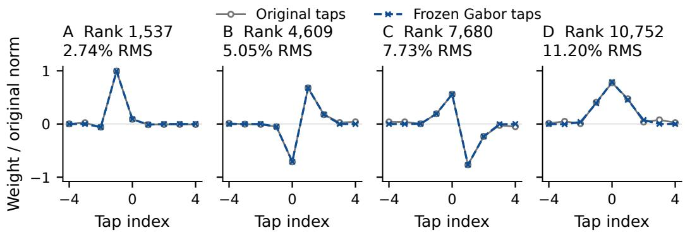
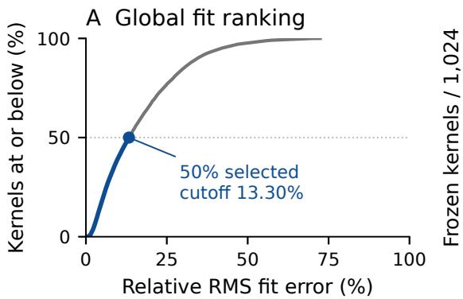
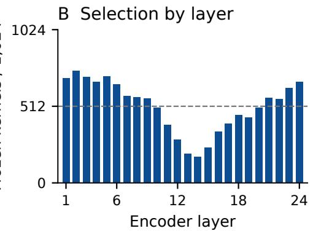

# Orukeet: Multilingual ASR with Frozen Gabor Kernels

Nathan Roll1,2 Irene Yi1,2 Bü¸sra Mar¸san1,2 Vianney Grenez1 Gabriel Stein4 Momcilo Mrkaic5 Pavle Padjin5 Vladimir Zeljkovic5 Calbert Graham1,3

へoruk 1Oruk AI

Stanford University 2Stanford University

UNIVERSITYOF CAMBRIDGE 3University of Cambridge

Hoid 5Hoid

## Abstract

Orukeet replaces half of an adapted Parakeet encoder’s temporal filters with 12,288 fitted Gabor kernels, freezes these replacements, and trains the remaining parameters on multilingual and multi-accent data. Final adaptation and checkpoint selection use LibriSpeech test-other. Across 20,146 FLEURS recordings in 25 languages, pooled word error rate (WER) falls from Parakeet’s 11.01% to Orukeet’s 9.85%, a 10.6% relative reduction. Orukeet has lower WER on 23 of the 25 languages. Orukeet outperforms Parakeet on 61 out of 74 tested splits, including LibriSpeech test-clean (1.46% vs. 1.53% WER), test-other (2.86% vs. 3.14%), and FLEURS English (3.82% vs. 4.28%). All comparisons decode the same audio with matched NeMo settings. The fitted kernels are stored as ordinary convolution weights, retaining Parakeet’s architecture and inference operators.

## 1 A fixed structure inside a learned recognizer

Orukeet fixes selected temporal filters to fitted Gabor functions and trains the rest of the recognizer. The starting architecture is NVIDIA’s Parakeet TDT 0.6B v3, a 25-language speech recognizer [2]. Its FastConformer encoder has 24 blocks, each containing 1,024 nine-tap temporal depthwise kernels, and a token-and-duration transducer (TDT) predicts text [5, 6]. We fit a separate Gabor function to each kernel in a multilingual adaptation of this model, replace the closest half, and hold the replacements fixed throughout subsequent training.

The choice is made from the learned filters themselves. A close fit keeps the initial change small; the remaining weights then accommodate that change. Figure 1 shows the stored taps at four predetermined ranks in the selected half. We compare the final checkpoint with stock Parakeet across read speech, accents and domains.

## 2 Fitting, freezing and adaptation

For a nine-tap kernel $w _ { i }$ , we fit a Gabor function at $t \in \{ - 4 , \ldots , 4 \}$ and rank its normalized squared error:

$$
g _ { i } ( t ) = A _ { i } \exp \left[ - \frac { ( t - \mu _ { i } ) ^ { 2 } } { 2 \sigma _ { i } ^ { 2 } } \right] \cos ( 2 \pi f _ { i } ( t - \mu _ { i } ) + \phi _ { i } ) , \qquad e _ { i } = \frac { \| w _ { i } - g _ { i } \| _ { 2 } ^ { 2 } } { \| w _ { i } \| _ { 2 } ^ { 2 } } .\tag{1}
$$

For fixed center $\mu ,$ width $\sigma$ and frequency $f ,$ linear least squares solves for the cosine and sine coefficients, giving amplitude A and phase ϕ. We evaluate 3,321 initial combinations and refine the best four plus the best in each frequency quartile in float64, with at most 160 evaluations per

Preprint.

  
Figure 1: Original kernels and fitted Gabor replacements at four predetermined ranks spanning the selected half. Each pair is divided by the original kernel’s $L _ { 2 }$ norm; percentages give relative RMS fit error. Markers show the nine stored taps, joined by straight lines.

refinement. The search bounds are $\mu \in [ - 4 , 4 ] , \sigma \in [ 0 . 2 5 , 3 6 ]$ and $f \in [ 1 0 ^ { - 6 }$ , 0.499999] cycles per encoder timestep. We keep the best evaluated fit and select the 12,288 lowest $e _ { i }$ globally, with layer and channel as deterministic tie-breaks. A replacement contains only the fitted function, with no offset or learned residual.

This ranking gives 175–748 fixed kernels per layer (Figure 2). The selected fits have 6.32% median relative RMS error, a 13.30% cutoff, and pooled squared error equal to 0.4244% of their original weight energy. The 50% constraint applies to temporal depthwise kernels. The materialized model retains 627,008,134 scalar parameters; 110,592 stored taps are fixed and 626,897,542 remain trainable. Analytic audio filters have also been used in learnable frontends [4, 7]; here, each function approximates a learned kernel inside the encoder.

  
Figure 2: Global fit ranking and its allocation across layers. Left: cumulative relative RMS error for all $^ { 2 4 , 5 7 6 }$ kernels, with the selected half in blue. Right: selected kernels in every encoder layer; the dashed line marks 512 kernels. Selection uses one global ranking, so each layer need not be half fixed.

Recovery trains the remaining network with transducer loss, teacher matching at block and convolution outputs, and token/duration distillation. Subsequent adaptation applies 4,035 AdamW updates with learning rate decaying from $1 0 ^ { - 6 } ~ \mathrm { t o } ~ 1 0 ^ { - 7 }$ . The final pass starts from those weights and performs 168 updates, with a 3% warmup and cosine decay from $5 \times 1 0 ^ { - 6 } t o 5 \times 1 0 ^ { - 7 }$ . AdamW uses (0.9, 0.98), weight decay 0.001 and gradient clipping at 1.0. Microbatches contain at most 16 utterances and 120 padded seconds; four microbatches form an update. Training uses BF16 on one A100 40 GB, with dropout, augmentation and dithering disabled.

The final pass makes three passes over the 2,939 LibriSpeech test-other recordings. Targets preserve the parent’s casing and punctuation while correcting reference words; all targets match the reference under the pinned English normalizer. Test-other also supplies the final checkpoint-selection comparison. All 651 remaining parameter tensors change. An independent audit of the exported checkpoint verifies that the 12,288 fitted kernels are byte-identical to the original fitted functions; tokenizer assets, signal processing buffers and batch-normalization statistics also remain unchanged.

## 3 Recognition across languages, accents and domains

Matched comparison. We restore stock Parakeet and the final Orukeet checkpoint independently and decode every recording with NeMo greedy-batch TDT, a ten-symbol limit, FP32 weights and BF16 CUDA autocast. Matrix-multiply TF32 is disabled. Both models receive identical mono 16 kHz audio, in the same duration-sorted batches; empty transcripts remain in the scores. We compare the resulting Orukeet checkpoint with pretrained Parakeet on the splits used throughout model development.

English uses a pinned text normalizer with spelling, number and compound maps. Other languages retain diacritics and use language-specific number normalization and compound-boundary alignment. Word errors count substitutions, deletions and insertions. For a set of recordings D, pooled WER is

$$
\mathrm { W E R } _ { \mathrm { p o o l } } ( { \mathcal D } ) = 1 0 0 \frac { \sum _ { u \in { \mathcal D } } ( S _ { u } + D _ { u } + I _ { u } ) } { \sum _ { u \in { \mathcal D } } N _ { u } } ,\tag{2}
$$

where $N _ { u }$ is the normalized reference word count. Compound alignment can change this denominator separately for each model. A language macro instead weights each language’s WER equally. Integer counts and independent full-partition rescoring reproduce every reported value.

Read speech in 25 languages. The complete comparison contains 25,705 recordings: both LibriSpeech test partitions [3] and FLEURS test speech in all 25 supported languages [1]. Table 1 reports every partition. FLEURS pooled WER is 11.01% for Parakeet and 9.85% for Orukeet; the corresponding language macros are 11.07% and 9.96%. Orukeet improves 25 of the 27 partitions, including 23 of 25 FLEURS languages.

Accents and domains. We also evaluate both models on a fixed sample of 12,006 recordings across 47 partitions and 25 languages. It includes EuroSpeech, GigaSpeechBench, Monsoon, Golos, NST, VoxPopuli and Lesbos: 256 recordings per partition and all 230 Lesbos recordings. The preceding 4,035-update adaptation includes 6,118 of these recordings. Greek and Italian EuroSpeech use the audited human transcript spans. Both checkpoints are decoded afresh and scored with the same pinned protocol as the read-speech comparison. Pooled WER is 16.72% versus 15.25%; for the 5,120 English recordings, it is 9.51% versus 8.84%. Orukeet improves 36 of 47 partitions, including 20 of 20 English partitions. Table 2 gives every score. We pool read speech and accent/domain recordings separately.

## 4 Checkpoint and reproduction

All recognition results in this report refer to the NeMo checkpoint with SHA-256 prefix 031c8ddab484. The file stores the configuration, tokenizer and materialized convolution weights. The fitting code retains each kernel’s analytic parameters; training uses a fixed parametrization to prevent updates to the selected rows. Inference uses ordinary depthwise convolution, with the same tensor shapes and operator counts as Parakeet.

The Orukeet repository and release checkpoint contain the source weights, training recipes, fitted functions, export audits and reproducible evaluation records. The metric bundle retains unrounded scores, per-record edit counts, manifest identities and checkpoint hashes. Code is MIT; weights and fits are CC BY-SA 4.0; metric records are CC BY 4.0. NVIDIA’s foundation attribution is retained.

Table 1: Complete LibriSpeech and FLEURS test partitions. WER and CER are percentages; bold identifies lower WER. The pooled FLEURS row sums errors and reference words over all 25 languages, including English. The macro row weights languages equally.
<table><tr><td>Benchmark</td><td>Clips</td><td colspan="2">Parakeet</td><td colspan="2">Orukeet</td></tr><tr><td></td><td></td><td>WER</td><td>CER</td><td>WER</td><td>CER</td></tr><tr><td>LibriSpeech test-clean</td><td>2,620</td><td>1.53</td><td>0.59</td><td>1.46</td><td>0.56</td></tr><tr><td>LibriSpeech test-other</td><td>2,939</td><td>3.14</td><td>1.32</td><td>2.86</td><td>1.19</td></tr><tr><td>FLEURS Bulgarian</td><td>658</td><td>11.92</td><td>3.84</td><td>10.37</td><td>3.34</td></tr><tr><td>FLEURS Croatian</td><td>914</td><td>11.29</td><td>3.53</td><td>10.20</td><td>3.67</td></tr><tr><td>FLEURS Czech</td><td>723</td><td>11.12</td><td>3.21</td><td>8.97</td><td>2.67</td></tr><tr><td>FLEURS Danish</td><td>930</td><td>17.19</td><td>6.31</td><td>14.88</td><td>5.31</td></tr><tr><td>FLEURS Dutch</td><td>364</td><td>6.40</td><td>2.28</td><td>5.60</td><td>1.93</td></tr><tr><td>FLEURS English</td><td>647</td><td>4.28</td><td>2.00</td><td>3.82</td><td>1.77</td></tr><tr><td>FLEURS Estonian</td><td>893</td><td>13.32</td><td>3.86</td><td>10.44</td><td>3.39</td></tr><tr><td>FLEURS Finnish</td><td>918</td><td>11.14</td><td>2.59</td><td>9.35</td><td>2.16</td></tr><tr><td>FLEURS French</td><td>676</td><td>4.69</td><td>1.68</td><td>5.01</td><td>1.70</td></tr><tr><td>FLEURS German</td><td>862</td><td>4.21</td><td>1.41</td><td>3.92</td><td>1.52</td></tr><tr><td>FLEURS Greek</td><td>650</td><td>21.07</td><td>9.01</td><td>30.81</td><td>9.18</td></tr><tr><td>FLEURS Hungarian</td><td>905</td><td>13.60</td><td>4.20</td><td>10.68</td><td>2.97</td></tr><tr><td>FLEURS Italian</td><td>865</td><td>2.43</td><td>0.79</td><td>2.09</td><td>0.76</td></tr><tr><td>FLEURS Latvian</td><td>851</td><td>21.78</td><td>5.43</td><td>17.41</td><td>4.21</td></tr><tr><td>FLEURS Lithuanian</td><td>986</td><td>20.95</td><td>5.56</td><td>16.55</td><td>4.27</td></tr><tr><td>FLEURS Maltese</td><td>926</td><td>19.22</td><td>6.19</td><td>15.60</td><td>5.08</td></tr><tr><td>FLEURS Polish</td><td>758</td><td>6.81</td><td>2.09</td><td>6.11</td><td>1.95</td></tr><tr><td>FLEURS Portuguese</td><td>919</td><td>4.49</td><td>1.98</td><td>3.73</td><td>1.63</td></tr><tr><td>FLEURS Romanian</td><td>883</td><td>11.44</td><td>3.86</td><td>9.34</td><td>3.07</td></tr><tr><td>FLEURS Russian</td><td>775</td><td>4.89</td><td>1.49</td><td>4.72</td><td>1.48</td></tr><tr><td>FLEURS Slovak</td><td>792</td><td>9.21</td><td>2.91</td><td>7.75</td><td>2.41</td></tr><tr><td>FLEURS Slovenian</td><td>834</td><td>22.62</td><td>7.70</td><td>22.11</td><td>8.28</td></tr><tr><td>FLEURS Spanish</td><td>908</td><td>3.22</td><td>1.28</td><td>2.75</td><td>1.04</td></tr><tr><td>FLEURS Swedish</td><td>759</td><td>13.38</td><td>4.26</td><td>11.36</td><td>3.45</td></tr><tr><td>FLEURS Ukrainian</td><td>750</td><td>6.00</td><td>1.74</td><td>5.39</td><td>1.60</td></tr><tr><td>FLEURS pooled</td><td>20,146</td><td>11.01</td><td>3.57</td><td>9.85</td><td>3.13</td></tr><tr><td>FLEURS language macro</td><td>20,146</td><td>11.07</td><td>3.57</td><td>9.96</td><td>3.15</td></tr></table>

## References

[1] Alexis Conneau, Min Ma, Simran Khanuja, et al. FLEURS: Few-shot learning evaluation of universal representations of speech. arXiv:2205.12446, 2022. URL https://arxiv.org/abs/2205.12446.

[2] NVIDIA. Parakeet tdt 0.6b v3: Model card, 2025. URL https://huggingface.co/nvidia/ parakeet-tdt-0.6b-v3. Accessed September 6, 2026.

[3] Vassil Panayotov, Guoguo Chen, Daniel Povey, and Sanjeev Khudanpur. LibriSpeech: An ASR corpus based on public domain audio books. In ICASSP, pages 5206–5210, 2015. doi: 10.1109/ICASSP.2015.7178964. URL https://www.openslr.org/12.

[4] Mirco Ravanelli and Yoshua Bengio. Speaker recognition from raw waveform with SincNet. In SLT, 2018. URL https://arxiv.org/abs/1808.00158.

[5] Dima Rekesh, Nithin Rao Koluguri, Samuel Kriman, et al. Fast conformer with linearly scalable attention for efficient speech recognition. arXiv:2305.05084, 2023. URL https://arxiv.org/abs/2305. 05084.

[6] Hainan Xu, Fei Jia, Somshubra Majumdar, He Huang, Shinji Watanabe, and Boris Ginsburg. Efficient sequence transduction by jointly predicting tokens and durations. In ICML, 2023. URL https:// proceedings.mlr.press/v202/xu23g.html.

[7] Neil Zeghidour, Olivier Teboul, Félix de Chaumont Quitry, and Marco Tagliasacchi. LEAF: A learnable frontend for audio classification. In ICLR, 2021. URL https://openreview.net/forum?id= jM76BCb6F9m.

Table 2: WER (%) on the fixed accent and domain sample. Each partition contains 256 recordings, except Lesbos (230). GSB denotes GigaSpeechBench; two-letter suffixes identify languages. Bold identifies lower WER. Both models use the same decoding and scoring protocol as Table 1.
<table><tr><td>Partition</td><td>Parakeet</td><td>Orukeet</td></tr><tr><td>EuroSpeech BG</td><td>14.22</td><td>13.04</td></tr><tr><td>EuroSpeech DE</td><td>13.40</td><td>11.14</td></tr><tr><td>EuroSpeech EL</td><td>25.83</td><td>26.35</td></tr><tr><td>EuroSpeech EN</td><td>24.40</td><td>23.77</td></tr><tr><td>EuroSpeech ET</td><td>34.67</td><td>25.33</td></tr><tr><td>EuroSpeech FI</td><td>16.61</td><td>15.20</td></tr><tr><td>EuroSpeech FR</td><td>19.42</td><td>14.28</td></tr><tr><td>EuroSpeech HR</td><td>12.93</td><td>12.56</td></tr><tr><td>EuroSpeech IT</td><td>10.95</td><td>12.32</td></tr><tr><td>EuroSpeech LT</td><td>38.44</td><td>33.10</td></tr><tr><td>EuroSpeech LV</td><td>57.18</td><td>42.14</td></tr><tr><td>EuroSpeech MT</td><td>36.83</td><td>36.15</td></tr><tr><td>EuroSpeech PT</td><td>23.08</td><td>23.81</td></tr><tr><td>EuroSpeech SK</td><td>17.29</td><td>14.91</td></tr><tr><td>EuroSpeech SL</td><td>48.43</td><td>50.23</td></tr><tr><td>EuroSpeech UK</td><td>13.65</td><td>14.25</td></tr><tr><td>GSB AI</td><td>8.71</td><td>7.98</td></tr><tr><td>GSB Chinese accent</td><td>14.49</td><td>13.56</td></tr><tr><td>GSB Filipino accent</td><td>13.30</td><td>12.79</td></tr><tr><td>GSB Indian accent</td><td>6.50</td><td>5.59</td></tr><tr><td>GSB Japanese accent</td><td>19.15</td><td>17.78</td></tr><tr><td>GSB Scottish accent</td><td>22.08</td><td>20.35</td></tr><tr><td>GSB Singaporean accent</td><td>13.89</td><td>12.86</td></tr><tr><td>GSB agriculture</td><td>6.20</td><td>5.84</td></tr></table>

<table><tr><td>Partition</td><td>Parakeet</td><td>Orukeet</td></tr><tr><td>GSB arts</td><td>5.47</td><td>4.87</td></tr><tr><td>GSB biology</td><td>3.67</td><td>3.31</td></tr><tr><td>GSB economics</td><td>7.05</td><td>6.57</td></tr><tr><td>GSB engineering</td><td>4.06</td><td>3.50</td></tr><tr><td>GSB entertainment</td><td>10.40</td><td>8.87</td></tr><tr><td>GSB finance</td><td>5.81</td><td>5.11</td></tr><tr><td>GSB humanities</td><td>7.98</td><td>7.47</td></tr><tr><td>GSB law</td><td>9.75</td><td>9.04</td></tr><tr><td>GSB medicine</td><td>3.49</td><td>3.18</td></tr><tr><td>GSB military</td><td>3.43</td><td>3.06</td></tr><tr><td>Golos crowd RU</td><td>2.84</td><td>2.92</td></tr><tr><td>Golos far-field RU</td><td>7.98</td><td>9.10</td></tr><tr><td>Lesbos Greek</td><td>94.78</td><td>93.55</td></tr><tr><td>Monsoon India</td><td>4.12</td><td>3.78</td></tr><tr><td>NST Danish</td><td>26.49</td><td>11.59</td></tr><tr><td>NST Swedish</td><td>16.57</td><td>12.36</td></tr><tr><td>VoxPopuli CS</td><td>7.32</td><td>7.39</td></tr><tr><td>VoxPopuli ES</td><td>6.07</td><td>6.20</td></tr><tr><td>VoxPopuli HU</td><td>12.00</td><td>11.05</td></tr><tr><td>VoxPopuli IT</td><td>11.37</td><td>11.82</td></tr><tr><td>VoxPopuli NL</td><td>9.50</td><td>9.56</td></tr><tr><td>VoxPopuli PL</td><td>6.48</td><td>6.24</td></tr><tr><td>VoxPopuli RO</td><td>11.48</td><td>11.20</td></tr></table>

<table><tr><td>Pooled comparison</td><td>Clips</td><td>Parakeet</td><td>Orukeet</td></tr><tr><td>All 47 partitions</td><td>12,006</td><td>16.72</td><td>15.25</td></tr><tr><td>All 20 English partitions</td><td>5,120</td><td>9.51</td><td>8.84</td></tr></table>