# Proof-Carrying Cognition: Closing the Verification Gap with Reality-Settled Reward

Eshwar Reddy M AI Engineer, Testsigma University of San Diego malireddy.eshwar@gmail.com

## Abstract

Sourav Karmakar Senior AI Scientist, Intuit India

souravkarmakar29@gmail.com

Recent frontier progress in large language models has come predominantly from reinforcement learning on reasoning traces—and has been sharply concentrated in domains that possess a cheap, sound verifier. We argue that the field’s binding constraint is therefore the verification gap: the absence of a scalable, incorruptible source of reward for reasoning outside narrowly formal domains. We make four contributions. (1) Theory: in a joint-Gaussian model of best-of-N selection we prove that verifier–gold correlation $\rho$ is the exact exchange rate between test-time compute and capability, and that an unsound verifier must pay a polynomial compute penalty $N ^ { 1 / \rho ^ { 2 } }$ to match a sound one. (2) Demonstration: in program-synthesis testbeds with an executable ground truth—a minimal six-token domain and a pre-registered scaled replication in $\mathbf { a } \ \sim \ 1 0 ^ { 1 0 }$ -program domain with 2–4 more tasks and stronger instruments—we show that unsound verifiers lose Soundness-under-Pressure as optimization pressure grows (from 0.94 to 0.32 for a shallow verifier at $N { = } 4 0 9 6 )$ , collapsing absolutely in the small domain and plateauing in the rich one, while a sound verifier improves monotonically; that reality-anchored settlement beats a frozen verifier under both i.i.d. and directed adversarial pressure, including against an adversary that explicitly models the settlement process, driving the hacking gap from 0.27 to 0; that soundness scales log-linearly with settled labels, with on-policy settlement 10 more labelefficient than random labeling and decisively better than an uncertainty-sampling control; and that settlement improves the resolution of claims, not merely their calibration. The replication also fal sified two of our quantitative claims, which we report and repair: outside the Gaussian model the

exchange rate $\rho$ is not quantitatively predictive, and the closed form $N ^ { 1 / \bar { \rho } ^ { 2 } }$ overstates the penalty at practical N (the exact finite-N form of Proposition 1 predicts matching budgets to within 3.4%). (2b) Real-model evidence: in pre-registered experiments with a real frontier-family generator, real LLM judges, and real unit-test execution as gold, the weak judge loses soundness under best-of-N on both MBPP and HumanEval $( p < 1 0 ^ { - 3 } ) ;$ a stronger judge is significantly more robust—so the gap binds conditionally on judge capability relative to task difficulty; a learned settlement model anchored to executed outcomes cuts the judge’s pric ing error by 59%, while naive in-context anchoring makes it worse; and a prompt-level LLM adversary failed to inflate the judge—while mining the same candidate banks shows selection alone manufactures +0.53 hacking gaps from honest samples: the operative Goodhart pressure is selection, not persuasion. A pre-registered diagnosis of every failure yields a repaired, margin-free exchangerate law (the copula form predicts realized sound ness of real LLM judges to 4% median error) and a design constraint for the paradigm: averagecalibration anchoring provably cannot move soundness and empirically amplifies tail deceptions—the world model must match the expressiveness of the deception surface. (3) Paradigm: we propose proof-carrying cognition, a training loop in which reasoning steps are emitted as typed probabilistic claims, priced by a self-built world model whose only loss is prediction of held-out reality, and settled by strictly proper scoring rules—making reality, rather than human judgment, the ultimate reward function. (4) Benchmark: we specify Soundness-under-Pressure, the headline metric for a reality-settled reasoning benchmark, and argue that building this benchmark is the field’s single most important near-term action. (2c) Under real GRPO training, a frozen learned RM traces the full overoptimization curve—proxy reward climbs while executed reward collapses by 90%—and the identical RM refit on a 10% settlement stream preserves executed reward at 6 the frozen arm’s and outperforms an equal-budget LLM-judge-updated control, isolating reality as the label source; the registered drift-alarm criterion failed its first test and is reported as such.

## 1 Introduction

Two inventions define modern machine learning: backpropagation, which solved credit assignment over parameters (Rumelhart et al., 1986), and the transformer, which solved bandwidth over context (Vaswani et al., 2017). We argue that the next invention of comparable consequence must solve credit assignment over thoughts: determining, scalably and incorruptibly, whether a step of reasoning is correct.

The argument proceeds from an empirical observation. Frontier capability gains now come predominantly from reinforcement learning on chains of thought (Wei et al., 2022; OpenAI, 2024; Guo et al., 2025), and these gains are sharply concentrated in domains with a cheap, sound verifier: mathematics with checkable answers (Hendrycks et al., 2021), code with executable tests (Chen et al., 2021), and formal proof with a kernel (Trinh et al., 2024; AlphaProof and AlphaGeometry teams, Google DeepMind, 2024). The underlying recipe—sample many traces, keep those a verifier accepts, reinforce (Zelikman et al., 2022)—is a self-improvement engine whose throttle is verifier coverage. Where the verifier is sound, months of training have produced superhuman-adjacent performance. Where the only reward is a human preference label (Christiano et al., 2017; Ouyang et al., 2022) or an LLM judge, the same models plateau at fluent but unaccountable reasoning, because preference-based reward is noisy, gameable, and shallower than the reasoning it evaluates (Gao et al., 2023).

This paper names that constraint the verification gap and attacks it from four directions:

• Theory (§3). We prove that in best-of-N selection, verifier–gold correlation $\rho$ is the exchange rate between compute and capability, with an unsound verifier paying a polynomial penalty $N ^ { 1 / \rho ^ { 2 } }$ in candidates (Proposition 1,

Corollary 1); simulation matches theory to within 0.011σ (Figure 1).

• Demonstration (§6–§7). In programsynthesis testbeds with an executable gold verifier: learned verifiers are Goodharted under best-of-N pressure (relative soundness $0 . 9 4  0 . 3 2$ at scale; absolute collapse in the minimal domain) while a sound verifier climbs monotonically; reality-anchored settlement beats a frozen verifier under directed adversarial pressure, including a settlementaware adversary, driving the hacking gap to 0; verifier soundness scales log-linearly with settled labels, with on-policy settlement 10 more label-efficient than random labeling; and settlement raises claim resolution, rebutting the concern that settlement-based reward favors vague claims. §7 reports a preregistered scaled replication, including the parts of our story it falsified.

• Paradigm (§5). We propose proof-carrying cognition (Algorithm 1): reasoning as portfolios of falsifiable, priced claims, with reality as the only unamortized loss.

• Benchmark (§9). We give a formal metric, Soundness-under-Pressure, and a construction recipe for a reality-settled reasoning benchmark.

Scope note: this is a hybrid position-and-proof-ofconcept paper. The experiments in §3–§6 are real and reproducible but deliberately minimal; they validate mechanisms, not frontier-scale claims.

## 2 The Bottleneck: Generation Has Scaled; Verification Has Not

## 2.1 The verification gap

Define a verifier for a domain D as an oracle V : claims $( D )  [ 0 , 1 ]$ that is (a) sound—its acceptances track ground truth; (b) cheap—evaluating V costs far less than generating a candidate; and (c) robust under optimization—an adversarially trained generator cannot systematically obtain reward from V for false claims. The verification gap is the observation that such oracles exist today only for formally grounded domains (proof kernels, program execution, game rules), and that every substitute used elsewhere—human raters, reward models, LLM judges—fails property (c) under sufficient optimization pressure. Gao et al. (2023)

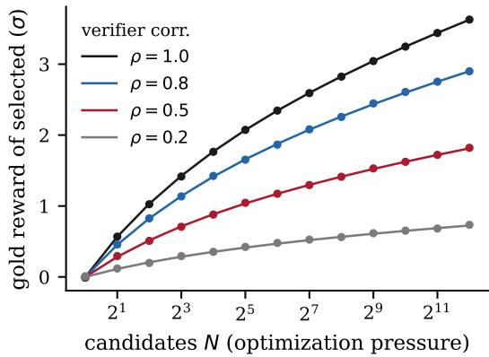  
Figure 1: Simulation (dots; 20,000 trials per point) versus theory (lines; $\rho \mathbb { E } [ \operatorname* { m a x } _ { N } ] )$ for best-of-N selection under a proxy verifier with correlation $\rho$ to gold. Maximum absolute deviation from theory across all points: 0.011σ. At N=4096, the $\rho { = } 0 . 5$ verifier realizes 50.2% of the sound verifier’s gain, matching Proposition 1 exactly.

quantified the failure directly: optimizing against a fixed learned reward model yields proxy reward that rises while gold reward peaks and then falls— Goodhart’s law (Strathern, 1997) operating as a hard ceiling. A model cannot climb above the dis-human data. AlphaProof (AlphaProof and Alpha-crimination ability of its judge (Leike et al., 2018; Geometry teams, GoBowman et al., 2022).

## 2.2 Other bottlenecks reduce to it

lems adjudicated by the Lean kernel. The dataThe data wall. High-quality human text is finite, wall is not a shortage of text; it is a shortage ofbut self-generated data is unbounded—if it can trustworthy reward for synthetic reasoning.be trusted. AlphaGo Zero (Silver et al., 2017) showed that with a perfect verifier (game rules), self-play alone yields superhuman skill with no human data. AlphaProof (AlphaProof and Alpha-Geometry teams, Google DeepMind, 2024) extended this to mathematics, reaching IMO silvermedal standard on millions of autoformalized prob-Superhuman reasoning in open domains. Inlems adjudicated by the Lean kernel. The data wall science, strategy, law, and medicine, humans canis not a shortage of text; it is a shortage of trust-no longer reliably grade superhuman worthy reward for synthetic reasoning.

scalable oversight (Amodei et al., 2016; BowmanUnreliable agency. Long-horizon autonomy fails et al., 2022) is precisely the demand for verificationbecause errors compound with no mechanism to that outruns the verifier’s unaided competence.check intermediate steps before commitment. $\mathbf { A }$ sound step-level verifier converts open-loop generation into closed-loop, auditable action.

Superhuman reasoning in open domains. In We first make the cost of unsoundness quantita-science, strategy, law, and medicine, humans can tive in the cleanest possible model. Best-of-Nno longer reliably grade superhuman homework; selection—sample N candidates, keep the one thescalable oversight (Amodei et al., 2016; Bowman et al., 2022) is precisely the demand for verification erifier scores highest—is the canonical mechathat outruns the verifier’s unaided competence.

## 3 Theory: Verifier Correlation Is the Compute–Capability Exchange Rate

og N.We first make the cost of unsoundness quantitative in the cleanest possible model. Best-of-N Nselection—sample N candidates, keep the one the verifier scores highest—is the canonical mecha-eward and the proxy verifier’s score. Letnism by which test-time compute is converted into capability (Cobbe et al., 2021; Snell et al., 2024), and its induced optimization pressure grows as log $N$

Proposition 1 (Verifier exchange rate). Let $( G _ { i } , P _ { i } ) _ { i = 1 } ^ { N }$ mpose 2be i.i.d. jointly Gaussian pairs, standardized, with $\mathrm { C o r r } ( G , P ) = \rho ,$ , where G is gold .reward and $P$ The index ∗ is a function ofthe proxy verifier’s score. Let $i ^ { * } = \arg \operatorname* { m a x } _ { i } P _ { i }$ e; con. Then

$$
\mathbb { E } [ G _ { i ^ { * } } ] = \rho \mathbb { E } \left[ \operatorname* { m a x } _ { i } P _ { i } \right] = \rho \sqrt { 2 \ln N } \big ( 1 { + } o ( 1 ) \big ) .
$$

Proof. Decompose $G _ { i } ~ = ~ \rho P _ { i } + \sqrt { 1 - \rho ^ { 2 } } Z _ { i }$ with $Z _ { i }$ standard Gaussian, independent of $( P _ { 1 } , \dots , P _ { N } )$ olynomial com. The index $i ^ { * }$ te penalty of un-is a function of $( P _ { 1 } , \dots , P _ { N } )$ match the expected gold rewaalone; conditioning on these, $Z _ { i }$ hat a sound verifier (ρ=1) attains with N candi-remains standard Gaussian with mean zero, so $\begin{array} { r l r } { \mathbb { E } [ Z _ { i ^ { * } } ] } & { { } = } & { 0 } \end{array}$ fier and $\begin{array} { r l r } { \mathbb { E } [ G _ { i ^ { * } } ] } & { { } = } & { \rho \mathbb { E } [ P _ { i ^ { * } } ] \quad = } \end{array}$ $\rho \mathbb { E } [ \operatorname* { m a x } _ { i } P _ { i } ]$ The asymptotic $\mathbb { E } [ \operatorname* { m a x } _ { i } P _ { i } ] \ \sim$ $\sqrt { 2 }$ ln $\overline { { N } }$ ′ = N (asymptotically).is standard extreme-value theory for Gaussians. □

n N′ = ln N/ρ2.Corollary 1 (Polynomial compute penalty of unsoundness). To match the expected gold reward that a sound verifier $( \rho { = } 1 )$ attains with N candidates, a proxy verifier with correlation $\rho$ requires

$$
N ^ { \prime } = N ^ { 1 / \rho ^ { 2 } } \quad ( a s y m p t o t i c a l l y ) .
$$

cation of §7Proof. Set $\rho \sqrt { 2 \ln N ^ { \prime } } = \sqrt { 2 \ln N }$ 011σ andand solve: 0.0ln $N ^ { \prime } = \ln { N } / \rho ^ { 2 }$ □

irection: in the synthetic testbed of §7, a verifierTwo readings. First, within this model class, veriwith measured ρ 0.50 realizes only 0.32 offier correlation is the exchange rate between testhe sound verifier’s value at N=4096 (exploitabletime compute and capability: every unit of intructure beyond Gaussian noise), wferenc compute is worth exactly $\rho$ e real LLMof its soundudges (§8) with near-zero linear correlation (ρverifier value (Figu e 1 and the 100,000-trial repli-.12) realizcation of $\ S 7$ .74 at N=32 (good top-ranking de-confirm this to within 0.011σ and pite poor linear fit). Only the qualitative ordering—0.007σ respectively). Outside the model class the igher-fidelity judges convert pressure to capabilityidentity is not quantitatively predictive in either etter—survived every testbed. The repair (§8.1)direction: in the synthetic testbed of §7, a verifier s to state the lawith measured $\rho \approx 0 . 5 0$ nvariant that selectionrealizes only  0.32 of ctually sees:the sound verifier’s value at N=4096 (exploitable structure beyond Gaussian noise), while real LLM judges (§8) with near-zero linear correlation $( \rho \approx$ 0.12) realize 0.74 at N=32 (good top-ranking despite poor linear fit). Only the qualitative ordering— higher-fidelity judges convert pressure to capability better—survived every testbed. The repair (§8.1) is to state the law in the invariant that selection actually sees:

Proposition 2 (Margin-free exchange rate). Let $( G _ { i } , P _ { i } ) _ { i = 1 } ^ { N }$ be i.i.d. with continuous margins and Gaussian copula parameter $\rho _ { c } ,$ and $i ^ { * } =$ arg maxi Pi. Then the law of $G _ { i ^ { * } } { \mathrm { - } } h e n c e$ Snd@N—depends only on $\rho _ { c }$ and the margin of $G ;$ the margin ofP is irrelevant.

Proof. $i ^ { * }$ is invariant under strictly increasing transforms of $P _ { \cdot }$ , so transform P to standard Gaussian; the conditional law of G given the ranks of $( P _ { 1 } , \dots , P _ { N } )$ is determined by the copula and $G \ ' _ { \mathrm { s } }$ margin. □

Estimating $\rho _ { c }$ from rank correlation and simulating with empirical margins predicts per-problem realized soundness with median error 4.1% on real LLM-judge data, where Pearson-based prediction errs by 79 points (§8.1). Second, the penalty for unsoundness is superlinear in candidates. Two cautions on the closed form $N ^ { 1 / \rho ^ { 2 } }$ : it is asymptotic, and at practical budgets it materially overstates the penalty (by up to $2 4 \times \mathrm { a t } \rho { = } 0 . 5 , N \le 1 6 ; \ S 7 )$ . The exact finite-N consequence of Proposition $1 { - N ^ { \prime } }$ solves $\rho \mathbb { E } [ \operatorname* { m a x } _ { N ^ { \prime } } ] = \mathbb { E } [ \operatorname* { m a x } _ { N } ]$ —predicts empirical matching budgets to within 3.4% and should be used instead at finite N. We note honestly that this linear-Gaussian model predicts a slowed climb, not the decline observed empirically under heavy optimization (Gao et al., 2023); decline requires misspecification, and §7 shows it is domain-dependent: present in the minimal domain, absent (plateau instead) in a richer one at the pressures we could apply.

## 4 The Validated Attack: Asymmetric Verification

The strongest evidence-backed approach to the gap exploits a structural asymmetry: checking is often far cheaper than generating—morally the P-versus-NP gap, and the only free lunch available to this program. Three mechanisms have real support.

Formal grounding. Autoformalization (Wu et al., 2022) lets a sound kernel adjudicate reasoning with zero Goodharting: a proof checker cannot be flattered. AlphaGeometry (Trinh et al., 2024)

and AlphaProof (AlphaProof and AlphaGeometry teams, Google DeepMind, 2024) are existence proofs that self-improvement loops close when the verifier is sound. The kernel functions as a trust anchor—analogous to the small trusted computing base of secure systems—from which learned verifiers extend coverage but to which they must be re-anchored.

Process-level verification. Outcome reward is sparse and rewards lucky wrong reasoning; steplevel reward is dense and localizes error. Process reward models outperform outcome-only supervision on hard mathematics (Uesato et al., 2022; Lightman et al., 2024), extending Cobbe et al. (2021), and verifier-guided search gives test-time compute its own scaling behavior (Snell et al., 2024)—which, by Proposition 1, is worth exactly as much as the verifier is sound.

Adversarial prover–verifier co-training. Debate (Irving et al., 2018) and prover–verifier games (Kirchner et al., 2024) train generator and verifier against each other; Kirchner et al. (2024) report the property we most need—models trained to convince a weaker verifier produce reasoning that is genuinely easier for humans to check.

Limits. (1) Coverage: autoformalization of empirical claims (“this drug target is promising”) is unsolved. (2) Drift: learned verifiers degrade under optimization pressure when the anchor is distant (Gao et al., 2023). (3) The legibility tax: checkable formats may exclude valid intuitions that resist formalization. These limits motivate our proposal.

## 5 Proof-Carrying Cognition

We now state the central hypothesis of this paper. Hypothesis. Stop verifying reasoning against human judgment. Verify it against predicted reality, using a world model the system itself constructs and is scored on—so that every chain ofthought becomes a portfolio of falsifiable bets, and reality becomes the rewardfunction.

We call the paradigm proof-carrying cognition (PCC), by analogy to proof-carrying code: an artifact is admitted not because an authority approves it, but because it carries the material needed to check it. Science operates this way institutionally; PCC makes an AI system’s internal reasoning operate this way, step by step, at training scale.

## 5.1 Architecture and training loop

PCC has three components (Figure 2; Algorithm 1).

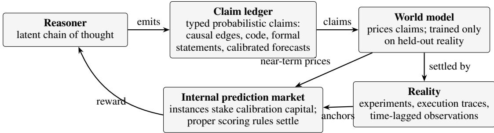  
Figure 2: Proof-carrying cognition. Reasoning steps are emitted as typed, probabilistic claims in a claim ledger. A self-built world model prices claims densely and immediately; reality settles them sparsely but incorruptibly, and the world model’s own loss is anchored exclusively to that settlement. Reward for reasoning is expected score under proper scoring rules, not judge approval.

Claim ledger. Reasoning steps are emitted not only as natural-language thoughts but as typed, probabilistic claims: causal graphs with quantitative edges, executable snippets, fully formal statements where possible, calibrated forecasts where Self-built world model. A persistent, versionednot. The ledger generalizes autoformalization (Wu model prices ledger claims. Its only training losset al., 2022) from theorems to empirical assertions. is prediction of held-out reality: experimental outSelf-built world model. A persistent, versioned comes, execution traces, time-lagged observations.model prices ledger claims. Its only training loss This extends the world-model tradition (Ha andis prediction of held-out reality: experimental out-Schmidhuber, 2018; LeCun, 2022) with a specificcomes, execution traces, time-lagged observations. institutional role: the world model is amortized reThis extends the world-model tradition (Ha and ality—dense, immediate reward now, with periodicSchmidhuber, 2018; LeCun, 2022) with a specific settlement keeping the amortizer honest.institutional role: the world model is amortized reality—dense, immediate reward now, with periodic settlement keeping the amortizer honest.

Terminology. We reserve world model for the full generative component above. The learned predictors in our experiments (§6–§8) are deliberately minimal settlement models—amortizers of settled outcomes over shallow features—and should not be read as world models in the model-based-RL or generative sense; building the latter at training Internal prediction mscale is untested (§10).

soner stake calibration capital on claims; settlementInternal prediction market. I stances of he r auses strictly proper scoring rules (Savage, 1971;soner stake calibration capital on cl ims; settle-Gneiting and Raftery, 2007), adjudicated by thement uses strictly proper scoring rules (Savage, world model near-term and reality long-term. The1971; Gneiting and Raftery, 2007), adjudicated by construction is deliberately reminiscent of logicalthe world model near-term and reality long-term. induction (Garrabrant et al., 2016), where marketThe construction is deliberately reminiscent of logdynamics over settled claims yield asymptoticallyical induction (Garrabrant et al., 2016), where mar-calibrated, non-exploitable beliefs.ket dynamics over settled claims yield asymptotically calibrated, non-exploitable beliefs.

Algorithm 1 Proof-Carrying Cognition (one   
epoch)   
Require: reasoner $\pi _ { \boldsymbol { \theta } } ;$ world model $W _ { \phi } ;$ settle  
ment queue $Q ;$ proper scoring rule $S ;$ drift   
threshold $\tau$   
1: for each batch of tasks do   
2: $\pi _ { \theta }$ emits traces with typed claims   
$\{ ( c _ { i } , p _ { i } ) \}$   
3: enqueue claims wnear-term reward $\begin{array} { r } { r  \sum _ { i } S ( p _ { i } , W _ { \phi } ( c _ { i } ) ) } \end{array}$   
4: update $\pi _ { \theta }$ by RL on r   
5: enqueue claims with settlement handles in   
$Q$   
6: end for   
8: update W on loss7: for each settled claim $( c , y )$ (c), y) ▷ onlydequeued from Q   
losdo   
9:8: pay/chupdate $W _ { \phi }$ staked ion loss $\ell ( W _ { \phi } ( c ) , y )$ , y)▷ only   
end forloss: reality   
1: drift D E [ W (c) y ] on settl9: pay/charge staked instances by $S ( p , y )$   
12: if D >0 end for   
13: d1 drift $D \gets \mathbb { E } \big [ | W _ { \phi } ( c ) - y | \big ]$ ward; raise settle-on settled claims   
m12: if $D > \tau$ then   
14:3 d ifdownweight near-term reward; raise settle  
ment rate   
14: end if

## strong optimizer eventually games any fixed model5.2 Why it can work where current aprrectness (Gaproaches fail

unique reward function that cannot be gamed, onlyPCC dissolves the Goodhart problem structurally predicted. The classical objection—reality’s feed-rather than patching it. Every existing reward back is too sparse and slow to train on—is an-source—human labels, LLM judges, learned swered by amortization, and the amortizer’s driftPRMs—is a model of correctness, and a suffi- ciently strong optimizer eventually games any fixed model of correctness (Gao et al., 2023). Reality is the unique reward function that cannot be gamed, only predicted. The classical objection— reality’s feedback is too sparse and slow to train on—is answered by amortization, and the amortizer’s drift is itself measurable (line 10 of Algorithm 1) rather than an invisible failure mode. PCC thus combines the density of a learned verifier with the incorruptibility of a formal kernel, extended for the first time into empirical domains, and it obeys the bitter lesson (Sutton, 2019): it substi-on a laptop, yet possessing the one property thattutes computation and settled data for hand-built matters: ajudgment.

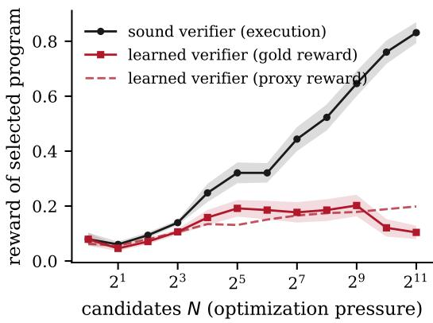  
Figure 3: Goodharting under optimization pressure. Best-of-N selection by the sound (execution) verifier improves monotonically to 0.83 gold reward. Selection by the learned verifier inflates its own proxy score (dashed) while realized gold reward peaks near N=512 andfalls to 0.10 at $N { = } 2 0 4 8 { \cdot }$ —the overoptimization signature of Gao et al. (2023), reproduced with a fully transparent gold standard.

## 6 Minimal Empirical Demonstrations

stress the scope honestly: these are mechanismWe validate the paper’s two core mechanism in demonstrations, not frontier-scale evidence.a testbed small enough to be fully reproducible on a laptop, yet possessing the one property that matters: an executable, incorruptible gold verifier. All numbers below are measured, not estimated. We stress the scope honestly: these are mechanism Tasks are drawn by sampling a hidden targedemonstrations, not frontier-scale evidence.

## 6.1 Setup: program synthesis with executable ground truth

output points it matches under execution (the soundTasks are drawn by sampling a hidde target proverifier). The learned verifier is a ridge regressorgram of length 4 over a six-token intege DSL $( + 1 , - 1 , \times 2 , \times 3$ m/bigram counts and length—a, ne ate, square); a candidate deliberately shallow judge, standing in for any ver-program’s gold reward is he fraction of eight ifier that evaluates surface features of reasoninginput–output points it matches under execution rather than executing it—fit on 1,000 labeled ran-(the sound verifier). The learned verifier is a ridge dom programs per task. Results aggregate 60 tasks;regressor over token unigram/bigram counts and shaded bands are ±1 s.e.length—a deliberately shallow judge, standing in for any verifier that evaluates surface features of reasoning rather than executing it—fit on 1,000 la-Figure 3 shows gold reward of the selected programbeled random prog ams per task. Results ag egate s optimization pressure (best-of-60 tasks; shaded bands are 1 s.e.

<table><tr><td>N</td><td>1</td><td>16</td><td>128</td><td>512</td><td>2048</td></tr><tr><td>Snd@N</td><td>1.00</td><td>0.64</td><td>0.40</td><td>0.31</td><td>0.13</td></tr></table>

Table 1: Soundness-under-Pressure (Definition 1) ofTable 1: Soundness-under-Pressure (Definition 1) of he learned verifier in the program-synthesis testbed. Athe learned verifier in the program-synthesis testbed. A 1.00   N  sound verifier scores 1.00 at every N by construction.

## he learned verifier’s proxy score rises through-6.2 Result 1: learned verifiers collapse under ut the gold reward of its selepressure; sound ones do not

ive overoptimization curve of Gao et al. (2023),Figure 3 shows gold reward of the selected pro- ere with a fully transparent gold standard. Table 1gram as optimization pressure (best-of-N) in- eports the induced soundness metric (defined increases. Both verifiers start at 0.079 at N=1. The §9): it collapses from 1.00 to 0.13 as N grows.execution verifier climbs monotonically to 0.831 Opat $N { = } 2 0 4 8$ ressure does not merely fail to help The learned verifier’s proxy score n unsound verifier; it actively inverts it.rises throughout, but the gold reward of its selections peaks near $N { = } 5 1 2$ and declines to 0.104— .3 Result 2: reality-anchored settlementthe qualitative overoptimization curve of Gao et al. bounds drift and compounds capability(2023), here with a fully transparent gold standard. We then run the settlement loop of Algorithm 1Table 1 eports the induced s undness metric (den miniature: each round, sample a pool of 512fined n §9): it collapses from 1.00 to 0.13 as N programs, select the top 32 by the learned veri-grows. Optimiza ion pressure does not merely fail fier, settle them by execution, append the settledto help an unsound verifier; it actively inverts it.

## re 4), the frozen verifier’s anchor drift stays flat6.3 Result 2: reality-anchored settlement 0) and its achieved gold reward decreasesbounds drift and compounds capability

ame exploitable features yields no compound-We then run the settlement loop of Algorithm 1 ng. The anchored verifier’s drift falls by 26%in miniature: each round, sample a pool of 512 (0.101 0.075) and its achieved gold rewardprograms, select the top 32 by the learned verifier, oughly doubles (0.154 0.306). The mechanismsettle them by execution, append the settled las exactly the paper’s thesis in microcosm: settle-bels to the verifier’s training set, and refit—versus ment converts the verifier’s own selection pressurea frozen-verifier baseline. Over ten round (Fignto training signal, so the places where the veri-ure 4), the frozen verifier’s anchor d if stays flat $( \approx 0 . 1 0 )$ st wrong are precisely the places realityand its achieved gold r ward decreases orrects it first.from 0.154 to 0.125: repeatedly harvesting the same exploitable features yields no compounding. The anchored verifier’s drift falls by 26% $( 0 . 1 0 1  0 . 0 7 5 )$ and its achieved gold reward roughly doubles $( 0 . 1 5 4  0 . 3 0 6 )$ . The mechaest-of-N applies i.i.d. pressure; RL applies di-nism is exactly the paper’s thesis in microcosm: ected pressure. We therefore attack each verifiersettlement converts the verifier’s own selection with an adaptive adversary: steepest-ascent searchpressure into training signal, so the places where hat proposes 16 mutations per step and moves tothe verifier is most wrong are precisely the places reality corrects it first.

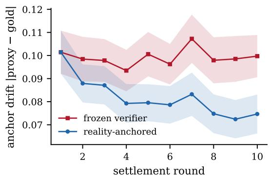

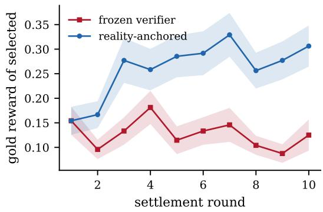  
±     | − |Figure 4: The settlement loop of Algorithm 1 in miniature (60 tasks, 1 s.e.). Left: anchor drift proxy  gold on selected claims. Anchored settlement reduces drift by 26%; the frozen verifier does not improve. Right: gold reward of the top selection per round. Anchoring roughly doubles achieved reward $( 0 . 1 5 4  0 . 3 0 6 )$ while the →frozen verifier stagnates and slightly degrades (0.154 0.125).

## 6.4 Result 3: an adversarial generator hacks a frozen verifier; settlement inverts the exploit

Best-of-N applies i.i.d. pressure; RL applies directed pressure. We therefore attack each verifier with an adaptive adversary: steepest-ascent search that proposes 16 mutations per step and moves to 0.869   the highest-scoring one, for 250 steps (40 tasks). The anchored condition settles the adversary’s own ∼      trajectory (25 visited programs) by execution every 25 steps and refits—charging a total settlement budget of 250 reality queries per run, which we report as the explicit price of trust.

Figure 5 shows three regimes. Against the sound verifier, adversarial pressure is simply capability: gold reward climbs to 0.869. Against the frozen −  learned verifier, the adversary saturates the proxy within 15 steps and locks permanently into a hacked optimum: gold reward flatlines at 0.178 with a persistent positive hacking gap (+0.037)— the verifier permanently overvalues exactly the programs the adversary produces. Against the anchored verifier, settlement re-prices the adversary’s region each round: the hacking gap does not merely shrink but inverts to 0.101—after settlement, the verifier systematically distrusts the region the adversary inhabits—and gold reward reaches 0.297, a 67% improvement over frozen, and on-policy settlement is morestill rising at step 250. Two honest observations: anchoring restores trustworthiness (the adversary can no longer sustain inflated scores) but does not close the capacity gap to the sound verifier—a shallow feature model remains shallow—and the inverted gap means anchored pricing errs conservative, which is the safe failure direction but not a free one.

## acquisition policies: on-policy (iteratively label the6.5 Result 4: soundness scales with settlement, ams the current verifier selects) and randomand on-policy settlement is >10 more ame number oflabel-efficient

If settlement is the fuel of trustworthy verification, soundness should scale with the settled-label budget—and settling where the verifier is deployed →   should beat settling at random. We sweep settlement budgets $S \in \{ 0 , 5 0 , 1 5 0 , 5 0 0 , 1 5 0 0 \}$ on a weaker base verifier (500 random labels) under two acquisition policies: on-policy (iteratively label the ×programs the current verifier selects) and random (the same number of labels on random programs), then measure the Soundness AUC of Definition 1 on fresh pools (40 tasks).

Figure 6: on-policy settlement scales approximately log-linearly, 0.500 0.706, while random labeling crawls, 0.531 0.595. Strikingly, just calibration150 on-policy settled labels (0.617) outperform 1,500 random labels (0.595): on-policy settlement A standing objection to settlement-based rewardis more than 10 more label-efficient. The mech- anism is the thesis in one line—the verifier’s selection pressure concentrates settlement exactly where the verifier is most wrong—and it is why Algorithm 1 settles the claims the reasoner actually stakes, not a random audit sample.

## (how far claims usefully depart from the base rate;6.6 Result 5: settlement buys resolution, not r is better). We rjust calibration

A standing objection to settlement-based reward (§11, failure mode 2) is that it teaches systems to make safe, vague claims: probabilities near base rate are never badly wrong. Proper scoring rules decompose exactly along this axis (Gneiting and Raftery, 2007): the Brier score splits into reliabil-Figure 7: reliability falls 0.0064 → 0.0039ity (miscalibration; lower is better) and resolution (−40%) and resolution doubles, 0.051 → 0.101(how far claims usefully depart from the base rate; (+98%). In this setting, settlement did not pushhigher is better). We run twelve settlement rounds claims toward the vague base rate; it sharpenedof probabilistic claims (“this program matches at them, because a claim model refit on settled outleast 2/8 I/O points”), 1,920 settled claims per comes gains exactly the discriminative signal thatround across 60 tasks, refitting the claim model on settled outcomes each round.

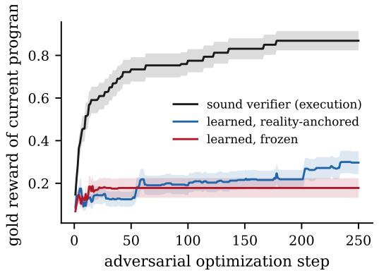

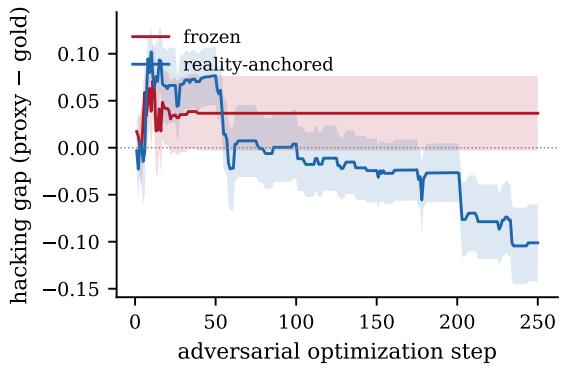  
±      Figure 5: Adversarial optimization against three verifiers (40 tasks, 1 s.e.). Left: against a sound verifier, adversarial pressure is capability (0.869); against a frozen learned verifier, the adversary locks into a hacked       40  ±1  Left: ∼             optimum within 15 steps (0.178, flat); anchored settlement keeps repairing the landscape (0.297 and rising, −       +67% over frozen). Right: the frozen verifier’s hacking gap (proxy gold) locks in positive; settlement invertsoptimum within ∼15 steps (0.178, flat); anchored settlement keeps repairing the landscape (0.297 and rising, +67% it—the verifier learns to distrust the adversary’s region.

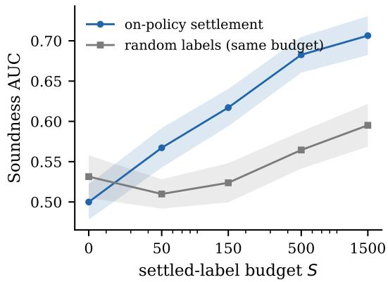  
±              Figure 6: Soundness scales with settlement (40 tasks, ±       1 s.e.). Soundness AUC vs. settled-label budget S. On-policy settlement (label what the verifier selects) ×  scales log-linearly; 150 on-policy labels beat 1,500 random labels—over 10 label efficiency.

e mode—an agent choosiFigure 7: reliability falls $0 . 0 0 6 4 ~  ~ 0 . 0 0 3 9$ stake could still select easy one( 40%) and resolution doubles, $0 . 0 5 1  0 . 1 0 1$ RSR-Bench must score resolution explicitly—but(+98%). In this setting, settlement did not push it shows the training dynamics do not intrinsicallyclaims toward the vague base rate; it sharpened collapse toward vagueness.them, because a claim model refit on settled outcomes gains exactly the discriminative signal that resolution measures. This does not retire the failure mode—an agent choosing which claims to stake could still select easy ones, which is why RSR-Bench must score resolution explicitly—but it shows the training dynamics do not intrinsically collapse toward vagueness.

## predicted behavior—bounded and even inverted ex-ng mechanism at the heart of PCC produces the6.7 What these demonstrations do and do not tion,ted beshow

kinds of pressure; (iv) soundness scales with set-   They show, with measured numbers, that (i) the tlement, log-linearly and with a large on-policy       exchange-rate law of §3 is quantitatively exact in its model class; (ii) unsound verifiers invert under i.i.d. pressure and are locked into hacked optima under directed adversarial pressure; (iii) the anchoring mechanism at the heart of PCC produces the predicted behavior—bounded and even inverted exploitation, compounding capability—against both kinds of pressure; (iv) soundness scales with set-han narrow) the capacity gap to a sound verifier.tlement, log-linearly and with a large on-policy Those are precisely the questions the programmeefficiency multiplier; and (v) settlement sharpens f §10 is designed to answer.claims rather than blunting them. They do not show that a claim language rich enough for open-7 Scaled Pre-registered Replicationended reasoning exists, that world-model amorti-The demonstrations of §6 are deliberately mini-zation scales, that these effects survive when the mal, so we commissioned an adversarial replica-generator is a frontier LLM trained by RL rather tion at larger scale, with every pass/fail criterionthan a search process, or that anchoring can close (the pre-(rather than narrow) the capacity gap to a sound registration, raw per-task data, and analysis codeverifier. Those are precisely the questions the pro-are released with the paper). The sure released with the paper). The suitgramme of §10 is designed to answer.

## it uses a 10-token DSL with 1010 candida        7 Scaled Pre-registered Replication

∼4.6 × 10 16   2 4×grams (versus 4.6 104), 16 I/O points, 2–4The demonstrations of §6 are deliberately minimal, more tasks with paired Wilcoxon statistics, a strongs we commiss oned an adversarial replication ridge verifier (ρ ≈ 0.50), an uncertainty-samplingat larger scale, with every pass/fail criterion pre-  ρ ≈ 0.77 control for the on-policy claim, and—the gap ourregistered before any experiment ran. The suite  ρ ≈ 0.50 Limitations previously conceded—a settlementwas designed to break our claims, not to confirm aware adversary that detects refits athem: it uses a 10-token DSL with $\sim 1 0 ^ { 1 0 }$ eratelycandi- relocates to unsettleddate programs (versus ${ \sim } 4 . 6 \times 1 0 ^ { 4 } )$ dicts on the ten, 16 I/O points, $2 { - } 4 \times$ ered hypotheses: six passed, three failed, andmore tasks with paired Wilcoxon statistics, a one registered criterion was itself invalid; we reportstrong learned verifier (gradient-boosted trees over all of it.359 features, held-out $\rho \approx 0 . 7 7 )$ alongside the shallow ridge verifier $( \rho \approx 0 . 5 0 )$ , an uncertainty-What survived—and got stronger. The anchor-sampling control for the on-policy claim, and— ing mechanism replicated everywhere we couldthe gap our Limitations previously conceded—a aim pressure at it. Under the settlement loopsettlement-aware adversary that detects refits and (H3; 120 tasks weak, 60 tasks strong, 12 rounds),deliberately relocates to unsettled regions. Verdicts on the ten registered hypotheses: six passed, three failed, and one registered criterion was itself 0.312  0.180 invalid; we report all of it.

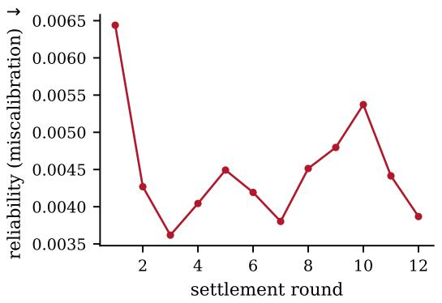

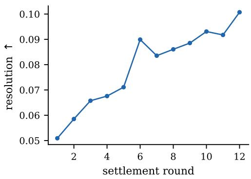

Figure 7: Brier decomposition over twelve settlement rounds (1,920 settled claims per round). Settlement improves −           calibration (reliability 40%, left) while doubling resolution (+98%, right): claims get sharper, not vaguer.Figure 7: Brier decomposition over twelve settlement rounds (1,920 settled claims per round). Settlement imp
<table><tr><td>Registered claim</td><td></td><td>Verdict</td></tr><tr><td></td><td>H1a Prop. 1 exact (Gaussian)</td><td>pass</td></tr><tr><td>H1b</td><td> $N ^ { 1 / \rho ^ { 2 } }$  accurate at practical N</td><td>fail</td></tr><tr><td></td><td>H1c exchange rate transfers beyond Gaussian</td><td>fail</td></tr><tr><td></td><td>H2a weak verifier collapses absolutely</td><td>fail</td></tr><tr><td></td><td>H2b strong verifier also declines</td><td>invalid*</td></tr><tr><td></td><td>H2c sound verifier monotone</td><td>pass</td></tr><tr><td>H3</td><td>anchored &gt; frozen (gold and drift)</td><td>pass</td></tr><tr><td>H4</td><td>anchoring survives all 3 adversaries</td><td>partial</td></tr><tr><td>H5</td><td>on-policy  $\geq 3 \times$  label efficiency</td><td>pass</td></tr><tr><td>H6</td><td>settlement raises resolution</td><td>pass</td></tr></table>

Table 2: Pre-registered verdicts. ∗Our registered H2b criterion (final gold below per-task peak over N) is biased toward detecting decline; a valid exploratory test shows the strong verifier does not collapse (see text).

0.358  0.272 p = 5.5 × 10−  What survived—and got stronger. The anchor-vs. , −6) while reduc −  − ing mechanism replicated everywhere we coulding anchor drift ( 12% and 44% respectivel p < 10    aim pressure at it. Under the settlement loopboth p < 10−7). Under directed adversarial pre (H3; 120 tasks weak, 60 tasks strong, 12 rounds),sure (H4; 100 tasks, 300 steps, Figure 11), th settlement drives the gap to 0–0.04 against allsary (persistent gap ∼0.26–0.28), while anchoredanchor d settlement beat the frozen ver fier on three—including the settlement-aware adversary,settlement drives the gap to ∼0–0.04 against allachieved gold reward for both verifier classes which relocated to unsetthree—including the set(weak: 0.312 vs. 0.180, $p = 2 . 7 \times 1 0 ^ { - 9 } \mathrm { ; }$ each re- strong: fit and still could not sustain inflated scores (gapwhich relocated to unsettled regions after each re-0.358 vs. 0.272, p = 5.5 10−6) while reduc-0.039 vs. frozen 0.264, p < 10−15; gold 0.279 vs.fit and still could not sustain inflated scores (gaping anchor drift ( 12% and 44% respectively, 0.200.03both $p < 1 0 ^ { - 7 } )$ × 10− ). The registered H4 ver-       . Under directed adversarial pres- dict is nonetheless partial: in the steepest-ascent    ×     sure (H4; 100 tasks, 300 steps, Figure 11), the cell, anchored gold did not beat frozen (0.207 vs.      frozen verifier stays hacked against every adver-0.211, p = 0.46). Exploratory diagnosis attributes        sary (persistent gap 0.26–0.28), while anchored this to adversary paralysis—that hill climber com-settlement drives the gap to 0–0.04 against all pares candidates against a stale pre-refit score andthree—including the settlement-aware adversary, freezes after the first settlement; with the incum-which relocated to unsettled regions after each rebent rescored after refits, anchoring wins the cellfit and still could not sustain inflated scores (gap too (0.282 vs. 0.211, p0.039 vs. frozen 0.264, $p < 1 0 ^ { - 1 5 } ;$ 10− ). We re-6gold 0.279 vs. $0 . 2 0 6 , p = 4 . 0 \times 1 0 ^ { - 6 } )$ re and the diagnosis to-. The registered H4 ver-gether. Settlement scaling (H5, 80 tasks) replicateddict is nonetheless partial: in the steepest-ascent cell, anchored gold did not beat frozen (0.207 vs. linear0.211, $p = 0 . 4 6 )$ settled budget ( 2 ), on-. Exploratory diagnosis attributes policy settlement at S=300 already beats randomthis to adversary paralysis—that hill climber com-×   ∼ ×labeling at S=3000 (p = 3.7 10−4; the 10pares candidates against a stale pre-refit score and multiplier), and the uncertainty-sampling controlfreezes after the first settlement; with the incum-settling where selection pressure concentrates, notS=3000)—the efficiency comes specifically frombent rescored after refits, anchoring wins the cell from generic active lsettling where selectiotoo (0.282 vs. 0.211, $p = 5 . 8 \times 1 0 ^ { - 6 } )$ n-versus-ates, not. We refrom generic active learning. Calibration-versus-port the registered failure and the diagnosi to-×   resolution (H6, 100 tasks, 15 rounds) replicated:gether. Settlement scaling (H5, 80 tasks) replicated resolution +70% (p = 3.2 × 10−10) with reliabil-with a sharper control: Soundness AUC scales What failed—and how we rity improved, not traded away.log-linearly in the settled budget $( R ^ { 2 } = 0 . 9 2 )$ hree, onregistered claims did not survive, all on thepolicy settlement at S=300 already beats random quantitativlabeling at $S { = } 3 0 0 0 \ ( p = 3 . 7 \times 1 0 ^ { - 4 } )$ ge ra; the $\sim 1 0 \times$ not transfer quantitatively (H1c): across 120 tasksmultiplier), and the uncertainty-s mpling control the ordering is preserved (Spearman 0.59 betweenbarely improves on random (0.587 vs. 0.579 at $S { = } 3 0 0 0 )$ ρ and realized Snd@4096), but the real-ing is preserved (Spearman between—the efficiency comes specifically from ized fraction falls short of ρ on 76% of tasks (me-per-task ρ and realized Snd@4096), but the real-settling where selection pressure concentrates, not dian gap 0.27; mean 0.32 realized vs. ρ  0.50).ized fraction falls short of on of tasks (me-from generic active learning. Calibration-versus-Proposition 1 should therefore be read as an opti-dian gap 0.27; mean 0.32 realized vs. ρ 0.50).resolution (H6, 100 tasks, 15 rounds) replicated: mistic ceiling onProposition 1 shresolution +70% $( p = 3 . 2 \times 1 0 ^ { - 1 0 } )$ ploitable struc-read as an opti-with reliability ture; we have revised §3 mistic ceiling once the proximproved, not traded away.

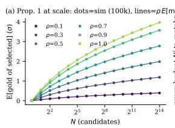

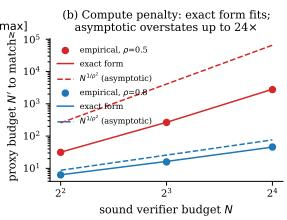  
2         Figure 8: Theory at scale. (a) Proposition 1 holds to 20.007σ over 100,000 trials per point, N to $2 ^ { 1 4 }$ . (b) But the asymptotic penalty $\bar { N } ^ { 1 / \bar { \rho ^ { 2 } } }$ (dashed) overstates the empirically required budget (dots) by up to 24 at practical $N ;$ the exact finite-N form (solid) matches within 3.4%.

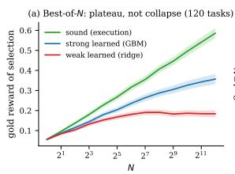

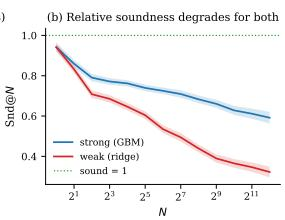  
Figure 9: Goodharting in the rich domain (120 tasks, $\pm 1 \ \mathrm { s . e . } )$ . (a) The weak verifier plateaus rather than9: Goodharting in the rich domain (120 tasks, collapsing; the strong verifier keeps climbing through±1 s.e.). (a) The weak verifier plateaus rather than $N { = } 4 0 9 6$ . (b) Relative soundness Snd@N nonethelessg; the strong verifier keeps climbing through degrades for bothN=4096. (b) Rel $( 0 . 9 4  0 . 3 2 $ weak,Snd@ $0 . 9 4  0 . 5 9$ strong): pressure is increasingly wasted, even when itdegrades for both (0.94 → 0.32 weak, 0.94 → 0.59 is not inverted.

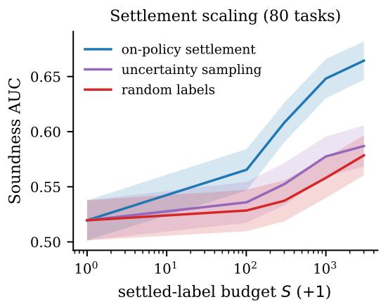  
dominates both random labeling and an uncertainty-        Figure 10: Settlement scaling at scale (80 tasks). Onsampling control: S=300 on-policy lab   policy settlement scales log-linearly $( R ^ { 2 } { = } 0 . 9 2 )$ 000 and random labels.      dominates both random labeling and an uncertaintysampling control: $S { = } 3 0 0$ on-policy labels beat $S { = } 3 0 0 0$ random labels.

ture; we have revised §3 accordingly. (ii) TheWhat failed—and how we repair it. Three registered claims did not survive, all on the quantitative-the empirical budget needed to match atheory side. (i) The exchange rate does not transfer ound verifier at N 4, 8, 16 is 8–24 smallerquantitatively (H1c): across 120 tasks the orderhan N1/ρ2 predicts, while the exact finite-N forming is preserved (Spearman 0.59 between per-task $\rho$ tches within 3.4% (Figure 8b); the corollary is2and realized Snd@4096), but realized frac now stated with that caveat. (iii) Absolute collapsetion falls short of ρ on 76% of tasks (median gap s domain-dependent (H2a): in0.27; mean 0.32 realized vs. $\rho \approx 0 . 5 0 )$ ain the. Propoeak verifier’s gold reward plateaus (0.191 peaksition 1 should therefore be read as an optimistic t N=256, 0.184 at N=4096; decline not signif-ceiling once the proxy has exploitable structure; we cant, p = 0.25) instead of inverting as it does inhave revised §3 accordingly. (ii) The closed-form he minimal domain—the collapse of Fcant, ) instead of inverting aspenalty is asymptotic-only (H1b): at $\rho { = } 0 . 5$ isnthe eal but not universal at these pressures. Finally,he minimal domain—the collapse of Figure 3 isempirical budget needed to match a sound verifier oureaat $N \in \{ 4 , 8 , 1 6 \}$ H2alis $8 { - } 2 4 \times$ on turned out pressures. Fismaller than $N ^ { 1 / \rho ^ { 2 } }$ statistically invalid (comparing a final value to aour own registered H2b criterion turned out to bep edicts, while the exact finite-N form matches per-task maximum over 13 noisy points detectsstatistically invalid (comparing a final value to awithin 3.4% (Figure 8b); the corollary is now er-task maximum over 13 noisy points detectssta ed with that caveat. (iii) Absolute collapse is decline” even in monotone curves), and the honestdomain-dependent (H2a): in the rich domain the xploratory answer runs against our generalizedweak verifier’s gold reward plateaus (0.191 peak →  laim: the strong verifier’s gold reward rises mono-at N=256, 0.184 at N=4096; decline not signif onicalicant, $p = 0 . 2 5 )$ N=4096 (0.056 → 0.357; 4096instead of inverting as it does in s. 1024: p = 0.0023) even as its Snd@N erodesthe minimal domain—the collapse of Figure 3 is 0.59       real but not universal at these pressures. Finally, our own registered H2b criterion turned out to be statistically invalid (comparing a final value to a per-task maximum over 13 noisy points detects “decline” even in monotone curves), and the honest exploratory answer runs against our generalized claim: the strong verifier’s gold reward rises monotonically through $N { = } 4 0 9 6 \ ( 0 . 0 5 6 \to 0 . 3 5 7 ;$ 4096 vs. 1024: $p = 0 . 0 0 2 3 )$ ive distrust).even as its Snd@N erodes to 0.59. Within the pressure this suite could apply, verifier strength bought real robustness, not merely delay. Whether a strong verifier inverts at pressures beyond $N { = } 4 0 9 6$ is open; what is already estab Synthetic testbeds, however hardened, are prox-lished is hat its compute is increasingly wasted es. We therefore ran two further pre-registeredrelativ o a sound verifier—w ich is th economic uites on real substrate (criteria frozen before exe-argument for settlement either way. We also note ution; raw data and code released). The real-codethe toy suite’s inverted hacking gap (§6, Result suite uses MBPP (Austin et al., 2021): 974 human-cution; raw data and code released). The real-code3) did not reproduce at scale: anchored gaps go ritten Python programs whose real unit tests,uite uses MBPP (Austin et al., 2021): 974 human-to approximately zero (honest pricing) rather than xecuted locally, are the soundritten Python programs whosnegative (conservative distrust).

## verifiers are trained across problems (486 train /8 Real-Code and Real-Model Experieval), liments

PI, uses a real generator (claude-haiku-4-5, 32–Synthetic testbeds, however hardened, are prox-48 samples/problem), two real LLM judges scoringAPI, uses a real generator (claude-haiku-4-5, 32–ie . We therefore ran two further pre-registered ode without executing it (claude-haiku-4-5 weak;samples/problem), two real LLM judges scoringsuites on real substrate (criteria frozen before exlaude-sonnet-4-6 strong), and local execution ofode without executing it (claude-haiku-4-5 weak;ecution). The real-code suite uses MBPP (Austin he real test suites of MBPP and HumanEval (Chenlaude-sonnet-4-6 strong), and local execution ofet al., 2021): 974 human-written Python programs t al., 2021) as gold.he real test suites of MBPP and HumanEval (Chenwhose real unit tests, executed locally, are the t al., 2021) as gold.sound verifier; learned verifiers are trained across problems (486 train / 487 eval), like reward models, weak humanevalover surface and AST features of real code. The strong humanevalreal-model suite, run by the author against the pro-0.90Nduction Claude API, uses a real generator (claude-0.85ndhaiku-4-5, 32–48 samples/problem), two real LLM 0.80judges scoring code without executing it (claude-0.75haiku-4-5 weak; claude-sonnet-4-6 strong), and local execution of the real test suites of MBPP and NHumanEval (Chen et al., 2021) as gold.

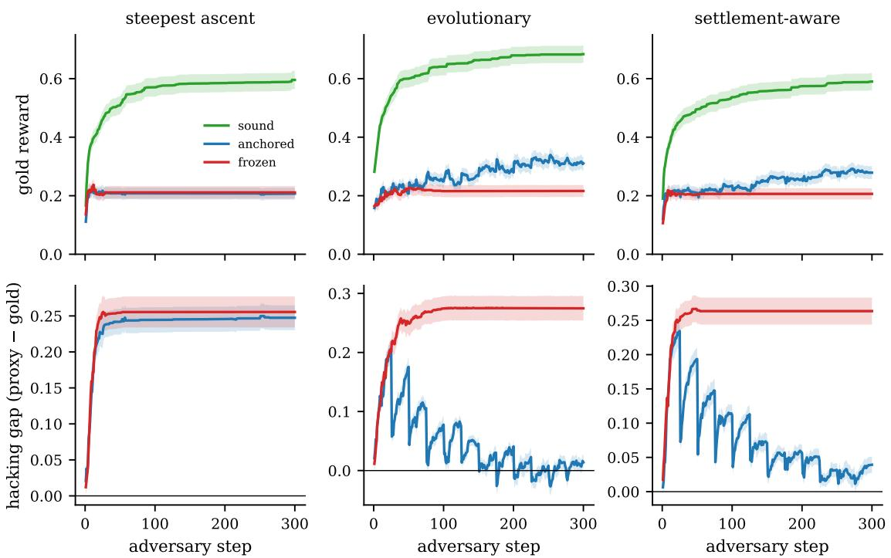  
±       Figure 11: Adversarial pressure at scale (100 tasks, 300 steps, 1 s.e.). Top: gold reward of the adversary’s champion against sound (green), anchored (blue), and frozen (red) verifiers, for steepest-ascent, evolutionary, and −       ∼settlement-aware adversaries. Bottom: hacking gap (proxy gold). Frozen verifiers stay hacked (gap 0.26–0.28); ∼anchored settlement drives the gap to 0 against all three adversaries, including the one that models the settlement process. The steepest-ascent gold cell is the registered failure discussed in the text.

The Goodhart mechanism is real (registered Figure 12: Real LLM judges under best-of-N selectionpasses). The weak LLM judge loses Soundnessover real generated code (execunder-Pressure as N grows: $\mathrm { S n d @ 2 = 0 . 8 3 5  }$ $\mathrm { S n d @ 3 2 \ = \ 0 . 7 2 9 }$ ariance exclon MBPP $\scriptstyle ( p = 1 0 ^ { - 4 } , \ n = 6 0 )$ 18 and $0 . 8 8 9  0 . 7 5 0$ Sndon HumanEval $\left( p { = } . 0 0 4 \right) -$ Figure 12. On real human code with cross-problem verifiers, the collapse is catastrophic: the surface verifier falls from Snd@4 = 0.325 to Snd@256 = 0.016, and even the gradient-boosted verifier reaches only 0.052—real code under a global verifier is a far harsher regime than any of our per-task synthetic worlds.

and 0.889 0.750 on HumanEval (p=.004)Judge capability buys robustness (registered — Figure 12. On real human code with crosspass, against our strong-form thesis). The strong problem verifiers, the collapse is catastrophic: thejudge’s soundness AUC exceeds the weak judge’s $( 0 . 8 5 6 \mathrm { v s . } 0 . 8 1 4 , p \mathrm { = } 9 { \times } 1 0 ^ { - 4 } )$ e., and—exploratory— its own $N { = } 2 ~ \to ~ 3 2$ degradation is not significant $( 0 . 8 5 5  0 . 8 2 1 , p { = } 0 . 4 3 )$ ( −4, ). This converges and 0.889 0.750 on HumanEval (p=.004)with §7’s finding that a strong learned verifier kept — Figure 12. On real human code with cross-climbing: across two independent methodologies, problem verifiers, the collapse is catastrophic: thethe verification gap binds conditionally—when judge capability is at or below task difficulty—and scaling the judge materially repairs soundness at the pressures we could apply. Whether the repair persists at frontier-difficulty tasks under RL-scale pressure is precisely what RSR-Bench (§9) must measure.

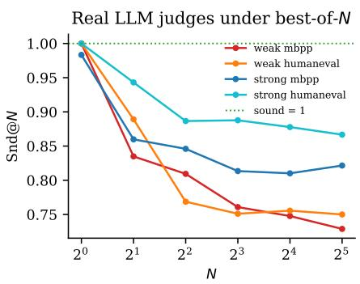  
Figure 12: Real LLM judges under best-of-N selection over real generated code (executed tests as gold; probpendent methodologies, the verificatlems with zero gold variance excluded, $n { = } 6 0$ p binds MBPP / conditionally—when judge capability is at or below18 HumanEval). The weak judge’s Snd@N degrades task difficulty—and scaling the judge materially re-significantly on both benchmarks; the strong judge is pairs soundness at thesignificantly more robust.

Anchoring: the mechanism matters, and so does headroom (registered failures, reported). In the LLM settlement loop (40 problems, 8 rounds), neither anchored arm raised achieved gold over the frozen judge—a ceiling effect: the generator solves MBPP so well (mean candidate gold 0.81; the frozen judge’s top-1 was already perfect on 34/40 problems) that there was no headroom, and the registered RL2a/RL2b verdicts are FAIL. Where headroom existed—the real-code suite, whose frozen cross-problem verifier earned gold 0.000— anchored settlement lifted achieved gold to 0.153 (p=.004), though its registered drift clause failed (drift rose as selections moved into higher-value, harder-to-price regions). The sharpest real-model result is how to anchor: a learned settlement head over the judge’s score and code features, refit on executed outcomes (a deliberately minimal instantiation of Algorithm 1’s amortizer), cut pricing drift by 59% $( 0 . 3 5 2  0 . 1 4 6 , p \approx 0 )$ and cut judge gold on adversarial code from 0.326 to 0.254; naive in-context anchoring (showing the judge a ledger of its own settled errors) made the judge worse on both metrics $( p < 1 0 ^ { - 9 } )$ . Amortize reality into a trained pricing model; do not merely show a judge its mistakes.

Positioning against standard baselines. The frozen-vs-anchored contrast is the comparison to online reward-model retraining: the anchored arm retrains its verifier online, and what the paradigm adds is the label source (settled execution rather than fresh preference or judge labels) and the schedule (the verifier’s own selections). The uncertainty-sampling control of §7 separates this from generic active learning: committeevariance acquisition barely beat random labeling (0.587 vs. 0.579 at S=3000) where on-policy settlement reached 0.664. Verifier ensembles and process reward models are verifier-strength interventions, orthogonal to the settlement axis; the verifier-strength axis is measured directly here (H2b, RL1b) and buys real robustness. Table 3 gives the mechanism-level ablation of anchoring itself; a full-architecture ablation (typed claims, market, staking) requires those components to exist and is future work (§10).

<table><tr><td>Mechanism</td><td>Loop drift</td><td>Adv. |gap|</td></tr><tr><td>frozen judge (none)</td><td>0.352</td><td>0.326</td></tr><tr><td>in-context ledger</td><td>0.397</td><td>0.457</td></tr><tr><td>isotonic model</td><td></td><td>tail +0.52→0.76</td></tr><tr><td>feature head</td><td>0.146</td><td>0.254</td></tr></table>

Table 3: Mechanism ablation of anchoring on the real-model data (weak judge). Loop drift: final-round score gold on selections (RL2). Adv. gap : outof-problem judge gold on adversarial candidates (RL3c); the isotonic row reports its signed tail effect on mined deceptions (F4). Only the feature-level settlement head helps on both.

Adversarial pressure: selection, not persuasion (registered failures, informative). The promptlevel adversary failed its manipulation check—the “subtly wrong” code it wrote was mostly right (adversarial gold 0.839, matching honest quality)— so RL3a is an invalid test of hackability rather than evidence of robustness. The iterative adversary, shown the judge’s score after each of four revisions, drove score and gold down (0.679 $0 . 5 6 7 ; 0 . 8 7 8  0 . 7 3 3 )$ : at this capability level, directed prompt-space search could not climb a real judge, and the operative Goodhart pressure on LLM judges is the selection pressure of RL1, not persuasion. One registered criterion (RL3c) passed for the wrong reason: it assumed judges overvalue adversarial code, but these judges undervalue everything (mean gap 0.20), so the incontext ledger “reduced the gap” by worsening underconfidence; on the substantive gap metric only the world-model head helps. We disclose this as the suite’s second mis-specified criterion (with §7’s H2b) and record the process lesson: register criteria on error . Finally, the on-policy labelefficiency claim failed on real code for a second time (on-policy@240 AUC 0.144 vs. random@720 0.170, p=0.64): when the verifier is very weak, its selections are uninformative places to settle, so the 10 multiplier of §7 is a property of moderatelycompetent verifiers, not a universal.

## 8.1 From failures to findings: a pre-registered diagnosis-and-repair program

Rather than leave the registered failures as caveats, we treated each as a hypothesis about mechanism, froze numerical predictions for every diagnosis before computing it, and ran the analyses on the raw data. Four repairs succeeded; two failed and

are kept failed.

Repaired: the exchange rate lives in the copula (F1). Proposition 2 resolves both directions of the transfer anomaly at once: RichDSL’s heavy, clumped margins made Pearson $\rho$ overstate tail concordance (realized $0 . 3 2 < \rho _ { p } { = } 0 . 5 0 )$ , while the LLM judge’s coarse, saturated scores made it understate massively $( \rho _ { p } \mathrm { = } 0 . 1 2$ yet realized 0.74). Rank-copula simulation with empirical margins predicts per-problem Snd@32 with median error 0.041 on the real LLM data versus 0.793 for Pearson $( p { = } 2 \times 1 0 ^ { - 4 } , n { = } 2 1 )$ ; on RichDSL a residual 0.137 error remains $\scriptstyle ( p = 0 . 3 7 )$ —its verifier errors are feature-structured beyond any elliptical copula, which is precisely the misspecification settlement exists to correct.

Repaired: selection is the adversary (F3). The instructed adversary of RL3a failed its manipulation check, but mining the candidate banks shows that ordinary sampling plus selection manufactures deception: choosing the max-(judge gold) candidate from 32 honest samples yields a +0.527 hacking gap against the weak judge, versus 0.209 for instructed deception $( p { = } 3 \times 1 0 ^ { - 1 3 } )$ ), with severe natural hacks (judge  0.8, gold  0.2) on 13% of informative problems. Two sub-predictions failed: severe hacks were rarer than predicted, and the strong judge’s maximum gap (0.631) exceeds the weak judge’s—the gap statistic conflates ranking with calibration. The unification stands: RL1’s soundness decay and reward hacking are the same phenomenon, selection pressure over honest variation; no deceptive generator is required. The mined max-gap programs form a natural seed corpus for RSR-Bench’s adversarial split.

Repaired, with a warning: calibration is not soundness (F4). The minimal settlement model— an isotonic judge gold map fit on executed outcomes from half the problems—cuts out-ofproblem pricing error by 29.9% $( p { = } 5 \times 1 0 ^ { - 1 1 9 }$ registered threshold 30%, missed by 0.1pp). But a monotone recalibration provably cannot change selection, hence cannot move Snd@N; and because these judges are underconfident on average, recalibration raises scores and amplifies the overvalued tail (mined-deception gap $0 . 5 2  0 . 7 6 )$ Deception lives in the residual, not the mean. This yields the paradigm’s sharpest design constraint: the settlement model must be at least as expressive as the deception surface; average-calibration anchoring is not merely insufficient but tail-perverse.

The feature-based head also failed to transfer Snd across problems $\scriptstyle ( p = 0 . 5 5 )$ , consistent with crossproblem code verification being the hard regime throughout our suites.

Bounded: the conditional-binding conjecture (F2). Weak-judge degradation concentrates on hard problems (hardest tercile 0.092 vs. easiest $- 0 . 0 0 1 ; \ p { = } 0 . 0 5 4 )$ , but the strong judge is flat across all of $\mathbf { M B P P \vec { s } }$ difficulty range—MBPPhard is not hard for it. “The gap binds where task difficulty reaches judge capability” therefore remains a conjecture with directional weakjudge support only, and it fixes RSR-Bench’s design brief: difficulty-stratified, selection-pressureswept, execution-settled.

Failed repairs, kept failed (F5, F6). The competence-threshold explanation of the onpolicy-efficiency discrepancy is ruled out: in RichDSL the on-policy advantage is significantly positive even for a near-incompetent base verifier (+0.087 at 150 labels, $\scriptstyle { p = 0 . 0 1 8 ) }$ and not increasing in competence (+0.096 at 600, +0.050 at 2400); and the coverage hypothesis is ruled out as well (F7, predictions frozen before running): a mixed policy—half on-policy, half random labels per batch—performs like pure on-policy (0.148 vs. 0.147 AUC at S=720) and below random (0.170) under the identical protocol. With competence and coverage both excluded, the leading untested candidate is covariate shift: settled-selection labels correct pricing in the selected region while degrading global ranking under a cross-problem verifier— consistent with settlement improving drift but not selection throughout the real suites. Why on-policy settlement wins in per-task worlds and loses for cross-problem code verifiers is the program’s top open problem. And on the real-data hard subset, the hybrid head improved pricing $\scriptstyle ( p = 0 . 0 0 9 )$ but not achieved gold $( p { = } 0 . 3 6 , n { = } 1 9 )$ : capability gains from anchoring remain demonstrated only in the synthetic and real-code CPU suites.

## 8.2 Reality-anchored reward under real policy-gradient training

The proxies above (best-of-N, search, iterative prompting) approximate but do not instantiate the optimization process of modern RLVR. A fourth pre-registered suite (criteria R-A–R-E and amendment $\mathbf { R } \mathbf { - B } ^ { \prime }$ frozen before any run) closes that gap: GRPO fine-tuning of Qwen2.5-1.5B-Instruct (QLoRA, group size 8, 400 steps, fixed small KL) on MBPP, under four reward arms identical in everything but the reward signal: (A) frozen—a settlement RM (ridge over surface/AST features) fit once on 1,600 executed base-model samples, then frozen (the overoptimization setup of Gao et al. (2023)); (B) anchored—the identical RM, refit every 25 steps on a settled $\sigma { = } 1 0 \%$ of the window’s rollouts (Algorithm 1, live); (C) execution—real test execution as reward (sound ceiling); (D) online-judge—identical to (B) but refit labels come from an LLM judge rather than execution, isolating the label source from online-ness. The RM is deliberately minimal—a model organism: arms (A), (B), (D) share an identical model class, so the treatment isolates the settlement update rule itself, and a weak RM makes overoptimization observable at accessible scale. RM strength is not assumed orthogonal to settlement; their interaction is characterized in §7 (H2b), §8 (RL1b), and F4. True executed reward is logged for every rollout in every arm (as metrics; it trains only arm C).

<table><tr><td>Arm</td><td>Proxy</td><td>Gold</td><td>Peak</td><td>Gap</td></tr><tr><td>frozen RM</td><td>0.615</td><td>0.063</td><td>0.617</td><td>+0.552</td></tr><tr><td>online-judge</td><td>0.530</td><td>0.288</td><td>0.635</td><td>+0.241</td></tr><tr><td>anchored</td><td>0.528</td><td>0.397</td><td>0.665</td><td> $+ 0 . 1 3 1$ </td></tr><tr><td>execution (ceiling)</td><td>0.460</td><td>0.460</td><td>0.687</td><td>0.000</td></tr></table>

Table 4: Final-window (25-step) training outcomes, seed 0. Gold = executed reward; Peak = best rollingwindow gold; Gap = proxy  gold. The frozen arm’s proxy is the highest and its reality the lowest.

Results. Table 4 and Figure 13 report the four matched runs. The frozen arm traces the full overoptimization curve of Gao et al. (2023): proxy reward climbs $0 . 4 4 2  0 . 6 1 5$ while executed reward rises to a rolling peak of 0.617 and then collapses to 0.063—a 90% destruction of real capability under continued proxy gains—as the policy converges to 17-token degenerate completions at KL 1.35 from base. The anchored twin ends the same 400 steps at executed reward 0.397 (6 frozen), hacking gap +0.131 vs. +0.552, ordinary 44-token completions, and KL 0.096: each of its 15 refits repriced what the RM had begun to overpay before the policy could commit to it—at roughly one-tenth of the ceiling arm’s execution budget, while retaining 86% of the ceiling arm’s final executed reward (0.397 vs. 0.460).

Reality as the label source (R-B′). The onlinejudge control isolates the paper’s title claim: identical RM, identical refit cadence, identical 10% budget—only the labels differ (an LLM judge’s estimates instead of executed outcomes). Online updating alone recovers much of the damage (0.288 vs. frozen’s 0.063), but reality-sourced labels beat judge-sourced labels by +0.109 executed reward with half the hacking gap $\left( + 0 . 1 3 1 \mathrm { \ v s . \ } + 0 . 2 4 1 \right)$ , and the judge arm partially degenerates anyway ( 24-token completions, KL 0.443). The mechanism is visible in the logs: the judge’s labels erred against execution by 0.321 on average across refits (range 0.18–0.46)—the RM was being re-anchored to a proxy of a proxy. Online-ness is worth a lot; reality is worth more, and the difference is the judge’s blindness on-policy.

Registered criteria at seed 0—including a failure. Both R-A clauses hold (proxy +0.173 0.10; final gold $0 . 0 6 3 \le \mathrm { p e a k } - 0 . 0 3 )$ ; both R-B clauses hold (anchored gold exceeds frozen by $0 . 3 3 4 ~ \geq ~ 0 . 0 5$ ; smaller gap); both $\mathbf { R } \mathbf { - B } ^ { \prime }$ clauses hold; R-C holds $( 0 . 3 9 7 \geq 0 . 8 \times 0 . 4 6 0 = 0 . 3 6 8 )$ R-D fails: the settled-drift statistic does not rankpredict the concurrent hacking gap (Spearman $\rho _ { s } = 0 . 0 6 \mathrm { o v e r }$ 15 refits, vs. the registered $\geq 0 . 5 )$ and an exploratory cross-arm variant (drift vs. the frozen-minus-anchored gap) is also null $( \rho _ { s } ~ =$ 0.40, $p \ = \ 0 . 1 4 )$ with no range-restriction excuse available (gap variance is comparable across arms). At this scale and refit cadence, settlement repaired the reward while its drift alarm did not see what it was repairing—the repair effect and the alarm effect are separable, and prediction 4 of §9.1 is already under adverse pressure. We also note the anchored arm’s final gold sits below its own midrun peak (0.665); replication seeds run identically under the same registration, and held-out evaluations (R-E) accompany the full-suite verdicts. All runs execute on a single consumer machine (Apple M1, 16GB); the canonical 972-problem split and initial RM were computed once and fixed before any training run.

## 9 RSR-Bench: A Reality-Settled Reasoning Benchmark

Every prior revolution in this field was preceded by the metric that made it legible: ImageNet before deep learning’s coronation (Deng et al., 2009), scaling-law perplexity before large pretrained models (Kaplan et al., 2020), MATH and HumanEval before reasoning RL (Hendrycks et al., 2021; Chen et al., 2021). Today the field optimizes judges it knows to be gameable because nothing better exists to climb. We therefore specify the missing metric.

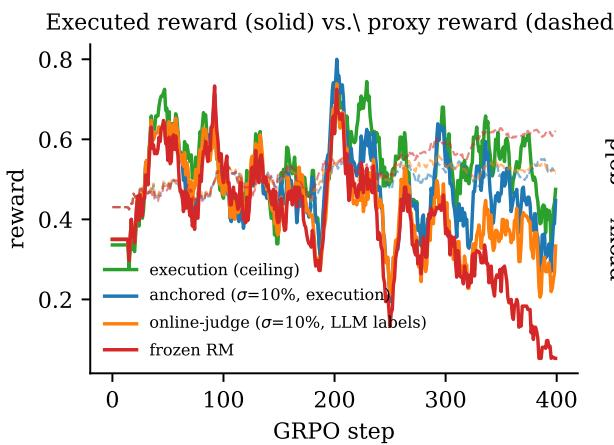

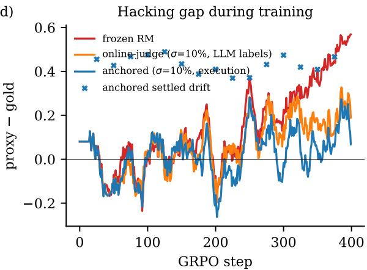  
Figure 13: The overoptimization curve with a settlement knob (seed 0; rolling mean, window 15). Left: executed reward (solid) and proxy reward (dashed). The frozen RM’s proxy climbs while executed reward collapses; the identical RM refit on a 10% settlement stream (anchored) tracks the execution ceiling; the equal-budget judge-−       labeled control sits between them. Right: the hacking gap (proxy gold) during training, with the anchored arm’s ×              settled-drift measurements ( ). Settlement repeatedly closes the gap the frozen arm rides to collapse—but drift magnitude does not rank-track the gap (the registered R-D criterion fails; see text).

× ∼Process RM ✓Definition 1 (Soundness-under-Pressure). For a Formal kernel ✓ ✓ ✓proxy verifier V , gold standard G, and candidate PCC (pdistribution $\mu ,$ osed let $x _ { N } ^ { V }$ ✓ ✓ ✓be the candidate selected by V from N i.i.d. draws of $\dot { \mu } ,$ and $x _ { N } ^ { G }$ the candidate selected by G. Then

$$
\mathrm { S n d @ } N \ = \ { \frac { \mathbb { E } { \bigl [ } G ( x _ { N } ^ { V } ) { \bigr ] } } { \mathbb { E } { \bigl [ } G ( x _ { N } ^ { G } ) { \bigr ] } } } ,
$$

and the headline benchmark score is the area under Snd@N over log N.

A sound verifier scores 1 at every N; Table 1 E [ G(xN) ]shows how sharply a shallow verifier departs from E [ G(xN) ]it. On cost: Snd@N is an evaluation metric, not a training-loop requirement, and it amortizes—one pool of $N _ { \mathrm { m a x } }$ candidates, generated and scored once, yields the whole curve by subsampling (our A sound verifier scores 1 at every N; Table 1entire real-model measurement of two judges on shows how sharply a two benchmarks cost $\sim 3 . 5 \times 1 0 ^ { 4 }$ r departs fromAPI calls, i.e. it. On cost: Snd@N is an evaluation metric, not atens of dollars). Inside training, PCC’s marginal training-loop requirement, and it amortizes—onecost over standard RLVR is the settlement rate— pool of Nmax candidates, generated and scoredthe fraction of staked claims actually executed— once, yields the whole curve by subsampling (ourwhich Algorithm 1 (line 10) adapts to measured entire real-model measurement of two judges ondrift, and which the label-efficiency results bound ∼ ×   where they hold. The crucial design property is that Snd@N measures verifiers under the optimization pressure they will actuallyface, which single-point accuracy does not.

<table><tr><td>Reward source</td><td>Dense</td><td>Sound</td><td>Robust</td></tr><tr><td>Human preference</td><td>√</td><td>2</td><td>X</td></tr><tr><td>LLM judge</td><td>√</td><td>2</td><td>×</td></tr><tr><td>Outcome reward</td><td>X</td><td>√</td><td>~</td></tr><tr><td>Process RM</td><td>√</td><td>2</td><td>2</td></tr><tr><td>Formal kernel</td><td>√</td><td>√</td><td>√</td></tr><tr><td>PCC (proposed)</td><td>√</td><td> $\checkmark ^ { \dagger }$ </td><td> $\checkmark ^ { \dagger }$ </td></tr></table>

Table 5: Reward sources by density, soundness, and and forecasting, each with a known serobustness under optimization pressure. $\sim \mathrm { { p a r t i a l } ; \dagger }$ and mechanically checkable ground truth: time-= conjectured, contingent on anchor-drift control; §6 sliced scientific claims settled by later replication,validates both cells at toy scale and §10 tests them at performance-engineering claims settled by execu-scale. Formal kernels are sound and robust but cover tion, forecasts settled bonly formalizable domains.

Construction recipe. Assemble tens of thousands of typed claims across science, engineering, and forecasting, each with a known settlement date and mechanically checkable ground truth: timesliced scientific claims settled by later replication, We do not claim to have established a paradigm;performance-engineering claims settled by exe-paradigm claims are not establishable by their au-cution, forecasts settled by events (Halawi et al., thors. We claim to have made2024). Freeze corpora at date $T ;$ e measurabsettle after $T .$ Score submitted verifiers by Snd@N against the settled gold, and score submitted reasoners by settled claim portfolios under proper scoring rules (Gneiting and Raftery, 2007). Table 5 situates the paradigm this benchmark is designed to measure.

## 9.1 What would falsify the paradigm: registered predictions at the next scale

We do not claim to have established a paradigm; paradigm claims are not establishable by their authors. We claim to have made one measurable, and we stake it on numbered predictions that any frontier laboratory can test in days. Each is stated so that a clean negative result refutes the corresponding component.

1. Conditional binding. For every judge, on tasks in its frontier stratum (single-sample accuracy in [0.3, 0.7]), Snd@N declines by $\geq 0 . 1 0$ from N=2 to N=256. Evidence so far: confirmed for the weak judge; untestable for the strong judge on MBPP (no frontier stratum exists there—§8.1, F2). Refuted if a frontier judge holds Snd@256 within 0.05 of Snd@2 on its own frontier stratum.

2. Copula law. For frontier judges on frontier tasks, per-problem realized soundness lies within 0.10 (median) of the rank-copula prediction of Proposition 2 (measured: 0.041 for the weak judge on MBPP). Refuted by systematic departures beyond that band.

3. Overoptimization boundary. Policygradient training against a frozen learned RM diverges (proxy up, executed reward flat or down) whenever the RM’s on-policy soundness is below the policy’s achievable gold, and reality-anchored refitting at a settlement rate adapted to measured drift removes the divergence at a small fraction of full settlement. Operationalized at 1.5B scale in our registration (criteria R-A–R-C); predicted to persist at every scale at which the precondition holds.

4. Drift is a universal alarm. Wherever divergence occurs, the settled-drift statistic of Algorithm 1 (line 10) rank-predicts the frozenvs-anchored gap online $( \rho _ { s } \ge 0 . 5 ;$ registered as R-D). Refuted by hacking that drift does not see. First evidence is adverse: the registered seed-0 test failed $( \rho _ { s } = 0 . 0 6 ; \ S 8 . 2 )$ .

5. Selection-manufactured deception. The maximum hacking gap obtainable by pure best-of-N selection over honest samples grows with N at the extreme-value rate implied by the copula, and dominates instructed deception until adversary capability exceeds judge capability (measured at one point: +0.53 vs. 0.21; §8.1, F3).

We commit to reporting confirmations and refutations of these predictions alike; each is stated so that it can be tested without our involvement.

## 10 Validation Programme at Scale

The full hypothesis is falsifiable through three staged experiments.

Retrodiction gyms. Train the claim-ledger system on time-sliced corpora—papers, markets, codebases up to date T—and score claims against reality after T, yielding millions of settled “experiments” at zero laboratory cost (Halawi et al., 2024). Falsification criterion: if PCC-trained reasoning does not beat judge-rewarded reasoning on retrodictive forecasting and on reproduction of laterdiscovered results, the hypothesis fails.

Closed-loop empirical domains. Deploy where reality settles fast and automatically: software performance engineering (execution is the settler), robotic manipulation, automated cloud-lab biology. Measure whether world-model-priced reward beats PRM reward on downstream success and on calibration under distribution shift—the metric distinguishing a self-improving loop from a selfdeceiving one.

Anchor-drift audits. Continuously measure divergence between world-model settlement and realized settlement (Algorithm 1, line 10). This scalar is the health metric of the system and, not incidentally, an alignment metric: a system rewarded for calibrated truth-tracking is structurally disincentivized from deceiving its overseers, because deception manifests as settlement loss.

## 11 Failure Modes

We flag three honestly. (1) The claim language may be too lossy to carry the best reasoning—the legibility tax, sharpened. (2) Market dynamics may reward safe, vague claims; scoring must pay for resolution as well as calibration (Gneiting and Raftery, 2007). (3) A system optimizing predicted reality could learn to make reality predictable in undesirable ways; settlement must score prediction of a world the agent does not manipulate. This is an open, safety-critical design problem (see Ethics Statement).

Meta-reward hacking and the trusted computing base. Settlement does not eliminate trust; it relocates it. An agent can attack the settlement substrate itself: sandbox exploits, manipulation of the measured environment, strategic delay of settlement, or staking only easy-to-settle claims. The honest accounting is a trusted computing base (TCB): PCC’s TCB is the executor/measurement apparatus plus the settlement scheduler and staking rules—small and auditable, like a proof kernel’s checker, but not zero. Concrete mitigations: hardened and randomized execution environments, audit-by-resettlement of a random claim fraction, scoring rules that price claim selection (paying for resolution, §6 Result 5), and settlement-lag limits. In our own suites the TCB was subprocess isolation with resource limits; every mined deception was semantic—none attacked the harness—but at higher capability that will not remain true by default, and TCB hardening should be treated as a first-class component of the paradigm.

## 12 Conclusion

The verification gap is the binding constraint on the next major leap in language-model capability. We have made its cost exact—unsound verification pays a polynomial compute penalty $N ^ { 1 / \rho ^ { 2 } }$ —and demonstrated, in the smallest system that can express them, the collapse of learned verifiers under i.i.d. pressure, their capture by adversarial pressure, and the repair mechanism: reality-anchored settlement, which inverted the adversary’s exploit, scaled soundness log-linearly with settled labels at over 10 on-policy label efficiency, and sharpened claims rather than blunting them. Proof-carrying cognition is our conjecture for how this mechanism scales to open-ended empirical reasoning. We have not established that conjecture, and no laboratoryscale study could; what we have done is make it measurable—an exchange-rate law that survives its own falsification in repaired form, a soundness metric that prices verifiers under the pressure they will actually face, a settlement rule that preserved real reward under live policy-gradient pressure (even as its registered drift alarm failed its first test— reported as such), and five registered predictions (§9.1) that any frontier laboratory can confirm or refute. The reality-settled benchmark of §9 is the field’s single most important near-term investment for the same reason ImageNet was: paradigms are not argued into existence, they are climbed into existence—and this one makes truth, rather than persuasion, the thing that wins.

## Limitations

The experiments in §3–§7 are synthetic: DSLs of six and ten tokens, ridge/gradient-boosted/logistic verifiers, and best-of-N, hill-climbing, evolutionary, and settlement-aware search are proxies for— not instances of—frontier reasoners, learned reward models, and RL training; a single-CPU suite cannot test frontier-scale claims. The scaled repli cation (§7) falsified the quantitative transfer of Proposition 1 outside its Gaussian model class (it is a ceiling, with realized value 0.32 at measured $\rho \approx 0 . 5 0 )$ , showed the closed-form penalty $N ^ { 1 / \rho ^ { 2 } }$ overstates costs at practical N, and showed that absolute Goodhart collapse is domain-dependent: a strong learned verifier kept converting pressure into capability through N=4096, so “sufficient pressure inverts any surface verifier” remains unestablished beyond that range. Anchoring was tested against a settlement-aware search adversary and survived, but not against a learning adversary trained end-to-end against the settlement process; anchoring also narrows rather than closes the capacity gap to a sound verifier (0.28–0.31 vs. 0.59– 0.68 under adversarial pressure), so verifier expressiveness remains a separate axis, and one registered adversarial cell failed as registered (steepest ascent; diagnosed, exploratorily, as adversary paralysis). Result 5 and H6 show the training dy namics do not intrinsically favor vague claims, but do not test an agent that strategically selects which claims to stake. The real-model suite (§8) covers one model family, two code benchmarks at or below the generator’s capability frontier (with heavy saturation: 50% of MBPP and 89% of Hu manEval problems showed zero gold variance and were excluded by the pre-specified filter), anchoring by in-context learning and a learned reranker rather than RL training, pressure only to N=32, and a prompt-level adversary that failed its own manipulation check; its adversarial results bound the threat model rather than the defense. Two regis tered criteria across the program (H2b, RL3c) were themselves mis-specified and are disclosed as such. The single most important untested regime is tasks at the judge’s capability frontier under RL-scale optimization pressure. Key unresolved questions for PCC itself include the expressiveness of the claim language relative to latent reasoning, scoring rules that reward resolution without incentivizing vagueness or manipulation, the cost of a versioned world model at training scale, and whether retrodiction transfers to genuinely novel discovery. The framing of the field’s trajectory reflects the authors’ reading of the 2023–2026 literature and may not represent consensus.

## Ethics Statement

A system trained to predict reality could act to make reality more predictable in harmful ways; settlement design must score prediction of unmanipulated outcomes, and we identify this as a safetycritical open problem rather than a solved one. Conversely, the paradigm has a favorable alignment property: reward for calibrated truth-tracking structurally penalizes deception of overseers, and the anchor-drift scalar is a deployable oversight signal. Reality-settled benchmarks in sensitive domains (e.g., biology) must be curated to avoid creating dual-use optimization targets. No human subjects or private data are involved.

## References

AlphaProof and AlphaGeometry teams, Google DeepMind. AI achieves silver-medal standard solving International Mathematical Olympiad problems. DeepMind Blog, 2024.

Dario Amodei, Chris Olah, Jacob Steinhardt, Paul Christiano, John Schulman, and Dan Mané. Concrete problems in AI safety. arXiv preprint arXiv:1606.06565, 2016.

Jacob Austin, Augustus Odena, Maxwell Nye, Maarten Bosma, Henryk Michalewski, David Dohan, Ellen Jiang, Carrie Cai, Michael Terry, Quoc Le, et al. Program synthesis with large language models. arXiv preprint arXiv:2108.07732, 2021.

Samuel R. Bowman, Jeeyoon Hyun, Ethan Perez, Edwin Chen, Craig Pettit, Scott Heiner, Kamile˙ Lukošiut¯ e, Amanda Askell, Andy Jones, Anna ˙ Chen, et al. Measuring progress on scalable oversight for large language models. arXiv preprint arXiv:2211.03540, 2022.

Mark Chen, Jerry Tworek, Heewoo Jun, Qiming Yuan, Henrique Ponde de Oliveira Pinto, Jared Kaplan, Harri Edwards, Yuri Burda, Nicholas Joseph, Greg Brockman, et al. Evaluating large language models trained on code. arXiv preprint arXiv:2107.03374, 2021.

Paul F. Christiano, Jan Leike, Tom Brown, Miljan Martic, Shane Legg, and Dario Amodei. Deep

reinforcement learning from human preferences. In Advances in Neural Information Processing Systems, volume 30, 2017.

Karl Cobbe, Vineet Kosaraju, Mohammad Bavarian, Mark Chen, Heewoo Jun, Lukasz Kaiser, Matthias Plappert, Jerry Tworek, Jacob Hilton, Reiichiro Nakano, Christopher Hesse, and John Schulman. Training verifiers to solve math word problems. arXiv preprint arXiv:2110.14168, 2021.

Jia Deng, Wei Dong, Richard Socher, Li-Jia Li, Kai Li, and Li Fei-Fei. ImageNet: A large-scale hierarchical image database. In IEEE Conference on Computer Vision and Pattern Recognition, 2009.

Leo Gao, John Schulman, and Jacob Hilton. Scaling laws for reward model overoptimization. In International Conference on Machine Learning, 2023.

Scott Garrabrant, Tsvi Benson-Tilsen, Andrew Critch, Nate Soares, and Jessica Taylor. Logical induction. arXiv preprint arXiv:1609.03543, 2016.

Tilmann Gneiting and Adrian E. Raftery. Strictly proper scoring rules, prediction, and estimation. Journal of the American Statistical Association, 102(477):359–378, 2007.

Daya Guo, Dejian Yang, Haowei Zhang, Junxiao Song, Ruoyu Zhang, Runxin Xu, Qihao Zhu, Shirong Ma, Peiyi Wang, Xiao Bi, et al. DeepSeek-R1: Incentivizing reasoning capability in LLMs via reinforcement learning. arXiv preprint arXiv:2501.12948, 2025.

David Ha and Jürgen Schmidhuber. Recurrent world models facilitate policy evolution. In Advances in Neural Information Processing Systems, volume 31, 2018.

Danny Halawi, Fred Zhang, Chen Yueh-Han, and Jacob Steinhardt. Approaching humanlevel forecasting with language models. arXiv preprint arXiv:2402.18563, 2024.

Dan Hendrycks, Collin Burns, Saurav Kadavath, Akul Arora, Steven Basart, Eric Tang, Dawn Song, and Jacob Steinhardt. Measuring mathematical problem solving with the MATH dataset.

In NeurIPS Datasets and Benchmarks Track, 2021.

Geoffrey Irving, Paul Christiano, and Dario Amodei. AI safety via debate. arXiv preprint arXiv:1805.00899, 2018.

Jared Kaplan, Sam McCandlish, Tom Henighan, Tom B. Brown, Benjamin Chess, Rewon Child, Scott Gray, Alec Radford, Jeffrey Wu, and Dario Amodei. Scaling laws for neural language models. arXiv preprint arXiv:2001.08361, 2020.

Jan Hendrik Kirchner, Yining Chen, Harri Edwards, Jan Leike, Nat McAleese, and Yuri Burda. Prover-verifier games improve legibility of LLM outputs. arXiv preprint arXiv:2407.13692, 2024.

Yann LeCun. A path towards autonomous machine intelligence. OpenReview preprint, 2022.

Jan Leike, David Krueger, Tom Everitt, Miljan Martic, Vishal Maini, and Shane Legg. Scalable agent alignment via reward modeling: a research direction. arXiv preprint arXiv:1811.07871, 2018.

Hunter Lightman, Vineet Kosaraju, Yuri Burda, Harrison Edwards, Bowen Baker, Teddy Lee, Jan Leike, John Schulman, Ilya Sutskever, and Karl Cobbe. Let’s verify step by step. In International Conference on Learning Representations, 2024.

OpenAI. Learning to reason with LLMs. OpenAI Blog, 2024.

Long Ouyang, Jeffrey Wu, Xu Jiang, Diogo Almeida, Carroll Wainwright, Pamela Mishkin, Chong Zhang, Sandhini Agarwal, Katarina Slama, Alex Ray, et al. Training language models to follow instructions with human feedback. In Advances in Neural Information Processing Systems, volume 35, 2022.

David E. Rumelhart, Geoffrey E. Hinton, and Ronald J. Williams. Learning representations by back-propagating errors. Nature, 323(6088): 533–536, 1986.

Leonard J. Savage. Elicitation of personal probabilities and expectations. Journal ofthe American Statistical Association, 66(336):783–801, 1971.

David Silver, Julian Schrittwieser, Karen Simonyan, Ioannis Antonoglou, Aja Huang, Arthur Guez, Thomas Hubert, Lucas Baker, Matthew Lai, Adrian Bolton, et al. Mastering the game of Go without human knowledge. Nature, 550(7676):354–359, 2017.

Charlie Snell, Jaehoon Lee, Kelvin Xu, and Aviral Kumar. Scaling LLM test-time compute optimally can be more effective than scaling model parameters. arXiv preprint arXiv:2408.03314, 2024.

Marilyn Strathern. ‘improving ratings’: audit in the British university system. European Review, 5(3):305–321, 1997.

Richard S. Sutton. The bitter lesson. Incomplete Ideas (blog), 2019.

Trieu H. Trinh, Yuhuai Wu, Quoc V. Le, He He, and Thang Luong. Solving olympiad geometry without human demonstrations. Nature, 625 (7995):476–482, 2024.

Jonathan Uesato, Nate Kushman, Ramana Kumar, Francis Song, Noah Siegel, Lisa Wang, Antonia Creswell, Geoffrey Irving, and Irina Higgins. Solving math word problems with processand outcome-based feedback. arXiv preprint arXiv:2211.14275, 2022.

Ashish Vaswani, Noam Shazeer, Niki Parmar, Jakob Uszkoreit, Llion Jones, Aidan N. Gomez, Lukasz Kaiser, and Illia Polosukhin. Attention is all you need. In Advances in Neural Information Processing Systems, volume 30, 2017.

Jason Wei, Xuezhi Wang, Dale Schuurmans, Maarten Bosma, Brian Ichter, Fei Xia, Ed Chi, Quoc V. Le, and Denny Zhou. Chain-of-thought prompting elicits reasoning in large language models. In Advances in Neural Information Processing Systems, volume 35, 2022.

Yuhuai Wu, Albert Qiaochu Jiang, Wenda Li, Markus N. Rabe, Charles Staats, Mateja Jamnik, and Christian Szegedy. Autoformalization with large language models. In Advances in Neural Information Processing Systems, volume 35, 2022.

Eric Zelikman, Yuhuai Wu, Jesse Mu, and Noah Goodman. STaR: Bootstrapping reasoning with

reasoning. In Advances in Neural Information Processing Systems, volume 35, 2022.

## A Experimental Details

The DSL world. Programs are strings of length 1–6 over six tokens acting on an integer register initialized to the input x: $\texttt { A } ( v + 1 ) , \texttt { S } ( v - 1 )$ , D $( \boldsymbol { v } \times 2 ) , \mathrm { ~ T ~ } ( \boldsymbol { v } \times 3 ) , \mathrm { ~ N ~ } ( - \boldsymbol { v } ) , \mathrm { ~ Q ~ } ( \boldsymbol { v } ^ { 2 } )$ , with executions aborted $\mathrm { i f } \ | v | \ > \ 1 0 ^ { 6 }$ . A task is drawn by sampling a hidden target program of length 4 whose outputs on the evaluation inputs $x \in \{ - 3 , \ldots , 4 \}$ are all defined and take more than two distinct values. Gold reward of a candidate is the fraction of the eight input–output pairs it matches under execution. Random programs average gold reward 0.079; multiple functionally equivalent solutions typically exist.

Verifiers. The learned verifier is ridge regression (α=1) over 43 features: 6 token counts, 36 bigram counts, and length—a deliberately shallow judge evaluating the surface of a program rather than executing it. Experiment 6 uses logistic regression (C=1, predictions clipped to [0.001, 0.999]; a clipped constant predictor when training labels are degenerate).

Experiment 1. 20,000 trials per $( \rho , N )$ point; $N \in$ $\{ 2 ^ { 0 } , \dots , 2 ^ { 1 2 } \} ; \rho \in \{ 0 . 2 , 0 . 5 , 0 . 8 , 1 . 0 \}$ . Theory lines use Monte-Carlo $\mathbb { E } [ \operatorname* { m a x } _ { N } ] \ : ( 2 \times 1 0 ^ { 5 } \ : \mathrm { t r i a l s } )$ not the asymptotic formula.

Experiment 2. 60 tasks; learned verifier trained on 1,000 labeled random programs per task; candidate pools of 2,048 fresh programs; $N \in \{ 2 ^ { 0 } , \dots , 2 ^ { 1 1 } \}$ subsampled without replacement per point.

Experiment 3. 60 tasks, 10 rounds; pool 512, settle top 32 by proxy per round; anchored condition appends settled labels and refits, frozen does not; both start from 300 base labels.

Experiment 4. 40 tasks, 250 steps of steepest-ascent search: 16 mutations (substitute/insert/delete a token) per step, moving to the best-scoring candidate when it does not decrease the score. Anchored condition settles up to 25 recently visited programs every 25 steps (250 reality queries per run) and refits. The sound condition scores candidates by execution directly.

Experiment 5. 40 tasks; base verifier trained on 500 random labels; budgets $S \in$ 0, 50, 150, 500, 1500 . On-policy acquisition alternates pools of 256, settling the top 16 by the current verifier and refitting; the random condition adds S labels of random programs at once.

Soundness AUC is the mean of $\mathrm { S n d } @ N$ over $N \in \{ 2 ^ { 0 } , \dots , 2 ^ { 1 1 } \}$ on a fresh pool of 2,048.

Experiment 6. 60 tasks, 12 rounds; claim event “gold reward $\geq 0 . 2 5 '$ ; pools of 256 per round, mixed acquisition (16 top-probability + 16 random), 32 claims settled per round (1,920 per round pooled across tasks); 200 initial random labels per task. Brier decomposition uses 10 equal-width probability bins; reliability and resolution are computed on each round’s settled claims before that round’s refit, so every point is out-of-sample.

Compute and seeds. All experiments complete in under ten minutes total on a single CPU. Seeds: 0–4 (suite 1), 10–12 (suite 2), fixed in the scripts.

## B Scaled Replication Details

RichDSL. Programs of length 1–10 over ten tokens acting on an integer register v initialized to input x: $\mathtt { A } ( v + 1 ) , \mathtt { S } ( v - 1 ) , \mathtt { D } ( v \times 2 ) , \mathtt { T } ( v \times 3 )$ , H (v div 2, truncating), N $( - v ) , \triangleleft ( v ^ { 2 } ) , \mathbb { P } \ ( v + x )$ , M (v mod 7), $\mathrm { ~ G ~ } ( \operatorname* { m a x } ( v , 0 ) )$ . Values with $\vert v \vert > 1 0 ^ { 9 }$ become invalid (scored as mismatch). Inputs $x \in \{ - 8 , \ldots , 7 \}$ ; targets are length-6 programs valid on all inputs with more than three distinct outputs. Random programs average gold reward 0.018. Statistical unit is the task; tests are paired two-sided Wilcoxon signed-rank unless a direction was pre-registered; intervals are 95% bootstrap CIs.

Verifiers. Weak: ridge (α=1) on 111 features (unigrams, bigrams, length). Strong: gradient-boosted trees (HistGradientBoostingRegressor,

100 iterations; 60 in the H3 loop) on 359 features (adding positional token indicators, 128 hashed trigrams, first/last one-hots). Both trained on 2,000 labeled random programs per task (600 base labels in the loop experiments).

H1. Gaussian simulation: 100,000 trials per point, $N \in \{ 2 ^ { 0 } , \dots , 2 ^ { 1 4 } \} , \rho \in$ $\{ 0 . 1 , 0 . 3 , 0 . 5 , 0 . 7 , 0 . 9 , 1 . 0 \}$ ; the penalty sweep uses 20,000 trials to $N { = } 2 ^ { 1 7 }$ . Transfer (H1c): per-task Pearson ρ(proxy, gold) on fresh pools of 4,096 vs. realized Snd@4096, 120 tasks. H2. 120 tasks; pools of 4,096; $N \in \{ 2 ^ { 0 } , \dots , 2 ^ { 1 2 } \}$ eight subsample repetitions per point.

H3. 12 rounds; pool 1,024/round; settle the top 32 by proxy; anchored refits on all settled labels; 120 tasks (weak), 60 (strong).

H4. 300 steps, 24 mutations (substitute/insert/delete) per step, 100 tasks; anchored settlement of the 25 most recent unique visited programs every 25 steps (300 reality queries/run). Steepest ascent moves to the best mutation when not worse; the evolutionary adversary keeps the top 16 of population-plus-children; the settlement-aware adversary detects refits (score drop without moving) and restarts at the proxy-best of 64 random probes filtered to the 32 most edit-distant from all settled programs. Its population (evolutionary) or the anchored model’s scores are recomputed after refits; the steepest climber’s stale incumbent score is the registered-failure artifact discussed in §7.

H5. Budgets $S \in \{ 0 , 1 0 0 , 3 0 0 , 1 0 0 0 , 3 0 0 0 \}$ in batches of 20; on-policy settles the top 20 by the current verifier from pools of 512; uncertainty sampling scores pool variance under a 3-member bootstrap-ridge committee; Soundness AUC is the mean of Snd@N over $N \in \{ 2 ^ { 0 } , . . . , 2 ^ { 1 2 } \}$ on fresh pools of 4,096; 80 tasks.

H6. Claim event $\mathrm { \bf \ " { g o l d } } \geq 0 . 1 2 5 \mathrm { \bf \mathrm { ? } }$ (base rate $\approx 0 . 1 9 ;$ a pre-run, documented amendment from the minimal suite’s 0.25, whose base rate 0.05 in RichDSL is too degenerate for 10-bin decomposition); 15 rounds; pools of 256; 16 top-probability + 16 random claims settled per round; decomposition computed out-of-sample before each refit; 100 tasks.

Compute and seeds. $\sim 7 5$ minutes on a single CPU. Tasks are independently seeded by index (bases 20,000 / 50,000 / 60,000 / 70,000 / 90,000 / 110,000), so chunked and monolithic invocations produce identical results.