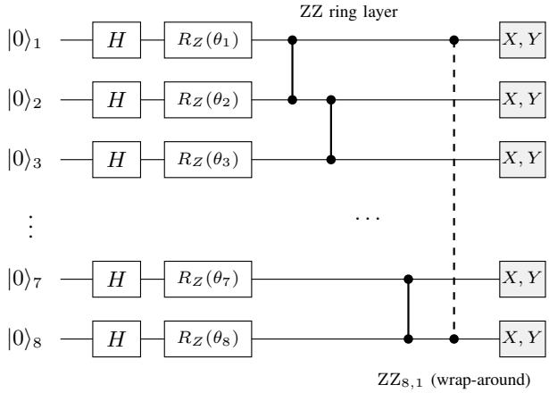

# Quantum Feature Engineering for Credit Default Prediction: When and Why IQP Circuits Help Linear Classifiers

Menachem Finkelstein∗, Diana Legziel Levy†, Zohar Yakhini‡, and Sarel Cohen§

Reichman University, Israel

∗mnchmf@gmail.com †legziel.diana@post.runi.ac.il ‡zohar.yakhini@gmail.com §sarel.cohen@runi.ac.il

Abstract—Credit default prediction is a tabular classification problem in which modest gains in F translate directly into reduced financial exposure. We ask whether Instantaneous Quantum Polynomial-time (IQP) circuits can produce features that improve a classifier over both its raw classical baseline and Kernel PCA—the strongest unsupervised classical non-linear alternative—at an equal feature budget. The dataset provides 23 financial attributes per client; for an n-qubit circuit we select n of them, encode each as a rotation angle, and read 2n expectation values back out as new features. The motivation for using a quantum circuit is computational: an n-qubit IQP circuit runs in constant depth and encodes feature correlations in a 2n-dimensional Hilbert space, whereas classical simulation of its exact output statistics scales exponentially in n. Using the UCI Default of Credit Card Clients dataset and five-fold crossvalidation, we find that appending 16 IQP features $~ ( n ~ = ~ 8$ qubits) to a Logistic Regression model raises F1 from 0.462 to $0 . 5 1 7 \ ( + 0 . 0 5 5 , p < 0 . 0 0 0 1 )$ . Kernel PCA, the next-best method, reaches only 0.493 at the same feature count; the gap survives Benjamini–Hochberg correction across 12 tests $\begin{array} { r } { ( p = 0 . 0 0 0 0 7 ) . } \end{array}$ No other classifier—Random Forest, SVM, XGBoost, or k-NN— benefits, which points to a linear-expressivity mechanism rather than a generic improvement. We also show that how the 8 input features are chosen matters: Random Forest importanceguided selection reaches $\mathbf { F _ { 1 } } = \mathbf { \mathrm { ~ 0 . 5 2 3 } } { \mathrm { , } }$ , while encoding maximally uncorrelated features drops it to 0.496, demonstrating that the circuit amplifies informative structure rather than creating it from scratch.

Index Terms—quantum feature engineering, credit default prediction, IQP circuits, logistic regression, quantum-classical hybrid, financial machine learning

## I. INTRODUCTION

Credit card default prediction sits at the intersection of class imbalance, non-linear feature interactions, and regulatory pressure to use interpretable models. The UCI Default of Credit Card Clients dataset describes each client with 23 heterogeneous features—credit limits, demographics, and six months of payment history—and only ∼ 22.6% of clients default, so it is a realistic stress test for any feature-engineering strategy.

Logistic Regression is the workhorse of credit scoring, but its limitation is structural: it fits a single hyperplane in the original 23-dimensional feature space, so payment-history variables that interact multiplicatively cannot be separated by a straight decision boundary. Quantum feature maps address this by embedding the data into a high-dimensional Hilbert space in which those interactions are represented implicitly through entanglement [1], [2]. Concretely, a parametric circuit maps a real input vector into a state in a Hilbert space of dimension 2n, and the expectation values of local observables on the output state become new features that encode non-linear combinations of the inputs. For IQP circuits specifically, the argument for eventually using real quantum hardware is not only expressivity but cost: the circuit runs in constant depth for any number of qubits n, whereas classically simulating its exact output distribution requires time exponential in n [3]– [5].

This paper studies the question empirically and on a classical simulator; that is, we ask whether IQP-derived features, however they are computed, improve a downstream linear classifier over the best classical alternative. Whether quantum hardware could compute these same features more cheaply than classical simulation is a separate, complexity-theoretic matter that we return to in Section V-D. Two concrete questions drive the work. First, do IQP features improve over the raw 23-feature baseline when appended to a Logistic Regression model? Second, do they beat Kernel PCA (KPCA) at an equal feature budget? KPCA is the appropriate target of comparison because it is, like the quantum map, unsupervised, non-linear, and produces abstract features without ever looking at the class label. Beating KPCA would mean the quantum map captures structure that the best classical unsupervised method misses.

Prior work on quantum machine learning for finance tends to test on small datasets, skip multiple-comparison corrections, or compare quantum against a weak baseline rather than the best available classical alternative [6]. We address all three issues. Our contributions are: (i) a nine-way equalbudget comparison of quantum and classical feature-extraction methods on a standard financial dataset; (ii) evidence that the quantum advantage is specific to linear classifiers and absent for Random Forest, SVM, XGBoost, and k-NN; (iii) falsediscovery-rate (FDR) corrected significance testing over 12 planned comparisons; and (iv) a study of five feature-selection strategies showing that RF-importance-guided selection outperforms arbitrary choice and that encoding uncorrelated features actively hurts performance.

## II. BACKGROUND AND RELATED WORK

## A. Quantum Feature Maps

A quantum feature map $\phi : \mathbb { R } ^ { d }  \mathcal { H }$ embeds a classical vector x into a quantum state $| \phi ( \mathbf { x } ) \rangle$ living in a Hilbert space H of dimension $2 ^ { n }$ , where n is the number of qubits. To turn that state back into usable numbers we measure a fixed set of K Hermitian observables $\{ O _ { k } \} _ { k = 1 } ^ { K }$ (in this work the perqubit Pauli X and Y operators, so $K = 2 n ) \colon$ ; each one yields a scalar feature

$$
f _ { k } ( { \bf x } ) = \langle \phi ( { \bf x } ) \vert O _ { k } \vert \phi ( { \bf x } ) \rangle , \qquad k = 1 , \ldots , K .\tag{1}
$$

The index k simply enumerates the observable (equivalently, the output feature). The corresponding kernel $\kappa ( \mathbf { x } , \mathbf { x } ^ { \prime } ) \ =$ $| \langle \phi ( \mathbf { x } ) | \bar { \phi } ( \mathbf { x } ^ { \prime } ) \rangle | ^ { 2 }$ can represent decision boundaries that standard kernels express only with a very large number of terms— for example boundaries that depend on the parity or simultaneous sign of several features (XOR-like interactions), which a polynomial or RBF kernel approximates poorly at low order [1].

## B. IQP Circuits

IQP (Instantaneous Quantum Polynomial-time) circuits interleave Hadamard layers with diagonal commuting unitaries. Their output distributions are believed to be hard to sample classically [3], [4], and on quantum hardware their depth is independent of the number of qubits, which makes them attractive for near-term devices. Coyle et al. [5] propose IQP circuits as practical feature extractors precisely because expectation values are easy to estimate by sampling even when exact simulation is hard. The general feature-map formalism of the previous subsection applies directly to IQP; the next section makes the specific circuit, its inputs, and its outputs fully concrete.

## C. Credit Risk Modeling

Logistic Regression has dominated credit scoring for decades because regulators can inspect its coefficients and auditors can reconstruct individual decisions [7]. Kernel SVMs and gradient boosting have shown competitive accuracy [8], but remain black boxes that are difficult to certify under frameworks such as the EU’s model-risk guidelines. Quantumenhanced approaches for credit modelling are nascent; most published results use toy datasets or do not compare against strong classical baselines.

## III. METHODOLOGY

## A. Dataset

We use the UCI Default of Credit Card Clients dataset (OpenML #42477) [9], using all $N = 3 0 { , } 0 0 0$ clients for every experiment. The original input is a vector of 23 features per client (credit limits, demographic variables, and six monthly payment-history records); the positive (default) rate is 22.6%, creating a mild class imbalance. All experiments use five-fold stratified cross-validation, and reported metrics are the mean ± standard deviation over folds.

## B. IQP Quantum Feature Extraction

This section is the core of the method, so we describe it end to end: what enters the circuit, what the circuit does, and what comes out. Figure 1 summarises the three-layer circuit, and the text below follows the same order.

a) What enters the circuit (the input): The circuit has n qubits; throughout the main experiments $n = 8 .$ . Because 8 qubits can accept only 8 angles, we first select 8 of the 23 classical features (the selection strategy is itself studied in Section IV-E). Each selected feature is standardised with a QuantileTransformer (mapping it to a normal distribution), clipped to $[ - 3 \sigma , 3 \sigma ]$ , and converted to an encoding angle

$$
\theta _ { i } = x _ { i } \cdot \pi / 3 , \qquad i = 1 , \ldots , n ,\tag{2}
$$

which places every angle in $( - \pi , \pi )$ and so uses the full dynamic range of the rotation gates. The vector $\pmb \theta = ( \theta _ { 1 } , \dots , \theta _ { 8 } )$ is the actual input to the circuit: one angle per qubit.

b) What the circuit does (the three layers): The 8-qubit IQP unitary $U _ { \mathrm { I Q P } } ( \pmb { \theta } )$ is built from three layers, shown left to right in Fig. 1:

1) Superposition layer. A Hadamard gate H is applied to every qubit, taking the all-zero state into a uniform superposition over all $2 ^ { 8 } \ : = \ : 2 5 6$ computational basis states:

$$
\left| 0 \right. ^ { \otimes 8 } \xrightarrow { H ^ { \otimes 8 } } \left| + \right. ^ { \otimes 8 } = \frac { 1 } { \sqrt { 2 ^ { 8 } } } \sum _ { x \in \{ 0 , 1 \} ^ { 8 } } | x \rangle .\tag{3}
$$

2) Data encoding. A single-qubit $R _ { Z } ( \theta _ { i } )$ rotation imprints feature $\theta _ { i }$ as a phase on qubit i:

$$
R _ { Z } ( \theta _ { i } ) = \left( \begin{array} { c c } { e ^ { - i \theta _ { i } / 2 } } & { 0 } \\ { 0 } & { e ^ { i \theta _ { i } / 2 } } \end{array} \right) .\tag{4}
$$

The input is now stored in the phase of the state, not its amplitude.

3) Entanglement layer. Two-qubit ISINGZZ gates are applied on a ring (qubit i coupled to qubit i+1 mod 8):

$$
\begin{array} { r } { \mathrm { Z Z } _ { i j } ( \phi _ { i j } ) = e ^ { - i \phi _ { i j } Z _ { i } \otimes Z _ { j } / 2 } , \quad \phi _ { i j } = \frac { 1 } { 2 } ( \theta _ { i } + \theta _ { j } ) . } \end{array}\tag{5}
$$

This layer is the source of the quantum advantage: it entangles neighbouring qubits, encoding pairwise (and, through the ring, higher-order) interactions between features in a way that has no efficient classical description as n grows.

Composing the three layers gives

$$
\begin{array} { r } { U _ { \mathrm { I Q P } } ( \pmb { \theta } ) = \left( \prod _ { \langle i , j \rangle } \mathrm { Z Z } _ { i j } ( \phi _ { i j } ) \right) \left( \prod _ { i } R _ { Z } ( \theta _ { i } ) \right) H ^ { \otimes 8 } , } \end{array}\tag{6}
$$

a single Hadamard layer followed by a block of commuting diagonal gates—the standard IQP feature map. Reading the transverse observables X and Y rather than Z folds the canonical IQP form’s closing basis change into the measurement itself. It also explains why the $Z$ expectations vanish:

  
Fig. 1. The 8-qubit IQP feature extractor (five of the eight wires shown; qubits 4–6 and the couplings $( 3 , 4 ) \ldots ( 6 , 7 )$ are elided). Left to right: a Hadamard superposition layer, an $R _ { Z } ( \theta _ { i } )$ data-encoding layer, and an ISINGZZ entanglement layer. Each qubit is then measured in the Pauli X and Y bases, producing 2n = 16 output features; that transverse read-out plays the role of the canonical IQP form’s closing basis change, and is why ⟨Z⟩ is identically zero and excluded. Topology: the ZZ couplings form a ring on the 8 qubits—exactly the 8 edges $( 1 , 2 ) , ( 2 , 3 ) , \ldots , ( \mathsf { 7 } , 8 ) , ( 8 , 1 )$ , each applied at its own time step. The dashed line is the wrap-around edge (8, 1) that closes the ring; it couples qubit 8 to qubit 1 only, crossing the intervening wires without acting on them.

writing D for the diagonal block, D commutes with $Z _ { i } ,$ , so $\langle Z _ { i } \rangle = \langle + | ^ { \otimes 8 } Z _ { i } | + \rangle ^ { \otimes 8 } = 0$ for every qubit and every input.

c) What comes out (the output features): After applying $U _ { \mathrm { I Q P } }$ we measure, for each qubit i, the expectation values of the Pauli X and Y observables:

$$
f _ { X , i } = \langle \psi | X _ { i } | \psi \rangle , \qquad f _ { Y , i } = \langle \psi | Y _ { i } | \psi \rangle ,\tag{7}
$$

where $| \psi \rangle = U _ { \mathrm { I Q P } } ( \pmb { \theta } ) | 0 \rangle ^ { \otimes 8 }$ is the state the circuit prepares. This yields $8 \times 2 = 1 6$ quantum features per client. (As shown above, the Pauli Z expectations are identically zero for this circuit and are therefore excluded, which is why we read 2n rather than 3n features.) Each output feature is a non-linear function of all the input angles $\theta _ { i }$ that reflects inter-qubit entanglement; it cannot be factored into independent per-qubit contributions.

d) Combined representation: The 16 quantum features are concatenated with the original 23 classical features, giving a 39-dimensional input vector that is then fed to the downstream classifier. In other words, the quantum circuit is used as a feature augmenter, not a replacement.

e) Encoding variants: We test two encodings. The IQP encoding above uses the ZZ layer to couple qubit phases. As a simpler control, Angle encoding reduces the circuit to a single $R _ { Y } ( \theta _ { i } )$ rotation per qubit—no Hadamard layer and no entangling gates—read out in the same X and Y bases, producing 16 features with no inter-qubit coupling. Both encodings are evaluated across all five classifiers, yielding 10 encoding–classifier pairs; each pair is also compared directly against KPCA, adding 2 more tests. This gives the family size $\textit { m } = \ 1 2$ used in the multiple-comparison correction (Section IV-C).

C. Why This Circuit, and Why $n = 8 ?$

a) Why $n \ = \ 8$ qubits: The qubit count was fixed a priori by the experimental design and was not selected on performance. An n-qubit circuit emits 2n features—Pauli X and Y on each qubit—so $n = 8$ emits exactly 16, which is precisely the feature budget every classical comparator is given in Table II. Fixing n this way is what makes the nine-way comparison like-for-like; choosing n to maximise $\mathrm { F } _ { 1 }$ instead would have made the budgets unequal and would have spent a degree of freedom that the FDR family in Section IV-C does not account for.

b) Why this circuit: The three layers of Section III-B are not interchangeable design choices; each is forced by a requirement. Phase encoding is dictated by the IQP form itself, whose data-dependent part must be diagonal in the computational basis, and it is also the cheapest loading available— one gate per feature at depth 1, against amplitude encoding, whose loading circuits are exponentially deep in n. The single Hadamard layer is what makes that phase information matter, since it spreads the state over all $2 ^ { n }$ basis states before the phases are written; the transverse read-out then supplies the interference that turns those phases into measurable numbers, at no gate cost. The one genuinely free choice is the coupling topology, and we take a ring over all-to-all because a ring has n edges and is 2-edge-colourable, giving O(n) gates at constant depth, whereas all-to-all needs $n ( n { - } 1 ) / 2$ gates at a depth that grows with n. Constant depth is the entire near-term argument for IQP, so we do not trade it away, and a ring is in any case the connectivity most readily available on near-term hardware. We make no novelty claim for the encoding itself— it is the standard IQP feature map of Havl´ıcek et al. [1] andˇ Coyle et al. [5]. What this paper contributes is the controlled, equal-budget, FDR-corrected account of what such a map is and is not worth on a real tabular problem.

c) Depth and gate count: For even n, the circuit of Section III-B uses n Hadamard, n $R _ { Z }$ and n ISINGZZ gates— 3n gates in all, of which n are two-qubit—at depth 4: one Hadamard layer, one $R _ { Z }$ layer, and two ZZ sub-layers (an even ring is 2-edge-colourable, so its couplings execute in two rounds). At $n \ : = \ : 8$ that is 8 Hadamard, 8 $R _ { Z }$ and 8 ZZ gates, i.e. 24 gates at depth 4. Compiled to a CNOT-androtation gate set, where $\mathrm { Z Z } ( \phi ) = \mathrm { C N O T } \cdot R _ { Z } ( \phi )$ ·CNOT, the same circuit becomes 8 Hadamard, 16 $R _ { Z }$ and 16 CNOT gates at depth 8. The property that matters is that both depths are independent ofn: widening the circuit adds gates but no layers. The circuit also has no trainable parameters—its angles are data, not weights—so it contributes nothing to the parameter count of the model that consumes its output.

## D. Classical Comparison Methods

Each classical method adds exactly 16 features, matching the quantum budget (39 total). We include a noise baseline (16 random Gaussian features) as a sanity check against dimensionality inflation, and a family of linear transformations—PCA, SVD, ICA, random projection, and feature agglomeration—to establish whether any unsupervised transformation helps a linear classifier at all. Polynomial degree-2 terms test explicit pairwise interactions. Kernel PCA with an RBF kernel (bandwidth $\gamma \ = \ 1 / ( d \cdot \mathrm { V a r } ( \mathbf { x } ) )$ , the sklearn default) is our primary classical comparator: like the quantum approach it is unsupervised, non-linear, and produces abstract features without access to the class label. Methods that use supervised feature selection (e.g. polynomial expansion followed by SelectKBest) have an inherent advantage and are reported for completeness only.

Two further controls hold by construction rather than by tuning. Every augmented arm in Table II presents the classifier with the same 39 inputs, hence the same number of fitted parameters (39 coefficients plus an intercept), and every arm is trained on the same 30,000 clients under the same fold partition; only the content of the 16 appended columns differs. Because the quantum circuit has no trained weights of its own, matching parameter count and training-set size across quantum and classical arms is not a separate experiment here—it is a property of the equal-budget design.

## E. Classifiers

We evaluate five classifiers: Logistic Regression $( \mathrm { L } 2 , C =$ 1.0, balanced weights), Random Forest (300 trees, balanced), SVM (RBF kernel), XGBoost (100 trees, $l r = 0 . 1 )$ , and k-NN (k = 5, distance-weighted). All use sklearn defaults except where stated.

## F. Statistical Testing

Significance is assessed with paired t-tests across the five CV folds $( \alpha = 0 . 0 5 )$ . To control for multiple comparisons we apply the Benjamini–Hochberg (BH) FDR procedure [10] over a family of 12 planned comparisons.

## IV. EXPERIMENTAL RESULTS

## A. Effect Across Classifiers

Table I reports each classifier with and without the 16 appended IQP features; values are mean ± standard deviation over the five folds. The pattern is stark: Logistic Regression gains 0.055 $\mathrm { F } _ { 1 }$ and 8.4 percentage points of accuracy (both $p < 0 . 0 0 0 1 )$ , while every non-linear classifier is statistically unchanged—Random Forest, SVM, XGBoost, and k-NN all return $p > 0 . 0 5$ on every metric, and several change by less than one standard deviation.

The reason is structural. A linear classifier cannot form non-linear decision boundaries on its own, so the quantum features supply the non-linearity externally. Ensemble and kernel methods already construct such boundaries internally— through tree splits, an RBF kernel, or boosting residuals— so the same features carry redundant information for them. This also rules out a generic dimensionality-inflation effect: if merely adding 16 extra inputs helped, we would see gains across all five classifiers, which we do not.

TABLE I  
PERFORMANCE WITH AND WITHOUT 16 IQP FEATURES, PER CLASSIFIER. “+QUANTUM” USES THE 8-QUBIT IQP ENCODING. VALUES ARE MEAN ± STD OVER 5 FOLDS. ONLY LOGISTIC REGRESSION IMPROVES SIGNIFICANTLY.
<table><tr><td>Classifier</td><td>Method</td><td> $\mathbf { F _ { 1 } }$ </td><td>Acc.(%)</td><td>AUC</td></tr><tr><td rowspan="2">Log. Reg.</td><td>Classical</td><td>0.462±.014</td><td>67.5±.3</td><td>0.708±.014</td></tr><tr><td>+Quantum</td><td>0.517±.017</td><td>75.9±.9</td><td>0.744±.014</td></tr><tr><td rowspan="2">Rand. For.</td><td>Classical</td><td>0.500±.026</td><td>79.9±.5</td><td>0.753±.010</td></tr><tr><td>+Quantum</td><td>0.494±.024</td><td>79.9±.5</td><td>0.755±.013</td></tr><tr><td rowspan="2">SVM (RBF)</td><td>Classical</td><td>0.517±.017</td><td>76.1±.8</td><td>0.737±.017</td></tr><tr><td>+Quantum</td><td>0.519±.018</td><td>76.1±1.1</td><td>0.745±.016</td></tr><tr><td rowspan="2">XGBoost</td><td>Classical</td><td>0.517±.017</td><td>75.5±1.0</td><td>0.748±.007</td></tr><tr><td>+Quantum</td><td>0.509±.027</td><td>76.4±1.7</td><td>0.739±.017</td></tr><tr><td rowspan="2">k-NN</td><td>Classical</td><td>0.396±.009</td><td>77.9±.3</td><td>0.683±.014</td></tr><tr><td>+Quantum</td><td>0.393±.011</td><td>77.8±.4</td><td> $0 . 6 8 1 { \scriptstyle \pm . 0 1 5 }$ </td></tr></table>

TABLE II

LOGISTIC REGRESSION WITH 16 AUGMENTED FEATURES (39 TOTAL).ALL METHODS ARE UNSUPERVISED EXCEPT POLYNOMIAL $^ { , 1 6 }$ (SEE TEXT).BOLD MARKS THE BEST RESULT IN THE TABLE. PRIMARY METRIC IS $\mathrm { F } _ { 1 } ;$ p-VALUES ARE FROM A PAIRED t-TEST VS. THE BASELINE.
<table><tr><td>Method</td><td> $\mathbf { F _ { 1 } }$ </td><td> $\Delta \mathrm { \sf ~ F } _ { 1 }$ </td><td> $\mathbf { A c c . }$ </td><td>p-value</td></tr><tr><td>Baseline (23)</td><td>0.462</td><td></td><td>67.5 %</td><td></td></tr><tr><td>Noise control</td><td>0.456</td><td>-0.006</td><td>67.1 %</td><td>0.24</td></tr><tr><td> $\mathrm { P C A } _ { 1 6 }$ </td><td>0.463</td><td>+0.001</td><td>67.5 %</td><td>0.68</td></tr><tr><td> $\mathrm { S V D } _ { 1 6 }$ </td><td>0.463</td><td>+0.001</td><td>67.5 %</td><td>0.68</td></tr><tr><td> $\mathrm { I C A } _ { 1 6 }$ </td><td>0.462</td><td>+0.000</td><td>67.5 %</td><td>1.00</td></tr><tr><td>RandProj16</td><td>0.463</td><td>+0.001</td><td>67.5 %</td><td>0.73</td></tr><tr><td>FeatAgg16</td><td>0.462</td><td>-0.001</td><td>67.5 %</td><td>0.37</td></tr><tr><td> $\mathrm { P o l y } _ { 1 6 }$ </td><td>0.470</td><td>+0.008</td><td>69.1 %</td><td>0.16</td></tr><tr><td> $\mathrm { K P C A } _ { 1 6 }$ </td><td>0.493</td><td>+0.031</td><td>73.1 %</td><td>0.0001</td></tr><tr><td> $\mathbf { Q u a n t u m s _ { q } }$ </td><td>0.517</td><td>+0.055</td><td>75.9 %</td><td>&lt; 0.0001</td></tr></table>

## B. Nine-Way Comparison at Equal Feature Budget

Table II ranks all nine feature-engineering methods at 39 features each for Logistic Regression; in every case the same 16 extra features are computed once and reused inside each cross-validation fold (no per-fold refitting of the transform on test data). Quantum features place first. The five linear transformations—PCA, SVD, ICA, random projection, and feature agglomeration—all leave $\mathrm { F } _ { 1 }$ essentially unchanged $( \Delta \le 0 . 0 0 1 , p > 0 . 3 7 )$ . This is expected rather than surprising: a linear transformation of features fed to a linear model stays inside the same hypothesis class, so it cannot change the set of achievable decision boundaries—the linear methods serve as a control that confirms only genuinely non-linear maps can help here. Polynomial degree-2 terms add 0.008 $\mathrm { F } _ { 1 }$ , a real but modest gain. KPCA does substantially better, adding 0.031 $( p = 0 . 0 0 0 1 )$ , confirming that non-linearity is what matters. Quantum features add 0.055, roughly 1.8× the KPCA gain $( p = 0 . 0 0 0 0 7$ for the quantum–KPCA gap). The random-noise baseline is the one method that hurts $\mathrm { F } _ { 1 }$ slightly, ruling out any explanation based purely on the increase in dimensionality.

TABLE III  
BENJAMINI–HOCHBERG (BH) FDR CORRECTION OVER THE FAMILY OF $m = 1 2$ PLANNED TESTS $( \alpha = 0 . 0 5 )$ ; PRIMARY METRIC $\mathrm { F } _ { 1 } .$ . ROWS 1–4 ARE LOGISTIC REGRESSION; RANKS 5–12 ARE THE REMAINING EIGHT TESTS, EITHER ENCODING AGAINST THE BASELINE ON EACH OF THE FOUR NON-LINEAR CLASSIFIERS. RANK k ORDERS THE 12 p-VALUES ASCENDING, AND BH CRIT. IS THE THRESHOLD αk/m THAT A p-VALUE MUST NOT EXCEED IN ORDER TO SURVIVE (SECTION IV-C).
<table><tr><td>Rank Hypothesis</td><td></td><td>p-value</td><td></td><td>BH crit. Survives?</td></tr><tr><td>1</td><td>IQP vs. KPCA</td><td>0.00007</td><td>0.0042</td><td>√</td></tr><tr><td>2</td><td>IQP vs. Baseline</td><td>&lt; 0.0001</td><td>0.0083</td><td>√</td></tr><tr><td>3</td><td>Angle vs. Baseline</td><td>&lt; 0.0001</td><td>0.0125</td><td>√</td></tr><tr><td>4</td><td>Angle vs. KPCA</td><td>≈0.12</td><td>0.0167</td><td>×</td></tr><tr><td>5-12</td><td>Quantum vs. Baseline</td><td>≈0.5</td><td></td><td>X</td></tr></table>

## C. Multiple-Comparison Correction

With 12 pre-specified tests—10 encoding–classifier pairs plus two direct quantum-versus-KPCA comparisons—at α = 0.05 we would expect roughly one false positive by chance alone. The BH procedure sorts those 12 p-values in ascending order and compares the one at rank k against the critical value $\alpha k / m$ , reported as “BH crit.” in Table III; a test survives when its p-value lies at or below that value. The critical value is a threshold rather than a score: it grows with rank, so later ranks face a more permissive bar, and a test that fails to survive is simply one whose evidence cannot be told apart from the false positives expected in a family of this size.

Applying the correction (Table III) leaves three findings intact: IQP outperforms both the baseline and KPCA for Logistic Regression, and Angle encoding outperforms the baseline. Angle encoding does not survive when compared directly to KPCA $( p \approx 0 . 1 2 )$ , making IQP the only encoding with a defensible claim to genuinely exceed the best classical unsupervised alternative. That non-survival is informative rather than unfortunate. Angle encoding is precisely the ablation that deletes the ZZ layer, so the fact that it fails to beat KPCA while IQP beats it separates the contribution of entanglement from the mere act of appending 16 circuit-derived columns. All eight tests involving non-linear classifiers remain nonsignificant.

## D. Quantum Features as Supplement, Not Replacement

To test whether quantum features can stand alone, we ran three IQP circuits in parallel—8, 8, and 7 qubits respectively— so that every one of the 23 input features was encoded in at least one circuit. Each qubit contributes a Pauli X and Pauli Y measurement, giving $8 { \times } 2 + 8 { \times } 2 + 7 { \times } 2 = 4 6$ quantum features with complete feature coverage and no classical input. Accuracy was 69.4% and $\mathrm { F _ { 1 } } \mathrm { = } \ 0 . 4 8 5$ , well below the 75.9% and 0.517 achieved when the same circuits are combined with the original 23 features. Full coverage does not rescue quantum-only prediction: the model needs the raw financial variables, not just their quantum projections.

## E. Feature Selection Strategy Comparison

An 8-qubit circuit encodes exactly 8 of the 23 available features, so the choice of which 8 to use is a real design decision. Table IV compares five strategies.

TABLE IV  
$\mathrm { F } _ { 1 }$ BY FEATURE-SELECTION STRATEGY (LOGISTIC REGRESSION, 5-FOLD CV). STRATEGIES S1–S4 APPEND QUANTUM FEATURES TO ALL 23 CLASSICAL FEATURES (39 TOTAL); S5 USES 3 CIRCUITS + 23 CLASSICAL (69 TOTAL). $\mathbf { B O L D } = \mathbf { B E S T } \ \mathbf { F } _ { 1 }$
<table><tr><td>Strategy</td><td>Selection method</td><td> $\mathbf { F _ { 1 } }$ </td><td>Acc.</td><td>AUC</td></tr><tr><td>Baseline (no quantum)</td><td></td><td>0.462</td><td>67.5 %</td><td>0.708</td></tr><tr><td>S1: First-8 (arbitrary)</td><td>Features 1-8</td><td>0.517</td><td>75.9 %</td><td>0.744</td></tr><tr><td>S2: RF Importance</td><td>Top-8 by Gini</td><td>0.523</td><td>75.3 %</td><td>0.748</td></tr><tr><td>S3: Correlation-based</td><td>Top-8 corr. w/ target</td><td>0.516</td><td>75.5 %</td><td></td></tr><tr><td>S4: Diverse (uncorrelated)</td><td>Greedy min-corr</td><td>0.496</td><td>72.6 %</td><td></td></tr><tr><td>S5: Multi-circuit + orig.</td><td>All 23 (3 circuits)</td><td>0.519</td><td>74.6%</td><td></td></tr></table>

The ordering in Table IV is not random. RF importance (S2) is a deterministic, data-driven procedure: a Random Forest is trained on the full 23 features and features are ranked by mean decrease in Gini impurity. The same 8 features are selected every time on the same data, unlike the arbitrary first-8 (S1), which simply takes whatever order the dataset happens to use. The selected features are primarily payment-history and credit-limit variables $( \{ f _ { 5 } , f _ { 6 } , f _ { 7 } , f _ { 0 } , f _ { 1 1 } , f _ { 1 2 } , f _ { 1 7 } , f _ { 1 8 } \} )$ , and the result, $\mathrm { F _ { 1 } } \mathrm { = } \mathrm { 0 . 5 2 3 }$ , is the highest across all strategies— that is, it slightly exceeds even the strong 0.517 obtained by the arbitrary first-8. Correlation-based selection (S3) uses similar logic and scores 0.516, close but not identical. The arbitrary first-8 (S1) lands in between at 0.517; it happens to include several moderately predictive features, which explains why it is competitive despite no deliberate selection.

The most instructive result is the diverse strategy (S4), which greedily selects features with the lowest mutual correlation. $\mathrm { F } _ { 1 }$ drops to 0.496—below every other strategy and statistically worse than first-8 $( p < 0 . 0 1 )$ . Maximally uncorrelated features spread the circuit’s encoding capacity across the full variable space, but most of those variables carry little signal about default. The IQP circuit does not generate predictive power; it amplifies interactions among already-informative inputs. When those inputs are weak, the entanglement layer has nothing useful to couple.

Covering all 23 features with three separate 8-qubit circuits (S5) raises the feature count to 69 and yields $\mathrm { F } _ { 1 } = \ 0 . 5 1 9 .$ better than arbitrary first-8 but still below RF importance and at considerably greater cost. In practice, selecting the top-8 features by any reasonable ranking method is both simpler and more effective.

## V. DISCUSSION

## A. How Large Is the Effect?

Two differences in this paper are easy to conflate, and only one of them carries the result. The claim is the headline comparison of Table II: appending 16 IQP features moves Logistic Regression from $\mathrm { F _ { 1 } = \ 0 . 4 6 2 ~ t o ~ 0 . 5 1 7 - a }$ gain of +0.055, or 12% in relative terms—together with the +0.024 margin over Kernel PCA at an identical feature budget. Both survive BH correction across the family of 12 planned tests.

For scale, +0.055 is about three times the fold-to-fold standard deviation of the augmented model (±0.017 in Table I), and it comes with 8.4 percentage points of accuracy.

The 0.517-versus-0.523 difference in Section IV-E is a secondary comparison—between two ways of choosing which 8 of the 23 features to encode—and it is not the paper’s claim. At 0.006 it is roughly a third of that same fold standard deviation, so we do not read the top of Table IV as a reliable ordering. What that section does establish is the much larger, one-directional contrast between informative and uninformative inputs: 0.523 against 0.496, with the drop significant at $p < 0 . 0 1$

On practical significance we would rather be exact than generous. $\mathrm { A + 0 . 0 5 5 ~ F _ { 1 } }$ gain is real but incremental: the kind of change a lender measures across a book of accounts, not one an analyst would notice on any single application, and we do not claim it justifies quantum hardware on its own. The transferable result is the mechanism—that a constant-depth quantum feature map can supply a linear model with nonlinear structure the strongest classical unsupervised alternative does not, and that the benefit appears only where the classifier cannot build such structure itself.

## B. Why Only Logistic Regression?

The quantum kernel induced by the IQP circuit, $\kappa ( \mathbf { x } , \mathbf { x } ^ { \prime } ) =$ $| \langle \phi ( \mathbf { x } ) | \phi ( \mathbf { x } ^ { \prime } ) \rangle | ^ { 2 }$ , defines a decision boundary in a highdimensional Hilbert space. For Logistic Regression—a linear model in feature space—appending quantum features is equivalent to lifting the input into a richer representation where a linear boundary can capture non-linear structure in the original space. Random Forest, SVM with an RBF kernel, and XGBoost already implement their own non-linear transformations through tree splits, the RBF kernel matrix, or boosting residuals. The IQP features add no information they cannot already express, so the gain is zero.

## C. Feature Importance of Quantum Features

In the 39-feature logistic regression model, the four largest absolute coefficients all belong to quantum features: Q\_X1 (0.766), $\mathcal { Q _ { - } } \mathrm { X } 5 ~ ( 0 . 6 1 5 ) , ~ \mathcal { Q _ { - } } \mathrm { Y } 1 ~ ( 0 . 5 5 1 )$ , and $Q \_ { \bf Y } 6 ^ { \mathrm { ~ ~ } } ( 0 . 4 7 4 )$ Quantum features hold 10 of the top-20 coefficient positions despite making up only 41% of the feature set—meaning the model relies on them more heavily than their share of the input would predict. This is not an artefact of scaling or regularisation; it reflects that quantum features carry predictive information the classical variables, fed individually into a linear model, do not capture on their own.

## D. Limitations

All circuits were run on a classical simulator (PennyLane default.qubit) [11]. Our claims are therefore about the predictive value of IQP-derived features, not about a realised quantum speed-up: at $n = 8$ qubits the statistics are trivially simulable, and the complexity-theoretic hardness only becomes relevant at much larger n. Gate noise and decoherence on real hardware would also alter the expectation values and likely narrow the gap over KPCA. Whether the advantage survives on near-term devices is an open question that should be settled before drawing hardware-deployment conclusions.

The cost is worth being concrete about. Each feature is the expectation of a ±1-valued observable, so two-decimal precision needs on the order of $1 0 ^ { 4 }$ shots, and since the $2 n$ observables fall into just two commuting settings (all-X and all-Y), the full 30,000-client design needs on the order of $6 \times 1 0 ^ { 8 }$ circuit executions. Against $\mathrm { a \ + 0 . 0 2 4 \ F _ { 1 } }$ margin and a fold spread of ±0.017, a hardware replication would have to hold its estimation error well below the signal—which is why we treat it as separate work rather than an extra row in Table II.

## VI. CONCLUSION

IQP feature extraction provides a statistically robust $\mathrm { F } _ { 1 }$ improvement for Logistic Regression on credit default prediction: $+ 0 . 0 5 5$ over the raw baseline $( p ~ < ~ 0 . 0 0 0 1 )$ and +0.024 over the best unsupervised classical alternative, Kernel PCA $( p = 0 . 0 0 0 0 7$ , FDR-corrected over 12 tests). The same features produce no benefit for Random Forest, SVM, XGBoost, or k-NN, which locates the mechanism firmly in the inability of linear models to construct non-linear boundaries on their own.

Feature selection for the quantum circuit is not a detail to be glossed over. Encoding the top-8 features by Random Forest importance is the most reliable strategy $( \mathrm { F _ { 1 } } \mathrm { = } \ 0 . 5 2 3 )$ , while encoding maximally uncorrelated features actively damages performance $( \mathrm { F } _ { 1 } = \ 0 . 4 9 6 )$ . The circuit amplifies interactions among informative inputs; it cannot compensate for encoding variables that carry little signal about the outcome.

Future work should evaluate these circuits on real quantum hardware with error mitigation, investigate whether variational training of the circuit parameters can widen that margin over Kernel PCA, and examine the fairness properties of quantum-augmented credit scores under consumer-protection regulations.

## ACKNOWLEDGMENT

In accordance with IEEE policy on AI-generated content, the authors disclose that Claude Sonnet (Anthropic), accessed through the Cursor editor, was used as a coding assistant when implementing the experiment and analysis scripts. All experimental design choices, parameter settings, and reported results were determined and verified by the authors, who take full responsibility for the content of this paper.

## REFERENCES

[1] V. Havl´ıcek, A. D. Cˇ orcoles, K. Temme, A. W. Harrow, A. Kandala,´ J. M. Chow, and J. M. Gambetta, “Supervised learning with quantumenhanced feature spaces,” Nature, vol. 567, pp. 209–212, 2019.

[2] M. Schuld and N. Killoran, “Quantum machine learning in feature Hilbert spaces,” Physical Review Letters, vol. 122, no. 4, p. 040504, 2019.

[3] D. Shepherd and M. J. Bremner, “Temporally unstructured quantum computation,” Proceedings of the Royal Society A: Mathematical, Physical and Engineering Sciences, vol. 465, no. 2105, pp. 1413–1439, 2009.

[4] M. J. Bremner, A. Montanaro, and D. J. Shepherd, “Average-case complexity versus approximate simulation of commuting quantum computations,” Physical Review Letters, vol. 117, no. 8, p. 080501, 2016.

[5] B. Coyle, D. Mills, V. Danos, and E. Kashefi, “The born supremacy: quantum advantage and training of an Ising born machine,” npj Quantum Information, vol. 6, no. 1, p. 60, 2020.

[6] Y. Liu, S. Arunachalam, and K. Temme, “A rigorous and robust quantum speed-up in supervised machine learning,” Nature Physics, vol. 17, no. 9, pp. 1013–1017, 2021.

[7] N. Siddiqi, Credit Risk Scorecards: Developing and Implementing Intelligent Credit Scoring. Wiley, 2012.

[8] X. Dastile, T. Celik, and M. Potsane, “Statistical and machine learning models in credit scoring: A systematic literature survey,” Applied Soft Computing, vol. 91, p. 106263, 2020.

[9] I.-C. Yeh and C.-h. Lien, “The comparisons of data mining techniques for the predictive accuracy of probability of default of credit card clients,” Expert Systems with Applications, vol. 36, no. 2, pp. 2473– 2480, 2009.

[10] Y. Benjamini and Y. Hochberg, “Controlling the false discovery rate: a practical and powerful approach to multiple testing,” Journal of the Royal Statistical Society: Series B (Methodological), vol. 57, no. 1, pp. 289–300, 1995.

[11] V. Bergholm, J. Izaac, M. Schuld et al., “PennyLane: Automatic differentiation of hybrid quantum-classical computations,” arXiv preprint arXiv:1811.04968, 2018. [Online]. Available: https://arxiv.org/ abs/1811.04968