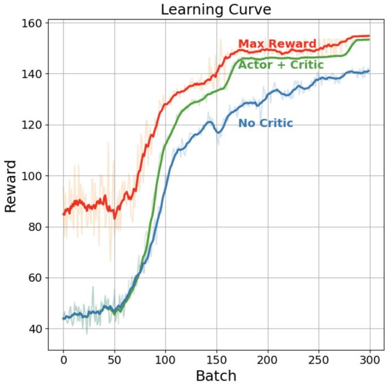

# Searching for New Physics with Reinforcement Learning

Jacky Kumar,1, ∗ Marianne Bouchard,1, † and David London1, ‡

1Physique des Particules, Universit´e de Montr´eal, 1375 Avenue Th´er\`ese-Lavoie-Roux, Montr´eal, QC H2V 0B3, Canada (Dated: September 10, 2026)

Finding new physics (NP) is the most important problem in particle physics today. Studying “anomalies”, i.e., measurements of low-energy observables whose values disagree with the predictions of the Standard Model (SM), is a powerful search strategy. The SM Efective Field Theory (SMEFT) provides a general model-independent framework for parameterizing NP; it is natural to try to find the SMEFT operator(s) that can explain such anomalies. This is a challenging task because (i) the number of SMEFT operators is enormous, and (ii) at loop level there are very complicated correlations among the operators. Analyses by humans typically rely on phenomenological intuition to decide which operators are relevant. This is often biased and does not explore the complete SMEFT operator space. Interestingly, reinforcement learning (RL) techniques excel at tasks that require decision making to achieve their goals. In this paper, we introduce an RL method that can be used to find the SMEFT operators that explain any anomalies. We test it on the CDF W-mass anomaly, and show that it reproduces (and improves upon) known results. We then consider a far more complicated situation with multiple anomalies and show that, even here, this method is able to find the SMEFT operators that explain the data. Our RL method can therefore be used to eficiently search for NP at the level of SMEFT.

As artificial intelligence (AI) has grown in importance, machine learning (ML) has been used to address problems in a wide variety of areas. For example, AlphaFold2, an AI system developed by Google DeepMind, can predict the structure of proteins from amino acids [1], and shared the 2024 Nobel prize in chemistry. Similarly, advanced reasoning models have recently succeeded in solving open math problems [2]. Finally, attention-based transformer architecture [3] paved the way for the development of modern AI systems, which excel at tasks such as code generation, object detection, and speech translation in real time.

Naturally, this raises a compelling question: can AI systems be leveraged to solve fundamental problems in theoretical particle physics? To date, there have been only a few attempts to apply ML to such problems [4–7]. In this paper, we demonstrate that ML can help in tackling the fundamental open problem in particle physics today, namely the search for physics beyond the Standard Model (SM).

In general, there are three types of ML approaches: supervised learning, unsupervised learning, and reinforcement learning (RL). Of these, RL is best suited for tasks that can be formulated as sequences of decision making with the aim of optimizing some objective [8]. Indeed, RL has excelled at games, robotics, and alignment of large language models. In this work, we formulate the search for new physics (NP) as an RL problem.

In RL problems, the goal is to find a policy that maps states to actions (i.e., a decision making rule). The policy learns through repeated interactions with an environment using rewards as a feedback signal. Here, “state” refers to the configuration of the environment at a given time. To be specific, solving an RL problem amounts to finding a policy that has learned a probability distribution over actions that assigns a high (low) probability to actions leading to high (low) reward. In what follows, we describe the physical problem that we wish to solve. How this general RL approach connects to this problem will be detailed afterwards.

The SM of particle physics has been enormously successful in describing the physics up to energy scales of O(TeV). Even so, it is not complete: it cannot explain a number of observations, such as neutrino masses, dark matter, the baryon asymmetry of the universe, etc. We therefore conclude that there must be physics beyond the SM.

As the large hadron collider (LHC) has not found any new particles, this NP, whatever it is, must be heavy. The efects of such NP can only be seen indirectly. That is, the virtual exchange of NP particles will afect certain lowenergy processes. This will show up as an “anomaly:” the measurements of observables associated with an afected process will disagree with the predictions of the SM.

The approach most appropriate for analyzing anomalies involves model-independent efective field theories (EFTs). At high energies, when the NP is integrated out, one obtains the Standard Model EFT, SMEFT [9– 12], which obeys the SM gauge symmetry, $S U ( 3 ) _ { C } \times$ $S U ( 2 ) _ { L } \times U ( 1 ) _ { Y }$ and contains only SM particles. At low energies, below the weak scale, the physics is described by the Weak Efective Theory (WET), obtained by further integrating out the SM particles heavier than the b quark. The WET operators obey the $S U ( 3 ) _ { C } \times U ( 1 ) _ { e m }$ gauge symmetry.

Whenever an anomaly is reported, the crucial question is: what type(s) of NP could be responsible? In order to answer this, one must first perform a bottom-up analysis to determine how to explain this anomaly within SMEFT. Subsequently, a top-down analysis must then be done to connect the SMEFT operators to the underlying NP. In this paper, we focus on the bottom-up analysis.

Bottom-up analyses proceed as follows. First, it is necessary to figure out which WET operators must receive new contributions in order to explain the anomaly. In particular, the required values of their NP Wilson coeficients (WCs) must be determined. Second, one must match this to SMEFT: which SMEFT operators can generate the desired WET operators of the appropriate size? The first step is often not particularly dificult. In many cases, there are not that many WET operators that contribute to the process in which the anomaly is seen. It is the second step that can be problematic.

In SMEFT, the leading-order (dimension-4) terms are those of the SM; higher-order terms are suppressed by powers of the NP scale Λ (i.e., the SM terms receive dimension-6 corrections). In Ref. [10], all dimension-6 operators were tabulated. (This is known as the Warsaw basis.) There are a total of 59 baryon-number-conserving dimension-6 operators; these represent 2499 operators if one counts the individual flavour indices. Each SMEFT operator contributes directly, i.e., at tree level, to several diferent WET operators.

But this is not all. When one evolves the theory from the SMEFT scale down to the WET scale using the renormalization-group equations, there is operator mixing. This means that each SMEFT operator contributes to a great many WET operators at one loop.

The point is that each WET operator is matched to many SMEFT operators, either directly (tree level) or at one loop. Furthermore, each SMEFT operator is matched to many other WET operators, which contribute to other observables. These generally constrain the sizes of the SMEFT operators. Thus, even if one has identified the WET operators that require new contributions, it is a very non-trivial task to find all the sets of SMEFT operators that can produce these WET operators with the correct WCs, once all constraints are taken into account. But this is absolutely necessary if one hopes to be able to determine the type(s) of NP responsible for the anomaly.

Humans typically use their phenomenological intuition to guide their search for these SMEFT operators. This intuition requires an understanding of many diferent issues: how the amplitudes for low-energy observables depend on operators, how to interpret experimental data, and how renormalization-group running afects operator mixing, matching between EFTs at various particle thresholds, etc.

If there is only a single anomaly, this intuition works reasonably well. But things start to get complicated as the number of anomalies increases. Because the total number of SMEFT operators that contribute to a given set of observables can be large, and because these operators are correlated in non-trivial ways, this leads to a huge combinatorial search space. In this case, humans will typically choose SMEFT operators based on their favourite UV theory or simplified extensions of the SM, or simply as trial and error.

In this paper, we formulate this task as an RL problem. In order to understand how this is done, it is useful to map the key elements of the RL algorithm (i.e., policy, action, reward, environment, and state), introduced earlier, onto our physics problem.

The method works as follows. First, a NP SMEFT operator is proposed. In order to see how well this operator explains the experimental data, a $\chi ^ { 2 }$ test is performed using the WC of the operator as an unknown parameter. For this purpose, flavio [13] is used to calculate the theoretical predictions for the observables as a function of the WC, and to compute the $\chi ^ { 2 }$ function using the pulls of the observables. Minuit [14] performs a global fit to the experimental data, and finds the value of the WC that minimizes the $\chi ^ { 2 }$ . If the value of $\chi _ { \mathrm { m i n } } ^ { 2 }$ decreases by more than 0.001, we keep this SMEFT operator; if not, we reject it. Another SMEFT operator is then proposed, and the process is repeated. Following each operator selection, the state is updated accordingly, providing the input state for the next decision. For each operator proposed, a reward proportional to the corresponding improvement in the fit, quantified by $\Delta \chi ^ { 2 } = \chi _ { \mathrm { S M } } ^ { \bar { 2 } } - \chi _ { \mathrm { m i n } } ^ { 2 } ,$ is assigned to the action.

With this description, we can make the connection between the elements of the RL and the physics problem. The correspondence is as follows:

• Policy: the decision-making rule used to propose SMEFT operators,

• Action: proposing an operator,

• Environment: the observable calculator, the pulls of the observables, the $\chi ^ { 2 }$ function, and the $\chi ^ { 2 }$ minimizer,

• State: the set of proposed SMEFT operators, individual pulls of observables and the value of $\chi _ { \mathrm { m i n } } ^ { 2 } .$

• Reward: the improvement in the global fit.

Our RL problem is therefore to find a policy to propose operators that can best explain the data. The policy is trained by repeatedly sampling the proposed operators from it, receiving the resulting rewards from the environment, and updating it to improve its performance. Over time, the policy learns to propose operators which yield the largest decrease in the value of $\chi _ { \mathrm { m i n } } ^ { 2 } .$ , i.e., the largest reward.

In the simplest formulation of our method, the policy is allowed to learn from a single (scalar) reward, namely the decrease in the value of $\bar { \chi } _ { \mathrm { m i n } } ^ { 2 } .$ . This is in contrast to the way humans approach this problem, where the choice of operators may be guided by multidimensional physics intuition and prior knowledge.

In what follows, we describe the essential technical aspects of this RL framework. The actor-critic algorithm [15, 16] is used to train a policy which is parameterized by a transformer-based neural network [3]. The basic idea of the actor-critic algorithm is very simple: an actor is used to propose an SMEFT operator, while a critic estimates expected reward of resulting state to guide policy’s updates. The critic is also a neural network whose sole purpose is to assess whether the proposal of the actor yielded a better-than-expected improvement in the $\chi _ { \mathrm { m i n } } ^ { 2 } .$

The policy is used to sequentially propose a total of $T$ operators in time steps, and at each step $t ,$ the state $\left( { { s } _ { t } } \right)$ captures the current pulls of the observables, the total value of $\chi ^ { 2 }$ , and the proposed and accepted SMEFT operators. If an operator is accepted, the state is updated to $s _ { t + 1 }$ , which includes all of these features. A full episode of proposing T operators is known as a trajectory (τ ). We assign a reward $\left( r _ { t } \right)$ per proposed operator at each time step, given by

$$
r _ { t } = \Delta \chi ^ { 2 } - c _ { P } .\tag{1}
$$

The dead steps, i.e., the proposals of inefective operators in which the decrease in $\chi _ { \mathrm { m i n } } ^ { 2 }$ is less than a small threshold value (0.001), are penalized with a constant $c _ { P }$

The policy is commonly denoted as $\pi _ { \boldsymbol { \theta } } ( O _ { t } | \boldsymbol { s } _ { t } )$ : for a given state $s _ { t } ,$ it predicts a probability distribution over the 912 SMEFT operators that conserve baryon and lepton number, and also the lepton flavour, from which an operator $O _ { t }$ (or equivalently an action $a _ { t } )$ is sampled. The subscript θ denotes the parameters of the transformer model.

The actor loss is defined as

$$
\mathcal { L } _ { \mathrm { a c t o r } } ( \theta ) = - \frac { 1 } { N } \sum _ { t } A _ { t } \log \pi _ { \theta } ( a _ { t } | s _ { t } ) ~ .\tag{2}
$$

Here, $A _ { t }$ is the advantage function

$$
A _ { t } = G _ { t } - V ^ { \pi } ( s _ { t } ) ,\tag{3}
$$

where $G _ { t }$ is a Monte-Carlo estimate of return-to-go:

$$
G _ { t } = r _ { t } + \gamma r _ { t + 1 } + \gamma ^ { 2 } r _ { t + 2 } + . . . ,\tag{4}
$$

with discount factor $\gamma = 0 . 9 9 . \ V ^ { \pi } ( s _ { t } )$ is the true value of the state defined as expected return from state $s _ { t }$ when following the policy $\pi _ { \theta }$ . The advantage $A _ { t }$ quantifies whether a sampled operator performed better or worse than the policy’s average behaviour from that state and thus whether it should be reinforced or suppressed.

Since the true value is not known, we train a separate neural network, the critic, to approximate it, denoted by $V _ { \phi } ( s _ { t } )$ . Here $\phi$ are the critic’s parameters. For each sampled trajectory, the critic trained using the objective

$$
\mathcal { L } _ { \mathrm { c r i t i c } } ( \phi ) = \frac { 1 } { N } \sum _ { t } [ V _ { \phi } ( s _ { t } ) - G _ { t } ] ^ { 2 }\tag{5}
$$

where N is number of training samples. We use $V _ { \phi } ( s _ { t } )$ to define advantage: $A _ { t } \approx G _ { t } - V _ { \phi } ( s _ { t } )$ which enters the actor’s loss in Eq. (2).

The total training objective combines the actor and critic losses

$$
\mathcal { L } _ { \mathrm { t o t a l } } = \mathcal { L } _ { \mathrm { a c t o r } } + \lambda _ { V } \mathcal { L } _ { \mathrm { c r i t i c } } \ ,\tag{6}
$$

where $\lambda _ { V } = 0 . 5$ is the weighting hyperparameter to control the relative contribution of the critic loss.

Finally, the actor’s training proceeds by iteratively sampling batches of trajectories from the current policy πθ and using them to update its parameters via the gradient $\nabla _ { \theta } \mathcal { L } _ { \mathrm { a c t o r } } ( \theta )$ . This process increases the likelihood of operators with positive advantage and suppresses those with negative advantage. Importantly, the advantage $A _ { t }$ is treated as a fixed target when computing this gradi ent of $\mathcal { L } _ { \mathrm { a c t o r } } ( \theta )$ , so the critic loss does not contribute directly to the gradient with respect to θ. Its only role is to shape the value estimate $V _ { \phi } ( s _ { t } )$ . In practice, $\mathcal { L } _ { \mathrm { a c t o r } }$ and $\mathcal { L } _ { \mathrm { c r i t i c } }$ are summed into a single objective, as shown in Eq. 6, and optimized with one backward pass. An RL algorithm which does not employ a critic is known as the REINFORCE algorithm [17]. We will also compare the performance actor-critic algorithm against the basic REINFORCE algorithm.

We now provide two examples demonstrating the application of this RL method to the search for NP. In the first, we show that the method is able to successfully re produce a result found in the literature. To be specific, we revisit the CDF W-mass anomaly [18]. This was studied in Ref. [19], and sets of NP SMEFT operators were found that can explain the anomaly. Here we examine whether the sets of SMEFT operators identified by the policy are consistent with these results. Second, in order to test the method in a more challenging scenario, we create a synthetic dataset with multiple discrepancies with the SM, i.e., the dataset contains several fictitious anomalies.

In both examples, we do not provide any information about the contributions of SMEFT operators to the observables under consideration. Instead, the policy is allowed to autonomously perform a search over entire space of 912 SMEFT operators to identify the relevant operators. The search is therefore driven solely by the experimental input data, the theoretical predictions of the observables that are functions of the 912 WCs, and the scalar reward signal controlled by $\Delta \chi ^ { 2 }$ . This setup allows us to test the scalability of the method. Indeed, simple cases, in which the anomalies depend on only a small of number of SMEFT operators do not fully exploit the capabilities of such an advanced RL approach.

Several years ago, the CDF Collaboration measured the mass of the W boson, finding [18]

$$
m _ { W } = 8 0 4 3 3 . 5 \pm 9 . 4 ~ \mathrm { M e V } ~ .\tag{7}
$$

There is a significant tension between this value and the SM prediction obtained from precision electroweak data [20],

$$
m _ { W } = 8 0 3 5 4 \pm 7 ~ \mathrm { M e V } ~ ,\tag{8}
$$

as well as with previous direct measurements. If we take the CDF measurement at face value, the question is: if we add SMEFT operators to the SM Lagrangian, which operators can account for it? This can be addressed using our RL method.

For the analysis of W-mass anomaly, we include 27 Z-pole observables [21–23], as collected in Table 13 of Ref. [24], together with the world average of m from Ref. [19], which includes the anomalous CDF measurement: $m _ { W } = 8 0 4 1 1 \pm 8 \ \mathrm { M e V }$ The fit within the SM yields $\chi _ { \mathrm { S M } } ^ { 2 } = 5 3 . 8$

We ran the actor-critic RL policy for $B = 3 0 0$ batches, with 25 trajectories rollouts per batch and $T = 1 0$ time steps per trajectory. The best-fit combination of SMEFT operators identified by the policy is

$$
\begin{array} { l } { { \left[ O _ { l l } \right] _ { 1 2 2 1 } = \left( \bar { l } _ { 1 } \gamma _ { \mu } l _ { 2 } \right) \left( \bar { l } _ { 2 } \gamma ^ { \mu } l _ { 1 } \right) ~ , } } \\ { { \left[ O _ { H D } \right] = \left( H ^ { \dagger } D _ { \mu } H \right) ^ { * } \left( H ^ { \dagger } D ^ { \mu } H \right) ~ , } } \end{array}\tag{9}
$$

with $\Delta \chi ^ { 2 } = 2 7 . 6$ . This corresponds to $\chi _ { \mathrm { m i n } } ^ { 2 } / \mathrm { d . o . f . ~ } =$ 1.05. The best-fit values of the WCs are $[ C _ { l l } ] _ { 1 2 2 1 } ( \Lambda ) =$ $- 6 . 8 \times 1 0 ^ { - 8 } \ \mathrm { G e V ^ { - 2 } }$ and $[ C _ { H D } ] ( \Lambda ) = - 6 . 4 \dot { \cdot } 1 0 ^ { - 8 } \mathrm { G e V ^ { - 2 } }$ for the NP scale $\Lambda = 1 ~ \mathrm { T e V }$ . At the point of minimum $\chi ^ { 2 }$ , we obtain $m _ { W } = 8 0 4 1 1$ MeV. This solution agrees with the result of Ref. [25], which was obtained without the use of ML.

Among the top-ten solutions, the policy also identifies another viable combination of operators

$$
\begin{array} { l } { { [ { \cal O } _ { l u } ] _ { 1 1 3 3 } = ( \bar { l } _ { 1 } \gamma _ { \mu } l _ { 1 } ) ( \bar { u } _ { 3 } \gamma ^ { \mu } u _ { 3 } ) ~ , } } \\ { { } } \\ { { [ { \cal O } _ { H u } ] _ { 3 3 } = ( H ^ { \dagger } i \stackrel {  } { \cal D } _ { \mu } H ) ( \bar { u } _ { 3 } \gamma ^ { \mu } u _ { 3 } ) ~ , } } \end{array}\tag{10}
$$

with $\Delta \chi ^ { 2 } = 2 0 . 6$ and $[ C _ { l u } ] _ { 1 1 3 3 } ( \Lambda ) = - 1 . 2 \times 1 0 ^ { - 7 } ~ \mathrm { G e V ^ { - 2 } }$ and $[ C _ { H u } ] _ { 3 3 } ( \Lambda ) = - \bar { 1 . 1 } \times 1 0 ^ { - 7 } \mathrm { G e V ^ { - 2 } }$ . This combination leads to mW = 80404 MeV. Interestingly, this solution was not identified in Ref. [25]. The reason is that our RL policy searches the full SMEFT operator space, consistently including renormalization-group running effects, while these were neglected in Ref. [25]. Moreover, the policy identifies several other operator combinations with $\Delta \chi ^ { \mathrm { 2 } } < 2 0$ , further demonstrating its ability to explore the SMEFT operator space.

Having shown that our method reproduces (and improves upon) known results in the simple case of one anomaly, we now test it on a much more challenging scenario. Our dataset now includes 32 observables spanning several diferent sectors of flavour and electroweak physics. We deliberately choose observables involving processes with $\Delta F = 1 , \Delta F = 2$ , as well as flavour conserving transitions. This diverse set of processes probes diferent classes of SMEFT operators with non-trivial correlations involving a large portion of SMEFT operator space. The resulting setup thus provides a complex environment and allows us to test the scalability and search capabilities of our RL method.

The list of observables includes Z-pole observables, observables in B-meson decays,

$$
\begin{array} { l } { { \displaystyle P _ { 5 } ^ { \prime } ( B \to K ^ { * } \mu ^ { + } \mu ^ { - } ) | q ^ { 2 } \in [ 4 , 6 ] \ : , } } \\ { { \displaystyle \frac { d B } { d q ^ { 2 } } ( B _ { s } \to \phi \mu ^ { + } \mu ^ { - } ) | q ^ { 2 } \in [ 1 , 6 ] \ : , } } \\ { { \displaystyle \mathcal { B } ( B _ { s } \to \mu ^ { + } \mu ^ { - } ) \ : , \ : \ : \ : \mathcal { B } ( B \to K \nu \bar { \nu } ) \ : , } } \\ { { \displaystyle R _ { D } \equiv \frac { \mathcal { B } ( B \to D \tau \bar { \nu } ) } { \mathcal { B } ( B \to D \ell \bar { \nu } ) } \ : , \ : \ : \ell = ( e , \mu ) \ : , } } \end{array}\tag{11}
$$

kaon observables

$$
{ \mathcal B } ( K ^ { + } \to \pi ^ { + } \nu \bar { \nu } ) ~ , ~ { \mathcal B } ( K _ { L } \to \pi ^ { 0 } \nu \bar { \nu } ) ~ , ~ \frac { \varepsilon ^ { \prime } } { \varepsilon } ~ ,\tag{12}
$$

and neutral-meson mixing observables

$$
\Delta M _ { s } \ , \quad { \varepsilon } _ { K } \ .\tag{13}
$$

For most observables, we use the corresponding real experimental measurements from flavio. However, for 10 observables we assign “fictitious” (i.e., invented) values of the measurements. These are chosen such that they deviate from the SM predictions at the level of 3-5σ. The observables with fictitious measurements are summarized in Table I. (Note that, for some observables, the measurements already exhibit deviations from the SM predictions. However, here we use values for these observables that are diferent from the present measurements.) The SM fit has $\chi _ { \mathrm { S M } } ^ { 2 } = 1 7 8 . 3$

In our RL analysis, we examine two types of training strategies. The first is the “no critic” algorithm (also known as REINFORCE-only [17]), while the second is the ${ } ^ { \mathrm { \left. } } \mathrm { a c t o r } + \mathrm { c r i t i c } ^ { \mathrm { \right. } }$ algorithm [15, 16]. For both strategies, we once again train the policy for 300 batches, sampling SMEFT operators with trajectory length $T = 1 0$ and 25 trajectories per batch. Fig. 1 shows the evolution of the average reward per batch (blue (no critic) and green (actor + critic) solid curves, with the raw values in a batch shown by light background), together with the maximum reward attained within a batch (red curve).

The training shows a clear exploration phase during the first 50 batches, in which the average reward remains almost flat. This means that the policy has not yet identified the regions of operator space that lead to large $\Delta \chi ^ { 2 }$ Beyond batch 50, the reward increases sharply for both the no critic (blue) and actor + critic (green) policies. This reflects the fact that the policy is learning which SMEFT operators are efective in explaining the anomalies, and is using them. The actor + critic learning curve flattens into a first plateau around batches 170-270, before a second, smaller improvement pushes the reward to its final plateau near batch 280-300.

<table><tr><td colspan="2">Fictitious dataset</td></tr><tr><td>RD : +3.5σ , P5 : −3.9σ , ε′/ε : −4.5σ ,</td><td> $m _ { W } : + 3 . 7 \sigma , A _ { \mathrm { F B } } ( Z  b \bar { b } ) : - 3 . 2 \sigma , B ( B  K \nu \bar { \nu } ) : + 4 . 1 \sigma ,$   $\frac { d \mathcal B } { d q ^ { 2 } } ( B _ { s } \to \phi \mu ^ { + } \mu ^ { - } ) : - 3 . 4 \sigma , \Delta M _ { s } : - 4 . 8 \sigma , \mathcal B ( K _ { L } \to \pi ^ { 0 } \nu \bar { \nu } ) : + 3 . 6 \sigma$ </td></tr></table>

TABLE I. Dataset of observables used in our analysis whose measurement values are fictitious (i.e., invented). The deviations of these fictitious measurements from the corresponding SM predictions are also shown.

  
FIG. 1. Learning curve over 300 training batches. The figure shows the mean reward (blue for No Critic, green for Actor + Critic) and the maximum reward (red) per batch. (the raw values are shown in faded and smoothed shown in solid are averaged over 10 rolling batches.)

Comparing the two training strategies (i.e., with and without critic) clearly demonstrate the positive impact of the critic on the learning. The full actor + critic policy converges faster, its reward begins rising earlier and more steeply, and reaches a higher final average reward (∼153) than the no critic policy (∼141).

Finally, we analyze the NP solutions discovered by the trained policy by counting how many unique operator combinations exceed the values $\Delta \chi ^ { 2 } = 1 2 0 , 1 3 5$ , 140 and 150. We compare this with a baseline of uniform random sampling of combinations up to length 10, over the same operator search space. We perform two types of comparison. In the first, we use the full SMEFT operator space (912 operators). The number of evaluations performed by the RL policy is given by $N _ { \mathrm { e v a l } } = B \times T \times 2 5 = 7 5 \mathrm { K }$ for 300 batches and $T = 1 0$ . The random search also evaluated 75K samples. In the second, direct physics input is used to restrict the candidate operators before running the search. This leads to a reduced search space comprising 219 dominant SMEFT operators. In this case, we evaluated 25K samples in both methods. The results are summarized in Tab. II.

For the full search space, the RL policy discovers 560 unique sets with $\Delta \chi ^ { 2 } \geq 1 2 0$ , 179 with $\Delta \chi ^ { 2 } \geq 1 3 5$ , 122 with $\Delta \chi ^ { 2 } \geq 1 4 0$ , and 26 with $\Delta \chi ^ { 2 } \geq 1 5 0$ , while the random search fails to find even a single solution. This reflects the fact that the full operator search space is so huge that the fraction of operator combinations yielding a good fit to the anomalies is small enough that uniform random sampling essentially never encounters one. On the other hand, the RL policy is able to learn to systematically bias its search towards promising operators. The best solution discovered by the policy has 10 SMEFT operators with $\Delta \chi ^ { 2 } = 1 5 6 . 4$ , corresponding to $\chi _ { \mathrm { m i n } } ^ { 2 } / \mathrm { d . o . f } = 1 . 0$

In the reduced search space, the random search performs somewhat better, finding 46 sets with $\Delta \chi ^ { 2 } \geq 1 2 0 .$ benefiting from a smaller and physics-informed operator search. The RL policy nonetheless continues to substantially outperform the random search at every threshold, finding 876 sets with $\Delta \chi ^ { 2 } \geq 1 2 0$ , 159 with $\Delta \chi ^ { 2 } \geq 1 3 5$ and 61 with $\Delta \chi ^ { 2 } \geq 1 4 0$ . We note that, in this reduced setting, the RL policy finds no sets above the highest threshold, $\Delta \chi ^ { 2 } \geq 1 5 0$ , in contrast to the 26 found in the full search space. This is due to the fact that in this case we ran the policy only for 100 batches.

This work was financially supported by the Natural Sciences and Engineering Research Council of Canada (NSERC) and by FRQNT, Scholarship No. 363240 (M.B.). This research was enabled in part by support provided the Digital Research Alliance of Canada (www.alliancecan.ca). Computations were performed on the Trillium supercomputer at the SciNet [26] HPC Consortium and on the Rorqual supercomputer, provided by Calcul Qu´ebec. SciNet is funded by Innovation, Science and Economic Development Canada; the Digital Research Alliance of Canada; the Ontario Research Fund: Research Excellence; and the University of Toronto.

<table><tr><td>Method</td><td> $N _ { \mathrm { e v a l } }$ </td><td> $N ( \Delta \chi ^ { 2 } \geq 1 2 0 )$ </td><td> $N ( \Delta \chi ^ { 2 } \geq 1 3 5 )$ </td><td> $N ( \Delta \chi ^ { 2 } \geq 1 4 0 )$ </td><td> $N ( \Delta \chi ^ { 2 } \geq 1 5 0 )$ </td></tr><tr><td>Random (full)</td><td>75K</td><td>0</td><td>0</td><td>0</td><td>0</td></tr><tr><td>RL (full)</td><td>75K</td><td>560</td><td>179</td><td>122</td><td>26</td></tr><tr><td>Random (reduced)</td><td>25K</td><td>46</td><td>0</td><td>0</td><td>0</td></tr><tr><td>RL (reduced)</td><td>25K</td><td>876</td><td>159</td><td>61</td><td>0</td></tr></table>

TABLE II. Comparison of the uniform random and RL search methods for unique set of operators explaining fictitious anomalies. The search is performed over the full (912 operators) and reduced (219 operators) search spaces. The total number of evaluations $( N _ { \mathrm { e v a l } } )$ and the number of sets meeting various $\Delta \stackrel { \triangledown } { \boldsymbol { \chi } } ^ { 2 }$ thresholds (N) are shown.

urnov, O. Ronneberger, K. Tunyasuvunakool, R. Bates, A. Z´ıdek, A. Potapenko, ˇ et al., Highly accurate protein structure prediction with AlphaFold, Nature 596, 583 (2021).

[2] OpenAI, Ten Advances in Mathematics and Theoretical Computer Science, Research Paper (OpenAI, 2026) accompanied by Lean 4 formalization repositories and Astra reasoning transcripts.

[3] A. Vaswani, N. Shazeer, N. Parmar, J. Uszkoreit, L. Jones, A. N. Gomez, L. Kaiser, and I. Polosukhin, Attention is all you need (2023), arXiv:1706.03762 [cs.CL].

[4] S. Alexander, B. Bradley, L. Gouskos, and C. Niu, Autonomous Discovery of Particle Physics Theories from Experimental Data, (2026), arXiv:2603.28935 [hep-ph].

[5] J. B. Baretz, M. Fieg, V. Ganesh, A. Ghosh, V. Knapp-Perez, J. Rudolph, and D. Whiteson, Towards AI-assisted neutrino flavor theory design, Commun. Phys. 9, 227 (2026), arXiv:2506.08080 [hep-ph].

[6] A. Hammad and V. Sanz, Language-Guided Hypotheses Generation for Sparse SMEFT Analyses, (2026), arXiv:2608.04100 [hep-ph].

[7] S. Saad, Large Language Model-Assisted Framework for BSM Model Building, (2026), arXiv:2606.21316 [hepph].

[8] R. S. Sutton and A. G. Barto, Reinforcement Learning: An Introduction, 2nd ed. (MIT Press, 2018).

[9] W. Buchmuller and D. Wyler, Efective Lagrangian Analysis of New Interactions and Flavor Conservation, Nucl. Phys. B 268, 621 (1986).

[10] B. Grzadkowski, M. Iskrzynski, M. Misiak, and J. Rosiek, Dimension-Six Terms in the Standard Model Lagrangian, JHEP 10, 085, arXiv:1008.4884 [hep-ph].

[11] I. Brivio and M. Trott, The Standard Model as an Efective Field Theory, Phys. Rept. 793, 1 (2019), arXiv:1706.08945 [hep-ph].

[12] J. Aebischer, A. J. Buras, and J. Kumar, SMEFT AT-LAS: The landscape beyond the Standard Model, Phys. Rept. 1198, 1 (2026), arXiv:2507.05926 [hep-ph].

[13] D. M. Straub, flavio: a Python package for flavour and precision phenomenology in the Standard Model and beyond, (2018), arXiv:1810.08132 [hep-ph].

[14] F. James and M. Roos, Minuit: A System for Function Minimization and Analysis of the Parameter Errors and Correlations, Comput. Phys. Commun. 10, 343 (1975).

[15] A. G. Barto, R. S. Sutton, and C. W. Anderson, Neuron-

like adaptive elements that can solve dificult learning control problems, IEEE Transactions on Systems, Man, and Cybernetics SMC-13, 834 (1983).

[16] R. S. Sutton, D. McAllester, S. Singh, and Y. Mansour, Policy gradient methods for reinforcement learning with function approximation, in Advances in Neural Information Processing Systems (NeurIPS), Vol. 12 (1999) pp. 1057–1063.

[17] R. J. Williams, Simple statistical gradient-following algorithms for connectionist reinforcement learning, Machine Learning 8, 229 (1992).

[18] T. Aaltonen et al. (CDF), High-precision measurement of the W boson mass with the CDF II detector, Science 376, 170 (2022).

[19] E. Bagnaschi, J. Ellis, M. Madigan, K. Mimasu, V. Sanz, and T. You, SMEFT analysis of mW, JHEP 08, 308, arXiv:2204.05260 [hep-ph].

[20] J. Haller, A. Hoecker, R. Kogler, K. M¨onig, T. Peifer, and J. Stelzer, Update of the global electroweak fit and constraints on two-Higgs-doublet models, Eur. Phys. J. C 78, 675 (2018), arXiv:1803.01853 [hep-ph].

[21] S. Schael et al. (ALEPH, DELPHI, L3, OPAL, LEP Electroweak), Electroweak Measurements in Electron-Positron Collisions at W-Boson-Pair Energies at LEP, Phys. Rept. 532, 119 (2013), arXiv:1302.3415 [hep-ex].

[22] S. Schael et al. (ALEPH, DELPHI, L3, OPAL, SLD, LEP Electroweak Working Group, SLD Electroweak Group, SLD Heavy Flavour Group), Precision electroweak measurements on the Z resonance, Phys. Rept. 427, 257 (2006), arXiv:hep-ex/0509008.

[23] S. Navas et al. (Particle Data Group), Review of particle physics, Phys. Rev. D 110, 030001 (2024).

[24] J. Aebischer, J. Kumar, P. Stangl, and D. M. Straub, A Global Likelihood for Precision Constraints and Flavour Anomalies, Eur. Phys. J. C 79, 509 (2019), arXiv:1810.07698 [hep-ph].

[25] E. Bagnaschi, J. Ellis, M. Madigan, K. Mimasu, V. Sanz, and T. You, Smeft analysis of mw, Journal of High Energy Physics 2022, 10.1007/jhep08(2022)308 (2022).

[26] C. Loken, D. Gruner, L. Groer, R. Peltier, N. Bunn, M. Craig, T. Henriques, J. Dempsey, C.-H. Yu, J. Chen, L. J. Dursi, J. Chong, S. Northrup, J. Pinto, N. Knecht, and R. V. Zon, Scinet: Lessons learned from building a power-eficient top-20 system and data centre, Journal of Physics: Conference Series 256, 012026 (2010).