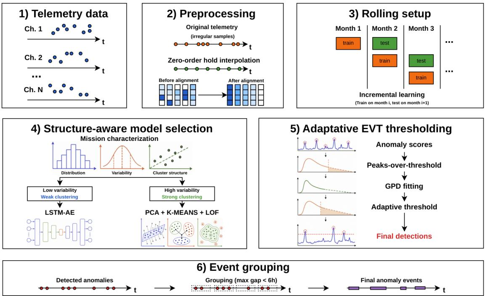
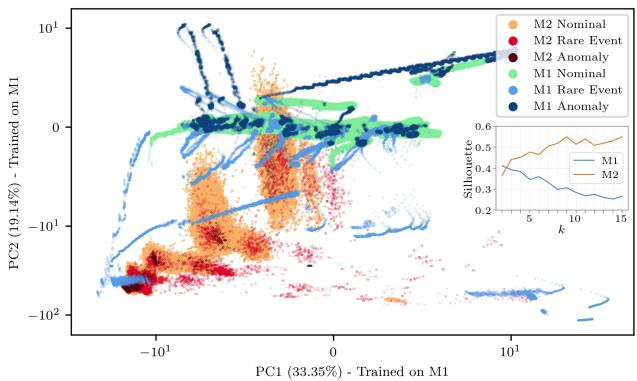
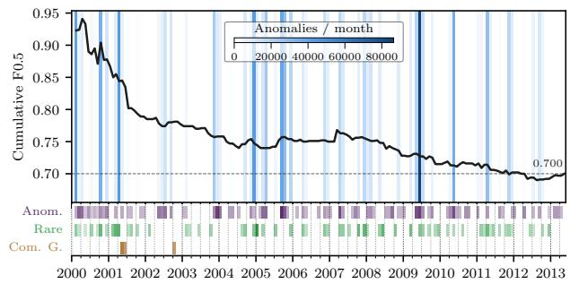
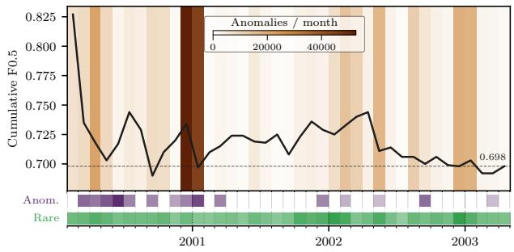

# Structure-Aware Unsupervised Anomaly Detection for Spacecraft Telemetry with Adaptive EVT Thresholding

Óscar Alcarria∗1, Rafael Sánchez†1, Javier Sempere2, Pablo Torrijos1, Juan C. Alfaro1, Juan M. Auñón3, José A. Gámez1, José M. Puerta1

1Universidad de Castilla-La Mancha, Albacete, Spain

2GMV GmbH, Darmstadt, Germany

3GMV, Madrid, Spain

Operational anomaly detection in spacecraft telemetry typically requires labeled historical anomalies or extended warm-up periods. These requirements are rarely met in practice. We propose an unsupervised, deployment-ready framework that produces predictions from the second month of operation without any labels, prior fault knowl edge, or mission-specific tuning. The approach combines incremental monthly retraining, statistical model selection, and adaptive Extreme Value Theory (EVT) thresholding for false alarm control. On the ESA Anomalies Dataset (ESA-AD), it achieves $F _ { 0 . 5 } = 0 . 7 0 0$ on Mission 1 and $F _ { 0 . 5 } = 0 . 6 9 8$ on Mission 2 under strict chronological evaluation.

## 1 Introduction

Anomaly detection in spacecraft telemetry involves identifying of-nominal behavior in multivariate, non-stationary time series under strict operational constraints. In practice, mission control environments rarely provide complete labeled fault histories, dedicated GPU hardware, or years of accumulated telemetry before monitoring must begin.

The European Space Agency (ESA) Anomalies Dataset (ESA-AD) [1] is the most comprehensive publicly available benchmark for anomaly detection in spacecraft telemetry, providing expert-annotated data from three complete ESA missions with a hierarchical event-wise evaluation pipeline. Two missions are used for benchmarking: Mission 1 (M1) features 76 telemetry channels (58 target) with 118 anomalies and 78 rare nominal events; Mission 2 (M2) features 100 channels (47 target) with 31 anomalies and 613 rare nominal events.

An exploratory analysis of the ESA-AD reveals marked statistical diferences across missions, suggesting that a sin-gle modeling strategy may not generalize consistently. We propose a structure-aware framework that: (1) selects the detection paradigm based on mission-level statistical prop- erties; (2) integrates incremental monthly retraining for deployment from the second month of operation; and (3) ap- plies adaptive Extreme Value Theory (EVT)-based thresholding for robust, precision-oriented event-wise anomaly

detection. Without labels, GPU hardware, or extensive his- torical data, the framework matches or surpasses industrial supervised baselines on ESA-AD.

## 2 Methodology

## 2.1 Problem Definition and Constraints

We address the detection of anomalous events in multivari- ate satellite telemetry under fully anonymized conditions, preventing the use of mission-specific semantics or physicsbased priors. Following the ESA Benchmark for Anomaly Detection in Satellite Telemetry (ESA-ADB) [1] definition, anomalies are modeled as contiguous of-nominal temporal segments rather than isolated outliers. To reflect realis- tic deployment constraints [2], our framework operates without labels or GPU hardware and is evaluated under a chronological incremental setup that preserves temporal causality and avoids information leakage. Performance is measured using the corrected event-wise $F _ { 0 . 5 }$ score [1], where $\beta = 0 . 5$ weights precision higher than recall and the event-wise precision is corrected by the sample-level true negative rate to penalize algorithms that over-flag nominal periods.

Figure 1 summarizes the proposed workflow, from pre-processing and monthly incremental learning to structure-aware model selection, adaptive EVT thresholding, and post-detection anomaly grouping.

## 2.2 Data Preprocessing

Following the preprocessing protocol in [2], the asyn-chronous and irregularly sampled telemetry channels are first combined over their original timestamps, producing a sparse multivariate time series. Each channel is then pro-cessed independently: missing entries are discarded and the remaining observations are projected onto a missionspecific uniform grid with sampling intervals of 30 s for M1 and 18 s for M2. Zero-order hold interpolation is ap- plied, such that each grid timestamp receives the most re- cently observed channel value. To prevent short annotated events from disappearing during temporal discretization, a channel-aware preservation procedure is applied after resampling. For each grid interval overlapping an event an-notation, the last original telemetry value recorded within the annotated interval is copied to the following grid times- tamp. The resampled channels are subsequently aligned on the common temporal grid and concatenated into a sin- gle multivariate series. Finally, event labels are assigned using inclusive start and end times, with samples encoded as normal (y = 0), rare event (y = 1), or anomaly (y = 2); anomalies take precedence when annotated intervals over- lap. The resulting dataset is verified to contain a regular datetime index and no missing values.

  
Figure 1: Overview of the proposed structure-aware anomaly detection framework.

## 2.3 Incremental Learning Setup

Instead of relying on the static partitioning from ESA-ADB, we implement an incremental learning strategy utilizing a monthly sliding window. In this setup, the model is trained exclusively on the previous month’s data and evaluated on the subsequent month, allowing for deployment from the very first available period without the need for large historical datasets. This strategy is well suited to oper-ational environments, as it allows the detector to adapt progressively to changes in telemetry behavior over time and aligns with the update cycles typically found in production monitoring systems.

## 2.4 Mission Characterization

To characterize the missions and guide the selection of appropriate anomaly detection models, we conducted a comparative statistical analysis on the complete datasets of both missions from the ESA-ADB benchmark, including nominal, rare, and anomalous events.

First, the Energy Distance [3] between M1 and M2 is 4.33, indicating substantial multivariate distributional differences. Statistical significance was assessed via a permutation test (200 permutations) [4], in which mission labels were randomly reassigned while preserving sam- ple sizes. No permuted statistic exceeded the observed value (p < 0.005), confirming the absence of a shared statistical structure between missions. For each mission, the coeficient of variation (CV) was computed independently for each sensor as the ratio of its standard deviation to its absolute mean, and subsequently averaged across all numerical variables. This analysis reveals low vari- ability in M1 (CV= 0.13), consistent with relatively stable dynamics, whereas M2 exhibits markedly higher vari- ability (CV= 1.27), reflecting greater overall dispersion across sensors.

Clustering structure was evaluated using K-means [5] with Euclidean distance on standardized features, exploring multiple values of k. The Silhouette coeficient [6] (inset in Fig. 2) yields consistently higher scores for M2, suggesting more compact and well-separated clusters, while M1 displays weaker intrinsic segmentation. Principal Com-ponent Analysis (PCA) projections [7] (Fig. 2) obtained by fitting PCA on M1 and applying the transformation to both missions, further reinforce this distinction. The first two principal components explain 33.35% and 19.14% of the total variance, respectively. In this shared subspace, M1 presents a largely continuous and overlapping distribution structured around a limited number of principal lin- ear directions, whereas M2 exhibits more separated dense regions and isolated low-density areas, consistent with stronger local clustering structure and variance distributed across multiple dimensions.

  
Figure 2: PCA projection of Mission 1 (M1) and Mission 2 (M2). The model is fitted exclusively on M1 using all its variables, which are common to M2. The inset shows the Silhouette score as a function of the number of clusters (k).

Overall, these observations motivate the hypothesis that in M1 anomalous behavior may manifest as subtle devi- ations embedded within stable dynamics, whereas in M2 anomalies may align with clearer structural separations. The statistical analysis rules out a single-model approach and motivates a structure-driven selection. Generic stan dalone models (e.g. single local-density detector or autoencoder) performed poorly in preliminary experiments, confirming that tailored strategies are required to accom-modate mission variability.

## 2.5 Model Selection and Training

The model selection strategy is directly informed by the statistical characterization presented in the previous phase. Since the two missions exhibit fundamentally diferent statistical structures, distinct modeling approaches are adopted within the same methodological framework.

## 2.5.1 Temporal Reconstruction Model

M1 is characterized by low variability and a weak intrinsic clustering structure. These properties suggest that anomalies are likely to manifest as subtle temporal deviations embedded within otherwise stable signals. Accordingly, an unsupervised Long Short-Term Memory (LSTM) autoencoder [8] is employed. This architecture enables the capture of both temporal dynamics and nonlinear rela- tionships among variables, which is essential in scenarios characterized by stable signals and low-magnitude anoma- lies. For each input sequence $\mathbf { x } _ { t } \in \mathbb { R } ^ { L \times F }$ , where L is the sequence length and F is the number of features, the model reconstructs the input as $\hat { \mathbf { x } } _ { t }$

To comply with CPU-only constraints and monthly in-cremental retraining, a lightweight LSTM autoencoder is adopted. Sequences of length $L = 6 4$ are processed by a single-layer architecture with 64 hidden units and a 16- dimensional latent space, limiting model capacity to reduce overfitting and ensure eficient retraining. The model is optimized with Adam (learning rate $1 0 ^ { - 3 } )$ for up to 30 epochs, with a batch size of 128. Early stopping (patience = 3) monitors the training reconstruction loss and triggers in most monthly windows, indicating that convergence typically occurs before the epoch limit. Prior to each training cycle, robust sample-level filtering based on the Median Ab- solute Deviation (MAD) is applied to reduce the influence of outliers on the learned reconstruction patterns.

The reconstruction error for each sequence is quantified as mean squared error (MSE):

$$
s _ { t } = \frac { 1 } { L F } \sum _ { i = 1 } ^ { L } \sum _ { j = 1 } ^ { F } \left( x _ { t - L + i , j } - \hat { x } _ { t - L + i , j } \right) ^ { 2 }\tag{1}
$$

The resulting anomaly scores $\left\{ { { s } _ { t } } \right\}$ may shift across tem- poral windows due to non-stationary system dynamics, making fixed thresholds unreliable. An initial threshold is set at the 98th percentile of the training reconstruction error and subsequently refined through the adaptive EVT- based procedure described in Section 2.6.

## 2.5.2 Clustering-Based Framework

M2 exhibits high variability, pronounced clustering structure, and variance distributed across multiple dimensions. These characteristics indicate the presence of well-defined operational regimes and locally structured state spaces. To exploit this structure, a clustering-based anomaly detection framework is adopted. The pipeline consists of: (1) Robust scaling and preliminary unsupervised filtering of extreme outliers as in the previous model; (2) PCA-based dimensionality reduction to learn a compact representation of nominal behavior; (3) K-means clustering to model operational regimes in the reduced subspace; (4) Local Outlier Factor (LOF) [9] to quantify local density deviations; and (5) a combined anomaly score integrating regime proximity and local density information.

PCA reduces dimensionality while preserving the dominant structure of normal operation. K-means captures recurrent operational modes, and LOF evaluates the degree of local deviation within each regime. The anomaly score combines the LOF novelty score with the distance to the nearest cluster centroid in the PCA subspace, giving LOF (0.7) a higher weight than centroid distance (0.3), thereby prioritizing local density distortions while retaining sensi- tivity to global regime shifts.

Hyperparameters are automatically inferred from each training window without supervised tuning. PCA dimen-sionality is set to explain 95% cumulative variance. The number of clusters is estimated using the Gap Statistic [10] within a data-dependent range, and the LOF neighborhood size scales with $\sqrt { n }$ and the reduced dimensionality to en- sure stable density estimation. Anomaly scores are first calibrated using the 98th percentile before applying the dynamic thresholding procedure described in Section 2.6.

## 2.6 EVT-Based Dynamic Thresholding

Because anomaly-score distributions may vary across tem-poral windows, fixed thresholds can become unreliable. We therefore apply a peaks-over-threshold EVT proce- dure [11], which adapts the threshold to the upper tail of the calibration-score distribution.

For window $k ,$ let $S _ { k } = \{ s _ { k , 1 } , . . . , s _ { k , n _ { k } } \}$ denote the calibration scores and define the preliminary threshold as $u _ { k } = Q _ { q } ( S _ { k } )$ , where $Q _ { q }$ is the empirical quantile of order q. The excesses $Y _ { k } = \{ s _ { k , i } - u _ { k } \ | \ s _ { k , i } > u _ { k } \}$ are fitted by maximum likelihood to a Generalized Pareto Distribu- tion (GPD) with shape $\xi _ { k }$ and scale $\sigma _ { k } > 0 ,$ provided that $n _ { u , k } = | Y _ { k } | \ge N _ { \operatorname* { m i n } }$ . Let $p _ { u , k } = n _ { u , k } / n _ { k }$ be the empir- ical probability of exceeding $u _ { k }$ . For a target upper-tail probability $\alpha ,$ , the resulting threshold is

$$
T _ { \mathrm { E V T } , k } = \left\{ \begin{array} { l l } { \displaystyle u _ { k } + \frac { \sigma _ { k } } { \xi _ { k } } \left[ \left( \frac { p _ { u , k } } { \alpha } \right) ^ { \xi _ { k } } - 1 \right] , } & { \displaystyle | \xi _ { k } | > \varepsilon , } \\ { \displaystyle u _ { k } + \sigma _ { k } \log \left( \frac { p _ { u , k } } { \alpha } \right) , } & { \displaystyle | \xi _ { k } | \leq \varepsilon , } \end{array} \right.\tag{2}
$$

where $\varepsilon$ handles the limiting case $\xi _ { k } \approx 0 .$ . If fewer than $N _ { \mathrm { m i n } }$ excesses are available or the GPD fit is invalid, the empirical quantile $Q _ { 1 - \alpha } ( S _ { k } )$ is used as fallback.

To prevent abrupt variations between consecutive windows, we first compute the exponentially smoothed thresh- old $\widetilde { T } _ { k } = \lambda T _ { \mathrm { E V T } , k } + ( 1 - \lambda ) T _ { k - 1 }$ . Its relative change is then limited to δ:

$$
T _ { k } = \mathrm { c l i p } \Big ( \widetilde { T } _ { k } , ( 1 - \delta ) T _ { k - 1 } , ( 1 + \delta ) T _ { k - 1 } \Big ) .\tag{3}
$$

A score is classified as anomalous when $s _ { k , t } > T _ { k }$ . All hyperparameters were fixed a priori without label-based optimization: $q ~ = ~ 0 . 9 8 , \alpha ~ = ~ 0 . 0 1 , N _ { \mathrm { m i n } } ~ = ~ 3 0$ , and $\lambda = \delta = 0 . 0 5$ . Thus, the GPD models the most extreme 2% of scores, requires at least 30 excesses, and limits threshold changes to 5% per window. Here, α is a target upper-tail exceedance probability, not a guaranteed false-positive rate.

## 2.7 Post-detection Anomaly Grouping

Following operational practice [2], detected anomalies sep- arated b less than 6 hours are consolidated into a sin le event, reducing redundant alarms and improving diagnostic clarity. This threshold reflects expert recommendations from satellite operations centers.

## 3 Results

Table 1 summarizes the global event-wise performance for both missions. In M1, the framework achieves high pre- cision with moderate recall, yielding $F _ { 0 . 5 } = 0 . 7 0 0$ . This conservative behavior is operationally desirable: the frame- work fla s fewer events but with hi h confidence, minimiz- ing unnecessary operator interventions. In M2, the trade- of is more balanced $( F _ { 0 . 5 } = 0 . 6 9 8 )$ , detecting a larger proportion of anomalies at the cost of lower precision.

<table><tr><td>Metric</td><td>Mission 1 (M1)</td><td>Mission 2 (M2)</td></tr><tr><td>Event-wise Precision</td><td>0.852</td><td>0.721</td></tr><tr><td>Event-wise Recall</td><td>0.408</td><td>0.621</td></tr><tr><td>Event-wise  $F _ { 0 . 5 }$ </td><td>0.700</td><td>0.698</td></tr><tr><td>True Negative Rate</td><td>0.977</td><td>0.801</td></tr></table>

Table 1: Global event-wise performance for M1 and M2.

Figs. 3 and 4 show the temporal evolution of the cumula- tive corrected $F _ { 0 . 5 } .$ . In M1, anomalous and rare events con- centrate heavily in 2000, predominantly in event class 22 [1, Fig 1], and become sparser afterwards. The $F _ { 0 . 5 }$ curve reflects this: scores above 0.9 during the initial dense period, gradually stabilizing between 0.7 and 0.8 as anomalies dis- perse across classes. In M2, event classes are more constant throughout the mission. The cumulative $F _ { 0 . 5 }$ drops briefly during the first months but recovers quickly, stabilizing around 0.7 with narrower oscillations.

  
Figure 3: Cumulative corrected $F _ { 0 . 5 }$ over time for Mission 1. The labels Anom., Rare, and Com. G. denote anomalous events, rare nominal events, and communication gaps, respectively.

  
Figure 4: Cumulative corrected $F _ { 0 . 5 }$ over time for Mission 2. The labels Anom., Rare, and Com. G. denote anomalous events, rare nominal events, and communication gaps, respectively.

Comparison with existing baselines. Within the ESA-AD ecosystem, industrial unsupervised solutions such as [2] have reported event-wise $F _ { 0 . 5 }$ scores of 0.424 for Mis- sion 1 and 0.882 for Mission 2 under static train/test con- figurations. In comparison, the proposed framework yields substantially improved results in Mission 1 while maintaining competitive performance in Mission 2. Impor- tantly, these results are obtained under a strictly incre- mental monthly retraining scheme from the first available period, without reliance on extended historical partitions or mission-specific hyperparameter tailoring, and within a fully deployment-oriented configuration.

For a broader context, [1] reports results under a static 50/50 train/test split. Using all channels, the best models achieve $F _ { 0 . 5 } = 0 . 0 6 1$ for M1 and $F _ { 0 . 5 } = 0 . 2 4 1$ for M2. Su- pervised approaches with channel-subset selection reach $F _ { 0 . 5 } = 0$ .786 and $F _ { 0 . 5 } = 0 . 9 4 9$ , respectively. Although not directly comparable, our framework achieves $F _ { 0 . 5 } = 0 . 7 0 0$ and $F _ { 0 . 5 } = 0 . 6 9 8$ without any label or channel selection, substantially narrowing the gap with supervised methods. This is particularly significant for M1, where existing unsupervised baselines struggle most.

Computational Cost. Under identical hardware con-straints, using CPU-only execution and 16 GB of RAM, M1 evaluation over 161 monthly windows required 27.5 epochs/window on average, with a mean retraining time of 1041.71 s/window (total: 46.64 h) and peak memory averaging 7.72 GB (max: 8.11 GB). M2 evaluation over 40 monthly windows required 214.65 s/window (total: 2.5 h) and peak memory averaging 0.54 GB (max: 1.09 GB). No inter-window memory accumulation was observed in either mission.

## 4 Discussion

Although the framework is evaluated under a strictly in- cremental regime, the exploratory analysis in Section 2.4 is performed on the complete mission datasets exclusively for descriptive purposes, to evidence global statistical diferences and justify the choice of diferent model families. It is not used for hyperparameter tuning, threshold calibration, or any label-dependent decision. In operational scenar- ios, a short warm-up phase with generic detectors can be used to accumulate historical data, after which a statistical assessment restricted to the observed period may guide model selection without introducing information leakage. This separation between statistical characterization and operational training preserves chronological validity while retaining the benefits of structure-aware model selection.

Hyperparameters were selected using standard practices rather than supervised optimization, consistent with the fully unsupervised deployment scenario. When labeled historical data are available, the framework could be ex- tended using automated machine learning (AutoML) strate-gies [12] to jointly optimize model architectures, hyperpa-rameters, and thresholds via systematic search procedures guided by event-wise $F _ { 0 . 5 }$ . This would enable adaptive, reproducible model selection across missions, reducing manual-tuning bias.

## 5 Acknowledgments

This work was carried out within the framework of the INCIBE project AI- and ML-Based Behavioural Anomaly Detection Module, ref. 250120UCTR-INCIBE (SIMD-I3A Laboratory), with additional support through technical assistance contracts funded by GMV Soluciones Globales Internet, S.A.

This work was also partially funded by the University of Castilla-La Mancha and the European Regional Development Fund (ERDF), ”A Way of Making Europe”, under project 2025-GRIN-38476.

## References

1. Kotowski, K. et al. European Space Agency Benchmark for Anomaly Detection in Satellite Telemetry 2025. arXiv: 2406.17826 [cs.LG].

2. Tejedor, M., Jiménez, H., Pozo, J. A., Perea, I. & Auñón, J. M. Enhancing Space Operations with Unsupervised Anomaly Detection: The PitIA System in Proceedings of the 2025 conference on Big Data from Space (BiDS’25) (eds Kempeneers, P., Lumnitz, S. & Albani, S.) (Publications Ofice of the European Union, Luxembourg, 2025), 57–60. isbn: 978-92-68-31935-2.

3. Székely, G. J. & Rizzo, M. L. Energy statistics: A class of statistics based on distances. Journal of Statistical Planning and Inference 143, 1249–1272. issn: 0378-3758 (2013).

4. Good, P. I. Permutation, Parametric and Bootstrap Tests of Hypotheses 3rd. isbn: 978-0-387-20279-2 (Springer, New York, 2005).

5. MacQueen, J. Some Methods for Classification and Analysis ofMultivariate Observations in Proceedings ofthe Fifth Berkeley Symposium on Mathematical Statistics and Probability 1 (University ofCalifornia Press, Berkeley, CA, 1967), 281–297.

6. Rousseeuw, P. J. Silhouettes: A graphical aid to the interpretation and validation of cluster analysis. Journal of Computational and Applied Mathematics 20, 53–65. issn: 0377-0427 (1987).

7. Hotelling, H. Analysis of a Complex of Statistical Variables into Principal Components. Journal of Educational Psychology 24, 417– 441 (1933).

8. Malhotra, P. et al. LSTM-based Encoder-Decoder for Multi-sensor Anomaly Detection. arXiv: 1607.00148 [cs.AI] (2016).

9. Breunig, M., Kröger, P., Ng, R. & Sander, J. LOF: Identifying Density-Based Local Outliers. in. 29 (June 2000), 93–104.

10. Tibshirani, R., Walther, G. & Hastie, T. Estimating the Number of Clusters in a Data Set Via the Gap Statistic. Journal of the Royal Statistical Society Series B: Statistical Methodology 63, 411–423. issn: 1369-7412 (Jan. 2002).

11. Sifer, A., Fouque, P.-A., Termier, A. & Largouet, C. Anomaly Detection in Streams with Extreme Value Theory in Proceedings ofthe 23rd ACM SIGKDD International Conference on Knowledge Discovery and Data Mining (Association for Computing Machinery, Halifax, NS, Canada, 2017), 1067–1075. isbn: 9781450348874.

12. Automated Machine Learning: Methods, Systems, Challenges (eds Hutter, F., Kotthof, L. & Vanschoren, J.) isbn: 978-3-030-05317-8 (Springer International Publishing, Cham, 2019).