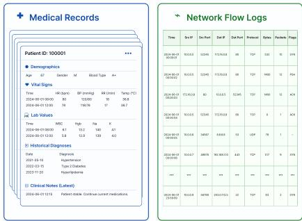
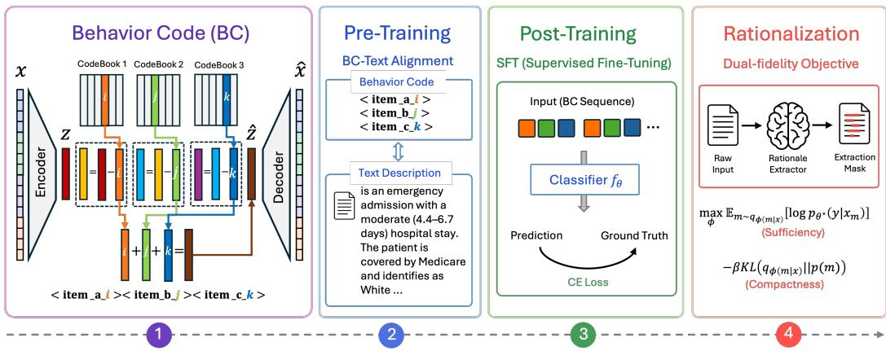

# TEFM: Token-Efficient Faithful Modeling for Structured Data

Zhichao Hou1 Lingdao Sha2 Xueyu Mao2 Yang Liu2 Peijie Qiu2 Rui Song2∗

1North Carolina State University, 2Amazon Web Services

zhou4@ncsu.edu, {lingdao,maxueyu,yngliun,peijieq,ruisong}@amazon.com

## Abstract

In this paper, we solve two fundamental obstacles in applying LLMs to critical domains: token efficiency and faithfulness. To address both constraints jointly, we present TEFM (Token-Efficient Faithful Modeling), a framework designed for structured data analysis in critical domains. TEFM achieves token efficiency by compressing lengthy structured observations into compact Behavioral Code tokens, dramatically reducing token consumption with minimal information loss. Moreover, TEFM enables faithful rationalization through a dual-fidelity objective that jointly optimizes code-level reconstruction and prediction-level fidelity, identifying minimal sufficient feature subsets grounded in input data. Comprehensive experiments across various domain datasets and model backbones (Qwen3, Gemma-2, Phi-4) show that TEFM achieves competitive classification accuracy with dramatic token reduction (approximately 1% token retention in clinical and 2% in security domains) while producing faithful rationales.

## 1 Introduction

Large language models have demonstrated remarkable capability across diverse critical domains. In healthcare, LLMs can assist diagnosis by analyzing lengthy medical records containing lab values, vital signs, and historical diagnoses (Rajkomar et al., 2018). In cybersecurity, LLMs can detect intrusions by examining network flow characteristics (Zarpelão et al., 2017). In marketplace regulation, LLMs can enforce policies by reviewing transaction histories.

As shown in Figure 1, these domains typically generate structured data such as medical records with patient vitals and lab values, or network flow logs with packetlevel statistics. While conventional models (tree-based ensembles, feedforward networks) handle tabular data effectively, LLM-based approaches offer complementary advantages in safety-critical applications: (1) multimodal reasoning—combining structured data with clinical notes, incident logs, or other text without separate preprocessing; (2) in-context interpretability—LLMs naturally produce human-readable reasoning grounded in specific features; (3) unified infrastructure—organizations already deploying LLMs can leverage a single model across domains.

  
Figure 1: Structured data examples.

Enabling LLMs to reason over structured data therefore opens a promising direction for safety-critical prediction.

However, applying LLMs to structured data introduces two fundamental obstacles:

(1) Token Efficiency. Structured data such as medical records or network logs consume excessive tokens when serialized as text. Long observation sequences quickly exhaust available context windows. The proportional cost of API calls and memory overhead make it impractical to process lengthy sequences without careful management of token consumption.

(2) Faithfulness. LLMs are prone to hallucinations and unfaithful predictions. In safety-critical domains such as healthcare and security, unreliable outputs pose severe risks: incorrect diagnoses may delay treatment, and false alerts may trigger costly interventions. Beyond accuracy alone, users require evidence that predictions are grounded in input data to support trustworthy decision-making.

Prior work has addressed these challenges separately. Context-extension approaches such as global memory tokens (Beltagy et al., 2020; Ainslie et al., 2020; Zaheer et al., 2020), sparse attention mechanisms (Child et al., 2019; Roy et al., 2021; Kitaev et al., 2020), and segment-based recurrence (Dai et al., 2019; Rae et al., 2019) modify model architecture but still scale with sequence length and suffer information loss under aggressive compression. Rationalization methods aim to identify sufficient input features (Lei et al., 2016; Bastings et al., 2019; Camburu et al., 2018; Narang et al., 2020), but most focus on NLP tasks with short free-text inputs; faithful rationalization for structured data remains largely unexplored.

This raises a fundamental question: How can we build a model that is simultaneously token-efficient, predictively accurate for high-dimensional structured data, and capable of providing faithful rationales grounded in the input?

To this end, we propose TEFM (Token-Efficient Faithful Modeling), a framework for structured data. TEFM reduces token consumption at the source with minimal information loss while providing faithful rationales grounded in input data. Our contributions are:

• A hierarchical tokenization pipeline that compresses lengthy structured observations into compact behavioral codes via Residual Quantized VAE, achieving ∼99% token reduction with minimal information loss.

• A two-stage training recipe: BC-text alignment pretraining integrates behavioral codes with LLM embeddings, preserving high-fidelity representations; supervised fine-tuning trains the LLM on compressed codes as a replacement for raw input, enabling token-efficient accurate predictions.

• A dual-fidelity rationalization framework that identifies minimal sufficient feature subsets by jointly optimizing code-level reconstruction and prediction-level fidelity, yielding faithful explanations grounded in input data without post-hoc perturbation.

• Comprehensive evaluation on clinical mortality prediction (MIMIC-III) and network intrusion detection (CIC-IDS2017), demonstrating competitive accuracy across diverse LLM architectures (Qwen3, Gemma-2, Phi-4), robust cross-domain generalization, and faithful rationale extraction.

The remainder of this paper is organized as follows. Section 2 describes the TEFM architecture, training methodology, and rationalization framework. Section 3 presents experimental results on clinical and security domains with thorough ablations. Section 5 discusses limitations and future directions.

## 2 TEFM: Token-Efficient Faithful Modeling

In this section, we introduce TEFM, a unified framework comprising four stages: (1) hierarchical Behavioral Code (BC) tokenization, (2) BC–text alignment pretraining, (3) supervised fine-tuning for classification, and (4) dual-fidelity variational rationalization. Figure 2 provides an overview of the complete pipeline.

## 2.1 Hierarchical High-Fidelity Tokenization

In many critical domains, structured data—such as medical records and network flow telemetry—are ubiquitous. A naive approach would serialize all observations into natural language and feed them into an LLM. However, this is prohibitively expensive: high-dimensional records quickly exhaust token budgets and incur substantial computational costs. Fortunately, structured observations exhibit inherent structure we can exploit. In reality, schema-conforming records exhibit natural hierarchy: groups of features co-occur, and many observations share dominant patterns while differing along only a few dimensions. Rather than treating each observation independently, we can leverage this hierarchical structure to dramatically reduce redundancy. We therefore propose hierarchical behavioral tokenization to exploit this structure and compress lengthy observations into a small set of hierarchical codes. This approach dramatically reduces token consumption while preserving task-relevant information for accurate predictions.

  
Figure 2: TEFM pipeline. Structured observations are compressed into discrete hierarchical Behavioral Codes (BCs) by an RQ-VAE tokenizer, dramatically reducing context cost. BC tokens are aligned with an LLM via lightweight pretraining, enabling efficient prediction over observation sequences. A learned feature extractor then provides interpretable rationales grounded in the original input, without requiring additional LLM inference.

Toy Example. To better illustrate this hierarchical compression principle, we present a concrete toy example in Figure 3. Consider eight binary observations of length 6. The first two dimensions always agree, so one top-level code $\langle a \rangle$ suffices: $\{ \mathbf { x } _ { 1 } , \ldots , \mathbf { x } _ { 4 } \}$ share $\left. a _ { 0 } \right.$ and $\big \{ \mathbf { x } _ { 5 } , \dotsc , \mathbf { x } _ { 8 } \big \}$ share $\left. a _ { 1 } \right.$ . Conditioned on ⟨a⟩, the next two dimensions co-occur and are captured by a second-level code ⟨b⟩; the final two dimensions by $\langle c \rangle$ . With 3 layers of codebook size 2, only $3 \times 2 = 6$ vocabulary tokens encode all $2 ^ { 3 } = 8$ patterns, with each observation compressed to exactly 3 tokens. In practice, the input space is vast in di-

$$
\begin{array} { r l } { \mathbf { x } _ { 1 } = [ 0 , 0 , 0 , 0 , 0 , 0 ] } & {  ~ \langle a _ { 0 } \rangle \langle b _ { 0 } \rangle \langle c _ { 0 } \rangle } \\ { \mathbf { x } _ { 2 } = [ 0 , 0 , 0 , 0 , 1 , 1 ] } & {  ~ \langle a _ { 0 } \rangle \langle b _ { 0 } \rangle \langle c _ { 1 } \rangle } \\ { \mathbf { x } _ { 3 } = [ 0 , 0 , 1 , 1 , 0 , 0 ] } & {  ~ \langle a _ { 0 } \rangle \langle b _ { 1 } \rangle \langle c _ { 0 } \rangle } \\ { \mathbf { x } _ { 4 } = [ 0 , 0 , 1 , 1 , 1 ] } & {  ~ \langle a _ { 0 } \rangle \langle b _ { 1 } \rangle \langle c _ { 1 } \rangle } \\ { \mathbf { x } _ { 5 } = [ 1 , 1 , 0 , 0 , 0 , 0 ] } & {  ~ \langle a _ { 1 } \rangle \langle b _ { 0 } \rangle \langle c _ { 0 } \rangle } \\ { \mathbf { x } _ { 6 } = [ 1 , 1 , 0 , 0 , 1 , 1 ] } & {  ~ \langle a _ { 1 } \rangle \langle b _ { 0 } \rangle \langle c _ { 1 } \rangle } \\ { \mathbf { x } _ { 7 } = [ 1 , 1 , 1 , 1 , 0 , 0 ] } & {  ~ \langle a _ { 1 } \rangle \langle b _ { 1 } \rangle \langle c _ { 0 } \rangle } \\ { \mathbf { x } _ { 8 } = [ 1 , 1 , 1 , 1 , 1 ] } & {  ~ \langle a _ { 1 } \rangle \langle b _ { 1 } \rangle \langle c _ { 1 } \rangle } \end{array}
$$

Figure 3: Eight length-6 binary observations are compressed into 3-level hierarchical codes.

mension and the hierarchy far more complex. However, the principle generalizes: behavioral data exhibits coarse-to-fine structure, and models that discover this structure automatically can represent exponentially large pattern spaces with tiny, reusable vocabularies. In general, a K-layer codebook with C entries per layer requires only $K \times C$ vocabulary tokens yet distinguishes up to $C ^ { K }$ distinct patterns. With ${ \bar { K } } = { \dot { 3 } }$ and $\bar { C } = 2 5 6$ , only 768 tokens encode up to $2 5 6 ^ { 3 } \approx 1 6 . 7 \mathrm { M }$ patterns, and each observation can be represented by exactly K tokens.

Hierarchical High-Fidelity Tokenization. Despite this intuition, achieving high-fidelity compression with efficient codebook utilization is non-trivial. Our primary goal is to dramatically reduce token consumption while preserving the information necessary for accurate predictions. The encoding process must not discard critical details and we should be able to recover the essential information from the compressed tokens. While prior work has attempt to create discrete codes for image (Van Den Oord et al., 2017) and descriptive sentence (Hou et al., 2023), those methods focus on general descriptive information without stringent requirements for lossless recovery or minimal information loss. In contrast, our setting demands faithful reconstruction: the compressed codes must retain sufficient information to support high-fidelity predictions from limited tokens.

To achieve high-fidelity hierarchical tokenization, we first vectorize structured records: categorical fields are enumerated, and continuous fields are discretized into B equal-frequency buckets, without preserving field names or metadata since this information is shared across all records and can be memorized by LLM during pretraining. Then the resulting vector $\textbf { x } \in \mathbb { R } ^ { D }$ is encoded via $\mathbf { E } ( \cdot ) : \mathbb { R } ^ { D }  \mathbb { R } ^ { d }$ and reconstructed via $\mathbf { D } ( \cdot ) : \mathbb { R } ^ { d }  \mathbb { R } ^ { D }$ via Residual Quantized VAE (RQ-VAE) architecture as shown in Figure 2 (Step 1). Given ${ \bf e } = { \bf E } ( { \bf x } )$ , we quantize through $K$ residual levels. At level $k ,$ the residual $\mathbf { r } ^ { ( k ) }$ (with $\mathbf { r } ^ { ( 1 ) } = \mathbf { e } )$ is assigned to its nearest codebook entry:

$$
i _ { k } = \arg \operatorname* { m i n } _ { j } \left\| \mathbf { r } ^ { ( k ) } - \mathbf { e } _ { j } ^ { ( k ) } \right\| _ { 2 } ^ { 2 } , \qquad \hat { \mathbf { r } } ^ { ( k ) } = \mathbf { e } _ { i _ { k } } ^ { ( k ) } , \qquad \mathbf { r } ^ { ( k + 1 ) } = \mathbf { r } ^ { ( k ) } - \hat { \mathbf { r } } ^ { ( k ) } .
$$

The quantized embedding $\begin{array} { r } { \hat { \mathbf { e } } = \sum _ { k = 1 } ^ { K } \hat { \mathbf { r } } ^ { ( k ) } } \end{array}$ is decoded to reconstruct the observation. The residual structure realizes the hierarchy: level 1 captures dominant patterns, and each subsequent level refines it. Training optimizes reconstruction plus per-level codebook and commitment losses:

$$
\mathcal { L } = \left\| \mathbf { D } ( \hat { \mathbf { e } } ) - \mathbf { x } \right\| _ { 2 } ^ { 2 } + \sum _ { k = 1 } ^ { K } \left[ \left\| \hat { \mathbf { r } } ^ { ( k ) } - \mathrm { s g } [ \mathbf { r } ^ { ( k ) } ] \right\| _ { 2 } ^ { 2 } + \beta \left\| \mathbf { r } ^ { ( k ) } - \mathrm { s g } [ \hat { \mathbf { r } } ^ { ( k ) } ] \right\| _ { 2 } ^ { 2 } \right] ,
$$

where $\mathrm { s g } [ \cdot ]$ is the stop-gradient operator and $\beta$ weights the commitment loss. Through vectorization and an encoder-decoder architecture, we compress each lengthy record into K discrete behavioral codes $( \mathbf { B C } ) \langle i _ { 1 } \rangle , \langle i _ { 2 } \rangle , \dots , \langle i _ { K } \rangle$ using encoder E, then recover the original data via decoder D.

## 2.2 Token-Efficient Training

After obtaining the behavioral codes (BC), we need to perform token-efficient prediction without directly accessing the original lengthy records. To achieve this, we first perform BC-text alignment to help the LLM understand these special tokens. Then we perform supervised fine-tuning on the prediction task of interest.

Pre-training: BC-Text Alignment. Behavioral Codes are new tokens outside the base LLM’s vocabulary. We align them through lightweight pretraining on paired (BC, natural-language description) data. We instantiate TEFM on a base LLM (e.g., Qwen3-1.7B) and add $K \times C + 2$ new tokens: the $K \times C \mathrm { B C }$ tokens plus boundary markers. Only the embedding layer is trainable; all transformer layers remain frozen. Since only ∼1–2% of parameters are trainable, pretraining converges in a small number of epochs. Each training example pairs a behavioral code with a natural-language description:

Pre-training Example in Clinical Data   
This admission <|item\_begin|><adm\_a\_138><adm\_b\_231><adm\_c\_132><|item\_end|> is   
an emergency admission with a moderate (4.4-6.7 days) hospital stay. The   
patient is covered by Medicare and identifies as White...

Fine-tuning: Task-specific SFT. After pretraining, we fine-tune the LLM on downstream classification tasks using BC-encoded representations as input. The model performs binary or multi-class prediction over observation sequences. For mortality prediction, the input presents the patient’s complete admission history and asks whether the patient died during their final hospitalization. For intrusion detection, the input presents a sequence of network flows and asks whether the final flow is part of an attack. Below we illustrate an SFT example from the clinical domain:

SFT Example in Clinical Data   
<|im\_start|>user   
This patient has 3 hospital admission(s):<|item\_begin|><adm\_a\_68><adm\_b\_25>   
<adm\_c\_7><|item\_end|>, <|item\_begin|><adm\_a\_12><adm\_b\_91><adm\_c\_44><|item\_end|>,   
<|item\_begin|><adm\_a\_53><adm\_b\_67><adm\_c\_19><|item\_end|>. Based on the   
patient’s admission history, did the patient die during their last hospital   
admission?   
<|im\_end|>   
<|im\_start|>assistant   
Yes, the patient died.   
<|im\_end|>

## 2.3 Dual-Fidelity Rationalization

In critical domains, predictions must be grounded in transparent rationales: users require evidence that decisions are justified by the input data. We formalize this requirement through two design principles: (1) Sufficiency: The extracted rationale must preserve predictive power—removing the selected features should not significantly degrade model performance. (2) Compactness: The rationale should be minimal—identifying only the essential features necessary for prediction, not extraneous ones. To achieve both principles simultaneously, we formalize rationalization as learning a binary mask that identifies the minimal input subset sufficient to preserve predictions. This mechanism forces the model to select only features that genuinely contribute to the decision.

Variational Objective. Let $\mathbf { x } \in \mathbb { R } ^ { D }$ be the raw input, $\mathbf { c } = \mathrm { B C } ( \mathbf { x } ) \in \{ 0 , \dots , C - 1 \} ^ { K }$ its behavioral code, and y the label. We seek a mask $\mathbf { m } \in \{ 0 , \dot { 1 } \} ^ { D }$ identifying features responsible for both code assignment and prediction:

$$
\begin{array} { r l } { \underset { \phi } { \operatorname* { m a x } } } & { \mathbb { E } _ { \mathbf { m } \sim q _ { \phi } ( \mathbf { m } | \mathbf { x } ) } \left[ \log p _ { \theta ^ { * } } \left( y \mid \mathbf { x _ { m } } \right) \right] - \beta \operatorname { K L } \left( q _ { \phi } ( \mathbf { m } \mid \mathbf { x } ) \parallel p ( \mathbf { m } ) \right) , } \end{array}\tag{1}
$$

where $q _ { \phi } ( \mathbf { m } \mid \mathbf { x } )$ is a learned rationale extractor, $p _ { \theta ^ { * } } ( y \mid \mathbf { x _ { m } } )$ is the prediction model on masked inputs, and $p ( \mathbf { m } )$ is a sparse prior that encourages feature compactness. The first term ensures sufficiency: the selected features must preserve predictive fidelity. The second term ensures compactness: the mask is regularized toward sparsity, selecting only essential features. However, this objective cannot be optimized directly: each candidate mask incurs the cost of RQ-VAE re-encoding and LLM inference, and both mask sampling and BC encoding are discrete operations that preclude gradient-based optimization.

Tractable Dual-fidelity Objective. We exploit the conditional independence structure: since the LLM observes only $\mathbf { c } ,$ not x directly, we have $Y \perp X \mid C .$ . This yields:

$$
\begin{array} { r } { p _ { \theta ^ { * } } \left( y \mid \mathbf { x } \right) = \displaystyle \sum _ { \mathbf { c } } p _ { \theta ^ { * } } \left( y \mid \mathbf { c } , \mathbf { x } \right) p _ { \theta ^ { * } } \left( \mathbf { c } \mid \mathbf { x } \right) = \displaystyle \sum _ { \mathbf { c } } p _ { \theta ^ { * } } \left( y \mid \mathbf { c } \right) p _ { \theta ^ { * } } \left( \mathbf { c } \mid \mathbf { x } \right) . } \end{array}\tag{2}
$$

Leveraging this decomposition, we can split the prediction fidelity into two complementary terms: (i) $p _ { \theta ^ { * } } ( \mathbf { c } \mid \mathbf { x } )$ ensures the selected input preserves the original behavioral code; and $\left( \mathrm { i i } \right) p _ { \theta ^ { * } } ( y \mid \mathbf { c } )$ ensures consistent predictions on the compressed representation. In practice, we train an extractor network $f _ { \phi } : \mathbb { R } ^ { D } \overset { \cdot } {  } [ 0 , 1 ] ^ { D }$ outputting a soft mask ${ \mathbf z } = f _ { \phi } ( { \mathbf x } )$ . The masked input is $\begin{array} { r } { \mathbf { x _ { z } } = \mathbf { x } \odot \mathbf { z } } \end{array}$ . The extractor is a residual $\mathbf { M L P              : } f _ { \phi } ( \mathbf { x } ) = \bar { \sigma } \left( \mathbf { M L P ( x ) } + W _ { \mathrm { s k i p } } \mathbf { \bar { x } } \right)$ , where MLP is a three-layer network and σ is sigmoid function. The overall loss combines three terms:

$$
\begin{array} { r } { \mathcal { L } ( \phi ) = \lambda _ { 1 } \mathcal { L } _ { \mathrm { B C } } + \lambda _ { 2 } \mathcal { L } _ { \mathrm { p r e d } } + \lambda _ { 3 } \mathcal { L } _ { \mathrm { s p a r s e } } . } \end{array}\tag{3}
$$

In practice, we decompose the overall objective into three complementary terms: (1) BC Reconstruction Sufficiency: Ensures masked features preserve RQ-VAE latent representation: $\mathcal { L } _ { \mathrm { B C } } =$ $\begin{array} { r } { \left\| \mathbf { E } ( \mathbf { x } \odot \mathbf { z } ) - \mathrm { s g } [ \mathbf { E } ( \mathbf { x } ) ] \right\| _ { 2 } ^ { 2 } . } \end{array}$ . (2) Prediction Sufficiency: Since the fine-tuned LLM is non-differentiable during extraction, we train a lightweight surrogate MLP classifier $g _ { \psi }$ : on RQ-VAE latents to mimic LLM predictions. We minimize KL divergence between surrogate outputs on masked versus original inputs: $\mathcal { L } _ { \mathrm { p r e d } } = D _ { \mathrm { K L } } \left( g _ { \psi } ( \mathbf { E } ( \mathbf { x } ) ) \left. g _ { \psi } ( \mathbf { E } ( \mathbf { \bar { x } } \odot \mathbf { z } ) ) \right) \right)$ . (3) Sparsity: Penalizes total mask mass to encourage compact explanations: $\mathcal { L } _ { \mathrm { s p a r s e } } = \| \mathbf { z } \| _ { 1 }$ . Unlike the ideal variational objective, this formulation is fully differentiable, requires no stochastic sampling, and trains stably via backpropagation.

Input-adaptive top-K masking. After training, we extract binary rationales via input-adaptive top-K masking. For each input, we compute the soft mask ${ \mathbf z } = f _ { \phi } ( { \mathbf x } )$ and select the top-K features: $m _ { i } = \mathbf { 1 } [ z _ { i } \in \mathrm { t o p } \mathrm { - K } ( \mathbf { z } ) ]$ , where K is set to achieve a target sparsity level (e.g., 5–30%). This allows each sample to use different features based on learned importance. The masked observations are re-encoded through the RQ-VAE to produce rationale-based Behavioral Codes, enabling evaluation of retained information at each sparsity level.

## 3 Experiments

In this section, we evaluate TEFM from four complementary perspectives: (1) tokenization reconstruction fidelity, (2) token-efficient prediction performance on behavior codes, (3) rationalization quality, and (4) ablation studies that isolate the contribution of each training stage and model component.

## 3.1 Experimental Settings

Datasets and Tasks. We evaluate TEFM on two domains: clinical mortality prediction and network intrusion detection. For mortality prediction, we use MIMIC-III (Johnson et al., 2016), where each patient is represented by a sequence of hospital admissions with structured clinical records. For intrusion detection, we use CIC-IDS2017 (Sharafaldin et al., 2018), focusing on DDoS and PortScan traffic represented by sequences of network flows. Detailed dataset descriptions are provided in Appendix A.

Backbone and Model Configuration. Unless otherwise specified, we use Qwen3-1.7B as the default backbone. To evaluate the scalability and generality of TEFM, we further conduct experiments on Qwen3-0.6B, Qwen3-4B, Qwen3-8B, Gemma2-2B, and Phi-4-mini. All backbones use the same behavioral code tokenizer and training pipeline.

Hyperparameters and Training. BC–text alignment pretraining is conducted for 3 epochs using AdamW with a learning rate of $1 \bar { 0 } ^ { - 3 }$ and linear warmup over the first 500 optimization steps, while the transformer layers remain frozen. Supervised fine-tuning is conducted for 5 epochs using a causal language modeling objective, a learning rate of $1 0 ^ { - 5 } ,$ , a cosine annealing schedule, and full-parameter optimization. The rationalization extractor is trained for 100 epochs using Adam with a learning rate of $1 0 ^ { - 3 }$ . We set the fidelity-loss weights to $\lambda _ { 1 } = \lambda _ { 2 } = 1 . 0$ and the sparsity-loss weight to $\lambda _ { 3 } = 0 . 1$ All experiments are conducted with a batch size of 32 for the clinical task and 64 for the network security tasks.

## 3.2 Tokenization

We evaluate the tokenization pipeline across three dimensions: (1) RQ-VAE compression fidelity, measuring reconstruction fidelity via slot accuracy; (2) BC-text alignment pretraining, verifying that the frozen encoder recovers codes from natural-language descriptions; and (3) hierarchical structure, confirming that multi-level organization captures meaningful domain similarity at progressively finer granularities. All evaluations use $K = 3$ levels with $C = 1 2 8$ codebook entries per level (K3-C128) as the default configuration; ablations across alternative codebook depths and sizes are in Section 3.5.

Table 1: RQ-VAE reconstruction quality.
<table><tr><td>Dataset</td><td>Slot AUC</td><td>Slot AUC (±1)</td><td>Reconstruction</td></tr><tr><td>Clinical</td><td>0.9438</td><td>0.9491</td><td>0.0407</td></tr><tr><td>DDoS</td><td>0.9728</td><td>0.9994</td><td>0.0012</td></tr><tr><td>PortScan</td><td>0.9859</td><td>0.9995</td><td>0.0009</td></tr></table>

Table 2: BC-text alignment quality.
<table><tr><td>Domain</td><td>Slot AUC</td><td>Slot AUC (±1)</td></tr><tr><td>Clinical</td><td>0.9063</td><td>0.9177</td></tr><tr><td>DDoS</td><td>0.9692</td><td>0.9976</td></tr><tr><td>PortScan</td><td>0.9845</td><td>0.9984</td></tr></table>

RQ-VAE Compression Fidelity. We use three metrics to measure compression fidelity: (1) Slot AUC measures the match ratio between original and reconstructed features; (2) Slot AUC (±1) tolerates single-bucket quantization errors; (3) Reconstruction MSE quantifies normalized feature-level error. Table 1 demonstrates high-fidelity reconstruction across domains.

BC-Text Alignment Pretraining. BC tokens achieve strong alignment with the LLM embedding space through lightweight pretraining (Table 2). Clinical alignment reaches 90.6%, security tasks exceed 96.9%, with tolerant accuracy (Slot $\mathbf { A U C } \pm 1 )$ exceeding 91.7% across domains, confirming that the frozen encoder reliably maps textual descriptions to corresponding BCs.

Hierarchical structure analysis. To verify that RQ-VAE discovers meaningful hierarchical grouping, we measure intra-group and inter-group $L ^ { 2 }$ distances at three BC prefix levels: first token $( a ) .$ , first two tokens $( a + b )$ , and full code $( a + b + c )$ . For each level, we sample 5,000 intra-group pairs (sharing the prefix) and 5,000 intergroup pairs, reporting mean distances and

Table 3: Hierarchical structure: intra-group distances decrease with longer BC prefixes, confirming progressive refinement.
<table><tr><td>BC Prefix</td><td>Intra Distance</td><td>Inter Distance</td><td>Ratio</td></tr><tr><td>a</td><td> $4 . 6 0 6 \pm 1 . 8 8 1$ </td><td> $7 . 4 2 \pm 1 . 2 7$ </td><td>0.619</td></tr><tr><td> $a + b$ </td><td> $2 . 3 2 3 \pm 1 . 2 3 9$ </td><td> $7 . 4 2 \pm 1 . 2 7$ </td><td>0.313</td></tr><tr><td> $a + b + c$ </td><td> $1 . 2 1 7 \pm 1 . 0 6 3$ </td><td> $7 . 4 4 \pm 1 . 2 5$ </td><td>0.164</td></tr></table>

the intra/inter ratio (lower indicates better cluster separation). As shown in Table 3, inter-group distance remains stable across all levels $( 7 . 4 2 \pm 1 . 2 7$ mean), confirming robust separation at each hierarchy level. Intra-group distance decreases monotonically with prefix length, and the intra/inter ratio drops from 0.619 to 0.164—observations sharing a full BC are approximately six times more similar in feature space than observations from different BC groups. This progressive refinement demonstrates hierarchical organization: the first token clusters coarse behavioral types, the second refines distinctions within types, and the third identifies maximally similar observations. Crucially, this structure emerges from unsupervised training without label supervision, demonstrating that RQ-VAE naturally discovers multi-resolution organization in high-dimensional feature space.

## 3.3 Token-Efficient Prediction

Performance Across Architectures, Scales and Domains. TEFM demonstrates robust generalization across diverse LLM architectures with consistent compression and minimal accuracy degradation. Table 4 shows that despite significant architectural differences (Qwen3, Gemma-2, Phi-4), TEFM achieves uniform 99% token reduction (34–37 tokens per record) across all models. Accuracy degradation is bounded: five of six models experience <2% loss, with Phi-4-mini showing negligible loss (0.08%). Notably, Qwen3-4B slightly improves (0.8048 → 0.8117), suggesting compression acts as implicit regularization. Macro F1 scores track closely with accuracy, confirming balanced class-wise performance. Cross-domain evaluation (Appendix B) validates this consistency on network intrusion detection: DDoS detection achieves 1.72% token retention with 99.6–99.9% accuracy across models, and PortScan detection achieves 1.71% retention with 99.4–99.8% accuracy. The uniformity of compression rates and modest accuracy trade-offs across clinical and security domains establish TEFM as an architecture-agnostic, domain-agnostic mechanism suitable for production deployment across diverse model families and problem settings.

Table 4: Clinical mortality prediction (MIMIC-III): TEFM achieves 99% token compression across diverse LLM architectures (Qwen3, Gemma-2, Phi-4) with bounded accuracy degradation (<2% in most cases). Compression effectiveness is stable across model families and sizes, demonstrating architecture-agnostic generalization.
<table><tr><td>Model</td><td>Input Tokens</td><td>Compression</td><td>Accuracy</td><td>Macro F1</td></tr><tr><td>TF-IDF + Logistic Regression</td><td></td><td></td><td>0.7713</td><td>0.7709</td></tr><tr><td>XGBoost</td><td></td><td></td><td>0.7661</td><td>0.7580</td></tr><tr><td>Set Transformer</td><td></td><td></td><td>0.7997</td><td>0.7993</td></tr><tr><td>LightGBM</td><td></td><td></td><td>0.8117</td><td>0.8105</td></tr><tr><td>TabPFN</td><td></td><td></td><td>0.8169</td><td>0.8168</td></tr><tr><td>Qwen3-0.6B</td><td>3,938</td><td>100%</td><td>0.8315</td><td>0.8313</td></tr><tr><td>Qwen3-0.6B + TEFM</td><td>35</td><td>0.89%</td><td>0.8117</td><td>0.8117</td></tr><tr><td>Qwen3-1.7B</td><td>3,938</td><td>100%</td><td>0.8289</td><td>0.8275</td></tr><tr><td>Qwen3-1.7B + TEFM</td><td>35</td><td>0.89%</td><td>0.8212</td><td>0.8211</td></tr><tr><td>Qwen3-4B</td><td>3,938</td><td>100%</td><td>0.8048</td><td>0.8043</td></tr><tr><td>Qwen3-4B + TEFM</td><td>35</td><td>0.89%</td><td>0.8117</td><td>0.8117</td></tr><tr><td>Qwen3-8B</td><td>3,938</td><td>100%</td><td>0.8435</td><td>0.8435</td></tr><tr><td>Qwen3-8B + TEFM</td><td>35</td><td>0.89%</td><td>0.8237</td><td>0.8237</td></tr><tr><td>Gemma-2-2B</td><td>3,630</td><td>100%</td><td>0.8134</td><td>0.8123</td></tr><tr><td>Gemma-2-2B + TEFM</td><td>37</td><td>1.02%</td><td>0.8057</td><td>0.8053</td></tr><tr><td>Phi-4-mini</td><td>3,724</td><td>100%</td><td>0.8022</td><td>0.8021</td></tr><tr><td>Phi-4-mini + TEFM</td><td>34</td><td>0.91%</td><td>0.8014</td><td>0.8012</td></tr></table>

## 3.4 Rationalization

Contributive Rationalization. Table 5 demonstrates that dual-fidelity optimization outperforms traditional attribution methods across all feature retention levels, with particularly strong performance under aggressive compression. At 20% feature retention, our Dual Fidelity Extractor matches SHAP (0.8040 vs. 0.8043 accuracy), but shows substantial advantages at lower thresholds: at 10%, Dual Fidelity achieves 0.7704 compared to SHAP’s 0.7429 (+1.9%); at 5%, the gap widens to 0.7472 versus 0.7051 (+6.0%). This robustness under aggressive compression reflects the contribution of code-level reconstruction fidelity: Prediction-Fidelity Extractor alone (optimizing only prediction loss) achieves merely 0.7177 at 5% retention, confirming that joint code-level and prediction-level optimization is essential for faithful feature extraction. Traditional attribution methods (Gradient Saliency, Attention based, LRP) demonstrate limited performance across all retention levels, indicating they fail to identify feature subsets sufficient for both BC recovery and accurate prediction. These results validate that Dual Fidelity extraction provides faithful, compact rationales grounded in the compressed representation.

Table 5: Clinical rationalization: Dual Fidelity Extractor achieves best performance among all the baselines, demonstrating that joint code-level and prediction-level optimization is critical for faithful, robust feature extraction.
<table><tr><td>Strategy</td><td>Retain %</td><td>Accuracy</td><td>Macro F1</td><td>F1 (yes)</td><td>F1 (no)</td></tr><tr><td rowspan="2">Naive Baselines</td><td>100%</td><td>0.8212</td><td>0.8211</td><td>0.8185</td><td>0.8237</td></tr><tr><td>0%</td><td>0.4979</td><td>0.3470</td><td>0.0331</td><td>0.6609</td></tr><tr><td rowspan="4">Random</td><td>25%</td><td>0.6526</td><td>0.6517</td><td>0.6334</td><td>0.6699</td></tr><tr><td>20%</td><td>0.6496</td><td>0.6474</td><td>0.6310</td><td>0.6437</td></tr><tr><td>15%</td><td>0.6389</td><td>0.6361</td><td>0.6677</td><td>0.6045</td></tr><tr><td>10%</td><td>0.6036</td><td>0.6024</td><td>0.6243</td><td>0.5805</td></tr><tr><td rowspan="5">Mutual Information</td><td>5%</td><td>0.5494</td><td>0.5341</td><td>0.6186</td><td>0.4496</td></tr><tr><td>25%</td><td>0.7025</td><td>0.6887</td><td>0.7543</td><td>0.6231</td></tr><tr><td>20%</td><td>0.6862 0.6518</td><td>0.6680</td><td>0.7456</td><td>0.5903</td></tr><tr><td>15% 10%</td><td>0.6561</td><td>0.6225 0.6344</td><td>0.7276 0.7234</td><td>0.5173</td></tr><tr><td>5%</td><td>0.6380</td><td>0.6167</td><td>0.7070</td><td>0.5455 0.5264</td></tr><tr><td rowspan="5">Gradient Saliency</td><td>25%</td><td>0.6715</td><td></td><td></td><td></td></tr><tr><td>20%</td><td>0.6707</td><td>0.6689 0.6687</td><td>0.6396 0.6431</td><td>0.6983 0.6943</td></tr><tr><td>15%</td><td>0.6724</td><td>0.6719</td><td>0.6595</td><td>0.6843</td></tr><tr><td>10%</td><td>0.6727</td><td>0.6726</td><td>0.6797</td><td>0.6655</td></tr><tr><td>5%</td><td>0.6655</td><td>0.6639</td><td>0.6408</td><td>0.6870</td></tr><tr><td rowspan="5">Attention-based</td><td>25%</td><td>0.6793</td><td>0.6792</td><td>0.6748</td><td>0.6836</td></tr><tr><td>20%</td><td>0.6655</td><td>0.6625</td><td>0.6306</td><td>0.6944</td></tr><tr><td>15%</td><td>0.6612</td><td>0.6612</td><td>0.6603</td><td>0.6621</td></tr><tr><td>10%</td><td>0.6638</td><td>0.6631</td><td>0.6474</td><td>0.6787</td></tr><tr><td>5%</td><td>0.6610</td><td>0.6608</td><td>0.6695</td><td>0.6520</td></tr><tr><td rowspan="5">LRP</td><td>25%</td><td>0.7962</td><td>0.7962</td><td>0.7927</td><td>0.7997</td></tr><tr><td>20%</td><td>0.7661</td><td>0.7661</td><td>0.7631</td><td>0.7691</td></tr><tr><td>15%</td><td>0.7489</td><td>0.7480</td><td>0.7331</td><td>0.7630</td></tr><tr><td>10%</td><td>0.7214</td><td>0.7194</td><td>0.6955</td><td>0.7433</td></tr><tr><td>5%</td><td>0.6973</td><td>0.6972</td><td>0.7037</td><td>0.6907</td></tr><tr><td rowspan="5">SHAP</td><td>25%</td><td>0.8126</td><td>0.8126</td><td>0.8130</td><td>0.8121</td></tr><tr><td>20%</td><td>0.8043</td><td>0.8042</td><td>0.8002</td><td>0.8082</td></tr><tr><td>15%</td><td>0.7865</td><td>0.7857</td><td>0.7634</td><td>0.7981</td></tr><tr><td>10%</td><td>0.7429</td><td>0.7362</td><td>0.6940</td><td>0.7784</td></tr><tr><td>5%</td><td>0.7051</td><td>0.6999</td><td>0.6607</td><td>0.7392</td></tr><tr><td rowspan="5">Prediction-Fidelity Rationalization</td><td>25%</td><td>0.7360</td><td>0.7358</td><td>0.7440</td><td>0.7276</td></tr><tr><td>20%</td><td>0.7291</td><td>0.7288</td><td>0.7382</td><td>0.7195</td></tr><tr><td>15%</td><td>0.7257</td><td>0.7257</td><td>0.7257</td><td>0.7257</td></tr><tr><td>10%</td><td>0.7231</td><td>0.7231</td><td>0.7210</td><td>0.7253</td></tr><tr><td>5%</td><td>0.7177</td><td>0.7177</td><td>0.7195</td><td>0.7159</td></tr><tr><td rowspan="5">Dual-Fidelity Rationalization (Ours)</td><td>25%</td><td>0.8126</td><td>0.8124</td><td>0.8177</td><td>0.8071</td></tr><tr><td>20%</td><td>0.8040</td><td>0.8039</td><td>0.8068</td><td>0.8010</td></tr><tr><td>15%</td><td>0.7893</td><td>0.7892</td><td>0.7939</td><td>0.7845</td></tr><tr><td>10%</td><td>0.7704</td><td>0.7701</td><td>0.7788</td><td>0.7614</td></tr><tr><td>5%</td><td>0.7472</td><td>0.7472</td><td>0.7508</td><td>0.7435</td></tr></table>

Corroborative Rationalization. To validate that extracted features align with clinical evidence, we examine cases where the model made accurate predictions. We present three representative cases (additional cases in Appendix C) where the dual-fidelity rationale at 5% feature retention is grounded in clinical literature. For each case, we show how the identified feature subset corresponds to established high-mortality phenotypes and clinical outcomes. These predictions are grounded in established clinical evidence. The clinical presentation of Case 1 aligns with well-established high-mortality phenotypes documented across critical care literature. Multi-organ failure involving simultaneous respiratory, cardiovascular, neurological, and infectious system dysfunction carries baseline ICU mortality of 60–80% (Sprung et al., 1995), escalating to 75%+ when Acute Respiratory Failure occurs with sepsis-induced ARDS and mechanical ventilation fails by day 5 (Esteban et al., 2000). The concurrent diagnoses of Severe Sepsis and Septicemia with pneumonia represent uncontrolled inflammatory cascade with documented mortality exceeding 50–55% even with aggressive resuscitation (Levy et al., 2003), while acute stroke during critical illness compounds mortality risk by 2.5–3 fold. The critical detail that mechanical ventilation lasted ${ \leq } 9 6$ hours before death indicates either early withdrawal of support due to futility or catastrophic decompensation unresponsive to mechanical support—both markers of poor prognosis (Ely et al., 2001). Furthermore, the triple-agent sedation regimen (Morphine, Fentanyl, Lorazepam) is characteristic of comfort-focused, end-of-life care rather than recovery-oriented protocols, recognized in palliative literature as an implicit indicator of expected death within 24–72 hours. Thus, the model’s prediction of $p _ { \mathrm { d e a t h } } = 0 . 9 5 6 8$ is grounded in established epidemiological risk stratification: this patient presented with a clinical phenotype where high mortality is not a failure of care but the expected outcome of overwhelming simultaneous organ system failure.

## Case 1 (Rationale at 5% Retention) — Patient ID 2855

A patient admitted via Emergency to the Cardiac Surgery ICU (CSRU) on Medicaid. Hospital stay was under 2 days with an ICU stay of 1–2 days across 2 ICU episodes, suggesting rapid deterioration and death without prolonged care.

Diagnoses. The patient carried diagnoses of Hypertension, Acute Respiratory Failure, Pneumonia, COPD, Severe Sepsis, Septicemia, Dementia, and Cerebral Infarction. This combination represents simultaneous failure across the respiratory, cardiovascular, neurological, and infectious axes — a multi-organ dysfunction picture that severely limits any chance of recovery.

Procedures. The patient underwent endotracheal intubation and mechanical ventilation within a window of ≤96 hours, alongside venous cutdown for central access. Intubation and mechanical ventilation indicate complete loss of independent breathing. The fact that ventilation lasted less than 96 hours before death reflects a patient who did not recover from respiratory failure once placed on the ventilator.

Drugs. The patient received a full ICU sedation and analgesia stack — Morphine, Fentanyl, and Lorazepam together — consistent with a deeply sedated ventilated patient, often seen in end-of-life or comfort-focused care. IV fluids (D5W, Iso-Osmotic Dextrose, NS) and broad-spectrum antibiotics (Vancomycin, Albuterol nebulizer) round out a drug profile of active but ultimately unsuccessful resuscitation against overwhelming sepsis and multi-organ failure.

## 3.5 Ablation Study

We conduct systematic ablations on BC alignment pretraining and RQ-VAE configuration (depth and codebook size) to validate design choices and isolate the contribution of each component.

BC Alignment Pretraining Ablation. We evaluate the contribution of Stage 1 (BC alignment) pretraining by training models with and without this initialization stage. BC alignment pretraining provides substantial gains on clinical data (6.37% accuracy improvement), demonstrating that aligning BC tokens with the LLM’s embedding space is critical for learning robust representations. Security tasks show smaller but consistent gains (0.09–0.24%), indicating that simpler feature patterns benefit less from semantic alignment. Across all domains, pretraining stabilizes and improves downstream performance, validating its necessity in the pipeline.

Table 6: Impact of BC alignment pretraining on task performance. Pretraining provides substantial gains on clinical data and modest gains on security tasks.
<table><tr><td>Dataset</td><td>Config</td><td>w/ Pretrain</td><td>w/o Pretrain</td><td>Drop</td></tr><tr><td>Clinical</td><td>K3-C128</td><td>82.12%</td><td>75.75%</td><td>6.37%</td></tr><tr><td>DDoS</td><td>K3-C128</td><td>99.60%</td><td>99.51%</td><td>0.09%</td></tr><tr><td>PortScan</td><td>K3-C128</td><td>99.44%</td><td>99.20%</td><td>0.24%</td></tr></table>

RQ-VAE Configuration Ablation. We evaluate configurations on clinical data in Table 7, varying quantization depth $( K \in \{ 2 , 3 , 4 \} )$ and codebook size $( \bar { C } \in \{ 6 4 , 1 2 8 , 2 5 6 , 5 1 2 \} )$ ). K4-C256 achieves peak slot accuracy (94.8%), but K3-C128 remains competitive (94.4%) with superior reconstruction (0.0407 vs. 0.0378). Shallower models (K2) suffer reconstruction errors due to fewer quantization levels, while K3-C512 shows marginal gains (0.0393 reconstruction) at the cost of computational overhead. The 3-level hierarchy with 128 codebook entries provides the optimal balance between expressiveness and efficiency.Security dataset ablations are provided in Appendix D.

BC Alignment Configuration Ablation. We evaluate alignment quality for all RQ-VAE configurations on clinical data, measuring how accurately the frozen encoder recovers codes from natural-language descriptions. Security results are in Appendix D. K4-C128 achieves the highest alignment (90.7%), suggesting deeper hierarchies help align intermediate-level patterns. However, K3-C128 (90.6%) is competitive while avoiding K4’s computational overhead. Notably, K3-C512 drops to 90.2%, indicating that larger codebooks complicate alignment by creating finer-grained distinctions that are harder to recover from text descriptions. K3-C128 strikes the best balance between alignment quality and practical efficiency.

Table 7: RQ-VAE configuration ablation study.
<table><tr><td colspan="2">Codebook</td><td colspan="3">Evaluation</td></tr><tr><td>K</td><td>C</td><td colspan="3">Slot AUC Slot AUC (±1) Reconstruction</td></tr><tr><td>2</td><td>128</td><td>0.9403</td><td>0.9456</td><td>0.0426</td></tr><tr><td>2</td><td>256</td><td>0.9415</td><td>0.9471</td><td>0.0414</td></tr><tr><td>3</td><td>64</td><td>0.9414</td><td>0.9469</td><td>0.0420</td></tr><tr><td>3 3</td><td>128</td><td>0.9438</td><td>0.9491</td><td>0.0407</td></tr><tr><td>3</td><td>256 512</td><td>0.9452 0.9457</td><td>0.9505 0.9511</td><td>0.0394</td></tr><tr><td></td><td></td><td></td><td></td><td>0.0393</td></tr><tr><td>4</td><td>128</td><td>0.9471</td><td>0.9523</td><td>0.0382</td></tr><tr><td>4</td><td>256</td><td>0.9478</td><td>0.9532</td><td>0.0378</td></tr></table>

Table 8: BC alignment configuration ablation.
<table><tr><td colspan="2">Codebook</td><td colspan="2">Alignment Quality</td></tr><tr><td>K</td><td>C</td><td>Slot AUC</td><td>Slot AUC (±1)</td></tr><tr><td>2 2</td><td>128 256</td><td>0.9031 0.9046</td><td>0.9142 0.9160</td></tr><tr><td>3</td><td>64</td><td>0.9061</td><td>0.9176</td></tr><tr><td>3</td><td>128</td><td>0.9063</td><td>0.9177</td></tr><tr><td>3</td><td>256</td><td>0.9068</td><td>0.9178</td></tr><tr><td>3</td><td>512</td><td>0.9018</td><td>0.9134</td></tr><tr><td>4</td><td>128</td><td>0.9074</td><td>0.9179</td></tr><tr><td>4</td><td>256</td><td>0.9059</td><td>0.9170</td></tr></table>

Context-Efficient Prediction Configuration Ablation. We evaluate the impact of RQ-VAE configuration on downstream task performance on clinical data. Security results are in Appendix D. K3-C128 maximizes performance (82.1% F1), while larger codebooks (K3-C256, K3-C512) degrade accuracy substantially, suggesting that overly sparse token assignments reduce discriminative power for mortality prediction. Shallower (K2) and deeper (K4) hierarchies both underperform K3, confirming that the 3-level hierarchy optimally balances feature representation and learnability. Consequently, we adopt K3-C128 across all downstream tasks.

Table 9: Context-efficient prediction across configurations.
<table><tr><td>K</td><td>C</td><td>Accuracy</td><td>Macro F1</td></tr><tr><td>2</td><td>128</td><td>81.08</td><td>81.08</td></tr><tr><td>3</td><td>64</td><td>80.31</td><td>80.31</td></tr><tr><td>3</td><td>128</td><td>82.12</td><td>82.11</td></tr><tr><td>3</td><td>256</td><td>77.13</td><td>77.13</td></tr><tr><td>3</td><td>512</td><td>73.00</td><td>72.86</td></tr><tr><td>4</td><td>128</td><td>79.19</td><td>79.18</td></tr></table>

## 4 Related Work

Context-Efficient Models and Tokenization. Addressing the quadratic complexity of standard transformer self-attention, several architectural innovations extend context windows. Global memory tokens in Longformer (Beltagy et al., 2020), ETC (Ainslie et al., 2020), and Big Bird (Zaheer et al., 2020) maintain attention connections to all tokens while using local or strided patterns elsewhere. Sparse attention mechanisms (Child et al., 2019; Roy et al., 2021; Kitaev et al., 2020) employ fixed or learnable sparsity patterns. Segment-based recurrence in Transformer-XL (Dai et al., 2019) and Compressive Transformer (Rae et al., 2019) maintains contextual information across segments. These approaches focus on model architectural design—modifying how transformers process tokens. Our work takes a complementary orthogonal approach: rather than modifying model architecture, we reduce token consumption at the source by compressing structured records into discrete tokens.

Semantic Identifiers and Discrete Tokenization. Semantic identifiers represent high-dimensional observations as compact, meaningful discrete tokens. This approach originated in recommendation systems, where learned embeddings for items are quantized into interpretable codes. Van Den Oord et al. (2017) introduced Vector Quantized VAE (VQ-VAE), which discretizes continuous representations through learned codebooks. Building on this, Rajput et al. (2023) applied Residual Quantized VAE to sequential recommendation, showing that hierarchical quantization preserves semantic structure while dramatically reducing dimensionality. The semantic ID paradigm extends naturally to language models: Hou et al. (2023) demonstrated that discrete item tokens can be aligned with LLM embeddings through lightweight pretraining, enabling efficient sequential recommendations with language models.

Rationalization. Rationalization methods make predictions interpretable by identifying which input information drives decisions. Extractive rationalization selects a subset of input tokens as expla nations (Lei et al., 2016; Bastings et al., 2019). The intuition is that a minimal sufficient feature subset should suffice for prediction while remaining human-interpretable. However, extractive methods typically require REINFORCE-based training (Williams, 1992), which suffers from high variance and training instability due to discrete selection decisions. Moreover, existing approaches focus primarily on NLP tasks with short free-text inputs, where token selection directly yields readable explanations. Extending this to structured data remains challenging. Abstractive rationalization generates free-text explanations rather than selecting input tokens (Camburu et al., 2018; Narang et al., 2020). While abstractive methods can produce more flexible and human-friendly explanations, they require end-to-end differentiability through both the prediction and generation models, adding computational overhead. Additionally, they may generate plausible-sounding but unfaithful explanations disconnected from the actual input data.

## 5 Conclusion

This paper introduced TEFM: Token-Efficient Faithful Modeling for Structured Data, a framework that jointly optimizes context efficiency and rationalization in LLM-based classification over highdimensional structured data. TEFM combines three key components: (1) hierarchical compression via Residual Quantized VAE to reduce token consumption at the source, (2) BC-text alignment pretraining to integrate discrete Behavioral Codes with LLM embeddings, and (3) dual-fidelity feature extraction that jointly optimizes code-level reconstruction and prediction-level fidelity to identify minimal sufficient feature subsets. Comprehensive evaluation on clinical mortality prediction and network intrusion detection demonstrates that TEFM achieves competitive accuracy with dramatic token reduction while providing natural-language explanations grounded in clinically and domaininterpretable features. The dual-fidelity rationalization mechanism consistently identifies task-relevant feature subsets without post-hoc perturbation or additional model queries, addressing a fundamental gap in existing rationalization methods. Robustness across heterogeneous domains and multiple model architectures validates the generality of the approach. These results demonstrate that aggressive compression and faithful rationalization are not competing objectives—joint optimization enables both efficiency and interpretability for production LLM systems in safety-critical applications.

## References

Joshua Ainslie, Santiago Ontanon, Chris Alberti, Vaclav Cvicek, Zachary Fisher, Philip Pham, Anirudh Ravula, Sumit Sanghai, Qifan Wang, and Li Yang. Etc: Encoding long and structured inputs in transformers. In Proceedings ofthe 2020 Conference on Empirical Methods in Natural Language Processing (EMNLP), pp. 268–284, 2020.

Jasmijn Bastings, Wilker Aziz, and Ivan Titov. Interpretable neural predictions with differentiable binary variables. In Proceedings of the 57th Annual Meeting of the Association for Computational Linguistics, pp. 2963–2977, 2019.

Iz Beltagy, Matthew E Peters, and Arman Cohan. Longformer: The long-document transformer. arXiv preprint arXiv:2004.05150, 2020.

Oana-Maria Camburu, Tim Rocktäschel, Thomas Lukasiewicz, and Phil Blunsom. e-snli: Natural language inference with natural language explanations. Advances in Neural Information Processing Systems, 31, 2018.

Rewon Child, Scott Gray, Alec Radford, and Ilya Sutskever. Generating long sequences with sparse transformers. arXiv preprint arXiv:1904.10509, 2019.

Zihang Dai, Zhilin Yang, Yiming Yang, Jaime Carbonell, Quoc V Le, and Ruslan Salakhutdinov. Transformer-xl: Attentive language models beyond a fixed-length context. arXiv preprint arXiv:1901.02860, 2019.

E Wesley Ely, Sharon K Inouye, Gordon R Bernard, Sharon Gordon, Joseph Francis, Lisa May, Brenda Truman, Theodore Speroff, Shiva Gautam, Richard Margolin, et al. Delirium in mechanically ventilated patients: validity and reliability of the confusion assessment method for the intensive care unit (cam-icu). Jama, 286(21):2703–2710, 2001.

Andres Esteban, Antonio Anzueto, Inmaculada Alia, Federico Gordo, Carlos Apezteguia, Fernando Palizas, David Cide, Rosanne Goldwaser, Luis Soto, Guillermo Bugedo, et al. How is mechanical ventilation employed in the intensive care unit?: an international utilization review. American journal ofrespiratory and critical care medicine, 161(5):1450–1458, 2000.

Yupeng Hou, Zhankui He, Julian McAuley, and Wayne Xin Zhao. Learning vector-quantized item representation for transferable sequential recommenders. In Proceedings ofthe ACM Web Conference 2023, pp. 1162–1171, 2023.

Alistair EW Johnson, Tom J Pollard, Lu Shen, Li-wei H Lehman, Mengling Feng, Mohammad Ghassemi, Benjamin Moody, Peter Szolovits, Leo Anthony Celi, and Roger G Mark. Mimic-iii, a freely accessible critical care database. Scientific data, 3(1):1–9, 2016.

Nikita Kitaev, Łukasz Kaiser, and Anselm Levskaya. Reformer: The efficient transformer. arXiv preprint arXiv:2001.04451, 2020.

Tao Lei, Regina Barzilay, and Tommi Jaakkola. Rationalizing neural predictions. In Proceedings of the 2016 conference on empirical methods in natural language processing, pp. 107–117, 2016.

Mitchell M Levy, Mitchell P Fink, John C Marshall, Edward Abraham, Derek Angus, Deborah Cook, Jonathan Cohen, Steven M Opal, Jean-Louis Vincent, Graham Ramsay, et al. 2001 sccm/esicm/ac cp/ats/sis international sepsis definitions conference. Intensive care medicine, 29(4):530–538, 2003.

Sharan Narang, Colin Raffel, Katherine Lee, Adam Roberts, Noah Fiedel, and Karishma Malkan. Wt5?! training text-to-text models to explain their predictions. arXiv preprint arXiv:2004.14546, 2020.

Jack W Rae, Anna Potapenko, Siddhant M Jayakumar, and Timothy P Lillicrap. Compressive transformers for long-range sequence modelling. arXiv preprint arXiv:1911.05507, 2019.

Alvin Rajkomar, Eyal Oren, Kai Chen, Andrew M Dai, Nissan Hajaj, Michaela Hardt, Peter J Liu, Xiaobing Liu, Jake Marcus, Mimi Sun, et al. Scalable and accurate deep learning with electronic health records. NPJ digital medicine, 1(1):18, 2018.

Shashank Rajput, Nikhil Mehta, Anima Singh, Raghunandan Hulikal Keshavan, Trung Vu, Lukasz Heldt, Lichan Hong, Yi Tay, Vinh Tran, Jonah Samost, et al. Recommender systems with generative retrieval. Advances in Neural Information Processing Systems, 36:10299–10315, 2023.

Aurko Roy, Mohammad Saffar, Ashish Vaswani, and David Grangier. Efficient content-based sparse attention with routing transformers. Transactions of the Association for Computational Linguistics, 9:53–68, 2021.

Iman Sharafaldin, Arash Habibi Lashkari, Ali A Ghorbani, et al. Toward generating a new intrusion detection dataset and intrusion traffic characterization. ICISSp, 1(2018):108–116, 2018.

Charles L Sprung, Gordon R Bernard, William J Sibbald, Nicolas V Christou, John C Marshall, and Deborah J Cook. Multiple organ dysfunction score. Critical Care Medicine, 1995.

Aaron Van Den Oord, Oriol Vinyals, et al. Neural discrete representation learning. Advances in neural information processing systems, 30, 2017.

Ronald J Williams. Simple statistical gradient-following algorithms for connectionist reinforcement learning. Machine learning, 8(3):229–256, 1992.

Manzil Zaheer, Guru Guruganesh, Kumar Avinava Dubey, Joshua Ainslie, Chris Alberti, Santiago Ontanon, Philip Pham, Anirudh Ravula, Qifan Wang, Li Yang, et al. Big bird: Transformers for longer sequences. Advances in neural information processing systems, 33:17283–17297, 2020.

Bruno Bogaz Zarpelão, Rodrigo Sanches Miani, Cláudio Toshio Kawakani, and Sean Carlisto De Alvarenga. A survey of intrusion detection in internet of things. Journal of Network and Computer Applications, 84:25–37, 2017.

## A Datasets & Task

We evaluate TEAM on clinical mortality prediction and network intrusion detection. For clinical mortality prediction, we use the MIMIC-III database (Johnson et al., 2016) and retain patients with complete admission records. Each patient is represented as a sequence of hospital admissions, and the task is to predict whether the patient dies during the final hospitalization based on the available clinical features. After filtering and deduplication, the dataset contains 9,300 training patients, 1,163 validation patients, and 1,163 test patients, with an approximately balanced mortality rate of 50%. Each admission is represented by 458 raw features, including 8 structured clinical variables, 200 ICD diagnosis codes, 100 procedure codes, and 150 medication codes. The structured variables cover admission type, insurance status, ethnicity, care unit, ICU indicators, and discretized length of stay. For network intrusion detection, we use the CIC-IDS2017 benchmark (Sharafaldin et al., 2018) and focus on Friday traffic containing DDoS and PortScan attacks. Each network flow is represented by 77 bidirectional statistics, including packet-length distributions, inter-arrival times, TCP flag counts, and bulk-transfer metrics. Consecutive flows are grouped into non-overlapping temporal segments of 10 flows, with each segment treated as one prediction instance. The DDoS dataset contains 18,056 training segments and 2,257 validation segments, with an attack rate of 56.6%. The PortScan dataset contains 22,887 training segments and 2,860 validation segments, with an attack rate of 55.6%. Both tasks therefore have approximately balanced class distributions.

## B Cross-Domain Evaluation Results

Cross-domain evaluations (Table 10 & Table 11) validates this consistency on network intrusion detection: DDoS detection achieves 1.72% token retention with 99.6–99.9% accuracy across models, and PortScan detection achieves 1.71% retention with 99.4–99.8% accuracy. The uniformity of compression rates and modest accuracy trade-offs across clinical and security domains establish TEAM as an architecture-agnostic, domain-agnostic mechanism suitable for production deployment across diverse model families and problem settings.

Table 10: Token-efficient prediction on DDoS detection. TEAM retains only 1.72% of the original Qwen3 input tokens. Blank entries indicate pending or unavailable results.
<table><tr><td>Model</td><td>Input Tokens</td><td>Compression</td><td>Accuracy</td><td>Macro F1</td></tr><tr><td>Qwen3-0.6B</td><td>5,639</td><td>100%</td><td>1.0000</td><td>1.0000</td></tr><tr><td>Qwen3-0.6B + TEAM</td><td>97</td><td>1.72%</td><td>0.9978</td><td>0.9977</td></tr><tr><td>Qwen3-1.7B</td><td>5,639</td><td>100%</td><td>1.0000</td><td>1.0000</td></tr><tr><td>Qwen3-1.7B + TEAM</td><td>97</td><td>1.72%</td><td>0.9960</td><td>0.9959</td></tr><tr><td>Qwen3-4B</td><td>5,639</td><td>100%</td><td>0.9894</td><td>0.9982</td></tr><tr><td>Qwen3-4B + TEAM</td><td>97</td><td>1.72%</td><td>0.9987</td><td>0.9986</td></tr><tr><td>Qwen3-8B</td><td>5,639</td><td>100%</td><td>0.9987</td><td>0.9991</td></tr><tr><td>Qwen3-8B + TEAM</td><td>97</td><td>1.72%</td><td>0.9987</td><td>0.9986</td></tr><tr><td>Gemma-2-2B</td><td>5,640</td><td>100%</td><td>0.9969</td><td>0.9969</td></tr><tr><td>Gemma-2-2B + TEAM</td><td>97</td><td>1.72%</td><td>0.9978</td><td>0.9977</td></tr><tr><td>Phi-4-mini</td><td>5,633</td><td>100%</td><td>0.9982</td><td></td></tr><tr><td>Phi-4-mini + TEAM</td><td>91</td><td>1.62%</td><td>0.9996</td><td>0.9982 0.9995</td></tr></table>

Table 11: Token-efficient prediction on PortScan detection. TEAM retains only 1.71% of the original Qwen3 input tokens. Blank entries indicate pending or unavailable results.
<table><tr><td>Model</td><td>Input Tokens</td><td>Compression</td><td>Accuracy</td><td>Macro F1</td></tr><tr><td>Qwen3-0.6B</td><td>5,677</td><td>100%</td><td>0.9948</td><td>0.9947</td></tr><tr><td>Qwen3-0.6B + TEAM</td><td>97</td><td>1.71%</td><td>0.9948</td><td>0.9947</td></tr><tr><td>Qwen3-1.7B</td><td>5,677</td><td>100%</td><td>0.9983</td><td>0.9982</td></tr><tr><td>Qwen3-1.7B + TEAM</td><td>97</td><td>1.71%</td><td>0.9944</td><td>0.9943</td></tr><tr><td>Qwen3-4B</td><td>5,677</td><td>100%</td><td>0.9987</td><td>0.9985</td></tr><tr><td>Qwen3-4B + TEAM</td><td>97</td><td>1.71%</td><td>0.9962</td><td>0.9961</td></tr><tr><td>Qwen3-8B</td><td>5,677</td><td>100%</td><td>0.9983</td><td>0.9989</td></tr><tr><td>Qwen3-8B + TEAM</td><td>97</td><td>1.71%</td><td>0.9986</td><td>0.9986</td></tr><tr><td>Gemma-2-2B</td><td>5,678</td><td>100%</td><td>0.9981</td><td>0.9980</td></tr><tr><td>Gemma-2-2B + TEAM</td><td>97</td><td>1.71%</td><td>0.9972</td><td>0.9972</td></tr><tr><td>Phi-4-mini</td><td>5,671</td><td>100%</td><td>0.9923</td><td></td></tr><tr><td>Phi-4-mini + TEAM</td><td>91</td><td>1.61%</td><td>0.9969</td><td>0.9922 0.9968</td></tr></table>

## C Additional Rationalization Cases

## Case 2 (Rationale at 5% Retention) — Patient ID 68529

A Black patient admitted via Emergency to the Cardiac Surgery ICU (CSRU) on Medicare. Hospital stay was 4–7 days with a prolonged ICU stay exceeding 7 days across 2 ICU episodes, indicating a patient who survived initial resuscitation but progressively deteriorated over an extended critical illness course.

Diagnoses. The patient had Acute Respiratory Failure, Cardiac Arrhythmia, and UTI. While the diagnosis list is shorter than typical high-mortality cases, Acute Respiratory Failure in the context of cardiac arrhythmia reflects a cardiopulmonary system under severe simultaneous stress — the heart unable to maintain rhythm while the lungs fail to oxygenate.

Procedures. The patient required mechanical ventilation exceeding 96 hours. Prolonged ventilation beyond four days is one of the strongest independent predictors of ICU mortality, associated with ventilator-acquired pneumonia, diaphragm atrophy, and progressive failure to wean. The extended ICU stay of over 7 days alongside prolonged ventilation indicates a patient who never regained enough physiological reserve to be extubated.

Drugs. The patient received a triple sedation regimen of Propofol, Midazolam, and Fentanyl — a combination reserved for deeply sedated, ventilator-dependent patients with high agitation or pain burden. Vancomycin points to serious gram-positive infection, while Calcium Gluconate and Magnesium Sulfate reflect ongoing electrolyte instability common in critically ill patients with multi-organ involvement. The breadth of 29 total medications over the admission underscores the intensity of physiological support required.

## Case 3 (Rationale at 5% Retention) — Patient ID 1855

A White patient admitted via Emergency to the Surgical ICU (SICU) on Medicare, with a hospital stay under 2 days but an ICU stay of 2–4 days across 2 ICU episodes. The short hospital stay combined with multi-day ICU duration reflects rapid progression to death in the ICU without the patient ever stabilizing enough to transfer to a general ward.

Diagnoses. The patient carried CHF, ESRD, Atrial Fibrillation, Type 2 Diabetes, and Anemia in CKD. This constellation represents end-stage disease across two major organ systems simultaneously — a failing heart and failing kidneys, each accelerating the other’s decline. In patients with both CHF and ESRD, the inability to manage fluid balance creates a cycle of pulmonary edema and uremic injury that is extremely difficult to reverse.

Procedures. The patient underwent endotracheal intubation, mechanical ventilation, venous cutdown, hemodialysis, and cardioversion. The simultaneous need for airway management, mechanical ventilation, dialysis, and electrical cardioversion within a single ICU admission represents cardiopulmonary collapse across multiple systems at once — intubation for respiratory failure, dialysis for renal failure, and cardioversion for arrhythmia, all required concurrently.

Drugs. The patient received Fentanyl for sedation and analgesia during ventilation, Heparin for anticoagulation in the context of Atrial Fibrillation and ESRD, Vancomycin for serious infection, and Aspirin reflecting underlying cardiovascular disease management. The drug profile across 26 total medications reflects the simultaneous pharmacological demands of managing cardiac, renal, and infectious pathology in a patient with very limited physiological reserve.

## D Appendix: Additional Ablation Results

## D.1 RQ-VAE Configuration Ablation on Security Domains

Table 12: RQ-VAE ablation on CIC-IDS2017 DDoS test set (N = 22, 580 flows).
<table><tr><td colspan="2">Codebook</td><td colspan="5">Evaluation</td></tr><tr><td>K</td><td>C</td><td>Slot AUC</td><td>Slot AUC (±1)</td><td>Reconstruction</td><td>Collision (%)</td><td>Utilization (%)</td></tr><tr><td>3</td><td>64</td><td>0.9670</td><td>0.9991</td><td>0.0014</td><td>70.32</td><td>100.0</td></tr><tr><td>3</td><td>128</td><td>0.9728</td><td>0.9994</td><td>0.0012</td><td>63.90</td><td>87.5</td></tr><tr><td>3</td><td>256</td><td>0.9779</td><td>0.9996</td><td>0.0010</td><td>59.35</td><td>76.8</td></tr><tr><td>3</td><td>512</td><td>0.9833</td><td>0.9997</td><td>0.0008</td><td>53.36</td><td>73.3</td></tr></table>

Table 13: RQ-VAE ablation on CIC-IDS2017 PortScan test set (N = 28, 620 flows).
<table><tr><td colspan="2">Codebook</td><td colspan="5">Evaluation</td></tr><tr><td>K</td><td>C</td><td>Slot AUC</td><td>Slot AUC (±1)</td><td>Reconstruction</td><td>Collision (%)</td><td>Utilization (%)</td></tr><tr><td>3</td><td>64</td><td>0.9828</td><td>0.9992</td><td>0.0010</td><td>85.31</td><td>96.9</td></tr><tr><td>3</td><td>128</td><td>0.9859</td><td>0.9995</td><td>0.0009</td><td>82.03</td><td>72.9</td></tr><tr><td>3</td><td>256</td><td>0.9894</td><td>0.9996</td><td>0.0006</td><td>78.24</td><td>60.2</td></tr><tr><td>3</td><td>512</td><td>0.9919</td><td>0.9998</td><td>0.0005</td><td>82.30</td><td>50.7</td></tr></table>

Security tasks exhibit higher slot AUC (97–99%) and near-perfect tolerant accuracy (>99.9%), reflecting lower dimensionality and binary features. K3-C128 achieves 97.3% slot AUC on DDoS with 87.5% utilization and 98.6% on PortScan with 72.9% utilization—efficient configurations that do not require larger codebooks.

## D.2 BC Alignment Configuration Ablation on Security Domains

Table 14: Alignment quality ablation on DDoS. K3-C128 achieves 96.9%, competitive with larger codebooks.

<table><tr><td colspan="2">Codebook</td><td colspan="2">Alignment Quality</td></tr><tr><td>K</td><td>C</td><td>Slot AUC</td><td>Slot AUC (±1)</td></tr><tr><td>3</td><td>64</td><td>0.9627</td><td>0.9969</td></tr><tr><td>3</td><td>128</td><td>0.9692</td><td>0.9976</td></tr><tr><td>3</td><td>256</td><td>0.9700</td><td>0.9978</td></tr><tr><td>3</td><td>512</td><td>0.9757</td><td>0.9978</td></tr></table>

Table 15: Alignment quality ablation on PortScan. K3-C128 achieves 98.5%, outperforming DDoS due to binary feature clarity.
<table><tr><td colspan="2">Codebook</td><td colspan="2">Alignment Quality</td></tr><tr><td>K</td><td>C</td><td>Slot AUC</td><td>Slot AUC (±1)</td></tr><tr><td>3</td><td>64</td><td>0.9824</td><td>0.9984</td></tr><tr><td>3</td><td>128</td><td>0.9845</td><td>0.9984</td></tr><tr><td>3</td><td>256</td><td>0.9871</td><td>0.9987</td></tr><tr><td>3</td><td>512</td><td>0.9885</td><td>0.9988</td></tr></table>

Security tasks achieve uniformly high alignment (96.9–98.9%), with marginal gains beyond K3- C128. PortScan outperforms DDoS due to the binary nature of PortScan features, which can be described more precisely in natural language. Tolerant accuracy exceeds 99.6% across all security configurations, showing that alignment errors are typically off-by-one.

Table 16: Behavioral Code configuration impact on security task performance (%): accuracy and macro F1 for different codebook sizes.
<table><tr><td>Dataset</td><td>K</td><td>C</td><td>Accuracy</td><td>Macro F1</td></tr><tr><td rowspan="4">DDoS</td><td>3</td><td>64</td><td>99.60</td><td>99.59</td></tr><tr><td>3</td><td>128</td><td>99.51</td><td>99.51</td></tr><tr><td>3</td><td>256</td><td>99.56</td><td>99.55</td></tr><tr><td>3</td><td>512</td><td>99.60</td><td>99.59</td></tr><tr><td rowspan="5">PortScan</td><td>3</td><td>64</td><td>99.44</td><td>99.43</td></tr><tr><td>3</td><td>128</td><td>99.20</td><td>99.18</td></tr><tr><td>3</td><td>256</td><td>99.34</td><td>99.33</td></tr><tr><td>3</td><td>512</td><td>99.13</td><td>99.11</td></tr><tr><td></td><td></td><td></td><td></td></tr></table>

## D.3 Context-efficient Configuration Ablation on Security Domains

Security tasks show robustness across K3 configurations (99.1–99.6% F1) with minimal variation, indicating that network intrusion patterns are more forgiving of codebook size changes. We select K3-C64 for security tasks to balance model capacity with performance while maintaining high accuracy.