# THE SAMPLE COMPLEXITY OFQUANTUM ENTANGLEMENT ALLOCATION

Nathan Roll Stanford University nroll@stanford.edu

## ABSTRACT

How many past requests are needed to decide which qubits should share entanglement? We show that the answer depends on the allocation choices created by the queries: a larger memory can require no more data. The memory stores a classical bit and answers requests through a fixed detector that preserves coherence within each measured sector. For independent commuting X- and Z-type Pauli queries, we characterize the full attainable prediction-contrast region and construct encodings that preserve the bit at every nonzero vertex. With sharp reports, a d-qubit path and groups of at most k qubits have minimax excess error after m requests proportional to k−1 min{1, pd log(k + 1)/m}, uniformly for $2 \leq k < d .$ Connected biclique regions can grow without increasing sample demand when depth, region count and connections per region stay bounded. Preparation noise introduces a separate calibration requirement. We derive an exact tradeoff with extra fresh detector calls and transfer the learning law to structured transaction co-location. Population-risk experiments test the statistical predictions. We also compare encodings on a native 15-qubit device and learned partitions on public purchase baskets. The full chain wins on the device; frequency grouping outperforms basket search in the largest-capacity retail setting.

## 1 INTRODUCTION

A quantum memory is prepared before the request it must answer is known. When different requests favor different groups of entangled qubits, the encoder has to choose where to spend its entanglement budget. We ask how many past requests it needs to make that choice. This design question complements mechanistic work on how trained quantum language models retain context (Roll, 2026).

The choice matters even when the memory stores just one classical bit. Consider a three-qubit memory queried through ZZI, XXX and IZZ, with probabilities 1/4, 1/2 and 1/4. A product code supports both Z parities perfectly, but its X parity is uninformative. With groups capped at two qubits, entangling the first pair supports ZZI and XXX, reducing optimal prediction error from 25% to 12.5%. Both memories retain the bit without loss. What changes is which requests they can answer. The request frequencies determine which pair is better (Figure 1). The encoder learns how to arrange information it already has.

The detector determines which arrangements are useful. We consider a supplied parity detector that preserves arbitrary coherence within each parity sector, as required of an ideal native parity measurement (Ristè et al., 2013). Measuring individual qubits and combining their outcomes can reveal the parity, but destroys this coherence. We hold the detector fixed and vary the entanglement in the stored state.

Our answer depends on the choices created by the query geometry. For independent commuting Xand Z-type Pauli queries, we characterize the attainable prediction contrasts under arbitrary allowed partition mixtures (Theorem 1). This reduces learning over all allowed encoders, including mixed states, to learning which query sets to support. Paths add choices as they grow; boundedly connected biclique regions can grow without adding to the sample requirement (Theorem 2).

Imperfect preparation also makes calibration necessary. We study the request and calibration budgets, price the extra detector calls that can replace entangled preparation, and transfer the learning law to classical transaction co-location.

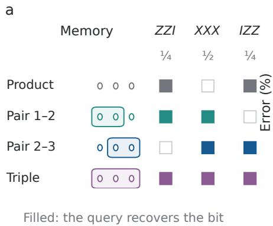

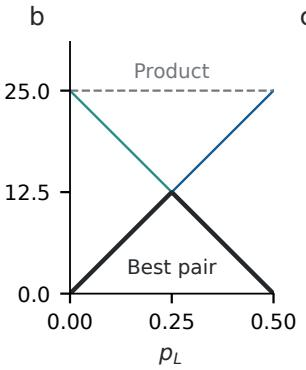  
c

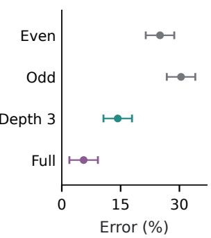  
Figure 1: (a) Three-qubit encodings at request probabilities $( 1 / 4 , 1 / 2 , 1 / 4 )$ . Groups share entanglement; filled squares recover the bit, empty squares are uninformative. All four codes preserve the stored bit. (b) Ideal prediction error when $\pi ( X X X ) ~ = ~ 1 / 2 , ~ \pi ( Z Z I ) ~ = ~ p _ { L }$ and $\pi ( I Z Z ) ~ = ~ 1 / 2 ~ - ~ p _ { L } ;$ black selects the better pair. (c) Native 15-qubit commissioning on ibm\_marrakesh favors the full chain. Even/odd are fixed product allocations. Each mean uses 1,920 shots over all 15 queries and both bits; bars are simultaneous 95% Hoeffding bounds for four means, conditional on independent shots in this one job. The allocations in (c) are fixed before acquisition.

## 2 THE MEMORY AND ITS DETECTOR

Let $C$ be uniform on {0, 1} and let $G = C \oplus Z$ , with independent $Z \sim \mathrm { B e r n o u l l i } ( h )$ and $0 \leq$ $h < 1 / 2$ . Write $D = \mathsf { 1 } - \mathsf { 2 } h$ . An encoder receives G, prepares a d-qubit state $\tau _ { G }$ , and discards its classical record and environment. An independent request $T = t$ arrives with probability $\pi _ { t } .$ The decoder receives t and the detector’s classical report, and predicts C. It has no additional copy, correlated input or later unrestricted measurement.

Given a collection $\mathcal { F }$ of allowed qubit partitions, let $S _ { \mathcal { F } }$ be the convex hull of states product across a partition in $\mathcal { F }$ . Both codewords belong to this class, but may use different partitions and mixtures. Allowing every partition with blocks of size at most k gives an entanglement-depth constraint. The same collective detector is available to every encoder; k constrains the stored state, not the detector’s subsequent operations.

Orthogonal codeword supports preserve $G \colon$ a global measurement recovers it, giving unrestricted error h and information $1 - H _ { 2 } ( h )$ bits about $C .$ The optimization allows information-losing codes. We will show that an optimum can always preserve the bit.

## 2.1 WHICH REPORTS PRESERVE A PARITY SECTOR?

For a requested Hermitian Pauli observable $P ,$ put $\Pi _ { \pm } = ( I \pm P ) / 2$ . The detector’s nonselective system channel must be

$$
\begin{array} { r } { \mathcal { L } _ { P } ( \rho ) = \Pi _ { + } \rho \Pi _ { + } + \Pi _ { - } \rho \Pi _ { - } . } \end{array}\tag{1}
$$

This Lüders channel preserves all coherence within each sector. An individual-outcome refinement can preserve the parity eigenvalue while violating Eq. (1).

Every instrument summing to $\mathcal { L } _ { F }$ has outcome effects $E _ { y } = q ( y | + ) \Pi _ { + } + q ( y | - ) \Pi .$ for a stochastic matrix $q .$ Thus the report contains only a postprocessed parity, however large its alphabet. This follows from channel–measurement compatibility (Heinosaari & Miyadera, 2013); Appendix A gives a short proof and an approximate version. The all-input requirement matters: a shared syndrome service must preserve unknown coherent inputs even when a particular client stores a classical bit.

We first use sharp parity reports. Symmetric, code-independent report noise gives effects $( I \pm$ $v _ { t } P _ { t } ) / 2$ , with known $v _ { t } ~ \in ~ [ 0 , 1 ]$ . For contrast $c _ { t } = | \operatorname { T r } [ P _ { t } ( \tau _ { 0 } - \tau _ { 1 } ) ] | / 2$ , the optimal classical decoder has risk

$$
R = \frac { 1 } { 2 } - \frac { D } { 2 } \sum _ { t } \pi _ { t } v _ { t } c _ { t } .\tag{2}
$$

Small departures from exact channel preservation can also be bounded: Appendix A gives a dimension-independent continuity bound and a sufficient diamond-distance threshold for the separation. Under the exact contract, the remaining task is to determine which contrast vectors fit the entanglement budget.

## 3 WHICH QUERIES CAN AN ENCODING SUPPORT?

Queries that commute globally can compete within separate qubit groups. Consider independent, globally commuting Pauli generators $\bar { P _ { 1 } } , \ldots , P _ { q }$ . Independence means no nonempty product is proportional to the identity. A CSS family uses only X and identity within each X-type generator, and only $Z$ and identity within each Z-type generator. For a partition Π, build a graph $H _ { \Pi }$ on queries: two queries are adjacent when their restrictions anticommute on a block. This graph is bipartite, since generators of the same CSS type cannot conflict. Let $\operatorname { S T A B } ( H )$ be the convex hull of independent-set indicators, including the empty set.

To characterize the contrasts, we first reduce a pair of codewords to one state. A tensor product of single-qubit Paulis flips all independent generators at once and preserves every partition class. Binary contrasts therefore have the same attainable region as single-state absolute correlations $( \mathsf { A p - }$ pendix B).

Theorem 1 (Exact attainable contrast region). For independent commuting CSS generators and any partitionfamily F, the contrast vectors ofall pairs $\tau _ { 0 } , \tau _ { 1 } \in \mathcal { S } _ { \mathcal { F } }$ are exactly

$$
\mathcal { C } _ { \mathcal { F } } = \operatorname { c o n v } \bigcup _ { \Pi \in \mathcal { F } } \operatorname { S T A B } ( H _ { \Pi } ) .\tag{3}
$$

Every nonempty independent-set indicator has an explicit encoding with orthogonal supports in the allowed class.

Local uncertainty bounds each conflicting pair by $| \langle P _ { u } \rangle | + | \langle P _ { v } \rangle | \leq 1$ (Zander & Becker, 2025, Proposition A.3). Bipartite integrality and convexity turn these pairwise inequalities into an upper bound on the whole region, including mixed codeword pairs. To attain the bound, take an independent set I and define

$$
\tau _ { g } ^ { I } = 2 ^ { - d } \prod _ { t \in I } ( \mathbb { I } + ( - 1 ) ^ { g } P _ { t } )\tag{4}
$$

where I is the identity. This normalized stabilizer projector is separable across the chosen partition and has $c = \mathbf { 1 } _ { I }$ . Every selected expectation has sign $( - 1 ) ^ { g }$ . Mixing the pairs thus adds their contrasts without cancellation and fills the region in Eq. (3). Each nonempty pair preserves $G ,$ although a mixture of such pairs need not do so.

With $\begin{array} { r } { \begin{array} { r c l } { a _ { t } } & { = } & { \pi _ { t } v _ { t } } \end{array} } \end{array}$ , the optimal risk is $1 / 2 - ( D / 2 ) \operatorname* { m a x } _ { \Pi \in { \mathcal { F } } } \alpha _ { a } ( H _ { \Pi } )$ , where $\alpha _ { a }$ is maximum independent-set weight. The workload objective is linear, so a best vertex is optimal and its encoding preserves the bit. Mixtures can enlarge the feasible region without improving this optimum. Appendix B gives the proof and counterexamples to dropping CSS or independence; the same appendix gives a worked lossless mixture.

## 3.1 WHICH QUBITS SHOULD SHARE ENTANGLEMENT?

For graph-state queries, the contrast region becomes a concrete allocation problem. A bipartite graph has generators $\begin{array} { r } { K _ { i } = X _ { i } \prod _ { j \sim i } Z _ { j } } \end{array}$ ; Hadamards on one color convert them to CSS form. The conflict graph contains exactly the edges crossing the partition. Weighted bipartite vertex cover then gives the following rule. Delete a minimum-weight set of query vertices until every remaining connected component has at most k vertices, and entangle within those components. A deleted vertex means giving up a query; its qubit stays in the memory. This is a variant of classical componentorder connectivity (Drange et al., 2016): deletion costs carry workload weights, while the survivingcomponent limit counts vertices.

With sharp reports, error h is attainable exactly when every connected component of the positiveweight query graph fits the budget. For a uniform d-vertex path,

$$
R _ { k } ^ { * } = h + { \frac { D } { 2 d } } \left\lfloor { \frac { d } { k + 1 } } \right\rfloor .\tag{5}
$$

Exact recovery of G through every query requires depth $d .$ Constant-size groups suffice for a fixed excess error independent of d. Each path query touches at most three qubits, so independent local outcome errors introduce at most three visibility factors.

## 4 LEARNING WHERE ENTANGLEMENT BELONGS

The allocation rule assumes that the request frequencies are known. We now give the learner only m i.i.d. past query identities. It chooses an encoding before future requests arrive and receives no prediction labels. For a known bipartite graph Γ and its graph-state queries, let $R _ { \pi , k } ^ { * }$ be the best depth-k risk for workload $\pi ,$ and define $\mathfrak { M } _ { m } ( \Gamma , k ) = \operatorname* { i n f } _ { \widehat { \tau } } \operatorname* { s u p } _ { \pi } \mathbb { E } [ R _ { \pi } ( \widehat { \tau } ) - R _ { \pi , k } ^ { * } ]$ . The supremum ranges over all query distributions. The m query identities are the learner’s only observations.

We learn the allocation by maximizing empirical workload weight over inclusion-maximal feasible query sets: no further query can be added while preserving feasibility. Restricting to these sets preserves every nonnegative workload optimum, and each set specifies an explicit lossless code. With at most $2 ^ { q }$ feasible indicators, finite-class concentration gives excess error $O ( D \sqrt { ( q + \log ( 1 / \delta ) ) / m } )$ with probability $1 - \delta .$ This finite-class bound assumes exact empirical optimization, which can remain combinatorial. To sharpen it, we need to count the undominated allocation choices that the requests must distinguish.

In the opening example, the choice is which endpoint to pair with the center. Local graph queries can create proportionally more such choices as the memory grows. A complete bipartite graph $K _ { a , b }$ has a different structure. At depth $k \le \operatorname* { m i n } ( a , b )$ , a retained set either lies in one color or has at most k vertices. The maximal sets are the two full colors and mixed sets of size $k ,$ so the oracle compares the color totals with the sum of the k largest weights.

To separate the number of regions from their size, divide a bipartite graph into r complete-bipartite regions, linked through at most $p$ designated connection vertices per region. Each color must have at least k nonconnection vertices. Regions may have different sizes, and physical blocks may cross their boundaries. The following result compares this family with bounded-degree graphs.

Theorem 2 (Geometry and the cost of allocation learning). Assume sharp reports and $m \geq 1 \ i . i . d .$ query samples. On a path with $d \geq 3$ vertices and $2 \leq k \leq d - 1$

$$
{ \mathfrak { M } } _ { m } ( P _ { d } , k ) = \Theta \left( { \frac { D } { k } } \operatorname* { m i n } \left\{ 1 , { \sqrt { \frac { d \log ( k + 1 ) } { m } } } \right\} \right) .\tag{6}
$$

The constants are uniform in $d , k , m$ . For r biclique regions with fixed connection bound $p$ and at least k nonconnection vertices per color,

$$
\mathfrak { M } _ { m } ( \Gamma , k ) = \Theta _ { p } \mathopen { } \mathclose \bgroup \left( D \operatorname* { m i n } \{ 1 , \sqrt { r k / m } \} \aftergroup \egroup \right) .\tag{7}
$$

The second law is uniform in r, k and the region sizes. A single region without connections recovers $\mathfrak { M } _ { m } ( K _ { a , b } , k ) = \Theta ( D \operatorname* { m i n } \{ 1 , \sqrt { k / m } \} )$ . All partitions within the depth budget are allowed. Both lower bounds permit arbitrary randomized learners choosing mixed codeword pairs and grant the optimal decoder. Information-preserving codes attain both rates. The path learner uses a random periodic allocation at small budgets and empirical maximization at larger budgets; regional empirical maximization attains the second rate. $H d \leq k ,$ , the whole graph fits and allocation excess is zero.

On a path, one deletion every $k + 1$ sites sacrifices at most $1 / ( k + 1 )$ of the workload after averaging over offsets. The resulting small oracle loss lets us sharpen the concentration bound. For the lower bound, separated $( k { + } 1 )$ -site segments each force a choice of which query to sacrifice; identifying the least requested of $k + 1$ alternatives supplies the logarithmic factor (Appendix F). Increasing depth reduces absolute error. Learning a sufficiently small fixed fraction of that error scale still requires order d $\mathrm { \Delta } / \log ( k + 1 )$ requests. A sliding-minimum recurrence solves the ideal empirical problem in $O ( d )$ operations after counting.

The maximal biclique allocation class has VC dimension $k ,$ although all feasible sets together have dimension max $( a , \bar { b } )$ . With r connected regions, interior choices contribute at most rk and connection vertices at most $r p .$ A matching lower bound projects onto r independent capacity constraints, even when physical groups cross regions (Appendix $\mathbf { C } . 6 )$ . A chain of regions admits exact empirical optimization in $O ( r \bar { k } ^ { 2 } )$ operations after sorting. Completing empirical ties to maximal sets preserves training weight and weakly improves every nonnegative population objective (Appendix G).

The laws describe worst-case workloads. A fixed workload with a clear gap between competing allocations can be learned faster. Giving every query positive probability leaves the minimax value unchanged unless a common probability floor is imposed. The regional reduction in sample demand also comes with a physical cost: biclique queries grow with the region, whereas bounded-degree queries touch at most $\Delta + 1$ qubits. Paths and chains of regions admit efficient exact empirical optimization; the general graph theorem assumes access to an optimization oracle.

## 5 LEARNING ALLOCATION UNDER PREPARATION ERRORS

So far, supporting another query can only help. Preparation errors change that tradeoff: the gate that supports one query may reduce its neighbors’ reliability. On a path, select vertices $S _ { ☉ }$ , prepare a graph state on each selected run, and put deleted sites in |0⟩. Encode G by applying $Z ^ { G }$ to every selected site. Suppose each retained $\mathrm { C Z }$ gate on edge e is independently followed by a ZZ error with probability $\epsilon _ { e } \leq 1 / 2$ . With $\gamma _ { e } = 1 - 2 \epsilon _ { e }$ and query visibility $v _ { i } .$

$$
b _ { i } ( S ) = \mathbf { 1 } \{ i \in S \} v _ { i } \prod _ { e \ni i } \gamma _ { e } .\tag{8}
$$

Here $b _ { i } ( S )$ includes reporting visibility, and the risk is $1 / 2 - ( D / 2 ) \sum _ { i } \pi _ { i } b _ { i } ( S )$ . Retaining an edge changes the value of neighboring queries, so its cost cannot be absorbed into fixed workload weights.

The encoded bit can survive these preparation errors. It is enough to retain one odd-sized component. The product of its stabilizer generators has eigenvalue $( - 1 ) ^ { \tilde { G } }$ and commutes with every retainededge $Z Z$ error. The noisy codewords remain in orthogonal sectors even if other components have even size. An odd full chain also preserves G. A two-site run alone fails because its $\dot { Z } Z$ error flips the encoded bit.

We optimize within this family by tracking the selected-run length and whether an odd run has closed. The dynamic program uses $O ( d k )$ transitions; an independent $O ( d k ^ { 2 } )$ interval implementation checks its answers. The noisy optimization is over this lossless circuit family; the ideal theorem optimizes over the full physical class.

Learning this allocation requires information about the device as well as the workload. Suppose we observe m requests and $B$ independent calibration trials for each edge reliability and native query visibility. This statistical model supplies each parameter separately, at a cost of $B ( 2 d - 1 )$ ) calibration observations in addition to the request log. Appendix M instead calibrates directly observed binary responses. The comparator is the best allocation in the same noisy circuit family; Appendix H also bounds errors caused by channel mismatch and request smoothing.

The two-resource rate is sharp on depth-three paths. For the same circuit family with $d \geq 4$ and correctly specified noise, the minimax excess from m requests and B trials per parameter is $\Theta \Big ( D \operatorname* { m i n } \{ 1 , \sqrt { d / m } + B ^ { - 1 / 2 } \} \Big )$ (Theorem 4). Four-site allocation choices force the request term; two almost indistinguishable three-site channels with different optimal allocations force the calibration term.

b

## 6 EXPERIMENTS

The experiments first test the learning laws under their stated channels, where we can compute population risk exactly. We then test fixed encodings on a quantum processor. The transaction study in Section 7 asks whether allocation learned from a public purchase trace improves locality.

## 6.1 WHAT CHANGES WHEN THE MEMORY GROWS?

$$
\bullet \bullet \ k = 2 \quad \substack {  \bullet \quad \ k = 4 \quad \bullet = \ k = 8 \quad \substack {  \bullet \quad k = 1 6 \quad \substack {  \bullet \quad k = 3 2 } } }
$$

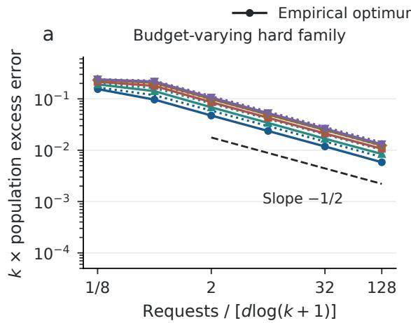

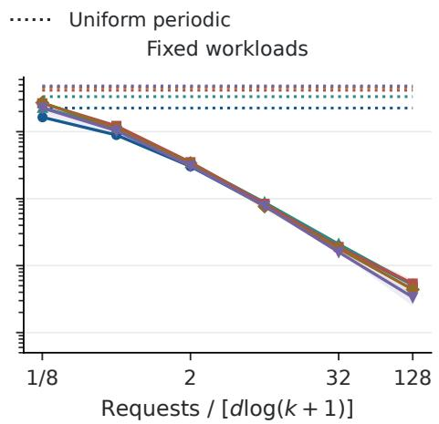  
Figure 2: Depth changes the error scale as well as the request requirement. (a) On the budgetindexed hard family, both empirical and data-free periodic allocations follow a square-root rate. The task probabilities change with the budget. (b) On fixed Dirichlet workloads, only the empirical learner improves. Solid lines show empirical optima; dotted lines show uniform periodic allocations. Each line averages four dimension means, each based on 64 independent seeds; shading spans those dimension means, not confidence intervals. The dashed line is $0 . 0 2 5 x ^ { - 1 / 2 }$ , an unfitted slope guide, not a theorem constant. Every risk uses the exact same-depth physical optimum as comparator.

We varied d from 128 to 1,024 and k from 2 to 32, for 15,360 fits, to test the depth dependence in the path law. Figure 2 scales excess by k and requests by $d \log ( k + 1 )$ . Both empirical and data-free allocations follow the hard-family slope because the task probabilities change with the budget. On fixed workloads, the empirical learner improves while the periodic comparator stays flat. The fixedworkload control is essential: a hard-family slope alone would also credit a method that never uses the requests (Appendix J.1).

Connected-region experiments keep the request scale $m / ( r k )$ fixed while changing region size. The curves remain similar, as predicted by Theorem 2 (Appendix Figure 6). Empirical ties are completed using training counts alone; retaining only observed queries would introduce an avoidable occupancy penalty. At the original primary condition, selective connection repair plus local improvement is within 0.145 error points of exact optimization (95% interval [0.075, 0.220]). The full comparison uses every workload at the same depth (Appendix K).

## 6.2 REQUESTS AND CALIBRATION LIMIT DIFFERENT DECISIONS

To test the two-resource prediction, we varied request and calibration budgets separately. The prespecified protocol draws 192 independent workload/channel instances, crossing 63 or 127 qubits with low, heterogeneous or stress preparation noise. Each of the six conditions contains 32 instances, four request streams and four calibration panels. Five nested request budgets and five calibration budgets give 76,800 fits per method. Joint uses requests, edge reliability and report visibility. Task only uses requests; Reporting only also learns visibility. We hold the optimizer and tie rule fixed

and compare both raw counts and smoothed estimates to isolate the value of each observation type.   
Same-family greedy and privileged-oracle controls accompany the full grid (Appendix J).

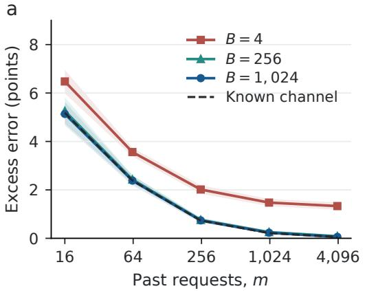

b  
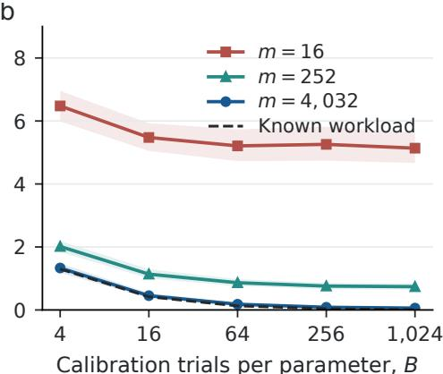  
Figure 3: More requests cannot remove a calibration floor. (a) Request learning at three fixed calibration budgets; the dashed curve supplies the true channel. (b) Calibration learning at three fixed request budgets; the dashed curve supplies the true workload. Both panels use 63-qubit heterogeneous-noise instances and the smoothed Joint estimator. Excess is relative to the trueworkload, true-channel oracle in the same circuit family. Bands are pointwise 95% bootstrap intervals over 32 independent instances, after averaging four request streams and four calibration panels. Calibration costs 125B observations, separately from m.

With $B = 4$ , increasing requests from 16 to 4,032 reduces excess from 6.48 to 1.33 points. Even exact workload knowledge leaves 1.30 points of excess, so more requests cannot remove this calibration floor. $\mathrm { A t } \ B = \bar { 2 } 5 6$ , the same request increase reduces excess from 5.26 to 0.085 points. Conversely, at $m = 1 6 ,$ , even 1,024 calibration trials leave 5.14 points: the request estimate is now the bottleneck (Figure 3). The same instances thus exhibit either bottleneck, depending on which data are scarce. A separate near-indifference diagnostic gives approximately constant ${ \sqrt { B } } .$ -scaled excess over $B = 4 \tan 4 \mathrm { , 0 9 6 }$ , with workload known.

In the prespecified 63-qubit heterogeneous-noise comparison, 1,008 requests and 256 calibration trials per parameter reduce error from 9.79% for Task only to 8.58% for Joint: a 1.21-point gain, paired 95% interval [0.95, 1.50]. Calibration costs 32,000 observations; the learned code uses 22.3 preparation CZs on average, versus 62 for Full chain (Appendix Table 4). These are population risks under the specified channel.

Full chain has lower error in 76 of 150 cells, including every low-noise cell. The benefit of supporting more queries can outweigh their preparation cost. Smoothing affects Joint and Task only differently, so we report all four combinations, along with depth-five and depth-seven sensitivity and same-family greedy comparisons (Appendix J).

## 6.3 TESTING THE ENCODINGS ON A QUANTUM PROCESSOR

We implement all 15 graph queries on a 15-data-qubit path on ibm\_marrakesh. Seven query centers have degree two in the device graph. Their parity-extraction circuits borrow data qubits and restore them in the ideal unitary. Dropping those queries would remove the local conflicts that define the learning problem. Preparation and extraction compile separately. Both full and shallow chains use two parallel CZ layers.

In 7,680 commissioning shots, uniform-request error is 5.57% for Full chain, 14.27% for a fixed depth-three allocation, and 25.05% or 30.42% for the two product colors (Figure 1c). The full chain wins this fixed-encoding comparison. Two preliminary learning jobs timed out without usable observations, leaving the four-workload learning/calibration design unmeasured. A separate coherence check also exposed a failure: one witness reverses its expected sign in two jobs, including both bits and phases in the follow-up. The implemented extraction therefore still needs validation across the full path (Appendix R).

## 7 CONSEQUENCES OF THE ALLOCATION LAW

Changing the detector interface. Extra detector calls offer another way to obtain information.   
We compare their cost with entangled preparation in a common statistical experiment.

For detector diagnosis, a healthy or faulty device independently flips each reported sign with probability $e _ { 0 } < e _ { 1 }$ . A supported query gives an observed flip; an unsupported query erases it. Write $\mathsf { E } _ { p }$ for this experiment when the supported request mass is p. Appendix N shows that the optimal N-call experiment over all admissible fresh CSS probes is $\mathsf { E } _ { p ^ { * } } ^ { \otimes N }$ , where $p ^ { * }$ is the maximum supported mass. At one call and false-alarm level $e _ { 0 } ,$ , power regret is $\bar { 2 ( e _ { 1 } - e _ { 0 } ) / D }$ times prediction regret. Diagnosis inherits the same request-learning laws.

Suppose a competing policy can make additional calls. If each fresh call is dominated by $\mathsf { E } _ { p }$ and a fixed probe attains it, reproducing N copies of $\mathsf E _ { q } , q \ge p .$ , requires at least $N q / p$ calls in expectation under either hypothesis. A stopped policy attains equality (Theorem 6). The equality compares expected call budgets for equivalent experiments. Fixed horizons at a specified power can have a different ratio.

For the menu (ZZI, XXX, IZZ) with probabilities (.2, .6, .2), product and Bell coverages are .6 and .8: the fresh-call ratio is $4 / 3 .$ . If the policy can choose its second query, a product-initialized policy matches Bell at 1.2 expected calls. Retaining the probe and repeating an unsupported query gives yet another signal: the reports disagree with probability $2 e _ { H } ( 1 - e _ { H } )$ in health state H. The disagreement diagnoses noise without recovering the stored sign.

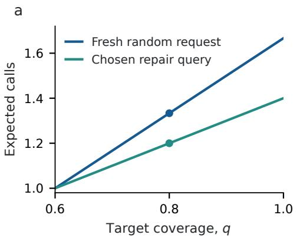

b  
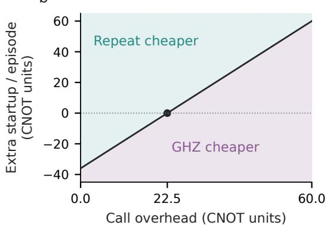  
Figure 4: (a) Fresh random requests and chosen repair queries have different call costs. Points reproduce Bell coverage $q = . 8$ from a product probe. (b) Cost comparison at 80% power and 5% false alarms for known $( e _ { 0 } , e _ { 1 } ) = ( . 0 2 , . 1 6 4 )$ . GHZ uses 18 calls and 111.6 logical CNOTs; a product-initialized repeated-query policy uses 19.6 expected calls and 75.6 CNOTs. The boundary includes extra GHZ startup cost per episode. These are two attaining policies, not the full adaptive frontier.

At equal operating performance, entanglement reduces lifetime cost exactly when its extra startup cost is smaller than the accumulated saving in preparation and detection (Eq. (26)). Previous IBM diagnosis runs measured GHZ power gains of 9.11 and 16.34 points over a selected product probe, with frozen aggregate alarm rules and dynamic coherence controls. Their different calibrations prevent a matched-cost hardware comparison with the adaptive policy (Appendix O).

Classical transaction co-location. A database also chooses which records to place together before requests arrive. A transaction footprint $F _ { t }$ succeeds when all its records share a shard, subject to a capacity cap and no replication. Schism formulates this hypergraph objective and uses tuple coaccess graphs as a surrogate (Curino et al., 2010). On structured schemas, we recover the same allocation problem.

Theorem 2 transfers exactly to row/column transactions on r disjoint $s \times s$ tables when capacity is $C = ( s - 1 ) k + 1$ and $s \geq \operatorname* { m a x } \{ 2 , k , \lfloor ( k - 1 ) ^ { 2 } / 4 \rfloor + 2 \}$ . Allowing rs shards, the minimax locality regret is Θ(min $\{ 1 , \sqrt { r k / m } \} )$ (Corollary 2). Larger tables need not require more requests, although transaction width and storage resources grow. All 15,360 checks of actual record placements reproduce the predicted masks.

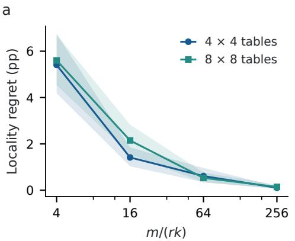

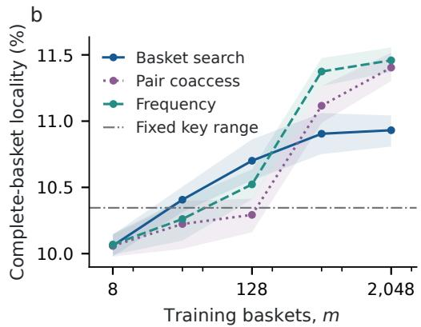  
Figure $5 \colon ( \mathrm { a } )$ Exact empirical co-location on structured tables, with requests scaled by rk. Curves average $r \in \{ 1 , 4 \}$ and $k \in \{ 1 , 2 , 3 \}$ , with 32 instances per cell; bands bootstrap training instances. (b) Complete-basket locality on the public Online Retail trace, with 3,922 records and eight shards of capacity 512. Learned methods share a training prefix; fixed key range uses none. Bands bootstrap 16 request streams conditional on the fixed catalogue and test trace. All three capacities and the exact small-schema study appear in Appendix Q.

On public purchase baskets (Chen, 2015), we test both exact optimization on 12/24-item projections and a heuristic on the full 3,922-record catalogue. The full study scores all 3,992 held-out invoices without projection. At capacity 512 and 512 training baskets, locality is 10.90% for basket-based search, 11.37% for same-budget frequency grouping, and 10.35% for fixed key-range placement. The simpler frequency control wins this comparison. Uniform SmallBank footprints leave no allocation to learn: all balanced placements have the same locality.

## 8 RELATED WORK AND IMPLICATIONS

Exact separable stabilizer polytopes and attaining product states are known for selected GHZ and cluster families (Jafarizadeh et al., 2008). Zander & Becker (2025, Propositions A.3–A.4) give our linear cut inequalities. Knips et al. (2016) optimize weighted independent sets of cutanticommutativity graphs for squared correlations; Li et al. (2026) derive linear graph-generator bounds using crossing-edge matchings. Our constructive region for independent CSS families under arbitrary partition mixtures yields sharp learning laws. Stable-set integrality (Chvátal, 1975) and component-order connectivity (Drange et al., 2016) are classical ingredients.

Predictive V-information and the Decodable Information Bottleneck describe predictor-dependent information (Xu et al., 2020; Dubois et al., 2020); our logarithmic-loss extension applies this prediction viewpoint with physically restricted observations and unrestricted classical decoders. Data hiding and locally indistinguishable product ensembles separate storage from access (Terhal et al., 2001; Bennett et al., 1999). Channel discrimination benefits from entanglement (Piani & Watrous, 2009). Here we identify the optimal experiment for a fixed query menu and transfer its allocationlearning cost.

Memory size alone does not determine the cost of learning an allocation. Paths create more choices as they grow; biclique regions need not. The same distinction arises in classical co-location. Practical gains also depend on preparation costs and the workload, which can favor simpler choices. We have yet to characterize general measurements or test the learning laws across independent hardware jobs.

## REPRODUCIBILITY STATEMENT

The ancillary code and data provide raw observations, seeds, encoders, resource counts and replay code. This manuscript includes the full proofs and extended experimental record. A small installable package reproduces the path optimizer and online sampler. The ancillary README gives the entry points for the hardware, classical and interface evidence and distinguishes recorded observations from unacquired experiments.

## AI USE STATEMENT

Generative AI assisted with theoretical models and mathematical claims, proof development and writing, hypothesis refinement, experimental design, method implementation, synthetic-data generation, data processing, result interpretation, and figure preparation. It also assisted with literature review and manuscript drafting and editing. The author takes responsibility for the final manuscript and artifacts.

## ETHICS STATEMENT

The experiments use synthetic tasks, a quantum processor and a public purchase dataset. The transaction study reads stock codes, invoice identifiers, times, quantities and prices; it does not read customer identifiers or link purchases to people. It reports aggregate locality. The hardware results compare fixed implementations. Their interpretation is limited to the stated measurement and control assumptions and does not establish a general quantum learning speedup.

## REFERENCES

Scott Aaronson. The learnability of quantum states. Proceedings ofthe Royal Society A: Mathematical, Physical and Engineering Sciences, 463(2088):3089–3114, 2007. doi: 10.1098/rspa.2007. 0113. URL https://arxiv.org/abs/quant-ph/0608142.

Leonardo Banchi, Jason Pereira, and Stefano Pirandola. Generalization in quantum machine learning: A quantum information standpoint. PRX Quantum, 2(4):040321, 2021. doi: 10.1103/PRXQ uantum.2.040321. URL https://doi.org/10.1103/PRXQuantum.2.040321.

Peter L. Bartlett and Shahar Mendelson. Rademacher and Gaussian complexities: Risk bounds and structural results. Journal of Machine Learning Research, 3:463–482, 2002. URL https: //jmlr.org/papers/v3/bartlett02a.html.

BenchBase contributors. BenchBase: SmallBank workload implementation. Software repository, 2025. URL https://github.com/cmu-db/benchbase/tree/33c00473807ebd4 9304d114a6d769d2d2b2bbb34. Commit 33c00473807e; accessed September 8, 2026.

Charles H. Bennett, David P. DiVincenzo, Christopher A. Fuchs, Tal Mor, Eric Rains, Peter W. Shor, John A. Smolin, and William K. Wootters. Quantum nonlocality without entanglement. Physical Review A, 59(2):1070–1091, 1999. doi: 10.1103/PhysRevA.59.1070. URL https: //arxiv.org/abs/quant-ph/9804053.

David Blackwell. Equivalent comparisons of experiments. The Annals of Mathematical Statistics, 24(2):265–272, 1953. doi: 10.1214/aoms/1177729032.

Romain Bourneuf, Nathan Claudet, Sang Yoon Kim, Rose McCarty, Blair D. Sullivan, and Stéphan Thomassé. A combinatorial framework for clustering graph states: Algorithms and hardness for rank-integrity. arXiv preprint arXiv:2607.09469, 2026. doi: 10.48550/arXiv.2607.09469. URL https://arxiv.org/abs/2607.09469.

Sébastien Bubeck, Sitan Chen, and Jerry Li. Entanglement is necessary for optimal quantum property testing. In 2020 IEEE 61st Annual Symposium on Foundations of Computer Science (FOCS), pp. 692–703. IEEE, 2020. doi: 10.1109/FOCS46700.2020.00070. URL https://arxiv.org/abs/2004.07869.

Francesco Buscemi. Comparison of quantum statistical models: Equivalent conditions for sufficiency. Communications in Mathematical Physics, 310(3):625–647, 2012. doi: 10.1007/s00220 -012-1421-3.

Matthias C. Caro, Hsin-Yuan Huang, M. Cerezo, Kunal Sharma, Andrew Sornborger, Lukasz Cincio, and Patrick J. Coles. Generalization in quantum machine learning from few training data. Nature Communications, 13(1):4919, 2022. doi: 10.1038/s41467-022-32550-3. URL https://doi.org/10.1038/s41467-022-32550-3.

Daqing Chen. Online Retail. UCI Machine Learning Repository, 2015. URL https://doi.or g/10.24432/C5BW33. Dataset.

Sitan Chen, Jordan Cotler, Hsin-Yuan Huang, and Jerry Li. Exponential separations between learning with and without quantum memory. In 2021 IEEE 62nd Annual Symposium on Foundations ofComputer Science (FOCS), pp. 574–585. IEEE, 2022. doi: 10.1109/FOCS52979.2021.00063. URL https://arxiv.org/abs/2111.05881.

V. Chvátal. On certain polytopes associated with graphs. Journal of Combinatorial Theory, Series B, 18(2):138–154, 1975. doi: 10.1016/0095-8956(75)90041-6.

Carlo Curino, Evan Jones, Yang Zhang, and Sam Madden. Schism: a workload-driven approach to database replication and partitioning. Proceedings ofthe VLDB Endowment, 3(1–2):48–57, 2010. doi: 10.14778/1920841.1920853. URL https://www.vldb.org/pvldb/vol3/R04.pd f.

Michele Dall’Arno, Sarah Brandsen, and Francesco Buscemi. Explicit construction of optimal witnesses for input-output correlations attainable by quantum channels. Open Systems & Information Dynamics, 27(4):2050017, 2020. doi: 10.1142/S1230161220500171.

Djellel Eddine Difallah, Andrew Pavlo, Carlo Curino, and Philippe Cudré-Mauroux. OLTP-Bench: An extensible testbed for benchmarking relational databases. Proceedings of the VLDB Endowment, 7(4):277–288, 2013. doi: 10.14778/2732240.2732246. URL https://www.vldb.o rg/pvldb/vol7/p277-difallah.pdf.

Pål Grønås Drange, Markus Dregi, and Pim van ’t Hof. On the computational complexity of vertex integrity and component order connectivity. Algorithmica, 76(4):1181–1202, 2016. doi: 10.100 7/s00453-016-0127-x. URL https://arxiv.org/abs/1403.6331.

Yann Dubois, Douwe Kiela, David J. Schwab, and Ramakrishna Vedantam. Learning optimal representations with the decodable information bottleneck. In Advances in Neural Information Processing Systems, volume 33, pp. 18674–18690. Curran Associates, Inc., 2020. URL https://papers.nips.cc/paper/2020/hash/d8ea5f53c1b1eb087ac2e3562 53395d8-Abstract.html.

Yoav Freund and Robert E. Schapire. A decision-theoretic generalization of on-line learning and an application to boosting. Journal of Computer and System Sciences, 55(1):119–139, 1997. doi: 10.1006/jcss.1997.1504. URL https://www.schapire.net/papers/FreundSc95.p df.

David Haussler. Sphere packing numbers for subsets of the Boolean n-cube with bounded Vapnik– Chervonenkis dimension. Journal ofCombinatorial Theory, Series A, 69(2):217–232, 1995. doi: 10.1016/0097-3165(95)90052-7.

Teiko Heinosaari and Takayuki Miyadera. Qualitative noise-disturbance relation for quantum measurements. Physical Review A, 88(4):042117, 2013. doi: 10.1103/PhysRevA.88.042117. URL https://doi.org/10.1103/PhysRevA.88.042117.

Hsin-Yuan Huang, Richard Kueng, and John Preskill. Predicting many properties of a quantum system from very few measurements. Nature Physics, 16(10):1050–1057, 2020. doi: 10.1038/s4 1567-020-0932-7. URL https://arxiv.org/abs/2002.08953.

M. A. Jafarizadeh, G. Najarbashi, Y. Akbari, and H. Habibian. Multi-qubit stabilizer and cluster entanglement witnesses. The European Physical Journal D, 47(2):233–255, 2008. doi: 10.1140/ epjd/e2008-00028-0. URL https://arxiv.org/abs/0704.2414v2.

Lukas Knips, Christian Schwemmer, Nico Klein, Marcin Wiesniak, and Harald Weinfurter. Mul-´ tipartite entanglement detection with minimal effort. Physical Review Letters, 117(21):210504, 2016. doi: 10.1103/PhysRevLett.117.210504. URL https://journals.aps.org/prl /abstract/10.1103/PhysRevLett.117.210504.

Dennis Kretschmann, Dirk Schlingemann, and Reinhard F. Werner. The information-disturbance tradeoff and the continuity of Stinespring’s representation. IEEE Transactions on Information Theory, 54(4):1708–1717, 2008. doi: 10.1109/TIT.2008.917696. URL https://doi.org/ 10.1109/TIT.2008.917696.

Joon Kwon and Vianney Perchet. Gains and losses are fundamentally different in regret minimization: The sparse case. Journal of Machine Learning Research, 17(227):1–32, 2016. URL https://jmlr.org/papers/v17/15-503.html.

Nicky Kai Hong Li, Xi Dai, Manuel H. Muñoz-Arias, Kevin Reuer, Marcus Huber, and Nicolai Friis. Detecting genuine multipartite entanglement in multi-qubit devices with restricted measurements. Nature Communications, 17(1):1707, 2026. doi: 10.1038/s41467-026-69320-4. URL https: //www.nature.com/articles/s41467-026-69320-4.

Yingjian Liu, Albert Gasull, Mengyao Hu, Ruiyun Zhang, Flavio Baccari, and Jordi Tura. Graph theoretic approach to quantum nonstabilizerness. arXiv preprint arXiv:2607.26154, 2026. doi: 10.48550/arXiv.2607.26154. URL https://arxiv.org/abs/2607.26154.

Georgios S. Paschos, Apostolos Destounis, Luigi Vigneri, and George Iosifidis. Learning to cache with no regrets. In IEEE INFOCOM 2019 - IEEE Conference on Computer Communications, pp. 235–243. IEEE, 2019. doi: 10.1109/INFOCOM.2019.8737446. URL https://arxiv.or g/abs/1904.09849.

L. Pereira, J. J. García-Ripoll, and T. Ramos. Parallel tomography of quantum non-demolition measurements in multi-qubit devices. npj Quantum Information, 9(1):22, 2023. doi: 10.1038/s4 1534-023-00688-7. URL https://doi.org/10.1038/s41534-023-00688-7.

Marco Piani and John Watrous. All entangled states are useful for channel discrimination. Physical Review Letters, 102(25):250501, 2009. doi: 10.1103/PhysRevLett.102.250501.

D. Ristè, M. Dukalski, C. A. Watson, G. de Lange, M. J. Tiggelman, Ya. M. Blanter, K. W. Lehnert, R. N. Schouten, and L. DiCarlo. Deterministic entanglement of superconducting qubits by parity measurement and feedback. Nature, 502(7471):350–354, 2013. doi: 10.1038/nature12513. URL https://doi.org/10.1038/nature12513.

D. Ristè, S. Poletto, M.-Z. Huang, A. Bruno, V. Vesterinen, O.-P. Saira, and L. DiCarlo. Detecting bit-flip errors in a logical qubit using stabilizer measurements. Nature Communications, 6(1): 6983, 2015. doi: 10.1038/ncomms7983. URL https://doi.org/10.1038/ncomms79 83.

Nathan Roll. Entanglement as memory: Mechanistic interpretability of quantum language models, 2026. URL https://arxiv.org/abs/2603.26494.

Andrei Tan˘ asescu, Valentina-Florentina Iliescu, and Pantelimon George Popescu. Optimal˘ entanglement-assisted almost-random access codes. Physical Review A, 101(4):042309, 2020. doi: 10.1103/PhysRevA.101.042309. URL https://doi.org/10.1103/PhysRevA.1 01.042309.

Barbara M. Terhal, David P. DiVincenzo, and Debbie W. Leung. Hiding bits in Bell states. Physical Review Letters, 86(25):5807–5810, 2001. doi: 10.1103/PhysRevLett.86.5807. URL https: //arxiv.org/abs/quant-ph/0011042.

Ilan Tzitrin. Local equivalence of complete bipartite and repeater graph states. Physical Review A, 98(3):032305, 2018. doi: 10.1103/PhysRevA.98.032305. URL https://journals.aps.o rg/pra/abstract/10.1103/PhysRevA.98.032305.

Frederik vom Ende. Progress on the Kretschmann–Schlingemann–Werner conjecture. Quantum Information and Computation, 23(15–16):1319–1330, 2023. doi: 10.26421/QIC23.15-16-5. URL https://doi.org/10.26421/QIC23.15-16-5.

Mirjam Weilenmann, Edgar A. Aguilar, and Miguel Navascués. Analysis and optimization of quantum adaptive measurement protocols with the framework of preparation games. Nature Communications, 12(1):4553, 2021. doi: 10.1038/s41467-021-24658-9. URL https: //doi.org/10.1038/s41467-021-24658-9.

Yilun Xu, Shengjia Zhao, Jiaming Song, Russell Stewart, and Stefano Ermon. A theory of usable information under computational constraints. In International Conference on Learning Representations, 2020. URL https://openreview.net/forum?id=r1eBeyHFDH.

Bin Yu. Assouad, Fano, and Le Cam. In David Pollard, Erik Torgersen, and Grace L. Yang (eds.), Festschrift for Lucien Le Cam, pp. 423–435. Springer, 1997. doi: 10.1007/978-1-4612-1880-7\_2 9.

René Zander and Colin Kai-Uwe Becker. Benchmarking multipartite entanglement generation with graph states. Advanced Quantum Technologies, 8(1):2400239, 2025. doi: 10.1002/qute.2024002 39. URL https://advanced.onlinelibrary.wiley.com/doi/10.1002/qute. 202400239.

Appendix guide. The proofs establish the physical region and request-learning laws, then extend them to logarithmic loss, finite calibration and online allocation. The experimental appendix follows the current comparisons; the later experimental sections preserve earlier studies and their limitations.

<table><tr><td>Material</td><td>Page</td></tr><tr><td>Detector preservation and allowed reports</td><td>14</td></tr><tr><td>Exact contrast region and prior-work comparison</td><td>16</td></tr><tr><td>Learning bounds over physical encoders Preparation noise and lossless circuit family</td><td>19 26</td></tr><tr><td>Optimal logarithmic loss</td><td>28</td></tr><tr><td>Growing-depth path law</td><td>29</td></tr><tr><td>Empirical completion and two-resource guarantees Online allocation</td><td>30</td></tr><tr><td>Factorial protocol and complete comparisons</td><td>33 33</td></tr><tr><td>Stronger baselines and model mismatch</td><td>36</td></tr><tr><td>Reproduction and historical evidence</td><td>38</td></tr><tr><td>Parity-service tests and physical response calibration</td><td></td></tr><tr><td>Full-class diagnosis and model comparisons</td><td>39</td></tr><tr><td></td><td>43</td></tr><tr><td>Prospective quantum-processor evaluation</td><td>48</td></tr><tr><td>Extra detector calls</td><td></td></tr><tr><td>Transaction co-location</td><td>54</td></tr><tr><td>Native 15-qubit experiments</td><td>56 59</td></tr></table>

## A DETECTOR PRESERVATION AND PERMITTED REPORTS

The instrument acts on the complete retained memory, with no additional input correlated with G. The decoder observes only its classical report and the query. The contract concerns all input density operators, including states absent from the particular bit code. Preserving just the actual codewords would not exclude local decoding of a product repetition code.

## A.1 EXACT COMPATIBILITY

Let $\{ \mathcal { I } _ { y } \}$ be CP instrument outcomes with $\textstyle \sum _ { y } { \mathcal { I } } _ { y } = { \mathcal { L } } _ { P }$ . For Choi matrices, $0 \preceq C ( \mathcal I _ { y } ) \preceq C ( \mathcal L _ { P } )$ The latter has support span $\{ | \Pi _ { + } \rangle \rangle , | \Pi _ { - } \rangle \rangle$ }. Every Kraus operator of every outcome therefore has the form $A _ { y j } = a _ { y j } \Pi _ { + } + b _ { y j } \Pi _ { - }$ . Orthogonality of the projectors gives

$$
E _ { y } = \sum _ { j } A _ { y j } ^ { \dagger } A _ { y j } = q ( y | + ) \Pi _ { + } + q ( y | - ) \Pi _ { - } , \qquad q ( y | + ) = \sum _ { j } | a _ { y j } | ^ { 2 } , \quad q ( y | - ) = \sum _ { j } | b _ { y j } | ^ { 2 } .
$$

The effects sum to $I ,$ so $q$ is stochastic. Conversely, measuring the sharp parity and applying $q$ realizes each such report. This proves the stated equality of report classes. It is a special case of channel–observable compatibility (Heinosaari & Miyadera, 2013). The contract is stronger than preserving the value of $P \colon$ a refinement inside an eigenspace can commute with $P$ while destroying its coherence. Native parity meters motivate the preservation requirement (Ristè et al., 2013); we do not infer this requirement from classical storage.

## A.2 A CONSERVATIVE APPROXIMATE BOUND

Suppose the actual nonselective channel $\mathcal { E } _ { t }$ obeys $\| \mathcal { E } _ { t } - \mathcal { L } _ { P _ { t } } \| _ { \diamond } \leq \delta _ { t }$ , with the full diamond norm, not half that norm. Pad the Stinespring environments to a common dimension at least the sum of their Kraus ranks. The continuity theorem (Kretschmann et al., 2008), in the form of vom Ende (2023, Proposition 1), provides an alignment with isometry distance at most $\sqrt { \delta _ { t } }$ . Padding is material: the same optimal bound need not hold in an arbitrarily prescribed minimal environment (vom Ende, 2023, Example 1).

An instrument’s classical report is a POVM on the channel environment. Extend that POVM to the padded space. The actual report channel $\mathcal { C } _ { t }$ is then within $2 \sqrt { \delta _ { t } }$ in diamond norm of some paritypostprocessing channel $\mathcal { C } _ { t } ^ { 0 }$ . For $\Delta = D ( \tau _ { 0 } - \tau _ { 1 } ) , \lVert \Delta \rVert _ { 1 } \leq 2 D$ , while binary risk is

$$
R c = \frac { 1 } { 2 } - \frac { 1 } { 4 } \sum _ { t } \pi _ { t } \| \mathcal { C } _ { t } ( \Delta ) \| _ { 1 } .
$$

The triangle inequality gives, uniformly over all allowed encoders,

$$
R _ { \mathcal { F } } ^ { \mathrm { r e l a x e d } } \geq \operatorname* { m a x } \left\{ h , \ R _ { \mathcal { F } } ^ { \mathrm { s h a r p } } - D \sum _ { t } \pi _ { t } \sqrt { \delta _ { t } } \right\} .\tag{9}
$$

The reference is the ideal sharp-parity optimum. The nonselective channel contract does not enforce a chosen reporting visibility. It also does not guarantee a useful actual report: the one-outcome instrument $\mathcal { I } _ { * } = \mathcal { L } _ { P }$ has $\delta = 0$ and risk $1 / 2$ for every encoder. A device comparison requires an informative predictor below the comparator bound, in addition to channel calibration.

For the three-vertex gadget family of Appendix C.2, sharp separable risk is $h + D / 4 .$ , and the depthtwo oracle attains $h { \bar { + } } { \bar { D } } ( 1 - \theta ) { \bar { / } } 8$ . If all $\delta _ { t } \leq \delta$ , the latter beats the relaxed separable class by at least $D [ ( 1 + \theta ) / 8 - \sqrt { \delta } ]$ . The sufficient radius $\delta < 1 / 6 4$ is independent of the number of gadgets.

## A.3 THE SELECTOR BYPASS AND ITS DISTURBANCE

In the global-parity family retained in the historical supplement, an X-basis repetition code and a query-selected X outcome recover G for d $\geq 3 .$ . The same local bases and a one-bit report suffice. Software parity is therefore a substantive summary restriction. The permanent audit enumerates this bypass for $d = 3 , \ldots , 8$

For an explicit physical relaxation, use the square-root instrument $A _ { \pm } = \sqrt { ( I \pm \eta Z _ { 1 } ) / 2 } , 0 \le \eta \le$ 1, composed with $\mathcal { L } _ { Z Z }$ . Its local report has contrast η on the code |00⟩, |11⟩, hence error $( 1 - \eta ) / 2$ at $h = 0$ . Put $\kappa = \sqrt { 1 - \eta ^ { 2 } }$ . The nonselective channel is

$$
\mathcal { E } _ { \eta } = \frac { 1 + \kappa } { 2 } \mathcal { L } _ { Z Z } + \frac { 1 - \kappa } { 2 } \mathrm { A d } _ { Z _ { 1 } } \circ \mathcal { L } _ { Z Z } , \qquad \| \mathcal { E } _ { \eta } - \mathcal { L } _ { Z Z } \| _ { \diamond } = 1 - \kappa .
$$

The convex mixture gives the upper bound; the Bell-sector state $( | 0 0 \rangle + | 1 1 \rangle ) / \sqrt { 2 }$ attains it. Its half trace-distance disturbance is $( 1 - \kappa ) / 2$ . These formulas describe an attained curve for this specified refinement, not an optimal frontier over all instruments. The audit retains 21 values including $\eta =$ 0, 1.

## A.4 OPERATIONAL RESOURCE ACCOUNT

Consider a hypothetical processor with two separated roles. A preparation client may choose the memory encoding within its assigned entanglement budget. A later prediction client may call a fixed catalogue of native syndrome commands through a shared endpoint, but cannot change the detector or access its backend. The same endpoint serves coherent jobs on unknown input states. Its nonselective channel therefore has a specified obligation to preserve every within-sector coherence, independently of which job supplies the input. This is a service contract; classical storage itself does not require it.

The preparation client uses past request identities to choose an encoding, receives $G ,$ and prepares the memory. It discards the source record and environment at handoff. Only afterward does the prediction client receive a query. That client observes the query and the endpoint’s classical report, with no additional copy of $G ,$ correlated input or backend access. Preparation can change while the shared detector service stays fixed. This scenario motivates the formal access model; our two-qubit acquisition establishes neither such an endpoint nor an actual deployment.

A retained classical copy, an additional correlated input, or a different detector can change the optimum. The model therefore quantifies storage entanglement under a specified access service, without asserting a total-cost quantum advantage.

Table 1: Resources in the foundational model. A common detector is held fixed within each allocation comparison. Comparisons between different query families do not equate their total implementation cost.
<table><tr><td>Resource</td><td>Treatment</td></tr><tr><td>Stored information</td><td>Every selected nonempty code preserves the same bit; the converse per- mits all encoders in the allowed state class.</td></tr><tr><td>Memory entanglement</td><td>Block size and allowed placements constrain the stored state. They do not constrain operations inside the detector.</td></tr><tr><td>Preparation</td><td>Noiseless theory permits all allowed states. Noisy design uses a specified circuit family and reports its CZ count separately.</td></tr><tr><td>Collective detection</td><td>The queried observable and coherent-channel contract are fixed capabil- ities. Gate count, duration and detector construction are not included in preparation cost.</td></tr><tr><td>Query locality</td><td>Graph-generator support equals degree plus one. Bounded degree enters the learning lower bound; dense-family detectors can require larger sup- port.</td></tr><tr><td>Calibration</td><td>Original simulations use known parameters; the fresh prediction study estimates preparation and reporting parameters from finite data. True pa- rameters are reserved for population evaluation and privileged oracles. The detector theorem separately assumes a diamond-distance bound,</td></tr><tr><td>Learning</td><td>which is not measured on the device. Classical query identities are the training observations. Statistical upper bounds assume exact empirical optimization.</td></tr></table>

## B PROOF OF THE EXACT CONTRAST REGION

Assume $q \geq 1$ , independent commuting Hermitian CSS Pauli generators and a nonempty allowed partition family. We use the conventional uniform prior and binary prediction loss throughout this region theorem.

## B.1 SINGLE-STATE BOUNDS AND DOWNWARD CLOSURE

For a state product across Π, let $x _ { t } = | \operatorname { T r } ( P _ { t } \rho ) |$ |. If $u ,$ v are adjacent in $H _ { \Pi }$ , global commutation implies an even, nonzero number of blocks with local anticommutation. Choose $\mathrm { t w o } , A , B ,$ , and denote their expectation pairs by $( a _ { u } , a _ { v } )$ and $( b _ { u } , b _ { v } )$ . Anticommutation gives $a _ { u } ^ { 2 } + a _ { v } ^ { 2 } \leq 1$ and $b _ { u } ^ { 2 } + b _ { v } ^ { 2 } \leq 1$ . The remaining factors have absolute value at most one, so

$$
x _ { u } + x _ { v } \le | a _ { u } b _ { u } | + | a _ { v } b _ { v } | \le 1 .
$$

Together with $0 \leq x _ { t } \leq 1$ , these are the stable-set inequalities for a bipartite graph (Chvátal, 1975). Thus $x \in { \mathrm { S T A B } } ( H _ { \Pi } )$

Let $\begin{array} { r } { \mathcal { P } = \mathrm { c o n v } \bigcup _ { \Pi } \mathrm { S T A B } ( H _ { \Pi } ) } \end{array}$ . It is downward closed. Constructively, represent $z \in \mathcal { P }$ by a distribution of feasible independent sets. For $0 \leq c \leq z$ , retain coordinate t independently with probability $c _ { t } / z _ { t }$ , and omit it when $z _ { t } = 0$ . The resulting subset stays feasible and has expected indicator c. For a mixture of block-product states, its absolute expectation vector is below the average of their absolute vectors, so also lies in P. The contrast vector of any two allowed codewords is below the mean of their absolute vectors. This proves $c \in \mathcal { P }$ , including codewords whose partitions and mixtures differ.

## B.2 ATTAINMENT

For an independent set I of $H _ { \Pi }$ , define $\tau _ { g } ^ { I }$ by $\operatorname { E q . }$ (4). Global commutation makes it positive. Independence means every nonidentity product is traceless, so its trace is one. It has expectation $( - 1 ) ^ { g }$ for selected generators and zero for every unselected generator.

Restrictions of selected generators commute inside every block. A simultaneous eigenbasis on each block supplies a product basis in which $\tau _ { g } ^ { I }$ is diagonal and nonnegative. The state is therefore separable across Π. For nonempty $I ,$ the two codewords occupy opposite eigenspaces of any selected generator and have orthogonal supports. For $I = \emptyset$ , set both codewords to $I / 2 ^ { \stackrel { . } { d } }$

For weights $\lambda _ { I } .$ , the pair $\begin{array} { r } { \tau _ { g } = \sum _ { I } \lambda _ { I } \tau _ { q } ^ { I } } \end{array}$ has $\begin{array} { r } { \mathrm { T r } ( P _ { t } \tau _ { g } ) = ( - 1 ) ^ { g } \sum _ { I \ni t } \lambda _ { I } } \end{array}$ . It realizes every point of $\mathcal { P }$ exactly, completing Theorem 1. Maximizing a nonnegative linear workload functional selects a nonempty indicator (also when all weights vanish), so an information-preserving optimum always exists.

The equality concerns binary prediction-risk vectors, not equivalence of full statistical experiments. For example, equal mixtures of the XX and $Z Z$ projector codes give $\mathrm { T r } ( \tau _ { 0 } \tau _ { 1 } ) = 1 / 8 .$ , despite each selected pair being orthogonal. Randomly choosing a model after training and recording that choice is distinct from an unobserved mixture on every trial.

A CSS example with incompatible allowed partitions. On six qubits, consider only the three queries

$$
P _ { 1 } = X X X X I I , \qquad P _ { 2 } = I I X X X X , \qquad P _ { 3 } = Z I Z I Z I .
$$

They commute globally: the respective $X { - } Z$ overlaps are {1, 3} and $\{ 3 , 5 \}$ , both of even size. They are independent: the two $X$ supports are linearly independent, and the nonzero $Z$ support adds a third independent binary Pauli vector. Only three generators are queried, so $q = 3 < d = 6$

Allow the two partitions

$$
\Pi _ { A } = \{ \{ 1 , 2 \} , \{ 3 , 5 \} , \{ 4 , 6 \} \} , \qquad \Pi _ { B } = \{ \{ 1 , 3 \} , \{ 2 , 6 \} , \{ 4 , 5 \} \} .
$$

The only edge of $H _ { \Pi _ { A } }$ $\{ 1 , 3 \}$ , while the only edge of $H _ { \Pi _ { B } }$ is $\{ 2 , 3 \}$ . For example, $\Pi _ { A }$ separates the two sites in $P _ { 1 } \mathrm { \ ' } _ { \mathrm { s } }$ overlap with $P _ { 3 } ,$ , but keeps the two sites in $P _ { 2 } \mathrm { ^ { 2 } s }$ overlap with $P _ { 3 }$ together. The roles reverse for $\Pi _ { B }$ . The fixed-partition contrast regions are consequently

$$
{ \mathcal { C } } _ { A } = \{ c \in [ 0 , 1 ] ^ { 3 } : c _ { 1 } + c _ { 3 } \leq 1 \} , \qquad { \mathcal { C } } _ { B } = \{ c \in [ 0 , 1 ] ^ { 3 } : c _ { 2 } + c _ { 3 } \leq 1 \} .
$$

Their indicator vertices together comprise every vertex of the unit cube except (1, 1, 1). The exact region for the allowed partition-mixture class is therefore

$$
\operatorname { c o n v } ( { \mathcal { C } } _ { A } \cup { \mathcal { C } } _ { B } ) = \{ c \in [ 0 , 1 ] ^ { 3 } : c _ { 1 } + c _ { 2 } + c _ { 3 } \leq 2 \} .
$$

Put $s _ { g } = ( - 1 ) ^ { g }$ and define the normalized projector codes

$$
\tau _ { g } ^ { A } = 2 ^ { - 6 } ( I + s _ { g } P _ { 2 } ) ( I + s _ { g } P _ { 3 } ) , \qquad \tau _ { g } ^ { B } = 2 ^ { - 6 } ( I + s _ { g } P _ { 1 } ) ( I + s _ { g } P _ { 3 } ) .
$$

Each is positive, has trace one and rank sixteen. Within every block of the stated partition, its two selected Pauli restrictions commute. Diagonalizing those restrictions on each block supplies a product basis in which $\tau _ { g } ^ { A }$ or $\tau _ { g } ^ { B }$ is a nonnegative diagonal matrix. This proves separability across $\Pi _ { A }$ or $\Pi _ { B }$ , respectively.

The code pairs have contrasts $( 0 , 1 , 1 )$ and $( 1 , 0 , 1 )$ . Their unobserved equal mixture $\tau _ { g } = ( \tau _ { g } ^ { A } +$ $\tau _ { g } ^ { B } ) / 2$ has

$$
c = ( 1 / 2 , 1 / 2 , 1 ) .
$$

This point violates each fixed-partition edge inequality by $1 / 2$ , so no pair separable across either fixed partition can realize it. Nevertheless, the mixture remains lossless:

$$
P _ { 3 } \tau _ { g } = s _ { g } \tau _ { g } , \qquad \tau _ { 0 } \tau _ { 1 } = 0 .
$$

The shared selected query $P _ { 3 }$ preserves the encoded bit even when the mixture component is not recorded. With sharp reports and $h = 0 ,$ the three prediction errors are $( 1 / 4 , 1 / 4 , 0 )$ . This illustrates both why arbitrary partition mixtures affect the attainable region and why some mixtures, unlike general mixtures of lossless codes, still preserve the information. Every linear workload objective still has an optimal vertex.

The accompanying deterministic 64 × 64 audit checks every nonempty generator product, local and global commutation, normalization, positivity, projector identities, Born probabilities, codeword orthogonality, and the common $P _ { 3 }$ sectors. It reconstructs each component codeword as a positive mixture of vectors product across its asserted partition, and independently enumerates the vertices of the displayed halfspace region. The reproducibility archive contains the source and complete audit.

## B.3 RELATION TO SINGLE-STATE WITNESSES

Independence makes the symplectic constraints for a Pauli Q with $Q P _ { t } Q ^ { \dagger } = - P _ { t }$ solvable. This tensor product of single-qubit Paulis preserves every partition class. For any allowed pair, $\rho = \left( \tau _ { 0 } + \right.$ $Q \tau _ { 1 } Q ^ { \dagger } ) / 2$ satisfies $| \mathrm { \overline { { T r } } } ( \dot { P } _ { t } \rho ) | = | \mathrm { T r } [ P _ { t } ( \tau _ { 0 } - \tau _ { 1 } ) ] | / 2$ . Conversely, $( \rho , Q \rho \dot { Q } ^ { \dagger } )$ realizes the absolutecorrelation vector of any allowed $\rho .$ Thus the entire binary-contrast region equals the single-state absolute-correlation region, not only its weighted optimum. Introducing two codewords is not a separate mathematical extension of witness geometry.

Exact feasible polytopes with attaining product-state vertices already appear in Jafarizadeh et al. (2008), Sections 2.2–3 of the arXiv version, for selected GHZ and cluster stabilizer families under full separability. Projecting their GHZ-generator polytope recovers the fully separable geometry of the opening three-qubit example. We do not claim that example or the general idea of an exact stabilizer polytope as new. The linear local-anticommutativity inequality is established in Zander & Becker (2025, Proposition A.3, Eq. (A13)), with its graph-generator specialization in Proposition A.4, Eq. (A21). We use this bound, rather than claim it as new. Weighted cutanticommutativity graphs appear in Knips et al. (2016); linear graph-generator bounds appear in Li et al. (2026, Lemma 1, Eq. (8)). With $\gamma = 0$ , their unweighted graph-generator bound coincides with the support-function bound used here when the crossing graph is bipartite. Theorem 1 gives a uniform constructive formula for arbitrary independent commuting CSS families and arbitrary allowed partition mixtures. Its consequences include optimal depth-constrained allocation on $K _ { 3 , 5 }$ and the geometry-dependent learning rates in Appendix C.3; these are outside the earlier paper’s fully separable state class. Standard concentration and testing supply the statistics once the physical class is reduced exactly. Binary discrimination through any quantum channel admits optimal orthogonal pure-state encodings (Dall’Arno et al., 2020, Lemma 4). Graph-state clustering via ancillary resources and rank integrity (Bourneuf et al., 2026) changes the state-transformation problem; it does not optimize prediction under these fixed queries. Biclique graph states themselves are familiar (Tzitrin, 2018). Local equivalence of states must track the requested observables before it can identify two allocation problems.

Liu et al. (2026, Theorem 3, Proposition 4 and Theorem 5) give a dependency-sensitive reduced stabilizer polytope and an independent-set oracle for its sign relaxation. For perfect graphs without active dependencies, they compute the reduced robustness of magic exactly. Their free states are stabilizer mixtures and their graph records global anticommutation. Here blocks may contain arbitrary states, and conflicts arise from local restrictions of globally commuting queries. The global graph would be empty for our CSS family; its local partition conflicts can still constrain prediction. The graph-polytope proof architecture is related, while the physical free classes and resulting optimization problems differ.

## B.4 A SUFFICIENT CONDITION BEYOND CSS

The same region theorem holds for independent commuting Pauli generators if every allowed partition satisfies: (i) HΠ is perfect; and (ii) for every maximal clique with at least two vertices, there are two blocks on each of which the clique’s restrictions pairwise anticommute. For such a clique J, anticommutation gives $\begin{array} { r } { \sum _ { t \in J } a _ { t } ^ { 2 } , \sum _ { t \in J } \dot { b } _ { t } ^ { 2 } \le 1 } \end{array}$ , hence $\begin{array} { r } { \sum _ { t \in J } x _ { t } \leq \sum \left| a _ { t } b _ { t } \right| \leq 1 } \end{array}$ . Include singleton inequalities $x _ { t } \le 1$ . Perfection makes these clique constraints describe $\operatorname { S T A B } ( H _ { \Pi } )$ (Chvátal, 1975). The preceding attainment and mixture arguments are unchanged. For two-block partitions, global commutation makes condition (ii) automatic. This is a sufficient condition, not a characterization of every family admitting an exact combinatorial rule.

The independent non-CSS family $\{ X X I , Y Y Z , Z Z I \}$ satisfies both conditions for every partition. Its conflict graph is $K _ { 3 }$ when the first two qubits are in different blocks, with anticommutation shared by those blocks, and is empty otherwise.

Three failures delimit the result, all with $h \ = \ 0$ and sharp reports. For dependent queries $\{ Z I , I Z , Z Z \}$ , the conflict graph is empty, but the equally weighted optimal error is $1 / 6 ,$ not zero: two joint eigenvalue strings can differ in at most two positions. For $\{ X Z Z , Z X Z , Z Z X \}$ on singleton blocks, the conflict graph is perfect $\left( K _ { 3 } \right)$ , but no common two blocks support its clique. The orthogonal product pair with antipodal local Bloch vectors $\pm ( 1 / \sqrt { 3 } , 0 , \sqrt { 2 / 3 } )$ has risk $1 / 2 - 1 / ( 3 \sqrt { 3 } ) = 0 . 3 0 7 5 4 9 9 1$ , below the independent-set formula’s $1 / 3 .$ . Finally, mixtures of lossless code pairs need not be lossless, as the $X X / Z Z$ example above shows.

## B.5 GRAPH COMPONENTS AND DEPTH

For graph-state generators on a bipartite graph, local Clifford conjugation preserves all commutation relations. Two generator restrictions conflict across a partition exactly when their graph edge crosses the partition. A minimum-weight vertex cover of the crossing edges leaves every surviving connected component inside one block. Conversely, delete any vertex set whose remaining components have size at most $k ,$ group those components, and make deleted vertices singletons. Every crossing edge is covered. Therefore, over all depth-k partitions,

$$
R _ { k } ^ { * } = \frac { 1 } { 2 } - \frac { D } { 2 } \left[ \sum _ { i } a _ { i } - \operatorname* { m i n } _ { U \subseteq V } \sum _ { \substack { i \in k } } a _ { i } \right] .
$$

Extra hardware constraints on partitions can invalidate the converse construction and must be imposed separately. Deleted vertices remove query requirements, not qubits.

Prepare each retained graph component in its graph state, with deleted sites in |0⟩, then apply $Z ^ { g }$ to each retained vertex. Retained generator expectations are $( - 1 ) ^ { g } ;$ a deleted generator has zero expectation because it contains $X$ on a deleted site. This pure block code attains the displayed optimum. For a path, each disjoint group of $k + 1$ consecutive vertices requires a deletion, giving $\lfloor d / ( k + 1 ) \rfloor$ ⌋ deletions under uniform weights. Deleting every $( k + 1 ) \mathrm { s t }$ vertex attains the bound. For $D > 0$ and sharp reports, attaining risk h requires every active connected component to fit within a block.

## C LEARNING BOUNDS FOR PHYSICAL ENCODERS

For a fixed measurement family and depth cap $k ,$ write

$$
\mathfrak { M } _ { m } ( \Gamma , k ) = \operatorname* { i n f } _ { \widehat { \tau } } \operatorname* { s u p } _ { \pi \in \Delta _ { q - 1 } } \mathbb { E } _ { T _ { 1 : m } \sim \pi ^ { m } , \widehat { \tau } } [ R _ { \pi } ( \widehat { \tau } ) - R _ { \pi , k } ^ { * } ] .
$$

The infimum includes randomized maps from m query identities to any allowed mixed codeword pair, with its optimal classical decoder. The learner knows the source reliability, measurement family, reporting parameters and partition constraints. The query distribution is unknown. Block placement is unrestricted except for the stated partition family; lower bounds use sharp reports.

## C.1 FINITE-CLASS UPPER BOUND

Let A be the feasible independent-set indicators and $N = | { \mathcal { A } } | \leq 2 ^ { q }$ . The score of an indicator on query t is $v _ { t } \mathbf { 1 } \{ t \in I \} \in [ \bar { 0 } , 1 ]$ . With probability at least $1 - \delta ,$ , every score average differs from its expectation by at most $\sqrt { \log ( 2 N / \delta ) / ( 2 m ) }$ . Two deviations and the factor $D / 2$ in the risk give

$$
R ( \widehat { I } ) - \operatorname* { m i n } _ { \tau _ { 0 } , \tau _ { 1 } \in S _ { \mathcal { F } } } R \leq D \sqrt { \frac { \log ( 2 N / \delta ) } { 2 m } } ,\tag{10}
$$

capped by $D / 2 .$ . The expected version replaces $\delta$ by the standard finite-class maximal-deviation bound and has $D \sqrt { \log ( 2 N ) / ( 2 m ) }$ . Theorem 1 makes this a comparison with every allowed mixed physical encoder. The learner receives only the stipulated query samples and known interface parameters. These are standard concentration arguments; exact risk completeness supplies their physical comparator.

## C.2 DEPTH-TWO LOWER BOUND

For r disjoint three-vertex paths, define the workload by

$$
\begin{array} { r } { \pi _ { j , L } = \displaystyle \frac { 1 + \sigma _ { j } \theta } { 4 r } , \qquad \pi _ { j , C } = \displaystyle \frac { 1 } { 2 r } , \qquad \pi _ { j , R } = \displaystyle \frac { 1 - \sigma _ { j } \theta } { 4 r } , \quad \sigma _ { j } \in \{ - 1 , 1 \} , \quad 0 \leq \theta \leq \frac { 1 } { 2 } . } \end{array}
$$

The unknown signs determine which endpoint should share the center’s entangled pair. The parameter θ controls the endpoint imbalance; $\theta = 0$ repeats the opening three-qubit workload.

For r disjoint three-vertex paths, every feasible indicator omits a query from each gadget: retaining all three would force a component of size three. Conversely, every subset with at most two queries per gadget is feasible simultaneously, by using its components as blocks. Cross-gadget entanglement cannot add another indicator. The full contrast body is the product of $\{ c \in [ 0 , 1 ] ^ { 3 } : \textstyle \sum c \leq 2 \bar { 2 } \}$

For this sign family, the optimal separable score is $1 / 2 .$ , so its risk is $h + D / 4$ . The depth-two oracle omits the less probable endpoint in each gadget and has risk $h + D ( 1 - \theta ) / 8$

For any physical learner, apply the contrast-region replacement without knowing the workload. Fill its random subset in each gadget to size two; this cannot lower any contrast. Replace a selection omitting the center by an equal random choice of the two endpoint omissions. The expected deleted probability falls from $1 / ( 2 r )$ to $1 / ( 4 r )$ for every sign vector. Thus it suffices for a lower bound to consider the r binary pair choices. The transformation depends on neither the unknown signs nor their probabilities. A wrong choice in one gadget incurs excess $D \theta / ( 4 r )$

Neighboring sign vectors differ only in one endpoint pair. Their one-sample KL divergence is

$$
\frac { \theta } { 2 r } \log \frac { 1 + \theta } { 1 - \theta } \leq \frac { 2 \theta ^ { 2 } } { r } , 0 \leq \theta \leq 1 / 2 .
$$

For m observations, Pinsker bounds their total variation by $\theta \sqrt { m / r }$ . Set $\theta = \operatorname* { m i n } \{ 1 / 2 , { \frac { 1 } { 2 } } { \sqrt { r / m } } \}$ making this at most $1 / 2$ . Averaging uniform signs, each coordinate’s error is at least $1 / 4$ . The usual Assouad testing argument gives

$$
\operatorname* { i n f } _ { \widehat { \tau } } \operatorname* { s u p } _ { \sigma , \theta } \mathbb { E } [ R ( \widehat { \tau } ) - R ^ { * } ] \geq \frac { D } { 3 2 } \operatorname* { m i n } \{ 1 , \sqrt { r / m } \} .\tag{11}
$$

It permits correlated estimator choices and arbitrary randomized physical learners. Even revealing the common θ does not invalidate this testing bound. The upper bound uses at most $3 ^ { r }$ full allocations and Eq. (10), proving the local-gadget rate used below. With no observations, the separate binary-testing argument gives a constant lower bound.

## C.3 ALLOCATION GEOMETRY CHANGES THE LEARNING RATE

Let the measurement graph be the complete bipartite graph $K _ { a , b ; }$ , with color classes $A , B , q = a + b$ qubits and $1 \leq k \leq \operatorname* { m i n } ( a , b )$ . Allow every partition of depth at most k. A retained query set meeting both colors induces one connected component, so it fits a block exactly when its size is at most k. Every one-color set is feasible. The exact contrast region is therefore the convex hull of these indicators.

For nonnegative weights $w _ { i } = \pi _ { i } v _ { i }$ , the optimum score is

$$
V _ { k } ( w ) = \operatorname* { m a x } \left\{ \sum _ { i \in A } w _ { i } , \sum _ { i \in B } w _ { i } , \ \mathrm { T o p } _ { k } ( w ) \right\} ,\tag{12}
$$

where $\mathrm { T o p } _ { k }$ sums the k largest coordinates. A monochromatic top-k set is dominated by its full color class. Evaluating the three candidates costs $O ( q \log ( k + 1 ) )$ with a heap, or $O ( q )$ with lineartime selection. This is an elementary optimizer for the stated complete physical encoder class, not a quantum speedup.

Only undominated allocations need to be learned. The maximal feasible sets are

$$
{ \mathcal { M } } _ { k } = \{ A , B \} \cup \{ S : | S | = k , S \cap A \neq \emptyset , S \cap B \neq \emptyset \} .
$$

Their indicator class has VC dimension exactly k. A set of k vertices inside A is shattered: A and B give the full and empty traces; complete each nonempty proper subset to a mixed k-set using vertices in B. No $( k + 1$ )-set is shattered. If it meets both colors, its all-positive trace is unavailable. If it is monochromatic, a trace with exactly k positives is unavailable: a mixed k-set has at most $k - 1$ vertices of that color, whereas the full color includes all $k + 1$ . This also covers $k = 1$ , when the frontier is simply {A, B}.

The full downward-closed feasible class has VC dimension max(a, b), since every subset of a color is feasible, while a larger set necessarily crosses the colors and cannot be included. Thus counting all feasible indicators, including dominated ones, can overstate the statistical difficulty by an arbitrarily large factor.

The deviation bound and risk conversion. For a set class $\mathcal { M }$ of VC dimension $V \geq 1$ and fixed $v _ { t } \in [ 0 , 1 ]$ , put $f _ { I } ( t ) = v _ { t } \mathbf { 1 } _ { I } ( t )$ . The standard expected VC bound is

$$
\mathbb { E } \operatorname* { s u p } _ { I \in \mathcal { M } } | ( \widehat { \pi } - \pi ) f _ { I } | \leq C _ { 0 } \operatorname* { m i n } \{ 1 , \sqrt { V / m } \}
$$

for a universal constant $C _ { 0 } . \mathrm { F o r } v = 1$ , this follows by symmetrization from the Gaussian VC bound of Bartlett & Mendelson (2002, Theorem 6 and Lemma $^ { 4 ) }$ , using the entropy bound of Haussler (1995). Known visibility cannot increase empirical $L _ { 2 }$ distances: $\| v ( \mathbf { 1 } _ { I } - \mathbf { \bar { 1 } } _ { J } ) \| _ { L _ { 2 } ( \widehat { \pi } ) } \leq \| \mathbf { 1 } _ { I } -$ $\mathbf { 1 } _ { J } \| _ { L _ { 2 } ( \widehat { \pi } ) }$ . The same covering-number argument therefore applies. If $I ^ { * }$ maximizes the population score and $\widehat { I }$ maximizes the empirical score, then

$$
R _ { \pi } ( \widehat { I } ) - R _ { \pi } ( I ^ { * } ) = \frac { D } { 2 } \pi ( f _ { I ^ { * } } - f _ { \widehat { I } } ) \leq D \operatorname* { s u p } _ { I \in \mathcal { M } } | ( \widehat { \pi } - \pi ) f _ { I } | .
$$

Taking expectations and setting $V = k$ gives the claimed rate. Nonnegative weights make maximal sets sufficient; exact region completeness supplies the full physical comparator.

Capacity-controlled learning from request identities is also familiar in classical caching. For fractional caching with unit hit utilities and capacity $C < N / 2$ in an N-file catalogue, Paschos et al. (2019, Theorem 2) give cumulative regret at most $\sqrt { 2 C T }$ against the best fixed cache, independent of $N$ . Here the objective is batch excess risk, and the physical region determines a top-k/color-class frontier and a lower bound over arbitrary mixed encoders.

A matching lower bound over physical learners. Set $v _ { i } = 1$ . Choose $k$ active vertices in each color and pair them. For unknown signs $\sigma _ { j }$ and $0 \leq \theta \leq 1 / 2$ , assign

$$
\pi _ { j , A } = \frac { 1 + \sigma _ { j } \theta } { 2 k } , \qquad \pi _ { j , B } = \frac { 1 - \sigma _ { j } \theta } { 2 k } ,
$$

with zero probability on all other queries. Projection of the exact region onto these 2k coordinates is $\begin{array} { r } { \{ c \in [ 0 , 1 \bar { ] } ^ { 2 k } : \sum _ { i } \dot { c } _ { i } \le k \} } \end{array}$ . Every physical learner can therefore be replaced, without knowing the signs, by a randomized subset of at most k active coordinates. Fill it to size $k .$ . The number of doubly selected pairs then equals the number of omitted pairs. Replace each such double and omission by one uniformly selected endpoint in each pair. Every pair has total mass $1 / k$ , so this transformation preserves expected captured mass for every sign vector, conditionally on the original subset. It need not preserve risks outside this hard family.

A wrong endpoint choice incurs excess $D \theta / ( 2 k )$ . Neighboring signs have one-sample $\mathrm { K L }$ divergence

$$
\frac { \theta } { k } \log \frac { 1 + \theta } { 1 - \theta } \leq \frac { 4 \theta ^ { 2 } } { k } .
$$

For $\theta = \operatorname* { m i n } \{ 1 / 2 , \frac { 1 } { 4 } \sqrt { k / m } \}$ , their m-sample total variation is at most $\sqrt { 2 } / 4 < 1 / 2$ . The coordinate testing error is at least $1 / 4 .$ , giving

$$
\operatorname* { i n f } _ { \widehat { \tau } } \operatorname* { s u p } _ { \pi } \mathbb { E } [ R ( \widehat { \tau } ) - R _ { \pi , k } ^ { * } ] \geq \frac { D } { 3 2 } \operatorname* { m i n } \{ 1 , \sqrt { k / m } \} .\tag{13}
$$

The upper and lower bounds establish the sharp rate. They allow arbitrary workload distributions, including zeros, and unrestricted block placement subject to the depth cap.

Equal memory size does not imply equal learning cost. A connected q-vertex path, $q \geq 3 ,$ , contains $r = \lfloor ( q + 1 ) / 4 \rfloor$ length-three active gadgets separated by zero-probability connector queries. Extra trailing queries also have probability zero. Active generators can act with $Z$ on connector qubits; nevertheless, their projected contrast region is the product of the gadget polytopes. Keeping a connector cannot make three consecutive active vertices fit a depth-two block, and deleting all connectors realizes every permitted combination. Since $r \geq q / 6$ , Eq. (11) gives the conservative lower bound D min $\{ 1 , \sqrt { q / m } \} / ( 3 2 \sqrt { 6 } )$ . The general upper bound matches its dependence on $q , m ,$

At the same depth $k \quad = \quad 2 .$ , complete bipartite graphs consequently have minimax rate $\Theta ( D \operatorname* { m i n } \{ 1 , m ^ { - 1 / 2 } \} )$ , whereas connected paths have $\Theta ( D \operatorname* { m i n } \{ 1 , { \sqrt { q / m } } \} )$ ). This compares connected measurement graphs, not connected positive-weight workloads. Path queries have support at most three; complete-bipartite queries have support up $\mathbf { \sigma } _ { 0 } \operatorname* { m a x } ( a , b ) + 1$ . The comparison does not hold detector cost or locality fixed. Its conclusion concerns the statistical geometry of useful allocations, not universal learning difficulty as a function of physical memory size.

An eight-query allocation example. For $K _ { 3 , 5 } ,$ , take $\begin{array} { r l r } { \pi _ { A } } & { { } = } & { ( . 3 0 , . 1 5 , . 0 5 ) } \end{array}$ and $\pi _ { B } \quad = $ $( . 3 0 , . 0 5 , . 0 5 , . 0 5 , . 0 5 )$ Both color totals equal . $. 5 0 . \quad \mathrm { A t }$ depth three the optimum retains $\left\{ A _ { 1 } , A _ { 2 } , B _ { 1 } \right\}$ , with captured mass .75. Prepare the graph state on $A _ { 1 } - B _ { 1 } - A _ { 2 }$ , put the other five sites in $| 0 \rangle$ , and apply $\bar { Z } ^ { g }$ to the selected sites. The original selected generators reduce to this star’s stabilizers; deleted generators have zero expectation. $\mathrm { A t } h = 0 .$ , optimal errors are 25%, 20%, 12.5% for caps one, two and three. These are optima over all corresponding mixed physical encoders. Orig inal queries on A have support six and those on B have support four.

## C.4 BOUNDED QUERY LOCALITY FORCES DIMENSIONAL LEARNING COST

Let Γ be a bipartite graph on d vertices, with sharp graph-generator queries and depth cap two. Let $p _ { 3 } ( \Gamma )$ be the largest number of vertex-disjoint induced three-vertex paths with no edges between different paths. Then

$$
\mathfrak { M } _ { m } ( \Gamma , 2 ) \geq \frac { D } { 3 2 } \operatorname* { m i n } \{ 1 , \sqrt { p _ { 3 } ( \Gamma ) / m } \} .\tag{14}
$$

Choose any such collection of r paths and put the workload on their 3r vertices. A feasible depthtwo query set retains at most two vertices per path. Conversely, every such choice is feasible: pair adjacent retained vertices, leave nonadjacent endpoints in singletons, and put inactive qubits in singleton blocks. There are no edges between the active paths. Edges to inactive vertices impose no additional selected-query constraint. The projection of the full physical contrast region is therefore the product of r gadget polytopes. The workload-independent physical reduction and testing argument of Eq. (11) apply unchanged. Maximizing over packings proves Eq. (14).

Suppose now that Γ is connected, $d \geq 3$ , and its maximum degree is $\Delta .$ . Greedily select an induced three-vertex path and remove its closed neighborhood. Repeat until none remains. Bipartiteness ensures that any vertex with two remaining neighbors supplies such a path. The chosen paths are mutually nonadjacent. At termination every remaining component has at most two vertices. If R is the union of removed neighborhoods and r paths were chosen, then $| R | \leq 3 r ( \Delta + 1 )$ ). Every remaining component has an edge to $R ,$ , since the original graph is connected. There are at most $\Delta \lvert R \rvert$ such components, each with at most two vertices. Hence

$$
d \leq ( 1 + 2 \Delta ) | R | \leq 3 r ( \Delta + 1 ) ( 2 \Delta + 1 ) .
$$

Writing $C _ { \Delta } = 3 ( \Delta + 1 ) ( 2 \Delta + 1 )$ gives

$$
\mathfrak { M } _ { m } ( \Gamma , 2 ) \geq \frac { D } { 3 2 \sqrt { C _ { \Delta } } } \operatorname* { m i n } \{ 1 , \sqrt { d / m } \} .
$$

The finite-class upper bound matches its dependence on d, m. Thus every connected bipartite family with fixed maximum degree has rate $\Theta _ { \Delta } ( D \operatorname* { m i n } \{ 1 , \sqrt { d / m } \} )$ at depth two. The constants are not claimed sharp in $\Delta$ . Graph-generator support is one plus vertex degree, so this is also a boundedquery-support result. A dimension-free rate along a growing connected family requires leaving the bounded-degree regime; growing degree alone is not sufficient.

General upper and lower structural bounds. For any bipartite graph, let $V _ { 2 } ( \Gamma )$ be the VC dimension of its inclusion-maximal depth-two feasible query sets. The deviation argument in $\mathsf { A p - }$ pendix C.3 gives

$$
\frac { D } { 3 2 } \operatorname* { m i n } \{ 1 , \sqrt { p _ { 3 } ( \Gamma ) / m } \} \leq \mathfrak { M } _ { m } ( \Gamma , 2 ) \leq C _ { 0 } D \operatorname* { m i n } \{ 1 , \sqrt { V _ { 2 } ( \Gamma ) / m } \} ,
$$

for a universal $C _ { 0 }$ when $V _ { 2 } ( \Gamma ) \geq 1 ;$ a singleton frontier has zero excess. These bounds need not match on every graph. The upper bound assumes exact empirical optimization and makes no polynomial-time claim for arbitrary graphs.

Positive workloads. The constructions above use zero query probabilities. The same minimax supremum holds over strictly positive workloads if no common probability floor is imposed. For a fixed learner, expected excess is continuous in π: the sample space is finite, each encoding’s risk is linear in π, and the oracle risk is continuous as the optimum over a finite contrast polytope. Strictly positive distributions are dense in the simplex, so their supremum equals the unrestricted supremum for every learner. Taking the infimum preserves that equality. This does not establish the same rate under a fixed constraint $\pi _ { i } \geq c / d$ with $c > 0$

Independent structural checks. The development audit checks 285 graphs: all 70 connected bipartite atlas graphs on three to seven vertices, plus paths, ladders, grids, bounded-degree random trees and regular bipartite graphs up to 192 vertices. Exhaustive depth-two partitions verify 784 projected masks; all large-graph packing and degree inequalities pass. A separate implementation using Pauli symplectic restrictions checks all 11,664 depth-two partitions and 775 induced-path packings on the 70 atlas graphs, covering 6,536 projected masks. These finite checks corroborate the proof; they do not replace it.

## C.5 THE LOCALITY LAW AT EVERY FIXED DEPTH

The depth-two argument extends to every positive depth cap $k .$ Let Γ be connected and bipartite, with $d \geq k + 1$ vertices and maximum degree at most $\Delta$ . Put $C _ { k , \Delta } = ( k + 1 ) ( \Delta + 1 ) ( 1 + k \bar { \Delta } )$ . For sharp graph-generator reports and $m \geq 1$

$$
\frac { D } { 3 2 k } \operatorname* { m i n } \left\{ 1 , \sqrt { \frac { k d } { C _ { k , \Delta } m } } \right\} \leq \mathfrak { M } _ { m } ( \Gamma , k ) \leq D \operatorname* { m i n } \left\{ \frac { 1 } { 2 } , \sqrt { \frac { ( d + 1 ) \log 2 } { 2 m } } \right\} .\tag{15}
$$

The lower bound permits arbitrary randomized learners selecting allowed mixed codeword pairs and grants their optimal decoder. The upper bound is the finite-class argument in Appendix $\mathrm { C } ;$ empirical maximization over maximal feasible sets attains it with lossless codes. If $\mathit { \Delta } \cdot d \leq k$ , retaining the whole graph gives zero allocation excess.

Connected gadgets. Greedily choose a connected induced subgraph of $k + 1$ vertices in the remaining graph, then remove its closed neighborhood. Such a set exists whenever a remaining component has more than k vertices: grow a connected set until it has the required size. The chosen sets are mutually nonadjacent. At termination, every remaining component has at most k vertices. For r chosen sets and removed union $R , | R | \leq ( k + \bar { 1 } ) ( \Delta + 1 ) \eta$ . Original connectivity ensures that every remaining component has an edge into $R ,$ , so there are at most $\bar { \Delta } | R |$ of them. Therefore

$$
d \leq ( 1 + k \Delta ) | R | \leq C _ { k , \Delta } r .
$$

Put the workload on the $r$ chosen sets. A feasible query indicator must omit at least one vertex of each set: retaining a connected $( k + 1 )$ )-set exceeds the depth cap. Conversely, every proper subset of each gadget is feasible. Its connected components have size at most $k ,$ the gadgets have no edges between them, and inactive queries can be omitted while their physical qubits remain in the memory. The exact region thus projects to

$$
\prod _ { j = 1 } ^ { r } \left\{ c ^ { ( j ) } \in [ 0 , 1 ] ^ { k + 1 } : \sum _ { i } c _ { i } ^ { ( j ) } \leq k \right\} .
$$

These are uniform-matroid independence polytopes. Partitions crossing gadgets and arbitrary mixed codewords cannot enlarge this projection.

A workload-independent physical reduction. In gadget $j ,$ give two distinguished vertices probabilities $( 1 + \sigma _ { j } \theta ) / ( 2 k r )$ and $( 1 - \sigma _ { j } \theta ) / ( 2 k r )$ , where $\sigma _ { j } \in \{ - 1 , 1 \}$ and $0 \leq \dot { \theta } \leq 1 / 2$ . Each of the other $k - 1$ vertices has probability $1 { \dot { / } } ( k r )$ . Every gadget has total mass $1 / r$ . Its optimum omits the less frequent distinguished vertex; the oracle risk is $h \bar { + } D ( 1 - \theta ) / ( 4 k )$

Decompose any physical learner’s projected contrast into subset indicators and fill each subset to size k. This weakly improves every nonnegative workload objective and requires no knowledge of $\sigma .$ If such an indicator omits an ordinary vertex, replace that omission by a fair random distinguished omission. Expected omitted mass falls from $1 / ( k r )$ to $1 / ( 2 k r )$ for every $\sigma .$ Thus a randomized learner making one binary omission choice per gadget dominates the original learner throughout this hard family. Its choices may be correlated across gadgets. At $k = 1$ , there are no ordinary vertices and this second replacement is unnecessary.

Testing and risk. A wrong distinguished omission costs $D \theta / ( 2 k r )$ risk. Flipping one sign gives one-sample divergence

$$
\mathrm { K L } \big ( \pi _ { \sigma } , \pi _ { \sigma ^ { ( j ) } } \big ) = \frac { \theta } { k r } \log \frac { 1 + \theta } { 1 - \theta } \leq \frac { 4 \theta ^ { 2 } } { k r } .
$$

Pinsker’s inequality for m samples gives total variation at most $\theta \sqrt { 2 m / ( k r ) }$ Choose $\theta \ =$ min $\left\{ 1 / 2 , \sqrt { k r / ( 8 m ) } \right\}$ , so this is at most $1 / 2$ . The average binary testing error is at least $1 / 4$ in each coordinate. Summing the r coordinate losses yields

$$
\mathfrak { M } _ { m } ( \Gamma , k ) \ge \frac { D \theta } { 8 k } \ge \frac { D } { 3 2 k } \operatorname* { m i n } \{ 1 , \sqrt { k r / m } \} .
$$

Substituting the packing bound proves Eq. (15). For fixed $k , \Delta$ , its lower coefficient can be taken as $1 / ( 3 2 \sqrt { k C _ { k , \Delta } } )$ times $D \operatorname* { m i n } \{ 1 , \sqrt { d / m } \}$ }. This matches the upper rate in d, m; the simultaneous dependence on growing k or $\Delta$ is not sharp. The positive-workload continuity argument in $\mathsf { A p - }$ pendix C.4 still applies without a common probability floor. Bipartiteness remains necessary for the physical reduction used here, although the packing argument alone does not require it.

Structural verification. A frozen audit checks 737 graph/depth conditions on 151 graphs, 8,340 projected masks and 280 testing-constant settings, with depths one to five and graph sizes up to 192. A separate implementation using direct Pauli symplectic restrictions checks all 71 connected bipartite atlas graphs on two to seven vertices: $^ { 4 2 , 3 5 1 }$ partitions, 3,096 gadget packings and 64,532 projected masks, including $k = 1$ and the $d \leq k$ boundary. These checks corroborate the proof. The reproducibility archive retains both implementations and their complete results.

## C.6 CONNECTED REGIONS AND THE EFFECTIVE ALLOCATION DIMENSION

The local and complete-bipartite laws extend to a connected family between those extremes. Partition the vertices of a bipartite graph Γ into r regions $M _ { j } = A _ { j } \cup B _ { j }$ , each inducing a complete bipartite graph. A designated set $P _ { j } \subset M _ { j }$ contains its connection vertices: every edge between regions has both endpoints in these sets. Assume $| P _ { j } | \le p$ and that each of $A _ { j } \setminus \dot { P } _ { j }$ and $B _ { j } \setminus P _ { j }$ contains at least k vertices. The connections between regions can be arbitrary, provided Γ remains bipartite. The word region denotes this chosen vertex partition; the physical encoder may use blocks crossing its boundaries.

For sharp graph-generator reports, $m \geq 1$ request observations, and all physical encoders of depth at most k,

$$
\frac { D } { 3 2 } \operatorname* { m i n } \{ 1 , \sqrt { r k / m } \} \leq \mathfrak { M } _ { m } ( \Gamma , k ) \leq C D \operatorname* { m i n } \left\{ 1 , \sqrt { \frac { r k + \sum _ { j } | P _ { j } | } { m } } \right\} ,\tag{16}
$$

where $C$ is universal. For fixed $p ,$ this is $\Theta _ { p } ( D$ min $\{ 1 , { \sqrt { r k / m } } \} )$ , with constants independent of the region sizes, r and k. Both r and k may grow. The upper bound is attained by exact empirical maximization over maximal feasible query sets; every output has a lossless code. The lower bound permits arbitrary randomized mixed physical encoders and grants their optimal decoder.

The maximal class has dimension at most $r k + \textstyle \sum _ { j } | P _ { j } |$ . The exact physical region is the convex hull of indicators $S$ whose selected connected components have size at most $k .$ Consider an inclusion-maximal feasible S. If it meets both colors of region $j ,$ its selected region vertices lie in one component, so there are at most k of them. If it meets only one color, every nonconnection vertex of that color must be selected: a missing one would have no selected neighbor and could be added as a singleton. Edges between connection vertices do not change this argument.

No $k + 1$ nonconnection vertices in one region can be shattered by the maximal class. A test set meeting both colors lacks the all-positive trace, which would require a component larger than k. A monochromatic test set lacks a trace with exactly k positives: a monochromatic selection includes the entire test set, while a mixed selection containing those k positives also needs an opposite-color vertex. Its component would again exceed k. The projected maximal class on each region interior therefore has $\bar { \mathsf { V } } \bar { \mathsf { C } }$ dimension at most k. A globally shattered set has at most k interior vertices per region and at most $\textstyle \sum _ { j } | P _ { j } |$ connection vertices. The VC bound and the risk conversion in Appendix C.3 prove the upper inequality.

Connections do not remove the capacity lower bound. Choose k nonconnection vertices from each color of each region. Projection onto these 2rk active coordinates is exactly

$$
\prod _ { j = 1 } ^ { r } \left\{ c ^ { ( j ) } \in [ 0 , 1 ] ^ { 2 k } : \sum _ { i } c _ { i } ^ { ( j ) } \leq k \right\} .
$$

Every feasible indicator satisfies each capacity inequality. A monochromatic trace has only k active vertices available, while a mixed trace lies in one component of size at most k. Conversely, select any at-most-k active vertices per region and no others. No selected interregion edge remains, and each component fits the cap. Convexification gives the product of the uniform-matroid independence polytopes. This proof uses the complete physical region; partitions crossing regions cannot enlarge the projection.

Pair the active colors within each region and assign

$$
\pi _ { j , \ell , A } = \frac { 1 + \sigma _ { j \ell } \theta } { 2 r k } , \qquad \pi _ { j , \ell , B } = \frac { 1 - \sigma _ { j \ell } \theta } { 2 r k } , \quad \sigma _ { j \ell } \in \{ - 1 , 1 \} , \quad 0 \leq \theta \leq \frac { 1 } { 2 } .
$$

All other queries have zero probability. Decompose any physical learner’s projected contrast into product subset indicators and fill each region to size k. Within each region, pair each doubly selected pair with an omitted pair and replace them by uniform single-endpoint choices. Every pair has total mass $1 / ( r k )$ , so this replacement preserves expected captured mass for every sign vector. Filling can only improve it. The resulting learner chooses one endpoint in each of rk pairs without knowing the signs.

A wrong choice costs $D \theta / ( 2 r k )$ in excess risk. Neighboring signs have one-sample divergence at most $4 \theta ^ { 2 } / ( r k )$ . Choosing $\theta \ = \ \operatorname* { m i n } \{ 1 / 2 , { \frac { 1 } { 4 } } { \sqrt { r k / m } } \}$ bounds sample total variation by $\sqrt { 2 } / 4 < 1 / 2$ in both branches. The average testing error is at least $1 / 4$ per pair, giving $D \theta / 8 \geq ( D / 3 2 )$ min $\{ 1 , \sqrt { r k / m } \}$ . The oracle chooses the more frequent endpoint in every pair and has risk $h + { \cal D } ( 1 - \theta ) \dot { / } 4$ . This argument also covers $k = 1$

A positive-weight allocation across regions. Take two $K _ { 3 , 3 }$ regions with colors $A _ { 1 } , B _ { 1 } , A _ { 2 } , B _ { 2 }$ and a single edge from $b \in B _ { 1 } \mathrm { t o } a \in A _ { 2 }$ . The weights on $B _ { 1 }$ and $A _ { 2 }$ are $( 6 , 5 , 5 )$ , with six at $b , a ;$ all six other weights are one. Normalize by the total 38. At depth two, retaining both preferred colors supports weight 32. Only $a _ { \mathrm { : } }$ b share a component; the four other retained vertices are singletons. Any mixed selection within a region contains at most two vertices and has weight at most seven, while the less-favored full color has weight three. Thus 32 is the unique optimal retained-query weight pattern. At depth one, one must also discard a or $b ,$ reducing the best weight to 26. Switching a whole region to its other color is worse. The exact region therefore gives optimal errors $3 / 3 8$ and $3 / 1 9 _ { ; }$ , respectively, over the full physical classes. Its projector codes retain the same bit. Independent enumeration of all $2 ^ { 1 2 }$ query subsets at both caps reproduces these values.

Why the connection bound matters. Join two $K _ { s + 1 , s + 1 }$ regions by a matching between s vertices of $B _ { 1 }$ and s vertices of $A _ { 2 }$ . Each facing color still has one nonconnection vertex. At depth one, projection onto the 2s matching endpoints is exactly a product of s two-element rank-one capacities: one cannot select both endpoints of an edge, and every other selection is feasible by omitting all nonmatching vertices. The paired-testing argument above now gives $\Omega ( D$ min $\{ 1 , \sqrt { s / m } \} )$ ; the finite-class upper bound on $4 ( s + 1 )$ vertices matches it. Thus fixed $r = 2$ and $k = 1$ do not give a size-independent rate when the connection count grows. The same independent source exhaustively checks the projection for $s = 1 , 2 , 3 ;$ the argument establishes it for every $s .$ . This boundary is an application of the capacity lower bound.

An exact optimizer for a chain of regions. Consider a chain of $K _ { s , s }$ regions, each with a left connection vertex in A and a right one in B. Consecutive right and left vertices are joined. For $s \geq k + 1$ , Eq. (16) gives the sharp rate $\Theta ( D$ min $\{ 1 , { \sqrt { r k / m } } \} )$ ) on $d = 2 r s$ qubits. Increasing s need not increase this statistical cost; increasing r does. At fixed $s , k ,$ the rate is dimensional, consistent with the bounded-degree law. Larger s also increases query support, so this comparison does not fix detector cost.

The empirical optimum can be computed without enumerating all allocations. Process regions from left to right, with state $t \in \{ 0 , \ldots , k \}$ equal to the size of the selected component touching the preceding right connection vertex; $t = 0$ means that vertex is absent. A mixed-color option with n selected vertices and left/right selection bits $L ,$ R forms one local component. $\operatorname* { S e t } z = n + L t$ , reject $z > k$ , and send state $R z$ to the next region. If $L = 0$ , the incoming component closes.

For an A-only option, include all nonconnection A vertices and optionally its left connection vertex. Those interior vertices are separate singletons. Selecting the left vertex joins only one vertex to the incoming component, so require $t + 1 \le k$ ; the outgoing state is zero. A B-only option similarly includes its interior singletons and has outgoing state zero or one, according to whether the right vertex is selected. Empty options can be included for boundary cases with no interior vertices.

Sort the interior weights in each color. For every mixed size and connection pattern, prefix sums give the best split between colors. There are $O ( k ^ { 2 } )$ candidate splits but only $O ( k )$ resulting options; $O ( k )$ incoming states give $O ( r k ^ { 2 } )$ scalar work across the chain, after ${ \dot { O } } ( d { \dot { \log } } d )$ sorting. This is a sufficient boundary state, so induction proves the recurrence exact. Equal objectives prefer greater selected cardinality, ensuring a maximal optimum; a fixed mask order resolves remaining ties. Integer-mask costs are additional. The implementation uses floating-point comparisons and does not certify exact ordering of nearly equal real objectives.

Independent checks. The released chain optimizer passes 1,300 exhaustive weighted objectives on 22 graphs, including 1,000 exact integer-weight cardinality and maximality checks. A separate implementation checks 336 connected port graphs, 9,496 capped physical partitions of a ten-qubit example, and 20,109 weighted optimizations. It compares the released optimizer against 44,938 exhaustive graph-oracle workloads, including zero weights, asymmetric regions, empty interiors and $k = 1$ . These finite checks support the derivations above; they do not establish the asymptotic claims. Both implementations and their complete results are in the reproducibility archive.

## D PREPARATION NOISE, ALGORITHMS AND PRESERVED INFORMATION

## D.1 EXACT CIRCUIT-FAMILY OBJECTIVE

For a fixed selected set $S ,$ prepare graph-state runs, put deleted sites in $| 0 \rangle$ , and apply $Z ^ { g }$ to every selected site. $\mathbf { A } Z Z$ error after a retained edge flips precisely its two incident generator expectations. Independent errors therefore give Eq. (8). An unselected expectation remains zero. The model assumes $0 \leq \gamma _ { e } , v _ { i } \leq 1$

Reporting noise is a classical postprocessing of the parity report. Writing $v _ { i }$ as a product of participating-site factors is an error budget model; it does not require destructive local measurements on the retained memory. For path queries and site rates $\begin{array} { r } { \dot { p _ { j } } , v _ { i } = \prod _ { j \in \mathrm { s u p p } ( K _ { i } ) } ( 1 - 2 p _ { j } ) } \end{array}$ has at most three factors. The nonselective detector contract and the noisy report remain distinct specifications.

## D.2 DYNAMIC PROGRAMMING

After deciding the first i sites, retain the best partial score for each current run length $\ell \in \{ 0 , \ldots , k \}$ When choosing the next bit $b \in \{ 0 , 1 \}$ , finalize the previous site’s contribution

$$
{ \bf 1 } \{ \ell > 0 \} w _ { i } v _ { i } \gamma _ { i - 1 } ^ { { \bf 1 } \{ \ell \geq 2 \} } \gamma _ { i } ^ { b } .
$$

The new length is $\ell + 1$ for $b = 1$ and zero for $b = 0$ . Reject lengths exceeding $k ,$ and append a final zero to close the last run. Optimal substructure follows because future contributions depend only on the current run length. This gives $O ( d k )$ transitions; backpointers give an implementation without growing-mask arithmetic. Our small-instance implementation retains integer masks for deterministic ties, whose bit-operation cost is additional to the transition count. The all-odd control rejects a zero that closes a positive even run. The primary family requires only one odd run: retain an additional Boolean flag, set it whenever a positive odd run closes, and accept only final states with that flag set. Even runs remain allowed. This doubles the state count and preserves the $O ( d k )$ transition bound.

An independent verifier uses interval scheduling: at site i, either skip it, or retain a run of allowed length ℓ and continue after its separator. It explicitly sums that run’s weighted noisy contrasts. Agreement of these two recurrences checks optimization separately from direct Born-rule evaluation of the physical model.

## D.3 INFORMATION EQUALITY AFTER PREPARATION ERRORS

For a retained odd component B, let $\begin{array} { r } { W _ { B } \ = \ \prod _ { i \in B } K _ { i } } \end{array}$ . The codeword before noise satisfies $W _ { B } | \psi _ { g } \rangle = ( - 1 ) ^ { g | B | } | \psi _ { g } \rangle = ( - 1 ) ^ { g } | \psi _ { g } \rangle$ . Every retained-edge $Z Z$ commutes with $W _ { B }$ , since it flips two constituent stabilizer signs. The noisy codewords remain in opposite $W _ { B }$ eigenspaces. They therefore preserve the exact classical experiment $G ,$ including for mixed noisy states. One odd component suffices; requiring all components odd is a clean stronger control. The support argument permits correlated mixtures or coherent operations generated by the $Z Z$ errors, although the contrast product assumes independent errors.

A fixed nonempty architecture is required. A hidden mixture over architectures can have different distinguishing observables and need not preserve the bit. In the experiment, training selects one architecture and records it before future trials. For an even two-site component, $\tau _ { g } ^ { \prime } = ( 1 - p ) \tau _ { g } +$ $p \tau _ { 1 - g }$ , so the codewords overlap at $0 < p < 1 / 2 . \mathrm { A t } p = . 2$ , their trace overlap is .32. This counterexample is retained beside the odd-code control.

## D.4 LEARNING WITH CALIBRATED PARAMETERS

Within any finite selected-mask class A, known parameters give the same bound as Eq. (10), with $| { \mathcal { A } } | \leq 2 ^ { d }$ . It compares with the best circuit in that family, not every noisy physical encoder. If independent calibration yields parameters in [0, 1] satisfying

$$
| v _ { i } - \widehat { v } _ { i } | + \sum _ { e \ni i } | \gamma _ { e } - \widehat { \gamma } _ { e } | \leq e _ { i } ,
$$

then $| b _ { i } ( S ) - { \widehat b } _ { i } ( S ) | \le e _ { i }$ uniformly over masks. Adding and subtracting risks under the estimated model adds $D \sum _ { i } \pi _ { i } e _ { i }$ to the excess bound. Clipping estimated parameters to [0, 1] preserves the absolute-error guarantees. The original experiments use known parameters; they do not estimate these calibration terms or provide a device-valid certificate.

## D.5 A HOMOGENEOUS PREPARATION-ERROR THRESHOLD

For uniform queries on a long path, a retained run of length ℓ followed by one deleted vertex has contrast density $v f _ { \ell } / ( \ell + 1 )$ , where $f _ { 1 } = 1$ and $f _ { \ell } = 2 \gamma + ( \ell - 2 ) \gamma ^ { 2 }$ for $\ell \geq 2$ . For those longer runs,

$$
\frac { f _ { \ell } } { \ell + 1 } = \gamma ^ { 2 } + \frac { \gamma ( 2 - 3 \gamma ) } { \ell + 1 } .
$$

For $\gamma \leq 2 / 3$ , every longer run is inferior to singleton density $1 / 2$ . For $\gamma > 2 / 3 ,$ , its density increases with length. At cap $k ,$ the optimal asymptotic density is therefore the larger of $1 / 2$ and $[ 2 \gamma + ( k - 2 ) \gamma ^ { 2 } ] / ( k + 1 )$ . Mixtures of run types average these densities with weights proportional to $\ell + 1$ , including separators; extra deleted sites contribute zero. Boundary terms vanish with path length.

For odd runs, replace k by the largest allowed odd length K. At $K = 3$ , the switch occurs at $\gamma = \sqrt { 3 } - 1 , \mathrm { o r } \epsilon = ( 2 - \sqrt { 3 } ) / 2$ , when $D v > 0$ . The full odd chain has asymptotic contrast $v \gamma ^ { 2 }$ Under homogeneous noise and no depth cap, small intermediate groups do not improve on both the product and full-chain alternatives. Heterogeneous costs permit the more selective choices tested in the workload study. This is a statement about the specified preparation channel, not a general runtime or gate-infidelity threshold.

## E PREDICTION UNDER LOGARITHMIC LOSS

Logarithmic loss evaluates a probability assigned to the realized label, after observing the realized detector output. For a code pair τ, define

$$
L _ { \pi } ( \tau ) = \operatorname* { i n f } _ { q } \mathbb { E } [ - \log _ { 2 } q ( C \mid T , Y ) ] = H ( C \mid T , Y ) , \qquad J _ { \pi } ( \tau ) = 1 - L _ { \pi } ( \tau ) = I ( C ; Y \mid T ) .
$$

Here $q$ ranges over all classical probabilistic decoders, $T$ is independent of $C ,$ and the expectation includes the stochastic detector. This is an operational restricted-prediction information quantity. It uses the same log-loss principle as predictive V-information (Xu et al., 2020), with the physical experiment stated explicitly. It does not score a forecast obtained by averaging unobserved detector outputs before observing a label.

Corollary 1 (Optimal logarithmic loss). Under the assumptions of Theorem $^ { l , }$ with symmetric $r e \mathrm { - }$ port visibility $v _ { t } ,$ , put $\beta _ { t } \stackrel { - } { = } 1 - H _ { 2 } ( ( 1 - D v _ { t } ) / 2 )$ . Then

$$
\operatorname* { i n f } _ { \tau _ { 0 } , \tau _ { 1 } \in S _ { \mathcal { F } } } L _ { \pi } ( \tau ) = 1 - \operatorname* { m a x } _ { \Pi \in \mathcal { F } , \ I \in \mathcal { Z } ( H _ { \Pi } ) } \sum _ { t \in I } \pi _ { t } \beta _ { t } .\tag{17}
$$

An existing projector code attains the optimum and preserves $G .$

Proof. Fix a query and orient its sharp parity $S \in \{ + 1 , - 1 \}$ so that $a _ { 0 } = \mathbb { E } [ S ~ | ~ G = 0 ] \geq a _ { 1 } =$ $\mathbb { E } [ S \ ] \ G = 1 ]$ ]. Set $c = ( a _ { 0 } - a _ { 1 } ) / 2$ and $\mu = ( a _ { 0 } + a _ { 1 } ) / 2$ . The binary channel from G to S is a mixture of three channels: $S = ( - 1 ) ^ { G }$ with weight $c ,$ constant +1 with weight $( 1 + \mu - c ) / 2 .$ and constant −1 with weight $( 1 - \mu - c ) / 2$ The weights are nonnegative because $| a _ { g } | ~ \leq ~ 1$ Introduce the mixture selector independently of $( C , G )$ . Reveal that choice as an extra output. The informative branch, composed with the input crossover and report noise, is a binary symmetric channel of correlation $D v _ { t } \mathrm { ; }$ the constant branches carry no information. Discarding the extra output cannot increase information, so

$$
I ( C ; Y \mid T = t ) \le c _ { t } \beta _ { t } .\tag{18}
$$

Theorem 1 bounds the weighted sum by its best independent-set indicator. For the projector code of that set, selected parities equal $( - 1 ) ^ { G }$ , and independence of the generators makes every unselected parity uniform and independent of $G .$ . Thus every selected query attains $\beta _ { t }$ and every unselected query contributes zero. If the optimal value is zero, any permitted nonempty singleton code is also optimal and preserves $G .$ □

## E.1 WHAT CONTRAST DOES AND DOES NOT DETERMINE

The corollary optimizes over codewords; it does not give the log loss of every code from its contrast alone. With $h = 0 , v = 1$ and $c = 1 / 2$ , the expectation pairs $( a _ { 0 } ^ { - } , a _ { 1 } ) = ( 1 / \overset { - } { 2 } , - 1 / 2 )$ and (1, 0) both have binary prediction error $1 / 4$ , but their optimal log losses are 0.811278 and 0.688722 bits. Both can be embedded in fully separable, information-preserving encodings by adding an orthogonal unmeasured flag. Output bias matters for codewise information; Eq. (18) handles it.

The loss can also change the chosen representation. On two qubits, let the queries be XX and $Z Z ,$ restrict to product codes, and take $h = 0 , \pi = ( 0 . 3 , 0 . 7 )$ and $v = ( 1 , 0 . 5 )$ . The feasible indicator choices support either query. Accuracy chooses $Z Z { \mathrm { i } }$ its weighted contrast is 0.35, compared with 0.30 for XX. Log loss chooses XX: its information is 0.30 bits, compared with $0 . 7 [ 1 - \bar { H _ { 2 } } ( 3 / 4 ) ] =$ 0.132105 bits for ZZ. Both chosen codes store the original bit perfectly.

## E.2 LEARNING UNDER LOGARITHMIC LOSS

With sharp reports, $\beta _ { t } = J _ { 0 } = 1 - H _ { 2 } ( h )$ for every query. The learning laws in Theorem 2 then hold for log-loss excess with $J _ { 0 }$ replacing D, up to universal factors. For the upper bound, empirical maximization returns the same indicator code and its log-loss excess is $2 J _ { 0 } / \bar { D }$ times its binary-risk excess. For the lower bound, $\operatorname { E q }$ . (18) gives every physical learner information at most $J _ { 0 } \pi \cdot c .$ The workload-independent complete-class reductions in Appendices C.3–C.6 and F replace that contrast by a randomized indicator with no smaller expected score on the hard family. The same testing lower bounds apply, with the same rescaling. Thus the result covers asymmetric mixed codewords as well as the attaining projector codes. Near $h = 1 / 2 , J _ { 0 }$ is quadratic in $D ;$ the two loss scales are not interchangeable.

## F A SHARP PATH LAW WHEN ENTANGLEMENT DEPTH GROWS

All reports in this section are sharp. The comparator is the full depth-k physical encoder class of Section $^ { 4 , }$ not the one-odd circuit family used for noisy preparation. All logarithms in rates and divergences are natural.

Theorem 3 (Growing entanglement depth on a path). For d $\geq 3 , 2 \leq k \leq d - 1$ , and m $\geq 1$

$$
\frac { D } { 1 2 8 k } \operatorname* { m i n } \left\{ 1 , \sqrt { \frac { d \log ( k + 1 ) } { m } } \right\} \leq \mathfrak { M } _ { m } ( P _ { d } , k ) \leq \frac { 1 6 D } { k } \operatorname* { m i n } \left\{ 1 , \sqrt { \frac { d \log ( k + 1 ) } { m } } \right\} .\tag{19}
$$

The constants are uniform in $d , k , m$ The upper bound is attained by a learner returning information-preserving codes. Its empirical optimization costs $O ( d )$ arithmetic operations after counting the requests. The lower bound permits arbitrary mixed physical encodings. For $k \geq d ,$ allocation excess is zero.

## F.1 UPPER BOUND: THE ORACLE SACRIFICES LITTLE MASS

A feasible indicator leaves no selected run longer than k. Write J for its deleted vertices and $\ell _ { J } ( i ) =$ ${ \bf 1 } \{ i \in J \}$ . For an inclusion-minimal deletion set with t vertices, let $l _ { 0 } , \ldots , l _ { t }$ be its intervening selected-run lengths, including possibly empty endpoint runs. Minimality implies $l _ { j - 1 } + l _ { j } \geq k$ at each deleted vertex. Hence $\begin{array} { r } { t { \bar { k } } \leq 2 \sum _ { i } l _ { j } = 2 ( d - t ) } \end{array}$ , or $t \leq 2 d / ( k + 2 )$ . If $N$ is the number of these deletion sets and $q = \lfloor 2 d / ( k + 2 ) \rfloor \le d / 2$ , then

$$
\log N \leq \log \sum _ { j = 0 } ^ { q } { \binom { d } { j } } \leq q \log ( e d / q ) \leq { \frac { 4 d } { k } } \log ( k + 1 ) .
$$

Deleting one residue class modulo $k + 1$ is feasible. Averaging its deleted workload mass over the $k + 1$ offsets shows that the optimal deletion loss $r _ { * } = \operatorname* { m i n } _ { J } \pi ( J )$ is at most $1 / ( k + 1 )$ .

Let $J _ { * }$ minimize population deletion loss and let $\widehat { J }$ minimize empirical deletion loss over the minimal deletion sets. For a fixed candidate with excess $\delta = \pi ( J ) - \bar { r } _ { * } > 0$ , put $Z = \ell _ { J } ( T ) - \ell _ { J _ { * } } ( T )$ Then $\mathbb { E } Z = \delta , | Z | \leq 1$ , and Var $Z \le \delta { + } 2 r _ { * }$ . Bernstein’s inequality therefore gives the conservative bound

$$
\operatorname* { P r } ( \widehat { \pi } ( J ) \leq \widehat { \pi } ( J _ { * } ) ) \leq \exp \left( - \frac { m \delta ^ { 2 } } { 4 r _ { * } + 4 \delta } \right) .
$$

For $x =$ log $N + t ,$ a union bound implies

$$
\operatorname* { P r } \left( \pi ( \widehat { J } ) - r _ { * } > \frac { 4 x } { m } + 2 \sqrt { \frac { r _ { * } x } { m } } \right) \leq e ^ { - t } .
$$

Integration of this tail, followed by Jensen’s inequality, yields

$$
\mathbb { E } [ \pi ( \widehat { J } ) - r _ { * } ] \leq \frac { 4 ( \log N + 1 ) } { m } + 2 \sqrt { \frac { r _ { * } ( \log N + 1 ) } { m } } .
$$

Since log $N + 1 \leq ( 5 d / k ) \log ( k + 1 )$ , writing $x = d \log ( k + 1 ) / m \leq 1$ bounds this expectation by $( 2 0 x + 2 { \sqrt { 5 } } { \sqrt { x } } ) / k \leq 2 5 { \sqrt { x } } / k$ . Binary prediction excess is $D / 2$ times deletion excess. When $x > 1$ , instead sample a uniform periodic deletion offset; its expected excess is at most $D / [ 2 ( k { + } 1 ) ]$ These two learners give the stated upper bound, with a choice determined by known d, k, m.

For empirical optimization, add virtual deleted positions $0 , d + 1$ of weight zero. A valid next deletion lies at distance at most $k + 1$ . The shortest-path recurrence is

$$
f ( j ) = w _ { j } + \operatorname* { m i n } _ { \operatorname* { m a x } ( 0 , j - k - 1 ) \leq i < j } f ( i ) .
$$

A monotone deque maintains the sliding minimum in amortized constant time per vertex. Optimize lexicographically by deletion weight and then number of real deleted vertices. Any removable zero-weight deletion would improve this second objective, so the resulting set is inclusion-minimal. Backtracking takes $O ( d )$ time. Each selected indicator has the lossless projector code of Theorem 1; no odd-component restriction is needed in this noiseless construction.

## F.2 LOWER BOUND: IDENTIFY THE LEAST REQUESTED QUERY

Set $r = \lfloor ( d + 1 ) / ( k + 2 ) \rfloor \geq d / ( 4 k )$ . Place r disjoint $( k + 1 )$ -vertex path segments, separated by single zero-weight vertices. All unused vertices also have weight zero. In segment $j ,$ one unknown vertex $U _ { j } \in \{ 1 , \ldots , k + 1 \}$ has weight $( 1 - k \theta ) / [ r ( k + 1 ) ] \dot { }$ ; each other vertex has weight $( 1 +$ $\theta ) / [ r ( k + 1 ) ]$ ]. Choose

$$
\theta = \operatorname* { m i n } \left\{ \frac { 1 } { 2 k } , \sqrt { \frac { r \log ( k + 1 ) } { 8 m k } } \right\} .
$$

These workloads are nonnegative and sum to one. Each physical contrast projects into the product of the segment polytopes $\{ c \in { \bf \bar { \rho } } [ 0 , 1 ] ^ { k + 1 } : \sum _ { i } c _ { i } \le k \}$ : a full connected segment cannot fit in a depth-k block, and every proper subset is feasible. Decompose each projected contrast into a randomized indicator and complete it to exactly k selected vertices per segment, setting every connector to zero. This transformation depends on the learner’s output but not on the unknown workload. It gives a randomized feasible physical indicator whose conditional expected score is no smaller for every workload in the construction. The unique omitted vertex in each segment is therefore an estimate $\widehat { U } _ { j }$ . Every error $\widehat { U } _ { j } \neq U _ { j }$ costs excess $D \theta / ( 2 r )$

Give the $U _ { j }$ independent uniform priors. To bound the information about one coordinate, reveal all the other coordinates. Compare each resulting request distribution with an auxiliary distribution that makes segment $j$ uniform and leaves the other segments unchanged. Its one-sample chi-squared divergence is $k \bar { \theta ^ { 2 } } / r$ . KL is no greater, so the information in m requests about $U _ { j } ,$ , even with the revealed coordinates, is at most $m k \theta ^ { 2 } / r \le \log ( k + 1 ) / 8$ . Fano’s inequality (Yu, 1997) gives

$$
\operatorname* { P r } ( \widehat { U } _ { j } \neq U _ { j } ) \geq 1 - \frac { 1 } { 8 } - \frac { \log 2 } { \log ( k + 1 ) } \geq \frac { 1 } { 8 } .
$$

Thus Bayes excess, and hence minimax excess, is at least $D \theta / 1 6$ . The bound $r \geq d / ( 4 k )$ gives

$$
\theta \geq \frac { 1 } { \sqrt { 3 2 } k } \operatorname* { m i n } \{ 1 , \sqrt { d \log ( k + 1 ) / m } \} ,
$$

which implies the stated constant 1/128.

The theorem distinguishes absolute error from resolving the remaining allocation choices. Depth k reduces worst-case excess to order $1 / k$ , even without requests. Learning a sufficiently small fixed fraction of that scale requires order d log(k + 1) requests. The fixed-depth path law is recovered when k is held constant.

Relation to sparse-loss prediction. When $k = d - 1$ , every maximal allocation omits one vertex. A query then assigns loss one to its own omission action and zero to every other action: the loss vector is one-hot. This is the sparse-loss setting studied by Kwon & Perchet (2016). Their fullinformation regret bound (Theorem 4) gives $O ( \sqrt { m \log ( d ) / d } + \log d )$ for this case; online-to-batch conversion recovers the large-sample upper rate $O ( \sqrt { \log ( d ) / ( d m ) } )$ when $m \geq d \log d .$ . The smallloss improvement is therefore a classical ingredient. Our theorem handles coupled deletion choices at every depth, gives uniform finite-sample bounds, constructs physical attaining encodings, and includes arbitrary mixed encoders in its lower bound.

## G COMPLETING AN EMPIRICAL ALLOCATION

Let A be a finite downward-closed family of query sets, with nonnegative empirical weights $\widehat { w }$ and population weights w. $\operatorname { I f } \ \widehat { S }$ maximizes empirical weight over A, every feasible inclusion-maximal extension $M \supseteq { \widehat { S } }$ satisfies

$$
\widehat w ( M ) = \widehat w ( \widehat S ) , \qquad w ( M ) \geq w ( \widehat S ) .
$$

The first claim follows because a strict increase would contradict empirical optimality; the second follows from nonnegativity. Every added coordinate has zero empirical weight. Consequently, full-feasible and maximal-set ERM are not intrinsically different statistical problems. The smaller maximal class gives a tighter analysis and a useful tie rule. A poor tie rule can nonetheless create an arbitrarily large sample-requirement penalty.

For an exact example, take $K _ { a , a }$ at depth one, with total probabilities $3 / 4$ and $1 / 4$ on the two colors, uniform within each color. Let $K \sim$ Binomia $1 ( m , 3 / 4 )$ and break color ties toward the first color. An ERM retaining only observed vertices of the winning color has expected captured mass

$$
\mathbb { E } \left[ { \bf 1 } \{ 2 K \ge m \} \frac { 3 } { 4 } \{ 1 - ( 1 - 1 / a ) ^ { K } \} + { \bf 1 } \{ 2 K < m \} \frac { 1 } { 4 } \{ 1 - ( 1 - 1 / a ) ^ { m - K } \} \right] .
$$

Its excess is $( D / 2 ) ( 3 / 4 -$ expected captured mass). Completing the winning color instead has expected excess $( D / 4 ) \operatorname* { P r } ( 2 K < m ) \leq ( D / 4 ) e ^ { - m / 8 }$ , independent of a. The sparse rule’s excess is at least $( 3 D / 8 ) ( \mathrm { i } \stackrel { \cdot } { - } m / a )$ . The experiment compares these exact expectations with independently sampled counts; it does not claim a new minimax separation between the two feasible classes.

## H TWO STATISTICAL RESOURCES UNDER PREPARATION NOISE

Let A be the finite one-odd path circuit family, of size $N _ { \ast }$ , and let $b _ { i } ( S ) \quad = \quad { \bf 1 } \{ i \quad \in$ $\begin{array} { r } { S \} v _ { i } \prod _ { e \ni i , \ e \mathrm { r e t a i n e d } } \gamma _ { e } } \end{array}$ . Calibration supplies B independent Bernoulli observations for each edge error probability and each native report-success probability. Clip the resulting estimates of $\gamma _ { e }$ and $v _ { i }$ to [0, 1]. The learner maximizes ${ \widehat { \pi } } \cdot { \widehat { b } } ( S )$ using m independent request identities, independently of calibration. Suppose the true effective contrasts $b _ { i } ^ { \mathrm { t r u e } } ( \bar { S ) } \in [ 0 , 1 ]$ also satisfy

$$
\operatorname* { s u p } _ { S \in { \mathcal A } } \sum _ { i } \pi _ { i } | b _ { i } ^ { \mathrm { t r u e } } ( S ) - b _ { i } ( S ) | \le \beta .
$$

The mismatch condition concerns prediction contrasts. It does not assert information preservation under an unspecified true channel. We define its Bayes risk as $R _ { \pi } ^ { \mathrm { t r u e } } ( S ) = 1 / 2 - ( D / 2 ) \overline { { { \pi } } } \cdot b ^ { \mathrm { t r u e } } ( S )$ the proposition does not bound an arbitrary estimated decoder.

Proposition 1 (Requests, calibration, and model error). For the raw empirical maximizer, expected excess over the best member ofthe same circuitfamily under the true contrasts obeys

$$
\mathbb { E } [ R _ { \pi } ^ { \mathrm { t r u e } } ( \widehat { S } ) - \operatorname* { m i n } _ { S \in \mathcal { A } } R _ { \pi } ^ { \mathrm { t r u e } } ( S ) ] \leq D \operatorname* { m i n } \left\{ \frac { 1 } { 2 } , \sqrt { \frac { \log ( 2 N ) } { 2 m } } + \frac { 3 } { \sqrt { B } } + \beta \right\} .\tag{20}
$$

The calibration cost is $B ( 2 d - 1 )$ scalar observations, in addition to the m requests.

Proof. Conditional on calibration, each function $i \mapsto \widehat { b } _ { i } ( S )$ takes values in $[ 0 , 1 ]$ The exponential-moment form of Hoeffding’s inequality gives expected uniform request deviation at most $\sqrt { \log ( 2 N ) / ( 2 m ) }$ . Telescoping products in [0, 1] gives

$$
| b _ { i } ( S ) - \widehat { b } _ { i } ( S ) | \leq | v _ { i } - \widehat { v } _ { i } | + \sum _ { e \ni i } | \gamma _ { e } - \widehat { \gamma } _ { e } | .
$$

Clipping cannot increase estimation error. Each estimated factor has expected absolute error at most $1 / { \sqrt { B } }$ , by its binomial variance and Cauchy–Schwarz. Each query has at most two incident edges, so the expected workload-weighted deviation is at most $3 / \sqrt { B }$ . Adding model mismatch gives the displayed sum as an expected uniform score error. Empirical maximization costs at most twice that error; conversion to risk multiplies by $D / 2 .$ . All true contrasts lie in [0, 1], so excess is also at most $D / 2$ □

The guarantee has no sharp claim about constants or graph-dependent calibration complexity. It is for raw counts; the smoothed methods are separately evaluated estimators. For half-count smoothing of request counts, with calibration estimates unchanged, the same proof adds a deterministic score perturbation at most $d / ( 2 m + d )$ inside the parentheses. This bound is deliberately conservative and need not certify a small observed improvement.

## H.1 A SHARP JOINT LAW ON DEPTH-THREE PATHS

The two terms in Proposition 1 cannot in general replace one another. Let $\mathcal { A } _ { 3 }$ be the same one-odd path circuit family with depth cap three. Write

$$
\mathfrak { I } _ { m , B } ( d ) = \operatorname* { i n f } _ { \widehat { S } } \operatorname* { s u p } _ { \pi , \gamma , v } \mathbb { E } \bigg [ R _ { \pi , \gamma , v } ( \widehat { S } ) - \operatorname* { m i n } _ { S \in \mathcal { A } _ { 3 } } R _ { \pi , \gamma , v } ( S ) \bigg ] ,
$$

where the learner observes m request identities and B independent Bernoulli observations for each edge and native visibility, as above. The supremum is over all workloads and factors in $[ 0 , 1 ] ; D$ is fixed and $\beta = 0$ . The learner may randomize its allocation. The comparator and learner both belong to $\mathcal { A } _ { 3 }$

Theorem 4 (Joint request and calibration complexity). For $d \geq 4$ and m, $B \geq 1$

$$
\frac { D } { 2 5 6 } \operatorname* { m i n } \Bigl \{ 1 , \sqrt { d / m } + B ^ { - 1 / 2 } \Bigr \} \leq \Im _ { m , B } ( d ) \leq 3 D \operatorname* { m i n } \Bigl \{ 1 , \sqrt { d / m } + B ^ { - 1 / 2 } \Bigr \} .\tag{21}
$$

Proof. The upper bound follows from Proposition 1 with $N \leq 2 ^ { d }$ and $\beta = 0$

For the request lower bound, set $\gamma = v = 1$ and place $r \ = \ \lfloor ( d + 1 ) / 5 \rfloor \ \geq \ d / 8$ four-vertex subpaths along the path, separated by unused vertices. Each gadget has one of two possible lowprobability vertices. Its low vertex has probability $( 1 - 3 \theta ) / ( 4 r ) \llap { / }$ ; its other three vertices have probability $( 1 + \theta ) / ( 4 r )$ , where $\begin{array} { r } { \theta \stackrel { } { = } \frac { 1 } { 8 } \operatorname* { m i n } \{ 1 , \sqrt { r / m } \} } \end{array}$ . All remaining queries have probability zero. A feasible allocation retains at most three vertices of each gadget. Every choice of three is attainable by omitting the separators: three selected vertices on a four-vertex path always include an odd run. Thus the oracle that omits every low vertex belongs to $\mathcal { A } _ { 3 }$

Replace a learner’s allocation by completing its projected set to three vertices per gadget and setting every other coordinate to zero. The replacement is feasible and cannot decrease its score for any workload in the construction. Map its omitted vertex to the corresponding low-vertex guess; if it omits neither candidate, choose either guess. A wrong guess costs at least ${ \mathrm { { \bar { D } } } } \theta / ( 2 r )$ in excess risk. Flipping one gadget’s low vertex changes the one-request distribution by KL divergence

$$
\frac { \theta } { r } \log \frac { 1 + \theta } { 1 - 3 \theta } \leq \frac { 8 \theta ^ { 2 } } { r } .
$$

The m-sample KL is at most $1 / 8 .$ , so Pinsker’s inequality bounds neighboring total variation by $1 / 4 .$ . Averaging over all sign vectors, each guess errs with probability at least $3 / 8$ . The total excess is at least 3D min $\{ 1 , \sqrt { r / m } \} / 1 2 8$ , hence at least $D$ min $\{ 1 , \sqrt { d / m } \} / 1 2 8$ . Calibration data are deterministic here and reveal nothing about the unknown workload.

For the calibration lower bound, put probability $1 / 3$ on each of the first three queries and zero elsewhere. Set $v = 1$ and all edge factors except the first two to one. Those two factors are both $\gamma _ { \pm } = \sqrt { 3 } - 1 \pm \delta .$ , where $\delta = 1 / ( 1 6 \sqrt { B } )$ . On the active subpath, every pattern except 111 and 101 is dominated by 101 for both parameter values. Set all outside coordinates to zero and replace every active prefix other than 111 by 101. Both resulting allocations are feasible, have an odd run, and weakly improve the original score in both worlds. The outside edge factors equal one, so removing outside vertices does not change active contrasts. Their score difference is

$$
f ( \gamma ) = \frac { 2 \gamma + \gamma ^ { 2 } - 2 } { 3 } , \qquad | f ( \gamma _ { \pm } ) | \geq \delta .
$$

Thus the preferred allocation changes with the sign, and a wrong choice costs at least $D \delta / 2$

Only two edge-calibration panels carry information about the sign. Their Bernoulli parameters are $( 1 - \gamma _ { \pm } ) / 2$ and differ by $\hat { \delta } .$ . Both lie between $0 . 1 0$ and 0.17, so each observation has KL at most $\mathrm { i } 2 \delta ^ { 2 }$ . The full calibration KL is at most $2 4 B \delta ^ { 2 } = 3 / 3 2$ and total variation is less than $1 / 4$ . Request observations have the same distribution in both cases. The two-point testing bound therefore gives expected excess at least $3 D \delta / 1 6 = 3 D / ( 2 5 6 \sqrt { B } )$ . Randomized allocations obey the same bound: dominated patterns can be replaced by 101, leaving a randomized choice between the two candidates.

Taking the larger of the request and calibration lower bounds proves the stated sum bound, using max $\{ \mathsf { m i n } ( 1 , \breve { a } ) , b \} \ge \frac { 1 } { 2 } \operatorname* { m i n } ( 1 , a + b )$ for $a \geq 0$ and $0 \leq b \leq 1$ 口

The rate is sharp for this path family, not the displayed constants. Since total calibration cost is $Q =$ $B ( 2 d - 1 )$ , its second term is $\sqrt { ( 2 d - 1 ) / Q }$ . The theorem fixes the per-parameter sampling scheme; it does not rule out gains from adaptive calibration or additional shared structure in a particular device’s parameters.

## I ONLINE ALLOCATION ON A PATH

The learner may also choose an encoding for each new incoming record. Assume a fixed known path channel and the same finite circuit family A. At round t, a fresh pair $( C _ { t } , G _ { t } )$ follows the original signal model. Draw an allocation $S _ { t }$ , prepare its code from $G _ { t } ,$ and discard that classical record. The encoder and decoder know the sampled allocation. Then observe query identity $i _ { t }$ and incur expected binary risk $1 / 2 - ( D / 2 ) b _ { i _ { t } } ( S _ { t } )$ . Observing $i _ { t }$ reveals the reward $b _ { i _ { t } } ( S )$ of every candidate under the known model. This is full-information feedback. No prediction labels are needed.

Choose

$$
\mathrm { P r } ( S _ { t } = S ) \propto \exp \left( \eta \sum _ { s < t } b _ { i _ { s } } ( S ) \right) .
$$

The uniform initial distribution is over nonempty feasible allocations with at least one odd component. Conditional on the known allocation, every realized encoding preserves $G _ { t }$ under the stipulated channel. This is a stream of newly prepared records, not a procedure that re-encodes a previously stored bit after discarding its classical copy. Only query history carries between rounds. An unlabelled mixture of the sampled codes need not preserve the bit.

Proposition 2 (Efficient full-information allocation). For any fixed query sequence of length $T ,$ exponential weighting has expected cumulative risk excess over the best fixed allocation at most

$$
\frac { D } { 2 } \left( \frac { \log N } { \eta } + \frac { \eta T } { 8 } \right) .\tag{22}
$$

For $N > 1$ , setting $\eta = \sqrt { 8 \log N / T }$ gives $( D / 2 ) \sqrt { T }$ log $\overline { { N / 2 } } \leq ( D / 2 ) \sqrt { T d \log 2 / 2 } .$ . The distribution, its query-wise expected contrasts, and an exact sample can be computed in ${ \dot { O } } ( d k )$ scalar operations per round without enumerating the encodings. If $\bar { \mathbf { N } } = 1$ , regret is zero.

Proof. Rewards lie in $[ 0 , 1 ]$ . Apply Hoeffding’s lemma to the log partition function increment and telescope:

$$
\eta \operatorname* { m a x } _ { S } \sum _ { t = 1 } ^ { T } b _ { i _ { t } } ( S ) - \log N \leq \log ( Z _ { T + 1 } / Z _ { 1 } ) \leq \eta \sum _ { t = 1 } ^ { T } \mathbb { E } [ b _ { i _ { t } } ( S _ { t } ) ] + \eta ^ { 2 } T / 8 .
$$

Rearrange and multiply by $D / 2$ . For computation, scan the path from left to right. A state records the current selected-run length $0 , \ldots , k$ and whether an odd run has closed. Appending a bit finalizes the previous site’s contribution, since both its neighbors are now known. A zero sentinel closes the last run; accept only states with a closed odd run. Replace the maximization recurrence by log-sum-exp to compute $Z _ { t }$ , with $\eta$ times the cumulative query counts as weights. Forward and backward messages give transition probabilities, exact expected contrasts, and backward or forward conditional sampling. There are $2 ( k + 1 )$ states and at most two transitions per state per site.

This is an application of exponential weighting (Freund & Schapire, 1997) with a tractable physical action distribution, not a new general online-learning principle. It permits changing workloads but compares with one fixed allocation; it does not provide dynamic regret against a changing oracle. The rate is dimension dependent and does not claim the regional rk refinement. Detector costs and repeated state preparation remain separate physical resources.

## J EXPERIMENTAL PROTOCOLS AND COMPLETE COMPARISONS

The experiments use two distinct kinds of evidence. The earlier geometry and connected-region studies are retained without changing their observations. New request/calibration, online and noise studies were specified before their new draws. Port-repair comparisons use the earlier connectedregion observations and are retrospective. The reproducibility archive preserves every protocol, source hash, raw array and analysis, including adverse comparisons. No quantum hardware measurements enter these synthetic studies; Appendix O reports the subsequent physical acquisition.

## J.1 GROWING-DEPTH SCALING DIAGNOSTIC

A separate protocol varies $d \in \{ 1 2 8 , 2 5 6 , 5 1 2 , 1 0 2 4 \}$ and $k \in \{ 2 , 4 , 8 , 1 6 , 3 2 \}$ , with sharp reports and $h = 0$ . Rounded request budgets are $m = d \log ( k + 1 ) \{ 1 / 8 , 1 / 2 , 2 , 8 , 3 2 , 1 2 8 \}$ . Each dimension/depth/family condition has 64 independent seeds, for 15,360 empirical fits across two workload families. The local-alternative family uses the exact separated-segment construction and budget-dependent θ in Appendix F; its low-query identities remain fixed across budgets but its probabilities change. The fixed-workload control draws $\pi \sim$ Dirichlet $( 0 . 5 , \ldots , 0 . 5 )$ and uses nested request prefixes. The empirical learner minimizes omitted count, then number of omissions, with the linear-time recurrence. The oracle knows the workload; a uniform periodic allocation supplies a data-free comparator. All are evaluated by exact population risk in the full ideal depth-k family.

Figure 2 presents both families in the main text.

For normalized budgets at least two, $k \sqrt { m / [ d \log ( k + 1 ) ] }$ times empirical excess ranges from 0.0656 to 0.1578 across all hard-family cells. At the largest budget it ranges from 0.0028 to 0.0071 on fixed Dirichlet workloads. The latter are not minimax-hard populations. The periodic baseline shares the hard-family slope because θ decreases with $m .$ . Only the fixed-workload control tests learning on unchanged populations. All dimension-specific curves, bootstrap intervals, masks, counts and periodic baselines are retained. Before acquisition, 744 exhaustive or independentrecurrence objectives passed; every fitted mask and population risk was subsequently replayed. Acquisition took 8.63 seconds with one numerical thread, excluding verification and plotting. These are finite diagnostics of a proved rate, not estimates of a universal learning-curve exponent.

## J.2 FIXED-DEPTH GEOMETRY COMPARISONS

The retained fixed-workload experiments compare paths with bicliques and vary the number and size of connected regions (Figure 6). Section 6.1 reports their population-risk interpretation and stronger repair controls.

## J.3 TWO-RESOURCE FACTORIAL DESIGN

For each d $\in \{ 6 3 , 1 2 7 \}$ and each of three noise regimes, draw 32 independent workload/channel instances. Requests have $\pi \sim \mathrm { D i r i c h l e t } ( 0 . 5 , . . . , \bar { 0 } . 5 )$ To generate native query visibility, draw local outcome-error probabilities uniformly from [0.002, 0.02] and multiply their $1 - 2 e$ factors over the path query’s two or three sites. Calibration observes each resulting native visibility directly; it does not estimate those underlying local errors. Low preparation noise has independent edgeerror probabilities uniform in [0.001, 0.01]. Heterogeneous noise replaces an independently marked quarter of edges by errors uniform in [0.08, 0.18]. Stress noise uses [0.2, 0.4] on the marked edges. These are controlled synthetic distributions, not fitted device noise.

Each instance has four request streams and four independent calibration panels. Request budgets are the rounded positive integers $m \ = \ d \{ 1 / 4 , 1 , 4 , 1 6 , 6 4 \}$ ; calibration budgets are $B \in$ {4, 16, 64, 256, 1024} per parameter. Independent multinomial increments give nested request prefixes. Independent binomial increments give nested edge-error and native-report-success counts. The two sources are independent and crossed, producing 192 · $5 \cdot 5 \cdot 4 \cdot 4 = 7 \bar { 6 } { , } 8 0 0$ fitted rows per method. The two prefix axes pair the learning curves; they do not increase the number of independent workload/channel units.

Edge counts estimate $\gamma _ { e } = 1 - 2 \epsilon _ { e }$ and native successes estimate $( 1 + v _ { i } ) / 2 .$ Clip both estimated factors to $[ 0 , 1 ]$ . Total calibration is $Q \ = \ B ( 2 d - 1 )$ ), separately from m requests. At the two dimensions, $B = 2 5 6$ costs 32,000 and $6 4 , 7 6 8$ scalar observations. The study does not supply a physical exchange rate between calibration, request acquisition, detector operations and preparation gates. Its mean gate counts concern one preparation.

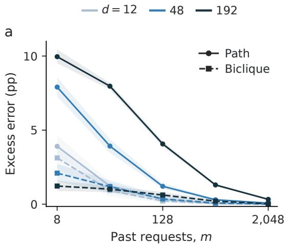

b  
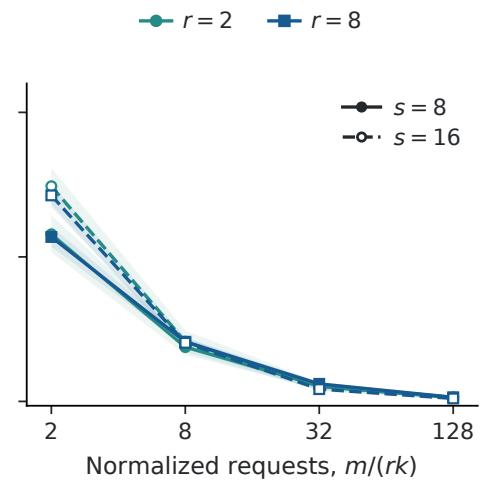  
Figure 6: Enlarging a region differs from adding allocation decisions. (a) Fixed full-support Dirichlet workloads on paths and bicliques, at depth two; 20 paired workload instances with ten training repetitions. (b) Chains of r biclique regions, each with s vertices per color, at depth four and total connection-query mass 0.2; 24 paired fixed instances with ten repetitions. Population excess is measured against the physical-class optimum; bands are pointwise 95% instance-bootstrap intervals. Reports are sharp and $h = 0$ . These fixed-workload curves do not estimate minimax rates; biclique query support grows with s.

## J.4 MATCHED ESTIMATORS AND PRIVILEGED DIAGNOSTICS

Joint uses empirical requests and both estimated channel factors. Task only sets both factors to one. Each is evaluated using raw frequencies and half-count smoothing, $\widetilde { \pi } _ { i } = ( n _ { i } + 1 / 2 ) / ( m + d / 2 )$ with calibration unchanged. Reporting only uses smoothed requests, estimated native visibility, and ideal preparation factors. Joint, Task only and Reporting only use the same dynamic program and first-predecessor tie rule. The selected runs may have length one, two or three; at least one run must be odd.

Greedy starts with the greatest standalone-benefit singleton and visits the remaining sites in descend ing estimated standalone benefit. It accepts an addition only if it strictly raises estimated score and keeps the same one-odd feasible family. This is a one-pass heuristic, not a local optimum: a beneficial multi-site addition can be missed when its intermediate single-site additions violate the odd condition. Product solves the cap-one problem with smoothed requests and native visibility. Full chain retains every site, uses depth d, and needs neither request fitting nor calibration. Its excess relative to a cap-three oracle may be negative because its resource budget differs.

Known channel uses true factors with smoothed empirical requests. Known workload uses true requests with estimated factors. The circuit oracle knows both. Their risk differences diagnose the two error sources, but need not add exactly: changing either estimate can change the selected mask. None is tuned with population outcomes. The primary comparison, fixed before the draws, is Task only smoothed minus Joint smoothed at $d = 6 3$ , heterogeneous noise, m = 1,008, and $B = 2 5 6$

## J.5 UNCERTAINTY, ADVERSE CELLS, AND DEPTH SENSITIVITY

Risk is evaluated exactly from the true synthetic factors after each mask is chosen. The 16 request/calibration repetitions are averaged within each latent instance. Five thousand paired bootstrap resamples of the 32 instances give pointwise 95% percentile intervals. Secondary intervals are descriptive and have no multiplicity adjustment. All 150 dimension/noise/budget cells are released, including both raw and smoothed estimators. The generation of binary future outcomes from this same contrast model would add sampling variance, not an independent validation of the model; population risk is therefore the primary outcome here.

Table 2: Corners of the complete request/calibration grid. Entries are Joint smoothed population excess in percentage points relative to the true-workload, true-channel oracle in the same circuit family. The last column counts cells where Full chain has lower error across all 25 budgets.
<table><tr><td></td><td>Noise</td><td> $m / d = 1 / 4$   $B = 4$ </td><td> $B \doteq 1 0 2 4$ </td><td> $m / d = 6 4$   $B = 4$   $B = 1 0 2 4$ </td><td></td><td>Full chain wins</td></tr><tr><td>d</td><td></td><td></td><td></td><td></td><td></td><td></td></tr><tr><td>63 63</td><td>Low Heterogeneous</td><td>5.880 6.477</td><td>5.017 5.137</td><td>0.703 1.332</td><td>0.065 0.059</td><td>25/25 13/25</td></tr><tr><td>63</td><td>Stress</td><td>6.988</td><td>5.396</td><td>1.922</td><td>0.058</td><td>0/25</td></tr><tr><td>127</td><td>Low</td><td>6.008</td><td>5.772</td><td>0.549</td><td>0.048</td><td>25/25</td></tr><tr><td>127</td><td>Heterogeneous</td><td>6.509</td><td>5.087</td><td>1.462</td><td>0.052</td><td>13/25</td></tr><tr><td>127</td><td>Stress</td><td>6.998</td><td>5.495</td><td>1.939</td><td>0.054</td><td>0/25</td></tr></table>

The main matched-smoothed gain is 1.214 points, with paired interval [0.947, 1.496]. Joint’s primary error is 8.576% versus the same-family oracle’s 8.320%. The raw-count comparison is also reported: Joint has 8.618% error and Task only 9.616%. Smoothing is useful for Joint in this cell but increases Task only’s error; a single favorable smoothing comparison would not identify the channel contribution.

The prespecified depth sensitivity evaluates caps five and seven on the same 32 heterogeneous-noise instances at $d = 6 3$ , retaining the complete budget matrix and identical request/calibration arrays. Each cap has its own true-workload, true-channel oracle. Larger capacity expands the family but need not improve a fitted estimator at every finite budget. Table 3 reports the primary budget without substituting the best depth into the declared primary comparison.

Table 3: Depth sensitivity on 63-qubit heterogeneous-noise instances at $m = 1 , 0 0 8$ requests and $B = 2 5 6$ calibration trials per parameter. Joint uses half-count smoothing; each oracle has the same cap.
<table><tr><td>Cap</td><td>Joint error (%)</td><td>Oracle error (%)</td><td>Excess (points)</td><td>Mean CZ gates</td></tr><tr><td>3</td><td>8.576</td><td>8.320</td><td>0.256</td><td>22.3</td></tr><tr><td>5</td><td>7.515</td><td>7.312</td><td>0.203</td><td>31.6</td></tr><tr><td>7</td><td>7.239</td><td>7.050</td><td>0.189</td><td>36.3</td></tr></table>

## J.6 COMPLETION AND A CALIBRATION-HARD DIAGNOSTIC

The completion diagnostic uses depth one on $K _ { a , a } ,$ with $a ~ \in ~ \{ 8 , 3 2 , 1 2 8 , 5 1 2 \}$ , color masses $3 / 4 , 1 / 4$ and $m \in \{ 4 , 1 6 , 6 4 , 2 5 6 , \hat { 1 } 0 2 4 , 4 0 9 6 \}$ . It compares 2,048 independent count draws per condition with Appendix G’s binomial occupancy formula. Completed full-feasible ERM and maximal ERM choose the same full color on every draw.

For calibration alone, a uniform three-site path has product score $2 / 3$ and triple score $( 2 \gamma + \gamma ^ { 2 } ) / 3 .$ They meet at $\gamma _ { * } = \sqrt { 3 } - 1$ . At each $B \in \{ 4 , 1 6 , 6 4 , 2 5 6 , 1 0 2 4 , 4 0 9 6 \}$ , draw 8,192 independent signs and set both true edge factors to $\gamma _ { * } \pm 0 . 2 / \sqrt { B } .$ . Calibrate the two edges independently; give the learner the true uniform workload and ideal report visibility. The mean ${ \sqrt { B } } .$ -scaled excess ranges from 0.0387 to 0.0411 in risk units. This budget-indexed construction tests the switching mechanism in Theorem 4. The proof uses a smaller perturbation; this curve measures finite-sample behavior rather than its lower-bound constant.

## K STRONGER BASELINES, ONLINE LEARNING AND NOISE MISMATCH

## K.1 SELECTIVE REPAIR OF CONNECTED ALLOCATIONS

The original connected-region study has 96 full-support cells: $r \in \{ 2 , 8 \} , s \in \{ 8 , 1 6 \}$ vertices per color, $\bar { k } \in \{ 2 , 4 \}$ , total connection-query mass in {0.05, 0.2, 0.5} and $m / ( r k ) \in \{ 2 , 8 , 3 2 , 1 2 8 \}$

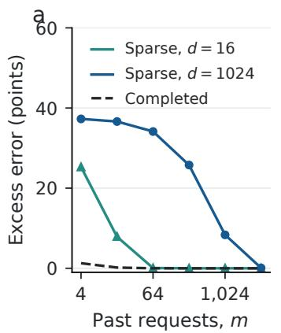

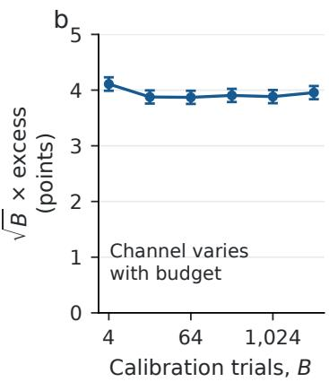

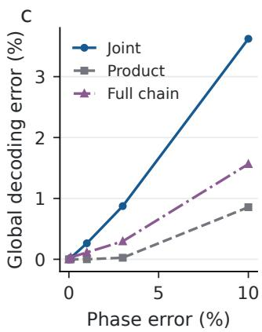  
Figure 7: Three diagnostics distinguish implementation, estimation and information loss. (a) Sparse biclique ERM can omit unobserved queries; completion removes the size penalty in this example. Lines are exact expectations, markers average 2,048 count draws. (b) Calibration-hard three-site channels give approximately constant ${ \sqrt { B } } .$ -scaled excess; bars are 1.96 standard errors over 8,192 independent panels. The channel separation changes with B, so these are not fixed-channel learning curves. (c) Independent phase noise creates global decoding error in exact nine-qubit calculations; these are deterministic model values, with no sampling intervals.

Each cell contains 24 workload instances with ten request repetitions. The main figure and original observed outcomes remain unchanged.

The new retrospective control first optimizes each region independently. When a selected component exceeds the cap, it removes the lowest-count endpoint of a selected interregion edge in an oversized component. It repeats until feasible, then adds feasible queries in descending training count. A second version makes two deterministic passes of strictly improving one-for-one swaps. These rules use training counts alone, with graph connectivity checked explicitly. All 96 original cells are evaluated; no workload is selected using its improvement.

At the original primary condition $( r = s = 8 , k = 4 ,$ connection-query mass 0.2 and $m = 1 0 2 4 )$ exact allocation has 14.998% population error. Repair gives 15.170% and repair with local improvement 15.143%. Their paired differences from exact allocation are 0.172 points ([0.093, 0.252]) and 0.145 points ([0.075, 0.220]), compared with 5.242 points for deleting every connection query. Thus most of that earlier gap reflected the coarse connection-removal baseline. Raw masks, preparation gates and sampled future outcomes for the new controls are included in the archive.

## K.2 ONLINE PROTOCOL AND RESULTS

Each online condition has a known sharp path channel, depth cap three, 512 requests and 12 seeds. Dimensions are 15 and 63. Stationary sequences use a fixed Dirichlet-0.5 workload. Round-robin sequences cycle deterministically through all sites. At each dimension, all 12 seeds repeat that one query sequence and vary only allocation randomness; they are not 12 independently drawn workloads. Changing sequences switch once, halfway through, between workloads that favor alternate pairs of sites by a factor of four. Every full sequence is fixed before learner randomization. Each round encodes a fresh incoming record.

The primary learner quantity is exact expected Gibbs reward, computed from forward/backward messages. A sampled allocation is also saved each round. Smoothed follow-the-leader chooses the empirical optimum after adding half a count to every query. The comparator is the best single allocation for the entire realized request sequence. Mean cumulative excesses, in expected additional mistakes, are:

<table><tr><td>Qubits</td><td>Sequence</td><td>Gibbs</td><td>Smoothed FTL</td><td>Bound</td></tr><tr><td>15</td><td>Stationary</td><td>13.19</td><td>2.21</td><td>25.19</td></tr><tr><td>15</td><td>Round robin</td><td>16.50</td><td>0.00</td><td>25.19</td></tr><tr><td>15</td><td>One change</td><td>15.38</td><td>2.33</td><td>25.19</td></tr><tr><td>63</td><td>Stationary</td><td>26.72</td><td>8.71</td><td>51.49</td></tr><tr><td>63</td><td>Round robin</td><td>45.92</td><td>0.00</td><td>51.49</td></tr><tr><td>63</td><td>One change</td><td>36.42</td><td>11.71</td><td>51.49</td></tr></table>

Every sequence satisfies the bound; the simpler FTL baseline has lower mean loss in all six conditions. These observations support implementation correctness and show that a worst-case guarantee need not give the best behavior on these sequences. They do not establish a dynamic regret guarantee or empirical superiority of Gibbs.

## K.3 RETAINED INFORMATION AND CORRELATED ERRORS

The odd-component invariant holds for arbitrary joint distributions over retained-edge $Z Z$ errors: each error pattern commutes with the same witness. Independence is required for the factorized prediction formula, not for that information-preservation argument. To separate these roles, an exact nine-site control applies a common Bernoulli shock that flips every retained edge, in addition to independent $Z Z$ errors. At shock probability $\rho ,$ a selected query with exactly one retained neighbor acquires factor $1 - 2 \rho ;$ with two retained neighbors, the common flips cancel. Using the true edge marginals in an independent model incorrectly attenuates the interior query twice. $\mathrm { A t } \ \rho = 0 . 1$ , the resulting chosen allocation has 9.47% error, versus 8.23% for the correct correlated-model oracle. Global decoding remains exact for both.

Independent single-qubit Z errors give a different failure. They need not commute with the wit ness. The selected graph-state syndrome distribution is an independent binary convolution; a Walsh transform computes it exactly. Under $G = 1$ , its indices are shifted by the all-ones syndrome, so unrestricted Bayes error follows from the total variation between those distributions. At phase-error probability 0.03 in the fixed nine-site example, global errors are 0.874% for Joint, 0.026% for Product and 0.295% for Full chain. Restricted prediction errors are 15.14%, 19.52% and 13.32%. None of these representations remains lossless at this noise level; their access comparison is no longer information matched.

## L REPRODUCTION AND HISTORICAL EVIDENCE

The small installable allocation package contains the path optimizer, Gibbs distribution and sampler, input validation, and a runnable example. Its README provides the clean-environment commands. The full reproduction entry point verifies frozen acquisition hashes, regenerates request and calibration prefixes, checks population risks and compares the main optimizer against an independent interval implementation. It also checks manuscript references and the compiled artifact.

Before acquisition, exhaustive enumeration verified 864 max-plus optimizer cases and 36 complete Gibbs distributions. The binary information bound was checked on 100,000 asymmetric channels. After acquisition, 11,136 independent interval optimizations checked the primary fitted method, and every population-risk row was recomputed. These finite checks corroborate the mathematical proofs; they do not replace them. Factorial acquisition took 50.50 seconds on six workers; controls took 179.61 seconds. Numerical libraries used one thread per worker; these times exclude development, audits, analysis and plotting. All study seeds and exact package versions are recorded in the machine-readable protocols.

The ancillary data preserve the two-qubit benchmark, earlier allocation studies and the 215,040-shot fixed IBM acquisition, together with their protocols and chronology. These device observations compare fixed implementations in a different measurement family; they are not evidence for learned allocation, an all-input detector guarantee, or exact information preservation in noisy device states.

Table 4: Matched estimators isolate the value of calibration. Population error and mean preparation CZ counts in the prespecified 63-qubit cell $( m = 1 , 0 0 8 , B = 2 5 6 )$ . Intervals are pointwise 95% bootstrap intervals over 32 workload/channel instances. The oracle knows the true workload and channel. Allocation rows have depth at most three and an odd run; Product has depth one and Full chain depth 63.
<table><tr><td>Design</td><td>Error (%) [95% interval]</td><td>Mean CZ gates</td></tr><tr><td>Joint, smoothed</td><td>8.58 [8.19, 8.99]</td><td>22.3</td></tr><tr><td>Task only, smoothed</td><td>9.79 [9.24, 10.37]</td><td>25.8</td></tr><tr><td>Joint, raw</td><td>8.62 [8.24, 9.03]</td><td>19.5</td></tr><tr><td>Task only, raw</td><td>9.62 [9.09, 10.17]</td><td>22.6</td></tr><tr><td>Reporting only, smoothed</td><td>9.77 [9.23, 10.34]</td><td>25.8</td></tr><tr><td>Greedy, smoothed</td><td>8.94 [8.45, 9.50]</td><td>22.3</td></tr><tr><td>Product, smoothed</td><td>15.64 [15.06, 16.22]</td><td>0.0</td></tr><tr><td>Full chain</td><td>9.54 [8.91, 10.16]</td><td>62.0</td></tr><tr><td>Workload and channel oracle</td><td>8.32 [7.96, 8.71]</td><td>21.5</td></tr></table>

## M A PARITY-SERVICE HEALTH TEST AND PHYSICAL RESPONSE CALIBRATION

Entanglement allocation can change how quickly a detector fault becomes visible. We test this application in a simulated four-qubit parity service and validate response calibration on archived IBM observations. The physical experiment tests response prediction; it does not validate the fourqubit service’s coherence-preserving instrument.

## M.1 THE SERVICE AND ITS HEALTH TEST

A service accepts a three-qubit probe and returns one requested parity. Its menu is ZZI, XXX, and IZZ. The two Z parities are the stabilizers of the three-qubit repetition code; XXX is a logicalstate diagnostic, not another syndrome check (Ristè et al., 2015). Preserving information inside a parity sector matters when the same interface processes coherent inputs. Parity repeatability alone does not impose this requirement: measuring local outcomes and reporting their parity also repeats the ideal parity perfectly.

Our client supplies a batch of precommitted, randomly signed probes. An evaluator retains each sign and checks the returned report. The probe factory can use past request frequencies and calibration observations, but its preparation cannot depend on the current request. We enforce this contract with identical preparation prefixes across query-specific circuits. This is a benchmark constraint, rather than a claim that ordinary error-correction schedules conceal their checks. The circuits do no implement an external request arriving after physical preparation.

At entanglement depth two, the catalog contains the Z-product, left-pair, and right-pair codes of Figure 1, together with an X-product code. We use |000⟩, |010⟩ for the product code and $\left| \Phi ^ { + } \right. , \left| \Psi ^ { - } \right.$ on the selected pair, with |+⟩ on the remaining qubit. Their ideal contrasts, in query order, are (1, 0, 1), (1, 1, 0), and (0, 1, 1); the X-product pair $| + + + \rangle , | - + + \rangle$ has contrast (0, 1, 0). The product baseline learns which of its two preparations to use from the same requests and healthy calibration observations as the pair selector. All candidates use the same calibration shots per setting. An ancilla reports the selected parity through compute–copy–uncompute: the middle data qubit is connected to both outer data qubits and the ancilla. The $\dot { Z }$ checks use three CNOTs and the X check uses five, with Hadamard basis changes. These are detector gates; preparing a Bell probe uses one CNOT. All-input Kraus-matrix checks give the projectors $( I \pm P ) / 2$ to a maximum residual of $4 . 5 \times 1 0 ^ { - 1 6 }$

We inject a report-polarity fault by applying X to the ancilla before its measurement. Ideally, this reverses the report without changing the nonselective data channel. The evaluator’s task is to detect the fault from signed reports and query identities. We also test a weaker fault: a rotation $R _ { y } ( 2 \arcsin { \sqrt { 0 . 1 5 } } )$ on the ancilla produces a 15% report-flip probability in the ideal instrument.

Thus an uninformative probe has a concrete cost: it makes healthy and faulty operation harder to tell apart. This deliberately injected fault tests the diagnostic method; it is not an estimated field-failure rate.

Two controls expose the interface restrictions. A product preparation that knows the requested query is perfectly informative in the ideal case. A product probe followed by a second, nondestructive $Z \bar { Z } I$ service call also recovers the bit, because all three queries commute. The benchmark therefore charges one call per probe. We include both controls, together with a full-GHZ preparation, and report their different resources in Table 5.

## M.2 CALIBRATION FROM DIRECTLY OBSERVED RESPONSES

We calibrate what the service returns, rather than assuming separately observed edge errors. For candidate $^ { a , }$ query t, and balanced label $^ { g , }$ let $Y \in \{ - 1 , + 1 \}$ be the report and define

$$
\begin{array} { r } { b _ { a t } = \frac { 1 } { 2 } \big ( \mathbb { E } [ Y \mid a , t , 0 ] - \mathbb { E } [ Y \mid a , t , 1 ] \big ) . } \end{array}
$$

This signed contrast includes preparation, gate, assignment, and report errors. The two label-specific means also retain output bias. Bias cancels from balanced-label classification risk; it would still matter for unequal priors or logarithmic loss.

Proposition 3 (Direct response calibration). Fix a catalog of A encoders and $q$ requests. Suppose their response channels are stationary, and acquire B independent shots for each $( a , t , g )$ , independently of m iid request samples. Let $\widehat { b } _ { a t } = ( \overline { { Y } } _ { a t 0 } - \overline { { Y } } _ { a t 1 } ) / 2 ,$ , choose $\widehat { a } \in$ arg maxa $\sum _ { t } \widehat { \pi } _ { t } | \widehat { b } _ { a t } |$ , and decode with the learned signs $o f { \widehat { b } } ,$ taking the sign to be +1 at zero. For the balanced source of Section 2, with probability at least $1 - \delta$

$$
R ( \widehat { a } , \widehat { s } ) - R _ { \mathrm { c a t a l o g } } ^ { * } \leq D \operatorname* { m i n } \left\{ 1 , \sqrt { \frac { \log ( 4 A / \delta ) } { 2 m } } + \sqrt { \frac { \log ( 4 A q / \delta ) } { B } } \right\} .\tag{23}
$$

The comparator uses the best candidate and its true Bayes binary decoder. Total calibration cost is $Q = 2 A q B ,$ , so the calibration term equals $\sqrt { 2 A q \log ( 4 A q / \delta ) / Q }$

Proof. For any orientation $s ,$ balanced labels give $\begin{array} { r } { R ( a , s ) = 1 / 2 - ( D / 2 ) \sum _ { t } \pi _ { t } s _ { t } b _ { a t } } \end{array}$ . Hoeffding’s inequality and a union bound give $\begin{array} { r } { \operatorname* { P r } ( \operatorname* { m a x } _ { a t } | \widehat { b } _ { a t } - b _ { a t } | > \eta ) \leq 2 A q \exp ( - B \eta ^ { 2 } ) } \end{array}$ . Conditioning on calibration, each function $t \mapsto | \widehat { b } _ { a t } |$ | lies in $[ 0 , 1 ]$ , so the uniform request-estimation error exceeds ϵ with probability at most $2 A \exp ( - 2 m \epsilon ^ { 2 } )$ . On their intersection, compare the true optimal score to its estimated score, the selected estimated score, and the selected signed true score. The total difference is at most $2 \eta + 2 \epsilon$ . The last step uses | sign $( { \widehat { b } } ) b - | { \widehat { b } } | | = | b - { \widehat { b } } |$ , so it includes incorrectly learned signs. Multiply by $D / 2$ and use the two failure budgets $\delta / 2$ . The trivial cap is $D _ { \colon }$ , since a wrongly learned orientation can have risk above $1 / 2$ □

This finite-catalog result makes no factorization assumption and does not replace the full-class lower bounds in the main text. If every test contrast differs from its calibration contrast by at most $\kappa ,$ the same argument adds $D \kappa$ . A few observed blocks cannot certify such a condition for future device operation.

For $A = 4 , q = 3 , m = 1 2 8 , B = 2 0 4 8 , D = 1$ and $\delta = 0 . 0 5 , \mathrm { E q }$ (23) gives an excess-risk bound of 0.208, using 49,152 healthy calibration shots. It guarantees consistency; it does not certify the much smaller empirical improvement.

Every probe uses the same query- and label-conditioned likelihood alarm. Separate response-fit data estimate healthy and deliberately faulty report probabilities. A third, healthy calibration block sets the threshold. For an episode, we sum $\log [ \widehat { p } _ { \mathrm { f a u l t } } ( Y \mid t , g ) / \widehat { p } _ { \mathrm { h e a l t h y } } ( Y \mid t , g ) ]$ , using Jeffreys smoothing. With $n _ { 0 }$ independent healthy calibration episodes, the threshold is their $\lceil 0 . 9 5 ( n _ { 0 } + 1 )$ ⌉th smallest score; we alarm only on strict exceedance. Exchangeability bounds the probability of a future healthy score exceeding this rank, giving marginal false-alarm probability at most $0 . 0 5$ , with ties conservative. This is not a guarantee conditional on one realized threshold. The alarm is trained for a specified injected fault; Proposition 3 concerns recovery error, not optimal multi-report fault power.

Table 5: Escape controls for the asymmetric circuit model at request probabilities (0.2, 0.6, 0.2). Errors use separate test shots. The calibrated and request-only rules choose the left pair for the displayed fixed history. Depth is stored-state entanglement depth.
<table><tr><td>Probe/control</td><td>Depth</td><td>Early query</td><td>Calls</td><td>Error (%)</td></tr><tr><td>Z-product</td><td>1</td><td>No</td><td>1</td><td>31.24</td></tr><tr><td>X-product (selected product)</td><td>1</td><td>No</td><td>1</td><td>24.58</td></tr><tr><td>Left pair</td><td>2</td><td>No</td><td>1</td><td>16.09</td></tr><tr><td>Right pair</td><td>2</td><td>No</td><td>1</td><td>17.73</td></tr><tr><td>Full GHZ</td><td>3</td><td>No</td><td>1</td><td>9.99</td></tr><tr><td>Query-aware product</td><td>1</td><td>Yes</td><td>1</td><td>6.60</td></tr><tr><td>Z-product with second Z ZI call</td><td>1</td><td>No</td><td>2</td><td>5.36</td></tr></table>

## M.3 CIRCUIT EXPERIMENTS AND ESCAPE CONTROLS

Each of two declared gate-noise models uses 1,068 circuits and 1,093,632 simulated shots. Six blocks contain 1,024 shots per circuit setting. Submitted blocks 0–1 fit responses, block 2 calibrates the alarm, and blocks 3–5 evaluate both. Settings are shuffled within each block. One model has equal qubit error scales; the other assigns scales (1, 1, 5, 1.5) to left, middle, right, and ancilla qubits. These are hypothetical channels, not fits to a quantum processor. They combine gate depolarization, amplitude damping, asymmetric assignment errors, and phase damping on measured qubits. They omit spectator measurement crosstalk. Exact parameters and raw counts accompany the code.

The workload menu includes syndrome-heavy, balanced, coherence-heavy, left-heavy, and rightheavy request distributions. The displayed coherence-heavy mixture is (0.2, 0.6, 0.2). Over 4,096 independently sampled request histories of length 128, calibration reduces mean held-out recovery error from 16.88% to 16.28% in the asymmetric model. A 1,000-replicate bootstrap resamples calibration and test shots within each setting, refits the selector, and reuses the request histories; its 95% interval for the gain is [0.323, 0.928] percentage points. Both allocation rules use the calibrated decoder orientations; “request-only” here ablates allocation calibration. In the symmetric control, calibration changes error by +0.035 points, with gain interval [−0.121, 0.020] points: there is no resolved benefit. These histories share one acquisition per noise model. The bootstrap describes shot uncertainty under that channel, not variation across devices. With the single fixed history used for the alarm, both the calibrated and request-only rules select the left pair. That alarm comparison therefore tests probe choice, not an additional calibration gain.

We replay 256 test episodes from distinct shots within each probe/workload/fault condition, sampling queries and labels independently. The polarity-reversal task uses eight reports per episode and 256 healthy threshold-calibration episodes. The weaker fault uses 32 reports and 64 calibration episodes. The extreme fault is nearly saturated: both pair probes detect all 256 test faults, while the X-product detects 255. It supplies little evidence of a large advantage.

The weaker fault separates the probes. With independently calibrated thresholds, the left pair detects 184/256 faults with 15/256 healthy alarms; the X-product detects 129/256 with 9/256 healthy alarms. Because realized false-alarm rates differ, we also report a descriptive held-out ROC comparison. At an empirical 5% false-alarm rate, powers are 70.70% and 54.30%. A paired bootstrap over the 256 shared episode indices gives a gain of 16.4 points, with interval [3.9, 28.9]. The ROC threshold is an evaluation statistic, not the independently calibrated operating threshold. Figure 8c plots the descriptive ROC; fixed operating counts are reported above. Averaging descriptive ROC power over the 4,096 request histories gives 69.14% for the calibrated selector, 64.36% for the request-only selector, and 54.23% for the learned product selector, conditional on the same response and test acquisition. All episodes are offline replays, not live service calls. Rules selecting the same probe share the same replay, and pools are shared across comparisons.

The back-action experiment uses the same Bell factories. After a Z check we measure the supported pair’s XX coherence; after XXX we measure its ZZ coherence. Both parity sectors and two opposite coherent phases within each sector are included, with all outcomes retained. Ancilla extraction retains signed coherence 0.893, 0.764, and 0.649 for ZZI, XXX, and IZZ; local refinement gives −0.0004, −0.0016, and 0.0072. No-instrument references and repeated parity checks accompany these witnesses. The no-instrument reference is not duration matched. The simulation demonstrates the distinction between the two implemented channels; it is not a physical instrument certificate. Full instrument characterization must also address preparation and analysis errors (Pereira et al., 2023).

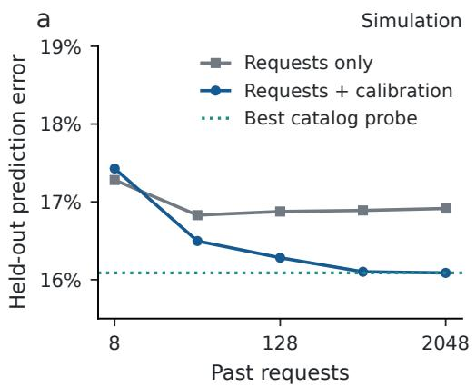

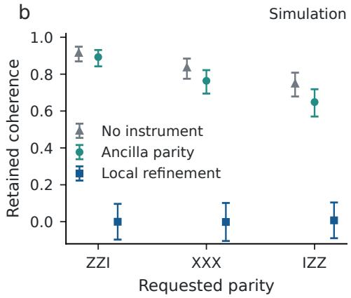

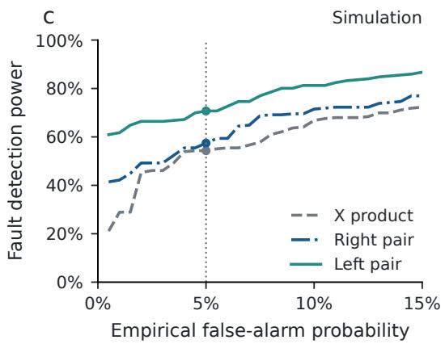

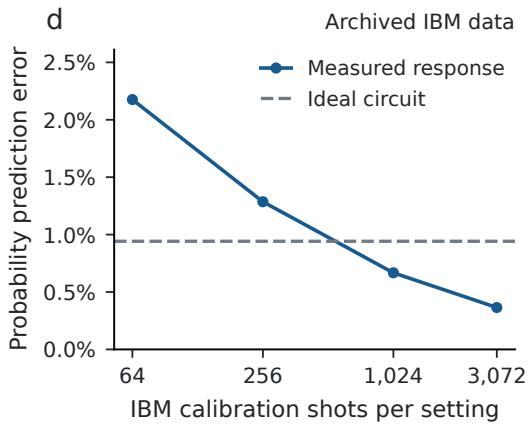  
Figure 8: (a–c) Declared-noise simulation. (a) Mean recovery error over 4,096 request histories sharing calibration and test shots. (b) Unconditional signed Bell coherence; shot-weighted 95% simultaneous binomial bounds over prepared-state/block strata. (c) Query-conditioned alarms for the 15% report-flip fault: 256 disjoint 32-shot test episodes per condition. Held-out ROC curves and empirical 5% false-alarm points are descriptive, not prospective thresholds. X-product is the selected product comparator. (d) Archived physical IBM observations: probability MAE across 24 settings on disjoint test blocks, with nested calibration prefixes. This single retrospective two-qubit split tests response prediction, not the instruments in (b).

Finally, we test the main text’s multiplicative contrast model on these circuit responses. Its supported entries require $b _ { L 0 } b _ { P 2 } b _ { R 1 } = b _ { R 2 } b _ { P 0 } b _ { L 1 }$ , with unsupported entries zero. A constrained likelihood fit includes independent output biases and uses calibration shots only. On the asymmetric test set, the direct-minus-factorized mean log score is $- 1 . 2 \times 1 0 ^ { - 5 }$ nats per shot, with conditional normal interval $[ - 4 . 4 , 2 . 0 ] \times 1 0 ^ { - 5 }$ . This experiment does not resolve a predictive difference between the models. We retain both results; direct calibration is useful without claiming the factorization fails.

## M.4 PHYSICAL CALIBRATION ON ARCHIVED IBM OBSERVATIONS

The earlier fixed-code experiment acquired 215,040 shots on ibm\_fez, qubits 22 and 23, on 6 September 2026. Its raw counts, receipt, and circuit hashes remain unchanged. We now use the 147,456 prediction shots for a retrospective response-calibration test. There are 24 settings: two conditions, three preparations, two queries, and two labels. Submitted blocks 0–2 supply 3,072 calibration shots per setting; blocks 3–5 supply 3,072 test shots. The split was selected after the original aggregate results were known. Per-circuit execution timestamps are unavailable, so these are disjoint submitted blocks, not a demonstrated later-day test.

We estimate each report probability with Jeffreys smoothing, $\widehat { p } = ( K + 1 / 2 ) / ( B + 1 )$ , and score predictions on the test shots. Mean absolute probability error decreases from 0.00942 for ideal circuits to 0.00365 for measured responses. At budgets 64 and 256, estimation error is larger than the discrepancy of the ideal model; the larger calibration budgets improve prediction (Figure 8d). The heldout Brier score decreases from 0.070311 to 0.070197. Its paired gain is 0.000114, with conditional shot-level normal interval [0.000064, 0.000164]. All 20 possible three-block calibration/three-block test splits yield positive Brier gain, ranging from $7 . 4 3 \stackrel { . } { \times } 1 0 ^ { - 5 } \mathrm { t o } 1 . 4 1 \times 1 0 ^ { - 4 }$ . These overlapping splits are a sensitivity analysis, not independent replications. These data support response calibration, without identifying isolated noise parameters.

The original 1,068-circuit, 273,408-shot acquisition bundle was superseded before submission. Appendix O reports the new four-qubit acquisition, including backend-bound compilation, measurement-exposure controls, and calibration transfer to later jobs. The original bundle and its ideal checks remain in the artifact.

## N LEARNING PROBES FOR DETECTOR DIAGNOSIS

The same allocation problem governs two tasks: recovering a stored bit and detecting a change in the detector. This section establishes the connection over the full physical encoder class, then tests its limits under more general detector noise. Numerical results in this section are calculations for declared models. Appendix O reports the prospective quantum-processor evaluation, including calibration transfer, coherence controls, and acquisition costs.

## N.1 AN EXACT DIAGNOSTIC EXPERIMENT FOR EVERY CSS ALLOCATION CLASS

Let $H \in \{ 0 , 1 \}$ denote healthy or faulty operation. Before each call, the client prepares a state in $\mathit { S } _ { \mathcal { F } }$ the partition class of Section 2. An independent request $T \sim \pi$ then selects one of the independent commuting CSS queries. The detector measures its ideal parity and flips the report with probability $e _ { H }$ , where $0 \leq e _ { 0 } < e _ { 1 } \leq 1$ . Flips are independent across calls and of the request, preparation and ideal outcome, conditional on $H .$ The evaluator sees the request, report and any classical preparation tag. Each state must belong to $\mathit { S } _ { \mathcal { F } }$ conditional on that tag and the complete past history. The client retains no quantum system between calls. Classical randomization, biased states and adaptation to every past report are allowed. Training requests are independent of $H$

For partition Π, let I be a locally compatible set of queries, as in Theorem 1, and define

$$
p _ { \mathcal { F } } ( \pi ) = \operatorname* { m a x } _ { \Pi \in \mathcal { F } , \ I \mathrm { c o m p a t i b l e o n } \Pi } \sum _ { t \in I } \pi _ { t } .
$$

Write $\mathsf { E } _ { p }$ for an experiment that returns an erasure with probability $1 - p$ and an observed flip bit distributed as Bernoull $\operatorname { i } ( e _ { H } )$ with probability $p .$ Its erasure indicator is independent of $H$ . Let $B _ { p , N } ( \alpha )$ be its optimal N-call detection power at false-alarm probability at most $\alpha .$

For one-call learning, let $S _ { m } \sim \pi ^ { m }$ be the training requests. A learner A maps $S _ { m }$ to an admissible probe, its retained classical tag, and an alarm rule. Write $\beta _ { \pi } ( A ; S _ { m } )$ for its power, averaged over preparation randomness, the new request and the report. Define

$$
\mathfrak { D } _ { \mathcal { F } } ( m ) = \operatorname* { i n f } _ { A } \operatorname* { s u p } _ { \pi \in \Delta _ { q } } \mathbb { E } _ { S _ { m } } \big [ B _ { p _ { \mathcal { F } } ( \pi ) , 1 } ( e _ { 0 } ) - \beta _ { \pi } ( A ; S _ { m } ) \big ] .
$$

Here $A$ cannot use $\pi ,$ and its false-alarm probability must be at most $e _ { 0 }$ conditional on every training record, tag and request. The comparator knows $\pi .$ . The identity below also holds if this conditional requirement is weakened to false-alarm control averaged over training and test randomness, uniformly over π.

Theorem 5 (Allocation determines diagnostic power). Under the preceding model, the optimal $N .$ call experiment over all admissible, classically adaptive probe policies is equivalent, in Blackwell’s comparison ofexperiments, to $\mathsf { E } _ { p \mathcal { F } ( \pi ) } ^ { \otimes N }$ . Afixed signed projector probe supported on a maximizing I attains it. At one call andfalse-alarm level $\alpha = e _ { 0 }$

$$
B _ { p , 1 } ( e _ { 0 } ) = e _ { 0 } + ( e _ { 1 } - e _ { 0 } ) p .\tag{24}
$$

Consequently, $i f \Re _ { \mathcal { F } } ( m )$ is the sharp-report minimax prediction regret ofthe main text, the minimax loss ofone-call diagnostic power after m training requests is exactly

$$
\mathfrak { D } _ { \mathcal { F } } ( m ) = \frac { 2 ( e _ { 1 } - e _ { 0 } ) } { D } \mathfrak { R } _ { \mathcal { F } } ( m ) , \qquad D > 0 .\tag{25}
$$

The attaining alarm has false-alarm probability $e _ { 0 }$ conditional on every training record, preparation tag and request; it does not require knowledge of π.

Proof. The signed single-state expectation region is the convex hull of $s \odot \mathbf { 1 } _ { I }$ , where I ranges over compatible sets and $s _ { t } \in \{ - 1 , + 1 \}$ . For the outer bound, the main theorem’s single-state cut inequalities bound absolute correlations. For attainment, the normalized signed projector

$$
\tau _ { s } ^ { I } = 2 ^ { - d } \prod _ { t \in I } ( I + s _ { t } P _ { t } )
$$

is separable across the chosen partition. Independence of the global Paulis makes its expectation $s _ { t }$ on I and zero off I. Thus every admissible state’s entire report channel is a mixture of these vertex channels under both hypotheses. This is a channel decomposition; it need not decompose the original density matrix. Revealing the mixture component can only help the evaluator.

A vertex gives a known ideal report on I and a fair, hypothesis-independent report otherwise. Its experiment is $\mathsf { E } _ { \pi ( I ) } { : }$ the remaining request identity and known sign are ancillary conditional on the informative flag and flip bit. If $\begin{array} { r } { \dot { p } ^ { \prime } \leq p , } \end{array}$ erase an informative output of $\mathsf { E } _ { p }$ with probability $1 - p ^ { \prime } / p$ to obtain $\mathsf { E } _ { p ^ { \prime } }$ . Draw a compatible query identity from its conditional distribution and restore its known sign to reproduce the full vertex channel. The resulting kernel never uses H. Applied conditionally on the simulated history at each call, it reproduces every adaptive policy from independent copies of $\mathsf { E } _ { p , \mathcal { F } }$ . The maximizing fixed vertex attains this experiment, proving optimality for every terminal test.

For Eq. (24), alarm on an informative flipped report, never alarm on an informative unflipped report, and alarm with independent probability $e _ { 0 }$ on an erasure. Its false-alarm probability is $e _ { 0 }$ even conditional on the request. Its power is $e _ { 0 } + ( e _ { 1 } - e _ { 0 } ) p$ . Conversely the total variation between the two one-call laws is $( e _ { 1 } - e _ { 0 } ) p$ , so no level-e0 test has greater power.

More generally, a conditional state with expectations $r _ { t }$ has one-call total variation $( e _ { 1 } \textrm { -- }$ $e _ { 0 } ) \sum _ { t } \pi _ { t } | r _ { t } |$ . Averaging over training and retained tags preserves this upper bound. The mean absolute-correlation vector remains in the main theorem’s convex feasible region. Every vector in that region is realized by a tagged mixture of signed projectors, with the preceding alarm attaining the bound. Prediction regret is $D / 2$ times the loss of weighted coverage; diagnostic-power regret is $e _ { 1 } - e _ { 0 }$ times that same loss. Taking the same infimum over learners and supremum over workloads proves Eq. (25). □

In particular, the path law becomes $\Theta ( ( e _ { 1 } - e _ { 0 } ) k ^ { - 1 }$ min $\{ 1 , \sqrt { d \log ( k + 1 ) / m } \} )$ ), uniformly over $2 \leq k < d .$ . The connected-region law transfers with the same geometric conditions. This is a learning result for probe allocation: the hypotheses $e _ { 0 } , e _ { 1 }$ are known. Estimating a healthy baseline or an operating threshold costs separate calibration data.

For arbitrary N, a learned compatible set of mass $\widehat { p }$ also satisfies the same-level transfer bound

$$
0 \leq B _ { p ^ { * } , N } ( \alpha ) - B _ { \widehat { p } , N } ( \alpha ) \leq 1 - \{ 1 - ( e _ { 1 } - e _ { 0 } ) ( p ^ { * } - \widehat { p } ) \} ^ { N } .
$$

To see this, promote erased outputs of $\mathsf { E } _ { \widehat { p } }$ to informative outputs with probability $( p ^ { * } - \widehat { p } ) / ( 1 - \widehat { p } )$ and generate their flip bits using $e _ { 0 } .$ Under $H = 0$ this exactly reproduces $\mathsf { E } _ { p ^ { * } } ;$ under $H = 1$ the one-use total-variation error is $( e _ { 1 } - e _ { 0 } ) ( p ^ { * } - \widehat { p } )$ . Product coupling gives the bound. It compares optimal population tests, not estimated thresholds.

## N.2 THE COMPLETE SEPARABLE BENCHMARK AND ITS RESOURCE COST

For ZZI, XXX, IZZ, the full separable signed region is $| r _ { 0 } | + | r _ { 1 } | \le 1 , | r _ { 1 } | + | r _ { 2 } | \le 1$ . Its vertices are $( s , 0 , t )$ and $( 0 , s , 0 )$ , with $s , t \in \{ - 1 , + \bar { 1 } \}$ . The full depth-at-most-two region adds $( s , t , 0 )$ and $( 0 , s , t )$ , giving $| \dot { r } _ { t } | \le 1$ and $\textstyle \sum _ { t } | r _ { t } | \leq 2$ . Therefore

$$
p _ { 1 } = \operatorname* { m a x } \{ \pi _ { 1 } , \pi _ { 0 } + \pi _ { 2 } \} , \qquad p _ { 2 } = 1 - \operatorname* { m i n } _ { t } \pi _ { t } , \qquad p _ { 3 } = 1 .
$$

These are full-class optima, including arbitrary mixed states and adaptation, rather than optima over two named product preparations. At the uniform workload, $p _ { 1 } ~ = ~ p _ { 2 } \colon$ entangling a pair has no benefit. $\mathrm { A t } ( 0 . 2 , 0 . 6 , 0 . 2 ) , p _ { 1 } = 0 . 6$ and $p _ { 2 } = 0 . 8$

We calculate the exact finite-call ROC from

$$
q _ { h } ( k , j ) = { \binom { N } { k } } p ^ { k } ( 1 - p ) ^ { N - k } { \binom { k } { j } } e _ { h } ^ { j } ( 1 - e _ { h } ) ^ { k - j } .
$$

Here k counts informative reports and $j$ counts their flips. Sorting $q _ { 1 } / q _ { 0 }$ and randomizing at the boundary gives the Neyman–Pearson test. We use $e _ { 0 } = 0 . 0 2$ and an additional independent 15% fault, $\ s \mathbf { o } \ e _ { 1 } = 0 . 1 6 4$ , with $\alpha = 0 . 0 5 . \ \mathrm { A t } \ 3 2$ calls, optimal power is 82.39% for all separable policies and 88.45% at depth two. The fixed-horizon minimum counts attaining 80% power are 30 and 22. Independent linear-program checks and 100,000 random product states test the implementation; the proofs supply global optimality.

Table 6: Exact-model resources for fixed-horizon tests attaining 80% power at 5% false alarms. Preparation and detector columns count logical CNOTs. Fractional entries are expectations over requests, not fractional gates. These known-channel costs exclude calibration and dynamic-control latency.
<table><tr><td>Probe policy</td><td>Calls</td><td>Preparation</td><td>Detector</td><td>Total CNOTs</td></tr><tr><td>Fixed-horizon optimal separable</td><td>30</td><td>0</td><td>126.0</td><td>126.0</td></tr><tr><td>Bell pair</td><td>22</td><td>22</td><td>92.4</td><td>114.4</td></tr><tr><td>Full GHZ</td><td>18</td><td>36</td><td>75.6</td><td>111.6</td></tr><tr><td>Query-aware product</td><td>18</td><td>0</td><td>75.6</td><td>75.6</td></tr><tr><td>Adaptive second ZZI call</td><td>28.8</td><td>0</td><td>108.0</td><td>108.0</td></tr></table>

The first service call uses 4.2 detector CNOTs on average at this workload. A Bell preparation adds one. The adaptive product control makes a second $Z Z I$ call only after XXX, so it averages 1.6 calls and six detector CNOTs per probe. Over N probes its call count is $N + \mathrm { B i n o m i a l } ( N , \bar { 0 . 6 } )$ . It costs fewer CNOTs than the Bell policy in Table 6, but more detector calls. These are not lower bounds on expected cost with early stopping: a sequential implementation can stop when the terminal decision is already determined. Early query access removes the preparation problem altogether.

For L diagnostic episodes, the total cost of policy a is $C _ { a } ( L ) = C _ { \mathrm { c a l } } ( a ) + L N _ { a } [ C _ { \mathrm { p r e p } } ( a ) +$ $\tilde { C } _ { \mathrm { d e t e c t o r } } ( \bar { a } ) ]$ ]. Thus extra pair-calibration cost $\bar { \Delta } C _ { \mathrm { c a l } }$ is amortized against the fixed-horizon one-call separable policy only when $1 1 . 6 L > \Delta C _ { \mathrm { c a l } } ,$ if cost is measured in logical CNOTs. The corresponding detector-call condition is $8 L > \Delta Q _ { \mathrm { c a l } }$ This comparison charges calibration rather than assigning it zero cost. Appendix O records actual calibration shots, compiled native gates, measurement/reset slots, latency and QPU usage separately; CNOT counts are not a substitute for elapsed time. The frontier also assumes ideal probes. An additional independent 1% flip of the Bell probe’s supported parity signs reduces its 32-call power from 88.45% to 84.84%; at 1.6% it falls to 82.00%, below the ideal separable value of 82.39%. Preparation error can therefore remove a detector-call saving before cost amortization matters.

The operational constraint describes a factory that commits probes before a multiplexed detector’s next request is selected. It can use past demand but cannot rebuild the current probe. This can be implemented and tested as a service contract. Ordinary syndrome schedules need not satisfy it, and a deployed diagnostic system with early query access should use the cheaper query-aware control.

## N.3 A CERTIFICATE FOR ARBITRARY BINARY DETECTOR EFFECTS

The scalar coverage reduction need not survive biased, query-dependent or non-Pauli errors. We therefore allow arbitrary healthy and faulty binary effects $E _ { h , t , y } .$ with no CSS or independent-error assumption. The request still arrives after preparation, and these effects specify the conditional response on every use; a stationary one-use marginal alone does not imply a memoryless experiment.

For a fixed $\lambda \geq 0$ and decision vector d $\in \{ 0 , 1 \} ^ { 2 q }$ , define

$$
A _ { d , \lambda } = \sum _ { t , y } \pi _ { t } d _ { t y } ( E _ { 1 , t , y } - \lambda E _ { 0 , t , y } ) .
$$

Every level-α alarm using a separable state has power at most $\lambda \alpha + U ( \lambda )$ , where

$$
U ( \lambda ) = \operatorname* { m a x } _ { d } \operatorname* { m a x } _ { \substack { \rho \subseteq 0 , \mathrm { { T r } } \rho = 1 , \rho ^ { \Gamma _ { i } } \succeq 0 \forall i } } \mathrm { T r } ( A _ { d , \lambda } \rho ) .
$$

The positive-partial-transpose (PPT) class contains every fully separable state. Enumerating binary decisions suffices because the objective is linear in each alarm probability. The same upper bound holds for arbitrary revealed classical mixtures.

For finitely many slopes, the concave polygon $\overline { { B } } ( \alpha ) \ : = \ : \operatorname* { m i n } \{ 1 , \operatorname* { m i n } _ { \lambda } [ \lambda \alpha + U ( \lambda ) ] \}$ is the ROC of a dominating binary-hypothesis experiment. Its outcome masses are the horizontal and vertical increments of the polygon, including a fault-only atom of mass $\overline { { B } } ( 0 )$ . ROC ordering is Blackwell ordering for classical experiments with two hypotheses (Blackwell, 1953); the classical garbling criterion is reviewed in Buscemi (2012, Section 2). Consequently the product of this experiment dominates every classically adaptive separable N-call policy: condition on its history and apply the one-use garbling at each step. This gives a finite-report upper bound without fitting a separable probe catalog. Its computation scales exponentially in the number of outcome/query decisions and in Hilbert-space dimension; here $q = 3$ and the dimension is eight.

Solver output is not itself a certificate. We store Gram factors $Z _ { i } = L _ { i } L _ { i } ^ { \dagger }$ and verify $u I - A _ { d , \lambda } -$ $\sum _ { i } Z _ { i } ^ { \Gamma _ { i } } \succeq 0$ using interval arithmetic after a numerical change of basis. Gram positivity is exact; interval Gershgorin bounds also certify that the basis change is invertible. A separate matrixformation allowance covers floating products and exact-complement rounding. Polygon intersections and likelihood-ratio refinement use rational arithmetic. Each likelihood atom is split between its enclosing geometric-grid ratios while preserving both hypothesis masses, an explicit Blackwell refinement. Positive convolutions propagate outward error bounds. The grid ratio is $4 1 / 4 0$ , with $2 1 / 2 0$ as a coarser check. These are numerical upper bounds, not confidence intervals from sampled data.

## N.4 OPTIMIZED PROBES UNDER CORRELATED AND NON-PAULI ERRORS

We perturb the detector with the unitary $U _ { s } = \exp [ - i s ( X Y I + 0 . 7 I Y X + 0 . 3 Y I Z ) ]$ , followed by independent amplitude damping of strength 0.12s. If $\mathcal { N } _ { s }$ is this channel, the healthy positive effect for query t is

$$
\begin{array} { r } { E _ { 0 , t , + } = \frac { 1 } { 2 } \{ [ 1 + 0 . 0 3 s ( t - 1 ) ] I + ( 0 . 9 6 - 0 . 0 8 s ) \mathcal { N } _ { s } ^ { \ast } ( P _ { t } ) \} , \quad t = 0 , 1 , 2 . } \end{array}
$$

Faulty reports undergo a further 15% flip. The stored outcome-zero matrices and their exact complements define the numerical POVMs. These declared channels include correlated coherent errors and biased responses; they are not fitted device models. Response probabilities alone do not certify the post-measurement instrument.

We optimize six Bloch angles for product probes. A one-call search starts from all 216 Pauli product states; a separate search directly optimizes a 32-report likelihood alarm. Both use seed 930907 and retain the best known feasible probes. Likelihood-score grouping gives an explicit achievable test. The separable upper bound, rather than the optimizer’s convergence, supplies the comparison to the full class.

${ \mathrm { A t ~ } } s = 0 . 0 8 .$ , the Bell probe exceeds the full separable upper bound by more than 2.19 percentage points. $\mathrm { { A t } } ~ s = 0 . 2 0$ , the optimized product outperforms both fixed Bell probes. Comparing only with the named X product would miss this reversal. The upper bound can be loose: it relaxes separability, uses finitely many slopes and refines likelihood ratios. ${ \mathrm { \bf A t } } \ s = 0 $ , its excess over the exact separable optimum is 0.023 points, providing a quantitative implementation check.

Table 7: Detection at 32 calls and 5% false alarms under three declared POVM models. Product and Bell columns are achievable powers; the final column bounds every separable policy, including classical adaptation. No column reports a hardware estimate or a sampling confidence interval.
<table><tr><td>Perturbation s</td><td>Fixed X product</td><td>Optimized product</td><td>Best fixed Bell</td><td>Separable upper</td></tr><tr><td>0</td><td>82.39%</td><td>82.39%</td><td>88.45%</td><td>82.42%</td></tr><tr><td>0.08</td><td>66.89%</td><td>75.04%</td><td>79.96%</td><td>77.77%</td></tr><tr><td>0.20</td><td>34.42%</td><td>68.09%</td><td>57.31%</td><td>70.78%</td></tr></table>

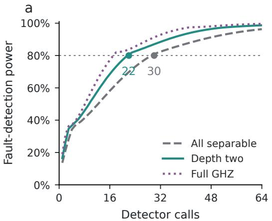

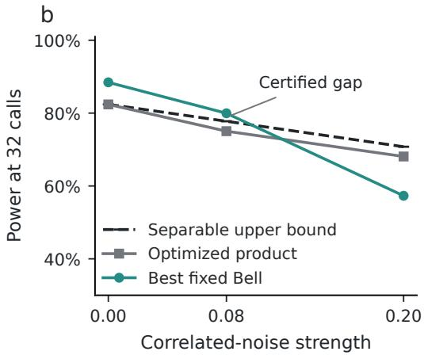  
Figure 9: (a) Exact optimal detection power at 5% false alarms in the report-flip model, including the full separable and depth-two classes. (b) At 32 calls, optimized product and fixed Bell probes under the declared correlated-noise models, with an upper bound on every classically adaptive separable policy. The positive gap at $s = 0 . 0 8$ is certified; the reversal at $s = 0 . 2 0$ motivates direct probe optimization. All curves are model calculations.

## N.5 FROM IDEAL PLANNING TO PHYSICAL ACQUISITION

The initial plan selected among 50 fixed designs by integrating threshold randomness and test counts under the ideal detector model. Its Bell-versus-product rule had an 88.69% probability of passing in two independently calibrated cycles. An extra 0.5% Bell parity-preparation flip reduced that probability to 40.79%; at 1% it was 8.53%. These are model planning probabilities, not observations. Five ideal dynamic-circuit simulations, each with 32,768 shots, reproduced every supported parity exactly and left unsupported contrasts within 0.021 of zero.

Physical commissioning required a shorter request generator and measurement-interval protection. Direct response calibration also showed weaker and differently ranked probes than the ideal plan predicted. Appendix O gives the superseding acquisition and its operating rules, fixed before the first threshold or test job. The original circuit checks and planning calculations remain in the artifact. Neither limited response calibration nor passing a finite probe comparison supplies a full separable device certificate; that would require a valid tomography and preparation-error confidence region.

## N.6 RELATION TO OTHER LEARNING PROBLEMS

Request-distribution-aware access codes optimize recovery of one requested bit from a many-bit message for a supplied distribution (Tan˘ asescu et al., 2020). Our task stores one bit; we learn˘ an entanglement allocation from classical request observations under a fixed detector and depth constraint.

Preparation games optimize sequential measurement protocols against constrained, historydependent state preparation (Weilenmann et al., 2021). Our fixed query distribution and memoryless detector hypotheses yield a common dominating experiment; this permits tensorizing a one-use bound and identifies the allocation learning cost. We do not claim the general idea of optimizing tests over constrained preparation strategies.

Our request-only allocation learner observes classical query identities. Property testing, state learning and classical shadows use measurement data from copies of an unknown state (Bubeck et al., 2020; Aaronson, 2007; Huang et al., 2020). Quantum-memory separations compare learners that retain quantum information across experiments with learners that retain only classical outcomes (Chen et al., 2022). Embedding and classifier generalization study information quantities or trainable cir cuits (Banchi et al., 2021; Caro et al., 2022); our action class follows from physical feasibility. Classical fractional caching also admits capacity-dependent online regret bounds (Paschos et al., 2019). $\mathrm { A t } \ k = d - 1$ , our path problem becomes sparse-loss prediction (Kwon & Perchet, 2016), choosing the least requested query to omit.

Binary discrimination through any quantum channel admits optimal orthogonal pure-state encodings (Dall’Arno et al., 2020, Lemma 4); here the optimum must also respect the entanglement class.

## O PROSPECTIVE EVALUATION ON A QUANTUM PROCESSOR

The model gives a criterion for useful probe allocation. A physical implementation must also preserve the relevant coherences and transfer its calibration to later observations. We test these requirements on ibm\_marrakesh, using data qubits (98, 111, 110) and ancilla 112. The detector queries remain (ZZI, XXX, IZZ) with probabilities (0.2, 0.6, 0.2). These experiments evaluate the implemented detector service under this known nominal workload. They test calibration transfer and the one-call probe comparison; the request-learning rate is established by the theory and its separate scaling experiments. The full separable guarantees of Appendix N apply to its declared models.

## O.1 A REQUEST THAT ARRIVES AFTER PREPARATION

Each circuit commits its probe before generating the request. The ancilla first supplies a Bernoulli bit with probability 0.6, then a Hadamard and a second measurement supply a uniform bit. An X gate conditioned on the second bit returns the ancilla to zero. The four request values have ideal probabilities (0.2, 0.3, 0.2, 0.3), independently of the data. Flat conditional unitaries extract the selected parity; all measurements occur outside those branches. Alarm scores use only the recorded request and permitted detector reports. Terminal data-qubit measurements are retained for diagnostics and never enter those scores.

Initial commissioning exposed a practical obstacle: the longer measurement-and-reset request generator left Bell X correlations near zero. Shortening the request generator and applying local XX echo sequences during ancilla measurement intervals restored both complementary contrasts. The compiler resolves the echo delays using its measurement schedule. The sequences are identities on the data in the ideal circuit and add no entangling gates. Four commissioning jobs selected this implementation; their observations are excluded from every scientific calibration and test below.

Healthy operation uses the physical detector as implemented. The fault condition adds $R _ { y } ( 2 \arcsin { \sqrt { 0 . 1 5 } } )$ to the ancilla before its report measurement. With ideal gates and measurement, this gives the report probabilities of a 15% parity-label flip. Physical errors before and after the rotation enter the calibrated fault channel. It need not equal a classical relabeling of the conditional quantum state on arbitrary cross-sector superpositions. The coherence tests therefore use the healthy instrument and make their own state-preservation measurement.

## O.2 CALIBRATION SELECTS A PROBE; A SECOND JOB CHECKS IT

Each cycle starts with 64 informationally complete product inputs under each hypothesis, using 1,024 shots per input, plus named probe controls using 2,048 shots. Positive-semidefinite least squares fits the three binary detector effects. One six-angle product search fits the hypotheses separately. A second search constrains the effects by the injected-flip relation and uses two independently seeded runs. These are numerical candidate searches, without a global physical separability certificate.

A separate job measures eight candidates under both hypotheses, with 4,096 shots per candidate and hypothesis: the two continuous product candidates, Z and X products, both Bell allocations, GHZ, and the adaptive Z control. It selects the product candidate and entangled allocation with greatest estimated 32-report power at 5% false alarms. All eight candidates remain in the record. The likelihood scores use these directly measured conditional frequencies with Jeffreys smoothing; tomography predictions do not substitute for measured performance. Probe choice and scores are then frozen.

This validation step matters. In the first cycle, the unconstrained fit predicted nearly perfect detection for its product candidate; direct measurement estimated 15.01% power. The structured candidate reached 33.74%, compared with 43.23% for Z product and 51.74% for GHZ. These calibration estimates selected Z product and GHZ for the first held-out comparison. They are not the prospective alarm rates reported below. The second cycle again selects Z product and GHZ, with calibration estimates of 40.19% and 58.54%; its unconstrained product candidate reaches only 11.78% on direct validation. Both cycles therefore evaluate the same selected probes with separately fitted scores and thresholds; they do not demonstrate a learning gain over fixed GHZ. In the physical comparison, “selected product” means the best validated candidate from this search and control set.

## O.3 FROZEN ALARMS AND INDEPENDENT TEST JOBS

Each primary policy receives 2,048 healthy calibration episodes of 32 consecutive shots. Its alarm threshold is healthy order statistic 2,009, with a strict exceedance rule. Under independent stationary healthy episodes, this gives 95.55% per-policy tolerance coverage for a 2.5% false-alarm target. It is not a simultaneous guarantee across policies or cycles. Four secondary policies receive 128 episodes and use rank 126, targeting 5%.

Later jobs acquire 1,536 healthy and 1,536 faulty episodes for each primary policy; secondary policies receive 128 of each. Every episode is one original 32-shot circuit instance (PUB). Each primary shot prepares a fresh probe and executes one requested detector call; the alarm combines 32 such reports. Records are randomly ordered within a stage before submission. A second cycle repeats fitting, candidate validation, threshold calibration, and testing, with no shared job or observation. A cycle passes only if a one-sided Fisher test favors the selected entangled probe at $p \leq 0 . 0 2 5$ and both primary healthy one-sided 95% binomial upper limits are at most 5%. At this sample size the latter permits at most 62 alarms in 1,536 healthy episodes. Both cycles must pass; no pooled result rescues a failed cycle. A GHZ result does not confirm the earlier Bell-specific hypothesis.

Both cycles share the backend, layout, implementation, and acquisition day. Separate jobs establish observation separation, not independent physical noise. Within-PUB shot chronology was not retained.

The enlarged sample sizes were fixed before the first threshold job. They reflect weaker separation in physical calibration than in the ideal model. Calibration-only sensitivity calculations propagate conditional-response and request uncertainty through random thresholds and test counts. They leave substantial uncertainty about power and do not account for drift or selection uncertainty. Test observations never change the probes, scores, thresholds, or sample sizes. Per-job rates and temporal diagnostics assess the stationarity assumption separately from the frozen primary rule.

## O.4 COHERENCE WITHIN BOTH PARITY SECTORS

For each Bell allocation we test its supported Z query and XXX; for GHZ we test all three queries. Each preparation uses both parity sectors and both opposite coherence phases. Three instruments follow the same request generator: ancilla parity extraction, local refinement on the query’s nonidentity support, and a nominal idle reference. Each cell uses 256 shots, giving 84 cells per cycle. These circuits retain the request generator but apply fixed-query extraction, testing the corresponding primitives. There is no postselection on requests, reports, or final outcomes.

After a Z query, the witness is XX on the Bell pair or XXX on GHZ. After XXX, it is the appropriate pair’s ZZ witness; for GHZ we use ZZI. Multiplying by the prepared sign puts all cells on the same scale. Ideal extraction and the idle channel preserve a value of one; the destructive local refinement gives zero. The idle reference is not duration matched, so its ratio to the extraction arm is not a preservation estimate. We report absolute residual coherence and all sectors and phases.

Cell intervals use Clopper–Pearson bounds with Bonferroni correction over the 84 cells in each cycle, assuming independent stationary shots. These witnesses test the stated input family, not a complete quantum instrument.

## O.5 MEASURED OUTCOMES AND RESOURCE ACCOUNTING

Table 8: Prospective physical alarms under the frozen rule. Each primary cell contains 1,536 separate 32-shot circuit instances. Intervals are pointwise 95% binomial intervals under independent stationary episodes; job-level sensitivity is reported separately.
<table><tr><td>Cycle</td><td>Probe</td><td>Fault alarms (%)</td><td>Healthy alarms (%)</td></tr><tr><td>1</td><td>Selected Z product</td><td>30.53 [28.24,32.91]</td><td>1.43 [0.90,2.16]</td></tr><tr><td>1</td><td>GHZ</td><td>39.65 [37.19,42.15]</td><td>1.95 [1.32,2.78]</td></tr><tr><td>2</td><td>Selected Z product</td><td>29.82 [27.54,32.18]</td><td>1.69 [1.11,2.47]</td></tr><tr><td>2</td><td>GHZ</td><td>46.16 [43.64,48.69]</td><td>2.28 [1.59,3.15]</td></tr></table>

The two-cycle superiority rule passes. In cycle 1, the power difference is 9.11 percentage points (conservative 95% interval [3.60,14.58]); the one-sided Fisher $p$ is $7 . 2 0 \times 1 0 ^ { - 8 }$ . The healthy upper bounds are 2.04% for Selected product and 2.64% for GHZ. In cycle 2, the power difference is 16.34 percentage points (conservative 95% interval [10.77,21.83]); the one-sided Fisher p is $5 . 7 9 \times 1 0 ^ { - 2 1 }$ The healthy upper bounds are 2.34% for Selected product and 3.01% for GHZ.

The full acquisition uses 1,482,496 shots and 522 charged QPU seconds across 40 distinct jobs, including commissioning and coherence controls. The interval from the first submission to the last completion is 1.99 hours, including compiler, queue, analysis, and client gaps; it is distinct from charged processor time.

Table 9: Complete new QPU acquisition budget. Shared calibration is charged once to the procedure, not separately to every policy.
<table><tr><td>Stage</td><td>Jobs</td><td>Shots</td><td>QPU seconds</td></tr><tr><td>Commissioning</td><td>4</td><td>128,768</td><td>44</td></tr><tr><td>Fit and candidate validation</td><td>4</td><td>442,368</td><td>130</td></tr><tr><td>Healthy thresholds</td><td>14</td><td>294,912</td><td>128</td></tr><tr><td>Held-out tests</td><td>14</td><td>458,752</td><td>168</td></tr><tr><td>Coherence controls</td><td>2</td><td>43,008</td><td>16</td></tr><tr><td>Dynamic-branch follow-up</td><td>2</td><td>114,688</td><td>36</td></tr></table>

Product, Bell, and GHZ preparation use 0, 1, and 2 native CZ gates. Under the nominal request law, their detector circuits each average 4.2 CZ gates, giving totals of 4.2, 5.2, and 6.2 per trial. The adaptive product uses 6.0 CZ gates and 1.6 logical detector calls on average. Every response trial also contains two request measurements and three terminal diagnostic measurements; the adaptive control reserves two detector-report slots. These circuit counts exclude automatic initialization and finalization; their cost is included in the charged job usage above.

Cycle 1’s minimum ancilla-extraction cell lower bound is 0.462, with simultaneous coverage over its 84 cells. Cycle 2’s minimum ancilla-extraction cell lower bound is 0.453, with simultaneous coverage over its 84 cells.

The pooled rule and per-job stability answer different questions. In the first cycle, GHZ healthy and fault alarm rates vary across jobs and increase with acquisition order after Holm correction. Its final job has 14/224 healthy alarms (6.25%; pointwise 95% interval [3.46,10.26]%). Passing the pooled healthy gate therefore does not establish control below 5% in every job. None of the 42 listed cycle-2 drift diagnostics survives Holm correction; this does not establish stationarity.

Conditioning on each job’s fault-test margins gives a one-sided exact $p = 1 . 0 1 \times 1 0 ^ { - 7 }$ in cycle 1; GHZ has higher power in 6 of 7 jobs. Conditioning on each job’s fault-test margins gives a one-sided exact $p = \bar { 7 } . 5 3 \stackrel { \cdot } { \times } 1 0 ^ { - 2 1 }$ in cycle 2; GHZ has higher power in 7 of 7 jobs. This sensitivity permits different baseline rates across jobs but still requires conditional exchangeability within jobs.

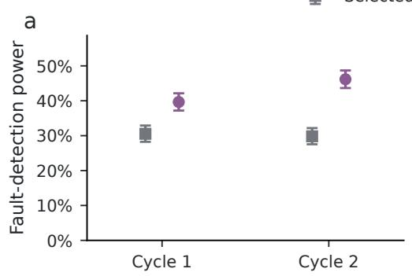

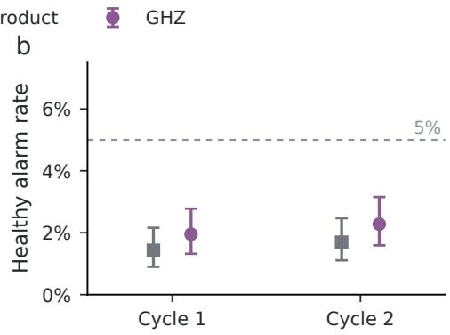

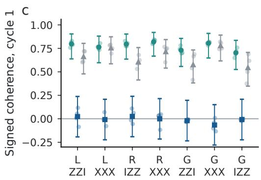

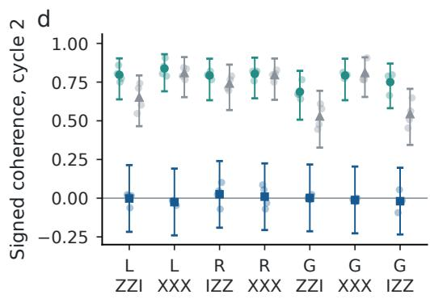  
Fixed-query extraction Local refinement Nominal idle  
Figure 10: (a,b) Held-out detection and healthy alarm rates: 1,536 episodes per policy and hypothesis, 32 shots per episode, with pointwise 95% binomial intervals. (c,d) Fixed-query coherence controls: columns identify the Bell allocation (L or R) or GHZ (G) and the query. Faint points retain both sectors and phases. Solid points average those four fixed inputs; intervals average the simultaneous cell bounds, preserving their 95% coverage separately within each cycle under independent stationary shots in each cell. Idle is nominal, not duration matched.

Table 10: Secondary physical comparisons. Each cell has 128 separate 32-shot episodes, with thresholds calibrated from 128 healthy episodes at rank 126. These target 5% false alarms, whereas the primary policies target 2.5% with larger calibration samples. Differences from Table 8 therefore reflect operating rules as well as probes. Adaptive Z uses extra detector calls.
<table><tr><td>Cycle</td><td>Probe</td><td>Fault alarms (%)</td><td>Healthy alarms (%)</td></tr><tr><td>1</td><td>Z product</td><td>40.62 [32.04,49.66]</td><td>2.34 [0.49,6.70]</td></tr><tr><td>1</td><td>X product</td><td>36.72 [28.38,45.69]</td><td>0.00 [0.00,2.84]</td></tr><tr><td>1</td><td>Left Bell</td><td>25.00 [17.77,33.42]</td><td>0.00 [0.00,2.84]</td></tr><tr><td>1</td><td>Adaptive Z</td><td>52.34 [43.34,61.24]</td><td>3.91 [1.28,8.88]</td></tr><tr><td>2</td><td>Z product</td><td>26.56 [19.15,35.09]</td><td>0.00 [0.00,2.84]</td></tr><tr><td>2</td><td>X product</td><td>32.03 [24.06,40.85]</td><td>6.25 [2.74,11.94]</td></tr><tr><td>2</td><td>Left Bell</td><td>31.25 [23.35,40.04]</td><td>0.78 [0.02,4.28]</td></tr><tr><td>2</td><td>Adaptive Z</td><td>65.62 [56.72,73.79]</td><td>6.25 [2.74,11.94]</td></tr></table>

The adaptive Z control requests a second parity on XXX requests, relaxing the one-call interface. It uses 1.6 logical detector calls on average and two physical report slots in every circuit, including ancilla reset overhead. Its alarm power is informative about that resource tradeoff, not an equalresource separable counterexample. Preparation gates, detector circuits, shared calibration shots, terminal diagnostic measurements, and charged QPU time are counted separately. A fixed 32-report comparison alone is not a physical sample-complexity or total-cost advantage.

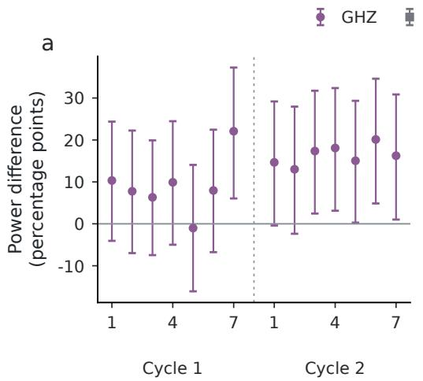

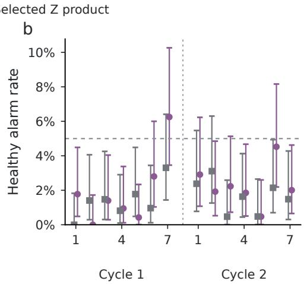  
Figure 11: Every held-out hardware job, in acquisition order within each cycle. (a) Entangledminus-product detection power with conservative pointwise 95% intervals. (b) Healthy alarm rates with pointwise 95% binomial intervals; the dashed line marks 5%. Intervals retain their independentsampling assumptions. Job-specific variation limits extrapolation from aggregate alarm control.

## O.6 COHERENCE THROUGH THE DYNAMIC SERVICE

The fixed-query controls do not exercise the request-conditioned extraction branches. A subsequent follow-up tests those branches directly, with two new jobs of 28 input/target-query cells and 2,048 shots per cell. Both protocols were fixed before either job. The follow-up uses the same sectors, phases, and witnesses, but executes the complete four-branch request selection used for alarms.

For each input, we estimate coherence conditional only on its recorded target request. Every request and outcome remains in the raw record; neither detector agreement nor witness value selects shots. The 56 target cells across both jobs form one Bonferroni family. Conditional binomial intervals assume independent stationary shots given the observed request counts. Expected-parity agreement from the detector report is a separate diagnostic on the same shots. Unconditional witness values are also retained: ideally they are 0.8 for left-Bell/ZZI and right-Bell/IZZ, and one for the other input families. This follow-up leaves the original alarm rules and their outcomes unchanged.

56 of 56 target-request coherence cells have positive simultaneous lower bounds; the smallest is 0.302. Expected-parity agreement ranges from 78.80% to 95.63% across the cells. These outcomes measure residual coherence through the implemented dynamic branches on the stated input family.

## O.7 ACQUISITION PROVENANCE AND TIMING AUDIT

Every acquisition retains its frozen circuit file, backend calibration, preparation-prefix checks, protocol and source hashes, actual IBM job identifier, joint outcome counts, and charged usage. Stages are split into partitions before their first submission; each record retains its actual job identifier. The same free Open-plan instance supplies all jobs. No mitigation or synthetic resampling replaces physical observations.

The experimental scheduler metadata requires an additional check. Some returned timing payloads correspond to a different circuit in the same job, despite matching top-level circuit labels. In the first candidate-validation job, two payloads exchange healthy-GHZ and faulty-Bell signatures. Their measured IZZ report-one rates, 9.05% and 52.94%, respectively, agree with the intended probes and independent fit controls, rather than the swapped timing identities. Deterministic request controls give the same conclusion. We retain the original payloads and the audit; unverified per-record timing cannot establish duration matching. This does not change the counts, calibration choices, or frozen alarm rule.

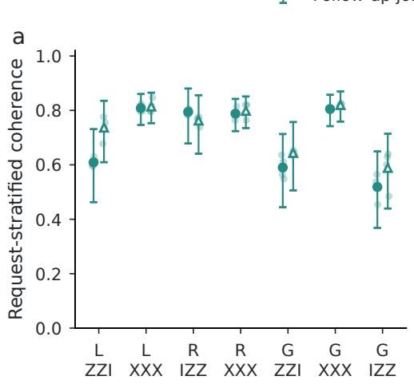

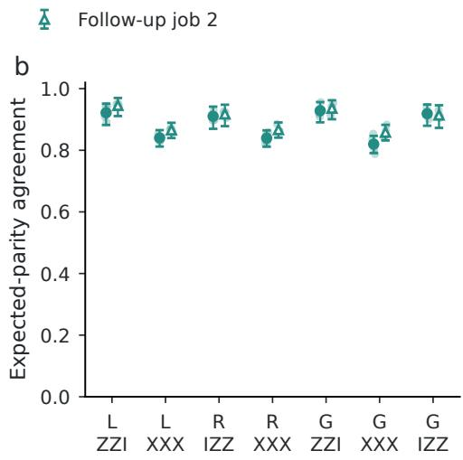  
Figure 12: Dynamic-branch follow-up on the quantum processor. Each point averages both sectors and phases for one preparation and target query, with four faint input-level values. Every input receives 2,048 shots; the analysis stratifies only by the recorded request. (a) Signed coherence, with bounds averaged from the simultaneous 56-cell family across both jobs. (b) Expected-parity agreement; each mean has a conservative pointwise 95% interval obtained from four Bonferroniadjusted cell bounds. L/R denote Bell allocations and G denotes GHZ. Neither observable selects the observations used by the other.

## P THE COST OF CHANGING THE DETECTOR INTERFACE

Extra calls can match an entangled probe’s diagnostic performance. To determine their cost, we compare the complete statistical experiments. Let $\mathsf { E } _ { p }$ denote the experiment with probabilities

$$
P _ { h } ( \bot ) = 1 - p , \qquad P _ { h } ( 0 ) = p ( 1 - e _ { h } ) , \qquad P _ { h } ( 1 ) = p e _ { h } ,
$$

where $h \in \{ 0 , 1 \}$ indexes detector health, $0 ~ < ~ e _ { 0 } ~ < ~ e _ { 1 } ~ < ~ 1$ , and the informative flag is observed. The nonerased bit records whether the reported sign disagrees with the prepared sign. We use Blackwell equivalence under both hypotheses throughout this section. It requires more than matching power at one operating point.

## P.1 FRESH REQUESTS AND OPTIMAL EXPECTED CALL CONVERSION

Theorem 6 (Exact fresh-call conversion). Suppose every admissible fresh call, conditional on its preceding classical history, is dominated by $\mathsf { E } _ { p } ,$ , and somefixed admissible probe attains $\mathsf { E } _ { p } .$ . Afresh probe precedes each new independent request; no quantum system is retained between calls. For $0 < p \leq q \leq 1$ , any terminating policy whose output dominates $\mathsf { E } _ { q } ^ { \otimes N }$ uses at least $N q / p$ calls in expectation under each hypothesis. A stopped policy attains equality and produces an equivalent complete experiment.

Proof. Write $d _ { h } = D _ { \mathrm { K L } } ( \mathrm { B e r n } ( e _ { h } ) \Vert \mathrm { B e r n } ( e _ { 1 - h } ) )$ . Conditional one-call domination bounds the KL increment by $p d _ { h }$ . The chain rule for a stopped transcript, first at a truncated horizon and then by monotone convergence, gives

$$
\begin{array} { r } { D _ { \mathrm { K L } } \big ( P _ { h } ^ { \mathrm { t r a n s c r i p t } } \| P _ { 1 - h } ^ { \mathrm { t r a n s c r i p t } } \big ) \leq p d _ { h } \mathbb { E } _ { h } \tau . } \end{array}
$$

The action and stopping kernels are functions of the observed history, so they add no likelihood ratio. By data processing, the target experiment requires the left side to be at least $N q d _ { h }$ . Dividing proves the lower bound. Infinite expected cost satisfies it trivially.

For one target output, make a fresh call. Return an informative bit if obtained. Following an erasure, with probability $( \bar { q } - p ) / ( 1 - p )$ restart until the first informative bit; otherwise return an erasure. The informative probability is q and expected cost is $1 + ( q - p ) / p = q / p$ . Conditional on the output, the discarded erasures and stopping details are independent of health. The full transcript is therefore equivalent to $\mathsf { E } _ { q }$ . Independent repetition proves the claim for N outputs. The case $p = 1$ is trivial. □

For the menu $\left( Z Z I , X X X , I Z Z \right)$ with probabilities $( . 2 , . 6 , . 2 )$ , the separable and Bell coverages are .6 and .8. Here a bounded construction suffices: after an erased first product call, make one fresh second attempt with probability $5 / 6$ and then stop. Its coverage is $. 6 \dot { + } . 4 ( 5 / 6 ) ( . 6 ) = . 8$ , and its expected cost is $4 / 3 .$ . For N target outputs the cost is $N + { \mathrm { B i n o m i a l } } ( N , 1 / { \dot { 3 } } )$ , with maximum 2N. The expectation is $4 N / 3$ calls; the policy may exceed that number on a particular run.

At a fixed fresh horizon M, the sufficient statistic is the number K of informative calls and the number J of flips:

$$
P _ { h } ( K = k , J = j ) = { \binom { M } { k } } p ^ { k } ( 1 - p ) ^ { M - k } { \binom { k } { j } } e _ { h } ^ { j } ( 1 - e _ { h } ) ^ { k - j } .
$$

Sorting these atoms by likelihood ratio and randomizing at the boundary gives exact Neyman– Pearson power. $\mathrm { A t } \left( e _ { 0 } , e _ { 1 } \right) = \left( . 0 2 , . 1 6 4 \right)$ , 80% power at 5% false alarms requires 30 fresh product calls or 22 Bell calls. This finite-horizon ratio is $3 0 / 2 2$ . Equal expected informative counts alone do not imply equivalence. The ratio $q / p$ also compares fixed-false-alarm Stein exponents, since $D _ { \mathrm { K L } } ( \mathsf E _ { p } ^ { 0 } \| \bar { \mathsf E } _ { p } ^ { 1 } ) = \bar { p } d _ { 0 }$ . Equal-prior Bayes error instead has Chernoff exponent

$$
- \log \left[ 1 - p + p \operatorname* { m i n } _ { 0 \leq s \leq 1 } \{ e _ { 0 } ^ { 1 - s } e _ { 1 } ^ { s } + ( 1 - e _ { 0 } ) ^ { 1 - s } ( 1 - e _ { 1 } ) ^ { s } \} \right] ,
$$

whose Bell/product ratio is 1.33860 at these parameters.

## P.2 CHOSEN EXTRA QUERIES AND RETAINED PROBES

Prepare | + ++⟩ and serve the first random request. If it is XXX, its ideal sign is known. After either unsupported Z request, ask for XXX with probability u. All three observables commute, so every branch of the first ideal parity measurement preserves the XXX sign. The unsupported first report is fair under either health hypothesis. The complete experiment is therefore $\mathsf { E } _ { . 6 + . 4 u } .$ , at 1 + .4u expected calls per original probe. In particular, $\bar { u _ { \ L } } = 1 / 2$ reproduces the Bell experiment at 1.2 expected calls. More generally, a supported commuting repair query gives coverage q at cost $1 + q - p$ . This is an attainable policy, not an optimum over all adaptive ones. Chosen-query control matters as well as retention: a newly prepared product eigenstate queried through a chosen supported observable also achieves this call count, but consumes an additional preparation.

Keeping the probe also makes a different signal available. Repeat an unsupported nondemolition Z query. If its unknown ideal parity is S and the report flips are ${ \bar { F } } _ { 1 } , F _ { 2 } $ , then

$$
Y _ { 1 } = S \oplus F _ { 1 } , \quad Y _ { 2 } = S \oplus F _ { 2 } , \quad Y _ { 1 } \oplus Y _ { 2 } \sim \mathrm { B e r n } ( \theta _ { h } ) , \qquad \theta _ { h } = 2 e _ { h } ( 1 - e _ { h } ) .
$$

Each report alone is fair, but their disagreement diagnoses detector noise. The stored sign remains unknown. This is why the one-call identity between prediction and diagnostic regret need not hold when a policy retains the probe.

Keep the first report on XXX and repeat the first query otherwise. For N original probes, let K count unsupported requests, J count flips on the supported first requests, and V count disagreements. The exact likelihood is

$$
P _ { h } ( k , j , v ) = { \binom { N } { k } } . 4 ^ { k } . 6 ^ { N - k } { \binom { N - k } { j } } e _ { h } ^ { j } ( 1 - e _ { h } ) ^ { N - k - j } { \binom { k } { v } } \theta _ { h } ^ { v } ( 1 - \theta _ { h } ) ^ { k - v } .
$$

At the same known-channel 5% false-alarm level, 14 probes give 80.2647% power; 13 give 78.8579%. The 14-probe policy uses 19.6 calls on average and at most 28. It exceeds 22 calls with probability 5.8319%, so it is not a hard-budget counterexample to a 22-call comparison. Independent $8 \times 8$ instrument calculations verify the transcript factorizations to $1 . 2 \times 1 0 ^ { - 1 6 }$

## P.3 PREPARATION, CALLS, AND CALIBRATION

Let $S _ { a }$ be policy a’s startup cost, including workload collection, response fitting, threshold calibration and setup. Let $V _ { a } ( \bar { h } )$ be its expected operating cost per diagnostic episode under health $h ,$ including every preparation, detector call, report, reset, control operation and retained-state holding cost. To combine these costs, assign a price to each operation and count it once. Over L episodes, entanglement is cheaper precisely when

$$
S _ { \mathrm { e n t } } - S _ { \mathrm { s e p } } < L \{ V _ { \mathrm { s e p } } ( h ) - V _ { \mathrm { e n t } } ( h ) \} .\tag{26}
$$

Both policies must meet the same performance requirement and use the same expected or hard resource convention. With a uniform call price and preparation-CZ price, equal other costs reduce this to $\kappa _ { \mathrm { c a l l } } ( N _ { \mathrm { s e p } } - N _ { \mathrm { e n t } } ) > \kappa _ { \mathrm { C Z } } ( G _ { \mathrm { e n t } } - G _ { \mathrm { s e p } } )$ , where G counts all preparation CZs in the episode.

Table 11: Known-channel policies reaching 80% power at 5% false alarms. Calls and gate counts are expectations; retained policies have larger hard maxima. CNOT counts are logical and exclude calibration.
<table><tr><td>Policy</td><td>Preparations</td><td>Calls</td><td>Total CNOTs</td></tr><tr><td>Fresh product</td><td>30</td><td>30</td><td>126.0</td></tr><tr><td>Bell</td><td>22</td><td>22</td><td>114.4</td></tr><tr><td>Fresh stopped Bell simulation</td><td>201</td><td>29</td><td>123.2</td></tr><tr><td>Product, half repair</td><td></td><td>20.</td><td>114.4</td></tr><tr><td>GHZ</td><td>18</td><td>18</td><td>111.6</td></tr><tr><td>Product, full repair</td><td>18</td><td>25.2</td><td>111.6</td></tr><tr><td>Product, repeat unsupported query</td><td>14</td><td>19.6</td><td>75.6</td></tr></table>

The repeated-query policy can therefore be cheaper than GHZ. If each call has overhead x in units of one logical CNOT, its operating cost is $1 9 . 6 x + 7 5 . 6$ , versus $1 8 x + 1 1 1 . 6$ for GHZ. GHZ is cheaper exactly when $x \ > \ 2 2 . 5 .$ , before any extra startup cost. These are two attaining policies, not an optimized adaptive frontier. The physical GHZ and Adaptive-Z studies in Appendix O use different threshold calibrations; their observed powers cannot be inserted into this common-operating-point comparison without a new experiment.

## Q TRANSACTION LOCALITY AS AN ALLOCATION PROBLEM

An allocation problem also arises when a database must decide which records to store together before seeing the next transaction. For record partition P and transaction footprint $F _ { t } .$ , define $\ell _ { t } ( P ) = { \bf 1 } \{ F _ { t }$ lies in one shard}. The objective is $\begin{array} { r } { L _ { \pi } ( P ) = \sum _ { t } { \pi } _ { t } \ell _ { t } ( P ) } \end{array}$ , under a record-capacity constraint and without replication. The learner maximizes empirical locality using a log of transaction identities. The cost $1 - L _ { \pi } ( P )$ is the distributed-transaction fraction. It does not by itself measure throughput or latency.

Schism formulates the transaction hypergraph objective in its Appendix B, then uses a tuple coaccess graph under balance constraints (Curino et al., 2010). Our graph vertices are queries, and deleting a vertex sacrifices a query requirement. These graphs encode different decisions. A single transaction touching two records has locality zero at shard capacity one, whereas deleting one endpoint of its tuple graph retains positive vertex weight. We therefore need an explicit construction to transfer the learning law.

Corollary 2 (Classical transaction instances). For adjacent-pair transactions on $q + 1$ ordered records, shard capacity $k + 1$ gives exactly the feasible locality masks of component-order deletion on $P _ { q }$ at cap k. For r disjoint $s \times s$ tables of unit records, take every row and column as a transaction. If

$$
C = ( s - 1 ) k + 1 , \qquad s \geq \operatorname* { m a x } \{ 2 , k , \lfloor ( k - 1 ) ^ { 2 } / 4 \rfloor + 2 \} ,
$$

then allowing rs shards of capacity C realizes every maximal allocation of r disjoint $K _ { s , s }$ regions at cap k. The minimax expected locality regret is $\Theta ( \operatorname* { m i n } \{ 1 , \sqrt { r k / m } \} )$ after m transaction observations. The path instance inherits Eq. (6), with $d = q$ and without the quantum scale D.

Proof. A run of a adjacent-pair transactions forces its $a + 1$ records into one shard. Distinct selected runs have disjoint record supports. Thus the path masks are exactly the runs of at most k transactions.

In a table, any selected row and column share a record. A mixed selection of a rows and b columns must occupy one shard and contains $s ( a + b ) - a b$ records. If $a + b \leq k$ , this is at most $( s - 1 ) k + 1$ If $a + b \geq k + 1$ , a mixed subcollection of size $k + 1$ has at least $s ( k + 1 ) - \lvert ( k + \dot { 1 } ) ^ { 2 } / 4 \rvert > C$ records. Monochromatic selections use separate row or column shards. These are precisely the biclique constraints.

Every maximal monochromatic selection uses s shards. A maximal mixed selection uses one shard for its union; the remaining records fit in at most $s - 1$ further shards because $C \geq s$ and the union contains at least s records. Summing over regions proves feasibility with rs shards. Crossregion grouping cannot evade the within-region union bound. The optimum and empirical optimum therefore equal their component-order counterparts. The disjoint-region upper and lower bounds apply; locality regret is twice quantum prediction regret at $D = 1$ □

The strict capacity condition matters: $s = k = 5 , C = 2 1$ also fits three rows and three columns, contradicting a cap-five interpretation. Increasing s grows transaction width, shard capacity and the server budget. The sample bound holds under this increase in storage resources. Independent enumeration checks 57,994 small tuple partitions, 28 path cases and 104,129 capacity comparisons.

## Q.1 STRUCTURED EXPERIMENTS AND A PUBLIC NEGATIVE CONTROL

We use $r \in \{ 1 , 4 \} , s \in \{ 4 , 8 \} , k \in \{ 1 , 2 , 3 \}$ and $m / ( r k ) \in \{ 4 , 1 6 , 6 4 , 2 5 6 \}$ . Each setting has 32 independent instances. A fixed full-support Dirichlet family and a separate budget-indexed pairedsign family test ordinary learning and worst-case scaling, respectively. Exact empirical maximization compares the row total, column total and largest k weights in each region. Every chosen mask is converted into an actual record placement, and locality is recomputed from its transaction footprints.

All 15,360 such checks agree with the selected masks. Static rows, static columns, empirical color choice and a known-workload optimum use the same capacity and server envelope.

BenchBase continues the OLTP-Bench framework (Difallah et al., 2013). Its SmallBank generator uses uniform distinct account pairs; the pinned PostgreSQL sample assigns 40% of requests to two-account procedures (BenchBase contributors, 2025). We replay those footprints with 12 customer bundles and four shards of capacity three bundles, charging three logical records per bundle. Enumerating all 15,400 balanced packings gives locality $. 6 + \bar { . 4 ( 2 / 1 1 ) } = . 6 7 2 7 2 7$ for every packing. Every packing has the same locality, so learning cannot improve it. We replay the published generator’s transaction footprints; we do not execute BenchBase or measure throughput.

## Q.2 OBSERVED PURCHASE BASKETS

The public Online Retail data contain 541,909 line observations (Chen, 2015). We retain positivequantity, positive-price lines outside cancelled invoices, group distinct stock codes by invoice, and sort by timestamp. This gives 19,960 purchase baskets. We define an inventory workload that accesses the items in a basket; the data are observed purchases, not a captured SQL trace.

The first 3,992 baskets choose the most frequent 12 or 24 stock codes. The next 40% supply training requests, the next 20% train a validation comparator, and the last 20% form a common held-out trace. We project each basket onto the selected codes and score nonempty projections. The test denominators are 1,548 and 2,069 of the 3,992 final invoices. Oversized projections remain failures: 136 and 341 test baskets exceed the three-record shard capacity. Projection makes the optimization tractable but changes the task. It retains only 2.45% and 4.31% of test item incidences; just 10 and 23 original invoices lie wholly inside the selected catalogues. The reported locality therefore applies to these subcatalogues.

Each method uses exactly $n / 3$ shards with three records each. A binary variable for every threeitem block indicates whether that block is a shard; each item must appear once. Its weight counts training baskets contained in it. This set-partition MILP is exactly the empirical locality objective, including singleton baskets and the unavoidable failures larger than three items. All 128 fits (16 request streams, four budgets, two schemas) and both validation fits terminate with zero optimality gap. We use nested samples of m ∈ {8, 32, 128, 512} requests from the training pool.

At 512 requests, mean test locality is 67.25% and 52.21% for the 12- and 24-item schemas, versus 63.57% and 48.19% for fixed frequency-ranked grouping. Fixed hash placement gives 62.08% and 47.70%. The validation-trained comparisons give 68.02% and 53.02% after 1,725 and 2,232 additional observed baskets. They are not population or test-selected oracles. Intervals resample the 16 training streams, conditional on the schema and the held-out trace. We do not assign an rk dimension to these general basket footprints.

## Q.3 COMPLETE BASKETS ON THE FULL CATALOGUE

We next retain all 3,922 stock-code identifiers and score every one of the 3,992 held-out invoices in full. We supply the catalogue as metadata, extracted retrospectively from the complete dataset. The learner knows the item identifiers but receives no future frequencies or cooccurrences. The experiment therefore tests allocation within a known catalogue. The chronological pilot/training/validation/test split is unchanged. Shard capacities are 128, 256 and 512 records. Every fitted and fixed method actually uses 31, 16 and eight shards, respectively, the minimum counts at those capacities. No method replicates records.

General basket partitioning is combinatorial. Our full-catalogue implementation searches five training-only candidates: four greedy transaction-merge orders and a pair-coaccess merge. Each merge obeys the record cap; first-fit decreasing packs the remaining components. The chosen candidate maximizes whole-basket locality on its training prefix. This is a heuristic, not an exact empirical maximizer. We evaluate $m \in \{ 8 , 3 2 , 1 2 8 , 5 1 2 , 2 0 4 8 \}$ , with 16 nested request streams, yielding 240 fits. All footprint scores, capacities, shard counts, selected empirical objectives and training indices pass independent replay against the original public archive.

The frequency baseline ranks items by counts from the identical training prefix and groups consecutive items. We added this control after the primary study and retain its implementation and every output. At capacity 512, it beats basket search in 14/16 streams at $m = 5 1 2$ and 15/16 at $m = 2 0 4 8 ,$ by 0.470 and 0.528 points on average. At capacity 128, basket search instead has higher mean locality at every budget. The pair-coaccess candidate also exceeds the selected candidate on later data in some settings: selecting by training locality need not select the best future partition.

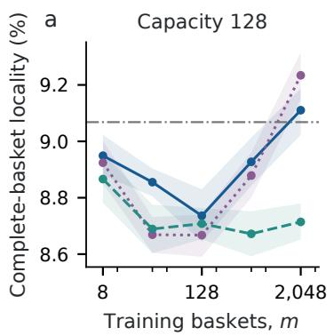

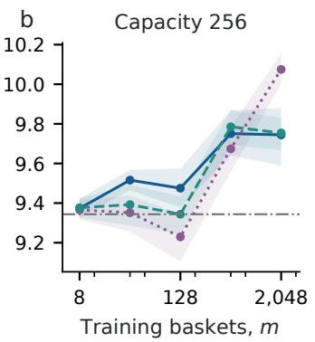

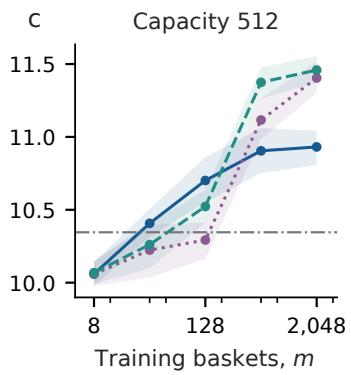  
Figure 13: Complete-invoice locality on the full Online Retail catalogue. All three learned methods use the same training requests and actual shard count; fixed key range uses none. Pointwise 95% bootstrap bands resample 16 request streams, conditional on the fixed catalogue and held-out trace. Axes retain each capacity’s local scale.

Independently pilot-ranked and validation-trained controls each consume 3,992 additional baskets and are charged separately. At capacity 512, their localities are 11.85% and 11.65%, compared with 10.35% for fixed key range and 7.57% for fixed balanced hash. The full study shows modest locality gains from observing requests, with the better method depending on capacity. It measures neither throughput nor latency.

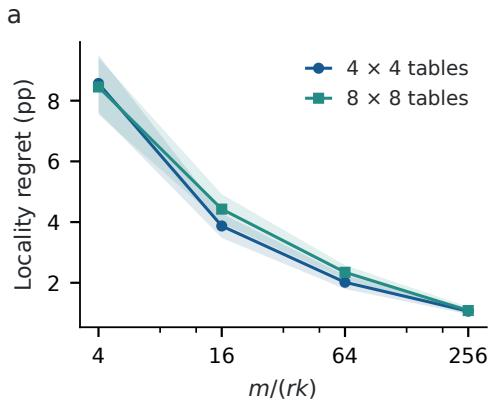

b  
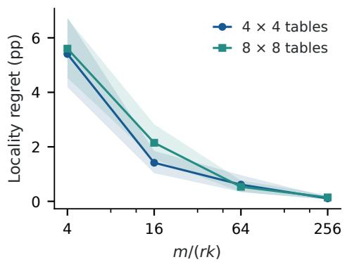  
Figure 14: Structured classical transfer. (a) Budget-indexed paired-sign family; changing m changes the population. (b) Fixed full-support Dirichlet workloads. Curves average balanced cells in $r \in$ $\{ 1 , 4 \}$ and $k \in \{ 1 , 2 , 3 \}$ , with 32 instances per cell. The horizontal scale is the proved $m / ( r k ) ;$ ; it is not applied to the public basket schema.

## R NATIVE 15-QUBIT PATH: EXECUTION AND PENDING LEARNING STUDY

The data path is (33, 39, 53, 52, 51, 58, 71, 70, 69, 78, 89, 88, 87, 86, 85) on ibm\_marrakesh. We selected the path using backend calibration alone, before observing its experimental responses. Every one of the 15 queries is retained. Endpoint parity extraction uses three logical CNOTs. Internal queries use five CNOTs to fold parity toward an available ancilla and undo the borrowed-data transformation. Seven centers have physical degree two. Ideal Clifford identities verify the entire unitary, including restoration of arbitrary borrowed data; a separate binary-linear calculation verifies the par ity map.

The request is fixed in each circuit. Preparation is compiled separately and has an identical prefix across requests for a given codeword. The compiled program therefore fixes preparation independently of the request, although the request is not generated late on the device. Both full and shallow graph states use even/odd CZ layers. We use native gates, active initialization, and no twirling, dynamical decoupling or error mitigation. Default-delay commissioning uses 250 microseconds between shots; the failed learning pilots used 25 microseconds. Those conditions are separate.

Job dagas0hhvn6c73cqbhbg returned 7,680 shots and charged five QPU seconds. Each of four fixed encodings has 64 shots per bit and query. We fixed the decoder before acquisition: it predicts the encoded bit directly from the reported parity. Full chain has 107 errors in 1,920 trials, fixed depth three 274, product even 481 and product odd 584. For the three simultaneous contrasts against Full chain, independent-shot Hoeffding bounds give depth-three minus full error 8.70 points, interval [3.70, 13.69]; even minus full 19.48, [14.49, 24.47]; and odd minus full 24.84, [19.85, 29.84]. These bounds assume independent shots within this fixed job. Request-learning variability and changes between device calibrations require separate acquisitions.

## R.1 FROZEN LEARNING DESIGN AND EXECUTION STATUS

The request-only learner receives counts from $m \in \{ 8 , 3 2 , 1 2 8 , 5 1 2 \}$ requests and solves the depththree ideal allocation problem. Four fixed full-support workloads are uniform, alternating, centrally concentrated and bimodal. There are 16 independent nested request streams per workload. The product comparator solves the depth-one problem on the same counts; Full chain uses every edge. A known-workload ideal depth-three comparator is privileged and is not the best unknown physical encoding. A separately calibrated learner at m = 128 varies $B \in \{ 4 , 1 6 , 6 4 \}$ response trials per local context. It has additional observations and is never called request-only.

The planned 292,608-shot budget comprises 7,680 commissioning shots, 153,600 core comparisons, 46,080 calibrated tests, 57,344 calibration shots, 15,360 finite-catalog selection shots, 11,520 coherence controls and 1,024 input-bit controls. Core inference uses 16 separate request/acquisition blocks; the calibration arm has eight independent panels. Shared panels and response records must remain shared in resampling. The complete allocation list, workload probabilities, request prefixes, compiler and analysis plan are frozen in the artifact.

Two exploratory shared-response libraries were submitted before the confirmatory acquisition. Job dagb0sj9k43c73ad42j0 planned 32,520 shots in 15,900 circuit publications; it timed out. Job dagb5m8mhr3c73e4taag retained every learned mask, used a stronger known-workload product comparator, and reduced the submission to 2,340 publications and 18,720 planned shots. It also timed out. Neither job returned usable observations, so neither contributes data to the learning curves. The supplement preserves the frozen circuits, receipts, error messages and usage records. The free-plan limit prevents completing the confirmatory learning and calibration curves in this revision.

The proposed success criterion is a positive paired advantage over both extremes on every workload at m ≥ 128. We will evaluate this hypothesis on every workload and retain failures. A fixedworkload slope is descriptive: the minimax theorem does not predict −1/2 on every population. Any budget-indexed hard-family test must be labeled separately from learning a fixed workload.

## R.2 A LIMITED COHERENCE CHECK EXPOSES A SIGN REVERSAL

Job dagb9efi3e6s738m5tf0 returned 1,920 shots in 30 circuits, charging three QPU seconds. Every query has a coherent-extraction and local-refinement arm, each with 64 shots. This small diagnostic fixes the encoded bit and witness phase to zero; it does not cover both parity sectors or certify the all-input detector contract.

After extracting query $K _ { i } ,$ , we measure the neighboring commuting generator $K _ { j } \ ( j = i + 1$ , except at the last site). Ideal extraction preserves its signed expectation at one, whereas local refinement sets it to zero. There is no postselection. Direct parity parsing of the saved six-bit strings agrees with independent reversed-string parsing, and all QPY metadata match the returned circuit metadata. Exact Heisenberg propagation of the submitted native circuits verifies the complete 64-outcome ideal distributions. A separate ideal stabilizer simulation gives the same witness predictions. These checks concern the circuit specification, not the physical observations.

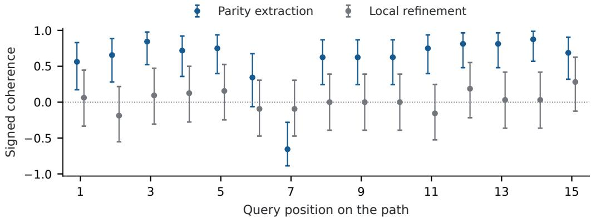  
Figure 15: All 15 native-path coherence diagnostics. Bars are 95% simultaneous Clopper–Pearson intervals over 30 cells, conditional on independent shots. The query numbered seven reverses the expected sign; query six is inconclusive. No sign is selected from these data.

Mean signed coherence is 0.602 for extraction and 0.029 for refinement. Thirteen extraction cells have positive simultaneous lower bounds. Query six gives 0.344, interval $[ - 0 . 0 6 2 , 0 . 6 7 5 ] \mathrm { ; }$ ; query seven gives −0.656, [−0.887, −0.282]. The latter measures the witness on physical data qubits (71, 70, 69). Its ideal value is positive, so the reversal remains an unexplained acquisition/device result. It rules out claiming that this check validates preservation across the whole path. The next hardware stage must diagnose that cell and repeat both sectors and phases before attributing allocation performance to a coherence-preserving physical service.

## R.3 THE REVERSAL REPEATS ON BOTH BITS AND WITNESS PHASES

We used the remaining free allocation for a focused follow-up, selected after the preceding result. Job dagbgdni3e6s738m65ig returned 3,072 shots in 12 circuits, charging three QPU seconds. The selected query is tested at both encoded bits and both witness phases, with extraction, local refinement and a preparation-only witness reference. Each cell has 256 shots. The reference removes the extraction/measurement interval; it is not duration matched. The protocol, signs, circuits and all cells were frozen before submission. Ideal simulation of the exact submitted circuits again predicts signed coherence one for extraction and reference, and zero for refinement.

Table 12: Signed witness in the focused second job. Each value uses 256 shots. The query and follow-up were chosen after the first job; these are exploratory replication data, not a new confirmatory endpoint.
<table><tr><td>Encoded bit</td><td>Phase</td><td>Extraction</td><td>Refinement</td><td>Preparation only</td></tr><tr><td>0</td><td>0</td><td>-0.570</td><td>-0.016</td><td>0.914</td></tr><tr><td>0</td><td>1</td><td>-0.680</td><td>0.023</td><td>0.883</td></tr><tr><td>1</td><td>0</td><td>-0.664</td><td>-0.055</td><td>0.906</td></tr><tr><td>1</td><td>1</td><td>-0.688</td><td>0.117</td><td>0.875</td></tr></table>

All four extraction intervals are negative after Bonferroni correction over the 12 cells; their largest upper endpoint is −0.407. All preparation-only intervals are positive, with smallest lower endpoint 0.763; all refinement intervals contain zero. The sign reversal therefore repeats in a separate job over this input family. The comparison implicates the added extraction/measurement interval, including its timing, rather than preparation alone; it does not identify a specific faulty gate or distinguish measurement backaction from coherent evolution during the added interval. Both jobs use the same device and day. A duration-matched control and a separately frozen repair test remain necessary.