# Through the Looking Glass: Directly Reading and Writing Transformers

Mark Oskin Professor School of Computer Science and Engineering University of Washington mhoskin@uw.edu

September 2026

## Abstract

How many of a transformer’s components decide a token? Counted the standard way — feedforward units and attention channels, scored by the absolute value of what each contributes to the logit — one prediction rests on three thousand to two hundred thousand of them. But contributions are signed, and across the eighteen models here the mass pushing away from the predicted token is a median of seven times the mass carrying it. Divide by the net instead and the same attribution on the same predictions returns dozens. On the model this paper is built on, fifty-three components carry ninety percent of a prediction, thirteen it cannot survive losing, and eight sufice to produce it with everything else at that position zeroed. Across twelve models trained by other people, 124 million to seven billion parameters, the suficient set runs from two components to sixteen, and what a prediction draws on, followed all the way back, is one to three percent of the model, a share that does not grow with size. The rest of the model is neither idle nor holding work for later tokens: three quarters of what a layer adds to the residual is a fixed linear map of the state it received.

Everything here is read from the model’s own parameters and activations, with nothing trained and nothing fitted, and it names a component on both sides. What a component writes is named from the predictions it drives, reaching close to half of every model, and the name is a share of the drive that predicts what deleting the component costs. What it reads is decoded from its weights in the frame of its own layer, at 58.9 percent above chance over its eight strongest inputs and below chance once enough of the list is asked for; sorting the remainder by which upstream component supplies it separates it into grammatical categories the embedding cannot see.

A name can be acted on. An association the model does not hold installs into one spare unit, key and value read from the weights, moving the target from rank 578 to rank 1 for a quarter of one percent of held-out loss — a fortieth of what a rank-one update costs to reach the top ten. Where an edit lands is set by the architecture: a write before the second layer keeps a tenth of its direction at the readout, one in the last third up to eight tenths. An attention head installed to mark a token and a unit installed two layers above it to read the mark make an edit fire only where that token occurred earlier in the context, and a unit the model trained for itself is driven from two layers upstream with 86 percent of the efect passing through it. Replacing the activation with an order-preserving one makes a unit’s inputs readable at the instrument’s ceiling, flat across the list rather than decaying, at the price of turning an install into a two-part edit.

## 1 Introduction

A transformer produces a token. How, specifically, did it do that? Are there identifiable parts of the model that matter to that particular prediction, and can they be traced — a “circuit” used for that specific token? They can, and the circuit is small. A handful up to a few dozen components do the work behind any one prediction, and most of what a transformer computes at a position is a side efect of the architecture: moving data between layers and keeping its own geometry organized.

That is not what the literature would lead one to expect. In the basis a transformer actually has, individual feed-forward units and attention channels, published counts run to thousands or tens of thousands of components for a single behavior [33], and the accounting in common use reproduces that here: measured the standard way, one prediction in the models below rests on three thousand to two hundred thousand components. A number that size is not an explanation of anything.

It is also wrong. Contributions to a logit are signed, so they cancel, and the mass pushing away from the prediction is a median of seven times the net across the models here and twenty times it on the model this paper is built on. The standard count divides by the absolute total, and so counts that opposing mass as part of the answer. Divide by the net instead and the same attribution on the same predictions returns dozens. The opposing mass is not a rival circuit the net hides. A model writes its prediction into the token frame directly rather than assembling it elsewhere and turning it on, and it does not use that frame as scratch space [41]; so the net contribution is the model writing the output, and the rest is the residual stream being carried between layers and kept organized so that many things can share it [18]. Our lens separates that management from the prediction, and what remains is a small legible circuit.

This paper concerns the legibility and editability of transformers. What exactly does that mean? The intuitive versions are easy enough to state.

• A component is legible if what it does can be stated. Two things have to be readable: what drives it, and what it produces. A name for either has to meet two conditions. It must be coherent: the tokens that drive the component share something, and so do the tokens it promotes. And it must be verified against the model’s behavior rather than against whether the list looks sensible. What a component is credited with writing depends about equally on its weights and on when it fires, so a column read on its own narrows the answer to a seventh of the vocabulary and no further (Appendix C.11). What does supply them is behavior: the predictions a component drives name what it writes, and the positions where it fires name what it reads. Where no token covers the answer, a component can still be described by the circuit it fits within.

• A model is legible if the connections between its components can be followed. When it generates a token there must be a trace of why it produced that one, and the trace must explain the choice to someone reading it. The path must be traceable end to end and land in the token embedding space where it meets the input and the output, even when what it passes through in between is conceptual. Ideally a trace is small enough for a person to read; it must in any case be complete enough to include what actually decided the token.

• A component is editable if its behavior can be changed, the model respects the change, and everything unrelated is left alone. Install an intended behavior into one named component, measure how strongly the model takes it, and measure how much else moved. Neither number means anything alone, since any edit is respected if pushed hard enough and any edit is harmless if pushed gently. Editability is therefore a trade-of rather than a threshold.

Our aim was a lens derived from the transformer’s own parameters, with no training or fitting of its own. Good fitted explainers exist: a sparse autoencoder trained on a model’s activations recovers features a person can name, and we reproduce that result in Appendix C. The reason we did not build on one is that a fitted explainer is a second model, and understanding it becomes a prerequisite to understanding the transformer it was meant to explain. Simple is good if it works.

On the model this paper is built on, the lens returns three numbers answering three questions about one prediction. Fifty-three components carry ninety percent of it. Thirteen it cannot survive losing: removing them changes the answer, where removing the same number at random leaves it alone. And eight sufice to produce it — keep those eight at a position, zero every other feedforward unit and attention channel there, let the survivors recompute, and the model emits the same token. Eight random components in their place never do, on any of 115 predictions we tested.

The rest of the model is neither idle nor holding work for later tokens. Keep only the circuit at a position and the cost at the token being predicted is a quarter of what an equally sized random set costs, and on each of the next five hundred and twelve tokens the two cost the same. What the remainder is doing is managing the workspace: three quarters of what a layer adds to the residual is a fixed linear map of the state it received, applied whatever the model is about to say, and that work is spread across every component rather than concentrated in a few. Cancellation is far more severe arriving at a component than leaving the model — about a dozen upstream components reach ninety percent of a unit’s incoming drive counted signed and many thousands counted absolute, a factor of roughly a thousand against about twenty at the readout.

Most of this paper’s efort goes into the gap between finding a component and reading it. A component is named on both sides. What it writes is named from the predictions it drives, which reaches close to half of every model, and the name is a share of the drive that predicts what deleting the component costs. What it reads is named from its own weights, decoded in the frame of its own layer rather than through the vocabulary: asked for a unit’s eight strongest drivers, the parameters recover the true set at 58.9 percent, thirty-seven times chance, and that agreement is confined to the head of the list. Somewhat over a quarter of what drives a unit falls on tokens the embedding groups into a category; the remaining three quarters have no name in the vocabulary at all, being concepts the model builds for itself, and sorting them by which upstream component supplies them separates them into grammatical categories the embedding cannot see. The same reading extends to attention, where a channel’s value projection is evaluated at the position it attends to, and the drop between what a layer’s attention reads and what its feed-forward block reads is the context that layer delivered.

Naming a component is one half of the problem; acting on it is the other. An association the model did not hold installs into a single spare component, with the key and the value both derived from the weights without fitting, moving the target from rank 578 to rank 1 for a quarter of one percent of held-out loss — a fortieth of what the rank-one update the editing literature established costs to reach the top ten. Where such a write can be made turns out to be a property of the architecture rather than of the component chosen. The bottom two layers erase the input token and stash it of the token axis, so a write made there loses most of its direction by the readout. The top layer answers in the token frame, which is the frame the readout reads and the only one a write acts on directly, so the last hop of a circuit belongs in that frame and the earlier hops do not though not in that layer, which consumes readout-frame content rather than carrying it, and is the one place preservation falls instead of rising. Between the two, the residual carries a write in the coordinates it was written in, and the baseline uses about a quarter of its width, the same quarter at every depth, so a direction drawn at random carries a signal from one installed component to another with nothing else in the model oriented to read it. That is enough to build a circuit across two layers from components that did not exist before, and to drive a unit the model trained for itself from two layers upstream, with 86 percent of the efect passing through it.

Two further sections take the lens beyond the model it was built on. Section 5 replaces the activation function with an order-preserving one, sigmoid or softplus, which makes a unit’s inputs readable at the instrument’s ceiling, flat across the whole list where the conventional unit decays below chance; the price is that such a unit is never silent, so an association installed into it alone arrives everywhere at once, and the install becomes a two-part edit. ReLU buys legibility with accuracy. Section 6 applies the lens unchanged to twelve models trained by other people, from 124 million to 7 billion parameters across seven architecture families. There the suficient set runs from two components to sixteen with the largest models at its small end, and on gated feed-forward models nearly half the components carrying a prediction fire negative, so a scope read without that sign lands on the wrong tokens.

Section 2 builds the lens and applies it to the baseline: the accounting, what is necessary, what is suficient, and what the rest of the model is doing. Section 3 names components, on the write side from behavior and on the read side from weights, and follows the part the vocabulary cannot name back to its sources. Section 4 acts on the names: a gain, an install, where an edit can be placed, a circuit across two layers, a tap into a trained unit, and a comparison against a rank-one editor. Sections 5 and 6 are the two above. Section 7 places the work, Section 8 takes up what the measurements ask of the architecture, and Section 9 closes. Appendix A is a gallery of traces drawn mechanically rather than chosen, two per model, where a reader can see what a trace actually looks like; Appendix B is the set-operator model of Section 5 and how it is trained; Appendix C is the measurements that failed, the conventions that flatter and are therefore not used here, and the ways each number here could have been made to look better by choosing a diferent null. Appendix D is the dependency graph: the edge relation between components, the closure it builds, and why that closure is a necessity object rather than a suficient one.

## 2 Reading a prediction: The Looking Glass

This section builds the instrument necessary to read a transformer. We begin with the baseline model used for every measurement here, and with the further models used later in the paper. We then introduce the lens, and show how it identifies the parts of a transformer doing real work for a prediction. Next we ask which parts are necessary for a correct prediction and which are suficient to produce it, and then what the rest of the model is doing while that small set carries the answer. We close with the limitations of the lens.

## 2.1 Models

The baseline is a model trained here on the GPT-2 small architecture [45]: twelve layers of width $d = 7 6 8$ , twelve attention heads, learned positional embeddings, LayerNorm, tied input and output embeddings, and no bias term anywhere. It is trained at context length $T = 2 0 4 8$ rather than the released model’s 1024, and the released GPT-2 appears separately among the models of Section 6. Writing $x ^ { ( l ) }$ for the residual stream entering layer l,

$$
x ^ { ( l + 1 ) } = x ^ { ( l ) } + \mathrm { A t t n } ^ { ( l ) } ( \mathrm { L N } ( x ^ { ( l ) } ) ) + \mathrm { F F N } ^ { ( l ) } ( \mathrm { L N } ( h ^ { ( l ) } ) ) ,\tag{1}
$$

with $\it { h ^ { ( l ) } }$ the stream after the attention write. The feed-forward block is the object this paper is about:

$$
\mathrm { F F N } ^ { ( l ) } ( z ) \ = \ W _ { \mathrm { o u t } } ^ { ( l ) } \phi \big ( W _ { \mathrm { i n } } ^ { ( l ) } z \big ) , \qquad W _ { \mathrm { i n } } ^ { ( l ) } \in \mathbb { R } ^ { m \times d } , \ m = 4 d = 3 0 7 2 .\tag{2}
$$

The block decomposes into m independent units. Unit u owns one row of the up-projection and one column of the down-projection,

$$
w _ { u } = W _ { \mathrm { i n } } ^ { ( l ) } [ u , : ] \in \mathbb { R } ^ { d } , \qquad c _ { u } = W _ { \mathrm { o u t } } ^ { ( l ) } [ : , u ] \in \mathbb { R } ^ { d } ,\tag{3}
$$

and contributes $a _ { u } ( z ) c _ { u }$ to the block output, where its activation is the scalar

$$
a _ { u } ( z ) ~ = ~ \phi ( w _ { u } \cdot z ) .\tag{4}
$$

The read row $w _ { u }$ decides which inputs drive the unit, and the write column $c _ { u }$ decides what it contributes once driven. Neither projection carries a bias, which is worth noting here because Section 4 has to build one out of the layer’s own geometry when an installed unit needs an of state. A component in what follows is one feed-forward unit or one (head, channel) pair of attention, in both cases a scalar multiplying a write column, so the two are counted on the same footing. For the baseline,

$$
\phi ( \zeta ) \ : = \ : \mathrm { G E L U } ( \zeta ) \ : = \ : \zeta \Phi ( \zeta ) ,\tag{5}
$$

with Φ the standard normal CDF. Two properties of Equation 5 are recorded here because they matter later: GELU is unbounded above, and it is not monotone, having a minimum near $\zeta =$ −0.7517 and rising on both sides of it.

## 2.1.1 Training and seeds

Training is one epoch of OpenWebText at batch size 16, peak learning rate $3 \times 1 0 ^ { - 4 }$ with 2000 warmup steps and cosine decay to a tenth of peak, for 272,687 steps. Nothing about the recipe is unusual.

Eight seeds were trained, difering only in initialization and data order. Five converged and three did not, by a margin wide enough that nothing turns on where the line is drawn: the failures sit at perplexity 21.6, 24.4 and 39.5 against a converged band of 19.0 to 19.7. Table 1 shows all eight rather than the five, because broken models can be deceptively legible, as Appendix C shows. The seeds are therefore separated on quality alone, fixed before any legibility number is computed.

Table 1: The eight baseline seeds. Only initialization and data order difer. The excluded seeds are shown rather than dropped because Appendix C needs them. Two columns are defined properly in Table 14 and appear here only to show that the excluded seeds difer on more than perplexity: ov@8 is how well a unit’s parameters name the inputs that drive it, and PR is the participation ratio of the early layers, a measure of how much representational variety the model retained. A collapsed model reads as more legible, which is why the two are always quoted together. ov@8 here is taken under the ranked summary of Appendix C.4, raw rather than chance-corrected.
<table><tr><td>seed</td><td>status</td><td>val. ppl</td><td>LAMBADA</td><td>ov@8</td><td>PR (L0-4)</td></tr><tr><td>1</td><td>converged</td><td>19.00</td><td>0.267</td><td>34.6</td><td>103.0</td></tr><tr><td>2</td><td>converged</td><td>19.02</td><td>0.248</td><td>35.4</td><td>102.6</td></tr><tr><td>3</td><td>converged</td><td>19.09</td><td>0.274</td><td>33.6</td><td>106.7</td></tr><tr><td>4</td><td>converged</td><td>19.10</td><td>0.272</td><td>35.5</td><td>105.5</td></tr><tr><td>5</td><td>converged</td><td>19.65</td><td>0.258</td><td>38.4</td><td>98.4</td></tr><tr><td>6</td><td>excluded</td><td>21.62</td><td>0.209</td><td>48.7</td><td>45.7</td></tr><tr><td>7</td><td>excluded</td><td>24.39</td><td>0.214</td><td>40.7</td><td>41.3</td></tr><tr><td>8</td><td>excluded</td><td>39.51</td><td>0.152</td><td>49.2</td><td>30.3</td></tr></table>

We use LAMBADA [44] to assess model quality in addition to perplexity. The five converged seeds are of similar quality, spanning 0.248 to 0.274, a spread we read as seed and evaluation noise; later comparisons are held against that range, so two models whose ranges overlap are called equal.

## 2.1.2 Additional models used

Two further groups of models appear from Section 3 onward. The first is five more models trained here, listed in Table 2; each changes only what the feed-forward unit does with its pre-activation, so any diference between them is attributable to that change.

Table 2: The models trained for this paper. The five others difer from the baseline only in the feedforward unit, sharing its depth, width, head count, parameter budget, data and schedule. The case for choosing an activation function on these grounds is Section 5, where the set-operator row is taken up as well and Appendix B defines it; this table is a reference for the rows that appear in the tables that follow.
<table><tr><td>model</td><td>activation</td><td>property</td><td>what it is for</td></tr><tr><td>baseline (GELU)</td><td>GELU</td><td>not monotone</td><td>the conventional reference; every result in Sections 2–4 is measured on it</td></tr><tr><td>sigmoid</td><td>logistic</td><td>monotone, injective, bounded</td><td>order-preserving and bounded</td></tr><tr><td>softplus</td><td>softplus</td><td>monotone, injective, unbounded</td><td>separates boundedness from order-preservation</td></tr><tr><td>ReLU</td><td>ReLU</td><td>monotone, not injective</td><td>separates order-preservation from information-preservation</td></tr><tr><td>unshaped sigmoid logistic</td><td></td><td>monotone, no crispness term</td><td>isolates the shaping term from the activation</td></tr><tr><td>set operators</td><td></td><td>fuzzy set operations bounded, two operands per unit</td><td>explicit logic in place of a nonlinearity</td></tr></table>

The second is twelve models trained by other people, none of them modified for this work: GPT-2, OPT, SmolLM2, three of Qwen2.5, Gemma-3, OLMo-2, two of Llama-3.2, TinyLlama and Mistral, spanning 124 million to 7 billion parameters across seven architecture families and three activation functions. Section 6 is where they are the subject, and Table 35 lists them with their sizes and activations.

One family is deliberately absent from that set: the GPT-NeoX line, of which the Pythia suite is the part we tested. Those models compute their two sublayers in parallel from the same input, $x + \mathrm { A t t n } ( \mathrm { L N } _ { 1 } ( x ) ) + \mathrm { F F N } ( \mathrm { L N } _ { 2 } ( x ) )$ , rather than letting the feed-forward block read what attention has just written, and every reading in this paper assumes the sequential arrangement. Extending the work to that design is left for later.

Results in Sections 2 through 4 are measured on the baseline. The exceptions are noted where another model behaves diferently.

## 2.2 The lens

The lens is built from three pieces: an accounting of the mass each component writes toward the prediction, a decision about which of that mass counts as explaining it (Section 2.3), and a frame in which anything read below the readout is scored.

Write the logit of token t as an exact sum over components. Each component u contributes its

activation $a _ { u }$ times the projection of its write column $c _ { u }$ (Equation 3) onto the readout direction,

$$
\kappa _ { u } = a _ { u } \big \langle c _ { u } , \gamma \odot ( U _ { t } - \bar { U } ) / \rho \big \rangle , \qquad \sum _ { u } \kappa _ { u } = N ,\tag{6}
$$

with $\gamma$ the final-norm gain and $\rho$ the norm of the final residual state. The sum runs over feedforward units and attention channels, so N is the net those components deliver. The token and positional embeddings reach the readout along the residual path and are not among the terms; their share is the floor that Section 2.5 measures and sets aside.

The logit lens and the tuned lens are projections: they choose what to read a hidden state through [6, 38]. The projection here is the ordinary one. What this lens changes is the accounting applied afterward, which of the terms in Equation 6 are counted as explaining the prediction and which are set aside as the architecture’s own trafic.

The embedding frame. A transformer’s residual stream does not arrive in token coordinates until very late, and models mostly operate of the token axis. The prediction reaches that axis in the last few layers by being written onto it, rather than by the accumulated content turning onto it [41]. Equation 6 is read in the right basis by construction: it is evaluated at the readout, and the unembedding is the frame the readout is written in. Anything read earlier is not. Ask what a mid-stack component passes to the component that reads it. Score the writer through the unembedding and the reader through its own layer’s basis and the answer is nothing, a correlation of −0.02 against a random control, which reads as the graph does not link. Score both sides in the reader’s own frame and the same edges correlate +0.28 and beat a size-matched random control on 76 percent of cases (Section 3.4). The two halves had been scored in diferent bases, and a null produced by the wrong frame looks exactly like a null.

The lens we construct uses the layer-native token table. Every reading taken between layers depends on it. Fix a position p and a set of contexts C drawn from held-out text. A context is one sequence at the model’s training length, and $p$ is a single position inside it — the same position in every context — so a context contributes one measurement rather than one per token. For a candidate token t, let $\boldsymbol { z } ^ { ( l ) } ( \boldsymbol { c } , t )$ be the input to layer l’s feed-forward block at position p when t is substituted there in context c. The table is the average of that state over contexts,

$$
\tilde { E } [ l , t ] = \frac { 1 } { | \mathcal { C } | } \sum _ { c \in \mathcal { C } } z ^ { ( l ) } ( c , t ) \in \mathbb { R } ^ { d } ,\tag{7}
$$

which is the layer’s own picture of the token, in the layer’s own frame. One row per token per layer, computed once in a single pass, with nothing fitted and no per-input work.

That it is measured rather than fitted is the point. A tuned lens [6] would also supply a perdepth frame, but it is trained, and then understanding the explainer becomes part of understanding the model. E˜ is read of the model’s own forward passes, so a reading taken through it is a derivation rather than a second model’s opinion. Where this paper decodes anything below the readout — what a component fires on, what an edge carries, what a mid-stack write means to the layer that consumes it — it is scored against $\tilde { E }$ at that layer.

## 2.3 Identifying components that matter

The ninety percent used throughout is a bar on contribution mass. A set clears it when its members account for nine tenths of the signed total arriving at the readout. How much of a prediction such a set actually carries is a separate measurement, made in Section 2.4.

Ranking components by $\kappa _ { u }$ and asking how many are needed to reach ninety percent of the total requires choosing what the total is. Three choices are available:

$$
\begin{array} { r } { n _ { 9 0 } ^ { \mathrm { n e t } } : \sum _ { i \leq n } \kappa _ { ( i ) } \geq 0 . 9 N , \qquad n _ { 9 0 } ^ { \mathrm { p o s } } : \ldots \geq 0 . 9 \sum _ { u } \operatorname* { m a x } \bigl ( \kappa _ { u } , 0 \bigr ) , \qquad n _ { 9 0 } ^ { \mathrm { a b s } } : \ldots \geq 0 . 9 \sum _ { u } \big | \kappa _ { u } \big | . } \end{array}\tag{8}
$$

Contributions cancel heavily, so the three denominators difer by orders of magnitude. Table 3 measures the consequence on the same predictions with the same attribution: keeping the sign and dividing by the net returns tens of components, while discarding the sign returns tens of thousands. The opposing mass is twenty times the net at the median on this model, seven across the eighteen measured here, and it is spread thin: reaching ninety percent of the prediction takes a quarter of every component in the model under the positives-only denominator, and half of them under the absolute one. It is not a rival circuit that the net denominator hides; Appendix C.8 tests that against its floor.

Table 3: Components needed to reach ninety percent of a prediction, under the three denominators of Equation 8. Only the denominator changes. Median over 115 predictions, each the model’s own top-1 token with probability at least 0.3. The two rightmost conventions are the ones in common use; the same comparison across twelve models trained by other people is Table 35.
<table><tr><td>model</td><td></td><td></td><td>net (signed) positives only absolute value</td><td>inflation</td></tr><tr><td>baseline (GELU)</td><td></td><td>11,974</td><td>23,971</td><td>452×</td></tr></table>

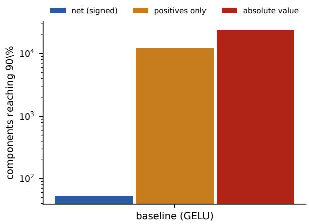

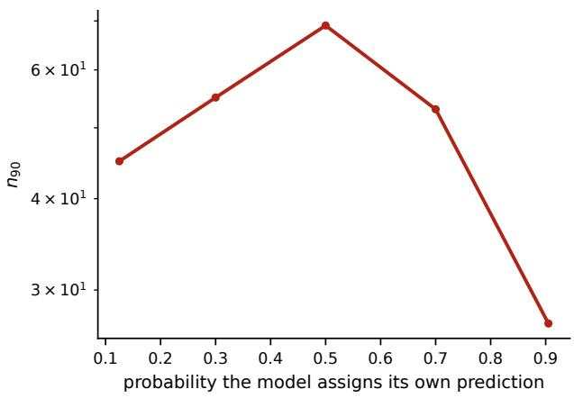  
Figure 1: Left: the same counts on a log axis. The choice of denominator moves the answer by two to three orders of magnitude, which is larger than any diference between the models being compared. Right: circuit size against how confident the prediction is. Confident predictions rest on fewer components, so a circuit size quoted without the confidence of the predictions it was measured on is not comparable across papers. Every other number in this section is measured at probability ≥ 0.3.

The count is insensitive to where the bar is set. On the same ranking the median count at eighty percent is 0.75 to 0.82 of the count at ninety, and at ninety-nine percent it is 1.16 to 1.25, across the five models trained here it was run on. Nearly the whole usable range of the bar moves the answer by less than a factor of two. The tail is enormous counted absolutely and nets to almost nothing, so raising the bar finds few components left to add.

## 2.4 What part of a transformer is necessary

The accounting names a set. We call it the one-hop set, because every member is credited for writing to the output directly rather than through anything else. Whether that set is the reason for the prediction is settled by removing components and re-running the model. Remove the top k at the position being predicted; Figure 2 reports how often the prediction changes; the control removes the same number of components, chosen at random.

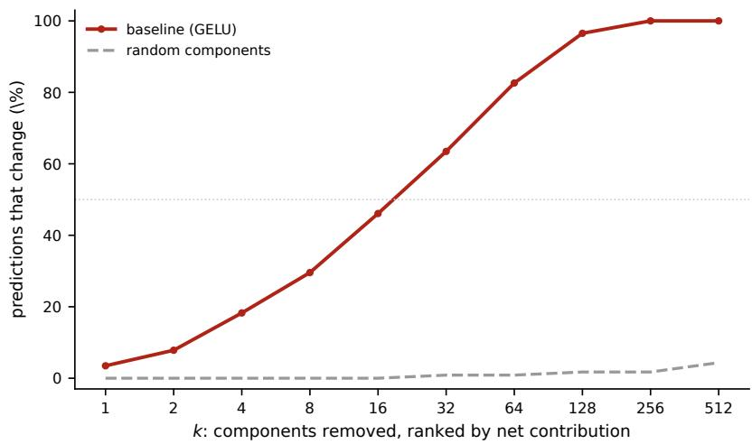  
Figure 2: Removing the k highest-contributing components changes the prediction, where removing k random components leaves it alone. Bands are bootstrap 95 percent intervals over predictions. The random control stays at or below 5 percent across the whole range, while by k = 128 the identified components have changed nearly every prediction. The baseline is plotted here; Figure 29 shows the same curves for the twelve models trained by other people.

Few components are needed in any model we measured, which is a statement about transformers rather than about anything built here; Section 6 makes that case across twelve models trained by other people.

Removing a set is not the same as adding up its contributions. Equation 6 is linear, so it predicts exactly what a removal should cost: the sum of the contributions taken away. Perform the removal and the target logit falls by only 42 to 50 percent of that (Table 4). Both quantities are logit mass, and neither is a rate at which the prediction changes; that is Figure 2, and a removal can take half the predicted logit away and still leave the argmax where it was. The shortfall is made up by the components left behind, which compute something diferent once the removed ones are gone — the self-repair reported by McGrath et al. [35] and Rushing and Nanda [46]. Ablation is therefore a second measurement rather than arithmetic on the first.

Table 4: Removal cost against predicted cost, both measured in logits. Each entry is the realized drop in the target logit divided by the sum of the contributions of the components removed, so 1.00 would mean the model absorbed the removal exactly as the linear attribution predicts and the removal test would add nothing. About half the predicted loss is instead recovered by the components left behind. This is a statement about logit mass rather than accuracy, which is Figure 2.
<table><tr><td>model</td><td>k = 4</td><td>k = 16</td><td> $k = 6 4$ </td></tr><tr><td>baseline (GELU)</td><td>0.42</td><td>0.50</td><td>0.47</td></tr></table>

What to measure when a component is removed. Removing components shrinks the residual stream. The final norm then divides by a smaller quantity, so every logit inflates together, and a drop in the target’s logit mixes two efects: what happened to that token, and a shift applied to the whole vocabulary. Only the first is about the prediction, so damage has to be read of something a uniform shift cannot move.

We use the margin: the target logit minus its strongest competitor. A shift common to every logit cancels from that diference, and the margin falls monotonically as more components are removed, which any measure of damage has to do. It also joins two readings that could otherwise disagree — whether the prediction flipped, and how much damage was done — because a flip is the margin reaching zero. The change in log probability is equally invariant, and is used where a likelihood is the natural reading.

Anything read of the argmax was never exposed to this, because a constant added to every logit cannot change which entry is largest: the flip curves, the minimality search, the suficiency numbers and $n _ { 9 0 }$ itself are all unafected. On this model the choice barely matters, and Table 5 shows the raw drop and the margin disagreeing about the direction of the efect in three percent of cases at the median k. It matters elsewhere. Measured in raw logits, the ratio of realized to predicted efect comes out negative on GPT-2, which is not a possible value. Section 6.5 reports raw drops disagreeing with the margin up to forty-five percent of the time and falling as k grows.

Table 5: The two quantities on the baseline. “Sign disagreement” is how often the raw logit drop and the margin disagree about the direction of the efect, at the median and worst k; “non-monotone steps” counts the times the median drop falls as k grows, which a measure of damage should never do. Here they agree, with no non-monotone steps. Table 43 is the same table on models where the raw quantity fails.
<table><tr><td></td><td></td><td colspan="2">sign disagreement</td><td colspan="2">non-monotone steps</td></tr><tr><td>model</td><td>target logit</td><td>median</td><td>worst</td><td>raw</td><td>margin</td></tr><tr><td>baseline (GELU)</td><td>12.3</td><td>3%</td><td>17%</td><td>0</td><td>0</td></tr></table>

What the removal costs elsewhere. Any suficiently large perturbation lowers a logit, so the efect on the target has to be read against the collateral. Define specificity as the drop in the target logit divided by the mean absolute change across the rest of the vocabulary. Table 6 compares three rankings.

Table 6: Specificity: target-logit drop divided by mean absolute change elsewhere. Ranking by absolute contribution selects large negative contributors, and removing them can raise the target logit, which is why that ranking scores worst. Ranking by activation magnitude selects high-norm components whose removal disturbs the whole distribution. The net ranking is the most specific at every k, by a margin over the alternatives that widens as k grows.
<table><tr><td>model</td><td>k</td><td>net-ranked (ours)</td><td>absolute-ranked</td><td>activation-ranked</td></tr><tr><td>baseline (GELU)</td><td>4</td><td>3.6</td><td>2.0</td><td>2.9</td></tr><tr><td></td><td>16</td><td>5.1</td><td>2.9</td><td>3.0</td></tr><tr><td></td><td>64</td><td>5.5</td><td>3.2</td><td>2.7</td></tr></table>

The required graph. The required graph is the smallest prefix of the one-hop set, ordered by contribution, whose removal changes the prediction. Every required-graph number in this paper is found by scanning prefix lengths upward and stopping at the first that flips. Appendix C.6 covers the flaws in the more attractive-looking alternatives. On some predictions no prefix flips at all, so the quantity is undefined there; the proportion is reported with each table, and medians are taken over the predictions where it exists.

## 2.5 What part of a transformer is suficient

Necessity asks what a prediction cannot survive losing. The opposite question is what it takes to build it: keep a set of components, zero every other feed-forward unit and attention channel at that position, let the survivors recompute from what is left, and ask whether the model still emits the same token. Nothing is spliced in. A component that is kept fires from the residual that remains, which is the token embedding plus whatever the other survivors have written.

The choice of replacement value. A transformer has no null value for a component’s output, so an ablation must write something in its place, and three conventions are in common use: zero, the component’s mean output over a sample of inputs, and a value resampled from a diferent input. Nothing in the architecture prefers one. For the necessity measurement above the choice barely matters — removing the same components under all three changes the same predictions to within seven points of each other, because a large signed contribution is gone whichever value is written where it was. It matters a great deal for what follows, and zero is the choice made here; the alternatives are tested below and in Appendix D.5.

Finding such a set is a search, and its shape follows from why a kept set fails: some member is starved, its drivers among the components that were zeroed, and the repair is to put those drivers back. Algorithm 1 gives the procedure — seed with the required graph, repair starved members from their suppliers until the model emits the token, then cut every member the set can do without — with no free parameters and a stopping rule the model supplies.

Figure 4 is one such set drawn out, with what each member fires on and what it writes toward.

Algorithm 1 The smallest set that builds a prediction, at position p for token t.   
m(S) the margin of t over its nearest rival when only $S$ is kept at $p ;$ the   
set is suficient when $m ( S ) > 0$   
$\delta _ { u } ( S )$ what component u delivers to the readout under $S ,$ short of what it   
delivers with the model intact   
1 seed $S \gets$ the required graph: the shortest prefix of Equation 6 whose   
removal changes the token, or the one-hop set where no prefix does   
2 repair while $m ( S ) \leq 0 { \mathrm { : } }$ take the $u \in S$ with the largest $\delta _ { u } ( S )$ and add   
the components supplying it, shortest prefix first, until u delivers   
again. The prediction counts as a member of $S ,$ its suppliers being   
the one-hop set   
3 cut score $d _ { u } \gets m ( S \setminus \{ u \} )$ for every $u \in S ;$ stop when no single removal   
leaves a suficient set; otherwise drop the largest group of the cheap   
end of d that S survives, and repeat  
Figure 3: Every line is a forward pass of the model scored against its own answer, with nothing fitted and nothing spliced in. Step 2 is what separates this from a search over the contribution ranking: it uses the dependency structure to say which components are missing rather than trying prefixes until one works, and it stops when the model emits the token rather than when a budget runs out. Step 3 scores many candidates in one pass.

Table 7: The smallest set that reproduces a prediction, and what the same number of components does when chosen diferently. “Converged” is how many of the sampled predictions the procedure verified. A prediction is dropped when the repair step of Algorithm 1 reaches its round limit without the kept set becoming suficient, which is a limit of the procedure rather than a fact about the model and, since the repair has typically built hundreds of components by then, evidence that the criterion is not one that volume satisfies. “Floor” is the share of predictions on which keeping nothing at the position — so that the residual is the token embedding alone — already returns the same token. No set kept on top of that can be credited with producing it, and the search returns a set of size one on every one of them, so those predictions are counted here and then set aside. The size and the two controls are medians over what remains after both exclusions. The last column is the median set as a fraction of the model’s components.
<table><tr><td></td><td></td><td></td><td></td><td></td><td colspan="2">same size, other sets</td><td></td></tr><tr><td>model</td><td></td><td></td><td>preds floor converged size top-k</td><td></td><td></td><td></td><td>random % of model</td></tr><tr><td>baseline (GELU)</td><td>15012%</td><td></td><td>115</td><td>8</td><td>7%</td><td>0%</td><td>0.017%</td></tr></table>

Eight components reproduce the prediction, out of 46,080 (Table 7). That is under two parts in ten thousand of the model, and it is not an artifact of the test. Zeroing everything else also deletes the competition, so the floor has to be measured first and then excluded; on this model it is 12 percent of predictions. On the predictions that remain, eight components drawn at random reproduce the token on none of them — not one of 115 — and the eight highest-contributing on 7 percent, against the search’s hundred.

Two checks say a set is not right for the wrong reasons. Adding components does not satisfy the criterion: where the repair never converges it has already built a mean of 489 components, at most 962 or two percent of the model, and the token still does not come out. And the sets are conditioned on their context rather than carrying their token — kept at a position in a diferent context whose intact answer is a diferent token, seven percent still emit the original and eighty-nine percent emit neither it nor the new one.

The set does not depend on where the search starts, and it is not the only one. Starting the search from a random draw of components the size of the required graph, instead of from the required graph itself, and running the same repair and cut reaches a suficient set on 85 percent of predictions against 89, at the same median size of six on that draw, for about half as much work again. Where both starts succeed, the set found from the random start and the set found from the required graph overlap at a Jaccard of 0.31, against 0.0004 for two random sets of the same sizes, and roughly half the pairs share at least half their members. A fifth share nothing. That is what an overdetermined prediction should give, and the repair reports the same thing on its own on half the predictions it succeeds on: the model holds more than one set of components that can carry the answer alone. Section 6.3 reports the same measurement on the models trained elsewhere.

The search uses the answer: every step asks whether the known token survives, so what it establishes is that such a set exists. It is not a procedure that predicts one in advance, which is worth pursuing and not attempted here. And the set is suficient at one position, with the rest of the sequence computing normally, so any attention channels among its members read ordinary values from the positions around them. What the measurement licenses is that eight of the model’s components need to be active here for this token, not that eight components are all that are needed for the entire transformer to function.

The result does not depend on zeroing. Zero is one choice of what to write where a removed component was, and the objection it invites is that a model with most of a position blanked is nowhere it has ever been. Section 2.6 supplies a replacement that keeps it on-distribution: the layer-to-layer map, which is what the removed components would have delivered if they were doing only carriage. Run under both backgrounds, the prefix-and-prune search of Figure 4 returns a median of 18 components against the map and 16 against zeros. The pair is to be read against each other rather than against the 8 of Table 7, which is a diferent search on a draw excluding a diferent floor. The carriage (described below) alone predicts the token on a quarter of predictions, and those are excluded here for the same reason the token embedding’s own successes are: a prediction the background alone already makes is not evidence about any set. A small set sufices whether the space around it is emptied or filled with the trafic the architecture would normally have put there.

Every size reported here is an upper bound returned by a heuristic search, leaving the minimal suficient circuit open. What the sizes establish is that suficient circuits orders of magnitude smaller than the published counts can be located at all. The cost of that search grows with the model. On the twelve-layer models it converges in a few dozen forward passes. On a twenty-four-layer model most predictions still converge, and a minority exhaust a budget an order of magnitude larger and return a bound rather than an answer. Finding the circuits in a very large model is a search problem, and scaling that search is left for later work.

What the surviving sets look like. They are small graphs rather than bags, as Figure 4 shows: its members sit at five depths, several draw on one another, and the seven attention channels among them are the only route by which anything outside the position reaches it. Between two thirds and three quarters of the members are feed-forward units and the rest are attention channels, spanning about five layers, and most feed-forward members draw part of their drive from other members — though only about a tenth of it at the median, the rest arriving from components outside the set entirely.

Do models say “not this token” in a circuit? A prediction can be reached by pushing the answer up or by pushing its rivals down, and the accounting so far counts only the first. Asking about the second needs positions where the model faced two candidates. Pairs of positions that share their last four tokens and end in diferent confident predictions, A → X and B → Y, are such positions, since what separates them is what attention carried in from earlier context. There are a hundred per model, from held-out text at the training length. Where a token wins, its netdenominator n is tens of components; where it loses, it still carries a circuit of the same order and keeps 58 to 73 percent of its push. Its promoters overlap across the two contexts at a Jaccard of 0.28 to 0.45, and the winner’s and the loser’s promoters overlap at 0.14 to 0.33 (Table 8). The loser is not pushed down: its net push stays positive on at least 95 percent of pairs. It is out-pushed, by the winner’s circuit firing harder in the winner’s context, by a median of three to five logits. We looked for circuits that say “not this,” components whose removal would hand the prediction to the token they hold down, and they are not there: the mass pushing the loser down is no diferent from any other token’s (Appendix C.8). Removing eight of the winner’s promoters moves the prediction on 30 to 72 percent of pairs; removing eight of the loser’s suppressors moves it to the loser on 8 to 26 percent, and would do the same for any token. The baseline’s other converged seeds fall within the ranges quoted, with one exception taken up in Appendix C.

Three numbers now sit on top of one another, answering three questions about the same prediction. The signed accounting says which components carry it: fifty-three at the median, read of the parameters and activations with nothing removed. Ablation says which of those it cannot lose: thirteen. And the search says which set builds it: eight. Fewer than a sixth of the components carrying ninety percent of the logit are needed to reproduce the token.

… Franck Ribery?↵↵Yes, very important because you need players that make the decisions. When everything is going well then you jus

<table><tr><td>→have&#x27;</td><td></td><td>p=0.33</td><td colspan="4">42 components reach 90% of the net 1 required 93% cancels</td><td></td><td colspan="4"></td></tr><tr><td></td><td></td><td></td><td>strength</td><td></td><td>fires on</td><td></td><td></td><td>writes toward</td><td></td><td></td><td>answer</td></tr><tr><td>L11·u232</td><td></td><td></td><td>0.11</td><td></td><td>up&#x27; been&#x27;</td><td></td><td></td><td></td><td>→has&#x27;have&#x27;was&#x27;</td><td></td><td>#2</td></tr><tr><td>L11·u618</td><td></td><td></td><td>1.17</td><td></td><td></td><td>&#x27;still&#x27;&#x27; only&#x27;</td><td></td><td></td><td>→have&#x27;has&#x27;had&#x27;</td><td></td><td>#1</td></tr><tr><td>LL10·u2820</td><td>13%</td><td></td><td></td><td></td><td></td><td>&#x27;to&#x27;&#x27;could&#x27;</td><td></td><td></td><td></td><td>→ &#x27; make&#x27;&#x27; raise&#x27;&#x27; ask&#x27;</td><td>#154</td></tr><tr><td>L1·h4·c9</td><td>2%</td><td></td><td></td><td></td><td></td><td>national&#x27;cor&#x27;</td><td></td><td></td><td></td><td>→ &#x27;cy&#x27;&#x27;sh&#x27;&#x27; interpreter&#x27;</td><td>#&gt;999</td></tr><tr><td>L11·u2117</td><td></td><td></td><td>0.64</td><td></td><td></td><td>would&#x27;could&#x27;</td><td></td><td></td><td>→de&#x27;(&#x27;</td><td></td><td>#53</td></tr><tr><td>LL10·u2820</td><td>(above)</td><td></td><td></td><td></td><td></td><td></td><td></td><td></td><td></td><td></td><td></td></tr><tr><td>LL1·h4·c9</td><td>(above)</td><td></td><td></td><td></td><td></td><td></td><td></td><td></td><td></td><td></td><td></td></tr><tr><td>LL8·h7·c1</td><td>2%</td><td></td><td>0.37</td><td></td><td>&#x27; during&#x27;</td><td></td><td></td><td></td><td></td><td></td><td>#226</td></tr><tr><td>L1·h4·c9</td><td>(above)</td><td></td><td></td><td></td><td></td><td></td><td></td><td></td><td></td><td></td><td></td></tr><tr><td>LL1·h10·c60</td><td>5%</td><td></td><td>0.57</td><td></td><td></td><td>&#x27;but&#x27;&#x27;and&#x27;</td><td></td><td></td><td>→ &#x27; I&#x27;&#x27; can&#x27;&#x27; ever&#x27;</td><td></td><td>#&gt;999</td></tr><tr><td>L10·u15</td><td></td><td></td><td>0.47</td><td></td><td></td><td>same&#x27;one&#x27;</td><td></td><td></td><td>→ &#x27;-&#x27;&#x27; for&#x27;&#x27;,</td><td></td><td>#54</td></tr><tr><td>LL8·u66</td><td>4%</td><td></td><td>0.48</td><td></td><td></td><td>and&#x27;but</td><td></td><td></td><td></td><td>→ &#x27; its&#x27;&#x27; are&#x27;&#x27; were&#x27;</td><td>#11</td></tr><tr><td>L1·h4·c9</td><td>(above)</td><td></td><td></td><td></td><td></td><td></td><td></td><td></td><td></td><td></td><td></td></tr><tr><td>LL8·h1·c45</td><td>5%</td><td>attn</td><td>0.69</td><td></td><td></td><td>&#x27;He&#x27;video&#x27;</td><td></td><td></td><td>→&#x27;themselves&#x27; &#x27;o&#x27;</td><td></td><td>#&gt;999</td></tr><tr><td>LL1·h4·c9 LL9·h2·c41</td><td>(above)</td><td></td><td></td><td></td><td></td><td></td><td></td><td></td><td></td><td></td><td></td></tr><tr><td>L10·u1778</td><td>2%</td><td>attn</td><td>0.76</td><td></td><td></td><td>hook&#x27;And&#x27;</td><td></td><td></td><td>→ &#x27; their&#x27;&#x27; they&#x27;</td><td></td><td>#&gt;999</td></tr><tr><td></td><td></td><td>ffn</td><td>0.63</td><td></td><td></td><td>That&#x27;don&#x27;</td><td></td><td></td><td></td><td>→&#x27;that&#x27;&#x27;that&#x27;&#x27; That&#x27;</td><td>#&gt;999</td></tr><tr><td>L9·h2·c32</td><td></td><td>attn</td><td>0.75</td><td></td><td></td><td>he&#x27;George&#x27;</td><td></td><td></td><td>→ &#x27;.&#x27; &#x27; its&#x27; &#x27; or&#x27;</td><td></td><td>#136</td></tr><tr><td>L9·u224 L9·u2171</td><td></td><td>ffn ffn</td><td>0.15</td><td></td><td></td><td>&#x27;what&#x27;&#x27;They&#x27;</td><td></td><td></td><td>→&#x27; is&#x27;&#x27;has&#x27;&#x27;will&#x27;</td><td></td><td>#5</td></tr><tr><td>L1·h4·c9</td><td>(above)</td><td></td><td>0.16</td><td></td><td>generators</td><td></td><td></td><td></td><td>→ &#x27;was&#x27;&#x27; is&#x27;&#x27; has&#x27;</td><td></td><td>#22</td></tr><tr><td>LL8·u2284</td><td>40% via because</td><td>ffn</td><td>0.16</td><td></td><td></td><td>has&#x27;&#x27;could&#x27;</td><td></td><td></td><td></td><td>→ &#x27;will&#x27;&#x27;are&#x27;&#x27;may&#x27;</td><td>#4</td></tr><tr><td>LL8·u841</td><td>39%</td><td></td><td>0.16</td><td></td><td></td><td>what&#x27;&#x27;They&#x27;</td><td></td><td></td><td>→&#x27;was&#x27;&#x27; has&#x27;&#x27; is&#x27;</td><td></td><td>#11</td></tr><tr><td>LL8·h7·c55</td><td>15%</td><td>ffn attn</td><td>0.34</td><td>1</td><td></td><td>&#x27;during&#x27;&#x27;after&#x27;</td><td></td><td></td><td>→ &#x27;em&#x27;&#x27;had&#x27;&#x27;am&#x27;</td><td></td><td>#85</td></tr><tr><td>LL1·h10·c60</td><td>(above)</td><td></td><td></td><td></td><td></td><td></td><td></td><td></td><td></td><td></td><td></td></tr><tr><td>LL8·h7·c1</td><td></td><td></td><td></td><td></td><td></td><td></td><td></td><td></td><td></td><td></td><td></td></tr><tr><td></td><td>(above)</td><td></td><td></td><td></td><td></td><td></td><td></td><td></td><td></td><td></td><td></td></tr></table>

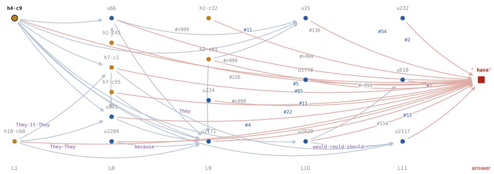  
Figure 4: One prediction’s suficient set. Keeping these eighteen components and zeroing every other feed-forward unit and attention channel at this position leaves the model predicting the same token; n90 is 42 of the model’s 46,080 components, and seven of the eighteen are attention channels. Bold marks the one component whose removal from the intact model changes the prediction: an attention channel at layer one, feeding a unit at layer ten, feeding the unit at layer eleven that promotes the predicted token first among the whole vocabulary. Rows are the members nearest the readout first, with what each draws on indented beneath it and its share of that member’s incoming drive; the last column is where the predicted token sits in what the component promotes. In the graph, a member that writes to the answer has an edge to it, labeled with the rank the predicted token holds in what that member promotes. Appendix A has the full key.

Table 8: Two answers at one position. On a hundred contrastive pairs per model, two positions sharing their last four tokens and ending in diferent confident predictions: the net-denominator $n _ { 9 0 }$ of the winner where it wins and of the loser both where it loses and where, at the other position, it wins; the share of the loser’s winning-context push its top sixteen promoters still deliver where it loses; and the Jaccard overlap of the loser’s top sixteen promoters across the two contexts, and of the winner’s with the loser’s at the position the winner takes. Medians over pairs.
<table><tr><td></td><td colspan="3"> $^ { n _ { 9 0 } , }$  net denominator</td><td>loser&#x27;s push</td><td colspan="2">promoter overlap</td></tr><tr><td>model</td><td>winner</td><td>loser</td><td>loser where it wins</td><td>kept</td><td>loser, across contexts</td><td>winner vs loser</td></tr><tr><td>baseline (GELU)</td><td>74</td><td>39</td><td>89</td><td>60%</td><td>0.33</td><td>0.14</td></tr><tr><td>sigmoid</td><td>58</td><td>41</td><td>66</td><td>67%</td><td>0.39</td><td>0.19</td></tr><tr><td>set operators</td><td>39</td><td>22</td><td>44</td><td>73%</td><td>0.45</td><td>0.28</td></tr><tr><td>GPT-2 124M</td><td>80</td><td>60</td><td>108</td><td>67%</td><td>0.39</td><td>0.33</td></tr><tr><td>Gemma-3 1B</td><td>250</td><td>212</td><td>251</td><td>48%</td><td>0.28</td><td>0.19</td></tr><tr><td>Qwen2.5 1.5B</td><td>146</td><td>126</td><td>158</td><td>54%</td><td>0.39</td><td>0.19</td></tr></table>

## 2.6 What the rest of the model is doing

A prediction resting on a few dozen components leaves an obvious question: what is everything else doing? “Nothing” is not credible in a trained network. Three candidates are tested in turn: staging for later tokens, efort on rival answers, and the architecture’s own overhead. If the remainder were staging information for later tokens, then removing everything at a position except that position’s circuit would spare the token being predicted and damage the ones that follow, which attend back to it. Table 9 tests exactly that and finds no such staging. Keeping only the circuit costs a quarter as much at the token itself as keeping an equally sized random set, which is the necessity result restated. On the tokens that follow, it costs the same as the random set, and it goes on costing the same however far out one looks: the median per-prediction ratio of the two costs runs 0.98 to 0.99 from sixteen tokens to five hundred and twelve, with no trend in distance (Table 10). Whatever the rest of the model is doing at this position, it is not principally holding things for the future, and the window it is not holding them for is the whole context. Section 6.6 reports the same sweep on nine further models.

Table 9: Everything at a position is removed except the set named. Cost at this token is the fall in the margin; cost on the next sixteen is the rise in their cross-entropy. Keeping the circuit beats keeping a random set for the token being predicted alone, matching it on the tokens after. The two later-token medians are taken separately, so their ratio difers from the median per-prediction ratio quoted in the text.
<table><tr><td></td><td></td><td colspan="2">cost at this token</td><td colspan="2">cost on the next 16</td></tr><tr><td>model</td><td>circuit</td><td></td><td>keep circuit keep random</td><td>keep circuit</td><td>t keep random</td></tr><tr><td>baseline (GELU)</td><td>57</td><td>10.84</td><td>36.18</td><td>0.090</td><td>0.071</td></tr></table>

A second candidate is that the remainder is spent on near misses. Section 2.5 found that where a token wins, the token that lost at that position still carries a circuit of tens of components and keeps most of its push, and the same records say how much of the model’s pushing goes to candidates that do not win. At the position where a token wins with net push N, the token that lost there carries 0.63 to 0.84 of N across the six models of Table 8, a competitor drawn from the model’s top fifty carries 0.43 to 0.79, and a random vocabulary token carries none. Counted as positive mass rather than net, the runner-up draws on 0.94 to 0.99 of what the winner draws on and a top-fifty competitor on 0.88 to 0.98. The model promotes its near misses nearly as hard as its answer, each with a circuit of the winner’s order: 26 to 48 components on the four smaller models, one to two hundred on Gemma-3 and Qwen. That is efort of the same kind as the answer’s, and it accounts for a few dozen components per candidate, not for the tens of thousands whose pushes cancel.

Table 10: The same test at six horizons, nested on one set of positions so the horizon is the only thing varying. Each entry is the median over predictions of one prediction’s circuit cost divided by its random-set cost, so 1.00 means the circuit is worth no more than an equally sized random set for the tokens that follow. “At it” is the same ratio at the predicted token, where a low number is the necessity result.
<table><tr><td></td><td></td><td></td><td colspan="5">tokens after the prediction</td></tr><tr><td>model</td><td>preds</td><td>at it</td><td>16</td><td>32</td><td>64</td><td>128</td><td>256</td></tr><tr><td>baseline (GELU)</td><td>206</td><td>0.25</td><td>0.98</td><td>0.98</td><td>0.99</td><td>0.99 0.99</td><td>0.98</td></tr></table>

The remaining candidate is that the remainder is the architecture’s own overhead: moving information between layers, and keeping a superposed residual stream organized so that many concepts can share one vector space [18]. Work of that kind has to happen somewhere, and it happens everywhere. It has no reason to point at the token being predicted, and shows up as an enormous signed mass, spread over tens of thousands of components, that nets to little at the readout. That overhead has a known shape. Oskin [41] report a transformer’s residual stream turning as a near-rigid body from depth to depth, with the prediction arriving on the readout in the last few layers by being written onto it. What follows is an independent check on that picture, made with a diferent instrument and for a diferent purpose — not the geometry of the stream, but how much of a layer’s work a fixed map of the incoming state can account for. It confirms the published result and adds two things to it: a size for the reshaping, and a test of whether the map can stand in for the components.

Write $x ^ { ( \ell ) }$ for the residual entering layer ℓ at the position being read, so that the layer’s whole contribution there is

$$
\Delta ^ { ( \ell ) } = x ^ { ( \ell + 1 ) } - x ^ { ( \ell ) } ,\tag{9}
$$

everything the attention and feed-forward blocks write into the stream at that depth. Carriage means the part of that update which is the same transformation applied to whatever happens to be there, so it is what a fixed map of the incoming state can account for. Fit that map over a sample of positions $\mathcal { P }$ and score it on a disjoint sample $\mathcal { P } ^ { \prime } \mathrm { i }$

$$
A _ { \ell } = \arg \operatorname* { m i n } _ { A } \sum _ { p \in \mathcal { P } } \big \| x _ { p } ^ { ( \ell ) } A - x _ { p } ^ { ( \ell + 1 ) } \big \| ^ { 2 } , \qquad \hat { \Delta } ^ { ( \ell ) } = x ^ { ( \ell ) } \big ( A _ { \ell } - I \big ) ,\tag{10}
$$

with a ridge term for conditioning. The share of the update the map accounts for is the part of $\Delta$ lying along $\hat { \Delta } .$ , which is bounded by one however large the prediction is:

$$
s _ { \ell } = \left( \frac { \sum _ { p \in \mathcal { P } ^ { \prime } } \big \langle \Delta _ { p } , \hat { \Delta } _ { p } / \| \hat { \Delta } _ { p } \| \big \rangle ^ { 2 } } { \sum _ { p \in \mathcal { P } ^ { \prime } } \| \Delta _ { p } \| ^ { 2 } } \right) ^ { 1 / 2 } .\tag{11}
$$

A ratio of norms is not so bounded and will exceed one when the map’s prediction is large and misaligned. Restricting A to a rotation gives the rigid variant, by orthogonal Procrustes on the same samples: $Q _ { \ell } = U V ^ { \top }$ where $X ^ { \top } Y = U \Sigma V ^ { \top }$ . A rotation preserves every length and angle, so $s _ { \ell } ( A _ { \ell } ) - s _ { \ell } ( Q _ { \ell } )$ is the shear — the part of the map that reshapes the stream rather than turning it.

Measured this way, most of what a layer writes is carriage. A fixed map of the incoming state accounts for 74 percent of the update on the baseline and 79 on the sigmoid model, with a positive held-out $R ^ { 2 }$ at every depth, and a rotation alone accounts for the bulk of that (Table 11). That much is the near-rigid body of Oskin [41], recovered here without appeal to any frame.

What is left over is where this measurement goes past the published one. The stream is reshaped between depths and not merely reoriented, and the reshaping is concentrated at the entrance: the first layer shears the stream three to five times as much as any layer after it.

Table 11: How much of a layer’s update a fixed map of the incoming state accounts for, as a median over layers. “Rigid part” restricts that map to a rotation, which preserves every length and angle; the shear is what the full map explains beyond it, and is the median of the per-layer diference rather than the diference of the two medians beside it, so those columns are not meant to subtract. The shear is concentrated in the first layer in both models.
<table><tr><td colspan="5"></td><td colspan="2">shear by depth</td></tr><tr><td>model</td><td></td><td>map explains</td><td>rigid part</td><td>shear</td><td>first layer</td><td>the rest</td></tr><tr><td>baseline (GELU)</td><td></td><td>74%</td><td>63%</td><td>11</td><td>35</td><td>11</td></tr><tr><td>sigmoid</td><td></td><td>79%</td><td>66%</td><td>11</td><td>50</td><td>11</td></tr></table>

Whether the map can stand in for the components is tested by substitution. We run the model with a layer’s own output replaced by what the map predicts, and with the actual writes of a chosen set S added back on top:

$$
\tilde { x } ^ { ( \ell + 1 ) } = x ^ { ( \ell ) } A _ { \ell } + \sum _ { u \in S \cap \ell } a _ { u } c _ { u } ,\tag{12}
$$

applied at the position being read while the rest of the sequence computes normally, exactly as in the ablations above. With S empty and one layer substituted, the model still produces the same token on a median of 92 percent of predictions.

One part of what the accounting sets aside is not carriage but supply. A member of a circuit has inputs of its own, written by components upstream, and those are causally necessary to it: remove a node’s attributed sources and its activation falls by two thirds, where removing as many random upstream components leaves it unchanged (Appendix D.1). The one-hop accounting cannot see them, because it credits a component only for what its own write lands on the readout and never for what a later component reads from it. The suficiency search of Section 2.5 recovers them by repair, and the closure of Appendix D recovers all of them, at one to three percent of the model. The cancellation that governs the readout governs a component’s input too, and more severely: reaching ninety percent of a node’s incoming drive takes about a dozen sources counted with sign and many thousands counted without, a ratio near a thousand against about twenty at the readout, which is why the branching figures of Appendix D are computed signed. The bar of ninety percent is a choice, and Section 2.3 tests it: at the readout the count moves by less than a factor of two between eighty and ninety-nine percent, because the tail is enormous counted absolutely and nets to almost nothing. A bar at one hundred percent, the first count at which the signed sum reaches the net, is barely larger, and what it never does is draw in the thousands of sources that cancel, since a signed sum reaches the net without them. Raising the bar buys a somewhat larger closure, still a graph of overlapping backward trees at a few percent of the model, not the model.

## 2.7 Limitations

Five qualifications travel with every number in this section.

The first is that credit is direct. A component is scored by what its own write places on the readout, so one that acts only by changing what a later component computes never enters the ranking, however much the prediction turns on it. This reaches further than the accounting: the suficient sets of Section 2.5 are grown from candidates the same equation nominates, so a component that acts only through others cannot enter one of those either, however much it matters. The recursion of Appendix D.1 recovers such components as sources, which is much of why a closure is larger than the set it closes over.

The second is that the unit is a choice. An attention head is sixty-four channels, and counting the head rather than the channel cuts $n _ { 9 0 }$ by more than half while lifting attention’s apparent share by two thirds (Table 12). Channels are used throughout because they put attention and feed-forward components on the same footing; the per-head figures are given so the comparison with work that counts heads is available.

Table 12: The one-hop accounting with attention counted per channel and per head. The result survives the coarser unit, though the numbers do not transfer between the two conventions.
<table><tr><td></td><td colspan="2">per channel</td><td colspan="2">per head</td></tr><tr><td>model</td><td> $n _ { 9 0 }$ </td><td>attention</td><td> $n _ { 9 0 }$ </td><td>attention</td></tr><tr><td>baseline (GELU)</td><td>53</td><td>27%</td><td>24</td><td>45%</td></tr></table>

The third is that late layers are over-credited. A component is a neuron activation times its write column, and late layers project more directly onto the readout, so direct contribution flatters them. Comparing attributed mass against causal efect on this model, the later half of the stack is credited with about twice the direct contribution of the earlier half while removing its top k changes barely more predictions — at k = 16, thirty-two percent against twenty-nine. The attribution overcredits late layers by a factor of 0.53 at $k = 1 6$ and 0.65 at $k = 6 4$ . Section 6 reports the same measurement on models trained by other people, where it does not always come out this way.

The fourth is that the prediction is a choice. Circuit size falls with the model’s confidence in its own output (Figure 1, right), so these figures describe confident predictions, and a number quoted at a diferent confidence floor describes a diferent population.

The fifth is that a collapsed model reads as maximally legible. The worst excluded baseline seed sits far below its siblings on LAMBADA (Table 1) and reads as perfectly legible: $n _ { 9 0 } = 1$ , a single component flips the prediction, and attention accounts for all of it. Seeds that merely miss the quality bar read normally: across the eight seeds of the sigmoid construction of Section 5, the three that failed the screen span the same $n _ { 9 0 }$ , the same attention share and the same depth as the five that passed. The quality screen therefore travels beside every figure here.

## 3 What’s in a Name?

Section 2 showed that a prediction rests on a few dozen components and that they can be found without training anything. That does not say what any of them is. This section asks the second question, of a unit and of a channel, and of what each writes and what each reads. The two sides are named by diferent means: what a component writes is read of the predictions it drives, and what it reads is decoded from its parameters in the frame of its own layer.

## 3.1 What a unit writes

Section 2 already answers which components carry a prediction: the accounting set is the components whose direct contribution reaches ninety percent of the net, and the shares that define it are the same shares used here. Those components wrote that token, by construction rather than by inference, since they are selected by their contribution to it. So a unit can be named without reading its column weights at all. Take a prediction, take its strongest contributors, and repeat until the model is covered.

Doing that costs little. A million and a half predictions take minutes, and each one supplies a few dozen memberships. What comes back has to be reported in three parts (Table 13). A component is covered when it appears among the strongest contributors to any prediction at all; the loosest statement, reaching most of the model. It is characterized when it appears there twenty times or more, which is when there is enough to say what it writes. And its set of tokens is coherent when the set holds together against a frequency-matched null, judged in a distributional space built from the training corpus, so the yardstick is the data the model was trained on rather than another model’s geometry. Taken together, close to half of the components in a model have a nameable write.

Table 13: Naming components by the predictions they drive, on the baseline over 1.5 million predictions. Covered is appearing among the top-k contributors to any prediction, characterized is appearing there twenty times or more, and coherent is the share of those whose token set beats a frequency-matched null in a distributional space built from the training corpus. Every share is of all 46,080 components. Widening k trades a little coherence for a great deal of coverage, which is why the last row and not the first is the operating point.
<table><tr><td>contributors taken</td><td>covered</td><td>characterized</td><td>coherent</td><td>named</td></tr><tr><td>top 5</td><td>42.6%</td><td>32.1%</td><td>91.8%</td><td>29.5%</td></tr><tr><td>top 10</td><td>53.4%</td><td>43.0%</td><td>90.4%</td><td>38.9%</td></tr><tr><td>top 20</td><td>64.9%</td><td>54.3%</td><td>87.9%</td><td>47.7%</td></tr><tr><td>top n90</td><td>85.9%</td><td>57.2%</td><td>84.3%</td><td>48.2%</td></tr></table>

Components write a closely related set of tokens rather than one exact token, with the relation within a set grammatical rather than semantic. A unit promotes negated auxiliaries, or first names, or units of measurement, or the tokens that open a sentence — categories a reader can state in a phrase, and not the topical groupings that the word concept usually suggests. Only a tenth of one percent of components write a single token. Weighted by how much each token receives rather than counted, a third of components put half their contribution on a single token, so the two ways of asking give diferent answers. The breadth is visible on the page. Every node in Appendix A carries the list of tokens it writes toward, and the token being predicted is one entry among several — so a component that helps deliver an answer is seen promoting it alongside its neighbors rather than singling it out.

A component supplies a stable share: across the contexts where a component and a token appear together, its coeficient of variation has a median of 0.24, and two thirds of pairs sit below 0.3. So the amount belongs to the component rather than to the context. That number can be checked by deleting the component and watching what the prediction loses, which is a diferent measurement from the attribution that produced it. The two agree at r = 0.60 and the relation is monotone: components credited with under five percent of the drive cost about a third of a logit when removed, those credited with five to fifteen percent cost four fifths of one, and those above fifteen percent cost more than two. A name of the form this supplies a seventh of the drive toward ‘ dogs’ is therefore a claim about the model.

Components nameable this way are late in the model. In the baseline’s feed-forward blocks the characterized share runs at one or two percent through the first layers, reaches a quarter by layer six, half by layer eight, and ninety-five percent at the last; attention lags by about two layers and then catches up. Coherence does not move with depth, sitting between eighty and ninety-nine percent everywhere, so depth changes how many components can be named rather than how well. What does change is breadth: two tokens carry half a component’s contribution in the middle of the stack and nine do at the last layer, which is the same distributed commitment seen in Figure 5, arriving here as a property of the names.

Three other measurements put the same event at the same depth. The residual first carries the token the model will predict at layer eight: the token at the position starts at +0.45 and is gone within a single layer, while the one it emits sits below zero through the body of the stack. Write columns first clear chance there. And a component’s own ranking of the token it helps predict lifts there — score a component by whether that token lands in the top hundred of what it promotes, and the last quarter of the stack clears its own floor by five to eleven times against the middle’s one and a third to five and a half, higher in the last quarter than in the middle in every model measured (Figure 6).1

A name says which tokens a component writes toward, leaving the sum to pick one of them. Components write toward the result and rarely at it. The predicted token sits inside the top hundred of two thirds of the weighted contribution, and inside the top thousand of ninety-three percent of it, so no member selects the answer on its own. Individually each is an aimed near miss. Score a contributing component’s own write, scaled by how it fired, against the direction the readout would need: a typical member sits at 0.07, which is far too small for a maximum over the vocabulary to register and still carries aim, because the same vectors score about zero against a diferent prediction’s token. Adding them in order of contribution takes the alignment to 0.45, three times the best single member (Figure 5). The climb is slower than independent averaging would give, and not because the misses share a direction — measured directly they are close to orthogonal, at a mean pairwise cosine of 0.004. It is that the members are unequal: the strongest contribution is twice as well aimed as a typical one, 0.156 against 0.071, so the sum is carried by its largest terms and each additional weak member buys less than the last.

## 3.2 What a unit reads

A unit’s parameters name the tokens that drive it, and the name can be checked against the mode rather than against whether the list looks sensible. Asked for a unit’s eight strongest drivers, the baseline’s parameters read through the layer basis described below recover the true set at 58.9 percent, thirty-seven times chance — the strongest agreement between a component’s weights and its behavior anywhere in this paper. How far down the list that holds is answered below as well.

A read row is a covector rather than a vector in the residual stream: it consumes states and returns a number, expressed in the frame of the layer that hosts it rather than the frame the output head reads. Projecting it through the vocabulary, as the logit lens reads activations [38], asks it what it would mean somewhere it is not, and recovers 7 percent against a chance rate of 1.6. The repair needs no fitting. The layer-native token table E˜ of Equation 7 is the layer’s own picture of each token, in the layer’s own frame, and a read row decodes against it directly, both sides centered across the candidate vocabulary V:

$$
s _ { u } ( t ) = ( w _ { u } - \bar { w } _ { u } ) \cdot \big ( \tilde { E } [ l , t ] - \tilde { E } [ l ] \big ) , \qquad \mathcal { P } _ { u } ^ { K } = \arg \mathrm { t o p } { - K _ { t \in V } } \ : s _ { u } ( t ) .\tag{13}
$$

The architecture’s carriage cancels on both sides of that dot product, which is why no transport between frames is required and why nothing has to be trained to supply one. With the same

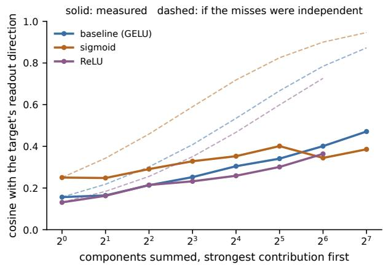

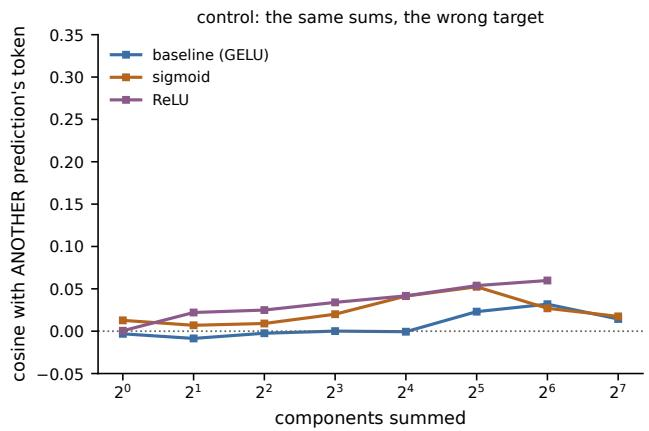  
Figure 5: How a prediction is assembled. The cosine here is taken against a known target rather than searched for over the vocabulary, which is what makes it answerable where the column measures of $\mathrm { A p - }$ pendix C.11 are not. Left: the cosine between the target’s readout direction and the running sum of what its components write, added strongest contribution first; the dashed line is the climb independent misses would give, anchored on each model’s own first member. Every model falls below it, so the sum is carried by its largest terms rather than by their number. Right: the control, the same partial sums scored against a diferent prediction’s token. Flat and near zero for every model plotted, so what the left panel shows is aim rather than undirected drift toward the token cone.

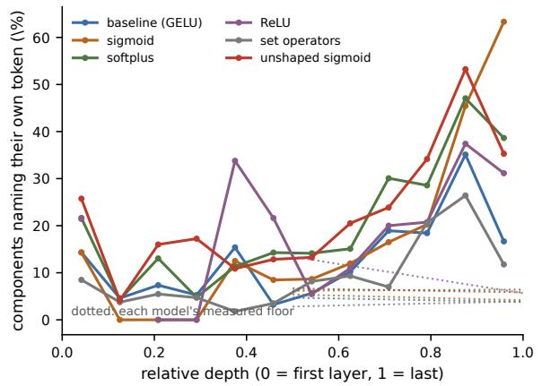

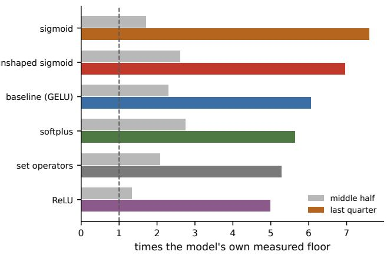  
Figure 6: A component names its own token when the token the model predicts lands inside the top hundred of its write column’s ordering over the vocabulary, signed by how the component fired. Left: the share by relative depth, one line per model, with each model’s own measured floor dotted. Right: the middle half of the stack and the last quarter, as multiples of that floor, which is the only form in which models can be set beside one another. Rank exists only for components appearing in a trace, so this is conditioned on a component mattering to some prediction.

weights, the same tokens and the same unit, the basis is the whole of the diference between 7 percent and 58.9.

What a unit does respond to is measured by substitution rather than inferred. On a disjoint set of contexts $\mathcal { C } ^ { \prime }$ , so that the naming and the ground truth cannot share sampling noise,

$$
\bar { a } _ { u } ( t ) = \frac { 1 } { | \mathcal { C } ^ { \prime } | } \sum _ { c \in \mathcal { C } ^ { \prime } } a _ { u } \bigl ( z ^ { ( l ) } ( c , t ) \bigr ) , \qquad \mathcal { A } _ { u } ^ { K } = \arg \operatorname { t o p } - K _ { t \in V } \bar { a } _ { u } ( t ) .\tag{14}
$$

and the two sets are compared, corrected for the rate at which a random list of the same length would agree:

$$
\mathrm { o v @ } K ( u ) = \frac { | \mathcal { P } _ { u } ^ { K } \cap \mathcal { A } _ { u } ^ { K } | } { K } , \qquad \widehat { \mathrm { o v @ } } K = \frac { \mathbb { E } _ { u } [ \mathcal { P } _ { u } ^ { K } \cap \mathcal { A } _ { u } ^ { K } ] / K - K / | V | } { 1 - K / | V | } .\tag{15}
$$

The candidate set V is the most frequent tokens in the corpus, and its size sets the chance rate: the sweep of Figure 7 uses $| V | = 5 1 2$ , so chance at K = 8 is 1.6 percent and at K = 256 is 50, while the unit-against-channel comparison of Table 15 uses 256. Since a chance-corrected overlap must reach zero once K approaches |V|, the two are read against their own candidate sets rather than against each other. A name that survives this is the set that moves the unit.2

Four quantities recur from here on, each reported under the conditions in Table 14. The sweep over K is the one worth naming here: the baseline’s own agreement changes sign between $K = 8$ and $K = 2 5 6$ , so a paper quoting only the first number would report a conventional transformer as substantially legible.

Table 14: The measurements used throughout the paper, and the condition each is reported under. Each condition is a specific failure from Appendix C that moved a number in the flattering direction.
<table><tr><td></td><td>what it measures</td><td>always reported</td></tr><tr><td>ov@K</td><td>the component</td><td>whether the parameters name swept over K, never at one cut; chance- the inputs that causally drive corrected; table and ground truth from disjoint contexts; quoted with the number of contexts behind it</td></tr><tr><td> $n _ { u }$ </td><td>actually is</td><td>how large the set being named as excess over the unit&#x27;s own median, so a base- line firing rate does not count as response</td></tr><tr><td>PR</td><td>ety the model retained</td><td>how much representational vari- split-half, to remove the estimation ridge; beside every legibility figure, because a collapsed model reads as more legible</td></tr><tr><td>LAMBADA, ppl quality</td><td></td><td>beside every legibility figure, per seed, at a matched step count</td></tr></table>

How far down the list the name holds. The 58.9 percent is one point on a curve that falls (Figure 7). By the time two hundred and fifty-six tokens are asked for, the parameters select worse than a random draw. So a unit has a few tokens named at the head of its list, and where that head ends is set by the activation function rather than by the read row running out of what it knows. The read row itself orders the vocabulary well throughout, which Section 5.1 demonstrates on models difering only in that function.

A second instrument asks a diferent question and reaches further down. Rather than asking what a unit reads, collect the positions in ordinary text where it fires hardest and describe it by the tokens sitting there — when it turns on. That description needs a floor of its own, because a unit’s firing correlates with general context and any random token would name it a little: the floor is what the same unit yields at two dozen to five dozen tokens back. Against it, two units in three clear at forty positions and three in four at eighty. Neither instrument substitutes for the other — the parameters say what moves a unit and stop after a handful of tokens; the firing context describes far more units and says nothing about cause.

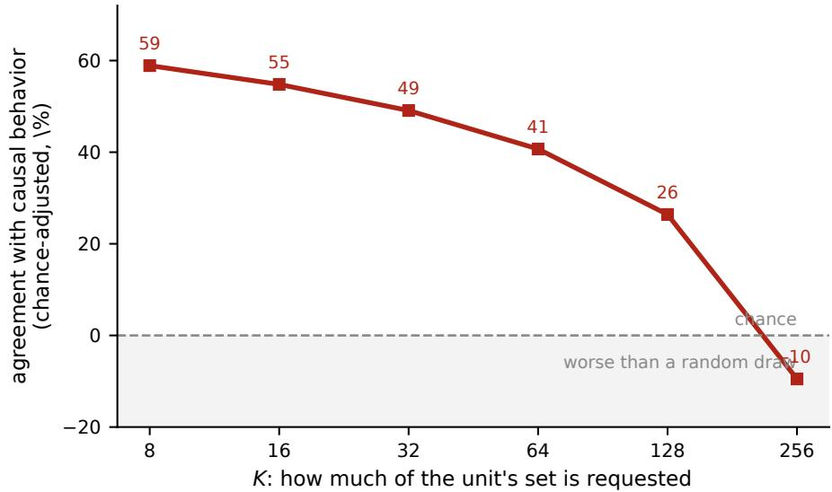  
Figure 7: Whether a baseline unit’s parameters identify the set that drives it, against how much of that set is requested. Chance-adjusted per Equation 15; the raw chance rate rises from 1.6 percent at $K = 8$ to 50 percent at $K = 2 5 6$ . Agreement decays with K and passes below chance, where the parameters select tokens overlapping the true set less often than a random draw. Table from 16 contexts, causal behavior from 16 disjoint contexts, context length 2048. Agreement here is taken under the mean summary of Equation 14, chance-corrected; Appendix C.4 says what the alternative would give.

How much of a model works on concepts. That the parameters pick out the right tokens says nothing about whether those tokens have anything to do with each other. Somewhat over a quarter of a unit’s response falls on tokens forming a concept the token embedding can see and we would identify as related. The question resists a yes or no, for a reason that belongs to the embedding rather than to the units. Similarity in embedding space,

$$
\coth ( S ) = { \frac { 1 } { | S | ( | S | - 1 ) } } \sum _ { t \neq t ^ { \prime } \in S } { \frac { { \hat { E } } [ t ] \cdot { \hat { E } } [ t ^ { \prime } ] } { \| { \hat { E } } [ t ] \| \ \| { \hat { E } } [ t ^ { \prime } ] \| } } , \qquad { \hat { E } } [ t ] = E [ t ] - { \bar { E } } .\tag{16}
$$

geometrizes paradigmatic classes, where members are mutually substitutable and cosine finds them. A relational class is diferent: a corner can be on a street, in a room, or of a bed, and the members belong to a common concept by co-occurring in a structure, which nothing in the training objective pushes together. A unit responding to such a class is invisible to Equation 16 by construction.

We score each token in a unit’s set by how well it belongs to the others, and the cut is calibrated against a random set of the same size rather than chosen in raw cosine units. What is reported is the share of the unit’s response on either side of that cut. On the baseline eleven of a unit’s top forty tokens fall on the coherent side and carry 28 percent of its response, leaving twenty-nine tokens and the other 72 percent to the remainder.

That is a much smaller fraction than Table 13 reports for the same models, because the two are asking diferent questions. Equation 16 asks whether a set is paradigmatic, and answers in the embedding, where relational and grammatical classes are invisible by construction. The naming asks whether a set holds together in the corpus, where a class of tokens that occur in the same places does hold together whether or not any word covers it. Nine sets in ten pass the second test and one in three passes the first, and the distance between those numbers is the size of what a token embedding does not group together: negated auxiliaries, sentence-openers, units of measurement, the tokens that close a parenthesis. Those are real categories with no name in the vocabulary.

One thing that fraction cannot separate. The decode centers both sides across the candidate vocabulary, which removes what the architecture’s carriage does to every token alike but not what it does to one token in particular, so a unit whose work is moving a specific token’s information from one depth to another reads here as a unit that responds to that token. Since most of what a component writes is carriage in the first place (Section 2.6), both shares are upper bounds on what is semantic: a component doing a little prediction and a great deal of transport is indistinguishable here from one doing only the first.

Taken together a unit is nameable on both sides by diferent means, with the embedding the weak link in naming it further.

## 3.3 Naming an attention channel

A channel is named the same way a unit is (Table 13). A prediction’s strongest contributors include channels, so what a channel writes is named on the same terms and to the same standard, and its names are of the same kind — numbers, the marks that close a clause, the openings of sentences. Counted apart at a matched budget the two kinds come out close: about a third of each is characterized, and the sets that result are coherent within a few points of one another. The naming reaches channels as readily as units. Where the two kinds difer is in depth. A channel is characterized in almost no cases through the first third of the stack — under a twentieth of them, against an eighth of feed-forward units at layer zero. This rises to a third by layer six, and from layer eight onward runs at three quarters to five sixths, which is where units already are.

What a channel collects. Attention admits the same two questions a feed-forward unit does. What a channel produces at a position is gathered from other positions, and what it collects from a position is local, which puts it within reach of the same techniques used to name a unit’s inputs. In fact, the instrument that names a unit’s read side works better on a channel, without modification. A channel’s value-projection row is its read row; decode it against the same layer-native table and check it against the tokens the channel measurably picks up when one is substituted at the position it reads. On the baseline the agreement is 0.844 at eight tokens against the unit’s 0.598, and where the unit’s falls away as more of the list is asked for — to 0.279 by sixty-four — the channel’s rises, to 0.892 (Figure 8).

That diference is the activation function. A unit’s ordering has to pass through its activation function on the way to its behavior, and a non-monotone one does not preserve it, where a channel’s value path is linear and nothing stands between the row and what it collects. Where the read side is concerned attention is the easier component to name. Described by when it turns on instead, a channel does slightly less well than a unit: three in five at forty firing positions against two units in three.

Table 15: Whether a component’s parameters name the tokens that drive it, against how much of the list is asked for. Both kinds are scored by one instrument: a unit’s read row and a channel’s value-projection row are each decoded against the layer’s own token table (Equation 13) and checked against the set that causally moves the component, measured by substitution on disjoint contexts and corrected for chance as in Equation 15. A channel is flat or rising in every model because its value path is linear. A unit’s ordering must survive its activation function first, and what happens then depends on the function: the baseline falls below chance by 128 tokens, ReLU decays without crossing, and the sigmoid model holds almost flat. The candidate set here is 256 tokens, half the size used in Figure 7, so the baseline crosses at about two fifths of the candidate set in both — $K \approx 1 0 4$ of 256 here and K ≈ 208 of 512 there. Where a unit’s parameters stop naming its inputs is a share of the pool they are scored against rather than a fixed K. Agreement here is taken under the mean summary of Equation 14, chance-corrected; Appendix C.4 says what the alternative would give. This table is the one exception to the disjoint sets of Table 14: its layer table and its causal profile are accumulated in a single pass over the same contexts, which Appendix C measures at about a third of a point.
<table><tr><td>model</td><td>component</td><td>K=8</td><td> $K { = } 1 6$ </td><td> $K { = } 3 2$ </td><td> $K { = } 6 4$ </td><td> $K { = } 1 2 8$ </td></tr><tr><td>baseline (GELU)</td><td>channel</td><td>0.844</td><td>0.862</td><td>0.881</td><td>0.892</td><td>0.898</td></tr><tr><td rowspan="3">sigmoid</td><td>unit</td><td>0.598</td><td>0.531</td><td>0.435</td><td>0.279</td><td>-0.116</td></tr><tr><td>channel</td><td>0.651</td><td>0.670</td><td>0.689</td><td>0.688</td><td>0.674</td></tr><tr><td>unit</td><td>0.743</td><td>0.746</td><td>0.748</td><td>0.740</td><td>0.680</td></tr><tr><td rowspan="2">ReLU</td><td>channel</td><td>0.522</td><td>0.533</td><td>0.546</td><td>0.545</td><td>0.544</td></tr><tr><td>unit</td><td>0.513</td><td>0.465</td><td>0.388</td><td>0.282</td><td>0.139</td></tr></table>

What a channel collects at the position it is reading is a separate question, and read that way an attention channel reads tokens, and reads them at the bottom of the stack. Substitute a token at one position, read the value projection there, and take the share of a channel’s variance owed to that token rather than to the context around it. At layer zero the quantity is 1.000 on all six models. Above it the quantity falls, by an amount that difers sharply between models, and the feed-forward units of the same layers sit lower at almost every layer of every model, with ReLU (Table 16) the exception.

A channel reads ln1(x) and the feed-forward unit above it reads ln2 $\mathbf { \Psi } ( x + \arctan ( x ) )$ , so the drop in token share between them at one layer is the context that layer’s attention delivered.

Two things about that quantity hold on every model measured. The first attention block delivers little of it in absolute terms, between 0.00 and 0.15, so the token is present at the bottom of the stack and moves little between positions — though on the softplus and unshaped sigmoid models that little is a large share of the small total those models deliver anywhere. And the layer that delivers most of it always sits in the first half of the stack. What does not hold everywhere is the balance between the two ends: four of the six models deliver more context in their first third than their last, and the softplus model and the unshaped sigmoid run the other way. Why those two run the other way is left for later work.

All of this reaches the value side at a single position. What a channel finally contributes is that value aggregated over the sequence by a pattern we do not explore further in this work. Decoding attention across the entire context is left to future work.

Finally, naming this way reaches only the components that write a prediction. A quarter of the model contributes to predictions without ever being among the strongest contributors to one, and those components are not idle: ranking contributions to the read rows of the strongest components rather than to the readout, a third of the leaders one level back are drawn from that band. They drive the components that write, which no ranking against the readout can see. Reaching them is what the graph built in Section 2 is for.

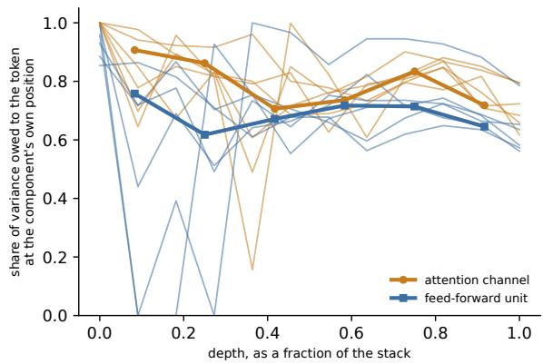

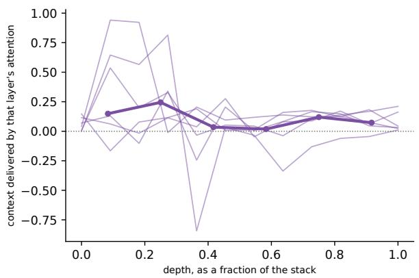  
Figure 8: Left: the read side of an attention channel and of a feed-forward unit, scored with the same instrument in one pass per model. Right: both against depth. A channel’s read side is measured from its value projection, which is evaluated at the position being attended to and therefore moves when the probe moves; a channel’s output at a position is assembled from other positions and does not.

Table 16: What an attention channel collects at the position it is reading, and what its layer delivers from elsewhere. Token share is the fraction of a channel’s variance owed to the token at that position rather than to its context; layer zero must return 1.000, since the residual there is the token, which is the check that the measurement works. “Layers > FFN” counts the layers at which the channel’s token share exceeds that of the feed-forward unit above it, which reads the residual after attention has written to it. The context a layer delivers is that diference, peaking in the first half of every stack.
<table><tr><td rowspan="2">model</td><td colspan="3">token share of a channel&#x27;s read</td><td colspan="3">context its layer delivers</td></tr><tr><td>layer 0</td><td>above</td><td>layers &gt; FFN</td><td>at layer 0</td><td>peak layer</td><td>peak</td></tr><tr><td>baseline (GELU)</td><td>1.000</td><td>0.61-0.98</td><td>10 of 12</td><td>0.01</td><td>1</td><td>0.54</td></tr><tr><td>sigmoid</td><td>1.000</td><td>0.66-0.96</td><td>11 of 12</td><td>0.04</td><td>1</td><td>0.94</td></tr><tr><td>softplus</td><td>1.000</td><td>0.63-0.85</td><td>10 of 12</td><td>0.12</td><td>5</td><td>0.28</td></tr><tr><td>ReLU</td><td>1.000</td><td>0.16-1.00</td><td>6 of 12</td><td>0.00</td><td>3</td><td>0.81</td></tr><tr><td>set operators</td><td>1.000</td><td>0.49–0.90</td><td>10 of 12</td><td>0.07</td><td>3</td><td>0.34</td></tr><tr><td>unshaped sigmoid</td><td>1.000</td><td>0.62-0.89</td><td>11 of 12</td><td>0.15</td><td>4</td><td>0.19</td></tr></table>

## 3.4 What the graph shows

The three quarters of a unit’s response that the embedding groups into nothing (Section 3.2) — call them its anonymous tokens — have an origin even where they have no name. Section 2 supplies a graph over the same components, and read through that graph those tokens are written by components upstream of the unit. Saying which ones takes care (Table 17). Write C for the unit being explained and A for a component credited with driving it. Of the three shapes that produce that credit, the one to locate is the direct source. That means ruling out siblings, which read what C reads and write nothing into it, and mediated sources, which reach C only through something else.

What follows measures where a unit’s feed-forward drive comes from; a channel’s value side is taken up at the end of the section.

<table><tr><td></td><td>shape</td><td>what it would mean</td><td>where it is settled</td></tr><tr><td>direct</td><td> $A  C$ </td><td>A writes into the row C reads Equation 17 with</td><td></td></tr><tr><td>siblings</td><td> $A \left. X \right. C$ </td><td>never touch, so A fires when C layer null of Table 19 fires while sending it nothing</td><td>A and C read the same thing and Equation 19, with the same-</td></tr><tr><td>mediated</td><td> $A  B  C$ </td><td>A reaches C, but only through B handled via search (Sec-</td><td>tion 2.5)</td></tr></table>

Table 17: The three shapes that would put A high in C’s ranking. Ranking cannot tell them apart, because all three make A’s firing track $C ^ { \mathfrak { s } } .$ Deletion kills the sibling case: with no edge between them, removing A leaves C untouched. Deletion cannot separate the mediated case, a real path, from a direct one, so the suficiency search reaches it instead, because a set that needs B has to keep B to work.

Ruling out siblings. The anonymous tokens are not noise. Split sixteen contexts into two groups of eight, average a unit’s response over each group separately, and the two profiles agree at 0.648, so the unit responds to those tokens the same way on text it has not seen before. Fitting one does not name it either — every fitted estimator tried returns negative held-out variance (Appendix C.10).

No fitting is necessary, however. The architecture that supplies the atoms also supplies an ordering among them. Take a unit u at layer ℓ with read row $w _ { u }$ . Every upstream component v at layer $\ell _ { v }$ has a write column $c _ { v } ,$ and an activation on token t which we write $a _ { v } ( t )$ , in the sense of Equation 4. The drive v contributes to u is then

$$
s _ { u } ( t ) = \sum _ { v : \ell _ { v } < \ell } \omega _ { v } a _ { v } ( t ) , \qquad \omega _ { v } = \cos ( \operatorname { c a r r y } ( c _ { v } , \ell _ { v } , \ell ) , w _ { u } ) ,\tag{17}
$$

with carry the composition of fitted layer maps of Section 2.6 and no coeficient fitted anywhere.   
The weight $\omega _ { v }$ is how much of what v writes lands along the row u reads with.

Ranked by $s _ { u } ,$ the tokens that drive u sit above the rest of the candidate pool, for the anonymous part as well as the nameable one, in both families and at every seed that trained (Figure 9, left). Three nulls say the ordering is not an artifact of the machinery that produced it: permuting which component holds which alignment, setting every weight to one, and substituting components at the target’s own layer that cannot have driven it. All three return chance or close to it.

The sibling shape is not disposed of that way. Two components that read the same thing fire at the same times, so a sibling of u has a firing profile shaped like u’s — and a sum of enough siblings rebuilds u’s own profile, which then “predicts” what drives u while none of them wrote anything into it.

Turning that shape into a score takes a substitution. Weight each writer not by whether it wrote into the row u reads with, but by whether it resembles u, meaning it reads what u reads:

$$
\omega _ { v } ^ { \mathrm { s i b } } \ = \ \cos ( w _ { v } , w _ { u } ) ,\tag{18}
$$

read row against read row, with only the weight changed. Equation 17 is the direct shape scored and Equation 18 is the sibling shape scored. On the baseline the two rank a unit’s drivers about equally well, so no ranking can choose between them.

Deleting components can, because the two shapes predict diferent damage. Ablate a set A and re-read the unit; what a score expects to lose, token by token, is that same sum restricted to what was removed,

$$
\hat { d } _ { u } ( t ) = \sum _ { v \in A } \omega _ { v } a _ { v } ( t ) .\tag{19}
$$

with $\omega _ { v }$ either weight. With $| { \cal A } | = 1$ the two difer by a positive scalar, so one deletion can never separate them. With |A| larger the weights become a mixture over profiles. Ablating twenty-four components at random, so the choice favors neither shape, the direct weighting tracks the damage and the sibling weighting stays flat, in both families.

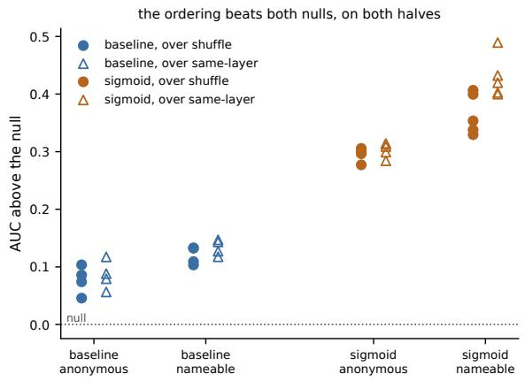

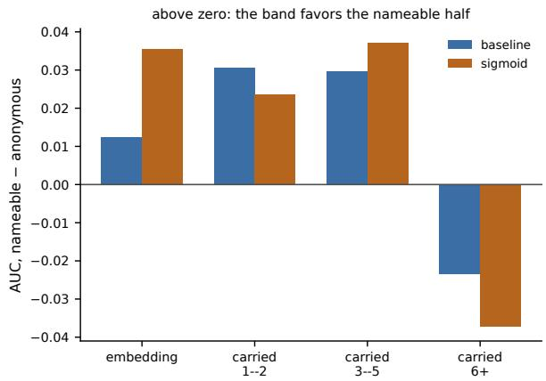  
Figure 9: Left: how far Equation 17 ranks a unit’s drivers above each of its two nulls, one point per seed. Plotted as the excess, so the null is the dotted line and any point above it is the ordering beating that null; filled circles are the excess over the shufle, open triangles over the same-layer control. Every group clears both, on the anonymous part as well as the nameable one. Right: the same score split by how far each term was carried, as the gap between the two halves. A bar above zero is a band that favors the nameable tokens and one below it favors the anonymous tokens, so the sign change across the bands is the result: what arrives at the embedding is what a static token table can read, and what has been carried furthest is what it cannot.

That settles who writes the anonymous tokens. Where those writers sit explains why the vocabulary misses them. Split Equation 17 by how far each term was carried and the two halves of a unit’s set separate: the embedding term favors the nameable tokens; terms carried six layers or more favor the anonymous ones (Figure 9, right).

This is the shape Oskin [41] predicts. A term that enters at the embedding and is read a few layers later has been turned only a few times and still lies near the coordinates the token table is written in. A term written at layer one and read at layer nine has been turned nine times and lies somewhere else. Decoding both through one static table shows the first alone, and what a reader then sees is a nameable quarter beside an anonymous remainder — one set of tokens, read in two frames, with the table in only one of them.

Sorted by where it came from, the remainder stops looking like a grab-bag. Assigning each of a unit’s tokens to the band supplying most of its drive splits the set into a median of four groups, and those groups are categories: a nearest-centroid classifier fitted to half a unit’s tokens recovers the source of the other half well above a shufled control, and part-of-speech purity within a group exceeds a matched random partition. Mean pairwise cosine, the measure Equation 16 uses to call a token nameable, barely moves on the same partition. The groups are classes like auxiliaries and copulas, degree adverbs, clause openers, numbers and time words, whose members are mutually substitutable in a grammatical position rather than close in a distributional neighborhood.

So the remainder is written by components upstream of the unit, and it separates into categories once the terms are sorted by where they came from. The reason a reader misses it is that the basis it is read in is the wrong one. Table 46 is what one unit’s set looks like with every term decoded through the same table; Table 18 is the same set with the terms separated by where they came from.

Table 18: One unit’s causal top forty, separated by where each token’s drive arrives from. Same units, same tokens, and same measurement as Table 46, which lists them as a single list and where no description fits; each token is assigned here to the source band supplying most of its drive, standardized per band so the assignment is not simply the largest band. The parts are categories: capitalized sentence-openers, modals, do-support, prepositions and wh-words, third-person pronouns. Baseline model, K = 40, context length 2048.
<table><tr><td></td><td>unit where from</td><td>the tokens it drives on</td></tr><tr><td>A</td><td>from the embedding carried 1–2 layers carried 3–5 layers</td><td>what, cor, where, much, Ad, out, at, But now, of, on, such, children, who, them, or about, here, name, within, how, when, after, part, ines, as, from, ers, before</td></tr><tr><td></td><td>carried 6+ layers from the embedding</td><td>And, Zhang, Com, so, Mun, little, You, year, more, would, You al, war, intelligence, come, here, Zhang, help, request, off,</td></tr><tr><td>B</td><td></td><td>life, now, take</td></tr><tr><td></td><td>carried 1–2 layers</td><td>again, does, Ad, did, &#x27;t, think, used, do, really, has, current, This</td></tr><tr><td></td><td>carried 3–5 layers</td><td>need, officials, have, and, or, how, way, never, want, &#x27;s</td></tr><tr><td></td><td>carried 6+ layers</td><td>death, Red, name, home, time, by Com, Pad, Ad, Zhang, He, We, It, As, The, In, Red, This, Po,</td></tr><tr><td>C</td><td>from the embedding</td><td>For, com</td></tr><tr><td></td><td>carried 1–2 layers</td><td>something, an, issues, war, any, all, read</td></tr><tr><td></td><td>carried 3–5 layers</td><td>products, ution, same, even, they, one, she</td></tr><tr><td></td><td>carried 6+ layers</td><td>Mun, They, son, It, him, he, They, reported, ner</td></tr><tr><td>D</td><td>from the embedding carried 1–2 layers</td><td>things, This, there, community, family can, may, is, make, could, using, should, the, how, context,</td></tr><tr><td></td><td>carried 3–5 layers</td><td>about, it, are, they, by see, does, did, to, then, where, this, these, do, into, will,</td></tr></table>

The same ordering reaches a channel. Equation 17 with the unit’s read row replaced by the channel’s value-projection row, and the gain of the norm feeding attention rather than the one feeding the feed-forward block, traces what drives a channel to the components upstream of it. Attention at layer ℓ reads the pre-attention residual, so summing strictly below ℓ excludes its own layer’s attention from its sources. Against the same two nulls the ordering holds on both families, and the controlled figure — the excess over same-layer channels — separates the baseline from everything else across ten models and seeds: the baseline’s three seeds sit well below the five shaped models, which cluster tightly together. A channel is about twice as traceable as a unit on the baseline and about as traceable on the rest. The baseline is the hard case here as it is for naming.

Those two figures rest on diferent footings. A channel’s drive is a linear read of the residual and Equation 17 is a linear sum, so the predictor matches the target’s functional form exactly; a feed-forward unit’s response is measured after its activation function, and the same linear score is fed through a nonlinearity. Attention scores higher for that reason alone, before anything about legibility enters. The same efect raises its same-layer null on the baseline, where channels reading the identical state in parallel correlate with the target for free, which is why the excess over that null rather than the raw figure is the number quoted.

An attention channel now has incoming edges, and few of them clear the same two percent of incoming drive that a feed-forward node’s sources clear: across the baseline’s gallery pages, most channels carry a read side and only a handful carry an edge into it. A channel draws on the residual broadly rather than on a handful of writers, which is a diferent shape of dependency from the one the feed-forward graph has.

A component, then, carries a name on each side. Close to half the model’s components are named by what they write, read of the predictions they drive, and the share each supplies belongs to the component rather than to the context. The head of a unit’s inputs is named from its weights, decoded in the frame of its own layer, and where that head ends is set by the activation function. The remainder — three quarters of what a unit reads, which the embedding groups into nothing — is named by which components supply it, and sorted by where it came from, it is grammar. A channel is named on the same terms on both sides, and more easily on the read side, because nothing stands between its row and what it collects.

Table 19: The provenance ordering and the five objections it was tested against. Rows above the deletion block are areas under the ROC curve, where 0.5 is chance; the sibling and deletion blocks are diferences, where 0 means the two weightings are indistinguishable. The baseline is the hard case throughout, ruling out siblings only under deletion and passing the depth split only in its embedding half, where the sigmoid model passes every one by more. Context length 2048, 16 contexts, 512 candidate tokens.
<table><tr><td></td><td>baseline (GELU) sigmoid</td><td></td></tr><tr><td>Does the ordering work?</td><td></td><td></td></tr><tr><td>ranks anonymous drivers above the pool</td><td>0.584</td><td>0.831</td></tr><tr><td>ranks nameable drivers above the pool</td><td>0.634</td><td>0.869</td></tr><tr><td>Against three nulls</td><td></td><td></td></tr><tr><td>permute which writer holds which alignment</td><td>chance</td><td>chance</td></tr><tr><td>set every weight to one (no target in the score)</td><td>0.509</td><td>0.543</td></tr><tr><td>substitute units at the target&#x27;s own layer</td><td>chance</td><td>chance</td></tr><tr><td>Against the sibling shape, which the ranking cannot see</td><td></td><td></td></tr><tr><td>weight by resemblance instead, anonymous</td><td>+0.002</td><td>+0.071</td></tr><tr><td>weight by resemblance instead, nameable</td><td>-0.137</td><td>+0.135</td></tr><tr><td>Under deletion, which siblings cannot survive</td><td></td><td></td></tr><tr><td>one writer removed: predicted vs. actual damage</td><td>+0.148</td><td>+0.231</td></tr><tr><td>the same, permuted across tokens</td><td>+0.011</td><td></td></tr><tr><td>24 writers removed: direct over sibling</td><td>+0.059</td><td>+0.335</td></tr><tr><td>sibling weighting alone</td><td>+0.0005</td><td>-0.061</td></tr><tr><td>Where the two halves arrive from</td><td></td><td></td></tr><tr><td>embedding band favors the nameable half</td><td>+0.015</td><td>+0.115</td></tr><tr><td>depth × half interaction</td><td>spans zero</td><td>+0.150</td></tr><tr><td>How many seeds</td><td></td><td></td></tr><tr><td>clear the shuffle on anonymous tokens</td><td>4 of 5</td><td>5 of 5</td></tr><tr><td>clear the same-layer control</td><td>5 of 5</td><td>5 of 5</td></tr></table>

## 4 Editing a Model: Say what?

Naming a component says what it is responsible for. This section writes to the components so named, and the edits come in three kinds of increasing reach. The first turns a component up and asks whether the tokens its name predicts are the ones that move. The second installs an association the model does not hold into a spare component, key and value both read from the parameters. The third drives a unit the model trained for itself, from two layers below it, with nothing installed at all. Between the second and the third sit two questions every edit has to answer — how deep to write, and in which frame — and a circuit built across two layers that depends on both answers. The section closes by scoring the install against the standard rank-one editor.

## 4.1 Turning a component up

The simplest edit follows from a component being identified by what it writes and who reads it: multiply a component’s activation at the position being predicted by a gain α and run the model again, with nothing else touched and nothing trained. That is the smallest intervention that still has a predicted consequence — it changes how loud a component is without changing what it says, so the scope its parameters name is the same before and after and the prediction is entirely about where the logits should move.

Three quantities are read together. The own scope is the set the edited component’s write column promotes. The other scopes are the sets named by the other components edited on the same predictions, which controls for an edit that simply raises whatever it touches. And a sizematched random draw from the vocabulary catches an edit that moves the distribution wholesale. Any edit is respected if pushed hard enough and harmless if pushed gently, so strength is a variable. We sweep $\alpha \in \{ 2 , 4 , 8 \}$ , over 360 edits spanning eight depths of the baseline.

Table 20: An edit installed in one component of the baseline, scored against the scope its own parameters name and against the scopes of the other components edited in the same predictions, at matched strength. “Respects the name” is the share of edits moving their own scope more than another component’s.
<table><tr><td>model</td><td></td><td></td><td></td><td>own scope other scopes random tokens respects the name</td></tr><tr><td>baseline (GELU)</td><td>0.89</td><td>0.05</td><td>-0.02</td><td>97%</td></tr></table>

Table 20 reports the results. The edit moves the tokens the parameters named and leaves the other components’ targets alone in ninety-seven percent of cases, and the efect on the named scope exceeds the efect elsewhere by more than an order of magnitude.

Figure 10 sweeps the strength. Doubling α roughly doubles the movement on the named scope — 0.30, 0.89, 1.77 — while what happens to every other component’s scope stays flat and near zero at all three settings.

## 4.2 Installing an association that was not there

A gain is not what is usually meant by writing to a model. The model-editing literature installs associations a model does not hold [36], treating a feed-forward layer as a linear associative memory and applying a rank-one update: a key for the subject, a value for the target. We adopt that framing here.

Writing a target token’s unembedding direction into a single unit’s output column, in closed form and with no gradient, is already established — by Dai et al. [13] through token embeddings and by Hakimi et al. [23] through unembedding columns, the latter explicitly a per-unit version of the rank-one mechanism. What no method we can find does is choose the site from the weights. ROME localizes by causal tracing; the knowledge-neuron line scores neurons by integrated gradients; the closest parameter-side method still localizes with a logit-lens score against cached activations. Every one of them reads the site of what the model does on some input. Section 3 finds what a unit reads, which makes the site available directly.

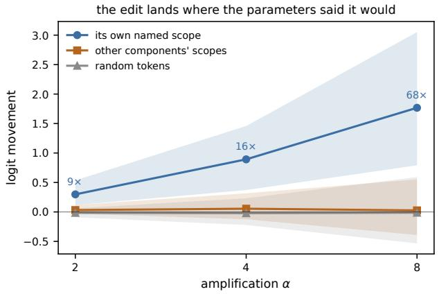

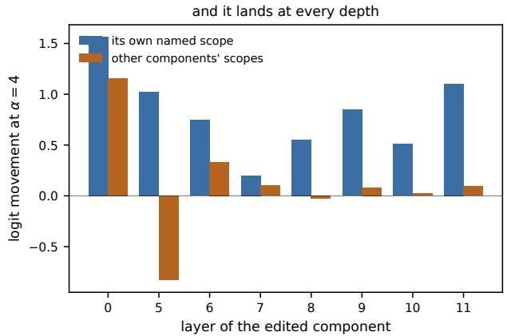  
Figure 10: Left: what a gain of α does to the three sets, median over 360 edits with the interquartile range shaded. The named scope grows roughly in proportion to α while the collateral stays flat at zero, so the ratio between them widens with strength — ten times at $\alpha = 2$ and sixty-eight at $\alpha = 8 $ This is the answer to the objection the definition itself raises: the edit is not merely respected because it was pushed hard, since pushing harder buys no collateral damage. Right: the same edit by the depth of the component it was installed in, at $\alpha = 4$ . It lands at every depth measured, including layer zero.

That is worth having for a reason the same literature supplies. Hase et al. [24] report that where causal tracing localizes a fact predicts almost nothing about where editing it succeeds — the tracing efect accounts for a fraction of a percent of the variance in edit success, against the 94 percent explained by the choice of layer alone, with the raw correlation slightly negative. The causal tracing that picks the site, the expensive step of the standard pipeline, is not doing the work it appears to do.

Legibility supplies both halves of the update:

• the key is the layer-native row for token $A , { \tilde { E } } [ l , A ]$ of Equation 7 centered over the candidate vocabulary — the state the layer sees when A is the current token, measured once and fitted to nothing;

• the value is the readout direction for token B, $U _ { B } - { \bar { U } } .$ , so that a component firing on that key lands on $B \mathrm { { ^ { * } s } }$ logit.

They are written into a spare component, the one whose activation over the corpus is smallest, so nothing the model was using is destroyed and the cost is bounded by construction. The pair is drawn at random from frequent tokens, and the control is built in: B’s rank where A appears is several hundred before the edit, so the model cannot be said to have been leaning toward it.

It works, on one component (Figure 11). A single spare feed-forward unit at $\beta = 1$ moves B from rank 578 to rank 1 at the positions where A occurs, leaves its rank elsewhere where it was (778 to 782), and costs a quarter of one percent of held-out loss (Table 21). Raising $\beta$ buys nothing after that: the association is already first, and the loss climbs, reaching half again the unedited value by $\beta = 1 6$ . Neither key nor value was fitted, traced, or optimized.

## 4.3 Editing attention

A simple edit to attention — amplifying a channel and reading the result at the positions where that channel is actually active — moves the tokens it promotes on 88 to 91 percent of trials, against

Table 21: Installing “after A, say $B ^ { \ast }$ into one spare component, over 1,176 trials across seven token pairs, twelve depths and seven strengths, with the read gain swept separately in Section 5.9. Each site is shown at the weakest strength that works. The edit moves B to the top of the distribution where A occurs and leaves its rank elsewhere alone; what separates the two sites is the price.
<table><tr><td></td><td></td><td>rank of B where A appears</td><td></td><td>rank of B elsewhere</td></tr><tr><td>site</td><td>held-out loss</td><td>before</td><td>after</td><td>before</td></tr><tr><td>feed-forward unit  $( \beta { = } 1 )$ </td><td>3.181</td><td>578</td><td>1 778</td><td>782</td></tr><tr><td>attention channel (β=8)</td><td>3.501</td><td>108</td><td>1</td><td>1142</td></tr><tr><td>no edit</td><td>3.173</td><td></td><td></td><td></td></tr></table>

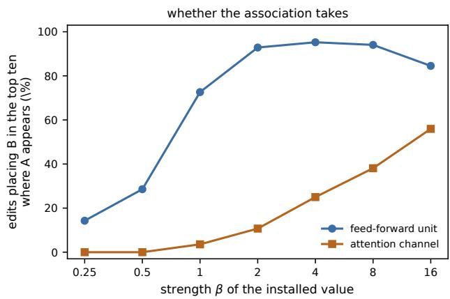

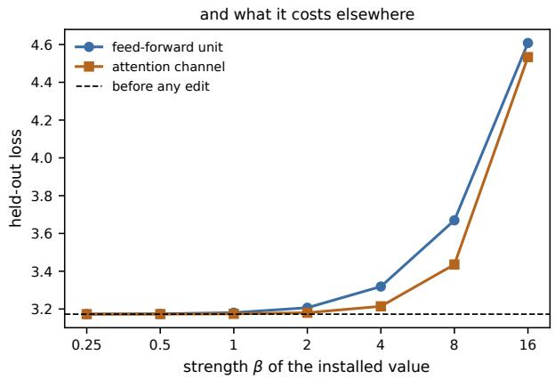  
Figure 11: Left: how often the edit takes, against how hard it is pushed. A feed-forward unit takes it on nearly every trial from $\beta = 2$ upward, and at every depth through layer eight; an attention channel needs roughly eight times the strength and succeeds at scattered depths. Right: held-out loss against the same strength, with the unedited model dashed. The unit’s working range costs almost nothing and the channel’s does not.

93 to 94 percent for a unit, with the collateral on other components’ scopes near zero in both cases; the channel’s movement is about a quarter of the unit’s at matched strength. The sign matters here. What a channel gathers flips sign with context, so its output column demotes exactly the tokens it promotes whenever the gathered value is negative, and a scope read without that sign scores the wrong end of the list about half the time — taken unsigned the same measurement returns chance, 47 to 49 percent, with the scope moving the wrong way.

Installing a new behavior into attention is harder. An edit counts only if B reaches the top ten where A occurs, is not promoted where it does not, and itself costs under ten percent of heldout loss — which is what separates an installed association from a component shouting. On that criterion 10 percent of channel edits succeed against 32 percent of unit edits.

The reason is the same fact that makes a channel’s read side legible. A channel’s value is collected from whatever position it attends to, so what arrives at A is an attention-weighted average rather than the value itself. The rank of B away from A $f a l l s ,$ from 826 to 1142, so the channel demotes the target where it was not installed. What happens instead is attenuation at the place the edit was aimed. Measured over twelve token pairs and five depths, an installed channel gathers −0.06 where A is absent and +0.38 where A is the current token, a contrast a third the size of what a unit delivers. That is why the channel needs $\beta = 8$ where the unit needs $\beta = 1$ , and why it costs a tenth of held-out loss where the unit costs a quarter of a percent. The extra strength

makes up for the averaging, but at a cost.

Which head takes the edit matters. Heads difer in how much of what they deliver is about the position they are at rather than the positions they looked at, and the diference is large: put the same read row into one channel of every head at once and the correlation between what a head gathers and the value at the current position runs from −0.02 to 0.75. In a separate sweep over twelve pairs, five depths and five strengths, installing in the quietest channel of the layer installs and stays local on 1 percent of trials; installing instead in the head that gathers the key most sharply raises what arrives at the key from 0.30 to 1.53, brings the target from rank 574 to rank 14, and takes that share to 8 percent.

What does succeed is editing the query and key as well. Adding $\kappa ( k _ { C } \cdot z _ { q } ) ( w \cdot z _ { p } )$ to a head’s score makes it attend to positions carrying C. But κ has no absolute meaning: the term competes with the head’s existing score, whose scale difers by orders of magnitude between heads. A κ chosen once is far too small to move some heads and saturates others. With κ swept in multiples of the head’s own score standard deviation there is a window, and inside it the installed term and the existing one compose rather than compete: the existing score carries distance, so their sum expresses recent and C rather than either alone. What that buys is a fact conditioned on a token the position does not carry; how much it buys depends on where the reading component takes its read row, and Section 4.6 reports the result once the reader has been built.

What attention writes at a position is a mixture over other positions, so a value edit alone arrives diluted at the reader. A feed-forward unit’s output at a position depends on that position alone, which is what lets an edit there be both strong and local. The model-editing literature writes to feed-forward layers predominantly, and the work here suggests that is a reasonable default rather than a necessary one. Attention takes an edit when the pattern is installed alongside the value and the strength is set in the units the head itself has been trained to.

An attention channel is the more legible of the two on its read side and the worse of the two to install into; Section 5.9 finds the same on the activation arms.

## 4.4 Where to place an edit

What to write is a question about meaning, and Section 3 answers it: a component’s parameters say which tokens turn it on and which it promotes. Three questions about the architecture remain — how deep a write has to be made before it arrives, which of several available frames it should be expressed in, and what has to be true for anything to read it — and the answer to all three starts from the recurrence. A transformer carries its state in a stream that every layer adds to:

$$
h _ { \ell + 1 } = h _ { \ell } + A _ { \ell } ( \mathrm { L N } ( h _ { \ell } ) ) + F _ { \ell } ( \mathrm { L N } ( h _ { \ell } ) ) ,\tag{20}
$$

with $A _ { \ell }$ the attention block at depth ℓ and $F _ { \ell }$ the feed-forward block. The addition in Equation 20 is the whole of the architecture’s contribution to an edit. Anything written into h at depth ℓ is still in h at every later depth, in the same coordinates, because nothing in the recurrence moves it. What changes with depth is how much company it has. Every layer above adds its own contribution on top, and a write made early is a smaller and smaller share of what the readout finally sees.

Writing a direction into the residual stream and observing the consequence is the mechanism behind activation steering [28, 43, 55]. The measurement here asks the prior question: of what is written, how much is still there at the end.

A unit direction w is added to the stream at 10 percent of positions immediately before layer X, scaled to a tenth of the median residual norm at that depth. Writing $h _ { L }$ for the state arriving at the final norm and $\Delta = h _ { L } ^ { \mathrm { w r i t t e n } } - h _ { L } ^ { \mathrm { c l e a n } }$ for the change it causes, two quantities are read at the

written positions:

$$
\operatorname { s u r v i v a l } ( X ) \ = \ \cos ( \Delta , w ) , \qquad \operatorname { s p i l l } ( X ) \ = \ { \frac { \operatorname { m e d } _ { p \not \in W } \lVert \Delta _ { p } \rVert } { \operatorname { m e d } _ { p \in W } \lVert \Delta _ { p } \rVert } } ,\tag{21}
$$

where W is the set of written positions. Survival asks whether the write still points its own way. Spill asks how much of it has been carried to positions it was never made at.3

Four kinds of direction are written. A private direction is drawn at random, so nothing in the model was built to read it. A layer-native direction is a row of the token table ${ \tilde { E } } [ X , \cdot ]$ of Equation $^ { 7 , }$ returned to residual coordinates by dividing out the layer’s norm gain. A working-state direction is a leading principal direction of the residual at X with the readout subspace projected out. A readout direction is $U _ { B } - \bar { U }$ for a token B.

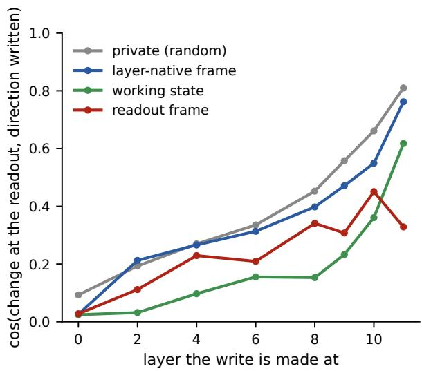

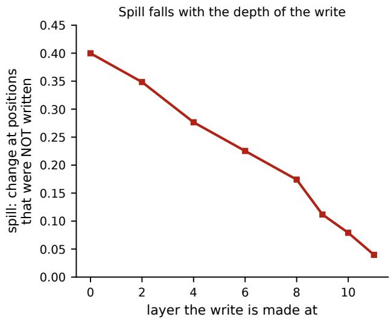  
Figure 12: Left: how much of a written direction still points its own way at the readout, against the depth it was written at, for four kinds of direction. Right: spill, the change at positions the write was never made at, relative to the change where it was. Written at 10 percent of positions, at a tenth of the median residual norm.

Figure 12 reports the result. Depth dominates. A write made before layer two survives at 0.11 and a write made before layer eleven at 0.33 to 0.81, a spread far larger than any diference between the four kinds of direction at fixed depth. Spill falls by a factor of ten over the same range, from 0.40 at layer zero to 0.04 at layer eleven. An early write is buried under what follows it and carried to positions it was never made at. A late write stays where it was put in both senses, which is why every edit in this paper is made in the last third of the stack

The private direction is the best preserved of the four at every depth, which is the key to reading the rest of the panel. Preservation is the default behavior of Equation 20, so the gap between a family and the private baseline measures how much the model acted on it. On that reading the layer-native direction is barely touched, sitting level with the private baseline. The working-state direction is the most transformed at seven of the eight depths measured, which is the rotating stream of Oskin [41] seen from the inside. The readout direction sits between them, and its consequence is the only one of the four aimed anywhere in particular.

Writing P for the projection onto the leading 64 principal directions of the centered unembedding, the share of the response that is visible to the readout is $\| \boldsymbol { P } ^ { \top } \Delta \| / \| \Delta \|$ , which for an isotropic direction in 768 dimensions is 0.289. The three non-readout families sit at 0.23 to 0.30 at every depth, which is to say at chance. The readout family rises from 0.27 to 0.43, with the excess growing toward the layers where the prediction is committed. A write in the readout frame is the only one the model ultimately answers.

That is also why the constructions here stop one layer short of the top. Preservation rises with depth for every family, with one exception: over the last step the readout frame is the only one that gets worse, by 0.122 on the baseline and 0.086 on the sigmoid model, where the layer-native, working-state and private families all improve substantially over the same step. The last layer reads readout-frame content and answers it, which consumes it, and does nothing of the kind to the other three. Both models agree. A write placed there to be read by something above it has nothing above it left, and a write placed there to survive is the one kind the commit layer spends. Every construction below installs its reader at layer ten of twelve for that reason.

A division of labor follows from the two token frames behaving oppositely — the layer-native frame carried by the stream untouched, the readout frame the one every later component responds to — and it is the reason a circuit needs more than one component. A write in the readout frame acts on the output directly, at the price of being the frame every later component is listening to. A write in any other frame is inert at the output and reaches it only through something that reads it. A circuit therefore carries its intermediate state in one frame and commits its answer in the other.

## 4.5 What the turn does to a write

The frame turns from depth to depth, and there are two ways to measure that turn. Only one of them describes what happens to content already in the stream. Orthogonal Procrustes between consecutive layer-native token tables gives the map that describes how each depth’s own reading frame is oriented,

$$
R _ { \ell } \ = \ \arg \operatorname* { m i n } _ { R \in O ( d ) } \| X _ { \ell } R - X _ { \ell + 1 } \| _ { F } \ = \ U V ^ { \top } , \qquad X _ { \ell } ^ { \top } X _ { \ell + 1 } = U \Sigma V ^ { \top } ,\tag{22}
$$

and the same fit run between the residual states rather than the tables gives a second map $Q _ { \ell } .$ . The two difer by a factor of four: the table turns by a median plane angle of 56 degrees per step where the state turns by 10 to 18. Content sitting in the stream is acted on by the second of these, and a comparison against the first says nothing about it.

One step is unlike the rest. The state turns by 81 degrees between layers zero and one, against 10 to 18 everywhere above, so the bottom of the stack is a diferent operation from the body of it. The model is stashing away the input token and building the initial workspace. What follows does not apply to those early one to two layers.

The diference of two conditional means is a diference in diferences. Capture the reader’s input with the marker written and again without it, and take the change at the marked positions only,

$$
\Delta _ { h  r } \ = \ \mathrm { E } _ { p \in W } \Big [ x _ { r } ^ { \mathrm { w r i t t e n } } \Big ] - \mathrm { E } _ { p \in W } \Big [ x _ { r } ^ { \mathrm { c l e a n } } \Big ] \ .\tag{23}
$$

Equation 23 is compared against the direction as written and against the same direction carried through the composed state map $\textstyle \prod _ { \ell = h } ^ { r - 1 } Q _ { \ell }$ . Because that turn is small the two candidates are themselves close, so a third quantity is needed to isolate what the turn contributes on its own: remove the written component from both and ask how much of what is left lies along the turned increment.

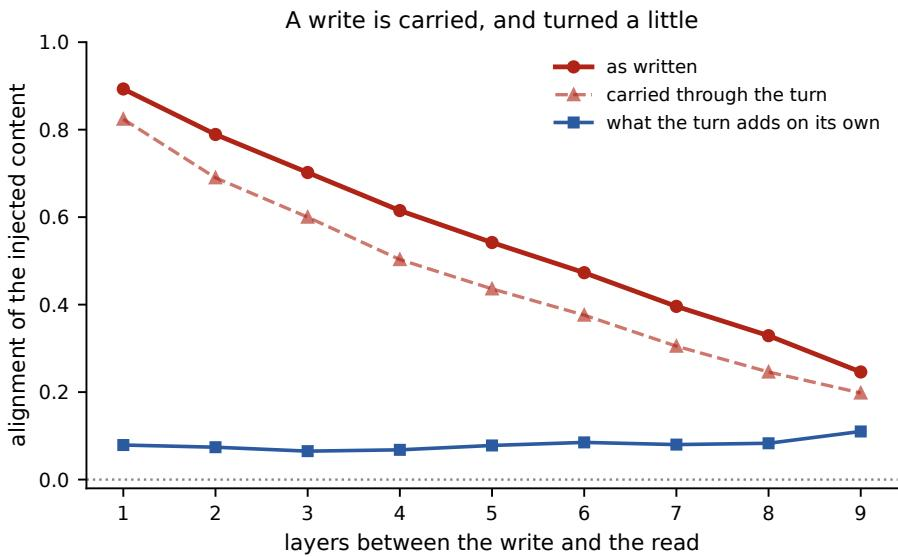  
Figure 13: A direction written into the residual before layer three, followed to every later depth. Solid is its alignment with itself, dashed with the same direction carried through the composed state-level turn, and the lower curve is what the turn contributes once the direct part is removed from both. Medians over probe directions at ten percent of positions.

Figure 13 reports the result. A write made before layer three is aligned with itself at 0.70 three layers later and with its turned image at 0.60, and the turn’s own contribution is 0.065. The ordering holds at every gap: the write is more itself than it is a turned copy of itself, and the turn adds a flat 0.065 to 0.11 on top. Both components are present, as the recurrence requires, and the direct one is the larger.

What grows with distance is the model’s response to the write rather than a turned copy of it. Since the alignment with the write falls from 0.89 at one layer to 0.25 at nine, the share of the change orthogonal to the write rises from 0.45 to 0.97 over the same range. By the far end almost all of what a reader sees is the response, and no map fitted here predicts its direction.

Two rules follow, and both are used in everything below. A read row is measured at its destination, as the conditional mean diference of the reader’s own input, rather than assumed from the writer’s intent or carried there analytically: the write arrives diluted and wrapped in a response that nothing predicts, so the only reliable statement about the reader’s input is a measurement of it. And the turn is a correction worth a tenth of the signal rather than the thing to correct for, so a read row carried to its destination through the turn is at best a tenth better than one that ignores the turn. On a thirty-six-layer stack the same ordering holds from layer seven through thirty-one, and the turned image leads only above a single anomalous twenty-degree step near the top, on one model of unusual shape.

## 4.6 A circuit across two layers

An edit that spans layers has to carry its intermediate state in some frame, and the stream between writer and reader is a communication channel. There are two ways to use it. The first is to write in the model’s own geometry so that components already present read the result. The price is that the write has to be expressed in a frame that must be estimated, and the estimate is what the accuracy of the edit then rests on. The second way is available whenever both ends of the circuit are supplied, and it is the one the construction below uses: carry the intermediate state on a direction drawn at random, which is a coordinate system chosen rather than found and therefore known exactly.

A channel of that kind is available because a trained transformer operates in a fraction of its width, and in the same fraction more or less at every depth. The residual’s efective dimensionality, measured as a participation ratio of the covariance spectrum, is roughly 170 to 195 through the middle of the stack once the small number of very high variance coordinates of Sun et al. [50] is set aside. Pooling the layers a wire has to cross barely raises it: over layers eight to eleven the union measures 183 dimensions where the largest single layer in that span measures about 175, and four disjoint subspaces of that size would need some six hundred. The layers share one working subspace rather than each occupying its own, so a direction drawn once is untouched at every depth it passes through, and about five hundred and eighty of the model’s seven hundred and sixty-eight dimensions are free for the purpose.

Being private buys knowledge of the carrier rather than separation from the model. A random direction still places about $\sqrt { { 1 7 5 } / { 7 6 8 } } \approx 0 . 4 8$ of its length inside the space the model uses, and that overlap costs little: holding it and the norm fixed and varying only how many active directions carry it, from all of them down to one, leaves held-out loss flat, with the cost instead growing roughly quadratically in the size of the write. Nor does the carrier’s frame change what the circuit achieves. Repeating the construction with the marker drawn from the readout frame, from the layer’s own token frame, and from the working state leaves the target at median rank 12 and the separation at 71.6 in every case, because the reader’s row is measured where it will be used and a measured conditional mean isolates whatever was written there. What a private channel saves is the estimate, which is what the construction turns out to be limited by (Figure 15).

Circuits of this shape occur in trained models without being put there. Neo et al. [37] report attention heads that recognize a context and activate a downstream token-predicting unit accordingly, which is the found version of what follows. Both halves of the division of labor appear in a single construction. An attention head at depth h is installed to fire where a chosen token occurs and to write a private direction. A feed-forward unit at depth $r > h$ is installed to read that direction and to write a target token’s readout direction. Neither component existed before, and the model supplies only the stream between them.

The unit’s read row is the conditional mean of Equation 23, measured at its own layer, and a component installed this way needs a silent state at the positions the edit is not aimed at. These models carry no bias anywhere, so one is built from the near-constant direction of the read space. That direction is closely related to the massive activations of Sun et al. [50]: a small number of coordinates that are large and nearly input-independent, and that serve as an implicit bias the architecture never declares. With x¯ the mean input to the reading layer, $u = \bar { x } / ( \bar { x } \cdot \bar { x } )$ satisfies $u \cdot x \approx 1$ across positions, and subtracting t u from a read row subtracts t from its pre-activation:

$$
\hat { r } \ = \ r \ - \ t u , ~ t \ = \ Q _ { q } ( \{ r \cdot x _ { p } : p \notin W \} ) ,\tag{24}
$$

with the threshold taken as a quantile of the row’s own projection over positions the edit is not aimed at, so it is measured rather than tuned against the target.

Figure 14 shows an instance. A head at layer eight fires where ’ did’ occurs; a unit at layer ten answers ’ good’, which moves from rank 920 to rank 3 where the head fires while its rank elsewhere goes from 1751 to 1816. The cost is 0.111 nats of held-out loss.

The same construction answers a condition carried from elsewhere in the sequence, which is the installation deferred from Section 4.3. Over 24 triples and 2,400 trials on the baseline, with the correction of Section 5.10 applied, the target reaches median rank 29 where C has occurred against 4,970 elsewhere, a separation of 171. On 96 percent of triples some setting brings the target into the top ten there, and on 54 percent it does so inside the ten percent loss budget. Every triple that clears the budget also leaves the target’s rank elsewhere alone, and the cheapest setting that does so costs 0.029 nats.

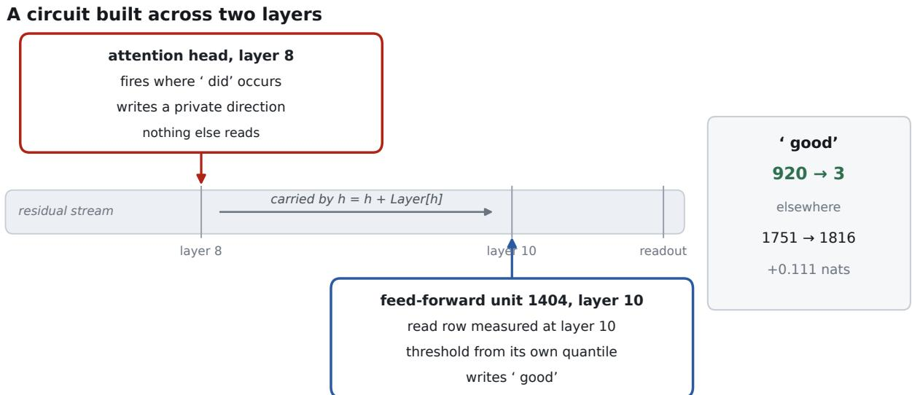  
GELU baseline, one installed pair. Ranks are taken where the head fires.  
Figure 14: One installed pair, end to end. The head marks the positions, the stream carries the marker two layers without turning it, and the unit answers there. Ranks are for the target token at the positions the head fires on and at all other positions.

Reporting a construction like this at a single operating point hides the shape of what it buys, so the frontier is the object to report: for each loss budget, the best rank any setting achieves within it. Over the full cross of write strength, read gain, saturation and read-row calibration, the baseline brings the target into the top ten for 0.121 nats, and for 0.179 once the specificity criterion is imposed (Figure 27). Section 5.9 reports the same frontier for the activation arms.

If the circuit is limited by the model, the amount of data used to measure the read row should barely matter; if by the estimate, a great deal.

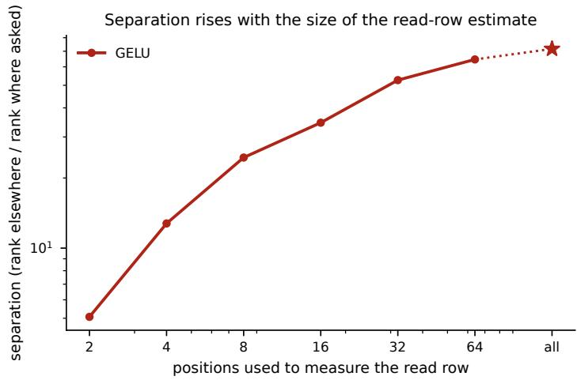  
Figure 15: Separation achieved by the cross-layer circuit, against the number of positions used to form the measured read row, with every other setting held fixed.

Figure 15 answers it. Separation rises from 5.1 at two positions to 71.6 at the full sample, monotonically and without turning over at the largest sample available. The binding constraint on a circuit installed this way is the accuracy of one’s estimate of the destination frame, which is a measurement that can be improved rather than a property of the model that cannot.

## 4.7 A reader is what makes of-axis content visible

The claim that a write outside the readout frame is inert until something reads it can be put to a single test, with both halves and their controls in one measurement. A direction is written at layer eight at 10 percent of positions. An unrelated target token is then scored three ways: with the write alone, with a reading unit at layer ten alone, and with both.

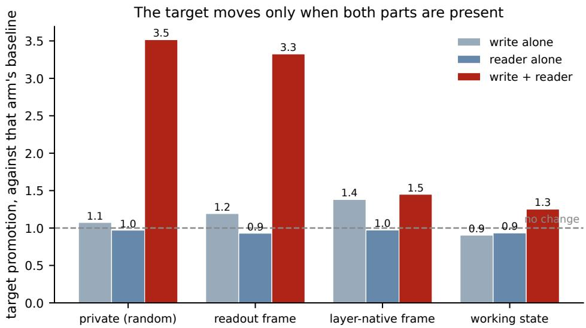  
Figure 16: Promotion of an unrelated target token at the written positions, relative to each arm’s own unedited baseline, for four kinds of written direction. The reading unit at layer ten has a measured, thresh olded read row and writes the target’s readout direction.

Figure 16 depicts the result. The reading unit alone leaves the target where it was, at 1.0 for every kind of write, which is the threshold of Equation 24 doing its work. The write alone moves the target by 1.1 times. The two together move it by 3.5, for 0.13 nats. The largest efect belongs to the private direction, and the two model-derived directions give the least, which is consistent with the reader having to find a frame the model is also acting on.

## 4.8 Driving a component the model already has

Everything to this point installs both ends of a circuit. A unit the model trained can be driven the same way, with nothing installed, through the row it already reads with. A unit’s pre-activation at depth ℓ is $a _ { u } = W _ { a } [ u ] \cdot \left( g \odot \mathrm { L N } ( h ) \right)$ , with g the layer’s norm gain. To first order in a perturbation of the stream,

$$
\frac { \partial a _ { u } } { \partial h } \propto \Pi _ { \perp { \bf 1 } } ( W _ { a } [ u ] \odot g ) ,\tag{25}
$$

the read row multiplied elementwise by the gain and projected of the constant direction, since layer normalization removes the mean and a component along 1 adds to $\| h \|$ without reaching the

unit.4 Units are selected by the margin between the top two tokens their write column decodes to, which picks out components that answer with a single token.

Whether the write reaches the target through the unit is a mediation question. Writing $r _ { 0 }$ and r for the target’s rank before and after the write in the intact model, and $r _ { 0 } ^ { \mathrm { a b l } }$ and $r ^ { \mathrm { a b l } }$ for the same pair with the unit’s write column zeroed,

$$
m = 1 - \frac { r _ { 0 } ^ { \mathrm { a b l } } - r ^ { \mathrm { a b l } } } { r _ { 0 } - r }\tag{26}
$$

is the share of the promotion that the tapped unit carries. Comparing the ablated arm against the intact model’s baseline rather than its own inflates m without bound, because ablating a unit that normally promotes the target moves that baseline.

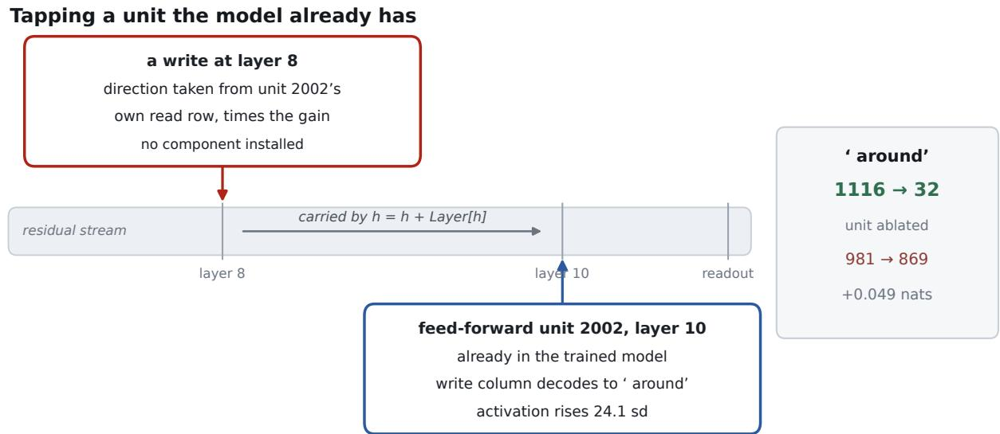  
GELU baseline, one unit of twelve tested. Ablating it removes 90 percent of the effect.  
Figure 17: An instance of the tap. The write at layer eight uses the layer-ten unit’s own read row as its direction, and no component is installed anywhere. Ablating that single unit removes ninety percent of the target’s promotion.

Figures 17 and 18 report the result. A write at layer eight raises a layer-ten unit’s activation by 24.1 standard deviations and moves the token that unit writes from rank 1116 to rank 32, for 0.049 nats. Ablating that one unit takes the same write from 981 to 869, so ninety percent of the promotion travels through it. Over twelve units the figure is 0.86.

What makes this work is driving the unit in the frame it already reads in. A direction taken from the weights through Equation 25 gives 0.86, where one estimated from the unit’s activations gives 0.55. A native unit’s read row is available exactly, in $W _ { a } ,$ and estimating it from activations only adds noise.

## 4.9 Scoring against a rank-one editor

We implemented the rank-one update of Meng et al. [36] and scored it under the criterion used above. Writing k∗ for the key, $v _ { * }$ for the value and $\dot { C } = \mathrm { E } \big [ k k ^ { \top } \big ]$ for the second moment of the

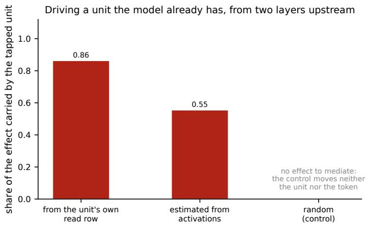  
Figure 18: Share of the target’s promotion carried by the tapped unit, by how the driving direction was obtained, over twelve units per model at four write strengths. The random control moves neither the unit nor the target, so it has no efect to mediate.

layer’s keys over a corpus sample, that update is

$$
\hat { W } = W + \frac { \left( v _ { * } - W k _ { * } \right) \left( C ^ { - 1 } k _ { * } \right) ^ { \top } } { \left( C ^ { - 1 } k _ { * } \right) ^ { \top } k _ { * } } ,\tag{27}
$$

which spreads the write across the layer along $C ^ { - 1 } k _ { * }$ rather than loading it into one unit. The value v∗ is obtained by gradient descent on the target’s likelihood.

Equation 27 has two ingredients, and separating them is informative. The covariance term is what preserves specificity: replacing $C ^ { - 1 }$ by the identity brings the target to rank five on the baseline while promoting it seventy times as far everywhere else. The gradient is the expensive one. Substituting a closed-form value, the target’s own readout direction, in place of the optimized $v _ { * }$ brings the target into the top ten for 0.068 nats, where the gradient version reaches rank one for 0.611. The part of the method that carries its specificity is the fast part to compute.

Figure 19 places the two on the same axes, with each swept over its own strength so the comparison is curve against curve. On the baseline, reaching the top ten costs the single-unit install 0.0016 nats against 0.0681 for the closed-form rank-one update, a factor of forty, and the target’s rank elsewhere is 1.02 times where it started against 0.81. The published method, with its gradient value, reaches rank one for 0.611 nats and holds specificity at 0.80. Section 5.9 runs the same comparison across the activation arms.

Two diferences of kind survive the comparison, and they run in opposite directions. A rank-one update needs a corpus sample to estimate $C$ and a gradient pass to obtain $v _ { * } ,$ where both halves of the install here are read from the parameters. Against that, the rank-one update writes through the whole layer and therefore needs no spare component, where an install into a single unit consumes one. The measurement supports treating them as complementary. The covariance term is worth adopting on its own terms wherever a single unit cannot be silenced cheaply enough for a one-unit install to stay local, which is the situation the shaped activations of Section 5 present.

A name, then, is an address that can be written to. A gain on one component moves the tokens its parameters name and nothing else, and pushing harder buys no collateral. An association the model does not hold installs into one spare unit, key and value both read from the parameters, for a quarter of a percent of held-out loss. A unit the model trained for itself is driven from two layers below through the row it already reads with, and carries eighty-six percent of the efect. A circuit across two layers runs on a direction drawn at random, which the stream carries untouched because this model works in a quarter of its width, and what limits the circuit is the estimate of the reader’s frame rather than anything in the model. Against the rank-one editor the install reaches the top ten for a fortieth of the cost, and the covariance term is the part of that method worth keeping. A rank-one update replaces this with that. A circuit is a mechanism, and the components here are read, built and driven in the model’s own terms.

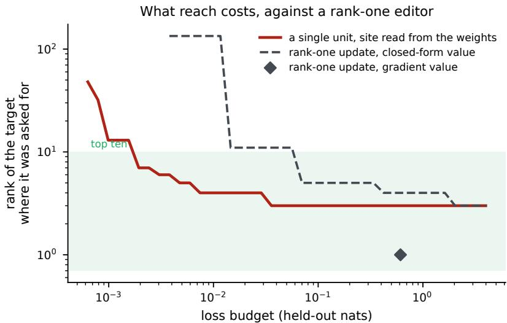  
Figure 19: Reach against held-out loss for the install of Section 4.2 and for the rank-one update of Equation 27, both at layer ten and both swept over their own strength. The dashed curve substitutes a closed-form value for the gradient-optimized one; the marker is the method with its gradient value. Specificity is unconstrained in these panels and reported in the text.

## 5 What the activation function changes

Sections 2 to 4 took a conventional transformer as it comes. This section asks what changes if the activation function is chosen for legibility rather than inherited. Four arms are trained beside the baseline, matched to it on everything but the unit: sigmoid, softplus, ReLU, and a fourth built from bounded set operators with two operands per unit. The diagnosis comes first, on the baseline’s own pre-activations, since it says which functions to try. Then the arms: their quality, the size of their circuits at one hop and at closure, how well their parameters read, which property of the function was responsible, and what each will and will not let an edit do.

## 5.1 Why a conventional unit stops being readable

Section 3 left a diagnosis, and the intervention follows from it. The reading procedure orders tokens by $w _ { u } \cdot \tilde { E } [ l , t ]$ , which estimates the ordering by pre-activation. The causal ground truth of Equation 14 orders by activation averaged over contexts. Between the two sit the activation function and an average, and either can reorder. Take a trained baseline, capture its pre-activations on the same contexts and candidate tokens, and hold the model, the weights, the tokens and the predictor fixed while changing only the function applied before the average.

Every order-preserving choice reads at 96 to 99 percent and is flat in K (Table 22). GELU reads at 67 and decays. The ordering the weights supply is very nearly recoverable from the averaged behavior, unless the function in between is GELU.

The cause is visible in the function itself. GELU decreases below $x ^ { * } \approx - 0 . 7 5 2 $ on that interval a larger $w _ { u } \cdot z$ produces a smaller activation, so the ordering the weights supply is not blurred there but reversed. Across three converged seeds, 59.8 to 62.0 percent of all pre-activation mass sits below $x ^ { * }$ (Figure 20). Nearly two thirds of the time, a unit is operating on the part of its activation function that runs backward.

That explains the shape of Figure 7 as well as its level. Small K selects the strongest inputs, which are the positive excursions, where GELU is increasing and reads at 67 percent. Large K reaches the body of the set, where most of the mass lives, which is the reversed interval, and that is exactly where agreement crosses below chance. A model that looked like it had a few nameable inputs and an incoherent remainder is reproduced, on the same model, by the readout function alone.

This is an ablation of the reading rather than a prediction about training: a network trained with a diferent $\phi$ arrives at a diferent distribution of pre-activations, and nothing here guarantees the property survives. And the predictor is the pre-activation mean rather than $w _ { u } \cdot \tilde { E } ,$ , which isolates $\phi$ cleanly at the cost of putting these numbers on a diferent scale from the rest. Section 5.3 trains the monotone model this predicts and reports what happens.

Table 22: One trained baseline model, one set of pre-activations, one predictor. Only the function applied before averaging over contexts difers. Chance-corrected agreement, three converged seeds, context length 2048.
<table><tr><td>applied before averaging</td><td></td><td></td><td>K=8</td><td>K=32</td><td>K=128</td></tr><tr><td>GELU</td><td>not monotone</td><td></td><td>67.9, 67.7, 66.6</td><td>55.0, 54.9, 55.2</td><td>30.1, 29.7, 31.7</td></tr><tr><td>softplus</td><td>monotone</td><td>unbounded</td><td>96.4, 96.4, 96.8</td><td>96.9, 96.9, 97.3</td><td>97.2, 97.2, 97.6</td></tr><tr><td>sigmoid</td><td>monotone</td><td>bounded</td><td>98.7, 98.8, 98.9</td><td>98.8, 98.8, 99.0</td><td>98.6, 98.6, 98.8</td></tr><tr><td>rank</td><td>order only</td><td></td><td>89.7, 89.9, 90.8</td><td>94.1, 94.2, 94.7</td><td>97.3, 97.4, 97.6</td></tr></table>

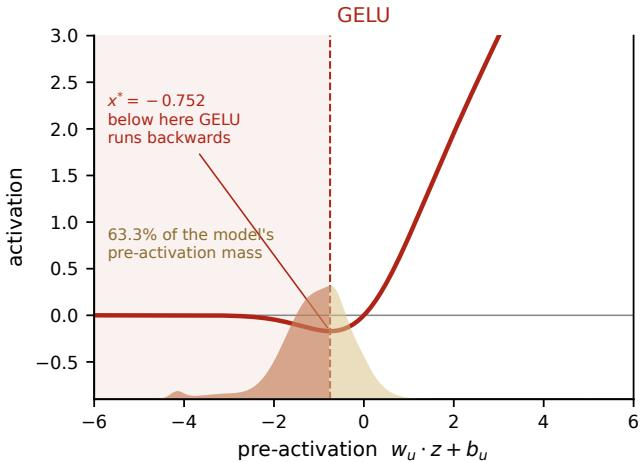  
Figure 20: Where the baseline actually operates on its activation function. The curve is GELU; the shaded density under it is the measured distribution of pre-activations $w _ { u } \cdot z$ over a trained baseline, $1 . 2 \times 1 0 ^ { 9 }$ samples at context length 2048. GELU decreases below $x ^ { * } \approx - 0 . 7 5 2$ , and 63.3 percent of the mass lies there on this denser estimate, against the 59.8 to 62.0 percent the per-seed estimate in the text gives, so for most inputs a larger pre-activation produces a smaller activation and the ordering the weights supply is reversed. Section 5.3 puts a monotone function beside this one.

Neither observation proves the activation is responsible. Changing it and holding everything else fixed is how to find out, and Section 6 later supplies an independent check: among twelve models trained by other people, the one built on ReLU has by far the least cancellation between opposing contributions.

## 5.2 Which activations make sense

For the ordering the parameters supply to survive into the ordering the causal measurement sees, $\phi$ must at least preserve order: if ϕ is strictly increasing, then within any single context the two rankings are identical, and the only remaining discrepancy comes from averaging. GELU is not strictly increasing, and most of a trained model’s pre-activation mass sits where it decreases.

Two standard functions satisfy the requirement and sit on opposite sides of a second property that might plausibly matter. The logistic function

$$
\phi _ { \sigma } ( z ) = \frac { 1 } { 1 + e ^ { - z } } \in ( 0 , 1 )\tag{28}
$$

is strictly increasing and bounded, so a unit’s mean activation on a token is the fraction of contexts in which it fired, and no single context can dominate. Softplus

$$
\phi _ { + } ( z ) = \log ( 1 + e ^ { z } ) \in ( 0 , \infty )\tag{29}
$$

is strictly increasing and unbounded, and behaves like the identity for large z. Both are injective. If order-preservation is what matters they should behave alike; if boundedness is what matters they should not.

A third, ReLU, is monotone but not injective: it maps the entire negative half-line to zero, so all the tokens a unit is silent on become indistinguishable in its output. It is the control that separates order-preserving from information-preserving.

A fourth alternative arrives from a diferent direction and meets the requirement twice over. Three earlier papers built feed-forward layers out of bounded fuzzy set operators — A ∩ B and A \ B on operands squashed into [0, 1] — on the argument that a unit computing a named logical operation on two named sets is legible by construction [39, 40, 42]. Every unit computes a pair of operands from the residual stream,

$$
A _ { u } ( z ) = \sigma ( w _ { u } ^ { a } \cdot z ) , \qquad B _ { u } ( z ) = \sigma ( w _ { u } ^ { b } \cdot z ) ,\tag{30}
$$

and writes the two operations into separate columns,

$$
\mathrm { F F N } ( z ) = \sum _ { u } \Big [ \underbrace { A _ { u } B _ { u } } _ { A \cap B } c _ { u } ^ { \cap } + \underbrace { A _ { u } ( 1 - B _ { u } ) } _ { A \setminus B } c _ { u } ^ { \setminus } \Big ] \ = \ \sum _ { u } A _ { u } \Big [ c _ { u } ^ { \setminus } + B _ { u } \big ( c _ { u } ^ { \cap } - c _ { u } ^ { \setminus } \big ) \Big ] .\tag{31}
$$

Both operands are bounded and strictly increasing in their pre-activations. The rearrangement on the right says what the two are for: A is a gate deciding how much the unit writes and B is a selector deciding which of two fixed columns is written. The parameter budget is held to the baseline’s by narrowing the layer, since each unit now carries two read rows and two write columns.

Those papers could not run the construction everywhere. Below roughly half conversion, training was indistinguishable from a conventional model; above it training diverged. The arm reported here has no conventional units left in it, which is what makes it a clean fourth point rather than a mixture of two designs. What removed the ceiling is an auxiliary objective borrowed from separate work on where a transformer holds its intermediate content [41]: it prescribes, layer by layer, the angle between a layer’s residual decode and the final prediction — orthogonal through the first half of the stack, aligned through the second. Why it works is not explored here; that it does is eight seeds of eight converging (Section 5.4). Appendix B gives the construction, the objective and the recipe in full.

## 5.3 The construction

Everything in the baseline of Section 2.1 is retained — depth, width, head count, parameter budget, data, schedule — and the unit is

$$
a _ { u } ( z ) = \phi ( w _ { u } \cdot z ) , \qquad \mathrm { F F N } ( z ) = \sum _ { u } a _ { u } ( z ) c _ { u } ,\tag{32}
$$

with ϕ one of Equations 28 or 29, or ReLU; the set-operator arm replaces Equation 32 by Equation 31 and is otherwise identical. Read row, write column and the reading procedures of Sections 3.1 and 3.2 are unchanged, which is the point: the same instrument is pointed at a model difering only in what a unit does with its pre-activation.

Two further departures from the baseline are part of the construction. The attention heads pass their value vectors through a sigmoid, so what a head gathers from a position is a bounded quantity in [0, 1] rather than an unbounded projection. The weighting over positions is the ordinary softmax, unchanged from the baseline. That squashing is the same in the sigmoid, softplus and ReLU arms whatever ϕ is, so it is held fixed across the comparison rather than varying with the activation function; the set-operator arm bounds what its heads gather too, by applying Equation 31’s operations there as well. And a small auxiliary term rewards a bounded activation for sitting near either end of its range rather than in the middle, at weight 0.003 against the language-modeling loss (Appendix B defines it). That term is defined only for a bounded activation, so the softplus and ReLU arms carry it at zero and the sigmoid arm is trained both ways; the two sigmoid variants are equivalent on every measurement here, so the cross-activation comparison is not confounded by it. Section 5.8 separates the contribution of these two, neither of which is an activation function, from ϕ’s.

## 5.4 Quality

Eight seeds of the sigmoid construction were trained under Section 2.1.1’s protocol and screened by the same criterion, and they behave the same way the baseline did: five converged and three did not. Whatever makes a run of this size fail at this budget is not something the activation function introduced or removed.

Table 24 settles quality. Both injective activations sit inside the baseline’s converged range on perplexity and on LAMBADA, and softplus was trained at eight seeds of which all eight pass the screen.

The set-operator arm sits there too, at eight seeds of which all eight converged: 19.23 to 19.43 in perplexity, inside the baseline’s range and tighter than it, and 0.234 to 0.274 on LAMBADA. Eight of eight landing within 0.2 nats of each other is not the signature of a model training at the edge of stability, which is the state prior work left of at [39].

While the ranges overlap, the medians do not coincide. The baseline leads sigmoid and softplus by about a point of accuracy, in a consistent direction, on samples of five, five and eight seeds whose ranges span two to four points each. A real cost of that size cannot be ruled out at this sample. What the experiment does establish is that replacing the activation function costs nothing like what ReLU costs.

Table 23: The sigmoid construction, eight seeds at one epoch, screened by the criterion of Section 2.1.1 and reported the same way as Table 1. The non-converged seeds are printed for the same reason they were there. ov@8 here is taken under the ranked summary of Appendix C.4, raw rather than chance-corrected.
<table><tr><td>seed</td><td>status</td><td>val. ppl</td><td>LAMBADA</td><td>ov@8</td><td>PR (L0-4)</td></tr><tr><td>1</td><td>converged</td><td>19.30</td><td>0.258</td><td>66.6</td><td>112.7</td></tr><tr><td>2</td><td>converged</td><td>19.33</td><td>0.274</td><td>67.0</td><td>112.7</td></tr><tr><td>3</td><td>converged</td><td>19.35</td><td>0.271</td><td>68.7</td><td>113.9</td></tr><tr><td>4</td><td>converged</td><td>19.36</td><td>0.260</td><td>68.2</td><td>109.5</td></tr><tr><td>5</td><td>converged</td><td>19.40</td><td>0.243</td><td>71.1</td><td>112.8</td></tr><tr><td>6</td><td>excluded</td><td>20.55</td><td>0.249</td><td>73.4</td><td>97.4</td></tr><tr><td>7</td><td>excluded</td><td>21.41</td><td>0.184</td><td>75.6</td><td>65.3</td></tr><tr><td>8</td><td>excluded</td><td>22.16</td><td>0.218</td><td>79.3</td><td>42.3</td></tr></table>

Table 24: Quality across activation functions at one epoch. The three arms whose operands are strictly increasing sit inside the baseline’s converged range on both measures. ReLU sits outside it on both. Every row below the rule comes from an arm matched to the baseline on width, data and schedule.
<table><tr><td>activation</td><td>property</td><td>val. ppl</td><td>LAMBADA</td></tr><tr><td>GELU (baseline, converged)</td><td>not monotone</td><td>19.00 – 19.65</td><td>0.248-0.274</td></tr><tr><td>GELU (baseline, excluded)</td><td>not monotone</td><td>21.62 - 39.51</td><td>0.152 - 0.214</td></tr><tr><td>sigmoid</td><td>monotone, injective, bounded</td><td>19.30–19.40</td><td>0.243-0.274</td></tr><tr><td>softplus</td><td>monotone, injective, unbounded</td><td>19.28-19.78</td><td>0.224-0.269</td></tr><tr><td>set operators</td><td>bounded, two operands per unit</td><td>19.23- 19.43</td><td>0.234-0.274</td></tr><tr><td>ReLU</td><td>monotone, not injective</td><td>21.01-22.23</td><td>0.208-0.219</td></tr></table>

ReLU is not like other models. Its seeds sit about ten percent behind every other arm on perplexity and below every converged seed of every other construction on accuracy. It trains stably to a ceiling and settles lower. The one function in this comparison that discards information rather than merely reshaping it is the one that cannot reach the quality the others reach, which is the first indication that injectivity is doing work beyond bookkeeping.

Every model trained for this paper sits on one pair of axes in Figure 21, quality against legibility. Read Table 23 straight down and the legibility column rises monotonically as quality falls, every excluded seed scoring above every converged one. That is why the sigmoid figures quoted below come from the converged seeds alone.

## 5.5 Circuit size across the arms

The instrument of Section 2 applies to these constructions unchanged, and this is the cleanest comparison available: the arms share a width, a dataset, a schedule and a converged quality, and difer only in ϕ. Whatever separates them separates because of the activation function.

The accounting behaves the same way in every arm and difers only in what it counts (Table 25). Two things separate (Table 26). The circuit is smaller — twenty-six to thirty-six components against the baseline’s fifty-three — and it turns over sooner, the median prediction changing at a quarter of the k the baseline needs (Figure 23). Both hold across every seed trained, and Figure 22 shows they hold across the confidence range rather than only at the floor these counts are measured at. The set-operator arm, measured under the same procedure and not in these two floats, sits with the rest: 36 components at ninety percent of the net and an inflation of 277 times against the

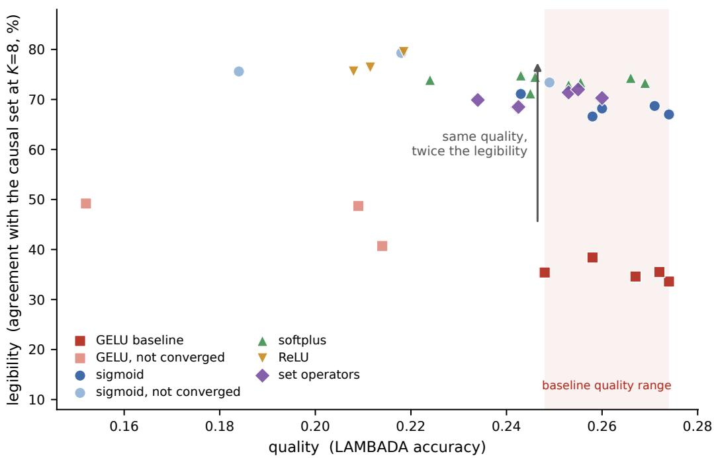  
Figure 21: Every trained model in this paper. Horizontal axis is quality; vertical axis is how well a unit’s parameters name the tokens that causally drive it in the vocabulary basis, both under one protocol. Read in a diferent basis, the same units order their drivers well above chance (Section 3.4); what this axis measures is whether the token table is the right place to look, not whether anything is there. The shaded band is the baseline’s converged quality range. The baseline sits low and to the right — good quality, poor legibility — and every order-preserving arm sits about twice as high at the same quality; ReLU sits higher still and to the left, buying legibility with accuracy. In both families the pale points, the seeds that failed the convergence screen, sit above their own converged siblings without exception, which is why quality is on this axis at all.

Table 25: The accounting of Section 2.3 across the arms. The inflation column is what the absolute-value convention would report divided by what the signed one does. Every arm cancels heavily, the ReLU arm least, by a factor of five.
<table><tr><td>model</td><td>net (signed)</td><td>positives only</td><td>absolute value</td><td>inflation</td></tr><tr><td>baseline (GELU)</td><td>53</td><td>11,974</td><td>23,971</td><td>452×</td></tr><tr><td>sigmoid</td><td>34</td><td>7,207</td><td>13,851</td><td>401×</td></tr><tr><td>softplus</td><td>36</td><td>8,311</td><td>16,403</td><td>456×</td></tr><tr><td>ReLU</td><td>32</td><td>1,527</td><td>3,133</td><td>98×</td></tr><tr><td>sigmoid, no shaping</td><td>26</td><td>8,097</td><td>16,429</td><td>632×</td></tr></table>

Table 26: Circuit size and the point at which the median prediction changes, with the range across seeds. Four to eight seeds per arm where several were trained.
<table><tr><td>model</td><td>predictions</td><td></td><td>n90</td><td>across seeds</td><td>fips at k</td><td>attention</td></tr><tr><td>baseline (GELU)</td><td>115</td><td></td><td>53 [42, 63]</td><td>45-107</td><td>32</td><td>27%</td></tr><tr><td>sigmoid</td><td>108</td><td></td><td>34 [30, 40]</td><td>9-44</td><td>4</td><td>25%</td></tr><tr><td>softplus</td><td>104</td><td></td><td>36 [29, 40]</td><td>10-28</td><td>8</td><td>22%</td></tr><tr><td>ReLU</td><td>102</td><td></td><td>32 [24, 38]</td><td>22-41</td><td>8</td><td>44%</td></tr><tr><td>sigmoid, no shaping</td><td>108</td><td></td><td>26 [23, 30]</td><td>12-30</td><td>4</td><td>46%</td></tr></table>

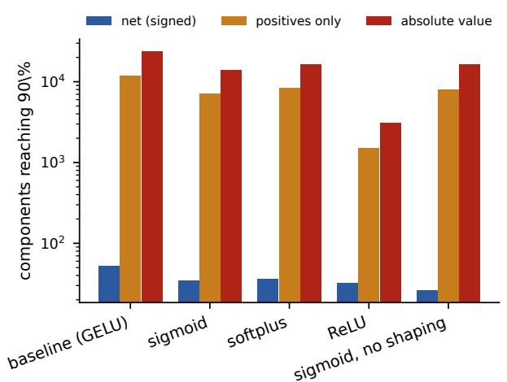

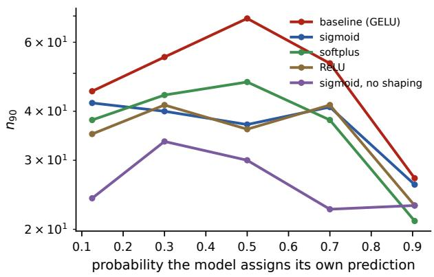  
Figure 22: Left: the three denominators across the arms, on a log axis. The gap between the signed count and the other two is the same two-to-three orders of magnitude found in the baseline, and it is present in every arm — choosing the activation changes the size of the circuit, not whether the convention matters. Right: circuit size against how confident the model is in its own prediction. The arms keep their order at every confidence, so the comparison does not depend on where the confidence floor of Table 14 is set.

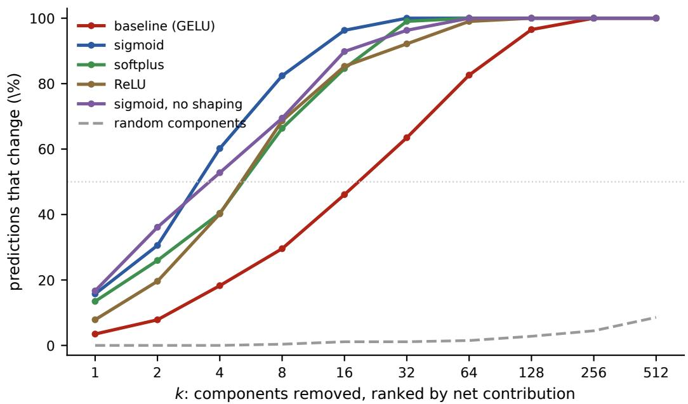  
Figure 23: Removing the k highest-contributing components, across the arms. The random control is pooled over all of them. Replacing the conventional activation moves the curve left: the median prediction turns over at a quarter of the k.

baseline’s 53 and 452.

## 5.6 The whole dependency graph

Everything above counts components contributing directly to the readout — one hop. The recursion of Appendix D.1 follows the graph the rest of the way, and reports two things: the closure, which is what a prediction draws on, and the required graph, which is what ablation can reduce it to. Every arm closes, at four to six levels, on ninety to a hundred predictions each.

Table 27: The backward dependency graph of a prediction, closed. “Attn heads” is how many distinct (layer, head) pairs the closure touches, out of the model’s total: attention components are named locations and are ablated with the rest, but are not followed. “Ablated” removes the closed graph, against a sizematched random set.
<table><tr><td></td><td colspan="2">graph</td><td colspan="4"></td><td colspan="2">ablated</td></tr><tr><td>model</td><td>preds one hop closed</td><td></td><td></td><td></td><td></td><td>levels % of model attn heads</td><td>closure random</td><td></td></tr><tr><td>baseline (GELU)</td><td>100</td><td>53</td><td>736</td><td>6</td><td>1.60%</td><td>62/144</td><td>98%</td><td>9%</td></tr><tr><td>sigmoid</td><td>95</td><td>35</td><td>99</td><td>5</td><td>0.21%</td><td>27/144</td><td>97%</td><td>9%</td></tr><tr><td>softplus</td><td>90</td><td>36</td><td>123</td><td>4</td><td>0.27%</td><td>30/144</td><td>99%</td><td>2%</td></tr><tr><td>ReLU</td><td>91</td><td>30</td><td>182</td><td>5</td><td>0.39%</td><td>51/144</td><td>100%</td><td>5%</td></tr><tr><td>sigmoid, no shaping</td><td>94</td><td>26</td><td>122</td><td>6</td><td>0.26%</td><td>30/144</td><td>100%</td><td>0%</td></tr><tr><td>set operators</td><td>98</td><td>36</td><td>120</td><td>6</td><td>0.43%</td><td>24/144</td><td>93%</td><td>0%</td></tr></table>

Table 28: The required graph: the smallest prefix of the one-hop set whose removal changes the prediction, found by scanning prefix lengths upward on each prediction separately. Bisection is not available here: the flip is not monotone in the prefix length, and on 11 to 28 percent of predictions a larger prefix restores a prediction a smaller one broke. “Defined on” is the share of predictions for which such a prefix exists at all; the columns to its left are medians over those.
<table><tr><td></td><td colspan="2">graph</td><td colspan="4">required</td></tr><tr><td>model</td><td>one hop</td><td>closed</td><td>components</td><td>% of one hop</td><td>% of model</td><td>defined on</td></tr><tr><td>baseline (GELU)</td><td>53</td><td>736</td><td>13</td><td>25%</td><td>0.028%</td><td>73%</td></tr><tr><td>sigmoid</td><td>35</td><td>99</td><td>4</td><td>11%</td><td>0.009%</td><td>99%</td></tr><tr><td>softplus</td><td>36</td><td>123</td><td>5</td><td>14%</td><td>0.011%</td><td>87%</td></tr><tr><td>ReLU</td><td>30</td><td>182</td><td>5</td><td>17%</td><td>0.011%</td><td>86%</td></tr><tr><td>sigmoid, no shaping</td><td>26</td><td>122</td><td>3</td><td>12%</td><td>0.007%</td><td>95%</td></tr><tr><td>set operators</td><td>36</td><td>120</td><td>5</td><td>14%</td><td>0.018%</td><td>84%</td></tr></table>

At one hop the arms sit within a factor of two of the baseline. At closure they separate from it by four to seven times (Table 27). The recursion exposes an efect of the activation function on how much machinery a prediction draws on that a one-hop measurement mostly misses. The set-operator arm closes on 120 components in six levels, between the sigmoid arm’s 99 and the ReLU arm’s 182.

The required graph separates them too, at a small absolute size. Removing 13 of the baseline’s components changes its prediction; for the arms it is 3 to 5. A prediction draws on hundreds of components and cannot survive losing a handful of them, and the handful is smaller when the activation is order-preserving.

The branching factor compounds far less than multiplication would suggest, because the sources of diferent nodes overlap: multiplying n90 by it overstates the measured two-level count by a factor of four, so the counts here are the union taken at every level rather than a product.

Two caveats from Section 2.6 apply to the arms as they do to the baseline, one of them harder. Cancellation arriving at a component is far more severe than cancellation leaving the model on the arms too, though by several hundred times rather than the baseline’s thousand. And a signed count of what reaches a node is undefined wherever that drive sums to zero or below, which is a third of the baseline’s nodes but more than half of the sigmoid model’s, so the branching medians above are taken over the nodes where the quantity exists and rest on a smaller share of the sigmoid model’s graph than of the baseline’s.

## 5.7 Legibility

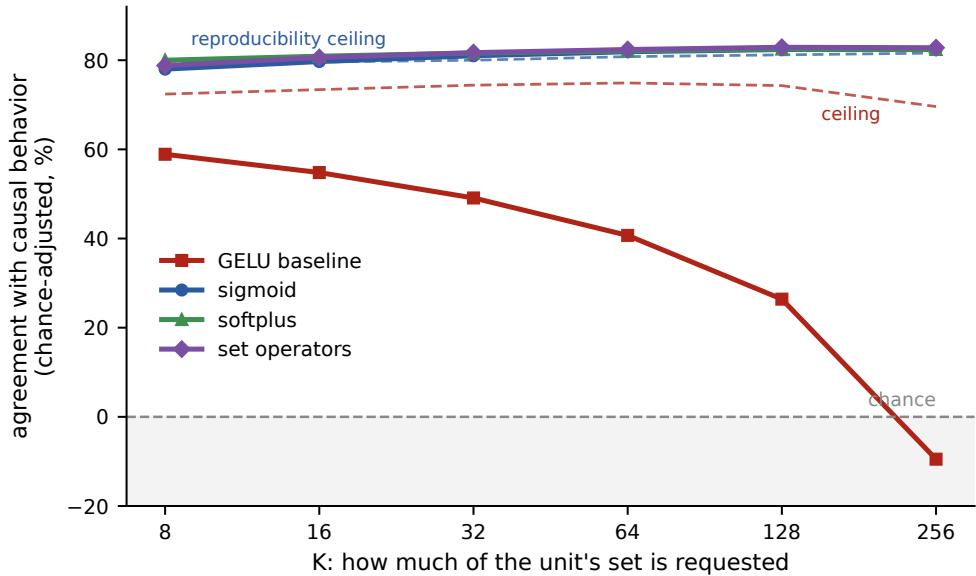  
Figure 24: Agreement between the parameter-derived set and the causal set, against how much of the set is requested. The baseline curve is the one from Figure 7. The three arms built on order-preserving activations are flat in K and sit near the dashed reproducibility ceiling — the rate at which the causal measurement agrees with itself on independent contexts, which no reading procedure can exceed — and they land on each other. Set-operator agreement is taken on operand A. Context length 2048, candidate pool $| V | = 5 1 2$ , table and causal profile from 16 disjoint contexts each.

The measurement of Section 3.2 was ov@c K swept over K, and it is repeated here unchanged. The baseline decays from 58.9 percent at K = 8 to −9.5 at K = 256 (Figure 24). The other three do the opposite: they rise slightly and then flatten, sigmoid from 78.0 to 82.4, softplus from 80.0 to 82.4 and the set-operator arm from 78.8 to 82.8 across the same sweep. At K = 256, where the baseline selects tokens overlapping the true set less often than a random draw would, they recover it at better than four times chance.

The flatness and how little separates the three matter more than the level. A procedure that reads the strongest few inputs and then fails produces a decaying curve, which is what the baseline gives. A procedure that recovers the whole set produces a flat one. Section 5.1 predicted exactly this from the untrained readout ablation — every monotone choice was flat in K on the baseline’s own pre-activations — and training with those activations reproduces it. Figure 25 rules out the operating point as the explanation: the sigmoid model’s pre-activations sit further into the tail than the baseline’s, and its reading is unafected.

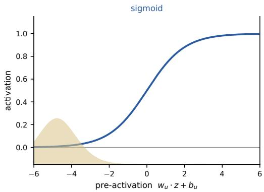  
Figure 25: The sigmoid arm’s operating point, drawn on the same axes and to the same recipe as the baseline’s in Figure 20: the curve is the function and the shaded density under it is the measured distribution of pre-activations over a trained model of that arm. Its mass sits further left than the baseline’s, and it does not matter, because a monotone function preserves the ordering wherever its argument happens to land. It is not the operating point that causes the baseline’s reversal — it is that GELU has an interval where the ordering can be lost at all.

The qualitative change behind those numbers is that the sigmoid model’s token sets support a description where the baseline’s do not — places, or the copula cluster around as and is. Table 47 sets the two side by side in Appendix C.

The numbers are at the instrument’s ceiling. A reading procedure cannot agree with the causal set better than the causal set agrees with itself, and that self-agreement is finite because it is estimated from a sample of contexts. Measured on independent halves and chance-corrected, the baseline’s causal top-8 reproduces itself at 72.4 percent and its top-256 at 69.6; the sigmoid model reproduces at 79.2 and 81.6. Reading each model against its own ceiling:
<table><tr><td></td><td>agreement</td><td>ceiling</td><td>fraction of ceiling</td></tr><tr><td>GELU, K = 8</td><td>58.9</td><td>72.4</td><td>0.81</td></tr><tr><td>GELU, K = 256</td><td>-9.5</td><td>69.6</td><td></td></tr><tr><td>sigmoid, K = 8</td><td>78.0</td><td>79.2</td><td>0.98</td></tr><tr><td>sigmoid, K = 256</td><td>82.4</td><td>81.6</td><td>1.01</td></tr></table>

The sigmoid model is at its ceiling, and so are the other two: softplus and the set-operator arm end the sweep at 82.4 and 82.8 against sigmoid’s 82.4, diferences smaller than the ceiling can resolve, so nothing here separates the three from each other. The residual disagreement is the measurement’s own noise, and collecting more contexts would raise both numbers together. The claim is that the parameters recover the unit’s set as well as the set can be resolved, which is stronger than a ratio between two models.

What the gain costs. The obvious objection to these numbers is the one Appendix C raised first: a model reads as more legible when it has less to say. The dimensionality column of Table 23 answers it. The converged sigmoid seeds carry more independent directions over the first five layers than the baseline does, not fewer, while scoring roughly twice as high on agreement. Whatever the change did, it did not do it by making the representation smaller.

The same column also disciplines the excluded seeds. Two of the three collapsed the way the baseline’s did, and their inflated scores are explained. The third, seed 6, is healthy on that column and still scores above every converged seed. Collapse does not account for its elevated legibility, which is unexplained. It is excluded on quality.

Smaller sets, read through the graph. Agreement says the parameters name the right tokens without saying the tokens belong together. By Equation 48 the median efective set size falls by about a third under sigmoid, a real but modest concentration. Coherence over the set as a whole stays out of reach in the token basis (Section 3.2), so the graph supplies it instead. With the tokens sorted by which upstream source supplies each, a classifier assigns a token to its source well above a shufled control, and part-of-speech purity within a source group exceeds a matched random partition. Both efects are larger than on the baseline (Section 3.4).

The same graph names the components the vocabulary leaves of its frame, separating the arms less cleanly than agreement does. Describing a component from what its incoming edges carry recovers something it measurably fires on far more often than a control does, in every arm and in the baseline alike (Table 29). Ranked by that controlled margin, only sigmoid and the set-operator arm clear the baseline. The set-operator arm’s 10.0 times on components that name themselves is the largest margin in the table and the least well sampled number in it: 42 such components against the baseline’s 119, and a control of 5 percent against every other model’s 13 to 20. Softplus reads highest of any arm before the control is applied, and its control is twice every other model’s because its edge labels repeat — the ten commonest hold a quarter of its label pool where the others hold an eighth — so a random description hits more often and the corrected margin collapses. Read through the graph rather than the vocabulary, replacing the activation buys a large improvement in two arms and nothing reliable in the other two.

Table 29: Describing a component by what its inputs carry. A six-token description is built from the incoming edges that pass the frame-agreement test of Appendix D.1, weighted by each edge’s share of the node’s incoming drive, and scored on whether it contains a token the component measurably fires on. The control builds the same description from edge labels drawn elsewhere in the same model. “Names itself” splits the components by whether their own write places the predicted token in its first hundred.
<table><tr><td></td><td colspan="4">names itself</td><td colspan="4">does not</td></tr><tr><td>model</td><td>nodes</td><td>hit</td><td>control</td><td>lift</td><td>nodes</td><td>hit</td><td>control</td><td>lift</td></tr><tr><td>baseline (GELU)</td><td>119</td><td>58%</td><td>13%</td><td>4.6×</td><td>489</td><td>50%</td><td>17%</td><td>2.9×</td></tr><tr><td>sigmoid</td><td>118</td><td>62%</td><td>13%</td><td>4.9×</td><td>391</td><td>61%</td><td>18%</td><td>3.4×</td></tr><tr><td>softplus</td><td>110</td><td>54%</td><td>15%</td><td>3.7×</td><td>377</td><td>63%</td><td>37%</td><td>1.7×</td></tr><tr><td>ReLU</td><td>116</td><td>59%</td><td>20%</td><td>3.0×</td><td>281</td><td>53%</td><td>20%</td><td>2.7×</td></tr><tr><td>set operators</td><td>42</td><td>48%</td><td>5%</td><td>10.0×</td><td>394</td><td>51%</td><td>16%</td><td>3.2×</td></tr><tr><td>unshaped sigmoid</td><td>144</td><td>69%</td><td>17%</td><td>4.0×</td><td>446</td><td>57%</td><td>18%</td><td>3.1×</td></tr></table>

The two measurements ask diferent questions. Agreement asks whether a unit’s own parameters pick out the tokens it fires on, and the construction was designed to fix exactly that; the graph asks whether a component’s inputs describe it, which the activation function was never aimed at. The arms separate on the first alone, which places the construction’s efect on the read side of a component rather than on its position in the graph.

A component whose own write is of the token frame stays readable in every arm. Its incoming edges carry tokens, and those tokens describe it: the description contains something the component fires on 56 percent of the time against a control at 20, and the rate is the same for components that can name themselves and components that cannot (60 against 56 percent, Table 29). What a component’s own parameters say about it does not predict whether its inputs describe it. The description is weak in absolute terms — it covers 17 percent of what the component responds to — and it is a label rather than a name, but it is available directly.

Two operands are two things to read. Equation 15 scores one read row against one causal set, so a unit with two readable operands and a unit with one readable row are indistinguishable to it however diferently they are organized. Both halves of every unit are readable, and both at roughly twice the baseline: 68.5 to 72.0 for operand A and 64.7 to 68.9 for operand B, against the baseline’s single row at 33.6 to 38.4, all under the ranked summary of Appendix C.4. They also carry diferent jobs rather than duplicating one. Take each unit’s top-40 tokens by A and split them by whether B is high or low: coherence over the centered token embeddings rises by 0.0166, a 31 percent increase over the unsplit set, where a random split of the same tokens into halves of the same sizes moves it by 0.0002. The comparison is between two ways of splitting the same tokens against a control that splits them at random, so a similarity measure blind to some concept is blind to it in both arms equally. What it establishes is that B separates A’s set along an axis the embedding can see rather than one a person would name.

## 5.8 Which property was responsible

Sigmoid and softplus difer in boundedness and agree on everything measured here: quality within each other’s range, agreement flat in K at 82, both at their ceiling. The operative property is that the function does not destroy the ordering the weights supply, which also disposes of the more intuitive explanation, that a bounded unit is legible because its activation reads as a probability.

The set-operator arm makes the same point from the far end of the design space. It carries two read rows, two write columns and a named logical operation per unit, where Equation 32 carries one row, one column and a swapped function and is what a feed-forward unit already was. On the K sweep the two are within a point of each other everywhere; on quality they overlap; at closure they sit twenty-one components apart. If the question is how much better the parameter-derived set matches the causal set, the elaborate construction is not better. Three constructions with nothing in common but an order-preserving activation land on one curve, and a fourth that is monotone but not injective lands somewhere systematically diferent, which is the strongest evidence here for which property is doing the work.

ReLU makes the point from the other side. It is order-preserving and scores highest of all on agreement, 75.6 to 79.5 percent at K = 8 against sigmoid’s 66.6 to 71.1, softplus’s 71.2 to 74.8 and the set-operator arm’s 68.5 to 72.0, all under the ranked summary of Table 23. It is also the only arm that loses quality, and its units respond to far fewer tokens: arity 2.4 to 2.7 against sigmoid’s 5.3 to 6.7. Its seeds also vary much more in how many units answer to nothing — 0.9, 4.7 and 10.2 percent, against 0.2 to 4.1 for sigmoid — though those ranges overlap, so the dead-unit count is not a finding on its own. Discarding the negative half-line makes what remains easier to read and leaves the model less to say. That is a legibility–quality exchange rate, visible in a single controlled comparison, and it marks the edge of what this change buys for free.

What the construction separates. A second reading of the same result does not concern the token ordering at all. Run against the carriage background of Section 2.6, the search returns 18 components on the baseline and 4 on the sigmoid model. The two are under one procedure, so the comparison between them is the measurement, and neither is to be read against the zeroedbackground sizes of Table 7. The same construction that makes a unit readable also makes the prediction separable from the trafic it travels in. Whether the two efects are one mechanism or two is not settled here. The ordering result is measured on what drives a unit and this one on what the model delivers, and a construction could plausibly improve either alone.

Sigmoid, softplus and set-operator units are more legible than GELU units, then, and by the same property. Whether that translates into editability is the next question.

## 5.9 Editability

The standard promote edit comes first: add a multiple of a target token’s embedding to one unit’s write column,

$$
c _ { u } \gets c _ { u } + \beta E [ T ] ,\tag{33}
$$

which credits the same mechanism as established weight-editing methods [36] and changes nothing about the model but one column. Two things are then measured on held-out text. The eficacy is how much the target token’s logit rises at the positions where the unit fires:

$$
\mathrm { e f f } ( u ) = \mathbb { E } _ { \mathrm { f r e s } } \big [ \mathrm { l o g i t } _ { T } ^ { \mathrm { e d i t e d } } - \mathrm { l o g i t } _ { T } ^ { \mathrm { o r i g } } \big ] .\tag{34}
$$

The collateral is how much everything else moved, as the mean divergence between the original and edited distributions at the positions where the unit does not fire:

$$
\operatorname { c o l l } ( u ) = \mathbb { E } _ { \mathrm { n o t ~ f i r e s } } [ \operatorname { K L } ( P ^ { \mathrm { o r i g } } \parallel P ^ { \mathrm { e d i t e d } } ) ] .\tag{35}
$$

Restricting collateral to non-firing positions matters. Averaging over all positions rewards a unit simply for being rare, since a unit that almost never fires disturbs almost nothing; asking what happened where the unit was not supposed to act removes that advantage.

Neither number is meaningful alone, as Section 1 noted: any edit is respected if pushed hard enough and any edit is harmless if pushed gently. β is swept over four strengths per unit, scaled by each unit’s own activation range so that the promote signal at a typical firing position is comparable across architectures with diferent activation scales, and collateral is read at matched eficacy by interpolating each model’s curve.

Table 30: Collateral damage at matched eficacy, median over 34–40 edited units per seed, target token held fixed. Lower is better, and entries are per-seed values where there are two and ranges where there are three. The last column is the range of eficacy each model’s units reach across the four strengths tested, which is where the families separate without overlap. On a set-operator unit the edit adds to one of the two write columns, so it lands on one branch of the unit rather than on the unit as a whole.
<table><tr><td></td><td colspan="4">collateral at efficacy</td><td colspan="2">efficacy</td></tr><tr><td>model</td><td>seeds</td><td>1.5</td><td>2.0</td><td></td><td>3.0</td><td>reached</td></tr><tr><td>GELU baseline</td><td>2</td><td>0.006, 0.023</td><td>0.011, 0.041</td><td>0.023, 0.085</td><td>3.3-</td><td>3.9</td></tr><tr><td>sigmoid</td><td>3</td><td>0.001-0.008</td><td>0.003-0.015</td><td>0.006-0.041</td><td>6.3-</td><td>8.4</td></tr><tr><td>softplus</td><td>2</td><td>0.001, 0.002</td><td>0.001, 0.003</td><td>0.003, 0.006</td><td></td><td>8.7- 9.3</td></tr><tr><td>set operators</td><td>3</td><td>0.002</td><td>0.001-0.003</td><td>0.003-0.005</td><td></td><td>10.1 - 14.3</td></tr></table>

The cleanest diference is reach rather than collateral (Table 30). Across the same four strengths, baseline units top out at an eficacy of 3.3 and 3.9, while the monotone units reach 6.3 to 9.3 and the set-operator units 10.1 to 14.3. The ranges do not overlap. A baseline unit resists being told what to do past a certain strength. Pushing harder stops raising the target logit and only adds damage — visible in the per-unit curves, where eficacy peaks at the second of four strengths and then falls while collateral keeps climbing. The monotone units do not have that turning point in the range tested.

Collateral points the same way. Four of the five monotone runs sit below both baseline runs at every matched eficacy, by factors of four to fourteen. But the ranges overlap: one sigmoid seed (0.041 at eficacy 3.0) is worse than one baseline seed (0.023), so the statement is that the monotone models are typically more targeted rather than uniformly so. The set-operator seeds are the one place the ranges do separate: 0.003 to 0.005 at eficacy 3.0 against the baseline’s 0.023 and 0.085, five to twenty times less disturbance for the same efect, and below sigmoid’s 0.006 to 0.041 as well. An edit to one of its write columns acts only where A opens and B selects that branch, which is the narrowest circumstance any construction here puts a write in.

The two results are the same fact seen twice. An edit to $c _ { u }$ acts wherever u fires, so its precision is bounded by how well-defined “wherever u fires” is. If a unit’s set is a grab-bag, an edit aimed at one part of it lands on all of it, and the model resists the edit exactly to the extent that the unit was doing several unrelated jobs. That is why the baseline’s eficacy saturates and the monotone models’ does not: the edit is competing with the unit’s other responsibilities. Legibility is what makes editing possible, which is why the edit checks the reading.

Changing facts. Equation 33 adds to a write column a component already has. Two further operations ask more of it. Installing an association puts a key for one token and a value for another into a component the model was not using, as Section 4.2 does on the baseline. Rewiring keeps the write column exactly as trained and replaces the read row, so the component keys on a diferent token and delivers what it always delivered. Measured across the arms, the three order the models diferently (Table 31).

Table 31: Three edit operations across the arms. Gain is the share of edits moving a component’s own named scope more than another component’s, at matched strength. Install is the share placing a new token at the top of the distribution where its key occurs and not elsewhere, at the strongest setting whose held-out loss stays within ten percent of the unedited model. Rewire is how far the component’s own write moves toward the token its read row was changed to. The operations are measured on one protocol each, across both kinds of component.
<table><tr><td></td><td colspan="2">gain</td><td colspan="2">install</td><td colspan="2">rewire</td></tr><tr><td>model</td><td>unit</td><td>chan.</td><td>unit</td><td>chan.</td><td>unit</td><td>chan.</td></tr><tr><td>baseline (GELU)</td><td>94%</td><td>91%</td><td>32%</td><td>10%</td><td>+2.939</td><td>+0.016</td></tr><tr><td>sigmoid</td><td>90%</td><td>85%</td><td>0%</td><td>0%</td><td>+0.002</td><td>+0.027</td></tr><tr><td>softplus</td><td>99%</td><td>95%</td><td>0%</td><td>0%</td><td>+0.363</td><td>+0.102</td></tr><tr><td>ReLU</td><td>82%</td><td>75%</td><td>0%</td><td>0%</td><td>+0.050</td><td>+0.027</td></tr><tr><td>set operators</td><td>77%</td><td>68%</td><td>0%</td><td>0%</td><td>+0.044</td><td>+0.036</td></tr></table>

Table 32: The scope test of Section 4 on the sigmoid model: amplify a component and ask where the logits move — on the tokens its own write column names, on another component’s, or on random tokens — at matched strength. “Respects the name” is the share of edits moving the component’s own scope more than another’s. Same protocol as Table 20, so the rows are comparable across the two models.
<table><tr><td>model</td><td>own scope</td><td>other scopes</td><td>random tokens</td><td>respects the name</td></tr><tr><td>sigmoid</td><td>1.62</td><td>-0.05</td><td>-0.10</td><td>100%</td></tr></table>

Amplification is indiferent to the activation. Every arm takes it, on both kinds of component,

on 68 to 99 percent of trials — scaling a column commutes with whatever the activation does, so it asks nothing of the function. The scope test of Section 4, however, asks whether the movement lands on the tokens the component’s own column names rather than on another component’s. The sigmoid model respects the name on every edit tried against 97 percent for the baseline, and moves its own scope by 1.62 against the baseline’s 0.89 (Table 32). The other two operations are not indiferent at all. No monotone arm takes an installed association at any strength of either knob when the edited unit is the only thing changed, where the baseline manages 32 percent; and rewiring, which the baseline’s units accept at +2.94, moves a sigmoid unit by +0.002.

Table 33: Installing an association across the four activations, at the strongest setting whose held-out loss stays within five percent of the unedited model, so the sites are compared at matched damage rather than at matched strength. The last column is the same models’ read side from Table 15. The unit beats the channel on the baseline; on the other three neither site takes the edit at any strength, so the two are tied at zero. The ordering of the two columns is close to opposite.
<table><tr><td>model</td><td>installs and stays local within five percent of loss</td><td>cheapest loss at which any edit takes</td><td>read side,  $K { = } 8 \to K { = } 1 2 8$ </td></tr><tr><td></td><td>48%</td><td>3.21 (from 3.19)</td><td> $0 . 5 9 8 \to - 0 . 1 1 6$ </td></tr><tr><td>baseline (GELU) softplus</td><td>0%</td><td>9.23 (from 3.22)</td><td></td></tr><tr><td>ReLU</td><td>0%</td><td>never</td><td> $0 . 5 1 3  0 . 1 3 9$ </td></tr><tr><td>sigmoid</td><td>0%</td><td>5.66 (from 3.30)</td><td> $0 . 7 4 3  0 . 6 8 0$ </td></tr></table>

The failure has one shape (Table 33): raise the write gain until B arrives where A is, and B has arrived everywhere else too, its rank away from A falling from the high hundreds to 1 with held-out loss following.

Neither knob explains that away. The write gain sets how much of B arrives and the read gain scales the installed key; both were swept, over four orders of magnitude in the second. ReLU takes no specific edit at any setting of either. Sigmoid and softplus reach a third of trials only at a read gain of 256 and a held-out loss of 11 to 23 against baselines near 3.2 — the association can be forced in by saturating the unit, and what remains is not a model. The baseline needs neither knob raised: at a read gain of 1 it installs on 48 percent of trials for five percent of held-out loss, and on 24 percent for one percent of it.

At least part of the reason is that an installed association stays local only where the component can be silent on the tokens it was not installed for, and $\begin{array} { r } { \sigma ( 0 ) = \frac { 1 } { 2 } } \end{array}$ leaves a sigmoid unit no such state. Measured on the candidate vocabulary, an installed key gives the baseline a sixty-to-one contrast between the token it was installed for and the rest, and sigmoid two-to-one, with no token silent at all. ReLU fails for a diferent reason: its contrast is fine, at forty to one, but the unit emits about a ninth of what the baseline’s does, so it must be driven nine times harder to be heard — into a residual that is smaller in the same proportion, which is why the same strength costs it four times the loss. The baseline’s advantage is sharper still: of its installed token it emits a slightly negative amount, so the edit pushes B down everywhere it was not meant to act, which is where the improving collateral in Table 21 comes from.

The same ceiling caps rewiring, since a unit whose output lies in [0, 1] can never deliver more than one column’s worth however its read row is changed. Softplus, unbounded above, sits between the two as that account predicts, at +0.36. The set-operator arm behaves like the bounded arms on all three, which is what its form implies: its outputs are products of sigmoids and so lie in [0, 1] too. Section 5.12 works through the second write column it has and they do not.

## 5.10 The edit these models will take

The previous section reads like all is lost for editing these models, but it also points to the repair. What an installed unit emits away from its key is a constant: the resting value of the activation times the value column, at every position alike. A constant added to the residual can be subtracted from it, and the subtraction need not come from the edited unit. It has to come from somewhere, though, and that is where the architecture binds. These models carry no bias — neither the read projection nor the write projection has one — so there is no term in the layer whose whole job is to hold a constant. The only place the correction can go is the write columns of the other units. But it can be put there.

Install the key and the value as before, run the model on held-out text, and take the positions where the key is absent. Over those positions, ask the layer to reproduce the constant the installed unit emits: solve for coeficients θ over the units whose activation is most nearly constant of-key, and subtract $\theta _ { v } \beta v$ from each of their write columns. The fit is a ridge solve against activations the model supplies, with nothing trained and no gradient taken. The ofset is removed and the excursion where the key occurs survives, because those positions were held out of the fit.

Table 34: Installing an association, over 23 token pairs, five depths and five strengths per model. The compensating fit and the threshold’s quantile are both taken on a block of contexts disjoint from the one the edit is scored on. An edit counts only if the target reaches the top ten where the key occurs, is not promoted anywhere else, and itself costs under ten percent of held-out loss — the criterion of Table 31. Corrected subtracts the leak from other units’ write columns; thresholded instead gives the unit an of state by subtracting a threshold from its read row, taken as a quantile of the key’s own projection over positions where the key is absent. The two repairs are independent and the table crosses them. “Target elsewhere” is the median ratio of the target’s rank away from the key after the edit to before it, where 1 is untouched.
<table><tr><td rowspan="2">model</td><td colspan="3">installs and stays local</td><td rowspan="2"></td><td rowspan="2">target elsewhere</td><td rowspan="2">cheapest passing edit</td></tr><tr><td>plain</td><td>corrected</td><td>thresholded</td></tr><tr><td>baseline (GELU)</td><td>25%</td><td>32%</td><td>75%</td><td>both 67%</td><td>1.03</td><td>-0.000</td></tr><tr><td>sigmoid</td><td>1%</td><td>6%</td><td>4%</td><td>33%</td><td>1.00</td><td>-0.000</td></tr><tr><td>softplus</td><td>0%</td><td>9%</td><td>1%</td><td>27%</td><td>1.00</td><td>-0.000</td></tr><tr><td>ReLU</td><td>1%</td><td>16%</td><td>8%</td><td>36%</td><td>1.00</td><td>-0.000</td></tr><tr><td>set operators</td><td>0%</td><td>5%</td><td>6%</td><td>33%</td><td>1.00</td><td>+0.000</td></tr></table>

The leak is exactly what the diagnosis said it was, and it is confined to the constructions the diagnosis is about (Table 34). Uncompensated, a sigmoid unit promotes the target twelve times over the rest of the corpus and softplus eight times, where the baseline moves it by three percent: $\mathrm { G E L U } ( 0 ) = 0$ , so a conventional unit is already silent of its key and has nothing to subtract. Compensated, every arm’s leak is gone — the target’s rank away from the key returns to where it started or slightly worse.

On the baseline the correction is not the best repair. What the unit emits away from its key is a constant because its read row has no of point: the row fires partway wherever the key is even weakly present, and the activation turns that into a floor. A threshold in the read row removes the cause rather than the symptom. These models have no bias, so it is built the same way the correction is — from the near-constant direction of the layer’s input, with the ofset taken as a quantile of the key’s own projection over positions where the key is absent, so nothing is fitted on the positions the edit is aimed at.

The threshold works on every model: it takes the unit’s mean activation of its key from 0.12 to −0.031 on the baseline and from 0.42 to 0.004 on the sigmoid arm, a hundredfold. But on the shaped arms the install still fails, on 92 to 99 percent of attempts, and it fails on one clause — the target is promoted elsewhere. What is left below the threshold is small on every model and its sign difers: GELU is negative just below zero, so the residue demotes the target away from the key, which the criterion permits; a bounded or rectified unit cannot go below zero, so however small its residue it promotes the target everywhere, which the criterion forbids. That is what the correction removes, and the numbers say so directly — with the threshold alone the share of edits that stay local is 1 to 8 percent on the shaped arms and 75 on the baseline; adding the correction takes the shaped arms to 27 to 36 and the baseline down to 67, because there it subtracts something that was helping. So the baseline needs the threshold and not the correction, reaching 75 percent; the shaped arms need both, reaching 27 to 36 where the correction alone reaches 5 to 16.

With the leak removed the association installs. Every order-preserving arm goes from taking no edit at all to taking one, softplus on 9 percent of attempts and ReLU on 16, and the edits are cheap: the least expensive passing edit costs a thousandth of a nat or less, which is under a twentieth of a percent of held-out loss on any of them. The same correction helps the baseline, from 25 percent to 32: a GELU unit is nearly silent of its key rather than exactly silent, and the residue is worth removing.

One control decides how the correction has to be built. Given every unit in the layer, the fit reconstructs the installed unit’s activation at $R ^ { 2 }$ between 0.85 and 1.00 — including at the key positions it never saw, which are not linearly independent of the rest — so what it subtracts is the edit rather than the leak. On the sigmoid and set-operator models the target then falls past rank eight thousand and rank thirty-eight thousand, where the capacity-limited fit had brought it inside the top ten; on the others it is pushed back by an order of magnitude. That arm is worse than the capacity-limited fit on every model. The correction has to be limited to units that cannot track the input: a unit with a large mean and little variance can supply a bias and nothing else, which is precisely the term the architecture is missing.

So the construction changes what an edit has to consist of. A conventional unit can be told something new on its own: a threshold in its own read row is enough, and it is the best repair there is for that model. An order-preserving unit cannot, and the threshold is what shows it — the same repair, confined to the unit itself, leaves the shaped arms at 0 to 9 percent, not because the unit goes on firing but because what it emits when it is of has the wrong sign. The residue has to be taken back somewhere else in the same layer, which the layer can express, at a cost too small to matter. These arms buy precision on the operations they support at the cost of installing a fact as a two-part edit rather than a one-part one. Section 5.12 shows the set-operator arm taking the correction out of its own second write column instead of out of the layer.

Their attention fails the other way. The same question asked of these models’ attention comes out diferently, and it is a cost of the second departure of Section 5.3 rather than of the activation function. Their heads bound the value rather than the weighting over positions, which is the ordinary softmax. What a head gathers is therefore an average of bounded quantities, and a sigmoid rests at $\begin{array} { r } { \sigma ( 0 ) = \frac { 1 } { 2 } } \end{array}$ , so every position contributes that resting level whatever the head attends to. Install a key into a channel and measure what it gathers where the key is present and where it is absent. What an edit can use is the diference between the two — what arrives at the key over and above what arrives everywhere. On the baseline the channel collects −0.06 where the key is absent and +0.38 where it is present, a usable diference of 0.44. On the sigmoid model the same measurement returns 0.485 against 0.524: a diference of 0.04, and on softplus 0.07 and on ReLU 0.02. Both of those numbers sit on either side of $\frac { 1 } { 2 }$ , which is where a sigmoid with nothing driving it rests. So the usable signal is a sixth to a twentieth of the baseline’s, and it arrives on top of a resting level seven to twenty-six times its own size. That level is the same at every position, so an installed association is delivered everywhere the head looks rather than only where the key is: the target’s rank away from the key improves fiftyfold on the sigmoid model and a hundredfold on the other two, where on the baseline it does not move at all.

Subtracting that level removes the delivery everywhere and leaves too little behind. Compensated, the target stops arriving away from the key on all three, and no edit of this form passes at any strength. Nor is the trouble that these models lack local heads: measured as Section 4.2 measures it, their most local heads reach 0.87 and 0.89 against the baseline’s 0.75, and installing in them sharpens what arrives — the target reaches rank 2 to 5 at the key — while the share of edits that install and stay local remains zero.

A head that puts the target at rank 2 at the key is a head that found the key — what fails is not the choice of where to look. What is flattened is what the head carries there. A value squashed into [0, 1] and read by a key row that was not scaled for it sits in the sigmoid’s near-linear middle, so what arrives departs from the resting level by very little however sharply the head attends. The two sublayers therefore fail for opposite reasons in these models. The feed-forward unit discriminates and leaks, which a subtraction repairs. The attention channel discriminates too, and delivers a value flattened toward its resting level; the subtraction removes that level and leaves too little to work with. Section 5.12 scales a key row to the value’s range and recovers a usable diference for a marker read by a feed-forward operand, though not for an association read at the output.

## 5.11 Placement, circuits and the rank-one editor across the arms

With the repair in hand, the rest of Section 4 runs across the arms. Reporting an install at one operating point hides the shape of what it buys, because there are two independent prices rather than one. Figure 26 reports the frontier: for each budget of held-out loss, the best rank the target reaches over the compensation arm, the write strength and the threshold quantile. Giving the read row a threshold moves every curve to the left, by amounts that separate the activations. The baseline reaches the top ten for 0.0032 nats without one and 0.0016 with one, a factor of two. Sigmoid needs 0.35 without one and 0.0020 with one, a factor of a hundred and seventy, and its cheapest route to rank one falls from 1.31 nats to 0.0092.

The placement results of Section 4.4 carry over to the arms without qualification. On the sigmoid arm a write keeps 0.39 of its direction at the readout when made before the last layer against 0.10 before layer two, spill falls from 0.40 to 0.04 over the same range, and the readout frame is again the only family whose response is readout-visible above chance, rising from 0.29 to 0.52. Injected content is found in the coordinates it was written in there too, at 0.98 with no gap. A unit the sigmoid model trained for itself is driven from two layers upstream with 0.88 of the efect passing through it, against 0.86 on the baseline, and the read row’s estimate governs the result the same way, separation rising from 1.9 at two positions to 24.8 at the full sample.

The same frontier drawn for the circuit of Section 4.6 separates the arms less than the install does. The baseline reaches the top ten for 0.121 nats and the set-operator arm for 0.240, and imposing the specificity criterion takes those to 0.179 and 0.551, where ReLU pays nothing for it at 0.139 either way. The comparison of Section 4.9 also holds across the arms: the single-unit install reaches the top ten for less held-out loss than the closed-form rank-one update on every one of the five models, by factors running from nine on sigmoid to seventy-two on the set-operator arm.

## What reach costs when installing a fact

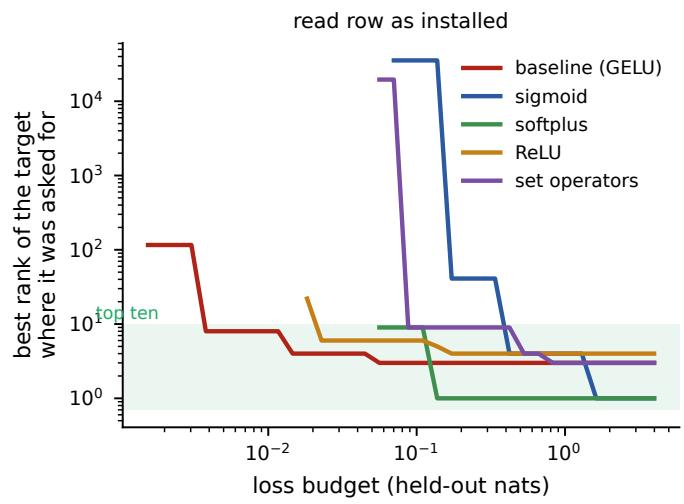

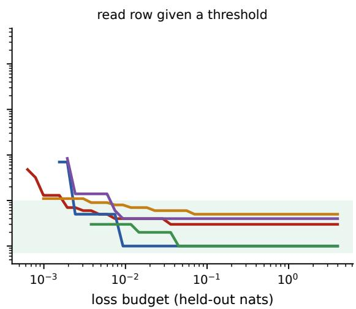  
Figure 26: The best rank the target reaches for a given held-out loss budget, at layer ten. Each frontier is taken over four compensation arms and five write strengths. Left: the read row as installed. Right: the same with a threshold subtracted from the read row, swept over three quantiles.

## What reach costs for a circuit across layers

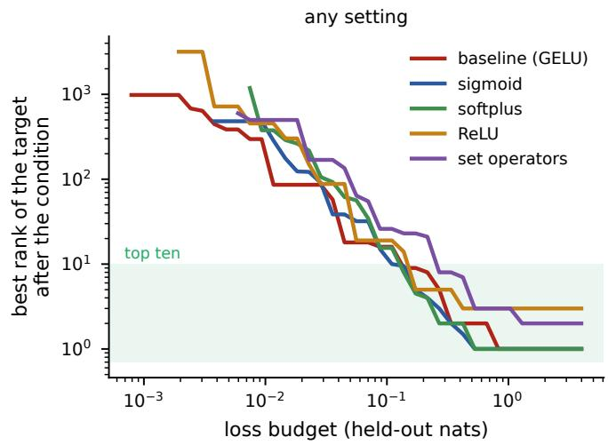

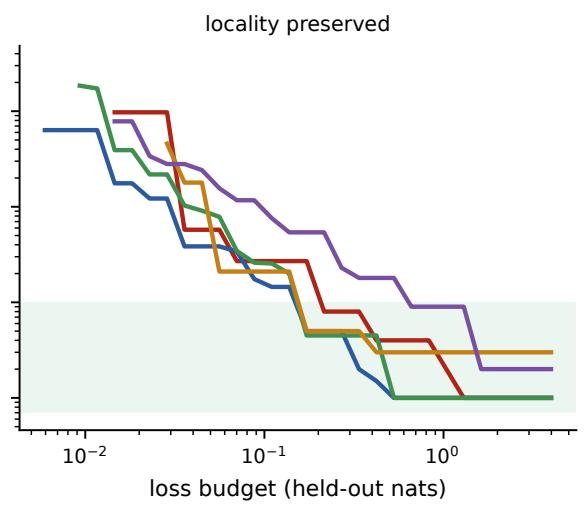  
Figure 27: The best rank the target reaches for a given held-out loss budget, over the full cross of write strength, read gain, saturation, read-row calibration and marker tilt, with heads at layers four, six, eight, nine and ten reading at layer ten. Left: any setting. Right: the same with the specificity criterion imposed, so the target may not be promoted where it was not asked for. The gap between the panels is the price of specificity.

## 5.12 Editing through the second operand

Everything above edits what a unit writes. The set-operator unit has a second place to act, on the input side, and three edits use it. What they establish is what this construction expresses directly; a conventional model can be made to express the same things, and the end of the section says how. Leaving $W _ { a }$ untouched, so the unit keeps whatever it was already triggered by, and keying $W _ { b }$ on a token C makes the intersection branch fire on its usual trigger and C and the diference branch fire on its usual trigger and not C. One write installs a conjunction and a suppressor at the same time.

It works at no cost in held-out loss. Over twelve units per layer at every depth, the intersection branch fires five times more often where C is present than where it is not, and sharpens as the gate is driven harder; the diference branch fires exactly zero where C is present, at every strength tried; and held-out loss moves from 3.156 to 3.157. The exactness is the same property that costs this family everywhere else. Section 5.9 found that a bounded activation will not, on its own, be told a new association, because $\sigma$ has no silent state. Here that is what makes the gate clean: B saturating at one makes $A \setminus B = A ( 1 - B )$ exactly zero rather than approximately zero, so the suppression is total. Boundedness is the mechanism the construction uses.

A unit that cancels its own leak. Section 5.10 installs an association into an order-preserving unit by taking the constant it leaks back out of the other units in the layer. This construction can do the same without leaving the unit. Set the intersection column to $\beta v$ and the diference column to $- \alpha \beta v$ , and what the unit contributes is

$$
\big [ A B - \alpha A ( 1 - B ) \big ] \beta v \ = \ A \big [ ( 1 + \alpha ) B - \alpha \big ] \beta v ,\tag{36}
$$

which is identically zero wherever the bracket vanishes, whatever A is doing. Choosing $\alpha = \bar { B } / ( 1 -$ $\bar { B } )$ for the resting value $\bar { B }$ of the second operand puts the zero where the unit is not wanted, and the only quantity measured is B¯. α runs from 0.56 to 1.62 with a median of 0.93, which is what both operands resting near $\begin{array} { r } { \sigma ( 0 ) = \frac { 1 } { 2 } } \end{array}$ gives. Uncompensated, an installed unit here promotes the target six times over the rest of the corpus; with the second column set this way it promotes it 0.82 times. Taking α from a high quantile of B instead over-cancels — the target is pushed back twelvefold away from the key — and passes: at $\beta = { \frac { 1 } { 2 } }$ the target moves from rank 46 to rank 6 where the key occurs and from 346 to 611 elsewhere, for 0.018 nats. It does not beat the fitted correction, which passes on 3.7 percent of attempts against this form’s 2.3, within each other’s noise at this sample. What it establishes is what the structure makes expressible: a single unit can be given a fact and silenced of it using only its own parameters, where the other arms spend part of the layer on the correction.

Installing a fact under a condition. The third edit installs a fact under a condition: fire where token A is current and token C occurred in the preceding forty-eight tokens. The feed-forward block cannot read that condition of its own position. A row $\tilde { E } [ l , C ]$ of the layer-native table is the state the layer sees when C is the current token, so keying an operand on it asks whether C is here, not whether $C$ was there; at an A-position C is not here and the gate never opens. Carrying C forward is attention’s ofice, so the condition is delivered by an attention channel installed in the same edit: the channel reads C into its value row and writes what it gathered along a private direction, and the unit’s second operand reads that direction. Five weight writes, no gradient, the two sublayers joined by hand.

Two settings are needed, and both follow from the construction rather than from tuning. The channel’s value is bounded in [0, 1], so a key row not scaled for it sits in the sigmoid’s near-linear middle and what the channel gathers barely leaves its resting level: the contrast between gathering at C and away from it is 1.02 to 1.45 times. Choosing a threshold and gain from the measured distribution of key·z instead — one quantile and one scale, nothing fitted against the target — takes that contrast to 901. And the operand that reads the marker has no of state, because $\begin{array} { r } { \sigma ( 0 ) = \frac { 1 } { 2 } } \end{array}$ and these models carry no bias parameter; supplying one from the layer’s near-constant direction takes the operand’s firing after C against elsewhere from 1.2 times to 43. The first of the two is the question Section 5.10 leaves open, where an association installed into these models’ attention channels arrived everywhere at the resting level and would not separate: scaled here, a channel does deliver a usable diference — for a marker read by a feed-forward operand, which is a weaker thing to ask of a channel than an association read at the output.

With both set, the edit lands. Over six triples, three depths and five strengths, the unit reaches the top ten where A is current and C fell in the preceding forty-eight tokens, stays out of it in both other groups, and holds held-out loss inside ten percent on 31 of 90 attempts. Its operands read A = 0.924 at those positions against 0.020 and 0.023 at the other two, and B = 0.997 against 0.002, so the intersection separates by about 130 and 90,000 times. The sharpest circuit puts the target at rank 1 where A follows C, against 10,170 where A occurs without it and 14,215 elsewhere, for 1.6 percent of loss; the cheapest moves it from rank 3902 to 9 where the condition holds, leaves it at 4869 where A occurs without C, and costs 0.2 percent. An independent replication over a diferent range of strengths passes 17 of 100.

The head is what carries the condition. Repeat every weight write and leave the attention head alone, so the operand reads a direction nothing writes, and the conditional ratio falls from 17.65 times to 1.24, with one attempt of ninety passing rather than thirty-one.

Two can play at this game. Two operands are worth less within this model than the construction suggests. Pin the second operand open, which is the same circuit with one operand and no threshold, and 8 of 90 pass — at the same conditional ratio, 18.49 against 17.65. The second operand does not sharpen the condition at all. What it does is narrow where the write happens: with one operand the target is promoted wherever C occurred regardless of A, and its rank away from both groups sits at 764 against 1616 with both operands. Put both detectors into a single read row of the same model and raise the threshold, so that a thresholded sum performs the conjunction, and 18 of 90 pass at a conditional ratio of 9.74, against the two-operand form’s 31 of 90 at 17.65 (p = 0.044 on the counts). That margin is understated rather than inflated, because the thresholded sum was given the best of five thresholds and the two-operand form was not tuned that way.

None of that makes the edit a capability of this construction. Run the same circuit on the conventional baseline — one read row carrying both detectors over a raised threshold, the head installed the same way — and 28 of 90 attempts pass, against the set-operator arm’s 31, which is not a diference at this sample; its own no-head control passes none, at a ratio of 1.34. On the sharpness of the condition the conventional unit is an order of magnitude ahead: a conditional ratio of 194.5 against 17.65, and a median rank of 1 where A follows C against 110. What the second operand buys, on the evidence here, is locality rather than the condition itself.

One part of the construction does not earn its place here. The self-cancellation of Equation 36, which suggested this edit, contributes nothing to it: 31 attempts pass with the diference column set and 31 without. The algebra says why it cannot. A \ $B = A ( 1 - B )$ is nonzero only where B is of, which is at non-A positions, while the leak that breaks the conjunction is at A-positions, where the diference column is already zero. The cancellation works for the case Equation 36 was derived for, both operands keyed on one token; it does not extend to a condition carried in from

somewhere else.

So what the second operand is worth is narrow. It buys no better reading — the K sweep of Section 5.7 put every order-preserving arm on one curve — and on the write side it buys locality rather than capability: the second operand narrows where a write lands without changing how sharply the condition binds. Two smaller things come with it, a suppressor that is exactly of rather than approximately of and a leak the unit takes back out of its own parameters instead of out of the layer. The cleverness is not in the set-operator model so much as in the fact that a conventional model can be compelled to perform the same tricks.

What the activation function changes, then, is this. An order-preserving unit reads at the instrument’s ceiling, flat in K, at a quality inside the baseline’s converged range; a conventional unit reads its strongest few inputs and then reverses, because nearly two thirds of its pre-activations sit where GELU runs backward. The order-preserving arms’ circuits are half to two thirds the size at one hop and four to seven times smaller at closure, and the handful a prediction cannot lose shrinks from thirteen to a few. The promote edit reaches twice as far before it saturates. What the change costs is the install: a bounded unit has no silent state, so a new fact leaks until the layer takes the constant back, and installing becomes a two-part edit. Three constructions with nothing in common but an order-preserving activation land on one curve, and the one that discards the negative half-line buys its extra legibility with quality — so the property doing the work is that the function does not destroy the ordering the weights supply, and nothing more elaborate is needed to get it.

## 6 Models trained by other people

Everything so far has been measured on models trained for this paper. The instrument does not depend on how a model was built, so the more useful question is what it says about models built by other people for other reasons. This section applies it unchanged to twelve of them: seven architecture families, three activation functions, eight organizations, and a range of 124 million to 7 billion parameters. None was trained, fine-tuned or modified for this. The procedure is the one in Section 2, at the same confidence floor, with the same matched random control.5 The accounting, the removal curves, the closure, the required graph and the suficiency search run on all twelve; the composition, edit, margin and horizon measurements were run on subsets, and each says which.

The accounting makes small counts visible everywhere. Every model reaches ninety percent of its prediction on a few dozen to a few hundred components, and every model reports two to three orders of magnitude more under the convention in common use (Figure 30). That the same gap appears in a 124 million parameter model from 2019 and a 7 billion parameter model from 2024, across seven independent implementations of the transformer, is the strongest evidence available here that it is a property of transformers more generally.

Llama-3.2 3B reaches ninety percent on fewer components than Gemma-3 1B, a model three times smaller (Figure 28). Across the set the share of a model carrying a single prediction falls with scale, from about two tenths of a percent in GPT-2 to a few hundredths in the largest models here. On this evidence larger models are more concentrated, though the sample does not support a curve.

The activation function shows up here too, on models nobody chose for the purpose. OPT is the only stock model in the set built on ReLU, and it has by far the least cancellation of the twelve — close to the figure measured on the ReLU arm trained for Section 5, which was built and trained independently. Whatever the bounded and half-wave activations do to how much a model’s contributions cancel, they do it in models trained by other people as readily as in ours.

Table 35: Twelve of-the-shelf models under the accounting of Section 2.3. $n _ { 9 0 }$ is the number of components reaching ninety percent of the net; “absolute” is the same quantity under the absolute-value convention; “inflation” is their ratio. The last column is where the median prediction changes when the top-ranked components are removed. Components are feed-forward units and attention (head, channel) pairs pooled together, so the totals range from 46,080 for the smallest model to 630,784 for the largest.
<table><tr><td>model</td><td>size</td><td>family</td><td>activation</td><td>preds</td><td></td><td> $n _ { 9 0 }$ </td><td>absolute</td><td>inflation</td><td>flips at k</td></tr><tr><td>GPT-2</td><td>124M</td><td>GPT-2</td><td>GELU</td><td>95</td><td></td><td>81 [62, 85]</td><td>21,390</td><td>264×</td><td>16</td></tr><tr><td>OPT</td><td>125M</td><td>OPT</td><td>ReLU</td><td>100</td><td></td><td>31 [26, 38]</td><td>3,291</td><td>106×</td><td>8</td></tr><tr><td>SmolLM2</td><td>360M</td><td>Llama</td><td>SiLU</td><td>102</td><td></td><td>60 [54, 72]</td><td>39,802</td><td>658×</td><td>8</td></tr><tr><td>Qwen2.5</td><td>0.5B</td><td>Qwen2</td><td>SiLU</td><td>93</td><td></td><td>71 [65, 82]</td><td>55,140</td><td>777×</td><td>16</td></tr><tr><td>Gemma-3</td><td>1B</td><td>Gemma</td><td>GELU</td><td>130</td><td></td><td>208 [180, 232]</td><td>66,695</td><td>321×</td><td>32</td></tr><tr><td>OLMo-2</td><td>1B</td><td>OLMo-2</td><td>SiLU</td><td>114</td><td></td><td>76 [65, 85]</td><td>62,299</td><td>820×</td><td>32</td></tr><tr><td>Llama-3.2</td><td>1B</td><td>Llama</td><td>SiLU</td><td>67</td><td></td><td>101 [92, 121]</td><td>63,285</td><td>627×</td><td>8</td></tr><tr><td>TinyLlama</td><td>1.1B</td><td>Llama</td><td>SiLU</td><td>134</td><td></td><td>136 [124, 153]</td><td>50,564</td><td>372×</td><td>32</td></tr><tr><td>Qwen2.5</td><td>1.5B</td><td>Qwen2</td><td>SiLU</td><td>107</td><td></td><td>132 [115, 147]</td><td>115,729</td><td>877×</td><td>32</td></tr><tr><td>Llama-3.2</td><td>3B</td><td>Llama</td><td>SiLU</td><td>70</td><td>162</td><td>[142, 183]</td><td>122,212</td><td>752×</td><td>16</td></tr><tr><td>Qwen2.5</td><td>7B</td><td>Qwen2</td><td>SiLU</td><td>79</td><td></td><td>191 [168, 216]</td><td>210,394</td><td>1102×</td><td>32</td></tr><tr><td>Mistral</td><td>7B</td><td>Mistral</td><td>SiLU</td><td>90</td><td></td><td>330 [282, 360]</td><td>194,783</td><td>590×</td><td>64</td></tr></table>

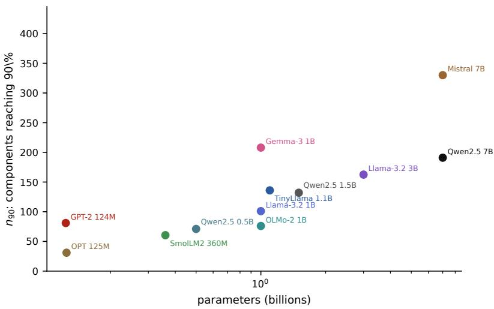  
Figure 28: Circuit size against parameter count, one point per model. Across a 56× span in parameters n90 spans 10.6×, and the spread within a size band is wide: the three 1B models range from 76 to 208. Circuit size grows far more slowly than the model, so the fraction of a model carrying one prediction falls with scale. The removal curves these points summarize are Figure 29.

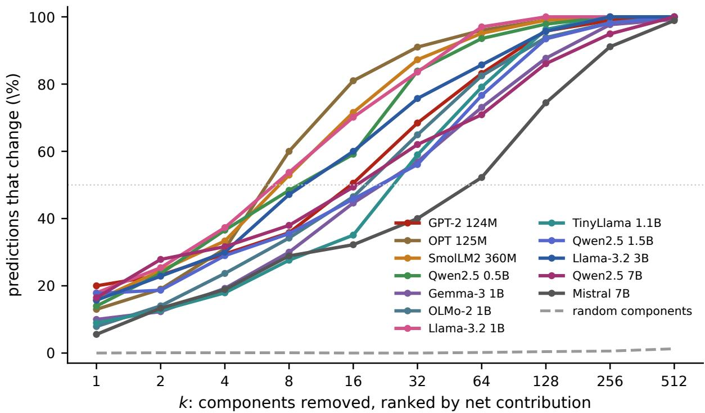  
Figure 29: Removing the top-ranked components changes the prediction in all twelve models; removing the same number at random does not. The random control is pooled across the set and stays below five percent until k exceeds a hundred.

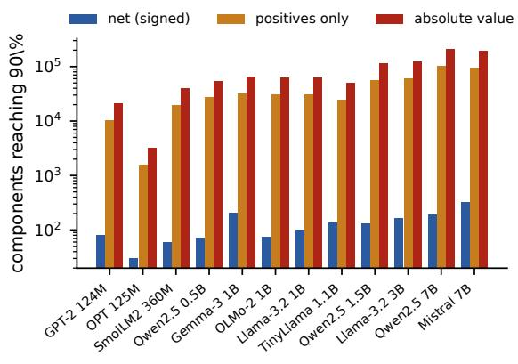

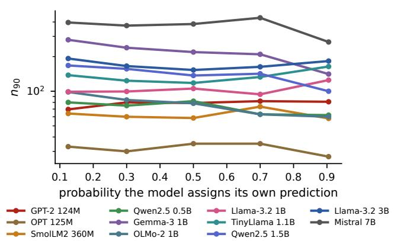  
Figure 30: Left: the three denominators across the twelve models, on a log axis. The gap between the signed convention and the others is two to three orders of magnitude in every one. Right: circuit size against the confidence of the prediction, which is why all figures here are read at one floor.

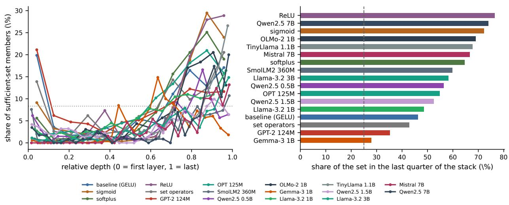

## 6.1 Composition

Table 36: What the one-hop sets are made of, for the models where that measurement was run. “Last quarter” is the share of members in the final quarter of layers, against 25 percent if membership were spread evenly; these are shares of direct contribution, which is where a prediction is credited rather than necessarily where it is decided. “Seen once” is the share of distinct components appearing in exactly one prediction. Figure 31 asks the same two questions of the suficient sets, which are the smaller object and cover fewer models.
<table><tr><td>model</td><td>layers</td><td>n90</td><td>last quarter</td><td>attention</td><td>seen once</td></tr><tr><td>GPT-2 124M</td><td>12</td><td>77</td><td>67%</td><td>22%</td><td>72%</td></tr><tr><td>OPT 125M</td><td>12</td><td>30</td><td>76%</td><td>33%</td><td>72%</td></tr><tr><td>SmolLM2 360M</td><td>32</td><td>59</td><td>93%</td><td>26%</td><td>79%</td></tr><tr><td>Qwen2.5 0.5B</td><td>24</td><td>75</td><td>87%</td><td>24%</td><td>77%</td></tr><tr><td>Gemma-3 1B</td><td>26</td><td>193</td><td>55%</td><td>40%</td><td>74%</td></tr><tr><td>OLMo-2 1B</td><td>16</td><td>64</td><td>92%</td><td>38%</td><td>80%</td></tr><tr><td>Llama-3.2 1B</td><td>16</td><td>95</td><td>85%</td><td>34%</td><td>78%</td></tr><tr><td>TinyLlama 1.1B</td><td>22</td><td>126</td><td>92%</td><td>37%</td><td>71%</td></tr><tr><td>Qwen2.5 1.5B</td><td>28</td><td>130</td><td>87%</td><td>34%</td><td>82%</td></tr><tr><td>Llama-3.2 3B</td><td>28</td><td>153</td><td>80%</td><td>37%</td><td>80%</td></tr><tr><td>Mistral 7B</td><td>32</td><td>327</td><td>81%</td><td>30%</td><td>79%</td></tr></table>

Figure 31: Where the suficient circuits sit, across every model the search was run on. Left: share of the set’s members by relative depth, one line per model; the dotted line is what an even spread would give. Right: the share falling in the last quarter of the stack, against the 25 percent an even spread would put there. Members are those of the pruned suficient sets of Section 2.5, not of the one-hop accounting.

The circuits sit late, in every model. The last quarter of the stack holds 28 to 76 percent of a suficient set where an even spread would put 25, and no model here falls below that line (Figure 31). They are also mostly specific to the prediction they were found for: between 79 and 100 percent of the distinct components in a model’s sets appear in exactly one of them, so a small shared remainder does the recurring work and the rest does not recur at all.

Attention supplies between 22 and 40 percent of the components in the one-hop sets (Table 36), so a trace restricted to the feed-forward stack would be missing between a fifth and two fifths of the machinery. Neither this share nor the two above sort by architecture family, by size, or by activation: the two Llama-3.2 models sit at 34 and 37 percent and the two Qwen models at 24 and 34, ranges that overlap. Whatever sets any of them is not visible at this sample size.

## 6.2 The whole dependency graph

The recursion of Appendix D.1 extends to these models unchanged. Every one of them closes, at seven to ten levels, on fifty to a hundred predictions each.

Table 37: The backward dependency graph, closed, for the twelve models trained by other people. Columns as in Table 27.
<table><tr><td colspan="2"></td><td colspan="2">graph</td><td colspan="3"></td><td colspan="2">ablated</td></tr><tr><td>model</td><td>preds</td><td>one hop</td><td>closed</td><td>levels</td><td>% of model</td><td>attn heads</td><td>closure</td><td>random</td></tr><tr><td>GPT-2 124M</td><td>95</td><td>81</td><td>984</td><td>7</td><td>2.14%</td><td>100/144</td><td>97%</td><td>2%</td></tr><tr><td>OPT 125M</td><td>100</td><td>31</td><td>700</td><td>8</td><td>1.52%</td><td>82/144</td><td>100%</td><td>1%</td></tr><tr><td>SmolLM2 360M</td><td>86</td><td>62</td><td>3822</td><td>8</td><td>3.39%</td><td>276/480</td><td>100%</td><td>7%</td></tr><tr><td>Qwen2.5 0.5B</td><td>74</td><td>74</td><td>2406</td><td>8</td><td>1.74%</td><td>210/336</td><td>100%</td><td>3%</td></tr><tr><td>Gemma-3 1B</td><td>84</td><td>215</td><td>3224</td><td>8</td><td>1.56%</td><td>103/104</td><td>99%</td><td>6%</td></tr><tr><td>OLMo-2 1B</td><td>77</td><td>75</td><td>3483</td><td>9</td><td>2.13%</td><td>189/256</td><td>99%</td><td>6%</td></tr><tr><td>Llama-3.2 1B</td><td>67</td><td>101</td><td>1831</td><td>8</td><td>1.12%</td><td>258/512</td><td>100%</td><td>3%</td></tr><tr><td>TinyLlama 1.1B</td><td>89</td><td>141</td><td>4540</td><td>9</td><td>2.69%</td><td>364/704</td><td>100%</td><td>6%</td></tr><tr><td>Qwen2.5 1.5B</td><td>73</td><td>127</td><td>4076</td><td>8</td><td>1.39%</td><td>250/336</td><td>99%</td><td>3%</td></tr><tr><td>Llama-3.2 3B</td><td>52</td><td>158</td><td>3726</td><td>9</td><td>1.18%</td><td>348/672</td><td>100%</td><td>2%</td></tr><tr><td>Qwen2.5 7B</td><td>50</td><td>188</td><td>8602</td><td>9</td><td>1.36%</td><td>486/784</td><td>100%</td><td>6%</td></tr><tr><td>Mistral 7B</td><td>56</td><td>356</td><td>11114</td><td>10</td><td>1.88%</td><td>620/1024</td><td>98%</td><td>7%</td></tr></table>

Table 38: The required graph for the twelve models trained by other people, defined as in Table 28.
<table><tr><td rowspan="2">model</td><td colspan="2">graph</td><td colspan="4">required</td></tr><tr><td>one hop</td><td>closed</td><td>components</td><td>% of one hop</td><td>% of model</td><td>defined on</td></tr><tr><td>GPT-2 124M</td><td>81</td><td>984</td><td>12</td><td>15%</td><td>0.026%</td><td>92%</td></tr><tr><td>OPT 125M</td><td>31</td><td>700</td><td>6</td><td>19%</td><td>0.013%</td><td>93%</td></tr><tr><td>SmolLM2 360M</td><td>62</td><td>3822</td><td>8</td><td>13%</td><td>0.007%</td><td>97%</td></tr><tr><td>Qwen2.5 0.5B</td><td>74</td><td>2406</td><td>8</td><td>11%</td><td>0.006%</td><td>93%</td></tr><tr><td>Gemma-3 1B</td><td>215</td><td>3224</td><td>22</td><td>10%</td><td>0.011%</td><td>93%</td></tr><tr><td>OLMo-2 1B</td><td>75</td><td>3483</td><td>14</td><td>19%</td><td>0.009%</td><td>91%</td></tr><tr><td>Llama-3.2 1B</td><td>101</td><td>1831</td><td>7</td><td>7%</td><td>0.004%</td><td>100%</td></tr><tr><td>TinyLlama 1.1B</td><td>141</td><td>4540</td><td>26</td><td>18%</td><td>0.015%</td><td>99%</td></tr><tr><td>Qwen2.5 1.5B</td><td>127</td><td>4076</td><td>12</td><td>9%</td><td>0.004%</td><td>89%</td></tr><tr><td>Llama-3.2 3B</td><td>158</td><td>3726</td><td>14</td><td>9%</td><td>0.004%</td><td>100%</td></tr><tr><td>Qwen2.5 7B</td><td>188</td><td>8602</td><td>9</td><td>5%</td><td>0.001%</td><td>94%</td></tr><tr><td>Mistral 7B</td><td>356</td><td>11114</td><td>34</td><td>10%</td><td>0.006%</td><td>86%</td></tr></table>

Tables 37 and 38 say three things. The first is that the graph closes at all, in every model. Following “what does this need” from a prediction all the way back terminates on a few percent of the model’s components. The share does not grow with size: Mistral-7B, sixty times the size of GPT-2, closes on a slightly smaller fraction of itself than GPT-2 does.

The second is that the required graph is two orders of magnitude smaller than the closure, and does not grow with the model either. A prediction from a seven-billion-parameter model can be changed by removing thirty-four components. Removing the closure changes the prediction almost always, where removing a size-matched random set almost never does.

The third is that the branching factor in the wild does not sort by activation function. It runs from 16 to 119, almost an order of magnitude among conventional activations alone, and the intervals interleave (Figure 32): OPT’s ReLU at 16 [14, 18] overlaps GPT-2’s GELU at 20 [16, 25], and Llama-3.2 1B’s SiLU at 24 [22, 30] overlaps Gemma-3’s GELU at 22 [18, 30]. The controlled comparison of Section 5.6 holds everything but the feed-forward unit fixed and finds a clean separation; these models hold nothing fixed and show none. Of the two statements about the same quantity, only the first isolates the activation function. Nothing here supports reading a branching factor of a model’s activation function without the rest of the training held fixed.

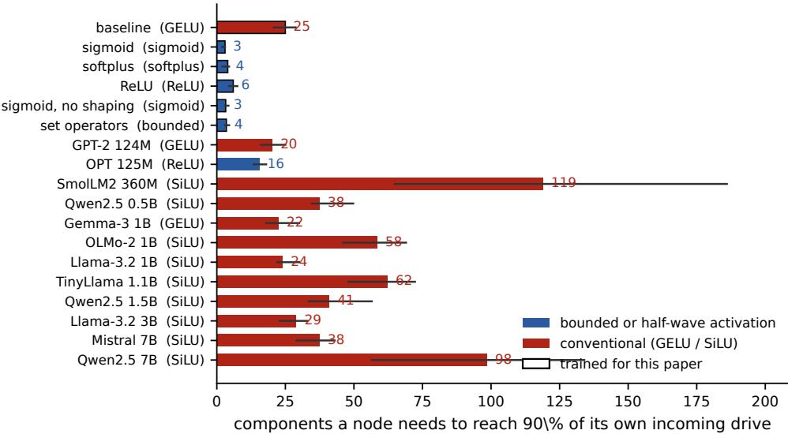  
Figure 32: Branching factor with bootstrap intervals, every model in this paper. Outlined bars are the models trained here, which difer from one another only in the feed-forward unit; the rest hold nothing fixed.

## 6.3 The smallest suficient set across models

Section 2.5 measures, on the baseline, the smallest set of components that reproduces a prediction when everything else at that position is zeroed. The measurement depends on neither the construction nor who trained the model.

Table 39: Suficiency on GPT-2, one of the twelve. “Keep-more” is the rise in preservation from keeping nothing to keeping 2,048 components, the check that keeping more helps.
<table><tr><td rowspan="2">model</td><td colspan="2">set size</td><td colspan="4">prediction preserved keeping only</td><td rowspan="2">keep-more</td></tr><tr><td>one hop</td><td>closure</td><td>one hop</td><td>closure</td><td>top-|C|</td><td>random</td></tr><tr><td>GPT-2 124M</td><td>69</td><td>130</td><td>50%</td><td>71%</td><td>64%</td><td>4%</td><td>+93</td></tr></table>

Suficiency reads the same way here as on the models trained for this paper: the closure does not reproduce a prediction reliably and a same-sized set taken further down the one-hop ranking does better (Table 39, in full in Appendix D). What does reproduce a prediction is the small set of Section 2.5, which behaves on these models as it does on the ones trained here.

Table 40: The smallest set that reproduces a prediction, across models. Columns as in Table 7. “Floor” is the share of predictions the token embedding alone already returns; those are excluded from the columns to its right, because no set kept on top of the floor can be credited with the answer. “Converged” is how many of the sampled predictions Algorithm 1 verified, and the size and the controls are over those.
<table><tr><td colspan="6"></td><td colspan="2">same size, other sets</td><td></td></tr><tr><td>model</td><td>preds</td><td>floor</td><td>converged</td><td>size</td><td>top-k</td><td>random</td><td>% of model</td></tr><tr><td>baseline (GELU)</td><td>150</td><td>12%</td><td>115</td><td>8</td><td>7%</td><td>0%</td><td>0.017%</td></tr><tr><td>sigmoid</td><td>150</td><td>12%</td><td>86</td><td>12</td><td>6%</td><td>0%</td><td>0.026%</td></tr><tr><td>softplus</td><td>150</td><td>12%</td><td>102</td><td>10</td><td>6%</td><td>0%</td><td>0.023%</td></tr><tr><td>ReLU</td><td>150</td><td>12%</td><td>125</td><td>13</td><td>2%</td><td>0%</td><td>0.028%</td></tr><tr><td>sigmoid, no shaping</td><td>150</td><td>12%</td><td>102</td><td>15</td><td>2%</td><td>0%</td><td>0.033%</td></tr><tr><td>set operators</td><td>150</td><td>12%</td><td>101</td><td>21</td><td>1%</td><td>0%</td><td>0.076%</td></tr><tr><td>GPT-2 124M</td><td>150</td><td>5%</td><td>131</td><td>6</td><td>1%</td><td>0%</td><td>0.013%</td></tr><tr><td>OPT 125M</td><td>150</td><td>2%</td><td>141</td><td>16</td><td>7%</td><td>0%</td><td>0.035%</td></tr><tr><td>SmolLM2 360M</td><td>150</td><td>5%</td><td>97</td><td>3</td><td>8%</td><td>0%</td><td>0.003%</td></tr><tr><td>Qwen2.5 0.5B</td><td>150</td><td>1%</td><td>71</td><td>4</td><td>15%</td><td>0%</td><td>0.003%</td></tr><tr><td>OLMo-2 1B</td><td>150</td><td>0%</td><td>100</td><td>2</td><td>19%</td><td>0%</td><td>0.001%</td></tr><tr><td>Gemma-3 1B</td><td>150</td><td>0%</td><td>134</td><td>2</td><td>22%</td><td>0%</td><td>0.001%</td></tr><tr><td>Llama-3.2 1B</td><td>150</td><td>0%</td><td>60</td><td>6</td><td>2%</td><td>0%</td><td>0.004%</td></tr><tr><td>TinyLlama 1.1B</td><td>150</td><td>4%</td><td>121</td><td>2</td><td>12%</td><td>0%</td><td>0.001%</td></tr><tr><td>Qwen2.5 1.5B</td><td>150</td><td>1%</td><td>65</td><td>3</td><td>12%</td><td>0%</td><td>0.001%</td></tr><tr><td>Llama-3.2 3B</td><td>150</td><td>0%</td><td>102</td><td>4</td><td>8%</td><td>0%</td><td>0.001%</td></tr><tr><td>Mistral 7B</td><td>60</td><td>0%</td><td>47</td><td>2</td><td>21%</td><td>0%</td><td>0.000%</td></tr><tr><td>Qwen2.5 7B</td><td>60</td><td>0%</td><td>32</td><td>2</td><td>22%</td><td>0%</td><td>0.000%</td></tr></table>

Every model the search was run on has such sets, of two to twenty-one components out of tens of thousands (Table 40). The range holds from 124 million parameters to seven billion, and the largest models sit at its small end: Mistral 7B and Qwen2.5 7B rest on two components each, three parts in a million of the model.

The search does not finish on every prediction. The repair step is given a fixed number of rounds, and where it runs out the kept set never becomes suficient and there is nothing to report. Those predictions are counted in the “converged” column and excluded from everything to its right. The measurement covers all six models trained here and all twelve taken of the shelf. The controls behave the same way everywhere too. A set of that size drawn at random reproduces the prediction on no prediction of any model — not one — so whatever these sets are doing is not a property of their size, and not an artifact of a test that deletes the competition along with everything else. The plain contribution ranking at the same size manages 0 to 22 percent, which is the closest any control comes.

## 6.4 Naming a component and acting on the name

Saying what a component is for is a stronger claim than identifying which components carry a prediction, and the way to test it is to act on the name and see where the consequences land. A component’s parameters name a scope with nothing fitted: the tokens its write column promotes, read through the unembedding. Amplifying the component and asking which logits move then has a right answer fixed in advance.

Dropping the sign that scope carries loses the result on the gated models. A component’s efect on the logits is $a _ { u } c _ { u }$ rather than $c _ { u }$ . In a gated feed-forward the write-site value is $\phi ( W _ { g } x ) \odot ( W _ { v } x )$

and the value branch is linear and unbounded, so $a _ { u }$ is freely signed: on Qwen2.5-1.5B and Llama-3.2-1B, 47 and 48 percent of the components carrying a prediction fire negative. For those, reading the scope of $c _ { u }$ alone inverts the targets, so amplifying the component moves the named tokens the wrong way. Table 41 shows the consequence, which is not subtle: read without the sign, edits on negative-firing components land correctly 4 to 11 percent of the time, and the models as a whole score barely above chance. Ungated models are untouched, because almost none of their components fire negative — zero percent in GPT-2. Reading the scope with the sign the component actually has fixes it everywhere.

Table 41: What the sign of the activation is worth. “Fire negative” is the share of prediction-carrying components whose write-site value is negative. The middle columns score edits against a scope read from the write column alone; the last reads it with the activation’s sign. The failure is confined to gated feedforwards and to exactly the components that fire negative.
<table><tr><td colspan="3"></td><td colspan="2">scope read without the sign</td><td>with</td></tr><tr><td>model</td><td>feed-forward fire negative</td><td></td><td>all</td><td>negative-firing</td><td>the sign</td></tr><tr><td>GPT-2 124M</td><td>ungated</td><td>0%</td><td>97%</td><td></td><td>97%</td></tr><tr><td>baseline (GELU)</td><td>ungated</td><td>4%</td><td>92%</td><td>0%</td><td>96%</td></tr><tr><td>Llama-3.2-1B</td><td>gated</td><td>48%</td><td>52%</td><td>4%</td><td>96%</td></tr><tr><td>Qwen2.5-1.5B</td><td>gated</td><td>47%</td><td>57%</td><td>11%</td><td>97%</td></tr></table>

Table 42: An edit installed in one component, scored against the scope its own parameters name and against the scopes of the other components edited in the same predictions, at matched strength. The last column is the share of edits moving their own scope more than another component’s, across all strengths and all edits.
<table><tr><td>model</td><td>own scope</td><td>other scopes</td><td>random tokens</td><td>respects the name</td></tr><tr><td>GPT-2 124M</td><td>1.94</td><td>0.63</td><td>0.14</td><td>97%</td></tr><tr><td>Llama-3.2-1B</td><td>1.05</td><td>0.02</td><td>-0.01</td><td>96%</td></tr><tr><td>Qwen2.5-1.5B</td><td>0.69</td><td>-0.06</td><td>-0.06</td><td>94%</td></tr></table>

With the scope read correctly, Table 42 reports the test on the three models taken of the shelf it was run on. In every one, an edit moves what the parameters said it would and leaves the other components’ targets alone, in 94 to 97 percent of cases — 97 on the baseline (Table 20) and 100 on the sigmoid model (Table 32). This asks the parameters to predict the consequence of an intervention rather than merely to rank components.

## 6.5 Where the instruments are stressed

Two of the choices made in Section 2 looked like bookkeeping on the model they were demonstrated on. Across twelve models they are not, and this is where that shows.

The raw drop disagrees with the margin about the direction of the efect in up to forty-five percent of cases, and in two models it is not monotone in k, reporting the impossibility that removing more components did less damage. Both failures are invisible on the baseline. Numbers elsewhere in this paper would be impossible without the correction: measured in raw logits, the ratio of realized to predicted efect is negative for GPT-2.

Table 43: The raw logit drop against the margin, on models where they diverge. Sign disagreement is how often the two disagree about the direction of an efect; non-monotone steps count the times the median drop falls as more components are removed. Target logits span two orders of magnitude across these models, so raw drops are not comparable between rows either.
<table><tr><td colspan="2"></td><td colspan="2">sign disagreement</td><td colspan="2">non-monotone steps</td></tr><tr><td>model</td><td>target logit</td><td>median</td><td>worst</td><td>raw</td><td>margin</td></tr><tr><td>GPT-2 124M</td><td>-77.8</td><td>39%</td><td>45%</td><td>4</td><td>0</td></tr><tr><td>OLMo-2 1B</td><td>5.3</td><td>30%</td><td>40%</td><td>2</td><td>0</td></tr><tr><td>Qwen2.5 1.5B</td><td>23.6</td><td>5%</td><td>17%</td><td>0</td><td>0</td></tr></table>

## 6.6 What the constructions are worth

The twelve models above show the lens works on models other groups have trained; what the constructions of Section 5 add is a population that difers sharply by construction, in the direction this paper argues. Figure 33 and Table 44 show it across every model in the paper. The five constructions trained here for legibility all sit well above their own GELU baseline, which matches them in width, data and schedule, and the models trained by other people sit lower still — most of them below that baseline. At the median, roughly two thirds of units are token-shaped in the models built to be read, against about a third in the rest.

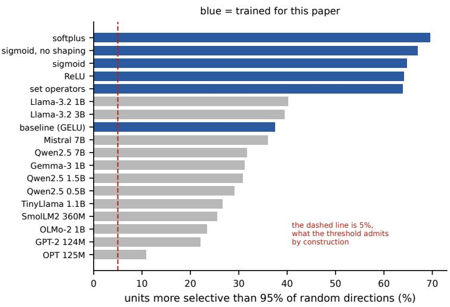

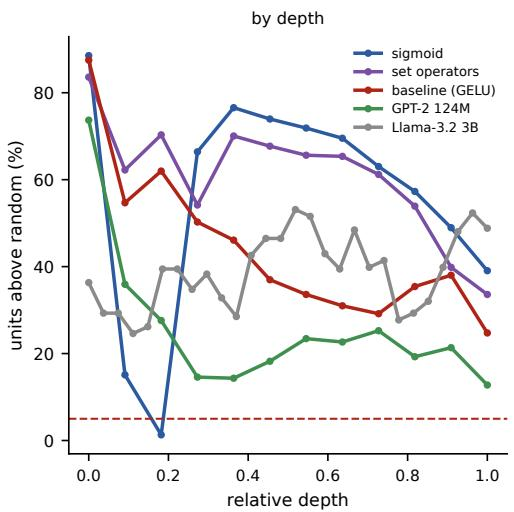  
Figure 33: Left: the share of feed-forward units whose response to candidate tokens is more concentrated than 95 percent of random directions in the same layer. The dashed line is the 5 percent such a threshold admits by construction, so it is the level a model with no token-selective units would show. Right: the same quantity against relative depth. The constructions trained here hold their level through the body of the network, and the conventional baseline declines with depth.

The reading of Section 2.6 does not depend on the construction either. Across nine models the circuit is worth no more than an equally sized random set for the tokens that follow: the per-prediction ratio stays between 0.73 and 1.07 at every horizon from sixteen to five hundred and twelve (Table 45).

The lens transfers unchanged. The gap between the signed count and the conventions in common use is two to three orders of magnitude in every implementation from 2019 to 2024; the set that builds a prediction runs from two components to sixteen, with the largest models at the small end and the fraction of a model behind one prediction falling with scale; on gated feed-forwards the sign of the activation has to travel with the name, and with it an edit lands where the parameters said it would. The constructions’ extra legibility is real, and none of it is needed to read a stock model. Conventional transformers can be read at the level of which components carry a prediction. They are not opaque blobs of computation. They are large collections of interwoven circuits whose predictions mostly cancel, carrying the architecture’s own management work alongside the few components that decide the token.

Table 44: Token selectivity by model. “Top-8 share” is the fraction of a unit’s positive response carried by its eight strongest tokens, and “random” is the same statistic for random directions in the same layer — the comparison that makes the first column mean anything. “Rank recovery” is how well a unit’s top eight reproduce its full ranking over tokens, with the random value in parentheses. Rows are medians over layers.
<table><tr><td>model</td><td>layers</td><td>top-8 share</td><td>random</td><td>units above random</td><td>rank recovery</td><td></td></tr><tr><td>trained here</td><td></td><td></td><td></td><td></td><td></td><td></td></tr><tr><td>softplus</td><td>12</td><td>0.120</td><td>0.098</td><td></td><td>70%</td><td>0.61 (0.48)</td></tr><tr><td>sigmoid, no shaping</td><td>12</td><td>0.118</td><td>0.097</td><td></td><td>67%</td><td>0.60 (0.49)</td></tr><tr><td>sigmoid</td><td>12</td><td>0.117</td><td>0.098</td><td></td><td>65%</td><td>0.63 (0.49)</td></tr><tr><td>ReLU</td><td>12</td><td>0.115</td><td>0.098</td><td></td><td>64%</td><td>0.57 (0.50)</td></tr><tr><td>set operators</td><td>12</td><td>0.117</td><td>0.097</td><td></td><td>64%</td><td>0.63 (0.48)</td></tr><tr><td>baseline (GELU)</td><td>12</td><td>0.108</td><td>0.097</td><td></td><td>38%</td><td>0.58 (0.48)</td></tr><tr><td>off the shelf</td><td></td><td></td><td></td><td></td><td></td><td></td></tr><tr><td>Llama-3.2 1B</td><td>16</td><td>0.108</td><td>0.098</td><td></td><td>40%</td><td>0.53 (0.44)</td></tr><tr><td>Llama-3.2 3B</td><td>28</td><td>0.139</td><td>0.125</td><td></td><td>39%</td><td>0.54 (0.45)</td></tr><tr><td>Mistral 7B</td><td>32</td><td>0.138</td><td>0.126</td><td></td><td>36%</td><td>0.49 (0.44)</td></tr><tr><td>Qwen2.5 7B</td><td>28</td><td>0.138</td><td>0.126</td><td></td><td>32%</td><td>0.50 (0.47)</td></tr><tr><td>Gemma-3 1B</td><td>26</td><td>0.108</td><td>0.098</td><td></td><td>31%</td><td>0.48 (0.47)</td></tr><tr><td>Qwen2.5 1.5B</td><td>28</td><td>0.135</td><td>0.125</td><td></td><td>31%</td><td>0.51 (0.49)</td></tr><tr><td>Qwen2.5 0.5B</td><td>24</td><td>0.104</td><td>0.098</td><td></td><td>29%</td><td>0.53 (0.49)</td></tr><tr><td>TinyLlama 1.1B</td><td>22</td><td>0.104</td><td>0.098</td><td></td><td>27%</td><td>0.47 (0.42)</td></tr><tr><td>SmolLM2 360M</td><td>32</td><td>0.105</td><td>0.098</td><td></td><td>26%</td><td>0.51 (0.47)</td></tr><tr><td>OLMo-2 1B</td><td>16</td><td>0.106</td><td>0.101</td><td></td><td>23%</td><td>0.48 (0.45)</td></tr><tr><td>GPT-2 124M</td><td>12</td><td>0.098</td><td>0.098</td><td></td><td>22%</td><td>0.50 (0.48)</td></tr><tr><td>OPT 125M</td><td>12</td><td>0.083</td><td>0.081</td><td></td><td>11%</td><td>0.44 (0.41)</td></tr></table>

Table 45: Whether a circuit is worth more than an equally sized random set for the tokens that follow the prediction, at six horizons nested on one set of positions. Columns as in Table 10; 1.00 means it is worth no more. Measured at each model’s training context, except GPT-2 and OPT, which cap at 1024 positions.
<table><tr><td colspan="4"></td><td colspan="6">tokens after the prediction</td></tr><tr><td rowspan="2">model</td><td rowspan="2">preds</td><td rowspan="2">at it</td><td rowspan="2">16</td><td rowspan="2">32</td><td rowspan="2"></td><td rowspan="2">64</td><td rowspan="2">128</td><td rowspan="2">256</td><td rowspan="2">512</td></tr><tr><td></td></tr><tr><td>baseline (GELU)</td><td>206</td><td>0.25</td><td>0.98</td><td>0.98</td><td>0.99</td><td>0.99</td><td></td><td>0.99</td><td>0.98</td></tr><tr><td>sigmoid</td><td>206</td><td>-0.04</td><td>0.97</td><td>1.00</td><td>1.00</td><td></td><td>0.99</td><td>0.99</td><td>1.00</td></tr><tr><td>softplus</td><td>202</td><td>0.00</td><td>1.00</td><td>0.99</td><td></td><td>0.99</td><td>0.99</td><td>0.99</td><td>0.99</td></tr><tr><td>ReLU</td><td>194</td><td>0.05</td><td>1.00</td><td>1.00</td><td></td><td>1.00</td><td>0.99</td><td>0.99</td><td>0.98</td></tr><tr><td>set operators</td><td>200</td><td>0.08</td><td>0.97</td><td>0.96</td><td></td><td>0.94</td><td>0.91</td><td>0.94</td><td>0.83</td></tr><tr><td>GPT-2 124M</td><td>201</td><td>0.25</td><td>1.00</td><td></td><td>1.02</td><td>1.04</td><td>1.07</td><td>1.07</td><td>1.07</td></tr><tr><td>OPT 125M</td><td>213</td><td>0.08</td><td>0.94</td><td></td><td>0.95</td><td>0.94</td><td>0.94</td><td>0.95</td><td>0.95</td></tr><tr><td>SmolLM2 360M</td><td>240</td><td>0.70</td><td>0.73</td><td></td><td>0.83</td><td>0.86</td><td>0.87</td><td>0.83</td><td>0.80</td></tr><tr><td>OLMo-2 1B</td><td>245</td><td>0.88</td><td>1.00</td><td></td><td>0.99</td><td>0.99</td><td>0.99</td><td>0.99</td><td>0.90</td></tr></table>

## 7 Related work

Every ingredient this paper uses has been built before. What difers from prior work is one accounting choice and the object it is applied to. This section says which parts are inherited and from where.

Reading a component from its parameters. Projecting a feed-forward component’s write into vocabulary space is established practice. Geva et al. [21] characterize feed-forward layers as key–value memories, and Geva et al. [22] read their value vectors as promoting concepts in the vocabulary; Dar et al. [14] treat the parameters themselves as objects in embedding space. The logit lens [38] and the tuned lens [6] apply the same projection to intermediate residual states, and Bommasani et al. [8] distill static token representations by averaging contextual ones. Of the layer-native table of Section 2, a member of this family, only the substitution protocol is specific to this work.

Decomposing a prediction. The residual stream framework of Elhage et al. [17] makes a logit an exact sum of per-component terms, which is what allows a prediction to be attributed at all. Two lines qualify what that sum means. Janiak et al. [26] show that components write in opposing directions, measuring in a four-layer trained transformer one head whose output is about ninety percent removed downstream and a correlation of −0.70 between writing and erasing components. They propose no corrected attribution metric, recommending instead that direct attribution be paired with activation patching, which is the procedure this paper adopts. Separately, McGrath et al. [35] and Rushing and Nanda [46] show that ablating a component causes others to compensate. Together these predict that a linear attribution will overstate what removing a component actually does, which Table 4 measures directly. McDougall et al. [34] describe attention heads whose function is to suppress a token the model is about to copy. Appendix C.8 asks whether suppression of that kind is visible above its floor in the models here, and finds the negative side of a token’s accounting indistinguishable from a control token’s.

Prediction-specific graphs built backward. The recursion of Appendix D.1 — start at the prediction, keep what feeds it above a threshold, repeat — is a shape that already exists. Ferrando and Voita [19] build exactly such a graph top-down for a single prediction, with nodes as token representations, edges as whole operations (an attention head, a feed-forward layer), and importance given by an ALTI proximity score that is non-negative by construction. Abnar and Zuidema [1] aggregate attention across layers as a maximum flow, choosing that formulation because paths through a transformer share edges and summing path weights would double-count. Neither the backward construction nor the observation that paths overlap originates here.

Three things difer in what this section measures rather than in what it constructs. The unit is a single component — one feed-forward unit, one attention channel — rather than an operation or a token representation, so an edge relates two components rather than two layers. The edge weight keeps its sign, which is the distinction Section 2.3 is about; a score defined as non-negative, or a capacity in a flow network, is the convention that section argues changes the answer by orders of magnitude. And the object reported is the size of the graph and what survives removing it: that the recursion reaches a fixed point, on how many components, what fraction of the model that is, and which part of it a prediction cannot survive losing. Ferrando and Voita [19] report routes and visualizations rather than sizes, and validate against previously published patched circuits rather than by ablating their own graphs.

Circuit discovery. Automated methods locate the components responsible for a behavior: ACDC prunes a computational graph [11], edge attribution patching approximates that search with gradients [52], and AtP\* makes the localization eficient at scale [27]. The reported sizes live in diferent bases and are not directly comparable to one another. Wang et al. [57] identify twenty-six attention heads for indirect object identification; Marks et al. [33] report on the order of a hundred sparse-autoencoder features, and separately about fifteen hundred raw neurons, under datasetlevel faithfulness and completeness measured on a mean-ablation baseline; the attribution graphs of Ameisen et al. [2] operate on cross-layer transcoder features and prune a representative graph from 236 nodes to 55. Those graphs rank paths by the absolute value of edge weights, and the pipelines built on them accumulate absolute influence against its total. This paper keeps the sign and divides by the net. That normalization is not new: Chen et al. [10] call the signed-sum share the standard one, and Salek and Enguehard [47] take the net change in the output as the reference quantity an attribution should sum to, noting that when attributions cancel their absolute total exceeds it. What Table 3 adds is the consequence for circuit size, which does not appear to have been measured: on the same predictions and the same attribution, the conventions difer by two to three orders of magnitude in how many components reach ninety percent.

Chen et al. [10] also supply the sharpest caution. Their credit is propagated recursively through a multi-layer path expansion, where a small signed denominator compounds with depth, and they report that a pure signed denominator degrades their ranking to chance; their remedy floors its magnitude at a fraction of the absolute mass. The quantity here is a single sum over components at one position, with no recursion. A signed denominator is demonstrably unsafe once it is iterated.

The neuron basis. Whether raw neurons are an adequate basis is unsettled. Ameisen et al. [2] report that thresholded neurons underperform their transcoder dictionaries on interpretability metrics, which is part of the motivation for working in a learned basis at all. Arora et al. [3] reach the opposite conclusion, reporting that approximately one hundred MLP neurons sufice to control behavior on a subject–verb agreement benchmark and that neuron-basis circuits are as sparse as feature-basis ones. They also trace a neuron circuit for a single prompt on an of-the-shelf model, narrowing 257 attributed neurons to 23 by manual curation and steering, and identify one neuron that flips the top output. That is the closest published work to Section 2. It difers in what is asked of the set: their nodes are selected by a per-component attribution threshold and validated by steering, where the sets here are required to change the prediction when removed and are read against a control that removes the same number of components at random. Their attribution also targets a sum over several candidate tokens rather than one logit, and does not place attention on the same footing as feed-forward units.

What ablation replaces. What a removed component is replaced with is a consequential choice. Li and Janson [29] show that zero, mean, and resample baselines can difer by a factor of three on the same components, attribute the gap to the replacement value carrying information of its own, and propose an optimal constant instead. Circuit evaluation toolkits accordingly report severa baselines rather than committing to one. This paper takes the same care and finds an asymmetry: the necessity measurement is nearly unchanged across the three counterfactuals while the suficiency measurement moves severalfold (Table 58), which is why the claims here are necessity claims. A related choice is what a component’s constant write counts as. Sun et al. [51] show that a few activations of very large and nearly fixed magnitude act as bias terms in the residual stream, and Xiao et al. [59] that heads park their attention on early tokens whose values then add a constant at every position; either makes a component’s mean write large. Appendix C.8 reruns its tests with that constant part removed, and has a seed where it dominates the signed sum.

What the feed-forward stack is for. A line of work asks whether the feed-forward layers are load-bearing at all. Elhage et al. [17] study attention-only transformers as a tractable simplification; Sukhbaatar et al. [49] fold the feed-forward computation into attention as persistent memory and lose little; and against that, Dong et al. [15] show that attention alone degenerates — without the skip connections and feed-forward layers, a stack of pure attention loses rank doubly exponentially in depth. Geva et al. [21] give the feed-forward layers a positive role as key–value memories.

Section 2.5 speaks to this from an unusual direction. The question here is how much of an existing stack one prediction needs. The answer depends on depth. The components that reproduce a prediction sit mostly in the last third of the stack, 43 to 81 percent of members, and the middle is the thinnest region on eight of the ten models measured, holding 12 to 55 percent. Attention’s share of what is kept is nevertheless larger through the middle than at the top on most of them, 22 to 54 percent there against 19 to 35 percent in the last third. For one token, most of the middle of the stack is not among the components that rebuild the answer. That is consistent with the memories reading of Geva et al. [21], since a memory is addressed on some inputs and not others, and it does not contradict Dong et al. [15], whose result is about what a stack can represent rather than what one prediction consumes.

Editing a component. Model editing installs an association a model does not hold, and its methods split the job the same way this paper does: choose a site, then compute what to write. Meng et al. [36] locate the site by causal mediation — corrupting the subject tokens and restoring hidden states one at a time — and obtain the update by optimizing a value vector against a target probability, normalized by an activation covariance estimated over a large text sample. MEMIT and its successors inherit those traced layers rather than choosing their own, and the knowledgeneuron line [13] scores neurons by integrated gradients. The construction they share descends from Bau et al. [5], who treat a layer as a linear associative memory and derive the covariance-weighted rank-one update that Meng et al. [36] inherit. Huang et al. [25] take the closest structural approach to the one here, adding a single neuron per correction, with that neuron trained by gradient rather than written. Every one of these reads the site of what the model does on some input.

A separate line does read a component’s function from weights alone. Avrahamy et al. [4] rotate a unit’s weight matrices into vocabulary space with no forward passes, and Dunefsky et al. [16] perform circuit analysis through feed-forward sublayers with an explicitly input-invariant component. Section 4.2 contributes the conjunction of the two lines: a site read from the weights, an association installed at it, and the result scored on a criterion an edit can fail.

The write half is where the overlap is closest. Dai et al. [13] already update a unit’s output column in closed form using token embeddings, and Hakimi et al. [23] do so through unembedding columns, explicitly a per-unit version of the rank-one mechanism. Section 4.2 takes that construction as given and contributes the other half: a site chosen from the read row of Section 3.2, decoded in the layer’s own frame, with nothing traced and nothing fitted.

Two results from the critique line bear on whether that is worth having. Hase et al. [24] find that where causal tracing localizes a fact predicts almost nothing about where editing it succeeds, which makes the expensive step of the standard pipeline hard to justify on its own terms. And Yang et al. [60] show that headline success rates fall sharply under evaluation conditions closer to deployment, which is a caution this paper’s own edit numbers inherit: they are measured on single edits, at one position, on a model of 124 million parameters. One more thing is worth noting about scope. This literature edits feed-forward layers predominantly, with Liu et al. [32] an exception that writes to attention parameters as well, motivated by evidence that attention carries a substantial share of factual storage [58]. Section 4.2 finds a reason for that beyond convention: what attention writes at a position is a mixture over other positions, so an association installed in a channel cannot be made local. The restriction does not extend to a gain, which attention takes about as reliably as a feed-forward unit does, and Section 4.6 shows that it does not extend to an installed head used as a marker for a unit downstream.

Writing a transformer’s weights by hand rather than training them has its own line. Lindner et al. [30] compile programs into transformer weights, producing a model whose mechanism is known by construction, and Vergara-Browne and Soto [56] place an algorithm inside a pretrained model’s residual stream by distillation. Section 4.6 writes two components into an otherwise untouched model trained by gradient descent.

Legibility by construction. A separate line changes the model rather than the analysis. Gao et al. [20] train transformers with most weights constrained to zero and recover circuits small enough to reverse-engineer, verified as both necessary and suficient, at a cost in capability; Tamkin et al. [53] replace activations with entries from a learned discrete codebook. The constructions in Section 5 pursue the same goal along a diferent axis, changing what a feed-forward unit does with its pre-activation while leaving connectivity dense, and are evaluated here by the same instrument as the unmodified baseline.

## 8 Discussion

On every model measured here the same three questions have answers — which components carry a prediction, which it cannot survive losing, and which set builds it — and the numbers that come back are small. What follows is what that makes possible and what it asks.

Reading. The first consequence is that “what is this model doing here” becomes a measurement with an error bar. A model that fails on one input can be audited for the components that produced the failure; a capability can be located before anyone argues about whether it exists; and the circuit for one token, traced through two architectures, can be compared.

Writing. An edit installed on a named component moves what the name says it should and leaves other components’ targets alone, and that is a diferent operation from fine-tuning. Fine-tuning changes a model by showing it data and accepting whatever internal change follows; an edit of this kind changes a stated thing and can be checked against the statement.

Where an edit can be placed is a property of the architecture rather than of the component chosen — a write is lost to depth, not to distortion — and it leaves an editor a choice it has not usually been ofered: write in the model’s own frame so that components already present respond, or write in a frame nothing uses and supply both ends of the circuit. The second is cheap for a reason worth generalizing, since the space a trained model operates in occupies a modest fraction of its width, leaving room for channels that collide with nothing. How much room, and whether it shrinks with scale, is left for future work.

The tap of Section 4.8 is the direction with the longest reach. Driving a component the model trained for itself, from two layers upstream, using a read row taken from that component’s own weights, turns a legibility claim into a control surface. The limit measured here is the accuracy with which that read row can be estimated rather than anything the model imposes, which suggests the constructions get better with better instruments rather than requiring a diferent architecture.

An attention channel refuses an installed association for a structural reason rather than a tuning one: what a channel writes at a position is gathered from other positions, so the edit cannot be made local. That explains as a constraint rather than a habit the pattern in the editing literature of writing predominantly to feed-forward layers. The restriction is specific to installing content into a channel; a gain on a channel’s existing scope works about as well as a gain on a unit’s, and an installed head serving as a marker for a unit downstream carries a condition that neither component holds alone.

The forward-looking version of all of this is a model that can be programmed and not merely trained. New skills, factual updates, changes to behavior that would ordinarily require retraining can be installed; if the component carrying the behavior can be named and the edit’s reach measured, the collateral becomes a quantity rather than a surprise. The measurements here are a beginning: they cover single components and single predictions.

## 8.1 What the carriage result asks of the architecture

To read a component the lens has to separate predictive work from carriage, and what it separates out is most of the model. At any position the great majority of contribution mass cancels, leaving a few dozen components to carry what survives. The canceling mass is neither noise nor waste. It is moving information into the few places that use it, and keeping a superposed residual stream organized so that many things can share it.

That reframes the eficiency question. The usual form is “which computations can be skipped”, and the honest answer from these measurements is that the surplus is not idle, so skipping it is not free. The better form is the one this instrument makes askable: how much of a model’s capacity goes into carriage rather than into deciding, is that ratio a constant, and is it a property of the architecture or of the training? The evidence here says it is not a constant. The arms trained for this paper share width, data, schedule and converged quality and difer only in the activation function, and their prediction graphs difer by a factor of four to seven. Whatever determines how much machinery a prediction needs is a design variable.

That raises the question of whether the carried part is compressible. A fixed operator reproducing 74 to 79 percent of the update needs neither attention nor a feed-forward block to supply it, and a layer whose sublayers only had to produce the remainder could be considerably thinner. What the measurement says against this is specific: carriage and content are not separable subspaces. The prediction lives inside the span the carriage map acts on, and a node’s write column lands there too, so factoring the map out of the architecture is not the same operation as factoring it out of the algebra. The compressible object is the shared map rather than a subspace. That distinction is what a serious attempt would have to respect, and it is why the obvious version — project the residual into a carriage subspace and a content subspace, and give each its own machinery — is the version that already fails.

Redundancy is the other half of that question. Started from the required graph and started from a random draw, the same search reaches suficient sets with no member in common on a fifth of predictions (Section 2.5), so training leaves more than one set of components able to carry the same answer. What that costs, and whether a model could be built to carry less of it, is what the carriage asks in a diferent currency. The caution from Appendix C.6 applies to any attempt: keeping only a pruned graph is not monotone in how much is kept, so an instrument that trims redundancy has to be checked against that failure before its numbers mean anything.

This instrument can pose a stronger version of the same thought. A component plausibly does double duty: a little prediction and a great deal of carriage. If that is right, and if carriage admits many equivalent implementations, then where a design puts its parameters should matter less than how many it has, because the carriage absorbs the diference while the deciding part stays small and much the same. Something like that is what the field observes — models of a given size land in a narrow band on downstream tasks across quite diferent designs — and it has not had a measurement attached. Two measurements bear on it. The closure sizes of Section 6 are 1.1 to 3.4 percent of a model’s components across seven architecture families, with no trend in size. And about three quarters of the residual update is predictable from the state before it (Section 2.6), which bounds how much of a model’s work between depths could be carriage. If the carrying is that large a share and admits many implementations, the deciding part is what little is left, and it would take a great deal of design diference to move it.

If that holds beyond the comparison made here, several things follow. A measured per-prediction dependency graph could replace the proxies for importance that currently guide conditional computation and early exit. Architecture search optimizes quality against parameters and latency; the size of a prediction’s circuit is a third axis, it is now measurable, and nothing says the three are aligned. And an architecture whose carriage is cheaper — one that needs less machinery to get information to the components that use it — would show up on this instrument as a smaller closure at equal quality, which is a target a designer can aim at directly.

One reading of all this is uncomfortable. A model that spends most of each layer moving information rather than computing with it may simply be ineficient, and the architecture may be the reason. The opposing reading is at least as plausible and follows from the same data. Carriage is everywhere because putting it everywhere is what makes the residual readable from anywhere, so whichever few components a prediction happens to need can find their inputs without the model having known in advance which those would be. On that account the carriage is not overhead but the price of a general-purpose bus, and a design that spent less on it would need to know its circuits ahead of time. Distinguishing the two means building something that carries less and seeing what it loses, which is an architecture question this instrument can only set up.

## 8.2 What a one-component circuit says about the vocabulary

Some predictions rest on a single component. On Gemma-3 1B, 49 of the 134 predictions Algorithm 1 verifies are carried by one component out of 206,336 — 43 of them a feed-forward unit and six an attention channel. On 31 of the 49 the contribution ranking’s own top choice does not reproduce the token, so on those the component is found rather than nominated. The sample examined below is the prefix-and-prune search’s draw on the same model, 37 predictions of 114, and what those units predict is mostly punctuation and function words: eleven of the thirty-seven write a mark rather than a word.

That a comma can be produced by one unit invites a question about what the unit is for, and the sets answer it diferently in diferent cases. When each unit is transplanted to another position with the same target token, the general ones carry it and the specific ones do not: a period transfers on eight of twelve attempts and in, and and a transfer on nine of ten, against a control in which a component drawn at random carries no prediction on any model. Commas do not transfer at all. The two comma units in this sample are distinct components and neither produces the other’s comma, the behavior of a unit meaning “this word takes a comma” rather than one meaning “a comma belongs here”.

If that reading survives a larger sample — and two units are an anecdote, not a measurement — it bears on where a vocabulary should put its boundaries. Byte-pair encoding forbids merges across whitespace and punctuation, and the work that lifts that restriction [31, 48] argues for it from compression and downstream accuracy. None of the models measured here uses such a vocabulary: across the six tokenizers checked, spanning 32,000 to 262,145 entries, not one token joins a word to a following mark. A word-specific punctuation unit is what a model learning that association in parameters looks like. That is evidence of a diferent kind from compression: the model has spent a component on knowing that a particular word takes a particular mark, which is exactly what a merged token would have supplied for free. The measurement here is small and one-sided, but it is the sort of evidence that has been missing, and this instrument produces it directly — for any candidate merge, ask whether the model devotes components to the association, and whether those components are specific to the pair.

## 8.3 Where the components have no name

Which components carry a prediction can be found in every model measured. What a component is for is harder, and the limit is the vocabulary: a component operating on a direction no token induces has no name there, and no lens can supply one, because the thing to be named is not lexical. What such a component has is an address — the components upstream that write it (Section 3.4) — which is what the gallery prints in place of a word. Naming those quantities is the open problem; what follows is what is known about them.

On the baseline, nearly three quarters of a unit’s response falls on tokens no concept explains, and Appendix C.13 rules out six accounts of it: sampling noise, several smaller concepts, a relational class, carriage seen from the write side, carriage seen from the read side, and weights the gradient never reached. What survives is reproducible, single, and no more context-bound than the part that can be named.

Superposition, the obvious remaining guess, does not survive contact [18]. If a token elicits a response through a direction the unit shares with many others, the response is leakage, and leakage is shared by construction: a small basis fitted across all units at once should account for the remainder while leaving the nameable part alone. It does the reverse. At every rank tried, on both models, the shared basis explains the coherent response better than the remainder — 68 against 55 percent at thirty-two directions on the baseline. The nameable tokens are the shared structure, which is what makes them recognizable as concepts. What is left over is idiosyncratic to the unit.

Section 3.4 says what that idiosyncratic part is. It is written by identifiable components upstream, it arrives having been carried further than the nameable part, and it separates into categories once the terms are sorted by where they came from. A component whose response is unitspecific, reproducible, single, context-independent, and assembled from several upstream sources is behaving like a condition with a list: fire if the input is any of these, then write the one thing this component writes. The consequent cannot depend on which member fired, because a unit has one write column. Under that reading the remainder is not a failure of naming. The disjuncts of a disjunction need not resemble each other, and Equation 16 tests precisely for resemblance, so a well-formed condition with an unlovely list scores as incoherent while being perfectly well defined. The quarter of a unit’s response that can be named is the part of its list that happens to arrive with few enough rotations to still lie near the vocabulary.

What the categories are made of is the part this lens still does not settle. They are partly grammatical — part-of-speech purity within a source group exceeds a random partition of the same sizes — and grammatical classes are exactly what Equation 16 cannot see, since members of one are substitutable in a position rather than close in distribution. Whether the rest is morphological, orthographic, or positional needs a method that names features rather than tokens, which is what a sparse autoencoder provides [9, 12].

## 8.4 Is this as good as it gets?

Finding a suficient set eficiently is an open problem. Algorithm 1 was built to find small suficient sets in reasonable time, not provably smallest ones, and it converges on 96 percent of predictions on some models and 44 on others. Every size reported here is an upper bound from that search. We presume someone more clever will close this gap to 100 percent, possibly with minimally sized circuits.

The dependency graph follows an attention channel back to what it reads at the position being explained and no further (Section 3.3). What a channel contributes is that value aggregated over the sequence, and following the pattern that does the aggregating leaves the position being explained and opens a graph over the whole context. Every circuit in this paper is for one position; the graph over the context is the next instrument.

The component pool is attention channels and feed-forward units reading a sublayer’s input, so architectures shaped diferently need extensions not built here: models computing their two sublayers in parallel from the same state, models gating a third class of writer into the residual at every layer, and sparse mixtures of experts, where a layer holds many feed-forward experts and routes a few of them per token. The first two want a wider pool. The third asks something harder, because the router writes nothing into the residual and is credited nothing by an accounting that scores a component by what its own write places on the readout, while deciding which components exist at a position at all; and a circuit quoted as a share of the model no longer has one denominator to be a share of. This paper had to draw the line somewhere.

## 9 Conclusion

This paper presents a lens: a way to look inside a transformer and say which components made a particular prediction. It is derived from the model’s own parameters and activations, it fits nothing, and it ran unmodified over eighteen models. What it returns is an accounting of which components carry a prediction, which of them it cannot survive losing, and which set is suficient to produce it: on the baseline fifty-three, thirteen and eight of 46,080. The suficient set is small everywhere — two to sixteen across twelve models trained by other people — and far below what the conventions in common use report for the same predictions. Every size here is an upper bound returned by a search rather than a minimum, which leaves the smallest circuit an open question rather than a settled one.

Identifying components is one thing and naming them is another. A name requires knowing the geometry the computation runs in, and much of this paper is spent there. Most of what a layer writes is not the prediction but the management of that geometry: three quarters of a layer’s update is a fixed map of the state it received, applied whatever the model is about to say, and at the readout the mass pushing away from the prediction is seven times the mass carrying it. Once that is separated out, close to half of a model’s components can be named by the predictions they drive, and the strongest few inputs to a unit can be read from its own weights in the frame of its own layer. Most of what drives a unit has no name in the vocabulary at all, and there the dependency graph supplies provenance in place of a word: sorted by which component upstream writes it, the remainder separates into categories a classifier recovers.

A named component can be acted on. A gain stays inside the scope the parameters name. An association the model never held can be installed into one spare component with both halves read of the weights rather than traced or optimized. A component the model trained for itself can be driven from upstream layers. And a circuit can be built from components that did not exist before, carrying its intermediate state on a channel nothing in the model is oriented to read and committing its answer on the token axis, which is the one frame the readout answers. And replacing the activation function with an order-preserving one — the one controlled comparison here — puts a unit’s inputs at the instrument’s ceiling at parity quality, at the price of turning an install into a two-part edit.

Finding, naming, and editing, taken together, are a toolkit — and a roadmap for diferent ways to build a transformer, to train it, and to use it.

## A Gallery

Two predictions for each of the eighteen models, drawn mechanically. Each prediction is shown in full: every member of its set is a row of the table, and every edge among them is in the graph. Nothing is trimmed to fit. Where a set is large, the table takes a page of its own and the graph a page turned sideways; smaller ones share a page. What a table shows is the set that builds the prediction: keep these components, zero every other feed-forward unit and attention channel, let the survivors recompute, and the model emits the same token (Section 2.5). Nothing is spliced in — a component drawn here fires from the residual that remains, which is the token embedding plus whatever the other survivors have written. These sets come from a prefix-and-prune search rather than from Algorithm 1, so a panel is a verified suficient set but is typically larger than the medians in Table 7; a suficient set is an upper bound, and either search returns a valid one.

## A.1 How to read a page

The header. The context, the token the model predicts, and four numbers: the probability it assigns, how many components reach ninety percent of the net contribution, how many of them its prediction cannot survive losing, and what share of the total contribution cancels.

The rows. Each row is one member of the set. The unindented rows run from the components nearest the readout down to the ones furthest from it, and beneath each, indented, are its three strongest suppliers among the members, labeled with their share of its own incoming drive; the graph beneath the table carries every edge, not only those three. A chain therefore reads down the page: a component that promotes the predicted token, then what fed it, then what fed that. A node reached twice is written once and back-referenced, because duplicating shared ancestors makes a prediction look like it rests on more machinery than it does. Printed in bold are the members whose removal from the intact model changes the prediction, so one page carries both the components that build the answer and the smaller set it cannot lose. Where the two do not coincide, a prediction’s necessary components are not the ones that reproduce it — which is worth seeing, and is most likely a consequence of there being more than one suficient circuit.

The columns. Strength is how hard the component fires, as a magnitude; which way it pushes is already carried by the write list. Fires on lists the tokens that drive it, scored from its read row against a layer-native token table. A driver is printed in ink where it belongs to a group the token embedding can see and in gray where it does not, which is the split of Section 3.2 appearing on the page, token by token; a dash means the read row names nothing. Writes toward lists the tokens its write column promotes, signed by how the component is firing.6 Answer is where the predicted token sits in that list, read at the readout — the same quantity on every row, because every write list here is quoted at the readout. A row reading #1 promotes the answer; a row reading #>999 carries the prediction without promoting it, and is still read through its incoming edges, which say what its inputs carry.

A row marked ↢ is an attention channel, whose read side is what it picks up from the position it attends to rather than what sits at its own. Its read side is measured from the value projection and its incoming edges are followed the same way a feed-forward unit’s are (Section 3.3). What is not followed is the attention pattern: the value a channel reads is aggregated over the sequence by weights this lens does not read.

On an edge row the label beside the share names the tokens the writer and the reader share, meaning tokens both rank in their first eight, up to three of them; where they share none that highly, the edge prints its share alone. That bar is met on between a quarter and three fifths of edges, depending on the arm. Where the reader’s fires-on list is printed, it is led by the first shared token, drawn in the gloss color. The restraint is deliberate. The agreement result of Section 3.4 is a statement about the population of edges, and it does not license reading one edge’s best token as a fact about that edge. The writes-toward list is the component’s own strongest tokens at the readout and is not led by anything.

In the graph beneath each table, every component in the net at the readout, whether or not it also feeds another component in the set, is joined to an answer node at the right, and that edge is labeled with where the answer sits in what the writer promotes, the table’s last column.

Glosses. Where a component’s tokens fall into a nameable category, a short gloss is printed beside them in italics. The gloss is ours and the tokens are the model’s; it sits next to them rather than in place of them, so a reader can see what it was derived from and disagree.

Concepts. An edge is drawn dashed and led by ⟨A⟩, ⟨B⟩ when writer and reader share no token at all: a quantity with no word but with an address, named by the component that wrote it, which carries the same tag in its writes-toward column. Tagging by source rather than with a single placeholder makes reuse visible, since one internal quantity feeding three readers is a fact about the circuit that a uniform label hides. Section 3.4 is what licenses the address — these quantities are written by identifiable components even where no vocabulary describes them.

The graph. Beneath each table, the same components in the same relation, with depth running left to right and the answer at the right. Every member is drawn, since every member has at least its edge to the answer.

## A.2 How these traces were chosen

Up to twenty predictions were drawn at random from held-out text under filters fixed in advance, and the draw stops early where the filters exhaust the sampled contexts first — eleven predictions on the baseline, twenty on most of the models taken of the shelf. The model’s top choice must carry probability at least 0.30, so there is a decision to explain rather than a coin flip; the context must not be a run of one repeated token; and the predicted token must contain a letter, so the sample is not dominated by punctuation. Of those twenty, the two whose suficient set is nearest the median of the draw were kept. Selecting for typicality avoids flattering the claim this paper makes about circuit size, as selecting the smallest would have. Nothing about a trace’s content, or how readable it turned out to be, entered the choice.

That holds for the first group, two predictions per model. Most of them use no concepts at all: on the great majority of the predictions drawn this way every edge has some token that both its writer and its reader rank, whether or not the agreement clears the bar for printing it. A prediction that needs nothing the vocabulary cannot say is the common case, and a gallery that showed only the interesting minority would misrepresent how often it arises. So the mechanically drawn pages come first and are left as they fell. The predictions after them are selected because they contain edges no token describes, and are labeled as chosen for it.

The six models trained for this paper come first, in the order of Section 5, followed by the twelve we did not train, ordered by size.

## A.3 What the conventions rest on

An edge is drawn as a concept when its writer and reader share no token at all among a few hundred candidates, so that there is no token-level content to report and the row does not show a bad list in the same style as a good one. That happens on a median of 2 percent of the edges on these pages per model, and on one model far more: OPT-125M runs at 65 percent, and the pooled figure across all eighteen, 11 percent, is almost entirely that one model.

The edge tokens carry a caveat the pages cannot show. Scored against twenty random controls rather than one, 13 percent of the baseline’s edges and 11 percent of the sigmoid model’s have a writer that beats its controls at $p \leq 0 . 0 5$ ; the median edge sits at $p \approx 0 . 3 5$ . The aggregate claim is solid — across twenty-three thousand edges the real writer wins on 63 percent against 32, which is not a close call — but it rests on many weakly informative edges rather than on a subset of strong ones, and the token on any single edge is correspondingly weak evidence. These pages illustrate what a trace looks like rather than claiming anything about particular edges.

Two things a reader should expect to see. On the conventional baseline the required components are often attention channels, whose read side is what they collect from elsewhere in the sequence rather than what sits at the position — the boundary of Appendix D.1 appearing in a concrete trace rather than as a caveat. And a source’s share of a node’s drive can exceed one hundred percent, because the denominator is the net drive and other sources cancel against it; that is the same accounting Section 2.3 is about, visible one level down.

…identally killed three innocent Afghan civilians.’ But a Marine official here raised questions about whether the children were ’innocent.’ Before
<table><tr><td>→the&#x27;</td><td></td><td></td><td colspan="5">p=0.42 59 components reach 90% of the net 1 required</td><td colspan="5">95% cancels</td></tr><tr><td></td><td></td><td></td><td>strength</td><td>fires on</td><td></td><td></td><td></td><td></td><td>writes toward</td><td></td><td></td><td>answer</td></tr><tr><td>L11·h8·c44</td><td></td><td>attn</td><td>0.23</td><td></td><td>need&#x27;</td><td>team&#x27;</td><td></td><td></td><td></td><td>my&#x27;</td><td></td><td>#10</td></tr><tr><td>L11·u537</td><td></td><td>ffn</td><td>0.08</td><td></td><td>former&#x27;</td><td>&#x27;This&#x27;</td><td></td><td></td><td></td><td></td><td>→&#x27;the&#x27;&#x27;their&#x27;&#x27;his&#x27;</td><td>#1</td></tr><tr><td>L11·u1100</td><td></td><td>ffn</td><td>0.16</td><td>&#x27;Py&#x27;</td><td>know&#x27;</td><td></td><td>→</td><td>(</td><td></td><td></td><td></td><td>#10</td></tr><tr><td>L11·u1574</td><td></td><td>ffn</td><td>0.07</td><td>&#x27;is&#x27;</td><td>&#x27;get&#x27;</td><td>if</td><td></td><td>→the&#x27;</td><td></td><td>a&#x27;an&#x27;</td><td></td><td>#1</td></tr><tr><td>L11·u2348</td><td></td><td>ffn</td><td>0.13</td><td>&#x27;re&#x27;</td><td>&#x27;able&#x27;</td><td></td><td></td><td></td><td>in&#x27;</td><td>(&#x27;over&#x27;</td><td></td><td>#10</td></tr><tr><td>L10·u102</td><td></td><td>ffn</td><td>0.34</td><td></td><td>death&#x27;</td><td>&#x27;is&#x27;</td><td>&#x27;et →</td><td></td><td></td><td>and&#x27;(&#x27;</td><td></td><td>#407</td></tr><tr><td>LL0·u1328</td><td>5%</td><td>ffn</td><td>1.67</td><td></td><td>&#x27;context&#x27;</td><td></td><td></td><td>→ &#x27;is&#x27; &#x27;s&#x27; &#x27;a&#x27;</td><td></td><td></td><td></td><td>#&gt;999</td></tr><tr><td>LL0·h0·c35</td><td>21%</td><td>attn</td><td>0.21</td><td></td><td>The&#x27; In&#x27;</td><td></td><td></td><td></td><td></td><td>and&#x27;(&#x27;</td><td></td><td>#5</td></tr><tr><td>LL0·h11·c35</td><td>2% via ers</td><td>attn</td><td>0.14</td><td></td><td>&#x27;death&#x27;&#x27;claim&#x27;</td><td></td><td></td><td>→</td><td></td><td>and&#x27;(&#x27;</td><td></td><td>#7</td></tr><tr><td>L10·u898</td><td></td><td>ffn</td><td>0.17</td><td></td><td>&#x27;The&#x27;&#x27;the&#x27;</td><td></td><td></td><td></td><td></td><td></td><td>→&#x27;that&#x27;&#x27;the&#x27;&#x27;to&#x27;</td><td>#2</td></tr><tr><td>L10·u1329</td><td></td><td>ffn</td><td>0.17</td><td></td><td>or&#x27;The&#x27;</td><td>if&#x27;→&#x27;.&#x27;&#x27;&lt;|endoftext|&gt;&#x27;</td><td></td><td></td><td></td><td></td><td></td><td>#3</td></tr><tr><td>L9·u362</td><td></td><td>ffn</td><td>0.13</td><td></td><td>some&#x27;</td><td>any</td><td></td><td></td><td></td><td></td><td>→&#x27;the&#x27;&#x27; their&#x27;&#x27; its&#x27;</td><td>#1</td></tr><tr><td>L9·u911</td><td></td><td>ffn</td><td>0.41</td><td></td><td>when&#x27;</td><td>at</td><td></td><td></td><td></td><td></td><td>→&#x27;as&#x27;&#x27; for&#x27;&#x27; like&#x27;</td><td>#28</td></tr><tr><td>LL0·u1328</td><td>(above)</td><td></td><td></td><td></td><td></td><td></td><td></td><td></td><td></td><td></td><td></td><td></td></tr><tr><td>L9·u2311</td><td></td><td>ffn</td><td>0.14</td><td></td><td>within&#x27;</td><td>best&#x27;</td><td></td><td>→ (&#x27;  in&#x27; and&#x27;</td><td></td><td></td><td></td><td>#5</td></tr><tr><td>L9·u2667</td><td></td><td>ffn</td><td>0.16</td><td></td><td>up the&#x27;</td><td></td><td></td><td></td><td></td><td></td><td>an&#x27;→&#x27; the&#x27;&#x27;of&#x27;&#x27;it&#x27;</td><td>#1</td></tr><tr><td>L8·u1500</td><td></td><td>ffn</td><td>0.30</td><td></td><td>Re Mun</td><td></td><td></td><td></td><td></td><td>for&#x27;</td><td></td><td>#37</td></tr><tr><td>LL2·h0·c57</td><td>2%</td><td>attn</td><td>1.25</td><td>&#x27;out&#x27;</td><td></td><td>&#x27;context&#x27;</td><td></td><td></td><td></td><td></td><td>&#x27;&#x27;)&#x27;&#x27;foot&#x27;&#x27;reports&#x27;</td><td>#987</td></tr><tr><td>L8·u2398</td><td></td><td>ffn</td><td>0.17</td><td>&#x27;It&#x27;</td><td>they&#x27;</td><td></td><td>we&#x27;→ in&#x27;</td><td></td><td></td><td>and&#x27;</td><td>&#x27;t</td><td>#6</td></tr><tr><td>L8·u2458</td><td></td><td>ffn</td><td>0.17</td><td>if</td><td>says</td><td></td><td></td><td>→the&#x27;</td><td></td><td></td><td></td><td>#1</td></tr><tr><td>L7·h1·c17</td><td></td><td>attn</td><td>0.25</td><td>Nation&#x27;</td><td></td><td>death</td><td>→</td><td></td><td></td><td></td><td></td><td>#20</td></tr><tr><td>L7·u1597</td><td></td><td>ffn</td><td>0.41</td><td>here&#x27;</td><td>s0&#x27;</td><td></td><td></td><td>→ and&#x27; &#x27;,</td><td></td><td>,&#x27;M&#x27;</td><td></td><td>#16</td></tr><tr><td>LL2·h0·c57</td><td>(above)</td><td></td><td></td><td></td><td></td><td></td><td></td><td></td><td></td><td></td><td></td><td></td></tr><tr><td>LL3·h9·c14</td><td>3%</td><td>attn</td><td>0.51</td><td>t</td><td>man&#x27; &#x27;us&#x27;</td><td>&#x27;et&#x27;</td><td></td><td>my&#x27;</td><td></td><td></td><td></td><td>#301</td></tr><tr><td>LL0·u2646</td><td>3%</td><td>ffn</td><td>1.61</td><td></td><td>&#x27;Context&#x27;</td><td></td><td></td><td>→ &#x27;p&#x27;</td><td></td><td>&#x27;n&#x27; &#x27;in&#x27;</td><td></td><td>#&gt;999</td></tr><tr><td>LL0·h11·c35</td><td>(above)</td><td></td><td></td><td></td><td></td><td></td><td></td><td></td><td></td><td></td><td></td><td></td></tr><tr><td>LL0·h0·c35</td><td>(above)</td><td></td><td></td><td></td><td></td><td></td><td></td><td></td><td></td><td></td><td></td><td></td></tr><tr><td>L6·h1·c16</td><td></td><td>attn</td><td>0.30</td><td>H &#x27;In&#x27;</td><td>&#x27;et&#x27;</td><td>Zhang&#x27;</td><td></td><td></td><td></td><td>free&#x27;</td><td></td><td>#127</td></tr><tr><td>LL0·u2852</td><td>218% via In·This</td><td>ffn</td><td>0.70</td><td></td><td>&#x27;It&#x27; &#x27;In&#x27;</td><td>&#x27;This&#x27;</td><td></td><td></td><td></td><td></td><td>→ &#x27;ir&#x27; &#x27;ile&#x27; foreign&#x27;</td><td>#357</td></tr><tr><td>LL0·h0·c35</td><td>(above)</td><td></td><td></td><td></td><td></td><td></td><td></td><td></td><td></td><td></td><td></td><td></td></tr><tr><td>LL4·u260</td><td>52%</td><td>ffn</td><td>0.17</td><td></td><td>You&#x27;</td><td>was&#x27;</td><td></td><td></td><td></td><td>and&#x27;(&#x27;</td><td></td><td>#6</td></tr><tr><td>L4·h5·c8 LL0·u1328</td><td></td><td>attn</td><td>0.26</td></table>

Figure 34: baseline (GELU), prediction 1: the set, 28 members. Of 11 predictions drawn at random, this is one of the four whose suficient set is nearest the median, 24.

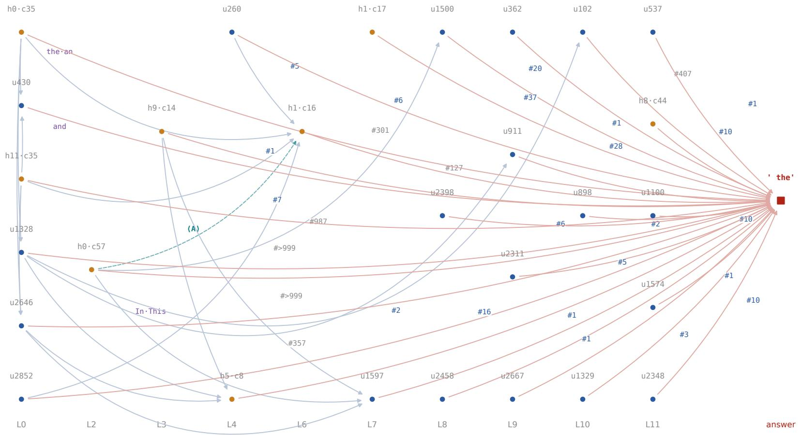  
Figure 3 5 : baseline ( GELU) prediction 1 : the graph 28 members and 20 edges among them .

… still the cornerstone but it’s about everything else we do. Dane Coles [the All Blacks hooker] proves that. Cole
<table><tr><td rowspan=1 colspan=6>→ is&#x27;                            p=0.3792 components reach 90% of the net 1 required93% cancelsstrength     fires on               writes toward                    answer</td></tr><tr><td rowspan=1 colspan=1></td><td rowspan=1 colspan=1>L11·u1589</td><td rowspan=1 colspan=2>ffn</td><td rowspan=1 colspan=1>1.25</td><td rowspan=1 colspan=1>&#x27;It&#x27;  He   It           our&#x27;&#x27;read&#x27;             #430</td></tr><tr><td rowspan=1 colspan=1></td><td rowspan=1 colspan=1>LL10·u522</td><td rowspan=1 colspan=1>5% via It</td><td rowspan=1 colspan=1>ffn</td><td rowspan=1 colspan=1>1.37</td><td rowspan=1 colspan=1>&#x27;It&#x27;  he   it      for&#x27;&#x27;d&#x27;                     #151</td></tr><tr><td rowspan=1 colspan=1></td><td rowspan=1 colspan=1>LL8·h1·c44</td><td rowspan=1 colspan=1>5% via It·it</td><td rowspan=1 colspan=1>attn</td><td rowspan=1 colspan=1>0.79</td><td rowspan=1 colspan=1>things&#x27;           →&#x27;himself&#x27;&#x27;his&#x27;&#x27;-&#x27;            #135</td></tr><tr><td rowspan=1 colspan=1></td><td rowspan=1 colspan=1>LL9·u1080</td><td rowspan=1 colspan=1>3% via It·it</td><td rowspan=1 colspan=1>ffn</td><td rowspan=1 colspan=2>0.54       &#x27;This&#x27;  &#x27;It&#x27; which&#x27;→has&#x27;makes&#x27;                 #24</td></tr><tr><td rowspan=1 colspan=1></td><td rowspan=1 colspan=1>LL7·u2176</td><td rowspan=1 colspan=1>10% via This·w</td><td rowspan=1 colspan=1>hich      ffn</td><td rowspan=1 colspan=2>1.10        these&#x27;   June&#x27;   →&#x27;includes&#x27;&#x27;include&#x27;           #4</td></tr><tr><td rowspan=1 colspan=1></td><td rowspan=1 colspan=1>LL4·h11·c59</td><td rowspan=1 colspan=1>31%</td><td rowspan=1 colspan=1>attn</td><td rowspan=1 colspan=1>1.69</td><td rowspan=1 colspan=1>is&#x27;  can&#x27;       →&#x27;also&#x27;&#x27;est&#x27; &#x27;om&#x27;              #&gt;999</td></tr><tr><td rowspan=1 colspan=1></td><td rowspan=1 colspan=1>LL6·u1929LL4·h11·c59</td><td rowspan=1 colspan=1>20%(above)</td><td rowspan=1 colspan=1>ffn</td><td rowspan=1 colspan=1>1.78</td><td rowspan=1 colspan=1>George&#x27;    that    M&#x27;G&#x27;King&#x27;               #325</td></tr><tr><td rowspan=1 colspan=1></td><td rowspan=1 colspan=1>LL4·h11·c13</td><td rowspan=1 colspan=1>9% via Georg</td><td rowspan=1 colspan=1>e         attn</td><td rowspan=11 colspan=2>0.94       In&#x27; Re&#x27;  &#x27;In&#x27;   →&#x27;am&#x27; car&#x27;&#x27; is&#x27;               #4some&#x27;   being&#x27;                                    #40</td></tr><tr><td rowspan=1 colspan=1></td><td rowspan=1 colspan=1>LL4·h11·c13</td><td rowspan=1 colspan=1>(above)</td><td rowspan=1 colspan=1></td></tr><tr><td rowspan=1 colspan=2>LL4·h11·c13</td><td rowspan=1 colspan=1>(above)</td><td rowspan=1 colspan=1></td></tr><tr><td rowspan=1 colspan=2>LL4·h11·c59</td><td rowspan=1 colspan=1>(above)</td><td rowspan=1 colspan=1></td></tr><tr><td rowspan=1 colspan=2>LL4·h11·c59</td><td rowspan=1 colspan=1>(above)</td><td rowspan=1 colspan=1></td></tr><tr><td rowspan=1 colspan=2>LL4·h11·c59</td><td rowspan=1 colspan=1>(above)</td><td rowspan=1 colspan=1></td></tr><tr><td rowspan=1 colspan=2>LL9·u1080</td><td rowspan=1 colspan=1>(above)</td><td rowspan=1 colspan=1></td><td rowspan=1 colspan=1></td><td rowspan=1 colspan=1></td></tr><tr><td></td><td rowspan=1 colspan=1>L11·u1686</td><td rowspan=1 colspan=1></td><td rowspan=1 colspan=1>ffn</td><td rowspan=1 colspan=1></td></tr><tr><td></td><td rowspan=1 colspan=1>LL10·u522</td><td rowspan=1 colspan=1>(above)</td><td rowspan=1 colspan=1></td><td rowspan=1 colspan=1></td></tr><tr><td></td><td rowspan=1 colspan=1>LL4·h11·c59</td><td rowspan=1 colspan=1>(above)</td><td rowspan=1 colspan=1></td></tr><tr><td></td><td rowspan=1 colspan=1>LL7·u2176</td><td rowspan=1 colspan=1>(above)</td><td rowspan=1 colspan=1></td><td rowspan=1 colspan=1></td></tr><tr><td></td><td rowspan=1 colspan=1>L10·u987LL6·u1929</td><td rowspan=1 colspan=1></td><td rowspan=1 colspan=1>ffn</td><td rowspan=1 colspan=1>0.64</td><td rowspan=1 colspan=1>me   Mun        →&#x27;world&#x27;&#x27;itself&#x27;&#x27;is         #3</td></tr><tr><td></td><td rowspan=1 colspan=1>LL4·u2394</td><td rowspan=1 colspan=1>(above)5% via Mun</td><td rowspan=1 colspan=1>ffn</td><td rowspan=2 colspan=1>0.84</td><td rowspan=2 colspan=1>Mun   Ye       →  last&#x27;    more&#x27;             #20</td></tr><tr><td></td><td rowspan=1 colspan=1>LL4·h11·c59</td><td rowspan=1 colspan=1>(above)</td><td rowspan=1 colspan=1></td></tr><tr><td></td><td rowspan=1 colspan=1>LL4·h11·c13</td><td rowspan=1 colspan=1>(above)</td><td rowspan=1 colspan=1></td><td rowspan=4 colspan=2>1.38       June&#x27;   because&#x27;  → &#x27;ately&#x27; &#x27;By&#x27;&#x27;V&#x27;                #&gt;999</td></tr><tr><td></td><td rowspan=1 colspan=1>LL8·u1533</td><td rowspan=1 colspan=1>5% via It·This</td><td rowspan=1 colspan=1>ffn</td></tr><tr><td></td><td rowspan=1 colspan=1>LL4·h11·c59</td><td rowspan=1 colspan=1>(above)</td><td rowspan=1 colspan=1></td></tr><tr><td rowspan=1 colspan=2>LL6·u1929</td><td rowspan=1 colspan=1>(above)</td><td rowspan=1 colspan=1></td><td rowspan=1 colspan=1></td></tr><tr><td rowspan=1 colspan=2>LL7·u2176</td><td rowspan=1 colspan=1>(above)</td><td rowspan=1 colspan=1></td><td rowspan=1 colspan=1></td><td rowspan=4 colspan=1>&#x27;Context&#x27;                      and&#x27;                  #17</td></tr><tr><td rowspan=1 colspan=3>L10·u1980</td><td rowspan=1 colspan=1>ffn</td><td rowspan=2 colspan=1>0.41</td></tr><tr><td rowspan=1 colspan=3>LL4·h11·c59           (above)</td><td rowspan=1 colspan=1></td></tr><tr><td rowspan=1 colspan=3>LL4·h11·c13           (above)</td><td rowspan=1 colspan=1></td><td rowspan=1 colspan=1></td></tr><tr><td rowspan=1 colspan=3>LL7·u2176             (above)</td><td rowspan=1 colspan=1></td><td rowspan=2 colspan=1>0.65</td><td rowspan=2 colspan=1>This   one&#x27;         &#x27;t A&#x27;you&#x27;                 #29</td></tr><tr><td rowspan=1 colspan=3>L9·h2·c8LL6·u1929             (above)</td><td rowspan=1 colspan=1>attn</td></tr><tr><td></td><td rowspan=1 colspan=2>LL7·u680           12%</td><td rowspan=1 colspan=1>ffn</td><td rowspan=1 colspan=1>0.89</td><td rowspan=5 colspan=1>Re Ye&#x27;   al                                   #25</td></tr><tr><td></td><td rowspan=1 colspan=2>LL4·h11·c59         (above)</td><td rowspan=1 colspan=1></td><td rowspan=1 colspan=1></td></tr><tr><td></td><td rowspan=1 colspan=2>LL6·u1929           (above)</td><td rowspan=1 colspan=1></td><td rowspan=1 colspan=1></td></tr><tr><td></td><td rowspan=1 colspan=2>LL4·h11·c13         (above)</td><td rowspan=1 colspan=1></td><td rowspan=1 colspan=1></td></tr><tr><td></td><td rowspan=1 colspan=2>LL8·u1533             (above)</td><td rowspan=1 colspan=1></td><td rowspan=1 colspan=1></td></tr><tr><td></td><td rowspan=1 colspan=2>L9·u2007</td><td rowspan=2 colspan=1>ffn</td><td rowspan=3 colspan=1>0.63</td><td rowspan=8 colspan=1>&#x27;This&#x27;  &#x27;Py&#x27;  This→ is&#x27;was&#x27;has&#x27;              #1event            →the&#x27;to&#x27;&#x27;is&#x27;              #3</td></tr><tr><td rowspan=1 colspan=3>LL7·u2176             (above)</td></tr><tr><td rowspan=1 colspan=3>LL6·u1929             (above)</td><td rowspan=1 colspan=1></td></tr><tr><td rowspan=1 colspan=3>LL4·h11·c59           (above)</td><td rowspan=1 colspan=1></td><td rowspan=1 colspan=1></td></tr><tr><td rowspan=1 colspan=3>L5·h5·c44</td><td rowspan=1 colspan=1>attn</td><td rowspan=1 colspan=1>0.63</td></tr><tr><td rowspan=1 colspan=3>LL4·h11·c59           (above)</td><td rowspan=1 colspan=1></td><td rowspan=1 colspan=1></td></tr><tr><td rowspan=1 colspan=3>LL4·h11·c13           (above)</td><td rowspan=1 colspan=1></td><td rowspan=1 colspan=1></td></tr><tr><td rowspan=1 colspan=3>LL4·u2394             (above)</td><td rowspan=1 colspan=1></td><td rowspan=1 colspan=1></td></tr><tr><td rowspan=1 colspan=3>L3·h4·c20</td><td rowspan=1 colspan=1>attn</td><td rowspan=1 colspan=1>0.80</td><td rowspan=1 colspan=1>&#x27;request&#x27;   &#x27;order&#x27;  →                              #11</td></tr><tr><td rowspan=1 colspan=3>LL0·u1054          2%</td><td rowspan=1 colspan=1>ffn</td><td rowspan=1 colspan=1>0.62</td><td rowspan=1 colspan=1>&#x27;es&#x27;  &#x27;com   home&#x27;   &#x27;ers&#x27;&#x27; from&#x27;&#x27;ard&#x27;              #&gt;999</td></tr><tr><td rowspan=1 colspan=3>L1·h10·c16</td><td rowspan=1 colspan=1>attn</td><td rowspan=1 colspan=1>0.34</td><td rowspan=1 colspan=1>re is&#x27;</td></tr><tr><td rowspan=1 colspan=3>L0·h1·c0</td><td rowspan=1 colspan=1>attn</td><td rowspan=1 colspan=1>0.10</td><td rowspan=1 colspan=1>&#x27;us&#x27; &#x27;ed&#x27;</td></tr><tr><td rowspan=1 colspan=3>L0·h1·c19</td><td rowspan=1 colspan=1>attn</td><td rowspan=1 colspan=1>0.11</td><td rowspan=1 colspan=1>have&#x27;  &#x27;Py&#x</td></tr><tr><td rowspan=1 colspan=3>L0·h7·c50</td><td rowspan=1 colspan=1>attn</td><td rowspan=1 colspan=1>0.13</td><td rowspan=1 colspan=1>former</td></tr><tr><td rowspan=1 colspan=3>L0·h11·c35</td><td rowspan=1 colspan=1>attn</td><td rowspan=1 colspan=1>0.13</td><td rowspan=1 colspan=1>death&#x27;  &#x27;claim&#x27;   一     and&#x27;                     #24</td></tr></table>

Figure 36: baseline (GELU), prediction 2: the set, 24 members. Of 11 predictions drawn at random, this is one of the four whose suficient set is nearest the median, 24.

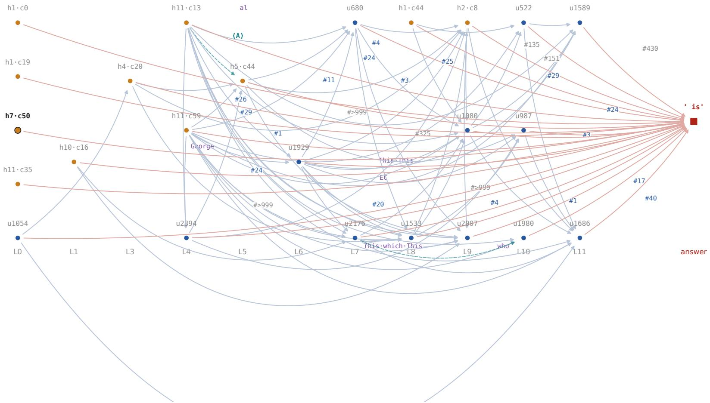  
Figure 3 7: baseline ( GELU) prediction 2 : the graph 24 members and 68 edges among them

…g is the audio record.<|endoftext|>A classic Final Fantasy game may be made available on PlayStation 4 in the very near future, according to a listing

<table><tr><td>→ on&#x27;</td><td>p=0.46</td><td colspan="5">56 components reach 90% of the net</td><td>2 required</td><td>86% cancels</td><td></td><td></td></tr><tr><td></td><td></td><td></td><td>strength</td><td></td><td>fires on</td><td></td><td></td><td>writes toward</td><td></td><td></td><td>answer</td></tr><tr><td>L11·h7·c8</td><td></td><td>attn</td><td>0.30</td><td></td><td></td><td> $\begin{array} { c c c c c c c c c c c c c c c c c c c c c c c c c c c c c c c } { { } } & { { } } & { { } } & { { } } & { { } } & { { } } & { { } } & { { } } & { { } } & { { } } & { { } } & { { } } & { { } } & { { } } & { { } } & { { } } & { { } } & { { } } & { { } } & { { } } & { { } } & { { } } & { { } } & { { } } & { { } } & { { } } & { { } } & { { } } & { { } } & { { } } & { { } } & { { } } & { { } } & { { } } & { { } } & { { } } & { { } } & { { } } & { { } } & { { } } & { { } } & { { } } & { { } } & { { } } & { { } } & { { } } & { { } } & { { } } & { { } } & { { } } & { { } } & { { } } & { { } } & { { } } & { { } } & { { } } & { { } } & { { } } & { { } } & { { } } & { { } } & { { } } & { { } } & { { } } & { { } } & { { } } & { { } } & { { } } & { { } } & { { } } & { { } } & { { } } & { { } } & { { } } & { { } } & { { } } & { { } } & { { } } & { { } } & { { } } & { { } } & { { } } & { { } } & { { } } & { { } } & { { } } & { { } } & { { } } & { { } } & { { } } & { { } } & { { } } & { { } } & { { } } & { { } } & { { } } & { { } } & { { } } & { { } } & { { } } & { { } } & { { } } & { { } } & { { } } & { { } } & { { } } & { { } } & { { } } & { { } } & { { } } & { { } } &  \end{array}$ </td><td></td><td></td><td></td><td></td><td>#12</td></tr><tr><td>L11·u1331</td><td></td><td></td><td></td><td></td><td></td><td> $\mathrm { \Delta ~ \mathsf { f f m } ~ } \qquad 0 . 5 4 \qquad \mathrm  \Delta ~ \ " ~ \ v i d e o " ~ \partial ~ \ " ~ { \Delta } ~ \ i t e m " ~ \partial ~ \to ~ \partial ~ \ " ~ { \Delta } ~ \mathrm { a n d } ~ \mathrm { \Sigma } ^ { \ast } ~ \mathrm { \Sigma } ^ { \ast } ~ \mathrm { \Sigma } ^ { \ast } ~ \mathrm { \Sigma } ^ { \ast } ~ \mathrm { \Sigma } ^ { \ast } ~ \mathrm { \Sigma } ^ { \ast } ~ \mathrm { \Sigma } ^ { \ast } ~ \mathrm { \Sigma } ^ { \ast } ~ \mathrm { \Sigma } ^ { \ast } ~ \mathrm { \Sigma } ^ { \ast } ~ \mathrm { \Sigma } ^ { \ast } ~ \mathrm { \Sigma } ^ { \ast } ~ \mathrm { \Sigma } ^ { \ast } ~ \mathrm { \Sigma } ^ { \ast } ~ \mathrm { \Sigma } ^ { \ast } ~ \mathrm { \Sigma } ^ { \ast } ~ \mathrm { \Sigma } ^ { \ast } ~ \mathrm { \Sigma } ^ { \ast } ~ \mathrm { \Sigma } ^ { \ast } ~ \mathrm { \Sigma } ^ { \ast } ~ \mathrm { \Sigma } ^ { \ast } ~ \mathrm { \Sigma } ^ { \ast } ~ \mathrm { \Sigma } ^ { \ast } ~ \mathrm { \Sigma } ^ { \ast } ~ \mathrm { \Sigma } ^ { \ast } ~ \mathrm { \Sigma } ^ { \ast } ~ \mathrm { \Sigma } ^ { \ast } ~ \mathrm { \Sigma } ^ { \ast } ~ \mathrm { \Sigma } ^ { \ast } ~ \mathrm { \Sigma } ^ { \ast } ~ \mathrm { \Sigma } ^ { \ast } ~ \mathrm { \Sigma } ^ { \ast } ~ \mathrm { \Sigma } ^ { \ast } ~ \mathrm { \Sigma } ^ { \ast } ~ \mathrm { \Sigma } ^ { \ast } ~ \mathrm { \Sigma } ^ { \ast } ~ \mathrm { \Sigma } ^ { \ast } ~ \mathrm { \Sigma } ^ { \ast } ~ \mathrm { \Sigma } ^ { \ast } ~ \mathrm { \Sigma } ^ { \ast } ~ \mathrm { \Sigma } ^ { \ast } ~ \mathrm { \Sigma } ^ { \ast } ~ \mathrm { \Sigma } ^ { \ast } ~ \mathrm { \Sigma } ^ { \ast } ~ \mathrm { \Sigma } ^ { \ast } ~ \mathrm { \Sigma } ^ { \ast } ~ \mathrm { \Sigma } ^ { \ast } ~ \mathrm { \Sigma } ^ { \ast \Sigma } ~ ~ \mathrm  $ </td><td></td><td></td><td></td><td></td><td>#10</td></tr><tr><td>L11·u1340</td><td></td><td>ffn</td><td>1.58</td><td></td><td>products&#x27;</td><td></td><td></td><td></td><td>→&#x27; love&#x27;&#x27; on&#x27; lost&#x27;</td><td></td><td>#3</td></tr><tr><td>LL10·u1598</td><td>20% → sentence-final ffn</td><td></td><td>2.26</td><td></td><td></td><td> $\begin{array} { r } { { \mathrm { ~  ~ \gamma ~ } } _ { \mathrm { h e r e } ^ { \prime } } \mathrm { ~  ~ \cdot ~ } { \mathrm { ~  ~ \cal ~ I } } { \sf N } { \sf E } ^ { \prime } \mathrm { ~  ~ \rho ~ }  \mathrm { ~  ~ \cdot ~ } \mathrm { ~  ~ \cdot ~ } \mathrm { ~  ~ \rho ~ } \mathrm { ~  ~ \cdot ~ } \mathrm { ~  ~ \cdot ~ } \mathrm { ~  ~ \cdot ~ } \mathrm { ~  ~ \cdot ~ } \mathrm { ~  ~ \cdot ~ } } \end{array}$ </td><td></td><td></td><td></td><td></td><td>#45</td></tr><tr><td>LL8·u2962</td><td>14%</td><td>ffn</td><td>0.63</td><td></td><td></td><td> $\cdot \mathrm { n u m b e r ^ { \prime } } \quad \mathrm { ` } \quad \mathfrak { b } \circ \mathfrak { o } \mathsf { k } ^ { \prime } \quad  \mathrm { ~ ` ~ \ a l l " ~ \ a n d ~ " ~ \ b ~ { ~ a ~ } ~ } ^ { \ast }$ </td><td></td><td></td><td></td><td></td><td>#6</td></tr><tr><td>LL9·u660</td><td>12%</td><td>ffn</td><td>1.33</td><td></td><td></td><td> $\mathsf { \Omega } \mathsf { h e r e } ^ { \mathrm { ~ \tiny ~ * ~ } } \mathsf { p l a y e r s } ^ { \mathrm { ~ \tiny ~ * ~ } } \to \mathsf { \Omega } \mathsf { a t } ^ { \mathrm { ~ \tiny ~ * ~ } } \mathrm { ~ \mathsf { A t } ^ { \mathrm { ~ \tiny ~ * ~ } } ~ } \mathsf { A t } ^ { \mathrm { ~ \tiny ~ * ~ } } \to \mathsf { A t } ^ { \mathrm { ~ \tiny ~ * ~ } }$ </td><td></td><td></td><td></td><td></td><td>#4</td></tr><tr><td>LL8·u2962</td><td>(above)</td><td></td><td></td><td></td><td></td><td></td><td></td><td></td><td></td><td></td><td></td></tr><tr><td>LL10·u341</td><td>9%</td><td>ffn</td><td>0.60</td><td></td><td></td><td> $\Gamma ^ { \mathrm { i } } \backslash \{ \mathfrak { h } \mathfrak { t ^ { \star } } \mathrm { ~  ~ { ~ \mathfrak ~ { ~ n ~ u ~ m ~ b ~ e ~ r ~ ^ { \star ~ } ~ }  ~ } ~ ^ { \bullet ~ } ~ \mathfrak { n } e x t ~ ^ { \star ~ } ~ \bullet \mathrm { ~ \mathfrak { o } v e r ~ ^ { \star ~ } ~ } }$ </td><td></td><td></td><td></td><td></td><td>#8</td></tr><tr><td>LL9·u660</td><td>(above)</td><td></td><td></td><td></td><td></td><td></td><td></td><td></td><td></td><td></td><td></td></tr><tr><td>LL8·u2962</td><td>(above)</td><td></td><td></td><td></td><td></td><td></td><td></td><td></td><td></td><td></td><td></td></tr><tr><td>LL0·h1·c5</td><td>4%</td><td>attn</td><td>0.13</td><td></td><td></td><td> $\left. \mathrm { ~ \iota ~ } ^ { \ast } \quad \mathrm { t o o ~ \iota ~ } ^ { \ast } \quad \mathrm { ~ p ~ r o d u c t s ~ ^ { \ast } ~ \right. ~ \iota ~ } ^ { \ast } \mathrm { ~ , ~ \iota ~ } ^ { \ast } \quad \mathrm { a n d ~ ^ { \ast } ~ \cdot ~ ^ { \ast } ~ } ^ { \ast }$ </td><td></td><td></td><td></td><td></td><td>#12</td></tr><tr><td>L11·u1432</td><td></td><td>ffn</td><td>0.42</td><td></td><td></td><td> $\begin{array} { r } { { { \mathrm { ~  ~ { ~ \psi ~ } ~ } } } _ { \mathrm { { W O } } } \mathsf { r } \mathsf { k } ^ { \mathrm { ~  ~ { ~ \psi ~ } ~ } } \mathrm { ~  ~ { ~ \psi ~ } ~ } _ { \mathrm { W B } } \mathsf { r } ^ { \mathrm { ~ \tiny ~ { ~ \psi ~ } ~ } } \quad \quad \to ^ { \mathrm { ~ \tiny ~ { ~ \psi ~ } ~ } } \mathsf { f } 0 \mathsf { r w a } \mathsf { r d } ^ { \mathrm { ~ \tiny ~ { ~ \psi ~ } ~ } \mathrm { ~  ~ { ~ \psi ~ } ~ } } \mathsf { o n } ^ { \mathrm { ~ \tiny ~ { ~ \psi ~ } ~ } \mathrm { ~ \tiny ~ { ~ \psi ~ } ~ } } \mathsf { u p } ^ { \mathrm { ~ \tiny ~ { ~ \psi ~ } ~ } } } \end{array}$ </td><td></td><td></td><td></td><td></td><td>#2</td></tr><tr><td>L11·u3016</td><td></td><td>ffn</td><td>0.35</td><td></td><td></td><td> $\begin{array} { r l r l r l r l } { { } ^ { * } } & { { } \mathsf { c o r } ^ { * } } & { } & { { } \mathsf { f a m i l y } ^ { * } } & { } & { { } \to { } ^ { * } . } & { { } ^ { * } } & { { } ^ { * } \to { } ^ { * } { } } & { { } } \end{array}$ </td><td></td><td></td><td></td><td></td><td>#9</td></tr><tr><td>L10·u361</td><td></td><td>ffn</td><td>1.88</td><td></td><td></td><td>players&#x27;using→social&#x27;Instagram&#x27;</td><td></td><td></td><td></td><td></td><td>#11</td></tr><tr><td>LL9·u660</td><td>(above)</td><td></td><td></td><td></td><td></td><td></td><td></td><td></td><td></td><td></td><td></td></tr><tr><td>LL8·u2962</td><td>(above)</td><td></td><td></td><td></td><td>video&#x27;&#x27;EN&#x27;</td><td></td><td></td><td></td><td></td><td></td><td></td></tr><tr><td>L10·u1092</td><td></td><td>ffn</td><td>1.94</td><td></td><td></td><td></td><td></td><td></td><td></td><td>→ on&#x27; On&#x27; online&#x27;</td><td>#1</td></tr><tr><td>LL9·u660</td><td>(above)</td><td></td><td></td><td></td><td></td><td></td><td></td><td></td><td></td><td></td><td></td></tr><tr><td>LL8·u2962</td><td>(above)</td><td></td><td></td><td></td><td></td><td></td><td></td><td></td><td></td><td></td><td></td></tr><tr><td>L10·u1198</td><td></td><td>ffn ffn</td><td>0.40 0.24</td><td></td><td>people&#x27;</td><td>&#x27;attack&#x27;&#x27;INE&#x27;</td><td></td><td></td><td>→on&#x27;0n&#x27;&#x27;On&#x27;</td><td>→&#x27; in&#x27;&#x27; here&#x27;&#x27; there&#x27;</td><td>#4</td></tr><tr><td>L10·u1278</td><td></td><td>ffn</td><td>0.38</td><td></td><td>&#x27;item&#x27;&#x27;com&#x27;</td><td></td><td></td><td></td><td></td><td>→&#x27;in&#x27; on&#x27; for&#x27;</td><td>#1</td></tr><tr><td>L10·u2030</td><td></td><td>ffn</td><td>0.40</td><td></td><td></td><td> $\begin{array} { r } { { | \negthickspace } \partial \mathsf { y ^ { \prime } } \quad \ " \quad \mathsf { o v e r " } \qquad \to \ \mathsf { \Omega ^ { \ast } } \partial \mathsf { n d } \ \ " \quad \mathsf { \Omega ^ { \ast } } \partial \mathsf { \Omega ^ { \ast } } \quad \ " \ \cdot \ \mathsf { \Omega ^ { \ast } } } \end{array}$ </td><td></td><td></td><td></td><td></td><td>#2</td></tr><tr><td>L10·u2097 L10·u2172</td><td></td><td>ffn</td><td>1.42</td><td></td><td>&#x27;players&#x27;</td><td></td><td></td><td></td><td></td><td></td><td>#22</td></tr><tr><td>LL9·u660</td><td>(above)</td><td></td><td></td><td></td><td></td><td></td><td></td><td></td><td>→in&#x27; on&#x27;at&#x27;</td><td></td><td>#2</td></tr><tr><td>LL8·u2962</td><td>(above)</td><td></td><td></td><td></td><td></td><td></td><td></td><td></td><td></td><td></td><td></td></tr><tr><td>LL9·h4·c62</td><td>5% via things</td><td>attn</td><td>0.64</td><td></td><td></td><td>&#x27;This&#x27;&#x27;every&#x27;</td><td></td><td></td><td>→&#x27;-&#x27;&#x27;/&#x27;</td><td></td><td>#21</td></tr><tr><td>L0·h3·c42</td><td></td><td>attn</td><td>0.38</td><td></td><td>toohas</td><td></td><td>→「</td><td></td><td>and&#x27;&#x27;,&#x27;(&#x27;</td><td></td><td>#11</td></tr><tr><td>L0·h3·c52</td><td></td><td>attn</td><td>0.21</td><td></td><td>&#x27;able&#x27;</td><td>&#x27;&#x27;es&#x27;&#x27;er&#x27;</td><td>→1</td><td></td><td>and&#x27;(&#x27;</td><td></td><td>#8</td></tr><tr><td>L0·h11·c26</td><td></td><td>attn</td><td>0.24</td><td>1</td><td>&#x27;The&#x27;</td><td>the&#x27;</td><td>→</td><td></td><td>and&#x27;in&#x27;</td><td></td><td>#11</td></tr><tr><td></td><td></td><td></td><td></td><td></td><td></td><td></td><td></td><td></td><td></td><td></td><td></td></tr></table>

Figure 38: sigmoid, prediction 1: the set, 21 members. Of 18 predictions drawn at random, this is one of the four whose suficient set is nearest the median, 19.

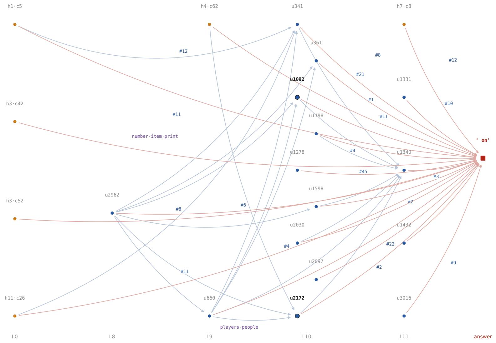  
Figure 39 : sigmoid prediction 1 : the graph 2 1 members and 20 edges among them

… and Chen Ye had darkened expressions as they stood in the office of Central TV Department 1's Deputy Director Jiang Yuan. There was a tea cup lying
<table><tr><td>→ on&#x27;</td><td>p=0.50</td><td></td><td>46 components reach 90% of the net 1 required 87% cancels</td><td></td><td></td><td></td><td></td><td></td><td></td></tr><tr><td></td><td></td><td></td><td>strength</td><td>fires on</td><td></td><td>writes toward</td><td></td><td></td><td>answer</td></tr><tr><td>L11·u995</td><td></td><td>ffn</td><td>1.01</td><td></td><td> $\begin{array} { r } { \mathrm { ~  ~ { ~ \gamma ~ } ~ } _ { 0 } \mu \tau ^ { \cdot } \mathrm { ~  ~ { ~ \hat { ~ } { ~ \phi ~ } ~ } ~ } _ { \mathrm { { h e l d } } } , } \end{array} \quad \quad \begin{array} { r } { \mathrm { ~  ~ { ~ \alpha ~ } ~ } _ { \mathrm { ~  ~ } } \mathrm { ~  ~ { ~ \alpha ~ } ~ } _ { 0 } \eta ^ { \cdot } \mathrm { ~  ~ { ~ \hat { ~ } { ~ \phi ~ } ~ } ~ } _ { \mathrm { t h e } } , \mathrm { ~  ~ { ~ \alpha ~ } ~ } _ { \mathrm { ~ i n } } \mathrm { ~  ~ { ~ \hat { ~ } { ~ \phi ~ } ~ } ~ } _ { \mathrm { ~ \alpha ~ } } , } \end{array}$ </td><td></td><td></td><td></td><td>#1</td></tr><tr><td>L11·u1043</td><td></td><td>ffn</td><td>0.66</td><td></td><td></td><td></td><td></td><td> $\begin{array} { r }  \mathrm { ~ \mathsf { ~ \mathsf ~ { ~ s e t ~ } ~ } ~ } ^ { \ast } \mathrm { ~  ~ \mathsf ~ { ~ \ t ~ } ~ } _ { 0 } \mathrm { ~ \mathsf ~ { ~ \ t ~ } ~ } _ { \mathrm { ~ \tiny ~ { ~ \cdot ~ } ~ } } \mathrm { ~ \mathsf ~ { ~ \ t ~ } ~ } _ { \mathrm { ~ \tiny ~ { ~ \cdot ~ } ~ } } \mathrm { ~ \mathsf ~ { ~ \ t ~ } ~ } _ { \mathrm { ~ \tiny ~ { ~ \cdot ~ } ~ } } \mathrm { ~ \mathsf ~ { ~ \ t ~ } ~ } _ { \mathrm { ~ \tiny ~ { ~ \cdot ~ } ~ } } \mathrm { ~ \mathsf ~ { ~ \ t ~ } ~ } _ { \mathrm { ~ \tiny ~ { ~ \cdot ~ } ~ } } \mathrm { ~ \mathsf ~ { ~ \ t ~ } ~ } _ { \mathrm { ~ \tiny ~ { ~ \cdot ~ } ~ } } \mathrm { ~ \mathsf { ~ \Omega ~ } ~ } _ { \mathrm { ~ \tiny ~ { ~ \cdot ~ } ~ } } \mathrm { ~ \mathsf { ~ \Omega ~ } ~ } _ { \mathrm { ~ \tiny ~ { ~ \cdot ~ } ~ } } \mathrm { ~ \mathsf { ~ \Omega ~ } ~ } _ { \mathrm { ~ \tiny ~ { ~ \cdot ~ } } } \mathrm { ~ \mathsf { ~ \Omega ~ } ~ } _ { \mathrm { ~ \tiny ~ { ~ \cdot ~ } ~ } } \mathrm { ~ \mathsf { ~ \Omega ~ } ~ } _ { \mathrm { ~ \tiny ~ { ~ \cdot ~ } } } \mathrm { ~ \mathsf { ~ \Omega ~ } ~ } _ { \mathrm { ~ \tiny ~ { ~ \cdot ~ } } } \mathrm { ~ \mathsf { ~ \Omega ~ } ~ } _ { \mathrm { ~ \tiny ~ { ~ \cdot } ~ } } \mathrm { ~ \mathsf { ~ \Omega ~ } ~ } _ { \mathrm { ~ \tiny ~ { ~ \cdot ~ } } } \mathrm { ~ \mathsf { ~ \Omega ~ } ~ } _ { \mathrm { ~ \tiny ~ { ~ \cdot } ~ } } \mathrm { ~ \mathsf { ~ \Omega ~ } ~ } _ { \mathrm { ~ \tiny ~ { ~ \cdot ~ } } } \mathrm { ~ \mathsf { ~ \Omega ~ } ~ } _ { \mathrm { ~ \tiny ~ { ~ \cdot } ~ } } \mathrm { ~ \mathsf { ~ \Omega ~ } ~ } _ { \mathrm { ~ \tiny ~ { ~ \cdot ~ } } } \mathrm  ~ \mathsf  ~ \end{array}$ </td><td>#7</td></tr><tr><td>L11·u1432</td><td></td><td>ffn</td><td>0.60</td><td>work&#x27;war&#x27;</td><td></td><td></td><td></td><td>→forward&#x27;on&#x27;up&#x27;</td><td>#2</td></tr><tr><td>L11·u1839</td><td></td><td>ffn</td><td>0.43</td><td>too&#x27;&#x27;local&#x27;</td><td></td><td>→</td><td>in&#x27;</td><td></td><td>#11</td></tr><tr><td>L11·u2261</td><td></td><td>ffn</td><td>4.31</td><td>&#x27;Py&#x27;her&#x27;</td><td>my</td><td>→&#x27;ates&#x27;&#x27;est&#x27;&#x27; on&#x27;</td><td></td><td></td><td>#4</td></tr><tr><td>LL10·u341</td><td>32%</td><td>ffn</td><td>3.25</td><td>right&#x27;number&#x27;→next&#x27;over&#x27;</td><td></td><td></td><td></td><td></td><td>#8</td></tr><tr><td>LL8·u953</td><td>15%</td><td>ffn</td><td>0.65</td><td>other&#x27;</td><td></td><td></td><td></td><td>→&#x27;in&#x27;&#x27; around&#x27;· the</td><td>#4</td></tr><tr><td>LL9·u2576</td><td>10%</td><td>ffn</td><td>0.79</td><td>set&#x27;&#x27;able&#x27;</td><td></td><td>→  and&#x27; &#x27;/&#x27;  on&#x27;</td><td></td><td></td><td>#3</td></tr><tr><td>LL8·u953</td><td>(above)</td><td></td><td></td><td></td><td></td><td></td><td></td><td></td><td></td></tr><tr><td>LL9·u168</td><td>7% via right</td><td>ffn 0.58</td><td></td><td>goinggo&#x27;</td><td></td><td></td><td></td><td>→&#x27;in&#x27; by&#x27;under&#x27;</td><td>#4</td></tr><tr><td>LL8·u953</td><td>(above)</td><td></td><td></td><td></td><td></td><td></td><td></td><td></td><td></td></tr><tr><td>LL8·u953</td><td>(above)</td><td></td><td></td><td></td><td></td><td></td><td></td><td></td><td></td></tr><tr><td>LL10·u1128</td><td>6%</td><td>ffn</td><td>0.94</td><td></td><td></td><td></td><td></td><td>Mun&#x27;EN&#x27;In&#x27; →with&#x27;in&#x27;&#x27;ly&#x27;</td><td>#8</td></tr><tr><td>L11·u3016</td><td></td><td>ffn</td><td>0.30</td><td> $\begin{array} { r l r l r l } { { } ^ { * } } & { { } \mathsf { c o r } ^ { * } } & { } & { { } \mathsf { f a m i l y } ^ { * } } & { } & { { } \to { } ^ { * } { } \ldots { } ^ { * } } & { { } ^ { * } { } \ldots { } ^ { * } } \end{array}$ </td><td></td><td></td><td></td><td></td><td>#9</td></tr><tr><td>L10·u183</td><td></td><td>ffn</td><td>0.46</td><td> $\begin{array} { r }  { \begin{array} { c c c c c c c } { { \cdot } } & { { \cdot } } & { { \mathrm { w h i c h } ^ { \prime } \cdot } } & { { } } & { { } } & { {  } } & { { \cdot } } & { { \cdot } } & { { \cdot } } & { { \cdot } } \end{array} } \end{array}$ </td><td></td><td></td><td></td><td></td><td>#27</td></tr><tr><td>L10·u784</td><td></td><td>ffn</td><td>0.38</td><td>man&#x27;&#x27;life&#x27;</td><td></td><td></td><td></td><td>→&#x27;on&#x27;&#x27;board&#x27;&#x27;onto&#x27;</td><td>#3</td></tr><tr><td>L10·u1146</td><td></td><td>ffn</td><td>0.58</td><td>right&#x27;back&#x27;</td><td></td><td></td><td>here&#x27;&#x27;there&#x27;</td><td></td><td>#7</td></tr><tr><td>L10·u1278</td><td></td><td>ffn</td><td>0.38</td><td>&#x27;attack&#x27;&#x27;INE&#x27;</td><td></td><td>→1</td><td>on&#x27;On&#x27;&#x27;On&#x27;</td><td></td><td>#1</td></tr><tr><td>L10·u1598</td><td>→ sentence-final</td><td>ffn</td><td>1.35</td><td>here&#x27;&#x27;INE&#x27;</td><td></td><td>→</td><td></td><td></td><td>#45</td></tr><tr><td>L10·u1871</td><td></td><td>ffn</td><td>1.05</td><td></td><td></td><td></td><td></td><td>death&#x27;just&#x27;→because&#x27;to&#x27;&#x27;.&#x27;</td><td>#36</td></tr><tr><td>LL9·u2576</td><td>(above)</td><td></td><td></td><td></td><td></td><td></td><td></td><td></td><td></td></tr><tr><td>LL9·u168</td><td>(above)</td><td></td><td></td><td></td><td></td><td></td><td></td><td></td><td></td></tr><tr><td>LL8·u953</td><td>(above)</td><td></td><td></td><td></td><td></td><td></td><td></td><td></td><td></td></tr><tr><td>L10·u2172</td><td></td><td>ffn 0.86 1.05</td><td></td><td>&#x27;something&#x27;</td><td></td><td>→&#x27; in&#x27; &#x27; on&#x27; &#x27; at&#x27;</td><td></td><td></td><td>#2</td></tr><tr><td>L10·u2812</td><td></td><td>ffn</td><td></td><td></td><td></td><td></td><td></td><td>held&#x27; ed&#x27;ing&#x27;→&#x27;like&#x27;Like&#x27;with&#x27;</td><td>#158</td></tr><tr><td>LL9·u2576</td><td>(above)</td><td></td><td></td><td></td><td></td><td></td><td></td><td></td><td></td></tr><tr><td>LL9·u168</td><td>(above)</td><td></td><td></td><td></td><td></td><td></td><td></td><td></td><td></td></tr><tr><td>LL8·u953</td><td>(above)</td><td></td><td></td><td></td><td></td><td></td><td></td><td></td><td></td></tr><tr><td>L9·u434</td><td></td><td>ffn 0.43</td><td></td><td>still&#x27;would&#x27;→&#x27;off&#x27;working&#x27;on&#x27;</td><td></td><td></td><td></td><td></td><td>#3</td></tr><tr><td>LL8·u953</td><td>(above)</td><td></td><td></td><td></td><td></td><td></td><td></td><td></td><td></td></tr><tr><td>L9·u3046</td><td></td><td>ffn 0.81</td><td></td><td>way&#x27;&#x27;well&#x27;</td><td></td><td>→ &#x27;m&#x27; &#x27;.&#x27; &#x27; called&#x27;</td><td></td><td></td><td>#57</td></tr><tr><td>LL8·u953</td><td>(above)</td><td></td><td></td><td></td><td></td><td></td><td></td><td></td><td></td></tr><tr><td>L0·h3·c52</td><td></td><td>attn</td><td>0.26</td><td>&#x27;able&#x27;&#x27;es&#x27;&#x27;er&#x27;</td><td></td><td></td><td>→ &#x27;, &#x27;and&#x27; (&#x27;</td><td></td><td>#8</td></tr></table>

Figure 40: sigmoid, prediction 2: the set, 22 members. Of 18 predictions drawn at random, this is one of the four whose suficient set is nearest the median, 19.

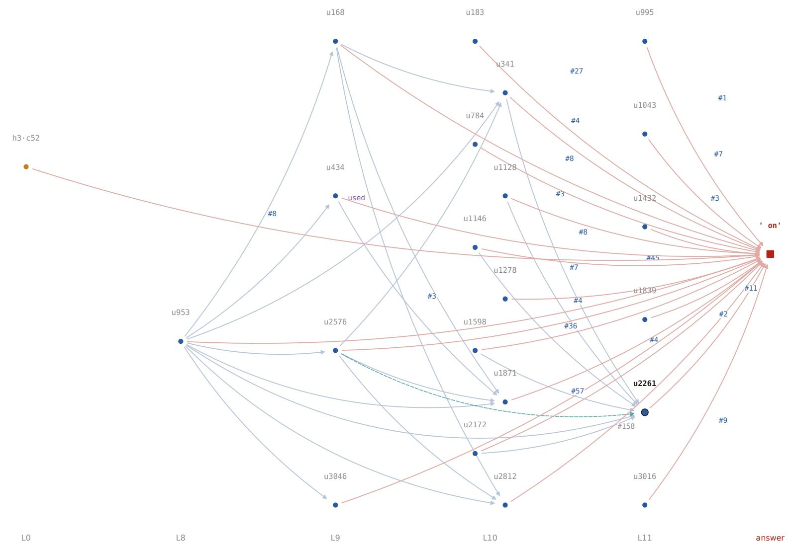  
Figure 4 1 : sigmoid prediction 2 : the graph 2 2 members and 2 1 edges among them .

…g is the audio record.<|endoftext|>A classic Final Fantasy game may be made available on PlayStation 4 in the very near future, according to a listing

<table><tr><td>→ on&#x27;</td><td></td><td>p=0.41</td><td>56 components reach 90% of the net 1 required</td><td></td><td></td><td></td><td></td><td></td><td>87% cancels</td><td></td></tr><tr><td></td><td></td><td></td><td>strength</td><td>fires on</td><td></td><td></td><td>writes toward</td><td></td><td></td><td>answer</td></tr><tr><td>L11·h1·c22</td><td></td><td>attn</td><td>0.29</td><td></td><td> $\cdots \to \{ - 1 , \pm \} , $ </td><td></td><td></td><td></td><td></td><td>#9</td></tr><tr><td>L11·u82</td><td></td><td>ffn</td><td>0.38</td><td></td><td> $\begin{array} { r } { { \mathrm { ~  ~ \mathsf ~ { ~ g ~ o ~ i ~ n ~ g ~ } ~ } ^ { \prime } \mathrm { ~  ~ \mathsf ~ { ~ G ~ e ~ o ~ r ~ g ~ e ~ } ~ } ^ { \prime } \to \mathrm { ~  ~ \mathsf ~ { ~ a ~ n ~ d ~ } ~ } ^ { \prime } \mathrm { ~  ~ \mathsf ~ { ~ \Omega ~ } ~ } ^ { \ast } \mathrm { ~  ~ \cdot ~ } \mathrm { ~  ~ \mathsf ~ { ~ \Omega ~ } ~ } , } } \end{array}$ </td><td></td><td></td><td></td><td></td><td>#26</td></tr><tr><td>L11·u373</td><td></td><td>ffn</td><td>0.24</td><td></td><td> $\Gamma \bar { \Gamma } \bar { \Gamma } \bar { \Gamma } \bar { \Gamma } \bar { \Gamma } \bar { \Gamma } \bar { \Gamma } \bar { \Gamma } \bar { \Gamma } \bar { \Gamma } \bar { \Gamma } \bar { \Gamma } \bar { \Gamma } \bar { \Gamma } \bar { \Gamma } \bar { \Gamma } \bar { \Gamma } \bar { \Gamma } \bar { \Gamma } \bar { \Gamma } \bar { \Gamma } \bar { \Gamma } \bar { \Gamma } \bar { \Gamma } \bar { \Gamma } \bar { \Gamma } \bar { \Gamma } \bar { \Gamma } \bar { \Gamma } \bar { \Gamma } \bar { \Gamma } \bar { \Gamma } \bar { \Gamma } \bar { \Gamma } \bar { \Gamma } \bar { \Gamma } \bar { \Gamma } \bar { \Gamma } \bar { \Gamma } \bar { \Gamma } \bar { \Gamma } \bar { \Gamma } \bar { \Gamma } \bar { \Gamma } \bar { \Gamma } $ </td><td></td><td></td><td></td><td></td><td>#3</td></tr><tr><td>L11·u494</td><td></td><td>ffn</td><td>0.26</td><td></td><td> ${ \mathrm { ~  ~ \ b e i n g ~ } } ^ { \prime } = { \mathrm { ~  ~ \sf ~ G e o r g e ~ } } ^ { \prime }  \ ^ { \prime } , \quad \mathrm { ~  ~ \sf ~ a n d ~ } ^ { \prime } \mathrm { ~  ~ \Gamma ~ } _ { \mathrm { ~ \tiny ~ - ~ } } ^ { \prime }$ </td><td></td><td></td><td></td><td></td><td>#25</td></tr><tr><td>L11·u1484</td><td></td><td>ffn</td><td>0.52</td><td></td><td> $^ { \prime } \mathsf { T h i s } ^ { \ast } \quad ^ { \circ } \mathsf { G e o r g e } ^ { \ast } \quad \to ^ { \bullet } , ^ { \bullet } \quad ^ { \bullet } \mathsf { a n d } ^ { \ast } \quad ( \mathsf { \Omega } ^ { \bullet } \mathsf { T h i s } ^ { \ast } \star \mathsf { a n d } ^ { \ast } ) ^ { \ast }$ </td><td></td><td></td><td></td><td></td><td>#8</td></tr><tr><td>L11·u1776</td><td></td><td>ffn</td><td>0.87</td><td>products&#x27;</td><td></td><td></td><td></td><td></td><td>→&#x27;devoted&#x27;&#x27;dedicated&#x27;</td><td>#10</td></tr><tr><td>LL10·u903</td><td>119%</td><td>ffn</td><td>5.31</td><td></td><td> ${ \begin{array} { r l r l r l } { { \mathrm { ` } } \ a { \mathrm { b l e " } } } & { { } ^ { \cdot } \ { \mathrm { ` } } \ { \mathrm { ` } } \ { \mathrm { ` } } \ } & { } & { { } \ } & { \to \ { \mathrm { " } } \ { \mathrm { ' } } \ { \mathrm { ' } } \ { \mathrm { ' } } \ { \mathrm { ' } } \ { \mathrm { ' } } \ { \mathrm { ' } } \ } & { { } \ } & { { } } \end{array} }$ </td><td></td><td></td><td></td><td></td><td>#166</td></tr><tr><td>L8·u535</td><td>3%</td><td>ffn</td><td>1.53</td><td></td><td>here&#x27;&#x27;item&#x27;</td><td></td><td></td><td></td><td>→ &#x27; on&#x27;&#x27; in&#x27; &#x27; within&#x27;</td><td>#1</td></tr><tr><td>LL7·u1921</td><td>17% via here</td><td>ffn</td><td>1.06</td><td>context&#x27;</td><td></td><td></td><td></td><td></td><td>→&#x27;for&#x27; &#x27;book&#x27; &#x27;er&#x27;</td><td>#5</td></tr><tr><td>LL10·u1939</td><td>9% via products·ers</td><td>ffn</td><td>0.25</td><td>players</td><td></td><td></td><td></td><td></td><td>→&#x27;for&#x27;&#x27;with&#x27;&#x27;of&#x27;</td><td>#4</td></tr><tr><td>L11·u2053</td><td></td><td>ffn</td><td>0.69</td><td>take&#x27;</td><td>just&#x27;</td><td>→</td><td></td><td> $\cdot \cdot \mathrm { ~  ~ \cdot ~ } \cdot \mathrm { ~  ~ \cdot ~ } \langle \hat { y } \cdot \mathrm { ~  ~ \cdot ~ }$ </td><td></td><td>#13</td></tr><tr><td>L11·u2139</td><td></td><td>ffn</td><td>0.38</td><td>&#x27;ution&#x27; &#x27;es&#x27;</td><td></td><td></td><td></td><td>→ &#x27;, &#x27; &#x27; and&#x27; &#x27;.&#x27;</td><td></td><td>#24</td></tr><tr><td>L11·u2221</td><td></td><td>ffn</td><td>0.60</td><td>people</td><td></td><td></td><td></td><td> $ ~ ^ { \prime } = a _ { n } \cdot \cdot \cdot 0 _ { n } \cdot \cdot 0 _ { n } \cdot$ </td><td></td><td>#1</td></tr><tr><td>LL10·u903</td><td>(above)</td><td></td><td></td><td></td><td></td><td></td><td></td><td></td><td></td><td></td></tr><tr><td>LL10·u166</td><td>45% via people·players</td><td>ffn</td><td>0.57</td><td>players&#x27;</td><td></td><td></td><td></td><td></td><td>→&#x27; in&#x27;&#x27; at&#x27;&#x27;within&#x27;</td><td>#5</td></tr><tr><td>L8·u535</td><td>(above)</td><td></td><td></td><td></td><td></td><td></td><td></td><td></td><td></td><td></td></tr><tr><td>LL7·u1921</td><td>(above)</td><td></td><td></td><td></td><td></td><td></td><td></td><td></td><td></td><td></td></tr><tr><td>L8·u535</td><td>(above)</td><td></td><td></td><td></td><td></td><td></td><td></td><td></td><td></td><td></td></tr><tr><td>L11·u2595</td><td></td><td>ffn</td><td>0.42</td><td>def&#x27;&#x27;take&#x27;</td><td></td><td>→</td><td></td><td></td><td>à</td><td>#89</td></tr><tr><td>L10·u3001</td><td></td><td>ffn</td><td>0.16</td><td>current&#x27;</td><td>set</td><td>→</td><td></td><td></td><td>on&#x27;&#x27;in&#x27;&#x27;over&#x27;</td><td>#1</td></tr><tr><td>L9·u1170</td><td></td><td>ffn</td><td>1.80</td><td>something&#x27;</td><td></td><td></td><td></td><td></td><td>→&#x27;we&#x27;&#x27; us&#x27;&#x27;We&#x27;</td><td>#40</td></tr><tr><td>L8·u535</td><td>(above)</td><td></td><td></td><td></td><td></td><td></td><td></td><td></td><td></td><td></td></tr><tr><td>LL7·u1921</td><td>(above)</td><td></td><td></td><td></td><td></td><td></td><td></td><td></td><td></td><td></td></tr><tr><td>L0·h7·c44</td><td></td><td>attn</td><td>0.13</td><td>him&#x27;</td><td>&#x27;context&#x27;</td><td></td><td>→ &#x27;, &#x27; &#x27;.&#x27;  and&#x27;</td><td></td><td></td><td>#13</td></tr></table>

Figure 42: softplus, prediction 1: the set, 18 members. Of 15 predictions drawn at random, this is one of the four whose suficient set is nearest the median, 18.

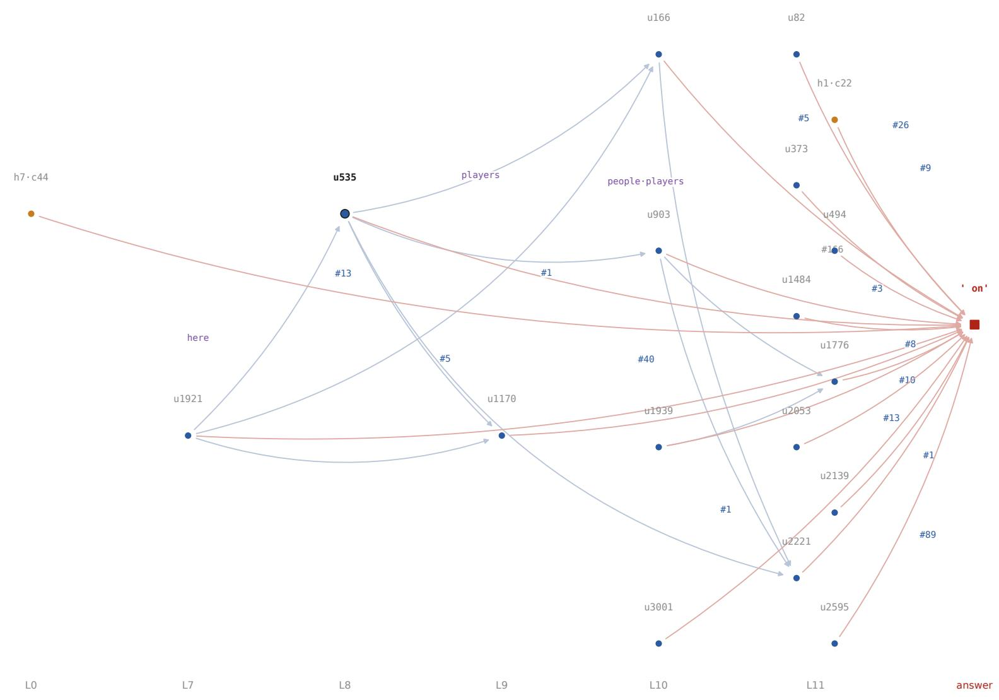  
Figure 43 : softplus prediction 1 : the graph 1 8 members and 1 1 edges among them .

…ag\_local\_context\`\` attribute, which, similarly to regular generators, can be set to \`\`None\`\` to make them use the outer Loca

<table><tr><td>→Context&#x27;</td><td></td><td></td><td colspan="3">p=0.72 32 components reach 90% of the net 5 required 85% cancels</td><td></td><td colspan="3"></td><td></td></tr><tr><td></td><td></td><td></td><td>strength</td><td></td><td>fires on</td><td></td><td></td><td>writes toward</td><td></td><td>answer</td></tr><tr><td>L11·u459</td><td></td><td>ffn</td><td>1.77</td><td>&#x27;The&#x27;</td><td>when&#x27;</td><td></td><td></td><td>→Mic&#x27; language&#x27;&#x27;asm&#x27;</td><td></td><td>#&gt;999</td></tr><tr><td>LL10·u462</td><td>14% via The</td><td></td><td>1.76</td><td>This&#x27;</td><td>Red&#x27;</td><td></td><td></td><td>→ Country&#x27; World&#x27;</td><td></td><td>#610</td></tr><tr><td>LL9·h2·c10</td><td>8%</td><td></td><td>0.69</td><td></td><td>context&#x27;</td><td></td><td></td><td>&#x27;context&#x27;→&#x27;ll&#x27;&#x27;reg&#x27;&#x27;ts&#x27;</td><td></td><td>#&gt;999</td></tr><tr><td>LL8·h7·c9</td><td>9% via context</td><td></td><td>0.91</td><td>&#x27;Context&#x27;</td><td></td><td></td><td></td><td></td><td>→ &#x27;ald&#x27; &#x27;iter&#x27;&#x27; actions&#x27;</td><td>#97</td></tr><tr><td>LL10·u1128</td><td>2%</td><td>ffn</td><td>0.67</td><td>at&#x27;</td><td>as&#x27;</td><td></td><td></td><td>→ &#x27; line&#x27; &#x27; run&#x27;</td><td></td><td>#164</td></tr><tr><td>LL9·h2·c13</td><td>6%</td><td>attn</td><td>0.81</td><td>&#x27;Context&#x27;</td><td></td><td></td><td></td><td></td><td>→loose&#x27;exclusive&#x27;</td><td>#&gt;999</td></tr><tr><td>LL8·h7·c9</td><td>(above)</td><td></td><td></td><td></td><td></td><td></td><td></td><td></td><td></td><td></td></tr><tr><td>L11·u583</td><td></td><td>ffn</td><td>0.83</td><td>George&#x27;</td><td></td><td>video&#x27;</td><td></td><td>→&#x27;Sun&#x27; &#x27;out&#x27; &#x27;ist&#x27;</td><td></td><td>#&gt;999</td></tr><tr><td>LL10·u462</td><td>(above)</td><td></td><td></td><td></td><td></td><td></td><td></td><td></td><td></td><td></td></tr><tr><td>LL10·u807</td><td>6%</td><td>ffn</td><td>1.02</td><td>need&#x27;</td><td>Ye</td><td></td><td></td><td>→ C&#x27; &#x27;C&#x27; 20&#x27;</td><td></td><td>#&gt;999</td></tr><tr><td>LL8·h7·c9</td><td>(above)</td><td></td><td></td><td></td><td></td><td></td><td></td><td></td><td></td><td></td></tr><tr><td>L11·u1307</td><td></td><td>ffn</td><td>2.86</td><td>This&#x27;</td><td>George&#x27;</td><td></td><td></td><td>→  fund&#x27; &#x27;k&#x27; &#x27;re&#x27;</td><td></td><td>#471</td></tr><tr><td>LL10·u462 LL9·h2·c10</td><td>(above)</td><td></td><td></td><td></td><td></td><td></td><td></td><td></td><td></td><td></td></tr><tr><td>LL10·u1128</td><td>(above)</td><td></td><td></td><td></td><td></td><td></td><td></td><td></td><td></td><td></td></tr><tr><td>L11·u2035</td><td>(above)</td><td>ffn</td><td>1.93</td><td></td><td></td><td></td><td></td><td></td><td></td><td></td></tr><tr><td>LL10·u462</td><td>(above)</td><td></td><td></td><td></td><td>&#x27;Red&#x27;&#x27;Cell&#x27;</td><td></td><td></td><td></td><td>→ &#x27;ated&#x27;Population&#x27;</td><td>#65</td></tr><tr><td>LL8·h7·c9</td><td></td><td></td><td></td><td></td><td></td><td></td><td></td><td></td><td></td><td></td></tr><tr><td>L11·u2066</td><td>(above)</td><td>ffn</td><td>2.05</td><td></td><td>&#x27;Red&#x27;&#x27;The&#x27;</td><td></td><td></td><td></td><td></td><td></td></tr><tr><td>LL10·u462</td><td>(above)</td><td></td><td></td><td></td><td></td><td></td><td></td><td>→ &#x27;pm&#x27;&#x27; certainty&#x27;</td><td></td><td>#&gt;999</td></tr><tr><td>LL10·u1128</td><td>(above)</td><td></td><td></td><td></td><td></td><td></td><td></td><td></td><td></td><td></td></tr><tr><td>LL9·h2·c13</td><td>(above)</td><td></td><td></td><td></td><td></td><td></td><td></td><td></td><td></td><td></td></tr><tr><td>L11·u2068</td><td></td><td>ffn</td><td>0.77</td><td>Nation&#x27;</td><td></td><td>World→Assistance&#x27;Reform</td><td></td><td></td><td></td><td></td></tr><tr><td>LL10·u462</td><td>(above)</td><td></td><td></td><td></td><td></td><td></td><td></td><td></td><td></td><td>#&gt;999</td></tr><tr><td>LL10·u807</td><td>(above)</td><td></td><td></td><td></td><td></td><td></td><td></td><td></td><td></td><td></td></tr><tr><td>LL9·h2·c13</td><td>(above)</td><td></td><td></td><td></td><td></td><td></td><td></td><td></td><td></td><td></td></tr><tr><td>L11·u2133</td><td></td><td>ffn</td><td>0.64</td><td>Mun&#x27;</td><td>cor</td><td>We&#x27;→</td><td></td><td></td><td></td><td>#&gt;999</td></tr><tr><td>LL10·u462</td><td>(above)</td><td></td><td></td><td></td><td></td><td></td><td></td><td></td><td></td><td></td></tr><tr><td>L11·u2752</td><td></td><td>ffn</td><td>1.38</td><td></td><td>&#x27;Red&#x27;&#x27;Re&#x27;</td><td>re&#x27;</td><td></td><td></td><td>→ &#x27;er&#x27; &#x27;ar&#x27;&#x27; themselves&#x27;</td><td>#&gt;999</td></tr><tr><td>LL10·u462</td><td>(above)</td><td></td><td></td><td></td><td></td><td></td><td></td><td></td><td></td><td></td></tr><tr><td>LL8·h7·c9</td><td>(above)</td><td></td><td></td><td></td><td></td><td></td><td></td><td></td><td></td><td></td></tr><tr><td>LL10·u1128</td><td>(above)</td><td></td><td></td><td></td><td></td><td></td><td></td><td></td><td></td><td></td></tr><tr><td></td><td></td><td></td><td></td><td></td><td></td><td></td><td></td><td></td><td></td><td></td></tr></table>

Figure 44: softplus, prediction 2: the set, 14 members. Of 15 predictions drawn at random, this is one of the four whose suficient set is nearest the median, 18.

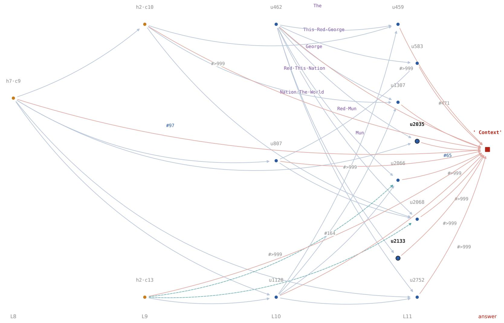  
Figure 45 : softplus prediction 2 : the graph 14 members and 25 edges among them.

… the issues of the day as God talks about them. So number two, preach biblical values. Number three, make sure they go vote those biblica

<table><tr><td>→ &#x27;values&#x27;</td><td>p=0.56</td><td colspan="2"></td><td colspan="2">105 components reach 90% of the net</td><td colspan="2">no prefix flips it</td><td colspan="2">66% cancels</td><td colspan="2"></td></tr><tr><td></td><td></td><td></td><td>strength</td><td></td><td>fires on</td><td></td><td></td><td>writes toward</td><td></td><td></td><td>answer</td></tr><tr><td>L11·h1·c12</td><td></td><td>attn</td><td>0.67</td><td></td><td>&#x27;request&#x27;</td><td></td><td>→</td><td>value&#x27;</td><td>Law&#x27;</td><td></td><td>#8</td></tr><tr><td>LL10·u2433</td><td>16%</td><td>ffn</td><td>1.29</td><td></td><td>life&#x27; how&#x27;</td><td></td><td>We→</td><td>should&#x27;&#x27;First&#x27;</td><td></td><td></td><td>#31</td></tr><tr><td>LL10·h6·c62</td><td>9% via life·We</td><td>attn</td><td>0.41</td><td></td><td></td><td>products</td><td>→</td><td>today&#x27;</td><td></td><td>every&#x27;&#x27;and&#x27;</td><td>#311</td></tr><tr><td>LL10·h6·c28</td><td>5%</td><td>attn</td><td>0.33</td><td></td><td>both&#x27;</td><td></td><td></td><td>→Mr&#x27;not&#x27;no&#x27;</td><td></td><td></td><td>#88</td></tr><tr><td>LL10·h8·c4</td><td>4% via communit</td><td>attn</td><td>0.40</td><td></td><td>community</td><td></td><td></td><td>→&#x27;expressed&#x27;&#x27;views&#x27;</td><td></td><td></td><td>#32</td></tr><tr><td>LL9·h1·c31</td><td>10%</td><td>attn</td><td>0.63</td><td></td><td>think</td><td>says&#x27;</td><td>→ 1</td><td>support&#x27;&#x27;,</td><td></td><td></td><td>#219</td></tr><tr><td>LL0·h4·c15</td><td>9%</td><td>attn</td><td>0.48</td><td>&#x27;on&#x27;</td><td>&#x27;is&#x27;</td><td>&#x27;ing&#x27;</td><td>→</td><td>and&#x27;(&#x27;</td><td></td><td></td><td>#&gt;999</td></tr><tr><td>LL8·h11·c33</td><td>2% via say·products</td><td>attn</td><td>0.62</td><td></td><td>number&#x27;</td><td>think&#x27;</td><td></td><td>→&#x27;rate&#x27;&#x27;affairs&#x27;</td><td></td><td></td><td>#71</td></tr><tr><td>LL10·u2613</td><td>8%</td><td>ffn</td><td>1.19</td><td>World&#x27;</td><td></td><td>new</td><td>→ (A)</td><td></td><td></td><td></td><td>#&gt;999</td></tr><tr><td>LL9·h1·c31</td><td>(above)</td><td></td><td></td><td></td><td></td><td></td><td></td><td></td><td></td><td></td><td></td></tr><tr><td>LL8·h11·c33</td><td>(above)</td><td></td><td></td><td></td><td></td><td></td><td></td><td></td><td></td><td></td><td></td></tr><tr><td>LL10·h8·c4</td><td>(above)</td><td></td><td></td><td></td><td></td><td></td><td></td><td></td><td></td><td></td><td></td></tr><tr><td>LL10·u2085</td><td>6%</td><td>ffn</td><td>1.13</td><td></td><td>during&#x27;</td><td>such</td><td>form&#x27;</td><td></td><td>15&#x27;</td><td></td><td>#454</td></tr><tr><td>L11·h1·c19</td><td></td><td>attn</td><td>0.45</td><td></td><td>need&#x27;</td><td></td><td></td><td>value&#x27;</td><td>&#x27;cost&#x27;&#x27; time&#x27;</td><td></td><td>#12</td></tr><tr><td>L11·h1·c21</td><td></td><td>attn</td><td>0.31</td><td></td><td>number</td><td>way</td><td></td><td>power&#x27;</td><td>sell&#x27;</td><td></td><td>#53</td></tr><tr><td>L11·u364</td><td></td><td>ffn</td><td>0.91</td><td>start</td><td>day</td><td></td><td></td><td>act&#x27;&#x27; fly&#x27;&#x27;run&#x27;</td><td></td><td></td><td>#561</td></tr><tr><td>LL10·h8·c4</td><td>(above)</td><td></td><td></td><td></td><td></td><td></td><td></td><td></td><td></td><td></td><td></td></tr><tr><td>LL10·u2085</td><td>(above)</td><td></td><td></td><td></td><td></td><td></td><td></td><td></td><td></td><td></td><td></td></tr><tr><td>LL11·h1·c19</td><td>(above)</td><td></td><td></td><td></td><td></td><td></td><td></td><td></td><td></td><td></td><td></td></tr><tr><td>L11·u748</td><td></td><td>ffn</td><td>1.30</td><td>&#x27;very&#x27;</td><td></td><td></td><td></td><td>something→conservatives&#x27;hold&#x27;</td><td></td><td></td><td>#178</td></tr><tr><td>LL10·h8·c4</td><td>(above)</td><td></td><td></td><td></td><td></td><td></td><td></td><td></td><td></td><td></td><td></td></tr><tr><td>LL9·h1·c31</td><td>(above)</td><td></td><td></td><td></td><td></td><td></td><td></td><td></td><td></td><td></td><td></td></tr><tr><td>LL11·h1·c12</td><td>(above)</td><td></td><td></td><td></td><td></td><td></td><td></td><td></td><td></td><td></td><td></td></tr><tr><td>L11·u918</td><td></td><td>ffn</td><td>0.82</td><td>time&#x27;</td><td></td><td></td><td></td><td></td><td>→&#x27;short&#x27;&#x27;benefit&#x27;</td><td></td><td>#485</td></tr><tr><td>LL11·h1·c19</td><td>(above)</td><td></td><td></td><td></td><td></td><td></td><td></td><td></td><td></td><td></td><td></td></tr><tr><td>LL8·h11·c33</td><td>(above)</td><td></td><td></td><td></td><td></td><td></td><td></td><td></td><td></td><td></td><td></td></tr><tr><td>LL11·h1·c12</td><td>(above)</td><td></td><td></td><td></td><td></td><td></td><td></td><td></td><td></td><td></td><td></td></tr><tr><td>L11·u1275</td><td></td><td>ffn</td><td>1.22</td><td>need&#x27;</td><td></td><td></td><td></td><td></td><td>→taught&#x27;philosophy&#x27;</td><td></td><td>#709</td></tr><tr><td>LL11·h1·c12</td><td>(above)</td><td></td><td></td><td></td><td></td><td></td><td></td><td></td><td></td><td></td><td></td></tr><tr><td>LL10·u2613</td><td>(above)</td><td></td><td></td><td></td><td></td><td></td><td></td><td></td><td></td><td></td><td></td></tr><tr><td>LL8·h11·c33</td><td>(above)</td><td></td><td>0.55</td><td>book&#x27;</td><td></td><td></td><td></td><td></td><td></td><td></td><td>#83</td></tr><tr><td>L11·u1954</td><td></td><td>ffn</td><td></td><td></td><td>&#x27;It&#x27;</td><td></td><td></td><td></td><td>→ &#x27;read&#x27;&#x27; reads&#x27;</td><td></td><td></td></tr><tr><td>LL10·u2433 LL10·h8·c4</td><td>(above) (above)</td><td></td><td></td><td></td><td></td><td></td><td></td><td></td><td></td><td></td></table>

Figure 46: ReLU, prediction 1: the set, 23 members. Of 14 predictions drawn at random, this is one of the four whose suficient set is nearest the median, 22.

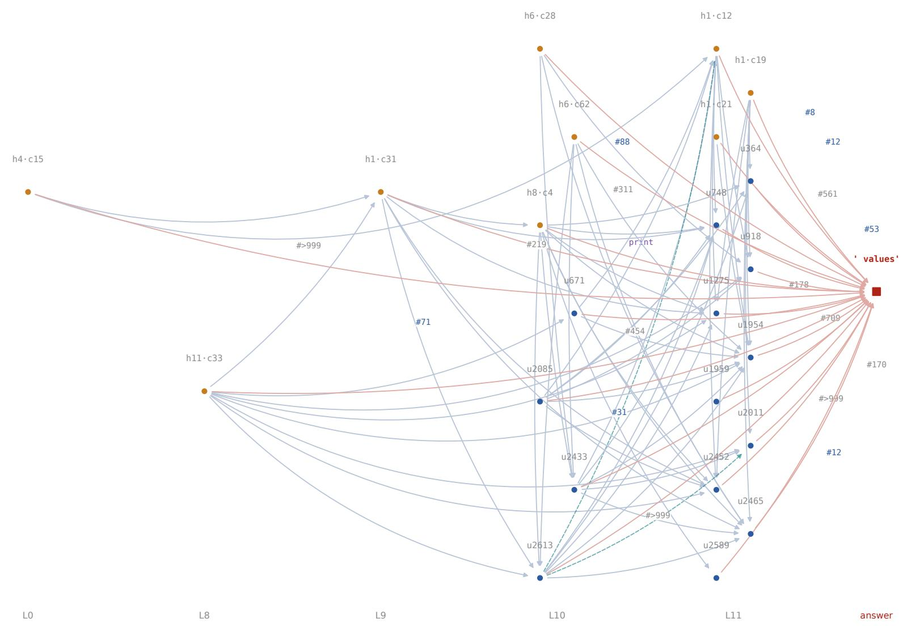  
Figure 47: ReLU prediction 1 : the graph 23 members and 65 edges among them.

… Roufus, head of one of the top fight camps in mixed martial arts, whose charges include a current UFC champion.↵↵Milwaukee

<table><tr><td>→ &#x27;Journal&#x27;</td><td>p=0.40</td><td colspan="4">71 components reach 90% of the net</td><td colspan="4">2 required 66% cancels</td></tr><tr><td></td><td></td><td colspan="4">strength</td><td colspan="4">writes toward</td></tr><tr><td>L11·h7·c16</td><td></td><td>attn</td><td>0.23</td><td>read&#x27;</td><td>book&#x27;</td><td>→</td><td>&#x27;read&#x27;&#x27;readers&#x27;</td><td></td><td>#134</td></tr><tr><td>L11·u59</td><td></td><td>ffn</td><td>1.26</td><td>&#x27;EN&#x27;</td><td>Red&#x27;</td><td>→</td><td>&#x27;Lake&#x27;&#x27;man&#x27;</td><td>Thomas&#x27;</td><td>#&gt;999</td></tr><tr><td>LL10·u2818</td><td>25%</td><td></td><td>6.11</td><td>same&#x27;</td><td>&#x27;able&#x27;</td><td>→</td><td>the&#x27; &#x27;.&#x27;</td><td>of&#x27;</td><td>#&gt;999</td></tr><tr><td>LL10·h2·c49</td><td>15% via current</td><td></td><td>0.87</td><td>&#x27;EN&#x27;</td><td>Zhang&#x27;</td><td>→</td><td>Wisconsin&#x27;</td><td></td><td>#553</td></tr><tr><td>LL10·u1052</td><td>9%</td><td></td><td>1.98</td><td>local&#x27;</td><td>&#x27;local&#x27;</td><td>→</td><td>&#x27;based&#x27;</td><td>&#x27;ers&#x27;</td><td>#544</td></tr><tr><td>L11·u208</td><td></td><td>ffn ffn</td><td>1.06</td><td>them&#x27;</td><td>think&#x27;</td><td>→ 1.1</td><td>&#x27;&#x27;&#x27;ily&#x27;</td><td></td><td>#152</td></tr><tr><td>LL10·u2818</td><td>(above)</td><td></td><td></td><td></td><td></td><td></td><td></td><td></td><td></td></tr><tr><td>LL10·u1991</td><td>6%</td><td></td><td>1.45</td><td>&#x27;&#x27;S&#x27;</td><td>The&#x27;</td><td>→</td><td>&#x27;ort&#x27;&#x27;af&#x27;&#x27;eng&#x27;</td><td></td><td>#&gt;999</td></tr><tr><td>LL10·h2·c10</td><td>8%</td><td></td><td>0.83</td><td>1 Zhang&#x27;</td><td>Cell&#x27;</td><td>入</td><td></td><td>&#x27;Walker&#x27;&#x27;Swiss&#x27;</td><td>#&gt;999</td></tr><tr><td>LL9·u1406</td><td>7% via The-local·local</td><td></td><td>0.39</td><td>We&#x27;</td><td>said&#x27;</td><td>→</td><td></td><td>&#x27;reports&#x27;&#x27;station&#x27;</td><td>#149</td></tr><tr><td>LL10·h2·c49</td><td>(above)</td><td></td><td></td><td></td><td></td><td></td><td></td><td></td><td></td></tr><tr><td>LL10·u1353</td><td>4%</td><td></td><td>1.23</td><td>&#x27;local&#x27;</td><td>best&#x27;</td><td>→</td><td>County&#x27;</td><td></td><td>#&gt;999</td></tr><tr><td>LL10·h2·c49</td><td>(above)</td><td>ffn</td><td></td><td></td><td></td><td></td><td></td><td>&#x27;University&#x27;</td><td></td></tr><tr><td>L11·u464</td><td></td><td></td><td>0.62</td><td>&#x27;In&#x27;</td><td>from&#x27;</td><td>&#x27;The&#x27; →</td><td>&#x27;Ar&#x27;</td><td>&#x27;C&#x27;&#x27;Personally&#x27;</td><td>#&gt;999</td></tr><tr><td>LL10·u2818</td><td>(above)</td><td></td><td></td><td></td><td></td><td></td><td></td><td></td><td></td></tr><tr><td>LL10·u1052</td><td>(above)</td><td></td><td></td><td></td><td></td><td></td><td></td><td></td><td></td></tr><tr><td>LL10·u1353</td><td>(above)</td><td></td><td></td><td></td><td></td><td></td><td></td><td></td><td></td></tr><tr><td>L11·u542</td><td></td><td></td><td>0.79</td><td>And</td><td>al</td><td>&#x27;In&#x27; →</td><td>TI</td><td>(</td><td>#&gt;999</td></tr><tr><td>L11·u561</td><td></td><td></td><td>2.21</td><td>1 Zhang&#x27;</td><td>most&#x27;</td><td>→</td><td>&#x27;ic&#x27;</td><td>&#x27;dan&#x27;EC&#x27;</td><td>#124</td></tr><tr><td>LL10·h2·c10</td><td>(above)</td><td></td><td></td><td></td><td></td><td></td><td></td><td></td><td></td></tr><tr><td>LL10·u2818</td><td>(above)</td><td></td><td></td><td></td><td></td><td></td><td></td><td></td><td></td></tr><tr><td>LL10·h2·c49</td><td>(above)</td><td></td><td></td><td></td><td></td><td></td><td></td><td></td><td></td></tr><tr><td>L11·u1343</td><td></td><td></td><td>0.70</td><td>The&#x27;</td><td>&#x27;The&#x27;</td><td>→</td><td></td><td>paper&#x27;Observer&#x27;</td><td>#36</td></tr><tr><td>LL10·u2818</td><td>(above)</td><td></td><td></td><td></td><td></td><td></td><td></td><td></td><td></td></tr><tr><td>L10·u414</td><td>57% via The-local·The</td><td></td><td>1.57</td><td>The&#x27;</td><td>print</td><td>→</td><td>&#x27;newspaper&#x27;</td><td></td><td>#33</td></tr><tr><td>LL9·u1406</td><td>(above)</td><td></td><td></td><td></td><td></td><td></td><td></td><td></td><td></td></tr><tr><td>LL10·h2·c6</td><td>3%</td><td></td><td>0.85</td><td>don&#x27;</td><td>Ye&#x27;</td><td></td><td></td><td>→Wisconsin&#x27;Chinese</td><td>#155</td></tr><tr><td>LL10·h2·c10</td><td>(above)</td><td></td><td></td><td></td><td></td><td></td><td></td><td></td><td></td></tr><tr><td>LL9·u1406</td><td>(above)</td><td></td><td></td><td></td><td></td><td></td><td></td><td></td><td></td></tr><tr><td>L11·u1460</td><td></td><td></td><td>0.63</td><td>This&#x27;</td><td>&#x27;Context&#x27;</td><td>→</td><td>&#x27;Privacy&#x27;</td><td>News&#x27;</td><td>#12</td></tr><tr><td>LL10·u2818</td><td>(above)</td><td></td><td></td><td></td><td></td><td></td><td></td><td></td><td></td></tr><tr><td>L10·u414</td><td>(above)</td><td></td><td></td><td></td><td></td><td></td><td></td><td></td><td></td></tr><tr><td>LL10·u1991</td><td>(above)</td><td></td><td></td><td></td><td></td><td></td><td></td><td></td><td></td></tr><tr><td>L11·u1483</td><td></td><td></td><td>0.71</td><td>&#x27;the&#x27;</td><td>national&#x27;</td><td>→</td><td>race&#x27;</td><td>&#x27;either&#x27;</td><td>#553</td></tr><tr><td>LL10·u2818</td><td>(above)</td><td></td><td></td><td></td><td></td><td></td><td></td><td></td><td></td></tr><tr><td>LL10·u1991</td><td>(above)</td><td></td><td></td><td></td><td></td><td></td><td></td><td></td><td></td></tr><tr><td>L10·u414</td><td>(above)</td><td></td><td></td><td></td><td></td><td></td><td></td><td></td><td></td></tr><tr><td>L11·u1877</td><td></td><td></td><td>0.70</td><td>The&#x27;</td><td>He&#x27;</td><td></td><td></td><td>→  World&#x27; History&#x27;</td><td>#554</td></tr><tr><td>LL10·u2818</td><td>(above)</td><td></td><td></td><td></td><td></td><td></td><td></td><td></td><td></td></tr><tr><td>LL10·u1353 LL10·u1052</td><td>(above) (above)</td><td></td><td></td><td></td></table>

Figure 48: ReLU, prediction 2: the set, 24 members. Of 14 predictions drawn at random, this is one of the four whose suficient set is nearest the median, 22.

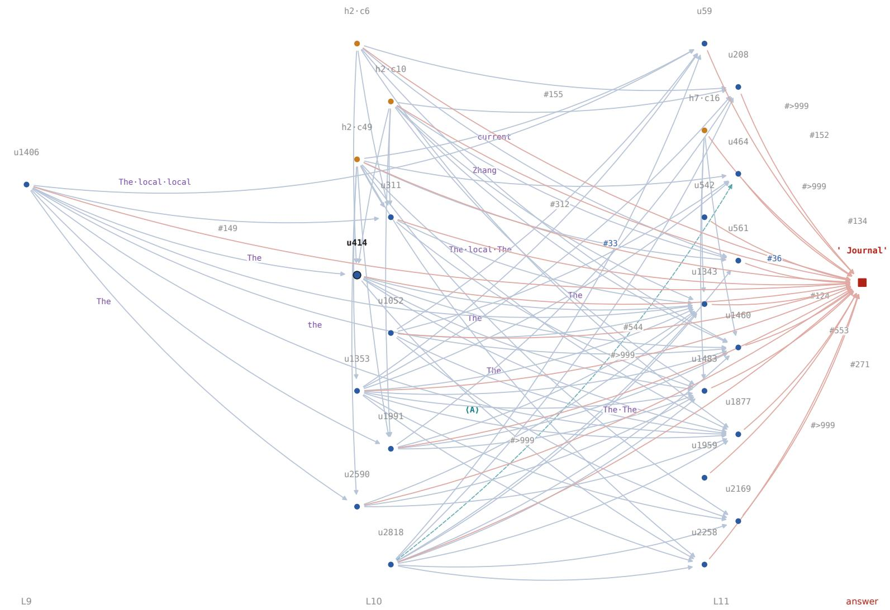  
Figure 49 : ReLU prediction 2 : the graph 24 members and 73 edges among them .

…g is the audio record.<|endoftext|>A classic Final Fantasy game may be made available on PlayStation 4 in the very near future, according to a listing
<table><tr><td>→ on&#x27;</td><td>p=0.34</td><td></td><td colspan="3">49 components reach 90% of the net 2 required</td><td colspan="3"></td><td colspan="3">88% cancels</td></tr><tr><td></td><td></td><td></td><td>strength</td><td>fires on</td><td></td><td></td><td>writes toward</td><td></td><td></td><td></td><td>answer</td></tr><tr><td>L11·h8·c42</td><td></td><td>attn</td><td>0.32</td><td></td><td>al&#x27;Py&#x27;Ye&#x27;</td><td></td><td>and&#x27;</td><td></td><td></td><td></td><td>#16</td></tr><tr><td>L11·u1149</td><td></td><td>ffn</td><td>0.67</td><td></td><td>games&#x27;</td><td>&#x27;things&#x27;→</td><td></td><td></td><td></td><td></td><td>#307</td></tr><tr><td>L11·u3018</td><td></td><td></td><td>1.43</td><td></td><td>book&#x27; its&#x27;</td><td>→</td><td>&#x27;al&#x27;</td><td>&#x27;e&#x27;</td><td></td><td></td><td>#18</td></tr><tr><td>LL10·u1792</td><td>13%</td><td>ffn</td><td>2.56</td><td>him&#x27;</td><td>going</td><td></td><td>→ (A)</td><td></td><td></td><td></td><td>#8</td></tr><tr><td>LL8·u1651</td><td>12% via him</td><td>ffn</td><td>0.43</td><td>&#x27; context&#x27;</td><td></td><td></td><td></td><td></td><td></td><td>→&#x27;for&#x27;between&#x27;&#x27;on&#x27;</td><td>#3</td></tr><tr><td>L7·u2234</td><td>12%</td><td>ffn</td><td>0.56</td><td></td><td>called&#x27;</td><td>said&#x27;</td><td></td><td></td><td>→ in&#x27;on&#x27;way&#x27;</td><td></td><td>#2</td></tr><tr><td>LL9·u1857</td><td>11%</td><td>ffn</td><td>0.80</td><td></td><td>players&#x27;</td><td>senio&#x27;in&#x27;&#x27;within&#x27;&#x27;at&#x27;</td><td></td><td></td><td></td><td></td><td>#4</td></tr><tr><td>LL8·u1862</td><td>13% via players·ers</td><td>ffn</td><td>0.73</td><td>item&#x27;</td><td>place&#x27;</td><td></td><td></td><td></td><td>→bodies&#x27;body&#x27;&#x27;ix&#x27;</td><td></td><td>#8</td></tr><tr><td>L7·u2234</td><td>(above)</td><td></td><td></td><td></td><td></td><td></td><td></td><td></td><td></td><td></td><td></td></tr><tr><td>L7·u2234</td><td>(above)</td><td></td><td></td><td></td><td></td><td></td><td></td><td></td><td></td><td></td><td></td></tr><tr><td>LL8·u1651</td><td>(above)</td><td></td><td></td><td></td><td></td><td></td><td></td><td></td><td></td><td></td><td></td></tr><tr><td>LL9·u2960</td><td>8% via right</td><td>ffn</td><td>0.33</td><td>best&#x27;</td><td>every&#x27;</td><td></td><td></td><td></td><td></td><td>→ in&#x27;on&#x27; within&#x27;</td><td>#2</td></tr><tr><td>L7·u2234</td><td>(above)</td><td></td><td></td><td></td><td></td><td></td><td></td><td></td><td></td><td></td><td></td></tr><tr><td>LL0·h7·c16</td><td>13% via players</td><td>attn</td><td>0.22</td><td>H</td><td>&#x27;the&#x27;&#x27;The&#x27;</td><td></td><td></td><td></td><td>in&#x27;</td><td></td><td>#6</td></tr><tr><td>LL0·h11·c46</td><td>12%</td><td>attn</td><td>0.14</td><td>1 same&#x27;</td><td>INE&#x27;</td><td>&#x27;Py&#x27;→</td><td></td><td></td><td>and&#x27;</td><td></td><td>#10</td></tr><tr><td>LL10·u373</td><td>13%</td><td>ffn</td><td>0.67</td><td></td><td>products&#x27;</td><td></td><td>→ 1 in&#x27;</td><td></td><td></td><td>on&#x27; within&#x27;</td><td>#2</td></tr><tr><td>LL9·u2752</td><td>39% via products</td><td>ffn</td><td>0.61</td><td>products</td><td></td><td></td><td>→ out&#x27; &#x27;li&#x27;</td><td></td><td>on</td><td></td><td>#3</td></tr><tr><td>L7·u2234</td><td>(above)</td><td></td><td></td><td></td><td></td><td></td><td></td><td></td><td></td><td></td><td></td></tr><tr><td>LL8·u1862</td><td>(above)</td><td></td><td></td><td></td><td></td><td></td><td></td><td></td><td></td><td></td><td></td></tr><tr><td>LL0·h10·c0</td><td>2%</td><td>attn</td><td>0.09</td><td>&#x27;Context&#x27;&#x27;Py&#x27;</td><td></td><td></td><td></td><td></td><td>and</td><td></td><td>#13</td></tr><tr><td>L7·u2234 LL9·u1857</td><td>(above)</td><td></td><td></td><td></td><td></td><td></td><td></td><td></td><td></td><td></td><td></td></tr><tr><td>LL9·u2752</td><td>(above)</td><td></td><td></td><td></td><td></td><td></td><td></td><td></td><td></td><td></td><td></td></tr><tr><td>L10·u85</td><td>(above)</td><td>ffn</td><td>0.22</td><td>time&#x27;&#x27;help&#x27;</td><td></td><td></td><td></td><td></td><td></td><td></td><td>#1</td></tr><tr><td>L10·u136</td><td></td><td>ffn</td><td>0.66</td><td>&#x27;The&#x27;&#x27;the&#x27;</td><td></td><td>→1</td><td>on&#x27;</td><td></td><td>in&#x27;&#x27;and&#x27;</td><td></td><td>#943</td></tr><tr><td>L10·u470</td><td></td><td>ffn</td><td>0.68</td><td>still&#x27;</td><td>been&#x27;</td><td></td><td>or&#x27;</td><td></td><td>and&#x27; to&#x27; in</td><td></td><td>#19</td></tr><tr><td>LL9·u1857</td><td>(above)</td><td></td><td></td><td></td><td></td><td></td><td></td><td></td><td></td><td></td><td></td></tr><tr><td>L9·u2419</td><td>29% via still</td><td>ffn</td><td>1.33</td><td>place&#x27;</td><td>number&#x27;→On&#x27;on&#x27;</td><td></td><td></td><td></td><td>&#x27;a&#x27;</td><td></td><td>#3</td></tr><tr><td>LL8·u1862</td><td>(above)</td><td></td><td></td><td></td><td></td><td></td><td></td><td></td><td></td><td></td><td></td></tr><tr><td>L7·u2234</td><td>(above)</td><td></td><td></td><td></td><td></td><td></td><td></td><td></td><td></td><td></td><td></td></tr><tr><td>LL0·h4·c29</td><td>2%</td><td>attn</td><td>0.40</td><td>t ines&#x27;</td><td>He</td><td>→</td><td></td><td>&#x27;t</td><td></td><td></td><td>#15</td></tr><tr><td>LL9·u2960</td><td>(above)</td><td></td><td></td><td></td><td></td><td></td><td></td><td></td><td></td><td></td><td></td></tr><tr><td>L10·u585</td><td></td><td>ffn</td><td>0.57</td><td>right&#x27;</td><td>just&#x27;</td><td></td><td></td><td></td><td></td><td>→&#x27;at&#x27;&#x27; under&#x27;&#x27; down&#x27;</td><td>#8</td></tr><tr><td>LL8·u1862</td><td>(above)</td><td></td><td></td><td></td><td></td><td></td><td></td><td></td><td></td><td></td><td></td></tr><tr><td>LL9·u2752 LL8·u1651</td><td>(above)</td><td></td><td></td></table>

Figure 50: sigmoid, no shaping, prediction 1: the set, 24 members. Of 16 predictions drawn at random, this is one of the four whose suficient set is nearest the median, 25.

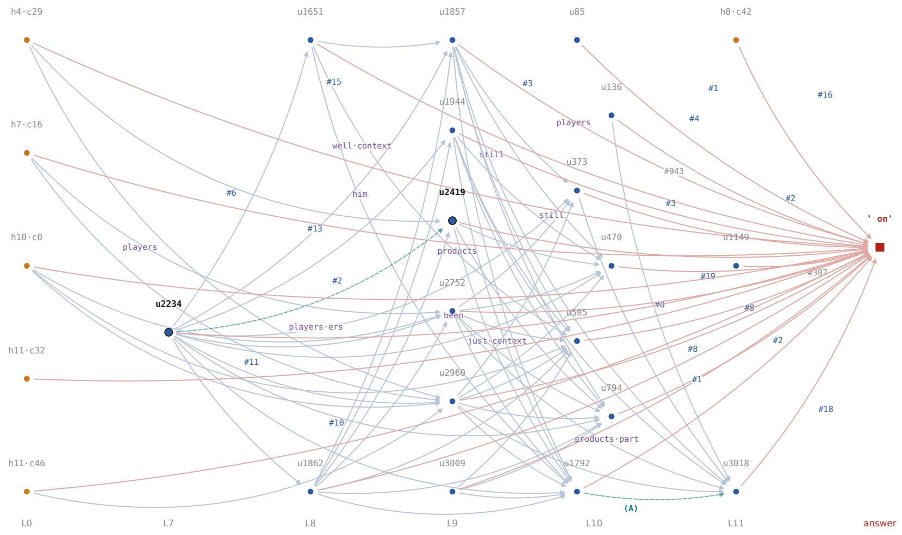  
Figure 5 1 : sigmoid no shaping prediction 1 : the graph 24 members and 6 1 edges among them.

…. It is a less expensive option for the promoter because officials don't need to be paid to be there the day before. But the state views

<table><tr><td>→the&#x27;</td><td>p=0.36</td><td colspan="4">49 components reach 90% of the net 1 required 90% cancels</td><td colspan="4"></td><td></td></tr><tr><td></td><td></td><td></td><td>strength</td><td>fires on</td><td></td><td></td><td></td><td>writes toward</td><td></td><td></td><td>answer</td></tr><tr><td>L11·h0·c27</td><td></td><td>attn</td><td>0.07</td><td>some&#x27;</td><td>&#x27;The&#x27;</td><td></td><td></td><td></td><td>→&#x27;the&#x27;&#x27; and&#x27;&#x27;it&#x27;</td><td></td><td>#1</td></tr><tr><td>L11·h0·c51</td><td></td><td>attn</td><td>0.09</td><td>The&#x27;</td><td>the&#x27;</td><td></td><td></td><td></td><td>→&#x27; the&#x27;&#x27;of&#x27;&#x27; that&#x27;</td><td></td><td>#1</td></tr><tr><td>L11·h10·c49</td><td></td><td>attn</td><td>0.11</td><td>&#x27;The&#x27;</td><td>the&#x27;</td><td></td><td></td><td></td><td>→ &#x27;the&#x27;&#x27;The&#x27;&#x27;the&#x27;</td><td></td><td>#1</td></tr><tr><td>L11·u1447</td><td></td><td>ffn</td><td>0.20</td><td>Py&#x27;</td><td>Red</td><td>The&#x27;</td><td></td><td>→and&#x27;</td><td></td><td></td><td>#71</td></tr><tr><td>L11·u1558</td><td></td><td>ffn</td><td>0.15</td><td>off′</td><td>on&#x27;</td><td></td><td></td><td></td><td>→ &#x27;the&#x27;&#x27;the&#x27; &#x27;The&#x27;</td><td></td><td>#1</td></tr><tr><td>L11·u3062</td><td></td><td>ffn</td><td>0.13</td><td>He</td><td>cor</td><td>al</td><td></td><td>the&#x27;</td><td></td><td></td><td>#1</td></tr><tr><td>L11·u3071</td><td></td><td>ffn</td><td>0.43</td><td>made</td><td></td><td>make</td><td></td><td></td><td></td><td>the&#x27;&#x27;the&#x27;&#x27;their&#x27;</td><td>#1</td></tr><tr><td>L10·h5·c55</td><td></td><td>attn</td><td>0.04</td><td>&#x27;The&#x27;</td><td>the</td><td></td><td></td><td></td><td>→ &#x27;the&#x27;&#x27;the&#x27;&#x27; The&#x27;</td><td></td><td>#1</td></tr><tr><td>L10·h6·c2</td><td></td><td>attn</td><td>0.10</td><td></td><td>video&#x27;</td><td>call&#x27;</td><td></td><td></td><td>→&#x27; the&#x27;&#x27;the&#x27;&#x27; The&#x27;</td><td></td><td>#1</td></tr><tr><td>L10·h9·c38</td><td></td><td>attn</td><td>0.16</td><td>the</td><td>The&#x27;</td><td>an</td><td></td><td></td><td>→&#x27;the&#x27; &#x27;the&#x27;&#x27;The&#x27;</td><td></td><td>#1</td></tr><tr><td>L10·u1547</td><td></td><td>ffn</td><td>2.72</td><td>&#x27;into&#x27;</td><td></td><td>during&#x27;</td><td></td><td></td><td></td><td>→ &#x27; the&#x27;&#x27; her&#x27;&#x27;your&#x27;</td><td>#1</td></tr><tr><td>LL9·u1926</td><td>43% via into</td><td>ffn</td><td>1.80</td><td>&#x27;with&#x27;</td><td>1</td><td>using&#x27;</td><td></td><td></td><td></td><td>→&#x27;the&#x27;&#x27;their&#x27;&#x27;a&#x27;</td><td>#1</td></tr><tr><td>LL7·u895</td><td>31% via with-into</td><td>ffn</td><td>1.20</td><td>into&#x27;</td><td></td><td>for&#x27;</td><td></td><td></td><td></td><td>→&#x27; them&#x27;&#x27; their&#x27;&#x27; its&#x27;</td><td>#4</td></tr><tr><td>LL8·u576</td><td>16% via into·during</td><td>ffn</td><td>1.03</td><td></td><td>called&#x27;</td><td>using</td><td></td><td></td><td>→&#x27;the&#x27;&#x27;the&#x27;&#x27;The&#x27;</td><td></td><td>#1</td></tr><tr><td>LL7·u895</td><td>(above)</td><td></td><td></td><td></td><td></td><td></td><td></td><td></td><td></td><td></td><td></td></tr><tr><td>LL7·u269</td><td>12% via made</td><td>ffn</td><td>0.48</td><td>such&#x27;</td><td></td><td>think</td><td></td><td>at</td><td></td><td></td><td>#83</td></tr><tr><td>LL7·h7·c41</td><td>11%</td><td>attn</td><td>0.26</td><td></td><td>officials</td><td></td><td>→</td><td></td><td>said&#x27;</td><td></td><td>#5</td></tr><tr><td>LL8·u1296</td><td>5% via into·against</td><td>ffn</td><td>1.31</td><td>into&#x27;</td><td></td><td>see&#x27;</td><td>→&#x27;himself&#x27;&#x27;themselves&#x27;</td><td></td><td></td><td></td><td>#99</td></tr><tr><td>LL7·u895</td><td>(above)</td><td></td><td></td><td></td><td></td><td></td><td></td><td></td><td></td><td></td><td></td></tr><tr><td>LL7·u269</td><td>(above)</td><td></td><td></td><td></td><td></td><td></td><td></td><td></td><td></td><td></td><td></td></tr><tr><td>LL7·u895</td><td>(above)</td><td></td><td></td><td></td><td></td><td></td><td></td><td></td><td></td><td></td><td></td></tr><tr><td>LL8·u576</td><td>(above)</td><td></td><td></td><td></td><td></td><td></td><td></td><td></td><td></td><td></td><td></td></tr><tr><td>L10·u2279</td><td></td><td>ffn</td><td>1.21</td><td></td><td>&#x27;where&#x27;</td><td></td><td></td><td></td><td>&#x27;because&#x27;→ &#x27;ard&#x27;[&#x27;&#x27;nd&#x27;</td><td></td><td>#&gt;999</td></tr><tr><td>LL9·u1926</td><td>(above)</td><td></td><td></td><td></td><td></td><td></td><td></td><td></td><td></td><td></td><td></td></tr><tr><td>LL8·u1296</td><td>(above)</td><td></td><td></td><td></td><td></td><td></td><td></td><td></td><td></td><td></td><td></td></tr><tr><td>LL9·u125</td><td>15% via where·when</td><td>ffn</td><td>1.62</td><td>with&#x27;</td><td></td><td></td><td></td><td></td><td>&#x27;against&#x27;→&#x27;this&#x27;&#x27; these&#x27;&#x27; each&#x27;</td><td></td><td>#13</td></tr><tr><td>LL7·u895</td><td>(above)</td><td></td><td></td><td></td><td></td><td></td><td></td><td></td><td></td><td></td><td></td></tr><tr><td>LL8· u576</td><td>(above)</td><td></td><td></td><td></td><td></td><td></td><td></td><td></td><td></td><td></td><td></td></tr><tr><td>LL8·u1296</td><td>(above)</td><td></td><td></td><td></td><td></td><td></td><td></td><td></td><td></td><td></td><td></td></tr><tr><td>L9·h6·c13</td><td></td><td>attn</td><td>0.59</td><td>World&#x27;</td><td></td><td>Re</td><td>1</td><td></td><td>and&#x27;</td><td></td><td>#77</td></tr><tr><td>L9·u976</td><td></td><td>ffn</td><td>0.41</td><td></td><td>during&#x27;</td><td>help&#x27;</td><td>→ &#x27;t&#x27;</td><td></td><td></td><td>&#x27;&lt;|endoftext|&gt;&#x27;</td><td>#7</td></tr><tr><td>LL8·u576</td><td>(above)</td><td></td><td></td><td></td><td></td><td></td><td></td><td></td><td></td><td></td><td></td></tr><tr><td>LL8·u1296</td><td>(above)</td><td></td><td></td><td></td><td></td><td></td><td></td><td></td><td></td><td></td><td></td></tr><tr><td>LL7·h7·c41 L9·u1069</td><td>(above)</td><td>ffn</td><td>0.07</td><td>&#x27;The&#x27;</td><td>the</td><td></td><td>→ &#x27;the&#x27;&#x27;the&#x27;&#x27; The&#x27;</td></table>

Figure 52: sigmoid, no shaping, prediction 2: the set, 27 members. Of 16 predictions drawn at random, this is one of the four whose suficient set is nearest the median, 25.

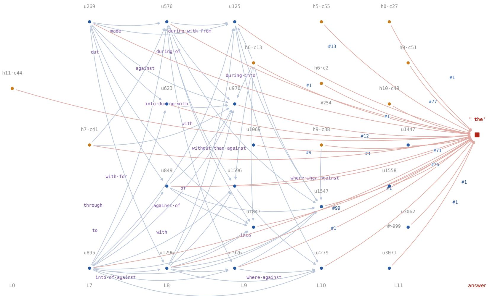  
Figure 5 3 : sigmoid , no shaping , prediction 2 : the graph , 2 7 members and 48 edges among them .

…identally killed three innocent Afghan civilians.’ But a Marine official here raised questions about whether the children were ’innocent.’ Before
<table><tr><td>→ &#x27;the&#x27;</td><td></td><td>p=0.38</td><td>35 components reach 90% of the net</td><td></td><td></td><td></td><td></td><td></td><td>no prefix flips it 87% cancels</td><td></td></tr><tr><td></td><td></td><td></td><td>strength</td><td>fires on</td><td></td><td></td><td>writes toward</td><td></td><td></td><td>answer</td></tr><tr><td>L11·h0·c9</td><td></td><td>attn</td><td>0.10</td><td>Re&#x27;</td><td>The&#x27;</td><td>&#x27;The&#x27;</td><td></td><td>&#x27;the&#x27;&#x27;to&#x27;&#x27;of&#x27;</td><td></td><td>#1</td></tr><tr><td>L11·u68</td><td></td><td>ffn</td><td>0.56</td><td>become&#x27;</td><td>were</td><td></td><td></td><td></td><td></td><td>#599</td></tr><tr><td>L11·u585</td><td></td><td>ffn</td><td>1.34</td><td>&#x27;request&#x27;</td><td>like&#x27;</td><td></td><td></td><td></td><td></td><td>#&gt;999</td></tr><tr><td>L11·u1171</td><td></td><td>ffn</td><td>1.20</td><td>&#x27;ers&#x27;</td><td>still</td><td>→</td><td></td><td></td><td>Fei&#x27;</td><td>#&gt;999</td></tr><tr><td>L11·u1279</td><td></td><td>ffn</td><td>0.66</td><td>Re&#x27; 1</td><td>In&#x27; &#x27;In&#x27;</td><td></td><td></td><td></td><td></td><td>#&gt;999</td></tr><tr><td>L10·u226</td><td></td><td>ffn</td><td>0.94</td><td>because&#x27;</td><td></td><td>from</td><td>→ è</td><td>(</td><td></td><td>#17</td></tr><tr><td>L10·u760</td><td></td><td>ffn</td><td>0.49</td><td>former&#x27;</td><td>home&#x27;</td><td></td><td></td><td>→ &#x27;x&#x27; &#x27;less&#x27; &#x27;ally&#x27;</td><td></td><td>#&gt;999</td></tr><tr><td>L10·u1515</td><td></td><td>ffn</td><td>0.36</td><td>something&#x27;</td><td></td><td></td><td>→- one&#x27;</td><td>the&#x27;</td><td>a</td><td>#2</td></tr><tr><td>L8·u128</td><td></td><td>ffn</td><td>0.20</td><td>during&#x27;</td><td></td><td>using →</td><td></td><td>&#x27;rences&#x27;</td><td></td><td>#&gt;999</td></tr><tr><td>L8·u1387</td><td></td><td>ffn</td><td>0.98</td><td>will&#x27;</td><td>have&#x27;</td><td></td><td>→ 1</td><td>now&#x27;&#x27;yet&#x27;&#x27;at&#x27;</td><td></td><td>#15</td></tr><tr><td>LL5·u700</td><td>18% via will</td><td>ffn</td><td>0.87</td><td>before&#x27;</td><td></td><td>after&#x27;</td><td>→ 1 now&#x27;</td><td></td><td>Now&#x27;&#x27;with&#x27;</td><td>#&gt;999</td></tr><tr><td>LL2·u791</td><td>10% via before·after</td><td>ffn</td><td>0.35</td><td>as&#x27;</td><td>into&#x27;</td><td></td><td>→</td><td>the&#x27;</td><td>and&#x27;</td><td>#191</td></tr><tr><td>LL3·u1414</td><td>4%</td><td>ffn</td><td>0.25</td><td>Ye&#x27;</td><td>EC&#x27;</td><td>Mun&#x27;</td><td>→</td><td>and&#x27;</td><td></td><td>#21</td></tr><tr><td>LL3·u16</td><td>3%</td><td>ffn</td><td>0.20</td><td>Ye&#x27;</td><td>Zhang&#x27;</td><td></td><td></td><td>and&#x27;</td><td></td><td>#61</td></tr><tr><td>LL2·u791</td><td>(above)</td><td></td><td></td><td></td><td></td><td></td><td></td><td></td><td></td><td></td></tr><tr><td>L7·h6·c54</td><td></td><td>attn</td><td>0.19</td><td>both&#x27;</td><td>two&#x27;</td><td></td><td>→</td><td>the&#x27; &#x27;The&#x27;&#x27;the&#x27;</td><td></td><td>#1</td></tr><tr><td>L7·u392</td><td></td><td>ffn</td><td>0.90</td><td>start&#x27;</td><td></td><td>before&#x27;</td><td>→&#x27;the&#x27;</td><td></td><td></td><td>#566</td></tr><tr><td>LL5·u700</td><td>(above)</td><td></td><td></td><td></td><td></td><td></td><td></td><td></td><td></td><td></td></tr><tr><td>LL2·u791</td><td>(above)</td><td></td><td></td><td></td><td></td><td></td><td></td><td></td><td></td><td></td></tr><tr><td>LL7·h6·c54</td><td>(above)</td><td></td><td></td><td></td><td></td><td></td><td></td><td></td><td></td><td></td></tr><tr><td>L3·u155</td><td></td><td>ffn</td><td>0.26</td><td>Ye&#x27;</td><td>EC&#x27;Mun&#x27;→</td><td></td><td></td><td></td><td></td><td>#29</td></tr><tr><td>L0·h9·c27</td><td></td><td>attn</td><td>0.14</td><td>1 when&#x27;</td><td>after</td><td></td><td></td><td>and&#x27;</td><td></td><td>#11</td></tr></table>

Figure 54: set operators, prediction 1: the set, 18 members. Of 13 predictions drawn at random, this is one of the four whose suficient set is nearest the median, 22.

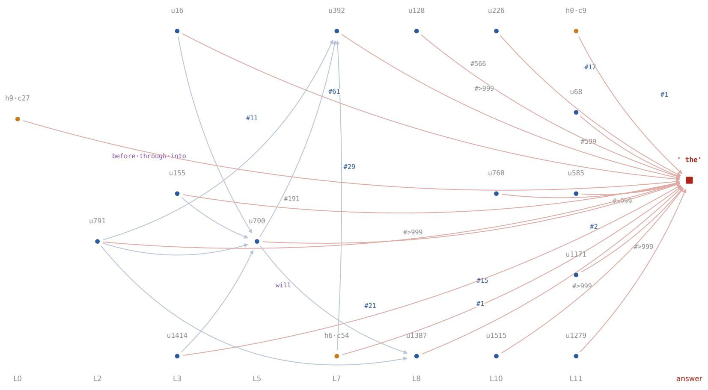  
Figure 5 5 : set operators prediction 1 : the graph 1 8 members and 9 edges among them

… a sovereign people.↵↵Tweet of the week↵↵The Brexit clock, lest we forget, is ticking:<|endoftext|>The Saracens hook
<table><tr><td>→ &#x27;er&#x27;</td><td></td><td>p=0.90</td><td colspan="3">46 components reach 90% of the net</td><td colspan="2">3 required</td><td colspan="3">85% cancels</td></tr><tr><td></td><td></td><td></td><td>strength</td><td></td><td>fires on</td><td></td><td></td><td>writes toward</td><td></td><td>answer</td></tr><tr><td>L11·u68</td><td></td><td>ffn</td><td>0.47</td><td>become&#x27;</td><td>were</td><td></td><td></td><td></td><td>----=&#x27;</td><td>#&gt;999</td></tr><tr><td>L11·u185</td><td></td><td>ffn</td><td>1.09</td><td>here&#x27;</td><td>or</td><td></td><td></td><td></td><td></td><td>#116</td></tr><tr><td>L11·u412</td><td></td><td>ffn</td><td>0.42</td><td>&#x27;This&#x27;</td><td>being&#x27;</td><td></td><td></td><td>and&#x27;</td><td></td><td>#216</td></tr><tr><td>L11·u544</td><td></td><td>ffn</td><td>0.83</td><td>great&#x27;</td><td>EC&#x27;</td><td></td><td></td><td></td><td>Heroes&#x27;overturn&#x27;</td><td>#&gt;999</td></tr><tr><td>L11·u835</td><td></td><td>ffn</td><td>0.28</td><td>He&#x27;</td><td>&#x27;Py&#x27; We&#x27;</td><td></td><td>&#x27;É&#x27;</td><td>à&#x27;</td><td>So</td><td>#43</td></tr><tr><td>L11·u1043</td><td></td><td>ffn</td><td>0.32</td><td>&#x27;In&#x27;</td><td>after</td><td></td><td></td><td></td><td></td><td>#51</td></tr><tr><td>L11·u1514</td><td></td><td>ffn</td><td>0.28</td><td>Cup</td><td>Re</td><td></td><td></td><td>&#x27;at&#x27; &#x27;in&#x27; &#x27;f&#x27;</td><td></td><td>#84</td></tr><tr><td>L10·u139</td><td></td><td>ffn</td><td>0.31</td><td>&#x27;&#x27;re&#x27;</td><td>are&#x27;</td><td>ul&#x27;</td><td></td><td></td><td>→The&#x27; right&#x27;&#x27;</td><td>#&gt;999</td></tr><tr><td>L10·u994</td><td></td><td>ffn</td><td>0.87</td><td>years&#x27;</td><td>need&#x27;</td><td></td><td></td><td></td><td>→ &#x27;bridge&#x27; center&#x27;</td><td>#202</td></tr><tr><td>L10·u1244</td><td></td><td>ffn</td><td>0.72</td><td>Red&#x27;</td><td>George&#x27;</td><td></td><td></td><td></td><td>→ &#x27;he&#x27;&#x27;port&#x27;&#x27; request&#x27;</td><td>#&gt;999</td></tr><tr><td>L10·u1387</td><td></td><td>ffn</td><td>0.99</td><td>call&#x27;</td><td>take&#x27;</td><td></td><td></td><td>up&#x27;&#x27;up&#x27;</td><td></td><td>#&gt;999</td></tr><tr><td>LL6·u943</td><td>397% via call·take·set</td><td>ffn</td><td>0.80</td><td>take&#x27;</td><td>call&#x27;</td><td></td><td></td><td></td><td>&#x27;out&#x27;&#x27;up&#x27; &#x27;back&#x27;</td><td>#12</td></tr><tr><td>LL3·u1414</td><td>2%</td><td>ffn</td><td>0.16</td><td>Ye&#x27;</td><td>EC&#x27;</td><td>Mun&#x27;</td><td></td><td>and&#x27;</td><td></td><td>#300</td></tr><tr><td>LL1·u263</td><td>2%</td><td>ffn</td><td>0.14</td><td>&#x27;ll&#x27;</td><td>&#x27;claim&#x27;</td><td></td><td></td><td>and&#x27;(&#x27;</td><td></td><td>#315</td></tr><tr><td>LL3·u1006</td><td>2% via call</td><td>ffn</td><td>0.14</td><td>&#x27;able&#x27;</td><td>&#x27;ution&#x27;</td><td></td><td></td><td>and&#x27;&#x27;in&#x27;</td><td></td><td>#147</td></tr><tr><td>LL8·u32</td><td>302% via make</td><td>ffn</td><td>1.09</td><td>get&#x27;</td><td>go&#x27;</td><td>run</td><td>the&#x27;</td><td>it&#x27;</td><td>for&#x27;</td><td>#&gt;999</td></tr><tr><td>LL6·u943</td><td>(above)</td><td></td><td></td><td></td><td></td><td></td><td></td><td></td><td></td><td></td></tr><tr><td>LL6·u1185</td><td>2%</td><td>ffn</td><td>0.18</td><td>Cell&#x27;</td><td>He&#x27;</td><td></td><td></td><td>and&#x27;</td><td></td><td>#227</td></tr><tr><td>LL9·u44</td><td>234%</td><td>ffn</td><td>0.58</td><td>family&#x27;</td><td>own&#x27;</td><td></td><td></td><td></td><td></td><td>#&gt;999</td></tr><tr><td>LL8·u427</td><td>103%</td><td>ffn</td><td>1.69</td><td>think&#x27;</td><td>say&#x27;</td><td>Py→</td><td>a&#x27;</td><td>an&#x27;</td><td>&#x27;other&#x27;</td><td>#&gt;999</td></tr><tr><td>LL6·u943</td><td>(above)</td><td></td><td></td><td></td><td></td><td></td><td></td><td></td><td></td><td></td></tr><tr><td>LL8·u1326</td><td>90%</td><td>ffn</td><td>1.25</td><td>&#x27;claim&#x27;</td><td>children&#x27;</td><td></td><td></td><td></td><td>&#x27;man&#x27; &#x27;ver&#x27; &#x27;ity&#x27;</td><td>#&gt;999</td></tr><tr><td>L6·u289</td><td>3% via claim·Cell</td><td>ffn</td><td>0.80</td><td>&#x27;ution&#x27;</td><td>&#x27;request&#x27;</td><td></td><td>&#x27;ed&#x27;</td><td>&#x27;es&#x27;&#x27;er&#x27;</td><td></td><td>#3</td></tr><tr><td>LL1·u263</td><td>(above)</td><td></td><td></td><td></td><td></td><td></td><td></td><td></td><td></td><td></td></tr><tr><td>LL3·u1006</td><td>(above)</td><td></td><td></td><td></td><td></td><td></td><td></td><td></td><td></td><td></td></tr><tr><td>LL3·u1414</td><td>(above)</td><td></td><td></td><td></td><td></td><td></td><td></td><td></td><td></td><td></td></tr><tr><td>L6·u289</td><td>(above)</td><td></td><td></td><td></td><td></td><td></td><td></td><td></td><td></td><td></td></tr><tr><td>L9·u186</td><td></td><td>ffn</td><td>1.19</td><td>part&#x27;</td><td>&#x27;re&#x27;</td><td>be</td><td></td><td></td><td>→ &#x27;ver&#x27; &#x27;ber&#x27; &#x27;ician&#x27;</td><td>#100</td></tr><tr><td>LL8·u427</td><td>(above)</td><td></td><td></td><td></td><td></td><td></td><td></td><td></td><td></td><td></td></tr><tr><td>LL8·u1326</td><td>(above)</td><td></td><td></td><td></td><td></td><td></td><td></td><td></td><td></td><td></td></tr><tr><td>LL8·u32</td><td>(above)</td><td></td><td></td><td></td><td></td><td></td><td></td><td></td><td></td><td></td></tr><tr><td>L3·u155</td><td></td><td>ffn</td><td>0.17</td><td>Ye&#x27;</td><td>EC&#x27;</td><td>Mun&#x27;</td><td></td><td></td><td>(</td><td>#273</td></tr><tr><td>L0·h8·c8</td><td></td><td>attn</td><td>0.07</td><td>to&#x27;</td><td>&#x27;in&#x27; for&#x27;</td><td></td><td>→</td><td>1</td><td>and&#x27; and&#x27;</td><td>#177</td></tr><tr><td>L0·h8·c25</td><td></td><td>attn</td><td>0.06</td><td>to&#x27;</td><td>for&#x27;</td><td>&#x27;in&#x27;</td><td>→</td><td>and&#x27;</td><td>1</td><td>#226</td></tr><tr><td>L0·u1199</td><td></td><td>ffn</td><td>0.13</td><td>1 an&#x27;</td><td>during&#x27;</td><td></td><td>→</td><td></td><td>(</td><td>#478</td></tr></table>

Figure 56: set operators, prediction 2: the set, 26 members. Of 13 predictions drawn at random, this is one of the four whose suficient set is nearest the median, 22.

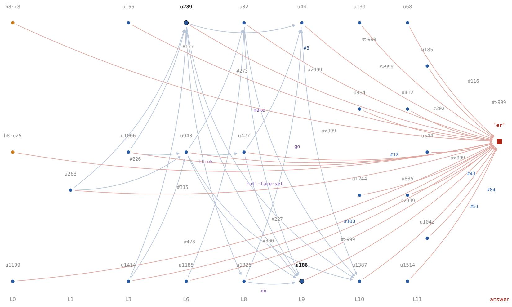  
Figure 5 7 : set operators , prediction 2 : the graph , 26 members and 2 2 edges among them .

…set(request) get\_event\_loop.call\_soon(log) Generators ---------- Generators in Python, while similar to Cor
<table><tr><td>→ &#x27;o&#x27;</td><td>p=0.57</td><td colspan="3">99 components reach 90% of the net</td><td colspan="3">3 required</td><td colspan="3">85% cancels</td></tr><tr><td></td><td></td><td></td><td>strength</td><td>fires on</td><td></td><td></td><td></td><td>writes toward</td><td></td><td>answer</td></tr><tr><td>L11·u1779</td><td></td><td>ffn</td><td>1.52</td><td>cor&#x27;</td><td>Sp</td><td>Su&#x27;</td><td></td><td></td><td></td><td>#37</td></tr><tr><td>LL6·u3043</td><td>17% via cor·Su·cor</td><td>ffn</td><td>2.89</td><td>cor&#x27;</td><td>&#x27;cor&#x27;</td><td>Su&#x27;</td><td></td><td></td><td>&#x27;ven&#x27;&#x27;at&#x27;&#x27;</td><td>#58</td></tr><tr><td>LL1·u1429</td><td>21% via cor-cor-Sp</td><td>ffn</td><td>1.76</td><td>cor&#x27;</td><td>&#x27;cor</td><td>Su&#x27;</td><td></td><td>&#x27;at&#x27;</td><td>&#x27;0</td><td>#322</td></tr><tr><td>LL0·u2706</td><td>36% via cor-cor-eb</td><td>ffn</td><td>0.72</td><td>cor&#x27;</td><td>&#x27;cor&#x27;</td><td>&#x27;eb&#x27;</td><td></td><td></td><td>&#x27;oor&#x27; &#x27;ray&#x27; &#x27;ivas&#x27;</td><td>#&gt;999</td></tr><tr><td>LL0·u1022</td><td>15% via Su-cor-cor</td><td>ffn</td><td>0.99</td><td>Su&#x27;</td><td>Ad</td><td>cor</td><td>→</td><td></td><td>&#x27;at&#x27;&#x27;ac&#x27;&#x27;ise&#x27;</td><td>#&gt;999</td></tr><tr><td>LL0·u2706</td><td>(above)</td><td></td><td></td><td></td><td></td><td></td><td></td><td></td><td></td><td></td></tr><tr><td>LL0·u1022</td><td>(above)</td><td></td><td></td><td></td><td></td><td></td><td></td><td></td><td></td><td></td></tr><tr><td>LL1·u1429</td><td>(above)</td><td></td><td></td><td></td><td></td><td></td><td></td><td></td><td></td><td></td></tr><tr><td>LL0· u2706</td><td>(above)</td><td></td><td></td><td></td><td></td><td></td><td></td><td></td><td></td><td></td></tr><tr><td>L11·u3066</td><td></td><td>ffn</td><td>1.62</td><td></td><td></td><td></td><td></td><td></td><td> $\begin{array} { r l } { { } ^ { * } } & { { } \mathsf { c o r } ^ { * } \qquad \mathsf { S p } ^ { * } \qquad { } ^ { * } \mathsf { d e f } ^ { * } \to \mathsf { \Omega } ^ { * } , \mathsf { \Omega } ^ { * } \quad \mathsf { a n d } ^ { * } \quad { } ^ { * } \ d { \left( \begin{array} { l } { \dag } \\ { \dag } \end{array} \right) } ^ { * } } \end{array}$ </td><td>#167</td></tr><tr><td>LL6·u3043</td><td>(above)</td><td></td><td></td><td></td><td></td><td></td><td></td><td></td><td></td><td></td></tr><tr><td>LL1·u1429</td><td>(above)</td><td></td><td></td><td></td><td></td><td></td><td></td><td></td><td></td><td></td></tr><tr><td>LL0·u1022</td><td>(above)</td><td>ffn</td><td></td><td></td><td>′as′</td><td></td><td></td><td></td><td></td><td></td></tr><tr><td>L9·u1706 LL6·u3043</td><td></td><td></td><td>0.93</td><td>cor&#x27;</td><td></td><td></td><td></td><td></td><td>&#x27;all&#x27;→&#x27;well&#x27;&#x27;o&#x27;&#x27;igraph&#x27;</td><td>#69</td></tr><tr><td>LL1·u1429</td><td>(above) (above)</td><td></td><td></td><td></td><td></td><td></td><td></td><td></td><td></td><td></td></tr><tr><td>LL0·u2706</td><td></td><td></td><td></td><td></td><td></td><td></td><td></td><td></td><td></td><td></td></tr><tr><td></td><td>(above)</td><td></td><td></td><td></td><td></td><td></td><td></td><td></td><td></td><td></td></tr></table>

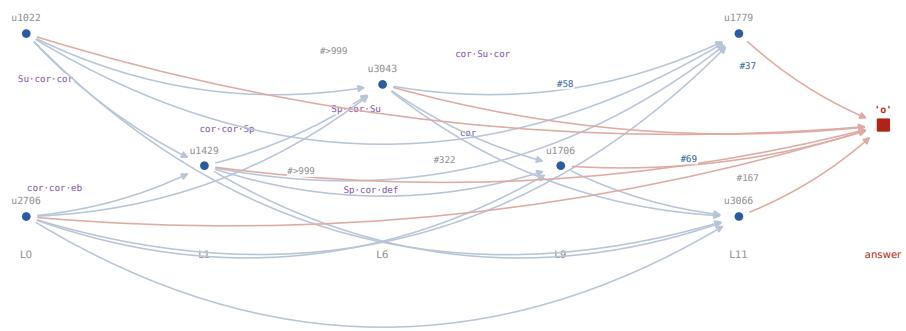

… for programs that support The Nation’s journalism. You can read our Privacy Policy here. Sign up for Take Action Now and get three actions
<table><tr><td>→ in&#x27;</td><td></td><td></td><td colspan="4">p=1.00 71 components reach 90% of the net no prefix flips it 70% cancels</td><td></td><td></td></tr><tr><td></td><td></td><td></td><td>strength</td><td>fires on</td><td></td><td>writes toward</td><td></td><td>answer</td></tr><tr><td>L11·u994</td><td></td><td>ffn</td><td>2.93</td><td>as&#x27;</td><td>both&#x27;</td><td>→ &#x27;before&#x27;&#x27;secret&#x27;</td><td></td><td>#&gt;999</td></tr><tr><td>LL10·u370</td><td>9% via as</td><td></td><td>3.62</td><td>years&#x27;</td><td>day</td><td>→ &#x27; in&#x27; &#x27; In&#x27; &#x27;In&#x27;</td><td></td><td>#1</td></tr><tr><td>LL0·u1175</td><td>4%</td><td></td><td>2.83</td><td>issues</td><td>sites</td><td>→ &#x27;avers&#x27;&#x27;etting&#x27;</td><td>&#x27;aws</td><td>#&gt;999</td></tr><tr><td>LL10·u1973</td><td>3% via within</td><td>ffn</td><td>2.43</td><td>John&#x27;</td><td>&#x27;aw&#x27;</td><td>&#x27;ale&#x27;→&#x27;,&#x27;&#x27; the&#x27;&#x27;a&#x27;</td><td></td><td>#5</td></tr><tr><td>LL0·u1175</td><td>(above)</td><td>ffn</td><td></td><td></td><td></td><td></td><td></td><td></td></tr><tr><td>LL9·u2833</td><td>7%</td><td></td><td>2.04</td><td>&#x27;The&#x27;&#x27;The&#x27;</td><td></td><td>→ 81</td><td>the</td><td>#4</td></tr><tr><td>LL0·u1175</td><td>(above)</td><td></td><td></td><td></td><td></td><td></td><td></td><td></td></tr><tr><td>L11·u1522 LL0·u1175</td><td></td><td></td><td>1.60</td><td>take</td><td>just&#x27;</td><td>→&#x27;unbeaten&#x27;&#x27;otte&#x27;</td><td></td><td>#&gt;999</td></tr><tr><td>LL10·u370</td><td>(above)</td><td></td><td></td><td></td><td></td><td></td><td></td><td></td></tr><tr><td>LL7·u924</td><td>(above)</td><td></td><td>1.34</td><td></td><td></td><td></td><td></td><td></td></tr><tr><td>LL0·u1175</td><td>2%</td><td>ffn</td><td></td><td>&#x27;sites&#x27;</td><td>days</td><td>→&#x27;ourced&#x27;&#x27;afe&#x27;&#x27;avers&#x27;</td><td></td><td>#&gt;999</td></tr><tr><td>L11·u2910</td><td>(above)</td><td>ffn</td><td>8.39</td><td>Sp&#x27; cor</td><td></td><td></td><td></td><td></td></tr><tr><td>LL9·u2833</td><td>(above)</td><td></td><td></td><td></td><td></td><td>&#x27;cor&#x27;→&#x27;the&#x27;</td><td></td><td>#7</td></tr><tr><td>LL10·u370</td><td>(above)</td><td></td><td></td><td></td><td></td><td></td><td></td><td></td></tr><tr><td>L10·u1425</td><td></td><td>ffn</td><td>2.58</td><td></td><td>&#x27;not&#x27;&#x27;because&#x27;→&#x27; to&#x27;&#x27; on&#x27;&#x27;,</td><td></td><td></td><td>#6</td></tr><tr><td>LL0·u1175</td><td>(above)</td><td></td><td></td><td></td><td></td><td></td><td></td><td></td></tr><tr><td></td><td></td><td></td><td></td><td></td><td></td><td></td><td></td><td></td></tr></table>

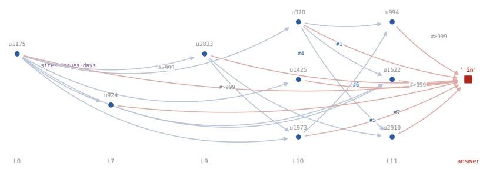  
Figure 58: GPT-2 124M, predictions 1 and 2. Of 20 predictions drawn at random, these are two of the four whose suficient set is nearest the median, 8.

… Cal State Fullerton. The team is currently appealing the suspension, and a decision will be reached tomorrow at 5:30 at a hearing in front
<table><tr><td>→ of&#x27;</td><td>p=1.00</td><td></td><td colspan="3">8 components reach 90% of the net</td><td colspan="2">no prefix flips it 70% cancels</td><td></td></tr><tr><td></td><td></td><td></td><td>strength</td><td>fires on</td><td></td><td>writes toward</td><td></td><td>answer</td></tr><tr><td>L11·u2743</td><td></td><td>ffn</td><td>0.91</td><td>those&#x27;</td><td>We</td><td></td><td>→of&#x27; 0f&#x27; &#x27;of&#x27;</td><td>#1</td></tr><tr><td>LL9·u1722</td><td>11%</td><td>ffn</td><td>1.03</td><td>write&#x27;</td><td></td><td>→ (C)</td><td></td><td>#1</td></tr><tr><td>LL4·u3034</td><td>18%</td><td>ffn</td><td>0.57</td><td>effects&#x27;</td><td>team&#x27;</td><td>→ (B)</td><td></td><td>#17</td></tr><tr><td>LL8·u2732</td><td>11%</td><td>ffn</td><td>0.61</td><td>write&#x27;</td><td></td><td>→ (A)</td><td></td><td>#1</td></tr><tr><td>LL4·u3034</td><td>(above)</td><td></td><td></td><td></td><td></td><td></td><td></td><td></td></tr><tr><td>LL8·u3063</td><td>5% via negative·write</td><td>ffn</td><td>0.51</td><td>&#x27;et&#x27;social&#x27;</td><td></td><td></td><td>→of&#x27;facing&#x27;·bound&#x27;</td><td>#9</td></tr><tr><td>LL8·u2732</td><td>(above)</td><td></td><td></td><td></td><td></td><td></td><td></td><td></td></tr><tr><td>LL10·u1077</td><td>10%</td><td>ffn</td><td>0.65</td><td>&#x27;et&#x27;&#x27;social&#x27;</td><td></td><td>→ (F)</td><td></td><td>#1</td></tr><tr><td>LL9·u1722</td><td>(above)</td><td></td><td></td><td></td><td></td><td></td><td></td><td></td></tr><tr><td>LL9·u752</td><td>15%</td><td>ffn</td><td>0.67</td><td>&#x27;et&#x27;&#x27;social&#x27;</td><td></td><td>→ (D)</td><td></td><td>#1</td></tr><tr><td>LL8·u2732</td><td>(above)</td><td></td><td></td><td></td><td></td><td></td><td></td><td></td></tr><tr><td>LL4·u3034</td><td>(above)</td><td></td><td></td><td></td><td></td><td></td><td></td><td></td></tr><tr><td>LL8·u3063</td><td>(above)</td><td></td><td></td><td></td><td></td><td></td><td></td><td></td></tr><tr><td>LL8·u2732</td><td>(above)</td><td>ffn</td><td></td><td></td><td></td><td></td><td></td><td></td></tr><tr><td>L10·u782</td><td></td><td></td><td>0.58</td><td>community</td><td></td><td></td><td>→&#x27;of&#x27; &#x27;of&#x27;0f&#x27;</td><td>#1</td></tr><tr><td>LL9·u1722</td><td>(above)</td><td></td><td></td><td></td><td></td><td></td><td></td><td></td></tr><tr><td>LL8·u3063 LL9·u752</td><td>(above)</td><td></td><td></td><td></td><td></td><td></td><td></td><td></td></tr><tr><td>L10·u3058</td><td>(above)</td><td>ffn</td><td></td><td></td><td></td><td></td><td></td><td></td></tr><tr><td></td><td></td><td></td><td>0.85</td><td>us</td><td>second</td><td></td><td>→ &#x27; of&#x27;  Of&#x27; &#x27; use&#x27;</td><td>#1</td></tr><tr><td>LL9·u1722 LL4·u3034</td><td>(above)</td><td></td><td></td><td></td><td></td><td></td><td></td><td></td></tr><tr><td>LL8·u3063</td><td>(above)</td><td></td><td></td><td></td><td></td><td></td><td></td><td></td></tr><tr><td>L9·u734</td><td>(above)</td><td>ffn</td><td></td><td></td><td></td><td></td><td></td><td></td></tr><tr><td>LL8·u2732</td><td></td><td></td><td>0.90</td><td>even&#x27;</td><td>&#x27;ing&#x27;</td><td></td><td>→&#x27;of&#x27;&#x27;0f&#x27; &#x27;of&#x27;</td><td>#1</td></tr><tr><td>LL4·u3034</td><td>(above)</td><td></td><td></td><td></td><td></td><td></td><td></td><td></td></tr><tr><td>LL8·u3063</td><td>(above) (above)</td><td></td><td></td><td></td><td></td><td></td><td></td><td></td></tr><tr><td>L9·u2642</td><td></td><td>ffn</td><td>0.28</td><td>even&#x27;</td><td>&#x27;ing&#x27;</td><td></td><td>→ &#x27; of&#x27; &#x27; Of&#x27; &#x27;of&#x27;</td><td></td></tr><tr><td>LL8·u2732</td><td>(above)</td><td></td><td></td><td></td><td></td><td></td><td></td><td>#1</td></tr><tr><td>LL4·u3034</td><td>(above)</td><td></td><td></td><td></td><td></td><td></td><td></td><td></td></tr><tr><td>LL8·u3063</td><td>(above)</td><td></td><td></td><td></td><td></td><td></td><td></td><td></td></tr><tr><td></td><td></td><td></td><td></td><td></td><td></td><td></td><td></td><td></td></tr></table>

Figure 59: OPT 125M, prediction 1: the set, 11 members. Of 20 predictions drawn at random, this is one of the four whose suficient set is nearest the median, 13.

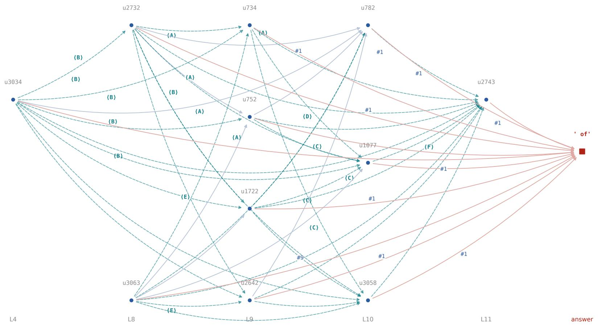  
Figure 60 : OPT 1 2 5M prediction 1 : the graph 1 1 members and 4 1 edges among them .

…ponse", adding "we have met with community representatives, and extra officers remain on duty there tonight. Across London our officers are in contact

<table><tr><td>→with&#x27;</td><td></td><td>p=0.85</td><td colspan="5">21 components reach 90% of the net</td><td>3 required</td><td>70% cancels</td><td></td></tr><tr><td></td><td></td><td></td><td>strength</td><td></td><td colspan="3">fires on</td><td colspan="3">writes toward</td></tr><tr><td>L11·u73</td><td></td><td></td><td>0.34</td><td></td><td></td><td></td><td></td><td></td><td> $\begin{array} { r } { \mathrm { ~  ~ { ~ \left( \mathsf { h } _ { \theta } \mathsf { S } \ e ^ { \theta } \Sigma ^ { * } \Sigma ^ { * } \Sigma ^ { * } \Sigma | \sqrt { \Lambda } e ^ { \theta } \Sigma ^ { * } \Sigma \right. } } \qquad \to \ \mathsf { \Omega } ^ { * } \mathrm { ~ w i t h ~ } ^ { \prime } \quad \mathsf { w i t h } ^ { \prime } \quad \triangleq \mathsf { W i t h } ^ { \prime } } \end{array}$ </td><td>#1</td></tr><tr><td>L9·u1586</td><td>49%</td><td></td><td>1.08</td><td></td><td></td><td></td><td> $\begin{array} { r } { \mathrm { ~  ~ { ~ \mathbf ~ { ~ t ~ o ~ } ~ } ~ } ^ { \prime } \mathrm { ~  ~ { ~ \mathbf ~ { ~ t ~ h ~ e ~ } ~ } ~ } ^ { \prime } \mathrm { ~  ~ { ~ \mathbf ~ { ~ i ~ n ~ } ~ } ~ } \to \mathrm { ~  ~ { ~ \left. ~ A \right. ~ } ~ } } \end{array}$ </td><td></td><td></td><td>#1</td></tr><tr><td>LL8·u2669</td><td>11%</td><td></td><td>0.55</td><td></td><td></td><td></td><td> $\mathrm { ` ~ i n e s ~ " ~ } \phantom { ' } _ { 0 } \dag \quad \mathrm { " ~ } \phantom { " } \mathrm { w a y ~ "  ~ " } \mathrm { w i t h } \ \mathrm { " ~ } \phantom { " } \mathrm { w i t h } \ \mathrm { " ~ }$ </td><td></td><td></td><td>#2</td></tr><tr><td>LL2·u542</td><td>4%</td><td></td><td>0.35</td><td></td><td></td><td></td><td> $\begin{array} { r }  \mathrm { ~  ~ { ~ \mathsf { ~ \beta ~ } ~ } ~ } _ { \mathsf { t 0 } } ^ { \prime } \mathrm { ~  ~ { ~ \mathsf ~ { ~ \beta ~ } ~ } ~ } _ { \mathsf { t h e } } ^ { \prime } \mathrm { ~  ~ { ~ \mathsf ~ { ~ \beta ~ } ~ } ~ } _ { \mathsf { i n } } ^ { \prime } \mathrm { ~  ~ { ~ \mathsf ~ { ~ \beta ~ } ~ } ~ } _ { \mathsf { \beta } } ^ { \prime } \mathrm { ~  ~ { ~ \mathsf { ~ \beta ~ } ~ } ~ } _ { \mathsf { t } } ^ { \prime } \mathrm { ~  ~ { ~ \mathsf { ~ \beta ~ } ~ } ~ } _ { \mathsf { t } } ^ { \prime } \mathrm { ~  ~ { ~ \mathsf { ~ \beta ~ } ~ } ~ } _ { \mathsf { t } } ^ { \prime } \mathrm { ~  { ~ \mathsf ~ { ~ \beta ~ } ~ } ~ } _ { \mathsf { t } } ^ { \prime } \mathrm { ~  { ~ \mathsf { ~ { ~ \beta ~ } ~ } ~ } _ { \mathsf { t } } ^ { \prime } \mathrm { ~  { ~ \mathsf { ~ { ~ \beta } ~ } ~ } ~ } } _ { \mathsf { t } } ^ { \prime } \mathrm  ~  { ~ \mathsf { ~ { ~ \beta ~ } } ~ } _ { \mathsf { t } } ^ { \prime } \mathrm  ~  { ~ { ~ \mathsf { ~ { ~ \beta } ~ } ~ } ~ } _ { \mathsf { t } } ^ { \prime } \mathrm  ~  { ~ { ~ \mathsf { ~ { ~ \beta } ~ } ~ } ~ } _ { \mathsf { t } } ^ { \prime } \mathrm  ~  { ~ { ~ \beta ~ } ~ } _ { \mathsf { t } } ^ { \prime } \mathrm { ~  { ~ { ~ \beta } ~ } ~ } _ { \mathsf { t } } ^ { \prime } \mathrm  ~  { ~ { ~ \beta ~ } } _ { \mathsf { t } } ^ { \prime } \mathrm  ~  { ~ \beta ~ } _ { t } ^ \mathrm { \prime } \mathrm  ~  { ~ { ~ \beta } ~ } _ { \mathsf \beta } _ { \mathsf { t } } ^ { \mathrm \mathrm { ~  { ~ \beta ~ } } ~ } _  \mathsf  { \beta } _  \mathsf \ \end{array}$ </td><td></td><td></td><td>#2</td></tr><tr><td>LL3·u840</td><td>3%</td><td>ffn</td><td>0.23</td><td></td><td></td><td></td><td> $\cdot \mathrm { ~ \sf ~ t o ~ } ^ { \prime } \mathrm { ~ \sf ~ t h e ~ } ^ { \prime } \mathrm { ~  ~ \cdot ~ } \mathrm { i ~ } \mathsf { n } ^ { \prime } \to \mathrm { ~ \boldsymbol { \left. \right)} ~ } $ </td><td></td><td></td><td>#1</td></tr><tr><td>LL2·u542</td><td>(above)</td><td>ffn</td><td></td><td></td><td></td><td></td><td></td><td></td><td></td><td></td></tr><tr><td>LL7·u168</td><td>2%</td><td></td><td>0.48</td><td></td><td> $^ { \cdot } \mathrm { \sf { t e a m } } ^ { \prime } \mathrm {  ~ \omega ~ } _ { \mathrm { e } } ^ { \prime } \mathrm { f e c t s } ^ { \prime } \to \langle { \sf C } \rangle$ </td><td></td><td></td><td></td><td></td><td>#1</td></tr><tr><td>LL2·u542</td><td>(above)</td><td></td><td></td><td></td><td></td><td></td><td></td><td></td><td></td><td></td></tr><tr><td>LL3·u840</td><td>(above)</td><td></td><td></td><td></td><td></td><td></td><td></td><td></td><td></td><td></td></tr><tr><td>LL7·u168</td><td>(above)</td><td></td><td></td><td></td><td></td><td></td><td></td><td></td><td></td><td></td></tr><tr><td>LL3·u840</td><td>(above)</td><td></td><td></td><td></td><td></td><td></td><td></td><td></td><td></td><td></td></tr><tr><td>L10·u896</td><td>22%</td><td>ffn</td><td>0.90</td><td></td><td></td><td> $^ { \cdot } \mathrm { \sf { t e a m } } ^ { \cdot } \mathrm {  ~ \omega ~ } _ { \mathrm { e f f e c t s } ^ { \prime } }  \langle { \sf B } \rangle$ </td><td></td><td></td><td></td><td>#1</td></tr><tr><td>L9·u1586</td><td>(above)</td><td></td><td></td><td></td><td></td><td></td><td></td><td></td><td></td><td></td></tr><tr><td>LL7·u168</td><td>(above)</td><td></td><td></td><td></td><td></td><td></td><td></td><td></td><td></td><td></td></tr><tr><td>LL8·u2669</td><td>(above)</td><td></td><td></td><td></td><td></td><td></td><td></td><td></td><td></td><td></td></tr><tr><td>LL7·u168</td><td>(above)</td><td></td><td></td><td></td><td></td><td></td><td></td><td></td><td></td><td></td></tr><tr><td>L11·u287 L11·u2504</td><td></td><td>ffn ffn</td><td>0.57</td><td></td><td></td><td> $\mathrm { ~  ~ \mathsf ~ { ~ \ e v e n ~ } ~ } ^ { \ast } \mathrm { ~  ~ \dot { ~ \mathfrak { ~ i ~ } } n g ~ } ^ { \ast } \mathrm { ~  ~ \qquad ~ \mathsf ~ { ~ \to ~ } ~ } ^ { \ast } \mathrm { ~  ~ \dot { ~ \ t h e ~ } ~ } ^ { \ast } \mathrm { ~  ~ \mathsf ~ { ~ a n d ~ } ~ } ^ { \ast } \mathrm { ~  ~ \dot { ~ \xi ~ } ~ } ,$ </td><td></td><td></td><td></td><td>#24</td></tr><tr><td>LL7·u168</td><td></td><td></td><td>0.43</td><td></td><td></td><td></td><td></td><td></td><td> $\begin{array} { r } { \mathrm { ~  ~ { ~ \mathsf ~ { ~ b ~ y ~ } ^ { * ~ } ~ } ~ } \mathrm { ~  ~ { ~ \mathsf ~ { ~ a ~ r ~ e ~ } ^ { * ~ } ~ } ~ } \qquad \to \mathrm { ~  ~ { ~ \mathsf ~ { ~ w ~ i ~ t ~ h ~ } ~ } ~ } \mathrm { ~  ~ { ~ \mathsf ~ { ~ w ~ i ~ t ~ h ~ } ~ } ~ } \mathrm { ~  ~ { ~ \mathsf { ~ w ~ i ~ t ~ h ~ } ~ } ~ } \mathrm { ~  ~ { ~ \mathsf { ~ w ~ i ~ t ~ h ~ } ~ } ~ } } \end{array}$ </td><td>#1</td></tr><tr><td>LL8·u2669</td><td>(above)</td><td></td><td></td><td></td><td></td><td></td><td></td><td></td><td></td><td></td></tr><tr><td>LL3·u840</td><td>(above)</td><td></td><td></td><td></td><td></td><td></td><td></td><td></td><td></td><td></td></tr><tr><td></td><td>(above)</td><td></td><td></td><td></td><td></td><td></td><td></td><td></td><td></td><td></td></tr><tr><td>L10·h7·c3</td><td></td><td>attn</td><td>0.53</td><td></td><td></td><td></td><td> $ ~ ^ { \prime } ~ \mathsf { a n d } ^ { \prime } ~ \cdot ~ , ~ ^ { \prime } ~ \cdot ~ ^ { \prime }$ </td><td></td><td></td><td>#12</td></tr></table>

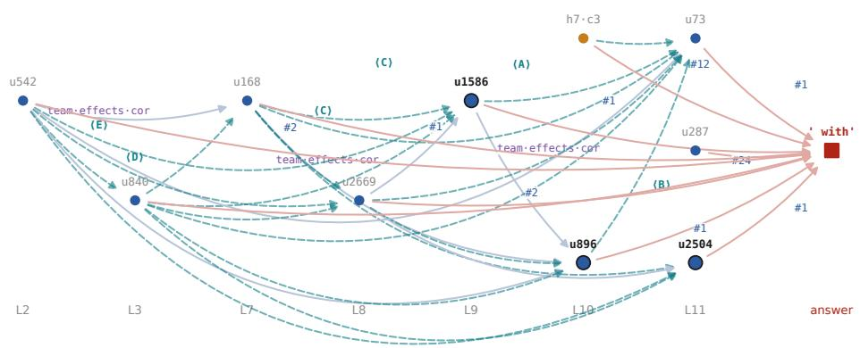  
Figure 61: OPT 125M, prediction 2. Of 20 predictions drawn at random, this is one of the four whose suficient set is nearest the median, 13.

…s. We think that this is unlikely because treatment effects on forgiveness, social capital, and psychological health are not statistically distinguish

p=1.00 111 components reach 90% of the net no prefix flips it 85% cancels
<table><tr><td></td><td></td><td>strength</td><td></td><td>fires on</td><td></td><td>writes toward</td><td></td><td></td><td>answer</td></tr><tr><td>L30·h8·c52</td><td></td><td>attn</td><td>6.49</td><td></td><td></td><td>→ &#x27;ated&#x27; &#x27;ized&#x27; &#x27;ged&#x27;</td><td></td><td></td><td>#60</td></tr><tr><td>L29·u1732</td><td></td><td>ffn</td><td>1.54</td><td>up&#x27;</td><td>don&#x27;</td><td></td><td>→&#x27;teachers&#x27;&#x27;Means&#x27;</td><td></td><td>#248</td></tr><tr><td>LL27·u1718</td><td>20%</td><td>ffn</td><td>20.18</td><td>no&#x27;</td><td>Zhang</td><td></td><td>→&#x27;attainable&#x27;</td><td></td><td>#884</td></tr><tr><td>LL23·u811</td><td>6%</td><td>ffn</td><td>9.68</td><td>while&#x27;</td><td>his&#x27;</td><td></td><td></td><td>→ &#x27;ING&#x27; &#x27;ings&#x27; &#x27;ments&#x27;</td><td>#95</td></tr><tr><td>LL10·u2432</td><td>4%</td><td>ffn</td><td>1.65</td><td>say</td><td>&#x27;think&#x27;</td><td>→ &#x27;able&#x27; &#x27;ing&#x27;&#x27;ers&#x27;</td><td></td><td></td><td>#2</td></tr><tr><td>LL3·u55</td><td>8%</td><td>ffn</td><td>4.30</td><td>same&#x27;</td><td>too</td><td></td><td></td><td>→&#x27;between&#x27;&#x27;difference&#x27;</td><td>#12</td></tr><tr><td>LL13·u1134</td><td>3%</td><td>ffn</td><td>3.52</td><td>then&#x27;</td><td>its&#x27;</td><td></td><td>→ &#x27;öm&#x27; &#x27;oyal&#x27; &#x27;ocene&#x27;</td><td></td><td>#&gt;999</td></tr><tr><td>LL10·u2432</td><td>(above)</td><td></td><td></td><td></td><td></td><td></td><td></td><td></td><td></td></tr><tr><td>LL13·u1134</td><td>(above)</td><td></td><td></td><td></td><td></td><td></td><td></td><td></td><td></td></tr><tr><td>LL23·u811</td><td>(above)</td><td></td><td></td><td></td><td></td><td></td><td></td><td></td><td></td></tr><tr><td>L14·u1564</td><td></td><td>ffn</td><td>0.63</td><td></td><td>&#x27;say&#x27;see</td><td></td><td>→ &#x27;able&#x27;&#x27;ings&#x27;&#x27;ing&#x27;</td><td></td><td>#1</td></tr><tr><td>LL10·u2432</td><td>(above)</td><td></td><td></td><td></td><td></td><td></td><td></td><td></td><td></td></tr></table>

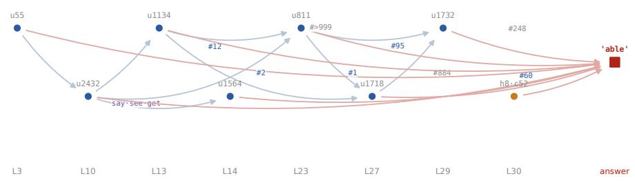

…40NINE is a brand we live for. We trust it as much as we trust our fashion expertise. And it’s high time  
p=0.72 68 components reach 90% of the net no prefix flips it 87% cancels
<table><tr><td>→we</td><td></td><td>p=0.72 68 components reach 90% of the net no prefix flips it 87% cancels</td><td>strength</td><td>fires on</td><td></td><td></td><td></td><td></td></tr><tr><td>L31·h7·c55</td><td></td><td>attn</td><td>1.28</td><td></td><td></td><td>→ &#x27;we&#x27; &#x27;we&#x27;&#x27;all&#x27;</td><td></td><td>#1</td></tr><tr><td>L28·h11·c32</td><td></td><td>attn</td><td>1.31</td><td></td><td></td><td></td><td>→&#x27;he&#x27;&#x27;him&#x27; &#x27;He&#x27;</td><td>#12</td></tr><tr><td>L27·u1607</td><td></td><td>ffn</td><td>0.44</td><td>during&#x27;</td><td>&#x27;In&#x27;</td><td></td><td>→&#x27;they&#x27;&#x27;we&#x27;&#x27; she&#x27;</td><td>#2</td></tr><tr><td>L26· u300</td><td></td><td>ffn</td><td>1.21</td><td>they&#x27;</td><td>did&#x27;</td><td></td><td>→&#x27;there&#x27;&#x27;there&#x27;&#x27; they&#x27;</td><td>#5</td></tr><tr><td>LL24·u1007</td><td>11% via they·such</td><td>ffn</td><td>2.77</td><td>found</td><td>1 up&#x27;</td><td></td><td>→ &#x27;we&#x27;they&#x27;&#x27;we&#x27;</td><td>#1</td></tr><tr><td>LL21·u1397</td><td>6%</td><td>ffn</td><td>2.85</td><td>where&#x27;</td><td>our&#x27;</td><td></td><td>→&#x27;it&#x27;&#x27; there&#x27;&#x27;there&#x27;</td><td>#6</td></tr><tr><td>LL12·u365</td><td>13%</td><td>ffn</td><td>2.31</td><td>going</td><td>or</td><td></td><td>→&#x27; there&#x27;&#x27;there&#x27;&#x27;we&#x27;</td><td>#3</td></tr><tr><td>LL12·u365</td><td></td><td></td><td></td><td></td><td></td><td></td><td></td><td></td></tr><tr><td>LL21·u1397</td><td>(above)</td><td></td><td></td><td></td><td></td><td></td><td></td><td></td></tr><tr><td>L26·u2206</td><td>(above)</td><td>ffn</td><td>2.45</td><td>think&#x27;</td><td>Bir&#x27;</td><td></td><td>→ &#x27;you&#x27;&#x27;we&#x27;&#x27; they&#x27;</td><td>#2</td></tr><tr><td>LL24·u1007</td><td></td><td></td><td></td><td></td><td></td><td></td><td></td><td></td></tr><tr><td>LL21·u1397</td><td>(above)</td><td></td><td></td><td></td><td></td><td></td><td></td><td></td></tr><tr><td>LL12·u365</td><td>(above)</td><td></td><td></td><td></td><td></td><td></td><td></td><td></td></tr><tr><td>L24·h13·c9</td><td>(above)</td><td>attn</td><td>1.86</td><td></td><td></td><td></td><td>→ &#x27;like&#x27;&#x27;</td><td>#893</td></tr><tr><td>L22· u454</td><td></td><td>ffn</td><td>1.56</td><td>by&#x27;</td><td>it need</td><td></td><td>→ &#x27;myself&#x27;&#x27;me&#x27;</td><td></td></tr></table>

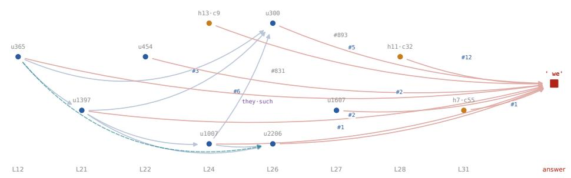  
Figure 62: SmolLM2 360M, predictions 1 and 2. Of 20 predictions drawn at random, these are two of the four whose suficient set is nearest the median, 10.

…ing to during the winter season.↵↵Conscious selections of sustainable ingredients were sourced from the Canadian Boreal Forest to formulate these hand

<table><tr><td>→ &#x27;crafted&#x27;</td><td></td><td>p=0.54</td><td colspan="3">139 components reach 90% of the net</td><td>4 required</td><td>85% cancels</td><td></td></tr><tr><td></td><td></td><td></td><td>strength</td><td>fires on</td><td></td><td>writes toward</td><td></td><td>answer</td></tr><tr><td>L22· u1111</td><td></td><td>ffn</td><td>7.12</td><td>print&#x27;&#x27;well&#x27;</td><td></td><td></td><td>→work&#x27;Work&#x27;dow&#x27;</td><td>#&gt;999</td></tr><tr><td>L17·u1629</td><td>18%</td><td>ffn</td><td>27.72</td><td>help&#x27;five&#x27;</td><td></td><td>→&#x27;prints&#x27;index&#x27;</td><td></td><td>#907</td></tr><tr><td>LL4· u2320</td><td>6%</td><td>ffn</td><td>3.32</td><td>print&#x27;to&#x27;</td><td></td><td>→&#x27;act&#x27;&#x27;support&#x27;</td><td></td><td>#&gt;999</td></tr><tr><td>L0·u98</td><td>25%</td><td>ffn</td><td>4.83</td><td>&quot;bow&#x27;present&#x27;</td><td></td><td></td><td>→Vers&#x27;vs&#x27;utility&#x27;</td><td>#&gt;999</td></tr><tr><td>LL1·u2221</td><td>21%</td><td>ffn</td><td>2.85</td><td>think&#x27;</td><td>&#x27;aan&#x27;</td><td></td><td>→ &#x27;imation&#x27;coordinate&#x27;</td><td>#&gt;999</td></tr><tr><td>L0·u98</td><td>(above)</td><td></td><td></td><td></td><td></td><td></td><td></td><td></td></tr><tr><td>LL3· u2750</td><td>10%</td><td>ffn</td><td>2.01</td><td>police&#x27;</td><td></td><td>→&#x27;against&#x27;&#x27;toward&#x27;</td><td></td><td>#100</td></tr><tr><td>L0·u98</td><td>(above)</td><td></td><td></td><td></td><td></td><td></td><td></td><td></td></tr><tr><td>LL1·u2221</td><td>(above)</td><td></td><td></td><td></td><td></td><td></td><td></td><td></td></tr><tr><td>L0· u98</td><td>(above)</td><td></td><td></td><td></td><td></td><td></td><td></td><td></td></tr><tr><td>LL1·u2221</td><td>(above)</td><td></td><td></td><td></td><td></td><td></td><td></td><td></td></tr><tr><td>LL1·u2221</td><td>(above)</td><td></td><td></td><td></td><td></td><td></td><td></td><td></td></tr><tr><td>L0·u98</td><td>(above)</td><td></td><td></td><td></td><td></td><td></td><td></td><td></td></tr><tr><td>L18· u3205</td><td></td><td>ffn</td><td>2.27</td><td>he &#x27;§′</td><td></td><td></td><td>.get&#x27;→&#x27;created&#x27;create&#x27;</td><td>#607</td></tr><tr><td>L17·u1629</td><td>(above)</td><td></td><td></td><td></td><td></td><td></td><td></td><td></td></tr><tr><td>L0·u98</td><td>(above)</td><td></td><td></td><td></td><td></td><td></td><td></td><td></td></tr><tr><td>LL3· u2750</td><td>(above)</td><td></td><td></td><td></td><td></td><td></td><td></td><td></td></tr><tr><td>L4·u1007</td><td></td><td>ffn</td><td>3.59</td><td>&#x27;bury&#x27;&#x27;after&#x27;</td><td></td><td>→representations&#x27;</td><td></td><td>#&gt;999</td></tr><tr><td>L0·u98</td><td>(above)</td><td></td><td></td><td></td><td></td><td></td><td></td><td></td></tr><tr><td>LL1·u2221</td><td>(above)</td><td></td><td></td><td></td><td></td><td></td><td></td><td></td></tr><tr><td>LL3·u2750</td><td>(above)</td><td></td><td></td><td></td><td></td><td></td><td></td><td></td></tr></table>

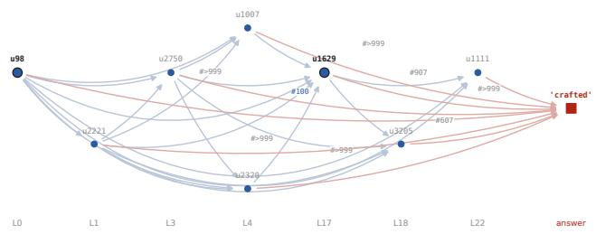

… time you do too! We specialize in manufacturing basic watches and fun watches for men and women.↵↵Without further ado, allow us to introduce you to

<table><tr><td>→ our&#x27;</td><td></td><td>p=0.30</td><td colspan="5">134 components reach 90% of the net 4 required 88% cancels</td><td colspan="2"></td><td></td><td></td></tr><tr><td></td><td></td><td></td><td>strength</td><td></td><td>fires on</td><td></td><td></td><td>writes toward</td><td></td><td></td><td>answer</td></tr><tr><td>L20·u134</td><td></td><td>ffn</td><td>1.04</td><td></td><td>&#x27;There&#x27;&#x27;do&#x27;</td><td></td><td>→-</td><td></td><td>my&#x27;&#x27;mine&#x27;&#x27;our&#x27;</td><td></td><td>#18</td></tr><tr><td>LL17·u4419</td><td>2%</td><td></td><td>1.76</td><td></td><td>There&#x27;&#x27;all&#x27;</td><td></td><td></td><td></td><td></td><td>→&#x27; some&#x27;&#x27; your&#x27;&#x27; any&#x27;</td><td>#6</td></tr><tr><td>LL15·h2·c0</td><td>3%</td><td></td><td>1.53</td><td></td><td></td><td></td><td></td><td></td><td>→&#x27;LLP&#x27; &#x27;important&#x27;</td><td></td><td>#&gt;999</td></tr><tr><td>L20·u4769</td><td></td><td></td><td>0.50</td><td></td><td>we&#x27;We&#x27;def&#x27;→&#x27;our&#x27;we&#x27; &#x27;we&#x27;</td><td></td><td></td><td></td><td></td><td></td><td>#1</td></tr><tr><td>LL19·h12·c42</td><td>5%</td><td></td><td>0.64</td><td></td><td></td><td></td><td>→ (A)</td><td></td><td></td><td></td><td>#1</td></tr><tr><td>LL15·h2·c0</td><td>(above)</td><td></td><td></td><td></td><td></td><td></td><td></td><td></td><td></td><td></td><td></td></tr><tr><td>LL17·u4419</td><td>(above)</td><td></td><td></td><td></td><td></td><td></td><td></td><td></td><td></td><td></td><td></td></tr><tr><td>L19·u3819</td><td></td><td>ffn</td><td>0.54</td><td></td><td></td><td></td><td></td><td></td><td></td><td>&#x27;many&#x27;right&#x27;→&#x27;their&#x27;the&#x27;&#x27;your&#x27;</td><td>#4</td></tr><tr><td>L15·h13·c48</td><td></td><td>attn</td><td>1.05</td><td></td><td></td><td></td><td></td><td></td><td>→&#x27; imp&#x27; &#x27;e&#x27; &#x27;eller&#x27;</td><td></td><td>#55</td></tr><tr><td>L11·u864</td><td></td><td>ffn</td><td>1.20</td><td></td><td>him&#x27;&#x27;go&#x27;</td><td></td><td></td><td></td><td>→ ′my&#x27; me&#x27; &quot;&#x27;</td><td></td><td>#115</td></tr><tr><td>L8·u2870</td><td></td><td>ffn</td><td>1.69</td><td></td><td></td><td>.get&#x27;_context&#x27;→&#x27;:&#x27;v&#x27;like&#x27;</td><td></td><td></td><td></td><td></td><td>#&gt;999</td></tr></table>

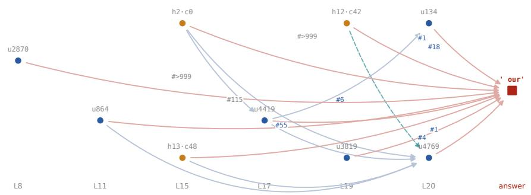  
Figure 63: Qwen2.5 0.5B, predictions 1 and 2. Of 20 predictions drawn at random, these are two of the four whose suficient set is nearest the median, 9.

… then they may not need to be disconnected.↵↵What is the slope of your property? Downspouts should not be disconnected if the slope of

$$
 \prime \mathrm { \bf ~ y o u r } ^ { \prime }
$$

p=0.68 308 components reach 90% of the net no prefix flips it 82% cancels
<table><tr><td></td><td></td><td></td><td>strength</td><td>fires on</td><td></td><td>writes toward</td><td></td><td>answer</td></tr><tr><td>L20·h1·c11</td><td></td><td>attn</td><td>1.69</td><td>一</td><td></td><td></td><td> $ \mathrm { ~  ~ { ~ \mathsf ~ { ~ y ~ o u r ~ 1 ~ } ~ } ~  ~ { ~ \mathsf { ~ y ~ o u ~ } ~ } ~ }$ </td><td>#1</td></tr><tr><td>L17·u5350</td><td></td><td>ffn</td><td>0.34</td><td> $\cdot \mathsf { Y o u } ^ { \prime } \cdot \mathsf { l i k e } ^ { \prime }$ </td><td></td><td></td><td> $ \mathrm { ~  ~ { ~ \gamma ~ } ~ } \mathsf { y o u r } ^ { \prime } \mathrm { ~  ~ { ~ \gamma ~ } ~ } \mathsf { Y o u r } ^ { \prime }$ </td><td>#1</td></tr><tr><td>L16·u1506</td><td></td><td>ffn</td><td>0.80</td><td></td><td> $\mathrm { ~  ~ { ~ \cdot ~ } ~ } _ { w \in \mathfrak { h i l e } ^ { \prime } } \qquad \mathrm { ~  ~ { ~ \cdot ~ } ~ } _ { w \in \mathfrak { n } } =$ </td><td></td><td> $ \mathrm { ~  ~ { ~ \mathsf ~ { ~ y ~ o u r ~ } ^ { \prime } ~ \mathsf ~ { ~ \forall ~ 0 u r ~ } ^ { \prime } ~ \Phi ~ } ~ } \mathsf { y } _ { 0 \sqcup \mathrm { ~  ~ { ~ \mathsf ~ { ~ y ~ o u r ~ } ^ { \prime } ~ \mathsf ~ { ~ \scriptsize ~ y ~ o u r ~ } ^ { \prime } ~ \Lambda ~ } ~ } }$ </td><td>#2</td></tr><tr><td>LL15·h2·c99</td><td>3% via while</td><td>attn</td><td>1.90</td><td>一</td><td></td><td></td><td> $ \mathrm { ~ ` ~ } \mathsf { p a r t n e r e d } ^ { \prime } \mathrm { ~ ` ~ } \mathsf { r e b o o t } ^ { \prime } $ </td><td>#&gt;999</td></tr><tr><td>L15·h0·c187</td><td></td><td>attn</td><td>3.85</td><td>一</td><td></td><td></td><td>→&#x27; examined&#x27; &#x27;com&#x27; &#x27;han&#x27;</td><td>#&gt;999</td></tr></table>

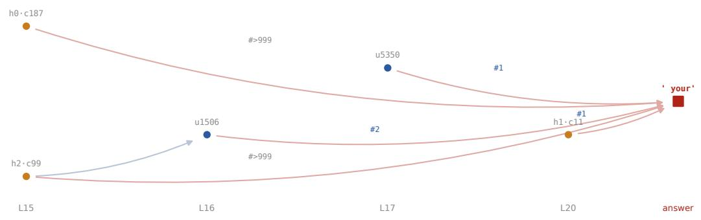

…s not subsequently fade away. We interpret the results above as indicating that the reconciliation process itself affects both individual and societal  
p=0.30 336 components reach 90% of the net 4 required 84% cancels
<table><tr><td></td><td></td><td></td><td>strength</td><td>fires on</td><td></td><td>writes toward</td><td></td><td></td><td>answer</td></tr><tr><td>L25·u4942</td><td></td><td>ffn</td><td>1.96</td><td> $\bar { { \bf \nabla } } \mathsf { a } \mathsf { j } \mathsf { o } ^ { \prime } \mathsf { o u t s } ^ { \prime }$ </td><td></td><td></td><td></td><td>→&#x27;versatile&#x27;reboot&#x27;</td><td>#&gt;999</td></tr><tr><td>LL22·u4595</td><td>5%</td><td>ffn</td><td>0.95</td><td>Sim&#x27;</td><td>&#x27;The&#x27;</td><td></td><td> $ ~ " ~ " ~ " ~ \tan ^ { \prime } { ~ \cdot ~ ! ~ }$ </td><td></td><td>#&gt;999</td></tr><tr><td>L20·u2825</td><td></td><td>ffn</td><td>1.23</td><td>Zhang</td><td></td><td></td><td></td><td>→&#x27;healthy&#x27; healing&#x27;</td><td>#14</td></tr><tr><td>LL19·u5317</td><td>3%</td><td>ffn</td><td>0.51</td><td>&#x27;Share&#x27;</td><td>pay</td><td></td><td></td><td>→&#x27; victims&#x27; victim&#x27;</td><td>#19</td></tr><tr><td>L16·u6625</td><td>5%</td><td>ffn</td><td>0.78</td><td>when&#x27;</td><td>off</td><td></td><td>→healing&#x27;</td><td></td><td>#23</td></tr><tr><td>L11·h1·c52</td><td></td><td>attn</td><td>1.84</td><td>一</td><td></td><td></td><td> $ ^ { \prime } 6 \mathsf { n } ^ { \prime } \quad ^ { \prime } \mathsf { o n s } ^ { \prime } \quad \mathsf { g } ^ { \prime }$ </td><td></td><td>#&gt;999</td></tr></table>

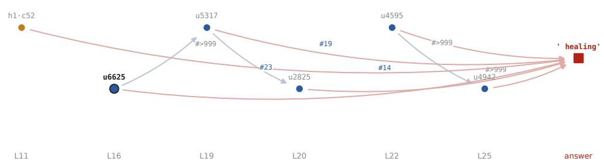  
Figure 64: Gemma-3 1B, predictions 1 and 2. Of 20 predictions drawn at random, these are two of the four whose suficient set is nearest the median, 6.

→ ' the' p=0.67 73 components reach 90% of the net no prefix flips it 88% cancels  
… including obstacles you may need to circumvent.↵↵3. Disconnect!↵↵Cut the downspout with a hacksaw about nine inches
<table><tr><td>→from&#x27;</td><td></td><td>p=0.62</td><td colspan="3">80 components reach 90% of the net no prefix flips it 88% cancels</td><td colspan="3"></td></tr><tr><td></td><td></td><td></td><td>strength</td><td>fires on</td><td></td><td>writes toward</td><td></td><td>answer</td></tr><tr><td>L15·h8·c106</td><td></td><td>attn</td><td>3.56</td><td></td><td></td><td></td><td> $ \frac { 1 } { 5 } + \frac { 1 } { 5 } \overrightarrow { A } + \overrightarrow { A } + \overrightarrow { A } - \overrightarrow { A } + \overrightarrow { A } - \overrightarrow { A } + \overrightarrow { A } - \overrightarrow { A } + \overrightarrow { A }$ </td><td>#&gt;999</td></tr><tr><td>L14·u4031</td><td></td><td>ffn</td><td>14.33</td><td>years&#x27;</td><td>way</td><td></td><td> $ \mathrm { ~ " ~ } \mathrm { ~ f ~ r ^ { } { 0 } { m } " ~ } \mathrm { ~ " ~ } \mathrm { ~ F } \mathrm { r } { 0 } { \mathfrak { m } } \mathrm { ~ " ~ } \mathrm { ~ \Gamma ^ { } \mathrm { ~ \dag ~ } \mathrm { ~ f ^ { } 0 } { r } { m } " \mathrm { ~ } }$ </td><td>#1</td></tr><tr><td>LL11·u5873</td><td>4% via years</td><td>ffn</td><td>3.29</td><td>save</td><td>be</td><td></td><td> $ \frac { 1 } { 1 1 } \cdot \frac { 1 } { 1 1 } = \frac { 1 } { 1 1 } \cdot 1 \cdot \tan \alpha \tan \beta$ </td><td>#&gt;999</td></tr><tr><td>L13·u8006</td><td></td><td>ffn</td><td>2.23</td><td>going</td><td>my</td><td></td><td> $ \mathrm { ~ " ~ } \mathrm { ~ f ~ r ^ { } { 0 } { m } " ~ } \mathrm { ~ " ~ } \mathrm { ~ F } \mathrm { r } { 0 } { \mathfrak { m } } \mathrm { ~ " ~ } \mathrm { ~ \Gamma ^ { } \mathrm { ~ \dag ~ } \mathrm { ~ f ^ { } 0 } { r } { m } " \mathrm { ~ } }$ </td><td>#1</td></tr><tr><td>L12·u424</td><td></td><td>ffn</td><td>2.24</td><td>This&#x27;</td><td>those&#x27;</td><td></td><td> $ ~ ^ { \prime } ~ \mathsf { t h e } ^ { \prime } ~ \cdot ~ \mathsf { o f } ^ { \prime } ~ \cdot \mathsf { t h e } ^ { \prime }$ </td><td>#58</td></tr><tr><td>LL11·u5873</td><td>(above)</td><td></td><td></td><td></td><td></td><td></td><td></td><td></td></tr><tr><td>L12·u1589</td><td></td><td>ffn</td><td>1.68</td><td>ethical</td><td></td><td></td><td>→&#x27;from&#x27;throughout&#x27;</td><td>#2</td></tr><tr><td>LL11·u5873</td><td>(above)</td><td></td><td></td><td></td><td></td><td></td><td></td><td></td></tr></table>

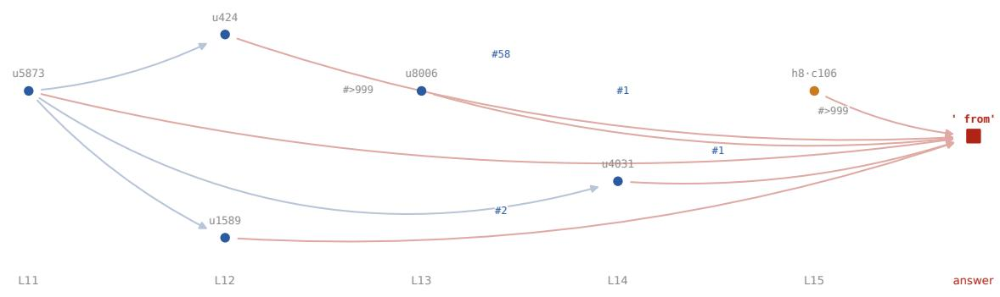

… a large-scale Community-Driven Restoration (CDR) program was implemented in Sierra Leone in 2008 in one of the same districts as
<table><tr><td></td><td></td><td></td><td>strength</td><td>fires on</td><td></td><td>writes toward</td><td></td><td>answer</td></tr><tr><td>L15·h4·c69</td><td></td><td>attn</td><td>1.07</td><td>一</td><td></td><td></td><td> $ ~ \mathrm { ~ \iota ~ ^ { ~ * ~ } ~ } \cdot ~ \mathrm { ~ \iota ~ } _ { \mathrm { i n } } \cdot \mathrm { ~ \iota ~ } \cdot \mathrm { ~ \mathsf { a n d } ~ } ^ { * }$ </td><td>#7</td></tr><tr><td>L15·u7829</td><td></td><td>ffn</td><td>4.38</td><td>Ben&#x27;</td><td>don&#x27;</td><td></td><td>→ &#x27;a′ &#x27;, &#x27; &#x27;e&#x27;</td><td>#88</td></tr><tr><td>L15·u7837</td><td></td><td>ffn</td><td>3.31</td><td> $\cdot \mathsf { d o n } ^ { \prime } \quad \cdot \quad \mathsf { B e n } ^ { \prime }$ </td><td></td><td>→</td><td>(</td><td>#21</td></tr><tr><td>L14·h5·c11</td><td></td><td>attn</td><td>1.85</td><td>一</td><td></td><td></td><td> $ ~ ^ { \prime } ~ \subset \Gamma ^ { \prime } ~ ^ { * } { \mathrm {  ~ \ t h e ~ } } ^ { \prime } ~ \mathsf { a n d } ^ { \prime }$ </td><td>#2</td></tr><tr><td>L14·u1951</td><td></td><td>ffn</td><td>6.16</td><td></td><td> $^ { \ast } \mathrm {  ~ \mathsf { u s i n g } ~ } ^ { \ast } \mathrm {  ~ \mathsf { d e f } ~ } ^ { \ast } \mathrm {  ~ \qquad \Rightarrow ~ } ^ { \ast } \mathrm {  ~ \makebox ~ {  ~ \cdot ~ } ~ } ^ { \ast } \mathrm {  ~ \cdot ~ } \mathrm {  ~ \cdot ~ } ,$ </td><td></td><td></td><td>#49</td></tr><tr><td>LL14·h5·c11</td><td>(above)</td><td></td><td></td><td></td><td></td><td></td><td></td><td></td></tr><tr><td>L14·u2338</td><td></td><td>ffn</td><td>6.20</td><td> $\cdot \quad \mathsf { b e } ^ { \prime } \quad \cdot \quad 0 ^ { \dag } f ^ { \prime }$ </td><td></td><td></td><td> $ ~ ^ { \prime } ~ ( \cdot ~ \cdot ~ \cdot ~ \cdot ~ \mathrm { i n } ^ { \prime }$ </td><td>#22</td></tr><tr><td>LL14·h5·c11</td><td>(above)</td><td></td><td></td><td></td><td></td><td></td><td></td><td></td></tr><tr><td>L14·u7533</td><td></td><td>ffn</td><td>36.98</td><td>these&#x27;</td><td></td><td></td><td> $ ~ ^ { \prime } ~ ( \cdot ~ \cdot ~ \cdot ~ \cdot ~ \mathrm { i n } ^ { \prime }$ </td><td>#6</td></tr><tr><td>LL14·h5·c11</td><td>(above)</td><td></td><td></td><td></td><td></td><td></td><td></td><td></td></tr><tr><td>L12·u3355</td><td></td><td>ffn</td><td>0.98</td><td>The&#x27;</td><td>many&#x27;</td><td></td><td> $ \mathrm { ~  ~ { ~ \cdot ~ } ~ } + \mathsf { h e } ^ { \cdot } \mathrm { ~  ~ { ~ \cdot ~ } ~ } \mathtt { a } ^ { \cdot } \mathrm { ~  ~ { ~ \cdot ~ } ~ } \mathtt { a } \mathtt { n } ^ { \cdot }$ </td><td>#1</td></tr></table>

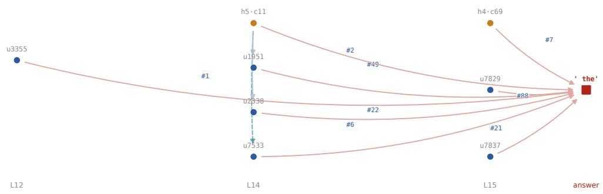  
Figure 65: OLMo-2 1B, predictions 1 and 2. Of 20 predictions drawn at random, these are two of the four whose suficient set is nearest the median, 6.

…27 September, 2013, the two accused men appeared via videolink in court at the Old Bailey, where they both pleaded not guilty
<table><tr><td> $ \mathbf { \sigma } ^ { \prime } \mathbf { t o } ^ { \prime }$ </td><td></td><td>p=0.87</td><td colspan="3">66 components reach 90% of the net</td><td>2 required</td><td colspan="3">87% cancels</td><td></td></tr><tr><td></td><td></td><td></td><td>strength</td><td>fires on</td><td></td><td></td><td></td><td>writes toward</td><td></td><td>answer</td></tr><tr><td>L15·u577</td><td></td><td>ffn</td><td>0.26</td><td> $\cdot \mathrm {  ~ \ b y ~ } ^ { \prime } \mathrm {  ~ \cdot ~ } \mathrm {  ~ \ d e f ~ } ^ { \prime }$ </td><td></td><td></td><td></td><td></td><td> $ \mathrm { ~ ~ " ~ } \tan ^ { \prime } \mathrm { ~ ~ " ~ } \tan ^ { \prime } \mathrm { ~ ~ " ~ } \top 0 \mathrm { ~ " ~ }$ </td><td>#1</td></tr><tr><td>L15·u1162</td><td></td><td>ffn</td><td>0.19</td><td>def</td><td>very</td><td></td><td></td><td> $ ~ \ l ^ { ( } \ l ^ { 1 } ~ \ l ^ { ( } \ l ^ { 1 } ~ \ r ^ { 1 } ~ \ r ^ { 1 } ~ \ r ~ \mathrm { a n d } ~ \ r ^ { 1 }$ </td><td></td><td>#9</td></tr><tr><td>L14·u3118</td><td></td><td>ffn</td><td>0.61</td><td>we&#x27;</td><td>.new</td><td></td><td></td><td>and&#x27;</td><td></td><td>#28</td></tr><tr><td>L14·u5845</td><td></td><td>ffn</td><td>0.50</td><td>Birch</td><td>show&#x27;</td><td></td><td></td><td></td><td>of&#x27;</td><td>#15</td></tr><tr><td>L14·u6812</td><td></td><td>ffn</td><td>0.73</td><td>cor</td><td>ex&#x27;</td><td></td><td></td><td> $\cdot \cdot \cdot \cdot \cdot \cdot \cdot ( \ \cdot \cdot \cdot \cdot \cdot \cdot \cdot \cdot \cdot \cdot \cdot \cdot \cdot \cdot \cdot \cdot \cdot \cdot \cdot \cdot \cdot \cdot \cdot \cdot \cdot \cdot \cdot \cdot \cdot \cdot \cdot \cdot \cdot \cdot \cdot \cdot \cdot \cdot \cdot \cdot \cdot \cdot \cdot \cdot \cdot \cdot \cdot \cdot \cdot \cdot \cdot \cdot \cdot \cdot \cdot \cdot \cdot \cdot \cdot \cdot \cdot \cdot \cdot \cdot \cdot \cdot \cdot \cdot \cdot \cdot \cdot \cdot \cdot \cdot \cdot \cdot \cdot \cdot \cdot$ </td><td></td><td>#97</td></tr><tr><td>L13·u58</td><td></td><td>ffn</td><td>0.08</td><td>said&#x27;</td><td>want</td><td></td><td></td><td>&#x27;to&#x27;</td><td>To&#x27;</td><td>#1</td></tr><tr><td>L13·u454</td><td></td><td>ffn</td><td>0.81</td><td>what&#x27;</td><td>when&#x27;</td><td></td><td></td><td>of&#x27;</td><td>&#x27;a&#x27;</td><td>#44</td></tr><tr><td>L12·u4081</td><td></td><td>ffn</td><td>5.62</td><td>new&#x27;</td><td>local&#x27;</td><td></td><td></td><td>to&#x27; &#x27;to&#x27;</td><td>To&#x27;</td><td>#1</td></tr><tr><td>LL11·u279</td><td>75% via new-local-home</td><td>ffn</td><td>2.26</td><td>object&#x27;</td><td></td><td>used</td><td></td><td></td><td>onto&#x27;&#x27;towards&#x27;&#x27;to&#x27;</td><td>#19</td></tr><tr><td>LL3·u2504</td><td>4%</td><td>ffn</td><td>0.74</td><td>life&#x27;</td><td>capital&#x27;</td><td></td><td></td><td>sentencing&#x27;</td><td></td><td>#&gt;999</td></tr><tr><td>L12·u7881</td><td></td><td>ffn</td><td>0.32</td><td>Ben&#x27;</td><td>Ade&#x27;</td><td></td><td>4</td><td></td><td>only&#x27;&#x27;even&#x27;&#x27;the&#x27;</td><td>#34</td></tr></table>

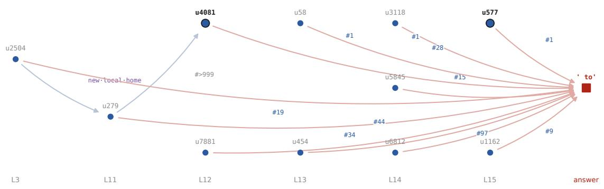  
Figure 66: Llama-3.2 1B, prediction 1. Of 20 predictions drawn at random, this is one of the four whose suficient set is nearest the median, 13.

… We’ve all heard the story about the guy who got laid off from his job and had his truck break down the day after.↵↵You should always

<table><tr><td>→ &#x27;have&#x27;</td><td></td><td>p=0.55</td><td colspan="3">163 components reach 90% of the net</td><td colspan="2">4 required</td><td>85% cancels</td><td></td></tr><tr><td></td><td></td><td></td><td>strength</td><td>fires on</td><td></td><td></td><td>writes toward</td><td></td><td>answer</td></tr><tr><td>L15·u1162</td><td></td><td>ffn</td><td>0.27</td><td>def</td><td>very</td><td></td><td></td><td>and&#x27;</td><td>#193</td></tr><tr><td>L15·u5084</td><td></td><td>ffn</td><td>0.94</td><td>may&#x27;</td><td>There</td><td>→</td><td>&#x27;have&#x27;</td><td>have&#x27;Have&#x27;</td><td>#2</td></tr><tr><td>L15·u5472</td><td></td><td>ffn</td><td>0.29</td><td>cor</td><td>&#x27;outs&#x27;</td><td>→</td><td></td><td></td><td>#307</td></tr><tr><td>L13·u3772</td><td></td><td>ffn</td><td>0.77</td><td>They&#x27;</td><td>def</td><td></td><td></td><td>→had&#x27;·has&#x27;·Have&#x27;</td><td>#18</td></tr><tr><td>LL11·u1077</td><td>26%</td><td>ffn</td><td>1.01</td><td>Can&#x27;</td><td>can</td><td></td><td></td><td>→ having&#x27;possession&#x27;</td><td>#29</td></tr><tr><td>LL9·u7466</td><td>5%</td><td>ffn</td><td>0.72</td><td>Zhang</td><td>Brexit&#x27;</td><td></td><td></td><td>→involving&#x27;&#x27;either&#x27;</td><td>#&gt;999</td></tr><tr><td>LL9·u7970</td><td>3%</td><td>ffn</td><td>0.60</td><td>more&#x27;</td><td>over</td><td></td><td></td><td>→thorough&#x27;always&#x27;</td><td>#&gt;999</td></tr><tr><td>LL10·u6629</td><td>3%</td><td>ffn</td><td>1.03</td><td>which&#x27;</td><td>there&#x27;</td><td></td><td>→ &#x27;space&#x27;&#x27;room&#x27;</td><td></td><td>#&gt;999</td></tr><tr><td>LL9·u7970</td><td>(above)</td><td></td><td></td><td></td><td></td><td></td><td></td><td></td><td></td></tr><tr><td>LL9·u7466</td><td>(above)</td><td></td><td></td><td></td><td></td><td></td><td></td><td></td><td></td></tr><tr><td>LL9·u7466</td><td>(above)</td><td></td><td></td><td></td><td></td><td></td><td></td><td></td><td></td></tr><tr><td>LL10·u6629</td><td>(above)</td><td></td><td></td><td></td><td></td><td></td><td></td><td></td><td></td></tr><tr><td>L13·u5437 LL11·u1077</td><td></td><td>ffn</td><td>1.20</td><td>what</td><td>They&#x27;</td><td></td><td></td><td>→ &#x27;&#x27;ve&#x27; &#x27;&#x27;ve&#x27; &#x27; have&#x27;</td><td>#4</td></tr><tr><td>LL11·u177</td><td>(above)</td><td></td><td></td><td></td><td></td><td></td><td></td><td></td><td></td></tr><tr><td></td><td>5%</td><td>ffn</td><td>1.71</td><td>much&#x27;</td><td>just&#x27;</td><td></td><td></td><td>→&#x27;sufficient&#x27;&#x27;-A&#x27;&#x27;-B&#x27;</td><td>#&gt;999</td></tr><tr><td>LL11·u7896</td><td>2% via they·They·what</td><td>ffn ffn</td><td>0.36</td><td>which&#x27;</td><td>This&#x27;</td><td></td><td>→&#x27;became&#x27; took&#x27; re&#x27;&#x27;s&#x27;</td><td></td><td>#142</td></tr><tr><td>L13·u6874 L12·h23·c46</td><td></td><td>attn</td><td>1.00 0.19</td><td>You&#x27; We&#x27;</td><td></td><td></td><td>→ were&#x27;</td><td>weren&#x27;have&#x27;</td><td>#406 #7</td></tr></table>

Figure 67: Llama-3.2 1B, prediction 2: the set, 13 members. Of 20 predictions drawn at random, this is one of the four whose suficient set is nearest the median, 13.

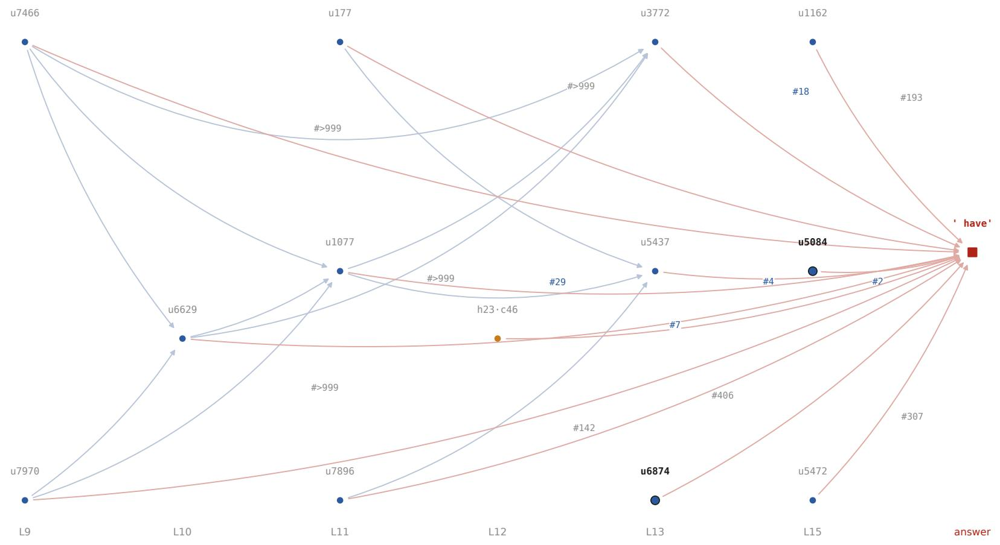  
Figure 6 8 : Llama- 3 . 2 1 B prediction 2 : the graph 1 3 members and 1 1 edges among them .

…212,613.32inlegalaid.[84]↵↵On3December2014,

…whereasothercomponentsoftheintervention—suchasthePeaceMother’sGroup,CommunalFarms,orPeaceTree—actuallydrive

p=0.62 93 components reach 90% of the net no prefix flips it 78% cancels
<table><tr><td></td><td></td><td></td><td>strength</td><td>fires on</td><td></td><td></td><td>writes toward</td><td></td><td></td><td>answer</td></tr><tr><td>L20·h28·c48</td><td></td><td>attn</td><td>0.69</td><td>一</td><td></td><td></td><td></td><td>→ &#x27;the&#x27; &#x27;entire&#x27;</td><td></td><td>#1</td></tr><tr><td>L20·h31·c48</td><td></td><td>attn</td><td>0.94</td><td>一</td><td></td><td></td><td></td><td></td><td>→ &#x27;date&#x27; &#x27;least&#x27; &#x27;itself&#x27;</td><td>#19</td></tr><tr><td>L20·u3758</td><td></td><td>ffn</td><td>0.46</td><td>&#x27;their&#x27;</td><td>&#x27;former&#x27;</td><td>→</td><td></td><td>&#x27;the&#x27; &#x27;those&#x27;&#x27;your&#x27;</td><td></td><td>#1</td></tr><tr><td>L19·u2603</td><td></td><td>ffn</td><td>0.71</td><td>&#x27;its&#x27;</td><td>&#x27;You&#x27; &#x27;these&#x27;</td><td>→</td><td></td><td>&#x27;the&#x27; &#x27;the&#x27;&#x27;The&#x27;</td><td></td><td>#1</td></tr><tr><td>LL18·h31·c62</td><td>15% via its·two</td><td>attn</td><td>1.42</td><td></td><td></td><td></td><td></td><td></td><td>→ &#x27;these&#x27; &#x27;similar&#x27; &#x27;the&#x27;</td><td>#4</td></tr><tr><td>L19·u3435</td><td></td><td>ffn</td><td>0.47</td><td>&#x27;some&#x27;</td><td>&#x27;much&#x27;</td><td>→</td><td>&#x27;the&#x27;</td><td>&#x27;those&#x27;</td><td>&#x27;your&#x27;</td><td>#1</td></tr></table>

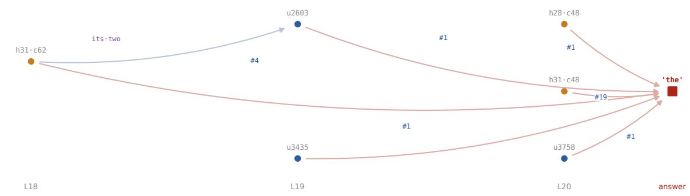

p=0.32 126 components reach 90% of the net 1 required 78% cancels
<table><tr><td></td><td>strength</td><td></td><td>fires on</td><td></td><td>writes toward</td><td></td><td></td><td></td></tr><tr><td>L20·u3758</td><td>ffn</td><td>0.41</td><td>&#x27;their&#x27;</td><td>&#x27;former&#x27;</td><td></td><td></td><td>→ &#x27;the&#x27; &#x27;those&#x27; &#x27;your&#x27;</td><td>#1</td></tr><tr><td>L19·u3357</td><td>ffn</td><td>0.39</td><td>&#x27;an&#x27; &#x27;an&#x27;</td><td>&#x27;some&#x27;</td><td>→</td><td>&#x27;the&#x27;</td><td>&#x27;the&#x27;&#x27;a&#x27;</td><td>#1</td></tr><tr><td>L18·u3583</td><td>ffn</td><td>1.01</td><td>&#x27;The&#x27;</td><td>&#x27;The&#x27;</td><td>→</td><td></td><td>&#x27;the&#x27; &#x27;Member&#x27; &#x27;member&#x27;</td><td>#1</td></tr><tr><td>L17·u3257</td><td>ffn</td><td>1.02</td><td>&#x27;former&#x27;</td><td>&#x27;risk&#x27;</td><td>→</td><td>&#x27;and&#x27;</td><td>&#x27;a&#x27;</td><td>#4</td></tr></table>

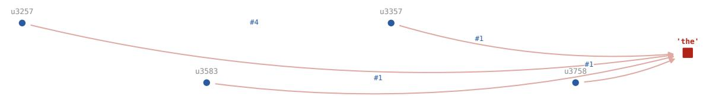  
Figure 69: TinyLlama 1.1B, predictions 1 and 2. Of 20 predictions drawn at random, these are two of the four whose suficient set is nearest the median, 5.

…spam') next(g) local.set('world') global.set('ham') next(g) # Will print: # inside gen: spam # inside

$ \bf { \sigma } \cdot \bf { g e n } ^ { \prime }$ p=0.99 182 components reach 90% of the net no prefix flips it 88% cancels
<table><tr><td></td><td></td><td>strength</td><td>fires on</td><td colspan="4">writes toward</td><td>answer</td></tr><tr><td>L27·h1·c5</td><td>attn</td><td>4.08</td><td>一</td><td></td><td> $\begin{array} { r l } {  } & { { } ^ { \prime } ~ \mathsf { g e n } ^ { \prime } ~ \mathsf { \Omega } ^ { \prime } ~ { \mathsf { G e n } } ^ { \prime } } \end{array}$ </td><td></td><td></td><td>#2</td></tr><tr><td>L27·h1·c10</td><td>attn</td><td>4.88</td><td>1</td><td></td><td></td><td> $ \frac { 1 } { 6 } ( n ^ { \prime } ) ^ { 2 } + \frac { 1 } { 9 } ( n ^ { \prime } ) ^ { 2 } \cdot 2 n \cos 3$ </td><td></td><td>#3</td></tr><tr><td>L27·h1·c42</td><td>attn</td><td>5.05</td><td>一</td><td></td><td></td><td> $ \frac { 1 } { 6 } = \frac { 1 } { 2 } ( c m ^ { 2 } ) ^ { 2 }  9 = \frac { 1 } { 2 }$ </td><td></td><td>#6</td></tr><tr><td>L27·h1·c45</td><td>attn</td><td>3.75</td><td>一</td><td></td><td></td><td></td><td> $ \frac { 1 } { 5 } + \tt { a c k } ^ { \prime } \cdot \mathrm { g e n } ^ { \prime } \cdot \mathrm { B a g } ^ { \prime }$ </td><td>#48</td></tr><tr><td>L27·h1·c88</td><td>attn</td><td>5.09</td><td>一</td><td></td><td></td><td> $\begin{array} { r l r } {  } & { { } \mathrm { : } } & { \mathsf { g e n } ^ { \prime } \quad \mathsf { \Omega } } \end{array} \mathsf { \Omega } ^ { \mathsf { q e n e r a t o r } ^ { \prime } }$ </td><td></td><td>#4</td></tr></table>

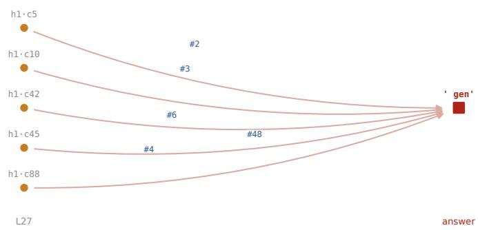

….F. did conduct a precision airstrike on three insurgents in Nawa district, and the strike killed all three insurgents,” he said. “None
<table><tr><td> $\to ^ { \bullet } \circ \mathsf { f } ^ { \bullet }$ </td><td>p=0.95</td><td></td><td colspan="3">111 components reach 90% of the net</td><td colspan="3">5 required</td></tr><tr><td></td><td></td><td></td><td>strength</td><td>fires on</td><td></td><td>writes toward</td><td></td><td>answer</td></tr><tr><td>L23·u5603</td><td></td><td>ffn</td><td>9.26</td><td></td><td></td><td></td><td> $\cdot \phantom { 0 } { \mathsf { T } } \mathsf { e } \mathsf { a } \mathsf { s } \mathsf { t } ^ { \ast } \qquad \cdot \phantom { 0 } { \mathsf { s } } _ { 0 } \mathsf { m } \mathsf { e } ^ { \ast } \qquad \to \ \mathsf { \Omega } ^ { \ast } \phantom { 0 } { \mathsf { T } } \phantom { 0 } { \mathsf { T } } ^ { \ast } \quad \cdot \phantom { 0 } { \mathsf { T } } \phantom { 0 } { \mathsf { s } } _ { 0 } \mathsf { f } ^ { \ast } \quad \cdot \phantom { 0 } { \mathsf { T } } \phantom { 0 } { \mathsf { s } } _ { 0 } \mathsf { f } ^ { \ast } \quad \cdot \phantom { 0 } { \mathsf { T } } \phantom { 0 } { \mathsf { s } } _ { 0 } \mathsf { f } ^ { \ast } \quad \cdot \phantom { 0 } { \mathsf { T } } \phantom { 0 } { \mathsf { s } } _ { 0 } \mathsf { T } \phantom { 0 } { \mathsf { s } } _ { 0 } \qquad \mathsf { T } \phantom { 0 } { \mathsf { T } } \phantom { 0 }$ </td><td>#1</td></tr><tr><td>L0·u5715</td><td>8% via least</td><td>ffn</td><td>8.05</td><td>others</td><td>no&#x27;</td><td></td><td> $ ~ ^ { \prime } 0 5 1 5 ^ { \prime } ~ ^ { \prime } ~ \mathsf { p u r e ^ { \prime } }$ </td><td>#642</td></tr><tr><td>L3·u2993</td><td>4% via three</td><td>ffn</td><td>15.92</td><td></td><td></td><td></td><td> $\begin{array} { c c c c c c c c c c c c c c c c c c c c c c c } { { } } & { { } } & { { } } & { { } } & { { } } & { { } } & { { } } & { { } } & { { } } & { { } } & { { } } & { { } } & { { } } & { { } } & { { } } & { { } } & { { } } & { { } } & { { } } & { { } } & { { } } & { { } } & { { } } & { { } } & { { } } & { { } } & { { } } & { { } } & { { } } & { { } } & { { } } & { { } } & { { } } & { { } } & { { } } & { { } } & { { } } & { { } } & { { } } & { { } } & { { } } & { { } } & { { } } & { { } } & { { } } & { { } } & { { } } & { { } } & { { } } & { { } } & { { } } & { { } } & { { } } & { { } } & { { } } & { { } } & { { } } & { { } } & { { } } & { { } } & { { } } & { { } } & { { } } & { { } } & { { } } & { { } } & { { } } & { { } } & { { } } & { { } } & { { } } & { { } } & { { } } & { { } } & { { } } & { { } } & { { } } & { { } } & { { } } & { { } } & { { } } & { { } } & { { } } & { { } } & { { } } & { { } } & { { } } & { { } } & { { } } & { { } } & { { } } & { { } } & { { } } & { { } } & { { } } & { { } } & { { } } & { { } } & { { } } & { { } } & { { } } & { { } } & { { } } & { { } } & { { } } & { { } } & { { } } & { { } } & { { } } & { { } } & { { } } & { { } }  \end{array}$ </td><td>#&gt;999</td></tr><tr><td>L0·u5715</td><td>(above)</td><td></td><td></td><td></td><td></td><td></td><td></td><td></td></tr><tr><td>L6·u8534</td><td>3%</td><td>ffn</td><td>4.47</td><td> $\begin{array} { c c c c c c c c c c c c c c c c c c c c c c c } { { } } & { { \mathrm { e v e r y } ^ { \prime } } } & { { } } & { { } } & { { } } & { { } } & { { } } & { { } } & { { } } & { {  } } & { { { } ^ { \prime } } } & { { 0 \uparrow ^ { \prime } } } & { { { } ^ { \prime } \cdot \cdot \cdot } } & { { } } & { { } } & { { } } & { { } } & { { } } & { { } } & { { } } & { { } } & { { } } & { { } } & { { } } \end{array}$ </td><td></td><td></td><td></td><td>#1</td></tr><tr><td>L3·u2993</td><td>(above)</td><td></td><td></td><td></td><td></td><td></td><td></td><td></td></tr><tr><td>L0·u5715</td><td>(above)</td><td></td><td></td><td></td><td></td><td></td><td></td><td></td></tr><tr><td>L21·u2156</td><td></td><td>ffn</td><td>0.89</td><td></td><td></td><td></td><td> $\begin{array} { r l r l r l r l r l } { { } } & { { } 0 } & { \mathrm { t h e r ~ " } } & { } & { { } \mathrm { t s ~ e d " } } & { } & { { } } & { \to } & { { } \mathrm { " } } & { } { 0 \dag } & { { } \mathrm { " } } & { { } 0 \dag } & { { } \mathrm { " } } & { { } 0 \dag } & { { } \mathrm { " } } & { { } \mathrm { ~ ` ~ ` ~ " ~ } } & { } \end{array}$ </td><td>#1</td></tr><tr><td>L3·u2993</td><td>(above)</td><td></td><td></td><td></td><td></td><td></td><td></td><td></td></tr><tr><td>L6·u8534</td><td>(above)</td><td></td><td></td><td></td><td></td><td></td><td></td><td></td></tr><tr><td>L0·u5715</td><td>(above)</td><td></td><td></td><td></td><td></td><td></td><td></td><td></td></tr></table>

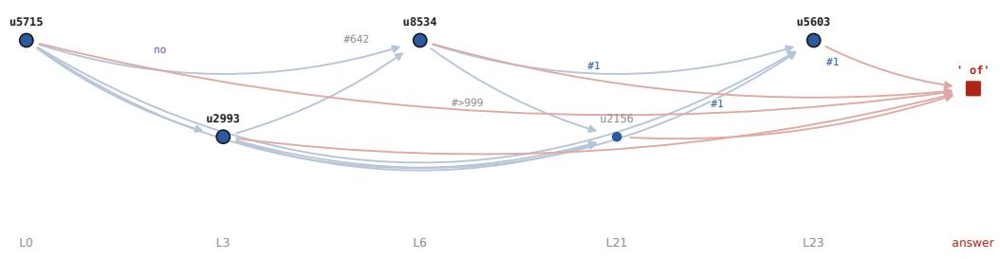  
Figure 70: Qwen2.5 1.5B, predictions 1 and 2. Of 19 predictions drawn at random, these are two of the four whose suficient set is nearest the median, 6.

… similar to planting a rain garden. Just one disconnected downspout can redirect thousands of water a year. Over 58,000 homes have disconnected

p=0.63 208 components reach 90% of the net no prefix flips it 86% cancels
<table><tr><td></td><td></td><td>strength</td><td></td><td>fires on</td><td></td><td>writes toward</td><td></td><td>answer</td></tr><tr><td>L27·h10·c118</td><td></td><td>attn</td><td>3.41</td><td>一</td><td></td><td> $ ~ ^ { 1 } , ~ ^ { 1 } ~ \cdot ~ ^ { 1 } ~ \cdot ~ ^ { 1 }$ </td><td></td><td>#142</td></tr><tr><td>L24·u7321</td><td></td><td>ffn</td><td>0.43</td><td></td><td></td><td></td><td> $\begin{array} { r l r } { \mathrm { ~ \gamma ~ } _ { \mathsf { S h e } ^ { \mathrm { ~ ' ~ } } } } & { { } \mathrm { ~ \mathsf { ~ T h e y } ~ } ^ { \prime } \qquad } & { \to \mathrm { ~ \sigma ~ } ^ { \prime } \mathrm { ~ \ o ~ n ~ e ~ i ~ r ~ } ^ { \prime } \mathrm { ~ \sigma ~ } ^ { \prime } \mathsf { T h e i } \mathrm { r } ^ { \prime } } \end{array}$ </td><td>#1</td></tr><tr><td>L23·u4661</td><td></td><td>ffn</td><td>0.83</td><td></td><td></td><td></td><td> $\begin{array} { r } { \mathrm { ~  ~ { ~ \mathrm { ~  ~ \hat { ~ } { ~ t ~ } ~ } ~ } ~ } { \sf t h e e ^ { \prime } } \quad \mathrm { ~  ~ { ~  ~ \mathrm { ~  ~ \hat { ~ } { ~ t ~ } ~ } ~ } ~ } { \sf t h e i r ^ { \prime } } \quad \mathrm { ~  ~ { ~ \hat { ~ } { ~ \tau ~ } ~ } ~ } { \sf T h e i r ^ { \prime } } } \end{array}$ </td><td>#3</td></tr><tr><td>LL22·u7447</td><td>8%</td><td>ffn</td><td>1.44</td><td></td><td></td><td></td><td> $\cdot \mathrm {  { ~ \ t h e i r } ~ } ^ { \prime } \mathrm {  { ~ \bar { \ t } e ~ } } ^ { \prime } \mathrm {  { ~ \bar { \ t } e ~ } } ^ { \prime } \mathrm {  { ~ \bar { \ t } e ^ { \ddag } ~ } } \cdot \mathrm {  { ~ \bar { \ t } h e i r } ~ } ^ { \prime } \mathrm {  { ~ \bar { \ t } h e i r } ~ } ^ { \prime } \mathrm {  { ~ \bar { \ t } h e i r } ~ } ^ { \prime }$ </td><td>#1</td></tr><tr><td>LL20·u1691</td><td>13% via their</td><td>ffn</td><td>1.24</td><td></td><td></td><td></td><td> $\begin{array} { r l r } { \mathrm { ~  ~ { ~ \tau ~ } ~ } \mathrm { t h e y ^ { \ast } ~ } } & { { } ^ \mathrm { ~ \ast ~ } \mathrm { t h e m ^ { \ast } ~ } \quad } & { \to \mathrm { ~  ~ { ~ \tau ~ } ~ } \mathrm { T h e i r ^ { \ast } ~ } ^ { \mathrm { ~ \ast ~ } } \mathrm { t h e i r ^ { \ast } ~ } } \end{array}$ </td><td>#3</td></tr><tr><td>LL16·h20·c2</td><td>3%</td><td>attn</td><td>0.60</td><td>一</td><td></td><td></td><td> $ ~ ^ { \prime } ~ \mathrm { i t } s ^ { \prime } ~ ^ { \prime } \mathrm { t h e y ^ { \prime } } ~ ^ { \prime } \mathrm { i t } s ^ { \prime }$ </td><td>#6</td></tr><tr><td>LL22·u4807</td><td>2%</td><td>ffn</td><td>0.23</td><td></td><td></td><td></td><td> $\begin{array} { r }  \mathrm { ~  { ~ \mathfrak ~ { ~ g ~ o ~ i ~ n ~ g ~ } ^ { \circ ~ } ~ } ~ ^ { \circ ~ } ~  { ~ \mathfrak ~ { ~ C ~ a ~ n ~ } ^ { \circ ~ } ~ } ~ \to ~  { ~ \mathfrak { ~ t ~ h ~ e ~ i ~ r ~ } ^ { \circ ~ } ~ } ~ ^ { \circ ~ } ~ \ y _ { 0 } \ u \ r ^ { \circ } ~ ^ { \circ ~ } ~ \overset { , } { \cdot } ~ \mathrm { i } \ t \ s ^ { \circ } } \end{array}$ </td><td>#2</td></tr></table>

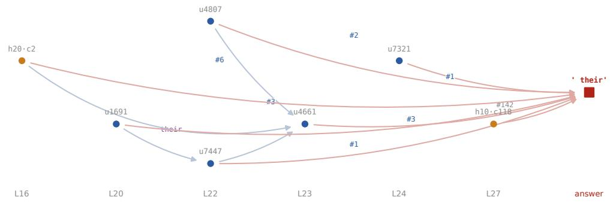

… as much as we trust our fashion expertise. And it’s high time you do too! We specialize in manufacturing basic watches and fun watches for men

$$
 \cdot \mathsf { a n d } ^ { \prime }
$$

p=0.51 157 components reach 90% of the net 1 required 87% cancels
<table><tr><td></td><td></td><td>strength</td><td></td><td>fires on</td><td></td><td>writes toward</td><td></td><td></td><td></td><td></td></tr><tr><td>L27·u679</td><td></td><td>ffn 1.55</td><td></td><td> $\bar { \cdot } \mathsf { o r } ^ { \iota ^ { \star } } \dot { \mathrm { ~  ~ \mathsf ~ { ~ \mathfrak ~ { ~ n ~ o ~ t ~ } ~ } ~ } } \mathsf { T h e } ^ { \iota ^ { \star } } \to \bar { \cdot } \mathsf { a n d } ^ { \iota ^ { \star } } \dot { \mathrm { ~  ~ \mathsf ~ { ~ \mathfrak ~ { ~ a ~ n ~ d ~ } ~ } ~ } } \bar { \cdot } \mathsf { a n d } ^ { \iota ^ { \star } } \dot { \mathrm { ~  ~ \mathsf ~ { ~ \mathfrak ~ { ~ \mathfrak { ~ a ~ n ~ d ~ } ~ } ~ } ~ } }$ </td><td></td><td></td><td></td><td></td><td></td><td>#1</td></tr><tr><td>L25·u4136</td><td></td><td>ffn 1.16</td><td></td><td> $ \begin{array} { c c c c c c c c c c c c c c c c c c c c c c c c c } { { } } & { { } } & { { \mathrm { m e } ^ { \mathrm { ~ \tiny ~ " ~ } } } } & { { \mathrm { ~ \tiny ~ \cdot ~ } } } & { { \mathrm { ~ d e f ~ " ~ } } } & { { } } & { { } } & { { } } & { { \to } } & { { \mathrm { ~ \tiny ~ " ~ } , \mathrm { ~ \tiny ~ " ~ } } } & { { \mathrm { ~ \tiny ~ " ~ } } } & { { } } & { { } } & { { } } & { { } } & { { } } \end{array}$ </td><td></td><td></td><td></td><td></td><td></td><td>#6</td></tr><tr><td>L24·u3764</td><td></td><td>ffn 0.10</td><td></td><td> $- y \in \partial \Gamma ^ { * } \mathrm { ~  ~ { ~ \pi ~ } ~ } ^ { * } \mathrm { ~  ~ { ~ \pi ~ } ~ } \mathrm { ~ y \in ~ } \Gamma ^ { * } \mathrm { ~  ~ { ~ \pi ~ } ~ } \to \mathrm { ~  ~ { ~ \pi ~ } ~ } \mathrm { a n d ~ } ^ { * } \mathrm { ~  ~ { ~ \pi ~ } ~ } ^ { * } \mathrm { ~  ~ { ~ \pi ~ } ~ } \mathrm { a n d ~ } ^ { * } \mathrm { ~  ~ { ~ \pi ~ } ~ } ^ { * } \mathrm { ~  ~ { ~ \pi ~ } ~ } \mathrm { ~  ~ { ~ \pi ~ } ~ }$ </td><td></td><td></td><td></td><td></td><td></td><td>#1</td></tr><tr><td>L24·u7486</td><td></td><td>ffn 1.45</td><td></td><td> $\begin{array} { r }  { | } \overrightarrow { } \overrightarrow { } \overrightarrow { } \overrightarrow { } \overrightarrow { } \overrightarrow { } \overrightarrow { } \overrightarrow { } \overrightarrow { } \overrightarrow { } \overrightarrow { } \overrightarrow { } \overrightarrow { } \overrightarrow { } \overrightarrow { } \overrightarrow { } \overrightarrow { } \overrightarrow { } \overrightarrow { } \overrightarrow { } \overrightarrow { } \overrightarrow { } \overrightarrow { } \overrightarrow { } \overrightarrow { } \overrightarrow { } \overrightarrow { } \overrightarrow { } \overrightarrow { } \overrightarrow { } \overrightarrow { } \overrightarrow { } \overrightarrow { } \overrightarrow { } \overrightarrow { } \overrightarrow { } \overrightarrow { } \overrightarrow { } \overrightarrow { } \overrightarrow { } \overrightarrow { } \overrightarrow { } \overrightarrow { } \overrightarrow { } \overrightarrow { } \overrightarrow { } \overrightarrow { } \overrightarrow { } \overrightarrow { } \overrightarrow { } \overrightarrow { } \overrightarrow { } \overrightarrow { } \overrightarrow { } \overrightarrow { } \overrightarrow { } \overrightarrow { } \overrightarrow { } \overrightarrow { } \overrightarrow { } \overrightarrow { } \overrightarrow { } \overrightarrow { } \overrightarrow { } \overrightarrow { } \overrightarrow { } \overrightarrow { } \overrightarrow { } \overrightarrow { } \overrightarrow { } \overrightarrow { } \overrightarrow { } \overrightarrow { } \overrightarrow { } \overrightarrow { } \overrightarrow { } \overrightarrow { } \overrightarrow { } \overrightarrow { } \overrightarrow { } \overrightarrow { } \overrightarrow { } \overrightarrow { } \overrightarrow { } \overrightarrow { } \overrightarrow { } \overrightarrow { } \overrightarrow { } \overrightarrow { } \overrightarrow { } \overrightarrow { } \overrightarrow { } \overrightarrow { } \overrightarrow { } \overrightarrow { } \overrightarrow { } \overrightarrow { } \overrightarrow { } \overrightarrow { } \overrightarrow { } \overrightarrow { } \overrightarrow { } \overrightarrow { } \overrightarrow { } \overrightarrow { } \overrightarrow { } \overrightarrow { } \overrightarrow { } \overrightarrow { } \overrightarrow { } \overrightarrow { } \overrightarrow { } \overrightarrow { } \overrightarrow { } \overrightarrow { } \overrightarrow { } \overrightarrow { } \overrightarrow { } \overrightarrow { } \overrightarrow { } \overrightarrow { } \overrightarrow { } \overrightarrow { } \overrightarrow { } \overrightarrow { } \overrightarrow \overrightarrow { } \overrightarrow { } \overrightarrow { } \overrightarrow { } \overrightarrow \overrightarrow { } \overrightarrow { } \overrightarrow { } \overrightarrow \overrightarrow { } \overrightarrow { } \overrightarrow \overrightarrow { } \overrightarrow { } \overrightarrow \overrightarrow { } \overrightarrow \overrightarrow { } \overrightarrow \overrightarrow { } \overrightarrow \overrightarrow { } \overrightarrow \overrightarrow { } \overrightarrow \overrightarrow { } \overrightarrow \overrightarrow { } \overrightarrow \overrightarrow { } \overrightarrow \overrightarrow { } \overrightarrow \overrightarrow { } \overrightarrow \overrightarrow \overrightarrow { } \overrightarrow \overrightarrow { } \overrightarrow \overrightarrow { } \overrightarrow \overrightarrow { } \overrightarrow \overrightarrow { \overrightarrow } \overrightarrow \overrightarrow { \overrightarrow } \end{array}$ </td><td></td><td></td><td></td><td></td><td></td><td>#22</td></tr><tr><td>L21·u3044</td><td></td><td>ffn 1.51</td><td></td><td> ${ \mathrm { ~  ~ { ~ \sigma ~ } ~ } } ^ { \mathrm { ~  ~ { ~ \scriptstyle ~ j ~ u s t ^ { \prime ~ } ~ } ~ } } \mathrm { ~  ~ { ~ \sigma ~ } ~ } ^ { \mathrm { ~ \tiny ~ { ~ \cdot ~ } ~ } } \ { \mathrm { ~  ~ { ~ \psi ~ } ~ } } \ \to \ { \mathrm { ~  ~ { ~ i ~ n ~ } ~ } } \ ^ { \mathrm { ~ \tiny ~ { ~ \cdot ~ } ~ } } \ { \mathrm { ~  ~ { ~ f ~ u r n ~ } ~ } } \ ^ { \mathrm { ~ \tiny ~ { ~ \cdot ~ } ~ } } \ ( \mathrm { ~  ~ { ~ \sigma ~ } ~ } ^ { \mathrm { ~ \tiny ~ { ~ \cdot ~ } ~ } } \ { \mathrm { ~  ~ { ~ \cdot ~ } ~ } } \ \ )$ </td><td></td><td></td><td></td><td></td><td></td><td>#5</td></tr><tr><td>L20·u186</td><td></td><td>ffn 1.18</td><td></td><td></td><td></td><td></td><td></td><td></td><td> $\begin{array} { r l r l r l r l r l } { { } } & { { } \mathfrak { m o s t } ^ { * } } & { { } ^ { * } } & { \mathsf { v e r y } ^ { * } } & { } & { { } \to } & { { } ^ { * } } & { \mathsf { f u r n } ^ { * } } & { { } ^ { * } } & { \mathsf { a l l } ^ { * } } & { { } ^ { * } } & { \mathfrak { m o r e } ^ { * } } \end{array}$ </td><td>#5</td></tr><tr><td>L19·u1003</td><td></td><td>ffn 0.78</td><td></td><td> $\mathrm  ^ { * } \mathsf { p r e s e n t } ^ { * } \Sigma ^ { \bullet \bullet \bullet \bullet \bullet } \Sigma ^  \bullet \bullet \bullet \bullet \bullet \bullet \bullet \bullet \bullet \bullet \bullet \bullet \bullet \bullet \bullet \bullet \bullet \bullet \bullet \bullet \bullet \bullet \bullet \bullet \bullet \bullet \bullet \bullet \bullet \bullet \bullet \bullet \bullet \bullet \bullet \bullet \bullet \bullet \bullet \bullet \bullet \bullet \bullet \bullet \bullet \bullet \bullet \bullet \bullet \bullet \bullet \bullet \bullet \bullet \bullet \bullet \bullet \bullet \bullet \bullet \bullet \bullet \bullet \bullet \bullet \bullet \bullet \bullet \bullet \bullet \bullet \bullet \bullet \bullet \bullet \bullet \bullet \bullet \bullet \bullet \bullet \bullet \bullet \bullet \bullet \bullet \bullet \bullet \bullet \bullet \bullet \bullet \bullet \bullet \bullet \bullet \bullet \bullet \bullet \bullet \bullet \bullet \bullet \bullet \bullet \bullet \bullet \bullet \bullet \bullet \bullet \bullet \bullet \bullet \bullet \bullet \bullet \bullet \bullet \bullet \bullet \bullet \bullet \bullet \bullet \bullet \bullet \bullet \bullet \bullet \bullet \bullet \bullet \bullet \bullet \bullet \bullet \bullet \bullet \bullet \bullet \bullet \bullet \bullet \bullet \bullet \bullet \bullet \bullet \bullet \bullet \bullet \bullet \bullet \bullet \bullet \bullet \bullet \bullet \bullet \bullet \bullet \bullet \bullet \bullet \bullet \bullet \bullet \bullet \bullet \bullet \bullet \bullet \bullet \bullet \bullet \bullet \bullet \bullet \bullet \bullet \bullet \bullet \bullet \bullet \bullet \bullet \bullet \bullet \bullet \bullet \bullet \bullet \bullet \bullet \bullet \bullet \bullet \bullet \bullet \bullet \bullet$ </td><td></td><td></td><td></td><td></td><td></td><td>#1</td></tr><tr><td>LL18·u1388</td><td>23% via present</td><td>ffn</td><td>1.10</td><td> $\begin{array} { c c c c c c c c c c c c c c c c c c c c c c } { { } } & { { \mathrm { d i a y } } } & { { } } & { { } } & { { } } & { { } } & { { } } & { { } } & { { } } & { { } } & { { } } & { { } } & { { } } & { { } } & { { } } & { { } } & { { } } & { { } } & { { } } & { { } } & { { } } & { { } } & { { } } & { { } } & { { } } & { { } } & { { } } & { { } } & { { } } & { { } } & { { } } & { { } } & { { } } & { { } } & { { } } & { { } } & { { } } & { { } } & { { } } & { { } } & { { } } & { { } } & { { } } & { { } } & { { } } & { { } } & { { } } & { { } } & { { } } & { { } } & { { } } & { { } } & { { } } & { { } } & { { } } & { { } } & { { } } & { { } } & { { } } & { { } } & { { } } & { { } } & { { } } & { { } } & { { } } & { { } } & { { } } & { { } } & { { } } & { { } } & { { } } & { { } } & { { } } & { { } } & { { } } & { { } } & { { } } & { { } } & { { } } & { { } } & { { } } & { { } } & { { } } & { { } } & { { } } & { { } } & { { } } & { { } } & { { } } & { { } } & { { } } & { { } } & { { } } & { { } } & { { } } & { { } } & { { } } & { { } } & { { } } & { { } } & { { } } & { { } } & { { } } & { { } } & { { } } & { { } } & { { } } & { { } } & { { } } & { { } } & { { } }  \end{array}$ </td><td></td><td></td><td></td><td></td><td></td><td>#6</td></tr></table>

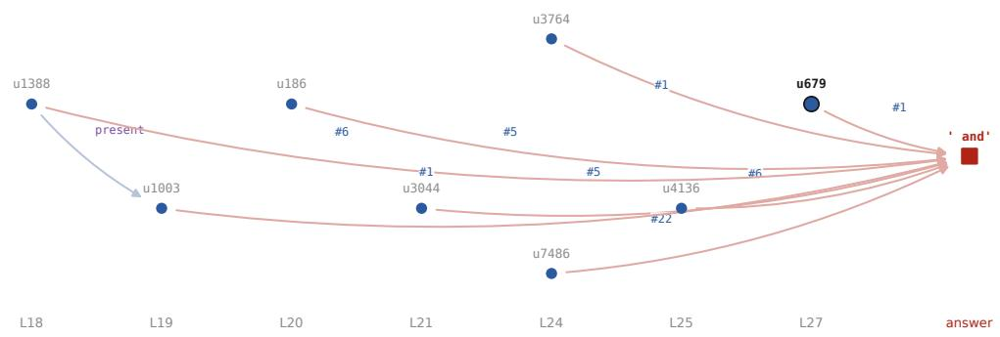  
Figure 71: Llama-3.2 3B, predictions 1 and 2. Of 20 predictions drawn at random, these are two of the four whose suficient set is nearest the median, 8.

…e think that this is unlikely because treatment effects on forgiveness, social capital, and psychological health are not statistically distinguishable

$ \cdot \sf t e l l ^ { \prime }$ p=0.51 304 components reach 90% of the net no prefix flips it 83% cancels
<table><tr><td colspan="6">→&#x27;from&#x27;</td><td colspan="4">149 components reach 90% of the net no prefix flips it 85% cancels</td></tr><tr><td colspan="3"></td><td>strength</td><td colspan="2">fires on</td><td colspan="3">writes toward</td></tr><tr><td>L25·u12780</td><td></td><td>ffn 0.57</td><td></td><td></td><td></td><td></td><td> $\begin{array} { r l r l r l r l r l } { { } } & { { } } & { \mathfrak { g o i n g ~ ^ { * } } } & { { } ^ { * } } & { \mathfrak { g o } ^ { * } } & { \quad } & { } & { { } \to ^ { * } } & { { } ^ { * } \ \mathfrak { f r o m } ^ { * } } & { ^ { * } } & { { } \mathfrak { F r o m } ^ { * } } & { ^ { * } \ \mathfrak { F r o m } ^ { * } } \end{array}$ </td><td>#2</td></tr><tr><td>L22·u2169</td><td></td><td>ffn 2.22</td><td></td><td></td><td> $\begin{array} { r l } { \mathrm { ~  ~ { ~ \left. ~ \mathsf ~ { ~ f ~ r ~ o ~ m ~ } ^ { \prime ~ } ~ \right. ~ } ~ } } & { { } \mathrm { ~  ~ { ~ \left. ~ \mathsf { ~ y ~ e ~ a ~ r ~ s ~ } ^ { \prime ~ } ~ \right. ~ } ~ } \to \mathrm { ~  ~ { ~ \left. ~ \mathsf { ~ t ~ r ~ o ~ m ~ } ^ { \prime ~ } ~ \right. ~ } ~ } ^ { \prime } \mathrm { ~  ~ { ~ \left. ~ \mathsf ~ { ~ p ~ e ~ r ~ s ~ o ~ n ~ } ^ { \prime ~ } ~ \right. ~ } ~ } } \end{array}$ </td><td></td><td></td><td>#1</td></tr><tr><td>L8·u14989</td><td></td><td>ffn 3.62</td><td></td><td></td><td></td><td></td><td> $\mathrm { ~  ~ { ~ \mathsf ~ { ~ f ~ r ~ o ~ m ~ } ~ } ~ } ^ { * } \quad \mathrm { ~ w h i l e ~ } ^ { * } \quad \mathrm { ~  ~ { ~ \mathsf ~ { ~ \to ~ } ~ } ~ } ^ { * } \quad \mathsf { f } \mathsf { r o m } ^ { * } \quad ^ { * } \mathsf { F r o m } ^ { * } \quad \mathsf { F r o m } ^ { * } \quad \mathsf { F r o m } ^ { * } ,$ </td><td>#1</td></tr></table>

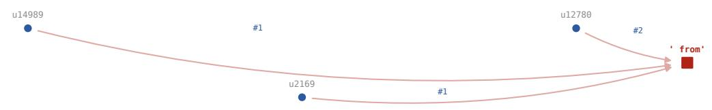

… likely to have been smashed by Jiang Yuan! "Who can tell me what just happened? Ah?" Jiang Yuan said furiously. "Can anyone

<table><tr><td></td><td></td><td></td><td>strength</td><td>fires on</td><td></td><td>writes toward</td><td></td><td>answer</td></tr><tr><td>L25·u4611</td><td></td><td>ffn</td><td>5.21</td><td></td><td></td><td></td><td> $\begin{array} { r l r l r l r l } { { } } & { { } \mathsf { p r e s e n t } ^ { * } } & { } & { { } \mathsf { L e v } ^ { * } } & { } & { { } \to } & { ^ { * } { \mathsf { t e l l } } ^ { * } } & { ^ { * } { \mathsf { T e l l } } ^ { * } } \end{array}$ </td><td>#2</td></tr><tr><td>LL23·u11094</td><td>19%</td><td>ffn</td><td>9.55</td><td>put</td><td>know&#x27;</td><td></td><td> $ \mathrm { ~ ` ~ } \tan \{ \frac { \pi } { 2 } \cdot \mathrm { ~ ` ~ } \tan \alpha \} \mathrm { ~ ` ~ } \tau \mathrm { e } \tau \downarrow \mathrm { ~ " ~ } $ </td><td>#1</td></tr><tr><td>LL22·u3252</td><td>2%</td><td>ffn</td><td>2.80</td><td>year&#x27;</td><td>take</td><td></td><td>→&#x27;messages&#x27;&#x27;tell&#x27;</td><td>#32</td></tr><tr><td>L24·u6590</td><td></td><td>ffn</td><td>0.83</td><td>being</td><td>Zhang</td><td>→</td><td>tell&#x27;&#x27;telling&#x27;</td><td>#1</td></tr></table>

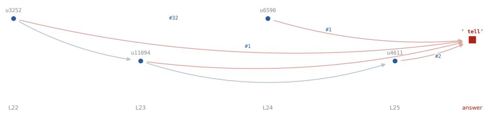  
Figure 72: Qwen2.5 7B, predictions 1 and 2. Of 17 predictions drawn at random, these are two of the four whose suficient set is nearest the median, 4.

…achanelbowOVERthedownspouttopreventleaking.Youmanyneedtocrimpthedownspoutwithneedlenosepliers

<table><tr><td colspan="6"> $ \pmb { \mathrm { o } } ^ { \prime }$ </td><td colspan="2">p=0.36 451 components reach 90% of the net no prefix flips it 84% cancels</td><td colspan="2"></td></tr><tr><td></td><td></td><td>strength</td><td>fires on</td><td></td><td></td><td>writes toward</td><td></td><td>answer</td></tr><tr><td>L29·u849</td><td>ffn</td><td>2.56</td><td>&#x27;de&#x27;</td><td>&#x27;former&#x27;</td><td></td><td> $ \mathrm { ~  ~ { ~ ' ~ } ~ t ~ o ~ } ^ { \prime } \mathrm { t } 0 ^ {  { ~ ' ~ } } \mathrm { t } 0 ^ {  { ~ ' ~ } } \mathrm { T } 0 ^ {  { ~ ' ~ } }$ </td><td></td><td>#1</td></tr><tr><td>L27·u3422</td><td>ffn</td><td>2.99</td><td>&#x27;did&#x27;</td><td>&#x27;bury&#x27;</td><td></td><td> $ \mathrm { ~  ~ { ~ ' ~ } ~ t ~ o ~ } ^ { \prime } \mathrm { t } 0 ^ {  { ~ ' ~ } } \mathrm { t } 0 ^ {  { ~ ' ~ } } \mathrm { T } 0 ^ {  { ~ ' ~ } }$ </td><td></td><td>#1</td></tr></table>

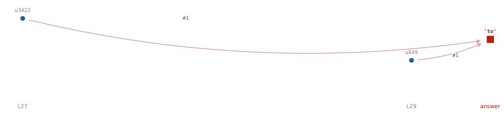

…es,whichwasthefocusofthePeaceTree,isalsonegativeandimprecise(tableS25).Moreover,itisdifficult
<table><tr><td> $ \pmb { \mathrm { o } } ^ { \prime }$ </td><td></td><td colspan="4">p=0.97 249 components reach 90% of the net no prefix flips it 84% cancels</td><td colspan="3"></td><td></td><td></td></tr><tr><td></td><td></td><td></td><td>strength</td><td>fires on</td><td></td><td></td><td></td><td>writes toward</td><td></td><td>answer</td></tr><tr><td>L25·u8746</td><td></td><td>ffn</td><td>3.08</td><td>&#x27;PA&#x27;</td><td>&#x27;has&#x27;</td><td>&#x27;Task&#x27;</td><td></td><td>→ &#x27;to&#x27; &#x27;to&#x27; &#x27;To&#x27;</td><td></td><td>#1</td></tr><tr><td>LL23·u3407</td><td>19%</td><td>ffn</td><td>7.46</td><td>&#x27;Task&#x27;</td><td>&#x27;its&#x27;</td><td></td><td></td><td></td><td>→ &#x27;to&#x27; &#x27;to&#x27; &#x27;ious&#x27;</td><td>#1</td></tr></table>

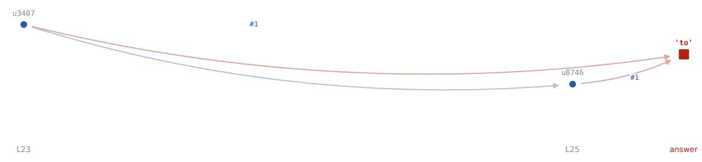  
Figure 73: Mistral 7B, predictions 1 and 2. Of 20 predictions drawn at random, these are two of the four whose suficient set is nearest the median, 2.

## A.4 Traces where the vocabulary runs out

The pages above were drawn without regard to their content, and most of them use no concepts. These were selected for the opposite reason: each carries edges that no token describes, so that the case the rest of this paper argues about can be seen rather than described. They are not a sample of anything. OPT-125M leads them because it is genuinely unlike the others here — about two thirds of the edges in its traces carry no word, against a few percent everywhere else — and it is the one model in the set built on ReLU, whose units are silent on the whole negative half-line.

… seen from Pokemon Go players over the past few weeks. If you thought Candy Crush was bad, well, Pokemon Go takes things to an entirely new

<table><tr><td>→ &#x27;level&#x27;</td><td>p=0.96</td><td></td><td colspan="5">41 components reach 90% of the net</td><td colspan="4">no prefix flips it 67% cancels</td></tr><tr><td></td><td></td><td></td><td>strength</td><td>fires on</td><td colspan="3"></td><td colspan="4">writes toward</td><td>answer</td></tr><tr><td>L11·u417</td><td></td><td></td><td>1.08</td><td></td><td colspan="3">before&#x27;</td><td colspan="3">→&#x27;side&#x27;&#x27;Side&#x27;&#x27;team&#x27;</td><td>#23</td></tr><tr><td>LL10·u34</td><td>8%</td><td></td><td>1.69</td><td></td><td>write</td><td></td><td>→ (C)</td><td></td><td></td><td></td><td>#194</td></tr><tr><td>LL3·u248</td><td>6%</td><td></td><td>0.93</td><td></td><td>&#x27;to&#x27;&#x27;the&#x27;</td><td></td><td>in&#x27;→ (A)</td><td></td><td></td><td></td><td>#&gt;999</td></tr><tr><td>LL7·u736</td><td>3%</td><td></td><td>0.60</td><td>by&#x27;</td><td>are&#x27;</td><td></td><td>→ (I)</td><td></td><td></td><td></td><td>#24</td></tr><tr><td>LL6·u2643</td><td>14%</td><td></td><td>0.37</td><td></td><td></td><td></td><td>to&#x27;&#x27;the&#x27;&#x27;in&#x27;→ 〈B》</td><td></td><td></td><td></td><td>#44</td></tr><tr><td>LL3·u248</td><td>(above)</td><td></td><td></td><td></td><td></td><td></td><td></td><td></td><td></td><td></td><td></td></tr><tr><td>LL3·u248</td><td>(above)</td><td></td><td></td><td></td><td></td><td></td><td></td><td></td><td></td><td></td><td></td></tr><tr><td>LL6·u1647</td><td>7%</td><td></td><td>0.75</td><td>&#x27;second&#x27;</td><td></td><td>us</td><td></td><td>→&#x27;different&#x27;&#x27; reason&#x27;</td><td></td><td></td><td>#35</td></tr><tr><td>LL3·u248</td><td>(above)</td><td></td><td></td><td></td><td></td><td></td><td></td><td></td><td></td><td></td><td></td></tr><tr><td>LL6·u2643</td><td>(above)</td><td></td><td></td><td></td><td></td><td></td><td></td><td></td><td></td><td></td><td></td></tr><tr><td>LL10·u1450</td><td>6%</td><td></td><td>0.74</td><td></td><td>negative&#x27;write→(G)</td><td></td><td></td><td></td><td></td><td></td><td>#&gt;999</td></tr><tr><td>LL9·u1134</td><td>8% via negative-write</td><td></td><td>0.80</td><td>second&#x27;</td><td></td><td>us</td><td>→&#x27;continent&#x27;&#x27;regions&#x27;</td><td></td><td></td><td></td><td>#81</td></tr><tr><td>LL3·u248</td><td>(above)</td><td></td><td></td><td></td><td></td><td></td><td></td><td></td><td></td><td></td><td></td></tr><tr><td>LL6·u1647</td><td>(above)</td><td></td><td></td><td></td><td></td><td></td><td></td><td></td><td></td><td></td><td></td></tr><tr><td>LL6·u2643</td><td>(above)</td><td></td><td></td><td></td><td></td><td></td><td></td><td></td><td></td><td></td><td></td></tr><tr><td>LL3·u248</td><td>(above)</td><td></td><td></td><td></td><td></td><td></td><td></td><td></td><td></td><td></td><td></td></tr><tr><td>LL9·u1134</td><td>(above)</td><td></td><td></td><td></td><td></td><td></td><td></td><td></td><td></td><td></td><td></td></tr><tr><td>L11·u1011</td><td></td><td></td><td>0.79</td><td>&#x27;et&#x27;</td><td>social&#x27;</td><td></td><td></td><td>→&#x27;level&#x27;&#x27;ale&#x27;&#x27;ase&#x27;</td><td></td><td></td><td>#1</td></tr><tr><td>LL10·u34</td><td>(above)</td><td></td><td></td><td></td><td></td><td></td><td></td><td></td><td></td><td></td><td></td></tr><tr><td>LL3·u248</td><td>(above)</td><td></td><td></td><td></td><td></td><td></td><td></td><td></td><td></td><td></td><td></td></tr><tr><td>LL9·u1673</td><td>7%</td><td></td><td>0.86</td><td></td><td></td><td></td><td>&#x27;to&#x27;&#x27;the&#x27;&#x27;in&#x27;→ 〈F)</td><td></td><td></td><td></td><td>#2</td></tr><tr><td>LL7·u1167</td><td>9%</td><td></td><td>0.24</td><td></td><td></td><td></td><td>to&#x27;&#x27;the&#x27;&#x27;in&#x27;→ 〈E》</td><td></td><td></td><td></td><td>#2</td></tr><tr><td>LL6·u2643</td><td>(above)</td><td></td><td></td><td></td><td></td><td></td><td></td><td></td><td></td><td></td><td></td></tr><tr><td>LL6·u1647</td><td>(above)</td><td></td><td></td><td></td><td></td><td></td><td></td><td></td><td></td><td></td><td></td></tr><tr><td>LL6·u2643</td><td>(above)</td><td></td><td></td><td></td><td></td><td></td><td></td><td></td><td></td><td></td><td></td></tr><tr><td>LL6·u1647</td><td>(above)</td><td></td><td></td><td></td><td></td><td></td><td></td><td></td><td></td><td></td><td></td></tr><tr><td>L11·u1411</td><td></td><td></td><td>0.48</td><td></td><td>&#x27;second&#x27;</td><td>us&#x27;</td><td></td><td>→&#x27;types&#x27;&#x27; set&#x27;kind&#x27;</td><td></td><td></td><td>#24</td></tr><tr><td>LL3·u248</td><td>(above)</td><td></td><td></td><td></td><td></td><td></td><td></td><td></td><td></td><td></td><td></td></tr><tr><td>LL9·u1134</td><td>(above)</td><td></td><td></td><td></td><td></td><td></td><td></td><td></td><td></td><td></td><td></td></tr><tr><td>LL10·u400</td><td></td><td>12% via second·us·much ffn</td><td>0.69</td><td></td><td></td><td>second&#x27;</td><td></td><td>→&#x27;step&#x27;&#x27;place&#x27;</td><td></td><td></td><td>#310</td></tr><tr><td>LL9·u1134</td><td>(above)</td><td></td><td></td><td></td><td></td><td></td><td></td><td></td><td></td><td></td><td></td></tr><tr><td>LL3·u248 LL6·u2643</td><td>(above)</td><td></td><td></td><td></td><td></td><td></td><td></td><td></td><td></td><td></td><td></td></tr><tr><td>L11·u1624</td><td>(above)</td><td></td><td>0.53</td><td></td><td></td><td>second&#x27;</td><td></td><td>→window&#x27;range&#x27;</td><td></td><td></td><td>#3</td></tr><tr><td>LL10·u1450</td><td>(above)</td><td></td><td></td></table>

Figure 74: OPT 125M, prediction 3: the set, 16 members. Selected for containing edges no token describes. Of 20 predictions drawn at random, this is one of the four whose suficient set is nearest the median, 13.

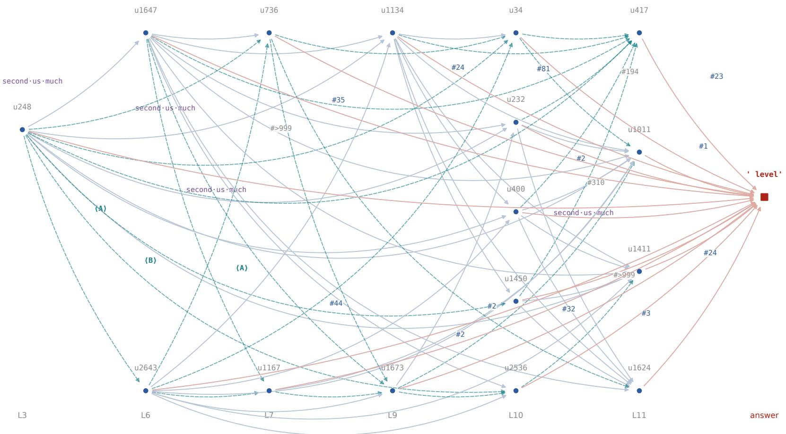  
Figure 75 : OPT 1 2 5M , prediction 3 : the graph , 1 6 members and 59 edges among them .

…iginally made public by the Baltimore Police Department who tweeted about the incident along with some accompanying video from a policeman’s body cam

<table><tr><td>→ video&#x27;</td><td>p=0.46</td><td colspan="3">54 components reach 90% of the net 1 required</td><td></td><td>69% cancels</td><td></td></tr><tr><td></td><td></td><td></td><td>strength</td><td>fires on</td><td>writes toward</td><td></td><td>answer</td></tr><tr><td>L11·u287</td><td></td><td>ffn</td><td>0.44</td><td></td><td> $\mathrm { ~  ~ \ p v e n ~ } ^ { * } \mathrm { ~  ~ \dot { ~ } { \scriptstyle \ i n g } ~ } ^ { * } \mathrm { ~  ~ \qquad ~ } \to \mathrm { ~  ~ \dot { ~ } { \scriptstyle \ t h e } ~ } ^ { * } \mathrm { ~  ~ \cdot ~ } \mathrm { ~  ~ \ a n d ~ } ^ { * } \mathrm { ~  ~ \cdot ~ } ,$ </td><td></td><td>#681</td></tr><tr><td>L11·u533</td><td></td><td>ffn</td><td>0.74</td><td>before</td><td>→&#x27; music&#x27;&#x27; movies&#x27;</td><td></td><td>#269</td></tr><tr><td>LL10·u885</td><td>13%</td><td>ffn</td><td>0.54</td><td>before&#x27;</td><td>→ (D)</td><td></td><td>#139</td></tr><tr><td>LL1·u748</td><td>19%</td><td>ffn</td><td>0.72</td><td> $\begin{array} { r } { \mathrm { ~  ~ { ~ \mathbf ~ { ~ t ~ o ~ } ~ } ~ } ^ { \prime } \mathrm {  ~ \scriptstyle ~ t h e ^ { \prime } ~ } ^ { \prime } \mathrm {  ~ \scriptstyle ~ i n ^ { \prime } \to ~ } \langle  { \mathsf { A } } \rangle } \end{array}$ </td><td></td><td></td><td>#13</td></tr><tr><td>LL7·u59</td><td>16% via Torrent·before ffn</td><td>0.47</td><td></td><td>before&#x27;</td><td>→TV&#x27;movies&#x27;movie&#x27;</td><td></td><td>#26</td></tr><tr><td>LL1·u748</td><td>(above)</td><td></td><td></td><td></td><td></td><td></td><td></td></tr><tr><td>LL5·u1330</td><td>12%</td><td>ffn 0.30</td><td></td><td> $\begin{array} { r } { \begin{array} { r l r l r l } { { 1 } } & { { } \mathrm { t h o s e " } } & { { \mathrm { " } } } & { { } \quad } & {  } & { { } \langle \mathsf { F } \rangle } \end{array} } \end{array}$ </td><td></td><td></td><td>#175</td></tr><tr><td>LL1·u748</td><td>(above)</td><td></td><td></td><td></td><td></td><td></td><td></td></tr><tr><td>L1·u1098</td><td>14%</td><td>ffn 0.40</td><td></td><td> $\begin{array} { r l } { \mathsf { \Pi } ^ { \prime } \mathsf { e } \Gamma ^ { \prime } \quad ^ { \prime } \mathsf { p o l } \mathsf { i } \mathsf { c e } ^ { \prime } \quad } & { { } \to \mathsf { \Omega } ^ { \prime } \mathsf { F l o y d } ^ { \prime } \quad ^ { \prime } \mathsf { f o o t a g e } ^ { \prime } } \end{array}$ </td><td></td><td></td><td>#930</td></tr><tr><td>L1·u1098</td><td>(above)</td><td></td><td></td><td></td><td></td><td></td><td></td></tr><tr><td>LL8·u1333</td><td>11%</td><td>ffn 0.79</td><td></td><td> $\begin{array} { r } { \begin{array} { c c c c } { \mathsf { e r } ^ { \prime } } & { \mathsf { \Omega } ^ { \prime } } & { \mathsf { p o l i c e } ^ { \prime } } & { \mathsf { \Omega } } & { \to \mathsf { \Omega } \left\{ \mathsf { B } \right\} } \end{array} } \end{array}$ </td><td></td><td></td><td>#1</td></tr><tr><td>LL1·u748</td><td>(above)</td><td></td><td></td><td></td><td></td><td></td><td></td></tr><tr><td>L1·u1098</td><td>(above)</td><td></td><td></td><td></td><td></td><td></td><td></td></tr><tr><td>LL5·u1330</td><td>(above)</td><td></td><td></td><td></td><td></td><td></td><td></td></tr><tr><td>LL7·u59</td><td>(above)</td><td></td><td></td><td></td><td></td><td></td><td></td></tr><tr><td>LL1·u748</td><td>(above)</td><td></td><td></td><td></td><td></td><td></td><td></td></tr><tr><td>L11·u880 LL10·u950</td><td></td><td>ffn 0.65</td><td></td><td></td><td> $\begin{array} { r } { \mathrm { ~ \gamma ^ { ~ } ~ \ o b j e c t ~ ^ { * } ~ \gamma ^ { ~ } ~ \mathbb { T } S I S ~ ^ { * } ~  ~ ^ { * } ~ \ p o l i c e ~ ^ { * } ~ ^ { * } ~ \ p o l i c e ~ ^ { * } ~ } } \end{array}$ </td><td></td><td>#43</td></tr><tr><td></td><td>13% (above)</td><td>ffn 0.62</td><td></td><td> $\begin{array} { r } {  { \mathsf { ~  ~ \mathscr ~ { ~ b ~ y ~ } ~ } } ^ { \prime } \cdot  { \mathsf {  ~ \mathsf { a } ~ } }  { \mathsf { r e } } ^ { \prime } \qquad \to \ \langle \mathsf { E } \rangle } \end{array}$ </td><td></td><td></td><td>#25</td></tr><tr><td>LL8·u1333 LL9·u2831</td><td>6%</td><td>ffn 0.44</td><td></td><td></td><td></td><td></td><td>#435</td></tr><tr><td>LL1·u748</td><td>(above)</td><td></td><td></td><td> $\begin{array} { r } { \mathrm { ~ : ~ } ~ \tan ^ { \prime } \mathrm { ~ : ~ } ~ \tan \mathrm { e } ^ { \prime } \mathrm { ~ : ~ } ~ \tan ^ { \prime }  \langle \mathsf { G } \rangle } \end{array}$ </td><td></td><td></td><td></td></tr><tr><td>LL8·u1333</td><td>(above)</td><td></td><td></td><td></td><td></td><td></td><td></td></tr><tr><td>LL5·u1330</td><td>(above)</td><td></td><td></td><td></td><td></td><td></td><td></td></tr><tr><td>LL1·u748</td><td>(above)</td><td></td><td></td><td></td><td></td><td></td><td></td></tr><tr><td>LL8·u1333</td><td>(above)</td><td></td><td></td><td></td><td></td><td></td><td></td></tr><tr><td>LL1·u748</td><td>(above)</td><td></td><td></td><td></td><td></td><td></td><td></td></tr><tr><td>L11·u1157</td><td></td><td>ffn 0.64</td><td></td><td>police&#x27; &#x27;er&#x27;</td><td></td><td>→body&#x27;·face&#x27;·head&#x27;</td><td>#&gt;999</td></tr><tr><td>L1·u1098</td><td>(above)</td><td></td><td></td><td></td><td></td><td></td><td></td></tr><tr><td>LL8·u1333</td><td>(above)</td><td></td><td></td><td></td><td></td><td></td><td></td></tr><tr><td>LL10·u950</td><td>(above)</td><td></td><td></td><td></td><td></td><td></td><td></td></tr><tr><td>L11·u1722</td><td></td><td>ffn</td><td>0.48</td><td>write&#x27;</td><td></td><td>→&#x27;data&#x27;&#x27;Data&#x27;</td><td>#221</td></tr><tr><td>LL8·u1333</td><td>(above)</td><td></td><td></td><td></td><td></td><td></td><td></td></tr><tr><td>LL1·u748</td><td>(above)</td><td></td><td></td><td></td><td></td><td></td><td></td></tr><tr><td>LL10·u950</td><td>(above)</td><td></td><td></td><td></td><td></td><td></td><td></td></tr><tr><td>L10·u355</td><td></td><td>ffn</td><td>0.69</td><td>police&#x27; &#x27;er&#x27;</td><td></td><td>→&#x27;officers&#x27;&#x27;officer&#x27;</td><td>#304</td></tr><tr><td>L1·u1098</td><td>(above)</td><td></td><td></td><td></td><td></td><td></td><td></td></tr><tr><td>LL1·u748</td><td>(above)</td><td></td><td></td><td></td><td></td><td></td><td></td></tr><tr><td>LL8·u1333</td><td>(above)</td><td></td><td></td><td></td><td></td><td></td><td></td></tr><tr><td>L9·u2499</td><td></td><td>ffn 0.44</td><td></td><td>those&#x27;We&#x27;</td><td></td><td>→&#x27;cameras&#x27;&#x27;laptops&#x27;</td><td>#105</td></tr><tr><td>LL1·u748</td><td>(above)</td><td></td><td></td><td></td><td></td><td></td><td></td></tr><tr><td>LL8·u1333</td><td>(above)</td><td></td><td></td><td></td><td></td><td></td><td></td></tr><tr><td>L1·u1098</td><td>(above)</td><td></td><td></td><td></td><td></td><td></td><td></td></tr><tr><td>L8·u1314</td><td></td><td>ffn</td><td>0.35</td><td>&#x27;write&#x27;</td><td></td><td>→ documentary&#x27;video&#x27;</td><td>#2</td></tr><tr><td>LL7·u59</td><td>(above)</td><td></td><td></td><td></td><td></td><td></td><td></td></tr><tr><td>LL1·u748</td><td>(above)</td><td></td><td></td><td></td><td></td><td></td><td></td></tr><tr><td>LL5·u1330</td><td></td><td></td><td></td><td></td><td></td><td></td><td></td></tr></table>

Figure 76: OPT 125M, prediction 4: the set, 16 members. Selected for containing edges no token describes. Of 20 predictions drawn at random, this is one of the four whose suficient set is nearest the median, 13.

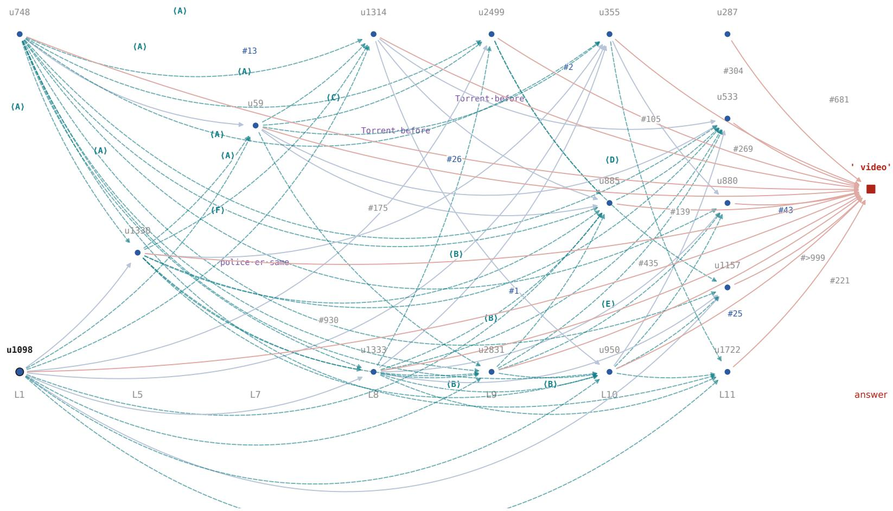  
Figure 77: OPT 1 2 5M prediction 4 : the graph 1 6 members and 63 edges among them .

…ag\_local\_context\`\` attribute, which, similarly to regular generators, can be set to \`\`None\`\` to make them use the outer Loca

<table><tr><td>→&#x27;Context&#x27;</td><td>p=0.76</td><td colspan="3">106 components reach 90% of the net no prefix flips it 75% cancels</td><td colspan="3"></td></tr><tr><td></td><td></td><td></td><td>strength</td><td>fires on</td><td></td><td>writes toward</td><td>answer</td></tr><tr><td>L11·u669</td><td></td><td>ffn</td><td>1.88</td><td>World&#x27;</td><td></td><td>→ legal&#x27;</td><td>#&gt;999</td></tr><tr><td>LL10·u2784</td><td>22% → determiners</td><td>ffn</td><td>2.44</td><td>&#x27;Context&#x27;</td><td>This&#x27;</td><td>→&#x27; Consider&#x27; Context&#x27;</td><td>#11</td></tr><tr><td>LL9·u606</td><td>5%</td><td>ffn</td><td>1.20</td><td>life&#x27;</td><td>This&#x27;</td><td>&#x27;on&#x27;&#x27;Event&#x27;</td><td>#&gt;999</td></tr><tr><td>LL8·h3·c17</td><td>8% via life</td><td>attn</td><td>0.78</td><td>&#x27;Context&#x27;</td><td></td><td>chase&#x27;doubt&#x27;</td><td>#&gt;999</td></tr><tr><td>LL8·h3·c18</td><td>3%</td><td>attn</td><td>0.84</td><td>&#x27;Context&#x27;</td><td></td><td>→&#x27;and&#x27;&#x27;that&#x27; cover&#x27;</td><td>#&gt;999</td></tr><tr><td>LL8·h3·c18</td><td>(above)</td><td></td><td></td><td></td><td></td><td></td><td></td></tr><tr><td>LL9·u1631</td><td>2%</td><td>ffn</td><td>1.02</td><td>within&#x27;</td><td></td><td>,&#x27; &#x27; and&#x27; &#x27;.&#x27;</td><td>#&gt;999</td></tr><tr><td>LL8·h3·c53</td><td>13%</td><td>attn</td><td>0.81</td><td>&#x27;Context&#x27;</td><td></td><td>→&#x27;benefit&#x27;&#x27;markets&#x27;</td><td>#879</td></tr><tr><td>LL8·h3·c18</td><td>(above)</td><td></td><td></td><td></td><td></td><td></td><td></td></tr><tr><td>LL9·h6·c26</td><td>7%</td><td>attn</td><td>0.78</td><td>&#x27;context&#x27;</td><td></td><td>→ &#x27;le&#x27;&#x27;Fantasy&#x27;</td><td>#&gt;999</td></tr><tr><td>LL10·u805</td><td>20% via national</td><td>ffn</td><td>1.94</td><td>&#x27;Context&#x27;</td><td>Cell&#x27;</td><td>→&#x27;Brain&#x27;&#x27;interest&#x27;</td><td>#875</td></tr><tr><td>LL9·u606</td><td>(above)</td><td></td><td></td><td></td><td></td><td></td><td></td></tr><tr><td>LL8·h3·c18</td><td>(above)</td><td></td><td></td><td></td><td></td><td></td><td></td></tr><tr><td>LL9·u1631</td><td>(above)</td><td></td><td></td><td></td><td></td><td></td><td></td></tr><tr><td>LL10·u1891</td><td>16%</td><td>ffn</td><td>2.53</td><td>World&#x27;</td><td>EC&#x27;</td><td>→ &#x27;SO&#x27; &#x27;v&#x27; &#x27;c&#x27;</td><td>#&gt;999</td></tr><tr><td>LL9·u1631</td><td>(above)</td><td></td><td></td><td></td><td></td><td></td><td></td></tr><tr><td>L11·u1573</td><td></td><td>ffn</td><td>3.19</td><td>&#x27;World&#x27;</td><td>Red&#x27;</td><td>→ &#x27;org&#x27; &#x27;t&#x27; &#x27;in&#x27;</td><td>#133</td></tr><tr><td>LL10·u2784</td><td>(above)</td><td></td><td></td><td></td><td></td><td></td><td></td></tr><tr><td>LL10· u805</td><td>(above)</td><td></td><td></td><td></td><td></td><td></td><td></td></tr><tr><td>LL9·u606</td><td>(above)</td><td></td><td></td><td></td><td></td><td></td><td></td></tr><tr><td>L11·u2288</td><td></td><td>ffn</td><td>1.11</td><td>&#x27;national&#x27;</td><td>&#x27;EN&#x27;</td><td>→&#x27;spec&#x27;&#x27;standard&#x27;</td><td>#&gt;999</td></tr><tr><td>LL10·u805</td><td>(above)</td><td></td><td></td><td></td><td></td><td></td><td></td></tr><tr><td>LL10·u1347</td><td>51%</td><td>ffn</td><td>1.46</td><td>This&#x27;</td><td>The&#x27;</td><td>→ &#x27;ago&#x27; vein&#x27;&#x27;rush&#x27;</td><td>#&gt;999</td></tr><tr><td>LL8·h3·c17</td><td>(above)</td><td></td><td></td><td></td><td></td><td></td><td></td></tr><tr><td>LL9·u1631</td><td>(above)</td><td></td><td></td><td></td><td></td><td></td><td></td></tr><tr><td>LL8·h3·c33</td><td>47%</td><td>attn</td><td>0.89</td><td>&#x27;context&#x27;</td><td></td><td>→&#x27; destination&#x27;&#x27;source&#x27;</td><td>#949</td></tr><tr><td>L11·u2875</td><td></td><td>ffn</td><td>0.81</td><td>The&#x27; This&#x27;</td><td></td><td>→&#x27;meanwhile&#x27;Team&#x27;</td><td>#384</td></tr><tr><td>L11·u3026</td><td></td><td>ffn</td><td>1.45</td><td>&#x27;def&#x27; &#x27;Py&#x27;</td><td>she&#x27;</td><td>→ &#x27;el&#x27; &#x27;ing&#x27; &#x27;l&#x27;</td><td>#&gt;999</td></tr><tr><td>LL9· u606</td><td>(above)</td><td></td><td></td><td></td><td></td><td></td><td></td></tr><tr><td>LL9·u1631</td><td>(above)</td><td></td><td></td><td></td><td></td><td></td><td></td></tr><tr><td>LL9·h6·c26</td><td>(above)</td><td></td><td></td><td></td><td></td><td></td><td></td></tr><tr><td>L10·u313</td><td></td><td>ffn</td><td>0.64</td><td>Cell&#x27; Cup&#x27;</td><td></td><td>→Fighter&#x27; Execution&#x27;</td><td>#511</td></tr><tr><td>LL9·u606</td><td>(above)</td><td></td><td></td><td></td><td></td><td></td><td></td></tr><tr><td>LL8·h3·c18</td><td>(above)</td><td></td><td></td><td></td><td></td><td></td><td></td></tr><tr><td>LL8·h3·c53</td><td>(above)</td><td>ffn</td><td></td><td></td><td></td><td></td><td></td></tr><tr><td>L10·u334</td><td></td><td></td><td>0.98</td><td>World&#x27;</td><td>Cell&#x27;</td><td>→&#x27;Ge&#x27;&#x27; Trade&#x27;&#x27;Policy&#x27;</td><td>#&gt;999</td></tr><tr><td>LL8·h3·c18</td><td>(above)</td><td></td><td></td><td></td><td></td><td></td><td></td></tr><tr><td>LL9·u606</td><td>(above)</td><td></td><td></td><td></td><td></td><td></td><td></td></tr><tr><td>LL8·h3·c17</td><td>(above)</td><td></td><td></td><td></td><td></td><td></td><td></td></tr><tr><td>L10·u687</td><td></td><td>ffn</td><td>0.93</td><td>Nation&#x27;</td><td>Cell&#x27;</td><td>→&#x27;moments&#x27;YORK&#x27;</td><td>#383</td></tr><tr><td>LL9·u1631</td><td>(above)</td><td></td><td></td><td></td><td></td><td></td><td></td></tr><tr><td>LL8·h3·c33</td><td>(above)</td><td></td><td></td><td></td><td></td><td></td><td></td></tr><tr><td>LL8·h3·c17</td><td>(above)</td><td></td><td></td><td></td><td></td><td></td><td></td></tr><tr><td>L10·u2203</td><td></td><td>ffn</td><td>1.33</td><td>day &#x27;day&#x27;</td><td></td><td>→&#x27;method&#x27;&#x27; call&#x27;</td><td>#&gt;999</td></tr><tr><td>LL8·h3·c18</td><td>(above)</td><td></td><td></td><td></td><td></td><td></td><td></td></tr><tr><td>LL8·h3·c33</td><td>(above)</td><td></td><td></td><td></td><td></td><td></td><td></td></tr><tr><td>LL9·u1631</td><td>(above)</td><td></td><td></td><td></td><td></td><td>&#x27;over&#x27;&#x27; session&#x27;</td><td>#901</td></tr><tr><td>L10·u2531 LL8·h3·c18</td><td>(above)</td><td>ffn</td><td>1.08</td><td>You&#x27;</td></table>

Figure 78: sigmoid, no shaping, prediction 3: the set, 22 members. Selected for containing edges no token describes. Of 16 predictions drawn at random, this is one of the four whose suficient set is nearest the median, 25.

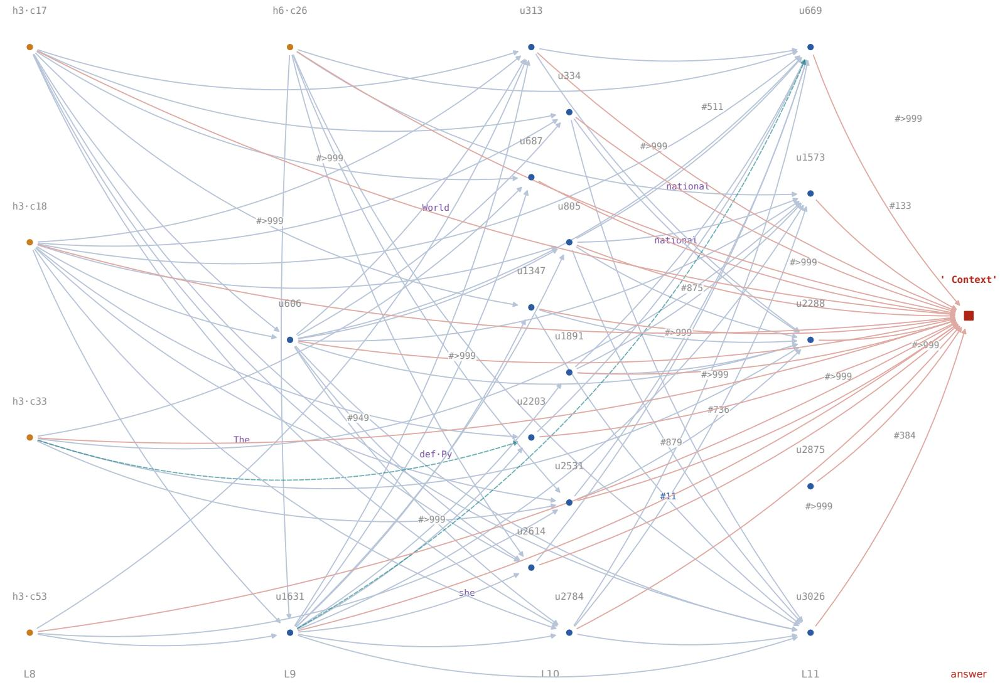  
Figure 79 : sigmoid no shaping prediction 3 : the graph 2 2 members and 7 1 edges among them .

…ed within two business days after your order ships.↵↵Mortal Kombat GameStop Exclusive↵↵Pre-order Mortal Kombat at Gam

<table><tr><td>→ &#x27;est&#x27;</td><td></td><td colspan="3">p=0.74 28 components reach 90% of the net 2 required</td><td></td><td colspan="4">91% cancels</td><td></td></tr><tr><td></td><td></td><td></td><td>strength</td><td>fires on</td><td></td><td></td><td>writes toward</td><td></td><td></td><td>answer</td></tr><tr><td>L11·u91</td><td></td><td>ffn</td><td>1.03</td><td>George</td><td>book</td><td></td><td></td><td></td><td>&#x27;stock&#x27;&#x27;ree&#x27;&#x27;try&#x27;</td><td>#32</td></tr><tr><td>L11·u245</td><td></td><td>ffn</td><td>0.56</td><td>war</td><td>book&#x27;</td><td></td><td>→ &#x27;ier&#x27;</td><td>&#x27;ce&#x27;</td><td>&#x27;iest&#x27;</td><td>#38</td></tr><tr><td>L11·u320</td><td></td><td>ffn</td><td>1.72</td><td>Re&#x27;</td><td>Mun&#x27;</td><td>&#x27;re&#x27;</td><td>→</td><td>&#x27;est&#x27;&#x27;em&#x27;</td><td>&#x27;is&#x27;</td><td>#1</td></tr><tr><td>LL10·u3016</td><td>66%</td><td>ffn</td><td>2.02</td><td>And&#x27;</td><td>But</td><td></td><td>→ &#x27;ar&#x27; &#x27;ve&#x27; &#x27;ray&#x27;</td><td></td><td></td><td>#131</td></tr><tr><td>LL8·u41</td><td>7%</td><td>ffn</td><td>1.13</td><td>&#x27;is&#x27;</td><td>read&#x27;</td><td></td><td>→ &#x27;n&#x27; &#x27;in&#x27; &#x27;y&#x27;</td><td></td><td></td><td>#214</td></tr><tr><td>L9·u1778</td><td>4%</td><td>ffn</td><td>1.58</td><td>Cup&#x27;</td><td>′def&#x27;</td><td></td><td>→&#x27; First&#x27;&#x27;est&#x27;</td><td></td><td>&#x27;op&#x27;</td><td>#2</td></tr><tr><td>LL8·u41</td><td>(above)</td><td></td><td></td><td></td><td></td><td></td><td></td><td></td><td></td><td></td></tr><tr><td>LL8·u1073</td><td>6% via item</td><td>ffn</td><td>0.68</td><td>&#x27;claim&#x27;</td><td>book&#x27;</td><td></td><td>&#x27;ers&#x27;</td><td>&#x27;er&#x27;</td><td>&#x27;able&#x27;</td><td>#5</td></tr><tr><td>LL8·u1073</td><td>(above)</td><td></td><td></td><td></td><td></td><td></td><td></td><td></td><td></td><td></td></tr><tr><td>LL8·u41 L9·u1778</td><td>(above)</td><td></td><td></td><td></td><td></td><td></td><td></td><td></td><td></td><td></td></tr><tr><td>L11·u610</td><td>(above)</td><td></td><td>1.34</td><td></td><td></td><td></td><td></td><td></td><td></td><td></td></tr><tr><td></td><td></td><td>ffn</td><td>2.46</td><td>&#x27;re&#x27;</td><td>We&#x27;</td><td>we</td><td>→</td><td></td><td>&#x27;em&#x27;&#x27;read&#x27;&#x27;ela&#x27;</td><td>#23</td></tr><tr><td>LL10·u254</td><td>117% via re</td><td>ffn</td><td></td><td>&#x27;re&#x27;</td><td>&#x27;com&#x27;</td><td>He&#x27;</td><td>&#x27;amb&#x27;</td><td>&#x27;ap&#x27;</td><td>&#x27;ters</td><td>#497</td></tr><tr><td>L9·u1778</td><td>(above)</td><td></td><td></td><td></td><td></td><td></td><td></td><td></td><td></td><td></td></tr><tr><td>LL8·u41 LL9·u2752</td><td>(above) 9%</td><td>ffn</td><td>1.01</td><td>products&#x27;</td><td></td><td></td><td></td><td></td><td></td><td></td></tr><tr><td>LL8·u41</td><td>(above)</td><td></td><td></td><td></td><td></td><td></td><td></td><td></td><td>→&#x27;out&#x27; &#x27;li&#x27;&#x27;on&#x27;</td><td>#53</td></tr><tr><td>LL8·u1073</td><td>(above)</td><td></td><td></td><td></td><td></td><td></td><td></td><td></td><td></td><td></td></tr><tr><td>LL10·u3016</td><td>(above)</td><td></td><td></td><td></td><td></td><td></td><td></td><td></td><td></td><td></td></tr><tr><td>LL10·u2184</td><td>88%</td><td>ffn</td><td>0.69</td><td>intelligence&#x27;</td><td></td><td></td><td></td><td></td><td></td><td>#12</td></tr><tr><td>L11·u1435</td><td></td><td>ffn</td><td>0.85</td><td>back&#x27;</td><td>cor&#x27;</td><td></td><td>→ &#x27;ons&#x27;</td><td>&#x27;as&#x27;</td><td>&#x27;zz&#x27;</td><td>#299</td></tr><tr><td>L11·u2174</td><td></td><td>ffn</td><td>0.89</td><td>&#x27;com</td><td>run</td><td></td><td></td><td>to&#x27; &#x27;to&#x27;&#x27;To&#x27;</td><td></td><td>#260</td></tr><tr><td>L11·u2311</td><td></td><td>ffn</td><td>0.86</td><td>&#x27;war&#x27;</td><td>video&#x27;</td><td>al&#x27;</td><td></td><td>→ &#x27;as&#x27; &#x27;a&#x27; &#x27;B&#x27;</td><td></td><td></td></tr><tr><td>L11·u2581</td><td></td><td>ffn</td><td>0.78</td><td>Re&#x27;</td><td>don&#x27;</td><td></td><td></td><td>→following&#x27;</td><td>&#x27;er&#x27;</td><td>#77</td></tr><tr><td>L11·u2595</td><td></td><td>ffn</td><td>0.49</td><td>cor&#x27;</td><td>def</td><td>&#x27;re&#x27;</td><td></td><td>→ &#x27;ing&#x27; &#x27;ick&#x27; &#x27;ies&#x27;</td><td></td><td>#349</td></tr><tr><td>L11·u2848</td><td></td><td>ffn</td><td>1.02</td><td>You&#x27;</td><td>Cell&#x27;</td><td></td><td></td><td></td><td>→&#x27; change&#x27; &#x27;er&#x27; &#x27;ite&#x27;</td><td>#7</td></tr><tr><td>L10·u442</td><td></td><td>ffn</td><td>0.70</td><td>war&#x27;</td><td>&#x27;com</td><td></td><td></td><td></td><td>→&#x27;Rogers&#x27;&#x27;Story&#x27; &#x27;od&#x27;</td><td>#152</td></tr><tr><td>L10·u720</td><td></td><td>ffn</td><td>0.89</td><td>back&#x27;</td><td>good&#x27;</td><td></td><td></td><td></td><td>→ &#x27;ars&#x27; &#x27;bers&#x27; &#x27;ested&#x27;</td><td>#36</td></tr><tr><td>L9·u1778</td><td>(above)</td><td></td><td></td><td></td><td></td><td></td><td></td><td>→ &#x27; to&#x27; &#x27;-&#x27; &#x27;to&#x27;</td><td></td><td>#5</td></tr><tr><td>LL8·u41</td><td>(above)</td><td></td><td></td><td></td><td></td><td></td><td></td><td></td><td></td><td></td></tr><tr><td>LL8·u1073</td><td>(above)</td><td></td><td></td><td></td><td></td><td></td><td></td><td></td><td></td><td></td></tr><tr><td>L10·u930</td><td></td><td>ffn</td><td>1.28</td><td>&#x27;need&#x27;</td><td>run&#x27;</td><td></td><td></td><td>→ &#x27;way&#x27; &#x27;2&#x27; &#x27;te&#x27;</td><td></td><td>#41</td></tr><tr><td>LL8·u41</td><td>(above)</td><td></td><td></td><td></td><td></td><td></td><td></td><td></td><td></td><td></td></tr><tr><td>LL8·u1073</td><td>(above)</td><td></td><td></td><td></td><td></td><td></td><td></td><td></td><td></td><td></td></tr><tr><td>L9·u1778</td><td>(above)</td><td></td><td></td><td></td><td></td><td></td><td></td><td></td><td></td><td></td></tr><tr><td>L10·u1212</td><td></td><td>ffn</td><td>0.51</td><td>part&#x27;</td><td>held&#x27;</td><td></td><td>&#x27;time&#x27;</td><td></td><td>&#x27;moment&#x27;&#x27;ity&#x27;</td><td>#19</td></tr><tr><td>L10·u1923</td><td></td><td>ffn ffn</td><td>0.55 1.28</td><td>al&#x27;</td><td>Re&#x27; &#x27;Py&#x27;</td><td></td><td></td><td></td><td>at&#x27;&#x27;then&#x27;&#x27;from&#x27;</td><td>#33</td></tr><tr><td>L10·u2500 L9·u1778</td><td></td></table>

Figure 80: sigmoid, no shaping, prediction 4: the set, 26 members. Selected for containing edges no token describes. Of 16 predictions drawn at random, this is one of the four whose suficient set is nearest the median, 25.

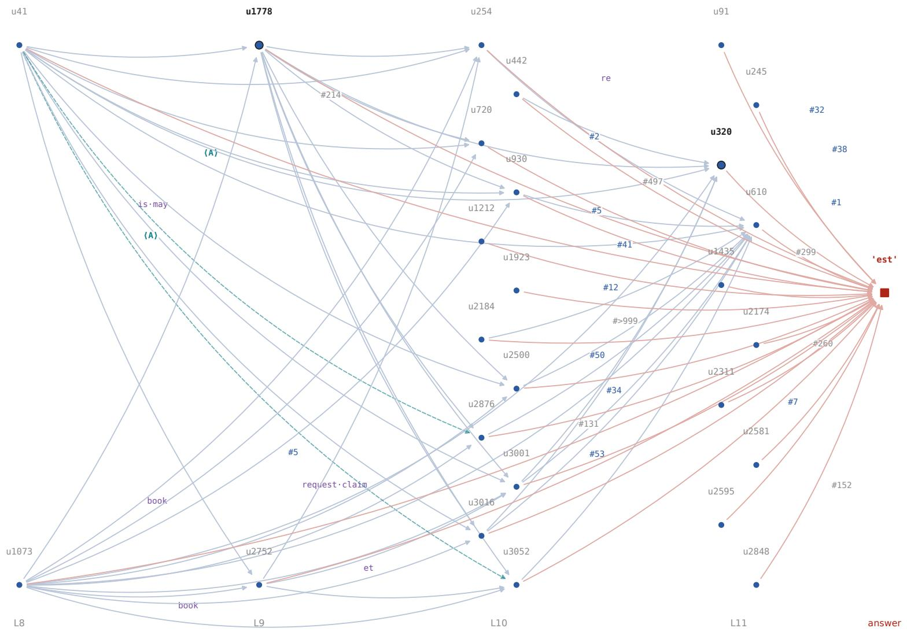  
Figure 8 1 : sigmoid no shaping prediction 4 : the graph 26 members and 47 edges among them.

… a sovereign people.↵↵Tweet of the week↵↵The Brexit clock, lest we forget, is ticking:<|endoftext|>The Saracens hook

<table><tr><td>→ &#x27;er&#x27;</td><td>p=0.68</td><td colspan="4">51 components reach 90% of the net</td><td colspan="2">no prefix flips it 96% cancels</td><td colspan="4"></td></tr><tr><td></td><td></td><td></td><td>strength</td><td>fires on</td><td></td><td></td><td></td><td>writes toward</td><td></td><td></td><td>answer</td></tr><tr><td>L10·u62</td><td></td><td>ffn</td><td>0.50</td><td>&#x27;claim&#x27;</td><td>book&#x27;</td><td></td><td></td><td></td><td>→ &#x27;i&#x27; &#x27;l&#x27; &#x27;a&#x27;</td><td></td><td>#777</td></tr><tr><td>LL9·u413</td><td>3% via claim·order</td><td>ffn</td><td>0.67</td><td>&#x27;team&#x27;</td><td>&#x27;claim&#x27;</td><td></td><td></td><td></td><td>→ &#x27;ing&#x27; &#x27;ed&#x27; &#x27;er&#x27;</td><td></td><td>#3</td></tr><tr><td>LL0·u1786</td><td>2% via team</td><td>ffn</td><td>0.43</td><td>&#x27;claim&#x27;</td><td>team&#x27;</td><td></td><td></td><td></td><td>→ &#x27;ing&#x27;&#x27; and&#x27;</td><td></td><td>#14</td></tr><tr><td>LL0·u1786</td><td>(above)</td><td></td><td></td><td></td><td></td><td></td><td></td><td></td><td></td><td></td><td></td></tr><tr><td>L10·u418</td><td></td><td>ffn</td><td>0.40</td><td>on</td><td>place&#x27;</td><td></td><td></td><td></td><td></td><td>→ &#x27;ia&#x27;&#x27;ies&#x27;&#x27; form&#x27;</td><td>#271</td></tr><tr><td>LL6·h1·c30</td><td>2%</td><td>attn</td><td>0.48</td><td>both&#x27;</td><td>her</td><td></td><td>→</td><td></td><td>and&#x27;</td><td></td><td>#376</td></tr><tr><td>L10·u607</td><td></td><td>ffn</td><td>0.16</td><td>&#x27;The&#x27;</td><td>said&#x27;</td><td></td><td>→</td><td>&#x27;-&#x27; &#x27;er&#x27;</td><td></td><td></td><td>#2</td></tr><tr><td>L10·u1227</td><td></td><td>ffn</td><td>0.38</td><td>&#x27;ution&#x27;</td><td>run</td><td></td><td></td><td></td><td></td><td>→&#x27;window&#x27;screen&#x27;</td><td>#7</td></tr><tr><td>LL9·u413</td><td>(above)</td><td></td><td></td><td></td><td></td><td></td><td></td><td></td><td></td><td></td><td></td></tr><tr><td>L10·u1711</td><td></td><td>ffn</td><td>0.16</td><td>being&#x27;</td><td></td><td>been&#x27;</td><td></td><td></td><td></td><td>→&#x27;the&#x27;&#x27; this&#x27;&#x27;The&#x27;</td><td>#5</td></tr><tr><td>L10·u2120</td><td></td><td>ffn</td><td>0.16</td><td>&#x27;er&#x27;</td><td>George&#x27;</td><td></td><td></td><td></td><td></td><td>→ &#x27;x&#x27; &#x27;er&#x27; &#x27; agree&#x27;</td><td>#2</td></tr><tr><td>L10·u2471</td><td></td><td>ffn</td><td>0.16</td><td></td><td>community&#x27;</td><td></td><td></td><td></td><td></td><td>→ &#x27;&#x27; the&#x27;New&#x27;</td><td>#12</td></tr><tr><td>L10·u2907</td><td></td><td>ffn ffn</td><td>0.58</td><td>Red&#x27;</td><td>become&#x27;</td><td></td><td></td><td></td><td></td><td>→ ′and&#x27;&amp;&#x27;&#x27;or&#x27;</td><td>#154</td></tr><tr><td>LL4·u1537</td><td>5% via Red</td><td>ffn</td><td>0.65</td><td>day</td><td></td><td>against&#x27;</td><td></td><td></td><td>→ &#x27; all&#x27; &#x27;onies&#x27;</td><td></td><td>#442</td></tr><tr><td>L9·u1782</td><td></td><td></td><td>0.15</td><td>EC&#x27;</td><td>&#x27;EN&#x27;</td><td></td><td></td><td></td><td></td><td>→ &#x27; (&#x27; &#x27;er&#x27; time&#x27;</td><td>#2</td></tr><tr><td>L8·u1219</td><td></td><td>ffn ffn</td><td>0.17</td><td>been&#x27;</td><td>&#x27;ers&#x27;</td><td></td><td></td><td>→ &#x27;an&#x27; &#x27;a&#x27;</td><td>&#x27;er&#x27;</td><td></td><td>#3</td></tr><tr><td>L6·u611 L5·u166</td><td></td><td>ffn</td><td>0.17</td><td>come&#x27;</td><td>Ye</td><td></td><td></td><td>&#x27;es&#x27;</td><td></td><td></td><td>#5</td></tr><tr><td>L5·u1100</td><td></td><td>ffn</td><td>0.17</td><td>&#x27;us&#x27;</td><td>us&#x27;</td><td>our&#x27;</td><td></td><td></td><td>&#x27;er&#x27;</td><td></td><td>#2</td></tr><tr><td>L5·u1855</td><td></td><td>ffn</td><td>0.41</td><td>&#x27;Context&#x27;</td><td></td><td>here&#x27;</td><td></td><td></td><td>[&#x27;&#x27;,&#x27;&#x27; the&#x27;</td><td></td><td>#649</td></tr><tr><td>L3·h4·c61</td><td></td><td>attn</td><td>0.16 0.56</td><td>us</td><td>&#x27;man&#x27;</td><td></td><td></td><td></td><td>to&#x27;</td><td></td><td>#1</td></tr><tr><td>LL1·h10·c60</td><td></td><td>attn</td><td>0.23</td><td>t too&#x27;</td><td>Zhang&#x27;</td><td></td><td>→ (A)</td><td></td><td></td><td>→&#x27;own&#x27;· fill&#x27;&#x27; itself&#x27;</td><td>#&gt;999</td></tr><tr><td>L0·h7·c50</td><td>5%</td><td>attn</td><td></td><td>but&#x27;</td><td>and&#x27;</td><td></td><td></td><td></td><td></td><td></td><td>#8</td></tr><tr><td>L0·u85</td><td></td><td>ffn</td><td>0.14</td><td>1 former&#x27;</td><td></td><td>make&#x27;</td><td></td><td></td><td>and&#x27;(&#x27;</td><td></td><td>#&gt;999</td></tr><tr><td>LL0·h7·c50</td><td></td><td></td><td>0.77</td><td>just&#x27;</td><td></td><td>people&#x27;</td><td>→ &#x27;s&#x27;</td><td></td><td>&#x27;n&#x27;&#x27;a&#x27;</td><td></td><td>#90</td></tr><tr><td></td><td>(above)</td><td>ffn</td><td></td><td></td><td></td><td></td><td></td><td></td><td></td><td></td><td></td></tr><tr><td>L0·u1003 LL0·h7·c50</td><td>(above)</td><td></td><td>0.16</td><td>Zhang&#x27;</td><td></td><td>context&#x27;</td><td></td><td></td><td></td><td>→ &#x27;er&#x27; &#x27;ers&#x27; &#x27; and&#x27;</td><td>#1</td></tr><tr><td>L0·u1080</td><td></td><td>ffn</td><td>0.17</td><td>video&#x27;</td><td></td><td>George&#x27;</td><td>&#x27;es&#x27;</td><td>&#x27;a&#x27;</td><td>&#x27;er&#x27;</td><td></td><td>#3</td></tr><tr><td>LL0·h7·c50</td><td>(above)</td><td></td><td></td><td></td><td></td><td></td><td>→</td><td></td><td></td><td></td><td></td></tr><tr><td>L0·u1081</td><td></td><td>ffn</td><td>1.57</td><td>&#x27;Zhang&#x27;</td><td></td><td>&#x27;context&#x27;</td><td></td><td>→ &#x27;OWS&#x27;</td><td>&#x27;es&#x27;&#x27;en&#x27;</td><td></td><td>#&gt;999</td></tr><tr><td>LL0·h7·c50</td><td>(above)</td><td></td><td></td><td></td><td></td><td></td><td></td><td></td><td></td><td></td><td></td></tr><tr><td></td><td></td><td></td><td></td><td></td><td></td><td></td><td></td><td></td><td></td><td></td><td></td></tr></table>

Figure 82: baseline (GELU), prediction 3: the set, 25 members. Selected for containing edges no token describes. Of 11 predictions drawn at random, this is one of the four whose suficient set is nearest the median, 24.

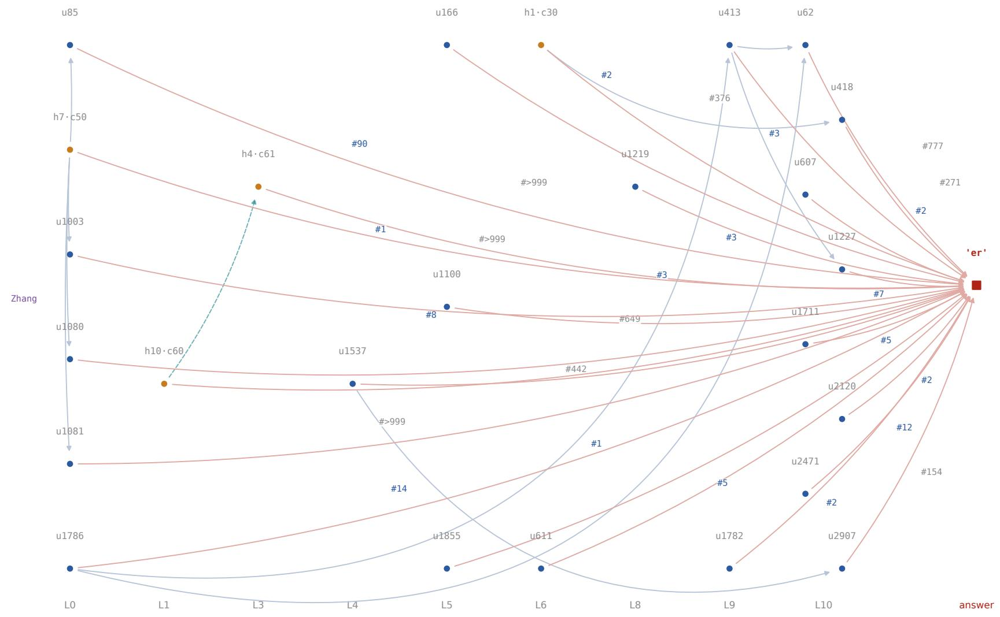  
Figure 83 : baseline ( GELU) prediction 3 : the graph 25 members and 1 1 edges among them

…ls and policymakers to change their minds or policies remains completely up to them. The point of red teams that do alternative analysis, like the Red
<table><tr><td>→ Cell&#x27;</td><td>p=0.98</td><td></td><td colspan="3">86 components reach 90% of the net no prefix flips it</td><td colspan="3"></td><td colspan="3">93% cancels</td></tr><tr><td></td><td></td><td></td><td>strength</td><td>fires on</td><td></td><td></td><td></td><td>writes toward</td><td></td><td></td><td>answer</td></tr><tr><td>L11·u17</td><td></td><td>ffn</td><td>0.99</td><td></td><td>&#x27;World&#x27;Red&#x27;</td><td></td><td></td><td></td><td>→&#x27; space&#x27; Don&#x27;&#x27;ern&#x27;</td><td></td><td>#&gt;999</td></tr><tr><td>LL9·u1120</td><td>19% via World</td><td>ffn</td><td>1.67</td><td></td><td>World&#x27;The&#x27;</td><td></td><td></td><td>→ &#x27;F&#x27; &#x27;W&#x27; &#x27;M&#x27;</td><td></td><td></td><td>#242</td></tr><tr><td>LL6·h0·c34</td><td>2%</td><td>attn</td><td>1.96</td><td>only&#x27;</td><td>on&#x27;</td><td></td><td></td><td></td><td>→ &#x27;ons&#x27; &#x27;ish&#x27; &#x27;ards&#x27;</td><td></td><td>#&gt;999</td></tr><tr><td>LL6·h0·c34</td><td>(above)</td><td></td><td></td><td></td><td></td><td></td><td></td><td></td><td></td><td></td><td></td></tr><tr><td>LL10·h11·c63</td><td>2% via much</td><td>attn</td><td>0.69</td><td>Red&#x27;</td><td>cor&#x27;</td><td></td><td></td><td></td><td>→ &#x27;lam&#x27; &#x27;he&#x27; &#x27;ark&#x27;</td><td></td><td>#&gt;999</td></tr><tr><td>LL0·u701</td><td>9% via Red</td><td>ffn</td><td>1.22</td><td>Red&#x27;</td><td>Re</td><td></td><td></td><td></td><td>→&#x27;U&#x27;·not&#x27;&#x27;&#x27;</td><td></td><td>#&gt;999</td></tr><tr><td>LL9·h0·c32</td><td>7% via think</td><td>attn</td><td>0.75</td><td>Red&#x27;</td><td>Cell</td><td></td><td></td><td></td><td></td><td>→Province&#x27;&#x27;rad&#x27;&#x27;AP&#x27;</td><td>#154</td></tr><tr><td>LL0·u701</td><td>(above)</td><td></td><td></td><td></td><td></td><td></td><td></td><td></td><td></td><td></td><td></td></tr><tr><td>LL6·h0·c34</td><td>(above)</td><td></td><td></td><td></td><td></td><td></td><td></td><td></td><td></td><td></td><td></td></tr><tr><td>LL9·h0·c0</td><td>5%</td><td>attn</td><td>0.76</td><td>Cell&#x27;</td><td>&#x27;number&#x27;</td><td></td><td></td><td>→ 0&#x27; &#x27;OM&#x27; &#x27;OD&#x27;</td><td></td><td></td><td>#182</td></tr><tr><td>L11·u367</td><td></td><td>ffn</td><td>0.79</td><td></td><td>&#x27;The&#x27;&#x27; Nation&#x27;</td><td></td><td></td><td></td><td>→&#x27;ens&#x27;&#x27;Cell&#x27;&#x27;B&#x27;</td><td></td><td>#5</td></tr><tr><td>LL9·u1120</td><td>(above)</td><td></td><td></td><td></td><td></td><td></td><td></td><td></td><td></td><td></td><td></td></tr><tr><td>LL0·u701</td><td>(above)</td><td></td><td></td><td></td><td></td><td></td><td></td><td></td><td></td><td></td><td></td></tr><tr><td>LL6·h0·c34</td><td>(above)</td><td></td><td></td><td></td><td></td><td></td><td></td><td></td><td></td><td></td><td></td></tr><tr><td>L11·u1314</td><td></td><td>ffn</td><td>1.23</td><td>&#x27;The&#x27;Red&#x27;</td><td></td><td></td><td>→ &#x27;ors&#x27; &#x27;or&#x27; &#x27;ur&#x27;</td><td></td><td></td><td></td><td>#29</td></tr><tr><td>LL9·u1120</td><td>(above)</td><td></td><td></td><td></td><td></td><td></td><td></td><td></td><td></td><td></td><td></td></tr><tr><td>LL6·h0·c34</td><td>(above)</td><td></td><td></td><td></td><td></td><td></td><td></td><td></td><td></td><td></td><td></td></tr><tr><td>LL8·h2·c10</td><td>2% via intellig</td><td>attn</td><td>0.85</td><td>former&#x27;</td><td></td><td>left&#x27;→&#x27;the&#x27;&#x27;B&#x27;</td><td></td><td></td><td></td><td></td><td>#729</td></tr><tr><td>LL0·u701</td><td>(above)</td><td></td><td></td><td></td><td></td><td></td><td></td><td></td><td></td><td></td><td></td></tr><tr><td>L11·u2874 LL9·u1120</td><td></td><td>ffn</td><td>0.82</td><td>&#x27;Context&#x27;&#x27;et&#x27;</td><td></td><td></td><td></td><td></td><td></td><td>→ &#x27;ab&#x27;&#x27; jointly&#x27; &#x27;ra&#x27;</td><td>#735</td></tr><tr><td>LL0·u701</td><td>(above)</td><td></td><td></td><td></td><td></td><td></td><td></td><td></td><td></td><td></td><td></td></tr><tr><td>LL6·h0·c34</td><td>(above)</td><td></td><td></td><td></td><td></td><td></td><td></td><td></td><td></td><td></td><td></td></tr><tr><td>L11·u3052</td><td>(above)</td><td>ffn</td><td>0.53</td><td></td><td>World&#x27;senior&#x27;→&#x27;en&#x27;&#x27;ve&#x27; &#x27;est&#x27;</td><td></td><td></td><td></td><td></td><td></td><td>#&gt;999</td></tr><tr><td>LL9·u1120</td><td>(above)</td><td></td><td></td><td></td><td></td><td></td><td></td><td></td><td></td><td></td><td></td></tr><tr><td>LL9·h0·c32</td><td>(above)</td><td></td><td></td><td></td><td></td><td></td><td></td><td></td><td></td><td></td><td></td></tr><tr><td>LL8·h2·c10</td><td>(above)</td><td></td><td></td><td></td><td></td><td></td><td></td><td></td><td></td><td></td><td></td></tr><tr><td>L10·h4·c39</td><td></td><td>attn</td><td>0.48</td><td>would&#x27;&#x27;Cell&#x27;→&#x27;Harris&#x27;&#x27;sh&#x27;&#x27;l&#x27;</td><td></td><td></td><td></td><td></td><td></td><td></td><td>#&gt;999</td></tr><tr><td>L10·u1278</td><td></td><td>ffn</td><td>0.66</td><td>The&#x27;</td><td>Red&#x27;com→&#x27;es&#x27;&#x27;en&#x27;Sun&#x27;</td><td></td><td></td><td></td><td></td><td></td><td>#&gt;999</td></tr><tr><td>LL9·u1120</td><td>(above)</td><td></td><td></td><td></td><td></td><td></td><td></td><td></td><td></td><td></td><td></td></tr><tr><td>LL0·u701</td><td>(above)</td><td></td><td></td><td></td><td></td><td></td><td></td><td></td><td></td><td></td><td></td></tr><tr><td>LL9·h0·c0</td><td>(above)</td><td></td><td></td><td></td><td></td><td></td><td></td><td></td><td></td><td></td><td></td></tr><tr><td>L9·h4·c1</td><td></td><td>attn</td><td>0.42</td><td></td><td>Cell&#x27;work&#x27;</td><td></td><td></td><td></td><td>→ &#x27;old&#x27;&#x27;release&#x27;</td><td></td><td>#663</td></tr><tr><td>L9·h10·c1</td><td></td><td>attn</td><td>0.38</td><td></td><td>held&#x27;had&#x27;</td><td></td><td></td><td></td><td></td><td>→ &#x27;in&#x27; &#x27;ins&#x27;&#x27; applied&#x27;</td><td>#&gt;999</td></tr><tr><td>L9·u331 LL9·h0·c0</td><td></td><td>ffn</td><td>0.81</td></table>

Figure 84: baseline (GELU), prediction 4: the set, 20 members. Selected for containing edges no token describes. Of 11 predictions drawn at random, this is one of the four whose suficient set is nearest the median, 24.

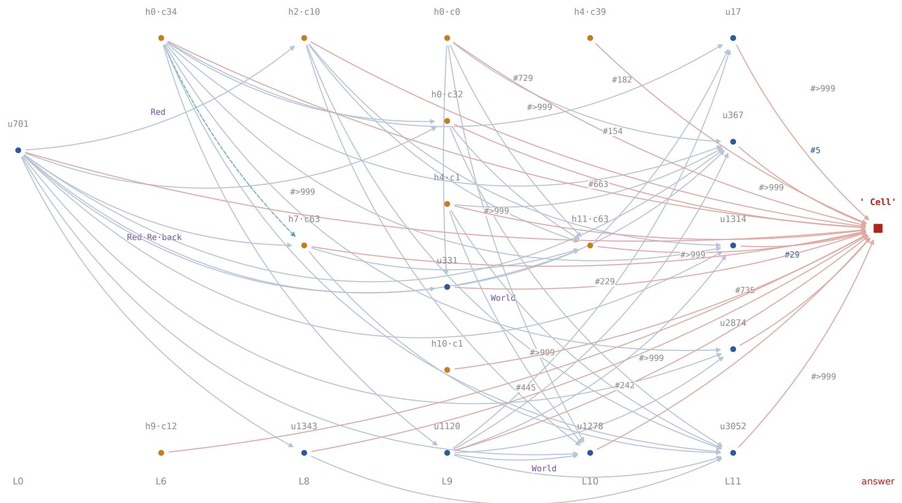  
Figure 8 5 : baseline ( GELU) prediction 4 : the graph 20 members and 42 edges among them .

… is not part of CPython, popular frameworks like gevent rely on it, and it is important that greenlet can be modified to support execution
<table><tr><td>→&#x27;context&#x27;</td><td>p=0.55</td><td></td><td colspan="3">110 components reach 90% of the net</td><td>no prefix flips it</td><td colspan="2"></td><td>67% cancels</td><td></td></tr><tr><td></td><td></td><td></td><td>strength</td><td></td><td>fires on</td><td></td><td>writes toward</td><td></td><td></td><td>answer</td></tr><tr><td>L11·u45</td><td></td><td>ffn</td><td>1.40</td><td></td><td></td><td></td><td></td><td>→&#x27;support&#x27;·features&#x27;</td><td></td><td>#59</td></tr><tr><td>LL9·h9·c37</td><td>7%</td><td>attn</td><td>0.77</td><td></td><td>&#x27;context&#x27;</td><td></td><td>→&#x27;thinker&#x27; &#x27;over&#x27;</td><td></td><td></td><td>#&gt;999</td></tr><tr><td>LL9·u1906</td><td>3% via without</td><td>ffn</td><td>0.66</td><td></td><td>said&#x27;</td><td>&#x27;after&#x27;</td><td>→except&#x27;anymore</td><td></td><td></td><td>#47</td></tr><tr><td>LL9·h9·c37</td><td>(above)</td><td></td><td></td><td></td><td></td><td></td><td></td><td></td><td></td><td></td></tr><tr><td>LL9·h9·c19</td><td>5%</td><td>attn</td><td>0.55</td><td>1 Mun&#x27;</td><td></td><td>context&#x27;</td><td>→ access&#x27;</td><td>&#x27;ans&#x27;</td><td>&#x27;ons&#x27;</td><td>#44</td></tr><tr><td>LL9·h9·c0</td><td>3%</td><td>attn</td><td>0.51</td><td> &#x27;Py&#x27;</td><td>EC&#x27;</td><td></td><td>→ (B)</td><td></td><td></td><td>#264</td></tr><tr><td>LL9·h1·c0</td><td>2%</td><td>attn</td><td>0.63</td><td>t</td><td>&#x27;context&#x27;</td><td></td><td>→&#x27;issues&#x27;balance&#x27;</td><td></td><td></td><td>#146</td></tr><tr><td>L11·u418</td><td></td><td>ffn</td><td>1.18</td><td></td><td>There&#x27;</td><td>And</td><td>→ &#x27;aid&#x27; · lies&#x27; &#x27;im&#x27;</td><td></td><td></td><td>#&gt;999</td></tr><tr><td>LL9·h9·c37</td><td>(above)</td><td></td><td></td><td></td><td></td><td></td><td></td><td></td><td></td><td></td></tr><tr><td>LL9·h9·c10</td><td>15% via called</td><td>attn</td><td>0.71</td><td></td><td>take&#x27;</td><td></td><td>→ &#x27;ill&#x27;&#x27;ra&#x27;·taken&#x27;</td><td></td><td></td><td>#&gt;999</td></tr><tr><td>LL9·h9·c7</td><td>11% via called</td><td>attn</td><td>0.83</td><td>H</td><td>&#x27;context&#x27;</td><td>place&#x27; → &#x27;View&#x27; &#x27;se&#x27; &#x27;lo&#x27;</td><td></td><td></td><td></td><td>#&gt;999</td></tr><tr><td>L11·u458</td><td></td><td>ffn</td><td>0.88</td><td></td><td>cor&#x27; Red</td><td></td><td>go&#x27;→&#x27;ic&#x27;· unt&#x27;·bound&#x27;</td><td></td><td></td><td>#&gt;999</td></tr><tr><td>LL9·h9·c10</td><td>(above)</td><td></td><td></td><td></td><td></td><td></td><td></td><td></td><td></td><td></td></tr><tr><td>LL9·h9·c0</td><td>(above)</td><td></td><td></td><td></td><td></td><td></td><td></td><td></td><td></td><td></td></tr><tr><td>LL9·h9·c37</td><td>(above)</td><td></td><td></td><td></td><td></td><td></td><td></td><td></td><td></td><td></td></tr><tr><td>L11·u570</td><td></td><td></td><td>1.38</td><td></td><td>&#x27;within&#x27;</td><td>your</td><td></td><td>→ &#x27;mind&#x27;· door&#x27;·minds&#x27;</td><td></td><td>#318</td></tr><tr><td>LL9·h9·c19</td><td>(above)</td><td></td><td></td><td></td><td></td><td></td><td></td><td></td><td></td><td></td></tr><tr><td>LL9·h9·c37</td><td>(above)</td><td></td><td></td><td></td><td></td><td></td><td></td><td></td><td></td><td></td></tr><tr><td>LL9·h1·c0</td><td>(above)</td><td></td><td></td><td></td><td></td><td></td><td></td><td></td><td></td><td></td></tr><tr><td>L11·u712</td><td></td><td></td><td>1.04</td><td></td><td>George&#x27;</td><td></td><td></td><td>World&#x27;→context&#x27;&#x27;alla&#x27;</td><td></td><td>#1</td></tr><tr><td>LL9·h9·c7</td><td>(above)</td><td></td><td></td><td></td><td></td><td></td><td></td><td></td><td></td><td></td></tr><tr><td>LL9·h9·c10</td><td>(above)</td><td></td><td></td><td></td><td></td><td></td><td></td><td></td><td></td><td></td></tr><tr><td>LL9·h9·c37</td><td>(above)</td><td></td><td>1.52</td><td></td><td></td><td></td><td></td><td></td><td></td><td></td></tr><tr><td>L11·u899</td><td></td><td>ffn</td><td></td><td></td><td>take&#x27;</td><td></td><td></td><td>→&#x27;clock&#x27;·thread&#x27;</td><td></td><td>#964</td></tr><tr><td>LL9·h9·c10</td><td>(above)</td><td>ffn</td><td>1.62</td><td></td><td>using</td><td>too</td><td></td><td></td><td></td><td></td></tr><tr><td>L11·u929 LL9·h9·c7</td><td>(above)</td><td></td><td></td><td></td><td></td><td>→</td><td></td><td>customs&#x27;</td><td>terms</td><td>#966</td></tr><tr><td>LL9·h8·c19</td><td></td><td>attn</td><td>0.61</td><td>t 1</td><td>&#x27;In&#x27;</td><td>very →</td><td></td><td></td><td></td><td>#4</td></tr><tr><td>LL9·h9·c37</td><td>7% (above)</td><td></td><td></td><td></td><td></td><td></td><td></td><td>and&#x27;</td><td>context&#x27;</td><td></td></tr><tr><td>L11·u1834</td><td></td><td>ffn</td><td>0.81</td><td></td><td>cor no&#x27;</td><td></td><td>→ &#x27;i&#x27; +</td><td>fields&#x27;</td><td></td><td>#&gt;999</td></tr><tr><td>LL9·h9·c41</td><td>15%</td><td>attn</td><td>0.69</td><td></td><td>context&#x27;</td><td>&#x27;able&#x27;</td><td>→ &#x27;inn&#x27;</td><td>latest&#x27;</td><td>consent&#x27;</td><td>#67</td></tr><tr><td>LL9·u1906</td><td>(above)</td><td></td><td></td><td></td><td></td><td></td><td></td><td></td><td>&#x27;ix</td><td></td></tr><tr><td>LL9·h1·c14</td><td>8%</td><td>attn</td><td>0.57</td><td>1</td><td>&#x27;context&#x27;</td><td></td><td></td><td>events&#x27;&#x27;related&#x27;</td><td></td><td>#24</td></tr><tr><td>L11·u2097</td><td></td><td>ffn</td><td>1.18</td><td></td><td>these&#x27;</td><td>made&#x27;</td><td>→ &#x27;ED&#x27;player&#x27; &#x27;hood&#x27;</td><td></td><td></td><td>#&gt;999</td></tr><tr><td>LL9·h9·c37</td><td>(above)</td><td></td><td></td><td></td><td></td><td></td><td></td><td></td><td></td><td></td></tr><tr><td>LL10·u2115</td><td>4%</td><td>ffn</td><td>0.98</td><td></td><td>&#x27;where&#x27;</td><td>&#x27;into&#x27;</td><td>&#x27;92&#x27;</td><td>thousand&#x27;&#x27;o&#x27;</td><td></td><td>#387</td></tr><tr><td>LL9·h9·c37</td><td>(above)</td><td></td><td></td><td></td><td></td><td></td><td></td><td></td><td></td><td></td></tr><tr></table>

Figure 86: ReLU, prediction 4: the set, 25 members. Selected for containing edges no token describes. Of 14 predictions drawn at random, this is one of the four whose suficient set is nearest the median, 22.

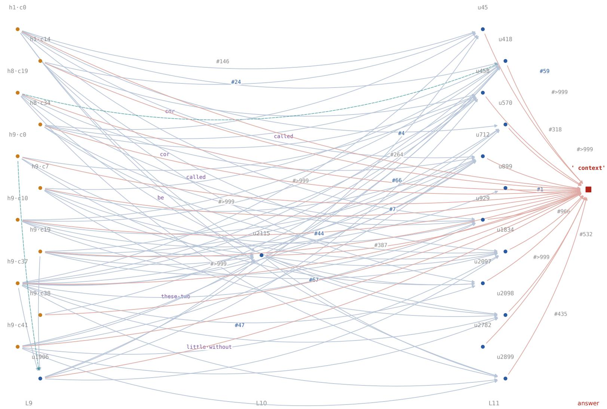  
Figure 8 7: ReLU prediction 4 : the graph 2 5 members and 70 edges among them .

… other, by changing the visual representation of payoffs. In the graphs below, I show the same social lottery, but in the first case pay

<table><tr><td>→ &#x27;offs&#x27;</td><td>p=0.95</td><td></td><td colspan="4">109 components reach 90% of the net</td><td colspan="2">no prefix flips it 84% cancels</td><td colspan="2"></td></tr><tr><td></td><td></td><td></td><td>strength</td><td>fires on</td><td></td><td></td><td></td><td>writes toward</td><td></td><td>answer</td></tr><tr><td>L31·u2015</td><td></td><td>ffn</td><td>29.99</td><td>pay</td><td>know</td><td></td><td></td><td></td><td>→ &#x27;EEK&#x27; &#x27;avering&#x27; &#x27;lasses&#x27;</td><td>#&gt;999</td></tr><tr><td>L30·h6·c7</td><td></td><td>attn</td><td>4.30</td><td></td><td></td><td></td><td></td><td></td><td>→&#x27;Ex&#x27;&#x27;overflow&#x27;&#x27;ez&#x27;</td><td>#&gt;999</td></tr><tr><td>L28·u394</td><td></td><td>ffn</td><td>3.89</td><td>pay</td><td>&#x27;am &#x27;bol&#x27;</td><td></td><td></td><td></td><td>→ &#x27;ch&#x27;blood&#x27;off&#x27;</td><td>#149</td></tr><tr><td>LL7·u787</td><td>8%</td><td>ffn</td><td>6.02</td><td>same&#x27;</td><td>like&#x27;</td><td></td><td>(A)</td><td></td><td></td><td>#&gt;999</td></tr><tr><td>LL24·u2367</td><td>7% via pay</td><td>ffn</td><td>6.41</td><td>pay</td><td>need</td><td></td><td></td><td>→ &#x27;ATCH&#x27; &#x27;embered&#x27;</td><td></td><td>#&gt;999</td></tr><tr><td>LL7·u787</td><td>(above)</td><td></td><td></td><td></td><td></td><td></td><td></td><td></td><td></td><td></td></tr><tr><td>LL23·u1906</td><td>2% via pay</td><td>ffn</td><td>5.01</td><td>social&#x27;</td><td></td><td></td><td></td><td></td><td>→ &#x27;umbo&#x27; &#x27;ocking&#x27; &#x27;vant&#x27;</td><td>#141</td></tr><tr><td>LL7·u787</td><td>(above)</td><td></td><td></td><td></td><td></td><td></td><td></td><td></td><td></td><td></td></tr><tr><td>LL23·u1906</td><td>(above)</td><td></td><td></td><td></td><td></td><td></td><td></td><td></td><td></td><td></td></tr><tr><td>L27·u849</td><td></td><td>ffn</td><td>3.25</td><td>need&#x27;</td><td>Gen</td><td></td><td></td><td></td><td>→ &#x27; wind&#x27; &#x27;iest&#x27;&#x27;ames&#x27;</td><td>#430</td></tr><tr><td>LL24·u2367</td><td>(above)</td><td></td><td></td><td></td><td></td><td></td><td></td><td></td><td></td><td></td></tr><tr><td>LL23·u811</td><td>6%</td><td>ffn</td><td>6.51</td><td>while&#x27;</td><td>his&#x27;</td><td></td><td></td><td></td><td>→ &#x27;ING&#x27; &#x27;ings&#x27; &#x27;ments&#x27;</td><td>#&gt;999</td></tr><tr><td>LL26·u1021</td><td>5%</td><td>ffn</td><td>7.36</td><td>pay</td><td>call&#x27;</td><td></td><td></td><td>→ &#x27;offs&#x27;&#x27;off&#x27;&#x27;off&#x27;</td><td></td><td>#3</td></tr><tr><td>LL7·u787</td><td>(above)</td><td></td><td></td><td></td><td></td><td></td><td></td><td></td><td></td><td></td></tr><tr><td>L25·u2556</td><td></td><td>ffn</td><td>6.42</td><td>put&#x27;</td><td>don&#x27;</td><td></td><td></td><td></td><td>→ &#x27;NESS&#x27; &#x27;offs&#x27;&#x27;school&#x27;</td><td>#10</td></tr><tr><td>LL7·u787</td><td>(above)</td><td></td><td></td><td></td><td></td><td></td><td></td><td></td><td></td><td></td></tr></table>

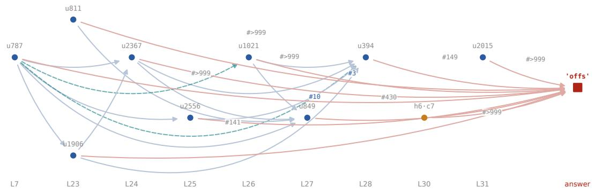  
Figure 88: SmolLM2 360M, prediction 4. Selected for containing edges no token describes. Of 20 predictions drawn at random, this is one of the four whose suficient set is nearest the median, 10.

…. Use code: 20ACC Offer ends 3.15.11↵↵Free value shipping on orders of \$24.99 or more. Offer

<table><tr><td>→ &#x27;ends&#x27;</td><td>p=0.91</td><td colspan="4">74 components reach 90% of the net 1 required</td><td colspan="4"></td></tr><tr><td></td><td></td><td></td><td>strength</td><td>fires on</td><td></td><td></td><td>writes toward</td><td></td><td></td><td>answer</td></tr><tr><td>L11·h5·c51</td><td></td><td>attn</td><td>0.49</td><td>says</td><td>1 go</td><td></td><td></td><td>→&#x27; says&#x27;&#x27; ends&#x27;&#x27;adds&#x27;</td><td></td><td>#3</td></tr><tr><td>LL10·u774</td><td>15%</td><td>ffn</td><td>3.27</td><td>what&#x27;</td><td>who</td><td></td><td></td><td>It&#x27;→is&#x27;has&#x27;was&#x27;</td><td></td><td>#409</td></tr><tr><td>LL9·u2913</td><td>19% via what·they</td><td>ffn</td><td>0.95</td><td>have</td><td>and&#x27;</td><td></td><td></td><td></td><td>→&#x27;was&#x27;became&#x27;&#x27;were</td><td>#27</td></tr><tr><td>LL9·h3·c33</td><td>2%</td><td>attn</td><td>0.71</td><td>go</td><td>Nation&#x27;</td><td></td><td></td><td>→&#x27; lines&#x27; line&#x27; &#x27;men&#x27;</td><td></td><td>#25</td></tr><tr><td>LL9·h7·c19</td><td>2% via and</td><td>attn</td><td>0.41</td><td>&#x27;get&#x27;</td><td>don&#x27;</td><td></td><td></td><td>→&#x27; ending&#x27;dream&#x27;</td><td></td><td>#19</td></tr><tr><td>LL9·u468</td><td>6%</td><td>ffn</td><td>1.47</td><td>book&#x27;</td><td>This&#x27;</td><td></td><td></td><td>→&#x27;shipping&#x27;included&#x27;</td><td></td><td>#&gt;999</td></tr><tr><td>LL9·h3·c33</td><td>(above)</td><td></td><td></td><td></td><td></td><td></td><td></td><td></td><td></td><td></td></tr><tr><td>LL9·u468</td><td>(above)</td><td></td><td></td><td></td><td></td><td></td><td></td><td></td><td></td><td></td></tr><tr><td>LL10·u1116</td><td>6%</td><td>ffn</td><td>3.30</td><td>&#x27;It&#x27;</td><td>who&#x27;</td><td>This&#x27;</td><td></td><td>→&#x27;uses&#x27; turns&#x27;</td><td></td><td>#15</td></tr><tr><td>LL9·u768</td><td>18% via It-it·This</td><td>ffn</td><td>1.21</td><td>&#x27;It&#x27;</td><td>she&#x27;</td><td>it&#x27;</td><td></td><td>→knows&#x27;&#x27;v&#x27;needs&#x27;</td><td></td><td>#138</td></tr><tr><td>LL9·h7·c19</td><td>(above)</td><td></td><td></td><td></td><td></td><td></td><td></td><td></td><td></td><td></td></tr><tr><td>LL9·u2913</td><td>(above)</td><td></td><td></td><td></td><td></td><td></td><td></td><td></td><td></td><td></td></tr><tr><td>LL9·u468</td><td>(above)</td><td></td><td></td><td></td><td></td><td></td><td></td><td></td><td></td><td></td></tr><tr><td>L11·u2889</td><td></td><td>ffn</td><td>0.81</td><td>to&#x27;</td><td>George&#x27;</td><td></td><td></td><td>→ &#x27;-&#x27; terms&#x27;&#x27;pay&#x27;</td><td></td><td>#168</td></tr><tr><td>L10·u370</td><td></td><td>ffn</td><td>0.67</td><td>&#x27;It&#x27;</td><td>who&#x27;</td><td>it&#x27;</td><td></td><td>→links&#x27;results&#x27;</td><td></td><td>#655</td></tr><tr><td>LL9·u768</td><td>(above)</td><td></td><td></td><td></td><td></td><td></td><td></td><td></td><td></td><td></td></tr><tr><td>LL9·u2913</td><td>(above)</td><td></td><td></td><td></td><td></td><td></td><td></td><td></td><td></td><td></td></tr><tr><td>LL9·u468</td><td>(above)</td><td></td><td></td><td></td><td></td><td></td><td></td><td></td><td></td><td></td></tr><tr><td>L10·u444</td><td></td><td>ffn</td><td>1.42</td><td>June&#x27;</td><td></td><td>games</td><td></td><td>→ &#x27;worth&#x27; up&#x27;&#x27; ends&#x27;</td><td></td><td>#6</td></tr><tr><td>LL9·u468</td><td>(above)</td><td></td><td></td><td></td><td></td><td></td><td></td><td></td><td></td><td></td></tr><tr><td>LL9·u768</td><td>(above)</td><td></td><td></td><td></td><td></td><td></td><td></td><td></td><td></td><td></td></tr><tr><td>LL9·u2881</td><td></td><td>ffn</td><td>1.03</td><td>only&#x27;</td><td></td><td>start&#x27;</td><td>→</td><td></td><td></td><td>#173</td></tr><tr><td>LL9·h7·c19</td><td>(above)</td><td></td><td></td><td></td><td></td><td></td><td></td><td></td><td></td><td></td></tr><tr><td>L10·u1031</td><td></td><td>ffn</td><td>0.84</td><td>using&#x27;</td><td></td><td>make&#x27;</td><td></td><td>→&#x27;dots&#x27;&#x27;gau&#x27;&#x27; knives&#x27;</td><td></td><td>#134</td></tr><tr><td>LL9·u2913</td><td>(above)</td><td></td><td></td><td></td><td></td><td></td><td></td><td></td><td></td><td></td></tr><tr><td>L10·u1121</td><td></td><td>ffn</td><td>2.59</td><td>week&#x27;</td><td>time</td><td></td><td></td><td>→&#x27; ends&#x27;&#x27;end&#x27;&#x27;runs&#x27;</td><td></td><td>#1</td></tr><tr><td>LL9·u2881</td><td>(above)</td><td></td><td></td><td></td><td></td><td></td><td></td><td></td><td></td><td></td></tr><tr><td>LL9·h3·c33 LL9·u2913</td><td>(above)</td><td></td><td></td><td></td><td></td><td></td><td></td><td></td><td></td><td></td></tr><tr><td>L10·u1599</td><td>(above)</td><td>ffn</td><td></td><td></td><td></td><td></td><td></td><td></td><td></td><td></td></tr><tr><td>LL9·u468</td><td>(above)</td><td></td><td>0.64</td><td>up</td><td>make</td><td></td><td></td><td>→ &#x27; costs&#x27;&#x27; even&#x27; &#x27;iv&#x27;</td><td></td><td>#36</td></tr><tr><td>LL9·u2913</td><td>(above)</td><td></td><td></td><td></td><td></td><td></td><td></td><td></td><td></td><td></td></tr><tr><td>LL9·h7·c19</td><td>(above)</td><td></td><td></td><td></td><td></td><td></td><td></td><td></td><td></td><td></td></tr><tr><td>L10·u2013</td><td></td><td>ffn</td><td>1.55</td><td>death&#x27;</td><td></td><td>attack&#x27;</td><td></td><td>→&#x27;times&#x27;continues&#x27;</td><td></td><td>#607</td></tr><tr><td>LL9·u2881</td><td>(above)</td><td></td><td></td><td></td><td></td><td></td><td></td><td></td><td></td><td></td></tr><tr><td>LL9·u2913</td><td>(above)</td><td></td><td></td><td></td><td></td><td></td><td></td><td></td><td></td><td></td></tr><tr><td>LL9·u1824</td><td>9% via use</td><td>ffn</td><td>0.73</td><td>get&#x27;</td><td>use&#x27;</td><td></td><td></td><td>→ &#x27;ore&#x27; &#x27;av&#x27; &#x27;ire&#x27;</td><td></td><td>#320</td></tr><tr><td>LL9·h7·c19</td><td>(above)</td><td></td><td></td></table>

Figure 89: sigmoid, prediction 4: the set, 19 members. Selected for containing edges no token describes.   
Of 18 predictions drawn at random, this is one of the four whose suficient set is nearest the median, 19.

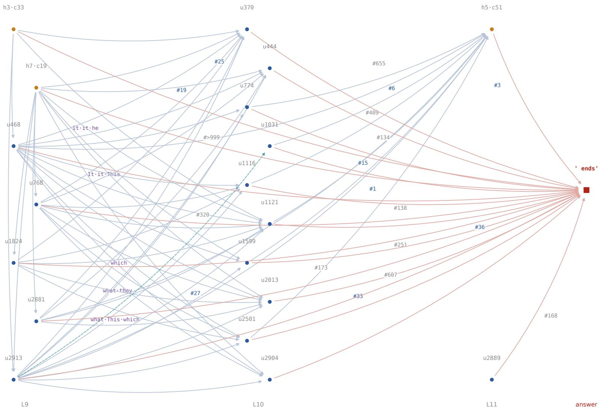  
Figure 90 : sigmoid prediction 4 : the graph 1 9 members and 58 edges among them

… and measured the impact of their products on decision-makers:↵↵’Given that our mandate is ’to provoke thought,
<table><tr><td>→we&#x27;</td><td></td><td>p=0.40</td><td colspan="4">33 components reach 90% of the net</td><td colspan="4">4 required</td><td></td></tr><tr><td></td><td></td><td></td><td>strength</td><td></td><td>fires on</td><td></td><td></td><td></td><td>writes toward</td><td></td><td>answer</td></tr><tr><td>L11·h6·c11</td><td></td><td></td><td>0.16</td><td></td><td>me&#x27;</td><td>my&#x27;</td><td>1 we&#x27;</td><td>→</td><td></td><td>our&#x27;&#x27;we&#x27;&#x27;us&#x27;</td><td>#2</td></tr><tr><td>L11·h6·c56</td><td></td><td>attn</td><td>0.25</td><td></td><td>Nation&#x27;</td><td></td><td>Cup&#x27;</td><td>→</td><td>our&#x27; we&#x27;</td><td>us&#x27;</td><td>#2</td></tr><tr><td>L11·u68</td><td></td><td>ffn</td><td>0.54</td><td></td><td>become&#x27;</td><td></td><td>were&#x27;</td><td></td><td></td><td>=--</td><td>#731</td></tr><tr><td>L11·u185</td><td></td><td></td><td>1.84</td><td></td><td>here&#x27;</td><td>or</td><td></td><td>→</td><td></td><td></td><td>#465</td></tr><tr><td>LL11·h6·c56</td><td>(above)</td><td></td><td></td><td></td><td></td><td></td><td></td><td></td><td></td><td></td><td></td></tr><tr><td>L6·u754</td><td>71%</td><td></td><td>0.70</td><td></td><td>even&#x27;</td><td>and&#x27;</td><td></td><td>→</td><td>there&#x27;</td><td>it&#x27;we&#x27;</td><td>#481</td></tr><tr><td>LL2·u454</td><td>3%</td><td></td><td>0.22</td><td></td><td>his&#x27;</td><td>three&#x27;</td><td></td><td>→</td><td>or&#x27;</td><td>and&#x27;</td><td>#389</td></tr><tr><td>LL3·u1414</td><td>3%</td><td></td><td>0.23</td><td></td><td>Ye&#x27;</td><td>EC&#x27;</td><td>Mun&#x27;</td><td>→</td><td>and&#x27;</td><td></td><td>#116</td></tr><tr><td>LL3·u155</td><td>3%</td><td></td><td>0.21</td><td></td><td>Ye&#x27;</td><td>EC&#x27;</td><td>Mun&#x27;</td><td>→</td><td></td><td>C</td><td>#230</td></tr><tr><td>LL7·u620</td><td>63%</td><td></td><td>1.01</td><td></td><td>SO</td><td>death&#x27;</td><td></td><td>→</td><td>see&#x27;</td><td>simply&#x27; go&#x27;</td><td>#&gt;999</td></tr><tr><td>L6·u754</td><td>(above)</td><td></td><td></td><td></td><td></td><td></td><td></td><td></td><td></td><td></td><td></td></tr><tr><td>LL6·h4·c5</td><td>26%</td><td>attn</td><td>0.38</td><td> &#x27;In&#x27;</td><td></td><td>There&#x27;</td><td></td><td>→</td><td></td><td>we&#x27;</td><td>#3</td></tr><tr><td>LL3·u1414</td><td>(above)</td><td></td><td></td><td></td><td></td><td></td><td></td><td></td><td></td><td></td><td></td></tr><tr><td>LL2·u454</td><td>(above)</td><td></td><td></td><td></td><td></td><td></td><td></td><td></td><td></td><td></td><td></td></tr><tr><td>LL3·u155</td><td>(above)</td><td></td><td></td><td></td><td></td><td></td><td></td><td></td><td></td><td></td><td></td></tr><tr><td>L11·u497</td><td></td><td>ffn</td><td>0.51</td><td></td><td>this&#x27;</td><td>very&#x27;</td><td></td><td>→</td><td></td><td>lot&#x27;&#x27;variety&#x27;</td><td>#&gt;999</td></tr><tr><td>L11·u632</td><td></td><td>ffn</td><td>0.60</td><td></td><td>But&#x27;</td><td>In&#x27;</td><td>&#x27;In&#x27;</td><td>→</td><td></td><td>and&#x27;&#x27;in&#x27;</td><td>#36</td></tr><tr><td>L11·u890</td><td></td><td>ffn</td><td>0.48</td><td></td><td>on</td><td>&#x27;request&#x27;</td><td></td><td>→</td><td>and&#x27;</td><td>on&#x27;</td><td>#53</td></tr><tr><td>L11·u1043</td><td></td><td>ffn</td><td>0.34</td><td></td><td>&#x27;In&#x27;</td><td>after</td><td></td><td>→</td><td></td><td></td><td>#84</td></tr><tr><td>L11·u1171</td><td></td><td>ffn</td><td>0.87</td><td></td><td>&#x27;ers&#x27;</td><td>still&#x27;</td><td></td><td></td><td></td><td>Fei&#x27;</td><td>#&gt;999</td></tr><tr><td>L10·h11·c13</td><td></td><td>attn attn</td><td>0.31</td><td></td><td>us&#x27;</td><td>they&#x27;</td><td></td><td>→</td><td>our&#x27;</td><td>us&#x27;</td><td>#4</td></tr><tr><td>L8·h8·c58</td><td>431% via us·we</td><td></td><td>0.44</td><td></td><td>he&#x27;</td><td>she&#x27;</td><td></td><td>→</td><td></td><td>our&#x27;us&#x27;&#x27;we&#x27;</td><td>#3</td></tr><tr><td>LL7·u620</td><td>(above)</td><td></td><td></td><td></td><td></td><td></td><td></td><td></td><td></td><td></td><td></td></tr><tr><td>LL8·u262</td><td>178%</td><td></td><td>0.38</td><td></td><td>&#x27;where&#x27;</td><td>using&#x27;</td><td></td><td>→ (A)</td><td></td><td></td><td>#&gt;999</td></tr><tr><td>L10·u226 L6·u754</td><td></td><td></td><td>1.26</td><td></td><td>&#x27;because&#x27;</td><td></td><td>from&#x27;</td><td></td><td>(</td><td></td><td>#202</td></tr><tr><td>LL7·u620</td><td>(above)</td><td></td><td></td><td></td><td></td><td></td><td></td><td></td><td></td><td></td><td></td></tr><tr><td>LL8·u262</td><td>(above)</td><td></td><td></td><td></td><td></td><td></td><td></td><td></td><td></td><td></td><td></td></tr><tr><td>L10·u329</td><td>(above)</td><td></td><td>0.37</td><td></td><td>big&#x27;</td><td>Red&#x27;</td><td></td><td></td><td></td><td>→ &#x27; it&#x27;&#x27; they&#x27;&#x27; I&#x27;</td><td>#125</td></tr><tr><td>L7·u869</td><td></td><td>ffn ffn</td><td>0.17</td><td></td><td>&#x27;day&#x27;</td><td>them&#x27;</td><td></td><td></td><td></td><td>→ &#x27;we&#x27;&#x27; they&#x27;&#x27; there&#x27;</td><td>#62</td></tr><tr><td>L0·u1199</td><td></td><td></td><td>0.14</td><td></td><td>an&#x27;</td><td>during&#x27;</td><td></td><td></td><td>→ , &#x27;  and&#x27;  (&#x27;</td><td></td><td>#126</td></tr></table>

Figure 91: set operators, prediction 3: the set, 22 members. Selected for containing edges no token describes. Of 13 predictions drawn at random, this is one of the four whose suficient set is nearest the median, 22.

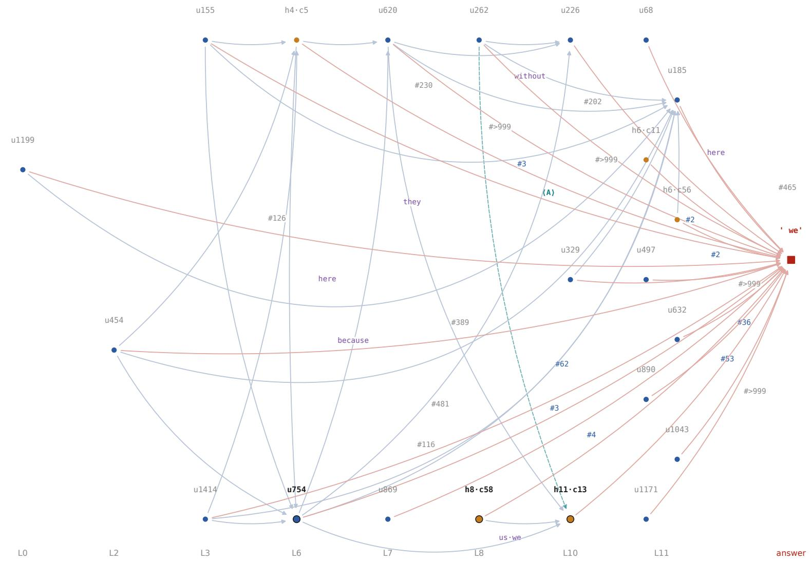  
Figure 9 2 : set operators , prediction 3 : the graph , 2 2 members and 2 5 edges among them .

…hile they were out gathering dung for fuel.↵↵Now, in a despicable article in Military Times, the US military says that children are legitimate targets

p=0.35 167 components reach 90% of the net 5 required 88% cancels
<table><tr><td></td><td></td><td></td><td>strength</td><td colspan="2">fires on</td><td colspan="5">writes toward</td><td>answer</td></tr><tr><td>L27·u6582</td><td></td><td>ffn</td><td>1.20</td><td></td><td> $\Gamma = \frac { \partial \Delta \theta } { \partial \theta } = \frac { \partial \theta } { \partial \theta } = \Gamma ^ { \prime }$ </td><td></td><td></td><td></td><td> $ ~ ^ { \prime } ~ \mathrm { i n ^ { \prime } } ~ ^ { \prime } \cdot \mathrm { i n ^ { \prime } } ~ ^ { \prime } \mathrm { i n ^ { \prime } }$ </td><td></td><td>#1</td></tr><tr><td>L25·u4136</td><td></td><td>ffn</td><td>1.03</td><td></td><td> $| \quad | { \mathrm { m e } } ^ { \prime } \quad | { \mathrm { d e } } ^ { \prime } |$ </td><td></td><td> $\begin{array} { r l } {  { } ^ { - 1 } , { } ^ { - 1 } \cdot { } ^ { \prime } \cdot { } ^ { \prime } \cdot { } ^ { \prime } } & { { } ^ { - } } \end{array}$ </td><td></td><td></td><td></td><td>#4</td></tr><tr><td>L24·u6518</td><td></td><td>ffn</td><td>0.51</td><td> $\because \mathsf { f o u n d } ^ { \prime }$ </td><td></td><td></td><td></td><td></td><td> $ ~ ^ { \prime } ~ \mathrm { i n ^ { \prime } } ~ ^ { \prime } \mathrm { I n ^ { \prime } } ~ ^ { \prime } \mathrm { i n ^ { \prime } }$ </td><td></td><td>#1</td></tr><tr><td>LL22·u7338</td><td>6%</td><td>ffn</td><td>0.56</td><td></td><td> $\cdot \ \mathrm { t h e i r " } \ \cdot \ \mathrm { i n " }$ </td><td></td><td></td><td></td><td></td><td> $ ~ ^ { \prime } ~ + r o m ^ { \prime } ~ ^ { \prime } ~ \nu \dot { 1 } \dot { 2 } \dot { 6 } \dot { 6 } ^ { \prime }$ </td><td>#21</td></tr><tr><td>LL21·u1361</td><td>4%</td><td>ffn</td><td>0.45</td><td></td><td> $\cdot \quad _ { \mathsf { w i t h } } \cdot \mathsf { \Omega } ^ { \prime } \mathsf { t h e } ^ { \prime }$ </td><td></td><td></td><td></td><td> $ ~ ^ { \prime } ~ \mathrm { i n t } \circ ^ { \prime } ~ ^ { \prime } ~ \mathsf { f r o m } ^ { \prime }$ </td><td></td><td>#19</td></tr><tr><td>L23·u3791</td><td></td><td>ffn</td><td>0.85</td><td></td><td></td><td> $\iota \mathsf { r e c o n c i l i a t i o n } ^ { \prime }$ </td><td></td><td></td><td></td><td> $ \cdot - \mathsf { b a s e d } ^ { \prime } , \cdot \cdot \cdot \mathsf { e l a t e d } ^ { \prime }$ </td><td>#193</td></tr><tr><td>LL20·u186</td><td>3%</td><td>ffn</td><td>1.37</td><td></td><td> $\yen 123,456,7$ </td><td></td><td></td><td></td><td></td><td> $ \mathrm { ~ " ~ } \mathsf { f u r n } \cdot \mathrm { ~ ` ~ } \mathsf { a l l } \cdot \mathrm { ~ ` ~ } \mathsf { m o r e } ^ { \mathrm { ~ * ~ } }$ </td><td>#7</td></tr><tr><td>LL21·u1361</td><td>(above)</td><td></td><td></td><td></td><td></td><td></td><td></td><td></td><td></td><td></td><td></td></tr><tr><td>L19·h13·c124</td><td></td><td>attn</td><td>1.03</td><td>一</td><td></td><td></td><td></td><td></td><td></td><td> $\right. \mathrm { ~ ` ~ } \mathtt { b e s t } ^ { \mathrm { ~ * ~ } } , \mathrm { ~ " ~ } \mathrm { ~ \left. ~ } \mathtt { s e r i o u s } ^ { \mathrm { ~ * ~ } }$ </td><td>#6</td></tr></table>

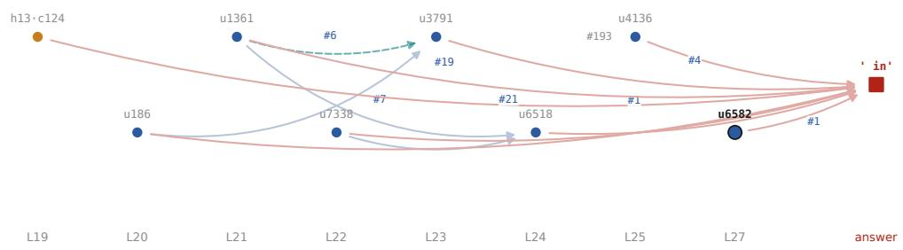  
Figure 93: Llama-3.2 3B, prediction 4. Selected for containing edges no token describes. Of 20 predictions drawn at random, this is one of the four whose suficient set is nearest the median, 8.

….F. did conduct a precision airstrike on three insurgents in Nawa district, and the strike killed all three insurgents,” he said. “None

p=0.98 206 components reach 90% of the net no prefix flips it 88% cancels
<table><tr><td></td><td></td><td></td><td>strength</td><td>fires on</td><td colspan="6"></td><td>answer</td></tr><tr><td>L26·u14402</td><td></td><td>ffn</td><td>2.26</td><td>one&#x27;</td><td>any</td><td></td><td></td><td></td><td>→ &#x27;of&#x27;0f&#x27; &#x27;Of&#x27;</td><td></td><td>#1</td></tr><tr><td>LL22·u8464</td><td>4%</td><td>ffn</td><td>21.48</td><td>no</td><td>not&#x27;</td><td>&#x27;un&#x27;</td><td></td><td></td><td>→ &#x27;tr&#x27; &#x27;line&#x27;&#x27; negot&#x27;</td><td></td><td>#&gt;999</td></tr><tr><td>LL3·u4661</td><td>7%</td><td>ffn</td><td>10.74</td><td>few</td><td>&#x27;outines</td><td></td><td>→1</td><td>pass&#x27;</td><td></td><td>among&#x27;Bog&#x27;</td><td>#697</td></tr><tr><td>LL3·u4661</td><td>(above)</td><td></td><td></td><td></td><td></td><td></td><td></td><td></td><td></td><td></td><td></td></tr><tr><td>L21·u17489</td><td></td><td>ffn</td><td>1.06</td><td>&#x27;ed&#x27;</td><td>social&#x27;</td><td></td><td>→1</td><td></td><td>of&#x27;0f&#x27;&#x27;Of&#x27;</td><td></td><td>#1</td></tr></table>

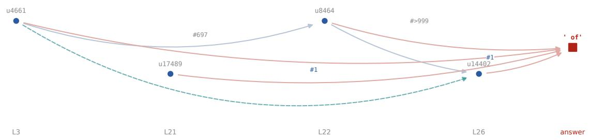  
Figure 94: Qwen2.5 7B, prediction 4. Selected for containing edges no token describes. Of 17 predictions drawn at random, this is one of the four whose suficient set is nearest the median, 4.

## B The set-operator model and how it is trained

Section 5 treats the set-operator construction as one arm among four, and says only as much about it as the comparison needs. It was built across three earlier papers [39, 40, 42], and the ingredient that lets it run at every unit of every layer comes from a fourth [41]. This appendix collects the construction and its training in one place: the unit, the attention head, the pressure applied during training, the two shaping terms, and the recipe. Nothing here is new to those papers except the assembly.

## B.1 The feed-forward unit

A conventional unit reads one row and writes one column through a scalar nonlinearity. A setoperator unit reads two rows and writes two columns, and what it computes between them is a pair of set operations on two fuzzy memberships. With z the normalized residual at a position, unit u forms its operands as in Equation 30,

$$
A _ { u } = \sigma ( w _ { u } ^ { a } \cdot z ) , \qquad B _ { u } = \sigma ( w _ { u } ^ { b } \cdot z ) , \qquad A _ { u } , B _ { u } \in ( 0 , 1 ) ,\tag{37}
$$

and writes the intersection and the diference of the two, each through its own column:

$$
\mathrm { F F N } ( z ) ~ = ~ \frac { g _ { \ell } } { r ( z ) } \sum _ { u } \Big [ \underbrace { A _ { u } B _ { u } } _ { A \cap B } ~ c _ { u } ^ { \cap } ~ + ~ \underbrace { A _ { u } \left( 1 - B _ { u } \right) } _ { A \setminus B } ~ c _ { u } ^ { \setminus } \Big ] , \qquad r ( z ) = \mathrm { r m s } \big ( A \cap B \| ~ A \setminus B \big ) ,\tag{38}
$$

where $r ( z )$ is the root-mean-square of the 3072 operation values at that position and $g _ { \ell }$ is one learned scalar per layer. That normalization is the block’s only departure from a plain sum: the operation values are bounded in [0, 1] where a GELU activation is not, and the normalization lets the block set its own scale rather than inherit the interval’s. It is a scalar the model computes, which is how Table 52 treats it.

The choices in that line each do a job. The memberships are squashed into [0, 1] because that interval is closed under complement, which is what makes negation a primitive: $1 - B$ is “not $B ^ { \ast }$ in the same units as $B ,$ where a raw direction has no absence. The operations are the product t-norm rather than min and max, because the product trains and the lattice operations saturate. And the two operations chosen are intersection and diference, which between them span conjunction and negation-under-a-condition, the two things a single-row unit cannot express at all.

Rearranged, and setting the scale aside, the sum in Equation 38 reads

$$
\sum _ { u } A _ { u } \Big [ c _ { u } ^ { \backslash } + B _ { u } \left( c _ { u } ^ { \cap } - c _ { u } ^ { \backslash } \right) \Big ] ,\tag{39}
$$

which is how the two operands divide the work. $A _ { u }$ is a gate: it scales the unit’s whole contribution and is zero when the unit is of. $B _ { u }$ is a selector: it moves the write continuously between the two fixed columns, delivering exactly $\boldsymbol { c } _ { u } ^ { \backslash }$ at $B _ { u } = 0$ and exactly $c _ { u } ^ { \cap }$ at $B _ { u } = 1$ . Both endpoints are exact rather than approximate, and Section 5.12 is built on that: keying $B _ { u }$ on a token makes the diference branch vanish identically where the token is present.

The layer is held to the baseline’s parameter count by narrowing it. A conventional layer of width $d _ { \mathrm { f f } } = 3 0 7 2$ has $2 d d _ { \mathrm { f f } }$ parameters in its two projections. A set-operator layer with p operand pairs has $2 d p$ in the read rows and $2 p d$ in the write columns, so $p = d _ { \mathrm { f } } / 2 = 1 5 3 6$ pairs make the two equal. The write projection is therefore the same $3 0 7 2 \times d$ matrix as the baseline’s, with its first 1536 columns carrying $c ^ { \cap }$ and its last 1536 carrying $c \backslash ;$ only the activation feeding it has changed. Every unit in every layer is of this kind. The earlier papers ran the construction on a fraction of each layer with conventional units alongside as a gradient path, because the pure form did not train; the arm here has none.

## B.2 The attention head

The same construction is applied on the value side of every attention head, so that what a head gathers from a position is bounded in the same way a unit’s operands are. A head’s value vector $v \in \mathbb { R } ^ { 6 4 }$ is split in half and each half becomes a membership,

$$
A = \sigma ( v _ { 1 : 3 2 } ) , \qquad B = \sigma ( v _ { 3 3 : 6 4 } ) , \qquad \tilde { v } = \big [ A \odot B \ \lVert \ A \odot ( 1 - B ) \big ] \in [ 0 , 1 ] ^ { 6 4 } ,\tag{40}
$$

and v˜ takes the place of v in the attention average. The query, the key, the softmax over positions and the output projection are unchanged, and no parameter is added: the head’s 64 value channels are reinterpreted as 32 intersections and 32 diferences. What attention delivers at a position is then an average of bounded quantities, which is the property Section 3.3 reads and Section 5.10 pays for — a channel gathers nothing far from its resting level unless a key row is scaled for it.

Everything else is the baseline of Section 2.1: twelve layers of width $d = 7 6 8$ , twelve heads, learned positional embeddings, pre-norm blocks, no bias anywhere, and tied input and output embeddings. The parameter count is the baseline’s but for the one scalar $g _ { \ell }$ per layer.

## B.3 The pressure

Left to the language-modeling loss alone, the pure construction did not train: above roughly half conversion the earlier papers found training diverging late, sooner the larger the converted fraction. What lets it run everywhere is an auxiliary objective from Oskin [41], where it was introduced

for a diferent purpose — to prescribe where in the stack a conventional transformer holds its intermediate content relative to the readout.

Write $h _ { t } ^ { ( \ell ) }$ for the residual after layer ℓ at position t, and decode it through the tied readout as the logit lens does,

$$
z _ { t } ^ { ( \ell ) } = \mathrm { L N } \big ( h _ { t } ^ { ( \ell ) } \big ) E ^ { \top } , \qquad \tilde { z } _ { t } ^ { ( \ell ) } = z _ { t } ^ { ( \ell ) } - \mathrm { m e a n } _ { v } z _ { t , v } ^ { ( \ell ) } ,\tag{41}
$$

centering over the vocabulary. Let $\tilde { z } _ { t }$ be the same quantity for the model’s final logits. Nothing is held fixed: the term’s gradient reaches both the layer’s decode and the final prediction, so the pressure can meet its target by moving either. The objective asks each layer’s decode to sit at a prescribed angle to the final prediction,

$$
\mathcal { L } _ { \angle } = \frac { \alpha } { L } \sum _ { \ell = 0 } ^ { L - 1 } \mathbb { E } _ { t } \Big [ \big ( \cos \angle ( \tilde { z } _ { t } ^ { ( \ell ) } , \tilde { z } _ { t } ) - \cos \theta _ { \ell } \big ) ^ { 2 } \Big ] , \qquad \cos \angle ( a , b ) = \frac { \langle a , b \rangle } { \| a \| \| b \| } ,\tag{42}
$$

with the target angle a step over depth,

$$
\theta _ { \ell } = \left\{ \begin{array} { l l } { 9 0 ^ { \circ } , } & { \ell = 0 , \ldots , 5 , } \\ { 0 ^ { \circ } , } & { \ell = 6 , \ldots , 1 1 . } \end{array} \right.\tag{43}
$$

The first half of the stack is asked to keep everything it computes orthogonal to the answer, and the second half to point at it. That is the two-phase structure Oskin [41] measured in the conventional baseline — a concept phase held of the readout axis, a token phase committed to it — written down as a target rather than left to emerge. The expectation runs over 128 positions drawn at random from each batch, the same positions for every layer; the coeficient is $\alpha = 3$ and is held constant through training, the term is added to the cross-entropy, and it is switched of at evaluation. It touches no parameter and inserts nothing into the forward pass.

Two facts about this pressure are established elsewhere and matter here. On the conventional model it is a lottery: prescribing the step through the loss alone, Oskin [41] report six of eight seeds diverging outright, and the survivors reaching the geometry under strain. That paper’s remedy is a fixed orthogonal rotation inserted at the boundary layer, which supplies the frame the loss asks for instead of making the model grow one. The set-operator arm uses no such device. Under the loss alone, all eight seeds converge, inside 0.2 nats of one another, at a quality inside the baseline’s converged range (Table 24). The constraint that a conventional transformer meets only by luck, and pays for in quality when it does, this construction meets every time for nothing. No run of this arm without the schedule is part of this paper, so the comparison is with the earlier papers’ runs rather than a paired ablation. What those runs suggest is that a bounded stack left to itself has to find the concept–token boundary on its own and to commit on the readout axis at every depth at once, and saturates trying; the schedule tells it where the boundary is. Why a bounded two-operand unit is at ease with a geometry a GELU unit is not, and whether that reading is the whole of it, are not settled in this paper; Section 5.8 finds the construction’s legibility comes from its order-preserving operands rather than from the set operations, and the trainability may have the same source.

## B.4 Two shaping terms

Two small auxiliary terms act on the operands during training, both at coeficient 0.003. Writing v for an operand’s value and the means over the operands of a layer and the tokens of a batch,

$$
\mathcal { L } _ { \mathrm { c r i s p } } = 0 . 0 0 3 ~ \mathrm { m e a n } \left[ v \left( 1 - v \right) \right] , \qquad \mathcal { L } _ { \mathrm { v a r } } = 0 . 0 0 3 ~ \mathrm { m e a n } _ { u } \left[ \mathrm { m a x } \left( 0 , ~ 1 - \frac { \mathrm { V a r } _ { t } ~ v _ { u } } { \tau } \right) \right] , \quad \tau = 0 . 0 0 3 .\tag{44}
$$

The first rewards an operand for sitting near 0 or 1 rather than in the middle of its range. The second is a floor on how much an operand varies across the tokens of a batch: an operand that has settled at a constant, and so responds to nothing, pays until its variance clears $\tau .$ . Both are applied to the feed-forward operands and to the attention memberships of Equation 40. The crispness term is also the “shaping” of Table 2, and it is the one of the two that is defined only for a bounded activation, since $v ( 1 - v )$ needs $v \in [ 0 , 1 ]$ to be a penalty at all; that is why the softplus and ReLU arms carry it at zero. The sigmoid arm of Section 5 was trained with and without it, and the two agree on the measurements that comparison rests on, so the term is not what produces those results. They do not agree everywhere: the two part company on where a model delivers context over depth, which Section 3.3 reports and leaves open.

## B.5 The recipe

Training is the baseline’s (Section 2.1): one epoch of OpenWebText at batch size 16 and context length 2048, AdamW with $\beta = ( 0 . 9 , 0 . 9 5 )$ and weight decay 0.1, peak learning rate $3 \times 1 0 ^ { - 4 }$ with 2000 warmup steps and cosine decay to a tenth of peak, 272,687 steps, gradient clipping, and bf16 on a single GPU. The auxiliary terms are added to the cross-entropy from the first step with their coeficients fixed. Nothing was tuned for this arm: it inherits the baseline’s learning rate and warmup unchanged. Eight seeds were trained under the screen of Section 2.1.1, and all eight pass it.

What the rest of the paper reads from the result is the same as for any other arm, with one substitution. A unit’s read side is operand A’s row $w _ { u } ^ { a } ,$ , and the agreement figures of Section 5.7 are taken on it; Section 5.7 also reads $w _ { u } ^ { b }$ and finds both operands nameable at roughly twice the baseline’s single row. A unit’s write side is two columns rather than one, and an edit to one of them lands on one branch of the unit (Section 5.9). The second operand is the one thing this construction has that the others do not, and Section 5.12 is what it turns out to be worth.

## C Ash heap

Every method below is the sensible thing to do — the obvious statistic, the standard method, the natural correction — and each either does not work or, worse, returns a confident number pointing the wrong way. The failure that matters is the one that returns 16.9 times the null on a model that is measurably rank-one, or that ranks a diverged checkpoint as the most legible thing in the study. They are set out at length because anyone repeating this measurement will reach for the same ones. Maybe they can find a way to make them work. Maybe the text here will spare them the trouble. They fall into five families: the models can rig the comparison, the estimators are biased, the cuts and summaries are arbitrary, the ablation searches fail their own checks, and the standard reading methods do not survive contact with a conventional unit. After those come the failures specific to naming a component — which of Section 3’s negative results are the instrument’s fault, the conditions under which its numbers hold, fitting a unit’s drivers from upstream, reading a write column against the vocabulary, and naming a unit by where it fires — and, last, what the failures leave: the tests that say what a unit’s unnameable remainder is. The dependency graph has an appendix of its own (Appendix D).

## C.1 The models can rig the comparison

A worse model reads as more legible. The largest failure is the one Table 1 records. Define the efective dimensionality of a layer’s token table as the participation ratio of its eigenvalue

spectrum,

$$
\mathrm { P R } \left( \tilde { E } [ l ] \right) = \frac { \left( \sum _ { i } \lambda _ { i } \right) ^ { 2 } } { \sum _ { i } \lambda _ { i } ^ { 2 } } , \qquad \lambda _ { i } \ \mathrm { t h e \ e i g e n v a l u e s \ o f \ C o v } _ { t } \left( \tilde { E } [ l , t ] \right) ,\tag{45}
$$

which reads as a count of independent directions. Averaged over the first five layers a converged seed carries 98.4 to 106.7 of them, and never falls below 75.8 at any depth. The excluded seeds carry 30.3 to 45.7, and two of them collapse almost completely at a single layer: 2.2 and 1.1 independent directions at layer 1, out of 768. A collapsed representation is easier to predict because there is less variety left to predict, and the excluded seeds accordingly score 40.7 to 49.2 percent on ov@8 against 33.6 to 38.4 for the five that converged. Every excluded seed reads as more legible than every converged one. Including a single one would shrink the gap this paper later reports by about a third; the efect is large enough, and in the wrong direction often enough, that quality is reported beside every legibility figure in this paper.

A fairness correction that rewards silence. A unit that no token clearly drives has a noisy causal ranking and therefore scores low, which suggests dropping such units before comparing models. The correction backfires, because the model with more of them gains more from their removal: dropping units with no clear trigger lifts the baseline by about six points. The correction rewards whichever model has more such units, so applying it in the interest of fairness silently favors one side of any comparison it is used in. The uncorrected number is reported.

## C.2 The estimators are biased

The dimensionality metric is biased both ways. Equation 45 looks safer than it is for being scale-free and parameter-free. Each row of $\tilde { E }$ is a mean over |C| contexts and carries estimation noise, and that noise is approximately isotropic in d dimensions, so the measured covariance is

$$
\mathrm { C o v } _ { \mathrm { m e a s } } \approx \mathrm { C o v } _ { \mathrm { t r u e } } + \frac { \sigma _ { \mathrm { w i t h i n } } ^ { 2 } } { | \mathcal { C } | } { I } ,\tag{46}
$$

with $\sigma _ { \mathrm { w i t h i n } } ^ { 2 }$ the variance of a token’s state across contexts. An isotropic ridge pulls the participation ratio toward the ambient dimension, so Equation 45 overstates dimensionality. Worse, the ridge is not constant across the models being compared: $\sigma _ { \mathrm { w i t h i n } } ^ { 2 }$ measures how much a token’s representation moves with context, and a better model has more of it, so the correction needed is largest exactly where the measurement is being used to argue. Across the seeds here $\sigma _ { \mathrm { w i t h i n } } ^ { 2 }$ varies by a factor of seven hundred. A second bias runs the other way, since sample eigenspectra are over-dispersed relative to the population, which makes Equation 45 understate dimensionality, most severely for the seeds with the highest true value.

Neither bias can be argued away, so both are removed by measurement. Splitting the contexts into two disjoint halves and taking the participation ratio of the symmetrized cross-covariance

$$
{ \cal C } = { \textstyle \frac { 1 } { 2 } } \big ( { \cal M } + { \cal M } ^ { \top } \big ) , \qquad { \cal M } = \frac { 1 } { | V | } \sum _ { t \in V } \big ( \tilde { E } _ { 1 } [ l , t ] - \bar { \tilde { E } } _ { 1 } \big ) \big ( \tilde { E } _ { 2 } [ l , t ] - \bar { \tilde { E } } _ { 2 } \big ) ^ { \top }\tag{47}
$$

removes the ridge, because noise independent between the halves contributes nothing in expectation.   
Doing so moves every seed by less than one unit of PR. In this case the objection does not bite.

A small table understates. Agreement depends on |C| in Equation 7 and is still rising at 32 contexts; going from 4 to 32 raises baseline ov@8 from 34.6 to 40.2 percent. The estimand is a property of the model rather than of the sample, so a larger table is a better estimate rather than a thumb on the scale. Two consequences follow. Absolute figures must be quoted with the table size that produced them. And a paper that splits its contexts evenly between building the table and testing against it, as the obvious protocol does, is deliberately halving the quality of its own instrument for a hygiene requirement that costs nothing to satisfy another way.

Scoring on the table’s own contexts. If C and $\mathcal { C } ^ { \prime }$ overlap, then $s _ { u } ( t )$ in Equation 13 is, up to centering, the mean pre-activation over the same contexts whose mean activation defines $\bar { a } _ { u } ( t )$ The two sides then share their sampling noise, and for a monotone $\phi$ the comparison reduces to a question about the curvature of $\phi$ rather than about the parameters. Overlapping the two sets is cheap. The flag that shares the contexts also doubles the table the naming side is built from, and it is the table that moves the number: holding the table at sixteen contexts, overlapping against disjoint is 39.2 against 38.9 under the ranked summary and 59.7 against 59.5 under the mean. The leakage is about a third of a point. Every number in this paper uses disjoint sets regardless, which costs nothing and settles the question rather than arguing it.

The reproducibility floor. Recomputed from an independent sample of contexts, a baseline unit’s top-K list agrees with itself, at $K = 8$ , 64 percent of the time at eight contexts per half and 86 percent at ninety-six. Any statement about how well two diferent procedures agree is meaningless without that floor, since a procedure that cannot reproduce itself cannot be expected to match anything else. Measured against it, several apparently large disagreements fall inside the range the ground truth varies over on its own.

## C.3 The cuts and summaries are arbitrary

Any single K is an arbitrary cut. Define a unit’s efective set size from its causal profile, as the participation ratio of the response in excess of the unit’s own median:

$$
e _ { u } ( t ) = \mathrm { m a x } \bigl ( 0 , \bar { a } _ { u } ( t ) - \mathrm { m e d } _ { t } \bar { a } _ { u } ( t ) \bigr ) , \qquad n _ { u } = \frac { \bigl ( \sum _ { t } e _ { u } ( t ) \bigr ) ^ { 2 } } { \sum _ { t } e _ { u } ( t ) ^ { 2 } } .\tag{48}
$$

A baseline unit has $n _ { u } = 1 1 5$ at the median, quartiles 82 and 148 (Figure 95). Which token lands at rank K rather than K + 1 is close to a coin flip, so a measurement read at one K spends most of its resolution on boundary churn. Reporting ov@ c K over a sweep of K rather than at a chosen cut is the only version of this measurement reported here.

Thresholds chosen in the wrong coordinates. Almost every quantity here needs a cutof somewhere, and a cutof is a claim about where the interesting part of a distribution lies. Four separate measurements in this work failed for that reason alone. A threshold placed at the midpoint of an activation’s nominal range measured silence rather than selectivity, because the units in question operate in the lowest seventh of that range. A range set by the first and ninety-ninth percentiles discarded the top one percent of a unit’s response, which for a selective unit is the entire signal. Quantile bins put resolution where the probability mass is rather than where the signal is, and were non-monotone in the number of bins as a result. And a criterion counting tokens more than three standard deviations above a unit’s mean is correct for a right-skewed quantity and silently discards half the evidence for a symmetric one. The general form is the same each time: a cutof was chosen in coordinates that suited one of the things being compared. The defense that works is to plot the distribution before choosing, and to build in a check the measurement must pass, such as requiring quantization error to fall monotonically as bins are added.

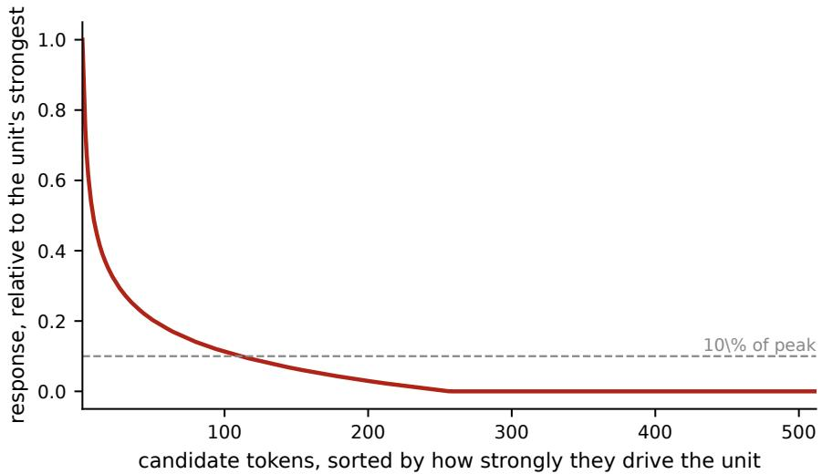  
Figure 95: Causal response of a baseline unit across candidate tokens, sorted from strongest, median over units. The response spreads over roughly 115 of 512 candidates and does not fall below a tenth of its peak until rank 111. A list of any fixed length samples the leftmost sliver: the top eight capture 18 percent of the total, the top thirty-two 42 percent. Context length 2048, 32 contexts.

The summary statistic moves the answer. Equation 14 averages activation across contexts, asking what a unit responds to most strongly. Ranking tokens within each context and averaging those ranks asks what it responds to most reliably. Two defensible summaries of the same measurements disagree, moving baseline ov@8 from 34.6 to 52.4 percent and changing the shape of the curve over K as well as its level. No external ground truth settles the choice: any measure of a unit’s downstream efect is itself monotone in $\textstyle a _ { u } ,$ which returns the question to how activations should be aggregated across contexts.

Why two methods give one answer. In the face of that disagreement, the tempting inference is that a unit has two token sets and the two statistics find one each. It does not follow. Two methods producing two sets establishes only that the set is not unique; there could be three, or many, or none, with each statistic slicing an unstructured surface diferently. Running six summary statistics rather than two shows the actual structure on the baseline: four magnitude-based measures agree with one another, and the single ordering-based measure sits outside them. That is a consensus and an outlier, invisible if the two statistics one happens to run are the two most diferent.

## C.4 Which summary the causal set is taken under

The outlier is the one this paper’s per-seed tables are computed with, and that has to be said. Equation 14 averages a unit’s activation over contexts and takes the top K: the tokens that drive it hardest. The alternative ranks the tokens within each context and averages those positions: the tokens that drive it most consistently. The first is what the model integrates, since a unit’s write is linear in its activation and a token that spikes once does contribute a lot once. The second is what a description ought to mean, since a name that holds in one context out of eight is not a name.

The two disagree unequally. Moving from the mean to the ranked summary costs the baseline 17.8 points of agreement at K = 8 and the set-operator model 1.7. Compared directly, with no decoding involved — the overlap between the two conventions’ own top-8 lists — they agree on 63 percent of the baseline’s units and on 75 to 79 percent of the bounded models’, against a chance rate of 1.5.

That is a better result than either number alone. For a bounded unit, what it responds to most strongly and what it responds to most reliably are close to the same list, so the question “what does this unit respond to” has an answer that does not depend on how it is asked. For a conventional unit the two lists come apart. The naming question is well posed for one construction and under-determined for the other, which is a statement about the constructions rather than about the instrument, and it survives whichever summary a reader prefers.

Two consequences follow. The first is that a legibility ratio between two architectures is not a portable quantity. The ratio here moves from about twice to about a third again depending on a convention neither architecture chose, and the movement is architecture-specific, so comparing that ratio against a number computed elsewhere under an unstated convention is not a comparison. That applies to this paper’s numbers as much as to anyone’s, which is why the ratio is not the form any claim here is put in.

The second is narrower and sharper. Ranks are invariant under any strictly increasing transform, so under the ranked summary a strictly monotone unit’s causal ordering is its pre-activation ordering, exactly. An order-preserving arm’s agreement with its own ceiling is then 1 by construction rather than by measurement, and the set-operator and sigmoid models duly return identical ceiling and realized figures. The empirical content of that comparison lives entirely on the baseline’s side, which is why Section 5.7 reports it under the mean summary, where both sides can move: there the baseline reaches 0.81 of its ceiling and the sigmoid model 0.98.

## C.5 How the standard reading methods fail on a conventional unit

Max-activating examples look fine. The default method in the field is to rank inputs by how strongly they drive a unit and read the top of that list. Run on the baseline it gives every one of 36,864 units an apparently individual answer: across two converged seeds the strongest candidate is distributed over all 512 candidates, and the most popular single winner accounts for only 1.1 and 2.8 percent of units. The problem is that nothing about the output looks degenerate. The top of the list is the part the parameters can name — it is the same K = 8 regime where agreement is 59 percent above chance — and the list continues into Table 46. A method that returns a distinctlooking name for every unit while the set behind that name is a grab-bag will not report its own failure, and reading only the top is how the failure goes unnoticed.

What concentration measures. The natural way to put a number on “is this unit nameable” is to ask how concentrated its response is on its best single name, scored against a null. This ranks a collapsed model as the most nameable thing in the study. A model whose code is nearly rank-one scored 16.9 times its null, and under a metric that also counts how many distinct names the units receive, the same model produced nine of them across 1536 units, scoring below the random null. When most units share one dominant component they share their top inputs, so each scores a high concentration while being individually meaningless. Any nameability score needs a distinctness measure read beside it.

Rotating the model to fit the lens. If mid-stack writes are illegible because their frame disagrees with the readout, the direct fix is to train the model to keep them in the same frame. We tried this as an auxiliary objective pulling each layer’s lens distribution toward the final one, over a range of strengths. Two things go wrong. The angle saturates: past a certain point more pressure buys almost nothing, and the frames stop near fourteen degrees rather than at zero,

Table 46: What six baseline units respond to: the top-K tokens of their causal profile at K = 40, for units at the median of the efective-size distribution. Unselected — these are the units the median picks out, not ones chosen to make a point. Each row is one unit. The definition of Section 1 asks that a reader be able to say what drives the component; this is the material that reading has to work with, and Section 3.4 is what sorting it by source recovers. Context length 2048, 32 contexts, 512 candidate tokens.

A about, him, them, who, whether, number, how, seen, name, B, that, E, U, \$, 3, In, go, F, 6, 7, T, New, 9, each, So, law, C, S, this, 5, then, re, went, A, change, B, 8, M, But, including

B 000, United, This, million, 20, American, 0, That, 2, If, Trump, 10, %, 10, 1, The, It, 0, But, 12, 7, If, It, &, 6, This, percent, For, We, 8, 5, But, 5, 6, 4, 2, ’re, 9, 7, 8

C al, h, call, ’, an, year, ar, public, man, I, If, called, both, open, a, ,", [, ll, more, As, i, ed, long, I, water, game, US, free, F, F, hard, much, C, once, as, part, system, per

D power, on, So, business, on, help, York, money, working, company, com, off, support, now, x, work, He, This, He, here, who, As, one, part, give, They, man, data, know, him, &, z, say, might, he, today, This, u, very, c

E from, by, your, these, each, them, as, with, In, ),, says, those, in, ), In, using, ?, used, As, this, ], as, )., said, ’s, 6, ing, K, –, him, were, 9, in, the, ], ,, This, his, en

F <|endoftext|>, \n, police, R, as, four, where, all, women, L, State, five, p, She, must, political, government, 9, 8, much, money, And, M, If, later, just, (, 9, first, possible, T, ),, When, or, left, L, But, -, D, There

Table 47: The same presentation as Table 46, for the sigmoid model: top-K token sets at K = 40 for units at the median of the efective-size distribution, unselected. Ofered for comparison with the baseline’s rows above. Section 5.7 reads these through the dependency graph instead, which is the measurement the paper relies on.

1 city, place, here, home, country, States, school, York, local, state, world, there, across, around, found, point, and, community, State, find, US, American, left, family, see, in, enough, course, run, away, asked, able, least, \n, or, that, within, where, ,, same

2 As, As, as, as, what, ’re, <0xEF>, were, be, ic, was, place, are, is, es, part, being, example, al, e, is, ar, a, ’s, how, <0xEF>, also, so, s, So, than, re, those, an, m, where, that, case, That, am

3 M, M, \n, K, T, didn, L, don, D, T, m, an, from, H, B, P, D, p, P, a, t, doesn, A, like, A, went, think, B, go, high, C, F, against, the, fact, something, if, d, his, L

because the early layers cannot both decode to the output and still compute. And quality falls sharply well before that, by up to forty-eight percent on LAMBADA at the strongest setting. The only setting that costs nothing leaves the frame essentially where it started. Imposing the alignment architecturally instead, with a learned orthogonal transform after every block trained to cancel each layer’s rotation, fails diferently and more informatively: perplexity degrades by roughly an order of magnitude and the measured rotation increases. The geometry resists being removed, consistent with its being load-bearing rather than incidental [41].

Why the lens is a derivation. A sparse autoencoder trained on these activations does recover features a person can name, at good reconstruction and with few dead units. We reproduce that, the strongest positive result any method in this appendix produces. It is set aside here by choice rather than by definition. Nothing about legibility forbids a working fitted explainer of this kind. But an autoencoder is a second model, trained on activations harvested from a corpus, and it explains the network in the same sense that a second network trained to predict a network’s outputs explains it [7, 9, 12]: understanding the explainer becomes part of the job. A sparse autoencoder is a rea and useful thing to have, and the gap between it and reading the weights is what this paper is about. One methodological note: an $\ell _ { 1 }$ penalty tuned by hand gave a solution with more than two hundred active units out of two hundred and fifty-six, which is a dense rotation wearing a dictionary’s clothes. Fixing the active count by construction, with a top-k activation, avoids the blind coeficient search entirely.

## C.6 The ablation searches fail their own checks

Two of the measurements in Section 2 are searches over ablations, and both of the obvious ways to run one are wrong. Neither failure shows up in a median.

Bisection lacks its invariant. The required graph is the smallest prefix of the one-hop set whose removal changes the prediction, and the cheap way to find it is to bisect on prefix length: log n90 ablations instead of a scan. That is valid only if flip(k) is monotone — if, once removing the top k changes the prediction, removing the top k+1 changes it too. On 11 to 28 percent of predictions it is not. Some larger prefix restores the prediction that a smaller one broke, and the same failure appears in all four architectures checked (Table 48).

The reason is the structure Appendix D.1 measures. The dependency graph is not a tree. Its nodes share sources heavily — that overlap is exactly why the closure grows so much more slowly than the branching factor would imply — so a prefix of the ranking is not a set of independent contributions that can be removed one at a time. Removing the top k deletes components that the components ranked below k also draw on, which changes what those components compute. The k+1-th ablation is therefore a diferent perturbation of a diferent graph, with the remaining nodes moved. Nothing about that guarantees a monotone sequence, and the surviving prediction after a larger ablation is the downstream compensation familiar as self-repair [35], here inside this instrument rather than in a model under study.

Bisection, with nothing to stand on under those conditions, fails in a predictable direction. It agrees with the true minimum on 84 to 100 percent of predictions and otherwise lands high, by as much as 25 components on Llama-3.2-1B. The individual predictions behind a correct-looking table of medians built by bisection are wrong.

Keeping more can preserve less. Appendix D.4 reports the suficiency direction failing on the baseline. It fails the same way on models this paper did not train, which is what makes it a property of the measurement. Keeping only a pruned graph preserves the prediction between 0 and 77 percent of the time, and on three of the four models below (Table 49, Figure 96) the curve is not monotone in how much is kept: GPT-2 peaks at $\theta = 0 . 3$ and falls thereafter, and Llama-3.2-1B reads 12, 12, 0, 38. A set that genuinely produced a prediction could not do worse when enlarged.

Table 48: Sweeping every prefix length instead of bisecting. “Flip at all” counts predictions that change when some prefix is removed; the required graph is undefined for the rest, and they are excluded from the medians reported elsewhere. “Worst overshoot” is the largest amount by which bisection exceeded the true minimum on a single prediction.
<table><tr><td>model</td><td>predictions</td><td>flip at all</td><td>flip(k) monotone</td><td>bisection exact</td><td>worst overshoot</td></tr><tr><td>baseline (GELU)</td><td>39</td><td>25</td><td>72%</td><td>84%</td><td>4</td></tr><tr><td>sigmoid</td><td>38</td><td>37</td><td>89%</td><td>100%</td><td>0</td></tr><tr><td>GPT-2 124M</td><td>33</td><td>31</td><td>84%</td><td>94%</td><td>16</td></tr><tr><td>Llama-3.2 1B</td><td>32</td><td>29</td><td>83%</td><td>90%</td><td>25</td></tr></table>

The cause is that keeping a subset ablates everything else, so the model is evaluated far of its own distribution, and how far depends on the subset in a way that has nothing to do with whether the subset is the circuit. The necessity direction in the same table is unafected: it removes a small set from an otherwise intact model, which is a mild perturbation of a model still on its distribution. That asymmetry is why a set cannot be certified suficient by enlarging it until it works. The instrument that does work runs the other way: Section 2.5 searches directly for a small set and tests it by running the model, scoring its controls against the floor the ablation itself creates.

Table 49: Pruning by the per-node threshold θ, across four models. Columns as in Table 56. The same predictions are used at every θ, so rows within a model are paired.
<table><tr><td>model</td><td>θ</td><td>components</td><td>% of model</td><td>% of closure</td><td>prediction changes</td></tr><tr><td>baseline (GELU)</td><td>0.1</td><td>56</td><td>0.12%</td><td>8%</td><td>95%</td></tr><tr><td rowspan="7">sigmoid</td><td>0.3</td><td>122</td><td>0.26%</td><td>17%</td><td>100%</td></tr><tr><td>0.5</td><td>249</td><td>0.54%</td><td>35%</td><td>100%</td></tr><tr><td>0.7</td><td>434</td><td>0.94%</td><td>60%</td><td>100%</td></tr><tr><td>0.9</td><td>720</td><td>1.56%</td><td>100%</td><td>100%</td></tr><tr><td>0.1</td><td>36</td><td>0.08%</td><td>46%</td><td>100%</td></tr><tr><td>0.3</td><td>41</td><td>0.09%</td><td>53%</td><td>100%</td></tr><tr><td>0.5</td><td>50</td><td>0.11%</td><td>64%</td><td>100%</td></tr><tr><td rowspan="5">GPT-2 124M</td><td>0.7</td><td>60</td><td>0.13%</td><td>77%</td><td>100%</td></tr><tr><td>0.9</td><td>78</td><td>0.17%</td><td>100%</td><td>100%</td></tr><tr><td>0.1</td><td>102</td><td>0.22%</td><td>10%</td><td>95%</td></tr><tr><td>0.3</td><td>170</td><td>0.37%</td><td>17%</td><td>100%</td></tr><tr><td>0.5</td><td>358</td><td>0.78%</td><td>36%</td><td>100%</td></tr><tr><td rowspan="5">Llama-3.2 1B</td><td>0.7</td><td>604</td><td>1.31%</td><td>61%</td><td>100%</td></tr><tr><td>0.9</td><td>987</td><td>2.14%</td><td>100%</td><td>100%</td></tr><tr><td>0.1</td><td>154</td><td>0.09%</td><td>9%</td><td>100%</td></tr><tr><td>0.3</td><td>282</td><td>0.17% 0.36%</td><td>16% 34%</td><td>100%</td></tr><tr><td>0.5 0.9</td><td>588 1724</td><td>1.05%</td><td>100%</td><td>100% 100%</td></tr></table>

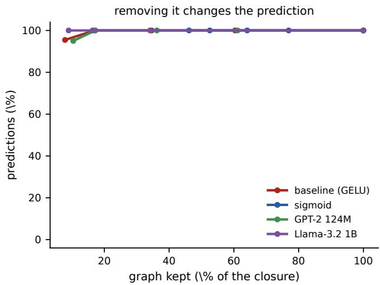

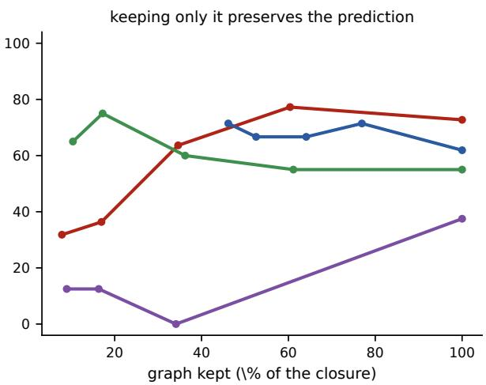  
Figure 96: Both directions on the same pruned graphs. Left: removing the graph changes the prediction almost as often at a tenth of the closure as at all of it. Right: keeping only the graph, which is the suficiency direction — the curves are not monotone, and on three of four models keeping more preserves the prediction less often. That is a failure of the instrument rather than a property of the circuit.

## C.7 Whether the instrument or the model is at fault

Every negative result in Section 3 admits two readings — the model has no structure of the kind sought, or the measurement could not have found it — and they are separated here rather than left to the reader, because three of the four turn out to be the instrument.

The frame is the clearest case. Scoring a writer through the unembedding and its reader in that reader’s own basis returns a correlation of −0.02 against a random control, which reads as a component passing nothing to the one that consumes it. The same edges scored in one frame correlate +0.28, with nothing about the model changed between the two numbers.

The fit is the second. Reconstructing a unit’s drivers from upstream components returns negative held-out variance under every pool tried, which invites the conclusion that no such relation exists. Selecting three atoms from a dictionary of 1,440 costs about twenty-nine bits against thirty observations, so the search exhausts the sample before a coeficient is estimated; and the profile being reconstructed reproduces across disjoint contexts at 0.648, so the signal was there throughout. An ordering, which selects nothing, recovers it (Section 3.4).

Attention is the third. Its components rank a unit’s drivers close to chance, and attention supplies 23 percent of the components in a trace and is frequently among those a prediction cannot lose. Driver sets are built by substituting a token at one position and reading a unit at the same position; attention assembles its output at a position from other positions. A term that does not move when the probe moves cannot order the probe’s results, whatever it contributes to the prediction.

The fourth is the model. A component operating on a direction no token induces has no vocabulary name at any resolution. The write column comes no closer to a token than a random direction through the early and middle stack. A fitted rotation recovers nothing over not rotating. And a shared basis fitted across units explains the nameable response better than the rest. Where the reading stops there, it stops because the object is not lexical.

## C.8 The opposing side of the accounting

Section 2.3 sets the opposing mass aside as trafic. Whether that is right can be tested at the readout directly, by asking whether the mass pushing a token down is any diferent from what an arbitrary token receives. The test uses the contrastive pairs of Section 2.5, $A  X$ and $B  Y$ where what separates the two positions is what attention carried in from earlier context. At B, where X lost, every feed-forward unit and attention channel has a signed push on X, and the negative side of that accounting is set against three floors: the same accounting for a competitor the model merely considered, a random token from its top $\operatorname { f i f t y } ;$ for a random vocabulary token; and for X’s own contributions with their signs shufled and their magnitudes kept, which is what picking the most negative of tens of thousands of terms produces on its own. Table 50 reports the comparison. The token that lost carries the same negative side as a token nobody was deciding about. The ratio of its negative to its positive mass matches the competitor’s to within 0.02 in every model, and a random token’s is one; reaching ninety percent of its negative mass takes the same share of the model as it takes with the signs shufled, to within a point; and removing its eight most negative components lifts it by about as much as the same operation lifts the competitor, within a logit in every model and by less than it lifts a random token on two of them. Attention channels carry the negative mass in proportion to their number, and no single component switches on to push X down where it loses: the most negative push at B among components that were not pushing X down at A, scored against the spread of its kind, is within a unit of the same statistic for the control tokens in every model, and on the bounded arms a unit cannot switch at all, since a nonnegative activation fixes the sign of its push on a token. “Not this” is written onto the readout by thousands of components in every context and for every token, and it is the mirror of the positive side rather than a signal about the token.

Much of that mass is a constant per component rather than anything the position decides: split each component’s activation into its mean over positions and the deviation from it, and the mean carries about three quarters of the mass on both sides of the baseline’s accounting, efectively all of it on the two bounded arms, half on GPT-2 and a quarter on Gemma-3 and Qwen. Rerunning the comparison with that constant part removed and with ablation to the mean rather than to zero changes none of its conclusions: every entry of Table 50 moves by a few hundredths or a few points and the circuits of Table 8 stay at tens of components. The one case where the constant part matters is the seed of the last row of Table 51: four attention channels writing large constants at every position dominate its signed sum, and with the constant part removed its net denominator returns from one or two components to 94, the net is negative on 3 percent of pairs instead of 39, and its negative side sits at the floor like every other model’s.

## C.9 Conditions for trusting these numbers

Every measurement in Section 3 can be made to return a confident wrong answer. Table 51 states the conditions that separate the two outcomes, each with the number that moves when it is dropped, because a condition ofered without its consequence is easy to read as fastidiousness and skip.

## C.10 Fitting a unit’s drivers from its upstream components

Section 3.4 ranks upstream components rather than fitting them, because every fitted version failed, all of them in the same way, and the failure mode is invisible in the statistic normally used to guard against it.

A unit’s pre-activation is a sum of upstream write columns carried forward and read through its row, so the natural estimator selects a few upstream components and regresses the unit’s response on their activations, scoring on tokens held out from the selection. Four candidate pools were tried. The co-members of a unit’s own suficient set; the union of every component appearing in any suficient set; the components that share suficient sets with the target, against a control matched on how often a component is reused; and the twelve upstream components whose carried write columns align most strongly with the unit’s read row. Every candidate was carried through the fitted layer maps, the carried embedding was forced into the design so that what was scored was explanation beyond the starting residual, and attention channels were included alongside feedforward units.

Table 50: The negative side of a token that lost, against its floor. On the contrastive pairs of Section 2.5, at the position where X lost, the mass pushing X down over the mass pushing it up, for X, for a competitor from the model’s top fifty and for a random vocabulary token; the share of the model’s components it takes to reach ninety percent of X’s negative mass, against the same count with the signs of X’s contributions shufled; and the logit lift from removing the eight components pushing each token down hardest. Medians over pairs. Feed-forward units and attention channels alike.
<table><tr><td rowspan="2">model</td><td colspan="2">negative / positive mass</td><td colspan="2"></td><td colspan="2"> $n _ { 9 0 } ,$  negative side</td><td colspan="2">lift, 8 removed</td></tr><tr><td>loser</td><td>competitor</td><td></td><td>random</td><td>loser</td><td>shuffled</td><td>loser</td><td>competitor</td></tr><tr><td>baseline (GELU)</td><td>0.96</td><td>0.97</td><td></td><td>1.02</td><td>26%</td><td>26%</td><td>0.3</td><td>0.0</td></tr><tr><td>sigmoid</td><td>0.89</td><td>0.90</td><td></td><td>0.99</td><td>18%</td><td>18%</td><td>1.9</td><td>1.8</td></tr><tr><td>set operators</td><td>0.89</td><td>0.90</td><td></td><td>0.99</td><td>19%</td><td>18%</td><td>0.7</td><td>0.2</td></tr><tr><td>GPT-2 124M</td><td>0.86</td><td>0.88</td><td></td><td>1.01</td><td>24%</td><td>23%</td><td>1.6</td><td>1.8</td></tr><tr><td>Gemma-3 1B</td><td>0.86</td><td>0.87</td><td></td><td>1.00</td><td>16%</td><td>16%</td><td>2.3</td><td>2.2</td></tr><tr><td>Qwen2.5 1.5B</td><td>0.91</td><td></td><td>0.92</td><td>1.00</td><td>20%</td><td>20%</td><td>1.3</td><td>1.4</td></tr></table>

All four returned negative held-out variance — worse than predicting the mean — and the strongest pool returned the worst result, −0.306 against −0.009 for the carried embedding alone.

Observations per parameter, the usual guard, says the design was adequate: three atoms fitted on thirty tokens is ten observations each. It is the wrong count. The atoms are selected as well as fitted, and selecting three columns from a dictionary of 1,440 costs log $\binom { 1 4 4 0 } { 3 } \approx 2 9$ bits against thirty observations. The search consumes the sample before a coeficient is estimated, so the columns that survive are the ones correlated with noise in the training half, and those anti correlate out of sample. That is why the scores are negative rather than small, and it is why raising the sample and lowering the atom count — which moved observations per parameter from 1.8 to 10 — changed nothing.

The reading that the model simply has no such structure is ruled out separately. Split the sixteen contexts in half and the two halves agree on the anonymous profile at 0.648 (CI [0.643, 0.654], $n = 1 4 , 1 2 3 )$ , so roughly two thirds of the variance being fitted is reproducible signal. A ranking, which selects nothing and fits nothing, reaches the always-predictable target that the estimator never could.

## C.11 Reading a write column against the vocabulary

The naming of Section 3.1 works from predictions and never reads a column. That was not the first approach tried, and the measurements that failed are collected here, because their failure has a single cause.

A component’s contribution to a prediction is a product of two terms, how hard it fired and how well its column aligns with what the readout needs. Measured on the baseline, the column puts the tokens it is credited for at the 86th percentile of its own ordering over the vocabulary, and a third of them inside its own top one percent — so the column is far from silent. But the firing carries 52 percent of the variance in the contribution. The column narrows the field to roughly the top seventh of the vocabulary and the context chooses from inside it, so no measurement of the column alone can recover which token a component is credited for. Reversing the question confirms it: given components already labeled by what they write, retrieving a label from column geometry alone beats chance by only 1.23 times on the baseline and 1.35 on the sigmoid model, real but far too weak to invert.

Table 51: Conditions for reading a component. The last column gives the measurement with the condition and without it. None of these is a matter of taste, and a reading that drops one is not a weaker version of this one — it is capable of returning the opposite sign.
<table><tr><td rowspan=1 colspan=6>condition                      why it is not optional                            what it cost</td></tr><tr><td rowspan=1 colspan=6>Read at the readout, or  The residual stream is not in token coor-  Writer-to-readerr agreementin the layer&#x27;s own frame.  dinates until the last few layers, so a mid-  measured —0.02 across framesNever mix the two.          stack quantity decoded through the unem-  and +0.28 within one; thebedding is being asked what it would mean  first reads as “the graph doessomewhere it is not.                              not link&quot;.Give every concentration Random directions concentrate, and ran-  A top-eight response share ofor overlap statistic a dom sets overlap. Neither statistic has a0.105 looks like selectivity un-</td></tr><tr><td rowspan=1 colspan=6>0.097.Check that the null couldA test whose null sits near the ceiling can-  Projecting onto the span of allhave been rejected before not discriminate, so its null result carries nocandidate tokens put the null</td></tr><tr><td rowspan=7 colspan=5>believing it.                    evidence of absence.Separate a component&#x27;s Selectivity can occupy a small part of a di-rection whose bulk does something unre-</td><td rowspan=1 colspan=1>at 0.665 of a 768-dimensional</td></tr><tr><td rowspan=1 colspan=1>space; the excess was zero ev-</td></tr><tr><td rowspan=1 colspan=1>erywhere because the test had</td></tr><tr><td rowspan=1 colspan=1>no power.</td></tr><tr><td rowspan=2 colspan=1>Separate a component's</td><td rowspan=2 colspan=1>Reconstruction of the direc-</td></tr><tr><td rowspan=2 colspan=1>tion sits at chance while 21 to</td></tr><tr><td rowspan=1 colspan=1>direction from its behav-</td></tr><tr><td rowspan=1 colspan=1>ior.</td><td rowspan=1 colspan=4>lated, so the two questions have different</td><td rowspan=1 colspan=1>73 percent of units are selec-</td></tr><tr><td rowspan=2 colspan=1></td><td rowspan=3 colspan=4>answers.Frequent fragments and punctuation dom-</td><td rowspan=1 colspan=1>tive beyond the random 95th</td></tr><tr><td rowspan=2 colspan=1>percentile.Unfiltered, ,, and bare</td></tr><tr><td rowspan=1 colspan=1>Filter the candidate token</td></tr><tr><td rowspan=1 colspan=1>set to words.</td><td rowspan=1 colspan=4>inate a raw frequency list and appear at</td><td rowspan=1 colspan=1>subword fragments headed the</td></tr><tr><td rowspan=1 colspan=1></td><td rowspan=1 colspan=4>the top of every component&#x27;s reading, which</td><td rowspan=1 colspan=1>detection list of most units in</td></tr><tr><td rowspan=1 colspan=1></td><td rowspan=1 colspan=4>says more about the corpus than about the</td><td rowspan=1 colspan=1>the gallery.</td></tr><tr><td rowspan=1 colspan=1>Probe at the context</td><td rowspan=1 colspan=4>component.Statistics that depend on a variance floor</td><td rowspan=1 colspan=1>Probes run at 256 tokens on</td></tr><tr><td rowspan=1 colspan=1>length the model was</td><td rowspan=1 colspan=4>are computed against the wrong floor at a</td><td rowspan=1 colspan=1>models trained at 2048 re-</td></tr><tr><td rowspan=1 colspan=1>trained at.</td><td rowspan=1 colspan=4>shorter context, and channels that operate</td><td rowspan=1 colspan=1>ported a population of dead</td></tr><tr><td rowspan=2 colspan=5>at range are scored as dead.Remove a component&#x27;s A channel that writes nearly the same large</td><td rowspan=1 colspan=1>channels that does not exist.</td></tr><tr><td rowspan=1 colspan=1>On one of the baseline&#x27;s five</td></tr><tr><td rowspan=1 colspan=5>constant write beforevector at every position contributes a con-</td><td rowspan=1 colspan=1>converged seeds, four layer-1</td></tr><tr><td rowspan=1 colspan=1>reading a signed account-</td><td rowspan=1 colspan=4>stant to every token&#x27;s accounting, of either</td><td rowspan=1 colspan=1>attention channels output be-</td></tr><tr><td rowspan=1 colspan=1>ing.</td><td rowspan=1 colspan=4>sign. That is a bias, not a decision, and left</td><td rowspan=1 colspan=1>tween 115 and 143 in mag-</td></tr><tr><td rowspan=1 colspan=1></td><td rowspan=1 colspan=4>in, it can dominate a signed sum.</td><td rowspan=1 colspan=1>nitude at every position with</td></tr><tr><td rowspan=9 colspan=6>turned to 94 (Appendix C.8).</td></tr><tr><td rowspan=1 colspan=1>denominator returned one or</td></tr><tr><td rowspan=1 colspan=2></td><td rowspan=1 colspan=1>two components and the net</td></tr><tr><td rowspan=1 colspan=2></td><td rowspan=1 colspan=3></td><td rowspan=1 colspan=1>went negative on 39 percent of</td></tr><tr><td rowspan=1 colspan=2></td><td rowspan=1 colspan=2></td><td rowspan=1 colspan=1></td><td rowspan=1 colspan=1>contrastive pairs, on a model</td></tr><tr><td rowspan=1 colspan=2></td><td rowspan=1 colspan=2></td><td rowspan=1 colspan=1>whose predictions were as con-</td></tr><tr><td rowspan=1 colspan=4></td><td rowspan=1 colspan=1>fident as the other seeds'</td></tr><tr><td rowspan=1 colspan=1>With each component's mean</td></tr><tr><td rowspan=1 colspan=1>write removed, the count re-</td></tr></table>

What was tried, and what each returned. The best cosine between a column and any single centered unembedding row sits at chance through two thirds of every model (Table 52). Splitting a layer’s write into the part a fixed map of the incoming state accounts for and the part left over does not rescue it (Table 53). The set a column points at is no tighter than the set an arbitrary direction picks out, once the comparison is made against a random direction rather than a random set of tokens. Morphological axes exist in the embedding — plural, capitalization, tense, all consistent at 0.29 to 0.55 when each pair is scored against an axis built from the others — but write columns lie along them at chance, and a component’s contribution to a plural prediction is separable from a singular one only in the aggregate and not per column. The readout’s own geometry is no help either: one direction holds most of its variance and none of the residual stream’s energy, and removing it costs nothing while removing the two behind it costs eleven points of top-one accuracy, so there is no free correction to apply.

Table 52: Where a write column sits relative to the readout, by depth. Each entry is the median column’s best cosine with any single centered unembedding row, in excess of the same statistic for a random direction, so 0 is chance and the chance level itself is given for scale. Feed-forward and attention are the same kind of object here — one column of an output projection, scaled by a scalar the model computes — and are measured identically. Bold marks the last third, the only band in which any model clears chance. As a check that the statistic can see readout-directed writing at all, the state entering the final norm scores 0.249 on it against these chance levels, and an unembedding row scores 1.000.
<table><tr><td></td><td></td><td colspan="3">feed-forward</td><td colspan="3">attention</td></tr><tr><td>model</td><td>chance</td><td>early</td><td>middle</td><td>late</td><td>early</td><td>middle</td><td>late</td></tr><tr><td>baseline e (GELU)</td><td>0.143</td><td>-0.002</td><td>-0.001</td><td>+0.006</td><td>-0.001</td><td>-0.002</td><td>+0.005</td></tr><tr><td>sigmoid</td><td>0.143</td><td>+0.003</td><td>-0.001</td><td>+0.031</td><td>-0.007</td><td>-0.001</td><td>+0.026</td></tr><tr><td>softplus</td><td>0.141</td><td>+0.001</td><td>-0.001</td><td>+0.042</td><td>+0.001</td><td>-0.000</td><td>+0.066</td></tr><tr><td>ReLU</td><td>0.141</td><td>+0.002</td><td>-0.002</td><td>+0.022</td><td>+0.021</td><td>-0.001</td><td>+0.027</td></tr><tr><td>set operators</td><td>0.136</td><td>-0.008</td><td>-0.006</td><td>+0.024</td><td>-0.005</td><td>-0.002</td><td>+0.058</td></tr><tr><td>unshaped sigmoid</td><td>0.143</td><td>-0.001</td><td>-0.002</td><td>+0.032</td><td>+0.001</td><td>+0.001</td><td>+0.054</td></tr></table>

Table 53: Where the token alignment of a layer’s write sits, once the write is split into the part a fixed map of the incoming state accounts for and the part left over (Section 2.6). Both are scored with the same best cosine against any centered unembedding row used in Table 52. “First layers” is the largest value over the opening quarter of the stack and “rest” the median over the remainder. The alignment is in the fitted part, which is what carrying the embedding forward looks like; the leftover is at chance throughout. Layers where the leftover is under a quarter of the write are excluded from its range, since the direction of a vector that small carries no information — this drops the sigmoid model’s first four layers and none of the baseline’s.
<table><tr><td></td><td></td><td colspan="2">fitted part</td><td>leftover</td></tr><tr><td>model</td><td>chance</td><td>first layers</td><td>rest</td><td>range over depth</td></tr><tr><td>baseline (GELU)</td><td>0.143</td><td>0.202</td><td>0.142</td><td>0.139-0.146</td></tr><tr><td>sigmoid</td><td>0.143</td><td>0.157</td><td>0.151</td><td>0.139-0.142</td></tr></table>

This is why the naming had to come from predictions.

## C.12 Naming a unit by where it fires

The move that names the write side does not transfer, and the failure is about the architecture rather than about the measurement. One could collect the positions in ordinary text where a unit fires hardest and name it by the token sitting there, and two units in three do acquire a name that way. But the token at a position is present in the residual only at the very bottom: it starts at +0.45 and is down to +0.003 one layer later. Above that a unit is reading what the model has built rather than the token that seeded it, and any agreement between the two is running through whatever that token caused. Measured by depth, the agreement behaves accordingly — it is three times stronger at layer zero than at layer eleven, and falls the whole way. Naming by firing position therefore describes the contexts a unit turns on in, a real fact about the unit rather than what it reads.

The same objection disposes of naming a unit by the token some fixed distance before its firing positions. That token is not in the residual either, and the instrument cannot be completed by sweeping the distance: whatever a unit keys on may lie hundreds of positions back, so any ofset is a truncation. The parameters read against the layer’s own table are the instrument that answers what a unit reads, and they answer it sharply for the head of the list and not below.

Table 54: Attention alignment split by head, at the two ends of the stack. Each entry is the range across the model’s twelve heads of that head’s write columns weighted by how hard they fire, scored by the same best cosine with any centered unembedding row but reported as an absolute cosine rather than as an excess, with the chance level beside it for scale. Layer zero is aligned in every model because the residual there is the token; the last layer separates the baseline from the rest.
<table><tr><td></td><td></td><td colspan="2">first layer</td><td colspan="2">last layer</td></tr><tr><td>model</td><td>chance</td><td>range</td><td>median head</td><td>range</td><td>median head</td></tr><tr><td>baseline (GELU)</td><td>0.143</td><td>0.160–0.602</td><td>0.374</td><td>0.141-0.173</td><td>0.162</td></tr><tr><td>sigmoid</td><td>0.143</td><td>0.159-0.665</td><td>0.358</td><td>0.185-0.267</td><td>0.229</td></tr><tr><td>softplus</td><td>0.141</td><td>0.148-0.550</td><td>0.242</td><td>0.222-0.300</td><td>0.261</td></tr><tr><td>ReLU</td><td>0.142</td><td>0.136-0.299</td><td>0.216</td><td>0.184-0.233</td><td>0.203</td></tr><tr><td>set operators</td><td>0.136</td><td>0.134-0.526</td><td>0.281</td><td>0.182-0.247</td><td>0.202</td></tr><tr><td>unshaped sigmoid</td><td>0.142</td><td>0.146-0.475</td><td>0.240</td><td>0.209-0.284</td><td>0.253</td></tr></table>

Attention was measured the same way and reads the same, with one diference of its own: it leans on few of its columns, the top one percent carrying up to a fifth of a block’s firing where a feed-forward block’s carry at most a fortieth. A median over all columns therefore describes a typical column of a block that mostly uses a few, which is why a channel’s contribution sits further above its median column than a unit’s does. Whether the columns a block uses are also the readable ones is a separate question and the answer is mostly no: weight each column by how hard it fires and compare against the same weights permuted across columns, and only the first attention block shows a large gap, where the residual is still the token itself.

One cross-model diference does survive the measure. At the last layer the baseline’s heads straddle chance while every other model’s sit above it (Table 54) — read through the typical column, the baseline holds its computation of the readout axis until later than the rest.

## C.13 What the tokens outside the concept are

Section 3.2 splits a unit’s driver set into the part forming an embedding-space concept and a remainder the cosine cannot speak to, and reports the second as 72 percent of the response on the baseline, and 61 to 72 percent across the four models measured here. Three explanations of that remainder can be tested without consulting the embedding for the verdict, and none of the three survives. What the tests leave is a description rather than a name, and the description is what Section 3.4 then works from: they establish that the remainder is real and single before it is read in another basis. They run over 1,444 units drawn at random across four models and sixteen contexts, and every number is quoted beside the same statistic on the same unit’s coherent tokens (Table 55).

The first possibility is that the remainder is nothing, its tokens there by sampling accident. The test is reliability: build the response profile on one half of the contexts, build it on the disjoint other half, and ask whether the remainder’s ordering reproduces. Noise does not reproduce. It reproduces. The rank correlation between halves runs from 0.52 to 0.64 across the four models, against 0.59 to 0.75 for the coherent tokens of the same units. For a minority the answer is the other way, 11 to 20 percent of units falling below 0.2, and for those the remainder is sampling noise. For the rest it is response the model reproduces on contexts it has not seen.

The second is that the remainder is several concepts at once, one unit carrying three paradigm classes with no single coherent direction among them. The test is substructure: count the eigendirections of the remainder’s own similarity matrix that exceed the largest eigenvalue of a sizematched random set. It carries none. Not one unit of the 1,444 shows more than a single direction above the null, and 15 to 40 percent show none at all.

The third is that the remainder is relational, and a syntagmatic class has a signature: a paradigm unit fires on its token wherever the token appears, while a relational unit fires only in the right structure. The test is context-dependence, the coeficient of variation of the response across contexts. The signature is absent. The remainder varies slightly less across contexts than the coherent part on every model, and the share of units running the other way is 31 to 50 percent.

What the three leave is a remainder that is real, single, and no more context-bound than the tokens a concept does explain. That is a sharper object than a blind spot: it is not an artifact to be explained away, and it is not several things that better tools would separate. It is one thing, read in a basis it is not written in — which is what Section 3.4 measures by changing the basis to the components upstream of the unit.

One candidate can be ruled out, and it is the obvious one. Most of what a transformer does between layers is carriage (Section 2.6), so the natural guess is that a unit’s unnameable response is that unit taking part in carriage rather than responding to anything. Fitting the layer-to-layer map gives the subspace carriage works in, and each write column can be scored by how much of itself lies there. Across 326 baseline units and 278 sigmoid units measured both ways, that score correlates with the nameable share at +0.14 and +0.22: the wrong sign, and the wrong sign after controlling for depth and for membership in the residual’s own high-variance subspace, with which the carriage span shares no more than a random overlap. Units that write more into carriage are slightly more nameable. There is also a reason the guess was unlikely to hold as stated. A unit writes one direction whatever drives it, so how much of it is carriage is a property of its write, while how much of it is nameable is a property of its read. The two need not have anything to say to each other.

The read side admits the same test and fails it too. A component that carries the stream has to read what is being carried, so its read row should lie in the carriage span; unlike the write column, the read row varies with what drives the unit, so this comparison is not ruled out by construction.

Read rows sit in that span at 1.26 and 1.34 times a matched random direction, about what write columns manage, and the lift predicts nothing about nameability: r = +0.007 on the baseline and +0.177 on the sigmoid model, the second again the wrong sign. Reading the carried stream is not what the unnameable response is.

The remainder against an untrained weight. A read row that never received a useful gradient would still look like its initialization, and a random direction has no token that names it, which would make a unit unnameable by default. Comparing the checkpoint at 50,000 steps against the end of training settles it without recourse to an initialization seed: not one read row of 36,864 in either model is static. The median cosine between the two checkpoints is 0.58 and 0.64, each row traveling about four fifths of its own norm over that stretch, and no unit moves less than a tenth of it. Nameability is flat across the range — r = +0.011 on the baseline, and the least-moved and most-moved halves of the population are both at 28 percent nameable to the point.

Table 55: What the tokens outside the concept are. “Coherent” is the part of a unit’s top forty that clears a cut calibrated against a random set of the same size, and the share is of the unit’s response. Reliability is the rank correlation of a token ordering built on one half of the contexts against the disjoint other half. Substructure counts eigen-directions of the remainder above a size-matched null. Context variation is the coeficient of variation of the response across contexts. Units are sampled uniformly at random per layer, and a unit is examined only where both sides have at least four tokens.
<table><tr><td rowspan="2">model</td><td rowspan="2">units</td><td colspan="2">coherent</td><td colspan="3">remainder</td></tr><tr><td>tokens</td><td>% of response</td><td>reliability</td><td>directions</td><td>context var.</td></tr><tr><td>baseline (GELU)</td><td>338</td><td>11</td><td>28%</td><td>0.52 (0.59)</td><td>1</td><td>1.11 (1.26)</td></tr><tr><td>sigmoid</td><td>324</td><td>11</td><td>28%</td><td>0.64 (0.75)</td><td>1</td><td>0.65 (0.68)</td></tr><tr><td>softplus</td><td>347</td><td>14</td><td>39%</td><td>0.58 (0.67)</td><td>1</td><td>0.73 (0.79)</td></tr><tr><td>set operators</td><td>435</td><td>15</td><td>39%</td><td>0.60 (0.69)</td><td>1</td><td>0.68 (0.68)</td></tr></table>

## D The dependency graph

Section 2 identifies the components that carry a prediction and the smallest set that builds it, and neither measurement needs to know where a component’s own input came from. That question has an answer, and this appendix gives it: the edge relation between two components, the recursion that closes it into a graph, and what the resulting object is good for.

Two results here are used elsewhere in the paper. The edges are causal rather than merely attributed, which is what licenses Section 3 to describe a component by what its inputs carry. And a graph’s second level cannot be estimated by multiplying its first level by a branching factor — the product overstates the measured count, by a factor that grows with the branching itself — which anyone measuring these graphs is likely to need.

The rest is a route that does not arrive. The closure, built to answer the suficiency question, answers it worse than a set of the same size taken straight of the contribution ranking. Section 2.5 reports what does work.

## D.1 Edges, branching, and the closure

If $n _ { 9 0 }$ is one hop, the natural next question is how quickly the structure widens below it. For a node x in the one-hop set, the share of its incoming drive owed to an upstream component v is

$$
e _ { v  x } = a _ { v } \langle w _ { v } , \gamma _ { \ell } \odot r _ { x } \rangle / \rho _ { \ell } ,\tag{49}
$$

with $r _ { x }$ the read row of x and $\gamma _ { \ell }$ the gain of the norm feeding its sublayer. The scale $\rho _ { \ell }$ is a single number for a given $x ,$ so it cancels from every share and the recursion needs no normalization of its own.

The ninety percent here is a diferent quantity from the one of Section 2.3. That bar was on contribution to the readout, and there is one such total per prediction. This one is on contribution to a single node’s pre-activation, and there is a diferent total for every node in the graph. What the same fraction is a fraction $o f$ difers. With that fixed, define the branching factor as the number of upstream components needed to reach ninety percent of a node’s own incoming drive.

Equation 6 is already exact, so it is fair to ask what a second level adds. The contributions sum to the logit, so the one-hop set is not an approximation of the answer that a second level improves — it is a complete account of the logit, given the activations. Every component in it writes onto the readout direction; that is what selects it; and no member depends on any other. The one-hop set is a star around the readout rather than a graph.

What the accounting takes as given is $a _ { u }$ . The write projection in Equation 6 is a parameter and is fixed, but the activation is an observed number, and nothing so far says where it came from. Equation 49 is the first statement in this paper that relates two components to each other rather than each to the readout, and what it decomposes is not the logit but the pre-activation behind $a _ { u }$ . That is also the influence the exact decomposition structurally omits: a component in an early layer is credited for its own write landing on the readout, never for the fact that later layers read it and act on what they find.

Nothing stops that step from repeating. Every source it returns is itself a component with a read row, so the same question can be put to it, and to whatever it returns, until no node remains that has not been asked. Call the fixed point the closure: the one-hop set together with everything reachable from it by following ninety percent of each node’s own incoming drive. It is the backward dependency graph of a single prediction, and every member of it is counted rather than estimated.

Two properties keep the recursion from running away. A component can draw only on components strictly below it, so the graph is acyclic and ordered by depth. And the sets overlap heavily: diferent nodes draw on many of the same sources, so each level adds far less than the previous level’s size times the branching factor. On the baseline the counts run 53, 336, 736 over six levels, after which the frontier is empty — 1.6 percent of the model’s components. Every model in this paper closes this way, at four to ten levels, and the closure runs three to six times the one-hop set on the shaped arms, fourteen times on the baseline, and twelve to sixty on the models trained by other people.

That overlap is why the product of $n _ { 9 0 }$ and the branching factor is never reported here as a stand-in for the second level. The product counts every component shared by two nodes once per node; across the eighteen models here it overstates the measured two-level closure by 1.6 to 9.8×, median 3.6×, by a factor that grows with the branching factor itself and so distorts comparisons between models as well as the size of any one.

A graph built this way can also be thinned, by lowering the share of a node’s incoming drive its sources have to account for. Writing that share $\theta ,$ the closure above is $\theta = 0 . 9$ , and smaller values keep only the strongest edges out of each node. Both measurements that follow are read at severa values of θ, and they do not agree about what happens as it falls.

Only feed-forward nodes are expanded. An attention component here is a named location — a layer, a head, and a channel within that head. It is scored by Equation 49 like any other component, it is ranked against them, it enters the one-hop set and the closure on the same footing, and when a graph is ablated it is ablated by name. Nothing about its contribution is unknown.

What is not done is to ask what produced the value that channel read. That question is about a diferent graph. A feed-forward unit at position p draws on the residual stream at p, so its sources sit at the same position and lower layers, and the recursion stays inside a depth-ordered acyclic graph. An attention channel at p draws on values written at earlier positions, so following it leaves the token whose prediction is being explained and opens a graph over the sequence. This paper measures the graph at one position and treats attention as its boundary: between a third and three fifths of a closure is attention, identified and ablated but not followed. What the graph is worth is an activation-function question, taken up in Sections 5.6 and 6.2; here the point is only that these edges are real.

These edges are causal rather than merely attributed. Removing a node’s eight highest-ranked sources leaves it at 0.34 of its original activation; removing eight components drawn at random from the same upstream pool leaves it at 1.0004. The separation holds at every count tested, and the random control never moved a node by more than a few percent.

Figure 97 is one prediction read this way, drawn from the same random sample as the gallery and under the same filters. The context ends a second Brexit referendum is looking more and more and the model predicts likely at $p = 0 . 5 8 ;$ ; 56 components reach ninety percent of the net, 94 percent of the contribution mass cancels, and two components are required.

The four required and contributing components in it do not all relate to the answer the same way. Unit 1997 of layer 8 fires on more, very and most, and the three units feeding it hardest all sit in layer 0 and write exactly those degree words: the three edges are labeled with degree words, more, less, most and very, each a token that writer and this reader both rank in their first eight. It promotes the predicted token tenth. Unit 772 of layer 9 answers to no and serious and writes modal verbs, promoting likely fourteenth. A comparative detector fed by degree words, and a modal detector, are a reasonable account of why a sentence ending more and more continues with likely.

Unit 1968 of layer 7 is the other case. It fires on past-tense verbs and auxiliaries — went, been, did, could — and writes word-continuation fragments — es, ing, er. Both sides are legible. What it does not do is promote the answer: it ranks likely past three thousand, so the predicted token is nowhere near what this unit specializes in. It is required anyway. Its contribution to that particular logit is large enough that removing it changes the prediction, which is a reminder that promoting a token and contributing to it are diferent things, and that the components a prediction cannot lose need not be the ones pushing toward it.

## D.2 Aggregating influence along paths

The overlap half of that problem has a standard treatment. Abnar and Zuidema [1] face it directly when aggregating attention across layers — paths through a transformer share edges, so summing path weights double-counts — and answer it by treating the attention graph as a flow network with attention weights as capacities and taking a maximum flow. That construction does not transfer here unaltered, for two reasons. Capacities must be non-negative, and attention weights are; the contributions of Equation 6 are signed, and replacing them with magnitudes or with their positive parts is exactly the accounting this appendix argues against. And a maximum flow scores a path by its bottleneck edge rather than by what it delivers, which answers how much could be routed rather than how much arrives.

…And Vernon Bogdanor, professor of government at King’s College, London, reckons a second Brexit referendum is looking more and more

<table><tr><td>→likely&#x27;</td><td>p=0.58</td><td colspan="2">56 components reach 90% of the net 2 required 94% cancels</td><td></td><td></td><td></td><td></td><td></td><td></td></tr><tr><td></td><td></td><td></td><td>strength</td><td></td><td>fires on</td><td></td><td>writes toward</td><td></td><td>answer</td></tr><tr><td>L9· u772</td><td></td><td>ffn</td><td>2.22</td><td>no&#x27;</td><td>&#x27;serious&#x27;</td><td></td><td>→will&#x27;&#x27;may&#x27;might&#x27;</td><td></td><td>#14</td></tr><tr><td>L L8·u2702</td><td>10%</td><td>ffn</td><td>3.47</td><td></td><td>look&#x27; &#x27;set&#x27;</td><td></td><td>→&#x27;like&#x27;&#x27;to&#x27;&#x27;ed&#x27;</td><td></td><td>#5</td></tr><tr><td>LL4·u1267</td><td>5%</td><td>ffn</td><td>1.62</td><td>life&#x27;</td><td>even&#x27;</td><td></td><td>→&#x27;between&#x27;&#x27;</td><td></td><td>#&gt;999</td></tr><tr><td>LL8·h4·c37</td><td>4% via look</td><td>attn</td><td>0.97</td><td></td><td></td><td></td><td>→&#x27; closely&#x27;&#x27;for&#x27;</td><td></td><td>#&gt;999</td></tr><tr><td>L L6·u2650</td><td>4%</td><td>ffn</td><td>1.26</td><td>she&#x27;</td><td>to&#x27;</td><td></td><td>→ &#x27;to&#x27;&#x27;on&#x27;&#x27;by&#x27;</td><td></td><td>#&gt;999</td></tr><tr><td>LL8·u1148</td><td>8%</td><td>ffn</td><td>1.29</td><td></td><td>psychological&#x27;</td><td></td><td>→&#x27;scheduled&#x27;&#x27;ical&#x27;</td><td></td><td>#26</td></tr><tr><td>LL8·u738</td><td>4% via serious</td><td>ffn</td><td>0.65</td><td>kick&#x27;</td><td>things&#x27;</td><td></td><td>→&#x27;way&#x27;&#x27;works&#x27;work&#x27;</td><td></td><td>#&gt;999</td></tr><tr><td>L8·u1997</td><td></td><td>ffn</td><td>1.11</td><td>more&#x27;</td><td>very&#x27;</td><td></td><td>→&#x27;than&#x27;&#x27;far&#x27;</td><td></td><td>#10</td></tr><tr><td>LL0·u278</td><td>28% via more-less-most</td><td>ffn</td><td>2.02</td><td>more&#x27;</td><td>less&#x27;</td><td></td><td>→&#x27;than&#x27;&#x27;often&#x27;&#x27;sem&#x27;</td><td></td><td>#305</td></tr><tr><td>LL0·u880</td><td>8% via more-less-most</td><td>ffn</td><td>0.90</td><td>about&#x27;</td><td>more&#x27;</td><td></td><td>→looked&#x27;&#x27;inn&#x27; said&#x27;</td><td></td><td>#&gt;999</td></tr><tr><td>L L0·u1815</td><td>8%via very·more-most</td><td>ffn</td><td>0.60</td><td>very&#x27;</td><td>&#x27;really&#x27;</td><td></td><td>→&#x27;times&#x27;&#x27;ano&#x27;&#x27;days&#x27;</td><td></td><td>#&gt;999</td></tr><tr><td>L7·u1968</td><td></td><td>ffn</td><td>1.56</td><td>&#x27;went&#x27;</td><td>been&#x27;</td><td></td><td>→ &#x27;es&#x27;&#x27;ing&#x27;&#x27; al&#x27;</td><td></td><td>#&gt;999</td></tr><tr><td>LL6·u2603</td><td>10% via went-did</td><td>ffn</td><td>1.08</td><td></td><td>&#x27;DS&#x27;him&#x27;</td><td></td><td>…</td><td></td><td>#&gt;999</td></tr><tr><td>LL4·u1267</td><td>(above)</td><td></td><td></td><td></td><td></td><td></td><td></td><td></td><td></td></tr><tr><td>LL5·u112</td><td>8%</td><td>ffn</td><td>1.53</td><td>using&#x27;</td><td>used&#x27;</td><td>→</td><td>&#x27;usion&#x27;&#x27;above&#x27;&#x27;dated&#x27;</td><td></td><td>#&gt;999</td></tr></table>

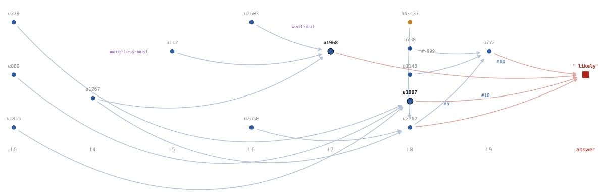  
Figure 97: One prediction’s edges, read one hop. Bold marks the components whose removal changes the prediction; indented rows are what such a component draws on, with the share of its incoming drive they supply and, where writer and reader both rank a token in their first eight, that token. The graph beneath draws the same components, depth running left to right, each joined to the answer with the rank the predicted token holds in what it promotes.

For a signed and locally linear quantity the overlap is in fact benign: contributions along diferent paths add, so a path-sum over the graph is well defined and shared edges need no special handling. What is not linear is the intervention — ablation removes a component and the survivors then compute something else — and the intervention rather than the attribution is what makes flip(k) non-monotone. A ranking by total path-summed influence rather than by direct contribution is the natural next version of this measurement, and choosing a set by cut rather than by prefix is the version after that. The prefix is reported because it is defined without further assumptions and can be checked directly by ablation, and it is stated as a bound rather than as a minimum.

## D.3 A pruned graph is still the reason

Thinning the closure barely weakens it. A tenth of it — 56 components, about one part in a thousand of the model — still changes the prediction 95 percent of the time, and a fifth of it changes every prediction tested (Table 56). Necessity survives pruning that removes most of the graph.

Table 56: Pruning the graph by lowering the per-node threshold θ. “Prediction changes” ablates the pruned graph; “preserved” keeps only it and replaces everything else. The same predictions are used at every θ, so the rows are paired.
<table><tr><td>model</td><td>θ</td><td>components</td><td>% of model</td><td>% of closure</td><td>prediction changes</td></tr><tr><td>baseline (GELU)</td><td>0.1</td><td>56</td><td>0.12%</td><td>8%</td><td>95%</td></tr><tr><td></td><td>0.3</td><td>122</td><td>0.26%</td><td>17%</td><td>100%</td></tr><tr><td></td><td>0.5</td><td>249</td><td>0.54%</td><td>35%</td><td>100%</td></tr><tr><td></td><td>0.7</td><td>434</td><td>0.94%</td><td>60%</td><td>100%</td></tr><tr><td></td><td>0.9</td><td>720</td><td>1.56%</td><td>100%</td><td>100%</td></tr></table>

## D.4 Why suficiency needs a search rather than a closure

The suficiency test keeps a set, replaces every other component in the model, and asks whether the same token still comes out. Put to the closure it is a fair question. Put to the one-hop set it is not, because replacing everything outside that set replaces the very drive that makes its members fire, so the graph is what the test needs.

Two controls decide whether the recursion earns its place. A size-matched random set says whether the closure beats an arbitrary set of the same size, and the top-|C| components by direct contribution say whether it beats simply taking more of the one-hop ranking.

This measurement needs more predictions than it looks like it needs. At 28 of them (Table 57) the closure preserves the prediction on 54 percent against 32 for a size-matched set taken further down the contribution ranking, which reads as twenty-two points in the recursion’s favor. At 150 the sign reverses: 60 percent against 65 on the baseline, 63 against 78 on the sigmoid model, and 65 against 87 on GPT-2. A 95 percent interval on a proportion near a half is $\pm 1 9$ points at $n = 2 8$ and ±8 at $n = 1 5 0$ , so twenty-two points at the smaller sample sits inside its own noise. What it buys on any model depends on that model’s branching factor: where the factor is small the closure is barely larger than the one-hop set and there is little for the recursion to add, which is the case for the constructions of Section 5.

A keep-only number means nothing unless keeping more helps, and that has to be checked rather than assumed. Raising the kept set from nothing to 2,048 components moves preservation by sixty-three points, so the test has room to discriminate and the closure’s advantage over the controls is a real diference rather than noise around a ceiling. Every model measured behaves this way but one (Section 6.5). Tightening the recursion does not repair it. Raising the per-node threshold from 0.9 to 0.99 and on to the point where the cut no longer binds leaves preservation flat or slightly lower on every model tested, while the set grows: 59 to 56 percent on the baseline as the closure goes from 640 to 786 components. Ancestry is the wrong currency for this test: what preserves a prediction is components that write toward it, and the closure spends its budget on ancestry.

Table 57: Suficiency against the one-hop set and against its closure, with both controls at matched size. “Keep-more” is the validity check described below: how much preservation rises as the kept set grows from nothing to 2,048 components. Where that curve is flat the test discriminates nothing and no entry should be read as a measurement; Section 6.5 reports a model where it is flat.
<table><tr><td>baseline (GELU)</td></tr><tr><td>one hop</td></tr><tr><td>set size</td></tr><tr><td>closure 147</td></tr><tr><td>one hop 32%</td></tr><tr><td>prediction preserved keeping only</td></tr><tr><td>closure 54%</td></tr><tr><td>top-|C| 32%</td></tr><tr><td>random 0%</td></tr><tr><td>keep-more +63</td></tr></table>

Keeping only a pruned graph is not even monotone in how much is kept — preservation peaks at $\theta = 0 . 7$ and falls at $\theta = 0 . 9$ , where strictly more of the graph is retained (Table 56) — and Appendix C.6 shows that to be a property of the instrument rather than of this model.

Both numbers in this appendix are necessity statements, and neither shows that the components in it can produce the answer on their own. The search of Section 2.5 reaches eight components, two orders of magnitude below the closure, and a diferent set.

## D.5 What the replacement choice does to a keep-only number

Removing a component is not free of choices. A transformer has no null value for a component’s output, so an ablation must write something in its place, and three are in common use: zero, the component’s mean output sampled over inputs, and a value resampled from a diferent input. Which of these is chosen barely moves the measurement above; the three agree to within seven points. The lens identifies the necessary parts of the transformer for that prediction, and replacing them quickly breaks the prediction.

Run in reverse — keep only the components the lens found and replace everything else — the measurement changes character (Table 58). All three choices drastically impact the correctness: the prediction survives in 33 percent of cases under zero replacement and 3 percent under resampling. The components the lens identifies are thus necessary but are not suficient on their own to make the prediction. Section 2.5 reports what does reproduce a prediction; the question here is the choice of zero against the mean and resample alternatives. Zero replacement, the most flattering of the three, flatters for a reason that has nothing to do with the circuit. Section 2.3 showed that most of what a model writes at a position pushes away from the predicted token. Zeroing every component outside the circuit deletes that opposing mass along with everything else, so the target logit can come out higher than the intact model produces.

Table 58: Suficiency under the three standard replacement baselines: the share of predictions preserved when only the circuit is kept and everything else is replaced. The choice of replacement moves the answer by thirty points on the same circuit. The necessity measurement, on the same components and the same three choices, moves by seven. Zero, the most favorable replacement, is the least informative, for the reason given in the text.
<table><tr><td></td><td colspan="3">necessity: prediction changed</td><td colspan="2">sufficiency: prediction preserved</td></tr><tr><td>model</td><td>zero</td><td>mean</td><td>resample</td><td>zero mean</td><td>resample</td></tr><tr><td>baseline (GELU)</td><td>81%</td><td>74%</td><td>75%</td><td>33% 5%</td><td>3%</td></tr></table>

## References

[1] Samira Abnar and Willem Zuidema. Quantifying attention flow in transformers. In Proceedings of the 58th Annual Meeting of the Association for Computational Linguistics, pages 4190–4197, 2020.

[2] Emmanuel Ameisen, Jack Lindsey, Adam Pearce, Wes Gurnee, Nicholas L. Turner, Brian Chen, Craig Citro, David Abrahams, Shan Carter, Basil Hosmer, Jonathan Marcus, Michael Sklar, Adly Templeton, Trenton Bricken, Callum McDougall, Hoagy Cunningham, Tom Henighan, Adam Jermyn, Andy Jones, Andrew Persic, Zhenyi Qi, T. Ben Thompson, Sam Zimmerman, Kelley Rivoire, Thomas Conerly, Chris Olah, and Joshua Batson. Circuit tracing: Revealing computational graphs in language models. Transformer Circuits Thread, 2025.

[3] Aryaman Arora, Zhengxuan Wu, Jacob Steinhardt, and Sarah Schwettmann. Language model circuits are sparse in the neuron basis. In International Conference on Machine Learning (ICML), 2026. Spotlight. arXiv:2601.22594.

[4] Asaf Avrahamy, Yoav Gur-Arieh, and Mor Geva. Disentangling MLP neuron weights in vocabulary space. In Conference on Language Modeling (COLM), 2026. arXiv:2604.06005.

[5] David Bau, Steven Liu, Tongzhou Wang, Jun-Yan Zhu, and Antonio Torralba. Rewriting a deep generative model. In European Conference on Computer Vision (ECCV), 2020. arXiv:2007.15646.

[6] Nora Belrose, Igor Ostrovsky, Lev McKinney, Zach Furman, Logan Smith, Danny Halawi, Stella Biderman, and Jacob Steinhardt. Eliciting latent predictions from transformers with the tuned lens. arXiv preprint arXiv:2303.08112, 2023.

[7] Steven Bills, Nick Cammarata, Dan Mossing, Henk Tillman, Leo Gao, Gabriel Goh, Ilya Sutskever, Jan Leike, Jef Wu, and William Saunders. Language models can explain neurons in language models, 2023. OpenAI.

[8] Rishi Bommasani, Kelly Davis, and Claire Cardie. Interpreting pretrained contextualized representations via reductions to static embeddings. In Proceedings of the 58th Annual Meeting of the Association for Computational Linguistics (ACL), pages 4758–4781, 2020.

[9] Trenton Bricken, Adly Templeton, Joshua Batson, Brian Chen, Adam Jermyn, et al. Towards monosemanticity: Decomposing language models with dictionary learning. Transformer Circuits Thread, 2023. https://transformer-circuits.pub/2023/monosemantic-features/ index.html.

[10] Po-Kai Chen, Aske Plaat, and Niki van Stein. Every component is a lookup: Token attribution and composition from a single decomposition. arXiv preprint arXiv:2605.23393, 2026.

[11] Arthur Conmy, Augustine N. Mavor-Parker, Aengus Lynch, Stefan Heimersheim, and Adrià Garriga-Alonso. Towards automated circuit discovery for mechanistic interpretability. In Advances in Neural Information Processing Systems (NeurIPS), 2023.

[12] Hoagy Cunningham, Aidan Ewart, Logan Riggs, Robert Huben, and Lee Sharkey. Sparse autoencoders find highly interpretable features in language models. arXiv preprint arXiv:2309.08600, 2023.

[13] Damai Dai, Li Dong, Yaru Hao, Zhifang Sui, Baobao Chang, and Furu Wei. Knowledge neurons in pretrained transformers. In Proceedings of the 60th Annual Meeting of the Association for Computational Linguistics (ACL), 2022.

[14] Guy Dar, Mor Geva, Ankit Gupta, and Jonathan Berant. Analyzing transformers in embedding space. In Proceedings of the 61st Annual Meeting of the Association for Computational Linguistics (ACL), 2023. arXiv:2209.02535.

[15] Yihe Dong, Jean-Baptiste Cordonnier, and Andreas Loukas. Attention is not all you need: pure attention loses rank doubly exponentially with depth. In International Conference on Machine Learning, 2021.

[16] Jacob Dunefsky, Philippe Chlenski, and Neel Nanda. Transcoders find interpretable LLM feature circuits. In Advances in Neural Information Processing Systems (NeurIPS), 2024. arXiv:2406.11944.

[17] Nelson Elhage, Neel Nanda, Catherine Olsson, Tom Henighan, Nicholas Joseph, et al. A mathematical framework for transformer circuits. Transformer Circuits Thread, 2021. https: //transformer-circuits.pub/2021/framework/index.html.

[18] Nelson Elhage, Tristan Hume, Catherine Olsson, Nicholas Schiefer, Tom Henighan, et al. Toy models of superposition. Transformer Circuits Thread, 2022. https:// transformer-circuits.pub/2022/toy\_model/index.html.

[19] Javier Ferrando and Elena Voita. Information flow routes: Automatically interpreting language models at scale. In Proceedings of the 2024 Conference on Empirical Methods in Natural Language Processing, 2024.

[20] Leo Gao, Achyuta Rajaram, Jacob Coxon, Soham V. Govande, Bowen Baker, and Dan Mossing. Weight-sparse transformers have interpretable circuits. arXiv preprint arXiv:2511.13653, 2025.

[21] Mor Geva, Roei Schuster, Jonathan Berant, and Omer Levy. Transformer feed-forward layers are key-value memories. In Proceedings of the 2021 Conference on Empirical Methods in Natural Language Processing (EMNLP), 2021.

[22] Mor Geva, Avi Caciularu, Kevin Ro Wang, and Yoav Goldberg. Transformer feed-forward layers build predictions by promoting concepts in the vocabulary space. In Proceedings of the 2022 Conference on Empirical Methods in Natural Language Processing (EMNLP), 2022.

[23] Ahmad Dawar Hakimi, Kaiwei Lei, Isabelle Augenstein, and Hinrich Schütze. Output vector editing for memorization mitigation in large language models, 2026.

[24] Peter Hase, Mohit Bansal, Been Kim, and Asma Ghandeharioun. Does localization inform editing? surprising diferences in causality-based localization vs. knowledge editing in language models. In Advances in Neural Information Processing Systems 36 (NeurIPS), 2023.

[25] Zeyu Huang, Yikang Shen, Xiaofeng Zhang, Jie Zhou, Wenge Rong, and Zhang Xiong. Transformer-patcher: One mistake worth one neuron. In International Conference on Learning Representations (ICLR), 2023. arXiv:2301.09785.

[26] Jett Janiak, Can Rager, James Dao, and Yeu-Tong Lau. An adversarial example for direct logit attribution: Memory management in GELU-4L. In Proceedings of the 7th BlackboxNLP Workshop, pages 232–237, 2024. arXiv:2310.07325.

[27] János Kramár, Tom Lieberum, Rohin Shah, and Neel Nanda. AtP\*: An eficient and scalable method for localizing LLM behaviour to components. arXiv preprint arXiv:2403.00745, 2024.

[28] Kenneth Li, Oam Patel, Fernanda Viégas, Hanspeter Pfister, and Martin Wattenberg. Inference-time intervention: Eliciting truthful answers from a language model. In Advances in Neural Information Processing Systems (NeurIPS), 2023. arXiv:2306.03341.

[29] Maximilian Li and Lucas Janson. Optimal ablation for interpretability. In Advances in Neural Information Processing Systems (NeurIPS), 2024. arXiv:2409.09951.

[30] David Lindner, János Kramár, Sebastian Farquhar, Matthew Rahtz, Thomas McGrath, and Vladimir Mikulik. Tracr: Compiled transformers as a laboratory for interpretability. In Advances in Neural Information Processing Systems (NeurIPS), 2023. arXiv:2301.05062.

[31] Alisa Liu, Jonathan Hayase, Valentin Hofmann, Sewoong Oh, Noah A. Smith, and Yejin Choi. SuperBPE: Space travel for language models. In Conference on Language Modeling (COLM), 2025.

[32] Jiahao Liu, Zijian Wang, Kuo Zhao, and Dong Hu. Balancing knowledge updates: Toward unified modular editing in LLMs, 2025.

[33] Samuel Marks, Can Rager, Eric J. Michaud, Yonatan Belinkov, David Bau, and Aaron Mueller. Sparse feature circuits: Discovering and editing interpretable causal graphs in language models. In International Conference on Learning Representations (ICLR), 2025. arXiv:2403.19647.

[34] Callum McDougall, Arthur Conmy, Cody Rushing, Thomas McGrath, and Neel Nanda. Copy suppression: Comprehensively understanding an attention head. arXiv preprint arXiv:2310.04625, 2023. verified 2026-09-09.

[35] Thomas McGrath, Matthew Rahtz, Janos Kramar, Vladimir Mikulik, and Shane Legg. The hydra efect: Emergent self-repair in language model computations. arXiv preprint arXiv:2307.15771, 2023.

[36] Kevin Meng, David Bau, Alex Andonian, and Yonatan Belinkov. Locating and editing factual associations in GPT. In Advances in Neural Information Processing Systems (NeurIPS), 2022. arXiv:2202.05262.

[37] Clement Neo, Shay B. Cohen, and Fazl Barez. Interpreting context look-ups in transformers: Investigating attention-mlp interactions. In Conference on Empirical Methods in Natural Language Processing (EMNLP), 2024. arXiv:2402.15055.

[38] nostalgebraist. Interpreting GPT: The logit lens. LessWrong, 2020. https://www.lesswrong. com/posts/AcKRB8wDpdaN6v6ru/interpreting-gpt-the-logit-lens.

[39] Mark Oskin. Training, reading, and editing legible transformers, 2026. arXiv preprint arXiv:2607.08946.

[40] Mark Oskin. Explicit fuzzy logic in the feed-forward layer: Self-forgetting quantifiers discover legible grammatical-licensing detectors. arXiv preprint arXiv:2606.31845, 2026.

[41] Mark Oskin. Of-axis, on purpose: Where a transformer computes concepts and why it does so, 2026. arXiv preprint arXiv:2608.10251.

[42] Mark Oskin. Legible-by-construction: Attention and end-to-end transformers, 2026. arXiv preprint arXiv:2607.04319.

[43] Nina Panickssery, Nick Gabrieli, Julian Schulz, Meg Tong, Evan Hubinger, and Alexander Matt Turner. Steering llama 2 via contrastive activation addition. In Annual Meeting of the Association for Computational Linguistics (ACL), 2024. arXiv:2312.06681.

[44] Denis Paperno, Germán Kruszewski, Angeliki Lazaridou, Quan Ngoc Pham, Rafaella Bernardi, Sandro Pezzelle, Marco Baroni, Gemma Boleda, and Raquel Fernández. The LAM-BADA dataset: Word prediction requiring a broad discourse context. In Proceedings of the 54th Annual Meeting of the Association for Computational Linguistics (ACL), 2016.

[45] Alec Radford, Jefrey Wu, Rewon Child, David Luan, Dario Amodei, and Ilya Sutskever. Language models are unsupervised multitask learners. OpenAI technical report, 2019.

[46] Cody Rushing and Neel Nanda. Explorations of self-repair in language models. In Proceedings of the 41st International Conference on Machine Learning (ICML), 2024. PMLR 235:42836– 42855. arXiv:2402.15390.

[47] Sina Salek and Joseph Enguehard. Using the path of least resistance to explain deep networks. arXiv preprint arXiv:2502.12108, 2025.

[48] Craig W. Schmidt, Varshini Reddy, Chris Tanner, and Yuval Pinter. Boundless byte pair encoding: Breaking the pre-tokenization barrier. In Conference on Language Modeling (COLM), 2025.

[49] Sainbayar Sukhbaatar, Edouard Grave, Guillaume Lample, Hervé Jégou, and Armand Joulin. Augmenting self-attention with persistent memory. arXiv preprint arXiv:1907.01470, 2019.

[50] Mingjie Sun, Xinlei Chen, J. Zico Kolter, and Zhuang Liu. Massive activations in large language models. In First Conference on Language Modeling (COLM), 2024. arXiv:2402.17762.

[51] Mingjie Sun, Xinlei Chen, J. Zico Kolter, and Zhuang Liu. Massive activations in large language models. arXiv preprint arXiv:2402.17762, 2024. verified 2026-09-09.

[52] Aaquib Syed, Can Rager, and Arthur Conmy. Attribution patching outperforms automated circuit discovery. In NeurIPS 2023 Workshop on Attributing Model Behavior at Scale (AT-TRIB), 2023. arXiv:2310.10348.

[53] Alex Tamkin, Mohammad Taufeeque, and Noah D. Goodman. Codebook features: Sparse and discrete interpretability for neural networks. arXiv preprint arXiv:2310.17230, 2023.

[54] William Timkey and Marten van Schijndel. All bark and no bite: Rogue dimensions in transformer language models obscure representational quality. In Conference on Empirical Methods in Natural Language Processing (EMNLP), 2021. arXiv:2109.04404.

[55] Alexander Matt Turner, Lisa Thiergart, Gavin Leech, David Udell, Juan J. Vazquez, Ulisse Mini, and Monte MacDiarmid. Steering language models with activation engineering. arXiv preprint arXiv:2308.10248, 2023.

[56] Tomás Vergara-Browne and Álvaro Soto. Tracr-injection: Distilling algorithms into pre-trained language models. In Findings of the Association for Computational Linguistics: ACL, 2025. arXiv:2505.10719.

[57] Kevin Wang, Alexandre Variengien, Arthur Conmy, Buck Shlegeris, and Jacob Steinhardt. Interpretability in the wild: a circuit for indirect object identification in GPT-2 small. In International Conference on Learning Representations (ICLR), 2023. arXiv:2211.00593.

[58] Yifan Wei, Xiaoyan Yu, Yixuan Weng, Huanhuan Ma, Yuanzhe Zhang, Jun Zhao, and Kang Liu. Does knowledge localization hold true? surprising diferences between entity and relation perspectives in language models. In ACM International Conference on Information and Knowledge Management (CIKM), 2024. arXiv:2409.00617.

[59] Guangxuan Xiao, Yuandong Tian, Beidi Chen, Song Han, and Mike Lewis. Eficient streaming language models with attention sinks. In International Conference on Learning Representations (ICLR), 2024. arXiv:2309.17453; verified 2026-09-09.

[60] Wanli Yang, Fei Sun, Jiajun Tan, Xinyu Ma, Qi Cao, Dawei Yin, Huawei Shen, and Xueqi Cheng. The mirage of model editing: Revisiting evaluation in the wild. In Proceedings of the 63rd Annual Meeting of the Association for Computational Linguistics (ACL), 2025.