# Training Trajectories Determine Circuit Removability in Annealable Soft-Prior Transformers

Zonglin Yang iD 1⋆, Ziming Zhao2, Wei Tang2, Xunyu Jiang2, Yihong Liu2, Tailin Chen2, Zifu Yu3, and Jiayu Liu1

1 Criminal Science and Technology, Guangdong Police College, China 3258244847@qq.com; 3960432092@qq.com

2 Cybersecurity and Law Enforcement, Guangdong Police College, China 765979068@qq.com; 3311739267@qq.com; 1581367121@qq.com zzm1030082097@gmail.com; 3278324576@qq.com

3 Trafic Management Engineering, Guangdong Police College, China yuzifu@yuzifu.top

Abstract. Soft positional priors can help small Transformers learn retrieval circuits, but it is unclear whether the resulting circuits remain functional once the prior is removed. We test this with an annealable soft-prior Transformer whose attention biases can be learned, faded, or zeroed during training and evaluation. On associative recall, unforced models perform well with the prior active (0.772 ± 0.020) but collapse at zero gate (0.095 ± 0.009). Smooth fade-to-zero training preserves high zero-gate accuracy (0.734 ± 0.028), whereas forced-zero training, hard switching, and post hoc continuation fail to recover the same efect. The pattern also appears on Markov induction. Linear regression ICL provides a boundary case because zero-gate training can learn that task directly. Mechanistic traces show that circuit consolidation occurs after the gate reaches zero, even though the responsible heads vary across seeds. These results suggest that circuit removability in small discrete retrieval tasks depends on the training trajectory, not just the final architecture.

Keywords: In-context learning · Induction heads · Positional encoding · Training dynamics · Mechanistic interpretability · Annealing.

## 1 Introduction

In small Transformers trained on synthetic in-context learning (ICL) tasks, a single inductive bias can determine whether a retrieval circuit forms. Relative position biases, local priors, and specialized positional encodings can make recall of values by key and induction much easier [19,21,15,4,7]. Standard evaluation leaves these priors active at inference, so it cannot distinguish a circuit that works without the prior from one that depends on the prior permanently.

We ask whether the prior can be removed after it helps a circuit form. Removability distinguishes two mechanisms under the same architecture: the model either learns an internal attention pattern that implements retrieval or continues to rely on an external bias term. Removing the bias at evaluation tests which mechanism the model uses.

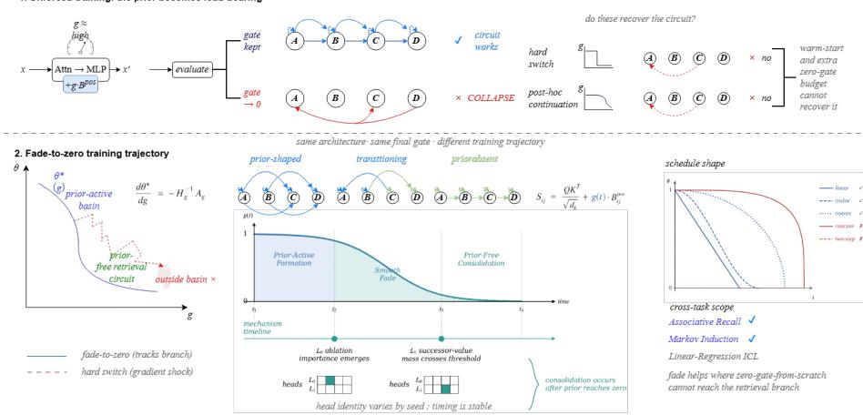  
Fig. 1: Conceptual overview. Under unforced training, the positional prior becomes necessary: the model works with an active gate but collapses when the gate is zeroed. With fade-to-zero training, the model first forms a retrieval circuit shaped by the prior, follows the gate as it decreases, and consolidates a prior-free circuit. Hard switches and post hoc continuation test whether a warm start or extra zero-gate training can recover the same circuit.

We add gated position and content biases to each attention head. The gate value can be learned freely, clamped, or scheduled during training. On associative recall, freely trained models achieve high normal accuracy but fail at zero gates. A fade-to-zero trajectory, which holds the gate at 0.5, smoothly reduces it to 0, and then continues training with the prior absent, preserves high zero-gate accuracy. Neither a warm start nor extra zero-gate training explains the result: abrupt switches and post hoc continuation from an unforced checkpoint both fall far short.

Several smooth training paths work, but abrupt removal does not. Mechanistic traces show that the heads that carry retrieval difer across seeds, while the timing of consolidation is stable and occurs after the gate is already zero. The same pattern holds on Markov induction, whereas linear regression ICL behaves diferently: forced-zero training solves the task, so it can form a circuit without the prior, unlike the discrete retrieval tasks.

## Contributions.

– We introduce an annealable soft-prior Transformer and evaluation protocol that distinguishes prior-active performance from prior-free circuit removability.

We show that fade-to-zero training preserves zero-gate retrieval on associative recall and Markov induction, while unforced training, forced-zero training, hard switching, post hoc continuation, prior dropout, and a dual condition loss do not reproduce the same efect. Schedule sweeps and three-seed mechanism traces further show that smooth removal produces stable consolidation timing despite variation in head identity.

– We identify a boundary case in linear regression ICL, where removability failure exists for unforced training but a zero-gate model can learn the task directly.

## 2 Related Work

Position and attention priors. Transformers depend strongly on how position is represented inside attention [23,21,19,22,14]. Recent methods such as Kerple, FIRE, CoPE, and DAPE design position functions that improve length extrapolation or adapt position signals to the data [4,15,11,26]. GPSA/ConViT adds a soft convolutional locality prior to vision Transformers [7]. These methods usually treat the prior as part of the final architecture. We instead ask whether a prior that helps during training remains necessary after the circuit forms.

In-context learning and circuits. Linear regression ICL shows that Transformers can implement simple learning algorithms in context [10,1]. Discrete retrieval tasks expose induction heads and successor circuits that can be measured directly [18,17]. Work on circuit interpretability and automated circuit discovery studies how trained attention heads implement specific computations [24,5]. These tasks expose the relevant circuit clearly enough to test whether the prior remains causally necessary.

Continuation paths and soft targets. The fade-to-zero schedule follows the logic of homotopy and continuation methods, which solve a hard problem by tracking solutions from an easier nearby problem as a control parameter changes [2,16]. Curriculum learning also changes the optimization path by presenting easier training conditions first [3]. Knowledge distillation uses soft targets to shape gradients before the final hard prediction objective is reached [12]. Our schedule difers in where the auxiliary signal enters: it is an prior added to the attention logits, not an output target or data curriculum, and we test whether the induced circuit survives after the signal is removed.

Removable and reparameterized structure. Stochastic depth, LayerDrop, movement pruning, and lottery ticket methods study networks that remain useful after removing layers, weights, or other components $[ 1 3 , 8 , 2 0 , 9 ]$ . Structural reparameterization methods such as RepVGG train with richer branches and convert them into a simpler inference graph [6]. Early convolutional stems in vision Transformers also show that an inductive bias can afect optimization even when later representations become less explicitly convolutional [25]. We hold the final architecture fixed, change only the gate trajectory of an attention prior, and test whether the learned retrieval circuit remains functional at zero gate.

## 3 Method

## 3.1 Annealable Soft-Prior Attention

For each attention head, let $Q , K , V \in \mathbb { R } ^ { T \times d }$ be the query, key, and value matrices. We add two gated bias terms before the softmax:

$$
S _ { i j } = \frac { Q _ { i } K _ { j } ^ { \top } } { \sqrt { d } } + g _ { \mathrm { p o s } } ( t ) B _ { i j } ^ { \mathrm { p o s } } + g _ { \mathrm { c o n t e n t } } ( t ) B _ { i j } ^ { \mathrm { c o n t e n t } } .\tag{1}
$$

The positional prior $B ^ { \mathrm { p o s } }$ is a learnable table indexed by clipped relative position. The content prior is the embedding inner product $B _ { i j } ^ { \mathrm { c o n t e n t } } = E _ { i } ^ { \top } E _ { j } / \sqrt { d _ { e } }$ computed from learned input token embeddings rather than contextual states. Each gate is scalar per head and lies in [0, 1].

Gate modes. Each head owns a gate logit ℓ with raw value $\sigma ( \ell )$ . Training uses one of three modes:

Free.

$g ( t ) = \sigma ( \ell )$ and the logit receives gradients.

Forced.

$g ( t ) = c$ for a fixed value. The bias table is still learned, but ℓ is masked. Scheduled.

g(t) follows a manually specified schedule and ℓ is masked as in Forced.

When ℓ is masked it remains near its initialization, so normal evaluation may reactivate a prior that was not used at the end of training. For this reason, Scheduled evaluation uses the final scheduled gate value and is the appropriate evaluation for scheduled runs. For fade-to-zero, Scheduled and Zero are identical. Normal evaluation is kept only as a diagnostic of what happens if the untrained gate logit is used.

## 3.2 Training Paths

The main paths share optimizer, model size, data, and total step budget. unforced learns both gates freely. forced\_zero trains with g=0 throughout. forced\_ const0.5 trains with $g { = } 0 . 5$ throughout. linear0.5→0 decays linearly from 0.5 at step 0 to 0 at the end of training. The main fade path, fade600→0, holds $g { = } 0 . 5$ until step 600, linearly fades to 0 over 450 steps, and then trains with $g { = } 0$ until step 3,600.

Training begins with the prior active, fades it, and then consolidates with the prior absent. Controls with a hard switch use the same start and end values but replace the fade with an abrupt jump. Post hoc continuation takes a final unforced checkpoint and trains it for 2,550 additional steps at $g { = } 0$ , matching the zero-gate budget of the fade path.

## 3.3 A Continuation View of Removability

We model the schedule as a local continuation path rather than a new model class [2,16]. Let $\mathcal { L } ( \boldsymbol { \theta } , \boldsymbol { g } )$ be the training loss of the Transformer parameters θ when the prior gate is fixed to $g . \ \mathrm { I f } ,$ , in a local neighborhood, a stable minimizer branch $\theta ^ { \star } ( g )$ satisfies $\nabla _ { \theta } \mathcal { L } ( \theta ^ { \star } ( g ) , g ) = 0$ and has Hessian $H _ { g } = \nabla _ { \theta \theta } ^ { 2 } \mathcal { L } ( \theta ^ { \star } ( g ) , g )$ with smallest eigenvalue $\mu _ { g } > 0$ , then the implicit function theorem gives

$$
\frac { d \theta ^ { \star } } { d g } = - H _ { g } ^ { - 1 } A _ { g } , \qquad A _ { g } = \nabla _ { \theta g } ^ { 2 } \mathcal { L } ( \theta ^ { \star } ( g ) , g ) .\tag{2}
$$

Thus the quantity that determines whether a schedule is “smooth enough” is not whether it is linear, but the branch displacement at each step

$$
\begin{array} { r } { \varDelta _ { t } \approx | g _ { t + 1 } - g _ { t } | \| H _ { g _ { t } } ^ { - 1 } A _ { g _ { t } } \| . } \end{array}\tag{3}
$$

Tracking is plausible when $\varDelta _ { t }$ stays below the basin radius allowed by the optimizer. A hard switch replaces many small displacements with one large perturbation. Since

$$
\nabla _ { \boldsymbol { \theta } } \mathcal { L } ( \boldsymbol { \theta } ^ { \star } ( g _ { 0 } ) , g _ { 1 } ) = A _ { g _ { 0 } } ( g _ { 1 } - g _ { 0 } ) + O ( ( g _ { 1 } - g _ { 0 } ) ^ { 2 } ) ,\tag{4}
$$

an abrupt change creates a gradient shock whose direction need not point toward the prior-free retrieval circuit. The outcome therefore depends on when the gate changes: a path with two steps or a hard switch can leave the tracked basin even though it has the same endpoints. Nonlinear schedules can work when they keep $\varDelta _ { t }$ small in regions of high curvature, but can fail when too much gate change occurs where the branch is ill-conditioned.

Post hoc continuation fails for a diferent reason. Free training with a large gate can converge to a basin $\theta _ { \mathrm { p r i o r } }$ that depends on the prior and routes the output through the bias term. After setting $g = 0$ , the recovery rate of a prior-free circuit depends on the projection of the zero-gate gradient onto the subspace C in which the circuit forms:

$$
\mathrm { \ u s e f u l ~ r e c o v e r y ~ s i g n a l ~ \propto ~ \lVert P \boldsymbol { \mathcal { C } } \boldsymbol { \nabla } _ { \boldsymbol { \theta } } \boldsymbol { \mathcal { L } } ( \theta _ { \mathrm { p r i o r } } , 0 ) \rVert . }\tag{5}
$$

If the prior has already carried the retrieval computation, this projection can be small or poorly conditioned even when the zero-gate loss is high. The optimizer then spends its budget moving within the basin formed while the prior was active instead of entering the prior-free branch. The hard switch and post hoc experiments test these two failure modes separately.

Linear regression ICL exposes the boundary of this argument. In linear ICL, forced\_zero training already finds a good zero-gate solution, so the prior-free branch is reachable from random initialization. In discrete retrieval, by contrast, early zero-gate gradients are sparse and symmetric until some heads learn where to route value from; the prior supplies a dense shaping signal that makes the useful branch reachable. The prediction is therefore conditional, not universal: fade-to-zero should help most when zero-gate training from scratch cannot enter the retrieval branch, but a prior-active trajectory can track into it.

## 3.4 Models and Tasks

The default Transformer has two layers, four heads, $d _ { \mathrm { m o d e l } } { = } 6 4$ , sequence length 32, vocabulary size 32, and about 35K parameters. A larger model $\scriptstyle ( L = 4 , d = 1 2 8$ about 265K parameters) checks that the main efect is not a capacity artifact.

We evaluate associative recall, Markov induction, and linear regression ICL. Associative recall presents pairs of keys and values and asks for the value associated with a query key. Markov induction asks for the successor of a repeated context token under repeat probability $p \in \{ 0 . 2 , 0 . 5 , 0 . 8 \}$ . Linear regression ICL samples a random linear function and predicts the query output from in-context examples. The trajectory claim focuses on the two discrete retrieval tasks; linear ICL is used as a boundary case.

## 4 Experimental Setup

Baselines and metrics. Static comparisons use vanilla, NoPE, RoPE [22], ALiBi [19], learned RPE [21], DAPE [26], CoPE [11], FIRE [15], Kerple [4], GPSA [7], and three soft-prior variants: soft\_bias, soft\_pos\_only, and soft\_content\_only. All methods use matched backbone dimensions, optimizer, and training budget. We report accuracy for associative recall and Markov induction, and mean squared error for linear regression ICL.

Training details. Unless otherwise stated, runs use AdamW with learning rate $1 0 ^ { - 3 }$ , weight decay 0.01, gradient clipping at 1.0, batch size 64, and 512 validation examples per evaluation. We average the main trajectory results over five seeds for the fade window and causal controls, and over three seeds for the capacity, shape, task boundary, and mechanism experiments.

Run inventory. The experiment archive contains the original trained runs plus 15 runs over schedule shapes, 12 linear trajectory runs, and two mechanism traces in addition to the original trace for seed 1.

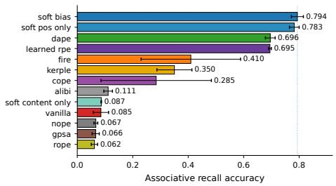  
(a) Associative recall accuracy.

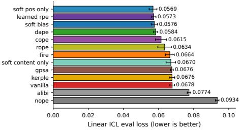  
(b) Linear ICL eval loss.

Fig. 2: Static baselines across position and attention variants. The soft prior performs competitively before any removability test.  
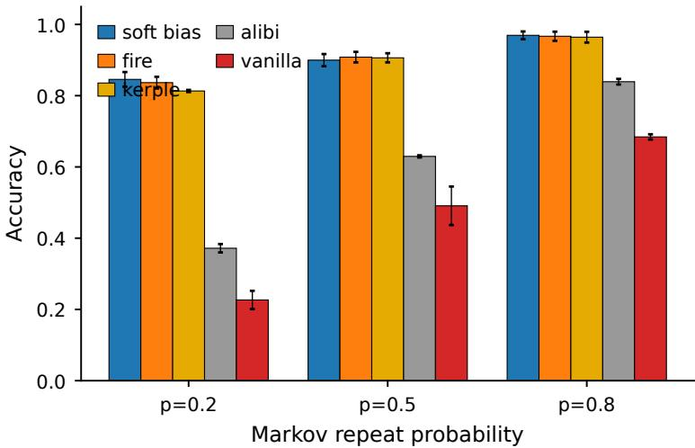  
Fig. 3: Markov induction accuracy across repeat probabilities. Top methods are close at high repeat probability; the hardest setting separates them.

## 5 Static Baselines

Before the removability tests, the backbone with a soft prior performs well on all three tasks. On associative recall, soft\_bias reaches $0 . 7 9 4 \pm 0 . 0 2 2$ , the highest mean among thirteen baselines; soft\_pos\_only is close at 0.783, while soft\_ content\_only is near chance (0.067). The useful bias therefore comes from position rather than content. On linear regression ICL, soft\_pos\_only, learned RPE, soft\_bias, and DAPE all lie within about 1.5% eval loss.

On Markov induction, soft\_bias is also among the strongest methods, especially at the hardest repeat probability p=0.2. These baselines confirm that the soft prior is accurate enough for a meaningful test of whether the trained model still needs it.

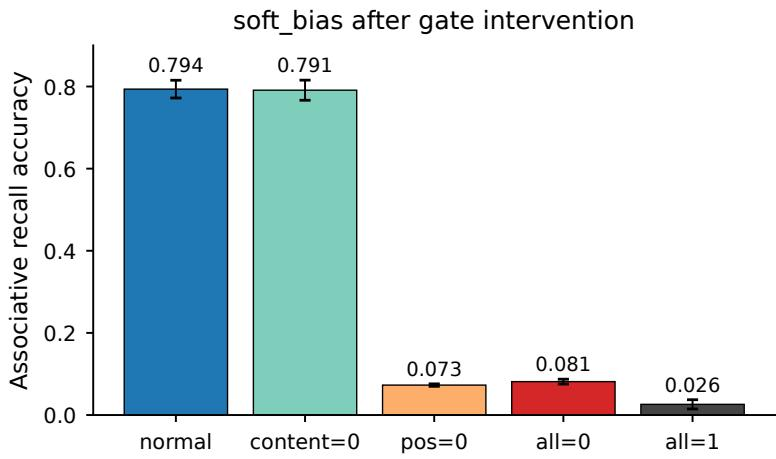  
Fig. 4: Causal gate intervention on associative recall. The unforced model depends on the positional gate at inference; the content gate is inert on this task.

## 6 Gate Interventions

We first test whether the soft prior is causally used by a normally trained soft bias model. At evaluation only, we zero the content gate, the position gate, or both gates. Figure 4 shows that content removal is nearly neutral (0.791 versus 0.794 normal accuracy), whereas position removal collapses accuracy to 0.073 and removing both gates gives 0.081. We retain the content gate only as an architectural control.

Normal accuracy alone therefore does not establish removability. Under unforced training, the position prior becomes part of the computation.

## 7 Training Path Determines Removability

## 7.1 Path Comparison

Figure 5 and Table 1 compare five training paths on associative recall. The unforced model is strong in normal evaluation but fails when the gate is zeroed. The fade600→0 path preserves high zero-gate accuracy in both the base and larger backbones. forced\_zero fails on this discrete retrieval task despite spending the entire run at the final gate value.

## 7.2 Fade Window and Schedule Shape

The efect is stable over a broad range of fade start times. Across five seeds, zero-gate accuracy is 0.748, 0.745, 0.734, 0.751, and 0.754 for fade starts 400, 500, 600, 700, and 800, respectively (Fig. 6). In contrast, the unforced and forced-zero baselines remain near 0.09.

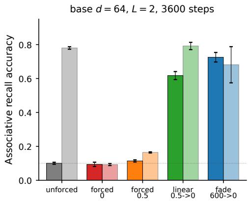

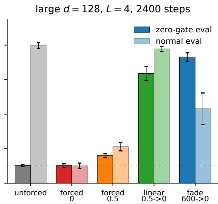  
Fig. 5: Associative recall under matched training paths. For scheduled runs, zerogate evaluation uses the gate value reached at the end of training.

Table 1: Comparison of training paths on associative recall. The base fade600 →0 row reports the estimate over five seeds used throughout the paper; other rows are matched runs over three seeds.
<table><tr><td rowspan="2">Path</td><td>Base  $( L { = } 2 , d { = } 6 4 )$ </td><td></td><td rowspan="2"> $\mathrm { L a r g e } \ ( L { = } 4 , d { = } 1 2 8 )$ </td></tr><tr><td>Zero Normal</td><td>Zero</td></tr><tr><td>fade600→0</td><td></td><td> $. 7 3 4 \pm . 0 2 8 . 6 9 4 \pm . 0 7 8 . 7 3 1 \pm . 0 2 4 . 4 3 2 \pm . 0 9 1$ </td><td></td></tr><tr><td>linear0.5→0</td><td></td><td> $. 6 1 7 \pm . 0 2 4 . 7 9 2 \pm . 0 2 2 . 6 3 5 \pm . 0 4 0 . 7 7 8 \pm . 0 1 5$ </td><td></td></tr><tr><td>forced_const0.</td><td></td><td> $^ { 5 } \cdot 1 1 4 \pm . 0 0 6 \cdot 1 6 4 \pm . 0 0 3 \cdot 1 6 0 \pm . 0 1 1 \cdot 2 1 2 \pm . 0 2 4$ </td><td></td></tr><tr><td>unforced</td><td></td><td> $. 1 0 0 \pm . 0 0 6 . 7 8 0 \pm . 0 0 7 . 1 0 2 \pm . 0 0 5 . 7 9 7 \pm . 0 1 7$ </td><td></td></tr><tr><td>forced_zero</td><td></td><td> $. 0 9 4 \pm . 0 1 3 . 0 9 2 \pm . 0 0 6 . 1 0 2 \pm . 0 1 0 . 1 0 0 \pm . 0 1 6$ </td><td></td></tr></table>

Smoothness also matters. Holding the same start value, end value, fade start, and fade width, linear, cosine, and convex schedules all work (0.749–0.764 zerogate accuracy), while a schedule with two steps reaches only 0.212. A concave schedule is unstable across seeds. Thus the result is not specific to a linear formula, but it does require a gradual path rather than an abrupt deletion.

## 7.3 Causal Controls

Two controls rule out simpler explanations. A hard switch asks whether the model only needs a warm start with an active prior followed by zero-gate training. Post hoc continuation asks whether the fade result comes merely from extra zero-gate training. Table 2 shows that neither is suficient. Switching abruptly at the fade endpoint reaches only $0 . 2 9 3 \pm 0 . 1 2 8$ , and continuation from an unforced checkpoint reaches $0 . 1 7 8 \pm 0 . 0 3 5$

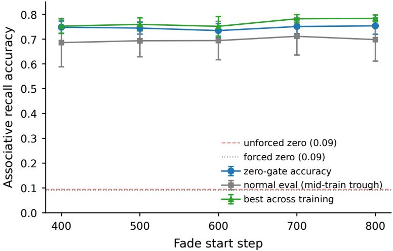  
Fig. 6: Sweep over fade start times with five seeds. Zero-gate accuracy is stable across steps 400–800.

Table 2: Causal controls on associative recall (5 seeds).
<table><tr><td>Condition</td><td>Zero-gate acc Normal acc</td></tr><tr><td>fade600→0</td><td> $. 7 3 4 \pm . 0 2 8$   $. 6 9 4 \pm . 0 7 8$ </td></tr><tr><td>Hard switch at step 1050</td><td> $. 2 9 3 \pm . 1 2 8$   $. 3 6 7 \pm . 1 3 9$ </td></tr><tr><td>Hard switch at step 600</td><td> $. 0 9 7 \pm . 0 2 0$   $. 1 0 2 \pm . 0 2 4$ </td></tr><tr><td>Post hoc zero continuation</td><td> $. 1 7 8 \pm . 0 3 5$   $. 6 1 9 \pm . 0 2 6$ </td></tr><tr><td>unforced</td><td> $. 0 9 5 \pm . 0 0 9$   $. 7 7 2 \pm . 0 2 0$ </td></tr><tr><td>forced_zero</td><td> $. 0 9 1 \pm . 0 1 2$   $. 0 8 8 \pm . 0 1 0$ </td></tr></table>

These failures locate the efect in the training path: the prior must shape the circuit while it forms, and the gate must decrease gradually enough for the internal attention pattern to take over.

## 8 Boundary Across Tasks

Markov induction replicates the pattern from discrete retrieval. At repeat probabilities $p { = } 0 . 2 , 0 . 5$ , and 0.8, fade600→0 retains 0.830, 0.920, and 0.969 zero-gate accuracy, respectively. Unforced training collapses much more strongly, especially at the hard $p { = } 0 . 2$ setting.

Linear regression ICL behaves diferently. It still shows a removability problem for unforced training: normal loss is 0.0656, while zero-gate loss degrades to 0.1296. However, unlike associative recall, forced\_zero learns a reasonable solution directly (0.0722 loss), and fade600→0 is only slightly better (0.0646). This result bounds the claim: gradual fading helps most on discrete retrieval circuits for which zero-gate training from scratch fails. The fade advantage does not hold for every ICL task.

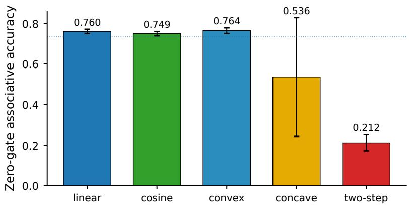  
Fig. 7: Scan over schedule shapes on associative recall (3 seeds). Smooth fades work; a deletion in two steps does not.

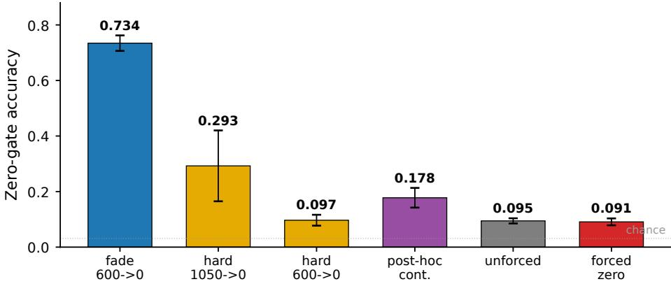  
Fig. 8: Hard switches and post hoc continuation fall far below smooth fade-to-zero training.

Length generalisation. Associative recall accuracy degrades when evaluated far beyond the training length. At T=120, soft\_bias reaches only 0.263. We therefore do not claim that removability improves length extrapolation; the length result is a limitation of the recovered prior-free circuit.

## 9 Mechanistic Diagnostics

We trace three fade600→0 seeds every 300 steps. At each snapshot we measure (i) successor-value mass, the attention-value mass a head places on the correct successor token, and (ii) zero-gate ablation importance, the accuracy drop when that head is replaced by its batch mean.

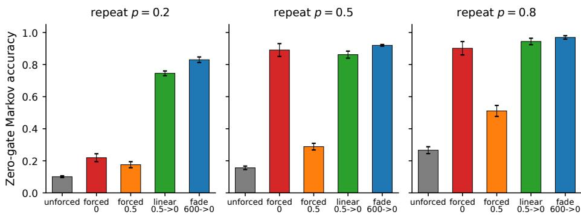  
Fig. 9: Markov induction zero-gate accuracy across training paths and repeat probabilities. Fade-to-zero remains strong; unforced training is not removable.

Table 3: Mechanism trace summary across seeds. Head identity varies, but the timing of consolidation is stable.
<table><tr><td colspan="4">Seed Top successor head First successor ≥ .25 Top ablation head First ablation ≥ .03</td></tr><tr><td>0</td><td>L1H0</td><td>1500</td><td>L0H2 1200</td></tr><tr><td>1</td><td>L1H3</td><td>1500</td><td>L0H0 1200</td></tr><tr><td>2</td><td>L1H1</td><td>1500</td><td>L0H3 1200</td></tr></table>

The head carrying successor mass changes by seed, as expected under head permutation symmetry (Table 3). The timing does not: ablation importance first crosses the threshold at step 1,200, and successor-value mass first crosses the threshold at step 1,500 in all three seeds. Both occur after the fade ends around step 1,050.

Figure 11 identifies the timing, not a universal head identity. For this representative seed, L0H0 becomes critical at zero gate after step 1,200, while L1H3 carries the largest successor-value mass after step 1,500. This delayed consolidation matches the hard switch and post hoc controls in Section 7.3.

## 10 Limitations and Conclusion

All positive trajectory results come from synthetic discrete retrieval tasks with Transformers no larger than L=4 and d=128. Linear regression ICL does not require the same formation path aided by the prior, and length extrapolation remains weak. The content gate is mostly inert in the tested tasks, so the current evidence concerns positional priors rather than content priors. The scan over schedule shapes is also limited to a few simple curves; it supports smoothness over abrupt deletion, not an exhaustive theory of all possible annealing paths.

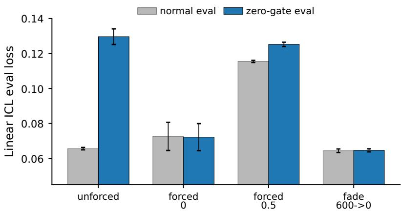  
Fig. 10: Linear regression ICL trajectory test (3 seeds). Unforced training is not removable, but forced-zero training can solve the task, making this a boundary case rather than a positive replication of the discrete retrieval efect.

Under unforced training, a soft positional prior can become a permanent dependency. Under a fade-to-zero path, the same prior can guide training and then be removed. Hard switching and post hoc continuation show that neither a warm start nor extra zero-gate training explains the diference. The mechanism traces place consolidation after the prior is removed even though head identities vary by seed. For small discrete retrieval circuits, removability therefore depends on the training trajectory.

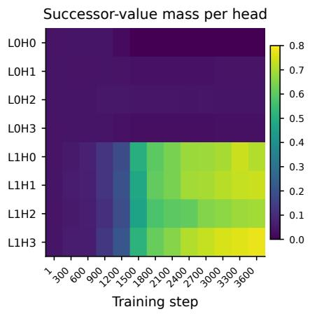

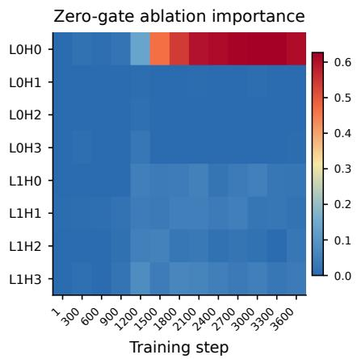  
Fig. 11: Head evolution for representative seed 1. Successor-value mass (left) separates functional routing from zero-gate ablation importance (right). The strongest successor and ablation signals appear after the gate has reached zero, supporting delayed consolidation rather than a universal head identity.

## Funding

This work was supported by the Guangdong S&T Programme through the project “Key Technologies and Applications for Proactive Monitoring and Early Warning of Public Security Risks Based on Multimodal Large Models” (Project No. 2026B0101100001).

## Conflict of Interest

The authors declare that they have no conflicts of interest.

## References

1. Akyürek, E., Schuurmans, D., Andreas, J., Ma, T., Zhou, D.: What learning algorithm is in-context learning? investigations with linear models. arXiv preprint arXiv:2211.15661 (2022)

2. Allgower, E.L., Georg, K.: Numerical continuation methods: an introduction. Springer Science & Business Media (2012)

3. Bengio, Y., Louradour, J., Collobert, R., Weston, J.: Curriculum learning. In: Proceedings of the 26th annual international conference on machine learning. pp. 41–48 (2009)

4. Chi, T.C., Fan, T.H., Ramadge, P.J., Rudnicky, A.: Kerple: Kernelized relative positional embedding for length extrapolation. Advances in Neural Information Processing Systems 35, 8386–8399 (2022)

5. Conmy, A., Mavor-Parker, A., Lynch, A., Heimersheim, S., Garriga-Alonso, A.: Towards automated circuit discovery for mechanistic interpretability. Advances in Neural Information Processing Systems 36, 16318–16352 (2023)

6. Ding, X., Zhang, X., Ma, N., Han, J., Ding, G., Sun, J.: Repvgg: Making vgg-style convnets great again. In: Proceedings of the IEEE/CVF conference on computer vision and pattern recognition. pp. 13733–13742 (2021)

7. d’Ascoli, S., Touvron, H., Leavitt, M.L., Morcos, A.S., Biroli, G., Sagun, L.: Convit: Improving vision transformers with soft convolutional inductive biases. In: International conference on machine learning. pp. 2286–2296. PMLR (2021)

8. Fan, A., Grave, E., Joulin, A.: Reducing transformer depth on demand with structured dropout. arXiv preprint arXiv:1909.11556 (2019)

9. Frankle, J., Carbin, M.: The lottery ticket hypothesis: Finding sparse, trainable neural networks. arXiv preprint arXiv:1803.03635 (2018)

10. Garg, S., Tsipras, D., Liang, P.S., Valiant, G.: What can transformers learn incontext? a case study of simple function classes. Advances in neural information processing systems 35, 30583–30598 (2022)

11. Golovneva, O., Wang, T., Weston, J., Sukhbaatar, S.: Contextual position encoding: Learning to count what’s important. arXiv preprint arXiv:2405.18719 (2024)

12. Hinton, G., Vinyals, O., Dean, J.: Distilling the knowledge in a neural network. arXiv preprint arXiv:1503.02531 (2015)

13. Huang, G., Sun, Y., Liu, Z., Sedra, D., Weinberger, K.Q.: Deep networks with stochastic depth. In: European conference on computer vision. pp. 646–661. Springer (2016)

14. Kazemnejad, A., Padhi, I., Natesan Ramamurthy, K., Das, P., Reddy, S.: The impact of positional encoding on length generalization in transformers. Advances in Neural Information Processing Systems 36, 24892–24928 (2023)

15. Li, S., You, C., Guruganesh, G., Ainslie, J., Ontanon, S., Zaheer, M., Sanghai, S., Yang, Y., Kumar, S., Bhojanapalli, S.: Functional interpolation for relative positions improves long context transformers. In: International Conference on Learning Representations. vol. 2024, pp. 11303–11328 (2024)

16. Mobahi, H., Fisher III, J.W.: On the link between gaussian homotopy continuation and convex envelopes. In: International Workshop on Energy Minimization Methods in Computer Vision and Pattern Recognition. pp. 43–56. Springer (2015)

17. Nanda, N., Chan, L., Lieberum, T., Smith, J., Steinhardt, J.: Progress measures for grokking via mechanistic interpretability. arXiv preprint arXiv:2301.05217 (2023)

18. Olsson, C., Elhage, N., Nanda, N., Joseph, N., DasSarma, N., Henighan, T., Mann, B., Askell, A., Bai, Y., Chen, A., et al.: In-context learning and induction heads. arXiv preprint arXiv:2209.11895 (2022)

19. Press, O., Smith, N.A., Lewis, M.: Train short, test long: Attention with linear biases enables input length extrapolation. In: International Conference on Learning Representations (2022), https://openreview.net/forum?id=R8sQPpGCv0

20. Sanh, V., Wolf, T., Rush, A.: Movement pruning: Adaptive sparsity by fine-tuning. Advances in neural information processing systems 33, 20378–20389 (2020)

21. Shaw, P., Uszkoreit, J., Vaswani, A.: Self-attention with relative position representations. In: Proceedings of the 2018 Conference of the North American Chapter of the Association for Computational Linguistics: Human Language Technologies, Volume 2 (Short Papers). pp. 464–468 (2018)

22. Su, J., Ahmed, M., Lu, Y., Pan, S., Bo, W., Liu, Y.: Roformer: Enhanced transformer with rotary position embedding. Neurocomputing 568, 127063 (2024)

23. Vaswani, A., Shazeer, N., Parmar, N., Uszkoreit, J., Jones, L., Gomez, A.N., Kaiser, Ł., Polosukhin, I.: Attention is all you need. Advances in neural information processing systems 30 (2017)

24. Wang, K., Variengien, A., Conmy, A., Shlegeris, B., Steinhardt, J.: Interpretability in the wild: a circuit for indirect object identification in gpt-2 small. arXiv preprint arXiv:2211.00593 (2022)

25. Xiao, T., Singh, M., Mintun, E., Darrell, T., Dollár, P., Girshick, R.: Early convolutions help transformers see better. Advances in neural information processing systems 34, 30392–30400 (2021)

26. Zheng, C., Gao, Y., Shi, H., Huang, M., Li, J., Xiong, J., Ren, X., Ng, M., Jiang, X., Li, Z., et al.: Dape: Data-adaptive positional encoding for length extrapolation. Advances in Neural Information Processing Systems 37, 26659–26700 (2024)