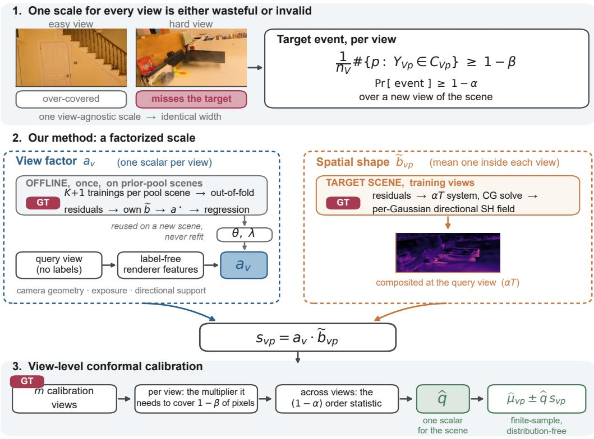
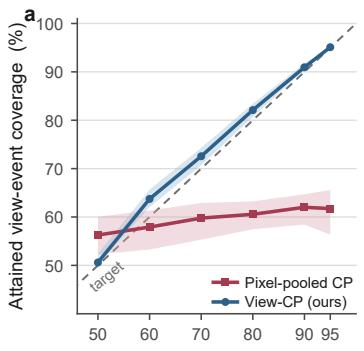
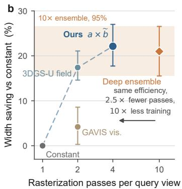
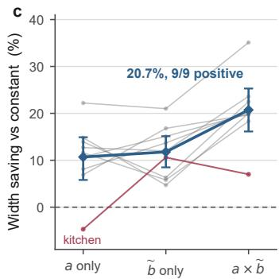
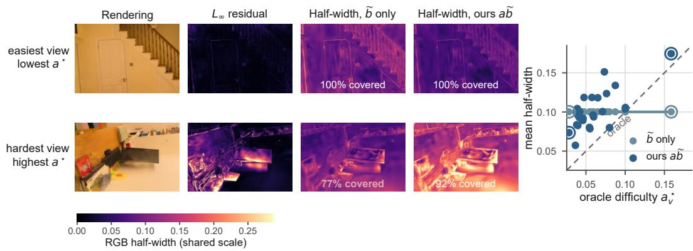
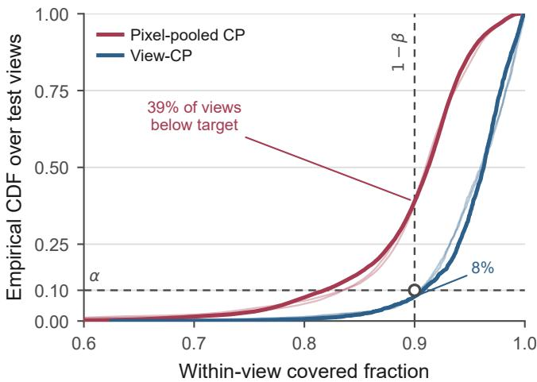
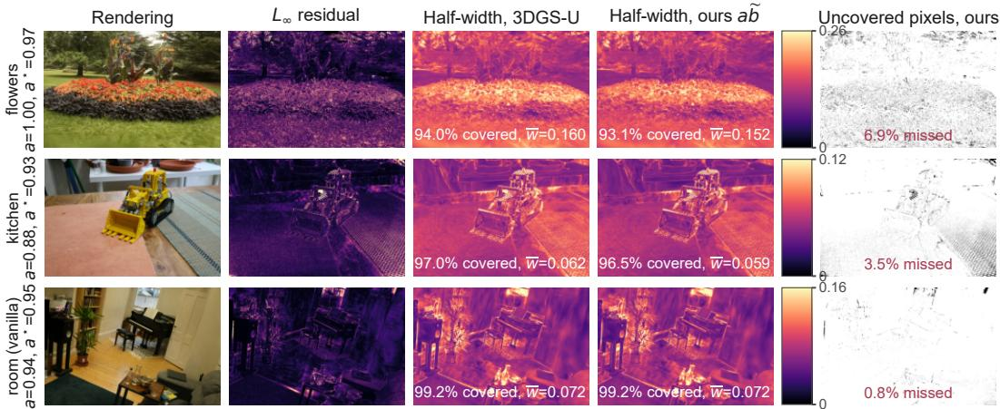

# VIEW-STRUCTURED CONFORMAL PREDICTION FOR 3D GAUSSIAN SPLATTING

Junzheng Chu<sup>1</sup>, Bin Pan<sup>1,∗</sup>, Zhenwei Shi<sup>2</sup>

<sup>1</sup>School of Statistics and Data Science, LEBPS, KLMDASR, LPMC, AAIS, NITFID, Nankai University

<sup>2</sup>Department of Aerospace Intelligent Science and Technology, School of Astronautics, Beihang University

Corresponding author: panbin@nankai.edu.cn

## ABSTRACT

3D Gaussian Splatting (3DGS) renders novel views in real time, but an uncertainty heatmap does not certify that a rendered view meets a certain prediction coverage. We treat novel-view synthesis as structured regression and ask that, with probability at least 1 − α, RGB prediction boxes cover at least a 1 − β fraction of pixels in a new view. We propose View-Structured Conformal Prediction (VSCP). It splits the pre-calibration scale into a spatial shape from the renderer and a transferable view-difficulty factor, which predicts the smallest view-wise multiplier that shape needs. A held-out quantile over views (View-CP) then gives finite-sample validity even when transferring to new scenes. The same factorization makes the analysis exact: a conformity score is the ratio of oracle to predicted view difficulty, and excess width separates into a test-side and a calibration-side term. Across 13 real scenes, pixel-pooled calibration reaches 89.9% marginal pixel coverage but only 61.4% view-event coverage at a 90% target, while View-CP reaches 91.7–92.0%. At matched coverage VSCP cuts width by 22.1% against a constant scale, and matches a ten-model ensemble’s 21.0% reduction using only one model per scene and four rather than ten rasterization passes per query. VSCP also improves on the closest single-model baseline, the 3DGS-U field, by 4.7 points $( p = 0 . 0 2 2 5 )$ The view predictor transfers from bounded source families to all nine unbounded Mip-NeRF 360 scenes. There the full scale beats the constant scale with 20.7% width saving on all nine scenes. It also keeps an 18.3% saving under a different densification backbone and runs at 216–280 FPS on an RTX 4090.

## 1 INTRODUCTION

3D Gaussian Splatting (3DGS) makes high-resolution novel-view synthesis practical in real time (Kerbl et al., 2023; Ren et al., 2026). Yet a rendering can look plausible exactly where it is wrong, and recent methods therefore render posterior variance, visibility, information, or residualderived uncertainty (Goli et al., 2024; Wu et al., 2026; Galappaththige et al., 2026; Xue et al., 2026). Such fields are evaluated mainly by AUSE and rank correlation, which read only the ordering of pixels. An ordering has no units: it never says how wide an interval must be, or how often it contains the unknown image. We find two scales with identical per-view AUSE and Spearman whose conformal width savings differ by 12.2 points: our full scale and its own spatial factor.

The statistical unit matters just as much. A rendered image holds millions of dependent pixels, but a user looks at one view. Two methods can both miss 10% of all pixels: one misses 10% in every view, the other misses 20% in half the views and none in the rest. Pooled coverage is the same, yet only the first gives every view 90% within-view coverage. We therefore ask a view-level question: with probability at least $1 - \alpha ,$ does a new rendering cover at least a 1 − β fraction of its pixels?

Conformal prediction can certify this event once each held-out view has a score. Validity alone does not make the boxes useful: a constant scale is valid but far too wide in easy views and in wellobserved regions. The real problem is efficiency under the spatial and angular structure of rendering. We address it with the scale

$$
s _ { v p } = a ( z _ { v } ) \widetilde { b } _ { v p } ,\tag{1}
$$

  
Figure 1: Overview of VSCP. A single scale can waste width on an easy view and miss the withinview target on a hard view. We factor the scale into a transferable view factor $a _ { v }$ and a target-scene spatial shape $\widetilde { b } _ { v p }$ . Only the held-out calibration views enter the nested order statistics. They produce one multiplier qb and finite-sample valid RGB boxes for a new view.

where $z _ { v }$ is a label-free descriptor of view $v , \widetilde { b }$ is the relative spatial variation inside that view, and a is its overall difficulty. We fit $\widetilde { b }$ from training residuals on view-dependent Gaussian primitives. We learn a on source scenes from label-free camera, rendering, exposure, and directional-support features.

The regression target for a is not an arbitrary error summary. For a fixed spatial shape ${ \widetilde { b } } ,$ we derive the smallest multiplier

$$
a _ { v } ^ { \star } ( \widetilde { b } ) = Q _ { 1 - \beta , p } \Big ( r _ { v p } / \widetilde { b } _ { v p } \Big )\tag{2}
$$

that lets the view reach its required within-view coverage. This turns view-difficulty prediction into a direct efficiency problem. Since a enters only the width, it transfers to a new scene, or a new dataset family, without refitting. Figure 1 summarizes our method.

This form also makes the analysis exact. A view’s conformity score is exactly $a _ { v } ^ { \star } / a _ { v } ,$ the ratio of oracle to used view difficulty. The width ratio against the oracle is then an identity, not a bound: the test view’s own error over a low order statistic of the calibration errors. One underestimated calibration view therefore widens every interval, and average regression accuracy is the wrong efficiency diagnostic.

Our contributions are as follows. (1) We state reliable 3DGS rendering as a high-probability withinview RGB coverage event, and build finite-sample valid boxes that calibrate on views rather than pixels; pixel pooling does not control this event at any level. (2) We build a renderer-structured scale over views and pixels, derive the risk-optimal view target for a fixed spatial shape, and prove an exact excess-width decomposition in the log view-factor error. (3) Its view factor is learned once on source scenes and needs only label-free features at test time. It matches a ten-model ensemble scale at 1/10 of the training cost, and beats the closest single-model baseline. It transfers to an unseen dataset family and to a different backbone, and exposes a blind spot in per-view ranking metrics.

## 2 RELATED WORK

Uncertainty for radiance fields and 3DGS. Post-hoc Laplace and Fisher methods quantify uncertainty or information in pretrained radiance fields (Goli et al., 2024; Jiang et al., 2024), and variational or Bayesian 3DGS models parameter and predictive uncertainty directly (Li & Cheung, 2024; Wu et al., 2026). Related signals drive pruning, active view selection, dynamic reconstruction, and RGB-D mapping (Hanson et al., 2025; Guo et al., 2026; Tran & Kosecka, 2026). Closest to us, 3DGS-U fits per-primitive photometric uncertainty from reconstruction residuals (Galappaththige et al., 2026), GAVIS builds an anisotropic visibility field (Xue et al., 2026), and rendering-aware Bayesian 3DGS reports posterior intervals and their calibration error (Jia et al., 2026). We reuse the residual-attribution idea of 3DGS-U as our within-view shape and evaluate the GAVIS field under a shared rasterizer and calibration layer. Our target is a different object: a distribution-free finitesample guarantee for an explicit view event, with a learned cross-scene view factor. We do not claim that prediction intervals or directional uncertainty are new.

Structured and image-valued conformal prediction. Distribution-free image-to-image regression builds simultaneous pixel intervals for image-valued responses (Angelopoulos et al., 2022), and conformalized quantile regression learns heterogeneous scalar intervals (Romano et al., 2019). Conformal risk control extends split conformal prediction to monotone losses and quantile risk (Angelopoulos et al., 2024). Conformal structured prediction uses task structure for large output sets (Zhang et al., 2025), and Kandinsky calibration groups similar pixels (Brunekreef et al., 2024). Our view event is a task-specific quantile-risk construction, so the new part is the renderer-structured efficiency model, not the conformal rank argument.

Input-adaptive conformal scales have been learned by image-specific threshold regression (Luo et al., 2026), approximate conditional predictive distributions (Plassier et al., 2025), and latentdomain weighting (Kong et al., 2026). We keep an exact marginal-over-views guarantee and use spatial and angular structure only to reduce width. Our excess-width result complements general non-asymptotic analyses of conformalized regression (Yao et al., 2026): a multiplicative view factor gives a simple bound for the rendering event.

3DGS already uses view-dependent spherical harmonics for color, and 6DGS couples spatial and angular coordinates more explicitly (Gao et al., 2025). We do not change the renderer. We use view direction twice for uncertainty. A spherical-harmonic residual field says where an interval should widen inside a view. Directional observation support helps predict how much the whole view should widen.

## 3 PROBLEM SETUP: VIEW-STRUCTURED COVERAGE

## 3.1 3DGS AS FUNCTIONAL REGRESSION

Fix a scene and a trained 3DGS renderer. A view v contains camera extrinsics, intrinsics, and the associated image-formation conditions. The renderer maps this view to an RGB image $\widehat \mu _ { v } = \{ \widehat \mu _ { v p } \in$ $[ 0 , 1 ] ^ { 3 } : p \in \mathcal { P } _ { v } \}$ , while the response is the unknown image $Y _ { v } = \{ Y _ { v p } \} _ { p \in \mathcal { P } _ { v } }$ . This is a functional regression problem: one covariate v produces a structured, image-valued response. Pixels may be arbitrarily dependent; the statistical observations used by conformal calibration are views.

Let $w _ { v p i } = \alpha _ { v p i } T _ { v p i }$ be the alpha-transmittance contribution of Gaussian i to pixel $p .$ Suppressing background terms, the point rendering has the form

$$
\widehat { \mu } _ { v p } = \sum _ { i } w _ { v p i } c _ { v i } ,\tag{3}
$$

where $c _ { v i }$ is the spherical-harmonic color of Gaussian i evaluated for camera v. Equation (3) is used only to construct the scale; the proposed calibration does not modify the 3DGS point predictor.

## 3.2 RGB BOXES AND THE VIEW EVENT

We use the scalar RGB residual

$$
r _ { v p } = \| Y _ { v p } - \widehat { \mu } _ { v p } \| _ { \infty } .\tag{4}
$$

For a positive scale $s _ { v p }$ and multiplier $q ,$ the output set is the axis-aligned RGB box

$$
C _ { v p } ( q , s ) = \prod _ { c = 1 } ^ { 3 } [ \widehat { \mu } _ { v p c } - q s _ { v p } , \widehat { \mu } _ { v p c } + q s _ { v p } ] .\tag{5}
$$

The sup-norm makes $Y _ { v p } \in C _ { v p }$ exactly equivalent to $r _ { v p } \leq q s _ { v p }$ . We evaluate unclipped half-width $q s _ { v p } ;$ intersecting the box with $[ 0 , 1 ] ^ { 3 }$ preserves containment but changes the width functional.

For user parameters $\alpha , \beta \in ( 0 , 1 )$ , define

$$
E _ { v } ( q , s ) = \left\{ \frac 1 { n _ { v } } \sum _ { p \in \mathcal { P } _ { v } } \mathbb { I } \{ Y _ { v p } \in C _ { v p } ( q , s ) \} \geq 1 - \beta \right\} , \qquad n _ { v } = | \mathcal { P } _ { v } | .\tag{6}
$$

Our target is

$$
\mathbb { P } \{ E _ { V } ( \widehat { q } , s ) \} \geq 1 - \alpha\tag{7}
$$

for a new view $V$ exchangeable with the calibration views. Thus $1 - \beta$ is the required fraction of covered pixels inside a successful view, while $1 - \alpha$ is the probability that a new view is successful. This is marginal over views, not conditional coverage for every fixed camera pose.

## 4 VIEW-STRUCTURED CONFORMAL PREDICTION

We call the complete method VSCP: a factorized scale under view-level conformal calibration (View-CP), the same calibration layer we apply to every baseline.

## 4.1 DATA ROLES AND FACTORIZED SCALE

The method uses four disjoint roles. Scene training views fit the target-scene 3DGS and its residual field. Source scenes learn a transferable view predictor and select fixed shrinkage parameters. Target calibration views are used only for the final conformal quantile. Target test views are used only for evaluation. This separation is essential: using target calibration labels to select features or shrinkage would invalidate the stated split-conformal guarantee.

The scale before conformal calibration is

$$
s _ { v p } = a _ { v } \widetilde { b } _ { v p } ,\tag{8}
$$

$$
a _ { v } = ( 1 - \lambda _ { a } ) + \lambda _ { a } \widehat { a } ( z _ { v } ) , \qquad \widetilde { b } _ { v p } = ( 1 - \lambda _ { b } ) + \lambda _ { b } \frac { b _ { v p } } { \overline { { b } } _ { v } } ,\tag{9}
$$

where $\widehat { a }$ is the view predictor of Section 4.3, $\begin{array} { r } { \overline { { b } } _ { v } = n _ { v } ^ { - 1 } \sum _ { p } b _ { v p } . } \end{array}$ , and $\lambda _ { a } , \lambda _ { b } \in [ 0 , 1 ]$ are fixed using source data. We normalize the positive raw view predictions to have mean one over the unlabeled query batch, and Equation (9) gives $\begin{array} { r } { n _ { v } ^ { - 1 } \sum _ { p } \widetilde { b } _ { v p } = 1 } \end{array}$ , resolving the multiplicative non-identifiability between a and b. Both choices fix a unit and nothing else: by Lemma 1 a global positive constant leaves every calibrated interval unchanged.

## 4.2 RENDERER-DERIVED SPATIAL SHAPE

Let $e _ { t p } = \| Y _ { t p } - \widehat { \mu } _ { t p } \| _ { \infty }$ be a residual on a 3DGS training view t. Following the residual-attribution construction of 3DGS-U (Galappaththige et al., 2026), each Gaussian carries a spherical-harmonic residual field $g _ { i } ( d ) = c _ { i } ^ { \top } \phi ( d )$ . For view t, define the linear rendering operator

$$
( \mathcal { A } _ { t } C ) _ { p } = \sum _ { i } w _ { t p i } c _ { i } ^ { \top } \phi ( d _ { t i } ) ,\tag{10}
$$

where $d _ { t i }$ is the unit vector from Gaussian i to camera t. We fit coefficients using the target scene’s training residuals:

$$
\widehat { C } = \arg \operatorname* { m i n } _ { C } \sum _ { t \in \mathcal { D } ^ { \mathrm { G S } } } \| A _ { t } C - e _ { t } \| _ { 2 } ^ { 2 } + \tau \| C - C _ { \mathrm { p r i o r } } \| _ { 2 } ^ { 2 } ,\tag{11}
$$

where $\tau > 0$ is a ridge penalty and $C _ { \mathrm { p r i o r } }$ represents a constant high-uncertainty field. We use conjugate gradients with exact forward/adjoint rasterization operators. At a query view, $b _ { v p } =$ max $\{ ( \mathcal { A } _ { v } \widehat { C } ) _ { p } , \epsilon _ { 0 } \}$ is rendered like an additional color channel. In VSCP b is a relative shape, not a calibrated standard deviation; its overall scale is removed in Equation (9).

## 4.3 ANGULARLY AWARE, RISK-DERIVED VIEW FACTOR

The view descriptor $z _ { v }$ contains only quantities available without query labels. Camera features measure nearest-neighbor distance, angular distance, and local density relative to training cameras. Render features summarize accumulated alpha, depth, and RGB gradient. Most importantly, the renderer provides per-Gaussian observation support

$$
E _ { i } = \sum _ { t , p } w _ { t p i } , \qquad D _ { i } = \sum _ { t } \Bigl ( \sum _ { p } w _ { t p i } \Bigr ) d _ { t i } .\tag{12}
$$

For query direction $d _ { v i }$ , we render summaries of exposure $\log ( 1 + E _ { i } )$ , angular extrapolation arccos $\left( d _ { v i } ^ { \top } D _ { i } / \Vert D _ { i } \Vert \right)$ , and directional spread $1 - \| D _ { i } \| / E _ { i }$ , summarizing each map by its mean and lower quantiles. With the camera and render features and two view-level log-means of the spatial field, this gives a 24-dimensional descriptor. It explicitly models whether visible Gaussians were observed, from which directions, and with what directional concentration.

For a fixed ${ \widetilde { b } } ,$ the regression target is

$$
a _ { v } ^ { \star } ( \widetilde { b } ) = Q _ { 1 - \beta , p } \Big ( r _ { v p } / \widetilde { b } _ { v p } \Big ) ,\tag{13}
$$

where $Q _ { 1 - \beta , p }$ takes the $\lceil n _ { v } ( 1 - \beta ) \rceil$ ⌉-th smallest value over the pixels $p \in \mathcal { P } _ { v }$ . It is built from $r _ { v p } ,$ so it needs labels and exists only on source scenes. We fit a ridge-regularized log-linear predictor

$$
\log \widehat { a } ( z _ { v } ) = \theta ^ { \top } \frac { z _ { v } - \mu _ { z } } { \sigma _ { z } } + c ,\tag{14}
$$

standardizing features and centering targets within each source scene. The ridge penalty is selected by leaving out source scenes. This intentionally small model makes the angular signals auditable and is appropriate for the number of source views. Source-scene meta-training is amortized; a target scene needs no fold models and does not update θ.

## 4.4 VIEW-LEVEL CONFORMAL CALIBRATION

For any fixed positive scale s, define the score of calibration view v as

$$
R _ { v } ( s ) = Q _ { 1 - \beta , p } ( r _ { v p } / s _ { v p } ) .\tag{15}
$$

Given m calibration views, set

$$
\begin{array} { r } { k _ { \alpha } = \lceil ( m + 1 ) ( 1 - \alpha ) \rceil , \qquad \widehat { q } = \left\{ \begin{array} { l l } { Q _ { k _ { \alpha } } \big ( \{ R _ { 1 } , \dotsc , R _ { m } \} \big ) , } & { k _ { \alpha } \leq m , } \\ { + \infty , } & { k _ { \alpha } > m , } \end{array} \right. } \end{array}\tag{16}
$$

where $Q _ { k _ { c } }$ takes the $k _ { \alpha } \mathrm { - t h }$ smallest of the m calibration scores. For a new view V we render the center $\widehat { \mu } _ { V }$ , form its label-free scale, and return

$$
C _ { V p } = \prod _ { c = 1 } ^ { 3 } \left[ \widehat { \mu } _ { V p c } - \widehat { q } a _ { V } \widetilde { b } _ { V p } , \widehat { \mu } _ { V p c } + \widehat { q } a _ { V } \widetilde { b } _ { V p } \right] .\tag{17}
$$

The half-width varies with the pixel through $\widetilde { b } _ { V p }$ and with the view through $a _ { V }$ , while $\widehat { q }$ is a single scalar for the scene. Algorithm 1 collects the whole procedure, with the data each step is allowed to read.

```latex
Algorithm 1 View-Structured Conformal Prediction (VSCP).
Phase 1: meta-training on source scenes (offline, once)
1: for each source scene do
2: fit its 3DGS and its residual field $\widehat { C }$ on that scene’s training views; accumulate $E _ { i } , D _ { i }$
3: for each fold $k ,$ and each training view v held out of fold k do
4: $z _ { v } \gets$ descriptor of v built from the cameras and support of the other folds
5: $\widetilde { b } _ { v }$ ← that scene’s own shape at v ▷ Equation (9)
6: $a _ { v } ^ { \star }  Q _ { 1 - \beta , p } ( r _ { v p } / \widetilde { b } _ { v p } )$ ▷ needs a label; source scenes only
7: end for
8: end for
9: centre log $a ^ { \star }$ within each scene, pool, fit $\theta ,$ and select $\lambda _ { a } , \lambda _ { b }$
$\theta , \lambda _ { a } , \lambda _ { b }$ arefrozenfrom here on and are the only objects that cross the scene boundary.
Phase 2: target scene, training views
10: fit the 3DGS $\widehat { \mu }$ and the residual field ${ \widehat { C } } ;$ accumulate $E _ { i } , D _ { i }$
11: compute the feature mean and scale $\mu _ { z } , \sigma _ { z }$ on these views
Phase 3: target scene, whole query batch $\nu ,$ no labels
12: for every held-out view $v \in \mathcal V$ do
13: render $\widehat { \mu } _ { v }$ and $b _ { v p } ,$ , and form $\widetilde { b } _ { v p }$ ▷ Equation (9)
14: build $z _ { v }$ and evaluate $\widehat { a } ( z _ { v } )$ ▷ Equation (14)
15: end for
16: normalize $\widehat { a }$ to mean one over all of $\nu ;$ set $a _ { v }$ and $s _ { v p } = a _ { v } \widetilde { b } _ { v p }$
Phase 4: target scene, calibration and output
17: draw m calibration views from $\nu ;$ the remainder are test views
18: for each calibration view v do
19: $R _ { v }  Q _ { 1 - \beta , p } ( r _ { v p } / s _ { v p } )$ ▷ the only use of a target label
20: end for
21: $\widehat { q }  Q _ { k _ { \alpha } } ( \{ R _ { 1 } , \ldots , R _ { m } \} )$ ▷ Equation (16)
22: for each test view V do
23: output ${ \widehat \mu } _ { V p } \pm { \widehat q } a _ { V } { \widehat b } _ { V p }$ ▷ Equation (17)
24: end for
```

## 4.5 RENDERING COST

The RGB prediction uses one rasterization. Seven per-Gaussian auxiliary scalars are packed into the three RGB channels of three additional rasterizations. Channels are composited independently with the same αT weights, so packing is an algebraic reorganization rather than an approximation. The complete query therefore uses one backbone and four rasterization passes. Spatial-field fitting and support accumulation are one-time post-training operations.

## 5 VALIDITY AND EFFICIENCY

We condition on the trained renderer, the source scenes, and every choice used to build the scale. The exchangeable units are the labeled calibration and test views, not the pixels inside them. We build the scales from the unlabeled covariates of the whole query batch, before any calibration/test split. This construction is permutation equivariant, so the scores stay exchangeable (Proposition 4, Appendix B).

Everything below rests on one simple fact. Because $s _ { v p } > 0$ , the within-view coverage fraction is the empirical distribution function of $\{ r _ { v p } / s _ { v p } \}$ . The view event in Equation (6) therefore holds at multiplier q if and only if $q \geq R _ { v } ( s )$ (Lemma 2, Appendix B). This is also why both quantiles must be discrete order statistics: an interpolated quantile breaks the equivalence.

Theorem 1 (Finite-sample view-event validity). Suppose s is fixed before target calibration labels are observed and the m calibration scores together with the new-view score are exchangeable. Then

the boxes calibrated by Equation (16) satisfy

$$
\mathbb { P } \left\{ \frac { 1 } { n _ { V } } \sum _ { p } \mathbb { I } \{ Y _ { V p } \in C _ { V p } ( \widehat { q } , s ) \} \geq 1 - \beta \right\} \geq 1 - \alpha .\tag{18}
$$

Ifscores have no ties and $k _ { \alpha } \leq m ,$ , the probability is at most $1 - \alpha + 1 / ( m + 1 )$

The proof is the standard split-conformal rank argument after Lemma 2 (Appendix B). We next state the consequence that licenses transfer.

Corollary 1 (Transfer). Let $\mathcal { F }$ collect every object fixed before target calibration labels are observed, including the trained renderer, source data, andfitted scale construction. If the target calibration and test views are exchangeable given ${ \mathcal F } ,$ then Equation (18) holds for every ${ \mathcal F } .$ Mismatch between $\mathcal { F }$ and the target can change the interval width, but not the coverage guarantee.

We now give the two results that govern width. Because $\widetilde { b }$ has within-view mean one, the mean half-width of view i is $\begin{array} { r } { W _ { i } = \widehat { q } n _ { i } ^ { - 1 } \sum _ { p } s _ { i p } = \widehat { q } a _ { i } } \end{array}$

Proposition 1 (Oracle view factor and score identity). Fix a positive ${ \widetilde { b } } .$ For every view v and every scalar $c > 0$

$$
R _ { v } ( c \widetilde { b } ) = \frac { a _ { v } ^ { \star } ( \widetilde { b } ) } { c } ,\tag{19}
$$

and $a _ { v } ^ { \star } ( \widetilde { b } )$ is the smallest scalar in the family $\{ a \tilde { b } : a > 0 \}$ that attains the within-view event at $q = 1$

A conformity score is therefore a ratio of oracle to used view difficulty. This makes log $a _ { v } ^ { \star }$ the natural regression target. Appendix A adds its identification under a separable residual model (Proposition 3), and a uniform error bound.

Proposition 2 (Exact excess-width decomposition). Assume $k _ { \alpha } \leq m$ . Let $\delta _ { v } = \log ( a _ { v } / a _ { v } ^ { \star } )$ be the log error of the deployed post-shrinkage factor of Equation (9), and let $\delta _ { ( 1 ) } \leq \dots \leq \delta _ { ( m ) }$ be the ordered calibration errors. Set $j _ { \alpha } = \lfloor ( m + 1 ) \alpha \rfloor$ . For every test view i,

$$
\widehat { q } = e ^ { - \delta _ { ( j _ { \alpha } ) } } , \qquad \frac { W _ { i } ( a ) } { W _ { i } ( a ^ { \star } ) } = e ^ { \delta _ { i } - \delta _ { ( j _ { \alpha } ) } } .\tag{20}
$$

Consequently, with $\overline { { ( \cdot ) } }$ the average over the test views ofafixed split,

$$
\frac { \overline { { { W } } } ( a ) } { \overline { { { W } } } ( a ^ { \star } ) } = \underbrace { \frac { \overline { { { a ^ { \star } e ^ { \delta } } } } } { \overline { { { a ^ { \star } } } } } } _ { t e s t - s i d e d i s p e r s i o n } \underbrace { e ^ { - \delta _ { ( j _ { \alpha } ) } } } _ { c a l i b r a t i o n - s i d e l o w e r t a i l } .\tag{21}
$$

Adding a constant to every $\delta _ { v }$ leaves Equation (20) unchanged, which is Lemma 1: global multiplicative bias cancels exactly. At the smallest usable calibration size for $\alpha = 0 . 1$ we have $m = 9$ and $j _ { \alpha } = 1$ , so one underestimated calibration view sets the width inflation. Appendix A also gives an exact realizable-gain identity, and Appendix D audits all three identities numerically.

## 6 EXPERIMENTS

## 6.1 SETUP, PROTOCOLS, AND METRICS

We evaluate 13 real scenes from Tanks & Temples (Knapitsch et al., 2017) (truck, train), Deep Blending (Hedman et al., 2018) (drjohnson, playroom), and Mip-NeRF 360 (Barron et al., 2022) (nine indoor and outdoor scenes). Full-benchmark experiments use FastGS (Ren et al., 2026) trained for 30k iterations. A controlled second-backbone study replaces only FastGS densification and pruning by vanilla 3DGS rules on three scenes. Everything else is held fixed.

The default event is $( \alpha , \beta ) = ( 0 . 1 , 0 . 1 )$ . We repeat each calibration/test partition 200 times (100 for the native-calibration audit). These splits reuse the same views and quantify split randomization, not new-scene uncertainty. We therefore use scenes as the sampling unit for paired bootstrap intervals,

Nominal level γ (%)





  
Figure 2: Validity, cost, and strict transfer. (a) View-CP tracks the requested view-event level, while pixel-pooled CP stays near 60% despite 89.9% marginal pixel coverage at the 90% target. Curves are scene means; bands are interquartile ranges. (b) Across 13 scenes, VSCP matches the ten-model ensemble scale (shaded 95% interval) using one model and four query passes instead of ten models and ten passes. (c) Under strict family holdout, the two factors remain complementary and their product improves over the constant scale on all nine target scenes. Diamonds show means with 95% scene-bootstrap intervals.

win counts, and exact two-sided sign tests. We report pooled-pixel coverage, view-event coverage, and mean unclipped half-width. Relative saving is measured against a constant-scale conformal predictor under the same point center, calibration views, and event target.

Same-center baselines are a constant scale, the residual field of 3DGS-U (Galappaththige et al., 2026), the anisotropic visibility field of GAVIS (Xue et al., 2026) rendered in our rasterizer, and the pixel standard deviation of a ten-member deep ensemble (Lakshminarayanan et al., 2017). Each baseline field is scaled by one label-free scene constant, which keeps its cross-view magnitude. Per-view normalization is used only for our ${ \widetilde { b } } ,$ where $\boldsymbol { a } _ { v }$ carries that magnitude (Appendix C). All shrinkage and GAVIS concentration values come from source scenes, and no target test label is used. Systems with their own predictive center are reported separately, since a new center and a new scale answer different questions.

## 6.2 DOES CALIBRATION CONTROL THE RIGHT EVENT?

Pixel pooling and View-CP read the same scale map differently: the former pools all calibration pixels, whereas the latter applies Equations (15)–(16). At the 90% target, pixel pooling attains 89.9% marginal pixel coverage but only 61.4% view-event coverage; View-CP attains 91.7–92.0% across three very different scale maps (Appendix Table 6). The failure persists across operating points: pooled calibration stays nearly flat while View-CP tracks the requested level (Figure 2(a)).

Pixel pooling controls the mean of within-view coverage, not the probability that a view clears a required fraction. That one calibration layer serves three very different scales is Theorem 1 applied three times: the scale sets width and the view order statistic sets validity. We do not claim that every scene exceeds 90% on its own point estimate. The observed range over scale variants is 89.4–93.8%, in line with finite-view split noise.

## 6.3 MATCHED-COVERAGE SCALE EFFICIENCY

Table 1 fixes the FastGS RGB center, $L _ { \infty }$ residuals, calibration views, and View-CP layer. Only the positive scale map changes. This is the clean comparison of uncertainty structure.

The paired gap to the ensemble scale is 1.2 points [-4.0, 6.6], with 7/13 wins and $p = 1 . 0$ . We therefore claim no efficiency advantage over it. Our claim is about cost: one trained model per scene and four passes per query view, against ten models and ten passes (Figure 2(b)). The ensemble is also the strongest baseline on the metric we criticize, since it has the best per-view AUSE and Spearman of every scale we tried (Appendix Table 8). Against 3DGS-U, the closest single-model baseline, the gain is 4.7 points [1.6, 7.8], with 11/13 wins and $p = 0 . 0 2 2 5$ . This is the main result of the same-center comparison. The table studies mechanisms, not strict transfer: eight of the 13 scenes also belong to the source pool used to select shrinkage.

Table 1: Same-center, same-View-CP comparison over 13 scenes. Models / passes denote trained models per scene and rasterizations per query view. Savings are relative to the constant scale at matched coverage; intervals bootstrap scenes. The GAVIS row uses its visibility field in our shared rasterizer.
<table><tr><td>Scale</td><td>Models / passes</td><td>Saving (%)</td><td>95% interval</td><td>Event cov. (%)</td></tr><tr><td>Constant</td><td> $1 \times / 1$ </td><td>0.0</td><td></td><td>91.7</td></tr><tr><td>3DGS-U spatial field</td><td> $1 \times / 2$ </td><td>17.4</td><td>[14.6, 21.0]</td><td>91.6</td></tr><tr><td>GAVIS vis. field</td><td> $1 \times / 2$ </td><td>4.2</td><td>[0.3, 8.5]</td><td>91.7</td></tr><tr><td>Ensemble std.</td><td> $1 0 \times / 1 0$ </td><td>21.0</td><td>[15.5, 26.4]</td><td>91.4</td></tr><tr><td>Ours (VSCP)  $a \times { \ddot { b } }$ </td><td> $1 \times / 4$ </td><td>22.1</td><td>[17.7, 27.1]</td><td>91.5</td></tr></table>

Table 2: Factorization analysis over 13 scenes. $\overline { { b } } _ { v }$ is the per-view mean of the raw spatial field. Scene-global b retains this cross-view magnitude but uses one shrinkage parameter for the full field.
<table><tr><td colspan="2">Scale construction Saving (%)</td></tr><tr><td>Within-view shape b only</td><td>9.9</td></tr><tr><td>Raw-field magnitude  $\bar { b } _ { v }$  only</td><td>12.6</td></tr><tr><td>Learned view factor a only</td><td>13.6</td></tr><tr><td>Scene-global  $b ,$  one shrinkage (the 3DGS-U row of Table 1)</td><td>17.4</td></tr><tr><td>Full  $a \times \widetilde { b }$  (separate shrinkage)</td><td>22.1</td></tr></table>

The GAVIS sanity check confirms directional sensitivity, but interleaved test views are about as visible as training views. Visibility therefore does not identify the held-out views with large photometric residuals (Appendix D.3).

## 6.4 CROSS-FAMILY TRANSFER

Trained only on two Tanks & Temples and two Deep Blending scenes, VSCP transfers without refitting to all nine Mip-NeRF 360 scenes. It saves 20.7% against the constant scale on all nine $( p = 0 . 0 0 3 9 )$ and matches the source-selected ensemble scale at 20.0%, although that scale requires ten target-specific models. A same-size source pool containing Mip-NeRF 360 reaches 21.9%, only 1.2 points higher. Corollary 1 keeps target-scene View-CP valid under such efficiency shifts. Samefamily and predictive-center controls are in Appendix Table 13.

## 6.5 FACTORIZATION, METRIC BLIND SPOTS, AND THEORY AUDIT

Table 2 separates the value of the view signal from the value of the structure. The raw field magnitude already carries view information. Our learned factor is closer to oracle view difficulty than that magnitude (mean Spearman 0.719 against 0.677), and is a little better on its own (13.6% against 12.6%). The larger gain comes from the structure. Scene-global b uses one shrinkage parameter for cross-view magnitude and within-view shape together, and saves 17.4%. Estimating and shrinking the two parts separately saves 22.1%.

Figure 2(c) shows that the two factors stay complementary under strict holdout, with per-scene values in Appendix Table 14. The oracle factor reaches 39.0% there, so better view-difficulty prediction is still the main room for improvement. A target built from one deployed model also matches an out-of-fold target that needs 11 trainings, at one eleventh of the source cost (Appendix D.5).

Common ranking metrics cannot see this. By Lemma 3 the view factor lies in the null space of per-view AUSE and Spearman correlation: aeb and $\widetilde { b }$ score identically on both, yet save 22.1% and 9.9% (Appendix Table 8).

  
Figure 3: The view factor is invisible within a view and decisive across views. In the preselected playroom scene, rows show the easiest and hardest held-out views by oracle difficulty. Multiplication by a positive view factor preserves the pixel ranking, so the two scale maps in each row should look alike. Across views it raises hard-view coverage from 77% to 92% at a 90% target. Right: mean width over all 29 views; $\widetilde { b }$ alone is flat by construction.

The numerical audit further shows that the lower tail of calibration error, rather than average regression error, dominates excess width (Appendix D.5).

## 6.6 ROBUSTNESS, LABELS, AND QUERY COST

Without refitting, VSCP retains an 18.3% saving after replacing FastGS density control with vanilla 3DGS rules, despite $5 . 6 \mathrm { - } 7 . 7 \times$ more Gaussians. A finite View-CP threshold requires $m \geq 9$ at $\alpha = 0 . 1$ 1 and $m \geq 1 9$ at $\alpha = 0 . 0 5 \mathrm { ; }$ ; below this limit the valid set is unbounded. Exact channel packing uses four passes and runs at 216–280 FPS. Target sensitivity, calibration-size sweeps, backbone results, and timing details are in Appendix D.

## 7 CONCLUSION

Reliable rendering requires saying what should be covered, at what statistical unit, and at what cost. We treat a 3DGS view as a structured regression response and calibrate the event that most of its pixels are covered. Renderer-derived spatial and angular structure then makes the boxes efficient. The conformal quantile protects validity while the factorized scale controls width.

## REFERENCES

Anastasios N. Angelopoulos, Amit Pal Kohli, Stephen Bates, Michael Jordan, Jitendra Malik, Thayer Alshaabi, Srigokul Upadhyayula, and Yaniv Romano. Image-to-image regression with distribution-free uncertainty quantification and applications in imaging. In Proceedings of the 39th International Conference on Machine Learning, volume 162 of Proceedings of Machine Learning Research, pp. 717–730, 2022.

Anastasios N. Angelopoulos, Stephen Bates, Adam Fisch, Lihua Lei, and Tal Schuster. Conformal risk control. In International Conference on Learning Representations, 2024.

Jonathan T. Barron, Ben Mildenhall, Dor Verbin, Pratul P. Srinivasan, and Peter Hedman. Mip-NeRF 360: Unbounded anti-aliased neural radiance fields. In Proceedings ofthe IEEE/CVF Conference on Computer Vision and Pattern Recognition, pp. 5470–5479, 2022.

Joren Brunekreef, Eric Marcus, Ray Sheombarsing, Jan-Jakob Sonke, and Jonas Teuwen. Kandinsky conformal prediction: Efficient calibration of image segmentation algorithms. In Proceedings of the IEEE/CVF Conference on Computer Vision and Pattern Recognition, pp. 4135–4143, 2024.

Chamuditha Jayanga Galappaththige, Thomas Gottwald, Peter Stehr, Edgar Heinert, Niko Sunderhauf, Dimity Miller, and Matthias Rottmann. Predictive photometric uncertainty in gaus-¨ sian splatting for novel view synthesis. arXiv preprint arXiv:2603.22786, 2026.

Zhongpai Gao, Benjamin Planche, Meng Zheng, Anwesa Choudhuri, Terrence Chen, and Ziyan Wu. 6dgs: Enhanced direction-aware gaussian splatting for volumetric rendering. In International Conference on Learning Representations, 2025.

Lily Goli, Cody Reading, Silvia Sellan, Alec Jacobson, and Andrea Tagliasacchi. Bayes’ rays:´ Uncertainty quantification for neural radiance fields. In Proceedings ofthe IEEE/CVF Conference on Computer Vision and Pattern Recognition, pp. 20061–20070, 2024.

Fengzhi Guo, Chih-Chuan Hsu, Sihao Ding, and Cheng Zhang. Uncertainty matters in dynamic gaussian splatting for monocular 4d reconstruction. In International Conference on Learning Representations, 2026.

Alex Hanson, Allen Tu, Vasu Singla, Mayuka Jayawardhana, Matthias Zwicker, and Tom Goldstein. PUP 3D-GS: Principled uncertainty pruning for 3d gaussian splatting. In Proceedings of the IEEE/CVF Conference on Computer Vision and Pattern Recognition, pp. 5949–5958, 2025.

Peter Hedman, Julien Philip, True Price, Jan-Michael Frahm, George Drettakis, and Gabriel Brostow. Deep blending for free-viewpoint image-based rendering. ACM Transactions on Graphics, 37(6), 2018.

Gaoxiang Jia, Vikram Appia, Junzhou Huang, and Xinlei Wang. Rendering-aware bayesian 3d gaussian splatting with native uncertainty and adaptive complexity control. arXiv preprint arXiv:2607.05522, 2026.

Wen Jiang, Boshu Lei, and Kostas Daniilidis. Fisherrf: Active view selection and mapping with radiance fields using fisher information. In European Conference on Computer Vision, 2024.

Bernhard Kerbl, Georgios Kopanas, Thomas Leimkuhler, and George Drettakis. 3d gaussian splat-¨ ting for real-time radiance field rendering. ACM Transactions on Graphics, 42(4), 2023.

Arno Knapitsch, Jaesik Park, Qian-Yi Zhou, and Vladlen Koltun. Tanks and temples: Benchmarking large-scale scene reconstruction. ACM Transactions on Graphics, 36(4), 2017.

Jingsen Kong, Wenlu Tang, Dezheng Kong, Linglong Kong, Guangren Yang, and Bei Jiang. Adaptive conformal prediction via mixture-of-experts gating similarity. In International Conference on Learning Representations, 2026.

Balaji Lakshminarayanan, Alexander Pritzel, and Charles Blundell. Simple and scalable predictive uncertainty estimation using deep ensembles. In Advances in Neural Information Processing Systems, volume 30, 2017.

Ruiqi Li and Yiu-ming Cheung. Variational multi-scale representation for estimating uncertainty in 3d gaussian splatting. In Advances in Neural Information Processing Systems, 2024.

Rui Luo, Jie Bao, Xiaoyi Su, Wen Jung Li, and Suqun Cao. Enhancing image-conditional coverage in segmentation: Adaptive thresholding via differentiable miscoverage loss. In International Conference on Learning Representations, 2026.

Vincent Plassier, Alexander Fishkov, Mohsen Guizani, Maxim Panov, and Eric Moulines. Probabilistic conformal prediction with approximate conditional validity. In International Conference on Learning Representations, 2025.

Shiwei Ren, Tianci Wen, Yongchun Fang, and Biao Lu. FastGS: Training 3d gaussian splatting in 100 seconds. In Proceedings of the IEEE/CVF Conference on Computer Vision and Pattern Recognition, pp. 26094–26103, 2026.

Yaniv Romano, Evan Patterson, and Emmanuel J. Candes. Conformalized quantile regression. In\` Advances in Neural Information Processing Systems, volume 32, 2019.

Anh Thuan Tran and Jana Kosecka. VarSplat: Uncertainty-aware 3d gaussian splatting for robust RGB-D SLAM. In Proceedings of the IEEE/CVF Conference on Computer Vision and Pattern Recognition, 2026.

Feng Wu, Tsai Hor Chan, Yihang Chen, Lingting Zhu, Guosheng Yin, and Lequan Yu. Horseshoe splatting: Handling structural sparsity for uncertainty-aware gaussian-splatting radiance field rendering. In International Conference on Learning Representations, 2026.

Shangjie Xue, Jesse Dill, Dhruv Ahuja, Frank Dellaert, Panagiotis Tsiotras, and Danfei Xu. Uncertainty-driven 3d gaussian splatting active mapping via anisotropic visibility field. In Proceedings of the IEEE/CVF Conference on Computer Vision and Pattern Recognition, pp. 5014– 5026, 2026.

Yunzhen Yao, Lie He, and Michael Gastpar. Non-asymptotic analysis of efficiency in conformalized regression. In International Conference on Learning Representations, 2026.

Botong Zhang, Shuo Li, and Osbert Bastani. Conformal structured prediction. In International Conference on Learning Representations, 2025.

## A ADDITIONAL EFFICIENCY RESULTS

Section 5 treats log $a _ { v } ^ { \star }$ as the regression target without saying when it recovers real view difficulty. The following proposition answers that, and degrades gracefully when the assumption only holds approximately.

Proposition 3 (Identification of the oracle view factor). Fix the deployed shape $\widetilde { b }$ and assume the separable model $r _ { v p } = A _ { v } \widetilde { b } _ { v p } \varepsilon _ { v p } ,$ , in which $A _ { v } > 0$ is the difficulty of view v relative to that shape. Write $c _ { v } = Q _ { 1 - \beta , p } ( \varepsilon _ { v p } )$ for the inner order statistic of the view’s own noise. Then $a _ { v } ^ { \star } ( \widetilde { b } ) = A _ { v } c _ { v }$ and:

1. $i f c _ { v } \equiv c _ { \beta }$ across views, the oracle factor equals $A _ { v }$ up to a single global constant, which by Lemma 1 changes no interval;

2. if | log $c _ { v } \mathrm { ~ - ~ }$ log $c _ { \beta } | \le \eta$ and the deployed factor tracks $A _ { v }$ with centered log error at most $\epsilon ,$ then $\| \delta \| _ { \infty } \le \epsilon + \eta$ and Theorem 2 gives $W _ { i } ( a ) / W _ { i } ( a ^ { \star } ) \leq e ^ { 2 ( \epsilon + \eta ) }$

The identity is immediate from positive homogeneity: dividing $r _ { v p }$ by $\widetilde { b } _ { v p }$ leaves $A _ { v } \varepsilon _ { v p }$ , whose $\lceil n _ { v } ( 1 - \beta ) ^ { \cdot }$ ⌉-th order statistic is $A _ { v } c _ { v }$ . Two things are worth noting. No pixel-independence assumption is used; what “view-invariant noise” must control is only the inner quantile $c _ { v }$ of each view, not its full noise law. And because $\widetilde { b }$ is normalized within each view, $A _ { v }$ absorbs the per-view magnitude of the underlying spatial field, which is why that magnitude alone already carries view information in Table 2.

Theorem 2 (Deterministic excess-width bound). Assume $k _ { \alpha } \leq m$ . Fix $\widetilde { b }$ and suppose the postshrinkage log errors $\delta _ { v } = \log ( a _ { v } / a _ { v } ^ { \star } )$ satisfy $\| \delta \| _ { \infty } \leq \epsilon$ over all calibration and test views. For every test view i,

$$
e ^ { - 2 \epsilon } \leq \frac { W _ { i } ( a ) } { W _ { i } ( a ^ { \star } ) } \leq e ^ { 2 \epsilon } .\tag{22}
$$

Hence the multiplicative excess width is at most $e ^ { 2 \epsilon } - 1 = 2 \epsilon + O ( \epsilon ^ { 2 } )$

By Equation (19), calibration scores are $e ^ { - \delta _ { v } }$ , so their order statistic lies in $[ e ^ { - \epsilon } , e ^ { \epsilon } ]$ ; multiplying by $a _ { i } = a _ { i } ^ { \star } e ^ { \delta _ { i } }$ gives the result. The theorem is deterministic and needs neither a score-density lower bound nor an asymptotic calibration approximation. It also follows directly from the exact decomposition because $| \delta _ { i } - \delta _ { ( j _ { \alpha } ) } | \le 2 \epsilon$

The same factorization identifies the realizable benefit of view adaptation. For the oracle factor versus a constant view factor,

$$
{ \frac { { \overline { { W } } } ( a ^ { \star } ) } { { \overline { { W } } } ( 1 ) } } = { \frac { { \overline { { a ^ { \star } } } } _ { \mathrm { t e s t } } } { Q _ { k _ { \alpha } } ( \{ a _ { v } ^ { \star } : v \in \mathrm { c a l } \} ) } } .\tag{23}
$$

This is an exact finite-sample identity conditional on one calibration/test split: a perfect view model replaces an upper quantile of view difficulty by its mean, and absolute scene error cancels. It predicts larger gains when view difficulty is more heterogeneous and holds numerically to $6 . 2 \times 1 0 ^ { - 7 }$ over all 13 scenes.

## B PROOFS

## B.1 GAUGE INVARIANCE

Lemma 1 (Global scale invariance). Let s be a positive scale and $c > 0$ a constant. Then $R _ { v } ( c s ) = R _ { v } ( s ) / c .$ for every view, hence ${ \widehat { q } } ( c s ) \ = \ { \widehat { q } } ( s ) / c$ and $\widehat { q } ( c s ) c s _ { v p } = \widehat { q } ( s ) s _ { v p }$ for every pixel. Multiplying a positive scale by a global constant leaves every calibrated interval unchanged.

Both claims follow from positive homogeneity of order statistics. Dividing every ratio $r _ { v p } / s _ { v p }$ by c divides each inner order statistic by c, and therefore divides the outer order statistic of the calibration scores by c as well; the two factors cancel in the product $\widehat { q } s$ □

This one fact underlies four separate conventions in the paper: the multiplicative non-identifiability of a and b, the query-batch mean normalization of our raw view predictions, the scene-level normalization applied to every baseline scale map, and the exact cancellation of global multiplicative bias in Proposition 2.

## B.2 PROOF OF LEMMA 2

Lemma 2 (View event as an order-statistic event). For afixed view v and positive scale s, the event in Equation (6) holds at multiplier q if and only $i f q \ge R _ { v } ( s )$

For positive $s _ { v p } , Y _ { v p } \in C _ { v p } ( q , s )$ if and only if $r _ { v p } / s _ { v p } \leq q .$ . Consequently the within-view coverage fraction is the empirical cumulative distribution function of $\{ r _ { v p } / s _ { v p } : p \in \mathcal { P } _ { v } \}$ . It first reaches $1 - \beta$ at the $\lceil n _ { v } ( 1 - \bar { \beta } ) \rceil$ -th order statistic, which is exactly $R _ { v } ( s )$ □

## B.3 PROOF OF THEOREM 1

By Lemma 2, the new-view event is equivalent to $R _ { V } \ \leq \ { \widehat { q } } .$ Under exchangeability, the rank of $R _ { V }$ among the $m + 1$ scores is uniform after random tie breaking and conservative without it. For $k _ { \alpha } = \lceil ( m + 1 ) ( 1 - \alpha ) \rceil \leq m$

$$
\mathbb { P } \{ R _ { V } \leq R _ { ( k _ { \alpha } ) } \} \geq \frac { k _ { \alpha } } { m + 1 } \geq 1 - \alpha .\tag{24}
$$

If scores have no ties, equality holds in the first relation and $k _ { \alpha } / ( m + 1 ) < 1 - \alpha + 1 / ( m + 1 )$ . When $k _ { \alpha } > m$ , our convention is $\widehat { q } = + \infty$ , so the lower bound remains true but the set is uninformative. □

## B.4 LABEL-FREE BATCH CONSTRUCTION OF THE SCALE

Theorem 1 needs the calibration and test scores to be exchangeable, but our scales are not fixed functions of one view in isolation: they are built from the covariates of the whole query batch. The next proposition says this is harmless provided the construction ignores the order of the batch.

Proposition 4 (Covariate-transductive scale construction). Let $( Z _ { 1 } , Y _ { 1 } ) , \ldots , ( Z _ { N } , Y _ { N } )$ be exchangeable view pairs, with $N > m ,$ , and let the positive scales be produced jointly from all unlabeled covariates,

$$
( S _ { 1 } , \ldots , S _ { N } ) = \Phi ( Z _ { 1 } , \ldots , Z _ { N } ; { \mathcal { D } } _ { \mathrm { s o u r c e } } , { \widehat { \mu } } ) ,\tag{25}
$$

where $\mathcal { D } _ { \mathrm { s o u r c e } }$ and the renderer $\widehat { \mu }$ are frozen before any target calibration label is observed and Φ is permutation equivariant, $\Phi _ { \pi ( i ) } ( Z _ { \pi ( 1 ) } , \ldots , Z _ { \pi ( N ) } ) = \Phi _ { i } ( Z _ { 1 } , \ldots , Z _ { N } )$ for every permutation π. After this construction, draw a uniform calibration subset of size m, independently of the view pairs. Then the scores $R _ { i } = R ( Z _ { i } , Y _ { i } ; S _ { i } )$ are exchangeable, and ${ \mathit { V i e w } } { - } C P$ satisfies Theorem $1 f o r$ a marginal test viewfrom the complement.

Permuting the views permutes the covariate vector; by equivariance it permutes the scale vector the same way, hence the score vector the same way. A permutation-equivariant function of an exchangeable sequence is exchangeable. The uniform split is independent and permutation symmetric, so the m calibration scores and a marginal test score retain the rank symmetry used by Theorem 1. □

Three constructions in this paper satisfy Equation (25): normalizing our positive raw view predictions to mean one over the query batch, the scene constant $c _ { U }$ of Equation (30) applied to every baseline map, and any summary of camera poses or renderer features of the batch. What matters is that a single symmetric rule processes calibration and test views together. Computing separate normalizing constants on the calibration batch and on the test batch would break the argument. Our implementation does not do that: all batch statistics are formed over every query view of a scene, before the calibration/test split is drawn.

## B.5 PROOF OF COROLLARY 1

Theorem 1 uses only exchangeability of the scores after all pre-calibration objects are fixed. It does not require that s estimate a conditional standard deviation or any true uncertainty function.

Conditional on ${ \mathcal F } ,$ , the target calibration and test scores are exchangeable by assumption, so the rank argument is untouched. Changing $\mathcal { F }$ may alter the predictive center, the scale, and thus the score distribution and interval width, but not the conditional rank guarantee. □

## B.6 PROOF OF PROPOSITION 1

By homogeneity of order statistics,

$$
R _ { v } ( c \widetilde { b } ) = Q _ { 1 - \beta , p } \left( \frac { r _ { v p } } { c \widetilde { b } _ { v p } } \right) = \frac { 1 } { c } Q _ { 1 - \beta , p } \left( \frac { r _ { v p } } { \widetilde { b } _ { v p } } \right) = \frac { a _ { v } ^ { \star } } { c } .\tag{26}
$$

Lemma 2 with $q = 1$ says the event holds if and only if $c \geq a _ { v } ^ { \star }$ , proving both minimality and the identity. □

## B.7 RANKING NULL SPACE OF THE VIEW FACTOR

Lemma 3 (Ranking null space). Fix a view v and a positive shape $\widetilde { b } _ { v }$ . For every $a _ { v } \ > \ 0$ the within-view ranking is unchanged, ran $\begin{array} { r } { { \ k _ { p } } ( a _ { v } \widetilde { b } _ { v p } ) = \mathrm { r a n k } _ { p } ( \widetilde { b } _ { v p } ) , } \end{array}$ , so any metric $M _ { v }$ that reads the scale only through that ranking satisfies $M _ { v } ( a _ { v } \tilde { b } _ { v } , r _ { v } ) = M _ { v } ( \tilde { b } _ { v } , r _ { v } )$ . At the same time $\begin{array} { r l } { R _ { v } ( a _ { v } \tilde { b } _ { v } ) = } & { { } } \end{array}$ $R _ { v } ( \widetilde { b } _ { v } ) / a _ { v }$ by Proposition 1.

Multiplication by a positive scalar is strictly increasing, so it preserves the order of $\{ \widetilde { b } _ { v p } \} _ { p } ,$ , and per-view AUSE and Spearman correlation are functions of that order alone. □

The two halves of the lemma are the two halves of Figure 3: the view factor is invisible to per-view ranking diagnostics (Table 8) and is exactly the quantity that divides the conformal width (Table 2).

## B.8 PROOF OF THEOREM 2

Equation (19) gives calibration scores $R _ { v } ( a _ { v } \tilde { b } ) = e ^ { - \delta _ { v } }$ . Their $k _ { \alpha }$ -th order statistic therefore lies in $[ e ^ { - \epsilon } , e ^ { \epsilon } ]$ . Since $\widetilde { b }$ has mean one in every view,

$$
W _ { i } ( a ) = \widehat { q } a _ { i } = \widehat { q } a _ { i } ^ { \star } e ^ { \delta _ { i } } \in [ e ^ { - 2 \epsilon } a _ { i } ^ { \star } , e ^ { 2 \epsilon } a _ { i } ^ { \star } ] .\tag{27}
$$

For the oracle factor, every calibration score equals one, so $\widehat { q } = 1$ and $W _ { i } ( a ^ { \star } ) = a _ { i } ^ { \star }$ . Dividing proves the result. □

## B.9 PROOF OF PROPOSITION 2

Equation (19) gives scores $e ^ { - \delta _ { v } }$ . Because the exponential is strictly decreasing, the $k _ { \alpha }$ -th smallest score is the $\left( m - k _ { \alpha } + 1 \right)$ )-th smallest calibration error. The integer identity

$$
m - \lceil ( m + 1 ) ( 1 - \alpha ) \rceil + 1 = \lfloor ( m + 1 ) \alpha \rfloor = j _ { \alpha }\tag{28}
$$

therefore gives $\widehat { q } = e ^ { - \delta _ { ( j _ { \alpha } ) } }$ . Since $\widetilde { b }$ has within-view mean one,

$$
W _ { i } ( a ) = { \widehat q } a _ { i } = a _ { i } ^ { \star } e ^ { \delta _ { i } - \delta _ { ( j _ { \alpha } ) } } .\tag{29}
$$

The oracle has $W _ { i } ( a ^ { \star } ) = a _ { i } ^ { \star }$ , proving the pointwise identity. Averaging numerator and denominator separately yields Equation (21). □

## B.10 PROOF OF EQUATION (23)

Fix the calibration and test sets. By Proposition 1 the oracle factor gives every calibration view a score of one, so $\widehat { q } = 1$ and its mean half-width on test view i is $a _ { i } ^ { \star }$ . A constant view factor gives calibration scores $a _ { v } ^ { \star } .$ , hence outer multiplier $Q _ { k _ { \alpha } } \big ( \{ a _ { v } ^ { \star } : v \in \mathrm { c a l } \} \big )$ and that same mean half-width on every test view. Taking the ratio of test averages proves Equation (23), which therefore also supplies a direct numerical audit of the implementation. □

## C IMPLEMENTATION AND PROTOCOL DETAILS

## C.1 PROTOCOL MANIFEST

Table 3 lists every scene with its view counts. Renderer training views fit the target-scene 3DGS and its residual field. The remaining held-out views V are split into $m = \operatorname* { m a x } ( { 1 1 } , \lfloor V / 3 \rfloor )$ calibration views and $V - m$ test views. We redraw that split 200 times with seed 0, and 100 times for the nativecalibration audit of Table 6. Repeated splits reuse the same views, so every bootstrap interval, win count and sign test in the paper resamples scenes, never splits.

Table 3: Per-scene manifest. V is the number of held-out views and m the calibration size. Gaussians are counted in the seed-0 model.
<table><tr><td>Scene</td><td>Dataset</td><td>Train</td><td>V</td><td>m</td><td>Test</td><td>Gauss. (k)</td></tr><tr><td>truck</td><td>Tanks &amp; Temples</td><td>219</td><td>32</td><td>11</td><td>21</td><td>276</td></tr><tr><td>train</td><td>Tanks &amp; Temples</td><td>263</td><td>38</td><td>12</td><td>26</td><td>220</td></tr><tr><td>drjohnson</td><td>Deep Blending</td><td>230</td><td>33</td><td>11</td><td>22</td><td>388</td></tr><tr><td>playroom</td><td>Deep Blending</td><td>196</td><td>29</td><td>11</td><td>18</td><td>246</td></tr><tr><td>bicycle</td><td>Mip-NeRF 360</td><td>169</td><td>25</td><td>11</td><td>14</td><td>858</td></tr><tr><td>bonsai</td><td>Mip-NeRF 360</td><td>255</td><td>37</td><td>12</td><td>25</td><td>251</td></tr><tr><td>counter</td><td>Mip-NeRF 360</td><td>210</td><td>30</td><td>11</td><td>19</td><td>197</td></tr><tr><td>flowers</td><td>Mip-NeRF 360</td><td>151</td><td>22</td><td>11</td><td>11</td><td>662</td></tr><tr><td>garden</td><td>Mip-NeRF 360</td><td>161</td><td>24</td><td>11</td><td>13</td><td>511</td></tr><tr><td>kitchen</td><td>Mip-NeRF 360</td><td>244</td><td>35</td><td>11</td><td>24</td><td>284</td></tr><tr><td>room</td><td>Mip-NeRF 360</td><td>272</td><td>39</td><td>13</td><td>26</td><td>210</td></tr><tr><td>stump</td><td>Mip-NeRF 360</td><td>109</td><td>16</td><td>11</td><td>5</td><td>629</td></tr><tr><td>treehill</td><td>Mip-NeRF 360</td><td>123</td><td>18</td><td>11</td><td>7</td><td>804</td></tr></table>

Source pools. Shrinkage selection uses eight source scenes: truck, train, drjohnson, playroom, bicycle, counter, garden, and room. The same-family transfer in Table 13 learns the view regressor on those eight and tests on the five Mip-NeRF 360 scenes they do not contain, namely bonsai, flowers, kitchen, stump, and treehill. The strict holdout uses only truck, train, drjohnson, and playroom as sources, and tests on all nine Mip-NeRF 360 scenes. No Mip-NeRF 360 view enters the strict source pool in any role.

Query batch. The batch is every held-out view of the target scene, that is all V views of Table 3, and it is formed before the calibration/test split is drawn. Only unlabeled covariates are read from it: camera poses and renderer-derived maps. This is the map Φ of Proposition 4.

View descriptor. The deployed descriptor has 24 entries. Five are camera geometry (g dnn, g dk, g ang min, g ang k, g dens). Eight are render statistics (r alpha and r grad, each as mean, 10th and 50th percentile, plus r depth mean and r depth cv). Nine are support statistics (sup logE, sup ang, sup spread, each as mean, 10th and 50th percentile). Two are view-level log-means of spatial fields (f gsu logmean, f train logmean). A 25th feature, the log-mean of an out-of-fold residual field, exists in the source-side schema but is excluded from the deployed schema, because it would need fold models at target inference. The two schemas are compared entry by entry when a fit is loaded, and a mismatch stops the run.

Hyperparameters. We select $\lambda _ { a }$ and $\lambda _ { b }$ jointly on the source pool over {0, 0.25, 0.5, 0.75, 1}, rebuilding the regression target at each $\lambda _ { b }$ so that it always matches the shape that will be deployed. The ridge penalty is chosen over {0.1, 1, 10, 100, 1000} by leave-one-scene-out Spearman correlation against the oracle factor. Baseline λ uses the same grid and is scored once on the whole pool, rather than by averaging per-scene minima, because such an average can fall between grid points. The selected values are $\bar { \lambda } _ { a } ~ = ~ 1 . 0$ and $\lambda _ { b } ~ = ~ 0 . 5$ for our scale, $\bar { \lambda _ { U } } = 0 . 5$ for the 3DGS-U and ensemble maps, and $\lambda _ { U } = 0 . 5$ with $\kappa = 6 4$ for GAVIS. The strict-holdout ridge is 100.

Label access. Table 4 states what each group of views may supply. The last row is the one that matters for Theorem 1: target test views contribute camera poses and renderer features to the query batch, and never contribute an image.

Table 4: What each group of views may supply. “Selection” covers the view regressor, the ridge penalty, and every shrinkage constant. Target calibration images enter only the outer order statistic of Equation (16).
<table><tr><td>View group</td><td>RGB image</td><td>Camera pose</td><td>Renderer features</td><td>Selection</td></tr><tr><td>Target-scene renderer training</td><td>yes</td><td>yes</td><td>yes</td><td>no</td></tr><tr><td>Source-scene meta-training</td><td>yes</td><td>yes</td><td>yes</td><td>yes</td></tr><tr><td>Target calibration</td><td>yes</td><td>yes</td><td>yes</td><td>no</td></tr><tr><td>Target test</td><td>no</td><td>yes</td><td>yes</td><td>no</td></tr></table>

## C.2 FEATURE CONSTRUCTION

For camera centers $c _ { v }$ and forward axes $h _ { v } ,$ geometry features include the nearest and mean fiveneighbor distances (normalized by scene extent), minimum and mean five-neighbor angular differences, and local camera density. Render features aggregate alpha, image gradient, and normalized depth. Support features aggregate the three per-Gaussian fields in Equation (12). Each map contributes its mean and selected lower quantiles; the spatial field contributes view-level log-mean summaries. Source and deployment schemas are checked to exclude any feature that requires fold-model residuals at target inference.

Three packed auxiliary renders contain: (i) ones, depth, and log exposure; (ii) support angle, support spread, and the spherical-harmonic spatial field; and (iii) a training-residual summary. Together with RGB, this gives four passes. Packing is exact because each output channel uses the same weights but is accumulated independently.

## C.3 FAIR NORMALIZATION OF BASELINE SCALE MAPS

For a baseline map $U _ { v p }$ , we compute one label-free scene constant over the unlabeled query batch,

$$
c _ { U } = \frac { 1 } { | \mathcal { V } | } \sum _ { v \in \mathcal { V } } \frac { 1 } { n _ { v } } \sum _ { p } U _ { v p } , \qquad s _ { v p } ^ { U } = ( 1 - \lambda _ { U } ) + \lambda _ { U } \frac { U _ { v p } } { c _ { U } } .\tag{30}
$$

This keeps the baseline’s cross-view magnitude. The construction is permutation equivariant (Proposition 4) and uses no image label, and its global constant is absorbed by the conformal multiplier (Lemma 1). We select $\lambda _ { U }$ on source scenes. In contrast, our spatial field is normalized inside each view because its cross-view magnitude is assigned to $\boldsymbol { a } _ { v } .$ . Applying that identifiability rule to a baseline would remove view-level information from its raw scale map.

This choice moves the main-table numbers, so Table 5 reports the whole grid rather than only the selected point. Per-view normalization divides each baseline map by its own view mean, which deletes the cross-view magnitude that the map carries. Scene-level normalization keeps that magnitude and fixes only the global unit, which Lemma 1 shows the conformal multiplier would absorb anyway. The $\lambda = 1$ row is the raw scale with no shrinkage. Scene-level normalization is better than per-view normalization for all three baselines at every $\lambda > 0 .$ , so the reported baselines are the stronger of the two versions, not the weaker.

The bold savings are the values reported in Table 1. Had we used per-view normalization instead, the three baselines would have scored 9.9%, 10.5% and 1.4%, and our 22.1% would have looked far stronger than it should. The gap is largest for the ensemble, whose cross-view magnitude is its most useful signal.

## C.4 CALIBRATION FEASIBILITY

The smallest calibration size is the first m satisfying

$$
\lceil ( m + 1 ) ( 1 - \alpha ) \rceil \leq m .\tag{31}
$$

Table 5: Baseline normalization sensitivity. Entries are pool-mean relative width, so lower is better and λ = 0 is the constant scale by definition. $ { \mathbf { \ddot { p } } }  { \mathbf { v } } ^ { \flat }$ normalizes each map inside each view; $^ { 6 6 } \mathrm { s g } ^ { , , }$ uses one scene constant. The last row is the 13-scene saving at the λ selected on the pool, marked <sup>∗</sup>.
<table><tr><td rowspan="2">λ</td><td colspan="2">3DGS-U field</td><td colspan="2">Ensemble std.</td><td colspan="2">GAVIS vis.</td></tr><tr><td>pv</td><td>sg</td><td>pv</td><td>sg</td><td>pv</td><td>sg</td></tr><tr><td>0.00</td><td>1.0000</td><td>1.0000</td><td>1.0000</td><td>1.0000</td><td>1.0000</td><td>1.0000</td></tr><tr><td>0.25</td><td>0.9326</td><td>0.8781</td><td>0.9078</td><td>0.8097</td><td>0.9878*</td><td>0.9579</td></tr><tr><td>0.50</td><td>0.9180*</td><td>0.8329*</td><td>0.8968*</td><td>0.7772*</td><td>0.9892</td><td>0.9416*</td></tr><tr><td>0.75</td><td>0.9505</td><td>0.8413</td><td>0.9505</td><td>0.8115</td><td>1.0063</td><td>0.9561</td></tr><tr><td>1.00</td><td>1.0831</td><td>0.9880</td><td>1.1352</td><td>0.9521</td><td>1.0470</td><td>1.0081</td></tr><tr><td>Saving (%)</td><td>9.9</td><td>17.4</td><td>10.5</td><td>21.0</td><td>1.4</td><td>4.2</td></tr></table>

For commonly used levels,

<table><tr><td>α</td><td>Target view-event probability</td><td>Minimum m</td></tr><tr><td>0.10</td><td>0.90</td><td>9</td></tr><tr><td>0.05</td><td>0.95</td><td>19</td></tr></table>

At smaller m, a finite threshold cannot carry the stated distribution-free guarantee. This discreteness must not be hidden by an interpolated quantile.

## D ADDITIONAL EXPERIMENTS AND DIAGNOSTICS

## D.1 NATIVE SCORES VERSUS CONFORMALIZED INTERVALS

Table 6 compares three readings of the same uncertainty map. “Native” uses the published residual or Gaussian interpretation without a view-level correction. Pixel pooling selects one multiplier from all calibration pixels. View-CP uses Equations (15)–(16).

Table 6: Coverage averaged over 13 scenes at $( \alpha , \beta ) = ( 0 . 1 , 0 . 1 )$ with $m = \operatorname* { m a x } ( 1 1 , \lfloor V / 3 \rfloor )$ , the calibration size used throughout the main results. Each entry is pooled-pixel / view-event coverage (%). View-CP satisfies the targeted view event; pooled calibration can match marginal pixels while leaving roughly 40% of views below target.
<table><tr><td>Scale map</td><td>Native interpretation</td><td>Pixel-pooled CP</td><td>View-CP</td></tr><tr><td>Ensemble standard deviation</td><td>30.5 / 0.0</td><td>89.9 / 59.7</td><td>94.8 / 92.0</td></tr><tr><td>3DGS-U spatial field</td><td>72.5 / 0.6</td><td>89.9 / 61.2</td><td>95.3 / 92.0</td></tr><tr><td>Ours:  $a \times \tilde { b }$ </td><td>n/a</td><td>89.9 / 61.4</td><td>95.0 / 91.7</td></tr></table>

For completeness, Table 7 gives the values plotted in Figure 2(a).

## D.2 THE VIEW EVENT AS A DISTRIBUTION

Table 6 reports two averages. Figure 4 shows the distribution behind them. The x axis is the fraction of a view’s pixels that the interval covers. The curve is the empirical distribution function over held-out test views, pooled over the same 13 scenes, the same m, and the same 100 splits.

The guarantee is a corner, not a curve. Theorem 1 asks that at most α of views fall below $1 - \beta ,$ that is $F ( 1 - \beta ) \leq \alpha$ . Drawing both lines makes that checkable by eye. View-CP passes under the corner at 7.9%. Pixel-pooled CP misses it at 38.9%.

At this operating point $\gamma = 0 . 9 $ , so the matched requirement $\beta = 1 - \gamma$ equals the fixed $\beta = 0 . 1$ , and nothing in the figure depends on which convention is used. That is worth saying, because at other levels it does matter. With $\beta$ pinned while γ moves, a pooled multiplier calibrated to a marginal rate below $1 - \beta$ cannot satisfy the view event for arithmetic reasons, and a flat pooled curve would then be forced rather than observed. Figure 2(a) matches $\beta$ to the level for the same reason.

  
Figure 4: Within-view covered fraction at $( \alpha , \beta ) = ( 0 . 1 , 0 . 1 )$ , as an empirical CDF over 23,100 held-out (view, split) pairs from 13 scenes. The bold curves use the 3DGS-U field, the map of Figure 2(a). The faint curves behind them are the ensemble standard deviation and our scale. The dashed lines and the open circle mark the guarantee: a valid procedure passes below $( 1 - \beta , \alpha )$

The three scale maps give almost the same pair of curves. Pooled CP fails on 38.0–40.0% of views and View-CP on 7.9–8.3%. The split is a property of the calibration unit, not of the scale map: Theorem 1 holds for each of the three.

Table 7: View-event calibration curve (%) for the 3DGS-U spatial field, over the ten scenes of Figure 2(a) at $m = 2 1$ . Here $\gamma = 1 - \alpha = 1 - \beta .$ , so the within-view requirement moves with the level and pooled calibration is never arithmetically prevented from meeting it.
<table><tr><td>Nominal  $\gamma$ </td><td>50</td><td>60</td><td>70</td><td>80</td><td>90</td><td>95</td></tr><tr><td>Pixel-pooled CP</td><td>56.3</td><td>57.9</td><td>59.8</td><td>60.6</td><td>62.0</td><td>61.7</td></tr><tr><td>View-CP</td><td>50.6</td><td>63.7</td><td>72.6</td><td>82.1</td><td>90.9</td><td>95.1</td></tr></table>

When a baseline publishes a score map rather than a calibrated RGB interval, we report the two objects separately. Reading the ensemble map as a Gaussian standard deviation gives only 30.5% marginal pixel coverage at nominal 90%; in the sweep run of Table 7, View-CP multiplies its native Gaussian radius by 4.84, while the 3DGS-U residual map starts at $7 2 . 5 \%$ pixel coverage and requires a 2.31× multiplier. These large corrections do not imply poor ranking. The ensemble has the best AUSE in Table 8. Instead, they show that ranking units are not automatically interval units. Constant, visibility, and our normalized scale have no native standard-deviation interpretation, so we do not manufacture one.

## D.3 GAVIS VISIBILITY-FIELD SCOPE AND SANITY CHECK

We import the released degree-two spherical-harmonic visibility representation from GAVIS, but not its separate uncertainty-aware Bayesian rasterizer. For a Gaussian and view, we replace the released last-written-pixel transmittance by the footprint-weighted average

$$
\overline { { T } } _ { i , v } = \frac { \sum _ { p } \alpha _ { i v p } T _ { i v p } } { \sum _ { p } \alpha _ { i v p } } \in [ 0 , 1 ] ,\tag{32}
$$

then alpha-composite visibility in our shared rasterizer. We select $\kappa \in \{ 1 , 4 , 1 6 , 6 4 \}$ and shrinkage on source scenes; $\kappa = 6 4$ is best, while the released $\kappa = 1$ saturates under our much denser trainingview regime. The directional field passes its intended sanity check:

<table><tr><td>Scene</td><td>Training dir.</td><td>Test dir.</td><td>Random dir.</td><td>Opposite dir.</td></tr><tr><td>truck</td><td>0.4332</td><td>0.4332</td><td>0.1341</td><td>0.2324</td></tr><tr><td>bicycle</td><td>0.3181</td><td>0.3220</td><td>0.0947</td><td>0.1224</td></tr></table>

Training directions are 3.2–3.4× more visible than random directions, but interleaved test views are as visible as training views. This supports the mechanism interpretation in Section 6 without claiming a full-system reproduction.

## D.4 CALIBRATION-SIZE SWEEP

For the m sweep, we use the same seven scenes for every setting and hold the test set at five views so that only calibration size changes. On stump, increasing m from 9 to 11 changes saving only from 19.9% to 20.1%; the important cost is crossing the finite-sample feasibility threshold.

<table><tr><td>m</td><td>9</td><td>11</td><td>15</td><td>20</td><td>25</td></tr><tr><td>Saving (%)</td><td>20.7</td><td>21.4</td><td>23.0</td><td>17.1</td><td>18.1</td></tr><tr><td>Event cov. (%)</td><td>89.6</td><td>91.4</td><td>94.0</td><td>90.5</td><td>92.4</td></tr></table>

The non-monotonic saving is predicted by the discrete outer order statistic: for $m \in \{ 9 , 1 1 , 1 5 \}$ ， $k _ { \alpha } = m$ and calibration uses the maximum score; for $m \in \{ 2 0 , 2 5 \}$ it does not. More calibration labels buy feasibility and stability, not monotonic width reduction.

## D.5 FACTORIZATION, RANKING METRICS, AND THEORY AUDIT

A target built from one deployed model obtains 21.4% mean saving on the eight-source pool, matching an 11-training out-of-fold target (20.7%) at one eleventh of the source training cost. The out-offold version is better on 6/8 scenes but is 4.9% worse than constant on playroom, illustrating that a good average ranking can still have a harmful lower tail.

Table 8: Uncertainty ranking versus interval efficiency over 13 scenes. AUSE and Spearman are computed separately within each view.
<table><tr><td>Scale</td><td>AUSE↓</td><td>Spearman ↑</td><td>Saving (%) ↑</td></tr><tr><td>GAVIS vis.  $( \kappa = 6 4 )$ </td><td>0.4796</td><td>0.1302</td><td>4.2</td></tr><tr><td>Ensemble std.</td><td>0.2331</td><td>0.4657</td><td>21.0</td></tr><tr><td>Ours: spatial shape b</td><td>0.2479</td><td>0.4604</td><td>9.9</td></tr><tr><td>Ours  $a \times { \widetilde { b } }$ </td><td>0.2479</td><td>0.4604</td><td>22.1</td></tr></table>

Finally, we numerically audit Proposition 2 over 13 scenes and 200 splits. The three identities in Equation (20) and Equation (21) hold to relative error below $1 . 1 \times 1 0 ^ { - 6 }$ . After centering the nonidentifiable global error, the test-side factor is 0.975 and the calibration-tail factor is 1.420, yielding the observed oracle width ratio 1.384. Hence almost all excess width is paid for the lower tail of view-factor error. Here $j _ { \alpha } = 1$ in all 13 scenes: one underestimated calibration view determines the global conformal inflation.

## D.6 SENSITIVITY TO THE COVERAGE TARGETS

## D.7 CROSS-BACKBONE TRANSFER

We replace FastGS density control by vanilla 3DGS densification while keeping the rasterizer and all uncertainty code fixed. This produces $5 . 6 { - } 7 . 7 \times$ more Gaussians at comparable residual level. The view regressor and shrinkage parameters remain those learned on FastGS; they are not refit.

Table 9: Sensitivity of saving and view-event coverage. In the $\beta$ sweep, the view predictor remains the one trained for $\beta = 0 . 1$ , deliberately testing scale misspecification.
<table><tr><td>Sweep</td><td>Setting</td><td>Scenes</td><td>Saving (%)</td><td>Event cov. / target (%)</td></tr><tr><td rowspan="3">α</td><td>0.05</td><td>9</td><td>24.2</td><td>95.6 / 95</td></tr><tr><td>0.10</td><td>9</td><td>21.4</td><td>91.7 / 90</td></tr><tr><td>0.20</td><td>9</td><td>13.9</td><td>84.2 / 80</td></tr><tr><td rowspan="3"> $\beta$ </td><td>0.05</td><td>13</td><td>27.6</td><td>91.9 / 90</td></tr><tr><td>0.10</td><td>13</td><td>22.0</td><td>91.7 / 90</td></tr><tr><td>0.20</td><td>13</td><td>15.4</td><td>91.6 / 90</td></tr></table>

Table 10: Saving (%) and event coverage for the controlled vanilla-densification backbone. The full factorization remains better than either factor alone.
<table><tr><td>Scene</td><td>a only</td><td>δ only</td><td>Full</td><td>Oracle</td><td>Event cov.</td></tr><tr><td>truck</td><td>5.2</td><td>7.7</td><td>12.0</td><td>31.0</td><td>91.6</td></tr><tr><td>bicycle</td><td>18.7</td><td>4.6</td><td>22.8</td><td>42.1</td><td>91.3</td></tr><tr><td>room</td><td>7.2</td><td>14.0</td><td>20.1</td><td>45.5</td><td>92.5</td></tr><tr><td>Mean</td><td>10.4</td><td>8.8</td><td>18.3</td><td>39.5</td><td>一</td></tr></table>

## D.8 RENDERING LATENCY AND EXACT CHANNEL PACKING

Channel packing reduces the previous eight-pass implementation to four passes without changing predictions: the maximum relative difference is zero for the key alpha and spatial maps and 6.23 × $\bar { 1 } 0 ^ { - 8 }$ over the complete feature dictionary. Table 11 shows 216–280 FPS across 0.53–1.62 MP. These numbers are specific to FastGS and this hardware; they are not a cross-paper claim against differently measured real-time UQ systems. Building the GAVIS visibility field is cheaper than our conjugate-gradient residual field, but its width result in Table 1 shows that the performance gap is not caused by query cost.

## D.9 WHAT A CALIBRATED INTERVAL LOOKS LIKE

Figure 5 shows the objects the paper is actually about: an interval, and the pixels it misses. We fixed the three scenes in advance to cover three regimes. Flowers is spatial-shape dominant, since $\widetilde { b }$ alone saves 16.8% there under strict holdout while a alone saves 6.9%. Kitchen is our weakest scene, where the view factor alone loses 4.7% and the full scale saves only 7.0%. Room uses the vanilla-densification backbone, with the view predictor and both shrinkages carried over from FastGS without refitting.

Within each scene we show the view of median oracle difficulty $a _ { v } ^ { \star } .$ . Figure 3 already shows the two extremes of a scene, so repeating that rule would show the same thing twice. The median view answers the different question of what a typical deployment looks like. The displayed view is always excluded from the m calibration views that produce ${ \dot { \widehat { q } } } .$

Three things in the figure are worth stating. First, the interval is everywhere much wider than the typical residual. It has to be: it must cover 90% of the pixels, so its width is set by the upper tail of the error and not by the average. Second, the misses are not spread evenly. They concentrate on thin structure and high-frequency texture, which is where a Gaussian primitive renders an edge as a soft ramp. Third, on the vanilla-backbone view the two scales happen to give the same mean half-width. That is a property of this one view, not of the scene: over the whole scene the full factorization saves 20.1% against a constant scale (Table 10).

## D.10 PER-SCENE RESULTS BEHIND TABLE 1

Table 12 gives the 13 individual scenes that produce the means in Table 1, together with the two paired differences. Neither aggregate is driven by a few scenes. Our scale beats 3DGS-U on 11 of 13, and the two losses are small (kitchen −6.4, train −1.6). Against the ensemble the picture is genuinely mixed, which is why we claim parity rather than an advantage. We win on 7 of 13, and the column holds both the largest win in the table (bonsai, +24.7) and the largest loss (drjohnson, −19.5). The ensemble is very strong on drjohnson and room, while our scale is stronger on bonsai and train.

Table 11: End-to-end query latency on an RTX 4090, including RGB prediction. Ours uses one target-scene model and four rasterization passes; the ensemble uses ten models and ten RGB passes.
<table><tr><td>Scene (MP)</td><td>Ours (ms)</td><td>Ours FPS</td><td>Ensemble (ms)</td><td>Speedup</td></tr><tr><td>truck (0.53)</td><td>3.57</td><td>280</td><td>8.67</td><td>2.43×</td></tr><tr><td>bicycle (1.02)</td><td>4.63</td><td>216</td><td>11.86</td><td>2.56×</td></tr><tr><td>room (1.62)</td><td>3.91</td><td>256</td><td>9.06</td><td>2.32×</td></tr></table>

  
Figure 5: Calibrated intervals on one held-out view per scene, at $( \alpha , \beta ) = ( 0 . 1 , 0 . 1 )$ . Columns 2–4 of a row share one absolute colour scale in RGB units, given by the bar. Rows do not share it: the three scenes sit at 0.26, 0.12 and 0.16 RGB units. Row labels give the deployed view factor a and the oracle $a ^ { \star }$ , both relative to their batch mean, so that the two are comparable. Inside a single view the two half-width maps are close to affine-related, which is Lemma 3 once more, so they are meant to look alike. The comparison between them is the printed mean half-width w, not the picture. The last column marks the pixels our interval misses. All three views clear the 90% within-view target, at 93.1%, 96.5% and 99.2%.

## D.11 CROSS-FAMILY TRANSFER AND PREDICTIVE-CENTER CONTROLS

Table 13 reports the aggregate transfer results omitted from the main text. In the same-family setting, the view regressor is learned on eight source scenes and tested on five unseen Mip-NeRF 360 scenes. In strict family holdout it is learned only on two Tanks & Temples and two Deep Blending scenes, then used without refitting on all nine Mip-NeRF 360 scenes. All hyperparameters remain sourceselected.

A four-scene source pool of the same size that includes Mip-NeRF 360 gives a 21.9% saving, only 1.2 points above strict holdout. Thus the observed domain shift has little efficiency cost, while target-scene View-CP remains the safety layer. The strict predictor beats the constant scale on all nine target scenes $( p = 0 . 0 0 3 9 )$ and matches an ensemble scale that requires ten models trained on each target scene. This comparison concerns how the view-difficulty signal is obtained, not a claimed width advantage over the ensemble.

The conclusion is unchanged when both scales use the ensemble mean as their predictive center. Under strict holdout, VSCP saves 20.0% and the native ensemble scale 18.1%; the paired gap is 1.9 points [-3.8, 8.3], with 5/9 wins and $p = 1 . 0$ . In the same-family setting the gap is 4.6 points [-1.8,

Table 12: Per-scene width saving (%) against the constant scale, for all 13 scenes of Table 1. The last two columns are paired differences on the same scene. View-event coverage stays within 90.0– 93.2% across all 13 scenes and all five scales.
<table><tr><td>Scene</td><td>3DGS-U</td><td>GAVIS</td><td>Ensemble</td><td>Ours</td><td>Ours—3DGS-U</td><td>Ours—Ens.</td></tr><tr><td>truck</td><td>14.6</td><td>-0.6</td><td>10.7</td><td>17.4</td><td>2.8</td><td>6.7</td></tr><tr><td>train</td><td>18.8</td><td>-2.3</td><td>5.7</td><td>17.2</td><td>-1.6</td><td>11.5</td></tr><tr><td>drjohnson</td><td>12.3</td><td>4.8</td><td>34.7</td><td>15.2</td><td>2.9</td><td>-19.5</td></tr><tr><td>playroom</td><td>13.3</td><td>11.0</td><td>25.4</td><td>22.4</td><td>9.1</td><td>-3.0</td></tr><tr><td>bicycle</td><td>15.7</td><td>-0.2</td><td>13.7</td><td>18.2</td><td>2.5</td><td>4.5</td></tr><tr><td>bonsai</td><td>35.3</td><td>-5.9</td><td>18.0</td><td>42.7</td><td>7.4</td><td>24.7</td></tr><tr><td>counter</td><td>18.3</td><td>1.9</td><td>20.4</td><td>24.0</td><td>5.7</td><td>3.6</td></tr><tr><td>flowers</td><td>19.4</td><td>6.7</td><td>20.5</td><td>21.0</td><td>1.6</td><td>0.5</td></tr><tr><td>garden</td><td>20.8</td><td>8.9</td><td>28.2</td><td>21.8</td><td>1.1</td><td>-6.4</td></tr><tr><td>kitchen</td><td>13.5</td><td>-6.3</td><td>4.9</td><td>7.1</td><td>-6.4</td><td>2.2</td></tr><tr><td>room</td><td>19.9</td><td>23.2</td><td>39.4</td><td>35.1</td><td>15.2</td><td>-4.3</td></tr><tr><td>stump</td><td>11.3</td><td>4.7</td><td>22.0</td><td>19.3</td><td>8.0</td><td>-2.7</td></tr><tr><td>treehill</td><td>13.0</td><td>8.8</td><td>29.1</td><td>26.2</td><td>13.1</td><td>-2.9</td></tr><tr><td>Mean</td><td>17.4</td><td>4.2</td><td>21.0</td><td>22.1</td><td>4.7</td><td>1.2</td></tr><tr><td>Wins</td><td></td><td></td><td></td><td></td><td>11/13</td><td>7/13</td></tr><tr><td> $\mathrm { S i g n } p$ </td><td></td><td></td><td></td><td></td><td>0.0225</td><td>1.0</td></tr></table>

Table 13: Cross-scene transfer with a shared single-model center. Savings are relative to a constant scale. Gap and wins compare VSCP with the source-selected ensemble scale.
<table><tr><td>Transfer</td><td>Ours (VSCP)</td><td>Ensemble scale</td><td>Gap [95%]</td><td>Wins</td><td>Sign p</td></tr><tr><td>Same family (5 scenes)</td><td>21.8</td><td>18.2</td><td>3.6 [-1.9, 12.5]</td><td>3/5</td><td>1.0</td></tr><tr><td>Strict family holdout (9)</td><td>20.7</td><td>20.0</td><td>0.7 [-4.2, 6.5]</td><td>4/9</td><td>1.0</td></tr></table>

Table 14: Per-scene width saving (%) in strict leave-Mip-NeRF-360-out meta-training. The source pool contains only Tanks & Temples and Deep Blending.
<table><tr><td>Scene</td><td>a only</td><td>δ only</td><td>Full</td><td>Ensemble scale</td><td>Oracle</td></tr><tr><td>bicycle</td><td>14.8</td><td>4.7</td><td>20.0</td><td>13.5</td><td>40.3</td></tr><tr><td>garden</td><td>10.7</td><td>15.1</td><td>19.9</td><td>25.9</td><td>37.7</td></tr><tr><td>room</td><td>8.1</td><td>13.7</td><td>20.4</td><td>29.9</td><td>42.7</td></tr><tr><td>counter</td><td>12.7</td><td>12.0</td><td>23.6</td><td>19.9</td><td>37.1</td></tr><tr><td>flowers</td><td>6.9</td><td>16.8</td><td>19.7</td><td>19.9</td><td>29.1</td></tr><tr><td>stump</td><td>11.6</td><td>5.8</td><td>18.3</td><td>21.7</td><td>36.6</td></tr><tr><td>treehill</td><td>13.9</td><td>6.3</td><td>22.5</td><td>28.6</td><td>40.1</td></tr><tr><td>bonsai</td><td>22.2</td><td>21.0</td><td>35.1</td><td>15.6</td><td>50.9</td></tr><tr><td>kitchen</td><td>-4.7</td><td>10.6</td><td>7.0</td><td>5.0</td><td>36.5</td></tr><tr><td>Mean</td><td>10.7</td><td>11.8</td><td>20.7</td><td>20.0</td><td>39.0</td></tr></table>

14.2], with 4/5 wins and $p = 0 . 3 7 5$ . When ten models are available, the ensemble mean and the VSCP scale can therefore be combined.

## D.12 SCENE-LEVEL STRICT-HOLDOUT RESULTS

The full method beats the constant scale on all nine scenes, with exact two-sided sign-test $p =$ 0.0039. That is the smallest value attainable at $n = 9$ , so it records a clean sweep of directions and not an effect size. The full method beats the ensemble scale on 4/9 scenes; the paired mean gap is 0.7 points [-4.2, 6.5] and $p = 1 . 0$ . In the five-scene same-family test it beats the constant on 5/5 scenes, where the floor is $p = 0 . 0 6 2 5$ . Scene count, rather than repeated split count, limits all of these tests.

## E LIMITATIONS

The guarantee is marginal over exchangeable views, not conditional coverage for every camera pose, and ordered camera paths can break exchangeability. The method needs labeled target-scene views that are held out. Using them to train 3DGS instead would need a different calibration argument. Only one held-out family is large enough to be useful, and family is confounded with bounded versus unbounded capture. The 13-scene results use FastGS. The vanilla-densification study covers three scenes and changes only the density rule, so it is not the official vanilla implementation. Our GAVIS row evaluates the released visibility field under a shared rasterizer, not its Bayesian uncertainty head. Systems such as Horseshoe Splatting change the center and the training objective, so we discuss them rather than place them in Table 1. Finally, our sets are axis-aligned RGB boxes with a shared radius. Richer color geometry, dynamic scenes, and time-correlated calibration units are out of scope.