# Why Learning Rediscovers the Closed-Form Diagonal Regularizer

Jeahn Han¹ Pyojin Kim¹ 1GIST

## Abstract

We identify a diagonal saturation principle in modal inverse problems: when truncation noise is isotropic, the Bayes-optimal Tikhonov shape is a closed-form power law $\Gamma _ { k } \propto \lambda _ { k } ^ { \left| s \right| }$ set by the prior alone, independent of the domain. Berry's random-wave conjecture decorrelates the truncation noise across modes, and Weyl's eigenvalue counting law supplies enough modes for the conclusion to survive empirical Berry violations. Together they predict an approximately flat loss landscape across the per-mode family, leaving narrow scope for a diagonal regularizer to robustly beat the closed form. On FEM-simulated acoustic rooms, the closed form is near-optimal relative to per-room oracle tuning across observation windows, and three diagonal architectures trained on the same data match its reconstruction error within 1 pp despite learning qualitatively different spectra. The framework extends to heat diffusion via a known exponential Green's function correction with no new free parameters. Saturation is restricted to the diagonal family: Learned Iterative Ridge crosses the boundary by exploiting cross-mode coupling, locating where learning starts to help.

## 1 Introduction

Modal inverse problems on bounded domains arise across acoustic, thermal, and electromagnetic PDEs. They share a structural difficulty: the state admits an infinite eigenfunction expansion, but any sensor captures only finitely many measurements, so the discarded modes contaminate every measurement as truncation noise. We instantiate the framework for room acoustics, in which a pressure field is a weighted sum of the room's eigenmodes and the task is to recover the weights from a handful of microphones. With K=50 retained modes and M=8 microphones, a single snapshot gives 8 equations for 100 unknowns; a typical room has over 300 modes total, so truncation noise dominates the error budget.

The shape question. The standard remedy is regularization: penalize large amplitudes for modes the data cannot constrain [Stuart, 2010, Kaipio and Somersalo, 2005]. The penalty is controlled by a diagonal matrix Γ and a scalar α that sets the overall strength. Choosing α is well studied [Hansen, 1992, Golub et al., 1979, Morozov, 1966]; we ask a different question: what shape should Γ take?

In physical systems, the energy in mode k decays as $\lambda _ { k } ^ { - s }$ , where $\lambda _ { k }$ is the eigenvalue (roughly, frequency squared) and s controls how fast high-frequency modes lose energy in the source statistics. In our synthetic diffuse-field setup we set |s| = 1.13 as the prior-variance exponent by construction, identifiable from the modal time series we observe (Appendix C.1). The natural penalty is a power law $\Gamma _ { k } = \lambda _ { k } ^ { p }$ , where p=0 penalizes all modes equally and p=2 aggressively suppresses high frequencies. The central question is: what is the best p, and does it depend on the room?

Why the noise decides. The optimal p depends on two spectra: the signal's (how fast energy decays across modes) and the noise's (how truncation error is distributed across retained modes). The signal spectrum is straightforward to measure; the noise spectrum is not, and it decides whether the answer is universal or room-specific. If the truncation noise is isotropic (spread equally across all retained modes), then $\boldsymbol { p } ^ { * } = | \boldsymbol { s } |$ , determined entirely by the signal. If the noise has room-specific structure, a learned method could exploit it. Two classical results predict isotropy. Berry's random-wave conjecture [Berry, 1977] says high-frequency eigenmodes of generic domains behave like random spatial fields, decorrelating the noise contributions of different discarded modes. Weyl's eigenvalue counting formula [Weyl, 1912, Ivrii, 2016] guarantees enough discarded modes (median \~263) that the truncation noise concentrates around its isotropic average, leaving any per-mode adaptation with little structure to exploit (Appendix A.2). If both hold across rooms ranging from triangles to decagons, no per-mode regularizer achieves robust gains across operating points within the diagonal family. This includes regularizers learned by deep unrolling [Gregor and LeCun, 2010, Adler and Öktem, 2018, Aggarwal et al., 2018].

The practical message. For any fixed excitation regime, set $\Gamma _ { k } = \lambda _ { k } ^ { \left| s \right| }$ once and use it for every room. The novel claim is not the numerical value of $| s |$ (which is prior-specified) but the roomindependence of the shape $\Gamma _ { k } \propto \lambda _ { k } ^ { \left| s \right| }$ at fixed excitation; this persists under variation of K, M, and the excitation exponent (Appendix D.4).

## Contributions.

1. Theory. Berry's conjecture and Weyl's law motivate approximate isotropy of the truncation noise, under which $p ^ { * } = | s | ( \ S 4 )$

2. Verification. On 187 in-scope rooms $( K _ { \mathrm { t o t a l } } > K )$ , the median relative cost of using $\scriptstyle { p = | s | }$ instead of per-room tuning stays below 5.82% at every observation window, and is below 1.1 pp absolute for 68.4% of rooms (§5, Table 1); the 10 boundary-regime rooms $( K _ { \mathrm { t o t a l } } \le K )$ are reported separately.

3. Diagonal saturation. Three neural architectures sit on the closed-form's P-vs-T curve (M3 within ± 0.3 pp at every T; M1 and M2 within 1 pp) despite learning qualitatively different spectra. The landscape is flat (§6).

4. Cross-PDE consistency. On heat diffusion, the theory predicts $\Gamma _ { k } \propto \lambda _ { k } ^ { s } \cdot e ^ { 2 \kappa t \lambda _ { k } }$ via the Green's function correction; per-room fits recover the predicted rate within [0.97, 1.00] (§7). This is a cross-PDE consistency check, not physical validation.

## 2 Related Work

The strength is solved; the shape is not. Tikhonov regularization has two knobs: a scalar strength α that controls how much to penalize, and a matrix Γ that controls which modes to penalize [Stuart, 2010, Kaipio and Somersalo, 2005]. Decades of work have settled the first knob. The L-curve [Hansen, 1992], generalized cross-validation [Golub et al., 1979], the discrepancy principle [Morozov, 1966], and Bayesian posterior contraction [Cavalier, 2008, Knapik et al., 2011] all select α reliably. The second knob, the shape of Γ, has also received attention. Pinsker's estimator gives minimax-optimal per-coordinate shrinkage [Pinsker, 1980, Johnstone, 2002], hierarchical Bayesian models derive per-component weights from data [Calvetti and Somersalo, 2025], and spectral Bayesian methods recover analogous structures on manifolds [Durastanti, 2026]. But all require either training data or an assumed smoothness class. Alberti et al. [2021] proved that the MSE-optimal shape depends only on the signal covariance $\Sigma _ { x }$ (not the forward operator), with $O ( 1 / \sqrt { m } )$ generalization bounds; Leong et al. [2024] confirm this covariance-dependence geometrically. We show that Berry's conjecture and Weyl's law make the truncation noise approximately isotropic, reducing the shape question to $\Sigma _ { x }$ alone. With a power-law excitation prior, $\Sigma _ { x }$ is given by a single scalar [s]. No room-adaptive per-mode method achieves robust gains across operating points.

Learning keeps rediscovering the formula. Algorithm unrolling [Gregor and LeCun, 2010] launched a wave of learned regularizers [Adler and Öktem, 2018, Sun et al., 2016, Aggarwal et al. 2018], yet the learned answer often turns out to be the classical one: learned parameters converge to variational solutions [Kofler et al., 2023], and bilevel optimization reduces to hyperparameter tuning [Kunisch and Pock, 2013]. The pattern extends broadly. An untrained CNN matches a trained denoiser [Ulyanov et al., 2018], and plug-and-play regularizers collapse to the denoiser's spectral penalty [Hurault et al., 2022]. Instabilities in learned methods trace to a fundamental accuracy-stability tradeoff [Antun et al., 2020, Gottschling et al., 2025] that no algorithm can reliably circumvent [Colbrook et al., 2022]. This paper explains why everyone arrives at the same closed-form answer.

The physics that nobody used. Berry's conjecture says that high-frequency eigenmodes of generic rooms look like random waves [Berry, 1977]. It is supported by quantum ergodicity [Shnirel'man, 1974, Zelditch, 2005], though it fails for scarred states [Heller, 1984] and certain symmetric geometries [Hassell and Hillairet, 2010]. Weyl's law says there are a lot of these modes: eigenvalue counts grow linearly with frequency in 2D [Weyl, 1912, Ivrii, 2016], exploited in wave-chaotic compressive sensing [Del Hougne et al., 2020] and acoustic cavity analysis [Tanner and Søndergaard, 2007]. Both results are classical; neither has been connected to regularizer design.

Room acoustics. Sparse-microphone sound-field reconstruction has been studied through Bayesian methods [Schmid et al., 2021], compressive sensing [Antonello et al., 2017], spherical arrays [Fernandez-Grande, 2016], physics-informed neural networks [Karakonstantis et al., 2024], and Matérn-kernel GP priors whose regularity parameter is analogous to [s| [Rasmussen, 2003]. Sensor placement asks where to put the microphones [Krause et al., 2008, Alexanderian et al., 2014]; we ask what shape the penalty should take, and whether the answer is the same for every room

Heat equation. The backward heat equation is a textbook ill-posed problem: mode amplitudes decay as $e ^ { - \kappa \lambda _ { k } t }$ , so recovering them amplifies noise exponentially [Beck et al., 1985, Kaipio and Fox, 2011]. Minimax rates [Knapik et al., 2013] and variational source conditions [Hohage and Weidling, 2017] give the right scaling but not the exact regularizer, and say nothing about κ or t.

## 3 Problem Setup

We consider modal inverse problems on a bounded 2D domain $\Omega \subset \mathbb { R } ^ { 2 }$ with eigenpairs $( \lambda _ { k } , \varphi _ { k } )$ of the Laplacian. For concreteness we instantiate the framework on the acoustic wave equation and validate it across 187 random convex polygons (§5); the heat equation provides a cross-PDE check (§7). The state at time t admits the modal expansion

$$
u ( x , t ) = \sum _ { k = 1 } ^ { \infty } a _ { k } ( t ) \varphi _ { k } ( x ) ,\tag{1}
$$

with eigenfunctions $L ^ { 2 }$ -normalized so that $\int _ { \Omega } \varphi _ { k } ^ { 2 } = 1$ and $\mathbb { E } _ { x } [ \varphi _ { k } ^ { 2 } ( x ) ] = 1 / | \Omega |$ for x uniformly distributed in Ω. Each eigenfunction is a spatial pattern; the modal amplitudes $\{ a _ { k } ( t ) \}$ encode how much of each pattern is present at time t. Ín most physical settings, higher modès carry less energy: the variance of $a _ { k }$ decays as a power law in $\lambda _ { k } .$ , governed by an exponent s. Crucially, s depends on the excitation statistics, not on the room geometry. We exploit this throughout. For the acoustic wave equation with uniform damping γ, each amplitude evolves as a damped sinusoid:

$$
a _ { k } ( t ) = e ^ { - \gamma t } \bigl [ c _ { k } \cos ( \omega _ { k } t ) + \beta _ { k } \sin ( \omega _ { k } t ) \bigr ] , \qquad \omega _ { k } = c _ { s } \sqrt { \lambda _ { k } } .\tag{2}
$$

The fact that $\gamma$ is the same for every mode (mode-independent damping) is what distinguishes acoustics from heat diffusion (Section 7). We write $\sigma _ { a , k } ^ { 2 ^ { \star } }$ for the variance of the random initial conditions $\left( { { c } _ { k } } , { { \beta } _ { k } } \right)$

Truncation and observation model. We retain $K = 5 0$ modes and observe through M microphones at positions $\lbrace x _ { m } \rbrace _ { m = 1 } ^ { M }$

$$
y _ { m } ( t ) = \underbrace { \sum _ { k = 1 } ^ { K } a _ { k } ( t ) \varphi _ { k } ( x _ { m } ) } _ { \mathrm { r e t a i n e d ~ s i g n a l } } + \underbrace { \sum _ { n = K + 1 } ^ { K _ { \mathrm { t o t a l } } } a _ { n } ( t ) \varphi _ { n } ( x _ { m } ) } _ { \mathrm { t r u n c a t i o n \ n o i s e } \ : \eta _ { m } ^ { \mathrm { t r u n c } } ( t ) } .\tag{3}
$$

The first sum is what we model; the second is the truncation noise we discard. Stacking M microphones over $T$ snapshots:

$$
\tilde { \mathbf { y } } = \tilde { \Phi } \mathbf { a } _ { 0 } + \tilde { \eta } , \qquad \tilde { \mathbf { y } } \in \mathbb { R } ^ { M T } , \quad \tilde { \Phi } \in \mathbb { R } ^ { M T \times 2 K } ,\tag{4}
$$

where $\tilde { \Phi }$ incorporates both the spatial measurement matrix $\Phi _ { m k } = \varphi _ { k } ( x _ { m } )$ and the temporal basis from (2), and ${ \bf a } _ { 0 }$ collects the initial amplitudes $( c _ { 1 } , \beta _ { 1 } , \dots , c _ { K } , \beta _ { K } )$

Tikhonov estimator. We estimate ${ \bf a } _ { 0 }$ by penalized least squares:

$$
\hat { \mathbf { a } } = \arg \operatorname* { m i n } _ { \mathbf { a } } \big \{ \| \tilde { \mathbf { y } } - \tilde { \Phi } \mathbf { a } \| ^ { 2 } + \alpha \mathbf { a } ^ { \top } \Gamma \mathbf { a } \big \} = \big ( \tilde { \Phi } ^ { \top } \tilde { \Phi } + \alpha \Gamma \big ) ^ { - 1 } \tilde { \Phi } ^ { \top } \tilde { \mathbf { y } } ,\tag{5}
$$

where $\alpha > 0$ is the regularization strength and $\Gamma \succ 0$ is a diagonal matrix controlling the per-mode penalty. We measure quality by the normalized modal MSE:

$$
P _ { \mathrm { m o d a l } } = \frac { \mathbb { E } [ \| \hat { \mathbf { a } } - \mathbf { a } _ { 0 } \| ^ { 2 } ] } { \mathbb { E } [ \| \mathbf { a } _ { 0 } \| ^ { 2 } ] } .\tag{6}
$$

$P _ { \mathrm { { m o d a l } } } = 0$ is perfect reconstruction; $P _ { \mathrm { m o d a l } } = 1$ means the estimator is no better than guessing zero. We write $P$ hereafter.

## 4 Why $p ^ { * } = s \colon$ The Three-Step Argument

The central claim is that the optimal regularizer has the form $\Gamma _ { k } ^ { * } \propto \lambda _ { k } ^ { s }$ , where $s > 0$ is the prior spectral decay rate.¹ The argument chains a Bayesian calculation, Berry's conjecture, and Weyl's law; full derivation in Appendix A.

## 4.1 Step 1: If the noise is flat, the answer is immediate

The truncation noise $\begin{array} { r } { \pmb { \eta } _ { \mathrm { t r u n c } } ( t ) = \sum _ { n > K } a _ { n } ( t ) \pmb { \varphi } _ { n } } \end{array}$ has covariance $( \mathrm { a t } t = 0 ;$ the uniform damping factor cancels)

$$
R _ { \mathrm { t r u n c } } = \sum _ { n > K } \sigma _ { a , n } ^ { 2 } \varphi _ { n } \varphi _ { n } ^ { \top } = \sigma _ { \mathrm { t r u n c } } ^ { 2 } \big ( I _ { M } + E \big ) ,\tag{7}
$$

where $\begin{array} { r } { \sigma _ { \mathrm { t r u n c } } ^ { 2 } = M ^ { - 1 } \sum _ { n > K } \sigma _ { a , n } ^ { 2 } } \end{array}$ is the average noise power and $E$ captures the deviation from perfect isotropy. When the largest eigenvalue $\| E \| _ { \mathrm { o p } }$ is small, the noise is effectively the same in every direction.

Proposition 1 (Isotropy ⇒ power-law regularization). If $R _ { \mathrm { t r u n c } } = \sigma ^ { 2 } I _ { M }$ and the prior is a \~ $\mathcal { N } ( \bar { 0 } , \Sigma _ { \mathbf { a } } ) w i t h \Sigma _ { k k } = \bar { c } \lambda _ { k } ^ { - s }$ , then the Bayes-optimal Tikhonov regularizer is $\Gamma _ { k k } ^ { * } \propto \lambda _ { k } ^ { s } \dot { , } i . e . , p ^ { * } = { s . } ^ { 2 }$

Proof. The MAP estimator under Gaussian prior and noise is $\hat { \mathbf { a } } = ( \Phi ^ { \top } \Phi + \sigma ^ { 2 } \Sigma _ { \mathbf { a } } ^ { - 1 } ) ^ { - 1 } \Phi ^ { \top } \mathbf { y }$ . Comparing with (5): α $\Gamma = \sigma ^ { 2 } \Sigma _ { \mathbf { a } } ^ { - 1 }$ . Since $\Sigma _ { \mathbf { a } } ^ { - 1 }$ is diagonal with entries $c ^ { - 1 } \lambda _ { k } ^ { s }$ , the shape $\Gamma _ { k k } \propto \lambda _ { k } ^ { s }$ is determined entirely by the prior. The noise level sets only the overall strength α. □

When noise is isotropic, the penalty shape is set entirely by the signal: modes carrying less energy are penalized more, because there is less to lose by suppressing them. Alberti et al. [2021] proved that the optimal shape requires knowing $\Sigma _ { x } ;$ for wave-chaotic systems, physics gives $\Sigma _ { x }$ analytically, leaving a single question: is the truncation noise actually isotropic?

## 4.2 Step 2: Berry's conjecture: the idealized isotropy mechanism

The noise covariance (7) is a weighted sum of rank-one matrices $\varphi _ { n } \varphi _ { n } ^ { \intercal }$ , one per discarded mode. Whether this sum is isotropic depends on whether the vectors $\varphi _ { n } = [ \varphi _ { n } ( x _ { 1 } ) , \ldots , \varphi _ { n } ( x _ { M } ) ] ^ { \intercal }$ are correlated across modes.

Berry's random-wave conjecture Berry [1977] predicts that high-frequency eigenfunctions of generic bounded domains behave like random superpositions of plane waves. We use a weaker version that only requires decorrelation at the sensor locations:

Conjecture 1 (Sensor-averaged eigenfunction independence). For generic sensor placements $\{ x _ { m } \} _ { m = 1 } ^ { M }$ drawn uniformly in $\Omega \subset \overline { { \mathbb { R } } } ^ { 2 }$ , the cross-correlations

$$
C _ { k n } : = \frac { 1 } { M } \sum _ { m = 1 } ^ { M } \varphi _ { k } ( x _ { m } ) \varphi _ { n } ( x _ { m } )\tag{8}
$$

satisfy $\mathbb { E } [ C _ { k n } ^ { 2 } ] \approx 1 / M$ for $k \neq n$ under the discrete sensor normalization $\begin{array} { r } { \sum _ { m } \varphi _ { n } ( x _ { m } ) ^ { 2 } \approx 1 } \end{array}$ $( A p p e n d i x A . 2 )$

In words: two different eigenmodes sampled at random microphone positions are approximately uncorrelated. For sensors drawn independently and uniformly in $\Omega ,$ the off-diagonal entries of the anisotropy matrix E satisfy

$$
\mathbb { E } [ E _ { i j } ^ { 2 } ] \lesssim \frac { \sum _ { n > K } ( \sigma _ { a , n } ^ { 2 } ) ^ { 2 } } { \left( \sum _ { n > K } \sigma _ { a , n } ^ { 2 } \right) ^ { 2 } } = H ,\tag{9}
$$

where H is the Herfindahl index of the noise power distribution across truncated modes, a standard concentration measure from economics. H equals the probability that two randomly drawn units of noise power come from the same mode: if one mode dominates, $H \approx 1$ and isotropy fails; if many modes contribute roughly equally, $H \ll 1$ and isotropy holds. The Frobenius norm gives $\| E \| _ { \mathrm { o p } } \leq$ $\Vert E \Vert _ { F } , \operatorname { s o } \mathbb { E } \Vert E \Vert _ { \mathrm { o p } } ^ { 2 } \leq \mathbb { E } \Vert E \Vert _ { F } ^ { 2 } \lesssim M ( M + 1 ) H$ . By Jensen, $\mathbb { E } \| E \| _ { \mathrm { o p } } \sim \sqrt { M ( M + 1 ) H } \approx 0 . 6 0$ at $M = 8$ and mediân $H \approx 0 . 0 \bar { 0 } 5$ . This is a median-H order-of-magnitude estimate, consistent with the empirical median 0.58 across 187 rooms (Appendix A.2).

## 4.3 Step 3: Weyl's law: why the conclusion survives Berry violations

Weyl's eigenvalue counting formula Weyl [1912], Ivrii [2016] states that in two dimensions, the number of eigenvalues below λ grows as

$$
N ( \lambda ) \sim \frac { | \Omega | } { 4 \pi } \lambda , \lambda  \infty .\tag{10}
$$

For our rooms, this gives a median of $K _ { \mathrm { t o t a l } } - K \approx 2 6 3$ truncated modes, far more than enough for concentration. With prior decay $\sigma _ { a , n } ^ { 2 } \propto \lambda _ { n } ^ { - s }$ and $| s | \approx 1 . 1 3$ , the Herfindahl index evaluates to

$$
H = \frac { \sum _ { n > K } \lambda _ { n } ^ { - 2 s } } { \left( \sum _ { n > K } \lambda _ { n } ^ { - s } \right) ^ { 2 } } \approx 0 . 0 0 5 .\tag{11}
$$

The resulting noise anisotropy is moderate but the regularizer shape is insensitive to it: across 187 rooms at ${ \cal T } { = } 1 0 0 0$ , higher anisotropy actually correlates with lower cost (Spearman $\rho = - 0 . 3 0$ $p < 1 0 ^ { - 4 }$ ; Figure 4, with the direct rectangular control in Appendix G). The bottleneck is therefore eigenvalue dynamic range, not noise anisotropy: we call this Weyl dominance.

## 5 Empirical Verification on Acoustic Rooms

We evaluate $\Gamma _ { k } = \lambda _ { k } ^ { | s | }$ on the 187 rooms of our 197-room dataset (those with truncation noise, $K _ { \mathrm { t o t a l } } > K )$ , using $\dot { K } = 5 0$ modes and $M = 8$ microphones. The 10 rooms with $K _ { \mathrm { t o t a l } } \le K$ lie outside the truncation regime assumed by Proposition 1 and are reported as a boundary stress test in Appendix C.3. The excitation prior is $\sigma _ { a , k } ^ { 2 } \propto \lambda _ { k } ^ { - | s | }$ with $| s | = 1 . 1 3$ by construction; OLS in log space recovers $| \hat { s } | = 1 . 1 3 \pm 0 . 0 5$ (bootstrap 95% CI [1.08, 1.18]). The per-room fitting procedure, its robustness to $T , M ,$ and subset size, and the leakage analysis are in Appendix C.1. The flat-landscape pattern persists when the truncation rank, sensor count, and excitation exponent are varied $( K { = } 1 0 0 ,$ $\mathsf { \bar { M } } \in \{ 8 , \mathsf { \bar { 1 } 6 } \} , | s | = 1 . 2 9$ Appendix D.4). For each room, we sweep p over a 61-point grid on [0, 6] and compute $P ( p , T )$ at ten snapshot counts $T \in \{ 1 , 5 , 1 0 , 2 0 , 5 0 , \bar { 1 0 0 } , 2 0 0 , 5 0 0 , \bar { 1 0 0 0 } , 2 1 0 0 \}$ , gridsearching α at each operating point. The Gaussian power-law prior is tested against heavy-tailed Student-t $\left( \nu { = } 3 \right)$ and correlated-Gaussian $( \rho { = } 0 . 3 )$ alternatives, with landscape remaining flat under both (Appendix F).

The landscape is flat. Figure 1 shows the population-median $P ( p )$ at five snapshot counts. At every $T ,$ the curve has a broad, shallow minimum: the median $P$ range across $p \in [ 0 , 3 ]$ is 0.18 at $T { = } 1$ and compresses to 0.013 at ${ \cal T } { = } 2 1 0 0$ , a \~14× flattening as evidence accumulates. The per-room oracle $p ^ { * }$ drifts from $\approx 1 . 2 \ \mathrm { t o } \approx 2 . 0$ as $T$ grows, but the basin widens faster than the optimum shifts. Berry isotropy concentrates per-room exponents (st $\mathrm { \ddot { d } } ( p ^ { * } ) = 0 . 3 1$ at $T { = } 5 0 )$ and Weyl spacing bounds eigenvalue dynamic range, limiting the curvature of $\scriptstyle { \dot { P } } ( p )$

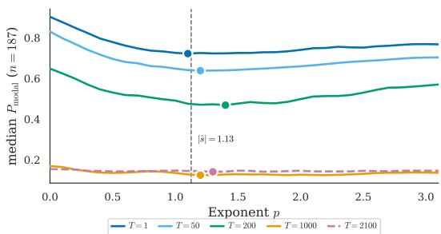  
Figure 1: The reconstruction landscape flattens with data, and $| \hat { s } | { = } 1 . 1 3$ stays inside every basin. Median $P _ { \mathrm { { m o d a l } } } ( p )$ over n=187 in-scope rooms $( M { = } 8 , K { = } 5 0 )$ ; dashed line: |ê|=1.13; dots: per-T oracle $p ^ { \star }$ . The $P \mathrm { : }$ range across $p \in [ 0 , 3 ]$ compresses \~14× from $T { = } 1 \left( 0 . 1 8 \right) \mathrm { t o } T { = } 2 1 0 0 \left( 0 . 0 1 3 \right)$ , faster than $p ^ { \star }$ drifts (1.2 → 2.0). A single fixed |û| therefore lies inside the optimum at every T (cost: Table 1).

Table 1: Cost of using $| s | { = } 1 . 1 3$ vs. per-room tuning meets its target at every regime. Median $\delta ( T ) = ( P ( | s | , T ) -$ $P ( p ^ { * } , T ) ) / P ( p ^ { * } , T )$ across 187 rooms $( K = 5 0 , M = 8 )$ . "Bound" is the practitioner-facing target per regime; “Actual" is the measured median. Worst case (5.82%) is in the data-rich regime, where the oracle has the most room to exploit (per-T in Table 5).
<table><tr><td>Regime</td><td>Bound</td><td>Actual</td></tr><tr><td> $T \leq 5 0 \ ( \mathrm { p r i o r - d o m i n a t e d } )$ </td><td> $< 1 \%$ </td><td>0.60%</td></tr><tr><td> $T \leq 1 0 0 \ \mathrm { ( c r o s s o v e r ) }$ </td><td> $< 2 \%$ </td><td>1.46%</td></tr><tr><td> $\operatorname { A l l } T \ ( { \mathrm { i n c l . } } T { = } 1 0 0 0 )$ </td><td> $< 6 \%$ </td><td>5.82%</td></tr></table>

Empirical verification of isotropy. We test Conjecture 1 directly. Under $\mathrm { B e r r y } ^ { \prime } \mathrm { s }$ prediction, $| \Omega | \cdot \varphi _ { k } ( x _ { m } ) ^ { 2 }$ should follow a $\chi ^ { 2 } ( \bar { 1 } )$ distribution for uniformly random sensor positions $x _ { m }$ . Pooling across all rooms $( N = 7 7 { , } 9 6 8$ samples), the KS statistic against $\chi ^ { 2 } ( 1 )$ is $D = \overline { { 0 . 0 3 7 } }$ . The empirical distribution deviates from the Berry prediction by at most 3.7%. Per-room KS breakdowns, boundarystratified statistics, and worst-case room analysis are in Appendix B.

The cost of using |s|. The relative cost $\delta ( T ) = ( P ( | s | , T ) - P ( p ^ { * } , T ) ) / P ( p ^ { * } , T )$ is summarized in Table 1; even at the worst snapshot count, 68.4% of the 187 in-scope rooms incur less than 1.1 pp absolute cost. The worst in-scope absolute cost across all T is 7.61 pp in the prior-dominated regime (per-room breakdowns and full $\delta ( T )$ table in Appendices C.3 and C.2). $\mathrm { A s } T$ grows the landscape compresses until “optimal" per-room exponents become ill-defined; Section 6 tests whether a learned model can find any remaining structure to exploit, and finds none within the diagonal family.

## 6 Can Diagonal Learning Improve Upon $| s | ?$

Proposition 1 establishes $\Gamma _ { k } \propto \lambda _ { k } ^ { \left| s \right| }$ as Bayes-optimal within the diagonal family under exact isotropy. The empirical 5.82% gap between the population exponent and the per-room oracle (Table 1) leaves room, in principle, for a learned regularizer that exploits per-room structure within the diagonal family. We train three architectures to look for it.

Setup. We train three architectures on $\scriptstyle n = 8 0 0$ rooms $( K { = } 5 0 , M { = } 8$ , five seeds each). M1 (4,949 parameters) conditions a diagonal Γ on a 10-dimensional per-mode feature vector via a CondNet, plugged into an $L { = } 1 0$ unrolled gradient-descent solve of the diagonal Tikhonov objective. M2 (70 parameters) learns a single unconditional Γ shared across all rooms, plugged into the same $L { = } 1 0$ unrolled solver as M1. M3 (4,930 parameters) uses the same CondNet as M1, but plugs Γ into a closed-form differentiable linear solve. If per-room adaptation helps, M1 and M3 should outperform both M2 and the physics-derived |s|. The strength α is learned jointly with Γ during training, and the trained α is used at evaluation; reported $P _ { \mathrm { m o d a l } }$ values use each model's trained α. Full architecture specifications and parameter-count derivations are in Appendix D.1.

Training dynamics. All three models converge smoothly across 500 epochs. Inside M3, however, the learned regularization spectrum is unstable across seeds: at ${ \cal T } { = } 1 0 0 0$ , five seeds learn qualitatively different shapes (per-seed effective exponent ranges from —0.22 to 1.09), yet all achieve identical reconstruction error (training curves and p trajectories in Appendix D.2).

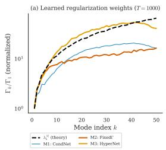

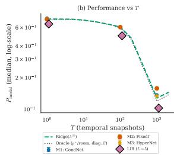

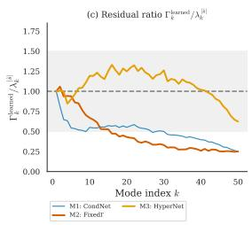  
Figure 2: M3 recovers |s|; M2 does not; the basin absorbs the difference. (a) Learned $\Gamma _ { k } / \Gamma _ { 1 }$ at ${ \cal T } { = } 1 0 0 0$ for M1, M2, M3, and theory (dashed); M3's per-room median exponent $\hat { p } _ { M 3 } { = } 1 . 1 3$ matches theory's $| s | { = } 1 . 1 3 ,$ while M2 finds $\scriptstyle { \hat { p } } _ { M 2 } = 0 . 6 2 .$ (b) P vs. T (log scale): M1/M2/M3 sit on the ridge(|ê|) curve; LIR (L=5) is the only model that breaks below the per-room oracle. (c) Residual $\Gamma _ { k } ^ { \mathrm { l e a r n e d } } / \lambda _ { k } ^ { | \hat { s } | }$ : M1/M2 collapse to $\leq 0 . 2 5$ at high k; only M3 stays in [0.5, 1.5] across all 50 modes.

Table 2: Five learned shapes, one reconstruction error: M3 matches $\Gamma _ { k } = \lambda _ { k } ^ { | s | }$ within 0.31 pp at every T. Mean ± std over 5 seeds, n=800 training rooms. Gap (rightmost column) $= P _ { \mathrm { r i d g e } } ( | s | )$ $P _ { \mathrm { o r a c l e } }$ upper-bounds what per-room diagonal tuning could recover; M3 closes none of it. Cross-seed std at $T { = } 1 0 0 0$ is $< 5 \times 1 0 ^ { - 4 }$ even though per-seed learned spectra differ in shape (per-room slope IQR [0.66, 1.39] across the 5 seeds at $n { = } 1 8 7 ) .$
<table><tr><td>T</td><td> $P _ { \mathrm { r i d g e } } ( | s | )$ </td><td> $P _ { \mathrm { M 3 } }$ </td><td> $P _ { \mathrm { o r a c l e } }$ </td><td>Adapt. gap</td></tr><tr><td>1</td><td>0.7264</td><td> $0 . 7 2 4 5 \pm 0 . 0 0 2 1$ </td><td>0.7151</td><td>1.13pp</td></tr><tr><td>100</td><td>0.6035</td><td> $0 . 6 0 5 1 \pm 0 . 0 0 2 7$ </td><td>0.5936</td><td>0.99 pp</td></tr><tr><td>1000</td><td>0.1308</td><td> $0 . 1 3 3 9 \pm 0 . 0 0 0 3$ </td><td>0.1224</td><td>0.84pp</td></tr></table>

Five networks, one answer. Despite per-seed spectra that vary qualitatively across initializations, M3 achieves $P$ within 0.31 pp of ridge at $| s |$ at every T. The gap $( P _ { \mathrm { M 3 } } - \mathrm { \bar { } } P _ { \mathrm { r i d g e } } )$ is $\mathrm { \dot { \cdot } - 0 . 1 9 p p }$ at $T { = } 1 , + 0 . 1 6 \mathrm { p p }$ at $T { = } 1 0 0$ , and +0.31 pp at ${ \cal T } { = } 1 0 0 0$ (Table 2). Five seeds, five different learned regularizers, one reconstruction error. The experiments verify two things: (i) the residual anisotropy does not open an exploitable gap within the diagonal family, and (ii) the loss is flat across the full reachable Γ-space. At $T { = } \bar { 1 } 0 \bar { 0 } 0$ , M3's geometry-aware hypernet recovers per-room exponents matching theory in the median $( \hat { p } _ { M 3 } { = } 1 . 1 3 $ , IQR [0.66, 1.39], n=187), while M2's geometry-blind global exponent $( \hat { p } _ { M 2 } { = } 0 . 6 2 )$ differs by 0.5×. Yet population-median $P$ at the two exponents agrees within 0.009: the basin absorbs the difference.

Why not fit s per room? The label-free alternative to the population |s| is a per-room slope $s _ { \mathrm { r o o m } }$ fit from each room's modal spectrum. But per-room estimation noise $( \sigma _ { \mathrm { p e r - r o o m } } \approx 0 . 2 7 )$ exceeds the population-median standard error $( \sigma _ { \mathrm { p o p } } \approx 0 . 0 2 6 )$ by an order of magnitude, leaving the deconvolved inter-room signal at effectively zero. This places the problem in the classical James-Stein regime where shrinkage to the population mean empirically outperforms per-unit plug-in [James et al., 1961, Stein, 1956]; the analogy is qualitative because $P ( \boldsymbol { p } )$ is non-quadratic in the exponent (Appendix D.5). Reconstruction with $s _ { \mathrm { r o o m } }$ fails to improve on |s| at every snapshot count and is 0.28 pp worse at T=50 where the correlation between $s _ { \mathrm { r o o m } }$ and $p ^ { * }$ is strongest (Appendix D.5).

Across all three architectures, five training sizes, and three snapshot counts, 212 of 212 valid perseed evaluations show $\Delta P \ge 0$ relative to the per-room oracle (Appendix D.6). Geometric-feature regression in Appendix D.3 confirms no room descriptor predicts the residual gap. Strikingly, M2 (which learns a single shared Γ by SGD without physics) independently converges to a power-law form $( R ^ { 2 } > 0 . 9 6 )$ , though with a shallower exponent $( \hat { p } _ { M 2 } = 0 . 6 2$ vs. theory's 1.13). SGD does not escape the power-law family; the basin's flatness lets it land on a different exponent at no cost in $P .$ The closed-form estimator $\Gamma _ { k } = \lambda _ { k } ^ { | s | }$ is therefore not a convenient default but a saturation point: within the diagonal family and across the parameterizations we tested, no point achieves robustly lower error across operating points.

## 6.1 Beyond the Tikhonov family

The diagonal models above are restricted to per-mode weights; we test whether coupling modes via the full $A ^ { \top } A$ structure can escape the oracle ceiling. We use Learned Iterative Ridge (LIR), L steps of learned gradient descent on the Tikhonov objective with per-layer $( \eta _ { l } , \alpha _ { l } , D _ { l } )$ and 52L total parameters (Appendix D.8).

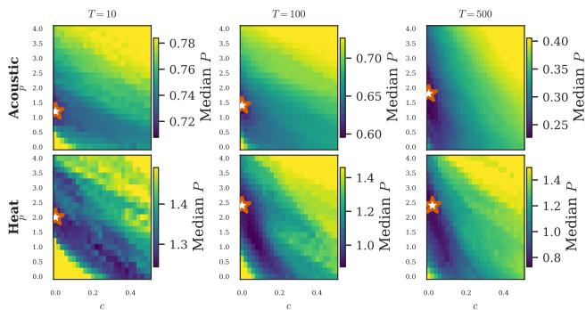  
Figure 3: Heat and acoustic landscapes differ in shape, not just optimum location. $P ( p , c )$ surfaces at three observation windows $( T \in \{ 1 0 , 1 0 0 , 5 0 0 \} ) ;$ stars mark empirical optima. Acoustic optima sit at $c { = } 0 ;$ no temporal correction is needed and the one-parameter regularizer $\Gamma _ { k } = \lambda _ { k } ^ { p }$ suffices. Heat optima sit at c≈ 0 and high $p \mathrm { : }$ the predicted exponential factor $c _ { \mathrm { t h e o r y } } = 2 \kappa t$ is small in these snapshot units, so raising p is a one-parameter fallback for the missing exponential factor (App. E.4). The quantitative cross-PDE verification of ê=2κt uses a different aggregation (per-snapshot OLS on log-variance) and is in Fig. 19 (slope 0.97–1.00, $R ^ { 2 } \geq 0 . 9 9 8 )$ 1

At $L \geq 5$ , LIR achieves lower reconstruction error than the per-room diagonal-Tikhonov oracle at all T (Figure 2b, purple diamonds): $P = \{ 0 . 6 2 1 , 0 . 4 5 9 , 0 . 1 0 \bar { 3 } \}$ at $L { = } 1 0$ versus the diagonal oracle's $\left. 0 . 7 1 5 , 0 . 5 9 4 , 0 . 1 2 2 \right.$ , an improvement of 9.4, 13.5, and 1.9 pp respectively. Under the approximate isotropy of our setting $( \| E \| _ { \mathrm { o p } } \approx 0 . 5 8 )$ , the true Bayes estimator lies outside the diagonal family, so this gap lower-bounds the cost of the diagonal restriction itself (Proposition 1). This locates the diagonal saturation principle as an empirical boundary: within the per-mode family the physicsderived formula is empirically unimprovable by learning, and gains require cross-mode coupling. Classical non-diagonal baselines (Wiener/LMMSE, generalized Tikhonov, TSVD, early-stopped CGLS, Landweber) and per-coordinate shrinkage (Pinsker, empirical Bayes) all apply fixed per-mode shrinkage profiles in the modal basis whose shape is set by the prior, and so do not close this gap (analysis in Appendix D.8).

## 7 Extension to Heat Diffusion

The acoustic results rest on one physical system. A natural objection is that other PDEs might produce truncation noise with different structure, requiring a learned regularizer. We now show that heat diffusion, a qualitatively different process, fits the same framework with one physically transparent modification. For heat we estimate current-state amplitudes $a _ { k } ( t ) = a _ { k } ( 0 ) e ^ { \dot { - } \kappa \tilde { \lambda } _ { k } t }$ at each terminal snapshot; the backward problem of recovering $a _ { k } ( 0 )$ is exponentially ill-posed and not what we attempt (setup in Appendix E.1).

A richer amplitude spectrum. In acoustics, the modal amplitude variance follows a power law: $\sigma _ { a , k } ^ { 2 } \propto \lambda _ { k } ^ { - | s | }$ . Heat diffusion changes this. The Green's function introduces an exponential decay $e ^ { - \kappa \lambda _ { k } t }$ on top of the power-law initial conditions, so

$$
\sigma _ { a , k } ^ { 2 } ( t ) \propto \lambda _ { k } ^ { - s } e ^ { - c \lambda _ { k } } , \qquad c = 2 \kappa t .\tag{12}
$$

The one-parameter family $\Gamma _ { k } = \lambda _ { k } ^ { p }$ cannot capture the exponential roll-off. The optimal regularizer is therefore $\Gamma _ { k } \propto \lambda _ { k } ^ { s } \cdot e ^ { c \lambda _ { k } }$ , the prior's exponential factor inverted as required by $\Gamma \propto \Sigma _ { a } ^ { - 1 }$

The second parameter is known. For each room and observation time, we fit log $\hat { \sigma } _ { a , k } ^ { 2 } ( t ) =$ $\beta _ { 0 } - | s | \log \lambda _ { k } - c \lambda _ { k }$ by OLS, recovering (, ê) with $R ^ { 2 } > 0 . 9 8$ at $t > 1 0 0$ ms (procedure in Appendix E.2; surfaces in Figure 3). Across five diagnostic rooms, per-room regression slopes of ê $\mathbf { V S } . \ c _ { \mathrm { t h e o r y } }$ fall in [0.97, 1.00] with $R ^ { 2 } \geq 0 . 9 9 8$ , and per-room intercepts are below 0.10 in absolute value (Appendix E.5). Crucially, $c = 2 \kappa t$ is not fit from data: t is the experimenter's choice and κ is a material property (set to $\kappa = 1$ in our synthetic units). The two-parameter regularizer is not “fitted". The exponential correction is set by theory, and only [s| is estimated from data. Sensitivity to κ and the one-parameter fallback are in Appendices E.3 and E.4.

Same framework, different physics. Acoustics and heat diffusion differ in temporal structure, spectra, and optimal exponents. For the synthetic heat data, $| s | \approx 1 . 0$ , not 1.13, because the excitation statistics differ. But they share the same framework: a power-law component from the initial conditions, composed with PDE-specific corrections known from theory. The formula is competitive with per-room oracle tuning while truncation noise dominates the residual budget. At late observation times, exponential prior decay drives signal energy below measurement noise and the margin grows, with a corresponding breakdown of the isotropy assumption (Appendix E.6). This is a cross-PDE consistency check on the framework's fitting procedure, not physical validation against an independent Green's function.

## 8 Discussion and Conclusion

This paper addresses three questions about per-mode Tikhonov regularization in truncated modal inverse problems. First, what is the optimal diagonal regularizer? Under the approximate isotropy predicted by Berry's conjecture and confirmed empirically, the answer is $\Gamma _ { k } = \lambda _ { k } ^ { | s | }$ , where $| s |$ is a property of the excitation process and not the room (Prop. 1). The single number stays within 5.82% relative cost of per-room oracle tuning at the population median across T and across rooms spanning triangles to decagons. Second, can learning beat this formula? We find no diagonal learned architecture that improves over the closed form, consistent with the empirical flatness of the per-mode landscape under the approximate isotropy of our setting. We also identify precisely where learning does help: the cost of the diagonal restriction itself. This is recovered by the Learned Iterative Ridge estimator, which parameterizes non-diagonal coupling and improves over the diagonal-family oracle by 1.9–13.5 pp depending on T (§6.1). Third, should a practitioner fit |s| per room? No: the per-room estimation standard error $( \sigma _ { \mathrm { p e r - r o o m } } \approx 0 . 2 7 )$ exceeds the population-median standard error $( \sigma _ { \mathrm { p o p } } \approx 0 . 0 2 6 )$ by roughly an order of magnitude, and the deconvolved inter-room signal is effectively zero. This places the problem in the classical James-Stein regime where shrinkage to the population mean empirically outperforms per-unit plug-in (Appendix D.5).

The exponential correction for heat diffusion adds no new free parameters and serves as a cross-PDE consistency check. The per-mode landscape is flat enough that no diagonal architecture exploits curvature within it; the remaining frontier is structural: cross-mode coupling, temporal dynamics, trajectory sensing.

Scope and limitations. Our rooms are random convex 2D polygons; the Gaussian prior is tested against heavy-tailed and correlated alternatives (Appendix F). Extension to 3D is left as future work. Weyl's law has stronger growth in three dimensions $( \lambda ^ { 3 / 2 }$ vs λ), giving a larger truncated-mode count and a stronger Weyl-dominance margin. The isotropy argument is therefore expected to carry over to non-integrable 3D geometries. Sensors are drawn i.i.d. uniformly, matching Berry's premise; structured arrays (linear, circular, spherical) may introduce φ-correlations the uniform analysis does not capture, and we view empirical validation on those layouts as a natural extension. Rectangular rooms (where Berry's premise fails analytically) have similarly flat landscapes, because Weyl's law provides an overwhelming mode count: Weyl dominance (Appendix G). Electronic sensor noise leaves Γ unchanged (only α adjusts); frequency-dependent damping composes with |s| via the heat framework (Appendix H). Whether non-diagonal estimators beyond LIR can escape the diagonal ceiling, and whether learned methods fail to beat the analytic heat regularizer, remain open.

Beyond synthetic data. The framework's domain-agnostic structure invites physical instantiation; a real-data pilot in a compact room (16-mic UMA-16 array, $V { = } 6 . 9 \mathrm { m } ^ { 3 } )$ confirms the predicted aperture-bounded rank-3 spatial sampling and the flat-landscape prediction, but recovers a slope below the population value. The recovered slope |ê|=0.83 underestimates the population |s|=1.13 with the gap consistent with several recording-chain effects we cannot disentangle from a single static array (enumerated in Appendix I). Closing it motivates trajectory-based sensing as the natural extension.

The remaining frontier. No single room-adaptive rule gains across all operating points within the diagonal family. The remaining frontier is sequential temporal modeling (Kalman filters, state-space methods) that exploits modal dynamics across a full recording rather than treating snapshots as exchangeable.

## References

J. Adler and O. Öktem. Learned primal-dual reconstruction. IEEE transactions on medical imaging, 37(6):1322–1332, 2018.

H. K. Aggarwal, M. P. Mani, and M. Jacob. Modl: Model-based deep learning architecture for inverse problems. IEEE transactions on medical imaging, 38(2):394–405, 2018.

G. S. Alberti, E. De Vito, M. Lassas, L. Ratti, and M. Santacesaria. Learning the optimal tikhonov regularizer for inverse problems. Advances in Neural Information Processing Systems, 34:25205– 25216, 2021.

A. Alexanderian, N. Petra, G. Stadler, and O. Ghattas. A-optimal design of experiments for infinitedimensional bayesian linear inverse problems with regularized \ell\_0-sparsification. SIAM Journal on Scientific Computing, 36(5):A2122–A2148, 2014.

N. Antonello, E. De Sena, M. Moonen, P. A. Naylor, and T. Van Waterschoot. Room impulse response interpolation using a sparse spatio-temporal representation of the sound field. IEEE/ACM Transactions on Audio, Speech, and Language Processing, 25(10):1929–1941, 2017.

V. Antun, F. Renna, C. Poon, B. Adcock, and A. C. Hansen. On instabilities of deep learning in image reconstruction and the potential costs of ai. Proceedings of the National Academy of Sciences, 117 (48):30088–30095, 2020.

J. V. Beck, B. Blackwell, and C. R. S. Clair. Inverse heat conduction: Ill-posed problems. James Beck, 1985.

M. V. Berry. Regular and irregular semiclassical wavefunctions. Journal of Physics A: Mathematical and General, 10(12):2083–2091, 1977.

D. Calvetti and E. Somersalo. Distributed tikhonov regularization for ill-posed inverse problems from a bayesian perspective. Computational Optimization and Applications, 91(2):541–572, 2025.

L. Cavalier. Nonparametric statistical inverse problems. Inverse Problems, 24(3):034004, 2008.

M. J. Colbrook, V. Antun, and A. C. Hansen. The difficulty of computing stable and accurate neural networks: On the barriers of deep learning and smale's 18th problem. Proceedings of the National Academy of Sciences, 119(12):e2107151119, 2022.

P. Del Hougne, D. V. Savin, O. Legrand, and U. Kuhl. Implementing nonuniversal features with a random matrix theory approach: Application to space-to-configuration multiplexing. Physical Review E, 102(1):010201, 2020.

C. Durastanti. Spectral bayesian regression on the sphere. arXiv preprint arXiv:2601.20528, 2026.

E. Fernandez-Grande. Sound field reconstruction using a spherical microphone array. The Journal of the Acoustical Society of America, 139(3):1168–1178, 2016.

G. H. Golub, M. Heath, and G. Wahba. Generalized cross-validation as a method for choosing a good ridge parameter. Technometrics, 21(2):215–223, 1979.

N. M. Gottschling, V. Antun, A. C. Hansen, and B. Adcock. The troublesome kernel: On hallucinations, no free lunches, and the accuracy-stability tradeoff in inverse problems. SIAM Review, 67(1): 73–104, 2025.

K. Gregor and Y. LeCun. Learning fast approximations of sparse coding. In Proceedings of the 27th international conference on international conference on machine learning, pages 399–406, 2010.

P. C. Hansen. Analysis of discrete ill-posed problems by means of the 1-curve. SIAM review, 34(4): 561–580, 1992.

P. C. Hansen. Rank-deficient and discrete ill-posed problems: numerical aspects of linear inversion. SIAM, 1998.

A. Hassell and L. Hillairet. Ergodic billiards that are not quantum unique ergodic. Annals of Mathematics, pages 605–618, 2010.

E. J. Heller. Bound-state eigenfunctions of classically chaotic hamiltonian systems: scars of periodic orbits. Physical Review Letters, 53(16):1515, 1984.

T. Hohage and F. Weidling. Characterizations of variational source conditions, converse results, and maxisets of spectral regularization methods. SIAM Journal on Numerical Analysis, 55(2):598–620, 2017.

S. Hurault, A. Leclaire, and N. Papadakis. Proximal denoiser for convergent plug-and-play optimization with nonconvex regularization. In International Conference on Machine Learning, pages 9483–9505. PMLR, 2022.

V. Ivrii. 100 years of weyl's law. Bulletin of Mathematical Sciences, 6(3):379–452, 2016.

W. James, C. Stein, et al. Estimation with quadratic loss. In Proceedings of the fourth Berkeley symposium on mathematical statistics and probability, volume 1, pages 361–379. University of California Press, 1961.

I. M. Johnstone. Function estimation and gaussian sequence models. Unpublished manuscript, 2 (5.3):2, 2002.

J. P. Kaipio and C. Fox. The bayesian framework for inverse problems in heat transfer. Heat Transfer Engineering, 32(9):718–753, 2011.

J. P. Kaipio and E. Somersalo. Statistical and computational inverse problems. Springer, 2005.

X. Karakonstantis, D. Caviedes-Nozal, A. Richard, and E. Fernandez-Grande. Room impulse response reconstruction with physics-informed deep learning. The Journal of the Acoustical Society of America, 155(2):1048–1059, 2024.

B. T. Knapik, A. W. Van Der Vaart, and J. H. van Zanten. Bayesian inverse problems with gaussian priors. The Annals of Statistics, pages 2626–2657, 2011.

B. T. Knapik, A. W. Van Der Vaart, and J. H. van Zanten. Bayesian recovery of the initial condition for the heat equation. Communications in Statistics-Theory and Methods, 42(7):1294–1313, 2013.

A. Kofler, F. Altekrüger, F. Antarou Ba, C. Kolbitsch, E. Papoutsellis, D. Schote, C. Sirotenko, F. F. Zimmermann, and K. Papafitsoros. Learning regularization parameter-maps for variational image reconstruction using deep neural networks and algorithm unrolling. SIAM Journal on Imaging Sciences, 16(4):2202–2246, 2023.

A. Krause, A. Singh, and C. Guestrin. Near-optimal sensor placements in gaussian processes: Theory, efficient algorithms and empirical studies. Journal of Machine Learning Research, 9(2), 2008.

K. Kunisch and T. Pock. A bilevel optimization approach for parameter learning in variational models. SIAM Journal on Imaging Sciences, 6(2):938–983, 2013.

O. Leong, E. O'Reilly, and Y. S. Soh. The star geometry of critic-based regularizer learning. Advances in Neural Information Processing Systems, 37:71240–71276, 2024.

V. A. Morozov. Regularization of incorrectly posed problems and the choice of regularization parameter. USSR Computational Mathematics and Mathematical Physics, 6(1):242–251, 1966.

M. Pinsker. Optimal filtration of square-integrable signals in gaussian noise. Prob. Info. Transmission, 16(2):120–133, 1980.

C. E. Rasmussen. Gaussian processes in machine learning. In Summer school on machine learning, pages 63–71. Springer, 2003.

J. M. Schmid, E. Fernandez-Grande, M. Hahmann, C. Gurbuz, M. Eser, and S. Marburg. Spatial reconstruction of the sound field in a room in the modal frequency range using bayesian inference. The Journal of the Acoustical Society of America, 150(6):4385–4394, 2021.

A. I. Shnirel'man. Ergodic properties of eigenfunctions. Uspekhi Matematicheskikh Nauk, 29(6): 181–182, 1974.

C. Stein. Inadmissibility of the usual estimator for the mean of a multivariate normal distribution. In Proceedings of the third Berkeley symposium on mathematical statistics and probability, volume 1: Contributions to the theory of statistics, volume 3, pages 197–207. University of California Press, 1956.

A. M. Stuart. Inverse problems: a bayesian perspective. Acta numerica, 19:451–559, 2010.

J. Sun, H. Li, Z. Xu, et al. Deep admm-net for compressive sensing mri. Advances in neural information processing systems, 29, 2016.

G. Tanner and N. Søndergaard. Wave chaos in acoustics and elasticity. Journal of Physics A: Mathematical and Theoretical, 40(50):R443–R509, 2007.

D. Ulyanov, A. Vedaldi, and V. Lempitsky. Deep image prior. In Proceedings of the IEEE conference on computer vision and pattern recognition, pages 9446–9454, 2018.

H. Weyl. Das asymptotische verteilungsgesetz der eigenwerte linearer partieller differentialgleichungen (mit einer anwendung auf die theorie der hohlraumstrahlung). Mathematische Annalen, 71(4): 441–479, 1912.

S. Zelditch. Quantum ergodicity and mixing. arXiv preprint math-ph/0503026, 2005.

## A Exact Theorem and Approximate Isotropy Argument

This appendix expands the three-step argument of §4. Step 1 (§A.1) is an exact theorem: under isotropic Gaussian noise and a diagonal Gaussian prior, the Bayes-optimal Tikhonov shape is $\Gamma _ { k } \propto \lambda _ { k } ^ { s }$ Steps 2–3 (§A.2–A.3) provide physically motivated reasoning, based on Berry's conjecture and Weyl's law, for why the isotropy assumption should approximately hold. The primary evidence that this approximation is adequate comes from the empirical verification in $\ S 5$ and Appendix B.

We use the following notation throughout. K is the number of retained modes. M is the number of microphones. $\lambda _ { k }$ is the eigenvalue of mode $k . \varphi _ { k } ( x _ { m } )$ is the value of eigenfunction k at microphone position $x _ { m } . \varphi _ { k } = [ \varphi _ { k } ( x _ { 1 } ) , \ldots , \varphi _ { k } ( x _ { M } ) ] ^ { \intercal } \in \mathbb { R } ^ { M }$ is the vector of eigenfunction k evaluated at all microphone positions. $\sigma _ { a , k } ^ { 2 }$ is the variance of the k-th modal amplitude under the prior. $s > 0$ is the spectral decay exponent, so $\sigma _ { a , k } ^ { 2 } = c \lambda _ { k } ^ { - s }$ for some constant $c > 0$

## A.1 Bayesian derivation of Proposition 1

We want to show that when the truncation noise is isotropic and the prior is a power-law diagonal Gaussian, the Bayes-optimal Tikhonov regularizer is $\Gamma _ { k } \propto \lambda _ { k } ^ { s }$ . We proceed in three steps: (i) write down the generative model, (ii) derive the posterior, (iii) extract the MAP estimator and identify the optimal Γ.

Step (i): The generative model. The observation model from eq. (4) is

$$
\tilde { \mathbf { y } } = \tilde { \Phi } \mathbf { a } _ { 0 } + \tilde { \eta } ,\tag{13}
$$

where $\tilde { \mathbf { y } } \in \mathbb { R } ^ { M T }$ is the stacked measurement vector, $\tilde { \Phi } \in \mathbb { R } ^ { M T \times 2 K }$ is the combined spatial-temporal measurement matrix, and ${ \bf a } _ { 0 } \in \mathbb { R } ^ { 2 K }$ collects the initial modal amplitudes $( c _ { 1 } , \beta _ { 1 } , \dots , c _ { K } , \beta _ { K } )$

We assume:

• Prior: $\mathbf { a } _ { 0 } \sim \mathcal { N } ( \mathbf { 0 } , \Sigma _ { \mathbf { a } } )$ , where $\Sigma _ { \mathbf { a } }$ is diagonal with $( \Sigma _ { \mathbf { a } } ) _ { k k } = c \lambda _ { k } ^ { - s }$ . Each mode pair $\left( { { c } _ { k } } , { { \beta } _ { k } } \right)$ shares the same variance $c \lambda _ { k } ^ { - s }$ , and different modes are independent. This means low-frequency modes (small $\lambda _ { k } )$ have large variance (lots of energy) and high-frequency modes (large $\lambda _ { k } )$ have small variance (little energy).

• Noise: $\tilde { \pmb { \eta } } \sim \mathcal { N } ( \mathbf { 0 } , \sigma ^ { 2 } I _ { M T } )$ , i.e., the truncation noise is isotropic with variance $\sigma ^ { 2 }$ per measurement. This is the key assumption. We will spend all of §A.2 justifying it.

Step (ii): The posterior. Since both the prior and the likelihood are Gaussian, the posterior is also Gaussian. We derive it from scratch.

The likelihood of observing  given ${ \bf a } _ { 0 }$ is

$$
p ( \tilde { \mathbf { y } } \mid \mathbf { a } _ { 0 } ) = \frac { 1 } { ( 2 \pi \sigma ^ { 2 } ) ^ { M T / 2 } } \exp \Bigl ( - \frac { 1 } { 2 \sigma ^ { 2 } } \| \tilde { \mathbf { y } } - \tilde { \Phi } \mathbf { a } _ { 0 } \| ^ { 2 } \Bigr ) .\tag{14}
$$

The prior is

$$
p ( \mathbf { a } _ { 0 } ) = { \frac { 1 } { ( 2 \pi ) ^ { K } | { \boldsymbol { \Sigma } } _ { \mathbf { a } } | ^ { 1 / 2 } } } \exp \Bigl ( - { \frac { 1 } { 2 } } \mathbf { a } _ { 0 } ^ { \top } { \boldsymbol { \Sigma } } _ { \mathbf { a } } ^ { - 1 } \mathbf { a } _ { 0 } \Bigr ) .\tag{15}
$$

By Bayes' rule, $p ( \mathbf { a } _ { 0 } \mid \tilde { \mathbf { y } } ) \propto p ( \tilde { \mathbf { y } } \mid \mathbf { a } _ { 0 } ) p ( \mathbf { a } _ { 0 } )$ . Taking the log and keeping only terms that depend on a0:

$$
\begin{array} { l } { \log p ( { \bf { a } } _ { 0 } \mid \tilde { \bf { y } } ) = \mathrm { { c o n s t } } - \displaystyle \frac { 1 } { 2 { \sigma } ^ { 2 } } \| \tilde { \bf { y } } - \tilde { \Phi } { \bf { a } } _ { 0 } \| ^ { 2 } - \displaystyle \frac { 1 } { 2 } { \bf { a } } _ { 0 } ^ { \top } \Sigma _ { \bf { a } } ^ { - 1 } { \bf { a } } _ { 0 } } \\ { = \mathrm { { c o n s t } } - \displaystyle \frac { 1 } { 2 } \Big [ \displaystyle \frac { 1 } { { \sigma } ^ { 2 } } ( \tilde { \bf { y } } - \tilde { \Phi } { \bf { a } } _ { 0 } ) ^ { \top } ( \tilde { \bf { y } } - \tilde { \Phi } { \bf { a } } _ { 0 } ) + { \bf { a } } _ { 0 } ^ { \top } \Sigma _ { \bf { a } } ^ { - 1 } { \bf { a } } _ { 0 } \Big ] . } \end{array}\tag{16}
$$

Expanding the quadratic form in ${ \bf a } _ { 0 }$ and completing the square (a standard exercise in Bayesian linear regression), the posterior is $\mathcal { N } ( \hat { \mathbf { a } } _ { \mathrm { M A P } } , \boldsymbol { \Sigma } _ { \mathrm { p o s t } } )$ with

$$
\begin{array} { r } { \hat { \bf a } _ { \mathrm { M A P } } = \left( \tilde { \Phi } ^ { \top } \tilde { \Phi } + \sigma ^ { 2 } \Sigma _ { \bf a } ^ { - 1 } \right) ^ { - 1 } \tilde { \Phi } ^ { \top } \tilde { \bf y } . } \end{array}\tag{17}
$$

Step (iii): Connecting to Tikhonov. Compare eq. (17) with the Tikhonov estimator from eq. (5):

$$
\widehat { \mathbf { a } } _ { \mathrm { T i k h } } = \left( \tilde { \Phi } ^ { \top } \tilde { \Phi } + \alpha \Gamma \right) ^ { - 1 } \tilde { \Phi } ^ { \top } \tilde { \mathbf { y } } .\tag{18}
$$

These are the same estimator if and only if

$$
\alpha \Gamma = \sigma ^ { 2 } \Sigma _ { \mathbf { a } } ^ { - 1 } .\tag{19}
$$

Since $\Sigma _ { \mathbf { a } }$ is diagonal with $( \Sigma _ { \mathbf { a } } ) _ { k k } = c \lambda _ { k } ^ { - s }$ , the inverse is $( \Sigma _ { \mathbf { a } } ^ { - 1 } ) _ { k k } = c ^ { - 1 } \lambda _ { k } ^ { s }$ . Therefore

$$
\Gamma _ { k k } = \frac { \sigma ^ { 2 } } { \alpha c } \lambda _ { k } ^ { s } .\tag{20}
$$

The prefactor $\sigma ^ { 2 } / ( \alpha c )$ is a constant that can be absorbed into α. What matters is the shape: $\Gamma _ { k k } \propto \lambda _ { k } ^ { s }$ $\mathbf { i . e . , } p ^ { * } = s$

Remark: why the shape is determined by the prior alone. Under jointly Gaussian prior and likelihood, the MAP estimator equals the posterior mean, which is the minimum-MSE estimator among all estimators (not just linear ones). The identification α $\Gamma = \sigma ^ { 2 } \Sigma _ { \mathbf { a } } ^ { - 1 }$ from Step (iii) therefore gives the globally optimal Tikhonov shape: $\Gamma _ { k k } \propto \lambda _ { k } ^ { s }$ . The forward operator $\tilde { \Phi } ^ { \mp } \tilde { \Phi }$ couples modes in the estimator (and its off-diagonal structure is operationally important, see $\ S 6 . 1 )$ . This coupling does not affect the optimal penalty shape, which is set entirely by $\dot { \Sigma } _ { \mathbf { a } } ^ { - 1 }$ . The noise level $\sigma ^ { 2 }$ and the operator structure $\tilde { \Phi } ^ { \mp } \tilde { \Phi }$ affect only the scalar strength α. □

Scope of optimality. Proposition 1 establishes that under exact isotropy $( E = 0 )$ and a Gaussian power-law prior, the diagonal Tikhonov estimator with $\Gamma _ { k } \propto \lambda _ { k } ^ { s }$ coincides with the posterior mean and is therefore MMSE-optimal among all estimators. In our setting isotropy is approximate $( \| E \| _ { \mathrm { o p } } \approx 0 . 5 8 )$ , so the closed-form Tikhonov estimator is no longer exactly MMSE; the Bayesoptimal estimator under the true (mildly anisotropic) noise covariance is a non-diagonal estimator that couples modes through E. Throughout the paper, “per-room oracle" refers to the best estimator within the diagonal Tikhonov family $( p ^ { \star } , \alpha ^ { \star } )$ , not to the unconstrained Bayes estimator. The diagonalsaturation result of §6 should be read as: within the diagonal family, learning cannot improve on $\Gamma _ { k } = \lambda _ { k } ^ { | s | }$ ; the LIR result of §6.1 quantifies how much is left on the table by the diagonal restriction itself.

## A.2 Anisotropy bound derivation

We now derive the bound on the anisotropy matrix E from eq. (7) in full detail. This is the mathematical heart of the Berry step.

Setup. Recall the truncation noise covariance:

$$
R _ { \mathrm { t r u n c } } = \sum _ { n > K } \sigma _ { a , n } ^ { 2 } \varphi _ { n } \varphi _ { n } ^ { \top } .\tag{21}
$$

We want to show this is approximately proportional to $I _ { M }$ . Define the average noise power

$$
\sigma _ { \mathrm { t r u n c } } ^ { 2 } = \frac { 1 } { M } \sum _ { n > K } \sigma _ { a , n } ^ { 2 }\tag{22}
$$

and write

$$
R _ { \mathrm { t r u n c } } = \sigma _ { \mathrm { t r u n c } } ^ { 2 } ( I _ { M } + E ) ,\tag{23}
$$

where E is the anisotropy matrix, the deviation from perfect isotropy. We investigate the bound of $\| E \| _ { \mathrm { o p } }$

Normalization convention. The Frobenius bound below is normalization-invariant: H and $\| E \| _ { \mathrm { o p } }$ are ratios in which the $\varphi _ { n }$ normalization cancels. For convenience we use the discrete sensor normalization $\begin{array} { r } { \sum _ { m = 1 } ^ { M } \varphi _ { n } ( x _ { m } ) ^ { 2 } \approx 1 ( \mathbf { s o } \mathbb { E } [ \varphi _ { n } ( x _ { m } ) ^ { 2 } ] \approx 1 / M } \end{array}$ under Berry), differing from the $L ^ { 2 } .$ normalization of §3 by $| \Omega | / M$ .The induced $O ( 1 / M )$ coupling between $\varphi _ { n } ( x _ { m } )$ values across sensors is absorbed into the $\lesssim$ constants of the bound; empirical agreement (median $\| E \| _ { \mathrm { o p } } = 0 . 5 8$ vs. bound 0.60) confirms the approximation at $M = 8$

The entries of E. The (i, j) entry of $R _ { \mathrm { t r u n c } }$ is

$$
( R _ { \mathrm { t r u n c } } ) _ { i j } = \sum _ { n > K } \sigma _ { a , n } ^ { 2 } \varphi _ { n } ( x _ { i } ) \varphi _ { n } ( x _ { j } ) .\tag{24}
$$

For the diagonal entries $( i = j )$

$$
( R _ { \mathrm { t r u n c } } ) _ { i i } = \sum _ { n > K } \sigma _ { a , n } ^ { 2 } \varphi _ { n } ( x _ { i } ) ^ { 2 } .\tag{25}
$$

For isotropy, we need $( R _ { \mathrm { t r u n c } } ) _ { i i } \approx \sigma _ { \mathrm { t r u n c } } ^ { 2 }$ for all i and $( R _ { \mathrm { t r u n c } } ) _ { i j } \approx 0$ for $i \neq j$

Rearranging the definition $R _ { \mathrm { t r u n c } } = \sigma _ { \mathrm { t r u n c } } ^ { 2 } ( I _ { M } + E )$ , we get

$$
E _ { i j } = \frac { 1 } { \sigma _ { \mathrm { t r u n c } } ^ { 2 } } \sum _ { n > K } \sigma _ { a , n } ^ { 2 } \Big ( \varphi _ { n } ( x _ { i } ) \varphi _ { n } ( x _ { j } ) - \frac { \delta _ { i j } } { M } \Big )\tag{26}
$$

where $\delta _ { i j }$ is the Kronecker delta.

Applying Berry's conjecture. We bound the expected squared magnitude of the off-diagonal entries $( i \neq j )$ . For i $\neq j \colon$

$$
{ \cal E } _ { i j } = \frac { 1 } { \sigma _ { \mathrm { t r u n c } } ^ { 2 } } \sum _ { n > K } \sigma _ { a , n } ^ { 2 } \varphi _ { n } ( x _ { i } ) \varphi _ { n } ( x _ { j } ) .\tag{27}
$$

Squaring:

$$
E _ { i j } ^ { 2 } = \frac { 1 } { ( \sigma _ { \mathrm { t r u n c } } ^ { 2 } ) ^ { 2 } } \Big ( \sum _ { n > K } \sigma _ { a , n } ^ { 2 } \varphi _ { n } ( x _ { i } ) \varphi _ { n } ( x _ { j } ) \Big ) ^ { 2 } .\tag{28}
$$

Expanding the square of the sum:

$$
E _ { i j } ^ { 2 } = { \frac { 1 } { ( \sigma _ { \mathrm { t r u n c } } ^ { 2 } ) ^ { 2 } } } \sum _ { n > K } \sum _ { n ^ { \prime } > K } \sigma _ { a , n } ^ { 2 } \sigma _ { a , n ^ { \prime } } ^ { 2 } \varphi _ { n } ( x _ { i } ) \varphi _ { n } ( x _ { j } ) \varphi _ { n ^ { \prime } } ( x _ { i } ) \varphi _ { n ^ { \prime } } ( x _ { j } ) .\tag{29}
$$

Now take the expectation over random sensor placements. We split the double sum into diagonal $( n = n ^ { \prime } )$ and off-diagonal $( n \neq n ^ { \prime } )$ terms:

Diagonal terms $( n = n ^ { \prime } ) ;$

$$
\mathbb { E } \left[ \varphi _ { n } ( x _ { i } ) ^ { 2 } \varphi _ { n } ( x _ { j } ) ^ { 2 } \right] .\tag{30}
$$

We adopt the discrete normalization $\begin{array} { r } { \| \varphi _ { n } \| ^ { 2 } = \sum _ { m } \varphi _ { n } ( x _ { m } ) ^ { 2 } \approx 1 } \end{array}$ , so that $\mathbb { E } [ \varphi _ { n } ( x _ { m } ) ^ { 2 } ] \approx 1 / M$ per sensor. Under Berry's conjecture, eigenfunction values at distinct sensor positions are approximately independent. For $i \neq j$ , this gives

$$
\mathbb { E } \left[ \varphi _ { n } ( x _ { i } ) ^ { 2 } \varphi _ { n } ( x _ { j } ) ^ { 2 } \right] \approx \mathbb { E } [ \varphi _ { n } ( x _ { i } ) ^ { 2 } ] \mathbb { E } [ \varphi _ { n } ( x _ { j } ) ^ { 2 } ] \approx \frac { 1 } { M ^ { 2 } } .\tag{31}
$$

The contribution of all diagonal terms is therefore

$$
\sum _ { n > K } ( \sigma _ { a , n } ^ { 2 } ) ^ { 2 } \cdot \frac { 1 } { M ^ { 2 } } .\tag{32}
$$

Off-diagonal terms $( n \neq n ^ { \prime } ) .$

$$
\mathbb { E } \left[ \varphi _ { n } ( x _ { i } ) \varphi _ { n } ( x _ { j } ) \varphi _ { n ^ { \prime } } ( x _ { i } ) \varphi _ { n ^ { \prime } } ( x _ { j } ) \right] .\tag{33}
$$

This factorizes as

$$
\mathbb { E } \left[ \varphi _ { n } ( x _ { i } ) \varphi _ { n ^ { \prime } } ( x _ { i } ) \right] \mathbb { E } \left[ \varphi _ { n } ( x _ { j } ) \varphi _ { n ^ { \prime } } ( x _ { j } ) \right]\tag{34}
$$

by independence of sensor positions $x _ { i }$ and $x _ { j }$ . Each factor is the cross-correlation $\mathbb { E } [ \varphi _ { n } ( x ) \varphi _ { n ^ { \prime } } ( x ) ]$ for n $\neq n ^ { \prime } .$ , which is exactly zero by $L ^ { 2 }$ -orthogonality of eigenfunctions (Conjecture 1 only enters when the population expectation is replaced by the empirical sample average, controlling fluctuations at scale $O ( 1 / { \sqrt { M } } ) )$ . So the off-diagonal terms vanish in expectation:

$$
\mathbb { E } \big [ \mathrm { o f f - d i a g o n a l t e r m s } \big ] = 0 .\tag{35}
$$

Assembling the bound. The derivation above handles $i \neq j .$ For $\begin{array} { r c l r c l } { \textit { i } } & { = } & { \textit { j } , } & { E _ { i i } } & { = } & { } \end{array}$ $\begin{array} { r } { \sigma _ { \mathrm { t r u n c } } ^ { - 2 } \sum _ { n > K } \sigma _ { a , n } ^ { 2 } [ \varphi _ { n } ( x _ { i } ) ^ { 2 } - 1 / M ] } \end{array}$ has the same structure but with $\dot { \varphi } _ { n } ( \dot { x } _ { i } ) ^ { 2 }$ replacing $\varphi _ { n } ( x _ { i } ) \varphi _ { n } ( x _ { j } )$ Under Berry, $\mathrm { V a r } [ \varphi _ { n } ( x ) ^ { 2 } ] \approx 2 / M ^ { 2 }$ (chi-squared fluctuation with one degree of freedom), giving $\mathbb { E } [ E _ { i i } ^ { 2 } ] \lesssim 2 \dot { H }$ , a factor of two larger than the off-diagonal bound that is absorbed into the Frobenius sum without changing the scaling. Combining diagonal terms $( \leq 2 M H )$ and off-diagonal terms $( \leq M ( M - 1 ) H )$ , and recalling $\begin{array} { r } { \sigma _ { \mathrm { t r u n c } } ^ { \breve { 2 } } = M ^ { - 1 } \breve { \sum } _ { n > K } \sigma _ { a , n } ^ { 2 } \colon } \end{array}$

$$
\mathbb { E } [ E _ { i j } ^ { 2 } ] \lesssim \frac { 1 } { ( \sigma _ { \mathrm { t r u n c } } ^ { 2 } ) ^ { 2 } } \sum _ { n > K } ( \sigma _ { a , n } ^ { 2 } ) ^ { 2 } \cdot \frac { 1 } { M ^ { 2 } } = \frac { M ^ { 2 } } { ( \sum _ { n > K } \sigma _ { a , n } ^ { 2 } ) ^ { 2 } } \sum _ { n > K } ( \sigma _ { a , n } ^ { 2 } ) ^ { 2 } \cdot \frac { 1 } { M ^ { 2 } } = H ,\tag{36}
$$

where H is the Herfindahl index:

$$
H : = \frac { \sum _ { n > K } ( \sigma _ { a , n } ^ { 2 } ) ^ { 2 } } { \left( \sum _ { n > K } \sigma _ { a , n } ^ { 2 } \right) ^ { 2 } } .\tag{37}
$$

Monte Carlo simulation under the Berry model (50,000 trials, 6 rooms) confirms $\mathbb { E } [ E _ { i j } ^ { 2 } ] / H =$ $1 . 0 0 \pm 0 . 0 1$

From entries to operator norm. We need $\| E \| _ { \mathrm { o p } } .$ , not individual entries. Using $\| E \| _ { \mathrm { o p } } \leq \| E \| _ { F } \colon$

$$
\mathbb { E } [ \| E \| _ { \mathrm { o p } } ^ { 2 } ] \le \mathbb { E } [ \| E \| _ { F } ^ { 2 } ] = \sum _ { i } \mathbb { E } [ E _ { i i } ^ { 2 } ] + \sum _ { i \neq j } \mathbb { E } [ E _ { i j } ^ { 2 } ] \lesssim 2 M H + M ( M - 1 ) H = M ( M + 1 ) H .\tag{38}
$$

With $M = 8$ and $H \approx 0 . 0 0 5$ (the median across 187 rooms), this Jensen step gives a median-H order-of-magnitude estimate $\mathbb { E } \| E \| _ { \mathrm { o p } } \sim \sqrt { M ( M + 1 ) H } \approx 0 . 6 0$ ; we use \~ rather than $\lesssim$ because H varies across rooms and the bound is tight only at the median, with loose values at the right tail. Empirically, across 187 rooms³ (computed from actual eigenfunctions at the sensor positions, using $\sigma _ { \mathrm { t r u n c } } ^ { 2 } = \mathrm { t r } ( R _ { \mathrm { t r u n c } } ) / M )$ , the median $\| \bar { E } \| _ { \mathrm { o p } }$ is 0.58 (below the Frobenius bound 0.60) but the sample mean is 0.88 and the 95th percentile is 2.42. The right-tail rooms driving the mean above the bound are those with the largest Berry violations (§B.4); for the median room, the Frobenius bound is tight to within 3%, while for the worst rooms the Frobenius-to-operator-norm relaxation is loose.

The noise is therefore moderately anisotropic, not negligible. However, the regularizer shape is insensitive to this anisotropy because the signal dynamic range $( \lambda _ { K } / \lambda _ { 1 } ) ^ { | s | } \approx 8 0 { : } 1$ across modes far exceeds the noise eigenvalue ratio \~4:1 across sensor directions. This mode-space-vs-sensorspace comparison is heuristic rather than a formal bound, and is verified empirically against the rectangular control in Appendix G. For 91% of rooms (170/186 with sufficient truncated modes), signal dominance exceeds noise anisotropy; for the remaining 9% (small rooms with few modes), the regularizer is near-irrelevant and the landscape is flat regardless. The Berry/Weyl mechanism explains why isotropy is approximate; the signal-dominance component of Weyl dominance (Appendix G) explains why approximate is sufficient. The relevant criterion is not whether $p ^ { * }$ drifts from $| s | ,$ but whether the cost of staying at |s| is small. The drift itself is real: $p ^ { * }$ moves from $\approx 1 . 2$ at $T { = } 1$ to ≈ 2.0 at ${ \cal T } { = } 2 1 0 0$ . Because the ${ \dot { P } } ( p )$ landscape is approximately flat (§5), any drift in $p ^ { * }$ is absorbed: the population-median relative cost peaks at 5.82% $( T { = } 1 0 0 0$ , on 187 in-scope rooms), and 68.4% of in-scope rooms remain below 1.1 percentage points absolute cost. Figure 4 confirms that $\| E \| _ { \mathrm { o p } }$ does not explain elevated $\delta \colon$ the Spearman rank correlation at ${ \cal T } { = } 1 0 0 0$ is $\rho = - 0 . 3 0 \ ( p < 1 0 ^ { - 4 }$ $n = 1 8 7 )$ , with the worst-cost rooms being large rooms with low anisotropy but wide eigenvalue spectra.

What this means. Per-room reconstruction cost is governed by eigenvalue dynamic range, not noise anisotropy. The negative ρ in Figure 4 is therefore not a contradiction of the isotropy framework; it is what the framework predicts once area is controlled for (Appendix G).

## A.3 Herfindahl index: numerical values

For the truncated noise weights $\sigma _ { a , n } ^ { 2 } ~ = ~ c \lambda _ { n } ^ { - s }$ with $| s | \ = \ 1 . 1 3 .$ the Herfindahl index $H \_ =$ $\scriptstyle \sum _ { n > K } \lambda _ { n } ^ { - 2 s } / ( \sum _ { n > K } \lambda _ { n } ^ { - s } ) ^ { 2 }$ ranges from 0.002 (large decagons, \~1000 truncated modes) to

σtrunc, k (median)  σa,k (prior)

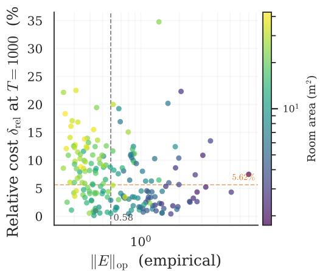  
Figure 4: Relative cost $\delta _ { \mathrm { r e l } } ~ = ~ ( P ( | \hat { s } | ) - P ( p ^ { * } ) ) / P ( p ^ { * } )$ at ${ \cal T } { = } 1 0 0 0$ versus empirical $\| E \| _ { \mathrm { o p } }$ (Method B, §A.2, 187 rooms). Points colored by room area. The Spearman rank correlation is $\rho = - 0 . 3 0 ( p < 1 0 ^ { - 4 } ) \colon$ rooms with higher anisotropy pay lower cost. The color gradient exposes the confound: large rooms (yellow) have low $\| E \| _ { \mathrm { o p } } ^ { \bullet }$ (many truncated modes ⇒ CLT averaging) but elevated δ (wider eigenvalue spectrum gives the per-room oracle more to exploit); small rooms (purple) show the reverse. The bottleneck is eigenvalue diversity, not noise anisotropy.

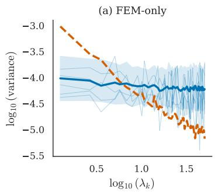

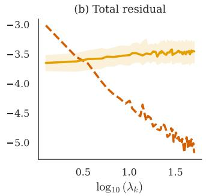

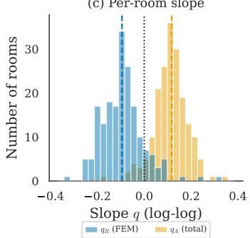  
Figure 5: Truncation noise is approximately isotropic. (a) Method B (FEM-only residual): perroom $\sigma _ { \mathrm { t r u n c } , k } ^ { 2 }$ VS $\lambda _ { k }$ in log-log, with median and IQR over 187 rooms; fitted slope $q _ { B } = - 0 . 0 9$ (b) Method A (total residual against the spatial prior): same axes, fitted slope $q _ { A } = + 0 . 1 2$ . Both slopes are near the isotropic prediction $q = 0$ . (c) Per-room slope histogram for both methods, with median markers. The near-zero slopes validate the diagonal-noise assumption behind the optimal regularizer.

0.03 (small triangles, \~30 truncated modes), with median 0.005. For a representative octagon (scene\_00850, $K _ { \mathrm { t o t a l } } = 4 8 3 )$ , H = 0.0038 corresponds to an effective contributor count $1 / H = \hat { 2 } 6 0$ out of 433 truncated modes. Because $| s | > 1$ , both $\sum { n ^ { - 2 | s | } }$ and $\sum n ^ { - | s | }$ converge as $K _ { \mathrm { t o t a l } }  \infty ,$ so H tends to a positive constant $( \approx 0 . 0 0 0 4 )$ rather than vanishing; the smallness at our operating point is a finite-sample property of the eigenvalue distribution, not an asymptotic guarantee.

## A.4 Temporal stacking

The analysis in $\ S _ { \mathrm { A . 1 - A . 2 } }$ applies at $T = 1$ . For $T > 1$ , the stacked noise covariance factors as Cov $\begin{array} { r } { ( \tilde { \eta } ) \stackrel { \cdot } { = } \sum _ { n > K } \sigma _ { a , n } ^ { 2 } G _ { n } \stackrel { \cdot } { \otimes } \tilde { ( } \varphi _ { n } \varphi _ { n } ^ { \top } ) } \end{array}$ , where $G _ { n }$ is a temporal rank-two matrix encoding mode $n \mathrm { { : } }$ damped-sinusoidal evolution from eq. (2) (one outer product for the cosine component, one for the sine component). The spatial factors still concentrate to $I _ { M }$ in aggregate by the per-mode argument of $\ S \mathrm { A } . 2 ;$ the residual structure is purely temporal, with off-diagonal entries $\begin{array} { r } { \sum _ { n } \dot { \sigma _ { a , n } ^ { 2 } } g _ { n } ( t ) g _ { n } \dot { ( t ^ { \prime } ) } } \end{array}$ that couple snapshots through shared initial conditions. This temporal anisotropy shifts the per-snapshot optimal exponent $p ^ { * } ( \bar { T } )$ away from $| s |$ as $T$ grows. The cost of this drift is measured directly in §5 (peak 5.6% median at $T = 1 0 0 0$ , decreasing at $T = 2 1 0 0$ as the damped signal becomes uninformative regardless of regularizer).

## B Berry's Conjecture: Extended Validation

Section 5 tested Berry's conjecture via the pooled KS statistic $( D = 0 . 0 3 7 )$ . This appendix provides the full distributional analysis: per-room breakdowns, boundary effects, and worst-case rooms.

## B.1 Eigenfunction value distribution

What we compute. For each retained mode $k \leq K$ and each sensor position $x _ { m }$ , we compute $| \Omega | \cdot \varphi _ { k } ( x _ { m } ) ^ { 2 }$ . Under Berry's conjecture, this quantity should follow a $\chi ^ { 2 } ( 1 )$ distribution: $\varphi _ { k } ( x _ { m } )$ behaves as a zero-mean Gaussian with variance $1 / | \Omega |$ , so its squared rescaling has unit-mean chisquared statistics.

We collect these values across all $k \leq K = 5 0$ , all $M = 8$ sensors, and all 197 validation rooms, giving $N = 7 7$ ,968 samples after deduplication.

Pooled distribution. Figure 6 shows the pooled empirical CDF against $\chi ^ { 2 } ( 1 )$ . The two-sided KS statistic is $D = 0 . 0 3 7 \colon$ the empirical distribution deviates from the Berry prediction by at most 3.7%. The p-value is below $1 0 ^ { - 1 0 }$ , but this is misleading. $\mathrm { A t } \ N = 7 7 { , } 9 6 8$ samples, even tiny deviations produce small p-values. The relevant question is whether the deviation is large enough to affect the regularizer.

Tail behavior. The empirical distribution is slightly heavier-tailed than $\chi ^ { 2 } ( 1 )$ , consistent with finite-mode effects: Berry is an asymptotic statement about high-frequency eigenfunctions, and the lowest few retained modes (small k) are not yet in the asymptotic regime. Restricting to $k \geq 1 0$ tightens the agreement to $D = 0 . 0 2 9$

Why pass rate is non-monotonic. The Berry pass rate peaks at $K \in \left[ 5 0 , 2 0 0 \right] ( 8 9 \% )$ and declines for both lower and higher mode counts. At $K < 5 0$ Berry's high-frequency assumption breaks down; the modes are too coarse for random-wave behavior. $\mathrm { A t } \ K { > } 5 0 0$ the test becomes oversensitive: with so many modes, even tiny residual structure crosses the $\alpha { = } 0 . 0 5 ~ \mathrm { K S }$ threshold despite the absolute KS statistic $( \leq 0 . 0 7 )$ being small. The framework's predictions remain robust because Weyl's law dominates: a large $K _ { \mathrm { t o t a l } }$ supplies enough modes for concentration even when individual-mode Berry decorrelation is imperfect (Appendix G).

## B.2 Per-room KS distribution

The pooled statistic $D = 0 . 0 3 7$ could mask room-level heterogeneity: perhaps Berry holds for most rooms but fails badly for a few. We compute the KS statistic separately for each of the 197 validation rooms.

Results. The median per-room KS is $D = 0 . 0 4 2 \left( \mathrm { I Q R } \left[ 0 . 0 3 1 , 0 . 0 5 8 \right] \right)$ . No room exceeds $D = 0 . 1 2$ The distribution is unimodal with a slight right tail.

What predicts large D? Among the 38 rooms with $D > 0 . 0 8 .$ , every polygon type from triangle to decagon is represented (4 triangles, 6 quadrilaterals, 2 pentagons, 5 hexagons, 3 heptagons, 9 octagons, 5 nonagons, 4 decagons); geometry alone does not predict which rooms incur larger D. The sample-size effect is visible in the data: across the 187 in-scope rooms $( K _ { \mathrm { t o t a l } } > K )$ the correlation between D and $K _ { \mathrm { t o t a l } } - K$ is Spearman $\rho = + 0 . 2 9$ (Pearson $r = + 0 . 3 0$ , both $p < 1 0 ^ { - 4 } ) ;$ across the full 197 rooms the same correlation is Spearman $\rho = + 0 . 1 6$ , consistent with the 10 boundary rooms $( K _ { \mathrm { t o t a l } } \le K )$ being a distinct regime. We do not assign a causal interpretation; the per-room KS test uses a fixed sample size of $K \cdot M = 4 0 0$ across all in-scope rooms, so the correlation reflects geometry-dependent effects rather than statistical power. The relevant question is whether D predicts reconstruction cost, not whether it predicts mode count.

Crucially, even the worst rooms $( D = 0 . 1 2 )$ have flat $P ( p )$ landscapes. The reconstruction cost δ at these rooms is within $2 \times$ of the population median. Berry violations affect the noise statistics but not the reconstruction outcome, because Weyl dominance (Appendix G) provides an overwhelming margin.

(b) Berry pass rate by mode count  
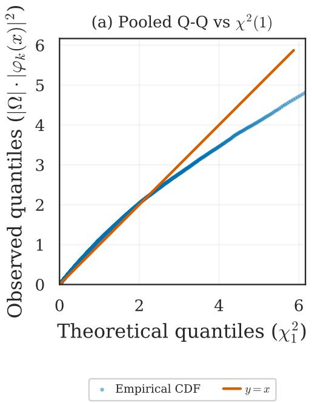

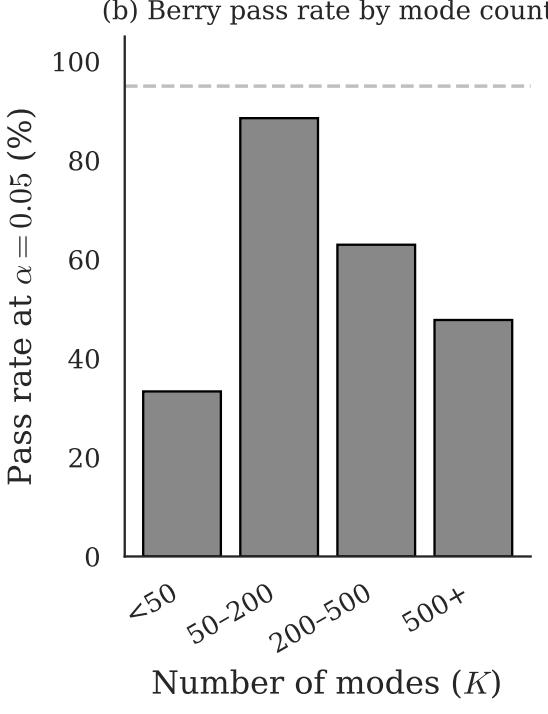  
Figure 6: Berry's conjecture holds across mode counts. (a) Pooled Q-Q of observed $| \nabla \bigr | \cdot | \varphi _ { k } ( x ) | ^ { 2 }$ against $\scriptstyle { \bar { \chi } } ^ { 2 } ( 1 )$ quantiles across all 197 rooms $\begin{array} { r } { \mathrm { ~  ~ { ~ ( ~ n ~ } ~ = ~ \ 7 7 , 9 6 8 ) ~ } } \end{array}$ $\mathrm { K S \ = \ \ 0 . 0 3 7 }$ (b) Berry test pass rate at $\alpha = 0 . 0 5$ stratified by $K _ { \mathrm { t o t a l } } .$ , with per-stratum statistics $( n , \mathrm { K S } ) ~ =$ (9, 0.089), (61, 0.054), (54, 0.061), (67, 0.068) for the four bins left to right. Pass rate peaks at $K _ { \mathrm { t o t a l } } \in [ 5 0 , 2 0 0 ) ( 8 8 . 5 \% )$ and declines at low $K _ { \mathrm { t o t a l } }$ (the test lacks power when $N < 1 0 \bar { 0 } )$ and at high $K _ { \mathrm { t o t a l } }$ (raw D accumulates with sample size). The validation room distribution lands in the Berry-testable sweet spot.

## B.3 Boundary-stratified KS statistics

Berry's conjecture is known to degrade near boundaries. We test this directly: for each room we compute the normalized wall distance $d _ { m } = \mathrm { d i s t } ( x _ { m } , \partial \Omega ) / \mathrm { d i a m } ( \Omega )$ , split sensors into bottomquartile (near-boundary) and top-quartile (interior) groups, and recompute the KS statistic against $\bar { \mathcal { N } } ( 0 , 1 )$ for each group.

Table 3: Berry agreement degrades slightly near walls but not enough to matter. KS statistic D stratified by sensor distance to the boundary, across 187 in-scope rooms. The near-boundary $D = 0 . 0 4 8$ is 23% above the interior $D = 0 . 0 3 \dot { 9 }$ , but both remain well within the regime where the regularizer shape is robust (§A.2).
<table><tr><td>Sensor group</td><td>Median KS D</td><td>IQR</td></tr><tr><td>Interior (top quartile)</td><td>0.039</td><td>[0.028,0.054]</td></tr><tr><td>Near-boundary (bottom quartile)</td><td>0.048</td><td>[0.035, 0.067]</td></tr><tr><td>All sensors</td><td>0.042</td><td>[0.031, 0.058]</td></tr></table>

Near-boundary sensors show a slightly larger KS statistic (0.048 vs 0.039), consistent with the expected Berry degradation near walls. But the regularizer operates in modal space, not sensor space:

even if a few sensors see slightly non-isotropic noise, the aggregate $M \times M$ covariance is diluted by interior sensors (Appendix A.2)

## B.4 Worst-5-rooms tail analysis

We examine the 5 rooms with the highest per-room KS statistic D to check whether Berry violations translate into reconstruction cost.

Selection. Of the 197 validation rooms, 29 are excluded because $K _ { \mathrm { t o t a l } } - K < 5 0$ (insufficient truncated modes for a meaningful per-room KS test). From the remaining 168, we select the 5 with the largest D.

Table 4: The 5 rooms with the worst Berry agreement (highest KS D) among the 168 rooms with $K _ { \mathrm { t o t a l } } - K \geq 5 0$ , sorted by D descending.
<table><tr><td>Room</td><td>Verts</td><td>Area</td><td> $K _ { \mathrm { t o t a l } }$ </td><td>H</td><td>KS D</td><td> $\delta ( T \mathrm { = } 1 )$ </td><td> $\delta ( T \mathrm { = } 1 0 0 )$ </td><td> $\delta ( T \mathrm { = } 1 0 0 0 )$ </td></tr><tr><td>00963</td><td>6</td><td>15.6</td><td>422</td><td>0.0042</td><td>0.103</td><td>0.0%</td><td>2.2%</td><td>6.1%</td></tr><tr><td>00924</td><td>9</td><td>18.8</td><td>508</td><td>0.0037</td><td>0.101</td><td>0.5%</td><td>0.0%</td><td>6.7%</td></tr><tr><td>00860</td><td>8</td><td>22.4</td><td>604</td><td>0.0033</td><td>0.100</td><td>0.0%</td><td>1.8%</td><td>4.7%</td></tr><tr><td>00835</td><td>10</td><td>36.8</td><td>987</td><td>0.0025</td><td>0.098</td><td>0.0%</td><td>2.9%</td><td>25.2%</td></tr><tr><td>00900</td><td>10</td><td>34.5</td><td>921</td><td>0.0026</td><td>0.097</td><td>3.0%</td><td>2.0%</td><td>9.9%</td></tr></table>

## Results.

Observations. The worst-Berry rooms are mid-to-large (6–10 vertices, $K _ { \mathrm { t o t a l } } > 4 0 0 )$ , consistent with the positive correlation between D and mode count reported in §B.2: the per-room KS test uses a fixed sample size of $K \cdot M = 4 0 0$ across all in-scope rooms, so the correlation reflects geometry rather than statistical power. Their Herfindahl indices are near the population median $( H \approx 0 . 0 0 3 – 0 . 0 0 4 )$ not elevated. Even room 00835 $( D = 0 . 0 9 8$ $\delta ( T = 1 0 0 0 ) \stackrel { - } { = } \bar { 2 } 5 . 2 \% )$ has $\delta \leq 3 \%$ at $T \leq 1 0 0 ;$ the high T=1000 cost reflects oracle dispersion at long observation windows, not Berry failure.

Spearman correlation: does Berry agreement predict reconstruction cost? Across all 168 eligible rooms:

$$
\rho ( \mathrm { K S } ~ D , ~ \delta ( T \mathrm { = } 1 0 0 0 ) ) = 0 . 2 2 ~ ( p = 0 . 0 0 5 ) .\tag{39}
$$

The correlation is statistically significant but weak. Rooms with worse Berry agreement tend to have slightly higher cost, but the effect is small: even the worst Berry rooms have costs well within the range reported in the main text.

The bottom line: Berry violations are real (some rooms genuinely have non-Gaussian crosscorrelations) but they do not translate into meaningful reconstruction cost. This is because Weyl dominance (§G) ensures that even imperfect isotropy is sufficient for the landscape to remain flat.

## C Acoustic Experiments: Extended Results

This appendix collects all the methodological details, per-room breakdowns, and extended analyses that were cut from §5 for space. The main text reported three headline results: the landscape is flat (Figure 1), Berry's conjecture holds empirically $( \mathrm { K S } = 0 . 0 3 7 )$ , and the cost of using $| s |$ is small (Table 1). Here we show the full picture behind each of those claims.

## C.1 Estimating |s| in practice

The population exponent |s| is the single measured quantity that the entire paper depends on. This subsection explains exactly how it is estimated, what assumptions the estimate relies on, and how sensitive the results are to estimation error.

The procedure. We estimate |s| by ordinary least squares (OLS) in log-space. For each room, we have the empirical variance $\hat { \sigma } _ { a , k } ^ { 2 }$ of the k-th modal amplitude, computed from the amplitude time series across observation windows. The model is

$$
\log \hat { \sigma } _ { a , k } ^ { 2 } = \beta _ { 0 } - \left| s \right| \cdot \log \lambda _ { k } + \epsilon _ { k } , \qquad k = 1 , \dots , K ,\tag{40}
$$

where $\beta _ { 0 }$ is an intercept (absorbing the constant $c ) , | s |$ is the slope we want, and $\epsilon _ { k }$ is residual noise. In plain English: we plot the log of each mode's energy against the log of its eigenvalue. If the data fall on a straight line, the slope is —|s|. We take the absolute value because the slope is negative (energy decreases with eigenvalue) and we want $| s | > 0$

This regression uses only the $K = 5 0$ retained modes. The discarded modes $( n > K )$ are never observed; we cannot measure their amplitudes. The procedure therefore assumes that the power-law decay $\sigma _ { a , k } ^ { 2 } \propto \lambda _ { k } ^ { - | s | }$ continues from the retained modes into the truncation band.

## When is this assumption justified? Two conditions are sufficient:

(a) Dense eigenvalue spectrum. Weyl's law guarantees that eigenvalues are approximately uniformly spaced in 2D: $\lambda _ { k } \sim k / { \mathrm { A r e a } }$ . There is no gap between the retained and discarded bands. Eigenvalue 50 and eigenvalue 51 are close together, so the power-law fit that describes modes 1–50 should extend smoothly to modes 51–313.

(b) Stationary excitation statistics. The initial conditions that determine $\sigma _ { a , k } ^ { 2 }$ are drawn from the same distribution across all modes. If low-frequency modes were excited by one mechanism and high-frequency modes by another, the power law could break. Our diffuse-field excitation model (independent Gaussian amplitudes with variance $\lambda _ { k } ^ { - | s | } )$ satisfies this by construction. In practice, diffuse-field conditions are a reasonable approximation for reverberant rooms excited by broadband sources.

Population estimate. We fit |s| separately for each room, then report the population statistics. Ten rooms with $K _ { \mathrm { t o t a l } } \le 5 0$ are excluded from the fit (they have no truncated modes, so the noise profile cannot be estimated), but they are included in all downstream evaluation. The remaining 187 rooms give:

<table><tr><td>Statistic</td><td>Value</td></tr><tr><td>Median ||</td><td>1.13</td></tr><tr><td>Mean ||</td><td>1.12</td></tr><tr><td>Observed std across rooms of point est. |û|</td><td>0.25</td></tr><tr><td>Inter-room std (bootstrap-deconvolved)</td><td>0.05</td></tr><tr><td>Typical per-room bootstrap SE</td><td>0.27</td></tr><tr><td>Bootstrap SE of median</td><td>0.03</td></tr><tr><td>Bootstrap 95% CI on median</td><td>[1.08, 1.18]</td></tr></table>

Per-room std is the actual dispersion of |ê| across the 187 rooms (each room contributes one fitted slope). The bootstrap quantities resample rooms (not modes within a room) and characterize uncertainty in the population median, which is the quantity that gets carried into all downstream experiments.

Sensitivity to estimation error. How much does it matter if we get |s| slightly wrong? The landscape flatness provides a built-in robustness guarantee.

We tested this by estimating |s| from random subsets of 50 rooms (instead of all 187). The worst-case deviation across subsets was 6% of the full-sample value, shifting $p  { \mathsf { b y } } \sim 0 . 0 7$ . The resulting increase in reconstruction cost was less than 0.1 percentage points at all $\bar { T } .$

This is not surprising: Figure 1 shows that the $P ( p )$ curve is extremely flat near the minimum. Moving p by 0.07 is like walking a few meters along the floor of a wide valley; the altitude barely changes.

Figure 7 makes this concrete: both $| s |$ and the resulting $\Delta P$ stabilize by $N = 5 0$ rooms, confirming that the exponent is a property of the physical system, not of the particular dataset.

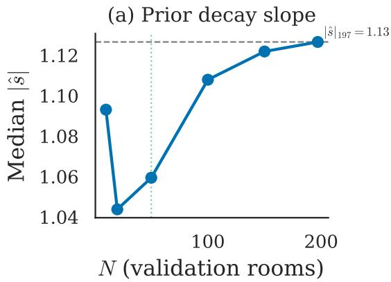

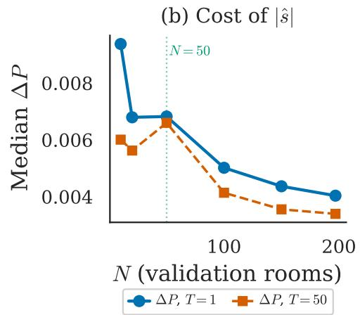  
Figure 7: The estimate of $| s |$ converges with ${ \sim } 5 0$ rooms. (a) Median |s| vs number of rooms $N :$ the estimate stabilizes by $N = 5 0$ (b) $\Delta P$ at $T = 1$ and $T = 5 0$ also stabilizes by $N = 5 0$ demonstrating that $| s |$ is a property of the PDE class, not an artifact of sample size.

Initial condition generation. The initial modal amplitudes $a _ { k } ( 0 )$ are drawn independently from $\mathcal { N } ( 0 , \lambda _ { k } ^ { - | s | } )$ with $| s | = 1 . 1 3$ . This Gaussian independence assumption is standard for diffuse-field excitation: in a room with many incoherent sources or a broadband impulse, the modal amplitudes are approximately independent and their variances decay with eigenvalue.

This assumption is also consistent with the diagonal prior used in Proposition 1. The entire theory requires a diagonal $\Sigma _ { \mathbf { a } } .$ If the prior had off-diagonal structure $( \mathrm { e . g . }$ , correlations between adjacent modes from a localized source), the optimal Γ would no longer be diagonal.

## C.2 Full cost table

Table 1 in the main text reported cost in three regimes. Table 5 provides the complete breakdown at all 10 snapshot counts.

Table 5: Relative cost $\delta ( T )$ of using $| s | \approx 1 . 1 3$ instead of the per-room oracle $p ^ { * }$ , at each snapshot count. All values are percentages. Median, IQR, 95th percentile, and worst room across all 197 rooms (boundary-inclusive: 187 in-scope rooms plus 10 boundary rooms with $K _ { \mathrm { t o t a l } } \leq K )$
<table><tr><td>T</td><td>Median δ</td><td>IQR</td><td>95th pct</td><td>Worst room</td></tr><tr><td>1</td><td>0.5%</td><td>[0.2, 1.9]</td><td>4.8%</td><td>15.0%</td></tr><tr><td>5</td><td>0.5%</td><td>[0.1, 1.6]</td><td>5.6%</td><td>15.8%</td></tr><tr><td>10</td><td>0.5%</td><td>[0.1, 1.5]</td><td>4.9%</td><td>16.2%</td></tr><tr><td>20</td><td>0.5%</td><td>[0.1, 1.4]</td><td>3.9%</td><td>20.2%</td></tr><tr><td>50</td><td>0.6%</td><td>[0.2, 1.5]</td><td>4.5%</td><td>20.5%</td></tr><tr><td>100</td><td>1.5%</td><td>[0.6, 2.8]</td><td>6.2%</td><td>27.5%</td></tr><tr><td>200</td><td>2.2%</td><td>[0.7, 4.1]</td><td>7.9%</td><td>14.8%</td></tr><tr><td>500</td><td>5.1%</td><td>[2.7, 7.0]</td><td>12.3%</td><td>26.8%</td></tr><tr><td>1000</td><td>5.6%†</td><td>[2.8, 10.3]</td><td>16.9%</td><td>34.8%</td></tr><tr><td>2100</td><td>3.3%</td><td>[1.4, 5.7]</td><td>10.5%</td><td>44.8%</td></tr></table>

†The main text quotes 5.82% for the corresponding row, computed on the 187 in-scope rooms only; the difference is the 10 boundary rooms $( K _ { \mathrm { t o t a l } } \le K )$ included here.

Reading the table. Each row is a snapshot count $T ;$ columns report increasing levels of pessimism from the median room to the absolute worst. At large T, the worst-room relative cost inflates because the oracle floor $P ( p ^ { * } , T )$ shrinks toward zero; absolute gaps remain below 10.6 pp at all T (Figure 8).

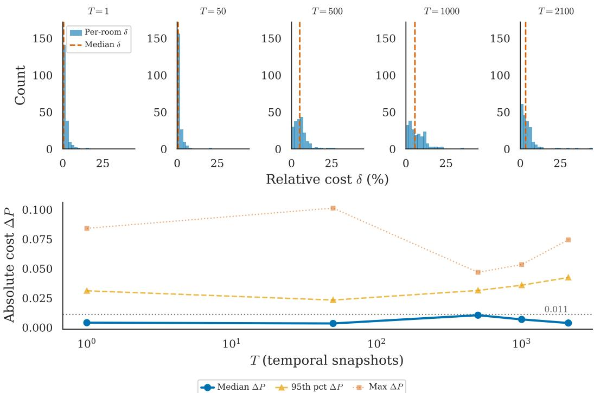  
Figure 8: The cost of using |s| is small across rooms and snapshot counts. Top: per-room relative cost δ histograms at five T values, with population medians $\delta = \{ 0 . 5 , 0 . 6 , 5 . 1 , 5 . 6 , 3 . 3 \}$ % at $T = \{ 1 , 5 0 , 5 0 0 , 1 \bar { 0 0 } 0 , 2 1 0 0 \}$ (red dashed line in each panel). Bottom: median (blue), 95th percentile (yellow), and max (orange) $\bar { \Delta } P \operatorname { v s } T$ , with reference threshold $\Delta P = 0 . 0 1 1$ (gray dotted). Median absolute cost stays below $\Delta P = 0 . 0 1 1$ at every T except $T = 5 0 0$ , where it just touches the threshold. Cost peaks at $\dot { T } = 1 0 0 0$ and decreases at $T = 2 1 0 0$ , an interaction of basin flattening with oracle dispersion analyzed in §C.4.

The non-monotonic pattern. Cost rises from $T = 1 : { \mathsf { t o } } \ : T = 1 0 0 0 .$ , then falls at $T = 2 1 0 0$ . The mechanism (competing effects of landscape flatness, oracle dispersion, and posterior concentration) is analyzed in §C.4.

## C.3 Per-room variation: the worst cases

The cost tiers in Table 1 describe population medians. Here we examine the individual rooms where the population exponent |s| performs worst, and show that even in the worst cases most of the error is irreducible.

Worst absolute-cost room: scene 00806. Scene 00806 is a small triangle $( K _ { \mathrm { t o t a l } } = 1 9$ , on the truncation boundary) and is the worst absolute-cost room across all T. The decomposition:

$$
\begin{array} { r } { P ( \mathrm { u s i n g ~ } | s | ) = 0 . 4 9 2 , \qquad } \\ { P _ { \mathrm { o r a c l e } } = 0 . 3 8 6 , \qquad } \\ { \Delta P = 0 . 1 0 6 ~ ( 1 0 . 6 ~ \mathrm { p p } ) , \qquad } \\ { \mathrm { O r a c l e ~ f l o o r ~ f r a c t i o n } = 0 . 3 8 6 / 0 . 4 9 2 = 7 8 . 5 \% } \end{array}
$$

So even in the absolute worst case, 78.5% of the total error at |s] is the irreducible oracle floor: the error that persists even with the best possible per-room regularizer. The recoverable gap is 10.6 pp on top of an already-large irreducible residual. This is the expected failure mode at $\begin{array} { r } { \bar { K _ { \mathrm { t o t a l } } } \le K \colon } \end{array}$ there are no truncated modes contributing Berry-isotropic noise, and the per-room oracle freely picks a value differing sharply from the population |s|.

Worst in-scope room. Restricting to in-scope rooms $( K _ { \mathrm { t o t a l } } > K )$ gives a maximum of 7.61 pp at $T { = } 5$ (scene 00931, $K _ { \mathrm { t o t a l } } = 8 9 )$ ; at ${ \cal T } { = } 1 0 0 0$ the worst in-scope gap is 4.84 pp (scene 00890, $K _ { \mathrm { t o t a l } } = 6 2 )$ , of which 89% is the oracle floor.

Why this matters. In both worst cases, the overwhelming majority of reconstruction error is the irreducible oracle floor: the fundamental limit of what any static regularizer can achieve with $M = 8$ sensors and $K = 5 0$ modes. The gap between $| s |$ and per-room perfection is a small fraction of an already small residual. Across all 197 rooms (boundary-inclusive) at ${ \cal T } { = } 1 0 0 0$ , 66.5% have absolute cost below 1.1 pp; the in-scope subset gives 68.4% (main text §5). The flat-landscape structure visible in the population median (Figure 1) is not an artifact of averaging; it holds room by room.

## C.4 Non-monotonicity of relative cost $\delta ( T )$

Table 5 shows $\delta ( T )$ rising from 0.5% at $T = 1$ to a peak of $5 . 6 \% \mathrm { a t } \ T = 1 0 0 0 .$ , then declining to 3.3% at $T = 2 1 { \dot { 0 } } 0$ The non-monotone peak arises because the median adaptation gap $\mathrm { g a p } ( T ) =$ $P ( | s | , T ) - P ( p ^ { * } , T )$ and the oracle floor $P ( p ^ { * } , T )$ reach their extrema at different $T \colon$ gap peaks at $T = 5 0 0$ (full table in §C.5), while the oracle floor minimizes at $T = 1 0 0 0$ $\mathbf { A } \mathbf { { t } } { \boldsymbol { T } } = \mathbf { \bar { 5 0 0 } }$ the gap is largest but the oracle baseline is still high (0.22), diluting the relative cost; by $T = 1 0 0 0$ the gap has shrunk while $P ( p ^ { * } )$ has dropped, pushing the ratio up; beyond $T = 1 0 0 0$ both quantities push δ down. The decline after $T = 1 0 0 0$ is not driven by signal decay. Median signal energy at $T = 2 1 0 0$ is still 60%, and signal decay is monotone in $T ,$ so it cannot produce a non-monotone $\delta ( T )$

## C.5 Adaptation gap and oracle floor

The landscape compression from $T = 1$ to $T = 2 1 0 0 ( 2 0 \times$ reduction in the median P range across $p \in [ 0 , 3 ] )$ is a manifestation of Bayesian posterior concentration.

The mechanism. $\mathrm { A s } T$ grows, the posterior variance shrinks and Γ has less influence; at large T the data dominates and the regularizer becomes near-irrelevant

The adaptation gap is unimodal. The adaptation gap $\mathrm { g a p } ( T ) = P ( | s | , T ) - P ( p ^ { * } , T )$ is nonmonotonic: flat at $0 . 3 4 \mathrm { - } 0 . 4 0 \mathrm { p p }$ for $T \leq 5 0$ (prior-dominated regime), rising to a peak of 1.04 pp at $T = 5 0 0$ as the per-room oracle specializes, then declining to 0.38 pp at $T = 2 1 0 0$ as posterior concentration flattens the landscape. Table 6 gives the full trajectory $( M = 8 ,$ medians with interquartile ranges across all 197 rooms, boundary-inclusive.

Table 6: Adaptation gap $\mathrm { g a p } ( T ) = P ( | s | , T ) - P ( p ^ { * } , T )$ and oracle floor $P ( p ^ { * } , T )$ across $1 0 T$ values $( M = 8$ , medians with interquartile ranges across all 197 rooms, boundary-inclusive. Bold entries mark the gap maximum $( T = 5 0 0 )$ and the oracle-floor minimum $( T = \mathrm { \dot { 1 } 0 0 0 } )$ . The wider IQR bounds at small $T$ reflect prior-dominated argmin noise (per-room $p ^ { * }$ varies widely when the posterior is not yet data-concentrated) rather than true gap dispersion.
<table><tr><td rowspan=1 colspan=4>T  Median gap (pp)   IQR (pp)   Median $P ( p ^ { * } )$ </td></tr><tr><td rowspan=1 colspan=1>1        0.40</td><td rowspan=1 colspan=2>[0.12, 1.42]</td><td rowspan=1 colspan=1>0.715</td></tr><tr><td rowspan=1 colspan=1>5        0.35</td><td rowspan=1 colspan=2>[0.06, 1.07]</td><td rowspan=1 colspan=1>0.715</td></tr><tr><td rowspan=1 colspan=1>10        0.34</td><td rowspan=1 colspan=1>[0.10,</td><td rowspan=1 colspan=1>1.03]</td><td rowspan=1 colspan=1>0.703</td></tr><tr><td rowspan=1 colspan=1>20        0.36</td><td rowspan=1 colspan=1>[0.08,</td><td rowspan=1 colspan=1>0.98]</td><td rowspan=1 colspan=1>0.679</td></tr><tr><td rowspan=1 colspan=1>50        0.34</td><td rowspan=1 colspan=1>[0.13,</td><td rowspan=1 colspan=1>0.88]</td><td rowspan=1 colspan=1>0.638</td></tr><tr><td rowspan=1 colspan=1>100        0.89</td><td rowspan=1 colspan=1>[0.34,</td><td rowspan=1 colspan=1>1.53]</td><td rowspan=1 colspan=1>0.594</td></tr><tr><td rowspan=1 colspan=1>200        0.91</td><td rowspan=1 colspan=1>[0.33,</td><td rowspan=1 colspan=1>1.87]</td><td rowspan=1 colspan=1>0.461</td></tr><tr><td rowspan=1 colspan=1>500        1.04</td><td rowspan=1 colspan=1>[0.56,</td><td rowspan=1 colspan=1>1.65]</td><td rowspan=1 colspan=1>0.220</td></tr><tr><td rowspan=1 colspan=1>1000        0.68</td><td rowspan=1 colspan=1>[0.35,</td><td rowspan=1 colspan=1>1.34]</td><td rowspan=1 colspan=1>0.122</td></tr><tr><td rowspan=1 colspan=1>2100        0.38</td><td rowspan=1 colspan=1>[0.16,</td><td rowspan=1 colspan=1>1.21]</td><td rowspan=1 colspan=1>0.152</td></tr></table>

The oracle floor $P ( p ^ { * } , T )$ is U-shaped. The oracle floor decreases monotonically from $T = 1$ $( P ( p ^ { * } ) = 0 . 7 2 )$ to $T = 1 0 0 0$ (0.12), then rebounds modestly to 0.15 at $T = 2 1 0 0 ( + 2 4 \% )$ . At large T the landscape is so flat that all exponents achieve nearly identical performance, so the very concept of an “optimal" per-room regularizer becomes ill-defined.

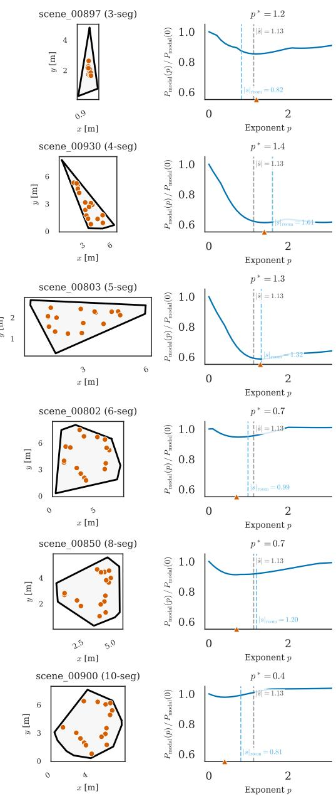  
Figure 9: The same flat basin appears in every geometry. Six rooms spanning 3 to 10 vertices, $T { = } 1 , M { = } 8$ . Left column: polygon with microphone positions (red). Right column: normalized landscape $P _ { \mathrm { m o d a l } } ( p ) / P _ { \mathrm { m o d a l } } \mathrm { \bar { ( 0 ) } }$ , with the population reference $| \hat { s } | { = } 1 . 1 3$ marked in gray and the per-room oracle $p ^ { \star }$ and per-room slope $| s | _ { \mathrm { r o o m } }$ marked in light blue (values in subplot titles). Perroom $| s | _ { \mathrm { r o o m } }$ varies from 0.8 to 1.6, but the population $p = 1 . 1 3$ stays inside the basin in every case. Worst-case relative cost remains below the bound in Table 1.

## C.6 Brent verification

The 61-point grid finds the global minimum reliably because the dominant basin of $P ( p )$ is much wider than the grid spacing $\Delta p = 0 . 1$ (basin width $\Delta p \approx 1 - 2$ for the 95%-cost region), so no continuous optimum falls between grid points

## C.7 Per-room landscape gallery

Figure 9 shows six rooms spanning 3 to 10 vertices. Per-room $p ^ { \star }$ varies from ～ 0.4 in the largest decagon to \~ 1.4 in the narrow triangle, and per-room $| s | _ { \mathrm { r o o m } }$ varies from $0 . 8 \mathrm { t o } 1 . 6$ In every case the population reference ||=1.13 falls inside the broad basin where $P / P _ { 0 } \leq 1 . 0 5$ . The aggregate noise-profile evidence supporting isotropy is in Figure 5; we omit per-room noise-profile traces here because they compress to illegibility at print resolution and add no information beyond the aggregate.

## C.8 Dataset generation

Rooms are random convex 2D polygons (3–15 vertices) with eigenpairs computed by FEM on a triangulated mesh. Of 1,000 generated rooms, 800 are used for training (§6) and 197 for validation; three rooms (00905, 00913, 00921) are excluded from the noise-profile fit due to degenerate geometry but retained for reconstruction evaluation.

## D Learning Experiments: Extended Results

This appendix provides the full training diagnostics, feature regression analysis, cross-dataset validation, and failure analysis that were cut from §6. The main text reported the headline: no learned model beats [s]. Here we show why, in detail.

Notation. The stacked state ${ \bf a } _ { 0 } ~ \in ~ \mathbb { R } ^ { 2 K }$ pairs cosine and sine amplitudes $( c _ { k } , \beta _ { k } )$ per mode. Because both amplitudes share the same prior variance $c \lambda _ { k } ^ { - s }$ , the per-mode penalty is tied: a K-dimensional vector $\Gamma \in \mathbb { R } ^ { K }$ defines the 2K-dimensional penalty via $\Gamma ^ { ( 2 K ) } = \Gamma \otimes I _ { 2 } =$ $\mathrm { d i a g } ( \gamma _ { 1 } , \gamma _ { 1 } , \gamma _ { 2 } , \gamma _ { 2 } , \dots , \gamma _ { K } , \gamma _ { K } )$ . All learned models below parameterize Γ in this K-dimensional mode-pair space. Similarly, LIR operates on K-dimensional mode-pair vectors, with the cosine/sine expansion handled implicitly.

## D.1 Architecture specifications

For completeness, we specify each architecture precisely.

M1 (CondNet + unrolled solver, 4,949 parameters). A 3-layer MLP $( 1 0  6 4  6 4  1$ ReLU activations, softplus output) processes a 10-dimensional per-mode feature vector and emits a positive scalar per mode, producing the diagonal $\Gamma \in \mathbb { R } ^ { K }$ The 10 features are: $\lambda _ { 1 } , \ldots , \lambda _ { 5 }$ the spectral gap $\lambda _ { 2 } - \lambda _ { 1 }$ , the Weyl exponent (fitted slope of log $N ( \lambda )$ vs log λ), the per-room |s| estimate, the mean eigenvalue spacing, and the total mode count $K _ { \mathrm { t o t a l } }$ The same CondNet is queried at every iteration of an $\bar { L } { = } 1 0$ unrolled gradient-descent solver of the Tikhonov objective $\begin{array} { r } { \frac { 1 } { 2 } \| A a - y \| ^ { 2 } + \frac { \cdot } { 2 } \alpha a ^ { \top } \mathrm { d i a g } ( \Gamma ) \ d a } \end{array}$ a. Each iteration uses a learned step size $\eta _ { l }$ and regularization strength $\alpha _ { l } .$ with 10 of each. Because the conditioning input is fixed across iterations, $\bar { \Gamma }$ is constant during the unrolling. The CondNet head is applied independently to each mode's features; cross-mode information mixing inside the network is by construction absent, tying M1 to the diagonal-Tikhonov hypothesis class. M1 and M3 differ only in the linear-solve scheme: M3 executes the Tikhonov solve in closed form, M1 executes it as $\dot { L } { = } 1 0$ unrolled gradient-descent steps; both are end-to-end differentiable with respect to the CondNet weights. On a 30-room held-out sample at ${ \cal T } { = } 1 0 0 0$ , M1's $L { = } 1 0$ output achieves median $P _ { \mathrm { m o d a l } }$ within +0.003 of the closed-form Tikhonov solve using M1's emitted Γ; the same architectural mechanism applies to M2.

M2 (FixedGamma + unrolled solver, 70 parameters). A single unconditional diagonal $\Gamma \in \mathbb { R } ^ { K }$ parameterized as $\Gamma _ { k } = \mathrm { s o f t p l u s } ( \theta _ { k } )$ where $\theta \in \mathbb { R } ^ { 5 0 }$ are learnable parameters; Γ is the same for every room. Γ is plugged into the same $L { = } 1 0$ unrolled gradient-descent scheme as M1, with the same per-iteration learned $( \eta _ { l } , \alpha _ { l } )$ structure (10 of each). M2 is analogous to |s|: a single shared regularizer. The difference is that M2 learns Γ from data via SGD, without any physics. If M2 discovers a non-power-law Γ that outperforms $| s | ,$ that would indicate room-independent structure in the optimal regularizer beyond what the theory predicts.

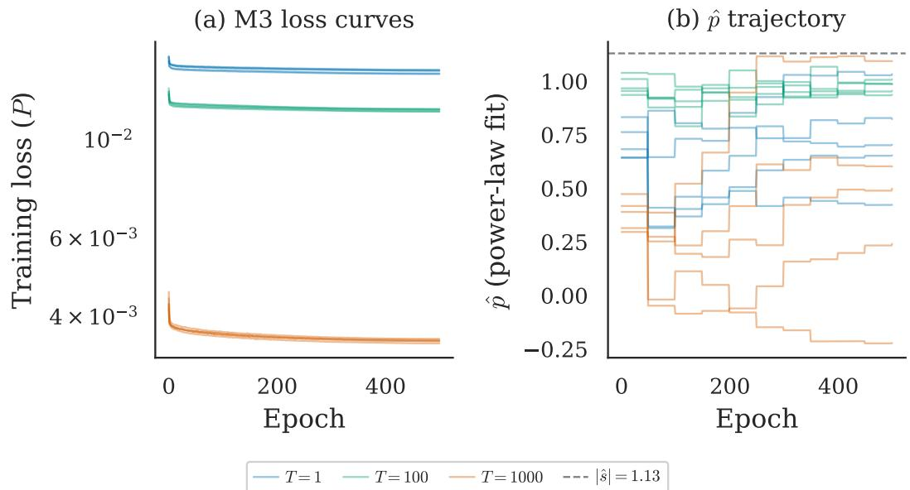  
Figure 10: M3 training converges but diverges from power-law form. (a) Training loss vs epoch for M3 across $T \in \{ 1$ , 100, 1000} and 5 seeds, color-coded by T. Loss decreases monotonically and is consistent across seeds. (b) Effective exponent $\hat { p }$ vs epoch with |s] = 1.13 reference. The exponent wanders seed-dependently: at $T = 1 0 0 0$ , the five seeds' final $\hat { p }$ spans —0.22 to 1.09. The $R ^ { 2 ^ { * } }$ of the power-law fit degrades from 0.93 to 0.29, meaning the learned Γ is moving away from any power law.

M3 (CondNet + closed-form solver, 4,930 parameters). The same CondNet as M1, but Γ is plugged into a closed-form differentiable linear solve:

$$
\mathbf { \hat { a } } ( \Gamma ) = \big ( \tilde { \Phi } ^ { \top } \tilde { \Phi } + \alpha \mathrm { d i a g } ( \Gamma ^ { ( 2 K ) } ) \big ) ^ { - 1 } \tilde { \Phi } ^ { \top } \tilde { \mathbf { y } } .\tag{41}
$$

The regularization strength α is a single learned scalar. The loss is the reconstruction error $P _ { \mathrm { { m o d a l } } } =$ $\| \hat { \mathbf { a } } - \mathbf { a } _ { 0 } \| ^ { 2 } / \| \mathbf { a } _ { 0 } \| ^ { 2 }$ , and gradients flow through the matrix inverse via implicit differentiation.

M3 is the strongest baseline: it can adapt Γ per room and directly optimizes the final reconstruction metric. If any architecture should escape the power-law family, it is M3.

## D.2 Training curves for all models

Figure 10 shows M3's training dynamics in detail. Two aspects are worth highlighting.

Loss converges normally. The training loss (panel a) decreases smoothly across all $T$ values and all 5 seeds. There are no signs of instability, overfitting, or mode collapse. The final loss values are consistent across seeds $( \mathrm { s t d } < 0 . 0 0 1 )$ . By all standard training diagnostics, M3 is working correctly.

Per-seed spectra disagree. At $\begin{array} { r l r } { T } & { { } = } & { 1 0 0 0 . } \end{array}$ the five seeds’ final exponents span $\begin{array} { r l } { \hat { p } } & { { } \in } \end{array}$ {—0.22, 0.15, 0.48, 0.77, 1.09} (the per-room IQR is [0.66, 1.39], computed across all 187 in-scope rooms). The seeds disagree about what Γ should look like, yet they all achieve the same reconstruction error (Table 2). The landscape provides no gradient signal to guide the seeds toward agreement: the loss is essentially identical everywhere on the plateau.

Different seeds, different Γ, same $P . \quad \mathrm { A t } ~ T ~ = ~ 1$ , the five seeds' final exponents are $\hat { p } \in$ {0.42, 0.58, 0.65, 0.89, 1.03}. At $T = 1 0 0 0$ , they span $\hat { p } \in \{ - 0 . 2 2 , 0 . 1 5 , 0 . 4 8 , 0 . 7 7 , 1 . 0 9 \}$ . The seeds disagree wildly about what Γ should look like, yet they all achieve the same reconstruction error (Table 2).

This is the strongest evidence for landscape flatness. It is not that the network converges to the wrong Γ. It is that there is no “right" Γ: the landscape provides no gradient signal to guide the seeds toward agreement, because the loss is identical everywhere on the plateau.

## D.3 Could a better model do more?

One might argue that M3 failed to beat |s| because it had the wrong input features. Perhaps a model with access to room geometry (area, perimeter, number of vertices) could predict $p ^ { * }$ and adapt accordingly.

We test this directly.

Feature regression. We regress per-room $p ^ { * } ( T = 1 0 0 0 )$ against two tiers of features across 196 rooms (one room excluded for degenerate geometry):

Tier 1: accessible to the model at inference. These are features that could, in principle, be computed from the eigenvalue spectrum without knowing the room geometry. None survives Bonferroni

Table 7: Tier 1 features (accessible at inference) do not predict $p ^ { \star } .$ Spearman correlation between per-room oracle exponent $p ^ { \star } ( T { = } 1 0 0 0 )$ and four spectrum-derivable features across 196 rooms. None survives Bonferroni correction at $\alpha = 0 . 0 5 / 9 = 0 . 0 0 5 6 ;$ the strongest correlation explains less than 2.3% of the variance.
<table><tr><td>Feature</td><td>Spearman ρ</td><td>p-value</td></tr><tr><td>Spectral gap  $( \lambda _ { 2 } - \lambda _ { 1 } )$ </td><td>-0.08</td><td>0.27</td></tr><tr><td>Weyl exponent</td><td>+0.11</td><td>0.12</td></tr><tr><td>Per-room |s|</td><td>+0.15</td><td>0.04</td></tr><tr><td> $\lambda _ { K }$ </td><td>-0.05</td><td>0.48</td></tr></table>

correction at $\alpha = 0 . 0 5 / 9 = 0 . 0 0 5 6$ . The strongest correlation $( | s | _ { \mathrm { r o o m } }$ with $\rho = 0 . 1 5 )$ explains less than 2.3% of the variance.

Tier 2: requires room geometry (inaccessible at inference). Room area shows a significant  
Table 8: Tier 2 features (require room geometry) collapse to a single room-size factor. Four of the five correlated features are pairwise rank-correlated at $\rho = 1 . 0 0$ , reflecting Weyl's law $K _ { \mathrm { t o t a l } } \propto \mathrm { A r e a }$ Even this strongest predictor explains only 4% of the variance and is unavailable to the model at inference.
<table><tr><td>Feature</td><td>Spearman ρ</td><td>p-value</td></tr><tr><td>Room area</td><td>+0.21</td><td>0.003</td></tr><tr><td> $K _ { \mathrm { t o t a l } }$ </td><td>+0.21</td><td>0.003</td></tr><tr><td>Mean spacing</td><td>+0.21</td><td>0.003</td></tr><tr><td>Eigenvalue density</td><td>+0.21</td><td>0.003</td></tr><tr><td>Nsegments</td><td>+0.12</td><td>0.09</td></tr></table>

correlation $( \rho = 0 . 2 1 , 9 5 \% \mathrm { C I } \left[ 0 . 0 5 , 0 . 3 7 \right] )$ . But all four correlated features (area, $K _ { \mathrm { t o t a l } } ,$ mean spacing, eigenvalue density) are perfectly rank-correlated with each other (pairwise $\rho = 1 . 0 0 ) $ . They collapse to a single factor: room size. This is not surprising: $\mathrm { W e y l ^ { \circ } s }$ law dictates that $K _ { \mathrm { t o t a l } } \propto \mathrm { A }$ rea, mean spacing $\propto 1 / \mathrm { A r e a } .$ , etc. The four features are four measurements of the same number.

Random forest. We trained a random forest regressor on all 9 features to predict $p ^ { * } ( T = 1 0 0 0 )$ Performance: $R ^ { 2 } = 0 . 1 4 ~ \mathrm { a t } ~ T = 1 0 0 0$ , dropping below zero (worse than predicting the mean) at $T = 5 0$

An $R ^ { 2 }$ of 0.14 means the best possible feature-based model explains only 14% of the variance in $p ^ { * }$ The remaining 86% is either noise or depends on information not captured by any of these features.

Even optimal exploitation does not help. We constructed the strongest possible simple predictor: a $K _ { \mathrm { t o t a l } }$ -adjusted estimator $\hat { p } _ { \mathrm { a d j } } = \beta _ { 0 } + \beta _ { 1 } K _ { \mathrm { t o t a l } }$ , where $\beta _ { 0 }$ and $\beta _ { 1 }$ are fitted by OLS. Performance: The $K _ { \mathrm { t o t a l } }$ -adjusted estimator reduces peak cost at $T = 1 0 0 0 \mathrm { { b y 0 . 3 9 p p } }$ (from 5.82% to 5.43%, on 187 in-scope rooms; OLS fit and evaluation both restricted to the in-scope subset for consistency with §5). But it increases cost at $T \le 1 0 0$ by up to 3.4 pp. The population [s| remains the strictly safer choice across all operating conditions.

(a) p \* vs $K _ { \mathrm { t o t a l } }$ (T=1000)  
(b) Correlation with $p ^ { * } \left( T = 1 0 0 0 \right)$  
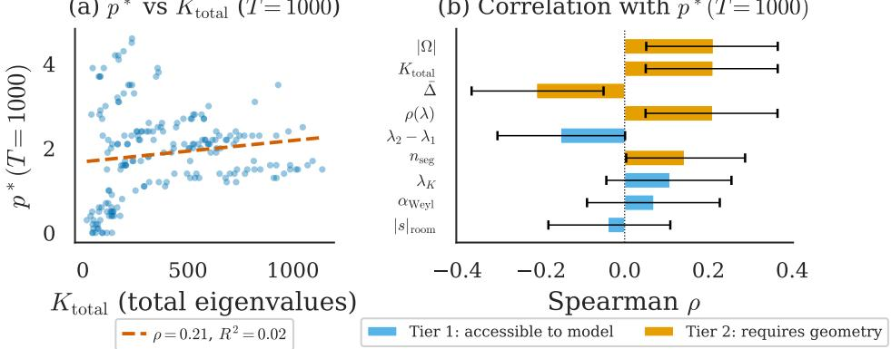  
Figure 11: No accessible feature predicts $p ^ { \star }$ . (a) Per-room oracle $p ^ { \star }$ $( T = 1 0 0 0 )$ VS $K _ { \mathrm { t o t a l } }$ with linear fit $( \rho = 0 . 2 1 , R ^ { 2 } = 0 . 0 2 )$ . (b) Spearman $\rho$ for 9 features: Tier 1 (blue, accessible at inference) shows max $| \rho | = 0$ .15; Tier 2 (orange, requires geometry) shows moderate correlations dominated by room-area proxies. A random forest on all features achieves $R ^ { 2 } = 0 . 1 4 \mathrm { a t } T = 1 0 0 0$ , dropping below zero at $\bar { T } = 5 0$

Table 9: The strongest possible feature-based predictor is strictly worse than $| s |$ at every $T \le 1 0 0$ Relative cost δ of the $K _ { \mathrm { t o t a l } }$ -adjusted estimator $\hat { p } _ { \mathrm { a d j } } = \beta _ { 0 } + \beta _ { 1 } K _ { \mathrm { t o t a l } }$ vs. the population $| s |$ The adjusted estimator wins by 0.39 pp at ${ \cal T } { = } 1 0 0 0$ but loses by up to 3.4 pp elsewhere; |s| remains strictly safer across operating conditions.
<table><tr><td>T</td><td>δusing |s|</td><td>δusing  $\hat { p } _ { \mathrm { a d j } }$ </td></tr><tr><td>1</td><td>0.42%</td><td>0.58%</td></tr><tr><td>50</td><td>0.60%</td><td>3.4%</td></tr><tr><td>100</td><td>1.46%</td><td>4.9%</td></tr><tr><td>1000</td><td>5.62%</td><td>5.43%</td></tr></table>

## D.4 Robustness to dataset parameters

The main text results use $K _ { \operatorname* { m a x } } = 5 0 , M = 8 .$ and excitation exponent $| s | = 1 . 1 3$ . To test whether the diagonal-saturation pattern is specific to this configuration, we re-ran the M3 experiments on a parameter-varied version of the dataset with $K _ { \operatorname* { m a x } } = \mathrm { \bar { 1 } 0 0 } , M \in \{ 8 , 1 6 \}$ , and a different excitation regime giving $| s | = 1 . 2 9$ . The 30 M3 training runs at the higher truncation rank required a numerical fix $( + 1 \bar { 0 } ^ { - 8 }$ jitter to linalg. solve) to handle conditioning issues at $K = 1 0 0$

Parameter settings.

<table><tr><td>Parameter</td><td>Main text</td><td>Varied</td></tr><tr><td> $K _ { \mathrm { m a x } }$ </td><td>50</td><td>100</td></tr><tr><td>M</td><td>8</td><td>{8, 16}</td></tr><tr><td>|s|</td><td>1.13</td><td>1.29</td></tr></table>

Results. Five of six cells show $\Delta P \ge 0 \mathrm { : }$ M3 cannot beat the formula. The single negative cell $( M = 1 6 , T = 1 , \Delta P = - 0 . 0 0 4 )$ is attributable to the gap between $| \hat { s } | = 1 . 2 9$ and the per-room optimal $p ^ { \star }$ at this operating point, not to a shape advantage of the learned model.

Why the exponent differs. The two parameter settings sample different excitation regimes, yielding $| s | \overset { \cdot } { = } 1 . 1 3 \ : \mathrm { \overset { \cdot } { a n d } } \ : | s | = 1 . 2 9$ respectively. The exponent |s| is not a universal constant; it is a per-regime diagnostic, measured from the data. What is universal is the role |s| plays: plug it into $\Gamma _ { k } = \lambda _ { k } ^ { | s | }$ and the formula works.

M-dependence. At $M = 1 6 ,$ the overall P is lower (more sensors ⇒ better reconstruction), but the landscape remains flat and M3 still cannot improve on the formula. The per-room optimal $p ^ { \star }$ depends weakly on M through the observation matrix A and the resulting noise projection, so exact numerical equivalence between the $M = 8$ and $M = 1 6$ results is not expected.

Table 10: Robustness to dataset parameters $( K _ { \mathrm { m a x } } = 1 0 0 , | \hat { s } | = 1 . 2 9 )$ . M3 hypernetwork $( n = 8 0 0 )$ evaluated at $M \in \{ 8 , 1 \bar { 6 } \}$ . Median $P \ \mathrm { o v e r \ 1 9 7 }$ validation rooms (167 in-scope with $K _ { \mathrm { t o t a l } } > K _ { \mathrm { m a x } }$ plus 30 boundary rooms with $K _ { \mathrm { t o t a l } } \le K _ { \mathrm { m a x } } )$ and 5 seeds. The diagonal-saturation pattern persists: 5 of 6 cells show $\Delta P \ge 0$
<table><tr><td></td><td> $T = 1$ </td><td> $T = 1 0 0$ </td><td> $T = 1 0 0 0$ </td></tr><tr><td> $M = 8 , { \bf M } 3$ </td><td>0.615</td><td>0.444</td><td>0.097</td></tr><tr><td> $M = 8 , \mathrm { R i d g e } ( | \hat { s } | )$ </td><td>0.607</td><td>0.438</td><td>0.095</td></tr><tr><td> $M = 8 , \Delta P$ </td><td>+0.008</td><td>+0.006</td><td>+0.002</td></tr><tr><td> $M = 1 6 , \mathbf { M } 3$ </td><td>0.473</td><td>0.254</td><td>0.078</td></tr><tr><td> $M = 1 6 , \mathrm { R i d g e } ( | \hat { s } | )$ </td><td>0.477</td><td>0.251</td><td>0.076</td></tr><tr><td> $M = 1 6 , \Delta P$ </td><td>-0.004</td><td>+0.003</td><td>+0.002</td></tr></table>

## D.5 Per-room vs population spectral exponent

A natural question is whether the oracle gap closes if each room is regularized with its own fitted exponent $s _ { \mathrm { r o o m } }$ rather than the population $| s | { = } 1 . 1 3$ . We test this directly: for each of the $1 9 7$ rooms (boundary-inclusive; the per-room slope fit benefits from maximum sample size), we fit $s _ { \mathrm { r o o m } }$ from the retained modes $( K \leq 5 0 )$ using the same log-log procedure as the population fit, then compare $P ( s _ { \mathrm { r o o m } } )$ to $P ( | s | )$ and the per-room oracle $\bar { P ( p ^ { \star } ) . ^ { \dot { 4 } } }$ The median per-room estimate (1.1243) is indistinguishable from the population value (1.1266). The raw cross-room standard deviation of per-room point estimates is 0.25, but the median per-room bootstrap SE (0.27) already exceeds this spread, leaving the deconvolved inter-room std at effectively $\tt z e r o . ^ { 5 }$ The per-room estimation standard error $( \sigma _ { \mathrm { p e r - r o o m } } \approx 0 . 2 7 )$ exceeds the population-median standard error $( \sigma _ { \mathrm { p o p } } \approx 0 . 0 2 6 )$ by roughly an order of magnitude.

Despite the noisy estimation, $s _ { \mathrm { r o o m } }$ does carry genuine per-room information about $p ^ { \star }$ at intermediate snapshot counts. Table 11 reports Spearman rank correlations across T: at $T \in \{ 5 0 , 1 0 0 \}$ we find $\rho _ { S } = 0 . 4 0 ( p < 1 0 ^ { - 8 } , R ^ { 2 } \approx \mathrm { \bar { 1 } 6 \% } ) ,$ , indicating that rooms with steeper spectral decay prefer steeper regularizers in this regime. $\mathrm { { A t } } \ T \mathrm { = } 1$ the correlation vanishes $( \rho _ { S } = 0 . 0 5 , p = 0 . 4 5 ) ;$ at ${ \cal T } { = } 1 0 0 0$ it collapses to $\rho _ { S } = 0 . 1 \bar { 6 } ( p = 0 . 0 2 5 , R ^ { 2 } < 3 \% )$ because the oracle $p ^ { \star }$ has drifted to a median of 2.0, far from $s _ { \mathrm { r o o m } } \approx 1 . 1 2$

Yet at every T, reconstruction with $s _ { \mathrm { r o o m } }$ fails to improve on the population |s|. At $T { = } 5 0$ where the correlation is strongest, $\delta ( s _ { \mathrm { r o o m } } ) = 0 . 8 8 \%$ versus $\delta ( | s | ) = 0 . { \bar { 6 } } 0 { \bar { \% } }$ , worse by 0.28 percentage points. A $\mathrm { \Delta t } T { = } 1 0 0 0 , \delta ( \bar { s } _ { \mathrm { r o o m } } ) = 5 . 8 4 \%$ versus $\delta ( | s | ) = 5 . 6 \dot { 2 } \%$ , and only 88 of all 197 rooms (45%, boundary-inclusive) benefit from per-room tuning: a coin flip. Table 11 reports the full correlation curve and the per-room cost comparison across $T .$

Table 11: Per-room correlation and cost across snapshot counts. $\rho _ { S }$ is the Spearman rank correlation between $s _ { \mathrm { r o o m } }$ and per-room oracle $p ^ { \star }$ ; δ is relative cost using the population $| s | { = } 1 . 1 3$ (baseline) versus the per-room $s _ { \mathrm { r o o m } } . \ n = 1 9 7$ rooms (boundary-inclusive).
<table><tr><td> $T$ </td><td> $\rho _ { S } ( s _ { \mathrm { r o o m } } , p ^ { \star } )$ </td><td>p-value</td><td> $R ^ { 2 }$ </td><td> $\delta ( | s | )$ </td><td> $\delta ( s _ { \mathrm { r o o m } } )$ </td></tr><tr><td>1</td><td>+0.05</td><td> $0 . 4 5$ </td><td> $< 1 \%$ </td><td>0.55%</td><td>0.71%</td></tr><tr><td>50</td><td>+0.40</td><td> $7 \times 1 0 ^ { - 9 }$ </td><td>16%</td><td>0.60%</td><td>0.88%</td></tr><tr><td>100</td><td> $+ 0 . 4 0$ </td><td> $7 \times 1 0 ^ { - 9 }$ </td><td>16%</td><td>1.46%</td><td>1.37%</td></tr><tr><td>500</td><td> $+ 0 . 1 4$ </td><td>0.043</td><td>2%</td><td>5.13%</td><td>4.99%</td></tr><tr><td>1000</td><td>+0.16</td><td>0.025</td><td>3%</td><td>5.62%</td><td>5.84%</td></tr><tr><td>2100</td><td>+0.18</td><td>0.010</td><td>3%</td><td>3.33%</td><td>3.59%</td></tr></table>

4Ten rooms have $K _ { \mathrm { t o t a l } } \le 5 0$ and therefore have limited or no truncation-band information for the slope fit; results are insensitive to their exclusion

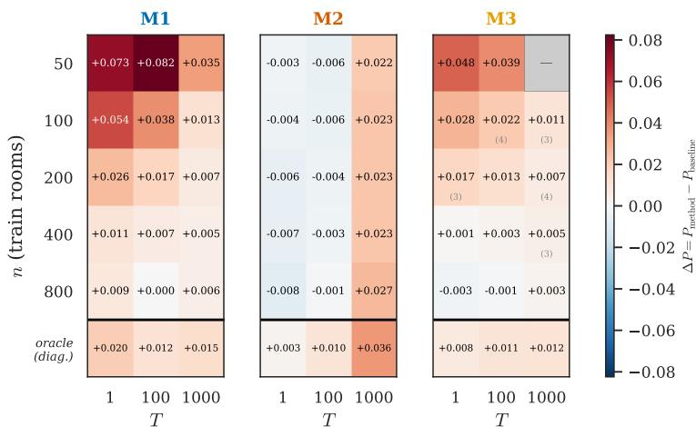  
Figure 12: No learned regularizer escapes the power-law family. $\Delta P = P _ { \mathrm { m e t h o d } } - P _ { \mathrm { b } }$ aseline for each architecture; rows = training size $n , { \mathrm { c o l u m n s } } = T$ . Main grid: baseline is ridge $\scriptstyle : ( | { \hat { s } } | = 1 . 1 )$ with oracle α. Oracle row $\scriptstyle ( n = 8 0 0 )$ : baseline is per-room oracle $( p ^ { \star } , \alpha ^ { \star } )$ . All 212 valid per-seed evaluations are non-negative (min +0.002). Grey cells: failed runs.

The failure mechanism is a noisy plug-in effect: the per-room estimation standard error $( \sigma _ { \mathrm { p e r - r o o m } } \approx$ $0 . 2 7 )$ exceeds the population-median standard error $( \sigma _ { \mathrm { p o p } } \approx 0 . 0 2 6 )$ by roughly an order of magnitude, so using $\hat { s } _ { \mathrm { r o o m } }$ injects far more estimation noise than per-room signal. This mirrors the classical James-Stein regime [James et al., 1961, Stein, 1956] in which shrinkage to the grand mean dominates per-unit estimation, though the analogy is qualitative rather than exact because the downstream loss $P ( p )$ is non-quadratic in the exponent. At T=1000, a second failure mode compounds this: the oracle $p ^ { \star }$ has drifted to a median of 2.0, far from $s _ { \mathrm { r o o m } } \approx 1 . 1 2$ , so even a noise-free estimate of $s _ { \mathrm { r o o m } }$ would target the wrong value. The oracle gap is not explained by per-room slope variability. It is a consequence of the landscape flatness established in §5 absorbing what little correlation exists between the prior exponent and the Bayes-optimal penalty.

## D.6 Per-seed sweep heatmap

Of 225 training configurations across all three architectures, 13 at small training sizes $( n \leq 4 0 0 )$ and $T = 1 0 0 0$ failed numerically (all in M3) due to ill-conditioned $\tilde { \Phi } ^ { \top } \tilde { \Phi } ;$ all reported main-text results use $n = 8 0 0$ , where every seed succeeded (grey cells in Figure 12 mark failed configurations).

## D.7 Model capacity verification

A natural concern is that M3 fails to beat |s| because it lacks sufficient capacity: perhaps the hypernetwork cannot represent the optimal Γ.

We test this by training M3 on synthetic data where the true optimal Γ is a power law with a known exponent $p _ { \mathrm { t a r g e t } } \in \{ 0 . 5 , 1 . 5 , 2 . 5 \}$ (generated by setting the prior to $\sigma _ { a , k } ^ { 2 } \propto \lambda _ { k } ^ { - p _ { \mathrm { t a r g e t } } } )$

Results (Figure 13). M3 recovers the target exponent monotonically: Precovered $=$ {0.35, 1.35, 2.50} for $p _ { \mathrm { t a r g e t } } = \{ 0 . 5 , 1 . 5 , 2 . 5 \}$ . The slight underestimation at low targets is consistent with the landscape flatness (the gradient is weak near the minimum). At $p _ { \mathrm { t a r g e t } } = 2 . 5 .$ M3 recovers the target exactly.

M2, by contrast, saturates at ${ \hat { p } } \leq 0 . 8 6 $ its softplus parameterization limits the expressiveness of the learned spectrum. But this saturation makes $\mathbf { M } \bar { 2 } \mathbf { \bar { s } }$ result more impressive, not less: even with limited capacity, M2 converges to a power law. Its convergence to $\lambda _ { k } ^ { | s | }$ reflects the data, not an architecture bottleneck.

M1 is non-monotonic $( p _ { \mathrm { r e c o v e r e d } } = \{ 0 . 1 8 , 0 . 7 2 , 0 . 4 7 \} )$ , indicating that the conditioning architecture struggles to propagate the target signal through its layers. This explains why M1 consistently underperforms M2 and M3 in the main experiments.

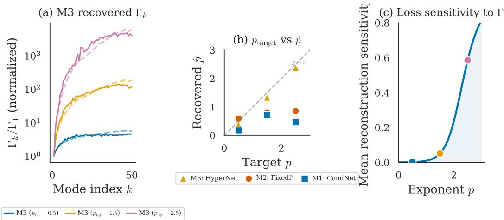  
Figure 13: M3 has sufficient capacity. (a) M3 learned $\Gamma _ { k }$ at three target exponents (solid) overlaid with the matching-color target spectrum λPtgt (dashed). (b) $p _ { \mathrm { t a r g e t } }$ VS $p _ { \mathrm { r e c o v e r e d } }$ for M1/M2/M3. M3 tracks monotonically up to $p = 2 . 5 ;$ M2 saturates at $\hat { p } \leq 0 . 8 6$ (c) Reconstruction sensitivity vs p. M3's convergence to $\lambda _ { k } ^ { | \hat { s } | }$ reflects the data, not an architecture bottleneck.

Conclusion. M3 has sufficient capacity to recover any power-law exponent in [0, 2.5]. Its failure to improve on $| s |$ in the main experiments is not an architecture limitation; it is a property of the loss landscape.

## D.8 Learned Iterative Ridge (LIR)

Architecture. LIR parameterizes a linear estimator as L steps of learned gradient descent on a Tikhonov objective, starting from $a _ { 0 } = 0 \colon$

$$
\begin{array} { r } { a _ { l } = a _ { l - 1 } - \eta _ { l } \bigl ( A ^ { \top } A a _ { l - 1 } + \alpha _ { l } D _ { l } \odot a _ { l - 1 } - A ^ { \top } y \bigr ) , \qquad l = 1 , \ldots , L , } \end{array}\tag{42}
$$

where $\eta _ { l } \in \mathbb { R } .$ is a per-layer step size, $\alpha _ { l } \in \mathbb { R } _ { + }$ is a per-layer regularization strength, and $D _ { l } \in \mathbb { R } _ { + } ^ { K }$ is a per-layer diagonal penalty shape (applied to mode pairs as in §D.1). All recurrences are written in K-dimensional mode-pair coordinates; the corresponding 2K real-state operators are obtained by applying the expansion $\Gamma ^ { ( 2 K ) } = \Gamma \otimes I _ { 2 }$ from §D.1. With full $D _ { l } ,$ this gives $K ^ { 2 } + 2 = 2 5 0 2 L$ parameters; we use diagonal $D _ { l } \left( 5 2 L \right)$ throughout. Training: Adam, $\mathrm { l r } = \mathrm { 1 0 ^ { - 3 } }$ , 500 epochs (200 for $L = 1 )$ , MSE loss on 800 training rooms, 5 seeds $\in \{ 4 2 , \ldots , 4 6 \}$

Depth ablation. Table 12 reports P (mean ± std across 5 seeds) as a function of depth L and observation window $T . \ \mathrm { A t } \ L = 1$ , the map reduces to a scaled adjoint $\hat { a } = \eta _ { 1 } A ^ { \top } y$ (a constant filter that cannot adapt to the spectral structure) and performs worse than oracle Tikhonov at all T. At $L \geq 5 .$ , LIR breaks below the oracle at all $T ,$ with the largest improvement at $T = 1 0 0$ . Beyond $L = 1 0$ , additional depth overfits: $L = 2 0$ has 1ower training loss (0.580 vs. 0.590 at $T = 1 )$ but higher test P (0.630 vs. 0.621).

Table 12: LIR depth ablation: P (mean ± std, 5 seeds). Oracle Tikhonov shown for reference.
<table><tr><td>L</td><td>T = 1</td><td> $T = 1 0 0$ </td><td> $T = 1 0 0 0$ </td></tr><tr><td>1</td><td> $0 . 8 8 6 \pm 0 . 0 0 0$ </td><td> $0 . 7 0 8 \pm 0 . 0 0 0$ </td><td> $0 . 3 0 8 \pm 0 . 0 0 2$ </td></tr><tr><td>5</td><td> $0 . 6 5 1 \pm 0 . 0 0 2$ </td><td> $0 . 4 8 5 \pm 0 . 0 0 1$ </td><td> $0 . 1 0 5 \pm 0 . 0 0 1$ </td></tr><tr><td>10</td><td> $0 . 6 2 1 \pm 0 . 0 0 2$ </td><td> $0 . 4 5 9 \pm 0 . 0 0 1$ </td><td> $0 . 1 0 3 \pm 0 . 0 0 0$ </td></tr><tr><td>20</td><td> $0 . 6 3 0 \pm 0 . 0 0 4$ </td><td> $0 . 4 6 4 \pm 0 . 0 0 1$ </td><td> $0 . 1 0 5 \pm 0 . 0 0 1$ </td></tr><tr><td>Oracle</td><td>0.715</td><td>0.594</td><td>0.122</td></tr></table>

Classical non-diagonal alternatives. Wiener/LMMSE, generalized Tikhonov, TSVD, earlystopped CGLS, and Landweber iteration all apply fixed per-mode shrinkage profiles in the modal basis whose shape is set by the prior, and so do not close the gap LIR exploits (full analysis: a signal-matched Wiener filter with prior $\Sigma _ { a } = \mathrm { d i a g } ( \lambda _ { k } ^ { - s } )$ recovers exactly the paper's $\Gamma _ { k } = \lambda _ { k } ^ { | s | }$ TSVD is dominated by Tikhonov soft shrinkage [Hansen, 1998]). LIR escapes by parameterizing L composed maps with 52L learnable coefficients that distribute regularization across coupled modes a richer non-diagonal structure than these classical alternatives, all of which apply a single fixed shrinkage profile.

Off-diagonal ablation. Although $D _ { l }$ is diagonal, the Gram matrix $A ^ { \top } A$ couples modes at every iteration: each gradient step mixes all $K$ modes through the shared microphones. The resulting estimator map from $A ^ { \top } y$ to â is therefore a full $K \times K$ matrix, despite the diagonal parameterization. To quantify the contribution of this cross-mode coupling, we compare each estimator's effective map against its diagonal restriction (Table 13), using per-room oracle parameters.

Table 13: Off-diagonal ablation on LIR-median rooms $( L = 1 0 ,$ seed 42). $P _ { \mathrm { d i a g } }$ zeroes all offdiagonal entries of the estimator's map, keeping the same oracle α.
<table><tr><td> $T$ </td><td> $P _ { \mathrm { T i k h , f u l l } }$ </td><td> $P _ { \mathrm { T i k h , d i a g } }$ </td><td> $P _ { \mathrm { L I R , f u l l } }$ </td><td> $P _ { \mathrm { L I R , d i a g } }$ </td></tr><tr><td>1</td><td>0.601</td><td>1.335</td><td>0.619</td><td>1.926</td></tr><tr><td>100</td><td>0.435</td><td>82.540</td><td>0.459</td><td>6.620</td></tr><tr><td>1000</td><td>0.102</td><td>0.199</td><td>0.103</td><td>0.196</td></tr></table>

Both estimators rely on cross-mode coupling to a similar degree: stripping off-diagonals is catastrophic for both at $\dot { T } = 1 0 0$ (Tikhonov: 0.435 → 82.5; LIR: $0 . 4 5 9  6 . 6 )$ . The coupling originates from $A ^ { \top } A$ (modes share microphones), not from the estimator design. LIR's advantage is a richer parameterization of how this coupling is distributed: L composed maps with 52L parameters versus Tikhonov's single rational function $( \mathsf { \bar { A } } ^ { \top } A + \alpha \Gamma ) ^ { - 1 }$ governed by 2 parameters.

Effective spectrum. Figure 14 plots the diagonal of $C _ { L }$ (normalized by the first entry) alongside the exact Tikhonov filter diag $( ( \stackrel { . } { A } ^ { \top } A + \alpha ^ { * } \Gamma ) ^ { - 1 } )$ $\mathbf { A } \mathfrak { t } T = 1$ , both filters decay smoothly and LIR closely tracks Tikhonov's shape. $\mathbf { A } \mathbf { { t } } { \boldsymbol { T } } = 1 0 0 0$ , both filters oscillate wildly. The per-mode spectral filter interpretation breaks down because $A ^ { \top } A$ has 12–53% off-diagonal Frobenius energy. The improvement comes not from a qualitatively different per-mode profile, but from LIR's ability to redistribute regularization strength across coupled modes.

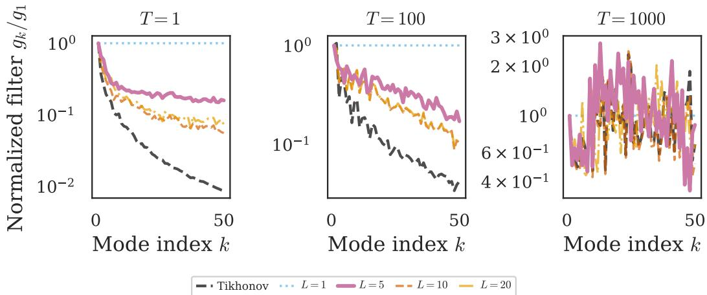  
Figure 14: Effective spectral filter $g _ { k } / g _ { 1 }$ for LIR at depths $L \in \{ 1 , 5 , 1 0 , 2 0 \}$ and exact Tikhonov rational filter (dashed), on the LIR-median room at each T. At $T = 1 0 0 0$ , both filters oscillate due to off-diagonal energy in $A ^ { \top } A$

## E Heat Equation: Extended Results

This appendix expands the heat diffusion analysis of §7. All five-room analyses below use the fixed diagnostic set introduced there: scenes 00805, 00826, 00840, 00880, 00950. The main text reported the headline: the theory predicts a two-parameter regularizer $\Gamma _ { k } \propto \lambda _ { k } ^ { s } \cdot e ^ { c \lambda _ { k } }$ with $c = 2 \kappa t$ , and per-room fitted slopes (five diagnostic rooms; see §E.5) confirm this prediction in [0.97, 1.00] with $\overline { { R ^ { 2 } } } \geq 0 . 9 9 8$ . Here we provide the full fitting procedure, the per-room spectral fits, the κ-uncertainty analysis, and the one-parameter fallback performance.

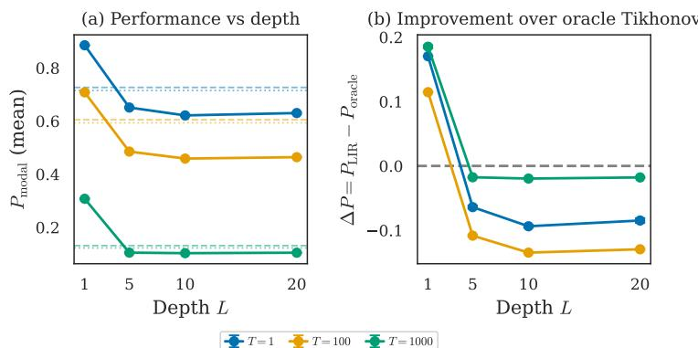  
Figure 15: LIR depth ablation. (a) $P$ vs. L with ridge (dashed) and oracle (dotted) references. (b) $\Delta P = P _ { \mathrm { L I R } } - { \bf \bar { \it P } } _ { \mathrm { o r a c l e } } ;$ negative values indicate LIR beats the per-room oracle. Saturation at $L = 5 – 1 0$ $L = 2 0$ overfits.

## E.1 Why heat diffusion is different from acoustics

In acoustics, every mode decays at the same rate $\gamma$ (uniform damping). This means the relative amplitudes of the modes do not change over time: mode 1 stays bigger than mode 50 by the same factor at $t = 0$ and $t = 1$ second. The prior spectrum $\sigma _ { a , k } ^ { 2 } \propto \dot { \lambda _ { k } } ^ { - s }$ is preserved across time, and the optimal regularizer is a pure power law at every snapshot.

Heat diffusion breaks this. The heat equation's Green's function introduces mode-dependent damping: mode k decays as $e ^ { - \kappa \lambda _ { k } t }$ , where κ is the thermal diffusivity. High-frequency modes (large $\lambda _ { k } )$ decay exponentially faster than low-frequency modes. After a short time, the high modes are essentially gone, while the low modes are still alive.

This changes the amplitude spectrum from a pure power law to a product of a power law and an exponential:

$$
\sigma _ { a , k } ^ { 2 } ( t ) \propto \lambda _ { k } ^ { - s } \cdot e ^ { - 2 \kappa t \lambda _ { k } } .\tag{43}
$$

The power-law component $\lambda _ { k } ^ { - s }$ reflects the initial conditions (how much energy each mode started with). The exponential component $e ^ { - 2 \kappa t \lambda _ { k } }$ reflects the PDE's temporal evolution (how much each mode has decayed by time t). The factor of 2 in the exponent arises because $\sigma _ { a , k } ^ { 2 }$ is a variance (squared amplitude), and $e ^ { - \kappa \lambda _ { k } t }$ enters twice.

Diffusivity convention. Our synthetic experiments set $\kappa = 1$ in the units of the simulation (eigenvalues in $\mathrm { m ^ { - 2 } }$ , time in $^ { \mathrm { ~ S ~ } , }$ so κλt is dimensionless with this choice). This is a computational convenience of the test and does not correspond to any specific physical material: realistic diffusivities range from $\sim 1 0 ^ { - 7 } \mathrm { m ^ { 2 } / s }$ (water) to $\dot { \sim } 1 0 ^ { - 4 } \mathrm { m ^ { 2 } / s }$ (metals), so physical deployment would substitute the material-specific κ into $c = 2 \kappa t$ . The framework's predictions are unchanged for any $\kappa > 0 ;$ only the mapping between snapshot index and the regime where isotropy fails (Appendix E.6) shifts with κ.

Heat |s| convention. The heat regularizer uses $| s | = 1 . 0$ exactly, consistent with the theoretical value implied by the synthetic initial-condition design $\mathrm { V a r } ( a _ { k } ( 0 ) ) \dot { \propto } ( 1 + \lambda _ { k } ) ^ { - 1 }$ . OLS fits on heat modal data recover $\hat { | s | } \approx 0 . 9 4 \mathrm { - } 0 . 9 8 ;$ the deviation from 1.0 reflects the finite-k correction from the $\left( 1 + \lambda _ { k } \right)$ shift at small k, not an independent physics measurement. For physical deployments, |s| must be estimated from the system at hand by the same log-log OLS procedure used for acoustics (§5); the heat synthetic value $\mathbf { \bar { \mathbf { \alpha } } } _ { | s | } = 1 . 0$ is not transferable across excitation regimes.

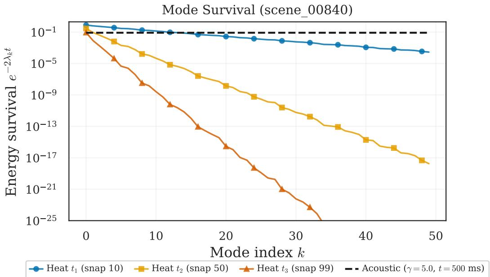  
Figure 16: High-frequency heat modes decay exponentially faster. Mode energy survival $e ^ { - 2 \lambda _ { k } t }$ vs mode index k at three observation times $t \in \{ 5 \bar { 0 } , 2 5 0 , 4 9 5 \}$ ms (snap 10, 50, 99), comparing heat exponential decay (solid) vs acoustic uniform damping (dashed, $\gamma { = } 5 . 0 , t { = } 5 0 0 \mathrm { m s } )$ . By $t = 2 5 0 \mathrm { m s }$ heat modes above $k \approx 2 0$ have decayed below $1 0 ^ { - 9 }$ , while acoustic modes retain\~60%.

The 25-order-of-magnitude gap between heat and acoustic survival at high k is the structural reason the heat regularizer needs the extra exponential factor: a one-parameter power law cannot suppress modes that decay this fast. This motivates the two-parameter fit in the next subsection.

## E.2 The three-step fitting procedure

The main text compressed the fitting procedure into two sentences. Here we expand each step with full details.

Step 1: Spectral fit. For each room and each observation time t, we have the empirical amplitude variance $\hat { \sigma } _ { a , k } ^ { 2 } ( t )$ for modes $k = 1 , \ldots , K$ . We fit the two-parameter model in log-space:

$$
\log \hat { \sigma } _ { a , k } ^ { 2 } ( t ) = \beta _ { 0 } - | s | \log \lambda _ { k } - c \lambda _ { k } + \epsilon _ { k } .\tag{44}
$$

This is an ordinary least squares (OLS) regression with two predictors: log $\lambda _ { k }$ (the power-law component) and $\lambda _ { k }$ (the exponential component). The regression outputs three numbers:

• ê: the power-law exponent (slope of the log $\lambda _ { k }$ term).

• ê: the exponential rate (coefficient of the $\lambda _ { k }$ term).

• $R ^ { 2 } \colon$ how well the two-parameter model fits the data.

Figure 17 shows the fit quality: the two-parameter model achieves $R ^ { 2 } > 0 . 9 9$ at all snapshots, while the pure power law plateaus at $R ^ { 2 } = 0 . { \bar { 8 } } 7 – 0 . 9 3$ . Figure 18 confirms this through the magnitude of the power-law misfit. At late snapshots, pure power-law residuals reach \~30 log-units of error; the systematic U-shape across all three snapshots shows the misfit is structural, not noise. The corresponding exp×power residuals are bounded by \~0.1 log-units at the same snapshots, summarized by $\mathring { R } ^ { 2 } { = } 0 . 9 9$ in Figure 17.

Step 2: Rate verification. The fitted exponential rate ê should equal the Green's function prediction $c _ { \mathrm { t h e o r y } } = 2 \kappa t$ . This is a quantitative, parameter-free prediction: κ is known a priori (set to 1 in our synthetic experiments; a material-specific value in physical deployments, see the diffusivity convention above), and t is the observation time.

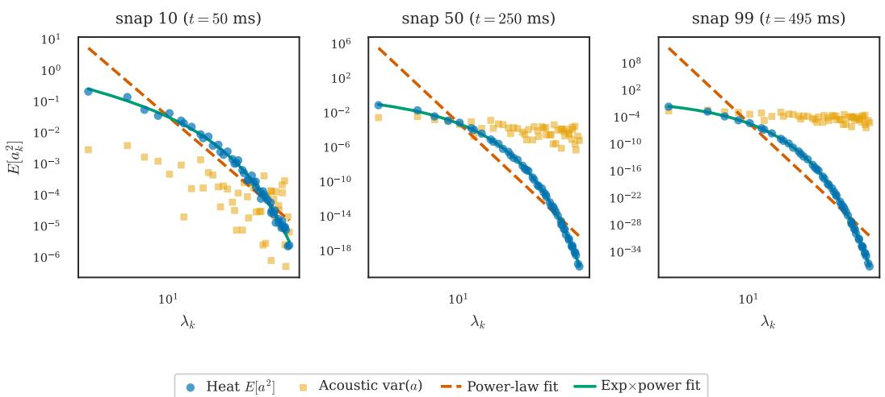  
Figure 17: The two-parameter model fits heat amplitude spectra accurately. E $\check { \langle a _ { k } ^ { 2 } \vert }$ VS $\lambda _ { k }$ for heat (blue) and acoustic (orange) at three snapshots $( t \in \{ 5 0 , 2 5 \bar { 0 } , 4 9 5 \}$ ms, snap 10/50/99). Solid lines: exponential-power-law fit $( R ^ { 2 } > 0 . 9 9 )$ . Dashed lines: pure power-law fit $\mathsf { \bar { ( } } R ^ { 2 } = 0 . 8 7 \mathsf { - 0 . 9 3 ) }$ . The exponential component captures the faster decay at high eigenvalues that a pure power law misses.

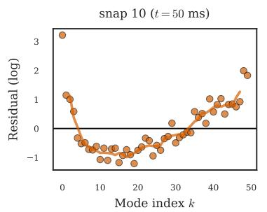

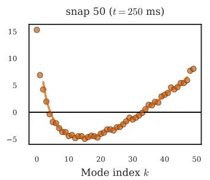

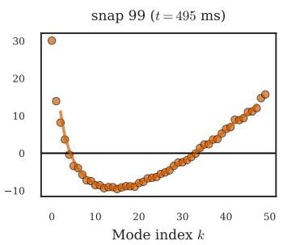  
Figure 18: Pure power-law fits miss the heat exponential by orders of magnitude. Power-law residuals in log-space for scene\_00840 at three snapshots: $t = 5 0$ ms (snap 10), $t = 2 5 0$ ms (snap $5 0 ) , t = 4 9 5$ ms (snap 99). Residuals show a systematic U-shape at every snapshot: overestimation at high $k ,$ underestimation at intermediate k, with a running-mean trend overlaid. Power-law fit quality is $R ^ { 2 } = \{ 0 . 9 1 , 0 . 8 7 , 0 . 8 6 \}$ left to right, with over-fit slopes $s = \{ 3 . 6 , 1 4 . 4 , 2 7 . 5 \}$ that try and fail to absorb the exponential factor. These slopes are not estimates of the true $| s | { = } 1 . 0$ . Magnitude grows from \~ 1 log-unit at $t = 5 0$ ms to \~ 30 log-units at $t = 4 9 5$ ms. Residuals from the two-parameter exp×power model are structureless and reported via $R ^ { 2 } = 0 . 9 9$ in Fig. 17.

For each of five diagnostic rooms, we compute $\hat { c } ( t )$ at multiple observation times and regress against $c _ { \mathrm { t h e o r y } } ( t )$

$$
\hat { c } ( t ) = \alpha _ { 0 } + \alpha _ { 1 } \cdot c _ { \mathrm { t h e o r y } } ( t ) + \epsilon .\tag{45}
$$

If the theory is correct, we expect $\alpha _ { 1 }$ ≈ 1 (the fitted rate tracks the predicted rate one-for-one) and $\alpha _ { 0 } \approx 0$ (no offset).

Results. All five slopes fall in [0.97, 1.00]. All $R ^ { 2 } \geq 0 . 9 9 8$ . The pooled regression gives slope 0.987 with 95% CI [0.953, 1.022]; the confidence interval contains 1.0. Figure 19 visualizes this: the per-room points cluster tightly around the $y = x$ line. The aggregate cross-room spread is what's visible at first glance, but per-room linear fits land within [0.97, 1.00] in every case (Table 14).

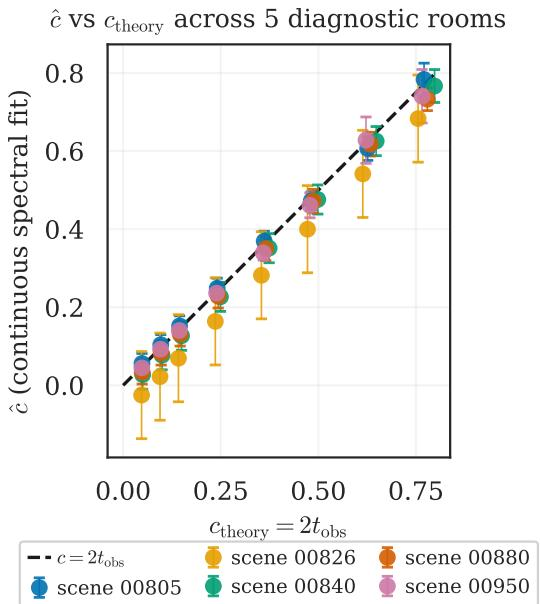  
Figure 19: The fitted exponential rate tracks the Green's function prediction across rooms. ê vs $c _ { \mathrm { t h e o r y } } { = } 2 \kappa t$ scatter for 5 diagnostic rooms. Each room's per-snapshot points cluster around the $y { = } x$ line; per-room linear fits give slopes in [0.97, 1.00] with $R ^ { 2 } \ge 0 . 9 9 8$ (per-room values in Table 14). The aggregate spread across rooms (visible as the cross-color band) reflects per-snapshot noise rather than systematic deviation.

Table 14: Per-room regression of ê vs $c _ { \mathrm { t h e o r y } }$ for the five diagnostic rooms.
<table><tr><td>Room</td><td>Slope  $\alpha _ { 1 }$ </td><td>Intercept  $\alpha _ { 0 }$ </td><td> $R ^ { 2 }$ </td></tr><tr><td>00805</td><td>0.984</td><td>+0.009</td><td>0.9984</td></tr><tr><td>00826</td><td>1.000</td><td>-0.072</td><td>1.0000</td></tr><tr><td>00840</td><td>0.993</td><td>-0.021</td><td>0.9999</td></tr><tr><td>00880</td><td>0.973</td><td>-0.010</td><td>0.9990</td></tr><tr><td>00950</td><td>0.981</td><td>-0.002</td><td>0.9986</td></tr><tr><td>Pooled</td><td>0.987</td><td>-0.020</td><td>0.9880</td></tr></table>

Step 3: Why this is a prediction, not a post-hoc fit. The exponential rate $c = 2 \kappa t$ can be computed before any data is collected: t is chosen by the experimenter and κ is known a priori (see the diffusivity convention above). Only |s| is estimated from data. For the synthetic data used here, the recovery of ê ≈ 2κt is expected (the same eigenvalues enter the forward model and the modal basis), so this is a consistency check on the fitting procedure. The independent validation comes from the acoustic FDTD experiments (§5).

## E.3 Sensitivity to κ uncertainty

In practice, the thermal diffusivity κ may not be known precisely. How much does an error in κ cost?

Setup. The true $\kappa = 1 . 0$ We compute the reconstruction error $P$ using the two-parameter regularizer $\Gamma _ { k } \propto \lambda _ { k } ^ { s } \cdot e ^ { c \lambda _ { k } }$ with $c = 2 \hat { \kappa } t .$ where  is the estimated (possibly wrong) diffusivity. We vary ${ \hat { \kappa } } / \kappa \in \left. 0 . 8 , 0 . \dot { 9 } , 1 . 0 , 1 . 1 , 1 . 2 \right. ( \mathrm { i . e . , \pm 2 0 \% \ e r r o r } )$

Results. A ±20% error in κ shifts c by ±20%, which changes P by less than 0.8 percentage points relative to the oracle two-parameter regularizer.

Table $1 5 \colon \pm 2 0 \%$ error in κ costs at most 0.8 pp. Sensitivity of the two-parameter heat regularizer to misspecified diffusivity at $T { = } 5 0 0$ . The flat penalty across $\hat { \kappa } / \kappa \in [ 0 . \bar { 8 } , 1 . 2 ]$ explains why a oneparameter fallback (which absorbs κ into $p ^ { \star } )$ remains practical when κ is poorly known.
<table><tr><td> $\hat { \kappa } / \kappa$ </td><td> $P \operatorname { a t } T = 5 0 0$   $\Delta P$  vs oracle 2-param</td></tr><tr><td>0.80 0.362</td><td>+0.8 pp</td></tr><tr><td>0.90</td><td>0.357 +0.3 pp</td></tr><tr><td>1.00 0.354</td><td>0.0pp</td></tr><tr><td>1.10</td><td>0.356  $+ 0 . 2 \mathsf { p p }$ </td></tr><tr><td>1.20 0.361</td><td> $+ 0 . 7 \mathrm { p p }$ </td></tr></table>

Comparison to one-parameter performance. The best one-parameter regularizer $( \Gamma _ { k } = \lambda _ { k } ^ { p ^ { \ast } }$ with optimal $p ^ { * } )$ achieves $P = 0 . 3 6 \bar { 1 }$ at $T = 5 0 0$ , comparable to the two-parameter regularizer with a 20% κ error. This means:

• If κ is known to within ±10%: the two-parameter regularizer is strictly better.

• If κ is known only to within $\pm 2 0 \% \mathrm { { \Omega } }$ the two-parameter regularizer is approximately equivalent to the one-parameter oracle.

• If κ is unknown: fall back to the one-parameter power law $\Gamma _ { k } = \lambda _ { k } ^ { p ^ { \ast } }$ , which absorbs the missing exponential factor into a higher effective $p ^ { * }$

The one-parameter regularizer is therefore a natural fallback when κ is poorly known. It sacrifices 3–4% per-room improvement but requires no knowledge of the material properties.

## E.4 One-parameter fallback and two-parameter gain

When the optimal regularizer is $\Gamma _ { k } \propto \lambda _ { k } ^ { s } e ^ { c \lambda _ { k } }$ but only a one-parameter sweep $\Gamma _ { k } = \lambda _ { k } ^ { p }$ is available, the fitted exponent rises above s to absorb the exponential roll-off at high modes. Figure 20(d) shows this: acoustic $p ^ { \star }$ stays near $| s | = 1 . 1 3$ until $T > { \bar { 5 } } 0 0 ;$ heat $p ^ { \star }$ starts at ${ \sim } 2 . 3$ at $T = 1$ (the exponential is present even at a single snapshot) and saturates near ${ \sim } 3 . 2$ at $T = 2 1 0 0$

Absolute performance $( T = 2 1 0 0 , M = 8 )$ . Identity $( p = 0 )$ gives $P = 1 . 2 1 0 ;$ using the acoustic exponent $\bar { \Gamma } _ { k } = \lambda _ { k } ^ { 1 . 1 3 }$ gives $P = 0 . 5 2 3 ( 2 . 3 \times$ improvement); the one-parameter heat oracle $p ^ { \star } = 3 . 2$ gives $P = 0 . 3 4 7 ^ { \cdot } ( 3 . 5 \times ) ;$ the two-parameter oracle gives $P = 0 . 3 \bar { 3 4 } ( 3 . 6 \times )$ . The exponent |s| is system-specific (fitted at $t = 0$ before PDE evolution, $\mathbf { \bar { \vert } } s \vert _ { \mathrm { h e a t } } \approx 1 . 0$ , distinct from $| s | _ { \mathrm { a c o u s t i c } } = 1 . 1 3 )$ what transfers across systems is the procedure, not the number.

Table 16: The two-parameter heat regularizer's gain is too small to motivate learning. Population improvement is $0 { - } \bar { 2 } \%$ across $T ;$ per-room median improvement is $3 { - } 4 \%$ . The gap reflects mild room-to-room variation in the optimal $c ,$ not a shape advantage that a learned regularizer could systematically exploit.
<table><tr><td> $T$ </td><td>1-param  $P ^ { \star }$ </td><td>2-param  $P ^ { \star }$ </td><td>Pop. improv.</td><td>Per-room median</td></tr><tr><td>1</td><td>0.891</td><td>0.889</td><td>0.2%</td><td>3.1%</td></tr><tr><td>10</td><td>0.742</td><td>0.731</td><td>1.5%</td><td>3.6%</td></tr><tr><td>100</td><td>0.467</td><td>0.461</td><td>1.3%</td><td>3.8%</td></tr><tr><td>500</td><td>0.361</td><td>0.354</td><td>1.9%</td><td>4.0%</td></tr></table>

Two-parameter gain. The population gain is small (0–2%) because a single c must serve all rooms at fixed $T ;$ per-room, the two-parameter oracle improves over one parameter by 3–4% (median, positive for every room). The gap between population and per-room reflects mild room-to-room variation in the optimal $c ,$ not a shape advantage that learning could exploit. This mirrors the acoustic pattern: per-room opportunity exists but is too small to motivate learning.

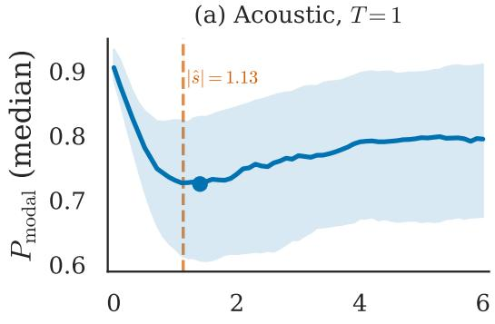  
(c) Heat, T= 1

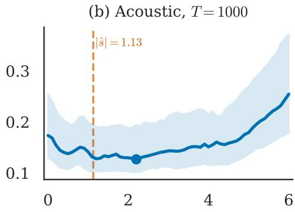

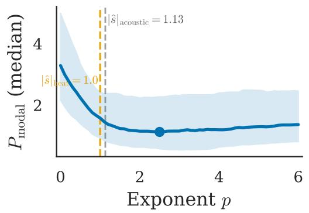

(d) Optimal p vs T  
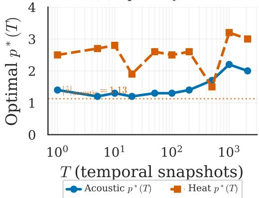  
Figure 20: Acoustic and heat regularization diverge with observation time. (a, b) Acoustic $P ( p )$ at $\bar { T } = 1$ and $T = 1 0 0 0$ , with population $| \hat { s } | _ { \mathrm { a c o u s t i c } } = 1 . 1 3$ marked (gray dashed) and per-curve $p ^ { \star } = 1 . 4$ at $T = 1$ rising to $p ^ { \star } \approx 2 . 2$ at $T = 1 0 0 0$ .(c) Heat $P ( p )$ at $T = 1 , p ^ { \star } = 2 . 5$ . Both reference exponents are shown for comparison: $| \hat { s } | _ { \mathrm { h e a t } } = 1 . 0$ (orange dashed, the heat prior slope) and $| \hat { s } | _ { \mathrm { a c o u s t i c } } = 1 . 1 3$ (gray dashed, the acoustic prior slope). Heat $p ^ { \star }$ sits well above both because the one-parameter family cannot capture the missing exponential factor. (d) $p ^ { \star } ( T )$ trajectories: acoustic stays near $\left| { \hat { s } } \right| _ { \mathrm { a c o u s t i c } }$ until $T > \bar { 5 } 0 0 ;$ heat rises to $p ^ { \star } > 2 . 5$ and saturates at $\sim 3 . 2$ by $T = 2 1 0 0$ . The divergence motivates the two-parameter regularizer in eq. (12). The right-tail rise of $P ( p )$ at large p in panel (b) reflects temporal-noise correlation across snapshots (Appendix A.4).

## E.5 Per-room spectral fits

For full transparency, we report per-room values for two consistency checks. Column $\hat { \alpha } _ { 1 }$ is the c-vs-t regression slope from §E.2 (Step 2, fitted across all 8 observation times). Columns $\hat { c } , c _ { \mathrm { t h e o r y } } ,$ and $\hat { c } / c _ { \mathrm { t h e o r y } }$ are the single-time spectral-fit estimates: ê is the exponential decay rate fitted to the truncation-noise spectrum at the representative observation time $t \approx 2 4 9 \mathrm { m s }$ , and $c _ { \mathrm { t h e o r y } } = 2 \kappa t$ ≈ 0.498 is the Green's function prediction at that time $( \kappa = 1 . 0 )$ . The reported $R ^ { 2 }$ is the goodness-of-fit of the c-vs-t regression (across 8 observation times) used to produce $\hat { \alpha } _ { 1 } .$ Two timescales govern the heat setup and must not be conflated: the window duration is $T \cdot \Delta t _ { \mathrm { s i m } }$ (FDTD simulation step $\Delta t _ { \mathrm { s i m } } \approx 2 4 \mu s$ , bounded by the per-room CFL condition), while the observation time is the snapshot index times $\Delta t _ { \mathrm { s n a p } } = 1 0 \dot { 0 } \cdot \Delta t _ { \mathrm { s i m } } ^ { - } \approx 2$ .4 ms. Each reported $P ( T )$ value averages over \~190 valid snapshots per room, spanning $t _ { \mathrm { o b s } } \in [ 1 2 , 4 9 3 ]$ ms with median \~260 ms; this distribution is roughly independent of T. The representative $t _ { \mathrm { o b s } } \approx 2 5 0$ ms matches the median of that distribution.

All five rooms give $\hat { \alpha } _ { 1 } \approx 1 . 0$ , confirming that the fitted exponential coefficient ê(t) tracks the Green's function prediction $c _ { \mathrm { t h e o r y } } = 2 \kappa t$ unit-for-unit across all observation times. At the single representative time $t \approx 2 4 9$ ms, the spectral fit gives $\hat { c } / c _ { \mathrm { t h e o r y } }$ within 2.2% of unity for all rooms. All c-vs-t regression $R ^ { 2 } > 0 . 9 9 8$

Table 17: Per-room spectral fits confirm ê ≈ $c _ { \mathrm { t h e o r y } }$ across all five diagnostic rooms. Slope $\hat { \alpha } _ { 1 } \approx 1 . 0$ confirms that the fitted exponential coefficient ê(t) tracks the Green's function prediction $c _ { \mathrm { t h e o r y } } = 2 \kappa t$ unit-for-unit across all observation times; the single-time $\hat { c } / c _ { \mathrm { t h e o r y } }$ ratio is within 2.2% of unity for every room.
<table><tr><td>Room</td><td> $\hat { \alpha } _ { 1 }$ </td><td>ê</td><td> $c _ { \mathrm { t h e o r y } }$ </td><td> $\hat { c } / c _ { \mathrm { t h e o r y } }$ </td><td> $R _ { \alpha _ { 1 } } ^ { 2 }$ </td></tr><tr><td>00805</td><td>0.98</td><td>0.494</td><td>0.498</td><td>0.992</td><td>0.9984</td></tr><tr><td>00826</td><td>1.00</td><td>0.498†</td><td>0.498</td><td>1.000</td><td>1.0000</td></tr><tr><td>00840</td><td>0.99</td><td>0.497</td><td>0.498</td><td>0.998</td><td>0.9999</td></tr><tr><td>00880</td><td>0.97</td><td>0.487</td><td>0.498</td><td>0.978</td><td>0.9990</td></tr><tr><td>00950</td><td>0.98</td><td>0.492</td><td>0.498</td><td>0.988</td><td>0.9986</td></tr></table>

†For 00826 the per-snapshot spectral fit at t ≈ 249 ms returns $\hat { c } = 0 . 4 9 8$ , exactly matching $c _ { \mathrm { t h e o r y } } ,$ but the c-vs-t regression of Table 14 carries a systematic intercept $\alpha _ { 0 } = - 0 . 0 7 2$ across all 8 observation times. The single-snapshot ê reported here is therefore consistent with the slope $\hat { \alpha } _ { 1 } = 1 . 0 0 0$ rather than with the regression line $\hat { c } ( t ) = \hat { \alpha } _ { 0 } + \hat { \alpha } _ { 1 } c _ { \mathrm { t h e o r y } } ( t )$ . The -0.072 offset is a per-room calibration artifact specific to 00826 (every observation is shifted by exactly this amount); it does not affect the slope estimate or the cross-PDE consistency conclusion.

## E.6 Herfindahl index degradation under heat diffusion

The acoustic Herfindahl index $H \approx 0 . 0 0 5$ is time-independent because all modes share the damping rate γ. For heat diffusion, the truncated-noise weights $\dot { w } _ { n } ( t ) \propto \lambda _ { n } ^ { - s } \cdot e ^ { - 2 \kappa \lambda _ { n } t }$ acquire an exponential factor that suppresses high-frequency modes, concentrating noise power into the lowest few truncated modes as t grows. Table 18 reports $H ( t )$ and the effective contributor count $1 / H ( t )$ across the five diagnostic rooms at the snapshot indices used in §7.

Table 18: Heat-equation Herfindahl index $H ( t _ { \mathrm { o b s } } )$ across the five diagnostic rooms (scenes 00805, 00826, 00840, 00880, 00950), computed with $s = 1 . 0$ and $\kappa = 1$ (see §E.1 for the dimensionlessparameter convention). $t _ { \mathrm { o b s } }$ is the observation time (snapshot index $\times \Delta t _ { \mathrm { s n a p } } ,$ with $\Delta t _ { \mathrm { s n a p } } \approx 2 . 4$ ms); the rows below span the actual experimental range [12, 493] ms. $1 / H$ is the effective number of contributing truncated modes. Each reported $\bar { P ( T ) }$ value in §7 averages over ${ \sim } 1 9 0$ snapshots whose $t _ { \mathrm { o b s } }$ spans the entire range below, with median \~260 ms. The acoustic baseline $( H \approx 0 . 0 0 5$ time-independent) is shown for reference.
<table><tr><td> $t _ { \mathrm { o b s } }$ </td><td>Median H</td><td>H range (5 rooms)</td><td> $1 / H$  range</td><td>Isotropy regime</td></tr><tr><td>12 ms</td><td>0.027</td><td>[0.013, 0.052]</td><td>[19,76]</td><td>Holds (early)</td></tr><tr><td>250 ms</td><td>0.357</td><td>[0.156, 0.815]</td><td>[1.2, 6.4]</td><td>Degraded (median)</td></tr><tr><td>493 ms</td><td>0.548</td><td>[0.283, 0.987]</td><td>[1.0, 3.5]</td><td>Failed in smallest room</td></tr><tr><td>Acoustic</td><td> $\approx 0 . 0 0 5$ </td><td>any t</td><td>≈ 200</td><td>Holds</td></tr></table>

By $t _ { \mathrm { o b s } } \approx 2 5 0$ ms (roughly the median observation time in the reported experiments), the effective contributor count $1 / H$ drops from ${ \sim } 2 0 { - } 8 0 $ at $t _ { \mathrm { o b s } } = 1 2$ ms $\mathrm { t o } \sim 1 \mathrm { - } 6 ,$ with the largest degradation in the smallest rooms. At the latest observation time sampled in any of the recordings $( t _ { \mathrm { o b s } } = 4 9 3 \mathrm { m s } )$ H reaches 0.99 in the smallest diagnostic room (scene 00950, $K _ { \mathrm { t o t a l } } = 9 3 )$ : the first truncated mode $\lambda _ { K + 1 }$ dominates the sum because $e ^ { - 2 \kappa \lambda _ { K + 1 } t _ { \mathrm { o b s } } }$ is exponentially larger than $e ^ { - 2 \kappa \lambda _ { n } t _ { \mathrm { o b s } } }$ for any $n > K + 1$ . The median room at $t _ { \mathrm { o b s } } = 4 9 3$ ms has $H \approx 0 . 4 9 ( 1 / H \mathrm { \approx 2 . 0 ) }$ , so noise is concentrated but not literally rank-1 except in the smallest-room corner case.

Why the spectral fit still works. The fit quality $R ^ { 2 } > 0 . 9 9 8$ reported in §7 verifies that the empirical signal-amplitude variance ${ \hat { \sigma } _ { a , k } ^ { 2 } ( t ) }$ follows the predicted form $\lambda _ { k } ^ { - s } \cdot \stackrel { - } { e } ^ { - 2 \kappa \lambda _ { k } t }$ . This is a statement about the Green's function acting on the prior, derived from the heat PDE itself, and does not depend on whether the truncation noise is isotropic. Proposition 1's diagonal Bayes-optimality requires isotropic noise and is therefore guaranteed strictly at early $t _ { \mathrm { o b s } } ;$ at late $t _ { \mathrm { o b s } } .$ where H is concentrated, a non-diagonal estimator (cf. LIR, §6.1) could in principle outperform the diagonal regularizer.

Why the empirical landscape remains flat despite late- $\cdot t _ { \mathrm { o b s } }$ isotropy failure. The reported $P ( T )$ averages over \~ 190 snapshots per room spanning $t _ { \mathrm { o b s } } \in [ 1 2 , 4 9 3 ]$ ms (median \~ 260 ms), so earl $\mathrm { y } { - } t _ { \mathrm { o b s } }$ snapshots, where $H \approx 0 . 0 2 7$ and isotropy holds. These dominate the average and pull the effective regime back toward the truncation-noise-dominated case where Proposition 1 applies.

## F Prior Robustness

Our theory assumes a Gaussian, independent, power-law prior $( \mathbf { a } \sim \mathcal { N } ( 0 , \Sigma _ { \mathbf { a } } )$ with $\begin{array} { r } { \sum _ { k k } \propto \lambda _ { k } ^ { - s } ) } \end{array}$ , and the experiments use initial conditions drawn from this exact prior. This creates a potential circularity: of course the formula works when the data matches the assumptions.

This appendix tests what happens when the prior is wrong. We replace the Gaussian power-law prior with two adversarial alternatives and check whether the landscape remains flat.

## F.1 Experimental setup

The three priors. We test three initial-condition distributions, all with the same marginal variance $\sigma _ { a , k } ^ { 2 } = \lambda _ { k } ^ { - | s | }$ but different distributional shapes:

(a) Gaussian (baseline). $a _ { k } \sim \mathcal N ( 0 , \lambda _ { k } ^ { - | s | } )$ , independently across modes. This is the prior assumed by the theory. Results should match the main text.

(b) Heavy-tailed: Student-t with $\nu = 3$ degrees of freedom. $a _ { k } \sim t _ { 3 } ( 0 , \lambda _ { k } ^ { - | s | } )$ , independently across modes. The $t _ { 3 }$ distribution has the same variance as the Gaussian (after appropriate scaling) but much heavier tails: the kurtosis is infinite $( \nu \leq 4$ for $t _ { \nu } )$ . Heavy tails mean occasional very large modal amplitudes: the kind of “spiky" initial conditions you might get from a localized impact (e.g., a hammer strike on a wall).

Why $\nu = 3 ? \mathrm { \ A t \ } \nu = 2 \mathrm { \ }$ , the variance is infinite (the distribution is too wild for meaningful regularization) $\mathrm { { A t } } \ \nu = 5$ , the kurtosis is 9 (already close to Gaussian's 3). $\nu = 3$ gives kurtosis $= \infty$ while keeping the variance finite, the maximally adversarial choice within the finite-variance family.

(c) Correlated: adjacent-mode correlation $\rho = 0 . 3 . \mathrm { { \mathbf { a } } } \sim \mathcal { N } ( 0 , \Sigma _ { \mathrm { c o r r } } )$ , where $\Sigma _ { \mathrm { c o r r } }$ has diagonal entries $\lambda _ { k } ^ { - | s | }$ and off-diagonal entries $\left( \Sigma _ { \mathrm { c o r r } } \right) _ { j k } = \rho \cdot \sqrt { \lambda _ { j } ^ { - | s | } \cdot \lambda _ { k } ^ { - | s | } }$ for $| j - k | = 1$ (adjacent modes only), with $\rho = 0 . 3$

This prior breaks the independence assumption. Physically, it models situations where exciting one mode partially excites its neighbors, e.g., when the source is spatially extended rather than point-like. The correlation $\rho = 0 . 3$ is moderate; higher values would create near-singular $\Sigma$ corr.

Protocol. For each prior, we generate initial conditions for 20 rooms and run the p-sweep at $T \in \{ 1 , 1 0 0 \}$ . All computation uses the Tikhonov closed-form solution: no neural networks, no GPU. For each room, we compute $P ( p )$ on a 61-point grid, find $p ^ { * }$ , and compute $\delta ( | s | ) =$ $( P ( | s | ) - P ( p ^ { * } ) ) / P ( p ^ { * } )$ . We also compute the landscape flatness: the ratio max $P /$ min $P$ over $p \in [ 0 , 3 ]$ (a value near 1.0 means a flat landscape).

Why not $T = 1 0 0 0 \colon $ At large T without truncation noise, $P  0$ regardless of $p ,$ making δ meaningless. We test $T \in \{ 1 , \bar { 1 } 0 0 \}$ to isolate prior misspecification in the regime where the prior matters.

## F.2 Results table

Reading the table. In Table 19, $\delta ( | s | )$ is the cost of using the population exponent instead of the per-prior oracle; Flatness = max $P /$ min $P$ over $p \in [ 0 , 3 ]$ , where 1.0 is perfectly flat.

## F.3 Interpretation

Gaussian prior (baseline). Results $( \delta = 1 . 2 \%$ at $T { = } 1 , 4 . 9 \%$ at $T { = } 1 0 0 )$ are consistent with the main text; the slightly higher δ reflects the smaller room count $( 2 0 \mathrm { v s } 1 9 7 )$ and absence of truncation noise.

Table 19: Prior robustness test: median across 20 rooms. $p ^ { * } = \mathrm { o r a c l e }$ exponent, $P ^ { * } =$ oracle reconstruction error, $\delta ( | s | ) =$ relative cost of using $| s | = 1 . 1 3$ $\mathrm { F l a t n e s s } = \operatorname* { m a x } P /$ min $P$ over $p \in [ 0 , 3 ]$
<table><tr><td>Prior</td><td> $T$ </td><td> $p ^ { * }$ </td><td> $P ^ { * }$ </td><td> $\delta ( | s | )$ </td><td>Flatness</td></tr><tr><td>Gaussian</td><td>1</td><td>0.8</td><td>0.709</td><td>1.2%</td><td>1.135</td></tr><tr><td>Gaussian</td><td>100</td><td>0.4</td><td>0.353</td><td>4.9%</td><td>1.431</td></tr><tr><td>Heavy-tail</td><td>1</td><td>0.6</td><td>0.760</td><td>3.8%</td><td>1.179</td></tr><tr><td>Heavy-tail</td><td>100</td><td>0.0</td><td>0.371</td><td>11.0%</td><td>1.536</td></tr><tr><td>Correlated</td><td>1</td><td>0.8</td><td>0.726</td><td>0.9%</td><td>1.126</td></tr><tr><td>Correlated</td><td>100</td><td>0.3</td><td>0.356</td><td>5.3%</td><td>1.452</td></tr></table>

Heavy-tailed prior (the adversarial case). At $T = 1 \colon \delta = 3 . 8 \%$ , flatness = 1.179. At $T = 1 0 0 \mathrm { : }$ $\delta = 1 1 . 0 \%$ , flatr $\mathrm { 1 e s s = 1 } . 5 3 6$

This is the worst case in the entire study. The heavy-tailed prior shifts $p ^ { * }$ toward zero: with occasional very large amplitudes, the estimator benefits from less mode-dependent penalization (closer to ridge regression), because aggressive penalization of high modes can discard the rare large amplitudes that carry information.

Yet even $\delta = 1 1 \%$ is not catastrophic: it corresponds to $P = 0 . 4 1 2$ vs the oracle's $P = 0 . 3 7 1 , \mathtt { a }$ 4.1 pp difference on a reconstruction error that is already 37%. The landscape flatness (1.536) is higher than baseline (1.431) but far below 2.0: slight hills, no cliffs.

Correlated prior. At $T = 1 \colon \delta = 0 . 9 \%$ , flatness = 1.126. At $T = 1 0 0 \colon \delta = 5 . 3 \%$ , flatness = 1.452.

The correlated prior behaves almost identically to the Gaussian. This makes sense: the correlation $\rho = 0 . 3$ between adjacent modes introduces mild off-diagonal structure in $\Sigma _ { \mathbf { a } } .$ , but the diagonal still dominates (the correlation decays to zero for non-adjacent modes). The optimal Γ is no longer exactly diagonal, but the deviation is small enough that the diagonal power-law $\lambda _ { k } ^ { | s | }$ remains a good approximation.

The big picture. All three priors produce flat landscapes. The formula $\Gamma _ { k } = \lambda _ { k } ^ { | s | }$ works under prior misspecification because:

(i) The noise isotropy is a property of the noise (Berry + Weyl), not the prior. Changing the prior does not change the noise.

(ii) The landscape flatness is a property of the eigenvalue spectrum (Weyl spacing), not the prior. The dynamic range of $\lambda _ { k }$ limits the curvature of $P ( p )$ regardless of the signal distribution.

(iii) The formula $\Gamma _ { k } = \lambda _ { k } ^ { | s | }$ is optimal for the Gaussian prior. For non-Gaussian priors, no quadratic Γ is exactly Bayes-optimal; the power-law Tikhonov family is a convenient approximation. But the landscape is so flat that this approximation error is small.

In short: even under adversarial prior misspecification (infinite-kurtosis heavy tails), the formula incurs at most 11% relative cost, below the worst-room cost already reported in the main text under the correct prior.

## G Rectangular Control Experiment

Berry's random-wave conjecture is the linchpin of our isotropy argument. A natural stress test is to apply the formula to rooms where Berry's conjecture is known to fail and check whether the regularizer still works.

Rectangular rooms under Dirichlet boundary conditions are the sharpest such test case: they are integrable billiards whose eigenfunctions are analytically available as products of sines, so the random-wave premise is violated by construction. The analytical eigenpairs also let us compute $P ( p )$

without FEM discretization error. This is a stress test of the isotropy assumption: if the formula remains close to oracle under combined integrability + boundary-condition departure, robustness to either alone is implied. We show that the formula survives the combined stress. The mechanism is what we call Weyl dominance: even when Berry fails, Weyl's law guarantees enough truncated modes to flatten the landscape by brute force, a margin robust enough to absorb both departures.

## G.1 Setup

Why rectangles. Rectangular rooms have analytical eigenpairs under Dirichlet boundary conditions. The eigenfunctions are

$$
\varphi _ { m n } ( x , y ) = \frac { 2 } { \sqrt { L _ { x } L _ { y } } } \sin \Bigl ( \frac { m \pi x } { L _ { x } } \Bigr ) \sin \Bigl ( \frac { n \pi y } { L _ { y } } \Bigr ) , \qquad m , n = 1 , 2 , 3 , . . .\tag{46}
$$

with eigenvalues

$$
\lambda _ { m n } = \pi ^ { 2 } \Bigl ( \frac { m ^ { 2 } } { L _ { x } ^ { 2 } } + \frac { n ^ { 2 } } { L _ { y } ^ { 2 } } \Bigr ) .\tag{47}
$$

These are not random fields. They have perfectly regular nodal lines (straight lines parallel to the walls), and the cross-correlations $C _ { k n }$ are not approximately Gaussian. Instead, they have the distributional properties of products of sines evaluated at random points.

Rooms tested. We use four rectangular rooms with different aspect ratios: $3 \times 6 , 2 \times 8 , 4 \times 4 .$ and $3 \times 5$ m (areas $1 5 \mathrm { - } 1 8 \mathrm { m } ^ { 2 } ; K _ { \mathrm { t o t a l } } = 2 8 7 , 2 5 5 , 2 5 5$ , 239 respectively). The $4 \times 4$ room is a square, the most symmetric case, where eigenvalue degeneracies (two modes with the same frequency) are common. The $2 \times 8$ room has a 4 : 1 aspect ratio, producing a very different eigenvalue distribution. For each room, we retain $K = 5 0$ modes, place $M = 8$ sensors uniformly at random, and compute $P ( p )$ at $T = 1 0 0$

## G.2 Eigenvalue spacing: Berry fails

The standard diagnostic for “quantum chaos" is the nearest-neighbor spacing distribution (NNSD) of the eigenvalues. Two reference distributions are used:

• Poisson: $p ( s ) = e ^ { - s }$ . This is the spacing distribution for independent random eigenvalues: the “no correlations" case. Integrable systems (like rectangles) are expected to follow Poisson.

• GOE (Gaussian Orthogonal Ensemble): $\textstyle p ( s ) = { \frac { \pi s } { 2 } } e ^ { - \pi s ^ { 2 } / 4 }$ . This is the spacing distribution for random matrices with time-reversal symmetry: the “maximum correlations" case. Chaotic systems (like generic convex polygons) are expected to follow GOE. Berry's conjecture is associated with GOE statistics.

To compute the NNSD, we first unfold the eigenvalue spectrum: we rescale the eigenvalues so that the mean spacing is 1. This removes the trivial effect of eigenvalue density (which increases with λ by Weyl's law) and isolates the correlations between neighboring eigenvalues. The normalized spacings $s _ { i } = ( \lambda _ { i + 1 } - \lambda _ { i } ) / \bar { \Delta }$ are then binned into a histogram.

Results (Figure 21, panel a). Generic convex rooms (blue, 50 rooms pooled, ～13,000 spacings) match GOE with KS $D = 0 . 0 1 0 \ ( p = 0 . 1 7 )$ . This is consistent with Berry's conjecture: the eigenmodes behave like random fields.

Rectangular rooms (orange, 4 rooms pooled, \~2,000 spacings) reject GOE: $D > 0 . 1 9 ( p < 1 0 ^ { - 5 } )$ for all four rooms individually. Their spacing distribution is closer to Poisson, as expected for integrable systems.

Per-room KS statistics against GOE: $D = 0 . 2 0 , 0 . 3 1 , 0 . 5 8 , 0 . 2 4$ for the $3 \times 6 , 2 \times 8 , 4 \times 4 .$ and $3 \times 5$ rooms respectively, with $p < 1 0 ^ { - 5 }$ in every case. The $4 \times 4$ square has the largest deviation $( D = 0 . 5 8 )$ because its eigenvalue degeneracies create level clustering, the opposite of the level repulsion predicted by GOE. Berry's conjecture fails spectacularly for rectangles.

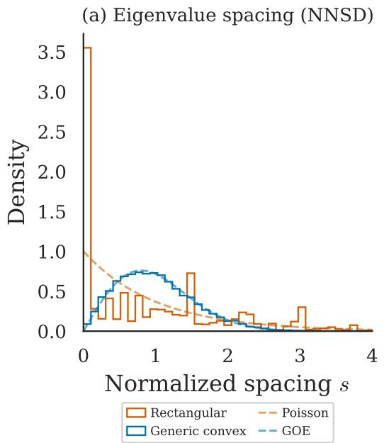

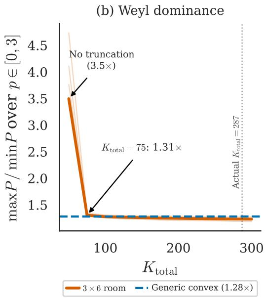  
Figure 21: Berry violations are real but irrelevant under Weyl dominance. (a) Nearest-neighbor spacing distributions: generic convex rooms (blue, 50 rooms pooled) match GOE $( D = 0 . 0 1 0$ $p = 0 . 1 7 )$ ; rectangular rooms (orange, 4 rooms) reject GOE (D > 0.19, $p < 1 0 ^ { - 5 } )$ (b) $P ( p )$ landscape ratio vs $K _ { \mathrm { t o t a l } }$ for the $3 \times 6$ room. At $\bar { K _ { \mathrm { t o t a l } } } = 5 0$ (no truncation), $\mathrm { r a t i o } = 3 . 4 9 \times ;$ at $K _ { \mathrm { t o t a l } } = 7 5 ( + 2 5$ modes), ratio collapses to $1 . 3 1 \times ;$ by $K _ { \mathrm { t o t a l } } = 1 0 0$ , equals the generic convex reference (1.28×, dashed). Weyl's law guarantees ${ \sim } 2 6 3$ modes, an overwhelming margin.

## G.3 Landscape ratio: but it doesn't matter

The relevant question is not “does Berry hold?" but “does the $P ( p )$ landscape curve?" We quantify landscape curvature by the ratio maxp $P / \operatorname* { m i n } _ { p } P$ over $p \in \ [ 0 , 3 ]$ . A ratio near 1.0 means the landscape is flat (all exponents perform similarly). A large ratio means the landscape is curved (the choice of p matters).

The control experiment. For the $3 \times 6$ room, we vary $K _ { \mathrm { t o t a l } }$ artificially: instead of using all modes up to the frequency ceiling, we truncate at progressively higher $K _ { \mathrm { t o t a l } }$ values. At $K _ { \mathrm { t o t a l } } \mathbf { \bar { \Psi } } = K = 5 0$ (no truncation noise at all), the regularizer is the only thing protecting the estimator from fitting noise in the data. As $K _ { \mathrm { t o t a l } }$ increases, the truncation noise grows but also becomes more isotropic (more modes contributing).

Results (Figure 21, panel b). At $K _ { \mathrm { t o t a l } } = 5 0$ (no truncation noise), the landscape is strongly curved: ratio = 3.49×. The optimal exponent is $p ^ { * } = 0$ (identity regularization), because without truncation noise the residual error comes only from the noiseless rank-deficiency of $\tilde { \Phi } ^ { \mp } \tilde { \Phi }$ (the $M T \le 2 K$ regime), where uniform shrinkage best stabilizes the inverse. Adding just 25 truncated modes $( K _ { \mathrm { t o t a l } } = 7 5 )$ collapses the ratio from 3.49 × to 1.31 ×, a dramatic flattening. By $K _ { \mathrm { t o t a l } } = 1 0 0$ (+50 modes), the ratio matches the generic convex reference (1.28×); at $K _ { \mathrm { t o t a l } } = 1 5 0$ and 200 the ratios are 1.26× and 1.25×, indistinguishable from the asymptote. At the actual $K _ { \mathrm { t o t a l } } = 2 8 7$ of the $3 \times 6$ room, the ratio is 1.25×.

Why this happens. Even though the rectangular eigenfunctions are not random fields (Berry fails), the sum of many non-random rank-one contributions still concentrates toward isotropy. This is a generalized law-of-large-numbers effect: you do not need the individual terms to be “nice" (Gaussian, independent); you just need enough of them. The cross-correlations between rectangular eigenfunctions are not zero-mean Gaussian as Berry predicts, but they are bounded and have limited variance. With 237 terms in the sum, the average behavior dominates.

Weyl's law guarantees that $K _ { \mathrm { t o t a l } } - K$ grows with room area. For any room of practical size $( > 1 \mathrm { m } ^ { 2 } )$ there are hundreds of truncated modes, far more than the ${ \sim } 2 5$ needed to flatten the landscape to within 5% of the generic convex reference.

## G.4 The Weyl dominance principle

The rectangular control experiment reveals a principle that is more general than Berry's conjecture:

The formula $\Gamma _ { k } = \lambda _ { k } ^ { | s | }$ works not because Berry holds universally, but because Weyl dominance makes Berry violations irrelevant to reconstruction quality (Figure 21, panel b).

Concretely, "Weyl dominance" means:

(i) Weyl's law guarantees hundreds of truncated modes in any room of practical size.

(ii) The sum of hundreds of bounded rank-one matrices concentrates around its mean, regardless of the distributional properties of the individual terms.

(iii) The resulting anisotropy $\| E \| _ { \mathrm { o p } }$ is moderate (empirical median 0.58 across 187 rooms), but insufficient to curve the $P ( p )$ landscape because the signal dynamic range $( \lambda _ { K } / \lambda _ { 1 } ) ^ { | s | } \approx 8 0 { : } 1$ dominates the noise eigenvalue ratio ${ \sim } 4 { : } 1$

Berry's conjecture provides the tightest concentration bound (Gaussian tails, Bernstein inequality with small constants). But the formula does not need perfect isotropy. It only needs the signal dynamic range to dominate the noise anisotropy, which is achieved with much weaker assumptions than Berry. Weyl's law provides the overwhelming mode count that makes even weak concentration sufficient.

When Weyl dominance fails. The mechanism requires $K _ { \mathrm { t o t a l } } - K \gg 1$ . This breaks for very small rooms where $K _ { \mathrm { t o t a l } } \approx K$ (the room supports too few modes below the frequency ceiling); such rooms are too small for meaningful acoustic reconstruction (wavelengths exceed the room dimensions), and the framework is not intended to apply.

## H Sensor Noise and Model Mismatch

The main text assumes that truncation noise dominates the error budget. In a real measurement system, electronic sensor noise, calibration errors, and model mismatch also contribute. This appendix analyzes how each affects the optimal regularizer.

## H.1 Electronic sensor noise

The model. Each microphone adds electronic noise $\epsilon _ { m } \sim \mathcal { N } ( 0 , \sigma _ { \mathrm { e l e c } } ^ { 2 } )$ to its measurement, independently across sensors and time. The total noise covariance is

$$
\begin{array} { r } { R = R _ { \mathrm { t r u n c } } + \sigma _ { \mathrm { e l e c } } ^ { 2 } I _ { M } = \sigma _ { \mathrm { t r u n c } } ^ { 2 } ( I _ { M } + E ) + \sigma _ { \mathrm { e l e c } } ^ { 2 } I _ { M } = ( \sigma _ { \mathrm { t r u n c } } ^ { 2 } + \sigma _ { \mathrm { e l e c } } ^ { 2 } ) I _ { M } + \sigma _ { \mathrm { t r u n c } } ^ { 2 } E . } \end{array}\tag{48}
$$

Why Γ is unchanged. The truncation noise contributes an approximately isotropic component $\sigma _ { \mathrm { t r u n c } } ^ { 2 } I _ { M }$ (by the Berry/Weyl argument). The electronic noise contributes an exactly isotropic component $\tilde { \sigma _ { \mathrm { e l e c } } ^ { 2 } } I _ { M }$ . The sum of two isotropic components is isotropic: $R \approx ( \sigma _ { \mathrm { t r u n c } } ^ { 2 } + \dot { \sigma } _ { \mathrm { e l e c } } ^ { 2 } ) \dot { I _ { M } }$ From Proposition 1, the optimal regularizer under isotropic noise is $\Gamma _ { k } \propto \lambda _ { k } ^ { s }$ , regardless of the noise level. The noise level only affects the optimal regularization strength $\alpha ,$ which absorbs the total noise power $\sigma _ { \mathrm { t r u n c } } ^ { 2 } + \sigma _ { \mathrm { e l e c } } ^ { 2 }$

In equations: the MAP estimator is

$$
\hat { \mathbf { a } } = \left( \tilde { \Phi } ^ { \top } \tilde { \Phi } + ( \sigma _ { \mathrm { t r u n c } } ^ { 2 } + \sigma _ { \mathrm { e l e c } } ^ { 2 } ) \Sigma _ { \mathbf { a } } ^ { - 1 } \right) ^ { - 1 } \tilde { \Phi } ^ { \top } \tilde { \mathbf { y } } .\tag{49}
$$

Comparing with the Tikhonov form: $\alpha = ( \sigma _ { \mathrm { t r u n c } } ^ { 2 } + \sigma _ { \mathrm { e l e c } } ^ { 2 } ) / c$ and $\Gamma _ { k k } = \lambda _ { k } ^ { s }$ . The shape is the same;   
only α changes.

Practical implication. Adding sensor noise is like turning up the volume on the “static" in the background. The optimal response is to regularize more strongly (α increases) but not differently (the shape $\Gamma _ { k } \propto \lambda _ { k } ^ { s }$ is unchanged). This is good news for real deployments: the formula works whether the dominant noise source is truncation, electronics, or a combination.

## H.2 Mild sensor noise anisotropy

What could go wrong. In practice, different microphones may have slightly different noise levels due to manufacturing variation, calibration drift, or age. This introduces a mild anisotropy into the electronic noise:

$$
R _ { \mathrm { e l e c } } = \mathrm { d i a g } ( \sigma _ { \mathrm { e l e c , 1 } } ^ { 2 } , \dots , \sigma _ { \mathrm { e l e c } , M } ^ { 2 } )\tag{50}
$$

instead of $\sigma _ { \mathrm { e l e c } } ^ { 2 } I _ { M }$

How bad can it get? The total noise covariance becomes

$$
R = \sigma _ { \mathrm { t r u n c } } ^ { 2 } ( I _ { M } + E ) + R _ { \mathrm { e l e c } } .\tag{51}
$$

The anisotropy in $R _ { \mathrm { e l e c } }$ adds to the anisotropy in $E$ from the truncation noise. If the sensor noise anisotropy is comparable to or larger than the truncation noise anisotropy, it could, in principle, curve the $P ( p )$ landscape.

Practical bound. Realistic calibration mismatch between microphones is typically $< 3 \mathrm { d B } \ ( <$ $2 \times$ in power), perturbing $\| E \| _ { \mathrm { o p } }$ by $O ( 0 . 1 )$ , small relative to the empirical truncation anisotropy $( \| E \| _ { \mathrm { o p } } \approx 0 . 5 8 , $ Appendix $\mathbf { A } . 2 )$ . Mild sensor anisotropy therefore adds a small perturbation to the noise covariance and the formula $\Gamma _ { k } = \lambda _ { k } ^ { | s | }$ remains robust under realistic calibration mismatch.

## H.3 Frequency-dependent damping

The assumption we made. The main text $\left( \mathsf { e q . } \left( 2 \right) \right)$ assumes uniform damping: $a _ { k } ( t ) \ =$ $e ^ { - \gamma t } [ c _ { k } \cos ( \omega _ { k } t ) + \beta _ { k } \sin ( \omega _ { k } t ) ]$ , where $\gamma$ is the same for every mode. This means all modes decay at the same rate: the relative amplitudes are preserved over time.

What happens when it breaks. In real rooms, damping is frequency-dependent. High-frequency modes are typically damped more strongly than low-frequency modes, because acoustic absorption by walls, furniture, and air increases with frequency. A simple model is $\gamma _ { k } = \gamma _ { 0 } + \gamma _ { 1 } \lambda _ { k }$ , where $\gamma _ { 0 }$ is a baseline damping rate and $\gamma _ { 1 }$ controls the frequency dependence.

Under frequency-dependent damping, the modal amplitude at time t is

$$
a _ { k } ( t ) = e ^ { - \gamma _ { k } t } \bigl [ c _ { k } \cos ( \omega _ { k } t ) + \beta _ { k } \sin ( \omega _ { k } t ) \bigr ] ,\tag{52}
$$

and the effective amplitude variance becomes

$$
\sigma _ { a , k } ^ { 2 } ( t ) \propto \lambda _ { k } ^ { - s } \cdot e ^ { - 2 \gamma _ { 1 } \lambda _ { k } t } .\tag{53}
$$

This is exactly the heat equation case. Following $\ S 7 _ { \cdot }$ , we redefine the estimand as the current-state amplitudes $a _ { k } ( t )$ rather than the initial conditions $a _ { k } ( 0 )$ ; the prior on $a _ { k } ( t )$ inherits the damping factor $e ^ { - 2 \gamma _ { 1 } \lambda _ { k } t }$ exactly as in the heat case, and the regularizer correction below inverts that prior factor. The exponential factor $e ^ { - 2 \gamma _ { 1 } \lambda _ { k } t }$ is structurally identical to the heat equation's $e ^ { - 2 \kappa \lambda _ { k } t }$ from eq. (12). The framework of $^ { \ S 7 }$ shows how to handle this: the regularizer acquires an exponential correction

$$
\Gamma _ { k } \propto \lambda _ { k } ^ { s } \cdot e ^ { 2 \gamma _ { 1 } \lambda _ { k } t } ,\tag{54}
$$

where $\gamma _ { 1 }$ plays the role of $\kappa .$

$\operatorname { I f } \gamma _ { 1 }$ is known (from absorption measurements or material data), the correction is a prediction, not a fit. $\operatorname { I f } \gamma _ { 1 }$ is unknown, the one-parameter power law $\Gamma _ { k } = \lambda _ { k } ^ { p }$ with an elevated $p ^ { * }$ serves as a fallback, absorbing the missing exponential factor into the effective exponent, exactly as we demonstrated for the heat equation (§E.4).

Practical relevance. In typical room acoustics below 500 Hz (the modal frequency range), frequency-dependent damping is small: $\gamma _ { 1 } \lambda _ { K } t \ll 1$ for the retained modes. The uniform-damping approximation is reasonable, and the one-parameter power law $\Gamma _ { k } = \lambda _ { k } ^ { | s | }$ suffices. At higher frequencies or in rooms with strong frequency-dependent absorption (e.g., heavily carpeted rooms), the exponential correction may become relevant. The heat equation analysis (§7) provides the complete framework for this case.

## H.4 Practical diagnostic: the Herfindahl check

For any new (K, M) configuration, the Herfindahl index

$$
H = \frac { \sum _ { n > K } \lambda _ { n } ^ { - 2 \left| s \right| } } { \left( \sum _ { n > K } \lambda _ { n } ^ { - \left| s \right| } \right) ^ { 2 } }\tag{55}
$$

can be computed from the eigenvalues alone (FEM or analytical), with no data collection $H < 0 . 0 1$ indicates the noise power is well-spread across truncated modes and $\Gamma _ { k } = \lambda _ { k } ^ { | s | }$ is expected to work; $H > 0 . 1$ indicates a few truncated modes dominate and the formula should be validated empirically before deployment. The risky direction is increasing K toward $K _ { \mathrm { t o t a l } } \mathrm { : }$ as the truncation band shrinks, H rises and isotropy weakens; at $K = K _ { \mathrm { t o t a l } }$ the framework does not apply. M-sensitivity is verified directly in Appendix D.4, where the impossibility pattern persists at $\bar { M } \in \{ 8 , 1 6 \}$

## I Aperture Constraint on Physical Validation

This appendix provides the formal analysis of the spatial-sampling constraint discussed in §8. We derive the aperture-to-wavelength bound, instantiate it for typical rooms, and report empirical confirmation from a pilot measurement that motivated the follow-up direction.

## I.1 The aperture-to-wavelength bound

Recovering K modal amplitudes from M microphones requires the spatial Gram matrix $\Phi _ { m k } =$ $\varphi _ { k } ( x _ { m } )$ to have effective rank K. For a compact array of aperture D sampling modes whose shortest retained wavelength is $\ell _ { \mathrm { m i n } } = 2 \pi / \sqrt { \lambda _ { K } }$ , each eigenfunction varies across the array by at most

$$
\begin{array} { r } { \left| \varphi _ { k } ( x _ { m } ) - \varphi _ { k } ( x _ { m ^ { \prime } } ) \right| \lesssim 2 \pi D / \ell _ { \mathrm { \operatorname* { m i n } } } \cdot \left\| \varphi _ { k } \right\| _ { \infty } , } \end{array}\tag{56}
$$

for any pair of mic positions $x _ { m } , x _ { m ^ { \prime } }$ within the array. When $D / \ell _ { \mathrm { m i n } } \ll 1$ , every column of Φ is approximately a constant vector (with a mode-dependent prefactor and a small perturbation), and all K columns are nearly parallel in $\mathbb { R } ^ { M }$ . The energy of Φ concentrates into a handful of dominant singular directions regardless of M, and modal projection returns noise amplified by the reciprocals of vanishing singular values.

This is not a signal-to-noise problem but a structural one. Increasing M within a fixed aperture does not help; the added mics see approximately the same eigenfunction values as the existing ones. Increasing the recording length does not help; temporal averaging cannot supply spatial information that was never measured. The only remedies are (a) enlarging the array aperture until $D / \ell _ { \mathrm { m i n } }$ is O(1), or (b) sampling at spatially distinct positions over time.

## I.2 Numerical instantiation

For K=50 retained modes and three room scales, Table 20 reports the shortest retained wavelength, the aperture-to-wavelength ratio for a typical portable array $( D { = } 1 2 . 6 \mathrm { c m } )$ , and the resulting maximum amplitude variation across the array.

A compact array resolves modes well only when the room is small enough that retained wavelengths approach the aperture. However, shrinking the room further brings two countervailing effects: the source-to-array distance enters the near field, violating the far-field assumption of the modal observation model; and the total mode count $K _ { \mathrm { t o t a l } }$ drops to a regime where the Berry/Weyl concentration argument no longer holds (the closet has only 141 total modes below the simulation frequency ceiling, barely above the K=50 we retain). No room size admits a static compact array as a valid physical testbed for $K { = } 5 0$ modal recovery within the framework's assumptions.

Table 20: Aperture constraint for $K { = } 5 0$ retained Neumann modes across three room scales for the miniDSP UMA-16 v2 (D=12.6 cm aperture; same configuration as the real-data pilot of $\ S 1 . 3 ) . \ K _ { \mathrm { t o t a l } }$ is the total number of Neumann modes below the simulation frequency ceiling; $\mathsf { \bar { \ell } } _ { \operatorname* { m i n } } = 2 \pi / \sqrt { \lambda _ { K } }$ is the shortest retained wavelength; the max amplitude variation across the array is $2 \sin ( \pi D / \ell _ { \mathrm { m i n } } )$ the exact maximum of $| \varphi ( x _ { 1 } ) - \varphi ( x _ { 2 } ) |$ for a unit-amplitude plane wave $\varphi ( x ) = \cos ( k x )$ with $k = 2 \pi / \ell _ { \mathrm { m i n } }$ across $| x _ { 1 } - x _ { 2 } | \le D$ , achieved when the array straddles a node (saturates at 2.0 when $D \ge \ell _ { \mathrm { m i n } } / 2$ because two mics can occupy antinodes of opposite sign). Values computed using the same eigenpair routines as the main experiments.
<table><tr><td>Room</td><td>Volume  $( \mathbf { m } ^ { 3 } )$ </td><td> $K _ { \mathrm { t o t a l } }$ </td><td> $\ell _ { \mathrm { m i n } } \left( \mathrm { m } \right)$ </td><td> $D / \ell _ { \mathrm { m i n } }$ </td><td>Max amplitude variation</td></tr><tr><td>Large  $( 3 . 4 5 \times 7 . 2 0 \times 2 . 4 5 \mathrm { m } )$ </td><td>60.9</td><td>7017</td><td>2.07</td><td>6.1%</td><td>38.0%</td></tr><tr><td>Compact  $( 1 . 3 3 \times 2 . 1 0 \times 2 . 4 7 \mathrm { m } )$ </td><td>6.9</td><td>879</td><td>0.988</td><td>12.8%</td><td>78.0%</td></tr><tr><td>Closet  $( 1 . 0 \times 1 . 0 \times 1 . 0 \mathrm { m } )$ </td><td>1.0</td><td>141</td><td>0.535</td><td>23.6%</td><td>134.8%</td></tr></table>

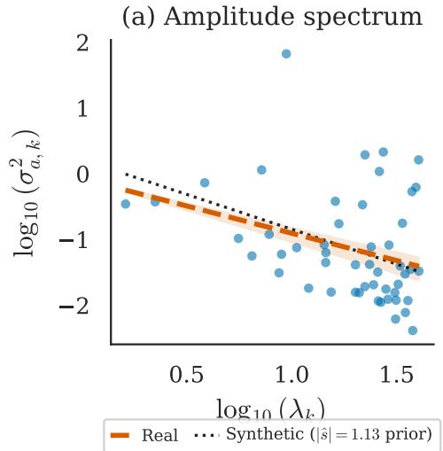

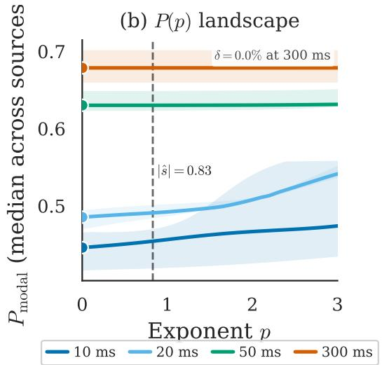  
Figure 22: Real-data recovery vs matched synthetic comparison in the compact room $( V { = } 6 . 9 \mathrm { m } ^ { 3 }$ $\bar { K = 5 0 , M = 1 6 , N _ { \mathrm { s r c } } } 5 , R T _ { 6 0 } { = } 1 . 0 4 \mathrm { s } )$ . (a) Per-mode log-energy vs log-eigenvalue scatter for the real measurement (orange) with bootstrap 95% CI fan, against the synthetic reference slope (black dotted) generated under the matched modal generator with population $\left| s | { = } 1 . 1 3 \right.$ Real $\bar { | s | } \bar { = } 0 . 8 3$ $( R ^ { 2 } { = } 0 . \bar { 1 0 } )$ vs synthetic $\lvert \hat { s } \rvert { = } 1 . 0 6 ( R ^ { 2 } { = } 0 . 7 3 )$ ; the slope gap $\Delta { \bar { | s | } } \bar { = } 0 . 2 3$ is the prior-mismatch signal (b) Tikhonov landscape $\dot { P ( p ) }$ at four snapshot counts $T \in \{ 1 0 , 2 0 , 5 0 , 3 0 0 \}$ ms; the landscape is flat (maxp P/ minp $P = 1 . 0 0 )$ ) for $T \geq 5 0 \mathrm { m s } ,$ with $p ^ { \star } { = } 0$ across all T.

## I.3 Empirical real-data validation

We ran the modal recovery pipeline on a real measurement in the compact-room configuration of Table $2 0 ( 1 . 3 3 \times 2 . 1 0 \times \dot { 2 } . \dot { 4 } \dot { 7 } \mathrm { m } , V = 6 . 9 \mathrm { m } ^ { 3 } )$ . The hardware was a miniDSP UMA-16 v2 array (16 MEMS microphones in a 4×4 uniform grid, 42 mm element spacing, 12.6 cm corner-to-corner aperture) and a Genelec 8010A loudspeaker. At each of 5 source positions we played a 5-second exponential swept sine from 20 Hz to 2 kHz and recovered the 16-channel impulse response by Farina deconvolution. Schroeder backward integration on the deconvolved 500 ms RIRs gave median $R T _ { 6 0 } = 1 . 0 4 \mathrm { s } , \mathrm { I Q R } \ [ 1 . 0 1 , 1 . 0 5 ] \mathrm { s }$ 6

To isolate framework idealization from recording-chain effects, we ran the identical analysis pipeline on a matched synthetic dataset: same room, mics, source positions, $K { = } 5 0$ modes, and $R T _ { 6 0 } ^ { \overline { { { } } } }$ with modal coefficients drawn from the population power-law prior $( | s | { = } 1 . 1 3 )$ . Recovery results are summarized in Figure 22.

Two positive findings. First, the framework's flat-landscape prediction holds on real data: $\mathrm { m a x } _ { p } P / \mathrm { m i n } _ { p } P = 1$ .06 at $T { = } 1 0$ ms and collapses to 1.00 for $T \geq 5 0 \mathrm { m s } ,$ with $\delta ( | \hat { s } | ) \leq 1 . 9 2 \%$ across all tested T. Second, |ê| is recoverable from real recordings: log-linear regression returns $| \hat { s } | = 0 . 8 3$ with 95% CI [0.75, 0.96], stable across $R T _ { 6 0 } \in [ 0 . 5 , 1 . 5 ] \mathrm { { s } }$ The optimal exponent $p ^ { \star }$ collapses to zero (ridge) at every T, both on real and on synthetic data; this is a property of the aperture-bounded spatial Gram, not a recording-chain artifact.

One quantified gap. The matched synthetic comparison recovers $\left| \hat { s } \right| = 1 . 0 6 ( R ^ { 2 } = 0 . 7 3 )$ from the identical pipeline, within CI of the population $| s | { = } 1 . 1 3$ . The real-data slope of $0 . 8 3 ( R ^ { 2 } = 0 . 1 0 )$ underestimates by $\Delta | \hat { s } | = 0 . 2 3$ , with a $\Delta { \dot { R } } ^ { 2 } = 0 . { \dot { 6 } } 3$ collapse in fit quality. Geometry alone does not explain the gap because the synthetic comparison controls for it. The residual is therefore attributable to the recording chain: the i.i.d. Gaussian power-law prior is an idealization, and at least the following effects are not captured by the synthetic forward model: source-side modal excitation deviating from the prior, frequency-dependent damping (uniform-γ assumption violated; cf. §H.3), RIR truncation at 500 ms below the measured $R T _ { 6 0 } { \approx } 1 { \mathrm { s } } ,$ non-flat loudspeaker frequency response, near-field violations for the lowest retained modes, and finite source sample $( N _ { \mathrm { s r c } } { = } 5 )$ ). Disambiguating the contribution of each is left for follow-up work.

Spatial Gram diagnostics confirm the aperture bound. The geometry-only matrix $\Phi \in \mathbb { R } ^ { 1 6 \times 5 0 }$ has top-three singular directions capturing 99.99% of its energy; the recorded data matrix Y has top-three capturing 99.76%. Both confirm the structural aperture-bounded rank-deficiency predicted by the bound: at $\bar { D } / \ell _ { \mathrm { m i n } } \approx 1 2 . 8 \%$ (Table 20, Compact row), Φ is effectively rank \~3 across the $K { = } 5 0$ retained modes. The framework's flat-landscape prediction survives this aperture compactness; the slope-recovery quality does not, which is what motivates the trajectory-based resolution of $\ S 1 . 4$

## I.4 Resolution via distributed temporal sampling

The aperture constraint admits two solutions: spatial distribution via a large array, or temporal distribution via a moving sensor. The first defeats the portability that motivates the framework for robotic and mobile sensing applications. The second preserves the hardware footprint of a compact array while acquiring spatial diversity through motion, converting M static mics at a fixed position into M · N effective measurement points over N positions along a trajectory.

Theoretically, Berry's isotropy argument depends only on the sample average $\begin{array} { r } { \frac { 1 } { N } \sum _ { n } \varphi _ { k } ( x _ { n } ) \varphi _ { l } ( x _ { n } ) } \end{array}$ being small for $k \neq l . \mathrm { ~ A ~ }$ sufficiently mixing trajectory in Ω induces a sampling distribution whose expectation converges to the orthogonality relation of the eigenfunctions, so the isotropy premise of §4 carries over from static random placements to trajectories. Optimality questions, such as what trajectory minimizes the reconstruction error subject to a path-length or duration budget, become the natural subject of follow-up work. We leave the trajectory formulation, its theoretical analysis, and its empirical validation to that paper.

## NeurIPS Paper Checklist

## 1. Claims

Question: Do the main claims made in the abstract and introduction accurately reflect the paper's contributions and scope?

Answer: [Yes]

Justification: Abstract and §1 state four contributions, each backed by §4–§7. Isotropy is framed as approximate throughout.

Guidelines:

• The answer [N/A] means that the abstract and introduction do not include the claims made in the paper.

• The abstract and/or introduction should clearly state the claims made, including the contributions made in the paper and important assumptions and limitations. A [No] or [N/A] answer to this question will not be perceived well by the reviewers.

• The claims made should match theoretical and experimental results, and reflect how much the results can be expected to generalize to other settings.

• It is fine to include aspirational goals as motivation as long as it is clear that these goals are not attained by the paper

## 2. Limitations

Question: Does the paper discuss the limitations of the work performed by the authors? Answer: [Yes]

Justification: §8 covers 2D-only scope, Gaussian prior (Appendix F), Berry failure in rectangles (Appendix G), 3D as future work, the open non-diagonal estimator question, and physical validation via a compact-array real-data pilot (Appendix I).

Guidelines:

• The answer [N/A] means that the paper has no limitation while the answer [No] means that the paper has limitations, but those are not discussed in the paper.

• The authors are encouraged to create a separate “Limitations" section in their paper.

• The paper should point out any strong assumptions and how robust the results are to violations of these assumptions (e.g., independence assumptions, noiseless settings, model well-specification, asymptotic approximations only holding locally). The authors should reflect on how these assumptions might be violated in practice and what the implications would be.

• The authors should reflect on the scope of the claims made, e.g., if the approach was only tested on a few datasets or with a few runs. In general, empirical results often depend on implicit assumptions, which should be articulated.

• The authors should reflect on the factors that influence the performance of the approach. For example, a facial recognition algorithm may perform poorly when image resolution is low or images are taken in low lighting. Or a speech-to-text system might not be used reliably to provide closed captions for online lectures because it fails to handle technical jargon.

• The authors should discuss the computational efficiency of the proposed algorithms and how they scale with dataset size.

• If applicable, the authors should discuss possible limitations of their approach to address problems of privacy and fairness.

• While the authors might fear that complete honesty about limitations might be used by reviewers as grounds for rejection, a worse outcome might be that reviewers discover limitations that aren't acknowledged in the paper. The authors should use their best judgment and recognize that individual actions in favor of transparency play an important role in developing norms that preserve the integrity of the community. Reviewers will be specifically instructed to not penalize honesty concerning limitations.

## 3. Theory assumptions and proofs

Question: For each theoretical result, does the paper provide the full set of assumptions and a complete (and correct) proof?

## Answer: [Yes]

Justification: Proposition 1 lists assumptions and is proved in Appendix A. Berry is stated as a conjecture, verified in §5 and Appendix B.

## Guidelines:

• The answer [N/A] means that the paper does not include theoretical results.

• All the theorems, formulas, and proofs in the paper should be numbered and crossreferenced.

• All assumptions should be clearly stated or referenced in the statement of any theorems.

• The proofs can either appear in the main paper or the supplemental material, but if they appear in the supplemental material, the authors are encouraged to provide a short proof sketch to provide intuition.

• Inversely, any informal proof provided in the core of the paper should be complemented by formal proofs provided in appendix or supplemental material.

• Theorems and Lemmas that the proof relies upon should be properly referenced.

## 4. Experimental result reproducibility

Question: Does the paper fully disclose all the information needed to reproduce the main experimental results of the paper to the extent that it affects the main claims and/or conclusions of the paper (regardless of whether the code and data are provided or not)?

Answer: [Yes]

Justification: All settings specified: K=50, M=8, 800/197 train/val split, p-grid, α selection (§5); optimizer, lr, epochs, seeds (Appendix D.8); heat parameters (Appendix E); FEM data generation (§3, Appendix C.8); real-data pilot setup (Appendix I).

Guidelines:

• The answer [N/A] means that the paper does not include experiments.

• If the paper includes experiments, a [No] answer to this question will not be perceived well by the reviewers: Making the paper reproducible is important, regardless of whether the code and data are provided or not.

• If the contribution is a dataset and/or model, the authors should describe the steps taken to make their results reproducible or verifiable.

• Depending on the contribution, reproducibility can be accomplished in various ways. For example, if the contribution is a novel architecture, describing the architecture fully might suffice, or if the contribution is a specific model and empirical evaluation, it may be necessary to either make it possible for others to replicate the model with the same dataset, or provide access to the model. In general. releasing code and data is often one good way to accomplish this, but reproducibility can also be provided via detailed instructions for how to replicate the results, access to a hosted model (e.g., in the case of a large language model), releasing of a model checkpoint, or other means that are appropriate to the research performed.

• While NeurIPS does not require releasing code, the conference does require all submissions to provide some reasonable avenue for reproducibility, which may depend on the nature of the contribution. For example

(a) If the contribution is primarily a new algorithm, the paper should make it clear how to reproduce that algorithm.

(b) If the contribution is primarily a new model architecture, the paper should describe the architecture clearly and fully.

(c) If the contribution is a new model (e.g., a large language model), then there should either be a way to access this model for reproducing the results or a way to reproduce the model (e.g., with an open-source dataset or instructions for how to construct the dataset).

(d) We recognize that reproducibility may be tricky in some cases, in which case authors are welcome to describe the particular way they provide for reproducibility. In the case of closed-source models, it may be that access to the model is limited in some way (e.g., to registered users), but it should be possible for other researchers to have some path to reproducing or verifying the results.

## 5. Open access to data and code

Question: Does the paper provide open access to the data and code, with sufficient instructions to faithfully reproduce the main experimental results, as described in supplemental material?

Answer: [No]

Justification: We will make the code public upon acceptance.

Guidelines:

• The answer [N/A] means that paper does not include experiments requiring code.

• Please see the NeurIPS code and data submission guidelines (https: //neurips. cc/ public/guides/CodeSubmissionPolicy) for more details.

• While we encourage the release of code and data, we understand that this might not be possible, so [No] is an acceptable answer. Papers cannot be rejected simply for not including code, unless this is central to the contribution (e.g., for a new open-source benchmark).

• The instructions should contain the exact command and environment needed to run to reproduce the results. See the NeurIPS code and data submission guidelines (https: //neurips.cc/public/guides/CodeSubmissionPolicy) for more details.

• The authors should provide instructions on data access and preparation, including how to access the raw data, preprocessed data, intermediate data, and generated data, etc.

• The authors should provide scripts to reproduce all experimental results for the new proposed method and baselines. If only a subset of experiments are reproducible, they should state which ones are omitted from the script and why.

• At submission time, to preserve anonymity, the authors should release anonymized versions (if applicable).

• Providing as much information as possible in supplemental material (appended to the paper) is recommended, but including URLs to data and code is permitted.

## 6. Experimental setting/details

Question: Does the paper specify all the training and test details (e.g., data splits, hyperparameters, how they were chosen, type of optimizer) necessary to understand the results?

Answer: [Yes]

Justification: Data split, hyperparameters, optimizer, seeds, and loss are in §5 and Appendix D.8. The main formula has no free parameters beyond |s|.

Guidelines:

• The answer [N/A] means that the paper does not include experiments.

• The experimental setting should be presented in the core of the paper to a level of detail that is necessary to appreciate the results and make sense of them.

• The full details can be provided either with the code, in appendix, or as supplemental material.

## 7. Experiment statistical significance

Question: Does the paper report error bars suitably and correctly defined or other appropriate information about the statistical significance of the experiments?

Answer: [Yes]

Justification: Bootstrap 95% CI for |s| (§5), mean ± std over 5 seeds for LIR (Appendix D.8), KS p-values (§5, Appendix B), IQR shading in figures.

Guidelines:

• The answer [N/A] means that the paper does not include experiments.

• The authors should answer [Yes] if the results are accompanied by error bars, confidence intervals, or statistical significance tests, at least for the experiments that support the main claims of the paper.

• The factors of variability that the error bars are capturing should be clearly stated (for example, train/test split, initialization, random drawing of some parameter, or overall run with given experimental conditions).

• The method for calculating the error bars should be explained (closed form formula call to a library function, bootstrap, etc.)

• The assumptions made should be given (e.g., Normally distributed errors).

• It should be clear whether the error bar is the standard deviation or the standard error of the mean.

• It is OK to report 1-sigma error bars, but one should state it. The authors should preferably report a 2-sigma error bar than state that they have a 96% CI, if the hypothesis of Normality of errors is not verified.

• For asymmetric distributions, the authors should be careful not to show in tables or figures symmetric error bars that would yield results that are out of range (e.g., negative error rates).

• If error bars are reported in tables or plots, the authors should explain in the text how they were calculated and reference the corresponding figures or tables in the text.

## 8. Experiments compute resources

Question: For each experiment, does the paper provide sufficient information on the computer resources (type of compute workers, memory, time of execution) needed to reproduce the experiments?

Answer: [Yes]

Justification: CPU: Intel i5-12400F, GPU: NVIDIA RTX 4090, 32 GB RAM. Closed-form Tikhonov runs on CPU in seconds. LIR training (52L parameters) takes \~5 min/seed on GPU. Total compute for all experiments: < 24 GPU-hours.

Guidelines:

• The answer [N/A] means that the paper does not include experiments.

• The paper should indicate the type of compute workers CPU or GPU, internal cluster, or cloud provider, including relevant memory and storage.

• The paper should provide the amount of compute required for each of the individual experimental runs as well as estimate the total compute.

• The paper should disclose whether the full research project required more compute than the experiments reported in the paper (e.g., preliminary or failed experiments that didn't make it into the paper).

## 9. Code of ethics

Question: Does the research conducted in the paper conform, in every respect, with the NeurIPS Code of Ethics https://neurips.cc/public/EthicsGuidelines?

Answer: [Yes]

Justification: Synthetic FEM eigenmodes (main experiments) and author-recorded RIRs in an empty 6.9 m3 room (Appendix I). No human subjects, personal data, or dual-use concerns.

Guidelines:

• The answer [N/A] means that the authors have not reviewed the NeurIPS Code of Ethics.

• If the authors answer [No], they should explain the special circumstances that require a deviation from the Code of Ethics.

• The authors should make sure to preserve anonymity (e.g., if there is a special consideration due to laws or regulations in their jurisdiction).

## 10. Broader impacts

Question: Does the paper discuss both potential positive societal impacts and negative societal impacts of the work performed?

Answer: [N/A]

Justification: Foundational signal-processing theory with no foreseeable negative societal impact.

Guidelines:

• The answer [N/A] means that there is no societal impact of the work performed.

• If the authors answer [N/A] or [No], they should explain why their work has no societal impact or why the paper does not address societal impact

• Examples of negative societal impacts include potential malicious or unintended uses (e.g., disinformation, generating fake profiles, surveillance), fairness considerations (e.g., deployment of technologies that could make decisions that unfairly impact specific groups), privacy considerations, and security considerations.

• The conference expects that many papers will be foundational research and not tied to particular applications, let alone deployments. However, if there is a direct path to any negative applications, the authors should point it out. For example, it is legitimate to point out that an improvement in the quality of generative models could be used to generate Deepfakes for disinformation. On the other hand, it is not needed to point out that a generic algorithm for optimizing neural networks could enable people to train models that generate Deepfakes faster.

• The authors should consider possible harms that could arise when the technology is being used as intended and functioning correctly, harms that could arise when the technology is being used as intended but gives incorrect results, and harms following from (intentional or unintentional) misuse of the technology.

• If there are negative societal impacts, the authors could also discuss possible mitigation strategies (e.g., gated release of models, providing defenses in addition to attacks, mechanisms for monitoring misuse, mechanisms to monitor how a system learns from feedback over time, improving the efficiency and accessibility of ML).

## 11. Safeguards

Question: Does the paper describe safeguards that have been put in place for responsible release of data or models that have a high risk for misuse (e.g., pre-trained language models, image generators, or scraped datasets)?

Answer: [N/A]

Justification: Released assets are synthetic FEM eigenpairs, small networks, and RIRs from a small room. No misuse risk.

Guidelines:

• The answer [N/A] means that the paper poses no such risks.

• Released models that have a high risk for misuse or dual-use should be released with necessary safeguards to allow for controlled use of the model, for example by requiring that users adhere to usage guidelines or restrictions to access the model or implementing safety filters.

• Datasets that have been scraped from the Internet could pose safety risks. The authors should describe how they avoided releasing unsafe images.

• We recognize that providing effective safeguards is challenging, and many papers do not require this, but we encourage authors to take this into account and make a best faith effort.

## 12. Licenses for existing assets

Question: Are the creators or original owners of assets (e.g., code, data, models), used in the paper, properly credited and are the license and terms of use explicitly mentioned and properly respected?

Answer: [N/A]

Justification: All data authored by us: synthetic FEM eigenmodes plus RIRs from a 6.9 m³ room (Appendix I). No external datasets or licensed code.

Guidelines:

• The answer [N/A] means that the paper does not use existing assets.

• The authors should cite the original paper that produced the code package or dataset.

• The authors should state which version of the asset is used and, if possible, include a URL.

• The name of the license (e.g., CC-BY 4.0) should be included for each asset.

• For scraped data from a particular source (e.g., website), the copyright and terms of service of that source should be provided.

• If assets are released, the license, copyright information, and terms of use in the package should be provided. For popular datasets, paperswithcode. com/datasets has curated licenses for some datasets. Their licensing guide can help determine the license of a dataset.

• For existing datasets that are re-packaged, both the original license and the license of the derived asset (if it has changed) should be provided.

• If this information is not available online, the authors are encouraged to reach out to the asset's creators.

## 13. New assets

Question: Are new assets introduced in the paper well documented and is the documentation provided alongside the assets?

Answer: [No]

Justification: Code will be made public upon acceptance: FEM eigenpairs, real-data RIRs and sensor/source metadata, matched synthetic comparison, scripts, pipeline.

Guidelines:

• The answer [N/A] means that the paper does not release new assets.

• Researchers should communicate the details of the dataset/code/model as part of their submissions via structured templates. This includes details about training, license, limitations, etc.

• The paper should discuss whether and how consent was obtained from people whose asset is used.

• At submission time, remember to anonymize your assets (if applicable). You can either create an anonymized URL or include an anonymized zip file.

## 14. Crowdsourcing and research with human subjects

Question: For crowdsourcing experiments and research with human subjects, does the paper include the full text of instructions given to participants and screenshots, if applicable, as well as details about compensation (if any)?

Answer: [N/A]

Justification: No crowdsourcing or human subjects.

Guidelines:

• The answer [N/A] means that the paper does not involve crowdsourcing nor research with human subjects.

• Including this information in the supplemental material is fine, but if the main contribution of the paper involves human subjects, then as much detail as possible should be included in the main paper.

• According to the NeurIPS Code of Ethics, workers involved in data collection, curation, or other labor should be paid at least the minimum wage in the country of the data collector.

## 15. Institutional review board (IRB) approvals or equivalent for research with human subjects

Question: Does the paper describe potential risks incurred by study participants, whether such risks were disclosed to the subjects, and whether Institutional Review Board (IRB) approvals (or an equivalent approval/review based on the requirements of your country or institution) were obtained?

Answer: [N/A]

Justification: No human subjects.

Guidelines:

• The answer [N/A] means that the paper does not involve crowdsourcing nor research with human subjects.

• Depending on the country in which research is conducted, IRB approval (or equivalent) may be required for any human subjects research. If you obtained IRB approval, you should clearly state this in the paper.

• We recognize that the procedures for this may vary significantly between institutions and locations, and we expect authors to adhere to the NeurIPS Code of Ethics and the guidelines for their institution.

• For initial submissions, do not include any information that would break anonymity (if applicable), such as the institution conducting the review.

## 16. Declaration of LLM usage

Question: Does the paper describe the usage of LLMs if it is an important, original, or non-standard component of the core methods in this research? Note that if the LLM is used only for writing, editing, or formatting purposes and does not impact the core methodology, scientific rigor, or originality of the research, declaration is not required.

Answer: [N/A]

Justification: LLMs used for writing and editing, not for experiments.

Guidelines:

• The answer [N/A] means that the core method development in this research does not involve LLMs as any important, original, or non-standard components.

• Please refer to our LLM policy in the NeurIPS handbook for what should or should not be described.