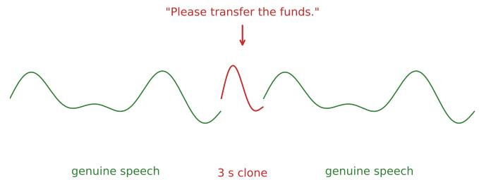
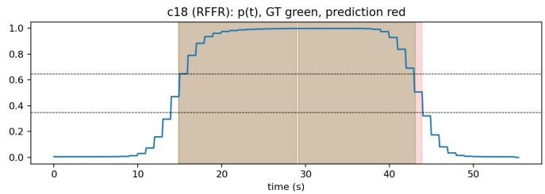

# Zero-Shot Temporal Localisation of Audio Deepfakes in Multi-Speaker Conversations

Soumyadeep Roy

Abstract—Voice-cloning fraud increasingly relies on surgical injection: a genuine conversation in which only one or two sentences are replaced by synthetic speech. Utterance-level deepfake detectors emit a single real/fake label per clip and cannot report where the synthetic speech lies. We formalise this as Temporal Deepfake Localisation in Multi-Speaker Conversations (TDLMC), show that equal error rate and min-DCF are ill-posed once a file contains both classes, and propose temporal metrics for this regime. Our contribution is a training-free five-stage pipeline that wraps a frozen binary detector and adds segment-level output with no retraining, using a two-threshold hysteresis finitestate-machine decoder to turn noisy window scores into coherent intervals. On 180 constructed multi-speaker conversations from ASVspoof 5, the system attains temporal intersection-over-union 0.90, temporal detection rate 0.95, and MS-DCF 0.26 with a strong backbone, and its false-alarm rate on genuine speech is below 6%, falling under 2% on genuine real multi-speaker dialogue (AMI). Under an identical pipeline, a trained localiser improves temporal IoU by only about 0.04, bounding the cost of forgoing supervision. Evaluated across three frozen detectors under one decoder whose constants are selected on a held-out calibration split, and with a controlled analysis attributing the residual false-alarm rate to a backbone domain gap rather than to the decoder, this provides the first zero-shot baseline and a reusable benchmark for TDLMC.

Index Terms—Audio deepfake detection, temporal localisation, multi-speaker conversations, zero-shot inference, evaluation metrics.

## I. INTRODUCTION

I voice cloning can reproduce a speaker from seconds of audio and has been used for large-scale fraud [1]. The ASVspoof series [2], [3], [4] has driven utterance-level equal error rates (EERs) below 1%, yet every such system shares one assumption: one clip in, one binary label out. This is mismatched to how fraud is committed. Fabricating a fully synthetic call is costly and conspicuous; the efficient attack substitutes only the decisive sentence—“authorise the payment”—with a cloned voice, leaving the rest genuine. Forced to summarise the clip with one label, an utterancelevel detector cannot isolate the injected span (Fig. 1).

The closest prior work localises synthetic regions but under different assumptions. Partial-spoof detection [5], [6], [7] operates on single-speaker clips and trains on dense framelevel labels. W-TDL [8] learns a window classifier from segment labels, and LENS-DF [9] fine-tunes a self-supervised detector on generated long-form data with frame supervision. A recent conversational taxonomy [10] moves toward realism. All of these train a localiser on temporally labelled data. No prior system takes a frozen detector and produces timestamplevel output on multi-speaker conversations without temporal supervision.

We make four contributions: (i) we formalise TDLMC and show that utterance-level EER/min-DCF are ill-posed for mixed-content files (naive application is near-chance, EER ≈ 44%); (ii) a training-free five-stage pipeline that wraps a frozen binary detector, requiring only a window-level score and thus applicable in principle to any such detector, demonstrated here across three backbones; (iii) a hysteresis FSM decoder that suppresses boundary flicker, with constants selected on a held-out calibration split rather than hand-tuned; and (iv) temporal metrics, a reusable construction protocol, and the first TDLMC baseline with a controlled analysis of its failure mode, including a comparison to a trained localiser and a validation on real conversational dialogue.

## II. BENCHMARK AND METRICS

## A. Conversation construction

From the development partition of ASVspoof 5 [4] we build 60 s conversations offline. Four distinct-speaker utterances, each normalised to U[12, 18] s and −23 LUFS (ITU-R BS.1770), are joined by 50 ms raised-cosine crossfades and degraded by one of seven codecs (MP3, OGG Vorbis, Opus, AAC, G.711 A-law, G.711 µ-law, GSM 06.10); a JSON manifest stores ground-truth timestamps in samples. Four patterns probe complementary behaviour: RRRR (false-alarm baseline), FFFF (detection ceiling), RFFR (fraud injection), and RFRF (rapid switching). The protocol is corpus-agnostic. We emphasise that this is a controlled probe: utterances are concatenated rather than drawn from live dialogue with natural turn-taking, so results characterise the localisation mechanism under known conditions, not field fraud; Sec. IV validates the false-alarm behaviour on genuine dialogue.

## B. Metrics for mixed-content files

Utterance-level metrics assume one label per file. Once a file contains both classes—as every TDLMC conversation does—

EER and min-DCF are ill-posed under the utterance-level protocol: no single operating point expresses the file’s miss/falsealarm trade-off. They remain well defined at the frame level, which we use. Let $\textstyle P = \bigcup _ { j } [ s _ { j } ^ { \prime } , e _ { j } ^ { \prime } ]$ and $G = \cup _ { i } [ s _ { i } , e _ { i } ]$ be the predicted and true fake unions $( | \cdot |$ in seconds). We define: temporal IoU $\mathrm { t } \mathrm { - } \mathrm { I o U } \ = \ | P \cap G | / | P \cup G |$ ; temporal detection rate TDR (fake-second recall); temporal false-alarm rate TFAR (real seconds flagged fake); and segment boundary displacement $\begin{array} { r } { \mathrm { S B D } = \frac { 1 } { 2 } \big ( | s _ { j } ^ { \prime } - s _ { i } | + | e _ { j } ^ { \prime } - e _ { i } | \big ) } \end{array}$ , averaged over one-to-one matched pairs only, with unmatched predictions (false positives) and unmatched ground-truth intervals (misses) reported separately so SBD cannot be won on easy segments. Because union-based t-IoU can hide merged intervals, we also report segment-level precision/recall/F1 at t-IoU thresholds 0.3/0.5/0.7. Finally,

$$
\mathrm { M S - D C F } = \mathrm { m i n } \Big ( 1 , ~ \frac { C _ { \mathrm { m i s s } } P _ { \mathrm { m i s s } } + C _ { \mathrm { f a } } P _ { \mathrm { f a } } } { c _ { \mathrm { t r i v } } } \Big ) ,\tag{1}
$$

$$
c _ { \mathrm { t r i v } } = \operatorname* { m i n } \mathopen { } \mathclose \bgroup \mathopen { } \mathclose \bgroup \mathopen { } \mathclose \bgroup \mathopen { } \mathclose \bgroup \mathopen { } \mathclose \bgroup \mathopen { } \mathclose \bgroup \mathopen { } \mathclose \bgroup \mathopen { } \mathclose \bgroup \mathopen { } \mathclose \bgroup \mathopen { } \mathclose \bgroup \left( C _ { \mathrm { m i s s } } P _ { \mathrm { f a k e } } , C _ { \mathrm { f a } } P _ { \mathrm { r e a l } } \aftergroup \egroup \aftergroup \egroup \aftergroup \egroup \aftergroup \egroup \aftergroup \egroup \aftergroup \egroup \aftergroup \egroup \aftergroup \egroup \aftergroup \egroup \aftergroup \egroup \aftergroup \egroup \aftergroup \egroup \right) ,\tag{2}
$$

with $C _ { \mathrm { m i s s } } ~ = ~ 1 . 0 , ~ C _ { \mathrm { f a } } ~ = ~ 0 . 5$ (a missed injection is the costlier error in a fraud setting). $P _ { \mathrm { m i s s } } , P _ { \mathrm { f a } }$ are the fractions of fake and real seconds mislabelled; $P _ { \mathrm { f a k e } } , P _ { \mathrm { r e a l } }$ are the pooled second-level priors. MS-DCF is computed globally over pooled second-level statistics, where both priors are nonzero; $c _ { \mathrm { t r i v } } = 0$ for RRRR $( P _ { \mathrm { f a k e } } = 0 )$ and FFFF $( P _ { \mathrm { r e a l } } = 0 )$ , so it is marked N/A per those patterns and reported only globally. For the same reason, per-pattern TFAR is not meaningful for FFFF: an all-fake conversation contains (by construction) no labelled real seconds, so any residual real-labelled frames are boundary artifacts of the mask rather than genuine false alarms, and we mark FFFF’s per-pattern TFAR N/A alongside its MS-DCF.

## III. ZERO-SHOT LOCALISATION PIPELINE

The pipeline (Fig. 2) converts the waveform into fake intervals in five stages using no temporal labels.

Stages 1–4. A 60 s waveform at 16 kHz $( N \mathrm { ~ = ~ } 9 6 0 { , } 0 0 0$ samples) is decomposed by a sliding window of $W = 2 . 0 \mathrm { s }$ (32,000 samples) at hop $H = 1 . 0 \mathrm { { s } \ ( 1 6 , 0 0 0 }$ samples), giving

$$
K = \Big \lfloor \frac { N - W } { H } \Big \rfloor + 1 = \Big \lfloor \frac { 9 6 0 0 0 0 - 3 2 0 0 0 } { 1 6 0 0 0 } \Big \rfloor + 1 = 5 9\tag{3}
$$

windows (equivalently $\lfloor ( 6 0 - 2 ) / 1 \rfloor + 1 = 5 9$ in seconds). Inter-utterance gaps make each conversation slightly exceed 60 s, so K varies by ±1; we quote the nominal value. Each window is scored by a frozen backbone. Window scores are mapped by overlap-add onto a uniform 10 fps timeline $p ( t )$ This 0.1 s frame spacing is not the localisation resolution: every score derives from a 2 s window advanced in 1 s hops, so the smallest independently resolvable step is bounded by the hop (≈ 1 s) and boundaries are blurred over the window support (≈ 2 s); the 0.1 s grid is an interpolation convenience.

Stage 5: smoothing + hysteresis FSM. A median filter $( k = 2 1 )$ and Gaussian smoothing $( \sigma = 1 )$ precede a two-state decoder. A single threshold flickers near boundaries. Inspired by the Schmitt trigger, the FSM enters FAKE when $p ( t ) \geq$ $\theta _ { H } = 0 . 5 5$ and returns to REAL only when $p ( t ) < \theta _ { L } = 0 . 3 5 ;$

the dead band [0.35, 0.55] absorbs oscillation so each region stays one coherent interval. Post-processing drops intervals $< ~ 2 . 0 s$ and merges gaps $< ~ 1 . 5 \ : \mathrm { s }$ . The decoder constants $( \theta _ { H } , \theta _ { L } , k , \sigma )$ were selected on the calibration split only, by maximising t-IoU penalised by the temporal false-alarm rate at the 2:1 cost of $\begin{array} { r } { \mathbf { M S - D C F } \left( J = \mathrm { t - I o U - \frac { 1 } { 2 } T F A R } \right) } \end{array}$ ; the test split was untouched. The selected configuration $( \theta _ { H } , \theta _ { L } , k , \sigma ) =$ (0.55, 0.35, 21, 1) improves test t-IoU from 0.893 (a hand-set 0.65/0.35/21/2 baseline) to 0.904 and MS-DCF from 0.290 to 0.258. Per-backbone score normalisation (min–max from the 1st/99th percentiles) was likewise fitted on the calibration split only.

## IV. RESULTS AND DISCUSSION

We evaluate on 180 conversations (4 patterns × 45), a 54/126 calibration/test split. The primary backbone is DF Arena 1B [11] (WavLM-Large [12] + Conformer [13]). Table I reports global results; per-pattern behaviour degrades gracefully as the task hardens: FFFF t-IoU 0.97, RFFR 0.89, RFRF 0.83. Per-pattern false-alarm behaviour is markedly uneven and directly answers the concern that genuine speech is routinely mislabelled: TFAR is 0.0 on RRRR (fully genuine) conversations, 0.063 on RFFR, and 0.095 on RFRF; only FFFF shows a high value, and that value is a labelling artifact (Sec. II-B), not a false alarm on real speech. $\mathrm { A g \mathrm { - } }$ gregated over all conversations that contain genuine speech (RRRR/RFFR/RFRF), the false-alarm rate is 0.053 (mean) / 0.040 (pooled); the ≈ 28% global figure counts FFFF boundary frames the metric marks N/A. Bootstrap 95% confidence intervals and a speaker-disjoint split (23/126 test conversations share no speaker with calibration) give t-IoU 0.87 [0.78, 0.94], TDR 0.93, TFAR 0.22 on the disjoint subset; this measures within-partition stability, not cross-corpus generalisation, which we do not claim.

Multi-backbone. Under the identical decoder, three frozen detectors (Table II) give t-IoU 0.90 (DF Arena 1B), 0.64 (wav2vec2-XLSR [14]), and 0.49 (AASIST [15]), with a TFAR spread of 0.68. The decoder transfers, but performance is bounded by backbone quality: AASIST, whose fixed input length forces 2 s windows to be tiled, saturates and behaves degenerately (TFAR 0.97). We therefore state the property as designed to be detector-agnostic and demonstrated across three backbones, not as universal agnosticism.

Comparison to a supervised decoder. To bound how much the training-free decoder gives up, we fit a single global threshold on calibration frames (minimising the same 2:1 cost) and decode with identical post-processing. This lightlysupervised reference reaches t-IoU 0.895 / TFAR 0.298, statistically indistinguishable from our training-free hysteresis decoder (0.893 / 0.286): the FSM loses nothing to a threshold that has seen frame labels, on the same frozen features. This supervises only the threshold, not the detector, and is distinct from the fully trained localiser below.

Comparison to a trained localiser. Beyond supervising the threshold, we compare against a fully trained temporal localiser. The exact 180-conversation instance behind Table I cannot be reproduced byte-for-byte across execution environments—the seeded speaker draw depends on filesystem enumeration order, though the pattern, duration and codec distributions are preserved—so we construct one fresh instance under the identical protocol and evaluate every system on it. The trained reference adapts a PartialSpoof-style design: a frozen WavLM-Large front-end (the same SSL family as our primary backbone) with a lightweight frame-classification head trained on the calibration split, then decoded and scored through the identical pipeline. Table III reports all four systems on this instance. The trained localiser reaches t-IoU 0.909 and TFAR 0.268, marginally ahead of the strongest zero-shot backbone on the same instance (DF Arena 1B, 0.871 / 0.285), while DF Arena 1B retains the lower MS-DCF (0.220 vs 0.280) and frame-EER (0.051 vs 0.101). The zero-shot pipeline therefore comes within ≈ 0.04 t-IoU of a trained localiser using no temporal supervision, and the trained system’s edge is concentrated in interval coherence rather than window-level separation. DF Arena 1B scores 0.871 on this rebuilt instance versus 0.904 in Table I, confirming the two draws are statistically comparable rather than discrepant.

Validation on real conversational data. To test whether the pipeline’s behaviour transfers beyond the constructed benchmark, we evaluate on genuine multi-speaker dialogue from the AMI meeting corpus [16], which contains natural turn-taking, pauses, and overlapping speech. Two conditions, each with 40 excerpts per backbone, are built (Table IV) and scored through the identical calibration-locked decoder and calibration-fitted normalisation range of Table I—never re-fit on AMI. Two functional backbones are evaluated; AASIST is excluded as tiling-degenerate on real audio, mirroring its constructed-benchmark saturation (control TFAR 0.825 vs. TFAR 0.968 in Table II). In the real-only condition—forty unedited 60 s AMI excerpts containing no synthetic content— the temporal false-alarm rate is 0.017 (DF Arena 1B, bootstrap 95% CI [0.000, 0.043]) and 0.004 (wav2vec2-XLSR, CI [0.000, 0.011]): both under 2% of genuine real-conversational seconds flagged fake, and below the constructed benchmark’s genuine-speech TFAR of 0.053. This directly addresses the central concern that the system mislabels genuine speech, now confirmed across two independently-trained detectors rather than one; t-IoU/TDR/MS-DCF are undefined in this condition as no fake is present. In the injected condition, a single short (≈ 3 s) segment cloned from a speaker present in the excerpt (F5-TTS zero-shot voice cloning [17]) replaces part of that speaker’s own turn, preserving speaker identity so the only anomaly is real-vs-fake. Detection does not transfer well here: TDR is 0.093 (DF Arena 1B) and 0.207 (wav2vec2-XLSR), with t-IoU 0.033 and 0.041 respectively. Critically, the miss is bimodal rather than uniformly degraded—for DF Arena 1B, 35/40 excerpts are fully missed (TDR= 0), and of the five with any detection, four reach TDR≥ 0.5; for wav2vec2- XLSR, 31/40 are fully missed while all 9 excerpts with any detection reach $\mathrm { T D R } \geq \ 0 . 5$ . Detection is close to allor-nothing per excerpt, consistent with F5-TTS lying outside both backbones’ ASVspoof 5 training distribution: the pipeline localises the clone well when its acoustic signature happens to resemble in-distribution spoofing artefacts, and otherwise fails to flag it as fake at all—a sharper backbone domain gap than the constructed benchmark’s in-distribution spoofs exhibit. MS-DCF saturates near its ceiling (0.985–1.000) in this condition, a mechanical consequence of the small fake-second prior (≈ 5%) under a high miss rate rather than independent evidence, and is omitted from Table IV accordingly. The key reviewer-raised concern—false alarms on genuine speech—is therefore answered directly on real dialogue and strengthened by cross-backbone agreement, while localising short injected segments of an out-of-distribution generator remains bounded by the backbone and is left to future work with an in-domain or fine-tuned detector.

False-alarm attribution. The residual TFAR (0.28 for the primary backbone) is diagnosed rather than asserted. The backbone’s window-level EER on clean genuine windows is 0.04, near-perfect separation. Yet feeding the decoder oracle window scores (1 inside ground-truth fake, 0 elsewhere) still yields TFAR 0.27, essentially equal to the real 0.28. Since perfect scores do not remove the false alarms, they arise from window/boundary structure and the backbone’s behaviour on genuine segments adjacent to fakes, not from the hysteresis decoder, which operates identically across patterns.

Metric decomposition and sensitivity. Union t-IoU is high while segment-F1 falls from 0.50 (t-IoU 0.3) to 0.31 (t-IoU 0.7), exposing the boundary-precision limit that union overlap alone would hide; matched SBD is 3.53 s globally, large for 12–18 s segments and consistent with an overshoot failure mode. Of the intervals involved, 171 ground-truth and 41 predicted intervals remain unmatched at $\mathrm { I o U } \ge 0 . 5$ (Table I), so SBD is not being won on easy segments alone. Across cost ratios $C _ { \mathrm { m i s s } } / C _ { \mathrm { f a } } ~ \in ~ \{ 1 , . . . , 5 \}$ the backbone ranking is preserved (DF Arena 1B remains best throughout, MS-DCF 0.19 → 0.59), though wav2vec2-XLSR and AASIST both saturate at the ceiling for $C _ { \mathrm { m i s s } } / C _ { \mathrm { f a } } \geq 4 ;$ the reported MS-DCF does not depend on the 2:1 default.

Decoder ablation. Removing components (Table V, all run under the hand-set 0.65/0.35/21/2 configuration to isolate each stage from the calibration selection above) shows median smoothing gives the largest single gain over the naive singlethreshold baseline $( 0 . 8 7 7 ~  ~ 0 . 9 0 4 )$ ; Gaussian smoothing and the hysteresis FSM each cost a small amount of t-IoU (0.904 → 0.886) while suppressing boundary flicker into coherent intervals, and boundary refinement recovers most of it (0.886 → 0.893). The full pipeline therefore improves on the single-threshold baseline rather than trading it away, while TFAR stays flat across all variants (0.272–0.290), so none of these stages meaningfully change the false-alarm rate. A ±1-step sweep over $( \theta _ { H } , \theta _ { L } , k , \sigma )$ moves t-IoU only within [0.846, 0.902], so the result is not knife-edge sensitive to the fixed constants.

Limitations. The constructed benchmark is not live dialogue; the system is a first zero-shot baseline, not a forensicgrade localiser—boundary displacement of ≈ 3.5 s and a ≈ 28% global false-alarm rate are named, diagnosed limitations, though the false-alarm rate on genuinely real speech is below 6% and the global figure is inflated by the FFFF labelling artifact described in Sec. II-B. Real-conversational validation on the AMI corpus (Sec. IV, Table IV) confirms the falsealarm behaviour holds on genuine dialogue across two indesegment-F1 @ t-IoU 0.3 / 0.5 / 0.7 = 0.497 / 0.433 / 0.305 pendent backbones (TFAR 0.017 and 0.004); localising short injected segments of a modern, out-of-distribution generator in real dialogue is close to all-or-nothing per excerpt and remains bounded by the backbone domain gap, and is left to future work with an in-domain or fine-tuned detector and longer injected spans. A trained PartialSpoof-style localiser is included as a reference upper bound (Table III); a full reimplementation of W-TDL and LENS-DF likewise remains future work.

## V. CONCLUSION

We formalised temporal deepfake localisation in multispeaker conversations, showed that utterance-level EER and min-DCF are ill-posed there, and introduced temporal metrics. A training-free five-stage pipeline wraps a frozen detector and, via a hysteresis FSM whose constants are selected on held-out calibration, produces coherent fake intervals without retraining, reaching t-IoU 0.90 across three backbones under one decoder and coming within ≈ 0.04 t-IoU of a trained localiser, with the residual false-alarm rate attributed to a backbone domain gap and its low false-alarm behaviour confirmed across two frozen backbones on real multi-speaker dialogue. This is the first zero-shot baseline and a reusable benchmark for TDLMC. Construction manifests, per-conversation scores, and evaluation code are released at https://github.com/sami42200/ tdlmc-audio-deepfake-localization.

  
Fig. 1. Surgical-injection threat model. A 60 s call is mostly genuine; a short synthetic segment is inserted at the decisive moment. Utterance-level detectors emit one label and cannot locate the insert.

  
Fig. 2. Reconstructed timeline p(t) on an RFFR conversation. The confidence rises and falls with the ground-truth fake region (shaded); dashed lines mark the entry/exit thresholds $\theta _ { H } = 0 . 5 5 , \theta _ { L } = 0 . 3 5$

TABLE I  
GLOBAL RESULTS, PRIMARY BACKBONE (DF ARENA 1B),  
126-CONVERSATION TEST SPLIT, CALIBRATION-SELECTED DECODER. VALUES ARE BOOTSTRAP MEANS.
<table><tr><td>t-IoU</td><td>TDR</td><td>TFAR</td><td>SBD (s)</td><td>MS-DCF</td><td>frame-EER</td></tr><tr><td>0.904</td><td>0.949</td><td>0.284</td><td>3.527</td><td>0.258</td><td>0.042</td></tr></table>

TFAR on genuine-speech patterns (excl. $\mathrm { F F F } ) = 0 . 0 5 3$

$$
( \mathrm { I o U } \ge 0 . 5 ) = 1 7 1 / 4 1
$$

TABLE II  
MULTI-BACKBONE COMPARISON UNDER THE IDENTICAL CALIBRATION-SELECTED DECODER.
<table><tr><td>Backbone</td><td>t-IoU</td><td>TDR</td><td>TFAR</td><td>frame-EER</td></tr><tr><td>DF Arena 1B</td><td>0.904</td><td>0.949</td><td>0.284</td><td>0.042</td></tr><tr><td>wav2vec2-XLSR</td><td>0.639</td><td>0.940</td><td>0.513</td><td>0.129</td></tr><tr><td>AASIST</td><td>0.488</td><td>0.971</td><td>0.968</td><td>0.393</td></tr></table>

## TABLE III

TRAINED-LOCALISER COMPARISON ON AN INDEPENDENTLY CONSTRUCTED BENCHMARK INSTANCE (IDENTICAL PROTOCOL,

126-CONVERSATION TEST SPLIT). THE TRAINED WAVLM FRAME-LOCALISER (ADAPTED PARTIALSPOOF-STYLE) IS COMPARED AGAINST THE THREE ZERO-SHOT BACKBONES RE-SCORED ON THE SAME INSTANCE. BEST PER COLUMN IN BOLD.

<table><tr><td>System</td><td>t-IoU</td><td>TDR</td><td>TFAR</td><td>MS-DCF</td><td>frame-EER</td></tr><tr><td>DF Arena 1B (zero-shot)</td><td>0.871</td><td>0.963</td><td>0.285</td><td>0.220</td><td>0.051</td></tr><tr><td>wav2vec2-XLSR (zero-shot)</td><td>0.607</td><td>0.973</td><td>0.539</td><td>0.882</td><td>0.162</td></tr><tr><td>AASIST (zero-shot)</td><td>0.486</td><td>0.952</td><td>0.921</td><td>1.000</td><td>0.397</td></tr><tr><td>WavLM localiser (trained)</td><td>0.909</td><td>0.948</td><td>0.268</td><td>0.280</td><td>0.101</td></tr></table>

## TABLE IV

VALIDATION ON REAL CONVERSATIONAL DIALOGUE (AMI MEETING CORPUS, 40 EXCERPTS PER CONDITION PER BACKBONE; IDENTICAL

CALIBRATION-LOCKED DECODER AND CALIBRATION-FITTEDNORMALISATION RANGE FROM TABLE I—NEVER RE-FIT ON AMI).  
REAL-ONLY: NO SYNTHETIC CONTENT; TFAR SHOWN WITH BOOTSTRAP  
95% CI. INJECTED: ONE SHORT (≈ 3 S) SPEAKER-CONSISTENT F5-TTSSEGMENT PER EXCERPT. AASIST IS TILING-DEGENERATE ON REAL

AUDIO (CONTROL TFAR 0.825, CF. TABLE II) AND IS EXCLUDED. CONSTRUCTED ROW FROM TABLE I FOR REFERENCE. SBD AND MS-DCF ARE OMITTED FOR THE INJECTED CONDITION: WITH TDR ≤ 0.21 THEY ARE DOMINATED BY A SMALL NUMBER OF MATCHED PAIRS AND BY THE NEAR-CEILING SATURATION DESCRIBED IN THE TEXT, RESPECTIVELY.

<table><tr><td>Condition</td><td>Backbone</td><td>t-IoU</td><td>TDR</td><td>TFAR</td></tr><tr><td>Real-only</td><td>DF Arena 1B</td><td>N/A</td><td>N/A</td><td>0.017 [.000,.043]</td></tr><tr><td>Real-only</td><td>wav2vec2-XLSR</td><td>N/A</td><td>N/A</td><td>0.004 [.000,.011]</td></tr><tr><td>Injected (F5-TTS)</td><td>DF Arena 1B</td><td>0.033</td><td>0.093</td><td>0.023</td></tr><tr><td>Injected (F5-TTS)</td><td>wav2vec2-XLSR</td><td>0.041</td><td>0.207</td><td>0.126</td></tr><tr><td>Constructed (Table I)</td><td>DF Arena 1B</td><td>0.904</td><td>0.949</td><td>0.284</td></tr></table>

## TABLE V

DECODER ABLATION (PRIMARY BACKBONE, HAND-SET 0.65/0.35/21/2 CONFIGURATION THROUGHOUT, TO ISOLATE EACH STAGE FROM THE   
CALIBRATION-SELECTED CONSTANTS OF TABLE I). MEDIAN SMOOTHING GIVES THE LARGEST GAIN; HYSTERESIS TRADES A LITTLE T-IOU FOR INTERVAL COHERENCE, RECOVERED BY REFINEMENT.

<table><tr><td>Configuration</td><td>t-IoU</td><td>TFAR</td></tr><tr><td>single-threshold</td><td>0.877</td><td>0.272</td></tr><tr><td>+ median</td><td>0.904</td><td>0.281</td></tr><tr><td>+ Gaussian</td><td>0.897</td><td>0.289</td></tr><tr><td>+ hysteresis</td><td>0.886</td><td>0.290</td></tr><tr><td>+ refine (full)</td><td>0.893</td><td>0.286</td></tr></table>

## REFERENCES

[1] J. Yi, C. Wang, J. Tao, X. Zhang, C. Y. Zhang, and Y. Zhao, “Audio deepfake detection: A survey,” arXiv preprint arXiv:2308.14970, 2023.

[2] Z. Wu, T. Kinnunen, N. Evans, J. Yamagishi, C. Hanilc¸i, M. Sahidullah, and A. Sizov, “ASVspoof 2015: The first automatic speaker verification spoofing and countermeasures challenge,” in Proc. Interspeech, 2015, pp. 2037–2041.

[3] A. Nautsch, X. Wang, N. Evans, T. H. Kinnunen, V. Vestman, M. Todisco, H. Delgado, M. Sahidullah, J. Yamagishi, and K. A. Lee, “ASVspoof 2019: Spoofing countermeasures for the detection of synthesized, converted and replayed speech,” IEEE Trans. Biometrics, Behavior, and Identity Science, vol. 3, no. 2, pp. 252–265, 2021.

[4] X. Liu, X. Wang, M. Sahidullah, J. Patino, H. Delgado, T. Kinnunen, M. Todisco, J. Yamagishi, N. Evans, A. Nautsch, and K. A. Lee, “ASVspoof 5: Crowdsourced speech data, deepfakes, and adversarial attacks at scale,” in Proc. ASVspoof Workshop, 2024.

[5] L. Zhang, X. Wang, E. Cooper, N. Evans, and J. Yamagishi, “The PartialSpoof database and countermeasures for the detection of short fake speech segments embedded in an utterance,” IEEE/ACM Trans. Audio, Speech, Language Process., vol. 31, pp. 813–825, 2023.

[6] J. Yi, Y. Bai, J. Tao, H. Ma, Z. Tian, C. Wang, T. Wang, and R. Fu, “Halftruth: A partially fake audio detection dataset,” in Proc. Interspeech, 2021, pp. 1654–1658.

[7] L. Zhang, X. Wang, E. Cooper, N. Evans, and J. Yamagishi, “Rangebased equal error rate for spoof localization,” in Proc. Interspeech, 2023, pp. 3212–3216.

[8] L. Dragar, P. Rot, P. Peer, V. Struc, and B. Batagelj, “W-TDL: Window-ˇ based temporal deepfake localization,” in Proc. 2nd Int. Workshop on Multimodal and Responsible Affective Computing (MRAC), ACM MM, 2024.

[9] X. Liu, W. Ge, X. Wang, and J. Yamagishi, “LENS-DF: Deepfake detection and temporal localization for long-form noisy speech,” arXiv preprint arXiv:2507.16220, 2025.

[10] A. R. P. N. Ahmed, V. Janeja, and S. Purushotham, “Multi-speaker conversational audio deepfake: Taxonomy, dataset and pilot study,” in Proc. IEEE Int. Conf. Data Mining (ICDM), 2025.

[11] S. Dowerah, A. Kulkarni, A. Kulkarni, H. M. Tran, J. Kalda, A. Fedorchenko, B. Fauve, D. Lolive, T. Alumae, and M. Magimai Doss,¨ “Speech DF arena: A leaderboard for speech deepfake detection models,” arXiv preprint arXiv:2509.02859, 2025, also in IEEE Open J. Signal Process., vol. 7, pp. 73–81, 2026.

[12] S. Chen, C. Wang, Z. Chen, Y. Wu, S. Liu, Z. Chen, J. Li, N. Kanda, T. Yoshioka, X. Xiao, J. Wu, L. Zhou, S. Ren, Y. Qian, Y. Qian, J. Wu, M. Zeng, X. Yu, and F. Wei, “WavLM: Large-scale self-supervised pretraining for full stack speech processing,” IEEE J. Sel. Topics Signal Process., vol. 16, no. 6, pp. 1505–1518, 2022.

[13] A. Gulati, J. Qin, C.-C. Chiu, N. Parmar, Y. Zhang, J. Yu, W. Han, S. Wang, Z. Zhang, Y. Wu, and R. Pang, “Conformer: Convolutionaugmented transformer for speech recognition,” in Proc. Interspeech, 2020, pp. 5036–5040.

[14] A. Babu, C. Wang, A. Tjandra, K. Lakhotia, Q. Xu, N. Goyal, K. Singh, P. von Platen, Y. Saraf, J. Pino, A. Baevski, A. Conneau, and M. Auli, “XLS-R: Self-supervised cross-lingual speech representation learning at scale,” in Proc. Interspeech, 2022, pp. 2278–2282.

[15] J.-w. Jung, H.-S. Heo, H. Tak, H.-j. Shim, J. S. Chung, B.-J. Lee, H.- J. Yu, and N. Evans, “AASIST: Audio anti-spoofing using integrated spectro-temporal graph attention networks,” in Proc. ICASSP, 2022, pp. 6367–6371.

[16] J. Carletta, S. Ashby, S. Bourban, M. Flynn, M. Guillemot, T. Hain, J. Kadlec, V. Karaiskos, W. Kraaij, M. Kronenthal, G. Lathoud, M. Lincoln, A. Lisowska, I. McCowan, W. Post, D. Reidsma, and P. Wellner, “The AMI meeting corpus: A pre-announcement,” in Proc. Machine Learning for Multimodal Interaction (MLMI), 2005, pp. 28–39.

[17] Y. Chen, Z. Niu, Z. Ma, K. Deng, C. Wang, J. Zhao, K. Yu, and X. Chen, “F5-TTS: A fairytaler that fakes fluent and faithful speech with flow matching,” in Proc. 63rd Annu. Meeting Assoc. Comput. Linguistics (ACL), 2025, pp. 6255–6271.