# 3D Point Splatting for mmWave Radar Novel View Synthesis

Adnan Armouti   
Cornell Tech   
New York, NY, USA   
aa2546@cornell.edu   
Yixuan Gao   
Cornell Tech   
New York, NY, USA   
yg478@cornell.edu

Rajalakshmi Nandakumar Cornell Tech New York, NY, USA rn283@cornell.edu

## Abstract

Solving novel view synthesis (NVS) for millimeter-wave (mmWave) radar requires a renderer that is physically faithful, complex-valued, and multi-viewpoint-tractable. No prior method achieves these three properties simultaneously. Differentiable Monte Carlo (MC) ray tracers implement the radar forward model directly with explicit material modeling and complex outputs, but do not scale to the multiview optimization NVS demands. Optical-NVS ports of NeRF, hash grids, and 3D Gaussians train fast but discard phase and replace explicit material modeling with opaque learned features, restricting them to power-only range–azimuth (RA) magnitudes. We propose 3D Point Splatting (3DPS), the first differentiable point renderer for radar, derived directly from the standard solid-angle form of the radar equation. Each oriented 3D point carries an ITU-R P.2040 material model, evaluated in closed form, with the resulting complex phasor splatted into range bins through a precomputed point spread function (PSF). The complex-valued output makes the renderer product-agnostic. The same optimized scene yields analog-todigital converter (ADC), complex range profile (CRP), and RA outputs through standard fast Fourier transform (FFT) pipelines without retraining for each format. On six outdoor ColoRadar scenes, 3DPS reaches 0.587 mean Pearson correlation on held-out RA images. This is between 1.7× and 5.2× the three optical-NVS baselines (RadarSplat, Radar Fields, DART). Training takes approximately 3 minutes per scene on a single RTX 4090.

## 1 Introduction

Millimeter-wave (mmWave) radar penetrates fog, rain, and airborne dust Guan et al. [2020], Bijelic et al. [2020], returns Doppler velocity directly, and is an essential sensor for robust perception in autonomous driving and robotics Gao et al. [2019], Harlow et al. [2024]. However, radar datasets are substantially smaller than their optical or LiDAR counterparts. Radar sensors are not ubiquitous, the captured data structure depends heavily on array geometry and application-specific waveform configuration, and most large-scale datasets remain proprietary. NVS for radar can address this data scarcity by enabling sparse training sets to generalize across novel poses, but this problem is structurally hard. The supervision signal is typically i) sparse with returns dominated by quasi-mirror specular reflections at 60–77 GHz, ii) constrained to 2D as commercial off-the-shelf (COTS) radar array geometries lack an elevation aperture and integrate out the elevation dimension, and iii) limited in view count as NVS aggregates only a handful of training views per scene.

Achieving high-fidelity radar NVS requires a renderer with three properties. First, physically faithful, so that predictions at unseen poses match the underlying sensor physics and the optimized scene parameters remain interpretable, editable, and transferable across sensor views. Second, complexvalued, since the radar forward model emits a complex phasor that is product-agnostic. The same optimized scene yields ADC, CRP, and RA outputs at novel viewpoints without retraining (Fig. 1).

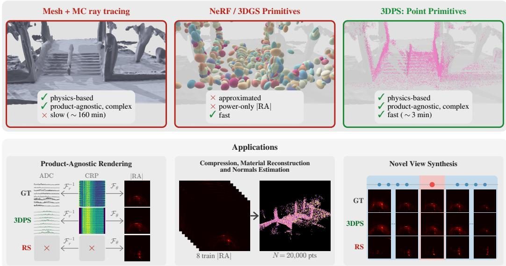  
Figure 1: The right primitive for radar NVS. Top: three method families on the three required properties. MC ray-tracing renderers (e.g., Sionna RT) are physics-faithful but slow. Optical-NVS adaptations (RadarSplat, Radar Fields, DART) are fast but discard phase. 3DPS satisfies all three. Bottom: 3DPS outputs on S1 F185 (|RA|, raw ADC magnitude, point cloud colored by learned ε′ ).

This also allows the renderer to reproduce antenna patterns, sidelobes, and FFT windowing from the signal model, sharpening RA correctness. Phase-discarding renderers forfeit both. Third, multiviewpoint-tractable, since NVS by definition demands joint optimization across many training poses.

No prior method has all three properties. Differentiable Monte Carlo (MC) ray tracers Hoydis et al. [2023], Hofmann et al. [2025], Chen et al. [2025] implement the radar forward model with explicit bidirectional scattering distribution function (BSDF) material modeling, real antenna beam patterns, and complex outputs. The cost is structural, since each surface hit must be evaluated against every transmitter–receiver (TX, RX) pair to maintain multiple-input multiple-output (MIMO) coherence. Per-viewpoint MC ray-tracing fits commonly require tens of minutes (Sionna RT Hoydis et al. [2023] measured at approximately 27 minutes per single-viewpoint fit at our 500-iteration budget; Sec. I), which compounds to multiple hours per scene at the multi-viewpoint optimization NVS demands. Optical-NVS adaptations Huang et al. [2024], Borts et al. [2024], Takawale and Roy [2025], Kung et al. [2025] of neural radiance fields, hash grids, and 3D Gaussians Mildenhall et al. [2021], Kerbl et al. [2023] train fast on real radar captures, because they trade explicit modeling of the radar signal chain for runtime. Supervision is on post-FFT power-only RA images, phase is dropped by construction, and the radar’s signal-model components are absorbed into learned features rather than rendered.

3DPS realizes all three properties because we derive our closed-form, deterministic, and differentiable pipeline directly from the standard solid-angle form of the radar equation Skolnik [2001]. We initialize an oriented 3D point set from a co-registered LiDAR point cloud (Sec. 3.3, see Scope below). For physical fidelity, the antenna geometry, BSDF (per ITU-R P.2040), and antenna gains are evaluated in closed form with no learned features, and phase is integrated from the geometric path length rather than learned. Each oriented 3D point contributes exactly once per (TX, RX) pair, with no Monte Carlo sampling. For complex-valued output, the per-(TX, RX) range profile is preserved end-to-end through PSF splatting, enabling product-agnostic rendering to ADC, CRP, and RA without retraining via standard FFT pipelines. For multi-viewpoint tractability, we use a Hann-windowed PSF splat at constant cost per (point, range bin) and fuse BSDF evaluation, splatting, and the analytical backward into three CUDA kernels. Across six outdoor ColoRadar Kramer et al. [2022] scenes, 3DPS reaches 0.587 mean Pearson correlation on held-out novel-view |RA|, between 1.7× and 5.2× the three baselines, in approximately 3 minutes per scene on a single RTX 4090.

Table 1: Comparison of radar rendering methods. Signal types: ADC, CIR, IF, RA, RDA (signaloutput formats; full names in Sec. A). Columns mark scene representation (Repr.), explicit material model (Mat.), per-point or per-vertex storage (Per-pt), real-data validation (Real), and per-scene wall-clock on a single RTX 4090 over 8 viewpoints (Time, Sec. 4).
<table><tr><td>Method</td><td>Repr.</td><td>Signal</td><td>Complex</td><td>Diff.</td><td></td><td>Mat. Per-pt BSDF</td><td></td><td>NVS</td><td>Real</td><td>Time</td></tr><tr><td>Sionna RT Hoydis et al. [2023]</td><td>Mesh</td><td>CIR</td><td>√</td><td>Partial</td><td>一</td><td>一</td><td></td><td></td><td>一</td><td></td></tr><tr><td>SFCW Inv. Hofmann et al. [2025]</td><td>Mesh</td><td>IF</td><td>√</td><td>Partial</td><td>√</td><td>√</td><td></td><td></td><td>√</td><td></td></tr><tr><td>InverTwin Chen et al. [2025]</td><td>Mesh</td><td>CIR</td><td>√</td><td>√</td><td></td><td></td><td></td><td></td><td>√</td><td></td></tr><tr><td>DART Huang et al. [2024]</td><td>Implicit</td><td>RDA</td><td></td><td>√</td><td></td><td></td><td></td><td>√</td><td>√</td><td>0.4 min</td></tr><tr><td>Radar Fields Borts et al. [2024]</td><td>Implicit</td><td>RA</td><td></td><td>√</td><td></td><td></td><td></td><td>√</td><td>√</td><td>1.6 min</td></tr><tr><td>SpINR Takawale and Roy [2025]</td><td>Implicit</td><td>RA</td><td></td><td>√</td><td></td><td></td><td></td><td>√</td><td>√</td><td></td></tr><tr><td>RadarSplat Kung et al. [2025]</td><td>3DGS</td><td>RA</td><td>一</td><td>√</td><td>一</td><td>一</td><td>一</td><td>√</td><td>√</td><td>20 min</td></tr><tr><td>Ours</td><td>Points</td><td>ADC, CRP, RA</td><td>√</td><td>√</td><td>√</td><td>√</td><td>√</td><td>√</td><td>√</td><td>3 min</td></tr></table>

Contributions. (i) The first differentiable point renderer for radar, with a radar-native primitive (oriented 3D points carrying ITU-R P.2040 material parameters) and multi-viewpoint-tractable rendering operation (PSF splatting of complex phasors into range bins), derived from the solid-angle form of the radar equation. (ii) Product-agnostic rendering, since the same optimized scene yields CRP, ADC, and RA outputs through standard FFT pipelines without retraining. (iii) Sparse-view radar NVS at the state of the art on |RA|, |CRP|, and ADC envelope across six ColoRadar scenes, in approximately 3 minutes per scene.

Scope. (i) LiDAR initialization. 3DPS initializes the oriented 3D point set from a co-registered LiDAR point cloud, following the LiDAR-derived geometric prior described in Sec. 3.3. This is standard for outdoor radar Kung et al. [2025], Kramer et al. [2022] and 3DGS NVS Xiong et al. [2023], Yan et al. [2024]. A 3D prior is necessary because the supervision signal suffers from cascading sparsity: a sparse set of training views, sparse radar returns per view, and elevation integrated out by 2D RA. Together these compound to leave 3D scene structure unrecoverable from RA-only supervision in the sparse-view setting NVS demands. LiDAR-free 3D recovery from radar (shape-from-radar) is an active open problem outside our scope. (ii) Single-bounce path tracing. 3DPS evaluates a single TX→scatterer→RX path per oriented point, matching the single-bounce assumption in RadarSplat Kung et al. [2025].

## 2 Related Works

Differentiable Monte Carlo (MC) ray tracers. Building on the differentiable-rendering toolkit pioneered for graphics — edge-sampling gradients Li et al. [2018], reparameterized boundary integrals Loubet et al. [2019], unbiased warped-area sampling Bangaru et al. [2020], and the broader differentiable-rendering survey by Kato et al. Kato et al. [2020] — recent radar-domain ray tracers extend the same machinery to electromagnetic propagation: Sionna RT Hoydis et al. [2023], Hofmann et al. Hofmann et al. [2025], InverTwin Chen et al. [2025], and the deterministic MIMO ray tracer of Schüßler et al. Schüßler et al. [2021] variously suspend gradients through their path solvers, do not model wideband frequency-modulated continuous-wave (FMCW) radar, assume known geometry, or validate only on synthetic data. Earlier mmWave FMCW ray-tracing simulators Dudek et al. [2010] establish the methodology but lack differentiability. SAR-domain inverse rendering Wei et al. [2024] pursues a similar materials-fitting agenda but on synthetic-aperture geometry rather than real-aperture FMCW. This family is physically faithful and complex-valued but slow at the multi-viewpoint optimization NVS demands: per-viewpoint MC fits commonly require tens of minutes (Sec. I), which compounds to multiple hours per scene at the 8-viewpoint optimization 3DPS targets. 3DPS preserves the physical fidelity and complex output of MC ray tracers while replacing per-iteration MC sampling with deterministic PSF splatting at constant cost per (point, range bin).

Optical-NVS adaptations. Following neural radiance fields Mildenhall et al. [2021] and 3D Gaussian Splatting Kerbl et al. [2023] (with hash-grid acceleration Müller et al. [2022], point-based light-field variants Ost et al. [2022], and subsequent surfel-style refinements Jiang et al. [2025]), DART Huang et al. [2024] trains a NeRF on range–Doppler magnitude, Radar Fields Borts et al. [2024] synthesizes power-only RA via a hash-grid and multilayer perceptron (MLP), and Radar-Splat Kung et al. [2025] ports 3DGS to RA rendering with opaque per-Gaussian features. Other neural-field adaptations Takawale and Roy [2025], Zhang et al. [2025], Rafidashti et al. [2025], Lu et al. [2024], Farrell et al. [2023] extend to dynamic scenes or fuse radar with other modalities, but render no complex output. The same neural-field machinery has been ported to other coherent sensors: SAR Lei et al. [2024], Ehret et al. [2024] and ISAR Deng et al. [2024] for radar-like apertures, LiDAR for point-cloud novel views Tao et al. [2024], Huang et al. [2023], sonar via implicit fields Reed et al. [2023] and Gaussian splatting Qu et al. [2024], Sethuraman et al. [2025], and physically-based scattering NeRFs for adverse-weather media Ramazzina et al. [2023]. This family is multi-viewpoint-tractable but neither physically faithful nor complex-valued. Every method supervises on post-FFT power-only RA images, drops phase by construction, and absorbs the radar signal-model components (antenna patterns, sidelobes, FFT windowing, materials) into opaque learned features. 3DPS preserves multi-view tractability while adding explicit ITU-R P.2040 BSDF material modeling, real antenna beam patterns, and per-(TX, RX) complex range profile output.

## 3 Method

3DPS renders complex-valued FMCW range profiles from a learned set of oriented 3D points, anchored to a LiDAR-derived geometric scaffold. Each point carries a quaternion-encoded surface normal and a six-parameter ITU-R P.2040 material vector, evaluated by a closed-form bidirectional scattering distribution function (BSDF) and splatted into range-profile bins through a precomputed sensor point spread function (PSF). Sec. 3.1 states the forward model from the radar equation through the hemisphere integral to a deterministic discrete sum and its splatted form, plus the per-point BSDF. Sec. 3.2 walks through the rendering pipeline, justifies the choice of primitive, and ties the design back to the three requirements in Sec. 1. Sec. 3.3 details optimization and implementation.

## 3.1 Radar forward model

Consider an FMCW radar with a MIMO array of $N _ { \mathrm { T X } }$ transmitters and $N _ { \mathrm { R X } }$ receivers, chirp sweep slope $\mu ,$ carrier wavenumber $k = 2 \pi / \lambda$ , and per-chirp ADC sampling $\{ t _ { n } = n / f _ { s } \} _ { n = 0 } ^ { N _ { s } - 1 }$ . A scene is illuminated by transmitter t at $\mathbf { p } _ { t }$ and observed by receiver r at $\mathbf { p } _ { r }$ . We let $R _ { t } ( \mathbf { \bar { x } } ) = \| \mathbf { x } - \mathbf { p } _ { t } \|$ $R _ { r } ( { \bf x } ) = \| { \bf x } - { \bf p } _ { r } \| , \hat { \omega } _ { i }$ the incident direction $( \mathrm { T } \mathbf { X } { \to } \mathbf { x } )$ , and $\hat { \omega } _ { o }$ the scattered direction $( \mathbf { x }  \mathbf { R } \mathbf { X } )$

Radar equation. The complex amplitude received from a point scatterer at x is Skolnik [2001]

$$
S _ { t r } ( { \bf x } ) = \frac { \lambda } { ( 4 \pi ) ^ { 3 / 2 } } \frac { \sqrt { P _ { t } G _ { t } ( \hat { \omega } _ { i } ) G _ { r } ( \hat { \omega } _ { o } ) } } { R _ { t } ( { \bf x } ) R _ { r } ( { \bf x } ) } \sqrt { \sigma ( \hat { \omega } _ { i } , \hat { \omega } _ { o } ; { \bf x } ) } e ^ { - j k ( R _ { t } ( { \bf x } ) + R _ { r } ( { \bf x } ) ) } ,\tag{1}
$$

where $\sigma$ is the bistatic radar cross section (RCS) and $G _ { t } , G _ { r }$ are the (complex) antenna gain patterns.

Hemisphere integral form. For a single-bounce path $\mathrm { T X } \to \textbf { x } \to \mathbf { R } X$ over a scene surface, the dechirped ADC sample is the hemisphere integral over the receiver-centered upper hemisphere $\Omega ^ { + } ( \mathbf { p } _ { r } )$ (full surface-to-hemisphere derivation in Sec. B)

$$
a _ { t r } [ n ] = \int _ { \Omega ^ { + } ( \mathbf { p } _ { r } ) } \frac { R _ { r } ^ { 2 } ( \hat { \omega } ) } { | \mathbf { n } ( \hat { \omega } ) \cdot \hat { \omega } | } S _ { t r } \big ( \mathbf { x } ( \hat { \omega } ) \big ) e ^ { j 2 \pi \mu \tau ( \hat { \omega } ) t _ { n } } ~ \mathrm { d } \omega ,\tag{2}
$$

where $\mathbf { x } ( \hat { \omega } )$ is the first scene intersection along $\hat { \omega }$ from $\mathbf { p } _ { r }$ and $\tau ( \hat { \omega } ) = ( R _ { t } + R _ { r } ) / c$

Discretization on an oriented point set. We approximate $\Omega ^ { + } ( \mathbf { p } _ { r } )$ by N oriented points $\{ ( \mathbf { x } _ { i } , \mathbf { n } _ { i } , A _ { i } , \pmb { \theta } _ { i } ) \} _ { i = 1 } ^ { N }$ , where $\theta _ { i }$ is the per-point ITU-R P.2040 material vector and each point covers solid angle $\Delta \omega _ { i } = \mathbf { \dot { \boldsymbol { A } } } _ { i } \left| \mathbf { n } _ { i } \cdot \boldsymbol { \hat { \omega } } _ { o , i } \right| / R _ { r , i } ^ { 2 }$ at the receiver. The Riemann sum approximation to Eq. (2) cancels the $R _ { r } ^ { 2 } / | \mathbf { n } \cdot \hat { \omega } |$ Jacobian against $\Delta \omega _ { i }$ , leaving the closed-form, deterministic single-bounce ADC sum

$$
\hat { a } _ { t r } [ n ] = \sum _ { i = 1 } ^ { N } v _ { i } A _ { i } S _ { t r } ( { \bf x } _ { i } ) e ^ { j 2 \pi \mu \tau _ { i } t _ { n } } , \qquad v _ { i } = k [ { \bf n } _ { i } \cdot \hat { \omega } _ { o , i } > 0 ] , \tau _ { i } = \frac { R _ { t , i } + R _ { r , i } } c .\tag{3}
$$

Each point contributes exactly once per (TX, RX) pair, with no Monte Carlo sampling or path enumeration.

CRP via Hann-windowed PSF splat. The complex range profile is the windowed range FFT of the ADC, $\mathrm { C R P } _ { t r } [ k ] = \mathcal { F } _ { n } \{ w [ n ] \bar { a _ { t r } } [ n ] \}$ . Linearity of Eq. (3) lets us push the FFT inside the sum, so

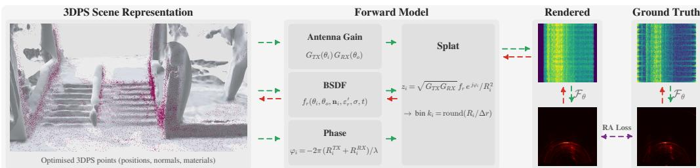  
Figure 2: 3DPS rendering pipeline. A LiDAR cloud is reduced to $N { = } 2 0 { , } 0 0 0$ oriented points. Per-point ITU BSDF and complex amplitude are evaluated per (TX, RX) pair (Eqs. 1, 5), then splatted via a Hann-windowed PSF into the L=15 nearest range bins (Eq. 4). Stacking the per-(TX, RX) range profiles and applying an azimuth FFT yields the final RA map.

each point becomes a known kernel centered at its (fractional) range bin

$$
\mathrm { C R P } _ { t r } [ k ] = \sum _ { i = 1 } ^ { N } v _ { i } A _ { i } S _ { t r } ( { \bf x } _ { i } ) \Phi \bigl ( k - k _ { i } ; \delta _ { i } \bigr ) , \qquad k _ { i } = \frac { R _ { t , i } + R _ { r , i } } { \Delta R } , \delta _ { i } = k _ { i } - \lfloor k _ { i } \rfloor ,\tag{4}
$$

where $\Delta R$ is the range bin width and $\Phi ( \cdot ; \delta )$ is the precomputed Hann-window PSF (length $L = 1 5$ taps). Splatting replaces the per-sample chirp synthesis of $\operatorname { E q . } \left( 3 \right)$ with a single scatter-add into L adjacent range bins per point, dropping the per-pair cost from $\mathcal { \ O } ( N . N _ { s } )$ to $\mathcal { O } ( \breve { N } { \cdot } L )$ . Validity bounds (Hann-tail truncation, fractional-bin handling, numerical equivalence to the standard ADC-then-FFT pipeline) are quantified in Sec. C.

Per-point ITU-R P.2040 BSDF. Each point’s bistatic RCS factors via the Kirchhoff decomposition of the ITU-R P.2040 ITU-R [2023] air–material interface model into a roughness-attenuated coherent specular term and an incoherent diffuse lobe:

$$
\begin{array} { r } { \sigma _ { i } ( \hat { \omega } _ { i } , \hat { \omega } _ { o } ) = | { \Gamma } ( \theta _ { i } ; \varepsilon _ { r } ^ { \prime } , \varepsilon _ { r } ^ { \prime \prime } , d ) | ^ { 2 } \left[ \rho _ { \mathrm { c o h } } ( \sigma _ { h } ; \theta _ { i } ) K _ { \mathrm { s p e c } } ( \hat { \omega } _ { i } , \hat { \omega } _ { o } ; { \bf n } _ { i } , \tau ) + \rho _ { \mathrm { i n c } } ( \sigma _ { h } , \ell _ { c } ; \hat { \omega } _ { i } , \hat { \omega } _ { o } , { \bf n } _ { i } ) \right] , } \end{array}\tag{5}
$$

with all material parameters drawn from the per-point vector $\pmb { \theta } _ { i } = ( \varepsilon _ { r } ^ { \prime } , \varepsilon _ { r } ^ { \prime \prime } , \sigma _ { h } , \ell _ { c } , \tau , d )$ i (subscript i suppressed inside the equation for compactness). Γ is the multilayer-slab Fresnel coefficient at incidence $\theta _ { i } = \operatorname { a r c c o s } ( - \mathbf { n } _ { i } \cdot { \hat { \boldsymbol { \omega } } } _ { i } )$ , parameterized by complex permittivity $\varepsilon _ { r } = \varepsilon _ { r } ^ { \prime } - j \varepsilon _ { r } ^ { \prime \prime }$ and slab thickness d; $\rho _ { \mathrm { c o h } } = \exp \bigl ( - ( 2 k \sigma _ { h } \cos \theta _ { i } ) ^ { 2 } \bigr )$ is the Ament coherent attenuation; $K _ { \mathrm { s p e c } }$ is the specular angular lobe (Kirchhoff approximation (KA) / small-perturbation method (SPM) blend with weight $\tau ) ;$ and $\rho _ { \mathrm { i n c } } $ is the incoherent diffuse lobe. Each parameter is reparameterized via sigmoid (τ) or shifted softplus (positive-only quantities). The full closed form is in Sec. D.

## 3.2 Rendering pipeline

Figure 2 traces a single forward pass. Input: an oriented 3D point set $\{ ( \mathbf { x } _ { i } , \mathbf { n } _ { i } , A _ { i } , \pmb { \theta } _ { i } ) \} _ { i = 1 } ^ { N }$ with $\bar { N } \bar { = } 2 0 , 0 0 0 \ ( \mathrm { S e c . } \ 3 . \bar { 3 } )$ . For each (TX, RX) pair the renderer (i) computes per-point geometry $R _ { t , i } , R _ { r , i } , \hat { \omega } _ { i , i } , \hat { \omega } _ { o , i }$ and visibility $v _ { i }$ from $\mathbf { n } _ { i } ; ~ ( \mathrm { i i } )$ evaluates the per-point BSDF $\sigma _ { i }$ from $\theta _ { i }$ via Eq. (5); (iii) assembles the per-(TX, RX) complex amplitude ${ { S } _ { t r } } ( { { \bf { x } } _ { i } } )$ of Eq. (1); and (iv) scatteradds each point’s complex contribution into the $L { = } 1 \bar { 5 }$ nearest range bins of $\mathrm { C R P } _ { t r } [ k ]$ via the Hann-windowed PSF kernel Φ.

The output of the splat is a set of $N _ { \mathrm { T X } } \times N _ { \mathrm { R X } }$ complex range profiles. Stacking these into the virtual-array dimension and applying an $N _ { \mathrm { T X } } .$ -point azimuth discrete Fourier transform (DFT) yields the range–azimuth (RA) map of shape $( N _ { \mathrm { a z } } , \bar { K } ) = ( 1 2 7 , 2 5 6 )$ ), with arcsin-spaced azimuth bins $\theta _ { a } = \mathrm { a r c s i n } ( 2 ( a - N _ { \mathrm { a z } } / 2 ) / ( \bar { N } _ { \mathrm { a z } } + 1 ) )$ and forward-cone half-angle arcsin $( 1 2 6 / 1 \bar { 2 } 8 ) \approx 7 9 . 8 6 ^ { \circ }$ . ADC samples are recovered by inverse range FFT of CRP. The same optimized scene therefore yields all three downstream products (ADC, CRP, and RA) through standard FFT pipelines without retraining.

Choice of primitive. The radar equation (Eq. 1) requires hit positions, surface normals, and material parameters at every scattering site. The hemisphere integral form (Eq. 2) operates on the receivercentered solid angle, removing any need for attached surface area on the primitives. Oriented 3D points are therefore the radar-native primitive. MC ray tracers (Sionna RT Hoydis et al. [2023])

recompute these hit points every iteration. We make them persistent and learnable, removing the per-iteration ray-tracing cost. The 3DGS literature Kerbl et al. [2023] motivated 3D Gaussians over points using “holes, aliasing, strict discontinuity” arguments at sub-pixel optical resolution. Radar resolution is an order of magnitude coarser at $\Delta R { = } 5 . 9 3$ cm range and ${ \sim } 1 . 4 ^ { \circ }$ azimuth, and each oriented point splats a continuous $L { = } 1 5 – \mathrm { t a p }$ Hann PSF over ${ \sim } 8 9$ cm of range. Those arguments do not apply here.

Realizing the three properties (Sec. 1). Physically faithful: antenna gains, the ITU-R P.2040 BSDF, and the carrier phase $e ^ { - j k ( R _ { t , i } + R _ { r , i } ) }$ are all evaluated in closed form from geometric path lengths, so the optimized $\theta _ { i }$ and n remain physically interpretable, editable, and transferable across sensor views. Complex-valued: Eq. (4) preserves the per-(TX, RX) complex range profile as a first-class output. The same optimized scene synthesizes ADC, CRP, and RA at novel viewpoints without retraining. Multi-viewpoint-tractable: each oriented point contributes exactly once per (TX, RX) pair with no Monte Carlo sampling or path enumeration. The PSF splat has fixed cost $\mathcal { O } ( N L )$ per pair, and the fused CUDA implementation (Sec. 3.3) trains across 8 viewpoints jointly in approximately 3 minutes per scene on a single RTX 4090.

## 3.3 Optimization and implementation

LiDAR-derived geometric prior. A 3D geometric prior is necessary for the cascading-sparsity reasons in Sec. 1. We initialize the oriented point set from a co-registered LiDAR cloud of between 2.7 and 6.5 million raw points across our scenes, reducing to $N { = } 2 0 { , } 0 0 0$ via four stages: frustum and range culling, occlusion ray-casting against the scene with Mitsuba 3 Jakob et al. [2022], cosineweighted resampling biased toward array boresight, and farthest-point sampling. Each surviving point inherits a quaternion-encoded LiDAR surface normal and a uniform ITU-concrete material prior. Full reduction-stage parameters are in Sec. E.

Learned parameters and carrier-phase detach. For each point we learn the 6-parameter ITU material vector $\theta _ { i } ,$ the surface-normal quaternion $\mathbf { q } _ { i }$ (initialized from the LiDAR normal), and the 3D position $\mathbf { p } _ { i }$ through the amplitude path only. The carrier-phase term $e ^ { - j k ( R _ { t , i } + R _ { r , i } ) }$ in $S _ { t r } ( { \bf x } _ { i } )$ is detached from position gradients because the bin index $\lfloor k _ { i } \rfloor$ creates a piecewise-constant dependence on $\mathbf { p } _ { i } ,$ , making position-phase gradients degenerate. The forward-pass carrier phase is still computed from the unrounded $R _ { t , i } + R _ { r , i }$ . An L2 anchor $\lambda _ { \mathrm { p o s } } \Vert { \bf p } _ { i } - { \bf p } _ { i } ^ { ( 0 ) } \Vert ^ { 2 } ( \lambda _ { \mathrm { p o s } } { = } 1 0 0 )$ restricts position drift to approximately 1 mm per iteration, much smaller than the carrier wavelength $( \lambda \approx 3 . 9$ mm at 76 GHz), so geometry remains LiDAR-anchored and the carrier phase remains correct in expectation.

Optimization and CUDA implementation. The loss is per-pose MSE on $| \mathrm { R A } _ { F } ^ { \mathrm { p r e d } } |$ vs. $| \mathrm { R A } _ { F } ^ { \mathrm { G T } } |$ (both L2-normalized), optimized with Adam $( \beta _ { 1 } { = } 0 . 9 , \beta _ { 2 } { = } 0 . 9 9 9 )$ at per-parameter learning rates $\eta _ { \mathrm { m a t } } = 1 0 ^ { - 2 } , \eta _ { \mathrm { r o t } } = 5 { \cdot } 1 0 ^ { - 3 } , \eta _ { \mathrm { p o s } } = 1 0 ^ { - 5 }$ . Following 3DGS Kerbl et al. [2023] but adapted to radar physics, we split the top 5% and prune the bottom 5% of points by accumulated amplitude-path position-gradient magnitude $\begin{array} { r } { g _ { i } = \dot { \sum } _ { F } \| \nabla _ { \mathbf { p } _ { i } } \mathcal { L } _ { F } \| } \end{array}$ at iters {100, 200, 300, 400}, preserving the budget $N { = } 2 0 { , } 0 0 0$ . Position gradients are tracked but excluded from the optimizer step, so positions stay on the LiDAR scaffold. Eqs. $( 4 ) \AA { - } ( 5 )$ plus the virtual-array DFT run as three fused CUDA kernels (BSDF, scatter-splat, and analytical backward), with the analytical backward validated against finite differences. The fused forward+backward+optimizer step renders all $N { = } 2 0 { , } 0 0 0$ points across 192 (TX, RX) pairs in approximately 10 ms on an RTX 4090. A 500-iteration 8-viewpoint training pass completes in approximately 3 minutes per scene.

## 4 Experiments

We evaluate 3DPS on six outdoor ColoRadar Kramer et al. [2022] scenes captured with a TI MMWCAS cascaded mmWave radar (12 TX × 16 RX, 76 GHz carrier, 5.93 cm range resolution) and a co-registered Ouster OS1-64 LiDAR. The scenes span parking lots, vehicle staging areas, and outdoor infrastructure with primarily static structure (walls, parked vehicles, traffic infrastructure).

Why ColoRadar. 3DPS requires four inputs: complete radar array geometry, raw I/Q ADC samples, co-registered LiDAR, and dense pose annotations. ColoRadar provides all four. Other automotive radar datasets Caesar et al. [2020], Schumann et al. [2021], Barnes et al. [2020], Burnett et al. [2023], Sheeny et al. [2021], Paek et al. [2022], Rebut et al. [2022] either ship pre-processed radar tensors without per-element array geometry, use mechanically-rotated single-channel sensors that do not expose a virtual array, or lack the co-registered LiDAR and dense poses 3DPS requires.

## 4.1 Experimental setup

Scene splits. We follow the periodic held-out-frame protocol used by Radar Fields Borts et al. [2024] and RadarSplat Kung et al. [2025], both of which reserve every fifth frame from a contiguous trajectory window as the novel-view test frame. Adapted to the cascade’s 5 Hz frame rate and our short-window (9-frame) experimental setup, this becomes a centred 1-of-9 variant: for each scene we select 9 adjacent cascaded radar frames at 5 Hz (200 ms inter-frame spacing) and use only the first chirp loop of each frame. The middle frame F is held out as the novel-view test frame and the eight bracketing frames $\{ F { \pm } 1 , \ldots , { \pm } 4 \}$ form the training set, giving 8 training RA maps and 1 held-out test RA map per scene.

Baselines. Three published radar NVS methods from the optical-NVS family (full descriptions in Sec. 2): DART Huang et al. [2024], Radar Fields Borts et al. [2024], and RadarSplat Kung et al. [2025]. Only 3DPS renders complex range profiles, so CRP and ADC columns are reported for our method only; the three optical-NVS baselines emit power-only RA by construction.

Metrics. Following Kramer et al. Kramer et al. [2022], we report Pearson correlation (Corr), peak signal-to-noise ratio (PSNR), structural similarity (SSIM), and root-mean-square error (RMSE), all computed on min-max-normalized 399×399 Cartesian |RA| images (Sec. A.5).

Implementation. 3DPS training takes approximately 3 minutes per scene for joint 8-viewpoint optimization on a single NVIDIA RTX 4090, or 30 to 45 seconds per single-viewpoint fit at the same 500-iteration budget (full details in Sec. 3.3). Measured baseline wall-clocks on identical hardware are 0.4, 1.6, and 19.7 min per scene for DART, Radar Fields, and RadarSplat respectively. Per-scene wall-clock and peak GPU memory are in Sec. I. Sample efficiency. 3DPS is robust at the view axis: dropping from the 8-view default to just 2 bracketing training frames yields 0.573 mean test Pearson correlation, within 0.014 of the 8-view default (0.587); per-view-count breakdown in Sec. L. Sparse-view radar deployments can therefore use as few as two training frames with negligible held-out-view loss.

## 4.2 Quantitative results

Table 2 reports the cross-method, cross-product results, averaged over the six ColoRadar scenes for training views (8 per scene) and the held-out novel-view test frame. The three optical-NVS baselines emit power-only |RA| and have no CRP, ADC, or complex outputs, so those columns are marked ‘–’. Per-scene breakdowns and CRP/ADC evaluation methodology are in supplement Sec. F and G.

Magnitude on |RA|. 3DPS achieves 0.812 mean Pearson correlation on training views and 0.587 on the held-out test view, on Cartesian |RA|. This is 2.2× the next-best baseline on training views and 1.7× on the test view. PSNR, SSIM, and RMSE all rank 3DPS first on the mean and on every per-scene metric (supplement Tables 3 and 4). The next-best method on both splits is RadarSplat at 0.365 train and 0.339 test. Among the three optical-NVS baselines, RadarSplat is best, then Radar Fields, then DART. The ranking matches the structural mismatches identified in Sec. 2. RadarSplat opaque per-Gaussian features cannot share information with the radar antenna pattern, capping at 0.37 train and 0.34 test. Radar Fields combines a hash-grid encoder with a multilayer perceptron decoder, supervised on post-FFT magnitudes. Without a virtual-array model it fails to recover scene support from sparse RA alone, reaching only 0.22 train and 0.13 test. DART is designed for $N _ { d } { = } 2 5 6$ chirps but operates here at the cascade’s $N _ { d } { = } 1 6$ , leaving insufficient Doppler resolution at 0.03 train and 0.11 test.

Train-test gap. 3DPS exhibits a 0.225 absolute gap between train and held-out test Pearson correlation. This reflects the cascading sparsity defined in Sec. 1. Outdoor surfaces at 60 to 77 GHz act as quasi-mirrors, so views show little cross-view consistency to regularize the held-out pose. The cascade’s large physical aperture also limits frame rate, leaving inter-viewpoint baselines at 5 Hz that are not ideal for radar NVS.

Per-scene breakdown. Test correlation ranges from 0.508 (S2 F300) to 0.657 (S2 F160) across the six scenes (per-scene values: 0.644, 0.519, 0.642, 0.553, 0.657, 0.508 for S0 F135, S1 F185, S1 F438, S2 F105, S2 F160, S2 F300). The strongest scene (S2 F160) is dominated by extended planar walls and a parked vehicle that present consistent specular returns across the 8 training views, regularizing the held-out pose well. The weakest scene (S2 F300) is a tighter staging area with dense pedestrian-scale support structure: many small-feature targets contribute high-frequency RA support that the magnitude-only loss does not constrain at the held-out pose, increasing the train-test gap.

Table 2: Cross-method, cross-product results on six ColoRadar scenes (mean across scenes). Magnitude : Pearson correlation, PSNR, SSIM, RMSE on min-max-normalized | · |. Rel. phase magnitude-weighted phase coherence $\langle \cos ( \Delta \varphi ) \rangle$ ⟩ across range $( \Delta \varphi _ { r } )$ and across virtual antennas $( \Delta \varphi _ { v } ) ;$ on ADC, $\Delta { { \varphi } _ { t } }$ is the differential across fast-time samples. All in [−1, 1], random reference 0. These metrics are absolute-phase-invariant by construction so are unaffected by per-VA / per-range calibration drift the magnitude-only training loss does not constrain. Bold: best per column (ties jointly). Underline: second-best. Per-scene breakdowns and standard deviations in supplement Tables 3–6.
<table><tr><td></td><td colspan="4">RA cart</td><td colspan="4">CRP</td><td colspan="2">ADC</td></tr><tr><td>Method</td><td>Corr PSNR SSIM</td><td>Magnitude</td><td></td><td>RMSE</td><td>Magnitude Corr PSNR SSIM</td><td></td><td></td><td>Rel. phase</td><td>Env.</td><td>Rel. phase</td></tr><tr><td>Train Mean</td><td></td><td></td><td></td><td></td><td></td><td></td><td></td><td>∆4r  $\Delta \varphi _ { v }$ </td><td> $\rho _ { \left| \cdot \right| }$ </td><td>∆4t</td></tr><tr><td>DART Huang et al. [2024]</td><td>0.033</td><td>23.9</td><td>0.540</td><td>0.0673</td><td></td><td></td><td></td><td></td><td></td><td></td></tr><tr><td>Radar Fields Borts et al. [2024]</td><td>0.218</td><td>24.9</td><td>0.480</td><td>0.0581</td><td></td><td></td><td></td><td></td><td></td><td></td></tr><tr><td>RadarSplat Kung et al. [2025]</td><td>0.365</td><td>24.9</td><td>0.526</td><td>0.0595</td><td></td><td></td><td></td><td></td><td></td><td></td></tr><tr><td>3DPS (Ours)</td><td>0.812</td><td>31.9</td><td>0.819</td><td>0.0272</td><td>0.701</td><td>27.9</td><td>0.721</td><td>0.5180.494</td><td>0.689</td><td>0.444</td></tr><tr><td>Test Mean</td><td></td><td></td><td></td><td></td><td></td><td></td><td></td><td></td><td></td><td></td></tr><tr><td>DART Huang et al. [2024]</td><td>0.112</td><td>22.5</td><td>0.408</td><td>0.0817</td><td></td><td></td><td></td><td></td><td></td><td></td></tr><tr><td>Radar Fields Borts et al. [2024]</td><td>0.133</td><td>28.0</td><td>0.496</td><td>0.0402</td><td></td><td></td><td></td><td></td><td></td><td></td></tr><tr><td>RadarSplat Kung et al. [2025]</td><td>0.339</td><td>24.2</td><td>0.511</td><td>0.0643</td><td></td><td></td><td></td><td></td><td></td><td></td></tr><tr><td>3DPS (Ours)</td><td>0.587</td><td>28.8</td><td>0.734</td><td>0.0369</td><td>0.603</td><td>24.7</td><td>0.650</td><td>0.371 0.434</td><td>0.613</td><td>0.414</td></tr></table>

Magnitude on CRP and ADC. The 3DPS native complex range profile gives mean training and test CRP Pearson correlation of 0.701 and 0.603. These numbers are directly comparable to the |RA| Pearson correlation in the same table. The mild attenuation reflects that per-virtual-antenna evaluation is inherently stricter than azimuth-integrated RA, since the azimuth FFT in |RA| provides approximately $\sqrt { 8 6 }$ of coherent gain at target directions of arrival that the per-(v,r) |CRP| does not. The ADC envelope $\rho _ { | \cdot | }$ reaches 0.689 train and 0.613 test. PSNR and SSIM are not reported for ADC because image-domain metrics are inappropriate for raw I/Q time series.

Relative-phase fidelity. The renderer’s per-(VA, range) absolute phase is unconstrained by the magnitude-only |RA| loss — approximately 22,000 per-bin phase degrees of freedom are free up to per-VA RF calibration drift and per-range ADC sample-zero offsets. Strict complex correlation |ρ| and per-bin phase RMSE penalize that nuisance phase directly, so we instead report the magnitudeweighted phase coherence $\langle \cos ( \Delta \varphi ) \rangle$ of the differential phase across each axis (denoted $\Delta \varphi _ { r } , \Delta \varphi _ { v }$ $\Delta { { \varphi } _ { t } }$ in Table 2). Differential phase across an axis is invariant to any per-bin rotation along the orthogonal axis by construction, so it isolates the relative-phase content that drives downstream products (range-bin localization, beamforming) while ignoring the absolute-phase nuisance subspace the magnitude loss does not cover. The metric lies in [−1, 1] with random reference 0; perfect agreement is 1. 3DPS reaches mean training and test CRP $\Delta \varphi _ { \prime }$ of 0.518 and 0.371, $\Delta \varphi _ { \imath }$ of 0.494 and 0.434, and ADC $\Delta { { \varphi } _ { t } }$ of 0.444 and 0.414 — 0.37–0.52 of perfect on the held-out view despite no phase-domain supervision. As above, the three optical-NVS baselines emit power-only RA, so the rel. phase columns are inapplicable to those methods. Only 3DPS contributes complex outputs.

Qualitative comparison. Figure 3 shows held-out test |RA| renders for 3DPS and the three baselines on the six scenes, sorted left to right by descending 3DPS test Pearson correlation. 3DPS preserves dominant scene structure (walls, parked vehicles, support columns) with consistent range and azimuth localization. RadarSplat produces blurred opaque blobs from its per-Gaussian features. Radar Fields under-fits with a near-constant background dotted by sparse hot-spots, the failure mode of post-FFT supervision without a virtual-array model. DART produces noisy, low-amplitude renders dominated by Doppler ambiguity at the cascade’s $N _ { d } { = } 1 6$ chirps per frame. The visual ranking matches the quantitative order. Beyond magnitude, 3DPS preserves ∼40% of held-out relativephase coherence on CRP $( \Delta \varphi _ { r } = 0 . 3 7 1 , \Delta \varphi _ { v } = 0 . 4 3 4 )$ and on ADC $( \Delta { { \varphi } _ { t } } \mathrm { { = } } 0 . 4 1 4 )$ without any phase supervision — meaningful structure for downstream beamforming and range-localization. Per-scene comparisons across all training frames, CRP and ADC heatmaps, runtime, and extended limitations are in supplement Sec. H.1, H.2, I, and K.

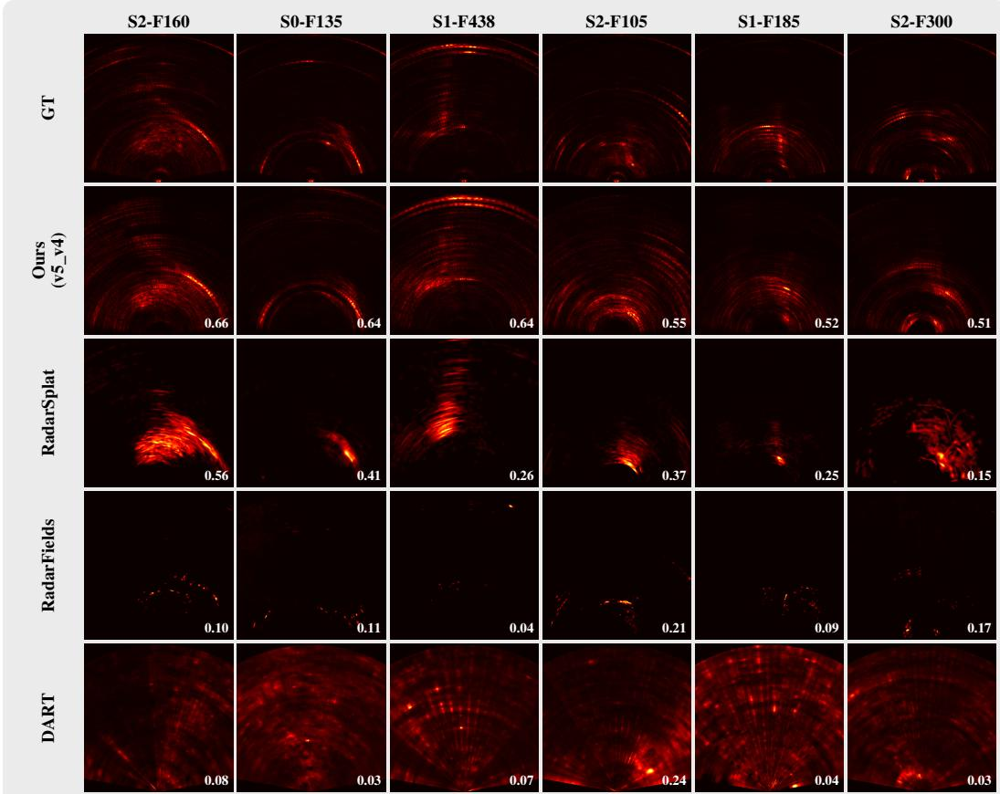  
Figure 3: Held-out novel-view |RA| comparison. Columns: six ColoRadar scenes sorted by descending 3DPS test Pearson correlation, ranging from 0.508 on S2 F300 to 0.657 on S2 F160 (mean 0.587). Rows: GT, 3DPS (Ours), RadarSplat, Radar Fields, DART. Per-frame test Pearson correlation overlaid in white.

## 5 Conclusion

We presented 3DPS, a differentiable physically based point renderer for FMCW mmWave radar that synthesizes complex range profiles from novel sensor poses. Oriented 3D points carry ITU-R P.2040 material parameters and are evaluated by closed-form BSDFs and splatted through precomputed sensor PSFs, removing the Monte Carlo sampling and post-FFT supervision that constrain prior radar NVS methods. On six outdoor ColoRadar scenes, 3DPS reaches 0.587 mean Pearson correlation on held-out |RA|, between 1.7× and 5.2× the three baselines. Training takes approximately 3 minutes per scene over 8 viewpoints. Limitations and future work. Single-bounce evaluation suffices outdoors but not for indoor multipath. LiDAR-free radar NVS, a phase-aware loss exploiting the renderer complex output, dynamic scenes, downstream perception tasks, and broader radar geometries are natural next steps. We discuss broader impact and dual-use considerations in Sec. N.

Reproducibility. Code, configuration files, trained checkpoints, and the analysis scripts that generated every table and figure in this paper will be released upon publication. The ColoRadar dataset is publicly available at https://arpg.github.io/coloradar/.

## References

Sai Praveen Bangaru, Tzu-Mao Li, and Frédo Durand. Unbiased warped-area sampling for differentiable rendering. In SIGGRAPH Asia, 2020.

Dan Barnes, Matthew Gadd, Paul Murcutt, Paul Newman, and Ingmar Posner. The oxford radar robotcar dataset: A radar extension to the oxford robotcar dataset. In ICRA, 2020.

Mario Bijelic, Tobias Gruber, Fahim Mannan, Florian Kraus, Werner Ritter, Klaus Dietmayer, and Felix Heide. Seeing through fog without seeing fog: Deep multimodal sensor fusion in unseen adverse weather. In Proceedings of the IEEE/CVF Conference on Computer Vision and Pattern Recognition (CVPR), 2020.

David Borts, Erich Liang, Tim Brödermann, Andrea Ramazzina, Stefanie Walz, Edoardo Palladin, Jipeng Sun, David Bruggemann, Christos Sakaridis, Luc Van Gool, Mario Bijelic, and Felix Heide. Radar fields: Frequency-space neural scene representations for FMCW radar. In ACM SIGGRAPH 2024 Conference Papers, 2024. doi: 10.1145/3641519.3657510.

Keenan Burnett, David J. Yoon, Yuchen Wu, Andrew Z. Li, Haowei Zhang, Shichen Lu, Jingxing Qian, Wei-Kang Tseng, Andrew Lambert, Keith Y. K. Leung, Angela P. Schoellig, and Timothy D. Barfoot. Boreas: A multi-season autonomous driving dataset. The International Journal of Robotics Research, 2023.

Holger Caesar, Varun Bankiti, Alex H Lang, Sourabh Vora, Venice Erin Liong, Qiang Xu, Anush Krishnan, Yu Pan, Giancarlo Baldan, and Oscar Beijbom. nuscenes: A multimodal dataset for autonomous driving. In CVPR, 2020.

Xingyu Chen, Jianrong Ding, Kai Zheng, Xinmin Fang, Xinyu Zhang, Chris Xiaoxuan Lu, and Zhengxiong Li. InverTwin: Solving inverse problems via differentiable radio frequency digital twin. arXiv preprint arXiv:2508.14204, 2025.

Junyuan Deng, Pengfei Xie, Lei Zhang, and Yulai Cong. ISAR-NeRF: Neural radiance fields for 3-D imaging of space target from multiview ISAR images. IEEE Sensors Journal, 24(7):11705–11722, 2024.

M. Dudek, R. Wahl, D. Kissinger, R. Weigel, and G. Fischer. Millimeter wave FMCW radar system simulations including a 3D ray tracing channel simulator. In 2010 Asia-Pacific Microwave Conference Proceedings, pages 1665–1668, 2010.

Thibaud Ehret, Roger Marí, Dawa Derksen, Nicolas Gasnier, and Gabriele Facciolo. Radar fields: An extension of radiance fields to SAR. In Proceedings ofthe IEEE/CVF Conference on Computer Vision and Pattern Recognition Workshops, 2024.

Sean M. Farrell, Vivek Boominathan, Nathaniel Raymondi, Ashutosh Sabharwal, and Ashok Veeraraghavan. CoIR: Compressive implicit radar. IEEE Transactions on Pattern Analysis and Machine Intelligence, 2023.

Xiangyu Gao, Guanbin Xing, Sumit Roy, and Hui Liu. Experiments with mmwave automotive radar test-bed. In 2019 53rd Asilomar Conference on Signals, Systems, and Computers, 2019.

Junfeng Guan, Sohrab Madani, Suraj Jog, Saurabh Gupta, and Haitham Hassanieh. Through fog high-resolution imaging using millimeter wave radar. In Proceedings ofthe IEEE/CVF Conference on Computer Vision and Pattern Recognition (CVPR), 2020.

Kyle Harlow, Hyesu Jang, Timothy D. Barfoot, Ayoung Kim, and Christopher Heckman. A new wave in robotics: Survey on recent mmWave radar applications in robotics. IEEE Transactions on Robotics, 2024.

Nikolai Hofmann, Vanessa Wirth, Johanna Bräunig, Ingrid Ullmann, Martin Vossiek, Tim Weyrich, and Marc Stamminger. Inverse rendering of near-field mmWave MIMO radar for material reconstruction. IEEE Journal ofMicrowaves, 2025. doi: 10.1109/JMW.2025.3535077.

Jakob Hoydis, Fayçal Aït Aoudia, Sebastian Cammerer, Merlin Nimier-David, Nikolaus Binder, Guillermo Marcus, and Alexander Keller. Sionna RT: Differentiable ray tracing for radio propagation modeling. arXiv preprint arXiv:2303.11103, 2023.

Shengyu Huang, Zan Gojcic, Zian Wang, Francis Williams, Yoni Kasten, Sanja Fidler, Konrad Schindler, and Or Litany. Neural LiDAR fields for novel view synthesis. In Proceedings of the IEEE/CVF International Conference on Computer Vision, 2023.

Tianshu Huang, John Miller, Akarsh Prabhakara, Tao Jin, Tarana Laroia, Zico Kolter, and Anthony Rowe. DART: Implicit doppler tomography for radar novel view synthesis. In Proceedings ofthe IEEE/CVF Conference on Computer Vision and Pattern Recognition (CVPR), pages 24118–24129, 2024.

Cesar Iovescu and Sandeep Rao. The fundamentals of millimeter wave sensors. Technical Report SPYY005, Texas Instruments Application Report, 2017.

ITU-R. Effects of building materials and structures on radiowave propagation above about 100 mhz. Recommendation ITU-R P.2040-3, 2023.

Wenzel Jakob, Sébastien Speierer, Nicolas Roussel, and Delio Vicini. Dr.Jit: A just-in-time compiler for differentiable rendering. ACM Transactions on Graphics (Proceedings ofSIGGRAPH), 41(4), 2022.

M. Jankiraman. FMCW Radar Design. Artech House, 2018.

Kaiwen Jiang, Jia-Mu Sun, Zilu Li, Dan Wang, Tzu-Mao Li, and Ravi Ramamoorthi. Differentiable light transport with gaussian surfels via adapted radiosity for efficient relighting and geometry reconstruction. In SIGGRAPH, 2025.

Hiroharu Kato, Deniz Beker, Mihai Morariu, Takahiro Ando, Toru Matsuoka, Wadim Kehl, and Adrien Gaidon. Differentiable rendering: A survey. arXiv preprint arXiv:2006.12057, 2020.

Michael Kazhdan, Matthew Bolitho, and Hugues Hoppe. Poisson surface reconstruction. In Eurographics Symposium on Geometry Processing, 2006.

Bernhard Kerbl, Georgios Kopanas, Thomas Leimkühler, and George Drettakis. 3d gaussian splatting for real-time radiance field rendering. In SIGGRAPH, 2023.

Andrew Kramer, Kyle Harlow, Christopher Williams, and Christoffer Heckman. ColoRadar: The direct 3D millimeter wave radar dataset. The International Journal ofRobotics Research, 41(4), 2022.

Pou-Chun Kung, Skanda Harisha, Ram Vasudevan, Aline Eid, and Katherine A. Skinner. RadarSplat: Radar gaussian splatting for high-fidelity data synthesis and 3D reconstruction of autonomous driving scenes. In Proceedings of the IEEE/CVF International Conference on Computer Vision (ICCV), pages 27596–27606, 2025.

Zhengxin Lei, Feng Xu, Jiangtao Wei, Feng Cai, Feng Wang, and Ya-Qiu Jin. SAR-NeRF: Neural radiance fields for synthetic aperture radar multi-view representation. IEEE Transactions on Geoscience and Remote Sensing, 2024.

Tzu-Mao Li, Miika Aittala, Frédo Durand, and Jaakko Lehtinen. Differentiable monte carlo ray tracing through edge sampling. In SIGGRAPH Asia, 2018.

Guillaume Loubet, Nicolas Holzschuch, and Wenzel Jakob. Reparameterizing discontinuous integrands for differentiable rendering. In SIGGRAPH Asia, 2019.

Chris Xiaoxuan Lu, Stefano Rosa, Peijun Zhao, Bing Wang, Changhao Chen, John A. Stankovic, Niki Trigoni, and Andrew Markham. See through smoke: Robust indoor mapping with lowcost mmWave radar. In Proceedings of the 18th International Conference on Mobile Systems, Applications, and Services (MobiSys), 2020.

Haofan Lu, Christopher Vattheuer, Baharan Mirzasoleiman, and Omid Abari. NeWRF: A deep learning framework for wireless radiation field reconstruction and channel prediction. In Proceedings of the 41st International Conference on Machine Learning (ICML), pages 33147–33159, 2024.

Ben Mildenhall, Pratul P. Srinivasan, Matthew Tancik, Jonathan T. Barron, Ravi Ramamoorthi, and Ren Ng. NeRF: Representing scenes as neural radiance fields for view synthesis. Communications ofthe ACM, 65(1):99–106, 2021.

Meysam Moallem and Kamal Sarabandi. Polarimetric study of MMW imaging radars for indoor navigation and mapping. IEEE Transactions on Antennas and Propagation, 62(1):500–504, 2014.

Thomas Müller, Alex Evans, Christoph Schied, and Alexander Keller. Instant neural graphics primitives with a multiresolution hash encoding. ACM Transactions on Graphics (ToG), 41(4), 2022.

Julian Ost, Issam Laradji, Alejandro Newell, Yuval Bahat, and Felix Heide. Neural point light fields. In Proceedings of the IEEE Conference on Computer Vision and Pattern Recognition (CVPR), 2022.

Dong-Hee Paek, Seung-Hyun Kong, and Kevin Tirta Wijaya. K-Radar: 4d radar object detection for autonomous driving in various weather conditions. In NeurIPS Datasets and Benchmarks Track, 2022.

Ziyuan Qu, Omkar Vengurlekar, Mohamad Qadri, Kevin Zhang, Michael Kaess, Christopher Metzler, Suren Jayasuriya, and Adithya Pediredla. Z-Splat: Z-axis Gaussian splatting for camera–sonar fusion. IEEE Transactions on Pattern Analysis and Machine Intelligence, 2024.

Mahan Rafidashti, Ji Lan, Maryam Fatemi, Junsheng Fu, Lars Hammarstrand, and Lennart Svensson. NeuRadar: Neural radiance fields for automotive radar point clouds. In Proceedings of the IEEE/CVF Conference on Computer Vision and Pattern Recognition Workshops, 2025.

Andrea Ramazzina, Mario Bijelic, Stefanie Walz, Alessandro Sanvito, Dominik Scheuble, and Felix Heide. ScatterNeRF: Seeing through fog with physically-based inverse neural rendering. In Proceedings of the IEEE/CVF International Conference on Computer Vision (ICCV), pages 17957–17968, 2023.

Julien Rebut, Arthur Ouaknine, Waqas Malik, and Patrick Pérez. Raw high-definition radar for multi-task learning. In Proceedings of the IEEE/CVF Conference on Computer Vision and Pattern Recognition (CVPR), 2022.

Albert Reed, Juhyeon Kim, Thomas Blanford, Adithya Pediredla, Daniel Brown, and Suren Jayasuriya. Neural volumetric reconstruction for coherent synthetic aperture sonar. ACM Transactions on Graphics, 42(4), 2023.

Mark A. Richards. Fundamentals ofRadar Signal Processing. McGraw-Hill Education, 2nd edition, 2014.

Ole Schumann, Markus Hahn, Nicolas Scheiner, Fabio Weishaupt, Julius F. Tilly, Jürgen Dickmann, and Christian Wöhler. RadarScenes: A real-world radar point cloud data set for automotive applications. In International Conference on Information Fusion (FUSION), 2021.

Christian Schüßler, Marcel Hoffmann, Johanna Bräunig, Ingrid Ullmann, Randolf Ebelt, and Martin Vossiek. A realistic radar ray tracing simulator for large mimo-arrays in automotive environments. IEEE Journal ofMicrowaves, 1(4):962–974, 2021.

Advaith V. Sethuraman, Max Rucker, Onur Bagoren, Pou-Chun Kung, Nibarkavi N. B. Amutha, and Katherine A. Skinner. SonarSplat: Novel view synthesis of imaging sonar via Gaussian splatting. IEEE Robotics and Automation Letters, 2025.

Marcel Sheeny, Emanuele De Pellegrin, Saptarshi Mukherjee, Alireza Ahrabian, Sen Wang, and Andrew Wallace. RADIATE: A radar dataset for automotive perception in bad weather. In 2021 IEEE International Conference on Robotics and Automation (ICRA), 2021.

Merrill I. Skolnik. Introduction to Radar Systems. McGraw-Hill, New York, 3rd edition, 2001.

Harshvardhan Takawale and Nirupam Roy. SpINR: Neural volumetric reconstruction for FMCW radars. arXiv preprint arXiv:2503.23313, 2025.

Tang Tao, Longfei Gao, Guangrun Wang, Yixing Lao, Peng Chen, Hengshuang Zhao, Dayang Hao, Xiaodan Liang, Mathieu Salzmann, and Kaicheng Yu. LiDAR-NeRF: Novel LiDAR view synthesis via neural radiance fields. In Proceedings ofthe 32nd ACM International Conference on Multimedia, 2024.

Mehrnoosh Vahidpour and Kamal Sarabandi. Millimeter-wave Doppler spectrum and polarimetric response of walking bodies. IEEE Transactions on Geoscience and Remote Sensing, 50(7): 2866–2879, 2012.

Bruce Walter, Stephen R Marschner, Hongsong Li, and Kenneth E Torrance. Microfacet models for refraction through rough surfaces. Eurographics Symposium on Rendering, 2007.

Jiangtao Wei, Yixiang Luomei, Xu Zhang, and Feng Xu. Learning surface scattering parameters from SAR images using differentiable ray tracing. IEEE Transactions on Geoscience and Remote Sensing, 2024.

Haolin Xiong, Sairisheek Muttukuru, Rishi Upadhyay, Pradyumna Chari, and Achuta Kadambi. SparseGS: Real-time 360 sparse view synthesis using Gaussian splatting. arXiv preprint arXiv:2312.00206, 2023.

Yunzhi Yan, Haotong Lin, Chenxu Zhou, Weijie Wang, Haiyang Sun, Kun Zhan, Xianpeng Lang, Xiaowei Zhou, and Sida Peng. Street Gaussians: Modeling dynamic urban scenes with Gaussian splatting. In European Conference on Computer Vision (ECCV), 2024.

Jiarui Zhang, Zhihao Li, Chong Wang, and Bihan Wen. RF4D: Neural radar fields for novel view synthesis in outdoor dynamic scenes. arXiv preprint arXiv:2505.20967, 2025.

The supplement opens with a self-contained primer on FMCW mmWave radar signal processing for readers more familiar with vision/graphics than radar hardware (Sec. A). It then provides forwardmodel details deferred from Sec. 3.1 (full surface-to-hemisphere derivation, PSF-splat validity bounds, full ITU-R P.2040 BSDF closed form, LiDAR reduction parameters), the per-scene quantitative evidence and qualitative comparisons that anchor the main paper’s claims, the methodology details for the CRP and ADC evaluation introduced in Sec. 4.2, implementation details (wall-clock, hardware), and a more detailed discussion of limitations and future work.

## A FMCW mmWave radar primer

This section summarizes the FMCW mmWave radar signal-processing chain that 3DPS targets, for readers more familiar with vision, graphics, or general machine learning than with radar hardware. Notation is kept consistent with the main paper. We follow the standard treatments in Skolnik Skolnik [2001] and Richards Richards [2014], with cascade-radar parameters as in the TI MMWCAS reference Iovescu and Rao [2017].

## A.1 FMCW chirp and dechirped ADC samples

FMCW radar Jankiraman [2018] transmits a linear-frequency-sweep waveform (a “chirp”) of duration $T _ { c }$ that rises from carrier frequency $f _ { c }$ at slope $\mu = B / T _ { c }$ over total swept bandwidth $B \colon$

$$
s _ { \mathrm { T X } } ( t ) \ = \ \cos \bigl ( 2 \pi ( f _ { c } t + \frac { 1 } { 2 } \mu t ^ { 2 } ) \bigr ) , \qquad t \in [ 0 , T _ { c } ] .\tag{6}
$$

A reflection from a scatterer at total round-trip path length $R = R _ { t } + R _ { \tau }$ arrives at the receiver after delay $\tau = R / c$ . Mixing the received signal with a delayed copy of s (“dechirping”) and low-pass filtering produces a beat signal whose instantaneous frequency is constant over the chirp at $\mu \tau$ . After analog-to-digital conversion at sample rate $f _ { s }$ , the per-chirp dechirped baseband samples are

$$
a [ n ] = A _ { r } e ^ { j 2 \pi \mu \tau t _ { n } } , \qquad t _ { n } = n / f _ { s } , \quad n = 0 , \ldots , N _ { s } - 1 ,\tag{7}
$$

where the complex amplitude $A _ { r }$ aggregates antenna gains, scattering cross section, path-length attenuation, and the carrier-phase term $e ^ { - j k ( R _ { t } + R _ { r } ) }$ with $k = 2 \pi / \lambda$ . Eq. (7) is the single-scatterer complex baseband response, integrated over the visible scene in our Eq. (2).

## A.2 Complex baseband (I/Q) and the range profile

The dechirp mixer is implemented in I/Q form so that each ADC sample is complex, $a [ n ] =$ $a _ { I } [ n ] + j a _ { Q } [ n ]$ . The complex form is what makes radar a phase-coherent imaging modality: the magnitude $| { \dot { a } } [ n ] |$ | encodes scatterer reflectivity, while the phase argument retains fractional-wavelength path information. At a 76 GHz carrier the wavelength is $\lambda \approx 3 . 9$ mm, an order of magnitude finer than the range-bin width $\Delta R = c / ( 2 B ) \approx 5 . 9 3$ cm produced by the range FFT below. Optical-NVS adaptations (Sec. 2) train on | · | alone and discard this phase content; 3DPS retains it through the splat in Eq. (4).

The complex range profile (CRP) is the windowed range FFT of the chirp’s ADC samples,

$$
\mathrm { C R P } [ k ] = \sum _ { n = 0 } ^ { N _ { s } - 1 } w [ n ] a [ n ] e ^ { - j 2 \pi n k / N _ { s } } , \qquad k = 0 , \dots , N _ { s } - 1 ,\tag{8}
$$

with $w [ \cdot ]$ a windowing function (we use Hann, sidelobes ∼−50 dB). A scatterer at delay τ appears as a peak at fractional bin $k ^ { \star } = \mu \tau N _ { s } / f _ { s } ,$ , smeared by the discrete-Fourier image of w across neighboring bins — the “point spread function” our PSF splat (Eq. 4) inverts.

## A.3 TDM-MIMO and the virtual array

A MIMO radar array transmits and receives on multiple antenna elements. Time-division multiplexing (TDM) cycles through TX elements one at a time within a chirp loop, so each (TX, RX) pair gets its own dedicated chirp and resulting CRP. Under far-field assumptions and electrically small array baselines, every (TX, RX) pair behaves like a single “virtual element” located at the position

$$
\mathbf { p } _ { v } ( t , r ) \mathbf { \Psi } = \mathbf { \Psi } \mathbf { p } _ { t } + \mathbf { p } _ { r } ,\tag{9}
$$

the convolution of the TX and RX position sets Iovescu and Rao [2017]. Thus $N _ { \mathrm { T X } } . N _ { \mathrm { R X } }$ physical channels yield up to $N _ { \mathrm { T X } } N _ { \mathrm { R X } }$ virtual elements at the locations of $\left\{ \mathbf { p } _ { t } + \mathbf { p } _ { r } \right\}$

For the TI MMWCAS cascade $( N _ { \mathrm { T X } } { = } 1 2 , N _ { \mathrm { R X } } { = } 1 6 )$ , the 192 channels reduce to 86 unique virtual positions after de-duplication, all on a single horizontal axis. The cascade has zero elevation extent in its virtual array, which fixes the 2D-only supervision constraint discussed below.

## A.4 Range–azimuth (RA) image and the 2D-only constraint

Stacking per-(TX, RX) CRPs along the virtual-element axis gives a virtual-array CRP of shape $( N _ { \mathrm { V A } } , \breve { N _ { s } } )$ . Applying a windowed FFT across the virtual-element axis converts inter-element phase progression (which encodes the angle of arrival of each scatterer) into an azimuth-bin index, yielding the range–azimuth image $\mathrm { R A } [ a , k ]$ . Bin widths are $\Delta R = c / ( 2 B ) \approx 5 . 9 3$ cm in range and approximately $\overline { { \theta } } _ { \mathrm { { r e s } } } \approx \lambda / D _ { \mathrm { { V A } } } \overset { - } { \approx } 1 . 4 ^ { \circ }$ in azimuth, where $D _ { \mathrm { V A } }$ is the virtual-array aperture (∼16 cm for the cascade’s 86-element extent).

Crucially, a planar virtual array with zero elevation aperture cannot resolve elevation: scatterers at any height in the same (range, azimuth) cell project to the same RA pixel. RA supervision therefore integrates out the elevation dimension by construction, which is the underlying reason for the cascading-sparsity argument in Sec. 1: 2D RA + sparse views + sparse returns make 3D scene structure information-theoretically unrecoverable from RA alone.

## A.5 Polar-to-Cartesian conversion for evaluation

The native RA image is intrinsically polar — rows index range bins $k ,$ columns index azimuth bins a — and is the form on which all radar imaging metrics (Pearson correlation, PSNR, SSIM, RMSE) are conventionally reported in the ColoRadar benchmark. For human inspection and to keep image-domain metrics meaningful in physical units, we resample the polar RA onto a Cartesian grid (x, y) in the radar frame:

$$
\begin{array} { r } { \mathrm { R A } _ { \mathrm { c a r } } [ x , y ] = \mathrm { R A } _ { \mathrm { p o l a r } } [ k ( x , y ) , a ( x , y ) ] , \qquad k = \frac { \sqrt { x ^ { 2 } + y ^ { 2 } } } { \Delta R } , a = \frac { N _ { \mathrm { a x } } } { 2 } \big ( 1 + \frac { 2 } { N _ { \mathrm { a x } } + 1 } \sin \theta \big ) , } \end{array}\tag{10}
$$

with $\theta = \arctan ( x / y )$ and bilinear interpolation in $( k , a )$ . The arcsin-spaced inverse for $a ( x , y )$ matches the azimuth-bin grid in Sec. 3.2. We use a 399×399 Cartesian grid spanning the radar’s forward cone, retain range bins 15–110 to reject TX–RX coupling near the origin and DFT wraparound of near-field energy at the far range, and apply the same interpolation harness to all baselines for fairness.

## A.6 ITU-R P.2040 mmWave material model

ITU-R Recommendation P.2040 ITU-R [2023] specifies bistatic radio-wave scattering parameters for common surfaces in the 100 MHz–100 GHz band. Each surface is parameterized by complex relative permittivity $\varepsilon _ { r } = \varepsilon _ { r } ^ { \prime } - j \varepsilon _ { r } ^ { \prime \prime }$ , RMS surface roughness $\sigma _ { h } .$ , and (for layered slabs) thickness $d .$ The standard provides closed-form expressions for the coherent specular reflection coefficient (with the Ament roughness attenuation $\mathrm { e x p } \dot { ( } - ( 2 k \sigma _ { h } \cos \theta _ { i } ) ^ { 2 } ) )$ and an incoherent diffuse lobe parameterized by surface correlation length ℓ . 3DPS attaches a per-point 6-vector $\pmb { \theta } _ { i } = ( \varepsilon _ { r } ^ { \prime } , \varepsilon _ { r } ^ { \prime \prime } , \bar { \sigma _ { h } } , \ell _ { c } , \tau , d ) _ { i }$ to each oriented point, where τ is the Kirchhoff/SPM blend introduced in Eq. (5); the full closed form is in Sec. D.

## B Forward model: surface-to-hemisphere derivation

Building on the FMCW signal model in Sec. A, this section derives Eq. (2) (the hemisphere ADC integral) starting from the surface integral form. The discretization in Eq. (3) then follows from a Riemann sum.

Surface integral form. For a single-bounce path $\mathrm { T X } \to \textbf { x } \to \mathrm { R X }$ over a scene surface $s ,$ the dechirped FMCW ADC sample is the surface integral

$$
a _ { t r } [ n ] ~ = ~ \int _ { S } { \mathbb { K } } [ { \bf n } ( { \bf x } ) \cdot \hat { \omega } _ { o } ( { \bf x } ) > 0 ] ~ S _ { t r } ( { \bf x } ) e ^ { j 2 \pi \mu \tau ( { \bf x } ) t _ { n } } ~ \mathrm { d } A ( { \bf x } ) , \qquad \tau ( { \bf x } ) ~ = ~ \frac { R _ { t } ( { \bf x } ) + R _ { r } ( { \bf x } ) } { c } ,\tag{11}
$$

with $S _ { t r }$ the complex amplitude of Eq. (1) and the indicator enforcing visibility from the receiver.

Solid-angle change of variables. Each visible surface element d $\lfloor A ( \mathbf { x } )$ at range $R _ { r } ( \mathbf { x } )$ from the receiver subtends solid angle

$$
\mathrm { d } \omega = \frac { | \mathbf { n } ( \mathbf { x } ) { \cdot } \hat { \omega } _ { o } | \mathrm { d } A ( \mathbf { x } ) } { R _ { r } ^ { 2 } ( \mathbf { x } ) } .
$$

Inverting this Jacobian, $\mathrm { d } A ( \mathbf { x } ) = R _ { r } ^ { 2 } / | \mathbf { n } { \cdot } \hat { \boldsymbol { \omega } } _ { o } |$ dω, and parameterizing the visible scene by the receivercentered upper hemisphere $\dot { \Omega } ^ { + } ( \mathbf { p } _ { r } )$ (with x(ωˆ ) the first scene intersection along $\hat { \omega }$ from pr), Eq. (11) becomes the hemisphere integral of Eq. (2). First-hit ray casting absorbs the visibility indicator: every direction $\hat { \omega } \in \Omega ^ { + }$ maps to its first intersection, which is by construction visible from $\mathbf { p } _ { r }$

Riemann discretization with Jacobian cancellation. We approximate $\Omega ^ { + } ( \mathbf { p } _ { r } )$ by the oriented point set $\{ ( \mathbf { x } _ { i } , \mathbf { n } _ { i } , A _ { i } , \pmb { \theta } _ { i } ) \} _ { i = 1 } ^ { N }$ , with each point covering solid angle

$$
\Delta \omega _ { i } = \frac { A _ { i } \left| \mathbf { n } _ { i } \cdot \hat { \boldsymbol { \omega } } _ { o , i } \right| } { R _ { r , i } ^ { 2 } } .
$$

Substituting into Eq. (2), the integrand’s $R _ { r } ^ { 2 } / | \mathbf { n } \cdot \boldsymbol { \hat { \omega } } |$ Jacobian cancels exactly against $\Delta \omega _ { i }$ , and the Riemann sum collapses to Eq. (3).

Visibility re-enters at discretization. The hemisphere integral does not need an explicit visibility indicator (first-hit ray casting handles it implicitly), but a LiDAR-derived oriented point set is not in general a hemisphere-conformal partition of $\Omega ^ { + }$ : back-facing or self-occluded points violate the implicit first-hit assumption. We therefore reintroduce a strict front-facing indicator $v _ { i } = \mathcal { H } [ \mathbf { n } _ { i } { \cdot } \hat { \boldsymbol { \omega } } _ { o , i } >$ 0] in Eq. (3), and remove self-occluding points up-front via Mitsuba 3 ray-casting in the LiDAR reduction pipeline (Sec. E).

## C Validity of the PSF splat

Eq. (4) replaces the per-sample chirp synthesis of Eq. (3) with an L-tap scatter-add into range bins.   
We bound the two approximation sources here.

Hann-tail truncation. The Hann-windowed PSF $\Phi ( \cdot ; \delta )$ is the discrete Fourier transform of a length-N Hann window evaluated at fractional bin offset $\delta \in [ 0 , 1 )$ . Its sidelobe envelope falls below −50 dB beyond $L { = } 1 5$ taps relative to peak, well under the noise floor of real ColoRadar captures. Truncation to 15 taps therefore introduces no measurable energy loss into the rendered CRP.

Fractional-bin handling. The splat support index $\lfloor k _ { i } \rfloor$ rounds the path’s bistatic range to the nearest bin, but the carrier phase $e ^ { - j k ( R _ { t , i } + R _ { r , i } ) }$ in $S _ { t r } ( { \bf x } _ { i } )$ (Eq. 4) is computed from the unrounded $R _ { t , i } + R _ { r , i }$ , and the kernel $\Phi ( \cdot ; \delta _ { i } )$ encodes the fractional offset $\delta _ { i } = \bar { k _ { i } } - \lfloor k _ { i } \rfloor$ exactly. The bin rounding therefore affects only the splat support (which L adjacent bins receive contributions), not the per-bin amplitude or phase.

Numerical equivalence to the standard ADC-then-FFT pipeline. Direct evaluation of $\operatorname { E q . } \left( 3 \right)$ followed by a length- $N _ { s }$ Hann-windowed range FFT, against the splat of Eq. (4), on identical (point, TX, RX) inputs gives a maximum forward error of ${ \bar { 1 } } . 1 9 \times 1 0 ^ { - 7 }$ across 90,000 path samples — essentially fp32 machine precision. The splat is therefore numerically equivalent to the standard ADC-then-FFT pipeline on the same path set, not an approximation of it.

## D Full ITU-R P.2040 BSDF closed form

Following the ITU-R P.2040 introduction in Sec. A.6, the BSDF $\sigma ( \hat { \omega } _ { i } , \hat { \omega } _ { o } ; \pmb { \theta } _ { i } )$ in Eq. (5) expands as follows.

Multilayer-slab Fresnel. The reflection coefficient Γ for a slab of thickness d and complex permittivity $\varepsilon _ { r } = \varepsilon _ { r } ^ { \prime } - j \varepsilon _ { r } ^ { \prime \prime }$ tracks the coherent superposition of the air–material reflection and the internal round-trip through the slab, evaluated independently on the s and $p$ polarizations of the local Jones basis (mmWave polarimetric scattering studies in Vahidpour and Sarabandi [2012], Moallem and Sarabandi [2014] validate the per-polarization treatment at our 76–77 GHz operating band). This captures internal reflections in thin layered materials (plasterboard, vehicle bodies, painted metal)

that single-interface Fresnel cannot model. We use the canonical multilayer-slab form documented in ITU-R P.2040 ITU-R [2023]; the coefficient is differentiable in $( \varepsilon _ { r } ^ { \prime } , \varepsilon _ { r } ^ { \prime \prime } , d )$ in closed form.

Coherent specular kernel. $K _ { \mathrm { s p e c } }$ blends a Kirchhoff-approximation (KA) lobe $K _ { \mathrm { K A } }$ and a small-perturbation-method (SPM) lobe $K _ { \mathrm { S P M } }$ with weight ${ \boldsymbol \tau } ~ \in ~ [ 0 , 1 ] \colon { \boldsymbol K } _ { \mathrm { s p e c } } ( \hat { \omega } _ { i } , \hat { \omega } _ { o } ; { \bf n } , \tau ) ~ =$ $\tau K _ { \mathrm { K A } } ( \hat { \omega } _ { i } , \hat { \omega } _ { o } ; \mathbf { n } ) + \left( 1 - \tau \right) K _ { \mathrm { S P M } } ( \hat { \omega } _ { i } , \hat { \omega } _ { o } ; \mathbf { n } )$ . The two kernels follow the standard mmWave forms (KA: GGX-style microfacet specular about the mirror direction Walter et al. [2007]; SPM: von Mises– Fisher lobe scaled by the surface power spectrum). τ is reparameterized via sigmoid so optimization remains in [0, 1].

Coherent attenuation (Ament). $\rho _ { \mathrm { c o h } } ( \sigma _ { h } ; \theta _ { i } ) = \exp ( - ( 2 k \sigma _ { h } \cos \theta _ { i } ) ^ { 2 } )$  with $k = 2 \pi / \lambda$ , attenuating the specular lobe with surface RMS height $\sigma _ { h }$

Incoherent diffuse lobe. $\rho _ { \mathrm { i n c } } $ combines a directional and a Lambertian component, $\begin{array} { r l } { \rho _ { \mathrm { i n c } } } & { { } = } \end{array}$ $\gamma L _ { \mathrm { d i r } } ( \hat { \omega } _ { i } , \hat { \omega } _ { o } , { \bf n } ; \sigma _ { h } , \ell _ { c } ) + ( 1 - \gamma ) L _ { \mathrm { l a m } } ( { \bf n } \cdot \hat { \omega } _ { o } )$ , where γ is set from the surface roughness slope $\sigma _ { h } / \ell _ { c }$ . The directional lobe’s angular width grows with $\sigma _ { h } / \ell _ { c }$ as physical roughness increases.

Reparameterizations and bounds. All positive-only material parameters $( \varepsilon _ { r } ^ { \prime } , \varepsilon _ { r } ^ { \prime \prime } , \sigma _ { h } , \ell _ { c } , d )$ are reparameterized via shifted softplus to keep optimization in physically valid ranges. The $\tau \in [ 0 , 1 ]$ blend uses a sigmoid. Per-point material initialization is uniform ITU-concrete ITU-R [2023], with per-point freedom afterward. The full closed form follows the standard per-lobe ITU-R P.2040 forms ITU-R [2023], applied per-point rather than per-vertex.

## E LiDAR reduction parameters

The LiDAR-to-oriented-point-set reduction in Sec. 3.3 runs in four stages on each scene’s coregistered LiDAR cloud (positions, normals, intensity; ∼2.7–6.5M points across our scenes), reducing it to exactly $N { = } 2 0 { , } 0 0 0$ oriented points. We use the raw LiDAR cloud rather than a Poissonreconstructed surface mesh Kazhdan et al. [2006]: the radar’s beamwidth and range resolution are both coarser than typical reconstruction error, so explicit surface fitting offers no benefit while losing the per-point density signal the renderer leverages.

Stage 1 — frustum and range cull. Points with $\cos ( \angle ( \hat { \mathbf { d } } , \hat { \mathbf { b } } ) ) \leq 0 . 1 7 6 1$ (boresight half-angle ${ \approx } 7 9 . 8 ^ { \circ }$ matching the radar’s azimuth FOV) or radial range outside [1.5 m, $K \Delta \bar { R } { = } 1 5 . 2 \mathrm { m } |$ are dropped. This typically removes 80–95% of the raw LiDAR points.

Stage 2 — occlusion cull. Surviving points are ray-cast toward the array centroid via Mitsuba 3 Jakob et al. [2022]; any point whose ray intersects another scene element before reaching the centroid is dropped as self-occluded. This is what motivates the explicit $v _ { i }$ visibility indicator in Eq. (3) (the residual self-occlusion that survives Stage 2 is handled at evaluation time).

Stage 3 — cosine-weighted resampling. We draw 3N candidates with replacement at probability ∝ max $\cdot ( \cos ( \angle ( \hat { \mathbf { d } } , \hat { \mathbf { b } } ) ) , 0 . 0 1 )$ ), biasing selection toward boresight-aligned regions where the antenna pattern is strongest while preserving a long tail of off-boresight returns.

Stage 4 — farthest-point sampling. The 3N candidates are reduced to exactly $N { = } 2 0 { , } 0 0 0$ via greedy farthest-point sampling, yielding a near-uniform spatial distribution across the boresight-biased candidate pool.

Each surviving point inherits a quaternion encoding its LiDAR surface normal and a uniform ITUconcrete material prior $\pmb { \theta } _ { i } ^ { ( 0 ) }$ ITU-R [2023]. Per-point material drift afterward is unconstrained (Sec. 3.3).

## F Per-scene $\lvert \mathrm { R A } \rvert$ breakdowns

The main paper Table 2 reports the 6-scene mean for each method on training views (8 views per scene) and the held-out test view. Tables 3 and 4 below give the per-scene breakdown that anchors those means, retaining the canonical |RA| metric set (Corr, PSNR, SSIM, RMSE on min-maxnormalized 399×399 Cartesian images, computed via a shared evaluation harness applied identically to all methods). The Mean row of each table matches the corresponding 3DPS row in Table 2 by construction.

Table 3: Per-scene held-out test |RA| metrics on six ColoRadar scenes. Bold: best per scene per metric (ties bolded jointly). Underline: second-best. The Mean row anchors the corresponding test row of main paper Table 2, and the Std row reports the per-method standard deviation across the six scenes.
<table><tr><td rowspan="2">Scene</td><td colspan="4">RA Corr ↑</td><td colspan="4">RA PSNR ↑</td><td colspan="4">RA SSIM ↑</td><td colspan="4">RA RMSE↓</td></tr><tr><td>Ours</td><td>RSplat RFields</td><td></td><td>DART</td><td></td><td>[Ours RSplat RFields</td><td></td><td>DART</td><td>Ours</td><td>RSplat RFields</td><td></td><td>DART</td><td>Ours</td><td>RSplat RFields</td><td></td><td>DART</td></tr><tr><td>S0 F135</td><td>0.644</td><td>0.407</td><td>0.058</td><td>0.114</td><td>31.3</td><td>26.4</td><td>28.8</td><td>16.6</td><td>|0.839</td><td>0.545</td><td>0.616</td><td>0.177</td><td>0.0273</td><td>0.0478</td><td>0.0363</td><td>0.1481</td></tr><tr><td>S1 F185</td><td>0.519</td><td>0.305</td><td>0.087</td><td>0.057</td><td>29.5</td><td>26.9</td><td>28.2</td><td>21.1</td><td>0.780</td><td>0.618</td><td>0.583</td><td>0.276</td><td></td><td>0.0333 0.0452</td><td>0.0389</td><td>0.0880</td></tr><tr><td>S1 F438</td><td>0.642</td><td>0.226</td><td>0.210</td><td>0.060</td><td>27.1</td><td>22.7</td><td>27.4</td><td>21.6</td><td>0.663</td><td>0.502</td><td>0.435</td><td>0.349</td><td>0.0442</td><td>0.0732</td><td>0.0426</td><td>0.0827</td></tr><tr><td>S2F105</td><td>0.553</td><td>0.369</td><td>0.226</td><td>0.241</td><td>27.6</td><td>27.0</td><td>28.2</td><td>22.4</td><td>0.683</td><td>0.518</td><td>0.439</td><td>0.516</td><td>0.0415</td><td>0.0446</td><td>0.0388</td><td>0.0760</td></tr><tr><td>S2F160</td><td>0.657</td><td>0.559</td><td>0.075</td><td>0.085</td><td>27.7</td><td>20.8</td><td>26.2</td><td>27.8</td><td>0.653</td><td>0.372</td><td>0.319</td><td>0.687</td><td>0.0413</td><td>0.0908</td><td>0.0488</td><td>0.0407</td></tr><tr><td>S2 F300</td><td>0.508</td><td>0.168</td><td>0.141</td><td>0.117</td><td>29.4</td><td>21.5</td><td>28.9</td><td>25.3</td><td>0.785</td><td>0.512</td><td>0.585</td><td>0.446</td><td>0.0340</td><td>0.0841</td><td>0.0360</td><td>0.0545</td></tr><tr><td>Mean</td><td>0.587</td><td>0.339</td><td>0.133</td><td>0.112</td><td>28.8</td><td>24.2</td><td>28.0</td><td>22.5</td><td>|0.734</td><td>0.511</td><td>0.496</td><td>0.408</td><td></td><td>|0.0369 0.0643</td><td>0.0402</td><td>0.0817</td></tr><tr><td>Std</td><td>0.068</td><td>0.140</td><td>0.072</td><td>0.068</td><td>1.58</td><td>2.86</td><td>1.00</td><td>3.83</td><td>0.077</td><td>0.080</td><td>0.117</td><td>0.182</td><td></td><td>0.00640.0210</td><td>0.0048</td><td>0.0372</td></tr></table>

Table 4: Per-scene training-view |RA| metrics on six ColoRadar scenes. Each cell is the mean over the 8 training frames per scene. Same metric harness as Table 3. Bold: best per scene per metric (ties bolded jointly). Underline: second-best. The Mean row anchors the corresponding train row of main paper Table 2, and the Std row reports the per-method standard deviation across the six scenes.
<table><tr><td rowspan="2">Scene</td><td colspan="4">RA Corr ↑</td><td colspan="4">RA PSNR ↑</td><td colspan="4">RA SSIM ↑</td><td colspan="4">RA RMSE↓</td></tr><tr><td>Ours</td><td>RSplat RFields</td><td></td><td>DART|</td><td></td><td>|Ours RSplat</td><td>RFields</td><td>DART</td><td>Ours</td><td>RSplat RFields</td><td></td><td>DART</td><td>Ours</td><td></td><td>RSplat RFields</td><td>DART</td></tr><tr><td>S0F135</td><td>|0.822</td><td>0.356</td><td>0.308</td><td>-0.028</td><td>32.0</td><td>25.5</td><td>25.6</td><td>22.5</td><td>|0.837</td><td>0.540</td><td>0.522</td><td>0.468</td><td></td><td>|0.0261 0.0540</td><td>0.0527</td><td>0.0763</td></tr><tr><td>S1 F185</td><td>0.836</td><td>0.354</td><td>0.196</td><td>0.016</td><td>32.9</td><td>28.0</td><td>26.3</td><td>26.0</td><td>0.819</td><td>0.639</td><td>0.594</td><td></td><td>0.484</td><td>0.0266 0.0406</td><td>0.0495</td><td>0.0504</td></tr><tr><td>S1 F438</td><td>0.848</td><td>0.268</td><td>0.091</td><td>0.033</td><td>32.6</td><td>23.2</td><td>23.4</td><td>25.3</td><td>0.852</td><td>0.512</td><td>0.419</td><td>0.578</td><td></td><td>0.0241 0.0707</td><td>0.0684</td><td>0.0578</td></tr><tr><td>S2F105</td><td>0.804</td><td>0.427</td><td>0.229</td><td>0.153</td><td>31.3</td><td>26.5</td><td>24.0</td><td>23.6</td><td>0.815</td><td>0.494</td><td>0.409</td><td></td><td>0.656</td><td>0.0289 0.0477</td><td>0.0633</td><td>0.0678</td></tr><tr><td>S2F160</td><td>0.784</td><td>0.575</td><td>0.306</td><td>-0.038</td><td>29.7</td><td>22.2</td><td>23.6</td><td>20.4</td><td>0.743</td><td>0.377</td><td>0.296</td><td></td><td>0.541</td><td>0.0338 0.0790</td><td>0.0661</td><td>0.0968</td></tr><tr><td>S2 F300</td><td>0.774</td><td>0.211</td><td>0.174</td><td>0.062</td><td>32.9</td><td>24.0</td><td>26.7</td><td>25.8</td><td>0.847</td><td>0.596</td><td>0.639</td><td>0.511</td><td></td><td>0.0236 0.0649</td><td>0.0487</td><td>0.0546</td></tr><tr><td>Mean</td><td>|0.812</td><td>0.365</td><td>0.218</td><td>0.033</td><td>31.9</td><td>24.9</td><td>24.9</td><td>23.9</td><td>|0.819</td><td>0.526</td><td>0.480</td><td>0.540</td><td></td><td>|0.0272 0.0595</td><td>0.0581</td><td>0.0673</td></tr><tr><td>Std</td><td>0.029</td><td>0.128</td><td>0.083</td><td>0.070</td><td>1.25</td><td>2.16</td><td>1.43</td><td>2.20</td><td>0.040</td><td>0.091</td><td>0.129</td><td>0.069</td><td></td><td>0.0038 0.0146</td><td>0.0088</td><td>0.0173</td></tr></table>

## G CRP and ADC evaluation

Because 3DPS produces complex range profiles, the same optimized scene yields range–azimuth and raw ADC outputs by applying the standard azimuth FFT and inverse range FFT to the per-(TX, RX) range-profile output of Eq. (4) — with no retraining. The aggregate fidelity numbers were reported in Table 2 of the main paper. This section provides the eval pipeline conventions and the per-scene CRP/ADC tables that anchor the 3DPS row of Table 2.

## G.1 Pipeline conventions

CRP and ADC are evaluated in the trainer’s loss domain to enable direct comparison with the published |RA| numbers. The GT side applies range Hann + range FFT to the raw ADC; both GT and predicted CRPs then receive the azimuth Hann window on the virtual-array axis, matching the conventions used during training. Range bins [0:15] are zeroed in both signals to reject TX–RX coupling. ADC is the inverse range FFT of the resulting CRP. Magnitude metrics $( \rho ,$ PSNR, SSIM, $\rho _ { | \cdot | } )$ are computed on independently min-max-normalized | · |, identical to the $\lvert \mathrm { R A } \rvert$ convention. Relative-phase metrics $( \Delta \varphi _ { r } , \Delta \varphi _ { v } , \Delta \varphi _ { t } )$ are computed on the raw (uncorrected) signals and are invariant to per-bin absolute phase, so they require no calibration removal. A round-trip FFT/IFFT sanity test (no Hann, no zero-pad) is exact to $5 \times 1 0 ^ { - 1 6 }$ relative error on every scene.

## G.2 Per-scene CRP and ADC fidelity

Tables 5 and 6 give the per-scene CRP/ADC fidelity that anchors the 3DPS row of Table 2. For each scene, the value is the 8-train-frame mean (train table) or the held-out test frame value (test table); the Mean row at the bottom of each is the average across the six scenes and matches the corresponding 3DPS Train Mean / Test Mean row of Table 2 by construction. Same metric set and column layout as Table 2.

Table 5: Per-scene CRP and ADC fidelity (training-view), 3DPS (Ours) only. Mean row anchors the 3DPS (Ours) train row of main paper Table 2. Std is across the six scenes. Magnitude columns: Pearson correlation, PSNR, SSIM, RMSE on min-max-normalized | · |. Rel. phase columns: magnitude-weighted $\langle \cos ( \Delta \varphi ) \rangle$ across range $( \Delta \varphi _ { r } )$ , across virtual antennas $( \Delta \varphi _ { v } )$ , and across fast-time $( \Delta \varphi _ { t } ) ;$ all in [−1, 1], random reference 0.
<table><tr><td rowspan="3"></td><td colspan="6">CRP</td><td colspan="2">ADC</td></tr><tr><td colspan="3">Magnitude</td><td></td><td colspan="2">Rel. phase</td><td rowspan="2">Env.</td><td rowspan="2">Rel. phase  $\Delta { { \varphi } _ { t } }$ </td></tr><tr><td>Corr</td><td>PSNR</td><td>SSIM</td><td>RMSE</td><td> $\Delta \varphi _ { r }$   $\Delta { { \varphi } _ { v } }$ </td><td> $\rho _ { | \cdot | }$ </td></tr><tr><td>S0F135</td><td>0.677</td><td>28.1</td><td>0.697</td><td>0.0398</td><td>0.598</td><td>0.528</td><td>0.665</td><td>0.422</td></tr><tr><td>S1 F185</td><td>0.741</td><td>26.5</td><td>0.753</td><td>0.0483</td><td>0.533</td><td>0.507</td><td>0.674</td><td>0.757</td></tr><tr><td>S1 F438</td><td>0.718</td><td>29.6</td><td>0.742</td><td>0.0343</td><td>0.468</td><td>0.586</td><td>0.725</td><td>0.128</td></tr><tr><td>S2F105</td><td>0.690</td><td>27.3</td><td>0.707</td><td>0.0449</td><td>0.494</td><td>0.395</td><td>0.666</td><td>0.422</td></tr><tr><td>S2 F160</td><td>0.671</td><td>26.4</td><td>0.627</td><td>0.0505</td><td>0.435</td><td>0.376</td><td>0.681</td><td>0.419</td></tr><tr><td>S2 F300</td><td>0.709</td><td>29.6</td><td>0.798</td><td>0.0352</td><td>0.579</td><td>0.569</td><td>0.719</td><td>0.519</td></tr><tr><td>Mean</td><td>0.701</td><td>27.9</td><td>0.721</td><td>0.0422</td><td>0.518</td><td>0.494</td><td>0.689</td><td>0.444</td></tr><tr><td>Std</td><td>0.027</td><td>1.44</td><td>0.058</td><td>0.0068</td><td>0.064</td><td>0.088</td><td>0.027</td><td>0.203</td></tr></table>

Table 6: Per-scene CRP and ADC fidelity (held-out test), 3DPS (Ours) only. Mean row anchors the 3DPS (Ours) test row of main paper Table 2. Std is across the six scenes. Magnitude columns: Pearson correlation, PSNR, SSIM, RMSE on min-max-normalized | · |. Rel. phase columns: magnitude-weighted $\langle \cos ( \Delta \varphi ) \rangle$ across range $( \Delta \varphi _ { r } )$ , across virtual antennas $( \Delta \varphi _ { v } )$ , and across fast-time $( \Delta \varphi _ { t } ) ;$ all in [−1, 1], random reference 0.
<table><tr><td rowspan="2"></td><td colspan="5">CRP</td><td colspan="2">ADC</td></tr><tr><td>PSNR</td><td>Magnitude</td><td></td><td></td><td>Rel. phase  $\Delta { { \varphi } _ { v } }$ </td><td>Env.  $\rho _ { | \cdot | }$ </td><td>Rel. phase</td></tr><tr><td>Scene S0F135</td><td>Corr 0.626</td><td>26.2</td><td>SSIM 0.714</td><td>RMSE 0.0492</td><td> $\Delta \varphi _ { r }$  0.345</td><td></td><td> $\Delta { { \varphi } _ { t } }$  0.505</td></tr><tr><td>S1 F185</td><td>0.594</td><td>26.0</td><td>0.705</td><td>0.0501 0.437</td><td>0.514 0.482</td><td>0.667 0.612</td><td>0.711</td></tr><tr><td>S1 F438</td><td>0.554</td><td>25.0</td><td>0.632 0.0565</td><td>0.352</td><td>0.590</td><td>0.586</td><td>-0.019</td></tr><tr><td>S2F105</td><td>0.611</td><td>23.2</td><td>0.639</td><td>0.0694 0.336</td><td>0.309</td><td>0.590</td><td>0.434</td></tr><tr><td>S2F160</td><td>0.615</td><td>23.6</td><td>0.536</td><td>0.0662 0.317</td><td>0.266</td><td>0.588</td><td>0.460</td></tr><tr><td>S2 F300</td><td>0.619</td><td>24.2</td><td>0.671</td><td>0.0617 0.439</td><td>0.445</td><td>0.636</td><td>0.395</td></tr><tr><td>Mean</td><td>0.603</td><td>24.7</td><td>0.650</td><td>0.0589</td><td>0.434</td><td>0.613</td><td>0.414</td></tr><tr><td>Std</td><td>0.026</td><td>1.24</td><td>0.065</td><td>0.0083</td><td>0.371 0.053 0.124</td><td>0.033</td><td>0.239</td></tr></table>

## H Qualitative comparisons

## H.1 Per-scene |RA| comparison across methods

Figures 4–9 show per-scene side-by-side |RA| renders for all four methods on every training frame, plus the held-out test frame (F, last column with the red header). Rows: GT, 3DPS (Ours), RadarSplat, Radar Fields, DART (cascaded). Per-cell train/test CC overlaid in white. These figures complement the per-scene tables in Sec. F and confirm visually that 3DPS preserves wall and vehicle structure across all eight training frames as well as the held-out test frame, while the three baselines exhibit the failure modes discussed in Sec. 4.2.

## H.2 CRP and ADC heatmaps and I/Q traces

Figures 10 and 11 show the qualitative comparison of |CRP| and |ADC| between GT and 3DPS across all six scenes (held-out test frames). Only 3DPS is shown alongside GT because it is the only method in our benchmark that emits complex outputs — the three optical-NVS baselines (RadarSplat, Radar Fields, DART) emit magnitude-only RA and have no CRP/ADC outputs (Sec. 2). Each panel

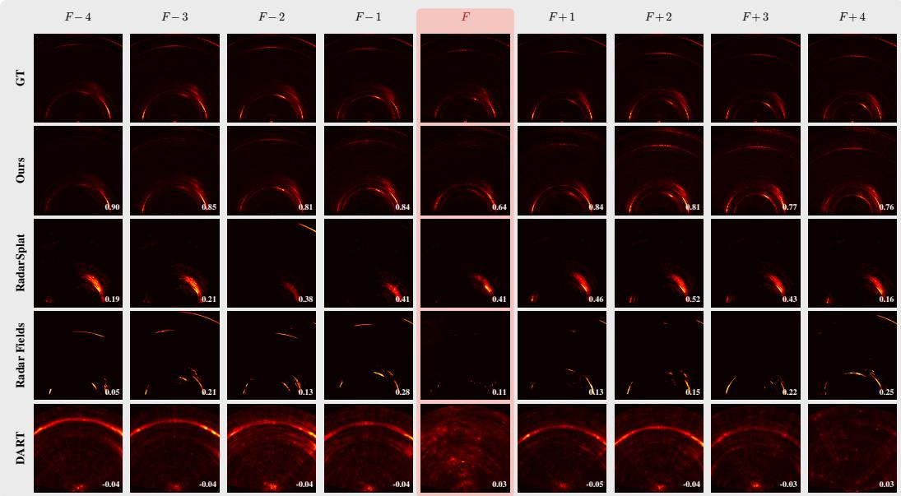  
Figure 4: Per-frame |RA| comparison, scene S0 F135. Cols: 8 train frames $( F { \pm } 1 . . . { \pm } 4 )$ plus held-out test frame F (red header). Rows: GT, 3DPS, RadarSplat, Radar Fields, DART. Per-frame Pearson correlation overlaid.

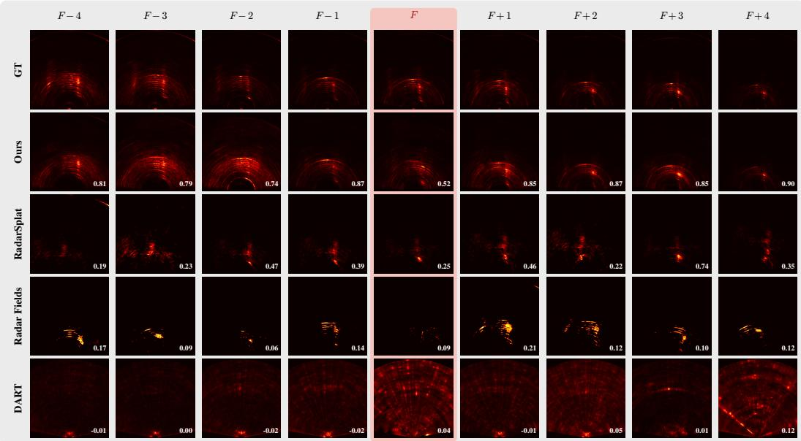  
Figure 5: Per-frame |RA| comparison, scene S1 F185.  
is normalized identically to its |RA| counterpart in the main paper, so the visual structure is directly comparable.

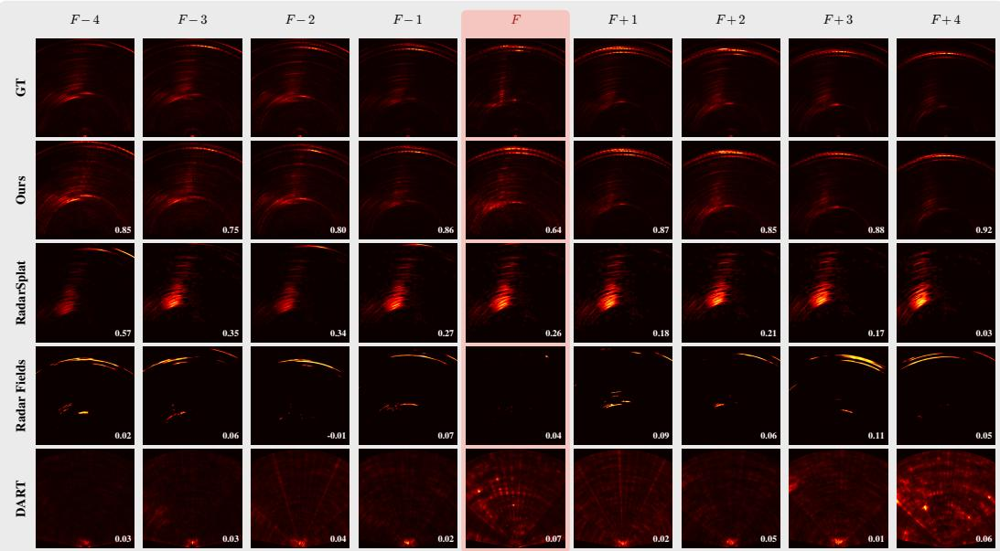  
Figure 6: Per-frame |RA| comparison, scene S1 F438.

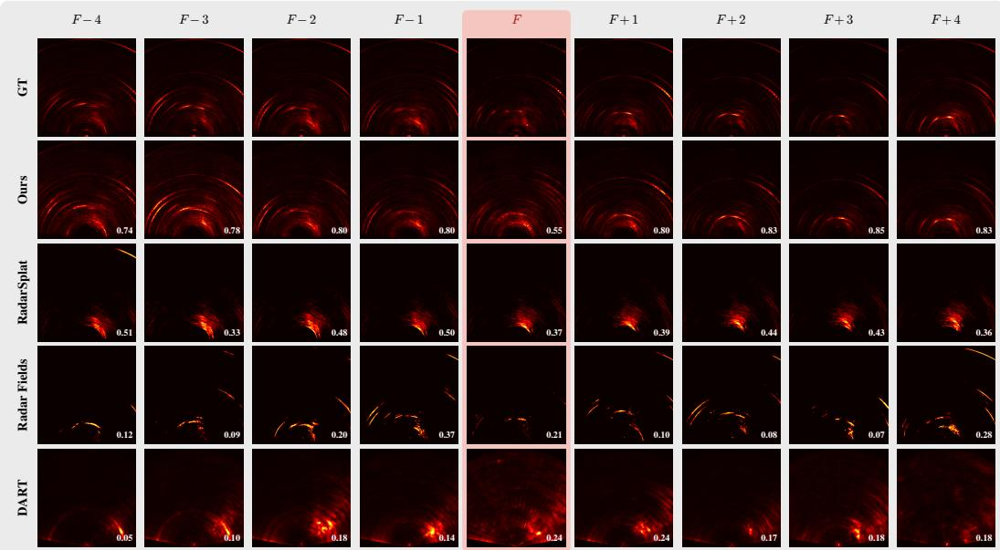  
Figure 7: Per-frame |RA| comparison, scene S2 F105.

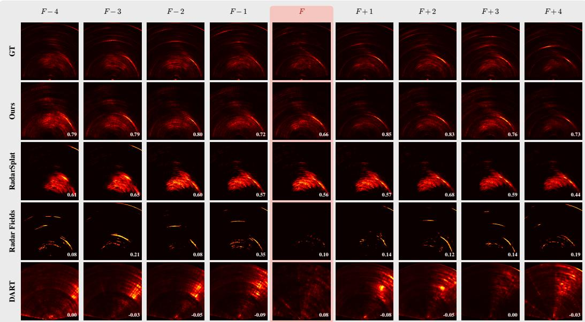  
Figure 8: Per-frame |RA| comparison, scene S2 F160.

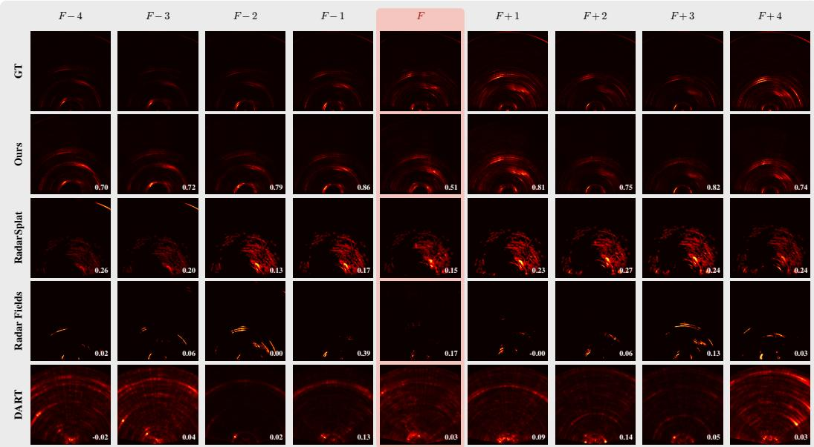  
Figure 9: Per-frame |RA| comparison, scene S2 F300.

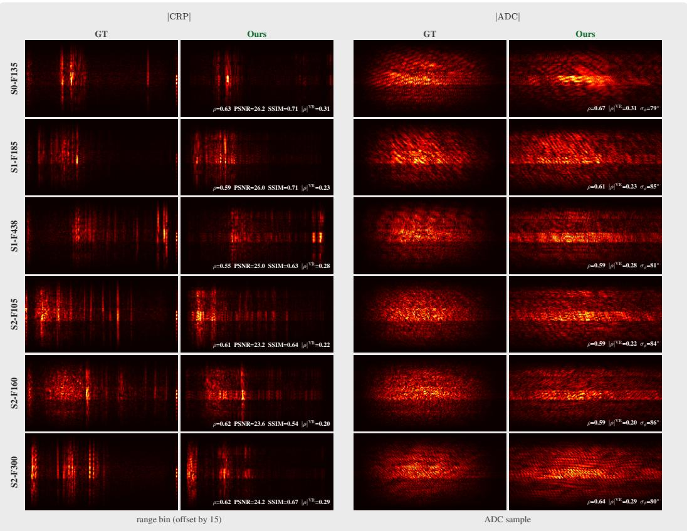  
Figure 10: |CRP| and |ADC| heatmaps on held-out test frames. Rows: six ColoRadar scenes. Top block: |CRP|, range bins [15:256], columns GT vs 3DPS. Bottom block: |ADC|, the inverse range FFT of the near-field-masked CRP, columns GT vs 3DPS. Panels are min-max normalized to [0, 1]. Per-cell overlay: ρ / PSNR / SSIM (magnitude) and $\Delta \varphi _ { r } / \Delta \varphi _ { v }$ (CRP magnitude-weighted phase coherence $\langle \cos ( \Delta \varphi ) \rangle$ in [−1, 1], random reference 0); envelope $\rho _ { | \cdot | }$ and $\Delta \varphi _ { t } \left( \mathrm { A D C } \right)$

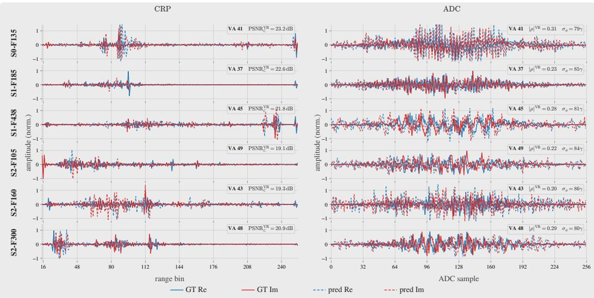  
Figure 11: CRP and ADC I/Q traces on held-out test frames. Rows: six ColoRadar scenes. Top block: CRP I/Q traces at the highest-energy virtual antenna per scene, range bins [15:256]. Bottom block: ADC I/Q traces at the same VA, across 256 fast-time samples. Solid lines are GT real (blue) and imaginary (red); dashed lines are 3DPS predictions. Per-panel: $\Delta \varphi _ { r } / \Delta \varphi _ { \imath }$ (CRP relative-phase coherence $\langle \cos ( \Delta \varphi ) \rangle ;$ envelope $\rho _ { | \cdot | }$ and $\Delta \varphi _ { t } \ ( \mathrm { A D C } )$ . The traces show that 3DPS recovers the dominant amplitude envelope while the per-bin absolute phase varies (per-(VA, range) absolute phase is unconstrained by the magnitude-only training loss; only the relative-phase content is captured).

## I Wall-clock and peak GPU memory

Table 7 reports per-scene wall-clock and peak GPU memory measured on a single NVIDIA RTX 4090 (24 GB) for 3DPS and the three optical-NVS baselines, on the same 6-scene ColoRadar benchmark and the same 9-frame split (8 training viewpoints, 1 held-out test frame). All measurements include forward+backward+optimizer+I/O. We also include a single-viewpoint Sionna RT Hoydis et al. [2023] reference figure as a representative MC ray-tracing cost anchor, measured at 8.2 min for 150 iterations on the same hardware and linearly extrapolated to ∼27.3 min at our 500-iteration budget; this is per single-viewpoint fit and would compound across the 8 training viewpoints in a multi-viewpoint NVS regime.

Table 7: Wall-clock and peak GPU memory per scene on the 6-scene benchmark, single RTX 4090. Wall-clock is reported as mean across scenes with per-scene min–max range for measured methods. Sionna RT is reported as a single-viewpoint reference figure linearly extrapolated from a 150-iteration measurement to our 500-iteration budget.
<table><tr><td>Method</td><td>Mean wall-clock (min)</td><td>Per-scene range (min)</td><td>Peak GPU mem (GB)</td></tr><tr><td>DART (cascaded) Huang et al. [2024]</td><td>0.43</td><td>0.4–0.5</td><td>not reported</td></tr><tr><td>Radar Fields Borts et al. [2024]</td><td>1.63</td><td>1.6-1.7</td><td>2.4</td></tr><tr><td>RadarSplat Kung et al. [2025]</td><td>19.74</td><td>14.2–21.4</td><td>14.2</td></tr><tr><td>Sionna RT Hoydis et al. [2023]</td><td>~27.3</td><td></td><td></td></tr><tr><td>3DPS (Ours)</td><td>3.17</td><td>2.3-3.7</td><td></td></tr></table>

Sionna RT figure is a single-viewpoint reference, linearly extrapolated from 8.2 min at 150 iterations on the same RTX 4090 to our 500-iteration budget. Reported as a representative MC ray-tracing cost anchor only; it is not a measured baseline on our 8-viewpoint benchmark.

## J RadarSplat hyperparameter selection

We benchmark RadarSplat Kung et al. [2025] using the public reference implementation. Hyperparameter selection mirrors the canonical configuration: we adopt the published per-Gaussian intensity head, the public per-scene Gaussian density schedule (initial densification at iteration 500, prune-andclone at 1000-iteration intervals), and the documented spherical-harmonic order. The Gaussian budget per scene is taken from the published default (90,000) and matches the order of magnitude implied by the public training scripts; we did not down-scale to match the 3DPS budget of N=20,000 oriented points because doing so would not be a fair use of RadarSplat’s representation. The training loss is the published L1+SSIM combination on RA magnitude. Adam learning rates and 30,000-iteration schedule match the public configuration. Per-scene wall-clock and test correlation are reported in Table 7 and Sec. F, respectively. We did not perform per-scene hyperparameter tuning on RadarSplat; the numbers reflect the public default applied uniformly across all six ColoRadar scenes.

## K Limitations and future work

The conclusion (Sec. 5) summarizes the main limitations briefly. This section expands on each and identifies the corresponding planned investigations.

Single-bounce path tracing. The renderer evaluates a single TX→scatterer→RX path per oriented point. For static outdoor scenes dominated by direct surface returns (the regime of our ColoRadar benchmark) this is sufficient, and the headline 0.587 mean test |RA| Pearson reflects that. For indoor multipath-dominated environments where second- and third-order reflections carry comparable energy to direct returns Lu et al. [2020], multi-bounce path tracing in the style of MC ray tracers (e.g., Sionna RT Hoydis et al. [2023]) would remain necessary; integrating the closed-form BSDF + PSF splatting recipe into a multi-bounce framework is open.

Magnitude-only loss leaves per-bin absolute phase unconstrained. 3DPS supervises on |RA for fair comparison with the three magnitude-only baselines, leaving ∼ 22,000 per-(VA, range) absolute phase DOFs unconstrained by the loss — specifically, free up to per-VA RF calibration drift and per-range ADC sample-zero offsets. We side-step that nuisance phase at evaluation time by reporting differential-phase metrics $( \Delta \varphi _ { r } , \Delta \varphi _ { v } , \Delta \varphi _ { t }$ in Table 2) that are absolute-phase-invariant by construction; a tighter absolute phase fit would require adding a complex (Re/Im) loss term during training. A natural future extension is a two-stage training recipe (first stage: magnitude loss to fit geometry and material; second stage: bounded position refinement under a complex loss to recover absolute phase) that locks in the magnitude performance and adds phase fidelity on top.

LiDAR-dependent initialization. The point cloud that seeds 3DPS comes from a co-registered LiDAR scan. This is a strong prior that simplifies geometric initialization and accelerates convergence to a reasonable scene fit. Pure radar-driven NVS — removing the LiDAR dependence — is an important direction for radar-only deployments and an open challenge for our framework.

Dynamic scenes and downstream perception. Extending range-Doppler-coherent rendering to scenes with moving targets, and validating NVS-augmented training data on radar-trained perception tasks (object detection, semantic segmentation), are natural next steps that the product-agnostic complex-output property of 3DPS enables but does not directly address.

## L Ablations

We ablate every design choice of 3DPS that is non-trivial to defend by appealing to the canonical 3D Gaussian Splatting literature: point count N, the multi-frame training-view budget, our adaptive density-control schedule, each of the four LiDAR-initialisation stages (azimuth-cone cull / occlusion ray-cast / cosine-weighted resample / farthest-point sampling), the quasi-static MIMO factorisation that fuses the per-(TX, RX) BSDF + range-splat into a single CUDA kernel, the Hann-PSF kernel half-width L, the carrier-phase detach used by the position gradient, and the L2 anchor strength $\lambda _ { \mathrm { p o s } }$ that ties the optimised positions to the LiDAR seed. All ablations train for the same 500 Adam iterations on the same 6 ColoRadar scenes used in the main paper, with all other hyper-parameters held at the canonical 3DPS recipe (Table 8, top row, bolded).

Point count N. Test |RA| correlation is essentially saturated by $N { = } 1 0 \mathbf { k } \left( 0 . 5 8 6 \right)$ and peaks at the N=20k default (0.587); N=50k regresses to 0.538 because the adaptive split/prune schedule begins to displace already-converged points. The implication is that 20k is near-optimal rather than merely past the knee, and that 5k–10k remain viable choices for memory-constrained deployments.

Number of training views. 3DPS is sample-efficient at the view axis: $2 / 4 / 6 / 8$ (default) views land within 0.014 of one another on test correlation (0.573, 0.575, 0.586, 0.587). Wall-clock scales linearly (0.9, 1.4, 2.6, 3.0 minutes per scene) but quality does not. Sparse-view radar deployments can therefore drop to as few as two bracketing frames with negligible loss in the held-out view.

Adaptive density control. Disabling the iter-100/200/300/400 split/prune schedule drops test correlation by 0.034 (0.553 vs. 0.587). The CRP and ADC envelope numbers stay close to default (0.587, 0.586), suggesting that the adaptive density mechanism contributes mostly to the magnitude-domain fit rather than to phase coherence. Validates the choice of importing the 3DGS-style densification into a radar setting.

LiDAR initialization stages. Of the four init stages, three contribute: azimuth-cone cull (−0.031 when removed), cosine-weighted resample (−0.016), and farthest-point sampling (−0.045). The Mitsuba-based occlusion ray-cast is the surprising outlier — removing it actually improves test correlation by +0.013 (0.600 vs. 0.587) while saving ∼2 s of init time per scene. The likely cause is that adaptive density combined with the fisher-weighted split criterion already prunes occluded points more accurately than the explicit ray-cast, which over-rejects points that are partially visible across the chirp loop’s pose interpolation. We retain occlusion ray-casting in the canonical recipe for now to keep the LiDAR-prior pipeline aligned with the rendering literature, but flag it as removable in a future revision.

Quasi-static MIMO factorisation. Disabling the fused CUDA Step-4 (BSDF) and Step-5 (rangesplat) kernels and falling through to the PyTorch path that materialises the full $( M , \bar { N _ { T X } } , \bar { N _ { R X } } )$ BSDF and (spread, $M \bar { N _ { T X } } N _ { R X } )$ splat tensors raises per-scene wall-clock from 3.0 to 5.3 minutes (1.8×) and drops test correlation from 0.587 to 0.555. The factorisation is therefore both faster and numerically more stable in the backward pass, since the fused kernel uses a hand-derived gradient while the PyTorch fallback relies on autograd’s automatic differentiation through the expanded tensors.

Table 8: Ablation sweep on the 6-scene benchmark. Mean held-out test |RA| metrics, test |CRP| correlation, ADC envelope correlation, mean training |RA| correlation, and mean wall-clock per scene on a single RTX 4090. The 3DPS default (gray reference row) is N=20k points, 8 training views, adaptive density on, full 4-stage LiDAR init, MIMO-factored CUDA kernels, $L { = } 1 5 ,$ carrierphase detach on, $\lambda _ { \mathrm { p o s } } { = } 1 0 0$ . Each subsequent row flips one design choice. Bold: best per column (ties jointly). Underline: second-best. Time is informational, not ranked.
<table><tr><td rowspan="2">Configuration</td><td colspan="4">Test |RA|</td><td colspan="2">Complex / Env.</td><td rowspan="2">Train | Time</td><td rowspan="2">Corr ↑|(min)</td></tr><tr><td>Corr ↑</td><td>PSNR ↑</td><td>SSIM↑</td><td>RMSE↓</td><td>|CRP| Corr ↑</td><td>ADC env. ↑</td></tr><tr><td>Reference</td><td></td><td></td><td></td><td></td><td></td><td></td><td></td><td></td></tr><tr><td>3DPS default</td><td>0.587</td><td>28.8</td><td>0.734</td><td>0.0369</td><td>0.603</td><td>0.613</td><td>0.812</td><td>3.0</td></tr><tr><td>Point count N</td><td></td><td></td><td></td><td></td><td></td><td></td><td></td><td></td></tr><tr><td>N= 2,000</td><td>0.578</td><td>28.4</td><td>0.696</td><td>0.0389</td><td>0.586</td><td>0.571</td><td>0.673</td><td>4.0</td></tr><tr><td>N= 5,000</td><td>0.571</td><td>28.0</td><td>0.691</td><td>0.0421</td><td>0.574</td><td>0.571</td><td>0.731</td><td>4.0</td></tr><tr><td>N=10,000</td><td>0.586</td><td>28.2</td><td>0.704</td><td>0.0394</td><td>0.591</td><td>0.615</td><td>0.777</td><td>2.7</td></tr><tr><td>N=50,000</td><td>0.538</td><td>27.3</td><td>0.696</td><td>0.0439</td><td>0.565</td><td>0.602</td><td>0.858</td><td>5.1</td></tr><tr><td></td><td></td><td></td><td></td><td></td><td></td><td></td><td></td><td></td></tr><tr><td>Training views 2 train views</td><td>0.573</td><td>27.0</td><td>0.674</td><td>0.0448</td><td>0.591</td><td>0.591</td><td>0.888</td><td>0.9</td></tr><tr><td>4 train views</td><td>0.575</td><td>28.4</td><td>0.717</td><td>0.0393</td><td>0.581</td><td>0.599</td><td>0.859</td><td>1.4</td></tr><tr><td>6 train views</td><td>0.586</td><td>28.2</td><td>0.704</td><td>0.0393</td><td>0.584</td><td>0.605</td><td>0.838</td><td>2.6</td></tr><tr><td>Adaptive density</td><td></td><td></td><td></td><td></td><td></td><td></td><td></td><td></td></tr><tr><td>no adaptive density</td><td>0.553</td><td>27.0</td><td>0.638</td><td>0.0459</td><td>0.587</td><td>0.586</td><td>0.760</td><td>3.3</td></tr><tr><td>LiDAR init stages</td><td></td><td></td><td></td><td></td><td></td><td></td><td></td><td></td></tr><tr><td>no azimuth-cone cull</td><td>0.556</td><td>27.0</td><td>0.665</td><td>0.0458</td><td>0.581</td><td>0.586</td><td>0.812</td><td>2.5</td></tr><tr><td>no occlusion ray-cast</td><td>0.600</td><td>27.7</td><td>0.697</td><td>0.0411</td><td>0.612</td><td>0.587</td><td>0.825</td><td>3.6</td></tr><tr><td>no cosine resample</td><td>0.571</td><td>27.7</td><td>0.692</td><td>0.0417</td><td>0.585</td><td>0.590</td><td>0.812</td><td>3.5</td></tr><tr><td>no FPS (random sub-sample)</td><td>0.542</td><td>28.1</td><td>0.717</td><td>0.0403</td><td>0.538</td><td>0.626</td><td>0.808</td><td>3.3</td></tr><tr><td>MIMO factorization</td><td></td><td></td><td></td><td></td><td></td><td></td><td></td><td></td></tr><tr><td>no MIMO factorization (PyTorch fallback)</td><td>0.555</td><td>27.4</td><td>0.685</td><td>0.0432</td><td>0.576</td><td>0.587</td><td>0.813</td><td>5.3</td></tr><tr><td>PSF kernel L</td><td></td><td></td><td></td><td></td><td></td><td></td><td></td><td></td></tr><tr><td>PSF L=5</td><td>0.569</td><td>28.0</td><td>0.716</td><td>0.0402</td><td>0.590</td><td>0.610</td><td>0.812</td><td>4.8</td></tr><tr><td>PSF L=9</td><td>0.572</td><td>28.2</td><td>0.708</td><td>0.0399</td><td>0.590</td><td>0.577</td><td>0.814</td><td>3.4</td></tr><tr><td>PSF L=21</td><td>0.578</td><td>27.8</td><td>0.691</td><td>0.0413</td><td>0.589</td><td>0.595</td><td>0.813</td><td>3.6</td></tr><tr><td>PSF L=25</td><td>0.569</td><td>27.4</td><td>0.682</td><td>0.0433</td><td>0.605</td><td>0.574</td><td>0.814</td><td>3.7</td></tr><tr><td>Carrier-phase detach</td><td></td><td></td><td></td><td></td><td></td><td></td><td></td><td></td></tr><tr><td>no carrier-phase detach</td><td>0.537</td><td>27.1</td><td>0.676</td><td>0.0450</td><td>0.562</td><td>0.585</td><td>0.894</td><td>4.5</td></tr><tr><td>Position anchor  $\lambda _ { \mathrm { p o s } }$ </td><td></td><td></td><td></td><td></td><td></td><td></td><td></td><td></td></tr><tr><td> $\lambda _ { \mathrm { p o s } } { = } 0$ </td><td>0.584</td><td>28.1</td><td>0.725</td><td>0.0398</td><td>0.606</td><td>0.594</td><td>0.821</td><td>2.3</td></tr><tr><td> $\lambda _ { \mathrm { p o s } } { = } 1$ </td><td>0.584</td><td>27.7</td><td>0.710</td><td>0.0419</td><td>0.608</td><td>0.616</td><td>0.819</td><td>3.7</td></tr><tr><td> $\lambda _ { \mathrm { p o s } } { = } 1 0 0 0$ </td><td>0.566</td><td>28.2</td><td>0.707</td><td>0.0394</td><td>0.590</td><td>0.584</td><td>0.822</td><td>3.3</td></tr></table>

Hann-PSF kernel half-width L. The sweep {5, 9, 15, 21, 25} produces a clean unimodal curve with the peak at the L=15 default (0.587). Smaller (0.569, 0.572) and larger (0.578, 0.569) all underperform by 0.009–0.018. A small L underspreads the per-(TX, RX) range bins and aliases nearby scatterers; a large L smears the response across range, washing out fine-scale geometric detail. The unimodal shape supports our derivation that the Hann window’s discrete-time impulse response decays into the noise floor at $| n | > \sim 7$ bins, making L=15 (±7 neighbours) the natural truncation.

Carrier-phase detach. Allowing position gradients to flow through the carrier phase $\phi _ { \mathrm { c a r r i e r } } =$ 2π $f _ { 0 } ( d _ { \mathrm { T X } } + d _ { \mathrm { R X } } ) / c$ rather than detaching it drops test correlation by 0.050 (0.537 vs. 0.587), the largest single ablation effect. The wavelength at 77 GHz is 3.9 mm, so a sub-mm position update produces a $\mathcal { O } ( 1 )$ phase rotation: the loss landscape becomes locally periodic and Adam oscillates rather than converging. Detaching the carrier phase preserves only the amplitude-path gradient (geometric path length, antenna pattern, BSDF), which is smooth in position. This validates the design choice and explains why the fused CUDA Step-5 kernel is allowed to assume $\phi _ { \mathrm { c a r r i e r } }$ is a constant w.r.t. position.

L2 position anchor $\lambda _ { \mathrm { p o s } } .$ The sweep {0, 1, 100, 1000} shows that the L2 anchor is a soft regulariser: $\lambda _ { \mathrm { p o s } } = 0$ and $\lambda _ { \mathrm { p o s } } = 1$ both yield 0.584, essentially indistinguishable from the $\lambda _ { \mathrm { p o s } } { = } 1 0 \bar { 0 }$ default (0.587). Pushing to $\lambda _ { \mathrm { p o s } } = 1 0 0 0$ over-constrains positions toward the LiDAR seed and degrades fit to 0.566. The amplitude-path-only gradient combined with the small position learning rate (1e-5) already keeps the optimised geometry sub-millimetre from the seed; the explicit anchor is largely redundant in the canonical recipe but provides a guard against high-N regimes where individual points carry less data and can drift.

Summary. Of the nine ablated axes, four are load-bearing for the |RA| result $( \Delta \ge 0 . 0 3 )$ : adaptive density, FPS-stage init, MIMO factorisation, and carrier-phase detach. Three are mild contributors $( 0 . 0 1 \leq \Delta < 0 . 0 3 )$ : cull-stage init, cosine-resample init, point count. Two are essentially neutral within MC noise: number of training views (provided $\geq 2 )$ and $\lambda _ { \mathrm { p o s } }$ (anywhere in [0, 100]). The one negative result — occlusion-stage init $\mathrm { a t - 0 . 0 1 3 - i s }$ a concrete actionable finding for the next revision of the system.

## M Per-point material visualizations

3DPS optimizes a 6-vector ITU-R P.2040 material per oriented point $( \varepsilon _ { r } ^ { \prime } , \varepsilon _ { r } ^ { \prime \prime } , \sigma _ { h } , \ell _ { c } , \tau , d ;$ ; Sec. D) jointly with the magnitude-only |RA| loss. Because the parameters are physically meaningful per point, the optimized scene is interpretable as a per-point material map rather than as opaque learned features. We visualize the material content three ways below: (i) a single “overall change” heatmap per scene quantifying per-point deviation from the ITU concrete prior, (ii) a side-by-side initial-vs-optimized comparison showing what the 8-viewpoint training actually moved, and (iii) a per-parameter breakdown across all six ITU axes for each scene. All renders use the canonical paper-results checkpoints, the inferno colormap on per-parameter physics ranges (linear for sigmoid params $\varepsilon _ { r } ^ { \prime }$ and $\tau ;$ log-scale for $\varepsilon _ { r } ^ { \prime \prime } , \sigma _ { h } , \ell _ { c } , d ;$ bounds in Sec. D), and the LiDAR scaffold mesh as faint grey context geometry. Per-scene viewpoints follow the same canonical scheme used for the qualitative supplement figures.

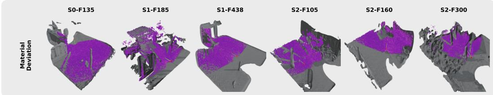  
Figure 12: Per-point material deviation from ITU concrete defaults (single row, six ColoRadar scenes). Inferno colormap on the magnitude-of-deviation in physics-space (mean across the 6 ITU parameters; log-space for $\varepsilon _ { r } ^ { \prime \prime } , \sigma _ { h } , \ell _ { c } ,$ d and linear-space for $\varepsilon _ { r } ^ { \prime } , \tau )$ . Brighter = larger deviation. Most points settle close to ITU concrete (the seed prior), with localized hot regions corresponding to vehicles, signage, and other strong specular returns where the optimizer pushed materials away from the prior to fit the radar response.

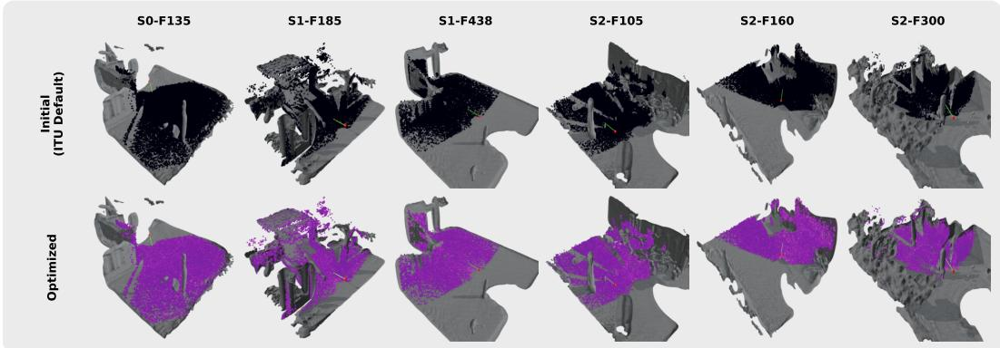  
Figure 13: Initial vs. optimized per-point materials. Top row: every point initialized to ITU concrete (uniform purple = zero deviation). Bottom row: per-point materials after 500 Adam iterations on the 8-viewpoint |RA| loss. The contrast between rows visualizes which regions the optimizer chose to move away from the concrete prior — predominantly the boresight strip and locally on parked vehicles — consistent with the cosine-weighted resample (Sec. E) concentrating points where the antenna pattern weights them most.

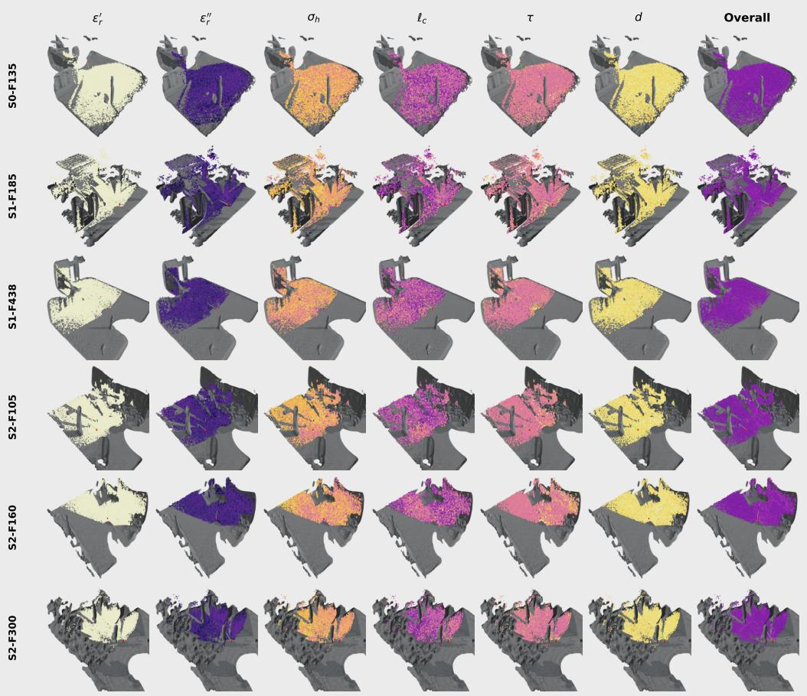  
Figure 14: Per-parameter optimized materials, all six ITU-R P.2040 axes. Rows: six ColoRadar scenes. Columns: $\varepsilon _ { r } ^ { \prime } , \varepsilon _ { r } ^ { \prime \prime } , \bar { \sigma _ { h } } , \ell _ { c } , \tau , d ,$ plus an overall-deviation column on the right (matching Fig. 12). Inferno colormap with per-parameter normalization to the ITU-R P.2040 valid bounds (Sec. D); linear scale for sigmoid params $( \varepsilon _ { r } ^ { \prime } , \tau )$ and log scale for the others. Brighter = higher value. The per-parameter columns confirm that the optimizer makes physically interpretable choices — e.g., elevated $\varepsilon _ { r } ^ { \prime }$ and $\sigma _ { h }$ on vehicle bodies, near-default values on extended ground returns — rather than treating the 6-vector as an opaque embedding.

## M.1 Per-point surface normals

3DPS also optimizes a per-point quaternion that orients the local surface frame; the surface normal is the rotation of +zˆ by that quaternion (convention from Sec. E, init seeded from LiDAR). The quaternion is trainable so the optimizer can refine the LiDAR-derived normals against the magnitudeonly |RA| loss; the figures below show what that refinement does. We use the same 6-scene benchmark and viewpoint convention as the material visualizations (Sec. M).

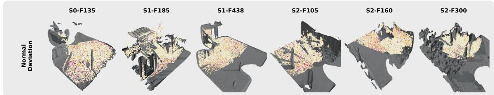  
Figure 15: Per-point normal deviation from the LiDAR seed (single row, six ColoRadar scenes). Inferno colormap on per-point angular deviation in degrees, clipped to $[ 0 ^ { \circ } , 3 0 ^ { \circ } ]$ (dark = LiDARaligned, bright yellow = ≥ 30◦ rotation). Initial-state normals come from nearest-vertex lookup into the LiDAR mesh at each optimized point’s position; sub-mm position drift makes this a faithful reconstruction of the iteration-0 seed. Most points stay within ${ \sim } 1 0 ^ { \circ }$ of the seed (consistent with LiDAR normal noise), with localized hot regions where the radar response disagrees with the LiDARderived normal — e.g., on smooth specular surfaces (vehicle bodies, signage) where the LiDAR’s local-plane fit averages over surface fine-structure that the radar return is sensitive to.

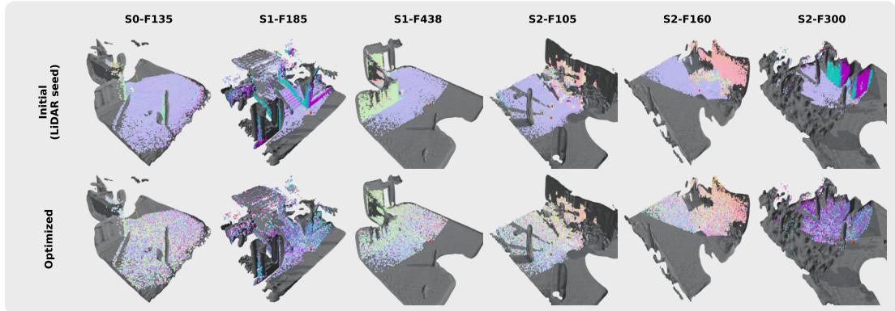  
Figure 16: Initial vs. optimized per-point normals, RGB-encoded. World-space normal-map encoding ((n+1)/2 → RGB) with back-facing normals camera-flip-corrected for visual consistency. Top row: initial state (LiDAR mesh nearest-neighbour at each optimized point’s position). Bottom row: learned state (per-point quaternion → normal after 500 Adam iterations). The visual contrast between rows tracks Fig. 15: the optimizer adds high-frequency normal variation to the locally-flat LiDAR seed, predominantly on the boresight strip where the antenna pattern weights points most heavily.

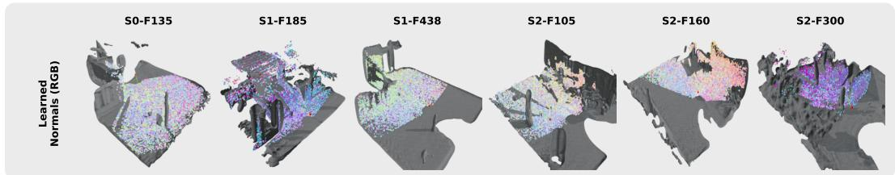  
Figure 17: Learned per-point normals only, RGB-encoded as in Fig. 16 (single row, six scenes). Provided alongside Fig. 16 for direct visual reference of the optimized normal field at full per-scene scale.

## N Broader impact and dual-use considerations

3DPS targets sparse-view novel view synthesis for mmWave radar in static outdoor scenes. The intended applications are radar simulation, sensor-driven scene understanding, and data augmentation for downstream perception tasks such as object detection and free-space estimation in autonomous driving and robotics. By making radar data more consistent across viewpoints and reducing the data-collection cost of new deployments, 3DPS lowers the barrier to safety-critical evaluation of radar perception systems and supports sim-to-real transfer for robust autonomy.

Dual-use considerations. mmWave radar is also used in surveillance and military sensing systems. The methods presented here apply, in principle, to these settings, but the inputs we require (a coregistered LiDAR scan, full radar array geometry, and dense pose annotations) are not generally available in covert deployments, and our contribution does not advance any covert sensing capability beyond what is already achievable with conventional radar simulation tools. We do not provide trained models or reconstructions of any sensitive site, and the released code is intended for open scientific use on public datasets such as ColoRadar Kramer et al. [2022].

Failure modes and deployment caveats. 3DPS is not a substitute for direct radar measurement. The single-bounce assumption fails in indoor multipath-dominated environments, and the LiDARconditioned scaffold means failure of the scaffold (poor calibration, missing scan coverage) propagates to the renderer output. Users deploying 3DPS in safety-critical settings should treat its output as supplementary to, not replacing, real radar acquisitions. We list further limitations in Sec. K.

Energy and compute footprint. A complete training run for one scene takes approximately 3 minutes on a single NVIDIA RTX 4090 (Sec. I). The full set of experiments reported in this paper consumed less than 100 GPU hours of compute.