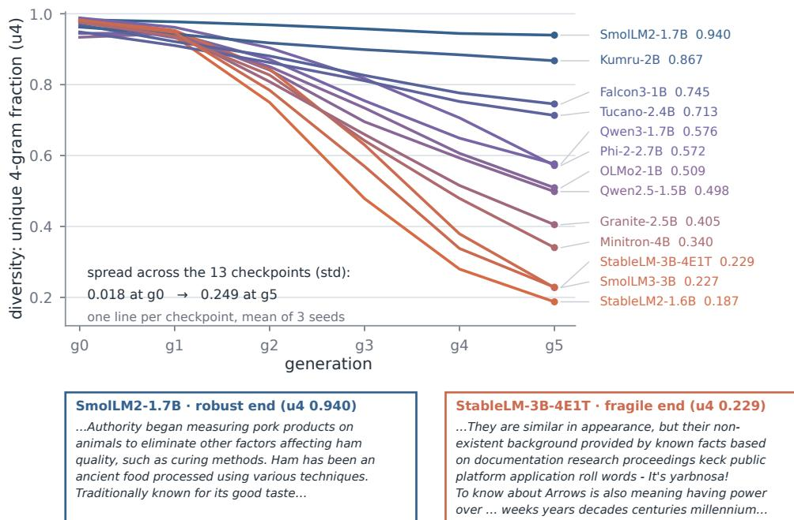
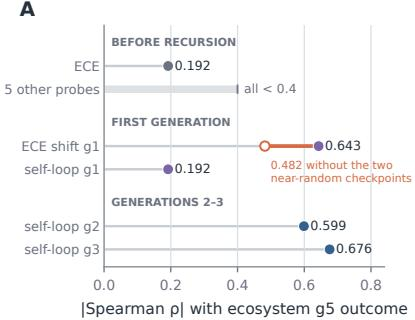
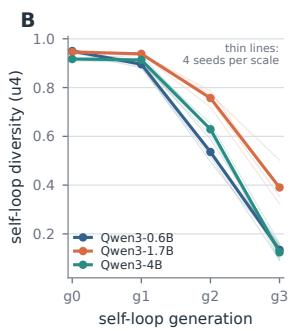
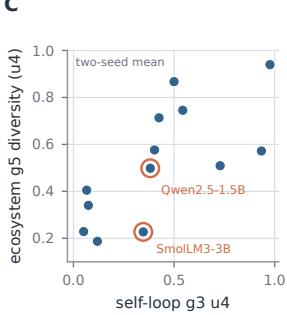
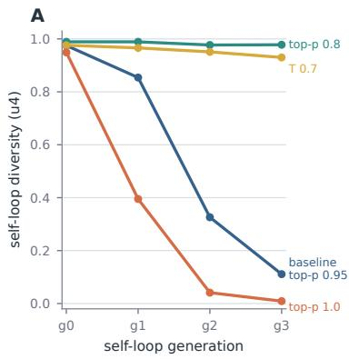
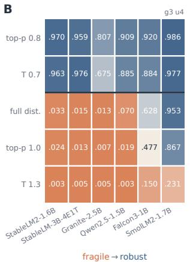
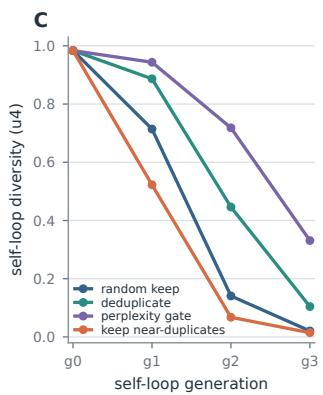
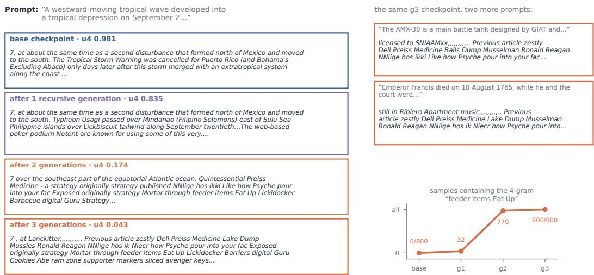

# A FRAGILITY SPECTRUM FOR RECURSIVE LANGUAGE-MODEL TRAINING

Yangze Liu Shandong University yangze2@illinois.edu

Zhongyi Han∗ Shandong University zhongy.han@sdu.edu.cn

## ABSTRACT

Model-generated text is finding its way back into training corpora, and there is plenty of evidence that training on such data over and over collapses output diversity. Prior work has studied the phenomenon itself: which protocols and which data mixtures cause collapse. But different models behave very differently under the same process. We fix one recursive contamination protocol and let 13 publicly released checkpoints form an ecosystem that shares a common corpus for five generations. The unique 4-gram outcome after five generations ranges from 0.187 to 0.940 across checkpoints, a roughly five-fold spread: some models are barely touched, others degenerate into repetitive fragments. Changing the composition of the shared pool or mixing in human text keeps the Spearman correlation of the ordering at 0.91–0.97, and changing the random seed keeps it at 0.93–0.98. Whether a model collapses easily under recursive training is, then, a property of the checkpoint itself, and one that has gone largely unexamined. Parameter scale alone does not explain it, since a three-size ladder within one family is not monotonic in size, and none of the static indicators we tested predicts it either. What does work is cheap: let a model iterate on its own output for two or three generations, and its fragility in the larger ecosystem can be inferred from that alone. Collapse speed also responds to intervention. Tightening top-p, which cuts the low-probability tail at generation time, nearly stops collapse within three generations and stabilizes six checkpoints spanning the whole spectrum together, while data-side filtering slows collapse without stopping it.

## 1 INTRODUCTION

Model-generated text is becoming part of the training data. The share of synthetic content on the public web keeps growing: a representative sample of pages published between 2022 and 2025 puts the AI-generated or AI-assisted share at about 35% by mid-2025, up from near zero before ChatGPT was released (Dolezal et al., 2026), and an independent estimate from keyword frequencies lands in a similar 30–40% range (Spennemann, 2025). New models can no longer fully avoid training on the output of old ones. The consequences are established: when models train repeatedly on modelgenerated data, the tails of the data distribution vanish first and output diversity narrows generation by generation (Shumailov et al., 2024; Alemohammad et al., 2024). That line of work mostly asks which protocols collapse: how much synthetic data, whether real data is retained and accumulated, how the recipe and regularization are set (Gerstgrasser et al., 2024; Dohmatob et al., 2024b). The starting model is treated as an interchangeable background variable, and a collapse result measured on one model is assumed to carry over to others. But do different checkpoints collapse at the same speed when they enter recursive training? This paper tests that directly.

We let 13 publicly released 1–4B base checkpoints form an ecosystem that shares a common corpus. In each generation, every model contributes text to the same public pool, much as everyone scrapes training data from the same public web. Each model is then fine-tuned with full parameter updates on this pool, starting from its clean pretrained weights, and the cycle repeats for five generations. Generation, pooling, and training are identical for all members. The only thing that differs between the members being compared is the checkpoint they start from. Five generations later, their diversity outcomes differ by roughly a factor of five. And the ordering is not an accident of one run: swap the dominant member of the ecosystem, change the mixing shares, add human text, or change the random seed, and who collapses fast stays essentially the same. This points to a property that earlier work has treated as background: the collapse fragility of a checkpoint in recursive training. Under the protocol we test, it takes the form of a stable spectrum.

The two most natural explanations both come up short. The first intuition is scale: bigger models should be sturdier. We fix the model family and training recipe and compare three parameter sizes within one family, and collapse speed turns out not to be monotonic in size: the middle size holds up best. The second intuition is that the difference should be visible in advance, that some static indi cator ought to separate the fragile from the robust. It is not: every reading available before a model enters the recursive loop failed in our tests, including calibration, statistics of the initial output, and the signal extracted by one ordinary fine-tune. Information about fragility only shows up after recursion actually starts. Within the tested range, fragility behaves like an independent property of the checkpoint: the ordering is stable and reproducible, but neither scale nor these readings summarize it.

Measuring the property is cheap all the same. To learn whether a checkpoint will collapse fast, there is no need to place it in a real ecosystem: let it iterate on its own output for two or three generations, and its relative position can be inferred from that. Our interventions then point at a specific site, the low-probability token tail at generation time. Tighten it and collapse nearly stops within three generations. Open it and collapse accelerates across the board. The practical upshot is simple: collapse results obtained on a single checkpoint should not be extrapolated by default, and reports of collapse experiments should disclose the checkpoint identity, ideally with a second checkpoint run under the same recipe.

## Our contributions are the following.

1. Fragility is a stable attribute of the checkpoint. Under a fixed recursive protocol, the five-generation diversity outcomes of 13 public 1–4B base checkpoints span a roughly fivefold range, and the collapse ordering survives swapping the dominant member, changing mixing shares, adding human text, and changing seeds.

2. The property is simple to measure. It is nearly invisible before recursion starts: the pre-recursion indicators we tested all failed, and a same-family 0.6–4B ladder is nonmonotonic. A single-model self-loop chain, however, surfaces it within two to three generations.

3. Collapse speed can be steered. Truncating the low-probability tail at generation time nearly stops collapse within a three-generation window, while opening the tail accelerates collapse consistently and pulls down even checkpoints from the robust end. Data-side filtering (deduplication, perplexity gating) slows collapse but does not stop it.

## 2 RELATED WORK

Recursive synthetic data and model collapse. Early work showed that when generative models are trained repeatedly on the output of their predecessors, the tails of the original distribution disappear first and diversity or quality degrades (Shumailov et al., 2024; Alemohammad et al., 2024). Later theory and experiments tied the outcome to how data enters the next generation: replacing old data with synthetic data invites collapse, while retaining and accumulating real data, capping the synthetic share, or adjusting regularization can delay or avoid degradation under particular protocols (Gerstgrasser et al., 2024; Seddik et al., 2024; Dohmatob et al., 2024b). This line mostly answers when recursive training degrades. We study a different axis: whether checkpoints differ systematically in how they respond.

Multi-model ecosystems and scale. Recent studies extend the single-model loop to networks of models that share data, where exchange between models drives convergence, shaped by the interaction graph, model diversity, and data sources (Wang et al., 2025; Vu et al., 2025; Hodel & West, 2025; Wu et al., 2026). The object of study there is the ecosystem itself: members are nodes, and the question is how interaction structure and data composition set the system’s convergence point. We borrow the setting rather than the question. A multi-model shared pool gives a controlled environment in which all members face the same contaminated corpus, and modifying the ecosystem’s configuration lets us check whether the fragility ordering depends on any one composition. On scale, some work reports larger models being more robust on certain tasks and in certain regimes, while theory shows the effect of scale can flip across statistical regimes (Du et al., 2025; Dohmatob et al., 2024a). We make no claim about scaling laws. We run a same-family, same-recipe ladder as an isolated test of the parameter-count explanation (§4.2).

Early warning and mitigation. Calibration shifts have been proposed as warnings ahead of performance loss, and warning claims for recursive systems are increasingly judged under matched false-positive budgets (Du et al., 2025; Mullett, 2026). On the mitigation side, mixing in real data, accumulating data, and filtering samples are widely used, though filtering against a biased reference can itself accelerate tail loss (Gerstgrasser et al., 2024; Qiao et al., 2026). Closest to our interventions, Drayson et al. (2025) filter the training pool with a machine-generated-text detector and prevent collapse in single-model loops, noting along the way that the best-behaved decoding strategy differs between their two models; that kind of model dependence, observed there in passing, is the object of study here. We put both threads into one controlled problem: test whether pre-recursion indicators predict checkpoint fragility, use self-loop recursion as a screening tool whose characteristic misses we identify, and compare how far sampling-side and data-side interventions can push the same baseline.

## 3 SETUP

Recursive training protocol. We study corpus contamination from synthetic text flowing back into training data. An ecosystem contains K language models. In each generation, the models generate text independently, and the outputs are mixed into a shared pool at preset shares (in the main ecosystem one member, M07 (phi-2), contributes 28% and the other twelve 6% each; othe environments in §4.1). Each model is then fine-tuned with full parameter updates on the same pool, starting from its own clean pretrained weights, which gives the next generation. This runs from gen 0 to gen 5. The design deliberately does not inherit weights across generations: it isolates the recursive feedback carried by the shared corpus, not continual self-training of one set of parameters. The only state that crosses generations is the text distribution, and what we measure is how different base checkpoints respond to recursively contaminated corpora.

The starting points we compare. The main experiment covers 13 publicly released 1–4B base models from 10 model families. We call the specific released version that initializes each generation’s training the base checkpoint. A checkpoint bundles architecture, tokenizer, pretraining history, and learned parameters, so “checkpoints differ” describes the experimental unit and does not attribute the difference to any one ingredient. The fine-tuned models are that checkpoint’s gen 1, gen 2, and so on.

Ecosystem chains and self-loop chains. We use two complementary recursive systems. In an ecosystem chain, the 13 models feed one shared pool and learn from it together. Each checkpoint’s diversity outcome after five generations is the target that prediction and intervention aim at. There is more than one ecosystem chain: we treat pool composition as a configuration variable and construct several environments, with different dominant members, uniform shares, and different doses of human text, to check whether the fragility ordering measured this way depends on one particular composition (§4.1). In a self-loop chain, a model trains its next generation only on its own output. We use it to ask whether a smaller, single-model recursive chain can anticipate the ecosystem’s fragility ordering ahead of time. The sampling and filtering interventions of §4.4 also run on self-loops.

Measuring collapse. The primary metric is the fraction of unique 4-grams in a model’s output (u4): lower values mean vocabulary and phrasing have become more concentrated. Frozen encoder distances, perplexity, and word-frequency tail statistics serve as auxiliary readings. Random seeds and repeated runs estimate noise, and u4 is recomputed on an equal number of 4-grams per model to rule out output-length effects (§4.1). “Collapse” in this paper means this observable narrowing of text diversity. The full model list, training parameters, experiment matrix, and probe and filtering definitions are in Appendix A, and statistical conventions are in Appendix D.

  
Figure 1: The fragility spectrum. Top: five-generation u4 trajectories of the 13 checkpoints in the main ecosystem (all 13 write into and train on one shared pool each generation), labeled with gen-5 endpoints. Bottom: verbatim gen-5 excerpts from the two ends of the spectrum.

## 4 RESULTS

We first establish the checkpoint fragility spectrum under a fixed protocol (§4.1), test whether parameter scale or pre-recursion indicators explain or predict it (§4.2), then give the self-loop screening readings and their limits (§4.3), and close by testing whether sampling and data interventions change collapse speed and whether the ordering moves with them (§4.4).

## 4.1 A STABLE FRAGILITY SPECTRUM UNDER A FIXED PROTOCOL

Figure 1 shows the five-generation trajectories and outcomes of the 13 checkpoints in the main ecosystem. All models run under the same generation, pooling, and fine-tuning protocol, yet the gen-5 u4 (unique 4-gram fraction; lower means more repetition) still spans 0.187 to 0.940 in threeseed means, a roughly five-fold spread with a median of 0.509. The fragile end contains StableLM, SmolLM, Minitron, and Granite models, and the robust end is just as mixed, so the ordering cannot be read as a family effect. At face value this already shows that under identical recursive contamination, released checkpoints differ far more than run-to-run noise.

The spectrum is not something one experimental choice manufactured. It cannot be blamed on models receiving different inputs: all 13 consume the same shared pool each generation, with the same nominal generation parameters, and the cross-model standard deviation of u4 still grows from 0.018 at gen 0 to 0.249 at gen 5. Same input, diverging outcomes: the difference can only sit in the checkpoints. It is not a length artifact either: pinning the u4 denominator to the same 20,000 4-gram for every model leaves the ordering correlated at 0.995 or higher with the full-count version, and no model moves by more than one position. Swapping the metric changes little: ranking the same gen-5 endpoints by self-BLEU or by perplexity instead correlates with the u4 ranking at 0.995 and 0.81. And it does not hinge on one ecosystem chain. Treating pool composition as an experimental variable, we built six environments: a 28% dominant member played by M03 (SmolLM2-1.7B), M07 (phi-2), or M01 (Qwen3-1.7B); fully uniform shares; and 25% or 50% human text mixed in, each environment run with three seeds. The five alternative environments correlate with the main ecosystem’s model ordering at Spearman 0.91–0.97, and the main ecosystem’s three seeds correlate pairwise at 0.929–0.984.

A  

C  
  
Figure 2: A: rank-correlation magnitudes between the ecosystem gen-5 outcome and each candidate reading, grouped by when the reading becomes available; ECE is the expected calibration error, ECE shift g1 its change from the base checkpoint to the gen-1 model, and that correlation is negative. B: u4 trajectories of the same-family scale ladder, Qwen3 0.6B/1.7B/4B self-loops over three generations. C: self-loop g3 u4, averaged over the two self-loop seeds, against the ecosystem gen-5 outcome (mean of three seeds); orange rings mark the two late starters of §4.3, M02 and M04.

So checkpoints have a property that has received little attention: whether they collapse easily under recursive training. Some models, after five generations in this simulated ecosystem, still write coherent, on-topic expository paragraphs, while others can no longer hold a sentence together, their output down to fragments and loops (examples from both ends in Figure 1). Can any of this be known in advance? The rest of the paper works through prediction (§4.2), cheaper measurement (§4.3), and intervention (§4.4).

## 4.2 NEITHER PARAMETER SCALE NOR PRE-RECURSION INDICATORS PREDICT THE SPECTRUM

An obvious idea is that a larger model should resist collapse better. Across the 13 checkpoints, parameter count correlates with the ecosystem outcome at −0.488, which offers no support for the intuition, but this comparison mixes family, architecture, tokenizer, language, and pretraining history, so by itself it also cannot establish that size does nothing. For a direct test we fix the family and the recipe and compare Qwen3 0.6B, 1.7B, and 4B: four fresh seeds per size, three self-loop generations each, the recipe identical to the 13-model self-loops. The ladder runs in self-loops because in a self-loop, collapse speed belongs to one model alone, uncoupled from a shared pool. The result is plainly non-monotonic in scale. The middle size is the most stable, with mean $^ { \mathrm { g 3 } }$ u4 of 0.390 at 1.7B against 0.135 at 0.6B and 0.124 at 4B, and the four highest-diversity chains among the twelve are all the middle size (Figure 2B). Three sizes are too few to hang a correlation on; what the ladder shows is that size fails to order the outcomes even with family and recipe held fixed.

Encoder distances give the same picture: the 1.7B model has the smallest centroid drift (0.107, against 0.122 and 0.162), so it keeps the most text diversity and also moves least in representation space. Within the tested range, parameter count does not predict the spectrum. A supplementary 7–8B experiment is in Appendix B.

Another natural idea is that some static reading should pick out the fragile checkpoints before recursion begins. We tested the main available candidates: static calibration error; the diversity, perplexity, and word-frequency tail of the initial output; the distance between model output and human text; and the change induced by one ordinary fine-tune. None of them works. Static calibration correlates with the five-generation outcome at only $0 . 1 9 2 ( p = 0 . 5 2 )$ , and everything else stays below 0.4 (Figure 2A). Inspecting a released checkpoint’s parameter count, its initial text, or its static calibration does not reveal whether it will narrow faster under recursive contamination.

The earliest signal appears within the first generation, but it is not yet usable. The calibration shift within gen 1 correlates with the final outcome $\mathrm { a t } - 0 . 6 4 3 \ ( p = 0 . 0 \dot { 2 } 0 )$ , the strongest reading in this battery of candidates. It leans on extreme points, though: two of the 13 models have near-random calibration to begin with, and those two contribute most of the strength. Removing them drops the correlation to −0.482. A reading held up by two extreme models cannot serve as a predictor. Self loops repeat the pattern: the g1 correlation is only 0.192 and rises to about 0.6 at g2. Put together, fragility looks latent: it surfaces only after recursion actually starts, and the first usable reading arrives in the second generation. (There is one stronger within-gen-1 signal, the change in output length, but it is an exploratory reading; see Appendix C and §5.)

## 4.3 A TWO-TO-THREE-GENERATION SELF-LOOP TRACKS THE ORDERING

We then ask whether a single-model self-loop chain, feeding only on its own output, can stand in for the full ecosystem, so that nobody has to place a model into a multi-model environment just to learn its fragility. It can. The self-loop reading correlates with the ecosystem’s final ordering at 0.599 at $\mathrm { g } 2 \left( p = 0 . 0 3 5 \right)$ , rising to 0.676 at $\mathrm { g } 3 \ : ( p = 0 . 0 1 4 )$ ; Figure 2C). Rerunning the whole self-loop under another random seed gives 0.577 $( p = 0 . 0 4 2 5 )$ and 0.698 $( p = 0 . 0 1 0 )$ . Run to five generations, the loop reaches 0.797 and 0.852 $\begin{array} { r } { ( p \leq 0 . 0 0 1 5 ) \colon } \end{array}$ a longer window buys accuracy, but the ranking is usable at two to three generations. For reference, the ecosystem’s own $\mathrm { g } 2$ reading correlates with the same chain’s endpoint at 0.907, but obtaining it means running the full 13-model ecosystem, and a self-loop needs one model. The more important point is that the self-loop and the ecosystem do not measure the same thing. In a self-loop, a model faces nothing but its own output quality. The ecosystem measures how the same checkpoint holds up inside a shared contaminated pool. Two rather different recursive systems return broadly the same list, which says the fragility belongs to the checkpoint itself, and that the self-loop is a valid test of it.

Where the early readings go wrong is not scattered at random. On both seeds, the two-generation reading underrates exactly two checkpoints, M02 (Qwen2.5-1.5B) and M04 (SmolLM3-3B), reading them as more robust than their ecosystem outcomes turn out to be. These two are not survivors but late starters: their first big diversity drop comes only after generation two, so a fixed two-generation read stops right before the jump. A third generation catches one of the two on each seed and still underrates the other (M04 on one seed, M02 on the other). The screen’s limit is just as clear: a self-loop ranks the field cheaply, but a fixed early window cannot promise to catch a checkpoint whose fall starts after the window closes. What the screen returns is a ranking with a known failure mode, not a verdict on each checkpoint.

The cliff shape that makes late starters possible has a natural reading. Generation n trains only on what generation n − 1 wrote, so damage too small for the diversity metric to register still enters the next round’s training data, and the loop compounds it; once quality visibly breaks, the next generation trains on visibly broken text and the fall feeds on itself. A fragile checkpoint’s trajectory is therefore a quiet stretch followed by an avalanche rather than a steady slide, and the quiet stretch has no fixed length. Where the break comes is a property of the checkpoint, which is exactly what a window of fixed length cannot anticipate.

## 4.4 THE SAMPLING TAIL SETS THE SPEED, DATA FILTERING ONLY SLOWS

The existence of fragility invites the next question: can the collapse of a fragile checkpoint be slowed or stopped? Collapse comes from training on text, produced by the previous generation, that has drifted away from real human language, so the most direct lever is to control what text enters training. We tried two kinds of intervention. One acts while the previous generation is generating, adjusting sampling parameters to control how much of the low-probability token tail reaches the output. The other acts after generation, using filtering rules to decide which texts enter the pool. Within the three generations these experiments run, the first can hold a chain’s diversity roughly level, while the second only slows the fall.

Sampling first. Top-p sampling (Holtzman et al., 2020) draws only from the most probable tokens whose cumulative mass reaches p, so a smaller p cuts more of the low-probability tail. Lowering the temperature sharpens the distribution and likewise makes tail tokens harder to draw. In the selfloop of M14 (Minitron-4B-Base), the baseline setting (top-p 0.95) is down to u4 0.111 by g3, deep into collapse. Tightening top-p to 0.8 turns that 0.111 into 0.978, barely collapsed at all. Lowering temperature to 0.7 gives 0.930. Opening top-p to 1.0, which keeps the full distribution, leaves 0.009 (Figure 3A).

Pushing temperature up completes the picture. An independent five-condition grid (temperature 0.7 and 1.3, top-p 0.8 and 1.0, and full-distribution sampling with truncation and penalties off) ran three self-loop generations on six checkpoints spanning the spectrum (Figure 3B). Raising temperature to 1.3, which flattens the distribution and keeps more of the tail, collapses all six models fast $( \mathrm { g } 3$ u4 0.003–0.231). The gaps between conditions open up generation by generation rather than being imposed by the sampler itself: four of the five conditions start with g0 readings inside the narrow band 0.900–0.993. The exception is temperature 1.3, which pushes u4 down to 0.45–0.78 already at g0, so that row should be read with this direct effect in mind. By g3, the open-tail chains of the fragile M15 reach perplexities between nine thousand and forty thousand, while its truncated chains sit at 46–68.

  
Figure 3: A: u4 trajectories of the M14 (Minitron-4B) self-loop under four sampling configurations. B: g3 u4 for the five-condition sampling grid on six checkpoints spanning the spectrum; the dark rule separates the two tail-truncating conditions from the three that keep the tail. C: u4 trajectories of the M15 (StableLM-3B-4E1T) self-loop under three equal-budget filtering rules and a random-keep baseline.

At first sight the direction contradicts the standard account. The classic explanation of collapse (Shumailov et al., 2024) is that a model undersamples the low-probability patterns of its training corpus, so each generation loses a bit more of the true distribution’s tail and output contracts toward the high-probability region. On that picture, opening top-p or raising the temperature preserves more low-probability tokens and should help the next generation keep its tail. What we measure is faster collapse. The two are not actually in conflict: what open sampling preserves is the tail of the model’s own output distribution, the degenerate text that ordinary settings rarely surface, not the tai of human language. The perplexity numbers above make the point concrete: those tails are noise, and feeding them to the next generation only speeds its collapse.

The grid also answers a natural follow-up: does intervening reshuffle the spectrum? (The full table is in Appendix E.) In the three conditions where collapse still happens (full distribution, top-p 1.0, temperature 1.3), the four fragile checkpoints never rank above the two robust ones, and the six-model orderings under top-p 1.0 and the full distribution correlate at 0.943. M03 tops all five conditions. The two protective conditions (top-p 0.8, temperature 0.7) lift all six checkpoints to 0.675 or higher and compress the spectrum into a narrow band. Intervention changes how fast collapse happens, but the ends of the spectrum stay where they are: more conservative sampling stabilizes the six together, more aggressive sampling collapses them together.

One doubt remains. Each chain above is scored on text it generated under its own condition: the topp 0.8 chain is scored on top-p 0.8 text. So when that chain reads high, there are two stories. Either the weights really came through three generations intact, or they are damaged and a decoder that cuts the tail is hiding it. To decide, we hold the decoder fixed: all thirty $^ { \mathrm { g 3 } }$ checkpoints regenerate under one shared reference configuration (the baseline recipe, common prompts), the six clean base models regenerate the same way to serve as anchors, and u4 is measured on those streams alone. Collapse turns out to live in the weights, not the decoder: under the shared decoder, the checkpoints from the three collapsing conditions still read 0.67 to 0.98 below their base anchors across the fragile four. Protection lives mostly in the weights too: five of the six checkpoints trained under top-p 0.8 land within 0.13 of their base anchor, and the same five under temperature 0.7. The exception both times is M10, which comes back about 0.23 below base — far above the collapsed floor, but low enough to say that for this one model, conservative sampling protected the output stream more than the weights. Full table in Appendix F.

  
Figure 4: What collapse reads like. Left: one prompt put to each stage of the M06 (StableLM2-1.6B) full-distribution chain, all regenerated under the single reference configuration of §4.4; excerpts are verbatim, newlines rendered as spaces, ellipses mark cuts, and each u4 is measured on that stage’s full 800-sample stream. Right: the generation-3 checkpoint on two more prompts, and the number of stream samples containing a four-gram that first appears at generation one.

Figure 4 shows what these numbers mean on the page: the M06 (StableLM2-1.6B) full-distribution chain, stage by stage, answering the same prompt under the shared decoder. The base model writes fluent prose. One generation in, the reply opens on topic before sliding into odd phrases; two generations in, the topic barely survives the first clause; three generations in, this reply — and essentially every other — is a variation of one memorized litany: all 800 replies in the stream contain the same four-word string. That string never occurs in the base model’s stream; it appears 32 times at generation one, gets trained on, and sits in 779 of 800 replies a generation later — the compounding of §4.3 caught in the act. This is also why collapse arrives with a delay: the contamination enters at generation one, while the chain still reads 0.83, and needs another round of training to amplify itself into the avalanche. A diversity reading of 0.04 is not subtle drift; the model has one thing left to say. The same staged regeneration on the late starter M02 (Qwen2.5-1.5B) shows the quiet stretch instead: 0.93 one generation in, level with its base anchor, then 0.77, then 0.18.

Now data filtering. These interventions leave generation untouched and select texts before they enter the training pool. In the self-loop of M15 (StableLM-3B-4E1T, at the fragile end), we compared three rules at equal budget against a random-keep baseline. Deduplication, which drops nearduplicate samples, lifts g2 u4 by 0.31, a direction that repeats on two seeds of M14 (+0.30 and +0.29). The inverted rule, deliberately keeping near-duplicates, lands 0.07 below baseline. Keeping only the texts the model itself finds most ordinary, by perplexity, works best: +0.58 (Figure 3C). Even the best is only a postponement. In a separate dose experiment on the same host, a gate keeping the most-ordinary half of the data reaches g3 at 0.359 while the equal-budget random control sits at 0.064. The slowdown is real, but it is still nowhere near a halt, and nothing on the data side produces the level trajectories that tail truncation does. Data filtering buys time, not a rescue.

The sampling interventions and the perplexity gate point at the same place: how much of the noisy, low-quality material in the low-probability generation tail reaches the training pool decides whether collapse speeds up or slows down. Sampling controls the width of that tail at the source; the gate removes it after the fact. Deduplication acts on a different axis: it removes the near-duplicates that collapse has already produced rather than the low-probability tail, and its effect is weaker.

## 5 DISCUSSION AND CONCLUSION

Whether a checkpoint collapses is a stable property. One protocol, applied to 13 checkpoints, gave outcomes five-fold apart. Most of the literature compares protocols on a single starting model. Those comparisons stand for the checkpoints they used. What we measured is the checkpoint axis itself. Two reporting suggestions follow. Collapse experiments should state the exact released version of the starting checkpoint, next to protocol and metric, as an element of reproducibility. And where resources allow, attaching a second checkpoint run under the same recipe is worth the cost: changing nothing but the checkpoint moved five-generation outcomes by a factor of five, so a single extra chain is enough to expose the sensitivity.

Fragility can be screened with a self-loop. Before continuing to train on a corpus with synthetic content mixed in, or when picking subjects for a collapse study, a self-loop chain can rank the candidate checkpoints first: two generations give a first ordering, and a third makes it distinctly sharper.

Mechanistic leads. This paper does not answer where the spectrum comes from. It has only early leads. At least two sides are involved. The producer side is established by the interventions of §4.4: the form in which the low-probability generation tail enters the pool decides whether collapse speeds up or slows down. The receiver side is fragility itself. The 13 models consume the same pool each generation, and the cross-model spread still grows from 0.018 at gen 0 to 0.249 at gen 5: the same data lands differently on different checkpoints. That difference may live in the architecture, the tokenizer, the pretraining data, or the parameters. Our design cannot separate these. One exploratory lead: checkpoints that collapse fast tend to start writing longer within the first generation. The larger the gen-1 length growth, the lower the five-generation u4, with a rank correlation of strength 0.780 (definition and full readings in Appendix C).

Limitations. Two limitations bound these conclusions. Scale: the main experiment covers 13 checkpoints at 1–4B. Frontier scale is untested, and a larger same-family ladder would directly check whether the spectrum continues. Protocol family: everything rests on one family of reset from-base recursive recipes and the sampling grid we tested, and the pool is small, 2,100 short texts of at most 128 tokens per generation, many orders of magnitude below a real pretraining corpus. All checkpoints also share one training recipe and one nominal decoding configuration, and nominally identical settings can land differently across tokenizers and calibrations, so we cannot say whether the ordering survives per-checkpoint tuned recipes. Weight inheritance, other pooling rules, and larger pools need separate experiments.

Conclusion. Collapse fragility is a dormant but stable property of the checkpoint. In the same recursive environment, different checkpoints end in very different places. Parameter scale alone does not explain the property, and before recursion begins it is close to invisible. A single-model self-loop surfaces it cheaply within two or three generations, and it can be steered by controlling the sampling tail. The question left open is where the spectrum comes from: why the same data, landing on different checkpoints, produces outcomes five-fold apart.

## REPRODUCIBILITY STATEMENT

Appendix A lists the 13 released checkpoint versions, the full generation and training configuration, and the experiment matrix. Appendix D states the statistical conventions. Code and frozen configurations will be released.

## AI USE STATEMENT

We used generative AI tools to help implement standard components of the experimental pipeline and to assist with the writing of this paper. The recursively generated text that this paper studies is the object of study itself: it is produced by the 13 open-weight models under examination, following the procedure of §3 and Appendix A. We reviewed all AI-assisted work and take responsibility for the final content of this work, including text, claims, and artifacts produced with the aid of generative AI.

## REFERENCES

Sina Alemohammad, Josue Casco-Rodriguez, Lorenzo Luzi, Ahmed Imtiaz Humayun, Hossein Babaei, Daniel LeJeune, Ali Siahkoohi, and Richard G. Baraniuk. Self-consuming generative models go MAD. In International Conference on Learning Representations, 2024.

Elvis Dohmatob, Yunzhen Feng, Arjun Subramonian, and Julia Kempe. Strong model collapse. arXiv preprint arXiv:2410.04840, 2024a.

Elvis Dohmatob, Yunzhen Feng, Pu Yang, Francois Charton, and Julia Kempe. A tale of tails: Model collapse as a change of scaling laws. In International Conference on Machine Learning, 2024b.

Jonas Dolezal, Sawood Alam, Mark Graham, and Maty Bohacek. The impact of AI-generated text on the internet. arXiv preprint arXiv:2604.26965, 2026.

George Drayson, Emine Yilmaz, and Vasileios Lampos. Machine-generated text detection prevents language model collapse. In Proceedings of the 2025 Conference on Empirical Methods in Natural Language Processing, 2025.

Y. Du, G. Wu, G. Tang, W. Wang, and Q. Fan. Characterizing model behavior under synthetic data training: An empirical study across scales and mixing ratios. arXiv preprint arXiv:2510.05133, 2025.

Matthias Gerstgrasser, Rylan Schaeffer, Apratim Dey, Rafael Rafailov, Henry Sleight, John Hughes, Tomasz Korbak, Rajashree Agrawal, Dhruv Pai, Andrey Gromov, Daniel A. Roberts, Diyi Yang, David L. Donoho, and Sanmi Koyejo. Is model collapse inevitable? Breaking the curse of recursion by accumulating real and synthetic data. arXiv preprint arXiv:2404.01413, 2024.

Damian Hodel and Jevin D. West. Epistemic diversity across language models mitigates knowledge collapse. arXiv preprint arXiv:2512.15011, 2025.

Ari Holtzman, Jan Buys, Li Du, Maxwell Forbes, and Yejin Choi. The curious case of neural text degeneration. In International Conference on Learning Representations, 2020.

David Mullett. Benchmarking recursive-collapse warning claims under matched false-positive control. arXiv preprint arXiv:2606.00329, 2026.

Xinbao Qiao, Xianglong Du, Wei Liu, Jingqi Zhang, Peihua Mai, Meng Zhang, and Yan Pang. When sample selection bias precipitates model collapse. arXiv preprint arXiv:2606.13732, 2026.

Mohamed El Amine Seddik, Suei-Wen Chen, Soufiane Hayou, Pierre Youssef, and Merouane Deb bah. How bad is training on synthetic data? A statistical analysis of language model collapse. arXiv preprint arXiv:2404.05090, 2024.

Ilia Shumailov, Zakhar Shumaylov, Yiren Zhao, Nicolas Papernot, Ross Anderson, and Yarin Gal. AI models collapse when trained on recursively generated data. Nature, 631(8022):755–759, 2024.

Dirk H. R. Spennemann. Delving into the quantification of AI-generated content on the internet. arXiv preprint arXiv:2504.08755, 2025.

Hung Anh Vu, Galen Reeves, and Emily Wenger. What happens when generative AI models train recursively on each others’ outputs? arXiv preprint arXiv:2505.21677, 2025.

Tianyu Wang, Akira Horiguchi, Lingyou Pang, and Carey E. Priebe. LLM web dynamics: Tracing model collapse in a network of LLMs. arXiv preprint arXiv:2506.15690, 2025.

Yuchen Wu, Kangjie Zhou, and Weijie Su. When does model collapse occur in structured interactive learning? arXiv preprint arXiv:2605.20151, 2026.

<table><tr><td>id</td><td>checkpoint (HF id)</td><td>params</td><td>family</td><td>eco g5 u4</td></tr><tr><td>M06</td><td> $\mathtt { s t a b i l i t y a i / s t a b l e l m - } 2 \mathtt { - } 1 \mathtt { - } 6 \mathtt { b }$ </td><td>1.6B</td><td>StableLM</td><td>0.187</td></tr><tr><td>M04</td><td>Huggi  $\mathtt { - n g F a c e T B / S m o l L M 3 - 3 B - B a s e }$ </td><td>3B</td><td>SmolLM</td><td>0.227</td></tr><tr><td>M15</td><td> $\mathrm { s t a b i l i t y a i / s t a b l e l m - 3 b - 4 e l t }$ </td><td>3B</td><td>StableLM</td><td>0.229</td></tr><tr><td>M14</td><td> $\mathtt { n v i d i a / M i n i t r o n - 4 B - B a s e }$ </td><td>4B</td><td>Minitron</td><td>0.340</td></tr><tr><td>M10</td><td> $\mathtt { i b m \mathrm { - } g r a n i t e / q r a n i t e - } 3 . 3 \mathrm { - } 2 \mathrm { b \mathrm { - } b a s e }$ </td><td>2.5B</td><td>Granite</td><td>0.405</td></tr><tr><td>M02</td><td> $\mathsf { Q w e n } / \mathsf { Q w e n } 2 \cdot 5 - 1 \cdot 5 \mathsf { B }$ </td><td>1.5B</td><td>Qwen</td><td>0.498</td></tr><tr><td>M05</td><td> $\mathsf { a l l e n a i / O L M O { - } } 2 \mathsf { - } 0 4 2 5 \mathsf { - } 1 \mathsf { B }$ </td><td>1B</td><td>OLMo</td><td>0.509</td></tr><tr><td>M07</td><td> $\mathtt { m i c r o s o f t } / \mathtt { p h i } - 2$ </td><td>2.7B</td><td>Phi</td><td>0.572</td></tr><tr><td>M01</td><td> $\mathsf { Q w e n } / \mathsf { Q w e n } 3 - 1 . 7 \mathsf { B } \mathrm { - B a s e }$ </td><td>1.7B</td><td>Qwen</td><td>0.576</td></tr><tr><td>M13</td><td> $\mathrm { T u c a n o B R / T u c a n o - 2 b 4 }$ </td><td>2.4B</td><td>Tucano</td><td>0.713</td></tr><tr><td>M08</td><td> $\mathtt { t i i a e / F a l c o n 3 - 1 B - B a s e }$ </td><td>1B</td><td>Falcon</td><td>0.745</td></tr><tr><td>M12</td><td> $\mathtt { v n g r s - a i / K u m r u - 2 B - B a s e }$ </td><td>2B</td><td>Kumru</td><td>0.867</td></tr><tr><td>M03</td><td> $\mathtt { H u g g i n g F a c e T B / S m o l L M 2 - 1 . 7 B }$ </td><td>1.7B</td><td>SmolLM</td><td>0.940</td></tr></table>

## A EXPERIMENTAL SETUP DETAILS

A.1 Model list. The 13 base checkpoints of the main experiment are listed below, ordered from fragile to robust by the ecosystem five-generation endpoint (three-seed mean u4). The median is 0.509 (M05).

Model ids run M01–M15; two candidates never entered the comparison: M09 (InternLM2.5- 1.8B) produced only empty outputs after its first-generation fine-tune, and M11 (h2o-danube2-1.8b) crashed the generation engine deterministically. Both were excluded on these technical grounds before any cross-model measurement existed. The 13 checkpoints come from 10 model families. Same-family pairs do not land in consistent places: both StableLM versions sit on the fragile side, the two Qwen versions sit close together near the middle, and the two SmolLM versions occupy opposite ends of the spectrum.

A.2 Generation and training parameters. Generation (shared by ecosystem, self-loop, and ladder runs): temperature 1.0, top-p 0.95, repetition penalty 1.15, frequency penalty 0.3, at most 128 new tokens per sample. The ecosystem’s shared pool is fixed at 2,100 texts per generation: each member generates 800 samples, and the pool draws from them at the preset shares, with largestremainder rounding to preserve the total. A self-loop or ladder model fills its own 2,100-text pool by itself. Diversity is always read on a fixed 800-sample slice per model and generation. Prompts are 8–16-word neutral prefixes taken from WikiText-103 (openers with an obvious topical lean are filtered out), frozen into files per generation and seed and shared by all models within a generation. The shared pool consists entirely of model-generated text from gen 0 on; the text mixed in for the human-data environments also comes from WikiText-103. Training (one recipe for all 1–4B experiments): full-parameter fine-tuning, reinitialized each generation from the clean HF base weights; 1 epoch, learning rate 2e-5, warmup 40 steps, weight decay 0.01, bf16, maximum sequence length 768; per-device batch 8 with gradient accumulation 2 (effective batch 16); the three models of 3B and up (M04/M14/M15) halve the batch and double the accumulation, keeping the effective batch unchanged. The optimizer is AdamW with standard hyperparameters $( \beta _ { 1 } 0 . \dot { 9 } , \dot { \beta _ { 2 } } 0 . 9 9 9 , \epsilon 1 0 ^ { - 8 } )$ and linear learning-rate decay after warmup. A chain’s random seed jointly fixes the frozen prompt files, the generation engine’s sampling seed, the pool-subsampling RNG, and the training seed.

A.3 Experiment matrix. Ecosystems: 6 environments (three dominant-member identities, uniform shares, 25% and 50% human data) × 3 seeds × g0–g5 × 13 models. Self-loops: 13 models × $\mathrm { g 0 - g 5 } \times 2$ seeds. Scale ladder: Qwen3 $\mathbf { 0 . 6 B } / 1 . 7 \mathbf { B } / 4 \mathbf { B } \times 4 \mathbf { s e e d s } \times \mathbf { g } 0 \mathbf { - g } 3$ self-loops. Sampling grid: 6 checkpoints spanning the spectrum $\mathrm { ( M 0 6 / M 1 5 / M 1 0 / M 0 2 / M 0 8 / M 0 3 ) \times 5 }$ sampling conditions (temperature 0.7/1.3, top-p 0.8/1.0, penalty-free full distribution) × g0–g3, one single-seed chain per cell, full table in Appendix E; the top-p and temperature interventions are separately replicated in direction on M14 and M15. Fixed-configuration re-evaluation (Appendix F): 36 generation-only runs, the six base models plus the thirty grid $^ { \mathrm { g 3 } }$ checkpoints, all under the baseline sampling configuration, plus four staged regenerations (g1 and $\mathrm { g } 2$ of the M06 and M02 full-distribution chains) for Figure 4. Data filtering: deduplication, keep-near-duplicates, perplexity gate, and a randomkeep baseline at equal budget, host M15, with deduplication replicated on two seeds of M14; the perplexity-gate dose experiment is also on M15. The 7–8B supplement (Appendix B): 4 models × $\mathrm { g 0 - g 3 }$

A.4 Pre-recursion probe definitions. The static calibration error of §4.2 is the expected calibration error with ten equal-width bins, following Du et al. (2025): on a multiple-choice question, the model’s confidence is the softmax over the answer-option letter tokens at the answer position and its prediction is the argmax, the standard MMLU-style harness. The headline readings use the CommonsenseQA validation set (1,221 questions), with the ARC-Easy (570) and OpenBookQA (500) validation sets as robustness checks; all three question sets are frozen locally. The calibration shift of §4.2 is the change in this quantity from the base checkpoint to its gen-1 model, computed per ecosystem seed and then averaged. The remaining static probes are read off each base checkpoint’s own gen-0 stream, plus one extra run: the stream’s u4; its perplexity under the fixed reference model; its word-frequency tail statistics (type–token ratio, hapax fraction, rare-word mass, top-100 mass); the distance between the stream centroid and a human-text centroid under the frozen encoder; and the change induced by one ordinary fine-tune, meaning one generation of the standard recipe trained on a pool of 100% human text. Each of these stays below 0.4 in magnitude against the ecosystem outcome (Figure 2A).

A.5 Filtering rules. The filtering interventions of §4.4 all keep the same budget, half of the pool, and differ only in the selection rule. A sample’s near-duplicate score is its maximum Jaccard overlap of 5-gram sets with any other sample in the pool; deduplication keeps the half with the lowest scores, the inverted rule keeps the half with the highest, and the random baseline keeps a uniform half. The perplexity gate scores each sample with the host’s own clean base checkpoint, as the conditional perplexity of the text given its prompt truncated at 512 tokens, and keeps the lowest-perplexity half; the dose experiment varies the kept fraction. Filtering sits between generation and training, so the measured streams are never filtered.

## B THE 7–8B SUPPLEMENT

We repeated the g0–g3 self-loop on four 7–8B base models: ibm-granite/ $\mathtt { g r a n i t e - 4 . 1 \mathtt { 1 - 8 b - b a s e } , \quad \mathtt { Q u e n / Q w e n 3 - 8 B - B a s e } , \quad \mathtt { t i l a i n e / F a l c o n 3 - 7 B - B a s e } \mathtt { d o m 4 } , }$ and mistralai/Mistral-7B-v0.3. A fifth candidate, allenai/OLMo-3-1025-7B, was excluded before any measurement because the generation engine did not recognize its architecture. The qualitative picture matches 1–4B: the models again split into fast and slow ends, and the slow side shows the same late onset. On rates, the 7–8B models collapse more slowly: their median u4 at $^ { \mathrm { g 3 } }$ is 0.713, and under the equal-gram accounting that removes length effects the 7–8B versus 1–4B medians are 0.785 versus 0.360. But larger models require a different deployment, with a generation engine and a training-step budget that both differ from the 1–4B runs, and absolute u4 is sensitive to both (Appendix D). With n = 4 on top of that, the gap cannot be attributed to scale, and the same-family ladder still collapses hard up to 4B (§4.2). So the rate conclusions in this paper stay within 1–4B.

## C THE FIRST-GENERATION LENGTH SIGNAL (EXPLORATORY)

Full readings for the mechanistic lead in §5. There is no signal at the static start: $\mathrm { g 0 }$ mean output length correlates with the ecosystem endpoint at −0.121. The signal appears within the first generation. Length non-expansion, defined $\mathrm { a s } - ( \mathrm { l e n } _ { g 1 } - \mathrm { l e n } _ { g 0 } )$ , rank-correlates with ecosystem $\mathrm { g 5 }$ u4 at $+ 0 . 7 8 0 \ : ( p = 0 . 0 0 2 )$ : the checkpoints that stretch their output most in the first generation collapse hardest by generation five. Partialing out $\mathrm { g 0 }$ u4 and $\mathrm { g 0 }$ length gives +0.820, and the direction is consistent across the six ecosystem environments (+0.637 to +0.786). This signal arises within the first generation, so it is not among the pre-recursion indicators tested in §4.2. We report it as a mechanistic lead, not a causal claim.

## D STATISTICAL CONVENTIONS

Throughout, u4 is computed at the word level: texts are split on whitespace, and u4 is the fraction of distinct 4-grams among all 4-grams pooled over a model’s 800-sample slice for that generation, taken on the raw generated strings whatever language they are in. The equalbudget check of §4.1 pins the denominator at the same 20,000 4-grams for every model. Perplexity on generated text is always measured with one fixed external reference model (GPT-2-large). Self-BLEU is computed over 4-grams on a fixed random subsample of 80 texts per 800-sample slice: each text’s clipped 4-gram precision against the other 79 texts pooled as references, averaged over the subsample. Encoder distances use one frozen encoder (the MoritzLaurer/DeBERTa-v3-base-mnli-fever-anli checkpoint) and only as distances between stream centroids (1 − cosine), never as directions in its embedding space. All significance tests in the paper are permutation tests, two-sided except where noted. The length signal (Appendix C) is a descriptive analysis without multiple-comparison correction, and its p-values should be read in that light. Absolute u4 depends on the training recipe and the generation engine: across experiment batches we compare only orderings and within-batch differences, never absolute values, and across the two generation engines we compare only directions, not effect sizes.

## E SAMPLING GRID × SIX CHECKPOINTS, FULL TABLE

The five-condition sampling grid of §4.4 on six checkpoints spanning the spectrum, complete threegeneration readings $( \mathrm { g } 3$ u4; protocol as in Appendix A, “full distribution” meaning truncation and all penalties switched off). Columns are ordered from fragile to robust by ecosystem endpoint.

<table><tr><td>condition</td><td>M06</td><td>M15</td><td>M10</td><td>M02</td><td>M08</td><td>M03</td></tr><tr><td>top-p 0.8</td><td>0.970</td><td>0.959</td><td>0.807</td><td>0.909</td><td>0.920</td><td>0.986</td></tr><tr><td>temperature 0.7</td><td>0.963</td><td>0.976</td><td>0.675</td><td>0.885</td><td>0.884</td><td>0.977</td></tr><tr><td>full distribution</td><td>0.033</td><td>0.015</td><td>0.013</td><td>0.070</td><td>0.628</td><td>0.953</td></tr><tr><td>top-p 1.0</td><td>0.024</td><td>0.013</td><td>0.007</td><td>0.019</td><td>0.477</td><td>0.867</td></tr><tr><td>temperature 1.3</td><td>0.003</td><td>0.005</td><td>0.005</td><td>0.003</td><td>0.150</td><td>0.231</td></tr></table>

In the three conditions where collapse still happens (full distribution, top-p 1.0, temperature 1.3), the lowest value in the robust half (M08/M03) exceeds the highest value in the fragile half by 0.558, 0.453, and 0.145, and the halves never trade places. The orderings under top-p 1.0 and the full distribution rank-correlate at 0.943 (one-sided exact permutation over all 720 orderings, $p = 0 . 0 0 8 )$ The two protective conditions lift every reading to 0.675–0.986, compressing the spectrum into a narrow band with a few crossings of magnitude at most 0.092, all involving M08 at the boundary of the robust half. M03 tops all five conditions.

g0 starting points: the 24 chains of the first four conditions all fall in 0.900–0.993, so the gaps between those conditions open over the generations. The six temperature-1.3 chains already start at 0.452–0.779, a direct effect of high temperature on u4, and that row’s g3 readings should be read together with its starting points. Each cell is one single-seed chain. As a noise reference, rerunning a chain under the same protocol scatters by about 0.011.

Absolute values in this table should be compared only within the grid: the grid conditions differ from the baseline sampling of the main-text self-loops.

## F GRID CHECKPOINTS RE-EVALUATED UNDER ONE DECODING CONFIGURATION

The grid of Appendix E measures each condition on text generated under that condition’s own sampler. To locate where the condition effects live, we regenerated from all thirty g3 checkpoints and the six clean base models under the frozen baseline configuration (temperature 1.0, top-p 0.95, penalties as in Appendix A) with a common prompt set, and recomputed u4 on these streams alone. Rows are ordered fragile to robust as in Appendix E; columns give the training condition of the checkpoint, with “base” the clean pre-recursion model under the same configuration.

Under the shared decoder, the fragile four’s checkpoints from the three collapsing conditions sit 0.665–0.979 below their base anchors (differences here and below are computed from unrounded readings), so that damage survives the change of decoder. From each protective condition, five of the six checkpoints land within 0.13 of their base anchor; the exception under both is M10, at 0.234 and 0.235 below. The equal-gram accounting of Appendix D gives the same picture, with M10’s two gaps at 0.205 and 0.166 and every other protective-condition gap below 0.09. Each cell is one run of 800 samples, and absolute values in this table compare only within it.

<table><tr><td>model</td><td>base</td><td>top-p 0.8</td><td>temp. 0.7</td><td>full dist.</td><td>top-p 1.0</td><td>temp. 1.3</td></tr><tr><td>M06</td><td>0.981</td><td>0.954</td><td>0.979</td><td>0.043</td><td>0.031</td><td>0.007</td></tr><tr><td>M15</td><td>0.984</td><td>0.947</td><td>0.981</td><td>0.018</td><td>0.015</td><td>0.006</td></tr><tr><td>M10</td><td>0.988</td><td>0.753</td><td>0.752</td><td>0.026</td><td>0.009</td><td>0.027</td></tr><tr><td>M02</td><td>0.926</td><td>0.912</td><td>0.914</td><td>0.182</td><td>0.029</td><td>0.260</td></tr><tr><td>M08</td><td>0.969</td><td>0.840</td><td>0.924</td><td>0.769</td><td>0.653</td><td>0.697</td></tr><tr><td>M03</td><td>0.983</td><td>0.982</td><td>0.983</td><td>0.977</td><td>0.946</td><td>0.812</td></tr></table>

For Figure 4, the g1 and g2 checkpoints of the M06 and M02 full-distribution chains were regenerated the same way (same configuration, same prompts), extending the base and g3 columns above into four-stage ladders: 0.9811/0.8348/0.1741/0.0432 for M06 and 0.9256/0.9315/0.7725/0.1824 for M02. The four-gram count in the figure is over the same 800-sample streams; the corresponding count in M02’s chain is zero at every stage.