# A Hilbert-Valued Functional Decomposition Framework for Explaining Time-Dependent Outputs

Sophie Hanna Langbein1,2 Niklas Koenen1 Marvin N. Wright1,2 Julia Herbinger1

1Leibniz Institute for Prevention Research and Epidemiology – BIPS, Bremen, Germany 2Faculty of Mathematics and Computer Science, University of Bremen, Germany

## Abstract

Feature-based explanations quantify features' influence on model predictions, but are primarily designed for scalar outputs. In many applications, however, outputs are functional or multivariate, such as time-dependent trajectories in demand forecasting. Consequently, existing approaches typically explain each output location independently, ignoring dependencies across the output components. We address this limitation by developing a unified framework for feature-based explanations of time-dependent outputs. Specifically, we generalize functional decomposition to Hilbert-valued prediction functions and extend an existing feature-based explanation framework to this setting. Our framework introduces kernel-based output representations that enable time-dependency-aware explanations at multiple levels of temporal granularity, including time-specific, time-resolved, and time-aggregated, while providing a unified view in which existing methods arise as special cases. We validate our framework on synthetic and real-world data, including intraday financial market volatility prediction and energy demand forecasting.

## 1 Introduction

Machine learning models achieve strong predictive performance across many applications, but are widely considered black boxes. However, in high-stakes settings such as healthcare, finance, or policy making, understanding how predictions are formed is crucial [39, 3, 48]. This has led to the development of explainable artificial intelligence (XAI), including a large class of feature-based methods that quantify how input features influence model predictions, either locally (individual predictions) [31, 17] or globally (model behavior across the data distribution) [4, 12, 7]. Given the large number of such methods, recent work has focused on unifying perspectives that reveal connections between them [8, 32, 9, 15]. In particular, the framework proposed by [15] formalizes feature-based explanations through a common set of operators, providing a general view on existing approaches.

However, these methods and their unifying formulations are predominantly developed for scalarvalued outputs, as encountered in standard regression or classification tasks. In many applications, models instead produce multivariate or functional outputs, such as time-dependent trajectories [40, 6]. In practice, XAI methods are routinely applied pointwise to functional outputs, explaining each output location in isolation [49, 34, 20, 24, 50, 10]. This has two limitations: it ignores dependencies across the output domain, treating each output location as if it were unrelated to its neighbors, and it offers no principled mechanism for aggregating feature effects across time. The result is a gap between the natural structure of time-dependent outputs and the levels of temporal granularity at which they can be meaningfully explained.

To illustrate these limitations, consider a patient in intensive care where a biomarker (e.g., blood lactate) is monitored over time. A model F predicts a 24h trajectory (i.e., F(x) is a function over t)

(Fig. 1, top right), where $X _ { 1 }$ controls the recovery trend, and $X _ { 2 } , X _ { 3 }$ represent clinically meaningful, early shock $( t = 1 0 \mathrm { { h } ) }$ and late deterioration $( t \dot { } = 1 8 \mathsf { h } )$ events, respectively. A natural goal is to understand how each feature influences the trajectory. Pointwise explanations attribute feature effects independently at each t. Yet, the influence of $X _ { 2 }$ is not confined to $t = 1 0 \mathrm { h }$ , but spreads over a temporal neighborhood, and clinicians may care less about attribution at a single moment than about the aggregate influence over a clinically meaningful phase. Pointwise methods support neither: they ignore dependencies across the output domain and lack principled basis for aggregation.

This highlights the need for explanation methods that account for dependencies across time in the output and support different levels of aggregation. To address this, we propose the Hilbert-valued explanation framework, which extends feature-based explanations to multivariate and functional outcomes while taking into account the outcomes’ dependence structure through kernel-based aggregation. Fig. 1 illustrates this contrast: an identity kernel produces isolated pointwise attributions, while a time-dependency-aware kernel (correlation kernel) yields phase-aware effects examined at a specific time, across the trajectory, or aggregated into a single importance.

## Contributions.

1. Hilbert-valued functional decomposition: We introduce the Hilbert-valued functional decomposition (H-FD), which extends classical functional decomposition to time-dependent model outputs (multivariate or functional), yielding pure feature effects in a Hilbert space.

2. Hilbert-valued explanation framework: We extend the unifying framework of [15] to timedependent outputs, establishing a unified class of feature-based explanations that capture both dependencies across the output domain and different levels of aggregation. Classical pointwise explanations and time-dependent Sobol indices arise as special cases.

3. Practical guidance: We provide guidance on selecting appropriate kernels based on the desired interpretation and demonstrate their impact on the resulting explanations in real-world applications.

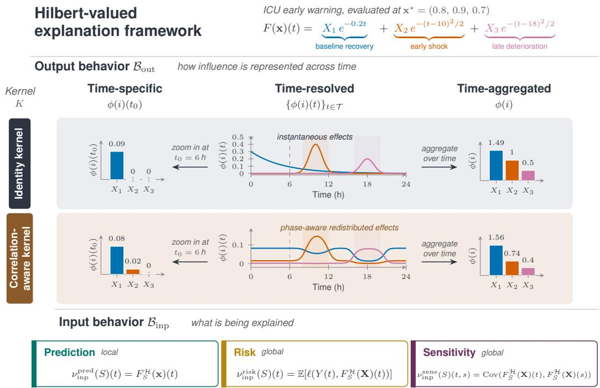  
Figure 1: Hilbert-valued explanation framework. Illustration on an ICU early-warning toy model (top). Two orthogonal axes structure time-dependent attribution. The output behavior (middle) controls how influence is represented across time, parameterized by a kernel K: the identity kernel produces instantaneous effects $\phi ( i ) ( t )$ (middle, row 1), a time-dependency-aware kernel (correlation kernel) redistributes them phase-awarely (middle, row 2). Resolved trajectories can be sampled at specific time points $t _ { 0 }$ or aggregated into a scalar $\phi ( i )$ . The input behavior (bottom) specifies what is being explained: prediction, risk, or sensitivity.

## 2 Related Work

Feature-based explanations for time-dependent outputs largely adapt prediction-level methods to forecasting settings by treating multi-step outputs independently. TsSHAP [37] explains individual forecast time points, ShapTime [51] focuses on aggregated quantities, and PAX-TS [27] combines both perspectives. Beyond forecasting, SurvSHAP(t) [28] explains time-dependent survival functions pointwise, with SurvSHAP-IQ [30] extending this to interaction effects. These methods remain confined to Shapley-style, prediction-level explanations operating on individual output locations or predefined aggregations, lacking a unified treatment of dependencies across the output domain.

Outside the XAI literature, sensitivity analysis has long addressed multivariate and functional outputs. Extensions of Sobol indices define importance measures by aggregating variance across the output domain [5, 29, 16], while also accounting for temporal dependence through covariancebased formulations [43, 1]. However, these approaches are restricted to variance-based notions of importance and have not been introduced from a feature-based XAI perspective.

## 3 Background

Work on time-dependent outputs mainly arises in sensitivity analysis with limited links to featurebased explanations; we introduce the necessary concepts from both areas.

General Notation. Consider a supervised learning setting with a function $F ^ { \mathcal { H } } : \mathcal { X }  \mathcal { H }$ , where $\mathcal { X } \subseteq \mathbb { R } ^ { p }$ and H is a Hilbert space with inner product $\langle \cdot , \cdot \rangle _ { \mathscr { H } }$ . This covers multivariate outputs $F ^ { \mathcal { H } } ( \mathbf { x } ) \in \mathbb { R } ^ { T } \left( T \in \mathbb { N } \right)$ and functional outputs, $\bar { F } ^ { \mathcal { H } } ( \mathbf { x } ) \in \dot { L } ^ { 2 } ( \ddot { \mathcal { T } } )$ . Scalar-valued outputs are written $F : \dot { \mathcal { X } }  \mathbb { R }$ . For $t \in \mathcal T$ , define $F _ { t } ( \mathbf { x } ) : = \dot { F } ^ { \mathcal { H } } ( \mathbf { x } ) ( t ) \acute { \in } \mathbb { R }$ . Let $\dot { \mathbf { X } } = ( \mathbf { X } _ { 1 } , \ldots , \mathbf { X } _ { p } )$ denote the input random vector. For a subset $S \subseteq \{ 1 , \ldots , p \}$ , let $\mathbf { X } _ { S }$ denote subvectors and by $\mathbf { X } _ { - S }$ complements. While all results apply to general Hilbert-valued outputs, we focus on time-dependent trajectories.

## 3.1 Sensitivity Analysis

Sensitivity analysis attributes output variability to input features and their interactions via functional decomposition, inducing a variance decomposition that underlies closed and total Sobol indices.

Functional and variance decomposition. Let $F : \mathcal X \to$ R denote a prediction function and let $P _ { \mathbf { X } }$ be a reference distribution over $\mathcal { X } .$ Functional decomposition represents $F$ as a sum of pure effects $f _ { S }$ over all feature subsets $S \subseteq \{ 1 , \ldots , p \}$ , where each $f _ { S }$ captures effects beyond its subsets,

$$
F ( \mathbf { x } ) = \sum _ { S \subseteq \{ 1 , \dots , p \} } f _ { S } ( \mathbf { x } ) , \quad { \mathrm { w i t h ~ } } \qquad f _ { S } ( \mathbf { x } ) : = F _ { S } ( \mathbf { x } ) - \sum _ { L \subset S } f _ { L } ( \mathbf { x } )\tag{1}
$$

and $F _ { S } ( \mathbf { x } ) = \mathbb { E } _ { \mathbf { X } _ { - S } \sim P _ { \mathbf { X } _ { - S } } } [ F ( \mathbf { X } ) \mid \mathbf { X } _ { S } = \mathbf { x } _ { S } ]$ denotes the marginal effect of features in S [22, 45, 23]. The decomposition depends on a reference distribution, typically marginal or conditional [15]. Under feature independence and square-integrability of $F .$ , the components are orthogonal and induce the variance decomposition $\begin{array} { r } { \mathbb { V } [ F ( \mathbf { \dot { X } } ) ] = \breve { \sum _ { S \subseteq \{ 1 , \dots , p \} } } \mathbb { V } [ f _ { S } ( \mathbf { X } ) ] } \end{array}$ . For time-dependent outputs, this decomposition applies pointwise via $F _ { t } ( \mathbf { x } ) = F ^ { \mathcal { H } } ( \mathbf { x } ) ( t )$ with $f _ { L }$ replaced by $f _ { L , t } ( \mathbf { x } ) = f _ { L } ^ { \mathcal { H } } ( \mathbf { x } ) ( t )$ Based on this variance decomposition, Sobol indices quantify the contribution of feature subsets to the total variance. The closed Sobol index for a subset S is defined as

$$
\xi _ { S } = \frac { \mathbb { V } [ F _ { S } ( \mathbf { X } ) ] } { \mathbb { V } [ F ( \mathbf { X } ) ] } = \frac { \sum _ { L \subseteq S } \mathbb { V } [ f _ { L } ( \mathbf { X } ) ] } { \mathbb { V } [ F ( \mathbf { X } ) ] } ,\tag{2}
$$

where the second equality holds under independent inputs [44, 45]. It captures all effects involving only features in $S ,$ while the total Sobol index additionally includes all interaction effects involving at least one feature in S [41].

Time-dependent Sobol indices. For multivariate or functional outputs, variance is replaced by the covariance kernel $\operatorname { C o v } ( F _ { t } , F _ { s } )$ , leading to Sobol-type indices that account for dependencies across the output domain. A time-specific closed Sobol index can then be defined as [43]:

$$
\xi _ { S } ^ { \mathrm { s p e c } } ( t ) = \frac { \int _ { \mathcal { T } } \mathrm { C o v } \bigl ( F _ { S , t } ( \mathbf { X } ) , F _ { S , s } ( \mathbf { X } ) \bigr ) d s } { \int _ { \mathcal { T } } \mathrm { C o v } \bigl ( F _ { t } ( \mathbf { X } ) , F _ { s } ( \mathbf { X } ) \bigr ) d s } ,\tag{3}
$$

accounting for time-dependencies relative to a fixed t. The corresponding total index is obtained analogously by aggregating all effects involving at least one feature in S. Integrating these covariance contributions over time, yields scalar time-aggregated closed and total Sobol indices [1]. Neglecting cross-time covariance reduces it to a sum of marginal variances.

## 3.2 Feature-based Explanations

Feature-based explanations quantify how features influence model behavior. Following [15, 21], they can be expressed as compositions of masking (M), behavior (B), and interaction (D) operators.

Masking operator. The masking operator $\mathcal { M }$ constructs a predictor depending only on features in $S ,$

$$
F _ { S } ( { \bf x } ) : = ( { \mathcal { M } } F ) ( { \bf x } , S ) ,
$$

by removing (masking) features in $- S$ using a reference distribution $P _ { X _ { - S } } \ ( \mathrm { e . g . }$ , marginal or conditional). Notably, $\bar { \boldsymbol { F } } _ { S }$ corresponds to the marginal effect used in Eq. (1).

Behavior operator. The behavior operator B maps masked predictors to a set function ν

$$
\nu ( S ) : = ( B ( { \mathcal { M } } F ) ) ( S ) ,
$$

which defines the quantity of interest, yielding local predictions $F _ { S } ( \mathbf { x } )$ or global quantities such as prediction variance $\operatorname { V a r } ( { \dot { F } } _ { S } ( \mathbf { X } ) )$ or expected loss $\mathbb { E } [ \bar { \ell } ( Y , F _ { S } ( { \bf X } ) ) ]$

Interaction operator. The interaction operator $\mathcal { T }$ maps $\nu$ to feature-based explanations $\phi$

$$
\phi ( j ) : = ( { \cal Z } ( B ( { \cal M } F ) ) ) ( j ) , \qquad j \in \{ 1 , \ldots , p \} .
$$

This operator quantifies the influence of individual features by accounting for higher-order effects encoded in $\nu .$ This yields different notions of explanations: pure $e f f e c t s , \phi ( j ) = \nu ( j ) - \nu ( \emptyset )$ quantify the standalone contribution of feature $j$ and do not include interactions; partial effects, $\begin{array} { r } { \phi ( j ) = \frac { 1 } { p } \sum _ { S \subseteq - j } { \binom { p - 1 } { | S | } } ^ { - 1 } [ \nu ( S \cup j ) - \nu ( S ) ] } \end{array}$ , correspond to Shapley values and distribute interactions across features [42]; and full effects, $\phi ( j ) = \nu ( \{ 1 , \dots , p \} ) - \nu ( - j )$ , compare the full model to one where feature $j$ is excluded, thereby removing all contributions involving $j$ and capturing its total effect including interactions; Extensions to feature group explanations are defined in [15].

This operator view recovers many established methods as special cases. Prediction-based behavior with partial effects yields Shapley values [42], pure effects recover (conditional) partial dependence (PD) functions [13], and risk-based behavior with full effects yields (conditional) permutation feature importance (PFI) [4, 12, 46]. An overview is provided in Tab. 2 with more details in [15]. Closed and total Sobol indices arise analogously via marginal masking, variance-based behavior, and pure or full effects, linking the work to classical sensitivity analysis. However, this formulation is defined for scalar outputs $F$ and does not directly extend to Hilbert-valued outputs $F ^ { \mathcal { H } }$

## 4 Methodology

We extend feature-based explanations to Hilbert-valued outputs via a functional decomposition in H.

## 4.1 Hilbert-valued Functional Decomposition (H-FD)

We generalize the functional decomposition of Eq. (1) to Hilbert-valued outputs $F ^ { \mathcal { H } } ( \mathbf { x } )$ The decomposition is performed over the input space as before, while the resulting effects take values in a Hilbert space $\mathcal { H } .$ Intuitively, each effect contributes not a single value but a function (or vector) describing its influence across the output domain.

Definition 1 (Hilbert-Valued Functional Decomposition). The Hilbert-valued prediction function $F ^ { \mathcal { H } } ( \mathbf { x } )$ admits a decomposition into Hilbert-valued pure effects $f _ { S } ^ { \mathcal { H } }$

$$
F ^ { \mathcal { H } } ( \mathbf { x } ) = \sum _ { S \subseteq \{ 1 , \dots , p \} } f _ { S } ^ { \mathcal { H } } ( \mathbf { x } ) , \quad f _ { S } ^ { \mathcal { H } } ( \mathbf { x } ) : = F _ { S } ^ { \mathcal { H } } ( \mathbf { x } _ { S } ) - \sum _ { L \subset S } f _ { L } ^ { \mathcal { H } } ( \mathbf { x } ) .\tag{4}
$$

Here, $F _ { S } ^ { \mathcal { H } }$ denotes the Hilbert-valued marginal effect with respect to a reference distribution $P _ { \mathbf { X } _ { - } s } .$

$$
F _ { S } ^ { \mathcal { H } } ( \mathbf { x } _ { S } ) : = \mathbb { E } _ { \mathbf { X } _ { - S } \sim P _ { \mathbf { X } _ { - S } } } [ F ^ { \mathcal { H } } ( \mathbf { X } ) \mid \mathbf { X } _ { S } = \mathbf { x } _ { S } ] , \quad w h e r e \quad F _ { \emptyset } ^ { \mathcal { H } } : = \mathbb { E } [ F ^ { \mathcal { H } } ( \mathbf { X } ) ]\tag{5}
$$

Thus, H-FD follows the scalar construction, but the effects $f _ { S } ^ { \mathcal { H } } ( \mathbf { x } )$ are functions or vectors in $\mathcal { H } .$

## 4.2 Hilbert-Valued Explanation Framework

Now, we extend the framework introduced in Sec. 3.2 to Hilbert-valued outputs $F ^ { \mathcal { H } }$ based on the H-FD. A detailed overview of operator choices is provided in $\mathrm { A p p . ~ B }$

The masking operator $\mathcal { M }$ remains unchanged and connects directly to the H-FD: the masked predictor $F _ { S } ^ { \mathcal { H } } ( { \bf x } ) : = ( \mathcal { M } F ^ { \mathcal { H } } ) ( { \bf x } , S )$ corresponds to the marginal effect and is itself a function (or vector) over the output domain.

Since $F _ { S } ^ { \mathcal { H } }$ is defined over the output domain, the behavior operator $\boldsymbol { B }$ must specify both what is explained and how it is represented across that domain, in particular with respect to dependencies between output locations and the level of aggregation. We therefore decompose it as

$$
\mathcal { B } ( F _ { S } ^ { \mathcal { H } } ) : = \mathcal { B } _ { \mathrm { o u t } } \big ( \mathcal { B } _ { \mathrm { i n p } } ( F _ { S } ^ { \mathcal { H } } ) \big ) = ( \mathcal { B } _ { \mathrm { o u t } } \circ \mathcal { B } _ { \mathrm { i n p } } ) ( F _ { S } ^ { \mathcal { H } } ) ,
$$

where $B _ { \mathrm { i n p } }$ defines the quantity of interest in the input space (as in the scalar case), and $ { { B _ { \mathrm { o u t } } } }$ specifies its representation over the output domain.

This yields the extended pipeline

$$
F ^ { \mathcal { H } } \ \stackrel { { \mathcal { M } } } { \longrightarrow } \ F _ { S } ^ { \mathcal { H } } \ \stackrel { { \mathcal { B } } _ { \mathrm { i n p } } } { \longrightarrow } \ \nu _ { \mathrm { i n p } } ( S ) \ \stackrel { { \mathcal { B } } _ { \mathrm { o u t } } } { \longrightarrow } \ \nu ( S ) \ \stackrel { { \mathcal { Z } } } { \longrightarrow } \ \phi ( j ) .
$$

Input behavior operator $B _ { \mathrm { i n p } }$ . The input behavior operator maps masked predictors to Hilbertvalued quantities of interest,

$$
\nu _ { \mathrm { i n p } } ( S ) : = ( \mathcal { B } _ { \mathrm { i n p } } ( \mathcal { M } F ^ { \mathcal { H } } ) ) ( S ) ,
$$

analogous to the scalar case. Typical choices include local prediction-based behavior $\nu _ { \mathrm { i n p } } ^ { \mathrm { p r e d } } ( S ) ( t ) =$ $F _ { S } ^ { \mathcal { H } } ( \mathbf { x } ) ( t )$ , global risk-based behavior $\nu _ { \mathrm { i n p } } ^ { \mathrm { r i s k } } ( S ) ( t ) = \mathbb { E } [ \ell ( Y ( t ) , F _ { S } ^ { \mathcal { H } } ( \mathbf { X } ) ( t ) ) ]$ , and sensitivity-based behavior $\nu _ { \mathrm { i n p } } ^ { \mathrm { s e n s } } ( S ) ( t , s ) = \mathrm { C o v } ( F _ { S } ^ { \mathcal { H } } ( { \bf X } ) ( \bar { t } ) , F _ { S } ^ { \mathcal { H } } ( { \bf X } ) ( s ) )$ . Depending on the choice, $\nu _ { \mathrm { i n p } } ( S )$ is a function over T or a covariance surface over $\tilde { \tau _ { \times } } \tau$

Output behavior operator $B _ { \mathrm { o u t } } .$ The output behavior operator determines how Hilbert-valued quantities are aggregated across the time domain,

$$
\nu ( S ) : = ( \mathcal { B } _ { \mathrm { o u t } } ( \nu _ { \mathrm { i n p } } ) ) ( S ) , \quad ( \mathcal { B } _ { \mathrm { o u t } } ^ { \mathrm { s p e c } } \nu _ { \mathrm { i n p } } ) ( S , \cdot ) : = \int _ { \mathcal { T } } K ( t , s ) \nu _ { \mathrm { i n p } } ( S ) ( \cdot ) d s ,\tag{6}
$$

where K is a symmetric positive semi-definite kernel encoding dependencies across time. The timespecific operator $B _ { \mathrm { o u t } } ^ { \mathrm { s p e c } }$ defines the base construction, yielding a time-specific explanation at each t, which may incorporate information from other time points through K. Evaluating it for all $t \in \mathcal T$ gives time-resolved explanations, while aggregating over $\bar { \boldsymbol { \tau } }$ , i.e., $\begin{array} { r } { ( B _ { \mathrm { o u t } } ^ { \mathrm { a g g r } } \nu _ { \mathrm { i n p } } ) ( S ) = \int _ { \mathcal { T } } ^ { } ( \mathcal { B } _ { \mathrm { o u t } } ^ { \mathrm { s p e c } } \nu _ { \mathrm { i n p } } ) ( S , \cdot ) d t } \end{array}$ yields time-aggregated explanations.

For time-aggregated explanations, kernel aggregation admits an explicit integral representation, characterizing when feature rankings are invariant to the choice of kernel.

Theorem 1. Let $B _ { \mathrm { o u t } } ^ { \mathrm { s p e c } }$ be defined as in Eq. (6). Then, for any subset $S \subseteq \{ 1 , \ldots , p \}$ , the timeaggregated effect with prediction-based input behavior $\dot { \nu _ { \mathrm { i n p } } } ( S ) ( t ) = F _ { S } ^ { \mathcal { H } } ( \mathbf { x } ) ( t )$ admits

$$
( \mathcal { B } _ { \mathrm { o u t } } ^ { \mathrm { a g g r } } \nu _ { \mathrm { i n p } } ) ( S ) = \int _ { \mathcal { T } } w _ { K } ( s ) \nu _ { \mathrm { i n p } } ( S ) ( s ) d s , \qquad w _ { K } ( s ) : = \int _ { \mathcal { T } } K ( t , s ) d t .
$$

$B _ { \mathrm { i n p } }$ is linear in $F ^ { \mathcal { H } }$ and $\nu _ { \mathrm { i n p } } ( \{ i \} ) ( s ) \geq \nu _ { \mathrm { i n p } } ( \{ j \} ) ( s )$ for all $s \in \tau$ , the corresponding timeaggregated pure effects preserve the ordering of features i and j for any kernel K satisfying $K ( t , s ) \geq 0 .$ Analogous results hold for partial and full effects; see App. A.1.

Remark 1. For nonlinear input behaviors such as sensitivity or risk, the ordering invariance in Thm. 1 does not generally hold. Although the same weighted-integral representation applies, different kernels may induce different feature rankings.

Finally, note that the proposed framework preserves the additive decomposition: combining masking with input and output behavior operators always yields a valid set function over feature subsets, ensuring that feature-based explanations remain well-defined.

Proposition 1. Let $\nu ( S ) : = ( \mathcal { B } _ { \mathrm { o u t } } ( \mathcal { B } _ { \mathrm { i n p } } ( \mathcal { M } F ^ { \mathcal { H } } ) ) ) ( S )$ . Then the Möbius decomposition

$$
\nu ( \{ 1 , \ldots , p \} ) = \sum _ { S \subseteq \{ 1 , \ldots , p \} } \sum _ { L \subseteq S } ( - 1 ) ^ { | S | - | L | } \nu ( L )
$$

holds [38, 19]. Consequently, time-specific, time-resolved, and time-aggregated explanations all admit a unique additive decomposition for fxed choices of M, $B _ { \mathrm { i n p } } ,$ and $ { { B _ { \mathrm { o u t } } } }$

Interaction operator and resulting explanations. The interaction operator T maps the set function ν to feature-based explanations $\phi ( j ) : = ( \mathcal { T } ( \nu ) ) ( j )$ . As illustrated in Fig. 1, the resulting explanation depends on both behavior operators: $B _ { \mathrm { i n p } }$ determines what is explained, while $ { { B _ { \mathrm { o u t } } } }$ determines how feature influence is represented across time. This yields scalar-valued time-specific and timeaggregated explanations, as well as time-resolved explanations as functions (or vectors) over $\tau$ , with the kernel controlling whether temporal dependencies are ignored or incorporated.

## 4.3 Unifying Existing Methods

Time point feature-based explanations. If $K = I$ (identity kernel), the output behavior $ { { B _ { \mathrm { o u t } } } }$ ignores cross-time dependencies: time-specific and time-resolved explanations reduce to pointwise explanations, and time-aggregated explanations to simple averages over the output domain. Within this setting, existing methods arise as special cases combining ${ \bf \bar { \boldsymbol { K } } } = { \boldsymbol { I } }$ with prediction-based input behavior (see App. C). In particular, TsSHAP corresponds to time-specific Shapley values. ShapTime operates on aggregated output quantities, yielding time-aggregated explanations, while PAX-TS provides time-specific and time-aggregated explanations. SurvSHAP(t) produces time-resolved explanations over the trajectory; SurvSHAP-IQ extends this to interaction effects via T.

In summary, existing approaches are confined to prediction-based explanations that are either pointwise (time-specific/time-resolved) or based on predefined aggregations (time-aggregated), without explicitly modeling dependencies across the output domain. Our framework removes both restrictions: general kernels $\bar { K }$ enable time-dependency-aware explanations and risk and sensitivity-based input behaviors extend the framework to global notions of importance

Time-dependent Sobol indices. Beyond prediction-based methods, our framework also recovers Sobol measures for Hilbert-valued outputs via sensitivity-based input behavior and a constant kernel. Theorem 2. Let $\nu _ { \mathrm { i n p } } ( S ) ( t , s ) = \mathrm { C o v } \big ( F _ { S } ^ { \mathcal { H } } ( { \bf X } ) ( t ) , F _ { S } ^ { \mathcal { H } } ( { \bf X } ) ( s ) \big )$ and choose a constant kernel $K ( t , s ) = 1$ Then the output behavior yields

$$
\nu ( S ) ( t ) = \int _ { \cal T } \nu _ { \mathrm { i n p } } ( S ) ( t , s ) d s , \qquad \nu ( S ) = \int _ { \cal T } \int _ { \cal T } \nu _ { \mathrm { i n p } } ( S ) ( t , s ) d t d s .
$$

Under feature independence, the corresponding pure and full interaction operators I recover the closed and total time-specific and time-aggregated Sobol indices.

## 5 Experiments

We empirically evaluate the proposed framework on synthetic and real-world datasets, with a focus on kernel choice and its impact on resulting explanations. A Python implementation of our framework along with all experiments is available at GitHub, with full computational details in App. D. We additionally validate the recovery of feature effects and Sobol indices (Thm. 2), on a synthetic model with known ground truth across multiple model classes and varying sample sizes, confirming consistent convergence behavior (see App. D.1).

## 5.1 Kernel Guidance

The kernel K encodes assumptions about how feature influence is distributed over the output domain; it should reflect the research question rather than be tuned as a hyperparameter. We summarize guidance via three principles, illustrated on synthetic scenarios with known ground truth using pure first-order local effects $f _ { i } ( \mathbf { x } )$ for a random observation (Fig. 2; see also App. D.2, Tab. 5 for an extended kernel guidance reference).

Principle 1: Match temporal scope to the notion of contribution. If the question is which feature drives the output at an instant, use the identity kernel $( K = I )$ . For sustained influence or alignment with trajectory shape, use smoothing or correlation-aware kernels. The ICU example (Fig. 2, col. 1) illustrates this: the identity kernel yields sharp peaks for $X _ { 2 }$ and $X _ { 3 }$ at t = 10h and $t = 1 8 \mathrm { h } ,$ tracking instantaneous events. The OU kernel $K _ { \mathrm { O U } } ( \ r ( \ r ( t , s ) = \sigma ^ { 2 } \exp ( - | t - s | / \ell )$ broadens these into windows of width l, reflecting that a shock event influences a patient's state for some time before and after it occurs. The correlation kernel reshapes attribution entirely, weighting a feature effect by alignment with output covariance. Since $X _ { 1 } \ ' \{$ slow exponential decay drives the trajectory between shocks, its attribution is amplified there, while $X _ { 2 }$ and $X _ { 3 }$ retain localized peaks at $t = 1 0 \mathrm { h }$ and $t = 1 8 \mathrm { h }$ . These are not competing estimates — they answer different questions, each valid in context.

Principle 2: Match kernel symmetry to temporal causality. Symmetric kernels (Gaussian, OU) implicitly assume that influence at time t can be informed by past and future output values. This may produce temporally incoherent attributions when the underlying process is causal. Fig. 2, col. 2 considers a market price response driven by a pulse event $( X _ { 1 } )$ , a transient temperature effect $\left( X _ { 2 } \right)$ and a constant baseline $\left( X _ { 3 } \right)$ . The unprecetended and short-lived pulse $X _ { 1 }$ active on [0.5, 1.0)h drives the response, but a Gaussian kernel assigns attribution to $X _ { 1 }$ before the pulse occurs. A causal exponential kernel $K _ { \mathrm { c a u s a l } } ( t , s ) = \exp ( - ( t - s ) / \ell ) \mathbf { 1 } _ { t \geq s }$ correctly restricts attribution to $t \geq 0 . 5 \mathrm { h }$ In general, kernel structure should mirror the data-generating process: symmetric for bidirectional dependence, causal for events, interventions, or autoregressive dynamics.

Principle 3: Match kernel to feature heterogeneity. Using a single kernel imposes the same temporal structure across features, which can misattribute effects when feature behaviors differ. A pharmacokinetic response curve for some medication over 3 days demonstrates both the value and the risk of the periodic kernel (Fig. 2, col. 3): it correctly captures the daily recurrence of $X _ { 1 }$ (8am dosing) but spuriously induces periodicity for $X _ { 2 } .$ , a one-off event. Kernel choice should reflect feature-specific temporal behavior; in mixed settings, selecting kernels per-feature may be appropriate. This matters in practice, since recurring covariates are routinely mixed with event-driven ones.

When kernel choice matters less. Time-aggregated attributions yield a single importance score per feature (Fig. 2, row 3). For prediction-based input behavior, feature rankings are often stable across kernels when per-feature attribution trajectories maintain a consistent ordering over time (Thm. 1), as observed in all three examples. Kernels then mainly affect the temporal shape of attribution and can be chosen on interpretive grounds. This stability does not generally hold for sensitivity- or risk-based input behavior, where kernel choice can reorder features (App. D.1, Fig. 8).

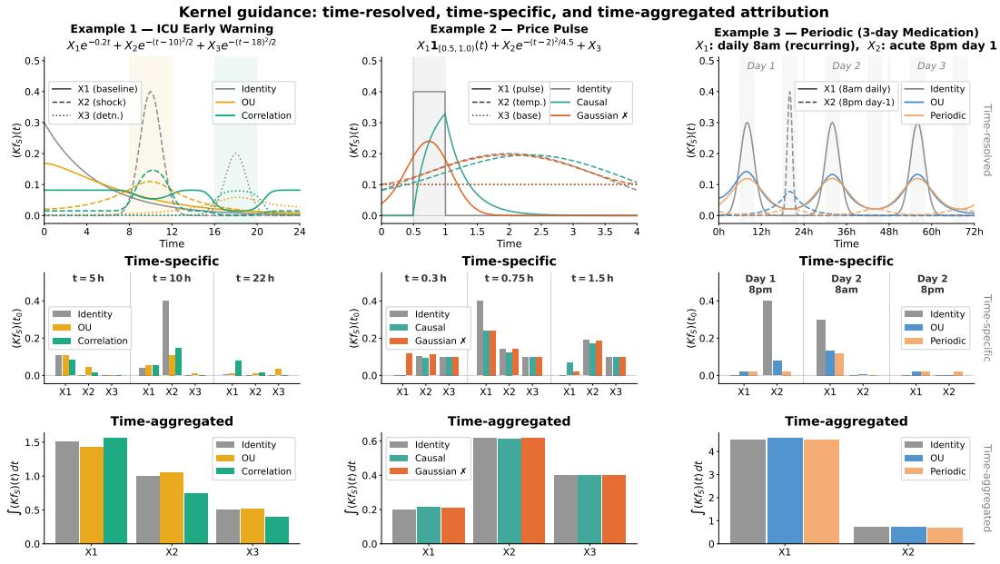  
Figure 2: Kernel guidance for three synthetic examples with distinct temporal structures: an ICU early warning model (col. $I ) ,$ a market price pulse (col. 2), and a 3-day medication response (col. 3). Each example shows pure local effects at three explanation levels: time-resolved (row 1), time-specific at selected time points (row 2), and time-aggregated (row 3) for marginal masking M, prediction-based input behavior $B _ { \mathrm { i n p } } ,$ and pure interaction operator Z of a randomly chosen observation.

## 5.2 Real-world Examples

Intraday SPY volatility prediction. We model intraday volatility for the SPDR S&P 500 ETF (SPY), using five-minute absolute log-returns (78 time steps) as the target (a standard proxy for intraday volatility) and six pre-market features, including prior-day VIX ¹ (vix\_prev) and a macro announcement indicator (ann\_indicator). A multivariate random forest is trained on 560 trading days (Jan 2022–Apr 2024) [36]. We subtract the average diurnal pattern to focus on deviations from the typical U-shape. In Fig. 3 we study July 13, 2022, a high-volatility day during the Fed's rate-hiking cycle, when the Beige Book — a qualitative indicator of the US economic situation – was released at 14:00 ET; full results are in App. D.3. For a trader or risk manager, the key question is not just which features matter, but when and how they drive volatility over the day.

Time-aggregated pure local effects (Fig. 3, col. 1) identify vix\_prev as the dominant driver. We additionally analyze ann\_indicator, whose effect is of direct interest given the scheduled Beige Book release on this day. The temporal structure of their effects depends critically on the kernel. Under the identity kernel (row 1), pure effects (col. 2) are noisy and difficult to interpret. Using temporally structured kernels (row 2) reveals economically meaningful patterns: For vix\_prev, an OU kernel yields a smooth U-shape, indicating elevated volatility at the open and closing times. In contrast, a causal kernel localizes the effect of ann\_indicator sharply at 14:00 without pre-event leakage, whereas a temporally smoothing kernel such as OU would induce spurious attribution before the announcement. The identity kernel also recovers the spike but does not distribute influence post-event, discarding the economically meaningful post-announcement decay. Partial effects (col. 3) show that ann\_indicator's time-aggregated contribution increases by 1.61× relative to its pure effect, indicating strong interaction with other features. The interaction term with vix\_prev (col. 4) reveals a clear regime shift: before 14:00, the two features are mildly redundant, both reflecting elevated expected volatility; after the announcement, they become strongly synergistic, with the release amplifying the impact of prior market fear. A scalar interaction measure would average over this shift and miss the change in regime. Overall, the framework reveals when volatility drivers act and how their role shifts intraday, matching how traders interpret market events.

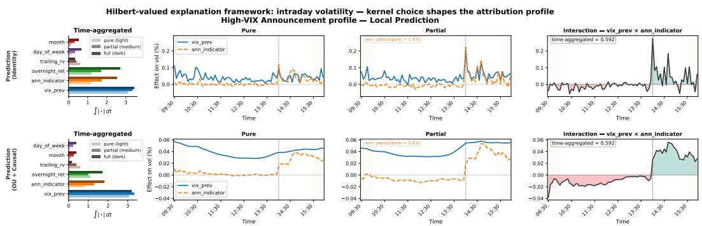  
Figure 3: Local prediction effects for July 13, 2022 $( \mathsf { v i x \_ p r e v } = 2 7 . 3$ , ann\_indicator = 1), showing vix\_prev and ann\_indicator. Col. 1: Time-aggregated pure, partial, and full importances across all features under the identity kernel (row 1) and OU/causal kernel (row 2). Col. 2: Pure effects; Col. 3: Partial effects; Col. 4: Pure interaction effect between vix\_prev and ann\_indicator. The dashed vertical line marks 14:00 ET, the Beige Book release time. Note that pure prediction-based input behavior recovers the PD effect [13] and partial prediction-based input behavior recovers Shapley values [42, 31] (see App. B for more details).

Electricity demand comparison. Grid operators must manage forecast uncertainty, as high demand variance requires costly reserves. We ask which features drive this uncertainty and whether it is localized in time or spans the full day. This can be studied using the full sensitivity effect (timedependent total Sobol index, see Thm. 2). The kernel determines how prediction variance is attributed over time: the identity kernel treats each time step independently yielding pointwise variances, while the correlation kernel captures temporal dependence of covariances. We evaluate on the UCI Individual Household Electric Power Consumption dataset (IHEPC, T = 24 hourly periods, ≈1400 days, one individual household) [11] and the GB National Electricity System Operator historic demand dataset (NESO, T = 48 half-hourly periods, ≈1800 days, national demand) [33] . We follow the same modeling setup as in the SPY application; full details in App. D.4).

The datasets differ markedly in temporal dependence (Fig. 4, col. 1, 4). IHEPC shows strong correlation between nearby time points decaying with temporal distance, while NESO demand is strongly correlated across the entire day. The network plots (col. 2, 5) summarize full sensitivity effects, with node size encoding total Sobol effects and edge width full pairwise interaction strength. IHEPC is most strongly driven by lag\_daily\_mean (LDM), with diffuse interactions reflecting the idiosyncratic nature of single-household demand. NESO variance is dominated by month (Mon) and season (Sea), with stronger interactions with each other, lag\_evening (LEv) and lag\_morning (LMo). The two kernels then tell complementary stories. For IHEPC, identity kernel full sensitivity effects reveal sharp peaks in the AM and PM high-demand windows (red and blue shaded areas), whereas the correlation kernel smooths these into a shallower, broader elevation, since nearby hours are tightly coupled and attribution at any peak hour borrows strength from its neighbors (col. 3). For NESO, intraday variation under the identity kernel collapses to near-flat trajectories under the correlation kernel, consistent with a regime shift affecting the entire day (col. 6). In both cases, hourly reserve adjustments mis-target the structure of forecast variance: IHEPC calls for peak-window provisioning, NESO for daily capacity planning. Overall, the correlation kernel matches effect resolution to the dataset's dependence scale: local smoothing for IHEPC, full-day coherence for NESO.

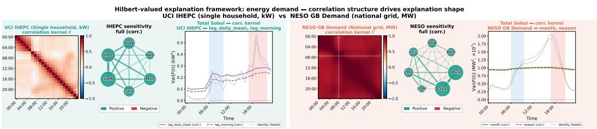  
Figure 4: For each dataset (teal: IHEPC single household; orange: NESO national grid): empirical correlation heatmap (col. 1); full sensitivity network under the correlation kernel (col. 2); full sensitivity-based effect (total Sobol) for the two dominant features under the identity kernel (faded) and correlation kernel (solid/dashed) (col. 3). Blue and red shading marks AM and PM peak windows.

## 6 Discussion and Limitations

We introduced a Hilbert-valued explanation framework that generalizes feature-based explanations to time-dependent outputs and unifies existing methods under a common operator view. Our results show that this extension matters in practice: the kernel choice directly affects the explanations obtained, surfacing temporal structure that pointwise approaches cannot capture. Rather than treating this choice as a nuisance, we view it as a modeling decision that encodes the notion of contribution—whether instantaneous, persistent, phase-dependent, or causal. Consequently, kernel selection should be guided by the scientific question and domain knowledge (see Tab. 5). The same holds for hyperparameters: for example, the OU length-scale in the SPY experiment was chosen to reflect the empirical half-life of volatility shocks, but different applications may require different temporal scales.

A key limitation is computational cost, as Shapley-based interaction operators remain expensive [31, 8], although standard approximation methods apply [47] and fast implementations can be extended [25, 14]. In contrast, pure and full effects can be computed more efficiently. Beyond computation, an important limitation is the reliance on user-specified kernels, which introduces an additional modeling choice that may influence results if misspecified. While this flexibility is a strength, it also requires principled kernel choices aligned with the interpretive goal.

The framework extends naturally to general Hilbert-valued outputs, including spatial fields or images, or other structured outputs. A promising direction is to combine it with (functional) principal component analysis, to obtain low-dimensional and more interpretable representations of output variability before attribution. Another avenue is the use of operator-valued kernels [26], allowing output dependencies to vary with the input. Finally, the framework can accommodate time-dependent inputs through suitable masking choices, which we leave for future work.

## Acknowledgments and Disclosure of Funding

Sophie Hanna Langbein and Niklas Koenen have been funded by the German Research Foundation (DFG) as part of the Research Unit “Lifespan AI: From Longitudinal Data to Lifespan Inference in Health" (DFG FOR 5347), Grant 459360854. Julia Herbinger and Marvin N. Wright gratefully acknowledge funding by the German Research Foundation (DFG), Emmy Noether Grant 437611051.

## References

[1] Alen Alexanderian, Pierre A. Gremaud, and Ralph C. Smith. Variance-based sensitivity analysis for time-dependent processes. Reliability Engineering & System Safety, 196:106722, 2020. doi: 10.1016/j.ress.2019.106722.

[2] Torben G. Andersen and Tim Bollerslev. Answering the skeptics: Yes, standard volatility models do provide accurate forecasts. International Economic Review, 39(4):885–905, 1998. doi:10.2307/2527343.

[3] Philippe Bracke, Anupam Datta, Cougar Jung, and Shayak Sen. Machine learning explainability in finance: An application to default risk analysis. Bank of England Working Paper, (816), 2019.

[4] Leo Breiman. Random forests. Machine Learning, 45(1):5–32, 2001. doi: 10.1023/A: 1010933404324.

[5] Katherine Campbell, Michael D. McKay, and Brian J. Williams. Sensitivity analysis when model outputs are functions. Reliability Engineering & System Safety, 91(10–11):1468–1472, 2006. doi: 10.1016/j.ress.2005.11.049.

[6] Edward Choi, Mohammad Taha Bahadori, Andy Schuetz, Walter F. Stewart, and Jimeng Sun. Doctor AI: Predicting clinical events via recurrent neural networks. In Machine Learning for Healthcare Conference, pages 301–318. PMLR, 2016.

[7] Ian Covert, Scott M. Lundberg, and Su-In Lee. Understanding global feature contributions with additive importance measures. In Advances in Neural Information Processing Systems, volume 33, 2020.

[8] Ian Covert, Scott Lundberg, and Su-In Lee. Explaining by removing: A unified framework for model explanation. Journal of Machine Learning Research, 22(209):1–90, 2021.

[9] Huiqi Deng, Na Zou, Mengnan Du, Weifu Chen, Guocan Feng, Ziwei Yang, Zheyang Li, and Quanshi Zhang. Unifying fourteen post-hoc attribution methods with Taylor interactions. IEEE Transactions on Pattern Analysis and Machine Intelligence, 46(7):4625–4640, 2024. doi: 10.1109/TPAMI.2024.3358410.

[10] Piotr Donizy, Mateusz Krzyzinski, Anna Markiewicz, Pawel Karpinski, Krzysztof Kotowski, Artur Kowalik, Jolanta Orlowska-Heitzman, Bozena Romanowska-Dixon, Przemyslaw Biecek, and Mai P. Hoang. Machine learning models demonstrate that clinicopathologic variables are comparable to gene expression prognostic signature in predicting survival in uveal melanoma. European Journal of Cancer, 174:251–260, 2022. doi: 10.1016/j.ejca.2022.07.031.

[11] Dheeru Dua and Casey Graff. UCI machine learning repository, 2019. URL https: //archive. ics.uci.edu.

[12] Aaron Fisher, Cynthia Rudin, and Francesca Dominici. All models are wrong, but many are useful: Learning a variable's importance by studying an entire class of prediction models simultaneously. Journal of Machine Learning Research, 20(177):1–81, 2019.

[13] Jerome H. Friedman. Greedy function approximation: A gradient boosting machine. Annals of Statistics, 29(5):1189–1232, 2001. doi: 10.1214/aos/1013203451.

[14] Fabian Fumagalli, Maximilian Muschalik, Patrick Kolpaczki, Eyke Hüllermeier, and Barbara Hammer. SHAP-IQ: Unified approximation of any-order Shapley interactions. In Advances in Neural Information Processing Systems, volume 36, 2023.

[15] Fabian Fumagalli, Maximilian Muschalik, Eyke Hüllermeier, Barbara Hammer, and Julia Herbinger. Unifying feature-based explanations with functional ANOVA and cooperative game theory. In International Conference on Artificial Intelligence and Statistics, pages 5140–5148. PMLR, 2025.

[16] Fabrice Gamboa, Alexandre Janon, Thierry Klein, and Agnès Lagnoux. Sensitivity analysis for multidimensional and functional outputs. Electronic Journal of Statistics, 8(1):575–603, 2014. doi: 10.1214/14-EJS895.

[17] Alex Goldstein, Adam Kapelner, Justin Bleich, and Emil Pitkin. Peeking inside the black box: Visualizing statistical learning with plots of individual conditional expectation. Journal of Computational and Graphical Statistics, 24(1):44–65, 2015. doi: 10.1080/10618600.2014. 907095.

[18] Michel Grabisch. k-order additive discrete fuzzy measures and their representation. Fuzzy Sets and Systems, 92(2):167–189, 1997. doi: 10.1016/S0165-0114(97)00168-1.

[19] Michel Grabisch and Marc Roubens. An axiomatic approach to the concept of interaction among players in cooperative games. International Journal of Game Theory, 28(4):547–565, 1999. doi: 10.1007/s001820050125.

[20] Juan-José Giraldo Gutierrez, Evelyn Lau, Subhashini Dharmapalan, Melody Parker, Yurui Chen, Mauricio A. Álvarez, and Dennis Wang. Multi-output prediction of dose-response curves enables drug repositioning and biomarker discovery. npj Precision Oncology, 8(1):209, 2024. doi:10.1038/s41698-024-00691-x.

[21] Julia Herbinger, Gabriel Laberge, Maximilian Muschalik, Yann Pequignot, Marvin N. Wright and Fabian Fumagalli. GRANITE: A generalized regional framework for identifying agreement in feature-based explanations. arXiv preprint arXiv:2601.22771, 2026.

[22] Wassily Hoeffding. A class of statistics with asymptotically normal distribution. The Annals of Mathematical Statistics, 19(3):293–325, 1948. doi: 10.1214/aoms/1177730196.

[23] Giles Hooker. Discovering additive structure in black box functions. In Proceedings of the Tenth ACM SIGKDD International Conference on Knowledge Discovery and Data Mining, pages 575–580, 2004. doi: 10.1145/1014052.1014122.

[24] Hao Huang, Zhaoli Wang, Yaoxing Liao, Weizhi Gao, Chengguang Lai, Xushu Wu, and Zhaoyang Zeng. Improving the explainability of CNN-LSTM-based flood prediction with integrating SHAP technique. Ecological Informatics, 84:102904, 2024. doi: 10.1016/j.ecoinf. 2024.102904.

[25] Neil Jethani, Mukund Sudarshan, Ian Covert, Su-In Lee, and Rajesh Ranganath. FastSHAP: Real-time Shapley value estimation. In International Conference on Learning Representations, 2022.

[26] Hachem Kadri, Emmanuel Duflos, Philippe Preux, Stéphane Canu, Alain Rakotomamonjy, and Julien Audiffren. Operator-valued kernels for learning from functional response data. Journal of Machine Learning Research, 17(20):1–54, 2016. URL https://jmlr. org/papers/ volume17/11-315/11-315.pdf.

[27] Tim Kreuzer, Jelena Zdravkovic, and Panagiotis Papapetrou. PAX-TS: Model-agnostic multigranular explanations for time series forecasting via localized perturbations. arXiv preprint arXiv:2508.18982, 2025.

[28] Mateusz Krzyziński, Mikołaj Spytek, Hubert Baniecki, and Przemysław Biecek. SurvSHAP(t): Time-dependent explanations of machine learning survival models. Knowledge-Based Systems, 262:110234, 2023. doi: 10.1016/j.knosys.2022.110234.

[29] Matieyendou Lamboni, Hervé Monod, and David Makowski. Multivariate sensitivity analysis to measure global contribution of input factors in dynamic models. Reliability Engineering & System Safety, 96(4):450–459, 2011. doi: 10.1016/j.ress.2010.12.002.

[30] Sophie Hanna Langbein, Hubert Baniecki, Fabian Fumagalli, Niklas Koenen, Marvin N. Wright, and Julia Herbinger. Functional decomposition and Shapley interactions for interpreting survival models. arXiv preprint arXiv:2602.16505, 2026.

[31] Scott M. Lundberg and Su-In Lee. A unified approach to interpreting model predictions. In Advances in Neural Information Processing Systems, volume 30, 2017.

[32] Daniel Lundstrom and Meisam Razaviyayn. A unifying framework to the analysis of interaction methods using synergy functions. In International Conference on Machine Learning, pages 23005–23032. PMLR, 2023.

[33] National Energy System Operator. Historic demand data. https://www.neso.energy/ data-portal/historic-demand-data, 2024. Accessed: 2024.

[34] Alexander Neubauer, Stefan Brandt, and Martin Kriegel. Explainable multi-step heating load forecasting: Using SHAP values and temporal attention mechanisms for enhanced interpretability. Energy and AI, 20:100480, 2025. doi: 10.1016/j.egyai.2025.100480.

[35] Fabian Pedregosa, Gaël Varoquaux, Alexandre Gramfort, Vincent Michel, Bertrand Thirion, Olivier Grisel, Mathieu Blondel, Peter Prettenhofer, Ron Weiss, Vincent Dubourg, Jake Vanderplas, Alexandre Passos, David Cournapeau, Matthieu Brucher, Matthieu Perrot, and Édouard Duchesnay. Scikit-learn: Machine learning in Python. Journal of Machine Learning Research, 12:2825–2830, 2011.

[36] Polygon.io. SPY intraday bar data. https://polygon. io, 2024. Five-minute OHLCV bars, accessed January 2022 – April 2024.

[37] Vikas C. Raykar, Arindam Jati, Sumanta Mukherjee, Nupur Aggarwal, Kanthi Sarpatwar, Giridhar Ganapavarapu, and Roman Vaculin. TsSHAP: Robust model agnostic feature-based explainability for time series forecasting. arXiv preprint arXiv:2303.12316, 2023.

[38] Gian-Carlo Rota. On the foundations of combinatorial theory: I. Theory of Möbius functions. In Classic Papers in Combinatorics, pages 332–360. Springer, 1964.

[39] Cynthia Rudin. Stop explaining black box machine learning models for high stakes decisions and use interpretable models instead. Nature Machine Intelligence, 1(5):206–215, 2019. doi: 10.1038/s42256-019-0048-x.

[40] David Salinas, Valentin Flunkert, Jan Gasthaus, and Tim Januschowski. DeepAR: Probabilistic forecasting with autoregressive recurrent networks. International Journal of Forecasting, 36(3): 1181–1191, 2020. doi: 10.1016/j.ijforecast.2019.07.001.

[41] Andrea Saltelli, Marco Ratto, Terry Andres, Francesca Campolongo, Jessica Cariboni, Debora Gatelli, Michaela Saisana, and Stefano Tarantola. Global Sensitivity Analysis: The Primer. John Wiley & Sons, 2008.

[42] Lloyd S. Shapley. A value for n-person games. Contributions to the Theory of Games, 2(28): 307–317, 1953.

[43] Yan Shi, Zhenzhou Lu, Zhao Li, and Mengmeng Wu. Cross-covariance based global dynamic sensitivity analysis. Mechanical Systems and Signal Processing, 100:846–862, 2018. doi: 10.1016/j.ymssp.2017.08.013.

[44] Ilya M. Sobol'. Sensitivity estimates for nonlinear mathematical models. Mathematical Modeling and Computational Experiment, 1:407–414, 1993.

[45] Ilya M. Sobol'. Global sensitivity indices for nonlinear mathematical models and their Monte Carlo estimates. Mathematics and Computers in Simulation, 55(1–3):271–280, 2001. doi: 10.1016/S0378-4754(00)00270-6.

[46] Carolin Strobl, Anne-Laure Boulesteix, Thomas Kneib, Thomas Augustin, and Achim Zeileis. Conditional variable importance for random forests. BMC Bioinformatics, 9:1–11, 2008. doi 10.1186/1471-2105-9-307.

[47] Erik Štrumbelj and Igor Kononenko. Explaining prediction models and individual predictions with feature contributions. Knowledge and Information Systems, 41(3):647–665, 2014. doi: 10.1007/s10115-013-0679-x.

[48] Erico Tjoa and Cuntai Guan. A survey on explainable artificial intelligence (XAI): Towards medical XAI. IEEE Transactions on Neural Networks and Learning Systems, 32(11):4793–4813, 2021. doi:10.1109/TNNLS.2020.3027314.

[49] Corne van Zyl, Xianming Ye, and Raj Naidoo. Harnessing explainable artificial intelligence for feature selection in time series energy forecasting: A comparative analysis of Grad-CAM and SHAP. Applied Energy, 353:122079, 2024. doi: 10.1016/j.apenergy.2023.122079.

[50] Enbin Yang, Hao Zhang, Xinsheng Guo, Zinan Zang, Zhen Liu, and Yuanning Liu. A multivariate multi-step LSTM forecasting model for tuberculosis incidence with model explanation in Liaoning Province, China. BMC Infectious Diseases, 22:490, 2022. doi: 10.1186/s12879-022-07462-8.

[51] Yuyi Zhang, Qiushi Sun, Dongfang Qi, Jing Liu, Ruimin Ma, and Ovanes Petrosian. ShapTime: A general XAI approach for explainable time series forecasting. In Proceedings of SAI Intelligent Systems Conference, pages 659–673. Springer, 2023. doi: 10.1007/978-3-031-47721-8\_45.

## A Proofs

Here, we provide the proofs for the theoretical statements in Sec.4.

## A.1 Proof of Thm. 1

Proof. By definition of the time-specific output behavior operator for prediction-based input behavior $\nu _ { \mathrm { i n p } } ( S ) ( i ) = F _ { S } ^ { \mathcal { H } } ( { \bf x } ) ( t )$

$$
( { \mathcal { B } } _ { \mathrm { o u t } } ^ { \mathrm { s p e c } } \nu _ { \mathrm { i n p } } ) ( S , t ) = \int _ { \mathcal { T } } K ( t , s ) \nu _ { \mathrm { i n p } } ( S ) ( s ) d s .
$$

Assuming the integrals are well-defined, Fubini's theorem yields

$$
\begin{array} { r l } { ( \mathcal { B } _ { \mathrm { o u t } } ^ { \mathrm { a g g r } } \nu _ { \mathrm { i n p } } ) ( S ) = \displaystyle \int _ { \mathcal { T } } ( \mathcal { B } _ { \mathrm { o u t } } ^ { \mathrm { s p e c } } \nu _ { \mathrm { i n p } } ) ( S , t ) d t } \\ { = \displaystyle \int _ { \mathcal { T } } \int _ { \mathcal { T } } K ( t , s ) \nu _ { \mathrm { i n p } } ( S ) ( s ) d s d t } \\ { = \displaystyle \int _ { \mathcal { T } } \left( \int _ { \mathcal { T } } K ( t , s ) d t \right) \nu _ { \mathrm { i n p } } ( S ) ( s ) d s . } \end{array}
$$

Defining

$$
w _ { K } ( s ) : = \int _ { T } K ( t , s ) d t ,
$$

we obtain the stated representation.

For the ordering, consider individual pure feature effects and let $i , j \in P : = \{ 1 , \ldots , p \}$ . If $B _ { \mathrm { i n p } }$ is linear in $F ^ { \mathcal { H } }$ and

$$
\nu _ { \operatorname* { i n p } } ( \{ i \} ) ( s ) \geq \nu _ { \operatorname* { i n p } } ( \{ j \} ) ( s ) \qquad { \mathrm { f o r ~ a l l ~ } } s \in { \mathcal { T } } ,
$$

then, since $K ( t , s ) \geq 0$ , it follows that

$$
w _ { K } ( s ) = \int _ { \mathcal { T } } K ( t , s ) d t \geq 0 \qquad { \mathrm { f o r ~ a l l } } s \in { \mathcal { T } } .
$$

Hence,

$$
w _ { K } ( s ) { \big ( } \nu _ { \operatorname* { i n p } } ( \{ i \} ) ( s ) - \nu _ { \operatorname* { i n p } } ( \{ j \} ) ( s ) { \big ) } \geq 0 \qquad { \mathrm { f o r ~ a l l ~ } } s \in { \mathcal { T } } ,
$$

and therefore

$$
\int _ { \mathcal { T } } w _ { K } ( s ) \big ( \nu _ { \mathrm { i n p } } ( \{ i \} ) ( s ) - \nu _ { \mathrm { i n p } } ( \{ j \} ) ( s ) \big ) d s \geq 0 .
$$

Using the representation above, this yields

$$
( \mathcal { B } _ { \mathrm { o u t } } ^ { \mathrm { a g g r } } \nu _ { \mathrm { i n p } } ) ( \{ i \} ) \ge ( \mathcal { B } _ { \mathrm { o u t } } ^ { \mathrm { a g g r } } \nu _ { \mathrm { i n p } } ) ( \{ j \} ) ,
$$

which proves the result for individual pure feature effects.

Extension to partial and full effects. For partial effects (Shapley values), the attribution of a feature i is given by

$$
\phi _ { i } ^ { \mathrm { S h a p } } = \sum _ { S \subseteq P \setminus \{ i \} } \alpha _ { S } \big [ \nu ( S \cup \{ i \} ) - \nu ( S ) \big ] ,
$$

where $\alpha _ { S } > 0$ are the Shapley weights.

To compare two features i and j, consider the difference

$$
\phi _ { i } ^ { \mathrm { S h a p } } - \phi _ { j } ^ { \mathrm { S h a p } } .
$$

Substituting the definition and collecting terms yields

$$
\phi _ { i } ^ { \mathrm { { S h a p } } } - \phi _ { j } ^ { \mathrm { { S h a p } } } = \sum _ { S \subseteq P \backslash \{ i \} } \alpha _ { S } \left[ \nu ( S \cup \{ i \} ) - \nu ( S ) \right] - \sum _ { S \subseteq P \backslash \{ j \} } \alpha _ { S } \left[ \nu ( S \cup \{ j \} ) - \nu ( S ) \right] .
$$

By reindexing the sums and grouping terms over coalitions $A \subseteq P \setminus \{ i , j \}$ , this expression can be written as a sum of terms of the form

$$
\nu ( A \cup \{ i \} ) - \nu ( A \cup \{ j \} ) ,
$$

each with a positive weight.

Hence, if for all $A \subseteq P \setminus \{ i , j \}$ and all $s \in \mathcal T$

$$
\nu _ { \mathrm { i n p } } ( A \cup \{ i \} ) ( s ) \geq \nu _ { \mathrm { i n p } } ( A \cup \{ j \} ) ( s ) ,
$$

then, by the same argument as in the main proof,

$$
\nu ( A \cup \{ i \} ) - \nu ( A \cup \{ j \} ) = \int _ { \mathcal { T } } w _ { K } ( s ) \big [ \nu _ { \mathrm { i n p } } ( A \cup \{ i \} ) ( s ) - \nu _ { \mathrm { i n p } } ( A \cup \{ j \} ) ( s ) \big ] d s \geq 0 ,
$$

and therefore $\phi _ { i } ^ { \mathrm { S h a p } } \geq \phi _ { j } ^ { \mathrm { S h a p } }$

For full effects,

$$
\phi _ { i } ^ { \mathrm { f u l l } } = \nu ( P ) - \nu ( P \setminus \{ i \} ) ,
$$

so that

$$
\phi _ { i } ^ { \mathrm { f u l l } } - \phi _ { j } ^ { \mathrm { f u l l } } = \nu ( P \setminus \{ j \} ) - \nu ( P \setminus \{ i \} ) .
$$

This corresponds to the same condition with $A = P \setminus \{ i , j \}$ , since

$$
P \setminus \{ j \} = A \cup \{ i \} , \quad P \setminus \{ i \} = A \cup \{ j \} .
$$

Hence, if

$$
\nu _ { \mathrm { i n p } } ( A \cup \{ i \} ) ( s ) \geq \nu _ { \mathrm { i n p } } ( A \cup \{ j \} ) ( s ) \quad \forall s \in \mathcal { T } ,
$$

then $\phi _ { i } ^ { \mathrm { f u l l } } \geq \phi _ { j } ^ { \mathrm { f u l l } }$

## A.2 Proof of Proposition 1

Proof. By construction,

$$
\nu : 2 ^ { \{ 1 , . . . , p \} } \to { \mathbb R } , \qquad S \mapsto ( { \mathcal B } _ { \mathrm { o u t } } ( { \mathcal B } _ { \mathrm { i n p } } ( { \mathcal M } F ^ { \mathcal { H } } ) ) ) ( S ) ,
$$

is a well-defined set function on the power set $2 ^ { \{ 1 , \ldots , p \} }$

Let $m _ { \nu }$ denote its Möbius transform, defined by

$$
m _ { \nu } ( S ) : = \sum _ { L \subseteq S } ( - 1 ) ^ { | S | - | L | } \nu ( L ) ,
$$

which captures the contributions of individual subsets via inclusion-exclusion.

By Möbius inversion [18], ν admits the representation

$$
\nu ( T ) = \sum _ { S \subseteq T } m _ { \nu } ( S ) \qquad { \mathrm { f o r ~ a l l ~ } } T \subseteq \{ 1 , \dots , p \} .
$$

Applying this to $T = \{ 1 , \ldots , p \}$ and substituting the definition of $m _ { \nu }$ yields

$$
\nu ( \{ 1 , \ldots , p \} ) = \sum _ { S \subseteq \{ 1 , \ldots , p \} } \sum _ { L \subseteq S } ( - 1 ) ^ { | S | - | L | } \nu ( L ) ,
$$

which is the claimed decomposition.

Since the Möbius transform is unique, this representation defines a unique additive decomposition of ν into contributions associated with feature subsets. As the construction of ν is independent of the specific choices of ${ \mathcal { M } } , B _ { \mathrm { i n p } } ,$ and $ { { B _ { \mathrm { o u t } } } }$ , the result holds for all corresponding time-specific, time-resolved, and time-aggregated explanations. □

## A.3 Proof of Theorem 2

Proof. By definition of the sensitivity input behavior

$$
\nu _ { \mathrm { i n p } } ( S ) ( t , s ) = \mathrm { C o v } \big ( F _ { S } ^ { \mathcal { H } } ( \mathbf { X } ) ( t ) , F _ { S } ^ { \mathcal { H } } ( \mathbf { X } ) ( s ) \big ) .
$$

For the constant kernel $K ( t , s ) = 1$ , the output behavior in Eq. (6) reduces to integration over the second output argument:

$$
( { \mathcal { B } } _ { \mathrm { o u t } } \nu _ { \mathrm { i n p } } ( S ) ) ( t ) = \int _ { \mathcal { T } } \nu _ { \mathrm { i n p } } ( S ) ( t , s ) d s .
$$

Thus,

$$
\nu ( S ) ( t ) = \int _ { \cal T } \mathrm { C o v } \big ( F _ { S } ^ { \mathcal { H } } ( { \mathbf { X } } ) ( t ) , F _ { S } ^ { \mathcal { H } } ( { \mathbf { X } } ) ( s ) \big ) d s ,
$$

and integrating once more over t yields

$$
\nu ( S ) = \int _ { \mathcal { T } } \nu ( S ) ( t ) d t = \int _ { \mathcal { T } } \int _ { \mathcal { T } } \nu _ { \mathrm { i n p } } ( S ) ( t , s ) d t d s .
$$

Under marginal masking,

$$
F _ { S } ^ { \mathcal { H } } ( \mathbf { X } ) = \mathbb { E } _ { \mathbf { X } _ { - S } \sim P _ { \mathbf { X } _ { - S } } } \left[ F ^ { \mathcal { H } } ( \mathbf { X } ) \mid \mathbf { X } _ { S } = \mathbf { x } _ { S } \right] ,
$$

SO $\nu ( S ) ( t )$ and $\nu ( S )$ are exactly the covariance-based Sobol value functions for time-specific and time-aggregated trajectory outputs.

Under the feature independence assumption, the Hilbert-valued functional decomposition yields orthogonal pure effects $\hat { f } _ { L } ^ { \mathcal { H } }$ , and therefore

$$
\nu ( S ) ( t ) = \sum _ { L \subseteq S } \int _ { \mathcal { T } } \mathrm { C o v } \big ( f _ { L , t } ^ { \mathcal { H } } ( \mathbf { X } ) , f _ { L , s } ^ { \mathcal { H } } ( \mathbf { X } ) \big ) d s .
$$

Thus, the pure interaction operator, which aggregates contributions over $L \subseteq S .$ , recovers the closed Sobol contribution. Analogously, the full interaction operator aggregates all contributions involving at least one feature in S, i.e. all $\dot { L }$ with $L \cap S \neq \emptyset$ , and therefore recovers the total Sobol contribution.

Normalizing these quantities by the corresponding total covariance quantity,

$$
\nu ( \{ 1 , \dots , p \} ) ( t ) = \int _ { \tau } \mathrm { C o v } \big ( F _ { t } ^ { \mathcal { H } } ( \mathbf { X } ) , F _ { s } ^ { \mathcal { H } } ( \mathbf { X } ) \big ) d s ,
$$

gives the closed and total time-specific Sobol indices. Integrating the same covariance contributions over $t \in \tau$ yields the corresponding time-aggregated closed and total Sobol indices. Hence, the proposed framework recovers these Sobol indices as a special case. □

## B Operator Choices in the Hilbert-Valued Explanation Framework

We provide additional details on the operator choices underlying the Hilbert-valued explanation framework. Building on [15, 21], we extend masking, behavior, and interaction operators to Hilbertvalued outputs by decomposing the behavior operator into input and output components, $B _ { \mathrm { i n p } }$ and $ { { B _ { \mathrm { o u t } } } }$

Masking operators. Masking operators M define how features outside a subset $S$ are removed by different masking strategies. Baseline masking fixes features to a reference value $b _ { - S }$ , marginal masking integrates them out under the marginal distribution, and conditional masking preserves all feature dependencies. Under independence, conditional and marginal masking coincides with the functional decomposition used in sensitivity analysis (functional ANOVA) [45, 23].

Input behavior operators. The input behavior operator $B _ { \mathrm { i n p } }$ defines the quantity of interest prior to aggregation across the output domain. Prediction-based behavior captures local effects, sensitivitybased behavior captures variability via covariance, and risk-based behavior captures expected loss. Depending on the choice, $\nu _ { \mathrm { i n p } } ( S )$ is defined either pointwise over $\tau$ or over pairs $( t , s )$

Table 1: Operator choices in the Hilbert-valued explanation framework.
<table><tr><td>Concept</td><td></td><td>Operator Definition</td></tr><tr><td colspan="3">Masking Operators  $( \mathcal { M } ^ { ( \cdot ) } )$ </td></tr><tr><td>baseline</td><td> $\mathcal { M } ^ { b }$ </td><td> $F _ { S } ^ { \mathcal { H } } ( \mathbf { x } ) = F ^ { \mathcal { H } } ( \mathbf { x } _ { S } , b _ { - S } )$ </td></tr><tr><td>marginal</td><td> ${ \mathcal { M } } ^ { m }$ </td><td> $\begin{array} { r } { { \cal F } _ { S } ^ { \mathcal { H } } ( { \bf x } ) = \mathbb { E } _ { { \bf X } _ { - S } } [ { \cal F } ^ { \mathcal { H } } ( { \bf x } _ { S } , { \bf X } _ { - S } ) ] } \end{array}$ </td></tr><tr><td>conditional</td><td> $\mathcal { M } ^ { c }$ </td><td> $\begin{array} { r } { F _ { S } ^ { \mathcal { \hat { H } } } ( \mathbf { x } ) = \mathbb { E } _ { \mathbf { X } _ { - S } | \mathbf { X } _ { S } = \mathbf { x } _ { S } } [ F ^ { \mathcal { H } } ( \mathbf { x } _ { S } , \mathbf { X } _ { - S } ) ] } \end{array}$ </td></tr><tr><td colspan="3">Input Behavior Operators  $(  { B _ { \mathrm { i n p } } } ^ { ( \cdot ) } )$ </td></tr><tr><td>prediction</td><td> $B _ { \mathrm { i n p } } ^ { \mathrm { p r e d } }$ </td><td> $\nu _ { \mathrm { i n p } } ^ { \mathrm { p r e d } } ( S ) ( t ) = F _ { S } ^ { \mathcal { H } } ( { \bf x } ) ( t )$ </td></tr><tr><td>sensitivity</td><td> $R ^ { \mathrm { s e n s } }$   $\mu _ { \mathrm { i n p } }$ </td><td> $\nu _ { \mathrm { i n p } } ^ { \mathrm { s e n s } } ( S ) ( t , s ) = \mathrm { C o v } \bigl ( F _ { S } ^ { \mathcal { H } } ( \mathbf { X } ) ( t ) , F _ { S } ^ { \mathcal { H } } ( \mathbf { X } ) ( s ) \bigr )$ </td></tr><tr><td>risk</td><td> $B _ { \mathrm { i n p } } ^ { \mathrm { r i s k } }$ </td><td> $\nu _ { \mathrm { i n p } } ^ { \mathrm { r i s k } } ( S ) ( t ) = \mathbb { E } [ \ell ( { \mathbf { Y } } ( t ) , F _ { S } ^ { \mathcal { H } } ( { \mathbf { X } } ) ( t ) ) ]$ </td></tr><tr><td colspan="3">Output Behavior Operators  $( \mathcal { B } _ { \mathrm { o u t } } ^ { ( \cdot ) } )$ </td></tr><tr><td>time-specific</td><td>Bspec</td><td> $\textstyle \nu ^ { \mathrm { s p e c } } ( S , t ) = \int K ( t , s ) g _ { S } ( s ) d s$ </td></tr><tr><td>time-resolved</td><td> $B _ { \mathrm { { o u t } } } ^ { \mathrm { { r e s } } }$ </td><td> $\nu ^ { \mathrm { r e s } } ( \dot { S } ) = \{ \nu ^ { \mathrm { s p e c } } ( \dot { S } , t ) \} _ { t \in \mathcal { T } }$ </td></tr><tr><td>time-aggregated</td><td> $B _ { \mathrm { o u t } } ^ { \mathrm { a g g r } }$ </td><td> $\textstyle \nu ^ { \mathrm { a g g r } } ( { \dot { S } } ) = { \dot { \int } } \int K ( t , s ) g _ { S } ( s ) d s d t$ </td></tr><tr><td colspan="3">Interaction Operators  $( \mathcal { T } ^ { ( \cdot ) } )$ </td></tr><tr><td>pure</td><td> $\mathcal { T } ^ { \mathrm { p u r e } }$ </td><td> $\phi ^ { \mathrm { p u r e } } ( j ) = \nu ( j ) - \nu ( \emptyset )$ </td></tr><tr><td>partial</td><td> $\scriptstyle { \mathcal { T } } ^ { \mathrm { p a r t i a l } }$ </td><td> $\begin{array} { r } { \phi ^ { \mathrm { p a r t i a l } } ( j ) = \sum _ { S \subseteq - j } { \frac { 1 } { p \binom { p - 1 } { \lfloor { S \rfloor } } } } [ \nu ( S \cup j ) - \nu ( S ) ] } \end{array}$ </td></tr><tr><td>full</td><td> ${ \mathcal { T } } ^ { \mathrm { f u l l } }$ </td><td> $\phi ^ { \mathrm { f u l l } } ( j ) = \nu ( D ) - \nu ( - \dot { j } ) ^ { \mathrm { \scriptsize ~ \cdot ~ } }$ </td></tr></table>

Output behavior operators. The output behavior operator $ { { B _ { \mathrm { o u t } } } }$ determines how Hilbert-valued quantities are aggregated across the output domain. Time-specific operators yield explanations at a fixed output location, time-resolved operators evaluate time-specific explanations for all $t \in \tau$ and time-aggregated operators summarize contributions over the entire domain T into a scalar. All variants depend on a kernel K, which controls how dependencies across the output domain are incorporated.

Interaction operators. Interaction operators map set functions to feature-based explanations. Pure effects ignore interactions, partial effects (Shapley values) fairly distribute interaction effects across involved features, and full effects assign the entire interaction effect to each involved feature. Under marginal masking and sensitivity behavior, pure and full effects recover closed and total Sobol indices respectively.

Method mapping. Many existing explanation methods arise as specific choices of masking, input behavior, and interaction operators (see Tab. 2). Prediction-based methods such as PDP and SHAP differ only in the interaction operator, while sensitivity-based methods correspond to Sobol indices with pure and full interactions yielding closed and total effects. Risk-based methods such as PFI and SAGE quantify performance degradation, differing again only in the interaction operator. The output behavior operator $B _ { \mathrm { o u t } }$ determines based on a kernel choice K how these quantities are represented across the output domain (time-specific, time-resolved, or time-aggregated) and can be chosen independently, yielding valid explanations in all cases due to the additive decomposition established in Thm. 1. Detailed derivations of various feature-based explanation methods for the scalar case are given in [15].

## C Mapping Existing Methods to the Hilbert-valued Explanation Framework

This section formalizes how existing feature-based explanation methods for time-dependent outputs can be expressed within the proposed operator framework. Throughout, we consider explanations of a Hilbert-valued prediction function $F ^ { \mathcal { \hat { H } } }$ based on masking M, input behavior $B _ { \mathrm { i n p } } .$ output behavior $ { { B _ { \mathrm { o u t } } } }$ , and interaction operator T.

Table 2: Mapping of common explanation methods mentioned in this work to operator choices in the Hilbert-valued explanation framework. Output behavior $\boldsymbol { B } _ { \mathrm { o u t } }$ can be chosen independently (time-specific, time-resolved, or time-aggregated based on different kernel choices $K ) .$ yielding valid explanations in all cases.
<table><tr><td>Method</td><td> $\mathcal { M }$ </td><td> $B _ { \mathrm { i n p } }$ </td><td>I</td><td>Description</td></tr><tr><td>PDP c-PDP</td><td>marginal conditional</td><td>prediction prediction</td><td>pure</td><td>average marginal effect average conditional marginal ef-</td></tr><tr><td></td><td></td><td></td><td>pure</td><td>fect</td></tr><tr><td>SHAP (int.)</td><td>marginal</td><td>prediction</td><td>partial</td><td>(interventional) Shapley values</td></tr><tr><td>SHAP (obs.) Closed Sobol</td><td>conditional</td><td>prediction</td><td>partial</td><td>(observational) Shapley values</td></tr><tr><td></td><td>marginal</td><td>sensitivity</td><td>pure</td><td>variance explained by features in S</td></tr><tr><td>Total Sobol</td><td>marginal</td><td>sensitivity</td><td>full</td><td>variance explained by features in S including all their interactions</td></tr><tr><td>PFI</td><td>marginal</td><td>risk</td><td>full</td><td>with  $- S$  model performance drop when removing feature  $j$  and all its in-</td></tr><tr><td>c-PFI</td><td>conditional</td><td>risk</td><td>full</td><td>teractions with  $- j$  (marginal) model performance drop when removing feature  $j$  and all its in-</td></tr><tr><td>SAGE</td><td>marginal / conditional risk</td><td></td><td>partial</td><td>teractions with  $- j$  (conditional) global Shapley values based on risk games</td></tr></table>

Time-specific and time-aggregated output behavior. For prediction-based explanations, the input behavior is given by

$$
\nu _ { \mathrm { i n p } } ( S ) ( t ) = F _ { S } ^ { \mathcal { H } } ( \mathbf { X } ) ( t ) .
$$

Time-specific explanations correspond to

$$
( B _ { \mathrm { o u t } } ^ { \mathrm { s p e c } } \nu _ { \mathrm { i n p } } ) ( S , t ) = \nu _ { \mathrm { i n p } } ( S ) ( t ) ,
$$

while time-aggregated explanations are defined as

$$
( B _ { \mathrm { o u t } } ^ { \mathrm { a g g r } } \nu _ { \mathrm { i n p } } ) ( S ) = \int _ { \mathcal { T } } \nu _ { \mathrm { i n p } } ( S ) ( t ) d t .
$$

All existing methods considered here implicitly assume $K = I ,$ , i.e., they do not model dependencies across the output domain

$B _ { \mathrm { i n p } }$ is linear in $F ^ { \mathcal { H } }$ and the aggregation operator defining $B _ { \mathrm { o u t } } ^ { \mathrm { a g g r } }$ is linear (e.g., integration or averaging), then aggregation commutes with masking. Formally,

$$
\int _ { \mathcal { T } } F _ { S } ^ { \mathcal { H } } ( \mathbf { X } ) ( t ) d t = \mathbb { E } \left[ \int _ { \mathcal { T } } F ^ { \mathcal { H } } ( \mathbf { X } ) ( t ) d t \mid \mathbf { X } _ { S } \right] .
$$

Hence, aggregating masked predictions is equivalent to computing explanations for an aggregated output $( \mathrm { e . g . }$ , the mean prediction).

In practice, existing methods often implement aggregation by first defining a scalar output ${ \widetilde { F } } \left( { \mathrm { e . g . } } { \right. }$ the mean forecast) and then applying standard explanation methods. Within our framework, this corresponds to treating aggregation as part of the output behavior operator.

This equivalence holds for linear aggregation functionals but not in general for nonlinear ones $( \mathrm { e . g . }$ maximum or quantiles), where aggregation and masking do not commute.

TsSHAP. TsSHAP corresponds to prediction-based explanations $B _ { \mathrm { i n p } } ^ { \mathrm { p r e d } }$ , partial interaction operator $\scriptstyle { \mathcal { T } } ^ { \mathrm { p a r t i a l } }$ , and time-specific output behavior

$$
\begin{array} { r } { \mathcal { B } _ { \mathrm { o u t } } = { B } _ { \mathrm { o u t } } ^ { \mathrm { s p e c } } . } \end{array}
$$

Explanations are computed independently for each $t \in \tau$

ShapTime. ShapTime explains aggregated forecast quantities (e.g., the mean prediction over the horizon. In practice, this is achieved by defining an aggregated scalar output prior to masking and applying standard Shapley methods. Within our framework, this corresponds to prediction-based input behavior $B _ { \mathrm { i n p } } ^ { \mathrm { p r e d } }$ and time-aggregated output behavior combined with partial interaction operator $\scriptstyle { \mathcal { T } } ^ { \mathrm { p a r t i a l } }$ . For linear aggregation (e.g., the mean), both formulations are equivalent.

PAX-TS. PAX-TS computes feature importance via localized perturbations, measuring changes in selected output quantities (e.g., individual time points or aggregated statistics) when features are modified. Within our framework, this corresponds to prediction-based input behavior $B _ { \mathrm { i n p } } ^ { \mathrm { p r e d } }$ combined with either time-specific or time-aggregated output behavior,

$$
\begin{array} { r } { B _ { \mathrm { o u t } } \in \{ B _ { \mathrm { o u t } } ^ { \mathrm { s p e c } } , B _ { \mathrm { o u t } } ^ { \mathrm { a g g r } } \} , } \end{array}
$$

and the full effects interaction operator $\mathcal { T } ^ { \mathrm { f u l l } }$ . For linear aggregation functionals, this is equivalent to aggregating time-specific explanations.

SurvSHAP(t). SurvSHAP(t) provides time-specific and time-resolved explanations for survival models by computing Shapley values independently for each $t \in \tau$ . Within our framework, this corresponds to prediction-based input behavior $B _ { \mathrm { i n p } } ^ { \mathrm { p r e d } }$ , partial interaction operator $\mathcal { T } ^ { \mathrm { p a r t i a l } }$ , and timespecific output behavior

$$
\begin{array} { r } { \mathcal { B } _ { \mathrm { o u t } } = { B } _ { \mathrm { o u t } } ^ { \mathrm { s p e c } } , } \end{array}
$$

evaluated for all $t ,$ yielding a time-resolved explanation over the output domain.

SurvSHAP-IQ. SurvSHAP-IQ extends SurvSHAP(t) to interaction effects. In our framework, this corresponds to using higher-order interaction operators T (beyond partial effects), applied to the same time-specific output behavior (see [15] for definitions of higher-order interaction operators).

Remarks on masking. Some of the above methods, such as PAX-TS, consider time-dependent inputs and employ localized or time-dependent perturbations. While our framework currently focuses on marginal or conditional feature masking, these approaches can be interpreted as alternative masking strategies acting on structured or time-dependent inputs. Extending the framework to explicitly account for time-dependent masking operators is a natural direction for future work.

Summary. All considered methods correspond to prediction-based input behavior combined with either time-specific or time-aggregated output behavior under $K = { \dot { I } } , { \mathrm { i . e . } }$ , they treat time points independently and do not model dependencies across the output domain. In contrast, the proposed framework generalizes these approaches by allowing non-trivial kernels K for correlation-aware explanations and by incorporating alternative input behaviors (e.g., risk or sensitivity) for global importance measures.

## D Experiments

This appendix contains full experimental details for all synthetic and real-data experiments in the paper. All analysis code is available at GitHub.

## D.1 Ground-truth Recovery

## Experimental setup

We validate the H-FD framework on an extended version of the synthetic ICU biomarker model (Fig. 1), augmented with a pairwise interaction term to enable interaction recovery assessment:

$$
F ( \mathbf { x } ) ( t ) = X _ { 1 } e ^ { - 0 . 2 t } + X _ { 2 } e ^ { - \left( t - 1 0 \right) ^ { 2 } / 2 } + X _ { 3 } e ^ { - \left( t - 1 8 \right) ^ { 2 } / 2 } + \alpha ( x _ { 1 } - \mu ) ( x _ { 2 } - \mu ) e ^ { - \left( t - 5 \right) ^ { 2 } / 2 } ,\tag{7}
$$

with $X _ { i } \sim \mathrm { U n i f o r m } [ 0 , 1 ] , \mu = 0 . 5 , \alpha = 1 . 0 ,$ evaluated at $\pmb { x } ^ { * } = ( 0 . 8 , 0 . 9 , 0 . 7 )$ . The interaction term accounts for approximately 2.4% of total variance. Gaussian observation noise with signal-to-noise ratio of 5 is added during training.

We estimate pure prediction effects via the Möbius transform applied to four black-box model classes fitted to n noisy observations: Ridge regression (deliberately misspecified, without interaction term), random forest, NGBoost, and a multi-layer perceptron (MLP). An oracle estimator applies the

Table 3: Normalized $L ^ { 2 }$ error between estimated and oracle pure effects (mean ± 1 std over 30 independent runs). Each effect trajectory is normalized by the $\dot { L } ^ { 2 }$ norm of the corresponding oracle effect, so a value of 1.0 corresponds to a trivially zero prediction. Ridge regression fails to recover the interaction effect $f _ { \{ X _ { 1 } , X _ { 2 } \} }$ at all sample sizes, reflecting model misspecification under the additive linear assumption.
<table><tr><td>Model / Effect n = 50</td><td></td><td>n = 100</td><td> $n = 2 5 0$ </td><td> $n = 5 0 0$ </td><td> $n = 1 \mathrm { k }$ </td><td> $n = 2 \mathrm { k }$ </td><td> $n = 5 \mathrm { k }$ </td><td> $n = 1 0 \mathrm { k \Omega }$ </td></tr><tr><td colspan="9">Oracle (true model)</td></tr><tr><td> $f _ { \{ X _ { 1 } \} }$ </td><td> $0 . 1 2 2 \pm 0 . 0 6 8$ </td><td> $0 . 0 6 2 \pm 0 . 0 3 0$ </td><td> $0 . 0 5 1 \pm 0 . 0 3 1$ </td><td> $0 . 0 4 3 \pm 0 . 0 2 0$ </td><td> $0 . 0 2 8 \pm 0 . 0 1 9$ </td><td> $0 . 0 2 5 \pm 0 . 0 0 7$ </td><td> $0 . 0 1 2 \pm 0 . 0 0 6$ </td><td> $0 . 0 0 8 \pm 0 . 0 0 5$ </td></tr><tr><td> $f _ { \{ X _ { 2 } \} }$ </td><td> $0 . 0 9 3 \pm 0 . 0 4 5$ </td><td> $0 . 0 7 4 \pm 0 . 0 4 0$ </td><td> $0 . 0 4 6 \pm 0 . 0 2 2$ </td><td> $0 . 0 3 4 \pm 0 . 0 1 3$ </td><td> $0 . 0 2 2 \pm 0 . 0 1 0$ </td><td> $0 . 0 1 6 \pm 0 . 0 0 8$ </td><td> $0 . 0 0 9 \pm 0 . 0 0 5$ </td><td> $0 . 0 0 7 \pm 0 . 0 0 4$ </td></tr><tr><td> $f _ { \{ X _ { 3 } \} }$ </td><td> $0 . 1 1 6 \pm 0 . 1 1 2$ </td><td> $0 . 1 2 4 \pm 0 . 0 6 6$ </td><td> $0 . 0 5 9 \pm 0 . 0 4 8$ </td><td> $0 . 0 4 9 \pm 0 . 0 3 8$ </td><td> $0 . 0 3 4 \pm 0 . 0 3 6$ </td><td> $0 . 0 2 4 \pm 0 . 0 2 5$ </td><td> $0 . 0 2 2 \pm 0 . 0 2 0$ </td><td> $0 . 0 1 4 \pm 0 . 0 1 1$ </td></tr><tr><td> $\underline { { f _ { \{ X _ { 1 } , X _ { 2 } \} } } }$ </td><td> $0 . 1 3 8 \pm 0 . 1 0 1$ </td><td> $0 . 1 3 5 \pm 0 . 0 7 1$ </td><td> $0 . 0 7 5 \pm 0 . 0 4 3$ </td><td> $0 . 0 6 8 \pm 0 . 0 4 1$ </td><td> $0 . 0 4 5 \pm 0 . 0 2 9$ </td><td> $0 . 0 3 1 \pm 0 . 0 2 4$ </td><td> $0 . 0 1 3 \pm 0 . 0 1 1$ </td><td> $0 . 0 1 3 \pm 0 . 0 0 8$ </td></tr><tr><td colspan="9"> $\overline { { R i d g e } }$ </td></tr><tr><td> $f _ { \{ X _ { 1 } \} }$ </td><td> $0 . 2 2 0 \pm 0 . 0 9 2$ </td><td> $0 . 1 3 1 \pm 0 . 0 6 0$ </td><td> $0 . 0 8 8 \pm 0 . 0 3 5$ </td><td> $0 . 0 5 9 \pm 0 . 0 2 3$ </td><td> $0 . 0 3 9 \pm 0 . 0 2 1$ </td><td> $0 . 0 3 0 \pm 0 . 0 1 2$ </td><td> $0 . 0 1 8 \pm 0 . 0 0 6$ </td><td> $0 . 0 1 3 \pm 0 . 0 0 4$ </td></tr><tr><td> $f _ { \{ X _ { 2 } \} }$ </td><td> $0 . 2 7 8 \pm 0 . 0 6 7$ </td><td> $0 . 1 6 9 \pm 0 . 0 5 4$ </td><td> $0 . 0 8 3 \pm 0 . 0 2 0$ </td><td> $0 . 0 5 6 \pm 0 . 0 2 2$ </td><td> $0 . 0 4 0 \pm 0 . 0 1 4$ </td><td> $0 . 0 2 6 \pm 0 . 0 0 9$ </td><td> $0 . 0 1 6 \pm 0 . 0 0 4$ </td><td> $0 . 0 1 3 \pm 0 . 0 0 5$ </td></tr><tr><td> $f _ { \{ X _ { 3 } \} }$ </td><td> $0 . 2 8 1 \pm 0 . 1 2 6$ </td><td> $0 . 2 0 2 \pm 0 . 0 8 5$ </td><td> $0 . 0 9 5 \pm 0 . 0 4 7$ </td><td> $0 . 0 6 7 \pm 0 . 0 3 9$ </td><td> $0 . 0 5 3 \pm 0 . 0 3 6$ </td><td> $0 . 0 3 4 \pm 0 . 0 2 3$ </td><td> $0 . 0 2 8 \pm 0 . 0 2 0$ </td><td> $0 . 0 1 7 \pm 0 . 0 1 1$ </td></tr><tr><td> $\displaystyle f _ { \{ X _ { 1 } , X _ { 2 } \} }$ </td><td> $1 . 0 0 0 \pm 0 . 0 0 0$ </td><td> $1 . 0 0 0 \pm 0 . 0 0 0$ </td><td> $1 . 0 0 0 \pm 0 . 0 0 0$ </td><td> $1 . 0 0 0 \pm 0 . 0 0 0$ </td><td> $1 . 0 0 0 \pm 0 . 0 0 0$ </td><td> $1 . 0 0 0 \pm 0 . 0 0 0$ </td><td> $1 . 0 0 0 \pm 0 . 0 0 0$ </td><td> $1 . 0 0 0 \pm 0 . 0 0 0$ </td></tr><tr><td colspan="9">Random Forest</td></tr><tr><td> $f _ { \{ X _ { 1 } \} }$ </td><td> $0 . 2 4 8 \pm 0 . 0 6 7$ </td><td> $0 . 1 3 7 \pm 0 . 0 2 7$ </td><td> $0 . 1 0 5 \pm 0 . 0 2 6$ </td><td> $0 . 0 8 9 \pm 0 . 0 3 8$ </td><td> $0 . 0 7 0 \pm 0 . 0 2 0$ </td><td> $0 . 0 5 1 \pm 0 . 0 1 8$ </td><td> $0 . 0 4 2 \pm 0 . 0 1 3$ </td><td> $0 . 0 3 2 \pm 0 . 0 0 9$ </td></tr><tr><td> $f _ { \{ X _ { 2 } \} }$ </td><td> $0 . 3 8 7 \pm 0 . 0 8 6$ </td><td> $0 . 2 6 6 \pm 0 . 0 7 1$ </td><td> $0 . 1 3 5 \pm 0 . 0 3 9$ </td><td> $0 . 0 9 9 \pm 0 . 0 2 9$ </td><td> $0 . 0 6 3 \pm 0 . 0 1 4$ </td><td> $0 . 0 4 1 \pm 0 . 0 1 0$ </td><td> $0 . 0 2 7 \pm 0 . 0 0 3$ </td><td> $0 . 0 2 2 \pm 0 . 0 0 3$ </td></tr><tr><td> $f _ { \{ X _ { 3 } \} }$ </td><td> $0 . 3 1 7 \pm 0 . 1 2 1$ </td><td> $0 . 2 3 7 \pm 0 . 0 7 7$ </td><td> $0 . 1 4 2 \pm 0 . 0 2 7$ </td><td> $0 . 1 1 7 \pm 0 . 0 2 3$ </td><td> $0 . 1 0 5 \pm 0 . 0 3 3$ </td><td> $0 . 0 8 1 \pm 0 . 0 2 7$ </td><td> $0 . 0 8 3 \pm 0 . 0 2 4$ </td><td> $0 . 0 6 2 \pm 0 . 0 1 8$ </td></tr><tr><td> $\underline { { f _ { \{ X _ { 1 } , X _ { 2 } \} } } }$ </td><td> $0 . 8 1 6 \pm 0 . 2 5 2$ </td><td> $0 . 5 2 5 \pm 0 . 0 9 5$ </td><td> $0 . 4 0 5 \pm 0 . 1 3 4$ </td><td> $0 . 3 9 0 \pm 0 . 0 5 8$ </td><td> $0 . 3 5 8 \pm 0 . 0 8 3$ </td><td> $0 . 2 7 0 \pm 0 . 0 4 7$ </td><td> $0 . 2 3 4 \pm 0 . 0 5 4$ </td><td> $0 . 2 1 3 \pm 0 . 0 5 7$ </td></tr><tr><td colspan="9">NGBoost</td></tr><tr><td> $f _ { \{ X _ { 1 } \} }$ </td><td> $0 . 3 0 9 \pm 0 . 1 1 6$ </td><td> $0 . 2 3 7 \pm 0 . 0 6 4$ </td><td> $0 . 1 7 0 \pm 0 . 0 2 7$ </td><td> $0 . 1 5 1 \pm 0 . 0 3 1$ </td><td> $0 . 0 9 0 \pm 0 . 0 1 9$ </td><td> $0 . 0 6 7 \pm 0 . 0 1 2$ </td><td> $0 . 0 4 8 \pm 0 . 0 1 1$ </td><td> $0 . 0 3 6 \pm 0 . 0 1 2$ </td></tr><tr><td> $f _ { \{ X _ { 2 } \} }$ </td><td> $0 . 2 4 6 \pm 0 . 0 3 6$ </td><td> $0 . 2 1 4 \pm 0 . 0 4 1$ </td><td> $0 . 1 6 7 \pm 0 . 0 3 2$ </td><td> $0 . 1 3 3 \pm 0 . 0 2 3$ </td><td> $0 . 0 7 8 \pm 0 . 0 2 4$ </td><td> $0 . 0 5 4 \pm 0 . 0 1 5$ </td><td> $0 . 0 3 4 \pm 0 . 0 1 0$ </td><td> $0 . 0 3 1 \pm 0 . 0 1 1$ </td></tr><tr><td> $f _ { \{ X _ { 3 } \} }$ </td><td> $0 . 3 7 3 \pm 0 . 1 1 8$ </td><td> $0 . 3 6 8 \pm 0 . 0 6 2$ </td><td> $0 . 2 5 8 \pm 0 . 0 5 2$ </td><td> $0 . 1 9 9 \pm 0 . 0 5 6$ </td><td> $0 . 1 1 2 \pm 0 . 0 2 2$ </td><td> $0 . 0 9 3 \pm 0 . 0 2 9$ </td><td> $0 . 0 5 7 \pm 0 . 0 2 2$ </td><td> $0 . 0 4 2 \pm 0 . 0 1 8$ </td></tr><tr><td> $\underline { { f _ { \{ X _ { 1 } , X _ { 2 } \} } } }$ </td><td> $0 . 6 4 0 \pm 0 . 1 2 6$ </td><td> $0 . 5 0 6 \pm 0 . 0 9 8$ </td><td> $0 . 4 0 9 \pm 0 . 0 9 6$ </td><td> $0 . 2 7 4 \pm 0 . 0 6 1$ </td><td> $0 . 2 2 0 \pm 0 . 0 3 3$ </td><td> $0 . 1 8 4 \pm 0 . 0 4 4$ </td><td> $0 . 1 6 7 \pm 0 . 0 4 7$ </td><td> $0 . 1 5 8 \pm 0 . 0 3 8$ </td></tr><tr><td colspan="9"> $\overline { { M L P } }$ </td></tr><tr><td> $f _ { \{ X _ { 1 } \} }$ </td><td> $0 . 1 8 6 \pm 0 . 0 4 7$ </td><td> $0 . 1 0 6 \pm 0 . 0 3 9$ </td><td> $0 . 0 8 0 \pm 0 . 0 2 2$ </td><td> $0 . 0 5 6 \pm 0 . 0 2 0$ </td><td> $0 . 0 4 2 \pm 0 . 0 1 9$ </td><td> $0 . 0 3 4 \pm 0 . 0 1 3$ </td><td> $0 . 0 2 3 \pm 0 . 0 0 7$ </td><td> $0 . 0 1 6 \pm 0 . 0 0 5$ </td></tr><tr><td> $f _ { \{ X _ { 2 } \} }$ </td><td> $0 . 2 1 1 \pm 0 . 0 5 2$ </td><td> $0 . 1 5 0 \pm 0 . 0 4 8$ </td><td> $0 . 0 9 4 \pm 0 . 0 2 1$ </td><td> $0 . 0 8 1 \pm 0 . 0 1 4$ </td><td> $0 . 0 7 5 \pm 0 . 0 1 7$ </td><td> $0 . 0 6 3 \pm 0 . 0 1 1$ </td><td> $0 . 0 5 0 \pm 0 . 0 1 0$ </td><td> $0 . 0 5 0 \pm 0 . 0 0 5$ </td></tr><tr><td> $f _ { \{ X _ { 3 } \} }$ </td><td> $0 . 2 0 3 \pm 0 . 0 7 5$ </td><td> $0 . 1 7 3 \pm 0 . 0 6 4$ </td><td> $0 . 0 9 5 \pm 0 . 0 2 8$ </td><td>0.062 ± 0.022</td><td> $0 . 0 5 2 \pm 0 . 0 2 7$ </td><td> $0 . 0 3 9 \pm 0 . 0 1 7$ </td><td> $0 . 0 3 2 \pm 0 . 0 1 6$ </td><td> $0 . 0 2 5 \pm 0 . 0 1 0$ </td></tr><tr><td> $\underline { { f _ { \{ X _ { 1 } , X _ { 2 } \} } } }$ </td><td> $1 . 0 3 6 \pm 0 . 0 4 9$ </td><td> $1 . 0 3 0 \pm 0 . 0 3 1$ </td><td> $0 . 5 2 7 \pm 0 . 2 1 0$ </td><td> $0 . 4 1 4 \pm 0 . 1 7 7$ </td><td> $0 . 3 8 8 \pm 0 . 0 6 1$ </td><td> $0 . 4 0 3 \pm 0 . 0 3 6$ </td><td> $0 . 3 7 8 \pm 0 . 0 3 6$ </td><td> $0 . 3 6 8 \pm 0 . 0 4 4$ </td></tr></table>

## Evaluation metrics

Möbius transform directly to the true model, isolating estimation variance from model approximation error. Experiments are run across n ∈ {50, 100, 250, 500, 1000, 2000, 5000, 10000} training samples, averaged over 30 Monte Carlo runs.

Normalized $L ^ { 2 }$ error.

Recovery is evaluated using two complementary metrics. Let $\hat { f } _ { S } ( t )$ denote the estimated pure effect and $f _ { S } ( t )$ the analytical ground truth.

$$
\varepsilon _ { L ^ { 2 } } ( S ) = \frac { \| \hat { f } _ { S } - f _ { S } \| _ { L ^ { 2 } } } { \| f _ { S } \| _ { L ^ { 2 } } } = \frac { \left( \int ( \hat { f } _ { S } ( t ) - f _ { S } ( t ) ) ^ { 2 } \mathrm { d } t \right) ^ { 1 / 2 } } { \left( \int f _ { S } ( t ) ^ { 2 } \mathrm { d } t \right) ^ { 1 / 2 } } ,\tag{8}
$$

measuring pointwise trajectory recovery relative to the signal magnitude. An error of 1.0 corresponds to a null (zero) predictor; errors exceeding 1.0 indicate the estimated effect is further from the truth than predicting zero, typically occurring when the wrong sign is learned at small n.

Relative aggregated error.

$$
\varepsilon _ { \mathrm { a g g } } ( S ) = \frac { | \hat { \Phi } _ { S } - \Phi _ { S } | } { \Phi _ { S } } , \qquad \Phi _ { S } = \int | f _ { S } ( t ) | \mathrm d t ,\tag{9}
$$

measuring recovery of the time-aggregated importance $\Phi _ { S } .$ , the quantity directly used for feature ranking in practice.

Effect recovery. Fig. 5 shows normalized $L ^ { 2 }$ error and relative aggregated error as a function of n for all four feature subsets. The oracle converges rapidly for all effects, confirming that the Möbius estimation procedure is consistent given the true model. All non-linear models recover the three main effects with $L ^ { 2 }$ errors below 5% at $n = 2 { , } 0 0 0$ and below 2% at $n = 1 0 , 0 0 0 ;$ relative aggregated errors follow a similar pattern. The interaction term $f _ { \{ X _ { 1 } , X _ { 2 } \} }$ is harder to recover at all sample sizes due to its small signal contribution, but non-linear models consistently converge toward zero error with increasing data. Ridge regression recovers the main effects at a comparable rate but plateaus at $\varepsilon _ { L ^ { 2 } } = 1 . 0$ and $\varepsilon _ { \mathrm { a g g } } = 1 . 0$ for the interaction at all $n ,$ correctly reflecting its structural inability to represent this term. Full numerical results are provided in Tabs. 3 and 4.

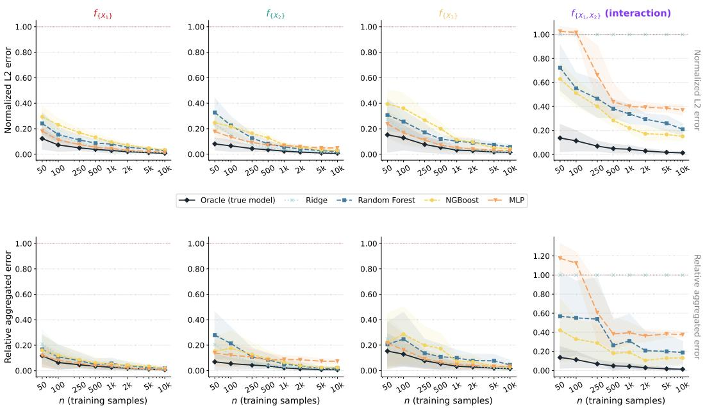  
Figure 5: N-Recovery: Normalized $L ^ { 2 }$ error (row 1) and relative aggregated error (row 2) for the three main effects and the pairwise interaction $f _ { \{ X _ { 1 } , X _ { 2 } \} }$ , as a function of training sample size n $( \mathrm { m e a n } \pm 1$ standard deviation (std) over 30 runs). The oracle lower bound reflects finite background sample noise. Main effects converge reliably across all models; the interaction term is substantially harder to recover, with the MLP showing the slowest convergence.

Time-resolved effect curves and time-aggregated effects. The top row of Fig. 6 shows representative time-resolved pure effect trajectories at $n = 1 , 0 0 0$ . All non-linear models closely track the analytical ground truth for the three main effects. For the interaction $f _ { \{ X _ { 1 } , X _ { 2 } \} }$ , the peak at $t \approx 5 \mathrm { h }$ is recovered in shape but with larger pointwise variance across models, consístent with the higher $L ^ { 2 }$ errors observed at this sample size. The bottom row of Fig. 6 shows time-aggregated effects $\begin{array} { r } { \Phi _ { S } = \int | f _ { S } ( t ) | } \end{array}$ dt for a representative run. All models reproduce the correct ordering $\Phi _ { \{ X _ { 1 } \} } > \Phi _ { \{ X _ { 2 } \} } > \Phi _ { \{ X _ { 3 } \} } > \Phi _ { \{ X _ { 1 } , X _ { 2 } \} }$ and closely match the analytical values, with the largest relative deviations for the interaction term.

Sobol index recovery. Fig. 7 validates Thm. 2: under the constant kernel $K ( t , s ) = 1$ and sensitivity input behavior, H-FD recovers the classical time-resolved and time-aggregated Sobol indices. The oracle estimator matches the analytical ground truth to within numerical precision across the full time domain. Non-linear models recover the indices accurately in the regions where each feature dominates, the exponential decay window for $X _ { 1 }$ , the peak at t ≈ 10h for $X _ { 2 }$ , and the peak at t ≈ 18h for $X _ { 3 }$ , but exhibit noisy deviations in near-zero regions where no feature dominates (row 1). These deviations arise from normalization: the time-resolved index divides by a near-zero denominator when all pure variance effects are small, amplifying estimation noise. This is an artifact of the ratio form of the Sobol index rather than a failure of effect recovery. Time-aggregated indices (row 2) are correctly recovered by all models, confirming that the integrated quantities are robust to pointwise normalization noise.

Aggregated ranking preservation. Thm. 1 establishes that the time-aggregated effect under $ { { B _ { \mathrm { o u t } } } }$ admits the weighted-integral representation

$$
\int _ { \mathcal T } ( \mathscr { B } _ { \mathrm { o u t } } \nu _ { \mathrm { i n p } } ) ( S ) ( t ) \mathrm { d } t = \int _ { \mathcal T } w _ { K } ( s ) \nu _ { \mathrm { i n p } } ( S ) ( s ) \mathrm { d } s , \qquad w _ { K } ( s ) : = \int _ { \mathcal T } K ( t , s ) \mathrm { d } t .
$$

For the prediction input behavior, $B _ { \mathrm { i n p } }$ is linear in $F ^ { \mathcal { H } }$ , so if $\nu _ { \mathrm { i n p } } ( \{ i \} ) ( s ) \geq \nu _ { \mathrm { i n p } } ( \{ j \} ) ( s )$ for all $s \in \mathcal T$ , the integrated ordering is preserved for any non-negative kernel $K \colon$ the kernel re-weights the time axis without reversing a pointwise-dominant feature. This sufficient condition holds in the three examples of main-text Fig. 2, where the time-aggregated rankings $\Phi _ { X _ { 1 } } > \Phi _ { X _ { 2 } } > \Phi _ { X _ { 3 } }$ (ICU), $\Phi _ { X _ { 2 } } > \Phi _ { X _ { 3 } } > \Phi _ { X _ { 1 } }$ (price pulse), and $\Phi _ { X _ { 1 } } \gg \Phi _ { X _ { 2 } }$ (periodic medication) are preserved across all kernels under the prediction input behavior. By contrast, Remark 1 (4.2) establishes that ranking invariance does not generally hold for nonlinear input behaviors. Although the same weighted-integral representation applies, different kernels may induce different feature rankings under sensitivity or risk input behaviors. We illustrate this directly for the ICU model in Fig. 8: the prediction input behavior preserves the ordering $X _ { 1 } > X _ { 2 } > X _ { 3 }$ across identity, OU, and correlation kernels, while the sensitivity and risk input behaviors produce a different ranking under different kernels $X _ { 1 } > X _ { 3 } > X _ { 2 }$

Table 4: Relative aggregated error between estimated and oracle integrated pure effect values Φs (mean ± 1 std over 30 independent runs), normalized analogously to Tab. 3. For most estimator– subset combinations, aggregated errors tend to be lower than the corresponding $L ^ { 2 }$ errors due to partial cancellation of pointwise errors upon integration. For oracle estimates of $f _ { \{ X _ { 3 } \} }$ and $f _ { \{ X _ { 1 } , X _ { 2 } \} } ,$ the two metrics coincide because the synthetic model is separable in those terms: the Möbius estimate inherits the true time-shape exactly, and finite-sample error reduces to a scalar coefficient that contributes identically to both metrics.
<table><tr><td>Model / Effect</td><td> $n = 5 0$ </td><td>n = 100</td><td> $n = 2 5 0$ </td><td>n = 500</td><td>n = 1k</td><td>n = 2k</td><td> $n = 5 \mathrm { k }$ </td><td>n = 10k</td></tr><tr><td colspan="9">Oracle (true model)</td></tr><tr><td> $f _ { \{ X _ { 1 } \} }$ </td><td> $0 . \dot { 1 } 1 7 \pm 0 . 0 7 2$ </td><td> $0 . 0 4 9 \pm 0 . 0 3 3$ </td><td> $0 . 0 4 7 \pm 0 . 0 3 3$ </td><td> $0 . 0 3 9 \pm 0 . 0 2 1$ </td><td> $0 . 0 2 5 \pm 0 . 0 1 9$ </td><td> $0 . 0 2 3 \pm 0 . 0 0 7$ </td><td> $0 . 0 1 2 \pm 0 . 0 0 6$ </td><td> $0 . 0 0 7 \pm 0 . 0 0 5$ </td></tr><tr><td> $f _ { \{ X _ { 2 } \} }$ </td><td> $0 . 0 8 3 \pm 0 . 0 6 1$ </td><td> $0 . 0 5 9 \pm 0 . 0 3 8$ </td><td> $0 . 0 4 9 \pm 0 . 0 3 6$ </td><td> $0 . 0 3 1 \pm 0 . 0 1 7$ </td><td> $0 . 0 1 8 \pm 0 . 0 1 0$ </td><td> $0 . 0 1 3 \pm 0 . 0 1 0$ </td><td> $0 . 0 0 8 \pm 0 . 0 0 5$ </td><td> $0 . 0 0 7 \pm 0 . 0 0 4$ </td></tr><tr><td>f{x3}</td><td> $0 . 1 1 6 \pm 0 . 1 1 2$ </td><td> $0 . 1 2 4 \pm 0 . 0 6 6$ </td><td> $0 . 0 5 9 \pm 0 . 0 4 8$ </td><td> $0 . 0 4 9 \pm 0 . 0 3 8$ </td><td> $0 . 0 3 4 \pm 0 . 0 3 6$ </td><td> $0 . 0 2 4 \pm 0 . 0 2 5$ </td><td> $0 . 0 2 2 \pm 0 . 0 2 0$ </td><td> $0 . 0 1 4 \pm 0 . 0 1 1$ </td></tr><tr><td> $\underline { { f _ { \{ X _ { 1 } , X _ { 2 } \} } } }$ </td><td> $0 . 1 3 8 \pm 0 . 1 0 1$ </td><td> $0 . 1 3 5 \pm 0 . 0 7 1$ </td><td> $0 . 0 7 5 \pm 0 . 0 4 3$ </td><td> $0 . 0 6 8 \pm 0 . 0 4 1$ </td><td> $0 . 0 4 5 \pm 0 . 0 2 9$ </td><td> $0 . 0 3 1 \pm 0 . 0 2 4$ </td><td> $0 . 0 1 3 \pm 0 . 0 1 1$ </td><td> $0 . 0 1 3 \pm 0 . 0 0 8$ </td></tr><tr><td colspan="9"> $R i d g e$ </td></tr><tr><td> $f _ { \{ X _ { 1 } \} }$ </td><td> $0 . 1 9 3 \pm 0 . 1 1 8$ </td><td> $0 . 1 0 9 \pm 0 . 0 7 1$ </td><td> $0 . 0 7 5 \pm 0 . 0 3 9$ </td><td> $0 . 0 4 9 \pm 0 . 0 3 6$ </td><td> $0 . 0 2 9 \pm 0 . 0 2 7$ </td><td> $0 . 0 2 2 \pm 0 . 0 1 6$ </td><td> $0 . 0 1 2 \pm 0 . 0 1 0$ </td><td> $0 . 0 1 0 \pm 0 . 0 0 7$ </td></tr><tr><td> $f _ { \{ X _ { 2 } \} }$ </td><td> $0 . 2 1 7 \pm 0 . 1 0 6$ </td><td> $0 . 1 2 8 \pm 0 . 0 7 3$ </td><td> $0 . 0 7 5 \pm 0 . 0 3 1$ </td><td> $0 . 0 3 6 \pm 0 . 0 3 0$ </td><td> $0 . 0 3 2 \pm 0 . 0 2 9$ </td><td> $0 . 0 2 6 \pm 0 . 0 1 2$ </td><td> $0 . 0 1 7 \pm 0 . 0 0 8$ </td><td> $0 . 0 1 5 \pm 0 . 0 1 3$ </td></tr><tr><td> $f _ { \{ X _ { 3 } \} }$ </td><td> $0 . 3 2 6 \pm 0 . 1 2 1$ </td><td> $0 . 1 9 3 \pm 0 . 1 2 9$ </td><td> $0 . 0 6 6 \pm 0 . 0 6 4$ </td><td> $0 . 0 7 4 \pm 0 . 0 4 3$ </td><td> $0 . 0 5 9 \pm 0 . 0 4 6$ </td><td> $0 . 0 3 6 \pm 0 . 0 2 5$ </td><td> $0 . 0 3 0 \pm 0 . 0 2 5$ </td><td> $0 . 0 1 5 \pm 0 . 0 1 6$ </td></tr><tr><td> $\underline { { f _ { \{ X _ { 1 } , X _ { 2 } \} } } }$ </td><td> $1 . 0 0 0 \pm 0 . 0 0 0$ </td><td> $1 . 0 0 0 \pm 0 . 0 0 0$ </td><td> $1 . 0 0 0 \pm 0 . 0 0 0$ </td><td> $1 . 0 0 0 \pm 0 . 0 0 0$ </td><td> $1 . 0 0 0 \pm 0 . 0 0 0$ </td><td> $1 . 0 0 0 \pm 0 . 0 0 0$ </td><td> $1 . 0 0 0 \pm 0 . 0 0 0$ </td><td> $1 . 0 0 0 \pm 0 . 0 0 0$ </td></tr><tr><td colspan="9">Random Forest</td></tr><tr><td> $f _ { \{ X _ { 1 } \} }$ </td><td> $0 . 1 7 4 \pm 0 . 1 0 0$ </td><td> $0 . 0 8 3 \pm 0 . 0 4 9$ </td><td> $0 . 0 4 8 \pm 0 . 0 4 7$ </td><td> $0 . 0 3 9 \pm 0 . 0 3 3$ </td><td> $0 . 0 3 8 \pm 0 . 0 2 5$ </td><td> $0 . 0 3 8 \pm 0 . 0 2 7$ </td><td> $0 . 0 2 5 \pm 0 . 0 1 7$ </td><td> $0 . 0 2 5 \pm 0 . 0 1 7$ </td></tr><tr><td> $f _ { \{ X _ { 2 } \} }$ </td><td> $0 . 2 8 4 \pm 0 . 2 1 2$ </td><td> $0 . 2 4 0 \pm 0 . 1 3 8$ </td><td> $0 . 1 4 0 \pm 0 . 0 6 7$ </td><td> $0 . 1 1 3 \pm 0 . 0 4 7$ </td><td> $0 . 0 7 1 \pm 0 . 0 3 5$ </td><td> $0 . 0 4 3 \pm 0 . 0 1 6$ </td><td> $0 . 0 1 2 \pm 0 . 0 1 2$ </td><td> $0 . 0 2 5 \pm 0 . 0 1 3$ </td></tr><tr><td> $f _ { \{ X _ { 3 } \} }$ </td><td> $0 . 2 0 9 \pm 0 . 2 0 5$ </td><td> $0 . 1 7 6 \pm 0 . 1 6 4$ </td><td> $0 . 1 1 1 \pm 0 . 0 6 3$ </td><td> $0 . 1 0 8 \pm 0 . 0 7 6$ </td><td> $0 . 1 1 2 \pm 0 . 0 5 7$ </td><td> $0 . 0 7 7 \pm 0 . 0 4 6$ </td><td> $0 . 0 8 3 \pm 0 . 0 5 0$ </td><td> $0 . 0 6 9 \pm 0 . 0 4 2$ </td></tr><tr><td> $\underline { { f _ { \{ X _ { 1 } , X _ { 2 } \} } } }$ </td><td> $0 . 6 9 9 \pm 0 . 5 9 2$ </td><td> $0 . 5 5 1 \pm 0 . 3 0 6$ </td><td> $0 . 4 1 0 \pm 0 . 3 8 0$ </td><td> $0 . 2 8 6 \pm 0 . 2 0 2$ </td><td> $0 . 3 3 8 \pm 0 . 3 2 9$ </td><td> $0 . 1 9 1 \pm 0 . 2 0 7$ </td><td> $0 . 1 5 5 \pm 0 . 1 0 3$ </td><td> $0 . 2 0 7 \pm 0 . 1 4 1$ </td></tr><tr><td colspan="9"> $N G B o o s t$ </td></tr><tr><td> $f _ { \{ X _ { 1 } \} }$ </td><td> $0 . 1 8 0 \pm 0 . 1 9 2$ </td><td> $0 . 1 0 6 \pm 0 . 0 6 1$ </td><td> $0 . 0 7 2 \pm 0 . 0 6 2$ </td><td> $0 . 0 6 8 \pm 0 . 0 4 0$ </td><td> $0 . 0 5 4 \pm 0 . 0 3 5$ </td><td> $0 . 0 3 2 \pm 0 . 0 2 6$ </td><td> $0 . 0 3 2 \pm 0 . 0 1 7$ </td><td> $0 . 0 2 2 \pm 0 . 0 1 8$ </td></tr><tr><td>f{x2}</td><td> $0 . 1 1 1 \pm 0 . 0 6 1$ </td><td> $0 . 1 8 6 \pm 0 . 1 5 2$ </td><td> $0 . 1 4 0 \pm 0 . 0 7 5$ </td><td> $0 . 0 9 5 \pm 0 . 0 6 1$ </td><td> $0 . 0 8 0 \pm 0 . 0 4 5$ </td><td> $0 . 0 3 8 \pm 0 . 0 2 7$ </td><td> $0 . 0 2 5 \pm 0 . 0 1 6$ </td><td> $0 . 0 3 2 \pm 0 . 0 2 2$ </td></tr><tr><td> $f _ { \{ X _ { 3 } \} }$ </td><td> $0 . 2 4 6 \pm 0 . 2 3 8$ </td><td> $0 . 2 8 4 \pm 0 . 1 7 9$ </td><td> $0 . 2 2 4 \pm 0 . 1 1 5$ </td><td> $0 . 1 4 5 \pm 0 . 1 1 5$ </td><td> $0 . 0 7 9 \pm 0 . 0 4 1$ </td><td> $0 . 0 5 9 \pm 0 . 0 5 5$ </td><td> $0 . 0 4 4 \pm 0 . 0 3 0$ </td><td> $0 . 0 3 4 \pm 0 . 0 2 5$ </td></tr><tr><td> $\underline { { f _ { \left\{ X _ { 1 } , X _ { 2 } \right\} } } }$ </td><td> $0 . 3 9 4 \pm 0 . 2 7 2$ </td><td> $0 . 4 2 5 \pm 0 . 2 2 4$ </td><td> $0 . 2 4 0 \pm 0 . 1 8 5$ </td><td> $0 . 2 0 4 \pm 0 . 1 0 5$ </td><td> $0 . 2 1 7 \pm 0 . 1 3 9$ </td><td> $0 . 1 1 4 \pm 0 . 0 8 6$ </td><td> $0 . 1 2 5 \pm 0 . 0 8 1$ </td><td> $0 . 1 3 1 \pm 0 . 0 6 8$ </td></tr><tr><td colspan="9"> $M L P$ </td></tr><tr><td> $f _ { \{ X _ { 1 } \} }$ </td><td> $0 . 1 4 1 \pm 0 . 0 9 6$ </td><td> $0 . 0 7 3 \pm 0 . 0 6 1$ </td><td> $0 . 0 5 7 \pm 0 . 0 3 8$ </td><td> $0 . 0 3 9 \pm 0 . 0 2 9$ </td><td> $0 . 0 3 0 \pm 0 . 0 2 7$ </td><td> $0 . 0 2 5 \pm 0 . 0 2 0$ </td><td> $0 . 0 1 6 \pm 0 . 0 1 0$ </td><td> $0 . 0 1 0 \pm 0 . 0 1 0$ </td></tr><tr><td> $f _ { \{ X _ { 2 } \} }$ </td><td> $0 . 1 5 2 \pm 0 . 1 2 3$ </td><td> $0 . 1 3 1 \pm 0 . 0 8 1$ </td><td> $0 . 1 2 5 \pm 0 . 0 4 2$ </td><td> $0 . 0 9 1 \pm 0 . 0 5 1$ </td><td> $0 . 1 1 2 \pm 0 . 0 2 6$ </td><td> $0 . 0 9 6 \pm 0 . 0 2 4$ </td><td> $0 . 0 7 6 \pm 0 . 0 2 1$ </td><td> $0 . 0 7 2 \pm 0 . 0 1 7$ </td></tr><tr><td> $f _ { \{ X _ { 3 } \} }$ </td><td> $0 . 1 3 7 \pm 0 . 1 2 5$ </td><td> $0 . 1 6 1 \pm 0 . 1 3 5$ </td><td> $0 . 0 6 9 \pm 0 . 0 5 4$ </td><td> $0 . 0 4 8 \pm 0 . 0 3 2$ </td><td> $0 . 0 5 3 \pm 0 . 0 4 4$ </td><td> $0 . 0 3 5 \pm 0 . 0 3 1$ </td><td> $0 . 0 3 3 \pm 0 . 0 1 8$ </td><td> $0 . 0 2 6 \pm 0 . 0 1 7$ </td></tr><tr><td> $\underline { { f _ { \{ X _ { 1 } , X _ { 2 } \} } } }$ </td><td> $1 . 2 3 2 \pm 0 . 1 9 2$ </td><td> $1 . 1 6 2 \pm 0 . 1 3 2$ </td><td> $0 . 4 4 0 \pm 0 . 2 5 7$ </td><td> $0 . 3 2 5 \pm 0 . 2 2 1$ </td><td> $0 . 3 7 2 \pm 0 . 1 3 5$ </td><td> $0 . 3 6 1 \pm 0 . 0 4 8$ </td><td> $0 . 3 8 4 \pm 0 . 0 4 6$ </td><td> $0 . 3 7 4 \pm 0 . 0 3 5$ </td></tr></table>

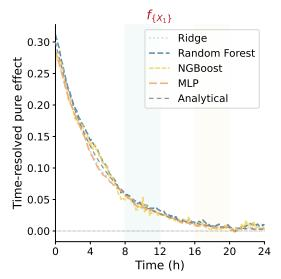

Time-resolved and time-aggregated effects at x\* = (0.8, 0.9, 0.7) Representative run, n = 1000  
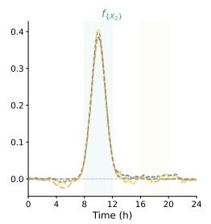

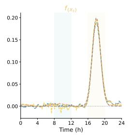

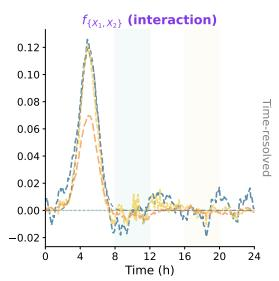

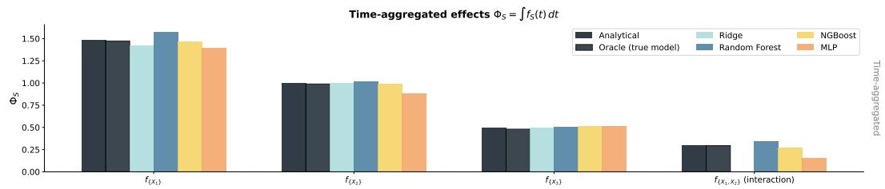  
Figure 6: Time-resolved (row 1) and time-aggregated (row 2) H-FD pure prediction effects at $\mathbf { x } ^ { * } = ( 0 . 8 , 0 . 9 , 0 . 7 )$ for a representative run at n = 1,000. The time-resolved curves show estimated effects overlaid with the analytical ground truth (grey dashed). Main effects are closely recovered by all models; the interaction $f _ { \{ X _ { 1 } , X _ { 2 } \} }$ shows greater variability, and the MLP underestimates its time-aggregated value.

Theorem validation: Sobol Index recovery under constant kernel νvar(S)(t, s) = Cov(FH(X)(t), F5(X)(s)), K(t, s) = 1  
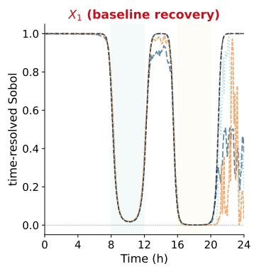

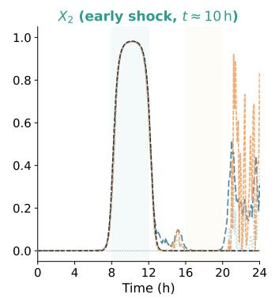

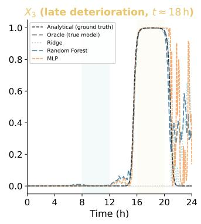

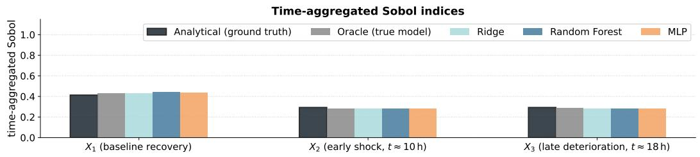  
Figure 7: Time-resolved (row 1) and time-aggregated (row 2) Sobol indices recovered by H-FD under the constant kernel and sensitivity input behavior, compared against the analytical ground truth.

Ranking preservation across kernels — all three games  
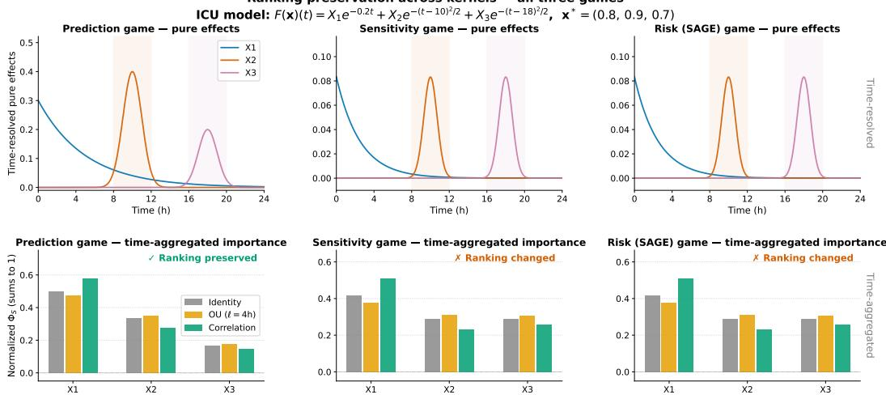  
Figure 8: Ranking preservation across input behaviors for the ICU model, under identity, OU (l = 4h) and correlation kernels. (row 1) Time-resolved pure effects; (row 2) time-aggregated normalized importance. Under the prediction input behavior (col. 1), $X _ { 1 } > X _ { 2 } > X _ { 3 }$ is preserved across all kernels, consistent with Thm. 1. Under the sensitivity and risk input behaviors (col. 2,3), rankings change across kernels: the correlation kernel reweights the squared per-feature effects so that $X _ { 3 }$ overtakes $X _ { 2 }$ , while identity and OU preserve $X _ { 2 } > X _ { 3 }$ . Pointwise dominance of individual effects is not preserved under the quadratic input behaviors of variance and MSE, as stated in Remark 1 (4.2).

Table 5: Kernel selection guide for H-FD. The appropriate kernel depends on the research question, output structure, and domain knowledge; there is no universally correct choice. For outputs mixing features with different temporal characteristics, kernels may be selected per-feature or combined.
<table><tr><td>Kernel</td><td>Temporal assumption</td><td>Use when</td><td>Domains</td></tr><tr><td> $\delta ( t - s ) ( \mathrm { i d e n t i t y } )$ </td><td>Locations independent</td><td>Instantaneous effects; no smoothing desired</td><td>Any; default</td></tr><tr><td>1 (constant)</td><td>All interactions equally weighted</td><td>Trajectory-level importance; Sobol indices</td><td>Sensitivity analysis</td></tr><tr><td> $\mathrm { C o r r } ( F _ { t } , F _ { s } )$  (correla- tion)</td><td>Weighted by output co- movement</td><td>Features drive distinct trajectory shapes</td><td>Finance, electricity consumption</td></tr><tr><td> $\exp ( - | t - s | / \ell ) \left( \mathrm { O U } \right)$ </td><td>Mean-reverting, local smoothing</td><td>Noisy outputs; sustained influ- ence over a window</td><td>Biomedical, intraday volatility</td></tr><tr><td> $\exp ( - ( t - s ) ^ { 2 } / 2 \sigma ^ { 2 } )$  (Gaussian)</td><td>Smooth symmetric neigh- bourhoods</td><td>Smooth outputs; no causal or- dering required</td><td>Temperature, de- mand</td></tr><tr><td> $\rho ^ { | t - s | } \left( { \mathrm { A R - t y p e } } \right)$ </td><td>Discrete autoregressive dependence</td><td>Strong lag structure; discrete- time predictions</td><td>Economic time se- ries</td></tr><tr><td> $\exp ( - | t - s | / \ell ) \mathbf { 1 } _ { t \geq s }$  (causal)</td><td>Strict temporal ordering</td><td>Event-driven; causal inter- pretability required</td><td>Algorithmic trading</td></tr><tr><td> $\exp ( - 2 \sin ^ { 2 } ( \pi ( t \quad -$   $s ) / \bar { \tau } ) / \ell ^ { 2 } )$  (periodic)</td><td>Known periodicity; apply per-feature</td><td>Multiple full periods; genuinely recurring influence</td><td>Circadian, seasonal</td></tr></table>

## D.2 Kernel Guidance

This appendix provides supplementary details for the kernel guidance discussion in the main text (Sec. 5.1, Fig. 2).

Kernel role across input behaviors. For input behaviors defined pointwise over the output domain— prediction $\nu _ { \mathrm { i n p } } ^ { \mathrm { p r e d } } ( S ) ( t ) = F _ { S } ^ { \mathcal { H } } ( { \bf x } ) ( t )$ and risk $\nu _ { \mathrm { i n p } } ^ { \mathrm { r i s k } } ( S ) ( t )$ -the kernel introduces dependencies between output locations: it specifies how feature effects at location t incorporate information from other locations $s \in \mathcal T$ . For variance-based explanations, the input behavior already captures dependencies between output locations through the covariance surface

$$
\nu _ { \mathrm { i n p } } ^ { \mathrm { s e n s } } ( S ) ( t , s ) = \mathrm { C o v } \bigl ( F _ { S } ^ { \mathcal { H } } ( \mathbf { X } ) ( t ) , F _ { S } ^ { \mathcal { H } } ( \mathbf { X } ) ( s ) \bigr ) ,
$$

and the kernel determines how these covariance contributions are aggregated across time pairs. Classical functional Sobol indices correspond to the constant kernel $K ( t , s ) = 1$ , which assigns equal weight to all covariance terms [16, 1].

Kernel selection. Tab. 5 summarizes the temporal assumption and intended use case for a selected set of useful kernels. The appropriate choice depends on the research question, output structure, and domain knowledge; there is no universally correct kernel. For outputs mixing features with different temporal characteristics, kernels may be selected per-feature or combined.

## D.3 SPY Intraday Volatility

This appendix provides full experimental details and supplementary figures for the SPY intraday volatility case study summarized in the main text (Sec.5.2, Fig. 3).

Data. We use one-minute OHLCV (open, high, low, close, volume) bar data for the SPDR S&P 500 ETF Trust (SPY) sourced from Polygon.io (https://polygon. io) [36], covering 560 trading days from January 3, 2022 to April 30, 2024. The New York Stock Exchange regular session runs 09:30–16:00 ET; after removing the opening and closing auction bars we retain $\check { T = } 7 8$ five-minute intervals per day. The per-interval target is the absolute log-return

$$
y _ { t } \ = \ \big | \mathrm { l o g } ( c _ { t } / c _ { t - 1 } ) \big | , \qquad t = 1 , \ldots , 7 8 ,
$$

where $c _ { t }$ denotes the close price of the t-th five-minute bar. Absolute log-returns are a standard proxy for intraday volatility at the five-minute frequency in the high-frequency literature [2]. We subtract the cross-day mean at each interval (the diurnal pattern) so that the model is trained to explain day-to-day deviations from the typical U-shaped volatility curve (elevated at the open due to overnight news digestion, low through midday, and elevated again at the close due to position squaring), rather than the U-shape itself. The diurnal pattern is estimated on the training split only and then subtracted from both splits.

Pre-market features. Six scalar covariates are constructed from information available before the 09:30 open:
<table><tr><td>Feature</td><td>Description</td><td>Source</td></tr><tr><td>vix_prev</td><td>Prior business day&#x27;s closing VIX level</td><td>CBOE via Yahoo Finance</td></tr><tr><td>overnight_ret</td><td>Log-return from prior close to 09:30 open</td><td>Polygon.io</td></tr><tr><td>ann_indicator</td><td>Binary: 1 if a scheduled macro announcement falls on this day†</td><td>Federal Reserve / BLS / BEA</td></tr><tr><td>day_of_week</td><td>Integer  $\in \{ 0 , \ldots , 4 \}$  (Mon-Fri)</td><td></td></tr><tr><td>trailing_rv</td><td>Mean daily absolute log-return over the prior 5 trading Polygon.io days</td><td></td></tr><tr><td>month</td><td>Integer  $\in \{ 1 , \ldots , 1 2 \}$ </td><td></td></tr></table>

†ann\_indicator is set to 1 on FOMC meeting dates, CPI release dates, and Non-Farm Payroll (NFP) release dates; all dates are hardcoded from official Federal Reserve, BLS, and BEA schedules.

All continuous features (vix\_prev, overnight\_ret, trailing\_rv) are standardized to zero mean and unit variance using statistics computed on the training split only.

Model. We use a single chronological train/test split to respect temporal ordering and prevent look-ahead leakage.
<table><tr><td>Split</td><td>Date range</td><td># Days</td><td>%</td></tr><tr><td>Train</td><td> $2 0 2 2 \substack { - 0 1 - 0 3 - 2 0 2 3 - 0 9 - 2 9 }$ </td><td>448</td><td>80%</td></tr><tr><td>Test</td><td> $2 0 2 3 - 1 0 - 0 2 - 2 0 2 4 - 0 4 - 3 0$ </td><td>112</td><td>20%</td></tr></table>

We fit a multivariate random forest: a single RandomForestRegressor from scikit-learn [35] whose targets are the $T = 7 8$ diurnal-adjusted volatility values stacked into a single matrix $\textbf { Y } \in$ $\mathbb { R } ^ { N \times T }$ . Each tree predicts the full trajectory jointly, which naturally captures temporal correlations in the residuals without requiring an explicit sequence model.

Hyperparameters.

<table><tr><td>Hyperparameter</td><td>Value</td></tr><tr><td>n_estimators</td><td>300</td></tr><tr><td>max_features</td><td> $\ " { \bf s q r t " } \left( \mathrm { d e f a u l t } \right)$ </td></tr><tr><td>min_samples_leaf</td><td>1 (default)</td></tr><tr><td>min_samples_split</td><td>2 (default)</td></tr><tr><td>max_depth</td><td>None (fully grown)</td></tr><tr><td>bootstrap</td><td>True (default)</td></tr><tr><td>random_state</td><td>42</td></tr><tr><td>n_jobs</td><td>—1 (all available cores)</td></tr></table>

Hyperparameters were fixed $a p r i o r i ;$ no grid search or cross-validation was performed. This choice was deliberate: our goal is to demonstrate the framework's explanatory properties rather than optimize predictive accuracy, and heavy tuning on 560 days of financial data risks over-fitting to the specific market regime covered. Random forests with 300 trees and default splitting rules are a well-understood baseline that generalizes reliably in low-sample tabular settings[4]. The model achieves a trajectory-level $R ^ { 2 } = 0 . 1 2 0$ on the held-out test split $\dot { ( 1 - \mathrm { S S } _ { \mathrm { r e s } } / \mathrm { S S } _ { \mathrm { t o t } } }$ over all $1 1 2 \times 7 8$ predictions). This modest value is expected: the diurnal pattern has been subtracted prior to modelling, leaving only day-to-day deviations from the typical U-shape as the target.

Cooperative game set-up. The full $2 ^ { p } .$ -point Möbius transform is computed exactly over the Boolean lattice for all $S \subseteq [ p ]$ . Pure main effects, partial (Shapley) effects, and full effects are then derived in closed form from the Möbius values. We use marginal (interventional) imputation throughout, sampling missing feature values from the training background set. All Monte Carlo estimators use a fixed random seed $( { \mathsf { s e e d } } = 4 2 )$ for reproducibility.

The three input behaviors are estimated as follows.

Local prediction. For the High-VIX Announcement profile $\mathbf { x } ^ { * }$ and a coalition $S _ { \ i }$

$$
\begin{array} { r } { \nu _ { \mathrm { i n p } } ^ { \mathrm { p r e d } } ( S ) ( t ) = \mathbb { E } _ { \mathbf { X } _ { - S } } \bigl [ F ( \mathbf { x } _ { S } ^ { * } , \mathbf { X } _ { - S } ) ( t ) \bigr ] , } \end{array}
$$

estimated with $n _ { \mathrm { s a m p l e } } = 2 0 0$ background draws per coalition. Pure effects yield per instance PDP equivalents, and partial effects are interventional SHAP values. The PDP-style plots in Fig. 12 aggregate per-instance local prediction effects over $N _ { \mathrm { P D P } } = 1 2 0$ profiles drawn by stratified sampling from the training set (one instance per month plus random fill).

Global sensitivity.

$$
\nu _ { \mathrm { i n p } } ^ { \mathrm { s e n s } } ( S ) ( t , s ) = \mathrm { C o v } \big ( F _ { S } ^ { \mathcal { H } } ( \mathbf { X } ) ( t ) , F _ { S } ^ { \mathcal { H } } ( \mathbf { X } ) ( s ) \big ) ,
$$

estimated by nested Monte Carlo: an outer sample of $n _ { \mathrm { o u t e r } } = 1 0 0$ draws of $\mathbf { X } _ { S }$ from the training distribution, and for each outer draw an inner sample of $n _ { \mathrm { i n n e r } } ~ = ~ 1 0 0$ draws of $\mathbf { X } _ { - S }$ for the conditional expectation. Pure effects yield closed Sobol indices and full effects yield total Sobol indices (Thm. 2); partial effects are the corresponding Shapley sensitivity indices.

Global risk. The risk effect is defined as the loss reduction relative to the marginal-only predictor $\bar { F } ( t ) = \mathbb { E } [ F ( { \bf X } ) ] ( t )$

$$
\begin{array} { r } { \nu _ { \mathrm { i n p } } ^ { \mathrm { r i s k } } ( S ) ( t ) = \mathbb { E } \big [ ( Y ( t ) - \bar { F } ( t ) ) ^ { 2 } \big ] - \mathbb { E } _ { ( \mathbf { X } , Y ) } \Big [ \big ( Y ( t ) - \mathbb { E } _ { \mathbf { X } _ { - S } } [ F ( \mathbf { X } _ { S } , \mathbf { X } _ { - S } ) ( t ) ] \big ) ^ { 2 } \Big ] , } \end{array}
$$

estimated by the same nested Monte Carlo scheme with $n _ { \mathrm { o u t e r } } = n _ { \mathrm { i n n e r } } = 1 0 0$ . This sign convention matches the SAGE / PFI literature, in which higher importance corresponds to larger reduction in expected loss; pure effects are also set to be non-negative by construction. With $p = 6$ features there are $2 ^ { p } = 6 4$ coalitions per input behavior.

Kernels. Two kernel choices are compared throughout.

• Identity kernel $K = I$ .Treats each time step independently.

• Feature-specific kernel. Rather than a single kernel for all features, we assign each feature a kernel that reflects its expected temporal structure. For all features except ann\_indicator, we use an Ornstein-Uhlenbeck (OU) kernel,

$$
\begin{array} { r } { [ K _ { \mathrm { O U } } ] _ { s t } = \exp \Bigl ( - \frac { | t - s | } { \ell } \Bigr ) , } \end{array}
$$

with length-scale $\ell = 8$ (in units of five-minute bars, equivalent to 40 minutes), encoding smooth temporal decay. For ann\_indicator, whose effect is expected to be localized to a specific event time with no pre-event leakage, we use a causal kernel,

$$
\begin{array} { r } { [ K _ { \mathrm { c a u s a l } } ] _ { s t } = \exp \left( - \frac { t - s } { \ell } \right) \mathbf { 1 } [ t \geq s ] , } \end{array}
$$

with the same length-scale $\ell = 8$ . This enforces the interpretation that the announcement at time s can only affect attributions at $t \geq s$ . The length-scale $\ell = 8$ was chosen to match the typical half-life of a volatility spike following a scheduled macro release (approximately 30–60 minutes in the high-frequency literature [2]), while remaining interpretable on the 78-bar trading day grid. Both kernels are row-normalized before application so that each time step receives a unit-mass weighted average of the effect trajectory.

Profile selection. The High-VIX Announcement profile studied in the main text (July 13, 2022) is selected as the median instance among all days satisfying ann\_indicator = 1 and vix\_prev ≥ q75, where $q _ { 7 5 }$ is the 75th percentile of vix\_prev over the training set (22 days match these criteria). The profile has feature values vix\_prev = 27.29, overnight\_ret = -0.0153, ann\_indicator = 1, day\_of\_week = 2 (Wednesday), trailing\_rv = 8.18 × 10−4, and month = 7 (July).

Supplementary figures. Figs. 9–11 provide the full set of results for the SPY experiment. All panels use the following color coding: vix\_prev (blue), ann\_indicator (orange), overnight\_ret (green), trailing\_rv (brown), day\_of\_week (purple), month (red). Solid lines correspond to the OU kernel; dashed lines to the causal kernel (used for ann\_indicator in the OU + causal kernel rows). The dashed vertical grey line marks 14:00 ET, the time of the Beige Book release on July 13, 2022.

Fig. 9 shows global sensitivity and risk effects, capturing how vix\_prev contributes to output variance and forecast error across the full data distribution rather than at a single instance. vix\_prev dominates both quantities across all effect types and both kernels, consistent with the well-established role of implied volatility as a forward-looking risk signal at the population level. Under the identity kernel its effect trajectory is noisy and roughly flat across the trading day, while the OU kernel reveals a smooth U-shape, reflecting that variance and forecast error are systematically elevated at the open and close. The gap between pure and full importances is largest for vix\_prev, indicating that a substantial portion of its global contribution operates through interactions with other features rather than as a standalone main effect

Fig. 10 shows local prediction effects for the High-VIX Announcement profile. Under the identity kernel, pure effects are noisy and difficult to interpret. The feature-specific kernel clarifies the structure: vix\_prev produces a smooth positive baseline effect throughout the day, while the causal kernel localizes the effect of ann\_indicator sharply after 14:00 with no pre-event leakage. The partial-to-pure ratio of 1.61× for ann\_indicator indicates that interaction with other features substantially amplifies its attributed effect.

Fig. 11 confirms that the vix\_prev × ann\_indicator pair is the strongest pairwise interactions in terms of time-aggregated effects. Under the identity kernel this manifests as a sharp spike at 14:00. The causal kernel smooths and causally localizes this spike, revealing the regime shift described in the main text: mild redundancy between the two features before the announcement, where both reflect elevated expected volatility, followed by strong synergy afterwards, where the release amplifies the impact of prior market fear. A second interaction, vix\_prev × overnight\_ret, is comparable in time-aggregated magnitude but lacks a sharp event-locked profile; remaining pairs are noticeably smaller. Together this confirms that the vix\_prev-ann\_indicator interaction is the structurally dominant event-driven higher-order effect on this profile.

Fig. 12 shows that vix\_prev exhibits a clear monotone relationship with predicted volatility deviations under the OU kernel: higher prior VIX is associated with larger positive effects across the full trading day, and this relationship is consistent across all five selected time points. Under the identity kernel the same relationship is present but noisier, with greater variability across time points. For overnight\_ret the time-aggregated effect is near zero, suggesting that while the overnight return may matter for specific instances, its effect averages out across the training distribution.

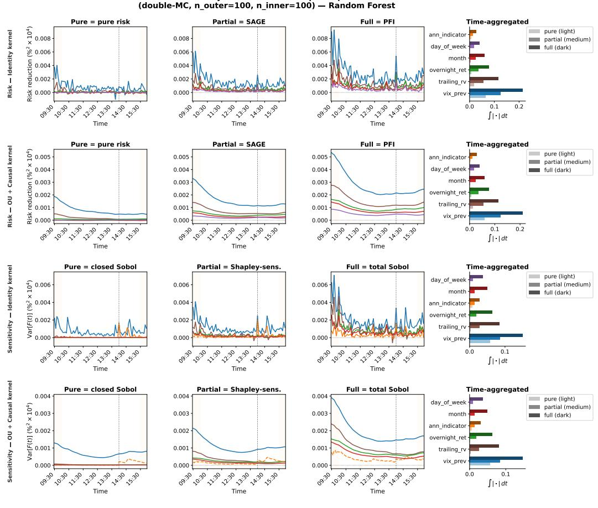  
Figure 9: Global sensitivity and risk effects — pure / partial / full. Effects are computed by nested Monte Carlo $( n _ { \mathrm { o u t e r } } = n _ { \mathrm { i n n e r } } = 1 0 0 )$ directly from the global input behaviors $\bar { \nu } _ { \mathrm { i n p } } ^ { \mathrm { s e n s } }$ and $\nu _ { \mathrm { i n p } } ^ { \mathrm { r i s k } } .$ (rows 1–2) Risk behavior (loss reduction in $\% ^ { 2 } \times 1 0 ^ { - 4 } )$ under the identity kernel (row 1) and feature-specific kernel (row 2); (rows 3–4) sensitivity input behavior under the identity (row 3) and feature-specific (row 4) kernels. (cols. 1–3) Pure = closed Sobol / pure risk (col. 1), partial = Shapley-sensitivity / SAGE (col. 2), full = total Sobol / PFI (col. 3). (col. 4) Time-aggregated bar chart for pure, partial, and full importances.

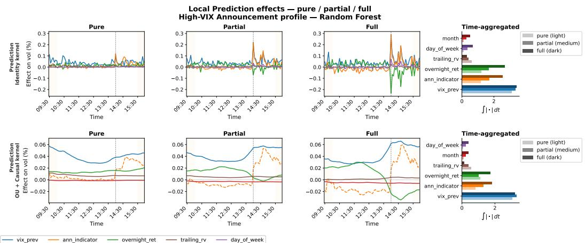  
Figure 10: Local prediction effects — pure / partial / full. Instance: July 13, 2022 (vix\_prev = 27.3, ann\_indicator = 1), selected as the median among days with ann\_indicator = 1 and vix\_prev ≥ q75. (Row 1) Identity kernel; (Row 2) feature-specific kernel (OU for all features except ann\_indicator; causal for ann\_indicator, shown dashed). (cols. 1–3) pure, partial, full. (col. 4) Time-aggregated bar chart for pure, partial, and full effects.

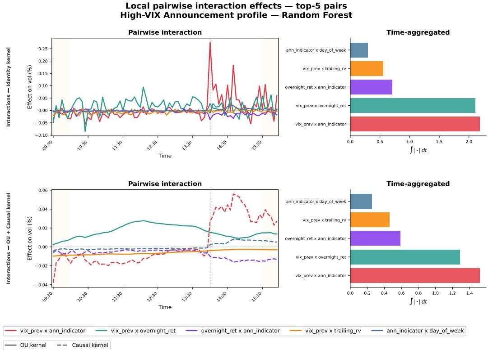  
Figure 11: Local pairwise interaction effects — top-5 pairs. Same instance as Fig. 10. Top-5 pairs are ranked by time-integrated OU-kernel importance. (row 1) Identity kernel; (row 2) Feature-specific kernel (causal for pairs involving ann\_indicator, shown dashed; OU otherwise). (col. 1) Interaction trajectories over the trading day; (col. 2) time-aggregated bar chart. The vix\_prev × ann\_indicator pair is the strongest interaction under both kernels.

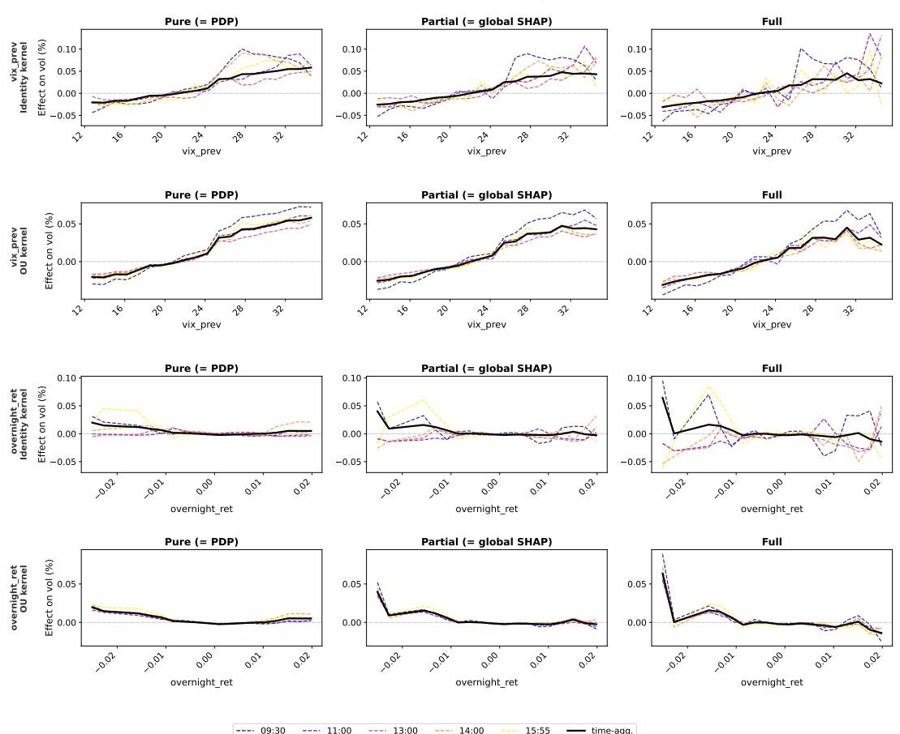  
Figure 12: Global prediction effects — PDP-style. Per-instance pure, partial, and full local prediction effects, computed for $N _ { \mathrm { P D P } } = 1 2 0$ profiles drawn by stratified sampling from the training set, are binned along the feature axis $( N _ { \mathrm { b i n s } } = 2 0 )$ for the two highest-importance features by time-aggregated OU-kernel global prediction behavior (vix\_prev and overnight\_ret); (rows 1–2) vix\_prev under the identity (row 1) and OU (row 2) kernels; (rows 3–4) overnight\_ret under identity (row 3) and OU (row 4) kernels. Coloured dashed lines show the mean effect at five selected time points (09:30, 11:00, 13:00, 14:00, 15:55); the solid black line is the time-aggregated mean.

## D.4 Electricity Demand Comparison

This appendix provides full experimental details and supplementary figures for the energy demand case study summarized in the main text (Sec. 5.2, Fig. 4).

Data. We use the UCI Individual Household Electric Power Consumption dataset (IHEPC) [11], which contains measurements of global active power at one-minute resolution for a single French household. We aggregate to hourly means, retaining only days with all $T = 2 4$ hours observed, yielding approximately 1,400 complete days. The target trajectory is the hourly mean active power (kW). Additionally, we use the GB National Electricity System Operator historic demand dataset (NESO) [33], which contains half-hourly settlement period demand figures (MW) for Great Britain. We use five years of data (2018–2022), retaining only days with all $T = 4 8$ half-hourly periods observed, yielding approximately 1,800 complete days. The target trajectory is the half-hourly national demand in megawatts (MW), using the ND (national demand) column, falling back to TSD (transmission system demand) if unavailable. For both datasets the cross-day mean trajectory (the diurnal pattern) is estimated on the training split and subtracted from all splits, so the model is trained on day-to-day deviations from the typical daily profile.

Features. Six features are constructed for IHEPC and seven for NESO, all from information available at the start of the day:
<table><tr><td>Feature</td><td>Description</td><td>IHEPC</td><td>NESO</td></tr><tr><td>day_of_week</td><td> $\mathrm { I n t e g e r } \in \{ 0 , \ldots , 6 \}$ </td><td>√</td><td>√</td></tr><tr><td>is_weekend</td><td>Binary: 1 if Saturday or Sunday</td><td>√</td><td>√</td></tr><tr><td>month</td><td>Integer  $\in \{ 1 , \ldots , 1 2 \}$ </td><td></td><td>√</td></tr><tr><td>season</td><td>Integer  $\in \{ 1 , \ldots , 4 \}$  (meteorological)</td><td>&gt;&gt;</td><td>r</td></tr><tr><td>lag_daily_mean</td><td>Mean power/demand of the prior day</td><td>√</td><td>√</td></tr><tr><td>lag_morning</td><td>Mean power/demand during prior-day AM peak</td><td>√</td><td>√</td></tr><tr><td>lag_evening</td><td>Mean power/demand during prior-day PM peak</td><td></td><td>√</td></tr></table>

The AM and PM peak windows are defined as 06:00–09:00 and 17:00–21:00 for IHEPC (hours 6–9 and 17–21) and 06:00–09:00 and 17:00–20:30 for NESO (half-hourly periods 12–18 and 34–41). Season is derived from month: winter = {12, 1, 2}, $\operatorname { s p r i n g } = \{ 3 , 4 , 5 \}$ $\mathrm { s u m m e r } = \{ 6 , 7 , 8 \}$ , autumn $= \{ 9 , 1 0 , 1 1 \}$

Model. Both datasets use a chronological 80/20 train/test split.
<table><tr><td>Dataset</td><td>Split</td><td># Days</td><td>%</td></tr><tr><td>IHEPC</td><td>Train</td><td>≈1,120</td><td>80%</td></tr><tr><td></td><td>Test</td><td>≈280</td><td>20%</td></tr><tr><td>NESO</td><td>Train</td><td>≈1,440</td><td>80%</td></tr><tr><td></td><td>Test</td><td>≈360</td><td>20%</td></tr></table>

Both datasets use the same multivariate random forest architecture as described in App. D.3, with identical hyperparameters (300 trees, max. $\scriptstyle . { \mathtt { f e a t u r e s } } = " \mathbf { s q r t } ^ { \prime \prime }$ , random\_ $\mathtt { s t a t e = 4 2 , n \_ j o b s = - 1 } )$ Each model predicts the full diurnal-adjusted trajectory jointly. The model achieves trajectory-level $R ^ { 2 } = 0 . 1 9 1$ for IHEPC and $R ^ { 2 } = 0 . 7 3 8$ for NESO, computed as $1 - \mathrm { S S _ { r e s } / S S _ { t o t } }$ over all test-split predictions jointly. The large difference reflects the fundamentally different nature of the two settings: NESO national demand is strongly driven by calendar and weather seasonality, which is well-captured by the available features, whereas single-household IHEPC demand is far more idiosyncratic, with individual behavior and appliance usage introducing substantial unexplained variability that no set of day-level features can capture. Both values are sufficient to produce stable and interpretable attributions.

Cooperative game set-up. The set-up follows App. D.3 in all respects except the kernel choice. The local prediction input behavior uses $n _ { \mathrm { s a m p l e } } = 1 5 0$ background draws per coalition; PDP plots aggregate per-instance local effects over $\bar { N _ { \mathrm { P D P } } } = 1 2 0$ profiles drawn by stratified sampling from the training set. Global sensitivity and risk input behaviors are estimated by nested Monte Carlo with $n _ { \mathrm { o u t e r } } = n _ { \mathrm { i n n e r } } = 1 0 0$ , using the same definitions as in App. D.3. With $p = 6 \ : ( \mathrm { I H E P C } )$ and $p = 7$ (NESO) features, there are $2 ^ { \overline { { 6 } } } = 6 4$ and $2 ^ { 7 } = 1 2 8$ coalitions per game instance respectively.

Kernels. Two kernel choices are compared throughout.

• Identity kernel K = I. Treats each time step independently; effects reduce to pointwise attributions.

• Correlation kernel. The empirical Pearson correlation matrix of the raw (non-diurnaladjusted) training trajectories,

$$
K _ { s t } = { \frac { \operatorname { C o v } ( Y _ { s } , Y _ { t } ) } { { \sqrt { \operatorname { V a r } ( Y _ { s } ) \operatorname { V a r } ( Y _ { t } ) } } } } , \qquad s , t \in [ T ] ,
$$

clipped to [—1, 1]. This kernel encodes the empirical temporal dependence of demand: strongly correlated time steps receive similar attributions, so that a feature affecting the entire day is credited for its full coherent contribution rather than appearing as isolated hourly effects. Both kernels are row-normalized before application.

Profile selection. For the local explanations two profiles are studied, one per dataset. The IHEPC typical weekday profile is the median instance among 814 days satisfying is\_weekend = 0 and day\_of\_week $\in \{ 1 , 2 , 3 , 4 \}$ , with feature values day\_of\_week = 4 (Friday), month = 11 (November), season = 4 (autumn), 1ag\_daily\_mean = 1.640 kW, and lag\_morning = 2.324 kW. The NESO winter weekday profile is the median instance among 322 days satisfying is\_weekend = 0 and season = 1 (winter), with feature values day\_of\_week = 0 (Monday), month = 12 (December), lag\_daily\_mean = 33,431 MW, 1ag\_morning = 29,082 MW, and 1ag\_evening = 41,313 MW.

Supplementary figures. Figs. 13–19 show the full set of results. Color coding: day\_of\_week (blue) is\_weekend (orange), month (green), season (red), lag\_daily\_mean (purple), lag\_morning (brown), 1ag\_evening (pink, NESO only). Solid lines correspond to the identity kernel; dashed lines to the correlation kernel. Blue and red shading marks AM and PM peak windows.

Figs. 13-14 show global sensitivity and risk effects under both kernels. For IHEPC, lag\_daily\_mean, lag\_morning, and month dominate both sensitivity and risk across all effect types. Under the identity kernel their effects show separate morning and evening peaks, while the correlation kernel merges these into a single elevated region spanning both peaks, reflecting the block-diagonal covariance structure. Time-aggregated pure, partial and full time-aggregated effects diverge substantially, suggesting that forecast variance and error are sensitive to feature interactions. For NESO, month and season dominate, with substantially larger magnitudes than IHEPC consistent with national-level demand being driven by weather and calendar seasonality. Under the identity kernel effects vary across the day, but the correlation kernel collapses them to near-flat trajectories, reflecting the near-uniform covariance structure of the NESO dataset. The gap between time-aggregated pure and full effects for both risk and sensitivity is large for season and month in particular, indicating strong, focused higher-order interactions for these two features in particular at the national grid level, while other features participate less in interactions.

Sensitivity network plots. Fig. 15 summarizes the global sensitivity input behavior as a network: node size encodes the time-aggregated attribution of each feature, edge width encodes pairwise interaction strength, and edge color encodes the sign of the underlying Möbius coefficient (teal for positive, red for negative). Three columns show the pure, partial, and full effects respectively. A salient pattern is that negative edges (red) appear almost exclusively in the pure-effect column and largely vanish in the partial and full columns. This is expected. Pure effects are raw Möbius coefficients, which under exact Sobol orthogonality (independent features) equal the non-negative variance contributions, but pick up signed contributions whenever features are empirically dependent or when sampling noise is present. Partial effects (Shapley sensitivity) and full effects (total Sobol) are non-negative weighted sums of Möbius coefficients at all coalitions containing the feature in question, and these aggregations average out the signed pure-effect components. In our setting, the visible negative edges in the IHEPC pure column connect calendar features to each other and lag features, and in the NESO pure column they connect lag features to one another and season and month, both consistent with the known empirical correlation between these features.

Figs. 16–17 show local prediction effects for the selected profiles. For the IHEPC typical weekday, several features contribute comparably (month, lag\_daily\_mean, day\_of\_week, lag\_morning), with no single dominant driver. Under the identity kernel, effects are concentrated in the morning and evening peak windows, while the correlation kernel smooths these into broader positive contributions throughout the day with attenuated peaks. For the NESO winter weekday, contributions are similarly distributed across multiple features (notably season, day\_of\_week, lag\_evening, and month) with the correlation kernel producing roughly constant positive effects across the day, consistent with winter demand being uniformly elevated relative to the annual mean. The correlation kernel substantially reduces the apparent effect magnitude (note the compressed y-axis), reflecting the fact that coherent daily shifts are re-expressed as a single weighted attribution rather than summed over independent time steps.

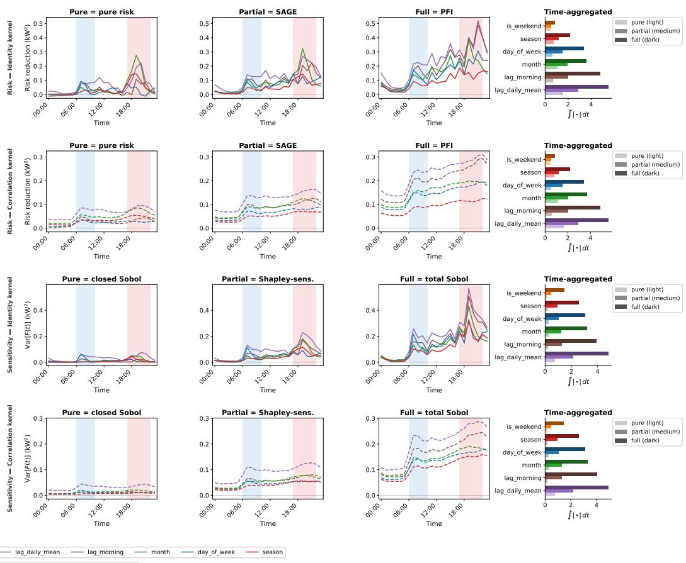  
Figure 13: Global sensitivity and risk effects — IHEPC (single household, kW). Effects are computed by nested Monte Carlo $( n _ { \mathrm { o u t e r } } = n _ { \mathrm { i n n e r } } = 1 0 0 )$ directly from the global sensitivity and risk games. (rows 1–2) Risk game (loss reduction, kW2) under the identity kernel (row 1) and correlation kernel (row 2); (rows 3–4) sensitivity game (Var[F(t)], kW2) under the identity (row 3) and correlation (row 4) kernels. (cols. 1–3) Pure (closed Sobol / pure risk), partial (Shapley-sensitivity / SAGE), full (total Sobol / PFI); (col. 4) time-aggregated bar chart. Blue and red shading marks AM and PM peak windows.

Figs. 18–19 show local pairwise interaction effects. For IHEPC the depicted pairs, which are the top-5 pairs by time-aggregated importance, frequently involve lag features interacting with calendar features (e.g., month × lag\_morning, day\_of\_week × lag\_morning), suggesting that the strength of autoregressive momentum depends on the time of year or day. Under the identity kernel interaction trajectories are noisy, but exhibit morning and evening peaks; the correlation kernel smooths these into coherent daily profiles. For NESO the month × season pair dominates by a wide margin, reflecting the near-collinearity of these two features and their joint encoding of seasonal demand patterns. Under the correlation kernel all interaction trajectories collapse to flat lines, consistent with the uniform covariance structure.

Figs. 20–21 show global prediction effects in PDP style. For IHEPC the top-2 features by identitykernel SHAP importance are lag\_daily\_mean and month, with lag\_daily\_mean showing a clear monotone relationship: higher prior demand predicts higher demand deviations. The correlation kernel preserves this monotone shape but tightens the effect and time point spread, indicating that the relationship is more coherent across the day rather than time-step-specific. month exhibits a U-shaped curve, capturing the January peak, summer trough, and second winter peak. For NESO the top-2 features are month and lag\_evening. month exhibits a U-shaped curve again. The correlation kernel suppresses time point variability and cleanly reveals these seasonal patterns for both features.

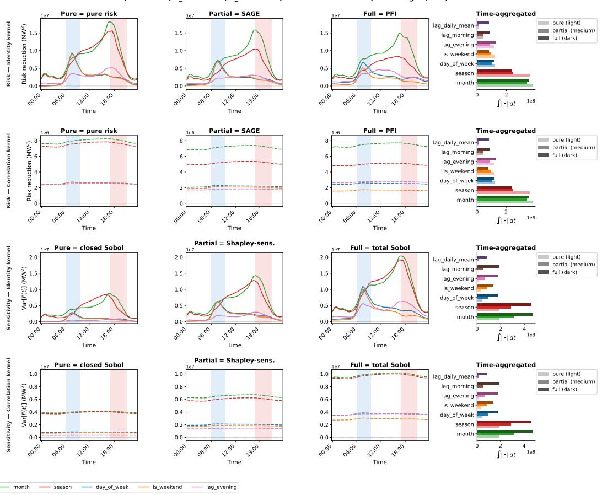  
Figure 14: Global sensitivity and risk effects — NESO (national grid, MW). Effects are computed by nested Monte Carlo $( n _ { \mathrm { o u t e r } } = n _ { \mathrm { i n n e r } } = 1 0 0 )$ directly from the global sensitivity and risk games. (rows 1–2) Risk game (loss reduction, $\mathbf { M } \mathbf { W } ^ { 2 } \times 1 0 ^ { 7 } )$ under the identity kernel (row 1) and correlation kernel (row 2); (rows 3–4) sensitivity game $( \mathrm { V a r } [ \tilde { F } ( t ) ] , \mathbf { M } \mathbf { W } ^ { 2 } \times 1 0 ^ { 7 } )$ under the identity (row 3) and correlation (row 4) kernels. (Cols. 1–3) Pure (closed Sobol / pure risk), partial (Shapley-sensitivity / SAGE), full (total Sobol / PFI); col. 4: time-aggregated bar chart. Blue and red shading marks AM and PM peak windows.

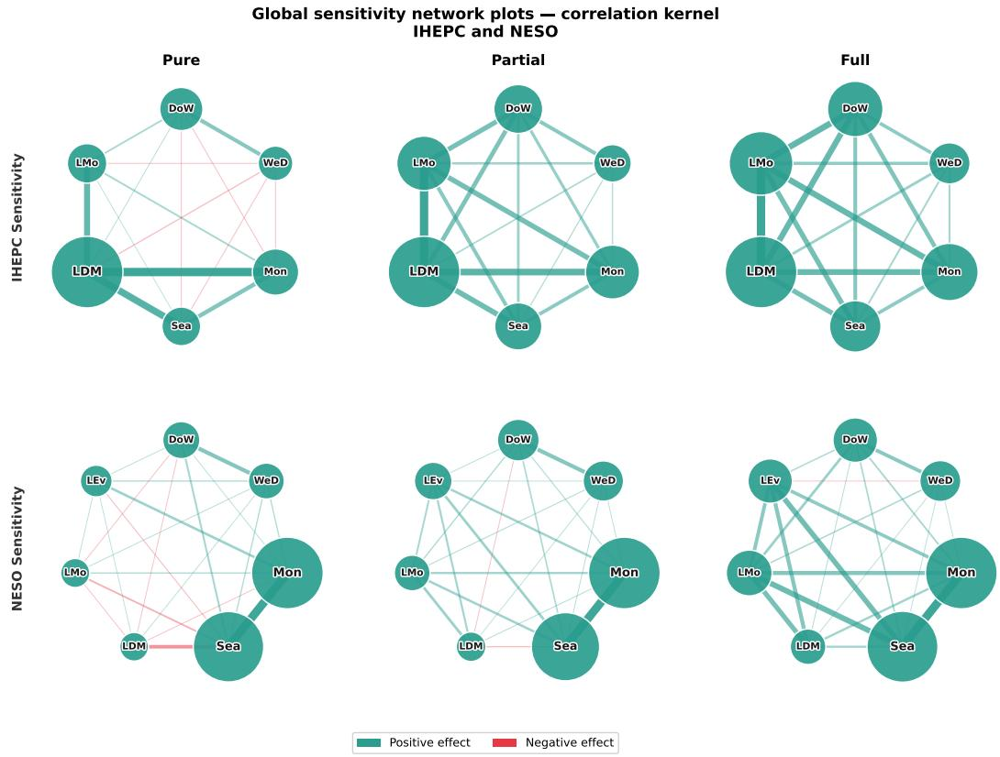  
Figure 15: Global sensitivity network plots — correlation kernel. (row 1) IHEPC; (row 2) NESO; (cols. 1–3) pure, partial, and full effects. Node size encodes time-aggregated feature importance; edge width encodes pairwise interaction strength; edge color encodes the sign of the interaction (teal for positive, red for negative). Negative edges are concentrated in the pure-effect column and largely vanish after Shapley (partial) or total-Sobol (full) aggregation, which are non-negative weighted sums of Möbius coefficients. Feature abbreviations: DoW = day\_of\_week, WeD = is\_weekend, Mon = month, Sea = season, LDM = lag\_daily\_mean, LMo = lag\_morning, LEv = lag\_evening (NESO only).

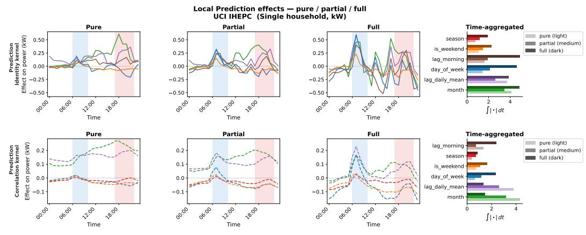  
Figure 16: Local prediction effects — IHEPC typical weekday. Instance: day\_of\_week = 4, month = 11, lag\_daily\_mean = 1.640 kW, selected as the median among 814 days with is\_weekend = 0 and day\_of\_week ∈ {1, 2, 3, 4}. (row 1) Identity kernel; (row 2) correlation kernel; (cols. 1–3) pure, partial, full; (col. 4) time-aggregated bar chart.

season day\_of\_week lag\_evening month is\_weekend Identity kernel Correlation kernel

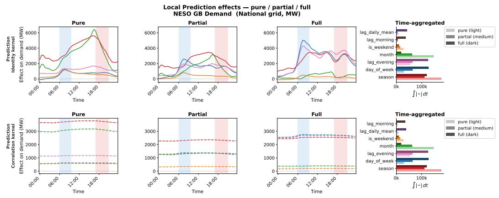  
Figure 17: Local prediction effects —NESO winter weekday. Instance: day\_of\_week = 0, month = 12, lag\_daily\_mean = 33,431 MW, selected as the median among 322 days with is\_weekend = 0 and season = 1 (winter). (row 1) Identity kernel; (row 2) correlation kernel. (cols. 1–3) Pure, partial, full; (col. 4) time-aggregated bar chart

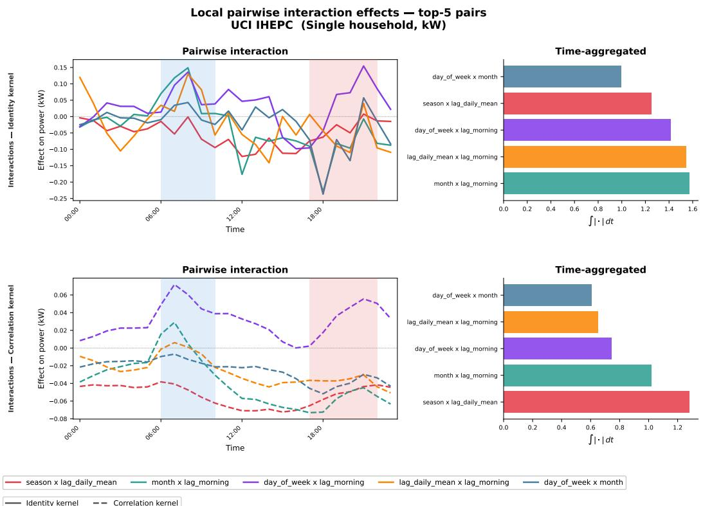  
Figure 18: Local pairwise interaction effects — top-5 pairs. Instance: day\_of\_week = 4, month = 11, lag\_daily\_mean = 1.640 kW, selected as the median among 814 days with is\_weekend = 0 and day\_of\_week ∈ {1, 2, 3, 4}. Top-5 pairs are selected by time-integrated correlation-kernel importance. (row 1) Identity kernel; (row 2) correlation kernel (dashed lines). (col. 1) Interaction trajectories over the 24-hour day; (col. 2) time-aggregated bar chart. Blue and red shading marks AM and PM peak windows.

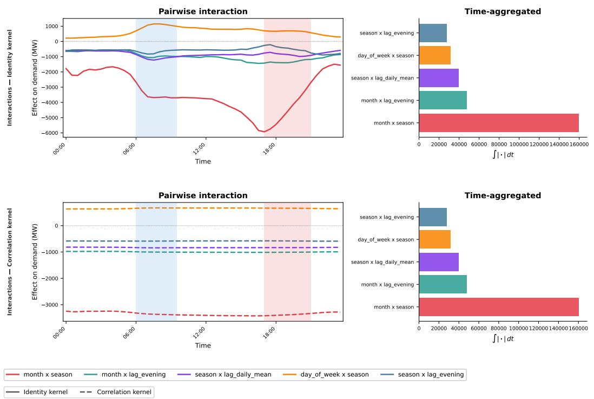  
Local pairwise interaction effects — top-5 pairs NESO GB Demand (National grid, MW)  
Figure 19: Local pairwise interaction effects — top-5 pairs. Instance: day\_of \_week = 0, month = 12, 1ag\_daily\_mean = 33,431 MW, selected as the median among 322 days with is\_weekend = 0 and season = 1 (winter). Top-5 pairs are ranked by time-integrated correlation-kernel importance. (row 1) Identity kernel; (row 2) correlation kernel (dashed lines). (col. 1) Interaction trajectories over the 48 half-hourly periods; (col. 2) time-aggregated bar chart. The month × season pair dominates by a wide margin under both kernels. Blue and red shading marks AM and PM peak windows.

Global Prediction effects — PDP-style — pure / partial / full (per-instance local effects, binned over feature range) — UCI IHEPC (Single household, kW)  
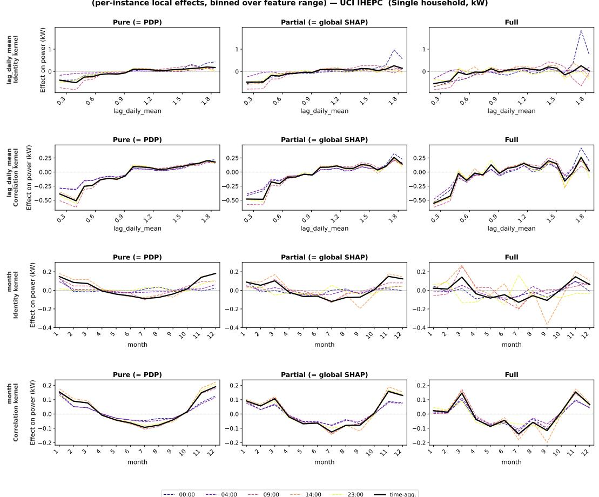  
Figure 20: Global prediction effects — PDP-style — IHEPC. Per-instance pure, partial, and full local prediction effects, computed for $N _ { \mathrm { P D P } } = 1 2 0$ profiles drawn by stratified sampling from the training set, are binned over the feature range $( N _ { \mathrm { b i n s } } = 2 0 )$ for the two highest-importance features by identity-kernel SHAP importance. (rows 1–2) 1ag\_daily\_mean under the identity (row 1) and correlation (row 2) kernels; (rows 3–4) month under the identity (row 3) and correlation (row 4) kernels. Coloured dashed lines show mean effects at five selected time points (00:00, 04:00, 09:00 14:00, 23:00); the solid black line is the time-aggregated mean.

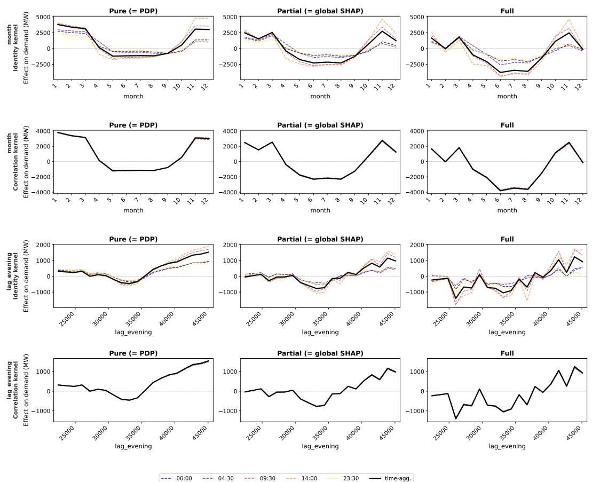  
Figure 21: Global prediction effects $- \mathbf { \nabla } \mathbf { P } \mathbf { D } \mathbf { P } { \cdot } { \mathrm { s t y l e } } - \mathbf { p u r e } /$ partial / full - NESO. Per-instance pure, partial, and full local prediction effects, computed for $N _ { \mathrm { P D P } } = 1 2 0$ profiles drawn by stratified sampling from the training set, are binned over the feature range $( N _ { \mathrm { b i n s } } = 2 0 )$ for the two highestimportance features by identity-kernel SHAP importance; (rows 1–2) month under the identity (row 1) and correlation (row 2) kernels; (rows 3–4) 1ag\_evening under the identity (row 3) and correlation (row 4) kernels. Coloured dashed lines show mean effects at five selected time points (00:00, 04:00, 09:00, 14:00, 23:00); the solid black line is the time-aggregated mean.

## D.5 Data Availability

Intraday five-minute OHLCV bar data for SPY were obtained from Polygon.io (https://polygon. io) covering January 2022 to April 2024. Access requires a Polygon.io subscription. The derived feature matrix and diurnal-adjusted volatility trajectories used in the experiments are available in the supplementary material. The IHEPC dataset is publicly available from the UCI Machine Learning Repository [11]. GB historic demand data are publicly available from the National Energy System Operator data portal [33]. All analysis code is available at GitHub.

## D.6 Computational Details

Computing environment. All experiments were run on a 64-bit Linux platform running Ubuntu 22.04 LTS with two AMD EPYC Genoa 9534 64-core processors (128 cores, 256 threads total), 1.5 TB of RAM, and eight NVIDIA RTX 6000 Ada Generation GPUs (each with 48 GB memory). GPUs were not used: all model training and cooperative-game computations rely on CPU-only scikit-learn routines, parallelized over cores via $\mathtt { n \_ j o b s } \mathtt { = } \mathtt { - } 1$

Approximate wall-clock times. The synthetic ground-truth recovery experiment (Sec. D.1), comprising 30 Monte Carlo runs × 8 sample sizes × 4 model classes plus the oracle, with exact 2p Möbius computation at each setting, completes in approximately 30–45 minutes. The SPY case study (Sec. D.3) completes in approximately 15 minutes for a first run, dominated by the global-game cache (30 instances × 3 game types). The IHEPC energy experiment (Sec. D.4) takes approximately 20 minutes for a first run, and the NESO experiment approximately 45 minutes; NESO is slower due to its larger coalition space $( 2 ^ { 7 } = 1 2 8 \mathrm { v s . \bar { 2 } ^ { 6 } = 6 4 }$ for IHEPC) and its finer half-hourly resolution $( T = 4 8 { \bar { \bf { v s . } } } T = 2 4 )$

## E Broader Impact and Ethics Statement

This work introduces a methodological framework for explaining machine learning models with time-dependent outputs. As a post-hoc, model-agnostic explanation method, it does not itself produce predictions or decisions, but rather aids interpretation of existing models. We see two main avenues of positive impact. First, in high-stakes domains where models with functional outputs are increasingly deployed — clinical trajectory prediction, energy demand forecasting, financial risk modeling — our framework supports more transparent model auditing by making temporal dependencies in feature attributions explicit, which scalar pointwise methods obscure. Second, by unifying existing approaches under a common operator view, the framework lowers the barrier to comparing explanations across methods and may reduce ad-hoc method selection in applied work.

Limitations and risks of explanation methods generally apply here. Explanations can create unwarranted confidence in model behavior, particularly when the underlying model is itself unreliable or trained on biased data; our framework does not address these upstream issues and should not be treated as a substitute for model validation, fairness analysis, or domain expertise. The kernel choice introduced by our framework adds an additional modeling decision: a misspecified kernel can produce attributions that are technically valid but misleading for the question at hand (for example, applying a symmetric kernel to a causal process, as we illustrate in our synthetic experiments). We address this through explicit kernel-selection guidance (Tab. 5), but practitioners retain responsibility for justifying their choices. As with all Shapley-based methods, our explanations rely on a reference distribution and inherit known concerns about marginal versus conditional masking under feature dependence; users should select the masking strategy appropriate to their interpretive goal.

Our experiments use publicly available datasets (UCI IHEPC, GB NESO historic demand) and a standard licensed financial dataset (Polygon.io intraday equity bars). None involve human subjects, personally identifiable information, or sensitive demographic attributes. The IHEPC dataset contains household-level electricity consumption from a single anonymized household; we use it solely as a benchmark for the methodological framework and draw no inferences about individuals. We do not foresee direct dual-use concerns: the framework is a diagnostic tool for existing models rather than an enabling capability for new ones.

## NeurIPS Paper Checklist

## 1. Claims

Question: Do the main claims made in the abstract and introduction accurately reflect the paper's contributions and scope?

Answer: [Yes]

Justification: The abstract and introduction clearly state the three main contributions (Hilbert functional decomposition, Hilbert-valued explanation framework, and practical kernel guidance), and these are fully supported by the theoretical results in Sec. 4 and the empirical evaluations in Sec. 5.

Guidelines:

• The answer [N/A] means that the abstract and introduction do not include the claims made in the paper.

• The abstract and/or introduction should clearly state the claims made, including the contributions made in the paper and important assumptions and limitations. A [No] or [N/A] answer to this question will not be perceived well by the reviewers.

• The claims made should match theoretical and experimental results, and reflect how much the results can be expected to generalize to other settings.

• It is fine to include aspirational goals as motivation as long as it is clear that these goals are not attained by the paper.

## 2. Limitations

Question: Does the paper discuss the limitations of the work performed by the authors?

Answer: [Yes]

Justification: Sec. 6 explicitly discusses limitations including computational cost of Shapleybased operators, reliance on user-specified kernels, and potential misspecification, as well as directions for future work.

Guidelines:

• The answer [N/A] means that the paper has no limitation while the answer [No] means that the paper has limitations, but those are not discussed in the paper.

• The authors are encouraged to create a separate “Limitations" section in their paper.

• The paper should point out any strong assumptions and how robust the results are to violations of these assumptions (e.g., independence assumptions, noiseless settings, model well-specification, asymptotic approximations only holding locally). The authors should reflect on how these assumptions might be violated in practice and what the implications would be.

• The authors should reflect on the scope of the claims made, e.g., if the approach was only tested on a few datasets or with a few runs. In general, empirical results often depend on implicit assumptions, which should be articulated.

• The authors should reflect on the factors that influence the performance of the approach. For example, a facial recognition algorithm may perform poorly when image resolution is low or images are taken in low lighting. Or a speech-to-text system might not be used reliably to provide closed captions for online lectures because it fails to handle technical jargon.

• The authors should discuss the computational efficiency of the proposed algorithms and how they scale with dataset size.

• If applicable, the authors should discuss possible limitations of their approach to address problems of privacy and fairness.

• While the authors might fear that complete honesty about limitations might be used by reviewers as grounds for rejection, a worse outcome might be that reviewers discover limitations that aren't acknowledged in the paper. The authors should use their best judgment and recognize that individual actions in favor of transparency play an important role in developing norms that preserve the integrity of the community. Reviewers will be specifically instructed to not penalize honesty concerning limitations.

## 3. Theory assumptions and proofs

Question: For each theoretical result, does the paper provide the full set of assumptions and a complete (and correct) proof?

Answer: [Yes]

Justification: All theoretical results (Thm. 1 and 2, Prop. 1 and Remark 4.2) state their assumptions explicitly and full proofs are provided in App.A.

## Guidelines:

• The answer [N/A] means that the paper does not include theoretical results.

• All the theorems, formulas, and proofs in the paper should be numbered and crossreferenced.

• All assumptions should be clearly stated or referenced in the statement of any theorems.

• The proofs can either appear in the main paper or the supplemental material, but if they appear in the supplemental material, the authors are encouraged to provide a short proof sketch to provide intuition.

• Inversely, any informal proof provided in the core of the paper should be complemented by formal proofs provided in appendix or supplemental material

• Theorems and Lemmas that the proof relies upon should be properly referenced.

## 4. Experimental result reproducibility

Question: Does the paper fully disclose all the information needed to reproduce the main experimental results of the paper to the extent that it affects the main claims and/or conclusions of the paper (regardless of whether the code and data are provided or not)?

Answer: [Yes]

Justification: Full experimental details including data sources, preprocessing, model hyperparameters, game setups, kernel choices, and sample sizes are provided in App. D. Code is available at GitHub.

## Guidelines:

• The answer [N/A] means that the paper does not include experiments.

• If the paper includes experiments, a [No] answer to this question will not be perceived well by the reviewers: Making the paper reproducible is important, regardless of whether the code and data are provided or not.

• If the contribution is a dataset and/or model, the authors should describe the steps taken to make their results reproducible or verifiable.

• Depending on the contribution, reproducibility can be accomplished in various ways. For example, if the contribution is a novel architecture, describing the architecture fully might suffice, or if the contribution is a specific model and empirical evaluation, it may be necessary to either make it possible for others to replicate the model with the same dataset, or provide access to the model. In general. releasing code and data is often one good way to accomplish this, but reproducibility can also be provided via detailed instructions for how to replicate the results, access to a hosted model (e.g., in the case of a large language model), releasing of a model checkpoint, or other means that are appropriate to the research performed.

• While NeurIPS does not require releasing code, the conference does require all submissions to provide some reasonable avenue for reproducibility, which may depend on the nature of the contribution. For example

(a) If the contribution is primarily a new algorithm, the paper should make it clear how to reproduce that algorithm.

(b) If the contribution is primarily a new model architecture, the paper should describe the architecture clearly and fully.

(c) If the contribution is a new model (e.g., a large language model), then there should either be a way to access this model for reproducing the results or a way to reproduce the model (e.g., with an open-source dataset or instructions for how to construct the dataset).

(d) We recognize that reproducibility may be tricky in some cases, in which case authors are welcome to describe the particular way they provide for reproducibility. In the case of closed-source models, it may be that access to the model is limited in some way (e.g., to registered users), but it should be possible for other researchers to have some path to reproducing or verifying the results.

## 5. Open access to data and code

Question: Does the paper provide open access to the data and code, with sufficient instructions to faithfully reproduce the main experimental results, as described in supplemental material?

Answer: [Yes]

Justification: All analysis code is available at an anonymized repository at GitHub. The IHEPC and NESO datasets are publicly available at the UCI Machine Learning Repository and the NESO data portal, respectively. Raw SPY intraday bar data are accessible via a Polygon.io subscription (https://polygon.io). Full data access instructions are provided in the data availability statement in App D.5.

Guidelines:

• The answer [N/A] means that paper does not include experiments requiring code.

• Please see the NeurIPS code and data submission guidelines (https: //neurips . cc/ public/guides/CodeSubmissionPolicy) for more details.

• While we encourage the release of code and data, we understand that this might not be possible, so [No] is an acceptable answer. Papers cannot be rejected simply for not including code, unless this is central to the contribution (e.g., for a new open-source benchmark).

• The instructions should contain the exact command and environment needed to run to reproduce the results. See the NeurIPS code and data submission guidelines (https: //neurips.cc/public/guides/CodeSubmissionPolicy) for more details.

• The authors should provide instructions on data access and preparation, including how to access the raw data, preprocessed data, intermediate data, and generated data, etc.

• The authors should provide scripts to reproduce all experimental results for the new proposed method and baselines. If only a subset of experiments are reproducible, they should state which ones are omitted from the script and why.

• At submission time, to preserve anonymity, the authors should release anonymized versions (if applicable).

• Providing as much information as possible in supplemental material (appended to the paper) is recommended, but including URLs to data and code is permitted.

## 6. Experimental setting/details

Question: Does the paper specify all the training and test details (e.g., data splits, hyperparameters, how they were chosen, type of optimizer) necessary to understand the results?

Answer: [Yes]

Justification: Data splits, hyperparameters, kernel choices, masking strategies, and sample sizes are fully specified in App. D.3 and D.4, with a summary in the main text (Sec. 5.2).

Guidelines:

• The answer [N/A] means that the paper does not include experiments.

• The experimental setting should be presented in the core of the paper to a level of detail that is necessary to appreciate the results and make sense of them.

• The full details can be provided either with the code, in appendix, or as supplemental material.

## 7. Experiment statistical significance

Question: Does the paper report error bars suitably and correctly defined or other appropriate information about the statistical significance of the experiments?

Answer: [Yes]

Justification: We report mean ± 1 std over 30 Monte Carlo runs for the ground-truth recovery experiment (Fig. 5, Tab. 3, 4); for the real-data case studies, results are deterministic functionals of a single fitted model with fixed seeds and large Monte Carlo sample sizes for the cooperative game estimator, so error bars are not applicable.

## Guidelines:

• The answer [N/A] means that the paper does not include experiments.

• The authors should answer [Yes] if the results are accompanied by error bars, confidence intervals, or statistical significance tests, at least for the experiments that support the main claims of the paper.

• The factors of variability that the error bars are capturing should be clearly stated (for example, train/test split, initialization, random drawing of some parameter, or overall run with given experimental conditions).

• The method for calculating the error bars should be explained (closed form formula, call to a library function, bootstrap, etc.)

• The assumptions made should be given (e.g., Normally distributed errors).

• It should be clear whether the error bar is the standard deviation or the standard error of the mean.

• It is OK to report 1-sigma error bars, but one should state it. The authors should preferably report a 2-sigma error bar than state that they have a 96% CI, if the hypothesis of Normality of errors is not verified.

• For asymmetric distributions, the authors should be careful not to show in tables or figures symmetric error bars that would yield results that are out of range (e.g., negative error rates).

• If error bars are reported in tables or plots, the authors should explain in the text how they were calculated and reference the corresponding figures or tables in the text.

## 8. Experiments compute resources

Question: For each experiment, does the paper provide sufficient information on the computer resources (type of compute workers, memory, time of execution) needed to reproduce the experiments?

Answer: [Yes]

Justification: App. D.6 specifies the computational platform and provides approximate wall-clock times for each experiment.

Guidelines:

• The answer [N/A] means that the paper does not include experiments.

• The paper should indicate the type of compute workers CPU or GPU, internal cluster, or cloud provider, including relevant memory and storage.

• The paper should provide the amount of compute required for each of the individual experimental runs as well as estimate the total compute.

• The paper should disclose whether the full research project required more compute than the experiments reported in the paper (e.g., preliminary or failed experiments that didn't make it into the paper).

## 9. Code of ethics

Question: Does the research conducted in the paper conform, in every respect, with the NeurIPS Code of Ethics https://neurips.cc/public/EthicsGuidelines?

Answer: [Yes]

Justification: The paper uses only publicly available or commercially licensed datasets, does not involve human subjects, and presents methodology for model interpretability with no foreseeable direct misuse potential, for further details refer to the Broader Impact and Ethics Statement (App. E).

Guidelines:

• The answer [N/A] means that the authors have not reviewed the NeurIPS Code of Ethics.

• If the authors answer [No], they should explain the special circumstances that require a deviation from the Code of Ethics.

• The authors should make sure to preserve anonymity (e.g., if there is a special consideration due to laws or regulations in their jurisdiction).

## 10. Broader impacts

Question: Does the paper discuss both potential positive societal impacts and negative societal impacts of the work performed?

Answer: [Yes]

Justification: We discuss both positive impacts (improved model auditing in high-stakes domains, unification of existing explanation methods) and limitations / risks (potential for misleading attributions under kernel misspecification, reliance on reference distributions, and that explanations do not substitute for model validation) in the Broader Impact and Ethics Statement (App. E)

Guidelines:

• The answer [N/A] means that there is no societal impact of the work performed.

• If the authors answer [N/A] or [No], they should explain why their work has no societal impact or why the paper does not address societal impact.

• Examples of negative societal impacts include potential malicious or unintended uses (e.g., disinformation, generating fake profiles, surveillance), fairness considerations (e.g., deployment of technologies that could make decisions that unfairly impact specific groups), privacy considerations, and security considerations.

• The conference expects that many papers will be foundational research and not tied to particular applications, let alone deployments. However, if there is a direct path to any negative applications, the authors should point it out. For example, it is legitimate to point out that an improvement in the quality of generative models could be used to generate Deepfakes for disinformation. On the other hand, it is not needed to point out that a generic algorithm for optimizing neural networks could enable people to train models that generate Deepfakes faster.

• The authors should consider possible harms that could arise when the technology is being used as intended and functioning correctly, harms that could arise when the technology is being used as intended but gives incorrect results, and harms following from (intentional or unintentional) misuse of the technology.

• If there are negative societal impacts, the authors could also discuss possible mitigation strategies (e.g., gated release of models, providing defenses in addition to attacks, mechanisms for monitoring misuse, mechanisms to monitor how a system learns from feedback over time, improving the efficiency and accessibility of ML).

## 11. Safeguards

Question: Does the paper describe safeguards that have been put in place for responsible release of data or models that have a high risk for misuse (e.g., pre-trained language models, image generators, or scraped datasets)?

Answer: [N/A]

Justification: The paper does not release pretrained models, generative models, or scraped datasets that carry high misuse risk; no special safeguards beyond standard open-source release are required.

Guidelines:

• The answer [N/A] means that the paper poses no such risks.

• Released models that have a high risk for misuse or dual-use should be released with necessary safeguards to allow for controlled use of the model, for example by requiring that users adhere to usage guidelines or restrictions to access the model or implementing safety filters.

• Datasets that have been scraped from the Internet could pose safety risks. The authors should describe how they avoided releasing unsafe images.

• We recognize that providing effective safeguards is challenging, and many papers do not require this, but we encourage authors to take this into account and make a best faith effort.

## 12. Licenses for existing assets

Question: Are the creators or original owners of assets (e.g., code, data, models), used in the paper, properly credited and are the license and terms of use explicitly mentioned and properly respected?

Answer: [Yes]

Justification: All datasets and software are cited with their original sources: UCI IHEPC [11] (CC BY 4.0), NESO historic demand data [33] (NESO Open Licence), Polygon.io SPY intraday bars [36] (used under commercial subscription terms), and scikit-learn [35] (BSD 3-Clause); all are used in accordance with their respective licenses and terms of service.

## Guidelines:

• The answer [N/A] means that the paper does not use existing assets.

• The authors should cite the original paper that produced the code package or dataset.

• The authors should state which version of the asset is used and, if possible, include a URL.

• The name of the license (e.g., CC-BY 4.0) should be included for each asset.

• For scraped data from a particular source (e.g., website), the copyright and terms of service of that source should be provided.

• If assets are released, the license, copyright information, and terms of use in the package should be provided. For popular datasets, paperswithcode. com/datasets has curated licenses for some datasets. Their licensing guide can help determine the license of a dataset.

• For existing datasets that are re-packaged, both the original license and the license of the derived asset (if it has changed) should be provided.

• If this information is not available online, the authors are encouraged to reach out to the asset's creators.

## 13. New assets

Question: Are new assets introduced in the paper well documented and is the documentation provided alongside the assets?

Answer: [Yes]

Justification: We release the analysis code as a new asset, available at the anonymized GitHub repository, with documentation covering experimental setup, hyperparameters, data preparation, and instructions to reproduce all figures.

Guidelines:

• The answer [N/A] means that the paper does not release new assets.

• Researchers should communicate the details of the dataset/code/model as part of their submissions via structured templates. This includes details about training, license, limitations, etc.

• The paper should discuss whether and how consent was obtained from people whose asset is used.

• At submission time, remember to anonymize your assets (if applicable). You can either create an anonymized URL or include an anonymized zip file.

## 14. Crowdsourcing and research with human subjects

Question: For crowdsourcing experiments and research with human subjects, does the paper include the full text of instructions given to participants and screenshots, if applicable, as well as details about compensation (if any)?

Answer: [N/A]

Justification: The paper does not involve crowdsourcing or research with human subjects;   
all data are observational time series from financial and energy domains.

Guidelines:

• The answer [N/A] means that the paper does not involve crowdsourcing nor research with human subjects.

• Including this information in the supplemental material is fine, but if the main contribution of the paper involves human subjects, then as much detail as possible should be included in the main paper.

• According to the NeurIPS Code of Ethics, workers involved in data collection, curation, or other labor should be paid at least the minimum wage in the country of the data collector.

## 15. Institutional review board (IRB) approvals or equivalent for research with human subjects

Question: Does the paper describe potential risks incurred by study participants, whether such risks were disclosed to the subjects, and whether Institutional Review Board (IRB) approvals (or an equivalent approval/review based on the requirements of your country or institution) were obtained?

Answer: [N/A]

Justification: No human subjects research is involved; IRB approval is not applicable.

Guidelines:

• The answer [N/A] means that the paper does not involve crowdsourcing nor research with human subjects.

• Depending on the country in which research is conducted, IRB approval (or equivalent) may be required for any human subjects research. If you obtained IRB approval, you should clearly state this in the paper.

• We recognize that the procedures for this may vary significantly between institutions and locations, and we expect authors to adhere to the NeurIPS Code of Ethics and the guidelines for their institution.

• For initial submissions, do not include any information that would break anonymity (if applicable), such as the institution conducting the review.

## 16. Declaration of LLM usage

Question: Does the paper describe the usage of LLMs if it is an important, original, or non-standard component of the core methods in this research? Note that if the LLM is used only for writing, editing, or formatting purposes and does not impact the core methodology, scientific rigor, or originality of the research, declaration is not required.

Answer: [N/A]

Justification: LLMs were not used as a component of the core methodology; any use was limited to writing and editing assistance, which per the NeurIPS LLM policy does not require declaration.

Guidelines:

• The answer [N/A] means that the core method development in this research does not involve LLMs as any important, original, or non-standard components.

• Please refer to our LLM policy in the NeurIPS handbook for what should or should not be described.