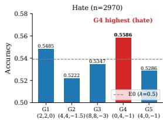
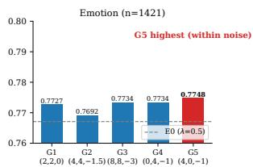
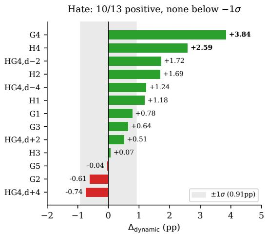
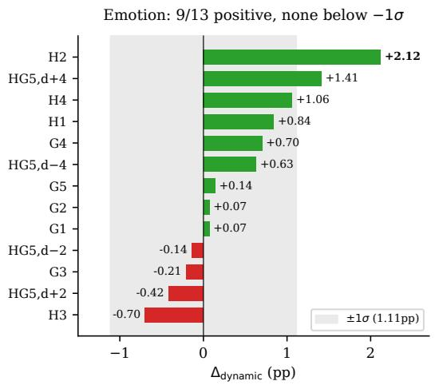
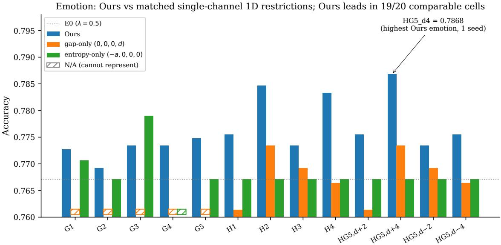
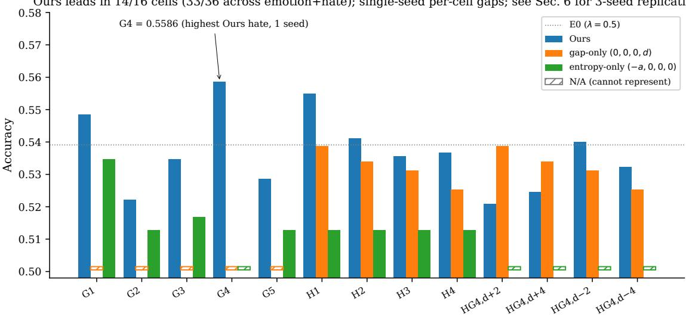
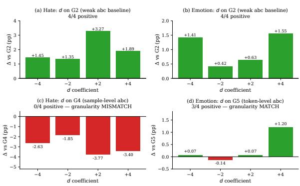

# A Unified Per-Token Gating Family for On-Policy Distillation: FKL/RKL Mixing with Multi-Channel and Bias Coefficients

Suwan Wu1 Yumeng Lin1,2 Pengcheng Yuan1 Xiaolong Jiang1

1Xiaohongshu Inc. 2Tianjin University

{wusuwan, linyumeng, yuanpengcheng, laige}@xiaohongshu.com lym619@tju.edu.cn

## Abstract

Per-token gating of forward/reverse KL losses has become a standard technique for on-policy knowledge distillation (OPD), but existing methods such as EOPD (Jin et al., 2026) and ToDi (Jung et al., 2025) each fix a single gating signal and a single gating direction, and the two have never been compared directly. We introduce a four-coefficient parameterization λ = σ(a·h +b·u(x)+c+d·gap ) in which direction-aligned proxies of EOPD and ToDi appear as one-dimensional (1D) restrictions, and which adds multi-channel composition and an explicit bias as further degrees of freedom. On TweetEval (Barbieri et al., 2020) emotion and hate, with a Qwen3-32B teacher and a Qwen3-4B student, configurations in the full family reach higher accuracy than the matched magnitude single-channel (entropy-only / gaponly) 1D restrictions in 33 of 36 comparable cells, and a 26-cell mean-match isolation exper iment places dynamic gating ahead of effective KL-matched static baselines in 19 of 26 cells. Because cells share training data, models, and parameter substructure, we report both counts as exploratory aggregate directional evidence rather than as independent hypothesis tests. Tar geted three-seed paired replications of the nine headline comparisons singled out by that sweep — including a third task, offensive — are directionally consistent, but individually smaller than the single-seed estimates and not signifi cant at n=3. We therefore present the parame terization primarily as a shared coordinate system for comparing per-token gating designs in short-output classification OPD.

## 1 Introduction

Knowledge distillation (KD) from large language models (LLMs) to smaller student models typically combines forward Kullback–Leibler (FKL) and reverse KL (RKL) losses to balance two complementary objectives: FKL drives the student to cover the teacher’s full output distribution (mode-covering), while RKL drives mode-seeking on the teacher’s high-probability regions (Kim and Rush, 2016; Gu et al., 2024). The relative weighting of these two losses — captured by a single scalar $\lambda \in [ 0 , 1 ]$ in standard formulations — determines the student’s distillation regime.

Recent work has argued that fixed λ is suboptimal and that per-token dynamic gating $\lambda _ { t } \in [ 0 , 1 ]$ helps (Jin et al., 2026; Jung et al., 2025). The two dominant approaches differ in their choice of gating signal:

• EOPD (Jin et al., 2026) uses teacher entropy ht: high entropy tokens (where the teacher is uncertain) receive more FKL weight to encourage student exploration.

• ToDi (Jung et al., 2025) uses teacher–student disagreement (the log-ratio of teacher to student probability, computed for every vocabulary entry): entries on which the teacher places more mass than the student receive more FKL weight, raising the student’s probability there.

Both lines of work report improvements over static baselines under their respective protocols, but two questions remain: why per-token gating helps, and which signal is preferable for a given task. Since each fixes a single signal and a single gating direction, it has not been tested whether their improvements come from the signal choice, from gating in general, or from hyperparameter tuning — and the two cannot be compared directly, as they operate in different parameter subspaces with different conventions.

A unified analysis framework. Rather than proposing a new gating method, we introduce a parametric family that turns the choice between EOPD, ToDi, and their variants from a discrete method selection into a continuous point in a shared parameter space:

$$
\lambda _ { t } = \sigma \big ( a \cdot h _ { t } + b \cdot u ( x ) + c + d \cdot \mathrm { g a p } _ { t } \big ) ,\tag{1}
$$

where $h _ { t }$ is the per-token normalized teacher entropy, $u ( x )$ is the per-sample prompt-level teacher entropy, $\mathrm { g a p } _ { t } ~ = ~ 1 - p _ { \mathrm { s t u d e n t } } ( y _ { t } ^ { \mathrm { t e a c h e r - t o p 1 } } )$ is the per-token teacher–student disagreement, and c is a bias term. The per-token mixture is $\begin{array} { l l } { { \displaystyle { \mathcal { L } } ( t ) \ = } } \end{array}$ $\lambda _ { t } \mathcal { L } _ { \mathrm { R K L } } ( t ) + ( 1 - \lambda _ { t } ) \mathcal { L } _ { \mathrm { F K L } } ( t )$

Under this parameterization, direction-aligned proxies of the prior methods appear as 1D restrictions:

• EOPD corresponds to $( - \beta , 0 , 0 , 0 ) - \mathrm { o n l y }$ token-level entropy, no bias, with the sign reversed by the original “high entropy → more $\mathrm { F K L } ^ { \prime \prime }$ semantics.

• ToDi corresponds to (0, 0, 0, −β) — only teacher–student disagreement, no bias. The sign is negative because ToDi’s weight multiplies FKL whereas our $\lambda _ { t }$ multiplies RKL (Section 3.3).

As we detail in Section 3.3, these 1D restrictions are structurally aligned proxies for the original methods within our convex-mixture family, not faithful reproductions of the published algorithms; all comparisons in this paper should be read accordingly.

What this framework enables. Our central contribution is this unified parameterization. It reframes two prior questions as questions about points in a shared parameter space:

1. Which signal helps which task? The framework exposes four signal coefficients independently, so the grid analysis in Section 4 can ask whether different tasks prefer different channels rather than assuming one gating signal a priori. Single-restriction methods cannot represent this trade-off.

2. Do dynamic gates contribute beyond what a constant λ captures? The framework allows a clean isolation protocol — training a static baseline at the emergent effective KL ratio of each dynamic configuration — to disentangle dynamic structure from average KL weighting. Section 4.5 reports this 26-cell isolation experiment.

Empirical contributions. We instantiate the framework with student Qwen3-4B and teacher Qwen3-32B (Qwen Team, 2025) and evaluate on TweetEval emotion (4-way classification, $n _ { \mathrm { t e s t } } =$ 1421) and hate (binary, $n _ { \mathrm { t e s t } } = 2 9 7 0 )$ (Barbieri et al., 2020), plus a third task, offensive (binary, $n _ { \mathrm { t e s t } } = 8 6 0 )$ ), added for seed-robustness replication (Section 6). Our sweeps span 13 OPD configurations per task across the $( a , b , c , d )$ space (Section 4: $G _ { 1 } – G _ { 5 } , H _ { 1 } – H _ { 4 } , H G _ { d \pm 2 , \pm 4 } )$ , each compared against the aligned single-coefficient restrictions corresponding to ToDi and EOPD at the same signal magnitude.

Three findings emerge:

Finding 1 — Structural coverage. Hate’s best configuration in the sweep, $G _ { 4 } = ( 0 , 4 , - 1 , 0 )$ uses the $u ( x )$ channel, structurally absent in both ToDi and EOPD. Across the 26 (config × task) cells the two restrictions give 52 potential comparisons, of which 10 are ToDi-N/A and 6 are EOPD-N/A — configurations a matched-magnitude restriction cannot represent by construction — leaving the 36 comparable cells used below. The parameterization strictly extends the union of the two 1D restrictions.

Finding 2 — Aggregate directional advantage at matched magnitude. Across the 36 comparable cells (emotion 20 + hate 16), the full family beats the matched 1D restriction in 33 cells (91.7%), with one unfavorable cell outside the sampling-SE reference band that Section 4.4 identifies as a granularity mismatch. Because cells share data, models, and parameter substructure, we report this count as exploratory aggregate directional evidence and attach no significance to individual gaps.

Finding 3 — The aggregate gain is not explained by the effective KL ratio. In 26 isolation experiments against mean-matched static baselines sharing the same effective KL ratio (Section 4.5), dynamic gating is ahead in 19 of 26 configurations, none below the negative 1σ sampling-SE reference band — so the per-token structure appears to carry information a constant λ at the same ratio does not.

Section 6 then quantifies how much of the percell magnitude is seed noise: nine headline comparisons singled out by the single-seed sweep, spanning both axes and all three tasks, were re-run with three seeds on both sides. All three-seed means are smaller than the single-seed estimates, eight of nine remain directionally positive, and none is individually significant at $n { = } 3 ;$ we consequently state all empirical claims at the group level.

## 2 Related Work

We organize prior work along three threads: (i) KD losses with mixed forward/reverse KL, (ii) pertoken gating methods (the most direct comparators), and (iii) on-policy distillation infrastructure. The two comparators come from different training regimes: EOPD is defined inside the on-policy distillation framework of Agarwal et al. (2024) (summarized in Appendix A), whereas ToDi was proposed for offline distillation on a fixed instructiontuning corpus.

## 2.1 Mixed FKL/RKL Distillation

Sequence-level distillation (Kim and Rush, 2016) extended KD to autoregressive sequence models by training the student on teacher-generated sequences, with most subsequent work using forward KL $D _ { \mathrm { K L } } ( p _ { \mathrm { t e a c h e r } } | | p _ { \mathrm { s t u d e n t } } ) \mathrm { ~ - ~ a ~ }$ modecovering objective. MiniLLM (Gu et al., 2024) noted that mode-covering produces high-quality but generic outputs and proposed reverse KL $D _ { \mathrm { K L } } ( p _ { \mathrm { s t u d e n t } } | | p _ { \mathrm { t e a c h e r } } )$ as a mode-seeking alternative for instruction-following. A common practical compromise is a fixed mixture ${ \mathcal { L } } = \lambda { \mathcal { L } } _ { \mathrm { R K L } } +$ $( 1 - \lambda ) \mathcal { L } _ { \mathrm { F K I } }$ , with λ a hyperparameter — typically 0.5. Adaptive variants have been explored at the sequence or batch level using moving statistics of teacher–student divergence; such schemes operate at sample granularity and do not exploit per-token signals.

## 2.2 Per-Token Gating: EOPD and ToDi

EOPD (Jin et al., 2026) introduced an entropydriven per-token gating mechanism: a hard switch on teacher entropy,

$$
\begin{array} { r } { \mathcal { L } _ { t } ^ { E O P D } = \mathcal { L } _ { t } ^ { \mathrm { { O P D } } } + \alpha \cdot \mathbb { I } [ H _ { t } ^ { \mathrm { t e } } > \tau ] \cdot \mathcal { L } _ { \mathrm { { F K L } } } ( t ) . } \end{array}\tag{2}
$$

where $H _ { t } ^ { \mathrm { t e } }$ is the teacher’s unnormalized tokenlevel entropy over the vocabulary, and tokens on which the teacher is uncertain receive an additional FKL term that preserves the teacher’s distributional diversity; the original work uses $\tau = 0 . 8$ and $\alpha =$ 1. The structure is additive rather than convex, and the gating signal is teacher entropy alone. Our $h _ { t }$ (Section 3) is a bounded top-K analogue of $H _ { t } ^ { \mathrm { t e } }$ normalized to [0, 1].

ToDi (Jung et al., 2025) introduced a convex mixture whose weight is computed per vocabulary entry $v _ { i }$ from the teacher–student log-ratio:

$$
\begin{array} { r } { \alpha _ { t , i } = { \bf s } \mathrm { g } \left[ \sigma \left( \beta \cdot \log \frac { p \left( v _ { i } | { \bf y } _ { < t } , { \bf x } \right) } { q _ { \theta } \left( v _ { i } | { \bf y } _ { < t } , { \bf x } \right) } \right) \right] , } \end{array}\tag{3}
$$

with $\begin{array} { r c l } { D _ { T o D i } ^ { ( t , i ) } } & { = } & { \alpha _ { t , i } D _ { \mathrm { F K L } } ^ { ( t , i ) } + ( 1 - \alpha _ { t , i } ) D _ { \mathrm { R K L } } ^ { ( t , i ) } } \end{array}$ summed over positions and vocabulary entries. ToDi targets a different mechanism: entries where the teacher places more mass than the student $( p > q _ { \theta } )$ receive more FKL, raising the student’s probability there, while over-estimated entries receive more RKL. Its signal, teacher–student disagreement, is closely related to our gap — both grow as the student under-estimates a token the teacher favours — but enters with the opposite sign, since $\alpha _ { t , i }$ multiplies FKL whereas $\lambda _ { t }$ multiplies RKL.

Direct empirical comparison between EOPD and ToDi has not been reported: they operate in different parameter subspaces (entropy vs. disagreement), use different scaling conventions, and were evaluated on different datasets, models and metrics. Our framework (Section 3) places direction-aligned proxies of both inside one four-coefficient family, enabling a controlled comparison at matched magnitude: EOPD maps to $( - \beta , 0 , 0 , 0 )$ and ToDi to $( 0 , 0 , 0 , - \beta )$ , both negative because each prior method routes its signal towards FKL whereas $\lambda _ { t }$ weights RKL. Section 5 reports the 26-cell comparison and documents where the proxies depart from the published algorithms.

## 3 Method: Parametric Family and Aligned Restrictions of Prior Methods

## 3.1 Parametric Family

Our family is the four-coefficient parameterization of per-token $\mathcal { L } _ { \mathrm { { R K L } } } / \mathcal { L } _ { \mathrm { { F K I } } }$ mixing (Equation 1). The three input signals are: token-level teacher entropy $h _ { t } \in [ 0 , 1 ]$ (normalized entropy of the teacher’s top-K predictions at token $t ;$ high $h _ { t }$ indicates the teacher is uncertain); sample-level prompt entropy $u ( x ) \in [ 0 , 1 ]$ (teacher entropy on the first decoded token after the prompt, computed once per sample); and teacher–student disagreement $\mathrm { g a p } _ { t } = 1 { - } p _ { \mathrm { s t u d e n t } } ( y _ { t } ^ { \mathrm { t e a c h e r - t o p 1 } } ) \in [ 0 , 1 ]$ (probability mass the student assigns to a token other than the teacher’s top-1 prediction). All three signals are non-negative and signed consistently: a larger value means “the student needs to learn more teacher mode at this token / sample.”

## 3.2 Coefficient Patterns Observed in the Sweep

Two recurring patterns and one task-dependent observation emerge from the Section 4 sweep. All three are descriptive summaries of a single-seed sweep on two tasks, and Section 6 shows that individual cell magnitudes are seed-sensitive, so none should be read as an established rule.

Pattern 1: $c < 0$ (negative bias). The best configuration on each task uses $c = - 1$ , while the unbiased $G _ { 1 } = ( 2 , 2 , 0 , 0 )$ is behind on both. Negative bias shifts the prior on $\lambda _ { t }$ below 0.5, favoring $\mathcal { L } _ { \mathrm { F K L } }$ on indifferent tokens; the effect is clear on hate and within noise on emotion (Section 4.2).

Pattern 2: (a, b) asymmetry. The best configuration on each task zeroes one of a, b and amplifies the other $( G _ { 4 }$ on hate, $G _ { 5 }$ on emotion), with the symmetric all-on baselines $G _ { 2 } , G _ { 3 }$ behind both — consistent with sigmoid saturation, since $| a | + | b |$ in the same direction saturates the gate and loses discriminative power. As with Pattern 1, the emotion side of this contrast lies within the sampling-SE reference band.

Observation: the d direction is taskdependent. The gap signal can be same-sign as the abc signal (reverse-gap, more RKL on disagreement tokens) or opposite (forward-gap, more FKL). Both directions improved a weak abc baseline in this sweep, whereas stacking d on the task-best abc helped only when granularities matched (Sections 4.3–4.4).

## 3.3 Aligned 1D Restrictions of Prior Methods

Our family contains two single-coefficient restrictions isolating the signals used by ToDi and EOPD. We name them by the channel retained — gap-only $( 0 , 0 , 0 , d )$ and entropy-only $( - a , 0 , 0 , 0 )$ — rather than by method name, since only one sign branch of the former matches the published method.

gap-only restriction and ToDi’s direction. ToDi’s log-ratio signal and our prob-diff ${ \mathrm { g a p } } _ { t }$ grow together (both increase as the student underestimates a token the teacher favours), but ToDi’s weight multiplies FKL while $\lambda _ { t }$ multiplies RKL. Translating Equation 3 into our convention gives $\lambda _ { t } = 1 - \alpha _ { t } = \sigma ( - \beta \log ( p / q ) )$ , so within our family ToDi’s gating direction is

$$
{ \boxed { ( a , b , c , d ) = ( 0 , 0 , 0 , - \beta ) } } , \quad \beta > 0 .\tag{4}
$$

Our gap-only restriction $( 0 , 0 , 0 , d )$ therefore reproduces ToDi’s direction when $d < 0$ and reverses it when $d > 0 ;$ the sweep contains both branches, as each restriction matches the sign of its paired configuration. Even for $d < 0$ it is a structural analogue rather than a reproduction; Section 5.2 enumerates the differences.

entropy-only restriction and EOPD’s direction. EOPD is additive (OPD plus a conditional FKL add-on, Equation 2), while our family uses a convex mixture, so we do not reproduce the additive form. Instead we use a convex relaxation that preserves the qualitative behavior “high $h _ { t } $ more FKL”. Every entropy-only run in our sweep sets the bias to zero, so the restriction is

$$
\lambda _ { t } ^ { e n t r o p y - o n l y } = \sigma ( - \beta h _ { t } ) , \quad \mathrm { i . e . } \quad \Big \lceil ( - \beta , 0 , 0 , 0 ) \Big \rceil ,\tag{5}
$$

with $\beta \in \{ 2 , 4 , 8 \}$ : high $h _ { t }$ drives $\lambda _ { t }$ towards 0 (FKL-heavy), matching EOPD’s direction. Two caveats follow. With zero bias the gate is monotone and soft, anchored at $\lambda _ { t } ~ = ~ 0 . 5$ for $h _ { t } = 0$ and bounded above by it; EOPD’s hard threshold would need a positive bias $c = \tau$ , since $\sigma ( \tau - \beta h _ { t } ) $ $\mathbb { I } [ h _ { t } < \tau / \beta ]$ as $\beta \to \infty$ only for $\tau > 0$ , and we did not sweep τ. The negative sign on a is fixed by EOPD’s “high entropy → FKL” semantics, so — unlike the gap channel — every entropy-only restriction in our sweep lies on EOPD’s side of the sign convention.

What the comparison does and does not test. The empirical comparison in Section 5 tests a structural claim inside a single implementation: multi-coefficient combinations outperform singlecoefficient 1D restrictions of the same family at matched signal magnitude. The parameterization makes the design space explicit: the gap-only restriction is (0, 0, 0, d) (ToDi’s direction being $d < 0 )$ , the entropy-only restriction is $( - a , 0 , 0 , 0 )$ and both fix $c = 0 ;$ our family exposes multichannel composition and explicit bias as additional degrees of freedom. It is not a reproduction of the published EOPD or ToDi systems, and results here should not be read as a ranking of those systems (Section 5.2).

## 4 Main Results: Grid Analysis

We instantiate the $( a , b , c , d )$ family with student Qwen3-4B and teacher Qwen3-32B and evaluate on TweetEval held-out evaluation splits: emotion (4-way classification, $n ~ = ~ 1 4 2 1 )$ and hate (binary, $n = 2 9 7 0 )$ . Training: 100 steps (emotion) / 200 steps (hate), batch size 72, learning rate $1 0 ^ { - 6 }$ ZMQ-based on-policy distillation. All accuracy values reported in this section come from a single seed per configuration; Section 6 replicates the headline comparisons with three seeds.

Configuration sweep protocol. The $( a , b , c , d )$ grid (13 configurations per task) was chosen prior to evaluating any specific configuration on the heldout split; the same configurations are used in this section’s family analysis and in Section $5 \mathrm { { s } }$ comparison against aligned restrictions. Reported aggregate statistics (win-rate counts) treat each configuration as a unit but do not assume that configurations are statistically independent (Section 5).

## 4.1 Grid Design

We explore the $( a , b , c , d )$ space along three axes:

• abc grid (5 configs with $d \ = \ 0 ) \colon { \mathrm { ~ } } G _ { 1 } \ =$ $( 2 , 2 , 0 , 0 ) , \ G _ { 2 } \ = ( 4 , 4 , - 1 . 5 , 0 ) , \ G _ { 3 } \ =$ $( 8 , 8 , - 3 , 0 ) , \ G _ { 4 } \ = \ ( 0 , 4 , - 1 , 0 ) , \ G _ { 5 } \ =$ $( 4 , 0 , - 1 , 0 )$ . Varies the balance between the sample $( u ( x ) )$ and token $( h _ { t } )$ channels at three magnitudes plus two single-channel configurations.

• d on a weak baseline (H family) (4 configs with $d \in \{ \pm 2 , \pm 4 \}$ stacked on $G _ { \mathrm { 2 } } ) \colon H _ { 1 } { - } H _ { 4 }$ Tests whether the ${ \mathrm { g a p } } _ { t }$ channel improves a non-saturated abc baseline.

• d on the task-best abc (HG family) (4 configs each): emotion $\begin{array} { r l r } { H G _ { 5 , d \pm 2 , \pm 4 } } & { { } = } & { ( 4 , 0 , - 1 , \pm d ) } \end{array}$ on the $G _ { 5 }$ base; hate $H G _ { 4 , d \pm 2 , \pm 4 } = ( 0 , 4 , - 1 , \pm d )$ on the $G _ { 4 }$ base.

In total: 13 OPD configurations per task = 26 (config × task) cells.

## 4.2 abc Grid: Task-Dependent on Hate, Flat on Emotion

Figure 1 shows the abc grid accuracy on both tasks. On hate, the sweep selects $G _ { 4 } = ( 0 , 4 , - 1 )$ sample-level $u ( x )$ only, with negative bias (ACC = 0.5586). The accuracy range across the grid is 3.64pp, i.e. 4σ against a heuristic test-set sampling-SE reference band (σ = binomial SE of a single model’s accuracy at $n = { \mathrm { 2 9 7 0 } } ;$ it is not the SE of a paired difference, and it ignores trainingseed variability, so we use it only as an order-ofmagnitude reference). On emotion, the sweep selects $G _ { 5 } = ( 4 , 0 , - 1 )$ : token-level $h _ { t }$ only, with negative bias (ACC = 0.7748) — but the entire grid spans only 0.56pp (≈ 0.5σ at n = 1421).

The two selected configurations are coordinate swaps $( G _ { 4 } \colon a = 0 , b = 4 ; G _ { 5 } \colon a = 4 , b = 0$ ) with identical $c = - 1$ . We nevertheless claim abc grid: hate spans 3.64pp ( ≈ 4σ, best G4); emotion spans 0.56pp ( ≈ 0.5σ, within noise)

Figure 1: abc grid accuracy. The hate-best ${ \cal G } _ { 4 } ~ = ~$ $( 0 , 4 , - 1 )$ and emotion-best $G _ { 5 } = ( 4 , 0 , - 1 )$ are coordinate swaps with identical $c = - 1$ . The hate grid spans 3.64pp (≈ 4σ); the emotion grid spans 0.56pp (≈ 0.5σ), i.e. the emotion ordering is inside the sampling-SE reference band and we draw no channel preference from it.
<table><tr><td>∆ vs  $G _ { 2 } \ ( \mathsf { p p } )$ </td><td> $d { = } { + } 2$ </td><td>d=+4</td><td> $d { = } { - } 2$ </td><td>d=-4</td></tr><tr><td>Hate</td><td>+3.27</td><td>+1.89</td><td>+1.35</td><td>+1.45</td></tr><tr><td>Emotion</td><td>+0.63</td><td>+1.55</td><td>+0.42</td><td>+1.41</td></tr></table>

Table 1: Adding d to the weak $G _ { 2 }$ baseline: positive in 8/8 settings of this single-seed sweep; max +3.27pp on hate.

no task-conditional channel preference on emotion: with the whole emotion grid inside 0.5σ, the emotion-best cell is indistinguishable from noise and the symmetry is a descriptive coincidence of this sweep. Only the narrower statement is supported: on hate, the configuration putting all weight on $u ( x )$ was strongest, over a range exceeding the sampling band. Establishing a task-conditional preference would need multi-seed replication of the full grid, which we did not run (Limitations).

## 4.3 d on $G _ { 2 }$ (Weak Baseline)

Adding d to the weak $G _ { 2 }$ baseline improved accuracy in all 8 settings of this sweep (Table 1). We read this as the gap channel being beneficial across the settings we tested on a non-saturated baseline; with two tasks, one seed, and one base configuration, it does not establish that the channel is universally informative.

## Granularity-Conditional

On emotion, adding d to the token-best $G _ { 5 }$ produces $H G _ { 5 , d + 4 } = 0 . 7 8 6 8$ (the highest emotion cell in the sweep), consistent with matched granularity (token-level abc plus token-level gap). On hate, adding d to the sample-best $G _ { 4 }$ degrades performance in all four settings: $G _ { 4 } \mathrm { ' s }$ gating decision is per-sample (all tokens of a response share one λ), so injecting a per-token ${ \mathrm { g a p } } _ { t }$ creates a granularity mismatch (Figure 5 in Appendix C). This mismatch interpretation is the one place where the sweep produces a cell outside the sampling-SE reference band in the unfavorable direction (Section 5.4); under three-seed replication that cell shrinks to within noise (Section 6), so the mechanism should be regarded as a hypothesis rather than a demonstrated effect.

## 4.5 Dynamic vs. Mean-Matched Static (Isolation)

For each of the 13 OPD configurations $\times 2$ tasks = 26 dynamic runs, we compute the emergent training-time $\lambda _ { t }$ mean and train a static baseline with rkl\_ratio $\mathbf { \mu } = \mathbb { E } [ \lambda _ { t } ]$ on the same task. This controls for the trivial explanation that dynamic gains arise from a different effective KL ratio rather than from per-token signal exploitation.

Directional summary: 19/26 cells positive, with no cell below the −1σ sampling-SE reference band (Figure 2). Cells share data and substructure across configurations, so we treat this as an aggregate directional summary rather than a set of independent tests. Section 6 replicates the highestaccuracy configuration per task on this axis with three seeds: hate $G _ { 4 }$ (which is also the largest $\Delta )$ and emotion $H G _ { 5 , d + 4 }$ (whose largest-∆ cell is instead $H _ { 2 } )$

## 5 Comparison with Aligned 1D Restrictions of Prior Methods

## 5.1 Setup

For each of the 13 OPD configurations from Section 4, we compute the corresponding gap-only and entropy-only restriction within our framework (Section 3.3):

• gap-only: replace $( a , b , c , d )$ with $( 0 , 0 , 0 , d )$ — retain only the gap coefficient at the same magnitude and sign.

• entropy-only: replace $( a , b , c , d )$ with $( - a , 0 , 0 , 0 )$ — retain only the $h _ { t }$ coefficient, sign reversed by EOPD’s “high entropy → $\mathrm { F K L } ^ { \prime \prime }$ semantics.

Configurations where the aligned restriction is degenerate are marked N/A: ToDi-N/A when $d = 0 ;$ EOPD-N/A when $a = 0$ . N/A entries are not missing data — they are configurations that the matched-magnitude restriction cannot represent by construction.

All runs share an identical training setup. The 13 rows for our family reuse the Section 4 accuracies; the gap-only and entropy-only cells are separately trained and evaluated.

## 5.2 What the aligned restrictions do not capture

Because this section is the paper’s main headto-head evidence, we state its scope precisely. The comparison is between points of one convexmixture implementation, and the restrictions differ from the published methods in five documented ways: (i) the gap-only restriction uses the prob-diff gap ${ \mathrm { g a p } } _ { t }$ on the teacher’s top-1 token instead of ToDi’s log-ratio gate over the whole vocabulary, so it collapses a per-entry weight to one scalar per position; (ii) it omits ToDi’s stop-gradient on the gate, so gradients flow through the gating signal; (iii) only its $d \digamma < 0$ branch matches ToDi’s gating direction (Section 3.3); the $d > 0$ cells are the sign-reversed variant, retained because each restriction is matched to the sign of the configuration it is paired with; (iv) the entropy-only restriction replaces EOPD’s additive hard switch with a convex sigmoid relaxation, which changes how the FKL term enters the loss, not only when, and drops EOPD’s coefficient α; (v) neither restriction uses the $\beta , \tau$ or α tuned in the original papers — the magnitude is instead matched to the configuration under comparison. Consequently, results below support statements of the form “the multi-coefficient family outperforms the entropyonly and gap-only 1D restrictions within this family under matched magnitude,” and not “our method outperforms EOPD or ToDi.” We make no claim about the published systems’ peak performance.

## 5.3 Emotion

Across the 8 cells comparable to the gap-only restriction, our family leads in 8/8 with mean $\Delta \ = \ + 1 . 0 9 \mathrm { p p } ;$ across the 12 cells comparable to the entropy-only restriction, it leads in 11/12 with mean $\Delta \ = \ + 0 . 7 4 \mathrm { p p }$ . Total: 19/20 cells (95%). The single cell in the other direction is $G _ { 3 } = ( 8 , 8 , - 3 , 0 ) \mathrm { v s . } e n t r o p y - o n l y ( - 8 , 0 , 0 , 0 )$ at $\Delta \ = \ - 0 . 5 6 { \mathrm { p p } }$ (0.36σ, within the reference band).

## 5.4 Hate

Across the 8 cells comparable to the gap-only restriction, our family leads in 6/8 with mean $\Delta = + 0 . 3 5 \mathrm { p p }$ the one cell outside the reference band in the unfavorable direction is $H G _ { 4 , d + 2 }$ vs. $g a p - o n l y ( + 2 ) \mathrm { ~ a t ~ } { - } 1 . 7 8 \mathrm { p p }$ , which Section 4.4 attributes to a granularity mismatch $( H G _ { 4 }$ stacks a token-level d on a sample-level b). Across the 8 cells comparable to the entropy-only restriction, our family leads in 8/8 with mean $\Delta = + 2 . 1 8 \mathrm { p p }$

  
Figure 2: Dynamic OPD vs. mean-matched static across 26 (config × task) cells. No configuration falls below the negative 1σ band and 19 of 26 cells lean positive; the cells are correlated (see the footnote in Section 5). Three cells stand out in this single-seed sweep: hate $G _ { 4 } = + 3 . 8 4 \mathrm { p p }$ , hate $H _ { 4 } = + 2 . 5 9 \mathrm { p p }$ , emotion $H _ { 2 } = + 2 . 1 2 \mathrm { p p } ;$ the hate $G _ { 4 }$ cell $\mathrm { i s + 1 . 4 3 } \pm \mathrm { 3 . 0 9 p p }$ under three-seed replication (Table 2). Gray bands denote ±1σ test-set sampling SE — not across-seed variability, which is separately quantified in Section 6.

  
Figure 3: Emotion: our family vs. the matched single-channel 1D restrictions, leading in 19 of 20 comparable cells. N/A bars omitted. Highest emotion cell: $H G _ { 5 , d + 4 } = 0 . 7 8 6 8$ (single seed; 0.7762 ± 0.92pp over three seeds, Section 6).

## 5.5 Findings

Before the cell-wise findings, one aggregate check: when each side picks its strongest configuration in the explored range, our family still leads on both tasks (Table 4, Appendix C); we do not quantify that lead, since a genuine best-vs-best comparison would sweep magnitudes more widely per restriction and replicate across seeds (Limitations).

Finding 1 — Structural coverage. The 26 (config × task) cells yield 52 potential comparisons. ToDi-N/A occurs in ${ \bf 1 0 } \left( G _ { 1 } { - } G _ { 5 } \right.$ on both tasks, d = 0) and EOPD-N/A in ${ \bf 6 } _ { \mathrm { \Omega } } ( G _ { 4 }$ on both tasks plus $H G _ { 4 , * }$ on hate, all with $a = 0 )$ , leaving $5 2 - 1 0 - 6 = 3 6$ comparable cells (emotion 20 + hate 16). Hate’s strongest configuration $G _ { 4 } = ( 0 , 4 , - 1 , 0 )$ uses the $u ( x )$ channel and is N/A for both restrictions. N/A marks a property of the matched-magnitude comparison rule, not a coverage gap of the published method itself.

  
Figure 4: Hate: our family vs. the matched single-channel 1D restrictions, leading in 14 of 16 comparable cells. The largest single-seed gap $( H _ { 1 }$ vs. entropy-only(−4), +4.21pp) shrinks to +1.73±2.18pp over three seeds (Section 6).

Finding 2 — Aggregate directional advantage. Across the 36 comparable cells, our family leads the matched 1D restriction in 33 cells (91.7%). Three single-cell losses are observed; only $H G _ { 4 , d + 2 } \mathrm { v s . } g a p - o n l y ( + 2 )$ on hate falls outside the reference band, and Section 4.4 attributes it to a granularity mismatch within our family.1 Section 6 shows that the magnitudes of individual cells in this count are not stable across seeds, which is why we report the count and not the per-cell gaps.

Finding 3 — Multi-coefficient combinations are where the largest sweep gains occur. Singlechannel restrictions (the G family with d = 0) match or marginally exceed the corresponding 1D restrictions but do not reach the strongest cells of our family; only multi-coefficient configurations $( H , H G _ { 5 } )$ attain both the family-internal best accuracy and the largest $\Delta$ over the aligned restrictions. Together with the 26-cell isolation of Section 4.5, the aggregate direction is positive in both comparisons.

## 6 Seed Robustness and a Third Task

The sweeps above use one seed per run, which supports aggregate directional counts but not claims about individual cell gaps. To quantify this, we selected — after inspecting the single-seed sweep, and fixed before running any additional seed — the headline comparisons it singles out along both axes, and replicated each with three seeds (42, 2, 3), retraining both sides so every gap is paired within seed. We also added a third task, TweetEval offensive (binary, $n _ { \mathrm { t e s t } } = 8 6 0 )$ , trained with the identical protocol (200 steps, same batch size, learning rate, and teacher/student pair), and applied the same three-seed replication there.

Third task. On offensive, a single-seed sweep of the same family selects $G _ { 2 } = ( 4 , 4 , - 1 . 5 , 0 )$ as the strongest d = 0 configuration and $H _ { 1 }$ $( 4 , 4 , - 1 . 5 , + 2 )$ as the strongest overall — the same H family that is strongest on hate. We replicate three restriction-axis comparisons $( H _ { 1 }$ and $G _ { 2 }$ against entropy-only(−4), $H _ { 1 }$ against gaponly(+2)) and one isolation-axis comparison $( H _ { 1 }$ against its mean-matched static baseline at $\lambda =$ 0.574).

Results. Table 2 reports all nine replications.   
Two observations follow.

First, every three-seed mean is smaller in magnitude than its single-seed estimate, by a factor of roughly 1.5–3.1: the single-seed point estimates were optimistic, and we adopt the three-seed means as the more reliable effect sizes. No comparison is significant at $n = 3 \left( p \in \left[ 0 . 2 9 , 0 . 5 1 \right] \right)$ ), as expected given across-seed SDs of 0.2–1.8pp on splits of 860–2970 examples; we therefore make no per-cell significance claims anywhere in this paper.

<table><tr><td>Axis</td><td>Task</td><td>Comparison</td><td>1-seed ∆</td><td>3-seed ∆ (mean ± SD)</td><td>95% CI</td><td>p</td></tr><tr><td rowspan="6">Restriction (Section 5)</td><td>hate</td><td> $H _ { 1 } { \mathrm { ~ v s . ~ e n t r o p y - o n l y ( - 4 ) } }$ </td><td>+4.21</td><td> $+ 1 . 7 3 \pm 2 . 1 8$ </td><td>[−3.69, +7.15]</td><td>0.30</td></tr><tr><td>hate</td><td> $H G _ { 4 , d + 2 } ~ \mathrm { v s . \ g a p { - } o n l y ( + 2 ) }$ </td><td>-1.78</td><td> $- 0 . 7 2 \pm 0 . 9 2$ </td><td>-3.00, +1.57]</td><td>0.31</td></tr><tr><td>emotion</td><td> $H G _ { 5 , d + 4 } { \mathrm { ~ v s . ~ e n t r o p y  – o n l y } } ( - 4 )$ </td><td>+1.97</td><td> $+ 0 . 6 3 \pm 1 . 2 7$ </td><td>−2.52, +3.79]</td><td>0.48</td></tr><tr><td>offensive</td><td> $H _ { 1 } \ \mathrm { v s . \ e n t r o p y { - o n l y } ( - 4 ) }$ </td><td>+2.33</td><td> $+ 0 . 8 5 \pm 1 . 5 2$ </td><td>[−2.91, +4.62]</td><td>0.43</td></tr><tr><td>offensive</td><td> $H _ { 1 } { \mathrm { ~ v s . ~ g a p  – o n l y ( + 2 ) } }$ </td><td>+1.40</td><td> $+ 0 . 9 3 \pm 1 . 1 3$ </td><td>[−1.86, +3.73]</td><td>0.29</td></tr><tr><td>offensive</td><td> $G _ { 2 } ~ \mathrm { v s . \ e n t r o p y { - o n l y } ( - 4 ) }$ </td><td>+1.40</td><td> $+ 0 . 7 8 \pm 1 . 0 8$ </td><td>[−1.91, +3.46]</td><td>0.34</td></tr><tr><td rowspan="3">Isolation (Section 4.5)</td><td>hate</td><td> $G _ { 4 } ~ \mathrm { v s . ~ s t a t i c } ~ \bar { \lambda } \mathrm { = } 0 . 5 5 6$ </td><td>+3.84</td><td> $+ 1 . 4 3 \pm 3 . 0 9$ </td><td> $[ - 6 . 2 4 , + 9 . 0 9 ]$ </td><td>0.51</td></tr><tr><td>emotion</td><td> $H G _ { 5 , d + 4 } { \mathrm { ~ v s . ~ s t a t i c ~ } } \bar { \lambda } { = } 0 . 3 8 8$ </td><td>+1.41</td><td> $+ 0 . 4 7 \pm 0 . 8 3$ </td><td> $[ - 1 . 5 8 , + 2 . 5 2 ]$ </td><td>0.43</td></tr><tr><td>offensive</td><td> $H _ { 1 } { \mathrm { ~ v s . ~ s t a t i c ~ } } \bar { \lambda } { = } 0 . 5 7 4$ </td><td>+2.33</td><td> $+ 1 . 2 8 \pm 1 . 9 1$ </td><td> $[ - 3 . 4 8 , + 6 . 0 4 ]$ </td><td>0.37</td></tr></table>

Table 2: Three-seed paired replication of the nine headline comparisons, on both evaluation axes and three tasks. Gaps are in percentage points of accuracy and paired within seed (both sides retrained per seed, seeds $4 2 / 2 / 3 ) ;$ p from a two-sided paired t-test with $n = 3 ;$ CIs are t-based and necessarily wide at $n = 3 ,$ and are reported as uncertainty summaries rather than confirmatory tests. Every three-seed mean is smaller in magnitude than its single-seed counterpart; eight of nine remain directionally positive; none is individually significant. Per-seed accuracies are in Appendix B.

Second, eight of the nine replicated gaps remain directionally positive, on both axes and on all three tasks, including the newly added offensive task. The one negative entry is the hate $H G _ { 4 , d + 2 }$ cell that Section 4.4 flagged as a granularity mismatch, and it shrinks from −1.78pp to $\cdot 0 . 7 2 { \pm } 0 . 9 2 \mathrm { p p } { - } \mathrm { i } . \mathrm { e } .$ . the single documented counterexample in the sweep also moves inside the reference band, so we no longer describe it as a meaningful reversal.

Two distinct sources of uncertainty. The reference bands in Sections 4–5 are test-set sampling SEs (σ ≈ 1.1pp on emotion, 0.9pp on hate, 1.45pp on offensive), i.e. how far a fixed model’s measured accuracy can move on a finite split. Acrossseed training variability is a separate quantity that the three-seed runs let us estimate for the first time (Appendix B): 0.2–1.8pp. Notably the meanmatched static baselines are far more seed-stable $( \mathrm { S D } = 0 . 2 0 \mathrm { p p }$ on emotion and offensive) than the dynamic configurations (0.9–1.8pp): per-token gating amplifies sensitivity to initialization and data order. The ±1σ bands in Figure 2 are therefore heuristic references for a single model’s accuracy, not confidence intervals for the plotted differences.

What this implies for the aggregate counts. The nine replications are directionally consistent with the 33/36 and 19/26 counts but do not independently validate them: the counts remain summaries of correlated single-seed sweeps, and multiseed replication of the full grid was beyond our compute budget. The paper’s empirical claim is therefore the group-level one: within short-output classification OPD on a single Qwen3-32B/4B pair, multi-coefficient per-token gating is directionally ahead of both the matched 1D restrictions and the effective-KL-matched static baselines, with headline magnitudes of roughly 0.5–1.7pp and wide uncertainty.

## 7 Conclusion

We introduced a four-coefficient parametric family $\lambda _ { t } = \sigma ( a h _ { t } + b u ( x ) + c + d \mathrm { g a p } _ { t } )$ for per-token KL gating in on-policy distillation, and showed that direction-aligned proxies of EOPD and ToDi are single-channel points inside it. The parameterization supports three contributions: (i) a controlled comparison of two previously incomparable gating designs at matched magnitude inside one implementation, where the full family leads the matched 1D restriction in 33 of 36 cells, with headline magnitudes of roughly 0.5–1.7pp and wide intervals over three seeds; (ii) multi-coefficient composition extending the union of the two restrictions — hate’s strongest configuration uses the u(x) channel, which neither proxy can express; and (iii) an isolation protocol training a static baseline at each configuration’s emergent effective KL ratio, under which dynamic gating leads in 19 of 26 cells and the three per-task headline pairs stay positive across seeds. All conclusions are scoped to short-output classification OPD with one Qwen3-32B/4B pair and stated at the group level; the family is a coordinate system for comparing gating designs, not a turnkey method.

## Limitations

Per-cell effects are not established; only grouplevel direction is. The 13-configuration grid, its aligned restrictions, and the 26-cell mean-match isolation were each run with a single seed. We replicated the nine headline comparisons that this sweep singles out with three seeds on both sides (Section 6); all three-seed means came out smaller than the single-seed estimates and none was significant at $n = 3 ( p \geq 0 . 2 9 )$ . We therefore make no claim about any individual configuration’s advantage, including the largest gaps in the sweep, and the aggregate counts (33/36, 19/26) should be read as exploratory summaries of correlated sweeps rather than as statistical tests. A full multi-seed replication of the grid was outside our compute budget and remains the most important missing piece of evidence.

Aligned restrictions are proxies, not reproductions. Our comparators are 1D restrictions inside our own convex-mixture implementation. As enumerated in Section 5.2, the gap-only restriction substitutes a prob-diff gap for ToDi’s log-ratio gate and drops its stop-gradient, and the entropy-only restriction replaces EOPD’s additive hard switch with a convex relaxation; neither uses the $\beta$ tuned in the original work. Results support claims about restrictions of our family under matched magnitude, not about the published systems.

Matched magnitude rather than best-tuned $\beta .$ Matching signal magnitude is a deliberate control that isolates gating structure from the confound of differing average FKL/RKL ratios, in the same spirit as the mean-matched static baseline. It does not answer the complementary question of how the family compares to each prior design at its own best-tuned $\beta$ over a wide range. Table 4 gives only a partial best-observed view inside our existing sweep.

Task and model scope. All three tasks are short-text, short-output classification (responses of 1–3 tokens) from TweetEval, with a single Qwen3- 32B/4B teacher–student pair. We chose this regime deliberately: with responses of 1–3 tokens, classical exposure-bias arguments for per-token gating (long-horizon train/test drift) are minimal, so a gain must come from token-level signal selection. But the regime is also narrow. Long-form generation, instruction following, and reasoning — where pertoken dynamics, sequence length, and reward structure differ substantially — are outside the scope of this paper, as are other architectures and scales; we make no claims about them, and our conclusions should not be extrapolated to those settings.

Coefficient selection requires a grid search. The family is a linear combination of signals used by prior work, and we select $( a , b , c , d )$ by manual design plus grid search, with no principled automatic criterion and no theory predicting which coefficients a task will prefer. This limits practical use: the parameterization is best viewed as a shared coordinate system for analysis and comparison rather than as a turnkey method.

Reproducibility without a code release. Our gating implementation is embedded in internal training infrastructure that we are unable to release, so our results cannot be reproduced by running our code, and an independent re-implementation is required. To make that feasible we fully specify: the gating function and its three signals (Equation 1, Section 3); the exact $( a , b , c , d )$ values of every configuration we train, including the aligned restrictions and the mean-matched static baselines (Section 4, Sections 5–6); all training hyperparameters, seeds, decoding settings, and the output parser (Appendix A); and per-seed accuracies for every run behind Table 2 (Appendix B). Absolute accuracies are nevertheless sensitive to the prompt template and parser, and — as Section 6 shows — to the training seed, so a re-implementation should be expected to reproduce the direction and rough magnitude of the reported effects rather than exact numbers. This is a genuine limitation on the verifiability of our results.

## Acknowledgments

We thank the anonymous reviewers and the area chair for detailed and constructive feedback; in particular, their insistence on multi-seed evidence directly produced the replication study in Section 6 and led us to retire several per-cell claims from the submitted version. We also thank our colleagues for infrastructure and compute support.

## References

Rishabh Agarwal, Nino Vieillard, Yongchao Zhou, Piotr Stanczyk, Sabela Ramos Garea, Matthieu Geist, and Olivier Bachem. 2024. On-policy distillation of language models: Learning from self-generated mistakes. In International Conference on Learning Representations, volume 2024, pages 21246–21263.

Francesco Barbieri, Jose Camacho-Collados, Luis Es-

pinosa Anke, and Leonardo Neves. 2020. TweetEval: Unified benchmark and comparative evaluation for tweet classification. In Findings of the association for computational linguistics: EMNLP 2020, pages 1644–1650.

Yuxian Gu, Li Dong, Furu Wei, and Minlie Huang. 2024. MiniLLM: Knowledge distillation of large language models. In International Conference on Learning Representations, volume 2024, pages 32694–32717.

Woogyeol Jin, Taywon Min, Yongjin Yang, Dennis Wei, Yi Zhou, Swanand Ravindra Kadhe, Nathalie Baracaldo, and Kimin Lee. 2026. Entropy-aware onpolicy distillation of language models. arXiv preprint arXiv:2603.07079.

Seongryong Jung, Suwan Yoon, DongGeon Kim, and Hwanhee Lee. 2025. ToDi: Token-wise distillation via fine-grained divergence control. In Proceedings of the 2025 Conference on Empirical Methods in Natural Language Processing, pages 8089–8102.

Yoon Kim and Alexander M Rush. 2016. Sequencelevel knowledge distillation. In Proceedings of the 2016 conference on empirical methods in natural language processing, pages 1317–1327.

Woosuk Kwon, Zhuohan Li, Siyuan Zhuang, Ying Sheng, Lianmin Zheng, Cody Hao Yu, Joseph Gonzalez, Hao Zhang, and Ion Stoica. 2023. Efficient memory management for large language model serving with PagedAttention. In Proceedings of the 29th symposium on operating systems principles, pages 611–626.

Qwen Team. 2025. Qwen3 technical report. arXiv preprint arXiv:2505.09388.

Guangming Sheng, Chi Zhang, Zilingfeng Ye, Xibin Wu, Wang Zhang, Ru Zhang, Yanghua Peng, Haibin Lin, and Chuan Wu. 2025. HybridFlow: A flexible and efficient RLHF framework. In Proceedings of the Twentieth European Conference on Computer Systems, pages 1279–1297.

Mohammad Shoeybi, Mostofa Patwary, Raul Puri, Patrick LeGresley, Jared Casper, and Bryan Catanzaro. 2019. Megatron-LM: Training multi-billion parameter language models using model parallelism. arXiv preprint arXiv:1909.08053.

## A On-Policy Distillation Background and Infrastructure

Background. Standard distillation is offline: the teacher generates pre-computed responses, and the student trains on the static (prompt, response) pairs. On-policy distillation (OPD) (Agarwal et al., 2024) instead has the student generate responses during training, with the teacher computing per-token target probabilities on-the-fly. This addresses the train–test distribution shift inherent in offline KD: the student learns to refine its own generation distribution rather than mimic a fixed teacher target.

Software stack. Our implementation builds on the verl framework (Sheng et al., 2025). The student (Qwen3-4B) generates responses via vLLM (Kwon et al., 2023), TP=2. A separate teacher service (Qwen3-32B (Qwen Team, 2025), TP=2) is a vLLM instance that computes per-token teacher probabilities on the student’s rollout tokens, with ZMQ-based message passing between teacher and student processes. Student backpropagation uses Megatron-LM (Shoeybi et al., 2019) with TP=2 and DP=3. This stack is internal and is not released; the specification below is intended to be sufficient for re-implementation on top of any onpolicy distillation trainer that exposes per-token teacher log-probabilities.

Training hyperparameters. Student Qwen3-4B, teacher Qwen3-32B; learning rate 10−6, batch size 72; 100 training steps on emotion, 200 on hate and offensive; rkl\_ratio = 0.5 for the static λ=0.5 baseline and E[λt] for the mean-matched static baselines; adv\_estimator = reinforce\_plus\_plus; reward = constant 0 (distillation-only); 6×L20Y 80GB.

Seeds. The single-seed sweeps use seed 42. The three-seed replications in Section 6 use seeds {42, 2, 3}; the seed is injected into Megatron weight initialization, the data loader, and data shuffling, and both sides of every reported gap are retrained under the same seed so that all gaps are paired. One hate configuration $( H G _ { 5 , d + 4 } )$ uses seeds {2, 3, 42} from a separate replication batch.

Evaluation. TweetEval held-out evaluation split, scored as classification accuracy on the parsed label. Prompts are single-turn and instruct the model to emit one line of strict JSON, {"label": $\ " < \mathrm { o p t i o n } _ { 1 } | \ . \ . \ . \ | \mathrm { o p t i o n } _ { k } > \ " \ \} $ , with the label set enumerated and briefly defined in the prompt and two format examples appended; no in-context task examples are given. Decoding is greedy (temperature 0) with a 32-token cap and Qwen3 thinking disabled, so responses are 1–3 tokens of label text. Parsing takes the first "label": "..." match; if absent, it scans the first 200 characters for a legal label string, preferring the longest match so that e.g. non\_ironic is not truncated to ironic; unparseable responses count as errors. For the restriction comparison, 7 unique aligned configurations per task (4 gap-only with $d ~ \in ~ \{ \pm 2 , \pm 4 \}$ and 3 entropy-only with |a| ∈ {2, 4, 8}) were trained; checkpoints were evaluated

<table><tr><td>Task</td><td>Config</td><td>s42</td><td> $\mathbf { s } 2$ </td><td> ${ \bf s } 3$ </td></tr><tr><td>emotion (n=1421)</td><td> $G _ { 4 }$   $G _ { 5 }$   $H _ { 2 }$   $H G _ { 5 , d + 4 }$   $\mathrm { \ e n t r o p y { - } o n l y ( - 4 ) }$  static 0.388</td><td>0.7734 0.7748 0.7847 0.7868 0.7671 0.7727</td><td>0.7685 0.7635 0.7734 0.7713 0.7769 0.7727</td><td>0.7671 0.7847 0.7706 0.7706 0.7657 0.7692</td></tr><tr><td>hate (n=2970)</td><td> $G _ { 4 }$   $G _ { 5 }$   $H _ { 1 }$   $H _ { 2 }$   $H G _ { 4 , d + 2 }$   $\mathrm { \ e n t r o p y { - } o n l y ( - 4 ) }$   $\mathrm { g a p - o n l y ( + 2 ) }$  static 0.556</td><td>0.5586 0.5286 0.5549 0.5411 0.5209 0.5128 0.5387 0.5202</td><td>0.5239 0.5296 0.5360 0.5488 0.5357 0.5350 0.5377 0.5444</td><td>0.5444 0.5529 0.5283 0.5525 0.5266 0.5195 0.5283 0.5195</td></tr><tr><td>offensive (n=860)</td><td> $G _ { 2 }$   $H _ { 1 }$   $\mathrm { \ e n t r o p y { - } o n l y ( - 4 ) }$   $\mathrm { g a p - o n l y ( + 2 ) }$  static 0.574</td><td>0.7721 0.7814 0.7581 0.7674 0.7581</td><td>0.7651 0.7791 0.7698 0.7616 0.7547</td><td>0.7698 0.7488 0.7558 0.7523 0.7581</td></tr></table>

Table 3: Per-seed held-out accuracy for every run entering Table 2. Across-seed SDs (pp): emotion $G _ { 4 } \ 0 . 3 3 $ G5 1.06, H2 0.75, $H G _ { 5 , d + 4 }$ 0.92, entropy-only 0.61, static 0.20; hate $G _ { 4 }$ 1.74, $G _ { 5 }$ 1.38, $H _ { 1 }$ 1.37, $H _ { 2 }$ 0.58, $H G _ { 4 , d + 2 } = 0 . 7 5$ , entropy-only 1.14, gap-only 0.57, static 1.42; offensive $G _ { 2 }$ 0.36, H1 1.82, entropy-only 0.75, gap-only 0.76, static 0.20.

with vLLM at $\mathrm { T P } { = } 2$

Data. TweetEval (Barbieri et al., 2020) emotion $( 4 \mathrm { - w a y } , n _ { \mathrm { t r a i n } } = 3 2 5 7 , n _ { \mathrm { t e s t } } = 1 4 2 1 )$ ; hate (binary, $n _ { \mathrm { t r a i n } } = 8 9 9 3 , n _ { \mathrm { t e s t } } = 2 9 7 0 )$ ; offensive (binary, $n _ { \mathrm { t r a i n } } = 1 1 9 1 6 , n _ { \mathrm { t e s t } } = 8 6 0 )$

## B Three-Seed Replication Details

Table 3 lists the per-seed accuracies and acrossseed SDs behind Table 2. Two patterns are worth recording. First, across-seed SD varies by an order of magnitude between configurations (0.20– 1.82pp), and is largest exactly for the configurations that produced the largest single-seed gaps (hate $G _ { 4 } ,$ , hate $H _ { 1 }$ , offensive $H _ { 1 } )$ — a selection effect that explains why single-seed headline numbers were optimistic. Second, the mean-matched static baselines are the most seed-stable runs in the table $( \mathrm { S D } = 0 . 2 0 \mathrm { p p }$ on emotion and offensive), so the width of the dynamic-vs-static gaps in Table 2 is driven almost entirely by variability on the dynamic side.

Statistics. For each comparison we compute the per-seed paired difference and report its mean, SD, a two-sided paired t-test, and the t-based 95% CI $( n = 3 , 2$ degrees of freedom). With three paired

Gap signal d: positive in all 8 settings on the weak baseline; granularity-conditional when stacked on best-abc

  
Figure 5: Gap signal d (single-seed sweep): positive in all 8 settings on the weak $G _ { 2 }$ baseline (top row), while stacking on the task-best abc is granularity-conditional — emotion (token-level, MATCH): 3/4 positive; hate (sample-level, MISMATCH): 0/4 positive. Referenced from Section 4.4.

<table><tr><td>Task</td><td>Static  $\lambda { = } 0 . 5$ </td><td>gap-only best d</td><td> $\mathrm { \ e n t r o p y { \mathrm { - } } o n l y }$  best |a|</td><td>Ours best</td></tr><tr><td>Emotion</td><td>0.7671</td><td>0.7734</td><td>0.7790</td><td>0.7868</td></tr><tr><td>Hate</td><td>0.5391</td><td>0.5387</td><td>0.5347</td><td>0.5586</td></tr></table>

Table 4: Best-observed accuracy per side within our shared single-seed sweep (Section 5.5). The gaponly/entropy-only columns take the best of their 1D restrictions $( d \in \{ \pm 2 , \pm 4 \}$ ， $| a | \in \{ 2 , 4 , 8 \}$ ); Ours is the best of the 13-config grid. This is not a per-method hyperparameter optimization, and per-cell magnitudes are seed-sensitive (Section 6).

seeds the CI half-width is roughly 2.5 SDs of the paired differences, so intervals are wide by construction; we report them to communicate uncertainty, not as confirmatory tests. We did not correct for multiple comparisons, since no comparison is significant without correction.

## C Additional Sweep Views

This appendix holds two views of the single-seed sweep that are referenced from the main text but not needed to follow it. Figure 5 decomposes the effect of the gap coefficient d — adding it to the weak $G _ { 2 }$ baseline versus stacking it on each task’s best abc configuration (Section 4.4). Table 4 takes the best-observed accuracy of each side within the explored sweep, as a partial alternative to the matched-magnitude comparison of Section 5.

## D Design Choices Not Available to the Aligned Restrictions

Two structural degrees of freedom exposed by our parameterization are absent from the gap-only and entropy-only 1D restrictions. We record them here for completeness.

Bias coefficient $c _ { \bullet }$ Our family includes a bias term c in the sigmoid input. Both original methods fix $c = 0$ by construction. The best configuration on each task in our sweep uses $c = - 1 ( G _ { 4 }$ on hate, $G _ { 5 }$ on emotion), matching Pattern 1 in Section 3; on emotion this contrast is inside the sampling-SE reference band (Section 4.2). Whether a nonzero c contributes is a question the parameterization makes askable, and our answer for these tasks is descriptive rather than conclusive.

Sign of coefficient $a .$ EOPD’s original semantics fixes $a \ < \ 0$ via the “high entropy ⇒ more $\mathrm { F K L } ^ { \prime \prime }$ rule, so the entropy-only restriction uses $a \ < \ 0$ by construction. Emotion’s best configuration $G _ { 5 }$ , however, uses $a > 0$ (high entropy ⇒ more RKL) — a regime EOPD’s original formulation cannot represent. The sign discrepancy between the entropy-only restriction and our family on emotion is therefore an instance of the family extending the union of the two restrictions, not a confound in the matched-magnitude comparison.