# A distribution-free certification framework for trustworthy crash-severity prediction

Amir Rafe<sup>a,∗</sup>, Subasish Das<sup>a</sup>

<sup>a</sup>Civil Engineering, Texas State University, 601 University Drive, San Marcos, 78666 TX, USA

A R T I C L E I N F O

Keywords: conformal prediction   
<sub>distribution-free inference</sub>6   
partial identification2 uncertainty quantification   
crash injury severity2 trustworthy artificial intelligence

## A BS T R AC T

Crash-severity models inform screening, dispatch and site prioritization, yet are deployed without a finite-sample statement of what one prediction means. Of-the-shelf guarantees fail here, because the features that make crash severity distinctive defeat them: the KABCO outcome is ordinal, the recorded label is a field assessment agreeing with medical severity about half the time, erring in a structured way, and deployment crosses jurisdictions and years calibration never saw. We develop a certification layer that wraps any severity model unmodified, with distributionfree guarantees using this structure: contiguous ordinal sets that read as “B or worse”; perclass validity for any pre-declared partition, with an oracle eficiency characterization; transfer of coverage to unobserved true severity through a declared reporting band, with a worst-case sharpness result; a one-sided certificate under deployment shift; and severity-weighted risk control. The guarantees compose with an attributable slack budget. The same analysis bounds what certification can achieve. A certified set’s informativeness is governed by a functional of the true law that no base model can evade and that cannot be lower-bounded distribution-free; given a declared misreporting channel identified from record-linkage data, a nonvacuous lower bound on that floor becomes computable. On 5.2 million Texas records across seven base models spanning four decades, the layer attaches identical validity and certifies, on the vulnerable road users, a model-independent floor on set width that no base model beats, separating it from a remainder that stays bounded but distribution-free unidentifiable. The framework is released as an open-source package with theorem-level tests.

## 1. Introduction

A crash-severity model is a claim about an injury that has already happened and been written down by someone at the roadside. Such models are increasingly used to decide things: which corridors receive countermeasure funding, how a dispatcher weighs a call, which sites a safety ofice screens first. The models themselves have improved steadily for two decades, from ordered response specifications through random-parameters and latent-class formulations to gradient boosting and tabular foundation models. What has not arrived alongside them is any statement about what a<sup>.</sup> single prediction means. A deployed severity model returns a category, or a probability vector, and the agency acting on it has no finite-sample guarantee of any kind attached to that output. The gap between the sophistication of the estimator and the emptiness of the accompanying guarantee is the subject of this paper.

The gap matters because the three structural features that make crash severity statistically interesting are exactly the features that make a naive guarantee wrong.

The outcome is ordinal. KABCO severity is ordered, from no injury through possible, non-incapacitating and incapacitating injury to fatality, and the ordering carries the operational meaning. A safety ofice does not want a set of severities scattered across the scale; it wants a statement of the form “B or worse”, which is an interval. A prediction set that omits the middle of the scale while including both ends is mathematically permissible and operationally meaningless.

The label is noisy in a structured way. The severity recorded on a crash report is a police oficer’s field assessment, not a medical diagnosis, and linkage studies that match crash reports to medical records find that the two agree roughly half the time. The disagreement is not random. It concentrates in adjacent categories, runs mostly in the under-reporting direction, varies by reporting agency, and behaves diferently at the two ends of the scale, with fatality recording close to exact. Every model in the literature is therefore trained and evaluated against a label that is not the quantity anyone cares about, and a coverage guarantee on the reported label is a guarantee about the report rather than about the injury.

The deployment is hierarchical and shifting. Calibration happens on the data an agency has, and deployment happens in a county, a district, or a year that the calibration did not see. The severity literature has documented that the underlying relationships are themselves unstable across time. A guarantee established on one distribution is not automatically a guarantee anywhere else, and the honest question is not whether transfer happens but whether one can tell when it has failed.

Layered on these is the field’s own central doctrine. The heterogeneity program in severity analysis has argued for two decades that unobserved heterogeneity is not a nuisance to be averaged away but the dominant structural feature of crash data. That claim has a consequence for guarantees: one holding on average over a heterogeneous population is a guarantee about the majority of that population, and the minority subpopulations, which in crash data are the severe ones, are where an averaged guarantee is least trustworthy and most needed. The consequence is not ours to claim as an observation. It has been documented in other domains, in drug discovery, where marginal conformal prediction meets its global target while minority-class coverage collapses (Tursunbadalov and Tursunbadalov, 2026), and in survey measurement, where marginal validity coexists with large subgroup gaps (Rafe and Das, 2026). What those studies report empirically, and in one case with a discouraging verdict on the repair, this paper derives: the undercoverage is a structural consequence of pooling a quantile across heterogeneous score distributions, not a defect of any base model, and it therefore cannot be fitted away.

Conformal prediction supplies the natural starting point, since it converts any model’s output into a set with finitesample, distribution-free coverage under exchangeability alone. But the guarantee it supplies of the shelf is precisely the one the three features above defeat. It covers the label it was calibrated on, which is the report and not the injury. It covers marginally, which averages over exactly the heterogeneity the field says dominates. It assumes exchangeability, which deployment across jurisdictions and years breaks. Applying the recipe unchanged to a severity model inherits the recipe’s guarantees, not the ones the problem requires.

This paper takes the opposite approach and asks what can be proved if the structure is used rather than ignored. Ordinality is what turns a bounded reporting error into a bounded set expansion, because it is what makes the set of severities compatible with a report a small part of the scale rather than all of it; contiguity is then what keeps that expansion additive rather than multiplicative, and what makes the output a statement a dispatcher can act on. The band structure of KABCO misreporting is stable even where its magnitudes are not, which makes a declared support band a more defensible premise than an estimated confusion kernel. The jurisdictional hierarchy is a natural set of predeclared groups, which is the strongest conditioning that the impossibility results permit. And severity itself supplies the cost asymmetry: omitting a fatality from a prediction set is not exchangeable with omitting a no-injury record, and a framework that treats them alike has failed at the thing it was built for. The result is a certification layer that wraps any severity model without modifying it, and attaches guarantees that respect what the model is predicting.

Two of these results are as much impossibility statements as guarantees, and together they are the paper’s methodological center. The informativeness of a certified set, as distinct from its validity, is governed by a functional of the true severity law that no base model can evade and that no procedure can lower-bound without assumptions; the structured reporting channel is the assumption that makes that floor computable from record-linkage data. What the layer certifies on the strata a screening system exists to serve is therefore not only coverage, but a quantitative account of how much of the residual uncertainty the measurement process imposes and no model can remove. A quantity that is impossible to certify without a measurement model is identified with one, which is the sense in which the paper is an identification result rather than an application of conformal prediction.

Non-goals. This paper makes no causal claims, and the restriction is deliberate rather than a limitation to be excused later. Every statement is about the coverage of a prediction set or the expectation of a risk functional, conditional on the crash-reporting process that generated the data. Where a covariate is described as associated with severe outcomes, the statement is about reporting frequencies in the records and not about what would happen under an intervention. No result licenses a claim that a road feature, a vehicle technology, or a driver attribute produces an injury outcome. The decoded vehicle fields in particular record equipment availability rather than equipment engagement, so nothing here is a statement about the efectiveness of any safety system. Identification is a separate and legitimate research program with its own requirements, and certification neither substitutes for it nor competes with it. The two compose: a certified prediction set answers what is plausible given what was recorded, and a causal analysis answers what would change under an intervention, and an agency needs both.

The remainder of the paper is organized as follows. Section 2 positions the work against the severity, transportationuncertainty and conformal literatures. Section 3 develops the framework and its guarantees, with the proofs of the three main theorems deferred to A. Section 4 describes the Texas records and the experimental design. Section 5 reports the experiments, each of which tests a theorem. Section 6 sets out what the guarantees do not mean and how they would be deployed, and the concluding section states the contributions, the limitations that survive them, and what follows.

## 2. Related work

Three literatures meet in this paper: the crash-severity modeling tradition that supplies the problem and the base models, the uncertainty-quantification work that has begun to bring coverage language into transportation, and the conformal foundations that supply the mathematical ingredients. Each is mature. None of them, separately or in combination, supplies what a deployed severity model needs.

## 2.1. Severity modeling and the measurement of severity

Crash-severity analysis has been an ordered-response problem since McCullagh (1980), and the methodological arc since then has been a sustained efort to make the conditional distribution more flexible. Savolainen, Mannering, Lord and Quddus (2011) survey the alternatives and their trade-ofs. The heterogeneity program associated with Mannering and colleagues is the central development: Mannering, Shankar and Bhat (2016) argue that unobserved heterogeneity is not a nuisance to be averaged away but the dominant structural feature of crash data, and Mannering and Bhat (2014) set the methodological frontier that random-parameters and latent-class specifications were built to address. Mannering (2018) adds the temporal dimension, showing that the relationships themselves are unstable across time, which is a statement about deployment as much as about estimation. More recently the field has absorbed machine learning and deep models, and Seyfi, Karimi Mamaghan, Behnood and Mannering (2025) assess what that substitution does and does not buy.

Our relationship to this literature is deliberately not competitive. The heterogeneity program identified the right structure, and this paper takes that structure as an input rather than relitigating it: the latent classes that a latentclass ordered logit produces are exactly the partition that Section 3.3 conditions on, and Section 5.1 wraps a randomparameters ordered logit inside the certification layer rather than arguing against it. What the tradition does not provide, and does not claim to provide, is a finite-sample statement about what a fitted model’s output means for one crash. A more flexible conditional distribution is a better estimate; it is not a guarantee.

The second thread in this stream is measurement, and it is the one that motivates Section 3.6. Police-reported KABCO severity is not medically assessed severity. Burdett, Li, Bill and Noyce (2015) and the underlying linkage study (Burdett, 2014) match Wisconsin crash reports to medical records and find that agreement between the police rating and the medically referenced category is close to half, with the disagreement concentrated in the under-reporting direction and heavily structured by category. Burdett, Bill and Noyce (2022) show that the discrepancy varies systematically by reporting agency, which is precisely why this paper declares a band rather than estimating a confusion matrix: a kernel estimated in one jurisdiction and era does not transfer, while the band structure does. Taylor, Fliss, Schiro and Harmon (2024) reach a similar conclusion from linked North Carolina trauma-registry data, reporting sensitivity near 50% for police identification of serious injury. Farmer (2003) and Compton (2005) provide the national comparisons, and both support treating fatality recording as exact while leaving the nonfatal categories uncertain, which is the asymmetry Remark 3.38 exploits. This literature establishes that the label a severity model is trained and evaluated on is noisy in a specific, ordered, category-dependent way. It does not provide a way to state what a prediction means for the underlying injury.

## 2.2. Uncertainty quantification in transportation

Transportation has begun to take uncertainty seriously, and the movement is real. Qian, Zhao, Zhang, Chen, Zheng and Zhou (2024) survey uncertainty quantification for trafic forecasting across Bayesian, ensemble, bootstrap and calibration approaches. Conformal methods specifically have arrived: Patil, Ahmed and Midlam-Mohler (2024) wrap a graph neural network for travel-time forecasting, Yang, Huang, Qiu and Cheng (2026) give coverage-guaranteed intervals for trafic demand, and Bohlouli, Varghese, Gentile and Eldafrawi (2025) apply Mondrian conformal prediction to mode choice. In crash analysis, Islam, Wang and Abdel-Aty (2024) pursue calibrated confidence for real-time crash and severity prediction.

Closest to this paper is Wei, Miyazaki and Sato (2026), who apply generic and class-conditional conformal prediction to pre-crash injury risk and obtain a guaranteed confidence level. That work demonstrates both the demand for coverage guarantees in injury prediction and the readiness of the field to use them, and we regard it as a predecessor rather than a competitor. The distinction we draw is between application and foundations. Applying split conformal prediction to a transportation problem inherits exactly the guarantees split conformal prediction already has: marginal coverage of the label the model was calibrated on, under exchangeability, with no statement about subpopulations, about the true injury behind a noisy code, or about a jurisdiction the calibration never saw. Those are not oversights in that work. They are the boundary of the tool it applies. The contribution available here is to move the boundary, by proving new statements that use the structure of the severity problem rather than importing a recipe that ignores it.

## 2.3. Conformal foundations

The conformal framework originates with Vovk, Gammerman and Shafer (2005), and split conformal prediction in the form used here is standard (Lei, G’Sell, Rinaldo, Tibshirani and Wasserman, 2018). Its limits are equally well established: Vovk (2012) and Foygel Barber, Candès, Ramdas and Tibshirani (2021) prove that exact covariateconditional coverage is unattainable without trivial sets, which is why every conditional statement in this paper is made with respect to finitely many pre-declared groups. Work on conditional guarantees continues along that line, through Ding, Angelopoulos, Bates, Jordan and Tibshirani (2023) for many-class settings, Gibbs, Cherian and Candès (2025) for covariate-shift-indexed classes, Kiyani, Pappas and Hassani (2024) for learned partitions, and Dunn, Wasserman and Ramdas (2023) for hierarchical structure.

Ordinal conformal prediction is an active subfield. Lu, Angelopoulos and Pomerantz (2022) and Chakraborty, Tyagi, Qiao and Guo (2024) construct CDF-based ordinal scores of the kind Definition 3.3 uses, and Xu, Guo and Wei (2023) formulate conformal risk control for ordinal losses. Set size in the ordinal setting has its own literature: Zhang, Chen, Shi, Ma, Xu and Yan (2025) construct minimum-length ordinal sets that are optimal per instance given the base model’s scores, which is a reminder that width has a set-construction component and is not simply a property of the estimator underneath. Our sets are not built for minimal length, and where this paper reports width it reports the width of the construction it certifies rather than the best achievable.

The undercoverage of minority subpopulations under marginal calibration has recently been documented outside transportation, and the two nearest reports appear to disagree about the remedy. Tursunbadalov and Tursunbadalov (2026) find, in molecular property prediction, that marginal conformal prediction meets its global target while minorityclass coverage falls far below it across three model families, and that class-conditional calibration restores it at a modest cost in set size. Rafe and Das (2026) find, in survey-based social measurement, the first half but not the second: margina validity coexists with subgroup gaps near thirteen percentage points, and group-specific calibration there worsened the eficiency and fairness trade-of rather than repairing it.

The disagreement is not about whether conditioning works. It is about how much calibration data each cell receives, and both studies say so. The survey study’s own failure analysis attributes the result to calibration-cell fragmentation: its thinnest cell holds 32 calibration observations and its largest holds 355, the per-group quantile is estimated from those handfuls, and it overreacts to local idiosyncrasies in the score distribution, adding variance faster than it removes bias. That is Theorem 3.13(ii) read at the wrong end of its rate, since the eficiency of a class-conditional threshold degrades as $O _ { p } ( n _ { c } ^ { - 1 / 2 } )$ and $n _ { c }$ of order 30 is where the guarantee is formally intact and practically useless. The same paper’s regularized comparator, which shrinks thin-cell thresholds toward the global quantile, is the natural response and is exactly the partial-pooling instinct that the rollup rule of (38) encodes structurally.

Our setting sits at the other end of that rate rather than on the other side of an argument. The thinnest cell used anywhere in this paper holds 4,125 calibration records, which is more than a hundred times the survey study’s thinnest and an order of magnitude above its largest, and the stratum map declares a minimum cell size and rolls up to a coarser geography whenever a cell would fall below it. The repair works here because the cells are thick, not because the groups are of a diferent kind. Our contribution to this exchange is therefore not another empirical report but the statement of when the repair must work: Theorem 3.11 restores per-cell coverage for any partition fixed in advance, Theorem 3.13 says what that costs and at what rate, and the rollup rule is what keeps a deployment on the right side of it. Label noise has been attacked from several directions: Einbinder, Feldman, Bates, Angelopoulos, Gendler and Romano (2024) study robustness and correction under noisy labels, Sesia, Wang and Tong (2025) model random contamination, Bortolotti, Wang, Tong, Menafoglio, Vantini and Sesia (2025) pursue noise-adaptive classification, Penso, Goldberger and Fetaya (2025) estimate a clean threshold under uniform noise, Xi, Liu, Zeng, Sun and Wei (2025) handle known uniform noise online, and Cohen, Goldberger and Tirer (2025) address noisy regression. Distribution shift is served by weighted conformal prediction (Tibshirani, Foygel Barber, Candès and Ramdas, 2019), the nonexchangeable extensions of Foygel Barber, Candès, Ramdas and Tibshirani (2023), group-weighted constructions (Bhattacharyya and Foygel Barber, 2026), and recent work on likelihood-ratio regularization (Joshi, Kiyani, Pappas, Dobriban and Hassani, 2025), optimal transport with unlabeled targets (Correia and Louizos, 2025), and clipped weights (Wang and Goel, 2026). Risk beyond coverage is handled by conformal risk control (Angelopoulos, Bates, Fisch, Lei and Schuster, 2024), whose closest safety-critical application is the wildfire-evacuation mapping of Dayan (2026). Sequential monitoring of exchangeability by test martingales is due to Vovk, Gammerman and Shafer (2022).

Each of these supplies an ingredient this paper uses and labels as such. The label-noise literature is the instructive case for what remains missing. Those methods correct or calibrate using a stochastic noise model, a noise rate, or a uniformity premise. Crash severity ofers none of those reliably, because the confusion structure varies by agency and era (Burdett et al., 2022), but it does ofer something the general case lacks, which is a stable ordinal band: a report of B is wrong by one category far more often than by three, and a report of K is essentially never wrong upward. Assuming a kernel one cannot transfer is a stronger and less defensible premise than declaring a support band one can.

## 2.4. The gap

The three streams do not meet. Severity modeling supplies flexible conditional distributions and the heterogeneity structure, but no finite-sample guarantee. Transportation uncertainty work supplies applications of generic conformal prediction, which inherit generic guarantees. The conformal literature supplies validity, subgroup conditioning, noise robustness, shift correction and risk control as separate results, each proved in a setting that does not know what KABCO is. No existing framework gives contiguous ordinal prediction sets that carry a guarantee on the unobserved true severity under a declared reporting band, that remain valid on the heterogeneity classes the severity literature has spent two decades identifying, that report an honest and estimable certificate when transfer to a new jurisdiction cannot be validated, that control a severity-weighted omission risk, and that compose these guarantees with an accountable slack budget. Assembling that composition, proving what it costs, and shipping it as an artifact an agency can audit is the contribution of this paper.

## 3. Framework and guarantees

Table 1 gathers the notation used below, and Figure 1 outlines the certification workflow.

<table><tr><td>Symbol</td><td>Meaning</td><td>Defined</td></tr><tr><td>DATA AND OUTCOME</td><td></td><td></td></tr><tr><td> $\mathcal { V } = \{ 1 , \ldots , 5 \}$ </td><td>KABCO severity,  $0 < C < B < A < K$ </td><td>§3.1</td></tr><tr><td> $Y , { \tilde { Y } }$ </td><td>true, police-reported severity</td><td>§3.1</td></tr><tr><td> $X \in { \mathcal { X } }$ </td><td>covariates</td><td>§3.1</td></tr><tr><td> $\scriptstyle { T _ { \mathrm { t r } } } , \ { T _ { \mathrm { c a l } } }$ </td><td>training, calibration index sets</td><td>§3.1</td></tr><tr><td>n</td><td>calibration size; test point is n+1</td><td>§3.1</td></tr><tr><td>FITTED TIER (ARBITRARY, NEVER TRUSTED)</td><td></td><td></td></tr><tr><td> ${ \hat { F } } ( k \mid x )$ </td><td>base conditional CDF</td><td>(1)</td></tr><tr><td> $\hat { c } ( x )$ </td><td>latent-class assignment, C classes</td><td>(55)</td></tr><tr><td>g(x)</td><td>stratum map, γ ∈ C</td><td>(38)</td></tr><tr><td>ω(x)</td><td>density ratio for transfer</td><td>(39)</td></tr><tr><td>CERTIFICATION MACHINERY</td><td></td><td></td></tr><tr><td>s(x, y)</td><td>ordinal cumulative score</td><td>(2)</td></tr><tr><td> $C _ { \lambda } ( \boldsymbol { x } )$ </td><td>threshold set, a contiguous interval</td><td>(3)</td></tr><tr><td> $\hat { q } , \hat { q } _ { c } , \hat { q } _ { c \gamma }$ </td><td>marginal, class, product-cell quantile</td><td>(6), (8)</td></tr><tr><td>α</td><td>miscoverage level</td><td>(6)</td></tr><tr><td> $\mathcal { T } ( \tilde { Y } )$ </td><td>declared compatibility band</td><td>(26)</td></tr><tr><td>δ</td><td>declared beyond-band mass (an input)</td><td>(30)</td></tr><tr><td> ${ \tilde { C } } ^ { \oplus } ( x )$ </td><td>band-expanded set</td><td>(28)</td></tr><tr><td> $\kappa ( \cdot ) , \ \beta$ </td><td>severity cost, risk budget</td><td>(47)</td></tr><tr><td> $\hat { \lambda }$ </td><td>conformal risk-control threshold</td><td>(46)</td></tr><tr><td> $d _ { \mathrm { T V } }$ </td><td>total-variation slack; bounded below only</td><td>(53)</td></tr><tr><td> $M _ { t } , \varepsilon$ </td><td>drift test martingale and its parameter</td><td>(44)</td></tr></table>

Every result in this section carries a [NEW], [ADAPTED] or [KNOWN] attribution, and no adapted result is presented as new.

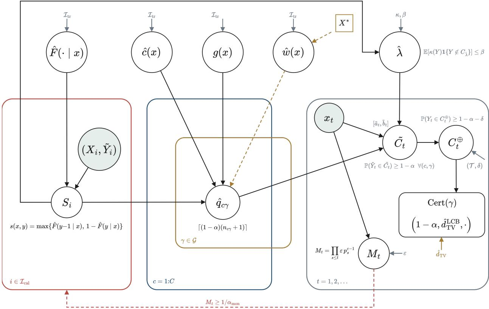  
Figure 1: CHOIR as a graph. Circles are random or fitted objects, the rectangle an exported artifact, shaded nodes observed data; plates denote replication over calibration records $( i \in \mathcal { I } _ { \mathrm { c a l } } )$ , latent classes (�), declared strata $( \gamma )$ and the deployment stream (�). The fitted tier, the base CDF $\hat { F } _ { 1 }$ , the class gate $\hat { c } _ { i }$ the stratum map � and the density ratio $\hat { w } .$ , is never trusted: no guarantee depends on it. Guarantees are created by the calibration quantile $\hat { q } _ { c \gamma }$ , transferred to true severity by the declared band $( \mathcal { T } , \delta )$ , cost-weighted through $( \kappa , \beta )$ , and exported as a per-stratum certificate with additive, attributable slacks. The dashed loop is detection, not correction: an alarm mandates re-calibration and never edits an issued certificate.

Throughout, each result is labeled [NEW] (new statement and proof), [ADAPTED] (known technique, new setting or packaging; source cited), or [KNOWN] (stated for completeness with citation). No adapted result is presented as new. Proofs of Theorems 3.13, 3.33, and 3.45 are deferred to $\operatorname { A } ;$ all other proofs appear in line.

## 3.1. Setup, notation, and standing assumptions

Severity categories $\mathcal { V } = \{ 1 , \ldots , K \}$ with $K = 5$ , ordered $1 ( \mathrm { O } ) \prec 2 ( \mathrm { C } ) \prec 3 ( \mathrm { B } ) \prec 4 ( \mathrm { A } ) \prec 5 ( \mathrm { K } )$ (KABCO: no injury, possible, non-incapacitating, incapacitating, fatal). Covariates $X \in { \mathcal { X } }$ . � denotes true severity; $\tilde { Y }$ the police-reported severity. Data are split into a training set $\scriptstyle { I _ { \mathrm { t r } } }$ , on which every fitted object lives (base model, partition, density-ratio model), and a calibration set $T _ { \mathrm { c a l } } = \{ 1 , \ldots , n \}$ ; the test point is indexed $n + 1$ . All fitted objects are treated as fixed functions when reasoning about $T _ { \mathrm { c a l } } \cup \{ n + 1 \}$ ; this is what sample splitting buys and is used without further comment.

Assumption 3.1 (A1: exchangeability). $( X _ { 1 } , { \tilde { Y } } _ { 1 } ) , \dots , ( X _ { n } , { \tilde { Y } } _ { n } ) , ( X _ { n + 1 } , { \tilde { Y } } _ { n + 1 } )$ are exchangeable.

Remark 3.2 (Clustered crash data). Persons in one crash are dependent, so rows from the same crash violate A1 if they straddle calibration and test. Protocol: (i) all splits are by crash identifier; (ii) the primary analysis calibrates and tests on one randomly sampled driver row per crash, restoring the i.i.d.-across-units structure (crashes i.i.d. ⇒ sampled rows $\mathrm { i . i . d . } \Rightarrow \mathrm { A 1 } )$ . Using all rows under crash-level splitting is approximately valid and is reported as a robustness check; for a fully rigorous multi-row treatment see the grouped conformal literature (Dunn et al., 2023).

Base model. Any estimator fit on $\scriptstyle { I _ { \mathrm { t r } } }$ exporting an estimated conditional CDF

$$
{ \hat { F } } ( k \mid x ) = { \hat { P } } ( Y \leq k \mid X = x ) , \qquad { \hat { F } } ( 0 \mid x ) \equiv 0 , \quad { \hat { F } } ( K \mid x ) \equiv 1 ,\tag{1}
$$

non-decreasing in �. Ordered logit and probit, random-parameters logit, and latent-class logit export $\hat { F }$ natively; any probabilistic classifier exports it by cumulating ${ \hat { p } } ( \cdot \mid x )$ . No assumption is ever made that $\hat { F }$ is correct. Every guarantee below is distribution-free in ${ \hat { F } } ;$ model quality afects only set size, never validity.

## 3.2. Ordinal scores, interval sets, marginal validity

Definition 3.3 (Ordinal cumulative score).

$$
s ( x , y ) = \operatorname* { m a x } \big \{ \hat { F } ( y - 1 \mid x ) , 1 - \hat { F } ( y \mid x ) \big \} .\tag{2}
$$

${ \hat { F } } ( y - 1 \mid x )$ is the predicted mass strictly below $y ; 1 - { \hat { F } } ( y \mid x )$ the mass strictly above: � measures how deep into a tail the candidate label sits (cf. CDF-based ordinal scores, Lu et al., 2022; Chakraborty et al., 2024).

Definition 3.4 (Threshold sets).

$$
C _ { \lambda } ( { \boldsymbol x } ) = \{ k \in \mathcal { V } : s ( { \boldsymbol x } , { \boldsymbol k } ) \leq \lambda \} .\tag{3}
$$

Lemma 3.5 (Contiguity and non-triviality; [ADAPTED] — proof ours). For every � and $\lambda \ge 0 \colon ( i ) { \cal C } _ { \lambda } ( x )$ is a contiguous (possibly empty) interval,

$$
C _ { \lambda } ( \boldsymbol { x } ) = \{ a _ { \lambda } ( \boldsymbol { x } ) , \ldots , b _ { \lambda } ( \boldsymbol { x } ) \} \cap \mathcal { V } ;\tag{4}
$$

(ii) $i f \lambda \ge 1 / 2$ then $C _ { \lambda } ( x ) \neq \varnothing$ and contains the predictive median

$$
k ^ { * } ( x ) = \operatorname* { m i n } \{ k : { \hat { F } } ( k \mid x ) \geq 1 / 2 \} ;\tag{5}
$$

(iii) $\lambda \mapsto C _ { \lambda } ( x )$ is nested non-decreasing.

Proof. (i) $C _ { \lambda } ( x ) = L \cap U$ with $L = \{ k ~ : ~ { \hat { F } } ( k - 1 ~ | ~ x ) \leq \lambda \} , U = \{ k ~ : ~ { \hat { F } } ( k ~ | ~ x ) \geq 1 - \lambda \}$ . Since ${ \hat { F } } ( \cdot \mid x )$ is non-decreasing, � is a down-set and � an up-set; $1 \in L$ (as $\hat { F } ( 0 ) = 0 )$ and $K \in U$ (as $\hat { F } ( K ) = \mathbb { 1 } )$ . The intersection of a down-set $\{ 1 , \dots , b _ { \lambda } \}$ and an up-set $\{ a _ { \lambda } , \dots , K \}$ is the interval $\{ a _ { \lambda } , \dots , b _ { \lambda } \}$ , empty if $a _ { \lambda } > b _ { \lambda } . ( \mathrm { i i } )$ At $k ^ { * } \colon \hat { F } ( k ^ { * } - 1 \mid x ) < 1 / 2 \leq \lambda$ and $1 - \hat { F } ( k ^ { * } \mid x ) \le 1 / 2 \le \lambda$ , so $s ( x , k ^ { * } ) \leq 1 / 2 \leq \lambda .$ . (iii) Immediate from Definition 3.4. □

Convention 3.6 (Non-emptiness). If $C _ { \lambda } ( x ) = \varnothing$ , output the singleton $\{ \mathrm { a r g } \operatorname* { m i n } _ { k } s ( x , k ) \}$ . This can only enlarge sets, so every lower coverage bound below holds verbatim; we suppress it from the notation.

Proposition 3.7 (Marginal validity of split conformal; [KNOWN] — Vovk et al., 2005; Lei et al., 2018). Let $S _ { i } = s ( X _ { i } , \tilde { Y } _ { i } ) f o r i \in \mathcal { I } _ { \mathrm { c a l } }$ , with order statistics $S _ { ( 1 ) } \leq \cdots \leq S _ { ( n ) }$ , and set

$$
\hat { q } ~ = ~ S _ { ( \lceil ( 1 - \alpha ) ( n + 1 ) \rceil ) }\tag{6}
$$

$$
( w i t h ~ \hat { q } = + \infty , i . e . ~ C = \mathcal { V } , ~ i f \left[ ( 1 - \alpha ) ( n + 1 ) \right] > n ) . ~ U n d e r A I ,
$$

$$
\begin{array} { r } { \mathbb { P } \big ( \tilde { Y } _ { n + 1 } \in C _ { \hat { q } } ( X _ { n + 1 } ) \big ) \ \geq \ 1 - \alpha , } \end{array}\tag{7}
$$

and ifthe $n + 1$ scores are a.s. distinct, also $\textstyle \leq 1 - \alpha + { \frac { 1 } { n + 1 } } .$

Proof. Exchangeability makes the rank of $S _ { n + 1 }$ among $\{ S _ { 1 } , \ldots , S _ { n + 1 } \}$ (sub-)uniform on $\{ 1 , \ldots , n + 1 \}$ . The event $\tilde { Y } _ { n + 1 } \in C _ { \hat { q } } ( X _ { n + 1 } )$ equals $\{ S _ { n + 1 } \leq \hat { q } \}$ , which contains the event that this rank is at most $\lceil ( 1 - \alpha ) ( n + 1 ) \rceil$ , of probability $\geq 1 - \alpha$ . The upper bound is the standard no-ties argument. □

Remark 3.8 (Ties). � takes values in the finite set of ${ \hat { F } } { \mathrm { - v a l u e s , } }$ , so ties are possible; the lower bound is unafected, and exactness can be restored by uniform tie-breaking jitter. At $n \sim 1 0 ^ { 6 }$ the tie correction is numerically irrelevant.

Remark 3.9 (Why intervals matter). Contiguity is not cosmetic. First, “B or worse” is the operationally meaningful output for screening; a set omitting the middle of the scale while holding both ends is a permissible answer that no dispatcher can act on. Second, contiguity is what keeps the noise expansion of Theorem 3.31 additive: an interval expands to an interval at a cost of $b ^ { - } + b ^ { + }$ categories, whereas a general set of size |�<sup>̃</sup>| admits only the multiplicative bound $| \tilde { C } | ( b ^ { - } + b ^ { + } + 1 )$ . The guarantee itself does not require it (Remark 3.32); the eficiency of the guarantee does. The ordinal structure of $\mathcal { D }$ is what does the mathematical work in Theorem 3.31, by making $\boldsymbol { \mathcal { T } } ( \boldsymbol { \tilde { y } } )$ a proper subset of .

Proposition 3.10 (Impossibility of exact conditional coverage; [KNOWN] — Vovk, 2012; Foygel Barber et al., 2021). Suppose $P _ { X }$ is non-atomic. Then any procedure achieving $\mathbb { P } ( Y ~ \in ~ C ( X ) ~ \mid ~ X ~ = ~ x ) ~ \geq ~ 1 - \alpha$ for a.e. � under all distributions returns trivial sets (sets that cannot adapt). The strongest achievable target is therefore coverage conditional on finitely many pre-declared groups, the mathematical justification for Sections 3.3 and 3.8, where the groups are the transportation-relevant ones: heterogeneity classes, jurisdictions, time.

The non-atomicity of $P _ { X }$ is the operative condition and is not a technicality: the obstruction is driven by the covariate law, not by $| \mathcal { D } | < \infty$ . Were � finitely supported the statement would fail, and Theorem 3.11 with ̂� the identity on that support would be the counterexample. Crash covariates include continuous components (speed limit, age, trafic volume), so the condition holds here.

## 3.3. Heterogeneity-conditional validity: the econometrics bridge

Let ${ \hat { c } } : { \mathcal { X } }  \{ 1 , \ldots , C \}$ be any measurable class-assignment function fit on $\scriptstyle { \tau _ { \mathrm { t r } } } ;$ ; in CHOIR it is the MAP class of a latent-class model (deep gate or classical latent-class ordered logit). Let $n _ { c } = \# \{ i \leq n : \hat { c } ( X _ { i } ) = c \}$ and let $\hat { q } _ { c }$ be the class-wise analogue of (6),

$$
\hat { q } _ { c } = S _ { ( \lceil ( 1 - \alpha ) ( n _ { c } + 1 ) \rceil ) } ^ { ( c ) } , \qquad S _ { ( 1 ) } ^ { ( c ) } \leq \dots \leq S _ { ( n _ { c } ) } ^ { ( c ) } \mathrm { ~ t h e ~ o r d e r e d ~ s c o r e s ~ } \{ S _ { i } : \hat { c } ( X _ { i } ) = c \} ,\tag{8}
$$

and define the class-conditional predictor

$$
C ^ { \mathrm { h e t } } ( x ) = C _ { \hat { q } _ { \hat { c } ( x ) } } ( x ) .\tag{9}
$$

Theorem 3.11 (Latent-class-conditional coverage; [ADAPTED] — Mondrian argument, Vovk et al., 2005; framing new). Under A1,for every class $c \in \{ 1 , \ldots , C \}$

$$
\begin{array} { r } { \mathbb { P } \big ( \tilde { Y } _ { n + 1 } \in C ^ { \mathrm { h e t } } ( X _ { n + 1 } ) ~ \Big | ~ \hat { c } ( X _ { n + 1 } ) = c \big ) ~ \ge ~ 1 - \alpha , } \end{array}\tag{10}
$$

and $C ^ { \mathrm { h e t } } ( x )$ is a contiguous interval for every �.

Proof. Fix �; condition on $E _ { c } = \{ \hat { c } ( X _ { n + 1 } ) = c \}$ and on the index set $I _ { c } \subseteq \{ 1 , \ldots , n \}$ of calibration points in class �. Because ̂� is a fixed measurable function, membership in class � is a deterministic function of the data point; exchangeability of the full collection implies exchangeability of $\{ ( X _ { i } , \tilde { Y } _ { i } ) : i \in I _ { c } \} \cup \{ ( X _ { n + 1 } , \tilde { Y } _ { n + 1 } ) \}$ conditionally on $E _ { c }$ and $| I _ { c } | = n _ { c } \mathrm { . }$ : any permutation � of the class-� points extends to a permutation of all $n + 1$ points fixing the complement, and the conditioning event is permutation-symmetric within the class. Apply Proposition 3.7’s rank argument to these $n _ { c } + 1$ exchangeable scores with quantile index $\lceil ( 1 - \alpha ) ( n _ { c } + 1 ) \rceil$ ; average over $n _ { c }$ . Contiguity is Lemma 3.5 at $\lambda = \hat { q } _ { c }$ □

Remark 3.12 (Arbitrariness is harmless). Theorem 3.11 requires nothing about ̂� being “correct”: even a nonsensical partition yields per-cell validity. Partition quality afects eficiency (set size), quantified next. The latent-class machinery of the random-parameters tradition cannot break validity; it can only earn eficiency. The guarantee is per cell and marginal: each cell covers at 1 − � over the calibration draw, not simultaneously across cells at a family-wise level, so a deployment auditing many cells at once should read the coverages as marginal and budget accordingly.

Theorem 3.13 (Oracle eficiency among conditionally valid predictors; [NEW]). Define the class-conditional score CDFs, their (1 − �)-quantiles, and the class proportions

$$
G _ { c } ( t ) = \mathbb { P } \big ( s ( X , \tilde { Y } ) \leq t \big | \hat { c } ( X ) = c \big ) , \qquad q _ { c } = \operatorname* { i n f } \left\{ t : G _ { c } ( t ) \geq 1 - \alpha \right\} , \qquad p _ { c } = \mathbb { P } ( \hat { c } ( X ) = c ) > 0 .\tag{11}
$$

Assume:

(R1) each $G _ { c }$ is continuous and strictly increasing in a neighborhood of $\dot { } q _ { c } ,$ and the mixture $\textstyle \sum _ { c } p _ { c } G _ { c }$ is continuous and strictly increasing in a neighborhood ofits (1 − �)-quantile $q _ { \mathrm { m i x } }$

(R2) for every $k \in \mathcal { V }$ and �: $\mathbb { P } ( s ( X , k ) = q _ { c } \mid \hat { c } ( X ) = c ) = 0 .$

Consider thefamily  ofpredictors $C _ { \lambda } ( x ) = C _ { \lambda _ { \hat { c } ( x ) } } ( x )$ indexed by class-wise thresholds $\lambda = ( \lambda _ { 1 } , \dots , \lambda _ { C } )$ . Then:

(i) (Oracle characterization.) Within ${ \boldsymbol { \mathscr { F } } } ,$ class-� coverage $\geq 1 - \alpha$ holds if $\lambda _ { c } \ge q _ { c } ,$ ; the unique expected-sizeminimal member of valid in every class is $\lambda ^ { \star } = ( q _ { 1 } , \ldots , q _ { C } ) ,$ , with minimal size

$$
S ^ { \star } = \sum _ { c } p _ { c } \mathbb { E } \big [ | C _ { q _ { c } } ( X ) | \big | \big ] \hat { c } ( X ) = c \big ] .\tag{12}
$$

(ii) (Attainment.) Under i.i.d. sampling within each class, as min $n _ { c } \to \infty \colon \hat { q } _ { c } \overset { p } { \to } q _ { c }$ for every �, with $| \hat { q } _ { c } - q _ { c } | =$ $O _ { p } ( n _ { c } ^ { - 1 / 2 } )$ under (R1) with positive density at $q _ { c }$ (van der Vaart, 1998, Cor. 21.5); and the expected size of�<sup>het</sup> converges to $S ^ { \star }$

(iii) (Diagnosis of marginal conformal.) Marginal split conformal has class-� coverage converging to $G _ { c } ( q _ { \mathrm { m i x } } )$ which $i s < 1 - \alpha .$ for every class with $q _ { c } > q _ { \mathrm { m i x } }$ , and > 1−�for every class with $q _ { c } < q _ { \mathrm { m i x } } .$ . It is class-conditionally validfor all � if $\dot { \boldsymbol { q } } _ { 1 } = \cdots = \boldsymbol { q } _ { C }$

Remark 3.14 (What (iii) does and does not identify). Part (iii) is elementary, and its content is that a mixture quantile is a mixture: classes whose score distributions sit above the pooled quantile must pay for those below it. It predicts a direction and nothing more. It supplies no magnitude, and in particular it does not identify which classes are the hard ones, since whether $q _ { c } > q _ { \mathrm { m i x } }$ for a given subpopulation is an empirical property of the data and not a consequence of this theorem. That the hard classes in Texas crash records turn out to be unrestrained drivers, motorcyclist-involved crashes and rural high-speed records is an empirical finding, reported in Section 5 and not claimed here. The theorem’s value is that it makes the failure structural rather than incidental: it is not a defect of any particular base model and cannot be fitted away.

Honesty box (scope ofTheorem 3.13). Theorem 3.13 does not claim class-conditional (Mondrian) sets are smaller on average than marginal sets; in general they are larger, because marginal conformal silently borrows coverage from hard classes to shrink easy ones. The correct claim, proved in A, is that the class-conditional predictor is the smallest one that does not do that. For safety applications, undercoverage of severe strata is precisely the failure mode that matters; the empirical section reports average sizes honestly. A second honest reading concerns (R1)–(R2): a discrete base model exports finitely many �<sup>̂</sup> -values, so the score distributions are atomic and both conditions can fail exactly; the tie-breaking jitter of Remark 3.8 makes the scores continuous and restores them.

## 3.4. When certification is informative: a floor no model reaches below

Theorem 3.13 compares members of the threshold family  at a fixed $\hat { F }$ . It is therefore silent on the question a practitioner asks on being handed a certificate reading “somewhere between no injury and fatal”: would a better base model have done better? This subsection answers that question in its negative form, by exhibiting a floor on expected set size that no predictor breaches and in which no base model appears.

Throughout, � denotes the label being certified. Everything below is stated for $Z = { \tilde { Y } }$ , the reported label on which the sets of Sections 3.2–3.3 are calibrated, and holds verbatim for $Z = Y$ . Let

$$
p ( z \mid x ) = \mathbb { P } ( Z = z \mid X = x )\tag{13}
$$

be the true conditional mass function, which is nowhere assumed known and nowhere estimated. Fix a stratum $A \in \sigma ( X )$ with $\mathbb { P } ( X \in A ) > 0$

Definition 3.15 (Level sets and the level-set functional). For $t \geq 0$

$$
L _ { t } ( x ) = \{ z \in \mathcal { V } : \ p ( z \mid x ) > t \} , \qquad N ( x , t ) = | L _ { t } ( x ) | ,\tag{14}
$$

and write $\gamma _ { A } ( t ) = \mathbb { P } { \bigl ( } p ( Z \mid X ) > t \mid X \in A { \bigr ) }$ for the coverage of the level-set rule at �, non-increasing with $\gamma _ { A } ( 0 ) = 1$ Define thefloor as the value of the size-minimization problem itself,

$$
\mathcal { N } _ { A } ( \alpha ) \ = \ \operatorname* { i n f } \bigg \{ \mathbb { E } \big [ | C ( X ) | \ \Big | \ X \in A \big ] \ \colon \ C \sigma ( X ) \mathrm { \cdot m e a s u r a b l e , ~ } \mathbb { P } \big ( Z \in C ( X ) \ \Big | \ X \in A \big ) \geq 1 - \alpha \bigg \} ,\tag{15}
$$

which exists for every $\alpha \in ( 0 , 1 )$ because $C \equiv \mathcal { D }$ is feasible. Theorem 3.17 identifies it with a level set: writing $t _ { A } ( \alpha ) = \operatorname* { s u p } \{ t \geq 0 : \gamma _ { A } ( t ) \geq 1 - \alpha \}$

$$
\mathcal { N } _ { A } ( \alpha ) = \mathbb { E } \left[ N ( X , t _ { A } ( \alpha ) ) ~ \middle | ~ X \in A \right] \qquad \mathrm { w h e n e v e r } \qquad \mathbb { P } \left( p ( Z \mid X ) = t _ { A } ( \alpha ) ~ \middle | ~ X \in A \right) = 0 .\tag{16}
$$

� $\mathbf { \hat { \mu } } _ { \mathrm { : } } \mapsto \mathcal { N } _ { A } ( \alpha )$ is non-increasing.

Remark 3.16 (Why the floor is defined as a value and not as a level set). Equation (16) can fail at an atom, and the degenerate case is the instructive one: if $Z = f ( X )$ for a measurable $f .$ , then $\gamma _ { A } ( t ) = 1$ for every $t < 1 , \operatorname { s o } t _ { A } ( \alpha ) = 1$ and $N ( x , 1 ) = | \{ z : p ( z \mid x ) > 1 \} | = 0 \mathrm { { } }$ , whereas the floor of (15) is 1−�, attained by a singleton on $\mathrm { a } \left( 1 { - } \alpha \right)$ -mass covariate set and the empty set elsewhere (1 once the non-emptiness convention of Convention 3.6 is imposed). Defining $\mathcal { N } _ { A } ( \alpha )$ by (15) keeps it positive at such laws, which matters here because those are exactly the laws Theorem 3.25 builds from.

$\mathcal { N } _ { A } ( \alpha )$ is a functional of the joint law of $( X , Z )$ restricted to � and of nothing else. It does not depend on ${ \hat { F } } .$ , on the calibration split, or on any modeling choice.

Theorem 3.17 (Level-set floor on expected set size; [ADAPTED] — oracle level-set optimality, Sadinle, Lei and Wasserman, 2019; ordinal and vacuity corollaries [NEW]). Let $C : \mathcal { X }  2 ^ { \mathcal { Y } }$ be any $\sigma ( X )$ -measurable set-valued predictor satisfying

$$
\mathbb { P } \big ( Z \in C ( X ) \ \Big | \ X \in A \big ) \ \ge \ 1 - \alpha .\tag{17}
$$

Then, by (15),

$$
\mathbb { E } \big [ | C ( X ) | \Big | X \in A \big ] \ \geq \ \mathcal { N } _ { A } ( \alpha ) ,\tag{18}
$$

and the floor is a level set: the infimum in (15) is attained by $C ( x ) = L _ { t _ { A } ( \alpha ) } ( x )$ , with value $\mathbb { E } [ N ( X , t _ { A } ( \alpha ) ) \ | \ X \in A ]$ as in (16), whenever $\mathbb { P } \big ( p ( Z \mid X ) = t _ { A } ( \alpha ) \ \big | \ X \in A \big ) = 0 ,$ , and attained after boundary randomization otherwise. The substance is the second statement; (18) restates (15).

Proof. Relax set membership to $u : \mathscr { X } \times \mathscr { Y }  [ 0 , 1 ]$ and consider

$$
\operatorname* { m i n } _ { u } \ \mathbb { E } \Big [ \sum _ { z \in \mathcal { Y } } u ( X , z ) \Big | \ X \in A \Big ] \quad \mathrm { s . t . } \quad \mathbb { E } \Big [ \sum _ { z \in \mathcal { Y } } p ( z \mid X ) u ( X , z ) \Big | \ X \in A \Big ] \ \geq \ 1 - \alpha .\tag{19}
$$

Any � obeying (17) yields the feasible point $u ( x , z ) = 1 \{ z \in C ( x ) \}$ with objective $\mathbb { E } [ | C ( X ) | \mid X \in A ]$ , so the value of (19) lower-bounds $\mathcal { N } _ { A } ( \alpha )$ . For $\tau \geq 0$ the Lagrangian is

$$
\mathbb { E } \Big [ \sum _ { z } u ( X , z ) \big ( 1 - \tau { \boldsymbol { p } } ( z \mid X ) \big ) ~ \Big | ~ { \boldsymbol { X } } \in A \Big ] + \tau ( 1 - \alpha ) ,\tag{20}
$$

which decouples across $( x , z ) { \mathrm { } } { \mathrm { } }$ : the coeficient of $u ( x , z )$ is negative exactly when $p ( z \mid x ) > 1 / \tau .$ , so a pointwise minimizer sets $u = 1$ on $L _ { 1 / \tau } ( x )$ and $u = 0$ of its closure. Choosing � with $1 / \tau = t _ { A } ( \alpha )$ makes the constraint bind, after boundary randomization when $p ( Z \mid X )$ has an atom at $t _ { A } ( \alpha )$ , so complementary slackness holds and this level set solves (19). Away from an atom the solution is integral, hence of the form $u = \mathbf { 1 } \{ z \in L _ { t _ { A } ( \alpha ) } ( x ) \}$ and feasible for (15); so the relaxed value and $\mathcal { N } _ { A } ( \alpha )$ coincide and both equal $\mathbb { E } [ N ( X , t _ { A } ( \alpha ) ) \mid X \in A ]$ □

Remark 3.18 (Variational form). Equation (18) is often written as a budget allocation: spend miscoverage $u ( x ) \geq 0$ at � subject to $\mathbb { E } [ u ( X ) \mid X \in A ] \leq \alpha$ , and pay the smallest set capturing conditional mass $1 - u ( x )$ . Theorem 3.17 is that infimum solved. Its content is that the optimal budget is not free to vary arbitrarily with �: it is the one induced by a single threshold on $p ( \cdot \mid x )$ , which is the Neyman–Pearson structure and is what makes $\mathcal { N } _ { A } ( \alpha )$ computable in principle from the law alone.

Corollary 3.19 (The floor binds interval predictors). Every contiguous-interval predictor is in particular a set-valued predictor, so (18) applies verbatim to $C ^ { \mathrm { h e t } }$ , to ${ \tilde { C } } ^ { \oplus }$ , and to every composed set of Theorem 3.50. Ordinal structure cannot evade thefloor; it can onlyfail to reach it.

Corollary 3.20 (Vacuity is a property of the data, not of the model). Fix $\varepsilon \in ( 0 , 1 )$ . If $\mathcal { N } _ { A } ( \alpha ) \geq K - \varepsilon$ then every predictor valid at level $1 - \alpha$ on � in the sense of (17) has mean set size at least $K - \varepsilon$ on �. Anticipating the banded map $N ( b ^ { - } , b ^ { + } , \delta )$ ofAssumption 3.29 below, the composed statement is sharper still: a base interval of width at least $K - b ^ { - } - b ^ { + }$ satisfies $\tilde { C } ^ { \oplus } ( x ) = \mathcal { D }$ after expansion, so whenever $N ( x , t _ { A } ( \alpha ) ) \geq K - b ^ { - } - b ^ { + }$ on all but an �-fraction of �, every valid composed predictor is vacuous of thatfraction. No choice of base model, no volume of training data, and no calibration scheme alters this

Remark 3.21 (What this licenses, and the direction of the logic). Corollary 3.20 is a conditional statement whose condition is an unknown functional of the joint law. Its content is that it converts the question ${ } ^ { 6 6 } \mathrm { { i s } }$ our base model inadequate $\varprojlim$ into the question “is $\mathcal { N } _ { A } ( \alpha )$ large $\varprojlim ^ { \ast }$ , which is a question about Texas crash records rather than about CHOIR. Honesty requires stating the converse too, because it limits what any experiment can show: Theorem 3.17 equally implies that the observed size of any valid predictor is an upper bound on $\mathcal { N } _ { A } ( \alpha )$ , so no agreement across any library of base models can establish that the floor is high. A plug-in estimate of $\mathcal { N } _ { A } ( \alpha )$ is evidence about the data regime and is reported as such in Section 5; it is not, and cannot be turned into, a proof. Nonparametric estimation of $p ( \cdot \mid x )$ would settle the matter and is unavailable here for a concrete reason: the recorded covariates are close to unique per record, so exactly replicated covariate patterns, on which the empirical label frequency would estimate $p ( \cdot \mid x )$ with no model, essentially do not occur. Coarsening the covariates does not help, since a coarser �-field raises the floor and so bounds it from the wrong side. Finally, the estimand is defined relative to $\sigma ( X )$ for the recorded fields $X \colon \mathbf { a }$ field the police form does not carry cannot lower a floor it does not enter.

Remark 3.22 (Relation to Theorem 3.13). The two results quantify over diferent objects and neither implies the other. Theorem 3.13 ranges over the threshold family $_ { \mathcal { F } }$ at a fixed $\hat { F }$ and identifies the smallest class-conditionally valid member, a statement about calibration given a model. Theorem 3.17 ranges over all $\sigma ( X )$ -measurable predictors and identifies a floor none reaches below, a statement about the data. Read together they bracket the achievable, $\mathcal { N } _ { A } ( \alpha ) \leq S _ { A } ^ { \star }$ , with the gap attributable to $\hat { F }$ and the floor attributable to �.

Corollary 3.23 (Informativeness frontier). For a declared informativeness target $m \in \{ 1 , \ldots , K - 1 \}$ define

$$
\alpha _ { A } ^ { \star } ( m ) = \operatorname* { i n f } \{ \alpha \in ( 0 , 1 ) : \ \mathcal { N } _ { A } ( \alpha ) \leq m \} .\tag{21}
$$

For $\alpha < \alpha _ { A } ^ { \star } ( m )$ no valid predictor on � attains mean size at most �. Since ${ \alpha \mapsto \mathcal N _ { A } ( \alpha ) }$ is non-increasing, $\alpha _ { A } ^ { \star }$ is well defined and non-increasing in �. The map � $\mapsto \alpha _ { A } ^ { \star } ( m )$ is the object an agency needs in order to choose a screening level it can actually be served at, and it is what the empiricalfrontier ofSection 5 estimates.

## 3.5. The floor cannot be certified from below

Theorem 3.17 localizes informativeness in a single functional of the law, and Remark 3.21 observed that valid predictors bound $\mathcal { N } _ { A } ( \alpha )$ only from above. It is natural to ask whether some other procedure could bound it from below, and so certify that a stratum is beyond certification. It cannot, and the obstruction is the same non-atomicity that drives Proposition 3.10.

Let  denote the set of joint laws of $( X , Z )$ on $\mathscr { X } \times \mathscr { V }$ whose covariate marginal is non-atomic, and let $D _ { n } =$ $( ( X _ { 1 } , Z _ { 1 } ) , \dots , ( X _ { n } , Z _ { n } ) )$ be i.i.d. from $P \in { \mathcal { P } }$

Definition 3.24 (Lower certificate). $\mathrm { A } \left( 1 - \gamma \right)$ lower certificate for the floor is a measurable map $\hat { L } _ { n } : ( \mathcal { X } { \times } \mathcal { Y } ) ^ { n } \to [ 0 , K ]$ with

$$
\begin{array} { r } { \mathbb { P } _ { P } \left( \hat { L } _ { n } ( D _ { n } ) \leq \mathcal { N } _ { A } ( \alpha ; P ) \right) \geq 1 - \gamma \qquad \mathrm { f o r } \mathrm { e v e r y } P \in \mathcal { P } . } \end{array}\tag{22}
$$

It is distribution-free: no � in the class may be excluded, which is precisely the standard the rest of this paper holds itself to.

Theorem 3.25 (Non-certifiability of the floor; [ADAPTED] — distribution-free impossibility via indistinguishability, Foygel Barber, 2020; the level-set target and the ordinal reading [NEW]). $^ { \varsigma } i x K \geq 2 , \alpha \in ( 0 , 1 ) , n \in  { \mathbb { N } } , \gamma \in ( 0 , 1 )$ and $\varepsilon > 0 .$ . Let $\hat { L } _ { n }$ be any $( 1 - \gamma )$ lower certificate in the sense of Definition 3.24, and let $P _ { 0 } \in \mathcal { P }$ be the law with $Z \perp X$ and � uniform on ${ \mathcal { D } } ,$ for which $\mathcal { N } _ { A } ( \alpha ; P _ { 0 } ) = ( 1 - \alpha ) K$ . Then

$$
\begin{array} { r } { \mathbb { P } _ { P _ { 0 } } \big ( \hat { L } _ { n } ( D _ { n } ) \leq 1 \big ) \geq 1 - \gamma - \varepsilon . } \end{array}\tag{23}
$$

That $i s ,$ on a law whose floor is $( 1 - \alpha ) K$ , every distribution-free lower certificate returns the trivial bound with probability at least $1 - \gamma - \varepsilon$ . No non-trivial lower bound on $\mathcal { N } _ { A } ( \alpha )$ is certifiablefromfinite data without assumptions on $P .$

Proof. Because $P _ { 0 , X }$ is non-atomic, for any � there is a partition $\begin{array} { r } { \mathcal { X } = \bigsqcup _ { j = 1 } ^ { m } B _ { j } } \end{array}$ with $P _ { 0 , X } ( B _ { j } ) = 1 / m$ for every �. For $v = ( v _ { 1 } , \ldots , v _ { m } ) \in \mathcal { V } ^ { m }$ let $f _ { v } ( x ) = v _ { j }$ for $x \in B _ { j }$ , a measurable function, and let $Q _ { v } \in \mathcal { P }$ be the law with the

same covariate marginal $P _ { 0 , X }$ and $Z = f _ { v } ( X )$ almost surely. Under $Q _ { v }$ the singleton predictor $C ( x ) = \{ f _ { v } ( x ) \}$ has conditional coverage $1 \geq 1 - \alpha .$ , so $\mathcal { N } _ { A } ( \alpha ; Q _ { v } ) \le 1$ by (15); note this is where Remark 3.16 is needed, since (16) degenerates at exactly these laws. Applying (22) to each $Q _ { v }$ and averaging over � uniform on ${ \mathcal { { V } } } ^ { m }$

$$
\begin{array} { r } { \mathbb { E } _ { V } \bigg [ \mathbb { P } _ { Q _ { V } } \big ( \hat { L } _ { n } ( D _ { n } ) \leq 1 \big ) \bigg ] \ \geq \ 1 - \gamma . } \end{array}\tag{24}
$$

Let $\bar { Q } _ { m }$ be the �-mixture of $Q _ { V } ^ { \otimes n }$ , i.e. the law of $D _ { n }$ when � is drawn once and � points are then drawn from $Q _ { V }$ Let � be the event that the � sampled covariates fall in � distinct cells. On � the labels $Z _ { i } = V _ { j ( i ) }$ involve � distinct coordinates of �, which are i.i.d. uniform on $\mathcal { D }$ and independent of the covariates; the covariates themselves have marginal $P _ { 0 , X }$ under both laws. Hence $\bar { Q } _ { m }$ and $P _ { 0 } ^ { \otimes n }$ agree on $E ,$ and by a birthday bound $\mathbb { P } ( E ^ { c } ) \le n ^ { 2 } / ( 2 m )$ under either, so

$$
d _ { \mathrm { T V } } \bigl ( \bar { Q } _ { m } , \ P _ { 0 } ^ { \otimes n } \bigr ) \ \leq \ \frac { n ^ { 2 } } { 2 m } .\tag{25}
$$

Choosing $m \geq n ^ { 2 } / ( 2 \varepsilon )$ and combining (24) with (25) gives (23). Finally $\mathcal { N } _ { A } ( \alpha ; P _ { 0 } ) \ : = \ : ( 1 - \alpha ) K$ : under $P _ { 0 }$ the conditional law is uniform for every �, so covering reported-label mass $1 - \alpha$ costs expected size $( 1 - \alpha ) K$ , attained by including a (1 − �) fraction of the � labels and unimprovable by any rule reaching mass 1 − �. Either way $\mathcal { N } _ { A } ( \alpha ; P _ { 0 } ) \gg 1$ □

Remark 3.26 (Attribution). The mechanism of Theorem 3.25 is not ours. Foygel Barber (2020) proves that any distribution-free confidence interval for the conditional label probability in binary regression obeys a length lower bound that is independent of the sample size and holds for every distribution without point masses, so that no distribution-free procedure can adapt to structure in the law. That is the same obstruction, under the same non-atomicity condition, established by the same style of indistinguishability argument, and the honest description of Theorem 3.25 is that it transports that argument to a diferent target. What is ours is the target and its consequence: the estimand here is the level-set functional $\mathcal { N } _ { A } ( \alpha )$ , a property of the whole conditional law on a stratum rather than of a single conditional probability, and the consequence is that the floor of Theorem 3.17 is not certifiable from below, which is what closes the account opened in Remark 3.21. A reader who knows Foygel Barber (2020) and Foygel Barber et al. (2021) should find Theorem 3.25 unsurprising; we state and prove it because the paper needs the specific statement, not because the technique is new.

Remark 3.27 (What is and is not being claimed). The theorem does not say the floor is unknowable in principle; it says it is not certifiable distribution-free. The mechanism is exact and worth stating in words: when $P _ { X }$ is non-atomic the sample never revisits a covariate value, so a difuse conditional law and a deterministic labeling $Z = f ( X )$ generate identical data, and any � agreeing with the observed labels is consistent with everything seen. Assumptions that tie $p ( \cdot \mid x )$ across nearby �, such as smoothness or a parametric form, evade the construction and permit estimation; they are exactly the assumptions this paper declines to make elsewhere, and taking them here to rescue a lower bound would be inconsistent. The result is the natural companion of Proposition 3.10: non-atomicity of the covariate law obstructs conditional coverage, and it obstructs certifying the floor. Together with Theorem 3.17 the statement is complete. There is a floor, it governs informativeness, valid predictors bound it from above, and nobody, ourselves included, can bound it from below without leaving the distribution-free setting.

Remark 3.28 (The empirical face of the obstruction). The construction is not a pathology invented for the proof; it describes the data. Estimating $p ( \cdot \mid x )$ without model assumptions requires covariate patterns that repeat, and in the Texas records they do not: on the motorcyclist stratum, 54,872 records carry 54,868 distinct patterns across the 38 recorded fields, with four patterns occurring twice and none more often (Section 5). The sample never revisits an �, which is the empirical statement of the hypothesis Theorem 3.25 runs on. Coarsening the covariates restores repeats but changes the estimand, raising the floor of a smaller �-field, and so bounds from the wrong side.

## 3.6. Coverage on true severity under reporting noise

Calibration uses reported labels $\tilde { Y }$ ; the guarantee owed to the practitioner is on true severity �. We never estimate a misclassification model; we declare a support (band) condition and prove what it buys.

Assumption 3.29 $( \mathrm { N } ( { \mathcal { T } } , \delta ) ;$ compatibility). There is a set-valued map $\tau : \mathfrak { V } \to 2 ^ { \mathfrak { V } }$ (“plausible truths for a report”) satisfying $\tilde { y } \in \mathcal { T } ( \tilde { y } )$ for every $\tilde { y } \in \mathcal { V }$ , and $\delta \in [ 0 , 1 )$ with

$$
\mathbb { P } \big ( Y _ { n + 1 } \in \mathcal { T } ( \tilde { Y } _ { n + 1 } ) \big ) \ \geq \ 1 - \delta .\tag{26}
$$

Reflexivity is a normalization, not a restriction: a report is always compatible with itself, and every map instantiated in this paper satisfies it. It is stated because it is what gives ${ \tilde { C } } \subseteq { \tilde { C } } ^ { \oplus }$ , which Corollary 3.48 uses. Banded special case $\mathrm { N } ( b ^ { - } , b ^ { + } , \delta )$

$$
\mathcal { T } ( \tilde { y } ) = \{ y \in \mathcal { D } : \ \tilde { y } - b ^ { + } \leq y \leq \tilde { y } + b ^ { - } \} .\tag{27}
$$

Here $b ^ { + }$ guards over-reporting (true severity below the report; the set reaches downward) and $b ^ { - }$ guards under-reporting (true severity above the report; the set reaches upward). Under-reporting is the safety-critical direction, so $b ^ { - }$ is the load-bearing constant. KABCO default: $b ^ { - } = b ^ { + } = 1$ with � the beyond-adjacent mass, elicited from KABCO–MAIS linkage studies and swept in sensitivity curves (Section 3.6.1); refined category-dependent maps in Remark 3.38.

The assumption concerns only the test point’s joint law $( Y _ { n + 1 } , \tilde { Y } _ { n + 1 } ) ;$ ; calibration labels are never de-noised because calibration only ever touches $\tilde { Y }$

Definition 3.30 (Compatibility expansion). For an interval $\tilde { C } ( x ) ~ = ~ [ \tilde { a } ( x ) , \tilde { b } ( x ) ]$ produced by any procedure of Sections 3.2–3.3, let

$$
\tilde { C } ^ { \oplus } ( x ) = \bigcup _ { \tilde { y } \in \tilde { C } ( x ) } \mathcal { T } ( \tilde { y } ) .\tag{28}
$$

In the banded case

$$
\tilde { C } ^ { \oplus } ( x ) = \left[ \tilde { a } ( x ) - b ^ { + } , \tilde { b } ( x ) + b ^ { - } \right] \cap \mathcal { V } ,\tag{29}
$$

again an interval.

Theorem 3.31 (Noise transfer of coverage; [ADAPTED] — coverage transfer under label noise, Cauchois, Gupta, Ali and Duchi, 2022; Stutz, Roy, Matejovicova, Strachan, Cemgil and Doucet, 2023; the banded ordinal map and additive expansion [NEW]). Let $\tilde { C }$ be any set-valued predictor with $\mathbb { P } ( \tilde { Y } _ { n + 1 } \in \tilde { C } ( X _ { n + 1 } ) ) \geq 1 - \alpha$ (Proposition 3.7), $o r \ge 1 - \alpha$ conditionally on a class or stratum (Theorem 3.11) with $N ( \tau , \delta )$ holding conditionally. Then under N(, �),

$$
\begin{array} { r } { \mathbb { P } \big ( Y _ { n + 1 } \in \tilde { C } ^ { \oplus } ( X _ { n + 1 } ) \big ) \ \geq \ 1 - \alpha - \delta . } \end{array}\tag{30}
$$

Proof. On $A = \{ \tilde { Y } _ { n + 1 } \in \tilde { C } ( X _ { n + 1 } ) \} \cap \{ Y _ { n + 1 } \in \mathcal { T } ( \tilde { Y } _ { n + 1 } ) \}$ we have $Y _ { n + 1 } \in \mathcal { T } ( \tilde { y } )$ for some $\tilde { y } \in \tilde { C } ( X _ { n + 1 } )$ , hence $Y _ { n + 1 } \in { \tilde { C } } ^ { \oplus } ( X _ { n + 1 } )$ . And $\begin{array} { r } { \mathbb { P } ( A ) \geq \mathbb { P } ( \tilde { Y } _ { n + 1 } \in \tilde { C } ) - \mathbb { P } ( Y _ { n + 1 } \notin \mathcal { T } ( \tilde { Y } _ { n + 1 } ) ) \geq 1 - \alpha - \delta } \end{array}$ . The conditional version is identical with all probabilities conditional. □

The proof is two lines by design: the dificulty was moved into having a banded compatibility map, which is transportation structure. Without ordinal structure, $\boldsymbol { \tau } ( \boldsymbol { \tilde { y } } )$ is all of  and the expansion is vacuous. Transferring conformal coverage from a noisy or weakly supervised label to the clean one is not itself new (Cauchois et al., 2022; Stutz et al., 2023; Einbinder et al., 2024); what the ordinal band contributes is that the transfer costs an additive $b ^ { - } + b ^ { + }$ categories rather than degrading multiplicatively or by the full error rate, a distinction made precise agains the total-variation baseline in Proposition 3.34 and Remark 3.35.

Remark 3.32 (What contiguity does and does not buy). Theorem 3.31 holds for any set-valued ${ \tilde { C } } ;$ its proof never uses contiguity, and $\begin{array} { r } { \tilde { C } ^ { \oplus } = \bigcup _ { \tilde { y } \in \tilde { C } } \mathcal { T } ( \tilde { y } ) } \end{array}$ is defined for arbitrary ${ \tilde { C } } .$ What ordinality supplies is that $\boldsymbol { \mathcal { T } } ( \boldsymbol { \tilde { y } } )$ is a proper subset of ${ \mathcal { D } } ,$ without which the expansion is vacuous; that is the load-bearing structure. What contiguity of $\tilde { C }$ supplies is separate and is about cost, not validity: for an interval, ${ \tilde { C } } ^ { \oplus }$ is again an interval and the expansion costs $b ^ { - } + b ^ { + }$ additively, whereas for a general $\tilde { C }$ the bound degrades to $| \tilde { C } | ( b ^ { - } + b ^ { + } + 1 )$ , i.e. multiplicatively. Contiguity also carries the operational reading $( ^ { 6 6 } B$ or worse”) that a screening deployment acts on. Both are reasons to want interval sets; neither is a condition of Theorem 3.31.

Theorem 3.33 (Sharpness; [NEW]). Fix the banded map $\begin{array} { r } { \mathcal { T } ( \tilde { y } ) = [ \tilde { y } - b ^ { + } , \tilde { y } + b ^ { - } ] . } \end{array}$ (i) (Tightness of the constant.) For every $\alpha \in ( 0 , 1 ) , \delta \in [ 0 , \alpha \wedge ( 1 - \alpha ) ) , b ^ { \pm }$ with $K \geq b ^ { - } + 2 ,$ , and every $\eta > 0 ,$ there exists a joint law of $( X , Y , { \tilde { Y } } )$ satisfying A1 and $N ( b ^ { - } , b ^ { + } , \delta )$ under which

$$
\operatorname* { l i m } _ { n \to \infty } \mathbb { P } \big ( Y _ { n + 1 } \in \tilde { C } ^ { \oplus } \big ) \ \le \ 1 - \alpha - \delta + \eta ;\tag{31}
$$

hence no constant larger than $1 - \alpha - \delta$ can replace the bound ofTheorem 3.31.

(ii) (The expansion cannot be trimmed on either side.) Fix $\alpha \in ( 0 , 1 / 2 )$ and assume $b ^ { - } \geq 1$ (respectively $b ^ { + } \geq 1$ for the symmetric statement), so the trimmed rule is well defined. For the rule that expands upward only by $b ^ { - } - 1$ $( i . e . ,$ , outputs $[ \tilde { a } - b ^ { + } , \tilde { b } + b ^ { - } - 1 ] \}$ there is a law satisfying $N ( b ^ { - } , b ^ { + } , 0 )$ with asymptotic true-label coverage $\leq \alpha < 1 - \alpha ;$ symmetrically, for the rule that expands downward only by $b ^ { + } - 1$ there is a law satisfying $N ( b ^ { - } , b ^ { + } , 0 )$ with the samefailure. Hence no one-sided reduction ofthe expansion preserves the guarantee.

Proposition 3.34 (Structure buys tightness; [ADAPTED] — (i) cf. Einbinder et al., 2024, Cor. 3). Suppose only $\mathbb { P } ( \tilde { Y } \neq Y ) \le \varepsilon _ { \mathrm { t o t } }$ is known (no band). Then: (i) the best transfer without expansion is

$$
\mathbb { P } ( Y \in \tilde { C } ) \geq 1 - \alpha - \varepsilon _ { \mathrm { t o t } } ,\tag{32}
$$

and no label-space expansion whose output $\textstyle \bigcup _ { \tilde { y } \in \tilde { C } } D ( \tilde { y } )$ remains a proper subset of  improves the constant, since without support restrictions an adversarial coupling puts the of-event mass outside that union; (ii) under the banded assumption, Theorem 3.31 attains $1 - \alpha - \delta$ at the cost of at most $b ^ { - } + b ^ { + }$ added categories. In the KABCO regime elicited from linkage studies $( \varepsilon _ { \mathrm { t o t } }$ of order $0 . 3 \mathrm { - } 0 . 5 $ , dominated by adjacent A/B/C confusion; beyond-band mass � of order $0 . 0 1 { - } 0 . 0 5 )$ , the guarantee improvesfrom $1 - \alpha - \varepsilon _ { \mathrm { t o t } }$ (weak, and at the upper end near-uninformative at $\alpha = 0 . 1 )$ to $1 - \alpha - \delta$ (near-nominal)

Remark 3.35 (Attribution of Proposition 3.34). Part (i) is not new and is not claimed as new. Einbinder et al. (2024) obtain the same degradation from a purely structural premise, assuming only a total-variation bound between the clean and noisy label laws and correcting the nominal level accordingly; up to the constant, their Corollary 3 is (32). We state it here because it is the baseline Theorem 3.31 must beat, and the comparison in (ii) is the point: their premise and ours are both structural, but theirs is indexed by the total error rate $\varepsilon _ { \mathrm { t o t } }$ and ours by the beyond-band mass �. In the KABCO regime those difer by an order of magnitude, which is what the band buys. The adversarial-coupling clause in (i) is our addition and is a one-line observation, not a contribution.

Proof. (i) is the union bound of Theorem 3.31 with $\mathcal { T } ( \tilde { y } ) = \{ \tilde { y } \}$ on a $1 - \varepsilon _ { \mathrm { t o t } }$ event, plus the stated adversarial coupling. (ii) is Theorem 3.31 plus arithmetic; the KABCO magnitudes are cited (Section 3.6.1), not proved. □

## 3.6.1. Numeric grounding ofthe band

KABCO–MAIS linkage studies quantify police misclassification against medically assessed severity. In the Wisconsin CODES linkage (2008–2012; 120,534 linked crash victims), overall agreement between the police KABCO rating and the MAIS-based reference category is $5 1 \% , \mathrm { s o } \varepsilon _ { \mathrm { t o t } } \approx 0 . 4 9$ in the linked sample; essentially all disagreement is concentrated within one adjacent reference category in the under-reporting direction: victims rated $\mathbf { B } , \mathbf { C } , \mathbf { o r } \mathbf { O }$ whose reference severity is serious (MAIS 3+) constitute 2.9% of all cases, and per report category the beyond-adjacent underreporting mass is 0.4% (O), 1.7% (C), and 2.0% (B) (Burdett et al., 2015; Burdett, 2014). Fatality recording is exact in the over-reporting direction in both the Wisconsin linkage (100% of K-coded victims MAIS 6) and NASS/CDS (Farmer, 2003). Over-reporting from A is heavier and reaches two categories down (38.2% of A-coded victims at MAIS 1), which motivates the category-dependent map of Remark 3.38 rather than a constant symmetric band. Two caveats are declared: linked samples over-represent medically attended victims, and MAIS is a distinct scale mapped to KABCO by a declared correspondence; both are reasons the band is a sensitivity input swept over � (and over candidate maps ), never an estimated parameter.

Remark 3.36 (Is the band minimal, or is the saturation self-inflicted?). A band of total width $b ^ { - } + b ^ { + } = 2$ saturates a five-point scale from any base interval of width 3, so a reader is entitled to ask whether the uninformativeness reported in Section 5 is a property of the data or of our own declaration. The two directions answer diferently, and both answers are needed.

Upward, the band is not optional. Setting $b ^ { - } = 0$ places every adjacent under-reporting event outside the band, and the linkage evidence puts essentially all of the 49% disagreement there, so � would rise to roughly that value and the floor $1 - \alpha - \delta$ to roughly 0.41. Against this, $b ^ { - } = 1$ leaves only the beyond-adjacent mass, which weighted by the reported KABCO composition of the test split i $; 0 . 8 2 2 ( 0 . 0 0 4 ) + 0 . 0 9 9 ( 0 . 0 1 7 ) + 0 . 0 6 2 ( 0 . 0 2 0 ) \approx 0 . 0 0 6 2$ . One category upward buys about two orders of magnitude in �, and no certificate worth issuing survives without it.

Downward, honesty requires conceding that the cited evidence does not force $b ^ { + } = 1$ . The Wisconsin linkage quantifies over-reporting only for category A, at 38.2% reaching two categories down, which contributes $0 . 0 1 4 ( 0 . 3 8 2 ) \approx$ 0.0053 of beyond-band mass under a constant unit band and brings the total to $\approx \ : 0 . 0 1 1 5$ , comfortably inside the declared $\delta = 0 . 0 2$ . It reports no adjacent over-reporting rate for O, C, or B, so a deployment could defensibly declare $b ^ { + } = 0$ and absorb the over-reporting into a slightly larger �.

That trim is the sharpest one the evidence permits, and it does not change the finding. With $b ^ { - } = 1$ and $b ^ { + } = 0$ the expansion adds one category rather than two, and the class-conditional base widths on the motorcyclist stratum, which lie between 3.55 and 4.22 across all seven base models of Section 5, compose to between 4.55 and 5. Every one remains at or above width 4 on a scale of five. The rural high-speed stratum sits at 1.95 and composes to 2.95, and is not vacuous under either band, which is consistent with what Section 5 reports there. The saturation on the strata this paper is about is therefore inherited from the base sets and not manufactured by the declaration; the band is the mechanism by which it becomes visible, not its origin.

Remark 3.37 (Known-Π alternatives). If a full misclassification kernel Π( ̃� ∣ �) were known and stable, quantilecorrection approaches (Einbinder et al., 2024; Sesia et al., 2025; Bortolotti et al., 2025) could yield smaller sets. We deliberately require only the support/band of Π: in crash data Π’s magnitudes vary by jurisdiction and era while its band structure is stable; robustness to Π-misspecification is the design goal. The known-Π route is complementary.

Remark 3.38 (Category-dependent bands; fatals exact). Replace the constant band by a category-dependent map, e.g. $\mathcal { T } ( 5 ) ~ = ~ \{ 5 \}$ and $5 \notin \mathcal { T } ( \tilde { y } )$ for $\tilde { y } \leq 4$ when fatality recording is treated as exact (death-record verification), and $\mathcal { T } ( 4 ) \supseteq \{ 2 , 3 , 4 \}$ where two-level over-reporting from A is material (Section 3.6.1). Theorem 3.31 holds verbatim; its proof never used constancy of the band. Consequence: with fatals exact, the K boundary never inflates, which materially reduces the practical cost of the expansion; stated as a corollary in Section 3.9.

## 3.7. The reporting channel imposes an identifiable floor

Theorem 3.25 closed the distribution-free account: the level-set floor $\mathcal { N } _ { A } ( \alpha )$ governs informativeness and cannot be certified from below without assumptions. This subsection reopens it with the one assumption the domain supplies for free, a declared misreporting channel, and shows that the floor then admits a nonvacuous lower bound computable from linkage constants. The pairing is the point: what is impossible distribution-free (Theorem 3.25) becomes possible given the channel, which is an identifiability statement about the data regime rather than about any model. The floor itself is a genie-aided converse, the argument style of list-size lower bounds in coding (Guruswami and Vadhan, 2010), and the recovery of its inputs from a partially known channel places it in the partial-identification tradition (Molinari, 2008); the nearest predictive-set neighbor, oracle prediction sets under interval censoring (Liu, de Paula and Tamer, 2025), is a diferent problem, set construction under a censored outcome rather than a floor imposed by a misclassification channel.

Write $M ( t ~ \mid ~ y ) ~ = ~ \mathbb { P } ( \tilde { Y } ~ = ~ t ~ \mid ~ Y ~ = ~ y )$ for the channel taking true severity � to the reported label $\tilde { Y } .$ . On a stratum $A \ \in \ \sigma ( X )$ with $\mathbb { P } ( X \ \in \ A ) \ > \ 0$ , let $p _ { A } ( y ) ~ = ~ \mathbb { P } ( Y ~ = ~ y ~ \vert ~ X ~ \in ~ A )$ be the true composition and $\begin{array} { r } { \tilde { p } _ { A } ( t ) = \sum _ { \nu } M ( t \mid y ) p _ { A } ( y ) } \end{array}$ the reported composition, the latter observed. We require nondiferential reporting within the stratum: $M ( t \mid y , x ) = M _ { A } ( t \mid y )$ for $x \in A$ , that is, given true severity the reporting process does not vary with covariates inside �. This is weaker than global nondiferentiality and is the honest form, since agreement rates difer across road-user types (Remark 3.43).

Definition 3.39 (Channel floor). For inclusion weights $c ( t \mid y ) \in [ 0 , 1 ]$

$$
\mathcal { N } _ { A } ^ { * } ( \alpha ) = \operatorname* { m i n } _ { c } \sum _ { y } p _ { A } ( y ) \sum _ { t } c ( t \mid y ) \quad \mathrm { s . t . } \quad \sum _ { y } p _ { A } ( y ) \sum _ { t } c ( t \mid y ) M _ { A } ( t \mid y ) \geq 1 - \alpha .\tag{33}
$$

This is a fractional knapsack: order the cells $( y , t )$ by $M _ { A } ( t \mid$ �) and include greedily until the coverage constraint binds, with one fractional boundary cell. It is the smallest expected set size for covering the reported label at level $1 - \alpha$ by a predictor that knows the true label and may randomize; no contiguity is imposed. A value $\mathcal { N } _ { A } ^ { * } ( \alpha ) < 1$ is attained only by fractional rules that occasionally return the empty set; under the non-emptiness convention (Convention 3.6) the deployed floor is max $\{ 1 , \mathcal { N } _ { A } ^ { * } ( \alpha ) \}$ , so a computed value below one certifies that the channel imposes no excess width on �, not that the bound is violated.

Theorem 3.40 (Channel floor on expected set size; [ADAPTED] — level-set optimality (Sadinle et al., 2019) composed with a genie reduction under within-stratum nondiferential reporting). Under within-stratum nondiferential reporting, any $\sigma ( X )$ -measurable, possibly randomized set-valued predictor � with reported-label coverage $\mathbb { P } ( \tilde { Y } \in C ( X ) \mid X \in A ) \geq 1 - \alpha$ satisfies

$$
\mathbb { E } \big [ | C ( X ) | \big | X \in A \big ] \ \geq \ \mathcal { N } _ { A } ^ { * } ( \alpha ) .\tag{34}
$$

$\mathcal { N } _ { A } ^ { * } ( \alpha )$ depends only on the stratum channel $M _ { A }$ and the true composition $p _ { A } ,$ no base model, feature set, or calibration scheme enters.

Proof. Write $N ( { \mathcal { F } } )$ for the value of (33)’s minimization over -measurable inclusion rules � with the same marginal coverage constraint. Any valid � gives a feasible rule $c ( t \mid x ) = \mathbf { 1 } \{ t \in C ( x ) \}$ }, so $\mathbb { E } [ | C ( X ) | \mid A ] \geq N ( \sigma ( X ) )$ . Since $\sigma ( X ) \subseteq \sigma ( X , Y )$ , every $\sigma ( X )$ -measurable rule is $\sigma ( X , Y )$ -measurable, so the larger feasible set gives $N ( \sigma ( X ) ) ~ \geq$ $N ( \sigma ( X , Y ) )$ . Under within-stratum nondiferentiality the reported law given $( X , Y ) = ( x , y )$ is $M _ { A } ( \cdot \mid y )$ . For any $\sigma ( X , Y$ )-measurable $c ( t \mid x , y )$ form its conditional average ${ \bar { c } } ( t \ | \ y ) = \operatorname { \mathbb { E } } [ c ( t \ | \ X , Y ) \ | \ Y = y , X \in A ]$ , which is $\sigma ( Y )$ -measurable; because the objective $\textstyle \sum _ { t }$ � and the coverage integrand $\textstyle \sum _ { t } c M _ { A } ( t \mid y )$ are both linear in $c ,$ averaging preserves the objective and the constraint, so ̄� is feasible with the same value. The minimum is therefore attained on �-measurable weights, and $N ( \sigma ( X , Y ) ) = N ( \sigma ( Y ) ) = \mathcal { N } _ { A } ^ { * } ( \alpha )$ , the value of (33). The chain gives (34). For tightness, take $X = ( Y , U )$ with � independent uniform: the rule that includes � with probability equal to the optimal fractional weight $c ^ { \star } ( t \mid Y )$ , using � as the randomization device, attains $\mathcal { N } _ { A } ^ { * } ( \alpha )$ ; for a fixed covariate process that carries no such device the bound is generally strict. □

Corollary 3.41 (Channel-imposed vacuity). $\mathcal { N } _ { A } ^ { * } ( \alpha ) > 1$ only $i f \sum _ { y } p _ { A } ( y )$ max $M _ { A } ( t \mid y ) < 1 - \alpha ,$ , that is, only if no single reported category covers the stratum’s reported label at $1 - \alpha$ even knowing the true label. The converse can fail: a rule may spend width two on a peaked column and width zero on another, so that width-one coveragefalls short yet the LP value is below one (the empty-set budget ofDefinition 3.39). When the channel doesforce $\mathcal { N } _ { A } ^ { * } ( \alpha ) > 1$ , the observed width on � decomposes as

$$
\underbrace { \mathcal { N } _ { A } ^ { * } ( \alpha ) } _ { c h a n n e l f l o o r } \le \underbrace { i r r e d u c i b l e \sigma ( X ) \ – f l o o r } _ { \le o b s e r \nu e d w i d t h } .\tag{35}
$$

The middle term is bounded but not point-identified, by Theorem 3.25; $\mathcal { N } _ { A } ^ { * } ( \alpha )$ is its certifiable lower end. On strata whose true severity concentrates on the smeared interior categories, the channel alone forces wide sets, independent of the base model. This is the mechanism behind the empirical vacuity of Section 5: it is a property of the reporting channel on those strata, not a defect of any predictor.

Remark 3.42 (Graceful degradation of nondiferentiality). If reporting is diferential within � with $\begin{array} { r } { \operatorname* { s u p } _ { x \in A , y } d _ { \mathrm { T V } } \big ( M ( \cdot \mid } \end{array}$ $y , x ) , M _ { A } ( \cdot \mid y ) \big ) \leq \gamma$ , then any predictor feasible under the true process has surrogate-channel coverage at least $1 - \alpha - \gamma$ so $\mathbb { E } [ | C ( X ) | \mid A ] \ge { \mathcal { N } } _ { A } ^ { * } ( \alpha + \gamma )$ . The floor moves continuously in the diferential. One consequence is diagnostic: a valid predictor achieving width below $\mathcal { N } _ { A } ^ { * } ( \alpha )$ using scene fields coded by the same oficer who assigns the label is evidence of rater-mediated dependence, not a contradiction.

Remark 3.43 (Identification and the specification test; [NEW]). $\mathcal { N } _ { A } ^ { * }$ requires $M _ { A }$ and $p _ { A }$ , neither observed directly. The linkage constants of Section 3.6.1 are marginal rates, not a full channel, so $M _ { A }$ is only partially identified; following the direct-misclassification approach of Molinari (2008), the identification region for $\mathcal { N } _ { A } ^ { * }$ is the set of channels that meet the declared per-category constraints and reproduce the observed reported composition, $\tilde { p } _ { A } = M _ { A } ^ { \top } p _ { A }$ on the simplex, with $p _ { A }$ recovered through each admitted channel in turn. The channel is a declared policy input swept over this set, never estimated, consistent with the band of Assumption 3.29. The certified lower end is the admitted channel that minimizes $\mathcal { N } _ { A } ^ { * }$ , attained by concentrating each column on its diagonal and nearest under-reporting cell, which the linkage evidence supports; it is computed directly rather than by grid search. Selection is handled by an explicit model. Writing $s ( y , t ) = \mathbb { P } ( \mathrm { l i n k e d } \mid Y = y , { \tilde { Y } } = t )$ , the linked and population channels satisfy $M _ { A } ^ { \mathrm { l i n k } } ( t \mid y ) \propto M _ { A } ( t \mid y ) s ( y , t )$ so $M _ { A } ( t \ | \ y ) \propto M _ { A } ^ { \mathrm { l i n k } } ( t \ | \ y ) / s ( y , t )$ . When linkage tracks true severity alone, � is constant in � and the forward channel is invariant, the optimistic case; in this domain the on-scene indicators that drive the oficer’s KABCO code also drive entry into the linkable medical stream, so � depends on the reported label given the truth. We bound that dependence by $\begin{array} { r } { \operatorname* { m a x } _ { t } s ( y , t ) / \operatorname* { m i n } _ { t } s ( y , t ) \le R } \end{array}$ for each � and report the certified floor over $R \in \{ 1 , 2 , 5 \}$ (Section $5 ) ;$ $R = 1$ recovers invariance. This yields a testable prediction rather than a fitted quantity: since $\mathcal { N } _ { A } ^ { * } ( \alpha )$ lower-bounds the width of every valid predictor, an achieved valid width below the identified interval refutes the declared channel on $A ,$ , an overidentification test on the declared set. The identified set is accordingly the declared-consistent set intersected with $\{ M _ { A } : \mathcal { N } _ { A } ^ { * } ( \alpha ) \leq w _ { A } ^ { \mathrm { a c h } }$ for all $A \}$ , where $w _ { A } ^ { \mathrm { a c h } }$ is an achieved valid width; on the Texas records this intersection removes nothing, but it is the general form. Section 5 reports the test on every stratum, with the reliable low-severity stratum first because it binds most tightly.

## 3.8. Spatiotemporal deployment shift

A deployment cell is (time bin) × (spatial unit). Two regimes: strata observed in calibration, and genuinely new strata.

Theorem 3.44 (Observed strata: group-conditional validity and rollup; [ADAPTED]). Let $g : \mathcal { X }  \mathcal { G }$ assign each record its stratum (e.g. county×year; � is a fixed function of record fields). Calibrating per stratum as in Theorem 3.11 yields, for every stratum � with calibration points,

$$
\begin{array} { r } { \mathbb { P } \big ( \tilde { Y } _ { n + 1 } \in C ( X _ { n + 1 } ) \mid g ( X _ { n + 1 } ) = \gamma \big ) \ \geq \ 1 - \alpha , } \end{array}\tag{36}
$$

hencefor any deployment mixture over observed strata with unknown weights $\omega _ { \gamma }$

$$
P _ { \mathrm { t e s t } } = \sum _ { \gamma } \omega _ { \gamma } P _ { \gamma } \quad \Longrightarrow \quad P _ { \mathrm { t e s t } } ( \tilde { Y } \in C ) \ \geq \ 1 - \alpha .\tag{37}
$$

With the hierarchical rollup $\gamma \mapsto$ parent(�) applied whenever $n _ { \gamma } < n _ { \operatorname* { m i n } } ( c o u n t y  C B S A  d i s t r i c t  s t a t e w i d e ) _ { \ l }$ , the guarantee holds conditional on the coarsest cell actually usedfor calibration.

Proof. The per-stratum statement is Theorem 3.11 with partition $^ { g ; }$ strata are defined by record fields, so genuinely new strata are empty in calibration and are exactly the case deferred to Theorem 3.45. The mixture statement is the tower property. Rollup: the union of leaf strata sharing a parent is a cell of a coarser fixed partition; apply Theorem 3.11 to that partition. □

Transport reading: redistribution of trafic and exposure across already-observed county-year strata, the dominant mode of medium-term drift, can never break the certificate. What it cannot cover is a new stratum.

Choice of $n _ { \mathrm { m i n } } .$ . We set

$$
{ n _ { \mathrm { m i n } } } = \lceil 2 / \alpha \rceil \cdot 5 0\tag{38}
$$

$( \mathrm { e . g . } \ n _ { \mathrm { m i n } } = 1 0 0 0 \ \mathrm { a t } \ \alpha = 0 . 1 )$ . Rationale: with $n _ { \gamma } \geq n _ { \mathrm { m i n } } .$ , the per-cell quantile index granularity $1 / ( n _ { \gamma } + 1 ) \leq \alpha / 1 0 0 .$ so discreteness inflates per-cell coverage by at most one percent of the nominal miscoverage budget, and the binomial standard error of empirically auditing a cell’s coverage at level $1 - \alpha$ is at most $\sqrt { \alpha ( 1 - \alpha ) / n _ { \mathrm { m i n } } } \approx 0 . 0 0 9 5$ at $\alpha = 0 . 1$ The floor is a granularity-and-auditability choice, not a validity requirement: Theorem 3.44 is valid at any $n _ { \gamma } \geq 1$

Theorem 3.45 (New stratum: covariate-shift transfer with estimated weights; composition [NEW], ingredients [ADAPTED] — Tibshirani et al., 2019; Lei and Candès, 2021; Foygel Barber et al., 2023). Let the target stratum $g ^ { * }$ (a new county, or afuture year) satisfy the covariate-shift condition: $P _ { g ^ { * } }$ has �-marginal $P _ { X } ^ { * }$ and the same conditional $P _ { \mathrm { c a l } } ( { \tilde { Y } } \mid X )$ . Let $w ( x ) = \mathrm { d } P _ { X } ^ { * } / \mathrm { d } P _ { \mathrm { c a l } , X } ( x )$ exist, and let $\hat { w } \geq 0$ be an estimatefit on $\scriptstyle { I _ { \mathrm { t r } } }$ plus unlabeled covariates from $g ^ { * }$ . Run weighted split conformal with weights �̂ :

$$
\hat { q } _ { \hat { w } } = \operatorname* { i n f } \Big \{ t : \sum _ { i = 1 } ^ { n } p _ { i } ^ { \hat { w } } \mathbf { 1 } \{ S _ { i } \leq t \} \geq 1 - \alpha \Big \} , \qquad p _ { i } ^ { \hat { w } } = \frac { \hat { w } ( X _ { i } ) } { \sum _ { j = 1 } ^ { n } \hat { w } ( X _ { j } ) + \hat { w } ( X _ { n + 1 } ) } ,\tag{39}
$$

where the remaining mass $\textstyle p _ { n + 1 } ^ { \hat { w } } = { \hat { w } } ( X _ { n + 1 } ) / \bigl ( \sum _ { j } { \hat { w } } ( X _ { j } ) + { \hat { w } } ( X _ { n + 1 } ) \bigr )$ is placed at +∞ (Tibshirani et al., $2 0 I ^ { g } ) ;$ in particular $\hat { q } _ { \hat { w } } = + \infty \left( i . e . \ : C \overset { \underset { \mathrm { \tiny ~ \cdots ~ } } { } } { = } \overset { \mathrm { \tiny ~ \cdot ~ } } { y } \right)$ whenever the calibration mass cannot reach $1 - \alpha$ . Define the estimated tilt $Q _ { \hat { w } }$ on ${ \mathcal { X } } b y$

$$
\mathrm { d } Q _ { \hat { w } } \propto \hat { w } \mathrm { d } P _ { \mathrm { c a l } , X } .\tag{40}
$$

Then:

Algorithm 1 New-stratum transfer certificate (Theorem 3.45): weighted calibration plus the exported three-number   
tuple   
Require: calibration scores $\{ S _ { i } \} _ { i \in { \cal I } _ { \mathrm { c a l } } }$ and covariates $\{ X _ { i } \} _ { i \in { \cal { I } } _ { \mathrm { c a l } } }$ ; training-split covariates; unlabeled target covariates   
from $g ^ { * } ;$ level �; one-sided confidence level $1 - a$ for the slack bound; weight cap $w _ { \mathrm { m a x } }$   
1: split the unlabeled target sample into a ratio-fitting half $D _ { \mathrm { f i t } }$ and a diagnostic half $D _ { \mathrm { d i a g } }$   
2: fit a probabilistic classifier to (training-split covariates = 0) vs $( \mathcal { D } _ { \mathrm { f i t } } = 1 ) ;$ ; set �̂ (�) ← min $\begin{array} { r } { \big \{ \frac { \hat { p } ( 1 | x ) } { \hat { p } ( 0 | x ) } \cdot \frac { n _ { 0 } } { n _ { 1 } } , ~ w _ { \mathrm { m a x } } \big \} } \end{array}$ ⊳   
any $\hat { w } \ge 0$ is admissible: estimation error, incl. clipping, is absorbed by the slack in (41)   
3: for each test point � from $g ^ { * }$ do   
4: $\hat { q } _ { \hat { w } } ( x ) \gets$ weighted quantile (39) with test weight �̂ (�); predict $C _ { \hat { q } _ { \hat { w } } ( x ) } ( x )$ ⊳ Thm. 3.45(i)   
5: end for   
6: draw a �̂ -weighted resample of the calibration covariates ⊳ a sample from $Q _ { \hat { w } }$ of (40)   
7: train a discriminator ℎ on one half of $D _ { \mathrm { d i a g } }$ vs one half of the resample; compute the balanced accuracy ba(ℎ) on   
the two held-out halves ⊳ sample-split: ℎ never sees its evaluation data   
8: $\widehat { d _ { \mathrm { T V L C B } } } \gets \operatorname* { m a x } \left\{ 0 , 2  { \mathrm { b a } _ { \mathrm { L C B } } } ( h ) - 1 \right\}$ , with $\mathsf { b a } _ { \mathrm { L C B } }$ a one-sided level-(1 − �) lower confidence bound formed by a   
Bonferroni split of � across exact (Clopper–Pearson) bounds on the two class-wise binomial accuracies ⊳ valid   
lower bound on the slack by (42)   
9: if the parametric family of �̂ is declared realizable then   
10: compute the plug-in slack estimate of Theorem 3.45(iii)   
11: end if   
12: emit the certificate tuple $\big ( 1 - \alpha , \widehat { d _ { \mathrm { T V L C B } } }$ <sub>, parametric slack estimate</sub>) ⊳ honesty box: the diagnostic certifies   
weakness, never strength   
(i) (Slack identity.)   
$\begin{array} { r } { P _ { g ^ { * } } \bigl ( \tilde { Y } _ { n + 1 } \in C _ { \hat { q } _ { \hat { w } } } ( X _ { n + 1 } ) \bigr ) \ \geq \ 1 - \alpha - d _ { \mathrm { T V } } \bigl ( P _ { X } ^ { * } , Q _ { \hat { w } } \bigr ) , } \end{array}$ (41)   
and the slack is a purely covariate-space quantity between two sampleable distributions: it involves no labels   
and no unknown �.   
(ii) (Assumption-free diagnostic.) For any classifier ℎ trained to distinguish samples of $P _ { X } ^ { * }$ (an unlabeled target   
sample drawn independently of the scored calibration points) from samples of $Q _ { \hat { w } }$ (�̂ -weighted resampling of   
calibration covariates), the balanced accuracy satisfies   
$2 \mathsf { b a } ( h ) - 1 \leq d _ { \mathrm { T V } } ( P _ { X } ^ { * } , Q _ { \hat { w } } ) ;$ (42)   
a sample-split estimate of 2 ba(ℎ) − 1 whose two class-wise accuracies are each given an exact (Clopper–   
Pearson) lower bound on their binomial proportion, combined by a Bonferroni split ofthe level, is a valid lower   
confidence bound on the slack. A large value certifies the transfer certificate is weak; a small value is necessary,   
not suficient.   
(iii) (Upper bound under realizability.) If� lies in a parametricfamily $\{ w _ { \theta } \}$ (e.g. logistic density ratio in engineered   
covariates) and $\hat { w } = w _ { \hat { \theta } }$ with �<sup>̂</sup> the MLE of the associated probabilistic classifier on � unlabeled target and $n ^ { \prime }$   
calibration-split samples, then under standard regularity $d _ { \mathrm { T V } } ( P _ { X } ^ { * } , Q _ { \hat { w } } ) = O _ { p } \big ( ( m \wedge n ^ { \prime } ) ^ { - 1 / 2 } \big )$   
Honesty box (scope ofTheorem 3.45). (a) The theorem assumes covariate shift: the conditional severity-reporting   
process transfers. This is declared and partially falsifiable: with even a small labeled batch from $g ^ { * }$ , conditional coverage   
can be audited; without labels, concept drift is detectable only prospectively (conformal test martingales; Vovk et al.,   
2022), implemented as monitoring, not correction (Algorithm 2). (b) The classifier diagnostic lower-bounds the slack;   
an assumption-free finite-sample upper bound on total variation from unlabeled samples alone is impossible. The   
exported certificate is therefore the three-number tuple (nominal level 1 − �, slack lower confidence bound, parametric   
slack estimate under (iii)), and nothing more. Algorithm 1 states the full certified procedure.   
Drift monitoring (detection, never correction). The covariate-shift condition of Theorem 3.45 is not label-free   
falsifiable, so deployment pairs every certificate with a sequential monitor. For each deployed record � with score $s _ { t } ,$

Algorithm 2 Deployment drift monitor (conformal test martingale; detection only)   
Require: frozen calibration scores $\{ S _ { i } \} _ { i \in { \cal { I } } _ { \mathrm { c a l } } } ;$ ; betting parameter $ { \varepsilon } \in \left( 0 , 1 \right)$ ; alarm budget $\alpha _ { \mathrm { m o n } }$   
1: � ← 1   
2: for each deployed record $t = 1 , 2 , \ldots$ do   
3: compute $s _ { t }$ and the smoothed p-value $p _ { t }$ by (43)   
4: $\boldsymbol { M } \gets \boldsymbol { M } \cdot \varepsilon \boldsymbol { p } _ { t } ^ { \varepsilon - 1 }$ ⊳ running product (44)   
5: if $M \geq 1 / \alpha _ { \mathrm { m o n } }$ then   
6: alarm: freeze new certificates; re-calibrate on post-drift data ⊳ false-alarm rate $\leq \alpha _ { \mathrm { m o n } }$ by Ville’s   
inequality   
7: end if   
8: end for

compute the smoothed conformal p-value against the frozen calibration scores,

$$
p _ { t } = \frac { \# \{ i \in I _ { \mathrm { c a l } } : S _ { i } > s _ { t } \} + U _ { t } \big ( \# \{ i \in I _ { \mathrm { c a l } } : S _ { i } = s _ { t } \} + 1 \big ) } { n + 1 } , \qquad U _ { t } \sim \mathrm { U n i f } ( 0 , 1 ) \mathrm { i . i . d . } ,\tag{43}
$$

and the power test martingale

$$
M _ { t } = \prod _ { s \leq t } \varepsilon p _ { s } ^ { \varepsilon - 1 } , \qquad \varepsilon \in ( 0 , 1 ) .\tag{44}
$$

Under the online protocol, in which each scored record is appended to the calibration bag before the next is scored, the $p _ { t }$ are independent uniform under exchangeability, $M _ { t }$ is a non-negative martingale with $M _ { 0 } = 1$ , and Ville’s inequality bounds the false-alarm rate exactly: ℙ(sup $M _ { t } \geq 1 / \alpha _ { \mathrm { m o n } } ) \leq \alpha _ { \mathrm { m o n } }$ ([KNOWN] — Vovk et al., 2022). Deployed against a frozen calibration set (Algorithm 2), the $p _ { t }$ share one calibration sample and are exchangeable but not independent (Bates, Candès, Lei, Romano and Sesia, 2023), so the martingale property holds only up to that dependence; the dependence is $O ( 1 / | I _ { \mathrm { c a l } } | )$ and vanishes as the calibration set grows, negligible at the $| I _ { \mathrm { c a l } } | \sim 1 0 ^ { 6 }$ scale here, and an exact deployed bound is recovered by the online update at the cost of a growing calibration bag. A triggered monitor mandates re-calibration; it never adjusts an issued certificate retroactively. Algorithm 2 is the deployed loop.

## 3.9. Severity-cost risk control

Let $\kappa : \mathcal { V }  [ 0 , \infty )$ be non-decreasing with $\kappa _ { \mathrm { m a x } } = \kappa ( K ) > 0$ (USDOT/FHWA comprehensive crash-cost scale; the domain admits the indicator cost of Corollary 3.48).

Theorem 3.46 (Cost-weighted false-omission control; [ADAPTED] — conformal risk control, Angelopoulos et al., 2024). Define the loss

$$
\ell _ { \lambda } ( x , \tilde { y } ) = \frac { \kappa ( \tilde { y } ) } { \kappa _ { \mathrm { m a x } } } \mathbf { 1 } \{ \tilde { y } \notin C _ { \lambda } ( x ) \} \ \in \ [ 0 , 1 ] .\tag{45}
$$

Then $\lambda \mapsto \ell _ { \lambda }$ is non-increasing and right-continuous with $\ell _ { 1 } \equiv 0 ( a s s \leq 1$ pointwise implies $C _ { 1 } = \mathcal { D } )$ . With

$$
{ \widehat { \lambda } } = \operatorname* { i n f } { \Bigl \{ } \lambda : { \frac { n } { n + 1 } } { \widehat { R } } _ { n } ( \lambda ) + { \frac { 1 } { n + 1 } } \ \leq \ \beta { \Bigr \} } , \qquad { \widehat { R } } _ { n } ( \lambda ) = { \textstyle { \frac { 1 } { n } } } \sum _ { i = 1 } ^ { n } \ell _ { \lambda } ( X _ { i } , { \tilde { Y } } _ { i } ) ,\tag{46}
$$

under A1:

$$
\mathbb { E } \big [ \kappa ( \tilde { Y } _ { n + 1 } ) \mathbf { 1 } \{ \tilde { Y } _ { n + 1 } \notin C _ { \hat { \lambda } } ( X _ { n + 1 } ) \} \big ] \ \leq \ \beta \kappa _ { \mathrm { m a x } } .\tag{47}
$$

Proof. Monotonicity: $C _ { \lambda }$ is nested non-decreasing (Lemma 3.5(iii)), so $\mathbf { 1 } \{ \tilde { y } \notin C _ { \lambda } \}$ is non-increasing in �. Rightcontinuity: $\lambda \mapsto \mathbf { 1 } \{ s ( x , \tilde { y } ) > \lambda \}$ is right-continuous. Boundedness with $B = 1$ after normalization; and $\ell _ { \lambda _ { \mathrm { m a x } } } = \ell _ { 1 } \equiv$ $0 \leq \beta .$ . These are exactly the hypotheses of the conformal risk control theorem (Angelopoulos et al., $2 0 2 4 )$ , whose threshold is inf $\begin{array} { r } { \{ \lambda : \frac { n ^ { - } } { n + 1 } \hat { R } _ { n } ( \lambda ) ^ { - } + \frac { B } { n + 1 } \le \beta \} } \end{array}$ with $\hat { \lambda } = \lambda _ { \operatorname* { m a x } }$ if the set is empty; the conclusion is theirs, rescaled by $\kappa _ { \mathrm { m a x } } .$ □

Operational reading: expected severity-weighted cost of screening misses is provably at most $\beta \kappa _ { \mathrm { m a x } }$ . Sets remain intervals, so decision rules such as “escalate when $C _ { \hat { \lambda } } ( x ) \subseteq \{ 4 , 5 \}$ or min $C _ { \hat { \lambda } } ( x ) \geq 3 ^ { \prime \prime }$ are well-defined and monotone.

Theorem 3.47 (Risk control on true severity under banded noise; [NEW]). Assume $N ( b ^ { - } , b ^ { + } , \delta )$ and let

$$
\kappa ^ { + } ( \tilde { y } ) = \kappa \big ( \operatorname* { m i n } ( \tilde { y } + b ^ { - } , K ) \big ) ,\tag{48}
$$

the largest cost compatible with report $\tilde { y }$ within the band. Run Theorem $3 . 4 6$ with $\kappa ^ { + }$ in place of� (same machinery; loss bounded by 1 after normalizing by $\kappa _ { \mathrm { m a x } } )$ and output expanded sets $C _ { \hat { \lambda } } ^ { \oplus }$ . Then

$$
\mathbb { E } \big [ \kappa ( Y _ { n + 1 } ) \mathbf { 1 } \{ Y _ { n + 1 } \notin C _ { \widehat { \lambda } } ^ { \oplus } ( X _ { n + 1 } ) \} \big ] \ \le \ \beta \kappa _ { \mathrm { m a x } } + \delta \kappa _ { \mathrm { m a x } } .\tag{49}
$$

Proof. Split on the band event $B _ { n + 1 } = \{ Y _ { n + 1 } \in \mathcal { T } ( \tilde { Y } _ { n + 1 } ) \} , \mathbb { P } ( B _ { n + 1 } ^ { c } ) \leq \delta \colon$

$$
\mathbb { E } [ \kappa ( Y ) \mathbf { 1 } \{ Y \notin C ^ { \oplus } \} ] \ \leq \ \mathbb { E } \big [ \kappa ( Y ) \mathbf { 1 } \{ Y \notin C ^ { \oplus } \} \mathbf { 1 } _ { B } \big ] + \kappa _ { \operatorname* { m a x } } \delta .
$$

On �: (a) � $\notin C ^ { \oplus } \Rightarrow \tilde { Y } \notin \tilde { C }$ (contrapositive of Definition 3.30); (b) $Y \le \tilde { Y } + b ^ { - } , \mathrm { s o } \kappa ( Y ) \le \kappa ^ { + } ( \tilde { Y } )$ by monotonicity. Hence the first term is at most $\mathbb { E } [ \kappa ^ { + } ( \tilde { Y } ) \mathbf { 1 } \{ \tilde { Y } \notin \tilde { C } _ { \hat { \lambda } } \} ] \le \beta \kappa _ { \mathrm { m a x } }$ by Theorem 3.46 applied to the $\kappa ^ { + } { - } \mathrm { l o s s }$ (bounded by $\kappa ( K ) = \kappa _ { \mathrm { m a x } } )$ □

Corollary 3.48 (Fatal-omission control under a declared exact-fatality premise; [NEW]). Take $\kappa ( y ) = 1 \{ y = 5 \}$ and suppose fatality recording is exact $( \tilde { Y } = 5 \iff Y = 5 ;$ Remark 3.38, and see Remark 3.49 on what this premise requires). Then, with no � inflation,

$$
\mathbb { P } \big ( Y _ { n + 1 } = 5 , Y _ { n + 1 } \notin C _ { \widehat { \lambda } } ^ { \oplus } ( X _ { n + 1 } ) \big ) \ \le \ \beta .\tag{50}
$$

Proof. On $\{ Y = 5 \} : { \tilde { Y } } = 5 = Y ;$ ; then $Y \not \in C ^ { \oplus } \Rightarrow Y \not \in { \tilde { C } } ( \mathrm { a s } { \tilde { C } } \subseteq C ^ { \oplus }$ by the reflexivity of $\tau$ , Assumption 3.29) $\Rightarrow \tilde { Y } \notin \tilde { C }$ . So the risk is at most ${ \mathbb { E } } [ \mathbf { 1 } \{ \tilde { Y } = 5 \} \mathbf { 1 } \{ \tilde { Y } \notin \tilde { C } _ { \hat { \lambda } } \} ] \le \beta$ by Theorem 3.46 with this $\kappa ;$ exactness replaces the band event, so no $\delta$ enters. Under the exact-fatal map of Remark 3.38 the inflated cost $\kappa ^ { + }$ of (48) coincides with �, so $\hat { \lambda }$ is the Theorem 3.46 threshold and $\tilde { C } _ { \hat { \lambda } } ^ { \oplus }$ is its expansion. □

Remark 3.49 (Which direction of exactness the fatal bound needs). The corollary is stated with $\tilde { Y } = 5 \iff Y = 5$ and the two directions are not equally supported, so the asymmetry is declared rather than glossed. The proof uses only the under-reporting direction, $Y = 5 \Rightarrow { \tilde { Y } } = 5 \colon$ a true fatality must not be recorded as anything milder. The evidence assembled in Section 3.6.1 establishes the over-reporting direction, ${ \tilde { Y } } = 5 \Rightarrow Y = 5$ (in the Wisconsin linkage every K-coded victim is MAIS $\begin{array} { r } { 6 ; } \end{array}$ Burdett et al., 2015; Farmer, 2003), which the proof does not need.

The direction the proof does need is a real assumption about the reporting process, not a fact the linkage studies deliver. Its known failure mode is timing: a report is often filed before a victim dies, which is exactly why fatality counting conventions impose a post-crash window. In CRIS the severity field is subject to later amendment, so the premise is that the record consulted is the amended one. Deployments that score reports at filing time, before amendment, do not satisfy it, and for them the honest instrument is Theorem 3.47 with a declared � at the K boundary rather than this corollary. We state the exact-fatal case as a declared premise, on the same footing as the band itself, and not as a measured property of the data.

The corollary in words: the probability that a true fatality falls outside the flagged set is provably at most $\beta ,$ regardless ofthe model, the covariate distribution, and B/C reporting noise.

## 3.10. The composition theorem: certification calculus

Theorem 3.50 (Composition; [NEW] as packaged, proof elementary by design). Let ̂� be a class partition (Section 3.3), � a stratum map with observed strata $\mathcal { G } _ { \mathrm { o b s } }$ and new strata handled by weights �̂ (Section 3.8), and let $N ( \mathcal { T } , \delta _ { c , \gamma } )$ hold conditionally on each product cell $( c , \gamma )$ . Calibrate on the product partition $\{ ( c , \gamma ) \}$ with the rollup rule atfloor $n _ { \mathrm { { m i n } } } ;$ apply the compatibility expansion. Then:

(i) observed cell $( c , \gamma ) { \mathrm { . } }$

$$
\begin{array} { r } { \mathbb { P } \big ( Y \in C ^ { \oplus } \mid \hat { c } = c , ~ g = \gamma \big ) ~ \ge ~ 1 - \alpha - \delta _ { c , \gamma } ; } \end{array}\tag{51}
$$

```latex
Algorithm 3 CHOIR certification (condition → weight → calibrate → expand → risk-adjust)
Require: calibration scores $S _ { i } = s ( X _ { i } , \tilde { Y } _ { i } ) , i \in I _ { \mathrm { c a l } } ;$ class map $\hat { c } ;$ stratum map � with rollup hierarchy and floor $n _ { \mathrm { m i n } }$ of
(38); compatibility map  with beyond-band mass $\delta _ { c , \gamma } ;$ ; level � (or cost � and budget $\beta ) ;$ unlabeled target covariates
for any new stratum $g ^ { * }$
1: assign each $i \in \mathcal { I } _ { \mathrm { c a l } }$ its product cell $( \hat { c } ( X _ { i } ) , g ( X _ { i } ) )$
2: while any cell has $n _ { c \gamma } < n _ { \mathrm { m i n } }$ do
3: merge the cell into its parent stratum (county → CBSA → district → statewide) ⊳ Thm. 3.44
4: end while
5: for each cell $( c , \gamma )$ do
6: if $\gamma$ observed in calibration then
7: $\hat { q } _ { c \gamma } $ the $\lceil ( 1 - \alpha ) ( n _ { c \gamma } + 1 ) \rceil$ -th smallest score in the cell, as in (8) ⊳ Thm. 3.11
8: else $\dot { ( \gamma } = g ^ { * }$ new)
9: run Algorithm 1 within the cell: fit $\hat { w } ,$ , take the weighted quantile (39), record the slack lower confidence
bound ⊳ Thm. 3.45
10: end if
11: optionally replace the quantile by $\hat { \lambda }$ of (46) with cost $\kappa ^ { + }$ of (48) ⊳ Thms. 3.46–3.47
12: end for
13: at prediction: $\tilde { C } ( x ) = C _ { \hat { q } _ { \hat { c } ( x ) , g ( x ) } } ( x )$ ; expand to ${ \tilde { C } } ^ { \oplus } ( x )$ via (28) ⊳ Def. 3.30
14: emit the per-cell certificate (53), each slack with its provenance ⊳ Thm. 3.50
```

(ii) new stratum $g ^ { * }$ , class �:

$$
\begin{array} { r } { P _ { g ^ { * } } \big ( Y \in C ^ { \oplus } \mid \hat { c } = c \big ) \ : \geq \ : 1 - \alpha - \delta _ { c , g ^ { * } } - d _ { \mathrm { T V } } \big ( P _ { X \mid c } ^ { * } , Q _ { \hat { w } , c } \big ) , } \end{array}\tag{52}
$$

where $Q _ { \hat { w } , c }$ is the �̂ -tilt of the class-� calibration covariate law;

(iii) replacing the quantile step by the risk-control step of Section 3.9 in any cell yields the corresponding bound $\beta \kappa _ { \mathrm { m a x } } + \delta _ { c , . } \kappa _ { \mathrm { m a x } }$ in that cell.

All slacks are additive, and each slack term is attributable to exactly one declared assumption (Nfor $\delta ;$ covariate shift plus estimationfor $d _ { \mathrm { T V } } ) .$

Proof. (i) Theorem 3.11 applied to the product partition (a fixed measurable function of the record) gives cellconditional 1 − � on reported labels; Theorem 3.31’s argument, run conditionally on the cell, subtracts $\delta _ { c , \gamma } . ( \mathrm { i i } )$ Within class $^ { c , }$ Theorem 3.45(i) applies with all distributions conditioned on $\hat { c } = c$ (the class is a covariate-measurable event, so the covariate-shift condition and the tilt are well defined class-wise); then subtract $\delta$ as in (i). (iii) Theorems 3.46 and 3.47 run cell-wise. Additivity is the union bound / telescoping of the two-step arguments already given. □

Remark 3.51 (The one delicate point). Mondrian (product-partition) calibration and weighted quantiles interact correctly because the weighting of Theorem 3.45 is applied within a cell of a fixed partition; per-cell quantiles are never mixed with global weights. The canonical order is: condition → weight → calibrate → expand → risk-adjust. The package enforces this order by construction; Algorithm 3 states it.

Remark 3.52 (Slack budget as an artifact, and what it is not). The deployment certificate is the table of per-cell values

$$
\widehat { \mathrm { C e r t } } ( c , \gamma ) = ( 1 - \alpha ) - \underbrace { \sum _ { j } \delta _ { c , \gamma } ^ { ( j ) } } _ { \mathrm { d e c l a r e d : s u b t r a c t a b l e } } - \underbrace { \widehat { d _ { \mathrm { T V } _ { c , \gamma } } } } _ { \mathrm { e s i m a t e d : } n o t \ : \mathrm { s u b t r a c t a b l e } } ,\tag{53}
$$

each term carried with its provenance. The two kinds of term are not interchangeable, and conflating them would undo the honesty box of Theorem 3.45.

The declared terms $\delta ^ { ( j ) }$ are inputs. Subtracting them is exactly Theorem 3.50, and the result is a genuine lower bound. The transfer term is not: Theorem 3.50(ii) subtracts the true $d _ { \mathrm { T V } }$ , whereas the exported quantity is only a lower confidence bound on $d _ { \mathrm { T V } }$ (Theorem 3.45(ii), which is all that unlabeled data permits). Subtracting a lower bound on a penalty yields an upper bound on the floor. Consequently $\widehat { \mathrm { C e r t } }$ is not a coverage guarantee and must never be reported as one: it is the best case the evidence allows, and the true floor $\begin{array} { r } { \left( 1 - \alpha \right) - \sum _ { i } \delta ^ { ( j ) } - d _ { \mathrm { T V } } } \end{array}$ can be lower. Empirically it is: Section $3 \mathrm { { } ^ { \bullet } s }$ spatial experiment finds certified cells whose realized weighted coverage falls below $\widehat { \mathrm { C e r t } }$ , which is permitted and expected.

What the artifact delivers is therefore diagnostic rather than probative, and that is the honest claim: it is auditable, its terms are attributable, and a large $\widehat { d _ { \mathrm { T V } } } ^ { \mathrm { L C B } }$ is a proof of weakness that no deployment should ignore. A small one is not a proof of strength. This is the “verifying, validating, and certifying” deliverable in the only form unlabeled target data can support.

## 3.11. Default base model and its non-load-bearing identifiability

DLCON (deep latent-class ordinal network) is the default base model: a mixture of ordinal experts,

$$
\hat { P } ( Y \leq k \mid x ) = \sum _ { c = 1 } ^ { C } \pi _ { c } ( x _ { W } ; \phi ) \sigma \big ( \tau _ { c , k } - f _ { c } ( x ; \theta _ { c } ) \big ) , \qquad k = 1 , \ldots , K - 1 ,\tag{54}
$$

with � the logistic function, per-class MLP experts $f _ { c } ( \cdot ; \theta _ { c } )$ , and a gating network on a designated covariate sub-vector $x _ { W }$ of � (slow, planning-level covariates when the latent classes are to be interpreted; $x _ { W } = x$ in our implementation),

$$
\pi _ { c } ( x _ { W } ; \phi ) = \frac { \exp { g _ { c } ( x _ { W } ; \phi ) } } { \sum _ { c ^ { \prime } = 1 } ^ { C } \exp { g _ { c ^ { \prime } } ( x _ { W } ; \phi ) } } ,\tag{55}
$$

where $g ( \cdot ; \phi )$ is an MLP. Thresholds are strictly ordered by construction via cumulative softplus increments,

$$
\tau _ { c , 1 } \in \mathbb { R } \mathrm { ~ f r e e } , \qquad \tau _ { c , k } = \tau _ { c , 1 } + \sum _ { j = 1 } ^ { k - 1 } \bigl ( \log ( 1 + e ^ { u _ { c , j } } ) + \epsilon \bigr ) , \quad k = 2 , \dots , K - 1 ,\tag{56}
$$

with free parameters $u _ { c , j }$ and a fixed jitter $\epsilon = 1 0 ^ { - 3 }$ guaranteeing $\tau _ { c , 1 } < \dots < \tau _ { c , K - 1 }$ . Training minimizes the ordinal negative log-likelihood plus the ranked probability score on the training labels,

$$
\mathcal { L } _ { \mathrm { N L L } } = - \frac { 1 } { n _ { \mathrm { t r } } } \sum _ { i \in I _ { \mathrm { t r } } } \log \hat { p } ( \tilde { Y } _ { i } \mid x _ { i } ) , \qquad \hat { p } ( k \mid x ) = \hat { F } ( k \mid x ) - \hat { F } ( k - 1 \mid x ) ,\tag{57}
$$

$$
\mathcal { L } _ { \mathrm { R P S } } = \frac { 1 } { n _ { \mathrm { t r } } } \sum _ { i \in I _ { \mathrm { t r } } } \sum _ { k = 1 } ^ { K - 1 } \big ( \hat { F } ( k \mid x _ { i } ) - \mathbf { 1 } \{ \tilde { Y } _ { i } \leq k \} \big ) ^ { 2 } ,\tag{58}
$$

$$
\begin{array} { r } { \mathcal { L } = \mathcal { L } _ { \mathrm { N L L } } + \frac { 1 } { 2 } \mathcal { L } _ { \mathrm { R P S } } , } \end{array}\tag{59}
$$

optionally augmented by an entropy load-balancing penalty on the batch-mean gate distribution, which discourages gate collapse onto a single expert (an eficiency and interpretability aid; no guarantee depends on it). The MAP class

$$
\hat { c } ( x ) = \arg \operatorname* { m a x } _ { c } \ \pi _ { c } ( x _ { W } ; \phi )\tag{60}
$$

feeds Theorem 3.11.

Proposition 3.53 (Identifiability up to permutation; [ADAPTED]). Consider the population model with linear experts $f _ { c } = \theta _ { c } ^ { \top } \psi ( x )$ and multinomial-logistic gating in $x _ { W }$ . If (a) classes are distinct, $( \theta _ { c } , \tau _ { c , . } ) \neq ( \theta _ { c ^ { \prime } } , \tau _ { c ^ { \prime } , . } ) f o r c \neq c ^ { \prime } ; ( b )$ the joint support of $( \psi ( X ) , x _ { W } )$ is not contained in a proper afine subspace; and (c) � equals the true number of components, then the mixture representation is identifiable up to label permutation. This follows from identifiability offinite mixtures of GLMs / mixtures of experts (Follmann and Lambert, 1991; Jiang and Tanner, 1999; Grün and Leisch, 2008), with ordered-logit experts handled through the binary-collapse argument applied at each cumulative threshold.

Scope note. No guarantee in Sections 3.2–3.10 depends on Proposition 3.53. Validity holds for arbitrary, even misspecified, $\hat { F }$ and ̂�. Proposition 3.53 answers the econometric question of whether the latent classes are well-defined objects: under (a)–(c), yes, in the linear-expert case; with deep experts the classes are used only as a partition, where Theorem 3.11 needs nothing. Architecture optional, guarantees unconditional: CHOIR’s central design principle.

## 4. Data and experimental design

## 4.1. Source, unit of analysis, and attrition

The empirical work uses the Texas Crash Records Information System (CRIS), the statutory repository of policereported crashes maintained by the Texas Department of Transportation, for calendar years 2017 through 2025. CRIS is distributed as linked crash, unit, and person tables. The analysis joins these to two external sources: a vehicle table decoded from the reported vehicle identification number through the National Highway Trafic Safety Administration vPIC service, and a geographic file mapping each crash identifier to a census block group and, where one applies, a core-based statistical area.

The unit of analysis is the driver. A record enters the sample when its unit is a motor vehicle and the person is that unit’s driver, and the reported severity �<sup>̃</sup> is the person’s KABCO injury code mapped to the ordinal scale of Section 3.1. Records whose severity is coded unknown are dropped rather than imputed, because an imputed severity is a fabricated label and every guarantee in Section 3 is a statement about the label actually recorded. Table 2 reports the attrition. Of 11,250,255 raw crash-unit-person rows, 10,678,038 belong to motor-vehicle units, 10,047,354 are driver rows, and 9,078,415 carry a valid severity code. Geocoding to a block group succeeds for 8,585,232 of these. Geocoding is recorded as an indicator and never used as a filter, so a record that fails to geocode still contributes to every analysis that does not condition on geography.

## Table 2

Attrition from raw CRIS records to the analysis sample.
<table><tr><td>Stage</td><td>Rows</td><td>Dropped</td></tr><tr><td>CRIS crash-unit-person rows, 2017-2025</td><td>11,250,255</td><td></td></tr><tr><td>Motor-vehicle units</td><td>10,678,038</td><td>572,217</td></tr><tr><td>Driver rows</td><td>10,047,354</td><td>630,684</td></tr><tr><td>Valid KABCO severity</td><td>9,078,415</td><td>968,939</td></tr><tr><td>Geocoded to block groupª</td><td>8,585,232</td><td></td></tr><tr><td>Primary analysis rows, one driver per crashb</td><td>5,213,921</td><td></td></tr></table>

<sup>a</sup> An indicator, not a filter; records that fail to geocode remain in the sample.  
<sup>b</sup> Sampled under Remark 3.2; see Section 4.2.

The last row of Table 2 follows from the exchangeability requirement rather than from any data-quality consideration, and it is the one that matters for validity

## 4.2. Crash-level splitting and the one-driver-per-crash protocol

Two people in the same crash do not carry independent severities. They share a speed, a road, a weather condition, and an impact. Assumption 3.1 is therefore violated by any split that places one occupant of a crash in the calibration set and another in the test set, and the violation is not a technicality. It inflates the efective calibration sample, and the quantile that results is calibrated against a dependence structure the theory does not admit. This is the substance of Remark 3.2, and the protocol it prescribes is followed without exception.

Every split in this paper is taken at the crash identifier, so all rows from one crash fall on the same side of every partition. The primary analysis goes further and samples one driver row per crash uniformly at random under seed 20260704, yielding 5,213,921 records from the 9,078,415 valid-severity driver rows. This restores the structure the theory assumes: crashes are independent, so sampled rows are independent, so Assumption 3.1 holds. Every result in Section 5 is computed on these primary rows. Retaining all driver rows under crash-level splitting remains approximately valid and is reported as a robustness check; a fully rigorous treatment of multiple rows per crash belongs to the grouped conformal literature (Dunn et al., 2023).

Three split designs carry the experiments. The random design S1 assigns 60% of crashes to training, 20% to calibration and 20% to test, and verifies the results that assume exchangeability. The temporal design S2 trains on 2017 through 2021, calibrates on 2022 and 2023, and tests on 2024 and 2025; this is the deployment geometry an agency actually faces, and the setting in which the covariates of the test period are observable while its labels are not. The spatial design S3 calibrates on 200 counties and tests on 54 held out counties stratified by rural and urban status, simulating transfer to jurisdictions the calibration never saw.

## 4.3. Features, exclusions, and missingness

Features are declared in two configurations, and the distinction states when a prediction is being made rather than expressing a modeling preference. Configuration P contains only what is knowable before a crash is investigated: crash context such as posted speed limit, weather, light and surface condition, road type and alignment, trafic control, functional system, annual daily trafic, day of week and hour; person attributes such as driver age, gender, restraint use and license class; vehicle attributes decoded from the vehicle identification number, including vehicle age, body class, gross weight class, drive type, door count, engine displacement and power, and the presence of electronic stability control, collision warning, lane departure warning, blind spot monitoring and curtain or side airbags; and geography. Configuration T adds what an investigator observes on arrival, namely manner of collision, harmful event, object struck, vehicle damage severity, airbag deployment and ejection. Configuration T is the emergency response and triage setting, where those fields are available at decision time, and it is reported as that rather than as a better model. Every reported guarantee in this paper uses Configuration P, so no certified coverage or risk statement depends on information a deployment could not have; Configuration T enters once, in the width-budget decomposition of Section 5, where it measures how much of the residual set width a richer scene-time record could recover and is labeled as such. Configuration T is defined here because it is the setting in which the restraint and collision fields are unambiguous, and because naming it is what keeps the leakage question from becoming an argument, and no certified guarantee below is computed under it.

Restraint use sits at the boundary and the boundary is worth naming precisely, because it is sharper than a leakage concern. The field describes a pre-crash state but is recorded after the crash, by the same oficer, on the same form, at the same moment as the severity code. This paper’s premise is that the oficer’s severity assessment disagrees with medical severity roughly half the time and errs in a structured, agency-varying way. It would be incoherent to treat that oficer’s severity field as a measurement problem requiring a theorem while treating the same oficer’s restraint field as a clean covariate. The plausible failure is not leakage but correlated recording: an oficer coding a fatality may attend to restraint status diferently than one coding property damage. We retain the field in Configuration P, because a deployment would have it, and we flag that any coeficient or partition resting on it inherits the reporting process rather than describing the world. No guarantee in this paper depends on that field being accurate; validity holds for any partition and any base model, whatever they are built from.

Certain fields are excluded from every configuration. Injury and death counts, suspected serious injury counts, and the crash-level severity code are excluded because they encode the outcome. Investigator narratives are excluded, as are blood alcohol results, which are present for a small and non-random minority of records and are recorded after the fact. All personally identifying material, including the vehicle identification number itself, license and registration identifiers, dates of birth, and free-text narratives, is dropped at ingest and appears in no released artifact.

Two properties of the decoded vehicle fields constrain what may be said with them. The vPIC decode returns equipment availability rather than equipment engagement, so a record indicating that a vehicle line ofers automatic emergency braking does not establish that the system was present, enabled, or active in a given crash. These fields are treated as vehicle-technology covariates, and nothing in this paper is a statement about what any such system does. Decode coverage is also systematically sparser for older vehicles, so an undecoded indicator enters the design matrix rather than the record being silently dropped.

Missingness is handled explicitly and no record is discarded for incompleteness. Categorical fields receive an explicit missing level. Continuous fields are median imputed with an accompanying missingness indicator, so a model can condition on the fact of absence. Two continuous fields are substantially incomplete, annual daily trafic at 48.65% and engine power at 50.99%, and both are reported in Table 3 with their indicators noted. Incompleteness of trafic volume is also why the descriptive map below uses hour of day rather than volume as its second axis. Separately, two fields carry sentinel values rather than nulls: posted speed limit is recorded as −1 on 244,965 primary records, and vehicle age is negative on 18,335 records whose model year post-dates the crash year. Neither is a null, so neither registers in a missingness count, and both enter the design matrix as stored. The descriptive statistics in Table 3 exclude them and say so.

## 4.4. Composition of the sample

Table 3 reports the composition of the analysis sample in three panels: records by year and reported outcome, the covariate profile across the severity ladder, and the feature blocks with their completeness. Panel A shows a stable annual volume near 580,000 records, with the lowest total of the series in 2020. Panel B is the panel that motivates the framework. Reading across the ladder from no injury to fatal, mean posted speed limit rises from 44.6 to 55.5 mph, the rural share rises from 0.255 to 0.571, the motorcycle-driver share rises from 0.002 to 0.196, and median annual daily trafic falls from 34,378 to 12,336. The severe end of the KABCO scale is not a random subsample of the mild end. It is a structurally distinct population, and it is small: 15,774 fatal records, or 0.30% of the sample.

## Table 3

Composition of the analysis sample.  
Pa<sub>nel</sub> A<sub>.</sub> D<sub>river</sub> <sub>records</sub> <sub>by</sub> <sub>ye</sub>a<sub>r</sub> a<sub>nd</sub> <sub>reported</sub> <sub>outcome</sub>
<table><tr><td>Year</td><td>0</td><td>C</td><td>B</td><td>A</td><td>K</td><td>Total</td></tr><tr><td></td><td></td><td></td><td></td><td></td><td></td><td></td></tr><tr><td>2017 2018</td><td>474,174 483,410</td><td>60,193 61,957</td><td>34,815 32,384</td><td>7,965 6,891</td><td>1,680 1,650</td><td>578,827 586,292</td></tr><tr><td>2019</td><td>498,230</td><td>64,451</td><td>32,108</td><td>7,123</td><td>1,599</td><td>603,511</td></tr><tr><td>2020ª</td><td>413,477</td><td>52,313</td><td>28,680</td><td>6,939</td><td>1,733</td><td>503,142</td></tr><tr><td>2021</td><td>483,262</td><td>55,335</td><td>36,570</td><td>9,056</td><td>1,975</td><td>586,198</td></tr><tr><td>2022</td><td>485,983</td><td>53,150</td><td>40,110</td><td>8,759</td><td>1,871</td><td>589,873</td></tr><tr><td>2023</td><td>489,323</td><td>52,352</td><td>42,525</td><td>8,644</td><td>1,823</td><td>594,667</td></tr><tr><td>2024</td><td>488,537</td><td>50,787</td><td>44,236</td><td>8,319</td><td>1,806</td><td>593,685</td></tr><tr><td>2025</td><td>474,709</td><td>48,087</td><td>45,282</td><td>8,011</td><td>1,637</td><td>577,726</td></tr><tr><td>Total</td><td>4,291,105</td><td>498,625</td><td>336,710</td><td>71,707</td><td>15,774</td><td>5,213,921</td></tr></table>

Pa<sub>nel</sub> B<sub>.</sub> C<sub>ov</sub>a<sub>ri</sub>a<sub>te profile</sub> a<sub>cross the severity l</sub>a<sub>dder</sub>
<table><tr><td></td><td>0</td><td>C</td><td>B</td><td>A</td><td>K</td><td></td></tr><tr><td>n</td><td>4,291,105</td><td>498,625</td><td>336,710</td><td>71,707</td><td>15,774</td><td></td></tr><tr><td>mean speed limit (mph)</td><td>44.6</td><td>46.0</td><td>47.9</td><td>51.3</td><td>55.5</td><td></td></tr><tr><td>rural share</td><td>.255</td><td>210</td><td>.304</td><td>.457</td><td>.571</td><td></td></tr><tr><td>motorcycle-driver share</td><td>1.002</td><td>.020</td><td>.060</td><td>190</td><td>196</td><td></td></tr><tr><td>median ADT (known)b</td><td>34,378</td><td>35,376</td><td>27,321</td><td>16,842</td><td>12,336</td><td></td></tr><tr><td>mean driver age</td><td>38.7</td><td>39.9</td><td>38.9</td><td>38.9</td><td>41.9</td><td></td></tr><tr><td>female share</td><td>.396</td><td>.515</td><td>.444</td><td>.305</td><td>207</td><td></td></tr><tr><td>median vehicle age (yr)</td><td>8</td><td>8</td><td>9</td><td>10</td><td></td><td>11</td></tr><tr><td>VIN undecoded</td><td>.030</td><td>.025</td><td>.031</td><td>.043</td><td></td><td>.030</td></tr><tr><td>geocoded</td><td>.926</td><td>.970</td><td>.972</td><td>.976</td><td></td><td>.989</td></tr></table>

Panel C. Feature blocks and completeness (Configuration P)
<table><tr><td>Block</td><td>cont.</td><td>categ.</td><td>ind.</td><td>levels</td><td>continuous features (% missing)</td></tr><tr><td>crash context</td><td>3</td><td>10</td><td>0</td><td>80</td><td>speed limit 0.00, ADT 48.65, hour 0.00</td></tr><tr><td>person</td><td>1</td><td>5</td><td>0</td><td>33</td><td>driver age 0.85</td></tr><tr><td>vehicle (VIN)</td><td>4</td><td>11</td><td>1</td><td>148</td><td>vehicle age 0.48, doors 26.07, displacement 4.63, engine power 50.99</td></tr><tr><td>geography</td><td>0</td><td>2</td><td>1</td><td>11</td><td></td></tr><tr><td>Total</td><td>8</td><td>28</td><td>2</td><td>272</td><td>one-hot encoded at a 0.005 minimum frequency; rarer levels pooled</td></tr></table>

<sup>a</sup> The 2020 total is the lowest in the series.  
<sup>b</sup> ADT is 48.65% missing and engine power 50.99% missing; both enter the design matrix with median imputation and a missingness indicator, so no record is dropped for incompleteness.  
<sup>c</sup> Panel B statistics for posted speed limit exclude the 244,965 records (4.70%) carrying the CRIS −1 sentinel, and those for vehicle age exclude 18,335 records with a model year later than the crash year. Both values are sentinels rather than nulls, so Panel C’s missingness counts do not register them; the fitted models see the columns as stored. Motorcycle share is the CRIS-reported body style, which is populated for every record, rather than the VIN decode

The same structure is visible in the raw data before any model is fit. Figure 2 maps the share of severe or fatal outcomes over the plane of hour of day and posted speed limit. Severe outcomes concentrate in a high-speed late-night region: cells at or above 55 mph between midnight and 04:00 pool to 5.8% against 0.9% on the daytime low-speed plateau, a sixfold contrast, with a peak cell of 7.4%. The figure describes reporting frequencies and carries no claim about why the contrast exists. It matters here for a narrower reason. A single calibration threshold computed over this plane is dominated by the plateau, because that is where almost all of the records are, and the ridge is where almost al of the severe outcomes are.

Figure 3 shows the same separation jointly rather than marginally. The no-injury and severe-or-fatal groups occupy overlapping but visibly displaced regions of covariate space: the severe group sits ten miles per hour higher in posted limit and three years older in vehicle age, and carries a late-night tail nearly three times heavier. Driver age barely moves, which is worth stating plainly, because it shows the displacement is a property of where and in what people crash rather than of who they are. The two distributions overlap substantially, and that overlap is the dificulty. They are neither separable, which would make the problem easy, nor identical, which would make one threshold suficient.

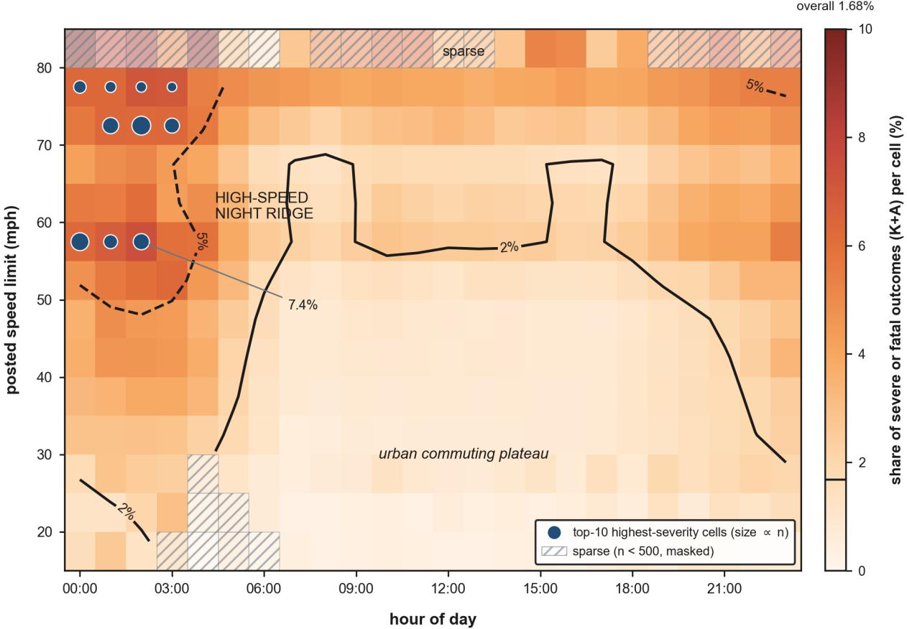  
Figure 2: The severity landscape of Texas driver records, 2017–2025. Color gives the share of severe or fatal (K+A) outcomes in each hour by speed-limit cell, for the 4,877,108 records with posted limits between 15 and 85 mph; contours mark the 2% and 5% levels, and the colorbar tick marks the 1.68% K+A share of the full sample. Cells at or above 55 mph between 00:00 and 03:59 pool to 5.8%, against 0.9% for cells at or below 45 mph between 06:00 and 21:59. Cells with fewer than 500 records are masked.

## 5. Results

The experiments follow the order of the guarantees in Section 3, and each one tests a theorem rather than a leaderboard position. Every number traces to a stored result file computed on the frozen snapshot under seed 20260704. The acceptance rule, fixed before the experiments were run, is that empirical coverage must reach the target less three binomial standard errors; at these sample sizes that standard error is about 0.0004, so the rule is strict.

One framing point governs the section. The contribution is the certification layer, not the base model. Where a base model wins on set size, that is a fact about the model and not evidence for the framework; where the guarantee holds regardless of which model sits underneath, that is the theorem doing its work.

## 5.1. Validity and model agnosticism

Table 4 wraps seven base models in one unchanged certification layer: the ordered logit that has anchored severity analysis since McCullagh (1980), a multinomial logit, a latent-class ordered logit, a random-parameters ordered logit, gradient boosting, the DLCON network of Section 3, and the TabPFN tabular foundation model. Every set produced by every model at every level was contiguous, without exception. Twenty of the 21 model-by-� cells at $\alpha \in \{ 0 . 0 5 , 0 . 1 0 , 0 . 2 0 \}$ met the pre-registered acceptance criterion.

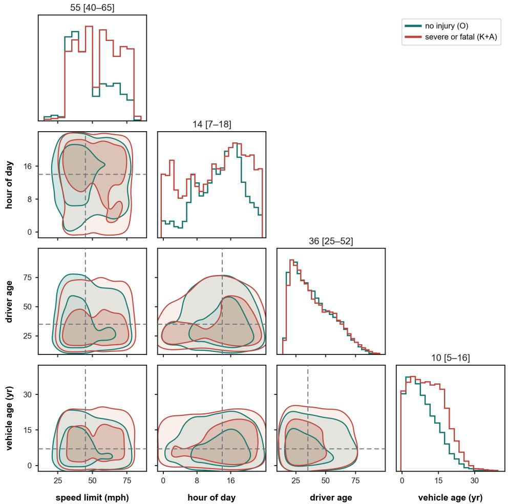  
Figure 3: Joint covariate geometry of no-injury (teal) and severe or fatal (coral) driver records. Filled contours hold 50% and 90% of each group, dashed lines mark the no-injury medians, and panel titles give the severe group’s median and interquartile range. The severe group sits at higher posted speed limits (median 55 against 45 mph) and in older vehicles (10 against 7 years), and carries a heavier late-night tail (20.8% of severe records fall between 00:00 and 05:59, against 7.8% of no-injury records), while driver age is nearly unchanged. All 84,419 complete-case severe records are shown against 150,000 no-injury records sampled at seed 20260704.

The exception is worth reporting precisely, because it is the kind of result that is easier to absorb than to state. Gradient boosting at $\alpha = 0 . 1 0$ covers 0.8989 against a criterion of 0.8990, missing by $8 \times 1 0 ^ { - 5 }$ . The criterion is nominal coverage less three binomial standard errors of the test set, and it was fixed before the experiments were run, so the cell fails it and we do not revise the rule after seeing the number. What the rule does not budget for is the variability of the calibration draw itself. Split conformal’s guarantee is marginal over that draw, and for a calibration set of 808,594 records the resulting spread in realized coverage is of the same order as the test-set standard error the rule uses. The shortfall is a small fraction of that unmodeled term, so this is a miss against a criterion that is tighter than the theory requires, not evidence against Proposition 3.7. It is reported because a framework whose subject is honest certification cannot round its own acceptance test in its favor.

The table separates into two columns that behave very diferently. Coverage is indistinguishable across all seven models, which is what Proposition 3.7 asserts: validity is a property of the calibration step and cannot be improved by a better base model. Eficiency is where the models separate, and the separation deserves to be stated plainly rather than dressed up. Mean set width ranges from 1.51 to 3.41 categories, and a linear ordered logit of the kind specified decades ago produces sets whose width is indistinguishable from a 2025 tabular foundation model. The balanced gradient-boosting model is the widest of the seven, because class balancing flattens its predicted distribution and the score of Definition 3.3 then sits deeper in both tails. None of this afects validity, and all of it afects usefulness.

Table 4  
One certification layer over seven base models (E1, $\alpha = 0 . 1 0 )$ .
<table><tr><td>Base model</td><td>Coverage</td><td>Mean width</td><td>Fit</td><td>Predict</td><td>Calibrate</td></tr><tr><td>Ordered logit</td><td>0.8998</td><td>1.54</td><td>6s</td><td>2s</td><td>0.11 s</td></tr><tr><td>Multinomial logit</td><td>0.8997</td><td>1.53</td><td>24 min</td><td>1s</td><td>0.11 s</td></tr><tr><td>Latent-class ordered logit</td><td>0.8998</td><td>1.53</td><td>3 min</td><td>3s</td><td>0.12s</td></tr><tr><td>Random-parameters ordered logit</td><td>0.8999</td><td>1.54</td><td>19s</td><td>7s</td><td>0.12s</td></tr><tr><td>Gradient boosting (balanced)</td><td>0.8989</td><td>3.41</td><td>43s</td><td>14 s</td><td>0.07 s</td></tr><tr><td>DLCON (ours)</td><td>0.9000</td><td>1.52</td><td>22 s</td><td>0s</td><td>0.11 s</td></tr><tr><td>TabPFN v3</td><td>0.8992</td><td>1.55</td><td>9s</td><td>16 min</td><td>0.12s</td></tr></table>

Held-out test records � = 810, 082; nominal coverage 0.90. Empirical coverage spans 0.8989–0.9000 across all seven models, and every set is contiguous. 20 of 21 model-by-� cells at � ∈ {0.05, 0.10, 0.20} met the pre-registered acceptance criterion of nominal less three binomial standard errors. The exception is Gradient boosting (balanced) at $\alpha = 0 . 1$ (coverage 0.8989 against a floor of 0.8990, short by 7.6e-05). The criterion is computed from the test-set standard error alone and therefore does not budget for the variability of the calibration draw, which for split conformal is of comparable size; the shortfall is well inside that unmodeled term. It is reported rather than absorbed. Calibration is the certification layer itself; fit and predict belong to the base model and are reported to show what the layer costs by comparison.

One qualification belongs with that table. The widths reported are those of the construction certified here, which fixes a threshold on the score of Definition 3.3, and they are not the narrowest sets obtainable from the same base model. Width in the ordinal setting has a set-construction component that is separable from the estimator, and Zhang et al. (2025) give sets of minimal length per instance given the base scores. That machinery is complementary to this paper rather than competing with it: any construction exporting contiguous sets can be certified by the layer developed here, and a narrower one would carry the same guarantees at less cost. What Table 4 establishes is that validity is invariant across base models, not that these widths are optimal.

## 5.2. Heterogeneity, and where marginal validity fails

Marginal coverage is an average, and averages conceal. At nominal 0.90 the marginal predictor covers baseline drivers at 0.947, which is close to target and unremarkable. On the strata a safety agency exists to serve, it fails: unrestrained drivers are covered at 0.374, motorcyclists at 0.583, and rural high-speed records at 0.624 under the gradient boosting anchor. That anchor is the most extreme of the seven base models, and the size of the shortfall is a property of it rather than of the guarantee: the other six undercover the same two strata between 0.822 and 0.896. These coverages are binomial proportions on test-split strata of several thousand records or more, so their standard errors are below 0.01 and the shortfalls are structural rather than sampling noise. Read per reported KABCO category, the same pattern runs along the severity ladder, with the fatal category covered at 0.822 and the incapacitating category at 0.869 while the mild categories are overcovered at 0.952 and 0.958.

The unrestrained stratum is defined narrowly and deliberately. CRIS records restraint use in several codes, and only one of them, “None,” states that a restraint was available and not used; the neighboring “Not Applicable” code is predominantly the motorcycle code, since 8,530 of its 10,518 test-split records are motorcyclists and are counted in that stratum instead. Defining the stratum as “None” alone leaves 10,335 records and is what the numbers above report. A looser definition folding in the inapplicable and residual codes would raise the coverage to 0.417, so the narrow definition is both the honest one and the less flattering one.

This is not a defect of the base model and fitting a better one will not remove it. It is the behavior Theorem 3.13(iii) predicts. A single threshold calibrated on a population that is 82% uninjured is calibrated for that population, and the severe strata are a small minority paying for the majority’s threshold. The practical reading is uncomfortable and worth stating directly: a marginally valid severity model deployed for screening would be least reliable on exactly the motorcyclists and unrestrained drivers that a screening system is built to find.

Conditioning repairs it, and repairs it regardless of where the partition came from. Class-conditional calibration on the declared partition restores every cell to 0.8982–0.9002, and the eight cells of a generic KMeans partition al land within 0.8980–0.9016. That the two are indistinguishable on validity is not a disappointment; it is Theorem 3.11 behaving as stated, since the theorem holds for any partition fixed in advance and arbitrariness therefore cannot break it.

The framework is indiferent to a partition’s provenance, then, but the deployer should not be, because eficiency i h i i d h i f h i h d lidi h l l ordered logit’s own gate gives the narrowest sets of any partition tested, at a mean width of 3.236 categories against 3.356 for the declared safety strata, 3.402 for a generic KMeans clustering, and 3.406 for the deep network’s gate. The classes it recovers are also legible rather than incidental: their widths run from 2.44 to 4.04 categories while each holds coverage within a few thousandths of nominal, which is to say the model has separated the population into subpopulations that genuinely difer in how predictable their severity is, and the certification layer then prices each one honestly.

This is the sense in which the heterogeneity program earns its place here. Its classes are not required for validity, and the paper does not pretend otherwise. They are the most eficient partition on ofer, and they are the only one that arrives with an interpretation attached. A clustering fit for geometric compactness and a neural gate fit for predictive loss both land near the marginal width, because neither was built to separate the score distribution; the latent-class model was, and two decades of severity econometrics is the reason it knows how.

Eficiency in the aggregate is not the same as repair where it matters, and Section 5.3 shows the two can point in diferent directions. The partition that closes the deficit on the severity ridge is the one declared on the ridge’s own coordinates, not the one that minimizes width overall. A deployer therefore has two distinct questions, and they have two distinct answers: latent classes for the narrowest sets across the board, and declared bands for coverage in a region one has decided to protect. The repair is not free, and the price is the honest part of the result. The motorcyclist stratum’s mean width rises from 2.67 to 4.22 categories and the unrestrained stratum’s from 2.80 to 4.59. Those sets were narrow because they were wrong. Covering the truth at the stated rate requires them to be wide, and a set that says “B or worse” honestly is worth more than a narrow set that is silently wrong four times in ten.

Class-conditional calibration redistributes width toward the records that need it rather than inflating it everywhere: it changes the width of 18.7% of records, by one or two categories, for a mean change of −0.006, and validity never depends on the partition geometry (Theorem 3.11).

## 5.3. The deficit, and what closes it

Figure 4 carries the heterogeneity result. It maps the deviation of empirical coverage from nominal over the plane of Figure 2 in three maps. Under marginal calibration the deficit is not difuse: it sits on the severity ridge, reaching 0.338 in the deepest cell with adequate support, the 75-mph bin at 03:00. A generic declared partition narrows it, lifting coverage at 75 mph from 0.611 to 0.692, but it cannot close a slice it does not encode, and exact conditional coverage everywhere is unattainable by Proposition 3.10. A partition declared on the plane’s own coordinates closes the ridge, taking the deepest cell to 0.847 and pooling to 0.8979.

Two features of that figure qualify the claim rather than support it, and both are worth the space. First, the declared partition’s residual weakness has structure. Seven cells with adequate support still fall below 0.80, and they sit exactly where the declaration is coarse: the 50-mph night cells, and the day-band edge hours 06:00 and 21:00, where the hour-wall minimum is 0.825. The partition guarantees its bands, and only its bands. Second, the generic KMeans-8 partition does nothing at all for the night deficit. Along the hour axis its curve lies on top of the marginal curve, and its entire benefit is realized on the speed axis. A partition helps where it encodes the structure that matters and nowhere else, which is the practical content of Theorem 3.11.

## 5.4. Coverage of the true label under reporting noise

Police-reported severity is not medically assessed severity, and Section 3.6.1 sets out what the linkage literature reports about the gap. Because true severity is unobserved in CRIS, the guarantee of Theorem 3.31 is audited semisynthetically: a known banded misclassification process is injected into held-out labels, calibration sees only the corrupted labels, and coverage is evaluated against the labels actually recorded. This is the standard design for noisecorrection work, and it is stated plainly rather than presented as field evidence.

Table 5 reports the sweep. The band-expanded sets cover the true label at or above the guaranteed floor $1 - \alpha - \delta$ at every �, with a comfortable margin.

Three readings of that table matter, and two of them cut against the result.

The first is the comparison the theory predicts. The floor available without band structure is $1 - \alpha - \varepsilon _ { \mathrm { t o t } }$ , about 0.767 for this injected process, against a banded floor running from 0.90 down to 0.80. The gap is real but it narrows as � grows, from thirteen points at $\delta = 0$ to under four at $\delta = 0 . 1 0$ . The vacuousness that motivates Theorem 3.31 is a claim about field magnitudes, where the linkage literature puts $\varepsilon _ { \mathrm { t o t } }$ near 0.49 and the beyond-band mass near 0.02, giving a generic floor near 0.41 against a banded floor of 0.88. It is not a claim about this injection, whose realized error rate is 0.133 and whose generic floor is therefore weak rather than vacuous. The distinction matters because Theorem 3.31’s floor is indexed by � and not by $\varepsilon _ { \mathrm { t o t } }$ , and the swept grid brackets the literature’s �, which is the quantity the theorem tracks.

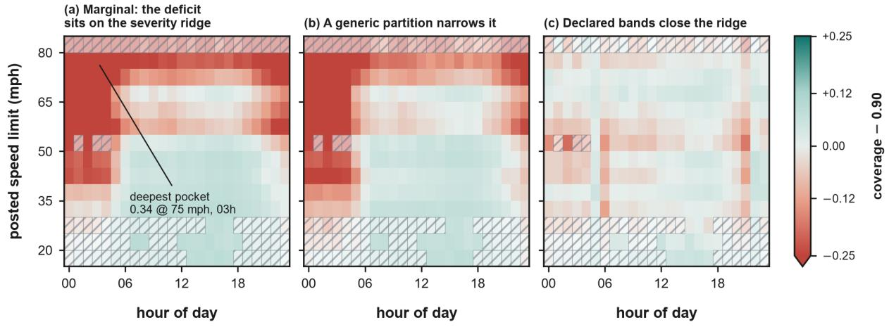

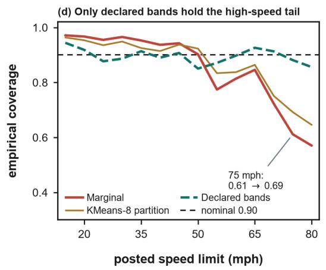

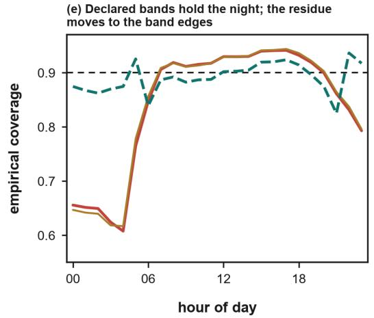  
Figure 4: The coverage deficit and what closes it. Per-cell deviation of empirical coverage from nominal 0.90 over the plane of Fig. 2 (random-split test fold, 754,186 records, gradient-boosting base; 82 of 336 low-support cells hatched). (a) Marginal conformal fails on the severity ridge, reaching 0.338 in the 75-mph, 03:00 cell. (b) A generic declared partition narrows the 75-mph deficit to 0.692 but cannot close a slice it does not encode (Proposition 3.10). (c) A partition on the plane’s own coordinates closes the ridge (0.847 in that cell, 0.8979 pooled); the residue moves to the coarse cells, with an hour-wall minimum of 0.825. (d,e) The same comparison along each axis.

Guaranteed and empirical true-label coverage under banded reporting noise (E4, � = 0.10).
<table><tr><td></td><td colspan="2">Guaranteed floor</td><td colspan="3">Empirical coverage on Y</td></tr><tr><td>δ</td><td>Banded</td><td>Genericª</td><td>Constant b=1</td><td>Category-dep.</td><td>No expansionb</td></tr><tr><td>0.00</td><td>0.90</td><td>0.7673</td><td>0.9870</td><td>0.9882</td><td>0.8970</td></tr><tr><td>0.01</td><td>0.89</td><td>0.7670</td><td>0.9870</td><td>0.9882</td><td>0.8973</td></tr><tr><td>0.02</td><td>0.88</td><td>0.7659</td><td>0.9870</td><td>0.9883</td><td>0.8974</td></tr><tr><td>0.05</td><td>0.85</td><td>0.7644</td><td>0.9871</td><td>0.9883</td><td>0.8980</td></tr><tr><td>0.10</td><td>0.80</td><td>0.7617</td><td>0.9872</td><td>0.9884</td><td>0.8990</td></tr></table>

a $1 - \alpha - \varepsilon _ { \mathrm { t o t } } ,$ the floor available without band structure, where $\varepsilon _ { \mathrm { t o t } } = 0 . 1 3 2 7 - 0 . 1 3 8 3$ is the realized error rate of the injected process. This is a property of the injection design and not the quantity Theorem 3.31 tracks, which is �.  
<sup>b</sup> Sets left unexpanded. This arm carries no guarantee; its coverage of 0.8970–0.8990 at mean width 3.40 is a property of this noise level, not a property the theory provides.

The second is the price. Expanded coverage sits near 0.987, some nine points above nominal, at a mean width of 4.42 of five categories. That is conservative by construction: the constant band pays for worst-case noise within the band while the injected process is not adversarial, and Theorem 3.33 is tight only in the worst case over laws satisfying the band, not on any particular law. The category-dependent map of Remark 3.38 is the natural candidate for recovering that width, and Section 5.8 reports that on these data it does not: it is narrower only on the exact-fatal singleton, and wider wherever the A category reaches two categories down, so the two maps are empirically indistinguishable here. The width is not the band’s doing, and no choice of band recovers it.

The third reading concerns the sweep itself, and it is a limitation of the experiment rather than of the theorem. The declared � is the beyond-band mass, but the injection can place beyond-band errors only on the B and A categories, which are 7.5% of records, so a declared � of 0.10 realizes a true beyond-band mass near 0.0075. We therefore also report a corrected arm in which the realized mass equals the declared � exactly. In both arms the bound holds at every �, and in both the margin widens as � grows rather than tightening, because injecting more noise inflates the calibration quantile and widens the base sets faster than the floor falls. The honest conclusion is that this sweep confirms the theorem’s arithmetic and cannot falsify it: Theorem 3.31 is a union bound, and no configuration of a process satisfying its assumption will violate it. A falsification with teeth is nonetheless available, but it targets the declared channel rather than the union bound, and it is the width-against-floor specification test reported later in this section. Note also that a declared � above 0.075 is not achievable under a two-category-down design at all, which the corrected arm flags rather than silently saturating.

The third is a result a reader will find, so we state it first. The arm that ignores the noise entirely, applying no expansion at all, still covers the true label at 0.897–0.899 at a mean width of 3.40. At this noise level the expansion is not needed to achieve coverage. What it is needed for is to know that coverage holds. The unexpanded arm’s success is a property of this configuration, in which noise enters only the calibration labels and inflates the quantile in a way that happens to compensate. Nothing in the theory protects it, and nothing protects it at the field magnitudes above. The expansion converts an empirical accident into a floor that can be stated in advance, and the extra width is the visible price of that certificate. That trade is the subject of the paper, and it is a trade a deployment is entitled to refuse.

## 5.5. Transfer across time and jurisdiction

Table 6 deploys a calibration frozen on 2022–23 onto two subsequent years. Unweighted split conformal holds at state scale, covering 0.8993 in 2024 and 0.9008 in 2025, and that is itself a finding: across these years the covariate drift is mild enough at the scale of a whole state that marginal validity survives without correction. Both recovery methods hold as well. The instructive column is the last. The density-ratio certificates report a total-variation slack bound near 0.35, which says honestly that the parametric weight family does not capture the drift from 2017–21 to 2024–25. The certificate is not failing. The certificate is the mechanism that says so.

## Table 6

Temporal transfer to two unseen deployment years (E5, � = 0.10).

<table><tr><td></td><td colspan="2">Coverage</td><td colspan="2">Mean width</td><td></td></tr><tr><td>Method</td><td>2024</td><td>2025</td><td>2024</td><td>2025</td><td>TV-slack LCB</td></tr><tr><td>Unweighted split conformal</td><td>0.8993</td><td>0.9008</td><td>3.439</td><td>3.438</td><td></td></tr><tr><td>County-Mondrian (Thm. 3.44)</td><td>0.9003</td><td>0.9023</td><td>3.412</td><td>3.415</td><td></td></tr><tr><td>Density-ratio weighted (Thm. 3.45)</td><td>0.9024</td><td>0.9048</td><td>3.453</td><td>3.462</td><td>0.348  /  0.353</td></tr></table>

Calibrated on 2022–23, deployed on 593,685 records in 2024 and 577,726 in 2025; binomial standard error ≈ 0.0004. The slack bound is one-sided: it certifies weakness, never strength.

Space is where the absence of a certificate becomes dangerous, and Figure 5 makes the case. Across 54 held-out counties, per-county coverage under the frozen state calibration ranges from 0.372 to 0.936. A state-level model that is valid on average is, county by county, anywhere between useless and conservative, and nothing in the marginal guarantee tells a county which one it has. Twenty-nine of the 54 met the sample-size requirement to earn a transfer certificate; for those, density-ratio weighting restores weighted coverage to 0.872–0.922, and the exported tuple bounds the slack from below.

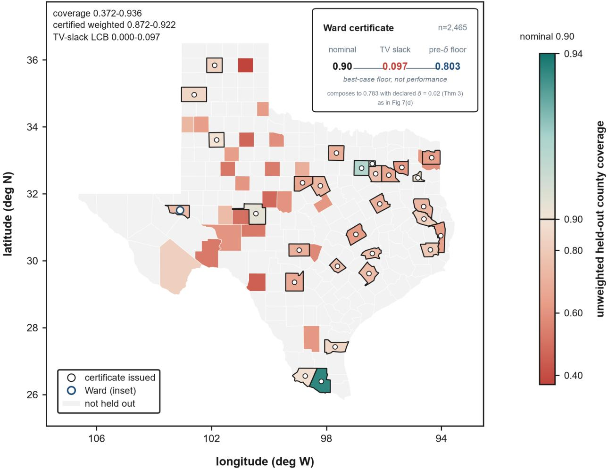  
Figure 5: Spatial transfer certificates. Each of the 54 held-out counties is filled by its raw unweighted coverage under the frozen state calibration (0.372 to 0.936 at nominal 0.90); gray counties lie outside the hold-out design. The 29 ringed counties earned a certificate: density-ratio weighting restores weighted coverage to 0.872–0.922, with the total-variation slack bounded from below (0.000 to 0.097). Fill is raw coverage while the certificate is on the weighted transfer (Ward, inset: raw 0.741, weighted 0.911). Eight of the 29 fall below their best-case floors, which the one-sided certificate permits (Theorem 3.45).

The honesty of that figure is the point of it. A certified county can still render coral, because the fill is raw unweighted coverage while the certificate is issued on the weighted transfer. Eight of the 29 certified counties fall below their bestcase floors empirically, which the one-sided certificate explicitly permits. The floor is the best case the evidence allows, not a performance bound. It certifies weakness and never strength, and a framework claiming otherwise from unlabeled data would be claiming something provably unavailable. Two of those eight sit within 0.006 of their floors on roughly 1,200 rows apiece, which is inside sampling error; the certificate is a one-sided diagnostic and a county falling below it is evidence to investigate rather than proof of failure.

One point of experimental discipline belongs here rather than in a footnote, because it constrains what the weighted arm may claim. Theorem 3.45 requires the density ratio to be fixed given the training split and the unlabeled target covariates, which means it may not be a function of the point being scored. The weighted arm therefore fits its ratio on one half of each target jurisdiction’s unlabeled records and predicts and evaluates only on the other half, and the reported weighted coverages rest on those held out rows alone. The unweighted and group-weighted arms fit no ratio and carry no such constraint, so they are evaluated on the full population; because the halves are drawn uniformly at random, the arms estimate the same population coverage and only the weighted arm pays in variance.

## 5.6. Certificates in deployment

A certificate issued once is not a deployment practice. Figure 6 shows the shipped monitoring apparatus over two years of held-out stream. Monthly coverage stays within 0.009 of nominal with a two-year mean of 0.900, and the quantiles of the conformal p-values depart from uniformity by at most 0.021.

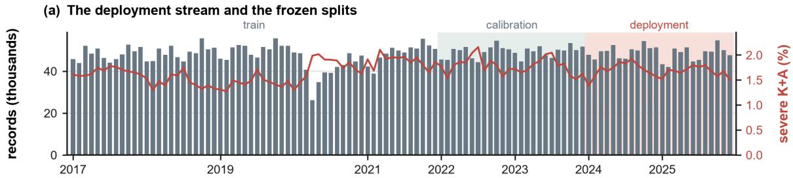

(b) P-value quantiles stay within 0.021 of uniform  
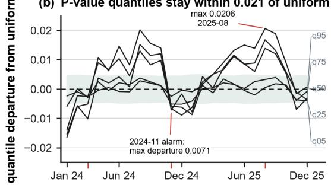

(c1) Month matching oe not remove threee  
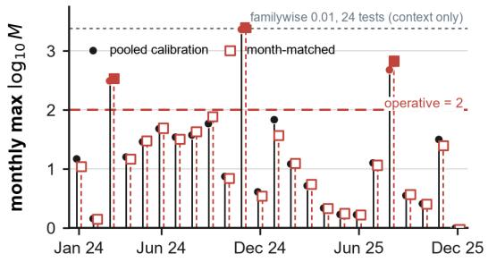

Monthly coverage stays within 0.009 (c2) of nominal (mean 0.900)  
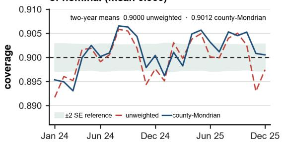

(d) The certificate exposes the observed-provable gap  
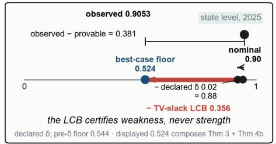  
Figure 6: Certificates in deployment. (a) Monthly volume and severe share over 2017–2025 with the frozen temporal splits. (b) Monthly quantiles of the conformal p-values depart from uniformity by at most 0.021 (±2 SE shading). (c1) The monthly-restarted test martingale (nominal per-month false-alarm rate 0.01; exact under the online protocol, approximate under the frozen calibration used here) alarms in three isolated months, against pooled and month-matched calibration. (c2) Monthly coverage stays within 0.009 of nominal (two-year mean 0.900). (d) The 2025 state-level certificate as a waterfall: nominal, less the declared band �, less the total-variation slack bound, a best-case floor of 0.527 against observed 0.905.

The monitor’s own behavior is the most useful part of the figure, and it is not the reassuring result. The monthlyrestarted test martingale crosses its alarm in three isolated months. The natural explanation is seasonality, since the calibration pools all months, so the alarms were re-tested against a month-matched calibration drawn from the same calendar months of the calibration years. They fire again, and in November 2024 more strongly. The seasonality reading is refuted by its own pre-declared test, and the honest description is that three isolated months carry real distribution shifts, detected and reported. Coverage in those months deviates by at most 0.006, so the shifts were

(a) Fatal-omission rate tracks its budget

detected without material damage. The instrument’s job is detection, not correction: an alarm mandates re-calibration and never retroactively edits a certificate already issued.

## 5.7. Risk control and the price of validity

Coverage is not the only quantity a screening deployment must control, because omitting a fatality is not exchangeable with omitting a no-injury record. Figure 7 reports both risk dials against their nominal bounds. The fatal-omission rate saturates at 0.0019 across 2,475 fatalities in the test fold, far under any budget a deployer would set, and the severity-weighted cost risk saturates at 6.92 against bounds an order of magnitude larger. Over the range originally tested, $\beta \ge 0 . 0 1$ , the risk constraint is slack: the threshold sits at zero and the escalation workload is constant at 0.281. That saturation is reported rather than hidden, and it is why the operating curves extend to much smaller $\beta ,$ where the constraint actually binds.

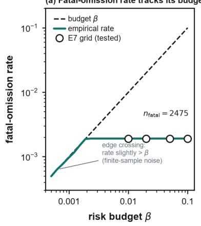

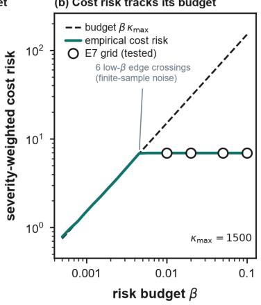

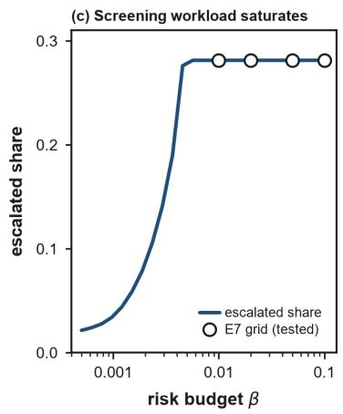

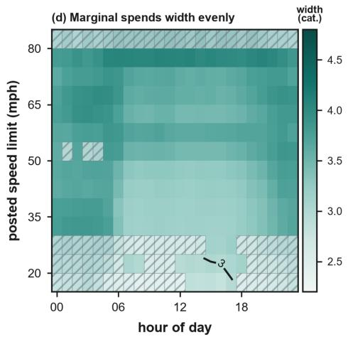  
Figure 7: Operating CHOIR. (a,b) Cost-weighted false-omission risk and fatal-omission rate $( n _ { \mathrm { f a t a l } } = 2 , 4 7 5 )$ against their nominal bounds over a log-spaced � grid, with the four originally tested points marked. Both guarantees saturate well below the bound for $\beta$ above roughly 0.01, the range a deployer would use. At the extreme low-� edge, where the threshold reaches 0.85 to 0.89, the empirical value briefly exceeds the bound on this single test-set realization by at most 5% relative, which is the finite-sample noise expected around a marginal guarantee (Theorem 3.46, Corollary 3.48) and not a violation. (c) The escalation workload implied by each $\beta ,$ saturating at 0.281 once the constraint goes slack. (d,e) Mean set width over the plane of Fig. 2 under marginal and declared calibration: certification moves width into the cells where Fig. 4(a) showed coverage falling short, and takes width away where coverage was already adequate.

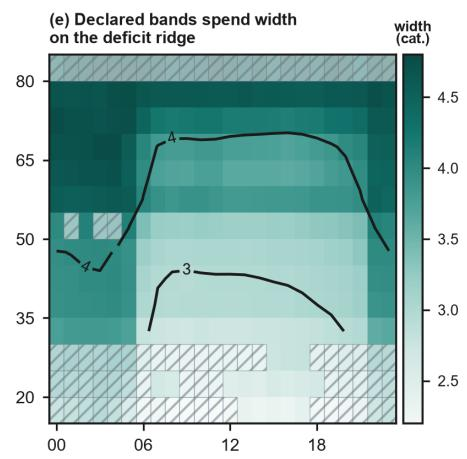  
sparse cell (n < 400, masked) hour of day

At that extreme low-� edge the empirical value briefly exceeds its bound on this single test-set realization, once for fatal omission and six times for cost risk, by at most 5% relative. This is expected and is not a violation. Theorem 3.46 and Corollary 3.48 control an expectation over the calibration draw rather than a deterministic per-realization quantity, and these excursions sit within sampling error at the achievability edge, where the threshold saturates near one. The alternative would have been to plot only the range in which the bound never crosses, which is range shopping.

Panels (d) and (e) price the guarantee. Certification does not inflate width uniformly; it moves width to where coverage was missing. In cells where marginal coverage fell below 0.80 the declared partition spends an additional 0.61 categories, and in cells where marginal coverage was already adequate it spends 0.18 categories fewer. The blocky structure of panel (e) is the declared partition itself, legible in the price surface.

## 5.8. Composition and cost

The guarantees are stated separately and deployed together, so their composition must be checked rather than assumed. Table 7 stacks class-conditional calibration, the band expansion and the stratum structure on the product cells of the class by rural-urban grid. Every cell clears the additive floor $1 - \alpha - \delta = 0 . 8 8$ that Theorem 3.50 predicts. It clears it by so wide a margin that the check is worth reading carefully rather than as a success.

## Table 7

Composed guarantees on product cells (E8, � = 0.10, � = 0.02).
<table><tr><td>Class</td><td>Stratum</td><td>n</td><td>Coverage on Y</td><td>Mean width</td><td>% at full scale</td><td>Floor</td></tr><tr><td>baseline</td><td>rural</td><td>106,778</td><td>0.9950</td><td>4.317</td><td>39.7</td><td>0.88</td></tr><tr><td>baseline</td><td>urban</td><td>592,634</td><td>0.9976</td><td>4.240</td><td>29.4</td><td>0.88</td></tr><tr><td>motorcycle</td><td>rural</td><td>2,924</td><td>1.0000</td><td>5.000</td><td>100.0</td><td>0.88</td></tr><tr><td>motorcycle</td><td>urban</td><td>5,606</td><td>1.0000</td><td>5.000</td><td>100.0</td><td>0.88</td></tr><tr><td>rural highspeed</td><td>rural</td><td>91,805</td><td>0.9963</td><td>4.992</td><td>99.3</td><td>0.88</td></tr><tr><td>unrestrained</td><td>rural</td><td>4,594</td><td>0.9998</td><td>4.999</td><td>99.9</td><td>0.88</td></tr><tr><td>unrestrained</td><td>urban</td><td>5,741</td><td>0.9998</td><td>4.999</td><td>99.9</td><td>0.88</td></tr><tr><td>All</td><td></td><td>810,082</td><td>0.9971</td><td>4.353</td><td>40.3</td><td>0.88</td></tr></table>

Every cell clears the additive floor 1 − � − � = 0.88. The rural high-speed stratum is rural by definition, so of the 4 × 2 possible cells 7 are non-empty. The last column is the share of records whose set is the whole scale, and it is the column to read: coverage near 1.000 on the severe strata is the arithmetic of returning every category, which mean width understates. The category-dependent map of Remark 3.38 was tested as the eficient alternative and is indistinguishable here to six decimal places, because the base sets on these strata are already near-vacuous before any expansion (Section 5.8); the constraint is the base model, not the band.

On the severe strata the composed set is the entire severity scale. For rural motorcyclists, 99.97% of records receive all five categories; for unrestrained drivers in either setting the figure is above 99.9%. Coverage of 1.000 on those cells is not evidence, it is the arithmetic of returning everything, and the certified statement handed to an agency for a motorcyclist is that the injury lies somewhere between none and fatal. That is true and it is useless, and reporting mean width conceals it, which is why Table 7 reports the share of records receiving the full scale instead.

The natural explanation is that the constant band is too conservative, and it is wrong. We tested it directly: the category-dependent map produces an identical full-scale share in every cell, to six decimal places, because it is narrower only on the exact-fatal singleton and wider wherever the A category reaches two down. The cause is upstream of the band. Run without any expansion, the base sets on these strata are already near-vacuous, at mean width 4.28 of five for rural motorcyclists with 28% at full scale, and 4.65 with 65% at full scale for urban unrestrained drivers. Any expansion of one category saturates them.

The honest reading is therefore a dilemma rather than a triumph, and it is the paper’s sharpest empirical finding. On the strata that matter, one may have the marginally calibrated sets, which are narrower but undercover, or the composed sets of Table 7, which cover at 1.000 and say nothing. The two horns are not equally sensitive to the base model. The second is not: every one of the seven composes to width four or more on these strata. The first is: the gradient boosting anchor undercovers unrestrained drivers at 0.374 while carrying the widest sets of the seven at mean width 3.41, so it is not an instance of narrow and wrong but of wide and wrong, whereas the six models with narrow sets near width 1.51 undercover the same stratum between 0.822 and 0.896. The dilemma that survives all seven is therefore between validity and informativeness, not between narrowness and correctness. The composition theorem holds, and what it composes on these strata is uninformative. The constraint is not the certification layer, and no band and no partition repairs it; the next paragraph shows that a large part of it is not the base model either.

How much of the width is unavoidable is a quantitative question, and Theorem 3.40 answers it without reference d l h h l fl $\mathcal { N } _ { A } ^ { * } ( \alpha )$ lower-bounds the mean width of every valid predictor of the reported label on stratum �, and it depends only on the declared reporting channel and the stratum’s true severity composition. We compute it as an identification region in the sense of Molinari (2008), ranging the within-stratum channel over the constraints of Section 3.6.1 and admitting only channels that reproduce the observed reported composition. Table 8 reports the resulting certified lower bound against the smallest base width any of the seven models achieves, and Figure 8 shows the same decomposition. Two readings follow. First, the specification test: on no stratum does an achieved valid width fall below the certified floor at any �, so the declared channel is not refuted, and the low-severity baseline stratum, where reporting is most reliable and the floor sits near one category, binds most tightly and passes. The test’s power is itself stratum-dependent, and the pass means more where power is higher. On baseline a channel whose floor exceeded the achieved 1.40, only about 0.4 categories above the invariance value, would be refuted, so the pass there is informative; on the motorcyclist stratum only a channel far noisier than any the linkage evidence admits could be caught, so the pass there is weak. Achieved per-cell coverage runs between 0.8997 and 0.9004, a hair of nominal; recomputing the floor at the realized level rather than at 1 − � moves it by about $1 0 ^ { - 3 }$ of a category and changes no verdict. Second, the decomposition of Corollary 3.41 under an explicit selection model. Linkage may depend on the reported label given the truth, and we bound that dependence by a ratio � of the linkage probability across reported labels at fixed true severity (Remark 3.43); Table 8 reports the certified floor at $R \in \{ 1 , 2 , 5 \}$ . Because the certified floor $\mathcal { N } _ { A } ^ { * }$ is a lower bound on the width of any valid predictor, it splits the observed width into three parts with the quantifiers pointing the way the theorem licenses: one category that any nonempty set must carry, a channel-imposed excess of at least $\mathcal { N } _ { A } ^ { * } - 1$ that no base model removes, and a remainder of at most $w _ { A } ^ { \mathrm { a c h } } - \mathcal { N } _ { A } ^ { * }$ that a better model or richer record could in principle recover but Theorem 3.25 shows cannot be certified distribution-free. On the motorcyclist stratum of roughly 3.55 categories, the channel-imposed excess is at least 0.64 under selection-invariance and at least 0.03 under a fivefold dependence, so the recoverable remainder is at most 1.91 to 2.52; on unrestrained drivers the channel excess is at least 0.36 under invariance. Where the truth sits between the certified floor and the observed width is bounded but not identified, which is the Molinari framing of Remark 3.43: a declared channel set gives a floor no model beats, not a point estimate of how much the channel imposes. One premise underwrites the whole computation and belongs where it is used: Theorem 3.40 requires the reporting channel to be nondiferential within the declared stratum. That premise is cleanest on the motorcyclist stratum, a homogeneous vehicle class whose riders plausibly share a single reporting regime, and most delicate on unrestrained drivers, where the defining covariate is itself a candidate to shift the channel and within-stratum nondiferentiality is a stronger assumption. The decomposition above leads with motorcyclists for that reason, and the unrestrained floors should be read as the more assumption-laden of the two.

## Table 8

Channel floor $\mathcal { N } _ { A } ^ { * }$ against achieved width, per stratum, $\alpha = 0 . 1 0$ , at three strengths of reported-label linkage-selection dependence Remark 3.43 ; is selection-invariance. Each floor is the certified column-concentration lower bound over the declared channel set. The achieved width, the smallest base (pre-expansion) Mondrian width among the seven models, exceeds every floor, so the declared channel is not refuted at any �.
<table><tr><td>Stratum</td><td>Achieved base width</td><td> $R = 1$ </td><td> $R = 2$ </td><td> $R = 5$ </td></tr><tr><td>Baseline</td><td>1.40</td><td>0.97</td><td>0.93</td><td>0.91</td></tr><tr><td>Rural high-speed</td><td>1.95</td><td>1.00</td><td>0.95</td><td>0.92</td></tr><tr><td>Unrestrained</td><td>3.58</td><td>1.36</td><td>1.20</td><td>0.96</td></tr><tr><td>Motorcyclist</td><td>3.55</td><td>1.64</td><td>1.48</td><td>1.03</td></tr></table>

A deployment wanting both validity and information would need a lower level, a richer covariate record, or a base model that separates these strata, and the channel floor caps what the last two can buy. The framework will certify whatever it is given, including the fact that what it was given is not enough, and now also how much of that shortfall no model can remove.

The part of the shortfall that a richer record could recover, as opposed to the channel floor that none can, is itself measurable. A second declared feature configuration adds the fields an emergency responder observes at the scene but a dispatch-time model does not, ejection, airbag deployment, vehicle damage severity, the first harmful event, and the manner of collision; re-running the class-conditional calibration on it narrows the certified sets by a stratum-dependent amount while holding per-cell coverage at the nominal level. On the unrestrained stratum the triage fields recover about half a category, from 3.77 to 3.19 for the ordered-logit base, because ejection is recorded there and separates severity strongly. On the motorcyclist stratum they recover nothing, from 3.61 to 3.64, because the fields that carry the signal for an enclosed occupant, restraint and airbag and ejection relative to a compartment, do not apply to a rider and the record does not hold the missing information. The width above the channel floor on that stratum is therefore not an artifact of a thin feature set that a triage deployment would repair; it is a covariate gap that the richest scene-time record available does not close, bounded above by Theorem 3.25 and not closed from below by the data. One qualification belongs here: the CRIS snapshot does not record helmet use, a dominant determinant of rider severity, so the claim is that the fields present in the record do not recover the width, not that no conceivable field could; a deployment that captured helmet status might narrow the recoverable remainder, though never below the channel floor. The certification layer reports which of the two situations a stratum is in, which is the operational content an agency deciding what to record would want.

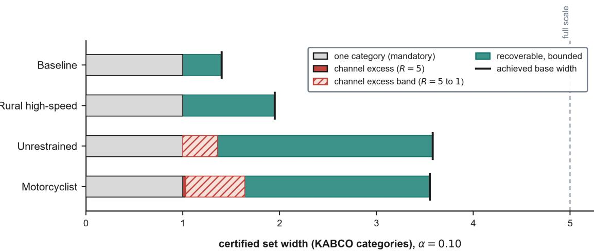  
Figure 8: Certified width decomposed per stratum at $\alpha = 0 . 1 0 ,$ , against the smallest base width the seven models achieve. Gray is the single category any nonempty set carries; coral is the model-independent channel floor, a certified lower bound on the excess the reporting channel imposes (solid to the heavy-selection floor $R = 5 ,$ , hatched to the invariance floor $R = 1 )$ ; the teal remainder is a certified upper bound on what a better model or record could recover, itself not certifiable distribution-free (Theorem 3.25).

Cost is the last question, and the layer is close to free. Certification is a sort and a quantile lookup, so it is �(� log �) with a small constant. Measured on synthetic conditional distributions at increasing scale, on a 24-core desktop processor (Intel Core i9-13900K, 3.0 GHz base, 32 GB) with the machine otherwise idle, the layer costs 0.21 s at one million rows and 1.09 s at five million, and the measured times scale linearly to within a few percent across the decade from $1 0 ^ { 5 } ~ \mathrm { t o } ~ 5 \times 1 0 ^ { 6 }$ . Set against base models that take minutes to hours to fit, and against a prediction pass of roughly fifteen minutes for the foundation model, the certification layer costs about a second. The timings in Table 4 span two machines and should be read as such: the five statistical and gradient-boosting models were fit on that processor, while DLCON and TabPFN were fit and applied on a GPU. That asymmetry does not afect the point, which is one of order of magnitude rather than of benchmark. Whatever else is true of the framework, its cost is not a reason to decline it.

## 6. Discussion

## 6.1. What the guarantees do not mean

The value of a guarantee lies as much in its boundary as in its content, and the boundaries here are sharp enough to state without hedging.

Nothing in this paper is a causal statement. Every result is a statement about the coverage of a prediction set or the expectation of a risk functional, conditional on the crash-reporting process that generated the data. When Section 4.4 records that the fatal category is associated with higher posted speed limits, that is a description of reporting frequencies in CRIS and not a claim that speed limits produce fatalities. The distinction is not pedantic. A certified prediction set answers “given what was recorded about this crash, which severities are plausible at level $1 - \alpha ^ { \prime \prime }$ , and it is silent on what would have happened under an intervention. The severity literature has spent considerable efort on identification (Mannering and Bhat, 2014; Mannering et al., 2016), and that efort is orthogonal to this one rather than superseded by it. A causal analysis and a certification layer compose; neither substitutes for the other.

Marginal validity is not conditional validity, and the gap is not a technicality that better estimation closes. Proposition 3.10 makes the impossibility formal (Vovk, 2012; Foygel Barber et al., 2021): no procedure achieves exact covariate-conditional coverage over finitely many categories without returning trivial sets. Every conditional claim here is therefore made with respect to a partition declared in advance, and Section 5.3 shows what that costs in practice. The declared partition closes the ridge it encodes and leaves residual pockets exactly where its resolution runs out. A reader should take from this that declaring the right groups is a modeling responsibility the framework does not discharge, and that a partition is a hypothesis about where heterogeneity lives, not a guarantee that it has been found.

The transfer certificate is the boundary most likely to be misread, so it is worth being blunt. The exported floor is not a lower bound on realized coverage in the target jurisdiction. It is the best case the available evidence permits, and Section 5.5 shows eight of 29 certified counties falling below their floors empirically, which the one-sided construction explicitly allows. This is not a defect of the estimator. An assumption-free finite-sample upper bound on total variation from unlabeled data alone is unavailable, so a certificate that claimed to lower-bound performance would be claiming something that cannot be delivered. What the certificate delivers is the ability to detect and quantify weakness, and a large reported slack, as in the temporal experiment’s 0.35, is the mechanism functioning rather than failing.

Finally, the drift monitor detects and does not correct. Section 5.6 reports three genuine alarms, and the correct response to an alarm is re-calibration, not a retroactive edit to a certificate already issued. Concept drift, as opposed to covariate shift, is not correctable without labels, and labels arrive with the delay of the reporting process itself.

## 6.2. A deployment playbook

The framework is designed to be operated, and the experiments map onto a concrete sequence an agency can follow. The first decision is the reporting configuration, and it is a decision about when the prediction is made rather than about accuracy. Configuration P uses only pre-crash knowable fields and is the setting for screening and countermeasure prioritization. Configuration T adds what an investigator observes on arrival and is the setting for emergency response, where those fields exist at decision time. Reporting the two separately is what keeps the leakage question from becoming an argument: the fields are not leakage in the setting where they are observed, and they are unavailable in the setting where they would be.

The second decision is the partition, and Section 5.3 is the guidance. Validity holds for any partition fixed in advance, so the choice is an eficiency and relevance decision rather than a validity one. The lesson from the repair sequence is that a partition protects what it encodes. A generic clustering bought nothing along the axis it did not represent, while bands declared on the operationally meaningful coordinates closed the deficit where severity actually lives. An agency that cares about motorcyclists should declare motorcyclists, and should expect wider sets there rather than treating the widening as a defect.

The third decision is the band, and it is a sensitivity input rather than an estimate. The linkage literature bounds the plausible range (Burdett et al., 2015, 2022; Taylor et al., 2024), and the discipline is to sweep � and report the family of guarantees rather than to estimate a confusion kernel that will not transfer across agencies or eras. Where fatality recording can be treated as exact (Farmer, 2003; Compton, 2005), the category-dependent map of Remark 3.38 keeps the K boundary from inflating, which is where most of the practical cost of expansion would otherwise fall.

The fourth decision is the operating point. Figure 7 is the dial: a budget � implies an escalation workload, and the workload saturates at 0.281 for any � above roughly 0.01. A deployer choosing between screening intensities is choosing a point on that curve, and the curve, not an accuracy metric, is the quantity that translates into stafing.

The last step is the one that distinguishes an audited deployment from an unaudited one. Certificates are exported per stratum, the monitor runs on the deployment stream, and both are artifacts rather than reports. The composition experiment shows the slack budget is additive and attributable, so when a certified floor is low the deployer can read which term consumed it. That accountability, rather than any coverage number, is what a procurement process can actually check.

## 6.3. Relation to generic conformal tooling

A natural question is what this framework ofers over a mature general-purpose conformal library. Table 9 answers it on the terms that make the comparison meaningful, and the answer requires reading the table correctly.

Coverage is a constraint to satisfy, not a score to maximize. All three methods target 0.90 and all three attain it, and a method reporting 0.899 is not better than one reporting 0.895 when the standard error is near 0.007. Set size is where a comparison could bite, and it does not: the sets are the same size. The diferentiators are the last three columns, and they are the research questions of this paper. Generic toolkits give neither contiguity by construction, nor coverage on the unobserved true label, nor a fatal-omission bound, because they were never designed to. They are excellent at what they do, and what they do is the marginal guarantee that Section 5.1 shows is insuficient on exactly the strata that matter.

One caveat belongs in the open. This comparison runs on the small synthetic dataset shipped with the package so that the examples execute without the restricted CRIS data. It is a package sanity check, not evidence for any research question. The evidence is Section 5, on 5.2 million real records.

## Table 9

Guarantees available from generic conformal tooling.
<table><tr><td>Method</td><td>Coverage</td><td>Set size</td><td>Contiguous</td><td>True-label</td><td>Fatal-omission</td></tr><tr><td>CHOIR</td><td>0.895</td><td>2.19</td><td>by construction</td><td>yes</td><td>yes</td></tr><tr><td>MAPIE</td><td>0.899</td><td>2.22</td><td>99%</td><td>no</td><td>no</td></tr><tr><td>crepes</td><td>0.899</td><td>2.22</td><td>99%</td><td>no</td><td>no</td></tr></table>

Computed on the synthetic demonstration dataset shipped with the package, not on CRIS: this is a sanity check on the implementation, not evidence for any research question. All three methods target 0.90 and all three attain it; the binomial standard error at this sample size is about 0.007, so the coverage column separates nothing. The non-contiguous sets the generic tools return about 1% of the time are not operationally meaningful as “B or worse” statements.

## 6.4. Anticipated objections

Four objections are worth answering directly rather than leaving to inference.

Conformal prediction is not new. Correct, and the paper never claims otherwise. Split conformal prediction, Mondrian conditioning, weighted conformal prediction under covariate shift and conformal risk control are all established (Vovk et al., 2005; Lei et al., 2018; Tibshirani et al., 2019; Angelopoulos et al., 2024), and each is labeled [KNOWN] or [ADAPTED] where it appears. What is new is the set of statements that use the structure of the severity problem: transfer of coverage to the unobserved true label from a declared support band, the oracle and diagnosis results for heterogeneity classes, the label-free one-sided transfer certificate, and cost-inflated risk control under banded reporting noise. The special issue asks for mathematical foundations for transportation, and results that exploit ordinality, KABCO reporting structure and jurisdictional hierarchy are transportation mathematics rather than an application of a recipe.

The latent classes are arbitrary. They are, and that is the point. Theorem 3.11 holds for any partition fixed on the training split, so arbitrariness cannot break validity; it can only cost eficiency. Section 5.2 reports both a declared partition and a learned KMeans partition, and both restore per-cell coverage. The classical latent-class specification is included precisely so that the comparison is against the severity literature’s own construct rather than a strawman.

Texas only, so what generalizes? The theory of when transfer holds is the generalization, and it is the content of Section 3.8 rather than an aspiration. The spatial experiment does not claim that Texas counties resemble other states’ jurisdictions; it holds out 54 counties precisely to simulate the jurisdictions a calibration has never seen, and reports that uncertified transfer ranges from 0.372 to 0.936. The transportable object is the certificate, which any jurisdiction can compute on its own unlabeled covariates.

Fatalities are only 0.3% of records. They are, which is why the fatal-omission guarantee is stated separately from coverage and why 2,475 test fatalities support it. Rarity is an argument for per-class calibration and explicit risk control, not against them, and it is exactly the regime in which a marginal guarantee is least informative.

## 6.5. Scope and open problems

Three matters are open in ways that shape what should be done next rather than qualifying what was done here.

The label-noise evidence is semi-synthetic and can be nothing else without linked medical records. Section 5.4 injects a known process because true severity is unobserved in CRIS, and the honest consequence is that the empirical check validates the theorem’s arithmetic rather than the field’s noise magnitudes. Linking CRIS to Texas trauma-registry records, as Taylor et al. (2024) did for North Carolina, would convert the sensitivity program into a measurement.

The composed sets are uninformative on the severe strata, and Section 5.8 shows why that is not the band’s fault. We had expected the constant band to be the culprit and the category-dependent map to be the remedy; the data refuted it, the two maps being indistinguishable because the base sets on those strata are already near-vacuous before any expansion. The open problem this exposes is not a better band but a base model that discriminates severity among rare, heterogeneous road users well enough that a valid set is also a narrow one. That is a modeling problem the certification layer cannot solve and, to its credit, cannot hide: the layer reports exactly how uninformative the underlying model is on the populations that matter. Separately, an elicitation protocol that a state agency could run to declare its own band, rather than importing magnitudes from a Wisconsin linkage, remains worth building.

The covariate-shift premise is declared and only partially falsifiable. With even a small labeled batch from a target jurisdiction, conditional coverage becomes auditable; without labels, concept drift is detectable prospectively but not correctable. The monitor in Section 5.6 is the shipped response to that asymmetry, and its three alarms demonstrate both that it works and that a deployer must choose its granularity in advance. Choosing the monitor’s granularity after seeing which months alarm would be tuning to conclusion, which is why the month-matched comparison was declared before it was run and reported after it refuted the hypothesis it was built to test.

## Conclusion

Crash-severity models are deployed without guarantees, and the three features that make crash severity statistically distinctive are the same three that make an of-the-shelf guarantee wrong. This paper has developed a certification layer that wraps any severity model without modifying it and attaches guarantees that use that structure rather than ignoring it. The guarantees are distribution-free in the base model, which is the claim that matters for deployment: no result below depends on the fitted model being correct. They are not assumption-free, and the assumptions are named where they are used. Marginal and class-conditional validity hold in finite samples under exchangeability alone. The oracle characterization is asymptotic and requires regularity. The noise and transfer results are free of a noise kernel and of a shift model respectively, which is their point, but each rests on a declared structural premise.

The contribution is a characterization of what certification can and cannot deliver for this outcome, assembled as a calculus rather than resting on any single theorem. On the side of what is possible are five families of guarantees that hold at once with an additive and attributable slack budget, so a deployer can read which term consumed a certified floor. Ordinality yields prediction sets that are contiguous by construction, so the output is the operationally meaningful “B or worse” rather than an arbitrary subset of the scale, and the noise expansion costs a fixed number of categories rather than a multiple of the set’s size. Conditioning on any partition fixed in advance restores per-class coverage, with an oracle characterization of the eficiency this buys and a diagnosis of why marginal calibration undercovers precisely the severe strata. A declared ordinal compatibility band transfers coverage to the unobserved true severity at a floor that degrades only by the declared beyond-band mass, and a sharpness result shows the additive loss is unimprovable from support information alone. A declared covariate-shift premise transfers coverage across jurisdictions and years, exporting an honest one-sided certificate where it cannot be validated. Severity-weighted omission risk is controlled, with no band slack where fatality recording is exact.

On the side of what is not possible are two results that bound any procedure rather than any model. The informativeness of a certified set is governed by a level-set functional of the true law that no base model can evade, and that functional cannot be lower-bounded from finite data without assumptions. The reporting channel supplies the one assumption the domain afords for free: given a declared misreporting channel identified from record-linkage constants, the floor admits a computable lower bound, so what is impossible distribution-free becomes possible given a declared measurement model. This pairing is the paper’s identification contribution, and it converts part of the empirical vacuity of the vulnerable strata from an apparent failure of the base model into a derived quantity: on the motorcyclist stratum a model-independent share of the certified width is imposed by the reporting channel, removable by no base model and by no covariate uninformative about the reporting process. The honest summary is that no single result here is deep. Each rests on a weak and declarable premise rather than a heroic one, and several are short by design; the value is in the calculus and the identification, in assembling the premises an ordinal safety-critical outcome actually supports and pairing each possibility with its impossibility counterpart, not in the depth of any one theorem.

Empirically, one unchanged layer wrapped seven base models spanning four decades of methodology, from the classical ordered logit to a tabular foundation model, and validity was identical across all of them while eficiency was not, which is the theorem’s prediction rather than a surprise. On 5.2 million Texas driver records the layer exposed a failure that a marginal guarantee conceals, namely that six of the seven models undercover unrestrained drivers and motorcyclists while covering the population on average, that the size of the shortfall is governed by the base model and ranges from slight to severe across the seven, and that conditioning repairs every cell at a width cost the paper reports rather than hides. Certification cost seconds on top of models that cost minutes to hours to fit.

The results carry limitations that are worth stating plainly, because each is a boundary of the evidence rather than of the theory. The label-noise guarantee is proved but its empirical check is semi-synthetic: true severity is unobserved in the crash records, so a known banded process was injected, and the experiment therefore validates the theorem’s arithmetic rather than the field’s noise magnitudes. Related to this, the constant band is conservative by construction and buys its guarantee at a width the category-dependent map would reduce. The transfer theorem assumes a covariateshift premise that unlabeled data cannot validate; concept drift is detectable prospectively but not correctable without labels, and the exported floor certifies weakness rather than strength, as eight of twenty-nine certified counties falling below their floors empirically makes concrete. The conditional guarantees hold for declared partitions only, and the repair sequence shows residual weakness surviving exactly where a declaration’s resolution runs out, so choosing the groups remains a modeling responsibility the framework does not discharge. Finally, the empirical work is one state’s records under one reporting regime, which is why the transportable object is the certificate rather than the coverage number.

Each limitation points at its own next step. The semi-synthetic noise evidence would become a measurement by linking the crash records to a state trauma registry, which would convert the sensitivity sweep over the declared band into an elicited band with a defensible provenance, and would let the category-dependent map be calibrated to the jurisdiction that uses it rather than imported from another state’s linkage. The covariate-shift premise becomes auditable with even a small labeled batch from a target jurisdiction, which suggests a sampling design question worth its own treatment: how few labeled records from a new county are needed to turn a one-sided certificate into a two-sided one. The declared partition’s residual pockets invite the question of how to declare well, and the natural formulation is a design problem in which resolution is spent where the deficit is deepest subject to a minimum cell count. Beyond severity, nothing in the framework is specific to KABCO except the band and the cost vector, so the same layer applies wherever an ordered, safety-critical outcome is recorded by a human observer under a stable misreporting structure, and injury scales in adjacent transportation settings are the obvious next test.

Software. The framework is released as choircert on PyPI (imported as choir) under the MIT license, with documentation, the demonstration dataset used in Section 6.3, and theorem-level tests that reproduce each guarantee on simulated data. The certification layer is model-agnostic by construction: any estimator exporting a conditional CDF can be wrapped without modification.

## Appendix

## A. Deferred proofs

ProofofTheorem 3.13. (i) Class-� coverage at threshold $\lambda _ { c }$ is $G _ { c } ( \lambda _ { c } ) ;$ by (R1), $G _ { c } ( \lambda _ { c } ) \geq 1 - \alpha \iff \lambda _ { c } \geq q _ { c }$ Expected size $\begin{array} { r } { \mathbb { E } [ | C _ { \lambda } ( X ) | \ | \ \hat { c } = c ] = \sum _ { k } \mathbb { P } ( s ( X , k ) \le \lambda \ | \ \hat { c } = c ) } \end{array}$ is non-decreasing in $\lambda ;$ minimizing size subject to validity forces $\lambda _ { c } = q _ { c }$ classwise, and strict monotonicity of $G _ { c }$ at $q _ { c }$ gives uniqueness up to null sets. (ii) $\hat { q } _ { c }$ is the $\lceil ( 1 - \alpha ) ( n _ { c } + 1 ) \rceil$ ⌉-th order statistic of the within-class sample (i.i.d. in the i.i.d. case we invoke); convergence and the rate are classical (van der Vaart, 1998, Cor. 21.5). Size convergence:

$$
\mathbb { E } [ | C _ { \hat { q } _ { c } } ( X ) | \mid \hat { c } = c ] - \mathbb { E } [ | C _ { q _ { c } } ( X ) | \mid \hat { c } = c ] = \sum _ { k } \mathbb { P } \big ( q _ { c } \wedge \hat { q } _ { c } < s ( X , k ) \le q _ { c } \vee \hat { q } _ { c } \Big | \hat { c } = c \big ) \to 0\tag{A.1}
$$

by (R2) and $\hat { q } _ { c } \ \to \ q _ { c }$ , then dominated convergence $( | C | \leq K )$ . (iii) The marginal empirical quantile converges to $q _ { \mathrm { m i x } }$ by (R1); class-� coverage of the fixed threshold $q _ { \mathrm { m i x } }$ is $G _ { c } ( q _ { \mathrm { m i x } } ) ;$ ; monotonicity gives the dichotomy, and $\begin{array} { r } { \sum _ { c } p _ { c } G _ { c } ( q _ { \mathrm { m i x } } ) = 1 - \alpha } \end{array}$ with all summands $\geq 1 - \alpha$ forces equality if all $q _ { c }$ coincide. □

ProofofTheorem 3.33. (i) Take � degenerate and $m = 1$ , so that the band around � is $[ 1 , 1 + b ^ { - } ]$ and $K \geq b ^ { - } + 2$ leaves at least one category above it. For small $\varepsilon > 0$ let �<sup>̃</sup> put mass $1 - \alpha + \varepsilon$ on � and the remaining mass $\alpha - \varepsilon$ on � (outside the band $[ 1 , 1 + b ^ { - } ] )$ , with $\hat { F }$ chosen so that $s ( x , m ) < s ( x , k )$ for all $k \neq m$ . Then $\mathbb { P } ( S = s ( x , m ) ) = 1 - \alpha + \varepsilon .$ so for large � the calibration quantile $\hat { q }$ equals $s ( x , m )$ with probability → 1 and ${ \tilde { C } } = \{ m \}$ , whence $\tilde { C } ^ { \oplus } = [ 1 , m + b ^ { - } ]$ Couple � to $\tilde { Y }$ by: $Y = { \tilde { Y } }$ except on an event of probability $\delta$ contained in $\{ \tilde { Y } = m \}$ , where $Y = m + b ^ { - } + 1$ (possible since $\delta < 1 - \alpha < 1 - \alpha + \varepsilon$ and $m + b ^ { - } + 1 \le K ) . \mathrm { N } ( b ^ { - } , b ^ { + } , \delta )$ holds by construction. Coverage decomposes as: the unperturbed part of $\{ \tilde { Y } = m \}$ (mass $1 - \alpha + \varepsilon - \delta )$ is covered; the perturbed event (mass �) has $Y = m + b ^ { - } + 1 \notin \tilde { C } ^ { \oplus }$ and $\{ \tilde { Y } = K \}$ (mass $\alpha - \varepsilon )$ has $Y = K \notin { \tilde { C } } ^ { \oplus }$ . Hence $\mathbb { P } ( Y \in \tilde { C } ^ { \oplus } ) \to 1 - \alpha + \varepsilon - \delta ;$ taking $\varepsilon = \eta$ gives the claim, and since $\eta > 0$ is arbitrary no constant larger than $1 - \alpha - \delta$ can hold uniformly over laws satisfying the assumptions. (ii) Upper trim. Take the construction of (i) with $m = 1$ and $\delta = 0$ , and set $Y = \tilde { Y } + b ^ { - } \mathrm { a . s . }$ on $\{ { \tilde { Y } } = m \}$ (maximal under-reporting, allowed by N since $Y - { \tilde { Y } } = b ^ { - } ;$ feasible as $m + b ^ { - } \leq K )$ . Whenever $\tilde { C } = \{ m \}$ the trimmed set is [1, $m + b ^ { - } - 1 ]$ , and $Y = m + b ^ { - } \notin [ 1 , m + b ^ { - } - 1 ]$ . So on $\{ \tilde { Y } = m \}$ (probability $\to 1 - \alpha )$ the trimmed rule misses the truth; its true-label coverage is at most � + �(1). Lower trim. Symmetrically anchor at $m = K$ (feasible when $K \geq b ^ { + } + 1$ , so that $m - b ^ { + } \geq 1 )$ and set $Y = \tilde { Y } - b ^ { + }$ a.s. on $\{ { \tilde { Y } } = m \}$ (maximal over-reporting); the trimmed set $[ m - b ^ { + } + 1$ , �] never contains $Y = m - b ^ { + }$ . In both cases only the miss on $\{ \tilde { Y } = m \}$ is needed for the bound, so the placement of the residual mass is immaterial. □

ProofofTheorem 3.45. (i) Two steps. Step 1 (exactness under the estimated tilt). By weighted conformal (Tibshirani et al., 2019), calibration with weight function �̂ (fixed given $\scriptstyle { { \cal T } _ { \mathrm { t r } } } )$ is exactly valid if the test covariate is drawn from $Q _ { \hat { w } }$ and the conditional of ${ \tilde { Y } } \mid X$ matches calibration: $P _ { X \sim Q _ { \hat { w } } } ( \tilde { Y } \in C _ { \hat { q } _ { \hat { w } } } ( X ) ) \geq 1 - \alpha$ . Step 2 (change oftest measure). The coverage event is $E = \{ \tilde { Y } _ { n + 1 } \in C _ { \hat { q } _ { \hat { \imath } } } ( X _ { n + 1 } ) \}$ . Conditionally on calibration data, its probability under the two test-point �̂   
laws $P ^ { * } = P _ { _ X } ^ { * } \otimes P _ { \mathrm { c a l } } ( { \tilde { Y } } \mid X )$ and $Q = Q _ { \hat { w } } \otimes P _ { \mathrm { c a l } } ( { \tilde { Y } } \mid X )$ difers by at most $d _ { \mathrm { T V } } ( P ^ { * } , Q )$ ; since the joints share the conditional,

$$
\begin{array} { r } { d _ { \mathrm { T V } } ( P ^ { * } , Q ) = \frac { 1 } { 2 } \displaystyle \int _ { \mathcal { X } } \Bigl | \mathrm { d } { P } _ { X } ^ { * } - \mathrm { d } { Q } _ { \hat { w } } \Bigr | = d _ { \mathrm { T V } } ( { P } _ { X } ^ { * } , { Q } _ { \hat { w } } ) . } \end{array}\tag{A.2}
$$

Combine and average over calibration data. (ii) $2 \mathsf { b a } ( h ) - 1 = P _ { X } ^ { \ast } ( h \mathrm { = } 1 ) - Q _ { \hat { w } } ( h \mathrm { = } 1 ) \leq \operatorname* { s u p } _ { A } | P _ { X } ^ { \ast } ( A ) - Q _ { \hat { w } } ( A ) | = d _ { \mathrm { T V } } ;$ the binomial LCB is standard. (iii) Under realizability $Q _ { w _ { \theta _ { 0 } } } = \hat { P } _ { X } ^ { * }$ and

$$
\begin{array} { r } { d _ { \mathrm { T V } } \big ( Q _ { w _ { \hat { \theta } } } , Q _ { w _ { \theta _ { 0 } } } \big ) \ \leq \ \frac { 1 } { 2 } \mathbb { E } _ { P _ { \mathrm { c a l } } } \Big | \frac { w _ { \hat { \theta } } } { \mathbb { E } w _ { \hat { \theta } } } - \frac { w _ { \theta _ { 0 } } } { \mathbb { E } w _ { \theta _ { 0 } } } \Big | , } \end{array}\tag{A.3}
$$

a Lipschitz functional of $\hat { \theta } - \theta _ { 0 }$ near $\theta _ { 0 }$ under dominated derivatives, with $\hat { \theta } - \theta _ { 0 } = O _ { p } ( ( m \wedge n ^ { \prime } ) ^ { - 1 / 2 } )$ by standard M-estimation. □

## Declaration of competing interest

The authors declare that they have no known competing financial interests or personal relationships that could have appeared to influence the work reported in this paper.

## Data availability

The crash records analyzed in this study are not public. They were obtained from the Texas Crash Records Information System (CRIS), maintained by the Texas Department of Transportation, which distributes record-level extracts to researchers on request through the CRIS Query portal at https://cris.dot.state.tx.us/. Access requires a data request and acceptance of the department’s terms of use; the authors hold no redistribution right and therefore cannot supply the records directly. The vehicle attributes were decoded from reported vehicle identification numbers using the National Highway Trafic Safety Administration’s public vPIC service (https://vpic.nhtsa. dot.gov/api/), and the geographic reference files are public Census products. All personally identifying material, including vehicle identification numbers, license and registration identifiers, dates of birth, and free-text investigator narratives, was excluded at ingest and appears in no released artifact.

Every step from the raw departmental files to the analysis snapshot is scripted and released, so a reader holding an equivalent CRIS extract can rebuild the snapshot and reproduce the results with a single command. A synthetic demonstration dataset carrying the same schema ships with the software package so that all examples, tests, and the comparison of Section 6.3 run without restricted data.

## Code availability

The certification framework is released as an open-source package under the MIT license. It is distributed as choircert on the Python Package Index and imported as choir; the source, documentation, and the full experimental pipeline are at https://github.com/pozapas/choircert, and a citable archived release is deposited at Zenodo (DOI: 10.5281/zenodo.21434172). The release includes the theorem-level test suite, which reproduces each guarantee on simulated data, the data-construction pipeline, the experiment harness, and the scripts that generate every figure and table in this paper from stored result files. All randomness derives from a single declared seed (20260704).

## Reproducibility statement

Results were computed on a frozen analysis snapshot built by the released pipeline, whose row order is deterministic. Every cached model artifact carries a fingerprint of the split it was built from, and the loader refuses any artifact whose fingerprint does not match the current snapshot, so a stale cache raises an error rather than silently misaligning with the data. Each number reported in this paper traces to a stored result file rather than to a transcribed value, and the tables are generated from those files by script. Base models were fit on a sixteen-core laptop-class processor, with the exception of the DLCON network and the tabular foundation model, which were fit and applied on a GPU; the certification layer itself is CPU-only and its cost is reported in Section 5.8.

## CRediT authorship contribution statement

Amir Rafe: Conceptualization, Methodology, Software, Formal analysis, Writing – original draft, Visualization. Subasish Das: Conceptualization, Methodology, Supervision, Writing – review & editing.

## References

Angelopoulos, A.N., Bates, S., Fisch, A., Lei, L., Schuster, T., 2024. Conformal risk control, in: The Twelfth International Conference on Learning Representations.

Bates, S., Candès, E., Lei, L., Romano, Y., Sesia, M., 2023. Testing for outliers with conformal p-values. The Annals of Statistics 51, 149–178. doi:10.1214/22-AOS2244.

Bhattacharyya, A., Foygel Barber, R., 2026. Group-weighted conformal prediction. Electronic Journal of Statistics 20. doi:10.1214/26-EJS2506, arXiv:2401.17452.

Bohlouli, R., Varghese, K.K., Gentile, G., Eldafrawi, M., 2025. Enhancing mode-choice models with conformal prediction: Uncertainty quantification and decision support using tree-based machine learning. Transport and Telecommunication Journal 26, 352–361. doi:10.2478/ ttj-2025-0027.

Bortolotti, T., Wang, Y.X.R., Tong, X., Menafoglio, A., Vantini, S., Sesia, M., 2025. Noise-adaptive conformal classification with marginal coverage. arXiv preprint doi:10.48550/arXiv.2501.18060.

Burdett, B., Bill, A., Noyce, D., 2022. Evaluation of law enforcement agency injury severity assessments. Transportation Research Record: Journal of the Transportation Research Board 2676, 246–255. doi:10.1177/03611981221086628.

Burdett, B., Li, Z., Bill, A.R., Noyce, D.A., 2015. Accuracy of injury severity ratings on police crash reports. Transportation Research Record: Journal of the Transportation Research Board 2516, 58–67. doi:10.3141/2516-09.

Burdett, B.A., 2014. Improving Accuracy of KABCO Injury Severity Assessment by Law Enforcement Oficers. Master’s thesis. University of Wisconsin–Madison. Department of Civil and Environmental Engineering.

Cauchois, M., Gupta, S., Ali, A., Duchi, J.C., 2022. Predictive inference with weak supervision. arXiv:2201.08315. journal of Machine Learning Research (2024).

Chakraborty, S., Tyagi, C., Qiao, H., Guo, W., 2024. Distribution-free conformal prediction for ordinal classification, in: Proceedings of the Thirteenth Symposium on Conformal and Probabilistic Prediction with Applications, PMLR. pp. 120–139.

Cohen, Y., Goldberger, J., Tirer, T., 2025. Eficient conformal prediction for regression models under label noise. arXiv preprint doi:10.48550/ arXiv.2509.15120.

Compton, C.P., 2005. Injury severity codes: A comparison of police injury codes and medical outcomes as determined by NASS CDS investigators. Journal of Safety Research 36, 483–484. doi:10.1016/j.jsr.2005.10.008.

Correia, A.H.C., Louizos, C., 2025. Non-exchangeable conformal prediction with optimal transport: Tackling distribution shifts with unlabeled data, in: Advances in Neural Information Processing Systems. arXiv:2507.10425.

Dayan, B., 2026. Conformal risk control for safety-critical wildfire evacuation mapping: A comparative study of tabular, spatial, and graph-based models. arXiv preprint doi:10.48550/arXiv.2603.22331.

Ding, T., Angelopoulos, A.N., Bates, S., Jordan, M.I., Tibshirani, R.J., 2023. Class-conditional conformal prediction with many classes, in: Advances in Neural Information Processing Systems, pp. 64555–64576. doi:10.52202/075280-2817.

Dunn, R., Wasserman, L., Ramdas, A., 2023. Distribution-free prediction sets for two-layer hierarchical models. Journal of the American Statistical Association 118, 2491–2502. doi: / .

Einbinder, B.S., Feldman, S., Bates, S., Angelopoulos, A.N., Gendler, A., Romano, Y., 2024. Label noise robustness of conformal prediction. Journal of Machine Learning Research 25, 1–66.

Farmer, C.M., 2003. Reliability of police-reported information for determining crash and injury severity. Trafic Injury Prevention 4, 38–44. doi:10.1080/15389580309855.

Follmann, D.A., Lambert, D., 1991. Identifiability of finite mixtures of logistic regression models. Journal of Statistical Planning and Inference 27, 375–381. doi:10.1016/0378-3758(91)90050-O.

Foygel Barber, R., 2020. Is distribution-free inference possible for binary regression? Electronic Journal of Statistics 14, 3487–3524. doi:10.1214/ 20-EJS1749.

Foygel Barber, R., Candès, E.J., Ramdas, A., Tibshirani, R.J., 2021. The limits of distribution-free conditional predictive inference. Information and Inference: A Journal of the IMA 10, 455–482. doi:10.1093/imaiai/iaaa017.

Foygel Barber, R., Candès, E.J., Ramdas, A., Tibshirani, R.J., 2023. Conformal prediction beyond exchangeability. The Annals of Statistics 51, 816–845. doi:10.1214/23-AOS2276.

Gibbs, I., Cherian, J.J., Candès, E.J., 2025. Conformal prediction with conditional guarantees. Journal of the Royal Statistical Society Series B: Statistical Methodology 87, 1100–1126. doi:10.1093/jrsssb/qkaf008.

Grün, B., Leisch, F., 2008. Finite mixtures of generalized linear regression models, in: Shalabh, Heumann, C. (Eds.), Recent Advances in Linear Models and Related Areas. Springer, pp. 205–230. doi:10.1007/978-3-7908-2064-5\_11.

Guruswami, V., Vadhan, S., 2010. A lower bound on list size for list decoding. IEEE Transactions on Information Theory 56, 5681–5688. doi:10.1109/TIT.2010.2070170.

Islam, M.R., Wang, D., Abdel-Aty, M., 2024. Calibrated confidence learning for large-scale real-time crash and severity prediction. npj Sustainable Mobility and Transport 1, 1. doi:10.1038/s44333-024-00001-9.

Jiang, W., Tanner, M.A., 1999. On the identifiability of mixtures-of-experts. Neural Networks 12, 1253–1258. doi:10.1016/S0893-6080(99) 00066-0.

Joshi, S., Kiyani, S., Pappas, G., Dobriban, E., Hassani, H., 2025. Conformal inference under high-dimensional covariate shifts via likelihood-ratio regularization. Advances in Neural Information Processing Systems 38. .

Kiyani, S., Pappas, G.J., Hassani, H., 2024. Conformal prediction with learned features, in: Proceedings of the 41st International Conference on Machine Learning, PMLR. pp. 24749–24769.

Lei, J., G’Sell, M., Rinaldo, A., Tibshirani, R.J., Wasserman, L., 2018. Distribution-free predictive inference for regression. Journal of the American Statistical Association 113, 1094–1111. doi:10.1080/01621459.2017.1307116.

Lei, L., Candès, E.J., 2021. Conformal inference of counterfactuals and individual treatment efects. Journal of the Royal Statistical Society Series B: Statistical Methodology 83, 911–938. doi:10.1111/rssb.12445.

Liu, W., de Paula, A., Tamer, E., 2025. Prediction sets and conformal inference with interval outcomes. arXiv:2501.10117.

Lu, C., Angelopoulos, A.N., Pomerantz, S., 2022. Improving trustworthiness of AI disease severity rating in medical imaging with ordinal conformal prediction sets, in: Medical Image Computing and Computer Assisted Intervention – MICCAI 2022, Springer. pp. 545–554. doi:10.1007/978-3-031-16452-1\_52.

Mannering, F., 2018. Temporal instability and the analysis of highway accident data. Analytic Methods in Accident Research 17, 1–13. doi:10.1016/j.amar.2017.10.002.

Mannering, F.L., Bhat, C.R., 2014. Analytic methods in accident research: Methodological frontier and future directions. Analytic Methods in Accident Research 1, 1–22. doi:10.1016/j.amar.2013.09.001.

Mannering, F.L., Shankar, V., Bhat, C.R., 2016. Unobserved heterogeneity and the statistical analysis of highway accident data. Analytic Methods in Accident Research 11, 1–16. doi:10.1016/j.amar.2016.04.001.

McCullagh, P., 1980. Regression models for ordinal data. Journal of the Royal Statistical Society: Series B (Methodological) 42, 109–127. doi:10.1111/j.2517-6161.1980.tb01109.x.

Molinari, F., 2008. Partial identification of probability distributions with misclassified data. Journal of Econometrics 144, 81–117. doi:10.1016/ j.jeconom.2007.12.003.

Patil, M., Ahmed, Q., Midlam-Mohler, S., 2024. Urban trafic forecasting with integrated travel time and data availability in a conformal graph neural network framework, in: 2024 IEEE 27th International Conference on Intelligent Transportation Systems, pp. 2482–2487. doi:10.1109/ ITSC58415.2024.10920016.

Penso, C., Goldberger, J., Fetaya, E., 2025. Conformal prediction of classifiers with many classes based on noisy labels, in: Proceedings of the Fourteenth Symposium on Conformal and Probabilistic Prediction with Applications, PMLR. pp. 82–95.

Qian, W., Zhao, Y., Zhang, D., Chen, B., Zheng, K., Zhou, X., 2024. Towards a unified understanding of uncertainty quantification in trafic flow forecasting. IEEE Transactions on Knowledge and Data Engineering 36, 2239–2256. doi:10.1109/TKDE.2023.3312261.

Rafe, A., Das, S., 2026. Socio-conformal calibration in complex survey data: Marginal validity is not enough for subgroup reliability. arXiv:2605.05562.

Sadinle, M., Lei, J., Wasserman, L., 2019. Least ambiguous set-valued classifiers with bounded error levels. Journal of the American Statistica Association 114, 223–234. doi:10.1080/01621459.2017.1395341.

Savolainen, P.T., Mannering, F.L., Lord, D., Quddus, M.A., 2011. The statistical analysis of highway crash-injury severities: A review and assessment of methodological alternatives. Accident Analysis & Prevention 43, 1666–1676. doi:10.1016/j.aap.2011.03.025.

Sesia, M., Wang, Y.X.R., Tong, X., 2025. Adaptive conformal classification with noisy labels. Journal of the Royal Statistical Society Series B: Statistical Methodology 87, 796–815. doi:10.1093/jrsssb/qkae114.

Seyfi, M., Karimi Mamaghan, A.M., Behnood, A., Mannering, F., 2025. Analyzing crash injury severities with deep learning and advanced statistical models: An assessment of methodological challenges. Analytic Methods in Accident Research 48, 100405. doi:10.1016/j.amar.2025. 100405.

Stutz, D., Roy, A.G., Matejovicova, T., Strachan, P., Cemgil, A.T., Doucet, A., 2023. Conformal prediction under ambiguous ground truth. Transactions on Machine Learning Research .

Taylor, N.L., Fliss, M.D., Schiro, S.E., Harmon, K.J., 2024. Comparative analysis of injury identification using KABCO and ISS in linked north carolina trauma registry and crash data. Trafic Injury Prevention 25, 912–918. doi:10.1080/15389588.2024.2361052.

Tibshirani, R.J., Foygel Barber, R., Candès, E., Ramdas, A., 2019. Conformal prediction under covariate shift, in: Advances in Neural Information Processing Systems.

Tursunbadalov, M., Tursunbadalov, M., 2026. A quiet failure in calibrated virtual screening: Marginal conformal prediction under-covers the minority class, and a class-conditional fix recovers it. arXiv:2607.06605.

van der Vaart, A.W., 1998. Asymptotic Statistics. Cambridge University Press. doi:10.1017/CBO9780511802256.

Vovk, V., 2012. Conditional validity of inductive conformal predictors, in: Proceedings of the Asian Conference on Machine Learning, PMLR. pp. 475–490.

Vovk, V., Gammerman, A., Shafer, G., 2005. Algorithmic Learning in a Random World. Springer, New York, NY. doi:10.1007/b106715.

Vovk, V., Gammerman, A., Shafer, G., 2022. Testing exchangeability, in: Algorithmic Learning in a Random World. Springer, pp. 227–263. doi:10.1007/978-3-031-06649-8\_8.

Wang, J., Goel, S., 2026. Weight clipping for robust conformal inference under unbounded covariate shifts. arXiv preprint doi:10.48550/arXiv. 2605.02072.

Wei, J., Miyazaki, Y., Sato, F., 2026. Pre-crash injury risk prediction with guaranteed confidence level: A conformal and interpretable framework. Trafic Injury Prevention 27, 583–593. doi:10.1080/15389588.2025.2538725.

Xi, H., Liu, K., Zeng, H., Sun, W., Wei, H., 2025. Exploring the noise robustness of online conformal prediction, in: Advances in Neural Information Processing Systems.

Xu, Y., Guo, W., Wei, Z., 2023. Conformal risk control for ordinal classification, in: Proceedings of the Thirty-Ninth Conference on Uncertainty in Artificial Intelligence, PMLR. pp. 2346–2355.

Yang, C., Huang, X., Qiu, S., Cheng, Y., 2026. CONTINA: Confidence interval for trafic demand prediction with coverage guarantee. Transportation Research Part C: Emerging Technologies 184, 105502. doi:10.1016/j.trc.2025.105502.

Zhang, Z., Chen, X., Shi, Y., Ma, L.L., Xu, Z., Yan, Y., 2025. Provably minimum-length conformal prediction sets for ordinal classification. arXiv:2511.16845.