# Coherent Floquet quantum reservoirs for molecular property prediction

Luofei Wang,1 Da Zhang,1 Congren Wang,1 Yiming Li,1 Yuxiao

Yang,1 Xuan Zhang,2 Xuefeng Cui,2 and Zhang-Qi Yin1, ∗

1Center for Quantum Technology Research and Key Laboratory of

Advanced Optoelectronic Quantum Architecture and Measurements (MOE),

School of Physics, Beijing Institute of Technology, Beijing 100081, China

2School of Computer Science and Technology, Shandong University, Qingdao 266230, China (Dated: September 11, 2026)

Quantum reservoir computing (QRC) uses quantum dynamics to represent input histories for prediction through a trained classical readout. Discrete time crystals (DTCs) exhibit robust sub harmonic responses under periodic driving, and previous work has used their dynamics to construct DTC-QRC. Here we construct a DTC-based reservoir architecture to predict molecular properties from structural and dynamical observations. Coherent Floquet evolution processes local molecular graph events and surface-hopping frames, while controlled reset regulates the contribution of earlier inputs. Measurements at the end of each input sequence yield a feature vector of fixed dimension. Trained classical decoders use this vector for inhibitor-activity and blood–brain-barrier permeability classification and electronic-gap forecasting, while the reservoir parameters remain fixed during training. With matched input lengths and output widths, DTC-QRC outperforms echo-state networks on long-prefix graph classification and the studied ethene gap forecasting tasks. Dephasing lowers performance in both applications, consistent with a role for coherent propagation. Experiments on the Quafu superconducting quantum cloud platform show that pair observables retain task information under device noise. The architecture provides a common framework for molecular screening and time-resolved property prediction using quantum reservoir computing.

## I. INTRODUCTION

Molecular prediction often depends on relations distributed across local observations. A molecular graph contains chemical groups separated by several bonds; a trajectory records nuclear motion across successive frames. Processing either as an event stream requires a fixed-width state to retain information relevant to the target. The final measurements must allow a classical decoder to use this retained information for molecular prediction.

Molecular representations already support biologically relevant prediction from local chemical descriptions. DeepDTA learns from chemical strings and protein sequences to predict drug–target binding afinity [1]. Graph-based models have also guided the discovery of antibacterial molecules, including halicin [2]. These applications connect local chemical patterns to molecular activity and interaction strength. For a model that reads molecular structure as an event stream, the representation must accumulate such patterns across successive inputs before assigning a property prediction.

Molecular trajectories add a temporal requirement to this representation problem. VAMPnets learn kinetic models from time-lagged molecular configurations and recover slow conformational processes, including protein folding [3]. This work illustrates how a compact representation of molecular motion can retain information about transitions between configurations. When observations contain only selected coordinates, earlier frames can help distinguish trajectories with similar current inputs. Molecular-event processing therefore calls for both a compact representation of local observations and control over how strongly earlier observations contribute to prediction.

Reservoir computing processes streams with fixed dynamics and a trained decoder [4–6]. Quantum reservoir computing (QRC) uses observables of a driven quantum system to represent the input history [7–11]. Previous studies have examined how dynamics and dissipation shape memory and nonlinear response [12–15]. Other work has studied measurement, coherence, feedback, and decoding [16–23]. A nine-spin experiment recently compared weather prediction with classical reservoirs containing thousands of nodes [24]. For molecular streams, the practical question is how to retain useful relations while compressing the observed history into a small measured vector.

Earlier work used discrete-time-crystal (DTC) dynamics for QRC [25]. Its image-classification application encodes each sample once before Floquet evolution and readout. Here we study successive molecular-event injections and an independently controlled reset that adjusts how strongly earlier events contribute to prediction.

DTC dynamics provide a physical starting point for the reservoir. Near-π pulses, interactions, and disorder can stabilize subharmonic response against perturbations [26–33]. Trapped-ion, diamond-spin, and superconducting experiments have observed DTC signatures [34–37]. Mi et al. identified a finite-system crossover near g ≃ 0.84 in a superconducting experiment under the drive convention used here [37, 38].

Here we construct a DTC-QRC architecture for molecular property prediction. Controlled reset adjusts how much earlier inputs contribute, while endpoint observables supply a fixed-width representation for classical decoding. The reservoir parameters remain fixed during decoder training.

We test the architecture on two kinds of molecular event streams. For inhibitor-activity and blood-brainbarrier permeability classification, breadth-first search (BFS) converts molecular graphs into local atom, bond, ring, and depth events. These tasks test whether a fixedsize reservoir can accumulate local chemistry while adjusting how strongly earlier events contribute to prediction. Surface-hopping trajectories instead follow physical time and supply nuclear-motion observations for forecasting future electronic gaps. We construct these forecasting windows from the SHNITSEL excited-state trajectory collection [39].

Our results establish the predictive value of DTC-QRC across structural and dynamical molecular inputs. At matched input lengths and readout widths, DTC-QRC outperforms an echo-state network (ESN) on long-prefix graph classification and the studied ethene gap forecasts. Translating this value to hardware requires reservoir dynamics that retain task information under noise. Experiments on the Quafu superconducting quantum cloud platform show better retention of task information in second-order correlations in the DTC regime; the transition edge gives the highest mean hardware classification performance with full $Z + Z Z$ readout among the sampled drives. The balance between information mixing and noise resilience therefore becomes a physical criterion for reservoir selection and hardware drive tuning. $\mathrm { B y }$ adjusting the retained history at fixed readout width, the same architecture accumulates structural information for molecular screening and emphasizes recent motion for time-resolved prediction.

## II. MODEL AND METHODS

## A. Molecular event encoding

For graph classification, we parse a canonical isomeric Simplified Molecular Input Line Entry System (SMILES) string into a molecular graph $G = ( V , E )$ and traverse it by BFS [40]. We encode atom discovery, parent–child bonds, and ring closures together with traversal depth and padding. For a reservoir of $Q$ qubits, the first T events form the input sequence

$$
X _ { T } ( G ) = ( x _ { 1 } , x _ { 2 } , \ldots , x _ { T } ) , \qquad x _ { t } \in \mathbb { R } ^ { 3 Q } .\tag{1}
$$

We call this the local chemical-prior token protocol. Each event fills a fixed ordering of local atom and bond attributes and traversal context, from which we retain the first 3Q entries. For example, a carbon-atom event with three bonded neighbors begins with $( 1 , 0 , 0 , 6 / 8 0 , 3 / 6 , 0 )$ The first triple identifies an atom event; the next contains the normalized atomic number and degree and a reserved zero. Consecutive triples supply the X, Y , and $Z$ Hamiltonian coeficients on each qubit in Eq. (2).

We fix the reserved whole-molecule descriptor slots at zero, so prediction must accumulate the local event stream. Canonical reparsing uses the full static graph to fix indexing before traversal; the resulting order is deterministic. Increasing T therefore reveals additional chemistry and increases circuit depth. BACE predicts β-secretase 1 inhibitor activity, whereas BBBP predicts blood–brain-barrier penetration. The processed data contain 1513 BACE records and 2039 BBBP records, corresponding to 1513 and 1975 unique canonical SMILES, respectively [41]. Bemis–Murcko scafold splits use paired seeds 0, 10, 20, 30, 40, 50 [42]. We retain the source records, including 60 duplicated BBBP structures, ten of which have conflicting labels. All records of a canonical structure remain in one partition for each split.

For time-resolved gap forecasting, we use SHNITSEL A01 ethene trajectories [39]. Each frame supplies 15 interatomic distances and their backward-diference radial velocities. We standardize each pair/channel using training trajectories and clip the standardized values to $[ - 5 , 5 ]$ . We use distance to set X and radial velocity to set $Z ,$ with $Y = 0 ;$ a factor of 0.5 sets the QRC injection scale. Each sample has $T = 2 0$ events at 0.5-fs spacing. To compute the first velocity, we use one preceding position frame, so the raw observations span 10 fs. The four targets are the $E _ { 1 } - E _ { 0 }$ electronic energy gap 1, 5, and 10 fs after the endpoint and its minimum over the next 5 fs. Eight deterministic endpoints per trajectory give 2376 windows from 297 trajectories. A trajectorydisjoint split assigns 178, 59, and 60 trajectories to training, validation, and testing; the reservoir uses the same six seeds as the graph task.

Figure 1 summarizes the two interfaces. Both use Hamiltonian-setting input, the same Floquet rule, and $Z + Z Z$ observables. Graph classification uses $Q = 1 2$ and samples the final state after resetting at every event. Surface hopping uses $Q = 1 5 ,$ , resets between frames, and compares final-state sampling with three-sample temporal multiplexing (TM3).

## B. Floquet dynamics and controlled reset

We initialize all qubits in $\rho _ { 0 } = | 0 ^ { Q } \rangle \langle 0 ^ { Q } |$ . On qubit i, three real coordinates define the local Hamiltonian exponential,

$$
U _ { \mathrm { i n } } ( x _ { t } ) = \bigotimes _ { i = 1 } ^ { Q } \mathrm { e x p } \left[ - { \frac { \mathrm { i } } { 2 } } \left( x _ { t , i } ^ { X } X _ { i } + x _ { t , i } ^ { Y } Y _ { i } + x _ { t , i } ^ { Z } Z _ { i } \right) \right] .\tag{2}
$$

The input gate applies the three Hamiltonian coordinates in one exponential. Graph tokens enter directly; surface-hopping coordinates include the standardization, clipping, and scale factor specified above. The reservoir parameters remain fixed during decoder training.

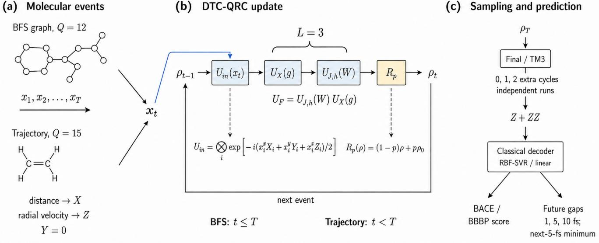  
FIG. 1. Molecular graph classification and electronic-gap forecasting with a fixed DTC-QRC. (a) BFS graph events describe local atoms, bonds, rings, and traversal depth for BACE inhibitor-activity and BBBP permeability classification $( Q = 1 2 )$ Ethene surface-hopping frames supply interatomic distances and radial velocities for future-gap prediction $( Q = 1 5 )$ . (b) One input rotation precedes three Floquet cycles, each ordered as $U _ { X } ( g )$ followed by $U _ { J , h } ( W )$ . The global channel $R _ { p } ( \rho ) =$ $( 1 - p ) \dot { \rho } + p | 0 ^ { Q } \rangle \langle 0 ^ { Q } |$ resets all qubits together with probability p. Graph processing includes reset after the last token $( t \leq T ) ;$ trajectory processing resets only between frames $( t < T )$ . (c) Final-state sampling uses endpoint $Z + Z Z$ coordinates. TM3 concatenates the endpoint and two input-free, reset-free continuations, after one and two additional Floquet cycles. Separate executions supply the three sampling depths. A classical decoder gives classification scores or predicts the $E _ { 1 } - E _ { 0 }$ gap 1, 5, and 10 fs after the last input frame and its minimum over the next 5 fs. The authors generated this schematic with AI assistance and checked its scientific content.

After each event, we apply L Floquet cycles,

$$
\begin{array} { c } { { \rho _ { t } ^ { - } = \mathcal { F } _ { x _ { t } } ( \rho _ { t - 1 } ) , } } \\ { { \mathcal { F } _ { x } ( \rho ) = \left( U _ { \mathrm { F } } ^ { L } U _ { \mathrm { i n } } ( x ) \right) \rho \left( U _ { \mathrm { F } } ^ { L } U _ { \mathrm { i n } } ( x ) \right) ^ { \dagger } , } } \\ { { U _ { \mathrm { F } } = U _ { J , h } ( W ) U _ { X } ( g ) , } } \\ { { U _ { X } ( g ) = \displaystyle \prod _ { i } \exp [ - \mathrm { i } g \pi X _ { i } / 2 ] , } } \\ { { U _ { J , h } ( W ) = \displaystyle \exp \left[ - \frac { \mathrm { i } } { 2 } \left( \displaystyle \sum _ { i = 1 } ^ { Q - 1 } J _ { i } Z _ { i } Z _ { i + 1 } + \pi \displaystyle \sum _ { i = 1 } ^ { Q } h _ { i } Z _ { i } \right) \right] . } } \end{array}\tag{3}
$$

Each event first rotates the local Bloch vectors along its input-dependent directions. The near-π pulse then acts before the longitudinal disorder and nearest-neighbor conditional phases. Because these operations do not commute, the response to an event depends on the state left by earlier events. Repeated Floquet cycles propagate this dependence into the one- and two-body observables available to the decoder.

The reservoir seed fixes $J _ { i } \sim \mathcal { U } [ - 0 . 9 , 0 . 9 ]$ and $h _ { i } \sim$ $\mathcal { U } [ - W , W ]$ . Prior DTC and DTC-QRC studies motivate g = 0.84 [25, 37]; we set $W = 0 . 5 0$ and $L = 3$ uniformly across the application simulations.

After graph event $t ,$ we apply the reset channel

$$
\rho _ { t } = \mathcal { R } _ { p } ( \rho _ { t } ^ { - } ) = ( 1 - p ) \rho _ { t } ^ { - } + p \rho _ { 0 } .\tag{4}
$$

For graph streams, reset acts after every event, including the last. For surface hopping, it acts between physical frames; the endpoint and temporal-multiplexing continuations remain unitary. We compute the reset channel through an exact mixture of sufix evolutions. The closed DTC-QRC sets $p = 0$ , and the graph application fixes $p = 0 . 1 0$ . For hopping, we select one p within each target, sampling scheme, and decoder family using the validation mean absolute error (MAE) averaged across seeds.

To see how reset weights the history, we expand the graph recurrence. We define $\mathcal { F } _ { b : a } = \mathcal { F } _ { x _ { b } } \circ \cdot \cdot \cdot \circ \mathcal { F } _ { x _ { c } }$ and $\mathcal { F } _ { T : T + 1 } = \mathcal { T }$ . Unrolling Eq. (4) gives

$$
\rho _ { T } = ( 1 - p ) ^ { T } \mathcal { F } _ { T : 1 } ( \rho _ { 0 } ) + p \sum _ { k = 1 } ^ { T } ( 1 - p ) ^ { T - k } \mathcal { F } _ { T : k + 1 } ( \rho _ { 0 } ) .\tag{5}
$$

The first term represents the uninterrupted trajectory; the kth summand groups paths whose most recent reset follows event k and therefore retains the later sufix. An influence that crosses ℓ subsequent reset locations carries weight $( 1 - p ) ^ { \ell }$ , corresponding to an event-scale survival length $[ - \ln ( 1 - p ) ] ^ { - 1 }$ . We call this geometric weighting the reset-induced event-age kernel. The kernel sets the relative weights of earlier and later inputs, while the Floquet dynamics, measured operators, and decoder determine which relations between events support prediction. Surface-hopping reset placement preserves the same geometric weighting between physical frames.

## C. Readout and temporal multiplexing

The final-state representation contains every one-body and pairwise computational-basis observable,

$$
\begin{array} { c } { { \Phi _ { Q } ( \rho ) = \left[ \{ \langle Z _ { i } \rangle \} _ { i = 1 } ^ { Q } , \{ \langle Z _ { i } Z _ { j } \rangle \} _ { i < j } \right] , } } \\ { { D _ { Q } = \displaystyle \frac { Q ( Q + 1 ) } { 2 } . } } \end{array}\tag{6}
$$

One computational-basis sample set estimates all $D _ { Q }$ entries. Let $\mathcal { C } _ { X _ { T } }$ denote the complete input-dependent channel for one event stream and let ${ \cal O } _ { a } \in \{ Z _ { i } , Z _ { i } Z _ { j } \}$ Each endpoint coordinate has equivalent Schrödinger and Heisenberg forms,

$$
\phi _ { a } ( X _ { T } ) = \mathrm { T r } \left[ O _ { a } \mathcal { C } _ { X _ { T } } ( \rho _ { 0 } ) \right] = \mathrm { T r } \left[ \mathcal { C } _ { X _ { T } } ^ { \dagger } ( O _ { a } ) \rho _ { 0 } \right] .\tag{7}
$$

Although each $O _ { a }$ acts on at most two qubits, its pulledback operator depends on the ordered input channel. Later inputs act on a state that contains the efects of earlier events. Endpoint $Z { + } Z Z$ measurements can therefore expose relations between events without reading out the intermediate states. We call a relation between events readable when a specified decoder can recover it from these measured coordinates. This definition links memory to a prediction task and a measurement protocol.

For final-state sampling, the prediction follows

$$
\mathrm { e v e n t ~ h i s t o r y } \longrightarrow \rho _ { T } \longrightarrow \Phi _ { Q } ( \rho _ { T } ) \longrightarrow \widehat { y } .\tag{8}
$$

Here $\widehat { y }$ denotes the prediction score or gap estimate.

Graph classification uses final-state sampling. Surfacehopping regression also uses three-sample temporal multiplexing (TM3), which concatenates $\bar { Z } + Z Z$ at the endpoint and after one and two additional Floquet cycles. During these continuations, we apply neither new inputs nor reset. For $Q = 1 5$ , final-state sampling exposes 120 coordinates and TM3 exposes 360. Hardware acquisition of TM3 would require separate executions at the three sampling depths.

With the input, reservoir, reset, and sampling protocol fixed, the same feature bank can serve several classical prediction heads. This is useful when the molecular inputs remain unchanged but the property target or decision threshold changes. Changing p requires a different feature bank. The exact simulator forms these banks from stored sufix evolutions; hardware execution requires the corresponding reset channel. Final-state $Z + Z Z$ retains a bounded width as the prefix grows; the longer stream increases circuit depth.

## D. Classical decoding and baselines

Decoder choice determines how the measured information becomes useful. An afine head fits a linear score, whereas radial-basis-function support-vector regression (RBF-SVR) fits nonlinear boundaries and regression functions.

For the primary nonlinear decoder, we standardize training features and fit RBF-SVR. For classification, we use the continuous SVR output as the prediction score and evaluate performance using the area under the receiver-operating-characteristic curve (ROC-AUC, abbreviated AUC below). BACE and BBBP use $C ~ \in ~ \{ 0 . 1 , 1 , 1 0 \}$ , median-distance gamma scales {0.25, 1, 4}, and $\epsilon \ = \ 0 . 0 1$ We rank candidates by validation AUC, then clipped-score log loss, then clipped-score accuracy. We optimize the afine graph control, a single logistic head, for 500 epochs with binary cross entropy; its validation epoch follows the same ranking. Surface-hopping ridge regression uses $\alpha ~ \in ~ \{ 1 0 ^ { - 6 } , 1 0 ^ { - 4 } , 1 0 ^ { - 2 } , 0 . 1 , 1 , 1 0 , 1 0 0 \}$ Its RBF-SVR grid uses $C \in \{ 0 . 1 , 1 , 1 0 , 1 0 0 \}$ , gamma scales {0.0625, 0.25, 1, 4} divided by feature dimension, and $\epsilon \in$ {0.005, 0.02}. Validation MAE selects decoder hyperparameters. For each seed and fixed reservoir setting, we refit the selected decoder on the combined training and validation trajectories and evaluate the test trajectories.

The ESN starts from the same $T \times 3 Q$ token array as QRC and applies tanh to its entries before the random input projection. On BACE and BBBP it exposes 78 recurrent coordinates, equal to $D _ { 1 2 } .$ , with spectral radius 0.90, input scale 0.75, and leak rate 0.65. Each event drives three ESN updates with the same input; QRC injects the event once before three Floquet cycles. We use the same decoder grid, data split, and random seed as in the corresponding QRC comparison. The surfacehopping ESN has 120 recurrent coordinates and uses the same 20-frame windows; its final and TM3 representations have the same widths as QRC.

Appendix B reports graph-task ESN width scans at 78, 500, 1000, and 2000 nodes.

Full-graph message passing and chemical fingerprints use broader structural information [43–45]. These approaches address prediction from the full molecular structure; the matched ESN comparison tests recurrent processing of the same local event stream.

## E. Statistical analysis and dephasing

Graph curves show six-seed means and sample standard deviations. For each reported T, 20,000 percentilebootstrap draws resample the six paired QRC–ESN differences (random seed 20260905). Hopping estimates use a six-seed by 60-trajectory error matrix; crossed percentile intervals resample seeds and trajectories independently while preserving the method pairing. Decoder hyperparameters follow validation MAE within each seed and reservoir setting. We then select hopping $p$ by the six-seed mean validation MAE, breaking ties toward smaller p. The candidate set contains 27 reset values: the uniform grid $0 , 0 . 0 5 , \ldots , 1$ and $0 . 0 0 2 5 , 0 . 0 0 5 , 0 . 0 1 , 0 . 0 2 , 0 . 0 4 , 0 . 0 8$ The application entries use the selected $p ;$ the response figure shows the uniform grid.

The graph reset scan fixes $Q = 1 2$ and reports complete response curves for $T \in \{ 6 , 1 2 , 2 0 , 3 0 \}$ . For each reset value, we compare the result with that of the closed reservoir at the same T.

To introduce event-wise dephasing, we apply the channel

$$
\mathcal { D } _ { \lambda } = \bigotimes _ { i = 1 } ^ { Q } \left[ \left( 1 - \frac { \lambda } { 2 } \right) \mathcal { Z } + \frac { \lambda } { 2 } \mathcal { Z } _ { i } \right] , \qquad \mathcal { Z } _ { i } ( \boldsymbol { \rho } ) = Z _ { i } \boldsymbol { \rho } Z _ { i } ,\tag{9}
$$

after every event. We average $k = 8$ or 32 Pauli trajectories per input sample and sufix at $\lambda = 0 . 5$ and 1, with exact reset weights and p fixed at $0 \ \mathrm { o r \ 0 . 1 0 }$ . The $\lambda = 0$ reference uses exact coherent evolution. BACE uses $Q \ = \ 1 2 , \ T \ = \ 3 0$ , while hopping uses $Q \ = \ 1 5$ $T = 2 0 ;$ both use final-state $Z + Z Z$ sampling and RBF-SVR. Each dephasing condition follows the original split and decoder-selection rules. For hopping, we divide each target MAE by its coherent value within seed and physical test trajectory at the same p, then average over four targets and 60 trajectories.

## III. MOLECULAR GRAPH CLASSIFICATION

Molecular graph classification tests whether a fixedwidth reservoir representation can accumulate local chemical information for property prediction. We use BACE for inhibitor activity and BBBP for blood–brain barrier permeability. For each molecule, the first T BFS events drive a 12-qubit reservoir, and final-state $Z + Z Z$ measurements yield 78 coordinates. The decoder learns the molecular label from these coordinates while the reservoir parameters remain fixed.

We compare the closed reservoir at $p = 0 .$ , the dissipative reservoir at the prespecified $p = 0 . 1 0$ , and a matched 78-node ESN using the same event streams and scafold splits. RBF-SVR supplies the primary nonlinear prediction score; an afine logistic head tests how well a linear score uses the same measured representation. Within each decoder comparison, QRC and ESN use matched input lengths, output widths, and decoder-selection protocols.

The dissipative DTC-QRC exceeds the matched ESN on the longer graph prefixes in Fig. 2. At $T = 3 0$ , for example, BACE AUC reaches 0.798, compared with 0.762 for the ESN. All six paired seeds favor QRC in both datasets at $T = 2 4$ and 30 (Table I). The representation thus supports prediction as local chemical observations accumulate, without increasing the number of measured coordinates. Weak reset also improves the mean AUC over the closed reservoir at the longest prefix in both datasets. The gain makes history weighting relevant to the accumulation of molecular structure.

The decoder determines how much of this predictive information it can recover from the measured coordinates. At $T = 3 0$ and $p = 0 . 1 0$ , BACE AUC rises from 0.656 with afine decoding to 0.798 with RBF-SVR; BBBP follows the same pattern. Weak reset slightly lowers afinedecoder AUC relative to $p = 0$ in both tasks, even though it improves RBF-SVR performance. The benefit of reset therefore depends on how the decoder uses the resulting representation. RBF-SVR can exploit nonlinear relations among the observables that an afine score cannot express. The reservoir and decoder have complementary roles: fixed quantum dynamics combine the event history, and the classical head learns how that representation re lates to the molecular label.

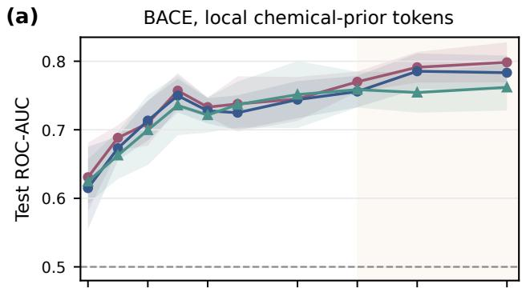

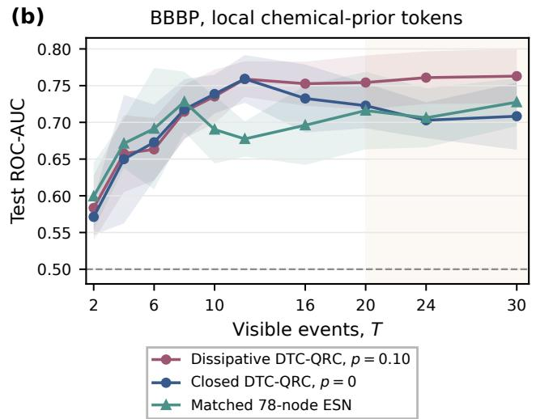  
FIG. 2. Same-T graph-stream application test. (a) BACE and (b) BBBP at $Q = 1 2$ under the local chemical-prior token protocol and RBF-SVR decoding. Lines and bands show six paired-seed means and sample standard deviations. The orange background marks the long-prefix region $T > 2 0$

TABLE I. Descriptive long-prefix graph classification at identical T. Values are test ROC-AUC mean ± sample standard deviation over six paired seeds. Pointwise confidence intervals apply to dissipative DTC-QRC minus matched ESN.
<table><tr><td>Task</td><td>T</td><td>Dissip.  $\mathrm { D T C - Q R C }$ </td><td>Matched ESN</td><td>∆ AUC [95% CI]</td></tr><tr><td rowspan="2">BACE</td><td>24</td><td> $0 . 7 9 1 \pm 0 . 0 2 2$ </td><td> $0 . 7 5 4 \pm 0 . 0 2 9$ </td><td>0.0368 [0.0180, 0.0589]</td></tr><tr><td>30</td><td> $0 . 7 9 8 \pm 0 . 0 2 9$ </td><td> $0 . 7 6 2 \pm 0 . 0 3 4$ </td><td>0.0366 [0.0246, 0.0503]</td></tr><tr><td rowspan="2">BBBP</td><td>24</td><td> $0 . 7 6 1 \pm 0 . 0 3 6$ </td><td> $0 . 7 0 6 \pm 0 . 0 4 0$ </td><td>0.0547 [0.0424, 0.0658]</td></tr><tr><td>30</td><td> $0 . 7 6 3 \pm 0 . 0 3 7$ </td><td> $0 . 7 2 7 \pm 0 . 0 3 3$ </td><td>0.0355 [0.0147, 0.0579]</td></tr></table>

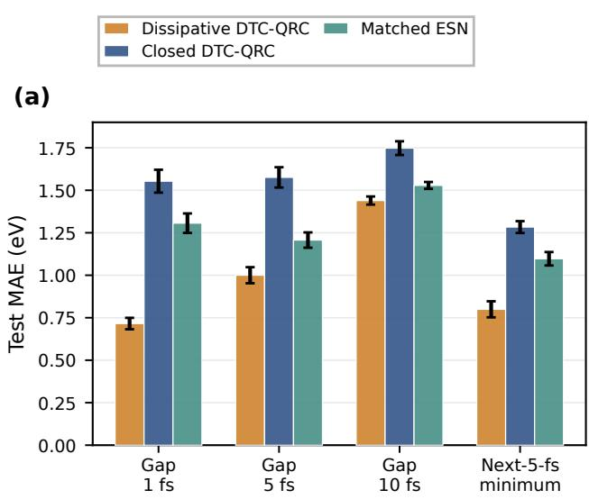  
FIG. 3. Validation-selected SHNITSEL A01 application test at the common $Q = 1 5$ , T = 20 interface. Bars report test MAE for dissipative $\mathrm { { D T C - Q R C } , }$ closed $\mathrm { { D T C - Q R C } , }$ and the matched ESN using final-state $Z + Z Z$ sampling and RBF-SVR. Error bars show six-seed sample standard deviations.

## IV. ELECTRONIC-GAP PREDICTION

The second application asks whether the same reservoir rule can connect nuclear motion to a future electronic response. We encode interatomic distances and radial velocities from successive SHNITSEL A01 ethene frames into the reservoir. Unlike BFS events, these inputs follow a physical clock, so retaining earlier frames can preserve information about how the molecule approaches its current geometry. Final-state $Z + Z Z$ measurements support forecasts at several horizons and of the minimum gap within a future interval. Trajectory-disjoint training, validation, and test sets separate model fitting, reset selection, and evaluation.

With final-state sampling and RBF-SVR, validationselected reset lowers test MAE relative to both the closed DTC-QRC and the matched ESN for all four targets (Fig. 3). The largest gain over the ESN occurs for the 1-fs gap, with a mean error reduction of 0.591 eV. The paired 95% intervals exclude zero for every target (Table II). These results show that controlled forgetting improves the prediction obtained from the same input window and readout width. The selected reset strengths difer across targets, and the gain over ESN narrows at the longest horizon. The relevant history therefore depends on the electronic property and forecast interval, motivating the reset scan below.

To test whether the improvement over the matched ESN extends to a diferent classical model, we also evaluate an Extra Trees regressor on the same inputs. For the 10-fs gap, Extra Trees gives a test MAE of 1.404 $\mathrm { e V , }$ compared with 1.440 eV for QRC.

TABLE II. Surface-hopping test results after validation-only selection of $p .$ MAEs report mean ± sample standard deviation over six seeds. Intervals use crossed seed-by-trajectory 95% resampling for DTC-QRC minus matched ESN.
<table><tr><td>Target selected  $p$ </td><td>Dissip. DTC-QRC (eV)</td><td>Matched  $\mathrm { E S N ~ ( e V ) }$ </td><td>∆ MAE (eV) [95% CI]</td></tr><tr><td> ${ \mathrm { G a p } } , 1 { \mathrm { f s } }$   $p = 0 . 9 0$ </td><td> $0 . 7 1 6 \pm 0 . 0 3 4$ </td><td> $1 . 3 0 6 \pm 0 . 0 5 7$ </td><td>-0.591  $\begin{array} { c } { { [ - 0 . 6 8 8 , ~ - 0 . 4 9 5 ] } } \\ { { ~ - 0 . 2 0 7 } } \end{array}$ </td></tr><tr><td> ${ \mathrm { G a p } } , 5 ~ { \mathrm { f s } }$   $p = 0 . 6 5$ </td><td> $1 . 0 0 0 \pm 0 . 0 4 7$ </td><td> $1 . 2 0 7 \pm 0 . 0 4 5$ </td><td>[-0.286, -0.123]</td></tr><tr><td> ${ \mathrm { G a p } } , 1 0 ~ { \mathrm { f s } }$   $p = 0 . 8 0$ </td><td> $1 . 4 4 0 \pm 0 . 0 2 4$ </td><td> $1 . 5 2 9 \pm 0 . 0 2 0$ </td><td>-0.089 [-0.163, -0.015]</td></tr><tr><td> $\mathrm { N e x t - 5 - f s \ M i n . }$   $p = 0 . 8 5$ </td><td> $0 . 8 0 0 \pm 0 . 0 4 7$ </td><td> $1 . 0 9 7 \pm 0 . 0 4 0$ </td><td>-0.298  $[ - 0 . 3 7 9 , \ - 0 . 2 1 3 ]$ </td></tr></table>

The two applications connect molecular screening and time-resolved prediction through the same reservoir rule and observable family. In graph classification, the reservoir combines local observations into a representation of a static molecule. In gap prediction, it combines successive observations of an evolving geometry. This distinction changes the role of history: earlier events supply additional structural context in the first case and information about preceding motion in the second. Controlled reset provides a common way to adjust their contributions to the property being predicted.

## V. EFFECTS OF CONTROLLED DISSIPATION

The two applications favor diferent amounts of retained history. We scan the reset probability p at fixed Floquet parameters to examine how controlled dissipation afects prediction for each input stream (Fig. 4).

Weak reset improves several longer graph prefixes, whereas stronger reset can remove information needed for classification [Fig. $^ \mathrm { 4 ( a , d ) } ]$ . Short prefixes change little or incur small losses, and the clearest gains occur for longer BBBP prefixes. A small reset probability reduces the influence of earlier events while retaining contributions from across the prefix. The observed gains suggest that this partial forgetting can make the accumulated information more useful for prediction. The decline at stronger reset is consistent with loss of useful structural context.

The trajectory forecasts favor stronger reset and show a diferent dependence on the prediction target. Figure $^ { 4 ( \mathrm { b , c , e , f } ) }$ reports the MAE change relative to the closed reservoir, so negative values identify improvement from controlled forgetting. With RBF-SVR, broad min ima indicate that a range of history weights can support useful forecasts. The nearest-future gap favors strong emphasis on recent motion, while the longer-horizon er rors rise as reset approaches completeness. Linear ridge decoding gives smaller changes but retains the target ordering. TM3 changes their magnitude more than the qualitative location of the response regions. The preference for target-dependent history weighting therefore appears across these decoder and sampling choices.

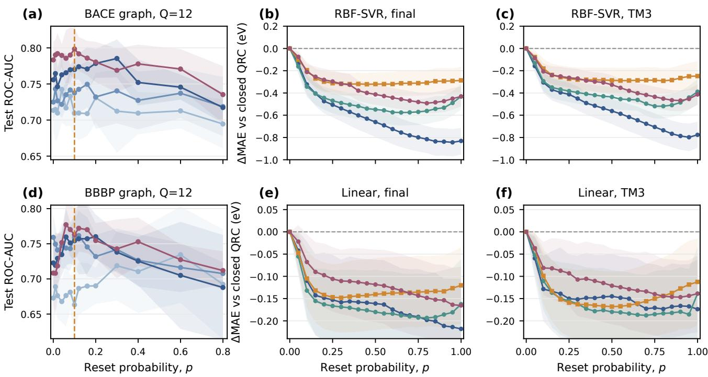  
FIG. 4. Reset-probability response across both molecular interfaces. (a,d) BACE and BBBP test AUC at $Q = 1 2$ for four fixed event lengths on the original measured $0 \le p \le 0 . 8$ axis; lines and bands show six-seed means and sample standard deviations, and the vertical dashed line marks the prespecified graph value $p = 0 . 1 0$ . (b,c) SHNITSEL A01 with RBF-SVR and final-state or TM3 sampling. $\mathrm { ( e , f ) }$ The same targets with linear decoding. Hopping curves use the uniform $p = 0 , 0 . 0 5 , \ldots , 1$ scan and report held-out trajectory MAE at p minus paired closed-DTC-QRC MAE at $p = 0 ;$ shading gives crossed seed-by-trajectory 95% intervals.

The $p = 1$ limit isolates the contribution of earlier encoded frames by removing reservoir memory between events: $\rho _ { T } ~ = ~ \mathcal { F } _ { x _ { T } } ( \rho _ { 0 } )$ The final event still contains distances and radial velocities, with velocity computed from two adjacent raw frames. Complete reset therefore retains local information about motion at the end of the input window. Retaining reservoir history barely changes the mean 1-fs error but lowers the 5-fs error by about 0.14 eV (Table III). Earlier encoded frames consequently add more predictive value at the intermediate horizon, beyond the final distance/velocity pair.

These diferences suggest a tradeof between useful history and redundant or target-irrelevant inputs. Smaller p preserves older motion that can aid a forecast, but the fixed-width readout must represent that history together with recent observations. Retaining older inputs for longer may therefore reduce the prominence of the information most relevant to the target. This interpretation explains why a longer forecast horizon need not favor weaker reset. The 10-fs target selects stronger reset than the 5-fs target and still has higher error. A more dificult forecast can require both access to past motion and stronger suppression of its less useful components.

TABLE III. Complete-reset comparison for surface hopping at $Q = 1 5 , T = 2 0$ , with final-state $Z + Z Z$ and RBF-SVR. The $p = 1$ column gives six-seed mean test MAE ± sample standard deviation. The last column gives the mean diference $\mathrm { M A E ( 1 ) } - \mathrm { M A E } ( p _ { \star } )$ , where Table II reports the validationselected $p _ { \star }$ . Positive diferences favor retaining reservoir history.
<table><tr><td>Target</td><td> $p = 1 \mathrm { M A E \ ( e V ) }$ </td><td> $\mathrm { M A E } ( 1 ) - \mathrm { M A E } ( p _ { \star } ) ~ ( \mathrm { e V }$  刀</td></tr><tr><td>Gap, 1 fs</td><td> $0 . 7 2 2 \pm 0 . 0 2 7$ </td><td>+0.0065</td></tr><tr><td>Gap, 5 fs</td><td> $1 . 1 4 4 \pm 0 . 0 1 8$ </td><td>+0.1442</td></tr><tr><td>Gap, 10 fs</td><td> $1 . 4 6 1 \pm 0 . 0 4 4$ </td><td>+0.0217</td></tr><tr><td>Next-5-fs Min.</td><td> $0 . 8 5 2 \pm 0 . 0 2 6$ </td><td>+0.0527</td></tr></table>

The two tasks therefore require diferent uses of reservoir history. Weak reset allows chemical information to accumulate over long graph prefixes, while stronger reset emphasizes recent motion in the ethene forecasts. The survival weight $( 1 - p ) ^ { \ell }$ in $\operatorname { E q . }$ (5) gives this distinction a direct physical control. Changing p adjusts which parts of the input history contribute most strongly while leaving the Floquet parameters fixed. For molecular prediction, this separates the choice of history weighting from the dynamics that transform the inputs into observables.

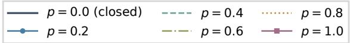

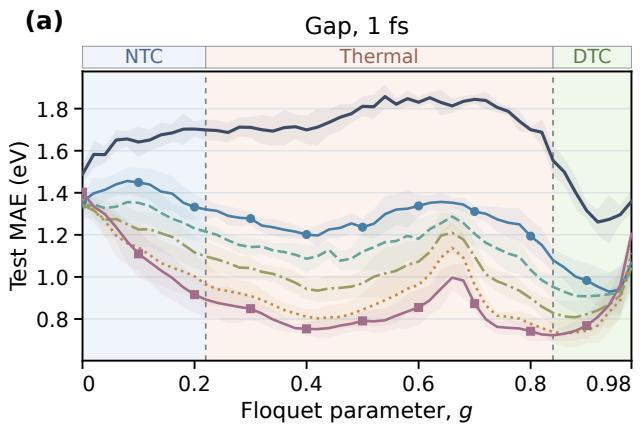

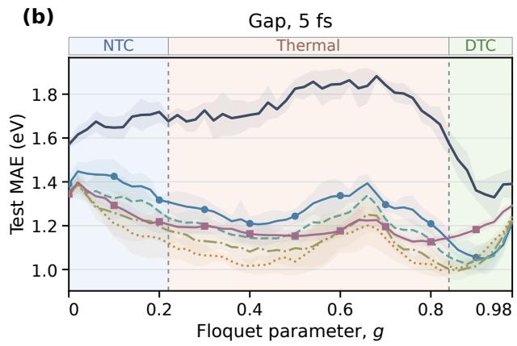

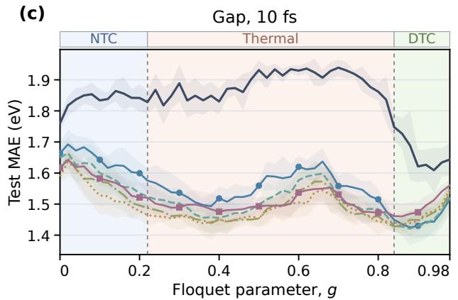

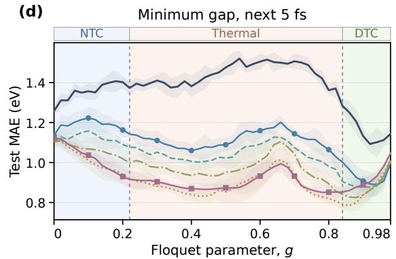  
FIG. 5. Floquet-drive dependence of ethene gap prediction with RBF-SVR and final-state readout. (a)–(d) The ${ \mathrm { 1 - , ~ 5 - , } }$ and 10-fs gaps and the minimum gap in the next 5 fs. Each panel shows $p = 0 , 0 . 2 , \ldots , 1$ at $Q = 1 5 , T = 2 0 , L = 3$ , and $W = 0 . 5 0 .$ Lines and bands give means and sample standard deviations across six reservoir seeds on one fixed whole-trajectory split. The background labels mark literature reference regions: nontime-crystalline (NTC), thermal, and DTC, with divisions at $g = 0 . 2 2$ and 0.84 [25, 37].

## VI. FLOQUET-DRIVE DEPENDENCE

Controlled reset sets the weighting of past inputs, while the Floquet drive controls their transformation into measured observables. We scan g at fixed reset probabilities to examine how these controls jointly afect ethene gap prediction. The comparison retains the application input window, reservoir size, whole-trajectory split, and reservoir seeds; validation selects the decoder hyperparameters at each physical setting. Figure 5 shows the four targets with RBF-SVR and final-state $Z + Z Z$ readout. Comparing complete drive curves reveals whether one operating region can serve targets with diferent preferences for retained history.

The error depends nonmonotonically on $^ { g , }$ and the dissipative curves share a low-error region on the highg side. To compare the 20 target–reset configurations with $p > 0$ , we express each six-seed mean MAE as a percentage excess over that configuration’s scanned minimum. Averaging this excess gives each configuration equal weight, while averaging the within-configuration drive ranks compares their preferred ordering. The two criteria favor $g = 0 . 8 8$ and 0.86, respectively, identifying $g \simeq 0 . 8 6 \mathrm { - } 0 . 8 8$ as a common low-error operating window. Its value lies in keeping errors close to their individual minima across diferent targets and reset strengths.

This window lies close to the DTC transition reference $g _ { c } \simeq 0 . 8 4$ reported for related Floquet spin chains [37]. At the fixed value $g \ : = \ : 0 . 8 4$ used in the main application comparisons, 17 of the 20 dissipative RBF-SVR/final configurations lie within 5% of their own scanned minima. The scan therefore supports this phase-informed setting as an efective, near-optimal fixed operating point across these molecular prediction tasks. It connects the choice of a Floquet regime to a practical requirement: forming useful observables across targets without selecting a separate drive for each one.

The drive dependence persists at $p = 1$ , where reset removes reservoir memory between events. For the 1-fs target with RBF-SVR and final readout, MAE falls from 1.403 eV at $g = 0$ to $0 . 7 2 2$ eV at $g = 0 . 8 4$ . The available final input remains the same, so this change reflects how the drive transforms its distances and radial velocities into observables usable by the decoder. The favorable drive region therefore involves the quality of the inputto-observable map as well as the treatment of history. Appendix C examines how temporal multiplexing and the decoder change the favorable regions.

(c)

## VII. DEPHASING EFFECTS

The reset and drive scans establish how the reservoir weights and transforms molecular inputs. We now use event-wise dephasing to examine whether prediction depends on coherent propagation at fixed reset probability. BACE AUC decreases at both Pauli-trajectory counts [Fig. 6(a,c)]. At $\lambda = 0 . 5$ and $k = 8 ,$ , for example, the closed-reservoir AUC falls from 0.783 to 0.504. Weak reset reduces the observed AUC loss at both trajectory counts, although dephasing still degrades prediction. Controlled forgetting and coherence thus afect diferent aspects of the measured representation: reset changes the contribution of older events, whereas dephasing changes the propagation of the encoded state.

The gap forecasts show the same qualitative sensitivity to dephasing [Fig. $^ \mathrm { 6 ( b , d ) } ]$ Their target-balanced MAE ratios exceed unity for both reset settings and both trajectory counts, with each ratio referenced to coherent evolution at the same $p .$ The penalty therefore persists when the comparison holds history weighting fixed. Together, the classification and forecasting results show that the measured representation loses predictive information when dephasing intervenes between input events.

This sensitivity can arise even though the final $Z + Z Z$ measurements are diagonal in the computational basis. Dephasing suppresses of-diagonal density-matrix elements before subsequent Floquet cycles, which can convert coherence into later populations and correlations. It therefore changes how successive inputs contribute to the final measurement statistics. The observed performance losses are consistent with a role for coherent propagation in forming useful molecular representations. Because the channel also changes purity and subsequent mixing, its efect concerns the ensuing dynamics as a whole.

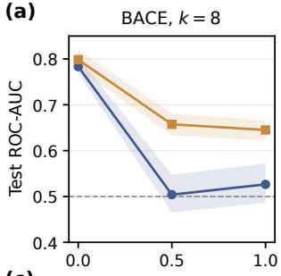

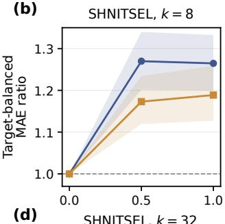

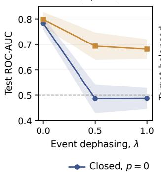

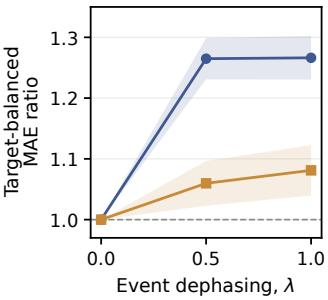  
FIG. 6. Event-wise dephasing at two Pauli-trajectory counts. (a,b) $k = 8 ; ( \mathrm { c } , \mathrm { d } ) \ k = 3 2$ . The left column gives BACE test ROC-AUC at $Q \ : = \ : 1 2 , \ : T \ : = \ : 3 0 ;$ the right gives the targetbalanced surface-hopping MAE ratio at $Q \ = \ 1 5 ,$ $T = 2 0$ Both tasks use final-state $Z + Z Z$ and RBF-SVR at $p = 0 ~ \mathrm { o r }$ $0 . 1 0$ . The $\lambda = 0$ points use exact coherent evolution. Lines give six-seed means. Shading gives 95% bootstrap intervals for $k = 8$ (paired seeds for BACE; crossed seeds and physical trajectories for hopping) and sample standard deviations across seed means for $k = 3 2$ . Hopping ratios use the coherent model at the same $p$ as their reference.

## VIII. EXPERIMENTAL DEMONSTRATION

We next demonstrate DTC-QRC molecular classification using the Baihua and Shenglian processors on the Quafu superconducting quantum cloud platform. In the six-qubit circuits, successive events enter through $U _ { 3 }$ gates, and an afine head maps endpoint $Z + Z Z$ measurements to BACE predictions. We set $p = 0$ to examine propagation without event-wise controlled reset. Appendix A gives the input-angle mapping, device parameters, and acquisition protocol.

A four-point scan from the thermal region to the DTC side tests which drive best supports classification under device noise. On the common balanced molecular subset, full $Z + Z Z$ readout reaches its highest mean hardware $\mathrm { A U C }$ among the sampled drives at $g = 0 . 8 4 \colon 0 . 5 8 5$ across three Shenglian batches. This maximum motivates examining how a drive forms predictive observables while preserving their task information through the noisy circuit. We examine the local and pairwise readouts to understand how these requirements depend on the drive.

Connected second-order correlations subtract the

(a)

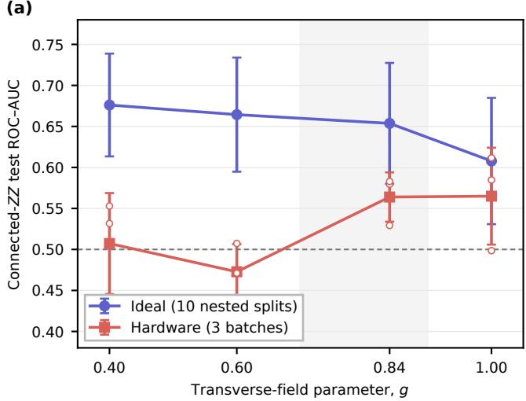

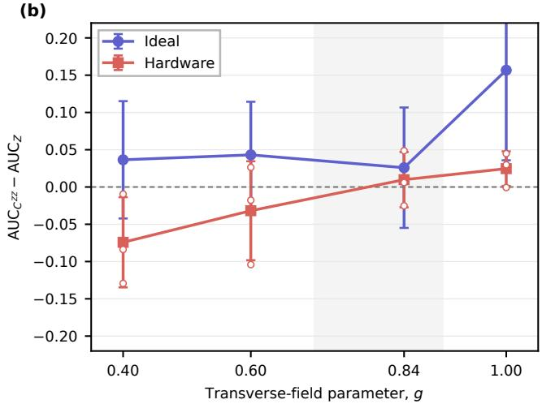  
FIG. 7. Four-point drive scan on the Quafu superconducting quantum cloud platform. (a) Test ROC-AUC from the 15 connected pair coordinates $C _ { i j } ^ { Z Z } = \langle Z _ { i } Z _ { j } \rangle - \langle Z _ { i } \rangle \langle Z _ { j } \rangle$ available at $Q = 6 .$ (b) Connected-ZZ AUC minus the separately fitted six-dimensional Z-only AUC. Ideal markers show means and sample standard deviations over ten nested scafold/decoder analyses. Hardware markers show means and sample standard deviations over three Shenglian acquisition batches; open circles are individual batch means. Every point uses the same balanced 400-molecule BACE subset, $Q = 6 , T = 6 , L = 3 .$ $W = 0 . 6 , p = 0$ , coupling realization, 180 nominal controlled-X (CX) gates, 1024 shots, and afine decoder protocol. The gray region marks the $g = 0 . 7 – 0 . 9$ transition-edge window inherited from prior work.

product of local polarizations from each pair expectation, separating their contribution from that of the local Z observables. Their ideal AUC decreases across the ordered drives, while hardware AUC is higher at the two points toward the DTC side [Fig. 7(a)]. The transition edge combines higher ideal predictive performance than the deeper DTC setting with comparable hardware perfor mance. Connected-ZZ readout exceeds Z-only readout at the two higher-g points, reversing their order at the lower drives [Fig. 7(b)]. The relative value of pair correlations therefore depends on the drive regime and their survival under noise.

15Refitting the afine head in each ideal or hardware domain measures how much task information the corresponding observables retain for prediction. AUC can 0.05therefore remain useful even when noise changes the individual coordinates. The depth control further identifies the pairwise block as the main source of the Shenglian −0.05performance loss (Appendix A). Because the $g \ : = \ : 0 . 8 4$ batches were acquired one day earlier, the cross-g hardware diferences describe associations between drive and −0.15predictive performance.

Smaller ideal-to-hardware losses toward the DTC side show better retention of task information in secondorder correlations. In related Floquet systems, thermalizing dynamics spread local perturbations more rapidly, whereas DTC dynamics restrict their propagation [37, 38]. Stronger mixing can combine successive inputs into predictive observables, while restricted propagation can help retain their information under noise. The fullreadout maximum near the transition edge is consistent with balancing these efects. This balance provides a practical criterion for hardware reservoir selection: assess both the predictive representation formed by ideal dynamics and the task information retained in the measured observables.

## IX. CONCLUSION AND OUTLOOK

DTC-QRC provides a common physical framework for predicting molecular properties from structural and dynamical event streams. Fixed Floquet dynamics convert successive local inputs into endpoint observables, and classical prediction heads turn this representation into property estimates. Relative to the image-classification application of earlier DTC-QRC work [25], the architecture introduces successive molecular-event injection and independent control of reset.

At matched input lengths and readout widths, DTC-QRC improves long-prefix BACE and BBBP classification and the studied ethene gap forecasts over an ESN. The two applications favor diferent reset strengths. Long graph prefixes benefit from weak reset, whereas the ethene forecasts favor stronger emphasis on recent motion. These preferences link the value of reservoir history to the distinction between accumulating local chemistry and forecasting evolving nuclear motion. Validationselected reset also lowers the ethene prediction error relative to the closed reservoir, and the complete-reset comparison supports the contribution of earlier encoded frames.

These results support reservoir operation near the DTC transition edge, with reset matching the retained history to the target. With RBF-SVR and final-state readout, the drive scan of dissipative QRC identifies a common low-error window across targets and reset strengths near the DTC transition reference [37]. The exact sufix expansion specifies how reset weights earlier events, while the drive dependence at complete reset shows that Floquet evolution also controls how the latest input becomes predictive observables. Dephasing lowers performance in both applications, consistent with a role for coherent propagation. Experiments on the Quafu superconducting quantum cloud platform show that second-order correlations retain more task information in the DTC regime under device noise. The transition edge yields the highest mean hardware AUC for full $Z + Z Z$ readout among the sampled settings, consistent with balancing mixing and noise resilience.

DTC-QRC brings tunable memory and coherent input processing to molecular property prediction. Extending local inputs to binding environments and longer conformational trajectories would carry this approach into afinity prediction and electronic-response prediction for larger molecules. The aim is to retain chemically relevant history in a compact quantum representation as molecular complexity grows.

Noise resilience is central to this development. The superconducting results motivate combining the retention of task information in DTC-side correlations with the stronger input mixing near the transition. Joint design of the drive, reset, and readout can turn this balance into a strategy for preserving predictive information over longer molecular streams. This direction advances DTC-QRC toward molecular screening and time-resolved property prediction on noisy quantum processors.

## ACKNOWLEDGMENTS

The authors thank Haifeng Yu and Quafu team at the Beijing Academy of Quantum Information Sciences for supporting the superconducting quantum cloud experiments. This work is supported by Beijing Institute of Technology Research Fund Program under Grant No. 2024CX01015, the Fundamental Research Funds for the Central Universities, and the National Natural Science Foundation of China under Grant No. 62533015.

The authors used GPT-5.6 SOL and GPT-6 Astra for literature search and synthesis, manuscript revision, language editing, and proofreading. The authors reviewed the manuscript and take responsibility for its final content.

## DATA AVAILABILITY

The BACE and BBBP tasks follow MoleculeNet [41]. SHNITSEL A01 is available from the repository described in Ref. [39]. The accompanying archive contains token arrays and hashes, split definitions, per-seed source metrics, ESN width-scan results, validation selections, analysis code, and figure-building scripts. The extraction programs compute larger reservoir feature banks from the cited public data. The archive accompanies this manuscript and has no persistent public deposit identifier yet.

## APPENDIX A: SUPERCONDUCTING DEVICES AND CONTROL EXPERIMENTS

We use the Baihua and Shenglian superconducting processors on the Quafu cloud platform. Table IV summarizes their published characteristics and the six-qubit paths used in our experiment [46–48]. Both devices couple transmon qubits through tunable couplers and support native controlled-Z (CZ) gates. We submit circuits on the specified physical paths with compilation enabled and readout correction disabled. Each circuit uses 1024 shots; the $L = 1$ base and $L = 3$ circuits contain 60 and 180 nominal controlled-X (CX) gates, respectively.

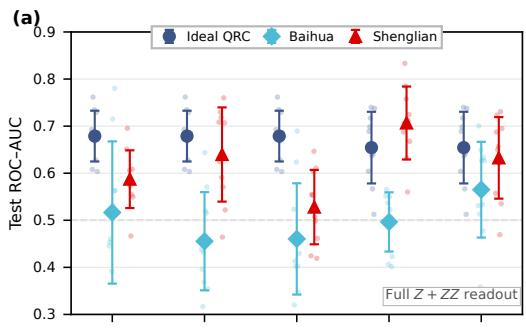

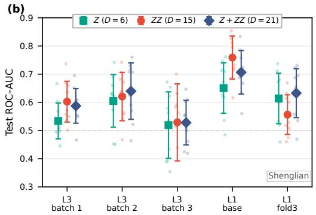  
FIG. 8. Molecular classification and depth controls on the Quafu superconducting quantum cloud platform. (a) Full $Z + Z Z$ test AUC for matched ideal, Baihua, and Shenglian features across three $L = 3$ acquisition batches and the paired $L = 1$ base/fold3 circuits. (b) Shenglian AUC after retaining Z, ZZ, or their union. Large markers and bars show means and sample standard deviations over ten nested scaffold/decoder analyses; pale points show those analyses. The ten analyses reuse one feature matrix per hardware condition, while acquisition batches represent device repetitions. Fold3 preserves the ideal $L = 1$ unitary while increasing the nominal CX count from 60 to 180. The observable families expose diferent widths. Dashed lines mark chance.

Figure 8 summarizes the execution controls that complement the four-point g scan in the main text. The canonical $Q = 6 , T = 6$ circuits use the same label-free local chemical-prior token rule on a balanced 400-molecule

TABLE IV. Quafu processors and experimental settings. Coherence times and gate fidelities refer to the published characterization samples and dates; physical paths and shot counts refer to the present experiment. Shenglian medians cover 65 qubits and 72 CZ gates; the Baihua CZ mean covers 130 gates. The $T _ { 2 }$ measurements use spin echo for Baihua and Carr–Purcell– Meiboom–Gill (CPMG) refocusing for Shenglian.
<table><tr><td>Parameter</td><td>Baihua  $[ 4 6 , 4 7 ]$ </td><td>Shenglian [48]</td></tr><tr><td>Physical qubits</td><td>156</td><td>84</td></tr><tr><td>Qubit type</td><td>Fixed-frequency transmon</td><td>Frequency-tunable transmon</td></tr><tr><td>Connectivity</td><td>Heavy-hexagon-like</td><td>Hexagonal</td></tr><tr><td> $T _ { 1 } ~ ( \mu \mathrm { s } )$ </td><td>77 (mean)</td><td>50.8 (median)</td></tr><tr><td> $T _ { 2 } ~ ( \mu \mathrm { s } )$ </td><td>58 (spin echo, mean)</td><td>16.9 (CPMG, median)</td></tr><tr><td>Single-qubit gate fidelity</td><td>&gt; 99.9% (mean)</td><td>99.95% (median)</td></tr><tr><td>CZ gate fidelity</td><td>98.65% (mean)</td><td>99.25% (median)</td></tr><tr><td>Physical qubit path</td><td> $7 2 , 7 3 , 7 4 , 7 5 , 7 6 , 7 7$ </td><td>27, 34, 41, 48, 54, 61</td></tr><tr><td>Path-selection map date</td><td>28 July 2026</td><td>28 July 2026</td></tr><tr><td>Shots per circuit</td><td>1024</td><td>1024</td></tr><tr><td>Readout correction</td><td>Disabled</td><td>Disabled</td></tr></table>

BACE subset. For each event, we apply tanh elementwise to its 3Q token coordinates and assign successive triples to the $U _ { 3 }$ angles $( \theta , \varphi , \chi )$ on each qubit. These angles enter directly in radians; up to a global phase, $U _ { 3 } ( \theta , \varphi , \chi ) =$ $R _ { z } ( \varphi ) R _ { y } ( \dot { \theta } ) R _ { z } ( \chi )$ . We measure every molecular circuit with 1024 shots, and one computational-basis count table supplies all six $Z$ and 15 $Z Z$ coordinates. We refit the same bias-containing afine decoder within each ideal or hardware feature domain.

For the Shenglian four-point drive comparison in Fig. 7, three acquisition rounds interleaved the $g \ =$ 0.40, 0.60, and 1.00 circuits; we acquired the three $g =$ 0.84 batches one day earlier. All settings share the molecular subset, qubit chain, depth, measurement basis, nom inal two-qubit-gate count, and decoder protocol.

At $L \ = \ 3 .$ the matched ideal $Z + Z Z$ features give test AUC $0 . 6 7 9 \pm 0 . 0 5 4$ . The three Shenglian acquisition batches give $0 . 5 8 7 { \scriptstyle \pm 0 . 0 6 1 }$ $0 . 6 4 0 { \scriptstyle \pm 0 . 1 0 0 }$ , and $0 . 5 2 8 { \pm } 0 . 0 7 9 ;$ the corresponding Baihua values are $0 . 5 1 7 { \pm } 0 . 1 5 1 , 0 . 4 5 5 { \pm }$ 0.104, and $0 . 4 6 0 \pm 0 . 1 1 8$ Each uncertainty is the sample standard deviation across ten nested scafold/decoder analyses of one fixed feature matrix. The three hardware batches are separate acquisitions, and the ten points within each batch quantify analysis variability. All three Shenglian batch means exceed 0.5 and show end-to-end task readability; variation across batches and processors reflects acquisition-dependent changes in the measured feature map.

The base circuit implements the $L = 1$ unitary B. The fold3 circuit inserts $B ^ { \dagger } B .$ , so $B B ^ { \dagger } B = B$ in the noiseless model while implemented depth increases. The matched ideal $Z + Z Z \mathrm { \ A U C }$ is therefore $0 . 6 5 4 \pm 0 . 0 7 6$ for both circuits. Shenglian changes from $0 . 7 0 7 \pm 0 . 0 7 8$ at the 60- CX base circuit to $0 . 6 3 3 \pm 0 . 0 8 7$ at the 180-CX fold, a nested-analysis mean change of $- 0 . 0 7 4$ . Baihua changes from $0 . 4 9 6 \pm 0 . 0 6 3$ to $0 . 5 6 5 \pm 0 . 1 0 2$ $\mathrm { o r \ + 0 . 0 6 9 }$ The opposite signs show that the two processors deform the finite-sample feature cloud diferently, beyond a scalar attenuation model.

The Shenglian observable-family control shows where the AUC decreases when the circuit is folded. From base to fold3, Z-only AUC changes from 0.651 to 0.614, ZZonly AUC from 0.759 to 0.556, and combined AUC from 0.707 to 0.633. The corresponding changes are −0.037, −0.202, and −0.074, with all ten nested $Z Z$ analyses decreasing. The pairwise block therefore carries most of the observed depth sensitivity.

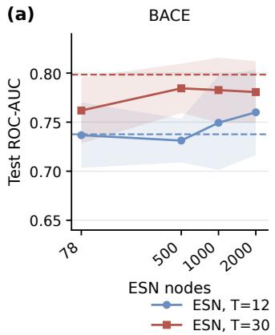

(b)  
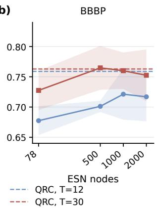  
FIG. 9. ESN width dependence at fixed molecular input. Test ROC-AUC on (a) BACE and (b) BBBP for $T = 1 2$ and 30. Solid curves and shading give ESN means and sample standard deviations over six scafold-split seeds; dashed lines give the corresponding QRC means at $p = 0 . 1 0$ . Each ESN width uses its own validation-selected decoder.

## APPENDIX B: ESN WIDTH DEPENDENCE

We compare echo-state networks (ESNs) with 78, 500, 1000, and 2000 recurrent nodes on BACE and BBBP at event lengths $T = 1 2$ and 30.

All conditions use the local chemical-prior tokens and six scafold-split seeds 0, 10, 20, 30, 40, 50 from the main text. The quantum reference fixes $Q = 1 2 , g = 0 . 8 4$ $W = 0 . 5 0 , \ L = 3 .$ , and $p \ = \ 0 . 1 0 $ , with 78 final-state $Z + Z Z$ coordinates. The ESNs retain spectral radius 0.90, input scale 0.75, leak rate 0.65, and three updates per event.

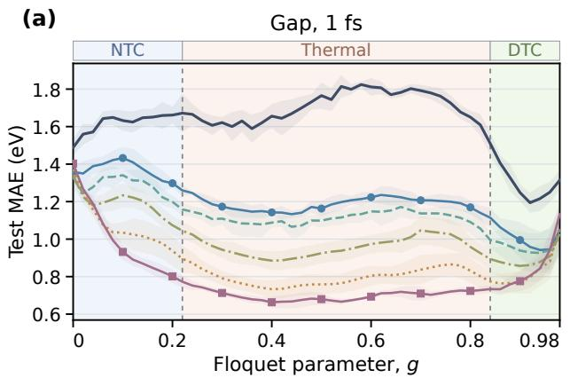

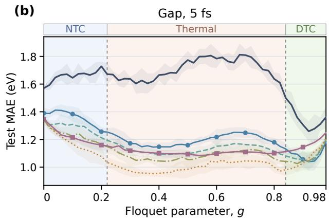

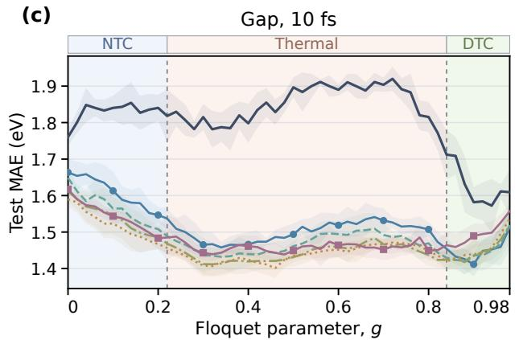

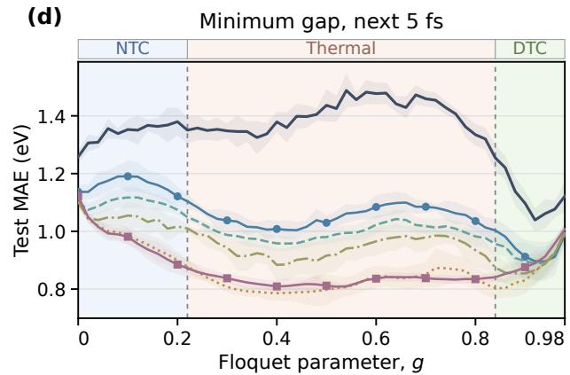  
FIG. 10. Floquet-drive dependence with RBF-SVR and TM3 readout. Panels (a)–(d) follow the target order in Fig. 5; all six reset values, reservoir parameters, seeds, and data partitions match that comparison. TM3 concatenates three post-input $Z + Z Z$ samples. Lines and bands show six-seed means and sample standard deviations. Background regions retain the same literature reference divisions as Fig. 5.

Each width uses the main-text RBF-SVR grid and training-feature standardization. We select decoder hyperparameters separately for each dataset, event length, width, and seed using the same validation protocol.

Figure 9 shows that larger ESNs do not consistently achieve higher test AUC. At T = 30, both datasets reach their highest mean ESN AUC in the scan at 500 nodes, followed by lower means at 1000 and 2000 nodes. For BBBP, the 500-node ESN gives 0.765, close to the QRC value of 0.763; increasing the width to 2000 lowers the ESN mean to 0.752. We interpret this near equality as reflecting weaker sensitivity of BBBP prediction than BACE prediction to the traversal order of local chemical information. The 500-node ESN then captures enough of that information to match QRC at T = 30.

## APPENDIX C: DRIVE DEPENDENCE ACROSS DECODERS AND READOUTS

We extend the drive comparison to both linear ridge and RBF-SVR decoding with final and TM3 readouts. Final sampling gives 120 observables, while TM3 gives 360 from three post-input sampling times. Four targets, six reset values, two decoders, and two readouts yield 96 configurations; excluding $p = 0$ leaves 80. All configurations use the drive grid $g = 0 , 0 . 0 2 , \ldots , 0 . 9 8$ . Figure 10 shows RBF-SVR with TM3, and Table V compares the drive preferences across both decoders and readouts.

Table V summarizes the favorable drives using the mean percentage excess and mean rank defined in Sec. VI. For each configuration, both quantities refer to the six-seed mean test MAE over the same 50-point g scan; rank 1 denotes its lowest MAE. Each configuration contributes equal weight. These are descriptive summaries of the fixed-setting test curves; the application comparisons retain their original physical parameters and validation-selected decoders.

TABLE V. Drive windows across decoder and readout choices. N counts target–reset configurations. The columns $g _ { E }$ and gR minimize equal-weight mean percentage excess MAE and mean rank, respectively, over the scanned drives. $E _ { \mathrm { m i n } }$ gives the minimum mean excess. The last column counts configurations within 5% of their own scanned minimum at the fixed drive $g = 0 . 8 4 ^ { }$ . The rows marked $p > 0$ include $p = 0 . 2 , 0 . 4 , 0 . 6 , 0 . 8 , 1 .$
<table><tr><td>Decoder/readout</td><td>Reset set</td><td>N</td><td>gE</td><td> $E _ { \mathrm { m i n } } ~ ( \% )$ </td><td>gR</td><td>Within 5% at 0.84</td></tr><tr><td>RBF-SVR, final</td><td> $\operatorname { A l l } { p }$ </td><td>24</td><td>0.90</td><td>2.50</td><td>0.86</td><td>17/24</td></tr><tr><td>RBF-SVR, final</td><td> $p > 0$ </td><td>20</td><td>0.88</td><td>1.61</td><td>0.86</td><td>17/20</td></tr><tr><td>RBF-SVR, TM3</td><td> $\operatorname { A l l } { p }$ </td><td>24</td><td>0.92</td><td>3.64</td><td>0.86</td><td>13/24</td></tr><tr><td>RBF-SVR, TM3</td><td> $p > 0$ </td><td>20</td><td>0.90</td><td>3.67</td><td>0.42</td><td>13/20</td></tr><tr><td>Ridge, final</td><td> $\operatorname { A l l } { p }$ </td><td>24</td><td>0.90</td><td>1.02</td><td>0.88</td><td>21/24</td></tr><tr><td>Ridge, final</td><td> $p > 0$ </td><td>20</td><td>0.88</td><td>0.93</td><td>0.88</td><td>20/20</td></tr><tr><td>Ridge, TM3</td><td> $\operatorname { A l l } { p }$ </td><td>24</td><td>0.92</td><td>1.34</td><td>0.44</td><td>20/24</td></tr><tr><td>Ridge, TM3</td><td> $p > 0$ </td><td>20</td><td>0.44</td><td>0.99</td><td>0.44</td><td>20/20</td></tr><tr><td>All decoders/readouts</td><td> $\operatorname { A l l } { p }$ </td><td>96</td><td>0.90</td><td>2.17</td><td>0.86</td><td>71/96</td></tr><tr><td>All decoders/readouts</td><td> $p > 0$ </td><td>80</td><td>0.88</td><td>1.98</td><td>0.86</td><td>70/80</td></tr></table>

The combined comparison retains a favorable high-g window across decoder and readout choices (Table V). Across all configurations, the minimum mean excess and the best mean rank place this window at $g \simeq 0 . 8 6 { - 0 . 9 0 }$ Excluding the closed reservoir narrows it to $g \simeq 0 . 8 6 \AA$ 0.88. The shared region therefore persists when the comparison includes only dissipative settings.

Temporal multiplexing also introduces a competing low-g operating region. Dissipative ridge/TM3 favors $g \ = \ 0 . 4 4$ under both criteria, while dissipative RBF-$\mathrm { S V R / T M 3 }$ favors $g = 0 . 4 2$ by mean rank and $g = 0 . 9 0$ by mean excess. Ranking records the ordering within each configuration; percentage excess also accounts for the size of the error diferences. Their disagreement indicates that frequent low-g preferences need not give the smallest aggregate error penalty. TM3 samples the state after additional free evolution, giving the decoder access to observables at several times. The resulting shift in preferred drive shows why reservoir dynamics and sampling times should be considered together.

[1] H. Öztürk, A. Özgür, and E. Ozkirimli, DeepDTA: Deep drug–target binding afinity prediction, Bioinformatics 34, i821 (2018).

[2] J. M. Stokes, K. Yang, K. Swanson, W. Jin, A. Cubillos-Ruiz, N. M. Donghia, C. R. MacNair, S. French, L. A. Carfrae, Z. Bloom-Ackermann, V. M. Tran, A. Chiappino-Pepe, A. H. Badran, I. W. Andrews, E. J. Chory, G. M. Church, E. D. Brown, T. S. Jaakkola, R. Barzilay, and J. J. Collins, A deep learning approach to antibiotic discovery, Cell 180, 688 (2020).

[3] A. Mardt, L. Pasquali, H. Wu, and F. Noé, VAMPnets for deep learning of molecular kinetics, Nat. Commun. 9, 5 (2018).

[4] W. Maass, T. Natschläger, and H. Markram, Real-time computing without stable states: A new framework for neural computation based on perturbations, Neural Comput. 14, 2531 (2002).

[5] H. Jaeger and H. Haas, Harnessing nonlinearity: Predicting chaotic systems and saving energy in wireless communication, Science 304, 78 (2004).

[6] G. Tanaka, T. Yamane, J. B. Héroux, R. Nakane, N. Kanazawa, S. Takeda, H. Numata, D. Nakano, and A. Hirose, Recent advances in physical reservoir computing: A review, Neural Netw. 115, 100 (2019).

[7] K. Fujii and K. Nakajima, Harnessing disorderedensemble quantum dynamics for machine learning, Phys. Rev. Applied 8, 024030 (2017).

The readout dependence is also visible at complete reset. For $p = 1$ with $\mathrm { R B F { - } S V R / T M 3 }$ , the four targetspecific minima lie between $g = 0 . 4 0$ and 0.54, whereas the corresponding final-readout mean percentage excess is lowest at $g = 0 . 8 4$ . Thus, the shared high-g window provides a useful starting point, and joint choice of drive and sampling times can further adapt the representation to the prediction target.

[8] K. Nakajima, K. Fujii, M. Negoro, K. Mitarai, and M. Kitagawa, Boosting computational power through spatial multiplexing in quantum reservoir computing, Phys. Rev. Applied 11, 034021 (2019).

[9] S. Ghosh, A. Opala, M. Matuszewski, T. Paterek, and T. C. H. Liew, Quantum reservoir processing, npj Quantum Inf. 5, 35 (2019).

[10] P. Mujal, R. Martínez-Peña, J. Nokkala, J. García-Beni, G. L. Giorgi, M. C. Soriano, and R. Zambrini, Opportunities in quantum reservoir computing and extreme learning machines, Adv. Quantum Technol. 4, 2100027 (2021).

[11] K. Fujii and K. Nakajima, Quantum reservoir computing: A reservoir approach toward quantum machine learning on near-term quantum devices, in Reservoir Computing: Theory, Physical Implementations, and Applications, edited by K. Nakajima and I. Fischer (Springer, Singapore, 2021) pp. 423–450.

[12] R. Martínez-Peña, G. L. Giorgi, J. Nokkala, M. C. Soriano, and R. Zambrini, Dynamical phase transitions in quantum reservoir computing, Phys. Rev. Lett. 127, 100502 (2021).

[13] R. A. Bravo, K. Najafi, X. Gao, and S. F. Yelin, Quantum reservoir computing using arrays of Rydberg atoms, PRX Quantum 3, 030325 (2022).

[14] R. Martínez-Peña and J.-P. Ortega, Quantum reservoir computing in finite dimensions, Phys. Rev. E 107, 035306 (2023).

[15] A. Sannia, R. Martínez-Peña, M. C. Soriano, G. L. Giorgi, and R. Zambrini, Dissipation as a resource for quantum reservoir computing, Quantum 8, 1291 (2024).

[16] P. Mujal, R. Martínez-Peña, G. L. Giorgi, M. C. Soriano, and R. Zambrini, Time-series quantum reservoir computing with weak and projective measurements, npj Quantum Inf. 9, 16 (2023).

[17] T. Kubota, Y. Suzuki, S. Kobayashi, Q. H. Tran, N. Yamamoto, and K. Nakajima, Temporal information processing induced by quantum noise, Phys. Rev. Research 5, 023057 (2023).

[18] L. Domingo, G. Carlo, and F. Borondo, Taking advantage of noise in quantum reservoir computing, Sci. Rep. 13, 8790 (2023).

[19] D. Fry, A. Deshmukh, S. Y.-C. Chen, V. Rastunkov, and V. Markov, Optimizing quantum noise-induced reservoir computing for nonlinear and chaotic time series prediction, Sci. Rep. 13, 19326 (2023).

[20] S. Čindrak, B. Donvil, K. Lüdge, and L. C. Jaurigue, Enhancing the performance of quantum reservoir computing and solving the time-complexity problem by artificial memory restriction, Phys. Rev. Research 6, 013051 (2024).

[21] S. Kobayashi, Q. H. Tran, and K. Nakajima, Extending echo state property for quantum reservoir computing, Phys. Rev. E 110, 024207 (2024).

[22] K. Kobayashi, K. Fujii, and N. Yamamoto, Feedbackdriven quantum reservoir computing for time-series analysis, PRX Quantum 5, 040325 (2024).

[23] A. Palacios, R. Martínez-Peña, M. C. Soriano, G. L. Giorgi, and R. Zambrini, Role of coherence in manybody quantum reservoir computing, Commun. Phys. 7, 369 (2024).

[24] Y. Hou, J. Hua, Z. Wu, W. Xia, Y. Chen, X. Li, Z. Li, X. Peng, and J. Du, High-accuracy temporal prediction via experimental quantum reservoir computing in correlated spins, Phys. Rev. Lett. 136, 120602 (2026).

[25] D. Zhang, X. Li, Y. Guo, H. Yu, Y. Jin, and Z.-Q. Yin, Robust and eficient quantum reservoir computing with a discrete time crystal, Phys. Rev. Applied 26, 014056 (2026).

[26] V. Khemani, A. Lazarides, R. Moessner, and S. L. Sondhi, Phase structure of driven quantum systems, Phys. Rev. Lett. 116, 250401 (2016).

[27] D. V. Else, B. Bauer, and C. Nayak, Floquet time crystals, Phys. Rev. Lett. 117, 090402 (2016).

[28] C. W. von Keyserlingk and S. L. Sondhi, Phase structure of one-dimensional interacting Floquet systems. II. Symmetry-broken phases, Phys. Rev. B 93, 245146 (2016).

[29] N. Y. Yao, A. C. Potter, I.-D. Potirniche, and A. Vishwanath, Discrete time crystals: Rigidity, criticality, and realizations, Phys. Rev. Lett. 118, 030401 (2017).

[30] R. Nandkishore and D. A. Huse, Many-body localization and thermalization in quantum statistical mechanics, Annu. Rev. Condens. Matter Phys. 6, 15 (2015).

[31] A. Lazarides, A. Das, and R. Moessner, Fate of manybody localization under periodic driving, Phys. Rev. Lett. 115, 030402 (2015).

[32] C. W. von Keyserlingk, V. Khemani, and S. L. Sondhi, Absolute stability and spatiotemporal long-range order in Floquet systems, Phys. Rev. B 94, 085112 (2016).

[33] D. A. Abanin, E. Altman, I. Bloch, and M. Serbyn, Col-

loquium: Many-body localization, thermalization, and entanglement, Rev. Mod. Phys. 91, 021001 (2019).

[34] J. Zhang, P. W. Hess, A. Kyprianidis, P. Becker, A. Lee, J. Smith, G. Pagano, I.-D. Potirniche, A. C. Potter, A. Vishwanath, N. Y. Yao, and C. Monroe, Observation of a discrete time crystal, Nature 543, 217 (2017).

[35] S. Choi, J. Choi, R. Landig, G. Kucsko, H. Zhou, J. Isoya, F. Jelezko, S. Onoda, H. Sumiya, V. Khemani, C. von Keyserlingk, N. Y. Yao, E. Demler, and M. D. Lukin, Observation of discrete time-crystalline order in a disordered dipolar many-body system, Nature 543, 221 (2017).

[36] J. Randall, C. E. Bradley, F. V. van der Gronden, A. Galicia, M. H. Abobeih, M. Markham, D. J. Twitchen, F. Machado, N. Y. Yao, and T. H. Taminiau, Many-bodylocalized discrete time crystal with a programmable spinbased quantum simulator, Science 374, 1474 (2021).

[37] X. Mi et al., Time-crystalline eigenstate order on a quantum processor, Nature 601, 531 (2022).

[38] M. Ippoliti, K. Kechedzhi, R. Moessner, S. L. Sondhi, and V. Khemani, Many-body physics in the NISQ era: Quantum programming a discrete time crystal, PRX Quantum 2, 030346 (2021).

[39] R. Curth, T. E. Röhrkasten, C. Müller, and J. Westermayr, Surface hopping nested instances training set for excited-state learning, Sci. Data 12, 1300 (2025).

[40] D. Weininger, SMILES, a chemical language and information system. 1. Introduction to methodology and encoding rules, J. Chem. Inf. Comput. Sci. 28, 31 (1988).

[41] Z. Wu, B. Ramsundar, E. N. Feinberg, J. Gomes, C. Geniesse, A. S. Pappu, K. Leswing, and V. Pande, MoleculeNet: A benchmark for molecular machine learning, Chem. Sci. 9, 513 (2018).

[42] G. W. Bemis and M. A. Murcko, The properties of known drugs. 1. Molecular frameworks, J. Med. Chem. 39, 2887 (1996).

[43] J. Gilmer, S. S. Schoenholz, P. F. Riley, O. Vinyals, and G. E. Dahl, Neural message passing for quantum chemistry, in Proceedings of the 34th International Conference on Machine Learning, Proceedings of Machine Learning Research, Vol. 70 (PMLR, 2017) pp. 1263–1272.

[44] K. Xu, W. Hu, J. Leskovec, and S. Jegelka, How powerful are graph neural networks?, in International Conference on Learning Representations (2019).

[45] D. Rogers and M. Hahn, Extended-connectivity fingerprints, J. Chem. Inf. Model. 50, 742 (2010).

[46] P. Liu, W.-G. Zhang, J.-J. Tian, Y.-B. Guo, H.-F. Yu, and Y.-R. Jin, Baihua: A 100-qubit scale, highperformance, and open-access quantum cloud platform, Superconductivity 16, 100206 (2025).

[47] Beijing Academy of Quantum Information Sciences, High-density wiring for 500-qubit-scale quantum processors: An advance in superconducting quantum computing engineering, https://www.baqis.ac.cn/news/ detail/?cid=2425 (2025), baihua processor characterization; institutional research report, 15 October 2025 (in Chinese).

[48] H. Zhang, M. Li, S. Yang, Y. Feng, Y. Li, C. Chen, P. Liu, G. Xue, and H. Yu, High-precision calibration workflow achieves above 99.9% CZ gate fidelity on a scalable superconducting processor (2026), arXiv:2607.01422 [quant-ph].