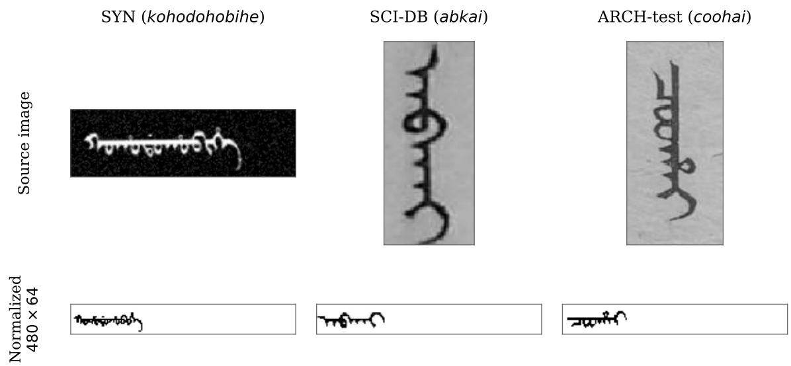
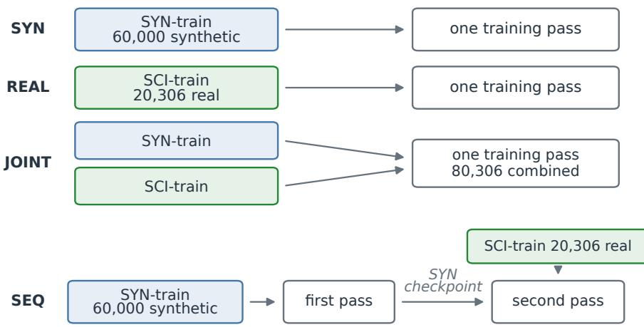
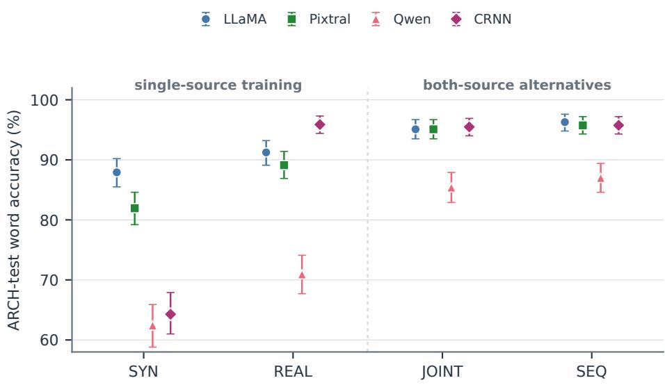
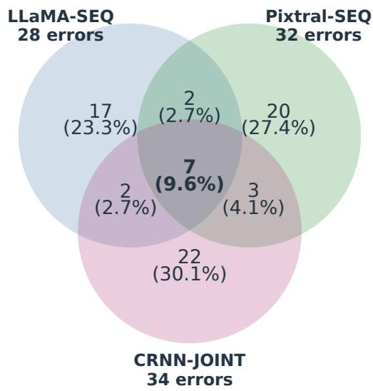
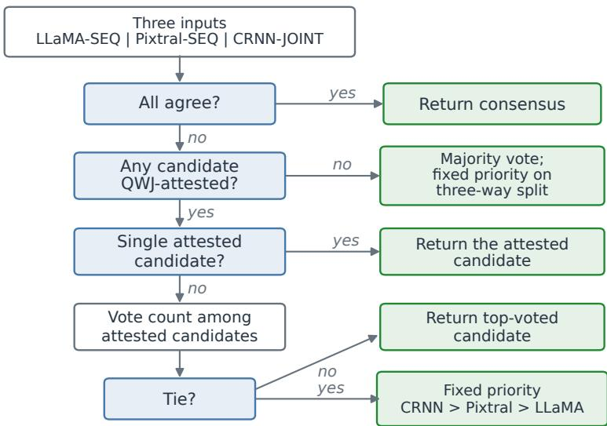
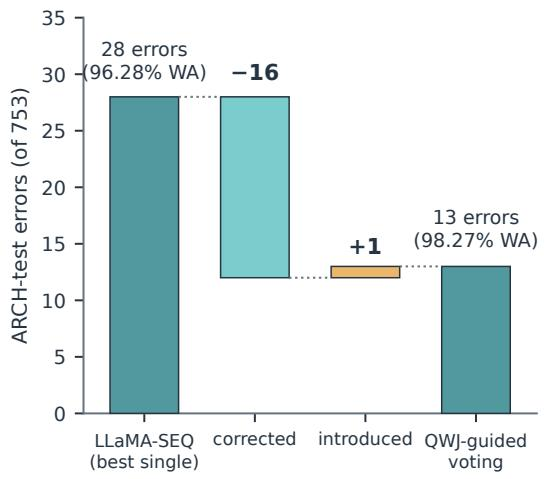
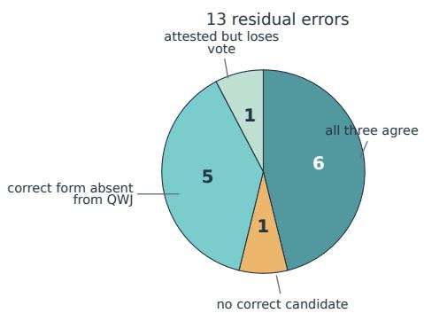

# Combining Synthetic and Real Data for Low-Resource Historical OCR: A Manchu Case Study

Yan Hon Michael Chung∗ Division of Humanities, The Hong Kong University of Science and Technology, Clear Water Bay, Hong Kong SAR

Hanlin Wang† The Hong Kong University of Science and Technology, Clear Water Bay, Hong Kong SAR

## Abstract

Manchu, now critically endangered, was one of the principal languages of the Qing empire (1636–1912), and its extensive archival record is increasingly digitized but remains dificult to search and analyze at scale. Previous work showed that vision–language models (VLMs) trained only on synthetic Manchu word images can reach 87.4% word accuracy on real Qing manuscripts and prints, leaving a substantial synthetic-to-real gap. This study examines how synthetic and real historical training data should be combined for low-resource OCR. Using 60,000 synthetic and 20,306 real historical word images, we evaluate three pretrained VLMs and a compact convolutional recurrent neural network (CRNN) under four regimes — synthetic-only, real-only, joint synthetic–real, and sequential synthetic-to-real training under a common checkpoint-selection and archival evaluation protocol. Introducing real training images raises the leading configurations to 95.09–96.28% word accuracy, while no synthetic-only configuration exceeds 87.92%. Synthetic supplementation substantially im proves all three VLMs, whereas its marginal efect for the CRNN is sensitive to the training objective. Joint and sequential training yield broadly similar archival accuracy under the tested practical pipelines. A compact CRNN also reaches the leading performance range once real images are available, showing that model scale alone does not determine recognition accuracy. Finally, complementary errors among strong recognizers allow voting to raise accuracy to 98.27% without additional training, while an eighteenth-century Manchu dictionary provides a principled rule for adjudicating disagreements.

Keywords: Manchu; Historical OCR; Vision-language models; Low-resource languages; Endangered languages; Synthetic-real training data

## 1 Introduction

Annotated training data remain a major bottleneck for optical character recognition (OCR), particularly for low-resource languages and historical document collections. Synthetic data ofer an attractive response because large quantities of labelled images can be generated without costly manual transcription (Jaderberg, Simonyan, Vedaldi and Zisserman, 2014). For historical OCR, however, synthetic images cannot fully reproduce the typography, handwriting variation, degradation, and capture conditions of real documents, leaving a persistent synthetic-to-real gap (Springmann and L¨udeling, 2017). Once annotated real images become available, a practical question therefore arises. How should they be used alongside synthetic training data?

Previous research on combining the two sources, whether through sequential synthetic-toreal fine-tuning or joint training, has largely concerned conventional OCR and scene-text architectures (Mart´ınek, Lenc and Kr´al, 2019a; Baek, Matsui and Aizawa, 2021; Section 2.3). The growing use of pretrained vision–language models (VLMs) for OCR raises the question of whether the efects of training-data composition remain consistent across diferent recognition models, especially in low-resource settings.

Manchu provides a historically significant low-resource setting in which to examine this question. Manchu, now critically endangered (Moseley, 2010), was one of the principal languages of the Qing, the last dynasty of imperial China. The Qing court left behind a colossal body of Manchu-language records (Crossley and Rawski, 1993; Rawski, 1996; Elliott, 2001), and libraries and archives worldwide have been digitizing them. Yet much of this material remains accessible only as scanned images rather than machine-readable text (Sun, Guo, Feng and Yan, 2025). Reliable OCR is therefore important for making these collections searchable, indexable, and available for computational study.

Recent work demonstrates both the promise and the limitations of synthetic training in this setting. Chung and Choi (2026) fine-tuned pretrained VLMs on 60,000 synthetic Manchu word images without using real historical images for parameter training and evaluated them on a 753- image benchmark drawn from Qing manuscripts and printed sources. Their best VLM reached 87.4% word accuracy, compared with 56.8% for a CRNN trained on the same synthetic corpus. The experiment demonstrated substantial transfer from synthetic training data to real archival images, but also left an error rate of roughly one word in eight.

The present study examines what happens when real historical training images are added to this setting. We combine the existing 60,000-image synthetic corpus with 20,306 annotated real Manchu word images and evaluate three pretrained VLMs and a compact task-specific CRNN under four training regimes. These comprise synthetic-only, real-only, joint synthetic–real, and sequential synthetic-to-real training, yielding 16 model × training-regime configurations evalu ated under a common checkpoint-selection and archival evaluation protocol (Sections 3–4). The experiment addresses three questions. First, how much does real-image supervision improve archival recognition relative to synthetic-only training? Second, how do joint and sequential synthetic–real training compare under the tested practical pipelines? Third, how does the efect of training-data composition vary across recognition models?

The results show that real historical training data substantially change the performance landscape. Every configuration in the leading band uses real training images, reaching 95.09–96.28% word accuracy, while no synthetic-only configuration exceeds 87.92%. Synthetic supplementation substantially improves all three VLMs, whereas its marginal efect for the CRNN is sensitive to the training objective. Joint and sequential training produce broadly similar archival accuracy under the tested pipelines, and a compact CRNN reaches the leading performance range once real images are available (Section 5). Finally, the strongest recognizers make largely comple mentary errors. Voting over the three model-best configurations raises archival word accuracy to 98.27% without additional training, with disagreements adjudicated by attestation in an eighteenth-century Manchu dictionary (Fuheng (傅恒) et al., 1771) (Section 6.3).

## 2 Background and Related Work

## 2.1 Manchu Sources and Digital Access

The Qing dynasty produced a vast body of Manchu-language records that is distinct from the parallel Chinese archive. Some Manchu documents contain information absent from Chineselanguage sources, while entire classes of Qing records survive only in Manchu (Crossley and Rawski, 1993, pp. 74, 89). From the late twentieth century, historians increasingly emphasized the independent evidentiary value of these materials and the limitations of reconstructing Qing history from Chinese-language sources alone. Their growing use contributed to a broader reassessment of the Qing state, particularly its political, military, and frontier dimensions (Crossley and Rawski, 1993; Rawski, 1996, pp. 829–830).

Manchu is a Tungusic language written in a vertically oriented alphabetic script derived from the Mongolian script. Letters represent vowels and consonants, vary in form according to their position within a word, and are joined into continuous vertical units; dots, circles, and related graphic distinctions diferentiate otherwise similar forms (Li, 2000, pp. 13, 21–27). These features, together with variation in handwriting, print styles, document condition, and image quality, pose distinctive challenges for OCR. Manchu is also commonly transliterated into Latin characters for scholarly use. This study follows the modified M¨ollendorf system presented by Roth Li (Li, 2000, p. 16), using romanization where necessary for lexical lookup and comparison while evaluating OCR against the original Manchu-script ground truth.

Access to Manchu sources has expanded substantially through digitization in recent decades. Major collections are available through institutions including the Biblioth\`eque nationale de France, the Harvard-Yenching Library, the National Palace Museum in Taipei, and the Staatsbibliothek zu Berlin (Biblioth\`eque nationale de France, 2025; Harvard-Yenching Library, 2025; National Palace Museum, 2025; Staatsbibliothek zu Berlin, 2024). Yet digitization has largely made these materials available as page images rather than machine-readable text. Much of this expanding corpus therefore remains dificult to search, index, or analyze at scale (Sun et al., 2025). Reliable OCR is a critical step toward making digitized Manchu collections searchable and computationally usable.

## 2.2 Manchu OCR

Manchu OCR has progressed through several methodological stages. Early work beginning in the mid-2000s treated recognition primarily as a character- or sub-character-level problem, decomposing Manchu characters into strokes or intermediate Manchu Character Units (MCUs) and reconstructing higher-level forms through structural matching and classification (Zhang, Li, He and Wang, 2004; Zhao, Li, Zhang and Wang, 2006, pp. 801–805; Zhang, Li and Wang, 2006, pp. 3339–3344). A second phase beginning around 2017 shifted toward segmentation-free, word-level recognition based on convolutional neural networks (CNNs) (Huang, Li, Zheng, Xu and Bi, 2017, pp. 46–49). Subsequent systems reported accuracies above 90% and in some cases approaching 99%, although these evaluations were largely restricted to relatively small closed vocabularies (Li, Zheng, Xu, Fu and Huang, 2018; Zheng, Li, He, Bi and Wu, 2018; Zhang, Liu, Wang and Wang, 2021, pp. 5–6). In 2022, Zhang Zhuohui released ManchuOCR, which combines Manchu recognition with a script-aware synthetic-image generator and supplies the synthetic corpus used in the present study (Section 3.2) (Zhang, 2022).

Recent work has expanded both recognition architectures and the scale of authentic historical training data. Wang, Lu, Wei, Su, Qi and Lu (2024) proposed the Visual-Language framework for Manchu Word Recognition (VLMR), combining visual and semantic representations and achieving strong performance on held-out samples from its constructed datasets. More recently, Bi, Tao, Chen and Sun (2026) constructed MW14850 from 13 historical texts, comprising 124,448 annotated word images representing 14,850 lexical units, and introduced SCC3, a task-specific architecture that achieved 97.16% word accuracy on that corpus’s held-out test split. These results demonstrate the strong performance attainable when specialized recognition models are trained on large corpora of authentic historical Manchu material. Assembling such corpora remains costly; verifying MW14850 involved multi-stage checks by hundreds of trained volunteers against authoritative Manchu lexicons.

A complementary line of research has examined transfer from synthetic training data. Chung and Choi (2026) fine-tuned pretrained vision–language models (VLMs) on 60,000 synthetic Manchu word images and evaluated them on a separately assembled benchmark drawn from Qing manuscripts and printed sources. Their best VLM reached 87.4% word accuracy, demonstrating substantial synthetic-to-real transfer but also a considerable gap between synthetic training and archival recognition.

Existing Manchu OCR research has therefore demonstrated both the strong performance attainable with large authentic training corpora and the potential of synthetic-to-real transfer, but the interaction between these two sources of supervision remains unclear. The present study lies between these two approaches. Rather than relying on a real-image corpus comparable in scale to MW14850, we examine whether synthetic data can be combined efectively with a smaller amount of authentic historical data, and how the resulting models transfer to a separately assembled archival benchmark spanning diferent Manchu historical documents.

## 2.3 Synthetic–Real Training for OCR

Synthetic data are widely used to address the annotation bottleneck in OCR and scene-text recognition. Large quantities of labelled text images can be generated without manual transcription, allowing recognizers to be trained when annotated real images are scarce or costly to construct (Jaderberg et al., 2014). For historical OCR, however, synthetic images cannot fully reproduce the typography, degradation, handwriting variation, and acquisition conditions of real documents, leaving a persistent synthetic-to-real gap (Springmann and L¨udeling, 2017). Synthetic generation therefore remains particularly useful in low-resource settings, where large annotated historical corpora may be expensive and labor-intensive to construct.

Previous studies have examined several ways of combining synthetic and real supervision. Mart´ınek et al. (2019a) compared synthetic-only, real-only, and sequential synthetic pretraining followed by real-data adaptation for historical OCR, finding synthetic-only training insuficient and sequential adaptation efective. Mart´ınek, Lenc, Kr´al, Nicolaou and Christlein (2019b) improved the synthetic source itself by compositing real glyph images into generated lines before real-data fine-tuning. In scene-text recognition, Baek et al. (2021) directly compared joint synthetic–real training with sequential synthetic-to-real fine-tuning and found a modest advantage for sequential training in the conventional architectures they tested. These studies establish that real supervision can substantially improve synthetic-only OCR and that both joint and sequential strategies are viable.

More recently, Angleraud, Karamolegkou, Sagot and Cl´erice (2026) extended this question to VLM-based historical OCR, comparing synthetic-only, real-only, and sequential synthetic-to-real fine-tuning across several recognizers for Ancient Greek critical editions. The preferred training regime difers across models, but their experiment does not include joint synthetic–real training and does not apply the same set of regimes to task-specific OCR baselines. Previous studies have not systematically compared synthetic-only, real-only, joint synthetic–real, and sequential synthetic-to-real training across pretrained VLMs and a task-specific OCR recognizer under a common historical evaluation. The present study undertakes this comparison for Manchu, testing whether the efect of training-data composition is consistent across recognition models.

## 2.4 Recognizer Voting and Lexical Post-Correction

Combining predictions from multiple recognizers can improve OCR when their errors are complementary. Lund and Ringger (2009) aligned the outputs of several OCR engines over degraded nineteenth-century documents and trained a selection model over the aligned hypotheses, reducing error below the best single engine. Drobac and Lind´en (2020) evaluated confidence voting across neural OCR models for historical Finnish and Swedish newspapers and found that appropriate combinations further reduced recognition error. Brandt Skelbye and Dann´ells (2021) similarly combined five cross-fold-trained CNN–LSTM models through confidence voting for nineteenth-century Swedish newspapers, outperforming any single-model configuration. These studies show that disagreement among recognizers can provide useful evidence for selecting a more reliable transcription.

Lexical information provides another source of evidence. Dictionary-constrained recogni tion has a long history in handwriting recognition (Koerich, Sabourin and Suen, 2003), while lexicon-based post-correction has been applied to low-resource languages and historical documents (Kolak and Resnik, 2005; Refle and Ringlstetter, 2013; Nguyen, Jatowt, Coustaty and Doucet, 2021b). Lexical information has also been incorporated directly into neural recognition and decoding (Nguyen, Nguyen, Tran, Tran, Ngo, Nguyen and Hoai, 2021a), while Rijhwani, Rosenblum, Anastasopoulos and Neubig (2021) use lexically informed correction for endangeredlanguage OCR. Manchu is well suited to this approach because annotated historical images are scarce while extensive Qing-period dictionaries survive. The present study keeps lexical knowledge external to the recognizers. Independently trained models generate candidate transcrip tions, and a period dictionary is used only to adjudicate disagreements. No additional model is trained and no new candidate transcription is generated.

## 3 Dataset

## 3.1 Data Overview

The experiments use synthetic and real historical Manchu word images for training and validation, together with a separate archival test set. Table 1 summarizes the five splits and their roles. Training-regime labels refer to the images used for parameter optimization; all configurations use SCI-val for checkpoint selection (Section 4.3).

Table 1: The five data splits and their roles in the experimental design.
<table><tr><td>Split</td><td>Role</td><td>Images</td><td>Source</td></tr><tr><td>SYN-train</td><td>Synthetic training</td><td>60,000</td><td>ManchuOCR pipeline (Zhang, 2022)</td></tr><tr><td>SYN-val</td><td>Synthetic-domain diagnostic</td><td>15,000</td><td>ManchuOCR pipeline (Zhang, 2022)</td></tr><tr><td>SCI-train</td><td>Real training</td><td>20,306</td><td>SCI-DB corpus (Sun, Tao and Bi, 2026)</td></tr><tr><td>SCI-val</td><td>Checkpoint selection</td><td>3,359</td><td>SCI-DB corpus (Sun et al., 2026)</td></tr><tr><td>ARCH-test</td><td>Final archival evaluation</td><td>753</td><td>Chung and Choi (2026); seven Qing sources</td></tr></table>

## 3.2 Synthetic Training Corpus

The synthetic corpus originates from ManchuOCR, which generates word-level images from a lexicon of 130,917 Manchu entries using multiple Manchu typefaces (Zhang, 2022). The original release contains 750,000 training images and 25,000 evaluation images. Chung and Choi (2026) curated a 75,000-image subset comprising 60,000 training images and 15,000 validation images, referred to here as SYN-train and SYN-val. We use this subset unchanged.

The images are normalized to a 480 × 64 input canvas through inversion to black-on-white, denoising, contrast enhancement, and resizing. Figure 1 shows an example before and after normalization.

## 3.3 Real Historical Corpus

The real-image corpus comes from SCI-DB, which contains 24,280 word images extracted from Manchu books printed between 1733 and 1867, drawn from the National Library of China’s Series of Rare Ancient Books in Manchu and Chinese (Sun et al., 2026). The corpus contains 2,428 unique Manchu words, each originally represented by ten image samples scanned at 600 dpi. In the original release, word regions were identified computationally and manually verified, and severely degraded samples were excluded. SCI-DB was compiled by the same research group and draws on the same National Library of China series as the substantially larger MW14850 corpus introduced by Bi et al. (2026); the present study uses only SCI-DB.

  
Figure 1: Word images from each corpus before (top) and after (bottom) normalization to the 480 × 64 input canvas. Synthetic words are rendered horizontally; real word crops are vertical and are rotated during normalization.

For this study, the images were normalized to a 480 × 64 input format through grayscale conversion, denoising, contrast enhancement, 90◦ counter-clockwise rotation, and padding. A further 615 unusable images were removed after normalization, leaving 23,665 images. We constructed the split by holding out 1–2 images for most word labels (2,306) as SCI-val and assigning the remaining usable images to SCI-train. This yielded 20,306 training images and 3,359 validation images. Every label represented in SCI-val also occurs in SCI-train, so SCIval evaluates diferent images of vocabulary represented during training rather than unseenvocabulary generalization.

## 3.4 Archival Test Set and Overlap Audit

ARCH-test is the 753-image benchmark introduced by Chung and Choi (2026), retained unchanged to permit direct comparison with their synthetic-only results. It contains word-level crops from seven Qing-period sources, including five handwritten and two printed sources. These comprise the Old Manchu Archives from the Grand Secretariat (Wu, Zhang and Editorial Committee of Neige cangben Manwen laodang, 2009), the Manchu Veritable Records of the Taizong Emperor (Veritable Records, 1740), three eighteenth- and nineteenth-century palace memorials (Disangga, 1736; Peiceng, 1849; Furdan, 1728), the General Gazetteer of the Eight Banners (BQTZ, 1739), and an imperial edict reproduced in Meadows’s Translations from the Manchu (Meadows, 1849). Chung and Choi (2026) extracted the word crops and normalized them to the same 480 × 64 input format used here.

Exact pixel hashing found no duplicate ARCH-test images in SYN-train, SYN-val, or SCItrain. Lexical overlap nevertheless exists because diferent images can represent the same Manchu word. The SCI-train vocabulary covers 570 of the 753 ARCH-test images, or 75.7%, while the combined SCI-train and SYN-train vocabulary covers 627 images, or 83.3%. SYNtrain alone covers 40.4%. ARCH-test should therefore be understood as an archival transfer benchmark containing both represented and unrepresented lexical forms, rather than as a strict open-vocabulary benchmark.

## 4 Experimental Design

## 4.1 Recognition Models

We evaluate four recognition models, including three pretrained VLMs and one task-specific CRNN. The VLMs are LLaMA-3.2-11B-Vision-Instruct (Grattafiori et al., 2024), Pixtral-12B-2409 (Agrawal et al., 2024), and Qwen3-VL-8B-Instruct (Qwen Team, 2025). Each is loaded through Unsloth (Han, Han and Unsloth team, 2023) and fine-tuned with LoRA (Hu, Shen, Wallis, Allen-Zhu, Li, Wang, Wang and Chen, 2022) on both vision and language modules using the same training recipe, allowing the three VLMs to be compared under consistent tuning conditions. Qwen in particular is tuned under this shared recipe rather than a model-specific one, so its results reflect a standardized rather than optimized configuration. Model outputs follow the Manchu-script and romanization format used by Chung and Choi (2026), although all evaluation in this study uses the Manchu-script output. Full fine-tuning and inference settings are reported in Appendix A.1.

The fourth recognizer is the CRNN used by Chung and Choi (2026), based on the convolutional recurrent architecture of Shi, Bai and Yao (2017). It combines a 9-layer CNN feature extractor, a 4-layer bidirectional LSTM, and a CTC output layer. The architecture and training configuration are held fixed across the four CRNN regimes, with full specifications reported in Appendix A.2.

## 4.2 Synthetic–Real Training Regimes

For each recognition model, we compare four ways of using the synthetic and real historical training corpora shown in Figure 2.

• SYN, synthetic-only. Training uses the 60,000-image SYN-train corpus only.

• REAL, real-only. Training uses the 20,306-image SCI-train corpus only.

• JOINT, joint synthetic–real. SYN-train and SCI-train are combined into a single 80,306- image training corpus and shufled together during training.

• SEQ, sequential synthetic-to-real. Training begins from a designated checkpoint from the corresponding SYN run and continues on SCI-train alone. The warm-start checkpoints used for each recognizer are documented in Table A.2.

JOINT and SEQ therefore use the same two data sources but present them diferently. JOINT interleaves synthetic and real images within one training run, while SEQ introduces the real images only after synthetic training. The comparison should be interpreted as one between the practical pipelines as realized rather than as a controlled causal test of training order. In particular, the SEQ warm starts difer slightly in provenance and, for LLaMA and the CRNN, occur before the end of the corresponding SYN run. Exact checkpoint provenance and training budgets are reported in Table A.2.

## 4.3 Checkpoint Selection

For each configuration, we select the checkpoint with the highest word accuracy on SCI-val. SYN-val is used only to measure synthetic-domain performance, while ARCH-test is reserved for final evaluation and plays no role in checkpoint selection.

We select the best observed checkpoint rather than the final checkpoint because SCI-val performance is not always monotonic over training. Ties in word accuracy are resolved first by the validation character error rate (CER) stored in the checkpoint records (an unstripped, macro-averaged value) and then by the earlier training step; reported CER values are instead recomputed as the stripped, micro-averaged measure defined in Section 4.4. Checkpoints are saved every epoch for the CRNN and every 500 optimizer steps for the VLMs, and every saved checkpoint is evaluated on the complete SCI-val split.

  
Figure 2: The four training regimes. SYN and REAL use a single data source, JOINT combines synthetic and real images in one run, and SEQ continues real-data training from a SYN checkpoint. Blue marks synthetic and green marks real training data. All configurations are selected on SCI-val.

## 4.4 Evaluation Metrics and Statistical Comparisons

We report word accuracy (WA) and CER for each selected configuration. All metrics are calculated from the Manchu-script output after whitespace stripping, which removes an encoding artifact present in the SCI-DB ground truth but not in the synthetic corpus.

Both metrics are computed over the N word images of an evaluation set, with references $g _ { i }$ and predictions ${ \hat { g } } _ { i }$ . WA is the proportion of exact word matches,

$$
\mathrm { W A } = \frac { 1 } { N } \sum _ { i = 1 } ^ { N } { \bf 1 } [ \hat { g } _ { i } = g _ { i } ] ,
$$

and CER is the micro-averaged Levenshtein edit distance (Levenshtein, 1966) divided by total reference length,

$$
\mathrm { C E R } = \frac { \sum _ { i = 1 } ^ { N } d \big ( \hat { g } _ { i } , g _ { i } \big ) } { \sum _ { i = 1 } ^ { N } | g _ { i } | } ,
$$

where $d ( \cdot , \cdot )$ denotes Levenshtein distance and $| g _ { i } |$ the character length of the reference.

For ARCH-test WA, we report 95% non-parametric bootstrap confidence intervals based on 1,000 resamples. Since all configurations are evaluated on the same 753 images, direct comparisons use paired statistics (Table B.2), including discordant counts and 95% paired bootstrap intervals for the diference in WA based on 20,000 resamples. These intervals resample individual word images and should therefore be interpreted as conditional on the fixed ARCH-test corpus rather than as estimates of generalization to new document sources.

## 5 Results

We first examine the efect of introducing real historical training data, then compare joint and sequential synthetic–real training, and finally assess how the efect of training-data composition varies across recognizers. Results are reported primarily on ARCH-test, with complete validation and test metrics provided in Appendix B.

Table 2: ARCH-test word accuracy (%) for the 16 model × training-regime configurations. Each cell is the SCI-val-peak checkpoint selected by the rule of Section 4.3, scored on the complete 753-image ARCH-test split. Bold marks each recognition model’s best regime. Complete word-accuracy and character-error-rate results on all three splits, with bootstrap intervals, are in Table B.1 (Appendix B).
<table><tr><td>Model</td><td>SYN</td><td>REAL</td><td>JOINT</td><td>SEQ</td></tr><tr><td>LLaMA</td><td>87.92</td><td>91.24</td><td>95.09</td><td>96.28</td></tr><tr><td>Pixtral</td><td>81.94</td><td>89.11</td><td>95.09</td><td>95.75</td></tr><tr><td>Qwen</td><td>62.42</td><td>70.92</td><td>85.39</td><td>86.99</td></tr><tr><td>CRNN</td><td>64.28</td><td>95.88</td><td>95.48</td><td>95.75</td></tr></table>

  
Figure 3: ARCH-test word accuracy by training regime for the four recognition models (values of Table 2). Points show estimates and error bars show 95% non-parametric bootstrap confidence intervals based on 1,000 resamples. A dashed separator distinguishes single-source training (SYN and REAL) from JOINT and SEQ, which are alternative uses of both data sources rather than successive stages. LLaMA and Pixtral lead under SYN, the CRNN leads under REAL, and three models converge above 95% under JOINT and SEQ while Qwen remains lower.

## 5.1 Efect of Real Historical Training Data

Table 2 reports ARCH-test WA for all 16 configurations, with Figure 3 showing the same results by training regime.

The strongest pattern is the efect of real historical training data. No SYN configuration exceeds 87.92% WA on ARCH-test, whereas seven configurations using real training images fall within a leading range of 95.09–96.28%. These are LLaMA-SEQ (96.28%), CRNN-REAL (95.88%), CRNN-SEQ and Pixtral-SEQ (95.75%), CRNN-JOINT (95.48%), and LLaMA-JOINT and Pixtral-JOINT (95.09%). This range is descriptive rather than a claim of statistical equivalence.

The synthetic-only LLaMA result also closely reproduces the earlier benchmark. LLaMA-SYN reaches 87.92%, compared with 87.4% reported by Chung and Choi (2026), despite being retrained on diferent hardware and infrastructure.

## 5.2 Joint versus Sequential Training

Across all four recognition models, SEQ has a slightly higher ARCH-test point estimate than JOINT in the main 16-configuration grid. The diferences are 0.27 percentage points for the

CRNN, 0.66 for Pixtral, 1.20 for LLaMA, and 1.59 for Qwen (computed from the per-item counts, so the last digit can difer from subtraction of the rounded table values). However, every paired 95% CI includes zero (Table B.2), so these results do not establish a consistent advantage for SEQ over JOINT.

As described in Section 4.2, the comparison is between the realized training pipelines, which difer slightly in warm-start provenance and total updates, rather than a controlled test of training order.

A clearer diference between the two regimes appears on SYN-val. CRNN-SEQ retains 76.91% WA on SYN-val, compared with 99.39% for CRNN-JOINT, while their ARCH-test performance remains similar. In this case, sequential real-data fine-tuning substantially reduces synthetic-domain performance without producing a corresponding archival gain.

## 5.3 Recognizer-Dependent Efects of Training Data

The efect of training-data composition difers substantially across recognition models (Figure 3). Under SYN, LLaMA and Pixtral lead at 87.92% and 81.94% WA, while the CRNN reaches 64.28%1 and Qwen 62.42%. Under REAL, the ordering changes markedly. The CRNN reaches 95.88%, compared with 91.24% for LLaMA, 89.11% for Pixtral, and 70.92% for Qwen. Under JOINT, LLaMA, Pixtral, and the CRNN converge within a narrow range of 95.09–95.48%, while Qwen remains lower at 85.39%.

The marginal value of synthetic supplementation once real data are available is likewise recognizer-dependent. Moving from REAL to JOINT raises WA by 3.85 percentage points for LLaMA, 5.98 for Pixtral, and 14.48 for Qwen. For the CRNN, JOINT is 0.40 points below REAL under the released training recipe, although a corrected-objective robustness check in Appendix A.2 shows this fine-grained ordering is implementation-sensitive. Overall, the additional value of synthetic data varies substantially across recognizers.

## 6 Residual Error Analysis and Dictionary-Guided Voting

The strongest individual configuration still misrecognizes 28 of the 753 ARCH-test words. We therefore examine whether the remaining errors are shared across recognizers and whether disagreement among strong recognizers can be used to improve final transcription accuracy.

## 6.1 Residual Errors and Recognizer Complementarity

We compare LLaMA-SEQ, Pixtral-SEQ, and CRNN-JOINT, which make 28, 32, and 34 errors on ARCH-test, respectively. Their error sets contain 73 unique images in total (Figure 4). The three-way intersection contains seven images on which all three recognizers are incorrect; this intersection is defined by correctness and does not imply identical predictions. Among the 73 images, six receive the same incorrect transcription from all three recognizers. The remaining 67 images contain non-identical recognizer outputs and are therefore disagreement cases.

Most residual errors are also small at the character level. Of the incorrect transcriptions, 26 of 28 for LLaMA-SEQ, 27 of 32 for Pixtral-SEQ, and 32 of 34 for CRNN-JOINT are at Levenshtein distance 1 from the reference. A one-letter perturbation of an attested Manchu word rarely yields another attested word, so most of these near-miss transcriptions are detectable by dictionary lookup. This combination of complementary predictions and predominantly single-character errors motivates the lexical adjudication procedure described in Section 6.2.

  
Figure 4: Overlap of ARCH-test error sets for LLaMA-SEQ, Pixtral-SEQ, and CRNN-JOINT. Counts and percentages refer to the 73-image union of the three error sets. The Venn diagram records whether each recognizer is incorrect, not whether their incorrect transcriptions are identical. Of these 73 images, six receive the same incorrect transcription from all three recognizers; the remaining 67 are disagreement cases. Circle areas are schematic rather than proportional to set size.

## 6.2 Dictionary-Guided Adjudication

The ensemble combines LLaMA-SEQ, Pixtral-SEQ, and CRNN-JOINT, selected solely on SCIval. Qwen is excluded because its best configuration performs more than three percentage points below the other models on SCI-val. ARCH-test plays no role in selecting the ensemble members.

Disagreements among their predictions are adjudicated using the Imperially Commissioned Enlarged and Revised Mirror of the Qing Language (御製增訂清文鑑, QWJ), an eighteenthcentury Manchu dictionary (Fuheng (傅恒) et al., 1771). After normalization, its digitized headwords provide an attestation lexicon of 12,891 distinct word tokens. Each candidate transcription is deterministically transliterated from Manchu script into M¨ollendorf romanization and normalized to the same form used for dictionary lookup. The VLM-generated romanization is not used.

The adjudication rule is shown in Figure 5. If all three recognizers agree, their consensus is returned. On disagreement, QWJ-attested candidates are preferred. If several candidates are attested, vote count determines the output, with a fixed priority based on SCI-val accuracy used to break residual ties. If no candidate is attested, the system falls back to majority voting under the same priority. The rule has no trainable parameters.

## 6.3 Voting Performance and Residual Errors

Combining the three recognizers substantially reduces residual error. Dictionary-guided voting raises ARCH-test WA from 96.28% for the best single configuration to 98.27%, reducing the number of errors from 28 to 13 (Figure 6). Of the 67 disagreement cases, the adjudication rule returns the correct transcription in 60, leaving seven unresolved. In addition, the six cases in which all three recognizers produce the same incorrect transcription remain incorrect. These two groups together account for the 13 residual errors. Relative to LLaMA-SEQ, the rule corrects 16 errors while introducing one, with a paired 95% CI of [+0.93, +3.05] percentage points (Table B.2).

Figure 5: Dictionary-guided adjudication of the three recognizer outputs. QWJ attestation is used to resolve disagreements, with vote count and SCI-val-based priority used for remaining ties.  

  
Figure 6: Residual ARCH-test errors under voting adjudication. The waterfall (left) shows 28 errors for LLaMA-SEQ, 16 corrected and one introduced, leaving 13 under the final voting rule; the pie chart (right) decomposes the four categories of the 13 residual errors.

The improvement primarily reflects the complementary errors documented in Section 6.1. Plain majority voting also reaches 98.27% WA on ARCH-test, so QWJ guidance does not further increase the final score for this test set. Its contribution is instead to provide a principled adjudication rule when recognizers disagree, particularly when all three produce diferent transcriptions and no majority exists. On SCI-val, QWJ guidance produces a small additional gain, raising WA from 99.64% under majority voting to 99.67%. The result is also robust to composition choices. Substituting either of the CRNN’s other leading configurations shifts ARCH-test accuracy by at most 0.40 points (97.88–98.27%), and reversing the fallback priority leaves SCI-val unchanged and moves a single ARCH-test item.

The 13 residual ARCH-test errors indicate the limits of candidate-based lexical adjudication. In the six identical-error cases, all three recognizers produce the same incorrect transcription, leaving no alternative candidate to select. Among the seven unresolved disagreement cases, one contains no correct candidate, five contain a correct transcription absent from the QWJ token lexicon because it is an inflected or derived form, and one contains an attested correct transcription that loses to a competing attested candidate under the voting and priority rule.

## 7 Discussion

Three findings emerge from the experiment. First, introducing real historical training images substantially reshapes the performance landscape, bringing several recognizers into the 95–96% WA range and allowing a compact CRNN to compete with much larger pretrained VLMs. Second, the value of synthetic supplementation difers across recognizers, while the experiments do not identify a universal advantage for either joint or sequential training. Third, strong recognizers retain suficiently complementary errors that their combination raises ARCH-test WA to 98.27%, with period lexicography providing a principled mechanism for adjudicating disagreements.

## 7.1 Real Data and Model Scale

The clearest result is that access to real historical training images changes both absolute performance and the relative ordering of recognizers (Table 2). Under synthetic-only training, LLaMA and Pixtral substantially outperform the CRNN. Once real images are introduced, however, the CRNN reaches the same leading performance range as the strongest VLM configurations. The best CRNN and VLM results difer by less than half a percentage point on ARCH-test, with the diference falling within paired uncertainty (Table B.2). Model scale alone is therefore not a reliable predictor of recognition accuracy in this setting.

This does not imply that CRNNs are generally preferable to VLMs. The VLMs remain competitive recognizers, and their prompt-based interface is directly relevant to downstream tasks such as translation, normalization, and structured extraction. What the result does show is that a compact task-specific recognizer can remain highly competitive when appropriate real historical supervision is available. The robust finding is therefore convergence in performance, not superiority of one architecture or training regime. For low-resource historical OCR, improvements in training data can consequently matter at least as much as increases in model scale.

Model compactness also has practical consequences beyond accuracy. As logged by the evaluation harness, the ∼12M-parameter CRNN transcribes a word in about 8 ms on a single H200 GPU, while the VLMs take 1.5–2.3 s per word under 4-bit greedy decoding — observed endto-end pipeline timing rather than a device-level benchmark, but a gap of more than two orders of magnitude that lowers the infrastructure barrier for serving and repeated batch inference over large cultural-heritage collections.

## 7.2 Recognizer-Dependent Training Efects

The efect of synthetic supplementation is not consistent across recognizers. Moving from REAL to JOINT improves all three VLMs, by 3.85 percentage points for LLaMA, 5.98 for Pixtral, and 14.48 for Qwen, whereas the CRNN shows a small decline under the released training recipe (Section 5.3). The broader conclusion is therefore not that synthetic supplementation is universally beneficial or unnecessary, but that its value is conditional on the recognizer and training implementation.

This qualifies conclusions drawn from earlier synthetic–real OCR studies. Sequential synthetic pretraining followed by real-data adaptation has proven efective for historical OCR (Mart´ınek et al., 2019a,b), while joint and sequential strategies have both been successful in scene-text recognition (Baek et al., 2021). More recent work on Ancient Greek likewise finds that the preferred training regime difers across recognizers (Angleraud et al., 2026). Our results extend this point by applying the same four training regimes across pretrained VLMs and a task-specific CRNN. Training-data strategies established for one recognizer class should therefore not be assumed to transfer unchanged to another.

The comparison between JOINT and SEQ leads to a related conclusion. Although SEQ has slightly higher point estimates for all four recognizers in the main grid, every paired confidence interval includes zero (Table B.2). Neither schedule therefore emerges as generally superior. In practice, the choice between joint and sequential training may depend as much on operational considerations — such as the second training stage and checkpoint hand-of that sequential training requires — and on model-specific behavior as on archival accuracy alone.

## 7.3 Complementarity and Lexical Adjudication

High individual accuracy does not imply that strong recognizers fail on the same images. LLaMA-SEQ, Pixtral-SEQ, and CRNN-JOINT each exceed 95% WA, yet only seven ARCHtest images are misrecognized by all three (Section 6.1). Their residual errors are therefore suficiently complementary that combining their outputs reduces the number of errors from 28 for the best single recognizer to 13, raising WA from 96.28% to 98.27% (Section 6.3). This gain requires no additional model training and arises primarily from diversity in recognizer errors rather than from further improvement to any individual model.

The role of the historical dictionary is more specific. Plain majority voting reaches the same 98.27% WA on ARCH-test, so QWJ attestation is not the source of the ensemble’s overall accuracy gain on this benchmark. Its contribution is to provide a reproducible and historically grounded rule for disagreements in which no majority exists or several candidates remain plausible.

This suggests a broader use for historical lexical resources in low-resource OCR. Languages with limited annotated image data may nevertheless possess dictionaries, glossaries, or other structured lexical resources created within the same documentary tradition. Such resources can be incorporated after recognition as an adjudication layer without retraining the underlying models. Their usefulness remains bounded by lexical coverage, as the remaining ARCH-test errors show, but they provide a practical way to connect historical linguistic resources with modern recognition pipelines.

Taken together, the findings suggest a practical sequence for low-resource historical OCR. Synthetic data provide a useful starting point when annotated historical images are unavailable, but real historical supervision should be incorporated once it can be obtained. The appropriate synthetic–real composition should be evaluated for the recognizer at hand rather than inherited from another architecture. Where residual accuracy is important, heterogeneous recognizers and existing historical lexical resources can provide an additional layer of error reduction without further model training.

## 8 Limitations and Future Work

The conclusions rest on a fixed archival benchmark of 753 word images drawn from seven Qingperiod sources (Section 3.4). Retaining ARCH-test unchanged permits direct comparison with Chung and Choi (2026), but its size limits discrimination among the strongest configurations, which is why the cross-model claims of Section 7.1 are stated as convergence within a leading band rather than a ranking. The benchmark also contains substantial lexical overlap with the training data and should therefore be interpreted as an archival transfer benchmark rather than a strict open-vocabulary test. The reported confidence intervals are likewise conditional on this corpus and do not quantify uncertainty in generalization to new sources or vocabulary, a limitation that a larger and more diverse archival test corpus would most directly address.

All real training images come from SCI-DB (Sun et al., 2026). Although ARCH-test provides evaluation on a separate set of manuscripts and printed sources, the training side of the experiment does not test whether the same synthetic–real patterns hold when real supervision is drawn from multiple historical corpora with greater variation in script style, document type, and image quality. Extending the experiment to larger and more heterogeneous real training corpora is therefore an important next step. MW14850 (Bi et al., 2026) provides one natural resource for increasing the scale of authentic supervision, while additional collections would be needed to broaden variation in document type, script style, and image quality.

Each configuration in the main grid is represented by a single training run. The reported bootstrap intervals quantify variation over evaluation items rather than stochastic variation in initialization, data order, LoRA training, or checkpoint selection. The corrected-objective CRNN controls further change both the optimization objective and the realized training trajectory, so objective sensitivity cannot be cleanly separated from run-to-run variation. The CRNN composition and schedule conclusions are accordingly stated for the released recipe’s runs only. In addition, JOINT and SEQ should be understood as the realized pipelines described in Section 4.2 rather than as a controlled isolation of training order. Replicated runs of the leading configurations would provide a stronger basis for estimating these efects.

The evaluation is word-level and assumes that word regions have already been identified. The reported results therefore do not measure page-layout analysis, segmentation, or end-to-end transcription of complete historical documents. Extending the workflow from word recognition to page-level OCR remains necessary for deployment across large archival collections.

Finally, dictionary-guided adjudication depends on the coverage of the QWJ lexicon. Since QWJ comes from the same Qing textual tradition as the evaluation material, it provides a favorable historical lexical resource rather than a domain-independent linguistic prior. It cannot reliably resolve forms absent from its token inventory, including some inflected and derived forms, and can occasionally prefer an attested but incorrect candidate. Transfer to genres, periods, and lexical domains not represented in the present benchmark remains to be established. Broader morphological resources and contextual information beyond the isolated word may further reduce these residual errors.

## 9 Conclusion

This study examined how synthetic and real historical training data can be combined for lowresource OCR using Manchu as an empirical case. Across four recognizers and four training regimes, the clearest result is the importance of real historical supervision. No synthetic-only configuration exceeds 87.92% WA on ARCH-test, while several configurations using real training images reach 95.09–96.28%. A compact CRNN can also reach this leading performance range, showing that model scale alone does not determine recognition accuracy.

The efect of synthetic supplementation, however, varies across recognizers. Adding synthetic data to real training substantially improves all three VLMs, while the direction and magnitude of the efect for the CRNN are sensitive to the training objective. The experiments likewise identify no universal advantage for joint over sequential training, or vice versa. Training-data strategies should therefore be evaluated for the recognizer at hand rather than assumed to transfer across model classes.

Finally, residual errors among strong recognizers are highly complementary. Combining LLaMA-SEQ, Pixtral-SEQ, and CRNN-JOINT raises ARCH-test WA from 96.28% to 98.27% without additional model training. The gain arises primarily from recognizer complementarity, while an eighteenth-century Manchu dictionary provides a principled external rule for adjudicating disagreements. Based on the results, we propose that synthetic data can bootstrap recognition when annotation is unavailable, real historical images should be incorporated once they can be obtained, compact task-specific recognizers should remain in the candidate pool alongside VLMs, and heterogeneous recognizers and existing lexical resources can further reduce residual error.

## References

Agrawal, P., et al., 2024. Pixtral 12B. arXiv:2410.07073.

Angleraud, N., Karamolegkou, A., Sagot, B., Cl´erice, T., 2026. Structure-aware text recognition for Ancient Greek critical editions, in: Document Analysis and Recognition – ICDAR 2026, Springer. pp. 252–268. doi:10.1007/978-3-032-36023-6\_15.

Baek, J., Matsui, Y., Aizawa, K., 2021. What if we only use real datasets for scene text recognition? Toward scene text recognition with fewer labels, in: Proceedings of the IEEE/CVF Conference on Computer Vision and Pattern Recognition (CVPR), pp. 3113–3122.

Bi, X., Tao, W., Chen, Z., Sun, H., 2026. SCC3: A novel structure-connected cognition cube network for Manchu word recognition. Expert Systems with Applications 297, 129374. doi:10. 1016/j.eswa.2025.129374.

Biblioth\`eque nationale de France, 2025. Manuscripts department: Manchu and Chinese holdings (Gallica). https://gallica.bnf.fr/accueil/fr/html/accueil-fr?adva=1&t\_typedoc= manuscrits&f\_language=chi&p=1&reset=true&lang=EN. Accessed: 2026-05-12.

BQTZ, 1739. General gazetteer of the Eight Banners (Han i araha jakˆun gˆusai tung j’i bithe) (《 八 旗 通 志 初 集 》). Kyoto Neifu block-print edition; Berlin State Library – Prussian Cultural Heritage Foundation digital edition (2016). URL: http://resolver. staatsbibliothek-berlin.de/SBB0000314E00020000. vol. 178.

Brandt Skelbye, M., Dann´ells, D., 2021. OCR processing of Swedish historical newspapers using deep hybrid CNN–LSTM networks, in: Proceedings of the International Conference on Recent Advances in Natural Language Processing (RANLP 2021), pp. 190–198. doi:10. 26615/978-954-452-072-4\_023.

Chung, Y.H.M., Choi, D., 2026. Fine-tuning vision-language models as OCR systems for lowresource languages: A case study of Manchu. Computational Humanities Research 2, e20. doi:10.1017/chr.2026.10042.

Crossley, P.K., Rawski, E.S., 1993. A profile of the Manchu language in Ch’ing history. Harvard Journal of Asiatic Studies 53, 63–102. doi:10.2307/2719468.

Disangga, 1736. Manchu palace memorials, Qianlong reign (《 宮 中 檔 滿 文 奏 摺 ‧ 乾隆朝》). URL: https://qingarchives.npm.edu.tw/index.php?act=Display/image/ 5482949gqm%3DYsN#e6u. memorial by Disangga, titled 〈奏報雍正十三年比較堪看來年乾 隆元年農祥雨水收成摺〉, dated Yongzheng 13.12.29 (10 February 1736). NPM archival ID: Gu-gong 157489, item 1, digital file K4D157489-0.pdf; Accessed 20 November 2025.

Drobac, S., Lind´en, K., 2020. Optical character recognition with neural networks and postcorrection with finite state methods. International Journal on Document Analysis and Recognition (IJDAR) 23, 279–295. doi:10.1007/s10032-020-00359-9.

Elliott, M.C., 2001. The Manchu-language archives of the Qing dynasty and the origins of the palace memorial system. Late Imperial China 22, 1–70. doi:10.1353/late.2001.0002.

Fuheng (傅恒), et al. (Eds.), 1771. Imperially Commissioned Enlarged and Revised Mirror of the Qing Language (Han-i araha nonggime toktobuha Manju gisun-i buleku bithe) (《御製增 訂清文鑑》). Digitized headword list used as the lexicon for the dictionary-guided ensemble in this study.

Furdan, 1728. Manchu palace memorials, Guangxu reign (《 宮 中 檔 滿 文 奏 摺 ‧ 光 緒 朝 》). URL: https://qingarchives.npm.edu.tw/index.php?act=Display/image/ 54830671=5a-q5#9eF. memorial by Furdan, titled 〈奏謝天恩賞戴二眼花翎〉, dated Yongzheng 05.12.04 (14 January 1728). The NPM catalog assigns this item to the Guangxu reign, but the memorial date corresponds to the Yongzheng period; the discrepancy reflects the archival metadata in the digital system. NPM archival ID: Gu-gong 158156, item 1, digital file K4D158156-0.pdf; Accessed 20 November 2025.

Grattafiori, A., et al., 2024. The Llama 3 herd of models. arXiv:2407.21783.

Han, D., Han, M., Unsloth team, 2023. Unsloth. https://github.com/unslothai/unsloth. Open-source library for parameter-eficient fine-tuning of large language and vision-language models. Accessed: 2026-05-04.

Harvard-Yenching Library, 2025. Harvard-Yenching Library Manchu rare books digitization project. http://lms01.harvard.edu/F/ EQXKYKI6GKTGUGEGIPTPKLJ3JNJHU9XLYLV5TSAX8TS491RSDH-03889?func=find-b&find\_ code=WTN&request=Harvard-Yenching+Library+Manchu+rare+books+digitization+ project&adjacent=1. Accessed: 2026-05-12.

Hu, E.J., Shen, Y., Wallis, P., Allen-Zhu, Z., Li, Y., Wang, S., Wang, L., Chen, W., 2022. LoRA: Low-rank adaptation of large language models. International Conference on Learning Representations (ICLR). URL: https://openreview.net/forum?id=nZeVKeeFYf9.

Huang, D., Li, M., Zheng, R., Xu, S., Bi, J., 2017. Synthetic data and DAG-SVM classifier for segmentation-free Manchu word recognition, in: 2017 International Conference on Computing Intelligence and Information System (CIIS), IEEE. pp. 46–50. doi:10.1109/ciis.2017.15.

Jaderberg, M., Simonyan, K., Vedaldi, A., Zisserman, A., 2014. Synthetic data and artificial neural networks for natural scene text recognition. arXiv:1406.2227.

Koerich, A.L., Sabourin, R., Suen, C.Y., 2003. Large vocabulary of-line handwriting recognition: A survey. Pattern Analysis and Applications 6, 97–121. doi:10.1007/s10044-002-0169-3.

Kolak, O., Resnik, P., 2005. OCR post-processing for low density languages, in: Proceedings of Human Language Technology Conference and Conference on Empirical Methods in Natural Language Processing (HLT/EMNLP), Association for Computational Linguistics, Vancouver, Canada. pp. 867–874. URL: https://aclanthology.org/H05-1109/.

Levenshtein, V.I., 1966. Binary codes capable of correcting deletions, insertions, and reversals. Soviet Physics Doklady 10, 707–710. Russian original published 1965.

Li, G.R., 2000. Manchu: A Textbook for Reading Documents. University of Hawaii Press, Honolulu.

Li, M., Zheng, R., Xu, S., Fu, Y., Huang, D., 2018. Manchu word recognition based on convolutional neural network with spatial pyramid pooling, in: 2018 11th International Congress on Image and Signal Processing, BioMedical Engineering and Informatics (CISP-BMEI), IEEE. pp. 1–6. doi:10.1109/cisp-bmei.2018.8633131.

Lund, W.B., Ringger, E.K., 2009. Improving optical character recognition through eficient multiple system alignment, in: Proceedings of the 9th ACM/IEEE-CS Joint Conference on Digital Libraries (JCDL), pp. 231–240. doi:10.1145/1555400.1555437.

Mart´ınek, J., Lenc, L., Kr´al, P., 2019a. Training strategies for OCR systems for historical documents, in: Artificial Intelligence Applications and Innovations, Springer International Publishing. pp. 362–373. doi:10.1007/978-3-030-19823-7\_30.

Mart´ınek, J., Lenc, L., Kr´al, P., Nicolaou, A., Christlein, V., 2019b. Hybrid training data for historical text OCR, in: 2019 International Conference on Document Analysis and Recognition (ICDAR), IEEE. pp. 565–570. doi:10.1109/ICDAR.2019.00096.

Meadows, T.T., 1849. Translations from the Manchu: With the Original Texts, Prefaced by an Essay on the Language (《清文敘略》 Manju gisun be majige gisurehe bithe). Press of S. Wells Williams, Canton. URL: https://archive.org/details/translationsfrom00meadrich. digital edition available via Internet Archive; Accessed 20 November 2025.

Moseley, C. (Ed.), 2010. Atlas of the World’s Languages in Danger. 3rd ed., UNESCO Publishing, Paris.

National Palace Museum, 2025. Rare Manchu books digital archive. https: //rbk-doc.npm.edu.tw/npmtpc/npmtpall?ID=91&SECU=1038041765&PAGE=rbmap/rbmeta/ 1ST\_rbmeta&VIEWPAGE=1^rbmeta. Accessed: 2026-05-12.

Nguyen, N., Nguyen, T., Tran, V., Tran, M.T., Ngo, T.D., Nguyen, T.H., Hoai, M., 2021a. Dictionary-guided scene text recognition, in: Proceedings of the IEEE/CVF Conference on Computer Vision and Pattern Recognition (CVPR), pp. 7383–7392.

Nguyen, T.T.H., Jatowt, A., Coustaty, M., Doucet, A., 2021b. Survey of post-OCR processing approaches. ACM Computing Surveys 54, 124:1–124:37. doi:10.1145/3453476.

Peiceng, 1849. Manchu palace memorials, Xianfeng reign (《 宮 中 檔 滿 文 奏 摺 ‧ 咸 豐 朝 》). URL: https://qingarchives.npm.edu.tw/index.php?act=Display/image/ 54830195mN=\_AK#23F. memorial by Peiceng, titled 〈奏謝天恩並報到任日期〉, dated Daoguang 29.08.24 (10 October 1849). NPM archival ID: Gu-gong 157901, item 1, digital file K4D157901- 0.pdf; Accessed 20 November 2025.

Qwen Team, 2025. Qwen3-VL. https://github.com/QwenLM/Qwen3-VL. Model release.

Rawski, E.S., 1996. Presidential address: Reenvisioning the Qing: The significance of the Qing period in Chinese history. The Journal of Asian Studies 55, 829–850. doi:10.2307/2646525.

Refle, U., Ringlstetter, C., 2013. Unsupervised profiling of OCRed historical documents. Pattern Recognition 46, 1346–1357. doi:10.1016/j.patcog.2012.10.002.

Rijhwani, S., Rosenblum, D., Anastasopoulos, A., Neubig, G., 2021. Lexically aware semisupervised learning for OCR post-correction. Transactions of the Association for Computational Linguistics 9, 1285–1302. doi:10.1162/tacl\_a\_00427.

Shi, B., Bai, X., Yao, C., 2017. An end-to-end trainable neural network for image-based sequence recognition and its application to scene text recognition. IEEE Transactions on Pattern Analysis and Machine Intelligence 39, 2298–2304. doi:10.1109/TPAMI.2016.2646371.

Springmann, U., L¨udeling, A., 2017. OCR of historical printings with an application to building diachronic corpora: A case study using the RIDGES herbal corpus. Digital Humanities Quarterly 11.

Staatsbibliothek zu Berlin, 2024. The Manchu collection of the Berlin State Library. CrossAsia Topics, https://themen.crossasia.org/manchu-collection/?lang=en. Accessed: 2026- 05-12.

Sun, H., Guo, B., Feng, J., Yan, W., 2025. A study on the digital protection strategy of Manchu from the perspective of computational linguistics, in: Proceedings of the 2nd Guangdong-Hong Kong-Macao Greater Bay Area Education Digitalization and Computer Science International Conference (EDCS 2025), ACM, Shenzhen, China. pp. 740–745. doi:10.1145/3746469.3746584.

Sun, H., Tao, W., Bi, X., 2026. A dataset of Manchu ancient book words for OCR. Science Data Bank. doi:10.57760/sciencedb.25676. 24,280 word images from 2,428 unique Manchu words (10 samples each), scanned at 600 dpi from Manchu ancient books printed 1733–1867 in the National Library of China’s Series of Rare Ancient Books in Manchu and Chinese.

Veritable Records, 1740. Daicing gurun i taidzung genggiyen ˇsu huwangdi i yargiyan kooli (《大清太宗文皇帝滿文實錄 卷五：天聰三年正月至十二月》). Manchu-language text, vol. 5, covering Tiancong 3rd year, months 1–12; the excerpted text is from the 8th month. URL: https://qingarchives.npm.edu.tw/index.php?act=Display/image/ 5482863nwpbVDX#tBk3. archival ID 故官012620 (件10); digital file K4A012620-009.pdf, pp. 2– 4. Accessed 20 November 2025.

Wang, Z., Lu, S., Wei, X., Su, R., Qi, Y., Lu, W., 2024. Learn more Manchu words with a new visual-language framework. ACM Transactions on Asian and Low-Resource Language Information Processing 23, 1–18. doi:10.1145/3652992.

Wu, Y., Zhang, Y., Editorial Committee of Neige cangben Manwen laodang, 2009. Old ManchuArchives from the Grand Secretariat (內 閣 藏 本 滿 文 老 檔). Liaoning minzu chubanshe,Shenyang. 20 vols.

Zhang, D., Liu, Y., Wang, Z., Wang, D., 2021. OCR with the deep CNN model for ligature script-based languages like Manchu. Scientific Programming 2021, 5520338. doi:10.1155/ 2021/5520338.

Zhang, G.y., Li, J.j., He, R.w., Wang, A.x., 2004. An ofline recognition method of handwritten primitive Manchu characters based on strokes, in: Ninth International Workshop on Frontiers in Handwriting Recognition, IEEE. pp. 432–437. doi:10.1109/IWFHR.2004.16.

Zhang, G.y., Li, J.j., Wang, A.x., 2006. A new recognition method for the handwritten Manchu character unit, in: 2006 International Conference on Machine Learning and Cybernetics, IEEE. pp. 3339–3344. doi:10.1109/ICMLC.2006.258471.

Zhang, Z., 2022. ManchuOCR: An OCR system for the Manchu script. https://github.com/ tyotakuki/ManchuOCR. Accessed: 2026-05-04.

Zhao, J., Li, J., Zhang, G., Wang, J., 2006. Design and implementation of of-line handwritten document recognition system of Manchu manuscript. Pattern Recognition and Artificial Intelligence 19, 801–805.

Zheng, R., Li, M., He, J., Bi, J., Wu, B., 2018. Segmentation-free multi-font printed Manchu word recognition using deep convolutional features and data augmentation, in: 2018 11th International Congress on Image and Signal Processing, BioMedical Engineering and Informatics (CISP-BMEI), IEEE. pp. 1–6. doi:10.1109/cisp-bmei.2018.8633208.

## A Training Details

## A.1 VLM Training

All three VLMs share one fine-tuning and inference recipe (Table A.1); training budgets and the SEQ warm-start checkpoints are given in Table A.2.

Table A.1: Shared VLM fine-tuning and inference recipe (all 12 VLM cells; inference settings identical for sweep-time SCI-val scoring and final ARCH-test scoring).
<table><tr><td>Item</td><td>Setting</td></tr><tr><td>LoRA Optimizer Schedule</td><td>rank 32, α=64, dropout 0.05; vision + language modules 8-bit AdamW (paged_adamw_8bit), lr  $1 \times 1 0 ^ { - 4 } .$  weight decay 0.01 cosine with warm restarts (single cycle; no restart fires), 1,000 warmup</td></tr><tr><td>Duration / precision Parallelism / batch</td><td>steps 5 epochs, bfloat16 mixed precision 4 data-parallel GPUs, per-device batch 4, grad. accum. 1 (global 16)</td></tr><tr><td>Quantization</td><td>4-bit base weights during fine-tuning (QLoRA), matching 4-bit infer- ence</td></tr><tr><td>Random seed</td><td>3407 (all VLM runs)</td></tr><tr><td>Initialization</td><td> $\mathrm { S Y N / R E A L / J O I N T } \mathrm { : }$  public instruction-tuned backbones; SEQ: designated checkpoint from the corresponding SYN run (Table A</td></tr><tr><td>Inference loading</td><td>Unsloth FastVisionModel.from_pretrained → for_inference; 4- bit weights (1oad_in_4bit); sdpa attention</td></tr><tr><td>Decoding</td><td>greedy via the transformers generate interface; max_new_tokens 1536; use_cache; pad token = EOS; no sampling, temperature, top-</td></tr><tr><td>Prompt</td><td>k/top-p, single beam fixed instruction, identical across all 12 cells and identical to the fine- tuning prompt; single-turn chat template with generation prompting</td></tr><tr><td>Prompt text</td><td>You are an expert OCR system for Manchu script. Extract the text from the provided image with perfect accuracy. Format your answer exactly as follows: first line with Manchu:&#x27; followed by the Manchu</td></tr><tr><td>Output format</td><td>script, then a new line with &#x27;Roman:&#x27; followed by the romanized transliteration. Manchu: line (U+1800–U+18AF) + Roman: line (Möllendorff); the</td></tr><tr><td></td><td>CRNN emits Manchu only, so all cross-model metrics use the Manchu field</td></tr><tr><td>Parsing</td><td>newline split; case-insensitive Manchu: /Roman: prefix match; split on first colon; strip whitespace; per-sample record stores predictions, ground truth, and wall-clock inference time</td></tr></table>

Table A.2: Training budgets (optimizer steps at fixed batch size) and SEQ-stage warm starts. The JOINT budget equals the SYN and REAL budgets combined for both the VLMs and the CRNN (25,100 = $1 8 , 7 5 0 + 6 , 3 5 0 ;$ 502,000 = 375,000 + 127,000), and every training image is scheduled for the same number of passes under either regime.
<table><tr><td>Regime</td><td>VLM steps</td><td>CRNN steps</td><td>Training data</td></tr><tr><td>SYN</td><td>18,750</td><td>375,000</td><td>60,000 synthetic</td></tr><tr><td>REAL</td><td>6,350</td><td>127,000</td><td>20,306 real</td></tr><tr><td>JOINT</td><td>25,100</td><td>502,000</td><td>80,306 combined</td></tr><tr><td>SEQ</td><td>6,350</td><td>127,000</td><td>20,306 real, warm-started</td></tr><tr><td colspan="4">Warm starts: LLaMA-SEQ ← synthetic step 17,000/18,750 (SCI-val-selected); Pixtral-SEQ and Qwen-SEQ ← step 18,750 (end of training); CRNN-SEQ ← step 251,250/375,000.</td></tr><tr><td colspan="4">All four starting points lie within 1.2 points of their runs&#x27; full-split SCI-val peaks.</td></tr></table>

## A.2 CRNN Training

The CRNN uses the architecture and training hyperparameters of Chung and Choi (2026) (Tables A.3 and A.4); the four cells difer only in training-data composition.

Table A.3: CRNN architecture (identical across the four crnn-\* cells; inherited unchanged from Chung and Choi, 2026).
<table><tr><td>Component</td><td>Specification</td></tr><tr><td>Input CNN backbone</td><td> $6 4 \times 4 8 0$  pixels, three channels 9 convolutional layers, channels  $3 {  } 6 4 {  } 1 2 8 {  } 2 5 6 {  } 5 1 2 ;$  each block 3×3</td></tr><tr><td></td><td>conv + batch norm  $\mathrm { + \ R e L U + 2 D }$  dropout (half rate); pooling  $2 \times 2 .$   $2 \times 2 .$  then two  $2 \times 1$  (height only), final unpadded  $2 \times 2 ;$  adaptive average pool over height → 512-d feature per sequence position</td></tr><tr><td></td><td>Sequence model 4-layer bidirectional LSTM, 256 hidden units per direction, inter-layer dropout  $0 . 3  5 1 2 \cdot$  -d contextual features</td></tr><tr><td>Head</td><td>linear projection to character classes; CTC alignment; greedy decoding at inference</td></tr><tr><td>Parameters</td><td>12,061,664 trainable at the 32-symbol vocabulary (5.74M conv, 6.31M recurrent, 16K head)</td></tr></table>

Table A.4: CRNN training configuration (identical across the four cells).
<table><tr><td>Item</td><td>Setting</td></tr><tr><td>Optimizer</td><td>AdamW, lr  $1 \times 1 0 ^ { - 3 }$  , weight decay  $0 . 0 5 , \beta { = } ( 0 . 9 , 0 . 9 9 9 ) , \epsilon { = } 1 0 ^ { - 8 }$ </td></tr><tr><td>Schedule</td><td>CosineAnnealingWarmRestarts  $( T _ { 0 } { = } 1 0 , ~ T _ { \mathrm { m u l t } } { = } 2 , ~ \eta _ { \mathrm { m i n } } { = } 1 0 ^ { - 6 } )$  5 warmup epochs</td></tr><tr><td>Duration</td><td>100 epochs, batch size 16, single GPU; mixed precision; gradient clip- ping at max norm 1.0</td></tr><tr><td>Checkpoints</td><td>saved every epoch; all evaluated on SCI-val (Section 4.3)</td></tr><tr><td>Random seed</td><td>config value 3407 not applied by the training path; RNG state uncon- trolled</td></tr><tr><td>Train transforms</td><td>resize 64  $\times 4 8 0 ;$  color jitter (brightness/contrast/saturation 0.1, hue 0.05); Gaussian blur  $( k { = } 3 , \sigma \in [ 0 . 1 , 0 . 5 ] , p { = } 0 . 1 )$  ; ImageNet normal- ization; Gaussian noise  $( \sigma { = } 0 . 0 1 , ~ p { = } 0 . 1 )$  . The same list is applied</td></tr><tr><td>Inference path</td><td>when computing validation loss during training deterministic: RGB cast, resize  $6 4 \times 4 8 0$  , tensor conversion, ImageNet normalization (used for all sweeps and reported metrics)</td></tr></table>

The CRNN implementation inherited from Chung and Choi (2026) passes raw logits to PyTorch’s CTCLoss, which expects log-probabilities. As a robustness check, we retrained all four CRNN cells with log softmax added before the loss, with the remaining configuration identical and run-to-run randomness not controlled. The main conclusions are unafected. Real-supervised training still far exceeds synthetic-only training (91.50–96.28% versus 57.64% ARCH-test WA), and the CRNN still reaches the leading performance band. Only the fine-grained ordering among the real-data regimes shifts, which is why the CRNN composition comparisons in Section 5 are stated for the released recipe only.

## B Full Results and Statistical Comparisons

Table B.1 reports the word-accuracy and CER results for all 16 selected configurations on all three splits. Table B.2 reports the paired ARCH-test comparisons cited in the main text.

The selected-checkpoint results are sensitive to how tied SCI-val peaks are resolved. Table B.3 records the tied peaks and the deterministic rule used to select among them. For

Table B.1: Manchu-script performance of all 16 configurations on the complete SYN-val split (n=15,000), the complete SCI-val split (n=3,359; Section 4.3), and the 753-image archival ARCH-test set. Rows are ordered by ARCH-test word accuracy. Each row corresponds to the SCI-val-peak checkpoint selected per configuration (Section 4.3). WA: word accuracy; CER: character error rate (micro-averaged, stripped). The 95% CI column gives non-parametric bootstrap intervals for ARCH-test WA (1,000 resamples, percentile method).
<table><tr><td></td><td colspan="2">SYN-val</td><td colspan="2">SCI-val</td><td colspan="3">ARCH-test</td></tr><tr><td>Configuration</td><td>WA</td><td>CER</td><td>WA</td><td>CER</td><td>WA</td><td>95% CI</td><td>CER</td></tr><tr><td>LLaMA-SEQ</td><td>91.68</td><td>1.26</td><td>98.81</td><td>0.26</td><td>96.28</td><td>[94.8, 97.6]</td><td>0.78</td></tr><tr><td>CRNN-REAL</td><td>67.66</td><td>7.32</td><td>99.32</td><td>0.14</td><td>95.88</td><td>[94.4, 97.3]</td><td>0.91</td></tr><tr><td>CRNN-SEQ</td><td>76.91</td><td>4.76</td><td>99.14</td><td>0.25</td><td>95.75</td><td>[94.3, 97.2]</td><td>1.01</td></tr><tr><td>Pixtral-SEQ</td><td>89.33</td><td>1.51</td><td>99.08</td><td>0.18</td><td>95.75</td><td>[94.3, 97.2]</td><td>0.96</td></tr><tr><td>CRNN-JOINT</td><td>99.39</td><td>0.07</td><td>99.35</td><td>0.12</td><td>95.48</td><td>[94.0, 96.9]</td><td>0.88</td></tr><tr><td>LLaMA-JOINT</td><td>97.91</td><td>0.28</td><td>98.18</td><td>0.41</td><td>95.09</td><td>[93.5, 96.7]</td><td>1.05</td></tr><tr><td>Pixtral-JOINT</td><td>99.11</td><td>0.10</td><td>98.90</td><td>0.24</td><td>95.09</td><td>[93.5, 96.7]</td><td>1.13</td></tr><tr><td>LLaMA-REAL</td><td>52.41</td><td>10.43</td><td>98.12</td><td>0.49</td><td>91.24</td><td>[89.1, 93.2]</td><td>2.28</td></tr><tr><td>Pixtral-REAL</td><td>42.79</td><td>18.87</td><td>98.45</td><td>0.37</td><td>89.11</td><td>[86.9, 91.4]</td><td>2.62</td></tr><tr><td>LLaMA-SYN</td><td>98.08</td><td>0.24</td><td>87.85</td><td>2.95</td><td>87.92</td><td>[85.5, 90.2]</td><td>3.43</td></tr><tr><td>Qwen-SEQ</td><td>72.53</td><td>5.35</td><td>95.62</td><td>1.17</td><td>86.99</td><td>[84.6, 89.4]</td><td>4.19</td></tr><tr><td>Qwen-JOINT</td><td>94.65</td><td>0.90</td><td>95.33</td><td>1.25</td><td>85.39</td><td>[82.9, 87.9]</td><td>4.07</td></tr><tr><td>Pixtral-SYN</td><td>98.22</td><td>0.22</td><td>84.82</td><td>3.74</td><td>81.94</td><td>[79.2, 84.6]</td><td>4.85</td></tr><tr><td>Qwen-REAL</td><td>15.10</td><td>31.54</td><td>92.20</td><td>2.63</td><td>70.92</td><td>[67.7, 74.1]</td><td>11.52</td></tr><tr><td>CRNN-SYN</td><td>98.75</td><td>0.15</td><td>73.74</td><td>6.44</td><td>64.28</td><td>[61.0, 67.9]</td><td>10.62</td></tr><tr><td> $\mathrm { Q w e n - S Y N }$ </td><td>93.65</td><td>1.05</td><td>69.78</td><td>8.83</td><td>62.42</td><td>[58.8, 65.9]</td><td>13.36</td></tr></table>

Table B.2: Paired comparisons on the shared 753-image ARCH-test split. ∆WA is the word-accuracy diference of the first-listed system minus the second; $b / c$ counts the discordant items (first correct / second wrong, and vice versa); the last column is a 95% paired bootstrap interval on ∆WA (20,000 resamples of the per-item diference vector). Ensemble rows use the dictionary-guided ensemble of Section 6.3.
<table><tr><td>Comparison</td><td>∆WA  $\left( \mathrm { p p } \right)$   $b / c$ </td><td>95% paired CI (pp)</td></tr><tr><td>LLaMA-SEQ – CRNN-REAL</td><td>+0.40 20/17</td><td> $[ - 1 . 2 0 , + 1 . 9 9 ]$ </td></tr><tr><td>CRNN-JOINT – CRNN-SEQ</td><td>-0.27 21/23</td><td> $[ - 1 . 9 9 , + 1 . 4 6 ]$ </td></tr><tr><td> $\mathrm { C R N N - R E A L - C R N N \mathrm { - } J O I N T }$ </td><td>+0.40 21/18</td><td> $[ - 1 . 2 0 , + 1 . 9 9 ]$ </td></tr><tr><td> $\mathrm { L L a M A \mathrm { - } J O I N T \mathrm { ~ - } L L a M A \mathrm { - } S E Q }$ </td><td>-1.20 14/23</td><td> $[ - 2 . 7 9 , + 0 . 4 0 ]$ </td></tr><tr><td> $\mathrm { P i x t r a l - J O I N T - P i x t r a l - S E Q }$ </td><td>-0.66 19/24</td><td> $[ - 2 . 3 9 , + 1 . 0 6 ]$ </td></tr><tr><td> $\mathrm { Q w e n – J O I N T - Q w e n – S E Q }$ </td><td>-1.59 41/53</td><td>[−4.12, +0.93]</td></tr><tr><td>QWJ ensemble – best single (LLaMA-SEQ)</td><td>+1.99 16/1</td><td>[+0.93, +3.05]</td></tr><tr><td> $\mathrm { Q W J \ e n s e m b l e - m a j o r i t y \ v o t e }$ </td><td>+0.00 2/2</td><td> $[ - 0 . 5 3 , + 0 . 5 3 ]$ </td></tr></table>

CRNN-JOINT, the selected checkpoint reaches 95.48% ARCH-test WA, whereas the other tied checkpoints reach 96.15–96.41%. The formal selection rule remains fixed and the overall conclusion is unchanged, but this spread should be considered when interpreting the CRNN JOINT– SEQ comparison.

Table B.3: Tied SCI-val peaks and their resolution. All selected and alternate checkpoints lie inside the leading band’s confidence intervals.
<table><tr><td>Cell</td><td>Tie</td><td>Decided by</td><td>Test WA sel. / alt.</td></tr><tr><td>Pixtral-REAL</td><td>2 at 98.45%</td><td>lower CER</td><td>89.11 /</td></tr><tr><td>CRNN-SEQ</td><td>3 at 99.14%</td><td>lower CER</td><td>95.75 / 95.88–96.02</td></tr><tr><td>CRNN-JOINT</td><td>3 at 99.35%</td><td>lower CER (6th decimal)</td><td>95.48 / 96.15–96.41</td></tr><tr><td>Pixtral-SEQ</td><td>2 at 99.08%</td><td>earlier step (CER also tied)</td><td>95.75 / </td></tr></table>