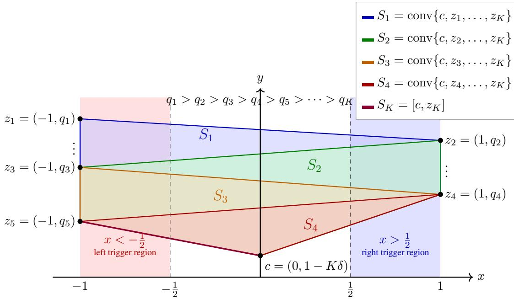

# Convex Optimization with Nested Evolving Feasible Sets (CONES) under Time-Varying Loss Functions

Rahul Vaze

September 11, 2026

## Abstract

Convex Optimization with Nested Evolving Feasible Sets (CONES) was introduced in [10] where the objective function $f$ remains fixed but the feasible region evolves over time as a nested sequence $S 1 \supseteq S 2 \supseteq \cdots \supseteq S _ { T }$ . The goal of an online algorithm is to simultaneously minimize the regret with respect to hindsight static optimal benchmark and the total movement cost $M _ { \mathcal { A } } ( T )$ while ensuring feasibility at all times. CONES is an optimization-oriented generalization of the well-known nested convex body chasing (NCBC). In this paper, we extend CONES to allow for loss functions $f _ { t } ^ { \prime } \mathbf { s }$ to also change over time. When all loss functions are convex, we show that the projected proximal algorithm achieves $O ( T ^ { 1 - \beta } ) , O ( T ^ { \beta } )$ simultaneous regret and movement cost, respectively, for any $\beta \in [ 0 , 1 )$ , over a time horizon of $T .$ We also show that any weakly adaptive online algorithm with $O ( T ^ { \beta } )$ regret has a movement cost of Ω $\left( T ^ { \frac { 1 - \beta } { 2 } } \right)$ for any $\beta \in [ 0 , 1 )$ . When all loss functions are strongly convex, we show that the projected proximal algorithm simultaneously achieves O(1) regret and a movement cost of ${ \cal O } ( \log T )$ . To complement this, we show that any online algorithm with sublinear anytime regret has a movement cost of $\Omega \left( \log T \right)$ ).

## 1 Introduction

In this paper, we consider the following problem known as CONES [10]. At each round $t ,$ a convex (loss) function $f _ { t }$ : $\mathcal { X } $ R and a convex set $S _ { t } \subseteq { \mathcal { X } }$ is revealed such that $S _ { t } \subseteq S _ { t - 1 }$ , and $S _ { 0 } = \mathcal { X } \subset \mathbb { R } ^ { d }$ is a convex, compact, and bounded set. Once $S _ { t }$ is revealed, the objective for an online algorithm A is to choose action $x _ { t } ~ \in ~ S _ { t }$ (feasible action) so as to simultaneously minimize the loss function cost

$$
C _ { \mathit { A } } ( T ) = \sum _ { t = 1 } ^ { T } f _ { t } ( x _ { t } ) ,\tag{1}
$$

and total movement cost

$$
M _ { A } ( T ) = \sum _ { t = 1 } ^ { T } | | x _ { t } - x _ { t - 1 } | | ,\tag{2}
$$

where $x _ { 0 } \in \mathcal { X }$ is some fixed action. Throughout, we use ||.|| to denote the 2-norm or the Euclidean distance.

The performance of A is compared against a static optimal benchmark OPT that chooses its action $x ^ { \mathsf { O P T } } \in S _ { T }$ (assumed non-empty) that minimizes the loss function cost, i.e.,

$$
x ^ { \mathsf { O P T } } \in \arg \operatorname* { m i n } _ { x \in S _ { T } } \sum _ { t } f _ { t } ( x )
$$

and

$$
C _ { 0 \mathsf { P T } } ( T ) = \sum _ { t = 1 } ^ { T } f _ { t } ( x ^ { 0 \mathsf { P T } } ) .
$$

Since $S _ { t } \mathrm { ' s }$ are nested, $x ^ { \mathsf { O P T } }$ is feasible with respect to all $S _ { t } ^ { \prime } s$ . The movement cost of OPT is simply

$$
M _ { 0 \mathsf { P T } } ( T ) = | | x ^ { 0 \mathsf { P T } } - x _ { 0 } | | .
$$

The regret of A is then defined as

$$
\mathrm { R e g r e t } _ { \mathcal { A } } ( T ) = \operatorname* { s u p } _ { f _ { t } , S _ { t } } \{ C _ { \mathcal { A } } ( T ) - C _ { 0 \mathsf { P T } } ( T ) \} .\tag{3}
$$

For $\mathcal { A }$ its two objectives are: minimize $\mathrm { R e g r e t } _ { \mathcal { A } } ( T )$ and movement cost $M _ { \mathcal { A } } ( T )$ simultaneously.

## 1.1 Prior Work with $f _ { t } = f \forall t$

CONES was introduced in [10] for the case when $f _ { t } \ = \ f \ \forall \ t$ . [10] also discussed in detail the motivation to study it, its applications, and its connections to related prior work, $\mathrm { e . g }$ . in nested convex body chasing (NCBC) [1–3, 6, 7, 15], convex online constrained optimization (COCO) [8, 11, 12, 17, 18, 20–22], sensitivity/perturbation analysis of optimization problems [5], trajectory tracking [16], etc. With $f _ { t } = f \forall$ t the following results were derived in [10].

1. When $f$ is strongly convex, it showed that the greedy algorithm $\mathcal { G }$ that chooses $x _ { t } = x _ { t } ^ { \star } = \arg$ min $. _ { x \in S _ { t } } f ( x )$ for all t has minimum regret among all online algorithms but incurs a movement cost of $\Theta ( { \sqrt { T } } )$ . Next, a ‘lazy’ algorithm called FRUGAL was analyzed, that plays action $x _ { t } = x _ { t } ^ { \star }$ only when it is forced to do so in order to keep its regret non-positive and otherwise plays the action obtained by projecting its current action $x _ { t - 1 }$ on to the most recently revealed set $S _ { t }$ The regret of FRUGAL is non-positive by definition and its movement cost is shown to be ${ \cal O } ( \log T )$ , a fundamental improvement over G when f is also smooth. This upper bound was complemented by a lower bound, that showed that any online algorithm with sublinear anytime regret has movement cost $\Omega \left( { \sqrt { \frac { \log T } { \log \log T } } } \right)$ . Recently, an algorithm that combines FRUGAL and Level Set Projection (LSP) algorithm of [10] has been shown to achieve a non-positive regret and movement cost of $O ( { \sqrt { \log T } } )$ in [13].

2. When $f$ is convex, [10] showed a negative result that the greedy algorithm G has a movement cost of $\Omega ( T )$ . Next, it showed that the LSP algorithm achieves a (regret, movement cost) tuple of $( T ^ { 1 - \beta } , T ^ { \beta } )$ for any $\beta \in [ 0 , 1 ]$

In this paper, with arbitrary time-varying $f _ { t } \mathbf { \dot { s } } ,$ we derive the following results.

## 1.2 Contributions

1. When $f _ { t } \mathrm { ' s }$ are strongly convex, we show that the projected proximal algorithm (we refer to it as Prox) that chooses

$$
x _ { t } \in \arg \operatorname* { m i n } _ { x \in S _ { t } } \left\{ f _ { t } ( x ) + \frac { 1 } { 2 \eta _ { t } } \| x - x _ { t - 1 } \| ^ { 2 } \right\} ,\tag{4}
$$

has regret of $O ( 1 )$ and its movement cost is ${ \cal O } ( \log T )$ , when $\begin{array} { r } { \eta _ { t } = \frac { 1 } { \mu t } } \end{array}$ . Prox is conceptually a different algorithm than FRUGAL [10] and automatically adapts to changing constraints rather than being forced depending on current regret. We also show that any online algorithm with sublinear anytime regret has movement cost $\Omega \left( \log T \right)$ . Thus obtaining a tight result and showing that Prox is an optimal (order-wise) algorithm.

It is worth noting that compared to the case when $f _ { t } = f$ for all t, the optimal movement cost with sublinear anytime regret is order-wise different.

2. When $f$ is convex, we show that Prox (4) achieves a (regret, movement cost) tuple of $( T ^ { 1 - \beta } , T ^ { \beta } )$ for any $\beta \in [ 0 , 1 ]$ by choosing $\begin{array} { r } { \eta = \frac { D ^ { 2 } } { \epsilon T } } \end{array}$ and $\epsilon = T ^ { - \beta }$

Moreover, we also show that any weakly adaptive online algorithm with $O ( T ^ { \beta } )$ regret has a movement cost of Ω $\left( T ^ { \frac { 1 - \beta } { 2 } } \right)$ for $\beta \in [ 0 , 1 )$ even when $f _ { t } = f$ for all t, the special case studied in [10]. No such lower bound was provided in [10].

## 2 $f _ { t } { \mathbf { \ ' { s } } }$ are strongly convex

In this section, we consider the twin objectives of simultaneously minimizing regret (3) and movement cost $( 2 )$ , when $f _ { t } \mathbf { \bar { s } }$ are µ-strongly convex and G-Lipschitz. Throughout, we assume that the diameter of X is at most $D .$

## 2.1 Upper Bound

Theorem 1. When $f _ { t }$ ’s are $\mu \cdot$ -strongly convex, G-Lipschitz, for algorithm Prox (4) with $\begin{array} { r } { \eta _ { t } = \frac { 1 } { \mu t } , } \end{array}$

$$
\mathrm { R e g r e t } _ { \mathcal A } ( T ) \le \frac { \mu D ^ { 2 } } { 2 } = O ( 1 ) ,\tag{5}
$$

and

$$
\left| M _ { A } ( T ) \leq C _ { d } \left( D + \frac { G } { \mu } ( 1 + \log T ) \right) = O ( \log T ) , \right|
$$

where $C _ { d }$ is a constant depending only on ||.|| and the dimension d. The exact bound on $C _ { d }$ can be extracted from [19].

The main idea of the proof is to exploit the strong convexity of $f _ { t } \mathbf { \bar { s } }$ to upper bound the regret by an $O ( 1 )$ quantity, while using the fact that (proved in Lemma 2) $x _ { t }$ defined in (4) is equivalent to

$$
x _ { t } = \Pi _ { S _ { t } } \big ( x _ { t - 1 } - \eta _ { t } g _ { t } \big ) .\tag{6}
$$

where $g _ { t } \in \partial f _ { t } ( x _ { t } )$ , and $\partial f _ { t } ( x _ { t } )$ denotes the subgradient set of $f _ { t }$ at $x _ { t }$ . This association (6) allows us to utilize a recent result in [14] that upper bounds $\begin{array} { r } { \sum _ { t } | | x _ { t } - x _ { t - 1 } | | } \end{array}$ for iterates $x _ { t }$ satisfying (6) when sets $S _ { t } \mathrm { ' s }$ are nested. Remarkably, it is worth noting that $\eta _ { t }$ is in the numerator of (6) unlike being in the denominator of (4). Thus, with $\begin{array} { r } { \eta _ { t } = \frac { 1 } { \mu t } } \end{array}$ allows us to bound the movement cost as ${ \cal O } ( \log T )$ .

## Remark 2.1:

The regret bound of Theorem 1

$$
\mathrm { R e g r e t } _ { A } ( T ) \leq { \frac { \mu D ^ { 2 } } { 2 } }
$$

has a qualitatively different dependence on the strong-convexity parameter $\mu$ from the usual $O ( 1 / \mu )$ regret bound for online convex optimization [9] or COCO [14]. This is because algorithm Prox uses the entire loss function $f _ { t }$ in its implicit proximal update and chooses

$$
\eta _ { t } = { \frac { 1 } { \mu t } } .
$$

As $\mu$ decreases, the proximal regularization becomes weaker and the update approaches the greedy minimizer of the current loss over $S _ { t } .$ . In the present CONES setting, where $f _ { t }$ and $S _ { t }$ are revealed before $x _ { t }$ is chosen, the greedy action satisfies

$$
f _ { t } ( x _ { t } ) \leq f _ { t } ( x ^ { 0 \mathsf { P T } } )
$$

at every round, since $x ^ { \mathsf { O P T } } \in S _ { t }$ . Thus the regret can in fact approach zero as $\mu \to 0$ . The dependence

$$
\mathrm { R e g r e t } _ { \mathcal A } ( T ) = O ( \mu D ^ { 2 } )
$$

is therefore consistent with the algorithm becoming increasingly greedy as the strong convexity vanishes.

To complement this upper bound result, we derive a matching lower bound as follows.

## 2.2 Lower Bound

Theorem 2. Suppose that an online algorithm A satisfies, for every t,

$$
\mathrm { R e g r e t } _ { A } ( t ) : = \operatorname* { s u p } _ { \{ f _ { r } , S _ { r } \} _ { r = 1 } ^ { t } } \sum _ { r = 1 } ^ { t } f _ { r } ( x _ { r } ) - \operatorname* { m i n } _ { x \in S _ { t } } \sum _ { r = 1 } ^ { t } f _ { r } ( x ) \leq R ( t ) .\tag{7}
$$

An online algorithm A is defined to have anytime sublinear regret if for all t,

$$
R ( t ) = o ( t ) ,
$$

For any A with anytime sublinear regret, against an adaptive adversary, there exists a sequence of 1-strongly convex and 1-Lipschitz loss functions $f _ { t } f o r$ which

$$
M _ { \cal A } ( T ) = \sum _ { t = 1 } ^ { T } \| x _ { t } - x _ { t - 1 } \| = \Omega ( \log T ) .
$$

Discussion: Theorem 1 and 2 together fully characterize the optimal movement cost for any algorithm that can achieve anytime $o ( T )$ regret. Compared to the case when $f _ { t } = f$ for all t, where the movement cost is $O ( { \sqrt { \log T } } )$ and Ω $\left( { \sqrt { \frac { \log T } { \log \log T } } } \right)$ [10, 13] for any algorithm that can achieve anytime $o ( T )$ regret, with changing $f _ { t } \mathbf { \bar { s } }$ it is $\Theta ( \log T )$ . Thus, there is a fundamental degradation which is expected in this more general setting.

## 3 $f _ { t } { \mathbf { \ ' { s } } }$ are convex

In this section, we consider the twin objectives of minimizing regret (3) and movement cost $( 2 ) .$ , when $f _ { t } ^ { \mathrm { ~ , ~ } }$ s are just convex and G-Lipschitz.

## 3.1 Upper Bound

Theorem 3. When $f _ { t }$ ’s are convex and G-Lipschitz, for any $\epsilon > 0 ,$ , algorithm Prox (4), with

$$
\eta = \frac { D ^ { 2 } } { \epsilon T } .
$$

satisfies

$$
\mathrm { R e g r e t } _ { \mathcal { A } } ( T ) \leq \frac { D ^ { 2 } } { 2 \eta } = \frac { \epsilon T } { 2 } ,
$$

and

$$
M _ { A } ( T ) \leq C _ { d } \left( D + \frac { G D ^ { 2 } } { \epsilon } \right) ,
$$

where $C _ { d }$ is the same constant that appears in Theorem 1. In particular, for any $0 \leq \beta \leq 1$ , choosing

$$
\epsilon = T ^ { - \beta }
$$

yields

$$
\mathrm { R e g r e t } _ { \cal A } ( T ) = { \cal O } ( T ^ { 1 - \beta } ) , \qquad M _ { \cal A } ( T ) = { \cal O } _ { \cal d } ( T ^ { \beta } ) .
$$

We next derive lower bound on achievable simultaneous regret and movement cost when $f _ { t } \mathbf { \bar { s } }$ are convex.

## 3.2 Lower Bounds

## 3.2.1 Weakly Adaptive Algorithms

## Definition 3.1: Weakly adaptive algorithm

An online algorithm A for CONES with changing losses $f _ { 1 } , \ldots , f _ { T }$ is called R-weakly adaptive if, for every CONES instance, every interval

$$
I = \{ r , r + 1 , \ldots , s \} \subseteq [ T ] ,
$$

with benchmark

$$
x _ { s } ^ { \mathsf { O P T } } \in \arg \operatorname* { m i n } _ { x \in S _ { s } } \sum _ { t = 1 } ^ { s } f _ { t } ( x )
$$

A satisfies

$$
\sum _ { t = r } ^ { s } \bigl ( f _ { t } ( x _ { t } ) - f _ { t } ( x _ { s } ^ { \mathsf { O P T } } ) \bigr ) \leq R .
$$

Since the feasible sets are nested,

$$
S _ { s } \subseteq S _ { t } \qquad { \mathrm { f o r ~ a l l ~ } } t \leq s ,
$$

and hence

$$
x _ { s } ^ { 0 \mathsf { P T } } \in S _ { t }
$$

$$
t \in [ a , b ] .
$$

Thus, $x _ { s } ^ { \mathsf { O P T } }$ is feasible throughout the interval I. Taking $r = 1$ and $s = T$ gives

$$
\sum _ { t = 1 } ^ { T } \bigl ( f _ { t } ( x _ { t } ) - f _ { t } ( x _ { T } ^ { \mathsf { O P T } } ) \bigr ) \leq R ,
$$

which is the usual terminal static-regret guarantee.

The notion of weakly adaptive algorithms is quite popular in related literature [4, 14]. We next derive a lower bound on the simultaneous regret and movement cost for any weakly adaptive algorithm when $f _ { t } = f$ for all t, which directly applies for general $f _ { t } \mathbf { \dot { s } } ,$ , and thereafter give examples of weakly adaptive algorithms.

Theorem 4. Fix $T \geq 1$ and let

$$
R : = \mathrm { R e g r e t } _ { A } ( T ) \geq 0 , \quad s a t i s f y \quad T \geq 1 6 ( R + 1 ) .
$$

Consider any online algorithm A satisfying the weakly adaptive regret guarantee

$$
\sum _ { t = r } ^ { s } \bigl ( f _ { t } ( x _ { t } ) - f _ { t } ( x _ { s } ^ { \mathsf { O P T } } ) \bigr ) \leq R \qquad \mathrm { ~ f o r ~ e v e r y ~ } [ r , s ] \subseteq [ T ] , \quad w h e r e \quad x _ { s } ^ { \mathsf { O P T } } \in \arg \operatorname* { m i n } _ { x \in S _ { s } } \sum _ { t = 1 } ^ { s } f _ { t } ( x ) .
$$

Then there exists a two-dimensional CONES instance with

$$
{ \mathcal { X } } = [ - 1 , 1 ] \times [ 0 , 1 ] , \qquad \mathrm { d i a m } ( { \mathcal { X } } ) = { \sqrt { 5 } } , \qquad S _ { 0 } = { \mathcal { X } } , \qquad S _ { t } \subseteq S _ { t - 1 } ,
$$

and fixed loss $f : \mathcal { X } \to \mathbb { R }$ that is convex and 1-Lipschitz, such that

$$
\boxed { M _ { \cal A } ( T ) \geq \frac { 1 } { 8 } \sqrt { \frac { T } { R + 1 } } - 1 . }
$$

In particular, if

$$
\mathrm { R e g r e t } _ { \cal A } ( T ) = { \cal O } ( T ^ { \beta } ) , \qquad 0 \leq \beta < 1 ,
$$

then

$$
\boxed { M _ { \cal A } ( T ) = \Omega \Bigl ( T ^ { ( 1 - \beta ) / 2 } \Bigr ) . }
$$

## 3.3 Examples of weakly adaptive algorithms for CONES

1. Prox algorithm (4) is R-weakly adaptive, with

$$
R = \frac { D ^ { 2 } } { 2 \eta } ,
$$

when $f _ { t } : \mathcal { X }  \mathbb { R }$ are convex and Prox uses a constant stepsize $\eta _ { t } = \eta$ for all t.

We show it as follows. Fix any interval $I = [ a , b ] \subseteq [ T ]$ , and let

$$
x _ { b } ^ { 0 \mathsf { P T } } \in \arg \operatorname* { m i n } _ { x \in S _ { b } } \sum _ { t = 1 } ^ { b } f _ { t } ( x ) .
$$

Since the feasible sets are nested,

$$
S _ { b } \subseteq S _ { t } \qquad { \mathrm { f o r ~ a l l ~ } } t \leq b ,
$$

and hence

$$
x _ { b } ^ { \mathsf { O P T } } \in S _ { t } \qquad { \mathrm { f o r ~ a l l ~ } } t \in [ a , b ] .
$$

Let $g _ { t } \in \partial f _ { t } ( x _ { t } )$ . Since $f _ { t }$ is convex,

$$
f _ { t } ( x _ { t } ) - f _ { t } ( x _ { b } ^ { \mathsf { O P T } } ) \leq \langle g _ { t } , x _ { t } - x _ { b } ^ { \mathsf { O P T } } \rangle .
$$

The first-order optimality condition for the proximal update (4) gives

$$
\left. g _ { t } + \frac { x _ { t } - x _ { t - 1 } } { \eta } , x _ { b } ^ { 0 \mathsf { P } \mathsf { T } } - x _ { t } \right. \geq 0 .
$$

Therefore,

$$
\langle g _ { t } , x _ { t } - x _ { b } ^ { 0 \mathsf { P T } } \rangle \leq \frac { 1 } { \eta } \langle x _ { t } - x _ { t - 1 } , x _ { b } ^ { 0 \mathsf { P T } } - x _ { t } \rangle .
$$

Using

$$
2 \langle x _ { t } - x _ { t - 1 } , x _ { t } - x _ { b } ^ { \mathsf { O P T } } \rangle = \| x _ { t } - x _ { t - 1 } \| ^ { 2 } + \| x _ { t } - x _ { b } ^ { \mathsf { O P T } } \| ^ { 2 } - \| x _ { t - 1 } - x _ { b } ^ { \mathsf { O P T } } \| ^ { 2 } ,
$$

we obtain

$$
f _ { t } ( x _ { t } ) - f _ { t } ( x _ { b } ^ { \mathsf { O P T } } ) \leq \frac { \| x _ { t - 1 } - x _ { b } ^ { \mathsf { O P T } } \| ^ { 2 } - \| x _ { t } - x _ { b } ^ { \mathsf { O P T } } \| ^ { 2 } - \| x _ { t } - x _ { t - 1 } \| ^ { 2 } } { 2 \eta } .
$$

Summing over $t = a , \ldots , b$ and dropping the nonpositive movement term gives

$$
\sum _ { t = a } ^ { b } \bigl ( f _ { t } ( x _ { t } ) - f _ { t } ( x _ { b } ^ { \mathsf { O P T } } ) \bigr ) \leq \frac { \| x _ { a - 1 } - x _ { b } ^ { \mathsf { O P T } } \| ^ { 2 } - \| x _ { b } - x _ { b } ^ { \mathsf { O P T } } \| ^ { 2 } } { 2 \eta } \leq \frac { D ^ { 2 } } { 2 \eta } .
$$

Since this holds for every interval $[ a , b ] \subseteq [ T ]$ , the Prox algorithm is $R \mathrm { - }$ weakly adaptive with

$$
R = \frac { D ^ { 2 } } { 2 \eta } .
$$

2. With changing losses $f _ { t }$ , the GREEDY algorithm plays

$$
x _ { t } \in \arg \operatorname* { m i n } _ { x \in S _ { t } } f _ { t } ( x )
$$

at every round.

Consider any interval $I = [ a , b ] \subseteq [ T ]$ . By definition,

$$
x _ { b } ^ { 0 \mathsf { P T } } \in \arg \operatorname* { m i n } _ { x \in S _ { b } } \sum _ { t = 1 } ^ { b } f _ { t } ( x ) .
$$

Since the feasible sets are nested,

$$
S _ { b } \subseteq S _ { t } \qquad \forall t \leq b ,
$$

and hence

$$
x _ { b } ^ { 0 \mathsf { P T } } \in S _ { t } \qquad \forall t \in [ a , b ] .
$$

By the definition of GREEDY,

$$
f _ { t } ( x _ { t } ) = \operatorname* { m i n } _ { x \in S _ { t } } f _ { t } ( x ) \leq f _ { t } ( x _ { b } ^ { \mathsf { O P T } } ) \qquad \forall t \in [ a , b ] .
$$

Therefore,

$$
\sum _ { t = a } ^ { b } \bigl ( f _ { t } ( x _ { t } ) - f _ { t } ( x _ { b } ^ { \mathsf { O P T } } ) \bigr ) \leq 0 .
$$

Hence GREEDY is 0-weakly adaptive.

3. Level Set Projection (LSP) algorithm [10]: The LSP algorithm was defined in [10] for the case $f _ { t } = f$ for all t. Its natural extension to changing losses is as follows. Define

$$
L _ { t } : = \operatorname* { m i n } _ { x \in S _ { t } } f _ { t } ( x ) , \qquad \Phi _ { t } : = \left\{ x \in S _ { t } : f _ { t } ( x ) \leq L _ { t } + \varepsilon \right\} ,
$$

and choose some

$$
x _ { t } \in \Phi _ { t } .
$$

For example, one may choose

$$
\boldsymbol { x } _ { t } = \Pi _ { \Phi _ { t } } ( \boldsymbol { x } _ { t - 1 } ) .
$$

By construction,

$$
f _ { t } ( x _ { t } ) \leq \operatorname* { m i n } _ { x \in S _ { t } } f _ { t } ( x ) + \varepsilon .
$$

Lemma 1. The changing-loss version of LSP is Tε-weakly adaptive.

Proof. Consider any interval

$$
I = [ a , b ] \subseteq [ T ] .
$$

By definition,

$$
x _ { b } ^ { 0 \mathsf { P T } } \in \arg \operatorname* { m i n } _ { x \in S _ { b } } \sum _ { t = 1 } ^ { b } f _ { t } ( x ) .
$$

Since the feasible sets are nested, $S _ { b } \subseteq S _ { t } \forall t \leq b .$ , and hence $x _ { b } ^ { \mathsf { O P T } } \in S _ { t } \forall t \in [ a , b ]$

By construction of $x _ { t } ,$

$$
f _ { t } ( x _ { t } ) \leq \operatorname* { m i n } _ { x \in S _ { t } } f _ { t } ( x ) + \varepsilon \leq f _ { t } ( x _ { b } ^ { \mathsf { O P T } } ) + \varepsilon .
$$

Thus,

$$
f _ { t } ( x _ { t } ) - f _ { t } ( x _ { b } ^ { \mathsf { O P T } } ) \leq \varepsilon \qquad \forall t \in [ a , b ] .
$$

Summing over the interval gives

$$
\sum _ { t = a } ^ { b } \bigl ( f _ { t } ( x _ { t } ) - f _ { t } ( x _ { b } ^ { \mathsf { O P T } } ) \bigr ) \leq | I | \varepsilon \leq T \varepsilon .
$$

Hence the changing-loss version of LSP is Tε-weakly adaptive.

## 4 Conclusion

In this paper, we generalized the important optimization paradigm of Convex Optimization with Nested Evolving Feasible Sets (CONES), introduced in [10], from a fixed objective function to a setting in which both the loss functions and the feasible sets may evolve over time, while the benchmark remains a static hindsight optimum. This extension allows us to separate the effects of evolving optimization geometry from those arising from temporal variation in the objective itself.

For the strongly convex case, changing loss functions increases the movement required under $o ( T )$ anytime regret from the previously known $O ( { \sqrt { \log T } } )$ upper bound in the fixed-objective setting to the tight $\Theta ( \log T )$ rate established here. For the convex case, we establish the same upper bound in the evolving objective setting as already known for the fixed-objective setting, while developing new lower bounds that apply even for the fixed-objective setting. With these improvements we have widened the scope of CONES and developed a better theoretical understanding

## References

[1] C. J. Argue, Sebastien Bubeck, Michael B. Cohen, Anupam Gupta, and Yin Tat Lee. A nearly-linear bound for chasing´ nested convex bodies, 2018.

[2] C. J. Argue, Anupam Gupta, Ziye Tang, and Guru Guruganesh. Chasing convex bodies with linear competitive ratio. J. ACM, 68(5), August 2021.

[3] Nikhil Bansal, Martin Bohm, Marek Eli¨ a´s, Grigorios Koumoutsos, and Seeun William Umboh. Nested convex bodiesˇ are chaseable, 2017.

[4] Martino Bernasconi, Matteo Castiglioni, and Andrea Celli. No-regret is not enough! bandits with general constraints through adaptive regret minimization. arXiv preprint arXiv:2405.06575, 2024.

[5] J. Fred´ eric Bonnans and Alexander Shapiro.´ Perturbation Analysis of Optimization Problems. Springer Series in Operations Research. Springer Science & Business Media, New York, 2000.

[6] Sebastien Bubeck, Bo’az Klartag, Yin Tat Lee, Yuanzhi Li, and Mark Sellke. Chasing nested convex bodies nearly´ optimally, 2021.

[7] Joel Friedman and Nathan Linial. On convex body chasing. Discrete & Computational Geometry, 9(3):293–321, 1993.

[8] Hengquan Guo, Xin Liu, Honghao Wei, and Lei Ying. Online convex optimization with hard constraints: Towards the best of two worlds and beyond. Advances in Neural Information Processing Systems, 35:36426–36439, 2022.

[9] Elad Hazan. Introduction to online convex optimization. CoRR, abs/1909.05207, 2019.

[10] Karthick M. Krishna, Haricharan Balasundaram, and Rahul Vaze. Convex optimization with nested evolving feasible sets. arXiv preprint arXiv:2605.07386, 2026.

[11] Nikolaos Liakopoulos, Apostolos Destounis, Georgios Paschos, Thrasyvoulos Spyropoulos, and Panayotis Mertikopoulos. Cautious regret minimization: Online optimization with long-term budget constraints. In International Conference on Machine Learning, pages 3944–3952. PMLR, 2019.

[12] Michael J Neely and Hao Yu. Online convex optimization with time-varying constraints. arXiv preprint arXiv:1702.04783, 2017.

[13] Dhruv Sarkar and Aprameyo Chakrabartty. Nested convex-body chasing for online optimization with evolving feasible sets, 2026.

[14] Dhruv Sarkar and Abhishek Sinha. Improved guarantees for constrained online convex optimization via selfcontraction. arXiv preprint arXiv:2605.21107, 2026.

[15] Mark Sellke. Chasing Convex Bodies Optimally, pages 313–335. Springer International Publishing, Cham, 2023.

[16] Andrea Simonetto, Emiliano Dall’Anese, Santiago Paternain, Geert Leus, and Georgios B Giannakis. Time-varying convex optimization: Time-structured algorithms and applications. Proceedings of the IEEE, 108(11):2032–2048, 2020.

[17] Abhishek Sinha and Rahul Vaze. Optimal algorithms for online convex optimization with adversarial constraints. In The Thirty-eighth Annual Conference on Neural Information Processing Systems, 2024.

[18] Abhishek Sinha and Rahul Vaze. Beyond \$\tilde{O}(\sqrt{T})\$ constraint violation for online convex optimization with adversarial constraints. In The Thirty-ninth Annual Conference on Neural Information Processing Systems, NeurIPS 2025, 2025.

[19] Eugene Stepanov and Yana Teplitskaya. Self-contracted curves have finite length. Journal ofthe London Mathematical Society, 96(2):455–481, 2017.

[20] Wen Sun, Debadeepta Dey, and Ashish Kapoor. Safety-aware algorithms for adversarial contextual bandit. In Inter national Conference on Machine Learning, pages 3280–3288. PMLR, 2017.

[21] Xinlei Yi, Xiuxian Li, Tao Yang, Lihua Xie, Yiguang Hong, Tianyou Chai, and Karl H Johansson. Distributed online convex optimization with adversarial constraints: Reduced cumulative constraint violation bounds under slater’s condition. arXiv preprint arXiv:2306.00149, 2023.

[22] Hao Yu, Michael Neely, and Xiaohan Wei. Online convex optimization with stochastic constraints. Advances in Neural Information Processing Systems, 30, 2017.

## 5 Proof of Theorem 1

Proof. Let

$$
g _ { t } \in \partial f _ { t } ( x _ { t } ) ,
$$

where $\partial f _ { t } ( x _ { t } )$ denotes the sub-gradient of $f _ { t }$ at $x _ { t }$ . Since $f _ { t }$ is µ-strongly convex,

$$
f _ { t } ( x _ { t } ) - f _ { t } ( x ^ { 0 \mathsf { P T } } ) \leq \langle g _ { t } , x _ { t } - x ^ { 0 \mathsf { P T } } \rangle - \frac { \mu } { 2 } \| x _ { t } - x ^ { 0 \mathsf { P T } } \| ^ { 2 } .\tag{8}
$$

The first-order optimality condition for algorithm Prox (4) implies

$$
\left. g _ { t } + \frac { x _ { t } - x _ { t - 1 } } { \eta _ { t } } , x ^ { 0 \mathsf { P T } } - x _ { t } \right. \geq 0 ,
$$

since $x ^ { \mathsf { O P T } } \in S _ { t }$ for all t.

Therefore,

$$
\langle g _ { t } , x _ { t } - x ^ { 0 \mathsf { P T } } \rangle \leq \frac { 1 } { \eta _ { t } } \langle x _ { t } - x _ { t - 1 } , x ^ { 0 \mathsf { P T } } - x _ { t } \rangle .
$$

Using

$$
\langle x _ { t } - x _ { t - 1 } , x ^ { \mathsf { O P T } } - x _ { t } \rangle = - \langle x _ { t } - x _ { t - 1 } , x _ { t } - x ^ { \mathsf { O P T } } \rangle
$$

and the identity

$$
2 \langle x _ { t } - x _ { t - 1 } , x _ { t } - x ^ { \mathsf { O P T } } \rangle = \| x _ { t } - x ^ { \mathsf { O P T } } \| ^ { 2 } + \| x _ { t } - x _ { t - 1 } \| ^ { 2 } - \| x _ { t - 1 } - x ^ { \mathsf { O P T } } \| ^ { 2 } ,
$$

we obtain

$$
\langle g _ { t } , x _ { t } - x ^ { \mathsf { O P T } } \rangle \leq \frac { 1 } { 2 \eta _ { t } } \left( \| x _ { t - 1 } - x ^ { \mathsf { O P T } } \| ^ { 2 } - \| x _ { t } - x ^ { \mathsf { O P T } } \| ^ { 2 } - \| x _ { t } - x _ { t - 1 } \| ^ { 2 } \right) .\tag{9}
$$

Substituting this into (8) and using $\eta _ { t } = 1 / ( \mu t )$

$$
f _ { t } ( x _ { t } ) - f _ { t } ( x ^ { \mathsf { O P T } } ) \leq \frac { \mu } { 2 } \Big ( t \| x _ { t - 1 } - x ^ { \mathsf { O P T } } \| ^ { 2 } - ( t + 1 ) \| x _ { t } - x ^ { \mathsf { O P T } } \| ^ { 2 } - t \| x _ { t } - x _ { t - 1 } \| ^ { 2 } \Big ) .
$$

Summing over t yields

$$
\mathrm { R e g r e t } _ { \boldsymbol A } ( T ) \le \frac { \mu } { 2 } \left( \| \boldsymbol x _ { 0 } - \boldsymbol x ^ { 0 \mathsf P \top } \| ^ { 2 } - ( T + 1 ) \| \boldsymbol x _ { T } - \boldsymbol x ^ { 0 \mathsf P \top } \| ^ { 2 } - \sum _ { t = 1 } ^ { T } t \| \boldsymbol x _ { t } - \boldsymbol x _ { t - 1 } \| ^ { 2 } \right) ,
$$

and therefore

$$
\mathrm { R e g r e t } _ { \mathcal { A } } ( T ) \leq \frac { \mu D ^ { 2 } } { 2 } .
$$

For bounding the movement cost $M _ { \mathcal { A } } ( T )$ , we rewrite Prox (4) as follows.

Lemma 2. $x _ { t }$ defined in (4) is equivalent to

$$
x _ { t } = \Pi _ { S _ { t } } \big ( x _ { t - 1 } - \eta _ { t } g _ { t } \big ) .\tag{10}
$$

where $g _ { t } \in \partial f _ { t } ( x _ { t } )$

Note that (10) is a fixed point equation where $x _ { t }$ appears on both sides of the equality since $g _ { t } \in \partial f _ { t } ( x _ { t } )$ . This fixed point property is only a structural result and not used by the Prox algorithm. Moreover, importantly η appears in the numerator (10) compared to the denominator (4), which allows a win-win on two fronts given that $\begin{array} { r } { \eta _ { t } = \frac { 1 } { \mu t } \colon T } \end{array}$ independent regret bound and ${ \cal O } ( \log T )$ movement cost.

Proof of Lemma 2 is elementary and provided later for completeness.

Thus, the update (4) of algorithm Prox is of the form

$$
\begin{array} { r } { x _ { t } = \Pi _ { S _ { t } } \big ( x _ { t - 1 } - e _ { t } \big ) , \qquad \mathrm { w h e r e } ~ e _ { t } : = \eta _ { t } g _ { t } , } \end{array}\tag{11}
$$

and

$$
\| e _ { t } \| \leq \frac { G } { \mu t } ,
$$

since $\eta _ { t } = 1 / ( \mu t )$ and $| | g _ { t } | | \leq G$

For a nested projected-gradient trajectory (11) we invoke the following result.

Lemma 3 (Nested-projection movement bound [14, Lemma 4.1]). Let

$$
K _ { 0 } \supseteq K _ { 1 } \supseteq \cdots \supseteq K _ { T }
$$

be a nested sequence of nonempty closed convex subsets of $\mathbb { R } ^ { d }$ such that

$$
\dim ( K _ { 0 } ) \leq D .
$$

Let $z _ { 0 } \in K _ { 0 } ,$ , and suppose that

$$
z _ { t } = \Pi _ { K _ { t } } ( z _ { t - 1 } - e _ { t } ) , \qquad t = 1 , \ldots , T ,
$$

where $e _ { t } \in \mathbb { R } ^ { d }$ is arbitrary. Then

$$
\left| \sum _ { t = 1 } ^ { T } \| z _ { t } - z _ { t - 1 } \| \leq C _ { d } \left( D + \sum _ { t = 1 } ^ { T } \| e _ { t } \| \right) , \right.
$$

where $C _ { d } > 0$ is a constant depending only on $| | . | |$ and the dimension d.

In our setting $S _ { t } = K _ { t }$ and $S _ { t } \subseteq S _ { t - 1 }$ , thus, using Lemma 3, we get from (11), that for algorithm Prox,

$$
\sum _ { t = 1 } ^ { T } \| x _ { t } - x _ { t - 1 } \| \leq C _ { d } \left( D + \sum _ { t = 1 } ^ { T } \| e _ { t } \| \right) , \quad
$$

with $\textstyle \| e _ { t } \| \leq { \frac { G } { \mu t } }$ . Hence

$$
M _ { \cal A } ( T ) \leq C _ { d } \left( D + \frac { G } { \mu } \sum _ { t = 1 } ^ { T } \frac { 1 } { t } \right) \leq C _ { d } \left( D + \frac { G } { \mu } ( 1 + \log T ) \right) .
$$

Proof of Lemma 2. Let $y _ { t } : = x _ { t - 1 } - \eta _ { t } g _ { t }$ . From $( 4 ) , x _ { t }$ minimizes the function

$$
\phi _ { t } ( x ) : = f _ { t } ( x ) + \frac { 1 } { 2 \eta _ { t } } \| x - x _ { t - 1 } \| ^ { 2 }
$$

over the closed convex set $S _ { t }$ . Thus, the first-order optimality condition implies

$$
0 \in \partial \phi _ { t } ( x _ { t } ) + N _ { S _ { t } } ( x _ { t } ) ,
$$

where $N _ { S } ( x )$ is the normal cone to S at point $x \in S .$ . Because

$$
\partial \phi _ { t } ( x _ { t } ) = g _ { t } + \frac { 1 } { \eta _ { t } } ( x _ { t } - x _ { t - 1 } ) ,
$$

we obtain

$$
0 \in g _ { t } + \frac { 1 } { \eta _ { t } } ( x _ { t } - x _ { t - 1 } ) + N _ { S _ { t } } ( x _ { t } ) .
$$

Thus there exists some

$$
n _ { t } \in N _ { S _ { t } } ( x _ { t } )
$$

such that

$$
g _ { t } + \frac { 1 } { \eta _ { t } } ( x _ { t } - x _ { t - 1 } ) + n _ { t } = 0 .
$$

Multiplying by $\eta _ { t }$ gives

$$
\eta _ { t } g _ { t } + x _ { t } - x _ { t - 1 } + \eta _ { t } n _ { t } = 0 ,
$$

and hence

$$
x _ { t - 1 } - \eta _ { t } g _ { t } - x _ { t } = \eta _ { t } n _ { t } .
$$

By the definition of $y _ { t } .$

$$
y _ { t } - x _ { t } = \eta _ { t } n _ { t } .
$$

Since the normal cone is a cone, $n _ { t } \in N _ { S _ { t } } ( x _ { t } )$ implies

$$
\eta _ { t } n _ { t } \in N _ { S _ { t } } ( x _ { t } ) .
$$

Therefore

$$
y _ { t } - x _ { t } \in N _ { S _ { t } } ( x _ { t } ) .\tag{12}
$$

We next recall the well-known projection characterization, whose proof is included for completeness. Let S be a nonempty closed convex set. We claim that, for $x \in S$

$$
x = \Pi _ { S } ( y ) \iff y - x \in N _ { S } ( x ) .\tag{13}
$$

First suppose that $x = \Pi _ { S } ( y )$ . By definition,

$$
\| y - x \| ^ { 2 } \leq \| y - z \| ^ { 2 } \qquad \forall z \in S .
$$

For any $z \in S$ and any $\lambda \in ( 0 , 1 ]$ , convexity gives

$$
x + \lambda ( z - x ) \in S .
$$

Hence

$$
\begin{array} { r } { \| y - x \| ^ { 2 } \leq \| y - x - \lambda ( z - x ) \| ^ { 2 } . } \end{array}
$$

Expanding,

$$
0 \leq - 2 \lambda \langle y - x , z - x \rangle + \lambda ^ { 2 } \| z - x \| ^ { 2 } .
$$

Dividing by λ and letting λ ↓ 0 gives

$$
\langle y - x , z - x \rangle \leq 0 \qquad \forall z \in S .
$$

By the definition of the normal cone,

$$
y - x \in N _ { S } ( x ) .
$$

Conversely, suppose that $x \in S$ and

$$
y - x \in N _ { S } ( x ) .
$$

Then, for every $z \in S ,$

$$
\left. y - x , z - x \right. \leq 0 .
$$

Therefore

$$
\begin{array} { r l } & { \| y - z \| ^ { 2 } = \| y - x - ( z - x ) \| ^ { 2 } } \\ & { \qquad = \| y - x \| ^ { 2 } + \| z - x \| ^ { 2 } - 2 \langle y - x , z - x \rangle } \\ & { \qquad \geq \| y - x \| ^ { 2 } . } \end{array}
$$

Thus x minimizes $\| y - z \|$ over $z \in S .$ , so

$$
x = \Pi _ { S } ( y ) .
$$

This proves (13).

Finally, $x _ { t } \in S _ { t }$ by construction, and (12) gives

$$
y _ { t } - x _ { t } \in N _ { S _ { t } } ( x _ { t } ) .
$$

Applying (13) with $S = S _ { t } , y = y _ { t }$ , and $x = x _ { t }$ yields

$$
x _ { t } = \Pi _ { S _ { t } } ( y _ { t } ) = \Pi _ { S _ { t } } \big ( x _ { t - 1 } - \eta _ { t } g _ { t } \big ) .
$$

## 6 Proof of Theorem 2

Proof. Let the mother set be

$$
\begin{array} { r } { \mathcal { X } = [ - 1 / 2 , 1 / 2 ] , } \end{array}
$$

and let

$$
S _ { t } = \mathcal { X } \qquad \forall t , i . e . ,
$$

all sets $S _ { t } \mathbf { \dot { s } }$ are identical and hence nested.

Let

$$
N _ { k } = 3 3 ^ { k } , \qquad k \geq 0 ,
$$

so that $N _ { 0 } = 1$ . Define the first phase by

$$
\mathcal { T } _ { 1 } = \{ 1 , \ldots , N _ { 1 } \} ,
$$

and, for every $k \geq 2 ,$ define

$$
\begin{array} { r } { \mathcal { T } _ { k } = \{ N _ { k - 1 } + 1 , \ldots , N _ { k } \} . } \end{array}
$$

Thus, for every $k \geq 2 ,$ , if

$$
N = N _ { k - 1 } ,
$$

then phase k consists of exactly

$$
N _ { k } - N _ { k - 1 } = 3 2 N
$$

rounds.

Fix

$$
s _ { 1 } = \frac { 1 } { 2 }
$$

in advance, and for every $t \in \mathcal { Z } _ { 1 }$ define

$$
f _ { t } ( x ) = { \frac { 1 } { 2 } } ( x - s _ { 1 } ) ^ { 2 } .
$$

At the beginning of phase $k \geq 2 ,$ the phase starts at round $N _ { k - 1 } + 1$ . Recall that, in CONES, the action $x _ { t }$ is chosen after $f _ { t }$ and $S _ { t }$ are revealed. Hence, at the beginning of phase k, the adversary can observe $x _ { N _ { k } . }$ −1 before choosing $s _ { k }$

After observing action $x _ { N _ { k - 1 } }$ of A, the adversary chooses

$$
s _ { k } \in \{ - 1 / 2 , 1 / 2 \}
$$

such that

$$
| | x _ { N _ { k - 1 } } - s _ { k } | | \geq \frac 1 2 ,
$$

and then for every $t \in \mathcal { Z } _ { k }$ , uses

$$
f _ { t } ( x ) = \frac { 1 } { 2 } ( x - s _ { k } ) ^ { 2 } , \qquad t = N _ { k - 1 } + 1 , \ldots , N _ { k } .
$$

Since $x , s _ { k } \in [ - 1 / 2 , 1 / 2 ]$

$$
| | f _ { t } ^ { \prime } ( x ) | | = | | x - s _ { k } | | \leq 1 ,
$$

so every $f _ { t }$ is 1-Lipschitz. Moreover, every $f _ { t }$ is 1-strongly convex.

Next, we show that for any A with $o ( t )$ anytime regret, for all sufficiently large $N ,$ , any phase of length 32N must incur at least $1 / 4$ movement. Fix a phase $k \geq 2$ and write

$$
N = N _ { k - 1 } .
$$

Suppose, for contradiction, that the total movement in phase k

$$
\sum _ { t = N + 1 } ^ { N + 3 2 N } | | x _ { t } - x _ { t - 1 } | | < \frac { 1 } { 4 } .
$$

Then, for every

$$
t \in \{ N + 1 , \ldots , N + 3 2 N \} ,
$$

$$
| | x _ { t } - x _ { N } | | \leq \sum _ { r = N + 1 } ^ { t } | | x _ { r } - x _ { r - 1 } | | < \frac 1 4 .
$$

By the choice of $s _ { k }$

$$
| | x _ { t } - s _ { k } | | \geq | | x _ { N } - s _ { k } | | - | | x _ { t } - x _ { N } | | > { \frac { 1 } { 2 } } - { \frac { 1 } { 4 } } = { \frac { 1 } { 4 } } .
$$

Hence

$$
f _ { t } ( x _ { t } ) = \frac { 1 } { 2 } ( x _ { t } - s _ { k } ) ^ { 2 } > \frac { 1 } { 3 2 }\tag{14}
$$

for every

$$
t = N + 1 , \ldots , N + 3 2 N .
$$

Consider the prefix [1, τ ] where

$$
\tau = N + 3 2 N = 3 3 N .
$$

Let

$$
x _ { \tau } ^ { \mathsf { O P T } } \in \arg \operatorname* { m i n } _ { x \in \mathcal { X } } \sum _ { r = 1 } ^ { \tau } f _ { r } ( x )
$$

be the static benchmark for this prefix, since $S _ { t } = \mathcal { X }$ for all t.

Every loss has the form

$$
f _ { r } ( x ) = { \frac { 1 } { 2 } } ( x - s _ { r } ) ^ { 2 } , \qquad s _ { r } \in \{ - 1 / 2 , 1 / 2 \} .
$$

Hence

$$
\sum _ { r = 1 } ^ { \tau } f _ { r } ( x ) = \frac { 1 } { 2 } \sum _ { r = 1 } ^ { \tau } ( x - s _ { r } ) ^ { 2 } ,
$$

whose minimizer is

$$
x _ { \tau } ^ { 0 \mathsf { P T } } = \frac { 1 } { \tau } \sum _ { r = 1 } ^ { \tau } s _ { r } .
$$

Over the first $N$ rounds, the offsets $s _ { r }$ are those prescribed by phases $1 , \ldots , k - 1$ , while over the remaining 32N rounds, corresponding to the current phase $k ,$ the offset is $s _ { k }$ . Therefore,

$$
\begin{array} { l } { { \displaystyle x _ { \tau } ^ { 0 \mathsf { P T } } - s _ { k } = \frac { 1 } { 3 3 N } \left( \displaystyle \sum _ { r = 1 } ^ { N } s _ { r } + 3 2 N s _ { k } \right) - s _ { k } } } \\ { { \displaystyle \qquad = \frac { 1 } { 3 3 N } \left( \displaystyle \sum _ { r = 1 } ^ { N } s _ { r } + 3 2 N s _ { k } - 3 3 N s _ { k } \right) } } \\ { { \displaystyle \qquad = \frac { 1 } { 3 3 N } \displaystyle \sum _ { r = 1 } ^ { N } ( s _ { r } - s _ { k } ) } . } \end{array}
$$

Since

$$
| | s _ { r } - s _ { k } | | \leq 1 ,
$$

we obtain

$$
| | x _ { \tau } ^ { 0 \mathsf { P T } } - s _ { k } | | \leq \frac { N } { 3 3 N } = \frac { 1 } { 3 3 } < \frac { 1 } { 8 } .
$$

Consequently, for every

$$
t = N + 1 , \ldots , N + 3 2 N ,
$$

$$
f _ { t } ( x _ { \tau } ^ { \mathsf { O P T } } ) = \frac { 1 } { 2 } ( x _ { \tau } ^ { \mathsf { O P T } } - s _ { k } ) ^ { 2 } < \frac { 1 } { 1 2 8 } .
$$

Combining this with (14),

$$
f _ { t } ( x _ { t } ) - f _ { t } ( x _ { \tau } ^ { \mathsf { O P T } } ) > \frac { 1 } { 3 2 } - \frac { 1 } { 1 2 8 } = \frac { 3 } { 1 2 8 } .\tag{15}
$$

For the preceding N rounds,

$$
r = 1 , \ldots , N ,
$$

each loss satisfies

$$
f _ { r } ( x _ { r } ) \geq 0
$$

and, since $x _ { \tau } ^ { \mathsf { O P T } } , s _ { r } \in [ - 1 / 2 , 1 / 2 ] .$

$$
f _ { r } ( x _ { \tau } ^ { \mathsf { O P T } } ) = \frac 1 2 ( x _ { \tau } ^ { \mathsf { O P T } } - s _ { r } ) ^ { 2 } \leq \frac 1 2 .
$$

Thus

$$
f _ { r } ( x _ { r } ) - f _ { r } ( x _ { \tau } ^ { \mathsf { O P T } } ) \geq - \frac { 1 } { 2 } , \qquad r = 1 , \ldots , N .\tag{16}
$$

Splitting the prefix regret into these two parts and using (16) and (15),

$$
\begin{array} { l } { { \displaystyle R _ { \cal A } ( \tau ) = \sum _ { r = 1 } ^ { N } \bigl ( f _ { r } ( x _ { r } ) - f _ { r } ( x _ { \tau } ^ {  { \mathsf { O P T } } } ) \bigr ) + \sum _ { r = N + 1 } ^ { N + 3 2 N } \bigl ( f _ { r } ( x _ { r } ) - f _ { r } ( x _ { \tau } ^ {  { \mathsf { O P T } } } ) \bigr ) } } \\ { { \displaystyle ~ > - \frac { N } { 2 } + 3 2 N \frac { 3 } { 1 2 8 } = \frac { N } { 4 } . } } \end{array}\tag{17}
$$

By the assumed prefix-regret guarantee,

$$
R _ { A } ( \tau ) \leq R ( \tau ) = R ( 3 3 N ) .
$$

Since

$$
R ( t ) = o ( t ) ,
$$

we have

$$
{ \frac { R ( 3 3 N ) } { N } } = 3 3 { \frac { R ( 3 3 N ) } { 3 3 N } } \longrightarrow 0 \qquad \mathrm { a s ~ } N \to \infty .
$$

Hence, there exists $N _ { 0 }$ such that, for every $N \geq N _ { 0 }$

$$
R ( 3 3 N ) < { \frac { N } { 4 } } .
$$

But from (17), we have that if the total movement during the phase is less than $1 / 4 .$ , then

$$
R _ { A } ( 3 3 N ) > \frac { N } { 4 } .
$$

Therefore, for every phase with

$$
N = N _ { k - 1 } \geq N _ { 0 } ,
$$

we must have

$$
\sum _ { t = N + 1 } ^ { N + 3 2 N } \| x _ { t } - x _ { t - 1 } \| \geq \frac { 1 } { 4 } .
$$

Since

$$
N _ { k - 1 } = 3 3 ^ { k - 1 } ,
$$

only finitely many phases satisfy

$$
N _ { k - 1 } < N _ { 0 } .
$$

In particular, the number of such phases is at most

$$
1 + \left\lceil \log _ { 3 3 } N _ { 0 } \right\rceil ,
$$

which is independent of $T .$ . Hence all but finitely many complete phases contribute at least $1 / 4$ movement, where the number of exceptional phases is independent of $T$

Finally, the number of complete phases contained in [T] is

$$
K = \lfloor \log _ { 3 3 } T \rfloor .
$$

Therefore, denoting $O ( 1 )$ as a constant for the finitely many phase where we do not have a lower bound on the movement cot,

$$
M _ { A } ( T ) \geq { \frac { 1 } { 4 } } K - O ( 1 ) = \Omega ( \log T ) .
$$

## 7 Proof of Theorem 3

Proof. Let $g _ { t } \in \partial f _ { t } ( x _ { t } )$ . Since $x ^ { \mathsf { O P T } } \in S _ { T } \subseteq S _ { t }$ and $f _ { t }$ is convex,

$$
f _ { t } ( x _ { t } ) - f _ { t } ( x ^ { \mathsf { O P T } } ) \leq \langle g _ { t } , x _ { t } - x ^ { \mathsf { O P T } } \rangle .\tag{18}
$$

The first-order optimality condition for algorithm Prox (4) implies

$$
\left. g _ { t } + \frac { x _ { t } - x _ { t - 1 } } { \eta } , x ^ { 0 \mathsf { P } \mathsf { T } } - x _ { t } \right. \geq 0 ,
$$

since $x ^ { \mathsf { O P T } } \in S _ { t }$ for all t. Similar to (9), we have

$$
\langle g _ { t } , x _ { t } - x ^ { \mathsf { O P T } } \rangle \leq \frac { \| x _ { t - 1 } - x ^ { \mathsf { O P T } } \| ^ { 2 } - \| x _ { t } - x ^ { \mathsf { O P T } } \| ^ { 2 } - \| x _ { t } - x _ { t - 1 } \| ^ { 2 } } { 2 \eta } .
$$

Therefore, from (18), we get

$$
f _ { t } ( x _ { t } ) - f _ { t } ( x ^ { \mathsf { O P T } } ) \leq \frac { \| x _ { t - 1 } - x ^ { \mathsf { O P T } } \| ^ { 2 } - \| x _ { t } - x ^ { \mathsf { O P T } } \| ^ { 2 } - \| x _ { t } - x _ { t - 1 } \| ^ { 2 } } { 2 \eta } .
$$

Dropping the nonpositive last term and summing over t gives

$$
\mathrm { R e g r e t } _ { A } ( T ) \leq \frac { \| x _ { 0 } - x ^ { 0 \mathsf { P T } } \| ^ { 2 } - \| x _ { T } - x ^ { 0 \mathsf { P T } } \| ^ { 2 } } { 2 \eta } \leq \frac { D ^ { 2 } } { 2 \eta } = \frac { \epsilon T } { 2 } .
$$

Using Lemma 2, we know that the algorithm Prox’s update (4) is of the form

$$
x _ { t } = \Pi _ { S _ { t } } ( x _ { t - 1 } - e _ { t } ) , \qquad e _ { t } : = \eta g _ { t } .
$$

Since $f _ { t }$ is G-Lipschitz,

$$
\| e _ { t } \| \leq \eta G .
$$

Since $S _ { t } \mathrm { ' s }$ are nested, applying Lemma 3, we get

$$
M _ { \cal A } ( T ) \leq C _ { d } \left( D + \sum _ { t = 1 } ^ { T } \| e _ { t } \| \right) ,
$$

and therefore

$$
M _ { A } ( T ) \leq C _ { d } ( D + \eta G T ) = C _ { d } \left( D + \frac { G D ^ { 2 } } { \epsilon } \right) .
$$

## 8 Proof of Theorem 4

Proof. Let

$$
\mathcal { X } = [ - 1 , 1 ] \times [ 0 , 1 ] ,
$$

and the fixed loss function be

$$
f ( x , y ) = - y .
$$

Thus, $d = 2 , f$ is linear and hence convex, and

$$
\| \nabla f ( x , y ) \| = 1 ,
$$

so f is 1-Lipschitz on X.

Let

$$
\operatorname { c o n v } ( A )
$$

denote the convex hull of a set A, i.e., the smallest convex set containing A.

Let

$$
R : = \mathrm { R e g r e t } _ { \mathcal { A } } ( T ) .
$$

Define

$$
\delta : = 2 \sqrt { \frac { R + 1 } { T } } , \qquad K : = \left\lfloor \frac { 1 } { 2 \delta } \right\rfloor .
$$

The assumption

$$
T \geq 1 6 { \bigl ( } R + 1 { \bigr ) }
$$

gives

$$
\delta \leq { \frac { 1 } { 2 } } .
$$

Hence

$$
\frac { 1 } { 2 \delta } \geq 1 ,
$$

and therefore

$$
K = \left\lfloor { \frac { 1 } { 2 \delta } } \right\rfloor \geq { \frac { 1 } { 4 \delta } } .
$$

For $k = 1 , \ldots , K$ , define

$$
q _ { k } : = 1 - ( k - 1 ) \delta , \qquad s _ { k } : = ( - 1 ) ^ { k } , \qquad z _ { k } : = ( s _ { k } , q _ { k } ) ,
$$

and let

$$
c : = ( 0 , 1 - K \delta ) .
$$

Since $K \delta \leq 1 / 2 ,$ we have

$$
q _ { k } \ge q _ { K } = 1 - ( K - 1 ) \delta > \frac { 1 } { 2 } ,
$$

and

$$
\frac { 1 } { 2 } \leq 1 - K \delta \leq 1 .
$$

Thus,

$$
z _ { 1 } , \dotsc , z _ { K } , c \in \mathcal { X } .
$$

For $k = 1 , \ldots , K$ , define

$$
S _ { k } : = \mathrm { c o n v } \{ c , z _ { k } , z _ { k + 1 } , . . . , z _ { K } \} .
$$

Then

$$
S _ { 1 } \supseteq S _ { 2 } \supseteq \cdots \supseteq S _ { K } .
$$

Moreover,

$$
q _ { k } > q _ { k + 1 } > \cdots > q _ { K } > 1 - K \delta .
$$

Hence, the unique minimizer of $f ( x , y ) = - y \operatorname { o v e r } S _ { k }$ is $z _ { k }$ . Thus

$$
v _ { k } : = \operatorname* { m i n } _ { x \in S _ { k } } f ( x ) = f ( z _ { k } ) = - q _ { k } .
$$

For $k = 1 , \ldots , K$ , define the trigger set

$$
A _ { k } : = \left\{ ( x , y ) \in S _ { k } : s _ { k } x \geq { \frac { 1 } { 2 } } \right\} .
$$

See Fig. 1 for an illustration of this input.

Lemma 4. For every

$$
p = ( x , y ) \in S _ { k } \setminus A _ { k } ,
$$

we have

$$
f ( p ) - f ( z _ { k } ) > { \frac { \delta } { 4 } } .
$$

Proof of Lemma 4 is provided at the end. The purpose of Lemma 4 is to show that every action outside the trigger set $A _ { k }$ incurs a definite loss relative to the optimal action $z _ { k }$ in $S _ { k }$ . Thus, an algorithm cannot remain outside $A _ { k }$ for too many consecutive rounds: weak adaptivity forces it to enter $A _ { k }$ after a bounded number of rounds. We will use this to define the

  
Figure 1: Illustration of the nested feasible sets $S _ { k } = \operatorname { c o n v } \{ c , z _ { k } , . . . , z _ { K } \}$ . The points alternate between $x = - 1$ and $x = 1$ with $q _ { 1 } > q _ { 2 } > \cdots > q _ { K }$ . In the illustrated $K = 5 \mathrm { c a s e } , z _ { 3 }$ and $z _ { 5 }$ lie on the left boundary of $S _ { 1 }$ , while $z _ { 2 }$ and $z _ { 4 }$ lie on its right boundary. The dashed lines $x = \pm \frac { 1 } { 2 }$ indicate the regions used by the trigger sets $A _ { k } = \{ ( x , y ) \in S _ { k } : s _ { k } x \geq \frac { 1 } { 2 } \}$

input in phases as follows.

Phase k uses the feasible set $S _ { k }$ . The first phase starts at round 1. More generally, if phase k ends at round $\tau _ { k } .$ , then phase $k + 1$ begins at round $\tau _ { k } + 1$ with feasible set $S _ { k + 1 }$ . Thus, if round t belongs to phase $k ,$ we set

$$
S _ { t } : = S _ { k } .
$$

Phase k continues until the first round t for which

$$
x _ { t } \in A _ { k } .
$$

That round is the final round of phase k.

Let

$$
L : = \left\lceil \frac { 4 ( R + 1 ) } { \delta } \right\rceil .\tag{19}
$$

Suppose, for contradiction, that phase k contains L consecutive rounds without the algorithm $\mathcal { A }$ choosing an action in $A _ { k }$ . Let $I _ { k }$ denote these $L$ rounds, and let b be the last round of $I _ { k }$ . Since the feasible set is $S _ { k }$ throughout this phase,

$$
x _ { b } ^ { 0 \mathsf { P T } } \in \arg \operatorname* { m i n } _ { x \in S _ { b } } \sum _ { t = 1 } ^ { b } f ( x ) = \arg \operatorname* { m i n } _ { x \in S _ { k } } b f ( x ) = \{ z _ { k } \} ,
$$

and hence

$$
x _ { b } ^ { \mathsf { O P T } } = z _ { k } .
$$

Therefore, the weakly adaptive regret guarantee applied to $I _ { k }$ gives

$$
\sum _ { t \in I _ { k } } \left( f ( x _ { t } ) - f ( z _ { k } ) \right) \leq R .
$$

On the other hand, $x _ { t } \notin A _ { k }$ for every $t \in I _ { k }$ , so by Lemma 4,

$$
\sum _ { t \in I _ { k } } \bigl ( f ( x _ { t } ) - f ( z _ { k } ) \bigr ) > \frac { \delta | I _ { k } | } { 4 } = \frac { \delta L } { 4 } \geq R + 1 ,
$$

where the last inequality follows from the definition of L. This is a contradiction. Hence every phase has length at most L. It remains to verify that all K phases fit within the horizon. Since each phase contains at most L rounds,

$$
K L \leq \frac { 1 } { 2 \delta } \left( \frac { 4 ( R + 1 ) } { \delta } + 1 \right) .
$$

Using

$$
\delta ^ { 2 } = \frac { 4 ( R + 1 ) } { T } ,
$$

we have

$$
{ \frac { 2 ( R + 1 ) } { \delta ^ { 2 } } } = { \frac { T } { 2 } } .
$$

Moreover,

$$
\frac { 1 } { 2 \delta } \leq \frac { \sqrt { T } } { 4 } \leq \frac { T } { 4 } ,
$$

where the first inequality follows from

$$
\delta \geq { \frac { 2 } { \sqrt { T } } }
$$

and the second from $T \geq 1$ . Therefore,

$$
K L \leq { \frac { T } { 2 } } + { \frac { T } { 4 } } = { \frac { 3 T } { 4 } } < T .
$$

Hence all K phases fit within the horizon; the remaining rounds, if any, are filled by continuing with the feasible set $S _ { K }$ Finally, since

$$
s _ { k + 1 } = - s _ { k } ,
$$

we have

$$
A _ { k } \subseteq \left\{ ( x , y ) : s _ { k } x \geq { \frac { 1 } { 2 } } \right\} ,
$$

while

$$
A _ { k + 1 } \subseteq \left\{ ( x , y ) : s _ { k + 1 } x \geq { \frac { 1 } { 2 } } \right\} = \left\{ ( x , y ) : s _ { k } x \leq - { \frac { 1 } { 2 } } \right\} .
$$

Thus,

$$
\mathrm { d i s t } ( A _ { k } , A _ { k + 1 } ) = \operatorname* { m i n } _ { \substack { p _ { 1 } \in A _ { k } , p _ { 2 } \in A _ { k + 1 } } } | | p _ { 1 } - p _ { 2 } | | \geq 1 .
$$

Every phase k ends with an action $x _ { \tau _ { k } } \in A _ { k }$ . Since the next phase ends with an action $x _ { \tau _ { k + 1 } } \in A _ { k + 1 }$ and

$$
\mathrm { d i s t } ( A _ { k } , A _ { k + 1 } ) \geq 1 ,
$$

we have

$$
1 \leq \| x _ { \tau _ { k } } - x _ { \tau _ { k + 1 } } \| \leq \sum _ { t = \tau _ { k } + 1 } ^ { \tau _ { k + 1 } } \| x _ { t } - x _ { t - 1 } \| .
$$

Thus each pair of consecutive phases contributes at least one unit of movement, and hence

$$
M _ { \cal A } ( T ) \geq K - 1 .
$$

Using

$$
K \geq { \frac { 1 } { 4 \delta } } ,
$$

we obtain

$$
M _ { A } ( T ) \geq { \frac { 1 } { 4 \delta } } - 1 = { \frac { 1 } { 8 } } { \sqrt { \frac { T } { R + 1 } } } - 1 .
$$

In particular, if

$$
R = o ( T ) ,
$$

then

$$
{ \sqrt { \frac { T } { R + 1 } } } \longrightarrow \infty .
$$

Hence, for all sufficiently large $T ,$

$$
{ \frac { 1 } { 8 } } { \sqrt { \frac { T } { R + 1 } } } - 1 \geq { \frac { 1 } { 1 6 } } { \sqrt { \frac { T } { R + 1 } } } ,
$$

and therefore

$$
M _ { A } ( T ) = \Omega \left( \sqrt { \frac { T } { R + 1 } } \right) .
$$

Proof of Lemma 4. Since $p \in S _ { k }$ , there exist coefficients

$$
\lambda _ { 0 } , \lambda _ { k } , . . . , \lambda _ { K } \geq 0 , \qquad \lambda _ { 0 } + \sum _ { j = k } ^ { K } \lambda _ { j } = 1 ,
$$

such that

$$
p = \lambda _ { 0 } c + \sum _ { j = k } ^ { K } \lambda _ { j } z _ { j } .
$$

Thus, $p$ is a convex combination of c and the points $z _ { k } , \dots , z _ { K }$

Let

$$
w : = \lambda _ { 0 } + \sum _ { \stackrel { j > k } { s _ { j } = - s _ { k } } } \lambda _ { j } .
$$

This is the total weight assigned to c and to those points $z _ { j }$ with $j > .$ k whose first coordinate has the opposite sign from $s _ { k }$ These are precisely the terms that reduce the quantity $s _ { k } x$

Since

$$
p = \lambda _ { 0 } c + \sum _ { j = k } ^ { K } \lambda _ { j } z _ { j }
$$

and

$$
c = ( 0 , 1 - K \delta ) , \qquad z _ { j } = ( s _ { j } , q _ { j } ) ,
$$

the first coordinate of $p = ( x , y )$ is

$$
x = \lambda _ { 0 } \cdot 0 + \sum _ { j = k } ^ { K } \lambda _ { j } s _ { j } = \sum _ { j = k } ^ { K } \lambda _ { j } s _ { j } .
$$

Multiplying both sides by $s _ { k } \in \{ - 1 , 1 \}$ gives

$$
s _ { k } x = \sum _ { j = k } ^ { K } \lambda _ { j } s _ { k } s _ { j } .
$$

For $j = k$ , we have

$$
s _ { k } s _ { k } = 1 ,
$$

so the corresponding term is $\lambda _ { k }$ . For $j > k ,$ either $s _ { j } = s _ { k }$ , in which case

$$
s _ { k } s _ { j } = 1 ,
$$

or $s _ { j } = - s _ { k }$ , in which case

$$
\begin{array} { r } { s _ { k } s _ { j } = - 1 . } \end{array}
$$

Therefore,

$$
\begin{array} { c } { { s _ { k } x = \lambda _ { k } + \displaystyle \sum _ { j > k } \lambda _ { j } - \displaystyle \sum _ { j > k } \lambda _ { j } , } } \\ { { = 1 - \lambda _ { 0 } - 2 \displaystyle \sum _ { j > k } \lambda _ { j } . } } \\ { { \displaystyle s _ { j } = - s _ { k } } } \end{array}
$$

Since $p \notin A _ { k }$

$$
s _ { k } x < { \frac { 1 } { 2 } } .
$$

Therefore,

$$
\lambda _ { 0 } + 2 \sum _ { { j > k } \atop { s _ { j } = - s _ { k } } } \lambda _ { j } > \frac { 1 } { 2 } .
$$

Since

$$
2 w = 2 \lambda _ { 0 } + 2 \sum _ { j > k \atop s _ { j } = - s _ { k } } \lambda _ { j } \geq \lambda _ { 0 } + 2 \sum _ { j > k \atop s _ { j } = - s _ { k } } \lambda _ { j } ,
$$

we obtain

$$
w > { \frac { 1 } { 4 } } .
$$

Every point contributing to w has second coordinate at most $q _ { k } - \delta$ . Indeed, for every $j > k ,$

$$
q _ { j } \leq q _ { k } - \delta ,
$$

while

$$
1 - K \delta \leq q _ { k } - \delta
$$

because $k \leq K$ . All remaining points in the convex combination have second coordinate at most $q _ { k }$ . Hence

$$
\begin{array} { l } { { \displaystyle y \le w ( q _ { k } - \delta ) + ( 1 - w ) q _ { k } } } \\ { { \displaystyle \quad = q _ { k } - w \delta } } \\ { { \displaystyle \quad < q _ { k } - \frac { \delta } { 4 } . } } \end{array}
$$

Since

$$
f ( p ) - f ( z _ { k } ) = - y + q _ { k } ,
$$

we conclude that

$$
f ( p ) - f ( z _ { k } ) > { \frac { \delta } { 4 } } .
$$