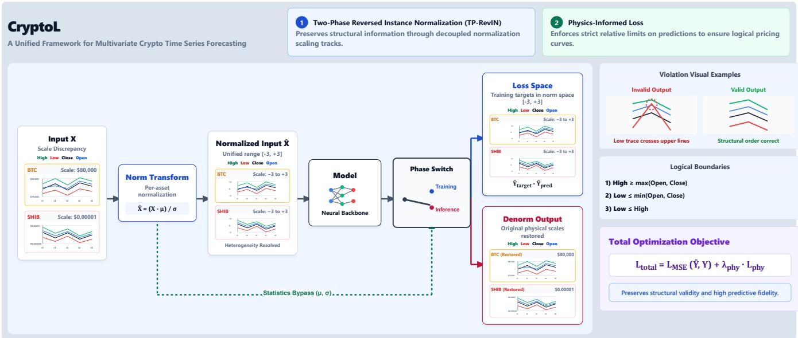
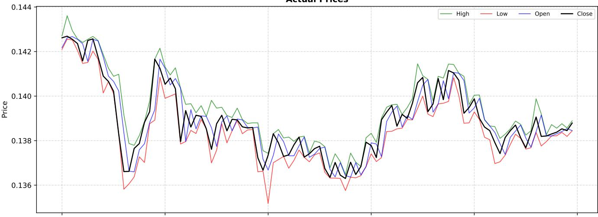
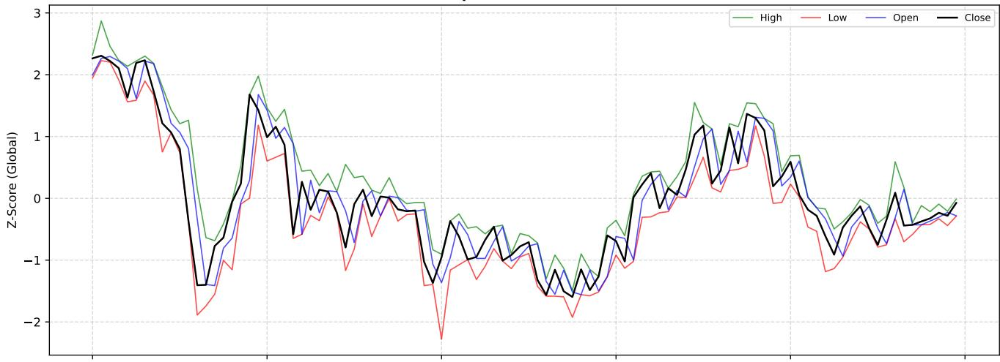
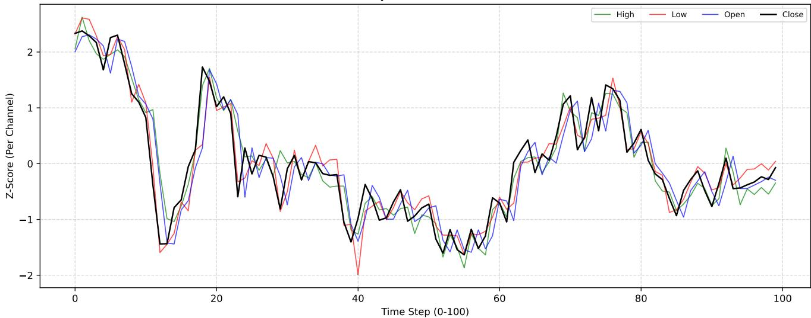

# CryptoL: Towards Scale Dominance and Physics Constraints Mitigation in Financial Multivariate Time Series Forecasting

Yalda Taheri1∗, Mohammad Hassan Heydari2∗, Armon Rasooli3†, Maryam Amirshahkarami2†, Mohammad Ebrahim Mahdavi2†, Hossein Karshenas2

1Faculty of Engineering, Azad University

2Faculty of Computer Engineering, University of Isfahan

3Department of Electrical Engineering, Iran University of Science and Technology

y.jaliltaheri@iau.ir, m.heydari@mehr.ui.ac.ir, a.rasouli@ec.iut.ac.ir

maryamamirshahkarami@mehr.ui.ac.ir, mhm.ebrh.mahdavi@gmail.com, h.karshenas@eng.ui.ac.ir

## Abstract

Cryptocurrency forecasting presents a distinctive combi- nation of extreme cross-asset scale heterogeneity, non- stationary dynamics, and structural dependencies among Open–High–Low–Close (OHLC) variables. We present Cryp- toL, a unified framework designed to address these challenges within multivariate time-series forecasting. CryptoL evaluates forecasting error in context-normalized coordinates within the RevIN pipeline, preventing inverse normalization from intro- ducing an additional squared-scale weighting into the MSE objective. We formally characterize this efect through the empirical risk and parameter-gradient geometry, establishing the conditions under which large-scale assets can dispropor- tionately influence shared-model optimization. Beyond loss- space normalization, CryptoL examines channel-independent and channel-dependent normalization for OHLC data, show- ing that a shared channel-dependent afine transformation pre- serves candle-order relations that independent channel trans- formations need not preserve. The framework further incor- porates scale-adaptive numerical stabilization to reduce dis- tortions caused by a fixed normalization constant across assets spanning many orders of magnitude, together with a soft fea- sibility loss that penalizes violations of the defining OHLC in- equalities. Experiments across heterogeneous cryptocurrency assets evaluate these components through controlled ablations and demonstrate improvements in forecasting accuracy, train- ing stability, and the frequency of financially valid OHLC pre- dictions relative to the considered baselines. CryptoL there- fore provides an integrated approach to scale-balanced opti- mization, structure-preserving normalization, numerical sta- bilization, and constraint-aware cryptocurrency forecasting.

## Introduction

Multivariate financial forecasting using open–high–low–close (OHLC) data provides a detailed representation of price evolution, but predicting these highly coupled variables jointly is challenging due to abrupt regime changes and strict physical candlestick rules (Das, Goyal, and Yadav 2026; Serdar et al. 2021; Simtharakao 2022; Wang, Huang, and Wang 2021). This task is especially demanding in cryptocurrency markets, which exhibit extreme non-stationarity and cross-asset scale heterogeneity (Simtharakao 2022; Kim et al. 2021; Berthelier et al. 2026). Models must learn simultaneously from assets ranging from fractions of a cent to tens of thousands of dollars, making joint optimization dificult when using standard forecasting backbones that struggle with temporal distribution shifts and scale diferences (Kim et al. 2021; Liu et al. 2023; Ye et al. 2024; Berthelier et al. 2026; Feng, Huang, and Krompass 2024).

While Reversible Instance Normalization (RevIN) is com-monly used to mitigate distribution shifts, its implementa- tion details have significant structural and numerical con- se uences for OHLC data (Kim et al. 2021; Simtharakao 2022; Tepelyan 2025). Channel-independent standardization can disrupt the relative ordering of candlestick channels, whereas channel-dependent normalization preserves these essential relationships. Additionally, standard RevIN evalu- ates forecasting errors in the original physical scale, which implicitly prioritizes high-value assets during shared model optimization (Kim et al. 2021; Berthelier et al. 2026; Liu et al. 2023; Ye et al. 2024; Feng, Huang, and Krompass 2024). Training directly in normalized target space which is referred to as Two-Phase RevIN (TP-RevIN), removes this scale-dependent weighting, while scale-adaptive stabiliza- tion prevents fixed normalization constants from distorting low-valued series (Berthelier et al. 2026; Feng, Huang, and Krompass 2024).

Even with proper normalization, models can still pro- duce financially inadmissible predictions that violate core candlestick inequalities (Wang, Huang, and Wang 2021; Simtharakao 2022). Previous approaches addressed this structural consistency through specialized architectures or transformations, but these are often dificult to integrate with modern time-series foundation models. To address these limitations, we present CryptoL, a unified framework that combines structure-aware normalization, scale-balanced op- timization via TP-RevIN, and an auxiliary physics-informed loss. This integrated approach discourages invalid candle- stick structures while maintaining numerical stability and forecasting accuracy across diverse asset scales.

  
Figure 1: CryptoL framework

The contributions of this work are summarized as follows:

• We systematically analyze channel-independent and channel-dependent RevIN for multivariate OHLC fore- X̂ casting, demonstrate their diferent efects on candlestick structure, and investigate fixed and scale-adaptive epsilon formulations for stable normalization across assets with extreme numerical ranges.

• We provide a theoretical and extensive empirical analysis of TP-RevIN, equivalently normalized-space MSE train- ing, showing how the location of the training objective afects scale-induced optimization imbalance in hetero- geneous cryptocurrency forecasting.

• We introduce an auxiliary physics-informed loss that pe-nalizes violations of the intrinsic OHLC ordering con- straints and compare the resulting framework with un- constrained forecasting, conventional RevIN variants, and alternative normalization approaches.

## Related Work

Multivariate financial forecasting aims to model tempo- ral, cross-variable, and cross-asset dependencies jointly (Simtharakao 2022; Das, Goyal, and Yadav 2026; Serdar et al. 2021; Tepelyan 2025). Classical approaches have used state-space models, Kalman filtering, and dynamic condi- tional correlation models, while recent methods employ re- current networks, autoencoders, Transformers, and MLP- based architectures. StockMixer models indicator, temporal, and stock-level interactions, whereas foundation-model stud- ies have shown that related multivariate inputs can improve financial forecasting (Fan and Shen 2024). DPP instead learns representations directly from decomposed candlestick charts to predict future price movements (Hung and Chen 2021).

OHLC forecastin introduces additional structural re- quirements because valid candlesticks must satisfy fixed Ŷ Ŷrelationships among the open, high, low, and close prices (Simtharakao 2022; Tepelyan 2025; Wang, Huang, and Wang 2021). Existing studies have addressed these constraints through invertible transformations that guarantee valid re- constructed outputs (Wang, Huang, and Wang 2021), as well as hybrid autoencoder and multitask architectures designed to model channel dependencies (Chakraborty, Ghosh, and Ghosh 2022). Other work has incorporated the timestamps of OHLC events to enrich the bar representation (Das, Goyal, and Yadav 2026; Serdar et al. 2021; Simtharakao 2022; Fiszeder, Fałdziński, and Molnár 2023). These studies indicate that OHLC forecasting is not a standard multivariate regression problem, since predictions must preserve the in- ternal structure of each candlestick.

Normalization methods have been widely studied for han- dling non-stationarity and distribution shift in time-series forecasting. RevIN removes instance-specific statistics before forecasting and restores them afterward (Kim et al. 2021). SAN extends this principle through local temporal-slice nor- malization (Liu et al. 2023), while FAN uses dominant fre-quency components to address both trend and seasonal non- stationarity (Ye et al. 2024). However, most normalization studies focus on temporal distribution changes and give less attention to how the normalization axis afects structured multivariate out uts such as OHLC channels.

Recent work has further distinguished representation nor- malization from the coordinate system in which the train- ing loss is evaluated. GTT trains on targets normalized using input-context statistics, thereby learning directly in a unified curve-shape space (Feng, Huang, and Krompass 2024). A comparative study of normalization in foundation models showed that MSE and MAE remain scale sensitive when predictions are denormalized before loss calculation (Ahmed et al. 2026). Another recent analysis of RevIN com-pared conventional and normalized backpropagation through normalized MSE and reported benefits for heterogeneous- scale data (Berthelier et al. 2026). Building on these directions, our work jointly studies OHLC-aware normalization, normalized-space optimization, adaptive numerical sta- bilization, and auxiliary enforcement of candlestick validity.

## Methodology

## Preliminaries and Problem Definition

Let

$$
\begin{array} { r } { \begin{array} { c } { \mathcal { D } = \{ ( \mathbf { X } _ { n } , \mathbf { Y } _ { n } ) \} _ { n = 1 } ^ { N } , } \\ { \mathbf { X } _ { n } \in \mathbb { R } ^ { L \times 4 } , \qquad \mathbf { Y } _ { n } \in \mathbb { R } ^ { H \times 4 } , } \end{array} } \end{array}\tag{1}
$$

denote a collection of cryptocurrency forecasting samples, where ${ \bf X } _ { n }$ is an observed context window of length L and ${ \bf Y } _ { n }$ is the corresponding forecast horizon of length H. The four channels are ordered as

$$
{ \bf X } _ { n , t , : } = \left( O _ { n , t } , H _ { n , t } , L _ { n , t } , C _ { n , t } \right) ,\tag{2}
$$

representing the open, high, low, and close prices, respec- tively. A valid OHLC observation belongs to the feasible set

$$
\begin{array} { r } { \Omega _ { \mathrm { O H L C } } = \{ ( O , H , L , C ) \in \mathbb { R } ^ { 4 } : H \geq \operatorname* { m a x } ( O , C ) , } \\ { L \leq \operatorname* { m i n } ( O , C ) \} . } \end{array}\tag{3}
$$

Given a forecasting model $f _ { \theta }$ , the objective is to estimate

$$
{ \widehat { \mathbf { Y } } } _ { n } = f _ { \pmb { \theta } } ( \mathbf { X } _ { n } )\tag{4}
$$

across cryptocurrencies whose numerical scales may difer by several orders of magnitude, while maintaining stable optimization and reducing violations of the constraints in Equation (3). All normalization statistics are computed ex-clusively from the observed context $\mathbf { X } _ { n }$ and are reused to normalize the associated target and restore the prediction to its original physical scale.

## Channel-wise and Dynamic-Epsilon Normalization

We investigate two choices for the axes over which RevIN statistics are computed. In channel-independent (CI) nor-malization, each OHLC channel is normalized using its own context statistics. For channel $c \in \{ O , H , L , C \}$ , these statis- tics are

$$
\begin{array} { r l } & { \displaystyle \mu _ { n , c } ^ { \mathrm { { C I } } } = \frac { 1 } { L } \sum _ { t = 1 } ^ { L } X _ { n , t , c } , } \\ & { \displaystyle v _ { n , c } ^ { \mathrm { { C I } } } = \frac { 1 } { L } \sum _ { t = 1 } ^ { L } \left( X _ { n , t , c } - \mu _ { n , c } ^ { \mathrm { { C I } } } \right) ^ { 2 } , } \end{array}\tag{5}
$$

with efective scale

$$
s _ { n , c } ^ { \mathrm { C I } } = \sqrt { v _ { n , c } ^ { \mathrm { C I } } + \epsilon _ { n , c } } .\tag{6}
$$

The context and target are then transformed as

$$
\begin{array} { r } { \widetilde { X } _ { n , t , c } ^ { \mathrm { C I } } = \frac { X _ { n , t , c } - \mu _ { n , c } ^ { \mathrm { C I } } } { s _ { n , c } ^ { \mathrm { C I } } } , } \\ { \widetilde { Y } _ { n , \tau , c } ^ { \mathrm { C I } } = \frac { Y _ { n , \tau , c } - \mu _ { n , c } ^ { \mathrm { C I } } } { s _ { n , c } ^ { \mathrm { C I } } } . } \end{array}\tag{7}
$$

CI normalization standardizes open, high, low, and close separately. Because the four channels undergo diferent afine transformations, their original ordering is not mathematically guaranteed to remain unchanged in normalized space.

In channel-dependent (CD) normalization, one shared mean and variance are computed jointly over the temporal and channel dimensions:

$$
\begin{array} { l } { \displaystyle \mu _ { n } ^ { \mathrm { { C D } } } = \frac { 1 } { 4 L } \sum _ { t = 1 } ^ { L } \sum _ { c = 1 } ^ { 4 } X _ { n , t , c } , } \\ { \displaystyle v _ { n } ^ { \mathrm { { C D } } } = \frac { 1 } { 4 L } \sum _ { t = 1 } ^ { L } \sum _ { c = 1 } ^ { 4 } \left( X _ { n , t , c } - \mu _ { n } ^ { \mathrm { { C D } } } \right) ^ { 2 } . } \end{array}\tag{8}
$$

The corresponding efective scale is

$$
s _ { n } ^ { \mathrm { C D } } = \sqrt { v _ { n } ^ { \mathrm { C D } } + \epsilon _ { n } } ,\tag{9}
$$

and the same transformation is applied to all OHLC channels:

$$
\begin{array} { r } { \widetilde { X } _ { n , t , c } ^ { \mathrm { C D } } = \frac { X _ { n , t , c } - \mu _ { n } ^ { \mathrm { C D } } } { s _ { n } ^ { \mathrm { C D } } } , } \\ { \widetilde { Y } _ { n , \tau , c } ^ { \mathrm { C D } } = \frac { Y _ { n , \tau , c } - \mu _ { n } ^ { \mathrm { C D } } } { s _ { n } ^ { \mathrm { C D } } } . } \end{array}\tag{10}
$$

Unlike CI, CD applies one common afine transformation to the complete OHLC sample and therefore retains the relative organization of the candlestick channels. Further mathemat- ical proofs and analysis of order preservation under CD and CI normalization are provided in Appendix B.

We additionally examine fixed and dynamic formulations of the stabilizing term used in Equations (6) and (9). The fixed formulation is

$$
\epsilon ^ { \mathrm { f i x } } = 1 0 ^ { - 5 } ,\tag{11}
$$

whereas the dynamic formulation adapts the stabilizer to the magnitude of the context mean:

$$
\epsilon ^ { \mathrm { d y n } } = 1 0 ^ { - 5 } \left( \mu ^ { 2 } + 1 0 ^ { - 1 2 } \right) .\tag{12}
$$

For CI normalization, $\mu$ denotes the corresponding chan- nelwise mean; for CD normalization, it denotes the shared sample-level mean. Dynamic epsilon is designed to prevent a fixed numerical constant from having a disproportionately large efect on cryptocurrencies with very small quoted val- ues. Additional mathematical analysis of the fixed and dy- namic epsilon formulations is provided in Appendix B.

## Two-Phase RevIN and Scale-Balanced Optimization

Let the normalization statistics selected in the previous sub- section be denoted by $\mu _ { n } \in \mathbb { R } ^ { 4 }$ and $\mathbf { S } _ { n } \in \mathbb { R } ^ { 4 \times 4 }$ , where $\mathbf { S } _ { n }$ is a positive diagonal channel-scale matrix. Under CD nor- malization, ${ \bf S } _ { n } = s _ { n } { \bf I } _ { 4 } ;$ under CI normalization, its diagonal entries contain the channelwise scales. After normalizing the observed context and target, we write

<table><tr><td rowspan="2">Time Frame</td><td rowspan="2">Horizon</td><td rowspan="2">Norm Technique</td><td colspan="3">Time-MoE</td><td colspan="3">Timer-XL</td><td colspan="3">Timer</td></tr><tr><td>MSE</td><td>MAE</td><td>PHY</td><td>MSE</td><td>MAE</td><td>PHY</td><td>MSE</td><td>MAE</td><td>PHY</td></tr><tr><td rowspan="9">5m</td><td rowspan="9">5</td><td>w/o RevIN</td><td>5.7e+8</td><td>6325.3</td><td>1.312</td><td>5.2e+8</td><td>6571.64</td><td>5.536</td><td>6.15e+8</td><td>6548.55</td><td>15.154</td></tr><tr><td>CI RevIN</td><td>9890.9</td><td>19.03</td><td>0.0040</td><td>4387.64</td><td>11.66</td><td>0.012</td><td>4722.96</td><td>12.37</td><td>0.439</td></tr><tr><td>CD RevIN</td><td>9868.58</td><td>18.93</td><td>0.0076</td><td>4485.7</td><td>11.81</td><td>0.0050</td><td>5013.64</td><td>12.70</td><td>1.71</td></tr><tr><td>Two-Phase CI RevIN</td><td>6610.0</td><td>15.25</td><td>0.001</td><td>4584.75</td><td>12.34</td><td>0.0005</td><td>4510.90</td><td>12.14</td><td>0.278</td></tr><tr><td>Two-Phase CD RevIN</td><td>7480.2</td><td>16.31</td><td>0.00049</td><td>4811.0</td><td>12.72</td><td>0.0004</td><td>4632.05</td><td>12.30</td><td>1.09</td></tr><tr><td>w/o RevIN</td><td>5.7e+8</td><td>6328.50</td><td>1.827</td><td>5.5e+8</td><td>6572.12</td><td>5.532</td><td>6.15e+8</td><td>6548.99</td><td>9.523</td></tr><tr><td>CI RevIN</td><td>2.20e+4</td><td>28.63</td><td>0.0046</td><td>1.05e+4</td><td>18.54</td><td>0.0159</td><td>1.06e+4</td><td>18.69</td><td>0.915</td></tr><tr><td>CD RevIN</td><td>2.23e+4</td><td>28.62</td><td>0.0025</td><td>1.07e+4</td><td>18.71</td><td>0.0061</td><td>1.19e+4</td><td>19.73</td><td>6.285</td></tr><tr><td>Two-Phase CI RevIN Two-Phase CD RevIN</td><td>1.53e+4 1.95e+4</td><td>23.55 26.83</td><td>0.012 0.0010</td><td>1.02e+4 1.01e+4</td><td>18.39 18.32</td><td>0.0003 0.0002</td><td>9949.94 1.04e+4</td><td>18.09 18.54</td><td>0.390 4.36</td></tr><tr><td rowspan="9"></td><td rowspan="9"></td><td></td><td></td><td></td><td></td><td></td><td></td><td></td><td></td><td></td><td></td></tr><tr><td>w/o RevIN</td><td>7.73e+8</td><td>8438.67</td><td>1.271</td><td>7.66e+8</td><td>8367.45</td><td>0.501</td><td>7.71e+8</td><td>8408.11</td><td>5.717</td></tr><tr><td>CI RevIN</td><td>6.47e+4</td><td>54.60</td><td>0.0685</td><td>3.35e+4</td><td>37.58</td><td>0.063</td><td>3.22e+4</td><td>36.13</td><td>1.012</td></tr><tr><td>CD RevIN</td><td>6.33e+4</td><td>54.20</td><td>0.0307</td><td>3.38e+4</td><td>37.97</td><td>0.081</td><td>3.24e+4</td><td>36.39</td><td>3.957</td></tr><tr><td>Two-Phase CI RevIN Two-Phase CD RevIN</td><td>4.67e+4 5.41e+4</td><td>45.45 49.12</td><td>0.011</td><td>3.11e+4</td><td>36.04 36.26</td><td>0.003 0.00074</td><td>3.03e+4 1.4e+4</td><td>34.93 18.54</td><td>0.678</td></tr><tr><td></td><td></td><td></td><td>0.0076</td><td>3.11e+4</td><td></td><td></td><td></td><td></td><td>4.365</td></tr><tr><td>w/o RevIN</td><td>7.73e+8 1.56e+5</td><td>8442.13 86.77</td><td>1.553</td><td>7.68e+8</td><td>8383.54 59.11</td><td>0.606</td><td>7.71e+8</td><td>8412.84</td><td>5.542</td></tr><tr><td>CI RevIN CD RevIN</td><td>1.55e+5</td><td>87.05</td><td>0.0701 0.0443</td><td>8.29e+4 8.49e+4</td><td>60.007</td><td>0.228 0.163</td><td>7.66e+4 8.51e+4</td><td>57.00 59.75</td><td>3.238</td></tr><tr><td>Two-Phase CI RevIN</td><td>1.14e+5</td><td>72.48</td><td>0.12</td><td>7.34e+4</td><td>55.10</td><td>0.026</td><td>6.99e+4</td><td>53.38</td><td>20.67 1.123</td></tr><tr><td></td><td>Two-Phase CD RevIN</td><td>1.37e+5</td><td>80.14</td><td>0.0078</td><td>7.24e+4</td><td>54.71</td><td>0.00052</td><td>7.36e+4</td><td>55.11</td><td>15.002</td></tr></table>

Table 1: Comparison of Diferent RevIN techniques. Lower numbers indicate lower errors and better performances. All of the experiments in this table are done using training with MSE only. Best metrics in each category are colored with Red and Second best metrics are colored with Blue.
<table><tr><td rowspan="2">Model</td><td rowspan="2">Horizon</td><td colspan="3">FAN</td><td colspan="3">SAN</td><td colspan="3">TP-RevIN</td></tr><tr><td>MAE</td><td>MAPE</td><td>PHY</td><td>MAE</td><td>MAPE</td><td>PHY</td><td>MAE</td><td>MAPE</td><td>PHY</td></tr><tr><td rowspan="3">Time-MoE</td><td>5</td><td>284.19</td><td>1.63e+4</td><td>181.12</td><td>34.99</td><td>1.45e+4</td><td>0.32</td><td>68.70</td><td>1.31</td><td>0.068</td></tr><tr><td>15</td><td>285.92</td><td>1.92e+3</td><td>187.11</td><td>55.89</td><td>1.52e+3</td><td>0.15</td><td>108.05</td><td>2.07</td><td>0.91</td></tr><tr><td>30</td><td>286.15</td><td>2.6e+4</td><td>183.43</td><td>83.23</td><td>5.21e+3</td><td>0.50</td><td>131.45</td><td>2.52</td><td>2.68</td></tr><tr><td rowspan="3">Timer-XL</td><td>5</td><td>113.85</td><td>1.67e+4</td><td>12.68</td><td>36.03</td><td>2.40e+4</td><td>0.84</td><td>50.93</td><td>0.95</td><td>0.01</td></tr><tr><td>15</td><td>123.66</td><td>8.0e+4</td><td>11.03</td><td>56.75</td><td>4.84e+3</td><td>1.46</td><td>80.36</td><td>1.49</td><td>0.016</td></tr><tr><td>30</td><td>125.46</td><td>2.6e+5</td><td>11.04</td><td>81.05</td><td>9.58e+3</td><td>1.29</td><td>106.21</td><td>1.97</td><td>0.0097</td></tr></table>

Table 2: Comparison of Models with FAN, SAN, and TP-RevIN Normalization Techniques. Experiments are done under 1h time frame. For TP-RevIN, here we use dynamic epsilon.

$$
\begin{array} { r } { \widetilde { { \mathbf { X } } } _ { n } = \left( { \mathbf { X } } _ { n } - { \mathbf { 1 } } _ { L } { \pmb { \mu } } _ { n } ^ { \top } \right) { \mathbf { S } } _ { n } ^ { - 1 } , \qquad { \mathbf { Z } } _ { n } = \left( { \mathbf { Y } } _ { n } - { \mathbf { 1 } } _ { H } { \pmb { \mu } } _ { n } ^ { \top } \right) { \mathbf { S } } _ { n } ^ { - 1 } , } \\ { ( 1 3 ) ^ { \top } { \mathbf { \Sigma } } } \end{array}
$$

where the statistics are computed exclusively from $\mathbf { X } _ { n } .$ . The forecasting backbone produces a normalized prediction

$$
\widehat { \mathbf { Z } } _ { n } = f _ { \pmb { \theta } } \left( \widetilde { \mathbf { X } } _ { n } \right) ,\tag{14}
$$

and the corresponding physical-scale prediction is recovered as

$$
\begin{array} { r } { \widehat { { \bf Y } } _ { n } = { \bf 1 } _ { H } \pmb { \mu } _ { n } ^ { \top } + \widehat { { \bf Z } } _ { n } { \bf S } _ { n } . } \end{array}\tag{15}
$$

Conventional RevIN-based training commonly restores the prediction through Equation (15) before evaluating MSE.

We refer to this objective as original-space RevIN training:

$$
\mathcal { L } _ { \mathrm { R } } \left( \pmb { \theta } \right) = \frac { 1 } { 2 N } \sum _ { n = 1 } ^ { N } \left\| \widehat { \mathbf { Y } } _ { n } - \mathbf { Y } _ { n } \right\| _ { F } ^ { 2 } .\tag{16}
$$

In contrast, Two-Phase RevIN (TP-RevIN) separates the nor-malized training phase from the physical-scale inference phase. During training, the objective is evaluated directly between the normalized prediction and normalized target:

$$
\mathcal { L } _ { \mathrm { T P } } \left( \pmb { \theta } \right) = \frac { 1 } { 2 N } \sum _ { n = 1 } ^ { N } \left. \widehat { \mathbf { Z } } _ { n } - \mathbf { Z } _ { n } \right. _ { F } ^ { 2 } .\tag{17}
$$

Inverse normalization is therefore required for inference and reporting, but it does not participate in the training objective.

Scale-induced reweighting in original-space RevIN. Let rvec(·) stack the rows of an $H \times 4$ matrix, and define

$$
\mathbf { D } _ { n } = \mathbf { I } _ { H } \otimes \mathbf { S } _ { n } \in \mathbb { R } ^ { 4 H \times 4 H } .\tag{18}
$$

Define the vectorized normalized residual and its parameter Jacobian as

$$
\mathbf { e } _ { n } \left( \theta \right) = \mathrm { r v e c } \left( \widehat { \mathbf { Z } } _ { n } - \mathbf { Z } _ { n } \right) , \qquad \mathbf { J } _ { n } \left( \theta \right) = \frac { \partial \mathrm { r v e c } \left( \widehat { \mathbf { Z } } _ { n } \right) } { \partial \theta } \in \mathbb { R } ^ { 4 H \times }\tag{19}
$$

Proposition 1. Assume that $\pmb { \mu } _ { n }$ and ${ \bf D } _ { n }$ are computed from the observed context and are inde endent of θ. Then ori inal-space RevIN MSE satisfies

$$
\mathcal { L } _ { \mathrm { R } } \left( \pmb { \theta } \right) = \frac { 1 } { 2 N } \sum _ { n = 1 } ^ { N } \mathbf { e } _ { n } ^ { \top } \mathbf { D } _ { n } ^ { 2 } \mathbf { e } _ { n } ,\tag{20}
$$

whereas TP-RevIN satisfies Equation (17). Their parameter gradients are

$$
\nabla _ { \pmb { \theta } } \mathcal { L } _ { \mathrm { R } } = \frac { 1 } { N } \sum _ { n = 1 } ^ { N } \mathbf { J } _ { n } ^ { \top } \mathbf { D } _ { n } ^ { 2 } \mathbf { e } _ { n } ,\tag{21}
$$

and

$$
\nabla _ { \pmb \theta } \mathcal { L } _ { \mathrm { T P } } = \frac { 1 } { N } \sum _ { n = 1 } ^ { N } \mathbf { J } _ { n } ^ { \top } \mathbf { e } _ { n } .\tag{22}
$$

Consequently, original-space RevIN introduces an explicit scale-dependent weighting into both the empirical objective and the shared parameter update, while TP-RevIN removes this weighting.

Proof. From Equations (13) and (15),

$$
\begin{array} { c } { \operatorname { r v e c } \left( \widehat { \mathbf { Y } } _ { n } - { \mathbf { Y } } _ { n } \right) = { \mathbf { D } } _ { n } \operatorname { r v e c } \left( \widehat { \mathbf { Z } } _ { n } - { \mathbf { Z } } _ { n } \right) } \\ { = { \mathbf { D } } _ { n } \mathbf { e } _ { n } . } \end{array}\tag{23}
$$

Therefore,

$$
\left\| { \widehat { \mathbf { Y } } } _ { n } - \mathbf { Y } _ { n } \right\| _ { F } ^ { 2 } = \mathbf { e } _ { n } ^ { \top } \mathbf { D } _ { n } ^ { \top } \mathbf { D } _ { n } \mathbf { e } _ { n } .\tag{24}
$$

Because ${ \bf D } _ { n }$ is diagonal and positive, ${ \bf D } _ { n } ^ { \top } { \bf D } _ { n } = { \bf D } _ { n } ^ { 2 }$ , which proves Equation (20).

Diferentiating the per-sample term in Equation (20) and treating ${ \bf D } _ { n }$ as constant with respect to θ gives

$$
\nabla _ { \pmb { \theta } } \left( \frac { 1 } { 2 } \mathbf { e } _ { n } ^ { \top } \mathbf { D } _ { n } ^ { 2 } \mathbf { e } _ { n } \right) = \mathbf { J } _ { n } ^ { \top } \mathbf { D } _ { n } ^ { 2 } \mathbf { e } _ { n } .\tag{25}
$$

Summing over all samples yields Equation (21). Similarly, diferentiating the TP-RevIN term $\frac { 1 } { 2 } \mathbf { e } _ { n } ^ { \top } \mathbf { e } _ { n }$ gives $\mathbf { J } _ { n } ^ { \top } \mathbf { e } _ { n } .$ , establishing Equation (22). □

For CD normalization, where ${ \bf D } _ { n } = s _ { n } { \bf I } _ { 4 H }$ , Proposition 1 reduces to

$$
\mathcal { L } _ { \mathrm { R } } = \frac { 1 } { 2 N } \sum _ { n = 1 } ^ { N } s _ { n } ^ { 2 } \left\| \mathbf { e } _ { n } \right\| _ { 2 } ^ { 2 } ,\tag{26}
$$

and

$$
\nabla _ { \pmb { \theta } } \mathcal { L } _ { \mathrm { R } } = \frac { 1 } { N } \sum _ { n = 1 } ^ { N } s _ { n } ^ { 2 } \mathbf { J } _ { n } ^ { \top } \mathbf { e } _ { n } .\tag{27}
$$

Thus two samples with comparable normalized residuals and comparable model sensitivity contribute to the original-space update in proportion to the squares of their context scales. This is the precise sense in which scale dominance arises in RevIN-based MSE training. Large numerical scale alone does not determine the complete gradient, since the con- tribution also depends on ${ \bf J } _ { n } ^ { \top } { \bf e } _ { n } ;$ however, the factor $s _ { n } ^ { 2 }$ is an unavoidable multiplicative component of the objective .whenever the loss is evaluated after inverse normalization.

The same result can be expressed at the asset level. Let $\pi _ { a }$ denote the sampling probability of asset $^ { a , }$ and define its normalized forecasting risk as

$$
R _ { a } ( \pmb \theta ) = \frac { 1 } { 2 } \mathbb { E } [ \| \mathbf { e } ( \pmb \theta ) \| _ { 2 } ^ { 2 } | a ] .\tag{28}
$$

If asset a has approximately constant context scale $s _ { a }$ , then original-space RevIN minimizes

$$
R _ { \mathrm { R } } \left( \pmb { \theta } \right) = \sum _ { a } \pi _ { a } s _ { a } ^ { 2 } R _ { a } \left( \pmb { \theta } \right) ,\tag{29}
$$

whereas TP-RevIN minimizes

$$
R _ { \mathrm { T P } } \left( \pmb { \theta } \right) = \sum _ { a } \pi _ { a } R _ { a } \left( \pmb { \theta } \right) .\tag{30}
$$

Up to a positive global constant, Equation (29) is equivalent to replacing the declared asset distribution $\pi _ { a }$ with

$$
q _ { a } = \frac { \pi _ { a } s _ { a } ^ { 2 } } { \sum _ { b } \pi _ { b } s _ { b } ^ { 2 } } .\tag{31}
$$

Original-space RevIN therefore changes the efective opti- mization priority toward assets with larger context scales. TP-RevIN preserves the declared sampling weights and re- moves this implicit scale-dependent redistribution.

This distinction is particularly important for cryptocur- rency panels, where assets can span many orders of magni- tude. Under comparable normalized forecasting errors and model sensitivities, a high-scale asset can dominate the ag- gregate parameter update even when low-scale assets are sampled equally often. TP-RevIN does not make all as- sets equally dificult or guarantee equal gradient norms; dif- ferences in forecastability, residual structure, sampling fre- quency, and model sensitivity remain. It specifically removes the multiplicative weighting introduced solely by the RevIN scale and thereby yields a training objective that is neutral to positive afine changes in the numerical units of each asset. Further proofs based on Jacobian and Hessian analyses are provided in Appendix B.

## Normalized-Space OHLC Constraint Loss

Under TP-RevIN, both the forecasting objective and the auxiliary OHLC constraint loss are evaluated in normalized co- ordinates. Let $\widehat { \mathbf { Z } } _ { n }$ denote the normalized prediction, with components $\widehat { O } _ { n , \tau } , \widehat { H } _ { n , \tau } , \widehat { L } _ { n , \tau }$ , and ${ \widehat { C } } _ { n , \tau }$ at forecast step τ . Defining $[ x ] _ { + } = \operatorname* { m a x } ( 0 , x )$ , the normalized-space constraint

<table><tr><td rowspan="2">Model</td><td rowspan="2">Coin</td><td colspan="2">RevIN</td><td colspan="2">TP-RevIN</td></tr><tr><td>Fixed Epsilon</td><td>Dynamic Epsilon</td><td>Fixed Epsilon</td><td>Dynamic Epsilon</td></tr><tr><td rowspan="5">Time-MoE</td><td>BTC</td><td>1.15 / 2.38</td><td>1.16 / 2.38</td><td>1.12 / 2.23</td><td>1.16 / 2.27</td></tr><tr><td>ETH</td><td>1.94 / 4.20</td><td>1.96 / 4.16</td><td>1.85 / 3.58</td><td>1.94 / 3.59</td></tr><tr><td>SHIB</td><td>17362.6 / 12894.9</td><td>1.89 / 4.12</td><td>67.24 / 73.13</td><td>1.87 / 3.51</td></tr><tr><td>DOGE</td><td>2.19 / 4.71</td><td>2.21 / 4.68</td><td>2.07 / 4.26</td><td>2.18 / 4.17</td></tr><tr><td>ADA</td><td>2.47 / 5.61</td><td>2.48 / 5.61</td><td>2.37 / 4.93</td><td>2.47 / 4.95</td></tr><tr><td rowspan="5">Timer-XL</td><td>BTC</td><td>0.93 / 1.85</td><td>0.94 / 1.83</td><td>0.93 / 1.72</td><td>0.91 / 1.73</td></tr><tr><td>ETH</td><td>1.61 / 3.19</td><td>1.65 / 3.26</td><td>1.67 / 2.81</td><td>1.61 / 2.88</td></tr><tr><td>SHIB</td><td>181.5 / 3003.3</td><td>1.48 / 3.20</td><td>71.2 / 146.3</td><td>1.40 / 2.74</td></tr><tr><td>DOGE</td><td>1.72 / 3.74</td><td>1.71 / 3.69</td><td>1.73 / 3.31</td><td>1.67 / 3.25</td></tr><tr><td>ADA</td><td>1.85 / 4.06</td><td>1.86 / 4.13</td><td>1.82 / 3.69</td><td>1.81 / 3.81</td></tr><tr><td rowspan="5">Timer</td><td>BTC</td><td>0.88 / 1.77</td><td>0.88 / 1.80</td><td>0.85 / 1.68</td><td>0.85 / 1.65</td></tr><tr><td>ETH</td><td>1.44 / 3.02</td><td>1.45 / 3.00</td><td>1.40 / 2.70</td><td>1.39 / 2.65</td></tr><tr><td>SHIB</td><td>471.4 / 5346.9</td><td>1.45 / 2.97</td><td>179.0 / 355.4</td><td>1.38 / 2.72</td></tr><tr><td>DOGE</td><td>1.63 / 3.48</td><td>1.64 / 3.42</td><td>1.58 / 3.20</td><td>1.56 / 3.12</td></tr><tr><td>ADA</td><td>1.89 / 4.13</td><td>1.90 / 3.94</td><td>1.87 / 3.74</td><td>1.86 / 3.80</td></tr></table>

Table 3: Comparison of Fixed vs. Dynamic Epsilon Normalization (Values report Horizon 5 / 30 for MAPE).

loss is

$$
\begin{array} { r l r } {  { \mathcal { L } _ { \mathrm { p h y } } = \frac { 1 } { N H } \sum _ { n = 1 } ^ { N } \sum _ { \tau = 1 } ^ { H } \Bigl ( [ \widehat { O } _ { n , \tau } - \widehat { H } _ { n , \tau } ] _ { + } + [ \widehat { C } _ { n , \tau } - \widehat { H } _ { n , \tau } ] _ { + } } } \\ & { } & { + [ \widehat { L } _ { n , \tau } - \widehat { O } _ { n , \tau } ] _ { + } + [ \widehat { L } _ { n , \tau } - \widehat { C } _ { n , \tau } ] _ { + } } \\ & { } & { + [ \widehat { L } _ { n , \tau } - \widehat { H } _ { n , \tau } ] _ { + } \Bigr ) . } \end{array}\tag{32}
$$

The complete TP-RevIN training objective is therefore

$$
\mathcal { L } _ { \mathrm { t o t a l } } = \lambda _ { \mathrm { M S E } } \mathcal { L } _ { \mathrm { T P } } + \lambda _ { \mathrm { p h y } } \mathcal { L } _ { \mathrm { p h y } } ,\tag{33}
$$

where both terms are computed before inverse normalization. This design prevents the auxiliary loss from reintroducing the scale-dependent weighting removed by TP-RevIN. Ad- ditional mathematical results concerning normalized-space OHLC constraints are provided in Appendix B.

## CryptoL Framework

CryptoL combines dynamic-epsilon normalization, TP- RevIN, and the normalized-space OHLC constraint loss within a unified multivariate cryptocurrency forecasting framework. The input context and target are first transformed using either CI or CD statistics together with the dynamic epsilon in Equation (12). The forecasting backbone predicts the future sequence in normalized coordinates, where both the MSE objective and the auxiliary constraint loss are evaluated according to Equation (33). Inverse normalization is applied only after optimization to recover predictions in their original price units.

The selection between CI and CD remains configurable because the two schemes provide diferent practical trade- ofs. CD preserves OHLC ordering under normalization, whereas CI can provide stronger channelwise forecasting accuracy. Accordingly, both CI and CD variants of Cryp- toL achieve low physical-consistency errors when combined with the constraint loss, allowing the normalization axis to be selected according to the dataset, backbone, and target evaluation criterion.

## Experiments

## Dataset

We construct a large-scale cryptocurrency forecasting dataset containing approximately 15.5 million historical OHLC observations from 16 assets. The data were collected through the Binance API at multiple temporal resolutions, enabling evaluation across diferent forecasting time frames and hori- zons. The selected assets exhibit extreme scale heterogene- ity, with quoted values ranging from approximately $\mathrm { \overline { { 1 0 } } } ^ { - 7 }$ for low-valued assets such as PEPE to above $1 0 ^ { 5 }$ for high- valued assets such as BTC. This broad dynamic range pro- vides a suitable setting for evaluating normalization behav- ior, cross-asset learning, and the scale-balancing properties of TP-RevIN. Complete dataset details, including temporal coverage, row counts, and asset-specific volatility distribu- tions, are provided in Appendix C.

## Training Configuration

We evaluate CryptoL using three decoder-only time-series forecasting backbones: Timer (Liu et al. 2024) , Timer-XL (Liu et al. 2025), and Time-MoE (Shi et al. 2025). All mod-els are optimized using AdamW with a linearly scheduled learning rate initialized at $1 0 ^ { - 5 }$ . Each model is trained for one epoch using 90% of the available data, while the remaining 10% is reserved for evaluation. All reported forecasting metrics are computed after restoring predictions to the origi- nal physical space, ensuring a consistent and fair comparison among normalization and training configurations.

<table><tr><td rowspan="2">Model</td><td rowspan="2">Time Frame</td><td rowspan="2">Horizon</td><td colspan="2">RevIN (CI)</td><td colspan="2">TP-RevIN (CI)</td><td colspan="2">TP-RevIN (CD)</td><td colspan="2">Unconstrained Space</td></tr><tr><td>MAE</td><td>PHY</td><td>MAE</td><td>PHY</td><td>MAE</td><td>PHY</td><td>MAE</td><td>PHY</td></tr><tr><td rowspan="7">Time-MoE</td><td rowspan="2">30m</td><td>5</td><td>47.08</td><td>0.047</td><td>45.90</td><td>1.0e-6</td><td>49.82</td><td>1.6e-3</td><td>459.66</td><td>0.0</td></tr><tr><td>15</td><td>78.63</td><td>2.20</td><td>72.64</td><td>5.0e-7</td><td>80.99</td><td>1.5e-3</td><td>452.61</td><td>0.0</td></tr><tr><td rowspan="2"></td><td>30</td><td>100.07</td><td>6.08</td><td>91.81</td><td>3.6e-5</td><td>101.23</td><td>7.9e-4</td><td>517.42</td><td>0.0</td></tr><tr><td>5</td><td>68.28</td><td>0.161</td><td>66.91</td><td>1.0e-6</td><td>69.25</td><td>2.7e-3</td><td>723.18</td><td>0.0</td></tr><tr><td rowspan="2">1h</td><td>15</td><td>112.06</td><td>1.14</td><td>109.06</td><td>8.0e-6</td><td>117.69</td><td>7.8e-3</td><td>764.56</td><td>0.0</td></tr><tr><td>30</td><td>117.92</td><td>6.14</td><td>130.28</td><td>4.3e-5</td><td>141.20</td><td>8.9e-3</td><td>768.84</td><td>0.0</td></tr><tr><td rowspan="6">Timer-XL</td><td rowspan="2">30m</td><td>5</td><td>34.26</td><td>5.4e-2</td><td>34.77</td><td>2.0e-6</td><td>37.09</td><td>2.9e-5</td><td>3307.53</td><td>0.0</td></tr><tr><td>15</td><td>55.07</td><td>2.4e-1</td><td>54.04</td><td>1.9e-3</td><td>55.71</td><td>2.0e-6</td><td>1285.78</td><td>0.0</td></tr><tr><td rowspan="4"></td><td>30</td><td>73.50</td><td>1.6e-1</td><td>71.19</td><td>6.9e-4</td><td>106.98</td><td>2.0e-4</td><td>1520.53</td><td>0.0</td></tr><tr><td>5</td><td>52.15</td><td>8.7e-2</td><td>52.10</td><td>1.0e-7</td><td>54.91</td><td>7.4e-5</td><td>1492.80</td><td>0.0</td></tr><tr><td>15</td><td>85.10</td><td>4.4e-1</td><td>82.53</td><td>9.6e-5</td><td>84.85</td><td>4.5e-4</td><td>801.78</td><td>0.0</td></tr><tr><td>30</td><td>110.69</td><td>3.1e-1</td><td>105.5</td><td>5.0e-7</td><td>106.98</td><td>2.0e-4</td><td>1247.36</td><td>0.0</td></tr></table>

Table 4: Analysis of training models using auxiliary physics loss on diferent methods

Each experiment is conducted separately for a specific time frame and forecast horizon. Within each configuration, how- ever, the model is trained jointly on all 16 assets rather than independently for each cryptocurrency. This protocol evalu- ates whether a shared forecasting backbone can learn trans- ferable temporal and cross-asset patterns despite substantia diferences in asset scale, volatility, and market behavior.

## Hardware and Software Environment

All experiments are conducted on eight TPU v5e acceler- ators, each providing 16 GB of accelerator memory, for a total distributed memory capacity of 128 GB. The implementation is developed using JAX (Bradbury et al. 2018) and Flax (Heek et al. 2024).1 Both model parameters and intermediate activations are represented in FP32 throughout training.

To distribute the training workload, we employ fully sharded data-parallel training across all eight TPUs. The model parameters, optimizer states, and input data are sharded over the complete accelerator mesh, reducing the memory allocated to each device and enabling eficient train- ing of the selected forecasting backbones.

## Results and Analysis

We begin by evaluating the predictive performance of difer- ent normalization strategies, as summarized in Table 1 and Table 2. Without any RevIN (Kim et al. 2021), the models struggle to converge efectively, resulting in extremely high

MSE values due to the immense scale discrepancies among diferent cryptocurrency assets. Introducing standard CI and CD RevIN significantly mitigates this problem. However, TP- RevIN (Feng, Huang, and Krompass 2024; Berthelier et al. 2026) formulations consistently yield further reductions in both MSE and MAE across various forecasting horizons and model backbones. When comparing TP-RevIN to alternative temporal normalization schemes such as FAN (Ye et al. 2024) and SAN (Liu et al. 2023) in Table 2, we observe that both FAN and SAN yield substantially higher MAE and Mean Ab- solute Percentage Error (MAPE) values. This indicates that while those methods are designed to handle non-stationarity, they struggle to balance the extreme cross-asset scale dif- ferences present in joint cryptocurrency panels. In contrast, TP-RevIN preserves representation stability across diverse scales and maintains lower physical violation (PHY) rates.

To evaluate the impact of numerical stabilization across assets of varying price scales, we analyze the fixed versus dynamic epsilon formulations in Table 3. For high-value as- sets such as Bitcoin (BTC) and Ethereum (ETH), the choice between a fixed and dynamic stabilizer (ϵ) has negligible impact on the forecasting performance. However, for low- value assets like Shiba Inu (SHIB), which has an average price scale on the order of $1 0 ^ { - 5 }$ , the fixed epsilon stabilizer $\dot { ( \epsilon ^ { \mathrm { { f i x } } } } = 1 0 ^ { - 5 } )$ introduces severe numerical distortions dur- ing normalization. This distortion results in highly elevated MAPE values, such as 17362.6 for Time-MoE under standard RevIN. Utilizing the scale-adaptive dynamic epsilon $( \epsilon ^ { \mathrm { d y n } } )$ resolves this numerical instability, reducing the SHIB MAPE to 1.87 / 3.51 under TP-RevIN and stabilizing the optimization process without compromising the predictive accuracy of the high-value assets.

Finally, we analyze the efectiveness of the auxiliary physics-informed constraint loss, as presented in Table 4. The "Unconstrained Space" method (Wang, Huang, and Wang 2021) mathematically guarantees zero physical violations (PHY = 0.0) through its structural design. However, this rigid constraint comes at a severe cost to overall predictive accuracy, leading to MAE values that are orders of mag- nitude higher than those of alternative approaches (for example, an MAE of 3307.53 for Timer-XL on a 30m timeframe at horizon 5, compared to 34.77 for TP-RevIN (CI)). Conversely, the proposed TP-RevIN models trained with the auxiliary physics loss find a more balanced trade-of. They re- duce physical candlestick violations to near-zero levels while keeping the MAE highly competitive.

## Conclusion

In this work, we presented CryptoL, a framework for mul- tivariate cryptocurrency forecasting that addresses cross- asset scale heterogeneity, numerical instability, and physical candlestick constraint violations. By combining Two-Phase RevIN, dynamic epsilon stabilization, and a normalized- space auxiliary physics loss, the framework balances opti- mization across highly diverse price scales while encourag- ing structural validity. Empirical evaluations indicate that this integrated approach ofers a practical compromise between forecasting accuracy and physical consistency, providing a stable foundation for training shared models on heteroge- neous financial time series.

## References

Ahmed, I.; Krompaß, D.; Feng, C.; and Tresp, V. 2026. A Comparative Study on how Data Normalization Afects Zero-Shot Generalization in Time Series Foundation Mod- els. In ICASSP 2026-2026 IEEE International Conference on Acoustics, Speech and Signal Processing (ICASSP), 3436– 3440. IEEE.

Berthelier, G.; Nabil, T.; Naour, E. L.; Niamke, R.; Perlaza, S.; and Neglia, G. 2026. On the Role of Reversible Instance Normalization. arXiv preprint arXiv:2603.11869.

Bradbury, J.; Frostig, R.; Hawkins, P.; Johnson, M. J.; Katariya, Y.; Leary, C.; Maclaurin, D.; Necula, G.; Paszke, A.; VanderPlas, J.; Wanderman-Milne, S.; and Zhang, Q. 2018. JAX: composable transformations of Python+NumPy programs.

Chakraborty, D.; Ghosh, S.; and Ghosh, A. 2022. Au- toencoder based hybrid multi-task predictor network for daily open-high-low-close prices prediction of Indian stocks. arXiv preprint arXiv:2204.13422.

Das, S. R.; Goyal, T.; and Yadav, M. 2026. Multivariate Financial Forecasting using the Chronos Time Series Foun- dation Models. arXiv preprint arXiv:2605.21504.

Fan, J.; and Shen, Y. 2024. StockMixer: a simple yet strong MLP-based architecture for stock price forecasting. In Proceedings of the AAAI conference on artificial intelligence, volume 38, 8389–8397.

Feng, C.; Huang, L.; and Krompass, D. 2024. Only the curve shape matters: Training foundation models for zero- shot multivariate time series forecasting through next curve shape prediction. arXiv preprint arXiv:2402.07570.

Fiszeder, P.; Fałdziński, M.; and Molnár, P. 2023. Model- ing and forecasting dynamic conditional correlations with opening, high, low, and closing prices. Journal of Empirical Finance, 70: 308–321.

Heek, J.; Levskaya, A.; Oliver, A.; Ritter, M.; Rondepierre, B.; Steiner, A.; and van Zee, M. 2024. Flax: A neural network library and ecosystem for JAX.

Hung, C.-C.; and Chen, Y.-J. 2021. DPP: Deep predictor for price movement from candlestick charts. Plos one, 16(6): e0252404.

Kim, T.; Kim, J.; Tae, Y.; Park, C.; Choi, J.-H.; and Choo, J. 2021. Reversible instance normalization for accurate time- series forecasting against distribution shift. In International conference on learning representations.

Liu, Y.; Qin, G.; Huang, X.; Wang, J.; and Long, M. 2025. Timer-xl: Long-context transformers for unified time series forecasting. In International Conference on Learning Representations, volume 2025, 83982–84006.

Liu, Y.; Zhang, H.; Li, C.; Huang, X.; Wang, J.; and Long, M. 2024. Timer: Generative pre-trained transformers are large time series models. arXiv preprint arXiv:2402.02368.

Liu, Z.; Cheng, M.; Li, Z.; Huang, Z.; Liu, Q.; Xie, Y.; and Chen, E. 2023. Adaptive normalization for non- stationary time series forecasting: A temporal slice perspec- tive. Advances in Neural Information Processing Systems, 36: 14273–14292.

Serdar, N.; Stelios, B.; McColl, J.; and Lee, D. 2021. Multi- variate time-varying parameter modelling for stock markets. Empirical Economics, 61(2): 947–972.

Shi, X.; Wang, S.; Nie, Y.; Li, D.; Ye, Z.; Wen, Q.; and Jin, M. 2025. Time-moe: Billion-scale time series foundation models with mixture of experts. In International conference on learning representations, volume 2025, 34635–34667.

Simtharakao, S. 2022. Bitcoin candlestick price prediction with recurrent neural network.

Tepelyan, R. 2025. Enhancing OHLC Data with Timing Features: A Machine Learning Evaluation. arXiv preprint arXiv:2509.16137.

Wang, H.; Huang, W.; and Wang, S. 2021. Forecasting open- high-low-close data contained in candlestick chart. arXiv preprint arXiv:2104.00581.

Ye, W.; Deng, S.; Zou, Q.; and Gui, N. 2024. Frequency adaptive normalization for non-stationary time series fore- casting. Advances in Neural Information Processing Systems, 37: 31350–31379.

## A Discussion

Cryptocurrency OHLC forecasting combines several dificulties that are usually studied separately in general-purpose time- series forecasting. First, cryptocurrency assets exhibit extreme numerical heterogeneity: the quoted value of one asset may be below $1 0 ^ { - 7 }$ , while another may exceed $\mathrm { { \bar { 1 0 ^ { 5 } } } }$ . A shared forecasting model must therefore learn from series whose numerical scales difer by more than twelve orders of magnitude. Second, OHLC observations are structurally constrained. A valid candlestick must satisfy

$$
H \geq \operatorname* { m a x } ( O , C ) , \qquad L \leq \operatorname* { m i n } ( O , C ) ,\tag{34}
$$

and a model may produce an invalid financial object even when its aggregate pointwise forecasting error is small.

Reversible instance normalization reduces temporal distribution shift by transforming each context into normalized coor- dinates before it is processed by the forecasting backbone. However, normalization is not a single unambiguous operation in multivariate OHLC forecasting. When each channel is normalized independently, the open, high, low, and close channels undergo diferent afine transformations. Their original cross-channel ordering is therefore not guaranteed to remain valid in normalized coordinates. In contrast, when all four channels share one positive afine transformation, their pairwise order is preserved exactly. This distinction motivates the configurable channel-independent and channel-dependent components of CryptoL.

A second issue concerns the coordinate system in which optimization is performed. Under conventional RevIN-style training, the model predicts in normalized coordinates, but the prediction may be inverse normalized before mean-squared error is evaluated. This operation reintroduces the context scale into the empirical objective. For a sample with scalar context scale $s _ { n } ,$ , the raw-space residual is $s _ { n }$ times the normalized residual, and its squared loss is therefore weighted by $s _ { n } ^ { 2 }$ . In a shared multi-asset model, this weighting can alter the aggregate gradient direction and the local curvature of the optimization problem. TP-RevIN avoids this efect by evaluating the forecasting objective directly in normalized target coordinates.

CryptoL additionally evaluates its OHLC consistency penalty in normalized coordinates. Consequently, both the forecasting objective and the auxiliary structural objective are prevented from inheriting raw numerical scale. Under CD normalization, normalized-space OHLC constraints are exactly equivalent to the original-space constraints because all channels share the same ositive afine transformation. Under CI normalization, this exact e uivalence does not hold; the constraint term should instead be interpreted as a representation-space regularizer, and financial validity must still be evaluated after inverse normalization. Empirically, the auxiliary loss substantially reduces original-space violations under both normalization schemes, allowing the normalization axis to remain a configurable design choice.

The final component is the stabilizing term used in the normalization denominator. A fixed epsilon has an absolute numerica scale and may dominate the empirical variance of extremely low-valued assets while being negligible for high-valued assets. CryptoL therefore studies a dynamic epsilon proportional to the squared context mean. This choice is approximately equivariant under positive changes of numerical units and makes the regularization strength depend primarily on relative rather than absolute scale. The following sections formalize these claims and delimit their assumptions.

## B Mathematical Analysis

Let

$$
\mathcal { D } = \left\{ ( \mathbf { X } _ { n } , \mathbf { Y } _ { n } ) \right\} _ { n = 1 } ^ { N } , \qquad \mathbf { X } _ { n } \in \mathbb { R } ^ { L \times 4 } , \qquad \mathbf { Y } _ { n } \in \mathbb { R } ^ { H \times 4 } ,\tag{35}
$$

denote a set of OHLC forecasting samples. The four channels are ordered as

$$
{ \bf X } _ { n , t , : } = ( O _ { n , t } , H _ { n , t } , L _ { n , t } , C _ { n , t } ) .\tag{36}
$$

All normalization statistics are assumed to be measurable functions of the observed context ${ \bf X } _ { n }$ only. They are treated as constants with respect to the forecasting parameters θ.

For the optimization analysis, the forecast horizon and channel dimensions are vectorized into

$$
d = 4 H , \qquad \mathbf { z } _ { n } , \widehat { \mathbf { z } } _ { n } \in \mathbb { R } ^ { d } .\tag{37}
$$

## Order Preservation Under CD and CI Normalization

## Channel-dependent normalization

Under CD normalization, one shared location and one shared positive scale are computed from the complete context:

$$
\mu _ { n } ^ { \mathrm { C D } } = \frac { 1 } { 4 L } \sum _ { t = 1 } ^ { L } \sum _ { c = 1 } ^ { 4 } X _ { n , t , c } ,\tag{38}
$$

$$
\boldsymbol { v } _ { n } ^ { \mathrm { { C D } } } = \frac { 1 } { 4 L } \sum _ { t = 1 } ^ { L } \sum _ { c = 1 } ^ { 4 } \left( \boldsymbol { X } _ { n , t , c } - \boldsymbol { \mu } _ { n } ^ { \mathrm { { C D } } } \right) ^ { 2 } ,\tag{39}
$$

and

$$
s _ { n } ^ { \mathrm { C D } } = \sqrt { v _ { n } ^ { \mathrm { C D } } + \epsilon _ { n } } > 0 .\tag{40}
$$

The shared afine transformation is

$$
T _ { n } ^ { \mathrm { C D } } ( x ) = { \frac { x - \mu _ { n } ^ { \mathrm { C D } } } { s _ { n } ^ { \mathrm { C D } } } } .\tag{41}
$$

Theorem B.1 (Order preservation under CD normalization). Let $x _ { 1 } , x _ { 2 } \in \mathbb { R }$ , and let $T _ { n } ^ { \mathrm { C D } }$ be defined by Equation (41) with $s _ { n } ^ { \mathrm { C D } } > 0 .$ . Then

$$
x _ { 1 } \geq x _ { 2 } \quad \iff \quad T _ { n } ^ { \mathrm { C D } } ( x _ { 1 } ) \geq T _ { n } ^ { \mathrm { C D } } ( x _ { 2 } ) .\tag{42}
$$

Consequently, every valid OHLC observation remains valid after CD normalization.

Proof. Subtracting the two transformed values gives

$$
T _ { n } ^ { \mathrm { C D } } ( x _ { 1 } ) - T _ { n } ^ { \mathrm { C D } } ( x _ { 2 } ) = \frac { x _ { 1 } - x _ { 2 } } { s _ { n } ^ { \mathrm { C D } } } .\tag{43}
$$

Because $s _ { n } ^ { \mathrm { C D } } > 0 ,$

$$
\mathrm { s i g n } \left( T _ { n } ^ { \mathrm { C D } } ( x _ { 1 } ) - T _ { n } ^ { \mathrm { C D } } ( x _ { 2 } ) \right) = \mathrm { s i g n } ( x _ { 1 } - x _ { 2 } ) .\tag{44}
$$

Therefore $x _ { 1 } - x _ { 2 } \geq 0$ if and only if the transformed diference is nonnegative, proving Equation (42).

Applying the result to the OHLC inequalities gives

$$
H \geq { \cal O } \Longrightarrow \widetilde { H } ^ { \mathrm { C D } } \geq \widetilde { { \cal O } } ^ { \mathrm { C D } } ,\tag{45}
$$

$$
H \geq C \Longrightarrow \widetilde { H } ^ { \mathrm { C D } } \geq \widetilde { C } ^ { \mathrm { C D } } ,\tag{46}
$$

$$
{ \cal L } \le { \cal O } \Longrightarrow \widetilde { \cal L } ^ { \mathrm { C D } } \le \widetilde { \cal O } ^ { \mathrm { C D } } ,\tag{47}
$$

and

$$
{ \cal L } \le { \cal C } \Longrightarrow { \cal \widetilde L } ^ { \mathrm { C D } } \le { \cal \widetilde C } ^ { \mathrm { C D } } .\tag{48}
$$

Hence membership in the OHLC feasible set is preserved. The figure 2 shows how CD and CI perform diferent on order preservation for OHLC data. □

Corollary B.2 (Equivalence of CD normalized and raw constraints). For every $s _ { n } ^ { \mathrm { C D } } > 0 ,$

$$
\left[ \widetilde { O } ^ { \mathrm { C D } } - \widetilde { H } ^ { \mathrm { C D } } \right] _ { + } = \frac { 1 } { s _ { n } ^ { \mathrm { C D } } } \left[ O - H \right] _ { + } .\tag{49}
$$

Analogous identities hold for every pairwise OHLC constraint. Therefore, the zero set of the normalized-space CD physics loss is identical to the zero set ofthe corresponding raw-space OHLC constraint loss.

Proof. Using the shared afine transformation,

$$
\widetilde { O } ^ { \mathrm { C D } } - \widetilde { H } ^ { \mathrm { C D } } = \frac { O - H } { s _ { n } ^ { \mathrm { C D } } } .\tag{50}
$$

For $a > 0$ , the positive-part function satisfies

$$
[ a x ] _ { + } = a \left[ x \right] _ { + } .\tag{51}
$$

Setting $a = 1 / s _ { n } ^ { \mathrm { C D } }$ proves Equation (49).

Channel-independent normalization

Under CI normalization, each channel $c \in \{ O , H , L , C \}$ has its own statistics:

$$
\mu _ { n , c } ^ { \mathrm { C I } } = \frac { 1 } { L } \sum _ { t = 1 } ^ { L } X _ { n , t , c } ,\tag{52}
$$

$$
\boldsymbol { v } _ { n , c } ^ { \mathrm { C I } } = \frac { 1 } { L } \sum _ { t = 1 } ^ { L } \left( \boldsymbol { X } _ { n , t , c } - \boldsymbol { \mu } _ { n , c } ^ { \mathrm { C I } } \right) ^ { 2 } ,\tag{53}
$$

and

$$
s _ { n , c } ^ { \mathrm { C I } } = \sqrt { v _ { n , c } ^ { \mathrm { C I } } + \epsilon _ { n , c } } > 0 .\tag{54}
$$

The channel-specific transformation is

$$
T _ { n , c } ^ { \mathrm { C I } } ( x ) = \frac { x - \mu _ { n , c } ^ { \mathrm { C I } } } { s _ { n , c } ^ { \mathrm { C I } } } .\tag{55}
$$

Proposition B.3 (CI normalization does not guarantee OHLC order). There exist valid OHLC values satisfying $H > O$ for which

$$
T _ { n , H } ^ { \mathrm { C I } } ( H ) < T _ { n , O } ^ { \mathrm { C I } } ( O ) .\tag{56}
$$

Therefore, validity in original coordinates does not imply validity in CI-normalized coordinates.

Proof. Consider

$$
O = 1 0 , \qquad H = 1 1 ,\tag{57}
$$

so that $H > O$ . Let the channel statistics be

$$
\mu _ { O } = 9 , \qquad s _ { O } = 0 . 5 , \qquad \mu _ { H } = 1 0 . 8 , \qquad s _ { H } = 0 . 2 .\tag{58}
$$

The normalized values are

$$
\widetilde { O } ^ { \mathrm { C I } } = \frac { 1 0 - 9 } { 0 . 5 } = 2 ,\tag{59}
$$

and

$$
\widetilde { H } ^ { \mathrm { C I } } = \frac { 1 1 - 1 0 . 8 } { 0 . 2 } = 1 .\tag{60}
$$

Hence

$$
H > { \cal O } \qquad \mathrm { b u t } \qquad \widetilde { H } ^ { \mathrm { C I } } < \widetilde { { \cal O } } ^ { \mathrm { C I } } .\tag{61}
$$

The original ordering is therefore not guaranteed.

□

Remark B.4. The proposition does not state that CI normalization always destroys OHLC ordering. It states only that no universal implication of the form

$$
H \geq O \Longrightarrow \widetilde { H } ^ { \mathrm { C I } } \geq \widetilde { O } ^ { \mathrm { C I } }\tag{62}
$$

can be established without additional restrictions on the channel-specific statistics.

Remark B.5. When the physics loss is evaluated in CI-normalized coordinates, it enforces a representation-space ordering rather than an exactly equivalent raw-space ordering. Original-space OHLC validity must therefore be evaluated after inverse normalization.

## Mathematical Analysis of Dynamic Epsilon

Let $x _ { 1 } , \ldots , x _ { L }$ denote one context sequence with empirical mean and variance

$$
\mu = \frac { 1 } { L } \sum _ { t = 1 } ^ { L } x _ { t } ,\tag{63}
$$

$$
v = { \frac { 1 } { L } } \sum _ { t = 1 } ^ { L } ( x _ { t } - \mu ) ^ { 2 } .\tag{64}
$$

The fixed-epsilon normalization is

$$
\widetilde { x } _ { t } ^ { \mathrm { f i x } } = \frac { x _ { t } - \mu } { \sqrt { v + \epsilon _ { 0 } } } , \qquad \epsilon _ { 0 } = 1 0 ^ { - 5 } .\tag{65}
$$

CryptoL uses

$$
\epsilon ^ { \mathrm { d y n } } = \lambda \left( \mu ^ { 2 } + \delta \right) , \qquad \lambda = 1 0 ^ { - 5 } , \qquad \delta = 1 0 ^ { - 1 2 } ,\tag{66}
$$

and

$$
\widetilde { x } _ { t } ^ { \mathrm { d y n } } = \frac { x _ { t } - \mu } { \sqrt { v + \lambda ( \mu ^ { 2 } + \delta ) } } .\tag{67}
$$

Proposition B.6 (Non-equivariance of fixed epsilon). Let

$$
x _ { t } ^ { \prime } = a x _ { t } , \qquad a > 0 .\tag{68}
$$

Then fixed-epsilon normalization satisfies

$$
\widetilde { x } _ { t } ^ { \prime \mathrm { f i x } } = \frac { x _ { t } - \mu } { \sqrt { v + \epsilon _ { 0 } / a ^ { 2 } } } .\tag{69}
$$

Consequently,

$$
\widetilde { x } _ { t } ^ { \prime \mathrm { f i x } } \neq \widetilde { x } _ { t } ^ { \mathrm { f i x } }\tag{70}
$$

in general.

Proof. Under Equation (68),

$$
\mu ^ { \prime } = a \mu , \qquad v ^ { \prime } = a ^ { 2 } v .
$$

Therefore,

(71)

$$
\begin{array} { c } { { \widetilde { x } _ { t } ^ { \prime \mathrm { f i x } } = \displaystyle \frac { a x _ { t } - a \mu } { \sqrt { a ^ { 2 } v + \epsilon _ { 0 } } } } } \\ { { = \displaystyle \frac { a ( x _ { t } - \mu ) } { a \sqrt { v + \epsilon _ { 0 } / a ^ { 2 } } } } } \\ { { = \displaystyle \frac { x _ { t } - \mu } { \sqrt { v + \epsilon _ { 0 } / a ^ { 2 } } } , } } \end{array}\tag{72}
$$

where $a > 0$ was used. The denominator depends on a, proving the claim.

Theorem B.7 (Approximate scale equivariance of dynamic epsilon). Under the rescaling in Equation (68), dynamic-epsilon normalization satisfies

$$
\widetilde { x } _ { t } ^ { \prime \mathrm { d y n } } = \frac { x _ { t } - \mu } { \sqrt { v + \lambda \mu ^ { 2 } + \lambda \delta / a ^ { 2 } } } .\tag{73}
$$

If $\begin{array} { r } { \dot { { \boldsymbol { \cdot } } } \delta = 0 , } \end{array}$ then

$$
\widetilde { x } _ { t } ^ { \prime \mathrm { d y n } } = \widetilde { x } _ { t } ^ { \mathrm { d y n } }\tag{74}
$$

for every $a > 0 .$ For $\delta > 0 ,$ , the transformation is approximately equivariant whenever

$$
\delta \ll \mu ^ { 2 } \qquad a n d \qquad { \frac { \delta } { a ^ { 2 } } } \ll v + \lambda \mu ^ { 2 } .\tag{75}
$$

Proof. Using Equation (71),

$$
\begin{array} { r } { \widetilde { x } _ { t } ^ { \prime { \mathrm { d y n } } } = \frac { a \left( x _ { t } - \mu \right) } { \sqrt { a ^ { 2 } v + \lambda ( a ^ { 2 } \mu ^ { 2 } + \delta ) } } } \\ { = \frac { a \left( x _ { t } - \mu \right) } { a \sqrt { v + \lambda \mu ^ { 2 } + \lambda \delta / a ^ { 2 } } } } \\ { = \frac { x _ { t } - \mu } { \sqrt { v + \lambda \mu ^ { 2 } + \lambda \delta / a ^ { 2 } } } , } \end{array}\tag{76}
$$

which proves Equation (73). If $\delta = 0 ,$ the right-hand side equals Equation (67). For $\delta > 0$ , the only scale-dependent diference is the term $\lambda \delta / \dot { a ^ { 2 } }$ , which is negligible under Equation (75). □

Proposition B.8 (Dependence on relative variability). Assume $\mu$ ̸= 0, and define the squared coeficient of variation as

$$
\mathrm { C V } ^ { 2 } = { \frac { v } { \mu ^ { 2 } } } .\tag{77}
$$

Ignoring the negligible δ term, the ratio between the dynamic regularizer and the empirical variance is

$$
{ \frac { \epsilon ^ { \mathrm { d y n } } } { v } } = { \frac { \lambda } { \mathrm { C V ^ { 2 } } } } .\tag{78}
$$

Thus,for assets with comparable relative volatility, the efect ofdynamic epsilon is approximately independent oftheir absolute quoted price.

Proof. From Equation (66), with δ omitted,

$$
{ \frac { \epsilon ^ { \mathrm { d y n } } } { v } } = { \frac { \lambda \mu ^ { 2 } } { v } } = { \frac { \lambda } { v / \mu ^ { 2 } } } = { \frac { \lambda } { \mathrm { C V ^ { 2 } } } } .\tag{79}
$$

Remark B.9. Dynamic epsilon is not universally preferable. If

$$
v \ll \lambda \mu ^ { 2 } ,\tag{80}
$$

then the regularization term dominates the empirical variance and may compress variations in nearly constant contexts. Its value should therefore be examined empirically across assets and volatility regimes.

Jacobian Analysis of Scale-Dominance Mitigation

Let

$$
\widetilde { \mathbf { X } } _ { n } = { \mathcal { N } } _ { n } ( \mathbf { X } _ { n } )\tag{81}
$$

denote the normalized context, and let the forecasting backbone produce

$$
\widehat { \mathbf { z } } _ { n } = f _ { \pmb { \theta } } \left( \widetilde { \mathbf { X } } _ { n } \right) .\tag{82}
$$

The normalized target and normalized residual are

$$
{ \bf z } _ { n } = { \bf D } _ { n } ^ { - 1 } \left( { \bf y } _ { n } - { \pmb \mu } _ { n } \right) , \qquad { \bf e } _ { n } ( \pmb \theta ) = \widehat { { \bf z } } _ { n } - { \bf z } _ { n } ,\tag{83}
$$

where $\mathbf { D } _ { n } \succ 0$ is diagonal. The reconstructed prediction is

$$
\widehat { \mathbf { y } } _ { n } = \pmb { \mu } _ { n } + \mathbf { D } _ { n } \widehat { \mathbf { z } } _ { n } .\tag{84}
$$

The normalized prediction Jacobian is

$$
\mathbf { J } _ { n } = \frac { \partial \widehat { \mathbf { z } } _ { n } } { \partial \pmb { \theta } } \in \mathbb { R } ^ { d \times p } .\tag{85}
$$

Theorem B.10 (Residual-Jacobian scaling under original-space RevIN). Assume that $\pmb { \mu } _ { n }$ and ${ \bf D } _ { n }$ are independent of θ. Define the original-space residual

$$
\mathbf { r } _ { n } ^ { \mathrm { R a w } } = \widehat { \mathbf { y } } _ { n } - \mathbf { y } _ { n } .\tag{86}
$$

Then

$$
{ \bf r } _ { n } ^ { \mathrm { R a w } } = { \bf D } _ { n } { \bf e } _ { n } ,\tag{87}
$$

and the Jacobian ofthe original-space residual is

$$
{ \bf J } _ { n } ^ { \mathrm { R a w } } = \frac { \partial { \bf r } _ { n } ^ { \mathrm { R a w } } } { \partial \pmb { \theta } } = { \bf D } _ { n } { \bf J } _ { n } .\tag{88}
$$

Consequently, the original-space MSE gradient contribution is

$$
\mathbf { g } _ { n } ^ { \mathrm { R a w } } = \left( \mathbf { J } _ { n } ^ { \mathrm { R a w } } \right) ^ { \top } \mathbf { r } _ { n } ^ { \mathrm { R a w } } = \mathbf { J } _ { n } ^ { \top } \mathbf { D } _ { n } ^ { 2 } \mathbf { e } _ { n } .\tag{89}
$$

In contrast, the TP-RevIN gradient contribution is

$$
\mathbf { g } _ { n } ^ { \mathrm { T P } } = \mathbf { J } _ { n } ^ { \top } \mathbf { e } _ { n } .\tag{90}
$$

Proof. From Equation (84) and the identity

$$
{ \bf y } _ { n } = { \pmb { \mu } } _ { n } + { \bf D } _ { n } { \bf z } _ { n } ,\tag{91}
$$

we obtain

$$
\begin{array} { r l } & { { \bf r } _ { n } ^ { \mathrm { R a w } } = \pmb { \mu } _ { n } + { \bf D } _ { n } \pmb { \widehat { \bf z } } _ { n } - \pmb { \mu } _ { n } - { \bf D } _ { n } { \bf z } _ { n } } \\ & { \quad \quad = { \bf D } _ { n } \left( \widehat { \bf z } _ { n } - { \bf z } _ { n } \right) } \\ & { \quad \quad = { \bf D } _ { n } \mathbf { e } _ { n } , } \end{array}\tag{92}
$$

proving Equation (87). Since ${ \bf D } _ { n }$ is independent of θ,

$$
{ \bf J } _ { n } ^ { \mathrm { R a w } } = \frac { \partial ( { \bf D } _ { n } { \bf e } _ { n } ) } { \partial \pmb { \theta } } = { \bf D } _ { n } \frac { \partial { \bf e } _ { n } } { \partial \pmb { \theta } } = { \bf D } _ { n } { \bf J } _ { n } ,\tag{93}
$$

because the target $\mathbf { z } _ { n }$ is also independent of θ.

For a least-squares objective, the per-sample gradient is the transpose of the residual Jacobian multiplied by the residual:

$$
\begin{array} { r l } & { \mathbf { g } _ { n } ^ { \mathrm { R a w } } = \left( { \bf D } _ { n } { \bf J } _ { n } \right) ^ { \top } \left( { \bf D } _ { n } { \bf e } _ { n } \right) } \\ & { \quad \quad \quad = { \bf J } _ { n } ^ { \top } { \bf D } _ { n } ^ { \top } { \bf D } _ { n } { \bf e } _ { n } } \\ & { \quad \quad \quad = { \bf J } _ { n } ^ { \top } { \bf D } _ { n } ^ { 2 } { \bf e } _ { n } , } \end{array}\tag{94}
$$

where the last equality follows because ${ \bf D } _ { n }$ is diagonal and positive. The TP-RevIN result follows directly from the normalized residual $\mathbf { e } _ { n }$ and Jacobian ${ \bf J } _ { n }$ □

Corollary B.11 (Scalar-scale gradient weighting). Under CD normalization,

$$
\mathbf { D } _ { n } = s _ { n } \mathbf { I } _ { d } ,\tag{95}
$$

and therefore

$$
\begin{array} { r } { \mathbf { g } _ { n } ^ { \mathrm { R a w } } = s _ { n } ^ { 2 } \mathbf { J } _ { n } ^ { \top } \mathbf { e } _ { n } = s _ { n } ^ { 2 } \mathbf { g } _ { n } ^ { \mathrm { T P } } . } \end{array}\tag{96}
$$

Thus, for equal normalized residual-Jacobian products, original-space RevIN weights the sample contributions in proportion $t o \ s _ { n } ^ { 2 }$

Remark B.12. The relation in Equation (96) does not imply that every high-scale sample necessarily has a larger gradient. The complete gradient also depends on

$$
{ \mathbf { J } } _ { n } ^ { \top } { \mathbf { e } } _ { n } .\tag{97}
$$

TP-RevIN removes the explicit scale multiplier but does not equalize residuals, Jacobians, gradient directions, sample frequen- cies, or task dificulty.

## Stacked Jacobian geometry

Stack the normalized residuals and Jacobians as

$$
\mathbf { e } = \mathrm { c o l } ( \mathbf { e } _ { 1 } , \ldots , \mathbf { e } _ { N } ) , \qquad \mathbf { J } = \mathrm { c o l } ( \mathbf { J } _ { 1 } , \ldots , \mathbf { J } _ { N } ) .\tag{98}
$$

Define

$$
\mathbf { S } = \mathrm { d i a g } ( \mathbf { D } _ { 1 } , \dots , \mathbf { D } _ { N } ) .\tag{99}
$$

Then

$$
{ \bf r } ^ { \mathrm { R a w } } = { \bf S } { \bf e } , \qquad { \bf J } ^ { \mathrm { R a w } } = { \bf S } { \bf J } ,\tag{100}
$$

whereas TP-RevIN uses

$$
\begin{array} { r } { { \bf r } ^ { \mathrm { T P } } = { \bf e } , \qquad { \bf J } ^ { \mathrm { T P } } = { \bf J } . } \end{array}\tag{101}
$$

Theorem B.13 (Conditional Jacobian conditioning result). Assume CD normalization and an orthogonal decomposition

$$
\mathbb { R } ^ { p } = V _ { 1 } \oplus \cdots \oplus V _ { A } .\tag{102}
$$

Suppose the normalized Jacobian of asset a satisfies

$$
\mathbf { J } _ { a } ^ { \top } \mathbf { J } _ { a } = \mathbf { P } _ { a } ,\tag{103}
$$

where ${ \mathbf { P } } _ { a }$ is the orthogonal projector onto $V _ { a } ,$ , and

$$
\sum _ { a = 1 } ^ { A } \mathbf { P } _ { a } = \mathbf { I } _ { p } .\tag{104}
$$

Ifasset a has scalar scale $s _ { a } > 0 ,$ , then

$$
\begin{array} { r } { \kappa _ { 2 } \left( { \bf J } ^ { \mathrm { T P } } \right) = 1 , } \end{array}\tag{105}
$$

whereas

$$
\kappa _ { 2 } \left( { \bf J } ^ { \mathrm { R a w } } \right) = \frac { s _ { \mathrm { m a x } } } { s _ { \mathrm { m i n } } } .\tag{106}
$$

Proof. Under the stated assumptions,

$$
\left( \mathbf { J } ^ { \mathrm { T P } } \right) ^ { \top } \mathbf { J } ^ { \mathrm { T P } } = \sum _ { a = 1 } ^ { A } \mathbf { P } _ { a } = \mathbf { I } _ { p } .\tag{107}
$$

All singular values of $\mathbf { J } ^ { \mathrm { T P } }$ are therefore equal to one.

For original-space RevIN,

$$
\left( \mathbf { J } ^ { \mathrm { R a w } } \right) ^ { \top } \mathbf { J } ^ { \mathrm { R a w } } = \sum _ { a = 1 } ^ { A } s _ { a } ^ { 2 } \mathbf { P } _ { a } .\tag{108}
$$

For any $\mathbf { u } \in V _ { a }$

$$
\left( \sum _ { b = 1 } ^ { A } s _ { b } ^ { 2 } \mathbf { P } _ { b } \right) \mathbf { u } = s _ { a } ^ { 2 } \mathbf { u } .\tag{109}
$$

Thus the singular values of $\mathbf { J } ^ { \mathrm { R a w } }$ are the values $s _ { a } .$ , with multiplicities determined by dim $\left( V _ { a } \right)$ . Their ratio is $s _ { \operatorname* { m a x } } / s _ { \operatorname* { m i n } }$ □

Remark B.14. Theorem B.13 is conditional. TP-RevIN removes the row scaling induced by the RevIN inverse map, but it does not universally guarantee a smaller Jacobian condition number. Intrinsic anisotropy in the normalized Jacobians may remain.

## Hessian Analysis of Scale-Dominance Mitigation

For sample n, define the normalized-space MSE

$$
\ell _ { n } ^ { \mathrm { T P } } = \frac { 1 } { 2 } \left. \mathbf { e } _ { n } \right. _ { 2 } ^ { 2 } .\tag{110}
$$

The original-space RevIN MSE is

$$
\boldsymbol { \ell } _ { n } ^ { \mathrm { R a w } } = \frac { 1 } { 2 } \mathbf { e } _ { n } ^ { \top } \mathbf { W } _ { n } \mathbf { e } _ { n } , \qquad \mathbf { W } _ { n } = \mathbf { D } _ { n } ^ { \top } \mathbf { D } _ { n } = \mathbf { D } _ { n } ^ { 2 } .\tag{111}
$$

Let

$$
\widehat { z } _ { n , k }\tag{112}
$$

denote output component k, and define its parameter Hessian as

$$
\mathbf { H } _ { n , k } ^ { f } = \nabla _ { \pmb { \theta } } ^ { 2 } \widehat { z } _ { n , k } .\tag{113}
$$

Theorem B.15 (Exact TP-RevIN and original-space Hessians). Assume $\mathbf { W } _ { n }$ is independent of θ. Then the exact TP-RevIN Hessian is

$$
\mathbf { H } _ { n } ^ { \mathrm { T P } } = \mathbf { J } _ { n } ^ { \top } \mathbf { J } _ { n } + \sum _ { k = 1 } ^ { d } e _ { n , k } \mathbf { H } _ { n , k } ^ { f } .\tag{114}
$$

The exact original-space RevIN Hessian is

$$
\mathbf { H } _ { n } ^ { \mathrm { R a w } } = \mathbf { J } _ { n } ^ { \top } \mathbf { W } _ { n } \mathbf { J } _ { n } + \sum _ { k = 1 } ^ { d } ( \mathbf { W } _ { n } \mathbf { e } _ { n } ) _ { k } \mathbf { H } _ { n , k } ^ { f } .\tag{115}
$$

Under CD normalization, where

$$
{ \mathbf W } _ { n } = s _ { n } ^ { 2 } { \mathbf I } _ { d } ,\tag{116}
$$

the complete per-sample Hessians satisfy

$$
\mathbf { H } _ { n } ^ { \mathrm { R a w } } = s _ { n } ^ { 2 } \mathbf { H } _ { n } ^ { \mathrm { T P } } .\tag{117}
$$

Proof. The TP-RevIN gradient is

$$
\nabla _ { \pmb { \theta } } \ell _ { n } ^ { \mathrm { T P } } = \mathbf { J } _ { n } ^ { \top } \mathbf { e } _ { n } .\tag{118}
$$

Diferentiating by the product rule gives

$$
\nabla _ { \pmb { \theta } } ^ { 2 } \ell _ { n } ^ { \mathrm { T P } } = \mathbf { J } _ { n } ^ { \top } \mathbf { J } _ { n } + \sum _ { k = 1 } ^ { d } e _ { n , k } \nabla _ { \pmb { \theta } } ^ { 2 } \widehat { z } _ { n , k } ,\tag{119}
$$

which proves Equation (114).

For original-space RevIN,

$$
\nabla _ { \pmb { \theta } } \ell _ { n } ^ { \mathrm { R a w } } = { \bf J } _ { n } ^ { \top } { \bf W } _ { n } { \bf e } _ { n } .\tag{120}
$$

Diferentiating again gives a term from the derivative of the residual and a term from the derivative of the Jacobian:

$$
\nabla _ { \pmb { \theta } } ^ { 2 } \ell _ { n } ^ { \mathrm { R a w } } = \mathbf { J } _ { n } ^ { \top } \mathbf { W } _ { n } \mathbf { J } _ { n } + \sum _ { k = 1 } ^ { d } ( \mathbf { W } _ { n } \mathbf { e } _ { n } ) _ { k } \mathbf { H } _ { n , k } ^ { f } ,\tag{121}
$$

proving Equation (115).

If ${ \mathbf W } _ { n } = s _ { n } ^ { 2 } { \mathbf I } _ { d }$ , then

$$
\begin{array} { r l } {  { \mathbf { H } _ { n } ^ { \mathrm { R a w } } = s _ { n } ^ { 2 } \mathbf { J } _ { n } ^ { \top } \mathbf { J } _ { n } + s _ { n } ^ { 2 } \sum _ { k = 1 } ^ { d } e _ { n , k } \mathbf { H } _ { n , k } ^ { f } } } \\ & { = s _ { n } ^ { 2 } \mathbf { H } _ { n } ^ { \mathrm { T P } } , } \end{array}\tag{122}
$$

which proves Equation (117).

Remark B.16. For CI normalization, $\mathbf { W } _ { n }$ is generally diagonal but not a scalar multiple of the identity. In that case, the exact Hessian is given by Equation (115); it is not generally valid to write $\mathbf { H } _ { n } ^ { \mathrm { R a w } } = s _ { n } ^ { 2 } \mathbf { H } _ { n } ^ { \mathrm { T P } }$ using one scalar $s _ { n }$

## Gauss–Newton curvature

The Gauss–Newton matrices retain the positive-semidefinite first term of the exact Hessians:

$$
\mathbf { G } ^ { \mathrm { T P } } = \frac { 1 } { N } \sum _ { n = 1 } ^ { N } \mathbf { J } _ { n } ^ { \top } \mathbf { J } _ { n } ,\tag{123}
$$

and

$$
\mathbf { G } ^ { \mathrm { R a w } } = \frac { 1 } { N } \sum _ { n = 1 } ^ { N } \mathbf { J } _ { n } ^ { \top } \mathbf { W } _ { n } \mathbf { J } _ { n } .\tag{124}
$$

Under scalar CD scales,

$$
\mathbf { G } ^ { \mathrm { R a w } } = \frac { 1 } { N } \sum _ { n = 1 } ^ { N } s _ { n } ^ { 2 } \mathbf { J } _ { n } ^ { \top } \mathbf { J } _ { n } .\tag{125}
$$

Theorem B.17 (Loewner and eigenvalue bounds). Assume scalar scales satisfying

$$
0 < s _ { \operatorname* { m i n } } \le s _ { n } \le s _ { \operatorname* { m a x } } < \infty .\tag{126}
$$

Then

$$
s _ { \mathrm { m i n } } ^ { 2 } \mathbf { G } ^ { \mathrm { T P } } \preceq \mathbf { G } ^ { \mathrm { R a w } } \preceq s _ { \mathrm { m a x } } ^ { 2 } \mathbf { G } ^ { \mathrm { T P } } .\tag{127}
$$

On any common parameter subspace on which both matrices are positive definite,

$$
\lambda _ { \operatorname* { m i n } } \left( \mathbf { G } ^ { \mathrm { R a w } } \right) \geq s _ { \operatorname* { m i n } } ^ { 2 } \lambda _ { \operatorname* { m i n } } \left( \mathbf { G } ^ { \mathrm { T P } } \right) ,\tag{128}
$$

$$
\lambda _ { \operatorname* { m a x } } \left( \mathbf { G } ^ { \mathrm { R a w } } \right) \leq s _ { \operatorname* { m a x } } ^ { 2 } \lambda _ { \operatorname* { m a x } } \left( \mathbf { G } ^ { \mathrm { T P } } \right) ,\tag{129}
$$

and

$$
\kappa \left( { \bf G } ^ { \mathrm { R a w } } \right) \leq \left( \frac { s _ { \operatorname* { m a x } } } { s _ { \operatorname* { m i n } } } \right) ^ { 2 } \kappa \left( { \bf G } ^ { \mathrm { T P } } \right) .\tag{130}
$$

Proof. For any $\mathbf { u } \in \mathbb { R } ^ { p }$

$$
\mathbf { u } ^ { \top } \mathbf { G } ^ { \mathrm { R a w } } \mathbf { u } = \frac { 1 } { N } \sum _ { n = 1 } ^ { N } s _ { n } ^ { 2 } \left\| \mathbf { J } _ { n } \mathbf { u } \right\| _ { 2 } ^ { 2 } .\tag{131}
$$

Applying Equation (126) termwise gives

$$
s _ { \mathrm { m i n } } ^ { 2 } \frac { 1 } { N } \sum _ { n = 1 } ^ { N } \left. \mathbf { J } _ { n } \mathbf { u } \right. _ { 2 } ^ { 2 } \leq \mathbf { u } ^ { \top } \mathbf { G } ^ { \mathrm { R a w } } \mathbf { u }
$$

$$
\leq s _ { \operatorname* { m a x } } ^ { 2 } \frac { 1 } { N } \sum _ { n = 1 } ^ { N } \left\| \mathbf { J } _ { n } \mathbf { u } \right\| _ { 2 } ^ { 2 } .\tag{132}
$$

The outer expressions are

$$
s _ { \mathrm { m i n } } ^ { 2 } \mathbf { u } ^ { \top } \mathbf { G } ^ { \mathrm { T P } } \mathbf { u }\tag{133}
$$

and

$$
s _ { \mathrm { m a x } } ^ { 2 } \mathbf { u } ^ { \top } \mathbf { G } ^ { \mathrm { T P } } \mathbf { u } ,\tag{134}
$$

which proves the Loewner bounds. The eigenvalue inequalities follow from the Rayleigh quotient, and their ratio gives Equa- tion (130). □

Theorem B.18 (Exact scale-induced conditioning under orthogonal asset subspaces). Assume the parameter space decomposes into mutually orthogonal subspaces $V _ { 1 } , \dots , V _ { A }$ , and suppose the normalized Gauss–Newton operatorfor asset a is

$$
{ \bf G } _ { a } = \lambda _ { a } { \bf P } _ { a } , \qquad \lambda _ { a } > 0 ,\tag{135}
$$

where ${ \mathbf { P } } _ { a }$ projects onto $V _ { a }$ . Let the asset sampling probabilities be $\pi _ { a } > 0 .$ . Then

$$
{ \bf G } ^ { \mathrm { T P } } = \bigoplus _ { a = 1 } ^ { A } \pi _ { a } \lambda _ { a } { \bf I } _ { V _ { a } } ,\tag{136}
$$

and

$$
\mathbf { G } ^ { \mathrm { R a w } } = \bigoplus _ { a = 1 } ^ { A } \pi _ { a } s _ { a } ^ { 2 } \lambda _ { a } \mathbf { I } _ { V _ { a } } .\tag{137}
$$

Consequently,

$$
\kappa \left( { { \bf G } ^ { \mathrm { T P } } } \right) = \frac { { \operatorname* { m a x } _ { a } } \pi _ { a } \lambda _ { a } } { { \operatorname* { m i n } _ { a } } \pi _ { a } \lambda _ { a } } ,\tag{138}
$$

whereas

$$
\kappa \left( { \bf G } ^ { \mathrm { R a w } } \right) = \frac { \operatorname* { m a x } _ { a } \pi _ { a } s _ { a } ^ { 2 } \lambda _ { a } } { \operatorname* { m i n } _ { a } \pi _ { a } s _ { a } ^ { 2 } \lambda _ { a } } .\tag{139}
$$

${ \cal I } f \pi _ { a }$ and $\lambda _ { a }$ are equal across assets, then

$$
\kappa \left( { \bf G } ^ { \mathrm { R a w } } \right) = \left( \frac { s _ { \mathrm { m a x } } } { s _ { \mathrm { m i n } } } \right) ^ { 2 } , \quad \quad \kappa \left( { \bf G } ^ { \mathrm { T P } } \right) = 1 .\tag{140}
$$

Proof. Because the subspaces are mutually orthogonal, the aggregate Gauss–Newton matrices are block diagonal. The eigenvalue associated with $V _ { a } \operatorname { i s } \pi _ { a } \lambda _ { a }$ under TP-RevIN and $\overset { \cdot } { \pi } _ { a } s _ { a } ^ { 2 } \lambda _ { a }$ under original-space RevIN. The condition numbers are therefore the ratios of the largest and smallest block eigenvalues, proving Equations (138) and (139). Equal $\pi _ { a }$ and $\lambda _ { a }$ reduce these expressions to Equation (140). □

Remark B.19 (Scope of the curvature claim). TP-RevIN removes the explicit scale weighting

$$
s _ { n } ^ { 2 } \mathbf { J } _ { n } ^ { \top } \mathbf { J } _ { n }\tag{141}
$$

from the Gauss–Newton geometry. It does not universally minimize the condition number of every nonlinear forecasting problem. Scale weighting may occasionally compensate for pre-existing curvature anisotropy. The conclusion is therefore that TP-RevIN removes the component of curvature heterogeneity induced solely by the RevIN context scales.

Example B.20 (Scale weighting may leave conditioning unchanged). Let

$$
\mathbf { G } _ { 1 } = \mathbf { G } _ { 2 } = \mathbf { I } _ { p } .\tag{142}
$$

Then

$$
\begin{array} { r } { \mathbf { G } ^ { \mathrm { T P } } = 2 \mathbf { I } _ { p } , \qquad \mathbf { G } ^ { \mathrm { R a w } } = ( s _ { 1 } ^ { 2 } + s _ { 2 } ^ { 2 } ) \mathbf { I } _ { p } . } \end{array}\tag{143}
$$

Both matrices have condition number one even when $s _ { 1 } \neq s _ { 2 }$ . Thus, scale heterogeneity does not necessarily worsen condi tioning when all samples excite identical isotropic parameter directions.

Example B.21 (Scale weighting can compensate for intrinsic curvature). Let

$$
{ \bf G } _ { 1 } = \left[ { \bf { 1 } } \quad 0 \right] , \qquad { \bf G } _ { 2 } = \left[ { \bf { 0 } } \quad { \bf { 0 } } 0 \right] .\tag{144}
$$

Then

$$
\mathbf { G } ^ { \mathrm { T P } } = \left[ \begin{array} { c c } { 1 } & { 0 } \\ { 0 } & { 1 0 0 } \end{array} \right] , \qquad \kappa \left( \mathbf { G } ^ { \mathrm { T P } } \right) = 1 0 0 .\tag{145}
$$

Choosing

$$
s _ { 1 } ^ { 2 } = 1 0 0 , \qquad s _ { 2 } ^ { 2 } = 1\tag{146}
$$

gives

$$
\mathbf { G } ^ { \mathrm { R a w } } = \left[ \begin{array} { l l } { 1 0 0 } & { \phantom { - } 0 } \\ { 0 } & { 1 0 0 } \end{array} \right] , \qquad \kappa \left( \mathbf { G } ^ { \mathrm { R a w } } \right) = 1 .\tag{147}
$$

This example confirms that universal conditioning superiority cannot be claimed. TP-RevIN provides scale neutrality, not an unconditional minimum-condition-number guarantee.

## C Dataset Details and Volatility Analysis

This section rovides a detailed breakdown of the lar e-scale cr tocurrenc forecastin dataset utilized in our em irica evaluations. The dataset consists of historical Open-High-Low-Close (OHLC) observations collected via the Binance API. In total, the dataset contains 15, 490, 300 data rows spanning 16 heterogeneous assets across 7 distinct temporal resolutions (5-minute, 15-minute, 30-minute, 1-hour, 2-hour, 4-hour, and 1-day intervals), yielding a total of 112 distinct time-series panels.

Table 5: Temporal coverage per cryptocurrency asset in the dataset.
<table><tr><td>Coin</td><td>Start Date</td><td>End Date</td></tr><tr><td>ADAUSDT</td><td>2018-04-17 03:30:00</td><td>2025-06-01 03:25:00</td></tr><tr><td>BCHUSDT BNBUSDT</td><td>2019-11-28 03:30:00 2017-11-06 03:30:00</td><td>2025-06-01 03:25:00 2025-06-01 03:25:00</td></tr><tr><td>BTCUSDT DOGEUSDT ETHUSDT</td><td>2017-08-17 03:30:00</td><td>2025-06-01 03:15:00</td></tr><tr><td>LINKUSDT LTCUSDT</td><td>2019-07-05 03:30:00 2017-08-17 03:30:00</td><td>2025-06-01 03:25:00</td></tr><tr><td>PEPEUSDT SHIBUSDT</td><td>2019-01-16 03:30:00 2017-12-13 03:30:00 2023-05-05 03:30:00</td><td>2025-06-01 03:25:00 2025-06-01 03:25:00 2025-06-01 03:25:00</td></tr></table>

## Dataset Overview and Coverage

The temporal coverage and active periods for each of the 16 selected cryptocurrency assets are detailed in Table 5. The assets cover highly mature coins such as Bitcoin (BTC) and Ethereum (ETH) with histories dating back to 2017, alongside more recently launched tokens such as SUI and TON, which provide evaluation paths for lower-history, high-volatility regimes.

The sample density varies across timeframes. Table 6 outlines the exact number of recorded data rows for each asset across the seven temporal resolutions.

## Empirical Volatility Analysis and Optimization Dificulty

To understand the optimization challenges across diferent settings, we analyze the volatility profiles of the dataset. Volatility is defined here as the absolute percentage change in the close price of a candle relative to the preceding candle:

$$
v _ { t } = \frac { | C _ { t } - C _ { t - 1 } | } { C _ { t - 1 } } \times 1 0 0 \%\tag{148}
$$

We evaluate the proportion of candles exceeding specified threshold levels $( > 1 \% > 2 \% , > 3 \% , > 4 \% , \mathrm { a n d } > 5 \% )$

Table 7 reports the aggregate volatility thresholds across all sixteen assets. As the time frame increases, the likelihood of substantial price changes scales non-linearly. For instance, only 0.99% of candles in the 5-minute resolution experience a price deviation greater than 1%, and a mere 0.01% exceed 5%. Conversel , in the dail (1-da ) timeframe, 37.46% of the candle exceed a 1% change, and 11.33% experience fluctuations larger than 5%.

This disparity directly aligns with the empirical observations presented in the main paper. As demonstrated in our experimental results, forecasting backbones experience a reduction in predictive accuracy (higher MAE and MAPE metrics) when operating on larger timeframes. The high density of extreme returns on larger temporal resolutions represents a highly volatile dynamical regime with increased variance in the target distributions, presenting a fundamentally more challenging forecasting objective.

## Asset-Specific Volatility Distributions

The following tables report the granular, asset-specific volatility distributions across all experimental resolutions. To accommo- date the size of the dataset without compilation issues, the records are divided into two distinct parts: Table 8 covers assets from ADAUSDT to LTCUSDT and Table 9 covers assets from PEPEUSDT to XRPUSDT.

## D Experimental Details

To facilitate full reproducibility, this section details the concrete training configurations, hyperparameters, and optimization protocols employed across the four primary experimental tables of the manuscript.

For the evaluation presented in Table 1 (comparing models without normalization, standard RevIN, and our proposed TP RevIN), all backbones are trained strictly using the standard Mean Squared Error (MSE) forecasting objective without the auxiliar h sics constraint loss $( \lambda _ { \mathrm { p h y } } = 0 )$ . The input context window is fixed to $L = 4 8 0$ ste s. A se arate, inde endent experiment is conducted for each timeframe (5m, 30m) and target forecast horizon $( H \in \{ 5 , 1 5 \} )$ . All configurations utilize a fixed numerical stabilization constant of $\epsilon = 1 0 ^ { - 5 }$ in their normalization denominators. The Full results of Table 1 in the main paper are presented in Table 10.

Table 6: Observed data row counts partitioned by coin and time frame.
<table><tr><td>Coin</td><td>5m</td><td>15m</td><td>30m</td><td>1h</td><td>2h</td><td>4h</td><td>1d</td></tr><tr><td>ADAUSDT</td><td>748,156</td><td>249,388</td><td>124,699</td><td>62,357</td><td>31,188</td><td>15,602</td><td>2,602</td></tr><tr><td>BCHUSDT</td><td>578,874</td><td>192,960</td><td>96,483</td><td>48,247</td><td>24,130</td><td>12,069</td><td>2,012</td></tr><tr><td>BNBUSDT</td><td>794,367</td><td>264,795</td><td>132,404</td><td>66,213</td><td>33,118</td><td>16,568</td><td>2,764</td></tr><tr><td>BTCUSDT</td><td>647,474</td><td>272,542</td><td>136,277</td><td>68,149</td><td>34,086</td><td>17,052</td><td>2,845</td></tr><tr><td>DOGEUSDT</td><td>620,750</td><td>206,919</td><td>103,463</td><td>51,737</td><td>25,875</td><td>12,943</td><td>2,158</td></tr><tr><td>ETHUSDT</td><td>817,609</td><td>272,542</td><td>134,789</td><td>68,149</td><td>34,086</td><td>17,052</td><td>2,845</td></tr><tr><td>LINKUSDT</td><td>669,530</td><td>223,179</td><td>111,594</td><td>55,803</td><td>27,909</td><td>13,961</td><td>2,328</td></tr><tr><td>LTCUSDT</td><td>783,714</td><td>261,243</td><td>130,628</td><td>65,325</td><td>32,674</td><td>16,346</td><td>2,727</td></tr><tr><td>PEPEUSDT</td><td>218,088</td><td>72,696</td><td>36,348</td><td>18,174</td><td>9,087</td><td>4,544</td><td>758</td></tr><tr><td>SHIBUSDT</td><td>426,878</td><td>142,293</td><td>71,147</td><td>35,574</td><td>17,789</td><td>8,896</td><td>1,483</td></tr><tr><td>SOLUSDT</td><td>505,085</td><td>168,363</td><td>84,184</td><td>42,095</td><td>21,052</td><td>10,529</td><td>1,755</td></tr><tr><td>SUIUSDT</td><td>218,736</td><td>72,912</td><td>36,456</td><td>18,228</td><td>9,114</td><td>4,557</td><td>760</td></tr><tr><td>TONUSDT</td><td>85,416</td><td>28,472</td><td>14,236</td><td>7,118</td><td>3,559</td><td>1,780</td><td>297</td></tr><tr><td>TRXUSDT</td><td>732,226</td><td>244,078</td><td>122,044</td><td>61,030</td><td>30,525</td><td>15,271</td><td>2,547</td></tr><tr><td>XLMUSDT</td><td>735,418</td><td>245,142</td><td>122,576</td><td>61,296</td><td>30,658</td><td>15,337</td><td>2,558</td></tr><tr><td>XRPUSDT</td><td>743,210</td><td>247,740</td><td>123,875</td><td>61,945</td><td>30,982</td><td>15,499</td><td>2,585</td></tr></table>

Table 7: Aggregate volatility distribution across all assets partitioned by timeframe.
<table><tr><td>Timeframe</td><td> $> 1 \%$ </td><td> $> 2 \%$ </td><td> $> 3 \%$ </td><td> $> 4 \%$ </td><td> $> 5 \%$ </td></tr><tr><td>5m</td><td>0.99%</td><td>0.15%</td><td>0.05%</td><td>0.02%</td><td>0.01%</td></tr><tr><td>15m</td><td>3.10%</td><td>0.65%</td><td>0.22%</td><td>0.10%</td><td>0.05%</td></tr><tr><td>30m</td><td>5.89%</td><td>1.49%</td><td>0.56%</td><td>0.26%</td><td>0.14%</td></tr><tr><td>1h</td><td>9.94%</td><td>3.07%</td><td>1.29%</td><td>0.64%</td><td>0.35%</td></tr><tr><td>2h</td><td>15.45%</td><td>5.88%</td><td>2.73%</td><td>1.47%</td><td>0.86%</td></tr><tr><td>4h</td><td>21.75%</td><td>10.29%</td><td>5.43%</td><td>3.16%</td><td>1.97%</td></tr><tr><td>1d</td><td>37.46%</td><td>27.27%</td><td>20.20%</td><td>15.04%</td><td>11.33%</td></tr></table>

Table 8: Granular volatility thresholds for assets ADAUSDT through LTCUSDT across experimental resolutions.
<table><tr><td>Coin</td><td>Timeframe</td><td>&gt; 1%</td><td>&gt; 2%</td><td>&gt; 3%</td><td>&gt; 4%</td><td>&gt; 5%</td></tr><tr><td>ADAUSDT</td><td>5m</td><td>0.90%</td><td>0.11%</td><td>0.03%</td><td>0.01%</td><td>0.01%</td></tr><tr><td>ADAUSDT</td><td>15m</td><td>3.35%</td><td>0.60%</td><td>0.18%</td><td>0.07%</td><td>0.03%</td></tr><tr><td>ADAUSDT</td><td>30m</td><td>6.63%</td><td>1.56%</td><td>0.51%</td><td>0.21%</td><td>0.10%</td></tr><tr><td>ADAUSDT</td><td>1h</td><td>11.38%</td><td>3.40%</td><td>1.30%</td><td>0.59%</td><td>0.30%</td></tr><tr><td>ADAUSDT</td><td>2h</td><td>17.65%</td><td>6.67%</td><td>3.03%</td><td>1.55%</td><td>0.85%</td></tr><tr><td>ADAUSDT</td><td>4h</td><td>23.81%</td><td>11.88%</td><td>6.14%</td><td>3.41%</td><td>2.02%</td></tr><tr><td>ADAUSDT</td><td>1d</td><td>39.64%</td><td>29.10%</td><td>21.88%</td><td>16.57%</td><td>12.61%</td></tr><tr><td>BCHUSDT</td><td>5m</td><td>0.74%</td><td>0.10%</td><td>0.03%</td><td>0.01%</td><td>0.01%</td></tr><tr><td>BCHUSDT</td><td>15m</td><td>2.61%</td><td>0.50%</td><td>0.17%</td><td>0.06%</td><td>0.03%</td></tr><tr><td>BCHUSDT</td><td>30m</td><td>5.27%</td><td>1.20%</td><td>0.46%</td><td>0.19%</td><td>0.10%</td></tr><tr><td>BCHUSDT</td><td>1h</td><td>9.10%</td><td>2.68%</td><td>1.06%</td><td>0.52%</td><td>0.27%</td></tr><tr><td>BCHUSDT</td><td>2h</td><td>14.70%</td><td>5.22%</td><td>2.35%</td><td>1.21%</td><td>0.70%</td></tr><tr><td>BCHUSDT</td><td>4h</td><td>21.52%</td><td>9.56%</td><td>4.89%</td><td>2.77%</td><td>1.64%</td></tr><tr><td>BCHUSDT</td><td>1d</td><td>37.69%</td><td>27.00%</td><td>19.69%</td><td>14.42%</td><td>10.89%</td></tr><tr><td>BNBUSDT</td><td>5m</td><td>0.92%</td><td>0.18%</td><td>0.06%</td><td>0.03%</td><td>0.01%</td></tr><tr><td>BNBUSDT</td><td>15m</td><td>2.72%</td><td>0.62%</td><td>0.24%</td><td>0.11%</td><td>0.06%</td></tr><tr><td>BNBUSDT</td><td>30m</td><td>5.16%</td><td>1.34%</td><td>0.55%</td><td>0.27%</td><td>0.16%</td></tr><tr><td>BNBUSDT</td><td>1h</td><td>8.85%</td><td>2.72%</td><td>1.22%</td><td>0.61%</td><td>0.36%</td></tr><tr><td>BNBUSDT</td><td>2h</td><td>14.09%</td><td>5.25%</td><td>2.45%</td><td>1.36%</td><td>0.82%</td></tr><tr><td>BNBUSDT BNBUSDT</td><td>4h 1d</td><td>20.60%</td><td>9.31%</td><td>4.80% 19.44%</td><td>2.73%</td><td>1.73%</td></tr><tr><td></td><td></td><td>36.81%</td><td>26.28%</td><td></td><td>14.12%</td><td>10.46%</td></tr><tr><td>BTCUSDT</td><td>5m</td><td>0.24%</td><td>0.03%</td><td>0.01%</td><td>0.00%</td><td>0.00%</td></tr><tr><td>BTCUSDT</td><td>15m</td><td>1.46%</td><td>0.25%</td><td>0.09%</td><td>0.04%</td><td>0.02%</td></tr><tr><td>BTCUSDT</td><td>30m</td><td>3.01%</td><td>0.66%</td><td>0.21%</td><td>0.09%</td><td>0.04%</td></tr><tr><td>BTCUSDT BTCUSDT</td><td>1h 2h</td><td>5.64%</td><td>1.48%</td><td>0.52% 1.26%</td><td>0.24% 0.58%</td><td>0.12%</td></tr><tr><td>BTCUSDT</td><td>4h</td><td>9.74% 15.48%</td><td>3.23% 6.19%</td><td>2.87%</td><td>1.46%</td><td>0.31%</td></tr><tr><td>BTCUSDT</td><td>1d</td><td>33.90%</td><td>22.15%</td><td>15.12%</td><td>10.41%</td><td>0.74% 6.93%</td></tr><tr><td></td><td></td><td></td><td></td><td></td><td></td><td></td></tr><tr><td>DOGEUSDT DOGEUSDT</td><td>5m</td><td>1.30%</td><td>0.30%</td><td>0.12%</td><td>0.07%</td><td>0.04%</td></tr><tr><td>DOGEUSDT</td><td>15m</td><td>3.53%</td><td>0.94%</td><td>0.41%</td><td>0.23%</td><td>0.14%</td></tr><tr><td></td><td>30m</td><td>6.24%</td><td>1.89%</td><td>0.84% 1.69%</td><td>0.47% 0.93%</td><td>0.30% 0.59%</td></tr><tr><td>DOGEUSDT DOGEUSDT</td><td>1h 2h</td><td>10.03% 15.30%</td><td>3.48% 6.15%</td><td>3.11%</td><td>1.87%</td><td>1.23%</td></tr><tr><td>DOGEUSDT</td><td>4h</td><td>21.45%</td><td>10.33%</td><td>5.59%</td><td>3.38%</td><td>2.29%</td></tr><tr><td>DOGEUSDT</td><td>1d</td><td>34.96%</td><td>25.17%</td><td>18.96%</td><td>14.51%</td><td>10.66%</td></tr><tr><td>ETHUSDT</td><td>5m</td><td>0.66%</td><td>0.09%</td><td>0.03%</td><td>0.01%</td><td>0.01%</td></tr><tr><td>ETHUSDT</td><td>15m</td><td>2.25%</td><td>0.42%</td><td>0.12%</td><td>0.05%</td><td>0.03%</td></tr><tr><td>ETHUSDT</td><td>30m</td><td>4.70%</td><td>1.06%</td><td>0.35%</td><td>0.15%</td><td>0.07%</td></tr><tr><td>ETHUSDT</td><td>1h</td><td>8.41%</td><td>2.34%</td><td>0.89%</td><td>0.41%</td><td>0.18%</td></tr><tr><td>ETHUSDT</td><td>2h</td><td>13.89%</td><td>4.88%</td><td>2.12%</td><td>1.05%</td><td>0.51%</td></tr><tr><td>ETHUSDT</td><td>4h</td><td>20.27%</td><td>9.23%</td><td>4.53%</td><td>2.41%</td><td>1.33%</td></tr><tr><td>ETHUSDT</td><td>1d</td><td>37.62%</td><td>27.67%</td><td>20.50%</td><td>14.94%</td><td>10.79%</td></tr><tr><td>LINKUSDT</td><td>5m</td><td>1.22%</td><td>0.15%</td><td>0.04%</td><td>0.02%</td><td>0.01%</td></tr><tr><td>LINKUSDT</td><td>15m</td><td>4.22%</td><td>0.82%</td><td>0.23%</td><td>0.09%</td><td>0.04%</td></tr><tr><td>LINKUSDT</td><td>30m</td><td>8.09%</td><td>1.94%</td><td>0.67%</td><td>0.27%</td><td>0.12%</td></tr><tr><td>LINKUSDT</td><td>1h</td><td>13.38%</td><td>4.17%</td><td>1.64%</td><td>0.76%</td><td>0.37%</td></tr><tr><td>LINKUSDT</td><td>2h</td><td>20.06%</td><td>8.23%</td><td>3.64%</td><td>1.85%</td><td>1.00%</td></tr><tr><td>LINKUSDT</td><td>4h</td><td>26.78%</td><td>13.93%</td><td>7.54%</td><td>4.23%</td><td>2.44%</td></tr><tr><td>LINKUSDT</td><td>1d</td><td>42.16%</td><td>32.87%</td><td>25.91%</td><td>19.55%</td><td>15.13%</td></tr><tr><td>LTCUSDT</td><td>5m</td><td>0.85%</td><td>0.12%</td><td>0.04%</td><td>0.02%</td><td>0.01%</td></tr><tr><td>LTCUSDT</td><td>15m</td><td>2.90%</td><td>0.58%</td><td>0.18%</td><td>0.07%</td><td>0.04%</td></tr><tr><td>LTCUSDT</td><td>30m</td><td>5.73%</td><td>1.39%</td><td>0.48%</td><td>0.21%</td><td>0.10%</td></tr><tr><td>LTCUSDT</td><td>1h</td><td>9.99%</td><td>3.01%</td><td>1.15%</td><td>0.52%</td><td>0.27%</td></tr><tr><td>LTCUSDT</td><td>2h</td><td>15.61%</td><td>5.77%</td><td>2.56%</td><td>1.29%</td><td>0.80%</td></tr><tr><td>LTCUSDT</td><td>4h</td><td>22.10%</td><td>10.31%</td><td>5.26%</td><td>2.99% 14.82%</td><td>1.79% 11.30%</td></tr><tr><td>LTCUSDT</td><td>1d</td><td>38.59%</td><td>28.47%</td><td>20.80%</td></table>

Table 9: Granular volatility thresholds for assets PEPEUSDT through XRPUSDT across experimental resolutions.
<table><tr><td>Coin</td><td>Timeframe</td><td>&gt; 1%</td><td>&gt; 2%</td><td>&gt; 3%</td><td>&gt; 4%</td><td>&gt; 5%</td></tr><tr><td>PEPEUSDT</td><td>5m</td><td>5.22%</td><td>0.52%</td><td>0.14%</td><td>0.05%</td><td>0.03%</td></tr><tr><td>PEPEUSDT</td><td>15m</td><td>9.48%</td><td>1.84%</td><td>0.63%</td><td>0.28%</td><td>0.14%</td></tr><tr><td>PEPEUSDT</td><td>30m</td><td>14.31%</td><td>3.95%</td><td>1.54%</td><td>0.72%</td><td>0.39%</td></tr><tr><td>PEPEUSDT</td><td>1h</td><td>19.11%</td><td>7.02%</td><td>3.26%</td><td>1.77%</td><td>1.11%</td></tr><tr><td>PEPEUSDT</td><td>2h</td><td>25.26%</td><td>11.63%</td><td>6.28%</td><td>3.64%</td><td>2.18%</td></tr><tr><td>PEPEUSDT</td><td>4h</td><td>30.97%</td><td>17.96%</td><td>11.14%</td><td>7.07%</td><td>4.75%</td></tr><tr><td>PEPEUSDT</td><td>1d</td><td>41.08%</td><td>34.35%</td><td>29.46%</td><td>24.70%</td><td>20.87%</td></tr><tr><td>SHIBUSDT</td><td>5m</td><td>1.36%</td><td>0.30%</td><td>0.11%</td><td>0.05%</td><td>0.02%</td></tr><tr><td>SHIBUSDT</td><td>15m</td><td>3.75%</td><td>0.99%</td><td>0.43%</td><td>0.22%</td><td>0.12%</td></tr><tr><td>SHIBUSDT</td><td>30m</td><td>6.71%</td><td>1.97%</td><td>0.93%</td><td>0.50%</td><td>0.29%</td></tr><tr><td>SHIBUSDT</td><td>1h</td><td>10.88%</td><td>3.62%</td><td>1.70%</td><td>1.01%</td><td>0.64%</td></tr><tr><td>SHIBUSDT</td><td>2h</td><td>16.34%</td><td>6.54%</td><td>3.28%</td><td>1.98%</td><td>1.36%</td></tr><tr><td>SHIBUSDT</td><td>4h</td><td>22.25%</td><td>10.87%</td><td>5.90%</td><td>3.87%</td><td>2.70%</td></tr><tr><td>SHIBUSDT</td><td>1d</td><td>37.25%</td><td>27.53%</td><td>19.16%</td><td>14.30%</td><td>10.59%</td></tr><tr><td>SOLUSDT</td><td>5m</td><td>1.49%</td><td>0.25%</td><td>0.07%</td><td>0.03%</td><td>0.02%</td></tr><tr><td>SOLUSDT</td><td>15m</td><td>4.84%</td><td>1.10%</td><td>0.40%</td><td>0.16%</td><td>0.08%</td></tr><tr><td>SOLUSDT</td><td>30m</td><td>8.98%</td><td>2.58%</td><td>1.04%</td><td>0.48%</td><td>0.23%</td></tr><tr><td>SOLUSDT</td><td>1h</td><td>14.58%</td><td>5.16%</td><td>2.25%</td><td>1.10%</td><td>0.63%</td></tr><tr><td>SOLUSDT</td><td>2h</td><td>21.18%</td><td>9.40%</td><td>4.77%</td><td>2.74%</td><td>1.62%</td></tr><tr><td>SOLUSDT SOLUSDT</td><td>4h 1d</td><td>28.27%</td><td>15.44%</td><td>9.10%</td><td>5.66%</td><td>3.92%</td></tr><tr><td></td><td></td><td>40.99%</td><td>33.41%</td><td>26.97%</td><td>21.78%</td><td>17.45%</td></tr><tr><td>SUIUSDT</td><td>5m</td><td>1.04%</td><td>0.11%</td><td>0.02%</td><td>0.01%</td><td>0.01%</td></tr><tr><td>SUIUSDT</td><td>15m</td><td>4.55%</td><td>0.71%</td><td>0.18%</td><td>0.05%</td><td>0.02%</td></tr><tr><td>SUIUSDT</td><td>30m</td><td>9.10%</td><td>2.02%</td><td>0.63%</td><td>0.21%</td><td>0.09%</td></tr><tr><td>SUIUSDT</td><td>1h 2h</td><td>15.37%</td><td>4.78%</td><td>1.91%</td><td>0.78%</td><td>0.34%</td></tr><tr><td>SUIUSDT SUIUSDT</td><td>4h</td><td>21.73%</td><td>9.34% 15.25%</td><td>4.15%</td><td>2.16%</td><td>1.04%</td></tr><tr><td>SUIUSDT</td><td>1d</td><td>27.94% 38.60%</td><td>29.78%</td><td>8.65% 24.37%</td><td>4.98% 20.82%</td><td>3.14% 16.86%</td></tr><tr><td></td><td></td><td></td><td></td><td></td><td></td><td></td></tr><tr><td>TONUSDT</td><td>5m</td><td>0.30%</td><td>0.05%</td><td>0.01%</td><td>0.01%</td><td>0.00%</td></tr><tr><td>TONUSDT</td><td>15m</td><td>1.43%</td><td>0.23%</td><td>0.06%</td><td>0.03%</td><td>0.01%</td></tr><tr><td>TONUSDT</td><td>30m</td><td>3.39%</td><td>0.53%</td><td>0.18%</td><td>0.07%</td><td>0.04%</td></tr><tr><td>TONUSDT TONUSDT</td><td>1h 2h</td><td>7.80%</td><td>1.25%</td><td>0.46%</td><td>0.22%</td><td>0.08%</td></tr><tr><td>TONUSDT</td><td>4h</td><td>12.87% 20.40%</td><td>3.20% 6.63%</td><td>0.93% 2.53%</td><td>0.48% 1.24%</td><td>0.28% 0.56%</td></tr><tr><td>TONUSDT</td><td>1d</td><td>35.14%</td><td>23.99%</td><td>16.55%</td><td>11.15%</td><td>7.43%</td></tr><tr><td>TRXUSDT</td><td></td><td></td><td></td><td></td><td></td><td></td></tr><tr><td>TRXUSDT</td><td>5m 15m</td><td>0.57% 2.10%</td><td>0.08% 0.40%</td><td>0.02% 0.12%</td><td>0.01% 0.05%</td><td>0.00% 0.02%</td></tr><tr><td>TRXUSDT</td><td>30m</td><td>4.10%</td><td>1.01%</td><td>0.35%</td><td>0.15%</td><td>0.09%</td></tr><tr><td>TRXUSDT</td><td>1h</td><td>7.22%</td><td>2.06%</td><td>0.91%</td><td>0.43%</td><td>0.22%</td></tr><tr><td>TRXUSDT</td><td>2h</td><td>11.92%</td><td>4.24%</td><td>1.93%</td><td>1.03%</td><td>0.60%</td></tr><tr><td>TRXUSDT</td><td>4h</td><td>17.73%</td><td>7.60%</td><td>3.94%</td><td>2.21%</td><td>1.32%</td></tr><tr><td>TRXUSDT</td><td>1d</td><td>35.15%</td><td>23.64%</td><td>16.34%</td><td>11.55%</td><td>8.25%</td></tr><tr><td>XLMUSDT</td><td>5m</td><td>0.86%</td><td>0.14%</td><td>0.04%</td><td>0.02%</td><td>0.01%</td></tr><tr><td>XLMUSDT</td><td>15m</td><td>2.92%</td><td>0.60%</td><td>0.21%</td><td>0.10%</td><td>0.05%</td></tr><tr><td>XLMUSDT</td><td>30m</td><td>5.65%</td><td>1.38%</td><td>0.52%</td><td>0.26%</td><td>0.13%</td></tr><tr><td>XLMUSDT</td><td>1h</td><td>9.74%</td><td>2.89%</td><td>1.25%</td><td>0.61%</td><td>0.35%</td></tr><tr><td>XLMUSDT</td><td>2h</td><td>15.29%</td><td>5.49%</td><td>2.49%</td><td>1.37%</td><td>0.81%</td></tr><tr><td>XLMUSDT</td><td>4h</td><td>21.71%</td><td>9.71%</td><td>4.97%</td><td>3.05%</td><td>1.87%</td></tr><tr><td>XLMUSDT</td><td>1d</td><td>37.19%</td><td>26.44%</td><td>19.12%</td><td>14.12%</td><td>10.29%</td></tr><tr><td>XRPUSDT</td><td>5m</td><td>0.90%</td><td>0.15%</td><td>0.05%</td><td>0.02%</td><td>0.01%</td></tr><tr><td>XRPUSDT</td><td>15m</td><td>2.71%</td><td>0.64%</td><td>0.23%</td><td>0.10%</td><td>0.06%</td></tr><tr><td>XRPUSDT</td><td>30m</td><td>5.05%</td><td>1.38%</td><td>0.57%</td><td>0.28%</td><td>0.16%</td></tr><tr><td>XRPUSDT</td><td>1h</td><td>8.63%</td><td>2.73%</td><td>1.19%</td><td>0.62%</td><td>0.37%</td></tr><tr><td>XRPUSDT</td><td>2h</td><td>13.86%</td><td>4.95%</td><td>2.43%</td><td>1.35%</td><td>0.79%</td></tr><tr><td>XRPUSDT</td><td>4h</td><td>19.87%</td><td>8.76%</td><td>4.67%</td><td>2.91% 12.85%</td><td>1.93% 10.26%</td></tr><tr><td>XRPUSDT</td><td>1d</td><td>35.33%</td><td>24.96%</td><td>17.61%</td></table>

The comparison against alternative temporal normalization baselines in Table 2 (FAN and SAN) is conducted using the 1h timeframe with a lookback window of $L = 4 8 0$ . All models in this evaluation are trained using the MSE objective only, without any auxiliary physics-informed losses. To ensure a fair and optimal implementation of each baseline, we adopt their recommended training schedules:

• FAN: The forecasting backbone and the frequency adaptive projection module are optimized jointly for 3 epochs per experiment.

• SAN: A decoupled, two-stage training strategy is adopted. First, the non-stationary slice projection module is optimized independently for 3 epochs until convergence. This projection module is subsequently frozen, and the main forecasting backbone is trained for 1 epoch.

• TP-RevIN: The model is trained for 1 epoch using the scale-adaptive dynamic epsilon formulation $( \epsilon ^ { \mathrm { d y n } } = 1 0 ^ { - 5 } ( \mu ^ { 2 } { + } 1 0 ^ { - 1 2 } ) )$ to handle cross-asset heterogeneity.

For the numerical stabilization analysis in Table 3 (comparing fixed versus dynamic epsilon), all configurations are evaluated on the 2h timeframe with an input context length of $L = 4 8 0$ . The models are trained strictly under the MSE objective to isolate the structural impact of denominator regularization on low-valued assets (e.g., SHIB) versus high-valued assets (e.g., BTC).

For the physical consistency evaluations in Table 4, all models are trained with a lookback window of $L = 4 8 0$ across diferent historical sampling intervals (30m and 1h). Under the standard RevIN configuration, the auxiliary candlestick constraint loss is evaluated in the original physical coordinate space, which reintroduces absolute context scales. All of the evaluations are done under original space for fair comparison.

Actual Prices  

Channel-Dependent Normalized Prices  

Channel-Independent Normalized Prices  
  
Figure 2: Diference between channel-dependent and channel-independent normalization on OHLC data and how they perform on order preservation.

<table><tr><td rowspan=2 colspan=4>TimeFrame Horizon Norm Technique</td><td rowspan=1 colspan=3>Time-MoE                    Timer-XL                      Timer</td></tr><tr><td rowspan=1 colspan=1>MSE   MAE   PHY</td><td rowspan=1 colspan=1>MSE   MAE   PHY</td><td rowspan=1 colspan=1>MSE   MAE  PHY</td></tr><tr><td rowspan=2 colspan=3></td><td rowspan=2 colspan=1>w/o RevINCI RevIN</td><td rowspan=1 colspan=1>5.7e+8  6325.3   1.312</td><td rowspan=1 colspan=1>5.2e+8  6571.64  5.536</td><td rowspan=1 colspan=1>6.15e+8 6548.55 15.154</td></tr><tr><td rowspan=1 colspan=1>9890.9   19.03   0.0040</td><td rowspan=1 colspan=1>4387.64   11.66   0.012</td><td rowspan=1 colspan=1>4722.96  12.37   0.439</td></tr><tr><td rowspan=1 colspan=1></td><td rowspan=1 colspan=2>5</td><td rowspan=1 colspan=1>CD RevIN</td><td rowspan=1 colspan=1>9868.58  18.93   0.0076</td><td rowspan=1 colspan=1>4485.7   11.81   0.0050</td><td rowspan=1 colspan=1>5013.64  12.70   1.71</td></tr><tr><td rowspan=2 colspan=1></td><td rowspan=2 colspan=2></td><td rowspan=2 colspan=1>Two-Phase CI RevINTwo-Phase CD RevIN</td><td rowspan=1 colspan=1>6610.0   15.25   0.001</td><td rowspan=1 colspan=1>4584.75   12.34   0.0005</td><td rowspan=1 colspan=1>4510.90   12.14   0.278</td></tr><tr><td rowspan=1 colspan=1>7480.2   16.31   0.00049</td><td rowspan=1 colspan=1>4811.0   12.72   0.0004</td><td rowspan=1 colspan=1>4632.05   12.30   1.09</td></tr><tr><td rowspan=3 colspan=1>5m</td><td rowspan=3 colspan=2>15</td><td rowspan=1 colspan=1>w/o RevIN</td><td rowspan=1 colspan=1>5.7e+8  6328.50  1.827</td><td rowspan=1 colspan=1>5.5e+8  6572.12  5.532</td><td rowspan=1 colspan=1>6.15e+8  6548.99  9.523</td></tr><tr><td rowspan=1 colspan=1>CI RevIN</td><td rowspan=1 colspan=1>2.20e+4  28.63   0.0046</td><td rowspan=1 colspan=1>1.05e+4  18.54   0.0159</td><td rowspan=1 colspan=1>1.06e+4  18.69   0.915</td></tr><tr><td rowspan=1 colspan=1>CD RevIN</td><td rowspan=1 colspan=1>2.23e+4  28.62   0.0025</td><td rowspan=1 colspan=1>1.07e+4  18.71   0.0061</td><td rowspan=1 colspan=1>1.19e+4  19.73   6.285</td></tr><tr><td rowspan=2 colspan=1></td><td rowspan=2 colspan=2></td><td rowspan=2 colspan=1>Two-Phase CI RevINTwo-Phase CD RevIN</td><td rowspan=1 colspan=1>1.53e+4   23.55   0.012</td><td rowspan=1 colspan=1>1.02e+4   18.39   0.0003</td><td rowspan=1 colspan=1>9949.94   18.09   0.390</td></tr><tr><td rowspan=1 colspan=1>1.95e+4  26.83   0.0010</td><td rowspan=1 colspan=1>1.01e+4   18.32   0.0002</td><td rowspan=1 colspan=1>1.04e+4   18.54   4.36</td></tr><tr><td rowspan=2 colspan=1></td><td rowspan=2 colspan=2></td><td rowspan=2 colspan=1>w/o RevINCI RevIN</td><td rowspan=1 colspan=1>5.76e+8 6327.02  2.189</td><td rowspan=1 colspan=1>5.9e+8  6748.77   2.32</td><td rowspan=1 colspan=1>6.15e+8 6547.06  9.84</td></tr><tr><td rowspan=1 colspan=1>3.37e+4  34.82   0.0016</td><td rowspan=1 colspan=1>1.74e+4  24.07   0.011</td><td rowspan=1 colspan=1>1.74e+4  23.94   1.38</td></tr><tr><td rowspan=1 colspan=1></td><td rowspan=1 colspan=2>30</td><td rowspan=1 colspan=1>CD RevIN</td><td rowspan=1 colspan=1>3.36e+4  34.81   0.0024</td><td rowspan=1 colspan=1>1.73e+4  23.95   0.0071</td><td rowspan=1 colspan=1>1.99e+4  25.81   12.70</td></tr><tr><td rowspan=2 colspan=1></td><td rowspan=2 colspan=2></td><td rowspan=2 colspan=1>Two-Phase CI RevINTwo-Phase CD RevIN</td><td rowspan=1 colspan=1>2.41e+4   29.36   0.015</td><td rowspan=1 colspan=1>1.69e+4  23.70   0.0003</td><td rowspan=1 colspan=1>1.60e+4  23.10   0.555</td></tr><tr><td rowspan=1 colspan=1>3.14e+4  33.64  0.00072</td><td rowspan=1 colspan=1>1.65e+4  23.44  0.00003</td><td rowspan=1 colspan=1>1.73e+4  23.94   8.90</td></tr><tr><td rowspan=2 colspan=1></td><td rowspan=2 colspan=2></td><td rowspan=1 colspan=1>w/o RevIN</td><td rowspan=1 colspan=1>7.73e+8 8438.67  1.271</td><td rowspan=1 colspan=1>7.66e+8 8367.45  0.501</td><td rowspan=1 colspan=1>7.71e+8 8408.11  5.717</td></tr><tr><td rowspan=1 colspan=1>CI RevIN</td><td rowspan=1 colspan=1>6.47e+4  54.60   0.0685</td><td rowspan=1 colspan=1>3.35e+4  37.58   0.063</td><td rowspan=1 colspan=1>3.22e+4  36.13   1.012</td></tr><tr><td rowspan=1 colspan=1></td><td rowspan=1 colspan=2>5</td><td rowspan=1 colspan=1>CD RevIN</td><td rowspan=1 colspan=1>6.33e+4  54.20   0.0307</td><td rowspan=1 colspan=1>3.38e+4  37.97   0.081</td><td rowspan=1 colspan=1>3.24e+4  36.39   3.957</td></tr><tr><td rowspan=2 colspan=1></td><td rowspan=2 colspan=2></td><td rowspan=2 colspan=1>Two-Phase CI RevINTwo-Phase CD RevIN</td><td rowspan=1 colspan=1>4.67e+4  45.45   0.011</td><td rowspan=1 colspan=1>3.11e+4  36.04   0.003</td><td rowspan=1 colspan=1>3.03e+4  34.93   0.678</td></tr><tr><td rowspan=1 colspan=1>5.41e+4  49.12   0.0076</td><td rowspan=1 colspan=1>3.11e+4  36.26  0.00074</td><td rowspan=1 colspan=1>1.4e+4   18.54   4.365</td></tr><tr><td rowspan=3 colspan=1>30m</td><td rowspan=1 colspan=2></td><td rowspan=1 colspan=1>w/o RevIN</td><td rowspan=1 colspan=1>7.73e+8 8442.13  1.553</td><td rowspan=1 colspan=1>7.68e+8 8383.54  0.606</td><td rowspan=1 colspan=1>7.71e+8  8412.84  5.542</td></tr><tr><td rowspan=2 colspan=2>15</td><td rowspan=2 colspan=1>CI RevINCD RevIN</td><td rowspan=1 colspan=1>1.56e+5  86.77   0.0701</td><td rowspan=1 colspan=1>8.29e+4  59.11   0.228</td><td rowspan=1 colspan=1>7.66e+4  57.00   3.238</td></tr><tr><td rowspan=1 colspan=1>1.55e+5  87.05   0.0443</td><td rowspan=1 colspan=1>8.49e+4  60.007   0.163</td><td rowspan=1 colspan=1>8.51e+4  59.75   20.67</td></tr><tr><td rowspan=2 colspan=1></td><td rowspan=2 colspan=2></td><td rowspan=2 colspan=1>Two-Phase CI RevINTwo-Phase CD RevIN</td><td rowspan=1 colspan=1>1.14e+5  72.48    0.12</td><td rowspan=1 colspan=1>7.34e+4  55.10   0.026</td><td rowspan=1 colspan=1>6.99e+4  53.38   1.123</td></tr><tr><td rowspan=1 colspan=1>1.37e+5  80.14   0.0078</td><td rowspan=1 colspan=1>7.24e+4  54.71   0.00052</td><td rowspan=1 colspan=1>7.36e+4  55.11   15.002</td></tr><tr><td rowspan=3 colspan=1></td><td rowspan=3 colspan=2>30</td><td rowspan=1 colspan=1>w/o RevIN</td><td rowspan=1 colspan=1>7.74e+8 8449.87   1.643</td><td rowspan=1 colspan=1>7.69e+8 8392.46  0.522</td><td rowspan=1 colspan=1>7.72e+8 8424.90  6.923</td></tr><tr><td rowspan=2 colspan=1>CI RevINCD RevIN</td><td rowspan=1 colspan=1>2.29e+5  106.78   0.129</td><td rowspan=1 colspan=1>1.39e+5  78.05   0.082</td><td rowspan=1 colspan=1>1.34e+5  75.79   6.036</td></tr><tr><td rowspan=1 colspan=1>2.34e+5  107.85   0.214</td><td rowspan=1 colspan=1>1.43e+5  78.81    0.153</td><td rowspan=1 colspan=1>1.48e+5  80.23  39.168</td></tr><tr><td rowspan=2 colspan=1></td><td rowspan=2 colspan=2></td><td rowspan=2 colspan=1>Two-Phase CI RevINTwo-Phase CD RevIN</td><td rowspan=1 colspan=1>1.79e+5  91.87   0.562</td><td rowspan=1 colspan=1>1.21e+5  71.71    0.001</td><td rowspan=1 colspan=1>1.16e+5  70.08   1.928</td></tr><tr><td rowspan=1 colspan=1>2.19e+5  101.75  0.0180</td><td rowspan=1 colspan=1>1.22e+5  71.92   0.001</td><td rowspan=1 colspan=1>1.26e+5  73.74  34.545</td></tr><tr><td rowspan=2 colspan=1></td><td rowspan=2 colspan=2></td><td rowspan=1 colspan=1>w/o RevIN</td><td rowspan=1 colspan=1>7.8e+8  8649.4   1.36</td><td rowspan=1 colspan=1>7.80e+8 8610.74  0.136</td><td rowspan=1 colspan=1>7.82e+8 8643.78  2.214</td></tr><tr><td rowspan=1 colspan=1></td><td rowspan=1 colspan=1>CI RevIN</td><td rowspan=1 colspan=1>1.27e+5  79.73   0.139</td><td rowspan=1 colspan=1>6.84e+4  56.16   0.146</td><td rowspan=1 colspan=1>6.46e+4  52.80   1.571</td></tr><tr><td rowspan=1 colspan=1></td><td rowspan=1 colspan=2>5</td><td rowspan=1 colspan=1>CD RevIN</td><td rowspan=1 colspan=1>1.25e+5  79.68   0.084</td><td rowspan=1 colspan=1>6.90e+4  56.82   0.122</td><td rowspan=1 colspan=1>6.57e+4  52.94   4.97</td></tr><tr><td rowspan=2 colspan=1></td><td rowspan=2 colspan=2></td><td rowspan=2 colspan=1>Two-Phase CI RevINTwo-Phase CD RevIN</td><td rowspan=1 colspan=1>9.38e+4  65.91    0.02</td><td rowspan=1 colspan=1>6.48e+4  54.44    0.008</td><td rowspan=1 colspan=1>6.16e+4  51.25   1.275</td></tr><tr><td rowspan=1 colspan=1>1.08e+5  71.86    0.042</td><td rowspan=1 colspan=1>6.16e+4  52.55   0.0032</td><td rowspan=1 colspan=1>6.34e+4  51.83   5.247</td></tr><tr><td rowspan=3 colspan=1>1h</td><td rowspan=3 colspan=2>15</td><td rowspan=1 colspan=1>w/o RevIN</td><td rowspan=1 colspan=1>7.85e+8 8680.34  1.532</td><td rowspan=1 colspan=1>7.81e+8 8629.43  0.302</td><td rowspan=1 colspan=1>7.83e+8 8646.39  1.833</td></tr><tr><td rowspan=1 colspan=1>CI RevIN</td><td rowspan=1 colspan=1>3.05e+5  128.34   0.296</td><td rowspan=1 colspan=1>1.73e+5  90.42   0.455</td><td rowspan=1 colspan=1>1.62e+5  86.06   6.20</td></tr><tr><td rowspan=1 colspan=1>CD RevIN</td><td rowspan=1 colspan=1>3.05e+5  127.82   0.234</td><td rowspan=1 colspan=1>1.77e+5  90.61    0.520</td><td rowspan=1 colspan=1>1.71e+5  88.88   29.87</td></tr><tr><td rowspan=2 colspan=1></td><td rowspan=2 colspan=2></td><td rowspan=2 colspan=1>Two-Phase CI RevINTwo-Phase CD RevIN</td><td rowspan=1 colspan=1>2.31e+5  108.28   0.571</td><td rowspan=1 colspan=1>1.48e+5  82.80   0.055</td><td rowspan=1 colspan=1>1.39e+5  78.92   2.365</td></tr><tr><td rowspan=1 colspan=1>2.75e+5  119.51   0.063</td><td rowspan=1 colspan=1>1.47e+5  82.38   0.0042</td><td rowspan=1 colspan=1>1.48e+5  82.25   23.58</td></tr><tr><td rowspan=2 colspan=1></td><td rowspan=2 colspan=2></td><td rowspan=1 colspan=1>w/o RevIN</td><td rowspan=1 colspan=1>7.85e+8 8691.64  1.728</td><td rowspan=1 colspan=1>7.82e+8  8647.22  0.290</td><td rowspan=1 colspan=1>7.84e+8 8670.49  2.358</td></tr><tr><td rowspan=1 colspan=1>CI RevIN</td><td rowspan=1 colspan=1>4.21e+5  151.30   0.509</td><td rowspan=1 colspan=1>2.80e+5  116.25   0.299</td><td rowspan=1 colspan=1>2.58e+5  110.42  10.22</td></tr><tr><td rowspan=1 colspan=1></td><td rowspan=1 colspan=2>30</td><td rowspan=1 colspan=1>CD RevIN</td><td rowspan=1 colspan=1>4.32e+5  155.56   0.743</td><td rowspan=1 colspan=1>2.79e+5  116.94   0.476</td><td rowspan=1 colspan=1>2.95e+5  118.23  57.194</td></tr><tr><td rowspan=2 colspan=1></td><td rowspan=2 colspan=2></td><td rowspan=2 colspan=1>Two-Phase CI RevINTwo-Phase CD RevIN</td><td rowspan=1 colspan=1>3.26e+5  130.22   2.123</td><td rowspan=1 colspan=1>2.35e+5  105.72   0.017</td><td rowspan=2 colspan=1>2.40e+5  107.54  52.350</td></tr><tr><td rowspan=1 colspan=1>3.77e+5  141.53   0.109</td><td rowspan=1 colspan=1>2.33e+5  105.22  0.0039</td></tr></table>

Table 10: Comparison of Models with diferent Normalization Techniques. Lower numbers indicate lower errors and better performances. Best metrics in each category are colored with Red and Second best metrics are colored with Blue