# DATA SCARCITY AND MODEL SPARSITY: MIXTURES-OF-EXPERTS OVERFIT MORE TO REPEATED DATA

Atindra Jha∗1, Margaret Li∗2, Jure Leskovec1, Percy Liang1, and Luke Zettlemoyer2

1Stanford University

2Paul G. Allen School of Computer Science, University of Washington

## ABSTRACT

As the supply of human-written text is exhausted, it has become standard practice to repeat language model training data. Prior work has studied data repetition for densely activated Transformers, but the effects of data repetition remains largely unexplored for recently dominant sparse architectures such as Mixture-of-Experts (MoE), despite their increased compute efficiency. We vary data repetition rates across single- and multi-domain data mixes, and across MoE settings, including expert count and granularity. We consistently find, for models ranging from 80M to 1B active (8.5B total) parameters, that MoEs degrade more rapidly under data repetition. This effect increases with sparsity, dictated by total rather than active parameters. While 80M dense models can repeat data over 8× with minimal degradation, MoEs instead begin to suffer at 4 repetitions, and deteriorate rapidly, ceding their performance benefits in all-unique data settings to dramatically underperform dense models after 32 repetitions. We experiment with existing regularization methods as a potential remedy. We find that some methods, such as dropout, can mitigate overfitting. In particular, with strong masking-based regularization, MoEs are able to outperform dense models even when data is repeated more than 64 times. However, no method fully matches the performance of all-unique training data. Finally, we analyze internal mechanisms correlated with MoE overfitting in high repetition regimes, and find that MoE routing universally stabilizes early in training, and that expert specialization correlates with overfitting to repeated data. In sum, our work addresses the adverse interactions between sparsity and data repetition: we present evidence for the core mechanisms of overfitting and its potential remediation, and suggest promising avenues for future methods to reduce over-specialization in model parameters by disrupting memorization patterns.

## 1 INTRODUCTION

As language model training begins to exhaust even massive-scale web crawls, the amount of unique training data has become a constraining factor for language model training, in addition to compute. It is now common practice to re peat some or all training data, despite the known tendency of language models to overfit to data under high repetition rates (Muennighoff et al., 2023). Simultaneously, the compute costs of large-scale LLM training have driven the adoption of relatively compute-efficient Mixture-of-Experts models (Shazeer et al., 2017; Fedus et al., 2022; Muennighoff et al., 2025). These models achieve compute efficiency via sparsity, the ratio of total to active parameters. When training only with unique data, increased sparsity is known to consistently improve training efficiency, albeit at higher communication costs. However, the interaction between sparsity and data repetition remains relatively unexplored.

Sparsity decouples total parameters from active parameters, and data repetition decouples total data tokens from unique data tokens. Thus, both sparsity and data repetition introduce axes of variation to modern scaling laws, which prescribe simple token-to-parameter ratios without disambiguating between unique or total training tokens over active or total parameters. MoE performance also depends on architectural details such as expert size and count. Further, not all data tokens are equal, with significant research devoted to filtering, deduplication, and data mix domain makeup (Li et al., 2024). Each axis of variation is entangled with all others, but prior work primarily investigates these axes in isolation: the data-constrained scaling laws of Muennighoff et al. (2023) are fit to dense models on a single corpus (C4), and Xue et al. (2023) consider a single MoE configuration to posit that multi-epoch degradation increases with total parameters.

To investigate these interactions more fully, we conduct an in-depth grid sweep over axes of variation. Across three active-parameter scales (80M, 200M, 1B), we compute-match by training on a fixed total data budget for each activeparameter scale. We vary the unique tokens (equivalently, the repetition rate R), comparing dense transformers to MoE architectures with varied expert count and granularity. We consider a variety of domains (web crawl, code, scientific, and encyclopedic text), both as single-domain corpora and as components of data mixes with different per-domain repetition rates. Our results indicate that MoEs overfit more to repeated data in comparison to dense models; 80M MoEs clearly degrade at 4× data repetition (compared to 8× for dense models), and cede their performance advantage at 32× data repetition. Further, overfitting becomes more catastrophic with higher MoE sparsity, and its patterns depend on total rather than active parameters. Surprisingly, this phenomenon follows similar patterns across datatoken-per-parameter ratios and across our varied data domains, only slightly decreased by quality filtering. However, when repeated data is mixed into a non-repeated dataset, the unique tokens may have a regularizing effect. We also find that some existing regularization methods (dropout, output masking) reduce the impact of high data repetition rates, especially in MoEs. At sufficiently high dropout probability, MoEs can outperform dense models even at 64× data repetition. Finally, we perform mechanistic analyses and show that MoE routers stabilize their decisions early in training, which suggests that expert parameters update on a small and stationary subset of the total tokens, and we measure the resulting impact of data repetition on expert specialization.

Overall, our contributions are as follows:

• We show that the benefit of sparsity is conditional on the unique data budget: Across data domains and mixes, MoEs outperform dense models on unique data, but underperform at high data repetition rates. Data quality filtering has only minor impact on repetition effects: some models overfit more to unfiltered data (§3.1-3.3).

• We study domain-specific repetition rates in data mixes. Performance degradation is confined to repeated domains, and unique tokens from another domain may mitigate overfitting of repeated domains (§3.4).

• We apply regularization techniques and demonstrate that some techniques are ineffective, but dropout and output masking can mitigate overfitting from data repetition (§4).

• We analyse MoE expert activations and outputs. Our evidence shows that MoE router decisions stabilize early, which exacerbates overfitting as expert parameters over-specialize, updating on a small and near-stationary subset of tokens (§5).

## 2 BACKGROUND

## 2.1 MIXTURE OF EXPERTS LANGUAGE MODELS

In Mixture-of-Experts Transformer LMs, the Feed-Forward (FFN) of each layer is replaced by n parallel FFN experts $E _ { 1 } , \ldots , E _ { n }$ and a router that selects a subset of the experts to apply to each token. For each hidden token representation $h ,$ the router produces a score $s _ { i } ( h )$ for each expert i and returns a weighted sum of the top-k experts:

$$
y = \sum _ { i \in \mathrm { T o p K } ( s ( h ) ) } g _ { i } ( h ) E _ { i } ( h ) ,
$$

where $g _ { i }$ are the router’s softmax scores of the selected experts. Because not all parameters are active for each token, MoEs decouple total from active parameters.

Recent MoEs employfine-grained experts (Dai et al., 2024), where the granularity is defined as the ratio of expert-FFN to dense-FFN dimensions. For example, if an MoE has expert granularity $\begin{array} { r } { g = \frac { 1 } { 2 } } \end{array}$ , then the experts have

$$
{ \mathrm { e x p e r t ~ d i m e n s i o n } } = { \frac { 1 } { 2 } } \cdot { \mathrm { d e n s e ~ F F N ~ d i m e n s i o n } } = { \frac { 1 } { 2 } } \cdot 4 \cdot { \mathrm { h i d d e n ~ d i m e n s i o n } } = 2 \cdot { \mathrm { h i d d e n ~ d i m e n s i o n } } .
$$

MoE architectures may vary the expert granularity $^ { g , }$ the total count of experts $n ,$ and the active count $k .$ These design choice axes complicate the study of MoEs, as active parameter count and FLOPS-per-token cost change with each configuration. For fair comparison with dense models, it is common to match active parameters by setting $\textstyle g = { \frac { 1 } { k } }$

## 2.2 DATA REPETITION

In a data-constrained scenario, it is common to repeat some or all of the training data. A simple approach might iterate over the entire training data corpus of $U$ unique tokens over multiple passes, or epochs, until the desired total token budget $T$ is reached. This requires a repetition rate of $R = T / U$ . In other cases, training data may be defined as a mix of various data domains combined in fixed percentages. If only a subset of the domains are data-constrained, it is common to set domain-specific repetition rates $R _ { i }$ for each domain i (Soldaini et al., 2024a; Muennighoff et al., 2025).

## 2.3 REGULARIZATION METHODS

Overfitting describes memorization of training data at the cost of generalization to unseen data. Known remedies trade off training fit to recover generalization: Dropout (Srivastava et al., 2014) randomly drops units during training, which prevents them from co-adapting to form complex memorization patterns. Weight decay, in the decoupled form used by AdamW (Loshchilov & Hutter, 2019), shrinks parameters towards zero independently of the gradient. Gradient norm clipping (Pascanu et al., 2013) rescales gradients whose norm exceeds a threshold, stabilizing the effect of any single datapoint. Some regularization methods specifically target components of MoEs: Router jitter injects multiplicative noise into the routing computation, and expert dropout applies a separate, typically larger dropout rate inside experts (Fedus et al., 2022; Zoph et al., 2022a). We evaluate regularization methods under data repetition in §4.

## 3 EXPERIMENTS

Models. We train compute-matched densely- and sparsely-activated (MoE) Transformer LMs in the style of Muennighoff et al. (2025) . Specifically, we train models with 80 million, 200 million, and 1 billion active parameters, denoted as 80M, 200M, and 1B, respectively. We vary our MoE model configurations to study the effect of total expert count and expert granularity. Our MoE models have $n \in \{ 8 , 1 6 , 3 2 , 6 4 , 1 2 8 \}$ total experts with granularity $g ~ \in ~ \{ \frac { 1 } { 2 } , \frac { 1 } { 4 } , \frac { 1 } { 8 } , \frac { 1 } { 1 6 } , \frac { 1 } { 3 2 } \}$ . To match active parameters, we set the top-k activation to $\begin{array} { r } { k ^ { { \prime } } = \frac { 1 } { g } . } \end{array}$ This results in sparsity $s \in \{ 2 , 4 , 8 , 1 6 , 3 2 \}$ . We denote our models MoE (n x g), e.g., MoE (64 x 1/4) represents 4 active experts out of 64 total with granularity 1/4. Additional model architecture details are in Appendix A.1.

Data Repetition. Following common practice from Hoffmann et al. (2022), our models are trained with total training data tokens $T \approx 2 0 \cdot N _ { a } .$ where $N _ { a }$ denotes the number of active parameters. We only vary the tokens-per-activeparameter $T / N _ { a }$ ratio in §3.1 to study its interaction with sparsity and data repetition. Under a fixed total data T, we vary the number of unique tokens U. Each model is trained by iterating through its allotted U unique tokens $R = T / U$ times. We consider subsets of $R \in \{ 1 , 2 , 4 , 8 , 1 6$ , 32, 64, 128, 256, 512, 1024}.

For any unique-token budget U, we construct the training set $\mathcal { D } _ { U }$ by taking the first U tokens from a fixed random permutation of the full dataset D. We use the same permutation across all experiments, ensuring that training sets are nested: for any $U _ { 1 } \leq U _ { 2 } , { \mathcal { D } } _ { U _ { 1 } } \subseteq { \mathcal { D } } _ { U _ { 2 } }$ Additional data repetition details are in Appendix A.5.

Training Data. We train on constituent domains from the OLMoE (Muennighoff et al., 2025) data mix, both individually and in custom mixes: web crawl data (DCLM; Li et al. (2024)), code (Starcoder; Li et al. (2023)), scientific text (peS2o; Soldaini & Lo (2023)), and encyclopedic text (Wikipedia; Soldaini et al. (2024a)). See Appendix A.3.

Evaluation. We report Cross-Entropy Loss (CE Loss) on various held-out data, including web crawl, code, scientific text, and encyclopedic text. We also measure CE Loss and accuracy on downstream tasks. Results on downstream tasks are in Appendix B.10. We show random seed sensitivity in Appendix B.1. Additional details in Appendix A.4.

## 3.1 DATA REPETITION EFFECTS ACROSS MOE ARCHITECTURES

We train a variety of dense and MoE Transformer LMs on the OLMoE data mix to investigate the effects of data repetition. Specifically, we fix the total train token budget $T = 2 0 \cdot N _ { a }$ , but vary the repetition rate R, so that unique tokens U decreases as R increases to satisfy $R \cdot U = T$ for fixed T.

MoEs degrade more than dense LMs under data repetition. Figure 1 shows the effect of data repetition on validation loss. Across model scales, dense Transformer performance degrades at high data repetition rates, with validation loss rising slightly at $R = 8$ and sharply at $R > 6 4$ . MoEs respond more dramatically to data repetition, with a noticeable performance impact at $R = 4$ and a sharper increase at higher R. Though MoEs outperform dense models at $R \leq 1 6 .$ , the catastrophic effect of data repetition leads to a reversal at $R = 3 2 .$ , where dense models outperform MoEs. Other held-out LM tasks (Appendix B.9) and downstream tasks (Appendix B.10) exhibit similar trends.

At extremely high repetition rates, validation loss lowers again. Results in Figure 1 demonstrate a least optimal data repetition rate; validation loss rises with R until this point, then falls. We also consider much higher $R \in \{ 2 ^ { 1 5 } , 2 ^ { 2 0 } \}$ , and find that validation loss rises yet again (Appendix Figure 11).

Training loss falls to zero at high repetition rate. As shown in Figure 2, training loss decreases with increased repetition rate, falling under 1E-2 at R = 512 for 80M dense, and $R = 1 6 0$ for 200M dense models. Training loss decrease is a reflection of validation loss increase, which agrees with other indications of overfitting via training data memorization. Additional model scales in Appendix Figure 12.

Sparsity increases overfitting; data repetition effects depend on total parameters. We vary the number of total experts and the expert granularity in Figure 4. In both cases, increased total parameters results in a sharper response to data repetition. As the active parameters remain fixed throughout these experiments, we hypothesize that this phenomenon is related to the unique tokens to total parameters ratio. Thus, we compare the 200M dense models to the 80M MoE $( 3 2 \mathrm { ~ x ~ } 1 / 4 )$ and MoE (64 x 1/4) models, which have 158M and 244M total parameters, respectively. In Figure 1, the data repetition effects of the 200M model appear to lie between those of the MoE $( 3 2 \mathrm { ~ x ~ } 1 / 4 )$ and MoE (64 x 1/4) models at 80M active parameters.

Data repetition effects do not depend on total data budget. We train 80M active parameter models with 4× more data, resulting in a total-tokens-to-active-parameter ratio $\bar { T } / N _ { a } = 8 0$ . The resulting trends (Figure 5) are very similar to those with $\mathrm { \bar { \it T } / } N _ { a } = 2 0$ (Figure 1). Thus, the data repetition overfitting response may change only slowly with the total token budget, but instead depend most directly on total parameters.

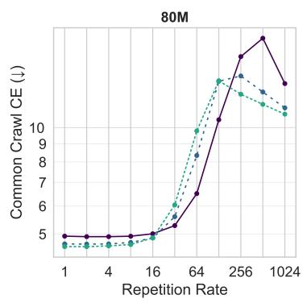

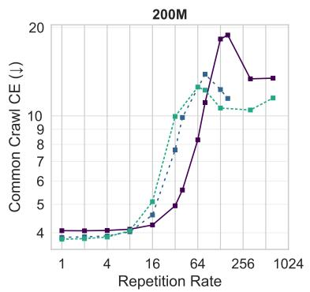

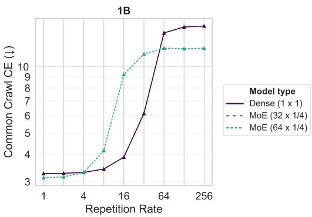  
Figure 1: Across active parameter scales, data repetition rates over 8× result in increasingly severe overfitting. Sparser models overfit more (§3.1). At 80M, 200M, and 1B active parameters, we fix the total data budget $T =$ $2 0 \cdot N _ { a } ,$ and vary the data repetition rate R via different sized unique token sets. As R increases, models increasingly overfit. Sparsity exacerbates overfitting behavior. Larger and sparser models overfit more at lower R.

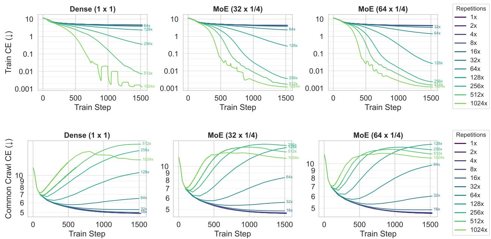  
Figure 2: At higher repetition rates, training loss falls to 0 as models overfit to the repeated data (§3.1). Early in training, train (above) and validation (below) loss fall together, but, at high repetition rate R, train loss falls rapidly to 0, indicating memorization of training data, while validation loss rises. Additional model scales in Appendix Figure 12.

## 3.2 DATA REPETITION EFFECTS ACROSS DATA DOMAINS

We repeat the experimental setup in §3.1 with individual data domains from the OLMoE data mix: DCLM (web crawl), peS2o (academic), StarCoder (code), and Wikipedia (encyclopedic) text. Our goal is to understand variations in response to repetition across varied data domains. We focus on $R \in \{ 1 , 2 , 4 , 8 , 1 6 , 3 2 \}$

Patterns are largely consistent across single-domain experiments. Results in Figure 3 indicate that overfitting patterns from data repetition are robust across domains, despite the diversity of data. Code, encyclopedic, web crawl, and academic text are semantically very distinct, yet all four exhibit similar patterns, for example, that MoE models begin to underperform dense models at $\mathbf { \bar { \boldsymbol { R } } } \in [ 1 6 , 3 \bar { 2 } ]$

## 3.3 DATA REPETITION EFFECTS UNDER DATA FILTERS

We also measure the impact of quality filtering on data repetition. It is common practice to preprocess raw web crawls to deduplicate, extract text from HTML, and remove data deemed low quality by pre-defined filters, often significantly reducing the available tokens. DCLM-BASELINE retains 2.4% of the raw 280T-token DCLM-POOL (Li et al., 2024). Under data constraints, filtering may remove lower quality tokens, but also further reduces the quantity of unique tokens. We study this tradeoff between token quality and repetition rate by considering 5 data settings, which mix

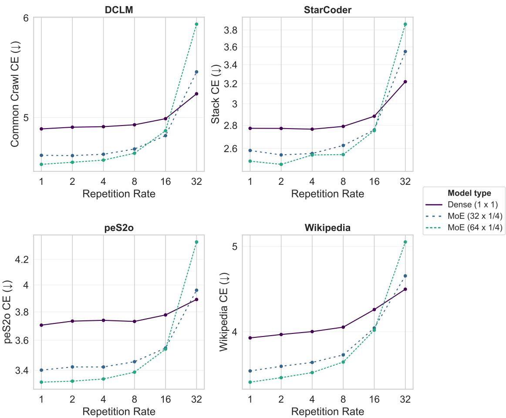  
Figure 3: Across all train domains, sparse MoE models overfit more, ceding their benefit over dense models as repetition rates rise (§3.2). We train dense and MoE models on a single domain. Our experiments span web crawl (DCLM), code (StarCoder), academic (peS2o), and encyclopedic (Wikipedia) text. Trends are near-identical across all data domains: models underperform as repetition rates rise, with MoEs overfitting more rapidly.

DCLM-BASELINE with DCLM-POOL. We interpolate between all-unfiltered and all-filtered with 5 settings consisting of the following DCLM (baseline %, pool %): (0%, 100%), (25%, 75%), (50%, 50%), (75%, 25%), (100%, 0%).

Filtering affects data repetition in some dense models. Training on a higher percentage of unfiltered DCLM-POOL data results in consistently worse performance (Figure 6). Despite the distribution shift that arises from stringent filtering, all MoEs trained on any mixture of DCLM-POOL and -BASELINE exhibit similar decline with data repetition. However, dense models trained exclusively on at least 50% unfiltered data may deteriorate more rapidly with R. As DCLM-BASELINE filtering reduces DCLM-POOL by a factor of over 40×, we compare R = 1 on 100% raw DCLM-POOL against R = 32 on 100% DCLM-BASELINE. In our setting, training on all unique unfiltered data is superior to repeating strictly filtered data, but an intermediate quality filter and repetition rate is likely superior to either extreme.

## 3.4 DATA REPETITION AT MIXED RATES WITHIN DIVERSE DATA MIXES

In practice, LMs are trained on data mixes composed of diverse domains at varying levels of repetition. For example, encyclopedic text is often more constrained than web crawl data, and is therefore repeated at a higher rate. For example, GPT-3 was trained for 3.4 epochs over its Wikipedia component, but less than 1 epoch over Common Crawl (Brown et al., 2020).

To investigate the effects of varied repetition rates within a data mix, we consider a simple setting in which the total data budget T is split between two domains. The first domain is DCLM, which is never repeated. The second is peS2o or StarCoder, which is repeated with $R \in \{ 1 , 2 , 4 , 8 , 1 6 , 3 2 \}$ . We divide the total data budget T between the 2 domains (DCLM, peS2o) or (DCLM, StarCoder) at the following proportions: (100%, 0%), (90%, 10%), (50%, 50%), or (0%, 100%). Only the repeated domain’s unique pool shrinks as R grows. As a concrete example, the (50%, 50%) DCLM-StarCoder setting at R = 8 has T = 1.6B total tokens, consisting of 1 $. 6 B * 0 . 5 = 0 . 8 B$ unique DCLM tokens and $1 . 6 B * 0 . 5 / 8 = 0 . 1 \mathbf { \bar { \mathit { B } } }$ unique StarCoder tokens repeated 8 times.

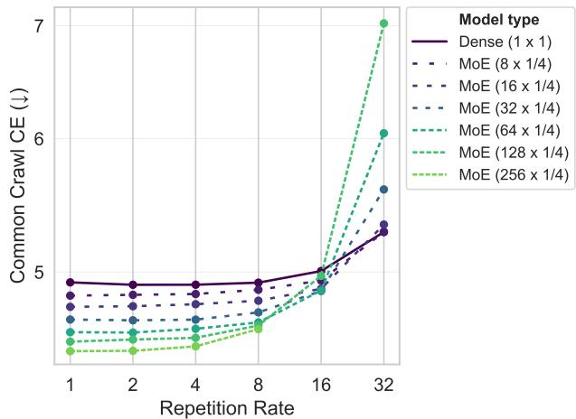  
(a) Varied Total Expert Count (n)

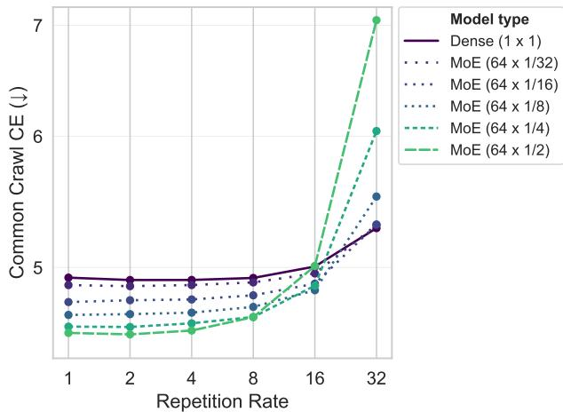  
(b) Varied Expert Size / Granularity (g)

Figure 4: In MoEs, higher sparsity results in a greater reaction to data repetition (§3.1). We consider two settings: (a) fixed expert granularity, increased sparsity via greater total expert count; (b) fixed total expert count, increased sparsity via larger experts. Overfitting increases with total parameters, corresponding to (a) more total experts and (b) larger experts. Lines across (a) and (b) with the same color have identical total parameter count.  
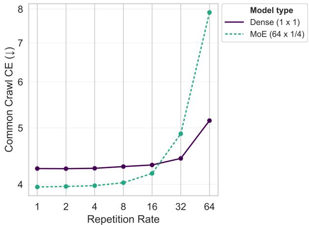  
Figure 5: Data repetition effects are consistent across data-to-parameter ratios (§3.1). We increase total tokens per active parameter from 20 to 80, and observe no difference in data repetition overfitting between the two token-to-active-parameter ratios.

Mixing repeated StarCoder with all-unique DCLM does not impact repetition effects. In Figure 7a, we find that, regardless of the proportion of T assigned to StarCoder, code validation loss rises according to the same pattern in §3.1-3.2. Web crawl validation loss only rises with the repetition rate of StarCoder if it occupies at least half of T.

Mixing repeated peS2o with all-unique DCLM may have a regularizing effect. In Figure 7b, academic text validation loss increases with the peS2o repetition rate, but the effect is substantially dampened as peS2o occupies a smaller proportion of the total training data. As with the DCLM-StarCoder experiments above, web crawl validation loss suffers from peS2o repetition only when the peS2o total data proportion is high. This suggests that the unrepeated DCLM data component may have a regularizing effect on the peS2o data repetition.

Mixing repeated data with unrepeated data of a semantically similar domain may reduce data repetition effects. Academic text, as represented by peS2o, has higher semantic similarity to web text than code, as represented by StarCoder. Our results suggest a promising possibility: even at very high repetition rates, repetition effects might be reduced by mixing the repeated data domain with an non-repeated or less-repeated, semantically similar data domain.

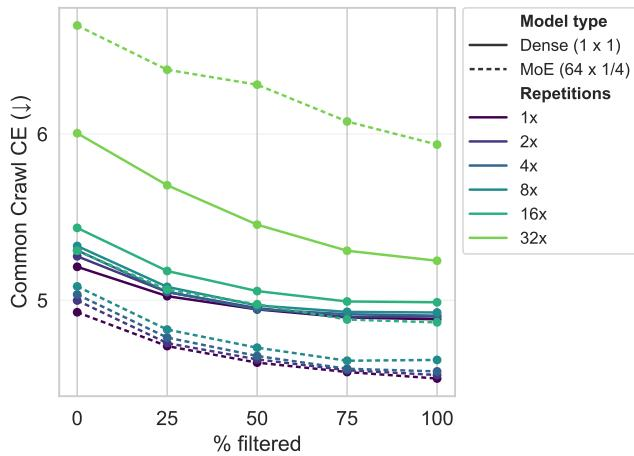

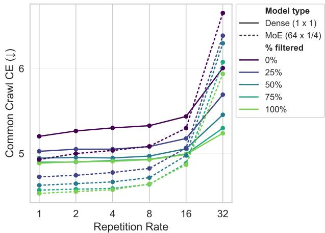  
Figure 6: Repetition effects are consistent across data quality (§3.3). Validation CE Loss for 80M dense and MoE (64 x 1/4) on the DCLM-POOL and -BASELINE interpolation, where % filtered indicates the proportion of the data mix dedicated to the heavily filtered DCLM-BASELINE data. Left: CE against the DCLM-BASELINE %. A higher percentage of filtered data results in better performance. As in §3.1-3.2, MoE performance deteriorates more rapidly than dense at higher R, regardless of data. Right: CE Loss against repetition rate. Trends are largely similar across data quality and model architecture, though dense models trained on higher proportions of unfiltered data (0-50% DCLM-BASELINE) may degrade more rapidly with R.

## 4 REGULARIZATION TECHNIQUES FOR DATA REPETITION

To better understand the overfitting observed above, we apply known regularization methods with two motivations: to further probe the mechanisms responsible for performance decline under data repetition, and to take initial steps towards solutions.

Dropout We use element-wise residual dropout (Srivastava et al., 2014) on the output of each sub-layer with probability $p \in \{ 0 . 0 , 0 . 1 , 0 . 2 , 0 . 4 \}$ . High dropout probability hurts performance at low data repetition, but dramatically reduces the impact of extreme data repetition for all architectures (Figure 8a).

Gradient Norm Clipping The gradient clipping threshold upper bounds the magnitude of each batch update, and is often used to decrease instability (Pascanu et al., 2013). We sweep this threshold over {0.2, 1.0, 2.0, None}, where None indicates no clipping. All four settings result in similar performance, within variance (Appendix Figure 16).

Weight Decay We sweep decoupled AdamW weight decay over $\lambda \in \{ 0 . 0 5 , 0 . 1 , 0 . 2 , 0 . 4 \}$ . Performance differences, though well-ordered, are small and remain within noise thresholds (Appendix Figure 16).

FFN Output Masking FFN output masking (FOM) zeroes, with probability $p ,$ the entire dense FFN or MoE output for a token without rescaling. FOM is similar to a coarse-grained dropout applied only to FFNs. We consider $p \in$ {0.0, 0.1, 0.2, 0.4} and observe that, at low repetition rate, it incurs a smaller penalty to performance than residual dropout. At high repetition rate, it has a similar regularizing effect to dropout (Figure 8b).

Expert Dropout Expert dropout (Fedus et al. (2022); Zoph et al. (2022a)) applies dropout only to the expert hidden activation. We consider expert dropout rate in {0.0, 0.1, 0.2, 0.4}, and compare to the dense analogue, which applies dropout only to the FFN. Expert Dropout, like FOM, acts only on the FFN, and indeed behaves similarly to FOM (Figure 8c).

Expert Output Masking Expert output masking (EOM) independently zeroes each (token, selected expert) output with probability p during training. No rescaling is applied. EOM thus operates only on the FFNs, like FOM and Expert Dropout, with an intermediate granularity. We consider $p \in \{ 0 . 0 , 0 . 1 , 0 . 2 , 0 . 4 \}$ and observe that EOM has a similar effect to both FOM and Expert Dropout (Figure 8d).

Router Jitter Router jitter perturbs routing, multiplying the router’s input by elementwise uniform noise on $[ 1 - \epsilon , 1 +$ ϵ] during training. Over $\epsilon \in \{ 0 . 0 , 0 . 1 , 0 . 2 , \bar { 0 . 4 } \}$ , we observe no clear impact on performance (Appendix Figure 16).

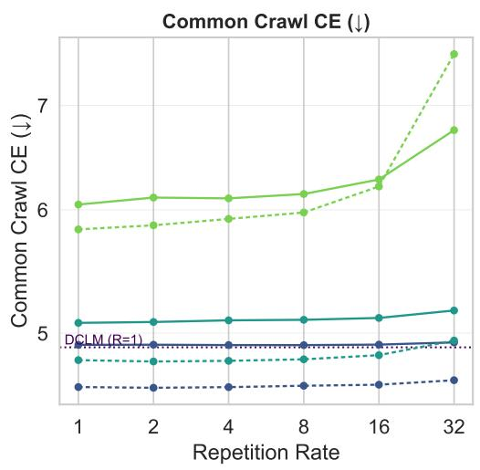

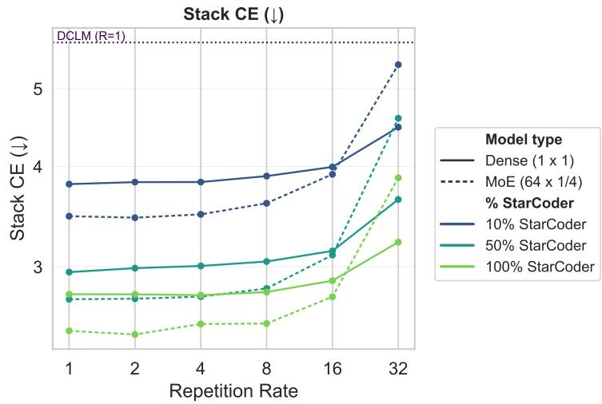

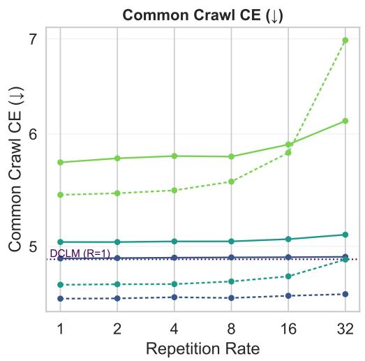

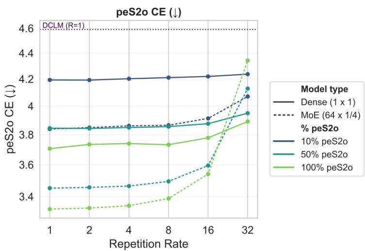  
(b) DCLM + peS2o  
Figure 7: Mixing a repeated data domain with a non-repeated domain may have a regularizing effect (§3.4). We mix peS2o and StarCoder, repeated $R \in \{ 1 , 2 , 4 , 8 , 1 6 , 3 2 \}$ times, into non-repeated DCLM, with various proportions of peS2o/StarCoder. We find that DCLM + StarCoder mixes degrade similarly with repetition, regardless of the Star-Coder mixing percentage. However, DCLM appears to have a regularizing effect in DCLM + peS2o mixes: as DCLM takes up a larger proportion of the mix, high repetition rates (R = 32) degrade at a slower rate.

## 5 MECHANISTIC INVESTIGATION OF DATA REPETITION

In §3, we hypothesize that MoEs may suffer more from data repetition if each expert’s routed token set is fixed early in training, thus exposing each expert FFN to a significantly reduced set of unique tokens, when compared to dense FFNs. We consider two aspects of this hypothesis: firstly, the stability of the router, which would result in a fixed data partition over experts; secondly, the resulting specialization of each expert.

## 5.1 MOE ROUTER OSSIFICATION

We study routing patterns for each saved checkpoint: we run inference on a fixed batch of 16,384 tokens from the Dolma Common Crawl validation split, and record each token’s top-1 expert at every MoE layer. We define the routing stability at checkpoint i as the fraction of tokens whose top-1 expert did not change from checkpoint i − 1, averaged over layers. Separately, we consider expert co-activation and router load balance. Further details are in Appendix A.6.

Routing ossifies early. We compute routing stability for MoE models in §3. Figure 9a shows results for 80M models. Routing is unstable (random chance, 0.02 ≈ 1/64) at the first checkpoint (step 200), as models begin from random initialization. By the next checkpoint (step 400, 10% of training), routing stability rises to 60%, and continues to rise rapidly to > 95% at the end of training. Each MoE configuration at each scale exhibits similar patterns (Appendix B.8).

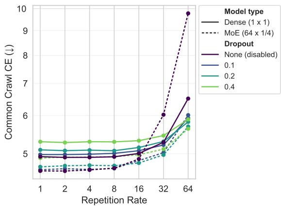  
(a) Dropout

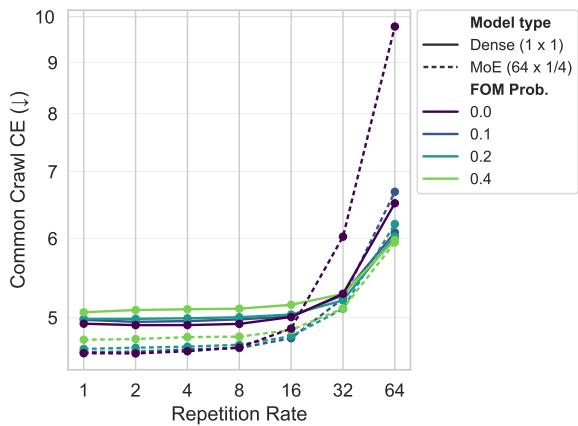  
(b) Final Output Masking

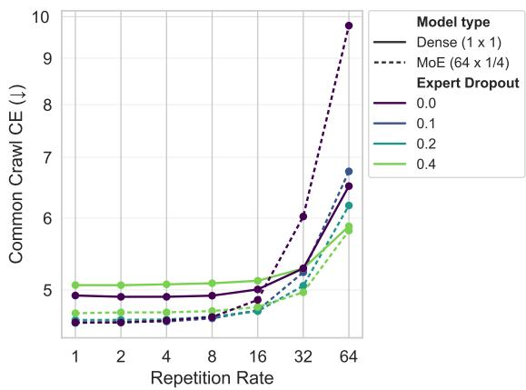  
(c) Expert Dropout

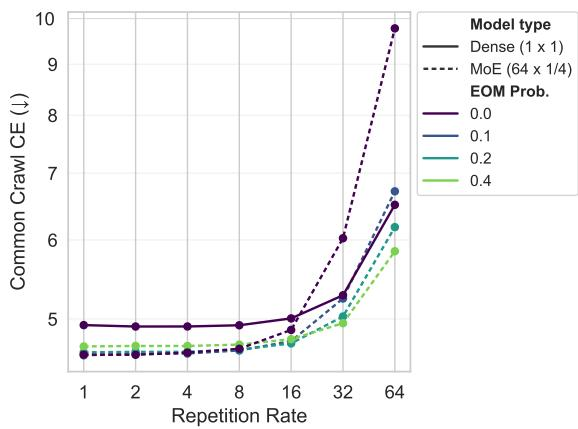  
(d) Expert Output Masking  
Figure 8: Dropout (a), FFN Output Masking (b), Expert Dropout (c), and Expert Output Masking (d) each reduces overfitting from data repetition (§4). Of the regularization methods studied in §4, these 4 dramatically decrease the response to data repetition. However, weight decay and gradient norm clipping, as well as MoE router jitter, have minimal effect. See additional figures in Appendix B.5.

Higher data repetition exacerbates router ossification. In Figure 9a, router stability rises uniformly across all data repetition rates until step 600, at which point higher repetition models begin to show consistently higher routing stability. In Figure 9b, end-of-training router stability rises with data repetition, across model scales and MoE sparsities (Appendix B.8). This supports our hypothesis that each expert’s token set is nearly stationary for most of training, so under repetition an expert sees the same reduced shard of data over and over.

Dropout’s regularizing effect does not operate through router plasticity. We train 200M models using the dropout settings of §4 (with checkpoints 1,000 steps apart, not directly comparable to the above results). Late-training router stability again rises slowly but consistently with repetition (Appendix Figure 22). At R = 64, models with dropout show less routing ossification than the no-dropout setting, even though they overfit far less (§4). Since dropout partially recovers performance without affecting router ossification, we hypothesize that overfitting is not primarily driven by routing, but rather the functions learned by each expert.

Higher repetition encourages uniformly distributed expert co-activation. Although the top-1 expert contributes the majority of the output weight, we also conduct a simple investigation of expert co-activation. For each unordered pair of experts within each layer, we count how often both experts in the pair are active for the same token. We normalize the counts and compute the entropy of the distribution. Under repetition this distribution trends toward uniform in every configuration (Appendix B.8).

Router output magnitude is higher with data repetition; load balancing shows no clear correlation. Router load imbalance, or the ratio between the maximum and mean expert token loads in each batch, does not predictably shift with repetition rate, except that extremely high R yields outliers 1B scale. Load balancing loss also does not change predictably with repetition. Z-loss, which measures router logit magnitude, is higher in early training with higher R, which is consistent with earlier and more extreme router ossification (Appendix Figure 13-15).

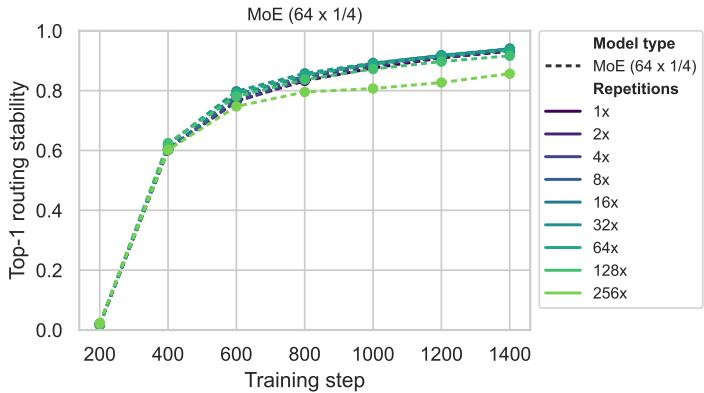  
(a) Top-1 routing stability over training (80M)

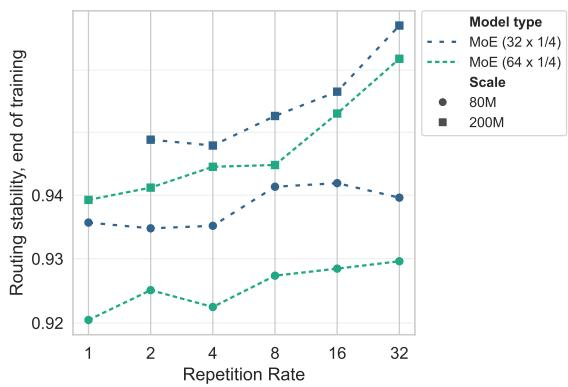  
(b) Final top-1 routing stability (80M, 200M)

Figure 9: Routing ossifies early in training, exacerbated by repetition (§5.1). We show Top-1 routing stability, defined as the fraction of held-out Common Crawl tokens that keep the same top-1 expert between consecutive checkpoints (200 steps apart), averaged over layers. Left: For the 80M MoE (64 x 1/4) models, consecutive checkpoint agreement is near chance (1/64) at the start of training, but over 0.9 for the second half of training. Stability increases with repetition, up to $R = 3 2$ , where the router appears to destabilize. Right: We show the Top-1 routing stability at the end of training for MoE (32 x 1/4) and (64 x 1/4) at 80M and 200M scale. Stability rises more aggressively with R at 200M active parameters. Also see Appendix Figure 19-22.  
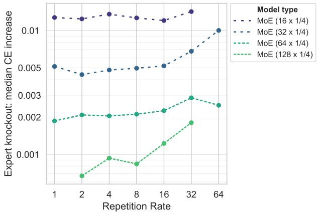

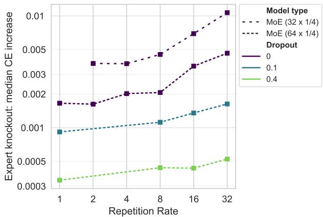  
Figure 10: Repetition increases expert specialization; dropout reduces this effect (§5.2). We compute the increase in held-out CE when one expert’s output is zeroed at inference time, and show the median over all experts and MoE layers of the final checkpoint. Left (80M active parameters): Expert specialization grows with repetition rate, and is overall higher when there are fewer total experts, but is unaffected by expert granularity (Appendix Figure 20) Right (200M active parameters): Dropout reduces expert specialization across all $R ,$ and also reduces the relative magnitude of the increase in expert specialization that results from higher R.

## 5.2 MOE EXPERT SPECIALIZATION

Early routing ossification does not necessitate expert specialization; experts with disjoint routed token sets may still learn similar functions. We investigate the specialization of experts by measuring the performance impact of expert knockout, or the loss impact of removing an expert. Specifically, we perform inference with the final checkpoint of each model and measure, for each expert at each layer, the total increase in CE Loss resulting from masking only that expert’s outputs.

Expert specialization rises with data repetition. Knockout cost at R = 1 is higher at low total expert count. As R increases, knockout cost increases for all configurations, but does so more rapidly at higher expert counts. At 80M (Figure 10a), increasing R from 1 to 32 also increases expert knockout effect by 1.1× for 16 experts, and by 2.3× for 128 experts of 1/4 granularity. This pattern echos §3, where CE degradation under repetition also grows with expert count. Thus, repetition encourages expert specialization and reduces redundancy, especially at higher expert counts.

Dropout decreases expert specialization. We compare various dropout settings at 200M (Figure 10b). Dropout consistently reduces the median knockout cost for all values of R. We hypothesize that dropout combats overfitting by removing dependence on any single expert, and enforcing multiple, more varied, representations of features.

## 6 RELATED WORKS

Hernandez et al. (2022) show that repeating a small fraction of the training data degrades held-out loss nonmonotonically. Muennighoff et al. (2023) studies dense models trained on C4 and finds that repetition up to roughly four epochs is comparable to all-unique data, but further repetition decays performance. More recent work on dense models has provided evidence that data repetition damage: (1) grows with model scale (Kazdan et al., 2026); (2) peaks at an intermediate repeat count (Chudnovsky et al., 2026); (3) is well described by a single additive coefficient that strong weight decay can shrink (Lovelace et al., 2026); and (4) can be modulated by data quality and mixture weights (Fang et al., 2025; Liu et al., 2026; Chen et al., 2025). Very little work has considered MoEs; Xue et al. (2023) concludes from a single MoE configuration, a 16-expert T5, that parameter count drives multi-epoch degradation while FLOPs are close to irrelevant.

Other work has modeled the tradeoff between quality and quantity of unique data when training dense Transformers. Fang et al. (2025) reports that repeating a heavily filtered set up to ten times can beat a single pass over a superset ten times larger, while Mohri et al. (2026) argues that with enough compute, larger quantities of unfiltered data is better. Liu et al. (2026) and Chen et al. (2025) fit quality-weighted mixtures and repetition together.

Even fewer studies have considered interventions for minimizing data-repetition effects. Xue et al. (2023) uses dropout to reduce multi-epoch degradation, but caution that the dropout probability needs retuning as models grow. Lovelace et al. (2026) shows that raising weight decay by an order of magnitude cuts their fitted overfitting coefficient by roughly 70% at high repetition rates, at the price of a loss premium in the single-epoch regime.

## 7 CONCLUSION

Across all dense and MoE architectures, we find that increasing data repetition rate R leads to overfitting. Sparse MoE models deteriorate earlier and more rapidly as R increases. We show that the response to data repetition primarily depends on total parameters. The pattern of overfitting effects are remarkably robust to a variety of single data domains, data mixes, and different levels of data filtering. Mixing a repeated data domain into a larger or equal-sized non repeated data domain may have a regularizing effect.

We successfully reduce the overfitting response to data repetition through regularization methods that operate by dropping parameter outputs (dropout, expert dropout, FFN output masking, and expert output masking). However, no method fully matches performance achieved with all-unique data. Gradient Norm Clipping, Weight Decay, and Router Jitter operate through qualitatively different mechanisms to reduce update strength, reduce weight magnitude, and modify coarse-grained gradient paths, respectively, and do not have any measurable effect.

Finally, our mechanistic analyses provide evidence that MoE routing is fixed early in training, and only slightly exacerbated by data repetition. Expert specialization also rises with data repetition. Dropout does not affect router ossification, but decreases expert specialization.

In summary, our work studies the interaction between data constraints and the design of MoE architectures. We present strong evidence that data repetition causes overfitting, that the degree of performance degradation primarily depends on total parameters, and that the underlying mechanism operates partially through overly specialized parameters, broken by methods such as dropout and output masking. We recommend that future works further explore masking-based methods to minimize repetition-driven overfitting through decreased parameter specialization.

## ACKNOWLEDGMENTS

We are grateful to Rohan Sanda for initial engineering support; to Ananya Harsh Jha and Jacqueline He for helpful discussion; and to the contributors and maintainers of the UW Hyak and Stanford Marlowe computing resources.

## REFERENCES

Zhangir Azerbayev, Hailey Schoelkopf, Keiran Paster, Marco Dos Santos, Stephen McAleer, Albert Q. Jiang, Jia Deng, Stella Biderman, and Sean Welleck. Llemma: An open language model for mathematics, 2023.

Tom Brown, Benjamin Mann, Nick Ryder, Melanie Subbiah, Jared D Kaplan, Prafulla Dhariwal, Arvind Neelakantan, Pranav Shyam, Girish Sastry, Amanda Askell, et al. Language models are few-shot learners. Advances in neural information processing systems, 33:1877–1901, 2020.

Zhengyu Chen, Siqi Wang, Teng Xiao, Yudong Wang, Shiqi Chen, Xunliang Cai, Junxian He, and Jingang Wang. Revisiting scaling laws for language models: The role of data quality and training strategies. In Proceedings of the 63rd Annual Meeting of the Association for Computational Linguistics (ACL), pp. 23897–23920, 2025. URL https://aclanthology.org/2025.acl-long.1163/.

Jessica Chudnovsky, Joshua Kazdan, Noam Levi, Rylan Schaeffer, Yegor Denisov-Blanch, Bo He, Mehmet Donmez, Sanmi Koyejo, and David Donoho. Internal data repetition destroys language models, 2026. URL https:// arxiv.org/abs/2606.24998.

Christopher Clark, Kenton Lee, Ming-Wei Chang, Tom Kwiatkowski, Michael Collins, and Kristina Toutanova. Boolq: Exploring the surprising difficulty of natural yes/no questions. arXiv preprint arXiv:1905.10044, 2019.

Together Computer. Redpajama: An open source recipe to reproduce llama training dataset, 2023. URL https: //github.com/togethercomputer/RedPajama-Data.

Damai Dai, Chengqi Deng, Chenggang Zhao, R. X. Xu, Huazuo Gao, Deli Chen, Jiashi Li, Wangding Zeng, Xingkai Yu, Y. Wu, Zhenda Xie, Y. K. Li, Panpan Huang, Fuli Luo, Chong Ruan, Zhifang Sui, and Wenfeng Liang. Deepseekmoe: Towards ultimate expert specialization in mixture-of-experts language models, 2024. URL https://arxiv.org/abs/2401.06066.

Jesse Dodge, Maarten Sap, Ana Marasovic, William Agnew, Gabriel Ilharco, Dirk Groeneveld, Margaret Mitchell,´ and Matt Gardner. Documenting large webtext corpora: A case study on the colossal clean crawled corpus. In Proceedings ofthe 2021 Conference on Empirical Methods in Natural Language Processing, pp. 1286–1305, Online and Punta Cana, Dominican Republic, November 2021. Association for Computational Linguistics. doi: 10.18653/ v1/2021.emnlp-main.98. URL https://aclanthology.org/2021.emnlp-main.98.

Alex Fang, Hadi Pouransari, Matt Jordan, Alexander Toshev, Vaishaal Shankar, Ludwig Schmidt, and Tom Gunter. Datasets, documents, and repetitions: The practicalities of unequal data quality, 2025. URL https://arxiv. org/abs/2503.07879.

William Fedus, Barret Zoph, and Noam Shazeer. Switch transformers: Scaling to trillion parameter models with simple and efficient sparsity. Journal of Machine Learning Research, 23(120):1–39, 2022. URL http://jmlr.org/ papers/v23/21-0998.html.

Leo Gao, Stella Rose Biderman, Sid Black, Laurence Golding, Travis Hoppe, Charles Foster, Jason Phang, Horace He, Anish Thite, Noa Nabeshima, Shawn Presser, and Connor Leahy. The pile: An 800gb dataset of diverse text for language modeling. ArXiv, abs/2101.00027, 2020. URL https://api.semanticscholar.org/ CorpusID:230435736.

Sidney Greenbaum and Gerald Nelson. The international corpus of english (ICE) project. World Englishes, 15 (1):3–15, mar 1996. doi: 10.1111/j.1467-971x.1996.tb00088.x. URL https://doi.org/10.1111%2Fj. 1467-971x.1996.tb00088.x.

Danny Hernandez, Tom Brown, Tom Conerly, Nova DasSarma, Dawn Drain, Sheer El-Showk, Nelson Elhage, Zac Hatfield-Dodds, Tom Henighan, Tristan Hume, et al. Scaling laws and interpretability of learning from repeated data. arXiv preprint arXiv:2205.10487, 2022.

Jordan Hoffmann, Sebastian Borgeaud, Arthur Mensch, Elena Buchatskaya, Trevor Cai, Eliza Rutherford, Diego de Las Casas, Lisa Anne Hendricks, Johannes Welbl, Aidan Clark, Tom Hennigan, Eric Noland, Katie Millican, George van den Driessche, Bogdan Damoc, Aurelia Guy, Simon Osindero, Karen Simonyan, Erich Elsen, Jack W. Rae, Oriol Vinyals, and Laurent Sifre. Training compute-optimal large language models, 2022. URL https://arxiv.org/abs/2203.15556.

Joshua Kazdan, Noam Levi, Rylan Schaeffer, Jessica Chudnovsky, Abhay Puri, Bo He, Mehmet Donmez, Sanmi Koyejo, and David Donoho. Scale dependent data duplication, 2026. URL https://arxiv.org/abs/2603. 06603.

Denis Kocetkov, Raymond Li, Loubna Ben Allal, Jia Li, Chenghao Mou, Carlos Munoz Ferrandis, Yacine Jernite,˜ Margaret Mitchell, Sean Hughes, Thomas Wolf, Dzmitry Bahdanau, Leandro von Werra, and Harm de Vries. The stack: 3 tb of permissively licensed source code, 2022. URL https://arxiv.org/abs/2211.15533.

Jeffrey Li, Alex Fang, Georgios Smyrnis, Maor Ivgi, Matt Jordan, Samir Gadre, Hritik Bansal, Etash Guha, Sedrick Keh, Kushal Arora, Saurabh Garg, Rui Xin, Niklas Muennighoff, Reinhard Heckel, Jean Mercat, Mayee Chen, Suchin Gururangan, Mitchell Wortsman, Alon Albalak, Yonatan Bitton, Marianna Nezhurina, Amro Abbas, Cheng-Yu Hsieh, Dhruba Ghosh, Josh Gardner, Maciej Kilian, Hanlin Zhang, Rulin Shao, Sarah Pratt, Sunny Sanyal, Gabriel Ilharco, Giannis Daras, Kalyani Marathe, Aaron Gokaslan, Jieyu Zhang, Khyathi Chandu, Thao Nguyen, Igor Vasiljevic, Sham Kakade, Shuran Song, Sujay Sanghavi, Fartash Faghri, Sewoong Oh, Luke Zettlemoyer, Kyle Lo, Alaaeldin El-Nouby, Hadi Pouransari, Alexander Toshev, Stephanie Wang, Dirk Groeneveld, Luca Soldaini, Pang Wei Koh, Jenia Jitsev, Thomas Kollar, Alexandros G. Dimakis, Yair Carmon, Achal Dave, Ludwig Schmidt, and Vaishaal Shankar. Datacomp-lm: In search of the next generation of training sets for language models, 2024.

Raymond Li, Loubna Ben Allal, Yangtian Zi, Niklas Muennighoff, Denis Kocetkov, Chenghao Mou, Marc Marone, Christopher Akiki, Jia Li, Jenny Chim, et al. Starcoder: may the source be with you!, 2023.

Percy Liang, Rishi Bommasani, Tony Lee, Dimitris Tsipras, Dilara Soylu, Michihiro Yasunaga, Yian Zhang, Deepak Narayanan, Yuhuai Wu, Ananya Kumar, Benjamin Newman, Binhang Yuan, Bobby Yan, Ce Zhang, Christian Cosgrove, Christopher D. Manning, Christopher R’e, Diana Acosta-Navas, Drew A. Hudson, E. Zelikman, Esin Durmus, Faisal Ladhak, Frieda Rong, Hongyu Ren, Huaxiu Yao, Jue Wang, Keshav Santhanam, Laurel J. Orr, Lucia Zheng, Mert Yuksekgonul, Mirac Suzgun, Nathan S. Kim, Neel Guha, Niladri S. Chatterji, Omar Khattab, Peter Henderson, Qian Huang, Ryan Chi, Sang Michael Xie, Shibani Santurkar, Surya Ganguli, Tatsunori Hashimoto, Thomas F. Icard, Tianyi Zhang, Vishrav Chaudhary, William Wang, Xuechen Li, Yifan Mai, Yuhui Zhang, and Yuta Koreeda. Holistic evaluation of language models. Annals ofthe New York Academy ofSciences, 1525:140 – 146, 2022. URL https://api.semanticscholar.org/CorpusID:253553585.

Fengze Liu, Weidong Zhou, Binbin Liu, Ping Guo, Zijun Wang, Bingni Zhang, Yifan Zhang, Yifeng Yu, Xiaohuan Zhou, and Taifeng Wang. Infolaw: Information scaling laws for large language models with quality-weighted mixture data and repetition, 2026. URL https://arxiv.org/abs/2605.02364.

Ilya Loshchilov and Frank Hutter. Decoupled weight decay regularization. In International Conference on Learning Representations, 2019.

Justin Lovelace, Christian Belardi, Srivatsa Kundurthy, Shriya Sudhakar, and Kilian Q. Weinberger. Prescriptive scaling laws for data constrained training, 2026. URL https://arxiv.org/abs/2605.01640.

Ian Magnusson, Akshita Bhagia, Valentin Hofmann, Luca Soldaini, Ananya Harsh Jha, Oyvind Tafjord, Dustin Schwenk, Evan Pete Walsh, Yanai Elazar, Kyle Lo, Dirk Groeneveld, Iz Beltagy, Hannaneh Hajishirzi, Noah A. Smith, Kyle Richardson, and Jesse Dodge. Paloma: A benchmark for evaluating language model fit, 2024. URL https://arxiv.org/abs/2312.10523.

Stephen Merity, Caiming Xiong, James Bradbury, and Richard Socher. Pointer sentinel mixture models. ArXiv, abs/1609.07843, 2016. URL https://api.semanticscholar.org/CorpusID:16299141.

Christopher Mohri, John Duchi, and Tatsunori Hashimoto. A bitter lesson for data filtering, 2026. URL https: //arxiv.org/abs/2605.19407.

Niklas Muennighoff, Alexander M. Rush, Boaz Barak, Teven Le Scao, Aleksandra Piktus, Nouamane Tazi, Sampo Pyysalo, Thomas Wolf, and Colin Raffel. Scaling data-constrained language models. In Advances in Neural Information Processing Systems (NeurIPS), 2023. URL https://arxiv.org/abs/2305.16264.

Niklas Muennighoff, Luca Soldaini, Dirk Groeneveld, Kyle Lo, Jacob Morrison, Sewon Min, Weijia Shi, Pete Walsh, Oyvind Tafjord, Nathan Lambert, Yuling Gu, Shane Arora, Akshita Bhagia, Dustin Schwenk, David Wadden, Alexander Wettig, Binyuan Hui, Tim Dettmers, Douwe Kiela, Ali Farhadi, Noah A. Smith, Pang Wei Koh, Amanpreet Singh, and Hannaneh Hajishirzi. Olmoe: Open mixture-of-experts language models, 2025. URL https://arxiv.org/abs/2409.02060.

Razvan Pascanu, Tomas Mikolov, and Yoshua Bengio. On the difficulty of training recurrent neural networks. In International conference on machine learning, pp. 1310–1318. PMLR, 2013.

Keiran Paster, Marco Dos Santos, Zhangir Azerbayev, and Jimmy Ba. Openwebmath: An open dataset of high-quality mathematical web text, 2023.

Colin Raffel, Noam M. Shazeer, Adam Roberts, Katherine Lee, Sharan Narang, Michael Matena, Yanqi Zhou, Wei Li, and Peter J. Liu. Exploring the limits of transfer learning with a unified text-to-text transformer. ArXiv, abs/1910.10683, 2019. URL https://api.semanticscholar.org/CorpusID:204838007.

Machel Reid, Victor Zhong, Suchin Gururangan, and Luke Zettlemoyer. M2D2: A massively multi-domain language modeling dataset. In Proceedings of the 2022 Conference on Empirical Methods in Natural Language Processing, pp. 964–975, Abu Dhabi, United Arab Emirates, December 2022. Association for Computational Linguistics. URL https://aclanthology.org/2022.emnlp-main.63.

Noam Shazeer, Azalia Mirhoseini, Krzysztof Maziarz, Andy Davis, Quoc Le, Geoffrey Hinton, and Jeff Dean. Outrageously large neural networks: The sparsely-gated mixture-of-experts layer. arXiv preprint arXiv:1701.06538, 2017.

Luca Soldaini and Kyle Lo. peS2o (Pretraining Efficiently on S2ORC) Dataset, 2023. URL https://github. com/allenai/pes2o.

Luca Soldaini, Rodney Kinney, Akshita Bhagia, Dustin Schwenk, David Atkinson, Russell Authur, Ben Bogin, Khyathi Chandu, Jennifer Dumas, Yanai Elazar, Valentin Hofmann, Ananya Harsh Jha, Sachin Kumar, Li Lucy, Xinxi Lyu, Nathan Lambert, Ian Magnusson, Jacob Morrison, Niklas Muennighoff, Aakanksha Naik, Crystal Nam, Matthew E. Peters, Abhilasha Ravichander, Kyle Richardson, Zejiang Shen, Emma Strubell, Nishant Subramani, Oyvind Tafjord, Pete Walsh, Luke Zettlemoyer, Noah A. Smith, Hannaneh Hajishirzi, Iz Beltagy, Dirk Groeneveld, Jesse Dodge, and Kyle Lo. Dolma: an open corpus of three trillion tokens for language model pretraining research, 2024a.

Luca Soldaini, Rodney Kinney, Akshita Bhagia, Dustin Schwenk, David Atkinson, Russell Authur, Ben Bogin, Khyathi Raghavi Chandu, Jennifer Dumas, Yanai Elazar, Valentin Hofmann, A. Jha, Sachin Kumar, Li Lucy, Xinxi Lyu, Nathan Lambert, Ian Magnusson, Jacob Daniel Morrison, Niklas Muennighoff, Aakanksha Naik, Crystal Nam, Matthew E. Peters, Abhilasha Ravichander, Kyle Richardson, Zejiang Shen, Emma Strubell, Nishant Subramani, Oyvind Tafjord, Pete Walsh, Luke Zettlemoyer, Noah A. Smith, Hanna Hajishirzi, Iz Beltagy, Dirk Groeneveld, Jesse Dodge, and Kyle Lo. Dolma: an open corpus of three trillion tokens for language model pretraining research. ArXiv, abs/2402.00159, 2024b. URL https://api.semanticscholar.org/CorpusID:267364861.

Guijin Son, Hanwool Lee, Sungdong Kim, Seungone Kim, Niklas Muennighoff, Taekyoon Choi, Cheonbok Park, Kang Min Yoo, and Stella Biderman. Kmmlu: Measuring massive multitask language understanding in korean, 2024. URL https://arxiv.org/abs/2402.11548.

Nitish Srivastava, Geoffrey Hinton, Alex Krizhevsky, Ilya Sutskever, and Ruslan Salakhutdinov. Dropout: a simple way to prevent neural networks from overfitting. The journal of machine learning research, 15(1):1929–1958, 2014.

Fuzhao Xue, Yao Fu, Wangchunshu Zhou, Zangwei Zheng, and Yang You. To repeat or not to repeat: Insights from scaling LLM under token-crisis. In Advances in Neural Information Processing Systems (NeurIPS), 2023. URL https://arxiv.org/abs/2305.13230.

Rowan Zellers, Ari Holtzman, Yonatan Bisk, Ali Farhadi, and Yejin Choi. Hellaswag: Can a machine really finish your sentence? arXiv preprint arXiv:1905.07830, 2019. URL https://arxiv.org/abs/1905.07830.

Barret Zoph, Irwan Bello, Sameer Kumar, Nan Du, Yanping Huang, Jeff Dean, Noam Shazeer, and William Fedus. Stmoe: Designing stable and transferable sparse expert models, 2022a. URL https://arxiv.org/abs/2202. 08906.

Barret Zoph, Irwan Bello, Sameer Kumar, Nan Du, Yanping Huang, Jeff Dean, Noam Shazeer, and William Fedus. St-moe: Designing stable and transferable sparse expert models. arXiv preprint arXiv:2202.08906, 2022b. [221] in OLMoE.

## A EXPERIMENTAL DETAILS

## A.1 MODEL ARCHITECTURE

<table><tr><td>Scale</td><td>Layers</td><td>Model Dim</td><td>Attention Heads</td><td>Name</td><td>Activation Sparsity (s)</td><td>Total Experts (n)</td><td>Active Experts (k)</td><td>Expert Gran. (g)</td><td>Total Tokens (T)</td><td>Active Param  $( N _ { a } )$ </td><td>Total Param (N)</td></tr><tr><td>80M</td><td>8</td><td>336</td><td>7</td><td>dense</td><td>1</td><td></td><td></td><td></td><td>1.6B</td><td>81.8M</td><td>81.8M</td></tr><tr><td></td><td></td><td></td><td></td><td>MoE (8 x 1/4)</td><td>2</td><td>8</td><td>4</td><td>1/4</td><td></td><td></td><td>92.7M</td></tr><tr><td></td><td></td><td></td><td></td><td>MoE (64 x 1/32)</td><td>2</td><td>64</td><td>32</td><td>1/32</td><td></td><td></td><td>92.7M</td></tr><tr><td></td><td></td><td></td><td></td><td>MoE (16 x 1/4)</td><td>4</td><td>16</td><td>4</td><td>1/4</td><td></td><td></td><td>114.4M</td></tr><tr><td></td><td></td><td></td><td></td><td>MoE (64 x 1/16)</td><td>4</td><td>64</td><td>16</td><td>1/16</td><td></td><td></td><td>114.4M</td></tr><tr><td></td><td></td><td></td><td></td><td>MoE (32 x 1/4)</td><td>8</td><td>32</td><td>4</td><td>1/4</td><td></td><td></td><td>157.7M</td></tr><tr><td></td><td></td><td></td><td></td><td>MoE (64 x 1/8)</td><td>8</td><td>64</td><td>8</td><td>1/8</td><td></td><td></td><td>157.7M</td></tr><tr><td></td><td></td><td></td><td></td><td>MoE (64 x 1/4)</td><td>16</td><td>64</td><td>4</td><td>1/4</td><td></td><td></td><td>244.4M</td></tr><tr><td></td><td></td><td></td><td></td><td>MoE (64 x 1/2)</td><td>32</td><td>64</td><td>2</td><td>1/2</td><td></td><td></td><td>417.8M</td></tr><tr><td></td><td></td><td></td><td></td><td>MoE (128 x 1/4)</td><td>32</td><td>128</td><td>4</td><td>1/4</td><td></td><td></td><td>417.8M</td></tr><tr><td></td><td></td><td></td><td></td><td>MoE (256 x 1/4)</td><td>64</td><td>256</td><td>4</td><td>1/4</td><td></td><td></td><td>764.6M</td></tr><tr><td>200M</td><td>10</td><td>640</td><td>10</td><td>dense</td><td>1</td><td></td><td></td><td></td><td>4B</td><td>193.9M</td><td>193.9M</td></tr><tr><td></td><td></td><td></td><td></td><td>MoE (32 x 1/4)</td><td>8</td><td>32</td><td>4</td><td>1/4</td><td></td><td></td><td>538.0M</td></tr><tr><td></td><td></td><td></td><td></td><td>MoE (64 x 1/4)</td><td>16</td><td>64</td><td>4</td><td>1/4</td><td></td><td></td><td>931.2M</td></tr><tr><td>1B</td><td>15</td><td>1664</td><td>16</td><td>dense</td><td>1</td><td></td><td></td><td></td><td>20B</td><td>998.3M</td><td>998.3M</td></tr><tr><td></td><td></td><td></td><td></td><td>MoE (64 x 1/4)</td><td>16</td><td>64</td><td>4</td><td>1/4</td><td></td><td></td><td>8.5B</td></tr></table>

Table 1: Architecture Details and Parameter Counts

## A.2 HYPERPARAMETERS

<table><tr><td>Hyperparameter Vocabulary size</td><td>Value 50K</td></tr><tr><td>Batch Size Sequence Length Learning Rate Encoder-Decoder Weight Sharing Feedforward Dimension LR Schedule LR Warmup End LR Weight Decay Max Grad Norm Dropout Nonlinearity MoE Z-loss Load Balancing Loss Weight MoE Token Dropping MoE Routing Choice</td><td>512 2048 4e-4 No 4 x hidden dimension Cosine Decay 2000 steps 0.1 x Peak LR {0.0, 0.1, 0.2, 0.4} {None, 0.2, 1, 2.0 } {0.0, 0.1, 0.2, 0.4} SwiGLU 1e-3 1e-2 Dropless Token Choice</td></tr></table>

Table 2: Hyperparameter details for models in §3-5. Multiple values indicate that we investigated different settings in §4, and bold values are defaults used in §3.

## A.3 TRAINING DATA SOURCES

We take our training data from Muennighoff et al. (2025). We use their data mix, which we call OLMoE Mix, consisting of documents from: DCLM-Baseline (Li et al., 2024), StarCoder (Li et al., 2023; Kocetkov et al., 2022), peS2o (Soldaini & Lo, 2023; Soldaini et al., 2024a), arXiv (Computer, 2023), OpenWebMath (Paster et al., 2023), Algebraic Stack (Azerbayev et al., 2023), English Wikipedia & Wikibooks (Soldaini et al., 2024a).

In §3.3, we also use DCLM-POOL (Li et al., 2024).

## A.4 EVALUATION DATA

Our evaluation includes held-out validation sets for language modeling, as well as downstream tasks.

The language modeling tasks are a subset of Paloma (Magnusson et al., 2024), which consists of: C4 (Raffel et al. (2019) via Dodge et al. (2021)), THE PILE (Gao et al., 2020), WIKITEXT-103 (Merity et al., 2016), DOLMA (Soldaini

et al., 2024b), M2D2 S2ORC (Reid et al., 2022), ICE (Greenbaum & Nelson (1996) via Liang et al. (2022)). DOLMA is subdivided into six domains: books, common-crawl, pes2o, reddit uniform, stack uniform, wiki.

In §3.2, we vary the dataset used for validation loss to match the training domain. For models trained on DCLM, we evaluate on Dolma common-crawl; for peS2o, Dolma pes2o; for Wikipedia, Dolma wiki; for StarCoder, Dolma stack uniform.

The downstream tasks consist of BoolQ (Clark et al., 2019), HellaSwag (Zellers et al., 2019), and MMLU (Son et al., 2024). MMLU is subdivided into four domains: humanities, STEM, social sciences, and other.

## A.5 DATA REPETITION

In data-constrained regimes, the set of U unique tokens used for each experiment is constructed as follows: we fix a random permutation of the sequences in each data domain D, and take the first U tokens for training. We repeat these U tokens for R epochs, shuffling between epochs.

In §3.3, we mix tokens from DCLM-BASELINE and DCLM-POOL (Li et al., 2024). This inevitably introduces a very small amount of unmeasured data repetition because our selected subsets of DCLM-BASELINE and DCLM-POOL may have a non-empty intersection. However, this intersection is likely to be of negligible size. DCLM-BASELINE consists of 5T tokens, of which we use 1.6B at most. DCLM-POOL consists of 240 trillion tokens, of which we use 1.6B at most. The probability that any particular token in a particular sequence from our DCLM-BASELINE subset also appears in our DCLM-POOL is less than 2e-9, yielding an expected total of fewer than 3 repeated tokens. In other words, we expect effectively no repeated tokens on average.

## A.6 ROUTING ANALYSIS

In §5, we use a batch size of 16,384 tokens (8 sequences of 2,048 tokens). We use a fixed subset of the Dolma Common Crawl validation split. Dropout, router jitter, and other train-time regularizers are inactive.

Ossification (§5.1). For each checkpoint we record the top-1 expert of every token at every MoE layer, defined as the expert with the largest router score. For each pair of consecutive checkpoints we report the fraction of tokens whose top-1 expert is identical, averaged over layers. Checkpoints are 200 steps apart in the core ladders and 1,000 steps apart in the 200M dropout arms, so stability values are only compared between runs with matching spacing. End-of-training stability is the mean over the last two regularly spaced intervals.

Expert knockout (§5.2). On the final checkpoint we zero all MLP weights of one expert, so its output is exactly zero for the tokens routed to it. The router is untouched and the weights of the remaining selected experts are not renormalized. We then recompute CE on the token batch, repeat for every expert in every MoE layer, and report the median and maximum increase over the CE of the unmodified model.

Co-activation (§5.2). On the final checkpoint we count, per layer, how often each unordered pair of experts appears together in a token’s top-k set, normalize the counts to a distribution, and compute its Shannon entropy. We divide by log n(n − 1), its maximum for n experts, so values are comparable across expert counts.

## B ADDITIONAL RESULTS

## B.1 RANDOM SEED VARIANCE

In Table 3, we report the variance across 5 random seeds for Dense and MoE (64 x 1/4) models trained on the OLMoE mix at R = 1, R = 32, and evaluated on all language modeling validation datasets and downstream tasks.
<table><tr><td rowspan="3">Metric</td><td colspan="4">Dense</td><td colspan="4">MoE (64 x 1/4)</td></tr><tr><td colspan="2">R=1</td><td colspan="2">R=32</td><td colspan="2">R=1</td><td colspan="2">R=32</td></tr><tr><td>Mean</td><td>Std. Dev.</td><td>Mean</td><td>Std. Dev.</td><td>Mean</td><td>Std. Dev.</td><td>Mean</td><td>Std. Dev.</td></tr><tr><td>Train Loss</td><td>4.57</td><td>0.00</td><td>4.27</td><td>0.00</td><td>4.26</td><td>0.01</td><td>3.17</td><td>0.02</td></tr><tr><td>Validation LM Loss</td><td></td><td></td><td></td><td></td><td></td><td></td><td></td><td></td></tr><tr><td>C4</td><td>4.86</td><td>0.01</td><td>5.27</td><td>0.02</td><td>4.53</td><td>0.01</td><td>6.04</td><td>0.01</td></tr><tr><td>Dolma Books</td><td>5.04</td><td>0.00</td><td>5.59</td><td>0.06</td><td>4.72</td><td>0.01</td><td>6.48</td><td>0.05</td></tr><tr><td>Dolma Common Crawl</td><td>4.92</td><td>0.01</td><td>5.29</td><td>0.02</td><td>4.61</td><td>0.01</td><td>6.05</td><td>0.02</td></tr><tr><td>Dolma peS2o</td><td>4.48</td><td>0.01</td><td>4.93</td><td>0.04</td><td>4.12</td><td>0.01</td><td>5.66</td><td>0.01</td></tr><tr><td>Dolma Reddit</td><td>4.74</td><td>0.00</td><td>5.12</td><td>0.02</td><td>4.46</td><td>0.01</td><td>5.95</td><td>0.02</td></tr><tr><td>Dolma Stack</td><td>4.65</td><td>0.02</td><td>6.68</td><td>0.10</td><td>4.23</td><td>0.02</td><td>7.46</td><td>0.04</td></tr><tr><td>Dolma Wiki</td><td>4.67</td><td>0.01</td><td>5.16</td><td>0.04</td><td>4.31</td><td>0.01</td><td>5.87</td><td>0.02</td></tr><tr><td>ICE</td><td>4.97</td><td>0.01</td><td>5.63</td><td>0.03</td><td>4.66</td><td>0.02</td><td>6.73</td><td>0.01</td></tr><tr><td>M2D2 S2ORC</td><td>4.84</td><td>0.01</td><td>5.47</td><td>0.03</td><td>4.52</td><td>0.01</td><td>6.46</td><td>0.01</td></tr><tr><td>Pile</td><td>4.62</td><td>0.01</td><td>5.37</td><td>0.05</td><td>4.27</td><td>0.01</td><td>6.19</td><td>0.01</td></tr><tr><td>WikiText-103</td><td>5.06</td><td>0.00</td><td>5.76</td><td>0.08</td><td>4.67</td><td>0.02</td><td>6.67</td><td>0.03</td></tr><tr><td>Average</td><td>4.81</td><td>0.01</td><td>5.48</td><td>0.05</td><td>4.46</td><td>0.01</td><td>6.32</td><td>0.02</td></tr><tr><td>Downstream Task Loss</td><td></td><td></td><td></td><td></td><td></td><td></td><td></td><td></td></tr><tr><td>BoolQ</td><td>2.52</td><td>0.22</td><td>3.14</td><td>0.18</td><td>2.33</td><td>0.24</td><td>3.95</td><td>0.43</td></tr><tr><td>HellaSwag</td><td>0.96</td><td>0.00</td><td>1.05</td><td>0.00</td><td>0.89</td><td>0.00</td><td>1.23</td><td>0.00</td></tr><tr><td>MMLU Humanities</td><td>2.13</td><td>0.06</td><td>3.48</td><td>0.11</td><td>1.91</td><td>0.13</td><td>4.36</td><td>0.92</td></tr><tr><td>MMLU Other</td><td>1.97</td><td>0.04</td><td>2.85</td><td>0.17</td><td>1.80</td><td>0.06</td><td>2.93</td><td>0.20</td></tr><tr><td>MMLU Social Sciences</td><td>1.98</td><td>0.04</td><td>2.66</td><td>0.14</td><td>1.88</td><td>0.10</td><td>3.06</td><td>0.31</td></tr><tr><td>MMLU STEM</td><td>2.02</td><td>0.03</td><td>2.61</td><td>0.07</td><td>1.90</td><td>0.08</td><td>3.13</td><td>0.48</td></tr><tr><td>Average</td><td>1.93</td><td>0.07</td><td>2.63</td><td>0.11</td><td>1.78</td><td>0.10</td><td>3.11</td><td>0.39</td></tr><tr><td>Downstream Task Accuracy</td><td></td><td></td><td></td><td></td><td></td><td></td><td></td><td></td></tr><tr><td>BoolQ</td><td>0.39</td><td>0.01</td><td>0.39</td><td>0.01</td><td>0.41</td><td>0.05</td><td>0.45</td><td>0.03</td></tr><tr><td>HellaSwag</td><td>0.26</td><td>0.00</td><td>0.25</td><td>0.00</td><td>0.26</td><td>0.00</td><td>0.25</td><td>0.00</td></tr><tr><td>MMLU Humanities</td><td>0.24</td><td>0.01</td><td>0.24</td><td>0.00</td><td>0.25</td><td>0.01</td><td>0.25</td><td>0.01</td></tr><tr><td>MMLU Other</td><td>0.27</td><td>0.01</td><td>0.24</td><td>0.01</td><td>0.27</td><td>0.01</td><td>0.25</td><td>0.01</td></tr><tr><td>MMLU Social Sciences</td><td>0.23</td><td>0.01</td><td>0.22</td><td>0.00</td><td>0.24</td><td>0.01</td><td>0.23</td><td>0.01</td></tr><tr><td>MMLU STEM</td><td>0.27</td><td>0.00</td><td>0.24</td><td>0.01</td><td>0.27</td><td>0.01</td><td>0.24</td><td>0.01</td></tr><tr><td>Average</td><td>0.28</td><td>0.01</td><td>0.26</td><td>0.01</td><td>0.28</td><td>0.01</td><td>0.28</td><td>0.01</td></tr></table>

Table 3: Mean and Standard Deviation across 5 random seeds. We repeat a selection of the 80M settings from §3.1 using 5 random seeds for model initialization, and repeat the mean and standard deviation on each metric. Variance at R = 1 is near-0 for validation LM datasets. Despite fixing the data used across model initialization seeds, higher data repetition rates yield slightly higher standard deviation. Downstream task loss has higher variance for MoE models, and at higher R. Downstream task accuracy has low variance, but remains at near-chance scores.

## B.2 EXTENDED SETTINGS (§3.1)

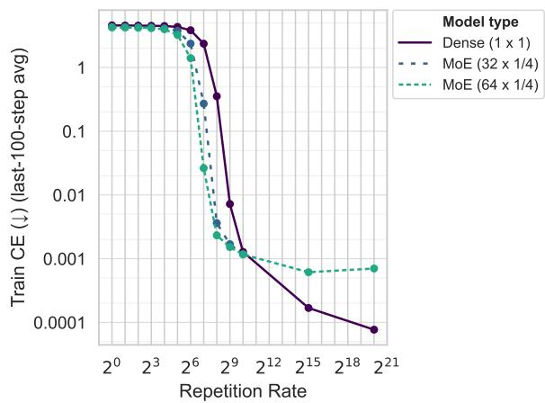

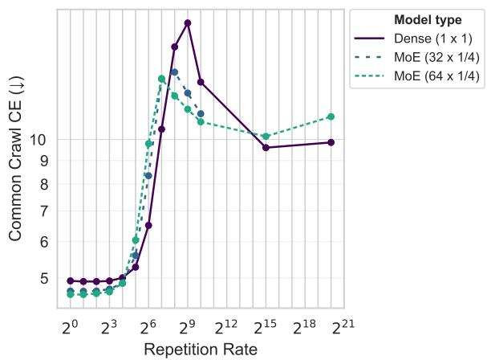  
(a) 80M

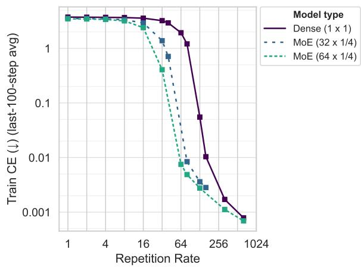

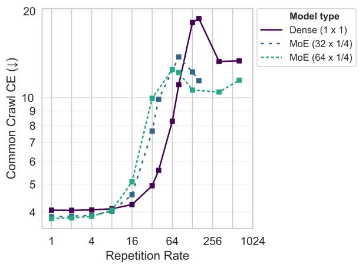  
(b) 200M

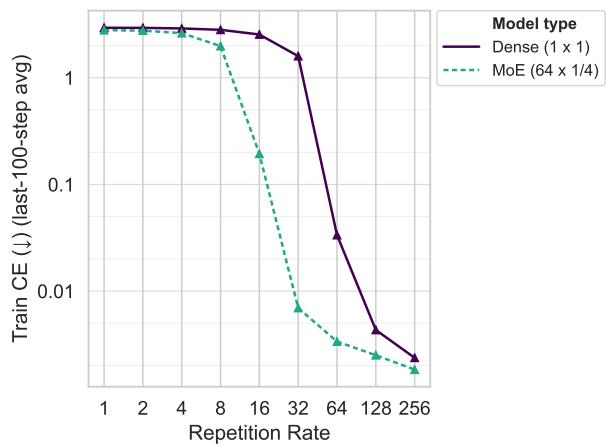

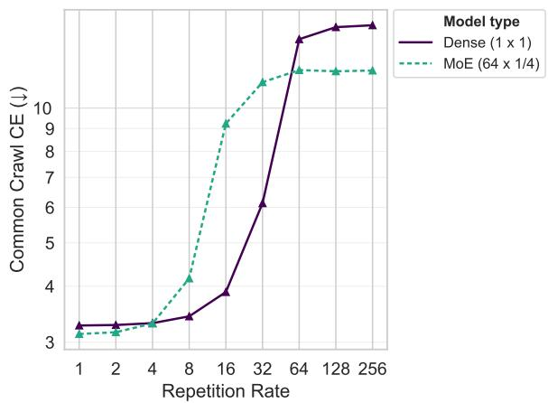  
(c) 1B  
Figure 11: Across active parameter scales, data repetition rates over 8 result in increasingly severe overfitting. Sparser models overfit more (§3.1). At 80M, 200M, and 1B active parameters, we fix the total data budget T = $2 0 \cdot N _ { a } .$ , and vary the data repetition rate R via different sized unique token sets. $\mathrm { A s } \ R$ increases, models increasingly overfit, as we observe decreasing train loss and rising validation loss. Sparsity exacerbates overfitting behavior. Larger sparse models overfit more at lower R. We also consider two additional data repetition rates $R \stackrel {  } { \approx } 2 ^ { 1 5 } , 2 ^ { 2 0 }$ at 80M active parameters, and find that validation loss rises again.

## B.3 TRAINING AND VALIDATION LOSS CURVES (§3.1)

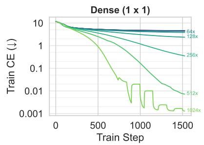

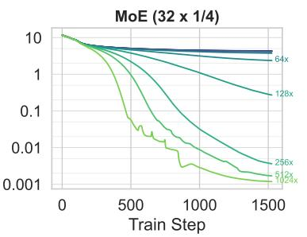  
(a) Train loss over training (80M)

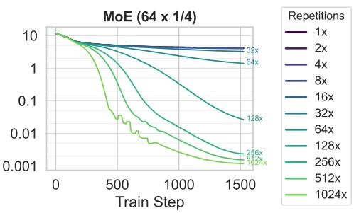

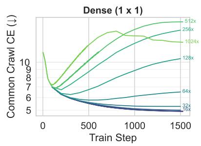

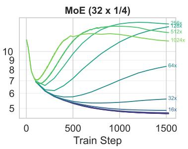

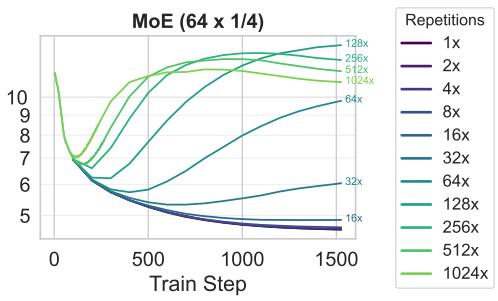  
(b) Validation loss over training (80M)

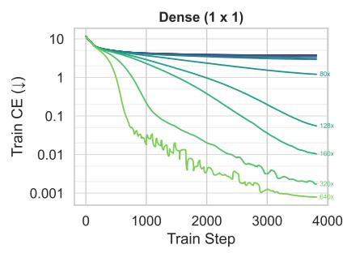

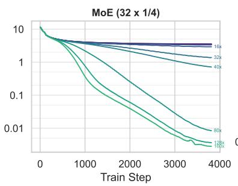

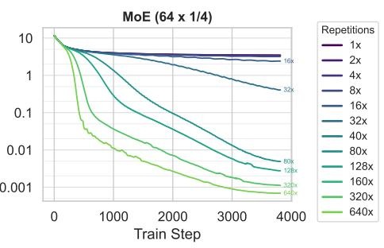  
(c) Train loss over training (200M)

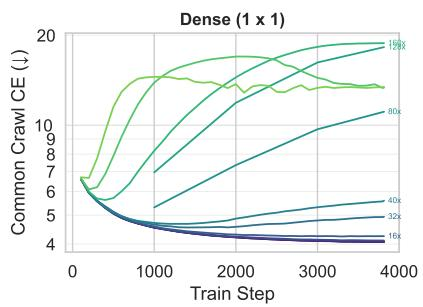

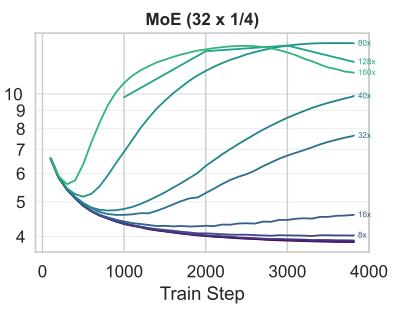  
(d) Validation loss over training (200M)

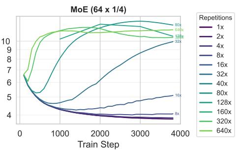

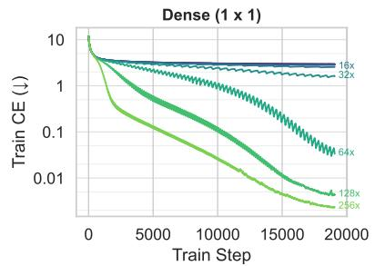

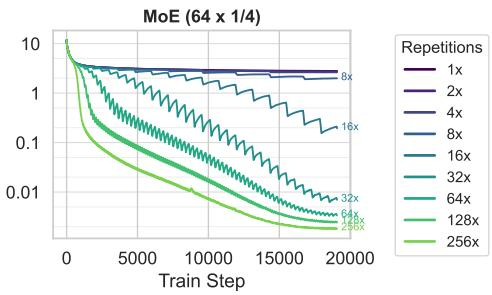  
(e) Train loss over training (1B)

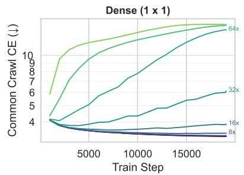

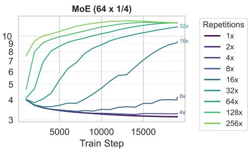  
(f) Validation loss over training (1B)

Figure 12: At higher repetition rates, training loss falls to 0, which suggests overfitting to the repeated data (§3.1). We show the training and validation loss curves over the course of training. We consistently observe that higher repetition results in training loss curves that approach 0, mirrored by validation loss curves that rise. At sufficiently high R, we observe the double descent phenomenon Muennighoff et al. (2023), in which validation curves peak then fall.

## B.4 ROUTING LOAD BALANCE AND STABILITY

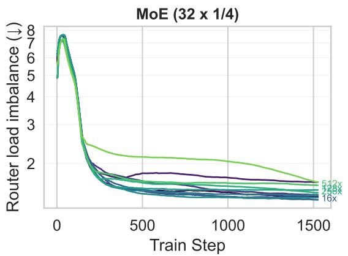

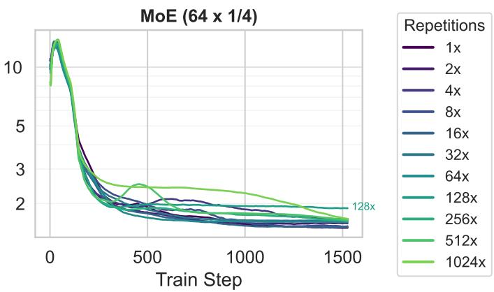  
(a) 80M active parameters

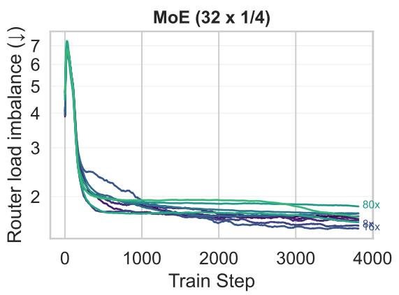

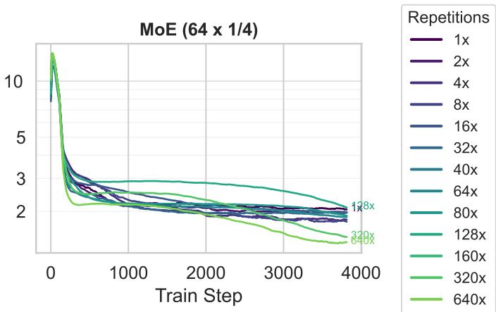

(b) 200M active parameters  
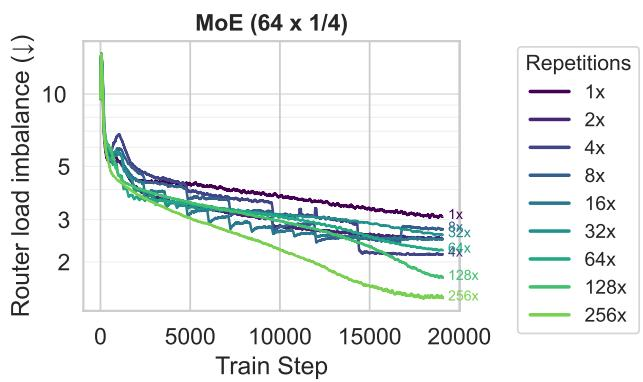  
(c) 1B active parameters  
Figure 13: Routing imbalance training curves do not follow clear patterns at lower repetition, but are outliers at high repetition. We plot the routing imbalance, defined as the ratio between the maximum and median expert load, averaged over tokens in the batch. At small scale, routing imbalance does not appear correlated with load imbalance until $\bar { R } > 1 2 8$ , where curves become outliers. At 1B scale, load imbalance curves become disordered, and appear to partially cycle with data repetition periods.

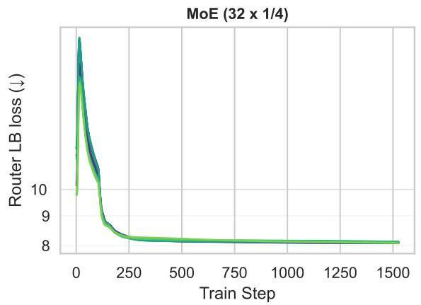

  
(a) 80M active parameters


  
(b) 200M active parameters

  
(c) 1B active parameters  
Figure 14: Routing load balancing loss training curves do not follow clear patterns at small model scale, but may correlate with repetition at larger scale. We report the load balancing loss, as defined in §2. At 80M and 200M, all settings show similar curves. At 1B, high repetition rates appear to affect load balancing loss, with intermediate values of $R = 8 .$ , 16, 32 resulting in periodicity, and outlier curves at $R = 6 4 , 1 2 8 , 2 5 6$ . It is possible that repetition itself increases load balancing loss, but that the extremely low training loss at high R results in a relatively strong optimization signal from auxiliary losses, eventually driving load balancing loss to fall.


  
(a) 80M active parameters


(b) 200M active parameters  
  
(c) 1B active parameters  
Figure 15: Router z-loss training curves cycle with data repetition. We report the router z-loss (Zoph et al., 2022b). High repetition rates appear to affect z-loss, data-repetition driven cycles at 200M and 1B scale. Higher repetition rates result in higher z-loss with a double peak relatively early in training, resolving to a lower final z-loss. It is possible that high repetition typically results in higher z-loss, but that the extremely low training loss at high R results in a relatively strong optimization signal from auxiliary losses, eventually driving z-loss to fall.

## B.5 REGULARIZERS (§4)

  
(a) Dropout

  
(b) Gradient Norm Clipping

  
(c) Weight Decay

  
(d) FFN Output Masking

  
(e) Expert Dropout

  
(f) Expert Output Masking

  
(g) MoE Router Jitter  
Figure 16: Dropout (a), FFN Output Masking (d), Expert Dropout (e), and Expert Output Masking (f) each reduces overfitting from data repetition (§4). Of the regularization methods studied in §4, these 4 dramatically decrease the response to data repetition. However, weight decay (b) and gradient norm clipping (c), as well as MoE router jitter (f), have minimal effect.

## B.6 DATA FILTERING (§3.3)


  
(a) Dolma Common Crawl Validation CE Loss


  
(b) Dolma peS2o Validation CE Loss


  
(c) Dolma Stack Validation CE Loss  
Figure 17

## B.7 INTERPOLATING BETWEEN A SINGLE DOMAIN AND A MIX

We consider an experimental setup similar to §3.3, but with interpolation between DCLM-baseline and a data mix. We use Dolma 1.7 (Soldaini et al., 2024b), which is similar to the OLMoE mix (§A.3; used in §3), but includes more sources. Dolma 1.7 and DCLM-baseline do not fall on a spectrum of quality, but rather of homogeneity. Unlike our experiments of §3.4, which are carefully controlled examinations of 2-domain mixes, the heterogeneity of Dolma 1.7 more closely resembles that of data mixes used for frontier LMs.


  
(a) Dolma Common Crawl Validation CE Loss


  
(b) Dolma peS2o Validation CE Loss


  
(c) Dolma Stack Validation CE Loss  
Figure 18

## B.8 MECHANISTIC ANALYSES OF ROUTING (§5)

  
(a) MoE (16 x 1/4)

  
(b) MoE (32 x 1/4)

  
(c) MoE (64 x 1/4)

  
(d) MoE (128 x 1/4)

  
(e) MoE (64 x 1/8)

  
(f) MoE (16 x 1/2)

Figure 19: Routing ossifies early in training, exacerbated by repetition (§5.1). We show Top-1 routing stability, which we define as the fraction of held-out Common Crawl tokens that keep the same top-1 expert between consecutive checkpoints (200 steps apart), averaged over layers, for the 80M MoE models. At the beginning of training, consecutive checkpoint agreement is near chance, at roughly $\textstyle { \frac { 1 } { n } }$ for all MoE (n x g) configurations. However, routing stability rises rapidly for all settings, with fewer than $2 5 \%$ of tokens routed to a different top-1 expert when comparing step 400 to 600. Router ossification is slightly higher with fewer experts (lower n) or with higher granularity (larger g). Stability at each checkpoint also increases with repetition rate R, up to roughly $R = 1 6 , 3 2$ , where the router appears to destabilize.


  
Figure 20: Routing stability, expert specialization, and expert-coactivation entropy rise slightly with repetition rate (§5). We show more MoE configurations for (a) end-of-training routing stability, (b) expert knockout effect, and (c) expert co-activation entropy. (a) End-of-training routing stability increases slightly with repetition rate R. Higher expert count naturally results in lower stability, as there are more experts to choose from. Fewer active, but larger experts slightly decreases stability. (b) Expert specialization increases slightly with R. Higher expert count results in lower specialization. Varying active expert count along with expert size has no clear effect. (c) Co-activation entropy of expert pairs (normalized by maximum) rises steadily with R towards uniformly distributed pairings. Entropy is higher with fewer total experts, and with a larger active number of smaller experts.


  
Figure 21: Routing stability, expert specialization, and expert-coactivation entropy rise slightly with repetition rate at 200M active parameters (§5). We show 200M MoE (32 x 1/4) and MoE (64 x 1/4) configurations for (a) end-of-training routing stability, (b) expert knockout effect, and (c) expert co-activation entropy. (a) End-of-training routing stability increases slightly with repetition rate R. Higher expert count naturally results in lower stability, as there are more experts to choose from. (b) Expert specialization increases slightly with R. Higher expert count results in lower specialization. (c) Co-activation entropy of expert pairs (normalized by maximum) rises steadily with R towards uniformly distributed pairings. Entropy is higher with fewer total experts.


  
Figure 22: Dropout increases routing stability and expert-coactivation entropy, but decreases expert specialization (§5). We show, for various dropout settings on our 200M MoE (64 x 1/4) configurations: (a) end-of-training routing stability, (b) expert knockout effect, and (c) expert co-activation entropy. (a) End-of-training routing stability increases with higher dropout probability, and still rises with repetition rate R. (b) Expert specialization decreases with higher dropout probability, but still increases slightly with R. (c) Co-activation entropy of expert pairs (normalized by maximum) increases with dropout probability, and still rises steadily with R towards uniformly distributed pairings.

## B.9 ADDITIONAL LANGUAGE MODELING TASKS

We show results for the additional held-out language modeling tasks of Appendix A.4 on the models from §3, with the extended settings of Appendix B.2.


  
(a) C4 (CE Loss ↓)


  
(b) Dolma books (CE Loss ↓)


  
(c) Dolma common-crawl (CE Loss ↓)


  
(d) Dolma pes2o (CE Loss ↓)


  
(e) Dolma reddit (CE Loss ↓)


  
(f) Dolma stack (CE Loss ↓)


  
(g) Dolma wiki (CE Loss ↓)


  
(h) ICE (CE Loss ↓)


  
(i) Pile (CE Loss ↓)


  
(j) S2ORC (CE Loss ↓)


  
(k) Wikitext (CE Loss ↓)

  
Figure 23: Held-out language modeling loss largely follows the same patterns. For 80M, 200M, and 1B active parameter models trained on OLMoE mix, we show held-out language modeling loss on a wide variety of domains. Performance depends on the exact domain, but largely follows the trends shown in Figure 1.

## B.10 DOWNSTREAM TASKS

We show results for the downstream tasks of Appendix A.4 on the models from §3, with the extended settings of Appendix B.2. We include CE Loss on all tasks, as well as accuracy on Hellaswag. Accuracy on all other tasks remains near-chance, even at 1B scale.


  
(a) BoolQ (CE Loss ↓)


  
(b) Hellaswag (CE Loss ↓)


  
(c) MMLU Humanities (CE Loss ↓)


  
(d) MMLU Other (CE Loss ↓)


  
(e) MMLU Social Sciences (CE Loss ↓)


  
(f) MMLU Stem (CE Loss ↓)


  
(g) Hellaswag (Accuracy ↑)

  
Figure 24: Downstream task performance closely follows validation loss. For 80M, 200M, and 1B active parameter models, downstream task loss is subject to random noise, but loosely follows trends of validation loss.