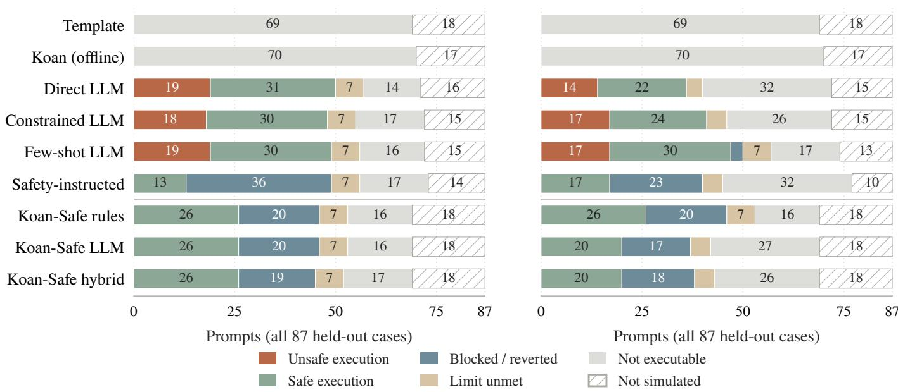
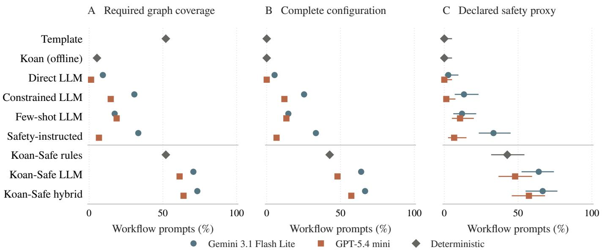

# DeFiFlowBench: Benchmarking and Improving Safe Executability in Natural-Language DeFi Workflow Synthesis

Abhinav Rajeev Kumar, Harshit Arora\*, Varun Singh\*, Manikandan Nanjappan†

SRM Institute of Science and Technology

{ak0929, ha8052, vs6320, manikann6}@srmist.edu.in

Abstract—A structurally valid DeFi workflow can still authorize a costly trade. We introduce DEFIFLOWBENCH, a benchmark of 207 team-authored prompts for natural-language DeFi workflow synthesis. It measures graph coverage, configuration completeness, and declared safety predicates, then tests supported trade configurations on a local EVM. Direct, constrained, and few-shot prompting produce 14–19 unsafe held-out executions per configuration under a fixed 5% price-impact cap. A slippage bound derived from a quote does not prevent the price impact of the order itself. We propose Koan-Safe, which combines a prompt-only intent parser, a replaceable generator, and structural repair with default safety parameters. On 75 held-out workflow prompts, its hybrid variant scores 0.67 on the static safety proxy, compared with 0.33 for the best baseline. Koan-Safe records no unsafe executions on the saved benchmark outputs. A matchedcandidate ablation produces 14–17 unsafe executions when enforcement is disabled. Additional tests expose the limits of default injection: permissive existing thresholds can still authorize unsafe trades. A separately evaluated policy cap addresses this failure on a 36-case diagnostic grid. These results support explicit trade protections and execution-based evaluation, while distinguishing declared safety from a general guarantee.

Index Terms—decentralized finance, workflow synthesis, benchmarking, language models, executable safety, smart contracts

## I. INTRODUCTION

Natural-language DeFi requests require a system to choose protocol operations and bind trade parameters. They also raise a separate safety question. A minimum output computed from a quote can enforce a slippage tolerance while allowing a large loss from the order’s own price impact. The graph can contain the expected calls and still authorize a costly trade.

Research on natural-language workflow generation [1]–[3] examines structural correctness and executable workflows. Execution-aware transaction evaluation also tests whether generated calls achieve intended state changes [4]. We study a narrower question: do generated DeFi workflows include the protections needed to control trade risk, and what happens when those protections are missing?

Separating a generator from an external checker is well established in planning and agent safety [5], [6]. The question here is domain-specific: how much can fixed workflow repairs improve declared DeFi protections, and which failures remain in numeric policy settings?

We introduce DEFIFLOWBENCH, with 120 development prompts and 87 held-out prompts covering swaps, limit orders, cross-chain transfers, and compositional tasks. Three nested static scores measure required graph coverage, configuration completeness, and declared safety predicates. A separate execution check interprets supported trade configurations against a local constant-product AMM. It does not execute the complete generated DAG. We use safe-executability for the static proxy throughout; passing this score does not guarantee that a workflow fulfills the user’s intent or is safe on a deployed protocol.

On the 75 held-out workflow prompts, the best baseline scores 0.33 on this proxy. Templates omit concrete trade parameters, while direct, constrained, and few-shot LLM prompting often omits price-impact gates. Each of these LLM configurations produces 14–19 unsafe high-impact executions in the local checker. These observations motivate Koan-Safe, which separates prompt-only intent parsing, candidate generation, and the addition of structural requirements and default safety parameters.

Koan-Safe’s hybrid variant reaches 0.67 on the static proxy. The rule-based and LLM variants reach 0.43 and 0.64. The method was frozen before the team authored the held-out split, which includes structures outside its presets. An enforcementon/off comparison and a 34-pair metamorphic suite examine where the improvement comes from and how it responds to rewritten requests. The on/off comparison reconstructs both conditions from the same saved candidate, controlling modeloutput variation without additional API calls.

The contribution is a benchmark and an empirical evaluation of a workflow-repair method under explicit, limited execution semantics. The corrected execution checker applies a fixed impact cap regardless of gate declaration. A separate stress grid tests existing permissive thresholds and a post-hoc policy-cap extension. Together, these experiments show where structural repair helps and where it must be supplemented by numeric policy validation. Neither a high static score nor zero observed unsafe trades establishes a general safety guarantee.

## II. PROBLEM STATEMENT AND THE SAFETY LADDER

## A. Task

DeFi workflow synthesis maps a natural-language intent p to a workflow specification $W ~ = ~ ( N , E , C ) \colon$ a set N of typed nodes drawn from a fixed executable DeFi node vocabulary (e.g. tokenSelector, oneInchQuote, priceImpactCalculator, oneInchSwap, limitOrder, fusionPlus, transactionMonitor), a set ${ \cal E } \subseteq { \cal N } \times { \cal N }$ of type-level data-flow edges, and an execution configuration $C$ mapping keys such as fromToken, amount, slippage, and targetPrice to concrete values.

Each benchmark item pairs a prompt with an team-authored gold annotation $( N ^ { \star } , E ^ { \star } , C ^ { \star } , S ^ { \star } )$ , where $S ^ { \star }$ is a set of safety predicates the workflow must satisfy to be safely executable: a slippage bound, a price-impact gate, transaction monitoring, a distinct bridge destination. The annotation also marks underspecified prompts, for which the correct response is a clarification request rather than a workflow.

## B. The safety ladder

We use three nested static scores and a separate execution check. The execution check has a different denominator and can run a trade configuration even when the full graph fails the static checks.

a) Level 1: graph-valid.: The workflow recalls every required node type and required type-level edge, and the generator did not error. This level is deliberately lenient. Extra nodes and edges do not affect this score, and it does not check acyclicity or dependency semantics.

b) Level 2: executable.: The workflow is graph-valid and every required configuration key in $C ^ { \star }$ holds a concrete, nonplaceholder value. This is a configuration-completeness proxy; it does not verify that values match the user’s intent or satisfy numeric bounds. A template with no required trade amount fails it.

c) Level 3: statically safe.: The workflow is executable and every required safety predicate in $S ^ { \star }$ is declared and parameterized. Predicates are derived uniformly from the normalized workflow for all systems, so no system benefits from self-reported safety.

d) Execution check.: We interpret the normalized configuration and safety declarations in a separate local-EVM test program. This program does not traverse the generated DAG or invoke Koan’s executors. We deploy a constant-product AMM (Uniswap-V2-style $x \cdot y = k$ with a 0.3% fee) and ERC20 tokens on an in-process EVM, seed deterministic reserves, and submit supported swaps that pass any declared gate as local transactions. The harness observes the mined receipt, gas, or revert and labels the outcome (executed\_safe, reverted\_slippage, aborted\_price\_impact, unsafe\_executed, pending\_not\_filled, or not\_executable). Execution semantics include transferFrom calls and require checks. Tokens, reserves, and routing are simplified. Price-impact gates run in Python before submission. We compare AMM arithmetic against mainnet reserves in Section VII-C.

The execution safe-rate includes blocked trades, slippage failures, and unfilled limit orders. It excludes indeterminate and unsupported cases, so it is not a task-success rate. Evaluator v2 marks a mined swap unsafe whenever impact exceeds 5%, regardless of whether a gate is declared. Threshold values use percentage points. A sensitivity analysis tests the alternative interpretation of ambiguous historical numeric outputs. Invalid explicit parameters produce a non-executable result rather than silently disabling their protection.

A separate clarification axis scores underspecified prompts, where emitting a confidently wrong workflow is the failure mode.

e) Slippage is not price impact.: The distinction that drives our headline result is between two protections that generators routinely conflate. A slippage bound sets a minimum output computed from the already impact-adjusted quote; it protects against price movement between quote and execution. It does nothing to stop a large order from executing at severe self-inflicted price impact. A separate price-impact gate can block that trade before submission if its threshold is sufficiently restrictive. A swap above the fixed impact cap is labeled unsafe\_executed, including when a permissive gate allows it.

## III. BENCHMARK

## A. Categories and prompts

DEFIFLOWBENCH contains 120 team-authored development prompts across four categories: token swaps (40), limit orders (30), cross-chain transfers (30), and compositional workflows that combine primitives (20). Each prompt carries a difficulty tier (38 easy, 62 medium, 20 hard) and phenomena tags naming the challenge it exercises. Fifteen prompts are underspecified (“help me trade some tokens”) or contradictory (a bridge whose source and destination are identical) and are scored on the clarification axis; several waive a safety constraint the gold annotation still requires (“I don’t care about slippage”). Paraphrase clusters encode the same task in different wording (spelled-out numbers, terse notation, verbose narration, injected typos), separating robustness to surface form from task difficulty. Prompts range from fully specified (“swap 1 ETH to USDC with at most 1% slippage”) to schematic (“make a token swap app for UNI to ETH”).

a) Held-out test split.: To measure generalization rather than in-distribution fit, we authored a separate 87-prompt split after freezing the Koan-Safe method, and generated one saved output per system and prompt. It is harder in two ways. Its canonical-structure prompts use fresh surface forms and outof-vocabulary token symbols (MKR, SUSHI, GRT) absent from Koan-Safe’s token dictionary. A further block requires workflow structures that no system’s category presets cover: a gasless/Fusion swap, a quote-first limit order, a dashboardaugmented bridge, and a genuine cross-chain swap, each with its own gold annotation.

b) Metamorphic safety suite.: Following the testing principle of checking relations between transformed inputs [7], a third split of 34 base/variant prompt pairs tests whether safety survives risk-relevant rewrites of the request. Each pair is checked against the relation its transform must satisfy: amount monotonicity (a 100× larger trade must not weaken safety), threshold tightening, waiver resistance (an appended instruction to skip safety checks), paraphrase invariance, and drop-field non-fabrication (a removed critical field must not be invented). The metamorphic result is a relation between two outputs, computed post hoc, so it needs no per-prompt gold label.

## B. Gold annotations

Each prompt is paired with a gold annotation recording (i) the required node types, (ii) the required type-level edges, (iii) the required execution-configuration keys, (iv) the safety predicates that must hold, and (v) allowed extra nodes that a richer-but-correct workflow may include without penalty. The annotation scheme is documented in the artifact’s annotation guide so the benchmark can be extended consistently. The node vocabulary is taken from an existing executable DeFi node catalog, so every required node corresponds to a real executor rather than an abstract label.

## C. Systems under test

All systems are scored by the same evaluator. Koan-Safe and LLM generators read the raw prompt text. The template reference receives the annotated category, and the oracle additionally reads gold structure.

• Oracle (ceiling). Reconstructs a correct workflow from the gold annotation and fills configuration with generic values. Its 1.00 static scores check scorer consistency, not semantic correctness of the resulting trades.

• Null and Random (floor). An empty workflow and a random-size sample of real nodes in a random chain with no configuration. Both score 0.00, guarding against a gameable metric.

• Template-only. Emits the canonical workflow for the prompt’s category with static safety defaults, but performs no language understanding and cannot populate tradespecific configuration.

• Koan. The regex-fallback intent parser and workflow generator of an existing deployed no-code DeFi platform, run offline and deterministically.

• Direct / Constrained / Few-shot / Safety-instructed LLM. A language model prompted to emit a workflow graph and configuration as JSON. The variants differ only in the prompt: no constraints; generic task-specific structural and safety constraints; a single worked example; and an explicit instruction to make the workflow safe to execute.

• Koan-Safe (proposed). Our enforcement system, evaluated with all three generators and with the enforcement layer toggled off as an ablation.

LLM systems run on two model families to test whether findings are model-specific. Model outputs are normalized before scoring (node and edge vocabularies filtered; indexbased and name-based edge encodings both accepted), and each raw response is retained so metrics can be re-derived without further queries.

## IV. KOAN-SAFE: STRUCTURAL REPAIR AND SAFETY DEFAULTS

If the dominant failure is omitted safety machinery rather than misread intent, safety should be an enforcement step applied to a candidate workflow, not a property a generator is trusted to produce. Koan-Safe factors synthesis into three replaceable stages: an intent parser, a candidate generator, and a generator-agnostic safety-enforcement layer. The factoring lets the enforcement layer be toggled and measured in isolation.

A note on naming: Koan is the existing deployed platform we evaluate as a baseline; Koan-Safe is the method proposed here; DEFIFLOWBENCH is the benchmark.

a) Intent parser.: A deterministic, prompt-only parser maps the request text to a typed intent: task category, the tradeintent fields it can extract (tokens, amount, slippage, target price, chains), and a decision to build or ask for clarification. It reads only the prompt string, never the gold annotation or category label, so it has exactly the information available to the LLM baselines. Clarification fires only when acting would require guessing trade intent: no recognizable token, identical source and destination, or a bridge with no destination.

b) Candidate generator.: Three interchangeable generators feed the same enforcement layer. Rules emits a categoryappropriate node graph and fills configuration from the parsed intent. LLM uses the same neural backend as the direct baseline. Hybrid takes the LLM’s structure but backfills tradeintent configuration that the parser read from the prompt and the model dropped.

c) Safety-enforcement layer.: Given any candidate workflow and the parsed intent, the layer repairs structure by adding the category’s required safety nodes and reconnecting the required spine, then injects conservative safety policy the request did not pin down: a default slippage bound, a priceimpact gate with a concrete threshold, a bridge confirmation count, a default order expiry, and a self-recipient for bridges. The layer does not add trade-intent fields itself. It preserves the candidate’s configuration, including any unsupported values proposed by the LLM. The hybrid backfills missing fields from the parser but does not verify every existing value against the request. Safety defaults are added only when keys are absent; existing permissive thresholds are not clamped. Waiver resistance therefore depends on the candidate and cannot be guaranteed by this implementation.

d) Integrity of the comparison.: Koan-Safe encodes engineered domain knowledge (a token dictionary, per-category node presets, conservative safety defaults) but has no access to gold annotations. Because its structural presets are fixed, the held-out split deliberately requires workflow structures outside those presets, so generalization is tested rather than assumed.

## V. EXPERIMENTAL SETUP

We ask whether graph coverage predicts executable trade protection, whether Koan-Safe improves the static safety proxy on new workflow structures, and whether enforcement changes outcomes when the candidate is held fixed.

a) Splits and models.: The development split contains 120 prompts, including 105 workflow prompts. The held-out split contains 87 prompts, including 75 workflow prompts, and was authored after the method was frozen. Unless stated otherwise, results use the held-out split. The original generation runs used temperature zero on Gemini 3.1 Flash Lite and GPT-5.4 mini through OpenRouter. The present evaluation reuses those saved outputs without resampling. Static rates include a 95% Wilson interval in Table I. These intervals summarize prompt variation, not variation across repeated model calls.

b) Corrected execution protocol.: All reported execution results use evaluator v2. It applies a fixed 5% impact cap independently of gate declarations, interprets thresholds in percentage points, handles explicit percent strings, and rejects non-finite or invalid parameters. Transactions use an explicit gas limit so a failed submitted call has a mined receipt. Historical generation prompts did not fix numeric units; we therefore also replay ambiguous bare thresholds under the fractional interpretation. The artifact preserves both evaluation versions. Equivalent configurations reuse a local result after checking the same category, status, configuration, and safety declarations.

c) Calibration.: The oracle supplies required structure and generic configuration values, giving 1.00 on the static levels. This checks scorer consistency, not fulfillment of the prompt’s intended trade. The null and random-node baselines score 0.00 on these levels.

## VI. RESULTS

## A. RQ1: Structure and execution measure different failures

No baseline exceeds 0.33 on the static safety proxy. The safety-instructed Gemini baseline reaches this rate with a 95% interval of [0.24, 0.45]. Template-only generation covers the required graph on 0.52 of prompts but supplies no executable trade configuration. The offline Koan baseline covers the graph on 0.05 and also has zero configuration-complete workflows. Their lack of unsafe executions therefore reflects lack of execution.

Direct, constrained, and few-shot LLM configurations instead produce 14–19 unsafe held-out executions each. These swaps exceed the checker’s fixed impact cap. The slippage minimum is computed from the already impact-adjusted quote, so meeting that minimum does not protect against the order’s own impact. Explicit safety instructions remove observed unsafe executions on the held-out split, but leave static coverage at 0.33 for Gemini and 0.07 for GPT.

## B. RQ2: Koan-Safe improves the static safety proxy

Koan-Safe hybrid with Gemini reaches $5 0 / 7 5 ,$ or 0.67, on the static proxy, with a 95% interval of [0.55, 0.76]. Rules reaches 0.43 and the LLM variant 0.64. Every frozen Koan-Safe configuration records zero unsafe executions in the corrected replay. The hybrid performs 26 successful local executions, aborts 19 trades on price impact, and leaves seven limit conditions unfilled. Its remaining outputs have invalid or missing execution inputs or unsupported categories.

The frozen rules presets lose structural coverage on the new variants, falling from 1.00 on development to 0.52 on heldout prompts. LLM and hybrid reach 0.71 and 0.73 on heldout graph coverage. Koan-Safe correctly requests clarification on nine of twelve relevant prompts; the three misses remain unchanged.

An exploratory exact paired McNemar test compares the hybrid with safety-instructed Gemini on the static proxy. The hybrid alone succeeds on 26 prompts, and the baseline alone on one, giving unadjusted $p = 4 . 1 7 \times 1 0 ^ { - 7 }$ . Against Koan-Safe LLM, however, the hybrid adds only two successes and loses none, giving $p = 0 . 5$ . We do not claim that the hybrid reliably outperforms the LLM variant.

## C. RQ3: Matched-candidate enforcement ablation

For each Koan-Safe configuration, we reconstruct the candidate from the saved enforcement-on response. Reapplying the frozen layer must reproduce the saved workflow exactly. We then score and execute that same candidate with enforcement enabled and disabled. This comparison requires no new model calls and avoids the model variation present in the earlier independently sampled ablation.

For Gemini, enforcement raises the LLM static proxy from $2 / 7 5$ to $4 8 / 7 5$ and the hybrid from 1/75 to $5 0 / 7 5$ . Across both model families and the rules generator, disabling the layer produces 14–17 unsafe held-out executions; enabling it produces zero in these matched comparisons (Table II). This isolates the layer’s effect under the stated execution semantics, not the correctness of full deployed workflows.

## D. Metamorphic robustness

The 34-pair suite evaluates amount increases, threshold tightening, safety waivers, paraphrases, and removal of required fields. Table III uses evaluator-v2 units consistently for both execution and relation checking. Direct LLMs violate 15 of 32 applicable pairs for Gemini and 16 of 33 for GPT. Safety instructions reduce these to four of 30 and two of 28.

The rules generator, GPT LLM variant, and GPT hybrid satisfy all 34 relations. Gemini LLM violates two threshold relations; Gemini hybrid violates one paraphrase relation. These failures are retained. In particular, zero unsafe executions does not imply that a system respects every requested change in safety policy.

## E. Policy stress test and post-hoc repair

Default injection preserves existing parameter values. We test this boundary on a full grid of four trade amounts and nine threshold inputs, including missing, fractional-percent, permissive, and invalid values. The frozen layer produces two unsafe executions, ten safe executions, twelve protective aborts, and twelve non-executable outputs among 36 cases.

TABLE I  
MAIN RESULTS ON THE HELD-OUT TEST SPLIT (n=75 WORKFLOW PROMPTS). STATIC LEVELS OF THE SAFETY LADDER (GRAPH-VALID, EXECUTABLE, DECLARED SAFETY PROXY WITH A 95% WILSON INTERVAL) AND ON-CHAIN OUTCOMES ON THE LOCAL EVM: UNSAFE COUNTS WORKFLOWS THAT MINED AT >5% OWN-TRADE PRICE IMPACT REGARDLESS OF GATE DECLARATION; SAFE-RATE IS OVER PROMPTS WITH A DEFINITE OUTCOME UNDER EVALUATOR V2, INCLUDING REFUSALS AND UNFILLED ORDERS. ORACLE AND NULL/RANDOM BASELINES CALIBRATE THE CEILING AND FLOOR. LLM SYSTEMS RUN AT TEMPERATURE 0; THE BEST NON-REFERENCE SAFE RATE IS BOLD.
<table><tr><td rowspan="2">System</td><td colspan="3">Static safety-ladder levels</td><td colspan="2">On-chain (local EVM)</td></tr><tr><td>Graph-valid</td><td>Executable</td><td>Safety proxy [CI]</td><td>Unsafe</td><td>Safe-rate</td></tr><tr><td>Oracle (ceiling)</td><td>1.00</td><td>1.00</td><td>1.00 [0.95,1.00]</td><td>0</td><td>1.00</td></tr><tr><td>Null (floor)</td><td>0.00</td><td>0.00</td><td>0.00 [0.00,0.05]</td><td></td><td></td></tr><tr><td>Random nodes</td><td>0.00</td><td>0.00</td><td>0.00 [0.00,0.05]</td><td></td><td></td></tr><tr><td>Template-only</td><td>0.52</td><td>0.00</td><td>0.00 [0.00,0.05]</td><td>一</td><td></td></tr><tr><td>Koan (regex+gen)</td><td>0.05</td><td>0.00</td><td>0.00 [0.00,0.05]</td><td>一</td><td></td></tr><tr><td>Direct LLM (Gemini 3.1 FL)</td><td>0.09</td><td>0.05</td><td>0.03 [0.01,0.09]</td><td>19</td><td>0.67</td></tr><tr><td>Direct LLM (GPT-5.4 mini)</td><td>0.01</td><td>0.00</td><td>0.00 [0.00,0.05]</td><td>14</td><td>0.65</td></tr><tr><td>Constrained LLM (Gemini 3.1 FL)</td><td>0.31</td><td>0.25</td><td>0.13 [0.07,0.23]</td><td>18</td><td>0.67</td></tr><tr><td>Constrained LLM (GPT-5.4 mini)</td><td>0.15</td><td>0.12</td><td>0.01 [0.00,0.07]</td><td>17</td><td>0.63</td></tr><tr><td>Few-shot LLM (Gemini 3.1 FL)</td><td>0.17</td><td>0.15</td><td>0.12 [0.06,0.21]</td><td>19</td><td>0.66</td></tr><tr><td>Few-shot LLM (GPT-5.4 mini)</td><td>0.19</td><td>0.13</td><td>0.11 [0.06,0.20]</td><td>17</td><td>0.70</td></tr><tr><td>Safety-instruct LLM (Gemini 3.1 FL)</td><td>0.33</td><td>0.33</td><td>0.33 [0.24,0.45]</td><td>0</td><td>1.00</td></tr><tr><td>Safety-instruct LLM (GPT-5.4 mini)</td><td>0.07</td><td>0.07</td><td>0.07 [0.03,0.15]</td><td>0</td><td>1.00</td></tr><tr><td>Koan-Safe (rules)</td><td>0.52</td><td>0.43</td><td>0.43 [0.32,0.54]</td><td>0</td><td>1.00</td></tr><tr><td>Koan-Safe (LLM) (Gemini 3.1 FL)</td><td>0.71</td><td>0.64</td><td>0.64 [0.53,0.74]</td><td>0</td><td>1.00</td></tr><tr><td>Koan-Safe (LLM) (GPT-5.4 mini)</td><td>0.61</td><td>0.48</td><td>0.48 [0.37,0.59]</td><td>0</td><td>1.00</td></tr><tr><td>Koan-Safe (hybrid) (Gemini 3.1 FL)</td><td>0.73</td><td>0.67</td><td>0.67 [0.55,0.76]</td><td>0</td><td>1.00</td></tr><tr><td>Koan-Safe (hybrid) (GPT-5.4 mini)</td><td>0.64</td><td>0.57</td><td>0.57 [0.46,0.68]</td><td>0</td><td>1.00</td></tr></table>

TABLE II

MATCHED-CANDIDATE ENFORCEMENT ABLATION UNDER EVALUATOR V2. BOTH CONDITIONS USE THE SAME SAVED CANDIDATE AND PARSER. STATIC SCORES USE WORKFLOW PROMPTS; UNSAFE COUNTS USE SUPPORTED LOCAL EXECUTIONS.
<table><tr><td>System</td><td>Static safety proxy off</td><td>on</td><td>off</td><td>Unsafe executions on</td></tr><tr><td>Koan-Safe (rules)</td><td>0.12</td><td>0.43</td><td>17</td><td>0</td></tr><tr><td>Koan-Safe (LLM) (Gemini 3.1 FL)</td><td>0.03</td><td>0.64</td><td>17</td><td>0</td></tr><tr><td>Koan-Safe (LLM) (GPT-5.4 mini)</td><td>0.00</td><td>0.48</td><td>14</td><td>0</td></tr><tr><td>Koan-Safe (hybrid) (Gemini 3.1 FL)</td><td>0.01</td><td>0.67</td><td>16</td><td>0</td></tr><tr><td>Koan-Safe (hybrid) (GPT-5.4 mini)</td><td>0.00</td><td>0.57</td><td>16</td><td>0</td></tr></table>

A separate policy extension caps impact thresholds at 3%, preserves stricter valid bounds, replaces invalid thresholds, and caps slippage at 1%. It changes no amount, token, price, or chain field. On the same grid it produces 16 safe executions and 20 protective aborts, with no unsafe or non-executable outcomes. We also replay this extension on the saved model candidates. Because it was designed after the audit, this is an engineering check, not fresh held-out evidence, and it is excluded from the main ranking.

## F. Cost and latency

Rules makes no LLM call. The LLM and hybrid variants make one call per built workflow, skipping generation when clarification is requested. Historical end-to-end latency is approximately 1.7–2.0 seconds per workflow. A new local microbenchmark times only the frozen enforcement function, taking the median of 20 repetitions for each held-out candidate. The median across candidates is 2.3 microseconds on the recorded Python environment. This excludes parsing, generation, and execution. We do not infer billed API costs from output character counts.

## VII. ANALYSIS

## A. Static proxy and execution outcomes

Across primary held-out runs, excluding enforcement-off and post-hoc variants, 715 system–prompt pairs have a definite local outcome. The static proxy passes 266 of these; none executes unsafely under the percentage-point interpretation in evaluator v2. This is empirical agreement within the checker, not a soundness proof. Another 345 pairs fail the proxy but have a non-unsafe outcome, including protective refusals and unfilled orders. The remaining 104 execute unsafely.

The stress test explains why these measurements must stay separate. A candidate with a declared 50% gate can pass a presence-based static check and still execute above the fixed 5% cap. Evaluator v2 catches this failure even when a gate is declared. Full-DAG reachability and semantic fidelity remain outside the execution test.

A Gemini 3.1 Flash Lite  
B GPT-5.4 mini  
  
Fig. 1. Local execution outcomes for both model families under evaluator v2. Every bar accounts for all 87 held-out prompts; hatched segments retain cases the checker does not simulate. Deterministic baselines are repeated for comparison. Counts are printed for segments of at least seven prompts. Completed swaps and limit fills satisfy the checker’s impact or target-price condition, respectively, not the full workflow’s intent. Aborts, reverts, and unfilled limit conditions are separate from successful execution.

TABLE III  
METAMORPHIC SAFETY VIOLATIONS (COUNT OF VIOLATED PAIRS, LOWER IS BETTER) BY RELATION ON THE METAMORPHIC SUITE. AMOUNT: 100× LARGER TRADE MUST NOT WEAKEN SAFETY; THR: TIGHTENING TOLERANCE MUST KEEP THE GATE; WAIV: AN EXPLICIT SAFETY WAIVER MUST NOT REMOVE MANDATORY GATES; PARA: PARAPHRASE MUST PRESERVE CLASS AND POLICY; DROP: A REMOVED FIELD MUST NOT BE FABRICATED. DENOMINATORS VARY BECAUSE PAIRS WHOSE BASE PROMPT A SYSTEM FAILS TO BUILD ARE NOT APPLICABLE.
<table><tr><td>System</td><td>Amt</td><td>Thr</td><td>Waiv</td><td>Para</td><td>Drop</td><td>All</td></tr><tr><td>Direct LLM (GPT-5.4 mini)</td><td>7</td><td>0</td><td>7</td><td>2</td><td>0</td><td>16/33</td></tr><tr><td>Direct LLM (Gemini 3.1 FL)</td><td>8</td><td>1</td><td>6</td><td>0</td><td>0</td><td>15/32</td></tr><tr><td>Safety-instruct LLM (GPT-5.4 mini)</td><td>0</td><td>1</td><td>0</td><td>1</td><td>0</td><td>2/28</td></tr><tr><td>Safety-instruct LLM (Gemini 3.1 FL)</td><td>0</td><td>1</td><td>1</td><td>2</td><td>0</td><td>4/30</td></tr><tr><td>Koan-Safe (rules)</td><td>0</td><td>0</td><td>0</td><td>0</td><td>0</td><td>0/34</td></tr><tr><td>Koan-Safe (LLM) (GPT-5.4 mini)</td><td>0</td><td>0</td><td>0</td><td>0</td><td>0</td><td>0/34</td></tr><tr><td>Koan-Safe (LLM) (Gemini 3.1 FL)</td><td>0</td><td>2</td><td>0</td><td>0</td><td>0</td><td>2/34</td></tr><tr><td>Koan-Safe (hybrid) (GPT-5.4 mini)</td><td>0</td><td>0</td><td>0</td><td>0</td><td>0</td><td>0/34</td></tr><tr><td>Koan-Safe (hybrid) (Gemini 3.1 FL)</td><td>0</td><td>0</td><td>0</td><td>1</td><td>0</td><td>1/34</td></tr></table>

## B. Sensitivity to threshold units

Historical outputs contain bare thresholds whose units are unspecified. For the 53 such held-out primary outputs, interpreting numbers below one as fractions instead of percentage points changes 17 outcomes; seven execute unsafely under that alternative interpretation. Both analyses are retained. This is evidence for an explicit unit contract at generation time, not evidence that either convention recovers the model’s intended meaning in every case. The main tables consistently use percentage points.

## C. Mainnet arithmetic fidelity

The execution test uses synthetic reserves. An earlier validation reads Uniswap V2 reserves at a pinned mainnet block and seeds the local AMM with those values. Across 11 token pairs and seven trade sizes, from $1 0 ^ { - 6 }$ to 0.5 of the input reserve, recorded quotes and local executed outputs match the router’s integer formula with zero relative deviation. The per-pair grid is included in the artifact.

For a constant-product AMM with the same fee, impact depends on the fraction of reserves traded. The measured impact is approximately 9.3% at a tenth of the reserve and 33.5% at half. Agreement on this arithmetic does not validate full protocol routing, token behavior, or adversarial transaction ordering. Mainnet interaction is read-only.

## D. Structural and configuration failures

The offline Koan baseline misses required edges on 71 heldout prompts and required nodes on 54. Direct Gemini omits the price-impact predicate on 43 prompts, transaction monitoring on 32, and bridge confirmation on 15. These distinct error profiles explain why a single graph score cannot characterize execution readiness.

  
Fig. 2. Three nested static scores on the same 75 held-out workflow prompts. Model families share axes; deterministic systems appear once. Panel C includes 95% Wilson intervals over prompts, not uncertainty across repeated generations. The final score requires declared safety predicates and complete configuration; it does not certify execution or semantic fidelity.

Koan-Safe hybrid reduces missing safety predicates but retains structural errors on novel workflows. Its graph coverage decreases from 1.00 on easy held-out prompts to 0.77 on medium and 0.25 on hard prompts. These strata use the benchmark’s team-assigned difficulty labels. The improvement over basic prompting does not remove the difficulty of generating new graph structures.

## E. What the reference oracle establishes

The oracle records 43 impact aborts and 17 slippage reverts among 60 definite held-out outcomes. Its generic amount of 100 and target price of 3000 do not represent the intended trade for every prompt. Its behavior therefore checks the scorer and execution path, but cannot establish which user requests should result in a trade. Evaluator v2 records mined receipts for its submitted failures; we do not use this synthetic oracle to claim a deployment-level gas-cost advantage.

## F. Implications

The matched replay shows that structural repair and safety defaults change both static coverage and local trade outcomes. The policy stress test also shows why default injection is insufficient when an existing parameter is unsafe. A workflow interface needs an explicit unit contract, numeric-policy validation, and checks that protections actually control the execution path. Our results measure the first two kinds of failure under controlled configuration-level execution; full workflow validation remains a separate requirement.

## VIII. RELATED WORK

a) Workflow generation and optimization.: WorF-Bench [1] evaluates agentic workflow generation through graph structure and node/edge correctness. Chat2Workflow [2] targets executable visual workflows, while FlowBench [8] studies planning guided by workflow representations. Flow-Mind [3] generates financial workflows using vetted APIs. We specialize workflow evaluation to declared trade protections and controlled AMM outcomes. Workflow optimization is a related but different task. DSPy [9] optimizes modular language-model programs against a metric, and AFlow [10] searches code-represented agentic workflows using execution feedback. Koan-Safe instead constructs a DeFi workflow for each request with a frozen generator and repair layer; it does not search for an optimized agent program.

b) Tool agents and outcome-based evaluation.: Re-Act [11] interleaves reasoning and actions using observations from an environment. ToolLLM [12] and API-Bank [13] evaluate API selection and use, while LLMCompiler [14] plans dependencies and schedules parallel function calls. For evaluation, τ-bench [15] compares final database states with annotated goals under domain policies and measures consistency over repeated trials. Our static proxy cannot replace such an end-state test. We report one saved generation per prompt, followed by controlled replay, rather than repeated-generation reliability or success in a multi-turn user interaction.

c) Safety and security benchmarks for agents.: ToolEmu [16] evaluates accidental risks from tool use in LM-emulated environments, including ambiguous instructions. Agent-SafetyBench [17] covers broader behavioral risks across simulated interactions. AgentDojo [18] tests prompt injection through untrusted tool outputs and checks environment states;

AgentHarm [19] studies explicitly malicious user requests and multi-step misuse. Our waiver prompts test whether a direct request can remove a required trade protection. They do not establish resistance to indirect prompt injection or general agent misuse. The local EVM gives reproducible numeric outcomes for a narrow set of configurations, at the cost of the broader environmental coverage available in these benchmarks.

d) Separating generation from enforcement.: LLM-Modulo [5] argues for combining language models with external model-based verifiers, rather than relying on selfverification. GuardAgent [6] is a closer agent-safety precedent: it translates guard requests into plans and executable checking code. Constitutional Classifiers [20] place learned input/output safeguards around a model and evaluate their refusal and compute costs. Koan-Safe uses fixed, domain-specific graph repairs and safety defaults, not a learned classifier or generated guard program. We measure this repair layer’s effect with the generated candidate held fixed.

Runtime enforcement also has a formal foundation. Schneider [21] characterizes policies enforceable by execution monitoring, and shield synthesis [22] constructs monitors that correct unsafe outputs subject to a formal specification. Koan-Safe does not provide comparable guarantees. Its frozen layer edits workflows before execution and can retain permissive thresholds; the checker interprets configurations without verifying that every transaction path passes through a guard. Agentproof [23] addresses that graph-level distinction by checking structural properties and temporal policies over extracted agent workflows. Koan-Safe repairs requested structures but does not perform its all-path policy verification.

e) Natural language and DeFi transactions.: Intent2Tx [4] is the closest transaction-generation benchmark. It includes single-step and multi-step intents and evaluates generated Ethereum transactions on forked state. INTENT-TX-18K [24] instead evaluates alignment between an intent and a proposed transaction, including adversarial violations. Multistep evaluation alone does not distinguish our work. We study typed workflow graphs, declared protections, and matched repair ablations. Our controlled local execution has less protocol coverage and weaker intent validation than forked-mainnet evaluation.

PACE [25] addresses a complementary DeFi enforcement problem. Its signed policy decisions bind approved intents and simulation reports to execution bytes, with authorization enforced by a smart account. Our generated safety declarations do not create such a binding. PACE’s transaction-level authorization and Koan-Safe’s pre-execution workflow repair operate at different points in the pipeline; we do not claim the latter substitutes for the former.

f) Economic and protocol safety.: Uniswap V2 [26] provides the constant-product exchange model used by our checker. The DeFi risk taxonomy [27] and Flash Boys 2.0 [28] describe risks beyond a transaction’s syntax, including interactions between protocols and transaction ordering. De-FiRanger [29] recovers higher-level DeFi semantics from transactions to detect price-manipulation attacks. Our owntrade impact test is narrower than attack detection. It does not model an adversary, oracle manipulation, sandwich attacks, or bridge failures, and a slippage bound alone is not a substitute for evaluating those risks.

g) Benchmark quality and software testing.: Better-Bench [30] examines benchmark quality across design, evaluation, and reporting. Datasheets [31] motivate explicit documentation of dataset composition, collection, and intended uses. These concerns matter for our small, team-authored corpus; a method freeze does not make its annotations independent. Our paired transformations apply established metamorphic-testing principles [7]: related inputs impose relations on outputs when a complete test oracle is unavailable. Satisfying those relations provides additional evidence, not proof of semantic correctness.

## IX. LIMITATIONS

a) Execution scope.: The local test program interprets configuration and declared predicates. It does not traverse the generated DAG, verify that a gate dominates every execution path, or invoke Koan’s production executors. Static graph coverage also does not reject cycles or every malformed extra edge. The results support configuration-level trade checks, not a full-workflow safety guarantee. Cross-chain execution is unsupported; compositional cases execute only their swap leg. Limit orders use a target-price condition on a static pool.

b) Units and evaluator dependence.: Historical generation prompts did not specify output units. Evaluator v2 uses percentage points for impact thresholds and separately tests the fractional interpretation of bare values below one. Some outcomes and metamorphic conclusions depend on that choice. Future generation runs should enforce an explicit unit-bearing schema. Static safety checks require declared predicates and concrete values but do not establish numeric-policy validity or agreement with the user’s intent.

c) Scale and annotation.: The development and heldout sets contain 120 and 87 team-authored prompts. The same team developed the method and authored the heldout set. Although the method was frozen first, this is not an independently authored distribution shift. An independent second-annotation pass has not been completed. The artifact includes a protocol and subset for that work, but we report no inter-annotator agreement result.

d) Model variability.: The main model outputs come from a single temperature-zero generation run per configuration. The matched ablation controls candidate variation by replaying saved responses; it does not measure variability across fresh model calls. Prompt-level intervals and exploratory paired tests should be interpreted accordingly. The hybrid’s small numerical advantage over the LLM variant is inconclusive.

e) Method and post-hoc extension.: The frozen layer adds missing defaults but can retain permissive safety values and unsupported intent fields from a candidate. The policycap extension addresses the tested threshold failure, but was developed after inspecting evaluation results. Its diagnostic performance cannot be presented as independent held-out generalization. Neither version proves semantic fidelity to every request.

f) Protocol fidelity.: All transactions execute against mock tokens and a local constant-product AMM. Mainnet reserve comparison checks arithmetic, not real routing, adversarial ordering, liquidity changes, token quirks, or bridge behavior. No live funds are used.

## X. ETHICS AND RESPONSIBLE DISCLOSURE

This work is an offline evaluation: no transaction in this paper touches a live network or real funds. The benchmark is intended to help identify unsafe generated workflows before execution, not to encourage executing generated DeFi workflows with real assets. The evaluated no-code system and the language models are used as-is through their public interfaces; we report their failures to motivate safer synthesis, not to single out any implementation. Model outputs and derived metrics are released so the results can be independently reproduced and audited.

## REFERENCES

[1] S. Qiao et al., “Benchmarking agentic workflow generation,” in International Conference on Learning Representations (ICLR), 2025, arXiv:2410.07869.

[2] Y. Zhong et al., “Chat2Workflow: A benchmark for generating executable visual workflows with natural language,” 2026.

[3] Z. Zeng et al., “FlowMind: Automatic workflow generation with LLMs,” in Proceedings of the Fourth ACM International Conference on AI in Finance (ICAIF), 2023, pp. 73–81.

[4] Z. Pan, Y. Li, Z. Guan, J. Hu, and Z. Chen, “Intent2Tx: Benchmarking LLMs for translating natural language intents into Ethereum transactions,” 2026.

[5] S. Kambhampati et al., “Position: LLMs Can’t Plan, But Can Help Planning in LLM-Modulo Frameworks,” in Proceedings of the 41st International Conference on Machine Learning, ser. Proceedings of Machine Learning Research, R. Salakhutdinov et al., Eds., vol. 235. PMLR, 21–27 Jul 2024, pp. 22 895–22 907. [Online]. Available: https://proceedings.mlr.press/v235/kambhampati24a.html

[6] Z. Xiang et al., “GuardAgent: Safeguard LLM Agents by a Guard Agent via Knowledge-Enabled Reasoning,” 2025, arXiv:2406.09187. [Online]. Available: https://arxiv.org/abs/2406.09187

[7] S. Segura, G. Fraser, A. B. Sanchez, and A. Ruiz-Cortes, “A Survey on Metamorphic Testing,” IEEE Transactions on Software Engineering, vol. 42, no. 9, pp. 805–824, Sep. 2016. [Online]. Available: http://dx.doi.org/10.1109/TSE.2016.2532875

[8] R. Xiao et al., “FlowBench: Revisiting and benchmarking workflowguided planning for LLM-based agents,” in Findings of the Association for Computational Linguistics: EMNLP, 2024.

[9] O. Khattab et al., “DSPy: Compiling Declarative Language Model Calls into Self-Improving Pipelines,” 2023, arXiv:2310.03714. [Online]. Available: https://arxiv.org/abs/2310.03714

[10] J. Zhang et al., “AFlow: Automating Agentic Workflow Generation,” 2025, arXiv:2410.10762. [Online]. Available: https://arxiv.org/abs/2410. 10762

[11] S. Yao et al., “ReAct: Synergizing Reasoning and Acting in Language Models,” 2023, arXiv:2210.03629. [Online]. Available: https://arxiv.org/abs/2210.03629

[12] Y. Qin et al., “ToolLLM: Facilitating large language models to master 16000+ real-world apis,” in International Conference on Learning Representations (ICLR), 2024, arXiv:2307.16789.

[13] M. Li et al., “API-Bank: A comprehensive benchmark for toolaugmented LLMs,” in Proceedings of the Conference on Empirical Methods in Natural Language Processing (EMNLP), 2023, arXiv:2304.08244.

[14] S. Kim et al., “An LLM Compiler for Parallel Function Calling,” in Proceedings of the 41st International Conference on Machine Learning, ser. Proceedings of Machine Learning Research, R. Salakhutdinov et al., Eds., vol. 235. PMLR, 21–27 Jul 2024, pp. 24 370–24 391. [Online]. Available: https://proceedings.mlr.press/v235/kim24y.html

[15] S. Yao, N. Shinn, P. Razavi, and K. Narasimhan, “τ-bench: A Benchmark for Tool-Agent-User Interaction in Real-World Domains,” 2024, arXiv:2406.12045. [Online]. Available: https://arxiv.org/abs/2406. 12045

[16] Y. Ruan et al., “Identifying the Risks of LM Agents with an LM-Emulated Sandbox,” 2024, arXiv:2309.15817. [Online]. Available: https://arxiv.org/abs/2309.15817

[17] Z. Zhang et al., “Agent-SafetyBench: Evaluating the Safety of LLM Agents,” 2025, arXiv:2412.14470. [Online]. Available: https: //arxiv.org/abs/2412.14470

[18] E. Debenedetti, J. Zhang, M. Balunovic, L. Beurer-Kellner, M. Fischer,´ and F. Tramer, “AgentDojo: A Dynamic Environment to Evaluate\` Prompt Injection Attacks and Defenses for LLM Agents,” 2024, arXiv:2406.13352. [Online]. Available: https://arxiv.org/abs/2406.13352

[19] M. Andriushchenko et al., “AgentHarm: A Benchmark for Measuring Harmfulness of LLM Agents,” 2025, arXiv:2410.09024. [Online]. Available: https://arxiv.org/abs/2410.09024

[20] M. Sharma et al., “Constitutional Classifiers: Defending against Universal Jailbreaks across Thousands of Hours of Red Teaming,” 2025, arXiv:2501.18837. [Online]. Available: https://arxiv.org/abs/2501.18837

[21] F. B. Schneider, “Enforceable security policies,” ACM Transactions on Information and System Security, vol. 3, no. 1, pp. 30–50, Feb. 2000. [Online]. Available: http://dx.doi.org/10.1145/353323.353382

[22] R. Bloem, B. Koenighofer, R. Koenighofer, and C. Wang, “Shield Synthesis: Runtime Enforcement for Reactive Systems,” 2015, arXiv:1501.02573. [Online]. Available: https://arxiv.org/abs/1501.02573

[23] M. Xavier, V. M. A, M. Jolly, and M. Xavier, “Agentproof: Static Verification of Agent Workflow Graphs,” 2026, arXiv:2603.20356. [Online]. Available: https://arxiv.org/abs/2603.20356

[24] D. Yao, S. Jagannath, B. Aroso, V. Krishnan, and D. Zhao, “Auditable LLM arbiter for DeFi security: A hybrid graph-of-thoughts approach to intent–transaction alignment,” in Workshop on LLM Assisted Security and Trust Exploration (LAST-X), NDSS, 2026.

[25] R. Karanjai et al., “PACE: Policy-Attested Contract Execution for Safe AI Agents in Decentralized Finance,” 2026, arXiv:2608.17220. [Online]. Available: https://arxiv.org/abs/2608.17220

[26] H. Adams, N. Zinsmeister, and D. Robinson, “Uniswap v2 core,” Uniswap, Tech. Rep., 2020, whitepaper.

[27] S. M. Werner, D. Perez, L. Gudgeon, A. Klages-Mundt, D. Harz, and W. J. Knottenbelt, “SoK: Decentralized finance (DeFi),” in Proceedings of the 4th ACM Conference on Advances in Financial Technologies (AFT), 2022, pp. 30–46.

[28] P. Daian et al., “Flash boys 2.0: Frontrunning in decentralized exchanges, miner extractable value, and consensus instability,” in IEEE Symposium on Security and Privacy (SP), 2020, pp. 910–927.

[29] S. Wu et al., “DeFiRanger: Detecting Price Manipulation Attacks on DeFi Applications,” 2021, arXiv:2104.15068. [Online]. Available: https://arxiv.org/abs/2104.15068

[30] A. Reuel, A. Hardy, C. Smith, M. Lamparth, M. Hardy, and M. J. Kochenderfer, “BetterBench: Assessing AI Benchmarks, Uncovering Issues, and Establishing Best Practices,” 2024, arXiv:2411.12990. [Online]. Available: https://arxiv.org/abs/2411.12990

[31] T. Gebru et al., “Datasheets for datasets,” Communications of the ACM, vol. 64, no. 12, pp. 86–92, Nov. 2021. [Online]. Available: http://dx.doi.org/10.1145/3458723