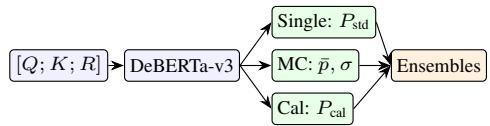
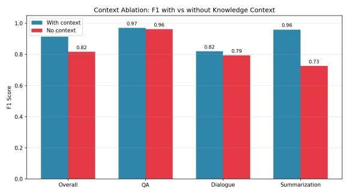
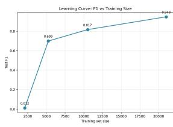
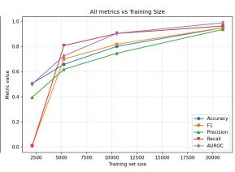

# Domain-Specific Hallucination Detection in Large Language Models

Varun Teja Chundru and Debasmita Biswas

Department of Computer Science Purdue University Fort Wayne {vchundru, biswd01}@pfw.edu

## Abstract

Large language models generate fluent text that can contain unfaithful claims—a phenomenon known as hallucination. We present a multi-signal detection pipeline combining fine-tuned DeBERTa-v3 classification, Monte Carlo (MC) Dropout uncertainty quantifica tion, and temperature-scaled calibration for response-level hallucination detection. Evaluated on the HaluEval benchmark, our pipeline achieves F1=0.915 and AUROC=0.977 on general-domain tasks, with per-task F1 scores of 0.97 (QA), 0.96 (Summarization), and 0.82 (Dialogue). MC Dropout inference further im proves accuracy to 93.2%. A context ablation study confirms the model performs genuine entailment reasoning rather than exploiting surface patterns, with summarization F1 dropping 24% when knowledge context is removed. Learning curve analysis reveals that 25% of training data captures 77% of full-data performance. Beyond detection, we apply Direct Preference Optimization (DPO) to a Qwen2.5- 0.5B generator, reducing its hallucination rate from 85.5% to 37.7% (55.9% relative reduction) as measured by our detector. Crossdomain evaluation on the SciFact biomedical benchmark shows that general-domain training transfers poorly (F1=0.52), motivating domain-specific fine-tuning. PubMed-BERT fine-tuned on SciFact achieves F1=0.63 and AUROC=0.81, demonstrating that domain matched pre-training is the strongest adaptation strategy. Code and models are available at https://github.com/varunteja99/ hallucination-detection-nlp.

## 1 Introduction

Large language models (LLMs) produce text that is syntactically fluent and contextually plausible but can contain fabricated facts, misattributed claims, and unsupported inferences (Ji et al., 2023). These hallucinations pose a significant barrier to deploying LLMs in high-stakes domains such as medicine, law, and scientific research, where factual accuracy is essential.

The hallucination detection problem can be formulated as a natural language inference (NLI) task: given a knowledge source K, a prompt Q, and a generated response R, determine whether R is faithful to or hallucinated with respect to K. While prior work has explored entailment-based and retrieval-based approaches, two critical gaps remain. First, single-model detectors provide point estimates without conveying prediction confidence, leaving practitioners unable to distinguish highcertainty detections from ambiguous cases. Second, detectors trained on general-domain benchmarks often fail on specialized domains where terminology and reasoning patterns differ substantially.

This paper makes four contributions, organized around three experiments—detection, mitigation, and cross-domain transfer. (1) We develop a multi-signal detection pipeline combining finetuned DeBERTa-v3 with MC Dropout uncertainty, achieving F1=0.915 and AUROC=0.977 on HaluEval. (2) We conduct ablation studies—context removal, learning curves, and ensemble analysis— characterizing when and why the detector succeeds. (3) We show that DPO reduces hallucination rates by 55.9% in a generator, evaluated by our detector in a closed-loop setup. (4) We evaluate crossdomain transfer to SciFact and show that Pub-MedBERT fine-tuning achieves AUROC=0.808, demonstrating that domain-matched pre-training is the most effective adaptation strategy.

## 2 Related Work

Hallucination Detection. Hallucination in LLMs has been categorized into intrinsic hallucination (contradicting the source) and extrinsic hallucination (introducing unverifiable claims) (Ji et al., 2023). Detection approaches span entailment-based classification (Honovich et al.,

  
Figure 1: Detection pipeline. DeBERTa-v3 produces three signals—single pass, MC Dropout $( T { = } 2 0 )$ , and temperature-scaled—combined by Simple Average or LR Meta-Classifier.

2022), retrieval-augmented verification (Min et al., 2023), and uncertainty estimation (Kuhn et al., 2023). Li et al. (2023) introduced the HaluEval benchmark with task-specific hallucinated samples generated via ChatGPT, providing a controlled evaluation framework across QA, dialogue, and summarization. Our work builds on this benchmark while extending the analysis with uncertainty quantification and cross-domain evaluation.

Uncertainty Quantification. Monte Carlo Dropout (Gal and Ghahramani, 2016) provides a practical approximation to Bayesian inference by performing multiple stochastic forward passes with dropout enabled at test time. The variance across passes captures epistemic uncertainty, which has been applied to out-of-distribution detection (Lakshminarayanan et al., 2017) and selective prediction. We integrate MC Dropout into our detection pipeline, showing it improves accuracy from 91.3% to 93.2%.

Preference Optimization. Direct Preference Optimization (DPO) frames alignment as a classification problem over preference pairs, avoiding the instability of reinforcement learning from human feedback (Rafailov et al., 2023). While DPO has primarily been applied to safety and helpfulness alignment, we apply it specifically to hallucination reduction, using faithful and hallucinated responses as preference pairs.

## 3 Methodology

## 3.1 Detection Pipeline

Our detection pipeline (Figure 1) builds three inference modes on a shared fine-tuned DeBERTa-v3 backbone, plus two ensembles.

DeBERTa-v3 Classifier. We use DeBERTa-v3- base (He et al., 2023) as our core classifier. De-BERTa employs a disentangled attention mechanism that separates content and position representations into distinct vectors, computing attention weights using disentangled matrices for contentto-content, content-to-position, and position-tocontent interactions. An enhanced mask decoder aggregates these signals to produce contextaware token representations. We add a classification head and fine-tune for binary NLI: given a concatenated input $\left[ Q ; K ; R \right]$ , the model outputs P(hallucinated | $Q , K , R )$ . Training uses AdamW with learning rate $2 \times 1 0 ^ { - 5 }$ , linear warmup over 10% of steps, batch size 16, and 3 epochs with fp32 mixed precision.

MC Dropout Uncertainty. A single forward pass yields an overconfident point estimate—small logit shifts produce large probability changes near the decision boundary. We instead keep dropout active at inference and run $T ~ = ~ 2 0$ stochastic forward passes. The mean $\begin{array} { r } { { \bar { p } } = \frac { 1 } { T } \sum _ { t } p _ { t } } \end{array}$ serves as the prediction and the standard deviation $\sigma =$ $\begin{array} { r } { \sqrt { { \frac { 1 } { T } } \sum _ { t } ( p _ { t } - \bar { p } ) ^ { 2 } } } \end{array}$ captures epistemic uncertainty. Averaging across stochastic sub-networks reduces variance and smooths probabilities near the boundary, both improving top-1 accuracy and producing a σ signal that is high precisely on ambiguous inputs.

Temperature Scaling. We learn a scalar $T ^ { * }$ on the validation set by minimizing NLL: $T ^ { * }$ arg minT $L _ { \mathrm { N L L } } ( \mathrm { s o f t m a x } ( z / T ) , y )$ Dividing logits by $T ^ { * }$ before softmax sharpens or flattens the distribution without changing the argmax, so accuracy and F1 are unchanged but probabilities become better calibrated. This matters because uncalibrated MC Dropout variance is suppressed on uncertain examples and NLL is inflated on wrongbut-confident predictions, causing threshold instability across domains.

Ensemble Methods. We evaluate two ensembles. Simple Average takes the unweighted mean of $P _ { \mathrm { s t d } }$ and ${ \bar { p } } ,$ the single-pass and MC Dropout mean probabilities. LR Meta-Classifier is a logistic regression trained on the validation set whose four features are $P _ { \mathrm { s t d } } , \bar { p } , \sigma$ , and the cosine similarity between MiniLM embeddings of context and response; it learns optimal feature weights rather than assuming equal contribution.

## 3.2 DPO Hallucination Mitigation

Beyond detection, we train a generator model to produce fewer hallucinations using DPO (Rafailov et al., 2023). We construct preference pairs from HaluEval: for each prompt, the reference (faithful) answer is the chosen response and the hallucinated answer is the rejected response. We finetune Qwen2.5-0.5B-Instruct (Qwen Team, 2025) on 21K preference pairs for 1 epoch with learning rate $5 \times 1 0 ^ { - 6 }$ and $\beta = 0 . 1$ . At evaluation, our De-BERTa detector scores held-out generations from both the base and DPO-trained models, providing a detector-in-the-loop assessment of hallucination reduction.

## 3.3 Cross-Domain Adaptation

For SciFact, we evaluate three adaptation strategies trading off pre-training corpus, NLI priors, and target-domain training: (A) fine-tuning DeBERTav3 on SciFact (in-domain training without domain pre-training); (B) fine-tuning PubMedBERT (Gu et al., 2021), pre-trained on PubMed abstracts and PMC full-text, on SciFact (domain-matched pretraining); and (C) sequential transfer—DeBERTav3 fine-tuned first on HaluEval, then on SciFact— combining NLI priors with target-domain adaptation.

## 4 Experimental Setup

## 4.1 Datasets

HaluEval. The HaluEval benchmark (Li et al., 2023) contains 30,000 samples across three tasks— QA, Dialogue, and Summarization—each with 10,000 balanced examples (5,000 faithful, 5,000 hallucinated). Hallucinated responses were generated by ChatGPT with task-specific prompting. We use a 70/15/15 stratified split (21,000 train / 4,500 validation / 4,500 test) with a fixed random seed for reproducibility.

SciFact. SciFact (Wadden et al., 2020) is a biomedical claim verification dataset containing 1,109 scientific claims paired with evidence from a corpus of 5,183 abstracts. We extract 693 labeled (claim, evidence) pairs and apply a stratified 70/15/15 split (484 train / 103 validation / 106 test). Labels are binarized: SUPPORT → faithful (0), CONTRADICT → hallucinated (1).

## 4.2 Baselines

We compare our fine-tuned detector against two baselines that isolate the contribution of training and uncertainty quantification respectively. (1) Zero-shot DeBERTa-v3-MNLI: the pre-trained model without HaluEval fine-tuning, evaluating off-the-shelf NLI transfer. (2) Standard inference: single-pass fine-tuned DeBERTa without

MC Dropout, calibration, or ensembling. The context ablation in Section 6.1 is reported separately as a diagnostic study, not as a competing baseline.

## 4.3 Metrics

We report Accuracy, F1-score, and AUROC. Accuracy measures overall classification correctness. F1-score is the harmonic mean of precision and recall, important because hallucinated samples in HaluEval are balanced but real-world distributions are skewed. AUROC (Area Under the Receiver Operating Characteristic Curve) evaluates ranking quality across all thresholds, capturing how well the model separates classes independently of a fixed decision boundary.

## 5 Experiment 1: Hallucination Detection

## 5.1 Main Detection Results

Table 1 reports the six rows of our detection comparison on the HaluEval test set. Zero-shot De-BERTa is the off-the-shelf MNLI model with no HaluEval fine-tuning, establishing a transfer baseline. Fine-tuned DeBERTa is the same backbone after 3 epochs of fine-tuning on HaluEval, evaluated with a single deterministic forward pass. MC Dropout mean uses the same fine-tuned weights but enables dropout at inference and averages probabilities over 20 stochastic passes, smoothing the decision boundary. Calibrated DeBERTa applies the learned temperature $T ^ { * } { = } 1 . 6 9$ to the fine-tuned logits before softmax; because temperature scaling preserves argmax, accuracy and F1 are identical to the fine-tuned row by construction—the value lies in better-calibrated probabilities for downstream uncertainty use. Simple Average takes the unweighted mean of $P _ { \mathrm { s t d } }$ and p¯. LR Meta-Classifier trains a logistic regression on the validation set with four features: $P _ { \mathrm { s t d } }$ , p¯, σ, and retrieval similarity.

<table><tr><td>Method</td><td>Acc</td><td>F1</td><td>AUROC</td></tr><tr><td>Zero-shot DeBERTa</td><td>0.500</td><td>0.430</td><td>0.650</td></tr><tr><td>Fine-tuned DeBERTa</td><td>0.913</td><td>0.915</td><td>0.977</td></tr><tr><td>MC Dropout mean</td><td>0.932</td><td>0.931</td><td>0.978</td></tr><tr><td>Calibrated DeBERTa</td><td>0.913</td><td>0.915</td><td>0.977</td></tr><tr><td>Simple Average</td><td>0.920</td><td>0.921</td><td>0.979</td></tr><tr><td>LR Meta-Classifier</td><td>0.931</td><td>0.930</td><td>0.960</td></tr></table>

Table 1: Detection performance on HaluEval test set (4,500 samples). MC Dropout provides the best singlemodel accuracy and F1 by averaging 20 stochastic forward passes; Simple Average gives the highest AUROC by averaging the two DeBERTa-based probability estimates.

The headline result is that MC Dropout improves accuracy from 91.3% to 93.2% (+1.9 points) and F1 from 0.915 to 0.931 (+0.016) over single-pass inference, with no additional training. This confirms that the variance-reduction effect of averaging stochastic sub-networks meaningfully improves the detector on cases where a single pass would land on the wrong side of the decision boundary. AU-ROC moves only marginally (0.977 → 0.978) because ranking quality already saturates with the fine-tuned model; the gain is concentrated near threshold.

The LR Meta-Classifier matches MC Dropout on accuracy (0.931) but loses AUROC (0.960 vs. 0.978). The cause is the retrieval similarity feature: cosine similarity between MiniLM embeddings of context and response achieves only AUROC ≈ 0.38 in isolation—faithful and hallucinated responses share surface vocabulary in HaluEval, so this nearrandom feature degrades ranking quality even after the LR weights it down.

## 5.2 Per-Task Analysis

Table 2 breaks down fine-tuned DeBERTa performance by HaluEval subtask. QA is easiest (F1=0.97) due to strong lexical overlap between questions and factoid answers—hallucinated answers typically substitute incorrect entities or numbers detectable from the question alone. Summarization is also strong (F1=0.96) given the source document. Dialogue is hardest (F1=0.82) because conversational responses are shorter, more implicit, and contain fewer lexical anchors to the knowledge source.

<table><tr><td>Task</td><td>Acc</td><td>F1</td><td>AUROC</td></tr><tr><td>QA</td><td>0.967</td><td>0.970</td><td>0.996</td></tr><tr><td>Summarization</td><td>0.940</td><td>0.960</td><td>0.988</td></tr><tr><td>Dialogue</td><td>0.830</td><td>0.820</td><td>0.944</td></tr><tr><td>Overall</td><td>0.913</td><td>0.915</td><td>0.977</td></tr></table>

Table 2: Per-task detection performance of fine-tuned DeBERTa on HaluEval.

## 6 Detector Analysis

## 6.1 Context Ablation

To determine whether the model performs genuine entailment reasoning or exploits surface-level shortcuts in the response alone, we strip the knowledge context K from all test inputs (keeping only [Q; R])

and re-evaluate the same fine-tuned weights. Figure 2 shows the result.

  
Figure 2: F1 with and without knowledge context across tasks. Summarization depends most on context (−24%); QA is largely self-contained (−1%).

Overall F1 drops from 0.91 to 0.82 without context, confirming that the model leverages the knowledge source rather than memorizing surface artifacts. The effect is task-dependent. Summarization F1 drops 24% (0.96 → 0.73), indicating that detecting hallucinated summaries requires comparing against the source document—unsurprising, since a summary’s faithfulness is by definition relative to its source. QA F1 drops only 1% (0.97 → 0.96), suggesting that factoid QA hallucinations are often detectable from the question–answer pair alone, likely because hallucinated answers contain implausible entity substitutions or numerical inconsistencies the model can flag without re-reading the passage. Dialogue sits in between (0.82 → 0.79).

## 6.2 Learning Curves

We re-train DeBERTa from scratch on 10%, 25%, 50%, and 100% of the HaluEval training data to characterize data efficiency (Figure 3).

  
Figure 3: Learning curves: F1 (left) and all metrics (right) versus training set size. A sharp elbow at ∼5K examples captures most of the discriminative signal.

At 10% (2.1K examples), the model fails completely (F1=0.01), unable to distinguish the classes. At 25% (5.3K), F1 jumps to 0.70—a sharp elbow indicating that approximately 5K labeled examples are sufficient to learn the core discrimination signal. Performance continues improving to 0.82 at 50% and 0.95 at 100%, but with diminishing returns. This is practically important for new domains: bootstrapping a usable detector requires only ∼5K labeled examples, not the full 21K we used.

## 7 Experiment 2: Mitigation via DPO

The detector is useful in itself, but a stronger test of its utility is whether it can drive a generator to produce fewer hallucinations. Table 3 summarizes this closed-loop experiment.

<table><tr><td>Model</td><td>Hall. Rate</td><td>Mean P(hall)</td></tr><tr><td>Base (Qwen2.5-0.5B)</td><td>0.855</td><td>0.816</td></tr><tr><td>DPO-trained</td><td>0.377</td><td>0.293</td></tr><tr><td>Absolute reduction</td><td>-0.477</td><td>-0.523</td></tr><tr><td>Relative reduction</td><td>55.9%</td><td>64.1%</td></tr></table>

Table 3: DPO hallucination reduction on 4,500 held-out test generations. Our DeBERTa detector evaluates both base and DPO generations.

The base Qwen2.5-0.5B-Instruct model produces hallucinated responses for 85.5% of held-out test prompts, as scored by our DeBERTa detector. After DPO training on 21K preference pairs, the hallucination rate drops to 37.7%—a 55.9% relative reduction. The probability distribution shifts substantially: the base model concentrates near P(hall) = 1.0 while the DPO model shifts mass toward P(hall) = 0, with mean detector probability falling from 0.816 to 0.293.

Two caveats are worth stating. First, the detector and the DPO preference signal share supervision (both derive from HaluEval pairs), so the 55.9% number is a co-evaluation rather than a fully heldout test. Second, the detector serves here as a consistent automated evaluation signal in the detectorin-the-loop paradigm rather than a gold-standard verdict.

## 8 Experiment 3: Cross-Domain Transfer

Applying the HaluEval-trained DeBERTa zero-shot to SciFact biomedical claims yields F1=0.517 and AUROC=0.515—barely above chance. The model predicts nearly all scientific claims as hallucinated because biomedical claim–evidence pairs differ substantially from HaluEval’s ChatGPT-generated responses: scientific claims use technical vocabulary, hedged language, and citation-grounded reasoning the source-domain training never saw.

To address this, we evaluate the three adaptation configurations from Section 3.3 on 484 SciFact training examples.

<table><tr><td>Cfg</td><td>Base Model</td><td>Acc</td><td>F1</td><td>AUROC</td></tr><tr><td>Zero</td><td>HaluEval-DeBERTa</td><td>0.349</td><td>0.517</td><td>0.515</td></tr><tr><td>A</td><td>DeBERTa-v3</td><td>0.604</td><td>0.488</td><td>0.582</td></tr><tr><td>B</td><td>PubMedBERT</td><td>0.764</td><td>0.627</td><td>0.808</td></tr><tr><td>C</td><td>HaluEval→SciFact</td><td>0.472</td><td>0.533</td><td>0.610</td></tr></table>

Table 4: Cross-domain results on SciFact (106 test examples). Config B (PubMedBERT (Gu et al., 2021) fine-tuned on SciFact) wins on every metric.

PubMedBERT (Config B) achieves the strongest results with F1=0.627 and AUROC=0.808, demonstrating that domain-matched pre-training provides the largest benefit for biomedical claim verification. Config C (HaluEval→SciFact transfer) outperforms zero-shot on AUROC (0.610 vs. 0.515), indicating that general-domain NLI pre-training provides useful initialization. Config A (DeBERTa fine-tuned on SciFact alone) achieves higher accuracy than zero-shot (0.604 vs. 0.349) but lower F1 (0.488 vs. 0.517) because it learns a more conservative threshold but lacks both the domain vocabulary of PubMedBERT and the NLI priors from HaluEval. All configurations remain below 0.7 F1 with only 484 training examples. The ranking domainmatched pre-training > source-task transfer > indomain training alone > zero-shot suggests that the dominant signal in cross-domain hallucination detection is the pre-training corpus, not the finetuning data.

## 9 Conclusion

Our multi-signal hallucination detection pipeline achieves F1=0.915 on HaluEval, with MC Dropout improving accuracy to 93.2%. Diagnostic studies showed the detector leverages knowledge context (overall F1 drops 10 points without it; summarization most affected at 24%) and that ∼5K labeled examples suffice for usable performance. DPO training reduced generator hallucination rates by 55.9% under our detector. On SciFact, PubMedBERT finetuning achieved AUROC=0.808—ahead of sourcetask transfer and in-domain training alone. Future work includes span-level localization, scaling DPO to larger generators, and adapting to legal and financial text.

## References

Yarin Gal and Zoubin Ghahramani. 2016. Dropout as a Bayesian approximation: Representing model uncertainty in deep learning. In Proceedings ofthe 33rd International Conference on Machine Learning, pages 1050–1059.

Yu Gu, Robert Tinn, Hao Cheng, Michael Lucas, Naoto Usuyama, Xiaodong Liu, Tristan Naumann, Jianfeng Gao, and Hoifung Poon. 2021. Domain-specific language model pretraining for biomedical natural language processing. ACM Transactions on Computing for Healthcare, 3(1):1–23.

Pengcheng He, Jianfeng Gao, and Weizhu Chen. 2023. DeBERTaV3: Improving DeBERTa using ELECTRA-style pre-training with gradientdisentangled embedding sharing. In International Conference on Learning Representations.

Or Honovich, Roee Aharoni, Jonathan Herzig, Hagai Taitelbaum, Doron Kukliansy, Vered Cohen, Thomas Scialom, Idan Szpektor, Avinatan Hassidim, and Yossi Matias. 2022. TRUE: Re-evaluating factual consistency evaluation. In Proceedings of the 2022 Conference of the North American Chapter of the Association for Computational Linguistics: Human Language Technologies, pages 3905–3920. Association for Computational Linguistics.

Ziwei Ji, Nayeon Lee, Rita Frieske, Tiezheng Yu, Dan Su, Yan Xu, Etsuko Ishii, Ye Jin Bang, Andrea Madotto, and Pascale Fung. 2023. Survey of hallucination in natural language generation. ACM Computing Surveys, 55(12):1–38.

Lorenz Kuhn, Yarin Gal, and Sebastian Farquhar. 2023. Semantic uncertainty: Linguistic invariances for uncertainty estimation in natural language generation. In International Conference on Learning Representations.

Balaji Lakshminarayanan, Alexander Pritzel, and Charles Blundell. 2017. Simple and scalable predictive uncertainty estimation using deep ensembles. In Advances in Neural Information Processing Systems, volume 30.

Junyi Li, Xiaoxue Cheng, Wayne Xin Zhao, Jian-Yun Nie, and Ji-Rong Wen. 2023. HaluEval: A largescale hallucination evaluation benchmark for large language models. In Proceedings of the 2023 Conference on Empirical Methods in Natural Language Processing, pages 6449–6464.

Sewon Min, Kalpesh Krishna, Xinxi Lyu, Mike Lewis, Wen-tau Yih, Pang Wei Koh, Mohit Iyyer, Luke Zettlemoyer, and Hannaneh Hajishirzi. 2023. FActScore: Fine-grained atomic evaluation of factual precision in long form text generation. In Proceedings of the 2023 Conference on Empirical Methods in Natural Language Processing, pages 12076–12100.

Qwen Team. 2025. Qwen2.5 technical report. arXiv preprint arXiv:2412.15115.

Rafael Rafailov, Archit Sharma, Eric Mitchell, Stefano Ermon, Christopher D Manning, and Chelsea Finn. 2023. Direct preference optimization: Your language model is secretly a reward model. In Advances in Neural Information Processing Systems, volume 36.

David Wadden, Shanchuan Lin, Kyle Lo, Lucy Lu Wang, Madeleine van Zuylen, Arman Cohan, and Hannaneh Hajishirzi. 2020. Fact or fiction: Verifying scientific claims. In Proceedings of the 2020 Conference on Empirical Methods in Natural Language Processing, pages 7534–7550, Online. Association for Computational Linguistics.