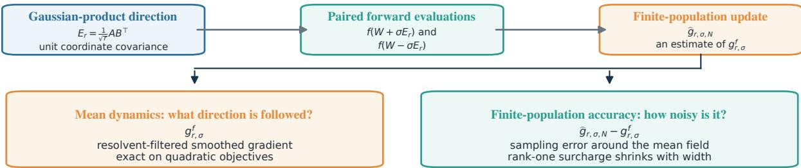
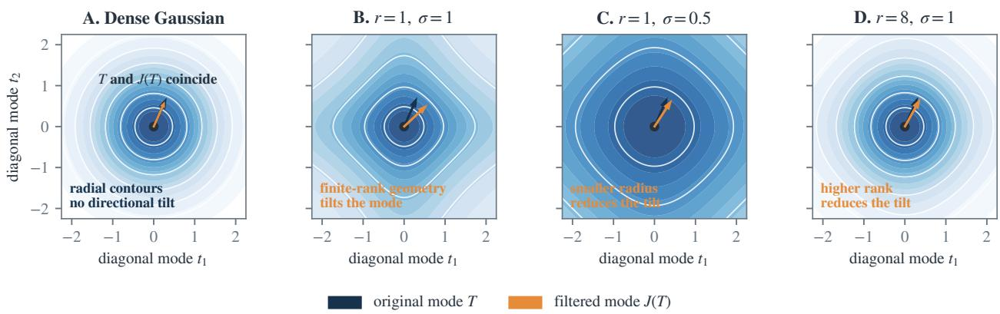
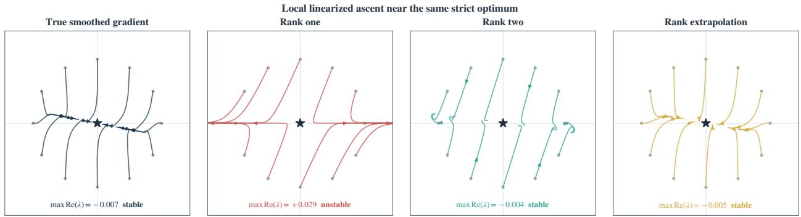
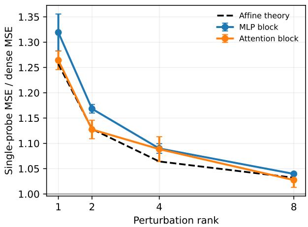
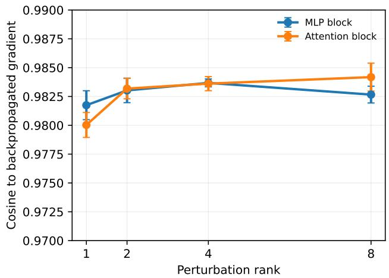
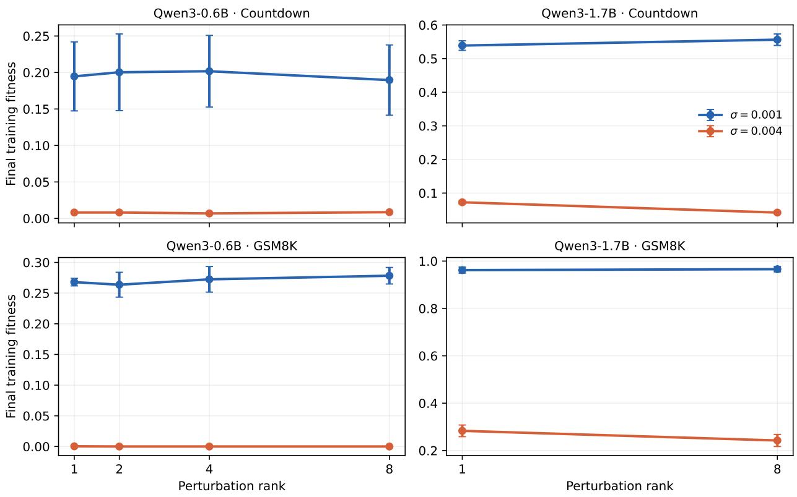
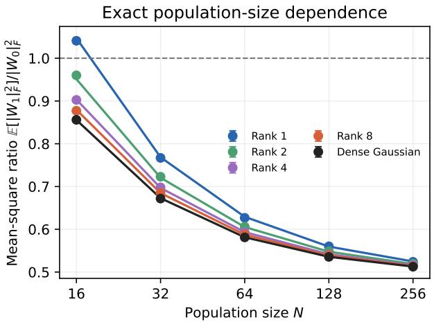
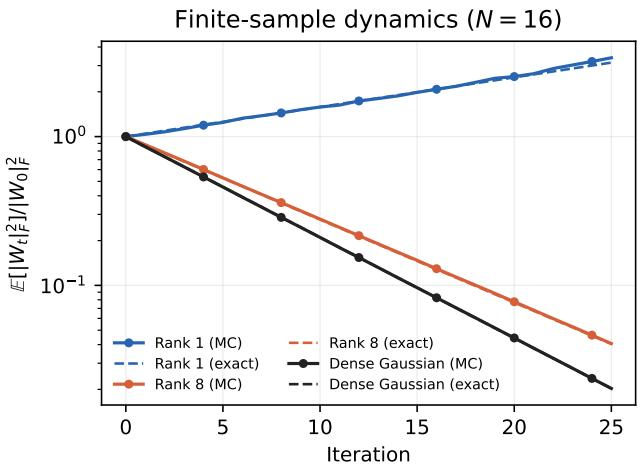

# EGGROLL, Unrolled: Understanding and Improving Low-Rank Evolution Strategies at Scale

Ege C. Kaya, Abolfazl Hashemi∗

## Abstract

EGGROLL makes evolution strategies (ES) practical for LLMs by replacing dense Gaussian weight perturbations with low-rank Gaussian products, often of rank one. This choice is computationally attractive but geometrically severe: each rank-one perturbation lies in a zero-volume subset of the ambient matrix space, despite having identity covariance. We characterize the mean EGGROLL update field at finite rank and nonzero perturbation radii, then analyze the error of its finite-population estimator. The population field is obtained by applying an explicit resolvent to the gradient of the objective smoothed by the perturbations. We show that the resolvent can introduce a nonconservative component and can reverse the local stability of an optimum. EGGROLL is nevertheless exact on every quadratic objective at every rank and radius. For smooth objectives, its first local finite-rank correction is $O ( \sigma ^ { 2 } / r )$ , and nonasymptotic bounds control the resulting field error under smoothness assumptions. Under a local afine model, rank-one perturbations increase the variance of the gradient estimator by only 2(m+n+1) relative to dense Gaussian ES, or 0.098% for a 4096 × 4096 matrix. We then introduce LOO-ROLL, a leave-one-out estimator that preserves the finite-rank population field while replacing EGGROLL’s two antithetic evaluations per direction by one. At equal evaluation cost, LOO-ROLL halves estimator MSE in transformer blocks. At matched wall time across ten post-training settings and models up to 8B parameters, LOO-ROLL improves seven outcomes in individual paired tests, with no significant loss. On the GSM8K test set, accuracy increases from 38.1% to 63.0% at 0.6B and from 65.9% to 80.0% at 8B. Transformer measurements recover the predicted finite-rank variance, while the rank comparisons show no reproducible reward-based advantage for rank eight

## 1 Introduction

Evolution strategies (ES) [6, 34, 35, 37] are zeroth-order methods for optimizing a scalar function, customarily called fitness, using only perturbed function evaluations. Because zeroth-order methods require only forward evaluations, they have been explored for memory-eficient language-model fine-tuning [18, 30, 53]. Their parallel population structure has also motivated scalable evolution-strategy methods for large-model post training [24, 36, 49]. The remaining dificulty is moving a large population of independently perturbed parameter settings through the network eficiently. Modern accelerators obtain high throughput when arithmetic reuses data already brought into fast memory [10, 48]. Giving every population member a diferent dense perturbation requires generating or reading another mn numbers per member, making memory trafic grow with the population.

EGGROLL [36] avoids the use of such dense matrices by perturbing each weight matrix with a rank-r Gaussian product:

$$
E _ { r } = \frac { 1 } { \sqrt { r } } A B ^ { \top } = \frac { 1 } { \sqrt { r } } \sum _ { s = 1 } ^ { r } a _ { s } b _ { s } ^ { \top } , \qquad a _ { s } \sim \mathcal { N } ( 0 , I _ { m } ) , \quad b _ { s } \sim \mathcal { N } ( 0 , I _ { n } ) ,\tag{1}
$$

which permits the evaluation of very large populations at near-inference throughput. The normalization by $1 / \sqrt { r }$ gives every matrix coordinate unit variance and makes distinct coordinates uncorrelated:

$$
\begin{array} { r } { \mathbb { E } \big [ ( E _ { r } ) _ { i j } ( E _ { r } ) _ { k \ell } \big ] = \delta _ { i k } \delta _ { j \ell } . } \end{array}\tag{2}
$$

From a low-rank population to two finite-rank questions

  
Figure 1: The two finite-rank questions studied in this paper. Batches of antithetic forward evaluations produce a finite-population estimate $\widehat { g } _ { r , \sigma , N }$ of the population field $g _ { r , \sigma } ^ { f }$ . The mean-field branch characterizes the direction followed after averaging over perturbations and identifies both its possible departure from gradient dynamics and the quadratic regime in which that departure vanishes. The finite-population branch computes the sampling error around this mean.

Here $\delta _ { i k }$ is the Kronecker delta, equal to one when $i = k$ and zero otherwise. Thus vec(E ) has identity covariance, just as a dense standard Gaussian perturbation.

For a single activation x, the evaluation by a single population member can be written as

$$
\bigg ( W + \frac { \sigma } { \sqrt { r } } A B ^ { \top } \bigg ) x = W x + \frac { \sigma } { \sqrt { r } } A ( B ^ { \top } x ) .\tag{3}
$$

For a batch of population members, the large multiplication by W can be performed as one shared batched operation. Each member then receives its own correction through the two thin multiplications $B ^ { \top } x$ and $A ( B ^ { \top } x )$ . These corrections require $O ( r ( m + n ) )$ additional storage and arithmetic per layer rather than the $O ( m n )$ cost of a dense perturbation. Batching them allows the population to share the base weights and much of the inference machinery. Low-rank adapters are already widely used in language-model training [12, 25, 28, 51] because they replace a dense matrix modification by two thin factors. EGGROLL uses the same computational advantage for a diferent purpose: the factors are randomly drawn search directions whose fitness is obtained from forward model evaluations, using no backpropagation.

EGGROLL performs well in LLM-scale training even in the seemingly prohibitive but computationally attractive regime $r = 1$ . The original analysis gives two asymptotic justifications: a high-dimensional, vanishing-radius result at fixed rank and convergence to dense Gaussian ES at rate $O ( 1 / r )$ under regularity assumptions [36]. These results do not identify the update field at the finite ranks and perturbation radii used in practice, the accuracy with which a finite population estimates that field, or the costs revealed by the finite-rank analysis. We therefore ask three guiding questions:

What mean field does the finite-rank EGGROLL update follow, and why can rank one work?

How accurately does a finite population estimate the resulting mean field?

What weaknesses does the analysis expose, and how can they be corrected without hurting EGGROLL’s computational advantage?

It is of note that the question of why rank one works is not settled by covariance. Identity covariance means that repeated draws have nonzero variance along every linear direction, but every individual realization has rank at most r. When $r < \operatorname* { m i n } ( m , n )$ , the set of possible realizations has dimension $r ( m + n - r ) <$ mn and occupies zero volume in the ambient space [1]. EGGROLL also weights these Gaussian-product samples using the score associated with a dense Gaussian perturbation, creating a score mismatch at every finite rank. Both issues are most pronounced at $r = 1$ , precisely the case of greatest practical interest. A finite-rank analysis is therefore needed in place of an appeal to covariance or a large-rank limit.

Our answers to these questions separate three diferent aspects of EGGROLL. First, the population field is a resolvent-filtered gradient. At a finite perturbation radius, this filtering can make the field nonconservative and can even make a local optimum repelling. The discrepancy vanishes on quadratic objectives and remains controlled when the objective is well-approximated by a quadratic over the perturbation scale. Second, low rank has a much milder efect on finite-population accuracy. For wide matrices, the additional variance of a rank-one product perturbation is negligible beside the variance already present in dense Gaussian ES. Rank one can therefore estimate its own population field almost as eficiently as dense Gaussian perturbations estimate theirs, even though the two fields need not coincide. Third, the released EGGROLL implementation spends two fitness evaluations per direction through antithetic estimators. Our proposed algorithm, LOO-ROLL, uses the other population members as leave-one-out baselines and requires only one evaluation per direction without changing the expected field. Rank extrapolation and variance reduction techniques are mathematically natural responses to the finite-rank bias and finite-population variance identified above, but our experiments do not find a practical gain from their additional cost, so they are treated separately in Appendix B.

Organization and contributions. We answer these questions and develop their algorithmic consequences in five parts.

1. The finite-rank mean field. Sections 3 and 4 derive the expected EGGROLL update at every finite rank. Averaging the objective over the perturbations gives a smoothed objective with its own gradient. Because EGGROLL uses the dense-Gaussian score with a low-rank Gaussian-product perturbation, it instead follows a resolvent-filtered version of that gradient (Theorems 4.1 and 4.2). In a neural network, the objective depends jointly on many parameter matrices rather than on a single matrix in isolation. Appendix A extends the result to this setting

2. The efect on optimization dynamics. Section 5 determines when the expected update is the gradient of any scalar objective and gives an explicit smooth example in which a strict local maximum of the smoothed objective is unstable under rank-one EGGROLL. Section 6 shows that this failure disappears for quadratic objectives and remains controlled when the objective is approximately quadratic over the perturbation scale. EGGROLL is exact on quadratic objectives, its first rank-dependent local error is $O ( \sigma ^ { 2 } / r )$ , and standard smoothness assumptions give nonasymptotic control of the field error (Theorem 5.1, Theorem 5.3, Theorems 6.1 and 6.2, and Theorem 6.3). Conventional convergence consequences under smoothness assumptions are collected in Appendix C.

3. Finite-population accuracy. Sections 7 and 8 calculate the exact covariance and total variance of a finite-population update. Rank-r perturbations add $2 ( m + n + 1 ) / r$ to the dense-Gaussian variance factor mn + 1, so the relative variance increase quickly vanishes with matrix width even at rank one. We also derive the fixed-radius 1/r expansion, while Appendix C records the corresponding finite-iteration guarantees under relative population noise (Theorems 7.1 and 8.1).

4. LOO-ROLL. Section 9 introduces an unbiased leave-one-out estimator that uses one fitness evaluation per direction rather than the antithetic implementation’s two evaluations. The construction applies the leaveone-out baseline to EGGROLL’s Gaussian-product population and preserves the finite-rank population field exactly before score standardization (Theorem 9.1). Rank extrapolation and a control-variate estimator are derived and evaluated in Appendix B.

5. Numerical and transformer experiments. Section 10 first tests the exact finite-rank and finitepopulation predictions, then compares ranks at matched evaluations and wall time. The principal algorithmic study of the section evaluates LOO-ROLL across ten post-training settings, three model sizes, two model families, and reward-based objectives and next-token prediction loss. At matched wall time, LOO-ROLL records seven improvements in individual paired tests, three unresolved diferences, and no significant loss. Five gains survive Holm correction across the ten comparisons (Table 9).

## 2 Related work

Random-direction finite diferences and simultaneous perturbation are classical gradient-free methods [13, 32, 39]. Their nonconvex analyses make the dependence on dimension and smoothing radius explicit [4]. MeZO shows that an in-place two-forward-pass implementation can fine-tune large language models with inference-level memory, and subsequent work added stochastic variance reduction [18, 30]. Residual feedback uses a stored function value to obtain a one-query estimator for online zeroth-order optimization [52]. These methods use dense or coordinatewise perturbations. EGGROLL instead constructs each matrix perturbation as a low-rank Gaussian product and batches the resulting population during inference, giving rise to the finite-rank population field analyzed here.

Baselines have long been used to reduce the variance of score-function and policy-gradient estimators without changing their expectation [47]. In REINFORCE leave-one-out, the reward of each sampled response is compared with the average reward of the other responses generated from the same prompt [2]. LOREN also uses REINFORCE leave-one-out in curvature-aware zeroth-order LLM tuning [38]. LOO-ROLL specializes the baseline to EGGROLL’s Gaussian-product population and evaluates the resulting alternative to its antithetic training estimator.

The original EGGROLL analysis proves a fixed-rank, high-dimensional vanishing-radius guarantee and convergence of its Gaussian-score update to dense Gaussian ES at rate $O ( 1 / r )$ under regularity assumptions [36]. Our results concern the complementary regime of finite dimension, finite radius, and finite population. Recent work compares full Gaussian ES with gradient-based LLM post-training and studies its behavior in flat, linear, and quadratic geometries [24, 27].

Orthogonal and structured perturbations can reduce estimator variance or the cost of applying a direction, while structured control variates use additional problem information [7, 42]. Guided and active-subspace ES concentrate exploration in learned subspaces [8, 29]. Natural ES and CMA-ES adapt a Gaussian search law [21, 46]. EGGROLL makes a diferent choice, where the Gaussian-product law is fixed by the desired matrix computation. We analyze the mean field and sampling error that follow from that choice.

Stein operators for scalar products of independent normal variables, and for sums and broader products built from such variables, are well established [16, 17]. These identities act on one scalar product-normal variable. The entries of $A B ^ { \top }$ instead share row and column factors, so the matrix law couples diferent coordinates. Our operator identity keeps this dependence, produces a matrix diferential operator acting on the population field, and connects its resolvent to finite-rank optimization dynamics.

Wang et al. [44] show that convergence can fail for structured zeroth-order perturbations and proposed mixing them with isotropic Gaussian directions. Their use of isotropy concerns an ambient Gaussian component. EGGROLL already has identity covariance, yet its law is not spherically symmetric in the vectorized matrix space. Our conservativity theorem isolates this stronger distributional requirement. Exact spherical symmetry cannot be achieved by a nondegenerate law supported entirely on rank-deficient matrices when $m , n \geq 2$ , since a uniformly rotated nonzero matrix is full rank almost surely after reshaping. Occasional dense directions could supply an ambient isotropic component, though those evaluations would no longer have the purely low-rank cost of EGGROLL.

## 3 Setup

We start our inquiry by asking what finite-rank EGGROLL follows in expectation. We first consider one parameter matrix W $\in \mathbb { R } ^ { m \times n }$ . Appendix A combines independent perturbations across the matrix blocks of a network. Let $f : \mathbb { R } ^ { m \times n }  \mathbb { R }$ be a fitness to maximize, and use the Frobenius inner product $\langle A , B \rangle _ { F } = \operatorname { t r } ( A ^ { \top } B )$ . The perturbation $E _ { r }$ is defined as in Equation (1). Sampling perturbed weights produces the smoothed objective

$$
F _ { r , \sigma } ( W ) = \operatorname { \mathbb { E } } \big [ f ( W + \sigma E _ { r } ) \big ] ,\tag{4}
$$

where $\sigma > 0$ is the perturbation radius. EGGROLL weights each sampled perturbation by its observed fitness. Averaging this update over the perturbation law gives the mean update field, which we call the population $\mathrm { \it ~ \mathscr { f } e l d : }$

$$
g _ { r , \sigma } ^ { f } ( W ) = \frac { 1 } { \sigma } \mathbb { E } \big [ E _ { r } f ( W + \sigma E _ { r } ) \big ] .\tag{5}
$$

This is the infinite-population update that a finite ES population approximates. For a perturbation density p, the score is ∇ log p. A dense standard Gaussian matrix $E _ { \infty }$ has score $- E _ { \infty }$ . Under the usual diferentiability and integrability conditions, Stein’s Gaussian identity $\mathbb { E } [ E _ { \infty } h ( E _ { \infty } ) ] = \mathbb { E } [ \nabla h ( E _ { \infty } ) ]$ [41] applied to $h ( E ) =$ $f ( W + \sigma E )$ gives

$$
\frac { 1 } { \sigma } \mathbb { E } \big [ E _ { \infty } f ( W + \sigma E _ { \infty } ) \big ] = \mathbb { E } \big [ \nabla f ( W + \sigma E _ { \infty } ) \big ] = \nabla F _ { \infty , \sigma } ( W ) .\tag{6}
$$

The same identity does not automatically hold for the Gaussian-product law. When $r < \operatorname* { m i n } ( m , n )$ , the law is supported on a lower-dimensional set and has no full-dimensional density. At every finite rank, including ranks for which a density exists, $- E _ { r }$ is not its exact score [36]. We first ask whether the finite-rank population field $g _ { r , \sigma } ^ { f }$ nevertheless equals the gradient $\nabla F _ { r , \sigma }$ of the finite-rank-smoothed objective. If it does not, it would be natural to next ask whether it is the gradient of some other scalar objective.

The schematic algorithm and principal update equation in Sarkar et al. [36] are written in the one-sided form of Equation (5). Their reported experiments, fitness shaping, and released LLM implementation, however, use paired antithetic perturbations $+ E _ { r }$ and $- E _ { r }$ :

$$
\widehat { g } _ { r , \sigma , N } ( W ) = \frac { 1 } { N } \sum _ { s = 1 } ^ { N } E _ { r } ^ { ( s ) } \frac { f ( W + \sigma E _ { r } ^ { ( s ) } ) - f ( W - \sigma E _ { r } ^ { ( s ) } ) } { 2 \sigma } .\tag{7}
$$

Here N is the number of independent directions, each evaluated with both signs. The symmetry of $E _ { r }$ makes this an unbiased estimator of the population field. Evaluating both signs on the same prompt batch also isolates the efect of the perturbation. Any fitness component shared by the pair, such as the dificulty of the prompts in that batch, cancels when the two evaluations are subtracted. For a smooth objective, a Taylor expansion around W makes the same cancellation explicit:

$$
\frac { f ( W + \sigma E _ { r } ) - f ( W - \sigma E _ { r } ) } { 2 \sigma } = \langle \nabla f ( W ) , E _ { r } \rangle _ { F } + O \left( \sigma ^ { 2 } \lVert E _ { r } \rVert _ { F } ^ { 3 } \right) ,\tag{8}
$$

where the constant and the other even-order terms cancel.

The EGGROLL experiments and implementation normally center and standardize fitness values across the sampled population. To keep the calculation explicit, our main analysis omits this score processing and studies the raw-score field in Equation (5). Appendix F treats the standardized update and quantifies its diference from the raw field.

Both Equations (4) and (5) average translated copies of f against the Gaussian-product perturbation law. The smoothed objective is a convolution with this law, while the population field includes the additional weight ${ E } _ { r } / \sigma$ . Fourier modes diagonalize such convolution expressions, allowing both quantities to be calculated one frequency at a time [20]. The next section performs this calculation and identifies the resulting transformation in parameter space.

## 4 Characterization of the population field

We continue our inquiry by asking: What deterministic field does finite-rank EGGROLL follow? Two efects separate the optimization of the original objective from the EGGROLL population field. Sampling from the finite-rank perturbation law first smooths f into $F _ { r , \sigma }$ . The gradient $\nabla F _ { r , \sigma }$ is the update that gradient ascent on this smoothed objective would follow. The problem, however, is that EGGROLL uses the dense-Gaussian score $- E _ { r }$ with Gaussian-product samples, so its actual mean field $g _ { r , \sigma } ^ { f }$ can difer from this gradient. This section characterizes this second efect. We determine how smoothing and score mismatch act on one Fourier frequency, then combine the frequencies to express $g _ { r , \sigma } ^ { f }$ as an operator applied to $\nabla F _ { r , \sigma }$ . The result separates the change caused by smoothing from the additional change caused by the mismatched score.

Fix $T \in \mathbb { R } ^ { m \times n }$ and set the objective in Equations (4) and (5) to the Fourier mode $f ( W ) = f _ { T } ( W ) : =$ $e ^ { i \langle T , W \rangle _ { F } }$ . Let $\Phi _ { r } ( T ) = \mathbb { E } \bigl [ e ^ { i \langle T , E _ { r } \rangle _ { F } } \bigr ]$ denote the characteristic function of $E _ { r }$ . By direct substitution, we have

$$
F _ { r , \sigma } ( W ) = e ^ { i \langle T , W \rangle _ { F } } \Phi _ { r } ( \sigma T ) , \qquad g _ { r , \sigma } ^ { f _ { T } } ( W ) = \frac { e ^ { i \langle T , W \rangle _ { F } } } { \sigma } \mathbb { E } \big [ E _ { r } e ^ { i \sigma \langle T , E _ { r } \rangle _ { F } } \big ] .\tag{9}
$$

Diferentiating the characteristic function with respect to its argument yields $\nabla _ { T } \Phi _ { r } ( T ) = i \mathbb { E } \bigl [ E _ { r } e ^ { i \langle T , E _ { r } \rangle _ { F } } \bigr ]$ Hence,

$$
g _ { r , \sigma } ^ { f _ { T } } ( W ) = M _ { r , \sigma } ( T ) e ^ { i \langle T , W \rangle _ { F } } , \mathrm { ~ w h e r e ~ } M _ { r , \sigma } ( T ) : = \frac { 1 } { i \sigma } \nabla _ { T } \Phi _ { r } ( \sigma T ) .\tag{10}
$$

Thus, $M _ { r , \sigma } ( T )$ is the coeficient by which the population field transforms the Fourier mode at frequency T.   
The next theorem computes this coeficient from the characteristic function.

Theorem 4.1 (Exact Gaussian-product law). For $E _ { r }$ in Equation (1), the characteristic function at frequency $\boldsymbol { T } \in \mathbb { R } ^ { m \times n } \mathrm { ~ } i s$

$$
\Phi _ { r } ( T ) = \mathbb { E } \bigl [ e ^ { i \langle T , E _ { r } \rangle _ { F } } \bigr ] = \operatorname* { d e t } \left( I _ { m } + \frac { T T ^ { \top } } { r } \right) ^ { - r / 2 } .\tag{11}
$$

Moreover,

$$
\nabla _ { T } \Phi _ { r } ( T ) = - \Phi _ { r } ( T ) \left( I _ { m } + \frac { T T ^ { \top } } { r } \right) ^ { - 1 } T .\tag{12}
$$

Proof. For a pair $( a , b ) \in \mathbb { R } ^ { m } \times \mathbb { R } ^ { n }$ , condition on a:

$$
\mathbb { E } _ { b } \left[ e ^ { i \langle T , a b ^ { \top } \rangle _ { F } / \sqrt { r } } \right] = \mathbb { E } _ { b } \left[ e ^ { i \operatorname { t r } ( T ^ { \top } a b ^ { \top } ) / \sqrt { r } } \right] = \mathbb { E } _ { b } \left[ e ^ { i b ^ { \top } T ^ { \top } a / \sqrt { r } } \right] .\tag{13}
$$

Because we have conditioned on $a , c : = T ^ { \top } a \in \mathbb { R } ^ { n }$ is fixed. Furthermore, since $b \sim \mathcal { N } ( 0 , I _ { n } ) , b ^ { \top } c$ is a one-dimensional Gaussian, i.e.,

$$
b ^ { \top } c \sim { \mathcal { N } } ( 0 , \| c \| ^ { 2 } ) .\tag{14}
$$

Hence,

$$
\mathbb { E } _ { b } \big [ e ^ { i b ^ { \top } T ^ { \top } a / \sqrt { r } } \big ] = \mathbb { E } _ { b } \big [ e ^ { i b ^ { \top } c / \sqrt { r } } \big ] = \exp \Big ( - \frac { 1 } { 2 r } \| c \| ^ { 2 } \Big ) = \exp \Big ( - \frac { 1 } { 2 r } \| T ^ { \top } a \| ^ { 2 } \Big ) ,\tag{15}
$$

by the Gaussian characteristic function. We have thus obtained the expectation conditional on a. To have the full expectation, we now evaluate

$$
\mathbb { E } _ { a } \left[ \exp \left( - \frac { 1 } { 2 r } \| T ^ { \top } a \| ^ { 2 } \right) \right] = \mathbb { E } _ { a } \left[ \exp \left( - \frac { 1 } { 2 r } a ^ { \top } T T ^ { \top } a \right) \right] .\tag{16}
$$

By the Gaussian quadratic-form identity [31], this is

$$
\mathrm { d e t } \Big ( I _ { m } + \frac { T T ^ { \top } } { r } \Big ) ^ { - 1 / 2 } .\tag{17}
$$

This means that one rank-one term contributes

$$
\mathbb { E } \Big [ e ^ { i \langle T , a b ^ { \top } \rangle _ { F } / \sqrt { r } } \Big ] = \operatorname* { d e t } \Big ( I _ { m } + \frac { T T ^ { \top } } { r } \Big ) ^ { - 1 / 2 } .\tag{18}
$$

Now,

$$
E _ { r } = \frac { 1 } { \sqrt { r } } \sum _ { s = 1 } ^ { r } a _ { s } b _ { s } ^ { \top } ,\tag{19}
$$

so

$$
\Phi _ { r } ( T ) = \mathbb { E } \big [ e ^ { i \langle T , E _ { r } \rangle _ { F } } \big ] = \prod _ { s = 1 } ^ { r } \mathbb { E } \big [ e ^ { i \langle T , a _ { s } b _ { s } ^ { \top } \rangle _ { F } / \sqrt { r } } \big ] = \operatorname* { d e t } \Big ( I _ { m } + \frac { T T ^ { \top } } { r } \Big ) ^ { - r / 2 } ,\tag{20}
$$

since all r pairs $( a _ { s } , b _ { s } )$ are independent. We finish by computing the gradient of the resulting determinant. Write $S = I _ { m } + T T ^ { \top } / r$ . Since log $\Phi _ { r } ( T ) = - ( r / 2 )$ log det S, its diferential is

$$
d \log \Phi _ { r } ( T ) = - \frac { r } { 2 } \mathrm { t r } ( S ^ { - 1 } d S ) , \qquad d S = \frac { ( d T ) T ^ { \top } + T ( d T ) ^ { \top } } { r } .\tag{21}
$$

Substituting $d S$ cancels the factor r and gives

$$
d \log \Phi _ { r } ( T ) = - \frac { 1 } { 2 } \mathrm { t r } \left( S ^ { - 1 } ( d T ) T ^ { \top } + S ^ { - 1 } T ( d T ) ^ { \top } \right) .\tag{22}
$$

The matrix $S ^ { - 1 }$ is symmetric. Cyclicity of the trace and $\mathrm { t r } ( A ( d T ) ^ { \top } ) = \mathrm { t r } ( A ^ { \top } d T )$ therefore make the two terms equal, so

$$
d \log \Phi _ { r } ( T ) = - \operatorname { t r } \left( T ^ { \top } S ^ { - 1 } d T \right) = \langle - S ^ { - 1 } T , d T \rangle _ { F } .\tag{23}
$$

By the defining identity $d h ( T ) = \langle \nabla _ { T } h ( T ) , d T \rangle _ { F }$ for the Frobenius gradient, $\nabla _ { T }$ log $\Phi _ { r } ( T ) = - S ^ { - 1 } T$ . Finally, $\nabla _ { T } \Phi _ { r } ( T ) = \Phi _ { r } ( T ) \nabla _ { T } \log \Phi _ { r } ( T )$ , which proves Equation (12). □

The determinant form is familiar from matrix-variate product distributions $[ 1 1 ]$ . The geometric consequence of the determinant form is easiest to see from the singular values $s _ { 1 } ( T ) , \ldots , s _ { q } ( T )$ , where $q = \operatorname* { m i n } \{ m , n \}$ Note that Equation (11) can equivalently be written as

$$
\Phi _ { r } ( T ) = \prod _ { j = 1 } ^ { q } \left( 1 + \frac { s _ { j } ( T ) ^ { 2 } } { r } \right) ^ { - r / 2 } .\tag{24}
$$

We thus see that finite-rank smoothing depends on each singular value separately. Dense Gaussian smoothing instead has characteristic function

$$
\Phi _ { \infty } ( T ) = \exp \left( - \frac { 1 } { 2 } \| T \| _ { F } ^ { 2 } \right) = \exp \left( - \frac { 1 } { 2 } \sum _ { j = 1 } ^ { q } s _ { j } ( T ) ^ { 2 } \right) ,\tag{25}
$$

which depends only on the squared sum of singular values. Consequently, dense Gaussian smoothing attenuates two Fourier modes equally whenever their Frobenius norms agree, whereas finite-rank smoothing can distinguish modes with the same norm but diferent singular values, hinting at a disruption of radial symmetry.

The finite-rank perturbation law retains some rotational symmetry, albeit less than a dense Gaussian law. If $U \in \mathbb { R } ^ { m \times m }$ and $V \in \mathbb { R } ^ { n \times n }$ are orthogonal matrices, then

$$
U E _ { r } V ^ { \top } = { \frac { 1 } { \sqrt { r } } } ( U A ) ( V B ) ^ { \top }\tag{26}
$$

has the same distribution as $E _ { r }$ . This is because $U$ and $V$ separately rotate the row and column components of every outer product $a _ { s } b _ { s } ^ { \top }$ . Standard Gaussian vectors are rotationally invariant, so $U a _ { s }$ and $V b _ { s }$ have the same distributions as $a _ { s }$ and $b _ { s }$ , respectively. These transformations therefore preserve the product law and its matrix structure. A dense Gaussian matrix, on the other hand, remains unchanged in distribution under any orthogonal transformation after its mn entries are stacked into a vector. The finite-rank product law is not invariant under arbitrary orthogonal transformations of those mn coordinates. This explains how $E _ { r }$ can have identity covariance while Equation (11) still distinguishes the singular-value profile of $T .$

Substituting Equation (12) into Equation (10) gives the decomposition

$$
M _ { r , \sigma } ( T ) = i \Phi _ { r } ( \sigma T ) J ( T ) , \qquad J ( T ) : = \left( I _ { m } + \frac { \sigma ^ { 2 } T T ^ { \top } } { r } \right) ^ { - 1 } T .\tag{27}
$$

The gradient mode of the finite-rank-smoothed objective has coeficient $i \Phi _ { r } ( \sigma T ) T$ , whereas the population field has coeficient $i \Phi _ { r } ( \sigma T ) J ( T )$ . Thus, smoothing contributes the same scalar magnitude and phase to both fields and the source of the entire discrepancy is the replacement of the matrix direction T by ${ \cal J } ( T )$ . Figure 2 displays this transformation on the two-dimensional subspace $T = \mathrm { d i a g } ( t _ { 1 } , t _ { 2 } )$ . Within this subspace, a matrix is identified with its two diagonal entries, so both $T$ and its transformed value ${ \cal J } ( T )$ can be represented as arrows in the $( t _ { 1 } , t _ { 2 } )$ plane. For the single Fourier objective $f _ { T } ( W ) = e ^ { i \langle T , W \rangle _ { F } }$ , these arrows give the matrix directions of the gradient mode of $F _ { r , \sigma }$ and the EGGROLL population mode after their common scalar factors are removed.

With ${ \cal J } ( T )$ , we have a description of how the population field transforms the Fourier mode at frequency $T ,$ . To express this transformation in parameter space, we seek a second-order diferential operator $\mathcal { L }$ acting on matrix vector fields $V : \mathbb { R } ^ { m \times n }  \bar { \mathbb { R } } ^ { m \times n }$ whose inverse reproduces the factor $( I _ { m } + \sigma ^ { 2 } T \bar { T ^ { \top } } / r ) ^ { - 1 }$ on every mode. Each diferentiation of a Fourier mode produces a factor of $T _ { i }$ so an appropriate second-order operator can produce $T T ^ { \top }$ . We therefore choose $\mathcal { L }$ to act on each mode by left multiplication of its coeficient by $T T ^ { \top }$ , and define

$$
( \mathcal { L } V ) _ { i j } = - \sum _ { k = 1 } ^ { m } \sum _ { \ell = 1 } ^ { n } \partial _ { i \ell } \partial _ { k \ell } V _ { k j } .\tag{28}
$$

The index expression becomes transparent when it is applied to one matrix-valued mode. Let $C \in \mathbb { C } ^ { m \times n }$ and set $V ( W ) = \mathsf { \bar { C } } e ^ { i \langle T , W \rangle _ { F } }$ . Since diferentiation with respect to $W _ { k \ell }$ multiplies the exponential by $i T _ { k \ell }$ , direct substitution into Equation (28) gives

$$
\mathcal { L } \left( C e ^ { i \langle T , W \rangle _ { F } } \right) = ( T T ^ { \top } C ) e ^ { i \langle T , W \rangle _ { F } } .\tag{29}
$$

  
Figure 2: Characteristic-function geometry on the diagonal subspace $T = \mathrm { d i a g } ( t _ { 1 } , t _ { 2 } )$ , represented by $( t _ { 1 } , t _ { 2 } )$ . Darker contours denote weaker attenuation. At the same frequency $T _ { \mathrm { : } }$ , the blue arrow gives the gradient-mode direction of $F _ { r , \sigma }$ and the orange arrow gives the EGGROLL population-mode direction $J ( T ) = ( I _ { m } + \sigma ^ { 2 } T T ^ { \top } / r ) ^ { - 1 } T$ . A: A dense Gaussian has radial contours and does not tilt the mode. B: The rank-one product law is nonradial and tilts ${ \cal J } ( T )$ away from T. C: Decreasing σ at fixed rank reduces both attenuation and tilt. D: Increasing rank at fixed σ moves the geometry and direction toward the dense-Gaussian limit.

Indeed, the $( i , j )$ entry on the right is $\begin{array} { r } { \sum _ { k , \ell } T _ { i \ell } T _ { k \ell } C _ { k j } e ^ { i \langle T , W \rangle _ { F } } } \end{array}$ , exactly the sum produced by the two derivatives in Equation (28). Therefore $I + \sigma ^ { 2 } \mathcal { L } / r$ acts on this mode by

$$
C \longmapsto \left( I _ { m } + { \frac { \sigma ^ { 2 } T T ^ { \top } } { r } } \right) C .\tag{30}
$$

Consequently, $( I + \sigma ^ { 2 } \mathcal { L } / r ) ^ { - 1 }$ acts on the coeficient of each Fourier mode by left multiplication with $( I _ { m } + \sigma ^ { 2 } T T ^ { \top } / r ) ^ { - 1 }$ . In particular, it maps the smoothed-gradient direction $T$ to ${ \cal J } ( T )$ in Equation (27). The operator L is positive semidefinite and self-adjoint on its natural $L ^ { 2 }$ domain.

The analysis up to this point has fixed one frequency $T ,$ , and hence one Fourier mode $f _ { T } .$ . A general objective can be treated by decomposing it into such modes through its Fourier transform. The operator identity can be stated at two levels of regularity. At the broader level, any locally integrable f of at most polynomial growth defines a tempered distribution, meaning a generalized function whose growth at infinity is no faster than polynomial and whose Fourier transform is defined in the distributional sense [14]. The moments of $E _ { r }$ ensure that averaging the translated functions $f ( W + \sigma E _ { r } )$ , with or without the factor $E _ { r } { \mathrm { : } }$ remains well-defined in this sense. Fourier transformation then applies the multiplier derived above to the Fourier transform of $f ,$ giving the resolvent identity as an equality of tempered distributions.

For a classical pointwise formula, we use a stronger suficient condition. Assume that the real-valued function $f$ admits the representation

$$
f ( W ) = \int e ^ { i \langle T , W \rangle _ { F } } \mu _ { f } ( d T )\tag{31}
$$

and satisfies the weighted Fourier moment condition

$$
\int ( 1 + \| T \| _ { F } ^ { 3 } ) | \mu _ { f } | ( d T ) < \infty ,\tag{32}
$$

where µ is a finite complex Borel measure satisfying $\mu _ { f }$ $\mu _ { f } ( - A ) = { \overline { { \mu _ { f } ( A ) } } }$ . The moment condition permits the single-mode identity to be integrated absolutely over $T$ and allows the integral to be exchanged with expectations and derivatives. This condition is suficient for the pointwise formulas below, but is not required for the distributional operator identity.

Under either formulation, linearity carries the single-mode calculation through the Fourier decomposition. At each frequency $T ,$ the coeficient of the smoothed gradient is multiplied by $( I _ { m } + \sigma ^ { 2 } T T ^ { \top } / r ) ^ { - 1 }$ to obtain the coeficient of the population field. Combining the transformed frequencies therefore gives the full population field. Equivalently, finite-rank EGGROLL applies the inverse operator

$$
J _ { r , \sigma } : = \left( I + \frac { \sigma ^ { 2 } } { r } \mathcal { L } \right) ^ { - 1 }\tag{33}
$$

to the gradient of the smoothed objective. This inverse is the resolvent of $\sigma ^ { 2 } \mathcal { L } / r$ in the standard terminology of monotone operator theory [5]. Since L is positive semidefinite, $J _ { r , \sigma }$ attenuates the selected matrix-frequency components and is firmly nonexpansive:

$$
\Vert J _ { r , \sigma } u - J _ { r , \sigma } v \Vert _ { L ^ { 2 } } ^ { 2 } \leq \langle J _ { r , \sigma } u - J _ { r , \sigma } v , u - v \rangle _ { L ^ { 2 } } ,\tag{34}
$$

that is, it cannot increase the global $L ^ { 2 }$ distance between two input fields [5]. The following theorem states the operator identity and its corresponding energy relation.

Theorem 4.2 (The finite-rank resolvent). Let f be locally integrable and of at most polynomial growth. Interpreting $f , F _ { r , \sigma }$ , and $g _ { r , \sigma } ^ { f }$ as tempered distributions,

$$
\left( I + \frac { \sigma ^ { 2 } } { r } \mathcal { L } \right) g _ { r , \sigma } ^ { f } = \nabla F _ { r , \sigma } \qquad o r \ e q u i v a l e n t l y , \qquad g _ { r , \sigma } ^ { f } = \left( I + \frac { \sigma ^ { 2 } } { r } \mathcal { L } \right) ^ { - 1 } \nabla F _ { r , \sigma } .\tag{35}
$$

The equality holds in the space of tempered distributions. If f satisfies the preceding Fourier moment condition, both sides have classical Fourier representations and the identity holds at every $W \in \mathbb { R } ^ { m \times n } . ~ I f ~ g _ { r , \sigma } ^ { f }$ and $\nabla F _ { r , \sigma }$ are square-integrable, the resolvent is self-adjoint, positive, contractive, and firmly nonexpansive on $L ^ { 2 }$ . $H ,$ in addition, $g _ { r , \sigma } ^ { f }$ belongs to the domain of ${ \mathcal { L } } ,$ meaning that both $g _ { r , \sigma } ^ { f }$ and $\mathcal { L } g _ { r , \sigma } ^ { f }$ lie in $L ^ { 2 }$ , then

$$
\big \langle g _ { r , \sigma } ^ { f } , \nabla F _ { r , \sigma } \big \rangle _ { L ^ { 2 } } = \| g _ { r , \sigma } ^ { f } \| _ { L ^ { 2 } } ^ { 2 } + \frac { \sigma ^ { 2 } } { r } \| \mathcal { L } ^ { 1 / 2 } g _ { r , \sigma } ^ { f } \| _ { L ^ { 2 } } ^ { 2 } .\tag{36}
$$

Proof. For a tempered distribution $f ,$ averaging its translations against the perturbation law gives

$$
\widehat { F } _ { r , \sigma } ( T ) = \Phi _ { r } ( \sigma T ) \widehat { f } ( T ) , \qquad \widehat { g } _ { r , \sigma } ^ { f } ( T ) = i \Phi _ { r } ( \sigma T ) \left( I _ { m } + \frac { \sigma ^ { 2 } T T ^ { \top } } { r } \right) ^ { - 1 } T \widehat { f } ( T )\tag{37}
$$

in the distributional sense. The Fourier multiplier of $I + ( \sigma ^ { 2 } / r ) \mathcal { L }$ is left multiplication by $I _ { m } + \sigma ^ { 2 } T T ^ { \top } / r$ Applying it to the second expression gives $i T \widehat { F } _ { r , \sigma } ( T )$ , the Fourier transform of $\nabla F _ { r , \sigma }$ . This proves Equation (35) as an identity of tempered distributions.

Under the stated Fourier moment condition, substituting the Fourier representation of f into Equation (5), interchanging expectation and integration, and using Equation (12) gives the classical formula

$$
g _ { r , \sigma } ^ { f } ( W ) = \int i \Phi _ { r } ( \sigma T ) \left( I _ { m } + \frac { \sigma ^ { 2 } T T ^ { \top } } { r } \right) ^ { - 1 } T e ^ { i \langle T , W \rangle _ { F } } \mu _ { f } ( d T ) ,\tag{38}
$$

whereas

$$
\nabla F _ { r , \sigma } ( W ) = \int i \Phi _ { r } ( \sigma T ) T e ^ { i \langle T , W \rangle _ { F } } \mu _ { f } ( d T ) .\tag{39}
$$

The moment condition justifies these operations and makes the identity pointwise. At each frequency $T ,$ the multiplier $I _ { m } + \sigma ^ { 2 } T T ^ { \top } / r$ is symmetric with eigenvalues at least one, making its inverse positive, contractive, and firmly nonexpansive. Parseval’s identity equates $L ^ { 2 }$ inner products of fields in parameter space with the corresponding inner products of their Fourier coeficients [14]. Applying this identity to $( I + ( \sigma ^ { 2 } / r ) \mathcal { L } ) g = \nabla F$ gives Equation (36). □

Equation (35) answers the question posed at the start of the section. Finite-rank sampling first forms $F _ { r , \sigma } ,$ and the mismatched Gaussian score then transforms its gradient through the resolvent $( I + \sigma ^ { 2 } \mathcal L / r ) ^ { - 1 }$ The action of this resolvent is explicit at every frequency. If $\mathbf { \bar { \phi } } T = U \operatorname { d i a g } ( s _ { 1 } , \dotsc , s _ { q } ) V ^ { \top }$ is a singular value decomposition of $T$ , then

$$
J ( T ) = U \mathrm { d i a g } \left( \frac { s _ { 1 } } { 1 + \sigma ^ { 2 } s _ { 1 } ^ { 2 } / r } , \dots , \frac { s _ { q } } { 1 + \sigma ^ { 2 } s _ { q } ^ { 2 } / r } \right) V ^ { \top } .\tag{40}
$$

Thus the smoothing factor $\Phi _ { r } ( \sigma T )$ is common to both fields, while the score mismatch multiplies the jth singular direction by the attenuation factor

$$
a _ { j } ( s _ { j } ) = \left( 1 + \frac { \sigma ^ { 2 } s _ { j } ^ { 2 } } { r } \right) ^ { - 1 } .\tag{41}
$$

The factor $a _ { j } ( s _ { j } )$ decreases monotonically from one as $s _ { j }$ increases, which is the sense in which the resolvent acts as an anisotropic low-pass filter. Attenuation begins for every $s _ { j } > 0$ and reaches one half at $s _ { j } = \sqrt { r } / \sigma$ The transformed singular coeficient $s _ { j } a _ { j } ( s _ { j } )$ is not monotone: it increases up to this same threshold and decreases beyond it. At finite r and $\sigma ,$ unequal attenuation of the singular components can tilt a mode rather than merely scale its magnitude. Superposing such tilted modes can produce a field with a nonsymmetric Jacobian and therefore a nonconservative population field. The question of whether the population field can be the gradient of any scalar objective is the subject of the next section.

The energy identity of Equation (36) follows by pairing the resolvent equation with $g _ { r , \sigma } ^ { f }$ in $L ^ { 2 }$ and using $\langle g , \mathcal { L } g \rangle _ { L ^ { 2 } } = \| \mathcal { L } ^ { 1 / 2 } g \| _ { L ^ { 2 } } ^ { 2 }$ 2 . In particular,

$$
\left. g _ { r , \sigma } ^ { f } , \nabla F _ { r , \sigma } \right. _ { L ^ { 2 } } \geq \| g _ { r , \sigma } ^ { f } \| _ { L ^ { 2 } } ^ { 2 } \geq 0 .\tag{42}
$$

The energy identity shows that the population field is globally nonnegatively aligned with the smoothed gradient. The first term on the right is the squared $L ^ { 2 }$ magnitude of the population field, while the second gives greater weight to matrix-frequency components on which the resolvent acts more strongly.

The single-matrix resolvent extends independently across the matrix blocks of a network while the smoothed objective remains jointly coupled. Appendix A states this generalization and the corresponding network-level field and variance bounds. The resolvent identity also gives a quantitative bound on the diference between the population field and the gradient of the smoothed objective.

Corollary 4.3 (Exact score-mismatch control). Let $J _ { r , \sigma } = ( I + \sigma ^ { 2 } \mathcal { L } / r ) ^ { - 1 } . \ I f \nabla F _ { r , \sigma }$ belongs to the domain of L, then

$$
\Vert g _ { r , \sigma } ^ { f } - \nabla F _ { r , \sigma } \Vert _ { L ^ { 2 } } \leq \frac { \sigma ^ { 2 } } { r } \Vert \mathcal { L } \nabla F _ { r , \sigma } \Vert _ { L ^ { 2 } } .\tag{43}
$$

More exactly, $g _ { r , \sigma } ^ { f } - \nabla F _ { r , \sigma } = - ( \sigma ^ { 2 } / r ) J _ { r , \sigma } \mathcal { L } \nabla F _ { r , \sigma } .$

Proof. Set $\alpha = \sigma ^ { 2 } / r$ and write $J = J _ { r , \sigma } = ( I + \alpha \mathcal { L } ) ^ { - 1 }$ . On the domain of ${ \mathcal { L } } ,$ , the resolvent identity gives

$$
J - I = - \alpha J { \mathcal { L } } .\tag{44}
$$

To see this directly, take any matrix vector field h for which $\mathcal { L } h$ is defined. Since J is the inverse of $I + \alpha { \mathcal { L } }$

$$
J ( h + \alpha \mathcal { L } h ) = h .\tag{45}
$$

Linearity of J then gives $J h - h = - \alpha J \mathcal { L } h$ . Applying this equality with $h = \nabla F _ { r , \sigma }$ and using $g _ { r , \sigma } ^ { f } = J \nabla F _ { r , \sigma }$ yields

$$
g _ { r , \sigma } ^ { f } - \nabla F _ { r , \sigma } = - \frac { \sigma ^ { 2 } } { r } J _ { r , \sigma } \mathcal { L } \nabla F _ { r , \sigma } ,\tag{46}
$$

which proves the exact formula. The Fourier calculation in Theorem 4.2 also shows that J multiplies every eigendirection at every frequency by a number in [0, 1]. Parseval’s identity therefore gives $\| J h \| _ { L ^ { 2 } } \leq \| h \| _ { L ^ { 2 } }$ for every square-integrable field h. Taking $L ^ { 2 }$ norms in the exact formula and applying this inequality to $h = \mathcal { L } \nabla F _ { r , \sigma }$ proves Equation (43). □

The bound shows that the score mismatch is small when $\sigma ^ { 2 } / r$ is small and the smoothed gradient has little variation in the matrix-frequency directions measured by ${ \mathcal { L } } .$ Thus, increasing the perturbation rank or decreasing its radius brings the population field closer to the gradient of the objective smoothed under the sampled perturbations.

## 5 Conservativity of the population field

The preceding section answers what EGGROLL follows in expectation: a resolvent-filtered gradient of the finite-rank-smoothed objective. This identity does not by itself imply that the resulting field is necessarily the gradient of some other scalar objective. We now ask when such an objective exists and whether its absence can change optimization behavior. Throughout this section, we vectorize the matrix parameter and write $d = m n$ , so the fields are defined on $\mathbb { R } ^ { d }$ . On the simply connected domain $\mathbb { R } ^ { d }$ , a continuously diferentiable field is the gradient of a scalar potential if and only if its Jacobian is symmetric [40]. This property is called conservativity. We first characterize the perturbation laws for which every population field is conservative, then construct a finite-rank example in which the altered field changes the local stability of an optimum.

The question of conservativity admits a general answer for any given perturbation distribution. Let $Z \in \mathbb { R } ^ { d }$ be integrable and centered. The characteristic function $\boldsymbol { \Phi } ( t ) = \mathbb { E } \big [ e ^ { i t ^ { \top } } \bar { z } \big ]$ is continuously diferentiable, with $\nabla \Phi ( t ) = i \mathbb { E } [ Z e ^ { i t ^ { \top } Z } ]$ . Define

$$
( \mathcal { T } _ { Z , \sigma } f ) ( \boldsymbol { x } ) = \sigma ^ { - 1 } \mathbb { E } [ Z f ( \boldsymbol { x } + \sigma Z ) ] .\tag{47}
$$

This is the same population-field construction with the finite-rank perturbation $E _ { r }$ replaced by a general random vector $Z .$

Real-valued trigonometric polynomials are finite sums of sine and cosine Fourier modes. Since $\mathcal { T } _ { Z , \sigma }$ is linear in $f ,$ conservativity can be analyzed one mode at a time, and a single nonconservative mode rules out universal conservativity. The following theorem characterizes the perturbation laws for which $\mathcal { T } _ { Z , \sigma } f$ is conservative for every real-valued trigonometric polynomial and every $\sigma > 0$

Theorem 5.1 (Universal conservativity if and only if spherical symmetry). Suppose $d \geq 2 , \mathbb { E } [ Z ] = 0$ , and $\mathbb { E } [ \| Z \| ] < \infty$ . The following are equivalent:

(i) for every $\sigma > 0$ and every real-valued trigonometric polynomial $\begin{array} { r } { f ( x ) = \sum _ { k = 1 } ^ { K } [ a _ { k } \cos ( t _ { k } ^ { \top } x ) + b _ { k } \sin ( t _ { k } ^ { \top } x ) ] } \end{array}$ the continuously diferentiable field $\mathcal { T } _ { Z , \sigma } f$ is the gradient of a $C ^ { 2 }$ potential on $\mathbb { R } ^ { d }$

(ii) for every $t \in \mathbb { R } ^ { d } , \nabla \Phi ( t ) = \lambda ( t ) t$ for some complex scalar $\lambda ( t )$

(iii) Φ is radial.

(iv) the law of Z is spherically symmetric.

Proof. We first prove the equivalence of (i) and (ii). Fix $t \in \mathbb { R } ^ { d }$ and consider the complex Fourier mode $f _ { t } ( x ) = e ^ { i t ^ { \top } x }$ . The real and imaginary parts of this mode are cos $( t ^ { \top } x )$ and sin $( t ^ { \top } x )$ , so applying $\mathcal { T } _ { Z , \sigma }$ to $f _ { t }$ records its action on both real modes. From the definition of Φ,

$$
\nabla \Phi ( \sigma t ) = i \mathbb { E } \left[ Z e ^ { i \sigma t ^ { \top } Z } \right] .\tag{48}
$$

Consequently,

$$
( \mathcal { T } _ { Z , \sigma } f _ { t } ) ( \boldsymbol { x } ) = \frac { e ^ { i t ^ { \top } \boldsymbol { x } } } { \sigma } \mathbb { E } \left[ Z e ^ { i \sigma t ^ { \top } Z } \right] = \frac { 1 } { i \sigma } \nabla \Phi ( \sigma t ) e ^ { i t ^ { \top } \boldsymbol { x } } .\tag{49}
$$

A vector field of the form $c e ^ { i t ^ { \top } x }$ is a gradient field if and only if its coeficient $c \in \mathbb { C } ^ { d }$ is parallel to t. Indeed, if $c = \gamma t$ , then

$$
c e ^ { i t ^ { \top } x } = \nabla \left( \frac { \gamma } { i } e ^ { i t ^ { \top } x } \right) .\tag{50}
$$

Conversely, the Jacobian of $c e ^ { i t ^ { \top } x } \ \mathrm { i s } \ i c t ^ { \top } e ^ { i t ^ { \top } x }$ . Any continuously diferentiable gradient field has a symmetric Jacobian because its Jacobian is the Hessian of its potential. For $t \neq 0$ , symmetry of the present Jacobian is equivalent to $c t ^ { \top } = t c ^ { \top }$ . Choose an index $j$ for which $t _ { j } \neq 0$ . Comparing the $( i , j )$ entries gives $c _ { i } t _ { j } = t _ { i } c _ { j }$ for every $i ,$ and hence $c = ( c _ { j } / t _ { j } ) t$ . Thus the Jacobian is symmetric only when c and t are parallel. Equation (49) is therefore conservative precisely when $\nabla \Phi ( \sigma t )$ is parallel to t. Since $\sigma > 0$ and t are arbitrary, this condition is equivalent to (ii). Linearity then extends the conclusion from individual sine and cosine modes to every trigonometric polynomial, proving $( \mathrm { i } ) \Leftrightarrow ( \mathrm { i i } )$ . The zero-frequency mode causes no exception because $\nabla \Phi ( 0 ) = i \mathbb { E } [ Z ] = 0$

We next prove $( \mathrm { i i } ) {  } ( \mathrm { i i i } )$ . Suppose (ii) holds. If $v ^ { \top } t = 0$ , then v is tangent at t to the sphere of radius ∥t∥, and

$$
v ^ { \top } \nabla \Phi ( t ) = \lambda ( t ) v ^ { \top } t = 0 .\tag{51}
$$

Thus Φ has zero directional derivative along every tangent direction to each sphere. Spheres are connected when $d \geq 2$ , so Φ is constant on every sphere and hence depends only on ∥t∥. This is precisely radiality. Conversely, if Φ is radial, then it is constant in every direction tangent to a sphere. The gradient is therefore orthogonal to every tangent direction and must be parallel to the radial direction $t ,$ which gives (ii).

Finally, $( \mathrm { i i i } ) { \Leftrightarrow } ( \mathrm { i v } )$ is the standard characteristic-function characterization of spherical symmetry [31]. If the law of Z is spherically symmetric, then $Q Z$ and Z have the same law for every orthogonal matrix Q, and hence $\Phi ( Q ^ { \top } t ) = \Phi ( t )$ . Therefore Φ depends only on ∥t∥. Conversely, if Φ is radial, the characteristic function of $Q Z$ is

$$
\mathbb { E } \left[ e ^ { i t ^ { \top } Q Z } \right] = \Phi ( Q ^ { \top } t ) = \Phi ( t ) .\tag{52}
$$

Uniqueness of characteristic functions then implies that $Q Z$ and Z have the same law, so the law is spherically symmetric. The assumption d $\geq 2$ is necessary because in one dimension every continuous scalar field is conservative, regardless of whether the perturbation law is symmetric. □

Theorem 5.1 shows that universal conservativity requires the perturbation law to be invariant under every rotation of $\mathbb { R } ^ { d }$ . We have shown in Section 4 that finite-rank EGGROLL has only part of this symmetry. The perturbation law is unchanged under transformations $E _ { r } \mapsto U E _ { r } V ^ { \top }$ , but not under arbitrary rotations of the mn vectorized matrix coordinates. Equivalently, Equation (11) depends on the complete singular-value profile of the frequency matrix rather than only on its Frobenius norm. Thus, when $m , n \geq 2$ and $r < \infty$ the perturbation law is not spherical, and Theorem 5.1 implies that there exists a trigonometric-polynomial objective which has a nonconservative population field. No nondegenerate spherically symmetric law can remain supported on rank-deficient matrices in this setting: conditional on any nonzero Frobenius norm, spherical symmetry makes the vectorized direction uniform on a sphere, while the rank-deficient matrices form a measure-zero subset of that sphere. When $\operatorname* { m i n } ( m , n ) = 1$ , the matrix reduces to a vector and the Gaussian-product law is spherical, so this obstruction disappears.

To exhibit this failure directly, we choose an objective for which the resolvent shrinks diferent singular directions by diferent amounts. The resulting update coeficient is not parallel to the original Fourier frequency, which makes the Jacobian of the population field nonsymmetric. The following diagonal mode is the smallest such example.

Corollary 5.2 (A bounded smooth nonconservative example). Let $m = n = 2 , T = \mathrm { d i a g } ( 1 , 2 )$ , and $f ( W ) = \cos \langle T , W \rangle _ { F }$ . Then

$$
g _ { r , \sigma } ^ { f } ( W ) = - \Phi _ { r } ( \sigma T ) \left( I + \frac { \sigma ^ { 2 } T T ^ { \top } } { r } \right) ^ { - 1 } T \sin \langle T , W \rangle _ { F } .\tag{53}
$$

For every finite r and $\sigma > 0$ , its Jacobian is nonsymmetric at $W = 0$ and at every W with cos $\langle T , W \rangle _ { F } \neq 0$ Hence the field is not conservative.

Proof. Recall that $J ( T ) = ( I + \sigma ^ { 2 } T T ^ { \top } / r ) ^ { - 1 } T$ . After vectorization, diferentiating Equation (53) gives

$$
D g _ { r , \sigma } ^ { f } ( W ) = - \Phi _ { r } ( \sigma T ) \cos \langle T , W \rangle _ { F } \mathrm { v e c } ( J ( T ) ) \mathrm { v e c } ( T ) ^ { \top } .\tag{54}
$$

A nonzero rank-one matrix $u v ^ { \top }$ is symmetric only if u and v are parallel, since its column and row spaces are spanned by u and $v ,$ respectively, and these spaces coincide for a symmetric matrix. Here

$$
J ( T ) = \mathrm { d i a g } \left( \frac { 1 } { 1 + \sigma ^ { 2 } / r } , \frac { 2 } { 1 + 4 \sigma ^ { 2 } / r } \right) ,\tag{55}
$$

which is not a scalar multiple of $T = \mathrm { d i a g } ( 1 , 2 )$ for finite r and $\sigma > 0$ . The displayed Jacobian is therefore nonsymmetric whenever cos $\langle T , W \rangle _ { F } \neq 0$ □

The preceding example establishes that the population field need not have a potential. Possibly a more consequential question that follows is whether the change from the smoothed gradient to the population field can alter the optimization dynamics. The next construction shows that this can indeed be the case. Two Fourier modes are combined so that both the original objective and its finite-rank-smoothed version have a strict local maximum at the origin, while the rank-one EGGROLL field points away from that maximum along a local direction.

Proposition 5.3 (A strict local maximum of the smoothed objective can be unstable under EGGROLL). Set $m = n = 2 , r = \sigma = 1 , \varepsilon = 0 . 0 1$ , and

$$
T _ { 1 } = \left( \begin{array} { c c } { { - 2 } } & { { - 2 } } \\ { { - 2 } } & { { - 1 } } \end{array} \right) , \qquad T _ { 2 } = \left( \begin{array} { c c } { { - 2 } } & { { 2 } } \\ { { 2 } } & { { - 1 } } \end{array} \right) .\tag{56}
$$

For

$$
f ( W ) = \cos \langle T _ { 1 } , W \rangle _ { F } + \frac { 1 } { 4 } \cos \langle T _ { 2 } , W \rangle _ { F } + \varepsilon \sum _ { i , j } \cos W _ { i j } ,\tag{57}
$$

$W = 0$ is a strict local maximum of both f and $F _ { 1 , 1 }$ . The Jacobian of rank-one population EGGROLL ascent at zero has a positive eigenvalue

$$
\lambda _ { + } = \frac { \sqrt { 1 7 3 7 } - 3 5 } { 1 4 4 \sqrt { 2 } } - \frac { \varepsilon } { 2 \sqrt { 2 } } \approx 0 . 0 2 9 2 5 .\tag{58}
$$

Thus the strict optimum is linearly unstable.

Proof. Let $t _ { q } = \mathrm { v e c } ( T _ { q } )$ . The Hessian of f at zero is

$$
- t _ { 1 } t _ { 1 } ^ { \top } - \frac { 1 } { 4 } t _ { 2 } t _ { 2 } ^ { \top } - \varepsilon I _ { 4 } \prec 0 .\tag{59}
$$

Smoothing multiplies the first two cosine coeficients by $\Phi _ { 1 } ( T _ { 1 } ) = \Phi _ { 1 } ( T _ { 2 } ) = 1 / ( 3 \sqrt { 2 } )$ and every coordinate cosine by $\Phi _ { 1 } ( e _ { i j } ) = 1 / \sqrt { 2 }$

$$
\nabla ^ { 2 } F _ { 1 , 1 } ( 0 ) = - \frac { 1 } { 3 \sqrt { 2 } } \left( t _ { 1 } t _ { 1 } ^ { \top } + \frac { 1 } { 4 } t _ { 2 } t _ { 2 } ^ { \top } \right) - \frac { \varepsilon } { \sqrt { 2 } } I _ { 4 } \prec 0 .\tag{60}
$$

Hence, the origin remains a strict local maximum after smoothing.

We next compute the Jacobian of the population field. For a cosine mode with frequency T, Equation (53) gives the contribution

$$
- \Phi _ { 1 } ( T ) \operatorname { v e c } ( J ( T ) ) \operatorname { v e c } ( T ) ^ { \top }\tag{61}
$$

at the origin. We have

$$
J ( T _ { 1 } ) = \left( { 0 } _ { - 1 / 3 } \right. \left. { - 1 / 3 } \right) , \qquad J ( T _ { 2 } ) = \left( { 0 } _ { 1 / 3 } \right. \left. { 1 / 3 } \right) .\tag{62}
$$

Therefore, the contribution of the first two cosine modes is

$$
A _ { 0 } = - \frac { 1 } { 3 \sqrt 2 } \left( \mathrm { v e c } ( J ( T _ { 1 } ) ) t _ { 1 } ^ { \top } + \frac { 1 } { 4 } \mathrm { v e c } ( J ( T _ { 2 } ) ) t _ { 2 } ^ { \top } \right) .\tag{63}
$$

Substituting the displayed matrices and expanding the determinant gives

$$
\operatorname * { d e t } ( \lambda I _ { 4 } - A _ { 0 } ) = \lambda ^ { 2 } \left( \lambda ^ { 2 } + \frac { 3 5 \sqrt { 2 } } { 1 4 4 } \lambda - \frac { 1 } { 8 1 } \right) .\tag{64}
$$

The positive root of the quadratic factor is

$$
\lambda _ { + } ( A _ { 0 } ) = \frac { \sqrt { 1 7 3 7 } - 3 5 } { 1 4 4 \sqrt { 2 } } .\tag{65}
$$

  
Figure 3: Local linearized dynamics for the bounded cosine objective in Equation (57). For each field, let A denote its Jacobian at the origin. The curves solve $\dot { \delta } = A \delta$ and are projected onto the same two-dimensional plane, spanned by the eigenvectors of the rank-one Jacobian with the largest and smallest real eigenvalues. Along an eigendirection, a displacement scales as $e ^ { \lambda t }$ , so positive and negative real parts correspond to local repulsion and attraction and agree with the stability of suficiently small discrete mean-update steps. Dots mark initial displacements, arrowheads show increasing time, and the star marks the origin, which is a strict local maximum of both the objective and its finite-rank-smoothed version. Rank-one EGGROLL repels along one direction, whereas rank two and the rank extrapolation through Richardson combination $2 g _ { 2 r , \sigma } - g _ { r , \sigma }$ (elaborated upon in Theorem B.1) are locally attracting.

For a coordinate mode $T = e _ { i j }$ , we have $J ( e _ { i j } ) = e _ { i j } / 2$ and $\Phi _ { 1 } ( e _ { i j } ) = 1 / \sqrt { 2 }$ . The corresponding Jacobian contribution is $- \varepsilon \mathrm { v e c } ( e _ { i j } ) \mathrm { v e c } ( e _ { i j } ) ^ { \top } / ( 2 \sqrt { 2 } )$ . Summing over the four coordinates gives $- \varepsilon I _ { 4 } / ( 2 \sqrt { 2 } )$ . This scalar shift subtracts $\varepsilon / ( 2 \sqrt { 2 } )$ from every eigenvalue of $A _ { 0 }$ , so the larger eigenvalue of the full Jacobian is

$$
{ \frac { { \sqrt { 1 7 3 7 } } } { 1 4 4 { \sqrt { 2 } } } } - { \frac { \varepsilon } { 2 { \sqrt { 2 } } } } ,\tag{66}
$$

which is positive at $\varepsilon = 0 . 0 1$

The proposition highlights the contrast between gradient ascent on the smoothed objective and the mean EGGROLL dynamics at the stated choice $r = \sigma = 1$ . Ordinary ascent on $F _ { 1 , 1 }$ follows

$$
\boldsymbol { W } _ { k + 1 } = \boldsymbol { W } _ { k } + \eta \nabla F _ { 1 , 1 } ( \boldsymbol { W } _ { k } ) ,\tag{67}
$$

whereas the deterministic rank-one EGGROLL population update at radius one is

$$
W _ { k + 1 } = W _ { k } + \eta g _ { 1 , 1 } ^ { f } ( W _ { k } ) .\tag{68}
$$

Both fields vanish at the origin. Because $\nabla ^ { 2 } F _ { 1 , 1 } ( 0 )$ is negative definite, suficiently small gradient-ascent steps on the smoothed objective contract toward zero. By contrast, we show that $D g _ { 1 , 1 } ^ { f } ( 0 )$ has the positive eigenvalue $\lambda _ { + }$ in Equation (58). The linearized EGGROLL update therefore has eigenvalue $1 + \eta \lambda _ { + } > 1$ in the corresponding direction and repels nearby points from the same fixed point.

## 6 Finite-rank dynamics near quadratic objectives

The preceding section shows that finite-rank EGGROLL dynamics can reverse the local stability of an optimum. We now ask what property of the objective, if any, prevents this reversal. Quadratic objectives provide a useful dividing line. EGGROLL is exact on this entire class at every rank and perturbation radius. When an objective is only approximately quadratic over the scale of the sampled perturbations, a local expansion identifies the first error caused by ordinary smoothing and the additional error caused by finite rank. Standard smoothness assumptions then give nonasymptotic field-error bounds without imposing global Fourier regularity. Routine stationarity consequences are collected in Appendix C.

We start by observing that for any quadratic $f$ and any matrix direction $E ,$ the antithetic diference is exactly equal to the directional derivative of $f$ at W along $E \colon$

$$
\frac { f ( W + \sigma E ) - f ( W - \sigma E ) } { 2 \sigma } = \langle \nabla f ( W ) , E \rangle _ { F } .\tag{69}
$$

Substituting the random EGGROLL direction $E = E _ { r }$ , multiplying by $E _ { r } ,$ , and taking expectations recovers $\nabla f ( W )$ by identity covariance. Consequently, for any quadratic objective, including one with arbitrary linear coeficients and cross-coordinate terms in its Hessian, the EGGROLL population field equals the true gradient at every finite rank.

Proposition 6.1 (Exactness on quadratic objectives). Let $\begin{array} { r } { f ( W ) = \frac { 1 } { 2 } \langle W , \mathcal { H } W \rangle _ { F } + \langle C , W \rangle _ { F } + c _ { 1 } } \end{array}$ , where H is self-adjoint. Then

$$
g _ { r , \sigma } ^ { f } ( W ) = \nabla f ( W )\tag{70}
$$

for every $r \geq 1$ and $\sigma > 0$

Proof. The preceding antithetic identity gives

$$
g _ { r , \sigma } ^ { f } ( W ) = \mathbb { E } \left[ E _ { r } \langle \nabla f ( W ) , E _ { r } \rangle _ { F } \right] = \nabla f ( W ) ,\tag{71}
$$

where the last equality follows from $\mathbb { E } [ \mathrm { v e c } ( E _ { r } ) \mathrm { v e c } ( E _ { r } ) ^ { \top } ] = I$

This result gives us an idea of why the optimum-repelling example of Theorem 5.3 fails: It falls outside this quadratic class over the distances sampled by its perturbations. For either dominant term cos $\langle T _ { j } , W \rangle _ { F } ,$ perturbing the origin at $\sigma = 1$ produces the scalar argument

$$
X _ { j } = \langle T _ { j } , E _ { 1 } \rangle _ { F } .\tag{72}
$$

By identity covariance, $\mathbb { E } [ X _ { j } ^ { 2 } ] = \Vert T _ { j } \Vert _ { F } ^ { 2 } = 1 3$ . Consequently, the expected quadratic approximation and the expected cosine are

$$
\mathbb { E } \left[ 1 - \frac { X _ { j } ^ { 2 } } { 2 } \right] = - \frac { 1 1 } { 2 } , \qquad \mathbb { E } [ \cos X _ { j } ] = \Phi _ { 1 } ( T _ { j } ) = \frac { 1 } { 3 \sqrt { 2 } } ,\tag{73}
$$

so the quadratic approximation does a relatively poor job of estimating the objective over this perturbation distribution. This discrepancy is large enough to account for the stability reversal. Let $f _ { \mathrm { q u a d } }$ be the quadratic Taylor approximation of the complete objective at the origin. The functions $f _ { \mathrm { q u a d } }$ and f have the same value, gradient, and Hessian there, but quadratic exactness gives

$$
D g _ { 1 , 1 } ^ { f _ { \mathrm { q u a d } } } ( 0 ) = \nabla ^ { 2 } f ( 0 ) \preceq - \varepsilon I _ { 4 } ,\tag{74}
$$

whereas $D g _ { 1 , 1 } ^ { f } ( 0 )$ has the positive eigenvalue in Equation (58). The two objectives have identical local curvature at zero. Their diferent EGGROLL dynamics arise because the perturbed evaluations reach points where the cosine is no longer well approximated by its quadratic Taylor polynomial.

For a general smooth objective, exactness is lost in two stages. Even before the efect of the low-rank approximation and the score mismatch enters, dense Gaussian smoothing changes the gradient. If $E _ { \infty }$ is a standard Gaussian matrix, then under the regularity conditions below,

$$
\nabla F _ { \infty , \sigma } ( W ) = \nabla f ( W ) + \frac { \sigma ^ { 2 } } { 2 } \nabla \Delta f ( W ) + O \left( \sigma ^ { 4 } \mathbb { E } \big [ \| E _ { \infty } \| _ { F } ^ { 4 } \big ] \right) .\tag{75}
$$

The term $( \sigma ^ { 2 } / 2 ) \nabla \Delta f$ is therefore the leading change caused by dense Gaussian smoothing, before finite rank enters. The next proposition shows that the finite-rank Gaussian-product law retains this term and adds a second correction proportional to $1 / r$ . We note $\| \cdot \| _ { \mathrm { o p } }$ for the multilinear operator norm induced by the Frobenius norm on each matrix argument.

Proposition 6.2 (Finite-rank expansion for small perturbation radius). Fix m, n and r. $I f f \in C ^ { 5 }$ and $\begin{array} { r } { M _ { 5 } : = \operatorname* { s u p } _ { W } \| D ^ { 5 } f ( W ) \| _ { \mathrm { o p } } < \infty } \end{array}$ , then, uniformly in $W$ as $\sigma \to 0$

$$
g _ { r , \sigma } ^ { f } = \nabla f + \frac { \sigma ^ { 2 } } { 2 } \nabla \Delta f + \frac { \sigma ^ { 2 } } { r } \mathcal { D } f + R _ { r , \sigma } , \qquad \operatorname* { s u p } _ { W } \lVert R _ { r , \sigma } ( W ) \rVert _ { F } \leq \frac { \sigma ^ { 4 } M _ { 5 } } { 1 2 0 } \mathbb { E } [ \lVert E _ { r } \rVert _ { F } ^ { 6 } ] ,\tag{76}
$$

Here $\Delta f$ is the Laplacian of f over the mn matrix coordinates,

$$
\Delta f ( W ) = \sum _ { k = 1 } ^ { m } \sum _ { \ell = 1 } ^ { n } \frac { \partial ^ { 2 } f ( W ) } { \partial W _ { k \ell } ^ { 2 } } ,\tag{77}
$$

The notation $\partial _ { a b }$ denotes diferentiation with respect to the matrix coordinate $W _ { a b }$ , and

$$
( { \cal D } f ) _ { i j } = \sum _ { k = 1 } ^ { m } \sum _ { \ell = 1 } ^ { n } \partial _ { i \ell } \partial _ { k \ell } \partial _ { k j } f .\tag{78}
$$

The first correction is shared with dense Gaussian smoothing. The additional term $( \sigma ^ { 2 } / r ) \mathcal { D } f$ is specific to the Gaussian-product perturbation law, vanishes as $r  \infty$ , and need not be a gradient field.

Proof. Taylor expansion of the antithetic update gives

$$
g _ { r , \sigma } ^ { f } ( W ) = \nabla f ( W ) + \frac { \sigma ^ { 2 } } { 6 } \mathbb { E } \left[ E _ { r } D ^ { 3 } f ( W ) [ E _ { r } , E _ { r } , E _ { r } ] \right] + R _ { r , \sigma } ( W ) ,\tag{79}
$$

where identity covariance was used for the first term. The order- $\cdot \sigma ^ { 2 }$ expectation is

$$
\mathbb { E } \left[ E _ { r } D ^ { 3 } f ( W ) [ E _ { r } , E _ { r } , E _ { r } ] \right] = 3 \nabla \Delta f ( W ) + \frac { 6 } { r } \mathcal { D } f ( W ) .\tag{80}
$$

This identity follows by writing $\begin{array} { r } { E _ { r } = r ^ { - 1 / 2 } \sum _ { q = 1 } ^ { r } a _ { q } b _ { q } ^ { \top } } \end{array}$ and applying the Gaussian fourth-moment formula [26] separately to the independent row and column factors. The terms that also occur for a dense Gaussian matrix give $3 \nabla \Delta f .$ . The remaining product-law contribution gives $6 D f / r$ . Substitution into Equation (79) yields the two order- $\cdot \sigma ^ { 2 }$ terms in Equation (76). Appendix D provides a more in-depth version of this calculation, including the provenance of the coeficient $1 / r$

Finally, let $M _ { 5 } = \operatorname* { s u p } _ { W } \lVert D ^ { 5 } f ( W ) \rVert _ { \mathrm { o p } }$ . Taylor’s theorem bounds the matrix-valued remainder in Equation (79) by

$$
\| R _ { r , \sigma } ( W ) \| _ { F } \leq \frac { \sigma ^ { 4 } M _ { 5 } } { 1 2 0 } \mathbb { E } [ \| E _ { r } \| _ { F } ^ { 6 } ] .\tag{81}
$$

The expansion now separates the two costs. Smoothing by the sampled perturbation law changes $\nabla f$ into $\nabla F _ { r , \sigma } .$ , with the same leading correction as dense Gaussian smoothing. Finite-rank score mismatch then changes $\nabla F _ { r , \sigma }$ into $g _ { r , \sigma } ^ { f } .$ . For fixed $m , n$ , and $r ,$ the preceding calculation and the corresponding expansion of the smoothed gradient give, as $\sigma \to 0$

$$
\begin{array} { l l } { \displaystyle \nabla F _ { r , \sigma } - \nabla f = \frac { \sigma ^ { 2 } } { 2 } \nabla \Delta f + O ( \sigma ^ { 4 } ) , } \\ { \displaystyle g _ { r , \sigma } ^ { f } - \nabla F _ { r , \sigma } = \frac { \sigma ^ { 2 } } { r } \mathscr { D } f + O ( \sigma ^ { 4 } ) . } \end{array}\tag{82}
$$

The first line is the leading change caused by smoothing and is shared with dense Gaussian ES. The second isolates the additional efect of using the dense-Gaussian score with finite-rank perturbations, whose leading term depends on third derivatives, is proportional to $\sigma ^ { 2 } / r$ , vanishes on quadratics, and need not itself be a gradient field. The constants hidden in the two remainders may depend on the dimensions, rank, and derivative bounds.

It is also of note to clarify what exactly constitutes a “small perturbation radius,” within which the local expansion remains valid, in a high-dimensional matrix space. The expansion is local in the complete matrix displacement $\sigma E _ { r }$ . Since $\mathbb { E } [ \| E _ { r } \| _ { F } ^ { 2 } ] = d ,$ a typical displacement has Frobenius norm of order $\sigma { \sqrt { d } } .$ The accuracy of the expansion also depends on $M _ { 5 }$ and on $\mathbb { E } [ \| E _ { r } \| _ { F } ^ { 6 } ]$ . A numerically small σ may therefore be insuficient in high dimension or in a region with large higher-order derivatives. The relevant regime is one in which the sampled perturbations remain within a region where the low-order Taylor approximation is accurate.

The preceding analysis identifies where finite-rank error first enters, but its fifth-order remainder is more detailed than necessary for a general field-error bound. Classical analyses of Gaussian smoothing instead assume a Lipschitz gradient, or a Lipschitz Hessian for a sharper radius dependence [19, 32]. We now follow that route while retaining the exact fourth moment of the Gaussian-product perturbation.

## 6.1 Field error under standard smoothness assumptions

We switch to minimization in this subsection by writing $h : = - f$ and $g _ { r , \sigma } ^ { h } = - g _ { r , \sigma } ^ { f }$ . The diference $g _ { r , \sigma } ^ { h } - \nabla h$ depends on the fourth moment of the perturbation norm. This moment can be computed exactly. Conditional on $A ,$ the n columns of $E _ { r } = A B ^ { \top } / \sqrt { r }$ are independent Gaussian vectors with covariance $C = A A ^ { \top } / r$ , and hence

$$
\mathbb { E } _ { B } [ \| E _ { r } \| _ { F } ^ { 4 } \mid A ] = n ^ { 2 } ( \operatorname { t r } C ) ^ { 2 } + 2 n \operatorname { t r } ( C ^ { 2 } ) .\tag{83}
$$

For Gaussian $A \in \mathbb { R } ^ { m \times r }$ ，

$$
\mathbb { E } [ ( \mathrm { t r } C ) ^ { 2 } ] = m ^ { 2 } + \frac { 2 m } { r } , \qquad \mathbb { E } [ \mathrm { t r } ( C ^ { 2 } ) ] = \frac { m ( m + r + 1 ) } { r } .\tag{84}
$$

Therefore, for $d = m n$ ,

$$
\mu _ { 4 } ( r ) : = \mathbb { E } [ \| E _ { r } \| _ { F } ^ { 4 } ] = d ( d + 2 ) + \frac { 2 d ( m + n + 1 ) } { r } .\tag{85}
$$

The corresponding fourth moment for independently perturbed network blocks is given in Appendix A. The following lemma turns these moments into two nonasymptotic field-error bounds. The first assumes only that the gradient is Lipschitz. The second uses a Lipschitz Hessian and gains an additional power of σ from the cancellation in the antithetic diference.

Lemma 6.3 (Field error under standard smoothness). Suppose h is L-smooth. Then, for every $W$

$$
\| g _ { r , \sigma } ^ { h } ( W ) - \nabla h ( W ) \| _ { F } \leq \frac { L \sigma } { 2 } \mu _ { 4 } ( r ) ^ { 3 / 4 } .\tag{86}
$$

$H ,$ in addition, the Hessian is M-Lipschitz as an operator, meaning that $\Vert \nabla ^ { 2 } h ( W ) - \nabla ^ { 2 } h ( V ) \Vert _ { \mathrm { o p } } \leq M \Vert W - V \Vert _ { F }$ for all W, V , then

$$
\| g _ { r , \sigma } ^ { h } ( W ) - \nabla h ( W ) \| _ { F } \leq \frac { M \sigma ^ { 2 } } { 6 } \mu _ { 4 } ( r ) .\tag{87}
$$

Proof. For any matrix E, L-smoothness gives

$$
\left| \frac { h ( W + \sigma E ) - h ( W - \sigma E ) } { 2 \sigma } - \langle \nabla h ( W ) , E \rangle _ { F } \right| \leq \frac { L \sigma } { 2 } \| E \| _ { F } ^ { 2 } .\tag{88}
$$

Multiplying by $E = E _ { r }$ , taking expectations, and using identity covariance yields Equation (86), since $\mathbb { E } [ \| E _ { r } \| _ { F } ^ { 3 } ] \le \mu _ { 4 } ( r ) ^ { 3 / 4 }$ . If the Hessian is M-Lipschitz, the second-order Taylor remainders at $W \pm \sigma E$ are bounded by M $\bar { \sigma } ^ { 3 } \lVert E \rVert _ { F } ^ { 3 } / 6$ . The quadratic terms cancel in the antithetic diference, leaving

$$
\left| \frac { h ( W + \sigma E ) - h ( W - \sigma E ) } { 2 \sigma } - \langle \nabla h ( W ) , E \rangle _ { F } \right| \leq \frac { M \sigma ^ { 2 } } { 6 } \| E \| _ { F } ^ { 3 } .\tag{89}
$$

Averaging after multiplication by $E _ { r }$ gives Equation (87).

The Lipschitz-Hessian bound uses the exact fourth moment in Equation (85). Under L-smoothness alone, the same proof gives the slightly sharper coeficient $( L \sigma / 2 ) \mathbb { E } [ \| E _ { r } \| _ { F } ^ { 3 } ]$ . The displayed form replaces this third moment by $\mu _ { 4 } ( \bar { r } ) ^ { 3 / 4 }$ to obtain an explicit expression without any additional assumption.

The same argument applies to the full collection of independently perturbed blocks. Appendix A records the resulting network field-error bound. The section has supplied complementary answers to the instability exhibited in Section 5. The Taylor expansion identifies the dominant finite-rank correction term. The standard smoothness bounds control the complete field error without global Fourier assumptions. Quadratic objectives require no approximation and are exact at every rank and radius. The conventional descent consequences of the field bounds under smoothness conditions are recorded in Appendix C.

All of the conclusions of this section concern the population mean. A finite EGGROLL population introduces sampling error around that mean even when the antithetic diference has no truncation bias on a quadratic objective. The next section computes this sampling error exactly.

## 7 Finite-population variance in the local linear model

The preceding sections determine the update obtained after averaging over the perturbation law. An actual EGGROLL step replaces this idealized expectation with an average over finitely many sampled directions. We now ask how accurately that finite population estimates its mean. We would expect this question to be particularly important at rank one. Since every rank-one direction occupies only a small part of the ambient matrix space, it is natural to worry that many more directions might be needed to obtain an accurate update. Such a population increase could potentially erase the computational advantage that motivated low rank in the first place.

We isolate the sampling variability of the perturbation law by taking the fitness $f ( W )$ to be deterministic1 and replacing its behavior near the current weights by the first-order approximation

$$
f ( W + \sigma E ) = f ( W ) + \sigma \langle G , E \rangle _ { F } + O ( \sigma ^ { 2 } ) , \qquad G = \nabla f ( W ) .\tag{90}
$$

This is the afine local model, which removes curvature and stochastic fitness-evaluation noise and leaves only the randomness of the sampled directions. Under this model, one direction $E _ { r }$ gives the following estimator of the local gradient $G \mathrm { : }$

$$
X = E _ { r } \langle E _ { r } , G \rangle _ { F } .\tag{91}
$$

This is an unbiased estimator because $E _ { r }$ has identity covariance. Indeed, for every $i \in [ m ]$ and $j \in [ n ]$

$$
\mathbb { E } [ X _ { i j } ] = \sum _ { k = 1 } ^ { m } \sum _ { \ell = 1 } ^ { n } G _ { k \ell } \mathbb { E } [ ( E _ { r } ) _ { i j } ( E _ { r } ) _ { k \ell } ] = \sum _ { k = 1 } ^ { m } \sum _ { \ell = 1 } ^ { n } G _ { k \ell } \delta _ { i k } \delta _ { j \ell } = G _ { i j } .\tag{92}
$$

Thus $\mathbb { E } [ X ] = G$

By variance of a matrix-valued estimator, we mean its total variance, the sum of its entrywise variances. Since $\mathbb { E } [ X ] = G ,$ , this equals its mean-squared error (MSE): tr $\operatorname { C o v } ( X ) = \mathbb { E } [ \| X - G \| _ { F } ^ { 2 } ]$ . The following theorem computes the complete covariance of X. Taking its trace gives the variance of one direction and, after division by $N$ , the variance of a population average. Comparing this expression with the dense-Gaussian result will be informative in deducing whether low rank requires a larger population.

Theorem 7.1 (Exact finite-rank covariance). For all indices $i , k \in [ m ]$ and $j , \ell \in [ n ]$

$$
\operatorname { C o v } ( X _ { i j } , X _ { k \ell } ) = \| G \| _ { F } ^ { 2 } \delta _ { i k } \delta _ { j \ell } + G _ { i j } G _ { k \ell } + \frac { 2 } { r } \left[ \delta _ { i k } ( G ^ { \top } G ) _ { j \ell } + \delta _ { j \ell } ( G G ^ { \top } ) _ { i k } + G _ { i \ell } G _ { k j } \right] .\tag{93}
$$

Define the variance factor

$$
\kappa _ { r } : = m n + 1 + \frac { 2 ( m + n + 1 ) } { r } .\tag{94}
$$

Then

$$
\mathbb { E } [ \| X - G \| _ { F } ^ { 2 } ] = \kappa _ { r } \| G \| _ { F } ^ { 2 } .\tag{95}
$$

For independent copies $X _ { 1 } , \ldots , X _ { N }$ and their average $\begin{array} { r } { \widehat { G } _ { N } = \frac { 1 } { N } \sum _ { s = 1 } ^ { N } X _ { s } } \end{array}$

$$
\mathbb { E } [ \| \widehat { G } _ { N } - G \| _ { F } ^ { 2 } ] = \frac { 1 } { N } \mathbb { E } [ \| X - G \| _ { F } ^ { 2 } ] = \frac { \kappa _ { r } } { N } \| G \| _ { F } ^ { 2 } .\tag{96}
$$

Proof. Substitute $\begin{array} { r } { E _ { r } = r ^ { - 1 / 2 } \sum _ { q = 1 } ^ { r } a _ { q } b _ { q } ^ { \top } } \end{array}$ into $\mathbb { E } [ X _ { i j } X _ { k \ell } ]$ and apply the Gaussian fourth-moment identity to the independent factors $a _ { q }$ and $b _ { q } .$ Summing the resulting fourth-moment terms against the entries of G gives

$$
\begin{array} { r } { \mathbb { E } [ X _ { i j } X _ { k \ell } ] = \| G \| _ { F } ^ { 2 } \delta _ { i k } \delta _ { j \ell } + 2 G _ { i j } G _ { k \ell } + \frac { 2 } { r } \left[ \delta _ { i k } ( G ^ { \top } G ) _ { j \ell } + \delta _ { j \ell } ( G G ^ { \top } ) _ { i k } + G _ { i \ell } G _ { k j } \right] . } \end{array}\tag{97}
$$

Since $\mathbb { E } [ X ] = G$ , subtracting $G _ { i j } G _ { k \ell }$ proves Equation (93). Taking $i = k , j = \ell ,$ and summing yields

$$
\operatorname { t r } \operatorname { C o v } ( X ) = m n \| G \| _ { F } ^ { 2 } + \| G \| _ { F } ^ { 2 } + \frac { 2 } { r } \left[ m \| G \| _ { F } ^ { 2 } + n \| G \| _ { F } ^ { 2 } + \| G \| _ { F } ^ { 2 } \right] ,\tag{98}
$$

which is Equation (95). Independence gives the factor $1 / N$ in Equation (96).

Dense Gaussian directions and Gaussian-product directions share the variance factor $m n + 1$ . Finite rank adds only the product-law correction $2 ( m + n + 1 ) / r$ . The relative variance increase of finite-rank EGGROLL over dense Gaussian ES in the afine model is therefore

$$
\rho _ { m , n , r } = \frac { 2 ( m + n + 1 ) } { r ( m n + 1 ) } .\tag{99}
$$

For $\phantom { - } 1 4 0 9 6 \times 4 0 9 6$ weight matrix, as found, for instance, in Qwen3-8B, $\rho _ { m , n , 1 } \approx 9 . 7 7 \times 1 0 ^ { - 4 }$ . Thus a rank-one law can be singular with respect to a dense Gaussian law and still have nearly the same local-linear variance. This is because these two statements concern diferent properties of the distribution. Singularity concerns where the perturbations can lie, whereas estimator variance depends on a particular weighted sum of their fourth moments. The rank-dependent part grows as $m + n$ , while the common dense-Gaussian contribution grows as mn.

For a network, independence confines the additional finite-rank variance to within-block terms. Appendix A gives the exact formula and shows how each block is weighted by its local gradient energy.

This completes the finite-population comparison in the afine local model. Rank-one EGGROLL and dense Gaussian ES have nearly the same sampling error for wide matrices, even though their mean fields can difer at finite radius. The next section returns to that diference and studies how the finite-rank mean field approaches dense Gaussian ES as r increases.

## 8 Approach to dense Gaussian ES at fixed radius

The analysis up to now has treated the rank r as fixed and used a small perturbation radius σ to control the error of the local approximation. EGGROLL ofers two adjustable quantities, however: σ controls the scale of the perturbations, while r ofers a handle on how closely their distribution resembles a dense Gaussian. We therefore now explore the alternative approach of holding σ fixed and asking how the population field changes as r increases. The analysis has already hinted that as r increases, the Gaussian-product perturbation approaches a dense Gaussian, and the EGGROLL mean field approaches the gradient followed by dense Gaussian ES at the same radius. The purpose of this section is to identify the leading diference between these two fields. Appendix C combines the small-radius and fixed-radius bounds with the finite-population variance from Section 7.

For a fixed frequency T, expanding the exact characteristic function as $r  \infty$ using the matrix-logarithm series [22] gives

$$
\log \Phi _ { r } ( T ) = - \frac { 1 } { 2 } \| T \| _ { F } ^ { 2 } + \frac { 1 } { 4 r } \operatorname { t r } \left( ( T T ^ { \top } ) ^ { 2 } \right) - \frac { 1 } { 6 r ^ { 2 } } \operatorname { t r } \left( ( T T ^ { \top } ) ^ { 3 } \right) + O ( r ^ { - 3 } ) .\tag{100}
$$

The leading term is the logarithm of the characteristic function of a dense Gaussian and depends only on $\| T \| _ { F }$ . The first finite-rank correction also depends on how this norm is distributed across singular directions through $\mathrm { t r } ( ( T T ^ { \top } ) ^ { 2 } )$ . Thus the same anisotropy that produced the resolvent in Section 4 appears as the leading $1 / r$ error at fixed radius.

As in Section 4, we now want to obtain a statement about the complete population field from the calculation at a single frequency. The distributional Fourier argument in Section 4 gives an exact operator identity, but does not by itself bound the remainder of a rank expansion uniformly in W. We therefore expand the score-weighted perturbation law that acts on $f .$ Bounding its remainder in a polynomially weighted integral norm will allow us to treat objectives of polynomial growth without assuming a Fourier density for $f .$ For a matrix displacement $Z ,$ define the matrix-valued measure

$$
\nu _ { r , \sigma } ( d Z ) : = \frac { Z } { \sigma ^ { 2 } } \mathbb { P } ( \sigma E _ { r } \in d Z ) .\tag{101}
$$

The population field can then be written as

$$
g _ { r , \sigma } ^ { f } ( W ) = \int f ( W + Z ) \nu _ { r , \sigma } ( d Z ) .\tag{102}
$$

Thus an expansion of $\nu _ { r , \sigma }$ immediately becomes an expansion of the update field. For these kernels, write $\begin{array} { r } { \widehat { \nu } ( T ) = \int e ^ { i \langle T , Z \rangle _ { F } } \nu ( d Z ) } \end{array}$ , with a positive sign because the field evaluates $f ( W + Z )$ . The transform of the update measure is then the multiplier derived in Section 4:

$$
\widehat { \nu } _ { r , \sigma } ( T ) = i \Phi _ { r } ( \sigma T ) \left( I _ { m } + \frac { \sigma ^ { 2 } } { r } T T ^ { \top } \right) ^ { - 1 } T .\tag{103}
$$

Recall from Section 4 that $\begin{array} { r } { \Phi _ { r } ( \sigma T ) = \operatorname* { d e t } ( I _ { m } + \sigma ^ { 2 } T T ^ { \top } / r ) ^ { - r / 2 } } \end{array}$ . We expand both rank-dependent factors in powers of $1 / r \colon$

$$
\Phi _ { r } ( \sigma T ) = e ^ { - \sigma ^ { 2 } \| T \| _ { F } ^ { 2 } / 2 } \left[ 1 + \frac { \sigma ^ { 4 } } { 4 r } \mathrm { t r } \left( ( T T ^ { \top } ) ^ { 2 } \right) + { \cal O } ( r ^ { - 2 } ) \right] , \quad \left( I _ { m } + \frac { \sigma ^ { 2 } } { r } T T ^ { \top } \right) ^ { - 1 } = I _ { m } - \frac { \sigma ^ { 2 } } { r } T T ^ { \top } + { \cal O } ( r ^ { - 2 } ) .\tag{104}
$$

Consequently,

$$
\widehat { \nu } _ { r , \sigma } ( T ) = i e ^ { - \sigma ^ { 2 } \| T \| _ { F } ^ { 2 } / 2 } T + \frac { 1 } { r } \widehat { \beta } _ { \sigma } ( T ) + { \cal O } ( r ^ { - 2 } ) ,\tag{105}
$$

where the matrix-valued correction kernel $\beta _ { \sigma }$ is defined by

$$
\widehat { \beta } _ { \sigma } ( T ) = i e ^ { - \sigma ^ { 2 } \| T \| _ { F } ^ { 2 } / 2 } \left[ \frac { \sigma ^ { 4 } } { 4 } \mathrm { t r } \left( ( T T ^ { \top } ) ^ { 2 } \right) T - \sigma ^ { 2 } T T ^ { \top } T \right] ,\tag{106}
$$

and its operation on the objective is denoted by

$$
B _ { \sigma } f ( W ) \mathrel { \mathop : } = \int f ( W + Z ) \beta _ { \sigma } ( d Z ) .\tag{107}
$$

The two terms in Equation (106) have distinct origins. The term containing $\mathrm { t r } ( ( T T ^ { \top } ) ^ { 2 } ) T$ records the diference between finite-rank and dense-Gaussian smoothing, while the term containing $T T ^ { \top } T$ records the score mismatch identified in Section 4.

To turn the kernel expansion into a uniform bound on the update field, we must account for the permitted growth of the objective. If $f ( W )$ grows polynomially, then the field and its approximation error need not be bounded uniformly over the entire parameter space. We therefore measure the error after normalizing by the same polynomial growth. For a matrix vector field u and a nonnegative integer $p ,$ define

$$
\| u \| _ { \infty , p } : = \operatorname* { s u p } _ { W } \frac { \| u ( W ) \| _ { F } } { ( 1 + \| W \| _ { F } ) ^ { p } } .\tag{108}
$$

When $p = 0$ , this is the ordinary uniform norm.

The following theorem makes the rank dependence precise. Dense Gaussian ES is the zeroth-order term, $B _ { \sigma } f / r$ is the leading finite-rank correction, and the rest of the terms are of order $1 / r ^ { 2 }$

Theorem 8.1 (Fixed-radius rank expansion). Let $f : \mathbb { R } ^ { m \times n }  \mathbb { R }$ be Borel measurable and suppose that, for some nonnegative integer p and $C _ { f } < \infty$

$$
| f ( W ) | \leq C _ { f } ( 1 + \| W \| _ { F } ^ { p } ) .\tag{109}
$$

For every fixed $\sigma > 0$ , there exist $R _ { \sigma , p } < \infty$ and $r _ { 0 }$ such that, for every $r \geq r _ { 0 }$

$$
\| g _ { r , \sigma } ^ { f } - g _ { \infty , \sigma } ^ { f } - \frac { 1 } { r } B _ { \sigma } f \| _ { \infty , p } \leq \frac { R _ { \sigma , p } } { r ^ { 2 } } .\tag{110}
$$

Here $r _ { 0 }$ depends on $m , n , p$ , and the remainder constant may also depend on $\sigma$ and $C _ { f }$ . Consequently, $\| g _ { r , \sigma } ^ { f } - g _ { \infty , \sigma } ^ { f } \| _ { \infty , p } = O ( r ^ { - 1 } ) . \ I f \ B _ { \sigma } f$ is nonzero, this diference is not $o ( r ^ { - 1 } )$ in the same norm.

Proof. We expand the update kernel in the reciprocal rank $t = 1 / r$ and bound the remainder before integrating against $f .$ First set $\sigma = 1$ and write $D = m n$ . For $t > 0$ , define

$$
\phi _ { t } ( T ) = \operatorname * { d e t } ( I _ { m } + t T T ^ { \top } ) ^ { - 1 / ( 2 t ) } , \qquad A _ { t } ( T ) = ( I _ { m } + t T T ^ { \top } ) ^ { - 1 } , \qquad m _ { t } ( T ) = i \phi _ { t } ( T ) A _ { t } ( T ) T .\tag{111}
$$

At $t = 0$ , set $\phi _ { 0 } ( T ) = e ^ { - \| T \| _ { F } ^ { 2 } / 2 }$ and $A _ { 0 } ( T ) = I _ { m }$ . Then $m _ { 1 / r } = { \widehat { \nu } } _ { r , 1 } , m _ { 0 } = { \widehat { \nu } } _ { \infty , 1 }$ , and $\partial _ { t } m _ { 0 } = \widehat { \beta } _ { 1 }$ . These functions are smooth at $t = 0$ because

$$
\ell _ { t } ( T ) : = \log \phi _ { t } ( T ) = - \frac { 1 } { 2 } \int _ { 0 } ^ { 1 } \mathrm { t r } \left[ T T ^ { \top } ( I _ { m } + u t T T ^ { \top } ) ^ { - 1 } \right] d u .\tag{112}
$$

In particular, $\partial _ { t } \ell _ { 0 } = \mathrm { t r } ( ( T T ^ { \top } ) ^ { 2 } ) / 4$ and $\partial _ { t } A _ { 0 } = - T T ^ { \top }$ , recovering the two terms in Equation (106).

To control the remainder, let α be a multi-index for the D entries of $T ,$ so that $\partial _ { T } ^ { \alpha }$ has total derivative order $| \alpha |$ . For every fixed order $k ,$ there are constants $C _ { k }$ and an integer $K _ { k }$ , independent of $0 \leq t \leq 1$ , such that

$$
\| \partial _ { T } ^ { \alpha } \partial _ { t } ^ { 2 } m _ { t } ( T ) \| _ { F } \le C _ { k } ( 1 + \| T \| _ { F } ) ^ { K _ { k } } \phi _ { t } ( T ) , \qquad | \alpha | \le k .\tag{113}
$$

To verify this bound, diferentiate Equation (112) under the integral. Every derivative of an inverse matrix is obtained from $\partial B ^ { - 1 } = - B ^ { - 1 } ( \partial B ) B ^ { - 1 }$ . All inverse factors here have operator norm at most one, while derivatives of $T T ^ { \top }$ are polynomial in $T$ . Thus every fixed mixed derivative of $\ell _ { t }$ and $A _ { t }$ has a polynomial bound, uniformly for $0 \leq t \leq 1$ . Repeated diferentiation of $e ^ { \ell _ { t } }$ leaves the factor $\phi _ { t }$ multiplied by products of these bounded derivatives. Applying the product rule to $m _ { t } = i \phi _ { t } A _ { t } T$ proves Equation (113).

The determinant supplies a common decay bound. For $0 < t \leq t _ { 0 } \leq 1$

$$
\phi _ { t } ( T ) \leq ( 1 + t \| T \| _ { F } ^ { 2 } ) ^ { - 1 / ( 2 t ) } \leq ( 1 + t _ { 0 } \| T \| _ { F } ^ { 2 } ) ^ { - 1 / ( 2 t _ { 0 } ) } .\tag{114}
$$

The first inequality follows by expanding the product of $1 + t s _ { j } ^ { 2 }$ , where $s _ { j }$ are the singular values of $T .$ . The second follows because log $( 1 + t a ) / t$ decreases with t for $a \geq 0 .$ . The bound also holds at $t = 0$ by continuity. Choose $t _ { 0 }$ so that $1 / t _ { 0 } > K _ { k } + D / 2$ . The right-hand side of Equation (113), with Equation (114), is then square-integrable in $T .$ , uniformly over $0 \leq t \leq t _ { 0 }$

Taylor’s formula with an integral remainder therefore gives

$$
\partial _ { T } ^ { \alpha } ( m _ { t } - m _ { 0 } - t \partial _ { t } m _ { 0 } ) = t ^ { 2 } \int _ { 0 } ^ { 1 } ( 1 - v ) \partial _ { T } ^ { \alpha } \partial _ { t } ^ { 2 } m _ { v t } d v , \qquad \lVert \partial _ { T } ^ { \alpha } ( m _ { t } - m _ { 0 } - t \partial _ { t } m _ { 0 } ) \rVert _ { L ^ { 2 } } \le C _ { k } ^ { \prime } t ^ { 2 } .\tag{115}
$$

For general fixed $\sigma > 0$ , the update multiplier is $\sigma ^ { - 1 } m _ { t } ( \sigma T )$ . Rescaling $T$ and taking $t = 1 / r$ therefore proves, for $r \geq r _ { 0 } : = \lceil 1 / t _ { 0 } \rceil$ ，

$$
\left\| \partial _ { T } ^ { \alpha } \left( { \widehat { \nu } } _ { r , \sigma } - { \widehat { \nu } } _ { \infty , \sigma } - { \frac { 1 } { r } } { \widehat { \beta } } _ { \sigma } \right) \right\| _ { L ^ { 2 } } \leq { \frac { C _ { \sigma , k } } { r ^ { 2 } } } , \qquad | \alpha | \leq k .\tag{116}
$$

Finally choose an integer $q > D / 2$ and take $k = p + q .$ Let $\rho _ { r , \sigma }$ be the inverse transform of the remainder, using the positive-sign kernel convention of Equation (103). Cauchy–Schwarz and Plancherel’s identity [14] imply

$$
\int ( 1 + \| Z \| _ { F } ) ^ { p } \| \rho _ { r , \sigma } ( Z ) \| _ { F } d Z \le C _ { D , p , q } \sum _ { | \alpha | \le p + q } \| \partial _ { T } ^ { \alpha } \widehat { \rho } _ { r , \sigma } \| _ { L ^ { 2 } } \le \frac { C _ { \sigma , p } } { r ^ { 2 } } .\tag{117}
$$

Indeed, apply Cauchy–Schwarz with the square-integrable weight $( 1 + \Vert Z \Vert _ { F } ) ^ { - q }$ , then bound the weighted $L ^ { 2 }$ norm by the finitely many monomials $Z ^ { \alpha } \rho _ { r , \sigma }$ of degree at most $p { \mathrel { + } } q$ . Plancherel converts those monomials into

Fourier derivatives. The correction kernel $\beta _ { \sigma }$ has a Schwartz density because its transform is a polynomial times a Gaussian. Uniqueness of Fourier transforms of finite measures identifies $\rho _ { r , \sigma } ( Z )$ dZ with $\nu _ { r , \sigma } - \nu _ { \infty , \sigma } - \beta _ { \sigma } / r$ Since $| f ( W + Z ) | \leq 2 C _ { f } ( 1 + \| W \| _ { F } ) ^ { p } ( 1 + \| Z \| _ { F } ) ^ { p }$ , integration against this remainder gives

$$
\| g _ { r , \sigma } ^ { f } ( W ) - g _ { \infty , \sigma } ^ { f } ( W ) - \frac { 1 } { r } \mathcal { B } _ { \sigma } f ( W ) \| _ { F } \leq \frac { 2 C _ { f } C _ { \sigma , p } } { r ^ { 2 } } ( 1 + \| W \| _ { F } ) ^ { p } ,\tag{118}
$$

which proves Equation (110). Multiplying the expansion by r shows that $r ( g _ { r , \sigma } ^ { f } - g _ { \infty , \sigma } ^ { f } )$ converges to $B _ { \sigma } f$ in $\| \cdot \| _ { \infty , p }$ . If this limit is nonzero, the diference cannot decay faster than $1 / r .$ □

This result explicitly identifies not only the rate of convergence, but also the asymptotic-limit field $g _ { \infty , \sigma } ^ { f }$ of the dense Gaussian ES, and the direction and magnitude of the leading error $B _ { \sigma } f / r$ introduced by finite rank. The two terms in Equation (106) show that this error combines a change in the smoothing distribution with the score mismatch. The remaining discrepancy is smaller by another factor of $1 / r$

Since $g _ { \infty , \sigma } ^ { f } = \nabla F _ { \infty , \sigma }$ , both fields in this comparison use the same fixed perturbation radius. Their diference therefore isolates the efect of finite rank rather than the smoothing shared with dense Gaussian ES. In particular,

$$
\| g _ { r , \sigma } ^ { f } - \nabla F _ { \infty , \sigma } \| _ { \infty , p } \leq \frac { K _ { \sigma , p } } { r } + \frac { R _ { \sigma , p } } { r ^ { 2 } } , \qquad K _ { \sigma , p } : = \| \mathcal { B } _ { \sigma } f \| _ { \infty , p } .\tag{119}
$$

For bounded $f ,$ this is an ordinary uniform bound. For polynomially growing $f ,$ the denominator in $\| \cdot \| _ { \infty , p }$ allows the field error to grow at the same polynomial rate with W. When $B _ { \sigma } f$ is nonzero, the leading term does not vanish, so the $1 / r$ rate cannot be improved in this norm. This strengthens the $O ( 1 / r )$ comparison of Sarkar et al. [36]: their Edgeworth argument establishes the rate, whereas the kernel expansion identifies its coeficient and leaves an $O ( r ^ { - 2 } )$ residual. Appendix C combines the field-error bounds with the finite-population variance from Section 7 to derive finite-iteration guarantees for approaching stationary points of the original objective, and, at fixed perturbation radius, of the dense-Gaussian-smoothed objective.

## 9 EGGROLL leads to LOO-ROLL

The preceding analysis identifies three distinct costs. Finite rank changes the population field through bias, finite sampling leaves the large directional variance already present in Gaussian zeroth-order optimization, and the antithetic implementation evaluates both signs of every direction. The first two observations suggest rank extrapolation and a reference-point control variate. We derive both in Appendix B, but small empirical studies find that their additional evaluations and state do not improve on EGGROLL in the tested regime. The third cost admits a simpler correction that does produce a sizeable practical gain.

The method description and principal update equation of Sarkar et al. [36] use the one-sided quantity $E f ( W + \sigma E )$ . Their reported LLM experiments and implementation instead use antithetic pairs, evaluating both $f ( W + \sigma E )$ and $f ( W - \sigma E )$ for every independent direction. Practical EGGROLL therefore spends two forward evaluations per direction. LOO-ROLL reduces this cost to one by using the rest of the sampled population to construct a leave-one-out baseline.

## 9.1 LOO-ROLL

Score-function estimators may subtract any baseline independent of the sampled variable without changing their expectation, a device used throughout policy-gradient optimization [47] and evolution strategies [46]. When several samples share the same conditioning information, a leave-one-out average supplies such a baseline for every sample. REINFORCE leave-one-out applies this principle to groups of responses in language-model alignment [2]. EGGROLL provides an analogous group across parameter perturbations rather than responses.

At iteration t, we sample $N \geq 2$ independent directions $E _ { t , 1 } , \ldots , E _ { t , N }$ and evaluate each direction only once. Write $F _ { t , s } = f ( W _ { t } + \sigma E _ { t , s } )$ and let $\begin{array} { r } { \overline { { F } } _ { t , - s } = ( N - 1 ) ^ { - 1 } \sum _ { j \neq s } F _ { t , j } } \end{array}$ . We define

$$
\widehat { g } _ { t } ^ { \mathrm { L O O } } : = \frac { 1 } { N \sigma } \sum _ { s = 1 } ^ { N } E _ { t , s } ( F _ { t , s } - \overline { { F } } _ { t , - s } ) .\tag{120}
$$

The same estimator can alternatively be computed from the population mean $\begin{array} { r } { \overline { { F } } _ { t } = N ^ { - 1 } \sum _ { s } F _ { t , s } , } \end{array}$ since $F _ { t , s } - \overline { { F } } _ { t , - s } = N ( F _ { t , s } - \overline { { F } } _ { t } ) / ( N - 1 )$ . Thus, the leave-one-out baselines require no additional fitness evaluations and only a population reduction already natural in distributed ES. We call the resulting method LOO-ROLL. The following proposition shows that the leave-one-out baseline preserves the finite-rank population field exactly before score standardization.

Proposition 9.1 (Unbiasedness of LOO-ROLL). Let $\mathcal { F } _ { t }$ denote the sigma-field generated by the optimization history before iteration t. Conditional on $\mathcal { F } _ { t }$ , suppose that $N \geq 2$ and $E _ { t , 1 } , \ldots , E _ { t , N }$ are independent, centered, and have distribution Law $\left( E _ { r } \right)$ . Assume that $F _ { t , s }$ and $\| E _ { t , s } \| _ { F } F _ { t , s }$ are conditionally integrable. Then,

$$
\mathbb { E } \left[ \widehat { g } _ { t } ^ { \mathrm { L O O } } \mid \mathcal { F } _ { t } \right] = g _ { r , \sigma } ^ { f } ( W _ { t } ) .\tag{121}
$$

Proof. The term $E _ { t , s } F _ { t , s } / \sigma$ has conditional expectation $g _ { r , \sigma } ^ { f } ( W _ { t } )$ . The baseline $\overline { { F } } _ { t , - s }$ depends only on the other directions and is therefore conditionally independent of $E _ { t , s }$ . Centering gives $\mathbb { E } [ E _ { t , s } { \overline { { F } } } _ { t , - s } ~ | ~ { \mathcal { F } } _ { t } ] = 0$ Averaging over s proves the claim. □

Before score standardization, LOO-ROLL therefore targets exactly the same population field analyzed in Section 4, while replacing two forward evaluations per independent direction by one. The saving can fund twice as many directions at a fixed evaluation budget or additional optimization steps at a fixed wall-time budget. To analyze the variance of these estimators, we approximate the fitness locally by an afine function, as in Section 7, with gradient $G = \nabla f ( W )$ . At fixed $W , r ,$ and $\sigma ,$ write $\widehat { g } ^ { \mathrm { L O O } } ( W ; N )$ for the estimator in Equation (120) formed from N independent directions, and $\displaystyle \widetilde { g } ^ { \mathrm { a n t i } } ( W ; N ) : = \widehat { g } _ { r , \sigma , N } ( W )$ for the antithetic estimator in Equation (7).

Proposition 9.2 (Variance of LOO-ROLL in the afine model). Suppose $f ( W + \sigma E ) = f ( W ) + \sigma \langle G , E \rangle _ { F }$ and write $d = m n$ , with $\kappa _ { r }$ as defined in Equation (94). For $N \geq 2$ independent directions, the LOO-ROLL estimator satisfies

$$
\mathbb { E } \left[ \lVert \hat { g } ^ { \mathrm { L O O } } ( W ; N ) - G \rVert _ { F } ^ { 2 } \right] = \left[ \frac { \kappa _ { r } } { N } + \frac { d + 1 } { N ( N - 1 ) } \right] \lVert G \rVert _ { F } ^ { 2 } .\tag{122}
$$

For $G \neq 0$ , comparing the variance of 2N LOO-ROLL directions with N antithetic directions at equal evaluation cost gives

$$
\frac { \mathbb { E } [ \| \widehat { g } ^ { \mathrm { L O O } } ( W ; 2 N ) - G \| _ { F } ^ { 2 } ] } { \mathbb { E } [ \| \widehat { g } ^ { \mathrm { a n t i } } ( W ; N ) - G \| _ { F } ^ { 2 } ] } = \frac { 1 } { 2 } + \frac { d + 1 } { 2 \kappa _ { r } ( 2 N - 1 ) } .\tag{123}
$$

Proof. In the afine model, the constant fitness cancels from every centered score. Write $z _ { i } = \mathrm { v e c } ( E _ { i } )$ $v = { \mathrm { v e c } } ( G )$ , and $y _ { i } = z _ { i } ^ { \top } v$ . The vectors $z _ { i }$ are independent, centered, and have identity covariance. With $\bar { z } = N ^ { - 1 } \sum _ { i } z _ { i }$ and ${ \bar { y } } = N ^ { - 1 } \sum _ { i } y _ { i }$ , the vectorized estimator is the sample covariance applied to v:

$$
\mathrm { v e c } ( \hat { g } ^ { \mathrm { L O O } } ( W ; N ) ) = \frac { 1 } { N - 1 } \sum _ { i = 1 } ^ { N } ( z _ { i } - \bar { z } ) ( y _ { i } - \bar { y } ) .\tag{124}
$$

Expanding the two means gives the following centered decomposition:

$$
\mathrm { v e c } ( { \hat { g } } ^ { \mathrm { L O O } } ( W ; N ) ) - v = \frac { 1 } { N } \sum _ { i } ( z _ { i } y _ { i } - v ) - \frac { 1 } { N ( N - 1 ) } \sum _ { i < j } ( z _ { i } y _ { j } + z _ { j } y _ { i } ) .\tag{125}
$$

Every cross-pair summand has conditional mean zero given either of its two directions. Consequently, these summands are uncorrelated with the first sum and with one another, including when two pairs share an index. By Theorem 7.1, $\mathbb { E } [ \| z _ { i } y _ { i } - v \| ^ { 2 } ] = \kappa _ { r } \| v \| ^ { 2 }$ . Independence and identity covariance also give

$$
\begin{array} { r } { \mathbb { E } [ \| z _ { i } y _ { j } + z _ { j } y _ { i } \| ^ { 2 } ] = 2 \mathbb { E } [ \| z _ { i } \| ^ { 2 } ] \mathbb { E } [ y _ { j } ^ { 2 } ] + 2 \| \mathbb { E } [ z _ { i } y _ { i } ] \| ^ { 2 } = 2 ( d + 1 ) \| v \| ^ { 2 } , \qquad i \neq j . } \end{array}\tag{126}
$$

There are $N ( N - 1 ) / 2$ unordered pairs. Adding their variances therefore proves Equation (122). Substituting 2N for the LOO-ROLL population and dividing by the antithetic variance $\kappa _ { r } \| G \| _ { F } ^ { 2 } / N$ proves Equation (123).

Antithetic sampling and baseline subtraction are both established ways to reduce the variance of score function estimators [35, 46, 47]. EGGROLL spends two evaluations on each independent direction and subtracts their fitnesses, canceling reward components shared by the pair and all even-order terms in the local expansion. LOO-ROLL instead removes the population-level reward ofset with a leave-one-out baseline, allowing every evaluation to use a new independent direction. At fixed N, estimating this baseline adds only an order- $N ^ { - 2 }$ term to the order- $N ^ { - 1 }$ directional variance. Consequently, with the same 2N fitness evaluations, LOO-ROLL uses 2N independent directions rather than N antithetic directions, and Equation (123) shows that its variance in the afine model approaches one half of EGGROLL’s as N grows. Section 10.3 tests whether this advantage persists in transformer blocks and complete post-training runs. To use LOO-ROLL in practical LLM post-training, we retain the score processing used by EGGROLL’s LLM implementation [36]. EGGROLL centers fitness values separately for each prompt, averages them over prompts, and divides the resulting population scores by their standard deviation. Centering removes reward ofsets shared by the population, while standardization makes the update magnitude less sensitive to the scale of the fitness values. Keeping this procedure in LOO-ROLL lets us compare the two estimators without also changing how their scores are scaled. The leave-one-out scores difer from population-centered scores only by the common factor $N / ( N - 1 )$ , which cancels upon standardization, apart from the numerical stabilizer. We can therefore implement LOO-ROLL using the same centering and scaling operations, but with independently sampled one-sided perturbations in place of antithetic pairs. The propositions above describe the estimator before this scaling. Appendix F analyzes how estimating the scale from the same population afects its expectation.

We finally remark that LOO-ROLL preserves the computational structure that makes EGGROLL eficient [36]. Each evaluation still uses a low-rank perturbation, allowing the population to share the base weights and use the same batched forward computations. The implementation retains seed-based perturbation reconstruction, layerwise weight updates, and the existing weight-synchronization procedure. The leaveone-out baseline is computed from the population mean already used for score centering, so it requires neither additional fitness evaluations nor additional model-sized state or communication rounds. LOO-ROLL therefore retains EGGROLL’s low-rank memory and batching advantages while allowing the evaluations previously spent on antithetic partners to fund more directions or further optimization steps.

## 10 Experiments: from finite-rank theory to LLM post-training

The preceding sections prescribe exact predictions for the finite-rank population field, its possible departure from gradient dynamics, and the sampling error of a finite population. We first test these predictions both in controlled synthetic experiments and later within actual transformer blocks. We then examine whether increasing rank changes LLM post-training performance when evaluations and wall time are matched. Finally, we evaluate the practical consequence of the analysis developed in Section 9: LOO-ROLL replaces each antithetic pair by a single evaluation. Across ten matched-wall-time settings and models up to 8B parameters, LOO-ROLL produces seven improvements in individual paired tests, three unresolved diferences, and no significant loss. Five gains survive Holm correction across the ten comparisons (Table 9).

## 10.1 Validation of the theoretical predictions

## 10.1.1 Controlled tests of the theoretical predictions

We first test the predictions on controlled objectives, where the population field and sampling variance can be evaluated independently of the theoretical formulas. The main findings are as follows.

The sampling variance matches the exact prediction. Monte Carlo estimates agree with Equation (95) to within 0.9% at every tested rank. The agreement validates the magnitude of the additional finite-rank variance and its decrease as rank increases. This supports the decomposition into a common dense-Gaussian contribution and a surcharge proportional to $1 / r$ . Appendix E.3 reports the afine experiment and Table 15 gives the numerical comparison.

Finite rank can change the mean dynamics. Independent calculations reproduce the identity covariance and frequency-dependent resolvent in Section 4. In the counterexample of Theorem 5.3, the largest real part of the population-field Jacobian eigenvalues is 0.02925 at rank one and −0.00444 at rank two. The calculation therefore recovers the predicted change from repulsion to local stability shown in Figure 3, despite identity covariance. The operator and Hessian calculations are described in Appendix E.3.

  
Figure 4: Finite-rank audit of two Qwen3-0.6B blocks. Left: single-direction MSE relative to dense Gaussian ES. The dashed curve is the exact afine prediction $[ 2 5 7 + 6 6 / r ] / 2 5 7$ for a $1 6 \times 1 6$ block. Right: the mean of 8,192 antithetic directions remains aligned with the backpropagated block gradient. Points average four radii within each seed, and bars are standard errors over three seeds.

The radius and rank expansions recover their leading corrections. A cubic objective reproduces the third-derivative correction in Theorem 6.2, including its $\sigma ^ { 2 } / r$ dependence. A separate calculation recovers the leading $1 / r$ correction at fixed radius in Theorem 8.1. Together, the calculations support the two distinct comparisons developed in the theory: departure from the original gradient at small radius, and departure from dense Gaussian ES at increasing rank. Appendix E.3 describes them in detail.

Population noise produces the predicted stability transition. Combining quadratic exactness with the $1 / N$ population-variance formula gives the exact finite-population dynamics in Equation (169). For the identity quadratic used here, this expression gives the expected loss relative to its initial value. The prediction agrees with both the one-step measurements and the 25-step Monte Carlo trajectories. At step size 0.3 and $N = 1 6 ,$ the expected loss grows with rank-one perturbations but decreases with rank-eight and dense Gaussian perturbations, reproducing the predicted stability transition. Unlike the nonquadratic counterexample above, this transition is entirely due to sampling variance, since all three methods have the same exact mean field. Section E.3 derives the identity, gives the full protocol, and compares the predicted and measured trajectories in Figure 6.

These controlled tests establish numerical agreement with the theoretical predictions. We next ask whether the same efects are measurable inside a transformer, before evaluating their consequences for complete LLM post-training runs and the equal-time performance of LOO-ROLL.

## 10.1.2 Is the rank-one surcharge visible in transformer blocks?

The afine calculation predicts that finite rank should add a tangible MSE surcharge in the case of a smal matrix, but an almost negligible one at full transformer width. We test both the variance and mean-direction predictions inside Qwen3-0.6B. The audit perturbs a $1 6 \times 1 6$ sub-block of one attention matrix or one MLP matrix while evaluating next-token prediction loss on a fixed minibatch. Backpropagation supplies the reference gradient. We compare ranks $r \in \{ 1 , 2 , 4 , 8 \}$ with dense Gaussian ES over four perturbation radii, using 8, 192 directions and three independent perturbation seeds. Appendix E provides the full experimental protocol and numerical aggregates.

Table 1: Fixed-validation changes in held-out task reward from rank one to rank eight, in percentage points, over five matched seeds. Positive values favor rank eight and negative values favor rank one. The evaluation set contains 256 examples and is shared across ranks and budgets. “Matched evaluations” uses the same ES iterations and model evaluations. “Matched wall time” extends rank-one training to the measured rank-eight runtime. Brackets give paired 95% Student-t intervals.
<table><tr><td>Model</td><td>Task</td><td>Matched evaluations</td><td>Matched wall time</td></tr><tr><td>Qwen3-0.6B</td><td>Countdown</td><td>-.60% [-3.28, 2.07]</td><td>-1.57% [-3.29, .15]</td></tr><tr><td>Qwen3-0.6B</td><td>GSM8K</td><td>+2.50% [−.82, 5.82]</td><td>-5.70% [-14.57, 3.16]</td></tr><tr><td>Qwen3-1.7B</td><td>Countdown</td><td>+1.50% [−.29, 3.30]</td><td>+1.88% [−.25, 4.01]</td></tr><tr><td>Qwen3-1.7B</td><td>GSM8K</td><td>+.94% [−.76, 2.64]</td><td>-1.33% [−2.88, .23]</td></tr></table>

The finite-rank MSE surcharge follows the afine prediction. In the left-hand side plot of Figure 4, we observe that the attention-block ratios at ranks 1, 2, 4, 8 are 1.264, 1.127, 1.089, 1.028, very close to the theory-predicted values 1.257, 1.128, 1.064, 1.032. The MLP block shows the same decline toward dense Gaussian ES. The surcharge is therefore visible at 16 × 16, while Equation (99) predicts that it falls below 0.1% for a square width-4096 matrix.

The mean direction does not change detectably with rank. The right-hand side plot of Figure 4 shows cosine similarity between 0.980 and 0.984 with the backpropagated gradient across ranks and radii, while adjacent-rank diferences remain at the Monte Carlo scale. The experiment therefore resolves the variance efect predicted by Theorem 7.1, but not a systematic finite-rank change in the mean field.

Score standardization has negligible directional efect at the training population. The theory above concerns unstandardized scores, while the complete training runs retain EGGROLL’s score standardization. At N = 128, the standardized and unstandardized rank-one estimates have a cosine similarity of 0.99970 in Table 16. Appendix F develops the corresponding bias bound and reports the full audit.

## 10.2 Consequences for LLM post-training

## 10.2.1 Does higher rank improve training at matched cost?

Increasing rank can reduce both the finite-radius field error and the finite-population variance, but also makes each update computationally more expensive. We test whether that tradeof favors rank eight over rank one in complete post-training runs on Countdown [15, 33], GSM8K [9], and next-token prediction. The study spans Qwen3 models from 0.6B to 8B parameters [50] and SmolLM2-1.7B [3]. Every principal comparison uses five paired seeds and a fixed validation set. Matched-evaluation runs hold the number of iterations, population sizes, and model evaluations constant. In matched-wall-time runs, rank one gets to spend the time saved on additional updates. Appendix E contains the results measured during training, the experiments at the larger perturbation radius, and the complete protocol.

Higher rank does not yield a reproducible reward advantage. On fixed Countdown and GSM8K evaluations, every rank-eight minus rank-one confidence interval in Table 1 contains zero. The intermediate ranks tested at 0.6B show no monotone trend. Rank eight also raises mean iteration time by 12–25% across the broader reward-based study. The predicted finite-rank improvements are therefore too small to produce a reliable reward gain at the tested radius and populations.

Higher rank improves progress per update on next-token prediction, but usually not progress per unit time. We repeat the comparison in Table 2 on 256 fixed held-out sequences at each Qwen3 model size, using five paired seeds. With the same iterations and evaluations, rank eight achieves lower loss at all four sizes. Once rank one is allowed to train for the same wall time, the advantage disappears at 0.6B and reverses at 4B and 8B. Rank eight retains an advantage only at 1.7B. Thus higher rank can improve each update, but its additional wall-time cost usually outweighs the improvement it leads to.

Table 2: Percentage change in next-token prediction loss from rank one to rank eight over five paired seeds and 256 fixed held-out sequences. Negative values indicate lower loss at rank eight. Brackets give paired 95% Student-t intervals. Bold entries exclude zero.
<table><tr><td>Model</td><td>Matched evaluations</td><td>Matched wall time</td></tr><tr><td>Qwen3-0.6B</td><td>-.58% [−.86, -.30]</td><td>−.11% [−.29, .07]</td></tr><tr><td>Qwen3-1.7B</td><td>-2.23% [-2.53, -1.92]</td><td>-.93% [-1.34, -.53]</td></tr><tr><td>Qwen3-4B</td><td>-1.76% [-1.95,-1.57]</td><td>+1.92% [1.48, 2.35]</td></tr><tr><td>Qwen3-8B</td><td> $- 2 . 1 8 \% [ - 2 . 6 0 , - 1 . 7 7 ]$ </td><td>+2.14% [1.95, 2.33]</td></tr></table>

Table 3: Signed percentage change in LOO-ROLL MSE relative to antithetic EGGROLL. Positive values mean higher MSE and negative values mean lower MSE. The equal-direction comparison uses N directions for both estimators, while the equal-evaluation comparison uses 2N LOO-ROLL directions against N antithetic directions. Values average twelve block–radius–seed settings.
<table><tr><td>Antithetic directions N</td><td>Equal directions</td><td>Equal evaluations</td></tr><tr><td>16</td><td>+5.2%</td><td>-49.1%</td></tr><tr><td>32</td><td>+2.5%</td><td>-49.0%</td></tr><tr><td>64</td><td>+1.2%</td><td>-50.1%</td></tr><tr><td>128</td><td>+0.8%</td><td>-49.5%</td></tr></table>

Performance is substantially more sensitive to radius than to rank. Raising σ from $1 0 ^ { - 3 } \mathrm { t o } 4 \times 1 0 ^ { - 3 }$ reduces mean reward by 70–100% across the 0.6B and 1.7B studies, whereas useful-radius rank diferences are small (Figure 5 and Table 10). The kind of adversarial instability we can observe in Theorem 5.3 therefore does not seem to appear in the tested transformer settings. Appendix E reports the runs with larger perturbation radius, expanded rank comparisons, and transformer-block measurements. The score-standardization audit is reported separately in Appendix F.

## 10.3 LOO-ROLL halves evaluation cost and improves equal-time performance

The principal practical result is that LOO-ROLL improves post-training performance at matched wall-clock training time. On the full GSM8K test set, the mean accuracy gains over antithetic EGGROLL are 24.90, 2.85, and 14.13 percentage points at 0.6B, 1.7B, and 8B parameters, respectively. We examine this result through three comparisons: the error of an individual update, performance at the same evaluation budget, and performance at the same wall time. Together, these distinguish the statistical efect of replacing antithetic pairs from the benefit of spending the saved evaluations on further training.

At equal evaluation cost, update MSE is approximately halved. Holding the number of directions fixed isolates the statistical price of dropping the negative evaluation. Holding the number of fitness evaluations fixed instead allows LOO-ROLL to sample twice as many directions as antithetic EGGROLL. Table 3 averages over two transformer blocks, two perturbation radii, and three seeds. At the same number of directions, the MSE increase is at most 5.2% and falls to 0.8% by N = 128. At the same evaluation cost, doubling the directions reduces MSE by approximately one half at every population size.

LOO-ROLL substantially improves performance at equal wall time. Tables 4 and 5 compare complete post-training runs over five paired seeds. Equal-iteration runs use the same number of directions per update and ask what is lost by omitting the negative evaluation. Equal-evaluation runs give LOO-ROLL twice as many directions. Table 7 specifies the direction counts, training batches, update budgets, and measured runtimes. The principal comparison gives LOO-ROLL its original population size and continues training until the measured wall time matches the paired EGGROLL run. Across the original 45 pairs, the mean LOO-ROLL-to-EGGROLL wall-time ratio is 1.005. Across the individual model–task settings, LOO-ROLL’s mean runtime is between 0.3% shorter and 2.7% longer than EGGROLL’s, so the matched-wall-time results compare performance under nearly equal computational budgets. At this budget, individual paired tests resolve improvements in seven of the ten settings and no loss, with five gains surviving Holm correction across all ten tests (Table 9).

Table 4: LOO-ROLL minus antithetic EGGROLL reward. GSM8K results use all 1,319 test questions, while Countdown results use 256 shared held-out examples. Values are mean ± sample standard deviation of five paired training-seed diferences, in percentage points. Bold marks positive mean improvements. The equal-wall gains correspond to relative improvements of +65.3% on Qwen3-0.6B GSM8K, +9.1% on Qwen3-1.7B Countdown, +21.5% on Qwen3-8B GSM8K, and +22.6% on SmolLM2-1.7B GSM8K.
<table><tr><td>Model</td><td>Task</td><td>Equal iterations</td><td>Equal evaluations</td><td>Equal wall time</td></tr><tr><td>SmolLM2-1.7B</td><td>Countdown</td><td> $- 0 . 2 0 \% \pm 0 . 2 2$ </td><td> $- 0 . 0 8 \% \pm 0 . 3 4$ </td><td> $- 0 . 1 0 \% \pm 0 . 4 6$ </td></tr><tr><td>SmolLM2-1.7B</td><td>GSM8K</td><td> $+ 0 . 5 0 \% \pm 0 . 6 4$ </td><td> $+ 0 . 2 3 \% \pm 0 . 7 4$ </td><td> $+ 4 . 1 8 \% \pm 1 . 5 4$ </td></tr><tr><td>Qwen3-0.6B</td><td>Countdown</td><td> $- 4 . 0 9 \% \pm 3 . 9 7$ </td><td> $- 1 . 0 5 \% \pm 1 . 4 9$ </td><td> $- 0 . 6 2 \% \pm 3 . 4 6$ </td></tr><tr><td>Qwen3-0.6B</td><td>GSM8K</td><td> $+ 5 . 3 5 \% \pm 1 . 7 6$ </td><td> $- 4 . 8 2 \% \pm 4 . 8 7$ </td><td> $+ 2 4 . 9 0 \% \pm 2 . 3 8$ </td></tr><tr><td>Qwen3-1.7B</td><td>Countdown</td><td> $- 3 . 8 9 \% \pm 1 . 2 2$ </td><td> $- 0 . 3 1 \% \pm 1 . 5 6$ </td><td> $+ \mathbf { 1 . 6 8 } \% \pm \mathbf { 1 . 0 3 }$ </td></tr><tr><td>Qwen3-1.7B</td><td>GSM8K</td><td> $0 . 0 0 \% \pm 1 . 0 1$ </td><td> $- 0 . 2 6 \% \pm 0 . 8 1$ </td><td> $+ 2 . 8 5 \% \pm 0 . 8 3$ </td></tr><tr><td>Qwen3-8B</td><td>GSM8K</td><td> $+ 0 . 8 5 \% \pm 0 . 6 6$ </td><td> $- 1 . 0 8 \% \pm 1 . 2 1$ </td><td> $+ \mathbf { 1 4 . 1 3 \% } \pm \mathbf { 0 . 8 8 }$ </td></tr></table>

Table 5: Percentage reduction in fixed-validation negative log likelihood for LOO-ROLL relative to antithetic EGGROLL. Values are mean ± sample standard deviation of five paired loss diferences, each divided by the mean EGGROLL loss for that model and multiplied by 100. Bold marks positive mean improvements.
<table><tr><td>Model</td><td>Equal iterations</td><td>Equal evaluations</td><td>Equal wall time</td></tr><tr><td>Qwen3-0.6B</td><td> $- 0 . 2 0 \% \pm 0 . 4 4$ </td><td> $- 0 . 1 1 \% \pm 0 . 3 0$ </td><td> $+ 0 . 5 5 \% \pm 0 . 4 6$ </td></tr><tr><td>Qwen3-1.7B</td><td> $- 0 . 2 1 \% \pm 0 . 5 8$ </td><td> $+ 0 . 1 0 \% \pm 0 . 3 4$ </td><td> $+ \mathbf { 1 . 2 0 \% 1 0 . 6 2 }$ </td></tr><tr><td>Qwen3-8B</td><td> $- 0 . 5 3 \% \pm 0 . 5 7$ </td><td> $- 0 . 3 1 \% \pm 0 . 4 9$ </td><td> $+ 2 . 1 6 \% \pm 0 . 8 1$ </td></tr></table>

All GSM8K comparisons use the full set of 1,319 test questions. Countdown and the next-token prediction experiments use 256 shared held-out examples. Tables 4 and 5 report mean changes and sample standard deviations across the five paired training seeds. These describe seed variability on the fixed evaluation set. Appendix E.1 gives paired tests and a multiple-comparison robustness analysis.

At equal evaluations, the mean efects are small relative to seed variability, and the paired tests in Table 8 do not resolve a diference in any of the ten settings. This does not establish equivalence. The clear advantage appears at matched wall time, where LOO-ROLL spends its savings over evaluations on further updates. At equal iterations, seven comparisons are unresolved, Qwen3-0.6B and Qwen3-8B GSM8K favor LOO-ROLL, and Qwen3-1.7B Countdown favors antithetic EGGROLL.

Additional updates yield consistent equal-time gains on GSM8K. Full-test evaluation in Table 4 gives 38.10%±2.03 accuracy for EGGROLL and 63.00%±0.80 for LOO-ROLL at 0.6B. At 1.7B, accuracy rises from 80.80% ± 0.73 to 83.65% ± 0.52. At 8B, accuracy rises from 65.87% ± 0.78 to 80.00% ± 0.78. The paired gains are positive for every training seed at all three sizes. All three Qwen3 budget comparisons use their previously saved checkpoints and the same decoding settings on the full test set, so the expanded evaluation changes neither training nor the cost comparisons. On SmolLM2-1.7B, accuracy rises from $1 8 . 5 4 \% \pm 0 . 5 1$ to $2 2 . 7 3 \% \pm 1 . 1 5 ,$ a relative gain of +22.6% with improvements in all five seeds. Next-token prediction loss in Table 5 also falls significantly at 1.7B and 8B, by 1.20% and 2.16% relative to their EGGROLL baselines. Across the seven gains resolved by individual equal-wall tests, all 35 paired-seed diferences favor LOO-ROLL. No setting significantly favors antithetic EGGROLL.

Population size marks the boundary behind this result. On Qwen3-0.6B with next-token prediction loss, comparing the same number of directions makes the LOO-ROLL validation gap fall monotonically from 0.284 at 8 directions to 0.042 at 64 directions. LOO-ROLL is therefore not preferable at every small fixed population. The evaluation saving becomes useful when it funds either more directions or more optimization steps. The transformer-block audit and complete runs together show both efects: twice as many directions halve update MSE at equal evaluation cost, while additional steps yield large and consistent gains at equal wall time.

## 11 Conclusion

Finite-rank EGGROLL raises two distinct questions: which direction the method follows on average, and how accurately a finite population estimates that direction. The resolvent characterization shows how low rank can alter the mean dynamics, including the stability of an optimum. EGGROLL nevertheless recovers the gradient exactly on quadratic objectives, while the small-radius expansion identifies the first departure through third derivatives. The variance formula gives a complementary result: the additional rank-one contribution grows in the order of $m + n ,$ compared with the common dense-Gaussian contribution of order mn. These results explain how rank one can retain nearly all of the sampling eficiency of dense Gaussian ES even when their mean dynamics difer.

The experiments connect this analysis to LLM post-training. Transformer blocks exhibit the predicted decline in sampling error with rank, while the complete training runs show that improvements per update must be weighed against their computational cost. LOO-ROLL uses that budget more efectively by replacing antithetic pairs with independent directions and leave-one-out baselines. Before score standardization, the estimator preserves the population field. LOO-ROLL retains EGGROLL’s low-rank memory, batching, and communication machinery. At equal evaluation cost, the additional directions approximately halve estimator MSE in transformer blocks. At matched wall time, LOO-ROLL improves seven of ten tested settings in individual paired tests, with no significant loss, and five gains survive Holm correction. On the full GSM8K test set, accuracy rises from 38.1% to 63.0% at 0.6B and from 65.9% to 80.0% at 8B, with gains in every paired seed at all three tested sizes. The finite-rank analysis thus leads to a practical improvement that preserves EGGROLL’s computational advantages and uses its evaluations more eficiently.

The exact variance comparison uses a local afine model, and the experiments cover a finite collection of objectives and models up to 8B parameters. Appendix F treats the score standardization used in practice, while extending the empirical conclusions to longer training horizons and larger model scales remains an important direction for future work.

## References

[1] P-A Absil, Robert Mahony, and Rodolphe Sepulchre. Optimization algorithms on matrix manifolds. Princeton University Press, 2008.

[2] Arash Ahmadian, Chris Cremer, Matthias Gallé, Marzieh Fadaee, Julia Kreutzer, Olivier Pietquin, Ahmet Üstün, and Sara Hooker. Back to basics: Revisiting REINFORCE-style optimization for learning from human feedback in LLMs. In Proceedings of the 62nd Annual Meeting of the Association for Computational Linguistics (Volume 1: Long Papers), pages 12248–12267, 2024.

[3] Loubna Ben Allal, Anton Lozhkov, Elie Bakouch, Gabriel Martín Blázquez, Guilherme Penedo, Lewis Tunstall, Andrés Marafioti, Hynek Kydlíček, Agustín Piqueres Lajarín, Vaibhav Srivastav, et al. SmolLM2: When smol goes big–data-centric training of a small language model. arXiv preprint arXiv:2502.02737, 2025.

[4] Krishnakumar Balasubramanian and Saeed Ghadimi. Zeroth-order nonconvex stochastic optimization: Handling constraints, high dimensionality, and saddle points. Foundations of Computational Mathematics, 22(1):35–76, 2022.

[5] Heinz H Bauschke and Patrick L Combettes. Correction to: convex analysis and monotone operator theory in Hilbert spaces. In Convex analysis and monotone operator theory in Hilbert spaces, pages C1–C4. Springer, 2020.

[6] Hans-Georg Beyer and Hans-Paul Schwefel. Evolution strategies–a comprehensive introduction. Natural computing, 1(1):3–52, 2002.

[7] Krzysztof Choromanski, Mark Rowland, Vikas Sindhwani, Richard Turner, and Adrian Weller. Structured evolution with compact architectures for scalable policy optimization. In International Conference on Machine Learning, pages 970–978. PMLR, 2018.

[8] Krzysztof M Choromanski, Aldo Pacchiano, Jack Parker-Holder, Yunhao Tang, and Vikas Sindhwani. From complexity to simplicity: Adaptive ES-active subspaces for blackbox optimization. Advances in Neural Information Processing Systems, 32, 2019.

[9] Karl Cobbe, Vineet Kosaraju, Mohammad Bavarian, Mark Chen, Heewoo Jun, Lukasz Kaiser, Matthias Plappert, Jerry Tworek, Jacob Hilton, Reiichiro Nakano, et al. Training verifiers to solve math word problems. arXiv preprint arXiv:2110.14168, 2021.

[10] Tri Dao, Dan Fu, Stefano Ermon, Atri Rudra, and Christopher Ré. Flashattention: Fast and memoryeficient exact attention with IO-awareness. Advances in neural information processing systems, 35: 16344–16359, 2022.

[11] A Philip Dawid. Some matrix-variate distribution theory: notational considerations and a Bayesian application. Biometrika, 68(1):265–274, 1981.

[12] Tim Dettmers, Artidoro Pagnoni, Ari Holtzman, and Luke Zettlemoyer. QLoRA: Eficient finetuning of quantized LLMs. Advances in neural information processing systems, 36:10088–10115, 2023.

[13] John C Duchi, Michael I Jordan, Martin J Wainwright, and Andre Wibisono. Optimal rates for zero-order convex optimization: The power of two function evaluations. IEEE Transactions on Information Theory, 61(5):2788–2806, 2015.

[14] Gerald B Folland. Real analysis: modern techniques and their applications. John Wiley & Sons, 1999.

[15] Kanishk Gandhi, Denise H J Lee, Gabriel Grand, Muxin Liu, Winson Cheng, Archit Sharma, and Noah Goodman. Stream of search (SoS): Learning to search in language. In First Conference on Language Modeling, 2024. URL https://openreview.net/forum?id=2cop2jmQVL.

[16] Robert Gaunt. Products of normal, beta and gamma random variables: Stein operators and distributional theory. Brazilian Journal of Probability and Statistics, 32(2):437–466, April 2018. doi: 10.1214/ 16-BJPS349.

[17] Robert E. Gaunt. On Stein’s method for products of normal random variables and zero bias couplings. Bernoulli, 23(4B):3311–3345, 2018. ISSN 13507265. URL http://www.jstor.org/stable/26491760.

[18] Tanmay Gautam, Youngsuk Park, Hao Zhou, Parameswaran Raman, and Wooseok Ha. Variance-reduced zeroth-order methods for fine-tuning language models. In Ruslan Salakhutdinov, Zico Kolter, Katherine Heller, Adrian Weller, Nuria Oliver, Jonathan Scarlett, and Felix Berkenkamp, editors, Proceedings of the 41st International Conference on Machine Learning, volume 235 of Proceedings of Machine Learning Research, pages 15180–15208. PMLR, 21–27 Jul 2024. URL https://proceedings.mlr.press/v235/ gautam24a.html.

[19] Saeed Ghadimi and Guanghui Lan. Stochastic first-and zeroth-order methods for nonconvex stochastic programming. SIAM journal on optimization, 23(4):2341–2368, 2013.

[20] Loukas Grafakos et al. Classical Fourier analysis, volume 2. Springer, 2008.

[21] Nikolaus Hansen. The CMA evolution strategy: A tutorial. arXiv preprint arXiv:1604.00772, 2016.

[22] Nicholas J Higham. Functions of matrices: theory and computation. SIAM, 2008.

[23] Sture Holm. A simple sequentially rejective multiple test procedure. Scandinavian journal of statistics, pages 65–70, 1979.

[24] William Hoy, Binxu Wang, and Xu Pan. Matching accuracy, diferent geometry: Evolution strategies vs GRPO in LLM post-training. In Third Conference on Language Modeling, 2026. URL https: //openreview.net/forum?id=HsyvUQdeGS.

[25] Edward J Hu, yelong shen, Phillip Wallis, Zeyuan Allen-Zhu, Yuanzhi Li, Shean Wang, Lu Wang, and Weizhu Chen. LoRA: Low-rank adaptation of large language models. In International Conference on Learning Representations, 2022. URL https://openreview.net/forum?id=nZeVKeeFYf9.

[26] Leon Isserlis. On a formula for the product-moment coeficient of any order of a normal frequency distribution in any number of variables. Biometrika, 12(1/2):134–139, 1918.

[27] Jake Levi, Seth Nabarro, and Mark van der Wilk. On the scalability of forward gradients, evolution strategies, and control variates. Transactions on Machine Learning Research, 2026. ISSN 2835-8856. URL https://openreview.net/forum?id=s6g8yZimHE.

[28] Shih-Yang Liu, Chien-Yi Wang, Hongxu Yin, Pavlo Molchanov, Yu-Chiang Frank Wang, Kwang-Ting Cheng, and Min-Hung Chen. DoRA: Weight-decomposed low-rank adaptation. In Ruslan Salakhutdinov, Zico Kolter, Katherine Heller, Adrian Weller, Nuria Oliver, Jonathan Scarlett, and Felix Berkenkamp, editors, Proceedings of the 41st International Conference on Machine Learning, volume 235 of Proceedings of Machine Learning Research, pages 32100–32121. PMLR, 21–27 Jul 2024. URL https://proceedings. mlr.press/v235/liu24bn.html.

[29] Niru Maheswaranathan, Luke Metz, George Tucker, Dami Choi, and Jascha Sohl-Dickstein. Guided evolutionary strategies: Augmenting random search with surrogate gradients. In International Conference on Machine Learning, pages 4264–4273. PMLR, 2019.

[30] Sadhika Malladi, Tianyu Gao, Eshaan Nichani, Alex Damian, Jason D Lee, Danqi Chen, and Sanjeev Arora. Fine-tuning language models with just forward passes. Advances in Neural Information Processing Systems, 36:53038–53075, 2023.

[31] Robb J Muirhead. Aspects of multivariate statistical theory. John Wiley & Sons, 2009.

[32] Yurii Nesterov and Vladimir Spokoiny. Random gradient-free minimization of convex functions. Foundations of Computational Mathematics, 17(2):527–566, 2017.

[33] Jiayi Pan, Junjie Zhang, Xingyao Wang, Lifan Yuan, Hao Peng, and Alane Suhr. Tinyzero. https://github.com/Jiayi-Pan/TinyZero, 2025. Accessed: 2025-01-24.

[34] Ingo Rechenberg. Evolutionsstrategien. In Simulationsmethoden in der Medizin und Biologie: Workshop, Hannover, 29. Sept.–1. Okt. 1977, pages 83–114. Springer, 1978.

[35] Tim Salimans, Jonathan Ho, Xi Chen, Szymon Sidor, and Ilya Sutskever. Evolution strategies as a scalable alternative to reinforcement learning. arXiv preprint arXiv:1703.03864, 2017.

[36] Bidipta Sarkar, Mattie Fellows, Juan Agustin Duque, Alistair Letcher, Antonio León Villares, Anya Sims, Clarisse Wibault, Dmitry Samsonov, Dylan Cope, Jarek Luca Liesen, Kang Li, Lukas Seier, Theo Wolf, Uljad Berdica, Valentin Mohl, Alexander David Goldie, Aaron Courville, Karin Sevegnani, Shimon Whiteson, and Jakob Nicolaus Foerster. Evolution strategies at the hyperscale. In Forty-third International Conference on Machine Learning, 2026. URL https://openreview.net/forum?id=bfVJ4GsHrO.

[37] Hans-Paul Schwefel. Numerische Optimierung von Computer-Modellen mittels der Evolutionsstrategie: mit einer vergleichenden Einführung in die Hill-Climbing-und Zufallsstrategie, volume 57. Springer, 1977.

[38] Hyunseok Seung, Jaewoo Lee, and Hyunsuk Ko. Low-rank curvature for zeroth-order optimization in LLM fine-tuning. In Proceedings of the AAAI Conference on Artificial Intelligence, volume 40, pages 25235–25242, 2026.

[39] James C Spall. Multivariate stochastic approximation using a simultaneous perturbation gradient approximation. IEEE transactions on automatic control, 37(3):332–341, 1992.

[40] Michael Spivak. Calculus on manifolds: a modern approach to classical theorems of advanced calculus. Westview Press, 1965.

[41] Charles M Stein. Estimation of the mean of a multivariate normal distribution. The annals of Statistics, pages 1135–1151, 1981.

[42] Yunhao Tang, Krzysztof Choromanski, and Alp Kucukelbir. Variance reduction for evolution strategies via structured control variates. In International Conference on Artificial Intelligence and Statistics, pages 646–656. PMLR, 2020.

[43] Sharan Vaswani, Francis Bach, and Mark Schmidt. Fast and faster convergence of SGD for overparameterized models and an accelerated perceptron. In The 22nd international conference on artificial intelligence and statistics, pages 1195–1204. PMLR, 2019.

[44] Jun-Kun Wang, Xiaoyun Li, and Ping Li. Zeroth order optimization by a mixture of evolution strategies, 2020. URL https://openreview.net/forum?id=SklE\_CNFPr.

[45] Zhongruo Wang, Krishnakumar Balasubramanian, Shiqian Ma, and Meisam Razaviyayn. Zeroth-order algorithms for nonconvex–strongly-concave minimax problems with improved complexities. Journal of Global Optimization, 87(2):709–740, 2023.

[46] Daan Wierstra, Tom Schaul, Tobias Glasmachers, Yi Sun, Jan Peters, and Jürgen Schmidhuber. Natural evolution strategies. The Journal of Machine Learning Research, 15(1):949–980, 2014.

[47] Ronald J Williams. Simple statistical gradient-following algorithms for connectionist reinforcement learning. Machine learning, 8(3):229–256, 1992.

[48] Samuel Williams, Andrew Waterman, and David Patterson. Roofline: an insightful visual performance model for multicore architectures. Communications of the ACM, 52(4):65–76, 2009.

[49] Yinggan Xu, Kajetan Schweighofer, Risto Miikkulainen, and Xin Qiu. Quantized evolution strategies: High-precision fine-tuning of quantized LLMs at low-precision cost. arXiv preprint arXiv:2602.03120, 2026.

[50] An Yang, Anfeng Li, Baosong Yang, Beichen Zhang, Binyuan Hui, Bo Zheng, Bowen Yu, Chang Gao, Chengen Huang, Chenxu Lv, et al. Qwen3 technical report. arXiv preprint arXiv:2505.09388, 2025.

[51] Qingru Zhang, Minshuo Chen, Alexander Bukharin, Pengcheng He, Yu Cheng, Weizhu Chen, and Tuo Zhao. Adaptive budget allocation for parameter-eficient fine-tuning. In The Eleventh International Conference on Learning Representations, 2023. URL https://openreview.net/forum?id=lq62uWRJjiY.

[52] Yan Zhang, Yi Zhou, Kaiyi Ji, Yi Shen, and Michael M Zavlanos. Boosting one-point derivative-free online optimization via residual feedback. IEEE Transactions on Automatic Control, 69(9):6309–6316, 2024.

[53] Yanjun Zhao, Sizhe Dang, Haishan Ye, Guang Dai, Yi Qian, and Ivor Tsang. Second-order fine-tuning without pain for LLMs: A Hessian informed zeroth-order optimizer. In International Conference on Learning Representations, volume 2025, pages 43496–43520, 2025.

## A Generalization to network parameters

The main results are stated for one matrix so that the finite-rank mechanism remains visible. A network objective couples many parameter matrices, but EGGROLL samples their perturbations independently. This section gives the corresponding joint resolvent, field-error, and variance statements.

Corollary A.1 (Network resolvent). Let $W = ( W _ { 1 } , \dots , W _ { Q } )$ , where $W _ { q } \in \mathbb { R } ^ { m _ { q } \times n _ { q } }$ , and let the blocks $E _ { r _ { q } } ^ { ( q ) }$ be independent Gaussian-product perturbations. Define

$$
\begin{array} { r l } & { \quad F _ { r , \sigma } ( W ) = \mathbb { E } \bigl [ f ( W _ { 1 } + \sigma E _ { r _ { 1 } } ^ { ( 1 ) } , \ldots , W _ { Q } + \sigma E _ { r _ { Q } } ^ { ( Q ) } ) \bigr ] , } \\ & { g _ { q } ( W ) = \frac { 1 } { \sigma } \mathbb { E } \left[ E _ { r _ { q } } ^ { ( q ) } f ( W _ { 1 } + \sigma E _ { r _ { 1 } } ^ { ( 1 ) } , \ldots , W _ { Q } + \sigma E _ { r _ { Q } } ^ { ( Q ) } ) \right] . } \end{array}\tag{127}
$$

Let $\mathcal { L } _ { q }$ be the operator in Equation (28), acting on the qth vector-field component and diferentiating with respect to $W _ { q }$ . If f admits the analogous Fourier representation and moment condition on the product parameter space, then

$$
\left( I + \frac { \sigma ^ { 2 } } { r _ { q } } \mathcal { L } _ { q } \right) g _ { q } = \nabla _ { W _ { q } } F _ { r , \sigma } f o r e v e r y q .\tag{128}
$$

Equivalently, $g = J _ { r , \sigma } \nabla F _ { r , \sigma } \ f o r \ J _ { r , \sigma } = \mathrm { d i a g } _ { q } ( I + \sigma ^ { 2 } \mathcal { L } _ { q } / r _ { q } ) ^ { - 1 }$ . The operator $J _ { r , \sigma }$ is self-adjoint, positive, contractive, and firmly nonexpansive on the direct-sum $\bar { L } ^ { 2 }$ space.

Proof. Independence gives the joint characteristic function

$$
\Phi _ { r } ( T _ { 1 } , \dots , T _ { Q } ) = \prod _ { q = 1 } ^ { Q } \Phi _ { r _ { q } } ( T _ { q } ) .\tag{129}
$$

Substitution of the Fourier representation of $f ,$ followed by diferentiation of the qth factor and application of Equation (12), gives the multiplier

$$
i \Phi _ { r } ( \sigma T ) \left( I _ { m _ { q } } + \frac { \sigma ^ { 2 } T _ { q } T _ { q } ^ { \top } } { r _ { q } } \right) ^ { - 1 } T _ { q } .\tag{130}
$$

The multiplier of $\nabla _ { W _ { q } } F _ { r , \sigma }$ is $i T _ { q } \Phi _ { r } ( \sigma T )$ . The blockwise identity follows, and the remaining properties follow from Theorem 4.2 on each diagonal block. □

For the smoothness bounds, write $\begin{array} { r } { d _ { q } = m _ { q } n _ { q } , D = \sum _ { q } d _ { q } } \end{array}$ , and $\mathbf { E } = ( E _ { r _ { 1 } } ^ { ( 1 ) } , \dots , E _ { r _ { Q } } ^ { ( Q ) } )$ . Equip this product space with the direct-sum Frobenius norm $\begin{array} { r } { \| \mathbf { E } \| ^ { 2 } = \sum _ { q } \| E _ { r _ { q } } ^ { ( q ) } \| _ { F } ^ { 2 } } \end{array}$ . Independence across blocks gives

$$
\mu _ { 4 } ( r ) : = \mathbb { E } [ \| \mathbf { E } \| ^ { 4 } ] = D ( D + 2 ) + \sum _ { q = 1 } ^ { Q } \frac { 2 d _ { q } ( m _ { q } + n _ { q } + 1 ) } { r _ { q } } .\tag{131}
$$

Corollary A.2 (Network field error under standard smoothness). Let h be a loss on the product of the block spaces, and define $g _ { r , \sigma } ^ { h }$ using the joint perturbation E. If h is L-smooth in the direct-sum norm, then

$$
\| g _ { r , \sigma } ^ { h } ( \mathbf { W } ) - \nabla h ( \mathbf { W } ) \| \leq \frac { L \sigma } { 2 } \mu _ { 4 } ( r ) ^ { 3 / 4 } .\tag{132}
$$

If the Hessian is M-Lipschitz in the same norm, then

$$
\| g _ { r , \sigma } ^ { h } ( \mathbf { W } ) - \nabla h ( \mathbf { W } ) \| \leq \frac { M \sigma ^ { 2 } } { 6 } \mu _ { 4 } ( r ) .\tag{133}
$$

Proof. The smoothness inequalities in Theorem 6.3 depend only on the norm of the full perturbation. Identity covariance supplies the first-order term, and Equation (131) supplies the required fourth moment. □

Corollary A.3 (Network-level variance). Let block $q = 1 , \ldots , Q$ have shape $m _ { q } \times n _ { q }$ , rank $\boldsymbol { r } _ { q } ,$ , independent perturbation, and gradient $G _ { q }$ . Write $\begin{array} { r } { D = \sum _ { q } m _ { q } n _ { q } } \end{array}$ and $\begin{array} { r } { \| G \| ^ { 2 } = \sum _ { q } \| G _ { q } \| _ { F } ^ { 2 } } \end{array}$ . The concatenated single-direction estimator satisfies

$$
\mathbb { E } [ \| X - G \| ^ { 2 } ] = ( D + 1 ) \| G \| ^ { 2 } + \sum _ { q = 1 } ^ { Q } \frac { 2 ( m _ { q } + n _ { q } + 1 ) } { r _ { q } } \| G _ { q } \| _ { F } ^ { 2 } .\tag{134}
$$

Proof. Concatenate the matrix blocks into one vector. The Gaussian part of the fourth moment produces $( D + 1 ) \| G \| ^ { 2 }$ . Independence makes the cross-block fourth cumulants vanish, and Theorem 7.1 gives the remaining within-block terms. □

The additional variance from block $q$ is weighted by $\| G _ { q } \| _ { F } ^ { 2 }$ . Its contribution therefore depends on both the dimensions of the block and the amount of gradient energy concentrated there. The same formula supplies a network-level relative-noise constant for the convergence results in Appendix C. One valid choice is

$$
C ^ { 2 } = D + 1 + \operatorname* { m a x } _ { q } { \frac { 2 ( m _ { q } + n _ { q } + 1 ) } { r _ { q } } } .\tag{135}
$$

## B Secondary corrections suggested by the analysis

The fixed-radius expansion and variance calculation suggest two further modifications. Although both are theoretically valid estimators, neither improved on ordinary EGGROLL in our model-scale studies. We record the results in this appendix rather than presenting them as viable practical contributions.

## B.1 Rank extrapolation

The coeficient in Theorem 8.1 can be cancelled by combining two ranks. For $s > r ,$ define

$$
g _ { r , s , \sigma } ^ { \mathrm { R E } } : = \frac { s g _ { s , \sigma } ^ { f } - r g _ { r , \sigma } ^ { f } } { s - r } .\tag{136}
$$

The following corollary quantifies the resulting bias for a chosen rank ratio.

Corollary B.1 (Rank extrapolation at a prescribed tolerance). Under the assumptions of Theorem 8.1, let $s = \alpha r$ for some $\alpha > 1$ such that s is an integer. For all suficiently large $r ,$

$$
\| g _ { r , s , \sigma } ^ { \mathrm { R E } } - g _ { \infty , \sigma } ^ { f } \| _ { \infty , p } \leq \frac { R _ { \sigma , p } } { r ^ { 2 } } \frac { \alpha + 1 } { \alpha ( \alpha - 1 ) } .\tag{137}
$$

I $\begin{array} { r } { f \delta = \varepsilon r ^ { 2 } / R _ { \sigma , p } , } \end{array}$ it is suficient to choose

$$
\alpha \geq \frac { \delta + 1 + \sqrt { ( \delta + 1 ) ^ { 2 } + 4 \delta } } { 2 \delta } .\tag{138}
$$

Proof. Write $g _ { k , \sigma } ^ { f } = g _ { \infty , \sigma } ^ { f } + \mathcal { B } _ { \sigma } f / k + R _ { k }$ with $\| R _ { k } \| _ { \infty , p } \leq R _ { \sigma , p } / k ^ { 2 }$ . Substitution into Equation (136) cancels $B _ { \sigma } f$ and gives Equation (137). Solving $( \alpha + 1 ) / ( \alpha ( \alpha - 1 ) ) \leq \delta$ gives Equation (138). □

Cancellation of the mean-field term comes at the cost of estimating two fields, and the extrapolation weights amplify their sampling errors. If the two estimates are independent and use $N _ { r }$ and $N _ { s }$ directions with single-direction variances $V _ { r }$ and $V _ { s } .$ then

$$
\mathbb { E } \left[ \Vert \widehat { g } _ { r , s , \sigma } ^ { \mathrm { R E } } - g _ { r , s , \sigma } ^ { \mathrm { R E } } \Vert _ { F } ^ { 2 } \right] = \frac { s ^ { 2 } V _ { s } / N _ { s } + r ^ { 2 } V _ { r } / N _ { r } } { ( s - r ) ^ { 2 } } .\tag{139}
$$

At a fixed budget of 256 fitness evaluations, transformer-block experiments compare ordinary rank-one EGGROLL with extrapolation using ranks (1, 2) and (1, 4). Across two blocks and three radii, the extrapolated estimator has respectively 7.63–8.67 and 2.35–2.62 times the MSE of ordinary EGGROLL. The leading bias is below the sampling resolution in these settings, so cancelling it does not repay the variance introduced by dividing the population between two ranks.

Table 6: SVRG improvement over EGGROLL over five paired seeds. For next-token prediction, entries are the reduction in held-out loss, computed as EGGROLL loss minus SVRG loss. For GSM8K, entries are SVRG reward minus EGGROLL reward in percentage points. Positive values favor SVRG and negative values favor EGGROLL. Brackets give paired 95% Student-t intervals.
<table><tr><td>Model</td><td>Objective</td></tr><tr><td>Qwen3-0.6B</td><td>Next-token prediction loss</td></tr><tr><td>Qwen3-0.6B</td><td></td></tr><tr><td>Qwen3-1.7B</td><td>Next-token prediction loss  $\mathbf { - . 0 1 9 7 \ [ - . 0 3 2 1 , - . 0 0 7 2 ] }$ </td></tr><tr><td>Qwen3-1.7B</td><td>-1.25% [−2.98, .48]</td></tr></table>

## B.2 Variance reduction with a reference point

The dominant term in Equation (95) is shared with dense Gaussian ES. Following zeroth-order variance reduction for language-model fine-tuning [18], let ξ denote the sampled data and define

$$
Y _ { r , \sigma } ( W ; \xi , E ) : = E \frac { \ell ( W + \sigma E ; \xi ) - \ell ( W - \sigma E ; \xi ) } { 2 \sigma } , \qquad g _ { r , \sigma } ( W ) : = \mathbb { E } \left[ Y _ { r , \sigma } ( W ; \xi , E ) \right] .\tag{140}
$$

At a reference point $\widetilde { W }$ , let $\overline { { g } } _ { B } ( \widetilde { W } )$ be an independent unbiased average of B updates and set

$$
Y ^ { \mathrm { V R } } ( W , \widetilde { W } ) : = Y _ { r , \sigma } ( W ; \xi , E ) - Y _ { r , \sigma } ( \widetilde { W } ; \xi , E ) + \overline { { g } } _ { B } ( \widetilde { W } ) .\tag{141}
$$

The following proposition gives the standard control-variate guarantee for Gaussian-product directions.

Proposition B.2 (Low-rank variance reduction). The estimator in Equation (141) is unbiased for $g _ { r , \sigma } ( W )$ If

$$
\begin{array} { r } { \mathbb { E } \left[ \| Y _ { r , \sigma } ( W ; \xi , E ) - Y _ { r , \sigma } ( V ; \xi , E ) \| _ { F } ^ { 2 } \right] \leq L _ { Y } ^ { 2 } \| W - V \| _ { F } ^ { 2 } } \end{array}\tag{142}
$$

and $\mathbb { E } [ \| \overline { { g } } _ { B } ( \widetilde { W } ) - g _ { r , \sigma } ( \widetilde { W } ) \| _ { F } ^ { 2 } ] \le V _ { \mathrm { r e f } } / B$ , then

$$
\mathbb { E } \left[ \Vert Y ^ { \mathrm { V R } } ( W , \widetilde { W } ) - g _ { r , \sigma } ( W ) \Vert _ { F } ^ { 2 } \right] \leq L _ { Y } ^ { 2 } \Vert W - \widetilde { W } \Vert _ { F } ^ { 2 } + \frac { V _ { \mathrm { r e f } } } { B } .\tag{143}
$$

Proof. Taking expectations in Equation (141) cancels the field at the reference point and leaves $g _ { r , \sigma } ( W )$ Independence of the reference estimate makes the centered errors orthogonal, and the two assumed bounds give Equation (143). □

We tested this estimator on Qwen3-0.6B and Qwen3-1.7B with five paired seeds using next-token prediction loss and GSM8K rewards. Table 6 reports held-out reward relative to matched EGGROLL checkpoints. All four means favor ordinary EGGROLL, with the 1.7B next-token prediction loss diference excluding zero. These results do not establish a practical benefit from maintaining the reference estimate and its additional evaluations.

## C Convergence consequences of the field bounds

The main text establishes the bias of the population field and the exact finite-population variance pertaining to EGGROLL. The results below translate those bounds into standard mean-field and finite-population stationarity guarantees under smoothness.

Lemma C.1 (Descent with accumulated field error). Suppose h is L-smooth and bounded below by $h _ { \star }$ . Let $g = \nabla h + b$ and $x _ { t + 1 } = x _ { t } - \eta g ( x _ { t } )$ . $I f 0 < \eta \leq 1 / L$ , then

$$
\frac { 1 } { T } \sum _ { t = 0 } ^ { T - 1 } \lVert \nabla h ( x _ { t } ) \rVert ^ { 2 } \leq \frac { 2 ( h ( x _ { 0 } ) - h _ { \star } ) } { \eta T } + \frac { 1 } { T } \sum _ { t = 0 } ^ { T - 1 } \lVert b ( x _ { t } ) \rVert ^ { 2 } .\tag{144}
$$

Proof. Write $a _ { t } = \nabla h ( x _ { t } )$ and $b _ { t } = b ( x _ { t } )$ . Smoothness and the identity $- \langle a _ { t } , a _ { t } + b _ { t } \rangle = - \| a _ { t } \| ^ { 2 } / 2 - \| a _ { t } +$ $b _ { t } \| ^ { 2 } / 2 + \| b _ { t } \| ^ { 2 } / 2$ give

$$
h ( x _ { t + 1 } ) \leq h ( x _ { t } ) - \frac { \eta } { 2 } \| a _ { t } \| ^ { 2 } - \frac { \eta } { 2 } ( 1 - L \eta ) \| a _ { t } + b _ { t } \| ^ { 2 } + \frac { \eta } { 2 } \| b _ { t } \| ^ { 2 } .\tag{145}
$$

Summation proves the claim.

Define

$$
B _ { r , \sigma } ^ { ( L ) } : = \frac { L \sigma } { 2 } \mu _ { 4 } ( r ) ^ { 3 / 4 } , \qquad B _ { r , \sigma } ^ { ( M ) } : = \frac { M \sigma ^ { 2 } } { 6 } \mu _ { 4 } ( r ) .\tag{146}
$$

Combining Theorem C.1 with Theorem 6.3 gives the following direct consequence.

Theorem C.2 (Mean-field convergence under standard smoothness). Suppose h is L-smooth and bounded below by $h _ { \star } . \ F i x \ \varepsilon > 0$ , use $\eta = 1 / L$ , and set $H _ { 0 } = h ( x _ { 0 } ) - h ,$ ⋆. Either of the suficient choices

$$
0 < \sigma \le \sigma _ { L } ( r , \varepsilon ) : = \frac { \sqrt { 2 } \varepsilon } { L \mu _ { 4 } ( r ) ^ { 3 / 4 } } ,\tag{147}
$$

or, when the Hessian is M-Lipschitz,

$$
0 < \sigma \leq \sigma _ { M } ( r , \varepsilon ) : = \left( \frac { 3 \sqrt { 2 } \varepsilon } { M \mu _ { 4 } ( r ) } \right) ^ { 1 / 2 }\tag{148}
$$

ensures $\begin{array} { r } { T ^ { - 1 } \sum _ { t = 0 } ^ { T - 1 } \lVert \nabla h ( x _ { t } ) \rVert ^ { 2 } \leq \varepsilon ^ { 2 } \ f o r \ T \geq \lceil 4 L H _ { 0 } / \varepsilon ^ { 2 } \rceil } \end{array}$

Proof. The applicable radius makes the corresponding field-error bound at most $\varepsilon / { \sqrt { 2 } } .$ . Substitution into Equation (144) completes the proof. □

## C.1 Finite-population convergence

An actual EGGROLL update difers from a gradient step for two reasons. The finite population fluctuates around the population field, and the population field can itself difer from the gradient chosen as the reference. We have already bounded both quantities. Section 7 gives the sampling variance, Section 6 compares the mean field with the original loss, while Section 8 compares it with dense Gaussian ES at the same radius. We now combine these bounds into finite-iteration guarantees.

As in Section 6.1, we minimize a loss h through $x _ { t + 1 } = x _ { t } - \eta \widehat { g } _ { t }$ . The variance assumption contains a term proportional to the squared mean update, as predicted by Theorems A.3 and 7.1, and an additive term for evaluation noise that may remain even when the mean update vanishes. The following theorem separates optimization progress, mean-field error, and finite-population noise. We keep the mean-field term explicit so that either comparison from the preceding sections can be substituted without hiding its dependence on r and σ.

Theorem C.3 (Nonconvex convergence under relative population noise). Suppose h is L-smooth and bounded below by $h _ { \star }$ . Let $( \mathcal { F } _ { t } ) _ { t \geq 0 }$ be the filtration generated by $x _ { 0 }$ and all perturbation and evaluation randomness revealed before iteration t, so that $x _ { t }$ is $\mathcal { F } _ { t }$ -measurable. At every iterate, assume

$$
\mathbb { E } [ \widehat { g } _ { t } \mid \mathcal { F } _ { t } ] = g ( x _ { t } ) ,\tag{149}
$$

$$
\mathbb { E } [ \| \widehat { g } _ { t } - g ( x _ { t } ) \| ^ { 2 } \mid \mathcal { F } _ { t } ] \leq \frac { G ^ { 2 } + C ^ { 2 } \| g ( x _ { t } ) \| ^ { 2 } } { N }\tag{150}
$$

for $C , G \geq 0 . \ I f \ 0 < \eta \leq [ L ( 1 + C ^ { 2 } / N ) ] ^ { - 1 }$ , then

$$
\frac { 1 } { T } \sum _ { t = 0 } ^ { T - 1 } \mathbb { E } [ \| \nabla h ( x _ { t } ) \| ^ { 2 } ] \leq \frac { 2 ( h ( x _ { 0 } ) - h _ { \star } ) } { \eta T } + \frac { 1 } { T } \sum _ { t = 0 } ^ { T - 1 } \mathbb { E } [ \| g ( x _ { t } ) - \nabla h ( x _ { t } ) \| ^ { 2 } ] + \frac { L \eta G ^ { 2 } } { N } .\tag{151}
$$

Proof. Smoothness and conditional expectation give

$$
\mathbb { E } _ { t } [ h ( x _ { t + 1 } ) ] \le h ( x _ { t } ) - \eta \langle \nabla h ( x _ { t } ) , g ( x _ { t } ) \rangle + \frac { L \eta ^ { 2 } } { 2 } \left[ \left( 1 + \frac { C ^ { 2 } } { N } \right) \| g ( x _ { t } ) \| ^ { 2 } + \frac { G ^ { 2 } } { N } \right] .\tag{152}
$$

Write $g = \nabla h + b$ and use

$$
- \langle \nabla h , g \rangle = - \frac { 1 } { 2 } \| \nabla h \| ^ { 2 } - \frac { 1 } { 2 } \| g \| ^ { 2 } + \frac { 1 } { 2 } \| b \| ^ { 2 } .\tag{153}
$$

The step-size condition makes the total coeficient of $\| g \| ^ { 2 }$ nonpositive. Taking full expectation and summing over t gives Equation (151). □

We first measure stationarity with respect to the original loss h. In this comparison, the field error includes both smoothing and finite-rank score mismatch, and the standard smoothness bounds from Section 6 control them together.

Corollary C.4 (Convergence relative to the original loss). Suppose that h is L-smooth and bounded below by h⋆, that the finite-population estimator satisfies Equations (149) and (150) with $\mathit { g } \ = \ g _ { r , \sigma } ^ { h }$ , and set $0 < \eta \leq [ L ( 1 + C ^ { 2 } / N ) ] ^ { - 1 }$ . Define $B _ { r , \sigma } ^ { \mathrm { s t d } } = B _ { r , \sigma } ^ { ( L ) }$ . If the Hessian is M-Lipschitz, one may instead take $B _ { r , \sigma } ^ { \mathrm { s t d } } = B _ { r , \sigma } ^ { ( M ) }$ . Then

$$
\frac { 1 } { T } \sum _ { t = 0 } ^ { T - 1 } \mathbb { E } [ \| \nabla h ( x _ { t } ) \| ^ { 2 } ] \leq \frac { 2 \big ( h ( x _ { 0 } ) - h _ { \star } \big ) } { \eta T } + \big ( B _ { r , \sigma } ^ { \mathrm { s t d } } \big ) ^ { 2 } + \frac { L \eta G ^ { 2 } } { N } .\tag{154}
$$

$I f \sigma \le \sigma _ { L } ( r , \varepsilon )$ , or $\sigma \leq \sigma _ { M } ( r , \varepsilon )$ under the Lipschitz-Hessian assumption, then the middle term is at most $\varepsilon ^ { 2 } / 2$

Proof. Apply Theorem 6.3 to the field-error term in Equation (151).

To turn the bound into an iteration complexity, we divide the target tolerance among the mean-field error, the finite optimization horizon, and irreducible population noise. The following corollary gives one explicit allocation for a single matrix. Replacing $\mu _ { 4 } ( r )$ by $\mu _ { 4 } ( \pmb { r } )$ from Equation (131) gives the corresponding network statement.

Corollary C.5 (Explicit finite-population complexity). Under the assumptions of Theorem $C . 4 , \ : f i x \ : \varepsilon > 0$ and let $\Delta = h ( x _ { 0 } ) - h _ { \star } . \ S e t \ \eta = 1 / ( 2 L )$ and choose

$$
0 < \sigma \leq \frac { 2 \varepsilon } { \sqrt { 3 } L \mu _ { 4 } ( r ) ^ { 3 / 4 } } .\tag{155}
$$

If the Hessian is M-Lipschitz, the alternative choice

$$
0 < \sigma \leq \left( \frac { 2 \sqrt { 3 } \varepsilon } { M \mu _ { 4 } ( r ) } \right) ^ { 1 / 2 }\tag{156}
$$

is suficient. If

$$
N \geq \operatorname* { m a x } \left\{ C ^ { 2 } , { \frac { 3 G ^ { 2 } } { 2 \varepsilon ^ { 2 } } } \right\}\tag{157}
$$

and

$$
T \geq \left\lceil { \frac { 1 2 L \Delta } { \varepsilon ^ { 2 } } } \right\rceil ,\tag{158}
$$

then

$$
\frac { 1 } { T } \sum _ { t = 0 } ^ { T - 1 } \mathbb { E } \left[ \| \nabla h ( x _ { t } ) \| ^ { 2 } \right] \leq  { \varepsilon } ^ { 2 } .\tag{159}
$$

Proof. The radius choices make the field-error bound at most $\varepsilon / { \sqrt { 3 } } .$ . The requirement $N \geq C ^ { 2 }$ gives $\eta \le [ L ( 1 + C ^ { 2 } / N ) ] ^ { - 1 }$ , while the second part of Equation (157) bounds the irreducible term by $G ^ { 2 } / ( 2 N ) \le \varepsilon ^ { 2 } / 3$ Finally, Equation (158) bounds the optimization term by $4 L \Delta / T \le \varepsilon ^ { 2 } / 3$ . Substitution into Equation (154) proves the claim. □

The preceding guarantees concern the original loss. A diferent question is whether finite-rank EGGROLL follows dense Gaussian ES at the same radius. Dense Gaussian ES follows the gradient of $H _ { \infty , \sigma } ( x ) : =$ $\mathbb { E } [ h ( x + \sigma Z ) ]$ , where $Z \sim { \mathcal { N } } ( 0 , I )$ . Taking this smoothed loss as the reference removes the smoothing error shared by both methods and leaves only the finite-rank discrepancy derived in Section 8.

Corollary C.6 (Convergence relative to dense Gaussian ES). Suppose h satisfies the assumptions of Theorem 8.1, $H _ { \infty , \sigma }$ is $L _ { \sigma }$ -smooth and bounded below by $H _ { \infty , \sigma } ^ { \star }$ , and the finite-population estimator satisfies Equations (149) and (150) with $g = g _ { r , \sigma } ^ { h }$ . For the constants $K _ { \sigma , p } , R _ { \sigma , p } , r _ { 0 }$ in Equation (119), every $r \geq r _ { 0 }$ and $0 < \eta \leq [ L _ { \sigma } ( 1 + \dot { C } ^ { 2 } / \dot { N } ) ] ^ { - 1 }$ satisfy

$$
\frac { 1 } { T } \sum _ { t = 0 } ^ { T - 1 } \mathbb { E } \left[ \Vert \nabla H _ { \infty , \sigma } ( x _ { t } ) \Vert ^ { 2 } \right] \leq \frac { 2 ( H _ { \infty , \sigma } ( x _ { 0 } ) - H _ { \infty , \sigma } ^ { \star } ) } { \eta T } + \left( \frac { K _ { \sigma , p } } { r } + \frac { R _ { \sigma , p } } { r ^ { 2 } } \right) ^ { 2 } \frac { 1 } { T } \sum _ { t = 0 } ^ { T - 1 } \mathbb { E } \left[ ( 1 + \Vert x _ { t } \Vert ) ^ { 2 p } \right] + \frac { L _ { \sigma } \eta G ^ { 2 } } { N } .\tag{160}
$$

If the displayed parameter moments are uniformly bounded along the trajectory, the mean-field contribution of finite rank to the squared-stationarity guarantee is $O ( r ^ { - 2 } )$ whenever the leading coeficient is nonzero. For bounded fitness, $p = 0$ and no trajectory-moment condition is needed.

Proof. Equation (119) gives

$$
\Vert g _ { r , \sigma } ^ { h } ( x _ { t } ) - \nabla H _ { \infty , \sigma } ( x _ { t } ) \Vert \leq \left( \frac { K _ { \sigma , p } } { r } + \frac { R _ { \sigma , p } } { r ^ { 2 } } \right) ( 1 + \Vert x _ { t } \Vert ) ^ { p } .\tag{161}
$$

Square this bound and apply Theorem C.3 with $H _ { \infty , \sigma }$ as the reference loss.

The two reference objectives should not be conflated. Relative to $h ,$ the error contains smoothing and finite-rank efects and must be controlled through both σ and r. Relative to dense Gaussian ES at the same $\sigma ,$ the shared smoothing disappears and the mean-field diference is $O ( 1 / r )$ . The finite-population noise is the same in either comparison.

The constants in the variance assumption can be connected to quantities that are calculable or measurable for EGGROLL. The constant $G ^ { 2 }$ allows noise to remain when the mean update vanishes. The term $C ^ { 2 } \| g ( x ) \| ^ { 2 }$ is relative or multiplicative noise, also called a strong-growth component [43, 45]. For one matrix in the exact afine model, Theorem 7.1 gives $C ^ { 2 } = m n + 1 + 2 ( m + n + 1 ) / r$ . Appendix A gives the corresponding network expression. Relative noise restricts the stable step size, but it vanishes with the mean field and creates no additional error floor. The additive component $G ^ { 2 }$ produces the final term in Equation (151). Setting $C = 0$ recovers the usual bounded-variance assumption, while the exact afine EGGROLL model has $G = 0$

## D Fourth moments of the Gaussian-product law

This appendix supplies the fourth-moment calculation used in Theorem 6.2. The coeficient in Equation (80) follows from the fourth moment of four entries of $E _ { r }$ . At rank one, $( E _ { 1 } ) _ { i j } = a _ { i } b _ { j }$ , where a and b are independent standard Gaussian vectors. For arbitrary row indices $i _ { 1 } , \dots , i _ { 4 }$ and column indices $j _ { 1 } , \dots , j _ { 4 }$

$$
\mathbb { E } \left[ \prod _ { s = 1 } ^ { 4 } ( E _ { 1 } ) _ { i _ { s } j _ { s } } \right] = ( \delta _ { i _ { 1 } i _ { 2 } } \delta _ { i _ { 3 } i _ { 4 } } + \delta _ { i _ { 1 } i _ { 3 } } \delta _ { i _ { 2 } i _ { 4 } } + \delta _ { i _ { 1 } i _ { 4 } } \delta _ { i _ { 2 } i _ { 3 } } ) \left( \delta _ { j _ { 1 } j _ { 2 } } \delta _ { j _ { 3 } j _ { 4 } } + \delta _ { j _ { 1 } j _ { 3 } } \delta _ { j _ { 2 } j _ { 4 } } + \delta _ { j _ { 1 } j _ { 4 } } \delta _ { j _ { 2 } j _ { 3 } } \right) .\tag{162}
$$

Each parenthesis contains the three possible pairings of four Gaussian factors. Expanding their product gives nine terms. In three of them, the row and column indices use the same pairing. For example, pairing the first entry with the second and the third with the fourth in both factors gives

$$
\delta _ { i _ { 1 } i _ { 2 } } \delta _ { j _ { 1 } j _ { 2 } } \delta _ { i _ { 3 } i _ { 4 } } \delta _ { j _ { 3 } j _ { 4 } } .\tag{163}
$$

These three terms are precisely the fourth moment of a dense Gaussian matrix with independent entries. The remaining six terms use diferent pairings for the row and column indices, such as

$$
\delta _ { i _ { 1 } i _ { 2 } } \delta _ { i _ { 3 } i _ { 4 } } \delta _ { j _ { 1 } j _ { 3 } } \delta _ { j _ { 2 } j _ { 4 } } ,\tag{164}
$$

and arise from the rank-one factorization.

For general rank, write $\begin{array} { r } { E _ { r } = r ^ { - 1 / 2 } \sum _ { q = 1 } ^ { r } a _ { q } b _ { q } ^ { \top } } \end{array}$ . A nonzero fourth-moment term either draws all four factors from one summand or draws two factors from each of two summands. The three dense-Gaussian terms receive both kinds of contributions, with total coeficient

$$
{ \frac { r } { r ^ { 2 } } } + { \frac { r ( r - 1 ) } { r ^ { 2 } } } = 1 .\tag{165}
$$

Each of the six additional terms requires all four factors to come from the same rank-one summand and therefore has coeficient $r / r ^ { 2 } = 1 / r$ . Consequently, the fourth moment of $E _ { r }$ consists of the three dense-Gaussian terms plus the six additional terms scaled by $1 / r$ . To apply this identity in Equation (79), write the $( i _ { 0 } , j _ { 0 } )$ entry as

$$
\sum _ { i _ { 1 } , j _ { 1 } , i _ { 2 } , j _ { 2 } , i _ { 3 } , j _ { 3 } } \partial _ { i _ { 1 } j _ { 1 } } \partial _ { i _ { 2 } j _ { 2 } } \partial _ { i _ { 3 } j _ { 3 } } f ( W ) \mathbb { E } \left[ ( E _ { r } ) _ { i _ { 0 } j _ { 0 } } ( E _ { r } ) _ { i _ { 1 } j _ { 1 } } ( E _ { r } ) _ { i _ { 2 } j _ { 2 } } ( E _ { r } ) _ { i _ { 3 } j _ { 3 } } \right] .\tag{166}
$$

The three dense-Gaussian terms give the same quantity, $\partial _ { i _ { 0 } j _ { 0 } } \Delta f ( W )$ , after relabeling indices. The six additional terms give the same quantity, $( { \mathcal { D } } f ( W ) ) _ { i _ { 0 } j _ { 0 } }$ , by symmetry of the third derivative. Summing them proves

$$
\mathbb { E } \left[ E _ { r } D ^ { 3 } f ( W ) [ E _ { r } , E _ { r } , E _ { r } ] \right] = 3 \nabla \Delta f ( W ) + \frac { 6 } { r } \mathcal { D } f ( W ) .\tag{167}
$$

## E Complete empirical aggregates

## E.1 LOO-ROLL comparison protocol and simultaneous inference

Training budgets and starting models. Each run uses one NVIDIA H100 80GB GPU and 14 CPU cores. Both methods start from the same pretrained model within each pair, using the Qwen3 and SmolLM2 checkpoints listed in Table 7. The table reports the EGGROLL budget against which LOO-ROLL is compared. Equal-iteration and equal-evaluation runs use the EGGROLL update count. Equal-time runs continue LOO-ROLL to the paired EGGROLL runtime. Timing covers the training process, including model loading, updates, and checkpoint writing. For resumed runs, elapsed times are accumulated across the constituent training processes. The separate final test evaluation is excluded. Checkpoints are selected by update count or the stopping budget, without choosing the best test score. The full GSM8K evaluations reuse these selected checkpoints.

Data and paired seeds. GSM8K training uses the training split of openai/gsm8k, with one deterministic response per perturbation and prompt. Next-token prediction uses wikitext, configuration wikitext-2-raw-v1, with separate training and validation splits. We take the first 4,096 rows at 0.6B and 8B or 6,144 rows at 1.7B, shufle them using the training seed, tokenize each row to at most 128 tokens, and retain sequences with at least eight tokens. Training cycles through batches of four sequences. Reward based Qwen3-0.6B comparisons use seeds 0, 1, 2, 404, 505, while Qwen3-1.7B and 8B use 101, 202, 303, 404, 505. SmolLM2 uses 27109, 27211, 27329, 27409, 27509. Next-token prediction uses 16111, 16229, 16333, 16447, 16561 at 0.6B and 9103, 9209, 9311, 9413, 9511 at 1.7B and 8B.

Implementation. The implementation extends the EGGROLL vLLM repository, starting from commit bcc215e8784f5f44d24985145c0a71e74283cf1f. Our implementation replaces the antithetic adapter construction and update with one-sided directions and leave-one-out scores.

The equal-time comparison uses ten model–task settings with five paired training seeds each. The configured learning rate is $2 \times 1 0 ^ { - 4 }$ , except for Qwen3-8B with next-token prediction loss, which uses $4 \times 1 0 ^ { - 4 }$ for both methods. The reward-based comparisons use rank one, $\sigma = 1 0 ^ { - 3 }$ , 128 independent antithetic directions for EGGROLL, and 128 one-sided directions for $_ \mathrm { L O O - R O L L }$ . The next-token prediction experiments use 32 independent directions for each method and $\sigma = 1 0 ^ { - 2 }$ at 0.6B and 1.7B or $3 \times 1 0 ^ { - 3 }$ at 8B. Equal-evaluation comparisons double the LOO-ROLL direction count. Score standardization is applied for both methods. These comparisons retain the corresponding EGGROLL learning rate rather than separately tuning each estimator.

Table 7: Training budgets for the ten LOO-ROLL comparisons. N counts independent EGGROLL directions and B is the number of prompts or sequences per update. Per update, EGGROLL uses 2N evaluations. LOO-ROLL uses N evaluations for equal iterations and equal time, or 2N for equal evaluations. $T _ { E }$ is the EGGROLL update count and $T _ { L }$ is the mean number of LOO-ROLL updates completed at equal time. Hours are mean EGGROLL runtimes over five seeds. The last column averages the paired LOO-ROLL/EGGROLL time ratios. NTP denotes next-token prediction.
<table><tr><td>Model</td><td>Task</td><td>N</td><td>B</td><td> $T _ { E }$ </td><td> $T _ { L }$ </td><td>Hours</td><td>Time ratio</td></tr><tr><td>Qwen3-0.6B</td><td>Countdown</td><td>128</td><td>8</td><td>150</td><td>374.4</td><td>2.668</td><td>0.9970</td></tr><tr><td>Qwen3-0.6B</td><td>GSM8K</td><td>128</td><td>4</td><td>150</td><td>368.4</td><td>4.145</td><td>0.9978</td></tr><tr><td>Qwen3-0.6B</td><td>NTP</td><td>32</td><td>4</td><td>80</td><td>131.8</td><td>0.151</td><td>1.0088</td></tr><tr><td>Qwen3-1.7B</td><td>Countdown</td><td>128</td><td>8</td><td>200</td><td>496.0</td><td>4.187</td><td>0.9980</td></tr><tr><td>Qwen3-1.7B</td><td>GSM8K</td><td>128</td><td>4</td><td>200</td><td>485.6</td><td>6.190</td><td>0.9985</td></tr><tr><td>Qwen3-1.7B</td><td>NTP</td><td>32</td><td>4</td><td>160</td><td>268.0</td><td>0.293</td><td>1.0199</td></tr><tr><td>Qwen3-8B</td><td>GSM8K</td><td>128</td><td>4</td><td>120</td><td>303.6</td><td>8.929</td><td>1.0009</td></tr><tr><td>Qwen3-8B</td><td>NTP</td><td>32</td><td>4</td><td>120</td><td>203.4</td><td>0.363</td><td>1.0271</td></tr><tr><td>SmolLM2-1.7B</td><td>Countdown</td><td>128</td><td>8</td><td>200</td><td>485.0</td><td>4.521</td><td>0.9981</td></tr><tr><td>SmolLM2-1.7B</td><td>GSM8K</td><td>128</td><td>4</td><td>200</td><td>444.8</td><td>3.250</td><td>0.9981</td></tr></table>

All GSM8K results in the main tables evaluate the saved checkpoints on the full set of 1,319 test questions, without selecting new checkpoints or changing hyperparameters. The ten-setting tests below use the full-test GSM8K diferences and the original Countdown and next-token prediction loss diferences. The SmolLM2- 1.7B comparisons use five paired seeds, the model’s chat template, and a 1,024-token generation limit. For SmolLM2 GSM8K, EGGROLL trains for 200 updates with 128 independent antithetic directions, or 256 signed population members. The implementation’s population-size parameter counts signed members for EGGROLL and independent directions for LOO-ROLL. LOO-ROLL uses 128 directions for the equal-iteration and equal-wall-time comparisons and 256 directions for the equal-evaluation comparison. The mean LOO-ROLL-to-EGGROLL time ratio in the equal-wall comparison is 0.9981, with a maximum per-pair mismatch of 0.34%.

GSM8K decoding is deterministic, with a generation cap of 768 tokens at 0.6B and 1024 tokens at 1.7B and 8B. Countdown uses a cap of 256 tokens. Validation uses the same held-out examples and decoding settings for paired methods. The equal-time budget is determined from the completed EGGROLL run. The mean time ratio in the original nine settings is 1.005, and the largest absolute per-pair mismatch is 5.94%. No interpolation of validation scores is used to enforce an exact time match.

For inference, we form the five paired diferences within each setting and test a zero mean using a two-sided Student-t statistic with four degrees of freedom. Next-token prediction diferences are expressed as reductions in negative log likelihood, so positive diferences favor LOO-ROLL for every task. The main LOO-ROLL tables report standard deviations rather than confidence intervals. Table 9 applies Holm’s step-down correction to the ten equal-time p-values [23], where five gains survive correction.

## E.2 Rank comparisons and transformer audits

The following tables report every run summarized in Figure 5, including the stress-radius runs omitted from the main fixed-validation comparison. Rank columns give mean final training fitness ± standard error over three independent seeds. Higher fitness is better. The experiments use commit bcc215e of the eggroll-vLLM repository, the latest available at the time of the writing of this manuscript, with the LOO-ROLL modifications described in Section 9.

The complete training results above combine the mean update, sampling variability, and optimization trajectory. The transformer-block audit separates the first two efects at a fixed model state. Table 14 compares each finite-rank estimator with dense Gaussian ES through its single-direction MSE and compares its estimated population mean with the backpropagated gradient through cosine similarity. The rank-one MSE is 26–32% above the dense baseline and falls to 3–4% above it at rank eight, while the population mean retains a cosine near 0.98 at every rank. The finite-rank variance is therefore clearly visible in these small blocks, whereas the mean direction changes little over the tested radii

Table 8: Two-sided paired tests at equal evaluation cost, with five paired seeds and full-test GSM8K evaluation. No comparison has p < 0.05.
<table><tr><td>Model</td><td>Task</td><td>Individual p</td></tr><tr><td>Qwen3-0.6B</td><td>Countdown</td><td>0.19198</td></tr><tr><td>Qwen3-0.6B</td><td>GSM8K</td><td>0.09112</td></tr><tr><td>Qwen3-0.6B</td><td>Next-token prediction</td><td>0.46333</td></tr><tr><td>Qwen3-1.7B</td><td>Countdown</td><td>0.68251</td></tr><tr><td>Qwen3-1.7B</td><td>GSM8K</td><td>0.51541</td></tr><tr><td>Qwen3-1.7B</td><td>Next-token prediction</td><td>0.53072</td></tr><tr><td>Qwen3-8B</td><td>GSM8K</td><td>0.11829</td></tr><tr><td>Qwen3-8B</td><td>Next-token prediction</td><td>0.23088</td></tr><tr><td>SmolLM2-1.7B</td><td>Countdown</td><td>0.64704</td></tr><tr><td>SmolLM2-1.7B</td><td>GSM8K</td><td>0.53016</td></tr></table>

Table 9: Two-sided paired tests for the ten equal-time LOO-ROLL comparisons. Holm adjustment treats all ten settings as one family. Bold adjusted values are below 0.05, and all five corresponding efects favor LOO-ROLL.
<table><tr><td>Model</td><td>Task</td><td>Individual p</td><td>Holm-adjusted p</td></tr><tr><td>Qwen3-0.6B</td><td>GSM8K</td><td>0.000020</td><td>0.00018</td></tr><tr><td>Qwen3-1.7B</td><td>GSM8K</td><td>0.001532</td><td>0.0123</td></tr><tr><td>Qwen3-8B</td><td>GSM8K</td><td>0.000004</td><td>0.00004</td></tr><tr><td>SmolLM2-1.7B</td><td>Countdown</td><td>0.654584</td><td>1.000000</td></tr><tr><td>SmolLM2-1.7B</td><td>GSM8K</td><td>0.003708</td><td>0.0260</td></tr><tr><td>Qwen3-0.6B</td><td>Countdown</td><td>0.710583</td><td>1.000000</td></tr><tr><td>Qwen3-1.7B</td><td>Countdown</td><td>0.022238</td><td>0.088953</td></tr><tr><td>Qwen3-0.6B</td><td>Next-token prediction loss</td><td>0.055755</td><td>0.167266</td></tr><tr><td>Qwen3-1.7B</td><td>Next-token prediction loss</td><td>0.012190</td><td>0.060951</td></tr><tr><td>Qwen3-8B</td><td>Next-token prediction loss</td><td>0.003985</td><td>0.0260</td></tr></table>

Table 10: Expanded useful-radius comparison over five matched seeds. Reward changes are rank eight minus rank one in percentage points, so positive values favor rank eight. Wall overhead is the percentage increase in mean iteration time from rank one to rank eight. Brackets give paired 95% Student-t intervals. The bold entry excludes zero.
<table><tr><td>Model</td><td>Task</td><td>Reward change</td><td>Rank-8 wall overhead</td></tr><tr><td>Qwen3-0.6B</td><td>Countdown</td><td>-.69% [-2.73, 1.34]</td><td>+12%</td></tr><tr><td>Qwen3-0.6B</td><td>GSM8K</td><td>+2.09% [−.23, 4.41]</td><td>+12%</td></tr><tr><td>Qwen3-1.7B</td><td>Countdown</td><td>+.28% [−1.61, 2.17]</td><td>+22%</td></tr><tr><td>Qwen3-1.7B</td><td>GSM8K</td><td>+.76% [.07,1.46]</td><td>+12%</td></tr><tr><td>Qwen3-4B</td><td>GSM8K</td><td>+.21% [−1.30, 1.73]</td><td>+25%</td></tr><tr><td>Qwen3-8B</td><td>GSM8K</td><td>-.70% [−1.58, .18]</td><td>+19%</td></tr></table>

  
Figure 5: Mean final training fitness for the 0.6B and 1.7B rank studies. Bars are standard errors over three seeds. At $\sigma = 1 0 ^ { - 3 }$ , rank diferences are small relative to seed variation. Increasing the radius to $\sigma = 4 \times 1 0 ^ { - 3 }$ produces a much larger decline in fitness across ranks.

Table 11: Complete Qwen3-0.6B rank study. Entries are mean final training fitness ± standard error over three seeds. Higher values are better.
<table><tr><td>Task</td><td>σ</td><td>Rank 1</td><td>Rank 2</td><td>Rank 4</td><td>Rank 8</td></tr><tr><td>Countdown</td><td>.001</td><td> $. 1 9 5 \pm . 0 4 7$ </td><td> $. 2 0 0 \pm . 0 5 3$ </td><td> $. 2 0 2 \pm . 0 4 9$ </td><td> $. 1 9 0 \pm . 0 4 8$ </td></tr><tr><td>Countdown</td><td>.004</td><td> $. 0 0 8 1 \pm . 0 0 0 7$ </td><td> $. 0 0 8 2 \pm . 0 0 0 7$ </td><td> $. 0 0 6 9 \pm . 0 0 0 7$ </td><td> $. 0 0 8 6 \pm . 0 0 0 4$ </td></tr><tr><td>GSM8K</td><td>.001</td><td> $. 2 6 8 \pm . 0 0 6$ </td><td> $. 2 6 4 \pm . 0 2 0$ </td><td> $. 2 7 2 \pm . 0 2 1$ </td><td> $. 2 7 8 \pm . 0 1 3$ </td></tr><tr><td>GSM8K</td><td>.004</td><td> $. 0 0 0 3 \pm . 0 0 0 3$ </td><td> $. 0 0 0 0 \pm . 0 0 0 0$ </td><td> $. 0 0 0 0 \pm . 0 0 0 0$ </td><td> $. 0 0 0 0 \pm . 0 0 0 0$ </td></tr></table>

Table 12: Paired rank-eight minus rank-one reward changes over three matched seeds, in percentage points. Positive values favor rank eight. Brackets give two-sided 95% Student-t intervals, and bold entries exclude zero.
<table><tr><td>Model</td><td>Task</td><td> $\sigma = . 0 0 1$ </td><td> $\sigma = . 0 0 4$ </td></tr><tr><td>Qwen3-0.6B</td><td>Countdown</td><td>-.51% [−5.83, 4.82]</td><td>+.04% [−.42, .51]</td></tr><tr><td>Qwen3-0.6B</td><td>GSM8K</td><td>+1.04% [−5.42, 7.50]</td><td>-.03% [−.17, .11]</td></tr><tr><td>Qwen3-1.7B</td><td>Countdown</td><td>+1.75% [−.15,3.66]</td><td>-3.06% [-5.18, -.94]</td></tr><tr><td>Qwen3-1.7B</td><td>GSM8K</td><td>+.39% [−1.50, 2.29]</td><td>-4.07% [-4.44, -3.70]</td></tr></table>

Table 13: Complete Qwen3-1.7B rank study. Rank columns give mean final training fitness ± standard error over three seeds. Higher fitness is better. The final column gives the paired rank-eight minus rank-one reward change in percentage points.
<table><tr><td>Task</td><td>σ</td><td>Rank 1</td><td>Rank 8</td><td>Reward change</td></tr><tr><td>Countdown</td><td>.001</td><td> $. 5 3 9 \pm . 0 1 4$ </td><td> $. 5 5 6 \pm . 0 1 7$ </td><td>+1.75%</td></tr><tr><td>Countdown</td><td>.004</td><td> $. 0 7 3 \pm . 0 0 5$ </td><td> $. 0 4 2 \pm . 0 0 4$ </td><td>-3.06%</td></tr><tr><td>GSM8K</td><td>.001</td><td> $. 9 6 2 \pm . 0 1 3$ </td><td> $. 9 6 6 \pm . 0 1 1$ </td><td>+.39%</td></tr><tr><td>GSM8K</td><td>.004</td><td> $. 2 8 3 \pm . 0 2 5$ </td><td> $. 2 4 3 \pm . 0 2 5$ </td><td> $- 4 . 0 7 \%$ </td></tr></table>

Table 14: Comparison of finite-rank and dense-Gaussian ES updates in two Qwen3-0.6B transformer blocks. Relative MSE is the single-direction squared error about the backpropagated block gradient, divided by the corresponding dense-Gaussian MSE, so 1 denotes equal sampling error and lower values are better. Mean-field cosine is the cosine similarity between the average of 8,192 antithetic updates and the backpropagated block gradient, so 1 denotes perfect directional agreement. Values average four perturbation radii within each of three independent perturbation seeds and are reported as means ± standard errors over seeds.
<table><tr><td>Quantity</td><td>Block</td><td>Rank 1</td><td>Rank 2</td><td>Rank 4</td><td>Rank 8</td></tr><tr><td>Relative MSE</td><td>MLP</td><td> $1 . 3 1 9 \pm . 0 3 6$ </td><td> $1 . 1 6 8 \pm . 0 0 9$ </td><td> $1 . 0 9 0 \pm . 0 0 9$ </td><td> $1 . 0 4 0 \pm . 0 0 2$ </td></tr><tr><td>Relative MSE</td><td>Attention</td><td> $1 . 2 6 4 \pm . 0 1 8$ </td><td> $1 . 1 2 7 \pm . 0 1 8$ </td><td> $1 . 0 8 9 \pm . 0 2 5$ </td><td> $1 . 0 2 8 \pm . 0 1 5$ </td></tr><tr><td>Mean-field cosine</td><td>MLP</td><td> $. 9 8 1 7 \pm . 0 0 1 3$ </td><td> $. 9 8 3 0 \pm . 0 0 1 1$ </td><td> $. 9 8 3 7 \pm . 0 0 0 3$ </td><td> $. 9 8 2 7 \pm . 0 0 0 7$ </td></tr><tr><td>Mean-field cosine</td><td>Attention</td><td> $. 9 8 0 0 \pm . 0 0 1 1$ </td><td> $. 9 8 3 2 \pm . 0 0 0 9$ </td><td> $. 9 8 3 6 \pm . 0 0 0 6$ </td><td> $. 9 8 4 2 \pm . 0 0 1 2$ </td></tr></table>

## E.3 Controlled numerical experiments

These experiments examine the parts of the theory that have exact numerical answers. Computing the covariance directly from sampled perturbation entries reproduces the tensor predicted by Equation (93), without evaluating the formula itself. Independent calculations also reproduce the resolvent multiplier at individual frequencies, the two Hessians in Theorem 5.3, the cubic identity in Theorem 6.2, and the $1 / r$ rank expansion in Theorem 8.1. Together, these calculations verify the algebra before any model or optimization efects enter.

The finite-sampling experiment asks whether Monte Carlo estimates reproduce those exact quantities. Table 15 uses 100,000 directions for a $3 \times 5$ afine problem. The empirical single-direction variance is within 0.9% of Equation (95) at every rank. The same calculation recovers the stability transition in Figure 3: the largest Jacobian real part is 0.02925 at rank one and −0.00444 at rank two.

The quadratic case provides an exact test of the finite-population dynamics. Let $h ( W ) = \| W \| _ { F } ^ { 2 } / 2$ , so that the exact population field is W by Theorem 6.1. If ${ \widehat { G } } _ { N }$ averages N directions, unbiasedness and Equation (96)

Table 15: Monte Carlo verification of the exact single-direction variance in Equation (95). Results use 100,000 independent sampled directions for a normalized $3 \times 5$ afine gradient.
<table><tr><td>Rank r</td><td>Exact variance</td><td>Monte Carlo variance</td><td>Relative error</td></tr><tr><td>1</td><td>34.00</td><td>34.24</td><td>0.70%</td></tr><tr><td>2</td><td>25.00</td><td>25.21</td><td>0.86%</td></tr><tr><td>4</td><td>20.50</td><td>20.62</td><td>0.57%</td></tr><tr><td>8</td><td>18.25</td><td>18.19</td><td>0.35%</td></tr></table>

  
Figure 6: Finite-sample validation of Equation (169). Left: Monte Carlo one-step ratios agree with the exact curves across populations and ranks. The horizontal line marks stability. Right: at $N = 1 6$ , the formula predicts the full mean-square trajectory. Rank one is unstable, whereas rank eight and dense Gaussian ES contract. Marked curves are Monte Carlo means and dashed curves are exact.

give

$$
\mathbb { E } \left[ \Vert W - \eta \widehat { G } _ { N } \Vert _ { F } ^ { 2 } \mid W \right] = \left[ 1 - 2 \eta + \eta ^ { 2 } \left( 1 + \frac { \kappa _ { r } } { N } \right) \right] \Vert W \Vert _ { F } ^ { 2 } .\tag{168}
$$

Drawing a fresh independent population at every step and iterating this identity yields

$$
\frac { \mathbb { E } [ \| W _ { T } \| _ { F } ^ { 2 } ] } { \| W _ { 0 } \| _ { F } ^ { 2 } } = \left[ 1 - 2 \eta + \eta ^ { 2 } \left( 1 + \frac { \kappa _ { r } } { N } \right) \right] ^ { T } .\tag{169}
$$

We test an $8 \times 8$ problem at $\eta = 0 . 3$ using 4,000 independent one-step trials per rank–population pair and 5,000 independent 25-step trajectories.

The synthetic result makes the finite-population prediction visible in a controlled setting. With few directions, the term $\kappa _ { r } / N$ can move the iteration across the stability boundary. Increasing N removes this diference, while increasing the matrix width makes the rank-one contribution small relative to the common mn + 1 term. The transformer experiments in Section 10 examine these predictions in a nonlinear model.

## F Efect of population centering and standardization

The operator analysis concerns the raw antithetic estimator, while the end-to-end experiments retain the population centering and standardization specified by EGGROLL. We therefore distinguish the direction of one realized update from the expectation of the normalized estimator. The proposition shows that prompt-wise centering and one common scale do not rotate a realized update. The corollary shows why a scale computed from the same random population can nevertheless change the expected field.

Proposition F.1 (Population centering and common standardization preserve each realized direction). Let pair j use perturbations $+ E _ { j }$ and $- E _ { j }$ , with prompt-level fitnesses $Y _ { j , + , p }$ and $Y _ { j , - , p }$ . For arbitrary prompt ofsets $c _ { p }$ , define

$$
Z _ { j , \pm } = \frac { 1 } { P } \sum _ { p = 1 } ^ { P } ( Y _ { j , \pm , p } - c _ { p } ) .\tag{170}
$$

Then $\begin{array} { r } { Z _ { j , + } - Z _ { j , - } = P ^ { - 1 } \sum _ { p } ( Y _ { j , + , p } - Y _ { j , - , p } ) } \end{array}$ exactly. If all $Z _ { j , \pm }$ are subsequently divided by the same random scalar $S > 0$ , the ES update is exactly $S ^ { - 1 }$ times the unstandardized update. Consequently, per-prompt population centering has no efect on the update, and standardization changes only its realized magnitude.

Proof. The ofsets cancel algebraically in every pair diference. The ES update is linear in those diferences, so dividing every score by the same positive S multiplies their weighted sum by $S ^ { - 1 }$ and cannot change its realized direction. □

Corollary F.2 (Bias induced by a same-population normalizer). At a fixed iterate, let ${ \widehat { g } } = g + \xi$ with deterministic g and $\mathbb { E } [ \xi ] = 0$ , and let $\alpha = S ^ { - 1 }$ have finite second moment. Then

$$
\| \mathbb { E } [ \alpha \widehat { g } ] - \mathbb { E } [ \alpha ] g \| \leq \sqrt { \mathrm { V a r } ( \alpha ) \mathbb { E } [ \| \xi \| ^ { 2 } ] } .\tag{171}
$$

If α is measurable with respect to a sigma-field G and $\mathbb { E } [ \xi \mid { \mathcal { G } } ] = 0$ , the left side is zero. Independence of α and ξ is suficient. A same-population normalizer can otherwise change the expected field.

Proof. Since $\mathbb { E } [ \xi ] = 0$

$$
\begin{array} { r } { \mathbb { E } [ \alpha \widehat { g } ] - \mathbb { E } [ \alpha ] g = \mathbb { E } [ ( \alpha - \mathbb { E } [ \alpha ] ) \xi ] . } \end{array}\tag{172}
$$

Cauchy–Schwarz gives Equation (171). If α is G-measurable and $\mathbb { E } [ \xi \mid { \mathcal { G } } ] = 0$ , then $\mathbb { E } [ \alpha \xi ] = \mathbb { E } [ \alpha \mathbb { E } [ \xi \mid \mathcal { G } ] ] =$ 0. □

The preceding bound becomes explicit in the population size once the update mean and the empirical scale satisfy their usual concentration rates.

Proposition F.3 (N-dependent standardization bias). For each population size N, write ${ \widehat { g } } _ { N } = g + \xi _ { N }$ and $\alpha _ { N } = S _ { N } ^ { - 1 }$ . Suppose that, for constants $V , A < \infty$ independent of N,

$$
\mathbb { E } [ \| \xi _ { N } \| ^ { 2 } ] \le \frac { V } { N } , \qquad \mathrm { V a r } ( \alpha _ { N } ) \le \frac { A } { N } .\tag{173}
$$

Then

$$
\left\| \mathbb { E } [ \alpha _ { N } \widehat { g } _ { N } ] - \mathbb { E } [ \alpha _ { N } ] g \right\| \leq \frac { \sqrt { A V } } { N } .\tag{174}
$$

Consequently, same-population standardization changes the raw population field by an $O ( N ^ { - 1 } )$ term, apart from the scalar factor $\mathbb { E } [ \alpha _ { N } ]$

Proof. Apply Equation (171) and substitute the two bounds in Equation (173).

The first condition in Equation (173) is the ordinary $N ^ { - 1 }$ variance reduction from averaging independent member updates. The second follows, for example, when the empirical scale concentrates at rate $N ^ { - 1 / 2 }$ around a positive population scale and its inverse has uniformly controlled second moments. A deterministic floor on the empirical scale supplies a direct suficient condition. More precisely, if $S _ { N } \geq s _ { 0 } > 0$ almost surely, the population scale is $s > 0$ , and $\mathbb { E } [ ( S _ { N } - s ) ^ { 2 } ] \le C _ { S } / N$ , then

$$
\mathrm { V a r } ( S _ { N } ^ { - 1 } ) \le \mathbb { E } [ ( S _ { N } ^ { - 1 } - s ^ { - 1 } ) ^ { 2 } ] \le \frac { C _ { S } } { s _ { 0 } ^ { 2 } s ^ { 2 } N } ,\tag{175}
$$

so Equation (174) holds with $A = C _ { S } / ( s _ { 0 } ^ { 2 } s ^ { 2 } )$ . Thus the raw resolvent field remains the leading expected direction as the population grows. The normalization audit in Table 16 measures the remaining discrepancy at the population sizes used here. At $N = 1 2 8$ , the raw and standardized means have cosine similarities of 0.99990 for dense perturbations and 0.99970 for rank one. The directional residual also decreases with population size, showing that standardization acts predominantly as a common rescaling in this regime.

## F.1 Transformer-block audit

The oficial EGGROLL implementation divides all member scores by one standard deviation computed from the same population. We test the resulting finite-population efect with 4,096 coupled directions for each of two Qwen3-0.6B blocks, four radii from $1 0 ^ { - 3 } \mathrm { ~ t o ~ } 8 \times 1 0 ^ { - 3 }$ , and three seeds. For each block, radius, and seed, the directions are partitioned into independent populations of size N. After fitting the best scalar multiple of the raw field, the directional residual is the norm of the remaining orthogonal component divided by the norm of the standardized field.

Table 16: Comparison of mean updates before and after population score standardization, averaged over two transformer blocks, four perturbation radii, and three seeds. Cosine measures directional agreement between the raw and standardized means, with 1 indicating identical directions. Residual is the component of the standardized mean that cannot be explained by rescaling the raw mean, expressed as a percentage of the standardized mean’s norm. Higher cosine and lower residual indicate a smaller directional efect.
<table><tr><td>N</td><td>Dense cosine</td><td>Dense residual</td><td>Rank-one cosine</td><td>Rank-one residual</td></tr><tr><td>32</td><td>.99954</td><td>3.03%</td><td>.99858</td><td>5.28%</td></tr><tr><td>64</td><td>.99979</td><td>2.04%</td><td>.99924</td><td>3.87%</td></tr><tr><td>128</td><td>.99990</td><td>1.44%</td><td>.99970</td><td>2.42%</td></tr></table>

The normalized and raw fields remain closely aligned, and their diference decreases with population size. At the training value N = 128, the rank-one cosine is 0.99970 with a 2.42% directional residual. The dense control gives 0.99990 and 1.44%. Fits across ranks 1, 2, 4, 8 do not produce a coeficient whose direction and magnitude remain stable under the predicted $\sigma ^ { 2 }$ scaling, leaving that correction below the resolution of this audit.