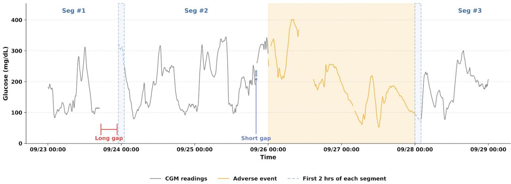
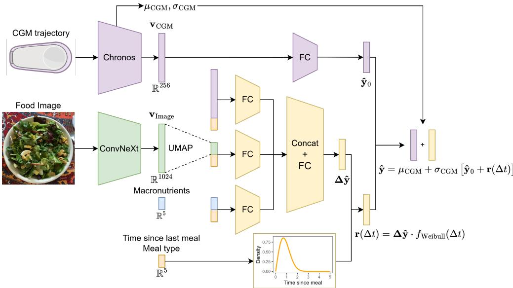
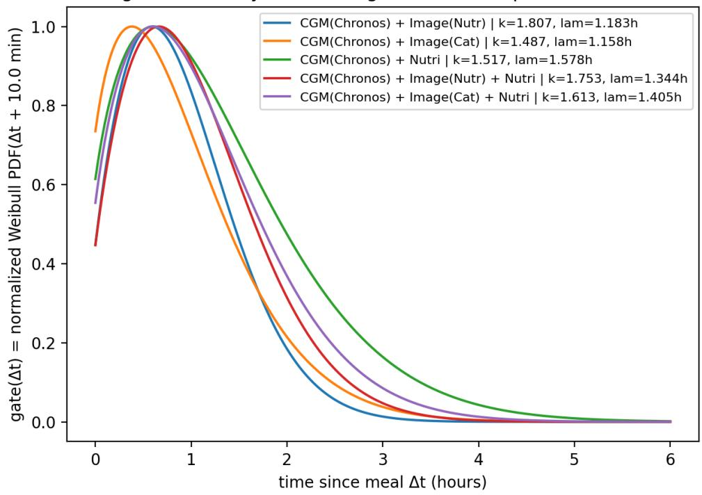
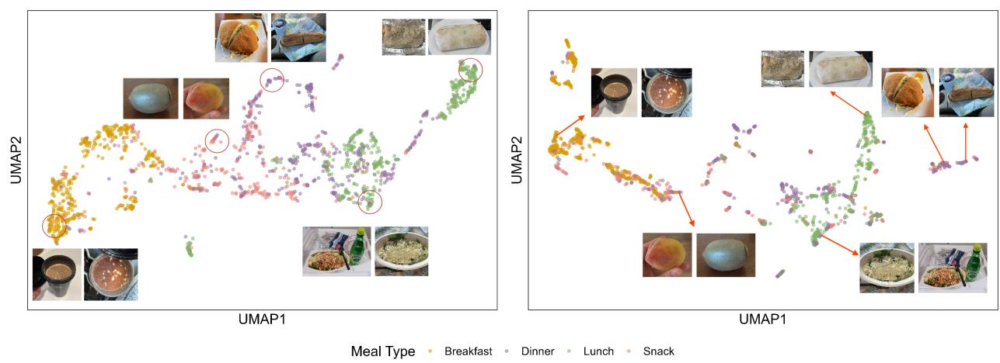
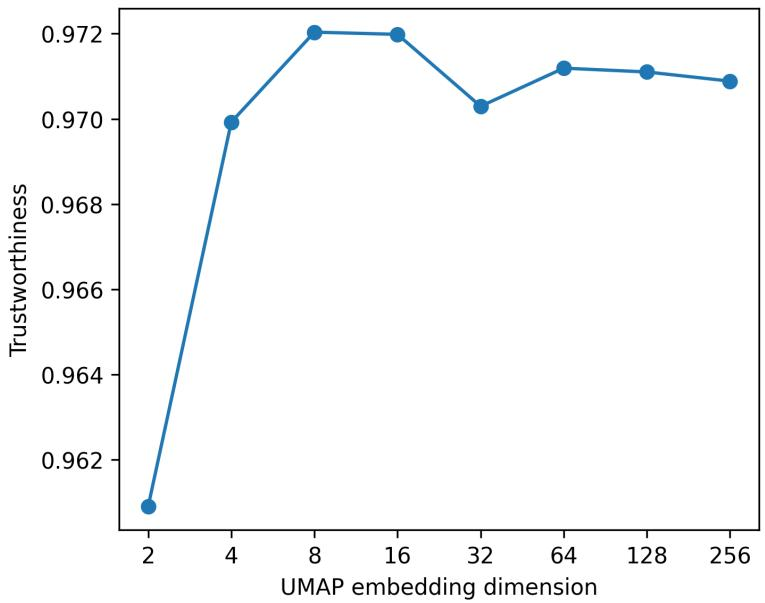
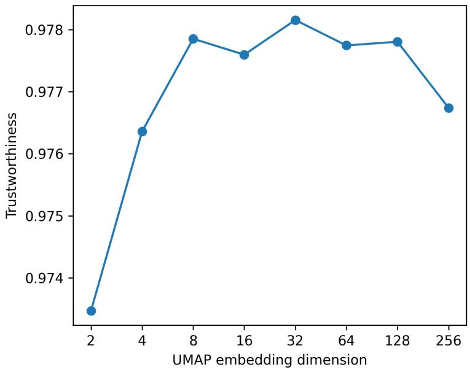
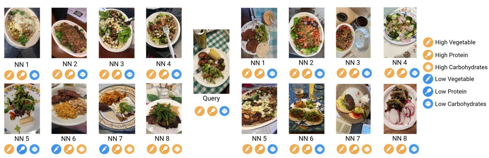

# Evaluating Time-Series Foundation Models and Multimodal Dietary Context for CGM Forecasting

Bowen Zhang1,†, Hsiu-Wen Cheng1,†, Hongyu Yang1,†, Evie L. Shen2, Joleen Vansomphone3, Yuna Li4, Kerry Zhou5, Zitian Qu6, Suning Zhao1, Xiangning Deng1, Hua Zhou1,∗, Jin J. Zhou1,∗

1University of California, Los Angeles, Los Angeles, CA, U.S.A.   
2Union County Magnet High School, Scotch Plain, NJ, U.S.A.   
3Huntington Beach High School, Huntington Beach, CA, U.S.A.   
4Crean Lutheran High School, Irvine, CA, U.S.A.   
5Portola High School, Irvine, CA, U.S.A.   
6Tsinghua University, Beijing, China. †Bowen Zhang, Hsiu-Wen Cheng and Hongyu Yang contributed equally to this research.   
∗Corresponding authors: Hua Zhou and Jin J. Zhou.

This work has been submitted to the IEEE for possible publication. Copyright may be transferred without notice, after which this version may no longer be accessible.

## Abstract

Continuous glucose monitoring (CGM) provides high-frequency measurements of glucose dynamics and enables short-term glucose forecasting for diabetes management. Although timeseries foundation models have shown strong general forecasting ability, their efectiveness for CGM prediction and the added value of multimodal dietary context remain unclear. We conduct a comprehensive empirical study using eight public CGM datasets spanning Type 1 diabetes, Type 2 diabetes, and non-diabetes populations. Under a unified protocol across multiple context lengths and prediction horizons, zero-shot foundation models did not consistently outperform strong task-specific baselines such as Elastic Net and PatchTST. In contrast, lightweight finetuning substantially improved forecasting performance. For example, fine-tuned Chronos-Bolt reduced RMSE by 6.5%–18.4% in the T1D cohort and by 8.6%–18.2% in the non-diabetes/T2D cohort, with comparable improvements in both in-distribution and out-of-distribution test settings. We further evaluate multimodal dietary context using CGMacros, which provides temporally aligned CGM signals, food images, and macronutrient records. A residual-based fusion framework reduced overall RMSE by approximately 3% and postprandial RMSE by approximately 15% relative to the CGM-only baseline. Moreover, Chronos-based CGM representations were more strongly correlated with observed postprandial glucose increments than representations from LSTM and CatBoost, even after those models incorporated additional dietary modalities, suggesting that pretrained temporal representations better preserve meal-induced excursion patterns. These findings show that foundation models require CGM-specific adap tation for reliable forecasting and that dietary context provides clinically meaningful signals beyond CGM alone, especially during postprandial periods.

Keywords: Continuous glucose monitoring, Food image representation, Foundation models, Multimodal learning, Time-series forecasting.

## 1 Introduction

Diabetes mellitus (DM) is a chronic metabolic disease characterized by persistently elevated blood glucose levels due to impaired insulin secretion or insulin resistance, leading to progressive organ damage over time [1]. Both Type 1 diabetes (T1D) and Type 2 diabetes (T2D) populations face substantial challenges in maintaining stable glycemic control. Continuous glucose monitoring (CGM), which provides high-frequency measurements of interstitial glucose, enables detailed characterization of glycemic dynamics and has been shown to capture glycemic profiles associated with increased mortality risk and complications [2–5]. Large-scale real-world studies integrating CGM device data with electronic health records further demonstrate substantial heterogeneity in CGM usage patterns and glycemic control metrics across T1D and T2D populations, underscoring the need for data-driven modeling of glucose dynamics [6, 7]. Beyond enabling descriptive characterization of glucose dynamics, CGM initiation has also been linked to improved glycemic control and fewer adverse clinical events, providing strong clinical motivation for developing models that can leverage CGM data to inform glucose management [8].

Early CGM-based glucose forecasting relied on classical statistical and machine learning approaches, including linear regression, ARIMA[9, 10], and Elastic Net [11]. Although computationally eficient and interpretable, these classical approaches are often limited in their ability to capture complex temporal dependencies and to scale to longer prediction horizons. More recently, deep learning methods, particularly Transformer-based architectures, have demonstrated improved performance by modeling long-range temporal dependencies and multi-scale glucose dynamics [12, 13], outperforming earlier convolutional and recurrent models [14–16].

Beyond task-specific architectures, the field has increasingly turned to large-scale time-series foundation models pretrained on diverse and heterogeneous temporal datasets [17–20]. These models exhibit strong cross-domain generalization, suggesting that pretrained temporal representations may transfer efectively to clinically relevant forecasting tasks. However, it remains unclear whether such benefits persist for CGM forecasting under clinically realistic settings involving limited historical context, varying prediction horizons, and heterogeneous patient populations, or whether zero-shot deployment is suficient relative to lightweight fine-tuning.

At the same time, glucose dynamics are strongly influenced by external physiological and behavioral factors that are not fully observable from CGM signals alone. Dietary intake, in particular, induces abrupt and heterogeneous perturbations that challenge univariate forecasting approaches and has motivated multimodal models that integrate CGM with complementary contextual information such as wearable sensors or dietary records [21]. Despite encouraging results, it remains unclear which aspects of dietary context are most informative for postprandial glucose dynamics, and whether visually inferred dietary representations provide complementary value beyond structured nutritional variables.

GlucoBench represents an important step toward standardized evaluation in CGM forecasting by curating public datasets and defining unified benchmarking protocols [22]. Building on this foundation, we conduct a two-part empirical study to clarify the roles of pretrained temporal representations and dietary multimodality in CGM forecasting. First, using curated public CGM datasets, we evaluate classical statistical models, deep learning baselines, and recent time-series foundation models across historical context lengths, prediction horizons, and populations, explicitly comparing zero-shot and lightweight fine-tuning. Second, leveraging the CGMacros dataset [23], which provides temporally aligned CGM signals, food images, and macronutrient records, we examine the contribution of multimodal dietary context using a carefully designed residual-based fusion framework. By separating the CGM-only baseline prediction from a meal-driven residual correction branch, this design enables controlled comparisons across dietary input modalities and helps assess the complementary roles of visual and nutritional signals.

Together, this study provides a systematic evaluation of time-series foundation models and multimodal dietary information for CGM forecasting under clinically realistic settings. Through unified benchmarking across public CGM datasets and controlled multimodal experiments using CGMacros, this work examines the extent to which pretrained temporal representations and dietary context can support practical glucose forecasting. Code for data preprocessing, model training, and evaluation are available at https://github.com/BowenZhang2001/CGM\_Forecasting.git.

## 2 Related work

Prior work on glucose forecasting spans a wide range of modeling paradigms, data sources, and experimental setups, reflecting diverse clinical contexts and research objectives in this domain. Existing studies have explored approaches based on classical statistical models and deep learning architectures on CGM or related time-series data [24–26], as well as privacy-preserving and federated learning frameworks for cross-patient blood glucose prediction [27, 28]. In parallel, multimodal inputs have been incorporated to provide contextual information for glucose prediction, such as dietary intake and physiological signals [29, 30]. However, many of these eforts are evaluated under task-specific designs tailored to particular cohorts or objectives, which complicates direct comparison.

Within multimodal glucose modeling, a substantial body of work incorporates dietary factors, including macronutrients and physical activity [31], insulin dosing and blood biomarkers [32], or manually logged meal features [33]. Many of these studies characterize postprandial glycemic response through summary outcomes or short-term response metrics [34], rather than framing postprandial dynamics as a multi-horizon temporal forecasting problem. As a result, multimodal models are often developed and evaluated using heterogeneous formulations and datasets, which hinders direct comparison of their individual contributions. [22, 35].

More broadly, many multimodal approaches in the glucose modeling literature emphasize dietary assessment objectives, such as calorie or intake estimation, and adopt feature-level [29, 36], or mechanistic pipelines instead of end-to-end temporal forecasting models. Despite recent advances in time-series foundation models, their use in CGM forecasting has received limited systematic evaluation, particularly with respect to comparisons between zero-shot and lightweight fine-tuning under consistent forecasting horizons. Taken together, these lines of work suggest that the relative roles of pretrained temporal representations and dietary modalities in short-horizon glucose forecasting remain insuficiently understood under controlled and comparable settings.

## 3 Data

## 3.1 Ethics statement

This study used publicly available, de-identified datasets. All data were obtained from previously published studies or public repositories, and no new data were collected from human participants. Informed consent and ethical approval were obtained in the original studies, as applicable. Therefore, no additional informed consent was required for the present secondary analysis.

## 3.2 Description

We considered eight publicly available CGM datasets collected across diverse study designs and populations. These datasets include three cohorts of individuals with T1D [37–39], one cohort of individuals with T2D [40], one non-diabetes cohort [41], and three mixed cohorts comprising non-diabetes, pre-diabetes, and T2D participants [23, 42, 43].

Given the limited availability of large-scale public T2D CGM datasets and the data demands associated with training and evaluating time-series foundation models, we grouped the three T1D datasets into a single T1D cohort and combined the remaining five datasets into a non-diabetes/T2D cohort. This grouping strategy was applied consistently throughout the forecasting benchmarks to support stable estimation and facilitate comparable evaluation across models.

For multimodal forecasting experiments, we focused exclusively on the CGMacros dataset, which uniquely provides temporally aligned multimodal records, including CGM measurements, food images, and structured macronutrient records [23]. This alignment enables us to isolate and evaluate the incremental contribution of dietary context to glucose forecasting performance.

  
Figure 1: CGM interpolation and segmentation. CGM readings were partitioned into segments separated by long gaps exceeding 2 hours, which commonly arise from sensor replacement or prolonged data loss. Periods corresponding to adverse events were excluded. To mitigate potential instability at segment boundaries, the first two hours of each segment were removed.

## 3.3 Preprocessing

CGM data were preprocessed using a standardized pipeline to ensure temporal consistency, prevent information leakage, and support comparable evaluation across datasets. The preprocessing pipeline consisted of the following steps:

Cohort selection. Analyses were restricted to adult participants. For T1D cohorts, we retained only CGM observations collected before randomization and outside closed-loop control periods, because the source studies were designed around closed-loop insulin delivery systems and postrandomization data may reflect algorithm-mediated glucose regulation rather than user-managed glycemic control. Implausible glucose values and initial unstable sensor readings were also removed.

Interpolation and segmentation. CGM trajectories were mapped to a uniform temporal grid. Short missing intervals of less than 2 hours were linearly interpolated, whereas longer gaps were used to split trajectories into independent temporal segments to avoid artificial extrapolation across extended missing periods. An overview of the gap-handling and segmentation strategy is illustrated in Figure 1.

Data splitting. For model evaluation, a subject-level out-of-distribution (OOD) split was adopted by holding out 20% of participants as an external test cohort. The remaining data were divided into training, validation, and in-distribution (ID) test sets using chronological splits to prevent information leakage across time. For multimodal experiments on CGMacros, subject-level OOD splits were not applied due to the limited number of participants. Instead, strictly chronological training, validation, and test splits were used.

Multimodal alignment. For multimodal experiments, dietary images and nutritional records were temporally aligned with CGM measurements on a uniform 5-minute grid.

As shown in Table 1, after preprocessing, the forecasting comparison cohort comprised 145 participants with T1D, contributing approximately 0.64 million CGM observations, and 404 participants without diabetes or with T2D, contributing approximately 0.59 million observations. For the multimodal forecasting experiments, the CGMacros dataset comprised 44 participants, with approximately 125,000 CGM observations and 1,611 meal records after preprocessing.

Table 1: Overview of public CGM datasets used for model training and evaluation.
<table><tr><td rowspan="2">Dataset</td><td rowspan="2">DM Type</td><td rowspan="2">Device</td><td colspan="2"># of subjects</td><td rowspan="2">Mean length of records (days, post-processing)</td></tr><tr><td>Raw</td><td>Processed</td></tr><tr><td>Anderson et al. (2016) [37]</td><td>T1D</td><td>Dexcom G4</td><td>30</td><td>29</td><td>25.5</td></tr><tr><td>Broll et al. (2021) [40]</td><td>T2D</td><td>Dexcom G4</td><td>5</td><td>5</td><td>9.5</td></tr><tr><td>Brown et al. (2019) [38]</td><td>T1D</td><td>Dexcom G6</td><td>168</td><td>95</td><td>12.2</td></tr><tr><td>CGMacros (2025) [23]</td><td>Non-diabetes, T2D</td><td>Dexcom G6 Pro</td><td>45</td><td>45*</td><td>9.7</td></tr><tr><td>Colas et al. (2019) [43]</td><td>Non-diabetes, T2D</td><td>MiniMed iPro</td><td>191</td><td>191</td><td>1.9</td></tr><tr><td>Hall et al. (2018) [42]</td><td>Non-diabetes, T2D</td><td>Dexcom G4</td><td>57</td><td>57</td><td>5.8</td></tr><tr><td>Lynch et al. (2022) [39]</td><td>T1D</td><td>Dexcom G6</td><td>90</td><td>21</td><td>15.3</td></tr><tr><td>Shah et al. (2019) [41]</td><td>Non-diabetes</td><td>Dexcom G6</td><td>153</td><td>106</td><td>8.1</td></tr></table>

In the multimodal forecasting, one subject with insuficient or irregular data was excluded.

## 4 Experiment

## 4.1 Evaluation of Time-Series Foundation Models for Glucose Forecasting

## 4.1.1 Models and forecasting tasks

We benchmarked forecasting performance across multiple historical context lengths and prediction horizons using a diverse set of classical baselines, deep learning models, and pretrained time-series foundation models.

As simple baselines, we included Last Observation Carried Forward (LOCF), AutoARIMA [10], and Elastic Net [44]. Among deep learning baselines, we evaluated a Long Short-Term Memory (LSTM) network [45] and PatchTST [46], a Transformer-based architecture designed for long-horizon time-series forecasting. We further considered four pretrained time-series foundation models: Chronos-Bolt-Tiny and Chronos-Bolt-Mini, lightweight encoder–decoder Transformers that difer primarily in model capacity [18]; Chronos2-Small, a compact pretrained Transformer from the Chronos family that operates directly in the continuous value space [19]; and TimesFM 2.5, a decoder-only model optimized for multi-horizon probabilistic forecasting [20].

Foundation models were evaluated under two usage regimes: zero-shot inference, where pretrained weights were applied without task-specific adaptation, and fine-tuning using the CGM training data. All models were evaluated across multiple input–output configurations, varying the historical context length (4 h, 12 h, and 24 h) and prediction horizon (30 min, 1 h, and 2 h). Each context–horizon combination was treated as an independent forecasting task, with non-pretrained models trained and foundation models fine-tuned separately when applicable.

## 4.1.2 Experimental protocol

Datasets were split into training, validation, ID test, and OOD test sets following the protocol in Section 3.3. Forecasting instances were constructed using a sliding window, where historical contexts of varying lengths were used to predict future glucose trajectories. A fixed stride of 24 time steps was used for both training and evaluation across all models.

Hyperparameters for deep learning models were selected via hyperparameter optimization (HPO) with 10 trials per configuration. For each model and context–horizon setting, the configuration achieving the best validation performance was used for evaluation on the ID and OOD test sets.

To account for training stochasticity, LSTM, PatchTST, and all fine-tuned foundation models were evaluated over multiple random seeds. LSTM, PatchTST, and Chronos-Bolt models were repeated with 10 seeds, while Chronos2-Small and TimesFM 2.5 were repeated with 5 seeds due to substantially higher computational cost. Mean performance across repetitions is reported. In contrast, zero-shot foundation models and classical baselines were evaluated using a single run, as no stochastic training is involved.

Given a CGM time series $\{ x _ { t } ^ { ( i ) } \} _ { t = 1 } ^ { T _ { i } }$ from subject i, at each forecasting time t the model predicts future values $\hat { \mathbf { x } } _ { t + 1 : t + H } ^ { ( i ) } = ( \hat { x } _ { t + 1 } ^ { ( i ) } , \dotsc , \hat { x } _ { t + H } ^ { ( i ) } )$ based on a historical context of length L. Performance is evaluated using root mean squared error (RMSE):

$$
\mathrm { R M S E } _ { t } ^ { ( i ) } = \sqrt { \frac { 1 } { H } \sum _ { h = 1 } ^ { H } \left( x _ { t + h } ^ { ( i ) } - \hat { x } _ { t + h } ^ { ( i ) } \right) ^ { 2 } } ,
$$

and final metrics are obtained by averaging over all forecasting instances across subjects in the test set:

$$
\mathrm { R M S E } = \frac { 1 } { | \mathcal { T } _ { \mathrm { t e s t } } | } \sum _ { ( i , t ) \in \mathcal { T } _ { \mathrm { t e s t } } } \mathrm { R M S E } _ { t } ^ { ( i ) } .
$$

## 4.2 Multimodal Integration for Glucose Forecasting

## 4.2.1 Visual backbone for food image representation

To incorporate food image information into multimodal glucose forecasting, we evaluated several visual backbone architectures on the Food-101 dataset [47]. All models were fine-tuned end-to-end, and the backbone with the best validation accuracy was selected to extract food image embeddings for downstream multimodal CGM forecasting on the CGMacros dataset.

Food-101 classification accuracy was used as a proxy for representation quality. Using the selected backbone architecture, we further compared two supervision strategies during Food-101 training. In the first setting, models were trained using standard 101-class food category labels. In the second setting, models were trained using nutrition-aligned supervision, formulated as a multioutput regression task in which the targets were category-level nutritional profiles, including calories and macronutrients, obtained from a publicly available Food-101 nutrition dataset [48].

These two training paradigms were compared based on downstream CGM forecasting performance, allowing us to assess whether nutrition-aligned visual representations provide additional benefit beyond category-supervised embeddings.

  
Figure 2: Overview of the multimodal CGM forecasting framework. CGM time-series are encoded by a Chronos backbone to produce a baseline prediction $\hat { \mathbf { y } } _ { 0 }$ . Multimodal meal information is used to estimate a residual efect $\Delta \hat { \mathbf y }$ which is temporally modulated by a Weibull-based gating function and added to the baseline to obtain the final glucose forecast.

## 4.2.2 Multimodal CGM forecasting with food image and macronutrients

Figure 2 illustrates the proposed multimodal CGM forecasting framework, which combines a CGMonly Chronos backbone with a meal-driven residual correction module. The CGM trajectory is first passed through a fine-tuned Chronos-Bolt-Tiny model to obtain a normalized baseline forecast $\hat { y } _ { 0 }$ and an intermediate CGM representation $\mathbf { v } _ { \mathrm { C G M } }$ . The CGM-specific mean and standard deviation, µCGM and σCGM, are retained for transforming predictions back to the original scale. In all multimodal experiments, Chronos is used as a fixed CGM encoder so that the contribution of meal-related information can be isolated through the residual branch.

Meal information is represented using food images, structured nutritional variables, and meal timing/type features. Food images are encoded using the selected ConvNeXt backbone to obtain high-dimensional embeddings $\mathbf { v } _ { \mathrm { I m a g e } } ,$ , which are then projected to an 8-dimensional latent space using UMAP to reduce model complexity while preserving local neighborhood structure. The reduced image embeddings and macronutrient features, including carbohydrates, protein, fat, fiber, and total caloric content, are separately transformed through fully connected layers and then combined to estimate a residual correction magnitude $\Delta \hat { y }$

To account for the time-varying postprandial efect of meals, the residual correction is modulated by a Weibull-based temporal gate parameterized by the elapsed time since the most recent meal, $\Delta t$ . The final residual is defined as

$$
r ( \Delta t ) = \Delta \hat { y } \cdot f _ { \mathrm { W e i b u l l } } ( \Delta t ) ,
$$

where the gate allows meal-related information to contribute most during the postprandial period and decay at longer delays. The final glucose prediction is obtained by adding this residual correction to the CGM-only baseline forecast and transforming back to the original glucose scale:

$$
\hat { y } = \mu _ { \mathrm { C G M } } + \sigma _ { \mathrm { C G M } } \left[ \hat { y } _ { 0 } + r ( \Delta t ) \right] .
$$

This residual design separates baseline temporal prediction from meal-related correction, enabling controlled comparisons of image, nutritional, and timing information in multimodal CGM forecasting.

## 4.2.3 Ablation study

We conducted ablation studies to quantify the contribution of individual modalities and the supervision strategy used to learn food image embeddings in the proposed multimodal CGM forecasting framework. In all ablations, the CGM backbone was kept fixed, with an input context length of 24 hours and a forecasting horizon of 2 hours.

Hyperparameters were selected based on validation performance and then fixed. Each configuration was trained and evaluated over 10 independent runs, with performance reported as the mean RMSE.

Efect of modality integration We first evaluated the incremental benefit of incorporating meal-related information by comparing four model configurations:

1. CGM only without the residual correction branch;

2. CGM with food image embeddings;

3. CGM with macronutrient features;

4. Full multimodal model combining CGM, food images, and macronutrients.

This comparison isolates the individual and joint contributions of visual and nutritional modalities, and assesses whether their combination yields complementary gains.

Efect of image supervision strategy We next evaluated the impact of visual supervision by comparing food image embeddings trained using standard food category labels with those trained using nutrition-aligned supervision. All other model components and training procedures were held constant. This analysis tests whether aligning visual representations with nutritionally relevant properties helps downstream glucose forecasting.

Together, these ablations assess the contribution of each modality and design choice in the proposed multimodal framework.

## 4.2.4 Comparison with alternative CGM encoders

To examine whether the contribution of meal-related modalities generalizes beyond a Chronosbased CGM representation, we performed two complementary comparisons. First, in a CGMencoder swap, Chronos CGM embeddings were replaced with LSTM embeddings while keeping the multimodal fusion and residual correction modules unchanged. This comparison evaluates alternative sequence representations under the same multimodal architecture. Second, as a reference baseline, we included a standalone CatBoost model trained on windowed raw CGM inputs, without using the proposed fusion framework.

The LSTM-based variant was used as a component-level comparison because it preserves the same fusion and residual correction structure while changing only the CGM encoder. In contrast, CatBoost relies on a tree-based formulation applied to raw CGM input windows and does not impose an explicit sequential architecture. Given these diferent modeling assumptions, CatBoost was included as a reference baseline.

All models were evaluated under the same data splits and evaluation protocol. In addition to overall and postprandial forecasting accuracy measured by RMSE, we evaluated each model’s ability to capture postprandial glucose excursions using the postprandial glucose increment (PGI). Predicted PGI was defined as the maximum predicted glucose value within the 2-hour forecasting horizon minus the pre-meal glucose level, and observed PGI was defined analogously using the observed glucose trajectory. We reported the correlation between predicted and observed PGI to assess whether each model captured meal-induced glucose increases.

These comparisons assess whether the contribution of meal-related modalities is consistent across CGM representations and whether this contribution extends to the characterization of postprandial glucose excursions.

## 5 Results

## 5.1 CGM-Only Forecasting Performance of Foundation Time-Series Models

## 5.1.1 Zero-shot foundation models do not consistently outperform strong baselines

Table 2 reports comprehensive CGM forecasting results across three historical context lengths (4, 12, and 24 hours) and three prediction horizons (30 minutes, 1 hour, and 2 hours) for both the T1D and Non-diabetes/T2D cohorts. All models are evaluated on the ID test set.

Across both cohorts, zero-shot foundation models do not consistently outperform strong classical or task-specific baselines, even with extended historical context. Elastic Net and PatchTST remain highly competitive, particularly for short-term forecasting where strong temporal autocorrelation benefits simpler models.

Among zero-shot foundation models, performance varies substantially by architecture. The Chronos-Bolt variants (Tiny and Mini) frequently exhibit higher RMSE; for example, in the T1D cohort with a 24-hour context, they underperform Elastic Net and PatchTST by approximately 7–10% at the 30-minute horizon, with persistent gaps at longer horizons.

Larger foundation models such as TimesFM-2.5 and Chronos2-small achieve more competitive zero-shot results but fail to deliver systematic improvements across cohorts and settings. Overall, these findings indicate that of-the-shelf pretrained time-series models alone may be insuficient for reliable CGM forecasting without task-specific adaptation.

## 5.1.2 Fine-tuning enables more consistent gains for selected foundation models

In contrast to zero-shot deployment, fine-tuning leads to substantial and consistent performance improvements for several foundation models (Table 3). The most pronounced gains are observed for the Chronos-Bolt variants. On the T1D cohort, fine-tuning reduces RMSE by 6.5–18.4% for Chronos-Bolt-Tiny and Mini across all evaluated context–horizon combinations. Similar trends are observed in the Non-diabetes/T2D cohort, where RMSE reductions typically range from 8.6–18.2%. These gains frequently shift foundation models from underperforming strong baselines in zero-shot mode to becoming top-performing methods after fine-tuning across prediction horizons.

In contrast, the benefits of fine-tuning are more modest for larger foundation models. Chronos2- Small exhibits consistent but smaller improvements, generally below 8% across settings. In several Non-diabetes/T2D configurations, TimesFM-2.5 shows slight performance degradation after finetuning, particularly for longer prediction horizons. These patterns may reflect diminishing returns from adaptation when model capacity is large relative to the available training data.

Table 2: CGM forecasting RMSE performance (mean ± SD) on the ID test set for T1D and Nondiabetes/T2D cohorts.
<table><tr><td rowspan="2" colspan="2">Model</td><td colspan="3">Ctx: 4-hr</td><td colspan="3">Ctx: 12-hr</td><td colspan="3">Ctx: 24-hr</td></tr><tr><td>30-min</td><td>1-hr</td><td>2-hr</td><td>30-min</td><td>1-hr</td><td>2-hr</td><td>30-min</td><td>1-hr</td><td>2-hr</td></tr><tr><td rowspan="9">Elastic Net LSTM</td><td>LOCF AutoARIMA</td><td>12.70</td><td>20.96 22.85</td><td>33.69 46.00</td><td>12.70</td><td>20.96 20.26</td><td>33.69 37.70</td><td>12.70 10.59</td><td>20.96 18.88</td><td>33.69 33.87</td></tr><tr><td></td><td>11.86 10.36</td><td>18.32</td><td>30.60</td><td>10.95 10.28</td><td>18.21</td><td>30.66</td><td>10.23</td><td>17.98</td><td>30.09</td></tr><tr><td></td><td>10.28 ± 0.09</td><td>18.11 ± 0.11</td><td>30.28 ± 0.09</td><td>10.25 ± 0.09</td><td>18.07 ± 0.10</td><td>30.42 ± 0.17</td><td>10.37 ± 0.10</td><td>18.30 ± 0.24</td><td>30.05 ± 0.23</td></tr><tr><td>PatchTST</td><td>10.38 ± 0.21</td><td>17.76 ± 0.13</td><td>30.00 ± 0.08</td><td>10.54 ± 0.24</td><td>17.87 ± 0.27</td><td>30.02 ± 0.21</td><td>10.52 ± 0.22</td><td>18.07 ± 0.21</td><td>29.57 ± 0.19</td></tr><tr><td>Chronos-bolt-tinyzs</td><td>12.21</td><td>20.55</td><td>34.24</td><td>11.77</td><td>19.89</td><td>33.01</td><td>11.29</td><td>19.08</td><td>31.26</td></tr><tr><td>Chronos-bolt-tinyFT</td><td>10.11 ± 0.06</td><td>17.89 ± 0.06</td><td>31.06 ± 0.14</td><td>10.14 ± 0.08</td><td>17.54 ± 0.05</td><td>29.67 ± 0.09</td><td>9.95 ± 0.12</td><td>17.36 ± 0.08</td><td>29.12 ± 0.07</td></tr><tr><td>Chronos-bolt-minizs</td><td>12.12</td><td>20.71</td><td>34.62</td><td>11.62</td><td>19.85</td><td>33.00</td><td>11.26</td><td>18.92</td><td>31.34</td></tr><tr><td>Chronos-bolt-miniFT Chronos2-smallzs</td><td>10.07 ± 0.05</td><td>17.83 ± 0.05</td><td>31.05 ± 0.17</td><td>10.05 ± 0.08</td><td>17.56 ± 0.19</td><td>29.83 ± 0.22</td><td>9.98 ± 0.07</td><td>17.27 ± 0.07</td><td>29.30 ± 0.15</td></tr><tr><td>Chronos2-smallFT</td><td>11.38 10.45 ± 0.11</td><td>19.79 18.43 ± 0.19</td><td>34.14 31.81 ± 0.40</td><td>11.19 10.41 ± 0.16</td><td>18.81 17.94 ± 0.11</td><td>31.54 30.35 ± 0.31</td><td>10.96 10.50 ± 0.11</td><td>18.38 17.77 ± 0.08</td><td>30.82 29.50 ± 0.23</td></tr><tr><td>TimesFM-2.5zS TimesFM-2.5FT</td><td></td><td>19.75</td><td></td><td>33.67</td><td>10.33</td><td>18.29</td><td>31.06</td><td>10.03</td><td>17.57</td><td>29.77</td></tr><tr><td>LOCF</td><td></td><td>10.57 ± 0.27 8.10</td><td>19.52 ± 0.30</td><td>32.68 ± 0.37</td><td>10.26 ± 0.09</td><td>17.86 ± 0.05</td><td>30.77 ± 0.10</td><td>9.96 ± 0.04</td><td>17.46 ± 0.05</td><td>29.64 ± 0.05</td></tr><tr><td></td><td>AutoARIMA</td><td>8.31</td><td>11.53 13.33</td><td>15.74 20.28</td><td>8.10 7.74</td><td>11.53 11.61</td><td>15.74 15.95</td><td>8.10 7.50</td><td>11.53 11.02</td><td>15.74 15.22</td></tr><tr><td>Elastic Net</td><td></td><td>7.48</td><td>10.83</td><td>14.59</td><td>7.35</td><td>10.51</td><td>14.08</td><td>7.33</td><td>10.37</td><td>13.57</td></tr><tr><td>LSTM PatchTST</td><td></td><td>7.64 ± 0.05</td><td>10.82 ± 0.08</td><td>14.47 ± 0.07</td><td>7.48 ± 0.07</td><td>10.49 ± 0.06</td><td>14.09 ± 0.07</td><td>7.49 ± 0.06</td><td>10.45 ± 0.08</td><td>13.54 ± 0.11</td></tr><tr><td>2D</td><td> $\mathrm { \overline { { C h r o n o s  – b o l t - t i n y } } ^ { Z S } }$ </td><td>7.38 ± 0.06 8.56</td><td>10.51 ± 0.06</td><td>13.79 ± 0.07</td><td>7.40 ± 0.09</td><td>10.51 ± 0.09</td><td>13.62 ± 0.10</td><td>7.47 ± 0.12</td><td>10.33 ± 0.05</td><td>13.31 ± 0.10</td></tr><tr><td>es</td><td>Chronos-bolt-tinyFT</td><td>7.40 ± 0.12</td><td>12.26</td><td>16.48</td><td>8.26</td><td>11.77</td><td>15.99</td><td>7.83</td><td>10.95</td><td>14.53</td></tr><tr><td></td><td></td><td></td><td>10.34 ± 0.06</td><td>13.85 ± 0.05</td><td>7.25 ± 0.13</td><td>10.17 ± 0.05</td><td>13.42 ± 0.02</td><td>7.12 ± 0.06</td><td>10.01 ± 0.04</td><td>13.03 ± 0.05</td></tr><tr><td></td><td> $\mathrm { \Delta \tilde { \stackrel {  } { \infty } } \ C h r o n o s { \ – } b o l t { \cdot } m i n i \tilde { \stackrel { \mathrm { Z S } } { \ddots } } }$ </td><td>8.60</td><td>12.34</td><td>16.91</td><td>8.27</td><td>11.78</td><td>16.21</td><td>7.86</td><td>10.96</td><td>14.71</td></tr><tr><td></td><td>Chronos-bolt-miniFT</td><td>7.38 ± 0.15</td><td>10.36 ± 0.06</td><td>13.84 ± 0.04</td><td>7.08 ± 0.05</td><td>10.18 ± 0.06</td><td>13.44 ± 0.03</td><td>7.01 ± 0.04</td><td>9.99 ± 0.03</td><td>13.01 ± 0.05</td></tr><tr><td></td><td>Chronos2-smallzs</td><td>7.96</td><td>11.28</td><td>15.29</td><td>7.71</td><td>10.58</td><td>14.11</td><td>7.46</td><td>10.18</td><td>13.30</td></tr><tr><td>No-diab</td><td>Chronos2-smallFT</td><td>7.47 ± 0.02</td><td>10.51 ± 0.02</td><td>14.11 ± 0.04</td><td>7.40 ± 0.08</td><td>10.33 ± 0.04</td><td>13.85 ± 0.12</td><td>7.26 ± 0.09</td><td>10.00 ± 0.04</td><td></td></tr><tr><td></td><td></td><td>7.82</td><td></td><td></td><td></td><td></td><td></td><td></td><td></td><td>13.09 ± 0.10</td></tr><tr><td></td><td>TimesFM-2.5ZS</td><td></td><td>11.18</td><td>15.12</td><td>7.32</td><td>10.54</td><td>14.03</td><td>7.13</td><td>10.14</td><td></td></tr><tr><td></td><td></td><td>7.60 ± 0.11</td><td></td><td></td><td></td><td></td><td></td><td></td><td></td><td>13.41</td></tr><tr><td></td><td></td><td></td><td>11.11 ± 0.05</td><td>15.02 ± 0.22</td><td></td><td></td><td></td><td></td><td></td><td></td></tr><tr><td></td><td>TimesFM-2.5FT</td><td></td><td></td><td></td><td>7.24 ± 0.03</td><td>10.45 ± 0.03</td><td>14.20 ± 0.03</td><td>7.14 ± 0.03</td><td>10.21 ± 0.03</td><td>13.51 ± 0.06</td></tr><tr><td></td><td></td><td></td><td></td><td></td><td></td><td></td><td></td><td></td><td></td><td></td></tr><tr><td></td><td></td><td></td><td></td><td></td><td></td><td></td><td></td><td></td><td></td><td></td></tr><tr><td></td><td></td><td></td><td></td><td></td><td></td><td></td><td></td><td></td><td></td><td></td></tr><tr><td></td><td></td><td></td><td></td><td></td><td></td><td></td><td></td><td></td><td></td><td></td></tr><tr><td></td><td></td><td></td><td></td><td></td><td></td><td></td><td></td><td></td><td></td><td></td></tr><tr><td></td><td></td><td></td><td></td><td></td><td></td><td></td><td></td><td></td><td></td><td></td></tr><tr><td></td><td></td><td></td><td></td><td></td><td></td><td></td><td></td><td></td><td></td><td></td></tr><tr><td></td><td></td><td></td><td></td><td></td><td></td><td></td><td></td><td></td><td></td><td></td></tr><tr><td></td><td></td><td></td><td></td><td></td><td></td><td></td><td></td><td></td><td></td><td></td></tr><tr><td></td><td></td><td></td><td></td><td></td><td></td><td></td><td></td><td></td><td></td><td></td></tr><tr><td></td><td></td><td></td><td></td></table>

Results are reported as mean ± SD across repeated runs when applicable. ZS: Zero-shot foundation models (deterministic); FT: Fine-tuned foundation models.

Table 3 shows that fine-tuning is important for realizing strong CGM performance from pretrained foundation models, especially for smaller- and medium-capacity architectures, but does not yield uniform gains across all models and settings.  
Table 3: Fine-tuning improvement (%) in RMSE across ID and OOD settings on the T1D and Non-diabetes/T2D cohorts.
<table><tr><td rowspan="2">Ctx-Pred</td><td rowspan="2"></td><td colspan="2">Chronos-bolt-tiny</td><td colspan="2">Chronos-bolt-mini</td><td colspan="2">Chronos2 2 small</td><td colspan="2">TimesFM-2.5</td></tr><tr><td>ID</td><td>OOD</td><td>ID</td><td>OOD</td><td>ID</td><td>OOD</td><td>ID</td><td>OOD</td></tr><tr><td rowspan="7">TD</td><td>Ctx: 4h, Pred: 30m</td><td>17.2</td><td>18.4</td><td>16.9</td><td>17.1</td><td>8.1</td><td>8.1</td><td>3.2</td><td>3.2</td></tr><tr><td>Ctx: 4h, Pred: 1h</td><td>12.9</td><td>12.9</td><td>13.9</td><td>12.9</td><td>6.9</td><td>7.2</td><td>1.2</td><td>2.0</td></tr><tr><td>Ctx: 4h, Pred: 2h</td><td>9.3</td><td>10.1</td><td>10.3</td><td>11.4</td><td>6.8</td><td>7.6</td><td>2.9</td><td>4.2</td></tr><tr><td>Ctx: 12h, Pred: 30m</td><td>13.8</td><td>14.9</td><td>13.5</td><td>14.8</td><td>7.0</td><td>6.1</td><td>0.7</td><td>0.8</td></tr><tr><td>Ctx: 12h, Pred: 1h</td><td>11.8</td><td>11.9</td><td>11.5</td><td>11.1</td><td>4.7</td><td>4.8</td><td>2.4</td><td>2.2</td></tr><tr><td>Ctx: 12h, Pred: 2h</td><td>10.1</td><td>10.7</td><td>9.6</td><td>10.2</td><td>3.8</td><td>3.8</td><td>0.9</td><td>1.1</td></tr><tr><td>Ctx: 24h, Pred: 30m</td><td>11.9</td><td>12.7</td><td>11.4</td><td>12.0</td><td>4.2</td><td>4.7</td><td>0.6</td><td>0.6</td></tr><tr><td>Ctx: 24h, Pred: 1h</td><td>9.0</td><td>8.5</td><td>8.7</td><td>8.6</td><td>3.3</td><td>3.8</td><td>0.6</td><td></td><td>0.1</td></tr><tr><td>Ctx: 24h, Pred: 2h</td><td>6.9</td><td></td><td>7.2</td><td>6.5</td><td>6.5</td><td>4.3</td><td>4.7</td><td>0.4</td><td>0.6</td></tr><tr><td>TD</td><td>Ctx: 4h, Pred: 30m</td><td>13.6</td><td>12.7</td><td>14.2</td><td>13.3</td><td>6.2</td><td>6.0</td><td>2.9</td><td>1.2</td></tr><tr><td>Ctx: 4h, Pred: 1h</td><td>15.6</td><td>15.8</td><td></td><td>16.1</td><td>16.9</td><td>6.8</td><td>7.8</td><td>0.6</td><td>3.2</td></tr><tr><td>&amp; Ctx: 4h, Pred: 2h</td><td>16.0</td><td>16.0</td><td>18.2</td><td>17.8</td><td>7.7</td><td></td><td>6.9</td><td>0.7</td><td>1.1</td></tr><tr><td rowspan="4">Nonddtes</td><td>Ctx: 12h, Pred: 30m</td><td>12.3</td><td>12.8</td><td>14.4</td><td>14.4</td><td>4.0</td><td>4.3</td><td>1.1</td><td>0.7</td></tr><tr><td>Ctx: 12h, Pred: 1h</td><td>13.6</td><td>14.3</td><td>13.6</td><td>14.3</td><td>2.3</td><td>3.3</td><td>-0.9</td><td>-0.1</td></tr><tr><td>Ctx: 12h, Pred: 2h</td><td>16.1</td><td>16.8</td><td>17.1</td><td>17.7</td><td>1.9</td><td>2.3</td><td>-1.2</td><td>-0.8</td></tr><tr><td>Ctx: 24h, Pred: 30m</td><td>9.1</td><td>9.3</td><td>10.9</td><td>10.5</td><td>2.6</td><td>3.8</td><td>-0.1</td><td></td></tr><tr><td>Ctx: 24h, Pred: 1h</td><td></td><td></td><td>9.0</td><td>8.8</td><td>8.8</td><td>1.7</td><td>3.1</td><td>-0.7</td><td>-0.1</td></tr><tr><td>Ctx: 24h, Pred: 2h</td><td>8.6 10.3</td><td>11.8</td><td></td><td>11.5</td><td>12.6</td><td>1.6</td><td>2.7</td><td>-0.7</td><td>-1.2 -0.5</td></tr></table>

## 5.1.3 Fine-tuning yields comparable gains on ID and OOD

Table 3 shows that fine-tuning yields comparable relative RMSE improvements on both ID and OOD test sets across most context–horizon configurations. Across both cohorts and all evaluated models, the diference between ID and OOD improvement percentages is typically small (generally within 1 percentage point), indicating that the gains from fine-tuning transfer consistently to unseen

subjects.

This consistency suggests that lightweight fine-tuning primarily improves alignment to CGMspecific temporal dynamics rather than inducing overfitting to in-distribution data, and that the resulting performance gains remain robust under distribution shift.

## 5.2 Multimodal Integration for Glucose Forecasting

## 5.2.1 Ablation study of multimodal integration

Table 4 summarizes ablation results assessing the contributions of individual modalities and image supervision strategies under a fixed 24-hour context and a 2-hour prediction horizon. Relative to the CGM-only baseline, incorporating meal-related information consistently improves forecasting performance.

Using food image information alone yields modest but consistent gains. Nutrition-aligned image embeddings outperform category-supervised embeddings in overall RMSE, indicating that visually inferred nutritional properties are more informative for glucose forecasting than food category recognition alone. In contrast, incorporating macronutrient features produces larger improvements, underscoring the importance of explicit nutritional information, particularly for modeling postprandial glucose dynamics.

Combining food image representations with macronutrients features yields additional gains beyond either modality alone, reflecting complementary contributions from visual and nutritional information. Among all configurations, jointly integrating nutrition-aligned image embeddings and macronutrients achieves the lowest overall RMSE. While the reduction in overall RMSE is modest (approximately 3% relative to the CGM-only baseline), postprandial RMSE is reduced by around 15%, highlighting substantial benefits in meal-related forecasting windows.

Table 4: Ablation study of multimodal integration and image supervision strategy for CGM forecasting.
<table><tr><td>Model configuration</td><td>Overall RMSE</td><td>Postprandial RMSE</td></tr><tr><td>CGM only (Chronos)</td><td>16.90 (0.02)</td><td>28.79 (0.26)</td></tr><tr><td>- Image (Cat)</td><td>16.72 (0.08)</td><td>25.22 (0.41)</td></tr><tr><td>- Image (Nutr)</td><td>16.64 (0.06)</td><td>25.17 (0.17)</td></tr><tr><td>- Nutri</td><td>16.56 (0.16)</td><td>24.17 (0.52)</td></tr><tr><td>- Image (Cat) + Nutri</td><td>16.49 (0.13)</td><td>24.41 (0.75)</td></tr><tr><td>- Image (Nutr) + Nutri</td><td>16.39 (0.07)</td><td>24.51 (0.55)</td></tr></table>

RMSE values are reported as mean (standard deviation) for a 24-hour context and a 2-hour prediction horizon, averaged over 10 runs. Postprandial RMSE is evaluated within 0–2 hours after meal events. Parenthetical terms in the model configuration column denote image supervision strategies. Cat denotes category-supervised image embeddings; Nutr denotes nutrition-aligned image embeddings; Nutri denotes macronutrient features.

Table 5 reports results using alternative CGM backbones. CatBoost and LSTM showed a similar pattern: adding meal-related modalities generally improved performance, especially postprandial RMSE. Compared with these alternatives, the Chronos-based framework achieved lower overall RMSE.

Beyond RMSE-based forecasting accuracy, we further evaluated whether the models captured the magnitude of meal-induced glucose excursions. Table 6 reports the correlation between predicted and observed PGI, providing an event-level assessment of postprandial excursion characterization rather than pointwise prediction error alone.

Table 5: Alternative CGM encoders for multimodal CGM forecasting (CatBoost vs. LSTM).
<table><tr><td>Model configuration</td><td>Overall RMSE</td><td>Postprandial RMSE</td></tr><tr><td> $\mathrm { C G M \ o n l y \ ( C a t B o o s t ) }$ </td><td>17.78 (0.01)</td><td>27.48 (4.37)</td></tr><tr><td> $- \ \mathrm { I m a g e \ ( \dot { C } a \dot { t } ) } .$ </td><td>17.24 (0.02)</td><td>24.03 2.38</td></tr><tr><td> $- \mathrm { \ I m a \bar { g e } \left( N u t \bar { r } \right) }$ </td><td>17.26 (0.02)</td><td>24.22 2.32</td></tr><tr><td>- Nutri</td><td>16.91 (0.01)</td><td>23.49 (2.18)</td></tr><tr><td> $- \ \mathrm { I m a g e \ ( C a t ) + N u t r i }$ </td><td>17.03 (0.03)</td><td>23.80 (2.43)</td></tr><tr><td> $- \ \mathrm { I m a } \mathrm { { \ddot { g e } } \ ( N u t r ) + N u t r i }$ </td><td>17.03 (0.02)</td><td>23.91 (2.45)</td></tr><tr><td> $\mathrm { C G M \ o n l y \ ( L S T M ) }$ </td><td>17.85 (0.10)</td><td>27.16 (0.72)</td></tr><tr><td> $- \ \mathrm { I m a g e \ ( \dot { C } a \dot { t } ) } .$ </td><td>17.68 (0.07)</td><td>24.81 (0.09)</td></tr><tr><td> $- \mathrm { \small { ~ I m a g e ~ } } ( \mathrm { N u t r } )$ </td><td>17.56 (0.10)</td><td>24.63 (0.41)</td></tr><tr><td>- Nutri</td><td>17.57 (0.14)</td><td>25.88 (0.76)</td></tr><tr><td> $- \ \mathrm { I m a g e \ ( C a t ) + N u t r i }$ </td><td>17.49 (0.02)</td><td>24.56 (0.13)</td></tr><tr><td> $- \ \mathrm { I m a g e \ ( N u t r ) + N u t r i }$ </td><td>17.40 (0.11)</td><td>24.88 (0.61)</td></tr></table>

CatBoost is trained on raw CGM readings and serves as a reference baseline, whereas LSTM represents an alternative CGM sequence encoder within the same multimodal framework. All other settings follow Table 4.

Across all three forecasting backbones, adding meal-related information improves PGI correlation relative to the CGM-only baseline. For Chronos, the correlation increases from 0.68 with CGM only to 0.76 with macronutrients, while the full Image+Nutrition model achieves 0.74. Similar trends are observed for LSTM and CatBoost, indicating that nutritional context provides robust information for estimating postprandial glucose excursions. Although Chronos does not always achieve the lowest postprandial RMSE, it yields substantially higher PGI correlations than LSTM and CatBoost across all modality configurations. This suggests that Chronos-based representations better preserve the relative magnitude of meal-induced glucose excursions. In contrast, the lower postprandial RMSE achieved by some alternative models may reflect more conservative or smoothed pointwise predictions, which reduce local errors but compress the variability of postprandial peaks.

Table 6: Correlation between predicted and true postprandial glucose increment.
<table><tr><td>Model configuration</td><td>Chronos</td><td>LSTM</td><td></td><td>CatBoost</td></tr><tr><td>CGM only</td><td>0.68 (0.005)</td><td>0.55</td><td>(0.008)</td><td>0.48 (0.005)</td></tr><tr><td>- Image</td><td>0.73 0.007</td><td>0.62</td><td>(0.010)</td><td>0.57 (0.009</td></tr><tr><td>- Nutri</td><td>0.76 0.007</td><td>0.67</td><td>0.005</td><td>0.58 (0.002)</td></tr><tr><td> $- \ \mathrm { I m a g e + N u t r i }$ </td><td>0.74 (0.006)</td><td>0.62</td><td>(0.007)</td><td>0.59 (0.005)</td></tr></table>

Values are reported as mean correlation with standard errors in parentheses. PGI was defined as the increase from pre-meal glucose to the postprandial peak within 2 hours. Image denotes nutrition-aligned food image embeddings.

This pronounced postprandial improvement is further supported by the learned Weibull-based temporal gating functions (Figure 3), which consistently peak approximately 40–60 minutes after meal events and gradually diminish toward zero by around 3.5 hours post-meal. This behavior aligns with the typical timing of early postprandial glucose responses and confirms that the residual correction branch is adaptively emphasized during meal-proximal periods while being automatically attenuated at longer delays.

## 5.2.2 Analysis of nutrition-aligned visual representations

To qualitatively examine how the supervision objective afects food image representations, we visualized UMAP projections of embeddings extracted from the same visual backbone trained with either category-level or nutrition-aligned supervision (Figure 4). Under category supervision (left), embeddings were largely organized by visual appearance, so visually similar foods could appear nearby even when their nutritional profiles difered. In contrast, nutrition-aligned supervision (right) produced an embedding space with somewhat clearer separation according to macronutrient profiles.

Weibull gate curves by DATA × alignment (mean params across seeds)  
  
Figure 3: Learned Weibull-based temporal gating functions.

  
Figure 4: Visualization of food image embeddings under diferent supervision strategies. UMAP projections of food image embeddings extracted using two supervision schemes. Left: categorysupervised image embeddings, trained to discriminate high-level meal categories. Right: nutritionaligned image embeddings, trained with nutritional supervision. Representative food images are overlaid to illustrate local neighborhood semantics across the embedding space.

These patterns suggest that nutrition-aligned supervision can shift visual representations toward nutritionally relevant structure, making the embeddings more aligned with factors related to physiological glucose responses. This may help explain the modest improvement over category-supervised embeddings in multimodal CGM forecasting.

## 6 Limitations

This study has several limitations related to data availability, multimodal measurement, and model design.

First, benchmarking time-series foundation models is constrained by the scale and characteristics of currently available public CGM datasets. Although multiple cohorts were evaluated under a unified protocol, existing datasets remain limited in subject count and temporal coverage relative to those used for foundation model pretraining. In addition, the use of fixed, clinically motivated historical context lengths may limit the ability of foundation models to exploit longer-range temporal dependencies. Thus, observed performance diferences should be interpreted in light of these data and context-length constraints.

Second, the multimodal analysis was limited to the CGMacros dataset. Although CGMacros uniquely provides temporally aligned CGM signals, food images, and macronutrient information, the cohort is modest in size, and its dietary patterns and participant characteristics may not fully represent broader CGM-using populations. Dietary records may also contain occasional inaccuracies in macronutrient annotation, introducing noise that could attenuate estimated nutritional efects.

Third, our framework emphasized controlled comparisons across input modalities and supervision strategies rather than exhaustive optimization of multimodal fusion architectures. While this design supports interpretable ablation, it may not capture more complex cross-modal interactions. Future work should explore more expressive fusion mechanisms and validate multimodal CGM forecasting models in larger, more diverse, and externally collected cohorts.

## 7 Conclusion

This work presents a systematic evaluation of time-series foundation models and multimodal dietary information for CGM forecasting under unified and clinically relevant settings. Our results show that of-the-shelf foundation models do not consistently outperform strong task-specific baselines, whereas lightweight fine-tuning is often critical for achieving reliable performance gains across forecasting horizons and populations. We further show that incorporating dietary context improves postprandial glucose prediction, with explicit macronutrient features providing the largest gains and food images ofering complementary benefits when trained with nutrition-aligned supervision. Overall, these findings suggest that foundation models can be efective for CGM forecasting when appropriately adapted, and that task-aligned multimodal dietary information provides useful signals beyond CGM alone.

## Acknowledgment

Generative AI tools were used in a limited capacity to assist with language editing and refinement of the manuscript. All algorithms, experimental protocols, and reported results were designed,

verified, and validated by the authors.

## References

[1] Md. Jamal Hossain, Md. Al-Mamun, and Md. Rabiul Islam. Diabetes mellitus, the fastest growing global public health concern: Early detection should be focused. Health Sci. Rep., 7 (3):e2004, 2024. doi: 10.1002/hsr2.2004.

[2] Tomoki Okuno, Sharon A. Macwan, Gregory J. Norman, Donald R. Miller, Peter D. Reaven, and Jin J. Zhou. Continuous glucose monitoring metrics predict all-cause mortality in diabetes: A real-world long-term study. Diabetes Care, 48(10):1794–1802, August 2025. doi: 10.2337/ dc25-0716.

[3] Jinghao Cai, Qing Yang, Jingyi Lu, Yun Shen, Chunfang Wang, Lei Chen, Lei Zhang, Wei Lu, Wei Zhu, Tian Xia, and Jian Zhou. Impact of the complexity of glucose time series on all-cause mortality in patients with type 2 diabetes. J. Clin. Endocrinol. Metab., 108(5):1093–1100, December 2022. doi: 10.1210/clinem/dgac692.

[4] Tomoki Okuno, Sharon A. Macwan, Gregory J. Norman, Donald R. Miller, Peter D. Reaven, and Jin J. Zhou. Association of continuous glucose monitoring metrics with incident diabetic retinopathy: A real-world long-term study. Diabetes Technol. Ther., 2026. doi: 10.1177/ 15209156261416922. early access.

[5] Peter D. Reaven, Sharon Macwan, Michelle Newell, Gayatri Arani, Gregory J. Norman, Donald R. Miller, and Jin J. Zhou. Initiation of continuous glucose monitoring and mortality in type 2 diabetes. Diabetes Technol. Ther., 27(10):778–789, 2025. doi: 10.1089/dia.2025.0227.

[6] Tomoki Okuno, Sharon A. Macwan, Donald Miller, Gregory J. Norman, Peter Reaven, and Jin J. Zhou. Assessing patterns of continuous glucose monitoring use and metrics of glycemic control in type 1 diabetes and type 2 diabetes patients in the veterans health care system: Integrating continuous glucose monitoring device data with electronic health records data. Diabetes Technol. Ther., 26(11):806–813, 2024. doi: 10.1089/dia.2024.0083.

[7] Tomoki Okuno, Lucas Sort, Bowen Zhang, et al. Temporal glycemic patterns in type 1 and type 2 diabetes: Insights from extended continuous glucose monitoring. J. Diabetes Sci. Technol., 2025. doi: 10.1177/19322968251341264. early access.

[8] Peter D. Reaven, Michelle Newell, Salvador Rivas, Xinkai Zhou, Gregory J. Norman, and Jin J. Zhou. Initiation of continuous glucose monitoring is linked to improved glycemic control and fewer clinical events in type 1 and type 2 diabetes in the veterans health administration. Diabetes Care, 46(4):854–863, February 2023. doi: 10.2337/dc22-2189.

[9] J. Yang, L. Li, Y. Shi, and X. Xie. An ARIMA model with adaptive orders for predicting blood glucose concentrations and hypoglycemia. IEEE J. Biomed. Health Informat., 23(3): 1251–1260, 2019. doi: 10.1109/JBHI.2018.2840690.

[10] Rob J. Hyndman and Yeasmin Khandakar. Automatic time series forecasting: The forecast package for R. J. Stat. Softw., 27(3):1–22, 2008. doi: 10.18637/jss.v027.i03.

[11] J. Xie and Q. Wang. Benchmarking machine learning algorithms on blood glucose prediction for type I diabetes in comparison with classical time-series models. IEEE Trans. Biomed. Eng., 67(11):3101–3124, November 2020. doi: 10.1109/TBME.2020.2975959.

[12] Bryan Lim, Sercan O. Arik, Nicolas Loef, and Tomas Pfister. Temporal fusion transformers for interpretable multi-horizon time series forecasting. Int. J. Forecast., 37(4):1748–1764, 2021. doi: 10.1016/j.ijforecast.2021.03.012.

[13] Renat Sergazinov, Mohammadreza Armandpour, and Irina Gaynanova. Gluformer: Transformer-based personalized glucose forecasting with uncertainty quantification. arXiv preprint arXiv:2209.04526, 2023. URL https://arxiv.org/abs/2209.04526.

[14] Hrushikesh N. Mhaskar, Sergei V. Pereverzyev, Maria D. van der Walt, et al. A deep learning approach to diabetic blood glucose prediction. Front. Appl. Math. Stat., 3(14), 2017. doi: 10.3389/fams.2017.00014.

[15] Wei Song, Wanyuan Cai, Jing Li, Fusong Jiang, and Shengqi He. Predicting blood glucose levels with EMD and LSTM based CGM data. In Proceedings of the 2019 6th International Conference on Systems and Informatics (ICSAI), pages 1443–1448, 2019. doi: 10.1109/ICSAI48974.2019. 9010318.

[16] Qingnan Sun, Marko V. Jankovic, Lia Bally, and Stavroula G. Mougiakakou. Predicting blood glucose with an LSTM and Bi-LSTM based deep neural network. arXiv preprint arXiv:1809.03817, 2018. URL https://arxiv.org/abs/1809.03817.

[17] Kashif Rasul, Arjun Ashok, Andrew Robert Williams, Hena Ghonia, Rishika Bhagwatkar, Arian Khorasani, Mohammad Javad Darvishi Bayazi, George Adamopoulos, Roland Riachi, Nadhir Hassen, Marin Biloš, Sahil Garg, Anderson Schneider, Nicolas Chapados, Alexandre Drouin, Valentina Zantedeschi, Yuriy Nevmyvaka, and Irina Rish. Lag-Llama: Towards foundation models for probabilistic time series forecasting. arXiv preprint arXiv:2310.08278, 2024. URL https://arxiv.org/abs/2310.08278.

[18] Abdul Fatir Ansari, Lorenzo Stella, Caner Turkmen, Xiyuan Zhang, Pedro Mercado, Huibin Shen, Oleksandr Shchur, Syama Sundar Rangapuram, Sebastian Pineda Arango, Shubham Kapoor, Jasper Zschiegner, Danielle C. Maddix, Hao Wang, Michael W. Mahoney, Kari Torkkola, Andrew Gordon Wilson, Michael Bohlke-Schneider, and Yuyang Wang. Chronos: Learning the language of time series. arXiv preprint arXiv:2403.07815, 2024. URL https: //arxiv.org/abs/2403.07815.

[19] Abdul Fatir Ansari, Oleksandr Shchur, Jaris Küken, Andreas Auer, Boran Han, Pedro Mercado, Syama Sundar Rangapuram, Huibin Shen, Lorenzo Stella, Xiyuan Zhang, Mononito Goswami, Shubham Kapoor, Danielle C. Maddix, Pablo Guerron, Tony Hu, Junming Yin, Nick Erickson, Prateek Mutalik Desai, Hao Wang, Huzefa Rangwala, George Karypis, Yuyang Wang, and Michael Bohlke-Schneider. Chronos-2: From univariate to universal forecasting. arXiv preprint arXiv:2510.15821, 2025. URL https://arxiv.org/abs/2510.15821.

[20] Abhimanyu Das, Weihao Kong, Rajat Sen, and Yichen Zhou. A decoder-only foundation model for time-series forecasting. arXiv preprint arXiv:2310.10688, 2024. URL https://arxiv.org/ abs/2310.10688.

[21] Moajjem Hossain Chowdhury, Muhammad E. H. Chowdhury, and Abdulrahman Alqahtani. MMG-net: Multi-modal approach to estimate blood glucose using multi-stream and crossmodality attention. Biomed. Signal Process. Control, 92:105975, 2024. doi: 10.1016/j.bspc. 2024.105975.

[22] Renat Sergazinov, Elizabeth Chun, Valeriya Rogovchenko, Nathaniel Fernandes, Nicholas Kasman, and Irina Gaynanova. GlucoBench: Curated list of continuous glucose monitoring datasets with prediction benchmarks. arXiv preprint arXiv:2410.05780, 2024. URL https://arxiv.org/abs/2410.05780.

[23] Anurag Das, David Kerr, Namino Glantz, Wendy Bevier, Rony Santiago, Ricardo Gutierrez-Osuna, and Bobak J. Mortazavi. CGMacros: A pilot scientific dataset for personalized nutrition and diet monitoring. Sci. Data, 12(1):1557, September 2025. doi: 10.1038/s41597-025-05851-7.

[24] Guy Lutsker, Gal Sapir, Smadar Shilo, Jordi Merino, Anastasia Godneva, Jerry R. Greenfield, Dorit Samocha-Bonet, Raja Dhir, Francisco Gude, Shie Mannor, Eli Meirom, Eric P. Xing, Gal Chechik, Hagai Rossman, and Eran Segal. A foundation model for continuous glucose monitoring data. Nature, January 2026. doi: 10.1038/s41586-025-09925-9. early access.

[25] Junjie Luo, Abhimanyu Kumbara, Mansur Shomali, Rui Han, Anand Iyer, Ritu Agarwal, and Gordon Gao. A large sensor foundation model pretrained on continuous glucose monitor data for diabetes management. arXiv preprint arXiv:2412.09727, 2024. URL https://arxiv.org/ abs/2412.09727.

[26] Renat Sergazinov, Mohammadreza Armandpour, and Irina Gaynanova. Gluformer: Transformer-based personalized glucose forecasting with uncertainty quantification. In ICASSP 2023 - 2023 IEEE International Conference on Acoustics, Speech and Signal Processing (ICASSP), pages 1–5, 2023. doi: 10.1109/ICASSP49357.2023.10096419.

[27] Chengzhe Piao, Taiyu Zhu, Yu Wang, Stephanie E Baldeweg, Paul Taylor, Pantelis Georgiou, Jiahao Sun, Jun Wang, and Kezhi Li. Privacy preserved blood glucose level cross-prediction: An asynchronous decentralized federated learning approach. IEEE Journal of Biomedical and Health Informatics, 30(2):839–852, 2026. doi: 10.1109/JBHI.2025.3573954.

[28] Chengzhe Piao, Taiyu Zhu, Yu Wang, Stephanie E Baldeweg, Paul Taylor, Pantelis Georgiou, Jiahao Sun, Jun Wang, and Kezhi Li. Privacy preserved blood glucose level cross-prediction: An asynchronous decentralized federated learning approach. IEEE Journal of Biomedical and Health Informatics, 30(2):839–852, 2026. doi: 10.1109/JBHI.2025.3573954.

[29] Kevin Plis, Razvan C. Bunescu, Cindy Marling, Jay Shubrook, and Frank Schwartz. A machine learning approach to predicting blood glucose levels for diabetes management. AAAI Workshop on Modern Artificial Intelligence for Health Analytics, 28:35–39, 2014. URL https://cdn. aaai.org/ocs/ws/ws1170/8737-38029-1-PB.pdf.

[30] Yue Wu, Tracey McLaughlin, Sayra Gorgani, Agatha F. Scheideman, Mandy M. Shao, Brady David Hislop, Khoa Hoang, Dalia Perelman, Curtis McGinity, Majid Rodgar, Heyjun Park, Tao Wang, Caleb Mayer, Ashley DuNova, Alessandra Ayers, Cindy Ho, Helge Ræder, David C. Klonof, and Michael P. Snyder. Modifiable factors afecting the postprandial glycemic response. Journal of Diabetes Science and Technology, 20(3):1041–1047, 2026. doi: 10.1177/19322968261418614.

[31] Shinji Hotta, Mikko Kytö, Saila Koivusalo, Seppo Heinonen, and Pekka Marttinen. Optimizing postprandial glucose prediction through integration of diet and exercise: Leveraging transfer learning with imbalanced patient data. PLoS One, 19(8):1–20, August 2024. doi: 10.1371/ journal.pone.0298506.

[32] Xin Xiong, Yuxin Xue, Yunying Cai, Jianfeng He, and Heng Su. Prediction of personalised postprandial glycaemic response in type 1 diabetes mellitus. Front. Endocrinol., 15(1423303), 2024. doi: 10.3389/fendo.2024.1423303.

[33] Victoria Brügger, Tobias Kowatsch, and Mia Jovanova. Predicting postprandial glucose excursions to personalize dietary interventions for type-2 diabetes management. Sci. Rep., 15:25920, 2025. doi: 10.1038/s41598-025-08003-4.

[34] E. A. Pustozerov et al. Machine learning approach for postprandial blood glucose prediction in gestational diabetes mellitus. IEEE Access, 8:219308–219321, 2020. doi: 10.1109/ACCESS. 2020.3042483.

[35] J. C. Wolber, M. E. Samadi, J. Sellin, and A. Schuppert. Multimodal large language models and mechanistic modeling for glucose forecasting in type 1 diabetes patients. J. Biomed. Inform., 172:104945, 2025. doi: 10.1016/j.jbi.2025.104945.

[36] C. Zecchin, A. Facchinetti, G. Sparacino, and C. Cobelli. How much is short-term glucose prediction in type 1 diabetes improved by adding insulin delivery and meal content information to CGM data? a proof-of-concept study. J. Diabetes Sci. Technol., 10(5):1149–1160, September 2016. doi: 10.1177/1932296816654161.

[37] Stacey M. Anderson, Dan Raghinaru, Jordan E. Pinsker, Federico Boscari, Eric Renard, Bruce A. Buckingham, Revital Nimri, Francis J. III Doyle, Sue A. Brown, Patrick Keith-Hynes, Marc D. Breton, Daniel Chernavvsky, Wendy C. Bevier, Paige K. Bradley, Daniela Bruttomesso, Simone Del Favero, Roberta Calore, Claudio Cobelli, Angelo Avogaro, Anne Farret, Jerome Place, Trang T. Ly, Satya Shanmugham, Moshe Phillip, Eyal Dassau, Isuru S. Dasanayake, Craig Kollman, John W. Lum, Roy W. Beck, Boris Kovatchev, and the Control to Range Study Group. Multinational home use of closed-loop control is safe and efective. Diabetes Care, 39(7):1143–1150, March 2016. doi: 10.2337/dc15-2468.

[38] Sue A. Brown, Boris P. Kovatchev, Dan Raghinaru, John W. Lum, Bruce A. Buckingham, Yogish C. Kudva, Lori M. Lafel, Carol J. Levy, Jordan E. Pinsker, R. Paul Wadwa, Eyal Dassau, Francis J. Doyle, Stacey M. Anderson, Mei Mei Church, Vikash Dadlani, Laya Ekhlaspour, Gregory P. Forlenza, Elvira Isganaitis, David W. Lam, Craig Kollman, and Roy W. Beck. Six-month randomized, multicenter trial of closed-loop control in type 1 diabetes. N. Engl. J. Med., 381(18):1707–1717, October 2019. doi: 10.1056/NEJMoa1907863.

[39] Jane Lynch, Lauren G. Kanapka, Steven J. Russell, Edward R. Damiano, Firas H. El-Khatib, Katrina J. Ruedy, Courtney Balliro, Peter Calhoun, and Roy W. Beck. The insulin-only bionic pancreas pivotal trial extension study: A multi-center single-arm evaluation of the insulin-only configuration of the bionic pancreas in adults and youth with type 1 diabetes. Diabetes Technol. Ther., 24(10):726–736, October 2022. doi: 10.1089/dia.2022.0341.

[40] Steven Broll, Jacek Urbanek, David Buchanan, Elizabeth Chun, John Muschelli, Naresh M. Punjabi, and Irina Gaynanova. Interpreting blood glucose data with R package iglu. PLoS One, 16(4):e0248560, April 2021. doi: 10.1371/journal.pone.0248560.

[41] Viral N. Shah, Stephanie N. DuBose, Zoey Li, Roy W. Beck, Anne L. Peters, Ruth S. Weinstock, Davida Kruger, Michael Tansey, David Sparling, Stephanie Woerner, Francesco Vendrame, Richard Bergenstal, William V. Tamborlane, Sara E. Watson, and Jennifer Sherr. Continuous glucose monitoring profiles in healthy nondiabetic participants: A multicenter

prospective study. J. Clin. Endocrinol. Metab., 104(10):4356–4364, October 2019. doi: 10.1210/jc.2018-02763.

[42] Heather Hall, Dalia Perelman, Alessandra Breschi, Patricia Limcaoco, Ryan Kellogg, Tracey McLaughlin, and Michael Snyder. Glucotypes reveal new patterns of glucose dysregulation. PLoS Biol., 16(7):e2005143, July 2018. doi: 10.1371/journal.pbio.2005143.

[43] Ana Colás, Luis Vigil, Borja Vargas, David Cuesta-Frau, and Manuel Varela. Detrended fluctuation analysis in the prediction of type 2 diabetes mellitus in patients at risk: Model optimization and comparison with other metrics. PLoS One, 14(12):e0225817, December 2019. doi: 10.1371/journal.pone.0225817.

[44] Hui Zou and Trevor Hastie. Regularization and variable selection via the elastic net. J. R. Stat. Soc. Ser. B, 67(2):301–320, 2005. doi: 10.1111/j.1467-9868.2005.00503.x.

[45] Sepp Hochreiter and Jürgen Schmidhuber. Long short-term memory. Neural Comput., 9(8): 1735–1780, 1997. doi: 10.1162/neco.1997.9.8.1735.

[46] Yuqi Nie, Nam H. Nguyen, Phanwadee Sinthong, and Jayant Kalagnanam. A time series is worth 64 words: Long-term forecasting with transformers. arXiv preprint arXiv:2211.14730, 2023. URL https://arxiv.org/abs/2211.14730.

[47] Lukas Bossard, Matthieu Guillaumin, and Luc Van Gool. Food-101 – mining discriminative components with random forests. In Computer Vision – ECCV 2014, volume 8694 of Lecture Notes in Computer Science, pages 446–461, 2014. doi: 10.1007/978-3-319-10599-4\_29.

[48] sanadalali. Food-101 nutritional information. Kaggle dataset, 2025. URL https://www. kaggle.com/datasets/sanadalali/food-101-nutritional-information. Kaggle dataset, accessed January 2026.

## Supplementary Material

## S1 Preprocessing Details

All CGM datasets were processed using a unified preprocessing pipeline designed to ensure consistency and reproducibility across studies. The pipeline aligned irregular CGM measurements to a uniform 5-minute grid, handled missing values using limited-gap interpolation, and constructed leakage-free data splits for forecasting evaluation. Final processed time series were exported in a standardized long-format representation with consistent subject-, segment-, and dataset-level identifiers.

When demographic information was available, analyses were restricted to adult participants (age ≥ 18 years). For studies involving closed-loop or automated insulin delivery systems, CGM data were restricted to periods reflecting natural glycemic dynamics. Specifically, CGM measurements prior to pump run-in or randomization were removed [37–39], and participants using hybrid closed-loop systems were excluded where applicable [38, 39]. CGM measurements overlapping documented adverse event windows were also excluded, with an additional one-day bufer following event resolution when reported.

CGM timestamps were rounded to the nearest 5-minute interval and mapped onto a complete subject-specific 5-minute grid. When multiple observations mapped to the same timestamp, their mean value was used. Missing glucose values were linearly interpolated only for short gaps of at most 24 consecutive 5-minute intervals (120 minutes). Longer gaps were not interpolated and were treated as discontinuities in the time series.

Following interpolation, contiguous runs of non-missing glucose values were identified as segments. Only segments containing at least 336 observations (28 hours) were retained. To mitigate boundary efects and early sensor instability, the first 24 observations (2 hours) of each segment were discarded, yielding a minimum efective segment length of 312 observations (26 hours).

To evaluate generalization to unseen individuals, a subject-level OOD test set was constructed independently within each dataset by randomly selecting 20% of subjects. The remaining 80% of subjects were split chronologically within subject into training, validation, and internal test sets using an approximately 2:1:1 ratio.

For multimodal forecasting experiments, the CGMacros dataset was processed using an additional modality-specific pipeline. Dietary records were filtered to retain only meal events with valid food images depicting the consumed items, excluding post-meal photographs. Meal timestamps were rounded to the nearest 5-minute interval to align with the CGM grid. Each retained meal was represented as a multimodal event consisting of a timestamp, structured nutrient information, and a corresponding food image embedding.

All multimodal data splits were performed strictly chronologically at the subject level. For each subject, the resampled 5-minute CGM time series was divided into training, validation, and test sets using a 6:2:2 ratio. Two subjects exhibiting prolonged recording gaps were segmented at gap boundaries, and one subject with insuficient or irregular data was excluded from analysis.

## S2 Hyperparameters

Hyperparameter optimization was conducted independently for each model and each context– horizon configuration. For non-deep-learning baselines, including LOCF, AutoARIMA, and Elastic Net, either no hyperparameter tuning or a simple grid search was used following standard practice. For all deep learning models, including LSTM, PatchTST, and fine-tuned foundation models, hyperparameters were selected via automated hyperparameter optimization, with validation MSE as the optimization objective.

PatchTST and Chronos models were trained using AutoGluon. Unless explicitly specified in Table S1, all remaining training configurations followed AutoGluon’s default settings. To ensure consistency across models, no automated ensembling, feature engineering, or model-specific heuristics provided by AutoGluon were enabled. Only the hyperparameters listed in Table S1 were allowed to vary during optimization.

Fine-tuning strategies for foundation models were determined based on model scale and computational constraints. Chronos-Bolt models were fine-tuned by updating all model parameters. In contrast, Chronos2-Small and TimesFM 2.5 were adapted using Low-Rank Adaptation (LoRA), with pretrained backbone parameters frozen. The selected hyperparameter configurations for all models are reported in Tables S2 and S3.

## S3 Visual Encoder Fine-tuning

All candidate visual backbone models were fine-tuned end-to-end on the Food-101 dataset prior to downstream use. Based on preliminary model selection experiments, full end-to-end fine-tuning was used for all visual encoders in subsequent experiments. The selected visual backbone (ConvNeXTbase) was then applied to extract food image embeddings for multimodal glucose forecasting on the CGMacros dataset.

The visual encoder produced 1024-dimensional image embeddings. To obtain lower-dimensional representations suitable for multimodal integration, Uniform Manifold Approximation and Projection (UMAP) was applied as a post-processing step. UMAP dimensionality was selected based on trustworthiness diagnostics evaluated over a range of target embedding dimensions.

Trustworthiness curves for UMAP embeddings derived from category-supervised and nutritionaligned image representations are provided in Figures S1 and S2. Based on these diagnostics, an embedding dimension of d = 8 was selected and used consistently across all multimodal forecasting experiments.

## S4 Computational Resources

All experiments were conducted on Linux-based systems equipped with NVIDIA T4 GPUs. All deep learning models, including foundation models and multimodal architectures, were trained using a single-GPU configuration without distributed or multi-node parallelism. Hyperparameter optimization and repeated experimental runs were executed sequentially.

Visual encoder fine-tuning and multimodal forecasting experiments were performed on GPU resources, while non-neural baseline models were trained on CPU.

## S5 Supporting Tables of Model Comparison for Reproducibility

This subsection provides supporting reference tables corresponding to the experimental findings summarized in the main text. These tables are included solely to improve completeness, transparency, and reproducibility.

Tables S4 and S5 report the full numerical results for model performance stratified by cohort. In contrast to the main text, which presents RMSE results for conciseness, these tables additionally include MAE values for all evaluated models, historical context lengths, and prediction horizons under the standardized evaluation protocol described in Section S1.

  
Figure S1: Trustworthiness of UMAP embeddings derived from category-supervised food image representations, evaluated as a function of embedding dimensionality.

  
Figure S2: Trustworthiness of UMAP embeddings derived from nutrition-aligned food image representations, evaluated as a function of embedding dimensionality.

Tables S6 and S7 provide complementary reference values for performance changes before and after fine-tuning of foundation models under both ID and OOD evaluation settings. While the main text reports relative improvements in percentage form for clarity, these tables further present the corresponding RMSE values to facilitate direct numerical comparison and reproducibility.

## S6 Additional Analyses for Multimodal Generalization and Context-Dependent Modality Efects

## S6.1 Subject-level generalization under leave-one-subject-out evaluation

A potential concern in multimodal CGM forecasting is that the observed improvement from dietary inputs may be partially driven by subject-specific identity efects rather than by physiologically meaningful meal-related information. To further assess subject-level generalization, we conducted additional leave-one-subject-out (LOSO) experiments using the fine-tuned Chronos backbone. In each LOSO split, the held-out subject was completely excluded from model training and used only for evaluation.

Table S9 summarizes the LOSO results. Compared with the CGM-only Chronos backbone, all multimodal configurations reduced RMSE under this stricter subject-level evaluation. The CGMonly model achieved an RMSE of 17.5, whereas image-only, nutrition-only, and combined image– nutrition models achieved RMSE values between 16.9 and 17.0. These results indicate that the benefit of multimodal dietary information persists even when evaluation is performed on subjects unseen during training.

This evaluation is more stringent than the standard within-subject chronological split used in the primary multimodal experiments, because the test subject is not observed during training. In addition, the LOSO setup reduces the possibility that improvements arise from memorizing subjectspecific glycemic patterns. The consistent improvement of multimodal models over the CGM-only backbone suggests that dietary information contributes predictive signals that generalize beyond individual identity efects.

We also note that the LOSO Chronos-based multimodal models remain competitive with, and in some cases stronger than, standard-split non-foundation baselines reported in the main manuscript. This further supports the robustness of the learned CGM and dietary representations under a more conservative evaluation setting.

## S6.2 Context-dependent efectiveness of dietary modalities

We further examined whether the relative usefulness of image and structured nutrition inputs depends on meal context. Table S10 reports postprandial RMSE stratified by meal type for image-only, nutrition-only, and combined image–nutrition models.

The relative efectiveness of each modality varied across meal types. For breakfast, participants consumed a standardized protein shake with nearly identical visual appearance. As a result, image features were less informative, and structured nutritional inputs provided stronger predictive value. For lunch, meals were consistently sourced from Chipotle, and nutrition labels could be reliably derived from restaurant menu information. In this setting, image and nutrition modalities were well aligned, and the combined model achieved the lowest RMSE. For dinner, nutritional information was self-reported and contained noticeable inaccuracies in some records. Consequently, the nutritiononly model underperformed the image-only model, and adding nutrition to image features degraded performance relative to using image features alone.

Nutrition-aligned nearest neighbors (k = 8)

Category-supervised nearest neighbors (k = 8)

These results suggest that the value of each dietary modality is highly context-dependent and is strongly influenced by modality reliability and data quality. In particular, structured nutrition inputs are most useful when they are accurately recorded and well aligned with the consumed meal, whereas image features may be more robust when nutrition annotations are noisy or incomplete. This finding highlights an important practical consideration for multimodal glucose forecasting: future models may benefit from adaptive modality weighting or context-aware modality selection, especially when diferent input modalities vary in reliability across meal types or recording conditions.

## S7 A Qualitative Nearest-Neighbor Example of Visual Embeddings

Figure S3 provides a qualitative illustration of the visual embedding spaces induced by categorysupervised and nutrition-aligned training objectives using a nearest-neighbor retrieval example. Given a randomly selected food image from the CGMacros dataset, the top-k nearest neighbors (k = 8) are retrieved under each embedding space.

For each retrieved set, the associated meal records are shown to illustrate the corresponding dietary compositions. Under category-supervised embeddings, nearest neighbors tend to be visually similar, while exhibiting substantial variability in recorded nutritional attributes. Under nutritionaligned embeddings, retrieved neighbors exhibit greater consistency in recorded vegetable, protein, and carbohydrate composition, while remaining visually similar.

This qualitative example is included as a supplementary diagnostic to document diferences in the structure of the learned embedding spaces under the two training objectives.

  
Figure S3: Nearest-neighbor examples for food image embeddings learned with diferent supervision strategies. For a given query image (center), the top k = 8 nearest neighbors are shown for category-supervised (left) and nutrition-aligned (right) models. Icons denote relative vegetable (fiber), protein, and carbohydrate levels (high vs. low) associated with each meal.

Table S1: Hyperparameter search space for all evaluated models.
<table><tr><td>Model</td><td></td><td># Parameters Hyperparameter</td><td>Search range</td></tr><tr><td rowspan="5">LSTM</td><td rowspan="5">Varied</td><td>lr</td><td> $[ 1 0 ^ { - 4 } , 3 \times 1 0 ^ { - 3 } ]$ </td></tr><tr><td>batch_size</td><td>{64, 128, 256}</td></tr><tr><td>hidden_dim</td><td>{64, 128, 256}</td></tr><tr><td>num_layers</td><td>{1, 2, 3}</td></tr><tr><td>dropout</td><td>[0.1, 0.3]</td></tr><tr><td rowspan="2">PatchTST</td><td rowspan="2">~25K</td><td>lr</td><td> $[ 1 0 ^ { - 4 } , 3 \times 1 0 ^ { - 3 } ]$ </td></tr><tr><td>batch_size</td><td>{64, 128, 256}</td></tr><tr><td rowspan="2">Chronos-bolt-tiny</td><td rowspan="2">9M</td><td>lr</td><td> $[ 1 0 ^ { - 5 } , 1 0 ^ { - 3 } ]$ </td></tr><tr><td>batch_size</td><td>{64, 128, 256}</td></tr><tr><td rowspan="2">Chronos-bolt-mini</td><td rowspan="2">21M</td><td>lr</td><td> $[ 1 0 ^ { - 5 } , 1 0 ^ { - 3 } ]$ </td></tr><tr><td>batch_size</td><td>{64, 128, 256}</td></tr><tr><td rowspan="2">Chronos2-small</td><td rowspan="2">28M</td><td>lr</td><td> $[ 1 0 ^ { - 5 } , 1 0 ^ { - 3 } ]$ </td></tr><tr><td>batch_size</td><td>{64, 128}</td></tr><tr><td rowspan="5">TimesFM-2.5</td><td rowspan="5">200M</td><td>lr</td><td> $[ 1 0 ^ { - 5 } , 1 0 ^ { - 3 } ]$ </td></tr><tr><td>batch_size</td><td>{64, 128, 256}</td></tr><tr><td>LoRA (r, α)</td><td>{(8, 16), (16, 32)}</td></tr><tr><td></td><td>LoRA target modules {out, (out, qkv_proj),</td></tr><tr><td></td><td>(out, qkv_proj, ff0, ff1)}</td></tr></table>

Learning rate (lr) was tuned on a logarithmic scale within the specified range. Batch size was constrained by GPU memory for large foundation models. For Chronos2-small and TimesFM-2.5, low-rank adaptation (LoRA) was applied to selected modules only, while the backbone parameters were frozen. All hyperparameters were optimized using Bayesian optimization on the validation set.

Table S2: Hyperparameter configurations for all models in the T1D cohort, obtained via hyperparameter optimization (HPO).
<table><tr><td colspan="2">Hyperparams</td><td colspan="3">Ctx: 4-hr</td><td colspan="3">Ctx: 12-hr</td><td colspan="3">Ctx: 24-hr</td></tr><tr><td colspan="2"></td><td>Pred 30-min</td><td>1-hr</td><td>2-hr</td><td></td><td>30-min 1-hr</td><td>2-hr</td><td>30-min</td><td>1-hr</td><td>2-hr</td></tr><tr><td rowspan="5"></td><td>lr</td><td>3.4e-4</td><td>3.4e-4</td><td>3.4e-4</td><td>3.4e-4</td><td>3.4e-4</td><td>3.4e-4</td><td>3.4e-4</td><td>3.4e-4</td><td>3.4e-4</td></tr><tr><td>batch_size</td><td>64</td><td>64</td><td>64</td><td>64</td><td>64</td><td>64</td><td>64</td><td>64</td><td>64</td></tr><tr><td>hidden_dim</td><td>128</td><td>128</td><td>128</td><td>128</td><td>128</td><td>128</td><td>128</td><td>128</td><td>128</td></tr><tr><td>num_layers</td><td>2</td><td>2</td><td>2</td><td>2</td><td>2</td><td>2</td><td>2</td><td>2</td><td>2</td></tr><tr><td>dropout</td><td>0.212</td><td>0.212</td><td>0.212</td><td>0.212</td><td>0.212</td><td>0.212</td><td>0.212</td><td>0.212</td><td>0.212</td></tr><tr><td>PatST</td><td>lr batch_size</td><td>1.6e-3 256</td><td>1.6e-3 256</td><td>7.5e-4 64</td><td>1.6e-3 256</td><td>1.6e-3 256</td><td>7.5e-4 64</td><td>1.6e-3 256</td><td>7.5e-4 64</td><td>7.8e-4 64</td></tr><tr><td>Chironmos (ot-tny)</td><td>lr</td><td>1.4e-4</td><td>4.2e-4</td><td>1.5e-4</td><td>4.7e-4</td><td>1.4e-4</td><td>7.5e-5</td><td>1.4e-4</td><td>7.5e-5</td><td>1.4e-4</td></tr><tr><td></td><td>batch_size</td><td>256</td><td>256</td><td>64</td><td>128</td><td>256</td><td>256</td><td>256</td><td>256</td><td>256</td></tr><tr><td>Chiromos (o-n)</td><td>lr</td><td>7.5e-5</td><td>4.2e-4</td><td>1.5e-4</td><td>1.8e-4</td><td>1.4e-4</td><td>1.4e-4</td><td>5.8e-5</td><td>7.5e-5</td><td>4.2e-4</td></tr><tr><td></td><td>batch_size</td><td>256</td><td>256</td><td>64</td><td>128</td><td>256</td><td>256</td><td>64</td><td>256</td><td>256</td></tr><tr><td>Chrooos2 (a11)</td><td>lr batch_size</td><td>1.1e-4</td><td>4.9e-4</td><td>4.9e-4</td><td>1.1e-4</td><td>8.5e-4</td><td>8.5e-4</td><td>8.5e-4</td><td>3.9e-5</td><td>1.6e-4</td></tr><tr><td rowspan="6">Tiem-2.5</td><td>lr</td><td>128</td><td>128</td><td>128</td><td>128</td><td>64</td><td>64</td><td>64</td><td>64</td><td>64</td></tr><tr><td></td><td>1.6e-4</td><td>2.0e-4</td><td>1.4e-4</td><td>1.6e-4</td><td>1.6e-4</td><td>7.7e-5</td><td>7.7e-5</td><td>7.7e-5</td><td>7.7e-5</td></tr><tr><td>batch_size</td><td>128</td><td>64</td><td>128</td><td>128</td><td>128</td><td>64</td><td>64</td><td>64</td><td>64</td></tr><tr><td>(r, alpha) LoRA: &quot;out&quot;</td><td>(8,16)</td><td>(8,16)</td><td>(16,32)</td><td>(8,16)</td><td>(8,16)</td><td>(16,32)</td><td>(16,32)</td><td>(16,32)</td><td>(16,32)</td></tr><tr><td></td><td></td><td>√</td><td></td><td></td><td></td><td></td><td></td><td></td><td></td></tr><tr><td colspan="10">LoRA: &quot;out&quot;, &quot;qkv_proj&quot; √</td></tr><tr><td>LoRA: &quot;out&quot;,&quot;qkv_proj&quot;,&quot;ff0&quot;,&quot;ff1&quot;</td><td></td><td>√</td><td></td><td></td><td>√</td><td>√</td><td>√</td><td>L</td><td>√</td><td>√</td></tr></table>

Ctx denotes the input CGM context window (4/12/24 hours). Pred denotes the prediction horizon (30-min/1-hr/2-hr). For TimesFM-2.5, checkmarks indicate the selected LoRA target modules (desired\_tails) for each (context, horizon) setting; (r, alpha) lists the LoRA rank and scaling factor.

Table S3: Hyperparameter configurations for all models in the non-diabetes and T2D cohort, obtained via hyperparameter optimization.
<table><tr><td colspan="2">Hyperparams</td><td colspan="3">Ctx: 4-hr</td><td colspan="3">Ctx: 12-hr</td><td colspan="3">Ctx: 24-hr</td></tr><tr><td colspan="2"></td><td>Pred 30-min</td><td>1-hr</td><td>2-hr</td><td></td><td>30-min 1-hr</td><td></td><td>2-hr</td><td>30-min 1-hr</td><td>2-hr</td></tr><tr><td rowspan="5">T</td><td>lr</td><td>6.7e-4</td><td>6.7e-4</td><td>1.7e-4</td><td>3.4e-4</td><td>3.4e-4</td><td>1.7e-4</td><td>3.4e-4</td><td>3.4e-4</td><td>3.4e-4</td></tr><tr><td>batch_size</td><td>256</td><td>256</td><td>128</td><td>64</td><td>64</td><td>128</td><td>64</td><td>64</td><td>64</td></tr><tr><td>hidden_dim</td><td>256</td><td>256</td><td>256</td><td>128</td><td>128</td><td>256</td><td>128</td><td>128</td><td>128</td></tr><tr><td>num_layers</td><td>1</td><td>1</td><td>1</td><td>2</td><td>2</td><td>1</td><td>2</td><td>2</td><td>2</td></tr><tr><td>dropout</td><td>0.282</td><td>0.282</td><td>0.293</td><td>0.212</td><td>0.212</td><td>0.293</td><td>0.212</td><td>0.212</td><td>0.212</td></tr><tr><td>PaST</td><td>lr batch_size</td><td>1.6e-3 256</td><td>1.7e-3 128</td><td>1.6e-3 256</td><td>1.6e-3 256</td><td>1.7e-3 128</td><td>6.9e-4 256</td><td>1.7e-3 128</td><td>6.9e-4 256</td><td>1.7e-3 128</td></tr><tr><td>Chiromos (olt-tn)</td><td>lr</td><td>4.2e-4</td><td>4.2e-4</td><td>7.5e-5</td><td>1.4e-4</td><td>1.8e-4</td><td>1.4e-4</td><td>4.2e-4</td><td>4.2e-4</td><td>7.5e-5</td></tr><tr><td></td><td>batch_size</td><td>256</td><td>256</td><td>256</td><td>256</td><td>128</td><td>256</td><td>256</td><td>256</td><td>256</td></tr><tr><td>Chiromos. (o-n)</td><td>lr</td><td>1.3e-5</td><td>4.7e-4</td><td>7.5e-5</td><td>7.5e-5</td><td>4.2e-4</td><td>1.4e-4</td><td>1.4e-4</td><td>4.2e-4</td><td>1.4e-4</td></tr><tr><td></td><td>batch_size</td><td>256</td><td>128</td><td>256</td><td>256</td><td>256</td><td>256</td><td>256</td><td>256</td><td>256</td></tr><tr><td>Chiros2 (a1)</td><td>lr batch_size</td><td>3.9e-5</td><td>1.1e-4</td><td>1.5e-4</td><td>8.5e-4</td><td>1.1e-4</td><td>8.5e-4</td><td>8.5e-4</td><td>1.1e-4</td><td>8.5e-4</td></tr><tr><td rowspan="6">Timm-25</td><td>lr</td><td>64</td><td>128</td><td>64</td><td>64</td><td>128</td><td>64</td><td>64</td><td>128</td><td>64</td></tr><tr><td></td><td>7.7e-5</td><td>2.0e-4</td><td>2.0e-4</td><td>7.7e-5</td><td>7.7e-5</td><td>7.7e-5</td><td>7.7e-5</td><td>2.0e-4</td><td>2.0e-4</td></tr><tr><td>batch_size</td><td>64</td><td>256</td><td>256</td><td>64</td><td>64</td><td>64</td><td>64</td><td>256</td><td>256</td></tr><tr><td>(r, alpha)</td><td>(16,32)</td><td>(16,32)</td><td>(16,32)</td><td>(16,32)</td><td>(16,32)</td><td>(16,32)</td><td>(16,32)</td><td>(16,32)</td><td>(16,32)</td></tr><tr><td>LoRA: &quot;out&quot;</td><td></td><td>√</td><td>√</td><td></td><td></td><td></td><td></td><td>√</td><td>√</td></tr><tr><td>LoRA: &quot;out&quot;,&quot;qkv_proj&quot;</td><td></td><td></td><td></td><td></td><td></td><td></td><td></td><td></td><td></td></tr></table>

Ctx denotes the input CGM context window (4/12/24 hours). Pred denotes the prediction horizon (30-min/1-hr/2-hr). For TimesFM-2.5, checkmarks indicate the selected LoRA target modules (desired\_tails) for each (context, horizon) setting; (r, alpha) lists the LoRA rank and scaling factor.

Table S4: CGM forecasting performance (mean ± SD) on the T1D cohort evaluated on the indistribution (ID) test set.
<table><tr><td rowspan="2">Model</td><td colspan="3">Ctx: 4-hr</td><td colspan="3">Ctx: 12-hr</td><td colspan="3">Ctx: 24-hr</td></tr><tr><td>Pred: 30-min</td><td>Pred: 1-hr</td><td>Pred: 2-hr</td><td>Pred: 30-min</td><td>Pred: 1-hr</td><td>Pred: 2-hr</td><td>Pred: 30-min</td><td>Pred: 1-hr</td><td>Pred: 2-hr</td></tr><tr><td>LOCF</td><td>12.70</td><td>20.96</td><td>33.69</td><td>12.70</td><td>20.96</td><td>33.69</td><td>12.70</td><td>20.96</td><td>33.69</td></tr><tr><td>AutoARIMA</td><td>11.86</td><td>22.85</td><td>46.00</td><td>10.95</td><td>20.26</td><td>37.70</td><td>10.59</td><td>18.88</td><td>33.87</td></tr><tr><td>Elastic Net</td><td>10.36</td><td>18.32</td><td>30.60</td><td>10.28</td><td>18.21</td><td>30.66</td><td>10.23</td><td>17.98</td><td>30.09</td></tr><tr><td>LSTM</td><td>10.28 ± 0.09</td><td>18.11 ± 0.11</td><td>30.28 ± 0.09</td><td>10.25 ± 0.09</td><td>18.07 ± 0.10</td><td>30.42 ± 0.17</td><td>10.37 ± 0.10</td><td>18.30 ± 0.24</td><td>30.05 ± 0.23</td></tr><tr><td>PatchTST Chronos-bolt-tiny</td><td>10.38 ± 0.21</td><td></td><td>17.76 ± 0.13 30.00 ± 0.08</td><td>10.54 ± 0.24</td><td>17.87 ± 0.27</td><td>30.02 ± 0.21</td><td>10.52 ± 0.22</td><td>18.07 ± 0.21</td><td>29.57 ± 0.19</td></tr><tr><td>(Zero-shot) Chronos-bolt-tiny</td><td>12.21</td><td>20.55</td><td>34.24</td><td>11.77</td><td>19.89</td><td>33.01</td><td>11.29</td><td>19.08</td><td>31.26</td></tr><tr><td>RMSE (Finetuned) Chronos-bolt-mini</td><td>10.11 ± 0.06</td><td>17.89 ± 0.06</td><td>31.06 ± 0.14</td><td>10.14 ± 0.08</td><td></td><td></td><td>17.54 ± 0.05 29.67 ± 0.09 9.95 ± 0.12</td><td>17.36 ± 0.08</td><td>29.12 ± 0.07</td></tr><tr><td>(Zero-shot)</td><td>12.12</td><td>20.71</td><td>34.62</td><td>11.62</td><td>19.85</td><td>33.00</td><td>11.26</td><td>18.92</td><td>31.34</td></tr><tr><td>Chronos-bolt-mini0.07 ± 0.05 (Finetuned)</td><td></td><td>17.83 ± 0.05</td><td>31.05 ± 0.17</td><td>10.05 ± 0.08</td><td>17.56 ± 0.19</td><td>29.83 ± 0.22</td><td>9.98 ± 0.07</td><td>17.27 ± 0.07</td><td>29.30 ± 0.15</td></tr><tr><td>Chronos2-small (Zero-shot)</td><td>11.38</td><td>19.79</td><td>34.14</td><td>11.19</td><td>18.81</td><td>31.54</td><td>10.96</td><td>18.38</td><td>30.82</td></tr><tr><td>Chronos2-small (Finetuned) TimesFM-2.5</td><td>10.45 ± 0.11</td><td>18.43 ± 0.19</td><td>31.81 ± 0.40</td><td>10.41 ± 0.16</td><td>17.94 ± 0.11</td><td>30.35 ± 0.31</td><td>10.50 ± 0.11</td><td>17.77 ± 0.08</td><td>29.50 ± 0.23</td></tr><tr><td>(Zero-shot) TimesFM-2.5</td><td>10.92</td><td>19.75</td><td>33.67</td><td>10.33</td><td>18.29</td><td>31.06</td><td>10.03</td><td>17.57</td><td>29.77</td></tr><tr><td>(Finetuned)</td><td>10.57 ± 0.27</td><td>19.52 ± 0.30</td><td>32.68 ± 0.37</td><td>10.26 ± 0.09</td><td>17.86 ± 0.05</td><td>30.77 ± 0.10</td><td>9.96 ± 0.04</td><td>17.46 ± 0.05</td><td>29.64 ± 0.05</td></tr><tr><td>LOCF</td><td>11.23</td><td>18.15</td><td>28.97</td><td>11.23</td><td>18.15</td><td>28.97</td><td>11.23</td><td>18.15</td><td>28.97</td></tr><tr><td>AutoARIMA</td><td>10.10</td><td>19.09</td><td>38.50</td><td>9.36</td><td>16.97</td><td>31.61</td><td>9.07</td><td>15.87</td><td>28.61</td></tr><tr><td>Elastic Net</td><td>8.91</td><td>15.49</td><td>25.95</td><td>8.84</td><td>15.39</td><td>26.01</td><td>8.80</td><td>15.18</td><td>25.54</td></tr><tr><td>LSTM</td><td>8.93 ± 0.08</td><td>15.49 ± 0.10</td><td>25.88 ± 0.11</td><td>8.90 ± 0.09</td><td>15.45 ± 0.09</td><td>26.07 ± 0.20</td><td>9.04 ± 0.10</td><td>15.75 ± 0.26</td><td>25.80 ± 0.26</td></tr><tr><td>PatchTST Chronos-bolt-tiny</td><td>8.98 ± 0.19</td><td>15.04 ± 0.11</td><td>25.42 ± 0.07</td><td>9.15 ± 0.24</td><td>15.17 ± 0.26</td><td>25.48 ± 0.20</td><td>9.15 ± 0.23</td><td>15.39 ± 0.19</td><td>25.11 ± 0.20</td></tr><tr><td>(Zero-shot) Chronos-bolt-tiny</td><td>10.70</td><td>17.55</td><td>29.17</td><td>10.36</td><td>17.06</td><td>28.16</td><td>9.92</td><td>16.38</td><td>26.68</td></tr><tr><td>(Finetuned) Chronos-bolt-mini</td><td>8.70 ± 0.07</td><td>15.06 ± 0.05</td><td>26.33 ± 0.17</td><td>8.76 ± 0.10</td><td></td><td>14.83 ± 0.05 25.12 ± 0.09</td><td>8.59 ± 0.12</td><td>14.72 ± 0.08</td><td>24.71 ± 0.08</td></tr><tr><td>MAAE Chronos-bolt-mini8.66 ± 0.06 (Zero-shot)</td><td>10.59</td><td>17.67</td><td>29.52</td><td>10.21</td><td>17.01</td><td>28.16</td><td>9.90</td><td>16.23</td><td>26.72</td></tr><tr><td>(Finetuned) Chronos2_small</td><td></td><td>15.01 ± 0.06</td><td>26.34 ± 0.18</td><td>8.69 ± 0.08</td><td>14.87 ± 0.22</td><td>25.30 ± 0.23</td><td>8.63 ± 0.08</td><td></td><td>14.63 ± 0.07 24.93 ± 0.18</td></tr><tr><td>(Zero-shot) Chronos2_small</td><td>9.90</td><td>16.81</td><td>28.94</td><td>9.86</td><td>16.10</td><td>26.83</td><td>9.66</td><td>15.74</td><td>26.21</td></tr><tr><td>(Finetuned) TimesFM-2.5</td><td>9.04 ± 0.12</td><td>15.58 ± 0.16</td><td>26.84 ± 0.32</td><td>9.07 ± 0.17</td><td>15.24 ± 0.13</td><td>25.73 ± 0.25</td><td>9.18 ± 0.10</td><td>15.11 ± 0.10</td><td>24.99 ± 0.20</td></tr><tr><td>(Zero-shot)</td><td>9.38</td><td>16.67</td><td>28.44</td><td>8.86</td><td>15.41</td><td>26.21</td><td>8.62</td><td>14.80</td><td>25.11</td></tr><tr><td>TimesFM-2.5 (Finetuned)</td><td>9.09 ± 0.26</td><td>16.48 ± 0.25</td><td>27.59 ± 0.32</td><td>8.83 ± 0.10</td><td>15.04 ± 0.05</td><td>25.96 ± 0.09</td><td>8.56 ± 0.04</td><td>14.71 ± 0.05</td><td>25.01 ± 0.06</td></tr></table>

Results are reported as mean ± SD across repeated runs when applicable. Classical baselines and zero-shot foundation models are deterministic and evaluated with a single run, whereas stochastic deep learning models and fine-tuned foundation models are averaged over multiple random seeds. Lower values indicate better performance.

Table S5: CGM forecasting performance (mean ± SD) on the Non-diabetes and T2D cohort evaluated on the in-distribution (ID) test set.
<table><tr><td rowspan="2">Model</td><td colspan="3">Ctx: 4-hr</td><td colspan="3">Ctx: 12-hr</td><td colspan="3">Ctx: 24-hr</td></tr><tr><td>Pred: 30-min</td><td>Pred: 1-hr</td><td>Pred: 2-hr</td><td>Pred: 30-min</td><td>Pred: 1-hr</td><td>Pred: 2-hr</td><td>Pred: 30-min</td><td>Pred: 1-hr</td><td>Pred: 2-hr</td></tr><tr><td>LOCF</td><td>8.10</td><td>11.53</td><td>15.74</td><td>8.10</td><td>11.53</td><td>15.74</td><td>8.10</td><td>11.53</td><td>15.74</td></tr><tr><td>AutoARIMA</td><td>8.31</td><td>13.33</td><td>20.28</td><td>7.74</td><td>11.61</td><td>15.95</td><td>7.50</td><td>11.02</td><td>15.22</td></tr><tr><td>Elastic Net</td><td>7.48</td><td>10.83</td><td>14.59</td><td>7.35</td><td>10.51</td><td>14.08</td><td>7.33</td><td>10.37</td><td>13.57</td></tr><tr><td>LSTM</td><td>7.64 ± 0.05</td><td>10.82 ± 0.08</td><td>14.47 ± 0.07</td><td>7.48 ± 0.07</td><td>10.49 ± 0.06</td><td>14.09 ± 0.07</td><td>7.49 ± 0.06</td><td>10.45 ± 0.08</td><td>13.54 ± 0.11</td></tr><tr><td>PatchTST</td><td>7.38 ± 0.06</td><td>10.51 ± 0.06</td><td>13.79 ± 0.07</td><td>7.40 ± 0.09</td><td>10.51 ± 0.09</td><td>13.62 ± 0.10</td><td>7.47 ± 0.12</td><td>10.33 ± 0.05</td><td>13.31 ± 0.10</td></tr><tr><td>Chronos-bolt-tiny (Zero-shot)</td><td>8.56</td><td>12.26</td><td>16.48</td><td>8.26</td><td>11.77</td><td>15.99</td><td>7.83</td><td>10.95</td><td>14.53</td></tr><tr><td>RMMSE Chronos-bolt-tiny (Finetuned)</td><td>.40 ± 0.12</td><td>10.34 ± 0.06</td><td>13.85 ± 0.05</td><td>7.25 ± 0.13</td><td>10.17 ± 0.05 13.42 ± 0.02</td><td></td><td>7.12 ± 0.06</td><td></td><td>10.01 ± 0.04 13.03 ± 0.05</td></tr><tr><td>Chronos-bolt-mini (Zero-shot)</td><td>8.60</td><td>12.34</td><td>16.91</td><td>8.27</td><td>11.78</td><td>16.21</td><td>7.86</td><td>10.96</td><td>14.71</td></tr><tr><td>Chronos-bolt-mini38 ± 0.15 (Finetuned) Chronos2 small</td><td></td><td>10.36 ± 0.06</td><td>13.84 ± 0.04</td><td></td><td>7.08 ± 0.05 10.18 ± 0.06</td><td>13.44 ± 0.03</td><td></td><td></td><td>7.01 ± 0.04 9.99 ± 0.03 13.01 ± 0.05</td></tr><tr><td>(Zero-shot)</td><td>7.96</td><td>11.28</td><td>15.29</td><td>7.71</td><td>10.58</td><td>14.11</td><td>7.46</td><td>10.18</td><td>13.30</td></tr><tr><td>Chronos2_small (Finetuned)</td><td>7.47 ± 0.02</td><td>10.51 ± 0.02</td><td>14.11 ± 0.04</td><td>7.40 ± 0.08</td><td>10.33 ± 0.04</td><td>13.85 ± 0.12</td><td>7.26 ± 0.09</td><td></td><td>10.00 ± 0.04 13.09 ± 0.10</td></tr><tr><td>TimesFM-2.5 (Zero-shot) TimesFM-2.5</td><td>7.82</td><td>11.18</td><td>15.12</td><td>7.32</td><td>10.54</td><td>14.03</td><td>7.13</td><td>10.14</td><td>13.41</td></tr><tr><td>(Finetuned)</td><td>7.60 ± 0.11</td><td>11.11 ± 0.05</td><td>15.02 ± 0.22</td><td>7.24 ± 0.03</td><td>10.45 ± 0.03</td><td>14.20 ± 0.03</td><td>7.14 ± 0.03</td><td>10.21 ± 0.03</td><td>13.51 ± 0.06</td></tr><tr><td>LOCF</td><td>7.11</td><td>9.83</td><td>13.20</td><td>7.11</td><td>9.83</td><td>13.20</td><td>7.11</td><td>9.83</td><td>13.20</td></tr><tr><td>AutoARIMA</td><td>7.17</td><td>11.23</td><td>17.08</td><td>6.70</td><td>9.85</td><td>13.36</td><td>6.50</td><td>9.32</td><td>12.74</td></tr><tr><td>Elastic Net</td><td>6.47</td><td>9.21</td><td>12.25</td><td>6.37</td><td>8.92</td><td>11.83</td><td>6.35</td><td>8.77</td><td>11.35</td></tr><tr><td>LSTM PatchTST</td><td>6.68 ± 0.05 6.42 ± 0.07</td><td>9.27 ± 0.08 8.91 ± 0.07</td><td>12.23 ± 0.08 11.41 ± 0.07</td><td>6.55 ± 0.07 6.44 ± 0.09</td><td>8.98 ± 0.07 8.91 ± 0.09</td><td>11.93 ± 0.07 11.26 ± 0.09</td><td>6.56 ± 0.06 6.50 ± 0.12</td><td>8.93 ± 0.09 8.74 ± 0.04</td><td>11.42 ± 0.15</td></tr><tr><td>Chronos-bolt-tiny</td><td></td><td></td><td></td><td></td><td></td><td></td><td></td><td></td><td>11.05 ± 0.09</td></tr><tr><td>(Zero-shot)</td><td>7.54</td><td>10.44</td><td>13.75</td><td>7.30</td><td>10.06</td><td>13.42</td><td>6.88</td><td>9.33</td><td>12.12</td></tr><tr><td>MAE (Finetuned) Chronos-bolt-mini</td><td></td><td>8.74 ± 0.06</td><td>11.46 ± 0.05</td><td>6.31 ± 0.14</td><td>8.59 ± 0.05</td><td>11.10 ± 0.03</td><td>6.18 ± 0.07</td><td></td><td>8.45 ± 0.04 10.78 ± 0.05</td></tr><tr><td>Chronos-bolt-min42 ± 0.15 (Zero-shot)</td><td>7.56</td><td>10.49</td><td>14.19</td><td>7.28</td><td>10.07</td><td>13.61</td><td>6.92</td><td>9.32</td><td>12.29</td></tr><tr><td>(Finetuned) Chronos2_small</td><td></td><td>8.75 ± 0.06</td><td>11.45 ± 0.04</td><td>6.14 ± 0.05</td><td>8.60 ± 0.06</td><td>11.12 ± 0.03</td><td></td><td></td><td>6.08 ± 0.04 8.43 ± 0.03 10.78 ± 0.05</td></tr><tr><td>(Zero-shot) Chronos2_small</td><td>6.96</td><td>9.60</td><td>12.83</td><td>6.78</td><td>9.02</td><td>11.80</td><td>6.54</td><td>8.67</td><td>11.12</td></tr><tr><td>(Finetuned) TimesFM-2.5</td><td>6.49 ± 0.02</td><td>8.90 ± 0.03</td><td>11.73 ± 0.04</td><td>6.47 ± 0.09</td><td>8.76 ± 0.05</td><td>11.52 ± 0.13</td><td>6.34 ± 0.10</td><td>8.46 ± 0.04</td><td>10.85 ± 0.08</td></tr><tr><td>(Zero-shot) TimesFM-2.5</td><td>6.80</td><td>9.44</td><td>12.59</td><td>6.35</td><td>8.90</td><td>11.62</td><td>6.17</td><td>8.55</td><td>11.09</td></tr><tr><td>(Finetuned)</td><td>6.57 ± 0.09</td><td>9.40 ± 0.05</td><td>12.55 ± 0.21</td><td>6.27 ± 0.03</td><td>8.82 ± 0.03</td><td>11.83 ± 0.03</td><td>6.18 ± 0.02</td><td>8.63 ± 0.03</td><td>11.23 ± 0.07</td></tr></table>

Results are reported as mean ± SD across repeated runs when applicable. Classical baselines and zero-shot foundation models are deterministic and evaluated with a single run, whereas stochastic deep learning models and fine-tuned foundation models are averaged over multiple random seeds. Lower values indicate better performance.

Table S6: ID vs. OOD RMSE performance and fine-tuning gains on the T1D cohort.
<table><tr><td rowspan="2">Ctx-Pred</td><td></td><td colspan="2">Chronos-bolt-tiny</td><td colspan="2">Chronos-bolt-mini</td><td colspan="2">Chronos2_small</td><td colspan="2">TimesFM-2.5</td></tr><tr><td>Metric</td><td>ID</td><td>OOD</td><td>ID</td><td>OOD</td><td>ID</td><td>OOD</td><td>ID</td><td>OOD</td></tr><tr><td rowspan="3">Ctx: 4-hr, Pred: 30-min</td><td>Zero-shot</td><td>12.21</td><td>12.33</td><td>12.12</td><td>12.09</td><td>11.38</td><td>11.28</td><td>10.92</td><td>10.83</td></tr><tr><td>Finetuned</td><td>10.11</td><td>10.06</td><td>10.07</td><td>10.02</td><td>10.45</td><td>10.37</td><td>10.57</td><td>10.49</td></tr><tr><td>Improve (%)</td><td>17.2%</td><td>18.4%</td><td>16.9%</td><td>17.1%</td><td>8.1%</td><td>8.1%</td><td>3.2%</td><td>3.2%</td></tr><tr><td rowspan="3">Ctx: 4-hr, Pred: 1-hr</td><td>Zero-shot</td><td>20.55</td><td>21.32</td><td>20.71</td><td>21.28</td><td>19.79</td><td>20.48</td><td>19.75</td><td>20.34</td></tr><tr><td>Finetuned</td><td>17.89</td><td>18.57</td><td>17.83</td><td>18.53</td><td>18.43</td><td>19.02</td><td>19.52</td><td>19.92</td></tr><tr><td>Improve (%)</td><td>12.9%</td><td>12.9%</td><td>13.9%</td><td>12.9%</td><td>6.9%</td><td>7.2%</td><td>1.2%</td><td>2.0%</td></tr><tr><td rowspan="3">Ctx: 4-hr, Pred: 2-hr</td><td>Zero-shot</td><td>34.24</td><td>34.93</td><td>34.62</td><td>35.46</td><td>34.14</td><td>34.91</td><td>33.67</td><td>34.30</td></tr><tr><td>Finetuned</td><td>31.06</td><td>31.41</td><td>31.05</td><td>31.40</td><td>31.81</td><td>32.27</td><td>32.68</td><td>32.85</td></tr><tr><td>Improve (%)</td><td>9.3%</td><td>10.1%</td><td>10.3%</td><td>11.4%</td><td>6.8%</td><td>7.6%</td><td>2.9%</td><td>4.2%</td></tr><tr><td rowspan="3">Ctx: 12-hr, Pred: 30-min</td><td>Zero-shot</td><td>11.77</td><td>11.95</td><td>11.62</td><td>11.84</td><td>11.19</td><td>11.14</td><td>10.33</td><td>10.23</td></tr><tr><td>Finetuned</td><td>10.14</td><td>10.17</td><td>10.05</td><td>10.09</td><td>10.41</td><td>10.46</td><td>10.26</td><td>10.14</td></tr><tr><td>Improve (%)</td><td>13.8%</td><td>14.9%</td><td>13.5%</td><td>14.8%</td><td>7.0%</td><td>6.1%</td><td>0.7%</td><td>0.8%</td></tr><tr><td rowspan="3">Ctx: 12-hr, Pred: 1-hr</td><td>Zero-shot</td><td>19.89</td><td>20.72</td><td>19.85</td><td>20.60</td><td>18.81</td><td>19.48</td><td>18.29</td><td>19.18</td></tr><tr><td>Finetuned</td><td>17.54</td><td>18.25</td><td>17.56</td><td>18.30</td><td>17.94</td><td>18.53</td><td>17.86</td><td>18.76</td></tr><tr><td>Improve (%)</td><td>11.8%</td><td>11.9%</td><td>11.5%</td><td>11.1%</td><td>4.7%</td><td>4.8%</td><td>2.4%</td><td>2.2%</td></tr><tr><td rowspan="3">Ctx: 12-hr, Pred: 2-hr</td><td>Zero-shot</td><td>33.01</td><td>33.51</td><td>33.00</td><td>33.48</td><td>31.54</td><td>31.80</td><td>31.06</td><td>31.47</td></tr><tr><td>Finetuned</td><td>29.67</td><td>29.92</td><td>29.83</td><td>30.07</td><td>30.35</td><td>30.58</td><td>30.77</td><td>31.13</td></tr><tr><td>Improve (%)</td><td>10.1%</td><td>10.7%</td><td>9.6%</td><td>10.2%</td><td>3.8%</td><td>3.8%</td><td>0.9%</td><td>1.1%</td></tr><tr><td rowspan="3">Ctx: 24-hr, Pred: 30-min</td><td>Zero-shot</td><td>11.29</td><td>11.40</td><td>11.26</td><td>11.38</td><td>10.96</td><td>10.96</td><td>10.03</td><td>9.88</td></tr><tr><td>Finetuned</td><td>9.95</td><td>9.96</td><td>9.98</td><td>10.02</td><td>10.50</td><td>10.44</td><td>9.96</td><td>9.81</td></tr><tr><td>Improve (%)</td><td>11.9%</td><td>12.7%</td><td>11.4%</td><td>12.0%</td><td>4.2%</td><td>4.7%</td><td>0.6%</td><td>0.6%</td></tr><tr><td rowspan="3">Ctx: 24-hr, Pred: 1-hr</td><td>Zero-shot</td><td>19.08</td><td>19.62</td><td>18.92</td><td>19.55</td><td>18.38</td><td>18.92</td><td>17.57</td><td>18.17</td></tr><tr><td>Finetuned</td><td>17.36</td><td>17.96</td><td>17.27</td><td>17.87</td><td>17.77</td><td>18.21</td><td>17.46</td><td>18.14</td></tr><tr><td>Improve (%)</td><td>9.0%</td><td>8.5%</td><td>8.7%</td><td>8.6%</td><td>3.3%</td><td>3.8%</td><td>0.6%</td><td>0.1%</td></tr><tr><td rowspan="3">Ctx: 24-hr, Pred: 2-hr</td><td>Zero-shot</td><td>31.26</td><td>31.56</td><td>31.34</td><td>31.50</td><td>30.82</td><td>30.99</td><td>29.77</td><td>29.74</td></tr><tr><td>Finetuned</td><td>29.12</td><td>29.29</td><td>29.30</td><td>29.45</td><td>29.50</td><td>29.54</td><td>29.64</td><td>29.55</td></tr><tr><td>Improve (%)</td><td>6.9%</td><td>7.2%</td><td>6.5%</td><td>6.5%</td><td>4.3%</td><td>4.7%</td><td>0.4%</td><td>0.6%</td></tr></table>

Table S7: ID vs. OOD RMSE performance and fine-tuning gains on the Non-diabetes and T2D cohort.
<table><tr><td rowspan="2">Ctx-Pred</td><td rowspan="2">Metric</td><td colspan="2">Chronos-bolt-tiny</td><td colspan="2">Chronos-bolt-mini</td><td colspan="2">Chronos2 small</td><td colspan="2">TimesFM-2.5</td></tr><tr><td>ID</td><td>OOD</td><td>ID</td><td>OOD</td><td>ID</td><td>OOD</td><td>ID</td><td>OOD</td></tr><tr><td rowspan="3">Ctx: 4-hr, Pred: 30-min</td><td>Zero-shot</td><td>8.56</td><td>7.97</td><td>8.60</td><td>7.94</td><td>7.96</td><td>7.40</td><td>7.82</td><td>7.24</td></tr><tr><td>Finetuned</td><td>7.40</td><td>6.96</td><td>7.38</td><td>6.88</td><td>7.47</td><td>6.96</td><td>7.60</td><td>7.15</td></tr><tr><td>Improve (%)</td><td>13.6%</td><td>12.7%</td><td>14.2%</td><td>13.3%</td><td>6.2%</td><td>6.0%</td><td>2.9%</td><td>1.2%</td></tr><tr><td rowspan="3">Ctx: 4-hr, Pred: 1-hr</td><td>Zero-shot</td><td>12.26</td><td>12.07</td><td>12.34</td><td>12.23</td><td>11.28</td><td>11.10</td><td>11.18</td><td>11.06</td></tr><tr><td>Finetuned</td><td>10.34</td><td>10.17</td><td>10.36</td><td>10.16</td><td>10.51</td><td>10.23</td><td>11.11</td><td>10.70</td></tr><tr><td>Improve (%)</td><td>15.6%</td><td>15.8%</td><td>16.1%</td><td>16.9%</td><td>6.8%</td><td>7.8%</td><td>0.6%</td><td>3.2%</td></tr><tr><td rowspan="3">Ctx: 4-hr, Pred: 2-hr</td><td>Zero-shot</td><td>16.48</td><td>16.55</td><td>16.91</td><td>16.86</td><td>15.29</td><td>15.19</td><td>15.12</td><td>15.14</td></tr><tr><td>Finetuned</td><td>13.85</td><td>13.89</td><td>13.84</td><td>13.87</td><td>14.11</td><td>14.14</td><td>15.02</td><td>14.97</td></tr><tr><td>Improve (%)</td><td>16.0%</td><td>16.0%</td><td>18.2%</td><td>17.8%</td><td>7.7%</td><td>6.9%</td><td>0.7%</td><td>1.1%</td></tr><tr><td rowspan="3">Ctx: 12-hr, Pred: 30-min</td><td>Zero-shot</td><td>8.26</td><td>7.79</td><td>8.27</td><td>7.76</td><td>7.71</td><td>7.21</td><td>7.32</td><td>6.83</td></tr><tr><td>Finetuned</td><td>7.25</td><td>6.79</td><td>7.08</td><td>6.64</td><td>7.40</td><td>6.90</td><td>7.24</td><td>6.78</td></tr><tr><td>Improve (%)</td><td>12.3%</td><td>12.8%</td><td>14.4%</td><td>14.4%</td><td>4.0%</td><td>4.3%</td><td>1.1%</td><td>0.7%</td></tr><tr><td rowspan="3">Ctx: 12-hr, Pred: 1-hr</td><td>Zero-shot</td><td>11.77</td><td>11.62</td><td>11.78</td><td>11.60</td><td>10.58</td><td>10.44</td><td>10.54</td><td>10.29</td></tr><tr><td>Finetuned</td><td>10.17</td><td>9.95</td><td>10.18</td><td>9.94</td><td>10.33</td><td>10.09</td><td>10.45</td><td>10.30</td></tr><tr><td>Improve (%)</td><td>13.6%</td><td>14.3%</td><td>13.6%</td><td>14.3%</td><td>2.3%</td><td>3.3%</td><td>-0.9%</td><td>-0.1%</td></tr><tr><td rowspan="3">Ctx: 12-hr, Pred: 2-hr</td><td>Zero-shot</td><td>15.99</td><td>16.27</td><td>16.21</td><td>16.43</td><td>14.11</td><td>14.26</td><td>14.03</td><td>14.09</td></tr><tr><td>Finetuned</td><td>13.42</td><td>13.53</td><td>13.44</td><td>13.53</td><td>13.85</td><td>13.93</td><td>14.20</td><td>14.20</td></tr><tr><td>Improve (%)</td><td>16.1%</td><td>16.8%</td><td>17.1%</td><td>17.7%</td><td>1.9%</td><td>2.3%</td><td>-1.2%</td><td>-0.8%</td></tr><tr><td rowspan="3">Ctx: 24-hr, Pred: 30-min</td><td>Zero-shot</td><td>7.83</td><td>7.34</td><td>7.86</td><td>7.31</td><td>7.46</td><td>7.01</td><td>7.13</td><td>6.69</td></tr><tr><td>Finetuned</td><td>7.12</td><td>6.66</td><td>7.01</td><td>6.54</td><td>7.26</td><td>6.75</td><td>7.14</td><td>6.69</td></tr><tr><td>Improve (%)</td><td>9.1%</td><td>9.3%</td><td>10.9%</td><td>10.5%</td><td>2.6%</td><td>3.8%</td><td>-0.1%</td><td>-0.1%</td></tr><tr><td rowspan="3">Ctx: 24-hr, Pred: 1-hr</td><td>Zero-shot</td><td>10.95</td><td>10.71</td><td>10.96</td><td>10.64</td><td>10.18</td><td>10.11</td><td>10.14</td><td>9.98</td></tr><tr><td>Finetuned</td><td>10.01</td><td>9.75</td><td>9.99</td><td>9.70</td><td>10.00</td><td>9.80</td><td>10.21</td><td>10.10</td></tr><tr><td>Improve (%)</td><td>8.6%</td><td>9.0%</td><td>8.8%</td><td>8.8%</td><td>1.7%</td><td>3.1%</td><td>-0.7%</td><td>-1.2%</td></tr><tr><td rowspan="3">Ctx: 24-hr, Pred: 2-hr</td><td>Zero-shot</td><td>14.53</td><td>14.72</td><td>14.71</td><td>14.81</td><td>13.30</td><td>13.55</td><td>13.41</td><td>13.64</td></tr><tr><td>Finetuned</td><td>13.03</td><td>12.99</td><td>13.01</td><td>12.95</td><td>13.09</td><td>13.19</td><td>13.51</td><td>13.71</td></tr><tr><td>Improve (%)</td><td>10.3%</td><td>11.8%</td><td>11.5%</td><td>12.6%</td><td>1.6%</td><td>2.7%</td><td>-0.7%</td><td>-0.5%</td></tr></table>

Table S8: Performance of visual backbone models trained on the Food-101 dataset.
<table><tr><td>Model</td><td>Params (M)</td><td>lr</td><td>freeze_backbone</td><td>Top-1 Acc (%)</td><td>Top-5 Acc (%)</td></tr><tr><td>ResNet18</td><td>11.7</td><td>1e-3</td><td>False</td><td>66.93</td><td>90.74</td></tr><tr><td>ResNet50</td><td>25.6</td><td>1e-3</td><td>False</td><td>74.09</td><td>94.04</td></tr><tr><td>ResNet101</td><td>44.5</td><td>1e-3</td><td>False</td><td>75.55</td><td>94.08</td></tr><tr><td>ResNet152</td><td>60.2</td><td>1e-3</td><td>False</td><td>73.70</td><td>93.67</td></tr><tr><td>MobileNet-v3-Large</td><td>5.5</td><td>1e-3</td><td>False</td><td>73.61</td><td>93.31</td></tr><tr><td>DenseNet169</td><td>14.1</td><td>1e-3</td><td>False</td><td>76.03</td><td>94.37</td></tr><tr><td>DenseNet201</td><td>20.0</td><td>1e-3</td><td>False</td><td>74.43</td><td>93.79</td></tr><tr><td>ConvNeXT-tiny</td><td>28.6</td><td>1e-4</td><td>False</td><td>85.48</td><td>97.87</td></tr><tr><td>ConvNeXT-base</td><td>88.6</td><td>1e-4</td><td>False</td><td>87.89</td><td>98.31</td></tr><tr><td>EfficientNetV2-S</td><td>21.5</td><td>1e-4</td><td>False</td><td>85.42</td><td>97.61</td></tr><tr><td>EfficientNetV2-M</td><td>54.1</td><td>1e-4</td><td>False</td><td>84.36</td><td>97.53</td></tr><tr><td>EfficientNetV2-L</td><td>118.5</td><td>1e-4</td><td>False</td><td>87.68</td><td>98.19</td></tr><tr><td>ViT-B-16</td><td>86.6</td><td>1e-4</td><td>False</td><td>83.25</td><td>96.96</td></tr><tr><td>ViT-L-16</td><td>304.3</td><td>1e-4</td><td>False</td><td>86.02</td><td>97.86</td></tr></table>

All visual backbone models were trained and evaluated on the Food-101 dataset. Multiple backbone fine-tuning strategies were explored in preliminary experiments. Based on validation performance, full end-to-end fine-tuning was selected and applied consistently across all models. Classification accuracy on Food-101 was used to assess representation quality, and the backbone achieving the best performance was selected to extract food image embeddings for downstream multimodal CGM forecasting. Implementation details and code are available at: https://github.com/CocoChengtw/ food101-cv-models.git

Table S9: Leave-one-subject-out evaluation of multimodal CGM forecasting using Chronos as the CGM backbone.
<table><tr><td>Model configuration</td><td>LOSO RMSE</td></tr><tr><td>CGM only</td><td>17.5</td></tr><tr><td>+ Image (category-supervised)</td><td>17.0</td></tr><tr><td>+ Image (nutrition-aligned)</td><td>17.0</td></tr><tr><td>+ Nutrition</td><td>17.0</td></tr><tr><td>+ Image (category-supervised) + Nutrition</td><td>16.9</td></tr><tr><td>+ Image (nutrition-aligned) + Nutrition</td><td>16.9</td></tr></table>

Table S10: Postprandial RMSE stratified by meal type for diferent dietary modality configurations.
<table><tr><td>Meal type</td><td>Image</td><td>Nutrition</td><td>Image + Nutrition</td></tr><tr><td>Breakfast</td><td>25.6</td><td>24.8</td><td>24.5</td></tr><tr><td>Lunch</td><td>25.2</td><td>24.7</td><td>24.5</td></tr><tr><td>Dinner</td><td>23.5</td><td>24.3</td><td>24.0</td></tr></table>