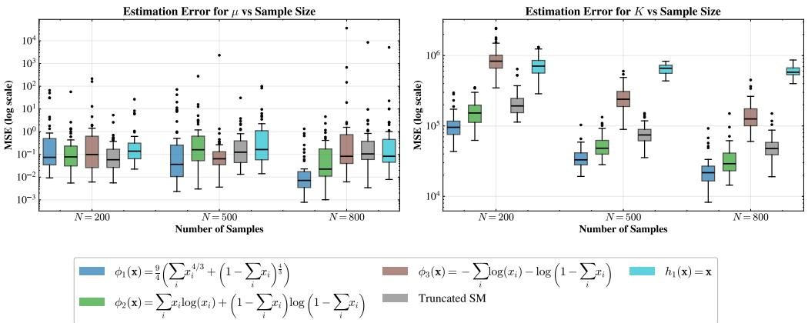
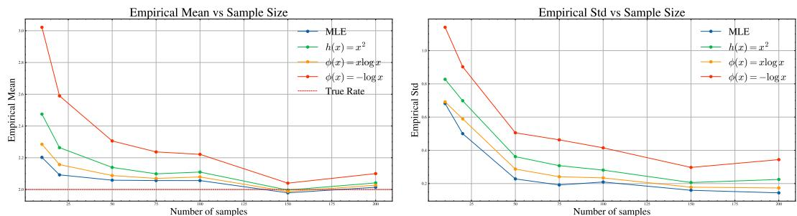
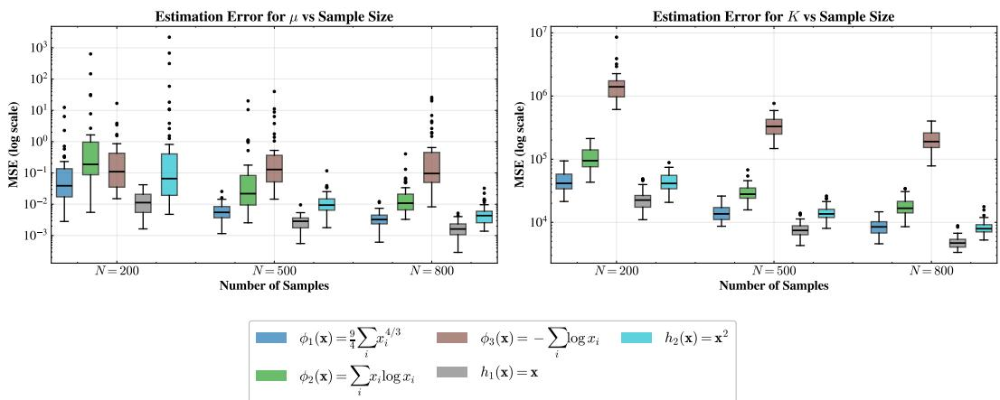
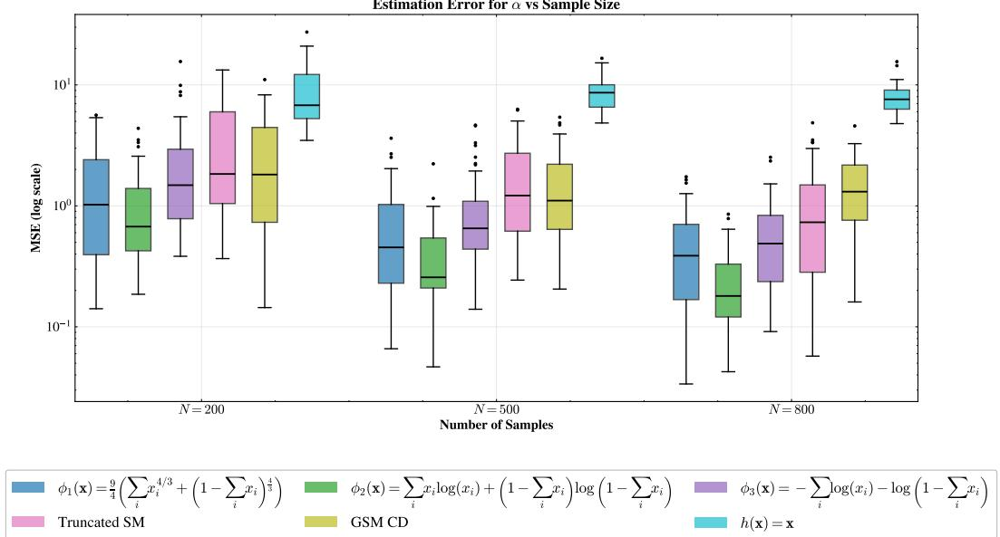
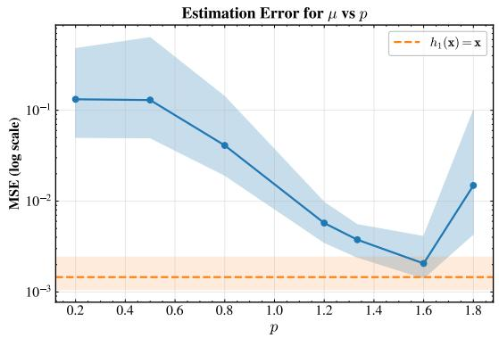
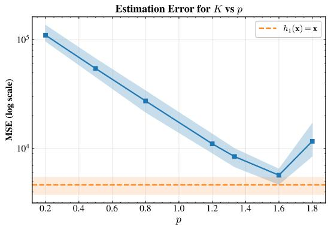
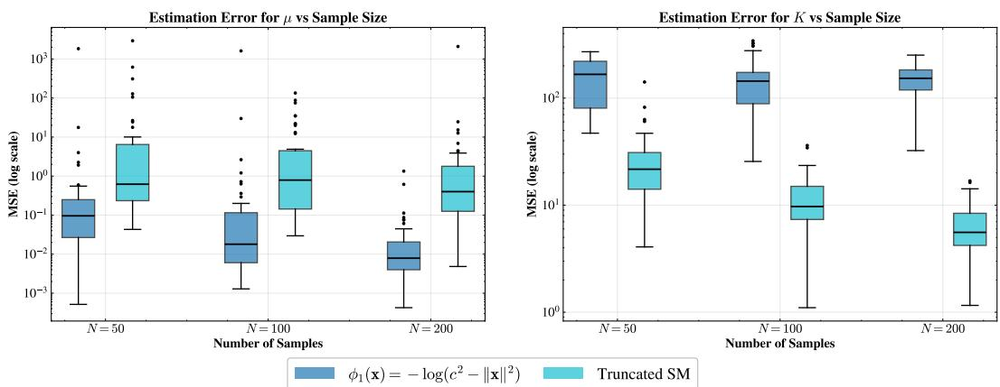
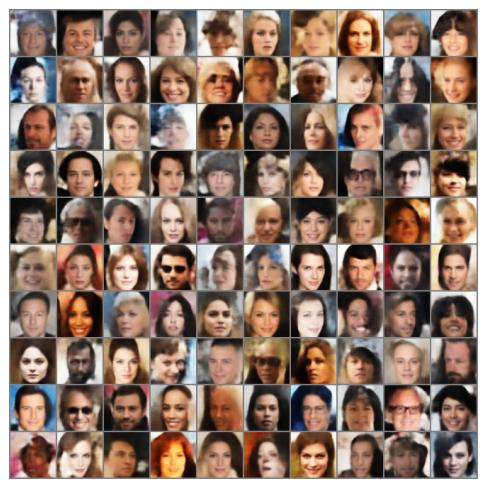
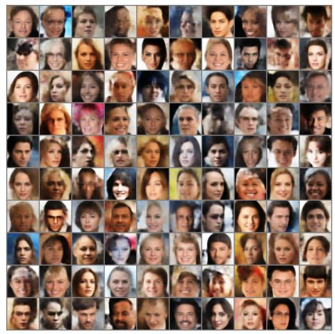

# Generalized Score Matching for Parameter Estimation on Convex Domains

Nishanth Shetty∗ Saisuchith Mahajan∗ Chandra Sekhar Seelamantula Department of Electrical Engineering Indian Institute of Science, Bengaluru 560012 {nishanths, saisuchithm, css}@iisc.ac.in

## Abstract

Maximum likelihood (ML) estimation is a principled and statistically efficient approach for learning probabilistic models. However, for unnormalized models, ML estimation requires evaluating the partition function and differentiating through it, which may not always be tractable. Score matching provides a practically viable alternative that circumvents this obstacle by fitting the score in a way that eliminates dependence on the normalizing constant. We derive the generalized score matching objective on a convex subset of Rd constructively starting from Minimum Probability Flow (MPF) learning, and show how classical score matching as well as domain-adapted variants for non-negative data arise naturally within the proposed framework. We show that the resulting objective is a proper local scoring rule of second-order, which provides the theoretical guarantee that the true density is recovered when the objective is minimized. Furthermore, for a model belonging to the exponential family, we establish convexity of the objective together with consistency of the finite-sample estimator under standard regularity conditions. Our derivation sheds new light on the scope and applicability of generalized score matching in various problem settings. We compare generalized score matching-based estimators on constrained domains, where the partition function is analytically intractable. We provide experimental results on parameter estimation for model densities belonging to the exponential family defined over convex subsets of Rd, and a generative modeling use-case to demonstrate broader applicability of the proposed generalized score matching framework.

## 1 Introduction

Learning unnormalized probabilistic models is a central challenge in modern machine learning and statistics. Several expressive model architectures, including energy-based models (EBMs) [7, 11– 13, 16, 26, 40], restricted Boltzmann machines (RBMs) [14, 15, 33, 39], and Markov random fields (MRFs) [1, 5, 10, 42], are specified by unnormalized densities. A variety of partition-functionfree estimation methods have been developed over the past several years that allow for parameter estimation without the need for explicit normalization.

Score matching [18] is one such technique that circumvents the intractability of estimating the partition function by fitting the score function, defined as the gradient of the log density. Through integration by parts, the objective can be formulated solely in terms of the derivatives of the model density, independent of the normalizing constant and the score function of the target data density. While score matching was originally formulated for densities supported on Rd [18], subsequent work [19, 23, 25, 43–45] has extended the framework to distributions defined on subsets of Rd.

A direct application of the original score matching formulation is not straightforward in such settings, as the integration by parts argument may fail in the presence of boundaries where the density or its derivatives are not continuous. An early extension was proposed by Hyvärinen [19], which considered non-negative data and introduced a modified objective designed to ensure validity of the integration by parts argument. This line of work was further generalized by Yu et al. [43], providing a broader framework for densities supported on $\mathbb { R } _ { + } ^ { d }$ . Lyu [25] presents a general operator-theoretic view of score matching defining a notion of completeness which we refer to as generalized score matching in this work. While the framework is quite general, the choice of operator remains abstract. In parallel, several works have developed complementary extensions of score matching, including formulations for truncated domains [23], extension to ordinal data [41], analyses of the statistical efficiency of the resulting estimators [20, 30], etc.

To the best of our knowledge, these prior works explored score matching on subsets of $\mathbb { R } ^ { d }$ , but a formal derivation of the objective function has not been provided. Our objective is to address this gap.

## 1.1 Contributions

The genesis of this paper is the following question: Could one derive generalized score matching objectives on subsets $\bar { o f } \mathbb { R } ^ { d }$ in a constructive fashion that also explains the domain-adapted variants proposed in the prior works ? We answer this question in the affirmative for convex subsets of $\mathbb { R } ^ { d }$ The key contributions are are stated below.

1. We provide a constructive method to derive generalized score matching objectives on convex subsets of $\mathbb { R } ^ { d } .$ , including the practically relevant case of $\mathbb { R } _ { + } ^ { d }$ , starting from Minimum Probability Flow (MPF) [36, 37]. Unlike prior works that define score matching via the Fisher divergence, we construct the generalized score matching objective as the infinitesimal limit of MPF.

2. We show that domain-adapted variants of score matching, such as non-negative score matching [19, 43], arise naturally within our framework through appropriate choice. Our derivation shows that the linear operator [25] in this setting is complete and is tied to the convex function chosen for the domain.

3. We show that the resulting generalized score matching objective defines a proper local scoring rule of second order [29], and that its minimization recovers the true data-generating distribution.

4. For model densities in the exponential family, we prove that the generalized score matching objective is convex in the canonical parameters, and that the corresponding empirical objective yields a consistent estimator under standard regularity conditions.

The theoretical developments are complemented by experimental results pertaining to parameter estimation of model densities supported on convex subsets of $\mathbb { R } ^ { d }$ , and a generative modeling use-case to demonstrate broader applicability of the proposed framework. The key results are stated in the main manuscript and the proofs are provided in the appendix.

## 1.2 Notation

Scalars are represented using normal font $( \mathrm { e . g . , } x , \theta )$ , whereas vectors are represented using boldface $( \mathrm { e . g . ~ } x , \theta )$ , and matrices are represented in uppercase letters $( \mathbf { e . g . } \ G , H )$ . For vectors x, $\pmb { y } \in \mathbb { R } ^ { d }$ $x _ { k }$ denotes its kth element, $\| x \| = \textstyle { \sqrt { \sum _ { i = 1 } ^ { d } x _ { i } ^ { 2 } } }$ is the standard Euclidean norm and diag $\mathbf { \boldsymbol { \mathsf { x } } } ( \mathbf { \boldsymbol { \mathsf { x } } } ) \in \mathbb { R } ^ { d \times }$ d constructs a diagonal matrix with diagonal entries as elements of x. The element-wise product is x ◦ y. For a matrix $G \in \mathbb { R } ^ { d \times d } , G _ { i j }$ denotes the element in the ith row and jth column. diag $( G ) \in \mathbb { R } ^ { d }$ extracts its diagonal. For a function $f : \mathbb { R } ^ { d }  \mathbb { R }$ , denote $H _ { f } ( { \pmb x } )$ as the Hessian of $f$ evaluated at point x. For a vector field $g : \mathbb { R } ^ { d }  \mathbb { R } ^ { d } , g _ { k }$ is the kth output and the divergence is given by $\begin{array} { r } { ( \dot { \nabla } \cdot g ) ( { \pmb x } ) = \sum _ { k = 1 } ^ { d } \frac { \partial g _ { k } ( { \pmb x } ) } { \partial x _ { k } } } \end{array}$ . For a matrix field $D : \mathbb { R } ^ { d }  \mathbb { R } ^ { d \times d } , ( \nabla . D ) ( \pmb { x } ) \in \mathbb { R } ^ { d }$ denotes the columnwise divergence operation where $\begin{array} { r } { ( \nabla \cdot D ) ( { \pmb x } ) _ { j } = \sum _ { i = 1 } ^ { d } \frac { \partial D _ { i j } ( { \pmb x } ) } { \partial x _ { i } } \operatorname { f o r } j \in \{ 1 , \dots , d \} } \end{array}$ . For any $B \subset  { \mathbb { R } } ^ { d }$ ∂B denotes its boundary. For a positive-definite matrix $G , \left\| v \right\| _ { G } ^ { 2 } = v ^ { \top } G v$ . We denote by $C ^ { k }$ the space of functions (real-, vector- or matrix-valued) whose derivatives up to order k are continuous. Throughout this paper, we assume that the distributions under consideration always admit a density function with respect to Lebesgue measure. The true density or data density is denoted as $p .$ . We use an energy based model to denote the model density as $\begin{array} { r } { p _ { \pmb \theta } ( \pmb x ) = \frac { 1 } { \mathcal { Z } ( \pmb \theta ) } \exp ( - E _ { \pmb \theta } ( \pmb x ) ) } \end{array}$ ) where $E _ { \theta } : \mathbb { R } ^ { d } $ R is the energy function with the partition function given by $\begin{array} { r } { \mathcal { Z } ( \pmb { \theta } ) = \int _ { \mathbb { R } ^ { d } } \exp ( - E _ { \pmb { \theta } } ( \pmb { x } ) ) \mathrm { d } \pmb { x } } \end{array}$

## 2 Related Work

## 2.1 Score Matching

Score matching [18] is a parameter estimation method that matches the score function (gradient of log-density) between model and data distributions without computing partition functions. The score function of a probability density $p _ { \pmb { \theta } } ( \pmb { x } )$ is defined as

$$
\begin{array} { r } { \pmb { s _ { \theta } } ( \pmb { x } ) = \nabla _ { \pmb { x } } \log p _ { \pmb { \theta } } ( \pmb { x } ) = - \nabla _ { \pmb { x } } E _ { \pmb { \theta } } ( \pmb { x } ) - \nabla _ { \pmb { x } } \log \mathcal { Z } ( \pmb { \theta } ) } \end{array}
$$

Remarkably, the gradient of the log-partition function vanishes, thus, enabling partition-free estimation. The score matching objective minimizes the expected squared distance between model and data scores:

$$
J ( \pmb \theta ) = \frac { 1 } { 2 } \underset { { \pmb x } \sim p } { \mathbb { E } } \left[ \| \nabla _ { { \pmb x } } \log p _ { \pmb \theta } ( { \pmb x } ) - \nabla _ { { \pmb x } } \log p ( { \pmb x } ) \| ^ { 2 } \right]
$$

Since the data score is unknown, $J ( \pmb \theta )$ can be rewritten using integration by parts (under boundary conditions) as

$$
J ( \pmb \theta ) = \underset { \pmb x \sim p } { \mathbb E } \left[ \frac { 1 } { 2 } \| \nabla _ { \pmb x } \log p _ { \pmb \theta } ( \pmb x ) \| ^ { 2 } + \mathrm { T r } ( H _ { \log p _ { \pmb \theta } } ( \pmb x ) ) \right] + C
$$

where C is a data-dependent constant. This formulation requires only the model score and its divergence, both computable without the partition function. In parallel, Lyu [25] advocates a complementary, operator-theoretic viewpoint: score matching can be defined by replacing the gradient with a suitable linear operator, yielding a broad class of generalized score matching objectives in which normalization constants still cancel. Building on this perspective, Qin and Risteski [30] provide a refined theoretical analysis connecting the statistical efficiency of such generalized objectives to properties of the Markov processes/diffusions naturally associated with the chosen operator.

## 2.2 Generalized score matching for non-negative data

Hyvärinen [19] proposed a score matching formulation for non-negative data by introducing weights that attenuate boundary effects near 0. This was further generalized by Yu et al. [43] by replacing the elementwise weight x with a more general elementwise weight $h ( \hat { \mathbf { x } } ) = ( h _ { 1 } ( x _ { 1 } ) , \hat { \mathbf { \Phi } } . . . , h _ { d } ( x _ { d } ) ) ^ { \top }$ where $h _ { j } : \mathbb { R } _ { + } \to \mathbb { R } _ { + }$ is almost surely positive. The resulting generalized h-score matching loss is

$$
J _ { h } ( \pmb \theta ) : = \mathbb { E } _ { \pmb { x } \sim p } \bigg [ \Big \| \nabla \log p _ { \pmb \theta } ( \pmb x ) \circ h ( \pmb x ) ^ { \frac { 1 } { 2 } } - \nabla \log p ( \pmb x ) \circ h ( \pmb x ) ^ { \frac { 1 } { 2 } } \Big \| ^ { 2 } \bigg ]\tag{1}
$$

Choosing $h _ { j } ( x _ { j } ) = x _ { j } ^ { 2 }$ recovers the non-negative score matching objective [19]. Then, under certain mild conditions, Yu et al. [43] show that an equivalent tractable form up to an additive constant that does not depend on score of p can be derived and is given by

$$
J _ { h } ( \theta ) = \underset { x \sim p } { \mathbb { E } } \left[ \sum _ { j = 1 } ^ { d } \frac { 1 } { 2 } h _ { j } ( x _ { j } ) \left( \nabla \log p _ { \theta } ( x ) _ { j } \right) ^ { 2 } + h _ { j } ( x _ { j } ) H _ { \log p _ { \theta } } ( x ) _ { j j } + h _ { j } ^ { \prime } ( x _ { j } ) \nabla \log p _ { \theta } ( x ) _ { j } \right]
$$

## 3 Main Results

In this section, we motivate and formally state the key results to show how generalized score matching can be derived from Minimum Probability Flow (MPF) [36, 37]. We consider an energy-based model p , a data point x, and a perturbed state y, then the MPF objective is defined as (cf. Equation $C - 1$ in [37])

$$
K ( \pmb \theta ) = \underset { \pmb x \sim p } { \mathbb { E } } \left[ \int _ { \pmb y } g ( \pmb y , \pmb x ) \exp \left( \frac { 1 } { 2 } \left( E _ { \pmb \theta } ( \pmb x ) - E _ { \pmb \theta } ( \pmb y ) \right) \right) \mathrm d \pmb y \right] ,\tag{2}
$$

where $g ( \pmb { y } , \pmb { x } )$ denotes a connectivity function. Observe that exp $\begin{array} { r } { \left( \frac { 1 } { 2 } \left( E _ { \pmb \theta } ( \pmb x ) - E _ { \pmb \theta } ( \pmb y ) \right) \right) = \left( \frac { p _ { \pmb \theta } ( \pmb y ) } { p _ { \pmb \theta } ( \pmb x ) } \right) ^ { \frac { 1 } { 2 } } } \end{array}$ where we refer to the term inside the square root as the likelihood ratio. This ratio quantifies the likelihood assigned to $\textbf {  { y } }$ relative to that assigned to the data point x. To build intuition, consider the case where the connectivity function is chosen such that $g ( \pmb { y } , \pmb { x } ) = 1$ whenever $\textbf {  { y } }$ is a sufficiently small perturbation of $^ { \mathbf { \delta x } , }$ and $g ( { \pmb y } , { \pmb x } ) = 0$ otherwise. In this setting, if $\mathbfit { x } \sim p$ is sampled from the true data distribution, one expects a well-specified model $p _ { \theta }$ to assign higher likelihood to x than to nearby perturbed states $\mathbf { \pmb { y } } .$ This suggests minimizing the likelihood ratio, averaged over data points and their perturbations, which provides an intuitive interpretation of the MPF objective.

Sohl-Dickstein et al. [36, 37] consider a binary connectivity function $^ { g , }$ defined as $g ( \pmb { y } , \pmb { x } ) = 1$ if $y \in \mathcal { R } ( x )$ and $g ( { \pmb y } , { \pmb x } ) = 0$ otherwise, where $\mathcal { R } ( \pmb { x } )$ denotes a neighborhood of x. In particular, Sohl-Dickstein et al. [37] show that when $\mathcal { R } ( \pmb { x } )$ is chosen to be a cube centered at x with side length $\varepsilon \left( \mathrm { c f } . \right.$ Equation $C - 2 \mathrm { i n } [ 3 7 ] ,$ ), the MPF objective recovers the score matching objective on $\mathbb { R } ^ { d }$ in the limit as $\varepsilon \to 0$ . We refer to this choice of connectivity function as the hard neighborhood case. Beyond this, we also consider a case where $g ( { \pmb y } , { \pmb x } )$ defines a valid conditional distribution of y given x. We refer to this setting as the soft neighborhood case.

## 3.1 Generalized Score Matching

We derive the generalized score matching (GSM) loss [30] from Equation 2 when the true density is supported over $\mathbb { R } ^ { d }$ . In particular, we consider the soft neighborhood case, where the connectivity function $g ( \pmb { y } , \pmb { x } )$ is chosen to be a valid conditional distribution $q ( \pmb { y } \mid \pmb { x } )$ . In this case, the objective becomes

$$
\begin{array} { r } { K ( \pmb { \theta } ) = \underset { \pmb { x } \sim p } { \mathbb { E } } \left[ \int _ { \pmb { y } } q ( \pmb { y } | \pmb { x } ) \mathrm { e x p } \left( \frac { 1 } { 2 } [ E _ { \pmb { \theta } } ( \pmb { x } ) - E _ { \pmb { \theta } } ( \pmb { y } ) ] \right) \mathrm { d } \pmb { y } \right] } \end{array}
$$

We choose $q$ to be a Gaussian and show in the following that a limiting case of $\mathcal { K } ( \pmb \theta )$ yields GSM.

Theorem 3.1. Let $E _ { \pmb { \theta } } \quad : \quad \mathbb { R } ^ { d } \quad  \quad \mathbb { R }$ be in $C ^ { 2 }$ , and let $D \quad : \quad \mathbb { R } ^ { d } \quad  \quad \mathbb { R } ^ { d \times d }$ be a matrix-valued function in $C ^ { 1 }$ such that $D ( { \pmb x } )$ is symmetric and positive definite. Assume that $\underset { x \sim p } { \mathbb { E } } \left[ \nabla E _ { \theta } ( { \pmb x } ) ^ { \top } D ( { \pmb x } ) \nabla E _ { \theta } ( { \pmb x } ) \right] , \underset { { \pmb x } \sim p } { \mathbb { E } } \left[ \nabla E _ { \theta } ( { \pmb x } ) ^ { \top } ( \dot { \nabla } \cdot D ) ( { \pmb x } ) \right] , \underset { { \pmb x } \sim p } { \mathbb { E } } \left[ \mathrm { T r } \left( D ( { \pmb x } ) H _ { E _ { \theta } } ( { \pmb x } ) \right) \right]$ are $f ^ { \mathrm { { } } } -$ 1 nitefor all θ. Define $b ( { \pmb x } ) = ( \nabla \cdot D ) ( { \pmb x } )$ , normalization constant $Z = \frac { \mathbf { 1 } } { ( 2 \pi ) ^ { d / 2 } \sqrt { \operatorname* { d e t } { \varepsilon } D ( \mathbf { x } ) } } , \varepsilon > 0$ and the Gaussian conditional density $q _ { \varepsilon } ( \pmb { y } \mid \pmb { x } ) : = Z \exp \left( - \frac { \left\| \pmb { y } - \pmb { x } - \frac { \varepsilon } { 2 } \pmb { b } ( \pmb { x } ) \right\| _ { D ( \pmb { x } ) ^ { - 1 } } ^ { 2 } } { 2 \varepsilon } \right)$ . Then, after removing the θ-independent terms, dividing $\mathcal { K } ( \pmb \theta )$ by $\varepsilon / 4 ,$ taking the limit $\varepsilon \to 0$ we obtain

$$
\mathcal { L } ( \pmb { \theta } ) = \underset { \mathbf { x } \sim p } { \mathbb { E } } \bigg [ \frac { 1 } { 2 } \nabla E _ { \pmb { \theta } } ( \pmb { x } ) ^ { \top } D ( \pmb { x } ) \nabla E _ { \pmb { \theta } } ( \pmb { x } ) - \nabla \cdot ( D ( \pmb { x } ) \nabla E _ { \pmb { \theta } } ( \pmb { x } ) ) \bigg ]\tag{3}
$$

or equivalently, using ∇ log $p _ { \pmb { \theta } } ( \pmb { x } ) = - \nabla E _ { \pmb { \theta } } ( \pmb { x } )$ , we have

$$
\mathcal { L } ( \pmb { \theta } ) = \underset { \pmb { x } \sim p } { \mathbb { E } } \bigg [ \frac { 1 } { 2 } \nabla \log p _ { \pmb { \theta } } ( \pmb { x } ) ^ { \top } D ( \pmb { x } ) \nabla \log p _ { \pmb { \theta } } ( \pmb { x } ) + \nabla \cdot ( D ( \pmb { x } ) \nabla \log p _ { \pmb { \theta } } ( \pmb { x } ) ) \bigg ]\tag{4}
$$

Equation 4 admits an equivalent formulation in terms of the GSM loss as stated below.

Proposition 3.1. Suppose the assumptions ofTheorem 3.1 hold, and assumefurther that $p \in C ^ { 1 }$ and lim ${ \mathbf { \phi } } _ { \cdot x _ { k } \to \pm \infty } p ( { \pmb x } ) \nabla$ log $p _ { \pmb { \theta } } ( \pmb { x } ) _ { \ell } D ( \pmb { x } ) _ { k \ell } = 0$ for all $\mathfrak { z } , \ell \in \{ 1 , 2 , \ldots , d \}$ and θ. Then, minimizing ${ \mathcal { L } } ( \theta )$ in Equation 4 with respect to θ is equivalent to minimizing

$$
\mathcal { L } _ { G S M } ( \pmb { \theta } ) = \frac { 1 } { 2 } \underset { \pmb { x } \sim p } { \mathbb { E } } \left[ \| \nabla \log p _ { \pmb { \theta } } ( \pmb { x } ) - \nabla \log p ( \pmb { x } ) \| _ { D ( \pmb { x } ) } ^ { 2 } \right]\tag{5}
$$

These results were established under the assumption that the data support is $\mathbb { R } ^ { d }$ . We now consider the generic case where the support of p is a convex set $\Omega \subset \mathbb { R } ^ { d }$ , excluding degenerate cases such as the empty or singleton set. The Gaussian conditional $q _ { \varepsilon }$ considered in Theorem 3.1 is convenient, because its moments are tractable in $\mathbb { R } ^ { d }$ . However, constructing analogous conditionals with tractable moments on arbitrary domains is challenging. As noted in previous section, MPF recovers score matching on $\mathbb { R } ^ { d }$ by integrating over a small local neighborhood chosen to be a cube of side ε. Motivated by this, in this case, we consider hard-neighborhood objective. For a neighborhood $\mathcal { R } ( { \pmb x } ) \subset \Omega$ of x and choosing weight w : $\Omega \times \Omega \to \mathbb { R } _ { + }$ as $g ( \pmb { y } , \pmb { x } )$ in Equation 2, we have

$$
K ( \pmb { \theta } ) = \underset { \pmb { x } \sim p } { \mathbb { E } } \left[ \intop _ { \pmb { \mathcal { R } } ( \pmb { x } ) } w ( \pmb { y } , \pmb { x } ) \mathrm { e x p } \left( \frac { 1 } { 2 } [ E _ { \pmb { \theta } } ( \pmb { x } ) - E _ { \pmb { \theta } } ( \pmb { y } ) ] \right) \mathrm { d } \pmb { y } \right]
$$

We show that, for appropriate choices of $\mathcal { R } ( \pmb x )$ and w, the small-neighborhood limit recovers the GSM objective on Ω. We begin by describing the construction of the neighborhood $\mathcal { R } ( \pmb { x } )$ . To this end, let $\phi : \Omega  \mathbb { R }$ be a strictly convex function. The Bregman divergence is defined as

$$
D _ { \phi } ( \pmb { y } , \pmb { x } ) = \phi ( \pmb { y } ) - \phi ( \pmb { x } ) - \langle \nabla \phi ( \pmb { x } ) , \pmb { y } - \pmb { x } \rangle\tag{6}
$$

Define the local Bregman ball around x to be

$$
C _ { r } ^ { \phi } ( { \pmb x } ) = \{ { \pmb y } : ( { \pmb y } - { \pmb x } ) ^ { \top } H _ { \phi } ( { \pmb x } ) ( { \pmb y } - { \pmb x } ) \leq r ( { \pmb x } ) ^ { 2 } \}\tag{7}
$$

where $r : \Omega \to ( 0 , \infty ) . { \cal C } _ { r } ^ { \phi } ( { \pmb x } )$ is an ellipsoid centered at x, defined by the quadratic form induced by $H _ { \phi } ( { \pmb x } )$ . In this case, the objective with the local Bregman ball is given by

$$
K _ { r } ^ { \phi } ( \theta ) = \underset { x \sim p } { \mathbb { E } } \left[ I _ { r } ^ { \phi } ( x ; \theta ) \right] \mathrm { ~ w h e r e ~ } I _ { r } ^ { \phi } ( x ; \theta ) = \int _ { C _ { r } ^ { \phi } ( x ) } w ( y , x ) \exp \left( \frac 1 2 [ E _ { \theta } ( x ) - E _ { \theta } ( y ) ] \right) \mathrm { d } y\tag{8}
$$

We show that generalized score matching for convex sets can be derived from the setup we introduced considering an appropriately chosen weighting function.

Theorem 3.2. Let ϕ be in $C ^ { 3 }$ and strictly convex on an open convex set $\Omega \subset \mathbb { R } ^ { d } ,$ , and assume that $H _ { \phi } ( { \pmb x } ) \succ 0$ for all x $\in \Omega .$ . Let $E _ { \theta } : \Omega $ R be $C ^ { 2 }$ in x and $r : \Omega \to ( 0 , \infty )$ be such that $C _ { r } ^ { \phi } ( { \pmb x } ) \subset \Omega$ for all x $\mathbf \xi \in \Omega$ . Define $\bar { \pmb x } = ( \pmb x + \pmb y ) / 2$ and consider the weightingfunction

$$
w ( { \pmb y } , { \pmb x } ) = \exp \left( - \frac { ( { \pmb y } - { \pmb x } ) ^ { \top } H _ { \phi } ( \bar { { \pmb x } } ) ( { \pmb y } - { \pmb x } ) } { 2 r ( { \pmb x } ) ^ { 2 } } \right)
$$

in the definition of $I _ { r } ^ { \phi } ( { \pmb x } ; { \pmb \theta } )$ in Equation 8. Define

$$
G _ { \phi } ( { \pmb x } ) = ( \operatorname * { d e t } H _ { \phi } ( { \pmb x } ) ) ^ { - 1 / 2 } H _ { \phi } ( { \pmb x } ) ^ { - 1 }\tag{9}
$$

and assume that $\underset { { \substack { \mathbf { x } \sim p } } } { \mathbb { E } } \left[ \nabla E _ { \pmb { \theta } } ( { \pmb x } ) ^ { \top } G _ { \phi } ( { \pmb x } ) \nabla E _ { \pmb { \theta } } ( { \pmb x } ) \right] , \underset { { \pmb x } \sim p } { \mathbb { E } } \left[ \nabla E _ { \pmb { \theta } } ( { \pmb x } ) ^ { \top } ( \nabla \cdot G _ { \phi } ) ( { \pmb x } ) \right]$ and $\underset { { \pmb x } \sim p } { \mathbb { E } } \left[ \mathrm { T r } \left( G _ { \phi } ( { \pmb x } ) H _ { E _ { \theta } } ( { \pmb x } ) \right) \right]$ are finite for all θ. Then, after removing the θ-independent terms from $I _ { r } ^ { \phi } ( { \pmb x } ; { \pmb \theta } )$ , dividing by $r ( { \pmb x } ) ^ { d + 2 } / 4 ,$ , and taking the limit $r  0 ,$ , we obtainfor a positive constant λ

$$
\mathcal { L } ^ { \phi } ( \pmb { \theta } ) = \underset { x \sim p } { \mathbb { E } } \left[ \frac { 1 } { 2 } \nabla E _ { \pmb { \theta } } ( \pmb { x } ) ^ { \top } G _ { \phi } ( \pmb { x } ) \nabla E _ { \pmb { \theta } } ( \pmb { x } ) - \mathrm { T r } \left( G _ { \phi } ( \pmb { x } ) H _ { E _ { \theta } } ( \pmb { x } ) \right) - \lambda \nabla E _ { \theta } ( \pmb { x } ) ^ { \top } ( \nabla \cdot G _ { \phi } ) ( \pmb { x } ) \right]\tag{10}
$$

Following Remark D.3, we use the alternative weighting function that yields $\lambda = 1$ , and define the resulting objective as

$$
\mathcal { L } ^ { \phi } ( \pmb { \theta } ) = \mathbb { E } _ { \pmb { x } \sim p } [ S ^ { \phi } ( \pmb { x } ; \pmb { \theta } ) ]\tag{11}
$$

where $S ^ { \phi } ( { \pmb x } ; { \pmb \theta } )$ is redefined as follows:

$$
S ^ { \phi } ( { \pmb x } ; { \pmb \theta } ) = \frac { 1 } { 2 } \nabla E _ { \pmb \theta } ( { \pmb x } ) ^ { \top } G _ { \phi } ( { \pmb x } ) \nabla E _ { \pmb \theta } ( { \pmb x } ) - \nabla . ( G _ { \phi } ( { \pmb x } ) \nabla E _ { \pmb \theta } ( { \pmb x } ) )\tag{12}
$$

Equation 11 admits an equivalent formulation in terms of GSM, as stated in the following proposition.   
Care must be taken in specifying the boundary conditions. We follow the methodology of Liu et al.   
[23], in particular, Theorem 2, which assumes that the underlying domain has a Lipschitz boundary.   
Since bounded convex sets admit Lipschitz boundaries (Lemma 1.13 in Chapter 2 of Simon [35]), the proposition below considers bounded convex sets.

Proposition 3.2. Suppose the assumptions ofTheorem 3.2 hold, and assumefurther that Ω is bounded, $p \in { \bar { C } } ^ { 1 }$ and for any $\bar { z } \in \partial \Omega$ , we have

$$
\operatorname* { l i m } _ { x  z } p ( x ) \nabla \log p _ { \theta } ( x ) _ { \ell } G _ { \phi } ( x ) _ { k \ell } n _ { k } ( z ) = 0 \quad \forall k , \ell \in \{ 1 , 2 , \ldots , d \} , \forall \theta\tag{13}
$$

where $x \to z$ takes any sequence in Ω converging to z and $( n _ { 1 } , \ldots , n _ { d } )$ is the unit outward normal vector on ∂Ω. Then minimizing $\mathcal { L } ^ { \phi } ( \pmb { \theta } )$ in Equation 11 with respect to θ is equivalent to minimizing

$$
\mathcal { L } _ { G S M } ^ { \phi } ( \pmb { \theta } ) = \frac { 1 } { 2 } \underset { { \substack { \mathbf { x } \sim p } } } { \mathbb { E } } \left[ \left. \nabla \log p _ { \theta } ( { \pmb x } ) - \nabla \log p ( { \pmb x } ) \right. _ { G _ { \phi } ( { \pmb x } ) } ^ { 2 } \right]\tag{14}
$$

We address the case of unbounded sets in $\mathrm { A } _ { \mathrm { l } }$ ppendix E. An immediate consequence of Proposition 3.2 is that the score matching objective in Equation 14 corresponds to the linear operator L defined as

$$
( \mathcal { L } g ) ( { \pmb x } ) = G _ { \phi } ( { \pmb x } ) ^ { \frac { 1 } { 2 } } \nabla g ( { \pmb x } )\tag{15}
$$

in the framework of Lyu [25]. This holds because $\| \pmb { v } \| _ { G } ^ { 2 } = \pmb { v } ^ { \top } G \pmb { v } = \pmb { v } ^ { \top } G ^ { \frac { 1 } { 2 } } G ^ { \frac { 1 } { 2 } } \pmb { v } = \left\| G ^ { \frac { 1 } { 2 } } \pmb { v } \right\| ^ { 2 }$ for a positive definite matrix G. The following proposition shows that the operator $\mathcal { L }$ is complete.

Proposition 3.3. Let L be the operator defined in Equation 15, then L is complete, that $i s , f o r$ densities $p _ { 1 } ( { \pmb x } )$ and $p _ { 2 } ( { \pmb x } )$ with support $\Omega ,$ , suppose $\begin{array} { r } { \frac { ( \hat { \mathcal { L } } p _ { 1 } ) ( { \pmb x } ) } { p _ { 1 } ( { \pmb x } ) } = \frac { ( \mathcal { L } p _ { 2 } ) ( { \pmb x } ) } { p _ { 2 } ( { \pmb x } ) } } \end{array}$ almost everywhere, then $p _ { 1 } ( { \pmb x } ) = p _ { 2 } ( { \pmb x } )$ almost everywhere.

Remark 3.1. It immediately follows from Proposition 3.3 that if $\mathcal { L } _ { G S M } ^ { \phi } ( \pmb { \theta } ) = 0$ , then $p _ { \theta } = p { \mathrm { ~ a . e ~ } }$

By choosing appropriate convex functions $\phi ,$ we retrieve score matching objectives in different settings.

Corollary 3.3. For $\begin{array} { r } { \phi ( \pmb { x } ) = \frac { 1 } { 2 } \left\| \pmb { x } \right\| ^ { 2 } } \end{array}$ defined on $\Omega = \mathbb { R } ^ { d } ,$ , we get Hyvärinen’s score matching objective

$$
\mathcal { L } _ { G S M } ^ { \phi } ( \pmb { \theta } ) = \frac { 1 } { 2 } \underset { { \substack { \mathbf { x } \sim p } } } { \mathbb { E } } \left[ \| \nabla \log p _ { \pmb { \theta } } ( { \pmb x } ) - \nabla \log p ( { \pmb x } ) \| ^ { 2 } \right]
$$

The proof follows directly from Proposition 3.2 since $H _ { \phi } ( { \pmb x } ) = \mathbb { I } \implies G _ { \phi } ( { \pmb x } ) = \mathbb { I } .$

Remark 3.2. For $\begin{array} { c c l } { \displaystyle \phi ( \pmb { x } ) } & { = } & { - \sum _ { i = 1 } ^ { d } } \end{array}$ log xi defined on $\begin{array} { r l r } { \Omega } & { { } = } & { \mathbb { R } _ { + } ^ { d } } \end{array}$ , we have $\begin{array} { r l } { G _ { \phi } ( { \pmb x } ) } & { { } = } \end{array}$ $\scriptstyle \left( \prod _ { i = 1 } ^ { d } x _ { i } \right)$ diag $\left( \left[ x _ { 1 } ^ { 2 } , \ldots , x _ { d } ^ { 2 } \right] ^ { \top } \right)$ and the objective function turns out to be

$$
\mathcal { L } _ { G S M } ^ { \phi } ( \theta ) = \frac { 1 } { 2 } \underset { x \sim p } { \mathbb { E } } \left[ \prod _ { i = 1 } ^ { d } x _ { i } \Big \lVert \nabla \log p _ { \theta } ( x ) \circ x - \nabla \log p ( x ) \circ x \Big \rVert ^ { 2 } \right]
$$

This objective is similar to the non-negative score matching objective proposed in [19], but with the extra term $\textstyle \prod _ { i = 1 } ^ { d } x _ { i }$ , which is due to the presence of the determinant in the definition of $G _ { \phi } ( \pmb { x } )$ Extending further, we can work with a strictly convex function $\begin{array} { r } { \phi ( \pmb { x } ) = \sum _ { i = 1 } ^ { d } \phi _ { i } ( x _ { i } ) } \end{array}$ where $\phi _ { i }$ $\mathbb { R } _ { + } \to \mathbb { R }$ is strictly convex. In this case,

$$
G _ { \phi } ( \pmb { x } ) = \frac { 1 } { \prod _ { i = 1 } ^ { d } \sqrt { \phi _ { i } ^ { \prime \prime } ( x _ { i } ) } } \mathrm { d i a g } \left( \left[ \frac { 1 } { \phi _ { 1 } ^ { \prime \prime } ( x _ { 1 } ) } , \dots , \frac { 1 } { \phi _ { d } ^ { \prime \prime } ( x _ { d } ) } \right] ^ { \top } \right)
$$

and the objective in Equation 14

$$
\mathcal { L } _ { G S M } ^ { \phi } ( \theta ) = \frac { 1 } { 2 } \mathop { \mathbb { E } } _ { x \sim p } \left[ \frac { 1 } { \prod _ { i = 1 } ^ { d } \sqrt { \phi _ { i } ^ { \prime \prime } ( x _ { i } ) } } \Big \lVert \nabla \log p _ { \theta } ( x ) \circ h ( x ) ^ { \frac { 1 } { 2 } } - \nabla \log p ( x ) \circ h ( x ) ^ { \frac { 1 } { 2 } } \Big \rVert ^ { 2 } \right]
$$

where $\begin{array} { r } { h ( \pmb { x } ) = \left[ \frac { 1 } { \phi _ { i } ^ { \prime \prime } ( x _ { 1 } ) } , \dots , \frac { 1 } { \phi _ { d } ^ { \prime \prime } ( x _ { d } ) } \right] ^ { \top } } \end{array}$ . This is similar to what Yu et al. [43] consider but with the extra factor $\begin{array} { r } { \overline { { \prod _ { i = 1 } ^ { d } \sqrt { \phi _ { i } ^ { \prime \prime } ( x _ { i } ) } } } . } \end{array}$

Remark 3.3. Existing works, including [19, 23, 30, 41, 43], take generalized score matching objectives as the starting point. In contrast, through Theorem 3.1, Proposition 3.1, Theorem 3.2, and Proposition 3.2, we provide a principled derivation of these objectives from a unified formulation. To the best of our knowledge, this is a novel development and constitutes one of the main contributions of our paper.

Remark 3.4. The objective Equation 2 considered in the manuscript is motivated by its connection to Minimum Probability Flow (MPF) and serves as the primary starting point of our derivation. As shown in Appendix G, the same proof strategy extends to a broader class of objectives, yielding corresponding generalizations of the main results. This highlights the flexibility of derivation beyond the specific MPF formulation.

## 4 Generalized Score Matching is a Proper Scoring Rule

Given a set of probability distributions $\mathcal { P }$ with each element having support $x ,$ a scoring rule [29] is defined as the loss $S ( { \pmb x } , Q )$ incurred when a sample $\pmb { x } \sim P \in \mathcal { P }$ is realised and the model distribution choice was $Q \in { \mathcal { P } }$ . The expectation of $S ( { \pmb x } , Q )$ denoted by $S ( P , Q )$ is given by $S ( P , Q ) = \mathbb { E } _ { \pmb { x } \sim P } [ S ( \pmb { x } , \dot { Q } ) ]$ ]. A scoring rule is considered proper if $S ( P , Q ) \stackrel { \cdot } { = } \tilde { S ( } P , \tilde { P ) }$ for all $P , Q \in { \mathcal { P } }$ , and strictly proper if the inequality is strict whenever $Q \neq P$ . For a simply connected domain $\mathcal { X } \subset \mathbb { R } ^ { n }$ and a twice-differentiable strictly positive model density $q ( { \pmb x } )$ on $x ,$ Parry [28] showed that all previously known multidimensional scoring rules can be generated by

$$
\phi [ q ] ( { \pmb x } ) = - \frac { 1 } { 2 } q ( { \pmb x } ) ^ { - 1 } \sum _ { i , j = 1 } ^ { n } G _ { i j } ( { \pmb x } ) q _ { i } ( { \pmb x } ) q _ { j } ( { \pmb x } )
$$

where $\phi [ y ] : = \phi ( x _ { 1 } , \ldots , x _ { n } , y , y _ { 1 } , \ldots , y _ { n } )$ is differentiable in $^ { x , }$ and twice differentiable, jointly (strictly) concave and 1-homogeneous in $( y , y _ { 1 } , \ldots , y _ { n } )$ , where $\begin{array} { r } { q _ { i } : = \frac { \partial q } { \partial x _ { i } } , G ( \pmb { x } ) = [ G _ { i j } ( \pmb { x } ) ] } \end{array}$ is a symmetric positive definite matrix. The associated (strictly) proper local scoring rule generated is

$$
S ( { \pmb x } , Q ) = \sum _ { i , j = 1 } ^ { n } \left( G _ { i j } ( { \pmb x } ) \left( \frac { q _ { i j } ( { \pmb x } ) } { q ( { \pmb x } ) } - \frac { 1 } { 2 } \frac { q _ { i } ( { \pmb x } ) q _ { j } ( { \pmb x } ) } { q ( { \pmb x } ) ^ { 2 } } \right) + \frac { \partial G _ { i j } ( { \pmb x } ) } { \partial x _ { i } } \frac { q _ { j } ( { \pmb x } ) } { q ( { \pmb x } ) } \right)\tag{16}
$$

where $\begin{array} { r } { q _ { i j } : = \frac { \partial ^ { 2 } q } { \partial x _ { i } \partial x _ { j } } } \end{array}$ . This is a fairly general framework and encompasses several previously known loss functions such as maximum likelihood and score matching. We discuss the relevance of proper scoring rules of the second order in Appendix H. Additionally, the following proposition formally establishes that the proposed objective in Equation 12 constitutes a proper scoring rule.

Proposition 4.1. $S ^ { \phi } ( { \pmb x } ; { \pmb \theta } )$ as defined in Equation 12 is a proper scoring rule with ${ \cal G } ( { \pmb x } ) = G _ { \phi } ( { \pmb x } )$

## 5 Analysis for Exponential Family

For a model density $p _ { \theta }$ from the exponential family,

$$
\log p _ { \pmb \theta } ( \pmb x ) = \pmb \theta ^ { \top } t ( \pmb x ) - \boldsymbol \psi ( \pmb \theta ) + \boldsymbol b ( \pmb x )\tag{17}
$$

where $\pmb { \theta } \in \Theta \subset \mathbb { R } ^ { r } , t : \mathbb { R } ^ { d }  \mathbb { R } ^ { r }$ represents the sufficient statistics, $\psi ( \pmb \theta )$ is the normalizing constant, and $b ( { \pmb x } )$ is the base measure with t and b being almost surely differentiable. Let $\{ { \pmb x } _ { i } \} _ { i = 1 } ^ { N }$ drawn i.i.d. from the density $p$ and the finite sample version of the objective in Equation 4 is given by

$$
\hat { \mathcal { L } } ( \pmb { \theta } ) = \frac { 1 } { N } \sum _ { i = 1 } ^ { N } \bigg [ \frac { 1 } { 2 } \nabla \log p _ { \pmb { \theta } } ( \pmb { x } _ { i } ) ^ { \top } \pmb { D } ( \pmb { x } _ { i } ) \nabla \log p _ { \pmb { \theta } } ( \pmb { x } _ { i } ) + \nabla \cdot ( \pmb { D } ( \pmb { x } _ { i } ) \nabla \log p _ { \pmb { \theta } } ( \pmb { x } _ { i } ) ) \bigg ]
$$

Proposition 5.1. $\hat { \mathcal { L } } ( \pmb { \theta } )$ can be expressed as quadratic

$$
\hat { \mathcal { L } } ( \pmb { \theta } ) = \frac { 1 } { 2 } \pmb { \theta } ^ { \top } \Gamma _ { N } \pmb { \theta } + \pmb { g } _ { N } ^ { \top } \pmb { \theta } + C\tag{18}
$$

where $C \in \mathbb { R }$ is a constant independent of $\theta , J _ { t } ( x )$ denotes the Jacobian of t evaluated at $^ { \mathbf { \delta x } , }$ and

$$
\Gamma _ { N } = \frac { 1 } { N } \sum _ { i = 1 } ^ { N } J _ { t } ( \pmb { x } _ { i } ) D ( \pmb { x } _ { i } ) J _ { t } ( \pmb { x } _ { i } ) ^ { \top }
$$

$$
{ \pmb g } _ { N } = \frac { 1 } { N } \sum _ { i = 1 } ^ { N } \left[ E ( { \pmb x } _ { i } ) + J _ { t } ( { \pmb x } _ { i } ) ( \nabla \cdot D ( { \pmb x } _ { i } ) ) + J _ { t } ( { \pmb x } _ { i } ) D ( { \pmb x } _ { i } ) \nabla b ( { \pmb x } _ { i } ) \right]
$$

where, in turn, $E ( \pmb { x } ) \in \mathbb { R } ^ { r }$ is a vector with entries

$$
E _ { l } ( \pmb { x } ) = \sum _ { j , k = 1 } ^ { d } D _ { j k } ( \pmb { x } ) \frac { \partial ^ { 2 } t _ { l } ( \pmb { x } ) } { \partial x _ { j } \partial x _ { k } } , \quad l = 1 , 2 , \ldots , r .
$$

Assuming that $\Gamma _ { N }$ is positive semidefinite almost surely, $\hat { \mathcal { L } } ( \pmb { \theta } )$ is a convexfunction ofθ.

We now show that estimator that minimizes $\hat { \mathcal { L } } ( \pmb { \theta } )$ is consistent.

Theorem 5.1. Let $\theta _ { 0 } ~ = ~ \mathrm { a r g }$ minθ $\mathcal { L } ( \pmb { \theta } )$ be the true parameter that minimizes the objective in Equation 4. Define

$$
\Gamma _ { 0 } = \mathbb { E } [ \Gamma _ { 1 } ] , \pmb { g } _ { 0 } = \mathbb { E } [ \pmb { g } _ { 1 } ] , \Sigma _ { 0 } = \mathbb { E } [ ( \Gamma _ { 1 } \pmb { \theta } _ { 0 } + \pmb { g } _ { 1 } ) ( \Gamma _ { 1 } \pmb { \theta } _ { 0 } + \pmb { g } _ { 1 } ) ^ { \top } ]
$$

Further, assume that $\Gamma _ { N }$ is a.s. positive definite, $\Gamma _ { 0 } , \Gamma _ { 0 } ^ { - 1 } , g _ { 0 }$ and $\Sigma _ { 0 }$ exist and are entry-wise finite. Then, the unconstrained minimizer of $\hat { \mathcal { L } } ( \pmb { \theta } )$ is a.s. unique with closed-form solution $\hat { \pmb { \theta } } _ { N } = - \Gamma _ { N } ^ { - 1 } \pmb { g } _ { N }$ Moreover, the estimator is consistent and asymptotically normal, i.e.,

$$
\hat { \pmb { \theta } } _ { N } \xrightarrow { { a . s . } } \pmb { \theta } _ { 0 } a n d \sqrt { N } ( \hat { \pmb { \theta } } _ { N } - \pmb { \theta } _ { 0 } ) \xrightarrow { d } \mathcal { N } ( \mathbf { 0 } , \Gamma _ { 0 } ^ { - 1 } \Sigma _ { 0 } \Gamma _ { 0 } ^ { - 1 } ) a s ~ N  \infty
$$

## 6 Experiments

In this section, we evaluate the proposed generalized score matching estimators against existing methods for parameter estimation on constrained domains. Specifically, we focus on distributions supported on positive orthant $\mathbb { R } _ { + } ^ { d }$ , the (d − 1)-simplex, and the standard simplex polytope $S ^ { d } = \{ \pmb { x } \in \pmb { \mathrm { \Gamma } }$ $\mathbb { R } ^ { d } : x _ { i } > 0 , \sum _ { i = 1 } ^ { d } x _ { i } < 1 \}$ , where MLE is intractable. We also consider application to generative modeling which pertains to training an implicit VAE [38] on MNIST [21] and CelebA [24] using the proposed GSM loss, demonstrating that the framework extends beyond parameter estimation.

## 6.1 Truncated Gaussian Model

We consider a truncated Gaussian density of the form

$$
p _ { \pmb { \mu } , K } ( \pmb { x } ) \propto \exp \left( - \frac { 1 } { 2 } \left. \pmb { x } - \pmb { \mu } \right. _ { K } ^ { 2 } \right) \mathbb { 1 } _ { \Omega } ( \pmb { x } ) ,
$$

where $\mathbb { 1 } _ { \Omega }$ denotes the indicator function restricting the support to $\Omega , \mu \in \mathbb { R } ^ { d }$ is the location parameter, and $K \in \mathbb { R } ^ { d \times d }$ is the symmetric positive definite precision matrix. We examine two choices of constrained support: the simplex polytope $\Omega = S ^ { d }$ and the positive orthant $\Omega = \mathbb { R } _ { + } ^ { d }$ . For each domain, experiments are evaluated across multiple sample sizes $\mathbf { \bar { \Gamma } } _ { N } \in \{ 2 0 0 , 5 0 0 , 8 0 0 \}$ , with performance aggregated over 50 independent trials. For $S ^ { 1 0 ^ { 1 } } .$ , we compare our proposed estimators against the baselines of Truncated Score Matching [23] and Yu et al. [43]. We denote our choices of $\phi$ as $\begin{array} { r } { \phi _ { 1 } ( { \pmb x } ) = \frac { 9 } { 4 } ( \sum _ { i } x _ { i } ^ { 4 / 3 } + ( 1 - \sum _ { i } x _ { i } ) ^ { 4 / 3 } ) , \phi _ { 2 } ( { \pmb x } ) = \sum _ { i } x _ { i } \log x _ { i } + ( 1 - \sum _ { i } x _ { i } ) \log ( 1 - \sum _ { i } x _ { i } ) } \end{array}$ , and $\begin{array} { r } { \phi _ { 3 } ( x ) = - \overline { { \sum } } _ { i } \log x _ { i } - \log ( \overline { { 1 - \sum _ { i } x _ { i } } } ) } \end{array}$ , alongside baseline choice $h _ { 1 } ( { \pmb x } ) = { \pmb x } .$ . Figure 1 illustrates Mean Squared Error (MSE) for $\pmb { \mu }$ and $K$ across sample sizes, and Table 1 reports quantitative MSE at $N = 8 0 0$ . We observe that $\phi _ { 1 }$ achieves the lowest median MSE across all sample sizes N for both parameters, yielding a median MSE of 0.0072 for $\pmb { \mu }$ at $N = 8 0 0$ , compared to 0.0227 for $\phi _ { 2 } .$ 0.0828 for $\phi _ { 3 } , 0 . 0 8 2 9$ for $h _ { 1 }$ , and 0.1050 for Truncated SM. For precision matrix estimation, the MSE for $h _ { 1 }$ remains around $\mathrm { 1 0 ^ { 5 } - 1 0 ^ { 6 } }$ across all N, roughly an order of magnitude higher than all other evaluated estimators. Furthermore, while $\phi _ { 3 } ,$ , Truncated SM, and $h _ { 1 }$ exhibit extreme estimation error outliers extending up to $\mathrm { 1 0 ^ { 2 } { - } 1 0 ^ { 4 } }$ the error spread for $\phi _ { 1 }$ contracts consistently as sample size increases. Experimental results for the positive orthant $( \Omega = \mathbb { R } _ { + } ^ { d } )$ ) are deferred to Section K.2.

## 6.2 Discussion and Practical Considerations

The boundary conditions in Proposition 3.2 (Equation 13) naturally motivate choosing a generator that vanishes at the boundary, i.e., $G _ { \phi } ( \pmb { x } )  \mathbf { 0 } \mathrm { a s } \ : x  \partial \Omega$ . While this requirement mirrors the boundary attenuation ideas introduced by Hyvärinen [19] and Yu et al. [43] for non-negative data, our framework induces these decay dynamics intrinsically from the Hessian of a chosen convex $\phi$ via the generator $G _ { \phi } ( \pmb { x } )$ . A general convex polytope $\Omega = \{ \pmb { x } \in \mathbb { R } ^ { d } : \pmb { a } _ { k } ^ { \top } \pmb { x } < b _ { k } , 1 \leq k \leq m \}$ encapsulates our primary experiments (Section $6 . 1 , \mathrm { K } . 2 , \mathrm { K } . 3 )$ , where the distance to each facet is given by the affine slack $s _ { k } ( \pmb { x } ) = b _ { k } - \pmb { a } _ { k } ^ { \top } \pmb { x }$ . In our empirical evaluations, we instantiated this geometry through three barrier choices: the power barrier $\begin{array} { r } { \phi _ { 1 } ( \pmb { x } ) = \sum _ { k = 1 } ^ { m } \frac { 9 } { 4 } s _ { k } ( \pmb { x } ) ^ { 4 / 3 } } \end{array}$ , entropic barrier $\begin{array} { r } { \phi _ { 2 } ( \pmb { x } ) = \sum _ { k = 1 } ^ { m } s _ { k } ( \pmb { x } ) \log s _ { k } ( \pmb { x } ) } \end{array}$ , and logarithmic barrier $\begin{array} { r } { \phi _ { 3 } ( { \pmb x } ) = - \sum _ { k = 1 } ^ { m } } \end{array}$ log $s _ { k } ( \pmb { x } )$ . The exponent $4 / 3$ in $\phi _ { 1 }$ is chosen because it recovers the MLE for a 1D exponential (cf. Section K.1). Notice that all three choices have attenuation behavior near the boundary. On bounded domains such as $S ^ { d }$ and $\Delta ^ { d - 1 }$ , estimators from Yu et al. [43] yield degraded performance because their underlying generator does not attenuate near boundary. More importantly, our results show that different attenuation rates lead to different empirical performances. While $\phi _ { 1 } , \phi _ { 2 }$ , and $\phi _ { 3 }$ all attenuate at the boundary, their specific decay rates differ, which suggests that the rate of boundary attenuation is a factor in finite sample estimator performance. While these empirical findings help rule out ineffective choices of $\phi ,$ a principled theoretical procedure for selecting the optimal ϕ remains an open problem.

  
Figure 1: Comparison of parameter estimation error (MSE) for $\pmb { \mu }$ and K on the simplex polytope $\mathcal { S } ^ { 1 0 }$ across sample sizes $N \in \{ 2 0 0 , 5 0 0 , 8 0 0 \}$ }, evaluated over 50 independent trials. Baselines include Truncated Score Matching (Truncated SM) from Liu et al. [23] and $h ( { \boldsymbol { \mathbf { x } } } ) = { \boldsymbol { \mathbf { \mathit { x } } } }$ from Yu et al. [43].

## 7 Conclusions and Outlook

Starting from the MPF objective we showed that, under small perturbations and an appropriately defined neighborhood, a limiting analysis gives rise to the generalized score matching objective for convex subsets of $\mathbb { R } ^ { d }$ . Classical score matching and variants, such as non-negative score matching, arise as special cases within this framework. In particular, extending the analysis to unbounded convex subsets requires a different proof strategy from the bounded setting. Overall, the proposed formalism provides a unified treatment of several existing score matching formulations.

We proved that the generalized score matching objective defines a proper local scoring rule of second order. For densities from the exponential family, we proved that the generalized score matching objective is convex in the canonical parameters, and that the corresponding empirical objective yields a consistent estimator under standard regularity conditions.

A limitation of the proposed framework is that computing the generator $G _ { \phi }$ is computationally expensive in very high dimensions, which places a practical constraint on the choice of $\phi$ (cf. Remark 3.2). An important direction for future work is to develop a systematic approach for choosing $\phi .$ Characterizing the MSE-optimal choice of $\phi ,$ studying the existence of $\phi$ that recovers the maximum likelihood estimate, establishing non-asymptotic guarantees for the corresponding estimators, etc. are all interesting directions for future work.

## References

[1] Julian Besag. Spatial interaction and the statistical analysis of lattice systems. Journal of the Royal Statistical Society: Series B (Methodological), 36(2):192–225, 1974. doi: https: //doi.org/10.1111/j.2517-6161.1974.tb00999.x. URL https://rss.onlinelibrary.wiley. com/doi/abs/10.1111/j.2517-6161.1974.tb00999.x. 1

[2] Patrick Billingsley. Convergence ofprobability measures. Wiley Series in Probability and Statistics: Probability and Statistics. John Wiley & Sons Inc., New York, second edition, 1999. ISBN 0-471-19745-9. A Wiley-Interscience Publication. J

[3] Christopher M. Bishop. Pattern Recognition and Machine Learning (Information Science and Statistics). Springer, 1 edition, 2007. ISBN 0387310738. D.2

[4] Valentin De Bortoli, Alexandre Galashov, J Swaroop Guntupalli, Guangyao Zhou, Kevin Patrick Murphy, Arthur Gretton, and Arnaud Doucet. Distributional diffusion models with scoring rules. In Forty-second International Conference on Machine Learning, 2025. URL https: //openreview.net/forum?id=N82967FcVK. H.1

[5] Y. Boykov, O. Veksler, and R. Zabih. Fast approximate energy minimization via graph cuts. IEEE Transactions on Pattern Analysis and Machine Intelligence, 23(11):1222–1239, 2001. doi: 10.1109/34.969114. 1

[6] Ciwan Ceylan and Michael U Gutmann. Conditional noise-contrastive estimation of unnormalised models. ArXiv, abs/1806.03664, 2018. URL https://api.semanticscholar.org/ CorpusID:47019615. A.2

[7] Yilun Du and Igor Mordatch. Implicit generation and modeling with energy based models. In H. Wallach, H. Larochelle, A. Beygelzimer, F. d'Alché-Buc, E. Fox, and R. Garnett, editors, Advances in Neural Information Processing Systems, volume 32. Curran Associates, Inc., 2019. URL https://proceedings.neurips.cc/paper\_files/paper/2019/file/ 378a063b8fdb1db941e34f4bde584c7d-Paper.pdf. 1

[8] Werner Ehm and Tilmann Gneiting. Local proper scoring rules of order two. The Annals of Statistics, 40(1):609 – 637, 2012. doi: 10.1214/12-AOS973. URL https://doi.org/10. 1214/12-AOS973. H.1

[9] Ethan N. Epperly, Joel A. Tropp, and Robert J. Webber. XTrace: Making the most of every sample in stochastic trace estimation. SIAM Journal on Matrix Analysis and Applications, 45 (1):1–23, 2024. doi: 10.1137/23M1548323. K.6

[10] Stuart Geman and Donald Geman. Stochastic relaxation, gibbs distributions, and the bayesian restoration of images. IEEE Transactions on Pattern Analysis and Machine Intelligence, PAMI-6 (6):721–741, 1984. doi: 10.1109/TPAMI.1984.4767596. 1

[11] Will Grathwohl, Kuan-Chieh Wang, Joern-Henrik Jacobsen, David Duvenaud, Mohammad Norouzi, and Kevin Swersky. Your classifier is secretly an energy based model and you should treat it like one. In International Conference on Learning Representations, 2020. URL https://openreview.net/forum?id=Hkxzx0NtDB. 1

[12] Michael Gutmann and Aapo Hyvärinen. Noise-contrastive estimation: A new estimation principle for unnormalized statistical models. In Yee Whye Teh and Mike Titterington, editors, Proceedings of the Thirteenth International Conference on Artificial Intelligence and Statistics, volume 9 of Proceedings ofMachine Learning Research, pages 297–304, Chia Laguna Resort, Sardinia, Italy, 13–15 May 2010. PMLR. URL https://proceedings.mlr.press/v9/ gutmann10a.html. A.2

[13] Geoffrey E. Hinton. Training products of experts by minimizing contrastive divergence. Neural Computation, 14(8):1771–1800, 2002. doi: 10.1162/089976602760128018. 1

[14] Geoffrey E. Hinton. A Practical Guide to Training Restricted Boltzmann Machines. Springer Berlin Heidelberg, Berlin, Heidelberg, 2012. ISBN 978-3-642-35289-8. doi: 10.1007/ 978-3-642-35289-8\_32. URL https://doi.org/10.1007/978-3-642-35289-8\_32. 1

[15] Geoffrey E. Hinton, Simon Osindero, and Yee-Whye Teh. A fast learning algorithm for deep belief nets. Neural Computation, 18(7):1527–1554, 2006. doi: 10.1162/neco.2006.18.7.1527. 1

[16] J J Hopfield. Neural networks and physical systems with emergent collective computational abilities. Proceedings ofthe National Academy ofSciences, 79(8):2554–2558, 1982. doi: 10. 1073/pnas.79.8.2554. URL https://www.pnas.org/doi/abs/10.1073/pnas.79.8.2554. 1

[17] M.F. Hutchinson. A stochastic estimator of the trace of the influence matrix for laplacian smoothing splines. Communications in Statistics - Simulation and Computation, 19(2): 433–450, 1990. doi: 10.1080/03610919008812866. URL https://doi.org/10.1080/ 03610919008812866. K.6

[18] A. Hyvärinen. Estimation of non-normalized statistical models by score matching. Journal of Machine Learning Research, 6(24), 2005. URL http://jmlr.org/papers/v6/ hyvarinen05a.html. 1, 2.1, K.1

[19] Aapo Hyvärinen. Some extensions of score matching. Computational Statistics & Data Analysis, 51(5):2499–2512, 2007. ISSN 0167-9473. doi: https://doi.org/10.1016/j.csda.2006.09.003. URL https://www.sciencedirect.com/science/article/pii/S0167947306003264. 1, 2, 2.2, 2.2, 3.2, 3.3, 6.2, K.1

[20] Frederic Koehler, Alexander Heckett, and Andrej Risteski. Statistical efficiency of score matching: The view from isoperimetry. In The Eleventh International Conference on Learning Representations, 2023. URL https://openreview.net/forum?id=TD7AnQjNzR6. 1

[21] Yann LeCun, Corinna Cortes, and CJ Burges. Mnist handwritten digit database. ATT Labs [Online]. Available: http://yann.lecun.com/exdb/mnist, 2, 2010. 6

[22] Sebastian Lerch, Thordis L. Thorarinsdottir, Francesco Ravazzolo, and Tilmann Gneiting. Forecaster’s dilemma: Extreme events and forecast evaluation. Statistical Science, 32(1):106– 127, 2017. ISSN 08834237, 21688745. URL http://www.jstor.org/stable/26408123. H.1

[23] Song Liu, Takafumi Kanamori, and Daniel J. Williams. Estimating density models with truncation boundaries using score matching. J. Mach. Learn. Res., 23(1), January 2022. ISSN 1532-4435. 1, 3.1, 3.3, 6.1, 1, K.2, 1, K.3, 4, 3, 4, 2, 6, K.4.3, K.4.3

[24] Ziwei Liu, Ping Luo, Xiaogang Wang, and Xiaoou Tang. Deep learning face attributes in the wild. In Proceedings ofInternational Conference on Computer Vision (ICCV), December 2015. 6

[25] S. Lyu. Interpretation and generalization of score matching. In Proceedings of the Twenty-Fifth Conference on Uncertainty in Artificial Intelligence, 2009. ISBN 9780974903958. 1, 2, 2.1, 3.1

[26] Erik Nijkamp, Mitch Hill, Tian Han, Song-Chun Zhu, and Ying Nian Wu. On the anatomy of mcmc-based maximum likelihood learning of energy-based models. Proceedings ofthe AAAI Conference on Artificial Intelligence, 34(04):5272–5280, Apr. 2020. doi: 10.1609/aaai.v34i04. 5973. URL https://ojs.aaai.org/index.php/AAAI/article/view/5973. 1

[27] Tianyu Pang, Kun Xu, Chongxuan Li, Yang Song, Stefano Ermon, and Jun Zhu. Efficient learning of generative models via finite-difference score matching. In Proceedings ofthe 34th International Conference on Neural Information Processing Systems, NIPS ’20, Red Hook, NY, USA, 2020. Curran Associates Inc. ISBN 9781713829546. K.6

[28] Matthew Parry. Extensive scoring rules. Electronic Journal ofStatistics, 10(1):1098 – 1108, 2016. doi: 10.1214/16-EJS1132. URL https://doi.org/10.1214/16-EJS1132. 4

[29] Matthew Parry, A. Philip Dawid, and Steffen Lauritzen. Proper local scoring rules. The Annals of Statistics, 40(1):561 – 592, 2012. doi: 10.1214/12-AOS971. URL https://doi.org/10. 1214/12-AOS971. 3, 4, H.1

[30] Yilong Qin and Andrej Risteski. Fit like you sample: Sample-efficient generalized score matching from fast mixing diffusions. In Shipra Agrawal and Aaron Roth, editors, Proceedings of Thirty Seventh Conference on Learning Theory, volume 247 of Proceedings of Machine Learning Research, pages 4413–4457. PMLR, 30 Jun–03 Jul 2024. URL https://proceedings.mlr.press/v247/qin24a.html. 1, 2.1, 3.1, 3.3

[31] Jongha Jon Ryu, Abhin Shah, and Gregory W. Wornell. A unified view on learning unnormalized distributions via noise-contrastive estimation. In Forty-second International Conference on Machine Learning, 2025. URL https://openreview.net/forum?id=Wwj6jjxZet. A.2, A.2, G.1

[32] Tobias Schröder, Zijing Ou, Jen Lim, Yingzhen Li, Sebastian Vollmer, and Andrew Duncan. Energy discrepancies: A score-independent loss for energy-based models. In A. Oh, T. Naumann, A. Globerson, K. Saenko, M. Hardt, and S. Levine, editors, Advances in Neural Information Processing Systems, volume 36, pages 45300–45338. Curran Associates, Inc., 2023. A.3

[33] David Sherrington and Scott Kirkpatrick. Solvable model of a spin-glass. Phys. Rev. Lett., 35: 1792–1796, Dec 1975. doi: 10.1103/PhysRevLett.35.1792. URL https://link.aps.org/ doi/10.1103/PhysRevLett.35.1792. 1

[34] Nishanth Shetty and Chandra Sekhar Seelamantula. Monte carlo score matching for image generation. In ICASSP 2025 - 2025 IEEE International Conference on Acoustics, Speech and Signal Processing (ICASSP), pages 1–5, 2025. doi: 10.1109/ICASSP49660.2025.10889041. K.6

[35] Leon Simon. Introduction to geometric measure theory. Tsinghua Lectures, 2(2):3–1, 2014. URL https://math.stanford.edu/\~lms/ntu-gmt-text.pdf. 3.1

[36] Jascha Sohl-Dickstein, Peter Battaglino, and Michael R. DeWeese. Minimum probability flow learning. In Proceedings of the 28th International Conference on International Conference on Machine Learning, ICML’11, page 905–912, Madison, WI, USA, 2011. Omnipress. ISBN 9781450306195. 1, 3, 3, A.1

[37] Jascha Sohl-Dickstein, Peter B. Battaglino, and Michael R. DeWeese. New method for parameter estimation in probabilistic models: Minimum probability flow. Phys. Rev. Lett., 107:220601, Nov 2011. doi: 10.1103/PhysRevLett.107.220601. URL https://link.aps.org/doi/10. 1103/PhysRevLett.107.220601. 1, 3, 3, A.1

[38] Y. Song, S. Garg, J. Shi, and S. Ermon. Sliced score matching: A scalable approach to density and score estimation. In Proceedings ofthe Thirty-Fifth Conference on Uncertainty in Artificial Intelligence, UAI, 2019. URL http://auai.org/uai2019/proceedings/papers/204. pdf. 6, K.6, K.6, K.3, 7, 8

[39] Tijmen Tieleman. Training restricted boltzmann machines using approximations to the likelihood gradient. In Proceedings of the 25th International Conference on Machine Learning, ICML ’08, page 1064–1071, New York, NY, USA, 2008. Association for Computing Machinery. ISBN 9781605582054. doi: 10.1145/1390156.1390290. URL https: //doi.org/10.1145/1390156.1390290. 1

[40] Max Welling and Yee Whye Teh. Bayesian learning via stochastic gradient langevin dynamics. In Proceedings of the 28th International Conference on International Conference on Machine Learning, ICML’11, page 681–688, Madison, WI, USA, 2011. Omnipress. ISBN 9781450306195. 1

[41] Jiazhen Xu, Janice L. Scealy, Andrew T.A. Wood, and Tao Zou. Generalized score matching. Journal ofMultivariate Analysis, 210:105473, 2025. ISSN 0047-259X. doi: https://doi.org/10. 1016/j.jmva.2025.105473. URL https://www.sciencedirect.com/science/article/ pii/S0047259X25000685. 1, 3.3

[42] Jonathan S. Yedidia, William T. Freeman, and Yair Weiss. Understanding beliefpropagation and its generalizations, page 239–269. Morgan Kaufmann Publishers Inc., San Francisco, CA, USA, 2003. ISBN 1558608117. 1

[43] Shiqing Yu, Mathias Drton, and Ali Shojaie. Generalized score matching for non-negative data. Journal ofMachine Learning Research, 20(76):1–70, 2019. URL http://jmlr.org/ papers/v20/18-278.html. 1, 2, 2.2, 2.2, 3.2, 3.3, 6.1, 6.2, 1, E.1, K.1, K.2, 1, 2, 3, K.3, 4, 3, 4, 5, 2, 6, 5, K.4.2

[44] Shiqing Yu, Mathias Drton, and Ali Shojaie. Generalized score matching for general domains. Information and Inference: A Journal ofthe IMA, 11(2):739–780, 01 2021. ISSN 2049-8772. doi: 10.1093/imaiai/iaaa041. URL https://doi.org/10.1093/imaiai/iaaa041.

[45] Shiqing Yu, Mathias Drton, and Ali Shojaie. Interaction models and generalized score matching for compositional data. In Soledad Villar and Benjamin Chamberlain, editors, Proceedings of the Second Learning on Graphs Conference, volume 231 of Proceedings of Machine Learning Research, pages 20:1–20:25. PMLR, 27–30 Nov 2024. URL https://proceedings.mlr. press/v231/yu24a.html. 1, K.3, 4, 3, 2, 6

## A Connections to Related Objectives

In this section, we discuss the connections between the initial objective in Equation 2 and related formulations that have appeared in the literature. Since we started with Minimum Probability Flow (MPF), we begin with a brief overview of MPF and discuss its connection to other related objectives.

## A.1 Minimum Probability Flow Learning

Minimum Probability Flow (MPF) [36, 37] is a parameter estimation framework that avoids the computation of intractable partition function. MPF introduced the continuous time Markov process with dynamics that transport probability mass between states. Given transition rates $\Gamma ( \boldsymbol { y } , \boldsymbol { x } )$ and the connectivity function $g ( { \pmb y } , { \pmb x } )$ between states y and $^ { x , }$ the probability flow from state x to state $\textbf {  { y } }$ is

$$
\Gamma _ { \theta } ( { \pmb y } , { \pmb x } ) = g ( { \pmb y } , { \pmb x } ) \exp \left( \frac { 1 } { 2 } \left[ E _ { \theta } ( { \pmb x } ) - E _ { \theta } ( { \pmb y } ) \right] \right)
$$

The MPF objective function measures the expected probability flow from the empirical data distribution $p$ to non-data states over infinitesimal time ϵ. MPF starts from a KL divergence; a first-order Taylor expansion yields the objective in Equation 2 (Equation $C - 1$ from Sohl-Dickstein et al. [37]). Intuitively, we are interested the find parameter θ that minimizes the probability flow from data states to non data states. The consistency of the MPF estimator under suitable regularity conditions was established by Sohl-Dickstein et al. [36], to which we refer the reader for a detailed treatment.

## A.2 Conditional Noise Contrastive Estimation

The central idea of Noise Contrastive Estimation (NCE) [12] is to learn a classifier that distinguishes samples from the data distribution p from samples of noise distribution $p _ { n }$ . It is known that the noise distribution $p _ { n }$ must be carefully chosen to guarantee good convergence of the resulting estimator, generally considered hard in practice. To address this limitation, Ceylan and Gutmann [6] introduced conditional NCE (CondNCE) where noisy samples are generated conditionally on the observed data samples. This framework was further generalized by Ryu et al. [31] through the introduction of the f−CondNCE framework, based on general convex function $f .$ . We consider the objective proposed by Ryu et al. [31] (cf. Equation 4)

$$
\begin{array} { r l } & { \mathcal { H } _ { f } ( \pmb { \theta } ) = \underbrace { \mathbb { E } } _ { y \sim \mathcal { A } ( \cdot | \pmb { y } ) } \left[ D _ { f } \left( \frac { p ( \pmb { x } ) q ( \pmb { y } \mid \pmb { x } ) } { p ( \pmb { y } ) q ( \pmb { x } \mid \pmb { y } ) } , \frac { p \theta ( \pmb { x } ) q ( \pmb { y } \mid \pmb { x } ) } { p \theta ( \pmb { y } ) q ( \pmb { x } \mid \pmb { y } ) } \right) \right] - \underbrace { \mathbb { E } } _ { y \sim q ( \cdot | \pmb { x } ) } \left[ f \left( \frac { p ( \pmb { y } ) q ( \pmb { x } \mid \pmb { y } ) } { p ( \pmb { x } ) q ( \pmb { y } \mid \pmb { x } ) } \right) \right] } \\ & { \quad \quad \quad \quad \quad \quad \quad \quad \quad \quad \quad \quad \quad \quad \quad \quad \quad \quad \quad \quad \quad \quad \quad \quad \quad \quad \quad \quad \quad \quad \quad \quad \quad \quad \quad \quad \quad \quad \quad \quad \quad } \\ & { \quad \quad \quad \quad \quad \quad \quad \quad \quad \quad \quad \quad \quad \quad \quad \quad \quad \quad \quad \quad \quad \quad \quad \quad \quad \quad \quad \quad \quad \quad \quad \quad \quad \quad \quad \quad \quad \quad \quad \quad \quad \quad \quad \quad \quad \quad \quad \quad \quad \quad \quad } \\ & { \quad \quad \quad \quad \quad \quad \quad \quad \quad \quad \quad \quad \quad \quad \quad \quad \quad \quad \quad \quad \quad \quad \quad \quad \quad \quad \quad \quad \quad \quad \quad \quad \quad \quad \quad \quad \quad \quad \quad \quad \quad \quad \quad \quad \quad \quad \quad \quad \quad \quad \quad \quad } \\ & { \quad \quad \quad \quad \quad \quad \quad \quad \quad \quad \quad \quad \quad \quad \quad \quad \quad \quad \quad \quad \quad \quad \quad \quad \quad \quad \quad \quad \quad \quad \quad \quad \quad \quad \quad \quad \quad \quad \quad \quad \quad \quad \quad \quad \quad \quad \quad \quad \quad \quad \quad \quad \quad } \\ &  \quad \quad \quad \quad \quad \quad \quad \quad \quad \quad \quad \quad \quad \quad \quad \quad \quad \quad \end{array}\tag{19}
$$

where $f : \mathbb { R } _ { \geq 0 } $ R is strictly convex function, $D _ { f }$ denotes the Bregman divergence defined as in Equation 6 and $\begin{array} { r } { \rho _ { \pmb { \theta } } ( \pmb { x } , \pmb { y } ) = \frac { p _ { \pmb { \theta } } ( \pmb { x } ) q ( \pmb { y } | \pmb { x } ) } { p _ { \pmb { \theta } } ( \pmb { y } ) q ( \pmb { x } | \pmb { y } ) } } \end{array}$ . Following Ryu et al. [31], we consider symmetric channel $q ( \pmb { y } \mid \pmb { x } ) = q ( \pmb { x } \mid \pmb { y } )$ , then the objective reduces to

$$
\mathcal { H } _ { f } ^ { S } ( \pmb { \theta } ) = \mathop { \mathbb { E } } _ { \pmb { x } \sim p , \atop \pmb { y } \sim q ( \cdot | \pmb { x } ) } ^ { \mathbb { E } } \left[ - f ^ { \prime } \left( \frac { p _ { \pmb { \theta } } ( \pmb { x } ) } { p _ { \pmb { \theta } } ( \pmb { y } ) } \right) + \frac { p _ { \theta } ( \pmb { y } ) } { p _ { \theta } ( \pmb { x } ) } f ^ { \prime } \left( \frac { p _ { \theta } ( \pmb { y } ) } { p _ { \theta } ( \pmb { x } ) } \right) - f \left( \frac { p _ { \theta } ( \pmb { y } ) } { p _ { \theta } ( \pmb { x } ) } \right) \right]\tag{20}
$$

Consider the above objective for $f ( x ) = - { \sqrt { x } }$ , then we have

$$
\mathcal { H } _ { f } ^ { S } ( \pmb { \theta } ) = \underset { \pmb { x } \sim p , \atop \pmb { y } \sim q ( \cdot | \pmb { x } ) } { \mathbb { E } } \left[ \sqrt { \frac { p _ { \pmb { \theta } } ( \pmb { y } ) } { p _ { \pmb { \theta } } ( \pmb { x } ) } } \right]
$$

which coincides with Equation 2 when the connectivity function $g ( { \pmb y } , { \pmb x } )$ is chosen as conditional density $q ( \pmb { y } \mid \pmb { x } )$

## A.3 Energy Discrepancy

Schröder et al. [32] proposed Energy Discrepancy (ED), a framework that learns the energy function directly without relying on score derivatives. ED constructs a loss based on the energy difference

between data points and perturbed samples. Formally, let x be a data point and y be a perturbed sample sampled from conditional density $q ( \cdot \mid x )$ . The contrastive potential $E _ { q } ( \pmb { y } )$ is defined as (cf. Equation 4 in [32])

$$
E _ { q } ( \pmb { y } ) = - \log \int _ { \pmb { x } } q ( \pmb { y } \mid \pmb { x } ) \exp ( - E _ { \pmb { \theta } } ( \pmb { x } ) ) \mathrm { d } \pmb { x }
$$

The Energy Discrepancy objective is then defined as the expected difference between the model energy at the data point and the contrastive potential at the perturbed point

$$
\mathrm { E D } _ { q } ( p , E _ { \theta } ) = \frac { 1 } { 2 } \left( \underset { { \substack { \boldsymbol x \sim p } } } { \mathbb { E } } \left[ E _ { \theta } ( { \boldsymbol x } ) \right] - \underset { { \boldsymbol y \sim q } ( \cdot | { \boldsymbol x } ) } { \mathbb { E } } \left[ E _ { q } ( { \boldsymbol y } ) \right] \right)
$$

We propose a simplifying modeling assumption by replacing the energy function corresponding to the contrastive potential induced by $q , \mathrm { i . e . , } E _ { q } ( { \pmb y } )$ , with the model energy, $E _ { \pmb \theta } ( \pmb y )$ . While this substitution is not exact, it is intuitively justified when the perturbation density $q ( \pmb { y } \mid \pmb { x } )$ is sufficiently localized and $E _ { \theta }$ varies smoothly. In this regime, the log-sum-exp integral defining $E _ { q } ( \pmb { y } )$ is dominated by contributions from x in the immediate vicinity of $\mathbf { \pmb { y } } .$ . Consequently, $E _ { q } ( \pmb { y } )$ can be locally approximated by $E _ { \pmb \theta } ( \pmb y )$ , i.e., $E _ { q } ( \pmb { y } ) \approx E _ { \pmb { \theta } } ( \pmb { y } )$ . We define

$$
\mathrm { E } \mathrm { \hat { D } } _ { q } ( p , E _ { \pmb { \theta } } ) = \underset { \pmb { y } \sim q ( \cdot | \pmb { x } ) } { \mathbb { E } } \left[ \frac 1 2 \big ( E _ { \pmb { \theta } } ( \pmb { x } ) - E _ { \pmb { \theta } } ( \pmb { y } ) \big ) \right]
$$

By invoking the convexity of the exponential function and Jensen’s inequality, we obtain an upper bound on $\mathrm { E } \mathrm { \hat { D } } _ { q } ,$ that is

$$
\exp \left( \mathrm { E D } _ { q } ( p , E _ { \pmb \theta } ) \right) \leq \underset { \pmb { y } \sim q ( \cdot | \pmb { x } ) } { \mathbb { E } } \left[ \exp \left( \frac { 1 } { 2 } [ E _ { \pmb \theta } ( \pmb { x } ) - E _ { \pmb \theta } ( \pmb { y } ) ] \right) \right]
$$

Rather than minimizing the left-hand side directly, we consider minimizing this upper bound as a surrogate objective. Observe that this surrogate coincides with Equation 2 when the connectivity function $g ( { \pmb y } , { \pmb x } )$ is chosen as the conditional density $q ( \pmb { y } \mid \pmb { x } )$ , corresponding to the soft neighborhood case. A factor of $\frac { 1 } { 2 }$ was introduced in the definition of energy discrepancy to show the connection to MPF objective explicit.

## B Proof of Theorem 3.1

For ease of reading, we first present a sketch of the proof, followed by the complete proof.

Proof Sketch. The proof proceeds via Taylor expansion of the exponential term of the integrand of Equation 21. The key steps are as follows: (i) we define ${ \pmb { \delta } } = { \pmb { y } } - { \pmb x }$ , which follows $\delta \sim$ $\mathcal { N } ( \varepsilon \bar { b } ( \pmb { x } ) , 2 \varepsilon D ( \pmb { x } ) )$ ; (ii) We expand exp $\begin{array} { r } { \left( \frac { 1 } { 2 } [ E _ { \pmb { \theta } } ( \pmb { x } ) - E _ { \pmb { \theta } } ( \pmb { y } ) ] \right) } \end{array}$ to second order in δ using Taylor expansion, which introduces terms involving $\nabla E _ { \theta } ( { \pmb x } )$ and the Hessian $H _ { E _ { \theta } } ( { \pmb x } ) ;$ (iii) We evaluate $I _ { \varepsilon } ( x ; \theta )$ by computing the Gaussian moments, where $\mathbb { E } [ \pmb { \delta } ] = \varepsilon ( \nabla \cdot \boldsymbol { D } ) ( \pmb { x } )$ and $\mathbb { E } [ \delta \delta ^ { \top } ] = \varepsilon D ( \pmb { x } ) +$ $O ( \bar { \varepsilon } ^ { 2 } )$ . Using the circulant property of trace, we obtain an expression in terms of $\varepsilon ; ~ ( \mathrm { i v } )$ after subtracting the θ-independent constant, normalizing by $\varepsilon / 4$ , and taking $\varepsilon  0$ , we use the divergence identity $\nabla \cdot ( D ( \pmb { x } ) \nabla E _ { \pmb { \theta } } ) = \nabla E _ { \pmb { \theta } } ( \pmb { x } ) ^ { \top } ( \nabla \cdot D ) ( \pmb { x } ) + \mathrm { t r } ( D ( \pmb { x } ) H _ { E _ { \pmb { \theta } } } ( \pmb { x } ) )$ ) to recover Equation 3.

Proof. Define the integral

$$
I _ { \varepsilon } ( \mathbf { x } ; \pmb \theta ) = \int q _ { \varepsilon } ( \pmb y \mid \pmb x ) \exp \left( \frac { 1 } { 2 } [ E _ { \pmb \theta } ( \pmb x ) - E _ { \pmb \theta } ( \pmb y ) ] \right) \mathrm d \pmb y\tag{21}
$$

Recall that the conditional density is

$$
q _ { \varepsilon } ( \pmb { y } \mid \pmb { x } ) = Z \exp \left( - \frac { \| \pmb { y } - \pmb { x } - \frac { \varepsilon } { 2 } \pmb { b } ( \pmb { x } ) \| _ { D ( \pmb { x } ) ^ { - 1 } } ^ { 2 } } { 2 \varepsilon } \right)
$$

where $\begin{array} { r } { Z = \frac { 1 } { ( 2 \pi ) ^ { d / 2 } \sqrt { \operatorname* { d e t } \varepsilon D ( \pmb { x } ) } } } \end{array}$ is the normalization constant and $b ( { \pmb x } ) = ( \nabla \cdot D ) ( { \pmb x } )$ . Due to the construction, it’s easy to see that $\textbf { \textit { y } } | \textbf { \textit { x } } \sim \mathcal { N } ( \pmb { x } + \frac { \varepsilon } { 2 } b ( \pmb { x } ) , \varepsilon D ( \pmb { x } ) )$ ). Define $\delta \mathbf { \omega } = \mathbf { \omega } \mathbf { \boldsymbol { y } } - \mathbf { \omega } \mathbf { \boldsymbol { x } }$ , then $\begin{array} { r } { \pmb { \delta } \mid \pmb { x } \sim \mathcal { N } \left( \frac { \varepsilon } { 2 } b ( \pmb { x } ) , \varepsilon D ( \pmb { x } ) \right) } \end{array}$ . So Equation 21 will be

$$
I _ { \varepsilon } ( x ; \pmb \theta ) = \int w _ { \varepsilon } ( \pmb \delta | x ) \mathrm { e x p } \left( \frac { 1 } { 2 } [ E _ { \pmb \theta } ( \pmb x ) - E _ { \pmb \theta } ( \pmb x + \pmb \delta ) ] \right) \mathrm { d } \pmb \delta
$$

where

$$
w _ { \varepsilon } ( \delta \mid x ) = { \frac { 1 } { ( 2 \pi ) ^ { d / 2 } { \sqrt { \operatorname* { d e t } \varepsilon D ( x ) } } } } \exp \left( - { \frac { 1 } { 2 } } \left( \delta - { \frac { \varepsilon } { 2 } } b ( x ) \right) ^ { \top } ( \varepsilon D ( x ) ) ^ { - 1 } \left( \delta - { \frac { \varepsilon } { 2 } } b ( x ) \right) \right)
$$

Since $E _ { \theta }$ is $C ^ { 2 }$ and assuming ε to be small, we can expand $E _ { \theta } ( { \pmb x } + { \pmb \delta } )$ around x to second order.

$$
E _ { \theta } ( { \pmb x } + { \pmb \delta } ) = E _ { \theta } ( { \pmb x } ) + \nabla E _ { \theta } ( { \pmb x } ) ^ { \top } { \pmb \delta } + \frac { 1 } { 2 } { \pmb \delta } ^ { \top } H _ { E _ { \theta } } ( { \pmb x } ) { \pmb \delta } + { \mathcal O } ( \| { \pmb \delta } \| ^ { 3 } )
$$

where $H _ { E _ { \theta } } ( \pmb { x } )$ denotes the Hessian of $E _ { \theta }$ at x. Therefore,

$$
E _ { \theta } ( { \pmb x } ) - E _ { \theta } ( { \pmb x } + { \pmb \delta } ) = - \nabla E _ { \theta } ( { \pmb x } ) ^ { \top } { \pmb \delta } - \frac { 1 } { 2 } { \pmb \delta } ^ { \top } H _ { E _ { \theta } } ( { \pmb x } ) { \pmb \delta } + { \mathcal O } ( \| { \pmb \delta } \| ^ { 3 } )
$$

Applying the exponential function and expanding to second order in δ:

$$
\begin{array} { r l } & { \exp \bigg ( \displaystyle \frac { 1 } { 2 } [ E _ { \theta } ( \pmb { x } ) - E _ { \theta } ( \pmb { x } + \delta ) ] \bigg ) } \\ & { = \exp \bigg ( - \displaystyle \frac { 1 } { 2 } \nabla E _ { \theta } ( \pmb { x } ) ^ { \top } \delta - \frac { 1 } { 4 } \delta ^ { \top } H _ { E _ { \theta } } ( \pmb { x } ) \delta + \mathcal { O } ( \| \delta \| ^ { 3 } ) \bigg ) } \\ & { = 1 - \displaystyle \frac { 1 } { 2 } \nabla E _ { \theta } ( \pmb { x } ) ^ { \top } \delta - \frac { 1 } { 4 } \delta ^ { \top } H _ { E _ { \theta } } ( \pmb { x } ) \delta + \frac { 1 } { 8 } \left( \nabla E _ { \theta } ( \pmb { x } ) ^ { \top } \delta \right) ^ { 2 } + \mathcal { O } ( \| \delta \| ^ { 3 } ) } \end{array}
$$

Since δ has variance of order $\varepsilon ,$ we have $\lVert \pmb { \delta } \rVert ~ = ~ \mathcal { O } ( \varepsilon ^ { 1 / 2 } )$ , and thus the error terms satisfy $\mathcal { O } ( \| \delta \| ^ { 3 } ) = \mathcal { O } ( \varepsilon ^ { 3 / 2 } )$ . Using the fact that for any scalar $a = \pmb { v } ^ { \scriptscriptstyle \perp } \pmb { w }$ , we have $a ^ { 2 } = \mathrm { T r } ( \pmb { v } ^ { \top } \pmb { w v } ^ { \top } \pmb { w } ) =$ $\mathrm { T r } ( { \pmb w } { \pmb v } ^ { \top } { \pmb w } { \pmb v } ^ { \top } )$ , and for any matrix $A , \delta ^ { \top } A \delta = \operatorname { T r } ( A \delta \delta ^ { \top } )$ , we can rewrite:

$$
\begin{array} { l } { \displaystyle \exp \bigg ( \frac { 1 } { 2 } [ E _ { \theta } ( \boldsymbol { x } ) - E _ { \theta } ( \boldsymbol { x } + \delta ) ] \bigg ) = 1 - \frac { 1 } { 2 } \nabla E _ { \theta } ( \boldsymbol { x } ) ^ { \top } \delta - \frac { 1 } { 4 } \mathrm { T r } \left( H _ { E _ { \theta } } ( \boldsymbol { x } ) \delta \delta ^ { \top } \right) } \\ { \displaystyle \qquad + \frac { 1 } { 8 } \mathrm { T r } \left( \nabla E _ { \theta } ( \boldsymbol { x } ) \nabla E _ { \theta } ( \boldsymbol { x } ) ^ { \top } \delta \delta ^ { \top } \right) + { \mathcal O } ( \varepsilon ^ { 3 / 2 } ) } \end{array}
$$

Substituting into $I _ { \varepsilon } ( \pmb { x } ; \pmb { \theta } )$ and using the linearity of integration and trace:

$$
\begin{array} { l } { \displaystyle I _ { \varepsilon } ( \pmb { x } ; \pmb { \theta } ) = \int w _ { \varepsilon } ( \pmb { \delta } \mid \pmb { x } ) \exp \left( \frac { 1 } { 2 } [ E _ { \pmb { \theta } } ( \pmb { x } ) - E _ { \pmb { \theta } } ( \pmb { y } ) ] \right) \mathrm { d } \pmb { y } } \\ { \displaystyle = 1 - \frac { 1 } { 2 } \nabla E _ { \pmb { \theta } } ( \pmb { x } ) ^ { \top } \mathbb { E } [ \pmb { \delta } ] - \frac { 1 } { 4 } \mathrm { T r } \left( H _ { E _ { \theta } } ( \pmb { x } ) \mathbb { E } [ \delta \pmb { \delta } ^ { \top } ] \right) } \\ { \displaystyle \quad \quad + \frac { 1 } { 8 } \mathrm { T r } \left( \nabla E _ { \pmb { \theta } } ( \pmb { x } ) \nabla E _ { \pmb { \theta } } ( \pmb { x } ) ^ { \top } \mathbb { E } [ \delta \pmb { \delta } ^ { \top } ] \right) + \mathcal { O } ( \varepsilon ^ { 3 / 2 } ) } \end{array}
$$

where the expectation is taken with respect to the Gaussian distribution $\mathcal { N } ( \textstyle { \frac { \varepsilon } { 2 } } b ( { \pmb x } ) , \varepsilon D ( { \pmb x } ) )$ . Also

$$
\begin{array} { c } { \displaystyle \mathbb { E } [ \pmb { \delta } ] = \frac { \varepsilon } { 2 } b ( \pmb { x } ) = \frac { \varepsilon } { 2 } ( \nabla \cdot \pmb { D } ) ( \pmb { x } ) } \\ { \displaystyle \mathbb { E } [ \pmb { \delta } \pmb { \delta } ^ { \top } ] = \varepsilon D ( \pmb { x } ) + \mathbb { E } [ \pmb { \delta } ] \mathbb { E } [ \pmb { \delta } ] ^ { \top } = \varepsilon D ( \pmb { x } ) + \mathcal { O } ( \varepsilon ^ { 2 } ) } \end{array}
$$

Substituting these moments:

$$
\begin{array} { l } { { I _ { \varepsilon } ( { \pmb x } ; { \pmb \theta } ) = 1 - \frac { \varepsilon } { 4 } \nabla E _ { { \pmb \theta } } ( { \pmb x } ) ^ { \top } ( \nabla \cdot { D } ) ( { \pmb x } ) - \frac { \varepsilon } { 4 } \operatorname { T r } \left( { D ( { \pmb x } ) H _ { E _ { \theta } } ( { \pmb x } ) } \right) } } \\ { { \qquad + \frac { \varepsilon } { 8 } \operatorname { T r } \left( { D ( { \pmb x } ) \nabla E _ { { \pmb \theta } } ( { \pmb x } ) \nabla E _ { { \pmb \theta } } ( { \pmb x } ) ^ { \top } } \right) + { \mathcal O } ( \varepsilon ^ { 3 / 2 } ) } } \end{array}
$$

Using the cyclic property of trace, $\mathrm { T r } ( D ( \pmb { x } ) \nabla E _ { \pmb { \theta } } ( \pmb { x } ) \nabla E _ { \pmb { \theta } } ( \pmb { x } ) ^ { \top } ) = \nabla E _ { \pmb { \theta } } ( \pmb { x } ) ^ { \top } D ( \pmb { x } ) \nabla E _ { \pmb { \theta } } ( \pmb { x } ) \colon$

$$
\begin{array} { r } { I _ { \varepsilon } ( \boldsymbol { x } ; \theta ) = 1 - \frac { \varepsilon } { 4 } \nabla E _ { \theta } ( \boldsymbol { x } ) ^ { \top } ( \nabla \cdot D ) ( \boldsymbol { x } ) - \frac { \varepsilon } { 4 } \operatorname { T r } \left( D ( \boldsymbol { x } ) H _ { E _ { \theta } } ( \boldsymbol { x } ) \right) + \frac { \varepsilon } { 8 } \nabla E _ { \theta } ( \boldsymbol { x } ) ^ { \top } D ( \boldsymbol { x } ) \nabla E _ { \theta } ( \boldsymbol { x } ) + \mathcal { O } ( \varepsilon ^ { 3 / 2 } ) } \end{array}
$$

Using the relation $\nabla \cdot \left( D ( \pmb { x } ) \nabla E _ { \theta } ( \pmb { x } ) \right) = \nabla E _ { \theta } ( \pmb { x } ) ^ { \top } ( \nabla \cdot D ) ( \pmb { x } ) + \operatorname { T r } \left( D ( \pmb { x } ) H _ { E _ { \theta } } ( \pmb { x } ) \right)$ , the objective becomes

$$
\mathcal { K } ( \pmb { \theta } ) = \mathbb { E } _ { \pmb { x } \sim p } \left[ 1 + \frac { \varepsilon } { 8 } \nabla E _ { \pmb { \theta } } ( \pmb { x } ) ^ { \top } D ( \pmb { x } ) \nabla E _ { \pmb { \theta } } ( \pmb { x } ) - \frac { \varepsilon } { 4 } \nabla \cdot ( D ( \pmb { x } ) \nabla E _ { \pmb { \theta } } ( \pmb { x } ) ) + \mathcal { O } ( \varepsilon ^ { 3 / 2 } ) \right]
$$

Removing the $\pmb \theta$ independent terms, taking the dividing by $\frac { \varepsilon } { 4 }$ and taking the limit $\varepsilon \to 0$ yields the desired result in Equation 3. □

## C Proof of Proposition 3.1

The proof follows by applying integration by parts in Equation 4.

Proof. Consider Equation 4

$$
\begin{array} { l } { \displaystyle \mathcal { L } ( \theta ) = \mathbb { E } _ { \alpha \sim p } \left[ \frac { 1 } { 2 } \nabla \log p _ { \theta } ( x ) ^ { \top } D ( x ) \nabla \log p _ { \theta } ( x ) + \mathrm { T r } \left( D ( x ) H _ { \log p _ { \theta } } ( x ) \right) + \displaystyle \sum _ { k = 1 } ^ { d } \sum _ { \ell = 1 } ^ { d } \nabla \log p _ { \theta } ( x ) _ { \ell } \frac { \partial } { \partial x _ { k } } D ( x ) _ { k \ell } \right] } \\ { \displaystyle \quad = \mathbb { E } _ { \alpha \sim p } \left[ \frac { 1 } { 2 } \nabla \log p _ { \theta } ( x ) ^ { \top } D ( x ) \nabla \log p _ { \theta } ( x ) \right] + \displaystyle \sum _ { k = 1 } ^ { d } \sum _ { \ell = 1 } ^ { d } \int _ { x } D ( x ) _ { k \ell } H _ { \log p _ { \theta } } ( x ) _ { k \ell } p ( x ) \mathrm { d } x } \\ { \displaystyle \quad \quad \quad \quad \quad + \displaystyle \sum _ { k = 1 } ^ { d } \sum _ { \ell = 1 } ^ { d } \int _ { x } p ( x ) \nabla \log p _ { \theta } ( x ) _ { \ell } \frac { \partial } { \partial x _ { k } } D ( x ) _ { k \ell } \mathrm { d } x } \end{array}
$$

Now consider

$$
\begin{array} { l } { { \displaystyle C ( \mathfrak { x } ) - \sum _ { k = 1 , n = 1 } ^ { d } \int _ { \alpha } \varphi ( \mathfrak { x } ) \mathrm { T h } _ { \alpha , \beta } ( \mathfrak { x } ) \mathrm { \overline { { \partial } } } _ { k } ^ { \beta } \mathrm { d } \mathfrak { x } _ { k } ( \mathfrak { x } ) \mathrm { d } \mathfrak { x } _ { k } \mathrm { d } \mathfrak { x } } } \\ { { \displaystyle \qquad - \sum _ { k = 1 , n = 1 } ^ { d } \int _ { \alpha } \varphi ( \mathfrak { x } ) \mathrm { T h } _ { \alpha , \beta } ( \mathfrak { x } ) \mathrm { \overline { { \partial } } } _ { k } ^ { \beta } \mathrm { d } \mathfrak { x } _ { k } ( \mathfrak { x } ) \mathrm { d } \mathfrak { x } _ { k } ( \mathfrak { x } ) \mathrm { d } \mathfrak { x } _ { k } ( \mathfrak { x } ) \mathrm { d } \mathfrak { x } } } \\ { { \displaystyle \qquad - \sum _ { k = 1 , n = 1 } ^ { d } \int _ { \alpha } \varphi ( \mathfrak { x } ) \mathrm { T h } _ { \alpha , \beta } ( \mathfrak { x } ) \mathrm { \overline { { \partial } } } _ { k } ^ { \beta } \mathrm { d } \mathfrak { x } _ { k } ( \mathfrak { x } ) \mathrm { d } \mathfrak { x } _ { k } ( \mathfrak { x } ) \mathrm { d } \mathrm { d } \mathfrak { x } _ { k } ( \mathfrak { x } ) \mathrm { d } \mathrm { d } \mathfrak { x } _ { k } ( \mathfrak { x } ) \mathrm { d } \mathrm { d } \mathfrak { x } _ { k } ( \mathfrak { x } ) \mathrm { d } \mathrm { d } \mathfrak { x } _ { k } ( \mathfrak { x } ) \mathrm { d } \mathrm { d } \mathfrak { x } _ { k } ( \mathfrak { x } ) \mathrm { d } \mathrm { d } \mathfrak { x } _ { k } ( \mathfrak { x } ) \mathrm { d } \mathrm { d } \mathfrak { x } _ { k } ( \mathfrak { x } ) \mathrm { d } \mathrm { d } \mathfrak { x } _ { k } ( \mathfrak { x } ) } } \\   \displaystyle \qquad - \sum _ { k = 1 , n = 1 } ^ { d } \int _ { \alpha } \widehat { \mathfrak { x } } ( \mathfrak { x } ) \mathrm { d } \mathfrak \end{array}
$$

where in the third step we have used integration by parts along with the regularity condition (mentioned in Proposition 3.1). Substituting this in Equation 22 yields

$$
\mathcal { L } ( \pmb { \theta } ) = \mathbb { E } _ { \pmb { x } \sim p } \left[ \frac { 1 } { 2 } \nabla \log p _ { \pmb { \theta } } ( \pmb { x } ) ^ { \top } D ( \pmb { x } ) \nabla \log p _ { \pmb { \theta } } ( \pmb { x } ) - \nabla \log p _ { \pmb { \theta } } ( \pmb { x } ) ^ { \top } D ( \pmb { x } ) \nabla \log p ( \pmb { x } ) \right]
$$

Observe that minimizing ${ \mathcal { L } } ( \theta )$ with respect to $\pmb \theta$ is equivalent to minimizing

$$
\mathscr { L } ( \pmb { \theta } ) + \mathbb { E } _ { \pmb { x } \sim p } \left[ \frac { 1 } { 2 } \nabla \log p ( \pmb { x } ) ^ { \top } \boldsymbol { D } ( \pmb { x } ) \nabla \log p ( \pmb { x } ) \right]
$$

since the added term does not depend on θ. Therefore, we have

$$
\begin{array} { r l } & { \mathcal { L } _ { G S M } ( \pmb { \theta } ) = \mathcal { L } ( \pmb { \theta } ) + \mathbb { E } _ { \pmb { x } \sim p } \left[ \frac { 1 } { 2 } \nabla \log p ( \pmb { x } ) ^ { \top } D ( \pmb { x } ) \nabla \log p ( \pmb { x } ) \right] } \\ & { \quad \quad \quad = \frac { 1 } { 2 } \mathbb { E } _ { \pmb { x } \sim p } \left[ \| \nabla \log p _ { \pmb { \theta } } ( \pmb { x } ) - \nabla \log p ( \pmb { x } ) \| _ { D ( \pmb { x } ) } ^ { 2 } \right] } \end{array}
$$

where the last equality follows from expanding the weighted norm. This completes the proof.

## D Proof of Theorem 3.2

To prove Theorem 3.2, we first establish the following auxiliary lemmas. Since the proofs involve repeated use of multivariate integrals, we introduce the following shorthand notation. For an integral over $\mathbb { R } ^ { d }$ of the form

$$
\int f ( \boldsymbol { x } ) \mathrm { d } \boldsymbol { x } _ { 1 } \cdot \cdot \cdot \mathrm { d } \boldsymbol { x } _ { d } ,
$$

we write, for indices $i < j$

$$
\mathrm { d } x _ { i : j } = \mathrm { d } x _ { i } \cdot \cdot \cdot \mathrm { d } x _ { j } .
$$

## D.1 Supporting Lemmas

Lemma D.1. Let $\pmb { x } \in \mathbb { R } ^ { d }$ and let $B \subset  { \mathbb { R } } ^ { d }$ denote the unit Euclidean ball centered at the origin. For any coordinate index $i \in \{ 1 , 2 , \ldots , d \}$ , define

$$
I = \int _ { B } x _ { i } \exp \left( - { \frac { 1 } { 2 } } { \pmb x } ^ { \top } { \pmb x } \right) \mathrm { d } { \pmb x }
$$

Then $I = 0 .$

Proof. Without loss of generality, assume $i = 1$ . By symmetry of the integrand and the domain $B ,$ the result holds for any choice of i. So, we have

$$
I = \int _ { x _ { d } = - 1 } ^ { 1 } \exp \left( - { \frac { 1 } { 2 } } x _ { d } ^ { 2 } \right) \cdots \left( \int _ { x _ { 1 } = - { \sqrt { 1 - \sum _ { k = 2 } ^ { d } x _ { k } ^ { 2 } } } } ^ { { \sqrt { 1 - \sum _ { k = 2 } ^ { d } x _ { k } ^ { 2 } } } } x _ { 1 } \exp \left( - { \frac { 1 } { 2 } } x _ { 1 } ^ { 2 } \right) \mathrm { d } x _ { 1 } \right) \mathrm { d } x _ { 2 : d }
$$

Since the integrand $x _ { 1 } \exp \bigl ( - \frac { 1 } { 2 } x _ { 1 } ^ { 2 } \bigr )$ is an odd function of $x _ { 1 }$ , we can conclude that $I = 0$ □

Lemma D.2. Let $\pmb { x } \in \mathbb { R } ^ { d }$ with $d \geq 2 ,$ , and let $B \subset \mathbb { R } ^ { d }$ be the unit Euclidean ball centered at the origin. For distinct indices $i \neq j$ where $i , j \in \{ 1 , 2 , \ldots , d \}$ , define

$$
I = \int _ { B } x _ { i } x _ { j } \exp \left( - { \frac { 1 } { 2 } } { \pmb x } ^ { \top } { \pmb x } \right) \mathrm { d } { \pmb x }
$$

Then $I = 0 .$

Proof. Without loss of generality, take $i = 1$ and $j = 2 ;$ by symmetry the value is the same for any distinct pair. So

$$
I = \int _ { x _ { d } = - 1 } ^ { 1 } \exp \left( - { \frac { 1 } { 2 } } x _ { d } ^ { 2 } \right) \cdots \left( \int _ { x _ { 1 } = - { \sqrt { 1 - \sum _ { k = 2 } ^ { d } x _ { k } ^ { 2 } } } } ^ { { \sqrt { 1 - \sum _ { k = 2 } ^ { d } x _ { k } ^ { 2 } } } } x _ { 1 } \exp \left( - { \frac { 1 } { 2 } } x _ { 1 } ^ { 2 } \right) \mathrm { d } x _ { 1 } \right) \mathrm { d } x _ { 2 : d }
$$

The innermost integral is an odd function of $x _ { 1 }$ ,

Remark D.1. Following the definitions of Lemma $\mathbf { D . } 2 ,$ , consider the matrix valued intergral

$$
I = \int _ { B } \exp \left( - { \frac { 1 } { 2 } } { \pmb x } ^ { \top } { \pmb x } \right) { \pmb x } { \pmb x } ^ { \top } \mathrm { d } { \pmb x }
$$

where the integration is done element-wise. Then $I _ { i j } = 0$ for $i \neq j$ from Lemma D.2. For any $i \in \{ 1 , 2 , \ldots , \breve { d } \}$ , the integral

$$
I _ { i i } = \int _ { B } \exp \left( - \frac { 1 } { 2 } \pmb { x } ^ { \top } \pmb { x } \right) x _ { i } ^ { 2 } \mathrm { d } \pmb { x }
$$

does not depend on i. Assuming that $I _ { i i } = C _ { 3 }$ where $C _ { 3 }$ is constant, we get

$$
I = C _ { 3 } \mathbb { I }
$$

where I is identity matrix of size $d \times d .$

Lemma D.3. Let $\pmb { x } \in \mathbb { R } ^ { d }$ and let $B \subset \mathbb { R } ^ { d }$ be the unit Euclidean ball centered at the origin. For indices $i , j , k \in \{ 1 , \ldots , d \}$ (not necessarily distinct), define

$$
I = \int _ { B } x _ { i } x _ { j } x _ { k } \exp \left( - { \frac { 1 } { 2 } } { \pmb x } ^ { \top } { \pmb x } \right) \mathrm { d } { \pmb x }
$$

Then $I = 0 .$

Proof. Observe that product $x _ { i } x _ { j } x _ { k }$ contains an odd power of at least one dimension. Following the steps as proof of Lemma D.2, we conclude that $I = \bar { 0 }$ □

Lemma D.4. Let $\pmb { x } \in \mathbb { R } ^ { d }$ with $d \geq 2 ,$ , and let $B \subset \mathbb { R } ^ { d }$ be the unit Euclidean ball centered at the origin. For distinct indices $i \neq j ,$ , where $i , j \in \{ 1 , 2 , \ldots , d \}$ , define

$$
I _ { 1 } = \int _ { B } x _ { i } ^ { 4 } \exp \left( - \frac { 1 } { 2 } { \boldsymbol x } ^ { \top } { \boldsymbol x } \right) \mathrm { d } { \boldsymbol x } \quad a n d \quad I _ { 2 } = \int _ { B } x _ { i } ^ { 2 } x _ { j } ^ { 2 } \exp \left( - \frac { 1 } { 2 } { \boldsymbol x } ^ { \top } { \boldsymbol x } \right) \mathrm { d } { \boldsymbol x }
$$

Then $I _ { 1 } = 3 I _ { 2 }$

Note that by symmetry, both integrals are independent of choice of indices i and $j .$

Proof. Without loss of generality, take $i = 1 , j = 2$ , by symmetry, the results holds for any distinct pair. Consider the transformation for $I _ { 1 }$

$$
\pmb { x } = \left[ \begin{array} { c } { x _ { 1 } } \\ { x _ { 2 } } \\ { x _ { 3 } } \\ { \vdots } \\ { x _ { d } } \end{array} \right] = \left[ \begin{array} { c } { \frac { y _ { 1 } + y _ { 2 } } { \sqrt { 2 } } } \\ { \frac { - y _ { 1 } + y _ { 2 } } { \sqrt { 2 } } } \\ { y _ { 3 } } \\ { \vdots } \\ { y _ { d } } \end{array} \right]
$$

which in matrix form is

$$
{ \pmb x } = Q { \pmb y } = \left( \begin{array} { c c } { { Q _ { 2 } } } & { { 0 } } \\ { { 0 } } & { { { \pmb I } _ { d - 2 } } } \end{array} \right) { \pmb y } , \quad \mathrm { w h e r e } \quad Q _ { 2 } = \left( \begin{array} { c c } { { \frac { 1 } { \sqrt { 2 } } } } & { { \frac { 1 } { \sqrt { 2 } } } } \\ { { - \frac { 1 } { \sqrt { 2 } } } } & { { \frac { 1 } { \sqrt { 2 } } } } \end{array} \right)
$$

As $Q$ is orthogonal, $\pmb { x } ^ { \top } \pmb { x } = ( Q \pmb { y } ) ^ { \top } ( Q \pmb { y } ) = \pmb { y } ^ { \top } \pmb { y }$ . Because of this, the integration region remains B and the absolute value of Jacobian determinant is |det $Q | = 1$ . Applying this change of variable

$$
\begin{array} { l } { I _ { 1 } = \displaystyle \int _ { B } \left( \frac { y _ { 1 } + y _ { 2 } } { \sqrt { 2 } } \right) ^ { 4 } \exp \left( - \frac { 1 } { 2 } y ^ { \top } y \right) \mathrm { d } y } \\ { \displaystyle = \frac { 1 } { 4 } \int _ { B } ( y _ { 1 } ^ { 4 } + 4 y _ { 1 } ^ { 3 } y _ { 2 } + 6 y _ { 1 } ^ { 2 } y _ { 2 } ^ { 2 } + 4 y _ { 1 } y _ { 2 } ^ { 3 } + y _ { 2 } ^ { 4 } ) \exp \left( - \frac { 1 } { 2 } y ^ { \top } y \right) \mathrm { d } y } \\ { \displaystyle = \frac { 1 } { 4 } \underbrace { \int _ { B } y _ { 1 } ^ { 4 } \exp \left( - \frac { 1 } { 2 } y ^ { \top } y \right) \mathrm { d } y } _ { I _ { 1 } } + \frac { 3 } { 2 } \underbrace { \int _ { B } y _ { 1 } ^ { 2 } y _ { 2 } ^ { 2 } \exp \left( - \frac { 1 } { 2 } y ^ { \top } y \right) \mathrm { d } y } _ { I _ { 2 } } + \underbrace { \frac { 1 } { 4 } \int _ { B } y _ { 2 } ^ { 4 } \exp \left( - \frac { 1 } { 2 } y ^ { \top } y \right) \mathrm { d } y } _ { I _ { 1 } } } \end{array}
$$

where the terms with odd powers vanish by Lemma D.3. Rearranging the above equation will give us $I _ { 1 } = 3 I _ { 2 }$ □

Lemma D.5. Let x $\in \mathbb { R } ^ { d } ,$ , and let $B \subseteq \mathbb { R } ^ { d }$ be the unit Euclidean ball centered at the origin. For indices $i , j , k , \ell \in \{ 1 , \ldots , d \}$ , define

$$
I = \int _ { B } x _ { i } x _ { j } x _ { k } x _ { \ell } \exp \left( - { \frac { 1 } { 2 } } { \pmb x } ^ { \top } { \pmb x } \right) \mathrm { d } { \pmb x }
$$

Then

$$
I = C _ { 6 } \left( \delta _ { i j } \delta _ { k \ell } + \delta _ { i k } \delta _ { j \ell } + \delta _ { i \ell } \delta _ { j k } \right)
$$

where $\delta _ { p q }$ is the Kronecker delta (equal to 1 $i f p = q$ and 0 otherwise), and $C _ { 6 }$ is a constant.

Proof. If the product $x _ { i } , x _ { j } , x _ { k } , x _ { \ell }$ contains any index with odd total power, then $I = 0$ by following similar arguments from Lemma D.1, Lemma D.2, Lemma D.3. Therefore, we need indices to appear as an even power and occurs only when four indices can be paired into two distinct pairs or when all four indices are equal.

$$
\begin{array} { r } { I = \left\{ \begin{array} { l l } { \int _ { B } x _ { i } ^ { 4 } \exp \left( - \frac { 1 } { 2 } x ^ { \top } x \right) \mathrm { d } x } & { \mathrm { i f ~ } i = j = k = \ell } \\ { \int _ { B } x _ { i } ^ { 2 } x _ { k } ^ { 2 } \exp \left( - \frac { 1 } { 2 } x ^ { \top } x \right) \mathrm { d } x } & { \mathrm { i f ~ t w o ~ e q u a l ~ p a i r s ~ a r e ~ } ( i , j ) \mathrm { ~ a n d ~ } ( k , \ell ) \mathrm { ~ w i t h ~ } i \neq k } \\ { \int _ { B } x _ { i } ^ { 2 } x _ { j } ^ { 2 } \exp \left( - \frac { 1 } { 2 } x ^ { \top } x \right) \mathrm { d } x } & { \mathrm { i f ~ t w o ~ e q u a l ~ p a i r s ~ a r e ~ } ( i , k ) \mathrm { ~ a n d ~ } ( j , \ell ) \mathrm { ~ w i t h ~ } i \neq j } \\ { \int _ { B } x _ { i } ^ { 2 } x _ { j } ^ { 2 } \exp \left( - \frac { 1 } { 2 } x ^ { \top } x \right) \mathrm { d } x } & { \mathrm { i f ~ t w o ~ e q u a l ~ p a i r s ~ a r e ~ } ( i , \ell ) \mathrm { ~ a n d ~ } ( j , k ) \mathrm { ~ w i t h ~ } i \neq j } \\ { 0 } & { \mathrm { o t h e r w i s e } } \end{array} \right. } \end{array}
$$

Using Lemma D.4, we can unify all the cases which is given by

$$
I = C _ { 6 } \left( \delta _ { i j } \delta _ { k \ell } + \delta _ { i k } \delta _ { j \ell } + \delta _ { i \ell } \delta _ { j k } \right)
$$

where

$$
C _ { 6 } = { \frac { 1 } { 3 } } \int _ { B } x _ { i } ^ { 4 } \exp \left( - { \frac { 1 } { 2 } } { \pmb x } ^ { \top } { \pmb x } \right) \mathrm { d } { \pmb x }
$$

By symmetry, this constant is independent of the choice of i. The reason we choose $C _ { 6 }$ with $x _ { i } ^ { 4 }$ and not $\bar { x } _ { i } ^ { 2 } x _ { j } ^ { 2 } ( i \neq j )$ is to incorporate the case when $d = 1$ □

## D.2 Proof

For ease of reading, we first present a sketch of the proof followed by the complete proof.

ProofSketch. The proof proceeds via Taylor expansion of objective in small radius limit. The key steps are as follows: (i) we apply an invertible linear transformation that maps the Bregman ball $C _ { r } ^ { \phi } ( { \pmb x } )$ to a Euclidean ball. This coordinates transformation eases the integration in subsequent steps; (ii) since $r ( { \pmb x } )$ is small, we expand exp $\begin{array} { r } { \left( \frac { 1 } { 2 } [ E _ { \pmb { \theta } } ( \pmb { x } ) - E _ { \pmb { \theta } } ( \pmb { y } ) ] \right) } \end{array}$ to second order; (iii) similarly, we expand the soft connectivity function exp $\left( - \frac { ( { \pmb y } - { \pmb x } ) ^ { \top } H _ { \phi } ( { \pmb \bar { x } } ) ( { \pmb y } - { \pmb x } ) } { 2 r ( { \pmb x } ) ^ { 2 } } \right)$ to first order by first expanding $H _ { \phi } ( \bar { \pmb x } )$ around $H _ { \phi } ( \pmb { x } ) ; ( \mathrm { i v } )$ by symmetry, all odd moments vanish, while the even moments contribute to terms in $\mathcal { L } ^ { \phi } ( \pmb { \theta } )$ . After normalizing by $r ( { \pmb x } ) ^ { d + 2 }$ and taking $r ( { \pmb x } )  0$ , we recover Equation 10.

Proof. Observe that r exists because Ω is open set. The objective with the weighting function is given by

$$
\mathcal { L } _ { r } ^ { \phi } ( \pmb { \theta } ) = \mathbb { E } _ { \pmb { x } \sim p } \left[ \int _ { \pmb { y } \in C _ { r } ^ { \phi } ( \pmb { x } ) } \underbrace { \exp \left( - \frac { ( \pmb { y } - \pmb { x } ) ^ { \top } H _ { \phi } ( \pmb { \bar { x } } ) ( \pmb { y } - \pmb { x } ) } { 2 r ( \pmb { x } ) ^ { 2 } } \right) } _ { w ( \pmb { y } , \pmb { x } ) } \exp \left( \frac { 1 } { 2 } [ E _ { \theta } ( \pmb { x } ) - E _ { \theta } ( \pmb { y } ) ] \right) \mathrm { d } \pmb { y } \right]
$$

We approximate the exponentials assuming $r ( { \pmb x } )$ is small i.e. y is close to x. Here, we have $H _ { \phi } : \bar { \mathbb { R } ^ { d } }  \mathbb { R } ^ { d \times d }$ . For y near to x, we approximate $H _ { \phi } ( \bar { \pmb x } )$ by $H _ { \phi } ( { \pmb x } )$ . The i-th partial derivative is $\begin{array} { r } { \frac { \partial } { \partial x _ { i } } H _ { \phi } ( { \pmb x } ) \in \mathbb { R } ^ { d \times d } } \end{array}$ . By first-order Taylor expansion,

$$
H _ { \phi } ( \bar { x } ) = H _ { \phi } \left( x + \frac { y - x } { 2 } \right) \approx H _ { \phi } ( x ) + \frac { 1 } { 2 } \sum _ { k = 1 } ^ { d } \frac { \partial } { \partial x _ { k } } H _ { \phi } ( x ) ( y - x ) _ { k }
$$

where $( y - x ) _ { k }$ denotes the k-th coordinate of $\mathbf { \nabla } _ { \boldsymbol { y } } - \mathbf { \nabla } _ { \boldsymbol { x } }$ . So

$$
\begin{array} { l } { ( y - x ) ^ { \top } H _ { \phi } \left( \bar { x } \right) ( y - x ) = ( y - x ) ^ { \top } H _ { \phi } ( x ) ( y - x ) } \\ { \qquad + \displaystyle \frac { 1 } { 2 } \displaystyle \sum _ { k = 1 } ^ { d } \left( ( y - x ) ^ { \top } H _ { \phi } ( x ) ( y - x ) \right) ( y - x ) _ { k } + \mathcal { O } \left( \left. y - x \right. ^ { 4 } \right) } \end{array}
$$

Substituting into the weighting function, we have

$$
\begin{array} { l } { { w ( y , x ) = \exp \left( - \displaystyle \frac { ( y - x ) ^ { \top } H _ { \phi } ( x ) ( y - x ) } { 2 r ( x ) ^ { 2 } } \right) \times } } \\ { { \exp \left( - \displaystyle \frac { 1 } { 4 r ( x ) ^ { 2 } } \displaystyle \sum _ { k = 1 } ^ { d } \left( ( y - x ) ^ { \top } \frac { \partial } { \partial x _ { k } } H _ { \phi } ( x ) ( y - x ) \right) ( y - x ) _ { k } \right) \times } } \\ { { \exp \left( \displaystyle \frac { 1 } { r ( x ) ^ { 2 } } \mathcal { O } \left( \| y - x \| ^ { 4 } \right) \right) } } \\ { { = \exp \left( - \displaystyle \frac { ( y - x ) ^ { \top } H _ { \phi } ( x ) ( y - x ) } { 2 r ( x ) ^ { 2 } } \right) \times } } \\ { { \left( 1 - \displaystyle \frac { 1 } { 4 r ( x ) ^ { 2 } } \displaystyle \sum _ { k = 1 } ^ { d } \left( ( y - x ) ^ { \top } \frac { \partial } { \partial x _ { k } } H _ { \phi } ( x ) ( y - x ) \right) ( y - x ) _ { k } + \displaystyle \frac { 1 } { r ( x ) ^ { 4 } } \mathcal { O } \left( \| y - x \| ^ { 6 } \right) \right) } } \end{array}\tag{23}
$$

where we performed a first-order Taylor expansion of exp z. Using the fact that $\| \pmb { y } - \pmb { x } \|$ is of order $r ( { \pmb x } )$ , the second term in first equality is of order $r ( { \pmb x } )$ and third term is of the order $r ( { \pmb x } ) ^ { 2 }$ . As we are doing taylor expansion of first order (in terms of $r ( { \pmb x } ) _ { . }$ ), we can safely assume that third term is 0 and exponential of that will be 1.

Following the same steps as proof of Theorem 3.1, we perform a second-order taylor expansion of energy exponential term. So we have

$$
\begin{array} { c } { { \displaystyle \exp \bigg ( \frac 1 2 [ E _ { \theta } ( { \pmb x } ) - E _ { \theta } ( { \pmb y } ) ] \bigg ) = 1 - \frac 1 2 \nabla E _ { \theta } ( { \pmb x } ) ^ { \top } ( { \pmb y } - { \pmb x } ) - \frac 1 4 ( { \pmb y } - { \pmb x } ) ^ { \top } H _ { E _ { \theta } } ( { \pmb x } ) ( { \pmb y } - { \pmb x } ) + } } \\ { { \frac 1 8 \big ( \nabla E _ { \theta } ( { \pmb x } ) ^ { \top } ( { \pmb y } - { \pmb x } ) \big ) ^ { 2 } + { \mathcal O } \left( \| { \pmb y } - { \pmb x } \| ^ { 3 } \right) } } \end{array}\tag{24}
$$

Using the approximations from Equation 23 and Equation 24 in Equation $^ { 8 , }$ we obtain

$$
\begin{array} { l } { { \displaystyle { I _ { \gamma } ^ { \phi } ( { \bf x } ; \theta ) = \int _ { { \pmb y } \in { \cal C } _ { \nu } ^ { \phi } ( { \bf x } ) } \exp \left( - \frac { \left( { \bf y } - { \bf x } \right) ^ { \top } H _ { \phi } \left( { \bf x } \right) \left( y - { \bf x } \right) } { 2 r ( { \bf x } ) ^ { 2 } } \right) \times } \ ~ } } \\ { { \displaystyle ~ \left( 1 - \frac { 1 } { 4 r ( { \bf x } ) ^ { 2 } } \sum _ { k = 1 } ^ { d } \left( ( { \bf y } - { \bf x } ) ^ { \top } \frac { \partial } { \partial x _ { k } } H _ { \phi } ( { \bf x } ) ( y - { \bf x } ) \right) ( y - x ) _ { k } + \frac { 1 } { r ( { \bf x } ) ^ { 4 } } { \mathcal O } \left( \left. { \bf y } - { \bf x } \right. ^ { 6 } \right) \right) \times } } \\ { { \displaystyle ~ \left( 1 - \frac { 1 } { 2 } \nabla E _ { \theta } ( { \bf x } ) ^ { \top } ( { \bf y } - { \bf x } ) - \frac { 1 } { 4 } ( { \bf y } - { \bf x } ) ^ { \top } H _ { E _ { \theta } } ( { \bf x } ) ( y - { \bf x } ) + \right. } } \\ { { \displaystyle \left. \frac { 1 } { 8 } \left( \nabla E _ { \theta } ( { \bf x } ) ^ { \top } ( { \bf y } - { \bf x } ) \right) ^ { 2 } + { \mathcal O } \left( \left. { \bf y } - { \bf x } \right. ^ { 3 } \right) \right) \mathrm { d } y } } \end{array}
$$

We will evaluate the integral term by term. The order terms will be handled at the last. Applying the following change of variables

$$
u = { \frac { 1 } { r ( { \pmb x } ) } } H _ { \phi } ( { \pmb x } ) ^ { \frac { 1 } { 2 } } ( { \pmb y } - { \pmb x } ) \quad \mathrm { ~ o r ~ e q u i v a l e n t l y ~ } \quad { \pmb y } - { \pmb x } = r ( { \pmb x } ) H _ { \phi } ( { \pmb x } ) ^ { - \frac { 1 } { 2 } } { \pmb u }
$$

Under this transformation, we have

$$
\begin{array} { c } { { ( y - x ) ^ { \top } H _ { \phi } ( x ) ( y - x ) = r ( x ) ^ { 2 } { \pmb u } ^ { \top } H _ { \phi } ( x ) ^ { - \frac { 1 } { 2 } } H _ { \phi } ( x ) H _ { \phi } ( x ) ^ { - \frac { 1 } { 2 } } { \pmb u } } } \\ { { = r ( { \pmb x } ) ^ { 2 } { \pmb u } ^ { \top } { \pmb u } . } } \end{array}
$$

Thus, the Bregman ball $C _ { r } ^ { \phi } ( { \pmb x } )$ transforms to unit Euclidean ball $B = \{ \pmb { u } : \pmb { u } ^ { \top } \pmb { u } \leq 1 \}$ . Also, we have

$$
\begin{array} { c } { \mathrm { d } \pmb { y } = \left| \mathrm { d e t } \left( r ( \pmb { x } ) \left( H _ { \phi } ( \pmb { x } ) ^ { - \frac 1 2 } \right) ^ { \top } \right) \right| \mathrm { d } \pmb { u } } \\ { = r ( \pmb { x } ) ^ { d } \mathrm { d e t } ( H _ { \phi } ( \pmb { x } ) ) ^ { - \frac 1 2 } \mathrm { d } \pmb { u } } \end{array}
$$

where we have used the fact that $H _ { \phi } ( { \pmb x } )$ is symmetric and positive definite. We now evaluate the integral term by term.

1. We have

$$
\begin{array} { l } { I _ { 1 } = \displaystyle \int _ { y \in C _ { r } ^ { \phi } ( { \pmb x } ) } \exp \left( - \frac { ( { \pmb y } - { \pmb x } ) ^ { \top } H _ { \phi } ( { \pmb x } ) ( { \pmb y } - { \pmb x } ) } { 2 r ( { \pmb x } ) ^ { 2 } } \right) \mathrm { d } { \pmb y } } \\ { = C _ { 1 } r ( { \pmb x } ) ^ { d } \operatorname* { d e t } ( H _ { \phi } ( { \pmb x } ) ) ^ { - \frac { 1 } { 2 } } } \end{array}
$$

where $\begin{array} { r } { C _ { 1 } = \int _ { { \pmb u } \in B } \exp \left( - \frac { 1 } { 2 } { \pmb u } ^ { \top } { \pmb u } \right) } \end{array}$ du is a constant.

2. We have

$$
\begin{array} { r l } & { I _ { 2 } = - \displaystyle \frac { 1 } { 2 } \int _ { y \in C _ { r } ^ { \phi } ( x ) } \exp \left( - \frac { ( y - x ) ^ { \top } H _ { \phi } ( x ) ( y - x ) } { 2 r ( x ) ^ { 2 } } \right) \nabla E _ { \theta } ( x ) ^ { \top } ( y - x ) \mathrm { d } y } \\ & { \quad = - \displaystyle \frac { 1 } { 2 } r ( x ) ^ { d + 1 } \operatorname* { d e t } ( H _ { \phi } ( x ) ) ^ { - \frac { 1 } { 2 } } \int _ { u \in B } \exp \left( - \frac { 1 } { 2 } u ^ { \top } u \right) \left( \nabla E _ { \theta } ( x ) ^ { \top } H _ { \phi } ( x ) ^ { - \frac { 1 } { 2 } } \right) u \mathrm { d } u } \\ & { \quad = - \displaystyle \frac { 1 } { 2 } r ( x ) ^ { d + 1 } \operatorname* { d e t } ( H _ { \phi } ( x ) ) ^ { - \frac { 1 } { 2 } } \sum _ { i = 1 } ^ { d } \left( \nabla E _ { \theta } ( u ) ^ { \top } H _ { \phi } ( x ) \right) _ { i } \int _ { u \in B } u _ { i } \mathrm { d } u } \\ & { \quad = 0 } \end{array}
$$

The last steps uses Lemma D.1.

3. We have

$$
\begin{array} { l } { { I _ { 3 } = - \displaystyle \frac { 1 } { 4 } \int _ { \psi \in \mathcal { L } ^ { \phi } ( \alpha ) } \exp \left( - \frac { ( y - x ) ^ { \top } H _ { \rho } ( x ) ( y - x ) } { 2 r ( x ) ^ { 2 } } \right) ( y - x ) ^ { \top } H _ { E \rho } ( x ) ( y - x ) \mathrm { d } y } } \\ { { = - \displaystyle \frac { r ( x ) ^ { \top + 2 } } { 4 } \operatorname* { d e t } ( H _ { \rho } ( x ) ) ^ { - \frac { 1 } { 2 } } \int _ { \mathrm { a t c } } \exp \left( - \frac { 1 } { 2 } u ^ { \top } u \right) u ^ { \top } H _ { \phi } ( x ) ^ { - \frac { 1 } { 2 } } I _ { E \rho } ( x ) H _ { \phi } ( x ) ^ { - \frac { 1 } { 2 } } u \mathrm { d } u } }  \\ { { = - \displaystyle \frac { r ( x ) ^ { \top + 2 } } { 4 } \operatorname* { d e t } ( H _ { \rho } ( x ) ) ^ { - \frac { 1 } { 2 } } \int _ { \mathrm { a t c } } \exp \left( - \frac { 1 } { 2 } u ^ { \top } u \right) \mathrm { T r } \left( u ^ { \top } H _ { \phi } ( x ) ^ { - \frac { 1 } { 2 } } H _ { E \rho } ( x ) H _ { \phi } ( x ) ^ { - \frac { 1 } { 2 } } u \right) \mathrm { d } u } }  \\ { { = - \displaystyle \frac { r ( x ) ^ { \top + 2 } } { 4 } \operatorname* { d e t } ( H _ { \rho } ( x ) ) ^ { - \frac { 1 } { 2 } } \int _ { \mathrm { a t c } } \exp \left( - \frac { 1 } { 2 } u ^ { \top } u \right) \mathrm { T r } \left( H _ { \phi } ( x ) ^ { - \frac { 1 } { 2 } } u u ^ { \top } T _ { \phi } ( x ) ^ { - \frac { 1 } { 2 } } H _ { E \rho } ( x ) \right) \mathrm { d } u } }  \\   = - \displaystyle \frac { r ( x ) ^ { \top + 2 } } { 4 } \operatorname* { d e t } ( H _ { \phi } ( x ) ) ^ \end{array}
$$

where last step follows from Remark D.1, with $\begin{array} { r } { C _ { 3 } = \int _ { { \boldsymbol u } \in B } \exp \left( - \frac { 1 } { 2 } { \boldsymbol u } ^ { \top } { \boldsymbol u } \right) u _ { i } ^ { 2 } \mathrm { d } { \boldsymbol u } } \end{array}$

4. We have

$$
\begin{array} { l } { I _ { 4 } = \displaystyle \frac { 1 } { 8 } \int _ { y \in C _ { r } ^ { \phi } ( x ) } \exp \left( - \frac { ( y - x ) ^ { \top } H _ { \phi } ( x ) ( y - x ) } { 2 r ( x ) ^ { 2 } } \right) \left( \nabla E _ { \theta } ( x ) ^ { \top } ( y - x ) \right) ^ { 2 } \mathrm { d } y } \\ { \displaystyle = \frac { r ( x ) ^ { d + 2 } } { 8 } \operatorname* { d e t } ( H _ { \phi } ( x ) ) ^ { - \frac { 1 } { 2 } } \int _ { u \in B } \exp \left( - \frac { 1 } { 2 } u ^ { \top } u \right) \nabla E _ { \theta } ( x ) ^ { \top } H _ { \phi } ( x ) ^ { - \frac { 1 } { 2 } } u u ^ { \top } H _ { \phi } ( x ) ^ { - \frac { 1 } { 2 } } \nabla E _ { \theta } ( x ) \mathrm { d } u } \\ { \displaystyle = \frac { C _ { 3 } r ( x ) ^ { d + 2 } } { 8 } \operatorname* { d e t } ( H _ { \phi } ( x ) ) ^ { - \frac { 1 } { 2 } } \nabla E _ { \theta } ( x ) ^ { \top } H _ { \phi } ( x ) ^ { - 1 } \nabla E _ { \theta } ( x ) } \end{array}
$$

where we apply Remark D.1 as in the previous step.

5. We have

$$
\begin{array} { l } { { I _ { 5 } = - \displaystyle \frac { 1 } { 4 r ( x ) ^ { 2 } } \displaystyle \int _ { y \in C _ { r } ^ { \phi } ( x ) } \exp \left( - \frac { ( y - x ) ^ { \top } H _ { \phi } ( x ) ( y - x ) } { 2 r ( x ) ^ { 2 } } \right) \left( \displaystyle \sum _ { k = 1 } ^ { d } ( y - x ) ^ { \top } \displaystyle \frac { \partial } { \partial x _ { k } } H _ { \phi } ( x ) ( y - x ) \right) ( y - x ) _ { k } \mathrm { d } y } } \\ { { { } = - \displaystyle \frac { 1 } { 4 r ( x ) ^ { 2 } } \displaystyle \sum _ { k , i , j = 1 } ^ { d } \frac { \partial } { \partial x _ { k } } H _ { \phi } ( x ) _ { i j } \int _ { y \in C _ { r } ^ { \phi } ( x ) } \exp \left( - \frac { ( y - x ) ^ { \top } H _ { \phi } ( x ) ( y - x ) } { 2 r ( x ) ^ { 2 } } \right) ( y - x ) _ { k } ( y - x ) _ { i } ( y - x ) _ { j } \mathrm { d } y } } \\ { { { } = - C _ { 5 } \displaystyle \sum _ { k , i , j = 1 } ^ { d } \frac { \partial } { \partial x _ { k } } H _ { \phi } ( x ) _ { i j } \displaystyle \sum _ { p , q , s = 1 } ^ { d } H _ { \phi } ( x ) _ { k p } ^ { - \frac { 1 } { 2 } } H _ { \phi } ( x ) _ { i q } ^ { - \frac { 1 } { 2 } } H _ { \phi } ( x ) _ { j s } ^ { - \frac { 1 } { 2 } } \int _ { u \in B } \exp \left( - \frac { 1 } { 2 } u ^ { \top } u \right) u _ { p } u _ { q } u _ { s } \mathrm { d } u } } \\ { { { } = 0 } } \end{array}
$$

where $\begin{array} { r } { C _ { 5 } = \frac { r ( { \bf x } ) ^ { d + 1 } \operatorname* { d e t } ( H _ { \phi } ( { \bf x } ) ) ^ { - \frac { 1 } { 2 } } } { 4 } } \end{array}$ . The last step follows from Lemma D.3.

6. Denote $\begin{array} { r } { \frac { \partial } { \partial x _ { k } } H _ { \phi } ( { \pmb x } ) _ { i j } = \partial _ { k } H _ { \phi } ( { \pmb x } ) _ { i j } } \end{array}$ . Then

$$
\begin{array} { r l } { I _ { \theta } = \frac { 1 } { 8 \pi \langle v ^ { 2 } | v ^ { 2 } | } \int _ { \partial \varphi ( z ^ { \prime } ) } \exp ( - \frac { ( y - x ) ^ { \top } H _ { \delta } ( x ) ( y - y - x ) } { 2 r ( x ) ^ { 2 } } ) \times } & { } \\ & { \quad ( \frac { \sum _ { i = 1 } ^ { n } ( y - x ) _ { i } } { r _ { k } ( x ) ^ { 2 } } ( ( y - x ) _ { i } ^ { \top } \frac { 1 } { \partial u _ { k } } H _ { \delta } ( x ) ( y - x ) ) ( \nabla ^ { \top } \varphi _ { \theta } ( x ) ^ { \top } ( y - x ) ) ) \mathrm { d } y } \\ & { - \frac { 1 } { 8 \pi \langle v ^ { 2 } | v ^ { 2 } | } \frac { \sum _ { i = 1 } ^ { n } ( y - x ) _ { i } ^ { \top } H _ { \delta } ( x ) ( x ) _ { i } \rangle \langle v ^ { 4 } | v ^ { 5 } - x ^ { 3 } | v ^ { 5 } \rangle } { \langle v ^ { 6 } | v ^ { 5 } | v ^ { 6 } | v ^ { 5 } | v ^ { 5 } | v ^ { 5 } \rangle } } \\ & { \quad ( \int _ { \partial \varphi ( z ^ { \prime } ) } \cos \varphi ( - \frac { ( y - x ) ^ { \top } H _ { \delta } ( x ) ( x ) ( y - x ) } { 2 r ( x ) ^ { 2 } } ) ( y - x ) _ { k } ( y - x ) _ { i } ( y - x ) _ { i } ( y - x ) _ { i } ( y - x ) _ { i } ( y - x ) _ { i } ( y ) } \\ &  - C _ { \frac { 1 } { 8 \pi \langle v ^ { 2 } | v ^ { 3 } | v ^ { 5 } | v ^ { 6 } | v ^ { 5 } | \partial u _ { k } ( x ) _ { i } ^ { \top } ( y ) \rangle \partial u _ { k } ^ { \top } ( x ) } } ^  \sum _ { i = 1 } ^ { n } \sum _ { j = 1 } ^ { n } \sum _  k = i ^ { \prime } ( x ) _ { i } ^ { \top } H _  \end{array}
$$

where $\begin{array} { r } { C _ { 6 } ^ { \prime } \quad = \quad \frac { r ( \pmb { x } ) ^ { d + 2 } \operatorname* { d e t } ( H _ { \phi } ( \pmb { x } ) ) ^ { - \frac { 1 } { 2 } } } { 8 } } \\ { \mathrm { ~ } _ { \mathrm { { z } } } \exp \left( - \frac { 1 } { \gamma } \pmb { u } ^ { \top } \pmb { u } \right) u _ { i } ^ { 4 } \mathrm { d } \pmb { u } , \mathrm { w e } \mathrm { h a v e } } \end{array}$ Using the result of Lemma D.5, where $\begin{array} { r l } { C _ { 6 } } & { { } = } \end{array}$ $\begin{array} { r } { \frac { 1 } { 3 } \int _ { { \pmb u } \in B } \exp \left( - \frac { 1 } { 2 } { \pmb u } ^ { \top } { \pmb u } \right) u _ { i } ^ { 4 } \mathrm { d } { \pmb u } } \end{array}$

$$
\begin{array} { l } { { T ( x ) = C _ { 6 } \displaystyle \sum _ { p , q , t , s = 1 } ^ { d } H _ { \phi } ( x ) _ { k p } ^ { - \frac { 1 } { 2 } } H _ { \phi } ( x ) _ { i q } ^ { - \frac { 1 } { 2 } } H _ { \phi } ( x ) _ { j t } ^ { - \frac { 1 } { 2 } } H _ { \phi } ( x ) _ { i \phi } ^ { - \frac { 1 } { 2 } } ( \delta _ { p q } \delta _ { t s } + \delta _ { p t } \delta _ { q s } + \delta _ { p s } \delta _ { q t } ) } }  \\ { { \displaystyle \qquad = C _ { 6 } \displaystyle \sum _ { p = 1 } ^ { d } H _ { \phi } ( x ) _ { k p } ^ { - \frac { 1 } { 2 } } H _ { \phi } ( x ) _ { i p } ^ { - \frac { 1 } { 2 } } \displaystyle \sum _ { t = 1 } ^ { d } H _ { \phi } ( x ) _ { j t } ^ { - \frac { 1 } { 2 } } H _ { \phi } ( x ) _ { t t } ^ { - \frac { 1 } { 2 } } } } \\ { { \displaystyle \qquad + C _ { 6 } \displaystyle \sum _ { p = 1 } ^ { d } H _ { \phi } ( x ) _ { k p } ^ { - \frac { 1 } { 2 } } H _ { \phi } ( x ) _ { j p } ^ { - \frac { 1 } { 2 } } \displaystyle \sum _ { q = 1 } ^ { d } H _ { \phi } ( x ) _ { i q } ^ { - \frac { 1 } { 2 } } H _ { \phi } ( x ) _ { i q } ^ { - \frac { 1 } { 2 } } } } \\ { { \displaystyle \qquad + C _ { 6 } \displaystyle \sum _ { p = 1 } ^ { d } H _ { \phi } ( x ) _ { k p } ^ { - \frac { 1 } { 2 } } H _ { \phi } ( x ) _ { k p } ^ { - \frac { 1 } { 2 } } \displaystyle \sum _ { q = 1 } ^ { d } H _ { \phi } ( x ) _ { i q } ^ { - \frac { 1 } { 2 } } H _ { \phi } ( x ) _ { j q } ^ { - \frac { 1 } { 2 } } } } \end{array}
$$

Since $H _ { \phi } ( { \pmb x } )$ is a symmetric matrix, we have $\begin{array} { r } { \sum _ { p = 1 } ^ { d } H _ { \phi } ( \pmb { x } ) _ { k p } ^ { - \frac 1 2 } H _ { \phi } ( \pmb { x } ) _ { i p } ^ { - \frac 1 2 } = H _ { \phi } ( \pmb { x } ) _ { k i } ^ { - 1 } } \end{array}$ . Applying this identity to all index pairs yields

$$
T ( \pmb { x } ) = C _ { 6 } \left( H _ { \phi } ( \pmb { x } ) _ { k i } ^ { - 1 } H _ { \phi } ( \pmb { x } ) _ { j \ell } ^ { - 1 } + H _ { \phi } ( \pmb { x } ) _ { k j } ^ { - 1 } H _ { \phi } ( \pmb { x } ) _ { i \ell } ^ { - 1 } + H _ { \phi } ( \pmb { x } ) _ { k \ell } ^ { - 1 } H _ { \phi } ( \pmb { x } ) _ { i j } ^ { - 1 } \right)
$$

Substituting T(x) back into $I _ { 6 } ,$ , we obtain

$$
I _ { 6 } = C _ { 6 } ^ { \prime } C _ { 6 } \sum _ { k , i , j , \ell = 1 } ^ { d } \nabla E _ { \theta } ( x ) _ { \ell } \partial _ { k } H _ { \phi } ( x ) _ { i j } \left( H _ { \phi } ( x ) _ { k i } ^ { - 1 } H _ { \phi } ( x ) _ { j \ell } ^ { - 1 } + H _ { \phi } ( x ) _ { k j } ^ { - 1 } H _ { \phi } ( x ) _ { i \ell } ^ { - 1 } + H _ { \phi } ( x ) _ { k \ell } ^ { - 1 } H _ { \phi } ( x ) _ { i j } ^ { - 1 } \right)\tag{25}
$$

Using the definition given in Equation 9 and matrix derivative identities (cf. equations C.21, C.22 from Appendix C in Bishop [3]), we have

$$
\begin{array} { r l } & { \frac { \partial } { \partial x _ { k } } G _ { \phi } ( x ) = \frac { 1 } { \operatorname* { d e t } ( H _ { \phi } ( x ) ) ^ { \frac { 1 } { 2 } } } \frac { \partial } { \partial x _ { k } } H _ { \phi } ( x ) ^ { - 1 } + \frac { \partial e ^ { - \frac { 1 } { 2 } \log \operatorname* { d e t } ( H _ { \phi } ( x ) ) } } { \partial x _ { k } } H _ { \phi } ( x ) ^ { - 1 } } \\ & { \qquad = - \frac { 1 } { \operatorname* { d e t } ( H _ { \phi } ( x ) ) ^ { \frac { 1 } { 2 } } } H _ { \phi } ( x ) ^ { - 1 } \partial _ { k } H _ { \phi } ( x ) H _ { \phi } ( x ) ^ { - 1 } - \frac { 1 } { 2 \operatorname* { d e t } ( H _ { \phi } ( x ) ) ^ { \frac { 1 } { 2 } } } \operatorname { T r } \left( H _ { \phi } ( x ) ^ { - 1 } \partial _ { k } H _ { \phi } ( x ) \right) H _ { \phi } ( x ) ^ { - 1 } } \end{array}
$$

Define

$$
\begin{array} { r l } { \mathbb { N } = \frac { 1 } { n } \nabla L ( \mu | \mu | \gamma | \sum _ { i = 1 } ^ { n } \frac { \partial } { \partial \alpha _ { i } } G ( \mu | \alpha ) L _ { i } ^ { - 1 } ) } \\ { = } & { \frac { 1 } { n + \mathrm { K n } ( \mu _ { i } ( \mu _ { i } ( \mu ) ) ) ^ { \frac { 1 } { 2 } } } \underset { i = 1 } { \overset { \sum } { \cos } } \mathbb { E } \mu ( \mu | \alpha ) \frac { L _ { i } ^ { - 1 } } { \mu _ { i } ( \mu _ { i } ( \mu ) ) } \Bigg ( ( \mu _ { i } ( \mu ) ^ { - 1 } \partial _ { i } H _ { \xi } ( \mu ) \mathbb { E } ( \mu ) ^ { - 1 } ) _ { \alpha } + \frac { 1 } { 2 } \mathbb { E } \left( \mu _ { i } ( \mu ) ^ { - 1 } \partial _ { i } H _ { \xi } ( \mu ) \right) L _ { i } ( \mu ) \mathbb { E } ( \mu ) ^ { - 1 } \Bigg ) } \\ { = } & { \frac { 1 } { 2 \mathrm { d } \alpha _ { i } ( \mu _ { i } ( \mu _ { i } ( \mu ) ) ) ^ { \frac { 1 } { 2 } } } \underset { i = 1 } { \overset { \cos } { \operatorname { T } } } \mathbb { E } \mu ( x ) \underset { i = 1 } { \overset { \cos } { \operatorname { T } } } \left( 2 \left( H _ { \xi } ( \mu ) ^ { - 1 } \partial _ { i } H _ { \xi } ( \mu ) \mathbb { E } ( \mu ) ^ { - 1 } \right) _ { \alpha } + \mathbb { T } \left( H _ { \xi } ( \mu ) ^ { - 1 } \partial _ { i } H _ { \xi } ( \mu ) ^ { - 1 } \right) \mathbb { E } ( \mu ) ^ { - 1 } \right) } \\ { = } &  \frac { 1 } { 2 \mathrm { d } \alpha _ { i } ( \mu _ { i } ( \mu _ { i } ( \mu _ { i } ) ) ) ^ { \frac { 1 } { 2 } } } \underset { i = 1 } { \overset { \cos } { \operatorname { T } } } \mathbb { E } \mu ( x ) \end{array}
$$

Comparing with Equation 25, we obtain

$$
\mathcal { R } = - \frac { 1 } { 2 \operatorname* { d e t } ( H _ { \phi } ( x ) ) ^ { \frac { 1 } { 2 } } } \frac { I _ { 6 } } { C _ { 6 } C _ { 6 } ^ { \prime } } \implies I _ { 6 } = - 2 C _ { 6 } C _ { 6 } ^ { \prime } \operatorname* { d e t } ( H _ { \phi } ( x ) ) ^ { \frac { 1 } { 2 } } \sum _ { \ell = 1 } ^ { d } \nabla E _ { \theta } ( x ) \varepsilon \sum _ { k = 1 } ^ { d } \frac { \partial } { \partial x _ { k } } \left( \frac { 1 } { \operatorname* { d e t } ( H _ { \phi } ( x ) ) ^ { \frac { 1 } { 2 } } } H _ { \phi } ( x ) ^ { - 1 } \right) _ { k \ell }
$$

Substituting $\begin{array} { r } { C _ { 6 } ^ { \prime } = \frac { r ( { \pmb x } ) ^ { d + 2 } \operatorname* { d e t } ( H _ { \phi } ( { \pmb x } ) ) ^ { - \frac { 1 } { 2 } } } { 8 } } \end{array}$ , we have

$$
I _ { 6 } = - \frac { C _ { 6 } r ( \pmb { x } ) ^ { d + 2 } } { 4 } \sum _ { \ell = 1 } ^ { d } \nabla E _ { \theta } ( \pmb { x } ) \ell \sum _ { k = 1 } ^ { d } \frac { \partial } { \partial x _ { k } } \left( \frac { 1 } { \operatorname* { d e t } ( H _ { \phi } ( \pmb { x } ) ) ^ { \frac { 1 } { 2 } } } H _ { \phi } ( \pmb { x } ) ^ { - 1 } \right) _ { k \ell }
$$

7. We have

$$
\begin{array} { l } { { I _ { 7 } = \displaystyle \frac 1 { 1 6 r ( x ) ^ { 2 } } \int _ { y \in C _ { r } ^ { \phi } ( x ) } \exp \left( - \frac { ( y - x ) ^ { \top } H _ { \phi } ( x ) ( y - x ) } { 2 r ( x ) ^ { 2 } } \right) \times } } \\ { { \displaystyle \quad \left( \sum _ { k = 1 } ^ { d } \left( ( y - x ) ^ { \top } \frac \partial x { H _ { \phi } ( x ) ( y - x ) } \right) ( y - x ) _ { k } ( y - x ) ^ { \top } H _ { E _ { \theta } } ( y - x ) \right) \mathrm d y } } \\ { { \displaystyle = \frac 1 { 1 6 r ( x ) ^ { 2 } } \sum _ { k , i , j , a , b = 1 } ^ { d } H _ { E _ { \theta } } ( x ) _ { a b } H _ { \phi } ( x ) _ { i j } } } \\ { { \displaystyle \quad \int _ { y \in C _ { r } ^ { \phi } ( x ) } \exp \left( - \frac { ( y - x ) ^ { \top } H _ { \phi } ( x ) ( y - x ) } { 2 r ( x ) ^ { 2 } } \right) ( y - x ) _ { k } ( y - x ) _ { i } ( y - x ) _ { j } ( y - x ) _ { a } ( y - x ) _ { b } \mathrm d y } } \end{array}
$$

Applying the usual change of variables, we have

$$
\begin{array} { r l } & { Q ( \pmb { x } ) = \displaystyle \int _ { y \in C _ { r } ^ { \phi } ( \pmb { x } ) } \exp \left( - \frac { ( y - x ) ^ { \top } H _ { \phi } ( x ) ( y - x ) } { 2 r ( x ) ^ { 2 } } \right) ( y - x ) _ { k } ( y - x ) _ { i } ( y - x ) _ { j } ( y - x ) _ { a } ( y - x ) _ { a } ( y - x ) _ { b } \mathrm { d } y } \\ & { \qquad y \in C _ { r } ^ { \phi } ( \pmb { x } ) } \\ & { \qquad = C _ { 7 } ^ { \prime } \displaystyle \sum _ { p , q , r , s , t = 1 } ^ { d } H _ { \phi } ( \pmb { x } ) _ { k p } ^ { - \frac { 1 } { 2 } } H _ { \phi } ( \pmb { x } ) _ { i q } ^ { - \frac { 1 } { 2 } } H _ { \phi } ( \pmb { x } ) _ { j r } ^ { - \frac { 1 } { 2 } } H _ { \phi } ( \pmb { x } ) _ { a s } ^ { - \frac { 1 } { 2 } } H _ { \phi } ( \pmb { x } ) _ { b } ^ { - \frac { 1 } { 2 } } \displaystyle \int _ { \pmb { u \in B } } \exp \left( - \frac { 1 } { 2 } \pmb { u } ^ { \top } \pmb { u } \right) u _ { p } u _ { q } u _ { r } u _ { s } u _ { t } \mathrm { d } \ b { u } } \end{array}
$$

where $C _ { 7 } ^ { \prime } = r ( { \pmb x } ) ^ { d + 5 } \operatorname* { d e t } ( H _ { \phi } ( { \pmb x } ) ) ^ { - \frac { 1 } { 2 } }$ . Regardless of the values of $p , q , r , s , t .$ , an odd power of at least one u coordinate will remain, concluding that $Q ( { \pmb x } ) = 0 .$ , hence $I _ { 7 } = 0 .$

8. The result for $I _ { 8 }$ is analogous to $I _ { 7 }$ (similar to the relationship between steps 3 and 4). We have

$$
\begin{array} { l } { I _ { 8 } = - \displaystyle \frac { 1 } { 3 2 r ( { \pmb x } ) ^ { 2 } } \int _ { { \pmb y } \in C _ { r } ^ { \phi } ( { \pmb x } ) } \exp \left( - \frac { ( { \pmb y } - { \pmb x } ) ^ { \top } H _ { \phi } ( { \pmb x } ) ( { \pmb y } - { \pmb x } ) } { 2 r ( { \pmb x } ) ^ { 2 } } \right) } \\ { \displaystyle \qquad \left( \displaystyle \sum _ { k = 1 } ^ { d } \left( ( { \pmb y } - { \pmb x } ) ^ { \top } \frac { \partial } { \partial x _ { k } } H _ { \phi } ( { \pmb x } ) ( { \pmb y } - { \pmb x } ) \right) ( { \pmb y } - { \pmb x } ) _ { k } \left( \nabla E _ { \theta } ( { \pmb x } ) ^ { \top } ( { \pmb y } - { \pmb x } ) \right) ^ { 2 } \right) \mathrm { d } { \pmb y } } \\ { = 0 } \end{array}
$$

Since this calculation is very similar to step 7, we omit the detailed steps.

So our integral without the order terms is

$$
\begin{array} { l } { \displaystyle \frac { 1 } { \operatorname* { d e t } ( H _ { \phi } ( \pmb { x } ) ) ^ { \frac { 1 } { 2 } } } \left( C _ { 1 } r ( \pmb { x } ) ^ { d } - \frac { C _ { 3 } r ( \pmb { x } ) ^ { d + 2 } } { 4 } \operatorname { T r } \left( H _ { \phi } ( \pmb { x } ) ^ { - 1 } H _ { E _ { \theta } } ( \pmb { x } ) \right) + \frac { C _ { 3 } r ( \pmb { x } ) ^ { d + 2 } } { 8 } \nabla E _ { \theta } ( \pmb { x } ) ^ { \top } H _ { \phi } ( \pmb { x } ) ^ { - 1 } \nabla E _ { \theta } ( \pmb { x } ) \right) } \\ { \displaystyle \quad - \frac { C _ { 6 } r ( \pmb { x } ) ^ { d + 2 } } { 4 } \sum _ { \ell = 1 } ^ { d } \nabla E _ { \theta } ( \pmb { x } ) \ell \sum _ { k = 1 } ^ { d } \frac { \partial } { \partial x _ { k } } \left( \frac { 1 } { \operatorname* { d e t } ( H _ { \phi } ( \pmb { x } ) ) ^ { \frac { 1 } { 2 } } } H _ { \phi } ( \pmb { x } ) ^ { - 1 } \right) _ { k \ell } } \end{array}
$$

The order term involves the following integral

$$
\begin{array} { r l } & { \displaystyle \int _ { y \in C _ { r } ^ { \phi } ( \alpha ) } \exp \left( - \frac { ( y - x ) ^ { \top } H _ { \phi } \left( x \right) \left( y - x \right) } { 2 r ( x ) ^ { 2 } } \right) \times \frac { 1 } { r ( x ) ^ { 4 } } \mathcal { O } \left( \left. y - x \right. ^ { 6 } \right) \times } \\ & { \quad \left( 1 - \displaystyle \frac { 1 } { 2 } \nabla F _ { \theta } ( x ) ^ { \top } ( y - x ) - \displaystyle \frac { 1 } { 4 } ( y - x ) ^ { \top } H _ { E _ { \theta } } ( x ) ( y - x ) + \displaystyle \frac { 1 } { 8 } \left( \nabla E _ { \theta } ( x ) ^ { \top } ( y - x ) \right) ^ { 2 } + \mathcal { O } \left( \left. y - x \right. ^ { 3 } \right) \right) \mathrm { d } y } \end{array}
$$

The odd powers will go to 0, so the above integrals yields the terms

$$
\frac { 1 } { \mathrm { d e t } ( H _ { \phi } ( { \pmb x } ) ) ^ { \frac { 1 } { 2 } } } \left( D _ { 1 } r ( { \pmb x } ) ^ { d + 2 } + D _ { 3 } ( \pmb \theta ) r ( { \pmb x } ) ^ { d + 4 } + D _ { 4 } ( \pmb \theta ) r ( { \pmb x } ) ^ { d + 4 } \right)
$$

where $D _ { 1 }$ is constant and $D _ { 3 } , D _ { 4 }$ are functions of θ. Since our expansion retains terms only up to order $r ( { \pmb x } ) ^ { d + 2 }$ , we neglect the higher-order terms involving $D _ { 3 }$ and $D _ { 4 }$ , and retain only the

contribution of $D _ { 1 }$ . So we have

$$
\begin{array} { c } { \displaystyle I _ { r } ^ { \phi } ( { \pmb x } ; \pmb \theta ) = \frac { 1 } { \operatorname* { d e t } ( H _ { \phi } ( { \pmb x } ) ) ^ { \frac { 1 } { 2 } } } \Bigg ( C _ { 1 } r ( { \pmb x } ) ^ { d } - \frac { C _ { 3 } r ( { \pmb x } ) ^ { d + 2 } } { 4 } \mathrm { T r } \left( H _ { \phi } ( { \pmb x } ) ^ { - 1 } H _ { E _ { \theta } } ( { \pmb x } ) \right) + } \\ { \displaystyle \frac { C _ { 3 } r ( { \pmb x } ) ^ { d + 2 } } { 8 } \nabla E _ { \theta } ( { \pmb x } ) ^ { \top } H _ { \phi } ( { \pmb x } ) ^ { - 1 } \nabla E _ { \theta } ( { \pmb x } ) \Bigg ) + \frac { r ( { \pmb x } ) ^ { d + 2 } D _ { 1 } } { \operatorname* { d e t } ( H _ { \phi } ( { \pmb x } ) ) ^ { \frac { 1 } { 2 } } } } \\ { \displaystyle - \frac { C _ { 6 } r ( { \pmb x } ) ^ { d + 2 } } { 4 } \sum _ { \ell = 1 } ^ { d } \nabla E _ { \theta } ( { \pmb x } ) \ell \sum _ { k = 1 } ^ { d } \frac { \partial } { \partial x _ { k } } \left( \frac { 1 } { \operatorname* { d e t } ( H _ { \phi } ( { \pmb x } ) ) ^ { \frac { 1 } { 2 } } } H _ { \phi } ( { \pmb x } ) ^ { - 1 } \right) _ { k \ell } } \end{array}
$$

Removing terms that are not dependent on $\pmb { \theta }$ (terms involving $C _ { 1 } , D _ { 1 } )$ , the lowest order is $r ( { \pmb x } ) ^ { d + 2 }$ So we consider the following limit

$$
\mathbb { E } _ { r \to 0 } \left[ \frac { I _ { r } ^ { \phi } ( \pmb { x } ; \pmb { \theta } ) } { ( r ( \pmb { x } ) ^ { d + 2 } / 4 ) } \right]
$$

One can construct function r such that $r ( { \pmb x } )$ is bounded for all $\pmb { x } \in \Omega$ (see the Remark D.2 for more details). Consequently, the integrand is dominated by an integrable function, where integrability follows from the assumptions of the theorem. Therefore, by the dominated convergence theorem, the limit and expectation can be interchanged. The objective then becomes

$$
\underset { x \sim p } { \mathbb { E } } \bigg [ \frac { C _ { 3 } } { 2 } \nabla E _ { \theta } ( x ) ^ { \top } G _ { \phi } ( x ) \nabla E _ { \theta } ( x ) - C _ { 3 } \mathrm { T r } \big ( G _ { \phi } ( x ) H _ { E _ { \theta } } ( x ) \big ) - C _ { 6 } \nabla E _ { \theta } ( x ) ^ { \top } ( \nabla \cdot G _ { \phi } ) ( x ) \bigg ]
$$

Minimizing the above objective is equivalent to minimizing the objective in Equation 10 with $\begin{array} { r } { \lambda = \frac { C _ { 6 } } { C _ { 3 } } } \end{array}$ □

Remark D.2. Since $\Omega$ is an open set, for every $\pmb { x } \in \Omega ,$ , there exists a radius function $r ^ { \prime }$ such that $C _ { r ^ { \prime } } ^ { \phi } ( { \pmb x } ) \subset \Omega$ . We now show that one can choose such a radius function to be uniformly bounded. Let $B > 0$ be any fixed constant, and define $r ( { \pmb x } ) = \operatorname* { m i n } \{ r ^ { \prime } ( { \pmb x } ) , B \}$ . By construction, $r ( { \pmb x } ) \le B$ for all $\pmb { x } \in \Omega$ . Moreover, since reducing the radius can only shrink the corresponding set, we have $C _ { r } ^ { \phi } ( { \pmb x } ) \subset C _ { r ^ { \prime } } ^ { \phi } ( { \pmb x } ) \subset \Omega$ . Thus, r is a uniformly bounded radius function satisfying the required containment condition.

Remark D.3. The constant λ in Equation 10 depends on the choice of the weighting function used in the local construction. In particular, consider the alternative weighting

$$
\begin{array} { l } { { \displaystyle w ( { \pmb y } , { \pmb x } ) = \exp \left( - \frac { ( { \pmb y } - { \pmb x } ) ^ { \top } H _ { \phi } ( { \pmb x } ) ( { \pmb y } - { \pmb x } ) } { 2 r ( { \pmb x } ) ^ { 2 } } \right) \times } } \\ { { \displaystyle \left( 1 - \frac { C _ { 3 } } { 4 r ( { \pmb x } ) ^ { 2 } C _ { 6 } } \sum _ { k = 1 } ^ { d } \left( ( { \pmb y } - { \pmb x } ) ^ { \top } \frac { \partial } { \partial x _ { k } } H _ { \phi } ( { \pmb x } ) ( { \pmb y } - { \pmb x } ) \right) ( { \pmb y } - { \pmb x } ) _ { k } \right) . } } \end{array}
$$

For this alternative weighting, the weighting function itself does not need to be expanded. Instead, we expand the integrand appearing in the MPF objective and proceed with the remainder of the proof. The resulting in this case gives a coefficient of 1 for $\nabla E _ { \pmb { \theta } } \mathring ( \pmb { x } ) ^ { \top } ( \nabla \cdot \pmb { G } _ { \phi } ) ( \pmb { x } )$ , and hence $\lambda = 1$ Moreover, $\lambda = 1$ is precisely the value for which the resulting objective is a proper second-order scoring rule, as established in Proposition 4.1.

## E Proof of Proposition 3.2 and Its Extension to Unbounded Sets

## E.1 Proof

The proof follows by applying integration by parts on Equation 11.

Proof. For the energy-based model, we have $E _ { \pmb \theta } ( \pmb x ) = - \log p _ { \pmb \theta } ( \pmb x ) - \log \mathcal { Z } ( \pmb \theta )$ , which yields

$$
\begin{array} { r } { \nabla E _ { \theta } ( { \pmb x } ) = - \nabla \log p _ { \theta } ( { \pmb x } ) \quad \mathrm { a n d } \quad H _ { E _ { \theta } } ( { \pmb x } ) = - H _ { \log p _ { \theta } } ( { \pmb x } ) } \end{array}
$$

Rewriting Equation 11 in terms of log p , we obtain

$$
\begin{array} { r l } & { \mathcal { L } ^ { \phi } ( \theta ) = \mathbb { E } _ { \alpha \sim p } \left[ \frac { 1 } { 2 } \nabla \log p \theta ( x ) ^ { \top } G _ { \phi } ( x ) \nabla \log p \theta ( x ) + \mathrm { T r } \left( G _ { \phi } ( x ) H _ { \log p \theta } ( x ) \right) + \displaystyle \sum _ { k = 1 } ^ { d } \sum _ { \ell = 1 } ^ { d } \nabla \log p \theta ( x ) \varepsilon \frac { \partial } { \partial x _ { k } } G _ { \phi } ( x ) _ { k \ell } \right] } \\ & { \quad \quad \quad = \mathbb { E } _ { \alpha \sim p } \left[ \frac { 1 } { 2 } \nabla \log p \theta ( x ) ^ { \top } G _ { \phi } ( x ) \nabla \log p \theta ( x ) \right] + \displaystyle \sum _ { k = 1 } ^ { d } \sum _ { \ell = 1 } ^ { d } \int _ { x \in \Omega } G _ { \phi } ( x ) _ { k \ell } H _ { \log p \theta } ( x ) _ { k \ell } p ( x ) \mathrm { d } x } \\ & { \quad \quad \quad + \displaystyle \sum _ { k = 1 } ^ { d } \sum _ { \ell = 1 } ^ { d } \int _ { x \in \Omega } p ( x ) \nabla \log p \theta ( x ) _ { \ell } \frac { \partial } { \partial x _ { k } } G _ { \phi } ( x ) _ { k \ell } \mathrm { d } x } \end{array}
$$

Denote ds is surface element on $\partial \Omega ,$ consider

$$
\begin{array} { l } { { \displaystyle C ( \alpha ) = \sum _ { k = 1 } ^ { \infty } \sum _ { i = 1 } ^ { d } \int _ { \alpha \in \mathbb { R } ^ { n } } p ( x ) \nabla \log p ( x ) \hat { u } _ { \alpha \in \mathbb { R } ^ { n } } \hat { U } _ { \alpha } \mathcal { G } _ { \alpha } ( x ) \mathrm { i } \mathrm { d } x } } \\ { { \displaystyle \quad \quad - \sum _ { k = 1 } ^ { d } \sum _ { i = 1 } ^ { d } \int _ { \alpha \in \mathbb { R } ^ { n } } \nabla \langle x | \nabla \log p ( x ) \hat { c } d x ( x ) \hat { c } d x ( x ) \hat { c } d x \hat { c } _ { k } ( x ) \mathrm { d } \delta x } } \\ { { \displaystyle \quad \quad - \sum _ { k = 1 } ^ { d } \int _ { \alpha \in \mathbb { R } ^ { n } } \int _ { \alpha \in \mathbb { R } ^ { n } } \int _ { \alpha \in \mathbb { R } ^ { n } } \int _ { \alpha \in \mathbb { R } ^ { n } } \hat { u } _ { \alpha \in \mathbb { R } ^ { n } } \hat { u } _ { \alpha \in \mathbb { R } ^ { n } } \hat { u } _ { \alpha \in \mathbb { R } ^ { n } } \hat { u } _ { \alpha \in \mathbb { R } ^ { n } } \hat { u } _ { \alpha \in \mathbb { R } ^ { n } } \hat { u } _ { \alpha \in \mathbb { R } ^ { n } } \hat { u } _ { \alpha \in \mathbb { R } ^ { n } } \hat { u } _ { \alpha \in \mathbb { R } ^ { n } } \hat { u } _ { \alpha \in \mathbb { R } ^ { n } } \hat { u } _ { \alpha \in \mathbb { R } ^ { n } } \hat { u } _ { \alpha \in \mathbb { R } ^ { n } } \hat { u } _ { \alpha \in \mathbb { R } ^ { n } } } } \\   \displaystyle \quad \quad - \sum _ { k = 1 } ^ { d } \sum _ { i = 1 } ^ { d } \int _ { \alpha \in \mathbb { R } ^ { n } } \hat { u } _ { \alpha \in \mathbb { R } ^ { n } } \hat { u } _ { \alpha \in \mathbb { R } ^ { n } } \hat { u } _ \end{array}
$$

where in the second and third step we have used integration by parts along with the regularity condition given in Equation 13. Substituting this in Equation 26 yields

$$
\mathcal { L } ^ { \phi } ( \pmb { \theta } ) = \mathbb { E } _ { \pmb { x } \sim p } \left[ \frac { 1 } { 2 } \nabla \log p _ { \pmb { \theta } } ( \pmb { x } ) ^ { \top } G _ { \phi } ( \pmb { x } ) \nabla \log p _ { \pmb { \theta } } ( \pmb { x } ) - \nabla \log p _ { \pmb { \theta } } ( \pmb { x } ) ^ { \top } G _ { \phi } ( \pmb { x } ) \nabla \log p ( \pmb { x } ) \right]
$$

Observe that minimizing $\mathcal { L } ^ { \phi } ( \pmb { \theta } )$ with respect to θ is equivalent to minimizing

$$
\mathcal { L } ^ { \phi } ( \pmb { \theta } ) + \mathbb { E } _ { { \pmb { x } } \sim p } \left[ \frac { 1 } { 2 } \nabla \log p ( { \pmb x } ) ^ { \top } { G } _ { \phi } ( { \pmb x } ) \nabla \log p ( { \pmb x } ) \right]
$$

since the added term does not depend on θ. Therefore, we have

$$
\mathcal { L } _ { G S M } ^ { \phi } ( \theta ) = \mathcal { L } ^ { \phi } ( \theta ) + \mathbb { E } _ { \alpha \sim p } \left[ \frac { 1 } { 2 } \nabla \log p ( x ) ^ { \top } G _ { \phi } ( x ) \nabla \log p ( x ) \right] = \frac { 1 } { 2 } \mathbb { E } _ { \alpha \sim p } \left[ \left. \nabla \log p _ { \theta } ( x ) - \nabla \log p ( x ) \right. _ { G _ { \phi } ( x ) } ^ { 2 } \right]
$$

where the last equality follows from expanding the weighted norm. This completes the proof.

## E.2 Treatment of Unbounded sets

In this section, we address how to handle the case where the set Ω is unbounded. The difficulty is that the integration by parts argument used above may no longer be valid in this setting. To overcome this issue, we impose additional regularity conditions beyond those stated in Proposition 3.2. Consider a function $f : \bar { [ 0 , \infty ) }  \mathbb { R } _ { + }$ defined as

$$
f ( x ) = { \left\{ \begin{array} { l l } { 1 } & { { \mathrm { ~ i f ~ } } x \leq 1 } \\ { 1 - { \frac { \exp \left( - { \frac { 1 } { x - 1 } } \right) } { \exp \left( - { \frac { 1 } { x - 1 } } \right) + \exp \left( - { \frac { 1 } { 2 - x } } \right) } } } & { { \mathrm { ~ i f ~ } } 1 < x < 2 } \\ { 0 } & { { \mathrm { ~ i f ~ } } x \geq 2 } \end{array} \right. }
$$

The function f is flat in the regions $\leq 1$ and $\geq 2$ and infinitely smooth in (1, 2). Using this, define $\rho _ { n } : \mathbb { R } ^ { d }  \mathbb { R } _ { + }$ as

$$
\rho _ { n } ( { \pmb x } ) = \left\{ \begin{array} { l l } { 1 } & { \mathrm { ~ i f ~ } \| { \pmb x } \| \le n } \\ { f ( \| { \pmb x } \| - n + 1 ) } & { \mathrm { ~ i f ~ } \| { \pmb x } \| > n } \end{array} \right.
$$

where $n \in \mathbb { N } .$ . Observe that $\rho _ { n }$ is equal to 1 inside the ball of radius $n ,$ and equal to 0 outside the ball of radius $n + 1$ . In the intermediate region, it transitions smoothly from 1 to 0. For any $k , \ell \in \{ 1 , 2 , \ldots , d \}$ , assume that the following quantities

$$
\begin{array} { r } { 1 . \ \int _ { x \in \Omega } \left| \nabla \log p _ { \theta } ( x ) \ell \frac { \partial } { \partial x _ { k } } G _ { \phi } ( x ) _ { k \ell } \right| p ( x ) \mathrm { d } x } \end{array}
$$

$$
\begin{array} { r l } { 2 . } & { { } \int _ { \pmb { x } \in \partial \Omega } \left| \nabla \log p _ { \pmb { \theta } } ( \pmb { x } ) _ { \ell } G _ { \phi } ( \pmb { x } ) _ { k \ell } n _ { k } ( \pmb { x } ) \right| p ( \pmb { x } ) \mathrm { d } s } \end{array}
$$

$$
\begin{array} { r l r } { 3 . } & { { } \int _ { \pmb { x } \in \Omega } | \nabla p ( \pmb { x } ) _ { k } G _ { \phi } ( \pmb { x } ) _ { k \ell } \nabla \log p _ { \pmb { \theta } } ( \pmb { x } ) _ { \ell } | \mathrm { d } \pmb { x } } & { { } } \end{array}
$$

$$
\begin{array} { r } { 4 . \int _ { \pmb { x } \in \Omega } \left| G _ { \phi } ( \pmb { x } ) _ { k \ell } H _ { \mathrm { l o g } p _ { \theta } } ( \pmb { x } ) _ { k \ell } \right| p ( \pmb { x } ) \mathrm { d } \pmb { x } } \end{array}
$$

$$
\begin{array} { r } { 5 . \int _ { \pmb { x } \in \Omega } | G _ { \phi } ( \pmb { x } ) _ { k \ell } \nabla \log p _ { \pmb { \theta } } ( \pmb { x } ) _ { \ell } | p ( \pmb { x } ) \mathrm { d } \pmb { x } } \end{array}
$$

are finite and Equation 13 holds. Using assumptions 3, 4, we infer that

$$
\begin{array} { l } { \displaystyle \int _ { x \in \Omega } \left| G _ { \phi } ( x ) _ { k \ell } \frac { \partial } { \partial x _ { k } } \left( p ( x ) \nabla \log p _ { \theta } ( x ) _ { \ell } \right) \right| \mathrm { d } x \leq \int _ { x \in \Omega } \left| \nabla p ( x ) _ { k } G _ { \phi } ( x ) _ { k \ell } \nabla \log p _ { \theta } ( x ) _ { \ell } \right| \mathrm { d } x } \\ { \displaystyle + \int _ { x \in \Omega } \left| G _ { \phi } ( x ) _ { k \ell } H _ { \log p _ { \theta } } ( x ) _ { k \ell } \right| p ( x ) \mathrm { d } x } \\ { \displaystyle < \infty } \end{array}
$$

Then for any $k , \ell$ and $n \in \mathbb { N }$ , we have

$$
\begin{array} { r l r } {  { \mathbb { E } _ { { \pmb x } \sim p } [ \bigg | \rho _ { n } ( { \pmb x } ) \nabla \log p _ { \pmb \theta } ( { \pmb x } ) _ { \ell } \frac { \partial } { \partial x _ { k } } G _ { \phi } ( { \pmb x } ) _ { k \ell } \bigg | ] \leq \mathbb { E } _ { { \pmb x } \sim p } [ \bigg | \nabla \log p _ { \pmb \theta } ( { \pmb x } ) _ { \ell } \frac { \partial } { \partial x _ { k } } G _ { \phi } ( { \pmb x } ) _ { k \ell } \bigg | ] } } \\ & { } & { < \infty } \end{array}
$$

Consider

$$
\begin{array} { l } { \displaystyle \operatorname* { l i m } _ { n \to \infty } \int _ { x \in \Omega } \rho _ { n } ( x ) p ( x ) \nabla \log p _ { \theta } ( x ) _ { \ell } \frac { \partial } { \partial x _ { k } } G _ { \phi } ( x ) _ { k \ell } \mathrm { d } x = \int _ { x \in \Omega } \displaystyle \operatorname* { l i m } _ { n \to \infty } \rho _ { n } ( x ) p ( x ) \nabla \log p _ { \theta } ( x ) _ { \ell } \frac { \partial } { \partial x _ { k } } G _ { \phi } ( x ) _ { k \ell } \mathrm { d } x } \\ { = \int _ { x \in \Omega } p ( x ) \nabla \log p _ { \theta } ( x ) _ { \ell } \frac { \partial } { \partial x _ { k } } G _ { \phi } ( x ) _ { k \ell } \mathrm { d } x } \end{array}
$$

which is exactly equal $\mathcal { C } ( { \pmb x } )$ from the proof of Proposition 3.2. The first step is due to dominated convergence theorem and second step is using the fact that lim $\iota _ { n \to \infty } \rho _ { n } ( { \pmb x } ) = 1$ for any $\pmb { x } \in \mathbb { R } ^ { d }$ Each integral on left hand side can be written

$$
\int _ { x \in \Omega } \rho _ { n } ( x ) p ( x ) \nabla \log p _ { \theta } ( x ) \varepsilon _ { \varepsilon } { \frac { \partial } { \partial x _ { k } } } G _ { \phi } ( x ) _ { k \ell } \mathrm { d } x = \int _ { x \in \Omega \cap { \bar { B } } _ { n + 1 } } \rho _ { n } ( x ) p ( x ) \nabla \log p _ { \theta } ( x ) \varepsilon { \frac { \partial } { \partial x _ { k } } } G _ { \phi } ( x ) _ { k \ell } \mathrm { d } x
$$

where $\bar { B } _ { n + 1 }$ is closure of open ball centered at origin of radius $n + 1 . \mathrm { A s } \Omega \cap \bar { B } _ { n + 1 }$ is convex and bounded, we can apply integration by parts for each individual integral. Knowing this, we have

$$
\begin{array} { r l } { \int _ { - \infty } \eta ^ { \kappa } ( \kappa ) \mathrm { W i g h t } \displaystyle { \mathrm { R e } } ^ { \kappa } \phi _ { \gamma } ( \kappa ) \mathrm { R e } ^ { \kappa } \xi ( \kappa ) \mathrm { d } \kappa } & { = \kappa \operatorname* { m a x } _ { \kappa \to \infty } \int _ { - \infty } \kappa ( \kappa ) \mathrm { W i g h t } \displaystyle { \mathrm { R e } } ^ { \kappa } \mathrm { W i g h t } ( \kappa ) \mathrm { W i g h t } ( \kappa ) \mathrm { W i g h t } ( \kappa ) \mathrm { R e } ^ { \kappa } \mathrm { W i g h t } ( \kappa ) } \\ & { = \kappa \operatorname* { m a x } _ { \kappa \to \infty } \int _ { - \infty } \kappa ( \kappa ) \mathrm { W i g h t } ( \kappa ) \mathrm { W i g h t } ( \kappa ) \mathrm { W i g h t } ( \kappa ) \mathrm { W i g h t } ( \kappa ) \mathrm { W i g h t } ( \kappa ) } \\ & { = - \displaystyle \operatorname* { m a x } _ { \kappa \to \infty } \int _ { - \infty } \kappa ( \kappa ) \mathrm { W i g h t } ( \kappa ) \mathrm { W i g h t } ( \kappa ) \mathrm { W i g h t } ( \kappa ) \mathrm { W i g h t } ( \kappa ) } \\ & { = - \displaystyle \operatorname* { m a x } _ { \kappa \to \infty } \int _ { - \infty } \kappa ( \kappa ) \mathrm { W i g h t } ( \kappa ) \mathrm { W i g h t } ( \kappa ) \mathrm { W i g h t } ( \kappa ) \mathrm { W i g h t } ( \kappa ) \mathrm { W i g h t } ( \kappa ) } \\ & { \quad - \displaystyle \operatorname* { W i g h t } \int _ { - \infty } \kappa ( \kappa ) \mathrm { W i g h t } ( \kappa ) \mathrm { W i g h t } ( \kappa ) \mathrm { W i g h t } ( \kappa ) \mathrm { W i g h t } ( \kappa ) \mathrm { W i g h t } ( \kappa ) } \\ & { = \displaystyle \operatorname* { W i g h t } \int _ { - \infty } \kappa ( \kappa ) \mathrm { W i g h t } ( \kappa ) \mathrm { W i g h t } ( \kappa ) \mathrm { W i g h t } ( \kappa ) \mathrm { W i g h t } ( \kappa ) \mathrm { W i g h t } ( \kappa ) } \\ &  \quad - \displaystyle \operatorname* { W i g h t } \int _ { - \infty } \kappa ( \kappa ) \mathrm { W i g h t }  \end{array}
$$

where all the interchanging of limits and integral is valid due to dominated convergence theorem. For last term which has $\frac { { \bar { \partial } } } { \partial x _ { k } } \rho _ { n } ( { \pmb x } )$ , interchange is possible because $\rho \in C ^ { \infty }$ and it’s first derivative is continuous over a compact set implying that it is bounded. As lim $1 _ { n  \infty } \frac { \partial } { \partial x _ { k } } \rho _ { n } ( { \pmb x } ) = 0$ and first term is 0 due to assumption of Equation 13, we have

$$
\begin{array} { l } { \displaystyle \int _ { x \in \Omega } p ( x ) \nabla \log p _ { \theta } ( x ) _ { \ell } \frac { \partial } { \partial x _ { k } } G _ { \phi } ( x ) _ { k \ell } \mathrm { d } x = - \int _ { x \in \Omega } \displaystyle \operatorname* { l i m } _ { n \to \infty } \rho _ { n } ( x ) G _ { \phi } ( x ) _ { k \ell } \frac { \partial } { \partial x _ { k } } ( p ( x ) \nabla \log p _ { \theta } ( x ) _ { \ell } ) \mathrm { d } x } \\ { \displaystyle \qquad = - \int _ { x \in \Omega } G _ { \phi } ( x ) _ { k \ell } \frac { \partial } { \partial x _ { k } } ( p ( x ) \nabla \log p _ { \theta } ( x ) _ { \ell } ) \mathrm { d } x } \end{array}
$$

One can now follow same proof as bounded case to arrive at completing the squares argument.

Remark E.1. The treatment of unbounded domains requires stronger technical assumptions and may not be directly applicable in all practical settings. For structured spaces such as $\Omega \overset { \vartriangle } { = } \mathbb { R } _ { + } ^ { d }$ , one can instead follow the approach of Yu et al. [43], where suitable conditions are imposed to justify the use of Fubini-Tonelli theorem. Adopting analogous assumptions in our setting would likewise allow us to carry out the completing-the-squares argument. With this remark, we aim to convey that when additional structure is available on set Ω, the assumptions imposed here can be relaxed.

## F Proof of Proposition 3.3

Proof. This follows as $G _ { \phi } ( { \pmb x } ) ^ { \frac { 1 } { 2 } } \nabla \log p _ { 1 } ( { \pmb x } ) = G _ { \phi } ( { \pmb x } ) ^ { \frac { 1 } { 2 } } \nabla$ log p2(x) implies $\nabla \log p _ { 1 } ( { \pmb x } ) =$ $\nabla \log p _ { 2 } ( { \pmb x } )$ almost everywhere. This is same as ∇ log $\begin{array} { r } { \frac { p _ { 1 } ( { \pmb x } ) } { p _ { 2 } ( { \pmb x } ) } = 0 } \end{array}$ . As Ω is convex and convex subsets are connected in $\mathbb { R } ^ { d } .$ , we conclude that $\begin{array} { r } { \frac { p _ { 1 } ( { \pmb x } ) } { p _ { 2 } ( { \pmb x } ) } = c } \end{array}$ almost everywhere for some constant c. As both $p _ { 1 } , p _ { 2 }$ are densities, we conclude that $p _ { 1 } ( { \pmb x } ) = p _ { 2 } ( { \pmb x } )$ almost everywhere. □

## G Generalization of Theorem 3.1 and Theorem 3.2

In this section, we derive the GSM objective from a more general starting objective than the one considered in the main text (Equation 2). Motivated by the discussion in Section A.2, we propose the following objective as the starting point

$$
\mathcal { L } _ { f } ( \pmb { \theta } ) = \operatorname { \mathbb { E } } _ { x \sim p } \left[ \int g ( \pmb { y } , x ) \left( - f ^ { \prime } \left( \frac { p _ { \theta } ( x ) } { p _ { \theta } ( \pmb { y } ) } \right) + \frac { p _ { \theta } ( \pmb { y } ) } { p _ { \theta } ( \pmb { x } ) } f ^ { \prime } \left( \frac { p _ { \theta } ( \pmb { y } ) } { p _ { \theta } ( \pmb { x } ) } \right) - f \left( \frac { p _ { \theta } ( \pmb { y } ) } { p _ { \theta } ( \pmb { x } ) } \right) \right) \mathrm { d } \pmb { y } \right]\tag{27}
$$

where $f : \mathbb { R } _ { \geq 0 }  \mathbb { R }$ is strictly convex function. Choosing $f ( z ) = - { \sqrt { z } }$ recovers the MPF objective (Equation 2). Further more, if the connectivity function $g ( \pmb { y } , \pmb { x } )$ is chosen as conditional density $q ( \pmb { y } \mid \pmb { x } )$ and satisfies the symmetry condition $q ( \pmb { y } \mid \pmb { x } ) = q ( \pmb { x } \mid \pmb { y } )$ , then the above objective coincides with Equation 20. We first establish a supporting lemma and then present the corresponding generalizations.

Lemma G.1. Consider the term

$$
h ( \pmb \theta ) = - f ^ { \prime } \left( \frac { p _ { \theta } ( x ) } { p _ { \theta } ( y ) } \right) + \frac { p _ { \theta } ( y ) } { p _ { \theta } ( x ) } f ^ { \prime } \left( \frac { p _ { \theta } ( y ) } { p _ { \theta } ( x ) } \right) - f \left( \frac { p _ { \theta } ( y ) } { p _ { \theta } ( x ) } \right)
$$

For y in a sufficiently small neighborhood of x, the second order Taylor expansion of h around y is given by

$$
- f ( 1 ) + f ^ { \prime \prime } ( 1 ) \left( { \frac { 1 } { 2 } } \left( \nabla E _ { \theta } ( \mathbf { x } ) ^ { \top } \delta \right) ^ { 2 } - \delta ^ { \top } H _ { E _ { \theta } } ( \mathbf { x } ) \delta - 2 \nabla E _ { \theta } ( \mathbf { x } ) ^ { \top } \delta \right) + { \mathcal O } \left( \left. \delta \right. ^ { 3 } \right)
$$

where $\delta = y - x$

Proof. Define $\begin{array} { r } { \rho _ { \theta } ( \pmb { x } , \pmb { y } ) = \frac { p _ { \theta } ( \pmb { x } ) } { p _ { \theta } ( \pmb { y } ) } = \exp \left( E _ { \pmb { \theta } } ( \pmb { y } ) - E _ { \pmb { \theta } } ( \pmb { x } ) \right) } \end{array}$ . Then

$$
h ( \pmb \theta ) = - f ^ { \prime } ( \rho _ { \theta } ( \pmb x , \pmb y ) ) + \rho _ { \theta } ( \pmb y , \pmb x ) f ^ { \prime } ( \rho _ { \theta } ( \pmb y , \pmb x ) ) - f ( \rho _ { \theta } ( \pmb y , \pmb x ) )
$$

We expand each term separately around y. First,

$$
\begin{array} { l } { { f { \big ( } \rho _ { \theta } ( y , \pmb { x } ) { \big ) } = f ( 1 ) - f ^ { \prime } ( 1 ) \nabla E _ { \theta } ( \pmb { x } ) ^ { \top } \pmb { \delta } + \displaystyle \frac { 1 } { 2 } \left( f ^ { \prime } ( 1 ) + f ^ { \prime \prime } ( 1 ) \right) \left( \nabla E _ { \theta } ( \pmb { x } ) ^ { \top } \pmb { \delta } \right) ^ { 2 } } } \\ { { \qquad - \displaystyle \frac { 1 } { 2 } f ^ { \prime } ( 1 ) \pmb { \delta } ^ { \top } H _ { E _ { \theta } } ( \pmb { x } ) \pmb { \delta } + \mathcal { O } \left( \| \pmb { \delta } \| ^ { 3 } \right) } } \end{array}
$$

Similarly

$$
\begin{array} { r l } & { f ^ { \prime } ( \rho _ { \theta } ( y , \pmb { x } ) ) = f ^ { \prime } ( 1 ) - f ^ { \prime \prime } ( 1 ) \nabla E _ { \theta } ( \pmb { x } ) ^ { \top } \pmb { \delta } + \cfrac { 1 } { 2 } \left( f ^ { \prime \prime } ( 1 ) + f ^ { \prime \prime \prime } ( 1 ) \right) \left( \nabla E _ { \theta } ( \pmb { x } ) ^ { \top } \pmb { \delta } \right) ^ { 2 } } \\ & { \qquad - \cfrac { 1 } { 2 } f ^ { \prime \prime } ( 1 ) \pmb { \delta } ^ { \top } H _ { E _ { \theta } } ( \pmb { x } ) \pmb { \delta } + \mathcal { O } \left( \| \pmb { \delta } \| ^ { 3 } \right) } \end{array}
$$

and

$$
\begin{array} { r l } & { f ^ { \prime } ( \rho _ { \theta } ( x , y ) ) = f ^ { \prime } ( 1 ) + f ^ { \prime \prime } ( 1 ) \nabla E _ { \theta } ( x ) ^ { \top } \delta + \displaystyle \frac { 1 } { 2 } \left( f ^ { \prime \prime } ( 1 ) + f ^ { \prime \prime \prime } ( 1 ) \right) \left( \nabla E _ { \theta } ( x ) ^ { \top } \delta \right) ^ { 2 } } \\ & { \qquad + \displaystyle \frac { 1 } { 2 } f ^ { \prime \prime } ( 1 ) \delta ^ { \top } H _ { E _ { \theta } } ( x ) \delta + \mathcal { O } \left( \| \delta \| ^ { 3 } \right) } \end{array}
$$

Substituting the above expansions into the definition of $h ( \pmb \theta )$ and collecting terms up to second order yields the desired expression. □

We now state the following generalization of Theorem 3.1.

Theorem G.1. Suppose the assumption ofTheorem 3.1 hold. Choosing $g ( \pmb { y } , \pmb { x } )$ to be conditional density $q _ { \varepsilon } ( \pmb { y } \mid \pmb { x } )$ in Equation 27 defined as

$$
q _ { \varepsilon } ( { \pmb y } \mid { \pmb x } ) = \frac { 1 } { ( 2 \pi ) ^ { d / 2 } \sqrt { \operatorname* { d e t } \varepsilon D ( { \pmb x } ) } } \exp \left( - \frac { \big \| { \pmb y } - { \pmb x } - { \frac { \varepsilon } { 2 } } { \pmb b } ( { \pmb x } ) \big \| _ { D ( { \pmb x } ) ^ { - 1 } } ^ { 2 } } { 2 \varepsilon } \right)
$$

where $\varepsilon > 0 .$ . Thenfor very small ε, the objective can be written as

$$
\begin{array} { r l } & { \mathcal { L } _ { f } ( \pmb { \theta } ) = - f ( 1 ) + \varepsilon f ^ { \prime \prime } ( 1 ) \underset { \mathbf { x } \sim p } { \mathbb { E } } \Bigg [ \frac { 1 } { 2 } \nabla E _ { \pmb { \theta } } ( \pmb { x } ) ^ { \top } D ( \pmb { x } ) \nabla E _ { \pmb { \theta } } ( \pmb { x } ) - \operatorname { T r } \left( D ( \pmb { x } ) H _ { E _ { \pmb { \theta } } } ( \pmb { x } ) \right) } \\ & { \qquad - \nabla E _ { \pmb { \theta } } ( \pmb { x } ) ^ { \top } ( \nabla \cdot D ) ( \pmb { x } ) \Bigg ] + \mathcal { O } \left( \varepsilon ^ { \frac { 3 } { 2 } } \right) } \end{array}
$$

For Theorem 3.2, we consider a hard neighborhood case same as in main text. In this case, the objective would be

$$
\mathcal { L } _ { f , r } ^ { \phi } ( \theta ) = \mathbb { E } _ { \mathbf { a } \sim p } \left[ \int _ { C _ { r } ^ { \phi } ( x ) } w ( \pmb { y } , x ) \left( - f ^ { \prime } \left( \frac { p _ { \theta } ( x ) } { p _ { \theta } ( \pmb { y } ) } \right) + \frac { p _ { \theta } ( \pmb { y } ) } { p _ { \theta } ( x ) } f ^ { \prime } \left( \frac { p _ { \theta } ( \pmb { y } ) } { p _ { \theta } ( \pmb { x } ) } \right) - f \left( \frac { p _ { \theta } ( \pmb { y } ) } { p _ { \theta } ( \pmb { x } ) } \right) \right) \mathrm { d } \pmb { y } \right]\tag{28}
$$

where $C _ { r } ^ { \phi } ( { \pmb x } )$ is defined as in Equation 7. We now state the following generalization

Theorem G.2. Suppose the assumption ofTheorem 3.2 hold. Define $\bar { \pmb x } = ( \pmb x + \pmb y ) / 2$ and consider the weighting function

$$
w ( { \pmb y } , { \pmb x } ) = \exp \left( - \frac { ( { \pmb y } - { \pmb x } ) ^ { \top } H _ { \phi } ( \bar { { \pmb x } } ) ( { \pmb y } - { \pmb x } ) } { 2 r ( { \pmb x } ) ^ { 2 } } \right)
$$

in Equation 28. Then for very small $^ { r , }$ the objective can be written as

$$
\begin{array} { r l } & { \mathcal { L } _ { f } ( \pmb { \theta } ) = - C f ( 1 ) + f ^ { \prime \prime } ( 1 ) \underset { \mathbf { x } \sim p } { \mathbb { E } } \bigg | r ( \pmb { x } ) ^ { d + 2 } \Big ( \frac { C _ { 3 } } { 2 } \nabla E _ { \theta } ( \pmb { x } ) ^ { \top } G _ { \phi } ( \pmb { x } ) \nabla E _ { \theta } ( \pmb { x } ) } \\ & { \qquad - C _ { 3 } \mathrm { T r } \left( G _ { \phi } ( \pmb { x } ) H _ { E _ { \theta } } ( \pmb { x } ) \right) - C _ { 6 } \nabla E _ { \theta } ( \pmb { x } ) ^ { \top } ( \nabla \cdot G _ { \phi } ( \pmb { x } ) ) \Big ) + \mathcal { O } \left( r ( \pmb { x } ) ^ { d + 4 } \right) \bigg ] } \end{array}
$$

where $G _ { \phi }$ is defined as in Equation 9 and $C , C _ { 3 } , C _ { 6 }$ are positive constants.

Remark $\mathrm { G } . 1$ . Both of the above generalizations closely parallel Theorem 3.3 in Ryu et al. [31] and were inspired by that result. In particular, Theorem 3.3 derives the score matching, whereas our generalizations extend the same perspective to the generalized score matching.

Remark G.2. We omit the proofs of Theorem G.1 and Theorem G.2, as they follow by replacing the Taylor expansions of $\sqrt { \frac { p _ { \pmb { \theta } } ( \pmb { y } ) } { p _ { \pmb { \theta } } ( \pmb { x } ) } }$ used in the proofs of Theorem 3.1 and Theorem 3.2 with the expansion given in Lemma G.1. The similarity of the arguments is further reflected in the fact that the constants $C _ { 3 }$ and $C _ { 6 }$ appearing in Theorem G.2 are identical to those arising in the proof of Theorem 3.2.

## H Proper Scoring Rules of the Second Order

## H.1 Relevance

Proper scoring rules ensure that minimizing the score matching loss would lead to the model density matching the true data density almost everywhere. This property is important in several applications, for instance, forecasting, where the use of an improper scoring rule can lead to an incorrect assessment of extreme events, which can result in inaccurate predictions [22], and generative modeling, where Bortoli et al. [4] demonstrate that a carefully constructed scoring rule can be leveraged to accelerate sampling. Specifically, in Section K.1, we consider the problem of estimating the rate parameter λ of an exponential random variable defined over the domain $\mathbb { R } _ { + }$ , and show that the original score matching objective yields the estimate $\hat { \lambda } = 0$ . This is clearly inaccurate because the original score matching loss is not a proper scoring rule in this setting. We proceed to show that convex functions that are appropriately defined on this domain lead to better estimates of λ. Moreover, the relevance of second-order locality, beyond properness, is three-fold. Parry et al. [29] show that proper local scoring rules of odd order do not exist, and that the log-likelihood is the unique proper local rule of order 0. Therefore, order 2 is the minimal non-trivial order for a proper scoring rule. They also establish that all proper local scoring rules of order $\geq 2$ can be evaluated without the normalising constant. This explains why score matching circumvents the partition function. Finally, Parry et al. [29] and [8] provide a complete characterisation of all second-order local proper scoring rules via a generating matrix G(x).

## H.2 Proof of Proposition 4.1

Proof. This proposition holds when one compares Equation 12 and Equation 16, followed by substituting $\bar { G } ( \bar { \pmb { x } } ) = G _ { \phi } ( \pmb { x } )$ . Expanding the divergence term in Equation 12, we have

$$
S ^ { \phi } ( { \boldsymbol x } ; \theta ) = \frac { 1 } { 2 } \nabla E _ { \theta } ( { \boldsymbol x } ) ^ { \top } G _ { \phi } ( { \boldsymbol x } ) \nabla E _ { \theta } ( { \boldsymbol x } ) - \operatorname { T r } \left( G _ { \phi } ( { \boldsymbol x } ) H _ { E _ { \theta } } ( { \boldsymbol x } ) \right) - \sum _ { i = 1 } ^ { d } \sum _ { j = 1 } ^ { d } \nabla E _ { \theta } ( { \boldsymbol x } ) _ { j } \frac { \partial } { \partial x _ { i } } G _ { \phi } ( { \boldsymbol x } ) _ { i j } .
$$

Following the same as proof of Proposition 3.2, writing the above equation in terms of log pθ, we have

$$
\begin{array} { l } { { \displaystyle { \cal S } ^ { \phi } ( { \bf x } ; \theta ) = \frac { 1 } { 2 } \sum _ { i = 1 } ^ { d } \sum _ { j = 1 } ^ { d } G _ { \phi } ( { \bf x } ) _ { i j } \nabla \log p _ { \theta } ( { \bf x } ) _ { i } \nabla \log p _ { \theta } ( { \bf x } ) _ { j } + \sum _ { i = 1 } ^ { d } \sum _ { j = 1 } ^ { d } G _ { \phi } ( { \bf x } ) _ { i j } H _ { \log p _ { \theta } } ( { \bf x } ) _ { j i } } } \\ { { \displaystyle ~ + \sum _ { i = 1 } ^ { d } \sum _ { j = 1 } ^ { d } \nabla \log p _ { \theta } ( { \bf x } ) _ { j } \frac { \partial } { \partial x _ { i } } G _ { \phi } ( { \bf x } ) _ { i j } } } \end{array}
$$

Using the relation

$$
H _ { \log p _ { \theta } } ( { \pmb x } ) = \frac { 1 } { p _ { \theta } ( { \pmb x } ) } H _ { p _ { \theta } } ( { \pmb x } ) - \frac { 1 } { p _ { \theta } ( { \pmb x } ) ^ { 2 } } \nabla p _ { \theta } ( { \pmb x } ) \nabla p _ { \theta } ( { \pmb x } ) ^ { \top }
$$

Substituting it back, we have

$$
\begin{array} { l } { { \displaystyle { \cal S } ^ { \phi } ( { \bf x } ; \theta ) = \sum _ { i = 1 } ^ { d } \sum _ { j = 1 } ^ { d } \frac { 1 } { p _ { \theta } ( { \bf x } ) } G _ { \phi } ( { \bf x } ) _ { i j } H _ { p _ { \theta } } ( { \bf x } ) _ { i j } - \frac { 1 } { 2 } \sum _ { i = 1 } ^ { d } \sum _ { j = 1 } ^ { d } \frac { 1 } { p _ { \theta } ( { \bf x } ) ^ { 2 } } G _ { \phi } ( { \bf x } ) _ { i j } \nabla p _ { \theta } ( { \bf x } ) _ { i } \nabla p _ { \theta } ( { \bf x } ) _ { j } H _ { p _ { \theta } } ( { \bf x } ) _ { i j } } } \\ { { \displaystyle ~ + \sum _ { i = 1 } ^ { d } \sum _ { j = 1 } ^ { d } \nabla \log p _ { \theta } ( { \bf x } ) _ { j } \frac { \partial } { \partial x _ { i } } G _ { \phi } ( { \bf x } ) _ { i j } } } \end{array}
$$

Comparing it with Equation 16, we conclude that $S ^ { \phi } ( { \pmb x } ; { \pmb \theta } )$ is a proper scoring rule with $G ( \pmb { x } ) = \mathrm { \partial } $ $G _ { \phi } ( \pmb { x } )$ and $q = p _ { \theta }$

## I Convexity for Exponential Family

Proof. We compute the first order and second order partial derivatives of log $p _ { \pmb { \theta } } ( \pmb { x } )$ from Equation 17

$$
\frac { \partial \log p _ { \theta } ( \pmb { x } ) } { \partial x _ { j } } = \sum _ { l = 1 } ^ { d } \theta _ { l } \frac { \partial t _ { l } ( \pmb { x } ) } { \partial x _ { j } } + \frac { \partial b ( \pmb { x } ) } { \partial x _ { j } } , \frac { \partial ^ { 2 } \log p _ { \theta } ( \pmb { x } ) } { \partial x _ { j } \partial x _ { k } } = \sum _ { l = 1 } ^ { d } \theta _ { l } \frac { \partial ^ { 2 } t _ { l } ( \pmb { x } ) } { \partial x _ { j } \partial x _ { k } } + \frac { \partial ^ { 2 } b ( \pmb { x } ) } { \partial x _ { j } \partial x _ { k } }
$$

We rewrite $\hat { \mathcal { L } } ( \pmb { \theta } )$ as

$$
\hat { \mathcal { L } } ( \theta ) = \frac { 1 } { N } \sum _ { i = 1 } ^ { N } \sum _ { j , k = 1 } ^ { d } D _ { j k } ( x _ { i } ) \left( \frac { \partial ^ { 2 } \log p _ { \theta } ( x _ { i } ) } { \partial x _ { j } \partial x _ { k } } + \frac { 1 } { 2 } \frac { \partial \log p _ { \theta } ( x _ { i } ) } { \partial x _ { j } } \frac { \partial \log p _ { \theta } ( x _ { i } ) } { \partial x _ { k } } \right) + \frac { \partial D _ { j k } ( x _ { i } ) } { \partial x _ { j } } \frac { \partial \log p _ { \theta } ( x _ { i } ) } { \partial x _ { k } }\tag{29}
$$

Substituting the partial derivatives from above in Equation 29, we get

$$
\begin{array} { r l } { \displaystyle \hat { \mathcal { L } } ( \theta ) = \frac { 1 } { N } \sum _ { i = 1 } ^ { N } \sum _ { j , k = 1 } ^ { d } \left( D _ { j k } ( \boldsymbol { x } _ { i } ) \sum _ { l = 1 } ^ { d } \theta _ { l } \frac { \partial ^ { 2 } t _ { l } ( \boldsymbol { x } ) } { \partial x _ { j } \partial x _ { k } } + D _ { j k } ( \boldsymbol { x } _ { i } ) \frac { \partial ^ { 2 } b ( \boldsymbol { x } _ { i } ) } { \partial x _ { j } \partial x _ { k } } + \frac { \partial D _ { j k } ( \boldsymbol { x } _ { i } ) } { \partial x _ { j } } \left( \sum _ { l = 1 } ^ { d } \theta _ { l } \frac { \partial t _ { l } ( \boldsymbol { x } _ { i } ) } { \partial x _ { j } } + \frac { \partial b ( \boldsymbol { x } _ { i } ) } { \partial x _ { j } } \right) \right. } & { { } \displaystyle \left. \mathrm { ~ f ~ o ~ r ~ } \theta \right) } \\ { \displaystyle \left. + \frac { 1 } { 2 } D _ { j k } ( \boldsymbol { x } _ { i } ) \left( \sum _ { l = 1 } ^ { d } \theta _ { l } \frac { \partial t _ { l } ( \boldsymbol { x } _ { i } ) } { \partial x _ { j } } + \frac { \partial b ( \boldsymbol { x } _ { i } ) } { \partial x _ { j } } \right) \left( \sum _ { m = 1 } ^ { d } \theta _ { m } \frac { \partial t _ { m } ( \boldsymbol { x } ) } { \partial x _ { k } } + \frac { \partial b ( \boldsymbol { x } _ { i } ) } { \partial x _ { k } } \right) \right) } & { { } \displaystyle \left( \sum _ { l = 1 } ^ { d } \theta _ { l } \frac { \partial t _ { l } ( \boldsymbol { x } _ { i } ) } { \partial x _ { l } } + \frac { \partial b ( \boldsymbol { x } _ { i } ) } { \partial x _ { j } } \right) \right) } &  { } \displaystyle \left( \sum _ { l = 1 } ^ { d } \theta _ { l } \frac { \partial t _ { l } ( \boldsymbol { x } _ { i } ) } { \partial x _ { l } } + \frac  \end{array}
$$

Collecting all the terms linear in θ, quadratic in θ and constant with respect to $\pmb \theta$ separately, we get

$$
\hat { \mathcal { L } } ( \pmb { \theta } ) = \frac { 1 } { N } \sum _ { i = 1 } ^ { N } \left( L ( \pmb { x } _ { i } ; \pmb { \theta } ) + Q ( \pmb { x } _ { i } ; \pmb { \theta } ) + C ( \pmb { x } _ { i } ; \pmb { \theta } ) \right)\tag{30}
$$

where

$$
\begin{array} { r l } { L ( { \mathbf x } ; i ^ { \prime } \theta ) = } & { \displaystyle \sum _ { j , k = 1 } ^ { d } \theta _ { i } D _ { j k } ( { \mathbf x } _ { 1 } ) \widetilde { \mathbf { d } } _ { i ^ { \prime } j } ( { \mathbf x } _ { 1 } ) + \theta _ { i } \widetilde { \mathbf { d } } _ { j } \widetilde { \mathbf { d } } _ { i ^ { \prime } j } ( { \mathbf x } _ { 2 } ) \widetilde { \mathbf { d } } _ { i ^ { \prime } k } ( { \mathbf x } _ { 2 } ) \widetilde { \mathbf { d } } _ { j } D _ { k } ( { \mathbf x } _ { 2 } ) \widetilde { \mathbf { d } } _ { j } ( { \mathbf x } _ { 2 } ) \ \delta ( \widetilde { \mathbf { d } } _ { j } ( { \mathbf x } _ { 2 } ) \ \delta ( \widetilde { \mathbf { d } } _ { j } ) } \\ & { = \displaystyle \sum _ { j , k = 1 } ^ { d } \theta _ { i } D _ { j k } ( { \mathbf x } _ { 1 } ) \widetilde { \mathbf { d } } _ { i ^ { \prime } j } \widetilde { \partial } _ { k } \epsilon _ { j } + \displaystyle \sum _ { j , k = 1 } ^ { d } \frac { \partial D _ { j k } ( { \mathbf x } _ { 1 } ) } { \partial \widetilde { \mathbf { d } } _ { j } \widetilde { \mathbf { d } } _ { j } } \displaystyle \sum _ { j = 1 } ^ { d } | \boldsymbol { \mathbf { d } } _ { j } \Gamma _ { k } ( { \mathbf x } _ { 1 } ) | _ { k \ell } \delta _ { i } t + \displaystyle \sum _ { j , k = 1 } ^ { d } D _ { j k } ( { \mathbf x } _ { 2 } ) \sum _ { j , k = 1 } ^ { d } [ \boldsymbol { \mathbf { d } } _ { j } ^ { \prime } ( { \mathbf x } _ { 1 } ) ] _ { j } \theta _ { i } \widetilde { \partial } _ { k } \delta _ { j } } \\ &  \quad \quad \quad \quad \quad \quad \quad \quad \quad \quad \quad \quad \quad \quad \quad \quad \quad \quad \quad \quad \quad \quad \quad \quad \quad \quad \quad \quad \quad \quad \quad \quad \quad \quad \quad \quad \quad \quad \quad \quad \quad \quad \quad  \end{array}
$$

where $E _ { l } ( \pmb { x } _ { i } ) = \sum _ { j , k = 1 } ^ { d } D _ { j k } ( \pmb { x } _ { i } ) H _ { t _ { l } } ( \pmb { x } ) _ { k j } \mathrm { f o r } l \in \{ 1 , \ldots , d \} .$

$$
\begin{array} { r l } { Q ( x ; \theta ) = \displaystyle \frac { 1 } { 2 } \sum _ { j , k = 1 } ^ { d } \sum _ { i , j = 1 } ^ { d } D _ { k , i } D _ { k } ( x _ { k } ) \frac { \partial } { \partial x _ { j } } \frac { \partial } { \partial x _ { k } } ( d x _ { k } ) \frac { \partial } { \partial x _ { k } } ( d x _ { k } ) } & { } \\ { = \displaystyle \frac { 1 } { 2 } \sum _ { j , k = 1 } ^ { d } \sum _ { i , j = 1 } ^ { d } D _ { k , i } ( x _ { k } ) \sum _ { m = 1 } ^ { d } \frac { \partial _ { m , i } ( x _ { k } ) } { \partial x _ { j } } \theta _ { m , \frac { \lambda } { \lambda } } \frac { \partial \hat { H } _ { i } ( x _ { k } ) } { \partial x _ { k } } \theta _ { i } } & { } \\ { = \displaystyle \frac { 1 } { 2 } \sum _ { j = 1 } ^ { d } \sum _ { k = 1 } ^ { d } D _ { j , k } ( x _ { k } ) \sum _ { m = 1 } ^ { d } \int _ { \lambda ( x _ { k } ) } \eta _ { i , m } \theta _ { m , \frac { \lambda } { \lambda } } \frac { \partial } { \partial x _ { k } } \int _ { \lambda ( x _ { k } ) } ^ { D _ { k } } ( x _ { j } ) ^ { \top } \mathrm { ) } \theta _ { i } } & { } \\ { = \displaystyle \frac { 1 } { 2 } \sum _ { j = 1 } ^ { d } x _ { k } ^ { \top } | y _ { i , m } \rangle ^ { \top } \theta _ { | i , m } \rangle \theta _ { i } ( x _ { k } ) | \mathrm { ) } \theta _ { i } ( x _ { j } ) ^ { \top } \mathrm { ~ } | \theta _ { k } \rangle ^ { \top } \mathrm { ~ } | \theta _ { k } \rangle } & { } \\  = \displaystyle \frac { 1 } { 2 } \sum _ { j = 1 } ^ { d } x _ { k } | y _ { i } ( x _ { k } ) ^ { \top } \theta _ { | i , m } \rangle \theta _ { | i , m } \rangle \theta _ { i } ( x _  \end{array}
$$

$$
C ( { \pmb x } _ { i } ; \pmb \theta ) = \frac { 1 } { 2 } \sum _ { j = 1 } ^ { d } \sum _ { k = 1 } ^ { d } D _ { j k } ( { \pmb x } _ { i } ) \frac { \partial b ( { \pmb x } _ { i } ) } { \partial x _ { j } } \frac { \partial b ( { \pmb x } _ { i } ) } { \partial x _ { k } } + \sum _ { j = 1 } ^ { d } \sum _ { k = 1 } ^ { d } D _ { j k } ( { \pmb x } _ { i } ) \frac { \partial ^ { 2 } b ( { \pmb x } _ { i } ) } { \partial x _ { j } \partial x _ { k } } + \sum _ { j = 1 } ^ { d } \sum _ { k = 1 } ^ { d } \frac { \partial D _ { j k } ( { \pmb x } _ { i } ) } { \partial x _ { j } } \frac { \partial b ( { \pmb x } _ { i } ) } { \partial x _ { j } \partial x _ { k } }
$$

Then Equation 30 can be written as

$$
\begin{array} { r l } & { \hat { \mathcal { L } } ( \theta ) = \displaystyle \frac { 1 } { 2 } \theta ^ { \top } \frac { 1 } { N } \sum _ { i = 1 } ^ { N } \Bigg ( J _ { t } ( x _ { i } ) D ( x _ { i } ) J _ { t } ( x _ { i } ) ^ { \top } \Bigg ) \theta } \\ & { \qquad + \displaystyle \frac { 1 } { N } \sum _ { i = 1 } ^ { N } \Bigg ( E ( x _ { i } ) + J _ { t } ( x _ { i } ) ( \nabla \cdot D ( x _ { i } ) ) + J _ { t } ( x _ { i } ) D ( x _ { i } ) \nabla b ( x _ { i } ) \Bigg ) ^ { \top } \theta + \frac { 1 } { N } \sum _ { i = 1 } ^ { N } C ( x _ { i } ; \theta ) } \end{array}
$$

and since we know that $\Gamma _ { N } = \frac { 1 } { N } \sum _ { i = 1 } ^ { N } \bigg ( J _ { t } ( \pmb { x } _ { i } ) D ( \pmb { x } _ { i } ) J _ { t } ( \pmb { x } _ { i } ) ^ { \top } \bigg ) , C = \frac { 1 } { N } \sum _ { i = 1 } ^ { N } C ( \pmb { x } _ { i } ; \pmb { \theta } ) \mathrm { a n d } g _ { N } =$ $\frac { 1 } { N } \sum _ { i = 1 } ^ { N } \left( E ( { \pmb x } _ { i } ) + J _ { t } ( { \pmb x } _ { i } ) ( \nabla \cdot D ( { \pmb x } _ { i } ) ) + J _ { t } ( { \pmb x } _ { i } ) D ( { \pmb x } _ { i } ) \nabla b ( { \pmb x } _ { i } ) \right)$ , and retrieve the loss in Equation 18.

## J Proof of Theorem 5.1

Proof. From Proposition 5.1, we have

$$
\hat { \mathcal { L } } ( \pmb { \theta } ) = \frac { 1 } { 2 } \pmb { \theta } ^ { \top } \Gamma _ { N } \pmb { \theta } + \pmb { g } _ { N } ^ { \top } \pmb { \theta } + C
$$

Existence and Uniqueness of the Minimizer The gradient of $\hat { \mathcal { L } } ( \pmb { \theta } )$ with respect to θ is $\nabla _ { \pmb { \theta } } \hat { \mathcal { L } } ( \pmb { \theta } ) =$ $\Gamma _ { N } \pmb { \theta } + \pmb { g } _ { N }$ . Setting the gradient to zero yields the first-order condition $\Gamma _ { N } \pmb { \theta } = - \pmb { g } _ { N }$ . By assumption, we know that $\Gamma _ { N }$ is positive definite a.s.. Therefore, the minimizer is a.s. unique and has the closed-form solution $\hat { \pmb { \theta } } _ { N } = - \Gamma _ { N } ^ { - 1 } \pmb { g } _ { N }$

Almost Sure Convergence Since $\Gamma _ { N }$ and $\mathbf { \pmb { g } } _ { N }$ are sample averages of i.i.d. random variables $\{ { \pmb x } _ { i } \} _ { i = 1 } ^ { N }$ drawn from the true distribution p, we apply the strong law of large numbers. We know that $\Gamma _ { 0 }$ and $\scriptstyle { \pmb { g } } _ { 0 }$ exist and are entry-wise finite. Therefore, by the strong law of large numbers, $\Gamma _ { N } \xrightarrow { a . s . } \Gamma _ { 0 }$ and $g _ { N } \xrightarrow [ ] { a . s . } g _ { 0 }$ as $N  \infty$ . The true parameter $\pmb { \theta } _ { 0 }$ minimizes the population loss $\mathbb { E } _ { x \sim p } [ \hat { \mathcal { L } } ( \pmb { \theta } ) ]$ . By taking expectations in $\hat { \mathcal { L } } ( \pmb { \theta } )$ and applying the first-order condition, $\Gamma _ { 0 } \pmb { \theta } _ { 0 } = - \pmb { g } _ { 0 }$ Since $\Gamma _ { N } \xrightarrow { a . s . } \Gamma _ { 0 }$ and $\Gamma _ { 0 }$ is invertible (which guarantees $\Gamma _ { 0 } ^ { - 1 }$ exists), and $g _ { N } \xrightarrow [ ] { a . s . } g _ { 0 }$ . From the continuous mapping theorem for the matrix-valued function $\overset { \vartriangle } { \boldsymbol { w } } ( \boldsymbol { A } ) = \boldsymbol { A } ^ { - 1 } \left[ 2 \right]$ , we get

$$
\hat { \pmb \theta } _ { N } = - \Gamma _ { N } ^ { - 1 } \pmb { \operatorname { \pmb { g } } } _ { N } \xrightarrow { \mathbf { \mu . } \mathscr { s } . } \pmb { \theta } _ { 0 } = - \Gamma _ { 0 } ^ { - 1 } \pmb { g } _ { 0 }
$$

Asymptotic Normality. Since $\Gamma _ { N } \hat { \pmb { \theta } } _ { N } = - \pmb { g } _ { N }$ and $\Gamma _ { 0 } \theta _ { 0 } = - g _ { 0 }$ , subtracting these equations gives

$$
\Gamma _ { N } ( \hat { \pmb { \theta } } _ { N } - \pmb { \theta } _ { 0 } ) = - ( \pmb { g } _ { N } - \pmb { g } _ { 0 } ) - ( \Gamma _ { N } - \Gamma _ { 0 } ) \pmb { \theta } _ { 0 } ,
$$

Multiplying both sides by $\Gamma _ { N } ^ { - 1 }$ yields $\pmb { \hat { \theta } } _ { N } - \pmb { \theta } _ { 0 } = - \Gamma _ { N } ^ { - 1 } [ ( \pmb { g } _ { N } - \pmb { g } _ { 0 } ) + ( \Gamma _ { N } - \Gamma _ { 0 } ) \pmb { \theta } _ { 0 } ]$ . Multiplying by $\sqrt { N }$ , we obtain

$$
\sqrt { N } ( \hat { \theta } _ { N } - \theta _ { 0 } ) = - \Gamma _ { N } ^ { - 1 } \sqrt { N } [ ( g _ { N } - g _ { 0 } ) + ( \Gamma _ { N } - \Gamma _ { 0 } ) \theta _ { 0 } ] .
$$

Now observe that $\begin{array} { r } { \sqrt { N } [ ( g _ { N } - g _ { 0 } ) + ( \Gamma _ { N } - \Gamma _ { 0 } ) \theta _ { 0 } ] = \frac { 1 } { \sqrt { N } } \sum _ { i = 1 } ^ { N } Z _ { i } } \end{array}$ where

$$
Z _ { i } = \left[ J _ { t } ( \pmb { x } _ { i } ) D ( \pmb { x } _ { i } ) \nabla b ( \pmb { x } _ { i } ) + J _ { t } ( \pmb { x } _ { i } ) ( \nabla \cdot D ) ( \pmb { x } _ { i } ) + E ( \pmb { x } _ { i } ) - g _ { 0 } \right] + ( J _ { t } ( \pmb { x } _ { i } ) D ( \pmb { x } _ { i } ) J _ { t } ( \pmb { x } _ { i } ) ^ { \top } - \Gamma _ { 0 } ) \theta _ { 0 }
$$

By construction, $\mathbb { E } [ Z _ { i } ] = \mathbf { 0 }$ since we defined $\Gamma _ { 0 }$ and $\scriptstyle { \pmb { g } } _ { 0 }$ as

$$
\Gamma _ { 0 } = \mathbb { E } [ J _ { t } ( x _ { i } ) D ( x _ { i } ) J _ { t } ( x _ { i } ) ^ { \top } ] , \quad g _ { 0 } = \mathbb { E } [ J _ { t } ( x _ { i } ) D ( x _ { i } ) \nabla b ( x _ { i } ) + J _ { t } ( x _ { i } ) ( \nabla \cdot D ) ( x _ { i } ) + E ( x _ { i } ) ] .
$$

Leveraging the central limit theorem, we know that $\begin{array} { r } { \frac { 1 } { \sqrt { N } } \sum _ { i = 1 } ^ { N } Z _ { i } \overset { d } { \to } \mathcal { N } ( \mathbf { 0 } , \Sigma _ { 0 } ) } \end{array}$ . Furthermore, since $\Gamma _ { N } \xrightarrow { a . s . } \Gamma _ { 0 }$ and $\Gamma _ { 0 }$ is invertible, we have $\Gamma _ { N } ^ { - 1 } \xrightarrow { a . s . } \Gamma _ { 0 } ^ { - 1 }$ . Finally, from Slutsky’s theorem, we get

$$
\sqrt { N } ( \hat { \pmb { \theta } } _ { N } - \pmb { \theta } _ { 0 } ) = - \Gamma _ { N } ^ { - 1 } \cdot \frac { 1 } { \sqrt { N } } \sum _ { i = 1 } ^ { N } \pmb { Z } _ { i } \overset { d } {  } \mathcal { N } ( \mathbf { 0 } , \Gamma _ { 0 } ^ { - 1 } \Sigma _ { 0 } \Gamma _ { 0 } ^ { - 1 } ) .
$$

## K Experiments

In the subsequent sections, we provide additional experimental results.

## K.1 1D data - Exponential Distribution

Suppose we have N samples namely $x _ { 1 } , \ldots , x _ { N }$ sampled from density $p$ and let the model density be exponential distribution that is $p _ { \theta } ( x ) = \theta \mathrm { e x p } ( - \theta x )$ ) where $\theta > 0$ . The maximum-likelihood estimate (MLE) is given by

$$
\hat { \theta } _ { M L E } = \frac { N } { \sum _ { i = 1 } ^ { N } x _ { i } }
$$

The objective function for original score matching is

$$
\underset { x \sim p } { \mathbb { E } } \left[ \frac { 1 } { 2 } \left( \frac { \mathrm { d } } { \mathrm { d } x } \log p _ { \theta } ( x ) \right) ^ { 2 } + \frac { \mathrm { d } ^ { 2 } } { \mathrm { d } x ^ { 2 } } \log p _ { \theta } ( x ) \right] = \mathbb { E } _ { x \sim p } \left[ \frac { 1 } { 2 } \theta ^ { 2 } \right]
$$

The estimate from score matching is $\hat { \theta } _ { S M } = 0$ . Observe that this estimate is not useful because it doesn’t depend on data and always gives 0. In fact, in this setting the original score matching is not a proper scoring rule.

Considering the objective proposed in Yu et al. [43], for any positive function $h : ( 0 , \infty ) \to \mathbb { R } _ { + }$ , we have

$$
\underset { x \sim p } { \mathbb { E } } \left[ \frac { 1 } { 2 } h ( x ) \left( \frac { \mathrm { d } } { \mathrm { d } x } \log p \varrho ( x ) \right) ^ { 2 } + h ^ { \prime } ( x ) \frac { \mathrm { d } } { \mathrm { d } x } \log p \varrho ( x ) + h ( x ) \frac { \mathrm { d } ^ { 2 } } { \mathrm { d } x ^ { 2 } } \log p \varrho ( x ) \right] = \underset { x \sim p } { \mathbb { E } } \left[ \frac { 1 } { 2 } h ( x ) \theta ^ { 2 } - h ^ { \prime } ( x ) \theta \right]
$$

In this case, the estimator will be

$$
\hat { \theta } _ { G S M - N N } = \frac { \sum _ { i = 1 } ^ { N } h ^ { \prime } ( x _ { i } ) } { \sum _ { i = 1 } ^ { N } h ( x _ { i } ) }
$$

If we choose $h ( x ) = x ^ { 2 }$ , then we get score matching proposed in Hyvärinen [19]. The estimate will be

$$
\hat { \theta } _ { N S M } = \frac { 2 \sum _ { i = 1 } ^ { N } x _ { i } } { \sum _ { i = 1 } ^ { N } x _ { i } ^ { 2 } }
$$

As the data x lies on $\mathbb { R } _ { + }$ , we define convex function $\phi ( \boldsymbol { x } ) : ( 0 , \infty )  \mathbb { R }$ . Then $\begin{array} { r } { g _ { \phi } ( x ) = \frac { 1 } { \phi ^ { \prime \prime } ( x ) ^ { \frac { 3 } { 2 } } } } \end{array}$ . In this case, then objective (Equation 11) becomes

$$
\underset { x \sim p } { \mathbb { E } } \left[ \frac { 1 } { 2 } g _ { \phi } ( x ) \left( \frac { \mathrm { d } } { \mathrm { d } x } \log p _ { \theta } ( x ) \right) ^ { 2 } + g _ { \phi } ^ { \prime } ( x ) \frac { \mathrm { d } } { \mathrm { d } x } \log p _ { \theta } ( x ) + g _ { \phi } ( x ) \frac { \mathrm { d } ^ { 2 } } { \mathrm { d } x ^ { 2 } } \log p _ { \theta } ( x ) \right] = \underset { x \sim p } { \mathbb { E } } \left[ \frac { 1 } { 2 } g _ { \phi } ( x ) \theta ^ { 2 } - g _ { \phi } ^ { \prime } ( x ) \theta \right]
$$

The estimate in this case will be

$$
\hat { \theta } _ { O U R S } = \frac { \sum _ { i = 1 } ^ { N } g _ { \phi } ^ { \prime } ( x _ { i } ) } { \sum _ { i = 1 } ^ { N } g _ { \phi } ( x _ { i } ) }
$$

We have

1. If we choose $\phi ( x ) = x \log x ,$ then $g _ { \phi } ( x ) = x ^ { \frac { 3 } { 2 } }$ and the estimator will be $\begin{array} { c } { { \frac { 3 \sum _ { i = 1 } ^ { N } x _ { i } ^ { \frac { 1 } { 2 } } } { 2 \sum _ { i = 1 } ^ { N } x _ { i } ^ { \frac { 3 } { 2 } } } } } \end{array}$

2. If we choose $\phi ( x ) = - \log x ,$ then $g _ { \phi } ( x ) = x ^ { 3 }$ and the estimator will be $\frac { 3 \sum _ { i = 1 } ^ { N } x _ { i } ^ { 2 } } { \sum _ { i = 1 } ^ { N } x _ { i } ^ { 3 } }$

If we choose $\phi ( x ) \ : = \ : \frac { 9 } { 4 } x ^ { \frac { 4 } { 3 } }$ , then $g _ { \phi } ( x ) = x$ and our estimator will be exactly equal to MLE. Interestingly Hyvärinen [18] showed that for gaussian case (where the support is $\mathbb { R } ^ { d } )$ original score matching gives the same estimator as the MLE. Note that if we choose ${ \bar { h } } ( x ) = x ,$ , then also we get MLE. To compare the estimators derived above, we additionally consider data generated from an exponential distribution with parameter equal to 2 i.e. $p ( x ) = 2 \exp ( - 2 x ) , x > 0$ . For each estimator, we evaluate the empirical mean and standard deviation of the estimates as functions of the sample size N. For a fixed $\begin{array} { r } { \dot { N _ { \ast } } } \end{array}$ , these statistics are computed over 50 independent runs. We exclude the original score matching estimator from the comparison, as it is identically zero in this setting. The results are summarized in Figure 2.

## K.2 Truncated Gaussian Model

Following the experimental setup described in main text, we report results on unbounded positive orthant $\bar { \Omega } = \mathbb { R } _ { + } ^ { d }$ with $d = 1 0$ . In this setting, the estimators from Liu et al. [23] are omitted as their formulation requires densities with bounded support. Consequently, we compare our proposed estimators against the estimators proposed in Yu et al. [43] which explicitly designed weight functions

  
Figure 2: Comparison of various estimators of θ when model density is exponential distribution

Table 1: Performance comparison of parameter estimators $( \mu$ and K) for the truncated Gaussian model on $\Omega ~ = ~ S ^ { 1 \bar { 0 } }$ at $ { N _ { \mathrm { ~ \scriptsize ~  ~ } } } = \delta \boldsymbol { 0 } 0$ across 50 independent trials, where $\begin{array} { r l } { \phi _ { 1 } ( \pmb { x } ) } & { { } = } \end{array}$ $\begin{array} { r } { \frac { 9 } { 4 } \left( \sum _ { i } x _ { i } ^ { 4 / 3 } + \left( 1 - \sum _ { i } x _ { i } \right) ^ { 4 / 3 } \right) , \phi _ { 2 } ( { \pmb x } ) = \sum _ { i } x _ { i } \log ( x _ { i } ) + \left( 1 - \sum _ { i } x _ { i } \right) \log \left( 1 - \sum _ { i } x _ { i } \right) , \phi _ { 3 } ( { \pmb x } ) = \sum _ { i } x _ { i } \log ( x _ { i } ) , \phi _ { 4 } ( { \pmb x } ) = 0 . } \end{array}$ $- \textstyle \sum _ { i } \log ( x _ { i } ) - \log \left( 1 - \sum _ { i } \stackrel { \cdot } { x _ { i } } \right)$ , and $h _ { 1 } ( { \pmb x } ) = { \pmb x } .$ . We report the Mean, Median, and Standard Deviation of the MSE.

<table><tr><td></td><td></td><td colspan="3"> ${ \mathrm { M S E } } _ { \mu }$ </td><td colspan="3"> $\mathbf { M S E } _ { K }$ </td></tr><tr><td>METHODOLOGY</td><td> $\phi ( { \pmb x } ) ; h ( { \pmb x } )$ </td><td>MEAN</td><td>MEDIAN</td><td> ${ \bf S } { \bf { T D } } .$ </td><td>MEAN</td><td>MEDIAN</td><td>STD.</td></tr><tr><td>OURS</td><td>φ1</td><td>0.077</td><td>0.007</td><td>0.234</td><td>2.48 × 104</td><td> $\mathbf { 2 . 1 7 \times 1 0 ^ { 4 } }$ </td><td> $\mathbf { 1 . 5 1 \times 1 0 ^ { 4 } }$ </td></tr><tr><td>OURS</td><td>φ2</td><td>0.254</td><td>0.023</td><td>0.728</td><td> $3 . 5 8 \times 1 0 ^ { 4 }$ </td><td> $2 . 9 1 \times 1 0 ^ { 4 }$ </td><td> $2 . 2 5 \times 1 0 ^ { 4 }$ </td></tr><tr><td>OURS</td><td>φ3</td><td>739.031</td><td>0.083</td><td>5051.283</td><td> $1 . 5 0 \times 1 0 ^ { 5 }$ </td><td> $1 . 2 6 \times 1 0 ^ { 5 }$ </td><td> $7 . 7 9 \times 1 0 ^ { 4 }$ </td></tr><tr><td>TRUNCATED SM [23]</td><td>一</td><td>170.848</td><td>0.105</td><td>1192.049</td><td> $5 . 1 9 \times 1 0 ^ { 4 }$ </td><td> $4 . 7 7 \times 1 0 ^ { 4 }$ </td><td> $2 . 3 5 \times 1 0 ^ { 4 }$ </td></tr><tr><td>YU ET AL. [43]</td><td> $h _ { 1 }$ </td><td>103.371</td><td>0.083</td><td>715.077</td><td> $6 . 0 5 \times 1 0 ^ { 5 }$ </td><td> $5 . 8 1 \times 1 0 ^ { 5 }$ </td><td> $1 . 0 5 \times 1 0 ^ { 5 }$ </td></tr></table>

h(x) for the positive orthant. We denote our choices of $\phi$ as $\begin{array} { r } { \phi _ { 1 } ( { \pmb x } ) = \frac { 9 } { 4 } \sum _ { i } x _ { i } ^ { 4 / 3 } , \phi _ { 2 } ( { \pmb x } ) = } \end{array}$ $\textstyle \sum _ { i } x _ { i }$ log $x _ { i }$ , and $\begin{array} { r } { \phi _ { 3 } ( { \pmb x } ) = - \sum _ { i } \log { x _ { i } } } \end{array}$ , alongside the baseline choices $h _ { 1 } ( { \pmb x } ) = { \pmb x }$ and $h _ { 2 } ( \pmb { x } ) = \pmb { x } ^ { 2 }$ from Yu et al. [43]. Figure 3 illustrates MSE for $\pmb { \mu }$ and K across sample sizes, and Table 2 reports quantitative MSE at $N = 8 0 0$

We observe that the baseline $h _ { 1 }$ achieves the lowest median MSE across all sample sizes N, reaching 0.0016 for $\pmb { \mu }$ and $4 . 7 0 \times 1 0 ^ { 3 }$ for K at $N = 8 0 0$ . Among the proposed estimators, ϕ achieves the lowest median MSE across all N, tracking closely with the quadratic choice $h _ { 2 }$ on $K \left( 8 . 4 7 \times 1 0 ^ { 3 } \right.$ versus $7 . 9 3 \times 1 0 ^ { 3 }$ at $N = 8 0 0 )$ . While $\phi _ { 2 }$ and $h _ { 2 }$ display extreme outliers at $N = 2 0 0$ (with mean MSEs of 17.37 and 65.53 on $\mu )$ , their error distributions concentrate tightly at $N = 5 0 0$ and $N = 8 0 0$ . In contrast, $\phi _ { 3 }$ maintains the highest median MSE and widest spread of outliers across all sample sizes, with its median MSE for $K$ exceeding $1 0 ^ { 5 }$

Table 2: Performance comparison of parameter estimators $( \mu$ and K) for the truncated Gaussian model on $\Omega = \mathbb { R } _ { + } ^ { 1 0 }$ at $N = 8 0 0$ across 50 independent trials, where $\begin{array} { r } { \phi _ { 1 } ( { \pmb x } ) = \frac { 9 } { 4 } \sum _ { i } x _ { i } ^ { 4 / 3 } , \phi _ { 2 } ( { \pmb x } ) = } \end{array}$ $\textstyle \sum _ { i } x _ { i }$ log $\begin{array} { r } { x _ { i } , \phi _ { 3 } ( { \pmb x } ) = - \sum _ { i } \log x _ { i } , h _ { 1 } ( { \pmb x } ) = { \pmb x } } \end{array}$ , and $h _ { 2 } ( \pmb { x } ) = \pmb { x } ^ { 2 }$ . We report the Mean, Median, and Standard Deviation of the MSE.
<table><tr><td></td><td></td><td colspan="3"> $\operatorname { M S E } _ { \mu }$ </td><td colspan="3"> ${ \bf M S E } _ { K }$ </td></tr><tr><td>METHODOLOGY</td><td> $\phi ( { \pmb x } ) ; h ( { \pmb x } )$ </td><td>MEAN</td><td>MEDIAN</td><td>STD.</td><td>MEAN</td><td>MEDIAN</td><td>STD.</td></tr><tr><td>OURS</td><td> $\phi _ { 1 }$ </td><td>0.0038</td><td>0.0032</td><td>0.0023</td><td> $8 . 6 7 \times 1 0 ^ { 3 }$ </td><td> $8 . 4 7 \times 1 0 ^ { 3 }$ </td><td> $2 . 4 4 \times 1 0 ^ { 3 }$ </td></tr><tr><td>OURS</td><td> $\phi _ { 2 }$ </td><td>0.0272</td><td>0.0108</td><td>0.0587</td><td> $1 . 8 1 \times 1 0 ^ { 4 }$ </td><td> $1 . 6 7 \times 1 0 ^ { 4 }$ </td><td> $6 . 0 0 \times 1 0 ^ { 3 }$ </td></tr><tr><td>OURS</td><td> $\phi _ { 3 }$ </td><td>1.9524</td><td>0.0960</td><td>5.5063</td><td> $2 . 0 4 \times 1 0 ^ { 5 }$ </td><td> $1 . 9 0 \times 1 0 ^ { 5 }$ </td><td> $7 . 1 2 \times 1 0 ^ { 4 }$ </td></tr><tr><td>YU ET AL. [43]</td><td> $h _ { 1 }$ </td><td>0.0019</td><td>0.0016</td><td>0.0011</td><td> $\mathbf { 4 . 8 9 \times 1 0 ^ { 3 } }$ </td><td> $\mathbf { 4 . 7 0 \times 1 0 ^ { 3 } }$ </td><td> $\mathbf { 1 . 1 8 \times 1 0 ^ { 3 } }$ </td></tr><tr><td>YU ET AL. [43]</td><td> $h _ { 2 }$ </td><td>0.0060</td><td>0.0043</td><td>0.0056</td><td> $8 . 4 4 \times 1 0 ^ { 3 }$ </td><td> $7 . 9 3 \times 1 0 ^ { 3 }$ </td><td> $2 . 3 3 \times 1 0 ^ { 3 }$ </td></tr></table>

  
Figure 3: Comparison of parameter estimation error (MSE) for $\pmb { \mu }$ and $K$ on the positive orthant $\mathbb { R } _ { + } ^ { 1 0 }$ across sample sizes $N \in \mathsf { \bar { \{ 2 0 0 , 5 0 0 , 8 0 0 \} } }$ , evaluated over 50 independent trials. Baselines include $h _ { i } ( { \pmb x } ) = x _ { i }$ and $h _ { i } ( { \pmb x } ) = x _ { i } ^ { 2 }$ from Yu et al. [43].

## K.3 Dirichlet Model

We consider a Dirichlet distribution with concentration parameters α in $\mathbb { R } _ { + } ^ { d }$ , whose density is given by

$$
p _ { \pmb { \alpha } } ( \pmb { x } ) \propto \prod _ { i = 1 } ^ { d } x _ { i } ^ { \alpha _ { i } - 1 } \mathbb { 1 } _ { \pmb { x } \in \Delta ^ { d - 1 } }
$$

where $\Delta ^ { d - 1 } = \{ \pmb { x } \in \mathbb { R } ^ { d } : x _ { i } > 0 , \sum _ { i = 1 } ^ { d } x _ { i } = 1 \}$ denotes the $d - 1$ simplex. Since $\Delta ^ { d - 1 }$ has empty interior in $\mathbb { R } ^ { d }$ , Theorem 3.2 cannot be applied directly. However, we can parameterize the simplex using $d - 1$ coordinates and formulate the score matching problem on a subset of $\mathbb { R } ^ { d - 1 }$ . Specifically, by dropping the last coordinate, we obtain the parameterization

$$
{ \pmb y } = ( x _ { 1 } , \ldots , x _ { d - 1 } ) \in S ^ { d - 1 } \quad { \& } \quad x _ { d } = 1 - \sum _ { i = 1 } ^ { d - 1 } y _ { i }
$$

The corresponding density in the new coordinates is given by

$$
\begin{array} { l } { \displaystyle \tilde { p } _ { \alpha } ( \pmb { y } ) = p _ { \alpha } \left( \left[ y _ { 1 } , \dots , y _ { d - 1 } , 1 - \sum _ { i = 1 } ^ { d - 1 } y _ { i } \right] ^ { \top } \right) } \\ { \displaystyle \propto \left( 1 - \sum _ { i = 1 } ^ { d - 1 } y _ { i } \right) ^ { \alpha _ { d } - 1 } \prod _ { i = 1 } ^ { d - 1 } y _ { i } ^ { \alpha _ { i } - 1 } \mathbb { 1 } _ { \pmb { y } \in \pmb { S } ^ { d - 1 } } } \end{array}
$$

We compare our proposed estimators against Truncated Score Matching (Truncated SM) [23], Generalized Score Matching for Compositional Data (GSM CD) [45] configured with $h ( { \pmb x } ) =$ $^ { x , }$ and the estimator $h ( { \pmb x } ) = { \pmb x }$ from Yu et al. [43]. We denote our choices of $\phi$ as $\phi _ { 1 } ( { \pmb x } ) =$ $\begin{array} { r } { \frac { 9 } { 4 } ( \sum _ { i } x _ { i } ^ { 4 / 3 } + ( 1 - \sum _ { i } x _ { i } ) ^ { 4 / 3 } ) , \phi _ { 2 } ( \pmb { x } ) = \sum _ { i } x _ { i } \log x _ { i } + ( 1 - \sum _ { i } x _ { i } ) \log ( 1 - \sum _ { i } x _ { i } ) } \end{array}$ , and $\phi _ { 3 } ( { \pmb x } ) =$ $\begin{array} { r } { \frac { \mathbf { \tilde { \Sigma } } } { \mathbf { \tilde { \Sigma } } } \sum _ { i } \log x _ { i } - \log ( \mathbf { \overline { { 1 } } } - \sum _ { i } x _ { i } ) } \end{array}$ . Figure 4 illustrates MSE for α across sample sizes, and Table $^ 3$ reports quantitative MSE at $N = 8 0 0$

We observe that the proposed estimator with $\phi _ { 2 }$ achieves the lowest mean (0.2423) and median (0.1799) MSE across all sample sizes, followed by $\phi _ { 1 }$ and $\phi _ { 3 }$ . All three proposed choices achieve lower median MSE than the baselines across every evaluated sample size. Among the baselines, Truncated SM attains a median MSE of 0.7314 at $\dot { N } = 8 0 0$ , while GSM CD with $h ( { \boldsymbol { \mathbf { x } } } ) = { \boldsymbol { \mathbf { \mathit { x } } } }$ yields a median MSE of 1.3099. The coordinate weighting $h ( { \boldsymbol { \mathbf { x } } } ) = { \boldsymbol { \mathbf { \mathit { x } } } }$ from Yu et al. [43] displays the highest error throughout, maintaining a median MSE around $6 . 8 – 8 . 6$ across all sample sizes. As N increases from 200 to 800, the error spreads of $\phi _ { 1 } , \phi _ { 2 }$ , and $\phi _ { 3 }$ decrease monotonically.

  
Figure 4: Comparison of parameter estimation error (MSE) for α of the Dirichlet distribution on the simplex $\Delta ^ { 9 } ( d \dot { = } 1 0 )$ across sample sizes $N \in \{ 2 0 0 , 5 0 0 , 8 0 0 \}$ , evaluated over 50 independent trials. Baselines include Truncated Score Matching (Truncated SM) [23], GSM CD with $h ( { \boldsymbol { \mathbf { x } } } ) = { \boldsymbol { \mathbf { \mathit { x } } } }$ from Yu et al. [45], and $h ( { \boldsymbol { \mathbf { x } } } ) = { \boldsymbol { \mathbf { \mathit { x } } } }$ from Yu et al. [43].

Table 3: Performance comparison of parameter estimators for the Dirichlet distribution concentration parameter α on the simplex $\Delta ^ { 9 } ( d = 1 0 )$ at $N = 8 0 0$ across 50 independent trials, where $\begin{array} { r } { \phi _ { 1 } ( { \pmb x } ) = \frac { 9 } { 4 } \left( \sum _ { i } x _ { i } ^ { 4 / 3 } + \left( 1 - \sum _ { i } x _ { i } \right) ^ { 4 / 3 } \right) , \phi _ { 2 } ( { \pmb x } ) = \sum _ { i } x _ { i } \log ( x _ { i } ) + ( 1 - \sum _ { i } x _ { i } ) \log \left( 1 - \sum _ { i } x _ { i } \right) } \end{array}$ and $\begin{array} { r } { \phi _ { 3 } ( { \pmb x } ) = - \sum _ { i } \log ( x _ { i } ) - \log \left( 1 - \sum _ { i } x _ { i } \right) } \end{array}$ . We report the Mean, Median, and Standard Deviation of the MSE.
<table><tr><td>METHODOLOGY</td><td> $\phi ( { \pmb x } ) ; h ( { \pmb x } )$ </td><td>MEAN MSE</td><td>MEDIAN MSE</td><td>STD. MSE</td></tr><tr><td>OURS</td><td> $\phi _ { 1 }$ </td><td>0.5066</td><td>0.3871</td><td>0.4244</td></tr><tr><td>OURS</td><td> $\phi _ { 2 }$ </td><td>0.2423</td><td>0.1799</td><td>0.1806</td></tr><tr><td>OURS</td><td> $\phi _ { 3 }$ </td><td>0.6311</td><td>0.4879</td><td>0.5178</td></tr><tr><td>TRUNCATED SM [23]</td><td></td><td>1.1192</td><td>0.7314</td><td>1.0901</td></tr><tr><td>GSM CD [45]</td><td> $h ( { \boldsymbol { \mathbf { x } } } ) = { \boldsymbol { \mathbf { \mathit { x } } } }$ </td><td>1.5547</td><td>1.3099</td><td>0.9400</td></tr><tr><td>YU ET AL. [43]</td><td> $h ( { \boldsymbol { \mathbf { x } } } ) = { \boldsymbol { \mathbf { \mathit { x } } } }$ </td><td>7.9691</td><td>7.6004</td><td>2.1477</td></tr></table>

## K.4 Ablation Studies

## K.4.1 Robustness Across Diverse Ground Truth Parameter Initializations

The primary experiments performed for Truncated Gaussian model on $S ^ { d } , \mathbb { R } _ { + } ^ { d }$ and Dirichlet model on $\Delta ^ { d - 1 }$ were for fixed choices of ground truth parameters. To verify that the performance advantages of the proposed estimators are not artifacts of a specific parameter initialization, we systematically evaluate estimator robustness across 50 distinct ground truth parameter configurations.

To aggregate performance across diverse parameter initializations, we evaluate estimators using three complementary summary metrics: Win Rate, Average Rank, and the median MSE across configurations. For each ground-truth configuration $c \in \{ 1 , \ldots , C \}$ , we compute the median MSE across 50 independent Monte Carlo trials for every candidate estimator. An estimator is assigned a win for configuration c if it achieves the strictly lowest trial-median MSE, yielding a cumulative win rate $\begin{array} { r } { \frac { 1 } { C } \sum _ { c = 1 } ^ { C } \mathbb { 1 } _ { \mathrm { r a n k } _ { c } = 1 } } \end{array}$ . Similarly, candidate methods are ranked from 1 (best) to M (worst) on each configuration based on trial-median MSE, from which we report the average rank $\begin{array} { r } { \frac { 1 } { C } \sum _ { c = 1 } ^ { C } \mathrm { r a n k } _ { c } } \end{array}$

Table 4: Ablation study evaluating the robustness of parameter estimators for the truncated Gaussian model on the standard simplex polytope $S ^ { 1 0 }$ across 50 diverse ground-truth configurations $( N = 8 0 0$ 50 trials per configuration). We report the Win Rate, Average Rank, and Median MSE across all configurations.
<table><tr><td rowspan="2">METHODOLOGY</td><td rowspan="2"> $\phi ( { \pmb x } ) ; h ( { \pmb x } )$ </td><td colspan="3">µ</td><td colspan="3"> $K$ </td></tr><tr><td>WIN RATE</td><td>AVG. RANK</td><td>MEDIAN MSE</td><td>WIN RATE</td><td>AVG. RANK</td><td>MEDIAN MSE</td></tr><tr><td>OURS</td><td>φ1</td><td>0.90</td><td>1.16</td><td>0.0118</td><td>1.00</td><td>1.00</td><td> $\mathbf { 4 . 0 6 \times 1 0 ^ { 4 } }$ </td></tr><tr><td>OURS</td><td>φ2</td><td>0.02</td><td>2.20</td><td>0.0209</td><td>0.00</td><td>2.02</td><td> $6 . 2 0 \times 1 0 ^ { 4 }$ </td></tr><tr><td>OURS</td><td>φ3</td><td>0.06</td><td>3.68</td><td>0.1005</td><td>0.00</td><td>4.00</td><td> $2 . 8 0 \times 1 0 ^ { 5 }$ </td></tr><tr><td>TRUNCATED SM [23]</td><td></td><td>0.00</td><td>3.04</td><td>0.0400</td><td>0.00</td><td>2.98</td><td> $7 . 9 5 \times 1 0 ^ { 4 }$ </td></tr><tr><td>YU ET AL. [43]</td><td> $h _ { 1 }$ </td><td>0.02</td><td>4.92</td><td>2.2088</td><td>0.00</td><td>5.00</td><td> $1 . 5 2 \times 1 0 ^ { 6 }$ </td></tr></table>

Table 5: Ablation study evaluating the robustness of parameter estimators for the truncated Gaussian model on the positive orthant $\mathbb { R } _ { + } ^ { 1 0 }$ across 50 diverse ground-truth configurations $( N = 8 0 0$ , 50 trials per configuration). We report the Win Rate, Average Rank, and Median MSE across all configurations.
<table><tr><td></td><td></td><td colspan="3">µ</td><td colspan="3"> $K$ </td></tr><tr><td>METHODOLOGY</td><td> $\phi ( { \pmb x } ) ; h ( { \pmb x } )$ </td><td>WIN RATE</td><td>AVG. RANK</td><td>MEDIAN MSE</td><td>WIN RATE</td><td>AVG. RANK</td><td>MEDIAN MSE</td></tr><tr><td>OURS</td><td>φ1</td><td>0.06</td><td>2.94</td><td>0.1066</td><td>0.06</td><td>2.66</td><td> $4 . 0 2 \times 1 0 ^ { 3 }$ </td></tr><tr><td>OURS</td><td>φ2</td><td>0.04</td><td>3.78</td><td>0.2346</td><td>0.00</td><td>3.92</td><td> $8 . 6 8 \times 1 0 ^ { 3 }$ </td></tr><tr><td>OURS</td><td>φ3</td><td>0.04</td><td>4.18</td><td>0.2588</td><td>0.00</td><td>5.00</td><td> $1 . 8 3 \times 1 0 ^ { 5 }$ </td></tr><tr><td>YU ET AL. [43]</td><td>h1</td><td>0.82</td><td>1.24</td><td>0.0268</td><td>0.94</td><td>1.06</td><td> $\mathbf { 2 . 3 9 \times 1 0 ^ { 3 } }$ </td></tr><tr><td>YU ET AL. [43]</td><td> $h _ { 2 }$ </td><td>0.04</td><td>2.86</td><td>0.0653</td><td>0.00</td><td>2.36</td><td> $3 . 5 4 \times 1 0 ^ { 3 }$ </td></tr></table>

Evaluating average rank alongside win rate prevents misleading conclusions where an estimator wins narrowly in select regimes but suffers catastrophic numerical degradation in others. Table 4, Table 5 and Table 6 shows the quantitative results for Truncated Gaussian model on $\boldsymbol { S ^ { 1 0 } }$ , R10+ and Dirichlet model on $\Delta ^ { 9 }$ respectively. We observe the following

1. For the truncated Gaussian on $S ^ { 1 0 } , \phi _ { 1 }$ achieves the lowest error across configurations, securing a 100% win rate on precision matrix estimation (K) with an average rank of 1.00 and median MSE of $4 . 0 6 \times 1 0 ^ { 4 }$ . On $\pmb { \mu } .$ , it attains a 90% win rate with an average rank of 1.16 and median MSE of $0 . 0 1 1 8 ^ { }$ , with $\phi _ { 2 }$ ranking second (average rank 2.20). In contrast, $h _ { 1 }$ ranks last on estimation of K across all 50 configurations with a median MSE of $1 . 5 2 \times 1 0 ^ { 6 }$

2. For the Dirichlet model on $\Delta ^ { 9 } , \phi _ { 2 }$ achieves the lowest error across configurations, obtaining a 96% win rate, an average rank of 1.04, and a median MSE of 0.0912. $\phi _ { 3 }$ and $\phi _ { 1 }$ follow with average ranks of 2.28 and 3.16, respectively. All three proposed estimators achieve lower average ranks than Truncated SM [23] (4.22), GSM CD with $h ( { \boldsymbol { \mathbf { x } } } ) = { \boldsymbol { \mathbf { \mathit { x } } } }$ [45] (4.66), and Yu et al. [43] (5.64).

3. On $\mathbb { R } _ { + } ^ { 1 0 }$ , the baseline $h _ { 1 }$ achieves the lowest error, obtaining a 94% win rate on K (average rank 1.06, median MSE $2 . 3 9 \times 1 0 ^ { 3 } )$ and an 82% win rate on $\pmb { \mu }$ (average rank 1.24, median MSE 0.0268). Among our proposed estimators, $\phi _ { 1 }$ achieves average ranks of 2.94 on $\pmb { \mu }$ and 2.66 on $K .$ , trailing $\bar { h _ { 2 } } ( { \pmb x } ) \bar { = } \bar { { \pmb x } ^ { 2 } }$ (average rank 2.36 on $K )$ . $\phi _ { 3 }$ ranks lowest on estimation of K with an average rank of 5.00 and a median MSE of 1 $. 8 3 \times 1 0 ^ { 5 }$

## K.4.2 Effect of Power Barrier Exponent

As noted in Section 6.2, the rate of attenuation at the boundary influences finite sample estimator performance. To isolate the impact of this decay rate, we study the power barrier family by systemati cally varying its exponent. For a general convex polytope $\bar { \Omega ^ { - } } = \lbrace \bar { \pmb { x } } \in \mathbb { R } ^ { d } : \pmb { a } _ { k } ^ { \top } \pmb { x } < b _ { k } , 1 \rbrace \leq k \leq m \rbrace$ let $s _ { k } ( \pmb { x } ) = b _ { k } - \pmb { a } _ { k } ^ { \top }$ x denote the slack. We consider $\phi$ of the form

$$
\phi ( \pmb { x } ) = \frac { 1 } { p ( p - 1 ) } \sum _ { k = 1 } ^ { m } s _ { k } ^ { p }
$$

Table 6: Ablation study evaluating the robustness of parameter estimators for the Dirichlet distribution concentration parameter α on the simplex $\Delta ^ { 9 } ( d = { \overset { . } { 1 0 } } )$ across 50 diverse ground-truth configurations $( N = 8 0 0$ , 50 trials per configuration). We report the Win Rate, Average Rank, and Median MSE across all configurations.
<table><tr><td>METHODOLOGY</td><td> $\phi ( { \pmb x } ) ; h ( { \pmb x } )$ </td><td>WIN RATE</td><td>AVG. RANK</td><td>MEDIAN MSE</td></tr><tr><td>OURS</td><td> $\phi _ { 1 }$ </td><td>0.02</td><td>3.16</td><td>0.7411</td></tr><tr><td>OURS</td><td> $\phi _ { 2 }$ </td><td>0.96</td><td>1.04</td><td>0.0912</td></tr><tr><td>OURS</td><td> $\phi _ { 3 }$ </td><td>0.02</td><td>2.28</td><td>0.2661</td></tr><tr><td>TRUNCATED SM [23]</td><td></td><td>0.00</td><td>4.22</td><td>1.5181</td></tr><tr><td>GSM CD [45]</td><td> $h ( { \boldsymbol { \mathbf { x } } } ) = { \boldsymbol { \mathbf { \mathit { x } } } }$ </td><td>0.00</td><td>4.66</td><td>3.8273</td></tr><tr><td> $\mathrm { Y U ~ E T ~ A L . ~ } [ 4 3 ]$ </td><td> $h ( { \boldsymbol { \mathbf { x } } } ) = { \boldsymbol { \mathbf { \mathit { x } } } }$ </td><td>0.00</td><td>5.64</td><td>8.9018</td></tr></table>

  
Figure 5: Estimation error for $\mu \left( \mathrm { l e f t } \right)$ and K (right) as a function of the power barrier exponent p on $\mathbb { R } _ { + } ^ { \breve { 1 0 } } \left( d = 1 0 , N = 8 0 0 \right)$ . Solid curves and shaded regions display the median MSE and inter-quartile range (IQR) across 50 trials, respectively. The dashed horizontal line with shaded band indicates the median and IQR of the linear baseline $\dot { h _ { 1 } } ( { \pmb x } ) = { \pmb x } [ 4 3 ]$

where $p \in ( 0 , 2 ) \setminus \{ 1 \}$ . The corresponding Hessian is

$$
H _ { \phi } ( \pmb { x } ) = \sum _ { k = 1 } ^ { m } s _ { k } ^ { p - 2 } \pmb { a } _ { k } \pmb { a } _ { k } ^ { \top }
$$

Because the generator matrix scales inversely with the Hessian, enforcing boundary attenuation requires elements of Hessian to diverge near boundary, which implies $p < 2$ . We evaluate this sweep on the 10 dimensional truncated Gaussian model on $\mathbf { \check { R } } _ { + } ^ { 1 0 }$ at sample size $N = 8 0 0$ , across exponents $p \in \{ 0 . 2 , 0 . 5 , 0 . 8 , 1 . 2 , 4 / 3 , 1 . 6 , 1 . 8 \}$ over 50 independent trials. Figure 5 summarizes the results, reporting the median MSE alongside the inter-quartile range (IQR).

As shown in the Figure 5, for smaller exponents $( p \in \{ 0 . 2 , 0 . 5 \} )$ , both $\pmb { \mu }$ and K suffer from substantial error degradation, with median MSE reaching 0.132 for µ and exceeding $1 0 ^ { 5 }$ for $K$ . These exponents induce rapid generator decay near boundaries, resulting in broad IQR bands. Performance improves steadily once $p > 1$ , where the chosen power barrier in experiments $\phi _ { 1 } ( p = 4 / 3 )$ recovers reliable parameter estimates (median MSE of 0.0038 on $\pmb { \mu }$ and $8 . 4 3 \times 1 0 ^ { 3 }$ on $K )$ , and $p = 1 . 6$ achieves the lowest error among all evaluated powers (median MSE of 0.0021 on $\pmb { \mu }$ and $\phantom { - } 5 . 6 8 \times 1 0 ^ { 3 }$ on $K )$ approaching the performance of the linear baseline $h _ { 1 } ( { \pmb x } ) = { \pmb x } [ 4 3 ]$ . However, as p approaches $2 \ : ( p = 1 . 8 )$ , error rebounds sharply on both parameters (median MSE rises to 0.0149 for $\pmb { \mu }$ and $1 . 1 7 \times 1 0 ^ { 4 }$ for $K )$ with widening of the IQR, indicating that under attenuating boundary samples reintroduces boundary noise into the GSM objective.

## K.4.3 Evaluation Under Non-Convex Support

In practical applications, observed data may be supported on non-convex domains. Although our theoretical framework assumes a convex support, we investigate the empirical behavior of our

estimator when applied to non-convex geometries via a convex relaxation. Specifically, we consider the non-convex domain

$$
\begin{array} { r } { \Omega = \{ \pmb { x } \in \mathbb { R } ^ { d } : \| \pmb { x } \| < a \} \cup \{ \pmb { x } \in \mathbb { R } ^ { d } : b < \| \pmb { x } \| < c \} , \quad 0 < a < b < c . } \end{array}
$$

Because our methodology requires a convex domain, a natural heuristic is to evaluate the estimator on the convex hull of Ω, which corresponds to the open ball

$$
\Omega ^ { \prime } = \{ \pmb { x } \in \mathbb { R } ^ { d } : \| \pmb { x } \| < c \} .
$$

We construct a logarithmic barrier potential directly on $\Omega ^ { \prime } { : }$

$$
\phi ( \pmb { x } ) = - \log \left( c ^ { 2 } - \| \pmb { x } \| ^ { 2 } \right) .
$$

We generate samples from a standard Gaussian density $( \pmb { \mu } _ { 0 } = \mathbf { 0 } , K _ { 0 } = I _ { d } )$ truncated to Ω with radii $a = 0 . 2 , b = 0 . 5$ , and $c = 1 . 0$ in dimension $d = 3$ . We compare our convex-hull estimator against Truncated Score Matching [23], which accounts for domain boundaries directly by weighting the objective.

  
Figure 6: Parameter estimation error for $\pmb { \mu }$ (left) and K (right) on the non-convex domain Ω with $a = 0 . 2 , b = 0 . 5$ , and $c = 1 . 0$ across sample sizes $N \in \{ 5 0 , \overline { { 1 0 0 } } , 2 0 0 \}$ over 50 independent trials.

Because the barrier $\phi$ is constructed with respect to the relaxed domain $\Omega ^ { \prime } ,$ its generator $G _ { \phi } ( \pmb { x } )$ does not vanish on the internal boundaries $( \left\| \pmb { x } \right\| = a$ and $\| { \boldsymbol { \mathbf { x } } } \| = b )$ , causing standard boundary conditions to fail. Consequently, we expect estimation quality to degrade. As shown in Figure 6, precision matrix estimation (K) degrades substantially, with the MSE plateauing around 150 across all sample sizes. Surprisingly, location parameter estimation $( \pmb { \mu } )$ remains accurate: the median MSE decreases from 0.0959 at $N = 5 0$ to 0.0079 at $N = 2 0 0$ , outperforming Truncated Score Matching. To explain this asymmetric performance, we examine the integration by parts step that connects the tractable score matching loss to the weighted Fisher divergence:

$$
\begin{array} { r l } & { \mathcal { L } _ { \phi } ^ { \mathrm { G S M } } ( \theta ) = \frac { 1 } { 2 } \mathbb { E } _ { \boldsymbol { x } \sim p } \left[ \left. \nabla \log p _ { \theta } ( \boldsymbol { x } ) - \nabla \log p ( \boldsymbol { x } ) \right. _ { G _ { \phi } ( \boldsymbol { x } ) } ^ { 2 } \right] } \\ & { \phantom { \mathcal { L } _ { \phi } ^ { \mathrm { G S M } } ( \theta ) = } = \frac { 1 } { 2 } \mathbb { E } _ { \boldsymbol { x } \sim p } \left[ \nabla \log p _ { \theta } ( \boldsymbol { x } ) ^ { \top } G _ { \phi } ( \boldsymbol { x } ) \nabla \log p _ { \theta } ( \boldsymbol { x } ) \right] + \mathbb { E } _ { \boldsymbol { x } \sim p } \left[ \nabla \cdot \left( G _ { \phi } ( \boldsymbol { x } ) \nabla \log p _ { \theta } ( \boldsymbol { x } ) \right) \right] } \\ & { \phantom { \mathcal { L } _ { \phi } ^ { \mathrm { G S M } } ( \theta ) = } - \mathcal { B } ( \theta ) + C , } \end{array}
$$

where $C$ is a parameter-independent constant and $B ( \pmb \theta )$ denotes the boundary integral over $\partial \Omega \cdot$

$$
\mathcal { B } ( \pmb { \theta } ) = \int _ { \partial \Omega } p ( \pmb { x } ) \pmb { n } ( \pmb { x } ) ^ { \top } G _ { \phi } ( \pmb { x } ) \nabla \log p _ { \pmb { \theta } } ( \pmb { x } ) \mathrm { d } s .
$$

Here ∂Ω comprises three concentric spheres: $\| { \pmb x } \| = a , \| { \pmb x } \| = b ,$ and $\| { \pmb x } \| = c .$ . On the outer boundary $\| \pmb { x } \| = c , G _ { \phi } ( \pmb { x } )  \pmb { 0 }$ by construction, so its contribution vanishes. The remaining boundary integral evaluates over the internal surfaces:

$$
\mathcal B ( \theta ) = \int _ { \| \mathbf x \| = a } p ( \pmb x ) \left( \frac { \pmb x } { a } \right) ^ { \top } G _ { \phi } ( \pmb x ) \nabla \log p _ { \theta } ( \pmb x ) \mathrm d s - \int _ { \| \pmb x \| = b } p ( \pmb x ) \left( \frac { \pmb x } { b } \right) ^ { \top } G _ { \phi } ( \pmb x ) \nabla \log p _ { \theta } ( \pmb x ) \mathrm d s ,
$$

where the sign inversion on $\| \pmb { x } \| = b$ reflects the inward-pointing normal relative to the outer annulus. For a standard Gaussian centered at the origin, the density $\begin{array} { r } { p ( { \pmb x } ) \propto \exp \left( - \frac { 1 } { 2 } \left\| { \pmb x } \right\| ^ { 2 } \right) } \end{array}$ is constant on any sphere $\| \pmb { x } \| = r$ . Furthermore, $\pmb { x } ^ { \top } G _ { \phi } ( \pmb { x } ) = \gamma ( r ) \pmb { x } ^ { \top }$ for a scalar constant $\gamma ( r )$ . Substituting the score $\nabla \log p _ { \pmb \theta } ( \pmb x ) = - K ( \pmb x - \pmb \mu )$ , the integrand on each spherical shell becomes proportional to

$$
\pmb { x } ^ { \top } K ( \pmb { x } - \pmb { \mu } ) = \pmb { x } ^ { \top } K \pmb { x } - \pmb { x } ^ { \top } K \pmb { \mu } .
$$

By symmetry $( { \pmb x } \mapsto - { \pmb x } )$ , the linear term integrates to zero:

$$
\int _ { \| \pmb { x } \| = r } \pmb { x } ^ { \top } K \pmb { \mu } \mathrm { d } s = 0 .
$$

In contrast, the quadratic term $\mathbf { \pmb { x } } ^ { \top } \boldsymbol { K } \mathbf { \pmb { x } }$ is strictly positive and non-zero:

$$
\int _ { \| { \pmb x } \| = r } { \pmb x } ^ { \top } K { \pmb x } \mathrm { d } s = \frac { r ^ { 2 } \mathrm { T r } ( K ) } { d } \mathrm { A r e a } ( \mathbb { S } _ { r } ^ { d - 1 } ) \neq 0 .
$$

Consequently, the boundary term simplifies to

$$
B ( { \pmb \theta } ) = - C _ { K } \mathrm { T r } ( K ) ,
$$

for a positive constant $C _ { K }$ independent of $\mu .$ This yields an important insight — the boundary discrepancy does not depend on $\textstyle \mu ,$ , meaning $\nabla _ { \pmb { \mu } } B ( \pmb { \theta } ) = \mathbf { 0 }$ . Therefore, the gradient of our sample objective with respect to $\pmb { \mu }$ remains an asymptotically unbiased estimator of the true Fisher divergence gradient, allowing ${ \hat { \pmb { \mu } } } _ { N }  { \pmb { \mu } } _ { 0 } \mathrm { a s } N  \infty$ . Conversely, $\nabla _ { K } B ( \pmb \theta ) \neq \mathbf 0$ , which introduces an irreducible asymptotic bias into the loss for $K$ . This explains why K exhibits non-convergent error, while $\pmb { \mu }$ converges stably.

In comparison, Truncated Score Matching [23] uses the exact boundary distance weighting to ensure boundary vanishing across all bounding surfaces, which preserves theoretical consistency for both $\pmb { \mu }$ and K. While this consistency is reflected in the steady decrease of its precision error with sample size, Truncated Score Matching exhibits noticeably higher estimation error and wider spread for $\pmb { \mu }$ at small sample sizes compared to our approach. We hypothesize that this could be due to finite-sample gradient fluctuations arising from the non-smooth Euclidean distance function; however, a thorough investigation of this behavior is beyond the scope of this work.

Remark K.1. This decoupling between $\pmb { \mu }$ and $K$ relies on the joint spherical symmetry of the domain cuts and the centered density $( \pmb { \mu } _ { 0 } = \mathbf { 0 } )$ . If the true mean were translated away from the origin, $p ( { \pmb x } )$ would vary across the internal boundaries, breaking the cancellation and coupling $\pmb { \mu }$ to the non-zero boundary integral. Nonetheless, this experiment highlights that boundary attenuation is a sufficient, rather than strictly necessary, condition for recovering subset parameters in constrained settings.

## K.5 Data Driven Ranking of Candidate Choices of $\phi$

In practical setting, a practitioner must select a suitable potential function $\phi$ without access to the ground-truth parameter. To address this, we propose a diagnostic procedure to rank candidate choices of ϕ purely based on the observed data. A natural starting point is Theorem 5.1, which establishes that the asymptotic variance of our estimator is given by $\bar { \Gamma } _ { 0 } ^ { - 1 } \Sigma _ { 0 } \Gamma _ { 0 } ^ { - 1 }$ . Intuitively, a potential $\phi$ that induces a higher asymptotic variance is generally less desirable. Computing this variance directly presents two issues: it relies on population expectations, and it requires the unknown true parameter $\pmb { \theta } _ { 0 }$ . We can circumvent these issues by replacing the population expectations with their finite sample empirical estimates, and substituting the true parameter with the estimated parameter ${ \hat { \theta } } _ { N }$ . While this yields a practical heuristic rather than an exact finite sample bound, it remains firmly grounded in the asymptotic theory of our framework.

Let $\widehat { \Sigma }$ denote this sample-estimated asymptotic covariance matrix. We propose scoring candidate potentials using the trace of this matrix, $\operatorname { T r } ( \widehat { \Sigma } )$ , which we refer to as the estimated total variance. A lower estimated total variance suggests a more statistically efficient choice of $\phi .$ As an alternative heuristic, we consider the geometric curvature of the objective. Because the empirical loss is quadratic in $\theta$ (true in case of exponential family, cf. Equation 18), its Hessian is exactly $\Gamma _ { N } .$ . We propose ranking the candidates using the condition number of this Hessian, denoted as $\kappa ( \Gamma _ { N } )$ . A lower condition number implies a better conditioned optimization landscape. To evaluate these heuristics, we ran ranking experiments on our primary settings: the truncated Gaussian model on $\mathcal { S } ^ { 1 0 }$ and $\mathbb { R } _ { + } ^ { 1 0 }$ and the Dirichlet model on the simplex $\Delta ^ { 9 }$ . We fixed the sample size to $N = 8 0 0$ for these diagnostic tests; because our proposed methodology evaluates gradients at the empirical estimate ${ \hat { \theta } } _ { N }$ , ranking criteria computed on very small sample sizes may be excessively noisy and unreliable.

To quantify the quality of our proposed scores, we compare the data-driven rankings against the true rankings, which are determined by the actual parameter Mean Squared Error (MSE) computed using the ground truth. We report Top-1 Accuracy (the proportion of trials where the heuristic successfully identifies the candidate with the lowest MSE) alongside Worst Regret and Mean Regret to measure the relative error penalty incurred when a suboptimal candidate is selected. We also report both Spearman $( \rho )$ and Kendall (τ) rank correlation coefficients between the predicted and true ranks. For the truncated Gaussian model, we separate the ranking evaluation for $\pmb { \mu }$ and K.

Table 7: Evaluation of data-driven candidate ranking heuristics across 50 independent trials at $N = 8 0 0$ . Top-1 Accuracy measures how often the heuristic selects the MSE-optimal potential. Worst and Mean Regret quantify the relative sub optimality when a misselection occurs. Rank correlations $( \rho$ and τ ) evaluate monotonic agreement with ground-truth error ordering.
<table><tr><td>DOMAIN</td><td>PARAMETER</td><td>SCORE</td><td>TOP-1 ACC.</td><td>WORST REGRET</td><td>MEAN REGRET</td><td>ρ</td><td>T</td></tr><tr><td rowspan="4"> $\mathcal { S } ^ { 1 0 }$ </td><td>K</td><td> $\mathrm { T R } ( { \widehat { \Sigma } } )$ </td><td>0.980</td><td>0.2714</td><td>0.0054</td><td>0.9900</td><td>0.9867</td></tr><tr><td></td><td> $\kappa ( \dot { \Gamma _ { N } } )$ </td><td>0.980</td><td>0.2714</td><td>0.0054</td><td>0.9900</td><td>0.9867</td></tr><tr><td>µ</td><td> $\mathrm { T R } ( { \widehat { \Sigma } } )$ </td><td>0.780</td><td>245.8676</td><td>5.5259</td><td>0.5700</td><td>0.5600</td></tr><tr><td></td><td> $\kappa ( \dot { \Gamma _ { N } } )$ </td><td>0.780</td><td>245.8676</td><td>5.5259</td><td>0.5700</td><td>0.5600</td></tr><tr><td rowspan="4"> $\mathbb { R } _ { + } ^ { 1 0 }$ </td><td>K</td><td> $\mathrm { T R } ( { \widehat { \Sigma } } )$   $\kappa ( \Gamma _ { N } )$ </td><td>1.000 1.000</td><td>0.0000 0.0000</td><td>0.0000 0.0000</td><td>1.0000 1.0000</td><td>1.0000 1.0000</td></tr><tr><td>µ</td><td> $\mathrm { T R } ( { \widehat { \Sigma } } )$ </td><td></td><td></td><td></td><td></td><td></td></tr><tr><td></td><td> $\kappa ( \Gamma _ { N } )$ </td><td>0.980 0.980</td><td>0.6111 0.6111</td><td>0.0122 0.0122</td><td>0.9500 0.9500</td><td>0.9467</td></tr><tr><td></td><td> $\mathrm { T R } ( \widehat { \Sigma } )$ </td><td>0.580</td><td></td><td></td><td></td><td>0.9467</td></tr><tr><td rowspan="2"></td><td>α</td><td> $\kappa ( \Gamma _ { N } )$ </td><td>0.080</td><td>10.5635 30.1927</td><td>0.7870 3.9781</td><td>0.3800 -0.1100</td><td>0.3200 -0.1200</td></tr><tr><td></td><td></td><td></td><td></td><td></td><td></td><td></td></tr></table>

Table 7 summarizes the results of this evaluation. In general, the estimated total variance metric $\operatorname { T r } ( \widehat { \Sigma } )$ performs well, successfully identifying the most stable choices of ϕ with high accuracy and positive rank correlations across all evaluated domains. The condition number $\kappa ( \Gamma _ { N } )$ performs comparably well on the truncated Gaussian settings but fails on the Dirichlet model (yielding only $8 \%$ Top-1 accuracy and negative rank correlation). This indicates that while the condition number effectively captures the curvature of the loss function, it is not a universally reliable metric for ranking ϕ across diverse geometries. For the Dirichlet model, the estimated total variance yields a moderate Top-1 Accuracy of $5 8 \%$ . Upon inspecting the individual trial logs, we observed that the performance gap between $\phi _ { 1 }$ and $\phi _ { 2 }$ in this specific setting is minimal. Consequently, while the diagnostic occasionally selects the second best potential which dampens the Top-1 accuracy score — the actual performance penalty for doing so is marginal, resulting in relatively low overall regret. Most importantly, the estimated total variance reliably rejected highly unstable choices across the evaluated trials.

Remark K.2. It should be noted that this diagnostic approach becomes computationally infeasible in very high-dimensional settings, as computing the estimated total variance $\operatorname { T r } \left( { \widehat { \Sigma } } \right)$ requires computing the inverse of $\Gamma _ { N }$

## K.6 Implicit Variational Autoencoders with Score Matching

To demonstrate that the proposed framework is applicable to generative modeling, beyond parameter estimation problems, we consider implicit variational autoencoders (VAEs) [38], where score matching naturally arises in the training procedure. We emphasize the novelty of this evaluation: to the best of our knowledge, we are the first to apply the generalized score matching objective, rigorously derived in Theorem 3.1, to this specific generative problem. We demonstrate how the proposed objective can be scaled to high-dimensional settings. Consider the objective in Equation 4:

$$
\mathcal { L } ( \pmb { \theta } ) = \operatorname* { \mathbb { E } } _ { \substack { \mathbf { x } \sim p } } \left[ \frac { 1 } { 2 } \nabla \log p _ { \pmb { \theta } } ( \pmb { x } ) ^ { \top } D ( \pmb { x } ) \nabla \log p _ { \pmb { \theta } } ( \pmb { x } ) + \mathrm { T r } \left( D ( \pmb { x } ) H _ { \log p _ { \pmb { \theta } } } ( \pmb { x } ) \right) + \nabla \log p _ { \pmb { \theta } } ( \pmb { x } ) ^ { \top } ( \nabla \cdot D ) ( \pmb { x } ) \right]
$$

While this formulation circumvents the computation of the partition function $\mathcal { Z } ( \pmb \theta )$ , it introduces an additional computational challenge, namely computation of the trace of $D ( \dot { \pmb { x } } ) \dot { H } _ { \mathrm { l o g } p _ { \theta } } ( \pmb { x } )$ . A practical alternative is to consider an unbiased estimator of the trace term. This is typically done using Hutchinson-style trace estimator [9, 17]. Such estimators have been used gainfully in several prior works [27, 34]. The key idea is to estimate the trace by considering projections onto random directions and computing the corresponding quadratic form. In particular, we consider

$$
\begin{array} { r } { \hat { \mathcal { L } } ( \pmb { \theta } ) = \underset { \pmb { v } \sim p _ { v } } { \mathbb { E } } \bigg [ \frac { 1 } { 2 } \nabla \log p _ { \pmb { \theta } } ( \pmb { x } ) ^ { \top } D ( \pmb { x } ) \nabla \log p _ { \pmb { \theta } } ( \pmb { x } ) + \pmb { v } ^ { \top } D ( \pmb { x } ) H _ { \log p _ { \pmb { \theta } } } ( \pmb { x } ) \pmb { v } } \\ { + \nabla \log p _ { \pmb { \theta } } ( \pmb { x } ) ^ { \top } ( \nabla \cdot D ) ( \pmb { x } ) \bigg ] } \end{array}\tag{31}
$$

where $p _ { v }$ denotes the sampling distribution of the random direction vectors $^ { v , }$ chosen independently of x and satisfying $\mathbb { E } [ { \boldsymbol { v } } { \boldsymbol { v } } ^ { \top } ] = \mathbf { \bar { I } }$ . If we choose $D ( { \pmb x } ) = .$ I in Equation 31, then we recover the original score matching objective, with the trace term replaced by corresponding Hutchinson estimator. This resulting objective coincides with the variance-reduced version of sliced score matching (SSM-VR) considered by Song et al. [38].

For implicit VAEs, we follow the training methodology of Song et al. [38]. We replace the SSM-VR objective used to train the score network with the GSM objective given by Equation 31, which we refer to as Hutchinson-GSM (H-GSM). The model architecture, hyperparameter choices, and training procedure are identical to those followed by Song et al. [38]. In the implementation, the prior of the latent is chosen to be a standard Gaussian supported on $\mathbb { R } ^ { d }$ . Therefore, we work with the unconstrained GSM objective derived in Theorem 3.1. This allows us to directly explore the effect of different choices of $\bar { D } .$ . Specifically, we consider three choices of D with $\bar { D _ { 1 } } ( { \pmb x } ) \bar { \bf \Phi } = \mathrm { d i a g } ( \sigma ( { \pmb x } ) )$ $D _ { 2 } ( { \pmb x } ) = \mathrm { d i a g } ( \exp ( - | { \pmb x } | ) )$ , and $D _ { 3 } ( \mathbf { \bar { x } } ) = \mathrm { d i a g } ( \exp ( - { \bf x } ^ { 2 } ) )$ , where $\sigma ( { \pmb x } )$ denotes the element-wise sigmoid function, and $| { \boldsymbol { x } } | , { \boldsymbol { x } } ^ { 2 }$ and exp(x) denote element-wise absolute value, square and exponential operations, respectively.

We compare implicit VAEs trained using SSM-VR and the H-GSM objective on MNIST and CelebA datasets. Following the evaluation protocol of Song et al. [38], we report the negative log-likelihood (NLL) for MNIST and Fréchet Inception Distance (FID) for CelebA over various choices of $D$

The results for MNIST are summarized in Table 8. As observed, H-GSM performs competitively with SSM-VR, in particular NLL for $D _ { 1 } ( { \pmb x } ) = \mathrm { d i a g } ( \sigma ( { \pmb x } ) )$ with latent dimension $^ { 8 , }$ and NLL for $D _ { 2 } ( { \pmb x } ) = \mathrm { d i a g } ( \mathrm { e x p } ( - | { \pmb x } | ) )$ with latent dimension 32. In both cases, the H-GSM objective exhibits higher variance across runs than SSM-VR.

The results for CelebA are summarized in Table 9. We observe that H-GSM with $D _ { 3 } ( { \pmb x } ) =$ diag $\scriptstyle \int ( \exp ( - { \pmb x } ^ { 2 } ) )$ performs competitively with the SSM-VR baseline, with its FID approaching that of SSM-VR as training progresses. The $D _ { 2 } ( { \pmb x } ) = \mathrm { d i a g } ( \exp ( - | { \pmb x } | ) )$ variant is closer to the base line SSM-VR than $D _ { 1 } ( { \pmb x } ) \stackrel { \smile } { = } \mathrm { d i a g } ( \sigma ( { \pmb x } ) )$ ). In terms of variability across runs, $D _ { 3 }$ exhibits a variance comparable to or lower than that of SSM-VR at later checkpoints, whereas $D _ { 1 }$ and $D _ { 2 }$ generally exhibit higher variance. These results further highlight the sensitivity of H-GSM performance to the choice of the diagonal matrix $D ( { \pmb x } )$

We provide uncurated generated samples for CelebA and MNIST in Figure 7 and Figure 8, respectively.

Remark K.3. The SSM-VR results reported in Table 8 and Table 9 were obtained by re-running the original implementation provided by Song et al. [38] under the same experimental settings.

Remark K.4. This experiment illustrates an important distinction between Theorem 3.1 and Theorem 3.2. In the unconstrained setting of Theorem 3.1, one can specify the weighting matrix D directly, without requiring an underlying convex function ϕ. By contrast, in the convex domain setting of Theorem 3.2, the generator is induced by the choice of ϕ. In this sense, the unconstrained formulation offers greater flexibility in practice but requires stronger assumptions.

Table 8: NLL comparison of implicit VAE training objectives across different latent dimensions averaged over 5 runs. The expressions σ(x), exp(− |x|), and $\exp ( - { \pmb x } ^ { 2 } )$ are evaluated element-wise.
<table><tr><td></td><td>SSM-VR</td><td colspan="3">H-GSM</td></tr><tr><td>LATENT DIMENSION</td><td>-</td><td> $D _ { 1 } ( { \pmb x } ) = \mathrm { D I A G } ( \sigma ( { \pmb x } ) )$ </td><td> $D _ { 2 } ( \pmb { x } ) = \mathrm { D I A G } ( \exp ( - | \pmb { x } | ) )$ </td><td> ${ \cal D } _ { 3 } ( { \pmb x } ) = \mathrm { D I A G } ( \exp ( - { \pmb x } ^ { 2 } ) )$ </td></tr><tr><td>8</td><td> $9 6 . 1 7 \pm 0 . 1 0$ </td><td> $9 6 . 7 2 \pm 0 . 3 9$ </td><td> $9 9 . 6 1 \pm 1 . 9 5$ </td><td> $1 3 0 . 0 2 \pm 6 . 0 5$ </td></tr><tr><td>32</td><td> $8 9 . 3 1 \pm 0 . 1 2$ </td><td> $8 9 . 8 1 \pm 0 . 2 0 $ </td><td> $9 0 . 3 7 \pm 0 . 6 5$ </td><td> $9 5 . 9 1 \pm 2 . 3 4$ </td></tr></table>

Table 9: FID comparison of implicit VAE training objectives on CelebA dataset at different training checkpoints averaged over 5 runs. The latent dimension is fixed at 32. The expressions $\sigma ( { \pmb x } )$ $\exp ( - | { \pmb x } | )$ , and $\exp ( - { \pmb x } ^ { 2 } )$ are evaluated element-wise.
<table><tr><td rowspan="2">ITERATION</td><td>SSM-VR</td><td colspan="3">H-GSM</td></tr><tr><td></td><td> $D _ { 1 } ( { \pmb x } ) = \mathrm { D I A G } ( \sigma ( { \pmb x } ) )$ </td><td> $D _ { 2 } ( \pmb { x } ) = \mathrm { D I A G } ( \exp ( - | \pmb { x } | ) )$ </td><td> $D _ { 3 } ( \pmb { x } ) = \mathrm { D I A G } ( \exp ( - \pmb { x } ^ { 2 } ) )$ </td></tr><tr><td>10K</td><td> $1 0 1 . 0 7 \pm 1 . 5 4$ </td><td> $1 4 0 . 4 1 \pm 1 0 . 1 3$ </td><td> $1 2 2 . 0 1 \pm 6 . 0 3$ </td><td> $1 2 1 . 5 1 \pm 2 . 4 3$ </td></tr><tr><td>20K</td><td> $8 3 . 1 0 \pm 1 . 1 0$ </td><td> $1 1 9 . 6 6 \pm 1 1 . 4 9$ </td><td> $1 0 1 . 7 9 \pm 5 . 8 8$ </td><td> $9 9 . 7 5 \pm 5 . 6 8$ </td></tr><tr><td>30K</td><td> $7 6 . 3 4 \pm 1 . 4 5$ </td><td> $1 0 6 . 4 4 \pm 1 0 . 3 4$ </td><td> $8 7 . 5 7 \pm 5 . 9 1$ </td><td> $8 6 . 4 5 \pm 4 . 9 9$ </td></tr><tr><td>40K</td><td> $7 2 . 1 2 \pm 1 . 3 8$ </td><td> $1 0 0 . 2 0 \pm 1 1 . 5 7$ </td><td> $8 0 . 6 6 \pm 5 . 9 6$ </td><td> $7 9 . 8 2 \pm 3 . 9 4$ </td></tr><tr><td>50K</td><td> $6 8 . 8 9 \pm 0 . 6 9$ </td><td> $9 3 . 3 1 \pm 1 1 . 7 5$ </td><td> $7 5 . 7 7 \pm 6 . 2 7$ </td><td> $7 4 . 3 1 \pm 1 . 5 0$ </td></tr><tr><td>60K</td><td> $6 7 . 8 0 \pm 1 . 7 0$ </td><td> $8 7 . 7 7 \pm 1 0 . 2 7$ </td><td> $7 3 . 2 2 \pm 5 . 9 0$ </td><td> $7 0 . 9 0 \pm 2 . 1 4$ </td></tr><tr><td>70K</td><td> $6 6 . 9 4 \pm 2 . 0 6$ </td><td> $8 5 . 8 5 \pm 1 0 . 7 2$ </td><td> $7 1 . 2 1 \pm 5 . 7 4$ </td><td> $6 8 . 8 7 \pm 1 . 7 1 $ </td></tr><tr><td>80K</td><td> $6 5 . 7 0 \pm 1 . 9 7$ </td><td> $8 2 . 2 0 \pm 9 . 4 8$ </td><td> $6 9 . 4 8 \pm 6 . 5 5$ </td><td> $6 6 . 9 7 \pm 1 . 1 3$ </td></tr><tr><td>90K</td><td> $6 4 . 4 9 \pm 1 . 4 8$ </td><td> $7 9 . 8 0 \pm 7 . 5 7$ </td><td> $6 7 . 2 9 \pm 4 . 6 7$ </td><td> $6 5 . 3 7 \pm 1 . 3 1$ </td></tr><tr><td>100K</td><td> $6 4 . 1 0 \pm 1 . 8 2 $ </td><td> $7 8 . 1 1 \pm 7 . 1 5$ </td><td> $6 6 . 6 0 \pm 5 . 0 6$ </td><td> $6 4 . 1 5 \pm 0 . 5 3$ </td></tr></table>

Remark K.5. Although the experiments in this section are based on the unconstrained objective over $\mathbb { R } ^ { d } .$ , the scalability discussion based on the Hutchinson estimator applies equally to the generalized score matching objective for densities supported on convex domains (Equation 11).

SSM-VR  
  
H-GSM (D2)

H-GSM (D1)  
  
H-GSM (D3)

  
Figure 7: For the CelebA dataset, we compare the visual sample quality of implicit VAEs trained using the proposed H-GSM objective for various choices of D against the SSM-VR baseline [38]. The generated samples are of comparable or superior visual quality with respect to the baseline (SSM-VR) across the choices of $\bar { D } ( { \pmb x } )$ with $\bar { D _ { 1 } ( \pmb { x } ) } = \mathrm { d i a g } \bar { ( \sigma ( \pmb { x } ) ) }$ ), $D _ { 2 } ( { \pmb x } ) \stackrel { - } { = } \mathrm { d i a g } ( \exp ( - | { \pmb x } | ) )$ and ${ \cal D } _ { 3 } ( { \pmb x } ) = \mathrm { d i a g } ( \exp ( - { \pmb x } ^ { 2 } ) )$ ). The latent dimension is fixed at 32 for all settings shown here. A quantitative evaluation of these models via Fréchet Inception Distance (FID) is provided in Table 9.

$$
\begin{array} { r l r } {  { - \frac { 4 \pi \rho ^ { 2 } } { 4 } } } \\ & { = } & { \rho ^ { 2 } + \frac { 1 } { 2 } \rho ^ { 2 } + \frac { 1 } { 2 } \rho ^ { 2 } + \frac { 1 } { 2 } \rho ^ { 2 } + \frac { 1 } { 2 } \rho ^ { 2 } + \frac { 1 } { 2 } \rho ^ { 2 } + \frac { 1 } { 2 } \rho ^ { 2 } + \frac { 1 } { 2 } \rho ^ { 2 } + \frac { 1 } { 2 } \rho ^ { 2 } + \frac { 1 } { 2 } \rho ^ { 2 } + \frac { 1 } { 2 } \rho ^ { 2 } + \frac { 1 } { 2 } \rho ^ { 2 } + \frac { 1 } { 2 } \rho ^ { 2 } + \frac { 1 } { 2 } \rho ^ { 2 } + \frac { 1 } { 2 } \rho ^ { 2 } + \frac { 1 } { 2 } \rho ^ { 2 } + \frac { 1 } { 2 } \rho ^ { 2 } + \frac { 1 } { 2 } \rho ^ { 2 } + \frac { 1 } { 2 } \rho ^ { 2 } + \frac { 1 } { 2 } \rho ^ { 2 } + \frac { 1 } { 2 } \rho ^ { 2 } + \frac { 1 } { 2 } \rho ^ { 2 } + \frac { 1 } { 2 } \rho ^ { 2 } + \frac { 1 } { 2 } \rho ^ { 2 } + \frac { 1 } { 2 } \rho ^ { 2 } + \frac { 1 } { 2 } \rho ^ { 2 } } \\ & { = } &  \rho ^ { 2 } + \frac { 1 } { 2 } \rho ^ { 2 } + \frac { 1 } { 2 } \rho ^ { 2 } + \frac { 1 } { 2 } \rho ^ { 2 } + \frac { 1 } { 2 } \rho ^ { 2 } + \frac { 1 } { 2 } \rho ^ { 2 } + \frac { 1 } { 2 } \rho ^ { 2 } + \frac { 1 } { 2 } \rho ^ { 2 } + \frac { 1 } { 2 } \rho ^ { 2 } + \frac { 1 } { 2 } \rho ^ { 2 } + \frac { 1 } { 2 } \rho ^ { 2 } + \frac { 1 } { 2 } \rho ^ { 2 } + \frac { 1 } { 2 } \rho ^ { 2 } + \frac  \end{array}
$$

Figure 8: For the MNIST dataset, we compare the visual quality of samples generated by implicit VAEs trained using the proposed H-GSM objective for various choices of D against the SSM-VR baseline [38]. The proposed generalized score matching-based estimator consistently generates visual samples of comparable fidelity to the baseline across various latent dimensions and choices of $D ( { \pmb x } )$ with $D _ { 1 } ( { \pmb x } ) = \bar { \mathrm { d i a g } } ( \sigma ( { \pmb x } ) ) , \bar { D _ { 2 } } ( { \pmb x } ) = \mathrm { d i a g } ( \exp ( - | { \pmb x } | ) )$ ), and ${ \cal D } _ { 3 } ( { \pmb x } ) = \mathrm { d i a g } ( \exp ( - { \pmb x } ^ { 2 } ) )$ . Across all methods, latent dimension 8 outperforms latent dimension 32 and this is consistent with the results reported by Song et al. [38].